# Жизнь Скрытая во Фримасонстве

_Ч. У. Ледбитер 33°_

_THE THEOSOPHICAL PUBLISHING HOUSE_

_Адьяр, Мадрас, Индия_

_1926_

_Второе Издание_

_**Черновой перевод 09/2023**_

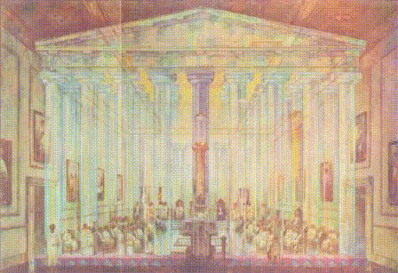

_Иллюстрация 0. Масонский Храм._

## Предисловие

Снова мне выпала привилегия представить миру еще один том серии о скрытой стороне вещей, написанный епископом Чарльзом У. Ледбитером. Будучи истинным масоном, он всегда стремится распространять Свет, который получил, чтобы прогнать тьму Хаоса. Поиск Света, видение Света, следование за Светом - таковы были обязанности, знакомые всем египетским масонам, хотя тьма в Древнем Египте никогда не достигала такой плотности, что окутывает Запад сегодня.

Эту книгу будут приветствовать все свободные масонами, которые почувствуют красоту своего древнего Обряда и пожелают привнести знания в свое стремление. Внутренняя история масонства пока отложена в сторону, а ученика надежно проводят через лабиринт, защищающий центральное Святилище от равнодушных и бездействующих искателей. То, что было темным, становится ясным; загадочные намеки изменяются на кристальную ясность; кажущиеся непреодолимыми стены растворяются; уверенность замещает сомнение; виды цели предстают в проломах облаков, и земные туманы исчезают под лучами восходящего солнца. Вместо фрагментов неполностью понятых традиций, приведенных в беспорядке и без истолкования, мы обнаруживаем в наших руках величественную науку и резервуар силы, которые мы можем использовать для возвышения мира. Мы больше не спрашиваем: “Что такое Великий Труд?" Мы видим, что это согласованное усилие выполнить накладенную на нас обязанность, как на обладателей Света, распространять этот Свет по всему миру и действительно стать сотрудниками T.G.A.O.T.U. в Его великом Плане развития наших Братьев.

Детальное объяснение церемоний глубоко интересно и познавательно, и я настоятельно рекомендую их всем истинным масонам. В связи с этой книгой наш В.·.·. И.·.·. Брат добавил к долгу благодарности, который мы уже ему обязаны, еще больше. Давайте будем честными должниками.

_Адьяр_

_АННИ БЕЗАНТ_

_25 декабря, 1925_

## Предисловие Автора

Масонское братство отличается от всех других обществ тем, что кандидаты на членство должны присоединяться к нему с завязанными глазами и не могут получить много информации об этом, пока не станут его членами. Даже тогда большинство масонов как правило получают только самую общую идею о значении его церемоний и редко проникают дальше элементарного морального интерпретации его основных символов. В этой книге я стремлюсь, соблюдая должное молчание по тем вопросам, которые должны оставаться тайной, объяснить глубинное значение и цель фримасонства, в надежде пробуждения среди Братьев более глубокого уважения к тому, что они оберегают, и более полного понимания тайн Ремесла.

Хотя книга в первую очередь предназначена для обучения членов Со-Масонского Ордена, чья стремление, как указано в их ритуале, вливать воды эзотерического знания в масонские сосуды, я надеюсь, что она найдет отклик в более широком круге и будет, возможно, полезна для некоторых из многих Братьев в мужском Ремесле, ищущих более глубокое толкование масонского символизма по сравнению с тем, что предлагается в большинстве их Лож, показываю им, что в ритуале, который они так хорошо знают и любят, заложены великолепные идеалы и глубокие духовные уроки, бесконечно интересные ученику внутренней стороны жизни.

Прежде чем достичь глубокого понимания, нам нужно хотя бы слегка ознакомиться с некоторыми фактами о мире, в котором мы живем - мире, только половину которого мы видим или понимаем. Да, это может звучать несколько несолидно, но мы во многом находимся в позиции гусеницы, которая питается лишь одним листом, и её восприятие практически не выходит за его пределы. Как же тяжело гусенице переступить его границы, открыть для себя более широкий взгляд на мир, осознать, что ее мир – это лишь лист среди миллионов других на огромном дереве, живущем своей жизнью и переживающем тысячи поколений, таких как она. А это дерево лишь одно среди множества в необозримом лесу, размеры которого непостижимы ей! Если бы одной гусенице удалось взглянуть на большой мир вокруг и попытаться объяснить это своим сородичам, как бы они её осмеивали, уговаривали не тратить времени на такие бессмысленные фантазии, и призывали бы к осознанию, что единственной целью в жизни является поиск плодородного места на сочном листе и попытка усвоить его как можно более полно!

Когда она превращается в бабочку, ее восприятие расширяется, и она начинает видеть красоту, величие и поэтику жизни, о которых раньше не имела ни малейшего представления. Это тот же мир, но теперь такой разный, просто потому что она видит его по-новому и движется по нему иначе. Каждая гусеница – потенциальная бабочка, и мы превосходим этих созданий, имея возможность предвидеть этап бабочки, благодаря чему мы можем узнать больше о нашем мире, приблизиться к истине, наслаждаться жизнью еще больше и сделать больше добра. Мы должны изучать скрытую сторону каждодневной жизни, потому что так мы сможем извлечь из нее больше пользы. Эта истина применима и к более возвышенным вещам, например, к религии. Религия всегда говорила человечеству о невидимых вещах вокруг нас, не только в далекой перспективе, но и прямо здесь, сейчас. Наша жизнь и то, что в наших силах из неё сделать, во многом определяется тем, насколько реальными для нас являются эти невидимые вещи. Всё, что мы делаем, должно быть просчитано с учетом невидимых последствию наших действий. Некоторые из нас знают, насколько полезными были такие знания на наших церковных службах, и в масонстве вещи обстоят точно так же.

Не смотря на то, что этот огромный внутренний мир невидим для большинства из нас, это совсем не означает, что он непостижим. Как я написал в "Наука Священнодействия":

В каждом человеке есть возможности души, которые, если их развить, позволят воспринимать этот внутренний мир, исследовать и изучать его точно так же, как человечество исследовало и изучало ту его часть, которая доступна каждому. Эти способности - наше общее наследие; они раскроются внутри каждого из нас по мере нашего эволюционного развития, но те, кто готов закатить рукава и усердно работать над собой, могут обрести их раньше остальных, так же как ученик-кузнец, который специализируется на развитии определенных мышц, может добиться (в этом отношении) большего развития, чем другие парни его возраста. Существуют люди, у которых эти способности отработаны, и которые, используя их, могут получить огромное количество очень интересной информации о мире, который для большинства из нас пока ещё невидим. … Нет ничего выдуманного или неестественного в этом способе восприятия. Это лишь расширение способностей, которые нам знакомы, и их развитие - это тренировка чувствительности к вибрациям, более высоким, чем те, на которые наши физические чувства обычно реагируют.* (*Там же, стр 9, 10.)

Именно с помощью этих вполне естественных, но сверхчеловеческих способностей была получена большая часть информации, которую вы найдете в этой книге. Любой человек, развивший такое восприятие и наблюдающий масонскую церемонию, будет видеть, что происходит гораздо больше, чем говорится в словах ритуала, как бы красивы и величественны они ни были. Конечно, я понимаю, что для тех, кто не изучал предмет сам, всё это может показаться нелепо нереальным. Я могу лишь утверждать, что это является четкой и определенной реальностью для меня и после многолетних тщательных исследований, продолжавшихся более сорока лет, я безусловно уверен в существовании и надежности данного метода исследования.

Это не новое открытие, ведь мудрецы древности уже знали о нем. Но, как и многие части древней мудрости, оно было забыто в темные века Раннего Средневековья и его ценность только постепенно вновь открывается. Поэтому для многих оно кажется непривычным и невероятным. Мы всего лишь должны помнить, насколько невозможными казались бы нашим прадедам радиотелеграф, телефон, аэроплан или даже автомобиль, чтобы понять, что мы были бы глупы, отвергая идею, о которой мы раньше никогда не слышали. Всего несколько лет назад способности к исследованию, которые предоставляют нам изобретение и развитие спектроскопии, были так же далеко от популярного мнения, как и дары ясновидения сейчас. Представление о том, что с его помощью мы можем оценить химическую конструкцию и измерить движения звезд, которые находятся на тысячи миллиардов миль от нас, вполне могло казаться ничем иным, как грезой. Может, нам предстоят и другие открытия?

Значимые ученые, такие как сэр Оливер Лодж, сэр Уильям Крукс, профессор Ломброзо, Камиль Фламмарион и недавно ушедший из жизни профессор Майерс, которые приложили усилия для исследования этого вопроса о внутреннем зрении, убедились в его существовании; поэтому, если среди  Братьев есть те, кто считает это утверждение смешным, я бы попросил их, несмотря на это, продолжать чтение и посмотреть, не предоставляет ли знание, полученное таким незнакомым для них способом, объяснение затемненным или непостижимым моментам нашего ритуала, которое убедит их разум и здравый смысл. То, что дает им лучшее понимание значений, лежащих в основе тайн нашего ремесла, и таким образом, усиливает их почтение и любовь к нему, не может быть недостойным или абсурдным. Любой студент, желающий узнать больше об этой увлекательной теме, может обратиться к маленькой книге под названием "Ясновидение", которую я написал несколько лет назад.

Я бы хотел сильно рекомендовать для чтения моим братьям две книги уважаемого брата У. Л. Уилмхерста - "Масонство и его значимость" и "Масонское посвящение"; я сам читал их с большим удовольствием и пользой, и собрал много драгоценностей со страниц этих книг.

[Примечание: Хотя этот абзац отсутствует в первом издании, во втором издании он отмечен как часть первого издания.]

Я желаю выразить свою теплую благодарность священнику Herbrand Williams, M.C., B.A., за его доброту, предоставив мне свои огромные знания о масонстве, и за многие нелегкие месяцы упорных и тщательных исследований; также благодарен священнику E. Warner и Mrs. M. R. St. John за тщательную работу над иллюстрациями, и профессору Ernest Wood за его неутомимую помощь и сотрудничество во всех отделах работы, без которого книга не могла бы быть написана.

_Ч. У. Л._

Второе издание

В этом втором издании сделаны незначительные корректировки, и добавлена некоторая дополнительная информация касательно некоторых более высоких ступеней.

_Ч. У. Л._

## СОДЕРЖАНИЕ

- Предисловие
- Авторское предисловие
- ГЛАВА I. ВВЕДЕНИЕ. Личный опыт. Египетские свидетельства. Сохранение ритуалов и символов. Египетский взгляд. Скрытая работа. Египетская Раса. Великие Ложи. Обычные Ложи. История масонства.
- ГЛАВА II. ЛОЖА. Форма и Расширение. Ориентация. Звездное Небо. Алтарь. Пьедесталы и Колонны. Ордера архитектуры. Значение Трех Колонн. Столбы Портика.
- ГЛАВА III. ОБОРУДОВАНИЕ ЛОЖИ. Украшения. Мозаичная Поверхность. Зубчатая Граница. Сияющая Звезда. Мебель. Подвижные Ювелирные Украшения. Неподвижные Ювелирные Украшения.
- ГЛАВА IV. ПРЕДВАРИТЕЛЬНЫЕ ЦЕРЕМОНИИ. Ритуал Ко-Масонства. Процессия. Фартук. Церемония Курения. Зажигание Свечей.
- ГЛАВА V. ОТКРЫТИЕ ЛОЖИ. Братья помогают. Закрытие Ложи. Э.А. S…n. Офицеры. Обязанности. Открытие. Э.А. K…s.
- ГЛАВА VI. ПОСВЯЩЕНИЕ. Кандидат. Части Церемонии. Подготовка Кандидата. Внутренняя Подготовка. Три Символических Путешествия. O…. Э…. I L…s. S… и P… Экзамен и Инвестирование. Рабочие Инструменты. Египетское Толкование Рабочих Инструментов. (Второе издание: Рабочие Инструменты и Их Египетское Толкование.
- ГЛАВА VII. ВТОРАЯ СТЕПЕНЬ. Вопросы. Подготовка. Внутренняя Подготовка. Открытие. Последняя Работа Э.А.'s. Пять Этапов. Пять Шагов. O. Рабочие Инструменты. Закрытие Ложи.
- ГЛАВА VIII. ТРЕТЬЯ СТЕПЕНЬ. Открытие Ложи. C…. Подготовка. Внутренняя Подготовка. Вхождение в Ложу. Семь Шагов. O…. Эфирные Силы. Хирам Абифф. Смерть и Воскресение. Звезда. Вознесение Человечества. Огонь, Солнце и Луна. Злодеи. Надпись. (Второе издание: Наш Мастер H. A. вместо Хирама Абиффа.)
- ГЛАВА IX. ВЫШИЕ СТЕПЕНИ. Масонская Плоскость. Церемония Инвестирования. Степень Марка. Священный Королевский Арка. Еще Выше. Роза Креста. Черное Масонство. Белое Масонство. Использование Сил. Наши Отношения с Ангелами.
- ГЛАВА X (ГЛАВА IX в Первом издании). ДВА НЕВЕРОЯТНЫХ РИТУАЛА. Работы в Египте. Форма храма Амен-Ра. Строительство храма Амен-Ра. Раскрытие Скрытого Света. Дары. Спуск Осириса. Прием Священнодействия. Воссоединение Осириса. Излучение Света. Клятва и Благословение. Церемония Святых Ангелов. Ложа и офицеры. Треугольник Адептов. Приход Ангелов. Возведение храма Ангелов. Церемония в храме. Действие Фестиваля.
- Глава XI - (Глава X в первом издании). Закрытие Ложи. Приветствия. Подготовка к закрытию. Закрытие.
- Иллюстрации
  - 0     Масонский храм (Цветной)
  - I.    Египетский фартук (Цветной)
  - II.   (a) Египетская инициация (b) Осирис на квадрате
  - III.  Схема Ложи
  - IV.   Три Колонны (a) Дорический стиль (b) Ионический стиль (c) Коринфский стиль
  - V.    Руины Греческого храма
  - VI.   Столп Пристройки
  - VII.  Чаша колонны
  - VIII. Стрела Ра (Цветная)
  - IX.   Чакры
  - X.    Второй Портал
  - XI.   Храм Ангелов (Цветной)

## Глава I. Введение

Личный опыт

Истоки масонства теряются во мгле веков. В прошлом столетии многие были уверены, что его корни восходят не далее, чем до средневековых гильдий оперативных масонов, хотя иные рассматривали эти гильдии как наследие римских коллегий. Разумеется, до сих пор найдутся люди, знакомые только с этой областью, но каждый изучающий древние мистерии и в то же время являющийся масоном, точно знает, что наше реальное философское происхождение именно в этом направлении; ведь наши церемонии и учения содержат так много, что могло быть непонятно простому оперативному масону, но при освещении всего этого светом знаний, полученных из Мистерий, видим, что это наполнено глубоким смыслом. Многие масонские писатели присваивают различные степени древности Крафту, некоторые связывают его основание с царем Соломоном, и один даже отважно заявляет, что его мудрость - это все, что осталось от того божественного знания, которое имел Адам до своего падения. Однако есть множество более подтвержденных доказательств, к которым я, случайно, могу добавить свое необычное личное воспоминание.

Посвятив несколько лет усилиям и много больше практике, я смог выработать определенные психические способности, упомянутые в предисловии, которые, среди прочего, позволяют мне вспоминать предыдущие жизни, через которые я прошел. Идея перерождения может быть новой для некоторых моих читателей.* (*Те, кто хочет узнать больше об этой увлекательной теме, должны прочесть "Реинкарнацию", В.·.·. Ills .·.·. Bro .·. A. Безант, и главу о Реинкарнации в моем Учебнике Теософии.) Я не собираюсь сейчас приводить аргументы в ее пользу, хотя они существуют в изобилии, но просто говорю, что для меня, как и для многих других, это факт личного опыта. Единственной из моих прошлых жизней, которая важна здесь, была жизнь, прожитая около четырех тысяч лет до нашей эры в стране, которую мы называем сегодня Египтом.

Когда меня посвящали в Масонство в этой жизни, мое первое знакомство с Ложей было большой и приятной неожиданностью, потому что я обнаружил, что я прекрасно знаком с ее принципами и они идентичны тем, которые я знал шесть тысяч лет назад в Мистериях Египта. Я вполне осознаю, как это высказывание может шокировать; все, что могу сказать, это то что это - абсолютная истина. Здесь невозможно ошибиться, и тут нельзя говорить о совпадении. Расположение трех главных офицеров необычно; символы значимы и уникальны, их комбинация представляет собою что-то особенное; все они относятся к древнему Египту, и я хорошо знал их там. Почти все церемонии остались неизменными; есть всего лишь пара небольших изменений. Отпечатанные шаги, поданные знаки - все они обладают символическим значением, которое я отчетливо помню.

Египетские Свидетельства

Собственным опытом убедившись в этих фактах, я отважился на сбор свидетельств этого рода из доступных мне физических источников. Результат оказался даже обильнее, чем я ожидал. Объяснение Первой Степени t … b … начинается с указания на то, что у обычаев и традиций среди свободных каменщиков всегда была близкая связь с обычаями и традициями древних египтян. Однако это объяснение не сопровождается иллюстрациями, подтверждающими эту схожесть. Найти их можно в книгах брата Черчварда "Знаки и символы первобытного человека" и "Тайны свободного каменщика", а также в "Тайных школах", автором которых является брат Джон Яркер, и в книге "Свободные каменщики и древние боги", написанной братом Дж. С. М. Уордом. С благодарностью привожу ниже сведения, извлеченные из этих трудов. Масоны различных степеней смогут найти в них особенности, которые напомнят им об их собственных церемониях.

Множество интересных иллюстраций было найдено на стенах, принадлежащих древнему Египту, и на виньетках различных папирусов, преимущественно из "Книги мертвых", которых существует множество версий. По этим источникам становится очевидно, что форма храма в Египте представляет собой двойной квадрат. В центре находятся три куба, стоящих один на другом и образующих алтарь* (См. Churchward, The Arcana of Freemasonry, p. 43). На алтаре расположены Томы Священного Закона - разумеется, не наши, ведь собственные Томы еще не были написаны. Эти кубы символизируют три Лица или Аспекты Троицы - Осириса, Исис и Гора, что видно из знаков на них (См. Fig. 1). Однако при копировании использовалась не египетская модель алтаря, а иллюстрация из книги г-на Evans о Крите. Однако впоследствии мы обнаружили только двойной куб.

У входа в храм было два столба, на которых изображены квадраты, символизирующие Землю и Небо* (См. Ibid., p. 44). На одном из них было имя, обозначающее "в силе", а имя второго обозначало "устаивать" или "установить" * (См. Ibid., p. 121). Считалось, что этот вход открыт в мир Аменти, верхний мир, где душа сливается с бессмертным духом, и там навсегда укрепляется; это представляет образ стабильности. У входа в Ложу всегда были два стражника, вооруженных ножами; внешний из которых был Наблюдателем, а внутренний - Герольдом* (См. Ibid., p. 47). От большей части своей одежды приходилось избавиться кандидату, который входил в храм с с… t… и h… w… Его спровождали к двери храма и спрашивали, кто он. Он отвечал, что он - Шу, "смиренный" или "коленопреклоненный", ищущий свет в условиях тьмы. Дверь была сделана из камня в форме равностороннего треугольника и поворачивалась на оси возле собственного центра.

Вступая в храм, кандидат ступал на квадрат; считалось, что в этот момент он покидает нижний четвертичный уровень или личность и развивает высшую тройку, Ego или душу. (Аналогичную идею в современной масонерии выражают в Первой Лекции, где говорится, что масон приходит в лоджию "чтобы научиться управлять и сдерживать свои страсти, а также продолжать движение по пути масонства"). Кандидата проводили по долгим коридорам, а также вокруг Ложи семь раз; после ответа на множество вопросов его в конце концов приводили к центру Ложи и спрашивали, чего он хочет. Ему говорили ответить: "Свет". Во время всех его перемещений он должен был начинать движение с левой ноги. Если кандидат нарушал свой O., в "Книге мертвых" было заявлено, что его глотка будет перерезана, а сердце вырвано. Еще одна степень упомянута в папирусе Неси-Amsu: сообщается, что тело разрезано на куски, сожжены до состояния пепла, а потом эти остатки развеяны по поверхности воды на четыре ветра неба.

В храме Хнуму на острове Elephantine, прямо у берегов Assouan, есть барельеф, показывающий две фигуры: одна - Фараона, другая - жреца в головном уборе ibis. Они стоят в позе, которая очень напоминает f … p … of f …, хотя и не совпадает с нашими современными традициями. (См. Plate II a.) Изображение предполагает инициацию, и дано слово "Maat-heru", что означает "истинный голос" или "тот, кому необходимо повиноваться" * (См. Churchward, The Arcana of Freemasonry, p. 49). Я также видел некое изображение, где четверо слуг приветствуют Фараона в позе p … s … of an I.M., и также заметил p … of s …, часто обнаруживающийся на памятниках и являющийся характерным для Horus. Тогда рубанок был сделан из камня и представлял собой модель двухголового топора.

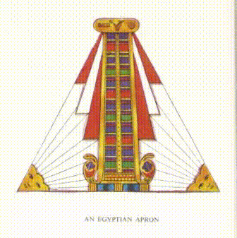

В прошлые времена фартуки изготавливались из кожи и имели треугольную форму. Фартук Первой Степени был чисто белым, как и сегодня; но фартук M.M. отличался яркой окраской и обилием драгоценных украшений, а также золотыми кистями. (См. Табл. I.) Наш t ... f ... i ... g ... представлен локтем длиной двадцать пять дюймов. Пылающая Звезда в центре Ложи была на месте, но её насчитывалось восемь концов, вместо шести или пяти. Она носила название "Звезда Рассвета" или "Утренняя Звезда" и символизировала Хоруса Воскресения, изображаемого с нею на голове и, по легенде, подарившего её своим последователям.

Масонский квадрат был широко известен и назывался нека. Его можно найти во многих храмах, и он присутствует в Великой пирамиде. Считается, что его использовали для точной обработки камней, и как символ регуляции поведения – что вновь напоминает современную интерпретацию. Строить по квадрату означало строить вечно, по учениям древнего Египта; а в египетском Зале Суда изображен Осирис, сидящий на квадрате во время суда над умершими. (См. Табл. II b.)

Таким образом, квадрат стал символизировать основу вечного закона.* (*Churchward, The Arcana of Freemasonry, p. 59.)

Египтяне использовали грубые и гладкие ашлары почти с тем же значением, что и масоны сегодня.* (*Ibid., p. 60.) Посох, увенчанный голубем, изображён не только в древнем Египте, но и на некоторых памятниках Центральной Америки, а тех, кто нес его, называли "дирижерами". Также курьезно, что потомки нилотских негров, давно мигрировших из Египта в Центральную Африку, принимая присягу в суде, до сих пор используют жест, который, если бы мне позволили его описать, определённо был бы узнан всеми членами Корпорации.

Ещё одной особенностью, которая мне бросилась в глаза при просмотре гравировок виньеток в Книге Мертвых, была h ... s ... F.C., изображённая в полной мере; показана группа людей, воздающих почести залезающему солнцу в данной позе.

Эта Книга Мертвых, как её критикуемо называют, является отдельной частью руководства, полностью предназначенного для путешествия по астральному плану, включая инструкции по поведению умершего и посвященного в низшие регионы Другого Мира. Главы, собранные из разных гробниц, не исчерпывают содержание всего произведения, а лишь его части, и даже эта часть значительно искажена. Мысль египтянина работала по чрезвычайно формалистическим и аккуратным дорожкам; он составил список каждого вида сущности, с которой мог бы столкнуться умерший, и тщательно расположил на них специальное заклинание или слово силы, которое он считал наиболее вероятным для победы над существом, если оно окажется враждебным, никогда похоже не осознавая, что это его собственная воля делает всю работу, но связывая свой успех с неким родом магии. Книга Мертвых изначально предназначалась для тайного хранения, хотя в последние дни некоторые главы были перепечатаны на папирусе и захоронены с мертвецом. Как сказано в одном из текстов: "Эта Книга - величайшая из тайн. Пусть никто не смотрит на неё - это было бы кощунством. Книга Мастера Секретного Дома - таково её название". (*W. Marsham Adams, The Book of the Master, п. 96.)

В древнем Египте признавали семь душ или жизненных сил, исходящих от Всевышнего. Изучающие восточную философию называют их первородными семью, и упоминаются они в Книге Дзян.* (*См. The Secret Doctrine, H. P. Blavatsky.) Шесть из них были предчеловеческими; седьмая представляла наше человечество, и воплотилась от девы Нейт. Символ, связанный с этим актом, это пеликан, который, согласно легенде, кормил своих потомков кровью из своей груди; это в последующем стало видным символом в философии розенкрейцеров, которая, по всей видимости, во многом основана на египетском учении. Мы можем увидеть в египетских иероглифах упоминание "Одного и Четырех", что указывает на Хоруса и его четырёх братьев. Об этом также упомянуто в Станцах Дзян; и другое общее выражение для обоих наименований - "Тот, кто из Яйца". В Египте яйцо было символом заходящего солнца, которое часто видят в этой форме при соприкосновении с горизонтом. Это яйцо перемещается в мир скрытый, и там оно выведено из яйца, и из него на следующее утро выходит молодое солнце, восходя в своей силе, и данное явление называют "пламя, рожденное пламенем". Вся эта символика имела глубокое мистическое значение, которое разъяснялось в Тайнах.

Когда Осирис скончался, Изида и Нефтис взялись за его возрождение по очереди, однако попытка оказалась неудачной; затем попытался Анубис и его попытка удалась, и Осирис вернулся в мир со секретами Аменти - это громкое утверждение, подразумевающее, что секреты, которыми мы обладаем, тесно связаны с подземельем и жизнью после смерти.

Вот некоторые из самых удивительных свидетельств, которые мне удалось собрать; некоторые из них, возможно, не пригодны для публикации. Я чувствую что, наверное, их много больше и можно найти еще, но и эти, если взять их вместе, делают любую теорию совпадения невозможной. Нет сомнения в том, что та организация, честь принадлежать к которой мы имеем сегодня, является той же организацией, которую я знал шесть тысяч лет назад, и она действительно может быть проследована до более далекой древности. Брат Чёрчвард утверждает, что некоторые из знаков датируются шести стами тысячами лет; это вполне может быть правдой, потому что мир очень стар, и, безусловно, у масонства есть один из самых древних ритуалов, существующих на сегодняшний день. Мы, конечно, не должны забывать, что простое присутствие одного из наших символов не обязательно подразумевает существование Ложи, но, по крайней мере, это показывает что, даже так давно, люди думали почти в тех же направлениях и пытались выразить свои мысли на том же символическом языке, который мы используем сегодня.

Сохранение Ритуалов и Символов

То факт, что ритуалы и символы сохранились для нас с удивительно малым числом изменений, определённо удивляет; это было бы непостижимо, если бы не тот факт, что Великие Силы стоящие за эволюцией проявили интерес к этому вопросу и постепенно возвращали людей на истинное путь, когда они от него отклонялись. Данный вопрос всегда находится в руках Чохана Седьмого Луча, так как именно этот Луч наиболее тесно связан с ритуалами всех видов, и его Глава всегда был величайшим иерофантом тайн древнего Египта. Современный владелец этого звания - это Мастер Мудрости, о котором мы часто говорим как о графе Св. Жермен, поскольку именно в такой роли Он появился в веке восемнадцатом. Его иногда также называют Принцем Ракоци, как последнего из королевской династии. Точное время, когда Он был назначен главой Церемониального Луча, мне неизвестно, но я знаю, что Он проявил большой интерес к масонству как минимум с третьего столетия нашей эры.

Мы встречаем Его в этот период как Албануса, человека из знатной римской семьи, родившегося в городе Верулам в Англии. В молодости он поехал в Рим, присоединился к армии и достиг значительных успехов. Он служил в Риме по крайней мере семь лет, а возможно и больше. Именно там он был инициирован в масонство и стал знатоком Митраических Мистерий, которые были тесно связаны с масонством.

После периода проживания в Риме он вернулся в родной город Верулам в Англии и стал губернатором крепости. Он также был "Мастером дел", в каком бы смысле это ни подразумевалось; он, безусловно, наблюдал за ремонтом и общими работами в крепости Верулам и одновременно был Императорским казначеем. Согласно истории, рабочие были обращены в рабство и получали мизерную зарплату, но Святой Албан (как его позже стали называть) ввел масонство и все изменил, обеспечив более высокие заработные платы и в целом значительно улучшил их условия. Многие наши братья, возможно, слышали о рукописи Уотсона 1687 года. В ней многое рассказывается о работе Святого Альбана для ремесла, и особенно упоминается, что он привёз из Франции некоторые древние обвинения, которые почти идентичны сегодняшним. Его казнили при преследованиях императора Диоклетиана в 303 году, и через пятьсот лет над его останками была построена великая аббатия Святого Альбана.

В 411 году в Константинополе он пришел в этот мир, получив имя Прокл - имя, которое в последствии он прославил. Он был одним из последних грандиозных представителей неоплатонизма, и его влияние в значительной мере оказалось больше, чем влияние средневековой Христианской церкви. После этого в его цепи реинкарнаций образовался разрыв, о котором мы пока что не знаем ничего. В 1211 году он снова родился, и в той жизни он был Роджером Бейконом, францисканским монахом, реформатором теологии и науки своего времени. В 1375 году он родился как Кристиан Розенкройц. Эта реинкарнация была весьма важна, ведь в ней он основал тайное общество Розенкрейцеров. Похоже, что примерно через пятьдесят лет, или немного больше, он воспользовался телом Хуньяди Яноша, выдающегося венгерского военачальника и лидера. Нам также известно, что примерно в 1500 году он прошел жизнь монаха по имени Робертус где-то в Центральной Европе. Мы практически ничего не знаем о том, что он сделал в этой жизни и каким образом он себя проявил.

Затем следует одна из его самых значимых жизней: в 1561 году он родился как Фрэнсис Бейкон. Об этом великом человеке история передает нам мало истинной информации и много ложной. Настоящие факты его жизни постепенно начинают раскрываться, в основном благодаря тайной истории, зашифрованной в его произведениях. Эта история представляет огромный интерес, но здесь она нас не касается. Краткий обзор можно найти в моей книге "Невидимая сторона христианских праздников", из которой я и черпаю этот материал.* (*См. там же, стр. 303.)

Спустя век он, по сообщениям, родился как Иозеф Ракоци, князь Трансильвании. Его упоминание мы видим в энциклопедиях, но информацию о нем представлено немного. После этого его путй окружен значительной тайной. Кажется, он путешествовал по всей Европе и время от времени появлялся, но у нас есть мало определенных сведений о нем. Он был графом Сен-Жерменом во время Французской революции и много работал с Мадам Блаватской, которая в тот период была воплощена под именем Пер Жозеф. По-видимому, он также скрывался под псевдонимом барона Хомпеша, последнего из Рыцарей Святого Иоанна Мальтийского, человека, организовавшего передачу острова Мальта англичанам.

В Смешанном Масонстве мы называем его Главой всех Истинных Масонов со всего мира (сокращенно H.O.A.T.F.), и его портрет располагают на востоке, над креслом R.W.M., и неподалеку от Звезды Посвящения в некоторых из наших Лож. Другие его портрет расположили на севере, над пустым стулом. От его признания и согласия как Главы Седьмого Луча зависит законность всех обрядов и ступеней. В Масонском Ордене он часто выбирает своих учеников и готовит тех, кто достаточно подготовился на нижних уровнях Масонства, к истинным мистериям Великого Белого Ложа, к которым ведут наши масонские инициации, хоть и слабые отражения, ведь Масонство всегда было одним из путей к Белому Ложу. Сегодня немногие Масоны признают его своим Суверенным Великим Мастером, однако возможность такого ученичества всегда признавалась в традициях Ордена. В древнем катехизме мужского Масонства говорится:

В. Откуда пришли вы, будучи Масоном?

О. От W … t.

В. Куда направляетесь?

О. К E … t.

В. Что побуждает вас оставить W … t и идти к E … t?

О. Чтобы искать Мастера и от него получить наставления.

К счастью, наши предки осознавали важность передачи знаний без изменений. Некоторые моменты утеряны за этот огромный промежуток времени; некоторые другие немного изменены; но таких примеров удивительно мало. Обвинения увеличились, и те, кто не занимает официальных позиций,теперь участвуют в меньшей степени, чем раньше - в давние времена они постоянно произносили короткие поучения или хвалебные формулы, и каждый из них чувствовал, что занимает определенное место в крупной машине.

Из этих знаний следует несколько заключений. Поразительно, что масонские церемонии, которые долгое время считались противоположностью принятой в стране религии, на самом деле являются частью великой древней религии. Как и любое произведение этих древних и сложных систем, эти ритуалы полны смысла, или скорее, забиты смыслами; в Египте мы приписывали им четырехкратное значение. Так как каждая деталь имеет свой смысл, очевидно, что ничто не должно меняться без крайней осторожности, и только тогда, когда условия этого изменения известны тому, кто их изменяет, чтобы не испортить символы всего целого.

Египетская Перспектива

Чрезвычайно трудно объяснить читателям двадцатого века всю значимость этого произведения для нас в солнечной стране Хем; однако я постараюсь описать четыре уровня его толкования, которые нам преподавали во время моего пребывания там.

Сначала мы понимали, что текст символически представляет нам способ, которым Великий Архитектор построил вселенную. Движения и План Ложи вмещают в себя некоторые ключевые принципы, на которых была основана вселенная. Вихревое движение во время окадивания, поднимание и опускание колонн, крест, якорь и чаша на лестнице эволюции – все это и многие другие элементы мы называем таковыми. Разные степени позволяли проникать все глубже в знание Его методов и принципов. Мы убеждены, что Он работал не только в прошлом, но и продолжает работать сейчас, и что Его вселенная - это активное проявление. В те времена, книги играли гораздо меньшую роль в нашей жизни, чем сейчас, и мы верили, что важные знания лучше усваиваются через соответствующие действия, чем просто чтение из книги. Таким образом, наши неизменные действия сохраняют воспоминания о некоторых фактах и законах природы.

И именно поэтому, ведь законы Вселенной универсальны и действуют как здесь, так и в других мирах, мы считаем, что Великий Архитектор ожидает от нас жизни, которая будет в соответствии с созданными им законами. Квадрат используется в прямом смысле относительно камней и зданий, но и метафорически касательно жизни человека; человек должен организовать свою жизнь в соответствии с этими понятиями. Следовательно, требуются строжайшая честность и высокий уровень чистоты в физическом, эмоциональном и умственном смысле. Ожидается идеальная прямота и справедливость, но также и любовь и доброта, и во всех отношениях "делайте другим то, что хотели бы, чтобы они делали вам". Таким образом, масонство действительно "система морали, декодируемая через аллегорию и иллюстрированная символами," но это система, основанная не на догме "Так говорит Господь," а на подлинных фактах и законах природы, которые не могут быть оспорены.

Эта работа является подготовкой к смерти и тому, что следует за ней. Столпы В. и Л. предположительно находятся у входа в другой мир, а различные испытания, через которые проходит кандидат, символизируют то, что ждет его после перехода из этого физического мира на следующий уровень. Из масонских церемоний можно извлечь много информации о жизни после смерти, и путем постоянной практики эти миры становятся нам знакомы; так что когда мы пройдем за границу могилы, уже не в символической смерти, нам будет знакомо все, что мы так долго воплощали в Ложе. И прежде всего подчеркивается, что те же законы равно действуют и по ту и по эту сторону могилы, что в обоих случаях мы находимся перед Богом, и там, где призывается Его святое Имя, нет места страху.

Самое трудное - это объяснить четвертое намерение. Чтобы вы смогли понять его, я должен попытаться вернуть вас, если возможно, в атмосферу древнего Египта и показать отношение, которое там исповедовали религиозные люди. Я не знаю, возможно ли в современных условиях воссоздать эту атмосферу, настолько она кардинально отличается от сегодняшней.

Религия, которая наиболее знакома нам сегодня, живет под знаком глубочайшего индивидуализма. Для большинства христиан главной целью действительно становится спасение собственной души. Это и задача главная, которой обучают нас. Можете ли вы представить религию, которая в каждом своем аспекте не менее искренна, страстна и жива, но при этом лишена такого представления? Религию, для которой этот принцип абсолютно непостижим? Представьте на мгновение состояние души, где нет страха перед чем-либо, за исключением зла и возможности его затормозить свое развитие. Преставьте ситуацию, где люди с полной уверенностью ожидают своего продвижения после смерти, потому что они знают всё о нем; где их единственное желание - это не спасение, а продвижение в эволюции, потому что такое продвижение приносит им больше мощи для выполнения своей скрытой работы, которую от них ожидает Бог.

Я не утверждаю, что каждый в древнем Египте был альтруистом, точно также, как не все жители современной Англии являются таковыми. Но я говорю, что страна была пропитана радостью и беззаботностью в отношении своих религиозных идей, и что каждый, кто мог хоть как-то быть охарактеризован как религиозный человек, был занят не своим личным спасением, а желанием стать полезным инструментом в руках Божественной Силы.

Внешняя религия древнего Египта - официальная религия, в которой участвовали все от царя до раба - была одной из самых прекрасных, которые когда-либо были известны человеку. Величественные процессии, двигавшиеся по проспектам, протяженностью в мили, среди невероятно огромных колонн, считающихся человеческим творением; красивые лодки, украшенные радужными цветами, с гордостью плывущие по Нилу; музыка, то торжествующая, то печальная, но всегда захватывающая - как я могу описать эту безупречность, которой нет параллелей в наши скромные современные времена? Обычная одежда всех классов в Египте была белого цвета; но в отличие от нее, их религиозные процессии были массой пышных, ярких цветов. Священники носили одежды из красного и горячего синего, предположительно изображающие синеву неба, и многие другие яркие цвета. Жизнь древнего Египта, как и современного, вращалась вокруг реки Нил, медленно текущей и монолитной, и радужно украшенные баржи использовались в транзитных целях и для празднования религиозных торжеств.На этих баржах священники размещались в определенные символические фигуры, вставали или садились, и все надевали цвета, соответствующие конкретному аспекту Божества, которое они символизировали.

На этих баржах на алтарях, украшенными цветами и драгоценной вышивкой, порой возвышающимися на десятки футов в высь, проводились торжественные жертвоприношения богам. Но также на них ставились живые картинки или сцены, символически связаны с тем праздником, который в тот момент отмечался. Таким образом, было представлено судилище умерших, где с сердцем человека взвешивал его Анубис, противоставляя перо Маат. Роли Анубиса и Тота играли священники, которые надевали соответствующие маски. Я также помню столь же жуткое представление разделении Осириса, где его тело разрезают на куски и затем собирают снова - не тело реального человека, конечно, но все же выполнено очень впечатляюще. Эти прекрасные процессии двигались вниз по реке, между толпами поклонников, благословляя богами тех, кто проходил мимо, и вызывая грандиозный энтузиазм и преданность у людей.

Древних египтян часто обвиняли в политеизме, но на самом деле они были не больше виноваты в этом, чем индусы. Все знали и поклонялись одному Богу, Амон-Ра, "Один, которому нет равного", центром проявления которого на физической плоскости является солнце; но они поклонялись Ему в различных его проявлениях и через различные каналы. В одном из гимнов, написанных Ему, прозвучали следующие слова:

"Боги преклоняются перед Тобой, они приветствуют Тебя, о ты, Единая Темная Правда, Сердце Тишины, Скрытая Загадка, Внутренний Бог, пребывающий во святилище, ты, источник всех существ, ты, Единый. Мы поклоняемся душам, которые из тебя происходят, которые делят твое Бытие, которые ты и есть. О ты, который скрываешься и в то же время присутствуешь везде, мы почитаем тебя, приветствуя каждую душу Бога, которая происходит от тебя и пребывает в нас."

"Боги" не считали себя равными Богу, но, скорее, были с ним едиными на различных уровнях духовного развития, и поэтому были каналами Его бесконечной силы для человечества.

Культ богов на самом деле немного отличался от культа ангелов и святых в Католической Церкви. Так как христиане видят в Святом Михаиле и Нашей Леди реальные личности и празднуют в их честь фестивали, так и в древнем Египте преподносили поклонение Исиде, Осирису и другим божествам. В конечном итоге, эти величественные имена означали Аспекты Божественности, Амен-Ра, потому что Троица в Египте представляла собой Отца, Мать, Сына - Осириса, Исиду и Хоруса вместо христианского представления Об Отце, Сыне и Святом Духе. Но на божественном уровне под ними были тогда, как и сейчас, великие Существа, в которых воплощалась Идея, и которые действовали как представители и каналы трехкратной силы и благодати Бога. Более того, у этих различных путей есть свои иерархии ангелов, как и у ангелов следующих за руководством Святого Михаила и Нашей Леди - каждый из которых является каналом и представителем своего Ордена в соответствии со своим уровнем развития. Празднование ритуала Исиды, например, всегда привлекало ее внимание и вселяло присутствие Ангелов ее Ордена, которые действовали как каналы божественного благословения в этом удивительном аспекте Скрытой Истины, которую она представляла.

Скрытый Йорк

Без сомнения, по-настоящему религиозный человек принимал участие во всей той внешней помпе, о которой я говорил; но что он ценил выше всего этого удивительного великолепия, это его членство в одной из Ложей Посвященных Мистерий - Ложе, которое с набожным энтузиазмом посвящает себя скрытой работе, которая была основной деятельностью этой благородной религии. Этой скрытой стороной египетского культа, а не его внешними славами, является реликвия свободного каменщика, и сохраненный в нем ритуал является частью тех Мистерий. Чтобы объяснить, что такое эта скрытая работа, давайте проведем параллель с более современным методом достижения немного похожего результата.

Христианский план распространения божественной силы или благодати в основном через празднование Святого Евхариста, который наши Римские братья обычно называют Мессой. Мы не должны думать о той благодати как о некоем поэтическом выражении, или как о нечто смутном и туманном; мы имеем дело с силой такой же определенной, как электричество - духовной силой, которая распространяется над людьми определенными способами, оставляет свое воздействие за собой и требует своих средств передачи, так же как электричество требует своего соответствующего оборудования.

При помощи ясновидения возможно наблюдать за действием этой силы, увидеть, как служение Евхаристии создает образ мысли, через который эта сила распределяется священником с помощью Ангела, вызванного для этой цели. Благодаря тщательной организации, поведение священника, его знания - даже его характер - не мешают должному эффекту Святочества.* (*См. No. 26 из 39 статей Церкви Англии в Книге Обычного Молитвенника.) В любом случае, есть непреложный минимум, который передается. Пока он выполняет предписанные обряды, результат достигается.* (*См. Каноны и декреты Трентского собора, написанные T. Waterworth, p. 55 (Сессия VII, Канон xii)) Если он также является благочестивым человеком, те, кто получают у него Сакрамент, получают дополнительное преимущество в виде участия в его любви и преданности, но это никоим образом не влияет на значение самого Сакрамента; какие бы ни были его промахи, божественная сила изливается на людей.

Старая египетская религия имела ту же идею - изливать духовную силу на всех своих людей, но ее метод был совершенно иным. Христианские чудеса может выполнить только священник, они могут быть сделаны даже механически; но разумное участие мирян значительно увеличивает его силу и количество силы, которое можно изливать. В то время как египетский план требовал искреннего и разумного сотрудничества большого числа людей. Это значительно усложняло идеальное выполнение, но когда оно было полностью выполнено, оно становилось намного более мощным и охватывало гораздо большую территорию. Христианская схема требует огромное количество церквей по всей стране; египетский план требовал только действия нескольких Больших Ложей, установленных в главных городах, чтобы залить все королевство Скрытым Светом - работа обычных Ложей видится как второстепенная по сравнению с этими, и скорее как тренировочный полигон для членства в Больших Ложах.

Центральная доктрина религии древних египтян заключалась в том, что божественная сила находится в каждом человеке, даже в самом низшем и наиболее униженном, и они называли эту силу "Скрытым Светом". Они утверждали, что через этот Свет, который присутствует во всех, можно всегда достичь и помочь людям, и что их обязательство - найти этот Свет в каждом, как бы безнадежным он не казался, и укрепить его. Даже девиз Фараона гласил: "Ищите Свет", подразумевая, что его высшая обязанность как Короля - искать этот Скрытый Свет в каждом человеке вокруг него и стремиться привести его к полному проявлению.

Египтяне верили, что божественная искра, обитающая в каждом человеке, наиболее эффективно разжигается, если трансмутировать и спустить в три нижних мира огромную духовную силу, которая представляет собой жизнь высших плоскостей, а затем распространять ее по всей стране, как это было описано. Узнав, что духовная сила является лишь другим проявлением многообразной силы Бога, они также присвоили ей имя Скрытого Света; и из-за этого двойного использования термина возникала путаница. Они полностью признавали, что такое излияние божественной благодати может быть вызвано только верховными усилиями их самой преданности; и приложение таких усилий, вместе с созданием подходящих механизмов для распространения силы, когда она приходит, было важной частью тайной работы, к которой самые благородные египтяне затрачивали много времени и сил; и это была четвертая из задач, задуманных для выполнения священными и тайными ритуалами, сохранение которых мы наблюдаем в масонстве.

Египетская Раса

Египетская раса того периода, о котором я говорю, была смешанной крови, преобладали арийцы. Наши исследования показывают, что около 13,500 г. до н. э. группа людей из высших кругов великой Южно-Индийской империи, которая существовала в то время, отправилась в Египет через Цейлон, по указанию Ману. Тогдашней правящей расой в Египте была ветвь того, что в Теософских книгах называется подрасой толтеков - ветвь, вероятно, та самая, что и раса Кро-Маньон, обитавшая в Европе и Африке около 25,000 г. до н. э. В "Древних типах человека" Сэр Артур Кейт высказывает мнение, что эта раса была одной из наиболее выдающихся физически и умственно, что мир когда-либо видел. Брока отметил, что мозговое содержимое черепа женщины расы Кро-Маньон превосходит мозговое содержимое среднего современного мужчины. Средний рост мужчин этой расы составлял шесть футов полтора дюйма; плечи были удивительно широкими, а руки короткими по сравнению с ногами; нос был тонким, но выпуклым, щеки высокими, а подбородок массивным.

По совпадению, Король или Фараон, правивший в те времена, когда прибыла экспедиция из Южной Индии, имел дочь, но не имел сына - его жена умерла при родах. Новоприбывших приветливо встретили как Король, так и Верховный Жрец, и вступление в брак с пришельцами стало элитной привилегией в египетских семьях, тем более что Король одобрил брак своей дочери с лидером экспедиции, который был принцем Индии.

Через несколько поколений арийская кровь проникла во всю египетскую знать, и это привело к такому типу, хорошо известному по памятникам, который объединил в себе арийские черты лица и толтекский цвет кожи. Спустя много веков, однажды правитель, под влиянием иностранной принцессы, которую он женился, отказался от арийских традиций и принял более низменные формы поклонения; но клан тесно объединился, и, заключая браки исключительно внутри своей группы, сохранил старые обычаи и религию, а также чистоту расы. Почти через четыре тысячи лет после прибытия индийцев в Египте появились пророки, предсказывающие большой потоп. Все члены клана взяли корабль через Красное море и нашли убежище в горах Аравии.

В 9564 г. до н. э. пророчество сбылось; остров Посейдонис ушёл под воду Атлантического океана в потопе, упомянутом в Тимее Платона; в то же время земля поднялась, образовав Сахарскую пустыню, где ранее было мелкое море, и гигантская волна потопа пронеслась по Египту, уничтожив почти все население. Даже когда всё успокоилось, страна стала дикой, и с запада теперь граничила не с мирным морем, а с обширным соленым болотом, которое со временем превратилось в неприветливую пустыню. Одними из немногих величественных памятников, оставшихся от Египта, были пирамиды, мрачно возвышаясь в изолированном одиночестве - такая ситуация продолжалась пятнадцать веков, пока клан не вернулся из своего горного убежища, разросшись в большую нацию.

Но давным-давно полудикие племена осмелились вступить в эту страну, сражаясь в первобытных битвах на берегах могучей реки, которая некогда была дорогой для кораблей великой цивилизации. Она ещё предстояла стать местом возрождения этих древних слав и зеркалом для величественных храмов Осириса и Амен-Ра. Первыми среди нескольких рас, что пришли в эту страну, были негроиды из Центральной Африки; они уже были вытеснены различными другими расами до того, как арио-египтяне вернулись из Аравии, основали поселение возле Абидоса и постепенно стали вновь доминирующей силой, используя мирные методы. Спустя две тысячи четыреста лет позже Ману (под именем Менес) воплотился, объединил всю Египет под одной властью и одновременно основал первую династию и свой великий город Мемфис. Эта империя уже более полутора тысячелетий процветала до правления Рамсеса Великого, который сам был Мастером одной из основных Ложей в то время, когда мне посчастливилось к ней принадлежать.

Великие Ложи

Во время моего проживания в Египте управление страной осуществлялось изнутри организации Тайн. Египет был разделен на сорок два нома или округа, и номарх, или правитель каждого округа, был Мастером главной Ложи нома. Существовала Великая Ложа - не путать с тремя Великими Ложами Амена, о которых подробно рассказано позже - которая состояла из всех номархов и фараона, который был Великим Мастером. Великую Ложу созвали в Мемфисе, и она использовала ритуалы, отличные от тех, что применялись на нижних уровнях. Фараон обращался со своими указами к этому собранию; хотя его власть в стране была почти неограниченной, перед принятием любого серьезного решения он всегда консультировался со своими номархами - на основании их решений, они были действительно способными людьми. Мелкие вопросы решались исполнительным комитетом этой Ложи под руководством фараона; однако важные меры всегда обсуждались на уровне Великой Ложи. Таким образом, Тайны вступили в политическую так же, как и в религиозную жизнь в древние времена, делая политику менее эгоистичной.

В те времена в Египте было три Великие Ложи Амена, каждая из которых строго ограничивалась сорока членами, каждый из которых был необходимой частью системы. Включая офицеров, ответственных за чтение Офиса и магнитизацию Ложи, каждый член представлял конкретное качество. Один был известен как Рыцарь Любви, другой - как Рыцарь Истины, следующий - как Рыцарь Упорства, и так далее; каждый должен был специализироваться на мышлении и выражении своего качества. Подразумевалось, что таким образом, через Ложу в целом, сорок качеств образует характер идеального человека, некого небесного человека, через которого может пролиться сила на всю страну.

Эти три Великих Ложи проводили три разных виды масонства, из которых только один дошел до нас в XX веке. Мастер первой Великой Ложи представлял мудрость, а его вардены - силу и красоту, как и в наших современных Ложах. Преобладающей силой была этот вид мудрости, которая есть совершенная любовь - качество, которое действительно больше всего нужно миру в настоящее время. Мастер второй Великой Ложи представлял силу, а его вардены - мудрость и красоту; сила Первого Аспекта Троицы была преобладающим качеством Ложи. Мастер третьей Великой Ложи символизировал красоту, мудрость и силу ставились ниже этого третьего аспекта Скрытого Света.

Поскольку каждому присутствующему необходимо было играть свою роль в создании формы, точное сотрудничество и полная гармония были абсолютно необходимы, и только те, кто мог полностью отдать себя Великому Делу, выбирались из обычных Лож, чтобы стать членами этих трех Великих Лож, влияние которых было так велико, что оно охватывало всю страну. Наименьший недостаток в характере одного из сорока членов мог серьезно ослабить форму, через которую все работу проводили. Возможно, это реликвия этой величайшей необходимости диктует наше современное правило, что никакие Братья, которые не в полной гармонии друг с другом, не должны надевать свои фартуки, пока они не уладят свои разногласия. В древнем Египте между членами Ложи существовало такое глубокое братское чувство, которого мы сегодня, возможно, редко достигаем; они чувствовали себя связанными самыми священными узами, не только как части одной и той же машины, но и как те, кто работает наряду с самим Богом.

Ритуал, проводимый Великими ложами, известен как "Строительство Храма Амена"; перевод его аутентичного текста будет представлен в другой части книги. Это, несомненно, было одно из самых величественных и сильных священнодействий, известных человеку. Оно отпраздновано было тысячи лет, в то время как Египет был могущественной державой, однако пришло время, когда наиболее продвинутое эго начало искать воплощение в новых нациях, чтобы в них, так же как в разных классах школы мира, они могли постигать новые уроки. Затем этот участок Египетских Мистерий зашел на задний план, пока египетская цивилизация стала вырождаться и формализоваться, став театром действий для менее развитых людей.

Обычные Ложи

По всей стране также было раскиданно множество других лож, которые больше напоминали современные. Их задачи были гораздо разнообразнее, чем у трех Главных лож, и они собирались чаще, поскольку на них возлагалась обязанность готовить своих членов к высшим познаниям и давать им общее образование. Их целью было то же, что и у Мистерий везде - предложить четкую систему культуры и образования для взрослых, что не делается сегодня в большом масштабе и публично, когда распространено убеждение, что образование заканчивается школой или университетом. Мистерии были великими общественными учреждениями, центрами национальной и религиозной жизни, куда лучшие слои общества приходили тысячами, и они работали хорошо, потому что тот, кто прошел через их степени - процесс длиной в много лет - становился тем, что мы называем сегодня высокообразованным и культурным человеком, с ярким пониманием будущего после смерти, места человека в схеме вещей и поэтому того, что действительно стоит делать и за чем стоит жить.

Даже в этих обычных ложах каждый член принимал участие в работе, и труд тех, кто стоял в колоннах, считался более тяжелым, чем труд офицеров. Хотя у последних были специальные физические действия, которые они должны были выполнять с большой точностью, перые должны были использовать свою мысль все время. Все они должны были объединиться в определенных моментах ритуала, отсылая потоки мыслей больше похожие на силу воли, чем на медитацию, целью всего усилия было построить над и вокруг ложи великолепую и сияющую мыслительную форму идеальных пропорций, специально созданную для приема и передачи божественной силы наиболее эффективным образом, которую они призывали своим актом служения. Если мысль какого-либо члена была неэффективной, то мощная храмоподобная мыслительная форма соответствующим образом имела дефект в одной части; но мастер ложи обычно был ясновидящим священником или священницей, которые могли увидеть, где находится дефект, и поэтому он мог строго следить за своей ложой. Таким образом, эти ложи также участвовали в той же великой работе по распределению силы, хотя и в меньшем масштабе, чем три главные ложи, которым было специально поручено это задание.

Без такой цели наше значительное масонское стремление кажется непостижимым. У нас в почти всех масонских ложах есть красивая начальная церемония, полная глубокого символического значение, и по смыслу она величественно эффективная формула, призывающая на помощь различные сущности и подготавливающая почву для исполнения весьма определенной услуги человечеству. Тем не менее, как только мы открываем нашу ложу и делаем все эти подготовки, мы тут же приступаем к завершению, если у нас нет кандидата на инициацию или повышение, или лекции для наших людей. Несомненно, такая великолепная подготовка должна завершиться чем-то определенным, настоящей работой в пользу человечества.

В древнем Египте проводилась эта великолепная работа, к которой вели все подготовительные действия. Наша истинная цель должна быть такой же. Мы собираемся и проводим определенные церемонии, которые называем работой - название, которое абсолютно не подходит простым церемониям, сколь бы значимыми они ни были. Но если мы создаем великолепную и красивую форму как канал для божественной энергии, через которую можно помочь миру, то мы определенно работаем, собираем, концентрируем и накапливаем великие сверхчеловеческие силы, затем, с заключительным благословением, изливаем все это в мир. Без этого все предварительные шаги, как сказано в ко-масонском мистическом обязательстве, "как массивные двери, никуда не ведущие".

Нет причин, почему мы сегодня не можем придавать столько же значения нашему ритуалу, сколько это делали древние египтяне. Все препятствия, которые могут возникнуть на пути, находятся не в внешнем мире, а в недостаточном понимании Брат. серьёзности работы, которую они взяли на себя, или в нежелании достигнуть такого уровня бескорыстия, который требуется для регулярного посещения в интересах всего человечества. В Египте никто не беспокоил Брат. Секретаря со своими отговорками; Брат. считали своё членство наивысшим привилегией и благословением своей жизни, и всегда были в Ложе в установленное время, если только не были слишком больны, чтобы двигаться. Давайте надеяться, что у масонства будет будущее, достойное его прошлого, и что скоро такие Ложи, какие были в Египте, будут работать в разных уголках мира.

Существуют различные направления, по которым воспоминание о том, как работа была выполнена в древнем Египте, может быть нам полезно, потому что эти люди проводили свои обряды, полностью осознавая их смысл. Таким образом, те аспекты, на которые они уделяли большое внимание, скорее всего будут важны и для нас.

Глубокое почтение было их ключевой чертой. Они прониклись своим храмом так же, как самые преданные христиане – своей церковью, только их отношение было определено научным знанием, а не чувствами. Они понимали, что храм сильно магнитизирован, и что для сохранения полной силы этого магнетизации требовался большой уход. Говорить о обычных вещах в храме считалось бы святотатством, так как это означало бы ввод нарушающего влияния. Все подготовительные действия, включая облачение в одежды, проводились всегда в антрисоли, после чего Брат. входили в Ложу в процессии, поющие, как делают сейчас Ко-масоны.

История Масонства

Тайное учение Египта было строго охраняемо, и получить его могли лишь под специальными условиями и с большими трудностями люди, не рожденные в Египте. Тем не менее, оно было передано различным замечательным иностранцам, включая Моисея, о котором в библейской истории сказано, что он "научился всей мудрости египтян". Он передал свои знания еврейскому священнику, и таким образом они жили в большей или меньшей степени полноты до времени Давида и Соломона.

Когда Соломон строил свой храм, он основал его на масонских принципах и сделал его центром масонской символики и работы. Он несомненно намеревался своим храмом продемонстрировать и сохранить для своего народа определенный набор измерений, подобно тому, как великий множество астрономических и геодезических данных были зафиксированы в размерах великой пирамиды.* (*См. главу II, Пиллары.) Ему не удалось, потому что часть традиции была потеряна. Или, вероятно, было бы вернее сказать, что хотя внешний обряд и даже традиционное украшение были достаточно хорошо сохранены, ключ к пониманию всего этого уже не был известен. До этого времени посвященные в еврейские Мистерии обращали своё внимание на Дом Света в Египте. Но король Соломон решает направить их мысли и чувства непосредственно на строение, которое он построил самостоятельно. И вместо того, чтобы рассказывать им о символической смерти и воскрешении Осириса в Египте, он создает оригинальную форму нашей современной традиционной истории, чтобы заменить это. На самом деле, он переводит весь ритуал на иврит, заменяя египетские слова на ивритские, хотя во многих случаях и сохраняет оригинальное значение.

Надо отметить, что, делая это, он согласует практику своего народа с практикой соседних племен и государств. Было много традиций Мистерии, и хотя евреи привезли с собой из Египта через пустыню Синай большую часть египетского учения, тиряне и другие принципы передали скорее в виде истории о спуске Таммуза или Адониса, а не рассказа о разукрашивании Осириса. В самом деле, Брат. Уорд в своей последней книге по этому вопросу кажется готовым высказывать догадку, что мы, как масоны, должны меньше Египту, но больше Сирии. В этой сжатой истории масонства я не могу дальше продолжать этот вопрос, но я надеюсь высказаться больше об этом в моей следующей книге, "Вспоминая историю масонства".

Основным путем, по которому масонство достигло нас в Европе, является еврейская ветвь, хотя имели место и другие влияния. Нума Помпилий, второй король Рима, основатель римских коллегий, создал связанную с ними систему Мистерий, унаследовавшую свою масонскую преемственность от Египта; но ее ритуалы и учения несколько изменились благодаря миграции ритуалов Аттиса и Кибелы в Рим около 200 года до н.э., а потом снова благодаря ветеранам, вернувшимся с походов Веспасиана и Тита. От Коллегий эта смешанная традиция передавалась через Comacini и другие тайные общества в опасные времена Средневековья; когда наступили более благоприятные времена и преследования стали реже, она снова вышла наружу. Некоторые ее фрагменты были собраны в 1717 году для образования Великой Ложи Англии, и так она достигла нас до сегодняшнего дня.

Однако следует понимать, что не существует единой линии масонской ортодоксии. Параллельная традиция, исходившая изначально от халдеев, породила масонство, действующее на материковой части Европы. Еще одна линия, похоже, была привезена обратно рыцарями-тамплиерами после крестовых походов.

Весь вопрос масонской истории чрезвычайно интересен; однако, поскольку масонство все-таки является тайным обществом, часто почти невозможно проследить линию его происхождения с помощью каких-либо доступных сегодня документов, и, следовательно, существует большая путаница и противоречия среди различных счетов. Мы сами уделили много времени исследованию этого вопроса, и я опубликовал некоторые из его результатов в только что упомянутой книге, Взгляды на масонскую историю.

Большая часть древней мудрости была запущена в забвение, и поэтому некоторые истинные секреты были потеряны большой толпе Братят. Но среди иерофантов Великого Белого Братства истинные секреты всегда сохранялись, и они всегда вознаграждают реально усердного масона. Мы, представители этих поздних подрас, можем показать себя как равно бескорыстных и способных на равно хорошую работу для наших собратьев, как и люди древности. Действительно, мы, возможно, и есть те самые люди древности, вернувшиеся в новые тела, и принесшие с собой старое притяжение к форме веры и труда, которые тогда мы так хорошо знали. Давайте попробуем воскресить под этими совершенно иными условиями несокрушимый дух, который отличал нас так давно. Это потребует много усилий, ведь каждый должен выполнять свою работу идеально, что требует много обучения и практики. Но я уверен, что многие откликнутся на призыв Мастера и присоединятся к подготовке пути для тех, кто придет.

Пусть каждая Ложа станет образцом Ложи, эффективно работающей, чтобы когда кто-либо посещает ее, он был впечатлен хорошей работой и силой ее магнитной атмосферы, и тем самым был побужден поделиться этим величественным делом. Наши члены также должны быть готовы, когда они в свою очередь посещают другие Ложи, объяснить наш метод работы и показать, как с точки зрения оккультизма должны проводиться церемонии. Прежде всего, они должны везде с собой нести мощный магнетизм полностью гармонирующего центра, мощное излучение братской любви.

Также как древним египтянам, Ложа для нас должна быть священной землей, освященной и отделенной для масонской работы, которую никогда не следует использовать для каких-либо мирских целей. Она должна иметь свою собственную атмосферу, точно так же, как великие средневековые соборы; как они пронизаны влиянием веков посвящения, так и стены нашего Храма должны излучать силу, толерантность и братскую любовь.

## Глава II. Ложа

Форма и Расширение

Принято думать о Ложе Свободного каменщика, к которому мы принадлежим, как о зале или комнате в обыкновенном здании в физическом мире. Поэтому, когда упоминается ее расширение, обычно на ум приходят размеры ее длины, ширины и высоты. Однако необходимо думать о многом большем, поскольку Ложа символизирует всю вселенную, как объясняется в ритуале степеней мастера Всемирного Ко-масонства. В описании т... б..., нам говорится, что Ложа имеет длину от востока до запада, ширину от севера до юга и глубину от зенита до центра земли, что указывает на то, что она является символом всего мира.

Форма Залы Ложи, по мнению доктора Мэки, должна быть параллелограммом, хотя бы на треть большего с востока на запад, нежели с севера на юг. Если возможно, она всегда должна быть ориентирована строго на восток и запад.

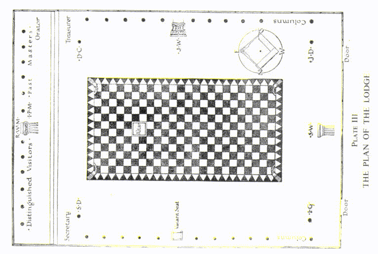

Здание, где это возможно, рекомендуется изолировать от всех окружающих зданий и сделать его высоким, чтобы придать его внешнему виду достоинство и учесть вопросы здоровья. Подходы к помещению Ложи снаружи должны быть угловатыми, ведь, как говорит Оливер, "прямой вход - немасонский и не может быть допущен". Должно быть два входа в помещение, которые должны быть расположены на западе и по обе стороны места W.S.W. Вход слева от него служит для внутреннего ввода посетителей и членов и, идущий от комнаты Т., называется внешняя дверь Т. или внешняя дверь; другой, справа от него, ведущий из подготовительной комнаты, известен как "внутренняя дверь" или иногда "северо-западная дверь". Plate III демонстрирует форму Ложи и местоположение главных предметов в ней, как обычно располагают в британской юрисдикции Комунисты-масоны.

Пол Ложи, в техническом смысле, представляет собой мозаичное покрытие, описание которого будет дано среди украшений Лоджи. Как правило, это двойной квадрат, то есть прямоугольник, длина которого в два раза больше его ширины, и Лодж можно рассматривать как двойной куб, стоящий на этом полу. Вся комната, по сути, является Ложей, представляющей собой храм человечества, символизирующий человека, лежащего на спине. В этом положении три большие опоры соответствуют важным центрам в человеческом теле. Колонна R.W.M. находится на месте головы или мозга; колонна W.S.W. соответствует генеративным органам, символами силы и мужественности, а также солнечному сплетению, главному узлу симпатической системы; колонна W.J.W. соответствует сердцу, которое в древности считалось местом чувств.

Ориентация

В ритуальных текстах приводится три объяснения, почему наши Ложи ориентированы на восток и запад. Во-первых, солнце восходит на востоке, и в Масонстве солнце является символом божественности. Во-вторых, все западные нации обращаются к востоку как к источнику своей мудрости. В-третьих, масоны следуют примеру храма короля Соломона, который был ориентирован на восток и запад в соответствии с расположением Скинии, которую носили Израильтяне в их странствиях по пустыне и всегда устанавливали на восток и запад при установке. Сказать, что ранние масоны ориентировали свои Ложи только потому, что все церкви и капеллы следуют этому правилу, было бы недостаточно; скорее, церковное правило spectare ad orientem также было правилом для масонов.

Как мы уже упоминали, египетское происхождение Масонства в некоторой степени скрыто под влиянием еврейской культуры. Когда Моисей привнес египетскую мудрость в культуру евреев, они быстро придали ей свои черты. Они уникальны тем, что легко ассимилируются, но придают свой характер всему, к чему они прикосновутся. В этом контексте, египтяне называли Великую пирамиду Гизы "Домом Света" или просто "Светом", но евреям научили понимать это как ссылку на храм короля Соломона.

Однако, основная причина тщательной ориентации Ложи - магнитная. Постоянно происходит движение силы между экватором и каждым из полюсов Земли, и существует ток, протекающий под прямым углом к этому, движущийся вокруг Земли в направлении ее вращения. Оба эти тока используются в работе Ложи, как будет объяснено при изучении церемоний. Большинство людей не осознают присутствие этих сил, которые отличаются от тех, что действуют на обычный стальной или железный магнит, но некоторые люди настолько чувствительны к ним, что не могут комфортно спать, если лежат поперек этих токов. Некоторые из этих людей лучше спят, когда их голова направлена на север, другие - когда на юг. Среди гиндуистов полагается, что только аскет должен спать с головой на севере. Домохозяин, человек мира, должен лежать с головой на юг.

Небесный Купол

Ритуал говорит нам, что покров ложи масона — это небесная купола разных цветов. Это может быть символом звездного неба, покрывающего истинный храм человечества, если мы рассматриваем Ложу в универсальном контексте; но указание на разные цвета дает другое значение, ведь небесный свод не обладает разнообразием цветов, он остается голубым, кроме моментов восхода и заката. Подлинная небесная купола — это ауру человека, о которого мы представили лежащим на спине; это яркокрасочная форма мысли, создающаяся во время работы Ложи. Мы видим эту символику и в других контекстах, таких как многоцветный плащ Иосифа в Книге Священных Писаний, одеяние Славы, которое одевает посвященный согласно гностическому гимну; а также в "Аугоеидесе" греческих философов, восходящем образе тела, в котором душа человека обитает в тонком, невидимом мире. Брат Вильмсхерст в "Значении Масонства" также интерпретирует купол как ауру человека, что наверное более логично, чем предположение доктора Макея, что этот символ обязательно отсылает к небесному своду, потому что первые братья встречались на самых высоких холмах и в самых низких долинах.

Алтарь

Алтарь должен находиться в середине квадрата, ближайшего к Великому Мастеру, хотя это может отличаться в разных обрядах. В английской Великой Ложе обычно не бывает алтаря вовсе, или он является лишь приложением к пьедесталу Мастера; таким образом, когда кандидат даёт клятву, он стоит перед пьедесталом Великого Мастера. В некоторых Ложах алтарь располагается немного восточнее центра пола, а в других он стоит прямо в его середине.

На алтаре, или рядом с ним, или нависающим над ним в середине восточного квадрата, в ко-масонских Ложах всегда горит маленький свет, обычно заключенный в рубиновое стекло. Этот свет символизирует отражение Божественности в материальном мире, и это полностью совпадает с постоянно горящим светом в католических церквях перед алтарем, где освящается Священнодействие.

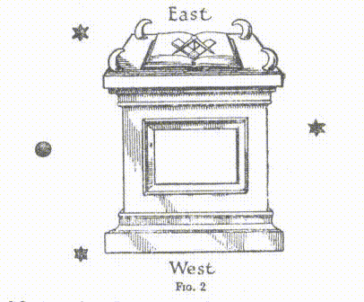

Макей, в своем "Лексиконе Масонства", говорит об алтаре:

Место, где священные дары представлялись Богу. После построения Скинии, алтари были двух типов: алтари для жертвоприношений и алтари для курения благовоний. Алтарь масона можно рассматривать как представление обоих этих видов. Отсюда восходит благодарный дым Братской Любви, Помощи и Истины к Великому Я ЕСТЬ; на него Братья кладут свои буйные страсти и мирские стремления как подходящую жертву доблести нашего Ордена. Подходящая форма масонского алтаря — это куб, около трех футов высотой, с четырьмя рогами, одним в каждом углу, и Священной Библией, Квадратом и Компасом, расположенными на нем, а вокруг него в виде треугольника и в соответствии со взаимным расположением, расставлены три меньших света.

Рис. 2 взят из того же источника. Звезды представляют собой три зажженных свечи, а черная точка - место на севере, где нет света. В наших ко-масонских Ложах мы следуем английской традиции размещения трех свечей у сидений трех главных офицеров, но они все еще находятся в тех же относительных позициях. Как в этом, так и в других вопросах, в масонстве нет ортодоксии.

Символ на восточной стороне алтаря представляет собой круг, ограниченный с севера и юга двумя линиями. В центре должна быть точка - точка в кругу, вокруг которой Мастер не может ошибиться. Круг, как показано на табличке..., нарисован в полный размер алтаря, так что он касается или почти касается Книги Священных Писаний. Обычное объяснение этого в лекциях Ложи — так как круг ограничен двумя линиями, символизирующими Моисея и Соломона, а также кругом, - каждый, кто остается внутри этого круга и столь же основательно следует за учениями Книги Священных Писаний, как делали Моисей и Соломон, не ошибется.

Однако, в древнем Египте, давным-давно до времен иудеев, этот символ уже имел множество значений. В первую очередь, это был символ солнечного бога Ра; во-вторых, для египтян это означало Землю, обращающуюся вокруг Солнца. Это было частью секретного знания, ограниченного исключительно для инициированных в Мистерии. Есть и более древняя традиция, которая представляла круг как экватор, а точку в его центре — как Полярную звезду, положение которой меняется из-за прецессии равноденствий, к которым египтяне проявляли большой интерес. Наклон главного прохода в Великой Пирамиде был определен по положению Полярной звезды того времени. Этот символ также использовался для обозначения Всевидящего Глаза — идея, легко возникающая при мысли о точке в центре круга.

Египтяне также дали символу особенное толкование, которое Братья обязательно запомнят при виде его. Три колонны, представляющие мудрость, силу и красоту, якобы ограждали Божий трон, то есть сам алтарь, который они соотносили с любовью. Таким образом, круг символизирует любовь Божью, а две линии, окружающие его, - это линии долга и судьбы или, выражаясь восточной терминологией, дхармы и кармы. Утверждалось, что пока ММ сохраняет себя внутри круга божественной любви, и его действия ограничены долгом и судьбой, он не будет совершать ошибок.

Также этот символ имеет значение первого проявления Божества. Египтяне полагали, что таких проявлений три: первое - величайшее, недоступное нашему пониманию, второе и третье - существенно ниже. Их представление об этих трех было очень похоже на Троицу в христианстве и Тримурти среди индусов. Практически все философские религии признают тройное проявление Божества. В Книге Дзян тот же символ, но без двух линий, обозначает ту же самую реальность, первый Логос или Слово. В христианской мистике символ означает Христа в лоне Отца. Его также видят как отражение Пылающей Звезды, освещающей потолок Ложи, аналогично вечно горящему рубиновому светильнику. Этот символ символизирует его свет, который "вечно горит среди нас" и "светит даже в нашей тьме". Некоторые изучающие масонство видят один и тот же символ во многих друидских и скандинавских храмах, в которых есть круг камней с одним, обычно выше остальных, в центре.

Пьедесталы и Колонны

"Наши Ложи поддерживаются тремя великими колоннами — мудростью, силой и красотой", — говорится в масонском обряде, "Мудрость помогает в выполнении задач, сила поддерживает в трудностях, красота украшает внутреннего человека. Вселенная — это Храм Божества, которому мы служим. Мудрость, сила и красота окружают Его трон как столпы Его творения, поскольку Его мудрость бесконечна, Его сила всемогуща, а Его красота проявляется во всем творении в симметрии и порядке. Он распростер небеса как кров, землю Он украсил как подножие; Он украшает Свой Храм звездами как диадемой, всю власть и славу Он распространяет из Своих рук. Солнце и луна — это послы Его воли, и все Его законы идеально гармоничны. Три великие колонны, поддерживающие Ложу масона, являются символическим выражением этих божественных атрибутов".

Полноценные колонны редко встречаются в Ложах, но у W.S.W. и W.J.W. их пьедесталы украшают миниатюрные колонны, и обычно рядом с тремя главными офицерами стоят большие колонны, на которых стоят их свечи. В масонской литературе разные объяснения даны присутствию трех пьедесталов и их расположению. Некоторые говорят, что их трое, потому что с королем Соломоном в строительстве храма тесно сотрудничали два других важных лица. Но глубже лежит идея, что колонны на пьедесталах и возле пьедесталов трех главных офицеров символизируют три аспекта божественной жизни в проявлении, о которых говорят различные религии, изображая Святую Троицу. В древнем Египте, как мы уже объясняли, было три типа Больших Лож с немного разными методами работы, в зависимости от того, представлял ли Настоящий и Идеальный Мастер мудрость, силу или красоту. В настоящее время мы имеем только один тип где пьедестал Мастера символизирует мудрость, и работа соответствует Второму Лицу Троицы, Христу. В почти исчезнувшем Ритуале Шведенборга место Мастера символизировало силу.

В процессе создания нашей вселенной третий член Троицы первым применил свою долю божественной мощи для подготовки материального мира. Затем Вторая Личность привела в действие свою энергию, что стало началом развития осознанной жизни. Это символизируют при открытии Ложи. Сначала миниатюрная колонна W.J.W., символизирующая Третью Личность и первое вливание божественной активности, стоит вертикально. Но в тот момент, когда R.W.M. объявляет об открытии Ложи, эту колонну кладут, а колонну W.S.W. поднимают в вертикальное положение. По воле Первой Личности, Отца, Владыки мира, Вторая Личность теперь контролирует процесс, и работа по развитию силы осознания становится задачей дня в открытой Ложе.

Три столпа, колонны и пьедесталы, канделябры и свечи - все они обозначают одно и то же. Колонна на столе или пьедестале каждого из важных офицеров Ложи выполнена в определенном архитектурном стиле, что символизирует его мощь или качество; его канделябр также вырезан по тому же узору, и часто этот узор изображён на его свече. Сейчас наши колонны и канделябры обычно делают из окрашенного дерева, но на самом деле они должны быть из трех разных видов камня: R.W.M. - из песчаника, W.S.W. - из гранита, и W.J.W. - из мрамора. Эти три вида камня символизируют три основных класса пород: песчаник - это осадочный камень; гранит - вулканический, а мрамор - метаморфический. Если используются деревянные колонны, их должны окрасить так, чтобы они напоминали эти камни.

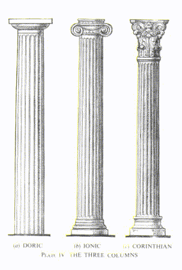

ОРДЕНЫ АРХИТЕКТУРЫ

Рассматривая любую колонну, мы видим две основные части - саму колонну и её энтаблятуру на вершине, которая помогает ей поддерживать крышу. Каждый из этих элементов в свою очередь подразделяется на три части. Колонна состоит из основания, длинного тонкого столба и капители. Части энтаблятуры это: архитрав, выступающий над капителью, фриз - прямая часть с орнаментами и карниз над ним. Почти все эти элементы различаются в зависимости от стиля архитектуры.

В Древней Греции было три ордера архитектуры: ионийский, дорический и коринфийский. Сегодня они соответствуют R.W.M., W.S.W. и W.J.W. Позже были добавлены еще два итальянских ордена - тосканский и композитный, которые мы в масонстве не используем. Эти три колонны можно увидеть на Доске IV.

Среди трех греческих колонн дорическая самая простая. Ствол ее имеет двадцать поверхностных углублений, и его высота в восемь раз превышает диаметр. У нее нет основания, а капитель твердый и без украшений. В энтаблятуре, которую обычно не воспроизводят в столбах чиновников, ее фриз характеризуется триглифы и метопы, а ее карниз представляет собой мютулы. Эту колонну считают образом мускулистого взрослого мужчины, она символизирует силу и благородную простоту.

Ионическая колонна имеет двадцать четыре углубления и длину, превышающую диаметр в девять раз. Капитель украшен двумя волютами, а карниз - зубцами. Она представляет собой образец красивой женщины, отражая грацию и элегантность.

Коринфийская колонна безусловно самая красивая. Ее углубления такие же, как у ионической колонны, но ее высота - это десять диаметров, что придает ей стройность и грацию. Капитель украшен двумя рядами листьев акаценты и восемью волютами, которые поддерживают абакус.

Следующую историю рассказывают об истории коринфийской колонны. Греческий поэт и архитектор Калимах однажды посетил кладбище и увидел могилу ребенка. На ней выросло растение акаценты, которое удивило его своей красотой. Он взял этот образ, вырезал его в камне и создал форму, которую мы теперь видим на каждом капителе коринфийских колонн. На могиле стоял круглый ящик с игрушками, оставленный там медсестрой, чтобы радовать дух ребенка. В то время считалось, что умершие могут посещать места своего захоронения и получать удовольствие от вещей, оставленных там для них, или от их прообразов, которые посмертно становятся их собственностью.

Доска V

На верхней стороне маленькой коробки с игрушками медсестра поставила плоскую плитку, чтобы защитить их от дождя. Коробку она поместила на корень аканта, из-за чего его листья когда выросли и достигли плитки, повернулись обратно, создавая по ободу узор - изумительная картина. Растение акант дико произрастает по всей Сицилии, в Южной Италии и Греции, и его шарм везде очевиден.

Тосканская колонна - самая простая из всех. Её основание и верхушка абсолютно гладкие, длина центральной части в семь раз больше диаметра и она не украшена каннелюрами. Композитная колонна, наоборот, является наиболее украшенной из всех, так как она стремится объединить красоту ионического и коринфского стилей в себе. У неё столько же каннелюр и те же пропорции, что и у Коринфской колонны, но она совмещает в себе орнамент аканта с волютами ионического стиля.

Три эти колонны являются частью греческого или классического стиля архитектуры, у которого всегда плоская или немного наклонная крыша, отсутствуют арки, и много колонн, расположенных в рядах, обычно с большим, неглубоким треугольнике - пилоном, на передней части здания. (Смотрите лист V.)

В религиозной архитектуре Европы главным образом преобладает готический стиль. Гильдии фримасонов в средние века странствовали по Европе в группах, строя церкви. Все величественные готические строения были построены примерно в то же время и именно в этот период знаменитые кафедральные соборы Европы были возведены фримасонами, которые обладали трёмя степенями. Они были оперативными каменщиками, у них были свои секреты мастерства, и только они могли выполнить эту работу. Готический стиль представлял собой совершенно новый метод, полностью отличный от классического, и есть достаточно доказательств того, что фримасоны стояли за этими изменениями. Большой собор в Кельне, строительство которого длилось пятьсот лет и ещё не завершено, выстроил человек, подписываясь знаком, известным только М.М., и есть документы, указывающие на то, что начальная стадия строительства была выполнена фримасонами. Он обладает особой формой острой арки, образованной пересечением двух поднимающихся арок, что символизирует готический стиль, отличающийся от Нормандского и Римского стилей с их округлыми арками, а также от Сарацинского или Византийского со своими зубчатыми арками и круглыми сводами.

Значение Трёх Колонн

Я благодарен брату Эрнесту Вуду за следующие интересные мысли. Они являются толкованием трёх колонн в свете принципов, заложенных в его книге "Семь Лучей", и я предлагаю их к тщательному изучению братьям.

Для полного понимания значимости колонн, руководимых тремя главными офицерами, мы должны вспомнить оккультное учение о величественной Божественной Троице Отца, Сына и Святого Духа, или Шивы, Вишну и Брахмы. Едины они образуют одного Всемирного Бога, в котором все существует, будь то живое или неживое, так как нет ничего, кроме Него. В их особенностях появления, Святой Дух является создателем или строителем внешнего мира, и Сын - это жизнь во всех существах, "свет, который освещает каждого приходящего в мир". Каждый материальный объект в мире является частью существа Бога-Святого Духа в этом широком смысле, и каждая жизнь или осознание является частью осознания Бога-Сына, который является проявленным Солнечным Логосом. За этими двумя, невидимыми и непостижимыми, лежит неизъяснимая слава и счастье Отца.

И Святой Дух, и Сын оба представляют Троицу:  мудрость, сила и красота являются тремя качествами Бога в лице Святого Духа, они образуют три опоры видимого мира и отмечают его три разделения. Первый раздел - это видимый мир материальных объектов, зижденных в красоте - Бога в объектах мы видим как красоту. Второй раздел - невидимая энергия, которой пронизан мир, на которой строятся все видимые вещи - это и есть сила Бога в виде Святого Духа. Третий раздел - вселенский разум, мир идей, хранилище архетипов, который определяет возможности материальных форм и связей - это мудрость Божественного Архитектора, его нерушимые замыслы. Эти три элемента формируют любой объективный мир; они составляют Ложу, строение, в котором протекает жизнь. И три столпа - ионический, дорический и коринфский - символизируют эти три раздела мира, поле сознания, как его назвали в "Бхагавадгите".

Все живые существа, населяющие этот мир, отражают свет божественной жизни и сознания в своих неповторимых степенях. Они все являются частями Бога-Сына, Христа, великого жертвенника, божественной жизни, распятой на кресте материального мира. И он тоже является Троицей, что видно по трем силам сознания: духовной воле, интуитивной любви и высшему интеллекту, которые лежат в основе всей человеческой воли, любви и мысли. Так как должностные лица - это жизнь в Ложе, они обозначают эти качества сознания, которые на санскрите называются Ичха, Джнана и Крия. Великий передовой мастер выражает божественную волю Христа, направляющую работу к усовершенствованию человека; старший надзиратель представляет божественную любовь Христа, а младший надзиратель - божественную мысль. Эти должностные лица узнаваемы по их драгоценностям, которые символизируют волю, любовь и мысль соответственно, а не по столпам, которыми они руководят.

Как материальная энергия является силой в предметах, так и любовь является силой сознания; это то, что на санскрите называют будди, или мудрость, которая является прямым знанием жизни, энергией сознания. Это способность человека контактировать и общаться с окружающей его жизнью, тогда как его мышление - это способность воспринимать объекты мира. Поэтому, когда на открытии Ложи младший надзиратель опускает свой столп, а старший надзиратель поднимает свой, это символизирует, что мы углубляемся в жизнь, и наша работа направлена ​​на человека, на сознание, а не на материальные объекты, как было бы, если бы мы строили материальное сооружение, а не храм человека - его внутренний характер, его бессмертную душу. Великий Архитектор сейчас создает "храм на небе, не сотворенный руками".

Таким образом, колонны символизируют три качества материальной Ложи, а три главных должностных лица воплощают в себе три качества сознания или жизни. Теперь нужно объяснить помощников. В своей сущности каждый человек - это трёхчастное духовное сознание, как мы уже видели. Но когда мы смотрим на него в этом мире, мы видим не самого человека, а тело, в котором он живет, его материальный дом, или, используя более современное сравнение, его автомобиль, которым он передвигается, чтобы выполнять свои дела, наблюдать то, что ему нужно, и работать там, где ему хочется. Это тело, возможно, подготовлено к определенной профессии, выросло в особой культуре одной из наций, с его обычаями и способом действовать, чувствовать и мыслить. Это составляет его личность, маску, через которую его голос можно услышать в мире внешних явлений. Эта личность четырехкратна: есть физическое тело, затем его эфирный двойник, затем эмоциональная природа, затем нижний рассудок, который вместе с предыдущими двумя образует его личное хранилище и галерею индивидуальных чувств и идей. S.D. представляет нижний разум, J.D. - эмоциональную или астральную природу; I.G. - эфирный двойник, а O.G. или T. - физическое тело. (Для более полного изучения этих принципов с этой точки зрения, обратитесь к книге профессора Вуда "Семь Лучей".)

Согласно этому толкованию, колонны представляют три аспекта внешнего мира (мира человеческого обучения), но три главных должностных лица, президирующие на своих местах, представляют три аспекта божественного сознания (внутренний мир человеческой интуиции), как указано на следующей диаграмме:

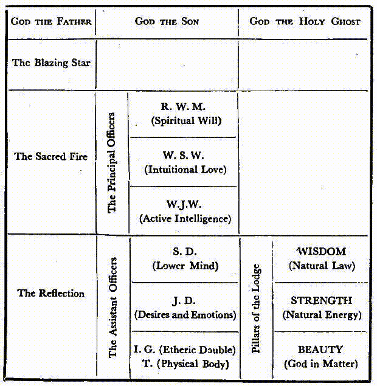

"Столпы Вестибюля".

Ссылаясь на храм царя Соломона, английский обряд герметизма заявляет: "В этой великолепной архитектуре в глаза бросились два великолепных столба, стоящих на входе". Обряд продолжает объяснение: эти два столба возводились у входа в храм, чтобы напоминать детям Израиля, когда они приходили и уходили на богослужения, о столпе огня, что светил израильтянам в их побеге из египетского рабства, и о столпе облаков, накрывшем в тьму фараона и его сторонников, когда те пытались догнать израильтян.

Однако изначальное значение этих столбов уходит гораздо дальше. Предположительно, эти два столба изначально изображали северную и южную полярные звезды. Сначала это были столбы Хоруса и Сета, их названия позже превратились в Тат или Та-ат и Татту - первое означает "стойкость", а второе "устойчивость", оба вместе представлены как эмблема стабильности. Татту это портал, ведущий в зону, где смертная душа объединяется с бессмертным духом и остается там навсегда, как я уже объяснил в Главе I. Удивительно, что так много авторов говорят о северной и южной полярных звездах, когда на южном полюсе нет ни одной значительной звезды. Южный полюс неба находится в зоне с небывало необитаемым космическим прастранством, а ближайшая звезда относительной важности находится у подножия Южного Креста, который на все 27 градусов отстоит от полюса.

На вершине двух столбов в давние времена было изображено четыре линии или перекрестка, символы неба и земли, как показано на рисунке 3.

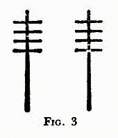

Как образовались четыре части, или квадрат, или скорее два квадрата, можно понять из рисунка 4.

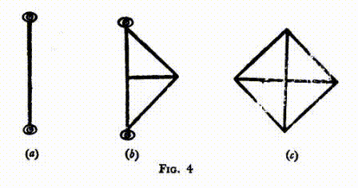

Первый символ изображает два глаза севера и юга, связанных линией. Второй показывает линию Шу, где он делит экваторию, формируя два треугольника Сета и Хоруса; и третья фигура создает квадрат четырех частей, или квадраты. Говорят, что Татту - это место, укрепленное навсегда, как рай с его четырьми частями, а Тат представляет землю с ее четырьми частями.

Рисунки 5 и 6

В иероглифах форма стала похожа на рисунок 5, а в папирусах Ани она представлена как на рисунке 6.

Доктор Макей провел специальное исследование этих двух столбов в их поздней еврейской форме. Описывая их как памятники многократных обетов Бога поддерживать свой народ Израиля, он сообщает, что Яхин происходит от Ях, что означает "Иегова", и Хин, "устанавливать", и вместе они обозначают "Бог установит свой дом в Израиле", в то время как Боаз состоит из Б, что означает "в" и Оаз, "сила", всё вместе означает "в силе это устоится". Макей считает, что колонны должны стоять внутри вестибюля (хоть на самом деле они там и не находились), прямо у входа, и по каждую сторону ворот. Здесь стоит отметить, как точно значение, данное здесь, соответствует египетским именам тех же столбов.

Мы находим различные описания этих колонн в христианских Писаниях. Ссылки можно найти в Книге 1-х Королей, vii, 15; 2-х Королей, xxv, 17; 2-х Хроник, iii, 15 и iv, 12; Иеремия, lii, 21 и Иезекииль, xl, 49. Описание также дано еврейским историком Иосифом Флавием, и еще одно можно найти в словаре масонства Макея. Эти сведения отличаются по отдельным пунктам, и подробности, которые они приводят, смешаны до такой степени, что писатели-масоны не могут согласиться ни по одному из вопросов, кроме главных тезисов. Поэтому я решил провести глубинное исследование, результаты которого представлены на Таблицах VI и VII. Первый из них - это так называемый масштабный чертеж, который показывает пропорции столба именно так, как они были, но как никто из людей никогда его не видел. Второе - увеличенный рисунок покрывала (или, как его называют в Библии, главы), который показывает детали его кропотливой работы. Еще здесь есть небольшой план здания (Рис. 7) храма, показывающий местонахождение столбов относительно вестибюля. Видно, что они были не внутри вестибюля, а прям на улице перед ним. Этот общий план разработан в масштабе в соответствии с библейскими измерениями, но следует отметить, что входы кроме входа в вестибюль, как и открытые капеллы, которые добавил царь Соломон, здесь не отображены, равно как и дворы вокруг храма.

Эти столпы в Библии описаны как латунные, но их внешний вид больше напоминает то, что мы сегодня называем бронзой. Все рассказы, кроме одного, указывают на высоту столба в восемнадцать локтей, а капитель, который расширяется над ним, говорится, что имел высоту пять локтей. Но поскольку он перекрывал вершину на поллоктя, общая высота достигала 22 1/2 локтя. Обычно считается, что локоть равен восемнадцати дюймам, что дает нам общую высоту столпа и его капители в 33 фута 9 дюймов. Его окружность равна двенадцати локтям или восемнадцати футам, что делает его диаметр чуть меньше шести футов. Столпы были полые, и обычно считается, что толщина металла, из которого они были изготовлены, составляла три дюйма, хотя иногда эту толщину указывают как четыре дюйма. На задней стороне каждого столпа, спрятанные от глаз, были три маленькие дверцы, расположенные одна над другой, так что можно думать о части столпа как о разделенной на сейфы, где хранились архивы, книги Закона и другие документы.

Капители, которые надеваются на вершину столпов как крышки, являются самой интересной частью этих замечательных литейных изделий. Украшение этих капителей будет лучше пониматься на рисунке. Весь капитель расширяется вверх в урнообразной форме с плоским круглым диском, упирающимся в него сверху. Восходящая кривая урны продолжается через диск, создавая выступ над диском в виде сегмента сферы, который, конечно, не виден любому, кто смотрел наверх с подножия столпа. Вернее будет сказать, что фигура, которую они предлагают, не совсем сфера, а скорее облой сферойд, и в оригинальном каменном столпе, который находился на аналогичном месте в египетском храме, символика которого была скопирована тирским мастером, эта несколько необычная форма была безусловно намеренной и была принята, чтобы представить истинную форму Земли, которая была отлично известна в древнем Египте. Как будет видно в последующей главе, египтяне хорошо знали точные размеры Земли, но в указании на это в сфероиде столпа полярное углубление, естественно, сильно преувеличено, иначе разница вряд ли была бы видна. Известно, что эти столпы были предназначены для представления земного и небесного шаров; и в некоторых современных попытках воспроизвести их они увенчаны этими двуми глобусами. В оригиналах, однако, никаких глобусов не было, поскольку округлые капители адекватно их отображали.

Из рисунка видно, что поверхность капителя под диском покрыта сеткой, и что нижние концы сетки сливаются во фриз, от которого свисают множество маленьких шариков. Библейский отчет очень точно говорит нам, что эти шарики предназначены для изображения гранатов, и что на каждом столпе было двести таких гранатов. Сверху на сетку накладывается довольно странный узор из цепей, висящих в фестонах, и есть семь рядов этих фестонов, один под другим. Каждый петля цепи состоит из семи звеньев, и в каждом случае центральное звено цепи - самое большое и тяжелое, а звенья уменьшаются в размере и весе, поднимаясь к концам петли. Вдоль края диска тянется ряд лилий, и от него свисают четыре цепи тех же цветов, которые опускаются прямо вниз по капителю с севера, востока, юга и запада соответственно. Эти цветочные цепи, однако, не свисают в воздухе, а прижимаются к контуру капителя. Между ними два листа пальмы перекрещиваются через среднее звено центральной цепи в каждом промежутке.

Полностью отдельно от этой схемы украшений вводится очень красиво выполненный ряд цветов, чтобы скрыть соединение капителя со столпом. Это состоит из трех рядов лилий; центральный ряд, который точно покрывает край капителя, состоит из полностью раскрытых цветов, обращенных наружу от столпа, с листьями между ними. Верхний ряд - это плотно закрытые бутоны, стоящие между цветами среднего ряда и создающие эффект нечто подобного ошибочке короны.

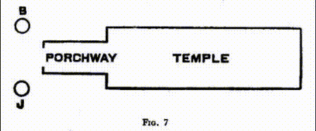

Цветки третьего ряда изящно свисают из центрального ряда по изогнутым стеблям и обращены в разные стороны.

Все это, как нам сообщают, была работа Х.А., сына вдовы из Нефтали – человека, о котором в библейских текстах говорят как о хитроумном мастере по меди, которого Х., К. из Т., отослал в Иерусалим специально для выполнения этой и других металлургических работ для царя Соломона. Несомненно, этот человек был истинным художником, прикладывающим почти невероятные усилия, чтобы донести свой дизайн именно так, как он его замышлял. Судя по тому, что удалось узнать исследователям, его работа полностью основывалась на традиционном рассказе о каменных египетских столбах, который передавался с времен Моисея. Похоже, у него не было четкого представления о значении всех этих странных орнаментов, хотя Моисей прекрасно осознавал всю систему символов, которая стояла за этим.

Следует понимать, что весь этот разнообразный орнамент не был уложен в барельефе, как обычно делают отливки; напротив, он рельефно выступал на фасаде столпа, многие из цветов связывались с ним лишь посредством сравнительно тонкого стебля значительной длины. Наблюдения по терпению и внимательности, с которыми художник подходил к своей работе, позволяют сделать вывод о том, что он вырезал из дерева и в натуральную величину весь тройной ряд лилий, чтобы обойти восемнадцатифутовый обод основания капители, а затем делал свои формы вокруг этой деревянной резьбы. Хотя общая идея трехрядного гирлянды цветов сохранялась, все было организовано очень естественно, и ни один цветок не был точным дубликатом своего соседа; это не был простой повтор узора, как в случае современной обойной бумаги, но вся концепция реализовывалась в виде единого обширного проекта с самым преданным и аккуратным выполнением.

Множество экспериментов были проделаны, прежде чем этот древний мастер смог удовлетвориться, и он применял различные изобретательные методы, чтобы достичь своей цели. Он стремился выполнить всю капитель и все ее украшения возможно ближе к одному облитку, и с примитивными инструментами, которые были у него в распоряжении, это доставило ему немалые сложности. Его лилии, возможно, можно считать несколько условными; по крайней мере, они отличаются от любых известных мне видов. В общем, они больше напоминают лотос, чем обычную лилию; но с другой стороны, листья совсем не были похожи на лотосовые.

Для обычного почитателя в храме все это сложное орнаментирование представлялось лишь украшением, но для посвященного оно имело полное эзотерического смысла. Прежде всего, эти два столпа были воплощением оккультного принципа "Как вверху, так и внизу", потому что, несмотря на то, что они были полностью идентичны во всех деталях, все понимали, что они символизируют соответственно земной и небесный миры. На Тат, левом столпе, каждое звено каждой цепи обозначало то, что в нашем восточном исследовании мы называем ветвью-расой, и звенья, спускаясь вниз, становились больше и толще, указывая на более глубокое погружение в материю, до тех пор, пока не был достигнут четвертый уровень, когда жизненная сила начинает тяготеть к вводу и восходу, и поэтому ее воплощение становится менее материальным.

В Тате лилии всегда представляли человеческую цветность. Устроенные в линию вокруг края диска, они указывали на Великое Белое Братство - жемчуги в короне человечества, парящие над человеческой расой и направляющие её эволюцию. Четыре подвесных цепи с цветами символизировали Святую Четверку, обитающих в Шамбале - Духовного Короля и Его трех ученик-помощников, единственных представителей на Земле Господ Пламени, которые прибыли давным-давно с Венеры, чтобы ускорить развитие человечества. Перезаложенные между ними пальмовые ветви символизировали четырех Девараджей, главных исполнителей, через которых осуществляются установления Сынов Огненного Тумана.

Три ряда лилий, расположенных так, чтобы скрыть соединение капители с колонной, представляли посвященных в три стадии Египетских Мистерий. Бутоны верхнего ряда, направленные вверх, символизировали посвященных в Мистерии Исиды, полных стремления, тянущихся вверх и таким образом поднимающих общий уровень человеческого мышления. Цветы среднего ряда, раскрывшиеся и обращённые наружу, были посвященными Сераписа, проявляющими через свои жизни славу, величие и силу человечества, каким он должен быть. Третий ряд опущенных лилий представлял посвященных в Мистерии Осириса, стремящихся в мир, чтобы посвятить себя помощи и просвещению человечества.

Эти три степени инициатов, по-видимому, отвечают трем другим уровням оккультной жизни, о которых я подробно рассказываю в Мастерах и Пути. Во-первых, это претенденты на испытательном пути, стремящиеся вступить в настоящий Путь, делающие все возможное для очищения себя, развития своего характера и служения человечеству с безкорыстной любовью под руководством Мастеров. Затем идут те, кто был посвящен в Великое Белое Братство и таким образом вступил на настоящий Путь; их жизни полностью посвящены служению человечеству; в них бутон человеческой жизни раскрызается в цветок, и их сознание поднимается до буддийского принципа, который описывается как истинное человеческое выразительство человека. В третьих, это Архаты, прошедшие четвертую великую Инициацию; им не требуется реинкарнация; если они и реинкарнируют, то это абсолютно добровольно; они погружаются в человеческую жизнь здесь только ради помощи.

На Татту, правой колонне, мы продолжаем историю эволюции там, где оставили на предыдущей. Здесь одно звено символизирует один мировой период и, следовательно, включает в себя весь набор из семи висячих украшений на Тате. Чтобы вновь использовать технические термины теософского учения, петля из семи звеньев на Татту обозначает то, что мы называем Кругом, завершенная гирлянда из семи петель предлагает один Цепной период, а полная группа из семи гирлянд равна одному Планетарному Схемату.  Оба столпа вместе в точности соответствуют таблице эволюции и схеме, которую я даю в шестом разделе Внутренней Жизни, и почти вся информация, содержащаяся в этом разделе, была преподана египетскими священниками их неофитам и иллюстрирована с помощью этой сложной системы украшения капителей. Отсылать сюда весь объем объяснений, содержащихся в этой книге, было бы неуместно, но я рекомендую её тем студентам, кто желает изучить эту интересную тему подробнее. Поскольку книга имеет несколько изданий, я, к сожалению, не могу дать точную ссылку на страницу, но очень легко найти схему.

На Татту венок цветов вокруг края диска, по-видимому, символизировала армию Дхьян Чоханов, возможно, включая Планетарных Логосов. Четыре цепи лилий, протекающие от этого венца, представляли для египтян значение, связанное с Тетрактисом, или, возможно, с отражением или проявлением этого Таинства, в то время как тройная группа лилий вокруг нижнего края капители были взяты как символ действия в материи трех Аспектов Логоса - бутоны обозначали действие Святого Духа, Рука Господа, вытянутая в деятельность, всегда толкающая вверх и вперед в душе человека, в то время как средний ряд символизировал мощь Отца, всегда светящегося как солнце в своей славе, далеко за облаками и туманами Земли, а нижний ряд обозначает действие Второго Аспекта, Бога-Сына, опускающегося во воплощение и поднимающего человечестсво изнутри.

Draft Translation Fix:
Перекрестные пальмовые листья здесь указывают на Липику, Владык Судьбы, которые действуют через четырех Королей элементов, символизируемых похожими листьями на Тате. Они не связаны с остальной частью образа, поскольку представляют силы, не ограниченные нашей планетарной системой или даже нашей солнечной системой; они управляют Законом, который охватывает всю Вселенную и которому подчиняются и Ангелы, и люди.

Верхний сегмент сфероида, за диском, был оставлен совершенно без украшений, чтобы подчеркнуть, что за пределами всего, что могло быть символизировано, существует еще что-то, находящееся вне проявления и потому абсолютно невыразимое.

Еще одна причина расположения этих двух столпов у входа в храм в том, что человек, желающий перейти из обыденного мира ежедневной жизни в более высокий мир Ложи, должен пройти между ними; и с этой точки зрения они символизируют победу над бурлением личных эмоций и упорством личного ума в его низшей натуре. Сначала его сила для борьбы в жизни проистекала из эмоций, астральной природы; затем этот столп нашей личной природы, столп Сета, должен был быть покорен силой ума, столпом Хоруса, и объединен с ним, чтобы к силе добавить стабильность, необходимую для продвижения к высшим целям. Только тогда человек становится непоколебимым, обладая силой для действий и мудростью для руководства.

Столпы также снова образуют два главных закона прогресса, карму и дхарму, первая предоставляет окружающую среду или материальный мир, а вторая задает направление себе внутри; благодаря сочетанию или гармоничному взаимодействию этих двух законов человек может достичь стабильности и силы, требуемых для оккультного пути, и таким образом оказаться в круге, в пределах которого Мастер Мудрецов не может ошибиться.

Также столпы использовались в обучении священников для иллюстрации великой доктрины пар противоположностей - дух и материя, добро и зло, свет и тьма, наслаждение и боль и т.д.

Интересно отметить, что каббалистические писатели каким-то образом понимали эти столпы, как символы инволюции, спуска божественной Жизни в низшие миры, хотя они, возможно, и не были знакомы со всеми деталями. Об этом говорится в трактате под названием "Врата Света", который Брат А.Е. Вейт цитирует в этом контексте следующим образом:

"Тот, кто знает тайны двух столбов, которые являются Яхином и Боазом, поймет, каким образом Нешамот, или умы, спускаются вместе с Руахот, или Духами, и Нефашот, или Душами, через Эль-хай и Адонай с помощью потока сказанных двух столпов."

А далее:

"По этим двум столпам и по Эл-хаю (живому Богу) спускаются Умы, Духи и Души, как будто через их проходы или каналы.* (*Новая энциклопедия, II, 280.)

Они также составляют портал Таинств, через которые души восходят к своему божественному Источнику, и лишь пройдя через них, можно достичь святилища истинного Божества человека, того божественного великолепия, которое, будучи пробужденным в глубине сердца, действительно устанавливает свое обитель в силе и устойчивости.

Во французской системе работы два больших столпа располагаются внутри Ложи по обе стороны от двери, на Западе, и У.З.З. и У.Ю.В. сидят за треугольными столами рядом с ними. Этот порядок произошел от халдейской системы.

Некоторые авторы делали упорные попытки придать этим двум столпам фаллическое значение; могу лишь сказать, что в ходе длительного исследования с помощью внутреннего взора мы не обнаружили следов присвоения какого-либо такого значения.

## Глава III. Убранство Ложи

Орнаменты

"Внутренние предметы Масонской Ложи", - говорит ритуал Ко-Масонства, - "включают орнаменты, мебель и ювелирные изделия. Орнаменты - это мозаичный павильон, символизирующий дух и материю, пылающую звезду, всегда напоминающую нам о Божественном присутствии в Его вселенной, и зубчатую кромку, Стражу Стены.”

Мозаичный Павильон

Три украшения принадлежат центру Ложи. Мозаичный брусчатик - это прекрасный пол, состоящий из чередующихся черных и белых квадратов, который в ритуале Ремесленников интерпретируется как разнообразие объектов, украшающих и придающих изысканность всему творению, как его живым, так и неживым частям. Однако его чередующиеся квадраты символизируют не только смешивание живого и материального в мире, но и вовсе не имеют места в земном мире, а являются символом взаимосвязи духа и материи, или жизни и материи, везде. Взаимосвязанные двойные треугольники указывают на тот же великий факт в природе.

Ни в природе нет жизни без материи, ни материи без жизни. До недавних пор многие ученые считали, что жизнь, проникающая творение, простирается вниз только до растительного царства. Но сегодня все больше и больше ученых признают, что невозможно провести границу и заявить: "Выше этой линии существуют живые, обладающие различной степенью сознания существа, ниже лишь мертвая материя." Исследования профессора Джагадиша Чандра Боше из Калькутты, записанные им в книге "Реакция живого и неживого", за которые он получил высочайшие научные отличия и уважение своих коллег, демонстрируют, что такая граница просто не существует, даже в мельчайшем зерне песка присутствует некое проявление жизни. Некоторые выводы профессора Боше были кратко и ясно изложены в знаменитой работе доктора Энни Безант "Исследование сознания" следующим образом:

Профессор Боше окончательно подтвердил, что так называемое "неорганическое вещество" реагирует на стимулы и что отклик на стимулы идентичный для металлов, растений, животных и - насколько это может быть экспериментально доказано - человеческого организма.

Он разработал приборы для измерения стимула и для демонстрации в виде графиков на вращающемся барабане ответов от тела, получившего стимул. Затем он сравнил кривые ответов, полученных от олово и других металлов, с кривыми ответов, полученных от мышечной ткани, и обнаружил, что кривые ответов олова идентичны кривыми ответов мышц, а другие металлы проявляют ответы схожего характера, хотя и с отличающимся временем восстановления.

Тетанус, как полный, так и неполный, вызванный многократными воздействиями, был вызван и одинаковые результаты были получены как в минерале, так и в мышце.

Усталость проявлялась у металлов, особенно у олова. Химические реагенты, такие как лекарства, вызывали на металлах эффекты, аналогичные тем, что происходят у животных - активизацию, депрессию и смертельную интоксикацию.

Яд убивает металл, вызывая состояние омертвения, при котором отклика не получить. Если отравленный металл успеют вовремя найти, антидот может спасти его жизнь.

Стимуляторы увеличивают отклик и, точно так же как большая доза лекарства может убивать, а маленькая стимулировать, они обнаружены как действующие на металлы.

"Среди таких феноменов", спрашивает профессор Боше, "как мы можем провести линию разграничения и сказать: 'Здесь заканчивается физический процесс и начинается физиологический'? Никаких барьеров не существует."

Психический опыт и обученное ясновидение добавляют свое свидетельство к этому выводу и утверждают, что без тени сомнения один и тот же вид жизни можно наблюдать в теле тигра или дуба или кусочке минерала. Как выразил это "Тайная Доктрина":

С каждым днем все более ясно показывается идентичность между животным и физическим человеком, между растением и человеком, и даже между рептилией и ее гнездом, скалой и человеком - все схоже. Все физические и химические составляющие всех существ одинаковы, и химическая наука может с уверенностью утверждать, что нет разницы между материей, формирующей быка, и материей, формирующей человека. Но учение Оккультизма говорит еще более определенно: не только химические соединения одинаковы, но и те же самые крохотные невидимые Жизни составляют атомы тел горы и ромашки, человека и муравья, слона и дерева, защищающего его от солнца. Каждая частица - будь она органической или неорганической - является Жизнью.* (*Тайная Доктрина, I, 281.)

Таким образом, глядя на наш мозаичный пол, мы, кто ценит его полное значение, постоянно напоминаем себе о вездесущности жизни.

В древнем Египте тщательно берегли святыню мозаичного брусчатика, и вторгаться в пространство ее могли только кандидат и офицеры в надлежащее время, прошлогодний Мастер при выполнении своих обязанностей, старший диакон при получении света от священного огня и тот, кто благовонил алтарь.

Излишняя важность точного определения направления Ложи является лишь одним из проявлений общей идеи. Потоки силы стремительно движутся вдоль и поперек паркета, создавая узоры, подобные основе и нитям утка ткани, и образуют круг вокруг его периметра. Любой, кому требуется пересечь его, либо приблизиться, должен двигаться в соответствии с направлением этих потоков, а не вопреки им. Отсюда следует категорическая необходимость последовательного следования в одном направлении. В современные дни, кажется, уделяется меньше внимания мозаичному паркету; я даже видел случай, когда ежедневник, который все должны подписывать, был положен на столик посередине него. В нашей Ложе в Египте этот паркет почти полностью занимал пол; сейчас это часто всего лишь небольшое пространство в середине него.

ЗУБЧАТАЯ ГРАНИЦА

Мозаичный паркет окружает зубчатая граница. В старых масонских традициях, говорят, она была сделана из переплетающихся нитей, ныне же это укрепленная граница, некое подобие собачьего зуба. В начале XVIII века, как сообщается, символы ордена наносились мелом на пол, после чего диаграмму ограничивали вьющимся веревочным шнуром, украшенным кистями, и именно поэтому он получил название «зубчатой кисти», позднее искаженное до «зубчатой границы». Французы называют ее «dentelée houpe» и описывают как «шнур, формирующий любовные узлы, окружающий чертежную доску». Зубчатая граница, как гласит мужской ритуал, напоминает о прекрасной границе, образованной вокруг солнца при различных оборотах планет. В ритуале комасонии она представляет собой символ защитной стены, ограждающей человечество, состоящей из Адептов или людей, достигших совершенства человеческой эволюции в прошлых столетиях и тысячелетиях. Они окружают человечество в духовных мирах, чтобы, как говорится в буддийской письменности, спасти человечество от дальнейших и более значительных бед и страданий.

Аналогичная двойственная трактовка существует и для четырех кистей, которые можно видеть на углах границы. В мужской масонии их обычно рассматривают как символы сдержанности, стойкости, благоразумия и справедливости; их значение всегда имеет этический смысл. Но они также служат образом четырех великих орденов дэвов, связанных с элементами земли, воды, воздуха и огня, и их великих правителей, четырех Дэвараджов, исполнителей закона кармы, которые всегда уравновешивают и корректируют дела человека, гарантируя справедливость между живыми существами во Вселенной Бога, также как нет пропасти в отношениях между материальными телами и веществами. При посвящении кандидатов в Ложи комасонии эти четыре Правителя элементов вызываются, и последствия этого очень реальны и благотворны, хотя многие члены братства могут отрицать это.

ПЛАМЕНЕЮЩАЯ ЗВЕЗДА

Правильная Пылающая Звезда имеет шесть лучей и сделана из стекла, встраивается в середину потолка и освещается изнутри искусственным светом. Под ней на полу должна быть еще одна подвижная звезда. Пылающая Звезда является символом Божественности, и для более явного представления этого, обычно в середину ее вписывают букву G, соответствующую Господу. В старинном еврейском одиночестве вместо этой буквы стояло священное слово ИГВГ, что соответствует Иегове. В Ложах комасонии обычной формой этой фигуры служит змея, скрученная в кольцо с хвостом во рту - символ вечности. Это была исходная форма, но голова змеи была изменена так, чтобы создать букву G. Священный Огонь под звездой является ее отражением; в некоторых Ложах, например в Адьяре, в Индии, он размещён под потолком на ремневой установке и может опускаться для того, чтобы от него можно было зажечь свечи. Пылающая Звезда также символизирует солнце, раздающее несметные благословения человечеству и миру в целом; но так как солнце является символом Бога, между этими двумя интерпретациями нет разницы. Во многих Ложах Пылающая Звезда имеет пять лучей, и по стариной, она обладала излучающими лучами или лучами; это характерно для английских и американских коммун.

Духовная истина, воплотенная в Пылающей Звезде и ее отражении в Священном Огне, свидетельствует о том, что отражение Бога всегда с нами. Фраза о том, что человек создан по образу и подобию Бога, известна каждому; отражение Бога в человеке является не просто отражением. Образ Бога в человеке - это проявление или продолжение самого Бога, ведь Бог является светом, который несет образ, и человек может принять этот свет и отражать его, тем самым становясь его частью, одним с Божественным. Как красиво выразил это Эмерсон в своем эссе о Высшей душе: "В душе нет барьера или стены, где Бог-причина заканчивается, и человек-следствие начинается."

В Ложе Масонов можно увидеть разные звёзды, и важно оценить особенное значение каждой из них, поскольку в Ложе нет простой украшательства без смысла - наоборот, даже самое простое вещь там имеет свой смысл и значимость. Шестиконечная звезда, как мы уже видели, является символом единства духа и материи, проявления Бога в его вселенной. Пятиконечная звезда расположена на востоке на стене над головой R.W.M. и называется Звезда на Востоке, а также Звезда Посвящения. Это символ совершенного человека, Бога проявляющего себя через человека, а не через вселенную в целом. Человек является пятисторонним существом - физическим, эмоциональным, умственным, интуитивным и духовным; и когда все эти части его природы полностью развиты, насколько это возможно в рамках человеческого существования, он становится совершенным человеком, Адептом, хозяином себя и пяти миров, среди которых он живет. Такой человек выполняет наставление: "Станьте совершенны, как совершен Отец ваш Небесный."

На t…b… над лестницей, вдоль которой ступают к небесам, находится семиконечная звезда. Она символизирует семь великих путей, по которым все живущее постепенно движется вперед к более полному объединению с божественным, семь путей, по которым человек может достичь совершенства, и семь лучей или излучений Бога, наполнивших всю вселенную светом его жизни. Эта звезда так же прекрасно иллюстрирует христианскую идею о великих Архангелах, о Семи Духах перед троном Бога. Она – другой символ совершенного человека или Адепта, поскольку, будучи хозяином пяти миров, он также властелин начал семи возможностей; он развивает свою природу до человеческого совершенства во всех семи лучах, во всех семи функциональных областях божественной жизни.

МЕБЕЛЬ

Мебель Ложи также делится на три части, и состоит из V. S. L., квадрата и компаса. Без них Ложа не может быть законно открыта. Ложу описывают как справедливую, совершенную и регулярную: она праведна, потому что V. S. L. открыт в ней; она полная, потому что в ней есть семь М.М. или больше; она регулярна, потому что ей предоставленно удостоверение или хартия от Верховного Совета, Великой Ложи или другой верховной организации, имеющей непрерывную цепочку масонской власти. Разумеется, Тома Священного Закона - это не только Библия христиан, но и священные книги других религий, поскольку члены Ложи могут принадлежать к разным религиям. На одной из встреч Ложи в Бомбее среди присутствующих были христиане, индуисты, буддисты, парси, евреи, сикхи, мусульмане и джайны. Там принято выставлять на алтаре священные книги всех, кто, вероятно, будет присутствовать в этои Ложе. Пастор J. T. Lawrence, известный автор множества масонских руководств, рассказывает, что сам посвящал в масоны евреев, мусульман, индуистов и парси, и по крайней мере одного буддиста. Он пишет:

Согласно решению Великой Ложи, Библия в Ложе может быть не нужна. Том Священного Закона, как нам объяснили, содержит священный закон конкретного индивида. Это значит, что это может быть Коран, Зенд-Авеста, Шастры, Риг-Веда или какой-либо другой том.* (* "Свет во тьме", стр. 47.)

В Великой Ложе шотландского масонства Индии среди должностных лиц учитываются те, кто приносит Коран, Зенд-Авесту и т.д.* (* "Свет во тьме", стр. 50.) Масонство всегда было свободным в своих взглядах. Великая Ложа Англии отказывается ограничивать или определять веру в Бога, которая ожидается от каждого кандидата; в Уставе о Боге и религии Книги Уставов 1815 года говорится: "Чем бы ни была вера человека или вид его богослужения, он не исключается из Ордена, при условии что он верит в замечательного Архитектора неба и земли и выполняет священные обязанности морали." Из этого мы видим, что цели масонства на высоком уровне, его взгляды необычайно толерантны, и его способность делать добро в мире вне всякого сомнения значительна.

В Ко-Масонстве термин "знания" используется для описания всех этих писаний, поскольку мы изучаем их в поисках мудрости. Термин "закон" используется во многих других Ложах, но даже там в ритуале объясняется, что цель Тома Священного Закона - пролить свет на наши умы. Таким образом, в трех предметах обстановки у нас есть V.S.L. для просвещения ума, квадрат для регулирования наших действий и компасы для определения наших границ в отношениях со всеми, особенно с нашими братьями-масонами. Вместе с тем, все эти предметы имеют гораздо более широкое значение.

У египтян компас был треугольником, а квадрат — геометрическим квадратом, обычной фигурой с четырьмя равными сторонами и всеми углами прямыми. Мы в наше время используем строительный квадрат — инструмент, которым плотник проверяет перпендикулярность двух соседних сторон плоского камня. Во фримасонстве, когда спрашивают кандидата: «Что такое квадрат?», он отвечает: «Это угол в 90 градусов или четверть окружности». Этот ответ — очевидно, некорректное описание квадрата. Это описание только угла квадрата.

Квадрат на V.S.L. имеет совершенно иное происхождение и причины своего существования, отличные от инструмента, который носит R.W.M. Изначально это был математический квадрат. Однако он потерял свою полную форму и теперь представлен только одним углом квадрата. Обычно его считают тем же, что и строительный квадрат — инструмент, который R.W.M. носит в качестве символа своего звания, хотя эти две идеи на самом деле абсолютно различны.

В Египте треугольник символизировал триаду духовной воли, интуитивной любви и высшего интеллекта в человеке, когда как квадрат обозначал его нижний кватернион; то есть его тело с его видимыми и эфирными частями, его эмоциональную природу и его низший интеллект. Таким образом, треугольник представлял собой индивидуальность или душу, а квадрат — личность. Оба вместе образуют семичленного человека.

Трое предметов убранства также считались предназначенными чтобы помочь людям на их пути: V.S.L. обращает внимание на ценность традиции, треугольник говорит о важности вдохновения, а квадрат подчеркивает важность наблюдаемых фактов, содержащих в себе также идею ценности здравого смысла. Традицию передавали предки, вдохновение получали от высшего я, а фактами следовало заниматься и использовать их здравым смыслом.

ПЕРЕМЕЩАЕМЫЕ Ювелирные Изделия

Три перемещаемых ювелирных изделия — это квадрат, рулетка и уровень. Они носятся тремя ведущими офицерами, вися на их воротах, и называются их ювелирными знакам их звания. Они перемещаемые, так как Мастер и помощники передают их своим преемникам в день их введения в должность. В древнем Египте ожерелье также носили, но его форма была похожа на кольцо, а не на висящий на груди пик.

Обычно считается, что квадрат представляет нравственность, рулетка — равенство, а уровень — праведность. Видно, что в этом случае термин «квадрат» относится исключительно к инструменту, а не к геометрической фигуре. В своей Масонской Энциклопедии Кеннинг сообщает, что квадрат часто видели в церквях как символ старых мастеров-строителей и что на древнем металлическом квадрате, найденном недалеко от Лимерика, в Ирландии, были выгравированы следующие слова и дата 1517 год:

Я стремлюсь жить с любовью и заботой

На уровне, по квадрату.

Это кажется указывает на то, что наши спекулятивные толкования были уже известны в указанное раннее время.

Также существует перевод с древней персидской надписи:

· Слаживай себя на благо; камень, который может

Подобрать в стене, не оставят у дороги.

У R. W. M. в качестве его знака отличия есть квадрат, который обозначает третью волну божественной силы, из первого Логоса, первого лица Троицы, и поэтому имеет ту же значимость, что и молоток, его инструмент управления. Символика молотка очень глубока; чтобы объяснить это, я обращаю внимания на, возможно, самый древний символ в мире. (Рис. 8a).

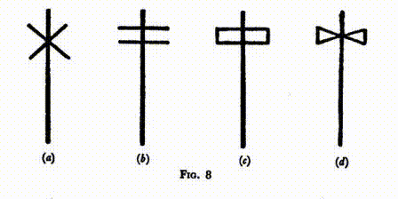

Эта длинная линия с двумя перекрестными палками в течение тысяч веков служила специальным знаком Верховного Существа. Гномы, вероятно, являются самой первобытной существующей на сегодня расой, но даже у них есть такой символ для их вождя. Старшее поколение помнит волнение, вызванное путешествием знаменитого исследователя Стэнли в центр Африки для поиска доктора Ливингстона и его возврат с историей о гномах, живущих в тамошних лесах. Рассказы Французского исследователя Дю Шайлю, привезённые около четверти века назад, подтвердились лишь после возвращения Стэнли.

Та карликовая раса - остатки древних Лемурийцев, они сохраняют чистоту этого народа лучше любых других. Лемурийцы были великанами, но с течением времени, приближаясь к своему исчезновению, стали уменьшаться в размерах. Африканские бушмены также являются потомками той же расы, но их кровь гораздо более смешанная. То же относится и к тем, кого мы обычно называем австралийскими аборигенами, с единственной разницей, что в их крови присутствует небольшая примесь арийской крови.

Было время, когда пигмеи обитали на значительно большей территории Африки, чем сейчас. Некоторые из них были первыми обитателями Египта, пришедшими туда, когда болота начали сохнуть после великого потопа, последовавшего за гибелью острова Посейдонис примерно в 9500 году до нашей эры. Вскоре их вытеснили нилотские негры, но те, в свою очередь, уступили место настоящим египтянам, вернувшимся на свою родину, которые, я полагаю, частично ассимилировались с ними. В первой главе я упоминал, что мудрецы Египта предвидели великий потоп. Из-за этого арийская часть египтян покинула страну и переселилась в гористую Аравию. Когда они вернулись спустя много времени после потопа, они обнаружили, что их землю занимают нилотские негры. Из-за частичного смешения с этими неграми в крови древних египтян можно обнаружить следы негроидной крови.

Нилотские негры также использовали тот же символ, но изменили его: вместо перекрещивания двух палок (Рис. 8 а), они расположили их на вертикальной, одну над другой (Рис. 8 б), образуя таким образом двойной крест, который до сих пор используется в греческой церкви через коптскую церковь. Между тем, данный символ претерпел еще одну трансформацию. Проведя линии, соединяющие каждый из концов (Рис. 8 c и d), мы получаем двойной топор - двухголовый боевой топор, появившийся с изобретением рукояти. Он служил знаком вождя или короля во многих местах мира. У халдеев, например, это был талисманом Раму — так называли наивысшего бога, одним из его титулов было "Бог Эпохи". Тот же символ найден у ацтеков, что свидетельствует о их связи с Египтом. Они изображали своего вождя, считающегося представителем бога, этим символом эпохи. До сих пор в Центральной Африке у некоторых племен этот двойной топор имеет свой собственный шатер, как и великий вождь.

Недавно на острове Крит были проведены обширные археологические исследования, в ходе которых был обнаружен этот символ двойного топора, представляющий божество (Фиг. 9 взята (с разрешения) из иллюстрации в книге "Дворец Миноса в Кноссосе", автора Сэра Артура Эванса). В наружных двориках храмов могущественного королевства Кноссос было много статуй, но обратившись к Святому из Святых, вы обнаружите лишь двойной топор, символ Верховного, называемый "Лабрис". Исходною     и слово "лабиринт" обозначало строение, созданное для того, чтобы в центре его разместить этот священный символ. Путь к символу был запутанным, что символизировало трудности пути к Верховному. Истории о Минотавре, Тесее и Ариадне возникли гораздо позже. До этих недавних открытий "лабиринт" считался иностранным словом неизвестного происхождения.

Молоток Мастера Ложи произошёл от данного символа, и Мастер держит его потому, что, по символике Ложи, он представляет Бога. Он символизирует управление и держится Мастером так же, как держали его первые фараоны. Сейчас его форма изменилась, и он часто принимает вид каменщического молотка. Название "молоток" произошло от слова "грань", так что это название относится к объекту более поздней формы, а не к древнему двойному топору.

В Египте двойной топор имел значение символа для Аруэриса, первого имени, присвоенного возрождённому Гору, а Гор был известен как Глава Молота, так как этот символ иногда изображался как молот. Один из старинных египетских чеканов до сих пор существует, и существуют и другие, которые возможно ещё не опознаны как таковые. Один из них находится во владении H.O.A.T.F., который использует его сегодня в своей собственной Ложе. Это тот самый чекан, которым пользовался Рамзес Великий в Египте - великолепный предмет из зелёного нефрита, украшенный золотыми инкрустациями. Вместе с ним у H.O.A.T.F. есть также плащ, который Рамзес использовал, когда исполнял обязанности Мастера своей Ложи; я не знаю, из чего он сделан, но он немного напоминает оперённые плащи, которые носили на Гавайях.

Квадрат I.M. также является инструментом власти, о чём говорится, когда его используют как трон Осириса в зале суда, упомянутом в первой главе.* (*См. плиту II (б)). С его помощью Осирис управляет и судит над душами людей, которые представляются перед ним, и решает, достаточно ли они идеальны, чтобы продвинуться далее. Отсюда мы можем увидеть современное понимание принципа "действовать исходя из квадрата", то есть действовать с полной справедливостью по отношению к нашему соседу.

В данном контексте фигура - это рабочий квадрат масона, угол в 90 градусов, используемый для проверки прямоугольности сторон камня, и, следовательно, строительной устойчивости из них сконструированной стены. Разница между двумя видами квадратов становится ясной. Квадрилатер используется, когда мы говорим о компасе, доминирующем над квадратом, но прямым углом является символ, когда мы говорим о инструменте, с помощью которого Мастер измеряет и принимает решение. Хотя R.W.M. имеет этот символ квадрата, на самом деле он - Сын, управляющий и судящий от имени Отца, который остается в тени, поскольку наши Ложи основаны на типе Христа или солнечного Бога.

В Египте существовал очень значимый символ, называемый Стрела Ра, которая включает и квадрат R.W.M., и его чекан. (Смотри плиту VIII.)

На нашей пластине разные части не связаны, но в некоторых случаях они объединяются, и тогда создаётся впечатление стрелы, по которому она и получила своё название - Стрела Ра, солнечный Бог, который также назывался Горусом Двойного Горизонта, Сыном Осириса и Исиды и в то же время реинкарнацией Осириса, находящегося в процессе эволюции. Нижняя часть рисунка относится к его спуску в материю, где перевернутый квадрат символизирует спуск, а угол снизу - пещеру материи, в которую он спускается. Верхний квадрат, в свою очередь, указывает, что он поднимается. Символ посередине, двойной топор, - это символ Всевышнего Бога; поэтому полный глиф представляет собой своеобразное символическое кредо, которое для тех, кто его создаёт, подтверждает их веру в спуск Божества в материю и его окончательное торжественное восхождение из неё: "Он спустился; Он вознесся". Если интерпретировать это в терминах христианской символики, то оно может быть названо знаком распятого и победоносного Христа, но в то же время оно является символом всего метода эволюции.

Самый символ можно увидеть во многих местах. Он находится в музее Лувра в Париже, он выгравирован на халдейском интаглио, сделанном из зеленого яшмы. Он также найден на стенах некоторых очень старых церквей в Девоншире и Корнуолле в Англии, где его, должно быть, выгравировали странствующие масоны, построившие эти церкви, поскольку правоверные христиане не могли бы знать о нём.

Обсуждая символы R.W.M., стоит также отметить три уровня, которые представлены на его фартуке вместо трёх розеток. Формально это не уровни, а фигуры, состоящие из вертикальной линии, опирающейся на горизонтальную, образуя перевернутую букву T, вот так ┴. Это имеет тот же смысл, что и колонна W.S.W., стоящая вертикально, в то время как колонна W.J.W. лежит в открытом Зале; это указывает на то, что жизнь Второго Логоса, Христа, текёт. Не то чтобы жизнь Третьего Логоса, представленная горизонтальной линией или колонкой W.J.W., перестала течь (она течет всегда, пока существует внешний мир), но Второй аспект Божественного также насыщает своей жизнью, вызывая эволюцию живых форм. Так, этот символ относится к двум излияниям и показывает, что Мастер охватывает все три представления.

Эта фигура, называемая Тау, имеет ещё одно важное значение. Вертикальная линия символизирует мужской элемент, а горизонтальная - женский Божества. Таким образом, указывается на то, что Бог проявляет себя и как Мать, и как Отец, что подтверждается в Стансах Дзян* (*Тайная Доктрина, том 1, стр. 59 и далее). Я вернусь к этому позднее, когда буду говорить о H.R.A. В древнем Египте Тау во многом занимала место креста и в связке с кругом или овалом становилась анх - символом вечной жизни.

Украшения I. P. M. похожи на украшения Мастера, так как содержат квадрат, но имеют важные добавления. В Англии украшение I.P.M. раньше было квадратом на четверть круга, сейчас это 47-е предложение из I книги Евклида, выгравированное на серебряной пластинкой, подвешенной внутри квадрата. В Соединенных Штатах это пара раскрытых до шестидесяти градусов линеек на четвертой части круга с солнышком в центре. Это предложение хорошо известно и широко применяется строителями для постройки стен под прямым углом, а также для других работ. Они используют треугольник со сторонами в соотношении 3 : 4 : 5, которые обязательно образуют прямой угол. По словам Плутарха, такой треугольник часто использовали египетские жрецы, видя в нем символ Вселенской Троицы. Тут Осирис и Исида - это две стороны, образующие прямой угол, а Гор - это гипотенуза, их результат. То, в какой мере это измерение использовали египтяне, можно судить окольцовавшему треугольник круге, где перпендикуляр составляет 300 частей, основание - 400 частей, гипотенуза - 500 частей. Это соотношение, конечно, подобно отношению числа 3, 4 и 5.

И так далее - указания на применение различных мер, полученных при помощи этого треугольника египтянами (учитывая, что текст довольно специфичный и заключается в приведении серии числовых значений, перевод можно оставить без изменений).

Для утверждения в общем виде, что в прямоугольном треугольнике сумма квадратов двух коротких сторон равна квадрату гипотенузы, современный мир обязан Пифагору. Интересно, что как I. P. M. стоит в Ложе, следя, чтобы все было в порядке, и проверяя все по своему усмотрению, так и архитектор проверяет прямоугольность здания с помощью треугольника в соотношении 3 : 4 : 5. Он также заявляет, что "Его свет всегда с нами", утверждая свое окончательное право на присутствие Божества и открывая В.С.Л.

Украшением W.S.W. служит уровень, символ равенства и гармонии, чего он должен добиться среди братьев в Ложе; как мы уже отмечали, это также символ второго члена Троицы, вселенского христианского принципа, жизненной силы на пути эволюции. Однако эти две идеи не противоречат друг другу, потому что в Христе все люди становятся братьями, ведь все жизни являются частью единой великой Жизни, в которой мы обитаем. В Ложе должно быть достигнуто абсолютное равенство, как и перед Богом, который обращается со всеми одинаково, без суждений и исходя из одних и тех же законов. Дополнительно символ уровня подразумевает, что лишь те здания, что возведены на прочном основании, могут быть крепкими и стойкими.

У W.J.W. украшением служит отвес. Этот символ указывает на правдивость и честность, которыми должно отличаться поведение братьев во время отдыха, когда они покидают пределы Ложи. Поведение, соответствующее этим качествам, приводит к жизни, наполненной благодатью и красотой.

Остальные офицеры также носят украшения своих должностей. У оратора, секретаря, казначея и D.C. это книга, перекрестные перьява, перекрестные ключи и перекрестные жезлы соответственно, значение которых является очевидным. В СоМасонстве у S.D. и J.D. каждый имеет голубя как украшение, символизирующее их роль в качестве посланников; хотя в некоторых других Ложах они имеют квадрат и циркуль, с солнцем посередине для S.D. и луной для J.D. Квадрат и циркуль представляют их дежурства по обеспечению безопасности Ложи и встречи гостей по честности и осмотрительности. Лира, кошелек, перекрестные мечи и отдельный меч, как очевидно, являются украшениями органиста, альмонера, I.G. и T. соответственно. У стюардов украшением служит рог изобилия. Они получают назначение от W.J.W., обеспечивают подачу напитков, сбор членских взносов и делают все, что в их силах, чтобы быть полезными. Рог изобилия должен напоминать им о их обязанности по обеспечению стола, чтобы каждому брату было удобно.

НЕПОДВИЖНЫЕ УКРАШЕНИЯ

T ... b ... и грубый и отшлифованный ашлары называются неподвижными украшениями, поскольку они всегда на виду и в Лодже, чтобы отображать божественную природу и служить масонам для размышлений. Однако в некоторых масонских книгах, например, в тех, что публиковались в Америке, уровень, отвес и квадрат называются неподвижными украшениями, поскольку они всегда на том же месте в Лодже, а t ... b ... и грубый и гладкий ашлары наоборот именуются подвижными украшениями, так как их можно перемещать.

В описании t ... b ..., данные в некоторых ритуалах, говорят, что это предназначено для составления планов Мастера. Однако, очевидно, что оно не совсем уместно для этой цели, так как уже занято планом или чертежом идеальной Ложи. То, что имеется в виду, это просто то, что R.W.M., с помощью остальных присутствующих братьев, должен приблизить Ложу на земле к идеальной Ложе, установив гармонию и точное совпадение. Это значит, что так же, как T.G.A.O.T.U. заложил свои планы свыше, мы здесь должны строить наши планы как можно более в гармонии с Его планами и повторяя их. Иначе говоря, t ... b ... представляет собой план, заложенный в мыслях Логоса, который греки называли "Интеллигибельным Миром". Они утверждали, что все исходит из этой мысли в мир, который мы знаем, что все задумано заранее, и что мир существовал в божественном разуме до его материализации. В Ложах два века назад t ... b ... перед каждым собранием заново рисовали на полу мелом, а не печатали; и считалось, что грамотный R.W.M. должен уметь это делать быстро и идеально, не смотря на образец.

На диаграмме t ... b ... мы видим алтарь, и на нем V.S.L. От него поднимается лестница к звезде с семью лучами, символизирующей монаду в человеке, в которой все семь видов жизни или сознания достигают идеала до максимума человеческих возможностей. Эта звезда также представляет Логоса, верховное сознание нашей солнечной системы, сознание Бога, которое уже совершено до степени, недоступной для человеческого понимания.

Лестница обладает множеством ступеней, символизирующих добродетели, позволяющие подняться к совершенству, которое изображается звездой. В Египте эти ступени символизировали инициации, ведущие вверх; но, разумеется, это всего лишь два взаимозаменяемых способа выражения одной идеи. Если мы понимаем их как инициации, они представляют определенные шаги, но если мы воспринимаем их как добродетели, они являются необходимыми качествами для прохождения инициации. В любом случае, ясно принята идея ступеней, ведущих к состоянию совершенства. Или можно воспринимать это со стороны, как делает брат Вильмсхерст в своей замечательной книге "Масонская Инициация", в которой он пишет:

Это символ Вселенной, и ее последовательность ступенеобразных планов, ведущих от высот к глубинам. Говорится, что в доме Отца есть много мест; много уровней и мест отдыха для Его созданий на их различных стадиях прогресса. Эти уровни, эти плоскости и подплоскости, обозначены ступенями и перекладинами лестницы. И для нас, в нашем текущем состоянии эволюционного раскрытия, есть три основных: физическая плоскость, плоскость желания и эмоций, и ментальная плоскость, или плоскость абстрактного разума, которая связывает нас с еще более высокими плоскостями духа. Эти три уровня мира отражены в человеке. Первый соответствует его материальной природе, его чувственному телу; второй - его желаниям и эмоциональной природе, которая является результатом взаимодействия его физических чувств и его сверхфизического разума; третий - его интеллекту, который еще дальше отдален от его физической природы, и образует связующее звено между последней и его духовным существом. …

Итак, Вселенная и сам человек создаются в виде лестницы, в упорядоченной последовательности ступеней; единое универсальное вещество, образующее различные части Вселенной, "спускается" из состояния крайней эфирности по ступеням, становясь все более плотным, пока не достигает состояния грубой материализации; и затем "восходит" по аналогичной упорядоченной системе планов до своего источника, но обогащенное опытом, приобретенным во время процесса.

Этот космический процесс был предметом сна или видения Иакова. … То, что "приснилось" или было видно ему сверхсенсорным зрением, можно воспринять и сегодня, если у вас открыты внутренние глаза. Каждый настоящий Инициированный - это тот, кто расширил свое сознание и способности настолько, что может видеть тонкие миры, открытые еврейскому Патриарху, так же легко, как неинициированный человек видит явный мир своими внешними глазами. Инициированный способен видеть ангелов Бога, восходящих и спускающихся; то есть он может непосредственно видеть великую лестницу Вселенной и наблюдать за сложным, но упорядоченным механизмом инволюции, дифференциации, эволюции и реинтеграции, составляющим жизненный процесс. Он может наблюдать, как человеческие сущности или души спускаются по плоскостям с увеличением плотности и уменьшением вибрационного темпа, обрастая покрывалами вещества с каждого уровня, пока наконец не достигается этот самый низкий уровень полной материализации, где большая борьба за главенство между внутренним и внешним человеком, между духом и плотью, между реальным Я и нереальными сущностями в оболочках вокруг него, должна быть разрешена на черно-белом полу нашего существования, среди противоположностей добра и зла, света и тьмы, процветания и нищеты; и он может наблюдать за возвратом тех, кто победил в борьбе и, достигнув обновления и сбросив или преобразовав "мирские владения", приобретенные во время их спуска, возвращаются к своему источнику, остаются незамаранными и чистыми от пятен этого недосовершенного мира.* (*Op. cit. стр. 64-66.)

На лестнице представлены три эмблемы: крест, якорь и чаша с протянутой рукой, стремящейся ее коснуться. Объяснение t … b … в ритуале говорит о них как о трех основных добродетелях: вере, надежде и любви. Если говорить точно, стандартным символом любви является сердце, и оно действительно появляется на некоторых t … b … s вместо чаши; но чаша является более древним символом и для нас она означает гораздо больше.

Еще одна, очень красивая, интерпретация креста на лестнице даётся братом Вильмсхерстом, который видит в нем изображение всех ищущих, поднимающихся по этой лестнице. Он говорит:

Каждый несет свой крест, свое собственное крестообразное тело, в процессе восхождения; это материальное облачение, наклоны которого всегда противодействуют стремлениям духа и мешают подъему. Несмотря на эту нагрузку, каждому приходится взбираться вверх, и делать это ему приходится в одиночестве; но при этом он тянется вверх - как учат тайные традиции, и как указывают руки наклоненного креста - одной рукой к невидимым помощникам свыше, а другой – чтобы помочь восхождению более слабых братьев ниже. Поскольку стороны и отдельные ступени лестницы образуют единство, так весь живой мир и все жизни в его основе объединены, и никто не живет исключительно для себя. (*Op. cit. p. 69.)

Эти три символа также вновь напоминают о трех излияниях божественной жизни, которые находят соответствие в развитии личного "Я" человека. Сначала ему предстоит познать мир материальных вещей, затем - мир сознания или жизни, и, наконец, он должен воспарить к истинному "Я". С египетских времен и крест, и якорь претерпели изменения, а вот чаша осталась такой же. Крест изначально был таким, как ныне называют греческим, с равными сторонами. Этот символ всегда относился к первому излиянию божественной жизни через третий аспект Бога или третьего члена Троицы, называемого среди христиан Богом-Святым Духом, а иногда - Жизнедателем, покровительствующим над водами пространства.

Еще один аспект в символике - это то, что крест в себе содержит квадрат, уровень и отвес; мы находим об этом в послании к Ефесянам, написанном св. Игнатием (по традиции, он был тем малышом, которого Христос однажды посадил посередине учеников в качестве примера тех, кто наследует Царство Небесное). Удивительная масонская цитата гласит:

Вы - камни Храма, заранее приготовленные для строительства Дома Бога-Отца, поднятые на высоту инструментом Иисуса Христа, которым является крест, и использующие в качестве веревки Святой Дух; ваша вера - это лебедка, а любовь - путь ведущий к Богу.

Иногда на равносторонний крест налагают розу, тогда получается Розкройцерский крест, великий символ розенкрейцеров, который играет значительную роль в восемнадцатой степени. Мальтийский крест - это другой его вариант, с расширяющимися руками, символизирующими постоянно увеличивающуюся источающуюся силу. Также мы находим его в виде пламени, вырывающегося из концов креста; и когда он активно вращается, с пламенем, выбрасываемым под прямым углом к вертикали креста, мы видим известную форму, называемую свастикой.

В наши дни крест на лестнице обычно изображают в виде латинского креста, что делает его символом Второго Излияния, из Второго Лица Троицы. Обычно его рассматривают как крест Христа, хотя кресты различных форм использовались в качестве символов за тысячи лет до воплощения Христа в Палестине. Первое Излияние, символизируемое греческим крестом, подготавливает мир к приему жизни; оно производит материальные элементы, но не формированные из них тела. Например, это излияние могло породить кислород и водород, но не их соединение, воду; так как объединение элементов в тела с все более сложной организованной структурой и функцией является результатом второго излияния божественной жизни или силы.

Второе Излияние обозначено якорем, который в Египте первоначально выглядел как маленький маятник, колеблющийся над шкалой, изогнутой для совпадения с дугой его движения. Непроблематично представить, как это могло превратиться в якорь, особенно среди людей, которые видели в кресте и якоре символы веры и надежды. Такая модификация могла легко произойти без осознанного намерения; и когда было определено, что третье качество должно быть любовью, мы можем понять, почему чашу иногда заменяют на сердце. Чаша также может указывать на любовь, выступая в роли чаши жизни, из которой изливается любовь; но многие люди считают сердце более доступным символом этой добродетели.

Те, кто знаком с греческой философией или системами гностиков, помнят важную роль, которую играет в них кратер или чаша. Она является сосудом, в который наливают вино божественной жизни. В христианской традиции это Святой Грааль, наполненный ценной кровью Христа; чаша, используемая при учреждении Святого Евхаристического Священнодействия; чаша, которую предположительно держал Иосиф Аримафейский, чтобы собрать святую кровь Иисуса во время его распятия. Однако, всё это является аллегорией. По-настоящему чаша символизирует причинное тело человека, а вино - это божественная жизнь, которая испускается в него при Третьем Излиянии Первого Логоса в момент индивидуализации; процесс, превращающий животное в человека, ещё несовершенного, конечно, но способного к совершенству.

Таким образом, эти три символа отображают ценные дары божественной жизни или три великих эманации Логоса. В эпоху Древнего Египта термин "Логос" ещё не существовал, поэтому говорили об Осирисе и Горе, но преподавание оставалось тем же, ведь истина об этих вещах универсальна. Так t…b… демонстрирует, что человек, разбирающийся в схеме эволюции жизни в мире, может осознанно содействовать божественному плану, до тех пор пока он не достигнет совершенства в качестве человека и не достигнет семизвездной звезды. После этого он готов перейти к более высоким условиям, которые на t…b… обозначаются облаками, солнцем, луной и звездами. Ведь истинная философия распознает план, нарисованный Т.Г.А. на Трафарете Времени для создания Вселенной.

Остальные драгоценности, грубый и гладкий ашлары, видны на t…b… рядом с колоннами, которые представляют столбы W.J.W. и W.S.W. соответственно. Гладкий ашлар обычно подвешивается на шкиве и держится льюисом,* (*См. рис. 11.), инструментом, состоящим из клиновидных частей из стали, которые вставляют в специальное углубление в камне для его поднятия. Архитектор, изобретший этот инструмент, назвал его в честь короля Людовика XIV. Тот, кто является сыном или дочерью масона, называется льюис (ведь предполагается, что он поддерживает своих родителей на старости), и обычно считается, что он может быть принят в масоны в 18 лет, хотя некоторые утверждают, что это возможно только по специальному разрешению, в общем это считают его правом.

Грубый ашлар отражает необразованный ум кандидата. Предполагается, что он находится в тьме и невежестве, но постепенно, в процессе масонской работы и обучения, его ум оттачивается, и затем его могут проверить с помощью уровня, штангенциркуля и отвеса, и он будет точным. Гладкий ашлар представляет собой состояние, которого должен достичь F.C. В контексте эволюции и реинкарнации мы можем считать грубый ашлар символом молодой души. Через многие испытания и усилия, жизнь за жизнью, он должен отшлифовать свою сущность и развить свои способности. Три степени в масонстве обозначают три этапа этого процесса. Задача E.A. - взять себя в руки с моральной точки зрения и победить физическое тело, так что его импульсы не помешают его быстрому развитию или эволюции. E.A. в Египте обычно занимались в течение семи лет в Первой Степени, так как он должен был хорошо подготовиться к просветлению, которое может прийти только тому, кто контролирует свои эмоции и достаточно очищен, чтобы отразить и служить высшему я. После этого гладкий ашлар должен совершенствоваться до тех пор, пока не будет готов стать живым камнем в храме Т.Г.А.О.Т.У., готовым стать частью небесного Человека будущего.

## Глава IV. Предварительные Церемонии

Ритуал Со-Масонства

рассматривая церемонии свободного каменщика, я буду опираться на ритуалы Со-Масонства, потому что они в большей степени были организованы с учётом их влияния на духовные плоскости. Описанные здесь ритуалы создавались с использованием нескольких наиболее важных существующих ритуалов и с участием опытных братьев. Они включают в себя наиболее значимые моменты этих ритуалов, а также множество уникальных аспектов, свойственных нашей практике. Нами признавалось желательным предоставить братьям в столбах большую роль в работе Ложи, поэтому в практику были внедрены некоторые стихи из Священного Писания и некоторые известные масонские гимны.

Высший Совет Всевозможного Созидательного Масонства с безграничной щедростью и максимальной толерантностью разрешает своим подданным выбирать из нескольких разновидностей Ритуала. Некоторые Ложи предпочитают самую простую форму, практически тождественную той, что используют в мужском Ремесле; другие считают немного более развёрнутый подход более вдохновляющим и полезным, так как он более полно отражает внутреннюю работу, которая является для них главной целью церемонии. Я собираюсь попробовать объяснить последний вариант, но хочу ясно подчеркнуть, что моё толкование является только моим субъективным мнением, и Высший Совет, на служении которого мне льстит быть, не должен считаться поддерживающим этот взгляд только потому, что он позволяет использование Ритуала.

Не следует думать, что более короткий масонский ритуал мужского Ремесла - это неэффективный. Всё, что мы говорим, - это то, что цели разнообразных обрядов достигаются быстрее и полнее, когда их истинное значение и намерения внимательно понимают.

ПРОЦЕССИЯ

Всюду на поверхности земли проходят мощные магнитные течения между полюсами Земли и экватором, а также другие, идущие под прямым углом к ним вокруг Земли. Церемониальное вступление в Ложе в Co-Masonry использует эти течения, создавая из пространства, которое мы обходим, отдельное вихревое или специально намагниченное пространство.

Когда братья маршируют по полу, поётся псалом прольют свои мысли в слова возносимой песни, и проконтролируют, чтобы процессия была аккуратной и в правильном порядке. Но помимо этого они должны направлять свои мысли на намагничивание мозаичного покрытия и пространства над ним. В древнем Египте считали обязанностью братства управлять токами и формировать вихрь, сильно намагничивая пол, где они обходились. Для этой цели сотрудники и почетные гости обходят Ложе, иногда дважды проходя по некоторым участкам, не идя прямо к своим местам при первом приближении, как это делают ученики, мастера и старшины, но продолжают движение, чтобы завершить обход, как описано в Ритуале Всемирной Созидательной масонии (5-е издание).

Также у нас в Ложе Мастер отвечает за намагничивание двойного квадрата, но все братья должны помочь в этой работе. Цель этого - наполнить пространство наиболее возможным влиянием, и построить вокруг него стену, чтобы это влияние оставалось на месте. Роль образа мыслей схожа с ролью конденсатора. Не важно, сколько пара мы можем создать, он бесполезен для работы, если не сосредоточен и не находится под давлением. В этом контексте мы собираем и используем силу, которая иначе бы просто рассеивалась по округе.

Как было объяснено в главе III, когда пол было таким образом подготовлено и отделено, по нему проходят только кандидаты, которые приводят туда для проведения инициации и которые специально подвергаются влиянию его магнетизма, кадильщик, когда он окадывает алтарь, и Предшествующий Мастер, когда он спускается со страны для выполнения обязанности открытия Священной Книги или изменения положения s... и с... когда мы переходим с одной степени на другую. Ещё одним исключением является момент, когда S.D. во время церемонии зажигания свечей приходит к алтарю, чтобы получить священный огонь от Предшествующего Мастера. Предшествующий Мастер зажигает свечу от священного огня, и этой свечой зажигает малую свечу, стоящую в украшенном медном сосуде, которую S.D., в роли Люцифера, дарит Почётному Мастеру и Великим мастерам.

Теперь по полу бросаются магнитные токи или линии силы, подобные основанию и переплёту материала, и это образует основание, на котором мы строим огромный образ мысли, являющийся одной из целей нашей масонской встречи. Учитывая огромную ценность образа мысли, созданного на полу Ложа, мы можем видеть, как важно, чтобы никто не нарушал или не смущал течения, идя в неправильном направлении, или приводя в Ложе мысли о повседневных делах - заботах, тревогах и конфликтах обыденной жизни. Мы приходим в Ложе, чтобы совершить определенную работу для человечества, и мы должны уделять ей всё наше внимание на протяжении всего собрания.

Пение процессиональных кантиклов призвано помочь нам согласовать наши мышления. Слова кантиклов повествуют нам об основе, на которой строятся все здания, T.G.A.O.T.U., который сам по себе является основанием и структурой всего, потому что нет ничего, что бы не было его частью. Каждый участник, идущий в процессии, должен посвящать себя и все свои мысли и силы великому делу, которое предстоит предпринять. Эти слова, которые мы поем, имеют сильную масонскую ассоциацию, так как метрическая версия стотого псалма использовалась при открытии ложи Canongate Kilwinning с момента ее основания в 1723 году. Есть одно слово в этой версии, на которое я хочу специально обратить внимание. В первом стихе, где мы поём "служи Ему с весельем", один непонятливый гимнолог заменил слово "веселье" на "страх", что абсолютно неточно и полностью неоправданно. В Библии нас просят прославлять Господа с радостью и приходить перед Его присутствием с песней, и мы должны тщательно сохранять правильный дух и изложение. Другой кантикл: "Я был рад, когда они сказали мне: пойдем в дом Господень", состоит из текстов, взятых из V.S.L., составленных таким образом, чтобы образовать красивое и подходящее поклонение.

Вся эта посвященная мысль формирует основу великолепного здания, которое ложа собирается построить, истинного храма, священнодействие которого в земном мире является только внешним символом, храма из более тонкого материала, через который можно делать совершенно реальную работу и распространять огромные объемы духовного влияния. Этот храм - это также визуализация вихря, который T.G.A.O.T.U. создал, когда собирался создать свою солнечную систему. Он начал с установления своих границ, определив границы своей системы, внутри которых он создал огромный эфирный вихрь, остатки которого мы находим сегодня в системе вращающихся планет, сжатых из первоначальной туманности, по мере ее охлаждения и превращения в более плотное физическое вещество.

В Ко-масонских ложах процессию возглавляет кадильщик с кадилом, из которого идет дым от ароматических смол, специально смешанных с другими веществами для этой цели. За ним идет Т. со своим мечом, а за ним - D.C. Этой небольшой группе особенно доверено дело очищения ложи. D.C. должен быть руководящим умом в этой работе, а Т. со своим мечом - рукой, которая выгоняет из ментальной и эмоциональной атмосферы все ненужные там мысли.

За этим очищающим клином идут все обычные члены, расположенные в обратном порядке старшинства. В конце процессии идут старшие офицеры и те, кто имеет более высокую степень, и, в конце концов, R.W.M., который должен завершить работу всех тех, кто шел перед ним, используя преданность, которую предложили другие, и построить стены cella как можно дальше с использованием доступного материала. Мы строим форму старого греческого храма с колоннами вокруг него и внутренним святилищем внутри, называемым cella, которое было закрыто и темно, единственное отверстие было входом. В ложе члены встают вокруг, будто колоны старого храма, как показано на нашей иллюстрации (Plate V).

ФАРТУК

Каждый масон на заседании ложи должен носить уникальный знак, который мы называем фартуком, и только надев его, он в терминах масонов считается "правильно одетым". Он может носить дополнительные украшения, такие как ожерелья или драгоценности, символизирующие специальный пост, который он занимает, или степень, которую он обрел, но если он не носит как минимум фартук, его не должны допустить в ложу - единственное исключение составляет кандидат на инициацию, который, еще не являясь братом, не имеет права носить этот отличительный знак. Существуют определенные более высокие степени, в которых фартук не носится, но его место занимает другая инсигния. Это из-за того, что нужда в нем прошла. Есть некоторые ложи, в которых люди надевают и снимают свои фартуки в храме, но это никогда не должно быть допустимо.

Необходимость в том, чтобы масоны были правильно одеты, напоминает о древних Мистериях и также объясняет, почему фартук является существенной частью масонской одежды, который должен быть надет на всех, за исключением вышеупомянутых случаев. Наш современный фартук немного отошел от формы, использовавшейся в древнем Египте; вероятно, его вид был изменен в те времена, когда стало необходимым объединить теоретических и действительных масонов в дни преследования со стороны Церкви. Древнеегипетский фартук* (см. Рисунок 1 и рисунок 12), был треугольным, с верхушкой вверх, и его украшение отличалось от того, что используется сегодня. Но самым значительным изменением является то, что фартук сам по себе теперь считается всем,

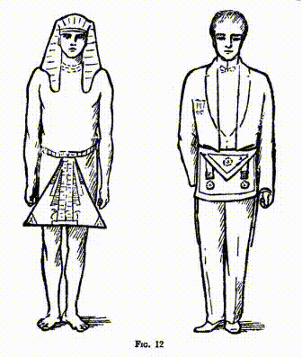

и полоса, вокруг тела служит просто для его удержания на месте. В давние времена пояс фартука был наиболее важной практической составляющей, и его значение превышало просто символическое. Этот пояс представлял собой сильно намагниченный круг, задачей которого было оберегать в его владении диск эфирного вещества, отделяя верхнюю часть тела от нижней, чтобы могучие силы, мобилизованные в масонской церемонии, были полностью изолированы от нижней части тела человека.

В "Смысле Масонства" брат Вильмсхурст пишет:

Масонство - это система Священнодействия, всеэлементы которого, как и любого Священнодействия, обладают явленной и слышимой стороной, она включает обряды, учение и символы, которые мы можем увидеть и слышать, и скрытой, интеллектуальной и духовной стороной, которая скрыта за обрядами, учением и символами, и доступная только масону, обученному использованию своего духовного воображения и способному ощутить реальность, скрытую за вуалью явных символов.* (*Смысл Масонства, с. 21.)

Он напоминает нам, как в случае E.A., конец фартука поворачивается вверх, превращая его в пятиугольник, символизирующий человека в пяти измерениях. По его объяснению, треугольник, сделанный поднятым клапаном, находится выше квадрата и символизирует, что душа на этой стадии нависает над нижним телом, но вряд ли можно сказать, что она действует через него. Позже этот клапан опускается вниз, демонстрируя, что душа находится внутри тела и работает через него. Он также рассказывает нам, что ягненок в первую очередь символизирует чистоту, но также представляет неизвестную неразвитой души, или, как говорят в теософии, причинное тело. В нем, как известно некоторым из нас, со временем расцветают богатые цвета по мере пробуждения новых вибраций. Детальное описание этого, иллюстрированное цветными рисунками, можно найти в книге "Человек, видимый и невидимый".

Он также объясняет, что бледно-голубой цвет розеток на фартуке F.C. и голубая окантовка и подкладка, а также серебряные кисточки на фартуке M.M. указывают на то, что на этой стадии голубое небо начинает прорываться сквозь белоснежность. Невинность, насколько прекрасной она ни была, в какой-то степени сменяется знанием, и по мере приближения к более высоким степеням появляется всё больше красоты. Он делает особый акцент на том, что есть два потока воздействия или духовной силы, идущих сверху, каждый из которых оканчивается семью серебряными линиями - своеобразными кисточками - отображающими семь цветов спектра. Они символизируют семь великих разделов или разнообразий или темпераментов жизни. В Американском масонстве, согласно Энциклопедии Макея* (*Art. Apron.), на протяжении всех трех степеней Голубого масонства фартук остается неизменным, они сделаны из белой кожи ягненка с узким голубым кантом. Ко-масонство следует принятым в Великой ложе Англии традициям, за исключением того, что вместо небесно-голубого канта и розеток, предписывается кант более глубокого синего цвета с узким крайом красного цвета, а розетки изготавливаются из аналогичного материала. Кисточки позолочены, а не покрыты серебром, и их семь линий символизируют семь лучей жизни и семь ступеней материи. Наши иллюстрации представляют фартуки M.M., так, как они носятся в Египте и в настоящее время. (Рис. 12.)

ЦЕРЕМОНИЯ КАДЕНИЯ

Когда все занимают свои места, начинается церемония кадения. Турецвет подходит к пьедесталу R.W.M., который кладет на угли в кадиле некоторое количество благовоний, которые он заранее намагничил, или, что даже лучше, он намагничивает благовония, пока они тают в кадиле, так как в этом состоянии они наиболее отзывчивы к его силе. Поскольку эта церемония может быть незнакома в некоторых Ложах, я привожу ее здесь по ритуалу Ко-масонства:

Во время церемонии играет подходящая музыка, с Братьями остающимися стоя. После того как все заняли свои места, Турифер подходит к подножию Правого Ворш.М., который помещает на уголь в кадиле инценс, который он ранее освятил. Турифер отступает и кланяется Правому Ворш.М., который отвечает тем же. Затем он освежает Правого Ворш.М., с тремя триплетными взмахами `*** *** ***` , коротко держа цепи, а кадило протягивается на уровне глаз, но немного опускается после первого и второго наборов взмахов. Затем кадило крепко берется за цепи правой рукой и, при наличии достаточного пространства, размахивается полностью в форме буквы V, с тремя длинными достойными ударами справа от подножия, затем три удара слева. После этого, с рукой, протянутой вперед, кадило делает семь постепенно уменьшающихся кругов, каждый круг выше предыдущего, так что к моменту изготовления седьмого и самого маленького круга рука поднимается до полной высоты. Турифер снова кланяется Правому Ворш.М. и идет прямо к алтарю, который он обходит, начиная с востока, вращая кадило на короткой цепи с круговыми движениями. Затем он возвращается к подножию Правого Ворш.М., кланяется и проходит к подножию Брата Младшего Опекуна, где повторяется церемония, прошедшая на предыдущем подножии, за исключением того, что Брат Младший Опекун получает пять взмахов от кадила, одну триплетную и двух одиночных `*** * *`. Паузу соблюдают между одиночными взмахами, так же как и между триплетными. Далее он проходит к подножию Брата Старшего Опекуна, освежая его таким же образом, но тот получает семь взмахов, два триплетных и один одиночный `*** *** *`. Затем Турифер обращается к Брату Диакону, кланяется ему, и когда он вернул кланяние, освежает его тремя одиночными взмахами * * *. После благословения они кланяются друг другу, после чего Турифер проходит к подножию Брата Старшего Диакона, который освежается таким же образом, но с четырьмя взмахами, один триплетный и один одиночный `*** *`.

Турифер теперь освежает замечательных гостей по их рангу, начиная с тех, кто имеет высшее достоинство (девять взмахов для 33°, семь для 30°, пять для 18° и посещающих Бывших Мастеров-взмахи должны быть разделены как указано выше), кланяется, проходя мимо подножия Правого Ворш.М. и освежает Бывших Мастеров (Бывший Мастер получает семь взмахов). Затем он занимает свою позицию перед подножием Мастера, вернувшись непосредственно к нему; затем, кланяясь ему, он поворачивается и глядит на Братьев, кланяется им коллективно, и (оставаясь неподвижным) поочередно освежает их всех, начиная с тех, кто находится слева от него, и завершая теми, кто справа. Это сопровождается рядом коротких взмахов, направленных вниз по Ю. солоне и вверх по С. в быстрой последовательности. Братья стоят со сложенными руками на груди, ладони складываются вместе, и они по очереди кланяются, как только взгляд Турифера обращается к ним. Эта церемония должна быть тщательно выполнена, каждый Брат кланяется моментом позже, чем его предшественник. Указанная выше позиция рук должна соблюдаться всеми должностными лицами во время освежения. Турифер выстраивает Ложу и переходит к месту внутреннего стражника, которого он освежает двумя одиночными взмахами * *, затем он передает ему кадило. Внутренний стражник освежает T. одним взмахом *, а затем передает ему кадило. Вся церемония должна проводиться так быстро, насколько это совместимо с достоинством; никаких лишних задержек не должно быть. Пока Турифер освежает разные подножия, Братья должны объединиться в мыслях о трех принципах, которые они представляют Правый Ворш.М. - Мудрость; Брат Старший Опекун - Сила; Брат Младший Опекун - Красота. Следует делать то же самое, когда свечи зажигаются на каждом подиуме. Когда освежается алтар, мысли должны быть о Единстве Братства.

Освежение подиумов этим образом создает перед каждым из них сильно магнетизированный конус или форму в виде улья, в которой стоит кандидат, когда он подходит к любому из подиумов. Это делается для этой цели и может расширяться, когда несколько кандидатов приходят вместе, но оно становится немного тонким, если число большое. Освежение должностных лиц предназначено для подготовки их к предстоящей работе. Отличное количество взмахов дано не только для того, чтобы почтить этого человека, но и для укрепления его для его труда, и это достигается путем установления связи с силами внутренних плоскостей. Чем выше человек в степени, тем больше он отдает по сравнению с тем, что получает. Мастер отдает больше всего, но столбы получают больше, чем отдают; однако каждый, когда глядит на Турифера, должен стараться отдать столько, сколько только сможет.

Использование благовоний абсолютно научно. Все изучающие оккультизм знают, как говорилось в последней главе, что не существует действительно мертвой материи, но что все в природе обладает и излучает свои собственные вибрации или их комбинации. Каждый химический элемент имеет свой набор влияний, которые полезны в одних случаях и бесполезны или даже враги в других. Так, например, вполне возможно смешивать некоторые смолы, которые при сжигании в виде благовония сильно стимулируют чище и высшие эмоции; но можно также сделать другую смесь, вибрации которой способствовали бы самым нежелательным чувствам. Некоторые сомневаются в этом, потому что человечество в настоящее время проходит этап своего развития, когда почти исключительно развивается нижний ум, который крайне не терпим к тому, что он не изучил особо. Всем нам известно, насколько сложно было до недавнего времени получить признание для нематериальных феноменов, таких как телепатия или ясновидение, или что-либо вне наиболее материалистической науки.

Теперь пришло время, когда люди начинают усматривать, что жизнь полна невидимых влияний, значение которых может распознать чувствительный человек. Влияние благовония — яркий пример подобных явлений, а также результат использования талисманов и некоторых драгоценных камней, каждый из которых вибрирует со своей частотой и имеет свою ценность. Такие вещи обычно не столь важны, чтобы уделить им много времени, однако все они оказывают свое влияние и потому не должны быть полностью игнорированы мудрыми людьми.

Благовония, применяемые в Ложе, служат очищению той части человеческой природы, которую иногда называют астральным телом. Они состоят из смол, излучающих интенсивную очищающую вибрацию. В этом отношении их воздействие схоже с распылением дезинфицирующего средства: оно распространяется в воздухе, уничтожая патогенные микробы. Однако в данном случае действие происходит на более высоких уровнях и с более тонкими материями. Благовония также привлекают обитателей внутренних миров, чье присутствие ценится в нашей работе, и отгоняют неподходящих.

Два самых важных компонента благовоний, которые полезны для нашей работы, - это бензоин и ладан. Бензоин служит мощным очистителем, отгоняя все грубые или чувственные чувства и мысли. Ладан не связан с этим, но он создает обстановку благочестия и покоя, стимулируя на астральном теле те вибрации, которые делают людей открытыми для восприятия более высоких истин. Полезен также аттар роз, он значительно усиливает общий эффект.

Если благовония правильно насытить магнетизмом, их сила увеличится многократно. К примеру, вводя в ладан определенную силу воли в направлении спокойствия и преданности, можно усилить его влияние, возможно, в сто раз. Именно по этой причине благовония в церкви всегда подносят к причастнику для благословения, а в Ложе передают Благородному Мастеру, чтобы тот мог наполнить их тем качеством, которое, по его мнению, будет полезным для работы в тот день. Кропление святой водой в церкви — еще один способ добиться подобного эффекта, однако у благовоний есть преимущество: они поднимаются в воздух, и куда бы не попала отдельная частица, очищение и благословение распространяются вместе с ней.

На всех встречах, особенно в Ложе, важно, чтобы в мыслях Братьев было только несколько четких и сильных эмоциональных изменений и мыслей. Однако иногда у них в голове одновременно вращается сорок или пятьдесят маленьких вихрей эмоциональной и умственной активности, каждый из которых представляет собой какую-то маленькую беспокойство или желание. При таких обстоятельствах человеку трудно хорошо работать, и практически невозможно добиться реального прогресса в развитии сознания. Если он старается достичь лучшего эмоционального и умственного состояния, благовония предложат ему укрепляющий поток вибраций, который очень поможет распутать это клубок и восстановить спокойствие и стабильность.

Иногда мы сталкиваемся с большим предубеждением против использования благовоний, которые, как предполагается, связаны исключительно с обрядами Римской Церкви. Ведь лишь там и в некоторых высоких англиканских церквях западные люди видели их применение. Однако те, кто путешествовал на Восток, или изучал другие религии, знают, что почти все религии мира используют благовония. Они использовались в храмах индуистов, зороастрийцев, джайнов, а также в китайском и японском Шинто. В прошлом их использовали в Греции, Риме, Персии и в обрядах Митры. Все эти люди, включая римско-католических, использовали его, зная о его полезности; тогда почему бы и нам этим не воспользоваться?

В Англии некоторое время после Реформации был сильный пуританский подъем, который привел к убийству короля Чарльза, к установлению Республики и правлению Кромуэля. Хотя во времена Восстановления была реакция, наиболее интенсивное пуританское настроение все же сохранилось, и до сих пор в Англии видны его следы, иногда проявляющиеся в удивительных и неразумных предубеждениях.

Такое настроение иногда проникает в масонские круги, и были предприняты попытки уговорить Великую Ложу ограничить определение Великого Архитектора, чтобы исключить возможную привязанность Масонства к не-протестантским убеждениям. Однако Великая Ложа щедро отказывалась создавать такие ограничения. В Великой Ложе Англии для церемонии освящения Лоджии предписывается использование благовоний* (*См. "Работу капеллана и органиста", автор Рев, Дж. Т. Лоуренс). При этом освящающий офицер и Старейшины подвергаются обкурению, хотя не указывается конкретное количество замахов. Благовония также используются при освящении главы Священного Королевского Арка под Высшей Великой Главой Англии, а также в обряде многих высших степеней. Так что введение их в Ко-вольные Ложи не является новшеством, а полностью соответствует масонским традициям.

Количество ударов, данных каждому из неофициальных братьев, указывает на его специфический ранг в Ордене, ведь степени Древнего и Принятого Шотландского Ритуала учитываются в Ко-Масонстве. Именно так каждый получает нужное ему воздействие, позволяющее собрать силы для выполнения работ, к которым его допускает его ранг. Каждый брат, которого окуривают, склоняется в знак уважения и посвящает всю имеющуюся у него силу T.G.A.O.T.U.

Зажигание Свечей

Заместителю Директора являет собой Люцифера, как носителя света для своих товарищей. Свет, полученный от Священного Огня от Великого Мастера Прошлых Лет, приводит к Правому Ученическому Мастеру, который при помощи маленького светильника зажигает от него высокую свечу, стоящую справа от него, а потом тушит свою свечу угасителем. Он не может задуть ее, так как это символизировало бы осквернение священного огня нечистым дыханием. По той же причине песни, которых иногда называют огнепоклонниками, так как они воспринимают огонь как наивысший символ и воплощение божественности, никогда не будут его осквернять мусором. Правый Ученический Мастер говорит: "Пусть свет мудрости осветит нашу работу" (здесь он зажигает свою свечу); "Его мудрость бесконечна." Заместитель Директора затем переносит свет к старшему Столяру и младшим Искусникам, которые зажигают свои свечи и говорят об укреплении и красоте T.G.A.O.T.U.

В этом обряде нас вновь напоминают о трех Аспектах T.G.A.O.T.U., и здесь они символизируются как проявление из неподвластного форматирования в подвластное в порядке мудрости, силы и красоты, в подготовке к открытию Ложи, началу строительства храма. Когда начинается работа, как мы увидим в следующей главе, процесс обратный, но здесь мы объединяем только подготовку, проявление мудрости для планирования, силы для осуществления и затем красоты для украшения.

Использование огня в церковных или масонских обрядах по большей части не понято. Зажигание свечи с религиозным намерением аналогично молитве и привлекает силу с небес. Так, три главных офицера, высказывая эти фразы в момент зажигания своих свечей, не просто символически объявляют о том, что они представляют определенные аспекты божественности, но фактически открывают путь к четкой связи с этими аспектами, которая возникает в ответ на их просьбу. Электрические лампы, которые некоторые Ложи используют вместо свечей, не создают такого же эффекта; они излучают свет, но не огонь, и поэтому не достигают полного результата. Однако для Пылающей Звезды и Звезды Инициации допустим использование электрического света, где действие и символика связаны исключительно со светом.

То, что я говорил ранее о необходимости помощи офицерам со стороны Братьев, особенно важно здесь. Когда ПВМ говорит: "Пусть его мудрость проливает свет на нашу работу", все должны объединиться с ним, вложив все усилия, чтобы призвать божественную мудрость, чтобы она через него обрушилась на Братьев. Также когда ЗСП говорит: "Пусть свет силы поддерживает нашу работу", все должны глубоко задуматься о божественной силе и молиться о том, чтобы она текла через него; и еще раз подобное усилие необходимо, когда ЗМП говорит: "Пусть свет красоты раскрывает нашу работу", и Предыдущий Правый Мастер заявляет: "Его свет живет всегда среди нас".

Мы не должны относить к этим мыслям старую и, как мне кажется, ложную идею молитвы – что мы обязаны умолять Великого Архитектора Вселенной о внимании. Мы знаем, что Он всегда дарует нам свою силу; нашей задачей является открыть канал для неё. Его земной символ — это солнце, которое всегда излучает свет, жизнь и славу, и не требует уговаривания светить. Поэтому, произнося эти слова, мы просто стремимся сделать себя и Ложу каналами Его служения.

На протяжении всего этого процесса мысли Братьев важны, но особенно важны они, когда происходит окадывание алтаря: в этот момент они должны думать о божественной любви. На Правом Четном Мастере лежит обязанность руководить всей работой, каждый из офицеров должен исполнять свою роль, но полный успех плана зависит от уединённости и бескорыстия каждого Брата в Ложе. Без этого работа теряет свою живую сущность. Боюсь, что во многих масонских Ложах, даже если их работа окрашена великой идеей благотворительности, полностью отсутствует духовное воздействие. Они исполняют ритуал точно и изящно, но не понимают, насколько много зависит от вложенной в него мысли и понимания всего того, что он означает и подразумевает. Благословение Великого Архитектора вызывается не столько бездушной формулой слов и действий, сколько духом, который лежит в основе работы Ложи.

## Глава V. Открытие Ложи

Братья Помогают

После окончания церемонии зажигания свеч Братья занимают свои места, а Правый Четный Мастер просит их уделить несколько минут воздвигающему к Великому Архитектору Вселенной стремлению, крепко решив, что работа, которую предстоит сделать сегодня вечером, будет хорошо и полно выполнена, и что каждый Брат помнит, что он делает это в Его имя и для Его славы.

М.М. затем дает один удар К...К. и призывает Братьев помочь ему открыть Ложу. Некоторые могут спросить, почему ему нужна их помощь, чтобы совершить на первый взгляд такое простое действие, как открытие Ложи. Но дело в том, что это действие гораздо сложнее, чем кажется. Открытие масонской Ложи — это чрезвычайно красивый и интересный обряд, и успех работы за вечер зависит от того, насколько правильно и полно он выполнен. Задача перед нами не проста, ведь перед нами ничто иное, как совместное стремление выполнить задачу, возложенную на нас, как на обладателей Света, распространять этот Свет по свету и стать соработниками В.В.А.В.В. в Его великом плане эволюции Братьев.

Он насыщает мир духовной энергией, как солнце излучает свет. Но мир полон темноты, куда солнечный свет не долетает прямо, и много душ, не могут впитать и усвоить эту божественную силу. Как люди с помощью зеркал отражают солнечный свет в пещеру или подвал, так и они могут отражать духовный свет на затемненные души, возможно представляя его так, чтобы они могли принять и использовать его. Весь свет в мире – это преобразованный солнечный свет. Даже когда мы горим уголь для газа или горим масло в лампе, энергия не меньше преобразованной солнечной энергии.

Великий Архитектор излучает Свою силу на всех уровнях, особенно на высших плоскостях. Но большинство людей еще не достаточно развиты на этих высших плоскостях, чтобы прямо взаимодействовать с этой силой. Если же те, кто уже развил себя на этих плоскостях, будут открыты для принятия этой силы и замедлят ее вибрации, пропуская их через свои тонкие тела, то она может быть излита на мир в усвояемой форме. Это важная часть работы, которую выполняют все, кто желает сотрудничать с Ним.

В книге "Мастера и Путь" я объяснил, как человек, идущий к Мастеру Мудрости с намерением стать Его учеником и работать под Его руководством ради блага человечества, на первом этапе обретает удивительно тесную связь с Мастером, чтобы стать идеальным каналом для распространения духовных сил. Точно такое же, но в меньшем масштабе, делает каждый человек, желающий добра своему ближнему. Более развитый человек может принять и использовать хотя бы некоторые из этих сил, и обязательно излучает их снова на нижних уровнях через добрую волю и добрые чувства. Обряды всех великих религий стремятся добиться подобных результатов в более широком масштабе через соответствующее общее действие. В книге "Наука о Священнодействии" я объяснил механизм такого действия в отношении больших христианских служб. Обряды Масонства добиваются подобной цели, но иначе.

Христианская служба начинается с создания великой формы мысли, выполняющей функции аккумулятора или конденсатора для этой силы, чтобы при ее постепенном увеличении она могла сохраняться для будущего использования, а не бесцельно рассеиваться в окружающем пространстве. В качестве свободных масонов мы должны следовать тем же принципам. В обоих случаях мы обращаемся за помощью к нечеловеческим сущностям - обитателям тонких миров, которые приспособлены управлять и контролировать силы на своих соответствующих уровнях. Однако существует определенное различие между методами, применяемыми в христианстве, и древнеегипетской мистической верой, от которой произошло масонство.

В христианстве мы обращаемся к великим ангелам, которые значительно превосходят нас в духовном развитии. Мы отдаём себя на их волю, предоставляем им материалы с любовью, посвященностью и стремлением, которые служение вызывает в нас, и преимущественно поручаем им работы по формированию и распределению.

В Масонстве мы также призываем ангельскую помощь, но те, к кому мы обращаемся, ближе к нашему уровню развития и интеллекта. Каждый из них привлекает к помощи подчинённых, исполняющих его указания. Вокруг нас существует большая не видимая эволюция, которую можно сравнить с нашим собственным развитием (*См. иллюстрацию „Эволюция Жизни“ в книге „Скрытая сторона вещей“, том I, стр. 116 (1-е издание). Таким же образом, как и мы, она проходит через растительное царство, животное и человеческое, а затем ведёт к сверхчеловеческому развитию Мастерства. Эта параллельная эволюция включает в себя разные царства элементов, царство природных духов, а затем и царство Девов или Ангелов. В этом грандиозном ангельском царстве имеется множество уровней интеллекта и святости. Его вершины возвышаются гораздо выше тех уровней, которые сейчас доступны людям, но среди его членов есть и те, кто в развитии едва превосходит нас (*См. „Человек, видимый и невидимый", глава VI).

Однако, это только наименее развитые члены ангельского царства. Сразу за ними по уровню развития следуют высшие из природных духов, так же как и высшие представители животного царства стоят немного ниже наименее развитых людей. Кроме того, такие царства могут пересекаться друг с другом, поскольку наиболее разумные представители животного царства во многих отношениях превосходят самых деградированных людей. В церковном обряде мы молимся к великим архангелам – существам, занимающим намного более высокое положение, чем мы. Они также имеют свои отряды помощников на много более нижних уровнях. В Масонстве мы обращаемся к существам, находящимся на нашем уровне или немного выше. Они, в свою очередь, привлекают к сотрудничеству природных духов и даже элементов.

В обоих случаях начало работе даёт человек, особенно подготовленный и предназначенный для этого: в Церкви это священник, в Масонстве – ВУМ. Однако, поддержка присутствующих братьев всегда имеет большое значение. В церковных кругах часто говорят о священстве мирян. Существуют обязанности, которые может выполнять только священник. Однако ему требуется помощь и сотрудничество обычных верующих, чтобы его работа приносила максимальный результат. То же самое относится и к Мастеру Масонской Ложи: он также имеет свои обязанности, и если среди присутствующих нет других Мастеров прошлых лет, он – единственный, кто может их выполнять. Но его работа будет сделана лучше и легче, если братья понимают и сотрудничают.

Я отчётливо помню, как в первый раз, когда меня избрали Великим Мастером Моей Материнской Ложи, пришлось самому проводить все приготовления для открытия торжества. Мне пришлось обойти Ложу, создать вихрь из сил, построить предварительную мыслительную форму и наполнить её сильным током магнетизма. Вскоре я объяснил старшим членам Ложи, как они могут помочь в этом, и когда они привыкли этим заниматься, я обнаружил, что это значительно облегчило мои труды.

Но помните, что H.O.A.T.F. желает не скучное снисхождение, но сердечное сотрудничество. Он хочет, чтобы члены постоянно живо мыслили и уделяли полное внимание своим делам. Если мы слышим одну и ту же вещь снова и снова, есть опасность начать воспринимать это как должное и уделять ей только половину внимания. Это не способ достижения лучших результатов; мы должны напряженно фокусироваться на том, что говорим и что делаем. Только должностные лица отвечают при открытии Ложи, но каждый член должен знать эти ответы наизусть. Когда мы входим в храм, мы идем с определенной целью — отдавать, а не получать; и то, сколько мы способны отдать в плане духовной энергии и помощи, в значительной степени зависит от того, как мы фокусируем свои мысли на том, что делаем, и от уровня понимания, который мы привносим. Это, безусловно, требует значительных умственных усилий, но стоит того, чтобы их приложить.

Когда R.W.M. обращается за помощью к Brn., он имеет в виду, что они должны особо подготовиться к сотрудничеству в вечерней работе, и подготовка к этому важному моменту осуществляется через его последующие вопросы.

"Закрытие Ложи"

В то время как все Brn. стоят, R.W.M. начинает процедуру, задавая W.J.W. (осознанно называя его по имени, не употребляя его должность) характерный вопрос, который является главной темой каждой масонской встречи: "В чем первая забота каждого фримасона?" и получает традиционный ответ: "Убедиться, что Ложа плотно закрыта." Он продолжает: "Прикажите выполнить эту задачу." W.J.W. передает указание I.G., который проверяет, на своем ли месте T., и сообщает об этом, а отчет немедленно передают R.W.M.

Что здесь символизируется? Первое, что требуется при выполнении важной работы, это концентрация на ней, и чтобы это было возможно, мы должны быть свободны от отвлечений. Поэтому, используя цветастую терминологию Джона Баньяна, крепость души человека требует крепкой стены вокруг, а наш вход должен быть хорошо охраняем. Так, Дух обращается к разуму, являющемуся своей связью с низшими мирами; разум обращается к эфирному двойнику, который в свою очередь проверяет физическое тело, чтобы узнать, как обстоят дела снаружи, и получает приемлемый ответ, что все защиты в надлежащем порядке, так что Дух может быть уверен в том, что Ложа может надежно работать.

Каждый из нас обязан на разных уровнях тщательно и осознанно тайловать собственную Ложу. На протяжении тысячелетий, каждый человек обучался строить силовой панцирь вокруг себя, чтобы внутри него развиваться в мощное ядро, способное излучать духовную силу на окружающих. На первых этапах этого развития он становится самоцентрированным существом, думающим и заботящимся только о своих интересах - он тайлует свою Ложу, но в то же время высекает из неё всё благородное и прекрасное. Понемногу он осознает, что полученная власть обязывает его служить другим, и в то время, как он должен тайловать свою Ложу, поддерживая центр сознания, который ему пришлось так тяжело создавать (в противном случае он будет беспомощным в мировой деятельности), он должен беспрестанно следить, чтобы сила, появляющаяся в этом центре, использовалась исключительно для помощи человечеству и продвижения целей T.G.A.U.T.U. Человек не теряет свою индивидуальность и инициативу, но он учится использовать их правильно.

Человеку необходимо научиться управлять Ложей своего ментального тела; это должно делаться с учётом обстоятельств и с большой осторожностью. Мы часто находим физический мир чрезвычайно переполненным, особенно если нам приходится жить или работать в одном из больших городов. Но следует помнить, что астральный и ментальный миры также перенаселены - намного больше, чем физический, хотя и не совсем так же. Эти тонкие миры обладают многократно большей пространственной протяжённостью, и в них тела свободно проникают друг в друга. Поэтому перенаселённость в них имеет другой характер, но тем не менее, на этих более высоких уровнях от нас требуется ещё более строгая защита.

На ментальном уровне присутствует не только множество людей. Он также наполнен центрами мыслей на множество тем, в основном созданными людьми как мы. Мы, студенты, стремимся выйти за рамки мышления обычного человека; поэтому значительная часть всех этих настойчивых мыслей, которые постоянно оказывают давление на нас, находится на уровне ниже нашего, и мы обязаны безостановочно укреплять защиту от его влияния. Существует огромное количество мыслей на самые разные и абсолютно несущественные темы, и если мы не запретим их влияние, то обнаружим, что не можем сосредоточиться на более важных темах, о которых мы действительно хотим думать. Поэтому в этом смысле необходимо тайловать Ложу ментального тела, и мы должны проявлять большие осторожность и разборчивость в отношении того, кому и что мы позволяем проникнуть через его двери.

Также на ментальном уровне требуется осторожность в других отношениях. Например, многие люди отягощены аргументативной натурой. Они распахивают двери своей ментальной крепости и, наименьшего повода ухватившись, бросаются в бой - совершенно забывая о том, что таким образом они оставляют свою крепость беззащитной, и любые мысли, случайно оказавшиеся в окрестностях, могут проникнуть в неё и завладеть ею. Пока они тратят свои силы на споры по мелочам, общий тон их ментальных тел безостановочно разрушается под влиянием мнений, вторгающихся в них. Такому человеку следует научиться управлять своим ментальным телом, чтобы в него могли войти только те мысли, которые я, как его эго, действительно одобряю.

Ложа астрального тела также требует укрепления, поскольку защититься от порывов эмоций сложнее, чем устоять под давлением мыслей. Большинство эмоций в мире остаются без постоянного контроля, окрашены эгоизмом во всех его многообразных формах: от ревности и зависти до гордости, злобы и нетерпимости. Чтобы сохранить свои чувства чистыми и глубокими, сохранить философский спокойствие, необходимый для эмоциональной чистоты, как и для ясности мышления, мы должны непреклонно охранять Ложу от этого огромного океана никому не нужного волнения. Но в то же время мы должны очень осторожно следить, чтобы не потерять истинное сочувствие. Наши уши всегда открыты для зова страдания, даже если мы решительно закрываем их от бесполезной болтовни тех, кто думает только о себе. В этом, как и во многих других отношениях, средний путь оккультизма узок, как лезвие бритвы, как учат нас в древних индийских книгах; и мы должны неустанно следить, чтобы не проткнулись на скалы равнодушия и не погрузились в круговороте хаоса.

Тем же образом относится и к нашим физическим телам: Ложа требует строгого укрепления. Мы не презираем и не избегаем наших собратьев, хотя избегаем некоторых их не желательных пристанищ. Никто, проникнувший во внутреннюю суть вещей, добровольно не приблизится к таким мрачным источникам влияния, как боксерский ринг, мясная лавка или пьяная таверна; тот, кто обязан миновать такие места в ходе своих повседневных дел, должен вокруг себя создать сильный замкнутый круг, чтобы не подхватить ни малейшего следа их психического заражения.

Снова и снова, многие люди являются невольными вампирами; без малейшего подозрения, они забирают жизненную энергию у ближних, так что после минутного разговора с ними человек чувствует, что полностью обессилен и не в состоянии работать. Если бы такой человек мог использовать украденную энергию для своего блага, можно было бы в конечном итоге рассматривать это как акт милосердия, но дело в том, что эти несчастные люди не способны сохранить то, что они забирают, получая в итоге ничего, тогда как их жертвы теряют здоровье и силы. Встречаясь с такими людьми, мы должны тщательно укреплять Ложу наших физических тел, создавая вокруг них крепкий эфирный круг, и при этом испускать всю любовь и доброту к несчастному вампиру.

Постоянное утверждение о необходимости закрытия Ложи должно напоминать нам о ряде полезных предостережений; и каждый раз, когда мы слышим его, мы должны задавать себе вопрос: "Полно ли мое сердце возвышенной любви, и закрыто ли оно от всех злых и глупых мыслей, с того момента, как я последний раз слышал эти таинственные слова?"

Так что, когда мы сейчас слышим этот вопрос, непосредственно перед открытием Ложи, он служит для нас напоминанием о неотложной необходимости представить себя в правильном состоянии ума для той удивительной работы, которую мы собираемся выполнить.

Египтяне говорили о другом значении этой фразы, хоть это и мало связано с нами. Они понимали необходимость облицовки всего мира. Нашу Землю окружает газовая атмосфера, где самое легкое вещество поднимается наверх. Водород самый легкий, и его свободная часть постепенно подымается наверх атмосферы, откуда немного утекает в космос. Это одна из причин, почему на старых планетах всегда меньше водорода, чем на молодых - он утекает вместе со скоростью планеты в космосе. Это уменьшает количество воды на земле. Так мы видим, что на Марсе, который относительно своего размера старше Земли и на более позднем этапе своей жизни, немного больше суши, чем воды. Тогда как Юпитер и Сатурн, которые моложе, в отношении их размера, почти полностью состоят из жидкости. Существует великое существо, называемое Духом Земли, которое использует Землю как свое физическое тело; оно устроило все для предотвращения быстрого исчезновения своего водорода и постоянно заботится об облицовке своего Храма; но, конечно, это вне нашего вмешательства.

Подумав обо всех этих символических значениях, мы не должны забывать о фактическом облицовании Храма, в котором мы находимся. Мы заботимся об этом по различным причинам. Мы хотим сохранить Храм закрытым не только для того, чтобы наши тайны были защищены от постороннего взгляда, но и для сохранения его целостности. Форма мысли, которую мы собираемся создать, очень тонко сбалансирована и аккуратно отрегулирована, она состоит не только из эфирных веществ нашего материального мира, но и из более тонких веществ эмоционального и умственного миров. Эта форма мысли создается для определенной цели, и если в Храме будут люди, мыслящие по-иному, они могут вызвать трение и разрушить баланс и эффективность формы. Это не потому, что мы себя считаем лучше других, а потому что мы обучаем себя мыслить определенным образом, и они, как правило, этого не делают.

Мы также должны помнить о долге абсолютно скрывать в мире за стенами Храма наши масонские встречи и все, что происходит на них. Несомненно, существует опасность небрежности в этих вещах. Никто даже на миг не задумается о предательстве масонских секретов, ни об открытии в … и с …, которые мы торжественно клянемся никогда не открывать. Но иногда бывает небрежность в других вещах - например, однажды я слышал, как некоторые Братья обсуждали в трамвае отличную работу, проведенную определенным Ю.Д. в Храме. Это, конечно, не предательство секретов, но содержит в себе явную опасность — ведь при разговоре о Церемонии легко коснуться чего-то, из чего любознательному прохожему можно было бы узнать больше, чем нужно.

Степень Ученика.

После проверки, что Ложа надежно закрыта, следующим шагом является удостоверение, что внутри все в порядке - все присутствующие являются масонами. На самом деле, мы уже в этом уверены, поскольку члены Ложи хорошо знают друг друга, а любой незнакомец, представившийся, всегда тщательно проверяется перед допуском. Но это формальное подтверждение, предусмотренное в ритуале, для добавления уверенности; так что В.Ч.М. призывает свою Ложу к порядку, и все принимают определенную позу внимания с s…p и s…n, оба из которых высоко символичны и оставались неизменными на протяжении длительного времени. Важно понимать, что человек, присоединяющийся к масонству, тем самым делает шаг вперед в эволюции, и тот факт, что его идентификация как масона начинается с s…p, является постоянным напоминанием и признанием этого.

l … f …, будучи ближе к сердцу, символизирует интуицию, в то время как r … f … представляет интеллект. Следовательно, значение s … p очевидно говорит о том, что в оккультных вопросах интуиция всегда имеет приоритет перед простыми рассудочными процессами. Принятая поза показывает, что разум всегда должен исходить из центра правильных чувств.

Показав метод нашего продвижения, мы в Ко-масонстве говорим Dieu-garde, сокращение от французского "Dieu vous garde", что означает "Бог хранит вас", хотя на английском это стало "due-guard". В дополнение к мыслям, вызванным s … p, это показывает, что мы учимся только для благословения, так как эта поза - та, которую кандидат принял в момент когда он принял свое Священнодействие. Оно указывает, что U.L., будучи лишь новичком, пока не имеет ни права, ни способности давать другое благословение, кроме того, что предусмотрено в V.S.L.; он может использовать только учебные слова, поскольку еще не имеет положения для того, чтобы быть прямым каналом или резервуаром высших сил.

Затем следует жест, который одновременно является приветствием Богу и заявлением мощи. Остаток s ... обычно толкуется как напоминание о p ... y, прикрепленной к любому нарушению E.A.O.; и недостаточно сомневаться, что идея этой p ... y ассоциировалась с ней с раннего периода истории, как видно из работ доктора Альберта Черчварда. Однако, s … имеет еще одно, более тайное значение, отличное от обычного объяснения. Ученые в области внутренней структуры человека и восточного оккультизма знают, что в человеческом теле есть семь великих центров силы (на санскрите их называют чакрами), и что в ходе оккультного развития все они должны быть открыты, развиты и сделаны активными.

Существуют множество методов развития психики, где некоторые начинают с активации одного центра, другие - с другого. Но в древнеегипетской традиции, продолжаемой Масонством, буква "s" указывает на первый центр. Когда масон делает это движение, он не только показывает активацию этого центра как особое задание с точки зрения оккульта на этой степени, но также привлекает помощь естественных сил, связанных и управляемых через этот центр, в любой работе, которую он собирается начать. Жесты и слова, изучаемые в Масонстве, подобраны не случайно; каждый имеет определенное значение и власть в невидимом мире, вне его функции в физическом мире. Европейские ложи обычно не имеют представления об этом; возможно, в восточных странах есть ложи, более подготовленные к этому.

Центры силы существуют как точки соединения, через которые энергия переходит от одного тела человека к другому. Любой, обладающий хотя бы небольшой степенью ясновидения, может легко видеть их в эфирном двойнике, где они принимают форму ложечнообразных впадин или вихрей. Когда они ещё не развиты, они представляют собой маленькие кружки диаметром около двух дюймов, которые слабо светятся у обычного человека; но при пробуждении и оживлении они становятся как большие, вспыхивающие тарелки. Иногда их можно сравнить с определенными физическими органами; на самом деле они проявляются на поверхности эфирного двойника, немного выступая за границы твердого тела. Попытайтесь представить себе, как вы смотрите прямо в цветок бузульника, это даст вам представление о внешнем виде чакры. Стебль каждого цветка прорастает из точки в спине, так что другой взгляд может показать спину как центральную ось, из которой в разных местах распускаются цветы, раскрывая свои воронки на поверхности эфирного тела.

Семь центров, которые нам сейчас интересны, показаны на прилагаемой иллюстрации. (Тарелка IX). Вы можете видеть, что они расположены: 1) в основании спины; 2) в селезенке; 3) в пупке или солнечное сплетение; 4) в сердце; 5) в горле; 6) между бровями; и 7) на верхушке головы. Я подробно описал их в "Внутренней жизни", а также выпустил монографию о них под названием "Чакры" с уникальными цветными иллюстрациями.

Кроме этих существуют и другие центры сил, и есть школы магии, которые их используют. Однако риски, связанные с ними, настолько серьезны, что пробуждение этих центров можно считать большим несчастьем. Именно чтобы избежать пробуждения этих нижних центров, в Египте уделялось большое внимание поясу или ремню передника и эфирной сетке, которая проходит по нему.

Когда эти центры начинают работать, они мгновенно вращаются, и в каждое из их открытых ротов, перпендикулярно поверхности тела, проникает сила из более высокого мира - одна из сил.

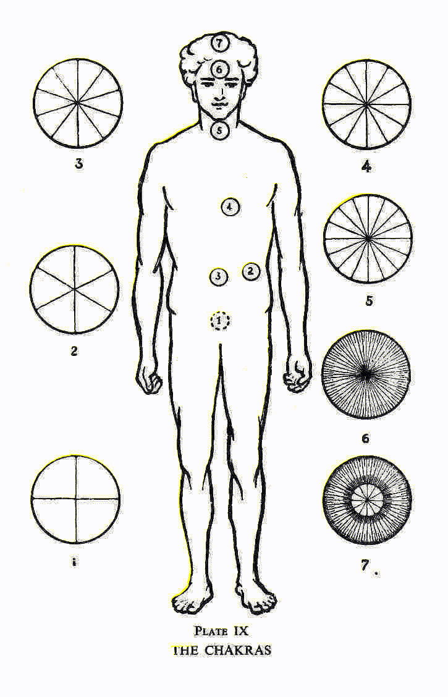

Великий Архитектор Вселенной (T.G.A.O.T.U.) постоянно излучает свою энергию через свою систему. Эта сила обладает семью аспектами, и все ее формы действуют в каждом из этих центров, притом одна из них в каждом случае значительно преобладает над остальными. Без этой зарядки энергией физическое тело бы просто не существовало. Это объясняет, почему эти центры действуют в каждом из нас, хоть и у неразвитых людей они обычно работают медленно, создавая необходимый вихрь для этой силы и не более того. Но когда эти центры светятся и пульсируют живым светом, через них проходит значительно больше энергии, что приводит к возникновению дополнительных способностей и возможностей для человека.

Эта божественная энергия, врываясь в каждый центр извне, наводит вторичные силы на круговое движение вдоль его поверхности, перпендикулярно себе, точно так же, как магнит, вставленный в индукционную катушку, вызывает ток, течущий вокруг катушки под прямым углом к его оси. Первичная сила, вошедшая в вихрь, исходит снова из него в прямых линиях, перпендикулярно к нему, словно центр вихря является ступицей колеса, а исходящие лучи первичной силы его спицами. Количество этих спиц варьируется в разных центрах, и это определяет количество волн или лепестков, которые каждый из них образует. Поэтому в восточной литературе эти центры часто описываются как цветы.

Каждая из вторичных сил, движущихся по углублению в форме тарелки, имеет свою характерную длину волны, похожую на определенный цвет света. Но вместо того, чтобы двигаться прямо, как свет, эта сила создает удлиненные волны разных размеров, каждая из которых в несколько раз больше, чем маленькие волны внутри нее. Количество волн определяется количеством спиц колеса, и вторичная сила вплетается между прямыми лучами первичной силы, словно плетение корзины между спицами колеса. Эти волны невероятно малы, и тысячи могут поместиться в одной большой волне. Когда силы движутся по вихрю, различные волны пересекаются, создавая рисунок в виде корзины и образуя форму цветка, к которой я уже обращал внимание. Это напоминает тарелки или маленькие вазы из волнистого радужного стекла, какие изготавливают в Венеции. Все эти волны или лепестки обладают перламутровым блеском, но каждый выделяется особенным цветом.

В процессе оживления конкретного центра, с которым преимущественно связана эта степень Е.А., выделяются три ключевых фактора. Когда пробуждается соответствующий этому центр в эмоциональном теле, он дарует человеку способность слышать в утонченном мире на данном уровне - иначе говоря, это приводит к развитию того чувства, которое, как правило, в астральном мире оказывает на наше сознание тот эффект, который мы называем слухом в физическом мире. Итак, если бы эфирный центр работал в полной мере, человек с этой степенью Е.А. обладал бы яснослышанием на уровне эфирных и астральных плоскостей. Его медленное и частичное раскрытие постоянно уменьшает преимущества человека, открывает его ум для предложений и, как правило, расширяет и либерализирует его образ мышления.

Во-вторых, развитие мозга во многом зависит от раскрытия этого центра, поскольку он играет важную роль в процессе разделения и распределения одного из главных потоков жизненной энергии, перебегающей через человеческое тело. Я уже описывал детали этого процесса в "Чакрах" и "Скрытой стороне вещей", к которым обратаитесь, если вам требуется больше информации о циркуляции жизненной энергии.

В-третьих, другое важное действие этого центра заслуживает нашего внимания, так как основная цель первой степени заключается в победе над страстями физического тела и развитии морали. Существует множество различных видов жизненной энергии, включая оранжево-красный луч, который также содержит определенное количество темно-фиолетового. У обычного человека этот луч стимулирует чувственные желания, поддерживает теплоту тела, но если человек устойчиво и решительно отказывается поддаваться низшей природе, этот луч может быть перенаправлен вверх к мозгу, где все три его составляющие претерпевают замечательные изменения. Оранжевый цвет превращается в чисто желтый и усиливает интеллектуальные способности; темно-красный становится алым и постепенно укрепляет способность к безкорыстной любви; темно-фиолетовый превращается в нежный фиолетовый, ускоряя духовную часть человеческой природы. Человек, достигший этого превращения, обнаружит, что низменные желания больше не беспокоят его; и именно с этой целью развитие этого центра сильно подчеркнуто на первых стадиях масонства.

Развитие этого центра тесно связано с способностью сосредотачиваться, а также с раскрытием более высоких форм слуха. Во всех оккультных системах обучения большое значение придавали этому для новичков. В школе Пифагора ученики тщательно обучались в ордене, называемом Акустикои, или Слушатели, в течение нескольких лет; в мистериях Митры самым низшим статусом был орден Воронов - название, означающее, что им разрешалось лишь повторять услышанное, подобно тому, как это делают ворон или попугай; во всех этих древних системах ученикам строго указывали не дерзать пробует еще неизведанные воды оригинальности, пока они не овладели установленными принципами философии. S... также вызывает или обращается к помощи определенного класса нечеловеческих существ тонкого мира для человека, который его использует.

Учитывая сильное влияние этого с.. мощи, все понимают необходимость его уникального сохранения и поддержания в тайне. Если его исполняют неправильно, не в точном виде и не в нужном месте, эффект пропадает. В этих делах мы практикуем то, что обычно называют магией, и это небезопасная вещь для игры, которую следует использовать только с самым серьезным намерением и точностью.

Если член группы совершает этот с… бездумно и не осмыслив его значение, он подвергает себя влиянию тех сил, о которых он даже не подозревает, и на которые он не готов; могут произойти вещи, которые не должны случиться. Это концепция лежит в основе преувеличенного и вводящего в заблуждение утверждения, что человек, принимающий Священное Священнодействие в церкви, пока его мысли полны зла, на самом деле ест и пьет себе на гибель. Человек, принимающий Святое Причастие, становится очень мощным центром радиации силы, он также становится в высшей степени восприимчивым; пусть поэтому он убедится, что истребил злые мысли, чтобы эти мысли не притягивали к нему похожие силы. То же самое относится и к масонскому с… Кто выполняет его в знак приветствия другому, раскрывает свое сердце этому человеку, и это хорошо; но все должны быть на страже, чтобы не открыть ненароком двери для неприятных сил, которые в противном случае могли бы их обойти.

Когда мы делаем это с.. в начале работы нашей Ложи, это напоминает нам, что мы должны установить себя в восприимчивое состояние, чтобы получить максимальную пользу от прилива духовной силы, которую мы собираемся вызвать.

Офицеры

Так, приложив все наши усилия для подготовки к вечерней работе - (а) произведя очищение помещения Ложи с помощью оскурения, (б) убрав все отвлекающие мысли и чувства и (с) приведя себя в состояние открытости, мы теперь начинаем работу над удивительно устроенной машины масонства, которая в своей работе может привлечь помощь нелюдских сущностей. Способ, с помощью которого это достигается, невероятно умный и тщательно скрыт. Человек - это сложное существо, и простое разделение его на тело и душу недостаточно для научной работы. Чтобы развиваться, человек живет на пяти из семи уровней природы, имея оболочки или тела из материалов нижних уровней, и принципы или составляющие, соответствующие более высоким. Это становится более понятным благодаря Фиг. 13 и сопровождающей ее диаграмме.

Поэтому для нашей работы нам нужны силы со всех этих уровней, и каждый офицер Масонской Ложи, помимо своих обязанностей на физическом уровне, представляет одну из этих степеней и служит фокусом для ее специфических энергий. Условия, установленные основателями масонства, заключаются в том, что перечисление старшин и описание их должностей и обязанностей вызывает дейвы или ангелов, принадлежащих и работающих на соответствующих уровнях. Тысячи R.W.M. задавали заранее оговоренные вопросы без малейшего представления о производимом на невидимые миры воздействии, но это не лишило их помощи ангелов, которая бы потрясла их, если бы они о ней знали, и, вероятно, даже испугала их.

Таким образом, дух снова обращается к разуму, вызывая его определить основые деления; разум отвечает и называет три канала, через которые течет сила, привлекая тем самым внимание ангелов этих каналов. Чтобы это символизировать, R.W.M. спрашивает, сколько основных офицеров в Ложе, и получает ответ: три. Это R.W.M., W.S.W. и W.J.W., которые представляют божественную или духовную троицу, проявленную в Божестве и в человеке, созданном по образу Божественности. Эти три принципа у многих изучающих теософию известны как атма, будди и манас, что можно перевести на русский как духовная воля, интуитивная любовь и высшее понимание.

Затем R.W.M. спрашивает, сколько помощников-офицеров в Ложе, и получает ответ, что их также три, не считая O.G. и T. Их можно отнести к личной сущности человека или его нижнему я, состоящему из нижнего ума, который представляет S.D., эмоциональной сущности, представленной J.D., и эфирного двойника физического тела, который представляет I.G. T. символизирует плотную часть физического тела.

Вход в Ложу - это портал во внутренний мир, который недоступен обычному зрению. Именно поэтому Т., символизирующий самую плотную часть физического тела, является единственным офицером Ложи, видимым для невоосвещенных глаз. Все остальные шесть принципов человеческой сущности недоступны физическому восприятию, которое взаимодействует только с одним, самым низшим и плотным, уровнем материи. Эти принципы существуют на различных плоскостях природы, обладающих разными степенями тонкости или мягкости материи.

Фиг. 13 и соответствующая диаграмма показывают семь принципов человека, плоскости природы, на которых они находятся, и связанных с ними офицеров масонской Ложи.

Верхний треугольник, содержащий первый, второй и третий принципы, представляет собой высшее Я человека, часто называемое душой, которая в течение своего долгого путешествия или эволюции к идеалу человеческого совершенства, проходит через множество воплощений, которые называются личностями. Нижний треугольник - отражение верхнего в материи низших уровней, и, вместе с плотным физическим телом, он образует нижний квартет, который представляет собой личность, существующую только в течение одного воплощения. Эволюция человека - это развитие его высшего Я, но на данном этапе человеческого прогресса у большинства людей это Я может быть описано как еще не вступившее в активную и целенаправленную жизнь на своих плоскостях, также не осознавшее,

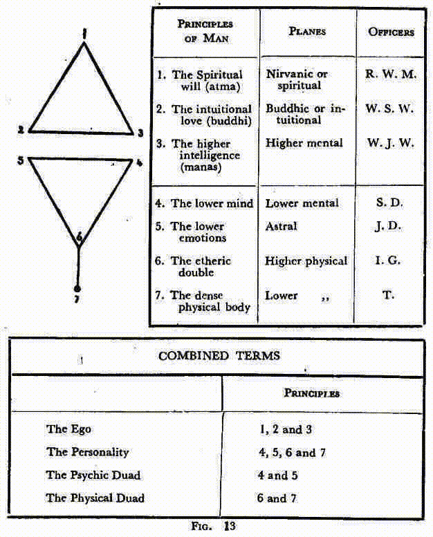

что можно изучить через воплощение на нижних уровнях. Со временем и через множество воплощений три высших принципа постепенно раскрываются, и человек все более и более осознает свою истинную божественность. Хотя главной целью Масонства является сбор и распределение духовной силы в пользу других, оно также заботится о благополучии и развитии Брата, поэтому его ритуалы и учения ясно указывают путь, который человек должен выбрать, и предоставляют ему ценную помощь на этом пути.

Обязанности

Затем перечисляются обстоятельства и обязанности. Обычно считается, что целью этого списка является убедиться в том, что каждый Брат хорошо осведомлен о ситуации и присутствует в должном месте. Однако на деле у этого есть еще одна, гораздо более важная функция, как я уже упоминал.

В ответах на вопросы о должностных обязанностях обнаруживаются несколько интересных элементов символики. Физическое тело должно защищать ложу души человека от опасностей внешнего мира, от искушений и злых воздействий. Т. получает указание не допускать непрошенных гостей и посягателей на Масонство. Если мы вспомним, что слово "ковены" происходит от греческого kuon, что означает "собака", и что с незапамятных времен собака использовалась как символ неукротимых животных страстей, легко понять то, что в должностном обязанности Т. имеется свое символическое представление.

Эфирный двойник, представленный в лице I. G., также участвует в защите Ложи, и в особенности подчиняется высшему разуму или интеллекту, W.J.W., который занимается проверкой всех желающих войти. Это показывает, что обязанность разума - делать выбор и решать, какая мысль или эмоция получит привилегию обитания внутри человеческого храма. R.W.M. связывается с T. только через W.J.W. и I.G., что говорит о том, что дух не взаимодействует напрямую с плотной материей, а через свой разум оказывает влияние на эфирную материю. Однако, после запуска своего запроса, разум может дать инструкции эфирному двойнику прямо отчитываться перед R.W.M. на конкретную тему. В качестве примера этого, во многих Ложах принято, чтобы W.J.W. при передаче своего приказа говорил: "Брат I.G., увидь, кто стремится к пропуску, и доложи R.W.M."

Отражение верхнего треугольника в нижнем происходит точка за точкой, и, таким образом, устанавливается симпатическая связь между принципами 2 и 5, а также между 3 и 4, и между 1 и 6. Именно с помощью эмоций, их очищения и развития, человек открывает принцип 2, интуитивную любовь, включая её в свою жизнь. И с помощью разума он ослабляет пять препятствий для дальнейшего прогресса (а именно, заблуждение о том, что его личное "Я" есть настоящее "Я", сомнения в действительности духовного, суеверие, и нерациональные симпатии и антипатии), позволяя тем самым духовной воле проявиться в его жизни. Об этих стадиях, и великих Инициациях, которые их сопровождают, я подробно писал в "Мастерах и Пути". Они упоминаются здесь, чтобы показать, почему J.D. действует между W.S.W. и W.J.W., а S.D. действует между R.W.M. и W.S.W. Они также объясняют, почему W.J.W. занимается E.A., а W.S.W. отвечает за F.C., в то время как M.M. можно считать находящимися под непосредственным руководством R.W.M. Поскольку открытая Ложа представляет собой место, где братья символически проходят усовершенствованный курс эволюции, офицеры, представляющие принципы в человеке, должны показать, как эти принципы взаимодействуют друг с другом в ходе этого развития.

Третий Аспект Божественного Существа представлен W.J.W., когда он направляет процесс перехода от труда эволюции к периодическому отдыху. Второй Аспект символизирован W.S.W., который, по приказу R.W.M., закрывает Ложу, потому что когда Второй Аспект Божества удаляется от форм, которые Он создал, все возвращается к своим первоначальным элементам, и вселенная как таковая перестает существовать, и тем самым Ложа солнечной системы на время закрывается. Это то, что у индусов называется концом манвантары и началом пралайи.

Не следует предполагать, что должностные лица Ложи, представляющие принципы в человеке, неизменно способны функционировать на соответствующих им уровнях; важно понимать, что не только природные духи, но и таинственные полусознательные существа, нами именуемые элементалами, существующие на нисходящем пути эволюции на каждом из этих уровней, действительно откликаются на вызов, используемый в плотно упакованной формуле открытия. Перечисление должностных лиц в ответ на ранние вопросы Великого Мастера - это своего рода призыв к вниманию, эхо которого разносится по разным царствам природы, и девы, природные духи и элементалы узнают, что им предстоит возможность. Ведь именно так эти существа на всех уровнях воспринимают такой вызов. Одним из главных методов их эволюции является участие в такой работе, и они с большой радостью откликаются.

Общее перечисление должностей быстро сменяется конкретными вопросами, адресованными каждому из должностных лиц; и первый вопрос о их положении в Ложи действует как призыв к деве нужного типа, которая немедленно представляет себя и действует в качестве капитана природных духов и элементалов, собравшихся вокруг. Второй вопрос и ответ в каждом случае, касающийся специальной обязанности должностного лица, собирают вокруг него их и он влияет на них, чтобы они расположились как требуется. Например, когда упоминается младший диакон, через астральные уровни проходит трепет, и когда задается вопрос о его положении в Ложи, дева, чье низшее воплощение представляет из себя астральную материю (то, что в буддизме называется камадева), тут же является и занимает место над головой младшего диакона. В то же время вызывается внимание ряда природных духов, облакченных астральными телами, и еще большой объем элементарной эссенции пробуждается к активности среди третьего из великих царств элементалов. Затем, когда задается вопрос об обязанностях, капитан девы собирает вокруг себя этих астральных слуг, и расставляет их как ему нужно, одновременно захватывая плавучую массу элементарной эссенции и формируя её в мысленные образы, необходимые для выполнения работы.

Точно таким же образом, старший диакон представлен девой-капитаном, чье низшее воплощение состоит из материи нижних субплоскостей ментального плана (арупадева), и он использует природные духи и элементарную сущность своего уровня. Стоит заметить, что в каждом случае определяются не только реальные обязанности и положение должностного лица, но и его отношение к другим должностным лицам, его роль в общем предприятии. Дэвы-капитаны, соответствующие трем главным офицерам и называемые в Востоке арупадевами, обладают сознанием и управляют силами уровней, которые они представляют. Нам трудно понять действие сил на таких уровнях, поскольку они воздействуют на соответствующие принципы в человеке, и эти принципы лишь слабо развиты у большинства людей.

Таким образом, когда между участниками обменялись последними вопросами и ответами из списка, вся Ложа пульсирует от элементальной жизни, каждый элемент которой готов со всей силой броситься в припланированную работу. Элементалы и духи природы различных уровней значительно отличаются по уровню развития и интеллекта: некоторые из них чётко определены и чрезвычайно активны, в то время как другие относительно неопределённы и облачны. И все же, Ложа представляет собой впечатляющее зрелище, когда эти различные группы существ собираются вместе, каждая из которых демонстрирует свой уникальный цвет и витает над головой своего представителя в физической плоскости, при этом Ложа все еще погружена в полумрак, освещаемый лишь трёх свечами и священным огнем. Именно к такому состоянию отсылает Уважаемый Верховный Мастер (осознавая это или нет), когда говорит: "Таким образом, наша Ложа должным образом сформирована."

Что касается младших офицеров, для того чтобы увидеть этих созданий, витающих на своих местах и формирующих своего рода светящиеся круги или облака (смотрите табл. Х), достаточно небольшого развития ясновидения. Эти облака для Внутреннего Часового имеют фиолетово-серый цвет, для Младшего Дьякона - малиновый, для Старшего Дьякона - желтый. Определить оттенки трех главных офицеров сложнее, потому что каждый из них кажется обладающим чем-то из всех возможных цветов; все же, возможно, можно сказать, что золотистый цвет преобладает в сфере Младшего Старейшины, а сильный электрический синий - в сфере Старшего Старейшины. Светящийся шар Уважаемого Верховного Мастера является самым ярким из всех, светясь равномерно розовым, золотым, синим и зелёным цветами, которые выделяются на протяжении всей церемонии. Это через дев-представителей разных офицеров и происходит создание формы мысли и излияние силы; но офицер Ложи на физической плоскости также должен принять участие в работе, в меру своих возможностей. Если он обращается к своему дев-представителю и позволяет силе свободно протекать через себя, соединяя свою волю с ней, его высшие принципы становятся едиными с этим девом; и он не только будет отличным проводником для божественной силы, но и почувствует поддержку и укрепление в процессе работы.

Открытие

Представитель Девы от R.W.M. – это ангел седьмого луча, обладающий высоким развитием и большими способностями. При появлении его и его группы помощников-ангелов и элементалов, он берёт на себя полное управление всей процедурой. Все капитаны малых групп выстраиваются и немедленно готовятся к открытию Ложи. R.W.M., объявив, что его Ложа правильно сформирована и что он является ее главой и представителем, выражает свою благодарность T.G.A.O.T.U. И затем высказывает искреннее желание, чтобы вечерняя работа, начавшаяся в порядке, продолжалась в гармонии и завершалась в мире. На это вся его Ложа отвечает энергичной репликой, похожей на воинский клич: "Пусть будет так". "Mote" является старинной англосаксонской формой слова "может", и это масонское "Аминь". Но подобно как "Аминь" иногда толкуют как "пусть так будет", это великолепное масонское выражение часто превращают на уровень обыкновенного согласия или благочестивого желания. Также "Аминь" не просто желание, а утверждение – самая священная клятва древнего Египта, которую никто не осмеливался нарушить - "Пусть будет так по Аминь" – таким образом и это масонское восклицание воспринимается как наивысшее утверждение – "так оно и будет". Не "Мы молимся или надеемся, что так будет", но "Мы это сделаем". Доказательством этому служит решительное вытягивание правой руки на уровне плеча, это известный символ власти и командования.

Сразу же после R.W.M., от имени T.G.A.O.T.U., объявляет Ложу должным образом открытой, и все огни становятся ярче. Этот момент ознаменован не только вспышкой физического света, потому что когда R.W.M. произносит слова открытия, представитель Девы тоже поднимает свой посох, и все семь групп помощников-духов, которые до этого момента воспринимались лишь как светящиеся облака, вспыхивают во всей своей яркости и оттенках. Сразу же каждая группа связана светящейся линией с физическим офицером, над которым она парит, и через эту линию её сила направляется на него всякий раз, когда он привлекается к участию в обряде. Представитель Девы обычно пребывает над офицером, но когда тот двигается по Ложе в ходе своей работы, линия света ни на миг его не покидает, становясь лишь ярче во время его активности.

Непосредственно перед открытием Ложи, I.P.M., сопровождаемый двумя D.s с перекрещенными посохами, приближается к алтарю, где он преклоняется на колени и ждет точного момента начала. Как только R.W.M. произносит слово "открыть", I.P.M. открывает V.S.L. и развертывает на его страницах s... и c... тем самым демонстрируя то, что мы считаем тремя великими эмблематическими огнями в масонстве вместе с физическим освещением. Именно I.P.M. приносит символический свет в Ложу, точно так же, как он привел физический свет от священного огня S.D., потому что он представляет того, кто в тишине следит за исполнением всех правил и всегда готов помочь в случае необходимости. Он достиг света в полном смысле этого слова; он выполнил свою работу и готов помочь другим. Особенно следует отметить, что он должен случайно открыть священный том, не ища какого-либо определённого отрывка; это вся книга, которую нам дана, чтобы пролить свет на наши умы, а не только этот или тот стих. Самым удобным будет открыть её где-то посередине.

Для того чтобы продемонстрировать, что священный том здесь используется в качестве символа, И.П.М. торжественно воспроизводит древнюю формулу, цитируемую святым апостолом Иоанном в начале его Евангелия: "В начале было Слово, и Слово было с Богом, и Слово было Богом". Мы все знаем, что греческое слово, которое в этом тексте преобразовано в слово "слово", изначально - "Логос". Таким образом, открытие В.С.Л. символизирует проявление Логоса на заре солнечной системы, когда с ... s и s ... демонстрируют, что Он объявляет себя духом и веществом, потому что нет ничего, что не было бы Богом. Чтобы указать на то, что Второй аспект или проявление Логоса готово спуститься в свою вселенную, столб у З.С.З. возводится, а столб у З.Ю.З. кладется. Надзор Священного Духа над водами хаоса теперь уже не единственная божественная активность; фундамент установлен, а активная жизнь системы начинается. Открывается шаблон, указывающий на план деятельности, и сущность этой деятельности обусловлена тем фактом, что мы начинаем его с гимна в честь В.В.В., в течение которого Братия должны излить всю свою любовь и преданность.

В тех Лоджиях, которые используют портрет H.O.A.T.F., он открывается непосредственно перед исполнением гимна, все Братия обращаются к нему и приветствуют его. В ответ на это приветствие великий Адепт отсылает мысленный образ, который является точной копией его себя; так же как на более высоком уровне Господь Христос отсылает образ мышления, который называется Ангелом присутствия на каждом осуществлении Священнодействия. Этот образ мышления настолько полностью является частью H.O.A.T.F., что Лоджия получает пользу от его присутствия и его благословения, как если бы он находился там в физическом виде. Представитель Девы от В.М. низко кланяется перед Главой своего Луча и передает управление ему. Видно, что тем из нас, кто знает о существовании этого великого Адепта и его особого интереса к нашей работе, открывается большой плюс; но не следует забывать, что каждая регулярно создаваемая Масонская Лоджия находится под покровительством Ангела Седьмого Луча, несмотря на то что Братия может мало знать об этом. 

Я уже объяснял, как в момент открытия Лоджии все ангельские помощники, природные духи и элементальные создания, вместе с их девскими капитанами, сразу же вспыхивают и готовы среагировать на команду. Сказать, что они готовы, значит сильно их недооценить; они пылают нетерпением, как собаки, тянущиеся к поводку. И вот, приходит тот момент, которого они ждали: сразу же после возвращения И.П.М. на свое место и показа шаблона S.D., начинается гимн. С первой же ноты этого гимна сверхъестественные существа начинают неистовую, но упорядоченную активность. Сам гимн или, вернее, преданность и энтузиазм с которыми мы его исполняем, предоставляют им материал для их строительного труда. Они немедленно приступают к его возведению, каждый на своем уровне, со своими материалами, которые предоставили им Братия.

В процессии открытия R.W.M. и его помощники уже соорудили нижнюю часть cella, или внутреннюю камеру храма, изолируя все мозаичное покрытие и заряжая его сильным магнетизмом. Эти создания сразу бросаются на это, быстро делая стены толще и выше, в то время как более мощные из них насыщают его магнетизм, наполняя его величественной силой своих уровней. С космической скоростью они расстилают потолок над всей Ложей, и от этого потолка, начиная от краев, прямо внутри стен физической Ложи, они опускают поддерживающие колонны сверху вниз, подобно корням баньянового дерева, одна из которых окружает каждого из неофициальных Brn. Таким образом, становится очевидным, что наша мыслеформа почти полностью воспроизводит греческий храм - ряды колонн, поддерживающих его невероятно тяжелую крышу, находятся вне центральной камеры, которая является единственным полностью огражденным местом в храме. Сопровождающую картину мы добавляем для большей наглядности, а также, для сравнения, в Таблице V представляем рисунок существующего греческого храма. Контур храма всегда завершается во время исполнения вступительного гимна, но при определенных обстоятельствах позднее могут быть добавлены рельефы и другие украшения под руководством контролирующего Ангела.

Таким образом, становится понятно, почему неофициальные Brn, сидящие по бокам от Ложи, иногда называются колоннами; и это также освещает древний текст, который гласит: "Того, кто победит, я превращу в столп в храме моего Бога, и он уже не выйдет." По мере того как мы видим, как важно для Brn вложить свои сердца и души в слова, которые они поют или произносят, отменя Добби, их усилия зависит от количества материала, предоставленного нашим сверхфизическим коллегам, и, следовательно, массивности и богатства мыслеформы, которую они строят. Весь обходящий церемонию, что бы он ни был, представители deva трех главных офицеров продолжают вливать свое благое влияние в cella, и хотя его сильнейшая сила зарезервирована для тех, кто вступает на мозаичное покрытие как кандидаты, она как-то фильтруется через крышу и вниз по колоннам к каждому присутствующему.

Открытие E.A. К...

В момент открытия Ложи R.W.M. также дает E.A. К...

В свободной каменотесной К... имеет двойное значение и весьма определенное использование. Последнее основано на том факте, что они служат признанным способом общения с определенными классами земных духов, внимание которых привлекают они, и которые незамедлительно становятся в распоряжение тех, кто должным образом имеет квалификацию вызывать их, хотя они не обратят внимания на призыв от того, кто не был надлежащим образом введен в них инициацией в степень E.A. Их основная цель в обряде - создавать атмосферу, соответствующую степени, которая проводится; и в этой особенной работе они становятся удивительно умелыми, моментально отвечая на призыв К... с военной готовностью и точностью, так что даже когда Ложа поднята или опущена коротким способом, они могут производить необходимые изменения так быстро, как только могут быть выданы команды.

Создание подходящей атмосферы — одна из наиболее важных черт Масонства, необходимая для эффективной работы. Каждый, кто хоть немного чувствителен к подобного рода воздействиям, может почувствовать изменения при переходе от одного степени к другому. Однако только те, кто открыл взор души, могут увидеть изменение цвета или осматривать энергичных рабочих, занятых его созданием. Возглавители Дева трех главных чинов заботятся о этом важном аспекте работы - W.J.W. отвечает за служителей Первой Степени, W.S.W. - за служителей Второй, и R.W.M. — за служителей Третьей. Но земные духи сами подчиняются зову k ... s, появляются при первом звонке и непринужденно возвращаются к своим обычным занятиям, когда другая батарея объявляет о завершении их работы. K ... s при закрытии соответствуют фразе "Ite, missa est" Католической Церкви. Важно заметить, что подобные существа любят объявлять о своем присутствии к ... s во время спиритического сеанса.

K ... s Первой Степени также имеют моральное значение, указывая, что на E.A. лежит задача покорить три плоскости: физическую, с ее инстинктами из прошлого, астральную с ее мощными желаниями и эмоциями, и ментальную, со своей любознательностью и непостоянством. С каждым из этих элементов каждый человек в процессе своего развития сталкивается с двойным заданием: сначала он должен покорить его, контролировать его инстинкты и подчинять их воле души, а затем развивать их как положительный, хорошо обученный и полезный инструмент для их служения.

Предполагается, что E.A. уже покорил физическое тело перед вступлением в Масонство — без этого его нельзя было бы достойно рекомендовать для принятия — но ему все еще предстоит его развить. В то время как он занимается этим, он должен обрести полный контроль над своим астральным телом; это — основная задача этого степени в отношении саморазвития, хотя, конечно, масон всегда стремится совершенствовать себя в каждом отношении. K ... s Второго Степени указывают на то, что физическая работа завершена, и что перед F.C. еще предстоит покорить две плоскости. Он работает над тем, чтобы сделать свою астральную оболочку совершенным инструментом для выражения высоких эмоций и одновременно учится контролировать свой ум. На этой стадии масон должен каждый день совершать прогресс в знаниях масонства, пока наконец ум не будет контролируемым, а не непостоянным. В этот момент он переходит к Третьей Степени, и тогда k ... s указывают, что его ждет всего одна плоскость для покорения, он должен превратить ум в инструмент на службе Высшего Я. Это продолжается столько лет, сколько необходимо, прежде чем он станет Мастером-мудрецом.

Исходя из всего вышеуказанного, можно утверждать, что в Ремесленном Масонстве существует четыре стадии - три степени и еще одно достижение, когда M.M. становится I.M. В этих стадиях есть некая схожесть с теми, которые были даны в христианской церкви, хотя одна находится на гораздо более высоком уровне, чем другая. Это демонстрируется на следующей диаграмме:

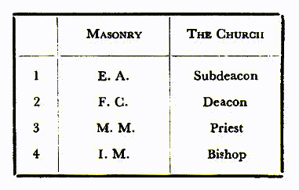

В Церкви некоторым людям предназначено стать священниками - но сначала они должны пройти ранние этапы до достижения этого положения. Сначала человек должен стать субдиаконом; тогда его задача - подготовиться к значительному этапу, который происходит на ступени диаконата, когда он окончательно соединяется с Учителем Мира, о чем подробно описано в "Науке о Священнодействиях".

На стадии субдиаконата, которая в некотором роде соответствует Е.А., от человека ожидается научиться идеально контролировать себя. На следующем уровне, во время диаконата, он учится; он готовится к работе священника, так же как F.C. готовится к работе М.М.

Как я уже упоминал, говоря о должной осторожности, сила благословения Е.А. содержится в книге, из которой он учиться. Он может использовать только слова книги и не должен их превышать. Он еще не стал прямым каналом божественной силы, поэтому он держит книгу между своими руками. Но F.C. помещает одну руку на книгу и поднимает другую в форме знака. Он соответствует диакону, потому что он является каналом, связанным с Христом, но он может передавать только то, что спускается и проходит через него. Он еще не наполнен благодатью и силой, но способен действовать как канал. Его держание левой рукой таким образом соответствует, хотя на более низком уровне, держанию епископом его посоха в левой руке. Он притягивает к себе божественную силу через этот сильно заряженный посох, в то время как другой рукой он передает ее людям. Жест один и тот же, хотя, конечно, в случае епископа он гораздо более продуман.

Затем М.М. кладет обе свои руки на книгу. Предполагается, что когда он достиг этой высокой степени, он будет находиться в позиции силы, наполненной энергией, которая была вливана в него в символической смерти и воскрешении. Поэтому он может передавать эту энергию; он может благословлять других людей так же, как это делает священник, и так же, как у священника есть право совершать определенные каноники, так М.М. вправе занимать должность в Ложе.

Однако ни М.М., ни священник не могут передать свою силу или авторитет кому-либо другому. Только епископ имеет право посвящать в священники или освящать других епископов, и только I.M. может инициировать процесс, поднимать масонов и создавать других I.M. Епископ и I.M. также обладают способностью давать больше благословений, чем священник или М.М. могут даровать. Так в масонстве, как и в Церкви, есть преемственность епископов.

В "Науке Священнодействий" я объяснил некоторые внутренние аспекты апостольского преемственности - метода, который Христос разработал для передачи духовных полномочий Католической Церкви. Вы увидите, что у нас в Масонстве есть аналогичная последовательность, которая идет к жрецам Мистерий Древнего Египта и даже дальше.

Есть еще одна аналогия между степенями свободного каменщика и порядками Церкви. Как священники Церкви связаны на различных уровнях с главой Церкви, самим Господом Христом, и с резервуаром мощи, которую Он оставил для совершения Священнодействий, так и посвященные различным степеням Масонства связаны по их званию с H.O.A.T.F. и резервуаром мощи, выделенным для труда Мастеровой. У каждого масона есть определенное общение с Ним, но первая важная прямая связь с Ним предоставляется на ступени I.M. (на практике это отдельная ступень, хотя она так не называется) и более тесные связи устанавливаются на высших ступенях Древнего и Принятого Шотландского Рита. Таким образом, искренний масон становится передовым постом Его осознания, каналом Его силы и служителем Его воли. Такие Братья представляют Его в своих Ложах и Главах, и имеют право дарить Его благословение согласно их масонскому званию. Великая печаль заключается в том, что так мало наших современных Братьев в полной мере осознают святость своего обязанного служения и тяжелую ответственность, возложенную на них, использовать свою силу без самодовольства в служении миру.

В то же время существуют заметные различия между этими двуми великими системами Священнодействий. В Католической теологии, подтвержденной оккультными исследованиями, признают, что духовные полномочия, полученные при посвящении, неизменно предоставляются, при условии, что епископ находится в линии апостольского преемственности, что у него есть намерение передать Священные Заказы, и что принимающий имеет намерение их принять, и что руки уложены согласно древней традиции. Приватные убеждения епископа и кандидата никак не влияют на существование Священнодействия, оно не будет отозвано даже если они не находятся в сообщении с каким-либо конкретным отделением Церкви, или даже если они люди сомнительного морального достоинства. (*См. примечания на странице 25.) Господь Христос, из своей безграничной любви к своей Церкви, готов простить человеческие недостатки служителя, чтобы Его стадо было накормлено.

Но процесс передачи власти в масонстве выглядит отнюдь не таким строго определенным, вероятно, из-за того что масонство является тайным орденом и не имеет прямых связей с внешним миром; его схема передачи власти гораздо более гибкая, нежели в Церкви. Хотя кажется, что преемственность как I.M.s, так и Верховных гранд-инспекторов во многом передавалась на земном уровне, это вовсе не значит, что так оно всегда и должно быть, и Священнодействие может быть передано или удержано по усмотрению H.O.A.T.F. Если проходит тайная встреча, даже при присутствии допущенного I.M., внутреннее признание не дается, и мощи не передаются. Мне лично известно о двух таких случаях непредоставления внутреннего признания. В Церкви, священник может в любом месте и самостоятельно совершить Священнодействие, и епископ также может передать свои силы по собственному усмотрению, но в кирпичном масонстве главенствующей является Ложа, и присутствие нескольких Brn. необходимо для действительности ритуалов, за исключением случаев, когда степени присваиваются с помощью посланника, обладающего подобными правомочиями. Как говорится, "трое управляют Ложей, пятеро поддерживают Ложу, и семеро и больше делают ее совершенной".

Сравнивая степени масонства и Ордена Церкви, я не пытаюсь утверждать, что силы, которые передаются многим в степенях масонства, каким-либо образом равны дарам, оказываемым небольшому числу тщательно отобранных и подготовленных кандидатов в Высшие Ордена Церкви. Моя задача - лишь обратить внимание на ряд удивительных соответствий между этими двуми системами, настолько многочисленных и впечатляющих, что слишком сложно считать их просто совпадением. Масонство действительно предоставляет силы, сравнимые с теми, что присущи Церкви, но это происходит лишь на самых высоких ступеней его иерархии и только для немногих избранных.

## Глава VI. Посвящение

Кандидат

Когда кто-то из общественности желает стать масоном, он обычно обращается к своему знакомому, который уже является частью ремесла. Этот друг скорее всего представит его Секретарю Ложи, который в свою очередь предоставит заявителю некоторые документы. Затем кандидат обнаруживает, что от него ожидают информацию о себе - его возрасте, профессии, причины желания присоединиться к ремеслу и так далее. В Ко-Масонстве ему также вручат следующее уведомление:

Кандидат должен полностью осознавать обязательства, которые он берет на себя, присоединяясь к Ордену. Эти обязательства имеют крайне серьезный и важный характер, и он должен выполнять их в достойной манере.

А.     Кандидат обязуется стремиться к благородной и прямолинейной жизни, работая над улучшением своего характера.

B.     Он обязуется регулярно посещать встречи Ложи, если это не мешает серьезные обстоятельства. Обычно эти собрания проходят один или два раза в месяц, кроме праздничных периодов. Иногда бывают вызваны Чрезвычайные Собрания для особо важных вопросов, но посещение их не обязательно. Верный Масон, однако, видит в этом не только свою обязанность, но и большую привилегию, понимая, что Ложа, оказывая поддержку своим членам, выполняет гораздо более великую миссию в продвижении духовного влияния Масонства в мире. Регулярное посещение встреч помогает ему активно участвовать в этом великом деле. Его прогресс в Ордене будет зависеть от усердия и преданности, которые он проявляет в своей службе.

C.    Он обязуется остаться в Ордене и в своей Материнской Ложе не менее трех лет. После посвящения он получает разрешение посещать другие Ложи, и после того, как становится Мастером Масоном, он может присоединиться к другим Ложам, если так желает; но он не может покинуть Материнскую Ложу в течение указанного срока. Именно Материнской Ложе он обязан верностью и лояльным сотрудничеством. Если вблизи его места жительства находится несколько Лож, Кандидату следует запросить у своего спонсора информацию о работе каждой из них, чтобы он мог выбрать Ложу, члены и деятельность которой для него наиболее приемлемы.

D.    Кандидат обязан соблюдать Масонскую тайну и быть осторожным в отношении дел Масонства и Ордена, и это обещание считается обязательным для исполнения в течение всего времени, даже если он покинет Орден.

Разделы Церемонии

Теперь мы переходим к рассмотрению церемонии, на которой кандидат принимается в Масонство - церемонии, обычно называемой его инициацией. С самого начала мы должны признать, что эта церемония - не простая формальность: во-первых, она вызывает определенные внутренние эффекты, и во-вторых, она содержит массу величайшей ценности символики, понимание и применение которой будут иметь большой смысл в будущей жизни кандидата.

Как я упоминал ранее в книге, одна из главных целей масонства - подготовить его членов к работе, которую им предстоит осуществлять в мире, и, следовательно, культивировать в них необходимые для этого качества. Различные степени Масонства являются этапами этой подготовки; на каждом этапе предоставляется определенное образование, а также предоставляются определенные полномочия. Боюсь, что из-за незнания этих фактов многие масоны достигают лишь небольшого реального прогресса; ибо если кандидат не понимает и не применяет на практике достижения, начатые на каждой степени церемонией инициации, он не готов в полном смысле этого слова перейти на следующую ступень или воспользоваться возможностями, которые предоставляются на этой ступени.

Внешняя церемония предоставляет определенные полномочия и открывает определенные возможности, но развитие и использование этих возможностей остается за неофитом. Некоторые неофиты учатся на подсказках, предлагаемых им, и соответственно делают прогресс; другие мало смыслят внутренние требования и поэтому подвержены только временному влиянию. Само слово "инициация" происходит от initium, что означает "начало", и это именно то, что оно предполагает - начало новой и более высокой жизни. Но начать недостаточно, нужно также продолжать.

В буддийском учении говорится, что в каждом из великих шагов, которые являются истинными Инициациями, есть четыре этапа:

(1)  Путь, на котором неофит усваивает уроки своей новой ступени, отбрасывает (как они это выражают) оковы, которые раньше связывали его, обнаруживает себя на новом уровне и учится использовать предоставленные ему полномочия.

(2)  Плод, когда он видит результаты своих действий, проявляющиеся все больше и больше.

(3)  Завершение - период, когда достигнутые результаты достигают своего пика, и он способен успешно выполнять работу, которая принадлежит ступени, на которой он теперь стоит.

(4)  Готовность, то есть время, когда видно, что он готов принять следующую Инициацию.

Таким образом, инициация предполагает больше, чем простую внешнюю церемонию - больше даже, чем подъем внутренней природы, который сопровождает эту церемонию; все это лишь ворота на входе на путь, по которому мы можем двигаться так быстро или медленно, как мы это желаем.

При рассмотрении этой церемонии посвящения в степень E.A. полезно смотреть на неё с трёх сторон. (1) Как на впечатляющую церемонию поступления. (2) В качестве подготовки и указания на жизненный путь, который должен вести человек, и на труд, который он должен выполнять в степени, на которую он поступает. (3) В виде мощной и эффективной символической формы учения, которую эта степень стремится вдохновить в его сознание. Изучив подробно церемонию, я думаю, мы придём к выводу, что каждый её отдельный момент относится к одному или другому из этих трёх пунктов.

Когда мы думаем о ритуале как о церемонии поступления в Орден, он естественным образом делится на три части. Центральный момент церемонии, апогей наших усилий, - это конкретное вступление в Орден - момент, когда открывается определенный центр или чакра, обеспечивая определённую потенциальность силы. Всё, что происходит до этого момента в церемонии, является подготовкой к нему; всё, что следует за ним, представляет собой объяснение того, что было сделано, или предложение о том, как лучше развивать и использовать полученную силу. Во всей церемонии всё организовано так, чтобы кандидат получил наибольшую пользу от сил, которые вливаются. Это главная задача этой странной подготовки, на которую Масонство всегда настаивало, даже до того, как кандидату разрешено войти в Ложу.

ПОДГОТОВКА КАНДИДАТА

Перед его приёмом он лишается всех м...с и в...с, надевает на себя ч...у, и открывает свою правую р...у, левую г...у и левое к...е, а также его правая н...а заслоняется. Все масонские общества единодушны во мнении о том, что сохранение этой традиционной формы подготовки имеет огромное значение, и они объясняют это практикой древних времен. Как говорится в одном из трактатов, связанных с Талмудом, "нельзя идти в Храм со своим посохом, в обуви, в плаще или с монетами, завязанными в мешочке".

Однако, крайняя специфика подготовки, отличной в каждой степени, указывает не на общее правило этого рода, а на истинное знание оккультной физиологии процесса посвящения у тех, кто придумал этот метод, так верно сохраненный до наших дней. Во время церемонии, особенно в момент, когда он становится, принимается и оформляется как E.A.F., через тело кандидата в определенный порядок проводятся определенные силы.

Некоторые области Ложи сильно насыщены магнитной силой, прежде всего, чтобы кандидат мог впитать как можно больше этого влияния. Вспомним, что при окадывании Ложи перед основанием каждого из главных офицеров было построено структура в форме улья. Целла, или закрытое центральное пространство, основанное на мозаичном павильоне и включающее алтарь, наиболее сильно намагничено. Первоначальная цель этого необычного метода подготовки - подвергнуть влиянию этой силы различные части тела, которые особенно активно используются в церемонии. Так, р…а… становится б…, потому что кандидат должен протянуть его в знак силы, который сопровождает твердое заявление: “S…m…i…b…” Также говорят, что это служит знаком искренности, показывая, что у кандидата нет при себе оружия.

Л…б… становится б…, потому что при входе в Ложу к нему прикасается точка ш… А мужская масонская гильдия считает дополнительной причиной то, что таким образом они уверены, что их кандидат не женщина в мужском облике. Л…к… это та щека, на которой он коленится при поступлении, поэтому она также делается б…, а р…, р… делается s…d, потому что она должна коснуться пола, когда он держит р…к… в форме ш… Л…к… и р…р… являются его опорами или точками касания с полом в момент принятия. Другая причина, иногда приводимая для того, чтобы р…р... стал s…d, основана на древнем еврейском обычае, когда человек брал на себя обязательство или заключал соглашение.* (*См. Руфь, iv, 7, 8.)

В древнем Египте была еще одна причина для подобных подготовительных мероприятий, ведь через Кандидата пропускался слабый ток физической электроэнергии, с помощью жезла или меча, к которому он прикасался в некоторых местах. Здесь неудобно больше говорить об этой части церемонии, кроме как о стимуляции эфирного тока в позвоночнике, которое индийские оккультисты знают под названием ида-нади; они более полно описывают его при изложении церемонии возвышения.

В частности, по этой причине на этом первом инициации кандидата лишают всех м… с, так как они могут легко помешать течению токов. Эта часть подготовки всегда привлекала большое внимание и требует строгого соблюдения правил. Бдительность ко-масонских должностных лиц в этом отношении должна быть еще больше, чем необходимо в Мужском содружестве, так как в многообразии женского костюма легко пропустить какое-то нарушение правил. Конечно, нужно исключить большинство видов заколок; та же осторожность относится к крючкам и петлям, многим видам кнопок и подвязок. Наши индийские братья должны быть осторожны с вышивкой на дхоти и сари. Мы иногда встречаемся с эмоциональными возражениями со стороны женщин против снятия обручального кольца, и я считаю, что в Индии иногда возникают похожие сложности в отношении браслетов и других украшений.

Указания на этот счет были запросены у H.O.A.T.F., и он очень четко заявил, что упразднение этого правила недопустимо. Он также упомянул несколько случаев из прошлого, когда функционирующее лицо было не осведомлено о строгом характере этого правила, и сам совершал действо исцеления, которое оправдывало инициацию. Иначе говоря, он настаивает на строгом выполнении этого требования и подразумевает, что те, кто не способны его выполнять, не должны вступать в Орден Ко-масонов. У нас был случай, когда человек, не подумав, прошел церемонию с золотым амулетом или медалью, пришитыми к подкладке одной из его одежд, о чем он вспомнил только после окончания церемонии. Понятно, что церемонию пришлось повторять сначала.

Был еще один случай, когда женщина-кандидатка при помощи недобросовестного уловка оставила cебе обручальное кольцо до конца церемонии и, когда это обнаружили, отказалась его снять и повторить инициацию. Тогда встал вопрос о статусе этой кандидатки, которая нестандартно получила некоторые тайны. Решение H.O.A.T.F. было четким и принципиальным, что несмотря на церемонию инициации, она не является масонкой и не может быть признана таковой ни при каких обстоятельствах. В моей Материнской ложе случались ситуации, когда приходилось пилить туго сидящее кольцо, но это может легко сделать опытный специалист, который также способен восстановить кольцо в первоначальный вид. Разумеется, проявлять осторожность следует и в отношении очков. Как нам известно, золотые и серебряные зубы не являются препятствием, так как они являются неотъемлемой частью человека.

Другое предположение о смысле строгого запрета — ношение м ... s может делать кандидата ритуально непригодным, и инициация становится недействительной. Затем нужно обсудить вопрос о снятии м ... l и повторений церемонии. Зачастую, ученые предполагают, что чувство, бывшее присутствует в конце каменного века, как м ... s до определенной степени непригоден. Та же консервативная идея предписывала использовать только каменный нож для жертвоприношения или обряда обрезания.

Считается, что этот процесс подготовки отсылает нас к факту, что при строительстве Храма короля Соломона ни в одном месте не слышали звук топора, молотка или любого другого железного инструмента, так как камни были полностью подготовлены в карьерах и укладывались на свои места с помощью деревянных киянок.

Тот факт, что кандидат должен войти без каких-либо ценностей с собой, символизирует тот факт, что он вступает в братство, где деньги, титулы и другие мирские различия не имеют значения.

Богатый человек оставляет свое звание и статус

За дверью масонской ложи;

Бедняк встречает настоящее уважение

На клетчатом полу.

Масон равенстенен принцу, но брат даже нищему, если последний достоин этого. В Ложе это братство проявляется в путей полного отсутствия какого-либо фаворитизма; каждый, кто становится М.М., со временем может быть выбран Мастером Лоджи.

Есть и личный аспект этого вопроса. Он должен быть "бедным"; то есть он не должен зависеть от внешних богатств и имущества, ведь они не помогут ему в пути эволюции, который он сейчас начал. Напротив, большие богатства могут стать для него препятствием, если только он не так силен характером, что полностью владеет ими, может взять их и в любой момент отложить, без восторженности от их прихода и без горести от их ухода. Строго говоря, вступающий на оккультный путь ничем не владеет; хоть ему и может приходиться управлять большими богатствами и важными делами, он не рассматривает их как личное имущество, для удовольствия или блага своего отдельного "я". Он управляет ими только как управляющий на службе Бога в интересах человечества. И в этом смысле он отдал всё что имел бедным, и сам стал одним из них.

Кандидату завязывают глаза по очевидной причине: чтобы он не видел Ложу и ее украшения, пока он не даст торжественное обязательство O. не разглашать их посторонним. До взятия обязательства O. кандидат имеет право уйти. Были случаи, когда кандидату не нравилась форма обязательства O., и он отказывался продолжить. В таких редких случаях его можно с честью отпустить, и его вывели из Ложи, глаза еще завязанными, чтобы не возникало вопросов о разглашении секретов. Но как только кандидат даст торжественное обязательство O., первым делом с его глаз снимается платок. Если же после этого кандидат желает покинуть Ложу, он все равно обязан соблюдать принятую клятву тайны.

Символ h ... g олицетворяет духовную тьму кандидата. Простой человек считает себя знающим и все видящим, но кандидат должен осознать, что это неправда. Он начинает понимать слова древнего мудреца, который говорил, что когда обычные люди видят день, мудрые видят ночь, а когда обычные люди видят ночь, для мудрых это день. То, что для людей кажется светлым и познавательным, он видит как невежество и тьму; там, где для них царит тьма, он видит свет. Грустно, что в современных школах мало учат истинному знанию, жизненно важному для блага и развития человеческой души. Уже много времени и сил тратится на создание из мальчика хорошего классического или математического специалиста; значительно меньше внимания уделяется тому, чтобы сделать из него человека благородного, бескорыстного, преданного и прямолинейного гражданина. По этой причине мы часто оказываемся в темноте по многим важным вопросам жизни, и именно от этой темноты масонство освобождает своих кандидатов. Они символически признают существование тьмы и готовы двигаться сквозь нее в поисках Света.

Кроме того, как говорится в Мистическом Заряде, это также символизирует пустую бессознательность, которая следует после прохождения через врата смерти, до того как более тонкий аспект физического тела полностью отпадет.

Кандидат носит к ... в ... на шее, свободный конец которого свисает спереди, и его пропускают в Ложу, когда о ... с ..., прижатый к его левому б ... Эти два предмета символизируют тот факт, что в жизни у людей есть обязанности и ограничения, с которыми каждый мудрый человек должен считаться; от первых нельзя отступиться, а последние нельзя игнорировать, ринувшись вперед. Здесь мы вновь видим символ двух больших законов дхармы и кармы. Через дхарму - использование сил, которыми мы обладаем, в выполнении обязанностей жизни, на которые эти силы нас пригодны - происходит внутреннее развитие. Через карму - окружающую нас среду, представляющую результаты наших действий, совершенных в прошлых жизнях, - приходят возможности для прогресса и иногда препятствия, которые, однако, преодолеваемые правильно, увеличивают нашу внутреннюю силу. Как Эмерсон выразился, человек учится в этом мире через обучение и интуицию - он учится как снаружи, так и изнутри. На оккультном пути еще важнее, чтобы человек шел без поспешности и благоговения, без глупой смелости или страха. Как тот, кто хочет пройти по линии, не должен двигаться ни слишком медленно, ни слишком быстро, так кандидат должен следовать по пути, который узок, как лезвие бритвы. "Festina lente" (поспешай медленно) могло бы быть его девизом.

Стоит отметить, что символика к... в... требует, чтобы тот, кто проводит кандидата на эти ранние этапы церемонии, всегда водил его за нее, а также брал его за руку или локоть. Она, рассматривается так же как и х... к..., как символ невежества, под которым остается кандидат, пока свет Масонства не озарит его.

Изобразитель к... в... также рассматривается как символ психического пуповинного шнура - связующего нити материи, которая соединяет эфирное дубле с плотным физическим телом, когда первое временно частично отделяется от последнего - "серебряный шнур", о котором упоминается в известном библейском отрывке как об определенно отвязанном при смерти.(*Екклесиаст, xii, 6.) Брат Wilmshurst говорит нам, что "серебро - это технический эзотерический термин для психической субстанции, как золото - для духовной, и железо или латунь - для физической".(*Масонская инициация, стр.85.) Он предлагает, что к... в... подразумевается как намек на то, что все истинные и высшие посвящения происходят вне физического тела.

Внутренняя Подготовка

В ритуале мало говорится о другом, еще более важном аспекте подготовки кандидата к посвящению в Вольное Каменщичество - о его внутренней и духовной стороне. На более позднем этапе, когда неофит готов перейти к более высокой степени, его спрашивают: "Где вы были первоначально подготовлены к становлению Масоном?" и красивый и проникновенный ответ, который предложено ему произнести, - "В сердце моем". В одном из мужских ритуалов R.W.M. напоминает кандидату, что он был подготовлен стать масоном в своем сердце, имея благоприятное мнение об Ордене, желание вступить в его ряды и стремление к знанию. Более того, в первой лекции вопрошающий спрашивает: "Что ты пришел сюда делать?" и ответ - "Обучаться контролю над своими страстями и продвигаться дальше в масонстве".

Перед тем, как дверь откроется на его стук, кандидат должен убедить I.G., что он подготовлен в своем сердце и уме, как и во внешнем образе. Он приходит, объявляет T., и собственной воле и по собственному выбору смиренно прошит быть принятым в тайны и привилегии древнего масонства. Он надеется обрести их при помощи Бога и t... от g... r..., будучи свободным. Никому не дано ступать на путь оккультизма под воздействием другого; он должен чувствовать в себе внутренний толчок, неудовлетворенность тем, что может подарить ему привычный мир, желание духовного, которое среди индусов называют mumukshatva. Это дорога, на которой внешние обстоятельства не поддерживают путешественника, ему приходится полагаться только на свою собственную внутреннюю силу.

Хотя это и так, счастливое обстоятельство состоит в том, что когда человек прикладывает усилия сам по себе, он находит отклик внутри, поэтому безошибочно скажет, что надеется получить посвящение при помощи Бога и благодаря t… от g… r…

Он смиренно просит, потому что он смотрит вверх, к свету; его поведение является противоположностью гордой позиции, когда человек радуется тому, что может смотреть вниз, сравнивая свое величие с ничтожеством окружающих, под своим свысока взирающим взгляд. Смирение присуще человеку идеалов, он никогда не удовлетворен собой, так как всегда воспринимает всё как поставленное свыше. Это ключ к воротам восходящего пути. Смиренный человек не считает, что достигает своих успехов исключительно благодаря своей гордой мощи, но, осознавая, что вся сила - это божественная сила, он признает, что, подобно героям прошлого, он только использует силы, которыми наделило его небо - как Арджуна в битве на поле Курукшетра использовал небесное оружие, подаренное ему Шивой во время его паломничества в Гималаях - как Персей, в страшной битве с Горгоной, использовал шлем , подаренный ему Плутоном, щит или зеркало Паллады Афины и крылья Меркурия - как король Артур получил мифический меч Экскалибур от Дамы озера. И сам Христос сказал: «Я от себя ничего не делаю, но так, как научил меня Отец, и тот, кто послал меня, со мной».

Говорят, что t… от g… r… уже произнесено в его пользу в Ложе. Это выражение имеет двусмысленный смысл. Оно, без сомнения, может быть понято как свидетельство кандидата, которое уже было высказано его предлагающим и поддерживающим лицом. Но оно также имеет и другое, более тайное значение, которое красиво изложено братом Вильмсхёрстом в «Масонском Посвящении» следующим образом:

Это не означает "обладать хорошей репутацией". Это значит, что при проверке инициирующими органами он должен духовно откликнуться на цели, к которым мы стремимся, и "звучать истинно", отдавая звук или отчет так же, как монета, которую стучат, чтобы определить ее подлинность. В величественных египетских ритуалах из "Книги Мертвых", одно из названий, всегда присваиваемых инициированному, было "истинный в голосе". Это соответствует нашему выражению "обладать языком хорошего доклада". Это не значит, что он в принципе не мог быть лживым и лицемерным, это и так понятно, это значит, что его сам голос обнаруживает его внутреннюю духовность, и его речь отражает и окрашивается Божественным Словом за ней. Горловой и сердечный нервные центры - грудные и подклушичные, как мы говорим - тесно связаны физиологически. Чистота или греховность сердца воздействует на тональное качество и моральную силу речи. Голос истинно инициированного или святого всегда отличается очарованием, музыкальностью, внушительностью и искренностью, которых нет у других людей; ибо он "истинный в голосе"; он обладает "языком хорошего доклада". (*Op. cit., p. 31).

Каждый человек произносит свое истинное имя. Так как каждый имеет свой собственный запах, по которому собака может выследить его, так и у каждого свой духовный звук; и те, кто может услышать этот звук в внутренних мирах, знают, где он находится на лестнице эволюции и что он может, а чего не может. У каждого человека есть свой уникальный звук, иногда его называют его аккордом. Каждый из его организмов содержит вибрации всех видов разных скоростей, и они смешиваются так, чтобы сформировать для каждого организма определенный сложный звук - в среднем, звук всего организма, это немного похоже на сложные фотографии, которые мы иногда видим, где несколько лиц наложены на одну плиту. Такие сложные звуки издают каждый из организмов - эфирный, астральный и умственный - и все они вместе образуют уникальный аккорд человека, по которому те, кто может его услышать, всегда могут его идентифицировать. Это иногда называют оккультным именем личности; истинное имя, которое впервые услышано при его Инициации как Адепта, принадлежит другим и гораздо более высоким организмам. Многое древнее волшебство черпало свою силу из знания этих имен. Таким образом, это его собственный стук, его собственный доклад, сделанный при помощи t …, от внутреннего себя, который открывает для человека путь в настоящую Ложу.

Требование, чтобы кандидат был свободным человеком, возвращает нас к мысли о тех древних временах, когда большинство людей не были свободными, когда огромное количество людей жили в условиях крепостничества или рабства. Нам не следует представлять эту большую группу как обиженную или униженную. Во многих случаях это были люди других рас, которые стали военнопленными; поэтому вполне вероятно, они были такими же благородными, как и владельцы. По крайней мере, в Древнем Египте это факт полностью признавался, и случалось довольно часто, что раб выходил замуж за члена семьи своего хозяина, после чего он, конечно же, становился свободным человеком. Однако, по древним традициям, только свободные люди могли быть приняты в Масонскую Ложу. Определение того, кто считается достойным, чтобы быть Масоном, гласит, что он должен быть справедливым, вертикальным и свободным, в зрелом возрасте, звуковым суждением и строгими нравами; и это перечисление качеств дает нам некоторое представление о внутренней подготовке, необходимой перед Масонским Священнодействием.

К этой квалификации также прилагается символическое значение. Человек, стремящийся к свету, уже должен начинать освобождаться от доминирования обстоятельств, порабощающих обычного человека. По крайней мере, у него должно быть некоторое понимание того, что именно эти обстоятельства, которые так ограничивают и подавляют его, могут стать инструментами сильной души на пути к более широкой и славной жизни.

Закончив все подготовительные работы, ВВМ отдает приказ о допуске кандидата в свое время. Внутренний сторож принимает его между двумя p...s, касается его левого грудного мышца p... от p... и спрашивает, чувствует ли он что-то. Получив утвердительный ответ, он даёт кандидату торжественное предостережение о том, что на всю жизнь он должен помнить это действие как напоминание, если он когда-либо окажется в опасности забыть свою обязанность защищать секреты масонства.

Прямо за дверью Ложи стоят Младший и Старший диаконы с перекрещенными мечами, представляя тем самым треугольную дверь древнего египетского Ложа и первый из символических порталов, через которые кандидат должен проходить. Пока кандидат стоит в этом портале, он знакомится с дополнительным показателем смирения. С символической точки зрения Ложа обозначает более возвышенный мир, в который человек вступает, покидая эту физическую плоскость. Поэтому этот первый портал представляет ворота смерти, и в этом контексте наклонение головы обозначает готовность подчиняться божественной воли и войти на новое поле жизни без всякого волнения, готовым принять всё, что придёт.

Внутренний Сторож, выполнив свои обязанности, больше ничего не делает с кандидатом, что мы можем трактовать как указание на необходимость человека как можно больше отдаляться от своего эфирного двойника после перехода через портал смерти. Теперь кандидат передаётся под опеку Младшего диакона, который символизирует астральное тело, в котором недавно ушедший должен пребывать некоторое время.

Теперь кандидат становится на колени слева от Старшего надзирателя, пока Великий Мастер призывает благословение Министров Великого Архитектора Вселенной и благословение Наиболее Достойного и Почетного Мастера Мудрости, который является Верховной Властью в мире. И снова звучит истинное имя, и великий Мастер, вместе с другими, готов помочь кандидату достигнуть мудрости в себе, выразить красоту божественной человечности в его внешнем виде и действиях и сотрудничать с Верховной Волей в процессе эволюции, поддерживая идеальную гармонию между внутренней жизнью и внешней формой.

Этим обращением Верховный Мастер признает, что наш Храм - не более чем ложа у ворот, вступление к подъезду более великого Храма, тайную Ложу которого контролирует Владыка Земного Шара. При циклическом предварительном развитии цивилизации семь лучей, или типов жизни, поочередно выделяются. В средневековье преобладал шестой тип, преданность, но теперь седьмой тип, включающий множество форм обрядов, начинает действовать, так что интерес к нему повсюду увеличивается, и это подходящее время для значительного расширения Масонства и более полного применения и понимания его ритуала.

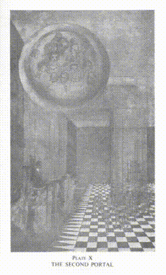

Три Символических Путешествия

Когда человек присоединялся к Меньшим Мистериям в Греции или Египте, считалось, что первым и самым важным знанием, которое ему следовало донести, была истина о состоянии после смерти. Ибо он мог умереть в любую минуту, и поэтому должен был обладать этим знанием. Мы продолжаем эту практику и сегодня, и в качестве важной части этого обучения мы выводим кандидата на три символических путешествия.

Существует три портала, или двери, через которые должен пройти кандидат. Физическим глазам они невидимы, однако они абсолютно реальны, потому что созданы мыслью. Первый из них, как уже было объяснено, символизирует смерть – переход из физического мира в следующую стадию жизни на нижнем уровне астральной плоскости. Кандидат входит в этот мир, не видя его, но ощущает прикосновение друга, который берет его за руку или руку и ведет по этому пути. Этот друг – это J.D., который, как следует помнить, представляет астральный или эмоциональный принцип в человеческой конституции. I.G. присутствует на первом портале от лица R.W.M., которого он выражает на физическом уровне.

На первом этапе обхода Ложи, или первого символического путешествия, кандидат оказывается окруженным страшными звуками, включая грохот цепей и столкновение мечей, предназначенные для демонстрации ему шума и суматохи нижней субплоскости астрального мира, где после смерти собираются те, кто в рабстве у чувственных удовольствий, или наполнены страхом, ненавистью, злобой или местью. Позже W.J.W. объясняет, что это путешествие является слабым отражением испытаний, через которые кандидат проходил в древних Мистериях, когда его вели через мрачные пещеры, символизирующие подземный мир, среди громких звуков, в темноте, окруженные опасностями, которые он не мог понять. Маловероятно, что обычный порядочный человек, обращающийся за приемом в масонскую братию, после смерти будет иметь какое-то сознание прохождения через эту низшую область, но если это произойдет, он будет готов пережить этот опыт спокойно и без страха.

Когда кандидат добирается до пьедестала W.J.W., он прибывает ко второму порталу и там общается с элементальными силами земли и воды. Эти силы связаны с областью, через которую он только что прошёл. Можно считать, что это твёрдые и жидкие уровни астрального мира. Сначала он обращается к северу, чтобы показать своё уважение к элементалям земли, а затем к югу, чтобы угодить элементалям воды. Это не те существа, которые строили храм, но они являются подчинёнными их командиру, который в свою очередь исполняет приказы W.J.W., стража второго портала. Эти элементали, которых иногда называют духами природы, собираются вокруг и с этого момента признают человека, с которым они познакомились. После этой церемонии, если человек окажется в любой нематериальной опасности или под влиянием злобной силы, он может призвать этих существ для защиты, благодаря установленной теперь братской связи.

Пластина X это попытка показать вид этого портала. W.J.W. изображён сидящим на своём пьедестале, который как бы внутри стены второго портала. Поверх его головы парит сфера его Дева-представителя, окружённого помощниками. Справа от портала сгруппированы элементали земли, а слева - элементали воды - озорные духи, готовы с энтузиазмом защищать свою территорию от нежелательного вторжения, до тех пор пока кандидат не проявит свои дружелюбные намерения с помощью формального обряда. Для наглядности мы убираем из изображения всё несущественное: кандидата и J.D., который его ведёт, а также братьев в колоннах. На заднем плане едва просматривается W.S.W., видимый сквозь второй портал. Третий портал, конечно, находится рядом с его пьедесталом. Но поскольку он в точности повторяет форму второго, хотя и отличается цветом, мы не попытались его изобразить.

Способность отличать возвышенное от низменного, действительное от нереального, это то, что позволило кандидату без ущерба пройти через эти области астрального мира. J.D., желая обеспечить своему подопечному проход, объясняет элементалям, что перед ними ослеплённый смертник, стремящийся к бессмертию. Совершая путь к высшим планам через эти области, кандидат готов расстаться со всем, что принадлежит им - всей материей, связанной с этими уровнями, чтобы возвратить землю земле и воду воде. В этом месте после смерти пребывают все, кто цепляется за низменный уровень эмоционального существования, воплотившийся в это в материи. Только после очищения через страдания и готовности отказаться от своих низменных эмоций, они могут сдвинуть эту материю с астральных тел и отправиться в более высокие области астрального плоскости. Кандидат здесь не задерживается, ведь он узнал, что есть лучшие вещи. Отныне его должны признавать братом света и бессмертия, уже не находящимся во тьме в отношении этого уровня.

Второе символическое путешествие напоминает первое, за тем исключением, что звук здесь мягкий, а не суровый. Кандидат все еще находится в астральном мире, но в центральной его части, которая намного изысканнее и изощреннее, чем та, через которую он уже прошел. Это место прочих человеческих эмоций; прежний был скорее местом слепой страсти. Желания, что приковывают обыкновенных людей к материи этих срединных областей, совсем не порицаемы, но и не возвеличивают их. Все телесные наслаждения, не грубые или вульгарные, строят здесь свои обители для пребывания душ умерших, пока они не устанут от этих вещей и готовы будут двигаться дальше. В "Астральной плоскости" и "Другой стороне смерти" я подробно описывал эти области и людей, что в них живут. О них также подробно пишет Первый Лейтенант Суверенного Великого Командора Ко-Масонского ордена, Весьма Почтенная бр. Анни Безант в "Древней Мудрости". 

Кандидат подходит к третьим воротам, около постамента W.S.W., который является его хранителем. Там, стоя лицом к востоку, он представлен элементам воздуха, охраняющим правый бок ворот, и, повернув к западу, - элементам огня, охраняющим его левую сторону.

Свойство бесстрастия позволяет ему преодолеть соблазны этого места, так что снова он отдает элементам то, что у него есть и принадлежит им, и продолжает двигаться дальше, став их другом, которому они всегда рады отдать свои сокровища, потому что они знают его как брата Света, который не оставит их для себя, а наоборот, разумно использует их и возвращает по времени. 

О данном путешествии W.S.W. указывает, что в древних Мистериях, когда кандидат оставлял за спиной унылые пещеры, он попадал в тихую область, символизирующую более высокие подпланы потустороннего мира, где грубые, суровые звуки не проникали, хотя все еще присутствовала некоторая дисгармония среди душ. 

Жизнь на астральной плоскости после смерти можно рассматривать как путешествие или серию путешествий. "Мертвый" человек действительно проходит ряд отчетливых изменений, по мере очищения его астрального тела от плотнее материи. В течение жизни эмоции человека действовали как магниты, притягивая к астральному телу грубую астральную материю нижних уровней, когда они бывали низкими, и тонкую материю высших уровней, когда они бывали возвышенными. После смерти человеку предстоит пробыть на каждом из этих уровней, пока он не изгонит его слой материи из своего астрального тела. Масон, разбирающийся в символическом значении этих путешествий, будет смерти готов волей своей бороться со своими низшими эмоциями, быстрее избавиться от тяжелой материи, и быстро пройти дальше в райский мир.

Третье символическое путешествие проходит в глубокой тишине, символизирующей вершину астральной плоскости, прямо на границе небесного мира. В конце этого пути Почтенный Мастер сообщает кандидату, что умерший, чей опыт он повторяет, на этом этапе достиг порога небесного мира, где полная тишина успокоила его утомленные чувства, а спокойствие окутало его. Мир земной находится ниже; перед ним - радости неба; а пространство между ними наполнено тишиной. Таковы были и остаются его переживания в истинной Мистерии; все это символизировали абсолютная тишина в мистериях Египта и Греции; во Франкмасонстве этот опыт удерживается в третьем символическом путешествии.

На этой точке путешествия заканчиваются. В церемонии не упоминаются другие элементалы или порталы, хотя их всего семь, и многие древние народы признавали их, отдавая дань девам Севера, Юга, Востока и Запада, зенита, надира и центра всего сущего. Кандидат на этот раз не выходит за пределы той части астральной плоскости; ему лишь показывают мир, в котором ему придется побывать много раз прежде чем он сможет свободно перемещаться по нему, и жить и работать там с полнейшим спокойствием. На данном этапе он символизирует ученика на испытательном пути, и должен тщательно применять три качества: различение, безжелательность и благонравие или самоконтроль, которые сделают его свободным от эмоциональной плоскости, как он был свободен от физической плоскости до вступления в Ложу. Дополнительную информацию об этих требованиях можно найти в "У ног Мастера" от Дж. Кришнамурти, "Путь ученика" от V.·.·. Ills .·.·. Bro .·. Annie Besant и моей собственной книге "Мастера и Путь".

Эти качества помогут ему преодолеть три типа опасностей - опасности от внешнего мира, опасности от его собственной нижней природы и опасности изнутри него самого, то есть от его собственных добродетелей, если они неурегулированы. S ... d на груди кандидата символизировал первую из этих опасностей; позже он найдет s ... своей собственной нижней природы вместо нее, и еще позже c ... s, которые символизируют треугольник его высшего Я, свои добродетели в котором могут быть преувеличены и стать его гибелью, если он не будет постоянно бдетель, чтобы сохранить спокойствие и уравновешенность и идти именно по тому Срединному Пути, который Господь Будда описал как путь безопасности.

Со временем, благодаря практике этих трех качеств, кандидат сможет свободно перемешаться по всей плоскости на свое усмотрение. Для такой активности различение даст ему умственную силу, безжелательность даст ему эмоциональную силу, и благонравие даст ему волевую силу; и в самой верхней части этой области никакие ритуалы никогда не будут нужны для того, чтобы он мог проходить через нее без препятствий, потому что все там мгновенно откликается и подчиняется просветленной воле человека. Братья Света легко узнаются там.

Эта часть ритуала в основном происходит из символических или синих степеней Древнего и Принятого Шотландского Рита, но не присутствует в работе Великой Ложи Англии. В шотландском ритуале, выполняемом в Ложах под патронажем Верховного Совета Франции, существуют три символических путешествия: с шумом и звоном мечей в первом, с "cliquetis d’armes blanches" во втором и абсолютной тишиной в третьем. В них нет призыва к элементам, хотя путешествия сравниваются с древними испытаниями земли, воздуха, огня и воды.

Интересное подтверждение использования этих испытаний или путешествий приводит A.Q.C. в отчете о своей инициации, который написал Роберт Гиллеман, убийца лорда Нельсона при Трафальгаре. Он был инициирован во время осады Страсбурга, повествование о чем датировано 1807 годом:

Инициация прошла с всей возможной пышности в хижине около 15 футов в длину и 6 в ширину, где не было места стоять, но которая служила в качестве Храма. После совершения моих путешествий, которые были не очень протяженными, прохождения испытаний огнем и водой и выполнения обычных трюков, я получил знаки, слова, прикосновения и другие формы. Затем адъютант, наш оратор, произнес передо мной прекрасную речь, где он раскрыл величие характера, которого я только что достиг, делая меня ребенком Света.

В английской масонерии мечи не вводят в Ложу. В те времена, когда господа носили мечи, они оставляли их снаружи. Однако в Ко-Масонстве их используют в Ложе в качестве сильных инструментов любви в практической магии ритуала.

О ...

Кандидат теперь находится в северо-западном углу, лицом к востоку, и W.S.W. представляет его R.W.M. как готового стать масоном. Здесь ему дается возможность отказаться, если он этого хочет, но после объявления о своем решении продолжить без страха или опрометчивости, его ведут к алтарю, месту Света, по p … s … s. Первый шаг делается левой ногой вперед, а правая подтягивается к ней под правым углом, h … to h … - шаг длиной в n … дюймов. Первой двигается левая нога, так как она ближе к сердцу, это напоминает кандидату, что во всех его решениях любовь должна стоять на первом месте. Второй и третий шаги аналогичны, но их длина t … и f … дюймов соответственно. Необходимо сделать три шага, поскольку качеств требуется три; качество любви иногда считают четвертым, но оно должно проникать все остальные, и когда оно сильное, оно поднимает ученика по более высокому пути следующей степени.

Существуют две причины для продолжительности этих трех с ... с. Каждый из них продвигает человека дальше, чем предыдущий. Это путь эволюции. Каждый шаг прибавляет к силе человека, благодаря чему следующий шаг окажется еще более крепким и длинным. Что-то всегда приобретается, но ничего не теряется, так что скорость движения на этом пути увеличивается согласно арифметической прогрессии, и в дальнейшем его ожидает геометрическая прогрессия и даже прогрессия по квадратам в его продвижении.

Вопрос о числах девять, двенадцать и пятнадцать сводится к пропорциям три, четыре и пять, что напоминает нам о теореме Пифагора, которую постоянно используют архитекторы и предположительно в большей степени в планах Великого Архитектора. Премьер-Мейстер особенно призван использовать этот велик практический инструмент, но уже сейчас E.A. должен усвоить уважение к нему и стремиться к его использованию в будущем.

В то время как кандидат k…t у а…t, чтобы произнести свой Обет, несколько Братьев обычно встают за кандидатом, образуя пустой квадрат у углов алтаря, их с…ы направлены на кандидата, в то же время Мастер получает от него Обет. Находясь в этой позе, каждый Брат должен сконцентрироваться на кандидате и стремиться изложить перед ним с всей своей силой благословение, которое ему, как М.М., в его праве и силе преподнести.

Многие кандидаты удивлены страшной серьезностью Обета, который дошел до нас из Средневековья. В те времена масоны преподавали факты о внутренней жизни и природе человека, за знание которых Церковь могла бы сожечь их на костре, требуя при этом большего уровня секретности, который оправдывает сильную риторику Обета, особенно если припомнить, что раскрытие информации одним из них могло подвергнуть всю Ложу риску судебного убийства.

Завершив рецитацию Обета, Братья, стоящие вокруг, поднимают свои мечи в carry, то есть вертикально в руке, с локтем, образующим s…, а Братья, сидящие на востоке, протягивают свои правые руки горизонтально, благословляя, мечи и руки возвышаются, а все вместе они поют "Пускай сворщится клятва". Когда эти слова произносятся, каждый Брат должен искренне желать кандидату силы, достаточной для выполнения клятвы, которую он только что взял на себя.

Уважаемый Мастер теперь творит, принимает и обряжает кандидата, делая его E.A.F. с к…с заложенным под г… на ф…с…, который, в свою очередь, оказывается на его с…с и р…. Очевидно, что несмотря на то, что степень дарует Уважаемый Мастер, он, безусловно, действует от имени H.O.A.T.F. и служит проходом его мощи. Разумеется, три прикосновения ф…с… передают разные ароматы этой силы, соответствующие трём аспектам благословенной Троицы: первое дарует мозгу силу, второе наполняет сердце любовью, а третье обеспечивает правую руку исполнительной способностью. Основной эффект этого вливания силы состоит в расширении пути общения между высшим 'Я' кандидата и его личностью - ещё один пример удивительного совпадения между принятием этой степени и посвящением субдиакона.* (*см. "Науку о Священнодействиях", стр. 315).

После того как взята торжественная присяга о сохранении тайны, h…k удаляется, и кандидат вновь обретает благословенный свет. Отметя это, Брат Дж. С. М. Уорд говорит:

Обратите внимание на слово "возвращается". Мистическое перерождение - это начало нашего пути к свету, нашего восхождения к Богу, но это также возврат - путешествие обратно к тому, откуда мы пришли. Такой же порядок действий соблюдается в инициационных ритуалах турецких дервишей. Среди них на этом этапе следует прекрасная лекция о мистическом значении света. Это божественный свет, эмблема самого Бога и божественного вдохновения. Он присутствует не только в священных текстах, но и в сердце каждого истинного верующего. Свое бытие мы получаем через и в божественном свете Божьей любви, который солнечный свет лишь слабо отражает.

При возврате благословенного света, новопосвященный А. обращает взгляд на t…g…e…l…s масонства. Мебель Ложи здесь преподносится под новым названием, но, поскольку мы уже обсуждали эту тему в главе III, мы не будем повторяться.

В ритуале Со-Масонства, Уважаемый Мастер теперь поднимает нового брата, поворачивает его так, чтобы он в первые увидел Братьев с их s…s в готовности. Он говорит ему, чтобы он не воспринимал этот маршевый порядок в виде угрозы, но, скорее, как знак защиты, которую Масонство теперь окружает. Затем Братья возвращаются на свои места.

Новообращенного ведут на север, представляя Западному Младшему Часовому, и он стоит там, внутри cella, находясь под действием специальной силы в этом районе, пока Уважаемый Мастер стоит перед ним и наставляет его. Сначала Мастер обращает внимание кандидата на три великие колонны, на которых символически упирается Ложа Свободного Масонства - это колонны Уважаемого Мастера и его двух Часовых, символизирующие мудрость, силу и красоту или гармонию. Это уже было объяснено в главе II. В мужском ритуале это объяснение трех колонн подается несколько иначе, поскольку они описываются там как три меньших света, которые обозначают солнце, луну и Мастера Ложи. Это связывает современное масонство с древней символикой, в которой значимую роль играют солнце и луна.

S… И P…

В данной ситуации Правая Царственная Величесть также подготавливает Нового посвящённого в тайные знаки и слова этой степени, знак, жест и слово. Слово в этой степени часто предполагается связанным с причастием, упомянутым в Обряде, но слово существовало задолго до причастия, которое придумали, чтобы его дополнить. В Египте и даже у нилотских негров в Египте это же причастие существовало и, возможно, в других местах тоже. Для древнего египтянина было крайне важно, чтобы его тело было брошено в воду вместо того, чтобы его походу почтили, предполагая, что это освободит его о уз своего физического тела. В призрачных историях Гомера, в "Илиаде" и "Одиссее", часто бедные духи возвращались для того, чтобы их поддали похоронным обрядам, которые и могли бы их освободить. Эта же идея представлена в индуистской философии, например, в Гаруда Пурана, в истории призрака Судевы, которого освободил король Бабхрувахан. Современному человеку наше невнимание к обрядам не имеет такого значения, поскольку у нас уже нет этих представлений; но буквальный факт в том, что после смерти мысли человека могут удерживать его в этом состоянии, пока он не узнает или не поверит, что его тело было должным образом похоронено. Так что это было очень древнее причастие. На самом деле, слово относится к определённой чакре и её функции, как я уже объяснял. Жест, конечно, описывать нельзя, но фримасону не составит труда понять, что это подразумевает подавление астрального тела, первого из сверхфизических принципов человека.

Испытание и Посвящение

Следует заметить, что учащий Декан ведет Нового посвящённого к подставкам Западного Старшего Учителя и Южного Старшего Учителя для проверки его знания тайного знака и слова. Он стоит перед каждым некоторое время во время серии вопросов вопросов и ответов. Всё это происходит в так называемой "форме улья", которую описали в четвертой главе. Когда он стоит на этом месте, сила внутренних плоскостей сосредоточенно воздействует на него, укрепляя его в качествах, которые ему предстоит развить.

По команде Правая Царственная Величесть, юный учитель теперь вручает новому Брату отличительный знак фримасона - перчатку, описание которой уже приводилось в четвертой главе. Имея в виду инвестирование неофита, загадочный учитель выдаёт короткое предисловие, в котором он говорит о великой древности и высоком достоинстве этого символа, а Правая Царственная Величесть добавляет комментарий о важности не входить в Ложу, если один Брат имеет разногласия с другим. Брат Уорд делает следующие примечания по этому поводу:

Новый Брат направляется к своему месту в северо-восточной части Ложи, точке, где, по мнению египтян, начинается дорога солнца, когда оно впервые появляется на свет.

Рабочие Инструменты

Толкование рабочих инструментов Е.А. в Ремесленном Масонстве объясняется новому Брату служителем В.В.Ч. на его посвящении. Этот офицер делает это, потому что управляет комнатой, в которой работают Е.А.

В мужском Ремесленном Масонстве символ t … f … i … g … расценивается как показатель времени, напоминающий человеку о том, что время его дня должно быть, не просто безбрежно проведено или потрачено на собственную выгоду. День должен быть разделен на время для размышлений и учебы, а также на труд, отдых и сон. В Со-Масонстве мы добавляем, что всё делается "во служение человечеству". Символ также подчеркивает, что точность и строгость являются важными элементами должного ведения нашей жизни.

Е.А. учится также, что символ c … g … напоминает нам, что умение без старания едва ли полезно, и что труд есть наше предназначение. Этот символ также представляет силу совести, которая должна сдерживать все пустые и недостойные мысли, делая наши чувства и действия чистыми и незагрязненными. В-третьих, представлен c … l, который говорит о том, что образование и упорство необходимы для достижения совершенства. Необработанный материал нашей природы приобретает свой блеск и утонченность исключительно благодаря повторяющемуся усердию.

В древнем Египте эти инструменты имели несколько иное значение - ближе к исходному, так как образование и совесть не являются инструментами, которыми человек может пользоваться. Заметно, что все три инструмента связаны с формированием камня. Как профессиональный масон формирует грубый ашлар в идеальный, удаляя лишние части и измеряя его, так же и Е.А. в Спекулятивном масонстве должен тренировать себя до совершенства в морали. В древнем Египте ученик оставался на этом уровне обычно в течение семи лет, до тех пор пока не убеждал правящих в своей подготовленности перейти к следующей степени. В наши дни квалификация сводится лишь к прошествию времени и ответам на определенные вопросы.

В раннем христианстве было признано три этапа, через которые должен пройти каждый, кто желает духовного роста: очищение, просвещение и совершенствование. Апостол Павел говорил: "Мы произносим мудрость среди совершенных." Очень часто это понимают неверно. Ведь если бы люди были совершенны в современном понимании этого слова, им не потребовалось бы обучение. Эти слова здесь не используются в привычном смысле; они являются терминами, связанными с Мистериями и широко использовались образованными людьми того времени. То, что на самом деле говорил апостол Павел, звучало так: "Мы обучаем тайной мудрости, гнозису, только тех, кто достиг степени совершенства", или, как бы сказал масон, достиг степени M.M., ведь эти три стадии коррелируют с тремя степенями во Фримасонстве. Сегодня Христианская церковь, как правило, останавливается на первом этапе - очищении и считает своей важнейшей миссией сделать людей святыми. Это, безусловно, великая и благородная задача, но в ранние дни христианства сделать человека святым было лишь начальным этапом. Святой Климент Александрийский, один из величайших Отцов Церкви, утверждал: "Чистота - это в основном негативная добродетель, ценная главным образом как условие осознания." Когда человек добивался абсолютной чистоты и святости в жизни, он становился готов к следующему этапу - просвещению, и только после полного просвещения он мог перейти к этапу совершенства, став каналом Божественной силы.

Египетское Толкование Рабочих Инструментов

В древнем Египте t…f…r i…g…, или, как тогда говорили, t…f…e i…g…, также известный как священный локоть Великой пирамиды, были почти такими же, как наши. Их единица измерения, дюйм, основывалась на точных знаниях об полярном диаметре Земли, пятьсотмиллионная его часть - это именно пирамидный дюйм. Наш современный английский дюйм произошел от этой египетской единицы измерения через Грецию и Рим, но он не совсем такой же, как та единица, которую использовали при строительстве Великой пирамиды. С течением времени эта единица стала чуть короче; она потеряла около тысячной части своей длины, так что пирамидный дюйм теперь равен 1.0011 английских дюйма. Длина экваториального диаметра Земли стала известна только в прошлом веке, хотя полярный диаметр был известен задолго до этого.

Измерения длины, основанные на пирамидном дюйме, до сих пор используются во многих странах. Но во Франции была принята десятичная система. Там используется метр, который был задуман как одна десятимиллионная часть четверти Земли, измеренной по поверхности от полюса до экватора. Позже они обнаружили, что это измерение не является абсолютно точным. Теперь метр - это условная единица длины, стандартизированная по метровой шкале, которая хранится в Париже, так же как стандартная ярда хранится в Лондоне.

Научные знания в этой древней стране в некоторых аспектах были развиты на уровне современных, а в некоторых даже опережали наши до недавнего времени. "Тайны" включали в себя глубокое и либеральное образование, и особое внимание уделялось химии, астрономии и геодезии. Еще в древности, во времена постройки Великой пирамиды, дома Света, строители обладали обширными знаниями. Они заложили эти знания в постройку, надеясь, что они сохранятся в нерушимом виде. Например, периметр основания (36,524 пирамидных дюйма) к высоте (5,813 пирамидных дюйма) такой же, как окружность круга к его радиусу, то есть математически равен 2π. Также интересно, что общий периметр основания в пирамидных дюймах соответствует количеству дней в ста годах. Там же указан и точный размер Земли, а также множество других расчетов, связанных с солнечной системой. Множество этих расчетов внимательно обработали английский астроном Р. А. Проктор и французский египтолог Сэр Гастон Масперо, с которым меня знакомила Мадам Блаватская. В своей работе "Великая пирамида" Дэвидсон и Алдерсмит приводят множество данных по этому вопросу. Они отмечают:
Внешние характеристики, размеры и структурные элементы Великой пирамиды, проанализированные в плане, точно и правильно отражают все основные характеристики орбиты Земли и ее движения. В это входит и значение звездного и солнечного года, среднее расстояние до Солнца, диаметр Солнца, а также максимальные и минимальные значения эксцентриситета орбиты Земли.* (*Op. cit., p. 95.)
Великая пирамида была местом посвящения, и если бы не мусульманские преступники-фанатики, которые разрушили ее внешнюю оболочку, мы бы до сих пор обладали точными измерениями многих астрономических явлений, которые стали доступны нам только в прошлом веке. Надежные измерения средней дистанции от Земли до Солнца были получены европейскими астрономами только недавно. Когда я был ребенком, нам учили, что это девяносто шесть миллионов миль; потом они снизили это число до девяносто трех миллионов; потом, после тщательных измерений среднего экваториального горизонтального солнечного параллакса во время транзитов Венеры в 1874 и 1882 годах, они оценили это расстояние в девяносто два с половиной миллиона миль. Помню, как мистер Глэдстон объявил это в Палате общин, и это вызвало большой интерес. В одиннадцатом издании "Энциклопедии Британика" указано 92,998,000 миль. У древних египтян это число было равно 92,996,08 миль. Кто скажет, что они были не ближе к истине, чем мы?
В древнем Египте t … f … i … g … считалось символом инстинкта. Я использую это слово, которое обычно используют только в отношении животных, и я не хочу, чтобы его недопонимали. Под инстинктом они подразумевали внутреннее чувство - интуитивное отношение к вещам. Это значение было для них важным. Они считали, что инстинкт имеет две стороны - отрицательную или принимающую, которая дает нам понять, хорош ли предмет или плох, подходит ли он нам или нет - и активную сторону, которую мы сейчас бы называли вкусом; то есть, точное знание того, что нам нужно и что следует делать, какие вещи гармонируют и совместимы между собой. В отношении к нашим собратьям, это был бы такт. То есть, смысл этой идеи инстинкта был значительно шире, чем в современном понимании.

В прежние времена люди - по крайней мере в Египте, на Крите, в Греции - жили в близостом контакте с природой, наслаждаясь солнечным светом и свежим воздухом, так, как в наше время способны наслаждаться только великие поэты и художники. Они были ближе к истине, и поэтому их инстинкты были намного надежнее, чем у большинства современных людей. У них инстинкт служил прочным инструментом для формирования и укрепления характера. Многое из этого было утрачено, так как современные люди вели искусственный образ жизни и обычно позволяли своему разуму доминировать над инстинктами, даже когда этот разум имел мало оснований для своих суждений. Я сам многократно ощущал эти инстинкты, и уверен, что такие ощущения знакомы многим; иногда я отодвигал их в сторону, считая их неразумными, как это делают многие, но в итоге всегда жалел, что не уделял им должного внимания. Инстинкты не исчезли, и при наличии поддержки они могут возродиться у многих людей.

Египтяне использовали c ... l в качестве символа интеллекта, представлением о котором служил острый инструмент. Они полагали, что человек, активно использующий свой интеллект, сумеет очистить его убеждения от суеверий, пока не станет совершенным кубиком, когда его мысли станут четкими и верными. C ... g ... было расценено как божественная сила за c ..., и трактовалось как воля. Это, конечно, совсем не следует путать с Master's g ... 1, который ничем не связан с ним и имеет другую форму. Различие еще более усиливается тем, что об этом инструменте всегда говорят как о c ... g ...

В своей работе "Магия Масонства" майор A. E. Powell провел занимательное исследование рабочих инструментов первой степени в главе, посвященной этой теме. Он использует t ... f ... i ... g … как символ мудрости R.W.M., в обязанности которого входит измерение и планирование, g … в качестве эмблемы силы W.S.W., который служит инструментом передачи силы, и c … как символ красоты W.J.W., который имеет инструмент для формирования материала. Он отмечает, что все наши точные или научные знания основываются на измерениях, символизированных t … f … i … g …, вся наша жизненная работа связана с движением материалов, которые двигаются под воздействием нашей энергии, символизируемой g …, и c … символизирует концентрацию наших намерений, так как он способствует прорезанию материи. Таким образом, он утверждает, мы знаем с t … f … i … g …, чувствуем с c ..., и действуем с g ... Каждый из этих инструментов, он добавляет, представляет типичный формат - t ... f ... i ... g … символизирует все измерительные приборы, g … представляет все инструменты и машины, используемые для передачи силы, c … символизирует все инструменты, используемые для внедрения в материю.

## Глава VII. Второй Градус

Вопросы

Мы уже провели аналогию между тремя степенями Голубого Масонства и тремя этапами развития, которые признавала ранняя христианская Церковь. Если первая степень предусматривает покорение страстей и эмоций, что соответствует идее очищения, то на второй степени перед нами встаёт идея просветления, мысли о развитии интеллектуальных, художественных и психических способностей ученика. По нашему обряду, претендент на эту степень должен сначала показать своё мастерство в Первой степени. Как я уже упоминал, в древности ученик оставался на этой стадии семь лет; а то и дольше, поскольку его поведение в общественной жизни тщательно наблюдали старшие. И только когда они были полностью удовлетворены тем, что он получил необходимые качества, ему разрешали продолжить свой путь. В наши дни нету временных рамок, хотя по уставу Ко-масонской Ложи предусмотрено, что он должен посетить определенное число заседаний Ложи и регулярно посещать специальные занятия для учеников. Также от него ожидают, что он сможет наизусть произнести обет Первой степени и ответить на некоторые заданные вопросы в заседании той Ложи.

Первый из этих вопросов мы уже рассматривали; он важен, потому что в нем заложена основная идея всего, что ему предстоит. Когда кандидата спрашивают, где он впервые был подготовлен к тому, чтобы стать масоном, ему говорят ответить: «В своём сердце», тем самым показывая, что внутреннее состояние ценится больше, чем внешнее. Затем он должен описать свою подготовку на физическом уровне и пояснить, что его инициация произошла в справедливой, совершенной и регулярной Ложе.* (*См. стр. 88.)

Затем появляется замысловато выраженная мысль, что солнце всегда находится на своем меридиане относительно масонства, что можно расценить так, что Логос всегда наполняет своей полной мощью каждую масонскую ложу, где бы она не находилась. В истории масонства был период, когда принято было разделять Ложу на три части, или проводить собрания в трех разных помещениях. Самое внешнее помещение предназначалось для Е.А.с, где W.J.W. занимал кресло председателя, во втором помещении W.S.W. руководил F.C.s, и только в третьем помещении R.W.M. возглавлял собрание M.M.s. Вот почему S.D., передавший команды R.W.M. к W.S.W., должен ожидать возвращения J.D. из внешнего помещения. Согласно этой теории, поскольку W.J.W. возглавляет Ложу Е.А.s и представляет солнце на его меридиане, вполне естественно, что церемония инициации фигурально происходит в полдень.

Далее идет необычное определение масонства собой как "особенной системы нравственности, завернутой в аллегорию и иллюстрированной символами". Мне все время казалось этот ответ несколько вводящим в заблуждение. Нравственность в масонстве не особенная, потому что она такая же, как в каждой религии мира. То, что масонство может справедливо утверждать, так это уникальность его способа представления системы и оригинальный, внушительный метод иллюстраций. Масонство, безусловно, является одним из самых интересных и влиятельных тайных обществ мира, в рядах которого более пяти миллионов мужчин, которые обязались соблюдать принципы братства. В его удивительных парадах церемоний – в ритуалах его многих степеней, орденов, рыцарств и обрядов – воплощены прекрасные идеалы и глубокие духовные учения, что представляет огромный интерес для исследователя скрытой стороны жизни.

Хотя сегодня масоны не называют свое ремесло религией, оно имеет религиозное происхождение, как мы уже видели, и вносит свой религиозный вклад, помогая своим инициаторам и, через них, всему остальному миру. Для многих Брс. это единственная настоящая религия, которую они когда-либо знали, и непременно многие из них героически применяют ее принципы на практике: ведь мужское масонство - это не только "система нравственности", но и величественная благотворительная организация, обучающая практической доброте и братству. В Англии и ее колониях, а также в Соединенных Штатах, масонская благотворительность существует на великолепной основе, и есть множество прекрасно управляемых масонских школ и сиротских приютов. Преимущественно по этим причинам и из-за достойного характера его членов, масонство заслуживает большого уважения, хотя во Франции и Италии оно несколько утеряло престиж из-за ассоциации с антиклерикальными политическими партиями. К сожалению, современные масоны полностью потеряли из виду то, что можно назвать внутренней благотворительностью - их воздействие на высших уровнях. Eсли бы им сказать: «Вы должны выпускать потоки силы мысли; это должно быть одним из ваших проявлений благотворительности», они бы вероятно не поняли. Жаль, что эта внутренняя работа так пренебрегается, ведь это сильное действие для добра, в котором каждый Брат может участвовать. Внешняя благотворительность зависит от частного достатка немногих, но любой масон, каким бы бедным он ни был, может дарить свои мысли.

Конечно же, масонские ложи находятся на разных уровнях разума, и некоторые уделяют слишком много времени пиршествам, и слишком мало - изучению; но достаточно прочесть имеющуюся литературу, чтобы понять, что, по крайней мере в англоговорящих странах, цели Корпорации всегда были благородными и возвышающими. Обратите внимание, например, на следующие высказывания:

Главная цель Масонства можно выразить такими словами: стереть среди людей предрассудки каст, обычные различия по цвету кожи, происхождению, взглядам, национальности; искоренить фанатизм и суеверие, искоренить национальное разногласие, и с ним погасить пламя войны; короче говоря - прийти, свободным и мирным прогрессом, к одной формуле и образцу вечного и всемирного права, по которой каждый человек будет свободен развивать все свои способности, и все свои силы использовать для счастья всех, и так образовать из всего человечества одну семью братьев, объединенную любовью, мудростью и трудом.* (*История Масонства, Ребольд, стр. 62.)

Весь мир - это только одна Республика, где каждая нация - это семья, а каждый человек - ребёнок. Масонство, не умаляя различные обязанности, которые требуют разные государства, стремится создать новый народ, состоящий из людей многих наций и языков, объединённых связями Науки, Морали, Добродетели.* (*Морали и Догма, Альберт Пайк, стр. 220.)

Что вышеизложенные воззрения не оказались просто теориями, демонстрирует следующий отрывок из "Тайн Масонства" доктора Черчварда:

Всего несколько лет назад мы, в этой стране, пережили острейшее напряжение - угрозу войны между нами и Соединенными Штатами Америки. Эта угроза теперь миновала и никогда больше не возникнет. Почему? Потому что Братство послало своего великого представителя, великого мастера Иллинойса, в нашу страну. Я имел большую честь встретиться с ним в ложе Q. C., когда он передал послание мирa и братства: "Между Соединенными Штатами Америки и Англией не будет войны; мы - одно Братство, и масоны Соединенных Штатов решили, что войны между нашими странами не будет, ни сейчас, ни когда-либо. Я прибыл сюда, чтобы сказать вам это, представляя более чем миллион братьев, и прошу вас в ответ обещать, что и вами не будет войны."* (*Там же, стр. 75.)

Это великолепное свидетельство силы масонской связи. Печально, что попытка, предпринятая позже, предотвратить большую европейскую войну, потерпела неудачу; поскольку прусские великие ложи отказались поддержать движение за мир, когда к ним обращались с подобным предложением.

Следующий вопрос, который задают, касается принципов, на которых основан наш Орден. Обычно это братская любовь, помощь и истина. Заслуженно высокое значение придается этим трём добродетелям в ритуале мужской Ремесленной работы, и в официально подготовленных лекциях, предназначенных для использования в Ложах, они описаны следующим образом:

При соблюдении Братской Любви мы учимся заботиться о всем человечестве как о семье, где вместе живут высокие и низкие, богатые и бедные, созданные одним Всемогущим Бытием и посланные в мир для взаимной помощи, поддержки и защиты. На основе этого принципа Масонство объединяет людей всех стран, конфессий и воззрений, способствуя развитию истинной дружбы между теми, кто иначе мог бы остаться на постоянном расстоянии.

Оказывать помощь нуждающимся - обязанность каждого человека, и особенно тех, кто свяжет себя с масонством нерасторжимой связью искренней любви. Именно поэтому на наших ногах лежит задача облегчать страдания, сочувствовать в беде, проявлять сострадание и приносить мир в беспокойные души - все это составляет главную цель нашего стремления. На этом основании мы строим наши дружеские связи.

Истина - это божественный атрибут и основа каждой масонской добродетели. Быть хорошим человеком и верным другом - это урок, который мы получаем при посвящении. Этот большой принцип становится предметом наших размышлений, и в соответствии с его мудростью мы стремимся руководить нашей жизнью и поступками. Поэтому лицемерие и обман в нашей среде, или, по крайней мере, должны быть нам неизвестны, в то время как искренность и прямодушие - наши отличительные черты. Сердце и язык работают вместе, чтобы продвигать благополучие друг друга и радоваться процветанию Ремесла.

Остальные вопросы, несмотря на их устаревший стиль, кажутся ясными, и все вопросы, которые они поднимают, уже были проанализированы.

Кандидату предлагается p … g … и p … w … . Интересно отметить, что на стуле W.S.W. часто изображается связка зерна, как его эмблема. Это может быть связано с тем, что колосок показан претенденту как символ верховного мистерия в Элевсине, что одновременно указывает на всеобщность эволюции и неуничтожимость жизни. «Если зерно пшеницы, упавшее на землю, не умрет, оно останется одно; а когда умрет, приносит много плода.» (Иоанн, xii, 24.) Возможно, стоит отметить, что p … g … между Первой и Второй Ступенью указывает на необходимость победы над тем частным запутыванием нижнего ума в сетях желания, что в теософской литературе известно как кама-манас. Как замечает брат Вильмсхерст:

Это [п ... в ...] представляет кандидата, его духовное состояние. Он представлен колосом зерна, посаженным рядом с водопадом, который его питает. Его духовный рост, достигнутый на стадии Ученика, символизируется зреющим колосом; природа его роста - это освежающая роса с небес, падающая на его внутреннюю природу в ответ на его стремление к свету.* (*Смысл Масонства, с. 119)

Подготовка

Вы заметите, что в подготовке кандидата следуют те же принципы, что и в соответствующем ритуале первой степени. Л ... р ... оголяют, так как именно через неё должна протекать энергия, и именно она должна поддерживать во время церемонии Повышения 1 ... н ... В таком же порядке обращают внимание на р ... б ..., поскольку Salon будет применять его  ... при входе кандидата в лоджию. Как раньше, р ... к ... оставляют непокрытой, а л ... р ... являются п ... - п ... о, поскольку они приходят в контакт с сильно магнитизированным полом или подушкой алтаря при взятии обета и непосредственного присуждения степени.

Внутренняя Подготовка

Внутренняя подготовка на этой степени частично совпадает с той, что была на первой, ведь К. надеется получить привилегию быть повышенным до Второй Степени с помощью Б ..., поддержки с ..., и через добродетель ч ... g … и p … w … Упомянутый здесь квадрат символизирует четырехугольник личности. Происходят два основных события: его подчиняют, как это показано в его топтании при входе в Ложу, но его сила и активность не упразднены; он остается таким же активным, но теперь вся его энергия направлена на служение настоящему человеку, высшему я. Это высшее "я" воплотилось в личности в целях приобретения определенности; эго на своем уровне велико, но великолепие его кажется неопределенным, если не считать достигших высокую степень эволюции. Теперь, в символике этой степени, личность полностью осознает, что смысл жизни в том, чтобы служить выше; он с энергией отдается этому делу, придавая этому уяснение цели, которую высшее "я" ставит перед самим собой; он обращается к Воину внутри, используя символику Света на Пути.

Открытие

Во время подготовки к С. R.W.M. вновь обращается к братьям за помощью в открытии Ложи, но на этот раз на Второй Степени. И вновь он задает общий вопрос, немного изменив его: "Что есть первая забота каждого F.C.F.?" И получает обычный ответ: "Убедиться, что Ложа тщательно закрыта." Так же, как и в Первой Степени, он обязывает братьев выполнить эту задачу, а интервю и ответы идут, как и раньше. Тем не менее, это закрытие Ложи отличается от предыдущего. В каждом случае строительство окружающей стены происходит на всех уровнях, но в Первой Степени главное внимание уделяется астральному миру, и оборона на этом уровне намного сильнее остальных, поскольку это особенно необходимо, когда идет целеустремленная работа по астральной очистке и развитию. Как будто при этой очистке плотность астрального тела кандидата снижается, и поэтому на него оказывается большее внешнее давление, требуя специальной защиты. В усилиях, предпринятых в церемонии Второй Степени, подобное давление применяется к ментальному телу, поэтому укрепление оборонительных мер сосредоточено на ментальном уровне. Таким образом, закрытие Ложи при открытии Второй Степени совсем не повторение предыдущей церемонии, а скорее внесение дополнительной защиты на более высоком уровне.

Тем не менее, крайне важно, чтобы на нижнем уровне также не было возможности для беспорядка, поэтому следующий шаг - усилить астральную защиту, призвав братьев принять орден как E.A.s. Это действие является конкретным утверждением силы братьев на этом уровне и мобилизацией его сил. Когда это сделано, R.W.M. обращается к W.J.W., спрашивая, является ли он F.C.F. И хотя он по сути является лидером, учителем и рупором для E.A.s, он также представляет высший уровень мышления, и таким образом немедленно отвечает, что он F.C.F., и требует доказательств этого. R.W.M. спрашивает, каким инструментом его проверят, на что тот отвечает: "С помощью квадрата..."

Следующий вопрос и ответ о характере квадрата показывают нам, что здесь подразумевается инструмент рабочего масона, символизирующий духовную волю, а не четырехугольник. С другой стороны, когда кандидат вступает в Ложу на этом уровне, также используется и другая форма квадрата, поскольку то, по чему он ступает, представляя себе низшую природу, личность, безусловно, является геометрической фигурой. Затем братья просят доказать себя как F.C.s, и когда они это делают, сначала W.J.W., а затем R.W.M., с акцентом повторяют приведенные доказательства, устанавливая основной мотив и выражая особенное качество этой степени. Ведь так же, как E.A. стремится преодолеть страсти и эмоции, так особенно важной целью Второй Степени является преодоление и контроль над нижним умом.

Это действительно более сложная задача для большинства людей; и во многих случаях у кандидатов сначала должен проснуться ум. Мы все думаем, что по крайней мере умеем думать; но правда в том, что действительно эффективно думать умеют лишь немногие. Используя небольшую степень ясновидения, любой может убедиться в этом, внимательно изучая формы мысли тех, кого он встречает в повседневной жизни. Большинство из них имеют неопределенные очертания; очень редко видишь четкие и определенные формы среди тысяч, плавающих вокруг нас. Поэтому, чтобы действительно продвинуться в контроле над мыслями, большинству кандидатов необходимо приобрести способность ясно думать, как Раскин заметил в "Этике пыли":

Большой трудностью всегда является открытие глаз людей. Волновать их эмоции и разбить сердца легко; труднее взбалтывать их умы. Что имеет значение, если они остаются глупыми, изменяют ли вы их чувства или нет? Вы не можете всегда стоять у них на каждом шаге, чтобы указывать им, что правильно, и они могут отклониться от пути и прежде, чем заметить, они станут еще хуже; их ни в коем случае нельзя использовать, чтобы уложить путь для них - вы знаете куда. Ведь ад не покрыт ими, как часто говорят люди. Вы не можете уложить бездонную яму, но можете уложить дорогу к ней.

Так что первым условием для нашего кандидата второй степени должно быть управление своим умом, если у него есть что-то, что можно назвать умом; и если его нет, он должен его развивать. Это главная задача этой степени и ее церемоний; к этому он должен стремиться; к этой цели он должен направить свои усилия, чтобы открыть различные центры в своём высшем теле. Ему говорят, что его долг - каждый день узнавать что-то новое о масонстве.

Следует помнить, что С.Д. является особым представителем ментального тела, поэтому естественно, что именно он забирает на себя обязанность вести кандидата, и выполняет основную работу в этой степени. Интересно посмотреть на изменение цвета, которое происходит в Ложе, когда оно открывается в этой степени - не так, что отличительные оттенки светящихся шаров различных офицеров исчезают, но они все подвергаются изменению под влиянием доминирующего цвета. Этот главенствующий цвет был алым в степени E.A., тогда как в степени F.C. он - желтым.

Чакра, которую мы стремимся пробудить в этой степени, располагается внутри астрального тела и дает способность сочувствовать эмоциональным колебаниям других людей, чтобы человек инстинктивно знал их чувства; и когда соответствующая эфирная чакра также активируется, она привносит эти впечатления в физическое тело, таким образом, человек становится осведомленным даже на этой плоскости о радостях и горестях своих братьев по подвижничеству. Силы из центра селезенки, описанные в главе V, пронизывают эту чакру, но на этот раз это желтый луч, который проникает в сердце и, затем переходит в мозг и проникает в него, основным образом направленный на двенадцатилепестковый цветок в самом сердце самого высокого силового центра на вершине головы. Связь этого специального центра со второй степенью становится очевидной, когда мы помним о его характере товарищества и служения, его связи с T.G.G.O.T.U., вторым членом Троицы, и буддийского принципа в человеке.

Молитва, которая озвучивается перед тем как объявляется о начале работы Ложи, гласит, чтобы Мастера были просветлены на путях добродетели и науки, а Ложе объявляется открытым для инструктажа и усовершенствования F.C.F.s.

Имеет глубокое значение, что в приветствии этого степени Ж.М. обращается к Логосу как к Великому Геометру. Платон в древности утверждал, что Бог геометризует, и изучение кристаллографии ярко показывает, как это проявляется в формировании прекрасных минеральных форм. И в более высоких царствах исследователь обнаруживает те же удивительные свидетельства порядка и регулярности. Чем глубже мы исследуем процессы природы, тем больше во всех направлениях становится наше восхищение необычайной работой Того, кто создал все это.

Последняя Работа Ученика

Претендент, проявивший себя вновь в качестве Ученика, должен выполнить последнюю работу в этом звании. На этот раз Часовой направляет его, так как теперь он особенно связан с нижним умом, который Человек Создающий должен контролировать и развивать. Сначала он приводит его к постаменту Крайнего к Западу, дает ему молот и зубило и наставляет его стучать л ... к ... и ударить три раза молотом, бью при этом зубило о грубый ашлар. Камень, взятый из карьера, имеет неровные грани. Разумеется, он становится ашларом только когда А. обрабатывает его до правильной формы, и в этой точке он добавляет последние штрихи к своей работе; но камень все равно должен быть отшлифован и отполирован прежде, чем он будет готов для вкладывания в строение и это часть работы Второй Степени. Если посмотреть внутренним взором на группу людей, таких как аудитория на лекции, театре или прихожане в церкви, видно, что большинство из них по астральному и ментальному состоянию все еще очень криво и косо, как грубые камни или кривые и искалеченные деревья, выросшие в неподходящих условиях. Такие люди еще не стали учениками в Ложе.

Пять Ступеней

Пять достижений - это путешествия вокруг Ложи, в конце каждого из которых кандидат получает определенные указания, как с печатного листа, так и устно, и при этом он должен иметь соответствующие инструменты для их практического осуществления. Эти путешествия символизируют подъем сознания кандидата из плоскости в плоскость.

На первой ступени он держит в руках молот и зубило и знакомится с пятью чувствами - осязанием, слухом, зрением, вкусом и обонянием. Это физическая ступень, поскольку физическое тело ценно само по себе, но только как носитель чувств, через которые человек приобретает знание физического мира, что позволяет ему направлять свою работу. Сейчас именно этим чувствам в его теле он должен уделить внимание, чтобы они служили ему хорошо.

На путешествии второй ступени Обучаемый имеет в руках линейку и циркуль и знакомится с Искусствами. Они классифицируются как архитектура, скульптура, живопись, музыка и поэзия - все это формы красоты, что свидетельствует о том, что все истинное творчество порождает красоту. Линейка и циркуль напоминают ему применять принцип геометрии к своим чувствам, руководствуя и контролируя его астральное тело, чтобы его работа выражала высокие эмоциональные состояния и вызывала их у других.

На третьем уровне A. получает в свое распоряжение правило и уровень. Он читает и слушает о естественных науках - математике, геометрии, философии, биологии и социологии. Теперь он вникнет в умственную сферу и его основания в этой области. Правило и уровень напоминают ему о порядке, гармонии и здравом смысле, необходимых в этой работе.

На следующем этапе кандидат уже не занимается вопросами своей личной природы, но направляет взгляд к более высокой части своей сущности, которая расцветет в дальнейшей части его пути. Он смотрит на такие вещи прежде всего в жизни великих мужчин и женщин, которые озаряли страницы истории. Он держит в руках карандаш и книгу, он узнает о благотворителях человечества - мудрецах, художниках, ученых, изобретателях и законодателях. Об этих людях говорят как об образце единства человечества, они не живут только ради себя, но чувствуют счастье и горе всех людей и стремятся помочь и отдать свое. В этом выражается качество человеческой природы, которое проистекает из принципа бодхи на плане, выходящем за пределы умственного, где есть прямое интуитивное видение единства жизни.

Далее идет последний, пятый этап, который кандидат направляется со свободными руками, готовый в любой момент взять любой инструмент, который потребуется. На этом этапе он учится служить - которое является верховной целью в жизни. Ведь братья поют:

Ты показываешь мне путь жизни; в Твоем присутствии полнота радости; и справа от Тебя - вечное блаженство.

Я увижу Твое присутствие в праведности: и когда пробужусь, обнаружив сходство с Тобой, я буду удовлетворен.

Ведь это путь духа, Единого за многими, первопричины. О первопричине Христос сказал: "Мой Отец до сих пор работает, и я работаю", и Шри Кришна, говоря за Божества, объяснил в Бхагавадгите, что если бы Он прекратил свою деятельность, даже на мгновение, Его служение миру, все бы превратилось в руины. Так, правило, что служение есть высший идеал в жизни, было установлено Самым Высшим, и это очевидная обязанность тех, кто хотел бы быть Его верными слугами, идти по Ним стопами.

Пять S ... S

Теперь кандидату необходимо продвинуться на восток путем соответствующих S ... S. Их пять, и их следует проходить как по винтовой лестнице, которая на уровне t … b. доступна F.C., ведущая к двери средней комнаты храма. Относительно средней комнаты майор Мередит Сандерсон пишет следующее:

Этот термин является искажением оригинального текста на иврите, и это подтверждают все специалисты. Верное чтение книги "1-е Царств", главы 6, стих 8, выглядит так: "Вход в нижний ряд комнат (а не 'в среднюю комнату') находился на правой стороне дома, и оттуда по винтовой лестнице можно было подняться до среднего ряда и дальше - до третьего". То есть, на каждом этаже был свой ряд комнат, и винтовая лестница вела от первого этажа до самого верхнего (ср. 6-й стих, где под словом 'комната' следует понимать 'этаж', и книгу пророка Иезекииля, главу 41, стих 7)* (*Исследование масонского ритуала, стр. 31).

По объяснению t ... b ..., Ф.М. проходят в эту комнату, чтобы получить свою зарплату, что они делают без колебаний и скромности. Ф.М. не сомневаются принимать то, что они заработали, и убеждены, что получат ровно столько, сколько заслуживают. Здесь говорится не только о совершенной честности и исключительной справедливости Мастеров Большой Белой Ложи (один из которых когда-то заявил: "Неблагодарность - не наш порок"), но и о большом законе кармы. Это божественный закон, связывающий живые существа с их окружением в этом мире, так что человек получит ровно то, на что он трудился, ни больше, ни меньше. Это воля Бога - чтобы каждый получил то, что ему положено; он не должен бояться принимать то, что приходит к нему (что дает возможность для большего служения), и ему не следует предполагать, что что-то, что он заслуживает, может быть украдено у него или забыто. "Не обманывайтесь", говорил апостол Павел, "Бога не осмеешь; что посеет человек, то и пожнет."* (Галатам, глава 6, стих 7)

Он не только получит в будущем точные результаты своих сегодняшних действий, но и то, что он получает сейчас, является точным результатом его прошлых действий, выполняемых либо в предыдущих жизнях, либо в ранней части этой жизни. Поэтому, если приходит страдание, он знает, что он его заслужил, потому что иначе оно просто не могло произойти.

Еще один интересный момент - в объяснении t … b … говорится, что Ф.М. получали в виде оплаты монеты, символизирующие вознаграждение за труд, которое не компенсируется его результатами, в то время как У.Ч. получали зарплату в виде зерна, вина и масла.

Зерно и вино немедленно вызывают ассоциации со священными элементами христианского Священнодействия, а также с мифом о боге-солнце, который восходит в зенит, чтобы зреет зерно и виноград, отдавая таким образом свою жизнь во благо других. Это аллегория наиболее ценных для человека вещей; говоря, что кто-то получает оплату в виде зерна и вина, мы подразумеваем, что самые богатые сокровища земли являются вознаграждением за его труды и при этом они несут с собой Божье благословение.

Масло символизирует величественный дар мудрости. Как масло выдавливают из оливки, так мудрость душа человека отбирает из всех его земных опытов. Когда все результаты труда исчезают, как когда-то исчезли цивилизации древности, мудрость, потоком вытекающая из всех усилий и пережитых испытаний, продолжает существовать в сердце человека. Вознаграждение за труд в мире не только внешне, в виде получаемых благ, но и внутренне, в сердце и разуме человека.

Все эти награды пришли к E.A. как естественный оплодотворитель его труда, по законам кармы. Он чувствует и ценит их, учась, не прилагая для этого особых усилий. Но F.C. более чутко осознаёт происходящее. Он проявляет различие и должен полностью контролировать свои эмоции, умея самостоятельно решать, какими будут результаты его труда, что он будет есть и пить, что давать и получать, что читать и с кем общаться. Он получает свою зарплату наличными и тратит ее по своему усмотрению - он уже не ребёнок, а ответственный человек. Он ищет опыта и мудрости; ему больше не нужно насаживать их снаружи.

Но при всем использовании своих благ, силы и возможностей, идеал С…n должен быть служение. Он должен быть как колосок у водопада для других, так чтобы его присутствие всегда было для них благословением, источником их духовного питания, их счастья и истинного благосостояния.

Извилистая форма лестницы может указывать на то, что эволюция всегда изогнута, не прямая линия. Мы постоянно возвращаемся к виду работы, знаниям и обязанностям, которые мы выполняли ранее, но всегда на более высоком уровне. Так в каждом последующем воплощении на своем человеческом пути человек заново проходит через детство, юность, зрелость, созревание и плодоносный век, но по мере его эволюции каждая из этих стадий становится более совершенной, чем была ранее.

Спирали эволюции еще более долгосрочны, так что последовательными делениями жизни человека предоставляют нам краткий обзор царств природы. Человеческий эмбрион в процессе своего развития последовательно находится в каждом из предыдущих вида царств; кроме того, в развитии человеческого тела период беременности отражает путь элементарных царств, упомянутых в теософской литературе; с рождения до примерно семи лет - период, в который, по мнению мудрых педагогов, на физическую природу ребенка следует обращать больше внимания, чем на эмоциональную и умственную; затем до возраста примерно четырнадцати лет - период, когда главное внимание должно уделиться правильному развитию эмоций; затем следует другая фаза до возраста примерно двадцати одного года, когда учителю следует особенно обращаться к развивающимся способностям разума.

Без исключения требуется считать последние три эпохи связанными, до необходимой степени, с минеральным, растительным и животным царствами. В первой из них сознание пребывает на физическом уровне, во второй — оно эволюционирует на эмоциональном уровне, а в третьей низший ум постепенно усиливается и ведет к этапу, когда человек становится истинным мыслителем. После этого следует продолжительный период средней жизни — истинная человеческая карьера. Далее наступает эпоха старости, которая должна приносить мудрость; однако, у многих людей она еще неразвита и выступает лишь смутным предзнаменованием сверхчеловеческих высот, которые нас ждут в будущем.

Когда Господь Будда жил на Земле, его ученик однажды попросил объяснить суть его учений в одном стихе. После некоторого размышления он ответил:

Отказывайся от зла;
Стремись к добру;
Очищай свое сердце.
Вот и есть религия Будд.

Здесь, без сомнения, можно обнаружить аналогию с учениями трех степеней Масонства. Учение первой степени говорит об очищении, о необходимости избавляться от того, что могло бы толкнуть человека на эгоистичные и необдуманные поступки. Во второй степени учат искать знание – получить умственное развитие, которое не только убережет его от зла, но и определит для него путь альтруистических поступков. Первая степень делает человека пассивно добрым, вторая – активным; оба они сводятся к действиям на физическом уровне. В третьей степени учат восходить на более высокий уровень, искать не только внешние проявления, но и внутреннее состояние, которое должно стать выражением всех внешних проявлений.

О.

Теперь мы переходим к О. кандидата, которое, однако, удивительно мало относится к специальному изучению и развитию данной степени. Он клянется действовать как верный и преданный C...n, признавать s..., следовать s...s и уважать принципы, заложенные в первой степени.

Далее Великий Мастер приступает к созданию, приему и организации так же, как и в первой степени. Но тот, кто обладает внутренним инсайтом, заметит более решительное расширение связи между эго и личностью, благодаря чему это связь превратится в явный канал для впрыска энергии – канал, который кандидат сможет использовать с заметным эффектом, если он будет работать над ним и через него. К сожалению, большинство кандидатов не получают знаний о внутренней стороне церемонии, и следовательно, не могут в полной мере использоваться этой великолепной привилегией. В этом смысле также, как и на предыдущей степени, можно найти параллель между процессом становления F.C. и духовной посвящением в диаконат; и одновременно устанавливается связь между C…n и H.O.A.T.F. в тех ложах, где он признается.

Как и в случае расширения сознания, которое мы только что обсудили, потрясающая связь с великим M.O.T.W. для кандидата является именно тем, чем он хочет ее сделать. Это может принести ему очень большую пользу; это может изменить всю его жизнь и позволить ему быстро продвигаться по пути инициации; либо, если он полностью ее игнорирует, это может не принести ему существенных изменений. Создавая такую связь с Господом Христом на посвящении диакона, работа, которую предстоит выполнить диакону, держит возможности его судьбы перед ним; но с неподготовленным фримасоном это обычно не так, и он часто продолжает жить своей обычной жизнью, не осознавая великолепной возможности, которая открылась перед ним. Мы видим, как велека ответственность Мастера Лоджии, когда на нем лежит обязанность задействовать и обучать своих братьев в фримасонстве.

Брат Вард в своем Руководстве для F.C. заявляет, что в этой степени мы особенно обращаем внимание на сохраняющий аспект Божества. Он пишет:

s... f... указывает не только на верность его Обязательствам, но и на следование правилам T.G.G.O.T.U. Мы можем надеяться на спасение только если мы придерживаемся тех правил, которые Он сформулировал для нашего собственного спасения... h... s... в наших ритуалах считается знаком p... y... r или p... r s... e, но по своей сути это знак предохранения, символ, связанный с Богом-Хранителем, под каким бы именем он не был известен, во всем мире.* (*Op. cit., с. 31.)

Затем он объясняет, что этот символ можно найти в Египте, Индии и Мексике, и что его использовали римские коллегии и комакины. Он также отмечает, что отличительный знак этой степени украшен двумя голубыми розетками, символизирующими розу. Голубой был цветом Исиды и нашей Благословенной Девы Марии, чей символ обозначает розу. Треугольный клапан, который в первой степени был надет вершиной вверх, обозначая что духовное еще не вступило в управление над материальным, теперь перевернут вниз, чтобы показать, что высшее начинает контролировать нижнее. Эта символика будет продолжена в прекрасной степени M.M.

Так же как жест первой степени обозначил необходимость контроля над желаниями, так и жест второй степени подчеркивает потребность в полном контроле над нижним умом. Можно сравнить это с указаниями, даными в "Свет на Пути" о борьбе с разными видами желаний и в "Голосе Тишины": "Разум - убийца реальности; ученик должен убить убийцу".

В ритуале Ко-Масонства R.W.M. дважды говорит новичку почти одинаковыми словами, что он теперь должен изучать скрытые тайны нашей науки; но

Брат Вард отмечает, что в мужском ритуале второе заявление гласит, что ему теперь разрешено это делать. Он придает этому большое значение, показывая что составители ритуала осознавали опасность, которая подстерегает людей, пытающихся развивать и использовать более высокие способности, не проявивших сначала благородного морального характера в предшествующей степени.

Рабочие Инструменты

Инструменты этой степени являются такими же, как и перемещаемые драгоценные вещи, о которых мы уже полностью говорили в соответствующем разделе.

Новый Подмастерье теперь переводится со своего места на С.В. на другое место в Ю.В. Ложи. Он следует пути Солнца, которое (в северном полушарии) в летнее время восходит севернее востока и продвигается через восток к югу, делая все больший вклад в мир по мере своего продвижения, пока не достигнет своего зенита на юге, а затем движется к своему закату на западе и ко воскресению нового дня, о котором мы услышим больше позже.

Закрытие Ложи

При закрытии Ложи во Второй Степени существует только один вопрос, требующий особого упоминания. R.W.M. спрашивает у J.W., что было обнаружено, где это находится и к чему это все сводится, и слышит в ответ: «A s … d S … l, в ц … здании, которое относится к T.G.G.O.T.U.» Видимо, есть довольно разные мнения о том, каким должен быть этот священный символ. Все согласны, что он расположен под вспыхивающей Звездой и, в каком-то смысле, является ее отражением. Поскольку буква G находится внутри звезды, иногда ту же букву встраивают в пол. Майор Сандерсон считает, что это всего лишь современная замена Всевидящему Глазу, к которому R.W.M. обращается при объяснении символа. Брат Вард, однако, утверждает, что точка внутри круга, ограниченного двумя прямыми линиями, должна быть встроена в пол из бронзы. Оба эти предложения кажутся спорными, так как символ будет всегда присутствовать и, следовательно, его вряд ли можно описать как только что обнаруженный в ходе работы над Второй Степенью. В некоторой Ложе нашей практикой было использовать перемещаемую семизвездную звезду в качестве символа и укладывать ее на пол только во время работы над Степенью Подмастерья. В Ко-Масонском ритуале, комментарий, который делает R.W.M., звучит так:

Братия, давайте помнить, что так же, как Он сам является ц … своей Вселенной, так и его отображение в нас является с ... нашего существа, Внутренним Правителем, бессмертным, и что наша вся природа должна быть приведена в соответствие с Тем, кто дает ей жизнь.

## Глава VIII. Третий Градус

Открытие Ложи

Когда все готово к открытию Ложи в Третьей Степени, Величественный Мастер еще раз приказывает Мастеру на Западе проверить, что Ложа правильно защищена. Теперь силы, с которыми мы столкнемся в ходе заседания, в основном сосредоточены на высшем умственном уровне, поэтому оборона Ложи на этом уровне усилена невидимыми воинствами, что порождает преобладание голубой оттенка. Однако и нижние уровни никоим образом не занимаются.

Затем братья призываются к порядку в качестве Ремесленников, а Величественный Мастер обращается к Мастеру на Западе снова, спрашивая: "Ты ММ?" Когда он отвечает утвердительно, Величественный Мастер спрашивает у него, каким инструментом в архитектуре его можно проверить, и он отвечает: "По квадрату и компасу."

Это означает, что ММ можно проверить и узнать по тому факту, что и высшее и нижнее "Я" работают вместе и в гармонии. ММ символизирует Посвященного четвертой степени, которого буддисты называют Архатом; на данной стадии оккультного пути, борьба против нижней четверки практически окончена и последняя стала послушным инструментом в руках высшей тройки, пробужденной и активной во всех своих проявлениях.

Затем Величественный Мастер задает ряд вопросов Мастеру на Западе и Мастеру на Юге, и они отвечают, действуя совместно. Скоро станет видно, что они совместно действуют и в процессе поднятия Столяра-союзника до степени ММ. В настоящий момент Мастера сообщают Величественному Мастеру, что они пришли с Востока и направляются на Запад, чтобы искать истинные знаки ММ, которые были утеряны из-за преждевременной смерти Мастера Х.А., и что они надеются найти их на букве "С".

Буква "С"

Напомним, что во время закрытия Ложи Столяра-союзника, у Мастера на Западе спрашивали, что братья обнаружили, находясь в качестве Столяров-союзников, на что был получен ответ, что они нашли некие таинственные знаки в центре здания, обозначающие Бога. Завершением работы Столяра-союзника было обнаружение этой буквы "С"; но ММ все время прикован к ней взглядом, как к месту, где он надеется найти потерянную правду.

Сейчас офицеры надеются найти истиные з ... знаки М.М. на с... Открыв в себе тот еще более глубокий Я, которое представляет собой Монаду, позади даже высшей троицы, М.М. окончательно откроет верховное тайна жизни и прибегая к своему собственному животному опыту обнаружит, что он всегда был единым с Богом. В этой масонской концепции потерянных з … знаков отчетливно прозвучивают почти ведантические темы: ведантины говорят, что люди потерялись в этом лабиринте жизни, словно в дремучем, ужасном лесу, и теперь их главной задачей в жизни становится избежать его и найти то истинное счастье, которое является сутью их настоящего и реального бытия.

Изучение того, что олицетворяют рабочие инструменты М.М., значительно прояснит эту тему с...; по этому я предложу здесь обсудить о них, а не отодвинуть это на потом в главе.

Рабочие инструменты третьей степени – это  с..., п... и ц... С... - это инструмент, работающий от центрального штифта, откуда выходит линия, высчитывая основной уровень предложенной конструкции. С помощью п... изобретательный архитектор изображает здание на плане для обучения и пособия рабочим. A ц... позволяет ему определить с точностью и аккуратностью размеры и пропорции его разных частей. Вот как идет ритуал.

Но есть более глубокий смысл, ведь эти инструменты – это средства, с помощью которых Архат становится Адептом. В более ранних степенах его сознание должно было переместиться от с... к ц..., то есть от четырехугольника к треугольнику, от нижнего Я к высшему, но теперь оно должно подниматься от треугольника к точке, от высшего Я к Монаде. Монада начинает действовать своей волей в высшем Я, как ранее высшее Я действовало своей волей в нижнем. С... представляет действие той Монады, которая вращается вокруг центрального штифта и выделяет линию из своего существа, так же как паук прядет свою сеть из своего тела. П... указывает на выбранный путь или луч Монады, линию жизни и работы, которую Архат должен обнаружить и на который он должен специализироваться для быстрого прогресса. А ц... снова изображают треугольник, мощь тройного духа, которую он должен использовать в своей работе.

Диалог между R.W.M. и W.s продолжается, определяя c ... как p ... внутри c ..., где все части c ... ce равноудалены и заявив, что это p ..., с которого M.M. не может сбиться с пути. Я уже затрагивал эту тему в Главе II, но хотел бы добавить ещё кое-что: существует значительное различие между вещами естественного мира и царством внутренней жизни сознания. Все материальные объекты имеют границы - они определены; но внутренняя жизнь всегда исходит из центра, и поэтому невозможно установить границы для любви или мысли. Они возникают и опираются на центр, распространяясь от него. Периферия их круга нигде не существует, но центр заложен в человеке. Когда он достигнет полноты своей божественной природы, периферия по-прежнему будет нигде, но центр будет везде; ни одна жизнь не будет исключена из его сострадания. Это символизирует заявление о равноудаленности всех частей c ... ce от c ... M.M., который ориентируется на этом c ... и действует от этого p ..., не может ошибиться. Именно на этом c ... R.W.M. открывает Ложу.

Однако в диалоге остаётся ещё один момент для рассмотрения. Офицеры говорят, что их путь идёт с востока на запад. Это можно рассматривать как путь Солнца, типичный для пути Человека, идущего по пути инициации. Так мы снова видим знакомый солнечный миф. Солнце вновь рождается в начале года в темноте зимы; оно борется со облаками ранней весны, кажется, угрожающими его жизни; летом оно поднимается до своей самой высокой точки на небе, щедро даруя своей жизнью чтобы вызреть зерно и виноград. Но теперь враги окружают его; осень ограничивается его тенями, и в конце концов он падает, поражённый зимой. Но, переживая метафорическую смерть на западе, он открывает секрет обновлённой жизни, и восходит снова на востоке, чтобы подняться снова в зенит неба. Так, во множестве последующих жизней, он должен обращаться с миром, постепенно рассеивая тучи незнания, ограничивающие проявление его потенциала, прежде чем он может подняться в зенит своей славы при завершении постройки храма, когда он наконец отправляется на запад и обретает секрет вечной жизни. Тогда ему не надо больше путешествовать, поскольку он достиг центра и находится в покое; он стал столпом в храме Бога, и он не выйдет оттуда.

Однако и Восток, и Запад участвуют в подготовке к этому величайшему достижению. Хотя Восток всегда был местом света, откуда происходит все знание, но когда потерялось священное слово, люди направились на запад в надежде найти его, и рыцарство Запада объединилось с философией Востока в этом высоком стремлении. Восток вносит вклад в духовное учение, а Запад обеспечивает точность и определенность, которые делают его легко усвояемым, и практичность, которая позволяет применить его для помощи внешнему миру.

Подготовка

При подготовке кандидата оба a ... становятся b ..., поскольку при благословении оба поднимаются; оба b ... подвергаются двойному влиянию c ..., которые всегда имеют как положительное, так и отрицательное качество, сразу даруя мощь и чувствительность, одна точка всегда остается в покое в центре, в то время как другая описывает окружность.

Независимо от того, насколько далеко мы уходим от Бога и как трудно и долго это путешествие, божественная искра в нас не может быть действительно отделена от Него или уклониться от этого Центра.* (*Книга М.М. брата Дж. С. М. Уорда, стр. 22.)

Оба k... являются b..., поскольку оба применяются в церемонии, и обе руки s... p - s... d, чтобы в полной мере использовать мощную магнитизацию мозаичного пола.

Внутренняя Подготовка

На этой степени кандидат стремится достигнуть своей цели с помощью s... и c..., что можно истолковать как его развитие, зависящее от правильного использования как тела, так и души, квадрата и треугольника. В выбранной символике от кандидата требуется больше ориентироваться на будущее, на то, что будет, чем удовольствоваться тем, что уже есть. Совершенство, к которому стремится М.М., будет полностью достигнуто только тогда, когда три точки треугольника - духовная воля, интуиция и интеллект - будут полностью контролировать четыре нижних тела: ментальное, астральное, эфирное и плотно-физическое.

Как говорил Брат Пауэлл:

На Третьей Ступени в Масонстве мы находим призыв, отличный от тех, что были на двух предыдущих ступенях. М.М. попадает под новое воздействие, вступает в новый мир, прорывая еще одну вуаль, которая отделяет его от истинного понимания жизни - и смерти. Возможно, наиболее характерной чертой этого степени является атмосфера, которую она создает, так реальная и в то же время ускользающая от описания - это чувство тайны.* (*Магия Фримасонства, стр. 92.)

Вход в Ложу

При входе в Ложу его принимают на остриях компаса, через которые он впервые обретает новую, более высокую атмосферу, новое влияние степени М.М. Повышение уровня Ложи меняет доминирующие вибрации, затрагивая не только Ложу в целом, но и каждого брата, там присутствующего. Именно поэтому брату, который не был присутствующим на открытии Ложи более высокой степени - например, кандидату на прохождение или понижение - требуется особый пароль, слово силы, чтобы быстро преобразить его вибрации, как это было сделано более постепенно для его братьев при открытии. В p... g... обрисована необходимость ещё больше расширить самоконтроль и завладеть тем странным промежуточным слоем за пределами низшего ума, который в определённых учениях называют сублиминальным сознанием.

В этой Степени, как и в других, он кладет колено под треугольник, образованный скрещенными жезлами диаконов, в то время как вызывается благословение Т.М.Х. ; действительно, замечательно, что все обеты в Масонстве Ремесленника принимаются в пределах этого треугольника, указывая на то, что все аспекты трехчастного человека, тело, душа и дух, участвуют в проведении ритуала. Брат Вард делает акцент на том, что кандидат теперь проходит три символических путешествия, как в Первой Степени, но с другой целью:

Сначала он убеждает Z. с. W., представляющего Тело, что он является E.A. - то есть, человеком с хорошим моральным характером. Затем он убеждает W.S.W., представляющего Душу, что он взял на вооружение жизненные уроки и получил интеллектуальные знания. Затем следует третье путешествие, где он вновь сталкивается с Душой, которая требует P.W. ... Давайте объясним эти обозначения. Он приходит, обремененный земными богатствами, которые сами по себе несут семена смерти, неосознанно представляя собой работника в металлургии, который создал близнецовые колонны и готовится к заключению в гробницу. Поэтому Душа представляет его Духу, как того, кто должным образом приготовился к исполнению роли своего великого предшественника.* (*Книга M.M', автора Дж.С.М. Варда, стр. 28, 29.)

СЕМЬ ШАГОВ ...

Во всех Степенях кандидат движется на Восток, к месту Света, но в каждой Степени он делает это больше, чем в предыдущей. В первой Степени он делает три шага, хотя уже тогда они постепенно увеличиваются в длину - 9, 12, 15; во второй есть пять шагов вместо трех, и они ясно указывают вверх и формируют лестницу. В третьей их семь, и, кроме того, первые три символически переходят через o… g…, показывая что на более высшей ступени, к которой ведет винтовая лестница, кандидат одерживает победу над смертью и неуклонно продолжает свой путь развития за ней. Некоторые авторы считают, что, делая эти шаги через o … g …, после первого шага кандидат должен стать лицом на север, после второго - на юг, и после третьего - на восток, смотря на три входа в храм, через которые H.A.B. попытался убежать.

ОБЕТ.

Затем он произносит Обет M.M. - возможно, один из самых великолепных и далекоидущих, которые когда-либо были написаны. Если бы каждый M.M. строго соблюдал свою клятву, как в духе, так и в букве, наша земля быстро стала бы настоящим раем. Для примера снова приведем цитату брата Пауэлла:

"Верность до смерти" могла бы быть мотто М.М., и если бы эта верность была основой всей его жизни, то масонство совершило бы великую услугу всем людям, и его имя было бы почетным с поколения в поколение. Если бы каждый М.М. выполнял своё O... без уклонений, увиливания или ментальных оговорок любого рода, предпочел бы страдать смерть, а не оклеветать доброе имя Брата или не защищать в любое время честь Брата как свою собственную, тогда наша жизнь стала бы таким братством, что оно приблизило бы осуществление H.T. до предела нашего земного восприятия. Такой уровень преданности среди М.М. привел бы человечество к такому миру и доброжелательности, что люди не только перестали бы наносить друг другу вред, но даже бездеятельность в деле милосердия стали бы считать смертным грехом. Именно это исконное значение F...P…из F…, которое поддерживает М.М. Войти в Мир Портал и стать Масоном - это не просто; еще более серьезное дело - это дать О... M.M. и поклясться быть верным до смерти. Каждый М.М. должен обдумать это и снова переподтвердить себе, всем, что он считает святым, свое решение в любую минуту испытаний и трудностей идти по примеру великого символа, который выбрал смерть, а не нарушение своей клятвы.

О... не нуждается в комментариях, кроме, возможно, обещания присутствовать на заседаниях, когда на него зовут "если я нахожусь на расстоянии мой С...Д...". Обычно это трактуется как "в радиусе трех миль"; первоначально это, вероятно, означало "в пределах удобной пешей дистанции". Без сомнения, ни один М.М., понимающий привилегию участия в работе Ложи, не проигнорирует такое приглашение, если только это вообще возможно.

Как и во многих других случаях, брат Вильмсхерст дает нам прекрасную мистическую интерпретацию, принимая С...Д... в качестве "серебряного шнура", который связывает более тонкую часть тела с более плотной, и предположим, что брат, который по важной причине не может физически ответить на зов, может все же присутствовать в астральной форме и участвовать в церемонии на более высоком уровне. Если принять это объяснение, длина С…Д... будет равнозначна дистанции, на которую М.М. может астрально переместиться. Вполне возможно и желательно, чтобы М.М. посещал масонские встречи в астральной форме, таким образом отдавая свою силу и благословение многим Ложам, и внося в занятие гораздо больше, чем он мог бы, ограничиваясь одной своей Ложей. Ближайшее изучение физики более высокой жизни покажет ему, что актуальный "серебряный шнур" виден только тогда, когда эфирная материя отделилась от плотного тела, как это бывает у медиума, и что связь между астральным и физическим телами обычного человека - это изумительно точная симпатическая вибрация; возможно, лучше символизируется аккордом музыки, чем серебряной нитью; но толкование все равно допустимо.

ЭФИРНЫЕ СИЛЫ

После взятия О..., Масон начинает саму церемонию посвящения, внешний ритуал которой такой же, как и в более ранних степенях, за исключением k...s и внутреннего значения этой степени; но внутренний эффект очень разный.

В каждом из предыдущих Степенях я упоминал о некоторых потоках эфирной энергии, которые течут через и вокруг позвоночника каждого человека. Мадам Блаватская пишет о них следующим образом:

Трансгималайская школа размещает главное седалище этих трех Нади, Sushumna, в центральную трубу спинного мозга, а Ida и Pingala по ее левую и правую сторону соответственно. Ida и Pingala это просто диезы и бемоли той ми человеческой природы, которая, когда бьется правильно, будит часовых с обеих сторон, духовный Манас и физический Кама, и подчиняет нижнее через высшее... *(*Тайная Доктрина, том iii, стр. 503.)

Чистый Акаша поднимается вверх по Sushumna; его два аспекта течет в Ida и Pingala. Это три жизненные воздуха, и они символизированы брахманической нитью. Ими правит воля. Желание и низменность это высшие и нижние аспекты одного и того же. Именно отсюда и вытекает важность чистоты каналов... Из этих трех устанавливается циркуляция, и от центрального канала проходит во всё тело... * (*Там же, стр. 537.)

Ida и Pingala протекают вдоль изогнутой стены цепи, в которой находится Sushumna. Они полуматериальные, позитивные и негативные, солнце и луна, и они запускают в действие свободный и духовный течение Sushumna. У них отдельные собственные тропы, иначе они бы распространялись по всему телу. * (*Там же, стр. 547.)

Частью плана Вольных каменщиков является стимулирование активности этих сил в человеческом теле, чтобы ускорить эволюцию. Это стимулирование происходит в момент, когда R.W.M. создает, принимает и конституирует; в Первой степени он затрагивает ida или женский аспект силы, делая его проще для кандидата контролировать страсть и эмоцию; Во Второй Степени это pingala или мужской аспект, который укрепляется, чтобы облегчить контроль ума; но в этой Третьей Степени это центральная энергия самой Sushumna, которая разбужена, открывая путь для влияния чистого духа из высших сфер. Работая через этот канал, йог может покинуть свое физическое тело по собственной воле таким образом, что он сохраняет полное сознание на более высоких плоскостях и может вернуть в свой физический мозг ясную память о своих впечатлениях. Небольшие фигуры ниже дают грубое представление о том, как эти силы течут через человеческое тело; у мужчины ida начинается с основания позвоночника, чуть слева от Sushumna, и

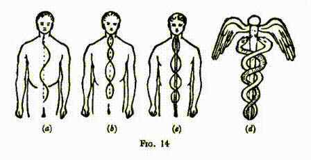

Пингала находится справа (поймите, что я имею в виду правую и левую сторону самого человека, а не зрителя). Однако у женщин эти положения меняются местами. Линии завершаются в продолговатом мозге.

В Индии позвоночник называют брахмаданда, палкой Брахмы; и рисунок 14(d) показывает, что он также является первообразом кадуцея Меркурия, где две змеи символизируют кундалини или змеиного огня, который вскоре должен начать движение по этих каналам, а крылья символизируют способность к сознательному полету по высоким плоскостям, которую приобретает развитие этого огня. Рисунок 14(a) показывает стимулированную Иду после посвящения в Первую степень; эта линия красного цвета. К ней при Переходе добавляется желтая линия пингалы, показанная на рисунке 14(b); во время Поднятия серия дополняется глубоко синим потоком сушумны, представленном на рисунке 14(c).

Стимуляция этих нервов и сил, проходящих через них, является лишь небольшой частью блага, которое дарует R.W.M., когда он машет мечом в момент посвящения. Я уже говорил о расширении связи между индивидуальностью и личностью, а также о формировании связи между определенными принципами кандидата и соответствующими атрибутами H.O.A.T.F. Происходящие изменения во многом аналогичны тем, о которых я писал на странице 319 книги "Наука Священнодействия", но они менее явные.

Я не могу слишком часто или слишком настойчиво подчеркивать, что, пока эти эффекты абсолютно реальны, недвусмысленны и универсальны, их эффект на духовную жизнь кандидата полностью зависит от него самого. Связь с H.O.A.T.F. и расширение каналов общения предлагают человеку совершенно несравнимые с обычной жизнью мирянина возможности; но они никоим образом его не обязывают воспользоваться этими возможностями. Если из-за незнания или лени он не пытается использовать новые дарованные ему способности, они остаются неактивными; если он использует их разумно, они со временем становятся все более эффективными, по мере того как он все лучше их понимает. Как заметил брат Вард: "Духовная польза, которую человек получает от масонства, прямо пропорциональна его желанию и способности понять его внутреннее значение."* (*Книга М.М., стр. 3).

Хирам Абиф

Только после того, как кандидат получает это великолепное изобилие духовной силы, его подвергают "большему испытанию его стойкости и верности", которое заложено в символическую часть Степени. Перед ним раскрывается удивительная драма, и совершенно неожиданно он оказывается в роли её героя. Декорации вокруг хорошо подготовлены и эффективны: затемнение Ложи, исполняемые песни, звучащая музыка, особые одежды, выбранные как для офицеров, так и для кандидата - все элементы прекрасно расчитаны на создание нужного общего впечатления. В таких обстоятельствах новоиспечённый M.M. впервые слышит традиционную историю, играющую такую важную роль в масонской системе.

Название, которое обычно дают этому удивительному рассказу, возможно, не соответствует его сути, ведь после небольшого размышления становится очевидным, что в обычном смысле этого слова его нельзя серьезно считать историческим. Но если мы воспримем его как легенду и придадим ей моральный смысл, мы обнаружим в ней много поучительного. Нет сомнений в том, что главный герой Хирам Абиф действительно жил, и что его тезка, Хирам, король Тира, послал его работать для короля Соломона при декорировании храма. В иудейской священной книге его описывают как талантливого мастера по металлу, и те из нас, кто изучал создание столбов, полностью подтверждают это, не находя, однако, упоминаний о кровавой смерти, о которой рассказывается в легенде. Как я упоминал ранее, король Соломон, вероятно, внес в иудейское масонство оригинальную форму этой истории, однако он не стоит за включением имени героя, которым мы сейчас называем его. Моисей принес из Египта миф о смерти и воскрешении Осириса, который сохранялся в измененной форме до времен Давида. Соломон, по патриотическим соображениям, переместил действие драмы в Иерусалим, сосредоточив внимание на храме, который он построил, и одновременно удивительно популяризировал свой ритуал, приведя его в соответствие с ритуалами окружающих народов, большинство из которых поклонялись финикийскому божеству Таммузу, которого греки позже стали называть Адонисом.

Хотя он и переосмыслил легенду, сделав её полностью еврейской, не он внёс в неё известное нам имя. Мы видим Хирама Абифа в роли того, кого сейчас называли бы W.J.W., на крупной частной церемонии освящения и посвящения, где впервые исполнялся новый ритуал Соломона. В то же время Хирам, царь Тира, исполнял роль W.S.W., хотя по неясной причине его визит держался в секрете и он немедленно уехал домой, его место на публичных церемониях занял Адонирам. Рехавам, сын Соломона, казалось, испытывал глубокое отторжение к Хираму Абифу, который не раз упрекал его за высокомерие и недостойное поведение. Поэтому, когда после смерти Соломона он вступил на престол, проявил странное и извращенное мстительство, повелев, чтобы жертва 3° навсегда носила его имя. Трудно понять, почему это доставляло удовольствие Рехаваму, но, возможно, мы не должны обвинять его в этом, он был декадентом, выродком самого худшего сорта. Враждебность могла проявляться и другими способами, так что Хираму Абифу пришлось вернуться на родину, где он умер, прожив долгую и почётную жизнь. 

Мне рассказывали, что всего несколько лет назад, принц с Явы повторил подход Соломона по тем же мотивам, что двигали еврейским монархом. Он и его народ были мусульманами хотя бы номинально. Но он сказал им: “Почему вы обращаетесь к Мекке в своих молитвах? У меня здесь великолепный храм; обращайтесь к нему, а не к Аравии когда вы читаете молитвы.” Они, кажется, приняли его предложение, и так возникло отклонение в культе, которое спустя столетие, вероятно, запутает историков.

Брат Вард в своей недавней книге "Кто был Хирам Абиф?" утверждает, что вся легенда - это лишь адаптация мифа о Таммузе, что Хирам Абиф был частью группы жрецов-королей и был убит остальными как добровольная жертва на освящении храма, чтобы принести зданию удачу. Он приводит множество доказательств в поддержку своей теории, продемонстрировав огромное количество знаний и исследований, собрав вместе удивительную коллекцию самых интересных фактов. Я советую её нашим братьям, хоть я и продолжаю придерживаться мнения, что масонство изначально было принято евреями из Египта, несмотря на значительное влияние, которое оно несомненно получило от поклонения Таммузу соседних народов. Брат Вард приводит примеры выживания следов культа Адониса в самых неожиданных уголках; например, он пишет:

Когда умирает Папа, высокопоставленный чиновник с небольшим костяным молотком трижды постукивает ему по вискам и центру лба. После каждого удара он призывает его встать и только после того как третий призыв не дает ответа официально обьявляет о его смерти и необходимости выбрать преемника.* (*Op. cit., p. 74).

Брат Вард даже отождествляет Хирама Абифа с Абибаалом, отцом Хирама, царя Тира, предполагая, что Хирам - не личное имя, а титул царей Тира, подобно тому как Фараон является титулом фараонов Египта.

Из другого источника поступает довольно фантастическое предложение, что Соломон также не являлся личным именем, но поддаётся разделению на Сол-Ом-Он; "Сол" означает солнце, "Ом" - это священное слово индусов (заменено, поскольку настоящее слово - это Имя Силы, Имя Логоса, произношение которого могло бы встряхнуть мир и уничтожить произнёсшего его) и "Он", от греческого "to on" - абсолютное существование. Этот взгляд может быть вымышленным; но действительно похоже на то, что соотечественники Короля называли его Соломоном, произнося его имя как амфибрахию, а не как дактиль, как мы.

Имя Хирама Абиффа немного изменено в старших степенях, и даже в Библии оно иногда представлено как Хурам. Дальнейшая модификация - Хайрум или Хурум. Хур сам по себе означает белый или благородный. Есть вариант Хри, который в определённых обстоятельствах становится Хрисом. Это недвусмысленно указывает на возможную связь с Кришной и Христом. В некоторых отрывках книги Иова он говорит о солнечном шаре, используя слово Хрис. Известно, что Хирам, царь Тира, стал первым человеком, который принёс жертву огня Хуру, который позже стал Гераклом. Плутарх сообщает, что персы его дней называли солнце Курос, и он связывает это со словом Кириос, которое означает Господь, которое мы находим в службе церкви в фразе "Kyrie eleison". Хур также связан с египетским именем Хорус, который также был Хер-Ра и Хароерис, именами солнечного бога. Еврейское слово Аур также означает свет или огонь или солнце, и из этого мы получаем Курум, равный греческому Гермесу. Брат Вильмсхерст также рассматривает имя Хирам как идентичное Гермесу, и считает, что можно проследить связь между формой Хурам и санскритским словом Гуру, которое означает "духовный учитель". Он, следовательно, берёт Хирама Абиффа как обозначающего Учителя-Отец или Учитель от Отца.* (*Масонская Инициация, с. 100) То, что Хирам был сыном вдовы, также имеет важное значение. Хорус как ребёнок Исиды был реинкарнацией его собственного Отца Осириса, и поэтому, как посмертный ребёнок, его можно охарактеризовать как сына вдовы.

Хотя он принадлежал к племени Нефтали, он родился и жил в Тире, и поэтому вполне мог узнать у Дионисийского братства, которое имело там центр.

Смерть и Воскресение

Что бы мы ни думали о традиционной истории как о истории, ясно, что это миф о смерти и воскрешении. Изложение его, возможно, упрощено, потому что идёт речь только о теле, которое поднимают на ноги, но очевидно что когда это делается в соответствии с требованиями, жизнь возвращается к нему, как говорится, было в случае, когда Анубис поднял Осириса с постели тем же жестом.

В экзотерической религии Египта два наиболее заметных элемента - это скорбь о смерти Осириса и всеобщую радость от его воскресения. Оба они учитываются в ритуале Ко-Масонства; первый - через различные чтения, предназначенные для Оратора, а второй - через маленький гимн "Слава Богу, который дарует нам победу". 

Помимо учения о жизни после смерти, в этом замысловатом рассказе присутствует аллегорический урок, который каждый М.М. должен усвоить. Брат Вилмшерст еще раз для нас его описывает, объясняя, что так же как:

... отход от привлекательности внешнего мира... очищение и усмирение телесных и чувственных порывов... работа над отдалением и самоочищением - это работа Ученика... [так же как] анализ, дисциплина и управление своим внутренним миром - мыслями, интеллектуальными и духовными способностями - это непростая задача ступени Рабочего... [так] "последнее и величайшее искушение" в разрушении и отказе от личной воли, в угасании всеобщего чувства индивидуальности и самооценки, чтобы ничтожная личная воля могла слииться с Божественной Всеобщей Волей, а иллюзия независимого отдельного существования уступила бы место сознательной реализации единства с Единой Жизнью, которая пронизывает Вселенную. Ибо только так можно восстать из условий нереальности, борьбы и метафорической смерти к познанию окончательной Реальности, Мира и Бессмертной Жизни. Достигнуть этого - значит достигнуть Мастерства, которое подразумевает полное владение низшей природой и развитие в себе превосходного порядка жизни и способностей.* (*Масонская Инициация, стр. 19, 20.)

Осознание абсолютного единства, возможно, - это самый удивительный опыт, который приходит к человеку на пути его эволюции - глубина блаженства, которое невозможно описать. Ни один человек, ни один предмет не отдельны друг от друга, и в то же время все абсолютно ясно; все они - "частичные выражения единого, подавляющего, невыразимого единства". Лорд Теннисон так описывал это:

Внезапно, из глубин осознания собственной индивидуальности, эта сама индивидуальность словно растворяется, испаряется в беконечном существовании; и это состояние, величайшей ясности из всех возможных, величайшей уверенности в себе, где смерть становится почти смехотворной невозможностью, а потеря личности, если так можно сказать, не представляет собой исчезновение, но кажется настоящей жизнью. Мне стыдно от моего несовершенного описания. Разве я не говорил, что это состояние невозможно описать словами? Это самое решительное утверждение, что дух автора может перенести себя в другое состояние бытия, которое не только ясно, просто и непосредствено, но и бесконечно в представлении и вечно в продолжительности.

Другой Брат из Подмастерья написал:

Ты знаешь все и понимаешь звезды, горы и старые песни. Все это внутри тебя, и ты - это все светлое. Но свет - это музыка, а музыка - виолетовое вино в грандиозном золотом кубке, а вино в золотом кубке - это аромат июньской ночи.

Звезда

Даже после символического возрождения нас все еще предупреждают, что любой свет, способный проникнуть на эти нижние плоскости, есть лишь видимая тьма, и что для истины и полных сведений нам следует поднять взгляд к той яркой утренней звезде, появление которой приносит мир и спасение верующим и послушным среди людей. Несомненно, что в древнеегипетском мифе под звездой, о которой идет речь, изначально понимался Сириус. Брат Уорд замечает:

Связь этих идей со Звездой Пса, безусловно, является отголоском древнего Египта: восход Сириуса сигнализировал о начале наводнения Нила, которое буквально приносило спасение египтянам, орошая землю и позволяя ей давать пищу.* (*Книга М.М., с. 50.)

Однако для нас звезда имеет символическое значение и напоминает нам о Звезде Инициации, которая символизирует одобрение и благословение Господа Мира, когда новый посвященный присоединяется к могучему Братству, существующему из вечности в вечность. И мы стремимся проложить наш путь по напутиваниям нашего ритуала:

Да будет эта Звезда всегда перед твоими глазами, и да осветит ее свет твое сердце; следуй за нею, как следовали за ней в древности Мудрецы, пока она не приведет тебя к порталам Инициации, где она светится над порталом того славного храма, вечного на небесах, которым даже храм Соломона был лишь символом.* (*Мастера и Путь, с. 157.)

Возвышение Человечества

Человечество - лишь одна ступень большой лестницы эволюции. Божественная жизнь, которая сейчас проявляет себя через нас, в прошлом по очереди оживляла элементалов, минералы, растения и животных. Теперь эта волна жизни достигла человеческого царства. Давным-давно она вошла в это царство через ворота индивидуализации и покинет его через врата инициации - ту Пятую Инициацию, которая превращает человека в сверхчеловека или Адепта. Человечество постепенно, очень медленно, движется по широкой дороге, которая, обходя вокруг горы, неуклонно поднимается к вершине. Этот процесс осмотрительный и часто неоднородный, пока душа не внезапно осознает смысл своей эволюции, Божественный план для человека, и решает приложить все свои силы, чтобы как можно скорее достигнуть цели. Тогда он начинает взбираться прямо вверх по склону горы, и каждый раз, когда его путь пересекает вьющуюся дорогу, он достигает определенной стадии своего прогресса; и каждый такой этап - Инициация.

Великих Инициаций пять; первая отмечает момент, когда душа оставляет затоптанный путь, а последняя - её вход в Храм на вершине горы. Стремиться к тому, чтобы этот короткий, но крутой путь стал реальностью, должен каждый М.М.; и все три степени безусловно символизируют этапы на этом пути.

Е.А. как личность должен организовывать свою физическую жизнь для достижения более высоких целей; но в то же время как эго он должен развивать активный интеллект в своем каузальном теле, так же как ученик Мастеров готовится к Инициации. Я, конечно, не утверждаю, что каждый Е.А. делает это или даже в состоянии это сделать; но Степень направлена на то, чтобы предложить ему эту цель развития, и чем раньше он начнет свое восхождение, тем лучше. Таким же образом, Ф.К. организует свою эмоциональную жизнь на нижнем уровне, развивая интуитивную любовь в своем буддийском теле; а М.М., упорядочивая свою умственную жизнь здесь, должен как эго укреплять свою духовную волю. 

Огонь, Солнце и Луна

В индийских священных текстах мы встречаем некоторые сведения, которые подходят к этим же идеям с другой стороны и могут быть интересными для масонов. Упоминаются пупочный, сердечный и горловой центры в человеческом теле как места огня, солнца и луны, и говорится, что тот, кто сосредотачивается на этих центрах, найдет там Деви Сарасвати, Лакшми и Парвати или Гириджу, в этом порядке. Эти Деви представляют внешние силы или шакти Брахмы, Вишну и Шивы, трех лиц Благословенной Троицы, и обладают соответствующими качествами дарования знания, процветания и самоконтроля, то есть помощи человеку в достижении его высших умственных, астральных и физических целей. Физические, астральные и умственные принципы представляют собой отражение (обратное, как отражение горы в воде) трех принципов верхней троицы.

Сарасвати - покровительница знаний и практической мудрости; Лакшми исполняет желания и делает жизнь полной и счастливой, и когда она по-настоящему почитается, все материальное благополучие становится освященным; Гириджа или Парвати благословляет физическое тело и делает его способности священными. Е.А. должен довести свое физическое тело до совершенства и здесь оказывается очень нужной помощью Гириджи; Ф.К. делает то же самое для своего астрального тела с помощью любви Лакшми; М.М. повторяет этот процесс для своего умственного тела поддерживаемый мощью мысли Сарасвати.

Чтобы преобразовать и организовать физическую природу для более высшего Я, E.A. должен использовать свою волю — мощь Шивы, первый Аспект, которую отражает его Деви Гириджа. Чтобы очистить страсти астрального тела, F.C. должен привлечь свою интуитивную любовь, исходящую от Вишну, второго Аспекта, через Лакшми. Чтобы усмирить непостоянный ум и превратить его в идеальный инструмент для высшего Я, M.M. должен применить силу своего мышления, божественную активность Брахмы, третьего Аспекта, отраженную Сарасвати. Мадам Блаватская говорила, что стремящийся должен собрать низшие вещи вместе и прикрепить их к высшему Я; когда он сделает это, он реализует свою судьбу - он переступит с t ... s ... через его o ... g ...

Этот намек аналогичен тому, что говорится о k ... s в трех ступенях, и он никоим образом не изменяет то обстоятельство, что E.A. в то же время учится контролировать эмоции, а F.C. овладевает управлением разумом. Масон одновременно выполняет две задачи - развивается и продвигается на более высоких уровнях, в то же время контролируя и совершенствуя свои личные инструменты.

Как это связано с огнем, солнцем и луной? Помните о трех меньших светилах: (1) R.W.M., (2) солнце - W.S.W., и (3) луна - W.J.W. В их качестве меньших светил эти офицеры соответствуют Деви. Именно W.J.W., кто особенно помогает E.A., W.S.W. помогает F.C., и R.W.M. помогает M.M.

Интересно отметить, что в указанном выше объяснении огню приписывается соответствие с умом. Другой аспект этой же истины виден в силе, стоящей за современной наукой. Без огня химия, физика, геология, астрономия и все практические применения этих наук не могли бы существовать. M.M. символически является владельцем этой силы; он - мастер металла, создающий столбы, пустые внутри, для хранения записей души и духа. В его руках kriyashakti, творческая сила.

Считается, что путь Луны символизирует жизнь обычного человека, который цепляется за объекты своих желаний и нелегко отпускает их при смерти. После периода в астральных и небесных мирах он возвращается на Землю, чтобы повторить этот процесс. Это путь рождения после некоторых промежутков. Путь Солнца - это путь оккультиста, человека с духовными желаниями, который ценит жизнь только ради того, что она может дать высшему Я в других, также как и в нем самом. Он также рождается снова, но обычно без ожидания, или после очень короткого перерыва. Путь огня - это путь возвышения, от которого больше нет рождения по закону необходимости, но только по выбору эго - только для помощи миру.

Злодеи

Мало что можно сказать остальное из традиционной истории. Мы можем отметить странное сходство между именами, данная троим злодеям, и тем фактом, что когда три окончания собираются вместе, они формируют священное слово Аум или Ом. Говорят, что Иубел или Иегубель означает "добро и зло"; или можно сказать, что то содержит в себе два имени Яхве (Иегова) и Бела или Баала - что для еврея того времени было бы простым "добром и злом".

Надпись

Наконец, мы можем упомянуть загадочную надпись на плите c ... n на т ... b ... этого уровня, написанную масонским шифром. В своей обычной прямой форме этот криптограмм известен почти каждому школьнику, но он допускает множество перестановок. В данном случае его буквы расположены несколько необычным образом, и их следует читать справа налево. Такой подход раскрывает инициалы нашего Мастера, предполагаемую дату его смерти и слово-пароль этой степени. Но только масон, вероятно, сможет расшифровать это.

## Глава IX. Высшие Градусы

Большинство мужчин-масонов утверждают, что Ремесло включает только три степени: E.A., F.C. и M.M. Однако в английском масонстве они признают Степень Марка и Священный Королевский Свод как номинальные расширения Второй и Третьей степеней соответственно. У них также есть церемония Инсталляции для Мастера Ложи, которая в сущности является дополнительной степенью, хотя ее так и не называют таковой.

Только те масонов мужского пола, кто принадлежит к Древнему и Принятому Шотландскому обряду, прорабатывают высшие степени, хотя различные малые группы масонов используют некоторые из них. Обряды Мемфиса и Мизраима когда-то имели список из 97 степеней, но сейчас их сократили до 33. Тем не менее, хотя многие масоны не признают их, эти высшие степени безусловно часть большого замысла Масонства, выступая как вехи на восходящем пути, который ведет к сознательному объединению с Богом. Они вмещают в свои ритуал и символику серию изображений последовательных этапов духовного достижения и передают священнодействующую силу, предназначенную для ускорения роста внутренних способностей человека на различных уровнях и различными способами.

Поэтому в обряде ко-масонства мы признаём оба набора степеней и считаем их составляющей цельного общего комплекса, который позволяет тем, кто осуществляет их должным образом, достичь очень высокого уровня развития. Однако они ярко демонстрируют предназначение для двух отдельных типов людей - для большинства и для избранных. Для обычного мира три степени масонства вполне достаточны; когда он усвоит уроки, которые они дают, он уже не станет обычным; он выделяется среди обычного человека. Если он может дополнить их знаниями, которые накоплены в Степени Марка и Священном Королевском Своде, у него будет правило жизни и философия, которые помогут ему достойно прожить остаток этой жизни и обеспечить ему хорошую возможность для развития в будущем. В Королевском Своде он переходит за пределы замещённых тайн и узнает истинное Слово, которое было так долго и так несчасно потеряно. Ведь настоящее Слово - это Имя Бога, и те, кто питает недостаточно достойное представление о природе и атрибутах Бога, остаются в неведении о Его истинной Природе.

Масонский План

План Масонства, очевидно, направлен на систематическое развитие принципов человека. Труды Голубой Ложи главным образом ориентированы на временную личность - служащую душе орудие. Если о человеке ходят хорошие слухи, мы можем предположить, что он умеет управлять своим физическим телом; однако на степени Е.А. ему даны указания полностью подчинить его, выгладить и отполировать грубый ашлар, с тем чтобы одновременно сохранять свою эмоциональную составляющую в рамках, подавлять ее низменные проявления и развивать высшие. В статусе F.C. он учится абсолютно контролировать свои эмоции, работая над постепенным развитием способностей своего умственного тела, пробуждая и тренируя свои интеллектуальные факультеты.

В качестве M.M. ему обучают жить в соответствии с этим возвышенным титулом, полностью овладевая своей личностью, разумом и эмоциями, чтобы развить великодушные чувства братства и альтруизма, которые всегда вынуждают его смотреть на вещи с позиций эго, так чтобы угол никогда не мог закрыть компас, и приводят его через Долину Тени Смерти к порогу того небесного мира, в котором бессмертное Существо вечно обитает. Ибо мистическая смерть и воскрешение относятся не только к проходящему бытию личности человека в астральном мире после смерти физического тела, но в более глубоком смысле символизируют смерть всего обретенного и нестоящего, и достижение вечной Реальности, скрытой за занавесами пространства и времени.

Церемония Установки

Всегда было огромным сожалением для меня то, что в практике Европейского Масонства прекрасная церемония установки Мастера Ложи так сильно урезана или даже полностью опущена. Позиция R.W.M. непроста и требует ответственности, успешное исполнение этого поста требует сочетания качеств, редко встречающихся вместе. Твердость и абсолютная справедливость должны идти вместе с тактом, гибкостью и убедительностью. R.W.M. должен проявлять энтузиазм в отношении масонской работы, иметь твердое намерение сохранять его старинные традиции и неприкосновенность его границ, и горячо стремиться поддерживать достоинство Ремесла, никогда не забывая, что нежность и братская любовь являются основой всей его работы.

Брат, которому предстоит развивать эти качества в себе, очевидно, требует всей возможной помощи. Условно, он получает больше силы и возможностей посредством величественной и впечатляющей церемонии, чем просто от того, что его выбрали Братья и он занял свое место в кресле Мастера. По всей видимости, H.O.A.T.F. принимает и поддерживает обычай сокращенного ритуала в тех странах, где он действует, поскольку традиция продолжается, хотя мнения о произведенном впечатлении могут различаться. (См. стр. 175.)

Фактическая передача власти происходит в момент, когда R.W.M. торжественно занимает свое место на стуле с определенной s… и w… власти. Вместе с тем, за другими s… s… скрывается очаровательная и уместная символика. b… s… изображает могущественного и достойного монарха, выбирающего того, кому он собирается воздать благодеяние; p… l… и s… of s… дает множество полезных намеков о том, каким должно быть поведение Mастера на своем посту. s… of a m… of a… и sc… отчетливо передают уважение и достоинство, которыми должно отличаться каждое его действие.

Степень Знака

В Степени Знака кандидату рекомендуется добавить к его общему развитию, которого ожидают от всех масонов, раскрытие его особых талантов или способностей, чтобы они стали доступны его братьям и могли оказать пользу его ложе. В результате работа, выполняемая им, становится узнаваемой на фоне всех остальных в силу его личных особенностей. Развитие своего таланта в благо братьев, а не для самовозвеличивания - вот особая миссия масона со Знаком. Задача Мастера Знака - раскрыть и развить такие таланты, которые даже их обладатели пока еще не подозревают.

В то же время ритуал посвящает неофита в важность смирения и терпения. Он создает k… s…, выполненную со всей тщательностью, но строители пока еще не готовы к ее использованию, поэтому на какое-то время ее приходится отложить. Кандидат, поддавшийся разочарованию, сначала может грустить о том, что его труды были напрасны. Однако ему рекомендуют проявить терпение и стойкость, чтобы, когда придет время, его работа могла быть признана и использована. Такой опыт неизбежен для того, кто старается служить человечеству. Ученик должен быть готов к тому, что его идеи, несмотря на их внешнюю привлекательность, могут быть отвергнуты, ведь они предлагаются слишком рано. Он должен научиться подчинять свою волю воле T.G.O.O.T.U., выполнять порученную ему работу и выполнять ту роль, что отведена ему в большом плане.

Несмотря на всю наполненность мира,
Всегда найдется место для искреннего человека;
Если бы мне здесь не было места, я тут бы и не находился;
Я здесь, чтобы служить плану.

В Степенях Ремесленного масонства мы можем увидеть предсказание или намек на Истинные Инициации, которые ожидают неофита далеко впереди на Пути. Степень E.A. мы можем рассматривать как вход на Пробационный Путь, Степень F.C. представляет вступление на Реку, которая является Первой из Великих Инициаций, а Степень M.M. символизирует Четвертый Шаг, Инициацию Архата.

Характерной особенностью Cтепени F.C. является Служение; все ее пять стадий представляют собой формы служения и ведут к такому состоянию, когда руки посвящаемого всегда свободны, чтобы взять любые инструменты, нужные в данный момент для помощи другим. Так как Степень Знака признается как изначальная часть F.C., Брат Вуд принимает Человека Знака и Мастера Знака как символы Второго и Третьего Великих Инициаций, ведущих к Степени M.M., которая, безусловно, является предвестником Стадии Архата.

Он также обнаруживает в индуистской системе интересную аналогию с учением Степени Знака. Человек, вступивший на Первую Ступень Правильного Пути, называют паривраджака, Странником, что означает, что у Инициированного нет реального дома, основания или причала в этом физическом мире. Благоговейно гимн гласит: "Я только путник здесь; небеса - мой дом." Он осознал первую часть этой цитаты, но вторую еще только начинает понимать; он себя чувствует просто гостем в этих земных местах, где большинство людей обустраивают свои дома, но еще не окончательно приступил к духовной работе. Когда он отвергает три окова эгоцентризма, сомнения и предрассудков, его называют кутичака, Строителем Хижины; он больше не странник, не бродяга между двуми мирами, поскольку он нашел для себя определенное место и роль в буддийском измерении. Когда это достигнуто, ему дается Знак, символизированный в масонских и библейских образах как белый камень, на котором написано новое имя - истинное имя его Я.

Индуистским термином для человека, делающего Третий великий шаг, является хамса, Лебедь. Это имя основывается на древней легенде, приписывающей этой птице удивительную способность отделить молоко и воду после их смешения. Таким образом, он представляет символ человека с идеальным различием, который умеет отличить, что стоит делать и делает это, и поэтому "метит хорошо".

Офицеры в Ложе Знака обозначают семь принципов человека, как и в обычной Ложе, но имеются дополнительно три Надсмотрщика, охраняющих Южные, Западные и Восточные ворота. Они также занимают свое место в ряду этих принципов, если мы рассматриваем их как образ антахкараны, ставшей для Инициированного активным каналом между его Я и его личностью. Как Владыки Кармы отбирают часть накопленной кармы для исправления за одну жизнь, отображенную в телах человека и его окружении, так и его Я, по словам Брата Вуда, отбирает часть себя, чтобы быть внутренним сообщником (антахкарана) между собой и его личностью (это поясняется в его книге "Семь лучей"). Поэтому, этот тройной антахкарана содержит план работы для данного воплощения, и Надсмотрщики, как представители Владык Кармы, охраняют этот план.

Когда человек проходит Второе посвящение, избавляясь от трех предыдущих оков, он начинает видеть и воплощать в действие более значимый план эго, который превышает его воплощенную часть. Однако Наблюдатели не позволят ему следовать своему видению, забыв о более низшей работе, которую ему еще предстоит выполнить в менее значительной части плана. Несмотря на сохранение своего видения, ему придется скромно выполнять оставшиеся обязанности на обычном уровне.

Священный Королевский Лук

Так же как степень Знака является расширением F.C., так и Священный Королевский Лук Иерусалима является логическим продолжением степени М.М. Я намеренно игнорирую любое рассмотрение сложной истории этой степени, хотя добавил несколько своих заметок об этом во второй том "Отблесков масонской истории". Здесь достаточно сказать, что все более высокие степени, о которых я говорю в этой книге, уходят корнями в древнейшие тайные учения. Они были не созданы заново в Средние века, как часто предполагается, но оживлены и вновь введены по непосредственному или косвенному предложению H.O.A.T.F., когда ему показалось, что их возрождение было бы желательно. Никогда не забывайте, что во все времена он (или его предшественник) был "Скрытым Жизненным Принципом в масонстве", и что эта Жизнь проявлялась самыми неожиданными способами в нужное время и месте для продолжения Великой Работы.

Чтобы объяснить по мере дозволенности удивительно освещающее учение этой великого степени Священного Королевского Лука, я свободно займусь истолкованиям, которое было дано в Мистической Лекции Ко-масонского обряда этой степени, сокрытом от всех, кто не является посвященным.

Символически достигнув в 3° порога бессмертия, искатель обнаруживает перед собой поиск G... S... М.М., которые были утрачены из-за преждевременной смерти нашего Мастера H... A... Стоит отметить, что по учениям этой степени H.R.A. мы впервые видим, почему и как Сакральное Слово было утеряно из-за этой смерти. Не потому, что его забыли, но троица великих лиц клялась произносить его только вместе. За эти утраченные секреты все М.М. обязаны искать, пока они не будут найдены. Эти секреты - суть вечного существования человека, суть Божественности, которую он забыл из-за блуждания в материальном мире. Говорят, что они могут быть открыты благодаря наставлениям Звезды, как это сделали прежние Мудрецы. Эта Звезда - Звезда Посвящения, Звезда Божественного присутствия в наших сердцах.

Степень H.R.A. ведет неофита дальше в его поисках и является идеальным продолжением Возвышенной Степени M.M., суть которой – часть одной и той же еврейской традиции. Символическое время R.A. ассоциируется с началом строительства Второго Храма, храма души человека, так же как Храм Короля Соломона представляет его смертную личность. Однако, перед тем как искатель может найти потерянное W…, Скрытый Свет, который находится в каждой твари и заглубоко зарыт в Храме Короля Соломона, его взгляд должен быть столь очищен, что он способен увидеть Его присутствие с открытыми глазами. Достижение настоящего духовного зрения символизировано Прохождением Четырех Завес на пути к Небесному Городу, Святилищу Света и Мира, так как Завесы представляют ограничения сознания, которые мешают ему увидеть Истину. P… W… s Завес объясняют, как ему свергнуть эти преграды и какие качества должны быть развиты для духовного роста. Такова задача Великого Мастера и она разворачивается под звёздами.

В разделе H.R.A., поиски W… подходят к временному завершению. Как будто случайно, Новичок наткнулся на Секретную Крипту Короля Соломона, скрытую глубоко под землей, где он обнаруживает t… и m… N… of T.M.H. и впервые в своей масонской деятельности получает прямое видение Божественного Присутствия. В озарении, который изливается на этой Степени, сохраняется намерение пробуждать рост Божественного Искры в нем, чтобы осознание истины Божественного Присутствия смог достичь те, кто живет их учением правильно, и кандидат может увидеть присутствие Бога во всем, насколько бы это присутствие не было скрыто от очей плоти.

Учения H.R.A. прекрасно обобщены словами Псалмопевца:

Куда я уйду от Твоего Духа, или куда я отступлю от Твоего Присутствия?

Если взойду на небеса, Ты там; Если спущусь в ад, Ты там.

Если возьму крылья утра и буду жить на самом краю моря, даже там Твоя рука ведет меня, и Твая правая рука поддерживает меня.

Если скажу: может быть, тьма покроет меня; то ночь моя станет светлой как день.

Да, тьма не есть тьма для Тебя, но ночь светла как день; тьма и свет для Тебя одинаковы.

(Псалом 139, 7-12)

Некоторые символы, которые мы активно используем в церемонии H.R.A., для нас несут великое торжественное значение и ценное предложение. Значение Божественного N…, обнаруженное в Тайном Хранилище короля Соломона, одновременно простое и глубокое. Оно учит нас, что Бог – это один и тот же Бог, независимо от того, как его назовут люди, и что Он пребывает как в самом низком, так и в самом высоком. Заявляя таким образом об всеобщем отцовстве, оно также утверждает всеобщее братство и ставит перед нашими Товарищами самые благородные идеалы. Весь символ окружен Кругом, эмблемой самого Бога, вечной Реальности, стоящей за и внутри всех вещей, неизменной, но вмещающей все элементы перемен. Об этом круге можно с уверенностью сказать, что он имеет свой центр везде и окружность нигде; он представляет собой всеобщее присутствие в символической форме. К тому же, круг воплощает глубокую истину создания. Он возникает при радиации от центра; другими словами, его окружность определяется границами лучей, исходящих от центра во все стороны. Это излучение в самом глубоком смысле слова образует сам круг; центр и окружность прерывисты в процессе излучения. С этим мы можем согласиться, что Создание, или радиация от Божественного Центра всего живого, не относится к действиям, выполненным Богом в какой-то момент, а являются бесконечными; это и есть Его Коренная Сущность; создание существует вместе с Богом и вечно.

Все творение исходит из Божественного Центра. Бесчисленные лучи движутся каждый в своём направлении к окружности; но, если в центре они все одно, то на окружности они многочисленны, каждый луч отличается от всех других. Таким образом, в Боге сходство и разнообразие ощутимы одновременно; в Центре все единое, на окружности все различно. В внешнем мире мы живем на окружности Вечного Круга, и все изолировано и поэтому в боли; Королевское Искусство Масонства учит нас, что мы должны двигаться по нашему собственному лучу проявления к тому Центру, куда М.М. не может пройти, чтобы вновь обнаружить истинуединства Божественной Жизни во всём сущем. Когда мы движемся по окружности, мы перемещаемся во времени; однако, когда мы рассматриваем круг в целом, мы видим его окружность одновременно со всеми его частями, и следовательно, осознаём, что время – это всего лишь наши искаженные взгляды на Вечность.

Снова, символ круга учит нас величайшему Ритму Создания; все выходит из Центра Единства к окружности Множественности, а затем возвращается обратно к тому Единству, откуда было зарождено. Это Вечное Дыхание Бога, Дыхание Создания, проявленное во всей вселенной, в жизни человека со своим циклом существования от детства посредством зрелости до старости, и в Природе со своими чередованиями дня и ночи и ритмическим сменением сезонов. Связано с этим замечание о том, сколько слов переводятся на разные языки как Дух, изначально означают Дыхание: «spiritus» на латинском, «pneuma» на греческом, «ruach» на иврите, «atma» на санскрите. Это Божественное Дыхание, Святой Дух, Творческий Огонь Бога, которого мы особенно призываем в Степени H.R.A.

Внутри круга находится треугольник, что учит нас о том, что Бог, несмотря на то что он Един по сути, проявляется как Троица - Власть, Мудрость и Любовь. Божественная Воля есть центр круга, покоится в себе в вечном и неизменном мире; Божественная Мудрость – это процесс излучения, Святой Дух, который является источником Божественной Деятельности, создающей многообразие вещей, когда он исходит из Центра; Божественная Любовь является окружностью круга, объединяющей все разделенные существа в связи мира. Это троичное природа Божественного присутствует во всем творении, в каждом объекте и существе. В нашем сознании она проявляется как Духовная Воля, Интуитивная Мудрость и Творческий Интеллект, которые являются тремя проявлениями духа человека, созданного по образу и подобию своего Творца. Во Вселенной вокруг нас мы видим это как три качества проявления - инерция, мобильность и ритм, известные в индийской философии как три гуны, и в западной философии - как пространство или расширение, время или изменение, и ритм или качества, которые каждому объекту придают его особую и существенную природу.

Еще одним символом творения является крест, вписанный в круг. Этот символ показывает как Божественное крепится на крест ограничений, чтобы мир мог стать реальностью. В этом процессе творения Божественное как жизнь и Божественное как форма кажутся двоячими, хотя они просто проявления одного вечного Бога. Эта взаимодействие и видимое двойственность во Вселенной также символизируется крестом, и таким образом становится эмблемой Четырехзвучного Имени Бога. У средневековых розенкрейцеров четыре конца этого креста символизировали четыре элемента: воду, огонь, воздух и землю, на иврите известные как Iammim, Nour, Ruach и Iabescheh, и снова соответствующие Четырем Зверям вокруг трона Бога, символизированным для нас Четырьмя Великими Знамёнами Ордена.

Поняв, что вся жизнь есть Божественная жизнь, мы понимаем, что братство этой жизни действительно универсально и никоим образом не ограничивается лишь человеческим видом. Каждый человек, независимо от его расы, цвета кожи или веры, является нашим братом, как и животные и деревья вокруг нас, камни под нашими ногами - все они наши младшие братья, все они часть одного огромного процесса эволюции. Когда мы осознаем, что обозначает это знание, видим, как сильно оно меняет наше отношение к окружающему миру и какую глубокую перемену должна принести практика этой истины каждому Союзнику, мы не удивляемся почтению, которое масонские писатели высказывают о этой степени H.R.A. Иерусалима, считая её завершением Масонства благодаря познанию Бога, которое она нам дает.

Интересным символом этого степени является так называемый Тройной Тау, состоящий из трех уровней: один вертикально стоящий и два лежащих горизонтально, соединенных в центре. В древнем Египте Тау было символическим эквивалентом креста, олицетворяющего крестных страданий Божественной Жизни в мире проявлений. Тау также символизировало андрогинную природу Божества, представляя Бога как Отца-Мать. Во время установки,

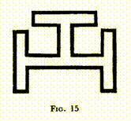

На фартуке Мастера мы видим три Тау, расположенных раздельно; в Священном Королевском Своде мы наблюдаем их совместно, так как здесь дается учение о единстве, присутствующем в этой трёхчастной вселенной, перенося на нас мысль о мужском и женском аспектах каждого Лица в этой Троице - точно такая же идея выражается в индуистской религии утверждением, что у каждого Лица есть своя Шакти, обычно описываемая как ее супруга. Таким образом, Три-в-Одном превращаются в Шесть-в-Одном, а с добавлением охватывающего круга, символизирующего нематериализованную Вселенную, мы получаем Мистическую Семерку.

Тройное Тау в Королевском Своде масонов также называют Ключом. В нем содержится восемь прямых углов, и этот крючок применяют как инструмент или мнемоника для расчета Платоновых Тел. Если рассматривать его отдельно, он соответствует Тетраэдру, стороны которого, образующие четыре равносторонних треугольника, в совокупности равны восьми прямым углам, поскольку внутренние углы любого треугольника вместе равны двум прямым углам. Говорят, что платоники используют эту фигуру как символ элемента Огня.

Два таких Ключа равны Октаэдру, содержащему шестнадцать прямых углов, и строители Свода считали его представлением Воздуха. Три Ключа соответствуют Кубу, стороны которого содержат двадцать четыре прямых угла. Эта фигура представляет Землю, так как из всех этих фигур она является самой устойчивой и неподвижной на своей основе.

Пять Ключей дают сорок прямых углов, равных сумме углов, содержащихся в двадцати равносторонних сторонах Икосаэдра. Этот объем интерпретировали как буквенное обозначение элемента Вода.

Оставшаяся Платоническая Фигура, Додекаэдр, имеет в качестве своих сторон двенадцать регулярных пятиугольников. В геометрии действует правило: внутренние углы любой прямолинейной фигуры равны вдвое большему числу прямых углов, чем у фигуры сторон, минус четыре прямых угла. Так, внутренние углы пятиугольника равны 10 – 4 = 6 прямым углам. Таким образом, Додекаэдр содержит семьдесят два прямых угла и поэтому представлен девятью Ключами. Так видно, что этот Ключ является наибольшим общим измерителем всех этих Платоновых Тел. Именно поэтому в ордене Священного Королевского Свода на свитке вокруг него мы обнаруживаем фразу на латыни: "Ничего не хватает, кроме ключа". Это учит нас, что без внутреннего знания все эти символы лишены жизни и, несмотря на великую ценность преподаваемого учения, есть еще и то, что мы обнаруживаем, продвигаясь по пути масонского прогресса.

Существует метод, позволяющий разделять треугольники и Печать Соломона на меньшие треугольники, суммировать общее количество градусов, образованных всеми их углами, и снова вычислять число прямых углов, равных углам Платоновых тел. Этот процесс сложный и мало пригоден на практике, поэтому я не приводу его здесь, но верно, что Платоновы тела имеют большое значение в том процессе Божественного творения, на который Степень Святого Королевского Свода дает такое бесценное обучение.

Еще Выше

В попытке описать величие и потрясающую практическую ценность высших Степеней, я должен кратко вернуться к тему, о которых уже писал в "Взглядах на Историю Масонства". Хотя Степень Святого Королевского Свода лежит в основе системы масонского обучения для большинства людей, есть еще более глубокие источники мудрости для того, кто твердо намерен дойти до конечной цели, которая может удовлетворить исключительно высшими знаниями. Постепенно такой человек начинает понимать, что, хотя в Степени Святого Королевского Свода он, безусловно, найдет Божественное Имя и самостоятельно обратится, по крайней мере, к одному аспекту скрытого света Бога, у него все еще впереди дальнейший поиск, в котором он может еще глубже проникнуть в сознание и сущность Божественности. Огромное и удивительное откровение уже видеть на лице - откровение, которое изменило всю его жизнь и сделало его узкое и жалкое существование невозможным. Однако теперь он начинает видеть, что он только касается одного радиуса огромного круга, да что и говорить, что он работает только на поверхности бесконечной сферы.

Розенкрейц

Вот тогда он начинает свое второе великое стремление, которое поднимает его через множество ступеней, на каждой из которых изучаются и в какой-то степени осознаются различные аспекты Всеотца, вплоть до великолепного просветления, данного в Восемнадцатой Степени, то есть в Степени суверенного князя Роза-Креста Хередома. Здесь он обнаруживает божественную любовь, царящую в его собственном сердце и сердцах его братьев. Он также узнает, что Бог спускался и делался нашей низшей природой специально для того, чтобы мы могли взойти, чтобы делиться с Ним его истинной природой.

Имя T.G.A.O.T.U., открываемое аспиранту в этом великолепном 18°, стало сердцевиной и внутренним секретом древнеегипетского мистического обучения. H.O.A.T.F., воплощенный в облике Христиана Розенкрейца, перевел это Слово на латынь, изящно сохранив его примечательный мнемонический характер, все его сложные нюансы и даже близкое подобие его оригинального звучания. Естественно, здесь его нельзя указать, но общую суть учения, которое оно передает так умело, можно обозначить цитатой из слов одного из покровителей масонства: "Бог есть свет, и нет в Нем тьмы совсем". Далее нас учит, что Бог пребывает в сердце каждого человека, что самая глубокая суть каждого из нас - это кусочек самого Бога, искра Божественного; и поэтому все люди одни в Нем, и нет таких вершин, до которых человек не мог бы стремиться.

Из этого ключевого факта можно вывести целую философию и правило жизни; когда люди действительно в это убеждены, наступает братство, мир и прогресс, но когда это Слово утрачивается, процарствует хаос, и зло бродит на свободе. Каждый Рыцарь должен обдумать это и попробовать осознать все его последствия, ибо знание, которое оно дает, должно проникнуть во всю его ткань бытия, буквально стать частью его сущности, если он хочет выполнить свою обязанность. Постоянное уважение и благодарность, которые вдохновляет эта величественная мысль, должны быть его постоянной позицией; он должен жить в свете этой прекрасной истины; она не должна быть забыта ни на мгновение. Для того, кто это действительно знает, всю жизнь наполняет глубокая радость и благодарность. Все это он признает и радуется этому каждый раз, когда вспоминает это чудное Слово могущества.

На каждом Рыцаре Розенкрейца лежит обязанность распространять этот свет - проповедовать это словом, когда это возможно, и всегда жить по этому учению, этому истинному "евангелию благодати Божией". В версии этого Степени, принятой в комасонстве, он получает указание быть каналом для Божественной силы и стремится сотрудничать с T.G.A.O.T.U. Посредством этой ежедневной работы его будди или интуитивный принцип, скрытая мудрость, которую в Египте называли Горус, Христос, пребывающий в человеке, должен быть пробужден и значительно развит, чтобы он стал, насколько это в его силах, живым воплощением Вечной Любви, истинной священнослужителем для помощи миру.

В этом Степени мы также находим некоторые символы глубокого значения. Цветок Розы имеет трехкратное значение: Любовь, Тайну и Аромат, в то время как Крест несет в себе три составляющих: Самопожертвование, Бессмертие и Святость. Поэтому, когда эти два символа рассматриваются вместе, как это всегда бывает в имени Роза-Крест, они олицетворяют Любовь Самопожертвования, Тайну Бессмертия и сладкий Аромат священной жизни.

Змей представляет Вечность; Двойной треугольник - Дух и Вещество; Пеликан - еще один древний символ Самопожертвования, так же как и Орел - это символ Победы.

Важно отметить, что до этого момента аспирант, выполняя определённые условия, мог подать заявку на продвижение по ступеням и требовать признание его достижений. Однако теперь, когда высшие степени масонства уже в поле его зрения, он больше не может требовать - ему необходимо ждать приглашения от тех, кто уже достиг этих высот. Решение о готовности аспиранта сделать следующий шаг принимают не он, а они. На ступенях, которые он должен сейчас пройти, братство настолько близкое и идеальное, что любой риск нарушения его целостности введением несогласующегося элемента должен быть исключён.

Эти высшие степени не только продолжают процесс развития, начатый на более низких, но и в определённом смысле повторяют его на более высоком уровне. E.A. контролирует и поднимает эмоциональное состояние астрального тела; Роза-Крест Хередома развивает в бхудди, соответствующем ей, гораздо более сильное чувство любви. F.C. прилагает усилия к укреплению собственного интеллекта для осмысления скрытых тайн Масонства; Рыцарь K.H. раскрывает в себе тот великий интеллектуальный потенциал, который всегда обеспечивает ему идеальное равновесие и представление о абсолютной справедливости, что позволяет ему понять механизм работы кармы. M.M. сочетает в себе и далее развивает качества предшествующих степеней; его обязанности на данной степени представляют его как того, кто распространяет благословение и помощь вокруг себя, где бы он ни находился. И, конечно, это в гораздо большей степени и на намного более высоком уровне осуществляет Суверенный Инспектор Генерала 33°, в котором должны одинаково проявиться любовь, мудрость и сила - чтобы через него проявлялась истинная сущность управления.

В Голубом Масонстве и на ступени H.R.A. мы прибегаем к помощи Ангелов Седьмого Луча для поддержки должностных лиц в проведении работы Ложи или Главы. В 18° и других ещё более высших ступенях мы также делаем это, при этом тип ангелов, которые откликаются на зов, отличается, потому что каждая ступень имеет свою особую связь с определённым Ангелом. Однако в указанных случаях поддержка от царства Ангелов расширяется: мы получаем не только помощь от Ангелов при проведении наших церемоний, но и к каждому Принцу Хередома в момент его Перфекции привязывается особый Ангел, который помогает ему в его личной работе по делу. Это становится более понятным, если сначала описать особенности других ступеней.

Черное Масонство

Немногим необходимо больше, чем величественное откровение внутренней Любви Бога, которое они получают на Восемнадцатом степени. Но есть и те, кто жаждет узнать больше о Боге, кто стремится понять суть зла и страдания и их связь с Божественным планом. Для этих людей существует Черное Масонство - обучение и прогресс, включающий степени с девятнадцатой по тридцатую. Этот раздел Тайн особенно обеспокоен раскрытием различных аспектов кармы, рассматривая ее как закон воздаяния. С этой точки зрения, он может представляться темным и устрашающим. Это - скрытое ядро, стоящее за элементами возмездия в степени Рыцаря Х.Н. Темные стороны кармы тесно связаны с непониманием человеком природы Бога, а также с замешательством по поводу многочисленных форм, в которых Он проявляет Себя. Именно поэтому символы с … s 30° степени заключают в себе сердце ее философии. Этот степень не может быть полностью и законно передана без должного изложения этих символов, поскольку они выражают ее внутренний смысл и цель.

В древнеегипетском обучении, которое соответствует этой группе степеней, учили, что человек должен пожать то, что он посеял, и если он посеял зло, то результатом будет его собственное страдание. Изучалась также карма народов и рас, и внутреннее влияние закона на различные уровни открывалось и демонстрировалось ученику. Весь подход Черного масонства направлен на объяснение кармы как Божественного правосудия, что ныне отражается в 31° степени, или степени Великого Инспектора Инквизитора Командора, символом которого является пара весов. В Египте эта пара весов служила символом идеального равновесия Божественной справедливости; ученик понимал, что весь ужас, связанный с воздействием кармы, на самом деле основан на абсолютной справедливости, хоть и кажется злом в глазах профана.

Так, первый этап высшего обучения, этап Роза Креста или Красное Масонство, посвящается раскрытию и пониманию добра, в то время как второй этап, этап Рыцаря Х.Н., направлен на понимание видимого зла и его объяснение. Далее, на первых ступенях Белого масонства, которое является завершением всего этого великолепного строения, ученик учится видеть всепроникающую справедливость великого и вечного Бога, которого в Египте называли Амен-Ра, который стоит за всем равно, является ли это для нас злом или добром. Говорят, что в старые времена, до Калиюги, когда зло преобладает над добром, Рыцарь Х.Н. носил одежду желтого цвета, а не черную.

30° степень связывает Рыцаря Х.Н. со светской группой Великой Иерархии, а не с преподающей. Он становится радиантным центром постоянной энергии, призванной дать ему силу победить зло и сделать его реальной силой на стороне добра. Несмотря на черное облачение, доминирующим цветом является электрический синий (что отличает от синего символического или Синего масонства ранних степеней), обрамленный золотом, что делает розу 18° степени ярко выраженной. Более высокий уровень той же энергии передается Престолу Верховного Командора, который в свою очередь может передать Священнодействие этого степени другим.

Белое Масонство

Самой высшей и последней из священнодействий Древних Тайн, которые дошли до нас, является даруемая Верховному Инспектору Генералу 33°. Братья этого высшего ордена должны пройти путь от понимания божественной справедливости к несомненности знания и полноте божественной славы в Скрытом Свете. 33° связывает Верховного Инспектора Генерала с самим Духовным Королём Мира - этим сильнейшим из адептов, который стоит во главе Великой Белой Ложи, - и пробуждает силы Тройного Духа до меры их возможного пробуждения. Эта самая верховная из всех степеней даруется лишь немногим, и только редкие из этих избранных осознают, что они получили или какие силы вручены им в руки. Большинство, получивших её, вероятно, воспринимают её в основном как административную степень, и не подозревают о том, что у неё есть ещё и духовная сторона. Само вручение этой степени - это великолепное зрелище, когда его видишь внутренним взором: Ибо иерофант Тайн (H.O.A.T.F.) стоит над или рядом с посвящающим, расширяя свое сознание, которое называется Ангел Присутствия.

H.O.A.T.F. устанавливает непосредственные связи как с собой, так и с запасом мощи, предназначенной для работы Масонского Братства, а также через себя связывает с тем Великим Королём, представителем которого он для этой работы является. Вместе с тем, великие белые Ангелы ордена остаются защитниками Верховного Инспектора Генерала на протяжении всей его жизни. Этот момент объединяет замечательную любовь Хоруса, Сына, с неисчерпаемой жизнью и силой Осириса, божественного Отца, и Исиды, вечной Матери мира; это сочетание любви и силы является его наиболее заметной особенностью.

Тем, кто открыт её влиянию, эта степень дарует мощь, подобную и лишь немного уступающую той, что открывается при Первом большом посвящении. Те, кто вступают в 33°, безусловно, должны подготовиться к этому Шагу уже в ближайшее время. Великие дни Тайн, эта степень была доступна только инициированным, и можно полагать, что и сейчас она должна предоставляться только таким, как и уникальный дар епископства должен выдаваться исключительно членам Великой Белой Ложи. Мощь степени проявляется в ослепительно белой и золотой ауре, внутри которой мерцает роза и синева Роуз-Круа и K.H., и вместе с тем аура весьма насыщена той особенной оттенком электрического голубого, который является знаком присутствия Короля. Верховный Инспектор Генерал - это "Епископ" Масонства, и если он в полной мере испытывает жизнь этой степени, он должен стать постоянно излучающим центром мощи, настоящим солнцем света, жизни и славы, куда бы он ни отправился.

Таковым было наивысшее и наисвятейшее из Священнодействий, переданных в Таинствах древнего Египта, такова высшая Степень, известная нам в современном масонстве, она даруется в своей полноте всего лишь немногим. Всем, кто получает эту Степень, предоставляется возможность прелить на себя его великолепную славу; до какой степени они используют и как они применяют эту мощь, это полностью в руках Братьев, ведь чтобы использовать её так, как подобает, требуется большое духовное развитие и жизнь, наполненная непрерывной смиренностью, бдительностью и служением. Если он призывает её для помощи другим, она протекает через него с могущей и сладкой помощью миру. Если он пренебрегает этими силами, они остаются неиспользованными и связи - не активными - и Те, кто стоит за ними, отводят свои взоры от него к более отзывчивым. Влияние 33° - это истинный океан благословения и великолепия, силы и сладости, ибо это власть Самого Короля, Господина, царствующего на Земле как Вице-регент Логоса вечность за вечностью.

Как использовать мощи

Само собой разумеется, что, несмотря на то, что получение Высших Степеней передаёт определенные мощи получателю, это не мгновенно облекает его знанием о том, как их применять; он должен добиться этого при помощи долгой и основательной практики, а полное понимание этих мощей является первым шагом.

Получение такого полного понимания - задача непростая. Тем из нас, кому эти силы доверены, приходится управлять силами нового и более высокого мира; мы должны научиться делать хотя бы малую долю того, что наши Учителя делают постоянно в гораздо большем масштабе; и это означает, что нам необходимо сознательно приблизить нашу жизнь к Ним. Конкретная часть Их работы передается нам, чтобы освободить Их для других и более высоких дел; мы не должны позволить им подвести себя, мы не должны разочаровать их, показав себя неспособными выполнять эту работу.

Ясно, что наша задача связана с теми, с которыми все мы уже знакомы в теории. Все, кто работал в Либеральной Католической Церкви или в ранних Степенях Вольного Каменщичества, знают, что главной целью этих больших организаций является привлечение духовного влияния свыше и его распространение в окружающий мир в виде, который этот мир может легко ассимилировать. Но в каждой из этих организаций фактическая работа по распространению выполняется нечеловеческими сущностями - великими Ангелами или Дэвами, которых мы зовем - наша роль в этой работе скорее в подготовке той материи, которую они используют. Наша задача - это сосредоточенность предательства, жизни и доброй воли, которые призывают Логос, их задача - труд по распределению, классификации и направлению многообразных вариаций этого Божественного ответа и его применение там, где это наиболее необходимо.

Но теперь в этой работе на Высших Степенях мы призваны не только собирать, но и направлять - не только подготавливать материал, но и распределять и применять его. Мы должны выполнять функции Ангелов на некоторых из нижних планов, освобождая их для концентрации их энергии на более высоких уровнях, где пока что мы менее эффективны. Великие Ангелы наших соответствующих Степеней, безусловно, будут работать с нами; они приблизились к нам для этой цели; но мы, с нашей стороны, должны выполнить свою часть работы, чтобы машина целиком работала с максимальной эффективностью.

Это действительно величественная привилегия, которая была нам предоставлена, и она влечет за собой соответствующую тяжелую ответственность. Уверен, никто из нас не желае злоупотребить данными нам могуществами; в этом нет опасности. Но существует вероятность, что из-за незнания мы можем не осознать всей ценности этих новых дарований. Нам давно говорили, что "бездействие в делах милосердия может стать действием в смертном грехе". Поскольку Великие одарили нас такими важнейшими силами, на нас лежит обязанность постараться полностью их понять, исследовать их действие, чтобы научиться использовать их наилучшим образом, в соответствии с желаниями наших Мастеров.

Второе важное замечание касается того, что, получив такое мощное усиление из связи с Ангелом, мы должны удвоить бдительность над нашими словами и мыслями, и строго предохранять себя от даже кратковременной вспышки раздражения. Благодаря годам работы над собой, такое чувство у нас проходит настолько быстро, что, хотя оно всегда является нежелательным, ранее возможно, оно и не приобретало большого значения. Но теперь оно становится гораздо более серьезным, ведь даже его скоротечное проявление может причинить заметный ущерб объекту нашего раздражения.

Наше Отношение с Ангелами

Нам следует тщательно обдумать отношения с Ангельским королевством, в которые вводят нас эти высшие степени, ведь это важнейший вопрос. В момент Совершенствования к Суверенным Принцами Роза-Креста причисляется величавый багряный Ангел - Существо необычайной красоты, величия и мощи, которое преосходит все наши представления.

Какова природа этой сплочённости и какими будут последствия этого прекрасного взаимодействия? Ангел устанавливает связь с высшими принципами человека, во многом с боддхи или интуитивной мудростью, и это должно проявиться двумя способами. Несказанная живучесть и творчество ума Ангела постоянно будут влиять на ментальное тело новичка, стимулировать его к большей активности, предложив новые направления мысли и действий для блага человечества, любовь в нем усилится, и появятся новые пути для ее проявления.

С другой стороны, все идеи, возникающие в уме новичка, немедленно будут усилены и осуществлены ангелом, который даст подсказки по методам их воплощения. Стоит еще раз подчеркнуть и убедить стремящегося: все это произойдет только в случае, если он с усилием откроется для влияния Ангела, если он наполнит свое существо жгучей любовью, которая является общим звеном и каналом связи между двумя столь отличными эволюциями.

Если нам предстоит хоть как-то понять этих удивительных обитателей более высокого мира, которые все же являются частью нашего мира (и, очевидно, наша обязанность - попытаться их понять), нам нужно расширить наше представление о жизни. Наши учения в предыдущих Степенях должны были поднять нас на более высокий уровень понимания и дать шире кругозор, чем у невежественного человека. Однако мы все еще ограничены рамками человеческого, и нам нужно изучить преодоление этого. По сравнению с невообразимой реальностью, наши идеи, при всем уважении, сужены и даже приземлены. Они хороши своим образом, но ограничены этим образом; действенны в некоторых направлениях, но абсолютно не замечают другие, более важные направления.

Царства природы связаны между собой удивительным образом, и взаимопонимание исключительно сложно. Подумайте, насколько даже самое умное домашнее животное в состоянии понять нашу жизнь. Оно видит нас, когда мы сидим, читаем или пишем в течение многих часов; как оно может понять, что мы делаем? Большая часть нашего существования, зависящая от наших умений, полностью ему недостижима, мы никогда не сможем объяснить это. Так же многие действия Ангельского царства непостижимы для нас.

Однако, когда к нам привязывается один из этих светлых Духов во время Масонского священнодействия, мы не должны думать о нем как о руководителе или слуге, а просто как о соратнике и брате. Нам так привычно быть эгоцентричными, что, узнав о таком дивном союзе, мы сразу начинаем думать, что же мы можем получить от этого союза. Чему мы можем научиться у этого блестящего существа? Будет ли он направлять нас, советовать нам, защищать нас? Или, может быть, это слуга, которого мы можем направить выполнять нашу волю? Именно из-за такого образа мышления, потому что мы находимся на такой ступени эволюции, вступление в 18° возможно только по приглашению. Человек, еще находящийся в состоянии скрытого эгоизма, еще не готов к связи с таким сияющим существом, которое не знает, что такое эгоизм.

Вот великое и могучее Существо, принадлежащее совершенно иной породе, но определенным образом дополняющее нас; если мы можем совместно работать в таком союзе, что у нас будет одна воля, одна цель, одна идея — и эта идея — божественная — между нами, мы сможем достичь гораздо большего, мы сможем быть гораздо более полезными для Логоса, чем когда бы то ни было, трудясь отдельно, независимо от напряженности наших усилий. Такой союз — это часть Божьего замысла для нас; если мы достигнем его, это будет для нас невероятным преимуществом. Однако если мы желаем его ради личной выгоды, мы недостойны его и не достигнем надежд. Мы должны принять эту величественную дружбу только из-за блага, которое это принесет миру; в отношении себя мы должны быть абсолютно бескорыстны, мы должны совершенно забыть о себе, но быть наполненными божественной любовью к человечеству.

Человек может почувствовать: "Это слишком высоко для меня; кто будет достаточно сильным для этого?" Если карма подарит ему возможность, он сможет достигнуть этого, даже если это потребует больше усилий, чем он когда-либо вкладывал. И пламенная любовь, которая является сущностью жизни его Серафима, будет пробуждать все больше и больше спящих в нем способностей, пока что-то, кажущееся сейчас невозможным, не станет реальностью, не станет частью его повседневной жизни.

30 ° приносит своего Ангела, соответствующего своему характеру - великого голубого Деву Первого Луча, который дает свою силу Рыцарю K.H., как красный Ангел помогает Ex. и Perf. Брату Розы-Креста. 33° даёт двух таких великолепных сотрудников - духов огромного размера по сравнению с человеком, светящихся белым цветом. Среди ангелов нет пола в нашем понимании этого слова; тем не менее, эти двое Великих различаются в таком смысле, который лучше всего передается словами, что один из них преимущественно мужской, а другой преимущественно женский. Тот, кто обычно стоит с правой стороны Суверенного Великого Инспектора Генерала, обладает аурой яркого белого света, пронизанной золотом, и представляет Осириса, солнце и жизнь, положительный аспект Божества; та, которая стоит слева, имеет ауру подобного света, пронизанную серебром, и представляет Исис, луну и правду, отрицательный или женский аспект Божественной Славы. Они невероятно величественны и светятся живой любовью, прежде всего они несут чувство непреодолимой, хотя и доброй, силы; и они дают силу действовать решительно, точно, смело и настойчиво в физическом мире.

Они принадлежат космическому Ордену Ангелов, общему для других солнечных систем, помимо нашей, и их постоянные центры сознания находятся на интуитивном уровне; хотя когда это надобно, они могут окружить себя ментальной и астральной материей (например, на всех больших церемониях в Ложе), и всегда готовы даровать свое благословение, когда его просят. Они неразрывно связаны с Суверенным Великим Инспектором Генерала, привязаны к его высшему Я, и никогда не отвергнут его, если только он сам сначала не отвернется от них и не откажется от них из-за своей недостойности. Символы солнца и луны обычно изображены на перчатках обладателя этого высокого звания, и они предназначены для отсылки к этим великим Ангельским Силам, которые очень похожи на тех великолепных представителей своего царства, которые присоединяются к епископу во время его священнодействия и остаются всегда в связи с ним.

Это последнее выражение требует небольшого раскрытия, ибо связь здесь непривычна. Сияющая свита ангельских существ не всегда сопровождает видимо епископа или Суверенного Великого Инспектора-всеведущего, но сознание ангельских товарищей не теряет связь с его сознанием, хотя выразить эту связь словами нелегко. Ангел поддерживает канал связи постоянно открытым, и конец этого канала, который находится в ауре его земного друга, мерцает там, как звезда или маленький световой блеск. Если епископ или Масон-Принц обращается к своему внутреннему другу, тот тут же приходит; впрочем, звать его необязательно - достаточно самой слабой фрагментарной мысли. Эта связь, несомненно, экстраординарная, ибо сам я обнаружил, что желание выполнить какой-либо епископский акт - даже outreach самое простое благословение - мгновенно привлекает внимание этих благородных соучастников, даже если я никак не обдумывал их присутствие.

Я порой задумывался, не станет ли резким видеть в той маленькой светящейся точке в ауре, символизирующей Ангела, некую аналогию на бесконечно более маленьком уровне с Хлебом в Табернакле, который является ипостасью Господа Христа. Сколько раз я видел, в некоторой маленькой деревенской церкви на континенте, тихое свечение, указывающее на Святое Присутствие; и когда скромная крестьянская женщина по пути на рынок оставляет свою корзину в прихожей и на некоторое время оседает на колени для молитвы, сколько раз я видел, что это свечение вспыхивает солнечной яркостью в ответ на ее отчаянную духовную преданность! Святое Присутствие никогда не исчезает, но оно особенно активно проявляется в ответ на молитвенный призыв. Не является ли энергетический центр Ангела скромным отражением этого?

Возможно, другую аналогию можно найти в двенадцати звездах, которые, в соответствии с красочным описанием в Откровении, так часто изображают на средневековых иконах вокруг головы Благословенной Девы Марии. Все эти звезды представляют силы; возможно, они в какой-то мере соответствуют светящимся точкам, которые Ангелы оставляют в нашей ауре. Звезда, которая всегда витает над головой инициированных, символизирует Мощь Короля, на которую он может опираться в любое время, в то время как звезда на его лбу - знак его собственной приобретенной мощи.

## Глава X. Удивительные Ритуалы

Действия в Египте

В главе VI мы комментировали процедуру, проводимую в Ложе при наличии кандидата для посвящения. Конечно, это не всегда так, и когда это не так, после обсуждения всех вопросов дня как правило привлекается либо Возвышенный Мастер, либо некий умелый Брат, приглашенный им, которые дают инструкции Братьям по масонским основам или проводят лекцию по некой интересной исторической точке масонства. Иногда озвучиваются оформленные "Лекции" Мужского Ремесла - это набор интересных документов, оформленных в виде вопросов и ответов, которые повторяют и объясняют ритуал, содержат много дополнительной информации по масонству. Иногда приводится официальное объяснение t ... b ... c комментированием или дополнительным раскрытием мысли Возвышенным Мастером.

В древнем Египте именно в эту стадию в обыденных Ложах давали особое обучение Тайнам. Кажется, это состояло из некоторых неформальных бесед Возвышенного Мастера по различным дисциплинам, включенным в их довольно обширную программу. Братьям разрешалось задавать вопросы; весь процесс проходил с максимальной ревностью и с некоторым архаичным, но вполне неформальным уважением, что было привлекательно. Проводились экзамены, если удобно, несмотря на то, что они были совсем не похожи на наши, и ни один брат не мог перейти на следующую ступень, не удовлетворив должностных лиц своими знаниями и навыками на этой стадии. Всякий раз, когда возможно, ставилось упор на ясную иллюстрацию рассматриваемой темы, что проводилось посредством картин и моделей, иногда драматических постановок (посредством важных сцен из древней истории), и иногда даже с использованием материализации предметов и материалов, которые были бы непросто получить иными способами.

В трех Великих Ложах процесс был иной. Участники там уже обладали нужными научными знаниями, так что они могли полностью посвятить себя тому великому предназначению, для которого они существовали - излучению духовной силы по всей стране. В этом им помогал ритуал, вероятно, один из самых красивых, которые только были известны человечеству - ритуал, свободный перевод которого я дам здесь, хотя я считаю совершенно невозможным передать словами великолепие и величие оригинала.

Как уже было сказано, число членов в Великих Ложах было ограничено сорока, но эти братья были тщательно отобраны. Каждый из них добровольно выбирал некоторое конкретное качество или деятельность и стремился стать его представителем. Один, например, воплощал в себе упорство и был известен как Рыцарь или Господин Упорства; другой стал Рыцарем или Господином Смелости; еще один избрал добродетель такту и так далее. Приведенный ниже список этих качеств не до конца меня устраивает, так как часто крайне сложно подобрать английский эквивалент египетским идеям и во многих случаях потребуется целое предложение, чтобы полно раскрыть суть последних.

Любовь и Мудрость

Сила

Способность раскрывать и ценить Красоту

Различение (Толкование или Отличие)

Красноречие

Истина и Точность

Трудолюбие (Усердие)

Производительность

Чувство Единства (Симпатия)

Вежливость

Tact

Решение (Быстрота)

Смелость

Веселость

Доверие

Calm

Равновесие

Устойчивость

Благоговение

Преданность

Дальновидность

Целеустремлённость

Чувство чести

Беспристрастность

Справедливость

Безразличие к желаниям

Сдержанность мысли

Управление эмоциями

Самоконтроль тела 

Осторожность в речи

Управление памятью (знание, что нужно запомнить, и что стоит забыть)

Медитация

Чистосердечность

Терпение и мягкость

Убедительность

Гибкость

Толерантность

Готовность к служению 

Учение 

Ясность мысли

R.W.M.

W.S.W.

W.J.W.

I.P.M.

Оратор 

Секретарь (Записывающий и библиотекарь)

Руководитель (Казначей)

Мастер церемоний

Дирижер

S.D.

J.D.

I.G.

Тайлер

Колонны

Колонны

Так, стало обязанностью каждого брата подготовить себя к выражению своего качества или деятельности - не для себя, но как части общего целого. Человек культивировал мужество не ради собственной храбрости, за того чтобы в этой группе представлять мужество, рассматриваемой как целостная сущность, в глубоком смысле слова - единство. Каждому из них следовало знать свою роль не только по своему мнению, но и благодаря необычной системе кросс-сопоставлений. От каждого ожидались проповеди о своей роли с точки зрения других ролей. Мужество, укрощенное смирением; мужество, измененное любовью и так далее; были многие занятные и интересные комбинации. Это были люди первого класса - и они должны были этим быть, чтобы эффективно выполнять свою работу.

Форма Храма Амун-Ра

Выполнение прекрасной церемонии, названной "Строительство Храма Аммона", было основной работой этих великих Лож. Как уже говорилось в Главе I, Братья считали, что Скрытый Свет Бога присутствует в сердце каждого человека, сколь бы необразованным он ни был. И они считали своим долгом, первым делом, жить таким образом, чтобы этот Свет непрепятственно сиял через них, и вторым - посредством всех доступных им средств помочь пробудить и раскрыть этот Скрытый Свет в своих братьях.

Они выяснили по своему опыту, что один из наиболее эффективных способов одновременной помощи большому числу людей - предоставить канал для излияния огромного потока духовной энергии по всей окружающей стране. Именно это они стремились сделать в церемонии, о которой я собираюсь рассказать. Они говорили: "Весь свет исходит от Великого; но поскольку люди закрыли себя в пещерах невежества и непонимания, наши земные зеркала могут отражать этот Свет там, где иначе он не достигнет, так что Великий принимает нашу помощь и соизволил использовать ту часть Себя, которая проявляется через нас". Они с нетерпением ожидали эту церемонию, не считая ни одной жертвы излишней, чтобы подготовиться к ней; и с неизмеримым энтузиазмом вовлекались в ее проведение.

Они собирались для проведения этого обряда в подземной зале огромных размеров, напоминавшем своим видом великолепный собор. Ложа была небольшим пространством в центре этой гигантской пещеры, похожей на cella в греческом храме. Мозаичный пол, тесселированный павильон и привычная масонская укладка были там, аналогично тому, как у нас сейчас. Алтарь для исполнения данного ритуала был расположен в середине; однако, обычная форма Ложи в Египте была двойным квадратом - прямоугольником, примерно в два раза длиннее его ширины - и в таком случае алтарь стоял в середине восточного квадрата; но для "Строительства храма Амона" алтарь точно центрировали. В каждой Ложе Египта они придавали большое значение алтарю, говоря, что алтари Масонства служили маяками свободы с незапамятных времен, а Ложа была городом-убежищем.

Неподалеку от Ложи, с северной стороны, был ряд из девяти дополнительных алтарей, напоминающих небольшие столы с округлыми верхами. Каждый был изящно вырезанным каменным столбом, возвышавшимся на высоту чуть больше трех футов и расширяющимся затем в круглую столешницу, примерно два фута в диаметре. На каждом из них находилось имя одного из великих Архангелов. Это были алтари Девяти Орденов Ангелов, и то, что мы сегодня обозначаем именем Архангела Михаила, было центральной точкой из девяти. Ниже, на полу вокруг каждого из них, находилась поверхностная желоб, в котором во время церемонии постоянно горело благовоние. Я не совсем уверен, как они поддерживали огонь, так как в египетских мистериях они использовали средства создания очень яркого света и сильного тепла, которые сильно отличаются от наших - вероятно, что-то, что мы еще не открыли. Таким образом, вокруг каждого из этих маленьких алтарей поднималась тонкая дымка благовоний.

Алтарь в центре Ложи был особенным и требовал некоторых разъяснений. Он был построен по тому же общему плану, что и алтари Ангелов, но был значительно массивнее. Его край был толстым, и строго говоря, не округлым; образовывал многоугольник с сорока гранями - по одной грани на каждого присутствующего. Верхняя часть алтаря имела диаметр примерно семи футов, и каждая из сорока маленьких граней была квадратной. Алтарь сделан из обсидиана или, возможно, ядовитого стекла, не черного, а темного синего или зеленого цвета. В центре этого массивного верха алтаря скрывался очень яркий свет, абсолютно незаметный при закрытом механизме.

На верхней стороне этого полого алтаря было круглое отверстие, закрытое маленькой дверцей, две половинки которой могли раздвигаться, давая свету источать вверх, к потолку через это отверстие вверху алтаря. Кроме того, каждая грань имела свою маленькую дверцу, которую можно было поднять. Было достаточно зацепиться за выступающую рамку, поднять эту маленькую дверцу, и тогда луч света излучались горизонтально в сторону дальней стены через щель, которую таким образом открывали. Внутри каждой из этих дверей было цветное стекло, благодаря чему из каждой из этих сорока щелей, при их открытии, излучались лучи разных цветов. Эти цвета выбирались для представления различных качеств, или, по крайней мере, для различения одного от другого. Некоторые были простыми цветами, но большинство – их сочетания. То есть, луч света мог разделяться - допустим, на половину желтый и половину синий; иногда такое деление было диагональным, иногда горизонтальным, так что получаемые лучи легко узнавались.

Над алтарем в центре потолка находилась Пылающая Звезда, которая при полной мощности была действительно ярким светом, равной нескольким объединенным большим электрическим искрам. Однако она могла постепенно угасать и использовалась с разной степенью интенсивности. Каждый из братьев принес на эту церемонию свой собственный личный свет, который был, по сути, темным фонарем. Это был скорее грубый глечик синей глины, но у него был цилиндр, аналогичный механизму фонаря, так что он мог излучать мощный луч света, который ясно виднелся в воздухе, наполненном благовониями. Луч света каждого человека был особенным, соответствуя одному из лучей от алтаря в центре. Еще одной чертой, котоая совершенно не соответствует нашим современным представлениям, было присутствие на церемонии двух помощников - мальчика и девочки около двенадцати лет, очень красивых детей, выбранных за свою красоту среди всех детей Египта. Они клялись самым священным обетом (клятвой на имя Амона, которую никто не осмеливался нарушать), не говорить за пределами Ложи о происходящем там. Некоторые сосуды и прочие предметы хранились под подножием В.М. и по требованию торжественно доставались из-под него этими маленькими помощниками.

Строительство Храма Амен-Ра

Когда совершалась церемония Строительства Храма Амона, Ложа открывалась обычным образом и непосредственно повышалась до Третьего степени самым коротким путем в венчание и древнем обряде. Пылающая Звезда вспыхивала в момент открытия, но не до своей наибольшей яркости. После уточнения дел, В.М. отдал один удар..., которому ответили, как обычно, и сказал:

"Братья, мы собрались выполнить величайшую из наших задач - строить Храм Великого, Великого Архитектора, Великого Геометра, Всевышнего."

Произнося первый титул, все присутствующие поднимали заднюю сторону правой руки к лбу, а на каждое из остальных названий давали соответствующие приветствия, точно так же, как мы их знаем сейчас. Все время, пока они стояли на привете, В.М. продолжал:

"Да окажемся мы достойными служить Ему."

Все присутствующие повторяли его слова, соленно отвечая хором:

"Да окажемся мы достойными служить Ему."

Аналогичным образом были повторены следующие предложения:

В.М. - Да будет наша работа направлена Его мудростью.

Все - Да будет наша работа направлена Его мудростью.

В.Н. - Да будет наша работа вдохновлена Его силой.

Все - Да будет наша работа вдохновлена Его силой.

В.Ю. - Да наша работа отразит Его красоту.

Все - Да наша работа отразит Его красоту.

Все - Пусть Его красота отражается в нашем труде.

Величайший Мастер - Пусть наш труд будет угоден Ему.

Все - Пусть наш труд будет угоден Ему.

Последнее предложение несет в себе больший смысл, чем просто слова на английском языке могут выразить. В нем также заложено представление, что пока Он видит и одобряет наш труд, Он также может быть виден через него, может просиять сквозь него и проявить Себя.

Тогда Величайший Мастер сказал:

"Братья, давайте подготовимся к работе, уделив несколько минут медитации."

Он сделал жест рукой, и Пылающая Звезда угасла, оставив Ложу в полной тьме. У каждого брата был зажженный лампада, но свет был полностью скрыт. Напротив места каждого человека была подставка для его лампады, и когда лампада ставилась в эту подставку, её свет был точно направлен на соответствующую часть центрального алтаря. Каждый брат (или сестра) всегда сидел на одном и том же месте, и цвет стекла в трубке его фонаря точно соответствовал тому в гране алтаря напротив его места.

Откровение Скрытого Света

После нескольких минут медитации в темноте Величайший Мастер дал к..., и, как обычно, был получен ответ, а старейший младший пастух сказал:

"Величайший Мастер, хотите ли Вы, чтобы мы попросили бога Ра открыть Скрытый Свет?" (Бог Ра - это солнечный логос, проявляющийся через солнце).

Величайший Мастер ответил:

"Ра открывает Свой свет, когда мы открываем свой. Так что давайте, чтобы получить."

Затем он встал со своего места в темноте и направился к алтарю, сопровождаемый двумя маленькими помощниками, стоя сзади своего трона, но близко к алтарю. У него тоже был лампада, как у всех остальных, и теперь он держал его в руке. Он поднял заслонку своего лампада, показывая свой свет, говоря: "Я даю Свет мудрости," и направил этот свет на алтарь перед собой. Затем он протянул руку и поднял соответствующую маленькую дверь. На ней был небольшой выступ, на который она зацепилась, так что осталась открытой, и в ответ на цветной луч от его лампада с алтаря на него пролился аналогичный цветной луч. Затем он передал свою лампу своему маленькому служителю, который отнес ее на его стул и поставил в подставку. После этого Величайший Мастер обошел стол и перешел на другую сторону.

Затем З.С.З. с места говорит: "Я дарую Свет силы", открывая свой источник света, который размещен в цоколь так, что луч света падает на кромку стола прямо напротив него. Вен.М. открывает эту маленькую дверцу, и искрится соответствующий свет. Далее З.Ю.З. открывает Свет красоты, а после него каждый член по очереди выражает свое качество, говоря: "Я дарую такой-то Свет", и каждый раз Вен.М. открывает маленькую дверцу напротив говорящего, и светит соответствующий цвет - всегда двойной луч: тот, что масон дарует, и луч из центра, который на него отвечает. 

Когда все сорок участников таким образом открыли свой свет, Вен.М. произносит: "Круг завершен; да светит Свет". С этими словами он открывает верхушку стола, раскрыв две полукруглые двери, и сильный цилиндрический белый световой луч вспыхивает вверх до потолка. Цветные лучи качеств имеют диаметр около четырех дюймов, но этот луч имеет ширину пары футов - мощный воронка света, взмывающая до потолка, который немало высок - не менее семидесяти футов в высоту, думаю. В ответ на это, Блестящая Звезда полностью раскрывается.

Символика здесь явная и прекрасная. Сначала каждый вносит свой вклад и получает отклик. Когда все выполняют свою роль, они вместе создают идеального человека. Затем белый свет, объединяющий всё, стремительно взлетает вверх, а в ответ на него спускается Свет Логоса. Когда этот великолепный свет от Блестящей Звезды озаряет весь огромный зал, люди погасили свои лампы. Все маленькие дверцы на боковых сторонах алтаря опущены, а те на верхней части стола снова сдвинуты.

Приношения

Следующей частью церемонии был гимн Ра, Логосу, Солнечному Богу. Он благодарил Его за ответ, прославлял Его и говорил: "Имейте купание в Его Свете, окажите Ему достойное почтение". Это было основным смыслом песни, хотя было много стихов. Когда гимн закончился, Вен.М. говорит: "Принесите приношения", и его помощники уходят к его пьедесталу и представляют их.

Дети приносят ему два золотых сосуда, которые напоминают те, что используются в христианском Евхаристическом Священнодействии, и, очевидно, они до некоторой степени соответствуют им. Эта церемония имеет корни, предшествующие христианству, поэтому вполне вероятно, что некоторые её элементы были взяты позднейшей религией. Мы можем ясно видеть это как египетскую версию Евхаристии, потому что цель та же: все братья предлагают себя, тело, душу и дух Богу, который затем особым образом входит в них и они становятся каналами Его милости для мира.

Мальчик вернулся от пьедестала Мастера, держа в руках круглое золотое блюдо с куполообразной крышкой, диаметром примерно двенадцать дюймов. По форме и размеру оно напоминало те, что используются для сервировки овощей на современном обеденном столе, но, по всей видимости, было сделано из чистого золота, богато украшено и очень тяжело. Девушка несла кубок аналогичной работы - не совсем христианский чаш; больше похож на двухручный любовный кубок из средневековья. С этими сосудами обращались с высшей почтительностью, их считали древними; они вряд ли были выполнены в египетском стиле, и возможно, они были атлантийскими. Девушка также несла золотой треугольник, на который был реалистично выгравирован человеческий глаз. Небольшое углубление на вершине треугольника позволяло служителю использовать его как ложку, как будет объяснено позже.

Эти сосуды поместили на алтарь перед Правым Честным Мастером, который протянул руки над ними и произнес:

"О Ты, Всевышний, Всемогущий, Всемудрый, Ты вечно светящийся Свет, от Кого бесконечно истекает всякий свет, мы возвращаем Тебе свет и жизнь, которые Ты нам дал. Наша жизнь в этой жертве; мы кладем ее к Твоим ногам, мы изливаем ее перед Тобой. Пусть она перенесет нашу жизнь к Тебе, и принесет Твою Жизнь нам. Заполни наше приношение Твоей Жизнью, чтобы она пробудила Тебя в нас."

Все протянули руки и зачали на египетском аналог фразы: "Так да будет."

Правый Честный Мастер надел сяющую золотую робу, принесенную его помощником с пьедестала, сделал жест к..., и, медленно поворачиваясь, распростер руки к столпам, сказал:

"Братья, вы предали себя нашему Господу Осирису-Ра; теперь Осирис-Ра предаст Себя вам."

И все вновь пропели: "Так да будет."

Затем Правый Честный Мастер снял крышки с сосудов. В блюде лежало плоское тесто странной формы, возможно, шести дюймов в квадрате и полдюйма толщиной, которое было разрезано на квадраты, напоминающие шахматную доску - не прорезанные, а лишь частично разрезанные шестью линиями параллельно каждой из сторон, так что его легко можно было разбить на маленькие квадратики. На девяти центральных квадратах разметка была более глубокой. Тесто было сделано из муки, слегка сладкого на вкус, но сверху покрыто тонким слоем из беловато-серого материала, напоминающего глазурь некоторых современных тортов. В кубке была безцветная жидкость.

Спуск Осириса

Как только Правый Честный Мастер снял крышки с сосудов, он поднял руки к Пылающей Звезде и три раза воскликнул: "О Господи, спустись!" Когда этот прекрасный поток света осветил приношения, сразу началась удивительная химическая реакция, вероятно, вследствие действия актинического действия световых лучей, и беловато-серая глазурь стала багровой. В кубке, похоже, был тот же светочувствительный химический раствор, поскольку безцветная жидкость также стала глубокой розовой. Это изменение цвета, очевидно, символизировало спуск Божественной Жизни, и когда оно завершилось, Правый Честный Мастер сделал семь ударов... в определенной последовательности (которые повторили Западные Работники, Внутренний Стражник и Тайлер) и сказал:

"Господь предлагает Себя нам; благодарим мы Господа."

Все братья повторили эти слова, пели их снова и снова в форме гимна многих голосов, который, по-видимому, был всем хорошо известен.

Распределение Священнодействия

После того как это было выполнено, П.М. подозвал У.С., который выстроил в ряд восемь членов из юго-восточного угла Ложи и привёл их к алтарю. Вместе с ним девять человек ом окружили П.М. стоящего у алтаря. Затем он, повернувшись лицом к алтарю, отломил маленький кусочек с северо-восточного угла торта, и опустил его в чашу. Взяв необычный золотой треугольник, он окунул его вершину в чашу, вытащил маленький кусочек в чашке ложки и почтительно съел его. Затем он повернулся от алтаря к девяти Братьям, стоящим вокруг него, они слегка склонились перед ним, все вместе произнеся: "Ты есть Осирис".

П.М. отломил еще одну часть торта и бросил ее в чашу, затем У.С. подошёл вперед с приветствием и передал ему маленькую ложечку из прекрасного синего обожженного фаянса, который мы часто видим на ушабти. П.М. взял ложечку, подобрал этим фрагмент торта и передал его У.С. Как только последний его получил, всей группе, включая П.М., слегка склонились перед ним, и одновременно сказали: "Ты есть Осирис". Каждый из Братьев, по очереди, доставал свою ложку, принимал на неё свой кусочек торта и получал официальное приветствие и поклон от своих Братьев.

После того как все девять приняли участие, У.С. проводил их к их местам и приводил к алтарю М.Ю.В. и ещё девять других - фактически, угол на юго-западе, - которые прошли точно то же самое ритуал. Затем пришли М.Ю.З. и девять с угла на северо-западе, и наконец Секретарь и девять с угла на северо-востоке. Каждый Брат принес свою ложечку и, после использования её для принятия части, П.М. бросал её в большую золотую миску, которую держали у него под боком молодые служители. Заметным моментом было то, что они держали миску перед П.М. каждый раз, когда он передавал кусочек, чтобы избежать уронить каплю жидкости. При передаче куска каждому человеку, П.М. говорил: "Прими Свет; ты есть Осирис; пусть Свет сияет." И девять братьев серьезно кланялись и повторяли: "Ты есть Осирис."

Будет видно, что когда все сорок вернулись на свои места, центральный блок из девяти квадратов всё ещё оставался. П.М. отломил один из них, бросил его в чашу, вытащил его своей золотой треугольной ложкой и нес его на один из ангельских алтарей в северной части. Он был сопровождаем своими молодыми помощниками, которые шли по обе стороны от него, держа ткань, чтобы поймать любую каплю, которая могла упасть. На каждом алтаре было маленькое квадратное полотенце с тонюсенькой синей тарелкой на нем, и в эту тарелку П.М. положил кусок торта, говоря: "Дар Осириса для..." (называя имя Ангела). Братья в ответ напели: "Похвала святому... " использовав тоже имя. П.М. делал это на каждом из девяти алтарей, каждый раз возвращаясь к большому алтарю; и последний кусок, который был центральным квадратом начального торта, g пошёл к алтарю Архангела, которого мы называем Святым Михаилом.

Тогда дети принесли с пьедестала кувшин с водой, и З.В.М. тщательно вымыл тарелку, чашу и треугольник, воду слитую в большую миску, где уже лежали голубые ложки. После этого сосуды высушились тканью, которую перед З.В.М. держали аколиты.  Затем он со своими помощниками отправился к девяти алтарям Ангелов, аккуратно снял с каждого маленькое блюдце с кусочком пирога и выбросил блюдце и пирог в миску. Затем он взял квадратное кусочек льна, протер верх алтаря и бросил его тоже в миску. Ясно, что каждый Ангел, как предполагалось, уже взял из жертвоприношения то, что ему хотелось, поэтому внешний символ теперь можно было убрать. З.В.М. не делал в этом случае отдельных поездок для каждого, но начал с западного конца и двигался прямо. Когда он вернулся к центральному алтарю, он бросил в миску ткань, которой протер сосуды. Закрыли миску крышкой и З.В.М. поставил на ней два своих печати. Тогда миску аколиты отложили до конца церемонии.

Воссоединение Осириса

Это сделав, З.В.М. вернулся на свой стул со своими помощниками, и все сели. Затем он дал к... и сказал: 

"Братья, тело Осириса разрушено и погребено в вас. Как Осирис восстанет?"

А братья ответили теми же словами:

"Тело Осириса разрушено и погребено в нас; как Осирис восстанет?"

Они повторяли эти слова снова и снова в антифонии. Это был гимн, исполненный под странную, умудрённую печалью на мелодии, которая была замечательно впечатляющей. Музыка постепенно становилась тише и более печальной, и по мере того, как это происходило, свет медленно затухал до полной темноты. Затем музыка совсем затихла, и последовал период тишины, во время которого братья обдумывали смерть и жизнь Осириса.

Из тишины вскоре прозвучала мягкая, удалённая, сказочно красивая музыка, которая нарастала и приближалась почти неощутимо. Несмотря на свою тишину, она уже не была грустной, а была спокойной и счастливой, с прекрасно легким и ни с чем не спутаемым рефреном; вскоре появился голос, но так плавно и умело, что было почти невозможно сказать, когда он начал. Сначала казалось, что голос насвистывает мелодию; потом слова как-то сформировались постоянно и, прежде чем кто-то понял, голос начал петь всё сильнее и чётче: "Осирис — бессмертный, неизменный; Осирис — разделённый на тысячи частей, но всегда возобновляющийся; хоть он и множественен, но всегда Един. Мы — это Осирис; через нас он восстанет снова; через нас он обретет единство; ибо мы едины, как и он Един". Затем братья присоединились и запели эти же слова в постепенно нарастающем хоре.

Когда их песнопение прекратилось, З.В.М. дал k... и его голос загремел: "Вставайте, братья, вы, которые есть Осирис; как вы получили, так и отдайте." Он сам встал, повернулся к востоку и осветил своей лампой дальнюю восточную стену большого зала, говоря при этом: "Я, Осирис, даю Свет мудрости." Теперь все братья развернулись к стенам, и З.С.З. осветил своей лампой и сказал: "Я, Осирис, даю Свет силы". Затем З.Ю.М. точно так же подарил Свет красоты, и каждый брат по очереди освещал свой свет и отправлял свое специальное качество со всей своей силой в неясные просторы собора, который олицетворял тьму внешнего мира. Такой универсальный был язык, что "Свет красоты" можно было понять так же хорошо, как "красота Света".

Внушающая трепет картинка развернулась перед нами: лучи света, со всех сторон проникающие в туманное пространство вокруг. Когда последний брат произнёс свою речь, П.В.М. добавил:

"Так как наивысшая мудрость изобретательна, я также отпускаю Свет любви, охватывающий и объединяющий всех."

Сияние Света

После нескольких минут насыщенного молчаливого сосредоточения П.В.М. повторил особенный семизвучный сигнал, на который ответили старшины и стражники. Массивный общий взор обратился внутрь, и сразу же прозвучал мощный гимн:

"Осирис восстал; Осирис един; мы все - Он в нас. Радуйтесь, братья, радуйтесь! Ведь Осирис победил смерть и страх. Смерти не существует, страха не существует; Осирис жив вечно, и мы живем в Нем."

Эта песнь гулко доносилась, приобретая силу и гул и закончилась бурным торжествующим восклицанием:

"Сияй прекрасно, Осирис-Ра; пусть Свет сияет!"

Тогда П.В.М. включил Пылающую Звезду, и весь обширный зал снова был озарён светом. Все братья погасили свои лампы и наделися праздничными одеяниями, изумрудно блестящими в честь воскрешения Осириса. Когда все были готовы, П.В.М. подал однократный сигнал и произнёс:

П.В.М. - З.С.С., Осирис един или он многоликий?

З.С.С. - Осирис всегда один, П.В.М., хотя он может проявить себя во многих обликах.

П.В.М. - Ю.С.З., когда он проявляет себя во многих обликах?

Ю.С.З. - Когда он раскрывается и спускается в низшие миры, П.В.М.

П.В.М. - З.С.С., почему он спускается?

З.С.С. - Ради нас, П.В.М.

П.В.М. - Что в этом – наше благо, Ю.С.З.?

Ю.С.З. - Без него, мы бы не могли существовать, П.В.М.

П.В.М. - З.С.С., так мы и есть Осирис?

З.С.С. - Мы – это Осирис, П.В.М., и через нас должен сиять его Свет.

П.В.М. - Ю.С.З., откуда исходит этот Свет?

Ю.С.З. - Взгляд Осириса, П.В.М., когда он окидывает свой мир.

П.В.М. - З.С.С., что если он отводит свой взгляд?

З.С.С. - Мир перестанет быть, П.В.М.

П.В.М. - Ю.С.З., знать ли, во всём ли его Свет?

Ю.С.З. - Во всём, П.В.М., но невежество порой заслоняет Свет.

П.В.М. - З.С.С., в чём же наша миссия?

З.С.С. - Раскрывать этот скрытый Свет, П.В.М.

П.В.М. - Ю.С.З., как мы справимся с этим заданием?

Ю.С.З. - П.В.М., чем ярче Свет в нас, тем сильнее он вспыхивает в других.

П.В.М. - З.С.С., почему это так?

З.С.С. - Потому что Осирис един, П.В.М., и Осирис в нас обращается к Осирису в наших братьях.

П.В.М. - Так давайте же, братья, выражать благодарность за то, что он делает для нас. Пусть его Свет озаряет других, как мы делали это сегодня.

П.В.М.(продолжая) - А теперь вместе отметим его присутствие.

Обет и Благословение.

Затем начался парад, все братья в их потрясающих праздничных одеждах проходили вокруг большого зала, энергично поющие радостные гимны. После завершения кругового обхода они разбились на четыре группы, каждая из которых заняла свое место в середине каждой из четырех стен зала; затем на заданный сигнал они все одновременно двинулись к центру и вернулись на свои первоначальные места в Ложе. Когда они достигли своих мест, ЧВМ сделал своеобразное семикратное стучание и, подняв руки над головой, сказал:

"Братья, мы вновь построили Храм Амен-Ра, которого он создает, поддерживает и вдохновляет миры. Осирис, Исис, Хорус - все они Едины в Нем. Мы посвящаем свои жизни Ему, от которого мы их получили; упросим Его благословения."

В ответ, все братья подняли руки к сверкающей Звезде и торжественно повторили:

"Мы жертвуем свои жизни Амен-Ра, от которого они исходят." Затем опустив руки, они воспели величественный финал, гимн, в котором Священное Имя повторялось многократно, подобно тому, как это происходит в Хоре Аминь в Мессии Генделя, хотя музыка напоминала фуги Баха: "Прославляяем Амена, благодарим Амена, Амен, Амен, Амен-Ра". Радость и энтузиазм братьев были неописуемы.

Когда зазвучали последние радостные аккорды, ЧВМ снова поднял руки и с глубоким чувством сказал:

"Пусть Благословение, Мир, Любовь и Жизнь будут с вами от Амена навсегда."

Все протянули руки и ответили:

"Да будет так."

После чего Ложе опустили и закрыли в соответствии с девствовенными обычаями.

* * *

В удобное время после церемонии, ЧВМ и некоторые Офицеры отнесли золотую чашу к берегу Нила. Они взошли на лодку и отгребли до середины реки, где ЧВМ разорвал свои печати и высыпал все содержимое чаши в глубокую воду. После он тщательно вымыл ее, и ее вернули в святилище.

Церемония Святых Ангелов

ВРНТФ удерживает Свою Ложу в одном из залов Его замка, и мы неоднократно имели честь наблюдать за некоторыми из Его ритуалов. Одну прекрасную церемонию, которую я видел там, мне разрешили описать, так как она настолько отличается от обычной масонской встречи, что эта беспокойство не может нарушить какое-либо обязательство.

Final translation:
Это особая церемония, которая проводится каждый год в день церковного праздника Святого Михаила и всех Ангелов. Важно отметить, что некоторые праздники Христианской Церкви представляют собой не просто памятные даты. Это особые моменты, когда, по различным причинам, небеса и земля как бы приближаются друг к другу, а общение между видимыми и невидимыми мирами становится заметно проще. Многие из этих праздников имеют астрономический подтекст. Упомянем, например, дни двух Святых Иоаннов, считающихся покровителями масонства. Они приходятся на 24 июня и 27 декабря, соответственно, к летнему и зимнему солнцестоянию, хоть и отстают от этих дат на несколько дней из-за неточности средневекового календаря. День Михаила, очевидно, ставится в соответствие с осенним равноденствием, хоть и отстает от него на неделю. Тем не менее, этот день является одним из упомянутых особых моментов, и каждый год его используют для выполнения великолепного обмена силами, который я сейчас попробую описать. Хотя, как и в предыдущем случае, слова часто кажутся абсолютно недостаточными для описания подобных явлений.

Ложа и Офицеры

На восточном конце большого зала стоял изящно вырезанный трон из белого мрамора на нескольких ступенях. На нем сидел H.O.A.T.F., одетый в роскошную мантию красного цвета в виде церковного плаща, застегнутого на груди изумительно блестящими бриллиантами и аметистами, сложенными в форме семиконечной звезды. Под этим плащом он носил золотую кольчугу, когда-то принадлежавшую Римскому Императору. По обеим сторонам от него на одной из ступеней ведущих к его трону, стояли слуги, одетые в серебряную кольчугу и держащие мечи в вертикальном положении. На западном конце, напротив него, сидел Чохан Третьего Луча, одетый в зеленую и золотую одежды; однако застежка его мантии была золотым треугольником, инкрустированным бриллиантами и изумрудами, и его трон был сделан из полированного порфира. Очевидно, он действовал как W.S.W.; и на южной стене, где-то посередине между ними, находился еще один трон из розового мрамора, на котором сидел другой известный Адепт, одетый в белое одеяние, напоминающее ризу, тяжело украшенную синим и золотом. На его груди, подвешенная на золотой цепи, висела пятиконечная звезда из сапфиров, а под ней был подвешен рубиновый крест.

Центральная часть Ложи была пуста, хотя один из Братьев, одетый в яркую одежду, сидел на столбе. Ложа и кайма мозаичного пола были светло-розового и светло-синего цвета и, казалось, на полу был какой-то дополнительный узор, отмеченный тонкими линиями. Также вокруг краев пола были линии различных цветов, что часто встречается в Ложах Со-масонов.

Треугольник Адептов.

Очевидно, Х.О.А.Т.Ф. контролировал ход процесса в роли R.W.M., и он начал церемонию быстрым обменом фраз с другими Адептами. Было много пения и резких синхронных движений. Затем R.W.M. начал произносить некие торжественные фразы, напоминавшие молитву, после чего спустился с трона и встал на полу на некотором расстоянии перед ним. Как только он покинул трон, двое помощников, стоя друг против друга, приветствовали его мечами, когда он прошел между ними, а затем они вместе спустились на пол и заняли место перед троном, ожидая его возвращения. W.S.W. также прочитал молитву и спустился, за ним последовал W.J.W., повторивший те же действия, так что все трое стояли на полу, образуя прямоугольный треугольник, лицами к центру. После обмена церемониальными приветствиями, они вместе начали петь и, казалось, отправлять всполохи огня друг к другу, пока все стороны треугольника не залило золотым светом. 

Приход Ангелов

Затем R.W.M. обратился к W.J.W. и произнес некую фразу. W.J.W. ответил, и затем оба они повернулись спиной к центру и встали, поставив себя под прямым углом к огненной линии, соединяющей их, лицом на юго-восток. Затем они одновременно произнесли вызывающую фразу, метнув руки вперед, и внезапно перед ними появились два великих Ангела, ставшие так, чтобы образовать с ними квадрат. Они обменялись определенными знаками, как при приветствии, после чего вновь прочитали молитву и направили линии огня так, чтобы они обозначали квадрат золотыми линиями, подобно треугольнику. Затем W.S.W. повернулся к W.J.W., и они вместе заговорили, стоя лицом наружу под правым углом к линии между ними, глядя на юго-запад. Они также произнесли молитву и повторили движения R.W.M. и W.J.W. Снова перед ними встали два Ангела, образовавшие с ними квадрат, и снова квадрат отметили линии света. Каждый раз, когда появлялся Ангел, все присутствующие восклицали приветствие (H… B… B… H…) и делали какой-то жест приветствия.

Затем W.J.W. поднял руки и начал читать призывающую фразу, и тут же возник рядом с ним великий Ангел в одежде такой же, как у него. Появившийся Ангел и Адепт сжали друг другу правые руки и подняли левые руки над головами. Они обменялись быстрыми приветствиями, собрание воскликнуло приветствием, Ангел занял место W.J.W., а тот вернулся на свой трон. Затем W.S.W. повторил эту же церемонию, и его также заменил Ангел в одежде, точно такой же, как у него; и наконец, поступил так же и R.W.M. Когда R.W.M. покинул пол и направился к своему трону, он извлек меч, сделал определенное знакомство в воздухе, вернул меч обратно в ножны и уселся на свое место. Его помощники приветствовали его как прежде и вернулись на свои прежние места на ступене. Все Адепты покинули свои кресла с левой стороны и вернулись на них с правой стороны. Итак, перед нами были Ангелы, представляющие семь лучей нашей солнечной системы, расположенные в двух квадратах в виде вершины и стоящие на обеих сторонах треугольника, смежных с прямым углом.

Строительство Храма Ангелов

После еще некоторого пения, Б.М.П. поднялся с своего трона, поднял руки вверх и начал мощное заклинание. Завершив первое предложение, все Ангелы и два В.Н. присоединились к нему. Затем все офицеры и Ангелы резко обратились к северу и присоединились к более долгому провозглашению, которое вызвало появление еще двух Ангелов, тем самым завершая образование третьего квадрата. Но эти двое были космическими Ангелами, типами, которые не ограничены одной солнечной системой, так что теперь все девять Ангельских Орденов были представлены. И когда они очертили свой квадрат золотым светом, перед нами на полу оказалась огненная изображение сорок седьмой пропозиции первой книги Евклида - подготовку которой Адепт, действующий как В.Н., был тесно связан в своем воплощении как Пифагор.

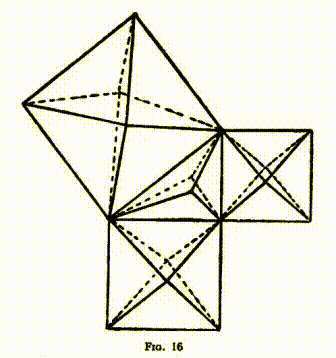

Ангелы снова проложили свои световые линии, но на этот раз направляя их вверх в воздух, формируя на каждом из трех квадратов пирамиду, а на первоначальном центральном треугольнике - тетраэдр. Затем они натянули свои линии вниз, в землю, создав таким образом ниспадающие пирамиды. В целом, всей структуры можно описать как гнездо из четырех призм (один гексаэдр и три октаэдра), при этом плоскость, на которой стояли Ангелы, представляла собой центральный уровень. Вид сверху на эту форму представлен на рис. 15, а Таблица XI показывает другую попытку изобразить ее в цвете в перспективе.

_Таблица XI_

Церемония в Храме

Построив для себя храм такой необычной формы, Ангелы провели в его внутреннем пространстве чрезвычайно интересную церемонию. Они перемещались в удивительном хореографическом танце, расставлялись в различных фигурах, во многом похожих на те, которые адепты формируют на церемонии Весака, я описал это в моей книге "Мастера и Дорога пути", несмотря на то, что фигуры отличались. Они создали семиконечную звезду, свастику, крест и множество других фигур, но было очень сложно увидеть их из-за ослепительного сияния цветного огня, исходящего от вершин фигур. После множества таких преобразований, они соединились в виде гимна - поразительное музыкальное произведение, в котором голоса звучали подобно зову трубы, подобно бренчанию могучих колоколов. Многограннический храм был прозрачен, словно кристалл, и в то же время пропитан огнем, так что наблюдая за ним, можно было почувствовать, что понять смысл странного описания из Откровения о стеклянном море, перемешанном с огнем.

По мере усиления звуков ангельского хора, освещенность этого храма становилась все ярче и ярче, и линии ослепительного света выстреливали в эмпирею, передавая сообщения и приветствия далеким мирам. И несомненно, удивительный зов получил отклик - даже не один. Ответы от других миров были для нас непостижимы по своим магнитным характеристикам и по ощущениям, но непреложно было то, что это были именно ответы. Некоторые из них пришли с других планет нашей системы; другие, напротив, исходили от миров, о которых мы до сих пор не знали.

Завершение церемонии было драматичным. Призмы становились всё светлее и светлее, пока вся структура не стала казаться живым пламенем, и с блестящим музыкальным финалом вдруг поднялась и исчезла, взмыв вверх подобно Илии, взятого на небо огненной колесницей. После этого прозвучал гимн, H.O.A.T.F. солемно благословил собравшихся, и все вышли в процессии, поющие, трое начальников, как всегда, были последними.

Воздействие Фестиваля

Праздник Святого Михаила и Всех Ангелов, который каждый год совпадает с проведением этой масонской встречи, как я уже говорил, имеет гораздо более древние корни, чем христианская эра, хотя христианство, безусловно, правильно приняло его на вооружение, как и многие другие праздники более ранних религий. Это день радостных приветствий и искренних пожеланий - своеобразное 'с новым годом' среди Ангелов. Но церемония не сводится только к небесному приветствию. У нее также есть и другие функции, многие из которых весьма сложно понять. Было ясно, например, что какие-то силы проникают внутрь нашей Земли. Мы, похоже, были заряжены или наполнены чем-то, а затем передавали другим мирам то, в чем они нуждались. Я уверен, что мы все еще далеки от полного понимания значения этого великолепного обряда. Я помню, что однажды Мадам Блаватская говорила нам об этом, и я также слышал упоминание об этом много лет назад от одного из Братьев Адептов.

## Глава XI. Закрытие Ложи

ПРИВЕТСТВИЕ

Так как мы собирали все наши силы для вечерней работы при открытии Ложи, так и теперь, при закрытии Ложи, мы еще раз мобилизуем их для окончательного усилия – дарования масонского благословения. Церемония закрытия начинается с того, что Ч.В.М. спрашивает, есть ли у брата какие-либо предложения, уточняя, что эти предложения должны быть в интересах Ордена в целом или во благо человечества. Все деловые вопросы и предложения, связанные с ними, должны были быть рассмотрены ранее в течение вечера, до того как Ложа приступила к особой работе встречи. Единственные вопросы, которые мы рассматриваем на этом этапе, это предложения о кандидатах для посвящения и прием приветствий от других Советов, Консисторий, Глав или Лож.

Приветствия, которые затем подаются, отнюдь не формальные. Каждое полученное приветствие является весьма значимым вкладом в энергетику, которая раскрывается во время работы Ложи; оно приносит с собой своеобразную ментальную атмосферу Ложи, от которой это приветствие исходит. Каждая Ложа существует на ментальном уровне как определенный мыслительный объект - настоящая сущность в области мысли. Когда, следовательно, один из ее членов передает приветствие в другой Ложе, к нему от его собственной исходит луч света, несущий благое влияние, которое он радирует. Когда брат находится в своей Ложе, определенный аспект, грань или сегмент его ауры, который показывает его связь с этой Ложей, активизируется; некоторая часть его потенциального существа оживает, потому что он является частью этой Ложи.

Ложа как ментальная сущность состоит из таких частей всех ее членов, объединенных воедино, и именно из этого единого целого исходит и сияет луч света, когда даются приветствия. Когда мы говорим о Ложе как о ментальной сущности, мы не имеем в виду что-то, существующее лишь в воображении; на ментальном уровне каждая Ложа - это реальная сущность, большой шар, имеющий точное расположение в пространстве, над местом, где собирается Ложа. В случае зала, где несколько Лож встречаются в разные дни, можно увидеть несколько таких шаров, парящих над зданием; эти шары вовсе не соединяются, но скопляются над зданием так, что напоминают набор игрушечных воздушных шариков.

Ментальные формы, которые создают различные Ложи, сильно различаются. В некоторых случаях такая форма является поистине прекрасной, подкрепляемой людьми, полностью увлеченными делом, для которых Ложа – это неотъемлемая часть их жизни. Если члены обладают обширными знаниями оккультного значения Ложи и ее работы, это создает величественную форму на более высоком мысленном уровне; но если в Ложе состоят люди с не слишком высокими интеллектуальными способностями, общение и пиршества которых занимают большую часть их мыслей, астральный двойник Ложи будет сильным, но ментальная составляющая его формы будет недостаточной. Из этого следует, что приветственные слова от одних Лож влияют больше, чем от других.

Самые важные приветствия приходят от Верховного Совета. Вельможный Мастер задает вопрос, вызывающий приветствия, три раза. Таким образом, сила, которую Ложа получает посредством приветствий, делится на три группы, каждая из которых кардинально отличается от остальных. Иногда на все три вопроса есть ответы, но часто их нет. Первая группа приносит благодать белой Масонии. Это приветствие могут дать только члены от 31° до 33° включительно, и оно недвусмысленно носит характер благословения свыше; по этой причине его сообщения всегда датируются от Зенита, символизируя его неупрежденное благоволение к всем.

В этом же разделе могут приветствовать и члены поселения 30°. Их регалии черные; их особое обучение связано с проявлением кармы, будь то хорошая или плохая, и его особая функция в Масонстве – это внедрение порядка, справедливости и дисциплины. Именно поэтому они располагаются на холмах, чтобы обладать всесторонним видением любого предъявленного вопроса.

Второй класс силы приходит от Красной или, вернее, розовой Масонии. Эта группа включает всех Масонов от 4° до 29°, а также Масонов Святого Королевского Свода. Ее центральной точкой является 18° или Роза-Крест, и его особенной чертой является любовь. Из-за свой особенности – любови – они датируют свои сообщения от долин — плодородных долин, исходящих из гор и спускающихся к переполненным жизнью равнинам повседневной жизни.

Приветствие первой группы можно сравнить с благословением большого гуру или религиозного учителя, в то время как второе больше напоминает заботу и любовь, которые родители испытывают к детям, или любовь, которую предки осыпают на человечество. На 33° каждый член обладает силой благословения, напоминающей о той, которой обладает епископ в христианской церкви, ведь великие белые Ангелы, которые особенно активны в работе 33°, имеют много общего с теми, кто выполняет аналогичные функции в той Церкви.

Затем следуют теплые приветствия от Лож Марок и Синей Масонерии, представленные членами всех трех степеней. Эти приветствия приносят обильный поток братской поддержки и силы от других Лож, занимающих тот же масонский уровень, что и ложи, которым они адресованы. Все эти Ложи находятся на обширных равнинах, простирающихся далеко в синюю даль. Итак, у нас есть три разных типа приветствия, предлагающих благословение, любовь и поддержку.

Бывает так, что масона просят передать приветствие от Ложи, с которой он ведет личные связи, несмотря на то, что сам не является её членом. Ему можно попросить передать приветствие своей собственной Ложе и другим Ложам, которые он может посетить. В таких случаях он становится своеобразным посланником этой Лоджии, и он может нести её приветствие так же эффективно, как это сделал бы один из ее членов.

На этой стадии процесса, если нет новых предложений, У.З.В. объявляет: "С... молчат, П.В.М.". Здесь имеется в виду другое значение слова с..., не связанное с колоннами на пьедесталах, а относящееся к тем членам, кто не занимают официальную позицию и сидят с севера на юг. Эти братья, в прямом смысле слова, суть с..., участвующие в строительстве храма, что заметно на большой цветной гравюре, приложенной к этой книге. Именно их труд поддерживает жизненность Ложи. Имеется в виду не то, что братья образуют с..., расположившись горизонтально в ряд, но каждый из них — это отдельная вертикальная с..., помогающая поддерживать крышу. Они выступают как братья, равные в своем труде. Здесь я хотел бы привести отрывок из письма, в котором мой близкий друг описывает прекрасное и поучительное видение, полученное им много лет назад. Он пишет:

Однажды, размышляя о братстве, я внезапно увидел величественный храм, кажущийся египетским или греческим по стилю. У него не было внешних стен – лишь многочисленные столбы, поддерживающие изящную крышу и окружающие маленькое святилище, взгляд в которое мне не посчастливилось бросить. Я не могу передать остроту ощущения, что в этом здании таится значимость - оно словно пронизано магнетизмом разума, делающим его не просто откровением, но образом содержащим самые высокие уроки. Сонет, поясняющий его смысл, словно раскрывшись, описывал как всё это является символом истинного братства - эти столбы, стоящие на разных местах, некоторые омываемые солнечным светом, некоторые всегда в полузатене, некоторые толстые, другие тонкие, изящно украшенные и простые, некоторые окружены почитателями, в то время как другие всегда оставлены в стороне - все они равнодушно и упорно несут одинаковую нагрузку крыши, защищающей внутренний зал со святилищем - все разные и в то же время абсолютно одинаковые. И сонет закончился фразой: "Узри в этом братство".

Я уже не в силах воспроизвести этот сонет, но богатство и глубина его смысла, мудрость, уложенная в эти несколько слов, вдруг позволили мне увидеть, что именно так выглядит истинное братство - общничество в служении, выполнение своей роли, не обращая внимания ни на что другое, кроме выполнения самой работы. (*Некоторые Оккультные Опыты, Джохан ван Манен, стр. 20.)

Я думаю, что многое можно узнать из такого видения.

Приветствие заканчивается поднятием всех Братьев Ложи и обменом теплых пожеланий с Возлюбленным Мастером, чтимым средоточием их чувства любви и верности к нему и к великому Целому, стоящему за ним.

Подготовка к Закрытию

Далее Оратор читает вдохновляющие стихи из Священных Писаний, и Возлюбленный Мастер призывает Братьев помочь ему в закрытии Ложи. Мы уже видели, какую важнейшую роль Братья играют в открытии Ложи, благодаря силе их мысли и преданности. Всю церемонию мысль-форма, зародившаяся благодаря видимым и невидимым Братьям и рабочим, пополняла своё богатство и усиливала свою силу; теперь все обращают своё внимание на распространение этой силы по всему миру.

Я мог бы проиллюстрировать природу этого эффекта, обратившись к примеру из сферы индуистских мантр. Несколько лет назад меня попросил благородный брат, Sir S. Subramania Iyer из Мадраса исследовать мантру, которую он использовал на протяжении многих лет, данную ему Свами T. Subba Rao, великим оккультистом Южной Индии. Я пристально изучал это дело, и мне удалось опробовать эту необычную мантру на практике.

Мне сказали, что эта мантра найдена в Гопалатапани и Кришна Упанишадах, и состоит она из пяти частей: (1) Klim, Krishnaya, (2) Govindaya, (3) Gopijana, (4) Vallabhaya, (5) Swaha. Если медитировать над ней с полнотой усилия, каждый слог образует линию в точном положении, что в итоге образуется пятиконечная звезда, как в Изображении 17.

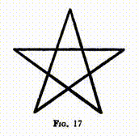

И так, когда мантра повторяется, эти звезды накапливаются одна за другой, образуя трубу с пятиконечным сечением. В итоге это становится каналом для духовной силы, исходящей от Шри Кришны, который является тем же существом, что и Господь Майтрея, текущий Бодхисаттва или Мировой Учитель, великое существо, которое воплотилось в теле Иисуса, как Христос. Используя эту протекающую через него силу, мантру можно применять для разных целей, например, для исцеления, избавления от пламени и других элементалов, а также для общего блага.

Я обнаружил, что в этом процессе есть три стадии. С произнесением "Клим", что индийские оккульты называют "семенем привлечения", предмет внимания источника силы привлекается, и открывается что-то вроде входной двери или вентиля. Затем, по всему телу мантры, сила проникает в форму; и наконец, звук "Сваха" посылает эту силу выполнять назначенную задачу.

Наши действия в Ложе имеют ту же природу, что и работы, проводимые со столь древними мантрами. Во время наших собраний мы обогащали форму нашим усердием и размышлениями, и теперь мы готовы позволить этой накопленной силе распрыгнуться как благословение для окружающего мира.

Закрытие

Закрытие, также как и открытие, начинается с важного вопроса о первом и постоянном обязательстве каждого фримасона проверить, что Ложа з... т. Общие целевые задачи и эффекты т... я уже обсуждал в Главе V. Особая причина для повторного вопроса на данном этапе заключается в том, что мы сейчас особенно собираем и вырабатываем силу, которую предполагается использовать не внутри Ложи, а для проявления по определенным внешним линиям. Поэтому мы внимательно проверяем т... Ложи, так же как человек, вставивший патрон в винтовку с зарядом сзади, следит за идеальным закрытием камеры, чтобы вся сила взрыва направлялась только вдоль ствола, но разумеется, в нашем случае взрыв вызывает не разрушение, а благословение мира.

Следующей команда в церемонии предписывает Братьям вступать в ряд как фримасоны — не для проверки на отсутствие непрошенных гостей, поскольку наши двери на протяжении всей церемонии были под охраной, а потому что это приказ привести в ряд с s...p и s...n — это установленный способ вызова особой мощи степени, чтобы максимально повысить активность своеего чакра, чтобы каждый член мог осознать и в полной мере выразить силу, полученную от статуса новичка. Когда это выполнено, можно увидеть, как чакра засветится и начнет сверкать, мигать и часто увеличиваться в размерах.

Затем В.М.Ж. поворачивается к З.М.Ж. и вновь спрашивает о его положении в Ложе и причинах его расположения. Вопрос, по сути, является призывом к представителю Ангела З.М.Ж. выполнить свою обязанность, убедиться, что каждый Брат наполнен силой, не только для участия в нынешней работе, но и чтобы продолжить свое дело в жизни до следующей встречи. Опять же, с этой же целью, сделав все возможное для стимулирования братьев и увеличения доступной духовной силы - путем привлечения поддержки Ремесла, побуждения лояльности членов, вдохновлением от С.С., самым тщательным обучением, использованием специальной силы степени, на которой они работают, и призывом к Ангелу за помощью - мы обращаемся к самому Логосу. Мы выражаем нашу искреннюю благодарность за полученные благословения и нашу надежду на то, что Орден продолжит заслуживать Его помощь, выполняя свою обязанность выражать каждую моральную и социальную добродетель. Еще больший энтузиазм возбуждается красивыми словами и мыслями заключительного гимна, а затем В.М.Ж. подводит под нашу масонскую обязанность к нашему ближнему всеобъемлющую рекомендацию, что мы должны встретиться на уровне, действовать по линии отвеса и расстаться по квадрату, каждый офицер поднимает свой символ, прикрепленный к его ошейнику, когда произносится слово.

Мы встречаемся в атмосфере идеального равенства и дружелюбия, не проявляя никаких предпочтений или предубеждений, обеспечиваем справедливость для всех. Мы всегда действуем с абсолютной истиной и вертикальностью, всегда проявляем наиболее острое чувство чести; и хотя Ложа сейчас закрывается, и мы собираемся расстаться на физическом уровне, мы расстаемся на квадрате, не забывая об этой тесной регулировке, которая обеспечивается, так что интерес нашего брата остается нашим собственным, как в его отсутствии, так и в его присутствии, и здесь не может быть эгоизма или забывчивости, потому что мы все камни, построенные вместе в один божественный храм на славу В.В.В.

Затем В.М.Ж., подняв руки, произносит роковые слова, которые освобождают всю эту удивительную накопленную силу и отправляют ощутимую волной энергии к каждому члену каждой должным образом учрежденной Ложи по всему миру. То, сколько каждый Брат может принять от этого страшного излияния, зависит только от него самого, от его степени развития, его знаний, его настроения; но что подарок очень ценный и что привилегия принадлежать к Ордену велика, не может быть сомнения в голове любого студента оккультизма.

Элементальные войска, которые были собраны вместе, мчатся наружу ко всем точкам компаса, оставаясь только их капитанами, представителями Ангелов офицеров, все еще на своих местах. Когда по команде В.М.Ж. З.М.Ж., символизирующий Шиву, разрушитель форм, произносит формулу закрытия, Ангелы помощников офицеров также исчезают, оставляя лишь трех главных и величественную форму мысли В.В.В. Достойный прошлых В.М.Ж., в торжественном высказывании “И Слово было у Бога”, напоминает братьям, что даже когда проявление прекращает себя, Христос все еще остается в лоне Отца, готовый к возрождению, когда Он, Вечное Слово, соизволит снова произнести.

Главные Служители теперь по очереди тушат свои свечи, каждый при этом утверждает, что качество, которое он воплощает, все равно сохранится в сердцах Братьев. Правый Четкый Мастер заново объясняет им, как это возможно, напоминая еще раз, что "Его свет сияет даже в нашей тьме". Когда свечи гаснут, представительные Ангелы уходят один за другим, каждый из них перед уходом уважительно кланяется перед Мастером Вселенной, который поднимает руки в благословении и исчезает только тогда, когда в заключительной молитве за сохранение Ремесла все обращаются к Его портрету с поднятыми руками.

Так заканчивается одна из самых удивительных церемоний в мире - церемония, которая сохранилась практически без изменений в своих основных частях с такой давности, что история забыла ее. Непонятная, лишь наполовину ценная, во многих случаях лишенная славных и уважаемых ритуалов, которые являются ее истинным выразителем, она все же продолжает выполнять свою работу в неблагодарном и непонимающем мире. Основанная тысячи, а может быть, миллионы лет назад по приказу Духовного Короля Мира, она по-прежнему остается одним из самых мощных инструментов в Его руках, одним из самых эффективных каналов Его благословения. Некоторые из нас обладают мудростью понять это, благим кармой, чтобы служить в этом направлении Его службы; пусть мы никогда не забудем, как велика наша привилегия; пусть мы никогда не упустим эту возможность, которую Он нам дал!

S ... M ... I ... B ....
