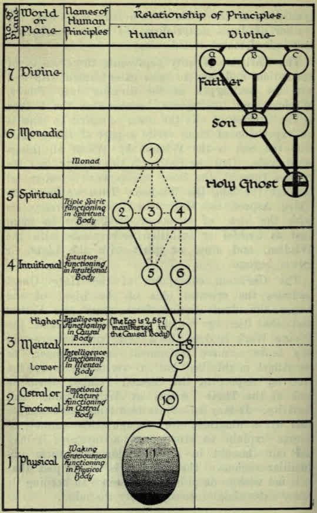

THE HIDDEN SIDE OF CHRISTIAN FESTIVALS

CHARLES W. LEADBEATER

Regionary Bishop of The Liberal Catholic Church for Australasia

THE ST. ALBAN PRESS Los Angeles : London : Sydney

1920

CONTENTS

PART ONE - The Festivals

- Foreword
- Introduction: The Church's Year
- Chapter 1 — Advent
- Chapter II — Christmas
- Chapter III - New Year's Day
- Chapter IV - The Epiphany
- Chapter V - The Baptism of Our Lord
- Chapter VI — The Transfiguration
- Chapter VII - Lent
  - Our Attitude Towards Lent
  - The Sundays in Lent
    - Refreshment Sunday
  - Holy Week
  - The Services in Holy Week
    - Palm Sunday
    - Maundy Thursday
    - Good Friday
    - Holy Saturday
- Chapter VIII - Easter
- Chapter IX - Ascension Day
- Chapter X - Whitsun-Day
- Chapter XI - Trinity Sunday
- Chapter XII — Corpus Christi
- Chapter XIII - Feasts of our Lady
  - The Mother of Jesus
  - The Virgin Matter
  - The Feminine Aspect of the Deity
- Chapter XIV - The Festival of the Angels
  - The Higher Angels
  - The Lower Angels
- Chapter XV - Festivals of the Saints
  - Our Attitude Towards the Saints
  - Patron Saints
- Chapter XVI - Brief Notes Upon Some of the Saints
  - St. Alban
  - St. George
  - St. Patrick
  - St. Mark
- Chapter XVII - All Saints' Day
- Chapter XVIII - All Souls' Day

PART TWO - Some Days of Special Interest

- Chapter XIX - The Faith of Our Fathers
- Chapter XX - Our Attitude Towards Life
- Chapter XXI - The Greatest of These
- Chapter XXII - Discernment
- Chapter XXIII - Wisdom
- Chapter XXIV - Self-Dedication
- Chapter XXV - Perseverance
- Chapter XXVI - Good Works
- Chapter XXVII - God as Light
- Chapter XXVIII - Forethought

PART THREE - Addresses During the War

- Chapter XXIX — The Truth About the War
- Chapter XXX — On the Anniversary of the Outbreak of War
- Chapter XXXI — On God's Side
- Chapter XXXII — The Future

FOREWORD

These notes on the Church's Year were originally intended to be a chapter in the first volume of this series, The Science of the Sacraments. It was found, however, that that book was already becoming unwieldy, and that there was more to be said about the ecclesiastical year than could be compressed into a single chapter; so it seemed best to devote a separate volume to its consideration. This has also made it possible to add to it a few miscellaneous addresses on points of importance.

The book is to a large extent the reproduction of a series of sermons given for the instruction of a congregation to whose members the ideas contained in it were novel. Amid much pressure of work along other lines I have not had leisure to weld these into a continuous treatise; and as it is not probable that in this incarnation I shall have that leisure, and as other congregations desire information on these subjects, it seems best to let the sermons go forth with but little correction or addition. Occasional repetitions and colloquialisms will no dou'bt be found in the book, therefore; but I hope that it may nevertheless be not without some value to students of liberal Christianity, and indeed of religion in general.

C.W.L.

> Source: https://archive.org/details/hiddensideofchri00leadrich

PART ONE - The Festivals

INTRODUCTION

THE CHURCH'S YEAR

God has a plan for man, and that plan is evolution. We have come forth from Him, and to Him we are to return. The oriental philosophers tell us that we are on the nivritti marga, or path of return, and a modern poet puts the same idea in other words: "All the aim of life is just climbing back to God." Christ's Church exists solely to help mankind in this process, and she has many ingenious methods of offering that help. One of them is the arrangement of the ecclesiastical year, which differs somewhat from that of civil life.

Broadly speaking, it divides itself into two parts, the first of which is devoted to setting before us dramatically the various stages of the path we have to tread, and the second to the practical application of what has been taught. Through both parts are scattered various festivals, each of which is intended to remind us of some point which it is useful for us to remember, and to call upon us to make a special effort in connection with it; and to make this easier, extra outpourings of force from the higher world are arranged for such occasions. As it is put in our Liturgy : ' ' The first portion of the Church's year, from Advent to Whitsuntide, is devoted to the commemoration of the various scenes in the Mystery-Drama of the life of the Christ, which in itself is typical of the life of every Christian, as Origen pointed put."

There are four principal stages in that progress. Those who have studied these things from another point of view know that in oriental religions those four stages are called the four great Initiatipns. These appear in Christianity also, but the terms are different. The first of them is symbolized by the Birth of the Christ — that first great Initiation which is the birth of the man into the great White Brotherhood, which is always called in the gospels the kingdom of heaven. We cannot understand those gospels, we cannot make coherent or reasonable sense out of them, if we take the kingdom of heaven to mean the heaven-world after death. If we understand that the kingdom of heaven is a great living community, we shall see why it is difficult for the rich man to enter into it; we shall see how all the promises made about it are literally accurate; otherwise they make no sense at all.

In that first Initiation also the birth of the ChristPrinciple takes place in the man, for the Monad and the ego — the spirit and the soul, to use the Christian terms — become one for a wonderful moment.

The second of those great stages is symbolized by the Baptism of our Lord. We must not confuse this with the baptism which brings every child into the Church of Christ. It is that of which John the Baptist spoke when he said: "I indeed baptize you with water, but He that cometh after me shall baptize you with the Holy Ghost and with Fire." There is an outpouring from the Initiator to the candidate at that second great ceremony which has indeed all the appearance of a baptism of fire.

The Transfiguration is the representation of the third of these great Initiations, for in that truly the Monad, the spirit, transfigures the soul, and the soul in its turn transfigures the body down here — the personality, as we often call it. All these are wonderfully apt illustrations. When we come to the fourth, we find what many people think a truly terrible Initiation, though surely it is also one of the greatest glory; for then the candidate suffers what is imaged by the Crucifixion, though if he passes the test successfully it is always followed by the victory of the Resurrection.

If we read the account of the life of any mystic who has passed through that wonderful stage we shall notice how closely these events follow one another, and how truly the Christian story mirrors them. We shall see that there is usually some small earthly triumph like that of the Christ on Palm Sunday, and after that there is always the combination of enemies to disgrace the candidate; there is always the misunderstanding and the contumely thrown upon him, and then after all that comes the great and glorious resurrection out of that suffering into life eternal — eternal as regards this world at any rate, for the man who has taken that step need never again be reborn here on earth.

Then after that comes the fifth step — the last of all, that which takes the man out of humanity and makes him a superman. That is aptly symbolized by the Ascension from earth to heaven, and the downpouring of the Holy Spirit comes upon him and upon others in consequence of that his ascent —all truly as it is mirrored in the gospel story.

There is an immense amount of detail into which I cannot pretend to go now; but it will be seen that the symbolical interpretation is at least coherent, reasonable and defensible. There is no argument against it, whereas the contention that the account is historical can be overthrown at every point; therefore those who pin their faith to that historical idea must shut their eyes to a vast amount of what they cannot but know to be the truth, whereas those who are prepared to accept the higher and inner meaning will find that their faith is founded upon a rock.

In drawing up the calendar for the Liberal Catholic Church we have ventured upon a slight rearrangement of some of the minor festivals in order to bring forth this inner meaning somewhat more clearly. At Christmas, with all the world, we celebrate the Birth of the Christ. There is no special festival appointed in the ordinary Catholic calendar as an anniversary of the Baptism of our Lord, though many have celebrated it along with the Epiphany. We therefore have ventured to set apart another day for this celebration, somewhat later than the Epiphany; and because the Transfiguration (symbolizing the third Initiation) comes out of its due place when kept on the 6th August, we have also transferred that, and we keep it between the Baptism (which represents the second Initiation) and Easter (which represents the fourth). So once more these four stages will be restored in our calendar to a coherent whole, and put in the right Qrder.

There is no tradition in the Church as to the actual anniversary of either the Baptism or the Transfiguration. The custom of celebrating the latter on the 6th August was introduced at a comparatively late date; I think the first time we find it mentioned is in the year 850 A.D., and even then it seems to have been only locally observed. It was not until the year 1456 that its extension to the universal Church was decreed in commemoration of a great victory gained over the Turks on that day. So as the original date is not known, we have not, I think, committed any great breach of propriety in putting these celebrations in their true order, so that the symbolism shall be clear to our brethren.

Many of the events described as having happened in the last life of the Christ are commemorated on the days when they are actually supposed to have occurred, although on this subject there has been in ecclesiastical history considerable difference of opinion. The great group of festivals whose dates are determined by that of Easter fall on different days of the month in different years; but they are all decided with reference to the Paschal full moon, just as the old Jewish Passover used to be.

The other group of festivals, being dependent upon Christmas, have fixed dates — the Annunciation on March 25th, Christmas Day itself, the festival of the Epiphany twelve days later, and the Presentation of Christ in the temple, which is commonly called Candlemas Day. There is little reason to suppose that any of these dates are historically correct, but they are arranged to be consistent one with another.

CHAPTER I

ADVENT

With us, as with the Churches of Rome and of England, Advent Sunday is what may be called the ecclesiastical New Year's Day. The Holy Eastern Church (the Church of Greece and of Russia) observes the same custom, but she clings to the unrevised calendar, and so she begins all her commemorations twelve days later than we do.

The first great feast of the Church's year is that of the Birth of the Christ, which corresponds to, and teaches us of, the first of the great Initiations. But the Church in her wisdom has ordered that for each of her greater festivals there shall be a certain time of preparation, and consequently before the feast of Christmas we have the season of Advent — which has indeed a double aspect, but its first is that of a time of preparation for the due celebration of Christmas.

It is not a mere fashion of speech to say that we ought during the season of Advent to be making ourselves ready for that festival. Christmas is not only a birthday, not only a commemoration of the nativity of our Lord; it is also a time of the special outpouring of spiritual force. Such great festivals as Easter and Christmas, in the rejoicing connected with which we all join so eagerly when they come round, are definitely occasions for what is commonly called the shedding of grace from on high; and in order that we may be able to avail ourselves to the full of such an outpouring, it is well that we should take advantage of the season of adjustment. We receive more if we prepare ourselves properly; so we should accustom ourselves during Advent to think daily of the Coming of the Lord, and of the Initiation which it typifies.

The four Sundays in Advent are devoted by the mystics of the Inner School of Christianity to the contemplation of the four qualifications for the first Initiation — Discrimination, Desirelessness, Good Conduct and Love; but no trace of that arrangement remains in the modern Church services, unless it be the old custom of substituting rose for violet as the colour for the third Sunday. As is explained in our Liturgy (and more fully in the first book of this series, The Science of the Sacraments) the Church utilizes different rates of vibration, which show themselves to our eyes as colours, to assist in impressing upon her members the various lessons to be learnt successively in the course of her year. In the preparation-periods (Advent, Lent and the vigils of Saints' Days) the colour chosen as most helpful is purple, because of its actinic, piercing and cleansing properties. Approximately in the middle of Advent and of Lent we find a Sunday on which rose is prescribed; and for this various reasons have been suggested. Through certain curious misunderstandings these preparatory periods came to be considered as penitential and sorrowful, and it was supposed that the rose-coloured Sunday was introduced as a kind of mitigation of grief — a momentary relief in the midst of austerities. A truer theory is that, as the one efficient motive for our attempt at selfpurification is our love for God, this dramatic change of colour in the midst of the season is intended to remind us of that deep and true affection which must underlie and permeate every effort that we make, if there is to be any hope of its permanent success. At least this much remains of the joyousness which should characterize the whole season; for it is not by fruitlessly mourning over our sins, but by earnestly resolving to forsake them, that we can fit ourselves to make the best use of the glorious festival which is approaching.

The Church Catholic has always recognized the dual nature of the Advent season — that it is a preparation for the next Coming of the Christ, as well as for the celebration of His birth in His last life on earth. The Churches of Rome and England speak of that second Coming, and adjure their people to be ready for it; and yet there is a vast amount of serious misunderstanding about it. In the Christian scriptures it is entangled with the idea of the end of the world, so that people who look for the second Coming of the Christ generally think of it as also the end of all the order that they know, and so most of them fear it. In the sermons and hymns connected with the Coming there still lingers a flavour of fearful anticipation of an awful descent from the physical sky, acccompanied by appalling meteorological phenomena. The general attitude is far too much that expressed in some of the Advent hymns which such people sing:

    The ungodly, filled with guilty fears,
      Behold his wrath prevailing;
    In woe they rise, but all their tears
      And sighs are unavailing.

And they talk of them as "deeply wailing," "in deep abasement bending," and so on. Now it should be very clearly understood that all this sort of thing is not only silly, but definitely wicked and blasphemous; and the men who teach such a horrible misrepresentation of true Christian doctrine undertake a very serious responsibility, for surely to slander our heavenly Father and to degrade His children's conception of Him is a crime of no small magnitude. There is of course nothing whatever of that sort among true mystics, who have always known that God is Love, and have never feared any manifestation of His Presence, for they know that whether they see Him or not He is always with them even unto the end of the age.

All fear of God comes from a misunderstanding. The Coming of Christ is indeed connected with an end ; it is not the end of the world, but the end of an age or dispensation. The Greek word is aion, which is the same as aeon in English; and just as Christ said two thousand years ago that the dispensation of the Jewish law had come to an end — because He had come to found a new dispensation, that of the gospel — so will the gospel dispensation come to an end when He comes again and founds yet another. He will give the same great teaching: the teaching must be the same, for there is only one Truth, though perhaps it may be put a little more clearly for us now, because we know a little more. It will be promulgated in some fresh dress, perhaps, with some beauty of expression which will be exactly suited to us in this present day; there will be some statement of it which will appeal to a large number of people.

It will certainly be the same, because it has appeared in all the existing faiths. They have differed much, in their method of presenting it, but they all agree absolutely in the life which they ask their followers to live. We find considerable difference between the external teachings of Christianity, Buddhism, Hinduism, and Muhammadanism ; but if we examine the good men of any one of those religions and enquire into their daily practice, we shall find that they are all leading precisely the same life — that they all agree as to the virtues a good man must possess, and they all agree as to the evils he must avoid. They all tell us that a man must be charitable, truthful, kindly, honourable, helpful to the poor; they all tell us that a man who is hard and grasping and cruel, a man who is untruthful and dishonourable, is making no progress and has no chance of success until he changes his ways. As practical people we must recognize that the things of real importance in any religion are not the vague metaphysical speculations on matters of which no one can really know anything for certain, for these can have no influence upon our conduct ; the important things are the precepts which affect our daily lives, which make us this kind of man or that kind of man in our relations with our fellow-men. Those precepts are the same in all existing religions; they will be the same in the new teaching, whatever it may be.

Perhaps we may go a little further than that in predicting what He will teach, because there are some other avenues of information open to us. One of these is the study of the previous teachings which He has given. Students will remember that before this World-Teacher took up the office it was held by the Lord Gautama, Whom men call the Buddha. His especial title was the Lord of Wisdom. He gave many teachings, but they all centred round the idea that knowledge meant salvation — that the evils of the world came from ignorance, and that through ignorance men were led into desire, and by that into all kinds of sins and sorrows; but that if the ignorance of man was dispelled, and he came into possession of perfect knowledge, he would thereby come to the perfect life, and to the perfect attitude towards all men and all circumstances, and so would escape from the wheel of birth and death.

Our present World-Teacher bears the name Maitreya, which means kindliness or compassion, and just as the Lord Buddha was called the Lord of Wisdom, so is the Lord Maitreya called the Lord of Love or of Compassion. The great central truth which He will emphasize is that the evils of the world come from the lack of love and brotherliness — that if man will learn to love and to adopt the brotherly attitude, all evil will pass away and the golden age will dawn upon us. Not immediately— we cannot hope for that; but at least men will begin to see for themselves, and to understand how much more is to be gained along that line than the other. We may see how prominently that doctrine came forward in His previous lives.

Twice He has appeared — as Krishna in the Indian plains, and as Christ amid the hills of Palestine. In. the incarnation as Krishna the great feature was always love; the child Krishna drew round Him people who felt for him the deepest, the most intense affection. Even now the religion which He founded perpetuates itself in the most touching devotion, the most wonderful attraction to the child Krishna. All over the south of India many millions of followers still worship Him, and it is of the essence of their worship to feel for him the deepest affection — a devotion more touching, more intense, I think, than any that I have seen even in the monastic communities of Christianity.

Again in His birth in Palestine, love was the central feature of His teaching. He said: "This new commandment I give unto you, that ye love one another as I have loved you." He asked that His disciples might all be one in Him even as He was one with the Father. His closest disciple, St. John, insisted most strongly upon the same idea: "He that loveth not knoweth not God, for God is love." St. John lived to a great age (over a hundred), and when in the days of extreme old age and feebleness he could no longer deliver long sermons, as he was carried about in a chair among the younger people, his word to them always was: "Little children, love one another." So we have some evidence from the two previous births of the great World-Teacher that the central idea of love will dominate His utterances now.

In a certain little book called At the Feet of the Master we have some teaching given to a young Indian pupil (whom I knew well) by one of the Masters of the Wisdom who is Himself a disciple of the World-Teacher. Its especial object is to set forth in the simplest possible form the qualifications required for Initiation. There is no mystery as to those qualifications, for they are given in books belonging to various religions, and are well known to all who make a study of such subjects. In these different presentations, however, there is room for considerable variety, both in the method of teaching and in the translation of some of the technical terms employed. In this little book to which I have referred we get the presentation of those qualifications by one who is so close a follower of the WorldTeacher that we may feel sure that it is practically His presentation. That book clearly does not contain the whole of what He will teach, but we may certainly take it that there is nothing in it of which He disapproves. In reading it we cannot fail to be struck by the fact that it is most strongly permeated with this same spirit of love. The final qualification, the intense desire for union with the Supreme, is given in that book as Love, on the ground that the Supreme with "Whom the man wishes to be one is Himself Love ; and therefore he who wishes to join with Him must first develop that love within himself. I strongly recommend that little book to the notice of every member of our Church; it will be found in many ways a most useful manual, for it shows us clearly in how many ways our present methods of life fall far short of that high ideal of love.

In reading the Christian bible we should, I think, remember that its language is largely symbolical. I do not mean to say that all the writers knew exactly what it meant. I do not think they did. I think they also were in many cases deceived, because they put into the mouth of the Christ words which represent Him as expecting to come back quite shortly. Again and again He is made to state: "There are many standing here who will not pass away until I come again," whereas we know that two thousand years have passed since then.

That idea of the destruction of the world is a mistake. It may be said: "All the Christian world takes it literally; how do we know that it is a mistake?" In this Liberal Catholic Church we worship and we follow the living Christ. Not a Christ of two thousand years ago only, but a Christ Who lives and inspires His Church now; in this day also He has His prophets who know and declare His Will, and those who know have told us that He will come again even as He has said, and that that Coming will be soon now, as we count earthly time. It will indeed begin a new era for those who are willing to receive it. It will be a great change, but it will be a mental and a moral change. He spoke, in that previous visit of His, of the signs which should foretell His second Coming. If we read what is written, we shall see that the great war has been one of those signs; and we can also see that much will be possible in the way of reconstruction after it which would not have been practicable before. Let it be clearly in our minds that He comes not to destroy the world, but to teach us, even as He came before. He comes to reign indeed, but He comes to reign in our hearts, for His kingdom is not of this world.

How shall we prepare ourselves then for this His Coming? Chiefly by unselfishness and by service to others for Him and in His Name. The virtues of devotion, of steadfastness and of gentleness need developing in us all, as is stated clearly by the Order of the Star in the East, a Society which exists to prepare the way for His second Coming, to help us to fit ourselves to receive Him, and so far as may be to help to make others ready as well.

This time, as indeed He is said to have foretold, there will be many who will not heed, many who will be wrapped up in business and in pleasure. He quotes the legendary story of Noah, that men were going on with their work and their play and paying no attention to the prophecies, and the flood came suddenly and destroyed them all. This is the legend of the sinking of Atlantis — a historical fact, though it did not occur exactly as described in the traditions. Christ is reported to have said that just as it was then, so it will be when the Son of Man shall come again. The people will be fully occupied with their business and pleasure, and not thinking in the least of Him, and so they will not know Him; they will not identify Him or recognize Him. We at least must be wiser than that, we who are trying to study the inner meaning of all these things; we must make ourselves ready to receive Him; and for those who will so prepare themselves, be sure that a wonderful and a glorious time will come.

We hardly realize, perhaps, how stupendous is the privilege of being born at this time, of having been able to take part (for we all have taken part in one way or another, I hope and believe) in the great war of right against wrong, which has so recently drawn to a close; and even more than that, we who live now may hope to see the second Coming of the Christ among us. And think what that should mean to us, if we recognize Him.

    For He Whom now we trust in
      Shall then be seen and known,
    And they who know and serve Him
      Shall have Him for their own.

They shall know the truth and the truth shall make them free, for in His service there is perfect freedom. And He has told us that whosoever does service unto one of the least of His brethren, does it unto Him. That must be our preparation.

For us who know the nearness of His Coming, Advent is a time not of fear, but of joyous recollection and of still more joyous anticipation. Our attitude is well expressed in the ancient hymn:

    Rejoice! rejoice! Emmanuel
    Shall come to thee, O Israel.

At the season of Advent we should have much in our minds the necessity of the quality of discrimination in making ready for our own Initiation, and also for the Coming of the Lord. It would be useful for us to think carefully how that great quality can be displayed in our efforts to spread the knowledge of that near Coming — how in our work of preparation we can display the wisdom of the serpent as well as the harmlesisness of the dove. "With these thoughts in our minds "well may we rejoice and sing," as our hymn tells us, for "we are waiting with a hope that cannot fail." Brethren, the Coming of the Lord draweth nigh; yea, it is even at the doors. Already the dawn is lightening; soon shall be the rising of the sun.

    Coming! in the opening East
      Herald brightness slowly swells;
    Coming! O my glorious Priest,
      Hear we not Thy golden bells?

CHAPTER II

CHRISTMAS

Christmas is one of the greatest of the festivals of the Church; it is perhaps surpassed only by Easter, for on this day we celebrate the birth of the Sun-God, as on that day we celebrate His victory over the powers of darkness. Christianity, like all the other religions, was founded in the northern hemisphere, and consequently its festivals all fall at; inappropriate times so far as the southern hemisphere is concerned. The rebirth of the Sun-God after the eclipse of winter was celebrated on the first day which was definitely longer both in the morning and in the evening, immediately after the winter solstice, the point at which the earth turns in its circuit round the sun, and begins to pass away from him instead of drawing towards him. In the same way the victory of the Sun-God over the powers of darkness was celebrated as soon as the equinox had passed — as soon as the day was definitely longer than the night. These festivals of the Sun-God had been kept for thousands of years before the birth of Jesus, so that it was quite natural for the early Church to adopt their dates for its celebrations.

The actual date of the birth of Jesus is not known, but from various indications it seems probable that it was some time in the spring. The 25th of December was, however, selected fairly early in ecclesiastical history, because it coincided with that great Sun-festival, and it was naturally convenient to take advantage of what was already a public holiday. Those who do not recognize the symbolical meaning of the life of the Christ naturally suppose all these ecclesiastical commemorations to be merely historical; but we, who are trying to delve a little deeper into the truths of nature, shall none the less find it interesting to look for other and deeper significations as well.

What are the points of which the great Christmas celebration reminds the Liberal Catholic? It seems to me that there are no less than seven of these points, and I will try to explain them one by one.

1. We must certainly not ignore the historic aspect of the day, even though we know that it is not an actual anniversary. In precisely the same manner, it is agreed that a certain convenient day shall be celebrated each year as the birthday of King George, although it may not be the anniversary of his coming into the world in this incarnation; but it would be both foolish and improper to decline to observe it on that account. Unquestionably, therefore, we are called upon on Christmas Day to look back to that descent of the great disciple Jesus, and to thank him for it, and for all that has since come to the world in consequence of it. It was he who lent his body to the Great Teacher in order that He might come and found His religion and preach His gospel upon earth.

That may seem a new and strange idea to some, but it is one quite commonly understood by those who grasp the facts of reincarnation — those who know something of the might and the power and the dignity of the Great One Whom we call the World-Teacher. We know that it would not be economy for Him, it would not be a good use of His stupendous power, that He should occupy a human body through all the period of its birth and growth, the earlier stages of its life. Therefore one of His disciples takes charge of all that for Him, and He steps into the full-grown and fully-prepared body when He is ready to do so, and uses it for the purpose for which alone He takes it over. For He Himself lives habitually upon a plane far higher, and carries on there a work so magnificent, so beyond our conception, that it is little use for us to try to grasp it, except in the merest outline.

In this particular case an advanced disciple of the Lord Christ took birth in the year 105 B.C. among the descendants of King David, as a son of Joseph and Mary; and to him was given the name of Jesus. He remained in charge of that body until it was about thirty years of age, and then handed it over to the Christ, "Who occupied it for the three years of His earthly ministry. The disciple Jesus was reborn as Apollonius of Tyana just about the date usually assigned to the beginning of the Christian era; and a thousand years later he appeared as the great teacher Kamanujacharya, who left so deep an impression upon Indian thought. In due course he received the reward of his self-sacrifice, and attained the Asekha Initiation, thereby becoming one of the Masters of the Wisdom. We reverence Him now, therefore, no longer as the disciple, but the Master Jesus.

Therefore it is well that we should sing our Christmas hymns and carols, and perpetuate the beautiful traditions which have gathered round the birth of the Master Jesus. We do not necessarily thereby assert our belief in their historical accuracy; for indeed the same lovely legends hang round other births of the World- Teacher, and it is perhaps difficult to suppose that they were literally true on all these various occasions. But we certainly need not doubt that each such birth is a great occasion, and is attended with unusual phenomena upon higher planes, which may have been seen by some at least of those who were at that period living in physical bodies.

2. We call to mind upon this occasion the descent of the Second Person of the Blessed Trinity into matter; and, just as in the smaller cycle we owe deep thankfulness to our great World-Teacher for His descent into a human body in order to help and to guide us, so should we also feel profound gratitude to the great Solar Deity Himself for that willing limitation of His power and His glory which has brought us into existence.

There are many in the world who might say that they feel no gratitude for having been brought into existence — that life is to them more sorrow than joy, and if they could have been consulted they would have preferred not to be. But any who speak thus are thinking only of the very little that they see and know of the great cycle of life; they know nothing whatever of the glory that lies before us; they have realized nothing of the mighty plan of which they are an infinitesimal part. Those of us who are happy enough to know a little of that glorious design cannot but be filled with vivid though humble admiration for it; for we see beyond our present inefficiency to the wonder and the beauty of the future. We realize something of the splendid scheme in which His marvellous love is manifested, and when we catch even a glimpse of that, we cannot but feel strongly moved and full of gratitude that we should have been permitted so wondrous a privilege as that of taking a part, however small, in the glory and the perfection that is to be. Let us show that gratitude, then, by endeavouring to comprehend His manifestation so far as we may, and intelligently to co-operate with it. 3. Yet again, as we have already said, Christmas Day reminds us of that first of the great Initiations, of which it is a symbol in the carefully arranged syllabus of the Church's Year. We should think, then, what this first Initiation means for us — how it is indeed a second birth — a birth into the great White Brotherhood. During the preparatory season of Advent we have been considering the qualifications needed for it; now we should contemplate the thing itself and its results. We should realize how one who has taken that step has become safe for ever, and therefore may truly look upon the great World-Teacher as his Saviour — though not indeed from the mediaeval myth of everlasting torture. There is no such thing as that in nature, and there never has been; the whole thing is a frightful bogy which men have allowed to grow up and to terrify them. There is no eternal damnation to be saved from; the world needs a saviour from such a horrible idea, but not from the fact, because it is not a fact at all. Such a delusion is part of the error and the ignorance which causes all the trouble and all the suffering which we see around us. Verily is the World-Teacher a Saviour, not only for the Initiate, but for all of us; for it is His instruction which saves us from our own error and ignorance, and therefore from much of sorrow and of suffering, which are the necessary consequences of that ignorance.

Not only should we look forward to the time when this wonderful Initiation shall be ours, but we should also make this an occasion of grateful rejoicing that for some it has already come. We thank God for His saints — for the elevation which they have given to humanity, not only by the encouragement of the example which they set before us, but by the actual uplift to the whole which each one of them has given in his own attainment. This uplift is a reality, by no means to be despised or forgotten; humanity is a brotherhood, little as most men recognize that fact, and the unity is so real that whenever one nian attains, all the rest are definitely helped and raised by that attainment. So that should be another aspect of our Christmas joy.

I know that it comes as a shock to many good and earnest Christians to be told that the gospel story is not history, but truly myth. When one says that, people think at once: "You are taking away from us our Jesus, our Saviour. You are denying His historic existence." We are not denying that at all, but we do hold that the gospel history as it is now written is not, and furthermore was never intended to be, an actual account of the life of that great World-Teacher, the Christ. We know but little of His true life-story. It seems certain that some parts of it were interwoven into this myth; it seems certain that some at least of the sayings which in the gospels are credited to the Lord Christ were really spoken by Him. But it is a matter of equal certainty that some of the others were not; and it is also plain to anyone who understands the subject, and has read something of comparative religion, that the whole account is cast in that allegorical form intentionally — that it represents not the life-history of any one man, but the spiritual history of every true follower of the Christ. It is obviously not a history, but a drama — a collection of episodes, arranged as though for presentation on a stage.

This idea, which seems so new to many, is not really new at all. It was quite manifest to the greatest of the Church Fathers. It is strange only to us, and it is strange because we inherit a great deal of the darkness of the Middle Ages. In these days we can no longer give blind faith to something which our reason shows us to be an impossibility. We need to comprehend what this beautiful story means, and it is quite easy to follow that. Origen, the greatest of the early Christian writers, explains the thing most lucidly. He says that there were in his time (and there certainly are now) two kinds of Christians. There were those whom he called the believers in " somatic " Christianity, which means bodily or physical Christianity. He makes it perfectly clear that by that expression he means those who believe in the story as a story, and he says of their doctrine: "What better could you have for the instruction of the masses?" But he makes it abundantly evident that the spiritual Christian holds an altogether higher form of Christianity, in which he understands the inner meaning of all these allegories. Christ in each of His parables is represented to have told a story which had within it two inner meanings. First there was the purely physical tale for children, which described (for example) how the sower went forth to sow; secondly there was an intellectual explanation, whereby the seed is the word of God, the sower is the preacher, and the different sorts of ground are the different kinds of hearts on which it falls. Thirdly, there is always an inner and a still more spiritual signification which is not given out, which in this particular case is the pouring out of the divine life in many planes and into many worlds.

Origen holds that, just as the words of the Christ bear an inner interpretation, so does the whole narrative of the Christ bear an inner interpretation, that can be seen only if we study its similarity to the other presentations of the same great allegory. He insists that all this takes place not in the fleeting world of shadows, but in the eternal counsels of the Most High. He says that so long as we understand the universal truths which are revealed by the story, the story itself is of no importance. Its meaning is clear, it describes the progress which lies before every Christian man. People who study these matters deeply are sometimes disturbed to find the close resemblance which exists between the Christian legend and those of other Saviours long before — pagan Christs, as Robertson calls Theo in his book on the subject. It is true that all the details of the life of the Christ are to be paralleled by anecdotes of other Teachers Who were unquestionably far older in time than He, so that either we must accept the idea of a wholesale plagiarism by the Christian writers from those earlier authors, or else we must suppose that all of them are trying to set forth the same great truth, but are setting it forth each in his own way. That explanation is not without confirmation even in the existing scriptures, for St. Paul himself is made to say in how many ways, and at how many different times revelations have been made. He writes to the Hebrews: "God Who at sundry times and in divers manners spake in time past unto our fathers by the prophets " (meaning not those few local Jewish prophets, but all the great prophetai, the great teachers of the world) "hath in these last days spoken unto us by His Son/1

We want to get our people to take a more rational view of religion than many of our fellow Christians take to-day. They are unfortunately obsessed with the idea that Christianity is the only religion, and that all the others are just a set of heathen superstitions. That is a most illiterate and ignorant attitude to take, and it shows that they know nothing whatever of these other religions. That should not be so. Religious people should take an interest in all presentations of religion. It happens (it is not a mere happening, for it is a matter of our destiny and our deserts) that we have been born into this race, and into a country where the recognized religion is Christianity. That is not a mere chance. We were born there because we deserved to be; because the best opportunity for us is to come into this particular set of environments ; but other people in every way as good as ourselves, and as far advanced as ourselves, are born into quite a different environment, and we must try to realize that to them their religion is just as natural as ours is to us. We probably cannot imagine that we could have been born into any other religion, just as a man feels that he never could have taken birth as a woman, or a woman as a man. But that is of course mere illusion; the soul has neither sex nor race, and we take these different births according to what is best for our development.

All religions alike are statements of the same great truth, and each of those religions has a special variant or facet of that truth to present to us. There is the religion of Hinduism, a religion at present professed by three hundred millions of people, and professed by their ancestors (for one must be born into this religion in order to belong to it) back through long periods of high civilization — a civilization that was already at its height when our forefathers, the ancient Britons, were running about naked in the woods and painting themselves blue. Their religion has for its greatest feature the idea of duty — dharma, they call it. Their one remedy for every ill is: "Let a man do his duty; each man is born in a particular place with a particular duty to do, let him do it"; and they dwell very greatly on the immanence of God. In Ancient Egypt another mighty civilization was running its course at the same time. The great central point of its religion was what we should now call science — that is to say the mastery of nature by knowing all about it; and the Egyptians laid the foundation of a great deal of our modern science. The very name by which they called their country, Khem, gave the name to our science of chemistry.

In ancient Persia they had another great religion, Zoroastrianism. It has sometimes been called sun-worship, but we must not be misled by a popular title of that sort, for no one ever worshipped the sun as such, but the sun as a manifestation of the great power behind it. Their chief idea was purity. They wished above all things else to emphasize purity in thought and word and act. Coming further down the stream of time there was the religion of Greece, the main point of which was beauty. The endeavour of the Greeks was to impress upon people beauty in their lives, beauty in their surroundings, in everything they had about them; beauty of character as well as of form and colour. Then came Rome with its great religion, enforcing the idea of law and discipline, insisting always upon duty to the community — a very fine idea. Then there was the teaching of the Buddha; in His great religion He also preaches the law, but not quite in the same sense. When He speaks of the law He means not man-made law at all, but the order of nature, and He says that all the mistakes which men make come from their ignorance. If they will only study the divine scheme and live accordingly, all will go well.

Then comes our, religion of Christianity ; its great central idea is self -sacrifice — the thought that the greatest among us shall be he who serveth best. You know the highest title of a bishop is Servi^s servorum Dei, "Servant of the servants of God/' That is the great point that Christianity has to emphasize. All these religions come at different times, each when its particular quality is most needed in the world. Surely any one can see that that is a far grander conception than the orthodox theory that all these other religions are feeble or evil superstitions, and that the only people who can be saved are those who happen to come into touch with the Christian faith. This latter seems a strange and ridiculous idea, but it is of a piece with the self-conceit which made men think that this tiny planet is the centre of the universe; that this particular little speck of mud is the hub of creation, and that all these tremendous stars and suns are circling round it; that God Himself came down to live and die upon it in order that its comparatively insignificant population might be saved, and that all the other populations of those far more magnificent worlds are left to take care of themselves.

No one need be in the least distressed to find the same truths taught in other religions. It is what we should expect, as soon as we get rid of this amazing exclusive idea that we are the only people who ever heard the truth — that of all the countless millions of men who have ever lived on earth, the few generations from the time of Jesus are the only men to whom God thought it worth while to make any revelation of Himself at all. If we can put aside that astounding unreasonableness we shall realize that there have been many presentations of the truth, which are all alike in many respects, though each is put in the way most suitable for the people at the time. Therefore, instead of being alarmed at these likenesses, let us welcome them; let us compare all the different accounts, and so learn from them more of the truth that lies behind them all.

We need never fear that we shall lose anything by understanding the inner meaning of the gospel story; on the contrary we shall gain much. In this Liberal Catholic Church we lay no injunction upon men as to what they shall believe. We put before them the Creed as worthy of study, and we say to them that they may interpret it literally, if they like. That is their affair. Or they may take the higher symbolical interpretation whinh we offer them if they prefer it. Whatever they may elect to believe, there can be no harm at least in their knowing the inner meaning, so that they may have it before their minds, in order that if they hear the historical theory overthrown by argument, they may understand that there is another and more spiritual interpretation to which exception cannot be taken. We shall keep our feasts better, and not worse, if we have a fuller and clearer understanding of all that they mean. By all means let those who wish to do so hold to the physical record; but let them remember also that behind that earthly story there is always a heavenly meaning. We may think of it as existing for the sake of the heavenly meaning if we like, which is what I myself believe as regarding it. Or we may accept it as having actually taken place, and suppose that this inner and beautiful explanation has been invented to fit it. It does not matter. It is for each man alone to 'decide what form of faith he will hold with regard to all this, so long as he understands the high, spiritual, glorious meaning, and so long as he tries to live up to all that it involves.

4. Through the Advent season the Church looks forward to the next Coming of our Lord; at Christmas that expectation culminates, and her celebration is one of gratitude not only for His last Coming, but also for favours yet to come. We cannot but think of that greater Christmas when He shall again appear among us on the physical plane in a body that can be seen of all. For He Himself, the very same Great One Who took the body of Jesus two thousand years ago, is ready soon to come again, and to bless the world once more with His teaching and His help, as He blessed it before. The voice which spake as never man spake will speak again in the ears of men now living, and at no great distance of time from the present day. Those of us who hold that belief are naturally eager to do what we can to prepare ourselves and others for His Coming, and to try to spread the news of it in the outer world.

It is not for us to criticize, or even to marvel at, the arrangements made when last He came to earth; but it can hardly be unseemly for us to note that little was then done (perhaps little could be done) in the way of preparation in the outer world. There seems to have been a general expectation of the coming of some Great One, as there is now; but there was only one John the Baptist, so far as we know. This time the conditions in the world are in every way so different that preparation may be usefully attempted on a somewhat wider scale, and every one who, having examined the evidence, sees reason to expect the near Coming of the Lord should do what he can to prepare His way and make His paths straight.

The idea of the second Coming of Christ takes on a different aspect when we realize that the world is steadily evolving and that the Christ is a mighty Official Who is in charge of its religious thought, and either comes Himself or sends one of His pupils as a teacher whenever He thinks that such a visit will help it in its evolution. I know how strange that idea must seem to many people who have been brought up in the belief that there is only one religion in the world — that there are a few heathen superstitions somewhere or other in far-off corners of the earth, but that our only duty with regard to them is to try to convert the poor heathen from the error of their ways, and to give them the truth which has been revealed to us alone. I suppose it has never occurred to some people that it would be rather strange that we, of all the people in all ages, alone should have a monopoly of the truth. There have been mighty sages, great saints, magnificent thinkers, who had not this truth, which has been given exclusively to a small handful of us. They apparently had not these advantages, and they seem to have done remarkably well without them. Surely it is more reasonable to believe that there are many great religions in the world, and that they are all equally paths which lead up the same great mountain of truth.

I mean that all the great religions come from the same central source; that this World-Teacher and His Department are responsible for all of them. I do not say that He is responsible for the vagaries of the individual believer. Men have corrupted and distorted His teaching ; that is true of every religion. That these faiths as originally founded are all statements of the same eternal truth, we can see for ourselves, if we will take the trouble to study comparative religion. Unfortunately we inherit the ignorance of the period called the dark ages in Europe — a time in which few people seem to have known anything worth knowing; and as far as religious matters are concerned, many people have not tried yet to come up out of that darkness. We do realize that to practise the so-called science of the Middle Ages would be ridiculous. We know a great deal more now; we know that to live according to the hygiene of the Middle Ages would lay us open to awful epidemics; but most people have not realized that the religion of the Middle Ages was equally defective in its statement. Our mediaeval ancestors did not understand Christianity; they took it in the narrowest and most bigoted way, whereas it is capable of an interpretation more useful, wider and more tolerant in every way. And that is the interpretation we try to put upon it to-day.

In one of the Indian Scriptures, the World-Teacher is represented as saying that whenever the world falls into great sorrow and misery, whenever it seems that unbelief and evil are triumphant, then He comes to present the eternal truth in some new way which shall to some extent take the place of His previous statements, which have been distorted. This may seem strange to some, but let us take it for the moment and think of it — that all these various presentations differ because they are offered to different people at different ages of the world, at different stages of the progress of human thought. Let us grasp that idea, and we shall see that no one of them can be expected to be eternal —that, on the contrary, everyone of them must in time become more or less corrupted, more or less distorted; and therefore, just because it is cor-rupted, unsuited for the needs of the world. The world is advancing, and a new presentation from time to time is an absolute necessity. What was appropriate for people two thousand years ago cannot be fully suited for us in the present day. A vast deal more is known on many subjects than was known then, and any statement of truth that was fitted for people then will need considerable revision and addition before it can be made suitable for us. On the other hand, a presentation of the truth such as would now be absolutely suitable for us, would have been insanity, would have been utterly inappropriate, at that time. It may well be that it is thought that a restatement of the same great truths would be beneficial and helpful.

We can see if we look around us that our churches are not being attended by the people as a whole. We hear that in the Middle Ages everyone took part in the devotional spirit of the time, but most assuredly that is not so now. Not a tenth part of the population of any so-called Christian country takes part in its religious observances; I suppose the proportion is probably much less than that. That does mean (and it is no use trying to avoid the issue) that the religion as now stated has lost its hold on the bulk of the population. When that is the case, one way of dealing with the difficulty might well be a restatement; we should call it, perhaps, a new religion. That is not a good phrase, because it implies much more than the mere restatement of the same truths.

The truths of religion are eternal truths; they may be distorted; they may be misrepresented — they certainly have been; but the fundamental basis of all the religions represents eternal verity, which cannot be changed, though it may be more fully stated; it may be put in some new way, which may appeal to the modern spirit. But the great facts are the same. I do not mean that we must believe in any particular name, or in any particular ceremony, but in the real basic facts that in order to progress a man must be a good man, that he must live a high and pure and noble life, that he must practise the virtues which every religion in the world without exception recommends to him — charity, nobility, self-control, temperance, patience, and love.

I have already referred to the weird entanglement of the teaching of the Christ with unscientific ideas about the end of the world. It is curious to see how ready the ignorant still are to create bugbears for themselves. There was an announcement in the newspapers only a few months ago that the end of the world might be expected on a certain day, because the planets were in a certain position. It is absolutely amazing that sane people could be induced to believe such nonsense. The planets have been in a similar position many thousands of times, and it has not been the end of this world or of any other. Men do not seem to understand how insignificant is the combined weight of those planets in comparison with the weight of the sun; they might about as sensibly expect that a cart could be upset because a fly settled on the rim of the wheel. Popular ignorance is a very strange thing. We make our children's lives a burden to them with what is miscalled education, and yet this is the practical result of it all.

Men sometimes say, "The second Coming of the Christ has been known, and people have been looking forward to it for a long time; why should we be specially preparing for it now?" There are many reasons for that — some of them external reasons, and some which are much more private and intimate. There is a new race developing in the world. We ought to know something about that here in Australasia, because this is one of the countries in which this new race is showing itself. If we look round us we shall see that there are still many people who are distinctively English or Scotch or Irish, who belong to the old races; but we shall also see many, especially among the children and young people, who do not belong to any of these ; we shall see a new race springing up which is not English, or Scotch, or Irish, but Australian.

In America there are even more people in proportion who do not belong to any of the races which go to make up that great nation, but are distinctly men with new qualities and recognizably new physical appearance. It is an intellectual race; it is a strong-willed race; the study of it is wonderfully interesting. Now all through history wherever a new race has arisen there has been a new religion to fit it. It is probable that there will be a new religion to fit this race, and if it is to do good it must arise tolerably soon.

We are a great civilization — at least we think ourselves so — and yet there is a vast amount of misery in the world; we are badly in need of some sort of change. There is unrest everywhere; it would seem that the system on which we have been relying for some centuries is breaking down all round us. Something new is wanted; new developments are turning up in all directions. The spread of science is wonderful; the advance in knowledge within recent years is very great — in chemistry, in mechanics, in everything. There is a new time coming. The old civilization has done its work, and we want, we must have, something new.

There is an expectation of the Coming of the Christ all over the world. All these religions of which I spoke, so far as they are active, are expecting Him. The Hindus look forward to the Kalki Avatara; the Buddhists to-day are awaiting the Lord Maitreya, which is their name for the great World-Teacher Whom we call the Christ, Among the Muhammadans, when a pretender started up not long ago in Africa, he gained an immense following because he proclaimed himself to be the Imam Mahdi, the Saviour for whom they wait. He was not, but many believed it. In Zoroastrianism there is also a tradition of a great One Who is to come. Among ourselves there are the Seventh-Day Adventists and other similar societies; and we have in our midst the Order of the Star in the East, which is trying to prepare its members (and also outsiders) for the near Coming of the WorldTeacher.

Why is there such a wide expectation of the Coming of the Lord? We who study the inner side of things know that it is the reflection in the minds of men of the knowledge of greater Beings, the knowledge of Adepts and Angels. They know that the Christ is coming soon, and Their knowledge is in the mental atmosphere; it communicates itself to our mental bodies by sympathetic vibration, and it gives us this great expectation. It is the reflection of the thoughts of the higher Beings Who know.

Assuredly the need of the world is great. None can deny that; and we may remember in a scripture which is older than any of ours, the World-Teacher is represented as saying: ''When evil triumphs, then I come to help." It is not that we do not know what we ought to do. We know the principles, of right and wrong as well as anyone, but we do not apply them. It is not new truth that we want, but new inspiration to practise the old truth. There is a great desire to help among many people. That is one of the signs of the times; but they do not know how to begin. Each tries his own little panacea, and perhaps it succeeds a little, but on the whole it fails. They will welcome the idea of one who knows, and who can teach.

Some of us have been studying this thing, and similar things, for many years. I myself have been working at this inner side of things under definite instruction for thirty-seven years, and on my own account twenty years before that. Some of us in the course of such study have been led to the feet of those Great Ones who do know about these things, those who are in charge of the world's evolution; therefore we can with confidence repeat that which we hear from them, that the Coming of the Lord draweth nigh, that it will not be long now, as we measure earthly time, before He shall appear amongst us. We cannot pretend to tell to a year or two, because what is told to us is always to this effect: "When the earth is ready by your exertions. I shall come;" and it must be soon, because the need is so great. That, of course, is no proof to others. So far as they know, we may be dreaming; we may be altogether in error in what we think; but I would suggest that at least we give direct testimony, which is comparatively rare in religious matters, and so what we say constitutes a piece of evidence that ought to be taken into account.

Look round the world and see how wide-spread is the expectation; see how great is the need; see the new race waiting for the religion which shall fit it as it grows up. There are plenty of indications to enable us to understand that this Advent is not far away.* Although what we see and know for ourselves is no proof to any one else, we do our duty at any rate in announcing the Coming.

* See 4 World Expectant, by A. E. Woflehouse.

Let us then make as determined an effort as we can to get ready for the Christ; let us try to purify ourselves, try to make ourselves what we wish to be if He is to come; and let us help to prepare His way. Long ago, when He came in Judaea, there was one John the Baptist. Let us, everyone of us according to his power and opportunity, be John the Baptists. This time let Him come not with one herald only; let there be thousands of us trying to prepare the way of the Lord and to make His paths straight. For when the world is ready He will come. So let us join in the work of the Order of the Star in the East or of the Liberal Catholic Church; let each work in his own way for a better time, a time of brotherhood and love, for that is what the Christ will preach to us when He comes. Let us cultivate brotherhood and love in order that we may be ready to receive Him, in order that we may profit by what He has to tell us, and to offer our hearts, our hands, our speech, to help Him in the work He is to do.

5. We must not forget that there is another aspect of the Coming of the Christ — the coming within the heart of each individual, the development of the Christ-principle within us." A great and glorious mystery underlies all this — the wonderful, and yet most intimate, connection between the Second Person of the Ever-Blessed Trinity and the great WorldTeacher, and in turn the link joining both of These to that Christ-principle within man to which we often give the name of intuition. Yet indeed it means much more than intuition; it means the wisdom that knows, not by process of reasoning but by utter inner certainty. That development must come to every man. That Christ-principle is in every one of us; it can be awakened — it is being awakened among us even now, and as it unfolds we realize the true brotherhood of man, because we realize the Fatherhood of God. We come to know that our separate consciousness is nothing but an illusion — that we are one in Him. First, one with all who know Him and love Him; and then secondly, by a still greater extension, with all the world, whether as yet they know it or not. To touch that wonderful consciousness, to realize the Christ within us, is not so impossible, for it is being done even now by some. Gleams of its glory sometimes manifest themselves; flashes of wonderful peace and uplifting, so that at least for a few moments we know. And those of us to whom these glimpses have come can never forget them; however much afterwards doubt and uncertainty, sorrow and even despair may overwhelm us, we have known, and our hearts, our hands, our speech, to help Him in the work He is to do.

5. We must not forget that there is another aspect of the Coming of the Christ — the coming within the heart of each individual, the development of the Christ-principle within us." A great and glorious mystery underlies all this — the wonderful, and yet most intimate, connection between the Second Person of the Ever-Blessed Trinity and the great WorldTeacher, and in turn the link joining both of These to that Christ-principle within man to which we often give the name of intuition. Yet indeed it means much more than intuition; it means the wisdom that knows, not by process of reasoning but by utter inner certainty. That development must come to every man. That Christ-principle is in every one of us; it can be awakened — it is being awakened among us even now, and as it unfolds we realize the true brotherhood of man, because we realize the Fatherhood of God. We come to know that our separate consciousness is nothing but an illusion — that we are one in Him. First, one with all who know Him and love Him; and then secondly, by a still greater extension, with all the world, whether as yet they know it or not. To touch that wonderful consciousness, to realize the Christ within us, is not so impossible, for it is being done even now by some. Gleams of its glory sometimes manifest themselves; flashes of wonderful peace and uplifting, so that at least for a few moments we know. And those of us to whom these glimpses have come can never forget them; however much afterwards doubt and uncertainty, sorrow and even despair may overwhelm us, we have known, and therefore inside we still know, and that certainty nothing can shake.

True, most who touch that glory for a moment touch it unconsciously, not knowing what it is, not realizing the intensity of its splendour, not seeing whither it would lead them. They know that they have moments of ecstasy, moments in which the love of God reaches them in a way which they never imagined before, a greater intensity of bliss which touches them, which is far beyond all earthly things. But as we progress that certainty will come oftener and more fully, and will remain with us longer, until at last that higher consciousness will be ours in perpetuity — Christ in us and we in Him. For there are those who set themselves deliberately to gain this glory and this splendour, who endeavour to deal with it scientifically, and so to let knowledge grow more and more until they consciously enter into the glory and the fullness of the Christ Himself, realizing the God in man, because they themselves are consciously part of that God. That is the birth of Christ within the heart of man, and assuredly it is a very real thing. Truly in that sense we may say that Christ is the Saviour of the World, for it is through that experience only that man can attain that which God means him to attain.

To develop oneself intentionally as described above is the shortest and the most direct route to such awakening. I do not say it is the only route. One can gain that elevation by intense intellectual absorption, by long-continued hard work and the practice of virtue. But the shortest, the most direct method of attaining the highest rapidly is the deliberate awakening of the Christ within the human heart. For this and for its glorious possibility we also give thanks at the holy season of Christmas.

How shall we know whether we are on the way to this glorious consummation? What can we do to bring nearer that supreme bliss? If Christ is to be born within our hearts, we must be living the life of the Christ; we must show forth His spirit to those around us. And the Christ-spirit is first of all love~ and brotherhood. The man in whom it is developing will assuredly exhibit love, kindliness, tolerance, comprehension — a general growth all round, an increase of the quality which for want of a better word we often call bigness. We speak of a man as great when he is of wide tolerance, of open heart, great in his character; and just those qualities are the result of the unfolding of this Christprinciple.

They show themselves in daily life in various ways; prominently in that the man begins to take the best view of people and of things instead of the worst, that he makes a practice of putting the best construction possible upon the words and actions of his fellow-men instead of (as I am afraid we so often do) the worst possible. We shall find that constantly when we think of the actions of a man, we attribute them to some weakness or defect in him ; we assign to him a motive of some sort. If we were in a position (most of us are not) to get behind the thought of that man, arid find out really why he did or said a certain thing, we should find that our attribution of motive was in most cases absolutely incorrect and unjust, that his reason for doing what he did was much more creditable than we were ready to suppose, and that he had some thought in his mind which never even occurred to us. This assigning of a motive is a habit; we all find ourselves doing it, until by steady practice and care we learn not to do it, but to attribute to another nothing but the highest and the best thoughts. In doing that we may sometimes be deceived, but it is better a thousand times to form a wrong estimate in that direction, than once to do a man the injustice of attributing to him a lower motive and a lower plane of thought than that which is really his. A man in whom this wondrous unfoldment is beginning abandons all unnecessary criticism, and learns to see the good in everything, even when it needs a little search to find it, when it is not as obvious as the more objectionable characteristics.

Another infallible sign of the growth of the Christ-principle in a man is unselfishness, for that is the key to all, the central virtue which gives birth to all the others.

We can see at once what a change it would make in the world if feelings of that kind were widely spread. How different everything would be if each man thought first of others — if each man were willing to take the wider and more tolerant view, and to attribute the best possible motives instead of always evil ones! Perhaps we cannot hope that any large number of people will attain to that level just at present, for it would obviously need the evolution of thousands of years ; yet there is a factor coming into the case for which a large allowance will have to be made by those who try to forecast the future ; and that is the actual physical coming of the Christ, the World-Teacher, to be among us and help us once more. We cannot tell to what extent His presence may affect the people. An influence so tremendous as His; the persuasive power of the voice that spake as never man spake; the facts that His teaching will be simultaneously reported all over the world, and that He Himself will probably visit all the countries of the world in succession; all these considerations show us that here is a factor whose influence is incalculable. He may well precipitate the time when an unselfish attitude will become far more general than it now seems reasonable to hope.

It may be that the world in general is not so far as we think from that higher and grander attitude. It is undoubtedly full of bitter selfishness and unreason, as may be clearly seen from the prevalence of strikes, struggles and disorder everywhere. Most of the words and deeds of the average man are selfish; and yet that average man — a perfectly ordinary specimen — has again and again been found capable in a great emergency of suddenly rising to heights of heroism of which we might have supposed him to foe quite incapable. A man, apparently just like his fellows, a rough and common sort of man, will deliberately sacrifice his life to save a comrade. That shows that there are the seeds of right feeling in every man, and that, given the right power applied at the right time and in the right way, the ordinary man may be raised to great heights.

In the great war thousands of men came forward voluntarily to risk their lives, to fight for an ideal, for the maintenance of a treaty, because our country's word was pledged. Those who fought had nothing to do with the pledging of that word, but they were willing to devote themselves to the uttermost to redeem their country's guarantee. That has a hopeful side; that is a good augury for the future; for the man who is willing to give his life for an ideal now may very likely be willing to spend his life in following an ideal when he comes back in another incarnation. So the world at large may be more ready than we think to respond to the mighty influence which the great Teacher brings.

Few can form any conception of what that influence will be. Only those who have come into contact with some of the great Adepts can estimate the power of the Master of Masters; and even they can only faintly adumbrate the tremendous radiation of love and of strength which will come from that mighty Personality. It may well be that in His presence what would otherwise be hopeless and impossible may be found to be easy of achievement; it may be that under that marvellous influence men will wake up and bring their common sense to bear upon the various problems which come before them. There is nothing too great to hope from such a power as that.

All this separateness is an illusion; we are one in Christ; and to know and realize that fully is to awaken the Christ within us. Remember how it is written in the scripture: "Christ in you, the hope of glory." It is precisely the presence of that Christ-principle within us that brings the hope of glory to every human soul. Without that we should be lost indeed; that is the true Christ, belief in Whom is necessary for salvation — not salvation from a mythical hell, but from the wheel of ever-recurring birth and death.

To escape from that wheel is to avoid the broad and easy road that leads to death (and birth and death and birth over and over again) and to take the narrow and more difficult path which leads to the kingdom of heaven, where death is a ridiculous impossibility — where life, and the increase of life and power and love, and all that that means, constitute the only possible future before the sons of men. The way of escape lies in this development.

    Though Christ a thousand times in Bethlehem foe born,
    But not within thyself, thy soul shall be forlorn.

6. All great festivals have another aspect, and this one has it among the rest — perhaps even this has it pre-eminently. They are all special channels of force — occasions upon which a greater outpouring of divine power takes place — greater, I mean, than in ordinary times. Let not this thought seem strange to us; let us not imagine it as a limitation of God's Omnipotence. For God Himself works by means, and takes advantage of opportunities; and this wondrous creation of His is so utterly one in Him, so mystically inter-related, that as the stars move through their courses there are certain times when certain energies are more readily available than at others — when the bridges are clear, the channels are open; and Christmas is such a time. These special occasions, these great festivals, are not mere commemorations; they indicate definite actions on the part of the Living Christ Who is the Head of His Church. All the members of the Church are members of Christ, and are definitely linked to Him through baptism and through confirmation, and still more through the most holy Sacrament of His Love; so they are always to some extent under His in-fluence. But He has ordained certain methods for the pouring down of His influence upon His Church, and the greatest of all is the Sacrament of the Holy Eucharist. Therefore there are special times and special conditions under which the outpouring is more definitely available. Always, everyone of us is in link with the Christ, and yet we all know that we are more closely linked with Him — that the link is more alive, is more vivid — when we come to His Church, when we kneel before His very Presence in the Bread and Wine which He has chosen to be His vehicle, through which He represents Himself to our outward senses.

Just in the same way as that is a more intimate Presence than the Presence which is always with us, so have we an extraordinary outpouring of power at certain times and seasons. There is definitely a greater, a more universally assimilable outpouring on such days as Christmas, Easter, the Ascension, Whitsunday, Trinity Sunday; each of these has its own special character. Such a day as this great Feast of Christmas is a real opportunity for each one of us, for there is a stronger and more definite outflow of divine power then, just because the whole world is more prepared to receive it,

It is well for the student to cast aside old preconceptions and prejudices and make a determined effort to understand the principle which underlies the whole of this question of the effusion of helpful force from higher planes. That principle is simple and scientific, but most people have to rearrange their thought upon religious matters before they can grasp it. Stupendous as is the force available for the spiritual helping of man, it is nevertheless an absolute and immutable law that it shall never be wasted — that it shall be used to the best advantage. This holds good at all levels. In the most wonderful Sacrament of the Holy Eucharist we have the privilege of calling in great Angels to help, and the central point of the whole ceremony, the Consecration, is the act of our Lord Himself through the Angel of the Presence; yet the whole of this tremendous outpouring is made dependent upon our initiative. It is the fact that a priest is ready to celebrate which gives the opportunity, which sets all this marvellous celestial machinery in motion, which makes it (if we may say so with the deepest reverence) " worth while" for our Lord and for His Angels to do this particular thing in this particular way. The Lord Christ is a great official of the Hierarchy, and as such He is always pouring out those wonderful forces at His own high level.

It is an axiom that the highest work which any one can do is especially and essentially the work appointed for him. For example, those of us who can work in the astral world spend our nights in trying to do the work of invisible helpers, to help people in sorrow and suffering. We want to do whatever we can. Unquestionably one of our Masters or one of the great saints could do far more in such work than any of us can do, and yet he would not do it, because he can do a hundred-fold more effective work on higher planes, and the fact that he can do that work marks him out for it, so that for him to do this lower work would be a waste of force.

If a man takes the trouble to qualify himself to do research work in connection with a great univer-sity, it would obviously be a waste of his force to set him to reap a field or mend a road, even though he would probably do it better and more intelligently than the people to whom that work is usually assigned; but it is obviously best for the community as a whole that each man should be doing his highest work.

That holds good all the way through. For the World-Teacher, "Who can wield powers beyond those of any other of the Masters or saints, it would be a waste of time to do the work which they are habitually doing, because He can do something far grander still. Therefore it is best that each Master and saint should do the work he can do, and that above him the World-Teacher should be doing His best work, and down here we should be doing such work as at our level we can do. There is only one point of view that the Great Ones hold with regard to work, and that is that the greatest possible amount of it shall be done under the most economical conditions, so that the power may go further.

The Lord would not turn aside from the higher work He is doing, in order to do anything that we can do, unless it were made, profitable from the point of view of the progress of the whole that He should do that. If the world is to be helped, certain work must be done at the lower levels as well as at the higher. For Him to force His power through from above into the world below would mean a great outlay of His energy, and economically the result produced would not be "worth His while," if we may Venture to put it so. He could do far more with the same amount of force at the higher level; but if we provide the channels for Him, it is "worth His while" to do the work through us, because a little force from above can do a great deal down here if the channel is provided for it.

When the congregation of a church provides the love, devotion and enthusiasm with which the wonderful eucharistic edifice can be built, it is worth the while of the great Angels to come down and help, because the material is already given. It would not be worth their while, so closely are these things balanced, if they had to provide the material on the lower plane, for that would be to them a great trouble, because a descent into physical matter would be necessary; it would not be an economical use of their power. But when we provide the material, it is "worth their while" to intensify it; after they have raised and intensified it, it then becomes "worth the while" of the Christ to make a tremendous outpouring of His power; but it would not be economical for Him to do this unless these conditions had been provided.

What I have written above about the eucharistic service is equally true of the special outpouring of divine energy at these great festivals. On the higher level the divine force is ever streaming forth and doing its appointed work ; when men are to an unusual degree ready to take advantage of it, it becomes "worth while" to transmute a large amount of this force that it may be applicable to the lower level. So once more the initiative is left with us; when we provide the conditions, advantage is at once taken of them.

The sun is always shining, but he is not always visible to us on earth, because earth-made clouds get in the way and shut him out. Just so the divine Christ is always pouring forth, but we sometimes make our own clouds, which get in the way and prevent that divine power from influencing our lives for the time. That is not the fault of the Christ, but our fault. And so in His lovingkindness — because there are so many of His people who are not yet able to touch these higher planes, far above all earthly clouds, where the sunlight of His Presence is always vivid — He has arranged times when it shall be easier for men to draw closer to Him. If we but knew it, we are all close to Him always, but still we feel it more at certain times than at others.

When any one man is in a condition of great love, great devotion, great happiness, he sends up what is very literally a spire of devotion, and that breaks through into the higher planes, and there comes down upon that man a response of love and blessing commensurate with his own feeling. Some people might say, not understanding: "But why should not such an outpouring come always?'' Because he is not always ready to receive it. I suppose that it might have been so arranged in nature that the sun should be strong enough to lick up and drive away any possible cloud. I do not know that it would have been a good thing for agriculture if that had been so; at any rate, that is not the plan upon which the world is working. The clouds do not keep back the whole of the life, the strength, that is being poured out by the sun; they keep back just a part of it, and a larger part of his light, but not the force which keeps his worlds alive; and the same is true of his great prototype, the Lord Himself. When a man breaks through his selfmade clouds he is able to receive this downpouring of divine blessing; otherwise he would not be able to receive it, it would have to be forced upon him, and that is not God's way of dealing with man. He never forces Himself upon us. There is very good reason for that; it would not help our evolution if He did. That is the law, and if we want to receive His grace we must lay ourselves open to its influence. An individual can do that to some extent; but when thousands upon thousands of people all combine to do it, we see at once how great an opportunity there is for this downpouring of what we must call Grace, Strength, Power and Love, which is always streaming forth.

Christmas is a time when that opportunity is near and vivid; but the extent to which we can avail ourselves of it depends upon several factors. First, and most of all, it depends upon how far the Christmas spirit has entered our hearts. If we are filled with the peace and goodwill of Christmas, the goodwill of the Christ Himself can reach our hearts.

It depends also upon how far we have used the season of Advent as a special time of preparation. There are certain virtues which we should have tried to cultivate within us, certain vices we should have repressed; if this has been done, we are the more ready to take advantage of this great seasonal outpouring of definite power. Be sure that this power is a real thing. What we sometimes call the grace of God is just as definite and as real a force as electricity or steam; but it is dealing with higher matter. To say that is not to materialize a spiritual conception; it is rather an effort to bring a great truth down to our comprehension, to make it clear and real to us. We are material creatures; we still have bodies; not only the physical body which all see, but the emotional body and the mental body. But all of those are material. There is a spirit which lies behind it all — a spirit which none can see, which none can touch; but that is far above us yet, and when we can realize it perfectly, we shall be hid with Christ in God. But now, and in the meantime, we live in bodies; and it is through and by means of these bodies that we must be affected. Therefore the Christ Himself pours down influence veiled in material forms in order that it may help us. Otherwise it would pass above us and beyond us, and to us would be as though it were not. And so He sets apart certain times such as Christmas in which this outpouring may descend to the lower level and more readily influence us; He sets apart certain places — such as His churches — in which we may be more readily, more easily reached.

Any man, anywhere, may touch the Christ-Spirit just in so far as the soul within him (which is the real man) is attuned to that Christ-Spirit. But the specially consecrated, specially magnetized places which are set apart for His service make that work easier, for their influence is intended to bring us into a condition in which we can receive that help from on high. We have only to think it over with common sense and with reason, and we shall see that that must be so. A church is one of the places set apart for His service; Christmas is one of those occasions on which it is easier for all to draw nigh to Him.

Let us try to realize, then, that Christmas Day is a personal opportunity for each one of us; that we are not merely repeating an old formula when we sing: "Unto us a Child is born; unto us a Son is given.'' There is actually a definite outpouring of that divine force for each member of His Church, and the extent to which we can partake of it, the amount that we may gain from it, is limited only by our power to receive. Christ is unlimited, and His power overshines the whole world. What we each can gain from this is our affair; it is in our own hands. Let us open our hearts to the spirit of the Christ-Child, to the spirit of Christmas, and that Christ- Child will fill our hearts with His joy and His peace.

In addition to this, we must not lose sight of the fact that the preparation is made not by ourselves alone on the physical plane, for on all great festivals vaster crowds of Angels gather round our altars, and the outpouring is assuredly greater in consequence. Each Sunday Angels cluster round every celebration, for a certain section of that glorious Order has taken it as its specific task to dispense this force in connection with the Christian Church; but on such days as Christmas, Easter, Ascension Day or Pentecost, not only that section is in action, but for the moment almost all their Angel brethren concentrate themselves on this special branch of the work. Naturally that is true not of the Christian religion only, but of other religions as well; for example, on the great Wesak Festival of the Buddhists it may be said that almost the entire heavenly host is temporarily concentrated upon work in connection with that. So it will be seen that there is reason for the insistence of our Church on the importance of observing the ecclesiastical seasons, and reason also for the special request made in the prayer-book of the Church of England that all its people shall communicate at least three times every year, of which Easter shall be one.

7. Finally, there is an aspect of Christmas as a season of rejoicing, apart from its religious side — if anything connected with it can ever be apart from that. This is the aspect which is so prominent in the works of Charles Dickens, who paints it always as the feast of good fellowship. The English-speaking world owes much to Dickens for the lessons he taught about Christmas.

It is a time of peace to men of goodwill, and surely at that time we all try to be men of goodwill; and it is remarkable how nearly a great many people succeed. It is a wonderful thing, this Christmas spirit, this real feeling of brotherhood that is spread abroad on that day. There is a greater goodwill, a greater kindliness and comradeship, a truer brotherhood on Christmas Day than all the rest of the year. It should not be for Christmas only, of course; we should have that feeling always; but since we are overwhelmed by the noise and tumult of the world, since we cannot yet all of us feel that noble Christmas heartiness all the while, it is at least a good thing that there should be one day when all the world agrees to feel it, when every man tries to come as near as he can to the brotherhood which ought to exist all the year round. Assuredly it is well, too, that we should endeavour to impart our joy to others — that a goodly custom should have sprung up whereby on Christmas Day the poor and the needy are helped towards the realization of the great brotherhood of humanity, for our Christmas joy can be perfect only in so far as we share it with others less fortunately circumstanced than ourselves.

So let Christmas enter into our hearts and into our souls, and let us try, everyone of us, to feel then what the Angels sang so long ago — first "glory to God in the highest," and then no less "peace on earth and goodwill to all men."

CHAPTER III

NEW YEAR'S DAY

There is no especial reason why January 1st should be chosen as the beginning of a year, but it is the day usually adopted by all the nations who have inherited the great Roman civilization. The Hindus and Buddhists choose quite a different day; and, in fact, one day may be taken just as well as another, because the earth is steadily moving in its orbit round the sun all the time, and in the endless line of that ellipse there is no reason to choose one point as a beginning more than any other — unless it were perhaps the aphelion, the point at which the earth, having reached its greatest distance from the sun, turns and begins its approach.

New Year's Day is not, strictly speaking, an ecclesiastical festival; for us in the Church Advent Sunday is the beginning of our year, and January 1st is merely what is called the octave of Christmas, for we do not commemorate the alleged circumcision. The outpouring of force in connection with some of our festivals is so great that we find that it cannot be adequately dealt with, and that full advantage cannot be taken of it, in one day; and so the Church lias adopted the plan of devoting a week to such feasts. She carries on the celebration until the eighth day, which is called the octave, and any day during that week is described as within the octave.

In mediaeval times all business stopped for eachof the great ecclesiastical festivals, and the day was given up entirely to observing it in what was con-sidered a proper manner. There are still a few countries in the world where this is done, but they are hardly in the forefront as far as material wealth and modern progress are concerned. Most nations are far too hurried, too material, too breathless in the excitement of the mad race after wealth, to stop their whole machinery at irregular intervals in this way; but they have grudgingly admitted the necessity of a weekly pause in their activities, which in Christian lands comes on Sunday; and it is often only on that day that people have leisure to attend a religious service. The plan of continuing the celebration of an important day for a week ensures that at least one Sunday shall occur within the sphere of its influence, so that an opportunity of sharing to some extent in its special downpouring shall be offered to every member of the Church. So on New Year's Day our thoughts are still turned to the great festival of Christmas, and all that it means to us.

Nevertheless, the Church is always ready to take up any occasion in civil life in which her people are rightly and innocently interested, and to give it her blessing. Therefore, on the first day of a new year we gather together in the house of God to pay Him worship, and to take part in the great Sacrament which He has ordained. Surely there is no better way to begin the new year than this. I know well that many people in our great cities have to work hard, that holidays are comparatively rare for them, and that when they get one they need rest, change and fresh air; yet for all that, I think they do well who gather in church to begin the new year by dedicating it to our Lord. It is well to spare a little time from our enjoyment in order that we may come before Him and express our thankfulness for the past, our confidence for the future.

Most people who think at all seriously of the new year regard it as an occasion for the making of good resolutions — for a sort of mental and moral stocktaking; they look back upon their resolves at the beginning of the previous year, and usually have to note with regret that there has been a certain gap between promise and performance. Such contemplation is no doubt salutary; but it is useless to waste time in vain lamentation or repentance. Note the error by all means, but do not worry over it; one of our great Masters has said that the only repentance which is worth anything at all is the resolve not to do it again.

In making our resolutions for the new year we as Liberal Catholics (and therefore, I hope, earnest students of the divine plan) must inevitably fix our eyes upon the final goal that is set before us. We all know that it is our duty to progress; we know that we are intended to grow better as we grow older. There is a mighty scheme of evolution of which we are a part. We all came forth from God, and to God we must all return. People sometimes wonder why, if that be so, all this striving for development is necessary; if we were divine in the beginning, can we be more than divine at the end? Is there any real progress? There is, for we came forth from God, as it were, a nebulosity; we came forth from Him mere sparks — albeit divine sparks; we have to return to Him as great and glorious lights, as veritable suns radiating His glory on all around us, shedding help and blessing on those who come in our way. We go back again to the same God from Whom we came forth, but we return to Him at an infinitely higher level.

If we could imagine (it may be true for anything we know) any scheme by which each cell in our body could personally evolve and become a man — become the soul of a man — we should not say that in attaining humanity that cell had made no progress, because it had been a human cell to start with. We should feel that it had made the most astounding, the most enormous progress. That is only an analogy, and a rough one ; but there is a certain amount of truth in it, for there is quite that much of difference between what we have been and what we shall be, and we may well have been cells in some divine garment in some embodiment or manifestation.

To Him we must return verily as gods ourselves. The object of the whole of this strange and mighty evolution was expressed by the Gnostics in this way: "God," they said, "is Love; but love itself cannot be made perfect unless there are those upon whom it can be lavished, and by whom it may be returned; therefore God Himself can express Himself more fully, more perfectly, when we rise to the Divine, when He can pour out the splendid flood of His love upon us, and we in our smaller way can definitely, clearly return it.

Our progress is a necessity to the perfection of the evolution of this great system of which we form a part; therefore we ought definitely to be making some advancement both in knowledge and in character each year as it goes by. Most of us are business people, and our time is fully occupied; but we must not for a moment think that because of that there is no opportunity for us to evolve. In the course of that business we are constantly meeting various people, and our attitude towards them is of the greatest importance. We can treat them well, kindly, gently and good-naturedly, or we can treat them otherwise — carelessly, selfishly, without due regard to their rights and feelings. It is certain that as we do one or the other, so shall we ourselves improve or deteriorate, as the case may be. It is in daily life that we have the greatest opportunity of changing our character. Many a man has confessed to me that he has a bad temper, regretting it, but regarding it apparently as a fact in nature which he could not alter. He seemed to think of it as some kind of dangerous animal which he had to keep and make the best he could of it. No doubt there are men who have a bad temper, who are readily irritable; but that is not because it is natural to man to have a bad temper, but because in their case the astral or emotional body likes excitement and disturbance, and is quite willing to take it in that way. That astral body has a life of its own, and for its own purposes it eggs the man on to irritability. Not that it is malignant, and wants to harm him; it is doubtful whether it even knows of his existence; but because it desires to stir up its surroundings in order that it may have the pleasurable excitement of rapid and stormy vibrations. If we find that we are irritable, it means that in past lives we have yielded ourselves to this emotion; we have not stood strongly against it and realized that it was our business to control it. It is never too late to change, however; because in other lives we did not quite understand our power to dominate the emotion, the thing has a certain hold (perhaps a very strong hold) on us; but there is no reason why we should not at once begin to try to grip it.

We shall have to do it some time or other, for until we have done so we can never attain that which God means us to attain. If we have cultivated a certain habit (a bad habit, perhaps) for the last twenty thousand years or so during several past lives, it will take some time to break that habit, because of the impetus behind it. Yet we should go to work at it at once. We may fail; we may fall a hundred times, but we should remember that there is exactly the same reason for getting up and going on at the end of the hundredth failure as there was at the beginning. Since the reason remains exactly the same, as sensible people we must get up and go on. It is useless to sit down and say that we have tried so many times, and we cannot do it. We have to do it; others have done it, and so can we; it is simply a question of determination and perseverance.

Let me explain why it is certain that we can succeed in the end. However much force a habit has generated, it must be a finite amount of force. Though it has had a long time in which to gain that strength, it cannot have gained an infinite amount. What we have to fight, therefore, is a certain definite amount of force. We do not know how much of it remains; there may still be a good deal left, or our efforts to conquer it may have so far reduced it that we may be on the very brink of success. We are in the position of a person trying to dig his way out of prison — he never knows at what moment the last stroke of his pick may open out the way for him and give him the promise of freedom, but he knows that that moment must come if he goes on long enough. This conquest of evil is perfectly possible. It can be done, and it will be done. It is only a question of how long we are going to let it take us.

What resolutions then shall we set before ourselves for the new year? It seems a suggestive fact that, as I have already said, New Year's Day is the octave of Christmas; so one resolution might well be that we will try to carry on through the whole of the year the Christmas spirit.

If during Christmas we have been more kindly, more ready to help, more friendly, more ready to see the best and not the worst in everything, let us go on taking the same attitude all the year around. Let us have the same feelings, the same uplifting, the same realization. I think it often seems to us that we are quite willing to be brotherly, but that other men will not meet us half-way. If we find that so,- it does not alter our duty; it takes two people to make a quarrel, so we should continue our brotherly feeling; if the other poor man does not understand and return it, that is exclusively his business. It is unfortunate for him, but really it does not harm us, as we shall see if we only think clearly about it.

We should always remember that no harm can come to us except from ourselves. Other people may say offensive things to us or about us; they may attack us in various ways; but, after all, that need not make any difference to our feelings unless we like to let it. What are words? Only vibrations of the air. If we never heard of what the other man has said, we should not be in the least disturbed about it; but because we happen to hear of it, we excite ourselves unduly and feel offended and hurt. Think of the facts as they really are. Somebody slanders you; he has acted the devil's part, for the devil is the accuser of the brethren; he has spewed forth his drop of venom, and done his filthy little best to poison God's sweet air; but if you hear nothing of it you go serenely on your way; his despicable crime leaves you entirely unaffected. But if you hear of the falsehood you are disturbed. The villain has done no more now than he had before, when you were quite at ease; the change is in yourself, and the mistake you have made is that you allow yourself to mind — to remember and to brood over a foul thing which should be forgotten.

The Lord Buddha taught that Right Memory is one of the steps of the Noble Eightfold Path which leads to bliss. Each of these steps has many interpretations at different levels of thought; but of this one the straightforward meaning is that we should know what to remember and what to forget. The theory is that one should be able to control one's memory — to remember that which is pleasant and useful, and to forget that which is useless and undesirable. Really to forget; to let it be just as though the wicked libel had never been spoken, or as though we had never heard it. That is a hard thing to do — not because the real self, the soul, wishes to remember such an abomination, but because the astral body, one of the vehicles we are supposed to have controlled, likes a little excitement and tries to keep a stormy atmosphere. We must recognize that fact, look down calmly on that restive vehicle, and say: "No, I shall not allow you to upset my arrangements. I intend to keep the New Year as free from your little interferences as I can. I decline to be annoyed because an ignorant man has made atrocious and foolish statements." Ignorant men are always making foolish statements all the world over, and it does not matter in the least — except to them, for it makes exceedingly evil karma for them.

Let us make this New Year one long Christmas, so that the Christ may truly be born in our hearts, so that we may never again feel un-Christlike. That is a high ideal to set before us, and of course sometimes we shall forget. But let us go on again and persevere until we can do it. It is supposed to be a characteristic of our race that we stick doggedly to anything we have undertaken until we carry it through. Let us show that character in religion as well as in the battle-field, in sport, and in commerce. Let us show it in the real life that lies behind, as well as in that of the outer world.

Through the year which is opening before us let us earnestly try to take everything in the happiest and kindest spirit — to have no quarrels, to take no offence, to make it a year of true brotherliness. The majority of people in the present day live in an atmosphere of perpetual misunderstanding of others, because they are always attributing motives to people for what they do and say. It is a great mistake to go through life supposing that all those round us are constantly thinking of us, and that everything which they do or say is definitely calculated in some way with relation to us. The fact is quite different; each person is usually looking upon his surroundings from his own point of view, and his thoughts, words and actions are likely to be, if not exactly selfish, at any rate self-centred. Wherefore, in attributing motives to him, we often do him grievous wrong; and we do it because of the fact that we have cultivated the discriminating mind at the expense of the sympathizing and synthesizing sense, the intuitive wisdom. The discriminating intellect is a fine thing in its way, and I am not suggesting that we have too much of it, or should fail to develop it; but we often miscalculate its scope, and so exaggerate its value that we leave no room for faculties unquestionably higher.

Let us then make it our rule to watch for points of agreement rather than of disagreement, to look for pearls rather than for flaws; to try to find in our brethren qualities which we like, rather than to overemphasize those which we happen to dislike. Let us make each year a year of fraternity, of sympathy and of mutual understanding, for in doing that we shall go far towards ensuring that it shall be a happy year, not only for ourselves, but for others around us.

There seems even more than the usual need for such resolutions at this period of the world's history. Four New Years have recently passed in which we felt but little joy, for we were in the throes of a great world-war, and there was not much to encourage our firm faith that all in the end must be well. There were those of us who knew what the end would be, but to those who did not know the outlook must often have seemed dark and uncertain. Suddenly, dramatically, came the end of that strife; that alone is something for which we may well be thankful, and when we see what happened, then we surely have good reason not only for thankfulness to our Lord, but for confidence in Him that the future also shall go well; that though sometimes dark clouds may rise, yet the sunlight of His glory will in the end always triumph over them, and progress will be made, because that is His will, and in the long run His will is done on earth even as it is in heaven. So we have good reason to look forward with confidence and with happiness.

Yet remember, if a glorious victory was won, if we received in that way great encouragement, a serious responsibility was thereby thrown upon us. There is to-day an unequalled opportunity for rearrangement in many different ways. These years immediately before us begin a new age — an age, I hope, in which men will learn to be less petty and less selfish, to take a wider view, to act not for self alone (nor even for that magnified self which is called a union, a body of people all belonging to one trade or one business) but for the community as a whole; not for one class or party, but for all.

Much of the success of that future, much of the extent to which men take this opportunity that comes before us, will depend upon the way in which we think and speak and act. Perhaps few of us have any direct influence; that is in the hands of politicians and party leaders. But those people, after all, are chosen by us among others. We have something to say in the matter, and we can use our influence, not only by vote but by word and by deed, by persuasion and by example. We can learn unselfishness for ourselves, and the very fact that we live it (so far as we can) as well as preach it, will give our words great weight with those around us. Every one of us has someone who looks up to him or to her — someone who takes note of what he or she says or does. Whatever influence we have, let us most certainly try during these years of reconstruction to use it on the side of brotherhood, to use it for mutual understanding and mutual esteem.

There are thousands of different points of view; there are people whose ideas, on almost any subject of which we can think, are quite different from our own. The natural instinct of humanity seems to be to distrust such people and to dislike them; and with the ignorant and the uneducated such a feeling of mistrust and dislike often absolutely increases into hate. Thus arises the horrible thing we call class-consciousness, when one class is set in mad. indiscriminating prejudice against another class. We cannot doubt that there has been reason in the past for one class to distrust the other; history shows it. Each has been selfish, each has worked only for itself. Let us try how far it may be possible now to co-operate, and to induce others to work towards co-operation.

The system of disunion, the system of perpetual quarrelling and misunderstanding and suspicion has been tried through centuries, and it has not been a conspicuous success. Let us try now the plan of trusting one another a little more — of giving every man credit for the good intention which we know that we ourselves have. Every man means well on the whole; he thinks first of himself certainly — though often it is of the wife and the children as well as himself — but if facts are put before him he is usually willing to act sensibly and reasonably. In many cases the facts are not put before him; he gets only a distortion of the truth, and because of that he acquires a strong conviction that everyone is setting his hand against him, or is trying to put upon him in some way or other, and the result is that out of all this confusion, suspicion and hatred are born, and agreement becomes almost impossible. Let us strive, so far as we can, towards unity and mutual progress. If only men understood one another there would be few differences of this savage nature. Of course, as now, there would be plenty of differences of opinion, but not differences leading to distrust. A great Frenchman once said: "Tout comprendre, c'est tout pardonner." "To understand all is to forgive all." We see a man doing something which to us seems very dreadful, utterly improper, dangerous perhaps to ourselves or to others. If we understood exactly why that man did that thing, if we could see the action as he sees it, we might not in the least agree with him, but at least we should understand him, and we should forgive him. It is because we will not take the trouble to understand one another that so much suffering comes in this world. If each one would try to put himself in the other man's place, as indeed a brother should do, then we should be able to make allowance. We might still differ from him, but we should meet and discuss matters with him in a totally different spirit — in a spirit which would make compromise possible; in a spirit which would enable us to arrive at some understanding, to have some mutual comprehension, so that we could live together as brothers, not as ravenous animals trying to tear one another.

Let that be one of our New Year thoughts — brotherly love and mutual comprehension. Let us try to understand; then we shall be able to forgive, and often to help. There is a story told in one of the old Jewish books that Abraham once, when camping in the desert, was accosted late at night by an old man who asked him for shelter and food. Of course he at once received him, as men do in those primitive countries, but when they came to sit down to meat, the stranger declined to join with him in his little grace, his little thanksgiving to God ; and Abraham, rising angrily, drove the man forth without food or rest, saying that he would not have in his tent one who disbelieved in God. But that same night God came in a vision to Abraham, and said: " Where is the stranger whom I sent to be your guest ?" And Abraham replied in confusion: "Lord, he believed not in Thee; he refused to give thanks; so I drove him out into the night. " But God said: "I have borne with that man for seventy years; couldest not thou bear with him for one night?" God bears with us all, because He understands us all. We cannot understand as He does as yet, but at least we can try; and be very sure that the nearer we come to understanding and making allowance, the nearer we come to Him and to His Spirit.

So let each new year which opens before us be one of brotherly love and of mutual understanding. Let us learn to co-operate with other people, and we shall already have achieved a long step on the way to the final unity. Only in that way can we hope for truly happy New Years; not years without any sorrow, without any passing cloud, for that cannot be, nor indeed would such perhaps be truly happy years for us; but years in which we shall draw ever nearer to God, Who gives us these opportunities.

CHAPTER IV

THE EPIPHANY

This Feast of the Epiphany is one of the most picturesque in the Christian year. It is in the description of the event commemorated by it that the words first occur which are so well-known to us all: "We have seen His Star in the East and are come to worship Him." The story is but briefiy told in the gospel; we hear simply that there came Wise Men from the East to Jerusalem asking where that child was to be born who was to be the King of the Jews. Since the Jewish prophets had selected for the birth of the Messiah the town of Bethlehem, the Wise Men were directed to go there; and it is said that on the way the Star, which had led them from their distant homes, again appeared to them and indicated the stable-cave in which the child Jesus was lying. And so these Wise Men went in and worshipped the Child, and offered to Him gold and frankincense and myrrh. But meantime Herod, who for the moment held the position of king of the Jews, was somewhat disturbed to hear of another claimant to that office; and so when the Wise Men did not return to describe their adventures, he sent down soldiers to Bethlehem, and tried to ensure the removal of his prospective rival by killing all the children under the age of two. Meantime the Wise Men had been warned in a dream to avoid him, and in the same way Joseph and Mary had been warned to remove the Child out of his reach.

This story, so simply told in the gospel, becomes far more gorgeous, though perhaps less credible, in ancient ecclesiastical tradition. The word "Magi" or Wise Men means what we should now call students of the inner side of things, and this would certainly in those days have included astrology; so in that way their extreme interest in an unusual star is readily explained. According to the tradition these were not merely men of learning, but kings, each ruling in his own country. The legend is not precise as to the location of the countries; but the names of the three kings are given as Melchior, Balthasar and Gaspar, and it is the universal tradition that the third was a black man — a negro from Africa. The suggestion seems to be that Melchior and Balthasar were rulers of Arabian states; but however that may be, it is stated that each king in his own place saw this strange new Star, and decided to set out upon a journey to see what it might mean.

According to this legend it was only as they approached Jerusalem, each with his own retinue, that the three kings met; and it is suggested that the arrival of these parties, all in warlike array, created much doubt and excitement, and that Herod sent out an embassy, as they drew near the city, to ask their intentions. Then, so says the story, having received the answer to their question, the three kings went together to Bethlehem with only a few personal attendants, leaving their greater retinues encamped near Jerusalem; and each of them carried many costly gifts to offer to the new-born King. But when they reached the cave and saw the little Child, it is said that they were so tremendously impressed by the magnetism which they felt, that they were altogether overcome with awe, and instead of offering the great store of gifts which they^Tiad brought, each took from his attendant whatever came nearest to hand, laid it at the Child's feet and retired with precipitation. And so it happened that Melchior presented a golden cup — fabled, naturally enough, to have been preserved by the Blessed Virgin Mary and used by the Christ Himself at the foundation of the Holy Eucharist — while Balthasar offered a golden box containing rare incense, and Gaspar a curiously-chased flask containing myrrh.

The Church has always mystically interpreted these gifts, saying that the gold showed that the Child was a King, that the offering of incense denoted His Godhead, and that the myrrh, being one of the spices especially used for sepulture, was a kind of prophecy in symbol of the death which He was presently to die. The legend puts a strange interpretation on the remark in the gospel narrative that the three kings returned to their country by another way; for it is said that the Star appeared to them at the exact moment of the birth of Jesus, and yet that they arrived at Bethlehem only twelve days later. That is explained by the statement that their way was in some manner miraculously smoothed for them, and that when after their visit they undertook to return, they found that their journey occupied many days longer than they had taken in coming. Each, so the old story tells us, was profoundly and permanently affected by what he had seen; they all agreed together to resign their respective kingdoms, and to devote themselves entirely to the religious life. The legend makes them travel together through many countries of the then known world, and they are supposed eventually to have died at the city of Cologne, where their tomb is still shown.

What foundation there may be for this strange old story it is impossible now to say; but at least it has something of antique beauty, and it is not without interest for us to know how this day was regarded in the Middle Ages. We cannot guarantee it as history, but as a symbol it is unexceptionable; for those who are the true Wise Men, those who are the true kings among the souls of men, always recognize a great Teacher when He comes ; they know Him and they come and worship Him, and they offer all that they have, to help Him in the work which He comes to do.

Whether they were kings or not, it is at least certain that the Wise Men were not Jews; and so this day has always been regarded by the Church as the manifestation of Christ to the Gentiles — the first symbol appearing in the life of the Child Jesus to show that His mission was not to His own people alone, but to the world at large. The World-Teacher justified His title and His position even thus in the very beginning of His life there in Judaea; and we can well understand that that may have been necessary. For I suppose there was never a more exclusive race than the Jews; and since He Who was born was of the seed of David, from which they hoped, many of them, that their promised Messiah would come, they would have claimed to keep Him entirely for themselves, had there not been a clear and decided indication that He came not for them only, but for the world. He never hesitated Himself to say that later on in His life, but it is at least significant and beautiful that it should thus have been indicated at its beginning — that those who were not Jews should share in His worship even so early in His life as this.

Unfortunately Christianity has inherited a great deal from the Jews. They are a wonderful race. I should be the last to seek to depreciate them and their general influence in the world in any way whatever, but the Jew of to-day is not by any means the same man as the Jew of the time of the Christ. That race, like all other races in the world, has risen from a primitive beginning to its present state of civilization. Every nation has done that; we ourselves, the English race, are in the habit of thinking ourselves at least as good as any other, but we, too, began at quite a low level. Our ancestors were not a highly evolved race; no doubt they had their own advantages and peculiarities, but they were certainly not advanced. Other races mingled with them to make this strange mixture which we now call English. Along with this Keltic race came the Saxons, the Angles, the Jutes from the mainland, but none of them were highly civilized. We hear of them roasting oxen whole and tearing them to pieces with their hands, and drinking mightily therewith. They were not a race of which to be proud. They had certain barbaric virtues; they were brave beyond all doubt; and it is said that they treated women well when they were not slaves. Into that Anglo-Saxon Keltic mixture came the Norman race, and that was somewhat more civilized before it joined the rest; but still if we read any romance of mediaeval times, we shall find that there was much to be desired in the culture of our country.

That is the way with every race in the world. The great Roman race that was so justly proud of itself arose from a small Latin tribe; so we need not hesitate to admit that the same was true of the Jews. The Jews in their early days were distinctly a barbarous tribe. We have only to read their scriptures, which contain their history, to see that. We shall find them committing terrible crimes, wholesale massacres, numerous blood-sacrifices — all sorts of horrible things were done by them, and according to their account approved by their deity, which shows that they were dealing with a tribal god, and not a great deity at all.

Certain characteristics of the Jews were intensely stamped upon them, and that idea of being a chosen people of God was one of the strongest. That is one of the things which the Christians have inherited from them, and it has been decidedly unfortunate. If we could only have accepted the Christ as the Founder of His religion and not gone back into Judaism, but taken His teachings, we should have done much better all through the ages. We should then have put aside all those ideas of a jealous God, a cruel God, a God who persecuted people to the third or fourth generation if they happened to do something which did not please Him. Christ spoke very differently; He taught us of a loving Father, and prayed that we should all be one in Him even as He was one with the Father; He did not talk of jealousy and cruelty and horror.

The Jews were intensely self-centred and thought that there was no salvation outside their own body. The evangelists sometimes put words into Christ's mouth which seem as narrow as their own ideas, for remember they also were mostly Jews. We do not know so much about Luke, but we know that Matthew, Mark and John were Jews at any rate. The speech about taking the children's bread and casting it to dogs is hardly what a World-Saviour would have said. But we can see the true attitude of the Christ peeping out in various ways, even in what is attributed to Him in the gospel. Remember how He says: "Other sheep I have, which are not of this fold" — not Jews at all, not people following Him in that incarnation — "but them also will I bring, and there shall be one fold and one shepherd." Many times He spoke of all mankind, and not of the Jews only.

Christianity as a whole has not taken the teaching of Christ as He gave it; Christianity, as it exists to-day, is much more the work of St. Paul than the work of Jesus. That may sound rather strange in the ears of many, but not, I am sure, to those who have really studied the matter. All the complicated theology, all the difficult questions that they have argued about so much in Church Councils, all those can be traced to St. Paul. It was not the sayings of the Christ that made the mystery and the trouble; He taught a perfectly straightforward religion, and what He said, if we took that by itself, would not justify a great deal of what we find in theology at the present day.

It is riot for us to say that St. Paul was wrong in the line that he took. But at least where he appears to differ from what the Christ said, it is open to us to follow the teaching of the Christ rather than that of St. Paul. The latter, however, was not born in the Holy Land, but at Tarsus, and he was a B/oman citizen by family right, so he was not so thoroughly imbued with the Jewish tradition as St. Peter. t We find them sometimes debating acrimoniously (not to say quarrelling) about various points as to whether the Jewish laws should be enforced upon all the Christian converts. The more conservative among the apostles were gradually driven from that position, and they had to let in outsiders, and to acknowledge that the teaching of Christ was intended for all; but they came to that only by slow degrees.

In Christianity we have still a strong touch of that old Jewish idea. "We do not make it a question of nationality now. We do not venture to say that only English people can be saved, or only French, or only Italians; but many are still apt to suppose that only Christians can 'be saved, and they base that silly idea upon one or two texts which they misread. It is said more than once that only through the Name of Christ can men be saved; that men must come through Him. He Himself is represented to have said: "No man cometh to the Father but -by me." But these people do not understand that the great Christ-idea is a complex thing, and that it does not always mean the Teacher Christ Jesus (the Christ using the body of the disciple Jesus), but sometimes the still greater Christ, the Son of God, the Second Person of the Everblessed Trinity.

It is absolutely true that a man may become one with the Almighty Father only by first becoming one with the Christ within the human heart, for Christ in you is the hope of glory, and there is no other hope of glory for anyone but to arouse, to awaken, the Christ-principle Within himself, to become one with that, and through that to rise to the great Father of all. Certainly through Christ alone can man escape from the round of birth and death, and reach the level where he is one with God Himself. That is most true, but it does not mean, as is often supposed, that his worship must be addressed to God only through the name of the exoteric Jesus Christ.

Men do not always understand that in those old days the name was the power; to call rightly upon the name of any Deity was to invoke the power of that Deity, and so it was through the power of the Christ within that a man could reach the highest, and through that alone. It did not mean that he must walk along this particular earthly path, and label himself a Christian. We use the word " Christ "; a Frenchman or an Italian would pronounce that name differently. Do you suppose that he would be any the further from salvation because he so pronounced that name? Do you suppose that because he called God by some other title, God would refuse to answer? Would you refuse to answer the appeal of your little child because he could not pronounce your name? Hardly. Then why should we think of God as so much worse than ourselves? All true devotion comes to God by whatever name people call Him. Some call Him le bon Dleu, some say Shiva, some Brahma or Allah, some call Him Ahuramazda. What does it matter? The prayers that are said will reach God; the name that is employed is but a form of words. It is a great pity that we have inherited this idea that we as Christians (not a nation, this time, but a religion) are those chosen to be saVed — that all the rest are outsiders left at the best to the uncovenanted mercies of God. That is a form of expression which means that the person using it is very doubtful whether they will find any mercy at all.

There is no need to take that uncharitable attitude. Even St. Paul, who was supposed to be so rigid,- was not so bigoted as many modern Christians are. This is shown by the special formula (I am not now speaking of Church history, but rather of the result of clairvoyant investigation) ^th which he prefaced his epistles. It remains to us now in only one of them, the Epistle to the Hebrews, and all commentators and biblical students are quite sure that that is the one epistle which St. Paul did not write! He began it with a rather remarkable phrase. "God, Who at sundry times and in divers manners spake in times past unto our fathers by the prophets, hath in these last days spoken unto us by His Son." There are two or three points to be noted there. We must cast aside the illusion, if it still persists with any of us, that Christ spoke English; He did not. He spoke what is called the Koine, the dialect of Greek spoken by the common people; not Aramaic, though He must also have known that, but this dialect, somewhat broken-down, as compared with the classical Greek. Only recently they have found a large ni^nber of new manuscripts in that dialect. Until then the New Testament was thought to be the only book written in it, but now we know that it was the common language of a vast number of people. Of course He used the idioms of the time, and we must ascertain the exact meaning of the words, and not blindly follow those who, before it was known that this was the common language, twisted His words to fit preconceived dogmas.

"God hath spoken by the prophets" has been taken to refer only to the Jewish prophets, those lugubrious gentlemen who were always inveighing against the Jews. Possibly those poor Jews deserved all the dreadful things that were»said of them, but at any rate it does not make pleasant or helpful reading in the present day. There are magnificent passages in the Old Testament, but there are also passages which later editors might have omitted without any serious loss. The word propketai in Greek does not mean only what we now mean by prophets. Anyone who speaks forth or preaches is called a prophet. When the soldiers said in mockery to the Christ, "Prophesy," they did not ask Him to foretell future events; they meant "Give us a speech." The verb from which it is derived means to speak out aloud as well as to foretell the future; so prophetai is equivalent to preachers and nothing more. St. Paul undoubtedly meant: "God in times past has spoken to our ancestors in many ways and at many different times by other preachers, and now in these days He has spoken unto us by His Son" —by One Who is a special manifestation of the divine power. Those preachers by whom God had spoken in the past were the Lord Buddha, Vyasa, Zoroaster, Thoth, Orpheus — all the great men who had founded religions. They, too, were all manifestations of the same mighty Teacher ; they too were messengers of God, at those other times and to those to whom they were sent.

Mankind differs, happily; it would be a poor world if we were all alike. In successive stages of evolution, and in various countries, men have differed very widely. To each of those types and classes of men appropriate religions have been preached, each by its own preacher; but all religions point to the same rule. They all teach to men exactly the same life. They differ in the names that they apply to things; but we must learn that names are external labels and do not matter. All alike tell us that the good man is the unselfish, the charitable, the kindly, the gentle; all alike tell us that offences against others, murder, stealing, outrages of any sort upon another are the most terrible crimes. Their teaching is identical, but they put it in a different form according to what is most needed at the time. And so even St. Paul tells us that God has spoken many times to our fathers, who assuredly were Gentiles and not Jews, and now in these last days He has spoken to us through this special manifestation which we call His Son.

Christianity is one of the great paths up the mountain of light at the summit of which sits God Himself. It is one of the paths, but only one, and if we have a number of people all round the base of the mountain, the shortest path to the top for each man is the path which opens before him. It would be foolish to have the idea that we must go and drag a man all round the base of the mountain in order to make him walk up our particular path.

Our efforts to convert people from other religions and modes of worship are unnecessary and presumptuous. The effort to bring to the knowledge of God people who are ignorant of His ways is a grand and noble action; that we should by deed as well as by word preach our belief that there is a God, and that to live as He would have men live is the only sure way to comfort and peace — that is a noble work; but to try to convert a man who is already good along his own line in order to make him good along ours is not a sensible thing to do.

If members of other religions acted as many of our people do, and tried to make us worship as they do, we should say: "What is the use of this? We have our own ways of worship ; why should we leave them to take up this other?" Can we not see that they might say exactly the same to us? It is all the result of this mad idea .that our way is the only way, that our presentation is the best possible presentation. It may be the best for us; but why cannot we realize that the presentation which the same God has put before them may be the best for them? It was God and none other that decreed that these men should be born as Buddhists and Hindus, while He gaVe to us Christian bodies. How comes it that we are here and they there? It is by the great law which is the expression of God's will. So let each man be fully persuaded in his own mind ; but let each man go his own way, and not try to interfere with those of others. All paths lead to the top, so long as the same good life is led.

It does not matter in what words a man expresses his belief, assuredly he shall attain. That is the great lesson, I think, of this manifestation of Christ to the Gentiles; the Gentiles merely meaning foreigners, those who are not Jews. Let us then realize strongly that there are many ways; that it is not for us to say that one way is better than the other. No doubt it seems so to us, but it is not necessarily so for the other man; and that is true not only of the great religions, but even of sects as well.

There are three hundred Christian sects and more. They are all from God. We see the advantages of our particular method, because we have constantly experienced its help. We of the Liberal Catholic Church, for instance, partake of the Holy Sacrament and feel the splendid outpouring of love and strength that we receive in this way, and we think: "No one who does not take this or feel this can get on nearly so well in religion." That is true for ourselves; but we must try to realize that many of these other people may stand on a different line, and what appeals so strongly to us may not appeal to a Methodist, for example. Let each man go his own way; let us by all means recommend ours to him, since we find it so beautiful, but in thus recommending it we must always be utterly charitable inside as well as outside. We must not only say in words: "I think your plan is probably as good as mine, but it differs"; we must really feel inside ourselves that every man has his own way, and it is not for us to take him out of his way and put him into another. We must not have the slightest feeling that he is not quite up to our level, which I think we are a little apt to feel if we are not careful. Each man can be helped on his own line ; Jew or Gentile, what matters it ? High Church, Low Church, we are all trying to serve God each in his own way, and that is what we have to learn. We have all sorts of beautiful feelings within us; let us give the other man credit for having the same in his own way. So shall we all, through our recognition of the Fatherhood of God, come to feel as true brothers to all our fellowmen, and that is the great end and aim of it all, that we may be one in Christ, whatever we may call Him, as He is one with the Father.

We know that the Star in the East, whose shining we celebrate at the Epiphany, has been taken as its standard and symbol by a world-wide Society called the Order of the Star in the East, to which I have already referred — an Order which especially asks those who join it to devote themselves to the endeavour to fit themselves for the second Coming of the Christ, that they may know Him when He comes and be ready to offer Him service. This Order was not founded actually upon this festival, but five days later, on January llth; but on this anniversary we may well bear it in mind. The business of its members is also to try, so far as may be, to prepare others too, to induce some people at least in the midst of all the turmoil and confusion of the world to pay attention to this second Coming, which we hold will not be long delayed. Therefore it is indeed well that we should think of it. Those of us who are keenly interested may well join this Order which exists to prepare His way. It has branches in every country in the world; it publishes many pamphlets and books, a list of which can be obtained from its Headquarters, 314 Regent Street, London, W. But whether we join it or not, at any rate let us think clearly and definitely of what we shall do when He shall come.

Let us take to heart the lesson of the Star. All through Advent we were preparing ourselves worthily to celebrate the birth of the Christ- Child, and this culminated at Christmas, when we thought of all that that birth has meant to us, and expressed our devoutest thankfulness for it in all its various significations. Now this great festival, which comes just twelve days later, is intended to indicate to us the translation of all that joy into action. We have prepared for the Coming: we have celebrated it; now what have we to do with regard to it? How can we share this joy with our fellowmen? The three kings were the first Christian preachers; the first to go forth and proclaim to the world the birth of the new-born King — King not of provinces and of armies, but of the hearts and souls of men. The legend tells us that they gave up all in order to preach His Coming. We, in these days, are not called upon to make so great a sacrifice, yet surely all the more should we devote whatever time and energy we can spare to trying to spread the good news. Let no mere worldly business, no worldly work or ambition come between us and the Lord Who shall come suddenly to His Temple. Let us be ready to recognize Him and follow Him, even as did the Wise Men of old, and let us offer to Him most heartily and thoroughly the gold of our love, the frankincense of our worship, and the myrrh of our self-sacrifice. So shall we repeat those gifts of old at a higher and a spiritual level; so will the Star shine not in vain for those of us who have qualified themselves to recognize His Coming.

It may be very soon, so it would be unwise to delay our preparation. There were many before who knew nothing of His Coming; all the great kings of the earth, all the rich men, all the most intellectual people of Greece, of Rome and of Egypt paid no attention to Him at all. His immediate followers, if we are to believe the story, were a few poor fishermen, and others like them, but none of any distinction, none of great learning, none of high position. Shall that be the same this time? "We do not know, but at least let us put ourselves in the attitude in which we shall recognize Him. Before, there was one forerunner to proclaim His Coming; this time there should be many thousands of us who try to prepare the way of the Lord and make His paths straight. There surely can be no nobler message than that; there can be nothing more beautiful for us to put before the world.

It has sometimes been objected: "Suppose after all we should be misleading people; suppose He should decide not to come as yet." Well, even then, have you done any harm by trying to prepare people for His Coming? If it should be that, for some reason known only in the counsels of the Most High, He should postpone His Coming, to have prepared ourselves to receive Him is still a great and noble work. We shall be better and not worse for having tried to put ourselves in the attitude of receptivity to that mighty influence, and no harm can possibly be done by such preparation; whereas if He should come and find us unready, should we ever cease to regret it through all the centuries yet to come?

He Himself said that before He came again there would be much confusion and much trouble in the world — that many should run to and fro, and that there should be false Christs rising up everywhere. So it may well be that there will be many who do not recognize and follow Him when He shall come. Indeed, it is certain that there will be some who in His own name will refuse to listen to Him. They will say: "Christ came once two thousand years ago; we follow the teaching which He gave us then. We cannot be led aside from that by any other teaching." And so in His own name, and out of a certain kind of loyalty to Him, they will fail to recognize Him when He shall come again.

Let that not be so with us. As the Star arose in the sky, and led those three kings to Bethlehem, so is there a Star which shines before all who will see it even now, though it be no longer a physical phenomenon. If that Star were truly visible in the sky two thousand years ago, millions must have seen it, but only three understood and followed it. There is no information given in the story as to whether they alone were favoured by that sight. We cannot say; but at least it is sure that, for all those whose inner eyes are opened, there are clear indications now of the near Coming of the same great World-Teacher once more. We might truly say, as He is reported to have said when He addressed the Jews: "There be many standing here who shall not taste death until they see the Lord Christ." Whether He really said that or not we cannot say; it seems improbable, for surely He must have known. But now, at least, the signs are clear; now it seems that the time is drawing near. Let us be ready for it; let us be prepared to receive that greater Epiphany of the Christ. Let us be among those Wise Men who have watched for His Coming, who recognize Him when He does come and are prepared to lay at His feet the gifts of their love and devotion and service. We have indeed a gospel to preach, just as truly as the Wise Men of old. Let us see to it that we do not lose the wonderful opportunity that has been offered to us — that we do not fall short in the performance of an obvious duty.

It is not for me to prescribe what each shall do; each man will do what he can in his own way. But at least let each one see to it that he is definitely doing something. There are many ways in which work may be done for the Star, but this much is clear, that whatever else we may be able to do for it in the way of active work, we at least owe it this duty — that we should live for it. We who preach the Star to others must assuredly show forth its influence in our daily life, its wisdom, its strength, its joy, its peace, its freedom and its lovingkindness.* We who love the Star should ourselves >be as stars to help to illumine the world in which we move; we must try, each according to his capacity, to shine and to show forth in purity, in gentleness, and in steadfastness the light that is within us. So this day is linked with those that have preceded it, for we cannot better show forth the glory of the Star than by perpetuating, all through the year that lies before us, the very attitude of kindliness and brotherliness upon which we have already resolved. On the day of the Star let its glory shine about us, and let us ever remember that it is with it, as with all other good things — that only in the proportion in which we can share it with our fellows shall we receive its fullest blessing.

* See [Starlight](https://archive.org/details/starlightsevenad00lead), by C. W. Leadbeater

CHAPTER V

THE BAPTISM OF OUR LORD

We have chosen January 15th for the celebration of the Baptism of our Lord. It is not that we know it in any way to be the anniversary of that occasion, for the Church has lost the exact date, so far as we are aware. The gospel account of that Baptism tells us that Jesus Himself came to His forerunner, John the Baptist, and asked for this rite to be administered to Him. John not unnaturally objected in his humility, and said: "I have need to be baptized of Thee, and comest Thou to me?" That is to say: "Thou art much greater and more highly developed than I, why dost Thou want to be baptized by me?" And Jesus said: "Suffer it to be so now; for thus it becometh us to fulfil all righteousness." And so He accepted the sacrament. What He meant evidently was: "This is a mark of a certain stage. In this birth of mine I also must fulfil the law — the normal course of all those who try to reach the higher levels — and therefore I, though I be in truth beyond all this, in the outer world must fulfil all righteousness. I must pass through all these stages just as anyone else." Just so, if the greatest of saints came back to earth and was reborn, would he pass through all the sacraments of the Church, through baptism and. confirmation, though he might be far beyond what they ordinarily mean or symbolize to us.

So Jesus passed through this, and therefore as a perfect example showed us that we also should pass through all the prescribed rites, no matter whether we feel ourselves to be beyond what they can give. It is easy for a man to deceive himself; there have been those who have said: "I do not need any outer sacrament; I can receive no benefit from such things." It may be so, for we all know that any man may draw near to the Christ at any level without an intermediary. It is possible; it has been done, though rarely ; and perhaps it is not well rashly to decide that we can dispense with all help. We may be great saints in disguise, but it is better to be on the safe side.

Make no mistake as to this ; any man, at any stage, who turns his thought towards the Christ, or sends an aspiration to Him, will unquestionably call forth a response, and will be the better for his effort. But the same expenditure of force will bring a far greater return if it be expended along the channel already prepared by Christ for His people and designated by His Church for our use. It is much easier to walk along a carefully levelled road than to force one's way through the entanglements of a pathless jungle; and when the road is already there, lovingly provided for that especial purpose, why should one be so ungracious as to refuse to walk in it?

If we follow the teaching and the rites of the Church, be very sure that they will do great good to us, however advanced we may feel ourselves to be inwardly. For the greater a man is the more he can receive from the sacraments and the rites of Holy Church. So we may well follow the example of the Christ: " Suffer it to be so now, for thus it becometh us to fulfil all righteousness." It is an apt and beautiful symbol.

It is well that we should think sometimes of the path of development that lies before us. We should note the different steps and what is required of those who would take them, and frequently examine ourselves and see in what way, and to what extent, we fall short now of that which is required, because although we may still be at some distance from such spiritual possibilities as these, at least we ought to be trying to qualify ourselves for this which lies before each one of us. A man may say humbly: "I am not a great saint; I am very far from that. I have all sorts of faults and failings." No doubt; for we all have. But God does not tie us down to a limited time. We must not think of this one little life as all that is given to us. If so, it would indeed be a mockery to say to us: "Be ye perfect as your Father in heaven is perfect." How can we be? We know how far we fall short of it ; how can we carry out that command ? Yet would that command have been given if it had been impossible for us? It is not impossible, precisely because we have before us plenty of time for our efforts. Never a moment to waste, but such time as we need we shall have. If we do not succeed in this life, we shall come back again and again until we do succeed, exactly as a child goes to school day after day, and in between the days of work he goes home and takes off the clothing he has worn for his school-life, and goes to bed and rests. Just so we take off the robe of flesh — this physical bodjr— and live in the spiritual body. And then presently we come out of that stage of rest, and come back yet again and assume the garment of earthly life —the physical body.

That was well known in the time of Christ. We read that He said to His disciples: "Whom do men say that I am?" And they answered Him: "Some say that Thou art the prophet Elias (Elijah) : some say Thou art Jeremiah or one of the prophets." And then He explained to them that John the Baptist was Elijah, so He could not be he. He said to them: "If ye will receive it, Elias has already come." And then He asked whom they took Him to be, and Peter gave the reply: "Thou art the Christ, the Son of the Living God." So it is clear that He knew, and those to whom He spoke knew, that it was possible for people to come back again in other bodies. Also He was asked, when they brought to Him a man who was born blind: "Who did sin, this man or his parents, that he was born blind T" How could a man have sinned and been born blind as a punishment for it, unless the sin had been committed in some former life? They clearly grasped the doctrine of reincarnation, but because that doctrine has since been dropped aside, a great deal in the scripture and in the Creed appears unintelligible to people. We must try to recover this ancient doctrine and to apprehend all that follows from it. The faith may have been once for all delivered to the saints, but it does not follow that it was fully understood by them. Many advancements have been made in knowledge of all kinds since then; perchance in religion also we may come to comprehend much better what has been said than some of them did.

So let us observe these different festivals. Let us try not merely to follow these things as anniversaries, but to remember the symbolism and under-stand it; and when we have learnt the lesson which it has to teach, let us try to live according to that lesson. If we are some day to attain these great stages we must live now so as to fit ourselves day by day for this drawing nearer and nearer to the Christlike state of mind which alone will enable us to live the life which the Christ would have us live. We must recognize from the beginning that the requirements of the spiritual life are high, and that no man can hope to follow his Leader up this mighty ladder of evolution unless he is indeed willing to devote himself, spirit, soul and body with all his strength to Him. It is not necessary that he should retire altogether from the world. That has been a common error. The demands of the higher spiritual development are so great that a man may well be pardoned if he feels that he should devote every moment of his lifetime to them, and in the past that has been done to a great extent. In older civilizations and in earlier religions men almost always commenced the pursuit of the really higher life by becoming hermits or monks. A man gave up the world altogether; he consigned himself to an existence of absolute poverty, absolute chastity and self-control, and lived altogether in the higher meditation. Sometimes there was a slight modification of that. In the Buddhist religion a man who becomes a monk does not necessarily devote the whole of his life to contemplation, but he does emphatically devote it wholly to doing good. All through the earlier history of Christianity we find that many of its saints did exactly the same thing. Either they became hermits or they entered some monastery, so that their surroundings might make it comparatively easy for them to live wholly for the spirit.

For us in these days a harder task is set. The great keynote of our spiritual lives is to be of service. The highest service of God is to serve Him in the person of our fellowmen; and in order that we may devote ourselves to that service it is necessary that we should remain in the world, even though we may not be of the world in the sense that worldly matters bulk most largely for us. We must not therefore feel ourselves superior to the monk or the hermit of old. It is not true to say that one who passed altogether out of the ordinary business life of the world thought only of himself and his own development. Such men help greatly in the elevation of the .spiritual tone of the world as a whole. There are many people wholly given up to business and to pleasure; in order to balance that, it is surely well that among the human race there should be some who give up all their strength to the higher life of meditation, and we must not for a moment think that these men of old were necessarily selfish in doing that. They were flooding the world with a higher type of spiritual thought and devotional feeling than would have been possible in those days for ordinary men engaged in business. We should not at all think of those people as doing nothing; but, as I have said, a harder task is put before us — that we should remain in the world and still develop that higher spiritual nature as much as we might have done if we had retired altogether from ordinary life.

Some may object: "But that is impracticable; how can we be so much sponger spiritually than were those great men of old?" The reason is that we, some of us, are those great men of old, come back again in other bodies to czfrry our development in the following of our Lord Christ a little further than we carried it before. If some of us succeeded, in that older civilization, in living the spiritual life apart from the world, the strength that we gained then will help us now to try to live the spiritual life in the world. We can still flood that world with higher thought and with the noblest devotional feeling, but we can have also the inestimable advantage of being among our fellowmen and therefore bringing a more direct influence to bear upon them. Again some may think: "That is all very well for a preacher or a lecturer; no doubt he sheds out a certain amount of influence, but what can we do? We live quite ordinary lives; we have to earn our living, and we have to keep our wives and families; how can we shed an influence abroad?"

Every human being is doing so, all the time; whether he knows it or whether he never thinks of it, he is nevertheless affecting the lives of all those about him, and not only by what he says or does; every thought that he thinks affects other minds around him, every word that he utters may be so arranged as to carry a good feeling with it. A man cannot be always • preaching ; but all his thoughts, his words and his deeds should be such as to shed a holy and Christlike influence on those about him. That is the essence of the spiritual life; that is what everyone of us, at his level and in his degree, should be doing.

To attain to the level of the first great Initiation a man must dominate his body by means of his soul; he must so arrange that all his feelings are in harmony with the highest feeling. When the second of the great steps comes the same process is carried a stage farther, and in the second Initiation, of which this Baptism of our Lord is the symbol, the man's mind, and not only his feeling, is brought into tune with the Christ-mind. The latter is still infinitely above it, of course, for we are only men, and very frail and human, while He rises above humanity as a Superman ; but nevertheless our thoughts should lie along the line of His thoughts. Just as the man who is beginning to tread the Path says: "In these circumstances what would the Christ have done? let me do the same," so the man who has passed that second stage should watch his thought every moment and say to himself: "What would the Christ have thought in such a case as this? How would this thing have envisaged itself to Him?"

The same great thought exists in our religion as in all the older faiths. All religions are as coloured lenses through which shines the same bright light; they are all statements of the same great truth; therefore whatever is found philosophically stated in those older faiths is to be found also represented in this, the latest of the great religions. Because wa are Christians we need not necessarily be ignorant, although it is quite true that in the early days of the Church most of the Christians were drawn from unlearned people, and a vast heritage of misunderstanding has come down to us from those times of ignorance. It is for us now to add to our faith virtue, and to virtue knowledge, as St. Peter put it, so that while we hold the same old faith, we may hold it far more intelligently than did our forefathers, because we know now what it symbolizes; so instead of taking statements as literally historic which on the face of them are incredible, we realize their meaning in this mighty myth of progress, and therefore we learn from them instead of forcing ourselves to accept them without comprehension.

Never again will a great leader of the Church say : Credo quia impossibUe, which means: "I believe it because it is impossible. " When we find a statement which on the face of it looks incredible, we say: "What is the meaning of this? For it must have a meaning, and it must have a place, or we should not find it in this our faith/' It would have been well if the early Church Fathers in the Christian religion had followed the example of the great Council of the religious Fathers of the Buddhist religion. When those men met to formulate doctrine after the death of the Buddha, finding many curious statements and distortions of His sayings put before them, their decision was: "Nothing whatever which is not in accordance with reason and common sense can be the teaching of the Buddha." I wish the Christian Fathers had adopted that same line of thought; it would have saved us much trouble.

Only those who have seen one of the great Initiations can say how good is the symbolism which the Church has adopted for them. The first does distinctly symbolize a birth; the Master Who is acting as Initiator expands His aura, His higher vehicles, and absolutely enfolds within Himself the pupil, and the pupil comes forth from that contact a new man in many ways, so it may truly be described as a birth. In the second Initiation there is a downpouring of force from on high which is aptly symbolized by a baptism — a tremendous rush of power down from the Initiator upon the Initiated. It is a veritable baptism of the Holy Ghost and o'f fire, as the Christ described it; it is a fiery flood which is poured down, and it has undoubtedly the appearance of a stream of living light. If we realize the symbolical meaning of all these things we shall understand that they make a coherent sequence, and that each year the Church in this way sets before us the path we have to tread, in the hope that contemplating it we shall learn to understand it, and that we shall then develop within ourselves the requirements which are needed for each of these great steps.

There is no mystery about these requirements; they are given in many of our books. I myself made a list of them at the end of my little book Invisible Helpers. I use there the Oriental terms, but we find the same stages in the Christian teaching under the names of Conversion, Purification, Illumination, and Perfection. Perfection corresponds to what is called in the East the Arhat Initiation. St. Paul is reported to have said: "We speak wisdom to them that are perfect" — a remark which does not sound particularly intelligent if we take the word in its ordinary signification, but is luminous and clear when we know that "perfect" is a technical word for a certain degree in the Christian Mysteries. The meaning is simply "We speak of the secrets of the higher degree only to those who have taken that degree." The more that we can develop of these qualifications now, the easier will be our task when the great time comes for us, and the sooner will that time come. Therefore we should already be laying a foundation even for the very highest of the steps of the Path. We should already be familiar with what we have to do in the unfolding of our inner powers, and we should be trying in our small way to do it. We should try with all our hearts, with all our minds, with all our strength.

Not that we can immediately succeed, because it is a work of a long time. This evolution of man has continued slowly and surely through thousands and thousands of years in the past. Now it is beginning to quicken, because the goal is coming in sight —because now we are beginning to move intelligently in the right direction, instead of being merely swept hither and thither by all kinds of cross currents. Evolution is moving all the time, and whether we take an intelligent part in it or not, we are being steadily carried onward and upward. But as soon as we begin to understand and to swim for ourselves instead of drifting with the tide, our progress becomes much more rapid, and we can cooperate with comprehension in the mighty work which God is doing for us. So it is worth our while to try to understand all these stages.

The first Initiation is chiefly concerned with the conquering of the idea of separateness and the establishment of the man on a firm basis; the second Initiation deals largely with the development of his mental and psychic powers and faculties. The actual effect of this Initiation is an enormous expansion of the mental body. How much of that can act down here in the physical brain of the man is quite another matter. It takes many years for the full effect of that Initiation to show itself in the lower life, and it is a time of considerable strain, and even of danger for the man if he is not very careful to keep his vibrations pure and high and noble. That also is symbolized in the gospel drama, for immediately after receiving this Baptism, the Christ retires for forty days into the desert to strengthen and develop Himself — to adjust the lower vehicles to what has been done with the higher ones.

Forty days may suffice for a Christ, but for most of us forty years would be nearer the mark. Less than that perhaps, but not very much less will it take us to adapt ourselves perfectly to the development; but the work must be done. Some will not (or possibly cannot) adjust themselves, and those people break. To safeguard ourselves against that disaster we must learn at an earlier stage to keep our thoughts on a pure, high level, to be persistent always in well-doing, to have the one unselfish object of helping the world always before us, and not to let ourselves be diverted from it by any sort of prejudice, or by any sort of personal feeling or weakness in any way. So shall our advance proceed smoothly and steadily, and we shall progress as we are meant to do.

Every step of the path brings its own difficulties and its own especial strain; but every step of the path also brings its own enormous accession of strength to the soul — to the ego, the true man. Progress is always gradual, particularly at this stage of which we are speaking now. But if the man succeeds, that which is so beautifully put before us in the Epistle for the festival of the Baptism of our Lord becomes true of him. The Spirit of the Lord rests upon him, because he is drawn up to a higher level; he is now more in harmony with that Spirit, and is a better channel for it. So the Spirit rests upon him, the Spirit of wisdom and understanding, the Spirit of counsel and of might — of great wisdom, but also of great power; the Spirit of knowledge and of reverence to the Lord. Those are the characteristics which should be showing forth through the man when he reaches that level. It is said of him: "He shall not judge after the sight of his eyes" (that is, after mere outer appearance), "neither reprove after the hearing of his ears" (that is, he shall not take anything on hearsay), "but with righteousness shall He judge the poor, and reprove with equity for" (that is, on 'behalf of) "the meek of the earth."

You will notice what great stress is laid there upon justice, gentleness, tolerance. All those are the characteristics of the man who is making progress, the man who is trying to bring his mind into harmony with the mind of the Christ. We are told in another place in our scripture: "Let this mind be in you which was also in Christ Jesus," and that is what the man should be doing at this stage of his Baptism with Fire. Both the Christ and John the Baptist used that expression, the Baptism of the Holy Ghost and of Fire, showing it to be really a technical phrase in the Mysteries, referring to the tremendous downpouring of divine force which comes at that second Initiation to the man who is fortunate enough to reach it.

Chief among his characteristics, then, should be righteousness, faith, fairness, and, above all, gentlemanliness. A great poet said of the Christ that He was the first true gentleman who ever lived. All these things should be the characteristics of our development on the path. It is said of the Initiate that he shall neither hurt nor destroy in all the holy mountain of that higher progress. There shall be no hurt, no power or fear or even possibility of hurting the feelings or the reputation of others. Most carefully, most skilfully will the man who is drawing thus near to higher things order his action, his speech and his thought, so that no harm shall be done by any of these to any living creature. In the Hindu Scripture we find the teaching that ahimsa or perfect harmlessness is the great characteristic of the developed man: harmlessness not only on the physical plane, but on the emotional and mental as well — that the man shall be incapable of harm, not only that he shall be careful not to harm. He should have reached the stage at which he can do only good to his fellowmen; and the reason why he can do only good is given in the concluding words of the Epistle — that the man is "full of the knowledge of the Lord, as the waters cover the sea." It is said there that the earth shall be so filled. It will be a long time yet before all mankind stands at such a level as that, before absolutely the whole earth shall be recognizably filled with the glory of the Lord. In truth it is filled with that glory even now if we can only see it; but what is indicated is a condition when all men upon earth will realize it, when His will shall be done on earth, even as it is in heaven.

We are far from that; yet perhaps we may not be so far from it as we sometimes think. We are only just at the end of the most awful war in the history of the world, and though that actual war is over and justice has triumphed, there is an immense amount of social unrest all over the world, and we have not arrived at a millennium yet. Great changes have come, and are in process of coming; surely there will be on the whole a great movement towards good. There may be an intermediate time which will be very unpleasant, while things are still settling down. It is the interval of readjustment, the trough between two waves of evolution, but out of it all, we hope and believe, will come something grander than we have yet seen. Whether the best will be made out of it depends upon us, as well as upon other people. A man may think, "I am not a person of any importance. I have a vote certainly, but it is only one out of millions." That is not the point. It is true that the actual government of a country is in the hands of its politicians, but any kind of constitution, any arrangement will work well if the hearts of the people are right, and if they have loving brotherly feeling one towards another; and no constitution, however excellent, will work satisfactorily if these feelings and conditions are absent. So everyone of us has a share in this future — everyone of us can distinctly help in his own circle to make it possible for the great changes to come smoothly, if he will follow such teaching as is here given to us by the Church.

That is why we should be educating and training ourselves to take due part in the life that lies before us all. This spiritual development, which sometimes seems rather far away and in the clouds, is not really far from us at all, because we gain these heights step by step, and we must be developing all these qualities in ourselves day by day in order that we may the sooner reach the highest, so that through us the whole world can be helped. Those who are clairvoyant, those who can see, know as a fact how closely the world is knit together. The rest must take it largely on evidence, though there is surely plenty of evidence even for those who cannot see. No man liveth to himself, not for a moment; always he is influencing other people by his thought, his feelings, as well as by what he does and what he is. Every man has a share in the world 's work, and every man must take it. And if you who draw nearer to the Christ will follow the Christ in your thoughts and words and works, then shall the world all the sooner be ready to worship at His Feet and to follow Him whither He would lead it, when (so soon) He comes among us once more.

Even now at our present stage we may have this much share in this second Initiation — that we may try to develop our minds; we may try to understand our religion intelligently. Let that then be for you the lesson of this festival. "We must be able to give a reason for the faith that is in us. We must try to understand what is meant by the teachings of our religion. All religions are the same, in that all alike teach us that the path of holiness is the only way to reach final perfection; but our especial line in Christianity is to try to develop ourselves by means of service to others, realizing the truth of the words which the Christ Himself uttered: "Inasmuch as ye have done it unto the least of these My little ones, ye have done it unto Me."

CHAPTER VI

THE TRANSFIGURATION

The story of the Transfiguration is that the Christ took the three disciples who were nearest to Him in thought and mind up to Mount Tabor and then was transfigured before them. He showed Himself to them as the radiant augoeides — as the ego in his causal body. And there stood two typical people beside Him, men who to the Jews represented the two sides of their religion — the lawgiving side, the side of Moses, who wrote the Pentateuch, and that of Elias, who was the first and greatest, they considered, of their prophets — their great preachers. These two men appeared and stood talking with Him, just as materializations might appear to-day; and then they were surrounded by a luminous cloud from which came a voice which is supposed to have been that of God the Father, saying: "This is my beloved Son in Whom I am well pleased; hear ye Him." A similar phenomenon is alleged to have happened at the Baptism of Christ; and as it is said that the Holy Ghost simultaneously showed Himself in the shape of a dove, that Baptism is often spoken of as the only occasion on which the Three Persons of the Trinity were seen together. Some have thought that all Three also appeared at the Transfiguration, suggesting that the luminous cloud was in this case a manifestation of the Third Person. The story tells us that when the cloud dissipated, only Jesus in His ordinary appearance as man was to be seen.

When we read of the Christ as taking His chosen disciples (those who were nearest to Him, who had therefore the opportunity of the most rapid advancement, whether they took advantage of it or not) and leading them up into a mountain alone, those who are used to. Oriental symbology begin to see at once along what lines our thoughts are being directed. The mountain is neither Tabor nor Hermon in that inner plane; it is the Mount of Initiation — the Mount to which in the Collect for the festival of the Transfiguration we pray that we may all come, as indeed we must; and to climb that holy Mount is indeed to be transfigured.

Note the description which is given of our Lord and of those who attended upon Him. It says that He was transfigured before them, and that His raiment was white and glistering, and shone like the snow. That at once suggests the augoeides — the glorified man ; and that is the real man, the ego. The physical body down here at the best glows but very faintly; the astral is of course brighter; the mental brighter still. But at the level of the causal body, man indeed looks like a great Angel, for that is the body which passes on from life to life. In it nothing which is evil can possibly be stored, because that is the law of Nature.

That causal body, which is the vehicle of the soul, is permanent from the time we leave the animal kingdom until the time that we become supermen, reaching something outside ordinary humanity. It is built of matter so fine that it will not respond to those grosser vibrations which always indicate what down here we call evil. A man may have plenty of these in his lower vehicles; he may feel evil, he may think evil, but the evil cannot harm the soul within, though it does delay him in his progress.

Suppose we find a well-developed selfishness in the man down here, characterized perhaps by pride and irritability. If we are able to look at his astral body, we shall see clear marks there of these undesirable qualities — the dull, dirty brown of selfishness, the strong orange of pride and the dull red of anger. If we are able to examine the mental body we shall still see the same thing; the colours are already much lighter and finer there, but still they are the same colours. But if we look at his causal body, just where these colours were so prominent in the lower vehicle we shall find simply an empty space. What then is the matter with that man? Why is he selfish? Why is he proud? Why is he angry? Because he has not yet built into himself the contrary virtues. When he has built into himself unselfishness, that will appear in his causal body, and then if we examine the lower bodies we shall see the same vivid colour reproduced there. But so long as selfishness is showing in the lower vehicles, that clearly indicates that unselfishness has not been developed in the higher. If he shows anger in the lower, then patience is not unfolded fully in the soul. If he shows pride in the lower, humility and right judgment are not yet evolved as soul qualities. Most happily and fortunately for us, all the good that we may develop within ourselves registers itself permanently; the evil that appears cannot register itself at all. True, we bring it over from another life, but that is because we bring over the permanent atom of each of the lower planes. The soul cannot record it, and con-sequently 'every vibration in the direction of good is a step permanently taken; every slip backward is by the law of Nature a temporary thing. This is indeed fortunate, because otherwise in our earlier struggles in savage lives we should assuredly have built into ourselves so much evil that it might have taken us many lives, perhaps even aeons, to straighten out again.

That vision of the glorified body has often been seen. We read stories in the traditions of the Church of saints displaying for a time the appearance of great Angels. We may see such things often in our Church services if we have eyes to see. We pray in our Benediction Service that Christ shall open His eyes in us in order that we may see these wonderful things, .these splendid shining forms.

That Transfiguration lies before every one of us. It is for us so to live that that splendour, that glory which dwells within each of us even now shall be able to show itself forth. Christ said to His people: "Ye are gods; ye are all the children of the most High." He did not say ''You will be gods some time"; not "You shall be," but "You are." You are here and now divine; the spirit in you is a spark of the divine Spirit. You have only to let it show forth and you have won that for which you are sent here; "you have wrought the purpose through of that which made you man," as another great Teacher has said.

So this festival conveys to us the lesson that every one of us is capable of that Transfiguration; that it will in time come inevitably to every one of us, and that we must bear that great fact in mind and so live that we may show forth in our outward lives the glory of the Christ Who dwells in us.

An interesting feature of the symbolism is that which brings the commemoration of Christ's Presentation in His Father's Temple just towards the end of the week devoted to celebrating the Transfiguration. According to the Jewish law every first-born son was holy to the Lord, and was definitely devoted to Him as His priest. I am afraid that they had inherited the idea from a much lower condition of civilization in which the first-born son was offered as a sacrifice; but that does not appear even at the time of the writing of the bible. There it is only said that he was holy to the Lord, and that the father and mother therefore had to buy him back from the Lord by offering something else instead of him. They were to offer a lamb, but a lamb (though not very costly) being still beyond the means of some, they were allowed to offer two pigeons instead, and we read in the New Testament how the Blessed Virgin, taking the two pigeons and the young child, went to present Him in the Temple, and to present herself also for purification from the unequalled nobility of motherhood.

It is a strange idea that the greatest function in the world for woman is one from which it is necessary for her afterwards to be purified. But that idea runs through many religions. It is strong in Hinduism; a trace of it appears in the Anglican and Roman Churches in the curious service called the Churching of Women. In the Liberal Catholic Church we have dropped the custom, because we do not think that a woman needs purification after fulfilling the highest and noblest office open to humanity — the provision of a vehicle for an evolving ego. But still that was the law in Judaea, and according to that law, forty days after the birth of Jesus the Blessed Virgin brought her child to present Him to the Lord. The story tells us that Simeon happened to be in the Temple at the time, and in his thankfulness for having seen the promised Messiah he gave us the Nunc Dimittis, that beautiful canticle which we still use. to this day: "Lord, now lettest Thou Thy servant depart in peace, according to Thy word. For mine eyes have seen Thy Salvation which was prepared before the face of all people, to be a Light to lighten the Gentiles, and to be the glory of Thy people Israel."

That is the outer story; whether it be true or not, I do not know. But turn to its symbology; what does it mean? As I pointed out before, all this symbology has at least two meanings, and sometimes more. It indicates the stages in the life of the Initiate, but also the stages of the descent of the Second Person of the Blessed Trinity into matter — a great system of cosmogony, which is given in some form in every religion. Unfortunately, instead of taking our own system from the Creed, most Christians have preferred to accept that of the Jews, enshrined in the first two chapters of the book of Genesis, which is far less clear than that given in the Gnostic teaching of the Christian religion.

This third Initiation carries with it a certain privilege which is symbolized in this offering in the Temple. At that step man is changed all the way through. The ego, the soul of the man is changed, because it is brought into closer touch with the Monad, the mighty divine spark which is in every one of us — or rather hovers over every one of us, Gradually we have to come into touch with it and learn to express it, that we also may be gods, as Christ said to His people. Then the personality in turn, the man we know down here, is transfigured at that Initiation, because it is brought into so much closer touch with the soul behind. So the operation is well symbolized as a Transfiguration. But at that particular step not only does the man in that way come face to face with his Father Who is in heaven (that is to say, with the God which is within us), but also he comes face to face with the outer manifestation of that great Father. He comes into touch with the Representative here in this world of what we often call the Solar Deity. There is a great Hierarchy governing the world and directing it. The world is not left to itself; there are "Just Men made perfect" Who hold certain definite offices in the inner and spiritual Government of the world, just as Ministers of the Crown hold definite offices in our outer Government here on the physical plane.

There is, then, a spiritual King — a Leader of evolution for each planet. We refer to Him in that last Benediction, when we speak of Him as the One Initiator, the great Head of all the Saints belonging to this earth. Now it is in the Name of that spiritual King that all Initiations are given — all degrees are conferred, as we should put it in more physical language — though in all the earlier stages some one acts for Him as a deputy, His special permission being given for each occasion. But the man who is so fortunate as to reach this third stage comes face to face with that spiritual King Himself, for it is the rule that immediately after this step the neophyte must be presented to Him. Indeed, in some special cases He Himself takes charge of the Initiation and confers it instead of having it conferred through a deputy.

That is why in connection with the feast of the Transfiguration comes the feast of the Presentation of Christ in the Temple, His presentation directly to His Father, because that is what is symbolized when we are taking it all to mean the Mystery-Drama of the progress of man. The man who has been transfigured is brought into the presence of the Representative of His Father in heaven. That is a secondary meaning lying behind the fact that he is presented to his own Monad, which is truly his Father in heaven, the God within us.

I mentioned just now that this Mystery-Drama symbolizes not only the progress of man, but also the progress of the whole world. In Neo-Platonism and the Greek philosophies they speak constantly of the microcosm and the macrocosm. Cosmos is the world or universe; micro and macro mean little and big respectively. So we have the small world, the world of man himself, and we have the greater world, which is in this case the solar system. The evolution of man and that of the solar system have certain points in common which are of great interest to the student, because if we understand one of them, through that we may understand the other, making certain allowances for difference of planes. The Church's year indicates all these things, though of course it is only one of many systems of presentation. They appear even more clearly in some of the older religions — in Buddhism, in Hinduism, in Zoroastrianism ; but the early Church Fathers were most anxious to assert that their religion fell in no way behind the others. "If you have Mysteries" they said to those with whom they argued, "which explain to you all these wonderful things, we also have Mysteries which explain just the same things to us." But unfortunately in that long period of the dark ages, when most things were forgotten which were worth remembering, they contrived to lose all the inner meaning of these wonderful allegories, and so consequently they are left suspended in air with only a physical story.

If we are thinking of cosmogony (that is, of the making of the solar system) then the Annunciation represents the sending out of the Third Person of the Blessed Trinity. It was the Holy Ghost which descended on the Virgin Mary ; and that typifies that First Outpouring of which we have read in other books where these facts are presented more in the Oriental form. The Holy Spirit broods over the face of the waters, which is only another way of saying that that First Outpouring descends into, hovers over and penetrates the virgin seas of matter, which are typified in the Greek system by the Blessed Virgin Mary, whose Latin name Maria is the plural of mare, the sea; so that her very name implies a symbology so patent that we can scarcely speak of it as veiled at all.

The whole thing is a vast and beautiful allegory, in which that first descent is symbolized by the Annunciation, and a long time after that (the way having been slowly prepared within the womb of matter by that Third Aspect which we call God the Holy Ghost) the Second Aspect, God the Son, descends into matter, and Christ is born as on Christmas Day. That is the Second Outpouring. But that fructification of matter, that vivifying of it, takes time; and so in the allegory it shows its result forty days after the birth in the festival of the purification of the great seas of matter, which means their vivifying and their elevation by the presence in them, the blossoming out through them, of this Second great Aspect.

This result appears when the new-born Christ is presented to the Father — that is, when the Third Outpouring (which comes from the First Aspect, the First Person of the Blessed Trinity) comes upon it; and that perfected purification of matter is typified by the Presentation of the Christ in His Temple to His Father. That is the presentation of the wine in the Cup of the Holy Grail, the presentation (within the cup of his causal body) of the ego which all through this long course of evolution has been prepared. Then flashes down the ray of the First Person from above, so that the ego is connected with the Monad, and the Christ is presented to His Father within the Temple of His causal body.

On the festival of the Presentation we begin our service in violet, to indicate the process of purification, because that is the colour which bears the purifying vibrations; but when the Christ comes into His Temple (which is symbolized by the carrying in of the Host, the vehicle, the vahan, of the Christ) we change our frontal and vestments to white to receive Him, and we light all the candles which have given to this festival the name of Candlemas Day, because Christ is the Light of the world. It is interesting to note that in the Church, precisely as in Freemasonry, a magnificent and stately ritual has been handed down through the centuries, with the most meticulous care that none of its highly significant details should be changed in the slightest degree. It is certain that in both cases those who so loyally fulfilled their charge had no conception of the real meaning of the ceremonies whose integrity they so carefully guarded; but as a result of their faithful service we are now able to interpret exactly the information which the original founders of these systems intended to convey to their followers.

CHAPTEE VII

LENT

OUR ATTITUDE TOWARDS LENT

The word Lent means spring, for in the northern hemisphere, where the Christian faith began, Lent is necessarily always observed in that season of the year, as it is the time of preparation for the Easter festival, the date of which is determined by the vernal equinox. This period of preparation is intended to last for forty days, and as it has been made a penitential season it was felt that the Sundays, which are always joyous in commemoration of the Eesurrection, could not be included; so that the first day of Lent, commonly called Ash Wednesday, is actually forty-six days before Easter. That curious name was given to the day because of a quaint mediaeval custom of smearing ashes on the forehead on that occasion as a token of sorrow for sin — a custom derived from the ancient Jews. Even now in churches of the Roman • obedience the sanctified palm-branches which have been preserved since Palm Sunday of the previous year are burnt on Ash Wednesday, and the priest, dipping his thumb into the ashes, makes a cross therewith on the forehead of each member of his congregation before beginning the Mass. We have not adopted this custom in our Liberal Catholic Church, as it is not in harmony with our attitude in these matters.

The present idea of observing the forty days of Lent was unknown in the early Church. It began with a celebration of forty hours — net forty days. It was calculated that the Christ — or rather His body — lay in the sepulchre about forty hours, and it was thought by many earnest Christians that it was a meet and fitting thing to observe that time during which the body of our Lord was untenanted as a time of fasting. Fasting then probably meant absolutely going without food; but when the idea came to be extended to forty days, in harmony with the alleged forty days' fasting in the wilderness, naturally it began to be quite a different thing, and merely to be an abstinence from certain kinds of food, or from eating as fully as at other seasons. In the present day, it usually means abstinence from flesh meat, but even as to that there are many dispensations.

Furthermore, the fast was observed in varying degrees. For a long time the first, middle and last weeks were kept as a fast, but not the intervening period, so that the whole thing has not behind it any strong apostolic or early sanction, but is simply one of the customs which have grown up in the Church. It has come to be regarded as a time of self-examination and of sorrow for sin. In our Liberal Catholic Church we take a somewhat different attitude with regard to all this. We do not regard this season as a time of mourning, but as a time of preparation for the mighty feast of Easter, and we know that we cannot celebrate that great feast properly and obtain from it the benefit which the Church means us to obtain, unless we have carefully prepared ourselves as we are directed to do during this season. It is not to be a time for mourning for sin, but it is to be a time of endeavouring to shake ourselves free from sin. Assuredly we re-gret our sins and we wish to become perfect, but we feel (because we know something scientifically about the power and the effect of thought) that it is advisable not to dwell upon sins and to mourn over them, but simply to make a strong short resolve not to do that particular thing again, and then put the thought aside. As a great Master once said: "The only repentance which is in the least worth while is the resolve not to do it again." That is true; that is common sense; and that is the saner and better way, we think, to look at these matters.

With regard to physical fasting, we leave all our people absolutely free to practise it if they wish, but we do not recommend it as having any virtue in itself. Asceticism per se is of no value whatever. The old idea about it (I am going back now to preChristian times, although I think the influence of the theory subsisted into the Christian period too) was that the gods were jealous of the good fortune or happiness of men, and that the man who voluntarily made himself unhappy thereby escaped something of this jealousy, and prevented them from visiting him with some evil or punishment to remind him of their existence and their power. Then it came to be thought that the mortification of the body, the abstinence from pleasure of all kinds, was in itself pleasing to God. You find that idea permeating Christianity very strongly in the early days, and all through the Middle Ages — that austerities and tortures of various kinds were in themselves good things. It is quite certain that in themselves they are not good things. In a much older scripture than any of ours, God speaks of those "who torture Me, dwelling in their bodies," realizing that they also are part of God, and that suffering inflicted for suffering's sake is not pleasing to Him in any way. Another theory was that by inflicting pain upon themselves, they escaped (by anticipating it) somewhat of the punishment which would otherwise fall upon them. They felt that they had done all sorts of wicked things, the result of which must be suffering in some form, and thought that if they punished themselves here they would perhaps escape punishment by God hereafter.

All that is, of course, quite foreign to a sane and common-sense way of looking at things. That we live under a mighty and utterly just law of cause and effect no one who studies nature can doubt, but "Vengeance is mine; I will repay, saith the Lord." That is to say, in the ordinary course of nature each man will receive according to what he has done whether it be bad or good, and there is no escape from that. "Be not deceived; God is not mocked; whatsoever a man soweth that shall he also reap."

Therefore we do not think that there is any special merit in going without food. There are those who think far too highly of food and of drink ; there are gluttons, there are wine-bibbers, there are drunkards, and for such people certainly it is well not only in Lent, but at all times, to call a halt, and to be sane and wise about their eating and drinking, as about everything else. Perhaps many people eat and drink more than they need; but that is another matter. I am doubtful as to the use and efficacy of fasting, especially in these days. It may have had its use in mediaeval times, when people lived a much more leisurely life, and had nothing particular to do. They were in the habit of eating much coarse food; we constantly read of an ox being roasted on an occasion of festivity; so perhaps it did them no harm to fast; it may even have been beneficial. But in these days we live under high pressure and great nervous strain, and abstinence from food is not likely to be useful to us.

What I wish to make clearly understood is that we do not hold that any kind of self-mortification is pleasing to God as such. The one thing that is pleasing to Him is that if we have made mistakes, if we have sinned (as we all have) we should make a real earnest endeavour not to do it again. We need not waste our time and force being sorry about it, but we should make a strong resolve to avoid that weakness for the future. Even if we fall a thousand times, we must get up again the thousandth time and go on. There is just the same reason for trying again after our thousandth failure as there was after our first.

Yet another point: Many people in old days felt that by fasting they might gain spiritual powers and visions. We know that people who are dying of starvation frequently have visions of different kinds. Undoubtedly when the physical body is failing, the astral and the other higher bodies come into more prominence; so to starve oneself to the verge of death might be one method of developing higher faculties; but it is entirely the wrong way, because to have such faculty in any form in which it is really useful, the possessor must be in perfect health. All the clairvoyance that has ever been taught to me has required perfect physical health and perfect balance as pre-requisites, and to culti-vate these seems to me the best and safest way to the attainment of the higher faculties. To get oneself into an unhealthy and pathological condition is never the right way to any true advancement.

I have no sympathy with most of the hymns which are generally used in Lent. They are often full of blood and misery and cringing, and of hints about eternal damnation. To say:

    Once more the solemn season calls,
      A holy fast to keep;
    And now within the temple walls
      Both priest and people weep.

                Or

    Mercy, good Lord, mercy I ask
      This is my humble prayer;
    For mercy, Lord, in all my suit,
      O let Thy mercy spare.

seems to me not only ridiculous, but nauseating. If people would only realize how tiresome this sort of thing must be to the Deity, they would perhaps be less sycophantic..

It may have come in our way to try to tame an animal; if it has been badly treated it shrinks, and cannot be persuaded to come near. If the creature would only come at once, the friendly human could show his good will; but it shrinks and will not approach him, and enormous patience is needed. But why should we take that attitude with regard to a Loving Father? That is exactly the position which these blasphemous hymns take all through. They are full of cries for mercy, begging Him just to wait a moment before He destroys His children for ever! Think how you would like to have a child in that attitude towards you, and perhaps you will begin to see just a little how much unnecessary trouble we give to the God and Father of us all. If we would only trust Him, so much more could be done; and our progress would be so much more rapid.

I very strongly disapprove of all this cringing, terror and fear; it may have been appropriate in the regime of the savage and bloodthirsty Jewish Jehovah, but it is quite out of place in the religion established by Christ, Who came to preach a Loving Father. Why cannot we forget the misinterpretations of the Jewish race and trust our own Leader, Who tells us that God is Love, Whose one desire for us is that we should be one with Him, even as He is one with the Father? "Perfect love casteth out fear."

So the hymns sung during Lent in our Church should be those that suggest to us what to do, and tell us the attitude in which we should put ourselves so as to get the greatest benefit from what is to come. The idea of fasting as pleasing to God or gaining higher spirituality is, I myself think, a mistaken notion; but if anyone feels that he wishes to fast, let him worship God in his own way if he will; we have no objection, but we do not advise it. Our whole attitude is different in all these things; we consider that God, Who gave us our intellect and common sense, expects us to use that common sense in religion as in daily life.

The idea of self-examination is good and necessary. But with that, too, we must be sane and careful, otherwise it will degenerate into morbid selfintrospection, and we shall spend all our time in picking the machinery to pieces instead of going on and doing the work. We are here in order to serve God, and we can do Him best service when we are ourselves perfect instruments in His hands. Therefore it is our business when we know of weak points in our armour to endeavour to strengthen them; it is our business to examine ourselves to the extent of seeing in what way we fall short, and to make a determined endeavour not to fall short in that way again. It is a good thing that a certain season of the year should be set apart for that; not that we should not always be on the watch against weaknesses and failings, but that it is especially needed now, because Lent is a preparation for the great festival of Easter.

On that occasion comes the greatest outpouring of divine power during the whole of our Christian year. In order to take advantage of it, in order to make the best use of it, we must certainly prepare ourselves, and so this season of Lent is arranged in order that we should, as it were, take stock of ourselves. Having discovered our weak points, let us go to work with a will and cure them, for only when we have conquered those weaknesses shall we be able fully to observe the great feast of Easter as it should be observed, and to gain from it all that we ought to gain. A great writer has said: "Any man may make a mistake, but the man who makes the same mistake twice is a fool." All of us make these mistakes — all without exception, however good we may be, however hard we may try; because we are still human beings and not yet great saints. Often we make them over and over again, day after day. Now it would be foolish to be cast down about that and to regard it as evidence of horrible depravity. The extravagant language which is often applied in cases of this sort is entirely out of place; it is misleading, and it is dishonouring both to man and God. We are far from perfect, and quite certainly mistakes we shall make for a long time yet, but of course it is our business to try to make as few as possible. The perfection of the soul in man is like the slow growth of a great tree — it is something not to be attained in a moment, a day, a month, a year; it may take many lives such as we are living now before we reach it.

Since we all make errors, it would be natural that we should be gentle, charitable, ready to excuse when we see similar mistakes in others. Unfortunately that is not our habit. There are certain special reasons why such allowance is difficult for us — the principal one being that under God's mighty law man is evolving slowly, and the present stage of his evolution is the development of what is called the lower mind, the discriminating faculty in man; we are learning to discriminate between things by the differences between them. That is why we are getting such a development of the intellect in science and in other ways in this particular stage of the world's history. Our idea of criticism is to pounce upon the flaws in anything. That is quite wrong, because " criticism " comes from the Greek word kritein, which means to judge, so that "critical" really has the same signification as judicial, but we do not use it so. With us it means as a rule finding fault, because we are at that stage when that is the natural thing for us to do. The critical faculty is being trained in us; all the more then is it neces-sary that we should not misuse it, that we should be on our guard not to criticize too readily. We cannot help seeing the mistakes that other people make; I wish we were as quick to see our own; but at any rate it is most assuredly our duty to be critical in the true sense (that is to say, judicial) and to withhold any decision with regard to what another man does or says until we know all about it, and we have all the evidence before us.

It is not the custom of the world, but it ought to be our custom, and we must try to make it so. We must learn not to impute motives to other people. One who happens to have developed the faculty of clairvoyance gets many surprises in different directions, and one of them is that he sees that the reasons for which people do things are hardly ever the reasons that he would previously have attributed to them. About nine times out of ten we are quite wrong when we proceed to attribute a motive to some other person for something that he does. He has all sorts of considerations in his mind that are unknown to us, and therefore we do him gross injustice in many cases simply because of our ignorance.

That being so, surely it would be wise, it would be dignified (to say nothing of its being kind) that we should suspend our judgment and say as little as possible where we cannot approve. If one has to pronounce judgment, one would say: "I do not approve of such and such a thing that this man does or that he has said, but I have no doubt that he has his own reasons for the line he is taking, and it is not for me to condemn him. I do not know what his difficulties or his temptations may be, and in any case it is not my business to judge him."

We have to judge with a clearness like crystal with regard to the things which we ourselves do or say. Truly there also we have not always all the facts before us; but we are bound to decide and act upon such facts as . do come before us, and it is our duty to choose what is right, so far as we can see it. We should, however, always remember with humility that what we think best may not be the abstract right at all, and we may well take to heart the advice given by the celebrated Dr. South: "By all means follow thy conscience; yet take heed thy conscience is not the conscience of a fool." We must stand by what we feel to be right, yet we must always be willing to listen and to learn. Above all, we must try to understand that other people also have consciences, and are trying to do right, though they may not at all agree with us. Hundreds and hundreds of people whom we may have misjudged are just as keenly anxious to do the right thing as we are ourselves. It is wrong that we should make up our minds about what we do not understand, and assign to them some unworthy motive when the real truth is that we know nothing at all about the matter.

St. Peter is said to have remarked: "He that would fain see good days, let him refrain his tongue from evil, and his lips that they speak no guile." So it is best to talk as little as we can about other people unless we have something good to say. Watch for what is good and praise it — the reason for doing so being that when we speak and think about another person, the force of our thought acts upon that person. If a man has done a good thing, and we think of it as a good thing and are glad that he did it, our good thought plays upon him and strengthens that virtue, and encourages him to afct well again. If a man has made a mistake and we think evil of him for it, we thereby intensify that evil. The evil thought from us plays upon him, and if he has really made that mistake we make him more liable to repeat it. We are acting the part of a tempter to that man, simply by our thought.

Those who have not read about these things do not know of the immense mass of evidence of the action of thought upon the lives of others. Let him who doubts it study for himself. I have spent forty years in the study of such matters, and I can tell you that the force of thought is a very real and powerful thing; and if you could see how it acts you would be very careful what you think of others.

The beautiful collect which we use every day throughout Lent is worthy of attention. l< Prevent us, 0 Lord, in all our doings with Thy most gracious favour." I suppose that more than half, probably three-fourths of the people who hear those words do not know what they mean. That word prevent has come in these later days to have a meaning quite different from that which it had at the time of the so-called Reformation, when this collect was translated from the Latin. Many of us know enough Latin to be aware that venio means I come, and that pre is before. To prevent therefore is to come before. We can see that a man can come before another for various reasons. He could come before him to get in his way and to stop him from doing something, which is our modern meaning for the word prevent. We can also see that a man might come before another in order to prepare his way, to make it easy for him. That is the mediaeval signification of the word prevent, and that is what it means in this collect when we say: " Prevent us, 0 Lord, in all our doings. " Go before us in all our doings during this season of Lent with Thy most gracious favour, so that under the influence of that benign favour those doings may be what Thou wouldst have them to be — such as may deserve the favour and not such as would be shamed thereby. That is the meaning of those words, and that is precisely the idea. "May God be with us through all this time of Lent so that our feet shall not stray from the path, so that our words and our thoughts shall not offend."

God is indeed with us always, so perhaps we may add another shade of meaning and say: "May we during this period of Lent realize that God is with us and so may He (using for the moment the other sense of the word) prevent us from evil, may He igo before us that no evil may happen to us." Then we add the request: "Further us with Thy continual help." We ask not only that the thought of Him shall go before us all the way, so that we may do no evil, but also that we may be furthered, pushed along, assisted by His continual help so that we may actively do good. The first wish is passive, that we shall do no evil; the second is positive, that we must definitely try to do good all through this season.

Then we give our reason: "May this be done that in all our works, begun, continued and ended in Thee, we may glorify Thy holy Name." There our collect ends. The Latin original goes a little further and adds yet another petition, "And finally by Thy mercy attain everlasting life." We omit that because we know it to be unnecessary. Every one of us will finally attain everlasting life; every one of us will reach the glorious consummation which God destines for all humanity. When men speak of Christ as the Saviour of the world, and proceed to say that He will save about one person in a million (which is about the ordinary computation) they are casting grave dishonour upon Him. If Christ be the Saviour of the world — and we very fully admit it (not that He saves it from imaginary damnation, but that He saves it from error and ignorance by leading it into all truth) — then it is of the ivhole world and of every creature in it. There is none that can fail, none that can set his will against that mighty will of God which we call evolution. And so we do not need to pray that "finally by His mercy we may attain everlasting life."

All that comes to us is by His grace and by His loving kindness, which is perhaps the true meaning of that word mercy. We are ever ready to acknowledge that, but we need not insult Him by asking Him to do that which in His eternal counsels He has already determined. Let us remember that collect, and its reminder of the Presence of God with us all the time, before and during our action and after it; so that all our works whatever, they are, whether they are good or bad. are begun, continued and ended in Him. Remembering that, we cannot do works which are not good works, but shall unceasingly endeavour to rise to the level of this wondrous benefit, this eternal overshadowing Presence of the Deity. Yet overshadowing, though it implies protection, seems hardly the right word there, for it is above all things an enlightening Presence of the glory of God that shines upon every action and every thought. If we can but remember this throughout the season of Lent, how glorious will Easter be for us, how truly shall we prepare ourselves for it! This great festival will indeed be an epoch in the life of each one of us if we can only carry out the spirit of the Lenten Collect throughout the forty days. God is with us all the time; we need only remember it; He stands ever behind His people. If that thought dwells in our minds through Lent, Easter shall be for us a season of unimaginable glory, happiness and spiritual health.

The whole of the services in Lent are aimed at helping us in the work of curing our defects. The very colour of violet which the Church uses is not chosen at random; it is selected because of the piercing and purifying character of its vibrations. In earlier times the whole of the building was hung with the colour of the day, and not only the altar and officiants. It was the idea that in an atmosphere permeated with violet light this work of purification would be found somewhat easier.

All these things are scientific if we understand them; but the meaning of this ritual has been forgotten, and it is taken to be merely a sort of ordinance of the Church, and few know or care why it was ordered. There is a real reason for it, and there are books on such subjects for those who care for them. Symbolically this period indicates the fourth of the great stages of man's development; for Lent is all part of the preparation for the right celebration of that great Initiation at Easter. That is the symbolical meaning of it; but it has a practical and every-day application to our lives as well.

THE SUNDAYS IN LENT

In the Collect, Epistle and Gospel of the First Sunday in Lent, the necessity for self-examination is emphasized.

The writer of the epistle says, "Examine yourselves whether you be in the faith. M It is one of the many misunderstandings that have crept into Christianity during the ages which leads us to take that word "faith" in quite a wrong way. It has degenerated into a purely mechanical thing — the idea of a faith in the birth of Christ at a certain time, faith that He is the Saviour of the world and that we have only to cling to those two facts in order' to come through somehow. That is not in the least what was meant by faith in the early days of the Church. Faith is certainly a strong belief, but it is a belief which has reason behind it. We accept certain things because they seem to us to be reasonable, because they seem to us to be the most probable hypothesis where we cannot have absolute certainty. But our faith must be based on reason, and it must be such a faith as will lead us to act according to it. It is no use pretending to believe a thing when all the time we act as though we did not believe it. Our faith in connection with these higher matters should be as absolutely definite a thing as our faith on the physical plane that boiling water will scald us or that a red-hot bar will burn us. We believe those things, and we believe them strongly enough to keep our hands out of the boiling water and away from the red-hot bar. That is a faith that is worth something, but a faith that is merely up in the air and does not lead to any results is a very poor thing indeed; I do not think it is worth calling a faith.

Now when the writer of that epistle says: "See that you are in the faith, " one thing that he means quite clearly is: "See that your faith is the Christian teaching, and that it is reasonable common sense. " There is certainly a va^t amount of utter vagueness in religion, as well as a great deal of illusion and superstition. People have certain beliefs and they cling to them without any reason. They may be shown quite plainly that there is no real reason for this belief which they hold, but they cannot get over it; in some way it is ingrained in them and there it sticks. Now most of those superstitions (I think I may even say all of them) are derogatory to the glory and love of God. The appalling superstition of an everlasting hell, for example, has done perhaps more harm in the world than any other single idea. It is absolutely baseless; it is superstition in the very clearest definition of the word. One meaning given in the dictionary for superstition is that it is a false and foolish belief. If ever in this world there was a false and foolish belief it is this belief in the existence of hell. It comes largely from ignorance, from the mistranslation of certain words and from misconception as to what our Lord meant when He made certain statements, yet it still influences the thoughts of millions. If there be any of us who have a lingering fragment of that superstition, let them read Samuel Cox's book, Salvador Mundi. They may take it as absolutely reliable, for the man was a good scholar; and then they will see exactly what the Christ did mean when He spoke certain words which have been twisted into that horrible doctrine of hell.

Religion has so often been entirely up in the air, not only unpractical, but non-physical and incomprehensible. People employ a quantity of intellectual counters, and they juggle with them and set one in opposition to another and move them about; yet not one of them has- a solid fact behind it. That is where we have so often gone wrong, and that is why religion has lost its hold among thinking people, because they feel that the things which are discussed in the average religion are not facts; they have no actual bases. We must keep our feet on the bed-rock of fact, however far we may carry our speculations into the realm of metaphysics. If we have not this bed-rock of fact, the whole thing is baseless and hopeless.

Faith is one of these terms which are really only intellectual counters. People talk about having faith, and they cannot define it with any accuracy or certainty. What they mean, if they do mean anything, is faith in the fact that Christ died on the cross. He did not die on the cross, for the dates are wrong, and at the time when the body of Jesus was put to death the Romans had not occupied Jerusalem, and so the Roman punishment of crucifixion was not practised. The whole thing is a beautiful myth, a Mystery-Drama which has been degraded and twisted into a physical life story, and the people who have done that have cramped themselves hopelessly, so that it is exceedingly difficult now to get them to understand the higher and more beautiful meaning.

Another intellectual counter is the word salvation. People talk about that and juggle with the idea, and if one tries to pin them down to facts they generally seem to mean salvation from a totally imaginary hell. There is no foundation for the doctrine of hell, and so there is no need to be saved from it. The whole idea is a most regrettable and disastrous misunderstanding. Some of them say to us: "Have you got salvation' '? or as they put it: "Are you saved"? What is a sensible person to answer? One can only say, "In the sense in which you are using the word I do not recognize it at all. It has no meaning; but if you say: 'Are we saved from our own error and ignorance?' I reply that we are in process of being saved by the knowledge which we acquire as we draw nearer to the Christ in the course of our evolution. " "Have you found Jesus?" shrieks some hysterical enthusiast in the street. What reply can be given? We know probably a great deal more about our Lord Jesus than the person who asks the silly question; and he is quite incapable of grasping the truth. Yet the enquiry is well intentioned; the poor thing really does believe that he is in possession of some fact that we do not know, and that our possession of it would secure our happiness hereafter. It is a weird theory, unthinkable to anyone who can think. But there it is; people use these words iabout faith and being saved, but they do not attach any defensible idea to them. Their idea is one which can be knocked to pieces in two minutes of argument.

Sin is another word with which people juggle. They talk about original sin; they say that a little baby comes into the world cursed for ever because Adam ate an apple which Eve is said to have handed to him. No one has ever tried to verify that story, but they make the most appalling sentence depend upon it. The whole thing is baseless; when we come to look for a foundation it is all floating in the air; it means nothing at all. Belief in such nonsense is not faith; it is absolutely irrational; it is mere stupidity.

This idea of sin has been erected into a frightful bugbear, a sort of awful curse from which it is only with incredible difficulty that men can escape at all. There is no such thing in this world. We are all evolving, and some of us, I freely admit, are evolving slowly; in the process of that slow evolution we make mistakes, we do things we should not do. We may call those mistakes sin if we like. It is a word I avoid, because it has such horrible connotations. Then further we are told that we should have the conviction of sin and feel that we are worms and net men, all of which is really dishonoiirirug to God, though it is done in the name of religion. When we make a bad mistake and look back and recognize it, we do feel rather small, and realize that we ought to have known a great deal better than that. It is quite salutary for us to think so for a moment because it may help us not to make the same mistake again, but the idea of erecting that mistake into a frightful nightmare, by labelling it as a deadly sin and saying we must be convicted of it, is not only useless but is also hypocrisy. No one who is normal ever does feel that he is hopelessly evil; if he does he is very much in error and in need of help and encouragement from someone who knows better. The Christ is within everyone of us, sinners though we may be, and that Christ in us is our hope of glory, and it is by means of that, and through that, that we shall rise out of this condition of error which we call sin into a condition of righteousness where such slips are rare.

People talk about the forgiveness of sin, and make a fetish of it. The theory of the forgiveness of sin commonly held appears to be something like wiping writing off a slate. We have done wrong; we have only (to say we are sorry and 'believe in Jesois, and it is all rubbed out. I am not going to say that I wish it could be done as easily as that; because, if it were, the laws of the universe would be upset. There is an absolute law of cause and effect, and no one can do wrong without suffering the consequences of that wrong, without having to atone for it in the sense of making up for it as far as he can. The truth underlying absolution is not that our sin is forgiven, but that the distortion which is produced by putting ourselves wrong can be straightened out and put right for us.

Did you ever think how weird is the doctrine of the forgiveness of sins as commonly held? The person asks God to forgive him, and expects that He will do so. Suppose he did not ask God? The suggestion is that He would bear a grudge against the man. Is that a thing we have any right to say against our loving Father? We should not hold a grudge against a tiny child because he did not ask us to forgive him. We could not be so wicked as that. We should probably say: "Poor little fellow; I daresay he is sorry by this time, I hope he will not do it again." And we should try to arrange things so that he would not. The idea of God holding a grudge against us and needing to be asked to forgive us is an outrage on the Fatherhood of God. Then people talk about "the fear of God," and that is a very sad thing. The whole idea of the fear of God is a horror which should be cast out. Have we not been told to love God and that God is love; that perfect love casteth out fear? When people talk about a God-fearing man they are probably thinking of various texts in the bible in which the Greek word theosebeia is translated fear of God. The true meaning is deep reverence for God. There is a text: "The fear of the Lord is the beginning of wisdom." Substituting reverence for fear, I entirely agree with that; unless we know something of God, unless we feel reverence for Him we are far from being wise, but to say we should fear the loving Father is an outrage; it is a wrong use of the term. Christ taught us that God is a loving Father; I think we may accept His statement.

In the same way "the grace of God" is distorted. They are nearer to facts there, but if we try to treat their notions scientifically people rise in their wrath and say that we are blaspheming, that we are materializing the idea. The grace of God is a mighty spiritual power in the same definite sense that physical forces are powers, but it works in finer matter. It is a measurable force, a force of which more or less can be poured out upon us. It has not been the fashion to be scientific about religion, but it is necessary that we should be scientific ; it is time that we examined ourselves as to our faith and tried to know what we believe and why, and on what we base our belief. We are called upon to obey and follow our Lord the Christ, but it is not because of any fear of Him or of the consequences if we did not follow; it is the love of Christ which constraineth us, as we are told in the Epistle for the first Sunday in Lent. It is because of our love and gratitude to Him that we must follow Him, that we must strain every nerve to make ourselves like Him. That is our reason — not fear but love.

On the other Sundays in Lent we take up some of the different mistakes we often make — the mistake of evil thinking and evil speaking, the mistake of gossiping, the mistake of pride. So let us take the Lenten idea to our hearts, let us examine ourselves and put right whatever we can find that is wrong; so shall we be able fully to enjoy and benefit by that mighty outpouring of the Resurrection — so shall we be able to enjoy a happy Easter in the true sense of the old greeting for Easter Day; so shall Christ rise within our hearts as well as in the outer world.

REFRESHMENT SUNDAY.

The Fourth Sunday in Lent is usually called Refreshment Sunday — a name which was given to it in the Middle Ages for two reasons. First, because it is the middle point of Lent — la mi-careme as they call it in French — and therefore it was the custom to allow a certain amelioration of the rigours of the fast. Another reason for the name was the gospel appointed for this day — the gospel which tells the story of the feeding of the five thousand men with five barley loaves and two small fishes. Whether that story is historically accurate or not does not concern us in the least. The thing is not an impossibility; it has been done in India by professors of quite another faith. It is simply a question of materialization — of the multiplying of matter. It may have happened in Palestine; whether it did or not I do not know, nor is it really of any importance. At any rate, it is a beautiful symbol of the way in which Christ does feed His people with living bread of which, however little there seemp to be, there is yet enough for all.

The Fourth Sunday in Lent is one of the two days in the year on which the lovely rose-coloured vestments are worn, to give us the atmosphere of that tender and all-embracing love which must be the central quality underlying all our preparation for the reception of divine grace. Many people who do not understand, who have not taken the trouble to study, or in whose way it has not come to study, are disposed to cavil at the arrangement of the Church, at the vestments which its ministers wear, at the sequence of its year and of its services, and so on. They do not realize that there is a science of all these things, and that every one of them is calculated to produce a definite effect. They should not, however, make the mistake of regarding everyone as of the same disposition as themselves. It is not without reason that violet is used during Lent, and white at Easter. As I have already said, it is all part of a scheme; it is a question of rates of vibration, and of the influence which it is desired to radiate. Some are far more sensitive than others to all these things; there are those who are impatient of them, but there are also those upon whom all these influences play with effect, and so they find that the services of the Church help them. They fit in wonderfully with their moods, and they uplift them. It is exactly what they are calculated to do.

In these days of the development of the lower mind our feelings are somewhat in abeyance. In the Middle Ages, when people were not developing the lower mind in the same way, their feelings were much more prominent, and they sensed such influences more. .Whether we individually feel these things or not, there are thousands who do, and it is ridiculous that men who do not understand a particular line should condemn others who comprehend it and find it helpful. We cannot all travel by the same road; some go one way and some another, and these paths to God are like so many languages in which we can express the same thing in various ways. It may be our way to express ourselves by devotion; it may be another man's way to express the highest and best of himself by profound thought, by the development of wisdom. Yet another may develop himself best by outer work, by activity. All these are paths, and they all lead to God. Why should a man who has found one of them, revile others who are not doing exactly what he is doing, but are going some other way? God inspires all these, and God receives them all into Himself, and it matters little by which of the paths men draw near to Him so long as they do approach Him.

The Sundays towards the end of the period of Lent have each a name of their own. The fifth Sunday is called Passion Sunday, and there is for it a special and beautiful Roman Office Hymn, Vexilla Regis prodeunt, "The Royal banners forward go, the Cross shines forth in mystic glow." For those who hold what the great doctor Origen called the somatic view of Christianity, the celebration of Lent is steadily darkening towards its terrible close. The week following that fifth Sunday is called Passion Week, and then we come to Palm Sunday, which is the Sunday next before Easter, and after that conies the Holy Week in which occur Maundy Thursday and Good Friday.

HOLY WEEK

In the Liberal Catholic Church we lay no obligation whatever upon any member of the congregation in the matter of belief; all are perfectly free to take any of the old stories just as they choose — literally or symbolically; that does not matter in the least to us, the clergy, though we have quite definite opinions of our own. People attend church to be helped, and we try through the sacraments which the Christ has ordained to give the help required. What they believe is their affair and not ours, and that is the only basis of perfect freedom of thought, That the Liberal Catholic Church gives to all her members without stint and without question.

Our Christian brothers in other branches of the Church make this period of the Passion and the Resurrection the commemoration of terrible physical sufferings; and they read the detailed story of those sufferings of the Christ, dwelling upon their grue-some details in order to rouse in their people feelings of pity, devotion and gratitude to the Christ Who bore so much for them. We know through clairvoyant investigation that these events are not historical, and that therefore all through the ages a vast amount of the deepest sympathy and pity has been lavished upon a dream — upon something that, as it is generally understood, did not happen at all, for the body of the disciple Jesus was killed by stoning, and not by crucifixion. Whether on the whole that story has done more harm than good, it is not so easy for us to say. I cannot but feel it to have been responsible for a vast amount of harm; but on the other hand I see that the legend was in its way a noble legend, and that many may have been helped and benefited thereby.

Yet surely the truth is nobler and far more beautiful, for all of this is a splendid piece of allegory. The suffering, the cross, the passion, the death, the burial, the resurrection — all of these are symbols of what happens at the fourth of the great Initiations, that of the Arhat. I do not in the least deny, I do not wish for a moment to minimize, the suffering and the crucifixion that come as part of that great step; not physical suffering truly, but none the less real and terrible. But when we understand what it means we shall regard that suffering from a very different point of view. It is true enough, it is terrible enough, and it will come to every one of us just as it came in His time to the Christ Himself. Remember what our hymn tells US:

    And on the Holy Cross Christ hangcth but in vain
    Unless within our hearts it be set up again.
 
But surely we should look at that just as our soldiers looked at the ghastliness of the great war. It would be difficult for us to exaggerate, or even to imagine, the horrors through which men had to go there on the battle-front; yet they did not emphasize those horrors; they took them as coming in the day's work, as part of a terrible duty that had to be done. They thought always of the end for which they were fighting — the deliverance of the world from the incarnated hosts of evil, the peace, the happiness, the freedom which were to be gained by that fight. So when we look forward (as well we may, as indeed we are intended to do) through this period of the celebration of the Passion to the great Initiation through which one day we shall have to pass like all others, while we know of the suffering, surely we too shall count it as joy in view of the glory and splendour and power which it will bring us, the power to help, the strength to forward evolution. It is for the sake of that that we dare it, that we meet it. It is not for us to whine over the personal sufferings or to exaggerate the horrors, but rather to look at it from the point of view of the good of the world.

Surely in that way we shall gain more from the contemplation of the thought of the Passion and the Crucifixion. Not that they are one whit less real to us when we take the spiritual interpretation, for we know that whether in that incarnation of the Christ the death and the resurrection took place literally in Palestine or not, they do take place in the life of every Christian man, and it is that which concerns us — not the particular happening in time, but the perpetual passing of developed humanity through these different stages. These things are facts; they do occur in human evolution, ordained by the unsearchable wisdom of God ; so it is well that we should dwell upon them not from the point of view of horror and suffering, but as remembering the glory that lies behind and the inner meaning of it all.

I remember being taught as a child what was believed to be the sequence of events commemorated in that Holy Week which is the culmination and conclusion of Lent. It was explained that the popular excitement and acclamation of Palm Sunday was the direct and immediate result of the raising of Lazarus on the previous day. It seemed to me (and still seems) that the exigencies of the story require a somewhat longer interval between those two events; but perhaps that is only another instance of the characteristic which is so prominent in the MysteryDrama of the gospels — that the whole presentation is not that of a continuous narrative, but of a number of separate scenes intended to be acted. At any rate those of us who know anything of the nature of oriental races can readily understand the commotion and the enthusiasm which would be aroused by the resurrection of Lazarus ; we can imagine how people from the neighbouring villages would eagerly crowd into Bethany and wait about for the chance of seeing Jesus or Lazarus.

Just so they were all waiting to see Him on that Sunday morning when He started to go into the town, and the moment He appeared they all began to cheer. They crowded round Him, they made a sort of rough procession to escort Him; they tore great palm-leaves from the trees and waved them before Him ; and as soon as the idea occurred to them that He was a great saint, a great prophet, they took off their outer garments and threw them down in His path — not only to do honour to Him, but to have the garments blessed by the touch of the feet of the Great One, or even the feet of the ass upon which He rode. To us this seems a strange, exaggerated action, but it is quite natural to an oriental. Of course we must not think of our ugly modern clothing, but of the loose flowing robes of the East — the shawl-like outer cloth which is thrown round the shoulders. I have seen the very ' same thing done before a Muhammadan saint who had the reputation of being unusually holy; and on at least two occasions the same quaint honour has been paid to me when I delivered some lecture which specially appealed to the religious enthusiasm of an Eastern audience.

So Jesus rode on His way, the centre of a noisy, gesticulating crowd. Naturally people came running from all sides, asking what was happening; and when they were told: "This is Jesus, the prophet of Nazareth, Who raised Lazarus from the dead/' they joined the procession, and shouted with the rest. The Jews had always the reputation of being a turbulent and riotous people, and when their authorities saw this huge, excited crowd approaching the city they became alarmed and ordered out their soldiers, fearing the beginning of a revolution. And even when they were .reassured for the moment, their minds were still disturbed, and they consulted together as to what should be done with Jesus. They felt that He was becoming altogether too popular, that He had far too great an influence with the people — an influence which might easily be used (and indeed had to some extent already been used) in opposition to theirs, so that they feared the overthrow of their authority. They felt, too, that any one who upset the decent conventions of ordinary life by such a revolutionary innovation as raising a dead man to life was a dangerous person, who needed instant repression lest He should still further disturb the calm current of respectability which had floated them into positions of wealth and power. So they plotted for His removal by the simple process of judicial murder.

His disorderly but enthusiastic little procession reached the city, and He wended His way to the synagogue and began to talk to the people, as was His wont. He seems to have spent much time in this way during Monday and Tuesday ; in fact, nearly half of His recorded utterances are said to have been delivered on those two days. He was something of a popular hero, not only through what He had done in the matter of Lazarus, but because of His fearless and scathing denunciations of the party in power; so the authorities were afraid to effect His arrest openly, lest they should provoke a rescue by the mob. They seem to have felt it necessary to act quickly, as huge • crowds of excitable and perfervid pilgrims were daily pouring into the city in preparation for the great annual feast of the Passover; so they allowed it to be understood that they were willing to pay a good price to anybody who would arrange a convenient opportunity for His secret and expeditious capture. This aroused the cupidity of Judas Iscariot, who was the treasurer of the tiny peripatetic community, and he earned for himself the contempt and loathing of countless millions by offering to betray his Master into the hands of that unsavoury administration. This piece of rascality was concocted on the Wednesday, and we used to be told that it was because of the shame brought on humanity by that atrocious action that the Church of England orders its lugubrious litany to be recited on that day each week — on Wednesday in horror of the betrayal of the Christ, and on Friday because of His death. Why that most dreary of lucubrations should also be assigned to Sunday was not explained, unless on the theory that it was only on that day that a sufficient number of people could be depressed by its weird jumble of servility and gloom.

Thursday is always regarded and celebrated as the day of the institution of the Holy Eucharist, although many students consider that, when one takes into account the various happenings mentioned in the story, it must have been after midnight when that institution took place, and so really Good Friday morning. Certainly according to Jewish calculations it must have been Friday, for the Hebrew reckoned his days from sunset to sunset. I have explained in a previous volume of this series (The Science of the Sacraments) that the marvellous change which is produced in the sacred Elements by the act of consecration can be achieved only between the hours of midnight and noon — a fact which tells in favour of the ancient tradition which places the institution after midnight. However that may be, Thursday is commonly associated with the Holy Sacrament, so that if a church has only one week-night service, it is usually on that day.

The name Maundy Thursday is a corruption of the Latin mandatum, which is the first word of the special antiphon of the day. It means "commandment" and refers not only to the new commandment "that we love one another," but also to the order first given on that day two thousand years ago: "Do this is remembrance of Me."

According to the gospel story many events are crowded into that fateful night between the Thursday and the Friday — the visit to the Garden of Gethsemane, the actual betrayal (what was commemorated on Wednesday was the plot for the betrayal) the arraignment before the Sanhedrim, before Pilate and before Herod, and the final condemnation. Of course as an attempt at a history of actual happenings it is manifestly impossible, but we must never forget that the writers had no such intention in their minds, and would probably have stood aghast if they could have foreseen the astounding yet almost universal misinterpretation which awaited their literary efforts. On the other hand, if any touch of prevision came to them, they would confidently rely on this obvious impossibility to prevent so strange a mistake. If these stories had not from the days of our childhood been surrounded for us by a kind of glamour of sacrosanctity, we should never have taken them for history; and when once the idea that they are the scenes of a religious Mystery-Drama is fully understood, it explains everything so clearly that one cannot doubt its truth.

The evangelists disagree somewhat as to exact hours, as well they may; but their story is that Jesus died some time on Friday, and that His body was buried that same evening in a rock tomb by Joseph of Arimathea. It lay there all through Saturday, but was raised therefrom very early on the Sunday morning — directly after midnight, according to one tradition of the Church. This gives the body about thirty hours in the tomb, thus just satisfying the requirements of the statement that "on the third day He rose from the dead," but by no means fulfilling the prophecy that the Son of Man should be for three days and three nights in the heart of the earth. Other traditions extend the time in the grave to forty hours, as has already been said.

" Which things are an allegory, " and a remarkably accurate allegory. I have explained that the whole drama is intended to put before us a vivid presentation of the progress of the Initiate, and that its stages indicate the great Initiations which are, as it were, milestones on that mighty journey of the human soul. The events attributed to the Holy Week and to Easter symbolize the fourth of these steps, and indeed closely follow its essential characteristics. Those who have passed through that trial are bound by vows of secrecy as to detail, just as is a Masonic neophyte; but they violate no pledge when they tell us that this gospel story follows its broad outline with considerable fidelity. The candidate seems always to meet with a certain amount of earthly triumph and recognition, and he takes advantage of that to do what he can in the way of teaching and helping others, that being the duty laid upon him. His endeavours stir up envy, hatred and violent opposition, and among those who have received help from him there is always found one who will turn upon him with treachery, bear false witness against him, traduce his fair fame and misrepresent his actions. Shame and obloquy of all sorts are heaped upon him, and though modern laws do not permit physical crucifixion, the amazing spite and bitter vindictiveness of his persecutors show how gladly they would revive the fires of Smithfield if their furious malignity were not restrained by the advance of civilization.

Kuysbroek, the Flemish mystic of the fourteenth century, writes of such candidates: "Sometimes these unhappy ones are deprived of the good things of earth, of their friends and relations, and are deserted by all creatures; their holiness is mistrusted and despised, men put a bad construction upon all the works of their life, and they are rejected and disdained by all those who surround them; and sometimes they are afflicted by divers diseases." And another great mystic, Madame Blavatsky, writes even more forcibly and truly: "Where do we find in history that messenger, grand or humble, Initiate or neophyte, who, when he was made the bearer of some hitherto concealed truth, was not crucified and rent to shreds by the dogs of envy, malice and ignorance? Such is the terrible occult law; and he who does not feel in himself the heart of a lion to scorn the savage barking, and the soul of a dove to forgive the poor ignorant fools, let him give up the Sacred Science. " (The Secret Doctrine, iii, 90.)

"When the outburst of insanity has culminated, there comes a period of peace and obscurity, and then (if the candidate has borne the trial satisfactorily) he attains the step for which he has so long been striving, and the success which crowns his efforts is so much greater than he has ever dreamed, that it is indeed a resurrection into a nobler life and a higher world. But the poor ignorant persecutors never know that.

The compilers of the gospels evidently knew the Egyptian form of the fourth Initiation, for many of its details emerge in their presentation of it. The introduction of the cross itself is part of the Egyptian symbolism, for it was never a Jewish method of execution, and at the real date of the death of the body of Jesus the Romans had not yet annexed Palestine. The "preaching to the spirits in prison" on Saturday also points to the plan adopted on the banks of the Nile; but all this belongs rather to the doctrinal explanation which I hope to give in a later volume of this series.

THE SERVICES IN HOLY WEEK

Owing to the lamentable materialization of the sublime allegory into physical history, the Church services for Holy Week early took on a gloomy tinge, and presently became so dismal and depressing that the name " Divine Service" could no longer in any sense be applied to them. The Roman ceremonies are very complicated and elaborate, and show distinct traces of the pre-Christian worship of the Sun-God. The Church of England has carefully eliminated all the picturesqueness of the traditional rites, and left us nothing but a series of long and inexpressibly wearisome readings. Some of her more ritualistic churches, however, have ventured to go a little beyond the dreary prescriptions of her prayer-book and have introduced the old office of Tenebrae. They have also invented a new liturgical item to commemorate the three hours from twelve to three on Good Friday during which Jesus is supposed to have hung upon the cross. This usually consists of the recitation of the seven Words or sayings to which He is represented to have given utterance at that time, each being followed by a short address and the singing of a litany.

Palm Sunday

In the Liberal Catholic Church we have perpetuated such of the ancient ceremonies as we can conscientiously use, while omitting those which lack any rational meaning or historical justification. The temporary triumph of Palm Sunday was an actual occurrence in the life of Jesus, and also represents a definite fact in the experience of every Initiate, so we follow the traditional rites for that day, beginning our chief service with the Blessing of the Palms. Leaves or branches of the date palm (or if it is unobtainable, of some other plant resembling it as closely as possible) in sufficient number to provide one for each member of the congregation, are laid upon a side table in the chancel and covered with a white or purple veil. The procession enters the church as usual, and when the chancel is reached the palm-branches are uncovered, and blessed by the priest, who sprinkles them with holy water and censes them. They are then distributed to the clergy, choir and people, and a branch is tied with violet ribbon to the top of the processional cross. Where congregations are large and palm-branches difficult to obtain, it has sometimes been the custom to make small crosses out of the leaflets of the palm, and distribute those among the people.

The procession is now formed in the chancel, and moves down the nave and out at the west door, every member of it carrying his palm. The hymn sung at this point is usually "Hosanna! loud hosannas the little children sang.'' When the procession has passed out into the porch the church-door is closed, two cantors being usually left inside to direct the singing of the congregation. The people within now turn to the west and sing the opening verse of the traditional Palm Sunday hymn, "All glory, laud and honour," which was composed for this service in the year 810 by Theodulf, Bishop of Orleans. This verse is repeated by those outside the door. The two cantors and the congregation then sing the next verse, "Thou art the King of Israel," and wait while the refrain (which is the same as the first verse) is sung by those without. The hymn is continued in the same way, each of the verses being sung inside the church, while the refrain always replies from outside; but in the refrain after the last verse all join. When that is finished the crucifer knocks at the door with the lower end of the staff of the processional cross; it is immediately opened by the cantors, and the procession enters with its- palms, singing some appropriate hymn. The Holy Eucharist then begins and proceeds as usual. The people carry home their branches or crosses of palm, and preserve them until the following year.

A curious little mistake is sometimes made in this quaint old ritual in the Roman Church, the crossbearer kicking at the door instead of knocking with the staff of the processional cross. This arose from a mistranslation by Dale of the directions given in the monumental work of Baldesehi, col suo piede being interpreted as referring to the foot of the man instead of the foot of the cross.

There are no especial ceremonies on Monday, Tuesday and Wednesday of Holy Week. The Roman Church recites the office called Tenebrae on Wednesday night — and indeed on the nights of Thursday and Friday as well. The chief feature of this service (from which its name is taken) is that during its performance all the lights in the church are gradually extinguished until only one candle is left, which is then hidden behind the altar. In the darkness a great crash is made to signify the overthrow of nature at the death of its Great Architect, then the lighted candle is produced and shown again for a moment, and the congregation all rise and depart in silence. A weird service, and not particularly useful, so far as we can see; therefore we have omitted it.

Maundy Thursday

For the same reason we do not perpetuate the ceremony of the washing of the feet of thirteen poor men on Maundy Thursday. Among us that day is kept as one of festal splendour in honour of the institution of the Holy Eucharist, and at the High Celebration we carry the Blessed Sacrament round the church in procession, just as at Benediction. Three additional large Hosts are consecrated at this celebration and reserved for subsequent use. In the evening a eiborium containing these three Hosts is carried out in solemn procession. These Hosts, together with some particles for the possible need of the sick, should be reserved in a tabernacle in the sacristy or some other convenient place out of the church. Two of these Hosts are required lor the Eucharist of the Presanctified on Good Friday and Holy Saturday respectively, and the third is to be placed in the tabernacle on the high altar before the first Celebration on Easter Day, or on the Saturday evening if the first Vespers of Easter and Benediction be celebrated.

After the evening service on Maundy Thursday the altar is stripped of flowers, cloths and frontal, the tabernacle is left open and empty, and the altar cross is again veiled in violet — as indeed it has been all through the Holy Week, except that the veil was changed to white for Maundy Thursday. On that day the bishop in his cathedral consecrates the holy oils to be used during the succeeding year.

Good Friday

On Good Friday the altar is covered with a plain linen cloth and violet frontal, but otherwise is unadorned. No candles are lighted. The service begins with the Asperges in either the long or short form (but omitting the collect for the Angel). The Collects, Epistle and Gospel follow on immediately. After the Gospel follows the sermon if there is one; and immediately after that follows the ancient service of reverence to the cross. The altar cross is placed in the centre of the altar and unveiled; and as the veil is taken off the people kneel. The officiant and any other clergy and acolytes approach the altar from the further end of the chancel by three stages, and at the end of each stage they all genuflect simultaneously. At the first genuflection the priest chants the words, "Holy art Thou, 0 God/' which are repeated by the congregation. At the second genuflection he chants, "Holy art Thou, 0 Mighty One," and again the people repeat what he says. At the third genuflection the words are, "Holy art Thou, 0 Immortal One; pour out Thy love upon us." And again the people reply in the same words. This is one of the most ancient of the ceremonies, and as it is performed even to-day in the Roman Church the old form is preserved; for the priest speaks his sentences in Greek, while the congregation answer him in Latin. Considering, however, the impossibility of getting the average man of to-day to pronounce these words correctly, we have thought it desirable to translate the versicles into English.

After this the hymn "Take up thy cross" is sung, and towards the end of it the candles are lighted on the altar and the cross is moved back to its accustomed place. A procession is now formed which goes out to fetch the Host, and returns to the high altar with lights and incense, the celebrant bearing the Host in a ciborium. The Host is placed on the corporal, and wine and water are poured into the chalice, but without the usual prayers. The priest censes the offerings on the altar in the usual way and resumes the Eucharist at the Orate Fratres, using only two short prayers; he then elevates the Host, breaks it over the chalice, and drops in a particle as usual, but in silence. He then recites the prayer "0 Thou Who in this adorable Sacrament," and himself communicates as usual. Immediately after this he concludes the service with the Post-Communio prayer, and the altar cloth is then removed.

This curiously shortened form is called in the Roman Church the Mass of the Presanctified. It is used in that Church and in ours on Good Friday and Holy Saturday only, but in the Eastern Church a similar form is enjoined for all the days in Lent except Saturdays and Sundays. The traditional offices of Good Friday and Holy Saturday are protracted by the reading of long passages from the Old Testament; but the whole of that is omitted in our services. Our attitude towards the events which these days are supposed to commemorate is so different from that of the other Churches that the form of service which they prescribe is entirely unsuited for us. Good Friday, however, offers an excellent opportunity for the priest to explain to his people whatever he knows with regard to the great Initiation which the Church here symbolizes for us. This is in one way the last of the purely human Initiations. There follows yet one, the Fifth — that of the Asekha, which means "The man who has no more to learn" (that is. with regard to our planetary chain) — and that is symbolized in the Christian system by the Ascension and the descent of the Holy Ghost on Whitsunday. But that Initiation takes the man out of humanity and makes him a superman, so it may be said that that which we are now celebrating — the Arhat — is the last of the purely human Initiations.

The question is often asked why there should be so much trouble and suffering associated with it. It is part of our teaching that no suffering can ever come to any man unless he has deserved it — that there is a mighty law of cause and effect in obedience to which comes suffering or joy. as the case may be. Therefore the man who is about to wind up his affairs as a human being, and pass into an altogether higher state, must clear off before he goes any arrears of karma, as they call it in India — any debt outstanding as the result of his actions. A certain amount of that result remains until the very end of his human career, and then it comes upon him at this time — the time at which he is taking that final step. We are all generating causes all the while — every day, every moment, by our thoughts, our words, our actions, we are setting something in motion. Inevitably it all reacts upon us, whether it be good or whether it be evil. The man who has reached the level of that higher Initiation is little likely to be making much evil karma, because already he stands far above the average in spiritual development. Necessarily, therefore, most of the karma he makes will unquestionably 'be good, but since he is still a human being, some of it will still be evil, although the proportion may be small. Now although this karma is a natural law and works just as absolutely as the laws of physical nature down here, yet it is also administered by officials who are appointed to supervise its application, and there are cases in which they interfere with what otherwise would be the direct action of the force. They can never lessen the payment to be made by one iota; that which a man sets in motion will return to him. The officials cannot decrease it, but they can delay or hasten its action, and they do that according as they think that it will be for the good of the man. We can see that in the earlier stages of man's development, when he is still a savage, when he is the prey of violent passions of all sorts, he would naturally make a great deal of evil karma, and if it all came down on him at once there would be no progress; he would be crushed to the earth; therefore in all those early stages of his growth it is retarded. But when the man 'begins to have sufficient good karma to offset it, gradually the unpleasant karma is released, and what may be called his fate or destiny for a life is really the amount of that karma which is cut off and given to him to work out in that life. So a certain amount remains even to the end; but it must then be cleared up.

That is what happens at this Arhat Initiation. If we want an example of how such things work out, we have only to read the autobiography of Mrs. Besant, and we shall see how suffering is heaped upon one who is about to attain. There are many other instances. Quotations from Madame Blavatsky and Buysbroek show us that for many centuries the idea has been quite well understood by people undertaking this higher life. They know that they must clear off whatever remains of their debt to the divine law, and they are willing to face all the trouble and the pain involved in doing so, for the sake of the power they will then gain to do good to other people.

But we in daily life, who are far from attaining such an Initiation, find that we have a certain amount of sorrow and trouble converging upon us. That also is the result of what we have done in past lives. There is a curious text which says, "Whom the Lord loveth He chasteneth." In the old days I never knew what that meant, and it is not common sense as it is usually understood. The reality behind it is this: If a man does exceptionally well in life, if he clears off all the early karma that is apportioned to him, sometimes the Lords of Karma will give him a little more. They will, to all appearances, repay him for being a good man by giving him some exceptional sorrow and trouble; but the reason is that they think him worthy, think him strong enough to pay off a little more of his debt, and so to draw nearer to the time when he will be free from it all. Therefore it is a compliment that the Lords of Karma should heap additional suffering on him; they are giving him the sorrow of two lives in one, and thus saving him time; they are decreasing by one the number of lives that lie before him, and drawing him that much nearer to his freedom.

But we in daily life have another task before us; we have to try to develop ourselves for the future. That is what is meant by what is said in the Gospel for Good Friday: "If any man will not take up his cross and follow Me, he cannot be My disciple." That means that every man must take hold of his lower nature and subdue it. It is exceedingly good for the man — the soul — but it is extremely unpleasant for the lower nature which is being subdued; yet it is an absolute necessity, and because down here these lower vehicles are so unamenable, it does come to .taking up a definite cross and bearing a definite amount of inconvenience. Any one who has a had habit will find that there is no little suffering involved in suppressing it. If a person has been in the habit of taking drugs, it is a terrible fight for him to conquer the habit. It is no less a fight to conquer a bad temper, to conquer laziness, to conquer the habit of constant criticism and carping. All these things are definite crosses, but we must take up our cross and carry it, or we cannot be the Christ's true disciples. So until we have got rid of our failings a certain amount of sorrow and suffering is inevitable in daily life for those of us who are trying to get on.

But do not think that the sorrow and suffering are pleasing to the Deity. That is the horrible delusion that ran through mediaeval ideas on this subject — the thought that to fast, to torture the body in some way, was actually pleasing to God. It is not pleasing to God. There is an older scripture than any of ours which is much wiser than that, for there the Logos is represented as saying to His people: "Some, being ignorant, torture Me, dwelling in their bodies"; because all life is the divine life, and those who torture the body are through it reacting upon the God within. Asceticism of that kind is not in itself useful, and is often harmful. It is never a good thing to torture the body, but it is necessary to learn to control all our vehicles, the physical, the astral, the mental; and the doing of that is very often tiresome and troublesome. Consequently it does amount to taking up a cross, and not being ashamed to face it. It has to be done. If there is sorrow, trouble, pain, we have brought that upon ourselves by allowing the bad habits to grow in the past. We must face the suffering and live it down. That is the real Good Friday lesson — that the cross we take up in imitation of Christ is the conquest of the lower nature. It is not a thing to do lightly ; it is a serious undertaking; if we will not face it in this life, that only means that the bad habits will grow stronger, and therefore we shall have more sorrow to conquer in some future life. Therefore it is only wisdom and common sense to take these matters in hand now. This is the occasion on which the Church reminds us of that. Let us find out our weak points and conquer them; that is the real meaning of the story of Good Friday. If we do that we shall also understand and enter into and realize the glory of the resurrection, the freedom from that slavery, from the evil habit, the coming up into the higher life which we commemorate on Easter Sunday.

It does not matter to what extent the story in the gospel is historical; these events probably did not occur as described in that life in Palestine, but it is quite certain that our Lord, however long ago, has passed through every stage which we have to go through. In all things He has been tempted as we are; in all things He is our Example and our Leader. He does not ask us to go through anything which He Himself has not endured before. So it is well that we shall have our eyes open, that we should understand that we are not making mistakes through materializing and degrading the whole of this beautiful allegory.

Therefore, on this day the priest might well speak to his people of the necessity of self-sacrifice in the religious life, and of the conquest of the lower nature by the higher. If an evening service be said upon Good Friday it should be Complin, as neither Vespers nor Benediction is permissible.

Holy Saturday

The ancient services of Holy Saturday are quaint and complicated, and many of them originated long before the foundation of Christianity. The procuring of the new fire, for example, may be traced back to the very earliest Zoroastrian times — not only to the preaching of the last Zoroaster, some fifteen hundred years before Christ, but much farther back still to the time of the first of his long line of predecessors. The rubric in our liturgy prescribes that at a convenient time before the service fire is kindled outside the church. It is desirable that the tinder from which this fire is ignited should be lighted from the sun by means of a lens, but if this is not possible, flint and steel should be used. The altar is covered with a plain linen cloth and violet frontal, but otherwise unadorned. No candles are yet lighted. The service begins with the Asperges. Then a procession is formed, which moves to the door of the church. The glowing embers are now placed in an appropriate vessel, such as an open thurible, and the priest blesses the new fire. Charcoal for burning the incense is now lighted from the new fire and placed in another thurible, and a specially prepared triple candle is lighted from the new fire and blessed. The procession returns, the deacon (vested in a white dalmatic) bearing the triple candle which was lighted from the new fire. As the procession passes up the church four genuflections are simultaneously made by all who take part in it; and at each of these the deacon raises the triple candle on high and sings, " Christ is our Light," to which the people respond, "May His Light shine in our hearts. " When they reach the altar he recites the Munda Cor Meum, and the celebrant makes the usual response, after which the deacon reads as a gospel the first twelve verses of that according to St. John.

A great candle standing in a high candlestick at the corner of the space on the gospel side of the altar has previously been prepared. The deacon now attaches to this candle five grains of incense, and the priest especially blesses it. The deacon then lights it and the altar candles from his triple candle, and an appropriate collect is recited. The deacon then resumes the violet dalmatic.

This great candle is called the Paschal candle, and is lighted at -all celebrations of the Holy Eucharist and at Vespers, from Easter Day until the Feast of the Ascension, when it is solemnly extinguished after the Gospel. It reappears on Whitsun Eve (but without its candlestick) at the ceremony of the blessing of the font, in churches where that is performed.

It is the custom of the Roman Church to consecrate on this day the water that will be used for baptisms during the forthcoming year; and if there be any fit subjects, it is considered desirable that one or more baptisms should take place at this point. "We also adopt this traditional observance, if there is a candidate for baptism ; though we have preferred to consecrate water especially for baptism on each occasion when it is required. If the water is blessed now, the priest lowers the base of the triple candle into the water and makes with it the sign of the cross thrice. After this the Mass of the Presanctified follows, just as on the previous day.

In ancient times the people spent the night of Holy Saturday in prayer and watching, and it was often during the night that the water in the font was blessed and that catechumens were baptized in readiness to share in the celebration of the Resur-rection at dawn. In preparation for all this, long discourses and scripture readings were given for the edification of the faithful. During the Middle Ages a tendency to anticipate liturgical events came increasingly and irresistibly into evidence, and now the Roman Church celebrates the Mass of the Resurrection as well as the blessing of the new fire and of the font on the Saturday morning. We in the Liberal Catholic rite have reverted to the older and surely* sounder usage of not celebrating the Mass of the Resurrection until Easter morning. The service of Vespers on Saturday is, of course, that of Easter itself, and consequently is in every way as grand as it can be made.

CHAPTEE VIII

EASTER

The festivals of the Church are divided into several classes according to their importance. As I have already explained, all the greater festivals have what is called an octave; that is to say, they are celebrated over the whole week and the eighth day is practically a repetition of the feast. Easter is the very greatest of them all — so great that its celebration lasts even longer, and in its honour we keep the great forty days, running on until the time of the Ascension; and during that period we burn the special Paschal candle for an indication that this is all part of the most splendid festival of the Christian year.

The word Easter is derived from Eostre, which is the name of the Anglo-Saxon goddess of Spring; there is a further derivation beyond that, because Eostre is only another form of Ishtar, Ashtaroth or Astarte, the Queen of Heaven, and even that in turn, if we go far enough back, comes from the Sanskrit Us, which means light; the word from which springs the title Ushas, the dawn maidens of the Vedas. So fundamentally Easter is the great festival of light — of the rising again of the Light of the World.

All the symbology of our evolution centres round the fountain and origin of that evolution — the Solar Deity, Who in the Greek philosophy was called the Logos of our system. Logos means "Word"; it is the Greek term used in the well-known and most beautiful text: "In the beginning was the Word.

and the Word was with God, and the Word was God." Let us try to understand a little of what these words meant to their writer. Modern Christian belief has become largely material and nonphilosophical, chiefly, as I have stated, because of its most unfortunate and persistent confusion of the very personal Jewish tribal deity Jehovah with the Supreme First Cause of all. Those who hold to that illogical confusion think of God as a Father, but a savage and tyrannical Father, jealous and cruel beyond all earthly experience, capriciously creating one man healthy and another full of fell disease from his very birth, throwing one man at birth into the lap of affluence and another into grinding poverty, and capable of casting either or both of these men into everlasting torture after death if they will not do violence to the intellect with which He has endowed them by pretending to believe certain incredible stories.

It is indeed most true that no man can comprehend God; but we can at least form a more intelligent conception of Him than this, and the first step towards such a conception is to recognize that He has many manifestations. Of the Absolute, the Infinite, the All-embracing, we can at our present stage know nothing, except that He is; we can say nothing that is not a limitation, and therefore inaccurate. But in Him are innumerable universes; in each universe millions of solar systems. Each solar system is the expression of a mighty Being Whom we call the Solar Deity, the Logos, the Word or expression of that infinite God. This Solar Deity is to His system all that men mean by the title God. He permeates it; there is nothing in it which is not He; it is the manifestation of Him in such matter as we can see. Yet He exists above it and outside it as well, living a stupendous life of His own among His Peers. As is said in a scripture older than ours : "Having permeated this whole universe with one fragment of Myself, I remain. "

Out of Himself this Solar Deity has called this mighty system into being. We who are in it are evolving fragments of His Life, sparks of His divine Fire ; from Him we all have come ; into Him we shall all return. He pours Himself down into matter, and thus suffers very truly an eclipse, a crucifixion, a death, and then rises again out of that matter in order that we, humanity, may be. The whole life of the solar system comes from Him, and therefore those who wish to fulfil that which He has indicated for us, those who wish to become wise, to become Initiates, must follow in His footsteps and develop as He has developed. All the ancient religions have taken up these ideas and have woven them into beautiful symbols, differing according to the religion, the race, and the people; and that very same symbolism, which indicates and describes the life of the Initiate in terms of the life of the Sun God, exists here in our Christian Church, and is shown in the course of our Christian Year.

The first half of that year (from Advent and Christmas up to Trinity Sunday) is as it were the active, eventful part of the solar life; and then the next six months are devoted to practising and preserving what we have learnt, so we pass into the comparatively calm waters of the Sundays after Trinity, when all goes on quite quietly with only occasional great festivals, none of which are con-nected with the life-story of the Christ, which is also the life of the Sun-God. In all religions alike the Sun-God is always horn in midwinter, directly after the shortest day, born at midnight of the 24th of December when the constellation Virgo is on the horizon. Hence it is said that He is born from the Virgin; -and yet after the birth, when the sun has risen into the heavens, Virgo still remains the immaculate and heavenly Virgin. We see there a sidelight upon the story of the Immaculate Conception which appears not only in our religion but in many other older faiths.

The Sun-God is reborn, because the shortest day in the northern latitude is past; for months the days have been growing steadily shorter, as though He were being vanquished by the powers of darkness; but now this decrease is conquered, and He begins to reassert His powers, and the night slowly yields before Him. He has still to pass through the storms and tribulations of winter; and that is why the early life of the Sun-God in all religions is always surrounded by trouble and sorrow and difficulty. Krishna suffered much from persecution and had to be hidden among the cowherds as a child, because the king sought His life; the Lord Jesus was assailed by Herod, who attempted to kill Him; in all the stories of the Christ-life in any religion we find the same thread running through. Osiris Himself, thousands of years before, was cut to pieces and destroyed by Set, and only after that He was gathered together and rose again. In Ancient Egypt the people mourned over the death of Osiris, just as some Christians now mourn over the death of the Christ on Good Friday, and they rejoiced in the great festival of the assembling together, the, gathering together of that which had been separated, just as we now rejoice at Easter. Those old religions taught the same truths which we teach now; truth is one, although it is many-sided, and the presentations in those old days were not at all unlike the presentations put before us now.

Great are the storms and tribulations of winter, but the Sun- God survives them all, and His strength is steadily growing as the days lengthen towards the vernal equinox. At that equinox, as the name implies, day and night are exactly equal all over the world; and after it the sun crosses the line, so that in the northern hemisphere the days grow steadily longer, and the victory of the Sun-God over night is assured. He rises triumphantly over the line and ascends in the heavens, ripening the corn and the grape, pouring His Life into them to make their substance, and through them giving Himself to His worshippers.

Every one of us will have in turn to undergo the suffering symbolized by the cross; every one of us must learn how to give himself up utterly for others; but also for every one of us is the glory of Easter, the Resurrection, the victory, the triumph over matter.

That still remains ever and gloriously true. The victory which man gains over the lower nature is something which must be achieved in the life of every Christian man. There must come in his life a point at which he finally triumphs over the lower matter and rises out of the darkness of sin and ignorance into the light ef wisdom and the higher, purer life. So Easter is not only the commemora-tion of something in the far-distant past; it is a real day of celebration and of thankfulness for the victory which man has gained, is gaining, and will gain all through the ages over that which is lower, that which is less developed. In everyone of us there is the divine spark. The Christ said : ' ' Ye are gods, ye are all the children of the Most High." In every one of us that divine spark is the true man, and that spark manifests himself in lower planes in the soul of man, the ego ; and that in turn puts down to still lower levels the personality, which is what we know as the self down here. We are only a tiny fragment of a fragment of the magnificent reality. That which we see ourselves to be down here is as it were the seed of the future glory, but each one of us is also a soul; more than that, each is a spirit>— the divine spark, slowly, slowly unveiling itself, slowly developing the qualities through which it can show itself, so that man may know it for what it is. At present the spark burns low; at present we are but at the beginning of the higher part of our evolution. We have won a great victory already in that we are here as men, we whose life has passed through all the lower stages, the kingdoms of the mineral, the vegetable, the animal, in ages long gone by. We have reached humanity, we have joined . with the Father and have developed the soul; but that soul in its turn must grow and expand. Just as the personality has to become one with that soul, so has that soul in turn to become one with the divine spark which it represents, and then later still the divine spark sweeps back into the flame of which it is a part, and God is all in all.

Every stage of that progress is a victory; every stage of that progress is very truly a resurrection, a rising from the lower to the higher. The life of the Christ is a type of the life of every one of His followers. As I have said, we, too, must pass through those stages, those steps, those Initiations through which the Christ passed. We must suffer with Him all the sorrow and the pain of this past week, a veritable crucifixion of all that seems to the man worth having; but he who endures to the end, he who passes through that test as he should, for him the glory of Easter is to be also revealed, he also will gain the victory which makes him more than man, which raises him to the level of the Christ Spirit. That victory is for every one of us, and when we thank God for the Easter festival, we are thanking Him for that magnificent possibility, and also for the fact that there are many even now who have realized that. It is true that we see but few of them, for these who rise to such a height do pass somewhat away from the ordinary life of men, and necessarily must do so. Their aims are so different from those of most of us as yet, that their whole life must be different too. It is indeed difficult for them when their lot is still cast in the busy world. There are those who, having gained that rank, still need for the helping of others to work here on earth, but their life is one of tremendous strain, of very great trial in many ways. It cannot be a life of happiness in the ordinary sense of the word, although it is one of spiritual and interior happiness always, because there is a joy that nothing earthly can touch. No trouble, no pain, no suffering down here can affect the union with God which such men have attained; and so even though, their life down here must be ever one of strain and stress and struggle, yet the glory is so far greater that no words can ever express it — that this trifling affliction, which is but for a moment, weighs for them as nothing beside the far more exceeding weight of glory.

It is then that possibility for which we thank God, and as I have said, we thank Him also for the fact that there be many who have attained this, thereby showing us that it is possible for all of us. I fear that sometimes when the example of the great saints and the mighty Angels is held up before us it all seems to us unreachable, impossible. We feel perhaps: "Yes, it is all very well when one gets to that height; but what of us who seem so many miles away, so many ages behind?" Yet all who can see the higher levels, all who can. see the steps of the ladder of life above us and below us, agree in telling us that they see men standing on every one of those steps, and that those who are now so far above us that in their knowledge and power they seem to us like gods, tell us that no long time ago they stood where we stand, and that we, if we persevere, shall beyond all possibility of doubt or question stand presently where they stand now.

"If Christ be risen, then shall we also rise" was the argument of old, and indeed that is true, and true in many different ways; in no way more than in regard to this symbol of which I speak.

Because He has conquered evil, because He has risen above matter, others have been able to follow Him and to do the same great deed; and because they have done it, we shall do it also. Easter is a magnificent reality to every one of us, just as it was to Him. At Christinas we sing not only the commemoration of the victory of the birth of the Christ (even in one of its many symbolical forms) ; but we also sing a personal possibility. It was no figure of speech when we said: "Unto us a child is born, unto us a Son is given. " The possibility is for us, for every one of us, and we should feel that with the glory of the resurrection at Easter, the mighty triumph of good over ill is an absolute and actual reality for each individual. Not a thing which is far away out of reach, that may or may not reflect its glory upon us, but a real definite step which each individual here and elsewhere will take in the future, a real thing which we can put before us with the certainty that we can gain it.

Some will gain it comparatively quickly; some will be slower in their rising; that is within our power. We may hasten or we may delay our journey to that glorious goal, but we cannot throw ourselves out of the path for ever. We cannot prevent our final victory of attainment, whatever we may do. There are men who are what we call wicked, which means that they have strayed far away from the direct path to God. They are wicked because they are foolish and ignorant, because they do not understand; but however far they may stray from the great path they will return to it, for that is what God meant for them from the beginning. They may turn their backs on the light; they may delay their progress, but the pressure of that definite WTill will bring them back to the path sooner or later, and they who now are ignorant must learn the truth of God. They who sit in darkness, upon them shall the light shine; they who feel themselves at present in the Garden of Gethsemane, they who feel themselves to be suffering a veritable crucifixion — for them also and inevitably shall come the glory of the Easter victory, the utter final triumph of good over ill.

In His Resurrection is the earnest of our own. Because the Logos Himself has entered matter, has triumphed, and has risen from it; because the Christ, the great "World-Teacher, has passed through that experience also, it is certain for every one of us that, when our time comes to endure that suffering and that crucifixion, it will lead us, as it led Him, to the higher glory of the resurrection and to final triumph — a triumph which is final because it is based on knowledge. The Initiate knows that wherein he believes; and matter can never again conquer him who has learnt that all, matter and spirit alike, is equally part of God, and is equally included in the divine plan which leads us to this glorious victory. For the victory is to become one with Him — one with Him Who is All in All. Therefore is it an eternal victory; therefore is it forever; therefore can there be no doubt, and no hesitation, because when we are one with Him we know. Then shall we be like Him, because we see Him as He is; because we really know, therefore we cannot fall back.

"We may or may not regard the bible allegory which is read to us at Easter as representing a historical occurrence on the physical plane; our people are entirely free to believe or disbelieve; but most of us hold that it embodies in symbolical form a great and mighty truth. Therefore is Easter for us a glorious festival; therefore we celebrate it in every way we can. Therefore have we a true joy in exchanging with one another the traditional Easter greeting. For just as on Christmas Day we wish one another a happy Christmas, so when the early Christians met one another on Easter Day one said to the other: ;'The Lord hath arisen/' and the reply, was: ''He is risen indeed." Not from an earthly grave, but from the grave of matter; risen in truth and in splendid reality — risen for evermore. So in his victory we triumph too, and in the joy of the Lord His Church rejoices also.

CHAPTEK IX

ASCENSION DAY

Four of the festivals of the Christian Church have always been recognized as the greatest — Christmas, Easter, the Ascension Day and Whitsun-day. Three of these have been accepted by the outer world as public holidays; but that has not happened to the same extent in the case of the Ascension Day, probably because it falls so near to Whitsun-day— only ten days before it — and the latter, being a Sunday, is more convenient for popular observance. Ascension Day, however, is one of those which our Roman brethren call holy days of obligation, upon which all true members of the Church are supposed to join in the celebration of the Holy Eucharist, and if possible communicate. The original reason for that requirement is that each of these great feasts has its own special type of forcer which is outpoured upon it, and the Church wishes that her people should have the advantage of all these different streams of grace, in order that their characters may be properly rounded out and evenly developed.

Regarded from the point of view of the life of the Christ this is quite one of the greatest of the festivals. There is an old monastic hymn which rather beautifully emphasizes this, explaining that though we are full of joy at Christmas when the Angels come down and sing the birth of the Infant King, in all that joy there cannot but be some thought of the weary life, containing much of suffering, misunderstanding and persecution, which lay

before that Holy Child. And even at the greatest festival of all — the triumph over death at Easter — the Lord's life on earth is not yet finished; there still remains work for Him to do in the teaching of His people. But when we reach the Day of the Ascension all earthly labours are over, for this is the final triumph, when Christ takes His place for ever at the right hand of the Father. Assuredly from the point of view of the Church this should be, and according to our Liturgy it is, one of the greatest of the festivals.

From the inner point of view also it is a day of deep meaning and importance, for the Ascension and Whitsun-day taken together typify the fifth Initiation, that of the Adept. In that the man rises from earth to heaven, and for the first time definitely steps outside ordinary humanity. In the Arhat stage, which comes before this, he is already free from some of the restrictions of common human life, for he has so far worked out his karma that he is no longer compelled to reincarnate on the physical plane, though he usually does so in order to help others; and that immunity from lower necessities is symbolized in the narrative by the nature of Christ's resurrection-body, which passes through closed doors, and appears and disappears at will. But in this fifth Initiation he reaches the goal which is set before humanity in this chain of worlds. With the fifth Initiation He also achieves union with a certain aspect of the Third Person of the great Solar Logos; and one of the effects of this is typified by the downpouring of the Holy Spirit upon Whitsun-day, to which we shall make further reference a little later.

We are not on this day celebrating the attainment of that level by any one man only. We can of course look back to the time " when the Great World-Teacher Himself took this step, but that was far back in the night of time, in the mists of prehistoric periods; we are really celebrating the great fact that for us also is possible this transcending of humanity — this ascension from earth to higher realms; and so we pray in the words of the old collect of the Church that since our Lord Christ has thus ascended into heaven we may also in heart and mind thither ascend, and with Him continually dwell. Of course those who take the literal view of the gospel suppose that to mean that they will rest for ever amid clouds of glory in the presence of the physical body of the Christ. We should raise our thought a little higher than that and understand that to dwell for ever with Christ is to be truly united with Him in consciousness, so that whatever work we may afterwards choose to take up for the benefit of this or any other humanity, wherever we may go in the whole solar system, we shall never lose that consciousness of His intimate unity with us.

And so very truly we shall rise with Him and with Him continually dwell; that will be true of all of us. May that time come soon, that in His Name and for His sake and by means of our unity with Him we may be able to spread to others the glorious gospel which He has taught, and the spiritual power which He pours forth through that gospel.

CHAPTEK X

WHITSUN-DAY

Whitsun-day is the last of what have been called the four great festivals of the Christian Year; and although in the Liberal Catholic Church we put in many cases a different interpretation on them, all these great festivals have their meaning for us, just as they have for other branches of the Church.

Whitsun-day is commonly supposed to be merely a commemoration of the descent of the Holy Ghost upon the apostles ten days after the Ascension of our Lord into heaven. I do not know whether that happened exactly as it is stated or not. Many people have disputed it on what seem to be good grounds, but the point for us to understand, about this as about the other festivals, is what Origen, the greatest of the Church Fathers, said with regard to the gospel story. He did not in the least deny that all these events happened in Judaea, but he said that what happened once in Palestine is of no consequence to us; the fact of importance is that all these events are symbols of spiritual facts, which occur in the life of every Christian man.

This descent of the Holy Spirit is the symbol of a great reality which takes place in the life of the initiated disciple. The man who has reached Adeptship enters a higher Kingdom, and becomes more than man; and for that reason He was represented as rising clear away from earth into heaven. The descent of the Holy Ghost in connection with it is intended to symbolize the wonderfully intimate and mysterious union between the Adept and the Deity through the Monad of that Adept, and the outpouring of spiritual force which thereby comes upon the world through him — a glorious mystery which we cannot fully grasp yet.

We must therefore understand this festival as the celebration of the union of God and man, and of the consequent descent of the Holy Spirit upon the world. I do not question that some such event may have occurred in connection with the life of Jesus, but its importance to us is the fact that it happens in the course of the Initiate life, and that it will therefore one day happen to every one of us. The very name of the day indicates that, although a mistaken derivation is given to it by many people. It is often said that "Whitsun-day is a corruption of White Sunday, and that it was so called because on that day candidates robed in white were presented for baptism. That is not the true derivation, for Whitsun is really a corruption of an old AngloSaxon word Pfingsten, which means the Holy Ghost. Therefore it should be pronounced with the accent on the first syllable, and it is to help our people to remember that pronunciation that I am carefully spelling it with a hyphen.

It may be noticed that the Holy Ghost occupies a curious position, if we may venture reverently to say so, in the older prayer books and services. The Athanasian Creed tells us, very truly, that in the Trinity none is afore or after other, none is greater or less than another, but that They are all co-equal and co-eternal; yet we may notice that while in the Roman and Anglican liturgies there are many prayers to God the Father and to God the Son, there are almost none to God the Holy Ghost, Also there are very few churches dedicated to the Holy Ghost. In the Hindu religion it would seem that a similar curious occlusion has arisen, but with regard to the First Aspect instead of the Third; for I am told that in all India there is only one temple dedicated to Brahma, though there are thousands to Vishnu and Shiva,

The reason for this is that there has been a great deal of misunderstanding with regard to the place of the Third Person of the Ever-blessed Trinity. We read often of Him as being sent by Christ, as if He were, if we may say so with reverence, a mere influence to be poured out. This is not true. He is a Person of the Trinity, as great as the Others, for all are equal. Remember that the Trinity is a mystery ; it will remain a mystery whatsoever any of us may say or think about it. For it is far above, out of our reach; but something of what it means to us we may comprehend; it is right and proper that we should try to understand what we can of it.

All religions have a Trinity, but they differ to some extent in the way in which they make up that Trinity — the point of view from which they look at it. The Trinity of the older religions was nearly always Father, Mother, Son; for • example, in Ancient Egypt it was Osiris, Isis and Horus. The Hindu Trinity is the Creator, the Preserver and the Destroyer; but the maternal side is brought in by each of them having what is called a shakti or power which is always regarded as feminine. The Zoroastrian Trinity has almost the modern idea of spirit, matter and the active force generated by their interaction— Ormuzd, Ahriman (who afterwards came to be regarded as the devil, but was originally part of the Trinity) and Mithra, who took the place of the Son. So although that is not exactly Father, Mother, Son, it is yet eternal spirit, eternal matter and the active force coming from them — Mithra the Son. The Christian Trinity is not quite either of those; it has the Father, the Son, alone-born from Him, and the Holy Ghost proceeding from both. In the Christian Trinity there is no feminine element at all — nothing which can be taken as representing matter alone. Various attributes properly belonging to that line of thought have been given in that symbolism to God the Holy Ghost, and it would seem as though He represents several different features, or is perhaps a kind of combination of several lines of thought or symbolism.

The nearest that we can get in history to the Christian presentation of the Trinity as Father, Son and Holy Ghost is the philosophical conception of the Three Aspects of the Logos. There is no feminine in either, and they do very closely correspond. The feminine aspect is brought in as the mother-matter or root of matter which in Hinduism is called Mulaprakriti, which however is not part of the Trinity, just as in the Christian system the Blessed Virgin stands outside the Trinity, but nevertheless is intimately connected with Its Persons — represented, for example, in a well-known hymn as Mother, Daughter, Spouse of God. Mother of God as Christ (not the eternal Christ, alone-born of the Father, but the secondary Christ as man) ; daughter of God on the theory that she was immaculately conceived by Anna her mother, and then spouse of the Holy Ghost in the immaculate conception of the Christ. But to try to apply this elaborate cosmic symbolism to the noble Jewish lady who was the mother of Jesus materializes the whole conception, and indeed makes it ridiculous.

The Christian Trinity represents three stages of emanation, and they to some extent agree with and are the prototypes of the division into Power, Wisdom, and Intelligence, because God the Father is the Creator of all; the atma or spirit in man is an expression of Him, verily a part of Him; while God the Son is the Wisdom by Whom all things were made. God the Father is the Creator, but He creates through the Son; the power is exercised through the Son, the Wisdom. Then we have the Third Aspect, the Holy Ghost, which corresponds with the idea of manas or intelligence in man, just as buddhi or intuition corresponds with the Wisdom, and atma or spirit with the Light or Power beyond.

The Christian conception of the Holy Ghost includes the oriental idea of the Light of the Logos — the Arm coming forth from the Father and the Son by which to a large extent the Divine Work is done down here; not, however, in any sense a mere instrument or messenger, as an Angel might be, but a veritable Arm ; the Activity Aspect of the Blessed Trinity, when we look at the Three Persons as Will, Wisdom and Activity. It may be of use to attempt to illustrate this by a diagram; for though this cannot of course explain so stupendous a mystery, it may aid our thought in its excursion into these unfamiliar regions. The problem is so complex that it is not wise to despise any assistance in keeping its many sides simultaneously before the mind.

DIAGRAM: THE HOLY TRINITY

Iii this diagram an attempt has been made to show the relationship of the Persons of the Holy Trinity. Let no one think that we are irreverent or presumptuous in making such an attempt. We are fully aware, we have the most absolute and overwhelming conviction, that the Great Architect of the Universe infinitely transcends our feeble human thought, and that any endeavour to picture even the lowest of His myriad manifestations must inevitably fall short of the truth in many ways. Yet we have found that reverent effort to understand the method of His working is undoubtedly of help to us in our studies, for it clears up for us many conceptions which have before seemed nebulous, and enables us to speak with certainty where before we were merely guessing. Such effort cannot be ill-directed, for the further we press inward and upward in our search the more profound becomes our senss of His infinity and His glory. His power, like His peace, passes man's understanding; yet to try to comprehend and to realize is surely beneficial to us, since it deepens our reverence for Him.

This diagram is of course in no sense a picture, any more than a table of altitudes represents a chain of mighty snow-clad mountains, or a chart of light-vibrations reveals the glories of a sunset. We can never hope to picture the Logos in earth }s dull pigments or within the cramping limitations of three-dimensional space, but it is possible to indicate to some extent the relationship existing between the Three Persons in Whom He manifests.

In our diagram the Father, the Son and the Holy Ghost are represented as already descended into our system of interpenetrating worlds and as manifesting Themselves in the seventh, sixth and fifth worlds respectively. We do not know in what Form or Manifestation the Logos exists outside the limits of these worlds. All that can be said with certainty is that when His life appears in the highest world of the solar system it pours down in three mighty streams, giving rise to the Triple Spirit of the Logos in manifestation. (A, B and C in the diagram.) A does not descend below that level, aiici is called the Father in Christian philosophy. The Second Person of the Holy Trinity is called into being by the action of the will of the Father, working without intermediary. Hence the Second Person is spoken of as onlybegotten (or, more exactly in the sense of the original Greek, alone-born), since He was created from one divine Principle and not from a syzygy or pair, and so this emanation differs from all other and later processes of generation. It will be noted that the Second Person is represented as dual, and as D does not descend below the level of the sixth world He is called the Son. This duality has always been clearly recognized by religions, but in modern Christianity the two poles or aspects are expressed only as divinity and humanity.

The procession or emanation of the Holy Ghost (F) was an ancient source of theological controversy, and indeed was put forward as the ostensible reason for the separation of the Greek and Roman Churches. In a very real sense both the disputing parties were right. Since the manifestation of the Father takes place in the seventh world, and that of the Holy Ghost in the fifth, it is evident that, if the latter comes forth from the former, it can do so only by passing through the intermediate sixth world, in which is the manifestation of the Son. It is not that the Holy Ghost descends from the manifested Person of the Father (A) through the manifested Person of the Son (D) (which descent would be represented by the diagonal line connecting A, D and F) ; such an idea would indicate a confusion of the functions of the separate Persons or Aspects, and the Greek Church was right in resisting it. The truth is that the Holy Ghost descends from C in the seventh world, through E in the sixth, to become the manifested Holy Spirit F in the fifth; and so in this sense the Roman Church was right in inserting the word filioque.

The symbols used to designate the Three Persons — the dot within a circle for the First, the bar dividing a circle for the Second, and a cross within a circle for the Third — are of extreme antiquity.

The relationship of the principles in man is shown by reproducing a portion of Diagram 21 in The Science of the Sacraments, and the reader is referred to that book for a detailed explanation. It will be seen from this diagram that the old text which tells us that man is made in the image of God is wonderfully and beautifully true — not, as was ignorantly supposed, of the body or outer form of the man, but of the real inner man, the soul. Just as Three Aspects of the Divine are seen upon the seventh plane, so the Divine Spark of the spirit in man is seen to be triple in its appearance on plane five. In both cases the second Aspect is able to descend one plane lower, and to clothe itself in the matter of that world; in both cases the Third Aspect is able to descend two planes and repeat the process. So in both cases there is a Trinity in Unity, separate in its manifestations, yet one in the reality behind. Indeed, incomprehensible though the statement may be, it is in reality true that the principles in man, which we call spirit, intuition and intelligence, are not merely correspondences, not merely even reflections or rays of the Three Persons of the Holy Trinity, but are somehow themselves in very tru^h expressions of these glorious Beings. "In Him we live and move and have our being."

The Three Persons are fundamentally and on the highest level all absolutely co-equal and co-eternal; but when They descend into manifestation (as in the creation of a solar system) it may be said that the Third Person comes down further into matter than the others, and so appears to be nearer to us, and in that sense temporarily lower. The First Person remains at the original level; the Second steps down one level and manifests Himself there; the Third descends two levels to the plane we call the spiritual, and manifests Himself in the highest stage of that spiritual plane. Here we see one illustration of the fact which is symbolized by the statement that the Christ has two natures — God and Man, because He exists as perfect God on that higher level, and yet also exists one stage lower in manifestation. In the same sense the Holy Spirit has three stages, one above the other. Yet again the diagram illustrates the much-disputed question of the procession of the Holy Ghost from the Father and the Son. Both the contradictory statements are true, for lie does proceed entirely from the Father; but He proceeds through that second level which is especially the field of manifestation of the Son, and so conies both from the Father and from the Son. In Him the two lines meet — the perpendicular of the triangle and its hypothenuse; so both the statements are true.

He was the first to act in the making of the system, and so it is said that the Spirit of God brooded over the face of the waters of space. He pours His life into them and creates matter as we know it. He is still manifesting before us even now, and that in two ways. First, He is still within the earth making new elements; the last that we have so far discovered is uranium, but He is si ill making new and heavier elements. He manifests Himself also among us in the wondrous force that we call prana or vitality; that life is His life; so we have on the physical plane a manifestation of Him in what are called the vitality globules. (See Man Visible and Invisible and The Hidden Side of Things.) It is matter vivified by Him that is used by the Second Person when He in turn dips down into matter in the Second great Outpouring, and so it is said mystically that Christ takes form not from the Maria or seas of virgin matter only, but from the Holy Ghost and the Virgin Mary. But the treatment of that matter belongs to our third volume.

The downward point of the triangle in the diagram indicates the lowest point of the descent into matter, inconceivably high though even that must be in comparison with our own consciousness. Thus this manifestation of the Holy Ghost is in that sense the Aspect of Divinity which is nearest to us, and consequently through Him the work is done. It is He Whom we invoke at Confirmation and at Ordination; and through Him come all blessing and sanctifying power, whether it be in the consecration of churches, of holy water, or of the congregation. As the nearest point of the manifestation of Deity (the expression is terribly materialistic, and yet perhaps less misleading than any other) He is the first with which man can be united when he has risen to be something more than man.

In the course of his evolution man has now reached what is called the nivritti marga, the path of return, and so he is drawing himself steadily upwards to-wards God from Whom he came — towards the Logos of Whom he is a part. When he has reached Adeptship he may be said to pass away from earth to the heavenly regions, as symbolized by the Ascension; and having thus drawn away from ordinary manhood and become a superman, he also becomes one with God — at first with that lowest manifestation of Him, which yet is so supremely high — with God the Holy Ghost. And having become one with that mighty manifestation he immediately pours himself down upon his friends and pupils in tongues as of fire. It is part of the Asekha Initiation to become one with the Logos at that level. Later on he rises to another stage and becomes one with the Christ Aspect. But even so we must remember that it is only within this set of planes, whereas the Logos Himself in His splendour is outside time and space; and presently we must become one with Him there also ; so there is an infinity of evolution still before us.

The altar-frontal and all the vestments on Whitsun-day are red, by order of the Universal Church; and it is commonly supposed to be so in honour of the Fire which in the gospel story came down and rested on the heads of the apostles. Fire is the symbol of the Holy Spirit, and He is constantly described as the Breath of God, the Fire of Love, because He is that tremendous power which is best expressed in our words as Fire or Light. The ecclesiastical red, when it is the right tint, stands for courage, bravery and power, and so most truly images for us His most prominent characteristic. This has been somewhat obscured by an unsatisfactory translation of His principal title, ''The Paraclete/' It has been the custom to render this by the English word Comforter, thus relegating the chief action of the Holy Spirit to times of sorrow and suffering. The derivation of the word is from the verb parakaleo, which means to cheer on, to encourage; so the best English equivalent of the Greek word Parakletos is the Encourager or Strengthener. And this is precisely the true function of God the Holy Ghost with regard to man; poured upon us at Confirmation, He dwells ever within our hearts as a constant stimulus in the direction of all that is good, ever ready to hearten and to fortify us whenever we call upon His latent power. The Church of England commemorates Him on this one festival only; but we have added six other days for special devotion to Him — the Sunday before Advent, the three Sundays before Lent, and two of the Sundays after Trinity.

In certain parts of the Church the Ascension and the festival of the Holy Ghost were celebrated on the same day, showing that it was recognized that the union of the Adept with the Holy Spirit is simultaneous with his attainment of the higher spheres, even though the outpouring with which he is thereby enabled to baptize his followers comes upon them a few days later.

CHAPTEE XI

TRINITY SUNDAY

The celebration on this day of the doctrine of the Most Holy Trinity fitly and appropriately concludes this first half of the Christian Year, and at the same time leads us on into the second. Actually it is the octave of Whitsun-day, and a Roman authority remarks: "Since it was after the first great Pentecost that the doctrine of the Trinity was proclaimed to the world, the feast becomingly follows that of Pentecost." The Church of Rome in one way gives less importance to the day than we, for she labels all the Sundays through the rest of the ecclesiastical year up to Advent as Sundays after Pentecost (of which Trinity Sunday is the first), whereas we follow the practice of the Church of England in calling them Sundays after Trinity.

It is only very lately that the transcendent importance of this day has been recognized by our Roman brethren. In the early Church no special Office or day was assigned to the Holy Trinity, as all days alike were considered to be devoted to such service. An Office of the Holy Trinity was composed about the year 910 by Bishop Stephen of Liege, and we find it recorded that it was in some places used on this day. Pope Alexander II seems in 1061 to have refused a request that he should decree a universal feast in honour of the Trinity,. as it was already daily celebrated in the constant recitation of the Gloria Patri. It was not until 1316 that Pope John XXII ordered the entire Church to observe the present festival, and even then he made it only what is called a double of the second class, which it remained until in our own day Pope Pius X raised it to primary dignity on July 24, 1911.

The doctrine of the Trinity has been variously formulated and sadly misunderstood, and those who misunderstand it frequently stigmatize it as incomprehensible and incredible; yet it represents a great and fundamental truth. Here is a statement of it culled from the pages of The Catholic Encyclopedia: "The Trinity is the term employed to signify the central doctrine of the Christian religion — the truth that in the unity of the Godhead there are Three Persons, the Father, the Son and the Holy Spirit, these Three Persons being truly distinct one from another. Thus, in the words of the Athanasian Creed, the Father is God, the Son is God, and the Holy Ghost is God ; and yet there are not three gods, but one God. In this Trinity of Persons the Son is begotten of the Father by an eternal generation, and the Holy Spirit proceeds by an eternal procession from the Father and the Son. Yet, notwithstanding this difference as to origin, the Persons are co-eternal and co-equal; all alike are uncreated and omnipotent. "

There is no direct statement of this doctrine in the scripture; for it seems to be universally agreed among commentators that the passage from I John v, 7 : ' ' For there are three that bear record in heaven, the Father, the Word and the Holy Ghost, and these three are one,'7 is a late interpolation. Late or early, it states a profound truth, but we can hardly adduce it as evidence. The stories of the Baptism and the Transfiguration of our Lord have been taken to include the manifestation of the Three Persons simultaneously ; but, though when we already know the doctrine we can weave it in deftly and appropriately as an explanation, it would perhaps be a straining of the words to deduce the doctrine from the narrative. The command to go and baptize all nations in the Name of the Father and of the Son and of the Holy Ghost is the clearest direct reference, for the mention of the Three Persons in this manner implies Their equality, while the use of the word "Name" instead of "Names" shows that all Three are One God.

As we have already seen, the thought of the Trinity has appeared in some form or other in all the great religions of the world, though the Aspects or Persons are not always arranged in the same order. In Hinduism it is taught that there is one Absolute Unmanifested without qualities, but that the Manifested Supreme Lord with qualities always shows Himself as a Trinity. Its Persons are called Brahma, Vishnu, Shiva — sometimes denned as the Creator, the Preserver, and the Destroyer or Liberator, and sometimes as Existence, Consciousness and Bliss; and They are said to be represented in the human spirit by Will, Cognition and Activity. There is no feminine principle here — nothing directly representing matter; but each of these Persons has a slialdi or power which is practically His feminine aspect; and there is also the conception, as I have stated, of Mulaprakriti, the primitive mothermatter, not part of the Trinity, but very intimately connected with it, just as is the Blessed Virgin in our Christian system. Again, in the esotericism of the Vedantins, Daiviprakriti, the Light manifested through Ishvara, the Logos, is at one and the same time the Mother and also the Daughter of the Logos.

In the Zoroastrian religion — to add a few details not mentioned before — the presentation is given as Existence, Wisdom and Bliss, and the names are Ahuramazda, Asha and Vohumano. The .first title, Ahurarnazda (sometimes contracted to Ormuzd) is often used for the whole, just as is the Christian word Father. Ahura is interpreted as ''He Who is," while Maz means "great," and Da "to know." Ahura is often taken as the lifegiver, and Mazda as the great knower or thinker, and the scriptures state that Ahura is threefold before all others. In this system the twin forces of involution and evolution are named Spenta-Angra. Ahuramazda, Mithra and Ahriman also appear as a Trinity; but in other passages Ahriman is the personification of evil. Possibly in the Trinity he may be the representative of matter, which often comes to be regarded as evil; if this be the case we have here one of the Trinities of Father, Mother and Son, like that of Osiris, Isis and Horus in ancient Egypt, or of Odin, Freya and Thor among the Scandinavians.

In the Kabala of the Jews we find a similar presentation. Ainsoph the One manifests as Kether the Crown, the Bliss Aspect of Deity, and the root of the will in man; also as Binah, Intelligence, the Consciousness Aspect, the root of Cognition in man; and as Chokma, the Universal Mind, the Existence Aspect, the root of Activity in man. The very name of God in the Old Testament, which was the scripture of the Jews, implies the Trinity. The first verse of the bible begins: "In the beginning God created the heaven and the earth." The word used for God is Elohim, and that word is plural. In Hebrew, as in many other ancient languages, there are three numbers, singular, dual and plural; and it is significant that that word is not singular and not dual, but plural; therefore they recognized at least a threefold God. Rabbi Simeon ben Jochai writes: "In Elohim are three degrees, and each degree by itself alone; and yet notwithstanding they are all one, and joined together in One, and cannot be divided from each other." There we have the doctrine of the Trinity many centuries before Christ. The Assyrians and Phoanicians believed in a Trinity; Anu, Ea and Bel were their names. LaoTse, the great Chinese philosopher, taught that Tao, the eternal reason, produced One; One produced Two; Two produced Three, and the Three produced all things. Orpheus, the great Greek Teacher, told his disciples that all things were made by One Godhea4 in three Names, and that this God is all. Philo Judaeus also constantly speaks of God as a Trinity in Unity.

The ancient Mexicans and Peruvians recognized a three-fold Deity — Three Persons with one heart and one will. The Druids worshipped a Triple God. Taulac, Fan, and Mollac. I have already mentioned that the Scandinavians had a different kind of Trinity, the Father, Mother and Son, Odin, Freya, and Thor, corresponding to Osiris, Isis, and Horus in Egypt. It has been supposed that the Christian teaching was derived in that respect from that of Egypt, because in some of the early Christian documents the function assigned to the Holy Spirit is that of the divine Mother. For example, in the apocryphal gospel of the Hebrews we find that Christ is made to speak of "My Mother the Holy Spirit." The Ophites represented the Holy Spirit as the first woman, the mother of all living. And it is on record that in the reign of Trajan, one Alcibides brought to Rome a manuscript in which the Holy Ghost is described as feminine.

In Northern Buddhism we hear of the Trinity of Amitabha, Avalokiteshvara, and Manjushri. In Southern Buddhism the idea of a Deity has entirely disappeared, but a sort of echo or reflection of it persists in the constant mention of Buddha, Dharma, Sangha.

The fact is that Manifestation is always a triplicity. God shows Himself in three aspects, in three fundamental modes, as three essential qualities, as discharging three primary functions. So difficult is it to explain these that the very words which I have just used are heretical according to one of the Councils of the Church, for it was decided that it was not right to say that the Three Persons of the Trinity are merely Three Aspects. Yet we must use human words when we are speaking of these divine mysteries, and to speak of them as Aspects is perhaps as near the fact as we can come. We can understand in a very much smaller way how a man may have different aspects. The same man may be husband, father, master in relation to his wife, his children, his servants, and yet he is one and the same man. In somewhat the same way as that, God is the Creator, the Preserver and the Liberator, and yet always one and the same God. Father of our spirits, Protector of our lives, Source of our activities, and yet our innermost Self; a mystery, but nevertheless an eternal truth. Those who develop clairvoyant faculty cannot indeed see God, for no man hath seen God at any time in His fullness; but they can see three streams of force coming down from above, and they can follow the action of these streams; so that if they were not taught this doctrine of the Trinity they would have to assume it, or something very like it, to account for what they unquestionably see.

We may know something of God by His reflection in man, for we remember that God made man in His own image. That does not mean, as some have thought, that the physical body of man bears resemblance to some supposed body of God ; but it does mean that man — not his body, but himself, the spirit, the soul — is in the likeness of God, threefold in aspect and in action, even as God is threefold. It will be seen that an attempt has been made in our diagram to indicate this.

The finest sermon that has ever been written on this doctrine of the Trinity is the Athanasian Creed. That is a document given to us alike in the prayerbooks of the Roman Church and of the Anglican Church, and if we read it and study it carefully we shall see that it is beautifully and literally true in most of its statements. Many people have condemned it, but only because they did not understand it. That is very often the secret of the rabid condemnation and criticism which is so common in the world; we do not understand, and so we condemn, which is silly. Especially ought we to be careful of anything like rash condemnation when we are dealing with these higher matters which none can fully comprehend.

I readily admit that this dogma is too high for us to grasp, because it belongs to what we call the higher planes. It needs the full divine consciousness to understand that which is divine. Everyone of us has that divine consciousness, but it is as yet but very partially unfolded. The whole of the path which lies before us is the path of the unfolding of the divine within ourselves, and when that development is ended we shall know even as now we are known ; but until that time it is inevitable that, when we deal with higher levels like this, all that we say must be imperfect, must be inaccurate, because our understanding of those higher levels is as yet utterly insufficient. But at least we can see something of what is meant. The facts are to some extent verifiable. We do see that in the world we have force (spirit, if we like to call it so), matter and phenomena. Think of a jewel for example. There is in it a force which has made the matter take that particular type of form; there is the matter which has been moulded by the force, and there is the stone, the phenomenon, the result of the moulding of the matter. We find this everywhere. If we examine the qualities of matter, we shall find that they are three — inertia, motion, and rhythm — three qualities everywhere in everything. All manifestation takes that form — the active, the passive, and the result of their interaction; the Father, the Mother, and the Word or expression.

In the Christian Trinity we have not that group of Father, Mother, and Son; the Father and Mother are merged together in the first Person of the Trinity. ("Father-Mother spin a web," as another scripture tells us.) The Substance there is combined with, merged in the Father; the Offspring, the Word or Expression, is called the Son; while the Potency which proceeds from the former through the latter, and denotes Deity in the dynamic or active (as distinguished from the static or passive) mode is called the Holy Spirit, and makes the Third Person, and so it is sometimes called the Light of the Logos, or the Arm of the Lord.

When we speak of God our meaning is perhaps a little more precise than that of the ordinary Christian. He holds a belief in a God Who is omnipresent, omniscient, Who is far away beyond all possible spheres, and includes all within Himself, and yet he often regards that God from a very limited and personal point of view. The Jews (and influenced by them, most unfortunately, the early Christians) regarded Him as a cruel God, as an angry and jealous God. We are gradually rising out of all this, but even yet people hold Him to be strangely limited, and regard Him as being able to break His own laws in answer to their request. Also they regard Him as not knowing what is best for them unless they explain it to Him; they seem to think He needs to have His attention attracted to the fact that so-and-so is in ill-health and they want him to get well; they think that their particular and private sins need to be forgiven. They are constantly bringing all sorts of little personal and private matters to His attention, and telling Him what to do about them. That comes from the fact that they are confounding several quite different ideas, so that the conception of God in the mind of the average uneducated Christian is a bundle of nebulous contradictions.

We have already seen that the mighty Solar Logos represents to us all that we mean by the title God. Out of Himself He has called this wondrous system into being. Through it He manifests Himself in such matter as we can see, yet at the same time He exists above it and outside it. At what stupendous elevation His full consciousness abides we know not, nor can we know its true nature as it shows itself there. But when He puts Himself down into such conditions as are within our reach, His manifestation is ever threefold, and that is why all religions image Him as a Trinity. Three, yet fundamentally One; Three Persons, yet one God showing Himself in those three Aspects. Three to us, looking at Them from below, because Their functions are different; one to Him, because He knows Them to be but facets of Himself. So the Trinity with which we are concerning ourselves is the Trinity of the Solar Logos.

No words that we can use can accurately represent the relation one to another of these Aspects or Persons. Both those words are defective in expression. Person is derived from the Latin persona^ from sona, sound, and per, through — the mask through which the sound passes. It was the mask worn by the Roman actor; instead of having himself painted and prepared to represent a particular character, the actor in Roman plays just fitted a mask over his face. Often the same man had to take several parts in the one play, and to represent those different characters he would put on a mask appropriate to each and change his clothes to correspond. That mask was called the persona; and thus the word came to mean the character he was represent-ing at the time. So we speak of the Trinity as being three Persons; but neither the word Person nor Aspect is wholly satisfactory. We cannot expect to understand exactly so great a mystery, but we can see quite enough to show that we have here not a ridiculous idea, but a great and basic truth; and as we understand something of the meaning of the Trinity, above and below (in the unknown and unseen worlds, and in the worlds down here which we think we know) what was before merely a hard unintelligible dogma becomes a living and most illuminative truth. Only by the existence of the Trinity in man is human evolution intelligible, for we see how man evolves first the life of the intellect, and then the life of the Christ. On that fact mysticism is based, and our sure hope that we shall know God. Thus have the Saints taught, and as we tread the Path they show, we find that their testimony is true.

CHAPTER XII

CORPUS CHRISTI

Corpus Christi means the body of Christ, and this is the day set apart for the especial celebration of the Blessed Sacrament of the Holy Eucharist — a day upon which we express our gratitude to our dear Lord for providing us with this wondrous means of grace. As we have already seen, the Sacrament was founded on Maundy Thursday; but as that day comes in the midst of Holy Week, when the Church is occupied in following the last events of her gospel drama to its culmination in the Crucifixion and Resurrection, it seems to have been felt in the Middle Ages that due justice could not then be done to a feast so great and glorious as that of the Blessed Sacrament should be. They have in the Roman Church a system of the transference of festivals when they fall inconveniently ; if, for example, some Saint's Day should come within the octave of Easter, it would be altogether ignored at the time, but they would keep it on the first free day after the Easter festivities were over. It is not exactly that which is done in the case of Maundy Thursday, for that is duly kept by a high festal celebration in the morning, though it is not possible to give it the octave which is assuredly its due. But as soon as that part of the Church's year which is symbolical of the course of Initiation is over, and we are free to devote our thought to other matters without breaking its sequence, the question of the postponed full celebration of the founding of the most holy Sacrament is taken up again, and the first Thursday after Trinity Sunday is devoted to it. We in the Liberal Catholic Church are enthusiastically in favour of any observance which will help to bring home to our people the glory, the dignity and the usefulness of this greatest of the sacraments, so we most gladly keep this day in addition to Maundy Thursday.

I suppose that most Christians look upon the Holy Eucharist as an act of worship and as a means of obtaining benefit. It is both of these, but it is also much more ; and I think that in celebrating this great festival in its honour we should try to understand what it is, what it means to us, what it can do for us, and what we can do by its means. It is:

1. A symbol to remind us of the descent of the Second Person of the Blessed Trinity into matter, and also of the sacrifice of the World-Teacher.
2. A ready and beautiful means of thanks and worship.
3. A channel of help and stimulus for those who are present, more especially if they communicate.
4. An opportunity of work for God and for His world.

This last of its aspects is but little understood, so I wish especially to emphasize it. There has been a vast amount of amazingly acrid controversy with regard to this great and wonderful subject. I suppose, perhaps, as much theological hatred has centred round the various opinions as to what the Blessed Sacrament really is as about any subject in the whole range of theology, and that is saying a good deal. There has been a vast amount of argument as to what is meant by the Real Presence of the Christ, what is meant by the great doctrine of Transubstantiatlon, and whether that or the alternative of Consubstantiation is to be taken as the true belief. It is difficult for us in these days to understand why there should have been such intensity of feeling about it. There may well be different opinions, but why because of those opinions men should hate, anathematize and persecute one another, is incomprehensible and amazing; but it has been so all through the history of the Church. It is most unfortunate; but at least we may hope that gradually the world is evolving, and that we are now a little more liberal, a little more ready to allow that truth is a many-sided thing, that it has many facets, and that it is rarely that any one man grasps the whole of the truth upon any of these great and involved esoteric subjects.

For those who possess the inner sight — the sight which sees a little more than the physical eyes can see — there is no question as to the fact of Transubstantiation; what it means at levels higher than any that we can see is still unknown to us; but what it is that happens, so far as we are able to see it, is clear and unmistakable.

I think we might save ourselves a certain amount of trouble and heart-burning if we realized exactly what the words mean with which we are dealing. Transubstantiation means the passing of the substance into some other condition altogether. Trans signifies across. It therefore means a change of substance, but then what is substance? That, I think, is where there has been so serious a mistake. There is the bread; there is the wine and the water. These are placed upon the altar, and people think of them as substance, because we are in the habit of using the word substance to indicate material, or something like that; but that is not the original signification of the word at all, nor was it the meaning in the mind of those Fathers of the Church who many centuries ago argued so vigorously about these things. If we think of sub and stems, the two Latin words from which our word comes, we shall see that it means "that which stands underneath or behind anything" — that is to say, the reality of the thing. It especially is not the outward appearance or material of the thing; it is the reality of it.

So the Church tells us that in regard to this sacrament we have to consider what is called the substance and what are called the accidents. The accidents are the outer forms taken — the bread, in this case, and the wine; the substance is the reality that lies behind those things.

Those of us who have been studying the science of the inner life are quite aware of the fact that every object here on the physical plane has counterparts in subtler forms of matter. Students have made certain divisions of that matter; they speak of the next type of matter above the physical by the name of astral or starry, because it is generally bright or shining in appearance. The next above that is the mental, because it is of that type that the mind in man is made. I do not, of course, mean the brain; I mean the mind, because that mind also is material, although people generally are quite vague about such things. Those who really study this inner side of nature come to see clearly a great many things which are generally left vague in men's thought, and among others they see that the mind of man is definitely not the man himself, but an instrument which the man uses. It is a material instrument, although the matter of which it is built is much finer than that with which we generally meet down hei;. Every physical object has a counterpart in the astral world, and also in the mental world and in other worlds above that, reaching away up to the Divinity Who permeates all — indeed, Who is all, for there is nothing which is not God in some form or other. The very matter (the dead matter as some call it) which surrounds us is a manifestation of God, just as much as we ourselves are, only in a different way, and at a different level.

We may reasonably think of that which stands behind the bread and the wine — their counterpart on higher levels — as the substance, the reality of the thing. If one who possesses the inner sight looks at a piece of bread or the wine in a cup, he sees behind it its counterpart in higher matter, which is called the substance of the bread and wine. It has always been held by the Church that at the moment of the consecration there comes a great change over the bread and the wine, and yet we see them there before us obviously the same as before. The doctrine of Transubstantiation as it is ordinarily taught in the Roman Church implies, I think, so far as I am able to understand it, that after the consecration the appearance of the bread and wine is an illusion. That is to say, our physical eyes see bread and wine, but in reality those things are no longer bread and wine. That is true in one sense, but not quite in that way. It is true that the reality behind that bread, that which made it bread, and distinguished it from any other edible, is changed; but the physical manifestation is not changed, and is exactly what it was before. Therefore we are not under an illusion when we look at that piece of bread, and say: "That is still bread." Of course it is, on the physical plane; but the other side of it, the counterparts (and those, remember, are the substance which really makes it bread) have been changed.

Let me describe what a clairvoyant sees when he watches the consecration of the Host. It was that very thing (many years ago now) which first attracted my attention to this side of the sacramental service. Having myself, after many years of exceedingly hard work, succeeded in developing these higher senses of which I have spoken, I went to church (which I had not done for many years, having been far away from all such things in foreign lands, and engaged in this other inner work), and being now able to see, I at once perceived what I had never seen before, although I had felt it sometimes; and that was the real change which does take place. There at one moment lies the wafer, with a connection running up behind it, up into the very Deity Himself, far up beyond anything that clairvoyance can see; but it is the line, the substance, of ordinary bread. There is a certain line or set of lines (we might perhaps image them as wires), a set of lines of communication going up through the higher planes which is identifiable as that belonging to bread. The priest says over that wafer the word of power: ''This is My Body." The physical wafer remains there unchanged, but the line of connection behind is changed; in a moment that bundle of wires is swept to one side, and its place is taken by a line of living fire coming down from the Christ Himself. And so that which was before a manifestation on the physical plane of the line of communication which makes and means bread, is now a direct manifestation and vehicle of the Christ Himself. A line of living fire (which has been well described as looking like a flash of lightning standing still) connects that wafer with the Christ, and though it remains bread in its accident and on the outer plane, it is visible to the clairvoyant eye no longer as real bread at the higher level, but as instinct with the life of the Christ; and that is why it is called the body of Christ. It is not the body of physical flesh which He wore two thousand years ago in Galilee and in Judaea; but it is really and just as absolutely a body, a vehicle of the Christ, a manifestation of Him on the physical plane, as ever that body was long ago in Palestine, so it is absolutely true to say: "This is My Body." The substans is the Christ, although the physical accident is still a wafer; but now it is a consecrated wafer.

Just the same thing takes place with the consecration of the wine and water in the chalice. In that case the line differs in colour and in certain other ways, because these are manifestations of the two sides and two natures of Christ; but they are both of them quite truly vehicles of Him. They do represent the actual Presence of the Christ Who lived in Palestine, though they certainly are not the flesh which He then wore. I know that this statement would be deemed inaccurate by many theologians, but I am dealing with the observed facts of the case, and not with pious speculations. That being so, we begin perhaps to see what a wonderful thing this Sacrament is. We come into the direct Presence of the Christ Himself, however little many may be aware of it ; we just as truly come into His Presence as though we had met Him in that body of old. We are just as literally standing before the Christ as we might have done if we had lived in Jerusalem two thousand years ago. Not only may we stand in His presence and worship Him through that, but we may actually go further and receive Him into ourselves.

It is a common misconception among the ignorant to imagine that Catholics worship the bread and the wine. Suppose we had lived in Galilee or in Jerusalem at that time when He was on earth, and had met the Christ and fallen at His feet and worshipped Him, would it have been the physical body that we were adoring, or would it have been the Christ, who lived in that body? Of course it would have been the Christ Whom we venerated; but the sight of the physical body would make it much easier for many people, would bring Him much nearer to their thought than when they worship Him as someone far away in heaven. Exactly the same is true of the manifestation in this His glorious Sacrament. It is not the wafer that we worship, it is not the wine which we adore; it is the Christ Who manifests Himself to physical sight through that wine and that wafer. To speak of such veneration as idolatry is the height of folly. It would be a person of incredible ignorance who would adore the outer manifestation. It is the reality behind which we worship; but the outer manifestation makes that reality easier to grasp, to understand, to reach. Our prayers, our thoughts, our aspirations, are forces which we pour out; and although we call them spiritual forces, they are liable to the laws of nature, just as any other force is; so that if there is a channel provided for them, they now more readily and more definitely, just as electricity flows along a wire. The same vibrations would not flow in the same way without the wire; certainly we have another set of vibrations which flow without wires, by means of which we have wireless telegraphy, but that is another matter. The ordinary electric vibrations need the wire, and flow more readily along it.

It is just the same with our outpouring of force; we can worship better, our aspirations will rise better, if there is a channel along which they can go, and that is one thing which Christ provides for us in this His most holy Sacrament. We can take Him into ourselves; think what that must mean. That holy Host, which is in very truth a manifestation of the Christ, is radiating out in all directions like a sun. We take that into us and that tremendous radiation of spiritual power is within us. It is radiating through the whole of our being, through not only our physical body, but our higher vehicles, and from and through us it is radiating upon all those near to us. For some hours after we have taken that Sacrament, we are ourselves very truly spiritual suns. Let us see to it that we never forget that — that we bear in mind that grace which has come to us, so that we shall do nothing unworthy of the Christ Whom we bear within us. For truly those who have communicated are Christophers, like St. Christopher who bore the Christ; they are Christ-bearers in very truth j and let him be clean who bears the Christ.

So we draw this wonderful thing into us, and its tremendous vibrations are acting upon us all the time. We have our own vibrations; our physical bodies have certain undulations common to them; so have our emotional vehicles, so have our mental vehicles. All these have their regular rates, but here among them, when we take this most holy Sacrament, there comes an enormously higher and stronger set of oscillations. They will act upon ours, and they will tune them up; they will bring them — not yet indeed to the Christ level (would that that could be so ! ) ; but at least they will raise them very much from what they were before, and for the time we are greatly elevated and developed. But our own vibrations have been going on within us for years and years, and so have the almost irresistible power of habit ; and in the end they overpower these other more glorious oscillations, which slowly die down as gradually the sacred Element disintegrates within us, as does all other food; but meantime these higher undulations have been operating upon ours, and have most assuredly left their mark.

How much they can do for us depends very largely upon our attitude. If we are receptive, if we try to lay ourselves open to that holy influence, every communion is a definite step on our upward path. If we are careless and forgetful, if the thoughts of the world, of business and pleasure, come sweeping in upon us and overpower us — I do not say that we shall not be influenced, but we shall be less influenced than we should otherwise have been. And so we see that what Christ can do for us depends on what we are prepared and willing and ready to let Him do. He stands always there; He knocks; as He said Himself, He stands at the door of the human heart and knocks, and He waits for admittance; but He never forces His way in. It is for us to receive, and He is always ready to give — is indeed always giving, if we will but be always in a state to receive.

Let us try, therefore, to realize what this great and wonderful Sacrament means; then we shall understand why a great festival is kept in honour of it and in gratitude for it. Then we shall truly join in the celebration of Corpus Christi, the body of Christ, because we shall know something at least of what is meant by that body of Christ, and how in His great lovingkindness and goodness He has provided for us this easy means of drawing near to Him, and of becoming one with Him.

Evidently there is much for us to gain in taking part in this sublime service; yet even that is not the principal object of the ceremony. It offers us an opportunity not only of personal advancement but of altruistic work. We become a channel for His mighty force, not primarily for ourselves, but in order that we may help the progress of our fellowmen. This wonderful outpouring of divine power has been made possible by a skilfully arranged cooperation. First, the priest blew a kind of gigantic bubble at the Asperges, because the Angel of the Eucharist desired to erect a thought-form inside which the divine force could be stored, might accumulate until it could be directed and used. But to do this the Angel must have a field already puri-fied from worldly thought, and this the priest makes for him; and he must have material for his structure, and that is provided for him by our outpouring of devotion and affection during the service. So the great eucharistic edifice is gradually built by the Angel;, and inside that edifice the priest (by the second censing) makes a kind of insulated chamber or casket round the sacred elements, cutting them off from the rest of the church, just as he had temporarily cut off the church from the world outside. Within that innermost casket the priest begins a sort of tube which is the actual channel for the force ; and inside that tube takes place the change at the moment of consecration of which I have already written.

The Christ Himself pours out the power; in order that He may do that easily and with the least exertion, leaving the greatest possible amount of the force to be used for its real purpose, the Angel of the Presence by the actual transubstantiation makes the line of fire along which He can pour it. The priest, however, by pushing up his tube and so preparing a channel has made it possible for the Angel to do that. There are many electrical experiments which must be performed in a vacuum; and in that case it is of course necessary to make the vacuum first. So in this case the tube must be made before that especial line of communication can be inserted in it. But the priest could not make that tube unless he had first made a properly isolated casket from which to push upwards, and so he has performed the isolation of the elements. The people have assisted the priest, and have supplied the material for the edifice through which the force is distributed when it has been poured down. Thus we see that all have taken their due part in the somewhat complicated process which produces so magnificent a result.

This process is followed in detail in the first volume of this series, The Science of the Sacraments, in which will be found many illustrations and diagrams intended to help in making its action comprehensible. It is important that our students should grasp this idea that all the greater divine services are meant primarily to benefit the world at large, and are for those who take part in them first of all an opportunity for useful work and only secondarily a means of grace.

We are now at the end of the first division of the Church's year. We have followed the great MysteryDrama of Initiation as typified by the life of the Christ from its inception to its close; we have celebrated the glorious mystery of the Holy Trinity and the wondrous Sacrament of the Love of Christ. Now we come to that second half of the year which is devoted mainly to putting into practice the lessons that we have learnt, to pouring out upon our brethren the power which we have developed within ourselves. To help us in our efforts by making them more precise and definite, we have in that later part of the year assigned to each Sunday some special intent which it seemed to us desirable to emphasize, composing or adapting a collect and selecting an epistle and a gospel more or less appropriate to that subject. Towards the end of this book some addresses enlarging upon a few of these intents will be given; but I should like first to comment upon certain festivals which we find that the Church has prescribed, not directly connected with the MysteryDrama, but nevertheless of considerable importance. Among them will be found several feasts of our Ladx, tne Blessed Virgin Mary, of the holy Angels and of various saints. We will begin with the feasts of the Blessed Virgin.