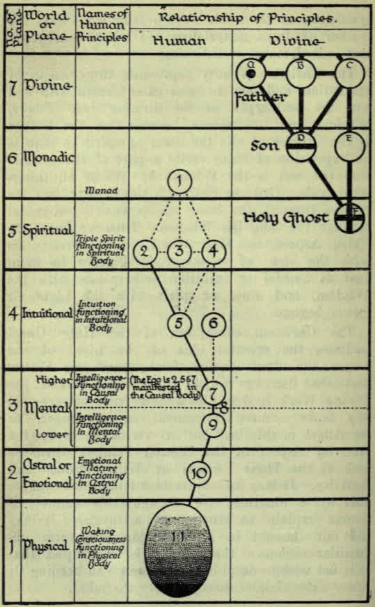

# Скрытая сторона христианских праздников

_Чарльз У. Ледбитер_

_Регионарный епископ Либеральной католической церкви для Австралазии_

_Пресса Св. Албана_

_Лос-Анджелес : Лондон : Сидней_

_1920_

> Источник: https://archive.org/details/hiddensideofchri00leadrich

## Содержание

### Часть I - Праздники

- Введение: Церковный Год
- [Глава I](#chapter-i) — Адвент
- [Глава II](#chapter-ii) — Рождество
- [Глава III](#chapter-iii) - Новый Год
- [Глава IV](#chapter-iv) - Богоявление
- [Глава V](#chapter-v) - Крещение Господа нашего
- [Глава VI](#chapter-vi) — Преображение
- [Глава VII](#chapter-vii) - Великий пост
  - Наше отношение к Великому посту
  - Воскресения великого поста: Празднование среды
  - Страстная неделя
  - Богослужения Страстной недели: Вербное воскресенье, Чистый четверг, Великая пятница, Великая суббота
- [Глава VIII](#chapter-viii) - Пасха
- [Глава IX](#chapter-ix) - Вознесение
- [Глава X](#chapter-x) - День Пентекоста
- [Глава XI](#chapter-xi) - Троицкий воскресенье
- [Глава XII](#chapter-xii) — Тело Христово
- [Глава XIII](#chapter-xiii) - Праздники нашей Дамы: Мать Иисуса, Дева Матерь, Женская сторона Божественности
- [Глава XIV](#chapter-xiv) - Праздник Ангелов: Высшие Ангелы, Низшие Ангелы
- [Глава XV](#chapter-xv) - Праздники Святых: Наше отношение к святым, святые покровители
- [Глава XVI](#chapter-xvi) - Краткие заметки о некоторых святых: Св. Альбан, Св. Георгий, Св. Патрик, Св. Марк
- [Глава XVII](#chapter-xvii) - День всех святых
- [Глава XVIII](#chapter-xviii) - День всех душ

### Часть II - Некоторые дни особого интереса

- [Глава XIX](#chapter-xix) - Вера Отцов Наших
- [Глава XX](#chapter-xx) - Наше Отношение к Жизни
- [Глава XXI](#chapter-xxi) - Самое Важное из Всего
- [Глава XXII](#chapter-xxii) - Различение
- [Глава XXIII](#chapter-xxiii) - Мудрость
- [Глава XXIV](#chapter-xxiv) - Самоотдача
- [Глава XXV](#chapter-xxv) - Упорство
- [Глава XXVI](#chapter-xxvi) - Добрые Дела
- [Глава XXVII](#chapter-xxvii) - Бог как Свет
- [Глава XXVIII](#chapter-xxviii) - Благоразумие

### Часть III - Речи в Период Войны

- [Глава XXIX](#chapter-xxix) — Правда о Войне
- [Глава XXX](#chapter-xxx) — К Годовщине Начала Войны
- [Глава XXXI](#chapter-xxxi) — На Стороне Бога
- [Глава XXXII](#chapter-xxxii) — Будущее

## Предисловие

Эти заметки о церковном годе изначально предназначались для включения в первый том этой серии, Наука о Сакраментах. Однако было обнаружено, что тот том уже становился неправильно большим, и что о церковном году есть гораздо больше, чем можно было бы уместить в одной главе; поэтому предпочло отвести отдельный том для его размышления. Это также позволило добавить в него несколько разнообразных речей по важным вопросам.

Книга в большой мере является воспроизведением серии проповедей, данной для обучения прихожан, которым были новыми идеи в ней содержащиеся. При всем напряжении работы в других направлениях у меня не было времени объединить их в единое изложение; и поскольку не вероятно, что в этой инкарнации у меня будет это время, и поскольку другие общины желают информацию по этим вопросам, кажется лучшим позволить проповедям идти вперед с незначительной коррекцией или добавлением. В книге, безусловно, найдутся случайные повторы и разговорные выражения; но я надеюсь, что она может быть не без пользы для студентов либерального христианства, и вообще для изучения религии.

C.W.L.

## Часть I - Праздники

### ВВЕДЕНИЕ: ЦЕРКОВНЫЙ ГОД

У Бога есть план относительно человека, и этот план - это эволюция. Мы произошли от Него, и мы должны к Нему вернуться. Восточные философы говорят нам, что мы находимся на пути nivritti marga, или пути возврата, и современный поэт выражает ту же идею другими словами: "Весь смысл жизни - это просто возвращение обратно к Богу." Церковь Христова существует только затем, чтобы помочь человечеству в этом процессе, и у ней есть множество изобретательных способов предложить эту помощь. Одним из них является устройство церковного года, которое несколько отличается от года гражданского.

В общем и целом, он делится на две части, первая из которых посвящена драматическому изображению различных этапов пути, которые нам нужно пройти, а вторая - практическому применению изученного. В обеих частях разбросаны различные праздники, каждый из которых призван напомнить нам о каком-то моменте, который полезно нам помнить, и призывать нас к особым усилиям в связи с ним; чтобы облегчить это, на такие события устраиваются дополнительные излияния силы из высшего мира. Как говорится в нашем литургии: "Первая часть церковного года, от Адвента до Пятидесятницы, посвящена воспоминанию о различных сценах из Жизни Христа, своеобразного Драматического Мистерии, которое само по себе представляет собой типичную жизнь каждого христианина, как указал Ориген".

Есть четыре основных этапа на этом пути. Те, кто изучал эти вещи с другой точки зрения, знают, что в восточных религиях эти четыре этапа называются четырьмя великими Инициациями. Они также присутствуют и в христианстве, но термины здесь отличаются. Первая из них символизируется Рождением Христа — первой великой Инициацией, которая является рождением человека в Великом Белом Братстве, которое всегда в евангелиях называется Царством Небесным. Мы не можем понять эти евангелия, мы не можем из них составить согласованный или разумный смысл, если мы считаем Царство Небесное миром после смерти. Если мы понимаем, что Царство Небесное - это великое живое сообщество, мы увидим, почему богатому человеку трудно войти в него; мы увидим, как все обещания, даваемые о нем, буквально точны; в противном случае они вообще не имеют никакого смысла.

В этой первой Инициации также происходит рождение Принципа Христа в человеке, ибо Монаада и эго — дух и душа, чтобы использовать христианские термины — становятся одним на прекрасный момент.

Второй из этих великих этапов символизируется крещением Господа нашего. Мы не должны путать это с крещением, которое вводит каждого ребенка в Церковь Христа. Это то, о чем говорил Иоанн Креститель, когда сказал: "Я истинно крещу вас водою, но Приходящий за мной окрестит вас Святым Духом и огнем." На втором великом обряде есть истечение от Инициирующего к кандидату, которое действительно имеет всю видимость крещения огнем.

Преображение представляет третий из этих великих посвящений, ибо в нем действительно Монада, дух, преображает душу, а душа в свою очередь преображает тело здесь — личность, как мы часто называем это. Все это — замечательно подходящие иллюстрации. Приближаясь к четвертому, мы обнаруживаем то, что многие люди считают истинно ужасным Посвящением, хотя, безусловно, это также одно из величайших прославлений; ибо тогда кандидат испытывает то, что отображено Крестом, хотя если он успешно пройдет испытание, всегда следует победа Воскресения.

Если мы прочитаем историю жизни любого мистика, прошедшего через этот великолепный этап, мы заметим, как близко следуют друг за другом эти события и как истинно христианская история отражает их. Мы увидим, что обычно есть какой-то небольшой земной трофей, как у Христа в Вербное воскресенье, а после этого всегда сочетание врагов, чтобы опозорить кандидата; всегда присутствуют недоразумения и издевательства, брошенные на него, и затем после всего этого приходит великое и славное воскресение из этого страдания в жизнь вечную — вечную по крайней мере в отношении этого мира, ибо человек, сделавший этот шаг, никогда больше не должен рождаться здесь на земле.

Затем следует пятый шаг — последний из всех, который выводит человека из человечества и делает его сверхчеловеком. Это уместно символизировано Вознесением с земли на небеса, и Святой Дух стекает на него и на других в результате его восхождения — все это точно отражено в евангельской истории.

Объем деталей, в которые я не претендую углубляться сейчас, огромен; но будет видно, что символическое толкование по крайней мере последовательно, разумно и обоснованно. Против него нет аргументов, в то время как утверждение, что рассказ является историческим, может быть опровергнуто на каждом шагу; следовательно, те, кто прикладывает свою веру к этой исторической идее, должны закрыть глаза на огромное количество того, что они не могут не знать как истину, в то время как те, кто готов принять более высокое и внутреннее значение, обнаружат, что их вера основана на скале.

При составлении календаря для Либеральной Католической Церкви, мы рискнули немного изменить некоторые из второстепенных праздников, чтобы более ясно выразить это внутреннее значение. На Рождество, как и весь мир, мы отмечаем рождение Христа. В обычном католическом календаре нет особого праздника, посвященного крещению нашего Господа, хотя многие отмечали его вместе со священством. Поэтому мы решили выделить другой день для этого празднования, немного позже священства; и поскольку Преображение (символизирующее третью Инициацию) выходит из своего места, когда его сохраняют 6 августа, мы также перенесли это, и мы проводим его между Крещением (которое представляет собой вторую Инициацию) и Пасхой (которая представляет четвертую). Итак, эти четыре стадии еще раз будут восстановлены в нашем календаре как целое и расположены в правильном порядке.

В Церкви нет традиции отмечать действительную годовщину крещения или Преображения. Обычай отмечать последнее 6 августа был введен относительно недавно; я думаю, впервые мы находим упоминание об этом в 850 году н. э., и тогда это, кажется, отмечалось только местами. И только в 1456 году было обнародовано его распространение на всю Церковь в память о великой победе над турками в этот день. Так как первоначальная дата неизвестна, мы, я думаю, не допустили большого нарушения приличий, расставляя эти празднования в их истинном порядке, чтобы символизм был понятен нашим братьям.

Многие события, описанные как произошедшие в последней жизни Христа, отмечаются в те дни, когда они, по предположениям, и должны были произойти, хотя по этому вопросу в церковной истории существовали значительные разногласия. Большая группа праздников, даты которых определяются датой Пасхи, приходится на разные дни месяца в разные годы; но все они определяются относительно Пасхальной полнолуния, так же как и старый еврейский Пасх.

Другая группа праздников, зависящих от Рождества, имеет фиксированные даты - Благовещение 25 марта, само Рождество, празднование Богоявления через двенадцать дней и представление Христа в храме, обычно называемое днем Сретения. Мало оснований предполагать, что какие-либо из этих дат исторически точны, но они упорядочены так, чтобы соответствовать друг другу.

### Глава I

#### АДВЕНТ

У нас, как и в Римских и Английских церквях, Воскресенье Адвента может быть названо церковным Новым годом. Святая Восточная Церковь (Церковь Греции и России) соблюдает такой же обычай, но она придерживается нереформированного календаря, и поэтому начинает все свои празднования на двенадцать дней позже, чем мы.

Первым великим праздником церковного года является праздник Рождения Христа, который соответствует и учит нас первого из великих Посвящений. Но Церковь в своей мудрости заложила, что перед каждым своим великим праздником должен быть определенный период подготовки, и поэтому перед праздником Рождества у нас наступает время Адвента - который на самом деле имеет двойной аспект, но его первым является подготовка к надлежащему празднованию Рождества.

Неверно считать, что мы лишь следуем общeppинятой фоpме культуpы, говоря, что во время Адвента должны готовиться к празднованию. Рождество – это не только день рождения, не только памятование Рождения Господа нашего; это также время особого духовного подъема. Такие великие праздники, как Пасха и Рождество, которые мы все с таким жаромотмечаем, на самом деле являются моментами, когда с Небес падает благодать, и для того чтобы мы могли принять этот подарок в полной мере, мы используем время подготовки. Мы получим больше, если готовимся должным образом; поэтому во время Адвента мы должны все чаще думать о Пришествии Господа и о Посвящении, которое этот приход символизирует.

Четыре воскресенья Адвента мистики Внутренней Школы Христианства посвящают размышлению о четырех качествах, необходимых для первого Посвящения - Различение, Безжелательность, Добродетель и Любовь. Однако, в современных церковных службах от этого распорядка ничего не осталось, за исключением, быть может, старого обычая заменять фиолетовый цвет на розовый в третье воскресенье. Как объясняется в нашей Литургии (и более подробно в первой книге этой серии, "Наука о Сакраментах"), Церковь использует различные частоты вибрации, которые воспринимаются нашими глазами как цвета, чтобы помочь своим членам усвоить различные уроки, которые необходимо освоить в течение года. В периоды подготовки (Адвент, Великий пост и кануны дней святых) выбирается пурпурный цвет, за счет его актинических, проникающих и очищающих свойств. Приблизительно в середине Адвента и Великого Поста назначается воскресенье, когда предписан розовый цвет; для этого есть разные объяснения. Вследствие некоторых странных недоразумений эти подготовительные периоды стали считаться временем покаяния и горя, и предполагалось, что внедрение розового цвета в воскресенье служит неким уменьшением горя - временной отдых во время аскез. Более верной теорией является то, что, поскольку наша любовь к Богу является единственным реальным мотивом наших попыток очищения, этот драматический смена цвета в середине сезона напоминает нам об обширной и истинной любви, которая должна проникнуть каждое наше усилие, если мы надеемся на его постоянный успех. По крайней мере, это является отголоском радости, которая должна присутствовать весь сезон, потому что не от безысходного сожаления о наших грехах, а от решительного намерения отказаться от них, мы можем подготовить себя к благоприятному использованию этого великого предстоящего праздника.

Католическая Церковь всегда признавала двойственный характер периода Адвента - это подготовка к Следующему Пришествию Христа, а также к празднованию Его рождения в Его последней жизни на земле. Римская и Английская церкви говорят о этом втором Пришествии и умоляют своих людей быть готовыми к нему; однако есть большое количество серьёзных недопониманий об этом. В христианских писаниях это связано с идеей конца мира, и поэтому люди, ожидающие второго Пришествия Христа, обычно считают его также концом всего порядка, который они знают, и поэтому большинство из них боятся его. В проповедях и гимнах, связанных с Пришествием, все еще ощущается привкус страшного предчувствия ужасного спуска с физического небесного свода, сопровождаемого страшными метеорологическими явлениями. Общее отношение к данному вопросу слишком схоже с выраженными в некоторых гимнах Адвента, которые эти люди исполняют:

    Нечестивые, полные виновных страхов,
      Видят его гнев, который доминирует;
    В страданиях они встают, но все их слезы
      И стоны бессильны.

И они говорят о них, как о "глубоко стенавших", "в глубоком унижении", и так далее. Теперь следует вполне чётко понимать, что всё это не только глупо, но и определённо злонамеренно и богохульно; и люди, проповедующие такое ужасное искажение истинного христианского учения, берут на себя очень серьёзную ответственность, ведь, наверное, клеветать на нашего небесного Отца и унижать представления Его детей о Нём - это преступление не малой степени тяжести. Разумеется, у истинных мистиков ничего подобного нет, они всегда знали, что Бог - это Любовь, и никогда не боялись какого бы то ни было проявления Его присутствия, потому что они знают, что, видим они Его или нет, Он всегда с ними, вплоть до конца века.

Всякий страх перед Богом происходит из непонимания. Пришествие Христа действительно связано с окончанием; это не конец мира, но конец эпохи или диспенсации. Греческое слово аион, которое в английском аналогично эону. И точно так же, как Христос две тысячи лет назад заявил, что диспенсация еврейского закона пришла к концу — потому что Он пришёл, чтобы основать новую диспенсацию, эвангельскую — так и пришествие эвангелия приведет к концу, когда Он придет вновь и основает еще одну. Он даст те же великие учения: учение должно быть одно, ибо Истина одна, хотя, возможно, оно будет изложено немного яснее для нас сейчас, потому что мы знаем немного больше. Оно будет провозглашено в новом образе, возможно, с красотой выражения, который будет точно подходить нам в наше время; будет какое-то утверждение, которое привлечет большое количество людей.

Безусловно, оно будет одинаковым, поскольку присутствовало во всех существующих верах. Они сильно отличались друг от друга в своём способе представления его, но все они абсолютно согласны в жизни, которую они просят своих последователей вести. Мы находим значительные различия между внешними учениями христианства, буддизма, индуизма, и ислама; но если мы изучим добрых людей из любой из этих религий и узнаем о их повседневной практике, мы обнаружим, что все они ведут одну и ту же жизнь - как по поводу добродетелей, которыми должен обладать добрый человек, так и в вопросах зол, которые он должен избегать. Все они говорят нам, что человек должен быть благотворителем, правдивым, добрым, честным, содействующим бедным; все они говорят нам, что жестокий человек, врун и бесчестный человек, которые не делают никаких успехов и не получат успех, пока он не изменит свои пути. Будучи практичными людьми, мы должны признать, что важными в любой религии являются не туманные метафизические размышления о вопросах, которые никому точно неизвестны, поскольку они не могут влиять на наше поведение; важными вещами являются те принципы, которые влияют на нашу повседневную жизнь, которые делают нас такими или иными в наших отношениях с другими людьми. Эти принципы одинаковы во всех существующих религиях; они будут одинаковыми и в новом учении, независимо от того, каким оно будет.

Возможно, мы можем зайти немного дальше в предсказании того, что Он будет преподавать, поскольку у нас есть и другие источники информации. Один из них - изучение предыдущих учений, которые Он давал. Учёные помнят, что прежде чем этот Учитель мира принял должность, её занимал Господь Гаутама, которого люди называют Буддой. Его особое звание было Господь Мудрости. Он дал много учений, но все они были сосредоточены на идее, что знание означает спасение - что злые дела в мире исходят из неведения, и через невежество люди влекутся к желанию, а через него - к всякого рода грехам и страданиям; но если невежество человека рассеять, и он получит совершенное знание, тогда он придет к совершенной жизни и к совершенному отношению ко всем людям и ко всем обстоятельствам, и таким образом избавится от круговорота рождения и смерти.

Наш нынешний Учитель Мира имеет имя Майтрейя, что означает добродушие или сострадание, и так же как Господь Будда был назван Господом Мудрости, так и Господь Майтрея называется Господом Любви или Сострадания. Великая центральная истина, на которую Он будет акцентировать внимание, заключается в том, что зло в мире проистекает из нехватки любви и братства - что если человек научится любить и принять братскую позицию, вся злость уйдет, и настанет золотой век. Не сразу, конечно, мы не можем на это надеяться; но по крайней мере, люди начнут видеть сами за себя и понимать, что по этой линии можно добиться гораздо большего, чем по другой. Мы можем увидеть, как сильно это учение проявлялось в Его предыдущих жизнях.

Дважды Он явился нам — как Кришна в индийских равнинах и как Христос среди холмов Палестины. В   воплощении Кришны ключевым было всегда любовь; маленький Кришна окружал себя людьми, которые испытывали к нему самую глубокую, самую сильную привязанность. Даже сейчас основанная им религия продолжает существовать на основе самой трогательной преданности, самого великолепного влечения к маленькому Кришне. На юге Индии многие миллионы его последователей продолжают поклоняться ему. Суть поклонения заключается в том, чтобы испытывать к нему глубокую любовь — преданность, которую я считаю более трогательной, более сильной даже, чем ту, что видел в монастырских общинах христианства.

Вновь, при его рождении в Палестине, любовь была центральной особенностью его учения. Он сказал: "Новую заповедь даю вам, любите друг друга, как я вас возлюбил". Он жаждал, чтобы ученики были едины в Нём, точно так же, как Он был одно с Отцом. Его ближайший ученик, святой Иоанн, наиболее настойчиво поддерживал эту же идею: "Кто не любит, тот не знает Бога, ибо Бог есть любовь". Святой Иоанн прожил большую жизнь (свыше ста лет), и в последние дни его сверхдолгой жизни, когда, слабея, он уже не мог проводить длительные проповеди, и его несли на сидении среди молодежи, его последнее слово было всегда: "Маленькие дети, любите друг друга". Так что у нас есть определенные свидетельства из двух предыдущих воплощений великого Мирового Учителя о том, что центральной идеей его пророчеств будет и сейчас любовь.

В небольшой книге, названной "У ног Учителя", мы находим некоторое учение, данное молодому индийскому ученику (которого я хорошо знаю) одним из Мастеров Мудрости, который сам является учеником Учителя Мира. Особый объект этой книги - представить в наиболее простой форме качества, необходимые для Инициации. В этих качествах нет тайны, поскольку они указаны в книгах различных религий и известны всем, кто изучает такие предметы. Однако в различных подходах к их изложению есть место для значительного разнообразия, как в методе преподавания, так и в переводе некоторых используемых технических терминов. В этой маленькой книге, о которой я говорил, мы получаем представление этих качеств от того, кто так близко следует за Учителем Мира, что мы можем быть уверены, что это практически его представление. Разумеется, в этой книге не содержится все, что он будет учить, но мы можем точно сказать, что нет ничего в ней, что бы ему не нравилось. Читая её, мы не можем не заметить, что она глубоко проникнута духом любви. Последним качеством, раскрытым в этой книге, является горячее желание объединения с Верховным, что определяется как Любовь, на основании идеи, что Верховный, с Кем человек хочет стать единым, сам является Любовью. Следовательно, тот, кто хочет объединиться с Ним, должен сначала усвоить эту любовь в себе. Я настоятельно рекомендую эту маленькую книгу на заметку каждому члену нашей Церкви; она будет полезной во многих отношениях, показывая нам, насколько далеки наши нынешние методы жизни от высокого идеала любви.

Читая христианскую Библию, мы должны, я думаю, помнить, что ее язык в значительной степени символический. Я не хочу сказать, что все авторы точно понимали, что они имели в виду. Я не думаю, что они понимали. Думаю, что они также были во многих случаях обмануты, потому что они приписывали Христу слова, которые представляли его как ожидающего скорого возвращения. Опять и опять ему приписываются слова: "Многие из присутствующих здесь не умрут, прежде чем я вернусь", в то время как мы знаем, что с тех пор прошло две тысячи лет.

Эта идея о конце света - это ошибка. Может быть сказано: "Весь христианский мир понимает это буквально; как мы можем знать, что это ошибка?" В нашей Церкви Либеральных Католиков мы поклоняемся и следуем за Живым Христом. Не Христом двух тысяч лет назад, но Христом, который живет и вдохновляет Свою Церковь сейчас; и в наши дни у Него есть пророки, которые знают и объявляют Его Волю, и те, кто знает, сказали нам, что Он вернется, как и говорил, и что это возвращение будет скоро, если считать земное время. Это действительно начнет новую эру для тех, кто готов её принять. Это будет большое изменение, но это будет мысленное и моральное изменение. Он говорил, в тот предыдущий свой приход, о знаках, которые должны предвещать Его второе пришествие. Если мы прочитаем то, что написано, увидим, что Великая война была одним из этих знаков; и мы также видим, что многое станет возможным в плане реконструкции после неё, что до этого не было осуществимо. Пусть четко в наших умах то, что Он приходит не чтобы уничтожить мир, но чтобы научить нас, как и когда Он приходил ранее. Он приходит править, но Он приходит править в наших сердцах, ибо Его царство не от мира сего.

Как же мы должны готовить себя к Его приходу? Прежде всего, негативностью и служением другим в Его имя. Добродетели посвящения, упорства и мягкости нуждаются в усилении у каждого из нас, как это ясно указано Уставом Звезды на Востоке, Обществом, существующим для подготовки пути к Его второму пришествию, чтобы помочь нам приспособиться для Его приема, и по мере возможности помочь сделать других также готовыми.

В этот раз, как и предсказывалось, многие не будут слушать, многие будут поглощены делами и удовольствиями. Он цитирует легенду о Ное, что люди занимались своим делом и играми, не обращая внимания на пророчества, и внезапно пришел потоп и уничтожил всех. Это легенда о затонувшем Атлантиде - исторический факт, хотя он не произошел в точности так, как описано в традициях. Считается, что Христос сказал, что так же будет, когда придет Сын Человеческий во второй раз. Люди будут полностью заняты своими делами и удовольствиями, и не будут думать о Нем вовсе, и поэтому они его не узнают; они не смогут идентифицировать его или узнать его. Мы, по крайней мере, должны быть мудрее в этом, мы, которые пытаемся изучить внутреннее значение всех этих вещей; мы должны сделать себя готовыми принять его; и те, кто подготовится к этому, могут быть уверены, что настанет удивительное и славное время.

Мы, возможно, даже не осознаем, насколько великим привилегией является родиться в это время, иметь возможность принять участие (все мы приняли участие тем или иным образом, я надеюсь и верю) в великой войне права против неправды, которая недавно закончилась; и больше того, мы, живущие теперь, можем надеяться увидеть второй приход Христа среди нас. И подумайте, что это должно значить для нас, если мы узнаем его.

    Ибо Тот, в Кого мы теперь верим,
      Тогда будет виден и узнан,
    И те, кто знает и служит Ему,
      Будут Его называть своим.

Они узнают истину, и истина сделает их свободными, ибо в Его служении есть совершенная свобода. И он сказал нам, что кто служит одному из Его наименьших братьев, служит Ему самому. Это должна быть наша подготовка.

Для нас, кто знает о близости его прихода, Адвент - это время, не страха, а радостного воспоминания и еще более радостного ожидания. Наше отношение хорошо выражено в древнем гимне:

    Радуйся, радуйся, Еммануил!
    На помощь придет тебе, o Израиль.

Во время Адвента мы должны думать о необходимости различительной способности при подготовке к собственной Инициации, а также к Пришествию Господа. Будет полезно, если мы обдумаем, как это важное качество можно проявить в наших усилиях по распространению знания о близком Пришествии - как в нашем подготовительном деле мы можем проявить мудрость змея и безобидность голубя. "С такими мыслями в душе", как говорит нам гимн, "мы вполне можем радоваться и петь", ведь "мы ждем с надеждой, которая не обманет". Братья, Пришествие Господа приближается; да, оно уже у дверей. Уже рассветает заря; скоро будет восход солнца.

    Приход! В открывающемся Востоке
      Медленно нарастает яркость;
    Придет! О, мой славный Жрец,
      Не слышим ли мы твоих золотых колоколов?

### Глава II

#### РОЖДЕСТВО

Рождество является одним из величайших праздников Церкви; возможно, его превзойти может только Пасха, потому что в этот день мы празднуем рождение Бога-Солнца, как в тот день мы празднуем Его победу над силами тьмы. Христианство, как и все остальные религии, было основано в северном полушарии, поэтому все его праздники выпадают на несоответствующее время в отношении южного полушария. Возрождение Бога-Солнца после зимнего затмения отмечали в первый день, который определенно был больше как утром, так и вечером, сразу после зимнего солнцестояния, точки, в которой Земля поворачивается на своем пути вокруг Солнца и начинает удаляться от него, а не приближаться к нему. Аналогичным образом, победа Бога-Солнца над силами тьмы отмечалась, как только прошло равноденствие — как только день стал определенно дольше ночи. Эти праздники Бога-Солнца отмечались за тысячи лет до рождения Иисуса, поэтому было вполне естественным, что ранняя Церковь приняла их даты для своих торжеств.

Точная дата рождения Иисуса неизвестна, но из различных признаков можно предположить, что это было весной. 25-е декабря было, однако, выбрано достаточно рано в церковной истории, поскольку оно совпадало с великим Солнцестоянием, и было весьма удобно воспользоваться уже существующим общественным праздником. Те, кто не признают символическое значение жизни Христа, естественно считают все эти церковные празднования лишь историческими; но мы, кто старается глубже копнуть в истины природы, тем не менее найдем интересным поиск другого и более глубокого значения.

На что должно напоминать великолепное празднование Рождества Христова свободному католику? Мне кажется, что таких моментов не меньше семи, и я постараюсь объяснить их по очереди.

(1) Мы, конечно, не должны игнорировать исторический аспект этого дня, даже если знаем, что это не реальная годовщина. Точно таким же образом согласовано, что в определенный удобный день каждый год будет отмечаться день рождения короля Георга, хотя это может не быть годовщиной его прихода в этот мир в этой инкарнации; но было бы и глупо, и неправильно отказываться от его отмечания по этому поводу. Несомненно, следовательно, в Рождество мы обязаны вспомнить о спуске великого ученика Иисуса, поблагодарить его за это и за все то, что затем случилось в мире вследствие этого. Это был он, кто предоставил свое тело Великому Учителю, чтобы тот мог прийти, основать свою религию и проповедовать свое Евангелие на Земле.

Это может показаться новой и странной идеей для некоторых, но она вполне общепринята среди тех, кто понимает факты реинкарнации — тех, кто знает о мощи, силе и величии Великого, Кого мы называем Учителем Мира. Мы знаем, что для Него это было бы не экономно, это было бы не лучшим использованием Его огромного могущества, если бы Он занимал человеческое тело на протяжении всего периода его рождения и роста, ранних стадий его жизни. Поэтому один из Его учеников берет на себя ведение всего этого для Него, и Он вступает в полностью выросшее и полностью подготовленное тело, когда готов к этому, и использует его для той цели, ради которой только он его принял. Ведь Он Сам обычно живет на гораздо высшем уровне и проводит там такую великолепную работу, такую, которая выходит за пределы нашего понимания, что нам мало толку пытаться понять это, кроме самого общего контура.

В этом конкретном случае преданный ученик Господа Христа родился в 105 году до н.э. среди потомков царя Давида, как сын Иосифа и Марии, и ему дали имя Иисус. Он оставался во главе этого тела до тех пор, пока ему не исполнилось около тридцати лет, а затем передал его Христу, "который населял его в течение трех лет своего земного служения. Ученик Иисус перевоплотился как Аполлоний из Тианы примерно в тот момент, который обычно называют началом христианской эры; и через тысячу лет он явился великим учителем Камануджачарьей, который оставил глубокий след в индийской мысли. В конце концов он получил награду за свою самоотверженность и достиг Инициации Асекха, став одним из Мастеров Мудрости. И мы теперь чтим Его, поэтому, уже не как ученика, а как Мастера Иисуса.

Поэтому подобает нам петь наши рождественские гимны и караваи, и сохранять прекрасные традиции, которые сложились вокруг рождения Мастера Иисуса. Мы не обязательно тем самым утверждаем нашу веру в их историческую точность; ведь прекрасные легенды о других рождениях Мирового Учителя также есть, и можно предположить, что они были дословно верны во все эти различные случаи. Но мы определенно не должны сомневаться в том, что каждое такое рождение - это великое событие, которое сопровождаются необычайные явления на высших планах, которые, возможно, видели по крайней мере некоторые из тех, кто в то время жил в физических телах.

(2) В этот момент мы припоминаем спуск Второго Лица Благословенной Троицы в материю; и, как и в меньшем цикле, мы обязаны чувствовать глубокую благодарность нашему великому Мировому Учителю за его спуск в человеческое тело, чтобы помочь нам и направить нас. Также мы должны чувствовать глубокую признательность Великому Солнечному Богу за то добровольное ограничение Его мощи и славы, которое привело нас к существованию.

Многие в мире могут сказать, что не испытывают благодарности за то, что были приведены в существование - что жизнь для них - это больше печаль, чем радость, и если бы их можно было проконсультировать, они предпочли бы не существовать. Но те, кто так говорит, думают только о совсем небольшой части великого цикла жизни, который они видят и знают; они не знают ничего о славе, что предстоит нам; они не осознают величественности плана, частью которого они являются. Те из нас, кто счастлив знать хотя бы крупицу этого великолепного замысла, наполнены ярким, хотя и скромным восхищением им; Ведь мы видим за пределами нашего настоящего несовершенства чудо и красоту будущего. Мы осознаем что-то из блестящей схемы, в которой проявляется Его удивительная любовь, и когда мы даже мельком уловим это, мы не можем не испытывать сильных эмоций и быть полны благодарности за то, что нам разрешено участвовать, пусть и незначительным участием, в славе и совершенстве, которое предстоит. Пусть мы выразим эту благодарность, пытаясь понять Его проявление, насколько это возможно, и интеллектуально сотрудничать с ним. 3. И снова, как мы уже говорили, Рождественский день напоминает нам о этом первом из великих посвящений, символом которого он является в тщательно составленном учебном плане церковного года. Мы должны подумать, что это первое посвящение означает для нас - как оно становится вторым рождением - рождением в Великое Белое Братство. Во время препаративного сезона Адвента мы размышляли о квалификациях, необходимых для этого; теперь мы должны размышлять о самом деле и его последствиях. Мы должны осознать, как тот, кто сделал этот шаг, навсегда становится защищенным, и потому может по праву смотреть на великого Учителя Мира как на своего Спасителя - хотя и не от средневекового мифа о вечных мучениях. Такого не существует в природе, и никогда не было; это - всего лишь ужасный призрак, который люди позволили вырасти и испугать их. Нет вечного проклятия, от которого нужно спасаться; миру нужен спаситель от такой ужасной идеи, но не от самого факта, потому что это не факт вовсе. Такое заблуждение - часть заблуждения и невежества, которые вызывают все беды и все страдания, которые мы видим вокруг нас. Воистину, Учитель Мира - Спаситель, не только для посвященного, но и для всех нас; ведь это Его наставления спасают нас от наших собственных ошибок и невежества, и, следовательно, от многого горя и страдания, которые являются неизбежным следствием этого невежества.

Мы должны не только ждать того времени, когда это чудесное посвящение станет нашим, но также должны делать из этого повод для благодарного торжества, что для некоторых оно уже пришло. Мы благодарим Бога за Его святых - за то, что они подняли человечество, не только ободрением примера, который они представili перед нами, но и фактическим подъемом всего общества, который каждый из них дал своей собственной достижением. Этот подъем - реальность, которую нельзя пренебрегать или забывать; человечество - братство, мало кто из людей признает этот факт, и единство настолько реально, что каждый раз, когда кто-то одерживает успех, все остальные определенно помогают и поднимаются благодаря этому успеху. Таким образом, это должен быть еще один аспект нашего рождественского радости.

Я знаю, что для многих добрых и серьезных христиан это шок - услышать, что евангельская история - это не история, а поистине миф. Когда кто-то говорит это, люди сразу думают: "Вы отбираете у нас нашего Иисуса, нашего Спасителя. Вы отрицаете Его историческое существование." Мы вовсе не отрицаем этого, но мы утверждаем, что евангельская история, так как она сейчас написана, не является и, кроме того, никогда не предназначалась для того, чтобы быть дословным описанием жизни того великого Учителя Мира, Христа. Мы знаем о Его истинной жизни совсем немного. Кажется, что некоторые части ее были вплетены в этот миф; кажется, что по крайней мере некоторые изречения, которые в евангелиях приписываются Господу Христу, действительно были произнесены им. Однако вполне определено, что некоторые другие - вовсе нет; и это также ясно любому, кто разбирается в этой теме и читал что-то об относительной религии, что весь рассказ преднамеренно составлен в аллегорической форме - что он представляет не жизненную историю одного человека, а духовную историю каждого настоящего последователя Христа. Это явно не история, а драма - коллекция эпизодов, организованная как для представления на сцене.

Эта идея, кажущаяся такой новой для многих, на самом деле совсем не нова. Она была вполне явна для величайших отцов Церкви. Она кажется странной только для нас, и она кажется странной, потому что мы унаследовали многое из тьмы средневековья. В настоящее время мы уже не можем слепо верить в то, что наш разум показывает нам как невозможное. Нам нужно понять, что означает эта прекрасная история, и следовать за этим вполне легко. Ориген, величайший из ранних христианских писателей, наиболее ясно объясняет эту вещь. Он говорит, что в его время (и, безусловно, сейчас) было два вида христиан. Были те, кого он называл верующими в "соматический" христианство, что означает телесное или физическое христианство. Он четко уточняет, что под этим выражением он понимает тех, кто верит в историю как в историю, и он говорит об их учении: "Что может быть лучше для обучения масс?" Но он делает совершенно очевидным, что духовный христианин держится совершенно более высокой формы христианства, в котором он понимает внутреннее значение всех этих аллегорий. В каждой из своих притч Господь изображен как рассказчик, которая имеет в себе два внутреннего значения. Во-первых, у нас был чисто физический сказ для детей, описывающий, например, как сеятель вышел сеять; во-вторых, было интеллектуальное объяснение, при котором семя есть слово Божье, сеятель - проповедник, а разные виды почвы - разные виды сердец, на которые оно падает. И, наконец, всегда есть внутреннее и еще более духовное значение, которое не выдается, которое в этом конкретном случае есть изливание божественной жизни на многие планы и в многие миры.

Ориген утверждает, что, так же как слова Христа имеют внутреннюю интерпретацию, так и весь рассказ о Христе имеет внутреннюю интерпретацию, которую можно увидеть только если мы изучим его сходство с другими представлениями той же великой аллегории. Он настаивает на том, что все это происходит не в мире теней, но в вечных советах Всевышнего. Он говорит, что пока мы понимаем общие истины, которые раскрывается этой историей, сама история не имеет значения. Ее значение ясно, она описывает путь, который лежит перед каждым христианским человеком. Люди, углубленно изучающие эти вопросы, иногда бывают смущены тем, насколько близки сходства, существующие между христианским преданием и преданиями о других Спасителях, которые были далеко до него — языческих Христах, как Робертсон называет их в своей книге по этому вопросу. Интересно, что все детали жизни Христа можно параллелить с анекдотами о других Учителях, которые, несомненно, были гораздо старше во времени, чем Он, так что мы должны либо принять идею о массовом плагиате со стороны христианских писателей от этих более ранних авторов, либо мы должны предположить, что все они пытаются передать ту же великую истину, но каждый делает это по-своему. Такое объяснение подтверждается даже в существующих писаниях, так как сам Павел говорят о том, как много раз и различными способами были даны откровения. Он пишет евреям: "Бог, который в разные времена и разными способами говорил в прошлые времена нашим отцам через пророков" (подразумевая не только нескольких местных еврейских пророков, но и всех больших пророков - великих учителей мира) "в эти последние дни говорил нам через Своего Сына".

Мы стремимся, чтобы наши люди взглянули на религию более разумно, чем делают это многие из наших современных христиан. К сожалению, они одержимы идеей, что христианство является единственной религией, а все остальные - лишь сводом языческих суеверий. Это наиболее неграмотный и невежественный подход, который показывает, что они ничего не знают о этих других религиях. Это не должно так быть. Религиозные люди должны проявлять интерес ко все представлениям религии. Случается (а это не просто случается, поскольку это относится к нашей судьбе и нашим заслугам), что мы родились в этой расе, в стране, где признанной религией является христианство. Это не просто случайность. Мы родились там, где заслужили это, потому что лучшее место для нас – это находиться в этих конкретных условиях, но и другие люди, во всех отношениях такие же хорошие, как и мы, и такие же продвинутые, рождаются в совершенно другой среде, и мы должны попытаться понять, что для них их религия подобна нашей для нас. Мы, вероятно, не можем представить, что могли бы родиться в любой другой религии, точно так же как мужчина чувствует, что никогда не мог бы родиться женщиной, или женщина мужчиной. Но это, конечно, лишь иллюзия; душа не имеет ни пола, ни расы, и мы принимаем эти различные рождения в зависимости от того, что лучше для нашего развития.

Все религии похожи в том, что они являются утверждениями одной и той же великой истины, и каждая из этих религий имеет особую вариацию или грань этой истины, которую она нам представляет. Существует религия индуизма, которую на данный момент исповедуют триста миллионов человек и которая соблюдается их предками (так как для него нужно быть рожденным в этой религии, чтобы к ней принадлежать) в течение долгих периодов высокой цивилизации — цивилизации, которая уже достигла своего зенита, когда наши предки, древние бритты, бегали голыми по лесам и красились в синий цвет. Главной особенностью их религии является идея обязанности - дхармы, как они ее называют. Их единственное средство против всех недугов: "Пусть человек выполняет свой долг; каждый человек рождён на определенной позиции с определенной обязанностью, пусть он её выполняет", и они очень большую роль уделяют всеимущественности Бога. В Древнем Египте другая великая цивилизация проходила свой путь в то же время. Главный момент их религии был то, что мы сейчас называем наукой — то есть познанием природы путем досконального знания о ней; и египтяне заложили основу многого в нашей современной науке. Само название, которым они называли свою страну, Хем, подарило название нашей науке химии.

(3) В древней Персии существовала еще одна великая религия, зороастризм. Ее иногда называли солнцепоклонничеством, но не следует вводиться в заблуждение названиями такого рода, поскольку никто никогда не поклонялся солнцу как таковому, а лишь солнцу как проявлению великой силы за ним. Главная идея зороастризма - это чистота. Они прежде всего хотели подчеркнуть чистоту в мыслях, словах и действиях. Далее по течению времени была религия Греции, где главным пунктом была красота. Стремление греков заключалось в том, чтобы внушить людям ценность красоты в их жизни, красоты их окружения, всего того, что они имели; красоту характера, а также формы и цвета. Затем пришла Римская империя со своей великой религией, обосновывающей идею закона и дисциплины, всегда настаивая на долге перед обществом - это очень важная идея. Затем было учение Будды; также великую религию Он основывал на законе, но не в привычном нам смысле. Когда Он говорит о законе, Он имеет в виду не законы, созданные людьми, а порядок природы, и говорит, что все ошибки, которые допускают люди, происходят из-за их незнания. Если они будут изучать божественный план и жить в соответствии с ним, всё будет прекрасно.

Затем приходит наша религия - христианство; её главная идея - самопожертвование - мысль о том, что величайшим из нас должен быть тот, кто служит наилучшим образом. Вы знаете, что высшее звание епископа - Servus servorum Dei, "Слуга слуг Божьих". В этом и заключается главная мысль, которую христианство стремится подчеркнуть. Все эти религии пришли в разное время, каждая, когда ее особенное качество было наиболее необходимо для мира. Несомненно, каждый может видеть, что это гораздо более величественное представление, чем ортодоксальная теория, что все эти другие религии - это слабые или злые суеверия, и что спастись могут только те, кто случайно встречается с христианской верой. Эта последняя кажется странной и смешной идеей, но она вполне соответствует самодовольству, которое заставляет людей думать, что наша ничтожная планета является центром вселенной; что этот конкретный клочок грязи является осью творения, а все эти огромные звезды и солнца обращаются вокруг него; что сам Бог спустился с небес, чтобы жить и умереть на ней, чтобы ее сравнительно незначительное население могло быть спасено, а все остальные населения тех гораздо более великолепных миров оставлены заботиться о себе.

Никого не должно вовсе беспокоить обнаружение одних и тех же истин, преподаваемых в других религиях. Это то, что мы должны ожидать, как только мы избавимся от этой удивительной исключительной идеи, что мы - единственные люди, кто когда-либо слышал правду, - что из всех бесчисленных миллионов людей, которые когда-либо жили на земле, только несколько поколений с времени Иисуса - это единственные люди, которым Бог посчитал нужным вообще открыть Себя. Если мы отложим этот поразительный неразумный вид, мы осознаем, что было много представлений истины, которые во многом схожи между собой, хотя каждое из них было подано способом, наиболее подходящим для людей в то время. Поэтому вместо того, чтобы быть обеспокоенным из-за этих сходств, давайте приветствовать их; давайте сравнивать все разные рассказы, чтобы изучить из них больше правды, которая стоит за всеми ними.

Нам никогда не стоит бояться, что мы потеряем что-то, понимая внутренний смысл евангельской истории; напротив, мы многое приобретем. В этой Либеральной Католической Церкви мы не накладываем на людей обязательства верить в что-либо конкретное. Мы предлагаем им для изучения Символ веры и говорим им, что они могут толковать его буквально, если хотят. Пусть это будет их дело. Или они могут принять более высокую символическую интерпретацию, которую мы им предлагаем, если они предпочтут ее. Вне зависимости от того, что они выберут для веры, знание внутреннего смысла не причинит им вреда, позволив им иметь его перед глазами, чтобы, если они услышат, что историческая теория опровергнута доводами, они могли понять, что есть другой, более духовный толк, к которому нельзя возразить. При полном и ясном понимании всего, что они означают, мы будем праздновать наши праздники лучше, а не хуже. Если кто-то захочет придерживаться физической записи, пусть помнит, что за этой земной историей всегда стоит небесный смысл. Мы можем думать о нем как о существующем ради небесного смысла, если хотим, что я лично верю, как это относится к нему. Или мы можем принять это как факт, предполагая, что этот внутренний и прекрасный объяснительный материал был придуман, чтобы подходить к нему. Это не имеет значения. Каждому человеку предоставляется решать, какое исповедание он будет считать верным в отношении всего этого, до тех пор пока он понимает высокое, духовное, величественное значение, и до тех пор пока он старается жить в соответствии со всем этим.

(4) На протяжении Времени Адвента Церковь ожидает Следующего Пришествия нашего Господа; на Рождество это ожидание достигает своего пика, и ее празднование наполнено благодарностью не только за Его последнее Пришествие, но и за благодеяния, которые ещё предстоит получить. Мы не можем не думать о том большем Рождестве, когда Он снова появится среди нас в физическом теле, видимым для всех. Ибо Он Сам, тот самый Великий, который две тысячи лет назад воплотился в теле Иисуса, готов снова прийти, и благословить мир своим учением и помощью, как Он благословил его раньше. Голос, который говорил, как не говорил никто другой, снова зазвучит в ушах людей, живущих сейчас, и это произойдет не через большой промежуток времени. Мы, кто верит в это, естественно стремятся сделать все возможное, чтобы подготовить себя и других к Его Пришествию, и пытаемся распространить эту весть во внешнем мире.

Нам не стоит критиковать, или даже удивляться, условиям, при которых Он пришел на Землю в прошлый раз; но мы всё же не можем не отметить, что тогда мало что было сделано (возможно, мало что могло быть сделано) для подготовки во внешнем мире. Похоже, было общее ожидание прихода некого Великого, как это происходит сейчас; но тогда, насколько мы знаем, был только один Иоанн Креститель. Сейчас условия в мире настолько отличаются, что подготовка может быть полезной в более широком масштабе, и каждый, кто, рассмотрев доказательства, видит причины ожидать скорого Пришествия Господа, должен сделать все возможное для подготовки Его пути и выпрямления Его стезь.

Идея второго Пришествия Христа приобретает иной аспект, когда мы осознаем, что мир постоянно эволюционирует, и что Христос является могущественным чиновником, контролирующим религиозную мысль мира, и либо приходит сам, либо посылает одного из своих учеников в качестве учителя, когда он считает, что такой визит поможет его эволюции. Я понимаю, как странной может показаться эта идея многим людям, которые выросли в вере, что существует только одна религия в мире — что есть несколько языческих суеверий где-то в дальних уголках земли, но наша единственная обязанность по отношению к ним — это попытаться обратить бедных язычников от ошибок их путей и дать им истину, которая была открыта только нам. Я предполагаю, что некоторые люди даже не подозревают, что было бы довольно странно, если бы мы, из всех людей всех времен, одни имели монополию на истину. Существовали могущественные мудрецы, великие святые, великолепные мыслители, которые не имели этой истины, данной исключительно небольшой группе из нас. Они, видимо, не имели этих преимуществ, но без них они, похоже, справлялись достойно. Несомненно, более разумно верить, что в мире есть множество великих религий, и что все они являются равноправными путями, ведущими к большой горе истины.

Я имею в виду, что все великие религии исходят от одного и того же источника; что на этого Мирового Учителя и Его отделение лежит ответственность за все они. Я не говорю, что Он ответственен за причуды отдельного верующего. Люди искажали и извращали Его учение; это правда для каждой религии. Если посмотрим на сами религии так, как они были изначально основаны, мы увидим, что все они являются выражением одной и той же вечной истины, если только потрудимся изучить сравнительное религиоведение. К сожалению, мы наследуем невежество эпохи, названной средневековыми временами в Европе — времени, когда кажется, что мало кто что-то знал стоящее знания; и по-прежнему многие люди не пытаются выбраться из этой темноты. Мы понимаем, что применять так называемую науку Средневековья было бы смешно. Мы сейчас знаем гораздо больше; мы знаем, что жить согласно гигиене Средневековья подвергло бы нас ужасным эпидемиям; но большинство людей не осознают, что религия Средневековья была в равной степени дефектной в своем толковании. Наши средневековые предки не понимали христианство; они воспринимали его в самом узком и упрямом смысле, тогда как это может быть трактовано гораздо пригоднее, шире и более толерантное во всех отношениях. И именно такую трактовку мы стремимся привнести сегодня.

В одном из индийских Священных писаний, МировойУчитель представлен как говорящий, что когда мир погружается в большую печаль и бедствие, когда кажется, что неверие и зло торжествуют, тогда Он приходит, чтобы представить вечную истину в новом виде, который в какой-то мере заменит Его предыдущие утверждения, которые были искажены. Это может показаться странным некоторым, но давайте примем это на момент и подумаем о том – что все эти разные представления отличаются, потому что они предложены разным людям в разные эпохи мира, на разных этапах прогресса человеческой мысли. Постигнем эту идею, и мы увидим, что ни одна из них не может ожидаться вечной — что, наоборот, каждая из них со временем становится более или менее искаженной, более или менее искореженной; и потому, что она искажена, не соответствует нуждам мира. Мир продвигается, и время от времени необходимо новое представление. То, что было уместным для людей две тысячи лет назад, уже не может быть полностью подходящим для нас в наши дни. Сейчас мы знаем гораздо больше по многим темам, чем было известно тогда, и любое утверждение истины, которое было подходящим для людей тогда, потребует значительной пересмотра и дополнения, прежде чем оно сможет быть приспособленно для нас. Насколько бы это не казалось безумием, представление истины, какое бы было абсолютно подходящим для нас сейчас, было бы абсурдно, было бы совершенно неуместно, тогда. Возможно, сейчас считается, что переформулирование тех же великих истин было бы благотворным и полезным.

Мы можем заметить, если присмотримся, что народ в массе своей перестал посещать наши церкви. Мы слышим, что в средневековье каждый принимал участие в духовной жизни того времени, но сейчас, уж конечно, такого не происходит. Не десятая часть населения любой так называемой христианской страны участвует в религиозных обрядах; предположительно, это относится к меньшему количеству людей. Это означает (и бессмысленно попытаться избежать этого вывода), что действующая религия потеряла свое воздействие на большинство населения. Когда дело доходит до этого, одним из способов решения проблемы может стать новый взгляд на вещи; возможно, стоит говорить о новой религии. Это не самое подходящее выражение, поскольку оно подразумевает значительно больше, чем просто новое осмысление тех же истин.

Истины религии - это вечные истины; они могут быть искажены; они могут быть искривлены - и их непременно исказили; но фундаментальная основа всех религий представляет собой вечную истину, которую нельзя изменить, хотя ее можно более полно осветить; ее можно представить по-новому, что может привлечь современный дух. Но великие факты остаются неизменными. Я не подразумеваю, что мы должны верить в какое-либо особое имя или в какую-либо особую церемонию, но в реальные основные факты, что для прогресса необходимо быть добрым человеком, что он должен жить высоким и чистым и благородным жизнью, что он должен практиковать те добродетели, которые каждая религия в мире без исключения рекомендует ему - милосердие, благородство, самоконтроль, умеренность, терпимость и любовь.

Я уже упоминал о странной связи учения Христа с ненаучными идеями о конце света. Любопытно видеть, как готовы неграмотные люди создавать для себя чертовы машины. Несколько месяцев назад в газетах было объявление о том, что конец света можно ожидать в определенный день, потому что планеты находятся в определенном положении. Это просто поразительно, что здравомыслящие люди могут быть убеждены в такой ерунде. Планеты были в аналогичном положении много тысяч раз, и это не было концом нашего мира или любого другого. Люди, кажется, не понимают, насколько незначителен общий вес этих планет по сравнению с весом солнца; они могли бы с таким же успехом ожидать, что телегу может опрокинуть муха, садящаяся на обод колеса. Народное невежество - вещь очень странная. Мы превращаем жизни наших детей в тягость тем, что ошибочно называется образованием, и все же это - практический результат всего этого.

Люди иногда говорят: "Второе пришествие Христа уже известно, и люди ожидают его уже долгое время; почему мы должны особенно готовиться к нему сейчас?" Есть много причин для этого - некоторые из них внешние, а некоторые гораздо более личные и интимные. В мире развивается новая раса. Мы должны что-то знать об этом здесь, в Австралазии, потому что это одна из стран, в которых проявляется эта новая раса. Если мы посмотрим вокруг, увидим, что многие люди все еще являются исключительно англичанами, шотландцами или ирландцами, принадлежащими к старым расам; но мы также увидим многих, особенно среди детей и молодежи, которые не принадлежат к ни одной из этих рас; мы увидим новую расу, которая не английская, не шотландская, не ирландская, а австралийская.

В Америке в пропорциональном отношении ещё больше людей, которые не принадлежат ни к одной из рас, составляющих эту великую нацию, но являются явно людьми с новыми качествами и узнаваемо новой внешностью. Это интеллектуальная раса; это волевая раса; изучение её приносит невероятное удовольствие. Исторически всегда, когда возникала новая раса, появлялась новая религия, соответствующая ей. Вероятно, для этой расы появится новая религия, и если она должна принести пользу, она должна возникнуть довольно скоро.

Мы - великая цивилизация - по крайней мере, сами так считаем - и все же в мире огромное количество страданий; мы очень нуждаемся в каких-то изменениях. Везде неспокойно; кажется, что система, на которую мы рассчитывали в течение нескольких столетий, рушится вокруг нас. Нужно что-то новое; новые разработки появляются со всех сторон. Распространение науки - удивительное явление; прогресс в области знания в последние годы очень велик - в химии, в механике, во всем. Наступает новое время. Старая цивилизация выполнила свою работу, и мы хотим, мы должны иметь что-то новое.

По всему миру ждут прихода Христа. Все эти религии, о которых я говорил, насколько они активны, ожидают его. Индусы с надеждой ожидают Калки Аватара; современные буддисты ждут Господа Майтрейю, которое является их названием для великого Учителя мира, которого мы называем Христос. Среди мусульман, когда недавно в Африке восстал самозванец, он обрел огромное число последователей, потому что объявил себя Имамом Махди, Спасителем, которого они ждут. Он им не был, но многие в это верили. В зороастризме также существует традиция о великом Бытии, которое должно прийти. Среди нас есть Адвентисты седьмого дня и другие подобные общества; и у нас есть Орден Звезды на Востоке, который пытается подготовить своих членов (а также других людей) к скорому пришествию учителя мира.

Почему такая широкая ожидаемость пришествия Господа? Мы, изучающие внутреннюю сторону вещей, знаем, что это отражение в умах людей знаний высших существ, знаний адептов и ангелов. Они знают, что Христос скоро придет, и их знание находится в ментальной атмосфере; оно передает себя нашим ментальным телам посредством симпатической вибрации, и оно вызывает у нас это большое ожидание. Это отражение мыслей высших Существ, которые знают.

Несомненно, потребности мира велики. Никто не может отрицать этого; и мы можем вспомнить в писании, которое старше любого из наших, представлено, что Мировой Учитель говорит: "Когда зло торжествует, тогда я прихожу на помощь." Не то чтобы мы не знали, что мы должны делать. Мы знаем принципы права и неправа так же хорошо, как кто-либо, но мы не применяем их. Нам не требуется новая истина, но новое вдохновение, чтобы практиковать старую истину. Существует большое желание помочь среди многих людей. Это один из знаков времени; но они не знают, с чего начать. Каждый пробует свое собственное маленькое исцеление, и, возможно, оно немного срабатывает, но в целом оно терпит неудачу. Они приветствуют идею того, кто знает и кто может учить.

Некоторые из нас изучают это и подобные вещи уже много лет. Я сам занимаюсь этой внутренней стороной вещей под конкретными инструкциями уже 37 лет, и на собственный счет 20 лет до этого. Некоторые из нас в ходе такого изучения были приведены к ногам Тех Великих, кто действительно знает об этих вещах, тех, кто занимается эволюцией мира; поэтому мы можем с уверенностью повторять то, что слышим от них, что пришествие Господа близко, что не осталось долго, как мы измеряем земное время, прежде чем Он появится среди нас. Мы не можем претендовать на то, чтобы сказать с точностью до года или двух, потому что то, что нам говорят, всегда об этом: "Когда земля будет готова благодаря вашим усилиям, я приду;" и это должно быть скоро, потому что нужда так велика. Это, конечно, не доказательство для других. Насколько они знают, мы можем мечтать; мы можем быть совершенно ошибочны в своих предположениях; но я бы предложил, что по крайней мере, мы даем прямое свидетельство, которое сравнительно редко в религиозных вопросах, и поэтому то, что мы говорим, составляет часть доказательств, которые следует учесть.

Оглянитесь на мир и увидите, насколько широки ожидания; увидите, насколько велика потребность; увидите новую расу, ожидающую религии, которая будет соответствовать ей по мере взросления. Есть много указаний, которые позволяют нам понять, что это Пришествие не за горами.¹ Хотя то, что мы видим и знаем сами, не является доказательством для кого-то другого, мы все равно выполняем свой долг, анонсируя Пришествие.

> ¹ См. "Ожидающий мир", автор A. E. Woflehouse.

Приложим тогда все усилия для подготовки к пришествию Христа; попытаемся очистить себя, попытаемся стать тем, чем хотим быть при его приходе; и поможем подготовить Его путь. Давным-давно, когда Он пришел в Иудею, был Иоанн Креститель. Позвольте каждому из нас, в соответствии с его силой и возможностями, стать Иоанном Крестителем. В этот раз пусть Он не придет только с одним глашатаем; пусть нас будет тысячи, пытающихся уровнять путь Господу и сделать Его пути прямыми. Ибо когда мир будет готов, Он придет. Итак, присоединимся к работе Ордена Звезды на Востоке или Либеральной Католической Церкви; пусть каждый трудится по-своему ради лучшего времени, времени братства и любви, ибо вот что Христос будет проповедовать нам при своем пришествии. Давайте культивируем братство и любовь, чтобы быть готовыми принять Его, чтобы получить пользу от того, что Он скажет нам, и предложить наши сердца, наши руки, наши слова, чтобы помочь Ему в той работе, которую Ему предстоит совершать.

(5) Мы не должны забывать, что существует и другой аспект Пришествия Христа — это пришествие в сердце каждого из нас, развитие Христового принципа в нас. За всем этим скрывается великое и величественное таинство — удивительная, но в то же время глубоко интимная связь между Вторым Лицом Благословенной Троицы и Великим Учителем Мира, а также связь, соединяющая обоих с Христовым принципом в человеке, которому мы часто даем имя интуиции. Но на самом деле это означает гораздо больше, чем просто интуиция; это мудрость, которая знает не благодаря процессу рассуждения, а через уверенность изнутри. Это развитие должно произойти у каждого человека. Этот Христовый принцип присутствует в каждом из нас, его можно пробудить — он просыпается среди нас прямо сейчас, и по мере его разворачивания мы осознаем истинное братство людей, потому что мы осознаем Отцовство Бога. Мы начинаем понимать, что наше отдельное сознание — это всего лишь иллюзия, что мы все едины в Нем. Вначале мы едины со всеми, кто знает Его и любит Его. Затем, по большей мере, с остальным миром, знают они это или пока еще нет. Прикоснуться к этому чудесному сознанию, осознать Христа внутри нас, вовсе не так невозможно, поскольку это уже осуществляется некоторыми даже сейчас. Иногда проявляются блески его славы; мелькания чудесного мира и подъема, так что хотя бы на несколько мгновений мы знаем. И те из нас, кому довелось увидеть эти проблески, никогда не забудут их, сколько бы потом не было сомнений, неопределенности, горя и даже отчаяния, мы знали, наше сердце, наши руки, наша речь, помощь Ему в работе, которую Он должен выполнить.

(5) Мы не должны забывать, что есть и другой аспект Пришествия Христа — это пришествие в сердце каждого человека, развитие Христового принципа внутри нас. Под всем этим лежит великое и славное тайна — поразительная, но в то же время крайне интимная связь между Вторым Лицом Благословенной Троицы и Великим Учителем Мира, а затем связь, которая соединяет их обоих с Христовым принципом в человеке, которому мы часто присваиваем имя интуиции. Но на самом деле это означает гораздо больше, чем интуиция; это мудрость, которая знает, не благодаря логическим рассуждениям, а через глубокую внутреннюю уверенность. Такое развитие должно прийти к каждому человеку. Христовый принцип присущ каждому из нас; его можно пробудить — он пробуждается среди нас даже сейчас, и по мере раскрытия этого принципа мы осознаём истинное братство людей, потому что мы осознаём Отцовство Бога. Возникает понимание, что наша отдельная сознательность — лишь иллюзия, что мы все едины в Нём. Сначала, мы едины со всеми теми, кто Его знает и любит; а затем, в ещё большем расширении, со всем миром, несмотря на то, знают ли они об этом или нет. Прикоснуться к этому замечательному сознанию, осознать Христа в нас, вполне возможно, поскольку это осуществляется некоторыми уже сейчас. Иногда вспыхивают блики его славы; моменты великого спокойствия и подъема, так что по крайней мере на несколько мгновений мы знаем. И те из нас, кому посчастливилось получить эти проблески, никогда не забудут их. Вне зависимости от того, насколько впоследствии нас могут охватывать сомнения и неопределённость, горе и даже отчаянность, мы знали и вглуби нас до сих пор ничто не может затронуть эту уверенность.

Впрочем, большинство тех, кто коснулся этой славы хоть на мгновение, сделали это неосознанно, не зная, что это такое, не осознавая её пылкого блеска, не видя, куда она их приведёт. Они знают, что у них возникают моменты экстаза, моменты, в которых любовь Божья к ним приходит таким образом, какого они никогда не представляли, и это приводит их в состояние высшего блаженства, которое далеко выходит за пределы земного. Но по мере нашего развития это уверенное чувство будет посещать нас чаще и полнее, и будет оставаться с нами дольше, пока в конце концов, эта высшая осознанность станет нашей собственностью навсегда — Христос в нас, и мы в Нём. Ведь есть те, кто сознательно стремятся к этой славе и великолепию, кто пытаются относится к нему научно, позволяя таким образом своим знаниям увеличиваться до тех пор, пока они не войдут сознательно в славу и полноту самого Христа, осознающие Бога в человеке, потому что они сами сознательно являются частью этого Бога. Это рождение Христа в сердце человека, и это, безусловно, реальность. Действительно, в этом смысле мы можем сказать, что Христос - Спаситель Мира, потому что только через этот опыт человек может достичь того, что Бог хочет, чтобы он достиг.

Сознательное саморазвитие, описанное выше,  - это самый короткий и прямой путь к такому пробуждению. Я не говорю, что это единственный путь. Можно достичь такого возвышения с помощью интенсивного интеллектуального погружения, долгого и упорного труда, практики добродетели. Но самый короткий, самый прямой способ достижения высшего быстро — это сознательное пробуждение Христа в человеческом сердце. Мы воздаем благодарность за это и за его великолепные возможности в священное время Рождества.

Как мы поймем, что находимся на пути к это прославлению? Что мы можем сделать для того, чтобы приблизить это величайшее благосчастье? Если Христос должен родиться в наших сердцах, мы должны жить жизнью Христа; мы должны показывать его дух окружающим нас. А дух Христа прежде всего есть любовь и братство. Человек, в котором этот дух развивается, безусловно, будет проявлять любовь, доброжелательность, терпимость, понимание — общий рост во всех отношениях, увеличение того качества, которое, в отсутствие лучшего слова, мы часто называем великодушием. Мы говорим о человеке как о великом, когда он обладает широкой терпимостью, открытым сердцем, величественным характером; и именно такие качества являются результатом раскрытия этого Христового принципа.

Ежедневно они проявляются разными способами, особенно тем, что человек начинает видеть в людях и событиях лучшее, а не худшее, старается толковать слова и поступки своих ближних наилучшим образом, а не (как я боюсь, мы так часто делаем) худшим. Мы постоянно придаем поступкам человека какую-то слабость или недостаток; мы предполагаем какие-то его мотивы. Если бы мы были в состоянии (большинство из нас в этом не нуждаются) понять мысли этого человека и выяснить, почему он сделал или сказал то или иное, мы бы обнаружили, что наше приписывание мотива в большинстве случаев абсолютно неверно и несправедливо, что его реальные мотивы были гораздо более уважительными, чем мы готовы предполагать, и что у него была мысль, которую мы даже не подозревали. Приписывание мотивов - это привычка; каждый из нас делает это, пока постоянной практикой и заботой мы не научимся этого не делать, приписывая другому только самые высокие и благородные мысли. Иногда мы можем быть обмануты, но лучше тысячу раз неправильно оценить, чем однажды нанести человеку несправедливость, приписав ему ниже мотивов и низкий уровень мышления, чем на самом деле. Человек, чье чудесное развитие начинается, отказывается от всех ненужных критических замечаний и учится видеть добро во всем, даже когда его нужно найти с некоторым поиском, когда оно не так очевидно, как более неприятные характеристики.

Другим непреложным знаком роста Христианского принципа в человеке является альтруизм, так как именно он является ключевым и ведет к появлению всех остальных добродетелей.

Мы сразу видим, какую перемену принесло бы в мир распространение таких чувств. Как все изменилось бы, если каждый человек думал бы сначала о других, если бы каждому было по сердцу шире и с большим толерантным взглядом оценивать поступки, предписывая лучшие возможные мотивы вместо постоянно вредных! Возможно, мы не можем надеяться, что большое количество людей сможет достигнуть этого уровня прямо сейчас, так как это очевидно потребует эволюции тысяч лет. Однако есть фактор, который будет играть значительную роль в прогнозировании будущего; а именно физическое второе пришествие Христа, Мирового Учителя, чтобы еще раз помочь нам. Мы не можем предсказать, как его присутствие может повлиять на людей. Огромное влияние, которое оказывает Его личность; убедительная сила голоса, который говорит так, как никто другой не говорил; факты его учения будет одновременно докладывать во всем мире, и он, вероятно, посетит все страны мира по очереди. Все эти факты показывают, что здесь есть фактор, влияние которого невозможно учесть. Он вполне может ускорить время, когда альтруистическое отношение станет гораздо более общим, чем нам теперь кажется разумным надеяться.

Возможно, мир в целом не так далек от того высшего и величественного положения, как нам кажется. Несомненно, он полон жестокого эгоизма и неразумия, что можно увидеть из-за всеобщего распространения забастовок, борьбы и беспорядка. Большинство слов и действий среднестатистического человека — эгоистичны; и все же этот самый среднестатистический человек — вполне обычный представитель — снова и снова оказывался способен в критической ситуации внезапно возвыситься на уровень героизма, для которого мы могли бы предположить, что он совершенно неспособен. Человек, внешне неотличимый от своих товарищей, простой и грубый человек, способен без колебаний жертвовать своей жизнью, чтобы спасти товарища. Это показывает, что в каждом человеке заложены семена правильного чувствования, а значит, при правильном воздействии в нужное время и нужным способом, обычный человек может быть поднят до великих высот.

Во время великой войны тысячи людей добровольно решили рисковать своими жизнями, для борьбы за идеал, за соблюдение договора, потому что слово нашей страны было дано. Те, кто боролся, не имели ничего общего с данными обещаниями, но они были готовы отдать себя до последнего, чтобы искупить гарантию своей страны. Это наполнено надеждой; это хороший знак для будущего; ведь мужчина, готовый сейчас отдать свою жизнь за идеал, скорей всего будет готов потратить свою жизнь на следование этому идеалу, когда вернется в следующей инкарнации. Так что, возможно, мир в целом больше готов, чем мы думаем, откликнуться на мощное влияние, которое приносит великий Учитель.

Мало кому удается осознать, каким будет это влияние. Только те, кто вступил в контакт с некоторыми великими Адептами, могут вообразить силу Учителя учителей; и даже они могут лишь слабо предвосхитить огромное излучение любви и силы, которое исходит от этой могучей Личности. Возможно, именно в Его присутствии то, что в противном случае казалось бы безнадежным и невозможным, окажется легко достижимым; возможно, под воздействием этого чудесного влияния люди проснутся и начнут руководствоваться общим смыслом при решении проблем, стоящих перед ними. От такой силы можно ожидать все самое великое.

Все это разделение — иллюзия; мы — едины в Христе; и полное осознание этого пробуждает в нас Христа. Помните, как написано в Писании: "Христос в вас, надежда славы". Именно присутствие этого Христового принципа внутри нас приносит надежду славы каждой человеческой душе. Без этого мы действительно были бы потеряны; это и есть настоящий Христос, вера в Которого необходима для спасения — не спасения от мифического ада, но от колеса вечно повторяющихся рождений и смертей.

Избежать этого колеса означает избегать широкой и легкой дороги, которая ведет к смерти (и к рождению и смерти, и снова рождению), и выбрать узкий и более трудный путь, который ведет к Царству Небесному, где смерть - это смешная невозможность, где жизнь и увеличение жизни и силы и любви, и все, что это означает, составляют единственное возможное будущее перед сынами людей. Путь к спасению лежит в этом развитии.

Хотя Христос тысячу раз родился в Вифлееме,
    Но если не родился внутри тебя, твоя душа будет потеряна.

(6) У всех великих праздников есть другой аспект, и у этого тоже есть — возможно, даже у этого это особенно заметно. Все они являются особыми каналами силы — случаями, при которых происходит более сильное излияние божественной мощи — больше, чем это бывает обычно. Не позвольте, чтобы эта мысль показалась нам странной; не воспринимайте ее как ограничение все мощи Бога. Ведь Бог Сам работает по средствам, использует возможности; и это удивительное творение Его настолько полностью едино с Ним, настолько мистически связано, что когда звезды двигаются по своим орбитам, есть определенные времена, когда определенные энергии становятся более доступными, чем в другое время — когда мосты чисты, каналы открыты; и Рождество — это такое время. Эти особые случаи, эти великие праздники, не просто памятные даты; они указывают на конкретные действия в Личности Живого Христа, Который есть Глава Его Церкви. Все члены Церкви являются членами Христа и прочно связаны с Ним через крещение и через таинство причастия, и тем более через священноедействие Его Любви; поэтому они всегда в какой-то степени под Его влиянием. Но Он установил определенные методы для излияния Его влияния на Его Церквь, и самым большим из всех является священноедействие Святого Пречистого. Поэтому есть специальные времена и специальные условия, при которых излияние становится более ярко заметным. Всегда, каждый из нас связан с Христом, но мы все знаем, что мы прочнее связаны с Ним — что связь более живая, яркее — когда мы приходим в Его Церковь, когда мы стоим на коленях перед Его присутствием в Хлебе и Вине, которые Он выбрал в качестве Своего средства, через которое Он представляет Себя нашим внешним чувствам.

Так же, как присутствие Божье в определённый момент времени более интимно, чем постоянное присутствие, так же в определённые времена и сезоны имеет место исключительное излияние силы. Определенно, что в такие дни как Рождество, Пасха, Вознесение, Пятидесятница, Троицкая воскресенье, происходит более универсальное и усиленное излияние силы, у каждого из которых свой особый характер. Такой день, как этот большой праздник Рождества, предлагает реальные возможности для каждого из нас, так как именно в этот момент происходит более сильное и определённое изливание божественной силы, поскольку весь мир готов принять её.

Ученику стоит отказаться от старых представлений и предубеждений и приложить усилия, чтобы понять принцип, который лежит в основе всего вопроса о излиянии полезной силы с более высоких планов. Этот принцип прост и научен, но большинству людей придётся пересмотреть свои религиозные взгляды прежде, чем они смогут усвоить его. Несмотря на потрясающую силу, доступную для духовного помощи человеку, это абсолютный и неизменяемый закон, что она никогда не будет пр wasted - она будет использоваться наилучшим образом. Это справедливо на всех уровнях. В самом чудесном Священном Евхаристическом Мистерии у нас есть привилегия призывать больших ангелов на помощь, и центральной точкой всей церемонии, Посвящением, является Действие нашего Господа через Ангела Присутствия; однако все это поразительное излияние зависит от нашего инициирования.

Основным положением можно считать, что наивысшей работой, которую может выполнять любой человек, является работа, особенно и существенно сфокусированная на нем. К примеру, мы, кто из нас может работать в астральном мире, проводим наши ночи, стараясь быть невидимыми помощниками, поддерживаем людей в горе и страданиях. Мы хотим делать все возможное. Безусловно, один из наших учителей или один из великих святых мог бы сделать гораздо больше в такой работе, чем любой из нас, и все же он этого не сделает, потому что он может совершить в сотню раз более эффективную работу на более высоких планах, и факт того, что он может сделать эту работу, говорит о том, что именно ему она и предназначена, поэтому для него выполнение этой нижестоящей работы было бы расходованием сил.

Если человек прикладывает усилия, чтобы подготовить себя к исследовательской работе в рамках великого университета, было бы существенной тратой его сил отдать его кошению поля или ремонту дорог, даже если он, вероятно, сделает это лучше и разумнее, чем привычные исполнители таких работ; очевидно, что для общества в целом целесообразно, чтобы каждый занимался самой подходящей для него работой.

Это принцип применим в любом случае. Для Учителя Мира, который владеет силами, превосходящими силы любого другого учителя или святого, было бы пустопорожнем заниматься работой, которую они обычно выполняют, потому что Он может делать что-то намного величественнее. Поэтому лучше всего, чтобы каждый учитель и святой выполняли работу, которую они могут сделать, а над ними Учитель Мира выполнял бы свою лучшую работу, а здесь, на земле, мы занимались бы теми задачами, которые можем выполнить на своем уровне. Есть только одна точка зрения, которую Великие Иные разделяют по отношению к работе, а именно, чтобы максимальное количество задач было выполнено наиболее экономически выгодным образом, чтобы силы хватило на больше.

Господь не отвлекал бы себя от своей возвышенной работы, чтобы заниматься чем-то, что мы можем сделать, если бы это не оказалось выгодно с точки зрения прогресса всего, что Он совершает. Для того, чтобы помочь миру, определенная работа должна быть сделана и на более низких, и на более высоких уровнях. Для Него, осуществить свою силу сверху вниз в мир ниже, означало бы значительные затраты энергии, и с экономической точки зрения результат, который был бы получен, не "стоил бы его усилий", если можно так выразиться. Он мог бы сделать гораздо больше с этой же силой на более высоком уровне, но если мы предоставляем для Него каналы, это "стоит его усилий", чтобы проделать работу через нас, потому что небольшенство силы сверху может значительно усилится здесь внизу, если для нее предусмотрено отводное пространство.

Когда община церкви обеспечивает любовь, преданность и энтузиазм, необходимые для строительства прекрасного евхаристического здания, тогда стоит ангелам спуститься и помочь, поскольку материал уже предоставлен. Им не стоило бы этого делать, учитывая насколько тонко сбалансированы эти вещи, если бы им пришлось обеспечивать материал на нижнем уровне, так как это бы причинило им большие трудности, ведь для этого им пришлось бы спускаться в физическую материю; это не было бы экономичным использованием их силы. Но когда мы обеспечиваем материал, это становится "стоящим их труда", чтобы усилить его; после того, как они вознесли и усилили его, тогда становится "стоящим труда" Христу произвести мощное излияние Его силы; но это не было бы экономичным для Него, если бы не было предусмотрено эти условия.

То, что я написал выше о евхаристическом служении, в равной степени относится к особому излиянию божественной энергии на этих больших праздниках. На высшем уровне божественная сила постоянно истечет и выполняет свою назначенную работу; когда люди в необычайной степени готовы использовать её, становится "стоит труда" преобразовать большое количество этой силы, чтобы она могла применяться на нижнем уровне. Таким образом, инициатива снова остается у нас; когда мы создаем условия, их сразу используют.

Солнце всегда светит, но оно не всегда видимо для нас на Земле, поскольку нами созданные облака мешают его видеть. Точно также божественный Христос всегда истечет, но мы иногда создаем свои облака, которые мешают этой божественной силе влиять на наши жизни на время. Это не через вину Христа, а через нашу вину. И поэтому в Своей любви — поскольку многие из Его людей еще не способны затронуть эти высшие уровни, далеко выше всех земных облаков, где свет Его присутствия всегда ярок — Он установил времена, когда людям будет проще приблизиться к Нему. Если бы мы только знали, мы всегда близко к Нему, но мы все же чувствуем это сильнее в определенные моменты, чем в другие.

Когда какой-либо человек находится в состоянии великой любви, большого предания, большого счастья, он посылает вверх то, что в буквальном смысле можно назвать шпилем предания, и это пробивает к ментальному плану. И оттуда на этого человека опускается ответ любви и благоденствия, соответствующий его собственному чувству. Некоторые могут сказать, не понимая: "Но почему такой излияние не происходит всегда?" Потому что он не всегда готов к его приему. Можно предположить, что природа могла быть так устроена, что солнце достаточно сильно, чтобы уничтожить любые возможные облака. Не знаю, было бы ли это хорошо для сельского хозяйства, но в любом случае, это не является планом, по которому работает мир. Облака не препятствуют жизни и силе, которые излучает солнце; они лишь затеняют часть из них и большую часть его света, но не силу, которая поддерживает живущие мир; и то же верно для его великого прототипа, Господа. Когда человек выбивается из своих облаков, созданных самим собой, он способен принять это излияние божественного благословения; в противном случае, он не смог бы его принять, оно должно было бы быть навязано ему, и это не похоже на божественные пути обращения с человеком. Он никогда не навязывает Себя нам. В этом есть очень веская причина; это не поможет нашей эволюции, если Он это сделает. Это закон, и если мы хотим получить Его благодать, мы должны подготовить себя к ее влиянию. Отдельный человек может сделать это до некоторой степени; но когда сотни тысяч людей объединяются, чтобы сделать это, мы сразу видим, насколько велика возможность для этого излияния, которую мы должны называть Благодатью, Силой, Мощью и Любовью, которые всегда течут.

Рождество - это время, когда эта возможность близка и ярка; но насколько мы можем воспользоваться ей, зависит от нескольких факторов. Во-первых и прежде всего, это зависит от того, насколько дух Рождества вошел в наши сердца. Если мы наполнены миром и благоволением Рождества, благоволение самого Христа может достигнуть наших сердец.

Это также зависит от того, насколько мы использовали время Адвента как специальный период подготовки. Есть определенные добродетели, которые мы должны были попытаться развить внутри нас, определенные пороки, которые мы должны были подавить; если это было сделано, мы больше готовы воспользоваться этим великим сезонным излиянием определенной силы. Будьте уверены, что эта сила - это реальная вещь. То, что мы иногда называем благодатью Божьей, - это такая же определенная и реальная сила как электричество или пар; но это имеет дело с более высокой материей. Говорить это - не значит материализовать духовное понятие; это скорее попытка привести великую истину к нашему пониманию, сделать ее ясной и реальной для нас. Мы существа материальные; у нас все еще есть тела; не только физическое тело, которое видят все, но и эмоциональное тело и мыслительное тело. Но все они материальны. За всем этим лежит дух - дух, которого никто не видит, которого никто не может коснуться, но он все еще далеко над нами, и когда мы сможем полностью это понять, мы будем скрыты с Христом в Боге. Но сейчас и до тех пор мы живем в телах; и это через эти тела и с помощью этих тел нам нужно быть затронутыми. Поэтому сам Христос изливает свое влияние в материальные формы, чтобы они могли помочь нам. В противном случае, это проходило бы над нами и за нашими спинами и для нас было бы как будто его не существует. И поэтому Он выделяет определенное время, такое как Рождество, в которое это излияние может опуститься на нижний уровень и более легко восприниматься нами; он выделяет определенные места - такие как Его церкви, - в которых мы можем быть достигнуты более легко и быстро.

Любой человек, где бы он ни находился, может прикоснуться к Духу Христа только настолько, насколько душа внутри него (которая является настоящим человеком) настроена на этот Дух Христа. Но особо посвященные, особо намагниченные места, которые отведены для Его служения, облегчают эту работу, поскольку их влияние направлено на то, чтобы привести нас в состояние, при котором мы можем получить эту помощь свыше. Мы только должны обдумать это со здравым смыслом и с разумом, и мы увидим, что это должно быть так. Церковь - это одно из мест, выделенных для Его служения; Рождество - это одно из тех случаев, когда всем проще приблизиться к Нему.

Давайте постараемся осознать, что Рождественский день - это персональная возможность для каждого из нас; что мы не просто повторяем старую формулу, когда поем: "Нам родился Ребенок; нам дан Сын". На самом деле есть определенное излияние этой божественной силы для каждого члена Его Церкви, и мера, в которой мы можем принять участие в нем, количество, которое мы можем извлечь из него, ограничивается только нашей способностью принимать. Христос неограничен, и Его мощь озаряет весь мир. Сколько мы каждый можем извлечь из этого - это наше дело; это в наших руках. Давайте откроем свои сердца для духа Христа-ребенка, для духа Рождества, и этот Христос-ребенок наполнит наши сердца своей радостью и миром.

Кроме того, мы не должны терять из виду тот факт, что подготовка производится не только нами самими на физическом плане, ведь на всех больших праздниках более обширные толпы Ангелов собираются вокруг наших алтарей, и излияние, безусловно, становится больше. Каждое воскресенье Ангелы собираются вокруг каждого празднования, ибо определенная часть этого славного Ордена взяла на себя конкретную задачу распространять эту силу в связи с Христианской Церковью; но в такие дни, как Рождество, Пасха, День Вознесения или Пятидесятница, не только эта секция действует, но почти все их ангельские братья концентрируют себя на этом особенном направлении работы. Естественно, что это верно не только для христианской религии, но и для других религий; так, на великом празднике Весак буддистов можно сказать, что почти вся небесная армия временно сосредоточена на работе, связанной с этим. Таким образом, становится понятной настойчивость нашей Церкви на важности соблюдения епархиальных сезонов, а также причина специального требования, указанного в молитвенной книге Церкви Англии, чтобы все ее люди причащались по крайней мере три раза в год, из которых одна должна быть Пасха.

(7) Наконец, существует аспект Рождества как время радости, отдельно от его религиозной стороны — если вообще возможно что-либо связанное с этим отделить. Этот аспект столь явно присутствует в работах Чарльза Диккенса, который всегда изображает Рождество как праздник доброго товарищества. Англоговорящему миру многое обязан Диккенс за уроки, которые он дал о Рождестве.

Это время мира для людей доброй воли, и безусловно, в это время мы все стараемся быть людьми доброй воли; и удивительно, насколько многим людям это удается. Замечательная вещь, этот рождественский дух, это настоящее чувство братства, распространяющееся в этот день. Большее доброжелательное отношение, большая дружелюбность и товарищество, истинное братство на Рождество, нежели весь остаток года. Конечно, это не должно быть только на Рождество; мы должны всегда иметь такое чувство; но так как мы подавлены шумом и гулом мира, так как все мы еще не можем постоянно испытывать это благородное рождественское усердие, хорошо, что есть хотя бы один день, когда весь мир соглашается это чувствовать, когда каждый человек старается приблизиться, насколько возможно, к братству, которое должно существовать круглый год. Несомненно, хорошо также, что мы должны стремиться передать нашу радость другим — что замечательная традиция зародилась, так что в Рождество бедные и нуждающиеся получают помощь для осуществления великого братства человечества, ибо наша рождественская радость может быть совершенной только в мере того, как мы делимся ею с другими, менее удачливо обстоятельствованными, чем мы.

Пусть Рождество войдет в наши сердца и души, и пусть каждый из нас попытается почувствовать, что так давно пели ангелы — сначала "слава Богу на высотах", а затем "мир на земле и благоволение к людям".

### Глава III

#### НОВЫЙ ГОД

Нет особой причины выбирать 1 января в качестве начала года, но это день, обычно утверждаемый всеми нациями, унаследовавшими великую римскую цивилизацию. Индусы и буддисты выбирают совершенно другой день; и, на самом деле, можно выбрать любой день, так как Земля стабильно движется по своей орбите вокруг Солнца постоянно, и в бесконечной линии этой эллипсы нет причин выбирать одну точку в качестве начала больше, чем любую другую, — если бы это было, возможно, афелий, точка, в которой Земля, достигнув своего наибольшего удаления от Солнца, поворачивает и начинает свое приближение.

Празднование Нового Года, если взглянуть строго, не является церковным праздником; для нас, в Церкви, началом нашего года является Воскресенье Адвента, и 1 января просто то, что называется октавой Рождества, потому что мы не упоминаем предполагаемое обрезание. Излияние силы в связи с некоторыми нашими праздниками настолько велико, что мы обнаруживаем, что его невозможно адекватно обработать, и что полностью воспользоваться им невозможно за один день; и поэтому Церковь придерживается плана посвящения недели такому празднику. Она продолжает празднование до восьмого дня, который называется октава, и любому дню в течение этой недели описывается как в пределах октавы.

В средневековые времена все дела останавливались для каждого из больших церковных праздников, и день полностью уделялся его наблюдению тем, что считалось должным образом. Еще в нескольких странах в мире это делается, но они вряд ли находятся на передовых позициях с точки зрения материального благосостояния и современного прогресса. Большинство стран слишком в спешке, слишком материалистически настроены, слишком загнаны в угол волнением от безумной гонки за богатством, чтобы останавливать всю свою механику на нерегулярных интервалах таким образом; но они постепенно признали необходимость еженедельной паузы в своей деятельности, которая в христианских странах приходится на воскресенье; и часто только в этот день люди имеют свободное время, чтобы посетить религиозную службу. План продолжения празднования важного дня в течение недели гарантирует, что по крайней мере одно воскресенье будет проходить в жизни его влияния, так что для каждого члена Церкви будет предложена возможность в некоторой мере принять участие в его особом влиянии. Так что в Новый Год мы все еще обращаем мысли к великому празднику Рождества и всему, что он значит для нас.

Однако, Церковь всегда готова оспаривать любой случай в гражданской жизни, которым ее последователи справедливо и непринужденно интересуются, и даровать ему ее благословение. Поэтому, в первый день нового года мы собираемся вместе в доме Божьем, чтобы отдать ему поклонение и принять участие в великом священнодействии, которое Он учредил. Наверное, не существует лучшего способа начать новый год. Хорошо я знаю, что многие люди в наших больших городах должны много работать, что выходные дни для них относительно редки, и что, когда они получают один, им нужен отдых, изменение и свежий воздух; тем не менее, я думаю, что они делают правильно, собираясь в церкви, чтобы начать новый год посвящением его нашему Господу. Правильно уделить немного времени от нашего наслаждения, чтобы мы могли прийти перед Ним и выразить нашу благодарность за прошлое, нашу уверенность в будущем.

Большинство людей, которые серьезно думают о новом году, рассматривают его как повод для взятия добрых решений — для своего рода ментального и нравственного инвентаризирования; они оглядываются на свои решения в начале прошлого года и обычно должны с сожалением констатировать, что между обещанием и действием был определенный разрыв. Такое размышление, безусловно, пользительно; но бессмысленно тратить время на тщетные сетования или покаяния. Заметьте ошибку по всем средствам, но не беспокойтесь об этом; один из наших великих Учителей сказал, что единственное покаяние, которое чего-то стоит - это решение не делать этого снова.

Отмечая наши решения на новый год, мы как либеральные католики (и, следовательно, я надеюсь, усердные ученики божественного плана) неизбежно обращаем взор на конечную цель, которая перед нами. Мы все знаем, что нашей обязанностью является прогресс; мы знаем, что мы должны становиться лучше по мере того, как стареем. Есть великий план эволюции, частью которого мы являемся. Мы все вышли из Бога и к Богу нам всем придется вернуться. Люди иногда задаются вопросом, почему, если это так, всё это стремление к развитию необходимо; если мы были божественными с самого начала, можем ли мы быть более божественными в конце? Есть ли какой-то реальный прогресс? Есть, потому что мы вышли из Бога, как бы, в туманности; мы вышли из Него просто искрами - хоть и божественными искрами; мы должны вернуться к Нему великими и славными светилами, по-настоящему сияющими Его славой повсюду вокруг нас, даря помощь и благословение тем, кто сталкивается с нами. Мы возвращаемся к тому же Богу, от которого вышли, но возвращаемся к Нему на бесконечно более высоком уровне.

Если бы мы могли представить (это может быть правдой, насколько мы знаем) какую-либо схему, по которой каждая клетка в нашем теле могла бы лично развиваться и стать человеком — стать душой человека — мы бы не сказали, что достигнув человечности, эта клетка не продвинулась, потому что она была человеческой клеткой с самого начала. Мы бы почувствовали, что она сделала самый поразительный, самый громадный прогресс. Это всего лишь аналогия и грубая; но в ней есть определенная доля правды, потому что существует вполне достаточное различие между тем, что мы были, и тем, что мы станем, и мы вполне могли быть клетками в каком-то божественном одеянии в каком-то воплощении или проявлении.

К Нему мы должны вернуться вполне как боги. Цель всей этой странной и великой эволюции была выражена гностиками следующим образом: "Бог", - говорили они, - "есть Любовь; но сама любовь не может быть совершена, если нет тех, на кого она может быть излита, и кем она может быть возвращена; поэтому сам Бог может выразить Себя более полно, более идеально, когда мы возвышаемся до Божественного, когда Он может излить на нас великолепный поток Своей любви, и мы, в своем меньшем масштабе, можем определенно, ясно его возвратить.

Наше совершенствование является необходимостью для развития этой великой системы, частью которой мы являемся; поэтому мы должны постоянно совершенствоваться как в знаниях, так и в характере с каждым прошедшим годом. Большинство из нас заняты делами, и у нас нет свободного времени; но мы не должны думать, что из-за этого у нас нет возможности развиваться. В процессе работы мы постоянно встречаемся с разными людьми, и наше отношение к ним имеет большое значение. Мы можем относиться к ним прекрасно, добро, тихо и добродушно, или мы можем отнестись к ним иначе - без заботы, эгоистично, не учитывая их права и чувства. Несомненно, что наше улучшение или ухудшение зависит от того, как мы себя ведем. В повседневной жизни у нас есть наибольшая возможность изменить наш характер. Многие люди признаются мне, что у них плохой характер, они сожалеют об этом, но они видят это как непреодолимую вещь в природе. Они думают о нем как о kind of опасном животном, с которым они должны жить и делать все возможное. Без сомнения, есть люди, у которых плохой характер, они легко раздражаются; но это не потому что человек по природе обладает плохим характером, а потому что в их случае астрал или эмоциональное тело любит волнение и беспокойство, и готовы получать это в таком виде. У этого астрального тела есть своя жизнь, и для своих целей оно подстрекает человека к раздражительности. Не потому что оно злобно и хочет навредить ему; вряд ли оно даже знает о его существовании; но потому что оно желает возбудить свою окружающую среду, чтобы ощутить приятное возбуждение от быстрых и бурных колебаний. Если мы обнаруживаем, что мы раздражительны, это значит, что в прошлых жизнях мы поддавались этой эмоции; мы не оказывали достаточного сопротивления и не понимали, что наша задача контролировать ее. Никогда не поздно измениться; возможно, в другой жизни мы не полностью понимали нашу способность доминировать над эмоциями, и поэтому она у нас врезалась в память (может быть, очень сильно); но нет никакой причины, почему мы не должны начать пробовать контролировать ее.

Мы должны сделать это рано или поздно, иначе мы никогда не достигнем того, что Господь задумал для нас. Если мы в течение последних двадцати тысяч лет или около того в нескольких прошлых жизнях выработали определенную привычку (плохую, возможно), то нам потребуется время, чтобы от нее избавиться, так как у нее большой импульс. Но мы должны начать работать над ней прямо сейчас. Мы можем потерпеть неудачу; мы можем упасть сотню раз, но мы должны помнить, что причина подняться и продолжить движение вперед после сотой попытки такая же, как и с самого начала. Поскольку причина остается такой же, мы, как разумные люди, должны подняться и двигаться дальше. Нельзя сесть и сказать, что мы столько раз пытались и не смогли. Мы должны сделать это; другие смогли, и мы тоже сможем; это всего лишь вопрос решительности и упорства.

Позвольте мне объяснить, почему мы обязательно сможем добиться успеха в конце концов. Независимо от того, какую силу генерирует привычка, это должно быть конечное количество силы. Хотя у нее было много времени, чтобы набрать силу, она не может набрать бесконечное количество. Поэтому нам придется бороться с определенным количеством силы. Мы не знаем, сколько еще осталось; возможно, осталось еще много, или же наши усилия сократили его настолько, что мы можем быть на пороге успеха. Мы находимся в положении человека, пытающегося выкопать себе путь на свободу из тюрьмы - он никогда не знает, в какой момент последний удар киркой проложит ему путь и даст ему надежду на свободу, но он знает, что этот момент должен прийти, если он будет продолжать свои усилия. Это победа над злом вполне возможна. Это может быть сделано, и это будет сделано. Вопрос только в том, как долго мы позволим этому занять наше время.

Какие же обещания мы должны поставить перед собой на новый год? Какой-то особенной значимостью кажется тот факт, о котором я уже говорил, что Новый год является октавой Рождества; так что одно обещание могло бы быть в том, что мы постараемся перенести дух Рождества на весь следующий год.

Если на Рождество мы были более добры, более готовы помочь, более дружелюбны, более готовы видеть лучшее, а не худшее во всем, давайте продолжим относиться так на протяжении всего года. Пусть у нас будут те же чувства, тот же подъем, та же осознанность. Мне кажется, мы часто считаем, что сами вполне готовы быть братскими, но другие люди не идут нам навстречу. Если мы обнаруживаем, что это так - это не меняет наших обязанностей; для спора необходимо двое, поэтому мы должны продолжать наши братские отношения; если другой бедный человек не понимает этого и не отвечает взаимностью, это только его дело. Это несчастно для него, но на самом деле это нисколько не вредит нам, как мы увидим, если только будем думать об этом ясно.

Мы всегда должны помнить, что вред нам может причинить только мы сами. Другие люди могут сказать нам или о нас обидные вещи; они могут напасть на нас разными способами; но в конечном итоге, это не обязательно должно повлиять на наши чувства, если мы только не позволим этому. Что такое слова? Лишь колебания воздуха. Если бы мы ничего не слышали о том, что другой человек сказал, мы бы нисколько не беспокоились об этом; но поскольку мы случайно узнаем об этом, мы излишне волнуемся и чувствуем обиду и боль. Подумайте о фактах, как они есть на самом деле. Кто-то клевещет на вас; он принял роль дьявола, потому что дьявол - это обвинитель братьев; он изрыгнул свою дозу яда, и сделал свое мерзкое дело, чтобы отравить сладкий воздух Бога; но если вы не слышите об этом, вы спокойно продолжаете свой путь; его презренное преступление совершенно вас не касается. Но если вы узнаете о лжи, вы беспокоитесь. Злодей ничего не сделал больше, чем прежде, когда вы были совершенно спокойны; изменение произошло в вас, и ошибка, которую вы совершили, заключается в том, что позволили себе обращать внимание, помнить и размышлять о грязном, что следовало бы забыть.

Господь Будда учил, что Правильная Память - это один из шагов Благородного Восьмеричного Пути, который ведет к блаженству. У каждого из этих шагов много толкований на разных уровнях мысли; но прямым смыслом этого шага является то, что мы должны знать, что запоминать, а что забывать. Теория заключается в том, что человек должен быт уметь контролировать свою память - запоминать то, что приятно и полезно, и забывать то, что бесполезно и нежелательно. Действительно забыть; и так, как будто злобная клевета вовсе не была произнесена, или как бы мы ее никогда не слышали. Это сложно сделать - не потому что истинное «я», душа, желает помнить подобное безобразие, а потому, что астральное тело, одно из средств, которым мы, как предполагается, управляем, любит немного волнения и пытается поддерживать бурную атмосферу. Мы должны признать этот факт, спокойно взглянуть на это непоседливое средство и сказать: "Нет, я не позволю вам нарушать мои планы. Я намерен провести Новый год без ваших мелких помех по мере возможности. Я отказываюсь разозлиться из-за того, что невежественный человек делает отвратительные и глупые заявления". Невежественные люди по всему миру всегда делают глупые заявления, и это не имеет никакого значения - кроме как для них, поскольку это создает для них чрезвычайно плохую карму.

Давайте превратим этот Новый год в одно большое Рождество, чтобы Христос действительно родился в наших сердцах, чтобы мы никогда больше не чувствовали себя непохожими на Христа. Это высокая идеал, который мы должны поставить перед собой, и, конечно, иногда мы забываем об этом. Но давайте будем продолжать и упорствовать, пока не сможем это сделать. Предполагается, что характерным для нашей расы является упорное преодоление трудностей в любом начинании, пока мы не доведем его до конца. Давайте проявим этот характер в религии, как и на поле боя, в спорте и в коммерции. Давайте проявим его в реальной жизни, которая лежит за этим, так же как и во внешнем мире.

В течение начинающегося перед нами года давайте искренне стараться относиться ко всему в самом радостном и доброжелательном духе - не ссориться, не обижаться, сделать этот год годом истинного братства. Большинство людей в наши дни живут в атмосфере постоянного непонимания других, потому что они всегда приписывают людям мотивы за тем, что они делают и говорят. Большая ошибка проходить сквозь жизнь, предполагая, что все вокруг нас постоянно о нас думают, и что все, что они делают или говорят, точно рассчитано каким-то образом в отношении нас. На самом деле все иначе; каждый человек обычно смотрит на окружающий мир со своей собственной точки зрения, и его мысли, слова и действия, скорее всего, если и не эгоистичны, то хотя бы эгоцентричны. Поэтому мы часто совершаем громадную ошибку, приписывая ему мотивы; и мы делаем это из-за того, что мы выработали дифференцированный ум в ущерб эмпатическому и синтезирующему чувству, интуитивной мудрости. Дифференцированный интеллект - замечательная вещь по-своему, и я не предлагаю предполагать, что у нас его слишком много, или не развивать его; но мы часто недооцениваем его возможности и так преувеличиваем его значение, что не оставляем места для безусловно более высоких способностей.

Давайте же примем за правило искать точки согласия, а не разногласия, выделять жемчуги, а не дефекты, стремиться находить в наших братьях качества, которые нам нравятся, а не придавать излишнее значение тем, которые нам случайно не нравятся. Давайте каждый год делаем годом братства, сострадания и взаимопонимания, так как, делая это, мы сделаем большой шаг к тому, чтобы год был счастливым, не только для нас, но и для окружающих нас людей.

В настоящее время кажется, что для такого рода решений требуется больше всего. Недавно прошло четыре Новых Года, в которых мы испытывали мало радости, так как мы находились в боли от великой мировой войны, и не было много причин для нашей твердой веры, что все в конце концов обязательно будет хорошо. Были среди нас те, кто знал, как будет конец, но для тех, кто не знал, перспективы часто казались темными и неопределенными. Внезапно, драматически, пришел конец этим страданиям; это уже является причиной, за которую мы действительно можем быть благодарны, и когда мы видим, что произошло, то у нас точно есть причина не только для благодарности нашему Господу, но и для уверенности в Нем, что и в будущем будет все хорошо; что хотя иногда могут подняться темные облака, солнечный свет Его славы в конечном итоге всегда победит их, и будет достигнут прогресс, потому что это Его воля, и в конечном итоге Его воля исполняется на земле, как и на небесах. Так что у нас есть все основания смотреть в будущее с уверенностью и радостью.

Тем не менее, помните, если была одержана славная победа, если мы получили в этом отношении большое ободрение, на нас была возложена серьезная ответственность. Сегодня перед нами стоит непревзойденная возможность переосмысления многих вещей разными способами. Предстоящие годы открывают новую эпоху — эпоху, надеюсь, в которой люди научатся быть менее мелкими и менее эгоистичными, взглянуть шире, действовать не только в интересах самого себя (или даже той увеличенной версии себя, которую называют союзом, сообществом людей, все принадлежащих к одной профессии или бизнесу), но и в интересах всего сообщества; не для одного класса или партии, но для всех.

Многое из успеха будущего, многое из степени, в которой люди используют эту возможность, которая стоит перед нами, будет зависеть от того, как мы думаем, говорим и действуем. Возможно, у многих из нас нет прямого влияния; это находится в руках политиков и лидеров партий. Но, в конечном итоге, эти люди выбираются нами из других. У нас есть что сказать по этому вопросу, и мы можем использовать наше влияние, не только с помощью голосования, но и слова и дела, убеждения и примера. Мы можем научиться бескорыстности для себя, и сам факт того, что мы живем ею (насколько это возможно), а также проповедуем, придаст большой вес нашим словам среди нас. У каждого из нас есть кто-то, кто смотрит на него или на нее — кто-то, кто замечает, что он или она говорит или делает. Всякое влияние, которое у нас есть, давайте постараемся использовать его во время этих лет восстановления для братства, для взаимопонимания и взаимного уважения.

Существуют тысячи различных точек зрения; есть люди, чьи идеи по почти любому вопросу, о котором мы можем думать, совершенно отличаются от наших. Естественный инстинкт человечества, похоже, состоит в том, чтобы недоверчиво относиться к таким людям и не любить их; и у невежественных и необразованных такое чувство недоверия и антипатии часто прямо перерастает в ненависть. Так возникает ужасное явление, которое мы называем классовым сознанием, когда один класс безрассудно и без разбора предвзято относится к другому классу. Мы не можем сомневаться в том, что в прошлом были причины, чтобы один класс недоверчиво относился к другому; история показывает это. Каждый был эгоистичен, каждый работал только для себя. Давайте попробуем, насколько это возможно, теперь сотрудничать и побудить других работать в сторону сотрудничества.

Система разобщения, система вечных споров и недоразумений, система подозрения - была протестирована веками, и она оказалась не впечатляющим успехом. Пришло время попробовать поверить друг другу немного больше — признать у каждого человека добрые намерения, когда мы знаем, что они есть и у нас. В основном, каждый мужчина думает о себе в первую очередь— хотя часто это и о подруге, и детях, а также о себе — но если перед ним поставлены факты, он обычно готов действовать разумно и принять их. Во многих случаях факты ему не представлены; он видит только искаженную правду, и поэтому у него возникает непоколебимое убеждение, что каждый устремляет свою руку против него, либо пытается в одночасье ввести его в заблуждение, и результатом всего этого становятся путаница, подозрение и ненависть. Согласие становится практически невозможным. Давайте стремиться по мере наших сил к единству и взаимному развитию. Если бы люди только понимали друг друга, было бы меньше стычек и злобных разногласий. Конечно, как и теперь, при столкновении мнений будет множество различий, но не различия, ведущие к недоверию. Великий француз однажды сказал: "Tout comprendre, c'est tout pardonner." "Понимать все - значит простить все". Мы видим человека, который делает что-то, что для нас выглядит очень ужасным, совершенно неправильным, опасным, возможно, для нас или для других. Если бы мы поняли, почему этот человек действовал именно так, если бы мы могли увидеть действие так, как он его видит, мы возможно бы не согласились с ним, но хотя бы мы бы его поняли и простили. Страдания в этом мире происходят потому, что мы не хотим попытаться понять друг друга. Если каждый из нас попробовал бы представить себя на месте другого человека, как и должен делать брат, тогда мы смогли бы сделать поправку. Может быть, мы все еще были бы не согласны с ним, но мы встретились бы и обсудили все вопросы в духе, который делает компромисс возможным; в духе, который позволил бы нам прийти к какому-то пониманию, иметь взаимопонимание, чтобы мы могли жить вместе как братья, а не как хищные звери, стараясь порвать друг друга.

Пусть одной из наших замыслов на Новый Год станет братская любовь и взаимопонимание. Давайте стараться понимать; тогда мы сможем прощать и часто помогать. В одной из старых еврейских книг рассказывается история, что Авраам однажды, разбив лагерь в пустыне, был поздно вечером остановлен стариком, который попросил его о приюте и еде. Конечно, он сразу его принял, как делают в этих первобытных странах, но когда они сели за стол, чужеземец отказался присоединиться к его маленькой благодарственной молитве перед едой к Богу, и Авраам, встав в гневе, выгнал человека без еды и отдыха, говоря, что он не хочет держать в своей палатке тех, кто не верит в Бога. Но той же ночью Бог явился Аврааму в видении и сказал: "Где старик, которого Я послал быть твоим гостем?" И Авраам ответил в замешательстве: "Господи, он не верил в Тебя; он отказался благодарить; и я выгнал его в ночь". Но Бог сказал: "Я терпел этого человека семьдесят лет; не мог ли ты потерпеть его одну ночь?" Бог терпит всех нас, потому что он всех нас понимает. Мы еще не можем понять так, как он, но по крайней мере, мы можем попытаться; и будьте уверены, что чем ближе мы приходим к пониманию и снисходительности, тем ближе мы приходим к Нему и Его духу.

Пусть каждый новый год, который открывается перед нами, будет годом братской любви и взаимопонимания. Давайте учимся сотрудничать с другими людьми, и мы уже сделаем большой шаг на пути к окончательному единству. Только так мы можем надеяться на действительно счастливые Новые годы; не года без горя, без проходящего облака, это невозможно, и, вероятно, такие года не будут по-настоящему счастливыми для нас; но года, в которые мы будем все ближе подходить к Богу, который дает нам эти возможности.

### Глава IV

#### Богоявление

Празднование Богоявления является одним из самых живописных в христианском календаре. Именно в описании этого события впервые встречаются слова, которые нам всем хорошо известны: "Мы видели Его звезду на востоке и пришли поклониться Ему". История кратко изложена в Евангелии: мы узнаем лишь о том, что к Востоку от Иерусалима прибыли мудрые люди, спрашивая, где должен родиться тот, кого предназначали быть королем иудейским. Поскольку иудейские пророки определили рождение Мессии в Вифлееме, мудрецы были направлены туда; и говорится, что по пути Звезда, которая привела их издалека, снова появилась перед ними и указала на пещеру-стойло, где лежал младенец Иисус. И вот эти мудрецы вступили внутрь и поклонились Младенцу, преподнесли Ему золото, ладан и мирру. В это же время Ирод, временно обладавший званием короля иудейского, был несколько озадачен слухами о другом претенденте на этот пост; и когда мудрецы не вернулись, чтобы рассказать о своих приключениях, он отправил в Вифлеем войска, пытаясь устранить своего возможного соперника, убив все детей младше двух лет. Тем временем мудрецам было предупреждено во сне обойти Ирода стороной, а также Иосифу и Марии было предупреждено уберечь Младенца от возможной опасности.

Эта история, так просто изложенная в Евангелии, становится гораздо более яркой (хотя, возможно, и менее правдоподобной) в древней церковной традиции. Слово "волхвы" или мудрецы означает то, что мы сейчас называем изучением внутренней стороны вещей, и в то время это определенно включало в себя астрологию; таким образом, их особый интерес к необычной звезде легко объясним. Согласно традиции, это были не просто ученые, но и короли, каждый из которых правил в своей стране. Легенда не точно указывает на местоположение стран, но имена трех королей приводятся как Мельхиор, Вальтасар и Гаспар, и по всеобщей традиции третий был чернокожим — негром из Африки. Предполагается, что Мельхиор и Вальтасар были правителями арабских государств; но как бы то ни было, сообщается, что каждый король со своего места увидел это странное новое звездное явление и решил отправиться в путешествие, чтобы узнать, что оно может значить.

Согласно этой легенде, три короля встретились только при приближении к Иерусалиму, каждый с собственным свитой. Предполагается, что прибытие этих групп, находящихся в воинственном настрое, вызвало много сомнений и возбуждения, и что Ирод отправил посольство, когда они подбирались к городу, чтобы узнать их намерения. Затем, по словам истории, после получения ответа на свой вопрос, три короля объединились и пошли вместе в Вифлеем с небольшим числом личных слуг, оставив свои большие отряды рядом с Иерусалимом. Каждый из них нес с собой множество дорогих подарков для новорожденного короля. Но когда они достигли пещеры и увидели маленького ребенка, говорят, они были столь сильно впечатлены тем магнетизмом, который почувствовали, что были полностью ошеломлены трепетом, и вместо того чтобы предложить богатые дары, которые они принесли, каждый взял у своего слуги то, что оказалось под рукой, положил его у ног ребенка и быстро отступил. И так случилось, что Мельхиор предложил золотой бокал - сказочный, естественно, предполагается, что он был сохранен пресвятой девой Марией и использован самим Христом при учреждении Святого Евхаристического таинства, в то время как Вальтазар подарил золотой шкатулку, содержащую редкий благовоние, а Гаспар - причудливо отделанный флакон с миррой.

Церковь всегда мистически трактовала эти дары, говоря, что золото свидетельствует о том, что этот ребёнок - король, что предложение благовония указывает на Его величие, а мирра, используемая в особенности для погребения, символически предвещает смерть, которую Он вскоре претерпит. Легенда интерпретирует замечание в евангельском повествовании о том, что три короля вернулись в свою страну другим путем; говорят, что Звезда появилась перед ними в точный момент рождения Иисуса, но они прибыли в Вифлеем только через двенадцать дней. Это объясняется тем, что их путь был каким-то чудодейственным образом облегчен для них, и что когда после их визита они решили вернуться, они обнаружили, что путешествие заняло гораздо больше дней, чем они провели в пути. Как говорит старая история, каждый из королей был глубоко и навсегда потрясен тем, что увидел; все они согласились отказаться от своих королевств и полностью посвятить себя религиозной жизни. Легенда рассказывает о том, как они путешествуют вместе по многим странам тогда известного мира и предположительно умирают в городе Кёльн, где до сих пор показывают их гробницу.

Невозможно сказать, есть ли какое-либо основание для этой странной старой истории; но по крайней мере, она имеет некую античную красоту, и для нас интересно знать, как этот день воспринимался в Средние века. Мы не можем гарантировать его историческую достоверность, но как символ он безупречен; ибо истинные мудрецы, истинные короли среди душ людей, всегда узнают большого Учителя, когда он приходит; они знают его, приходят и поклоняются ему, и предлагают все, что у них есть, чтобы помочь ему в работе, которую он пришел совершить.

Будь они королями или нет, но по крайней мере наверняка, эти Мудрые Мужи не были иудеями; поэтому этот день всегда считается Церковью проявлением Христа язычникам - первым символом, появившимся в жизни Младенца Иисуса, чтобы показать, что Его миссия была не только для Его народа, но и для всего мира. Мировой Учитель оправдал свое звание и свою позицию именно так в самом начале своей жизни в Иудее; и мы вполне можем понять, что это могло быть необходимо. Ведь, наверное, не было более исключительной расы, чем иудеи; и поскольку Тот, Кто родился, был от семени Давида, откуда многие из них надеялись, что придет обещанный им Мессия, они бы заявили о желании оставить Его полностью для себя, если бы не было ясного и решительного указания на то, что Он пришел не только для них, но и для всего мира. Он никогда не колебался сам говорить об этом позже в своей жизни, но по крайней мере значимо и красиво, что это было так указано в самом начале - чтобы те, кто не были иудеями, могли принять участие в Его поклонении еще так рано в Его жизни.

К сожалению, христианство унаследовало многое от иудеев. Они - замечательная раса. Я был бы последним, кто стал бы принижать их или их общее влияние в мире каким-либо образом, но сегодняшний иудей уже никоим образом не тот, кем был иудей во времена Христа. Эта раса, как и все остальные расы в мире, восшла с примитивного начала до своего нынешнего состояния цивилизованности. Каждая нация сделала это; мы сами, английская раса, привыкли думать, что мы не хуже других, но мы начали тоже на достаточно низком уровне. Наши предки не были высоко развитой расой; без сомнения, у них были свои преимущества и особенности, но они точно не были продвинуты. Другие расы помешались с ними, чтобы создать это странное сочетание, которое мы теперь называем англичанами. Вместе с этой кельтской расой пришли саксы, англы, юты с материковой части, но ни одна из них не была высоко цивилизована. Мы слышим о том, как они жарили целых быков и разрывали их на части своими руками, а потом с могучим аппетитом их поедали. Они не были расой, которой стоило бы гордиться. У них были определенные варварские достоинства; они, без сомнения, были смелы; и говорится, что они хорошо относились к женщинам, когда те не были рабынями. В эту англо-саксонско-кельтскую смесь вошла нормандская раса, которая была немного более цивилизована до того, как присоединилась к остальной; но все же, если мы прочтем любой роман средневековых времен, мы увидим, что в культуре нашей страны было много недостатков.

Так обстоит дело с каждым народом на земле. Великая Римская раса, которая со всем основанием гордилась собой, зародилась из маленького Латинского племени; поэтому мы не должны колебаться признать, что то же самое было верно и для Иудеев. Иудеи в свои ранние дни явно были варварским племенем. Нам достаточно лишь прочесть их священные книги, которые содержат их историю, чтобы увидеть это. Мы найдем там описания ужасных преступлений, массовых резней, многочисленных кровавых жертвоприношений — все виды ужасных поступков были совершены ими, и, по их словам, одобрены их божеством, что показывает, что они служили племенному богу, и отнюдь не великому богу.

Некоторые особенности Иудеев были глубоко запечатлены в них, и идея о том, что они избранный народ Божий, была одной из самых сильных. Это одна из вещей, которую христиане унаследовали от них, и это было явно неудачно. Если бы мы могли только принять Христа как основателя Своей религии и не возвращаться к иудаизму, а следовать Его учению, мы бы значительно лучше прожили все века. Мы бы тогда отказались от всех этих идей о жестоком Боге, о Боге, преследующем людей до третьего или четвертого поколения, если они случайно сделали что-то, что Ему не нравится. Христос говорил совсем по-другому; Он научил нас любящему Отцу и молился, чтобы мы все были едины в Нем, как Он был един с Отцом; Он не говорил о ревности и жестокости и ужасе.

Иудеи были крайне сосредоточены на себе и думали, что спасение возможно только в их общине. Евангелисты иногда вкладывали в уста Христа слова, которые кажутся такими же узкими, как их собственные идеи, ведь помните, что они тоже в основном были иудеями. Мы не знаем так много о Луке, но мы знаем, что Матфей, Марк и Иоанн были иудеями во всяком случае. Речь о том, что детей не надлежит лишать хлеба и бросать его собакам, вряд ли мог бы сказать Спаситель мира. Но мы можем видеть истинное отношение Христа проявляющееся в разных моментах, даже в том, что Ему приписывают в Евангелии. Помните, как Он говорит: "Другие овцы у Меня есть, которые не из этого стада" — совсем не иудеи, не люди, следующие за Ним в той инкарнации — "но их тоже Я приведу, и будет одно стадо и один пастырь." Много раз Он говорил обо всем человечестве, а не только об иудеях.

Христианство в целом не приняло учение Христа таким, каким Он его преподнес; сегодняшнее христианство больше творение святого Павла, чем Иисуса. Это может показаться довольно странным для многих, но, уверен, не для тех, кто действительно изучал этот вопрос. Все сложное богословие, все трудные вопросы, о которых так много спорили на церковных советах, всё это можно проследить до святого Павла. Иисус преподнес простую и понятную религию, и Павловские интерпретации его слов, если we их рассматривать отдельно, не всегда оправдывают то, что мы находим в современном богословии.

Нам не подлежит утверждать, что святой Павел был неправ в выбранном им направлении. Но, по крайней мере, если он кажется нам противоречивым в отношении того, что сказал Христос, мы вправе следовать учению Христа, а не святого Павла. Последний, однако, был не рожден в Святой Земле, а в Тарсе, и был римским гражданином по семейному праву, поэтому он не был так тесно связан с еврейской традицией, как святой Петр. Иногда мы видим их откровенные споры (если не сказать ссоры) о различных вопросах, касающихся того, что все христианские обращенцы должны соблюдать еврейские законы. Консервативные апостолы были постепенно затеснены от этой позиции, и им пришлось расшевелить круг, допустить "аутсайдеров" и признать, что учение Христа предназначено для всех; но они пришли к этому только постепенно.

В христианстве до сих пор сильно ощущается влияние старой еврейской идеологии. Мы больше не делаем это вопросом национальности. Мы не осмеливаемся заявить, что спасены могут быть только англичане, или только французы, или только итальянцы; но многие до сих пор склонны полагать, что спасены могут быть только христиане, и они опираются на эту глупую идею на одно или два текста, которые они неверно толкуют. Говорится более чем один раз, что только через Имя Христа люди могут быть спасены; что люди должны прийти через Него. Самому Ону приписывают слова: "Никто не приходит к Отцу, кроме как через меня". Но эти люди не понимают, что они под термином "Христос" подразумевают сложное составное понятие, и что это слово не всегда означает Учителя Христа Иисуса (Христоса, использующего тело ученика Иисуса), но иногда - еще величественнее Христос, Сын Божий, Второе Лицо Пресвятой Троицы.

Безусловно верно, что человек может стать единым с Всемогущим Отцом, только сначала став единым с Христом в человеческом сердце, ибо Христос в вас - это надежда славы, и для никого не существует иной надежды славы, как только возбудить, пробудить в себе принцип Христа, стать единым с ним и через это взойти к великому Отцу всего. Безусловно, только через Христа человек может избежать круга рождения и смерти и достичь уровня, когда он становится единым с самим Богом. Это безусловно верно, но это не означает, как часто предполагается, что его поклонение должно быть направлено к Богу только во имя экзотерического Иисуса Христа.

Люди не всегда понимают, что в древние времена имя было силой; правильно призывать имя любого Божества значило вызывать силу этого Божества, и таким образом, человек мог достичь вершины только через силу Христа внутри себя. Это не означало, что он должен следовать по этому конкретному земному пути и называть себя христианином. Мы употребляем слово "Христос"; француз или итальянец произнесли бы это имя по-иному. Вы думаете, что из-за того, как он произносит это имя, он станет дальше от спасения? Вы думаете, что потому что он называет Бога каким-то другим именем, Бог откажется ответить? Отказались бы вы ответить на мольбу своего ребенка, потому что он не может произнести ваше имя? Едва ли. Тогда почему мы думаем о Боге как о том, кто гораздо хуже нас самих? Вся истинная благочестивость приходит к Богу, независимо от того, как люди называют Его. Некоторые называют Его ле бон Дьё, некоторые говорят Шива, некоторые Брама или Аллах, некоторые называют Его Ахура-Мазда. Что за разница? Молитвы, которые произносятся, достигнут Бога; имя, которое используется, не является ничем иным, как формой слов. Очень жаль, что мы унаследовали это представление, что мы, как христиане (не нация, а религия), избраны для спасения - что все остальные остаются вне завета, подвержены милости Бога. Это способ выражения, что тот, кто его использует, очень сомневается, найдут ли они какую-либо милость вовсе.

Не следует занимать такую неблагосклонную позицию. Даже святой Павел, которого принято считать таким упорным, не был столь фанатичен, как многие современные христиане. Об этом свидетельствует специальная формула (я говорю не о церковной истории, а скорее о результатах ясновидения), которой он начинал свои послания. Нам она дошла только в одном из них, послании к евреям, и все комментаторы и ученики Библии уверены, что именно это послание святой Павел не писал! Он начинал его довольно замечательной фразой: "Бог, говоривший прежде временами многообразно и многократно отцам в пророках, в последние дни сии говорил нам в Сыне". Здесь стоит отметить две-три важные точки. Мы должны отбросить иллюзию, если она все еще живет в нас, что Христос говорил на английском; он не говорил. Он говорил на так называемом Койне, диалекте греческого, на котором говорили обычные люди; не на арамейском, хотя, безусловно, он знал и этот язык, но это был диалект, достаточно обедневший по сравнению с классическим греческим. Только недавно было найдено множество новых рукописей на этом диалекте. До этого Новый Завет считался единственной книгой, написанной на нем, но теперь мы знаем, что это был общий язык огромного числа людей. Разумеется, Он использовал идиомы того времени, и нам необходимо точно узнать значение слов, а не слепо следовать за теми, кто, не зная, что это был общий язык, искажал Его слова, чтобы подогнать их под заранее выдуманные догмы.

Фраза "Бог говорил через пророков" обычно расценивалась как относящаяся только к еврейским пророкам, тем хмурым джентльменам, которые всегда обвиняли евреев. Возможно, бедные евреи заслуживали все те ужасные вещи, которые о них говорили, но в любом случае сейчас это не приятно и не полезно читать. В Ветхом Завете есть великолепные отрывки, но есть и такие, которые позднейшие редакторы могли бы пропустить без особых потерь. Слово "propketai" на греческом не означает только то, что мы сейчас подразумеваем под пророками. Каждый, кто говорит или проповедует, называется пророком. Когда солдаты насмешливо сказали Христу: "Пророчествуй", они не просили Его предсказывать будущие события; они хотели сказать: "Скажи нам речь". Глагол, от которого происходит это слово, означает говорить вслух, а также предсказывать будущее; так что "propketai" равносильно проповедникам и ничему более. Безусловно, святой Павел имел в виду: "Бог в прошлом говорил нашим предкам многими способами и в разные времена через других проповедников, а теперь в эти дни Он говорил нам через Своего Сына" - через Того, Кто является особым проявлением божественной силы. Те проповедники, через которых Бог говорил в прошлом, были Господь Будда, Вьяса, Заратустра, Фот, Орфей - все великие люди, основавшие религии. Они также были проявлениями того же могучего Учителя; они тоже были посланцами Бога, в те другие времена и тем, кому они были посланы.

Люди отличаются друг от друга, к счастью; мир был бы беден, если бы все мы были одинаковыми. На разных стадиях эволюции и в разных странах люди очень значительно отличались друг от друга. Каждому из этих типов и классов людей были предложены свои соответствующие религии, каждая со своим проповедником; но все религии указывают на одни и те же правила. Все они учат людей одному и тому же образу жизни. Они отличаются в терминах, которые они применяют к вещам; но мы должны понимать, что названия - это лишь внешние метки и они не имеют значения. Все они говорят нам, что хороший человек - это тот, кто безкорыстен, тот кто милосерден, тот, кто добр, тот, кто мягок сердцем; все они говорят нам, что преступления против других, убийства, кражи, какие-либо насилия по отношению к другому - это самые страшные преступления. Их учения идентичны, но они преподносят его в разной форме, в соответствии с тем, что наиболее необходимо в данный момент. Итак, даже апостол Павел говорит нам, что Бог много раз говорил нашим отцам, которые, безусловно, были язычниками, а не евреями, и теперь в эти последние дни Он говорит нам через это особое проявление, которое мы называем Его Сыном.

Христианство является одним из великих путей в гору света, на вершине которой сидит сам Бог. Это один из путей, но только один, и если у нас есть ряд людей вокруг основания горы, самый короткий путь к вершине для каждого человека - это путь, который открывается перед ним. Было бы глупо думать, что мы должны тащить человека вокруг основания горы, чтобы заставить его идти по нашему особому пути.

Наши попытки обратить людей из других религий и форм поклонения являются ненужными и самонадеянными. Попытка знакомить с путями Бога людей, которые не знают о Нем, - это великая и благородная задача; тот факт, что мы должны словом и делом проповедовать нашу веру в то, что есть Бог, и что жить так, как Он хотел бы, чтобы люди жили, это единственный надежный способ достижения утешения и мира, - это благородная работа; но пытаться обратить человека, который уже хорош по-своему, чтобы сделать его хорошим по-нашему, - это не разумное дело.

Если бы представители других религий действовали так, как многие из наших людей, и пытались бы заставить нас поклоняться так, как они поклоняются, мы бы сказали: "В чем смысл этого? У нас есть свои собственные способы поклонения; зачем нам оставлять их, чтобы принять другие?" Разве мы не видим, что они могут сказать нам точно то же самое? Всё это результат этой безумной идеи, что наш путь - это единственный путь, что наш подход - это лучший из возможных подходов. Возможно, это лучше для нас; но почему мы не можем осознать, что подход, который тот же Бог предложил им, может быть лучше для них? Бог и никто другой не указал, что эти люди должны родиться буддистами и индуистами, в то время как Он дал нам христианские тела. Почему мы здесь, а они там? Это по великому закону, который является выражением воли Бога. Пусть каждый убежден в своих убеждениях; но пусть каждый идет своим путем и не пытается вмешиваться в пути других. Все пути ведут на вершину, при условии, что ведется та же хорошая жизнь.

Не имеет значения, в каких словах человек выражает свою веру, верьте мне, он достигнет своего. Я думаю, в этом великий урок проявления Христа язычникам; язычники - это просто иностранцы, те, кто не является иудеями. Итак, пусть мы осознаем, что путей много и мы не должны заявлять, что один путь лучше другого. Без сомнения, нам так и кажется, но это не обязательно так для другого человека; и это верно не только для великих религий, но даже для сект.

Существует более трехсот христианских сект. Все они от Бога. Мы видим преимущества нашего особого метода, потому что постоянно испытываем его помощь. Мы, например, из Либеральной Католической Церкви, причащаемся святым священнодействием и чувствуем великолепное проливание любви и силы, которое мы получаем таким образом, и мы думаем: "Ни один, кто не принимает это или не чувствует это, не может справиться с религией так же хорошо". Это верно для нас; но мы должны попытаться понять, что многие из этих других людей могут стоять на другой линии, и то, что так сильно привлекает нас, может не привлечь, например, методиста. Пусть каждый идет своим путем; давайте, конечно, порекомендуем ему наш, так как мы находим его таким красивым, но, рекомендуя его, мы всегда должны быть абсолютно благожелательны и внутри и снаружи. Мы должны не только говорить словами: "Я думаю, ваш план, скорее всего, такой же хороший, как и мой, но он отличается"; мы должны действительно чувствовать внутри себя, что у каждого человека свой путь, и нам не следует вытаскивать его из его пути и вставлять в другой. Мы не должны иметь малейшего чувства, что он не совсем на нашем уровне, что, как мне кажется, мы немного склонны чувствовать, если не будем осторожны. Каждый человек может быть помощен по своей линии; иудей или язычник, что имеет значение? Православная или низкая церковь, мы все пытаемся служить Богу каждый по-своему, и это то, что мы должны научиться. У нас все сорта прекрасных чувств внутри нас; давайте признавать, что у другого человека те же самые по-своему. Так мы все, признавая отцовство Бога, начнем чувствовать себя истинными братьями по отношению ко всем нашим собратьям, и вот главная цель и смысл всего этого, чтобы мы были одним в Христе, как бы мы его ни называли, так же, как он один с отцом.

Мы знаем, что Звезда на Востоке, сияние которой мы празднуем на Богоявление, была принята в качестве стандарта и символа всемирной Общиной под названием Орден Звезды на Востоке, о котором я уже упоминал - Орден, который особенно приглашает тех, кто присоединяется к нему, посвятить себя стремлению подготовить себя ко Второму Приходу Христа, чтобы узнать Его, когда Он придет, и быть готовым предложить Ему служение. Этот орден был основан не именно на этот праздник, а через пять дней, 11 января; но на эту годовщину мы хорошо бы помнили о нем. Задачей его членов также является попытаться, насколько это возможно, подготовить и других, способствовать тому, чтобы хотя бы некоторые люди среди всей этой суматохи и путаницы мира обратили внимание на этот Второй Приход, который, по нашему мнению, не за горами. Поэтому мы действительно должны думать об этом. Те из нас, кто крайне заинтересован, вполне могут присоединиться к этому Ордену, который существует, чтобы осветить Его путь. У него есть филиалы в каждой стране мира; он публикует много брошюр и книг, список которых можно получить в его штаб-квартире по адресу: 314 Regent Street, London, W. Но даже если мы не присоединимся к нему, давайте хотя бы четко и определенно думать о том, что мы будем делать, когда Он придет.

Давайте примем к сердцу урок Звезды. Весь Адвент мы готовились достойно отметить рождение Христова Дитяти, и это достигло своего апогея на Рождество, когда мы думали обо всем, что это рождение означает для нас, и выражали нашу искреннюю благодарность за это во всех его многозначительных аспектах. Теперь этот великий праздник, который приходится всего через двенадцать дней, призван указать нам на перевод всей этой радости в действие. Мы подготовились к Приходу: мы праздновали его; теперь что мы должны делать к этому отношении? Как мы можем поделиться радостью с нашими ближними? Три волхва были первыми христианскими проповедниками; первыми, кто вышел и провозгласил миру о рождении новорожденного Короля - Короля, не провинций и армий, а сердец и душ людей. Легенда гласит, что они отказались от всего ради проповеди Его Прихода. В наши дни от нас не требуют такой большой жертвы, однако нам тем более следует посвятить те время и энергию, которые мы можем, чтобы попытаться распространить благую весть. Пусть никакое мирское дело, никакая мирская работа или желание успеха не становятся между нами и Господом, который внезапно придет в свой храм. Будем готовы узнать Его и следовать за Ним, как сделали мудрецы в древности, и предложим Ему от всего сердца и до конца золото нашей любви, ладан нашего поклонения и мирру нашей самоотдачи. Так мы снова преподнесем древние дары на более высоком и духовном уровне; так Звезда не зальет свой свет напрасно для тех из нас, кто подготовлен узнать Его Приход.

Возможно, это произойдет очень скоро, поэтому было бы неразумно откладывать наши подготовительные работы. Многие до нас ничего не знали о Его Пришествии; все великие короли земли, все богатые люди, все самые интеллектуальные люди Греции, Рима и Египта вообще не обращали на Него внимания. Его непосредственными последователями, если верить истории, были несколько бедных рыбаков и другие подобные им, но никого известного, никого заученного, никого выдающегося. Будет ли та же ситуация в этот раз? "Мы не знаем, но по крайней мере давайте примем такое положение, в котором мы узнаем Его. Раньше был один предтеча, чтобы провозгласить Его Пришествие; на этот раз должны быть тысячи из нас, кто старается подготовить путь Господню и прямо устроить Его тропы. Наверняка нет более благородного послания, чем это; не может быть ничего более прекрасного для нас, чтобы представить перед миром.

Иногда возражали: "Предположим, ведь мы могли бы ввести людей в заблуждение; предположим, Он решит таки не прийти пока". Что ж, даже тогда, причинили ли вы какой-либо вред, пытаясь подготовить людей к Его Пришествию? Если по какой-то причине, известной только в советах Всевышнего, Он отложит Свое Пришествие, подготовка к Его приему по-прежнему будет великим и благородным делом. Мы станем лучше, а не хуже, попытавшись привести себя в состояние открытости для этого могущественного воздействия, и никакого вреда не может быть причинено такой подготовкой; тогда как если Он придет и найдет нас неготовыми, прекратим ли мы когда-нибудь сожалеть об этом во все оставшиеся века?

Сам Он сказал, что перед Его вторым пришествием будет много суматохи и множество проблем в мире - что многие будут бегать взад и вперед, и что везде появятся ложные Христы. Поэтому вполне возможно, что будет много тех, кто не узнает и не последует за Ним, когда Он придет. Действительно, наверняка будет некоторое количество людей, которые отказываются слушать Его, приводя в качестве причины Его собственное имя. Они скажут: "Христос пришел однажды две тысячи лет назад; мы следуем учению, которое Он дал нам тогда. Мы не можем быть отвлечены от этого каким-либо другим учением." И так, приводя в довод Его собственное имя и определенный тип верности Ему, они не узнают Его, когда Он снова придет.

Не дайте этому случиться с нами. Как звезда взошла на небосклоне и привела тех трех волхвов в Вифлеем, так и сейчас есть звезда, которая сияет перед всеми, кто хочет её увидеть, хотя это уже не является физическим явлением. Если эта звезда действительно была видна на небе две тысячи лет назад, то миллионы людей должны были увидеть её, но только трое поняли и последовали за ней. В повествовании не дано информации о том, были ли они единственными, кому повезло увидеть этот вид. Мы не можем сказать; но по крайней мере, точно мы можем утверждать, что для всех, чьи внутренние глаза открыты, сейчас есть четкие признаки того, что Великий Учитель Мира скоро снова придет. Мы могли бы действительно сказать, как говорится, он обратился к евреям: "Многие из вас стоят здесь, кто не у tastesмира до того, как увидят Господа Христа". Сказал он это на самом деле или нет, мы не можем сказать; это кажется маловероятным, ведь, наверное, он должен был знать. Но сейчас, по крайней мере, знаки ясны; сейчас кажется, что время приближается. Давайте будем готовы к этому; давайте будем готовы принять это большее Явление Христа. Давайте будем среди тех мудрых мужей, которые ждали Его Пришествия, которые узнают Его, когда Он придёт и готовы положить к Его ногам подарки своей любви, преданности и служения. У нас действительно есть благая весть для проповеди, так же точно, как у старых мудрых мужей. Давайте посмотрим, чтобы мы не упустили чудесную возможность, которая нам предложена — чтобы мы не упустили выполнение очевидной обязанности.

Мне не положено предписывать, что должен делать каждый; каждый сделает то, что сможет, по-своему. Но по крайней мере, каждый должен позаботиться о том, чтобы он действительно что-то делал. Есть много способов, как можно работать для Звезды, но одно ясно, что независимо от того, что мы можем сделать для неё в плане активной работы, мы по крайней мере обязаны ей этим — жить для неё. Мы, кто проповедует Звезду другим, должны непременно проявлять ее влияние в нашей повседневной жизни, ее мудрость, силу, радость, мир, свободу и любовь. Мы, кто любит Звезду, должны сами быть звездами, чтобы помочь озарить мир, в котором мы пребываем; мы должны пытаться, каждый согласно своим возможностям, сиять и показывать в чистоте, кротости и постоянстве свет, который в нас. Итак, этот день связан с теми, что предшествовали ему, ибо мы не можем лучше показать славу Звезды, чем сохраняя весь год, что предстоит перед нами, именно ту доброжелательную и братскую ориентацию, на которую мы уже решились. В день Звезды пусть ее величие сияет вокруг нас, и пусть мы всегда помним, что так и с другими добрыми вещами — лишь в той мере, в какой мы можем поделиться ею с нашими собратьями, мы получим ее полное благословение.

> ¹ Смотрите [Starlight](https://archive.org/details/starlightsevenad00lead), автор C. W. Leadbeater

### Глава V

#### КРЕЩЕНИЕ НАШЕГО ГОСПОДА

Мы выбрали 15 января для празднования крещения нашего Господа. Не потому что мы в какой-либо мере знаем, что это годовщина того события, так как Церковь потеряла точную дату, насколько нам известно. Евангельский рассказ о этом крещении говорит нам, что сам Иисус пришел к своему предшественнику, Иоанну Крестителю, и попросил оказать ему этот обряд. Иоанн, вполне естественно, в своей скромности возразил: "Мне нужно креститься тобою, а ты приходишь ко мне?" То есть: "Ты гораздо величественнее и более развит, чем я, почему ты хочешь, чтобы я крестил тебя?" И Иисус сказал: "Терпи это сейчас, ибо так надлежит нам исполнить всю праведность". И так он принял священнодействие. Очевидно, он имел в виду: "Это отметка определенного этапа. В этом рождении мне также должно исполниться закон - нормальный ход всех стремящихся к высшим уровням, и поэтому я, хоть я и превосхожу всё это, в внешнем мире должен исполнить всю праведность. Мне нужно пройти все эти этапы так же, как и любому другому." Так, если бы величайший из святых вернулся на землю и родился заново, он прошел бы через все священнодействия Церкви, через крещение и бризму, хотя он может быть далеко за тем, что они обычно означают или символизируют для нас.

Так Иисус прошел через это и, таким образом, как идеальный пример, показал нам, что мы тоже должны пройти все предписанные обряды, независимо от того, чувствуем ли мы себя выше того, что они могут дать. Легко обмануть самого себя; были люди, которые говорили: "Мне не нужен никакой внешний обряд, я не могу получить никакой пользы от такого". Возможно, это так, ведь мы все знаем, что любой человек может приблизиться к Христу на любом уровне без посредника. Это возможно, это произошло, хотя и редко, и возможно, мы впопыхах не должны решать, что мы можем обойтись без всей помощи. Мы можем быть великими святыми под прикрытием, но лучше надежада видеть своих надежд.

Не ошибайтесь в этом; любой человек, на любом этапе, кто обращает свои мысли к Христу, или посылает Ему стремление, безусловно, вызовет ответ, и будет лучше благодаря своему усилию. Но та же затрата силы принесет намного больший результат, если она будет расходоваться по каналу, уже подготовленному Христом для Его народа и обозначенному Его Церковью для нашего использования. Гораздо легче идти по аккуратно выровненной дороге, чем прорываться сквозь гущу беспросветного джунглей; и когда дорога уже есть, любяще предложена для этой специальной цели, почему бы нам не быть такими неприязненными, чтобы отказаться идти по ней?

Если мы следуем учению и обрядам Церкви, будьте уверены, что они принесут нам большую пользу, как бы продвинутыми мы ни считали себя внутри. Ведь чем больше человек, тем больше он может получить от священнодействий и обрядов Святой Церкви. Так мы вполне можем последовать примеру Христа: "Терпи это сейчас, ибо так надлежит нам исполнить всю праведность." Это уместный и красивый символ.

Важно время от времени останавливаться и задумываться о том пути развития, который лежит перед нами. Важно обращать внимание на различные этапы и на то, что от нас требуется для прохождения каждого из них. Важно постоянно осмысливать себя, свои уступки, свои неудачи, в какой степени мы сегодня не отвечаем тем требованиям, которые стоят перед нами, потому что, даже если мы еще находимся далеко от таких духовных возможностей, по крайней мере, мы должны стараться подготовить себя к тому, что нас ждет. Человек вполне может смиренно признать: "Я не святой; я очень далек от этого. У меня множество слабостей и недостатков". Безусловно, у каждого из нас есть свои слабости. Но Бог не ограничивает нас временем. Нам не следует воспринимать это кратковременное существование как все, что нам дано. Если бы это было так, то призыв "Будьте совершенными, как Отец ваш Небесный совершенен" действительно казался бы нам глумлением. Как мы можем этого достичь? Мы знаем, насколько мы далеки от этого; как же нам выполнить эту команду? Но разве бы этот призыв был бы дан, если бы выполнение его было невозможно для нас? Это не невозможно, именно потому что перед нами еще много времени для наших усилий. Ни минуты на пустые раздумья, но такое время, какое нам нужно, нам и будет дано. Если мы не добьемся успеха в этой жизни, мы вернемся снова и снова, пока не добьемся великого, точно так же, как ребенок, который ходит в школу день за днем, и между днями работы он возвращается домой, снимает одежду, которую он носил во время учебы, входит в свою постель и отдыхает. Точно так же мы снимаем одежду плоти - этого физического тела - и живем в духовном теле. А затем придет пора выйти из этого состояния покоя, вернуться снова и снова надеть одеяние земной жизни - физическое тело.

О том, что это было известно во времена Христа, мы читаем в Евангелиях. Христос спросил у своих учеников: "Кого люди считают Мной?" А они ответили Ему: "Некоторые говорят, что ты - пророк Илия (Елисей), другие считают, что ты - Иеремия или один из пророков." А затем Он объяснил им, что Иоанн Креститель был Илией, то есть невозможно, чтобы Он был Илией. Он сказал им: "Если вы готовы принять это, Илия уже пришел." А затем Он спросил, кем они считают Его, и Петр дал ответ: "Ты - Христос, Сын Бога Живого." Так что очевидно, что Он знал, и те, кому Он говорил, знали, что люди могут возвращаться в другие тела. К нему привели слепого с рождения и спросили: "Кто согрешил, этот человек или его родители, что он родился слепым?" Как человек мог бы согрешить и родиться слепым в наказание за грех, если этот грех был совершен в предыдущей жизни? Они ясно осмыслили доктрину реинкарнации, но поскольку она со временем была отброшена, многое в Священном Писании и в Вероисповедании кажется людям непонятным. Мы должны попытаться вспомнить эту древнюю доктрину и понять все, что от нее следует. Вера может быть раз и навсегда предана святым, но это не значит, что они полностью ее поняли. С тех пор было сделано много открытий в различных областях знания; возможно, мы сможем лучше понять то, что было сказано, чем некоторые из них.

Так давайте мы отмечать эти различные праздники. Давайте постараемся не просто следовать этим традициям как годовщинам, но и помнить о символике и понимать её; и когда мы постигнем урок, который она предлагает, давайте стараться жить в соответствии с этим уроком. Если нам когда-нибудь предстоит достичь этих великих стадий, мы должны жить так, чтобы каждый день приближать себя к состоянию ума, подобному Христовому, которое одно лишь позволит нам жить так, как бы Христос хотел, чтобы мы жили. С самого начала мы должны признать, что требования духовной жизни велики, и что никто не может надеяться последовать за своим Учителем по этой гигантской лестнице эволюции, если он действительно не готов посвятить себя, дух, душу и тело со всей своей силой Ему. Это не значит, что ему следует полностью уйти от мира. Это была распространенная ошибка. Требования высшего духовного развития настолько велики, что человеку, вероятно, можно простить, если он чувствует, что должен посвятить каждый момент своей жизни им, и в прошлом это делалось в большом объеме. В старых цивилизациях и в более ранних религиях люди почти всегда начинали стремление к действительно высшей жизни, становясь отшельниками или монахами. Человек отказывался от всего мира; он предавал себя существованию абсолютной бедности, абсолютного целомудрия и самоконтроля, и полностью жил в высшей медитации. Иногда это немного изменялось. В буддийской религии человек, который становится монахом, не обязательно посвящает всю свою жизнь размышлениям, но он безусловно посвящает ее полностью добрым делам. На протяжении всей ранней истории христианства мы видим, что многие его святые делали точно так же. Они становились отшельниками или вступали в монастырь, чтобы их окружение облегчало им полноценное служение духу.

В наши дни на нас возлагается более сложная задача. Главным принципом нашей духовной жизни должно стать служение. Высшее служение Богу - служить Ему в лице наших ближних; и чтобы мы могли посвятить себя этому служению, необходимо, чтобы мы оставались в мире, даже если мы не относимся к миру в том смысле, что мирские дела занимают у нас наибольшее место. Поэтому мы не должны чувствовать себя превосходящими старого монаха или отшельника. Не верно утверждать, что тот, кто полностью ушел из обычной деловой жизни мира, думал только о себе и своем развитии. Такие люди сильно помогают в возвышении духовного уровня мира в целом. Многие люди полностью отдают себя делу и удовольствию; чтобы уравнить это, наверное, хорошо, что среди человечества есть те, кто отдает все свои силы возвышенной жизни медитации, и мы ни на миг не должны думать, что эти люди прошлого были эгоистами. Они пропитывали мир более высоким типом духовной мысли и религиозного чувства, чем это было возможно в те дни для обычных людей, занятых делом. Мы не должны вовсе считать эту категорию людей бездействующими; но, как я уже сказал, перед нами ставится более сложная задача — оставаться в мире и все же развивать высшую духовную природу столь же сильно, как если бы мы полностью отказались от обычной жизни.

Некоторые могут возразить: "Но это нереализуемо; как мы можем быть более духовно развитыми, чем те великие люди прошлого?" Причина в том, что мы, некоторые из нас, являемся этими великими людьми прошлого, вернувшимися вновь в другие тела, чтобы продолжить свое духовное развитие в следовании за Господом Христом дальше, чем мы делали это ранее. Если некоторым из нас удалось, в той старой цивилизации, жить духовной жизнью, отделившись от мира, то сила, которую мы получили тогда, поможет нам теперь попытаться жить духовной жизнью в мире. Мы по-прежнему можем наполнить этот мир более высокими мыслями и самым благородным богослужебным чувством, но мы можем также иметь бесценное преимущество быть среди наших собратьев и, следовательно, оказывать на них более прямое влияние. Тем не менее, некоторые могут подумать: "Это все хорошо для проповедника или лектора; безусловно, он оказывает определенное влияние, но что мы можем сделать? Мы живем совершенно обычной жизнью; мы должны зарабатывать на жизнь, и мы должны содержать наших жен и детей; как мы можем оказывать влияние?"

Каждый человек делает это все время; независимо от того, знает он об этом или никогда о нем не думает, все равно он влияет на жизни всех тех, кто находится вокруг него, и не только тем, что он говорит или делает; каждая его мысль влияет на разумы других людей вокруг него, каждое его слово может быть так упорядочено, чтобы носить в себе добрые чувства. Человек не может все время проповедовать; но все его мысли, слова и дела должны быть такими, чтобы они оказывали священное и Христоподобное воздействие на тех, кто находится вокруг него. Это суть духовной жизни; это то, что каждый из нас, на своем уровне и в своей степени, должен делать.

Чтобы достигнуть уровня первого великого посвящения, человек должен управлять своим телом с помощью своей души; он должен добиться того, чтобы все его чувства были в гармонии с высшим чувством. Когда наступает второй из великих шагов, тот же процесс продвигается на ступень дальше, и на втором этапе посвящения, которому символизирует Крещение Господа нашего, разум человека, а не только его чувство, подобно Христовому разуму. Конечно, последний все еще бесконечно превосходит его, ведь мы лишь люди, и очень слабые и человечные, в то время как Он возвышается над человечеством как сверхчеловек; но тем не менее наши мысли должны идти по направлению Его мыслей. Как человек, начинающий идти по Пути, говорит: "Что бы Христос сделал в этих обстоятельствах? Позвольте мне сделать то же самое," так и человек, прошедший этот второй этап, должен следить за каждой своей мыслью и говорить себе: "Что бы Христос подумал в такой ситуации? Как бы он увидел эту ситуацию?"

Та же великая мысль присутствует в нашей религии, как и во всех старых верованиях. Все религии являются окрашенными линзами, через которые светит один и тот же яркий свет; все они являются выражениями одной и той же великой истины. Поэтому то, что философски обосновано в этих старых верованиях, также можно найти и в нашей религии, самой поздней из великих. Потому что мы - христиане, мы не обязательно должны быть невежественными, хотя вполне верно, что в ранние дни Церкви большинство христиан были из числа неграмотных людей, и нам досталось огромное наследство недопонимания от тех времен невежества. В наши дни нам нужно добавить к нашей вере добродетель, и к добродетели - знания, как говорил святой Петр, чтобы, сохраняя ту же старую веру, мы могли понимать ее гораздо лучше, нежели наши предки, потому что теперь мы знаем, что она символизирует. Таким образом, вместо того чтобы принимать утверждения буквально, которые на первый взгляд невероятны, мы понимаем их значение в этом могучем мифе о прогрессе и, следовательно, мы учимся на них, вместо того чтобы заставлять себя принимать их без понимания.

Никогда больше великий лидер Церкви не скажет: "Credo quia impossibile", что значит: "Я верю, потому что это невозможно". Когда мы сталкиваемся с утверждением, которое на первый взгляд кажется невероятным, мы говорим: "Какое у этого значение? Ведь оно должно быть, и оно должно занимать свое место, иначе мы бы не нашли его в нашей вере". Хорошо было бы, если бы ранние отцы Церкви в христианстве последовали примеру большого Совета отцов-религиоведов в буддистской религии. Когда эти люди собрались для формулирования доктрины после смерти Будды, столкнувшись с множеством странных утверждений и искажений Его слов, они приняли решение: "Ничего, что не соответствует разуму и здравому смыслу, не может быть учением Будды." Жаль, что христианские отцы не последовали этому же подходу к мышлению; это избавило бы нас от многих проблем.

Только те, кто присутствовал на одной из великих Инициации, могут сказать, насколько точно символизм, который Церковь приняла для них. Первая явно символизирует рождение; Учитель, который действует в качестве Инициатора, расширяет свою ауру, свои высшие формы существования и полностью окутывает своего ученика, и ученик выходит из этого контакта новым человеком во многих отношениях, поэтому это действительно можно описать как рождение. На второй Инициации с высот сыплется сила, подходяще символизированная крещением - огромный поток силы идет сверху от Инициатора к Инициированному. Это истинное крещение Пресвятого Духа и огня, как описывал это Христос; это огненный потоп, который сыплется вниз, и он несомненно имеет вид потока живого света. Если мы осознаем символическое значение всех этих вещей, мы поймем, что они составляют согласованную последовательность, и что каждый год Церковь таким образом показывает нам путь, по которому мы должны идти, в надежде, что, размышляя над ним, мы научимся его понимать, и что тогда мы разовьем в себе требования, которые необходимы для каждого из этих великих шагов.

В этих требованиях нет никакой загадки; они даны во многих наших книгах. Я сам составил список их в конце своей маленькой книги "Невидимые помощники". Я использую там восточные термины, но мы находим те же стадии в христианском учении под названиями Обращения, Очищения, Озарения и Совершенства. Совершенство соответствует тому, что на Востоке называют Инициацией Архата. Святой Павел, как говорят, сказал: "Мы говорим мудрость тем, кто совершенен" - замечание, которое не звучит особо умно, если мы принимаем слово в его обычном значении, но ясно и светло, когда мы знаем, что "совершенство" - это технический термин для определенной степени в Христианских Мистериях. Значение просто: "Мы говорим о секретах высшей степени только тем, кто принял эту степень." Чем больше мы сможем развить эти качества сейчас, тем легче будет наша задача, когда настанет это великое время для нас, и тем скорее это время придет. Поэтому мы уже должны заложить основание даже для самых высоких ступеней Пути. Мы уже должны быть знакомы с тем, что нам нужно делать для раскрытия наших внутренних сил, и мы должны пытаться это делать, как можем. Мы должны стараться всем своим сердцем, всей своей душой, всей своей силой.

Не то чтобы мы можем немедленно преуспеть, ведь это работа на долгое время. Эволюция человека продолжалась медленно и уверенно через тысячи и тысячи лет в прошлом. Теперь она начинает ускоряться, потому что цель приходит в поле зрения — потому что теперь мы начинаем двигаться разумно в правильном направлении, вместо того чтобы быть просто занесенными то туда, то сюда всевозможными поперечными течениями. Эволюция продолжает своё движение всё время, и мы, берем мы в ней активное участие или нет, постоянно продвигаемся вперед и вверх. Но как только мы начинаем понимать и плыть самостоятельно, а не дрейфовать по течению, наш прогресс становится гораздо более быстрым, и мы можем с пониманием сотрудничать в великом деле, которое Господь для нас делает. Поэтому стоит попытаться понять все эти этапы.

Первое Инициация в основном связано с покорением идеи отделённости и укреплением человека на прочной основе; второе Инициация в большей степени занимается развитием его ментальных и психических способностей. Реальный эффект от этого Инициации - это огромное расширение ментального плана. Насколько это может действовать здесь, в физическом мозгу человека, - совсем другой вопрос. Потребуется множество лет, чтобы полный эффект этой Инициации проявился в нижнем плане жизни, и это время значительного напряжения, и даже опасности для человека, если он не будет очень аккуратен, чтобы поддерживать свои вибрации на чистом, высоком и благородном уровне. Символизируется это также в евангельской драме, потому что сразу после получения этого Крещения Христос уходит на сорок дней в пустыню, чтобы укрепить и развивать себя - привести свои низшие сосуды в соответствие с тем, что было сделано с более высокими.

Сорок дней могут быть достаточны для Христа, но для большинства из нас более верным будет срок в сорок лет. Возможно, меньше, но не сильно меньше, нам потребуется, чтобы полностью приспособиться к развитию; но работа должна быть сделана. Некоторые не могут (или, возможно, не могут) привести себя в такое состояние, и эти люди сломаются. Чтобы защитить себя от такой катастрофы, мы должны научиться на ранней стадии держать наши мысли на чистом, высоком уровне, постоянно настаивать на добрых делах, иметь единственную бескорыстную цель помощи миру всегда перед нами, и не позволять, чтобы какие-либо предрассудки, личные чувства или слабости отвлекали нас от этого. Так закрепится наше направление вперед уверенно и стабильно, и мы будем двигаться вперед так, как предполагается.

Каждый шаг на пути влечет за собой свои трудности и свое особое напряжение; но каждый шаг на пути также приносит свое огромное усиление силы души - эго, истинного человека. Прогресс всегда постепенный, особенно на той стадии, о которой мы говорим сейчас. Но если человеку удается, то то, что так красиво изложено перед нами в Послании на праздник Крещения нашего Господа, становится истиной для него. Дух Господа отдыхает на нем, потому что он поднимается на более высокий уровень; он теперь больше в гармонии с этим Духом и является лучшим каналом для него. Так что Дух отдыхает на нем, Дух мудрости и понимания, Дух совета и мощи - великой мудрости, но также и великой силы; Дух знания и благоговения перед Господом. Это характеристики, которые должны проявляться через человека, когда он достигает этого уровня. О нем сказано: "Он не будет судить по виду своих глаз" (т.е. после внешнего вида), "не укорит после слуха своих ушей" (то есть он не будет принимать ничего на слух), "но справедливостию судить нищего, и укорят по равенству за" (то есть от имени) "кротких земли".

Вы заметите, какое большое внимание уделяется там справедливости, кротости, терпимости. Все эти характеристики присущи человеку, который продвигается вперед, который пытается привести свой ум в гармонию с умом Христа. В другом месте нашего Писания нам говорится: "Пусть этот ум будет в вас, который был и в Христе Иисусе", и это то, что человек должен делать на этой стадии своего Крещения Огнем. И Христос, и Иоанн Креститель использовали это выражение, Крещение Святым Духом и Огнем, показывая, что это на самом деле техническое выражение в Тайнах, указывающее на огромное излияние божественной силы, которое приходит на второй Инициации тому, кто достаточно удачлив, чтобы достичь его.

Главными его чертами, следовательно, должны быть праведность, вера, справедливость и, прежде всего, джентльменность. Великий поэт говорил о Христе, что он был первым истинным джентльменом, когда-либо жившим. Все это должно стать чертами нашего развития на пути. О Посвященном говорят, что он не нанесет вреда ни уничтожения на святой горе более высокого прогресса. Не будет вреда, нет силы или страха, или даже возможности задеть чувства или репутацию других. Самым внимательным и искусным образом, человек, приближающийся таким образом к высшим вещам, будет распоряжаться своими действиями, речью и мыслями, таким образом, чтобы он не наносил вреда ни одному живому существу. В индуистских священных писаниях мы находим учение, что ахимса или совершенная безвредность - это великая особенность развитого человека: безвредность не только на физическом плане, но и на эмоциональном и ментальном - что человек должен быть неспособен нанести вред, а не то что он будет стараться не вредить. Он должен достичь такого этапа, на котором он может только делать добро своим ближним; а причина, по которой он может делать только добро, дана в заключительных словах послания - что человек «наполняется знанием Господа, как воды покрывают море». Говорится, что земля должна быть так наполнена. Уйдет еще много времени, прежде чем вся человечность встанет на такой уровень, прежде чем вся земля будет явно наполнена славой Господа. По правде говоря, она уже сейчас наполнена этой славой, если бы мы только могли это увидеть; но тем самым указывается на состояние, когда все люди на земле осознают это, когда воля Его будет исполнена на земле, как это происходит на небесах.

Мы далеки от этого; и все же, возможно, мы не так далеки от этого, как иногда думаем. Мы только что завершили самую ужасную войну в истории мира, и хотя этот конфликт закончился и правосудие восторжествовало, сейчас во всем мире наблюдается огромное социальное недовольство, и мы еще не пришли к золотому веку.Произошли и продолжают происходить крупные перемены; наверное, в целом будет большое движение в сторону добра. Может быть, промежуточное время окажется очень неприятным, пока все еще устаканивается. Это интервал перенастройки, яма между двумя волнами эволюции, но из всего этого выйдет, мы надеемся и верим, что-то более великое, чем то, что мы видели до этого. Будет ли из этого вытащено лучшее, зависит от нас, так же как и от других людей. Человек может думать: "Я не человек общественного значения. У меня есть право голоса, конечно, но это только один из миллионов." Это не главное. Правда, что фактическое правление страной находится в руках ее политиков, но любая конституция, любое устройство будет работать хорошо, если у людей правильные намерения, если они имеют любящее братское отношение друг к другу; и никакая конституция, сколь бы отличной она ни была, не будет работать удовлетворительно, если эти чувства и условия отсутствуют. Поэтому каждый из нас принимает участие в этом будущем - каждый из нас может явно помочь в своем кругу упростить возможность прогрессивных перемен, если он будет следовать такому учению, как то, которое здесь представлено нам Церковью.

Вот почему мы должны обучать и тренировать себя для активного участия в жизни, что ждёт нас всех. Это духовное развитие, которое иногда кажется довольно отдаленным и витающим в облаках, на самом деле совсем не так далеко от нас, так как мы достигаем этих высот шаг за шагом. Мы должны проявлять все эти качества в себе каждый день, чтобы как можно быстрее достичь самого высокого, чтобы через нас весь мир мог получить помощь. Те, кто обладает ясновидением, те, кто может видеть, знают, насколько тесно связан мир. Остальные должны в основном полагаться на свидетельства, хотя и для тех, кто не может видеть, доказательств, безусловно, достаточно. Ни один человек не живет для себя, ни на мгновение; он всегда влияет на других своими мыслями, своими чувствами, а также тем, что он делает и кем является. У каждого есть своя доля в мировом труде, и каждый должен вступить в эту роль. И если вы, приближающиеся к Христу, будете следовать Христу в своих мыслях, словах и делах, то мир будет готов поклоняться у Его ног и следовать за Ним, куда бы Он ни вел, как только (так скоро) Он снова придет среди нас.

Даже на нашем текущем этапе мы можем принять участие в этом втором Посвящении, пытаясь развить наши умы, пытаясь понимать нашу религию разумно. Пусть это будет для вас уроком этого праздника. "Мы должны уметь объяснить причины нашей веры. Мы должны попытаться понять, что означают учения нашей религии. Все религии одинаковы в том, что все они учат нас, что путь к святости - это единственный способ достичь завершенного совершенства; но наш особый путь в христианстве – это попытка развить себя посредством служения другим, осознавая истину слов, произнесенных самим Христом: "Воистину говорю вам: если вы сделали это даже самому малому из Моих детей, вы сделали это Мне."

### Глава VI

#### ПРЕОБРАЗОВАНИЕ

Сказание о Преображении рассказывает о том, как Христос взял с собой на гору Фавор тех трех учеников, которые были Ему ближе всего по мысли и уму, и там преобразился перед ними. Он показал Себя им как сияющего augoeides — как эго в своем причинном теле. И рядом с Ним стояли два символических человека, которые для евреев представляли две стороны их религии — закононосную сторону, сторону Моисея, написавшего Пятикнижие, и сторону Илии — первого и величайшего, как они считали, из их пророков, их знаменитых проповедников. Эти два человека появились и стали общаться с Ним, точно так же, как сегодня могли бы появиться материализации; и тогда они были окружены светящимся облаком, из которого послышался голос, который предположительно был отца, говорящим: "Это мой возлюбленный Сын, в котором моя душа блаженствует; выслушайте Его." Подобное явление предположительно произошло при крещении Христа; и так как говорится, что Святой Дух одновременно явил Себя в виде голубя, то это крещение часто называют единственным случаем, когда все Три Лица Троицы были видны вместе. Некоторые полагали, что все Три также появились при Преображении, предполагая, что светящееся облако в этом случае было проявлением Третьего Лица. Сказание сообщает нам, что когда облако рассеялось, остался только Иисус в Его обычном облике, как человек.

Когда мы читаем о Христе взявшем с собой избранных учеников (тех, кто был Ему ближе всего, то есть имевшим наибольшую возможность для быстрого продвижения вперед, вне зависимости от того, использовали ли они ее или нет) и ведущем их на гору одних, те, кто привык к восточной символогии, сразу начинают понимать направление наших мыслей. Эта гора на внутреннем плане не Фавор, и не Хермон; это Гора Посвящения — Гора, на вершину которой, как мы молимся в молитве в праздник Преображения, мы все должны прийти, как мы должны сделать; и взбираться на эту святую гору — значит быть преображенным.

Обратите внимание на описание нашего Господа и тех, кто был с Ним. Говорится, что Он преображался перед ними, и что Его одеяние было белым и сверкающим, и светило как снег. Это сразу же указывает на augoeides — прославленное человеческое образование; и это — настоящий человек, эго. Физическое тело здесь, в лучшем случае очень слабо сияет; астральное, конечно, ярче; ментальное еще ярче. Но на уровне причинного тела человек действительно выглядит как великий Ангел, потому что это тело передается из жизни в жизнь. В нем невозможно сохранить ничего злого, потому что таков закон природы.

Это причинное тело, которое служит своего рода кораблем для души, постоянно с того момента, как мы покидаем животное царство, до того момента, когда становимся сверхлюдьми, достигая чего-то вне обычной человечности. Оно построено из материи настолько тонкой, что она не откликается на те грубые вибрации, которые здесь, внизу, мы называем злом. У человека в его низших телах может быть много подобного; он может чувствовать зло, он может думать о зле, но зло не может повредить душу внутри, хотя и замедлит его прогресс.

Предположим, мы видим у человека высокоразвитый эгоизм, проявляющийся, возможно, в гордыне и раздражительности. Если нам удастся взглянуть на его астральное тело, мы увидим там явные признаки этих нежелательных качеств — грязно-коричневый цвет эгоизма, сильный оранжевый цвет гордыни и тусклый красный цвет гнева. Если нам удастся исследовать ментальное тело, мы увидим там то же самое; цвета там уже намного светлее и тоньше, но они все равно те же самые. Однако, если мы приглядимся к его причинной оболочке, там, где эти цвета были так ярко выражены в нижнем теле, мы обнаружим просто пустое пространство. В чем же дело с этим человеком? Почему он эгоистичен? Почему он горд? Почему он злится? Поскольку он еще не привил себе противоположные добродетели. Когда он внедрит в себя альтруизм, это проявится в его причинной оболочке, и затем, если мы исследуем нижние тела, мы увидим там то же самое яркое окрашивание. Но пока эгоизм проявляется в нижних телах, это явно указывает на то, что альтруизм еще не развит в высших. Если он проявляет гнев в нижнем, тогда терпение не полностью раскрыто в душе. Если он проявляет гордость в нижнем, скромность и правильное суждение ещё не проявились как качества души. К счастью для нас, всё доброе, что мы можем развить в себе, закрепляется постоянно; зло, которое проявляется, не может закрепиться вовсе. Правда, мы переносим его из другой жизни, но это происходит потому, что мы переносим постоянный атом каждого из нижних планов. Душа не может его записать, и, следовательно, каждая вибрация в направлении добра - это шаг, навсегда сделанный; каждый шаг назад, по закону природы, является временным. Это действительно счастливо, потому что иначе в наших ранних борьбах в дикарских жизнях, мы бы, безусловно, внедрили в себя столько зла, что нам могло бы потребоваться много жизней, возможно, даже эпох, чтобы снова распутать это.

Это видение прославленного тела часто встречается. Мы читаем в традициях церкви истории о святых, временно отображающих облик великих Ангелов. Мы можем увидеть подобное снова и снова в нашем церковном служении, если у нас есть глаза, чтобы это видеть. Мы молимся в вознесении о том, чтобы Христос открыл в нас свои глаза, чтобы мы могли увидеть эти замечательные вещи, эти великолепные сияющие формы.

Такое преображение ожидает каждого из нас. Наша жизнь должна быть такой, чтобы эта блеск и слава, которые уже сейчас пребывают в каждом из нас, могли проявить себя. Христос сказал своим людям: "Вам — боги; вы все — дети Всевышнего". Он не сказал "Вы когда-нибудь станете богами"; не "Вы станете", а "Вы есть". Вы здесь и сейчас божественны; дух в вас — искра божественного Духа. Вам просто нужно позволить ему проявиться, и вы достигнете того, ради чего вы здесь; "вы исполнили замысел того, кто сделал вас человеком", как сказал другой великий Учитель.

Таким образом, эта праздничная служба напоминает нам о том, что каждый из нас способен на то Преображение, что со временем оно неминуемо придет к каждому из нас и что мы должны иметь в виду этот великий факт и так жить, чтобы показать в нашей внешней жизни славу Христа, пребывающего в нас.

Интересной особенностью символизма является то, что вспоминание о преподношении Христа в Храме Его Отца приходится на конец недели, посвященной празднованию Преображения. По еврейскому закону, каждый первенец был священ для Господа и явно предназначен Ему как Его священник. Боюсь, что они унаследовали эту идею от гораздо более низкого уровня цивилизации, в котором первенец предлагался в жертву; но это не появляется даже во времена написания Библии. Там говорится только о том, что он был святым для Господа, и что отец и мать должны были выкупить его у Господа, принеся взамен что-то другое. Они должны были принести ягненка, но ягненок (хотя и не очень дорогой) был все же за пределами возможностей некоторых, поэтому им разрешили принести вместо него двух голубей, и мы читаем в Новом Завете о том, как Благословенная Дева, взяв двух голубей и младенца, пошла представить Его в Храме, и чтобы также представить себя на очищение после беспрецедентного величия материнства.

Странная мысль, что наибольшая миссия в мире для женщины требует от нее последующего очищения. Но это представление прослеживается во многих религиях. Оно сильно присутствует в индуизме; след этой идеи можно обнаружить в Англиканской и Римской церквях в службе, называемой «Очищение женщин». В Либеральной католической церкви мы отказались от этого обычая, потому что не считаем, что женщине нужно очищение после исполнения самой высокой и благой миссии, открытой для человечества - предоставления тела для развивающегося эго. Но таков был закон в Иудее, и согласно этому закону, через сорок дней после рождения Иисуса, Благословенная Дева привела своего ребенка, чтобы представить Его Господу. В Писании говорится, что в это время в храме случайно оказался Симеон, и в благодарность за видение обещанного Мессии, он произнес Нунк Димиттис, это прекрасное песнопение, которое мы до сих пор используем: "Господи, теперь отпускаешь Ты раба Твоего в мир, по слову Твоему. Ибо мои глаза видели спасение Твое, которое Ты приготовил перед лицом всех народов, быть светом для просвещения язычников и славой народа Твоего Израиля."

Это внешняя история; я не знаю, является ли она истинной. Но давайте обратимся к ее символике; что она означает? Как я указывал ранее, все эти символы имеют по меньшей мере два значения, а иногда и больше. Они указывают на стадии в жизни Инициированного, но также и на стадии спуска Второго Лица Благословенной Троицы в материю - великую систему космогонии, которая дана в той или иной форме в каждой религии. К сожалению, вместо того чтобы взять нашу систему из Credo, большинство христиан предпочитают принять ту, что дана евреями, описанную в первых двух главах книги Бытия, которая гораздо менее ясна, чем та, которую дает гностическое учение христианской религии.

Эта третья Инициация несет в себе определенный привилегии, которая символизирована в этом причастии в Храме. На этом этапе человек полностью меняется. Эго, душа человека, меняется, потому что она сводится в более тесный контакт с Монадой, могучей божественной искрой, которая есть в каждом из нас - или, скорее, она парит над каждым из нас. Мы постепенно должны прийти в контакт с ней и научиться её выражать, чтобы мы тоже могли стать богами, как сказал Христос своему народу. Тогда личность, в свою очередь, человек, которого мы знаем здесь, на земле, преображается на этой Инициации, потому что он настолько ближе подходит к душе, которая стоит за ним. Таким образом, операцию хорошо символизируется как Преображение. Но на этом конкретном шаге человек не только сталкивается лицом к лицу со своим Отцом, Который на небесах (то есть, с Богом, который внутри нас), но также он сталкивается лицом к лицу с внешним проявлением этого великого Отца. Он вступает в контакт с Представителем здесь, в этом мире, того, кого мы часто называем Солнечной Божественностью. Существует большая Иерархия, управляющая миром и направляющая его. Мир не оставлен самому себе; есть "Праведные Мужи, сделанные совершенными", которые занимают определенные должности во внутреннем и духовном Управлении мира, так же как Министры Короны занимают определенные должности в нашем внешнем Управлении здесь, на физическом плане.

Существует, значит, духовный Король - Лидер эволюции для каждой планеты. Мы обращаемся к Нему в последнем благословении, когда мы называем Его Единым Инициатором, великим Главой всех Святых, принадлежащих к этой земле. Все Инициации даются в Имя этого духовного Короля - все степени присуждаются, как мы бы выразились более физическим языком, хотя на всех более ранних этапах кто-то действует за Него в качестве заместителя, Его особое разрешение даётся на каждый случай. Но человек, который настолько счастлив, чтобы достигнуть этого третьего этапа, сталкивается лицом к лицу с этим духовным Королем Самим, потому что это правило, что сразу после этого шага неофит должен быть представлен Ему. Действительно, в некоторых особых случаях Он Сам берет на себя Инициацию и осуществляет её вместо того, чтобы её было осуществлено через заместителя.

Вот почему в связи со праздником Преображения приходит праздник Представления Христа в Храме, Его непосредственного представления Его Отцу, потому что в этом символизировано, когда мы все это воспринимаем как Тайну-Драму прогресса человека. Человек, который был преображен, приводится в присутствие Представителя Его Отца на небесах. Это второстепенный смысл, лежащий за фактом, что он представлен своей Монадой, которая действительно является его Отцом на небесах, Богом внутри нас.

Я только что упомянул, что эта Мистерия-Драма символизирует не только прогресс человека, но и прогресс всего мира. В неоплатонизме и греческой философии они постоянно говорят о микрокосмосе и макрокосмосе. Космос - это мир или вселенная; микро и макро означают малый и большой соответственно. Таким образом, у нас есть малый мир - сам человек, и у нас есть большой мир, который в данном случае представляет собой солнечную систему. Эволюция человека и та же самая эволюция солнечной системы имеют несколько общих точек, которые представляют большой интерес для ученика, потому что если мы понимаем одну из них, то через это можно понять и другую, сделав некоторые поправки на различие планов. Церковный год указывает на все эти вещи, хотя, конечно, это лишь одна из многих систем представления. Они проявляются еще яснее в некоторых из старых религий - в буддизме, индуизме, зороастризме; но отцы-основатели ранней Церкви очень старались утверждать, что их религия ничем не уступает другим. "Если у вас есть Тайны", - говорили они тем, с кем спорили, - "которые объясняют вам все эти удивительные вещи, у нас тоже есть Тайны, которые объясняют нам те же самые вещи". Но, к сожалению, в долгий период темных веков, когда забыли большую часть того, что стоило помнить, им удалось потерять всю внутреннюю суть этих чудесных аллегорий, и таким образом они остались в подвешенном состоянии, имея лишь физическую историю.

Если мы думаем о космогонии (то есть о создании солнечной системы), то Благовещение представляет собой послание Третьего Лица Благословенной Троицы. Это был Святой Дух, который сошел на Деву Марию; и это типизирует то Первое Изливание, о котором мы читали в других книгах, где эти факты представлены в более восточной форме. Святой Дух парит над водами, что просто другой способ сказать, что это Первое Изливание спускается в, парит над и проникает в девственные моря материи, которые в греческой системе типизированы Блаженной Девой Марией, чей латинское имя Мария является множественным числом от маре, море; так что ее собственное имя предполагает такую очевидную символику, что мы вряд ли можем говорить о ней как о скрытой.

Вся эта история - это огромная и прекрасная аллегория, в которой это первое спускание символизируется Благовещением, и через долгое время после этого (путь был медленно подготовлен внутри материнской материи тем Третьим Аспектом, которого мы называем Богом Святого Духа) Второй Аспект, Бог Сын, спускается в материю, и Христос рождается, как в Рождество. Это - Второе Изливание. Но этот оплодотворение материи, оживление ее, требует времени; и так в аллегории оно показывает свой результат через сорок дней после рождения на празднике очищения больших морей материи, что означает их оживление и возвышение в присутствии в них, проявление через них этого Второго великого Аспекта.

Этот результат происходит, когда новорожденный Христос представляется Отцу — то есть, когда на него сходит Третье Излияние (которое происходит от Первого Аспекта, Первого Лица Благословенной Троицы), и это совершенное очищение материи символизируется представлением Христа в Его Храме перед Отцом. Это - представление вина в Чаше Святого Грааля, представление (в чаше его каузального тела) эго, которое на протяжении всего этого долгого курса эволюции было подготовлено. Затем сверкнул луч Первого Лица сверху, так что эго связано с Монадой, и Христос представлен своему Отцу в Храме его каузального тела.

На празднике Презентации мы начинаем наше служение в фиолетовом, чтобы указать на процесс очищения, так как это цвет, исходящий чистящие вибрации; но когда Христос входит в свой Храм (что символизируется внесением Хостии, транспортного средства, вахана, Христа), мы меняем наше антиминсион и облачения на белые, чтобы принять его, и мы зажигаем все свечи, благодаря которым этот праздник получил название Дня Сретения, потому что Христос - Свет мира. Интересно отметить, что в Церкви, точно так же как и в масонстве, великолепный и торжественный ритуал передавался через столетия с наиболее тщательным уходом, чтобы ни одна из его высоко значимых деталей не была изменена на йоту. Несомненно, что в обоих случаях те, кто так преданно выполнел свое поручение, не имели представления о настоящем значении церемоний, целостность которых они так бережно охраняли; но в результате их верной службы мы теперь можем точно истолковать информацию, которую первоначальные основатели этих систем намеревались передать своим последователям.

### Глава VII

#### ВЕЛИКИЙ ПОСТ

##### НАШЕ ОТНОШЕНИЕ К ВЕЛИКОМУ ПОСТУ

Слово "Великий пост" означает весну, поскольку на северном полушарии, где зародилась христианская вера, Великий пост обязательно всегда наблюдается в это время года, поскольку это время подготовки к празднованию Пасхи, дата которого определяется весенним равноденствием. Этот период подготовки предполагает продолжительность в сорок дней, и поскольку он был объявлен сезоном покаяния, было решено, что воскресенье, которое всегда радостное в память о Воскресении, не должно включаться; поэтому первый день Великого поста, обычно называемый Средой пепла, на самом деле наступает за сорок шесть дней до Пасхи. Это необычное название было дано дню из-за странного средневекового обычая наносить пепел на лоб в этот день как знак печали о грехе — обычай, заимствованный у древних иудеев. Даже сейчас в церквях римского обряда пальмовые ветви, освященные в предыдущем году в Вербное воскресенье, сжигаются в Среду пепла, и священник, макая в них большой палец, делает крест на лбу каждого члена своей общины, перед началом Мессы. Мы, отказываясь внедрять этот обычай в нашу Либерально-католическую церковь, полагаем, что он не в гармонии с нашими взглядами в этих вопросах.

Современная идея соблюдения сорока дней Великого поста не была известна ранней Церкви. Она началась с празднования в течение сорока часов — а не сорока дней. Было рассчитано, что Христос — или, точнее, Его тело — пролежало в гробнице около сорока часов, и многие убежденные христиане считали, что будет справедливо и уместно соблюдать это время, в течение которого тело нашего Господа было необитаемо, как время поста. Пост тогда, вероятно, означал полное отказ от пищи; но когда идея была распространена на сорок дней, в гармонии с предположительными сорокадневным постом в пустыне, она, естественно, начала превращаться в нечто другое и стала означать просто воздержание от определенных видов пищи или от такого же обильного питания, как в другие сезоны. В настоящее время, это, как правило, означает воздержание от мяса, но даже в этом есть множество допущений.

Более того, пост соблюдался в различной степени. Долгое время первая, средняя и последняя недели считались постными, но не промежуточный период, так что все это не имеет никакого сильного апостольского или раннего одобрения, а просто является одним из обычаев, которые зародились в Церкви. Это стало считаться временем самооценки и скорби о грехе. В нашей Церкви Вольно-Христианских мы принимаем несколько иное отношение к всему этому. Мы не считаем этот период временем траура, а скорее время подготовки к великому празднику Пасхи, и мы знаем, что мы не сможем правильно отметить этот великий праздник и извлечь из него ту пользу, которую Церковь намеревается нам предоставить, если мы не подготовимся должным образом, как это предписано в течение этого сезона. Это не должно быть временем скорби о грехе, а должно быть временем стремления отделиться от греха. Конечно, мы сожалеем о наших грехах и хотим стать идеальными, но мы считаем (потому что мы что-то знаем научно о силе и воздействии мысли), что рекомендуемо не задерживаться на грехах и над ними не горевать, а просто сделать краткое решительное решение не делать этого снова и забыть об этой мысли. Как однажды сказал великий Учитель: "Единственное покаяние, которое хоть сколько-то стоит - это решение не делать этого снова". Это верно; это здравый смысл; и, как мы думаем, это более разумный и правильный способ смотреть на эти вопросы.

Насчет физического поста, мы предоставляем нашим людям полную свободу поститься, если они того желают, но мы не рекомендуем это как обладающее какой-либо ценностью само по себе. Аскетизм сам по себе не имеет никакой ценности. Старая идея об этом (я теперь обращаюсь к предхристианским временам, хотя, я думаю, влияние этой теории прослеживалось и в христианский период) состояла в том, что боги завидовали счастью или успеху людей, и тот, кто добровольно делал себя несчастным, таким образом избегал части этой зависти, препятствуя им воздать ему злом или наказанием, чтобы напомнить ему о их существовании и их могуществе. Затем стали думать, что самообесцвечивание тела, отказ от удовольствия всех видов, само по себе угодно Богу. Вы найдете эту идею проникающей через христианство очень сильно в начальные времена и на протяжении всего Средневековья — что аскеза и различные виды пыток были по себе хорошими вещами. Но вполне определенно, что сами по себе они не являются хорошими вещами. В гораздо более старом тексте, чем любой из наших, Бог говорит о тех, "кто пытает Меня, живущего в их телах", осознавая, что они также являются частью Бога, и что страдание, нанесенное ради страдания, ему никак не угодно. Еще одна теория утверждала, что нанося боли себе, они избегают (предвосхищая ее) часть наказания, которое в противном случае обрушилось бы на них. Они чувствовали, что совершили все виды злых дел, результатом которых должно быть страдание в какой-то форме, и думали, что если они накажут себя здесь, они, возможно, избежат наказания от Бога в последующем.

Вся эта концепция, конечно, весьма далека от здравого и реалистичного взгляда на вещи. То, что мы живем под властью могущественного и абсолютно справедливого закона причины и следствия, никто, кто изучает природу, не может сомневаться. Но "Отмщение Мое; Я воздам, говорит Господь". То есть при обычном ходе природы каждый получит в соответствии с тем, что он совершил, будь то плохое или хорошее, и от этого не уйти. "Не обманывайтесь; Бог не допускает насмешек; что посеет человек, то и пожнет."

Поэтому мы не считаем, что особая заслуга - это отказ от пищи. Есть те, кто слишком высокого мнения о еде и напитках; есть обжоры, есть пьяницы, есть алкоголики, и для таких людей, безусловно, хорошо не только в Великий пост, но и всегда, делать паузу, и быть рассудительными и мудрыми в отношении своего питания, как и всего остального. Возможно, многие люди едят и пьют больше, чем им нужно; но это другой вопрос. Я сомневаюсь в пользе и эффективности поста, особенно в наше время. Возможно, он имел свое место в средневековые времена, когда люди вели более спокойный образ жизни и ничем особенно не занимались. Они привыкли есть много грубой пищи; мы постоянно читаем о том, что в случае праздника жарился бык; поэтому возможно, пост им не вредил; это могло даже быть полезным. Но в наше время мы живем в условиях высокого напряжения и большого нервного напряжения, и воздержание от еды вряд ли будет полезно для нас.

Что я хочу ясно обозначить, так это то, что мы не считаем, что любой вид самоистязания приятен Богу как таковой. Единственное, что Ему угодно, это если мы совершили ошибки, если мы грешили (как это случается со всеми), мы должны предпринять реальные усилия, чтобы не делать этого снова. Нам не нужно тратить наше время и энергию на то, чтобы раскаиваться, но мы должны крепко решить избегать этой слабости в будущем. Даже если мы упадем тысячу раз, мы должны вставать в тысячный раз и продолжать. После нашего тысячного неудачи есть такая же причина попытаться снова, как и после первой.

Еще один момент: многие люди в древности полагали, что благодаря посту они могут приобрести духовные силы и видения. Мы знаем, что люди, умирающие от голода, часто видят различного рода видения. Безусловно, когда физическое тело подходит к концу, астральное и другие высшие тела становятся более выраженными; так что голодание до предела может быть одним из способов развития более высоких способностей; но это полностью неправильный путь, потому что для обладания такими способностями в любой форме, которая действительно полезна, обладатель должен быть в отличном здоровье. Все видение на расстоянии, которое мне когда-либо преподавали, требовало отличного физического здоровья и полного баланса в качестве предпосылок, и по моему мнению, выработка этих качеств является лучшим и наиболее безопасным способом приобретения высших способностей. Довести себя до нездорового и патологического состояния никогда не является правильным путем к истинному прогрессу.

Не вызывают у меня симпатии большинство гимнов, которые обычно используются в Великий пост. Они часто полны крови и страдания, раболепия и намеков на вечное проклятие. Сказать:

    Еще раз торжественный сезон призывает,
      Соблюсти священный пост;
    И теперь внутри храмовых стен
      Заплакали и священник, и народ.

Or

    Милость, Господь, да будет милость, я прошу,
        Это мой скромный молитвенный призыв;
     Ибо милость, Господь, во всех моих мольбах,
        О, пусть Твой милость пощадит.

Мне это кажется не только смешным, но и отвратительным. Если бы люди только понимали, насколько утомительным должно быть для Божества такое унижение, возможно, они стали бы менее подхалимничать.

Нам может попасться на пути попытка приручить животное; если его плохо обращали, оно отказывается приближаться. Если бы существо только подошло сразу, дружелюбный человек мог бы проявить добрые намерения; но животное уклоняется и не желает приближаться, и требуется огромное терпение. Но почему мы стоим в такой позиции относительно Любящего Отца? Именно такое отношение принимают все эти богохульные гимны. Они полны воплей о милости, умоляют Его хотя бы подождать мгновение, прежде чем он уничтожит своих детей на веки! Подумайте, как вам бы понравилось, если бы ваш ребенок был по отношению к вам в такой позиции, и, возможно, вы начнете немного понимать, сколько ненужных проблем мы доставляем Богу и отцу нас всех. Если бы мы только доверились ему, можно было бы сделать гораздо больше, и наш прогресс был бы гораздо более стремительным.

Я очень решительно не одобряю всего этого унижения, ужаса и страха; это могло быть уместно в эпоху сурового и кровожадного иудейского Иеговы, но совершенно неуместно в религии, учрежденной Христом, который пришел проповедывать любящего Отца. Почему мы не можем забыть неправильное толкование иудейского народа и довериться нашему Спасителю, который говорит нам, что Бог есть Любовь, чье единственное желание как Отец - что мы были едины с Ним, как Он един с Отцом? "Совершенная любовь изгоняет страх".

Таким образом, гимны, которые мы поем во время Великого Поста в нашей Церкви, должны напоминать нам о том, что следует делать, и указывать на стойкость духа, которую мы должны сохранять, чтобы извлечь максимальную пользу из предстоящего. Идея поста как благоугодного Богу или ведущего к повышению духовности, по моему убеждению, является ошибочной. Но если кто-то чувствует желание поститься, пусть почитает Бога по-своему, если хочет; у нас нет возражений, но мы не советуем это. Наше общее отношение к этому весьма отличается; мы считаем, что Бог, даровавший нам наш разум и здравый смысл, ожидает, что мы будем применять этот здравый смысл в религии, как и в повседневной жизни.

Идея самоанализа полезна и необходима. Но мы должны подходить к ней с умом и осторожностью, иначе она превратится в маниакальное самонаблюдение, и мы будем тратить все свое время на рассматривание своего внутреннего устройства, вместо того чтобы продолжить и выполнить свою работу. Мы здесь для служения Богу, и наилучшим образом мы служим Ему, когда мы сами являемся совершенными инструментами в Его руках. Поэтому наше дело - знать свои слабые точки и стремиться усилить их; наша задача - самоанализироваться настолько, насколько мы понимаем, где мы недостаточно стойки, и делать решительные усилия, чтобы впредь не показаться слабыми. Хорошо, что определенный период года отводится для этого; не то чтобы мы не должны всегда быть начеку против слабостей и недостатков, но это особенно необходимо сейчас, поскольку Великий Пост является подготовкой к большому празднику Пасхи.

В этот период происходит наибольшее излияние божественной силы за весь наш христианский год. Чтобы воспользоваться им, чтобы наилучшим образом использовать его, мы обязательно должны подготовить себя, и именно в этом состоит смысл Великого поста: мы должны, так сказать, провести самооценку. Обнаружив свои слабые стороны, мы должны заработать и излечить их, потому что только победив эти слабости, мы сможем полностью праздновать Великую Пасху, как это должно быть, и извлечь из неё все, что мы должны получить. Великий писатель говорил: "Любой человек может сделать ошибку, но человек, который делает одну и ту же ошибку дважды - дурак". Все мы совершаем эти ошибки - все без исключения, насколько бы мы ни были хороши, насколько бы мы ни старались; потому что мы все еще люди, а не святые. Часто мы делаем их снова и снова, день за днем. Однако, было бы глупо отчаиваться и считать это свидетельством ужасной развратности. Большой разговорчивости, которой часто прибегают в таких случаях, совершенно не место; это вводит в заблуждение, и это бесчестно как для человека, так и для Бога. Мы далеки от совершенства, и нам, безусловно, ещё долгое время предстоит совершать ошибки, но, конечно, наша задача - стараться совершать как можно меньше ошибок. Совершенство души в человеке подобно медленному росту большого дерева - это нечто, чего не могут достичь в течение момента, дня, месяца, года; возможно, нам понадобится много жизней, таких как те, которые мы живем сейчас, прежде чем мы доберемся до него.

Поскольку все мы делаем ошибки, было бы естественно, если бы мы были мягки, благотворительны, готовы к терпимости, когда видим подобные ошибки у других. К сожалению, это не наш обычай. Есть определенные причины, по которым мы затрудняемся в этом - главная из них заключается в том, что по великому закону Бога человек медленно эволюционирует, и настоящий этап его эволюции - это развитие так называемого низшего разума, дискриминационной способности человека. Мы учимся отличать вещи по их различиям. Вот почему мы наблюдаем такое развитие интеллекта в науке и в других областях на этом конкретном этапе истории мира. Наша идея критики состоит в том, чтобы накинуться на недостатки в чем-то. Это совершенно неправильно, потому что "критика" произошла от греческого слова "kritein", что означает судить, поэтому "критический" действительно имеет тот же знак, что и судебный, но мы не используем его так. У нас это обычно означает поиск недостатков, потому что мы находимся на том этапе, когда это естественно. Критическая способность учится у нас; тем более нам необходимо, чтобы мы не злоупотребляли ею, чтобы мы были настороже и не критиковали бы слишком быстро. Мы не можем не замечать ошибки, которые делают другие; хотелось бы, чтобы мы были так быстро замечали наши; но в любом случае наверняка наш долг - быть критическим в истинном смысле слова (то есть судебным) и воздерживаться от любого решения относительно того, что другой человек делает или говорит, пока мы не узнаем об этом всё и не получим все доказательства.

Это не принято в мире, но это должно быть нашим правилом, и мы должны пытаться сделать это таким. Мы должны обучиться не приписывать другим людям мотивы. Тот, кто случайно развил способность к ясновидению, получает множество сюрпризов в разных направлениях, и один из них - это то, что он видит, что причины, по которым люди что-то делают, почти никогда не совпадают с причинами, которые он ранее приписывал им. Примерно девять раз из десяти мы совершенно ошибаемся, когда присваиваем мотив какому-то другому человеку за то, что он делает. У него в голове всевозможные мысли, о которых мы не знаем, и, следовательно, во многих случаях мы причиняем ему грубое несправедливое обращение просто из-за нашего незнания.

Если это так, то разумеется, было бы мудро и достойно (не говоря уже о том, что это доброе дело), чтобы мы приостановили наш суд и говорили как можно меньше, где мы не можем одобрить. Если приходится выносить суждение, можно сказать: "Я не одобряю того, что этот человек делает или что он сказал, но я уверен, что у него есть свои причины для того пути, который он выбрал, и не мне его осуждать. Я не знаю, какие у него трудности или искушения, и в любом случае мне не следует судить его."

Мы должны судить с кристальной ясностью относительно того, что мы сами делаем или говорим. Верно, что и там у нас не всегда все факты перед нами; но мы обязаны принимать решения и действовать на основе таких фактов, которые представляются перед нами, и это наш долг выбирать то, что правильно, насколько мы это видим. Однако мы всегда должны смиренно помнить о том, что то, что мы считаем лучшим, может вовсе не быть безусловно правильным, и стоит прислушаться к совету знаменитого доктора Саута: "В любом случае следуй за своей совестью; но остерегайся, чтобы твоя совесть не была совестью дурака". Мы обязаны уважать то, что считаем правильным, но всегда должны быть готовы слушать и учиться. Прежде всего, мы должны попытаться понять, что и другие люди тоже имеют совесть и пытаются делать правильные вещи, хотя они могут совсем не соглашаться с нами. Сотни и сотни людей, которых мы могли принять за злые мотивы, также горячо стремятся делать правильные вещи, как и мы сами. Это неправильно, что мы формируем наше мнение о том, чего не понимаем, и присваиваем им недостойное поведение, когда простая истина в том, что мы ничего не знаем о данном вопросе.

Как говорится, Святой Петр заметил: "Да смотрит тот, кто хочет видеть добрые дни, чтобы его язык не творил зла и его уста не говорили обмана." Так что лучше говорить о других людях как можно меньше, если у вас нет ничего хорошего для сказания. Обращайте внимание на доброе и хвалите его - поскольку когда мы размышляем и говорим о другом человеке, наша мысль влияет на этого человека. Если человек сделал что-то доброе, и мы считаем это добрым делом и рады, что он это сделал, наша добрая мысль воздействую на него и укрепляет эту добродетель, и побуждает его к повторным добрым действиям. Если человек совершил ошибку и мы думаем об этом плохо, тем самым мы только усиливаем это зло. Злая мысль от нас воздействует на него, и если он действительно сделал эту ошибку, мы делаем его еще более склонным к повторению. Мы становимся искусителем для этого человека, просто своей мыслью.

Те, кто не читал об этих вещах, не знают об огромном объеме свидетельств о воздействии мысли на жизнь других людей. Пусть тот, кто сомневается в этом, исследует для себя. Я провел сорок лет в изучении таких вещей, и могу сказать вам, что сила мысли - это очень реальная и мощная вещь; и если бы вы могли увидеть, как она действует, вы бы были очень осторожны в своих мыслях о других.

Прекрасный коллект, который мы используем каждый день на протяжении всего Великого поста, заслуживает внимания. "Пусть Господь предупреждает нас, Он, во всех наших делах, своей благостью." Я думаю, что больше половины, возможно три четверти людей, которые слышат эти слова, не знают, что они означают. Слово "предотвращение" в наши дни получило значение, совсем отличное от того, что оно имело во времена так называемой Реформации, когда этот коллект был переведен с латинского. Многие из нас знают достаточно латинского языка, чтобы знать, что venio означает "я иду", а pre - "до". Следовательно, предотвращение означает "придти раньше". Мы понимаем, мы можем придти раньше другого по различным причинам. Мы можем прийти раньше него, чтобы помешать ему что-то сделать, что соответствует нашему современному пониманию слова "предотвращение". Но также мы можем прийти раньше другого, чтобы подготовить путь, чтобы облегчить его. Это средневековое значение слова "предотвращение", и это то, что оно обозначает в этом коллекте, когда мы говорим: "Пусть Господь предупреждает нас, Он, во всех наших делах". Иди перед нами во всех наших делах в этот период Великого поста своей благостью, чтобы под влиянием этой благосклонности наши дела были такими, какими Ты хотел бы их видеть - такими, которые заслуживают благосклонности и не такими, которые стыдны для этого. Вот что значат эти слова, и это именно то, что нужно. "Пусть Бог будет с нами на протяжении всего Великого поста, чтобы наши ноги не уклонились от пути, чтобы наши слова и мысли не обидели Господа."

Ведь Бог действительно всегда с нами, и поэтому, возможно, мы можем добавить еще одно нюансное значение и сказать: "Осознавайте в это время Великого поста, что Бог с вами и, по возможности, Предотвращайте от зла, идите перед нами, чтобы нам не случилось ничего плохого." Затем мы добавляем просьбу: "Содействуй нам своей несмолкаемой помощью." Мы просим не только об этом, чтобы мысль о Нем всегда была перед нами, чтобы мы не совершали зла, но и о том, чтобы мы были поддержаны, продвинуты, помогали нам все время, чтобы мы активно делали добро. Первое желание - пассивное, чтобы мы не совершали зла. Второе положительное, так как мы должны постоянно стремиться к добру.

Затем мы объясняем причину: "Пусть это будет сделано, чтобы во всех наших делах, начатых, продолженных и законченных в Тебе, мы могли прославлять Твое святое имя." Здесь наш молитвенник заканчивается. Латинский оригинал идет немного дальше и добавляет еще одну просьбу: "И в конце концов по Твоему милосердию достигнуть вечной жизни." Мы опускаем это, потому что знаем, что это ненужно. Каждый из нас в конечном итоге обретет вечную жизнь; каждый из нас достигнет славного завершения, которое Бог предназначил для всего человечества. Когда люди говорят о Христе как о Спасителе мира и продолжают говорить, что он спасет около одного человека из миллиона (что примерно соответствует обычному расчету), они бросают тень на Его честь. Если Христос - Спаситель мира - и мы полностью это признаем (не то, что он спасает его от мнимой проклятия, но что он спасает его от заблуждений и невежества, направляя его ко всей истине), то это весь мир и каждое создание в нем. Никто не может потерпеть неудачу, никто не может поставить свою волю против той могучей воли Бога, которую мы называем эволюцией. И поэтому нам не нужно молиться, чтобы "в конце концов по Его милосердию мы могли обрести вечную жизнь."

Все, что приходит к нам, приходит по Его благодати и Его любящей доброте, что, возможно, является истинным значением слова милость. Мы всегда готовы признавать это, но мы не должны оскорблять Его, прося Его делать то, что Он уже определил в своих вечных решениях. Помним о этой коллекте и её напоминании о Присутствии Божественности с нами все время, до и во время наших действий и после них; чтобы все наши дела, независимо от того, хороши они или плохи, начинались, продолжались и кончались в Нем. Помня об этом, мы не можем делать дел, которые не добры, но неустанно будем стремиться подняться на уровень этого великолепного блага, этого вечного заслоняющего нас Присутствия Божества. Но, хотя слово "заслоняющее" подразумевает защиту, здесь это, похоже, не совсем уместно, потому что это, прежде всего, озаряющее Присутствие славы Божией, которая освещает каждое действие и каждую мысль. Если мы сможем помнить об этом на протяжении всего Великого поста, как славной для нас будет Пасха, как действительно мы подготовим себя для неё! Этот великий праздник действительно станет вехой в жизни каждого из нас, если мы только сможем проникнуться духом Великопостной коллекты на протяжении этих сорока дней. Бог с нами все время; нам достаточно только помнить об этом; Он всегда стоит за спиной своего народа. Если эта мысль будет жить в наших сердцах во время Великого поста, Пасха станет для нас временем невообразимой славы, счастья и духовного здоровья.

Все службы Великого поста направлены на помощь нам в исправлении наших дефектов. Даже цвет фиолетовый, который использует Церковь, не выбран случайно; он выбран из-за пронзающего и очищающего характера его вибраций. В более ранние времена весь здание украшали цветом дня, не только алтарь и служащие. Идея заключается в том, что выполнение этой работы по очищению будет несколько проще в атмосфере, насыщенной фиолетовым светом.

Все эти вещи научны, если мы их понимаем; но значение этого ритуала забыто, и многие считают его просто неким положением Церкви, и немногие знают или заботятся о том, для чего он был установлен. Но есть подлинная причина этому, и есть книги по таким темам для тех, кто интересуется ими. Символически этот период означает четвертую из великих стадий развития человека; ведь Великий пост - это всего лишь часть подготовки к правильному отмечанию великого Посвящения на Пасхе. Вот в чем символический смысл этого периода; но он также имеет практическое и повседневное значение для нашей жизни.

#### ВОСКРЕСЕНЬЯ ВЕЛИКОГО ПОСТА

В коллекте, послании и Евангелии первого воскресенья Великого поста подчеркивается необходимость самоанализа.

Писатель послания говорит: "Испытайте себя, в вере ли вы?" Это одно из многих недоразумений, которые вкрались в христианство на протяжении веков и заставляют нас воспринимать это слово "вера" совершенно неправильно. Оно превратилось в нечто механическое - идею веры в рождение Христа в определенное время, веры в то, что Он - Спаситель мира и что нам достаточно только прочно удерживаться за эти два факта, чтобы каким-то образом преодолеть. Это совсем не то, что подразумевалось под верой в первые дни Церкви. Вера, безусловно, является твердым убеждением, но это убеждение, стоящее на основе разума. Мы принимаем определенные вещи, потому что они кажутся нам разумными, потому что они представляются нам наиболее вероятной гипотезой там, где мы не можем иметь абсолютной уверенности. Но наша вера должна быть основана на разуме и должна быть такой, что она побуждает нас действовать в соответствии с ней. Бессмысленно притворяться, что мы верим во что-то, когда все время провоцируем себя действовать, как будто мы не верим в это. Наша вера в связи с этими высшими вопросами должна быть такой же абсолютно определенной, как наша вера в существование физического плана, что кипящая вода обжигает или что раскаленная сталь сжигает нас. Мы верим в эти вещи и верим в них достаточно сильно, чтобы держать руки подальше от кипящей воды и от раскаленной стали. Это вера, которая стоит чего-то, но вера, которая просто болтается в воздухе и не приносит никаких результатов - вещь довольно жалкая; я не думаю, что она заслуживает быть названной верой.

Теперь, когда автор этого послания говорит: "Посмотрите, в вере ли вы", одно из того, что он явно имеет в виду, это: "Убедитесь, что ваша вера - это христианское учение и что это разумный здравый смысл." В религии, безусловно, присутствует много абсолютно неопределенного, как и большое количество обмана и суеверия. У людей есть определенные убеждения и они прочно придерживаются их без всякой причины. Им может быть явно показано, что нет никакой реальной причины для этого убеждения, которое они имеют, но они не могут покончить с этим; каким-то образом это вросло в них и там это застревает. Большинство этих суеверий (думаю, я могу даже сказать все они) унижает славу и любовь Бога. Пугающее суеверие вечного ада, например, причинило, возможно, больше всего вреда в мире, чем любая другая отдельная идея. Это абсолютно безосновательно; это явное определение слова "суеверие". В словаре одно из определений суеверия - это ложное и глупое убеждение. Если когда-либо в этом мире было ложное и глупое убеждение, то это вера в существование ада. Оно в значительной степени проистекает из невежества, из неправильного перевода определенных слов и из неправильного понимания того, что имел в виду наш Господь, когда произнес определенные утверждения, и все еще влияет на мысли миллионов. Если среди нас есть те, кто еще имеют остатки этого суеверия, пусть они прочитают книгу Сэмюэля Кокса, "Salvador Mundi". Они могут отнести ее к абсолютно достоверным, потому что этот человек был ученым; и тогда они увидят, что именно Христос имел в виду, когда он произносил определенные слова, которые были искажены в эту ужасную доктрину о аде.

Религия так часто становилась полностью неприземлённой, не только непрактичной, но и нематериальной и непостижимой. Люди используют кучу интеллектуальных обозначений, жонглируют ими, противопоставляют одно другому и перемещают их; однако ни за одним из них нет твёрдого факта. Здесь мы так часто ошибались, и именно поэтому религия потеряла своё влияние среди мыслящих людей, потому что они понимают, что то, о чём обсуждается в среднем религиозном дискурсе, не является фактами; у них нет реальных оснований. Мы должны удерживать наши ноги на твёрдом грунте фактов, насколько бы далеко наши спекуляции не ушли в область метафизики. Если у нас нет этого твёрдого грунта фактов, то всё остальное является базисом и безнадёжным.

Вера - одно из тех понятий, которые действительно являются лишь интеллектуальными обозначениями. Люди говорят о том, что у них есть вера, и они не могут определить её с какой-либо точностью или уверенностью. Имея в виду что-то, если они вообще что-то имеют в виду, это вера в факт смерти Христа на кресте. Он не умер на кресте, потому что даты неверны, и в то время, когда тело Иисуса было осуждено на смерть, римляне ещё не заняли Иерусалим, и поэтому римское наказание в виде крестниги не практиковали. Всё это - прекрасный миф, Мистериальная драма, которую деградировали и искажали до физической жизненной истории, и люди, сделавшие это, связали себе руки беспомощно, поэтому теперь им чрезвычайно сложно понять более высокий и более прекрасный смысл.

Еще одним понятием, с которым интеллектуалы любят играться, является "спасение". Люди говорят об этом и бросятся словом, и если попытаться придвинуть их к фактам, они обычно имеют в виду избавление от совершенно воображаемого ада. Учения об аду не имеет никаких оснований, и поэтому нет нужды спасаться от него. Вся эта идея - крайне печальное и губительное недоразумение. Некоторые говорят нам: "У вас есть спасение"? или, как они выражаются: "Вы спасены"? Что разумный человек должен в ответ? Можно только сказать: "В том смысле, в котором вы используете это слово, я его вообще не признаю. Оно не имеет никакого смысла; но если вы говорите: 'Мы спасены от наших собственных ошибок и невежества?' Я отвечу, что мы находимся в процессе спасения благодаря знаниям, которые мы приобретаем, приближаясь к Христу в ходе нашего развития. " "Вы нашли Иисуса?" вопит какой-то истерический энтузиаст на улице. Что можно ответить? Мы, вероятно, знаем намного больше о нашем Господе Иисусе, чем человек, задающий этот глупый вопрос; он совершенно неспособен постичь правду. И все же вопрос задан с хорошими намерениями; бедняга действительно верит, что он обладает каким-то фактом, о котором мы не знаем, и что его обладание обеспечит наше счастье в будущем. Это странная теория, непонятная тому, кто умеет думать. Но вот она; люди употребляют эти слова о вере и спасении, но они не прикрепляют к ним никакой защитной идеи. Их идея моментально рушится от двух минут аргументации.

Грех - еще одно слово, с которым люди балансируют. Они говорят об "оригинальном грехе"; говорят, что малыш приходит в мир, преданный проклятию навсегда, потому что Адам съел яблоко, которое, как говорят, Еве передала ему. Никто никогда не пытался проверить эту историю, но они делают от нее значимые выкладки. Все это безосновательно; когда мы ищем основание, оно все носится в воздухе; это ничего не значит. Верить в такую чушь - это не вера; это абсолютно иррационально; это чистейшая глупость.

Идея греха была превращена в ужасного домового, своего рода страшное проклятье, от которого людям со сверхъестественно большим трудом удаётся избавиться. Но на самом деле это не так. Мы все эволюционируем, и некоторые из нас, признаю, эволюционируют медленно; в процессе этой медленной эволюции мы совершаем ошибки, делаем то, что не должны делать. Если хотите, называйте эти ошибки грехом. Это слово я стараюсь избегать, потому что оно вызывает такие страшные ассоциации. Затем нам говорят, что мы должны чувствовать себя грешниками и считать себя не людьми, а червями, что на самом деле непочтительно по отношению к Богу, хотя это и делается во имя религии. Когда мы совершаем крупную ошибку, взглянув назад и осознав ее, мы действительно чувствуем себя маленькими и осознаем, что должны были знать гораздо больше. Возможно, нам будет полезно ненадолго так подумать, потому что это поможет нам не совершить ту же ошибку вновь, но представление о превращении этой ошибки в страшный кошмар, наклеив на нее ярлык смертельного греха и говоря, что мы должны осознать его, бесполезно и гипокрично. Никто нормальный никогда не чувствует, что он безнадежно злой; если это так, он сильно заблуждается и нуждается в помощи и поддержке от того, кто знает лучше. Христос есть в каждом из нас, хоть мы и можем быть грешниками, и этот Христос в нас - наша надежда на славу, и именно через это мы избавимся от этого состояния заблуждения, которое мы называем грехом, и перейдем в состояние праведности, где подобные промахи становятся редкими.

Люди говорят о прощении грехов и делают из этого культ. Общепринятая теория прощения грехов подразумевает что-то вроде стирания текста со школьной доски. Мы сделали что-то плохое; нам нужно только сказать, что нам жаль, и верить в Иисуса, и все будет стерто. Я не собираюсь говорить, что хотел бы, чтобы все было так просто; если бы это было возможно, законы Вселенной были бы нарушены. Существует абсолютный закон причины и следствия, и никто не может совершить зло, не столкнувшись с последствиями этого зла, не вынужденный искупить его в том смысле, что он должен каким-то образом компенсировать его. Истина, лежащая в основе абсолюции, заключается не в том, что наши грехи прощаются, а в том, что искажение, производимое нами когда мы делаем что-то неправильное, может быть исправлено.

Когда-нибудь задумывались вы, насколько странной кажется общепринятая доктрина о прощении грехов? Человек просит Бога простить его и ожидает, что Бог это сделает. Представьте, что он не просил Бога? Предполагается, что Тогда Бог будет злиться на человека. Имеем ли мы право так говорить о нашем любящем Отце? Мы не должны обижаться на маленького ребенка только потому, что он не попросил нас о прощении. Мы не можем быть настолько злыми. Мы, вероятно, скажем: "Бедний малыш, надеюсь, он уже пожалел, и не сделает этого снова". И мы стараемся устроить так, чтобы он этого не сделал. Идея о Боге, затаившем на нас обиду и требующем моление о прощении, - это оскорбление Отцовства Бога. Затем люди говорят о "страхе перед Богом", и это очень грустно. Вся идея страха перед Богом - ужас, который должен быть отвергнут. Разве нам не говорили, что мы должны любить Бога и что Бог есть любовь; что идеальная любовь изгоняет страх? Когда люди говорят о богобоязненном человеке, они, вероятно, думают о различных текстах в Библии, где греческое слово theosebeia переводится как страх Божий. Настоящим значением является глубокое уважение к Богу. Есть текст: "Страх Господень - начало мудрости." Заменяя страх на уважение, я полностью согласен с этим; если мы не знаем о Боге, если мы не испытываем к Нему уважения, мы далеки от мудрости, но говорить, что мы должны бояться любящего Отца, - это оскорбление; это неправильное использование термина. Христос научил нас, что Бог - любящий Отец; я думаю, мы можем принять Его слова.

Таким же образом искажается "благодать Божия". В этом случае они ближе к фактам, но если мы попытаемся научно подойти к их представлениям, люди восстанут в своем гневе и скажут, что мы богохульствуем, что мы материализуем идею. Благодать Божия - великая духовная сила в таком же определенном смысле, что и физические силы, но она работает в более тонкой материи. Это измеримая сила, сила, которая может быть излита на нас больше или меньше. Раньше не принималось научно подходить к религии, но это необходимо; пора нам изучить свою веру и попытаться понять, во что мы верим и почему, на чем основывается наша вера. Мы призваны повиноваться и следовать за нашим Господом Христом, но это не из-за страха перед Ним или последствий, если бы мы не следовали; это любовь Христа влечет нас, как мы узнаем из послания на первое воскресенье Великого поста. Это из нашей любви и благодарности к Нему мы должны следовать за Ним, мы должны напрягать все силы, чтобы стать похожими на Него. В этом наша причина - не страх, а любовь.

В остальные воскресенья Великого поста мы обсуждаем некоторые из ошибок, которые мы часто допускаем - ошибку злого мышления и злословия, ошибку сплетни, ошибку гордости. Поэтому давайте проникнемся идеей Великого поста, давайте самопроверимся и исправим все, что мы найдем неправильным; так мы сможем полностью насладиться и извлечь выгоду из мощного вливания Воскресения - так мы сможем наслаждаться счастливой Пасхой в истинном смысле старого пасхального приветствия; так Христос восстанет в наших сердцах, как и в внешнем мире.

##### ВОСКРЕСЕНЬЕ ОСВЕЖЕНИЯ

Четвертое воскресенье Великого поста обычно называют Воскресеньем освежения — название, которое дано ему в Средние века по двум причинам. Во-первых, потому что это середина Великого поста — la mi-carême, как говорят на французском, и поэтому было принято разрешать некоторое ослабление строгости поста. Другая причина названия — Евангелие, назначенное на этот день, которое рассказывает историю о том, как пять тысяч человек были накормлены пятью ячменными хлебами и двумя маленькими рыбками. Независимо от того, точно ли это историческое событие или нет, это нас совсем не касается. Это не невозможность; в Индии это делали профессора совершенно другой веры. Это просто вопрос материализации — умножения материи. Это могло случиться в Палестине, произошло или нет — я не знаю, и это действительно не играет никакой роли. В любом случае, это прекрасный символ того, как Христос кормит людей живым хлебом, которого, поскольку его кажется мало, на всех хватает.

Четвертое воскресенье Великого поста — один из двух дней в году, когда носят восхитительные розового цвета облачения, чтобы создать атмосферу нежной и всеобъемлющей любви, которая должна быть центральным качеством, лежащим в основе всей нашей подготовки к принятию божественной благодати. Многие люди, которые не понимают, которые не старались изучить или кто не имел возможности изучить, склонны укорять устройство Церкви, облачения, которые носят ее служители, последовательность ее года и служб и так далее. Они не понимают, что все это — это наука, и каждый элемент рассчитан на определенный эффект. Однако они не должны совершать ошибку, считая всех такими же, как они. Не без причины во время Великого поста используется фиолетовый цвет, а на Пасху — белый. Как я уже сказал, все это часть схемы; это вопрос скорости вибрации и воздействия, которое хотелось бы исходить. Некоторые гораздо более чувствительны к всем этим вещам; есть те, кто нетерпимо относится к ним, но есть и те, на которых все эти влияния действуют с эффектом, и поэтому они обнаруживают, что службы Церкви помогают им. Они прекрасно соответствуют их настроению, возвышают их. Это точно то, для чего они и предназначены.

В наши дни, в эпоху развития нижнего ума, наши чувства отходят на второй план. В средние века, когда люди не развивали нижний ум в той же мере, их чувства были гораздо более очевидными, и они яснее ощущали подобные воздействия. Независимо от того, ощущаем ли мы индивидуально эти вещи, есть тысячи тех, кто это делает, и безумно, когда те, кто не понимает определенное направление, осуждают тех, кто его понимает и находит его полезным. Мы не можем все идти одним путем; некоторые идут одним способом, другие - другим, и эти пути к Богу напоминают множество языков, на которых можно выразить одну и ту же вещь разными способами. Мы можем выражать себя через преданность; другому может нравиться выражать высшее и лучшее в себе через глубокую мысль, через развитие мудрости. Еще один может лучше развиваться через внешнюю работу, активность. Все это пути, и все они ведут к Богу. Почему человек, который нашел один из них, должен ругать других, которые поступают не так, как он, но идут другим путем? Бог вдохновляет всех этих, а Бог принимает всех их в Себя, и имеет мало значения, каким из путей люди приближаются к Нему, пока они действительно приближаются к Нему.

Воскресенья ближе к концу Страстной седмицы каждое имеет свое собственное имя. Пятое воскресенье называют Воскресением Завета, и для него есть особенный и прекрасный гимн Римского Офиса, Vexilla Regis prodeunt, "Королевские знамена идут вперед, крест светится в таинственном свете." Для тех, кто придерживается того, что великий лекарь Ориген назвал соматическим подходом к христианству, празднование Страстной седмицы становится все более мрачным, двигаясь к своему страшному завершению. Неделя, следующая после пятого воскресенья, называется Страстной неделей, а затем наступает Вербное воскресенье, которое является воскресеньем перед Пасхой, после чего идет Святая неделя с Вероучительницей и Страстной пятницей.

#### СВЯТАЯ НЕДЕЛЯ

В Либеральной католической церкви мы не навязываем никаких обязательств членам общины в вопросах веры; каждый совершенно свободен трактовать любые из старых историй так, как ему угодно — буквально или символично; это совершенно не важно для нас, священнослужителей, хотя у нас довольно определенные свои взгляды. Люди приходят в церковь за помощью, и мы стараемся, через священнодействия, которые учредил Христос, дать нужную помощь. Что они верят - это их дело, а не наше, и это единственная основа полной свободы мысли, которую Либеральная католическая церковь наливает своим членам без ограничений и без вопросов.

Наши христианские братья в других ветвях Церкви делают этот период Страстей и Воскресения символом ужасных физических страданий; они читают подробную историю страданий Христа, акцентируя внимание на их мрачных подробностях быть в народе чувства сочувствия, преданности и благодарности Христу, который столько претерпел ради них. Мы знаем благодаря глазам прозрения, что эти события не являются историческими. И потому веками тонны самого глубокого сочувствия и печали были обращены к мечте - к нечему, как это обычно понимается, ведь тело ученика Иисуса было убито при камнеметании, а не при крестном пытании. Трудно сказать, принесла ли эта история больше вреда, чем пользы. Я не могу не признать, что она причинила огромный вред, но, с другой стороны, вижу, что эта легенда была в своем роде благородной, и многие, возможно, были упомощью и выиграли от неё.

И, тем не менее, правда благороднее и куда прекраснее, ведь всё это - великолепный аллегорический образ. Страдание, крест, смерть, погребение, воскресение - все это символы того, что происходит на четвертой из великих Посвящений - Посвящении Архата. Я нисколько не отрицаю и не желаю ничуть уменьшить страдание и крестное пытание, которые являются частью этого великого шага; не физические страдания, конечно, но не менее настоящие и ужасные. Но когда мы понимаем, что это означает, мы начинаем рассматривать эти страдания с совершенно иной точки зрения. Это правда, это ужасно, и это придет к каждому из нас так же, как пришло в свое время к самому Христу. Помните, что говорит наш гимн:

   На святом кресте Христос висит напрасно,
    Если только снова не будет установлен в наших сердцах.

Но, конечно, мы должны взглянуть на это так же, как наши солдаты смотрели на ужасы Великой войны. Будет сложно для нас преувеличить, а то и вообще представить, через какие ужасы проходили эти люди на фронте; но они не акцентировали внимание на этих ужасах; они принимали их как часть постоянной работы, как часть страшного долга, который должен быть исполнен. Они всегда думали о цели, ради которой они боролись - освобождение мира от воплощенных войск зла, о мире, счастье, свободе, которые могут быть достигнуты этой борьбой. Так что, когда мы смотрим вперед (и мы вправе, и мы как раз и собираемся это сделать) через этот период празднования Страстей, к великой Инициации, через которую однажды нам всем придется пройти, при знании страданий, конечно, мы будем считать это радостью в лучах славы и пышности, благодаря мощи, которую это дает нам, мощи помочь, силы способствовать эволюции. Именно ради этого мы осмеливаемся, сталкиваемся с этим. Нам не следует ныть о личных страданиях или преувеличивать ужасы, а скорее смотреть на это с точки зрения общего блага мира.

Несомненно, таким образом мы извлечем больше пользы от размышлений о мысли о Страстях и Распятии. Не то чтобы они становятся нам менее реальными, когда мы делаем духовную интерпретацию, ибо знаем, что буквально произошло ли в Палестине смерть и воскрешение в телесности Христа или же нет, они происходят в жизни каждого христианина, и это то, что нас беспокоит - не конкретное событие во времени, а постоянное прохождение развитого человечества через эти разные этапы. Эти вещи - это факты; они происходят в человеческой эволюции, предопределенные неисповедимой мудростью Бога; поэтому целесообразно смотреть на них не с точки зрения ужаса и страдания, а помня о славе, которая лежит позади, и внутреннем значении всего этого.

Я помню, как мне в детстве рассказывали то, что считалось последовательностью событий, приуроченных к Страстной неделе, которая представляет собой кульминацию и завершение Великого поста. Мне объяснили, что всенародное возбуждение и провозглашение в Вербное воскресенье были непосредственным и немедленным результатом воскрешения Лазаря на предыдущий день. Мне казалось (и до сих пор кажется), что потребности истории требуют немного дольшего промежутка между этими двуми событиями; но, возможно, это лишь еще один пример той черты, которая настолько выражена в Благовестие таинств - то, что вся презентация не непрерывной повествовательности, а ряда отдельных сцен, предназначенных для игры. Тем не менее, все мы, кто знает что-то о характере восточных рас, можем легко понять волнение и энтузиазм, которые могли бы пробудить воскрешение Лазаря; мы можем представить, как люди из соседних деревень с охотой столпились бы в Вифании и ожидали бы встречи с Иисусом или Лазарем.

Именно так все ждали, чтобы увидеть Его в тот воскресный утром, когда Он двинулся в город, и в тот момент, когда Он появился, все начали аплодировать. Они толпились вокруг Него, они устроили своего рода грубую процессию, чтобы сопроводить Его; они оторвали большие листья пальмы и взмахнули ими перед Ним; и как только в голову пришла им мысль о том, что он великий святой, великий пророк, они скинули свои внешние одежды и бросили их на Его путь - не только чтобы почтить Его, но и чтобы одежды были освящены касанием ног Великого, или даже ног осла, на котором он ехал. Нам это кажется странным, преувеличенным действием, но для восточного человека это вполне естественно. Конечно, мы не должны думать о нашей уродливой современной одежде, но о свободно струящихся робах Востока - покрывало-подобной внешней ткани, которая надевается на плечи. Я видел ту же самую вещь перед мусульманским святым, который славился особой святостью; и по крайней мере дважды мне оказывали эту же странную честь, когда я читал лекцию, которая особенно тронула религиозный энтузиазм восточной аудитории.

И Иисус продолжал свой путь, окружённый шумной, жестикулирующей толпой. Естественно, люди со всех сторон бегали, спрашивая, что происходит; и когда им говорили: "Это Иисус, пророк из Назарета, который воскресил Лазаря из мертвых" они присоединялись к процессии и кричали вместе со всеми. Юдеи всегда слыли беспокойными и шумными людьми, и когда их власти увидели это огромное, возбужденное сборище, приближающееся к городу, они встревожились и приказали своим военным выступить, опасаясь начала революции. И даже когда их на момент успокоили, их умы продолжали беспокоиться, и они советовались, что делать с Иисусом. Они чувствовали, что он слишком популяризируется, что у него слишком большое влияние на людей - влияние, которое легко может быть использовано (и в некоторой степени уже использовалось) в противостоянии их, так что они опасались утраты своей власти. Они понимали, что любой, кто нарушает привычные общепринятые нормы, осуществив такую революционную инновацию, как воскрешение мертвого, является опасным человеком, который нуждается в моментальном подавлении, чтобы он не нарушил еще больше спокойного течения уважаемости, которое уплыло их в позиции богатства и власти. Поэтому они замышляли его устранение путем простого юридического убийства.

Его неорганизованный, но энтузиазмом переполненный маленький процессион добрался до города, и Он направился в синагогу, чтобы, как обычно, поговорить с людьми. Он, похоже, провел таким образом большую часть понедельника и вторника; фактически, говорят, что почти половина его известных высказываний были озвучены именно в эти два дня. Он был своего рода популярным героем, не только благодаря тому, что сделал в отношении Лазаря, но и за его бесстрашные и жестокие осуждения правящей партии; поэтому власти боялись арестовать его открыто, опасаясь спровоцировать его освобождение толпой. Они, похоже, считали нужным действовать быстро, так как огромные толпы взволнованных и религиозно разгоряченных паломников ежедневно вливались в город в преддверии великого ежегодного праздника Пасхи; так что они позволили понять, что готовы заплатить хорошую цену тому, кто устроит удобный случай для его секретного и быстрого поимки. Это разбудило алчность Иуды Искариота, который был казначеем маленького странствующего сообщества, и он заслужил презрение и отвращение немеряных миллионов, предложив предать своего Учителя в руки этого неприглядного правительства. Этот коварный план был спланирован в среду, и нам раньше говорили, что именно из-за стыда, поражающего человечество из-за этого преступного действия, Церковь Англии приказывает читать свою грустную литанию каждую неделю в этот день - в среду в ужасе от предательства Христа и в пятницу из-за Его смерти. Почему эта самая унылая бессонница также отводится воскресенью, не объяснялось, разве что по теории, что только в этот день можно заставить достаточное количество людей удручаться ее странным смешением покорности и мрака.

Четверг всегда рассматривается и отмечается как день учреждения Святого Евхаристии, хотя многие ученики считают, что, принимая во внимание различные события, упомянутые в истории, это должно было произойти после полуночи, и таким образом, уже утром Великой пятницы. Определенно согласно еврейским расчетам, это должна была быть пятница, так как именно с заката до заката находился его день. Я объяснил в предыдущем томе этой серии (Наука о Сакраменте), что удивительное преображение, которое производится в священных Элементах действием посвящения, может быть достигнуто лишь между полуночью и полуднем - факт, который подтверждает старую традицию, которая устанавливает эту институцию после полуночи. Как бы то ни было, Четверг обычно ассоциируется со Святым Священнодействием, поэтому если в церкви проходит только одна вечерняя служба в неделю, обычно это происходит именно в этот день.

Название Верховного Четверга является коррупцией латинского mandatum, которое является первым словом особого антифона дня. Оно означает "заповедь" и относится не только к новому заповеданию "любить друг друга", но и к поручению, впервые данному в этот день две тысячи лет назад: "Совершайте это в память о Мне".

Согласно Евангельской истории, в ту роковую ночь между Четвергом и Пятницей произошло множество событий: визит в Сад Гефсиманский, фактическое предательство (то, что было помянуто в Среду, был заговор на предательство), предстание перед Синедрионом, перед Пилатом и перед Иродом, и окончательное осуждение. Конечно, сделать точный исторический отчет о реальных событиях явно невозможно, но мы не должны забывать, что у авторов не было такого намерения в своих умыслах, и они, вероятно, были бы в шоке, если бы могли предвидеть поразительное, но почти повсеместное неправильное толкование, которое ожидало их литературные старания. С другой стороны, если бы они каким-то образом предвидели такое, они бы с уверенностью полагались на эту очевидную невозможность, чтобы предотвратить такую странную ошибку. Если бы эти истории не были окружены для нас своего рода ореолом неприкосновенности священного с детства, мы бы никогда не приняли их за историю; и когда единожды понимание, что они являются сценами религиозной Мистерии-Драмы, полностью осознается, оно объясняет все так ясно, что нельзя сомневаться в его истине.

Евангелисты несколько разногласны относительно точных часов, но их история гласит, что Иисус умер в какой-то момент в Пятницу, и тело его было похоронено в тот же вечер в гробнице в скале Иосифом из Аримафеи. Это лежало там весь Субботний день, но было воскрешено оттуда очень рано в Воскресенье утром — сразу после полуночи, согласно одной традиции Церкви. Это дает телу около тридцати часов пребывания в гробнице, таким образом, только так можно удовлетворить требованием утверждения, что "на третий день Он восстал из мертвых", но отнюдь не выполнить пророчество, что Сын Человеческий будет в сердце земли три дня и три ночи. Другие традиции увеличивают время в гробу до сорока часов, как уже было сказано.

"Эти вещи — аллегория", и редко какая аллегория бывает столь точной. Я уже объяснял, что всё это драматическое действие призвано представить нам наглядную картину пути Инициата, и чётко обозначенные на нём этапы указывают на великие Посвящения, которые, скажем так, являются вехами в этом могучем путешествии души человека. События, приписанные Страстной неделе и Пасхе, символизируют четвертый из этих шагов, и действительно тесно следуют за его основными чертами. Те, кто прошёл через это испытание, связаны зароком молчания о деталях, как и масонский неофит; однако они нарушают своё обещание не разглашать, когда говорят нам, что эта евангельская история достаточно верно следует её общим контурам. Кандидат всегда встречает определённое признание и воздаяние на земле, и он использует это, чтобы сделать все возможное в плане обучения и помощи другим, ведь это и есть его долг. Его старания вызывают зависть, ненависть и жестокое противодействие, и среди тех, кто получил от него помощь, всегда найдётся тот, кто предаст его, выдаст ложное показание против него, оклеветает его честное имя и искажает его поступки. Позор и общее презрение обрушиваются на него, и хотя современные законы не разрешают физическую казнь, удивительная злоба и язвительное злорадство его преследователей показывают, как охотно они возродили бы пытки на костре в Смитфилде, если бы их яростная злоба не была сдержана развитием цивилизации.

Куйсбрук, фламандский мистик XIV века, пишет о таких кандидатах: "Иногда эти несчастные лишаются земных благ, друзей и родных, все существа от них отворачиваются; их святость подвергается недоверию и презрению, люди ставят под сомнение все дела их жизни, и их отвергают и презирают все, кто их окружает; иногда они страдают от различных болезней." И другой великий мистик, Мадам Блаватская, пишет ещё более мощно и точно: "Где мы найдём в истории посланника, великого или скромного, Инициата или неофита, которого, когда он был назначен несущим ранее скрытую истину, не крестили и не разрывали на части собаки зависти, злобы и невежества? Таков ужасающий оккультный закон; и если в нём нет сердца льва, чтобы презирать дикое лаяние, и души голубя, чтобы прощать бедных невежественных дураков, пусть он откажется от Сакральной Науки." ("Тайная Доктрина", том III, стр. 90.)

"Когда излияние безумия достигает своего пика, наступает период мира и забвения, и затем (если кандидат прошёл испытание удовлетворительно) он достигает той ступени, к которой так долго стремился, и успех, которым коронуются его усилия, гораздо больше, чем он мог себе представить, и это действительно воскресение в более благородную жизнь и более высокий мир. Но бедные невежественные преследователи никогда об этом не узнают.

Составители евангелий, очевидно, знали египетскую форму четвертого Посвящения, ибо многие его детали встречаются в их описании этого ритуала. Появление самого креста является частью египетской символики, поскольку это никогда не был еврейский способ казни, и на момент смерти тела Иисуса римляне ещё не аннексировали Палестину. Также на египетский план указывает "проповедование духам в темнице" в субботу. Но все это скорее относится к доктринальному объяснению, которое я надеюсь дать в более поздних томах этой серии.

#### БОГОСЛУЖЕНИЯ В СТРАСТНУЮ НЕДЕЛЮ

Из-за прискорбной материализации возвышенной аллегории в физическую историю, церковные службы Страстной недели рано приобрели угрюмый оттенок, и вскоре стали настолько удручающими и депрессивными, что к ним уже нельзя было применить название "Божественное служение". Римские обряды очень сложны и замысловаты и показывают отчетливые следы докристианского культа Солнечного Бога. Церковь Англии тщательно убрала все красочные элементы традиционных ритуалов, оставив нам только серию длинных и несказанно утомительных чтений. Однако некоторые более ритуалистические церкви решились выйти за рамки унылых предписаний ее молитвенника и ввели старый офис Тенебре. Они также изобрели новый литургический элемент, чтобы почтить три часа с двенадцати до трех в Пятницу Крестной, во время которых Иисус, предположительно, висел на кресте. Обычно это состоит из проговаривания семи Слов или высказываний, которые Он, как предполагается, произнес в то время, каждое из которых сопровождается краткой проповедью и пением литании.

##### Вербное воскресенье

В Либеральной католической церкви мы сохраняем те древние обряды, которые можем с чистой совестью использовать, упуская те, которые лишены какого-либо рационального значения или исторического обоснования. Временная победа Вербного воскресенья была реальным событием в жизни Иисуса и также представляет собой определенный факт в опыте каждого Инициированного, поэтому мы следуем за традиционными ритуалами этого дня, начиная наше главное служение с Благословения Пальм. Листья или ветви финиковой пальмы (или, если она недоступна, некой другой растения, насколько это возможно похожего на нее) в достаточном количестве, чтобы обеспечить одно для каждого члена общины, выкладываются на боковой столе в хоре и покрываются белым или фиолетовым покрывалом. Процессия входит в церковь, как обычно, и, когда достигается хор, ветви пальмы открываются и благословляются священником, который посыпает их святой водой и окадывает. Затем они распределяются среди духовенства, хора и людей, и ветка привязывается фиолетовой лентой к верхуше процессионального креста. В конгрегациях где много людей и ветвей пальмы сложно достать, иногда принято делать маленькие крестики из листьев пальмы и раздавать их среди людей.

Процессия теперь собирается в хоре, двигается вниз по наве и выходит через западные двери, каждый участник держит в руках пальму. Гимн, который обычно поется в этот момент, - "Озанна! Громкие озанны пели маленькие дети."  Когда процессия вышла на крылечко, дверь церкви закрывается, обычно внутри остаются два певца для руководства пением собрания. Внутри находящиеся люди теперь обращаются к западу и поют начальный стих традиционного гимна Воскресенья Пальмового "Вся слава, хвала и честь," написанный для этой службы в 810 году Теодульфом, епископом Орлеанским. Этот стих повторяют те, кто находится за дверью. Затем два певца и собрание поют следующий стих, "Ты - царь Израиля," и ждут, пока припев (который совпадает с первым стихом) поют те, кто находится снаружи. Гимн продолжают в том же порядке, каждый стих погает внутри церкви, припев всегда отвечает снаружи; но в припеве после последнего стиха присоединяются все. Когда это заканчивается, крестоносец стучит в дверь нижним концом посоха Processional Cross; она немедленно открывается певцами, и процессия входит с пальмами, распевая подходящий гимн. Затем начинается и продолжается как обычно Святое Евхаристия. Люди уносят домой свои ветки или кресты из пальмовых ветвей и сохраняют их до следующего года.

Иногда в этом старинном обряде Римской церкви совершается любопытная ошибочка: крестоносец пинает дверь, вместо того чтобы стучать посохом креста из процессии. Это произошло из-за неправильного перевода Дейла указаний, данные в памятной работе Бальдеше, "col suo piede" было трактовано как относящееся к ноге человека, а не к низу креста.

Нет особенных церемоний в понедельник, вторник и среду Страстной недели. Римская церковь в среду вечером – и на самом деле вечерами четверга и пятницы также – читает офис, называемый Tenebrae. Главная черта этой службы (откуда происходит её название) – это то, что во время её исполнения все свечи в церкви постепенно тушатся, пока не останется одна свеча, которая затем прячется за алтарем. В темноте делается великий грохот, чтобы символизировать крушение природы при смерти её Великого Архитектора, затем зажжённая свеча вынимается и показывается снова на момент, и все прихожане встают и молча уходят. Это странная служба, и, насколько мы можем видеть, не особенно полезная; поэтому мы упустили её.

##### Чистый Четверг

По той же причине мы не проводим церемонию омовения ног тринадцати беднякам в Чистый Четверг. Среди нас этот день отмечается как день праздничного великолепия в честь учреждения Святого Евхаристического священнослужения, и на высоком празднике мы проводим с почитаемым Пречистым Тайством по церкви в процессии, точно так же, как при благословении. Во время этого празднества освящаются три дополнительных больших Хостии и сохраняются для дальнейшего использования. Вечером пиксида, содержащая эти три Хостии, выводится в торжественной процессии. Эти Хостии, вместе с некоторыми частицами для возможной нужды больных, следует хранить в табернакуле в сакристии или в другом удобном месте вне церкви. Две из этих Хостий необходимы для Евхаристии предсвященных в Великий Пятницу и Святую Субботу соответственно, а третью следует поместить в табернакул на главном алтаре перед первым празднеством в День Пасхи, или в субботний вечер, если будут отмечаться первые вечерни Пасхи и благословение.

После вечернего служения в Чистый Четверг с алтаря снимаются цветы, скатерти и алтарная передняя часть, табернакул оставляется открытым и пустым, а алтарный крест снова завешивается фиолетовым - как и на всю Святую неделю, за исключением того, что в Чистый Четверг завеса меняется на белую. В этот день епископ в своем кафедральном соборе освящает святые масла, которые будут использоваться в течение следующего года.

##### Великий Пятницу

В Великий Пятницу алтарь покрывается обычной льняной скатертью и фиолетовой передней частью, но в остальном остается неукрашенным. Свечи не зажигаются. Служба начинается с Asperges в длинной или короткой форме (но без коллекты для Ангела). Следуют коллекты, Эпистола и Евангелие. После Евангелия следует проповедь, если она есть; и непосредственно после этого следует древний обряд почитания креста. Алтарный крест ставится в центре алтаря и раскрывается; и когда снимается завеса, народ становится на колени. Официант и любые другие священнослужители и прислужники подходят к алтарю с дальнего конца хора в три этапа, и на конце каждого этапа все сразу преклоняют колени. На первом преклонении священник петь слова: "Свят Ты, о Боже", которые повторяет община. На втором преклонении он поет: "Свят Ты, о Могучий", и снова народ повторяет его слова. На третьем преклонении слова звучат: "Свят Ты, о Бессмертный; излий на нас Твою любовь." И снова народ отвечает теми же словами. Это один из самых древних обрядов, и так как он сегодня исполняется в Римской Церкви, старая форма сохраняется; ибо священник произносит свои фразы на греческом, а община отвечает ему на латыни. Учитывая, однако, невозможность заставить среднестатистического человека нашего времени произносить эти слова правильно, мы считаем целесообразным перевести эти стихи на русский язык.

После этого исполняется гимн "Возьми свой крест", и ближе к его концу на алтаре зажигаются свечи, а крест возвращается на свое обычное место. Теперь организуется процессия, которая идёт, чтобы принести Хостию, и возвращается с ней к главному алтарю с свечами и благовонием; священник несет Хостию в цибориуме. Хостию кладут на корпораль, в чашу наливают вино и воду, но без привычных молитв. Священник окадывает дары на алтаре обычным образом и возобновляет Евхаристию при Orate Fratres, используя всего две короткие молитвы; затем он возвышает Хостию, разламывает её над чашей и, как обычно, вливает крупинку, но в безмолвии. Затем он читает молитву "О, Ты, Кто в этом прекрасном священнодействии" и причащается, как обычно. Сразу после этого он завершает службу молитвой Post-Communio, и затем снимается скатерть алтаря.

Эта своеобразно укороченная форма называется в Римской Церкви "Евхаристия Пресущественного". Она используется только в течение Страстной пятницы и Великой субботы в этой Церкви и в нашей, но в Восточной Церкви подобная форма предписывается на все дни Великого поста, кроме суббот и воскресений. Традиционные богослужения Страстной пятницы и Великой субботы продлеваются чтением длинных отрывков из Ветхого Завета; но в наших службах всё это опускается. Наше отношение к событиям, которые эти дни предполагаются вспоминать, настолько отличается от отношения других Церквей, что они предписывают форму богослужения, которая нам полностью не подходит. Всё же Страстная пятница представляет собой отличную возможность для священника объяснить своим ученикам всё, что он знает об этом великом Посвящении, которое Церковь символически представляет для нас. Это в определенном смысле последнее из чисто человеческих Посвящений. Затем следует ещё одно, Пятое — Посвящение Asekha, что означает "Человек, которому больше нечего узнавать" (то есть в отношении нашей планетарной цепи) — и это символизируется в христианской системе Вознесением и спуском Святого Духа в день Пятидесятницы. Но это Посвящение выводит человека за пределы человечности и делает его сверхчеловеком, так что можно сказать, что то, что мы сейчас празднуем — Инициацию Arhat — это последнее из чисто человеческих Посвящений.

Часто задают вопрос, почему должно быть так много бед и страданий, связанных с этим. Это часть нашего учения, что никакие страдания не могут прийти к человеку, если он их не заслужил - что существует великий закон причины и следствия, по подчинению которому приходят страдания или радость, смотря по ситуации. Поэтому человек, который собирается завершить свои дела как человек и перейти в совершенно высшее состояние, должен перед уходом уладить все недосчиты кармы, как это называют в Индии - любой непогашенный долг в результате его действий. Определенная часть этого результата остается до самого конца его человеческой карьеры, и затем она приходит к нему в это время - время, когда он делает этот последний шаг. Мы все всегда порождаем причины - каждый день, каждый момент, своими мыслями, словами, действиями, мы что-то придаем движение. Неизбежно все это воздействует на нас, будь то добро или зло. Человек, достигший уровня этой высшей Инициации, вряд ли будет создавать много злой кармы, потому что он уже стоит значительно выше среднего уровня духовного развития. Таким образом, большая часть его кармы несомненно будет доброй, но так как он все еще человек, то часть из нее все равно будет злой, хотя и в малой пропорции. Теперь, хотя эта карма является естественным законом и действует так же абсолютно, как законы физической природы здесь внизу, она также администрируется должностными лицами, назначенными для надзора за ее применением, и есть случаи, когда они вмешиваются в то, что в противном случае было бы прямым действием силы. Они никогда не могут уменьшить платеж на йоту; то, что человек придает движение, вернется к нему. Чиновники не могут его уменьшить, но они могут задержать или ускорить его действие, и они делают это в соответствии с тем, как они считают, что это будет к благу человека. Мы можем видеть, что на ранних стадиях развития человека, когда он еще дикарь, когда он жертва яростных страстей всех видов, он естественно создает много злой кармы, и если бы все это свалилось на него сразу, то не было бы прогресса; он был бы придавлен к земле; поэтому на всех этих ранних стадиях его роста оно откладывается. Но когда человек начинает иметь достаточно доброй кармы, чтобы ее уравновесить, постепенно отпускается неприятная карма, и то, что можно назвать его судьбой или предназначением для жизни, на самом деле является объемом той кармы, которая отрезана и дается ему разрешить в этой жизни. Таким образом, некоторое количество остается даже до конца; но тогда это должно быть уладено.

Вот что происходит на этой Инициации Архата. Если мы хотим пример того, как такие вещи работают, нам достаточно прочитать автобиографию миссис Безант, и мы увидим, как страдания накапливаются на того, кто собирается достичь. Есть много других примеров. Цитаты из произведений Мадам Блаватская и Буисброк показывают нам, что идея в течение многих веков была вполне понятна людям, стремящимся к этой высшей жизни. Они знают, что должны расплатиться за все, что осталось от их долга перед божественным законом, и они готовы столкнуться со всеми трудностями и болю, связанными с этим, ради силы, которую они тогда получат, чтобы сделать добро для других людей.

Но мы в повседневной жизни, находясь далеко от достижения такой Инициации, обнаруживаем, что определенное количество горя и бед концентрируются на нас. Это также результат того, что мы сделали в прошлых жизнях. Но есть любопытный текст, который гласит: "Кого Господь любит, того и наказывает". В старые времена я никогда не понимал, что это значит, и это не имеет общего смысла, как обычно понимают. Реальность за этим такова: если человек чрезвычайно успешно справляется в жизни, если он улаживает всю раннюю карму, предназначенную ему, иногда Господа Кармы дают ему немного больше. Они, по всей видимости, вознаграждают его за то, что он добрый человек, давая ему какую-то исключительную печаль и беду; но причина в том, что они считают его достойным, считают его достаточно сильным, чтобы расплатиться еще немного со своим долгом и таким образом приблизиться к времени, когда он будет свободен от всего этого. Поэтому это комплимент, что Господа Кармы наваливают на него дополнительные страдания; они дают ему горе двух жизней в одной, и таким образом экономят ему время; они уменьшают на одну количество жизней, которые предстоят перед ним, и приближают его на эту величину к его свободе.

Но в повседневной жизни перед нами стоит другая задача; мы должны стремиться к собственному развитию на будущее. Именно об этом говорится в Евангелии от Великой Пятницы: "Если кто не возьмет креста своего и не последует за Мной, тот не может быть Моим учеником." Это означает, что каждый человек должен взять под контроль свою низменную природу и укротить её. Это чрезвычайно полезно для человека - души, но крайне неприятно для низменной природы, которая подчиняется; тем не менее, это абсолютная необходимость, и поскольку здесь нижние сущности настолько неприступны, это приходит к приему определенного креста и перенесению определенных неудобств. Каждый, у кого есть плохая привычка, обнаружит, что при её подавлении есть немалое страдание. Если человек привык принимать наркотики, ему надо вести страшную борьбу, чтобы победить эту привычку. Не менее большой борьба требуется для победы над плохим настроением, ленью, привычкой постоянно критиковать и придираться. Все это определенные кресты, но мы должны взять на себя свой крест и идти с ним, иначе мы не можем быть истинными учениками Христа. Поэтому, пока мы не избавимся от наших недостатков, определенная мера горя и страдания в повседневной жизни для тех из нас, кто старается продвигаться вперед, неизбежна.

Но не думайте, что горе и страдания приятны Божеству. Это ужасное заблуждение, которое проходило через средневековые представления об этой теме - мысль, что пост, мучение тела каким-то образом, были на самом деле приятны Богу. Это не приятно Богу. Существует более древнее писание, чем любое из наших, которое гораздо мудрее, ибо там Логос представлен, говорящим своему народу: "Некоторые, будучи невежественными, мучат Меня, обитая в своих телах"; потому что вся жизнь - это божественная жизнь, и те, кто мучают тело, через него воздействуют на Бога внутри. Аскетизм такого рода сам по себе не полезен и часто вреден. Никогда не стоит мучить тело, но необходимо научиться контролировать все наши средства, физическое, астральное, умственное; и выполнение этого часто бывает утомительным и затруднительным. Следовательно, это действительно сводится к несению креста, и к готовности не бежать от него. Это должно быть сделано. Если есть горе, проблемы, боль, мы привлекаем это к себе, разрешая плохим привычкам расти в прошлом. Мы должны столкнуться со страданием и преодолеть его. Это настоящий урок Великой Пятницы - что крест, который мы принимаем по подражанию Христу, - это победа нижней природы. Это не задача для легкомысленного действия; это серьезное предприятие; если мы не столкнемся с ним в этой жизни, это только означает, что плохие привычки станут сильнее, и поэтому нам придется преодолеть больше горя в какой-нибудь будущей жизни. Поэтому только мудрость и здравый смысл заставляют нас взять эти вопросы в свои руки сейчас. Это случай, когда Церковь напоминает нам об этом. Давайте выявим свои слабые места и победим их; в этом настоящий смысл истории Великой Пятницы. Если мы сделаем это, то мы также поймем и проникнемся, и осознаем славу воскресения, освобождение от этого рабства, от злой привычки, восхождение в высшую жизнь, которую мы отмечаем в Воскресенье Пасхи.

Не имеет значения, насколько история в Евангелии истинна; эти события, вероятно, не происходили так, как описано в той жизни в Палестине, но вполне определенно, что наш Господь, каким бы давно это ни было, прошел через все этапы, которые нам предстоит пройти. Во всем Он был искушен, как мы; во всем Он является нашим Примером и Вождем. Он не требует от нас проходить через что-то, через что Он сам не прошёл раньше. Поэтому хорошо, что мы должны иметь открытые глаза, что мы должны понимать, что мы не делаем ошибок, материализуя и унижая всю эту прекрасную аллегорию.

Поэтому в этот день священник вполне может говорить своим людям о необходимости самоотверженности в религиозной жизни и о победе нижней природы высшей. Если вечерняя служба славится в Великую Пятницу, это должно быть Комплин, поскольку ни Вечерня, ни Благословение не допустимы.

##### Великая Суббота

Древние службы Великой Субботы уникальны и сложны, многие из них возникли задолго до создания христианства. Получение нового огня, например, можно проследить до самых ранних зороастрийских времен — не только до проповеди последнего Зороастра, за полтора тысячи лет до Христа, но и еще дальше, до времен первого предшественника из его долгого ряда предшественников. Рубрика нашей литургии предписывает, чтобы в удобное время перед службой огонь зажигался за пределами церкви. Желательно, чтобы трут, из которого этот огне загорается, был зажжен от солнца при помощи линзы, но если это невозможно, следует использовать кремень и сталь. Алтарь покрыт простым льняным покрывалом и фиолетовым фронтальным убранством, но в остальном не украшен. Свечи еще не зажжены. Служба начинается с обряда Аспержес. Затем образуется процессия, которая движется к двери церкви. Теперь тлеющие угли помещают в соответствующий сосуд, например, открытый кадильницу, и священник благословляет новый огонь. Уголь для сжигания ладана теперь зажигается от нового огня и помещается в другую кадильницу, и специально приготовленная тройная свеча зажигается от нового огня и благословляется. Процессия возвращается, диакон (в белом далматике) несет тройную свечу, зажженную от нового огня. Когда процессия поднимается по церкви, все участники совершают четыре одновременных преклонения; при каждом из них диакон поднимает тройную свечу и поет "Христос - наша свет," на что люди отвечают, "Пусть Его свет засияет в наших сердцах". Прибыв на алтарь, он читает Munda Cor Meum, и священнослужитель делает обычный ответ, после чего диакон читает первые двенадцать стихов по Евангелию от Иоанна.

Большая свеча, стоящая в высоком подсвечнике в углу пространства с стороны Евангелия алтаря, была заранее приготовлена. Диакон теперь прикрепляет к этой свече пять зерен ладана, и священник особенно благословляет ее. Затем диакон зажигает ее и свечи на алтаре от своей тройной свечи, и читается соответствующий коллект. После этого диакон вновь надевает фиолетовый далматик.

Эта большая свеча называется Пасхальной свечой и зажигается на всех службах Святого Евхаристического благословения и на Вечерней службе, от Пасхи до Вознесения Господа, когда она торжественно гасится после Евангелия. Она снова появляется в Пятидесятницу (но без подсвечника) на церемонии благословения купели, в церквях, где она проводится.

По обычаю Римской Церкви в этот день освящается вода, которая будет использоваться для крещения в течение следующего года; и если есть подходящие кандидаты, считается желательным, чтобы одно или несколько крещений произошли в этот момент. Мы также придерживаемся этого традиционного обычая, если есть кандидат для крещения; хотя мы предпочли освящать воду специально для крещения при каждом случае, когда она требуется. Если вода освящается сейчас, священник опускает основание тройной свечи в воду и совершает с ней знак креста трижды. После этого следует Месса пресвященных, так же как в предыдущий день.

В древние времена люди проводили ночь Святой Субботы в молитве и бдении, и зачастую именно ночью освещалась вода в купели и катехумены принимали крещение, чтобы быть готовыми участвовать в праздновании Воскресения на рассвете. В подготовку к этому произносились длинные речи и читались отрывки из Священного Писания для назидания верующих. В средневековье стало укореняться стремление перекладывать литургические события на более раннее время, и в настоящее время Римская Церковь празднует Мессу Воскресения, а также освящает новый огонь и купель в субботу утром. Мы, исповедующие ритуалы Либеральной Католической Церкви, вернулись к более старому и, несомненно, более здоровому обычаю не отмечать Мессу Воскресения до утра Пасхи. Вечерня субботы, конечно, относится к самой Пасхе, и поэтому она должна быть столь же великолепной.

### Глава VIII

#### ПАСХА

Праздники Церкви разделены на несколько классов в зависимости от их значимости. Как я уже объяснял, все важные праздники имеют так называемую октаву; то есть их празднование длится всю неделю, и восьмой день практически является повторением праздника. Пасха - самый великий из всех них, настолько велик, что ее празднование длится еще дольше, и в ее честь мы соблюдаем великое сорокадневие, продолжающееся до Вознесения; и в течение этого периода мы зажигаем специальную Пасхальную свечу в знак того, что это все часть самого роскошного праздника в христианском году.

Слово "Пасха" произошло от Eostre, что является именем англо-саксонской богини Весны; есть еще одна производная корневого слова, потому что Eostre - это просто другая форма Иштар, Аштарот или Астарты, Королевы Небес, и даже это, в свою очередь, если мы вернемся достаточно далеко назад, происходит от санскритского Us, что означает свет; отсюда произошло название Ushas, богини зари ведической мифологии. Таким образом, в основе, Пасха - это большой праздник света - Воскрешения Света Мира.

Вся символика нашей эволюции сосредоточена вокруг источника и начала этой эволюции - Солнечного Божества, которое в греческой философии называли Логосом нашей системы. Логос означает "Слово"; это греческий термин, используемый в известном и красивом тексте: "В начале было Слово, и Слово было с Богом, и Слово было Богом". Давайте попытаемся понять немного то, что эти слова означали для их автора. Современное христианское верование стало в основном материалистическим и нефилософским, главным образом, как я уже говорил, из-за его крайне неудачной и упорной путаницы очень личного еврейского племенного божества Иеговы с Верховной Первопричиной всего. Те, кто придерживается этой нелогичной путаницы, думают о Боге как о отце, но диком и тираничном отце, ревнивом и жестоком сверх всякого земного опыта, произвольно создающем одного человека здоровым, а другого - полного ужасной болезни с самого его рождения, бросающего одного человека при рождении на колени богатства и другого - в сокрушительную бедность, и способного после смерти бросить и того и другого в вечные мучения, если они не захотят насилием заставить интеллект, которым он наделил их, притворяться верующими в определенные невероятные истории.

Действительно, ни один человек не может понять Бога; но мы по крайней мере можем сформировать более обоснованное представление о Нем, и первый шаг к такому представлению - это признание того, что у Него есть множество проявлений. О Абсолюте, Бесконечном, Всеобъемлющем мы на нашем текущем этапе можем знать лишь то, что Он есть; мы не можем сказать ничего, что не было бы ограничением, и поэтому было бы неточным. Но в Нем несметное количество вселенных; в каждой из них миллионы солнечных систем. Каждая солнечная система - это выражение могучего Существа, которое мы называем Солнечным Божеством, Логосом, Словом или выражением этого бесконечного Бога. Это Солнечное Божество в своей системе все то, что люди подразумевают под названием Бог. Оно пронизывает ее; нет ничего в ней, что не было бы Он; это - проявление Его в таком материале, который мы можем видеть. И все же Он существует и сверх, и за рамками этого, проживая великолепную жизнь среди Своих Равных. Как говорится в священном тексте, старшем нашего: "Пронизав всю эту вселенную одной частью Себя, Я остаюсь".

Из Себя Великое Солнечное Божество призывает в бытие эту могучую систему. Мы, кто в ней, являемся эволюционирующими фрагментами Его Жизни, искрами Его божественного Огня; от Него все мы пришли; в Него все мы вернемся. Он проливает Себя в материю, и таким образом, очень здраво переживает затмение, крестные страдания, смерть, а затем воскресает из этой материи для того чтобы мы, человечество, могли быть. Вся жизнь солнечной системы исходит от Него, и поэтому те, кто хочет выполнить то, что Он для нас обозначил, те, кто хочет стать мудрыми, стать Инициатами, должны идти по Его стопам и развиваться так, как Он развивался. Все древние религии подхватили эти идеи и переплели их в красивые символы, различающиеся в зависимости от религии, расы и народа; и та же самая символика, которая указывает и описывает жизнь Инициата в терминах жизни Солнечного Бога, существует здесь, в нашей христианской церкви, и показывается в ходе нашего христианского года.

Первая половина этого года (от Адвента и Рождества до Троицкого воскресенья) есть своего рода активная, событийная часть солнечной жизни; затем следующие шесть месяцев посвящаются практике и сохранению того, что мы узнали, и так мы переходим в сравнительно спокойные воды воскресений после Троицы, когда все проходит достаточно спокойно с лишь случайными большими праздниками, ни один из которых не связан с жизненной историей Христа, которая также является жизнью Солнечного Бога. Во всех религиях Солнечный Бог всегда рождается в середине зимы, сразу после самого короткого дня, рожденного в полночь 24 декабря, когда созвездие Девы на горизонте. Отсюда говорится, что Он рожден от Девы; и все же после рождения, когда солнце взошло на небеса, Дева остается непорочной и небесной Девой. Мы видим здесь некоторые аспекты истории о Непорочном Зачатии, которая присутствует не только в нашей религии, но и во многих других более старых вероучениях.

Солнечный Бог перерождается, потому что самый короткий день на северной широте прошел; в течение месяцев дни становились все короче, как будто Он побежден мощами тьмы; но теперь этот спад побежден, и Он начинает повторно утверждать Свои силы, и ночь медленно отступает перед Ним. Ему все еще предстоит пережить штормы и испытания зимы; именно поэтому ранняя жизнь Солнечного Бога во всех религиях всегда окружена трудностями, горем и несчастьями. Кришна много страдал от преследований и должен был быть спрятан среди пастухов, будучи ребенком, потому что король стремился уничтожить Его; Господа Иисуса атаковал Ирод, пытаясь убить Его; во всех историях о Христовой жизни любой религии мы находим старый, пронизывающий все мотив. Осирис, за тысячи лет до этого, был разрублен на куски и уничтожен Сетом, и только после этого Он был собран вместе и воскрес. В Древнем Египте люди скорбели о смерти Осириса, так же как некоторые христиане сейчас скорбят о смерти Христа в Великую Пятницу, и они радуются великому празднику собирания, объединения того, что было разделено, так же как мы теперь радуемся на Пасху. Эти древние религии учили тем же истинам, которые мы учим сейчас; истина едина, хотя она многогранна, и представления тех давних дней не так уж отличались от представлений, идущих перед нами сегодня.

Велики бури и невзгоды зимы, но Солнечный Бог выживает после всех них, и его сила стабильно растёт по мере удлинения дней к весеннему равноденствию. Как и подразумевает название, в день равноденствия день и ночь точно равны по всему миру; и после этого солнце пересекает линию, так что в северном полушарии дни становятся все длиннее, и обеспечена победа Солнечного Бога над ночью. Он торжественно восходит над линией и восходит на небеса, спелит зерно и виноград, вливает в них свою Жизнь, чтобы сделать их веществом, и через них отдает себя своим поклонникам.

Каждому из нас придется поочередно претерпеть страдание, символизируемое крестом; каждый из нас должен научиться полностью жертвовать себя ради других; но для каждого из нас есть слава Пасхи, воскресения, победы, триумфа над материей.

И это остается вечной и славной истиной. Победа, которую человек одерживает над низшей натурой, должна быть достигнута в жизни каждого христианина. В его жизни должна наступить точка, когда он окончательно побеждает низшую материю и поднимается из тьмы греха и невежества к свету мудрости и высшей, чистой жизни. Итак, Пасха - это не только память о чем-то далеком и прошедшем; это настоящий день празднования и благодарности за победу, которую человек уже одержал, одерживает и будет одерживать с течением веков над тем, что является низшим, менее развитым. В каждом из нас есть божественная искра. Христос сказал: "Вы - боги, вы все - дети Всевышнего". В каждом из нас эта божественная искра - это истинный человек, и эта искра проявляет себя на низших планах в душе человека, его эго; и это в свою очередь спускает на еще более низкие уровни личность, которую мы знаем как самость здесь. Мы - лишь крошечная часть от части великодушной реальности. То, какими мы видим себя здесь, подобно семени будущей славы, но каждый из нас также душа; более того, каждый из нас - дух - божественная искра, медленно, медленно раскрывающая себя, медленно развивающая через себя качества, чтобы она могла показать себя такой, какая она есть, чтобы человек мог узнать ее по-настоящему. Сейчас искра горит слабо; сейчас мы только на начале высшего этапа нашей эволюции. Мы уже одержали великую победу тем, что мы здесь как люди, мы, чья жизнь прошла через все низшие стадии, царства минералов, растений, животных, в далеком прошлом. Мы достигли человечества, мы соединились с Отцом и развили душу; но эта душа в свою очередь должна расти и расширяться. Как и личность должна стать единым с душой, так и душа должна стать единым с божественной искрой, которую она представляет, а затем, позже, божественная искра возвращается обратно в пламя, частью которого она является, и Бог - это всё во всём.

Каждый этап этого прогресса - это победа; каждый этап этого прогресса - это настоящее воскресение, подъем с низшего к высшему. Жизнь Христа является образцом жизни каждого из Его последователей. Как я уже говорил, мы тоже должны пройти через эти этапы, эти шаги, эти Инициации, через которые прошел Христос. Мы должны страдать с Ним всю печаль и боль прошедшей недели, истинное распятие того, что кажется человеку стоящим того; но тот, кто выдерживает до конца, кто проходит этот тест как следует, для него слава Пасхи тоже должна быть открыта, он тоже одержит победу, которая делает его больше, чем человек, которая поднимает его на уровень Христова Духа. Эта победа предназначена для каждого из нас, и когда мы благодарим Бога за пасхальный праздник, мы благодарим Его за это великолепное возможность, а также за то, что уже сегодня многие осознали это. Правда, мы видим их очень мало, потому что те, кто поднимается на такую высоту, в какой-то степени отдаляются от обычной жизни людей, и им это необходимо. Их цели настолько отличаются от наших, что и их всю жизнь тоже должна быть другой. Для них действительно сложно, когда их участь все еще связана с бурным миром. Есть те, кто, достигнув этого ранга, все еще нуждается в помощи другим, чтобы работать здесь, на земле, но их жизнь - это жизнь огромного напряжения, великих испытаний во многих отношениях. Это не может быть жизнью счастья в обычном понимании этого слова, хотя это всегда жизнь духовного и внутреннего счастья, потому что есть радость, которую ничто земное не может затронуть. Никакие проблемы, никакая боль, никакие страдания здесь не могут повлиять на союз с Богом, которого эти люди достигли; и поэтому, хотя их жизнь здесь должна быть всегда жизнью напряжения, стресса и борьбы, слава столь велика, что никакие слова не могут ее выразить - что это незначительное страдание, которое длится всего мгновение, не весит для них ничего по сравнению с намного большим весом славы.

Та самая возможность, за которую мы благодарим Господа, и как я уже говорил, мы благодарим Его за то, что есть многие, кто достиг этого, тем самым показав нам, что это возможно для каждого из нас. Боюсь, что иногда, когда нам представляют примеры великих святых и могучих Ангелов, все это кажется нам недостижимым, непосильным. Мы, возможно, думаем: "Да, это все хорошо, когда добираешься до такой высоты; но что насчет нас, кто кажется такими далекими, отстающими на столько веков?" Однако все, кто может видеть вышестоящие уровни, все, кто может видеть ступени жизненной лестницы над нами и под нами, соглашаются в том, что они видят людей, стоящих на каждой из этих ступеней, и те, кто теперь так далеко над нами, что своим знанием и мощью они кажутся нам богами, говорят нам, что не так давно они стояли там, где мы стоим сейчас, и что мы, если будем упорствовать, несомненно окажемся там, где они стоят сейчас.

"Если Христос воскрес, то и мы воскреснем" - таков был старый аргумент, и вполне верно, что это верно и еще вернее во многих различных смыслах; особенно в отношении этого символа, о котором я говорю.

Потому что Он победил зло, потому что Он восстал над материей, другие были в состоянии последовать за Ним и совершить тот же великий подвиг; и потому что они сделали это, мы тоже сделаем это. Пасха является великой реальностью для каждого из нас, как и для Него. На Рождество мы празднуем не только победу рождения Христа (даже в одной из его множественных символических форм); но мы также воспеваем нашу личную возможность. Это была не фигура речи, когда мы сказали: "Нам родился ребенок, нам дарован Сын". Возможность предназначена для нас, для каждого из нас, и мы должны осознавать, что с великолепием воскресения на Пасху могучий триумф добра над злом является абсолютной и актуальной реальностью для каждого человека. Не что-то далекое и недостижимое, что может, а может и не отразить на нас свою славу, а реальный определенный шаг, который каждый из нас здесь и где-то еще сделает в будущем, реальная вещь, которую мы можем поставить перед собой с уверенностью в том, что мы можем достичь ее.

Некоторые достигнут этого относительно быстро; кто-то будет подниматься медленнее; это зависит от нас. Мы можем ускорять или замедлять свое путешествие к этой великолепной цели, но мы не можем навсегда выбросить себя из пути. Мы не можем помешать нашей окончательной победе, несмотря на все, что мы могли бы сделать. Есть люди, которых мы называем злыми, что означает, что они сильно отклонились от прямого пути к Богу. Они злы, потому что они глупы и невежественны, потому что они не понимают; но как бы далеко они ни заблудились от великого пути, они вернутся на него, потому что так Бог предназначил для них с самого начала. Они могут отвернуться от света; они могут замедлить свой прогресс, но давление этой конкретной Воли вернет их на путь рано или поздно, и они, кто сейчас в неведении, должны узнать истину Божию. Те, кто сидит в темноте, на них засияет свет; те, кто сейчас чувствует себя в Саду Гефсиманском, те, кто сейчас чувствует, что испытывает истинное распятие — для них также и неизбежно придет слава Пасхальной победы, окончательная и полная победа добра над злом.

В Его Воскресении — залог нашего собственного. Поскольку сущность Логоса вошла в материю, одержала победу и восстала из нее; поскольку Христос, великий Мировой Учитель, также прошел через это испытание, то для каждого из нас верно: когда придет наш черед переживать это страдание и распятие, оно приведет нас, как оно привело Его, к более высокой славе воскресения и к окончательной победе — победе, которая окончательна, потому что основана на знании. Инициированный знает то, во что верит; и материя уже никогда не сможет покорить того, кто научился, что все, материя и дух в равной степени, является частью Бога и в равной степени включено в Божественный план, который ведет нас к этой славной победе. Победа представляет собой становление единым с Ним — одним с Тем, Кто есть Все во Всем. Поэтому это вечная победа; поэтому это на веки; поэтому не может быть сомнений и колебаний, потому что, когда мы становимся одним с Ним, мы знаем. Тогда мы станем как Он, потому что видим Его таким, какой Он есть; потому что мы действительно знаем, поэтому мы не можем отступить назад.

"Мы можем или не можем рассматривать библейскую аллегорию, которая читается нам на Пасхе, как представляющую историческое событие на физическом плане; наши люди полностью свободны в вере или неверии; но большинство из нас считает, что она в символической форме воплощает великую и величественную истину. Поэтому Пасха для нас является великим праздником; поэтому мы празднуем ее всеми возможными способами. Поэтому мы с радостью обмениваемся друг с другом традиционным пасхальным приветствием. Так же как мы в Рождество желаем друг другу счастливого Рождества, так и ранние христиане, встречая друг друга в Пасхальный день, говорили друг другу: «Господь воскрес», и ответ был: «Воистину Воскрес». Не из земной могилы, но из могилы материи; воскрес во истину и великолепную реальность — воскрес навеки. Так в его победе мы тоже торжествуем, и в радости Господа его Церковь также радуется.

### Глава IX

#### ДЕНЬ ВОЗНЕСЕНИЯ

Четыре праздника Христианской Церкви всегда признавались самыми великими — Рождество, Пасха, Праздник Вознесения и Пятидесятница. Три из них были признаны внешним миром как общественные праздники; но в случае с Праздником Вознесения это не произошло в той же степени, вероятно, потому что он падает так близко к Пятидесятнице — всего за десять дней до нее — а последняя, будучи Воскресением, более удобна для общественного празднования. Однако, День Вознесения — это один из тех, которые наши римские братья называют обязательными праздниками, в которых все истинные члены Церкви должны присоединиться к празднованию Святого Евхариста, и если возможно, причаститься. Первоначальная причина этого требования заключается в том, что каждый из этих великих праздников имеет свой собственный особый тип силы, которая выплескивает на него, и Церковь хочет, чтобы ее народ имел преимущество всех этих различных потоков благодати, чтобы их характеры могли быть должным образом доработаны и равномерно развиты.

Рассматривая с точки зрения жизни Христа, это вполне один из величайших праздников. Есть старый монашеский гимн, который прекрасно подчеркивает это, объясняя, что хотя мы полны радости в Рождество, когда Ангелы спускаются и воспевают рождение Младенца-Короля, во всей этой радости не может не быть какой-то мысли о утомительной жизни, содержащей много страданий, непонимания и преследования, которые лежали

перед этим Святым Ребенком. И даже на величайшем из всех праздников — триумфе над смертью на Пасхе — жизнь Господа на земле еще не закончена; Ему все еще остается работа в обучении Своего народа. Но когда мы приходим к Дню Вознесения, все земные труды закончены, ибо это последний триумф, когда Христос навсегда занимает свое место справа от Отца. Несомненно, с точки зрения Церкви, это должен быть, и согласно нашему Литургическому учению, это один из величайших праздников.

С внутренней точки зрения, это также день глубокого значения и важности, поскольку Вознесение и Пятидесятница вместе символизируют пятую Инициацию, которая является Инициацией Адепта. В этой инициации человек восходит от земли к небу и впервые выходит за рамки обычного человечества. На стадии Архата, которая предшествует этой, он уже свободен от некоторых ограничений обыденной человеческой жизни, так как он уже настолько осуществил свою карму, что больше не обязан реинкарнироваться на физическом плане, хотя обычно он и делает это, чтобы помочь другим; и это иммунитет от низших нужд символизируется в повествовании природой воскресшего тела Христа, которое проходит сквозь закрытые двери и появляется и исчезает по воле. Но в этой пятой Инициации он достигает цели, которая установлена для человечества в этой цепи миров. С пятой Инициацией он также достигает единения с определенным аспектом Третьего Лица великого Солнечного Логоса; и одним из эффектов этого является обрушение Святого Духа в Пятидесятницу, на что мы сделаем дополнительную ссылку немного позже.

Мы в этот день не отмечаем достижение этого уровня одним лишь человеком. Мы, конечно, можем вспомнить о времени, "когда Великий Мировой Учитель сам сделал этот шаг, но это было далеко в ночь времен, в туманных предисторических периодах; на самом деле мы празднуем великий факт, что для нас тоже возможно это преодоление человечности - это восхождение от земли к высшим сферам; и так мы молимся словами старого англиканского общения, что поскольку наш Господь Христос вознесся таким образом на небеса, мы тоже можем восходить туда в сердце и уме и непрерывно пребывать с Ним. Те, кто придерживается буквального толкования Евангелия, полагают, что это предполагает вечное пребывание среди облаков славы в присутствии физического тела Христа. Нужно возвысить нашу мысль немного выше и понимать, что постоянное пребывание с Христом означает истинное единение с Ним в сознании, так что какую бы работу мы впоследствии ни решили взять на себя в пользу этого или любого другого человечества, куда бы мы ни пошли во всей солнечной системе, мы никогда не потеряем это сознание его близкого единства с нами.

И так, очень верно, мы восстанем с Ним и будем постоянно пребывать с Ним; это будет верно для всех нас. Пусть это время придет скоро, чтобы в Его Имя, ради Него и благодаря нашему единству с Ним мы могли распространять на других великое Евангелие, которое Он научил, и духовную силу, которую Он изливает через это Евангелие.

### Глава X

#### ПЯТИДЕСЯТНИЦА

Пятидесятница - это последний из так называемых четырех великих праздников Христианского года; и хотя в Церкви Либеральных Католиков мы во многих случаях толкуем их по-другому, все эти великие праздники имеют для нас значение, так же как и для других ветвей Церкви.

Праздник Пятидесятницы обычно считается просто памятным днем о сходе Святого Духа на апостолов через десять дней после восхождения нашего Господа на небо. Я не знаю, произошло ли это точно так, как описано. Многие люди оспаривали это по, видимому, веским причинам, но для нас важно понимать, что как об этом, так и о других праздниках, сказал Ориген, величайший из отцов Церкви. Он совсем не отрицал, что все эти события произошли в Иудее, но говорил, что то, что произошло однажды в Палестине, ни на что не влияет для нас; важным является тот факт, что все эти события являются символами духовных реалий, происходящих в жизни каждого христианина.

Сойдение Святого Духа является символом великой реальности, которая происходит в жизни посвященного ученика. Человек, достигший степени Адепта, вступает в высшее Царство и становится больше, чем человек; и именно по этой причине он был изображен восходящим из земли на небо. Сход Святого Духа в связи с этим предназначено символизировать удивительно близкое и таинственное объединение между Адептом и Божеством через Монаду этого Адепта, а также излияние духовной силы, которое тем самым идет на мир через него — великое таинство, которое мы еще не в полной мере можем постичь.

Поэтому мы должны понимать этот праздник как празднование союза Бога и человека, и последующего схождения Святого Духа на мир. Я не исключаю, что такое событие могло произойти в связи с жизнью Иисуса, но его важность для нас заключается в том, что оно происходит в течение жизни Посвященных, и поэтому однажды оно произойдет с каждым из нас. Само название дня указывает на это, хотя многие люди дают ему ошибочное происхождение. Часто говорят, что "Пятидесятница" является искажением "Белого Воскресенья", и было так названо, потому что в этот день кандидаты в белом одеянии представлялись на крещение. Но это не настоящее происхождение, ведь Пятидесятница на самом деле является искажением старого англосаксонского слова Pfingsten, что значит "Святой Дух". Поэтому его следует произносить с ударением на первый слог, и чтобы наши люди помнили это произношение, я тщательно записываю его через дефис.

Можно заметить, что Святой Дух занимает любопытное положение, если можно так выразиться со всем почтением, в старых молитвенниках и обрядах. Афанасиевское Символом веры говорит нам, с полной истинностью, что в Троице никто не предшествует или следует за другим, никто не больше и не меньше другого, они все равны и сосуществуют вечно. Однако можно заметить, что, несмотря на множество молитв к Богу-Отцу и Богу-Сыну в римских и англиканских литургиях, молитв к Богу-Святому Духу практически нет. Кроме того, церквей, посвященных Святому Духу, очень мало. В индуистской религии, как видим, возникла подобная любопытная ситуация, но об Разуме вместо Духа. Мне говорили, что во всей Индии существует только один храм, посвященный Брахме, хотя храмов Вишну и Шивы насчитывается тысячи.

Причина этого в том, что было много недоумений относительно роли Третьего Лица Пресвятой Троицы. Мы часто читаем о том, что Он был послан Христом, как будто Он, если можно сказать так со всем почтением, всего лишь влияние, которое можно излить. Это не так. Он — Лицо Троицы, такое же великое, как и Остальные, ведь Все равны. Помните, что Троица — это таинство; оно останется таинством, несмотря на то, что мы можем говорить или думать об этом. Оно выше нас, оно вне нашего достижения, но мы можем понять некоторые его аспекты с точки зрения нас. Правильно и подобающе стремиться понять о нем все, что мы можем.

Все религии имеют Троицу, но они в некоторой степени отличаются тем, как они составляют эту Троицу — с точки зрения, из которой они на нее смотрят. Троица старых религий была почти всегда Отец, Мать, Сын; например, в Древнем Египте это были Осирис, Исида и Гор. Гиндуистская Троица — Это Создатель, Сохранитель и Разрушитель. Но женская сторона вводится каждым из них, у каждого есть то, что называется шакти или сила, которая всегда считается женской. Зороастрийская Троица почти совпадает с современной идеей: дух, материя и активная сила, возникающая из их взаимодействия — Ормузд, Ариман (который позже стал считаться дьяволом, но изначально был частью Троицы) и Митра, занимающий место Сына. Так что, хотя это не совсем Отец, Мать, Сын, все же есть вечный дух, вечная материя и активная сила, исходящая от них — Митра, Сын. Христианская Троица не совсем соответствует ни одной из этих; в ней Отец, Сын, единородный от Него, и Святой Дух, исходящий от обоих. В христианской Троице вообще нет женского элемента — ничего, что можно было бы взять за представление материи в одиночестве. Различные атрибуты, которые правильно принадлежат этой линии мысли, были даны в этом символизме Богу Святого Духа, и кажется, что Он представляет несколько разных черт, или, возможно, является, скажем так, своего рода сочетанием нескольких линий мысли или символизма.

Наиболее близким, что мы можем найти в истории к христианской изложению Троицы как Отца, Сына и Святого Духа, есть философское понятие Трех Аспектов Логоса. В каждом отсутствует женский аспект, и они очень близко соответствуют друг другу. Женская сторона привносится в качестве матери-материи или корня материи, которую в индуизме называют Мулапракрити, которая однако не является частью Троицы, так же как в христианской системе Благословенная Дева стоит вне Троицы, но тем не менее тесно связана с Ее Лицами — представленными, например, в одной знаменитой гимне в образе Матери, Дочери, Невесты Бога. Матерью Бога по отношению к Христу (не вечному Христу, единородному от Отца, а вторичному Христу как человеку); дочерью Бога по теории, что она была безъякому зачата Анной, своей матерью, а затем невеста Святого Духа в безъяком занимании Христа. Но пытаться приложить этот сложный космический символизм к благородной еврейской леди, которая была матерью Иисуса, облагачивает всю концепцию, и действительно делает ее смехотворной.

Христианская Троица представляет три стадии эманации, и они в некоторой степени соответствуют и являются прототипами разделения на Силу, Мудрость и Интеллект, потому что Бог-Отец является Творцом всех; атма или дух в человеке — это проявление Его, воистину часть Него, в то время как Бог-Сын — это Мудрость, Которой сделаны все вещи. Бог Отец — Создатель, но Он создает через Сына; сила реализует себя через Сына, Мудрость. Далее у нас есть Третий Аспект, Святой Дух, который соответствует идее манаса или интеллекта в человеке, так же как бхуди или интуиция соответствует Мудрости, а атма или дух — Свету или Силе за выше.

Христианское понимание Святого Духа включает восточное представление об Свете Логоса — Руке, исходящей от Отца и Сына, с помощью которой в значительной степени выполняется Божественное Дело здесь, на земле; однако ни в коем случае не является лишь инструментом или посредником, каким может быть Ангел, а именно Рукой; это Аспект Деятельности Благословенной Троицы, когда мы рассматриваем Три Лица как Волю, Мудрость и Деятельность. Может быть полезно попытаться проиллюстрировать это с помощью диаграммы; хотя это, безусловно, не может объяснить такую грандиозную тайну, она может помочь нашему размышлению в его походе в эти непривычные области. Проблема настолько сложна, что не стоит пренебрегать любой помощью, чтобы держать ее многие стороны одновременно перед глазами.

_Диаграмма: Святая Троица_

В этой диаграмме была сделана попытка показать отношения лиц Святой Троицы. Пусть никто не думает, что мы непочтительны или дерзки в таком предприятии. Мы полностью осознаем, у нас наиболее полное и подавляющее убеждение, что Великий Архитектор Вселенной бесконечно превосходит наши слабые человеческие мысли, и что любая попытка изобразить даже низшие из Его многочисленных проявлений неизменно будет во многих отношениях отставать от истины. Тем не менее, мы обнаружили, что почтительное стремление понять метод Его работы, безусловно, помогает нам в наших исследованиях, поскольку оно проясняет для нас многие понятия, которые раньше казались нам неясными, и позволяет нам говорить с уверенностью, где раньше мы только догадывались. Такое усилие не может быть направлено неправильно, так как чем глубже мы продвигаемся в поисках внутри и вверх, тем более явным становится наше чувство Его бесконечности и славы. Его сила, как и Его мир, превосходят человеческое понимание; но попытка понять и осознать, конечно же, полезна для нас, так как она увлеченна святым благоговением перед Ним.

Конечно, эта диаграмма вовсе не является изображением, так же как таблица высот не представляет собой цепь мощных заснеженных гор, или диаграмма световых вибраций не раскрывает великолепия заката. Мы никогда не сможем изобразить Логос на земных бледных пигментах или в рамках ограниченности трехмерного пространства, но возможно определить до некоторой степени отношение, существующее между Тремя Лицами, в Которых Он проявляется.

На нашей схеме Отец, Сын и Святой Дух представлены, как уже спустившиеся в нашу систему взаимопроникающих миров и проявившие себя в седьмом, шестом и пятом мирах соответственно. Мы не знаем, в какой Форме или Проявлении Логос существует за пределами этих миров. Все, что с уверенностью можно сказать, это то, что когда Его жизнь появляется в самом высоком мире солнечной системы, она сливается в три могучие струи, давая тем самым возникновение Тройственному Духу Логоса в проявлении. (A, B и C на диаграмме.) A не спускается ниже этого уровня, и его называют Отцом в христианской философии. Второе Лицо Святой Троицы возникает действием воли Отца, работающего без посредников. Поэтому Второе Лицо называют единородным (или, точнее в смысле оригинального греческого, однородно рожденным), поскольку Он был создан из одного божественного Принципа и не из сизигии или пары, и поэтому это излучение отличается от всех других и поздних процессов рождения. Будет замечено, что Второе Лицо представлено как двойственное, и так как D не спускается ниже уровня шестого мира, Он называется Сыном. Эта двойственность всегда была ясно признана религиями, но в современном христианстве два полюса или аспекта выражаются только как божественность и человечность.

Происхождение или эманация Святого Духа (F) была древним источником богословских споров и даже была представлена как явная причина разделения греческой и римской церквей. В совсем реальном смысле обе спорящие стороны были правы. Поскольку проявление Отца происходит в седьмом мире, а проявление Святого Духа - в пятом, очевидно, что если последний происходит от первого, то он может сделать это только через промежуточный шестой мир, в котором происходит проявление Сына. Не то чтобы Святой Дух спускается от проявленного Лица Отца (A) через проявленное Лицо Сына (D) (такой спуск был бы представлен диагональной линией, соединяющей A, D и F); такая идея указывала бы на путаницу функций отдельных Лиц или Аспектов, и греческая церковь была права в ее отстаивании. Правда в том, что Святой Дух спускается от C в седьмом мире, через E в шестом, чтобы стать проявленным Святым Духом F в пятом; и поэтому в этом смысле римская церковь была права, добавив слово filioque.

Символы, используемые для обозначения Трех Лиц - точка внутри круга для Первого, штрих, делающий круг на девать для Второго, и крест внутри круга для Третьего - очень древни.

Отношения между принципами в человеке объясняются в воспроизведении части Диаграммы 21 в "Науке о Священнодействиях", и читателя отправляют к этой книге за подробным объяснением. Из этой диаграммы становится видно, что древний текст, говорящий нам о том, что человек создан по образу и подобию Бога, удивительно и прекрасно истины, - не как это, по невежеству, предполагали, относительно тела или внешней формы человека, а относительно истинного внутреннего человека, души. Также как три аспекта Божественного видны на седьмом плане, так и Божественная Искра духа в человеке представляется тройной на пятом плане. В обоих случаях второй Аспект может спуститься на план ниже и облачиться в материю этого мира; в обоих случаях Третий Аспект может спуститься на два плана и повторить процесс. Так в обоих случаях есть Троица в Единстве, отдельная в своих проявлениях, но единая в реальности за этим. Действительно, хотя заявление может показаться непонятным, на самом деле правда в том, что принципы в человеке, которые мы называем духом, интуицией и интеллектом, - не просто соответствия, не просто отражения или лучи Трех Лиц Святой Троицы, но они сами по себе выражения этих великолепных Существ. "В Нем мы живём, движемся и существуем".

Три Лица по существу и на самом высоком уровне все абсолютно равные и вечные; но когда Они спускаются в проявление (как при создании солнечной системы), можно сказать, что Третье Лицо спускается ниже в материю, чем другие, и поэтому кажется, что оно ближе к нам и временно ниже по положению. Первое Лицо остается на первоначальном уровне; Второе спускается на один уровень ниже и проявляет Себя там; Третье спускается на два уровня до плана, который мы называем духовным, и проявляет Себя на самой высокой стадии этого духовного плана. Здесь мы видим одну иллюстрацию того факта, который символизируется утверждением, что Христос имеет две природы — Бога и Человека, потому что Он существует как совершенный Бог на этом более высоком уровне, и тем не менее также существует на одной ступени ниже в проявлении. В том же смысле Святой Дух имеет три стадии, одна над другой. Опять же, диаграмма иллюстрирует многообсуждаемый вопрос о происхождении Святого Духа от Отца и Сына. Оба противоречивых утверждения истинны, ибо он исходит полностью от Отца; но он проходит через второй уровень, который особенно является полем проявления Сына, и поэтому идет как от Отца, так и от Сына. В Нем две линии сходятся — перпендикуляр треугольника и его гипотенуза; так оба утверждения истинны.

Он был первым, кто принял участие в создании системы, и так говорят, что Дух Божий парил над водами пространства. Он вливает в них свою жизнь и создает материю, как мы ее знаем. Он все еще проявляется перед нами, и это происходит двумя способами. Во-первых, Его сила все еще внутри земли, создавая новые элементы; последний найденный нами - уран, но Он продолжает создавать новые и более тяжелые элементы. Он проявляет Себя среди нас в удивительной силе, которую мы называем праной или животворной энергией; эта жизнь - Его жизнь; поэтому на физическом уровне у нас есть проявление Его в том, что называют животворными глобулами. (См. "Человек видимый и невидимый" и "Скрытая сторона вещей"). Это материя, оживленная Им, используется Вторым Лицо, когда Оно, в свою очередь, погружается в материю во втором великом излиянии, и поэтому говорят в загадочной форме, что Христос принимает форму не только из морей девственной материи, но и от Святого Духа и Девы Марии. Однако обработка этой материи относится к нашему третьему тому.

Нижняя точка треугольника на схеме указывает на самую низкую точку погружения в материю, несмотря на то, что даже это должно быть невероятно высоко по сравнению с нашим собственным сознанием. Так, это проявление Святого Духа в этом смысле является аспектом Божественности, который ближе всего к нам, и поэтому через Него осуществляется работа. Его мы призываем на Богослужении и посвящении; через Него приходит вся благодать и освящение, будь то освящение церквей, священной воды или прихода. Как ближайшая точка проявления Божества (выражение страшно материалистично, но, возможно, менее вводящее в заблуждение, чем любое другое) Он является первым, с которым может объединиться человек, когда он поднимается, чтобы стать нечто большим, чем человек.

В ходе своей эволюции человек теперь достиг так называемого пути возврата, nivritti marga, и поэтому он постоянно поднимается к Богу, от Которого он произошел - к Логосу, частью которого он является. Когда он достигает степени Адепта, можно сказать, что он отходит от земли к небесным областям, как это символизирует Вознесение; и так, отделившись от обычного человечества и став сверхлюдьми, он также становится одним с Богом - для начала с этим самым низким проявлением Его, которое все же настолько высоко - с Богом, Святым Духом. И став одним с этим могущественным проявлением, он немедленно изливает себя на своих друзей и учеников в языках, подобных огню. Стать одним с Логосом на этом уровне - это часть Инициации Асекха. Позже он поднимается на другую ступень и становится одним с Христом. Но даже в этом случае мы должны помнить, что это только в рамках этого набора уровней, тогда как сам Логос в своем величии находится за пределами времени и пространства; и в конечном итоге мы должны стать одним с Ним и там; так что перед нами еще бесконечность эволюции.

Ограда алтаря и все облачения в Пятидесятницу красны, по приказу Вселенской Церкви; обычно предполагается, что это в честь Огня, который, как сказано в Евангелии, сошел и остановился на головах апостолов. Огонь — это символ Святого Духа, и Он постоянно описывается как Дыхание Божие, Огнь Любви, так как это огромная сила, которая наилучшим образом выражается в наших словах как Огонь или Свет. Церковный красный цвет, когда он правильного оттенка, символизирует смелость, отвагу и силу, и таким образом наиболее точно изображает Его наиболее заметную характеристику. Это стало несколько затемнено неудачным переводом Его главного звания — "Параклит". Стало принято переводить это английским словом "Утешитель", что сводит главное действие Святого Духа к временам горя и страдания. Слово произошло от глагола parakaleo, который значит ободрять, вселять мужество; таким образом, лучшим английским эквивалентом греческого слова Параклит является Ободряющий или Укрепляющий. И это в точности истинная функция Бога Святого Духа по отношению к человеку; излитый на нас на Крещении, Он всегда пребывает в наших сердцах как постоянный стимул в направлении всего доброго, всегда готовый поддержать и укрепить нас, когда мы призываем Его скрытую силу. Церковь Англии почитает Его только в этот праздник; но мы добавили еще шесть дней для особого поклонения Ему — воскресенье перед Адвентом, три воскресенья перед Великим постом и два воскресенья после Троицы.

В некоторых частях Церкви Вознесение и праздник Святого Духа отмечались в один и тот же день, показывая, что было признано, что союз Адепта со Святым Духом произошел одновременно с его достижением высших сфер, хотя пролитие, с помощью которого он может крестить своих последователей, наступает через несколько дней позднее.

### Глава XI

#### ВОСКРЕСЕНЬЕ СВЯТОЙ ТРОИЦЫ

Празднование в этот день догмата о Пресвятой Троице справедливо и уместно завершает первую половину христианского года, и в то же время ведет нас во вторую. На самом деле это октава Пятидесятницы, и римский ученый замечает: "Поскольку после первого Пятидесятницы догмат о Троице был провозглашен миру, праздник следует за Пятидесятницей". Церковь Рима по-своему придает меньше важности этому дню, так как все воскресенья на протяжении остатка церковного года до Адвента она обозначает как воскресенья после Пятидесятницы (к которым относится и Воскресенье Святой Троицы), тогда как мы придерживаемся обычая Церкви Англии, называя их Воскресениями после Троицы.

Только очень недавно наши римские братья признали преемущественное значение этого дня. В ранней Церкви никакой специальной службы или дня не было назначено для Святой Троицы, так как все дни считались равносильными этой службе. Официант Святой Троицы был составлен около 910 года епископом Стефаном из Льежа, и мы находим запись, что в некоторых местах он использовался в этот день. Папа Александр II кажется в 1061 году отказался от просьбы учредить универсальный праздник в честь Троицы, так как он уже отмечался ежедневно при постоянном чтении Gloria Patri. Это было не до 1316 года, когда папа Иоанн XXII приказал всей Церкви отмечать нынешний праздник, и даже тогда он сделал это только тем, что называется дважды второго класса, пока не в наше время папа Пий X не поднял его на первенствующий уровень 24 июля 1911 года.

Учение о Троице разными способами формулировалось и, к сожалению, было плохо понято. Те, кто неправильно понимает его, часто осуждают его как непостижимое и невероятное, но оно представляет собой великую и фундаментальную истину. Вот высказывание, взятое из страниц Католической Энциклопедии: "Троица - это термин, используемый для обозначения центральной доктрины христианской религии - истины о том, что в единстве божества есть Три Лица: Отец, Сын и Святой Дух, и эти Три Лица действительно отличаются друг от друга. Так, по словам Афанасиевского Символа Веры, Отец есть Бог, Сын есть Бог, и Святой Дух есть Бог; и все же нет трех богов, а есть один Бог. В этой Троице Лиц Сын рождается от Отца вечным рождением, а Святой Дух происходит вечным происхождением от Отца и Сына. Однако, несмотря на это различие в происхождении, Лица сосуществуют в равенстве и вечности; все они одинаково непорожденны и всемогущи".

Подобного учения нет непосредственно в Священном Писании; поскольку согласие среди комментаторов кажется универсальным, что пассаж из I Иоанна v, 7: "Ибо в небесах свидетельствуют три: Отец, Слово и Святой Дух, и эти три едины" - это поздняя вставка. Ранняя или поздняя, она выражает глубокую истину, но мы вряд ли можем привести её как доказательство. Истории о Крещении и Преображении Господа нашего признавались включающими одновременное проявление Трех Лиц; но, хотя когда мы уже знаем учение, мы можем ненавязчиво и уместно вплетать его в объяснение, возможно, было бы притянутым за уши извлечь учение из повествования. Команда "идите и крестите все народы во имя Отца и Сына и Святого Духа" является самым ясным прямым отсылом, поскольку упоминание Трех Лиц таким образом подразумевает их равенство, а использование слова "имя" вместо "имен" показывает, что все Три являются Одним Богом.

Как мы уже видели, мысль о Троице возникала в той или иной форме во всех великих религиях мира, хотя Аспекты или Лица не всегда располагаются в одном и том же порядке. В индуизме учится, что существует одно Абсолютное Непроявленное без качеств, но Верховный Господь с качествами всегда проявляется как Троица. Ее Лица называются Брахма, Вишну, Шива - иногда они определены как Творец, Сохранитель и Разрушитель или Освободитель, а иногда как Существование, Сознание и Блаженство; и говорят, что они представлены в человеческом духе через Волю, Познание и Активность. Здесь нет женского принципа - ничего, что напрямую представляло бы материю; но у каждого из этих Лиц есть шакти или сила, которая практически является его женственной стороной; и есть также понятие, как я уже упоминал, Мулапракрити, первичной матери-материи, не являющейся частью Троицы, но очень тесно связанной с ней, как и Благословенная Дева в нашей христианской системе. Также, в эзотеризме ведантинов, Дайвипракрити, Свет, проявленный через Ишвару, Логос, и в то же время является Матерью и Дочерью Логоса.

В заратустрейской религии - чтобы добавить некоторые детали, ранее не упомянутые - изложение дают как Существование, Мудрость и Блаженство, а имена - Ахурамазда, Аша и Вохумано. Первое название, Ахурамазда (иногда сокращенное до Ормузда), часто используется для всего, так же как и христианское слово Отец. Ахура толкуется как "Тот, Кто есть", в то время как Маз означает "великий", а Да "знать". Ахура часто воспринимается как жизнедар, а Мазда - как великий знаток или мыслитель, и священные писания утверждают, что Ахура тройствен перед всеми прочими. В этой системе две силы инволюции и эволюции названы Спента-Ангра. Ахурамазда, Митра и Ариман также появляются как Троица; но в других местах Ариман является олицетворением зла. Возможно, в Троице он может быть представителем материи, которая часто начинает рассматриваться как зло; если это так, то здесь у нас одна из Троиц отца, матери и сына, подобно той, что у Осириса, Исиды и Гора в древнем Египте, или у Одина, Фреи и Тора среди скандинавов.

В Каббале евреев мы находим аналогичное изложение. Единый Айн-Соф проявляется как Кетер, Венец, аспект Блаженства Божества и корень воли в человеке; также как Бина, Интеллект, аспект Сознания, корень Познания в человеке; и как Хокма, Вселенский Разум, аспект Существования, корень Деятельности в человеке. Само имя Бога в Ветхом Завете, который был священным писанием евреев, подразумевает Троицу. Первый стих Библии начинается со слов: "В начале Бог создал небо и землю". Слово, используемое для Бога, - Элохим, и это слово во множественном числе. На иврите, как и на многих других древних языках, есть три числа: единственное, двойственное и множественное; и важно, что это слово не в единственном числе и не в двойственном, а во множественном; поэтому они признавали по крайней мере троичного Бога. Раввин Симеон бен Иохай пишет: "В Элохим есть три степени, и каждая степень сама по себе одна; и тем не менее, они все вместе образуют Единое, и не могут быть разделены друг от друга". Здесь мы имеем учение о Троице за многие века до Христа. Ассирийцы и финикийцы верили в Троицу; Ану, Еа и Бел были их именами. Лао-цзы, великий китайский философ, учил, что Тао, вечная причина, порождает Единство; Единство порождает Двойственность; Двойственность порождает Троицу, а Троица порождает все вещи. Орфей, великий греческий учитель, говорил своим ученикам, что все сделано одним Богом в трех Именах и что этот Бог - это все. Фило Иудейский также постоянно говорит о Боге как о Троице в Единстве.

Древние мексиканцы и перуанцы признавали Божество, состоящее из трех лиц — трех Лиц с одним сердцем и волей. Друиды поклонялись Тройственному Богу — Таулаку, Фану и Моллаку. Я уже упоминал, что скандинавы веровали в ницеский вид Троицы, Отца, Мать и Сына, Одина, Фрейю и Тора, которые соответствуют Осирису, Исиде и Гору в Египте. Было предположено, что христианское учение в этом отношении происходило от египетского, потому что в некоторых ранних христианских документах функция, отводимая Святому Духу, это функция божественной Матери. Например, в апокрифическом евангелии евреев Христос называет "Моей Матерью Святого Духа". Офиты представляли Святого Духа как первую женщину, мать всего живого. Известно, что при правлении Траяна некто Алькивиад привез в Рим рукопись, в которой Святой Дух описывается как женский.

В Северном Буддизме мы слышим о Троице Амитабха, Авалокитешвара и Манджушри. В Южном Буддизме идея Божества полностью исчезла, но своего рода эхо или отголосок этой идеи сохраняется в постоянном упоминании о Будде, Дхарме, Сангхе.

Фактом является то, что проявление всегда является троичностью. Бог показывает Себя в трех аспектах, в трех основных формах, как три существенных качества, выполняя три основных функции. Так сложно это объяснить, что даже слова, которые я только что использовал, являются еретическими по одному из Соборов Церкви, так как было решено, что неправильно говорить, что Три Лица Троицы являются лишь Тремя Аспектами. Но мы должны использовать человеческие слова, когда говорим о этих божественных тайнах, и считать их Аспектами, пожалуй, ближе всего к факту. Мы можем понять в меньшей мере, как у человека могут быть разные аспекты. Тот же человек может быть мужем, отцом, учителем по отношению к своей жене, детям, слугам, и все же он остается одним и тем же человеком. Бог схожим образом является Творцом, Стражем и Искупителем, и все же всегда одним и тем же Богом. Отцом наших духов, защитником наших жизней, источником наших действий, и все же нашей внутренней Сущностью; тайна, но тем не менее вечная истина. Обладающие ясновидением, конечно, не могут увидеть Бога, ведь "никто не видел Бога ни разу во всей Его полноте"; но они могут увидеть три потока силы, спускающихся сверху, и могут наблюдать как эти потоки действуют; так что, если бы им не было известно учение о Троице, они все равно бы предположили его, или что-то очень похожее, чтобы объяснить то, что они безусловно видят.

Мы можем знать что-то о Боге благодаря Его отражению в человеке, поскольку мы помним, что Бог создал человека по Своему образу. Это не означает, как некоторые думали, что физическое тело человека имеет сходство с каким-то предполагаемым телом Бога; но это означает, что человек - не его тело, а он сам, дух, душа - создан по образу и подобию Бога, тройственен в аспекте и действии, как и Бог является тройственным. Была сделана попытка указать на это в нашей диаграмме.

Наилучшая проповедь, которая когда-либо была написана по этой доктрине Троицы, – это афанасиевское служение. Это документ, который предоставлен нам одинаково как в молитвенниках Римской Церкви, так и в молитвенниках Англиканской Церкви, и если мы читаем его и внимательно изучаем, мы увидим, что большинство его утверждений красивы и буквально верны. Многие осуждали его, но только потому, что не понимали его. Это очень часто является причиной яростного осуждения и критики, которые так распространены в мире; мы не понимаем, поэтому осуждаем, что глупо. Особенно мы должны быть осторожны с резким осуждением, когда речь идет о высших делах, которые никто полностью не может постичь.

Я безоговорочно признаю, что это догма для нас слишком возвышенна, чтобы мы могли её понять, поскольку она относится к тому, что мы называем высшими планами. Для понимания того, что божественно, требуется полное божественное сознание. У каждого из нас есть это божественное сознание, но оно еще очень частично раскрыто. Весь путь, который лежит перед нами, является путем раскрытия божественного внутри нас. И когда этот процесс развития закончится, мы будем знать, как теперь нас знают. Но до того времени неизбежно, что, когда мы имеем дело с высшими уровнями, как этот, все, что мы говорим, должно быть неполным, должно быть неточным, поскольку наше понимание этих высших уровней еще абсолютно недостаточно. Но по крайней мере, мы можем увидеть кое-что из того, что подразумевается. Факты в некоторой степени подтверждаются. Мы видим, что в мире у нас есть сила (дух, если мы хотим так его назвать), материя и явления. Подумайте о драгоценности, например. В нем есть сила, которая заставила материю принять эту конкретную форму; есть материя, которая была сформирована под влиянием силы, и есть камень, явление, результат формирования материи. Мы обнаруживаем это везде. Если мы исследуем свойства материи, мы обнаружим, что они - три — инерция, движение и ритм — три качества всегда во всем. Всякий проявление принимает эту форму — активное, пассивное и результат их взаимодействия; отец, мать и слово или выражение.

В христианской Троице у нас нет именно такой группы как Отец, Мать и Сын; Отец и Мать объединены вместе в первом Лице Троицы. ("Отец-Мать ткали сеть", - гласит другое Писание.) Вещество здесь объединено с отцом, в нем поглощено; отпрыск, слово или выражение, называется Сыном; в то время как Потенция, исходящая от первого через второго, и обозначающая божество в динамичном или активном (в отличие от статического или пассивного) виде, называется Святым Духом и составляет Третье Лицо, и поэтому он иногда называется светом Логоса или рукой Господа.

Когда мы говорим о Боге, наше понимание, возможно, немного точнее, чем у обычного христианина. Он верует в Бога, который вездесущ, всезнающ, который далеко за пределами всех возможных сфер и включает все в Себе, и все же он часто рассматривает этого Бога с очень ограниченной и личной точки зрения. Евреи (и, к сожалению, под их влиянием, ранние христиане) рассматривали Его как жестокого Бога, как гневного и ревнивого Бога. Мы постепенно выходим из этого, но даже сегодня люди считают Его странно ограниченным и думают, что Он может нарушать Собственные законы в ответ на их просьбу. Также они считают, что Он не знает, что лучше для них, если они не объяснят это Ему; они, кажется, думают, что Ему нужно привлечь внимание к тому, что кто-то болен и они хотят, чтобы он выздоровел; они думают, что их конкретные и личные грехи нужно простить. Они постоянно обращают Его внимание на всякие мелкие личные и частные вопросы, и говорят Ему, что делать по этому поводу. Это происходит из-за того, что они путают несколько совершенно разных идей, и поэтому представление о Боге в уме среднестатистического необразованного христианина - это связка неопределенных противоречий.

Мы уже видели, что могучий Солнечный Логос представляет для нас все то, что мы подразумеваем под титулом Бог. Из самого Себя Он призвал это чудесное творение в бытие. Через это Он проявляет Себя в таком материальном мире, который мы можем видеть, но в то же время Он существует над ним и вне его. На какой огромной высоте обитает Его полное сознание, мы не знаем и не можем знать его истинную природу, как она проявляется там. Но когда Он спускается в такие условия, которые доступны нам, Его проявление всегда трехкратно, и поэтому все религии изображают Его в виде Троицы. Три, но в основе Один; Три Лица, но один Бог, проявляющий Себя в этих трех Аспектах. Три для нас, смотрящих на Них снизу, потому что Их функции различны; один для Него, потому что Он знает их как грани Себя. Таким образом, Троица, которой мы занимаемся, это Троица Солнечного Логоса.

Никакие слова, которые мы можем использовать, не могут точно представить связь этих Аспектов или Лиц друг с другом. Оба этих слова недостаточно выразительны. Лицо произошло от латинского persona^ от sona, звук, и per, через — маска, через которую проходит звук. Это была маска, которую носил римский актер; вместо того чтобы самого раскрасить и подготовить для представления определенного персонажа, актер в римских пьесах просто надевал маску на лицо. Часто один и тот же человек должен был играть несколько ролей в одной пьесе, и чтобы представить эти разные персонажи, он надевал соответствующую каждому маску и менял одежду соответственно. Эту маску называли persona; и так слово стало означать персонажа, который он изображал в то время. Так мы говорим о Троице как о трех Лицах; но ни слово Лицо, ни Аспект не совсем удовлетворительны. Мы не можем ожидать, что поймем такую великую тайну, но мы можем увидеть вполне достаточно, чтобы показать, что перед нами не абсурдная идея, а великая и основополагающая истина; и по мере того как мы понимаем что-то о значении Троицы, выше и ниже (в неизвестных и невидимых мирах, и в мирах здесь внизу, которые мы думаем, что знаем) то, что раньше было просто трудным неосознаваемым догматом, становится живой и особо просвещающей истиной. Только существуя Троицей в человеке, развитие человека становится понятным, ибо мы видим, как человек сначала развивает жизнь интеллекта, а затем жизнь Христа. На этом факте основан мистицизм, и наша уверенная надежда, что мы узнаем Бога. Так учили святые, и когда мы следуем пути, который они показывают, мы обнаруживаем, что их свидетельство верно.

### Глава XII

#### ТЕЛО ХРИСТОВО

Праздник Тела Христова, или Corpus Christi, установлен для особого празднования Евхаристии — священнодействия, за которое мы выражаем благодарность нашему дорогому Господу за то, что он подарил нам такое чудесное средство достижения благодати. Мы уже говорили о том, что основанием этого священнодействия стал Великий Четверг, но так как он приходится на Страстную неделю, когда Церковь в упор следит за последними событиями ее благовестной драмы, достигающей кульминации в Распятии и Воскресении, в средневековье они посчитали, что невозможно в полной мере отдать дань уважения священнодействию, которое должно было быть торжественным и славным. В Римской Церкви существует система переноса праздников, когда они наступают в неподходящее время; например, если день святого приходится на неделю после Пасхи, его игнорируют, но вспоминают в первый свободный день после пасхальных торжеств. Этого не происходит Великом Четверге, который отмечается праздничной службой утром, хоть и невозможно отдать ему честь октавы, которая ему, безусловно, положена. Но как только заканчивается та часть церковного года, которая символична для пути инициации, и мы можем посвятить наши мысли другим вопросам, не нарушая его последовательность, вопрос о отложенном полном праздновании основания самого святого священнодействия вновь поднимается и первый четверг после Троицы посвящается ему. Мы, в Общей Католической Церкви, с энтузиазмом поддерживаем любой ритуал, который помогает нашим верующим понять величие, достоинство и полезность этого величайшего из священнодействий, поэтому с радостью отмечаем этот день вдобавок к Великому Четвергу.

Я предполагаю, что большинство христиан воспринимают Святую Евхаристию как акт поклонения и способ получения благодати. И это так, но есть и многое другое, и я думаю, отмечая это великое празднество в ее честь, мы должны попытаться понять, что она являет собой, какое значение она имеет для нас, что она может сделать для нас и что мы можем сделать посредством нее. Это:

1. Символ, напоминающий нам о спуске Второго Лица Пресвятой Троицы в материю, а также о жертве Мирового Учителя.
2. Прекрасный и доступный способ благодарения и поклонения.
3. Канал помощи и стимула для присутствующих, особенно если они участвуют в причастии.
4. Возможность для служения Богу и Его миру.

Этот последний аспект мало понят, поэтому мне хотелось бы его особенно подчеркнуть. Было много удивительно острого спора на эту великую тему. Наверное, столько теологической ненависти сосредоточено вокруг различных мнений о том, что означает понятие "Пресвятое Священнодействие", как ни об одну тему в теологии, а это значит многое. Были долгие споры о том, что означает "Вероятное Наличие Христа", о великой доктрине превосходства, и о том, верно ли считать ее или альтернативную доктрину неразличимости истинной верой. В наши дни сложно понять, почему возникла такая интенсивность чувств по этому вопросу. Могут ли существовать разные мнения, но бессмысленно и удивительно, что из-за различий в них люди могут ненавидеть, анафематизировать и преследовать друг друга; так было на протяжении всей истории Церкви. Это риск, но мы, по крайней мере, надеемся, что мир постепенно эволюционирует и становится более либеральным. Это означает, что мы готовы признавать, что истина имеет много граней и редко когда-либо один человек охватывает всю истину по любой из великих и сложных эзотерических тем.

Для тех, кто обладает внутренним зрением — зрением, которое видит немного больше, чем могут увидеть физические глаза — не существует вопроса о факте Пресуществления; что это значит на уровнях выше любых, которые мы можем увидеть, до сих пор нам неизвестно; но что происходит, насколько мы можем это видеть, ясно и неоспоримо.

Я думаю, мы могли бы избавить себя от определенной сложности и сердечных страданий, если бы точно понимали, что означают слова, с которыми мы имеем дело. Пресуществление означает переход сущности в совершенно иное состояние. Trans означает через. Следовательно, оно означает изменение сущности, но что есть сущность? В этом, я думаю, и заключается такая серьезная ошибка. Есть хлеб; есть вино и вода. Они помещаются на алтарь, и люди думают о них как о сущности, потому что мы привыкли использовать слово "сущность" для обозначения материала или чего-то подобного; но это вовсе не первоначальное значение этого слова, и это не то, что имели в виду Отцы Церкви, которые много веков назад так горячо спорили об этих вещах. Если мы подумаем о sub и stems, двух латинских словах, от которых происходит наше слово, мы увидим, что оно означает "то, что стоит под или за любым предметом" — то есть, реальность вещи. Это особенно не внешний вид или материал вещи; это ее реальность.

Итак, Церковь говорит нам, что в отношении этого священнодействия мы должны рассмотреть то, что называется сущностью, и то, что называется случайностями. Случайности - это внешние формы, в данном случае - хлеб и вино; сущность - это реальность, которая лежит за этими вещами.

Мы, изучающие науку об внутренней жизни, прекрасно осведомлены о том, что каждый объект на физическом уровне имеет свои параллели в более тонких формах материи. Ученики вносят определенные разделения в эту материю; они называют следующий тип материи над физической астральной или звёздной, поскольку внешне он обычно яркий или сияющий. Следующий за ним - ментальный, потому что материя этого типа составляет ум человека. Разумеется, я не имею в виду мозг; я говорю об уме, потому что и ум тоже материален, хотя люди зачастую имеют смутные представления об этих вещах. Те, кто действительно изучает эту внутреннюю сторону природы, начинают четко видеть многие вещи, о которых обычно люди мыслят неясно, среди прочего они видят, что ум человека определённо не сам человек, а инструмент, который он использует. Это материальный инструмент, хотя материя, из которой он создан, гораздо тоньше той, с которой мы обычно встречаемся здесь. Каждый физический объект имеет параллель в астральном мире, а также в ментальном мире и в других мирах выше, которые достигают до Божества, пронизывающего всё — на самом деле Являющегося всем, ведь нет ничего, что бы не было Богом в той или иной форме. Объективная материя (некоторые называют её мертвой материей), окружающая нас, есть проявление Бога, точно также, как и мы сами, только на другой ступени, и на другом уровне.

Мы вполне можем рассматривать то, что стоит за хлебом и вином — их параллели на более высоких уровнях — как сущность, действительность вещей. Если человек, обладающий внутренним зрением, смотрит на кусок хлеба или вино в чаше, он видит за ними их параллели в более высокой материи, которые называются сущностью хлеба и вина. Церковь всегда утверждала, что в момент освящения на хлеб и вино обрушивается великое преображение, и тем не менее, мы видим их перед собой в явном виде такими же, как и прежде. Доктрина транссубстанциации, как она обычно преподается в Римская Церкви, предполагает, я думаю, насколько я способен её понять, что после освящения вид хлеба и вина есть лишь иллюзия. То есть наши физические глаза видят хлеб и вино, но на самом деле эти вещи уже не хлеб и вино. Это верно в одном смысле, но не совсем так. Верно то, что вещественность за этим хлебом, то, что делает его хлебом и отличает от любого другого съедобного, изменилась; но физическое проявление не изменилось и осталось точно таким же, каким было ранее. Поэтому мы не подвержены иллюзии, когда смотрим на этот кусок хлеба и говорим: "Это по-прежнему хлеб." Конечно, это так на физическом уровне; но другая сторона этого, параллели (и те, помните, есть сущность, которая реально делает это хлебом) изменились.

Позвольте мне описать, что видит ясновидящий, когда он наблюдает освящение Облатки. Это самое (много лет назад) привлекло мое внимание к данной стороне священнодействия. После многих лет чрезвычайно усердной работы, мне удалось развить эти высшие чувства, о которых я говорил, я пошел в церковь (что я не делал много лет, находясь далеко от всех этих вещей в иностранных землях и занимаясь этой другой внутренней работой), и сейчас, сумев видеть, я сразу увидел то, что никогда раньше не видел, хотя иногда и чувствовал; и это было действительное изменение, которое происходит. Там в один момент лежит облатка, с соединением идущим за ней, вплоть до самого Божества, далеко за пределами того, что может увидеть ясновидящий; но это линия, вещество, обычного хлеба. Есть определенная линия или набор линий (мы, быть может, вообразим их как провода), набор линий связи, ведущих вверх через высшие планы, которые можно идентифицировать как принадлежащие хлебу. Священник произносит над облаткой слово силы: "Это Тело Мое". Физическая облатка остается там неизменной, но линия соединения сзади меняется; в ту же секунду этот пучок проводов отходит в сторону, и его место занимает линия живого огня, спускающаяся от самого Христа. И вот то, что раньше было проявлением на физическом плане линии связи, которая создает и означает хлеб, теперь является прямым проявлением и носителем самого Христа. Линия живого огня (которую вполне верно описывали как смотрящую, как молния, стоящая на месте) соединяет облатку с Христом, и хотя она остается хлебом в своих случайностях и по внешней плоскости, она уже не видна ясновидящиму глазу как реальный хлеб на более высоком уровне, но как наполненная жизнью Христа; и вот почему ее называют телом Христа. Это не тело физического плота, в котором Он был две тысячи лет назад в Галилее и Иудее; но это действительно и так же абсолютно тело, носитель Христа, проявление Его на физическом плане, как это было давным-давно в Палестине, поэтому абсолютно верно говорить: "Это Тело Мое". Сущность является Христом, хотя физическое случайность по-прежнему облатка; но теперь это освященная облатка.

То же самое происходит с освящением вина и воды в чаше. В этом случае линия отличается по цвету и некоторым другим параметрам, потому что это проявления двух сторон и двух природ Христа; но они оба совершенно верно являются носителями Его. Они представляют собой реальное присутствие Христа, который жил в Палестине, хоть и не являются плотью, которую Он тогда носил. Я знаю, что это утверждение многими теологами было бы признано неточным, но я занимаюсь наблюдением фактов, а не благочестивыми домыслами. Учитывая это, мы, возможно, начинаем видеть, какое удивительное явление представляет собой это Священнодействие. Мы приходим непосредственно перед Христом, как бы мало многие были о том сознательны; мы прямо, как если бы встретили Его в том старом теле. Мы стоим перед Христом так же буквально, как если бы мы жили в Иерусалиме две тысячи лет назад. Мы не только можем стоять перед Ним и поклоняться Ему через это, но мы даже можем пойти дальше и принять Его в себя.

Часто нет обученных людей заблуждаются, полагая, что католики поклоняются хлебу и вину. Предположим, мы жили в Галилее или в Иерусалиме в то время, когда Он был на земле, и встретили Христа, пали к Его ногам и поклонились Ему, разве мы бы поклонились Его физическому телу или Христу, который жил в этом теле? Конечно, мы бы поклонились Христу; но вид физического тела сделал бы это гораздо проще для многих людей, приблизил бы Его к их мыслям, чем когда они поклоняются Ему как кому-то далекому в небесах. Точно так же и с проявлением в этом Его чудесном Священнодействии. Мы не поклоняемся лепешке, мы не преклоняемся перед вином; это Христос, который открывает себя нашему физическому взору через это вино и эту лепешку. Говорить о таком почитании как о идолопоклонстве – это верх безрассудства. Только невероятно невежественный человек мог бы поклоняться внешнему проявлению. Мы поклоняемся истине за ней; но внешнее проявление облегчает восприятие этой истины, помогает ее познать, достичь. Наши молитвы, мысли, стремления являются силами, которые мы изливаем; хотя мы называем их духовными силами, они подчиняются законам природы, как и любая другая сила; так что если есть канал для них, они движутся более быстро и более определенно, как электричество течет по проводу. Те же вибрации не течут таким же образом без провода; конечно, у нас есть другой набор вибраций, которые текут без проводов, благодаря чему мы имеем беспроводную телеграфию, но это другое дело. Обычные электрические вибрации нуждаются в проводе и легче течут по нему.

То же самое происходит и с нашим излучением энергии; мы можем лучше поклоняться, наши стремления лучше поднимутся, еси есть канал, по которому они могут двигаться, и это одна из вещей, которую Христос предоставляет нам в этом Его Священнодействии. Мы можем взять Его в себя; подумайте, что это должно значить. Эта священная Обитель, которая на самом деле является проявлением Христа, излучает во все стороны, как солнце. Мы принимаем это в себя, и это огромное излучение духовной силы внутри нас. Оно проникает через всё наше существо, не только через наше физическое тело, но и через наши высшие оболочки, и от нас и через нас оно излучается на всех, кто близок к нам. Несколько часов после того, как мы приняли это Священнодействие, мы сами в полной мере являемся духовными солнцами. Давайте не забывать об этом - пусть мы помним о той благодати, которая пришла к нам, чтобы мы ничего не делали, недостойного Христа, которого носим в себе. Потому что те, кто причащался, действительно являются Христофорами, как святой Христофор, который нес Христа; они на самом деле являются носителями Христа и пусть он будет чистым, кто носит Христа.

Таким образом, мы вбираем в себя эту чудесную вещь, и её мощные вибрации воздействуют на нас все время. У нас есть свои собственные вибрации; наши физические тела имеют определенные колебания, свойственные им; так же и наши эмоциональные оболочки, так же и наш ментальный план. Все они имеют свои регулярные скорости, но здесь, среди них, когда мы принимаем это величайшее священнодействие, появляются новые, намного более высокие и мощные колебания. Они воздействуют на наши и согласовывают их; они приближают их - еще не на уровень Христа (о, если бы это могло быть так!), но по крайней мере, они значительно возносят их над их предыдущим состоянием, и на время мы сильно возвышаемся и развиваемся. Но наши собственные вибрации проходят в нас многие годы, и они почти неотразимы благодаря силе привычки; в итоге они перебивают эти другие, более славные колебания, которые медленно затухают, постепенно священный элемент распадается внутри нас, как и все другие продукты питания; но между тем эти более высокие колебания воздействовали на наши и, безусловно, оставили свой след.

Насколько много они могут сделать для нас, во многом зависит от нашего отношения. Если мы рецептивны, если мы стараемся открыться этому священному воздействию, каждое причастие является определенным шагом на нашем пути вверх. Если мы небрежны и забывчивы, если мысли о мире, о работе и удовольствиях, обрушиваются на нас и перегружают нас - я не говорю, что мы не будем подвержены влиянию, но мы будем менее подвержены этому, чем могли бы быть. И так, мы видим, что то, что Христос может сделать для нас, зависит от того, к чему мы готовы, готовы ли мы и готовы ли мы позволить ему это сделать. Он всегда рядом; Он стучится; как он сам сказал, он стоит у двери человеческого сердца и стучит, и он ждет входа; но он никогда не заставляет себя войти. Это нам нужно принять, и он всегда готов дать - действительно всегда дает, если бы мы всегда были в состоянии принять.

Давайте постараемся понять, что означает это великое и чудесное священнодействие; тогда мы поймем, почему праздник отмечается в его честь и в благодарность за него. Тогда мы по-настоящему присоединимся к празднованию Тела Христова, «Corpus Christi», потому что мы будем знать хотя бы немного о том, что такое тело Христа, и о том, как в своей великой любви и доброте Он подготовил для нас этот лёгкий способ приближения к Нему и становления одним с Ним.

Очевидно, участие в этом величественном служении может нам многое дать; однако даже это не является главной целью церемонии. Это дает нам возможность не только для личного развития, но и для альтруистической работы. Мы становимся каналом для Его могущественной силы, не в первую очередь для себя, но чтобы помочь прогрессу наших собратьев. Это великолепное излияние божественной силы стало возможным благодаря искусно организованному сотрудничеству. Сначала священник на Аспержесе создает своего рода гигантский пузырь, потому что Ангел Евхаристии желал создать мысле-форму, внутри которой божественная сила может храниться, накапливаться, пока она не сможет быть направлена и использована. Но для этого Ангел должен иметь уже очищенное от мирских мыслей поле, которое священник для него создает; и он должен иметь материал для своей конструкции, который мы обеспечиваем ему путем излияния почтения и любви во время службы. Итак, великий евхаристический сооружение постепенно строит Ангел; и внутри этого здания священник (при втором кадильном обряде) создает своеобразную изолированную камеру или ларец вокруг священных элементов, отделяя их от остальной церкви, так же как он временно отделил церковь от внешнего мира. В том самом внутреннем ларце священник начинает создавать своего рода тубус, который является фактическим каналом для силы; и внутри этого тубуса происходит изменение в момент превращения, о котором я уже писал.

Сам Христос изливает силу; чтобы Он мог это сделать легко и с минимальным усилием, оставив наибольшую возможную часть силы для её настоящего предназначения, Ангел Присутствия путем реального трансубстанции создает линию огня, по которой Он может её пролить. Однако священник, выдвигая вверх свой тубус и таким образом подготавливая канал, дал возможность Ангелу сделать это. Многие электрические эксперименты должны проводиться в вакууме; и в этом случае, конечно, сначала необходимо создать вакуум. Так и в этом случае, тубус должен быть сделан, прежде чем в него можно будет вставить эту особую линию связи. Но священник не мог бы сделать этот тубус, если бы не создал сначала надлежащий изолированный ларец, из которого можно было бы выдвинуть вверх, и поэтому он осуществил изоляцию элементов. Народ помогал священнику и предоставлял материал для постройки, через которую сила распределяется после её пролития. Таким образом, мы видим, что все внесли свой вклад в сложный процесс, который приводит к такому великолепному результату.

Этот процесс подробно описан в первом томе данной серии, "Наука о Священнодействиях", в котором приведено множество иллюстраций и схем, призванных помочь в понимании его действия. Важно, чтобы наши ученики осознали, что все большие божественные службы предназначены прежде всего для блага всего мира, и для тех, кто участвует в них, это прежде всего возможность выполнить полезную работу, а уже во вторую очередь средство благодати.

Находимся мы теперь в конце первого отдела церковного года. Мы следовали за великим Мистериальным Драмой Посвящения, как это олицетворено в жизни Христа, от ее начала до конца; мы праздновали славную тайну Святой Троицы и великое Священнодействие Любви Христа. Теперь мы переходим к той второй половине года, которая в основном посвящена применению усвоенных уроков, насыщению силой наших братьев, которую мы развили в себе. Чтобы помочь нам сделать наши старания более точными и определенными, в той более поздней части года, назначены на каждое воскресенье особые упражнения, которые кажутся нам важными для акцентирования внимания, мы составляем или адаптируем коллект и выбираем послание и евангелие, более или менее соответствующее этому предмету. Ближе к концу этой книги будут даны несколько лекций, освещающих некоторые из этих упражнений; но я бы хотел сначала обсудить некоторые праздники, которые, как мы видим, Церковь установила, не имеющие прямого отношения к Мистериальной Драме, но тем не менее имеющие значительное значение. Среди них найдутся несколько праздников нашей Блаженной Девы Марии, святых Ангелов и разных святых. Начнем мы с праздников Блаженной Девы.

### Глава XIII

#### ПРАЗДНИКИ НАШЕЙ ПАНИ

> Эта глава идентична "Мировой Мать как символ и факт", автора Ч.В. Ледбитера

В вопросах касающихся нашей Леди, Блаженной Девы Марии, существует огромное количество заблуждений и невежества. Римская и Греческая церкви чествуют ее имя с глубокой почтительностью, хотя многие из их прихожан знают лишь немного о реальном значении прекрасной и поэтической символики, связанной с этим именем. Церковь Англии несколько ограничила почтение, уделяемое ей, в то время как христиане, не относящиеся к ней, обычно считают, что поклонение женщине есть идолопоклонство - это мировоззрение является лишь результатом узкости и невежества.

Если мы действительно хотим понять правду в этих вопросах, мы должны начать с того, чтобы полностью избавить наш разум от предрассудков; и первый момент, который следует понять, - это то, что никто никогда не поклонялся женщине (или мужчине), в том смысле, в котором буквально понимают это слово ярые протестанты. Он неспособен понять - он не хочет понять - католическое отношение к нашей Пане или святым. Мы же, ученики, должны принять более справедливую позицию. Позвольте нам процитировать из Католической Энциклопедии (статья "Поклонение") то, что может быть принято как одобренное и авторитетное изложение римского взгляда на этот вопрос:

"Существует несколько степеней поклонения; если оно адресовано непосредственно Богу, то оно является высшим, абсолютным, верховным поклонением, или поклонением восхищения, или, соответственно посвященному богословскому термину, поклонением латрии.¹ Это верховное поклонение должно относиться только к Богу; если бы оно было направлено на существо, оно бы стало идолопоклонством.

"Когда поклонение обращено не напрямую к Богу, то есть когда его объектом является почитание мучеников, ангелов или святых, оно является вспомогательным поклонением, зависящим от первого и относительным, поскольку оно почитает создания Бога за их особые связи с Ним; это поклонение обозначается как дулия,² термин, обозначающий служение, и подразумевающий, когда используется для обозначения нашего почитания выдающихся слуг Бога, что их служение Ему является причиной нашего восхищения.

"Поскольку Дева Мария имеет отдельное и абсолютно выдающееся место среди святых, поклонение, оказываемое ей, называется гипердулией. Согласно этим принципам легко понять, что определенное поклонение может быть оказано даже неодушевленным объектам, таким как реликвии мученика, крест Христа, терновый венец, или даже статуя или изображение святого. Здесь нет никакой путаницы или опасности идолопоклонства, потому что это поклонение вспомогательное или зависимое. Реликвия святого почитается из-за связи, которая связывала ее с почитаемым или обожаемым человеком; тогда как статуя или изображение рассматриваются как имеющие условное отношение к человеку, который заслуживает нашего почтения — будучи символом, который напоминает нам о этом человеке"

> ¹ Это слово – амфибрахий. Поставьте ударение на второй слог, произнеся его точно как английское слово "try."

> ² Снова амфибрахий. Поставьте ударение на второй слог, произнося его как английское "lie." Первый слог произносится как английское слово "do."

По моему мнению, это прекрасно проясняет всё и представляет собой правильную и обоснованную позицию. Много путаницы возникло из-за перевода этих трех греческих слов, со своими тонкими оттенками значения, одним английским словом worship. Я предлагаю среди нас и в нашей литературе сделать различие более очевидным, переводя только latreia¹ как поклонение; douleia можно перевести как почтение или восхищение, а hyperdouleia как глубокое почтение. Но то, что нам нужно иметь в виду, так это то, что никто из образованных людей никогда и нигде не путал такое поклонение или почтение, которое может быть должным и справедливым по отношению ко всем великим и священным существам, с тем высшим поклонением, которое может быть оказано только Богу. Пусть об этом факте не будет никаких заблуждений.

О многобожии сказано много глупостей, преимущественно людьми, которые так заняты стремлением навязать свои убеждения другим, что у них нет ни времени, ни желания попытаться понять точку зрения более мудрых и терпимых мыслителей. Если бы они знали достаточно этимологии, чтобы понимать, что слово «кумир» означает образ или глиф, они, возможно, задали бы себе вопрос, образом чего это, и не являются ли истина, которую поклоняются эти так называемые «варвары», стоящая за этим, а не древесина и камень, о которых они так ловко говорят. Картина, крест, лингам шивайтов, священная книга сикхов - всё это символы; не объекты поклонения, но почитаемые теми, кто понимает, именно потому, что они напоминают нам о каком-то аспекте Бога и возводят наши мысли к Нему. В Индии эти аспекты называются разными именами, и миссионер торопит гнаться за индусом, обзывая его язычником; однако рабочий из его сада мог бы рассказать ему, что существует только один Бог, и все это - лишь аспекты Его, пути к Нему, разделённые и воплощённые, чтобы приблизить бесконечность к нашим очень конечным умам.

> ¹ Здесь приведена истинная греческая орфография; энциклопедия использует средневековую латинскую.

Жаждущий крови элементальный Иегова, которому поклонялись евреи на раннем и неразвитом этапе их истории как нации, всегда призывал к исключительной преданности: "Не будет у тебя других богов перед Моим лицом." Он открыто признавал себя завистливым, мстительным и несправедливым, перекладывая грехи отцов на детей, и, в целом, ведя себя как жестокий восточный деспот худшего вида. Он, очевидно, лишь одно из племенных божеств, одно из многих, нервничает, страшась, что его несчастные последователи оставят его и перейдут на сторону одного из его соперников, частью страшного дань крови баранов и быков, которую требует его мерзкая алчность. Как далек этот отвратительный существо от любящего Отца, о Котором Христос нам рассказывает, от единого истинного Бога, Который через другое из Своих явлений говорит: "Вся истинная почитание приходит ко Мне, под каким бы именем оно ни было предложено"; и снова: "Каким путем бы люди не подошли ко Мне, я встречаю их по этому пути; ибо пути, которыми люди приходят со всех сторон, принадлежат Мне."

Нет ничего кроме Бога; и к кому бы мы ни чувствовали уважение, почитание, любовь, это к Богу в этом человеке, к Богу, проявляющему себя через него (хотя и отчасти), что это уважение, почитание или любовь предлагается. "У Меня есть много овец, которые не от этого стада; их тоже Я приведу, и они услышат Мой голос, и будет одно стадо и один пастырь."

Итак, попытавшись вырваться из тумана невежества и фанатизма в более чистый воздух справедливости и понимания, давайте с этим духом подойдем к рассмотрению прекрасного и удивительного проявления божественной силы и любви, вкладывающихся в имя нашей Леди, Благословенной Девы Марии.

Думаю, что никому из нас, с нашим западным образованием, не просто понять богатство символизма, используемого в восточных религиях; и люди забывают, что христианство - это восточная религия, не менее, чем буддизм, индуизм или зороастризм. Христос выбрал для себя тело еврея - восточного человека; и те, кому он говорил, мыслили в восточных категориях, а совсем не в наших. Во всех этих религиях есть удивительный и очень сложный метод символизма, и они получают большое удовольствие от своих символов; они переплетают их, сочетают, прекрасно изображают в поэзии и искусстве. Но мы склонны к тому, что называем практичностью, и мы склонны материализовать все эти идеи, и часто значительно унижаем их в результате.

Никогда не забывайте, что наша религия пришла из Востока, и если мы хотим ее понять, мы должны сначала взглянуть на нее глазами восточника, не применяя наши современные научные теории, пока не поймем, как они вписываются. Их можно вписать, но если мы не знаем как, мы рискуем разрушить все и мы подвергаем себя большому риску предположить, что люди, которые понимают аллегорию, вообще ничего не знают и безнадежно ошибаются. Они совсем не ошибаются. Эти прекрасные старинные мифы передают значение, не обязательно представляя перед теми, кто еще не развил свой ум достаточно, чтобы постигнуть их в этой форме, холодные научные факты. Это хорошо понимали в ранней Церкви.

От этих прекрасных и поэтичных мыслей людей древности всегда стоит ожидать большего, чем большинство людей думают. Безграмотное предвзятое отношение - глупость; гораздо лучше попытаться понять. Все, что было красивым и полезным для человека в любой религии, всегда скрывало за собой реальную истину. Наша задача - обнаружить эту истину; наша задача - отмести накопившуюся за века кору и позволить истине сиять.

Это верно и в отношении этого прекрасного символа Пресвятой Девы Марии. В нашей мысли о ней участвуют три отдельные идеи - идеи, которые были запутаны, унижены, материализованы, до такой степени, что история, в которую сейчас верят, стала невозможной для любого мыслящего человека. Но это не так, если мы проанализируем и поймем ее истинное значение.

Эти три идеи:

1. Мать ученика Иисуса; кем она была и кем она стала впоследствии.
2. Море девственной материи, Великая Глубина, воды, над поверхностью которых двигался Дух Божий.
3. Женский Аспект Божественности.

Рассмотрим эти три идеи по отдельности.

#### МАТЬ ИИСУСА

Следует понимать, что ученик Иисус родился точно так же, как рождаются все люди. История о Непорочном Зачатии Богородицы, о ее осенении Святым Духом и о Виргинском Рождении - все эти идеи относятся к мифу, к символу; они имеют реальное значение и прекрасное толкование, о котором я попытаюсь рассказать позже, но они не связаны с физическим телом ученика Иисуса. Мать этого физического тела была еврейской женщиной благородного происхождения, но, если верить традиции, без больших богатств. Мы не должны думать о Иосифе (который, напомним, тоже из семени Давида) как о плотнике, потому что это часть символизма, а не истории. В этом символизме Иосиф является хранителем Богородицы - души в человеке. Он представляет ум; и потому что ум не создает душу, а только обустраивает и украшает ее, Иосиф не является каменщиком, как Великий архитектор Вселенной, а плотник. Нам не нужно думать о нашем Господе, работающем в мастерской плотника; это просто пример путаницы и материализации, внесенной теми, кто не понимает символизма.

Таким образом, мать Иисуса была благородной женщиной Иудеи, потомственной принцессой царского дома Давида. Действительно, та, которую выбрали для такой высокой чести, должна была быть чистой и истинной, безукоризненного характера - великая святая; ибо только такая могла родить столь чистое, столь удивительное, столь славное тело. Она вела святую и благочестивую жизнь; жизнь полную страшных страданий, но и чудесных утешений. Мы знаем очень мало о ее подробностях; мы лишь иногда замечаем ее в скудной современной повести; но это была жизнь, которую будет полезно нам вообразить, образец, за который мы должны благодарить Бога. Он дал ей возможность пройти далеко по пути вверх, достаточно далеко, чтобы сделать возможным курьезное и прекрасное развитие, которое мне теперь следует объяснить.

Ученики внутренней жизни знают, что когда человек достигает конца чисто человеческой части своей эволюции - когда следующий шаг поднимет его в царство, явно превосходящее человечество, так же как человек превосходит животное царство - перед ним открываются несколько путей роста, и он может выбрать, по какому из них будет продвигаться. Иногда также есть условия, при которых этот выбор может быть в какой-то степени предвосхищен. Здесь не место обсуждать альтернативы; пусть здесь достаточно сказать, что одним из возможных вариантов является стать великим Ангелом или посланником Бога - присоединиться к дэва эволюции, как скажет индиец. И именно этот путь выбрала наша Благословенная Дама, когда достигла уровня, на котором человеческое рождение уже не было ей необходимо.

Большинство Ангелов никогда не были людьми, поскольку их эволюция шла по другой линии, но есть Ангелы, которые были людьми, которые на определенном этапе своего развития выбрали путь Ангела; и это очень прекрасная, великолепная и полезная линия. Так она, которая две тысячи лет назад родила тело Иисуса, чтобы оно позже могло быть принято Христом, теперь является могучим Духом.

Множество веков к её ногам изливалось прекрасное воодушевление и преданность; тысячи и тысячи монахов и монахинь, тысячи и тысячи страждущих мужчин и женщин, приходили к ней и изливали свои скорби и молили ее, чтобы она, в свою очередь, передала их просьбы своему Сыну. Эта последняя молитва основана на заблуждении, поскольку Тот, Кто является Вечным Сыном Божьим и одновременно Христом в каждом из нас, не нуждается в том, чтобы кто-то вмешивался за нас. Он знает, намного лучше нас, что лучше для нас даже до того, как мы произнесем слова. Мы сосуществуем в Нем, и через Него мы были созданы, и без Него не было сделано ничего, что было сделано, ни мы, ни малейшая частица пыли во всей вселенной.

Он ближе, чем дыхание, и ближе, чем руки и ноги.

Не молятся великим Ангелам за посредничество, если они понимают, потому что знают, что Тот, в Котором все Ангелы живут и движутся, уже делает для каждого из нас все, что возможно сделать. Но так же, как можно просить помощи у человеческого друга во плоти - к примеру, попросить его поддержки мысли - так можно просить помощи от того же человеческого друга, когда он отбросил свою плоть; и таким же образом можно просить того же рода помощи у этих великих Духов на их более высоком уровне.

В этом нет ничего неразумного или ненаучного. Я сам часто получал письма от людей, которые знают, что я изучал эти вопросы, в которых они сообщали мне, что в такое-то время они столкнутся с какой-то трудностью - возможно, хирургической операцией, или каким-то особо проблемным переживанием - и просили меня думать о них в этот момент и отправлять им полезные мысли. Я, конечно, всегда делаю это. И поскольку я знаю, что не может быть эффекта без причины и точно так же не может быть должной причины, которая не произведет свой эффект, я знаю, что если я (или любой из вас) прикладываю усилия, чтобы сконцентрировать свои мысли на человеке в горе или трудности, и пытаюсь послать ему полезные идеи, пытаюсь представить ему что-то, что укрепит его в его затруднениях, мы можем быть абсолютно уверены, что эта сила мысли производит свой эффект, что она действует и возымеет влияние на человека. В какой степени это поможет ему, зависит от его восприимчивости, от силы мысли и от различных других обстоятельств; но что какой-то эффект будет произведен, мы можем быть абсолютно уверены. И поэтому, когда мы направляем просьбу о добрых, полезных, укрепляющих мыслях к одному из этих великих - будь то святой на Земле, или тот, кто уже отказался от плоти, или один из великих Ангелов, мы можем быть уверены, что помощь придет к нам, и это укрепит нас.

Это верно и для нашей Благословенной Дамы; тем не менее, есть те, кто хотел бы заставить нас верить, что все это великолепное доброе чувство, любовь и самоотверженность оказались бесполезными. Невероятно, как это кажется нам, привыкшим к более широким и здравым мыслям, я действительно думаю, что в своем странном невежестве наиболее яростные враги Церкви действительно верят в это. Они даже идут еще дальше и говорят, что грешно и богохульно чувствовать к ней такую любовь и преданность! Это звучит как безумие, но боюсь, что правда в том, что есть такие люди. Конечно, правда в том, что ни одно преданное чувство, любовь или доброе чувство никогда не были ошибочными, кому бы они ни были адресованы. Иногда они могли быть направлены не туда. Преданность и привязанность часто изливались на недостойные объекты, но это не было ошибкой со стороны того, кто изливал эти чувства - это было лишь недостатком различения; всегда было хорошо для "него, что он выражал себя в любви и таким образом развивал свою душу.

Помните, если мы любим какого-либо человека, мы любим Бога внутри этого человека; Бог внутри нас узнает Бога внутри него; глубина зовет глубину, и признание Божественности есть благодать. Возлюбленный часто видит в любимом качества, которые никто другой не может увидеть; но эти добрые качества есть в скрытости, потому что Дух Бога в каждом из нас; и искренняя вера и сильная привязанность возлюбленного способны вызвать проявление этих скрытых качеств. Тот, кто идеализирует другого, стремится сделать этого другого тем, кем он его считает.

Можем ли мы предположить, что вся удивительная и прекрасная преданность, адресованная нашей Даме, была напрасной? Любой человек, думающий так, должен очень плохо понимать божественную экономику. Ни одно истинное и святое чувство никогда не терялись впустую с начала времен и никогда не будут; потому что Бог, который нас так хорошо знает, распорядился так, что наименьшее прикосновение преданности, наименьшее чувство понимания, наименьшая мысль о поклонении всегда были приняты, всегда проявлялись до предела своих возможностей и всегда получали ответ от Него. В данном случае в своей любви Он назначил Матери Иисуса могущественным Ангелом для приема этих молитв - быть каналом для них, принимать эту преданность и передавать ее Ему. Поэтому честь, оказываемая ей, и любовь, изливаемая у ее ног, ни на один момент не были напрасны; они принесли свой результат, они выполнили свою работу.

Если мы попытаемся понять это, осознаем, что реальность гораздо величественнее, нежели скудное понимание, что все высокие мысли, вся благоговение, вся хвала, не направленные через конкретное имя, неминуемо заблудятся. Почему Бог должен ограничиваться нашими ошибками относительно имён? Он смотрит на сердце, а не на слова. Слова обусловлены внешними обстоятельствами — местом рождения оратора, например. Мы христиане, потому что случайно родились в Англии, или Америке, или в другой христианской стране; не потому, что проанализировали и сравнили все религии, и осознанно выбрали христианство. Мы — христиане, потому что вера, в которую мы поначалу вдохновляющим образом верили, и которую мы приняли. Когда-нибудь задавались вопросом, что если бы мы родились в Индии, мы бы были индуистами или мусульманами так же естественно, и мы бы обращали наше служение Богу под именами Шива, Кришна, Аллах, а не Христос? Если бы мы родились на Цейлоне или в Бирме, мы были бы ревностными буддистами. Что для Бога означают эти местные обстоятельства? Под Его законом совершенной справедливости, в Его плане эволюции, одному из Его существ предназначено родиться в Англии, а другому - в Индии или на Цейлоне, в соответствии с его потребностями и заслугами. Когда любой человек проявляет свою преданность, Бог принимает ее через канал, который Он назначил для этого человека, и все радуются и справедливость восторжествовала. Было бы грубым и явным несправедливостью, если бы какая-либо честная преданность была бы отброшена или отвергнута. Ни малейшая часть ее никогда не была отвергнута. Пути Божьи отличаются от наших, и Его понимание этих вещей шире и глубже чем наше. Как написал Фабер:

    Ведь мы узко ограничиваем Его любовь
      Своими ложными пределами,
    И увеличиваем Его строгость
      С рвением, которое Он не признает.

Рассказы, которые мы слышим о нашей Благословенной Даме, вероятно, имеют реальную основу. Мы слышим о том, как она является в разных местах разным людям - например, Жанны д'Арк. Крайне вероятно, что это происходило — что этот великий Ангел так показывал себя (ведь на такой высоте нет ничего, что мы могли бы назвать полом). В этом нет никакой невероятности, и вряд ли все люди, утверждающие эти явления, были обмануты или гипнотизированы, или же столкнулись с какой-то странной ошибкой. Все ученики знают, что усердное размышление над любым предметом создает сильные мысле-формы, которые находятся очень близко к вершине видимости; множество таких мысле-форм было создано о нашей Даме, и она никогда не упустила возможности ответить, и самым наилучшим образом заполнить их. Несомненно, некоторые из них при благоприятных обстоятельствах становятся физически видимыми; и даже когда они остаются астральными, чувствительные люди часто способны увидеть их. Страх и непримерно сильное напряжение во время войны сделало многих людей чувствительными к психическим впечатлениям, которые не были им знакомы до этого. Так происходит, что сейчас мы слышим много историй о видениях, и проявления или манифестации нашей Благословенной Дамы занимают среди них видное место.

Также говорят, что в Лурде и других местах происходят удивительные исцеления благодаря вере в нее. Вероятно, это так. В этом нет ничего ненаучного, нет ничего, выходящего за рамки разума и здравого смысла. Мы прекрасно знаем, что сильное влияние мезмерической силы может приводить к определенному исцелению; мы не имеем представления о пределах такой силы, но стоит помнить, что все эти вещи имеют реальные основы.

#### ДЕВСТВЕННОЕ ВЕЩЕСТВО

Бог в Абсолюте вечно Един; но Бог в проявлении двоен — жизнь и сущность, дух и материю, или, как говорила бы наука, силу и материю. Когда Христос, единороженный Отца, возникает из Него и смотрит назад на то, что осталось, он видит, как бы, вуаль, накинутую на это — вуаль, которую философы древней Индии назвали Мулапракрити, корень материи, не материю, как мы знаем ее, но потенциальную сущность материи; не пространство, а внутренность пространства; то, из чего все происходит, содержащее элемент Божества, проявление которого есть пространство.

> ¹ Смотрите "Наука о таинствах", стр. 16.

Но эта вуаль материи также есть Бог; она столь же важная часть Бога, как и Дух, который действует на нее. Дух Божий движется по лику вод пространства; но воды пространства божественны в своем создании столь же, как и дух, который движется по ним, потому что нет ничего, кроме Бога где бы то ни было. Это исходное вещество, лежащее в основе того, из чего сделаны все вещи. В древней философии это Великая Глубина, и потому что она окружает и содержит все, то она — это небесная мудрость, которая охватывает и объемлет все. Философы всегда использовали для дискуссии о ней женский местоимение; они говорят об этой Великой Глубине — об вечной мудрости — как "она". Таким образом, она является душой, макрокосмической и микрокосмической, потому что то, что верно во вверху, верно и внизу.

Эти идеи достаточно сложны и чужды нашей современной мысли, но если мы хотим понять восточную религию, мы должны удосужиться понять этот восточный взгляд на вещи. И так мы понимаем, как это она, этот другой аспект Божества, называется Матерью, Дочерью и Женой Бога. Дочерью, потому что она также исходит от того же Вечного Отца; Женой, потому что через действие Святого Духа на девственную материю происходит рождение Христа; Матерью, потому что только через материю возможна эта эволюция, которая ведет к рождению христианского духа в человеке. Но это тема скорее относится к нашему будущему теологическому тому, в котором мы постараемся объяснить ее более полно.

Выше и за пределами Солнечной Троицы, о которой мы обычно думаем, есть Первая Троица, образованная, когда из того, что для нас кажется ничем, проявляется Первое Проявление. Потому что в той Первой и высочайшей Троице Бог Отец есть Абсолют, то что мы, со всей должной почтительностью, можем назвать Статическим Состоянием Божества. Именно из него вырывается Христос, второй Аспект, но первое Проявление, ибо Бог Отец "не видим никем".

Затем через взаимодействие Божества в Его следующем Аспекте - том, который представляет Святого Духа, Воплощение Динамического Режима Божества (Воли в действии) - из этой сущности, из этого корня всей материи, появляются все миры и все дальнейшие проявления на более низких уровнях, какими бы они ни были, включая даже Святую Троицу нашей солнечной системы.

Мать-Аспект Божества таким образом проявляется как эфир пространства - не тот эфир, который передает вибрации света нашим глазам, поскольку это физическая вещь; но эфир пространства, который в оккультной химии мы называем коилоном¹, без которого не могло бы быть никакой эволюции, и все же он остается девственным и неизменным после всей эволюции.

> ¹ Смотрите "Оккультную Химию", Анни Безант и Ч. У. Лидбитера, с. 110

В этот коилон или более тонкий эфир, Христос, динамический Логос или Слово Бога, вдыхает дыхание жизни, и, вдыхая его, Он создает те пузырьки, из которых состоит все, что мы называем материей (потому что материя - это не коилон, а отсутствие коилона); и так, когда Он втягивает в себя это могучее Дыхание, пузырьки перестают существовать. Эфир абсолютно неизменен; он такой, каким был - девственным - после рождения материи из него; он совершенно не тронут всем, что происходило; и поэтому наша Дама прославлена как непорочная.

Таким образом, она являет собой суть великого моря материи, и поэтому она символизируется как Афродита, Королева Моря, и как Мария, Звезда Моря, а на изображениях она всегда одета в синь моря и неба. Поскольку именно через наше прохождение через материю мы эволюционируем, она также для нас - Исида, Проводница через посвящения, Дева-Мать, у которой рождается Христос в нас, каузальное тело, душа в человеке, Мать Божия, в которой божественный Дух разворачивается в нас, поскольку символ матери-чресла тот же, что и Чаша Святого Грааля. Она изображается как Ева, спускающаяся в материю и поколение; как Мария Магдалина, находящаяся в неприродном союзе с материей, а затем, когда она освобождается от материи, снова как Мария, Королева небес, взятая в вечную жизнь.

Пока мы находимся на нижнем этапе своего развития и подчинены власти материи, она действительно является для нас Mater Dolorosa - огорчённой Матерью, или Матерью Скорбей, поскольку все наши скорби и проблемы приходят к нам через наше общение с материей; но как только мы победим материю, как скоро для нас треугольник уже никогда не будет затемнён квадратом, тогда она будет для нас нашей Pani Pobedy, славой триумфующей Церкви, женщиной, одетой солнцем, имеющей луну под своими ногами и вокруг своей головы корону из двенадцати звезд.

Если мы рассмотрим это с точки зрения символизма, то учение о конечном возвышении корня материи в Абсолют, чтобы Бог был всё во всём, символизируется Успением Пресвятой Девы Марии. Все главные праздники Церкви призваны показать нам поэтапно, что происходит в работе Великого Архитектора Вселенной, в эволюции космоса, так и в развитии человека. Изучая эти тайны, мы не должны забывать о правиле старых философов: "Как вверху, так внизу." Так что что бы мы ни видели, происходящее в этом огромном мировом развитии, мы также найдем повторение на его гораздо низшем уровне в росте человека; и наоборот, если мы сможем изучить методы раскрытия Бога в человеке здесь внизу, мы обнаружим, что это изучение незаменимо помогает нам стремиться к осмыслению того бесконечно более прекрасного развития, которое Бог желает для вселенной в целом. И, так учась, мы не должны упустить возможность применить урок на практике. Как написал один поэт:

    Мне стать должно Королевой Марией,
      И родить Богу должна я,
    Если я в небесном блаженстве
      Жить хочу вечно.

Отметьте также, для лучшего понимания символизма, что Христос-Дух, будучи божественной природы, восходит своей собственной волей и силой, так же как и по своей воле он вначале вышел из лона отца; но Мария-душа поднимается, восхищена волей Того, Кто в то же время ее Отец и Сын; ибо первый Адам (сказал св. Павел) стал живой душой, но последний Адам, Христос, сам является оживляющим или дарующим жизнь Духом. Так в след за Адамом, символизирующим ум, все умирают; но в Христе все оживают.

#### ЖЕНСКИЙ АСПЕКТ БОЖЕСТВА

Мы также должны осознать, что наше высочайшее понимание Божества объединяет все лучшие характеристики обоих полов. Бог, содержащий все внутри Себя, не может быть обозначен исключительно как мужской или женский. У Него не может не быть множества аспектов, и в христианстве была большая тенденция забывать этот основной факт его многообразных проявлений. В совершенстве Божества все самое прекрасное, все самое великолепное в человеческом характере выражается. В этом характере мы имеем два комплекта качеств, некоторые из которых в наших мыслях главным образом связаны с мужским или более позитивным аспектом человека, другие - больше с женской стороной. Например, силу, мудрость, научное направление и ту разрушительную силу, которая в индуизме символизируется Шивой, обычно относят к мужскому. Но любовь, красоту, нежность, гармонию, нежность- все это мы считаем более женскими качествами. Однако все эти характеристики равным образом представлены для нас в Божестве, и естественно, что люди разделили эти два аспекта Его и рассматривали Его как ОтцаМать. Практически во всех великих религиях до недавних пор были выражены эти два аспекта, так что их последователи признавали не только богов, но и богинь. В Индии есть Парвати, Ума, Сарасвати; в Греции были Гера, Афродита, Деметра, Паллада Афина; в Египте – Исида и Нефтида; в Китае – Гуань-Инь; в Риме – Юнона, Венера, Минерва, Церера, Диана. В других религиях мы находим Аштарте или Аштарот, королеву небес. Изображения Исиды с младенцем Горусом на руках идеально совпадают с изображениями Блаженной Девы Марии, носящей младенца Иисуса; говорят, что статуи старого египетского искусства до сих пор используются в нескольких христианских церквях.

Неосведомленные христиане обвиняют эти древние религии в политеизме - поклонении многим богам. Это просто непонимание того, что подразумевается. Все образованные люди всегда знали, что существует только один Бог, но они также знали, что этот Единый Бог проявляет Себя различным образом, в одинаковой степени и полно через женское тело, так и через мужское - через то, что называется негативной стороной жизни, так и через позитивную.

Мы, выросшие в христианских традициях, иногда находим сложным осознать, что мы сильно сузили учение Христа до того, что во многих случаях то, что мы теперь придерживаемся, является лишь карикатурой на то, что Он изначально преподавал. Мы были воспитаны, что касается религии, нерационально. Мы никогда не учились ценить значение сравнительной религии и сравнительной мифологии. Те, кто изучает это многие годы, обнаруживают, что это проливает свет на многие пункты, которые иначе непостижимы. Мы видим, что если все есть Бог и кроме Бога ничего нет, то материя также есть Бог, как и дух, и есть женская и пассивная сторона или аспект Божества, так же как и мужская сторона, и однако Бог - Един, и в Нем нет повторения какого-либо рода.

Всё, что есть, есть Бог; хотя мы можем видеть Его через множество стекол разных оттенков и с множества разных точек зрения. Мы можем видеть Его как могучий Дух, воплощающий все существование; но те вещи, которые оживлены — те формы — они не менее являются Богом, ведь есть лишь Бог. И так мы видим то, что мы можем назвать женским аспектом Божества; и как мужской стороне Божества свойственны множество проявлений, так же многообразны проявления женской стороны. В те более древние времена было много богов и богинь, каждый из которых представлял аспект, и боги имели своих жрецов, а богини — своих жриц, которые играли не менее важную роль в религии, чем жрецы. Однако в последних великих религиях, христианстве и исламе (обе из которых вышли из иудаизма, игнорировавшего женскую сторону), Мировой Учитель не выбрал уделить внимание этому разделению; поэтому и в христианстве, и в исламе существует только жрец, и силы, которые проходят через церковные обряды, хотя они включают в себя все качества, тем не менее так устроены, так направлены, чтобы ходить только через мужскую форму.

В Древнем Египте мы разделили эти силы, потому что так было воля Мирового Учителя, когда Он основывал египетскую религию, поэтому некоторые из них проходили через проявление Осирида, а некоторые - через проявление Исиды. Поэтому некоторые из них были руководимы жрецами Амон-Ра, бога-Солнца, а другие - жрицами Исиды. И Исида была почетна во всех отношениях, ибо считалась ничем не менее великой, чем любой мужской аспект. Она была великолепной благодетельной богиней-матерью, чье влияние и любовь пронизывали все небо и землю.

Пришло время учиться понимать символизм Церкви — узнать, как многогранен он, чтобы каждая мысль, которая перед нами, вызывала множество полезных и возвышающих мыслей, а не только одну. Уже упоминалось о другом ряде символов, в котором различные этапы земной жизни Христа олицетворяют четыре больших Посвящения, а Его Вознесение представляет собой пятое. В эту цепочку символов входит и история о нашей Леди, где ее Рождение означает первое появление материи в связи с эго при его индивидуализации, в то время как Благовещение стоит за тем, что обычно называют обращением, этим первым проникновением души Святым Духом, которое поворачивает человека в правильном направлении и делает рождение Христа в нем неизбежным результатом, когда закончится долгий период беременности. В той же схеме Вознесение означает полное и окончательное привлечение эго или души к монаде.

Если мы рассмотрим другую форму символики, относящуюся к спуску Христа в материю как к его рождению, то Рождество Богородицы является образованием Мулапракрити во время скачка Второго Лица, как уже упоминалось, а Благовещение - это Первый Спуск Святого Духа в материю. Святой Дух спускается и омрачает марии, моря девственной материи; Дух Божий двигался по поверхности вод, и так Благовещение - это Первый Спуск, который в другой терминологии мы называем Первым Излиянием, которое приводит к существованию химических элементов. Но только после долгого периода беременности материя готовится к Второму Излиянию от Второго Лица Троицы, и Христос рождается в материи, как в Рождество. Позже наступает Третье Излияние, когда каждый человек индивидуально принимает в себя божественную искру, Монаду, и так душа или эго в человеке рождается. Но это происходит на гораздо более позднем этапе.

В старых верованиях было несколько представлений об Женском Аспекте. Для римлян, Венера олицетворяла его как любовь, Минерва как мудрость, Церера как земная мать, Беллона как защитница. Образ Богородицы не полностью соответствует ни одному из них, или, возможно, она включает в себя несколько из них, поднятых на более высокий уровень мышления. Ближайшее приближение в древности к нашему представлению о ней это, вероятно, фигура Квань-ынь, матери Милосердия и Знаний, в северном буддизме, как это распространяется в Китае и Тибете. Богородица, по сути дела, это Мария-Мать, тип любви, преданности и сострадания; небесная мудрость, но больше всего Consolatrix Afflictorum, утешительница, помощница всех тех, кто в беде, горе, нужде, болезни или в любом другом несчастье. Ибо она не только канал, через который любовь и преданность проходят к Христу, ее сыну и царю, но и она в свою очередь является каналом для излияния Его любви в ответ.

Так что, как с точки зрения символизма, так и с точки зрения фактов, у нас есть веские причины праздновать праздники нашей святой Богородицы, и радоваться, и быть благодарными за мудрость и любовь, которые предоставили для нас этот путь подхода - благодарными Христу, Который дарует это, и нашей Богородице, через которую мы получаем это. И так мы тоже можем присоединиться к всемирному хору восхваления и повторить слова Ангела Гавриила: "Буди здрава, Мария, благодати полна, Господь с тобою; благословенна ты между

    Ave Maria! твое имя
    Все, кроме обожающей любви, могут требовать,
      Однако мы можем достичь твоего храма;
    Ибо Он, твой Сын, наш вождь, обещает
    Венчать всех скромных, высоких лбы
      С любовью и радостью, подобной твоей.

### Глава XIV

#### ПРАЗДНИК АНГЕЛОВ

##### ВЫСШИЕ АНГЕЛЫ

Праздник святых Ангелов обычно называют Михайлов день, в честь святого Михаила, великого главы Ангелов; но на самом деле в этот день мы отмечаем не только этого славного Князя, но весь ангельский хор; мы благодарим и восхваляем Бога за них и за всю удивительную помощь, которую они оказывают нам. О святых Ангелах существует много недопонимания. Идея об Ангелах настолько прекрасна, настолько поэтична, что люди часто думают о ней как о лишь поэзии. Они говорят об этих великих и славных существах почти так же, как они говорят о сказках о феях. Все это очень красиво, но это для них не совсем реально.

Ничто не могло быть дальше от истины, чем такая мысль. Сияющая слава святых Ангелов гораздо более реальна, а не менее, чем вещи этого физического плана. Я предполагаю, что это звучит странно, преувеличено, даже наполовину смешно; но это совсем не так. Вещи физического плана, которые мы трогаем и ощущаем, достаточно реальны для нас сейчас, когда мы живем среди них; но нам нужно только немного поднять наше сознание в более высокий мир, и сразу все эта грубая реальность перестает быть реальной, становится ничто иное как тканью сна, и мы тогда понимаем, что вещи, которые видны здесь, на физическом плане, справедливо описываются как временные, но то, что не видно здесь, гораздо ближе к вечности. Это реальность, а не то, что мы видим. Дух - это реальная вещь, а не это тело. Тело вполне реально, пока оно длится, но это всего лишь несколько лет; дух - это божественная искра, которая живет вечно.

Так что святые Ангелы не менее реальны, чем вы и я. Если мы проводим сравнение с телами, то их тела гораздо более реальны и прочны, чем наши. Все, что материально, имело начало и будет иметь конец; но то, что возвышается значительно выше просто физического, длится бесконечно дольше и бесконечно более славно. Если мы хотим понять эти высшие вещи, мы должны прежде всего усвоить эту идею, что чем выше мы можем поднять наше сознание, тем ближе мы подходим к истинной реальности. Есть только Один, который вечен сверх всякой вечности, и это только Бог; но эти его величественные, более яркие, более благородные создания живут гораздо дольше, гораздо ярче, чем сознание, которое мы имеем здесь; поэтому мы должны постараться понять нечто из этого великого Ангельского царства.

Каждый, кто изучал открытия современной науки, знает, что есть определенная линия эволюции, проходящая через разные царства природы. Как правило, минеральное царство считается самым низшим; некоторые ученые знают, что перед ним идут еще некоторые царства в эволюции, но в этот момент нам не нужно углубляться в эту тему. Минеральное царство постепенно приводит к началам растительного царства, и таким же образом растительное царство приводит к началам животного царства. Существуют промежуточные организмы, которые трудно с определенностью отнести к одному или другому царству. На ранних стадиях часто невозможно различить растительное от низшего животного, и таким же образом есть организмы, колеблющиеся на краю растительной жизни, которые почти минеральны, так что эти царства образуют постоянно возрастающую последовательность.

Человека обычно классифицируют как главу животного царства; но в наших исследованиях внутренней жизни мы считаем его, по определенным веским причинам, отдельным царством. Качества, которыми он обладает в различных отношениях, отличают его даже от самого высшего представителя животного царства, хотя от животного идет постоянный прогресс вплоть до человека. В этой системе эволюции нет разрывов, и поэтому "от самой низшей жизни мы можем подняться до нашей жизни. Итак, мы-конец всего? Разве нет жизни, которая столь же высока, как наша, как наша выше, чем у животных, как у животных выше, чем у минералов? Исследования показывают, что есть жизнь выше нашей - есть царство выше человеческого царства точно так же, как человеческий выше животного, и животное выше растительного - царство, более высокое в эволюции, чем наше.

На английском мы называем это царство Ангельским. Философы той удивительной страны, Индии, изучали эти вещи тысячи лет до нас, потому что их цивилизация гораздо старше нашей. Они знают все о том высшем царстве и называют его представителей дэвами. Дэва - это санскритское слово, из которого произошло наше слово "божественное". Это связано со всем, что высоко и божественно. Дэвы - это Сияющие - вполне естественное имя для людей, которые могут их видеть, чтобы дать им, потому что вся эта высшая мироздание для нашего мира как свет для тьмы. Если случайно нам удается на мгновение увидеть что-то из материи того высшего мира, то для нас она выглядит как свет, и если из этого высшего мира мы смотрим вниз на материю этого, мы видим ее как относительную тьму. Мы должны осознавать, что Ангельское царство реально во всем, как наш собственный мир или как животный мир, который находится ниже нашего. Люди могут думать: "Мы можем видеть животных; почему мы не можем видеть ангелов? Животные принадлежат к царству, ниже нашего, но они могут видеть нас; если они могут видеть что-то, принадлежащее к более высокому царству, почему мы не можем?"

Прежде всего, мы можем. Многие люди видели представителей ангельского царства, хотя их присутствие сверкает выше нашего физического мира. У нас здесь есть множество стадий и разновидностей материи: имеется твердое тело, жидкость и газ. Сэр Уильям Грукс говорил о радиантной веществе — материи, которую он считал находящейся в четвертом состоянии, выше газообразного. Есть вещество, которое ускользает от наших чувств, не потому, что оно нереально или имматериально, но потому, что наши чувства несовершенны и охватывают лишь небольшую часть того, что мы знаем, существует. Например, мы можем заметить твердое материальное и жидкое вещество, если оно не чистое, но мы редко видим газы или что-то в газообразном состоянии. Есть некоторые газы, такие как хлор, которые мы видим по их цвету, но обычно мы осознаем газ другим способом, например, по запаху или по ощущениям при его вдохе. То, что выше газа, еще более недоступно нашим физическим чувствам, но мы совершили бы серьезную ошибку — важную для понимания вещей — если бы думали, что оно нереально. У ангелов есть тела, и эти тела, как и наши, сотканы из материи; только они сделаны из более высокой материи, поддаваясь только более высоким вибрациям. Но у нас внутренний облик, сделанный из более тонкого вещества, более возвышенный, который может быть отточен, и его чувства могут быть развиты, как физические чувства человека могут быть развиты гораздо больше, чем большинство из нас обладает.

Я помню, однажды я посетил астронома-старшего одного из наших великих университетов. Он показал мне ряд фотографий и сказал мне: "Вы видите на этой фотографии спектра звезды шесть светлых линий." Я смотрел на эту фотографию, но не мог различить их, и наконец-то я нашел в себе смелость признать это великому ученому. "Конечно, нет", ответил он, "я забыл; мне потребовалось два года, чтобы научиться их видеть". У меня были фотографии в руках, но мои глаза не были выведены для этого более тонкого зрения, так что я не мог увидеть то, что для его обученного глаза было ясно видимым. Таким образом, даже наши физические ощущения сильно различаются в зависимости от того, обучены они или нет. Чувства нашего более высокого облика также могут быть обучены видеть вещи, принадлежащие этим более высоким мирам. Люди иногда ловят проблеск их, когда они находятся в восторженном состоянии или погружены в глубокое видение. Мы читаем, например, что великие святые видели видения ангелов. Мы не должны думать, что эти люди были просто истеричными мечтателями; факт в том, что их высшее сознание было на мгновение открыто, поэтому они видели то, что в нормальных условиях оставалось бы для них невидимым. Мы должны понять, что Ангелы являются великой и прекрасной реальностью, и что они всегда рядом с нами; и все же, хотя вера в их существование присутствует в каждой религии (она определенно очень заметна в католической вере, хотя, возможно, в более поздних сектах христианства она была позволена отойти немного на задний план) мало что известно о них.

Полагаю, большинство людей, когда они думают об Ангелах, воспринимают их как собрание славных Духов, имеющих человеческую форму, хотя обычно на их плечах красуются огромные крылья, которые проводят свое время либо в постоянном поклонении перед 'Троном Божьим, либо в путешествиях по поручениям От Него, в основном связанных с прогрессом человеческой расы, или спасением отдельных индивидов из положений страданий или опасности. К этой точке зрения нет особых возражений, и она вполне подходит для широкой публики, которой не интересны точные подробности. Однако о этом чудесном порядке существ можно знать гораздо больше; и, возможно, члены либеральной католической церкви должны быть немного точнее в своих знаниях по этой теме.

Хотя царство Ангелов находится над человеческим, это не обязательно следующий этап нашей эволюции. Также как не все существа, которые относят к животному царству, в конечном итоге станут людьми, никоим образом не все люди когда-либо присоединятся к великому царству святых Ангелов. Все те, кто сейчас являются людьми, однажды достигнут вершины, пика человеческого развития, и станут сверхчеловеческими; но есть много других направлений эволюции, в которые человек может пройти, помимо этого ангельского хора. (См. Невидимые помощники, глава, xvii.)

Великое Ангельское царство имеет свои расы, свои различные степени развития, свои разные направления эволюции, так же, как это и в каждом другом царстве природы. Есть Ангелы, которые не стоят выше в эволюции, чем некоторые из лучших людей; и есть другие, чей блеск кажется нам включающим все, что мы можем представить из Божественности. У нас нет места в такой книге, как эта, чтобы попытаться дать подробное описание, но мы можем отметить, что формулировка нашей литургии напоминает нам на каждом евхаристическом служении девятичастное разделение, которое было широко принято в ранней христианской церкви — которое делит их на Ангелов, Архангелов, Херувимов, Серафимов, Троны, Господства, Принципаты, Власти и Силы. Еврейское распределение, которое также в значительной мере было принято в христианской церкви, делит их на семь великих типов, соответствующих Лучам. Даже имена тех Великих, Кто стоит во главе каждого из этих семи типов, даны нам в древних текстах, где они появляются как Михаил, Гавриил, Рафаэль, Уриил, Хамуил, Джофиил и Задкиил.

В девятикратной классификации добавляются еще два типа, которые являются космическими — то есть, они выходят за пределы нашей цепи миров, возможно, даже за пределы нашей солнечной системы. Каждому из этих типов назначаются разные характеристики, и в каждом из этих великих Орденов Ангелов есть много уровней. Мы разделяем наше человеческое царство на разные расы — арийцев, монголов, семитов и так далее; но мы все признаем, что в каждой из этих рас есть высокоразвитые люди и люди сравнительно низкого развития. Есть короли и принцы, знать, а также крестьяне; но все они относятся к одной расе. Точно также в Орденах Ангелов есть великие лидеры, и есть другие, которые не столь высоко развиты; так как нижние уровни различных Орденов имеют астральные тела и всё ещё подвержены влиянию желания. Верно, что злой замысел уже невозможен для любого из ангельского собрания, но многие по интеллекту и общему продвижению вперед немного превосходят нас.

Среди буддистов и индуистов мы находим великую четырехчастную группировку, которая определенно легко различима в случае тех Ангелов, которые больше всего вступают в контакт с человечеством. Эти различные классификации отнюдь не взаимоисключающи, но могут относиться к разным частям или племенам в таком обширном царстве, или даже к тем же отделам, рассмотренным с разной точки зрения. Однако у нас будет очень усеченное и частичное представление об этом славном царстве, если мы думаем о его членах как о тех, кто всегда занят бесплодной похвалой Божества или выполнением поручений, связанных с человеческой расой. Ангелы - это проявление Божественной Жизни на определенной высокой стадии её эволюции, и они, как и мы, в первую очередь заняты делами этой эволюции. Они живут своей собственной жизнью, и эти жизни являются гораздо более великолепным явлением Божественности, чем большинство наших. Безусловно, они часто восхваляют Бога, как и мы сами в наших церквах; но как мы стремимся главным образом проявлять нашу любовь к Богу, живя в мире так, как Он хотел бы, чтобы мы жили, так и они на своем превосходном уровне лучше всего показывают свою любовь и преданность Ему, выполняя до конца ту работу, которую Он поручил им делать.

Было бы глупо с нашей стороны думать, что эта работа каким-то образом особенно связана с нами, хотя, безусловно, такая мысль льстит нашему самолюбию и легко сочетается с эгоцентричностью человечества в целом. Возможно, мы придем к более рациональному пониманию, если будем думать о нашем отношении к царствам, которые находятся ниже нас — животным и растениям. Мы не проводим всю нашу жизнь, думая о том, как мы можем сделать добро этим низшим царствам или помочь их эволюции; обычный человек гораздо больше заботится об том, как он может заставить этих низших созданий служить ему и как можно больше извлечь из них. Наши отношения с дикими животными, фактически, имеют самое ужасное описание; и они могут быть оправданы, если они воспринимают нас не как ангелов, а как дьяволов.

Разумеется, немыслимо, чтобы ангельское царство пыталось использовать нас подобным образом (хотя умершие люди иногда так поступают); но вполне возможно, что в целом оно удовлетворено своим путем эволюции и не вмешивается в нашу без необходимости. Безусловно, есть отдельные случаи вмешательства; иногда Ангел видит человека в беде или сложной ситуации, где они считает, что может оказать помощь, и немедленно предоставляет ее, как мы бы сделали для дикого животного.

Однако такие случаи всегда редки; мы должны помнить, что даже средний Ангел менее возвышенного типа, по сравнению с обычным человеком, занимает позицию, схожую с той, что бы учитель колледжа занимал по отношению к маленькому ребенку в классе малышей или начинающих учеников. Учитель здесь, чтобы помочь ученикам; но ребенок в начальном классе должен в значительной степени развиваться и учиться у других учителей, прежде чем он сможет воспользоваться помощью, которую может предоставить учитель. В исключительных обстоятельствах этот учитель может помочь ребенку с примером или уроком чтения; но мы все можем видеть, что работа по образованию в целом лучше выполнена, когда учитель занимается своими делами, а малыш набирается знаний через каналы, особенно предназначенные для него на его уровне.

На более позднем этапе этот ребенок начального класса, безусловно, войдет в контакт с профессором и узнает от него много нового; и точно таким же образом, когда человечество прошло много этапов своего развития, оно войдет в гораздо более тесные связи с этими великими ангельскими войсками, и такой контакт очень пригодится ему. О методах этого тесного союза можно прочитать в книге "Человек, Откуда, Как и Куда", где описывается, как в недалеком будущем великие Ангелы будут играть видимую и лидирующую роль в церковных службах тех дней, и будут собирать вместе верующих и направлять их благоговение к ногам Солнечного Божества. Они также будут служить получателями и распространителями мощного духовного влияния или благодати, которую Он в ответ изливает на своих преданных.

Они продолжают выполнять работу этого рода, хоть и менее явно. Я уже упоминал, что все преданность и любовь, которые были излиты в течении многих веков у ног Пресвятой Девы Марии, собраны ею, какой она теперь является, великой Ангелом, и переданы Солнечному Божеству, которое, безусловно, принимает и отвечает. В первом томе этой серии, "Наука Священнодействий", я изложил что-то о удивительной роли, которую играют Ангелы в величайших службах нашей Церкви. Тысячи и тысячи искренних христиан в течении последних двадцати веков получали наиболее полную духовную помощь и подъем от Святого Евхариста, не зная, что они обязаны возможностью этой славной службы помощи, которую так радостно и терпеливо оказывают святые Ангелы непонятному миру. Они приходят, потому что могут организовать для нас определённый вид службы, которую без них мы бы не могли достигнуть, и потому что знают, что когда человек посещает такую службу и сердечно присоединяется к похвале и поклонению, он находится в впечатлительном состоянии и может быть достигнут и тронут; ему можно сделать добро и на него может быть излита сила.

Когда человек вступает в церковь, он входит в присутствие нашего Господа, престолившегося на Его алтаре; и именно из-за этого факта он также входит в присутствие большого сонма поклоняющихся Ангелов. Насколько они могут помочь ему, зависит от того, насколько он открывает свое сердце их влиянию, а также от его физического, морального и ментального состояния. Некоторые из нас легко и остро чувствуют такие влияния, потому что мы оттачивали наши чувства в этом конкретном направлении; другие осознают их только смутно и неуверенно; но все больше и больше людей становятся сознающими их. Человек медленно прогрессирует к тому, чтобы стать тем типом существа, которому 'Ангелы могут помочь, и по мере его дальнейшего продвижения в их сферу он будет более сознательно откликаться на их благодатное реагирование и интерес.

У нас есть непревзойденная возможность попытаться увидеть их, или по крайней мере ощутить их присутствие, потому что, хотя я думаю, что все христиане более или менее смутно осознают, что Ангелы присутствуют на определенных службах Церкви, чтобы помочь, мы имеем преимущество получения немного более конкретной информации, чем обычно предоставляется. Мы можем знать точно, в какой момент прибывают эти великие духи, и поэтому мы можем наблюдать за ними, и я настоятельно рекомендовал бы всем нам попытаться осознать присутствие таких сущностей. От них можно получить огромную помощь, силу и утешение, и если мы знаем, в какое время они могут прийти, мы в состоянии настроить наши умы на получение этой пользы. Присутствие Ангелов для нас не должно быть смутным, неопределенным или гипотетическим; мы должны убедить себя в том, что это абсолютная реальность, и хотя мы все не можем действительно видеть это, так же как мы не можем видеть электрический ток, но это точно так же реально, как электрический ток, и его эффекты могут оценить те, кто способен их ощущать.

Великие легионы Ангелов присутствуют при праздновании Евхаристии. Почему? Большинство из них потому, что им нравятся чудесные вибрации, которые излучает освященная Хостия. Им также нравятся вибрации преданности и любви, которые мы посылаем в нашем поклонении, и они приходят, чтобы омыться в этом, не только потому, что им это нравится, но и потому, что они знают, что это полезно для них, что это большое преимущество для их эволюции. Но помимо них есть и другие, более великие Ангелы, которые приходят, чтобы взять на себя определенную роль в этой работе. Святая Евхаристия не празднуется ради нас, как бы много ни было для нас в ней пользы. Мы приходим не для того, чтобы получать, а в первую очередь чтобы давать. Мы приходим, потому что это способ, который Христос установил для излучения духовной силы в Его мир, и мы приходим сюда, чтобы помочь в этом распределении божественной энергии. Мы получаем многое для себя, но это не наша главная цель.

Ангелы приходят - те великие - чтобы сделать все это возможным для нас. В конце Аспержеса мы просим, чтобы Бог послал Своего Ангела помочь нам и быть с нами. В ответ на этот вызов приходит Ангел Евхаристии, который строит здание из нашей преданности и наших чувств, а также из энергии, которая выбрасывается музыкальной частью службы. Больше его - Ангелы, которые приходят, когда мы посылаем за ними вызов перед Сантусом - когда священник или епископ, призвав нас поднять наши сердца и благодарить Бога, далее говорит, что мы вместе со святыми Ангелами (перечисляя разные типы) берем на себя эту роль. Это традиционный призыв к ним, и сама мелодия, на которую мы поем: "Поднимите ваши сердца", "Мы подняли их к Господу", почти две тысячи лет, если не больше. Это уходит корнями в самые ранние века, когда такая музыка использовалась в Церкви.

Они приходят и участвуют в службе; работу, которую они выполняют, когда священнослужитель говорит им, за кого мы хотим предложить эту службу, было объяснено в предыдущем томе. Руководящий Ангел, Ангел Первого Луча, распределяет блок силы, который разные представители других Лучей должны унести и применить к названному объекту. У нас есть некоторые объекты, которые всегда перечисляются — Георгий, наш Король, наш Президирующий Епископ, наши епископы, священники и миряне — и каждый из них определенно получает что-то. Конечно, мы не должны думать ни на миг, что только мы имеем такие привилегии. Во всех христианских церквях, где была установлена связь апостольского преемственности, существует такая же организация; действительно, мы не должны думать, что это ограничивается только христианством. Все религии существуют для помощи миру, и почти во всех из них предусмотрено восприятие и распределение духовной силы. Работа Ангелов облегчается, когда община понимает, что происходит и помогает осознанно своими мыслями. Поэтому нам следует разбираться и понимать, чтобы помочь Ангелам в работе, которую они должны выполнить.

Эти славные Духи столь разнообразны, что едва ли возможно попытаться описать их. Многие из них имеют человеческую форму, хотя обычно это форма больше чем человеческая по размеру. Их цвета, их сияние, их переливы - это нечто невероятное, не поддающееся словам; они смотрят на нас своими славными звездоподобными глазами, полными вечного мира. У них аура гораздо больше , гораздо более великолепна, чем у нас, так что издалека они часто кажутся лишь сферами мигающего света. Я никогда не видел их с крыльями; действительно, я думаю, что крылья, которые носят ангелы искусства и поэзии, всегда являются символическими метафорами их разнообразных сил, как они явно являются в некоторых описаниях Писания. Это предположение подтверждается тем фактом, что даже в Библейском рассказе, когда Ангел Господа приходит посетить свой народ (такой как Авраам, Питер и другие), он обычно принимается за человека, что было бы вряд ли возможным, если бы он носил огромные крылья.

Аура великого Ангела гораздо более обширна и гибка, чем наша; он одновременно выражает себя в мысле-формах удивительно прекрасных форм, в корускациях великолепного цвета и в обилии прекраснейшей музыки. Для него улыбка приветствия будет являться удивительным усилением цвета и напором гармоничного звука; речь, произнесенная одним из этих храбрый Сынов Божьих, будет великолепной ораторией; беседа между двумя великими Ангелами будет напоминать мощную фугу, в которой мотив отвечает на мотив, звучащую в ошеломляющих водопадах гармонии, сопровождаемую калейдоскопическими изменениями светящихся оттенков и мерцаниям радужного света. Существуют Ангелы, которые живут и выражают себя с помощью того, что для нас является ароматами и запахами — хотя использование таких слов кажется унижением, материализацией изысканных источений, в которых они так радостно купаются.

Всегда вокруг Святыни Святых летает множество Ангелов, но когда тусклый сияние начинает увеличиваться во время Вознесения или Благословения, мы видим любопытное и чрезвычайно красивое пополнение компании, когда множество очень маленьких Ангелов кружат вокруг него. Большинство членов ангельского хора имеют по крайней мере обычный человеческий размер, и многие из них много больше людей; но здесь племя крошечных херувимов совершенно похоже на некоторые из тех, кто был нарисован Тицианом или Микеланджело, за исключением того, что я никогда не видел их с крыльями. Они маленькие и удивительно совершенные создания - отличаются от некоторых классов природных духов, кроме того, что они намного более искристые и без сомнения ангельского типа; детски непосредственные, и все же каким-то образом очень, очень старые. Они создают впечатление вечного блеска, которое невозможно описать словами; они похожи на райских птиц во всей своей яркости, существ из живого света; и они вращаются или парят в почтительной стойке, плетясь и перемещаясь, создавая вокруг Святыни некую полую сферу - сферу диаметром около двадцати футов. Я не думаю, что любой из них снижается до астрального тела; большая часть из них может быть различима только на вид причинного тела, что, естественно, значит, что их самый плотный орган сотворен из материи, принадлежащей ментальному миру. Они имеют большую ценность в служении, поскольку отражают и преобразуют некоторые из могучих сил, задействованных в нем, и вызывают большие объемы других; внутри и вокруг их сферы всегда происходит вихрь невыразимой активности.

Есть еще один вид этих крошечных существ, которым менее соответствует название Ангела. Они одинаково изящны и прекрасны по-своему, но на самом деле они принадлежат к королевству эльфов или духов природы. Они не выражают себя с помощью ароматов, но живут благодаря и на таких эманациях, и поэтому всегда находятся там, где распространяется аромат. Существует много разновидностей, некоторые из которых питаются грубыми и отвратительными запахами, а другие - только теми, которые тонки и изысканы. Среди них есть несколько типов, которые особенно привлекаются запахом ладана и всегда находятся там, где он горит. Когда священник окадывает алтарь и таким образом создает магнитное поле, он заключает в нем ряд этих очаровательных маленьких эльфов, и они поглащают большую часть энергии, которая накапливается там, и становятся ценными агентами в ее распределении в нужное время.

Греческое слово аггелос означает посланник; но иногда в нашем Писании английское слово "ангел" используется в совершенно другом смысле, где, по нашему мнению, слово "дух" было бы более подходящим. Пример встречается в Евангелии на день Святого Михаила, когда Христос сообщает о чистом сердце, которые отвернулись от зла и стали как маленькие дети, что "их ангелы всегда видят образ Моего Отца, который на небесах". Здесь, если Его правильно воспроизводят, Он может говорить только о духе в человеке, который, благодаря чистоте человека, может признать свое единство с Великим Духом и таким образом всегда видеть лицо своего Отца.

Мы также должны с любовью помнить о большом классе ангелов мыслей, многие из которых тесно связаны с службами Церкви. Наибольший из всех этих ангелов - могучий Ангел Присутствия, который приходит каждый раз, когда совершается Святое Евхаристия, и для нас совершает эту страшную жертву; ибо когда, выполняя обязанности своего священного служения, священник произносит могущественные слова, этот Ангел вспыхивает, и прикосновением огня совершает это чудесное превращение, которое одновременно является величайшим из всех чудес и самым естественным, трогательным и интимным выражением Божественной Любви. Во всех отношениях он - мысле-форма самого Господа Христа, проявление той замечательной Сознательности.

Нет большей радости для Святых Ангелов Его, чем следовать за молнией этой мысли и купаться в этой реке жизни, в этом невыразимом излиянии духовного влияния. И так получается, что на каждой Евхаристии, на каждом благословении, собрание намного больше, чем мы можем видеть своими физическими глазами; и когда мы отмечаем эти священные тайны, эскадры небесных воинов собираются вокруг нас здесь и сейчас. Другое проявление силы ангела мыслей происходит в связи со священнодействием Крещения. Священник создает светящийся панцирь перед и за младенцем; и когда в таком виде мысле-форма сформируется, сила с Verhapat снижается в него, и священник затем аккуратно печатает это. Эта мысле-форма, таким образом одухотворенная излиянием божественной силы, становится истинным ангелом-хранителем для ребенка и в значительной степени помогает эго контролировать его новые средства.

Но совсем не обязательно, чтобы эти полезные мысле-формы создавались только благодаря силам свыше. На бесконечно низком уровне мы тоже можем и действительно постоянно создаем полезные мысле-формы, которые по сути своей становятся ангелами-хранителями для тех, кому они отправлены. Когда мы исходим силой мысли о любви, мы тем самым создаем форму, которая проецируется на человека, о котором мы думали. Постоянное воздействие таких мыслей окружает наших друзей подобием облака благотворного влияния; и такое облако почти всегда привлекает внимание какого-нибудь проходящего Ангела, который затем заботится о его распределении и применении в соответствии с потребностями соответствующего человека.

Это лишь один из многих способов, какими даже низшие порядки ангельских воинств готовы нам помочь, как только мы показываем себя достойными такой помощи - или (что, возможно, тоже самое другими словами) как только мы способны её принять. В связи с нашей землёй, Ангелы занимают множество разнообразных позиций. Я писал где-то ещё о тех, кто обитает и охраняет священную гору в Ирландии;¹ есть много других подобно охраняемых мест в разных частях мира, и в таких местах ангельские воинства очень близко для тех, у кого есть глаза, чтобы видеть, или сердца, чтобы чувствовать. Мы знакомы с идеей, выраженной в нашем гимне: "Вся природа - как великолепное одеяние Бога;" но, возможно, мы ещё не пришли к мысли, что каждый великолепный пейзаж сам по себе является одеянием Ангела, который является частью Бога. Те, кто понимает послание природы, те, кто искренне с ней симпатизирует, поймут эту удивительную правду; в древней Греции это хорошо знали, но в наши дни люди стали очень материалистами, и немногие могут по-настоящему видеть и чувствовать.

> ¹ Тайная сторона вещей, t. i, c. 136,

##### НИЗШИЕ АНГЕЛЫ

Класс Ангелов, который оживляет пейзаж, лес или болото, хотя и не так сильно развит, как некоторые из тех, о ком я уже говорил, всё же в некоторых отношениях представляет собой тип, более удаленный от человечности, и менее понятный для нас. Наше знание об этом великом царстве, находящемся прямо над нашим, все еще неполное во многих отношениях. Мы не можем даже сказать, какие стадии эволюции лежат или позади, или перед этим очень интересным отрядом небесного воинства; мы не знаем, как именно Ангел назначается для заботы о том или ином месте; мы также не уверены, кем и по какому принципу определяются пределы его юрисдикции.

Но это мы знаем - что это величественная и чудесная вселенная является частью проявления Божества на физическом плане; и при этом каждая планета является телом великого планетарного Ангела, который живет своей жизнью в нем и выражает себя через него, как мы выражаем себя через наши тела, хотя у нас может быть лишь смутное представление о методах или возможностях такой жизни. Мы знаем только, что для него сферическая форма является идеальной, что отражение эфира в его великолепном полете каким-то образом является самой острой из всех радостей, что вся красота, яркость и трепетная счастливость всех тысяч форм жизни в мире - лишь частичное выражение его блаженства. Жизнь его планеты - это часть него, как он в свою очередь является частью Солнечного Божества. Этот Ангел Земли - великая интеллигенция, и многими способами он проявляет себя через нас, поскольку мы являемся частью него. Например, музыка - это одна из его способностей, поэтому когда мы играем или поем, мы помогаем ему выразить себя, тем самым принося удовольствие ему; ибо музыка, как я уже говорил раньше, это своего рода сущность или совокупность сущностей, и когда мы её используем, мы приводим в действие другую сторону Природы, дополнительный набор сил и ассоциируем с собой некоторых Музыкальных Ангелов.

Большинство из нас пока что не имеет сознательного контакта с великим Земным-Ангелом, хотя совсем не исключено, что такая слава лежит перед нами в будущем. Когда жизнь была проще и более естественна, люди были ближе к пониманию его; по крайней мере, они осознавали некоторые из его мысле-форм и полуматериализовывали их; они определенно достигли сопутствия с некоторыми из лесных или речных духов, которые несут в себе отношение к нему, такое же связь, которую, в свою очередь, он несет к Солнечному Божеству. Они отличаются так же, как и люди; некоторые из них имеют возвышенный тип, усердно работающие в процессе эволюции, в то время как другие вполне способны проявлять личные желания и другие совершенно обычные человеческие характеристики; но их жизнь настолько кардинально отличается от нашей, что мы не в позиции даже попытаться критиковать их действия.

Они оживляют, душевно наполняют или размышляют над участком земной поверхности (все эти выражения приемлемы, но ни одно из них не является вполне удовлетворительным) — это может быть обширный пейзаж или большой лес, а иногда лишь поле, роща или сад. Некоторые кажутся относительно безразличными к этой физической оболочке, другие же остро реагируют на все, что влияет на нее, даже в малейшей степени. Некоторые явно не любят посягательств человека и даже предпринимают шаги, чтобы предотвратить их; другие приветствуют определенных друзей, но относятся с осторожностью ко всему человечеству в общем. Те, кто наполняет жизнью красивые виды, определенно ценят и наслаждаются восхищением художников; и почти все с большим удивлением и радостью встречаются с человеком, который может видеть их, понимать и беседовать с ними. Хотя высшие сословия ангелов достигают гораздо выше любого уровня, которого большая часть человечества еще не достигла или даже не представила, эти низшие сословия, как я уже говорил, не так уж и отличаются от развитых людей; и, действительно, часто с первого взгляда довольно сложно различить низших членов ангельского царства и наиболее развитых из природных духов.

Природные духи стоят в отношении к ангелам так же, как животное царство стоит в отношении к человеку, и граница между двумя проходит через индивидуализацию, в одном случае, как и в другом; но более высокое развитие интеллекта и мышления достигается перед индивидуализацией в случае менее материальной эволюции, и поэтому мы часто сталкиваемся с явлением эфирных или астральных сущностей, полностью равных человеку в интеллекте и изобретательности, но без особого этического чувства или чувства ответственности.

Эти более тонкие существа составляют линию развития, параллельную нашей, и, следовательно, каждый этап, который мы знаем в физической жизни, представлен среди них, начиная от аморфного простейшего, в котором зарождается сознание, до великого Архангела, который руководит огромным отделом земной деятельности. Число типов практически бесконечно - факт, объясняющий большие различия между отчетами случайных наблюдателей. Ибо существование этих нечеловеческих сущностей широко известно в мире, и многие люди видели их; в самом деле, только невежественный скептицизм прошлого века внес неверие в их реальность.

В старинных греческих рассказах мы часто читаем о встречах людей и этих мелких природных сил, и последние иногда представлены в виде временно материализованных физических тел, всегда в человеческой форме, и принимают на себя родительские обязанности. Современному скептицизму свойственно осмеивать такие легенды, но в природе существует много фактов, которые выходят за пределы нашего очень ограниченного опыта. В классическую эпоху было много таких примеров; и неразумно решать, что потому, что что-то не происходит в нашей грубо материалистической цивилизации, оно никогда не могло произойти при более естественных и живописных условиях. Небезопасно и дерзко произносить бомбастическую формулу: "Того, чего я не знаю, не существует"

Возможно, я лучше всего достигну своей цели, если опишу два своих опыта общения с этими Господами леса и поля; в первом случае с тем, кто был явно на ангельской стороне границы, а во втором - с некоторыми высокоразвитыми природными духами. Когда-то мои друзья увезли меня на день на свежий воздух - день, который должен был быть проведен в районе, который, хотя и находится недалеко от большого города, оставлен в своем диком и первозданном состоянии в виде Национального заповедника для удовольствия людей. В субботу и воскресенье там часто бывает очень многолюдно, но в остальные дни недели это прекрасное тенистое уединение. В центре его расположена долина, покрытая лесом, через которую проходит река; и как только мы вошли в эту долину, чувствительные члены нашей группы сразу стали ощущать бродящее влияние, совсем не неприятное, но явно необычное. Отследив его источник, мы обнаружили, что всю долину контролирует Ангел, у которого есть определенные взгляды на то, чем он хочет сделать ее, и который проявляет похвальное решимость и неутомимое терпение в достижении своих целей. Он считает это место священной обязанностью, и стремится таким образом наделить его магнетизмом, чтобы оно производило влияние на каждого чувствительного человека, проходящего через него. Он разместил сеть из эфирного вещества от вершины до вершины, чтобы изолировать свою долину от внешнего мира; и внутри него он старается сохранить нечто вроде более высокой моральной температуры, много похожей на ту, которую мы сохраняем в пальмовом доме в Кью.

Его теория заключается в том, что люди посещают этот большой Парк в период отдыха, когда их разум свободен от стресса работы, и они, следовательно, менее заперты внутри оболочки эгоизма и более открыты для более высоких влияний. Он утверждает, что если он таким образом ловит людей в благоприятный момент, то мягкое, однако постоянное восходящее давление, которое его атмосфера непрерывно оказывает на тех, кто гуляет по его долине или плавает по его реке, должно произвести какой-то эффект - эффект, который, конечно же, увеличивается прямо пропорционально чувствительности тех, кто подвержен ему, но едва ли может быть полностью отсутствующим, кроме самых закаленных случаев. Эта его аура уже немедленно ощущается психиками, но он считает, что его работа еще едва начата, и энтузиазмом говорит о состоянии, которое он надеется вызвать через пятьдесят или сто лет усердного труда и концентрации.

Нас глубоко заинтересовало наблюдение за методами, которые он применял в своей подготовке, и его доселе достигнутыми успехами; однако может оказаться не так просто объяснить направление деятельности, так далекое от обыденного человеческого понимания. Понятно, что каждое живое существо, каждый лиса, кролик или ласка - это частичка божественной жизни, проявленной в материальном мире, и (хотя еще не индивидуализированная и не способная к реинкарнации) является во время своего физического существования душой, отдельным сознанием, таким же, как у каждого из нас. Нам необходимо расширить это представление, включая в него меньшие формы животной жизни, а также деревья и кусты нашего леса. Но каждая из этих жизней естественно независима и самодостаточна, движется по своему пути, так что такое сила, какую они излучают, течет равнодушно во всех направлениях, и ее различные потоки, вероятно, компенсируют друг друга. Под стабильным давлением Ангел Долины изменил всё это; ни в коем случае не принуждая или вмешиваясь в свои деревья и своих животных, он постепенно научил их способностью к определенному сотрудничеству, или управляемости общим влиянием. Обычно каждое существо думает и действует само по себе, как и прежде; но в любой момент, когда Ангел этого хочет, он может отправить поток, к которому все жизни мгновенно адаптируются; они лежат параллельно, как тростники, выстриженные течением, и вся сила долины находится в его распоряжении, функционируя как единица. Он грустно, почти с нетерпением говорил о типе человека, который посещает его долину толпами в воскресенья, утверждая, что хотя они утверждают, что принадлежат высшему царству, они меньше пригодны ему в генерации энергии, чем кролики под их ногами.

Случилось так, что один из нашей группы был епископом, носившим пекторальный крест, который является высокомагнитизированным ювелирным изделием, содержащим драгоценные камни, особенно связанные с Главами Семи Лучей — объектом огромной ценности в качестве центра для распространения силы для помощи людям. Ангел проявил к этому оживленный интерес, попросив разрешения подробно изучить его. Он полностью понял его цель и его силу; и когда позже в тот день другой участник группы встретил его в одиночестве, он спросил, возможно ли, чтобы подобное устройство магнитизированных и связанных предметов было приобретено для него, объяснив, насколько оно могло бы ему помочь в его работе. Разумеется, мы с радостью согласились предоставить то, что он желал; в этом не было никаких сложностей, так как даже самая маленькая частица подходящего драгоценного камня достаточна для создания необходимого радиационного центра, так что общая стоимость такого талисмана составляет всего несколько шиллингов. Как только он был подготовлен, депутация еще раз посетила его долину, чтобы вручить ему его; он был очень доволен и попросил нас похоронить его для него в центральном месте, которое он выбрал с большой осторожностью, обращая особое внимание на то, какие деревья росли в непосредственной близости. Когда это было сделано, он созвал вместе большое количество существ высшего типа (вероятно, подчиненных под его руковоством) и провел красивую маленькую церемонию освящения, в которой они были поставлены в связь с амулетом, и им было полностью объяснено его предназначение. Драгоценные камни светились, пока вокруг них не образовался огромный шар живого света; и каждый дух по очереди подходил и омывал себя на этом блеске, пока полностью не проникся им, заряжаясь им, словно батарея.

Ангел был несоизмеримо благодарен за эту небольшую услугу, которую мы оказали ему, и за наш сильный интерес к его работе. Мы, конечно же, старались найти другие способы помочь ему, но было не легко понять, что еще мы можем сделать. Однако вскоре мы нашли способ, с помощью которого мы могли бы быть ему очень полезны и оказать ему действительно ценную помощь в его работе - помощь, которая, если будет продолжена наших преемниками, значительно сократит время, необходимое чтобы привести его долину в состояние, которое он желает. Этот метод заключается в том, чтобы отвести ему часть излияния божественной силы, которая вызывается при праздновании Святой Евхаристии. Мы обнаружили, что когда это происходит, он чувствует себя невероятно укрепленным и ободренным, и приток этой совершенно другого типа энергии, кажется, действительно вдохновляет его на новые идеи связанные с его работой. Там где могущественная магия евхаристического служения понята, ведется список людей, которые больше всего нуждаются в помощи, и объектов, которым эта духовная сила может быть наиболее полезна. Наиболее эффективной помощью, которую мы можем оказать нашему другу, Ангелу Долины, является включение его в наш список; это уже сделано, поэтому он ежедневно получает порцию божественной благодати, которая удваивает его силу для добра и случайно приводит к тому, что мы становимся с ним ближе.

Вот это действительно пример взаимной помощи, сотрудничества между двумя эволюциями, которое интересно не только само по себе, но и как предвестие будущего; это предполагает более широкие возможности, которые могут открыться для мира, когда мы лучше поймем план Божий.

Другой опыт, о котором я хотел бы упомянуть, произошел в Индии. Индия - очень удивительная страна; и даже самые неграмотные там обладают информацией, которую мы на Западе только начинаем постепенно осваивать. Многие индийцы знают из наблюдений, что каждое большое старое дерево обладает сильной временной индивидуальностью, способной при необходимости выражаться в человеческой форме; они также знают, что там, где роща таких деревьев остается неприкосновенной в течение многих лет, обычно присутствует гораздо большее существо совершенно иного типа, о котором они говорят как о доминирующем Ангеле или божестве рощи - вероятно, о том, кого называют камадэва. Они расскажут нам, что такое существо правит менее развитыми духами деревьев (хотя обычно не вмешивается в их дела), и получает от них такое поклонение, на которое они способны. Он также вполне готов поглощать любую предлагаемую ему человеческой приверженность; иногда он даже пытается присвоить то, что не было специально предназначено для него.

Вспоминая об этом, я вспоминаю очень интересное зрелище, в котором лично участвовал. Возможно, европейские читатели не знают, что в Индии обычно проводят длинные представления, не знакомые Западу в новое время, хотя, возможно, не совсем беспрецедентны в средние века – это представления, наполовину музыкальные, наполовину разговорчивые, явно религиозные по своему назначению, но не без домашних прикосновений остроумия и забавных актуальных аллюзий. Рассказывается какая-то известная религиозная история с строгим придерживанием традиционных инцидентов, но при этом оставляется достаточно места для демонстрации таланта исполнителя в оформлении истории, в местных аллюзиях и песнях, которые он вкладывает в свое представление. Это наполовину развлекательное представление, наполовину религиозная функция; члены аудитории производят глубокое впечатление, и действительно часто погружаются в состояние интенсивной и наполовину отвлеченной преданности, которая похожа на транс, и кажутся на время недоступными для внешних дел. Такое представление (на юге Индии его называют харикатой) часто длится четыре или пять часов, иногда, как мне говорили, даже всю ночь, и те, кто посещает его, кажутся способными наслаждаться своего рода оргией преданности в течение совершенно неопределенного периода.

Смотреть на подобную церемонию глазами ясновидца означает заметить ее укрывающиеся во вращающихся облаках голубого, иногда смешивающегося с другими неожиданными цветами; но это естественно полностью отличается от определенного акта или предложения преданности, нацеленного на конкретное божество. Возможно, именно эта разница, эта неопределенность и отсутствие направленности, предлагают возможность местному божеству; в случае, на который я ссылаюсь, присутствовал некий существо совсем не простого порядка, правитель соседнего леса, который сидел на крыше здания и поглощал эти облака преданности, как губка впитывает воду.

Этот "правитель леса" материализовался в человеческой форме, гигантской, но утонченной, и скорее женственной, чем мужской; его (или её) тело, очевидно, обычно астральное, но на этот раз притянуло в себя так много эфирной материи, что было едва ли не на пределе обычного физического восприятия; думаю, его можно было бы заметить для кого-то даже слегка чувствительного. Если форма была человеческой, то выражение лица, безусловно, не было таким; оно было необычным и несравненно странным; ни одна черта лица не была отчетливо нечеловеческой, но всё вместе было отдалило его на невообразимое расстояние от здравого повседневной жизни. Чувствовалось, что ты отнесен от двадцатого столетия нашей эры в двадцатое столетие до нашей эры, в неизвестное и зловещее, непостижимое - даже возможно ужасное. Немыслимо удовлетворенное выражение лица королевы леса, напоминающее мурлыканье кошки, не оставляло сомнении, что она хорошо относится к происходящему; однако она была отделена от человечности чуждостью другого измерения, ее удовольствие от впитывания всех эманаций людей казалось идеями насыщенным. Насколько можно было заметить, она ничего не давала взамен на всё претащённое, но по мере развития представления всё больше и больше омрачала артиста, усиливая его, но в то же время обладая им, до тех пор пока даже внешне он не стал страшно, ужасно похожим на неё, и можно задаться вопросом, как зрители не заметили изменения, которые произошли с ним, и неестественное напряжение в атмосфере.

Ещё одно существо такого же типа было присутствует - существо, точно также неопределенно, но несомненно мужского пола, как предыдущее было женского; существо менее мощное, чем леди, и, по-видимому, находящееся с ней не в лучших отношениях - явно ревнивое к ней, в любом случае, и стремящееся переключить часть или все ее посвящение в свою сторону. Не двигаясь, он умудряется создать сильное впечатление попытки сместить её - попытки оттолкнуть её, прямо как один мальчик мог бы пытаться оттолкнуть другого в детской игре. Он был совершенно неуспешен, потому что леди прикрепилась к собранию как моллюск к скале и её было невозможно выселить.

Усердные ученики этих предметов, даже вне наших рядов, знакомы с идеей, что наш мир населён огромным числом существ, которые мы обычно не видим - ангелами и природными духами. Есть признаки того, что длительное господство мракобесия наконец проходит, и что презрительное отрицание заменяется разумным изучением таких вопросов; и среди таких признаков мне кажется, что три недавно опубликованных книги особенно заметны.

Первая из них - это "Вера в фей в кельтских странах"ный доктора У. Й. Эванс Венца. Это замечательная и многими аспектами переломная книга, так как это первая попытка рационально и достойно рассмотреть, по крайней мере, одну группу всемирного убеждения в природных духах. Ровно двадцать лет ранее мистер Хартланд опубликовал свое "Науку о сказках", но, несмотря на то что он писал с симпатией по этому вопросу, и выразил свое недовольство теорией, тогда актуальной, что все истории о фей были традициями остатков старших рас, он не предложил никакого конкретного предложения на счет реальной основы такого общего убеждения. Доктор Венц идет намного дальше; он провел много времени сборе свидетельств о живой вере в феи в Шотландии, Ирландии, Уэльсе, на острове Мэн, в Корнуолле и Бретани, и в результате своих исследований он заявляет, что:

(1) Страна Фей существует как сверхнормальное состояние сознания, в которое мужчины и женщины могут временно входить во сне, трансе или в различных экстатических состояниях: или на неопределенный срок после смерти.

(2) Феи существуют, так как во всех ключевых аспектах они, кажется, те же, что и интеллектуальные силы, сейчас признанные исследователями психики.

Факт того, что доктор Вентц является человеком науки и образования, подтверждается университетскими степенями, которые он получил в трех странах; приятно видеть, что человек такого положения имеет мужество противостоять дешевым насмешкам невежественных людей и так ясно излагает результаты своих исследований. Нужно поздравить его как за его терпеливый труд, так и за проницательность и мужество; мы не можем сказать, насколько он готов принять паранормальные свидетельства, но по крайней мере, возможно, его заинтересует узнать, что многие из нас хорошо знакомы с его Волшебной страной под названием астральный мир, и что мы уже знаем довольно много о некоторых из его многочисленных наций фей, хотя мы чаще называем их духами природы.

Есть некоторые моменты, в которых он не полностью согласен с нашими результатами, но мы можем рискнуть предположить, что, если он продолжит свои исследования в том же бесстрашном духе, он все больше и больше приближается к нашим выводам. Он еще не пришел к четкому различию между эфирным и астральным; и возможно, он (или скорее те, кого он допрашивал) не всегда полностью различают действия духов природы и действия умерших людей. Например, рассматривая раннюю ирландскую историю, он считает Туатха-де-Данаан феями, тогда как наши исследования показывают, что они были расой людей, тесно связанных с древними греками. Но вполне верно, что из-за своего великолепного вида и большего знания они были считаются полу-божественными существами, и традиции о них теперь в умах крестьянства неразрывно связаны с традициями о феях.

Он говорит весьма ясно и с заметным сочувствием о кельтских учениях о перерождении и другом мире, которые, как он их излагает, ничто иное, как реинкарнация и астральная жизнь, точно так же, как мы их осмысливаем; он заявляет, что эти идеи "в своих основах полностью совпадают с современной наукой." Следующий отрывок из стр. 514 его книги показывает, что он разделяет с нами еще один из самых ценных моментов знания, которые наше изучение дало нам:

Неотъемлемой частью кельтской эзотерической теории эволюции является то, что были 'расы' людей, подобные современной человеческой расе, которые в прошлые эоны времени полностью эволюционировали из человеческой плоскости сознания в божественную плоскость сознания. Отсюда боги - это существа, которыми когда-то были люди, и нынешняя раса людей со временем станет богами. Человек теперь относится к божественному и невидимому миру точно так же, как зверь относится к человечеству. Для богов человек - это существо в низшем царстве эволюции. По полному кельтскому убеждению, боги могут и действительно входят в человеческий мир с конкретной целью научить людей, как быстрее продвигаться к высшему царству. Другими словами, все Великие Учителя (такие как Иисус, Будда, Заратустра и многие другие, в разные эпохи и среди разных рас, чьи учения дошли до нас), являются, согласно вере, которую все еще придерживаются образованные и мистически настроенные кельты, божественными существами, которые в необъятно давние времена были людьми, но теперь являются богами, способными по своей воле воплощаться в наш мир, чтобы подчеркнуть необходимость, которая существует в природе, в силу действия законов эволюции (к которым они сами все еще подчиняются), чтобы люди стремились вперед, к божественности, а не смотрели назад по пути эволюции и таким образом не пали в мирскую жизнь.

Все ученики внутренней стороны вещей благодарны доктору Вентцу за тщательность, с которой он провел и записал серию предельно ценных исследований.

Мы косвенно обязаны ему второй книгой нашей трилогии, "Тайны Прозерпины", ибо её автор (Г-н Морис Хьюлетт, писатель с доброй репутацией) признал, что он был вдохновлен к написанию своего личного свидетельства только после прочтения работы, о которой мы только что говорили, и которую Д-р Вентц так упорно собирал. Прямые отчеты сводятся к пяти или шести конкретным встречам, хотя подаётся намёк на множество других, вызвавших полное удовлетворение у автора, но менее поддающихся описанию.

Он рассказывает о встрече с феерическим мальчиком в лесу, о дриаде, а также о других существах, которые называет ореадами. Все они, по-видимому, были похожи на людей по размеру и общей внешности, но обладали каким-то особенно нелюдским качеством. Мне доводилось видеть сотни духов природы, которым подходят эти описания, однако у него, похоже, был один опыт, который мне ещё не доводилось испытать: он утверждает, что видел, как фея жестоко обращалась с животным, в то время как все, с кем я встречался, общались в дружественном режиме с дикими обитателями леса и поля. Кроме указанных примеров, он дает некоторые сведения о нескольких случаях, когда, как он верит, природные духи обитали в человеческих телах — событие, которое действительно иногда происходит, возможно, чаще, чем мы до сих пор подозревали. Самая замечательная история в книге называется "Quidnunc", и, возможно, можно простить читателя за некоторое сомнение относительно серьезности подхода г-на Хьюлетта к это истории; она описывает то, что является крайне необычным воплощением Меркурия, посланника старых греческих богов.

В последней главе наш автор пытается сформулировать теорию, которая объяснила бы все эти опыты, и в некоторых точках приближается к истине. Он говорит:

Существует цепь бытия, верхушка и основание которой нам абсолютно неизвестны. Мы знаем лишь то, что наши представители являются звеном в ней, и мы не можем обычно — могут только прерывисто и редко — общаться с кем-либо другим. ... Таким образом, в этой цепи бытия, членом которой является наш порядок, мир фей является другим, более изящным участником, изощренным в правильном смысле слова, потому что он не обременен материальной оболочкой. Подобно человеку, ветру, розе, он обладает духом; но в отличие от любых нижних порядков (к которым относится человек), он не имеет осязаемой обертки, если, конечно, он специально не решает обитать в ней.

Во всем этом мы можем согласиться; но по некоторым мелким вопросам у нас меньше уверенности. Мистер Хьюлетт, кажется, считает, что у всех фей есть пол, и они воспроизводят свой вид так же, как и мы, хотя мы предполагаем, что это верно только для некоторых низших этерических разновидностей. Есть и другие моменты, о которых он задумывался, вероятно, правильно; но у нас пока недостаточно свидетельств, чтобы делать о них уверенные заявления. Он, очевидно, уверен в том, что классические боги древней Греции все еще существуют и могут быть достигнуты. Он понимает, что река, холм, дуб, розовый куст могут под определенными обстоятельствами быть реальной особенностью, с чем мы полностью согласны; и он верит, что такая сущность может иногда материализоваться в человеческой форме и действительно вступить в тесные отношения с мужчинами и женщинами.

Вероятно, сущности, которые я видел на том индийском празднике, принадлежали к тому же типу, который описал мистер Хьюлетт. Как бы то ни было, его книга будет полезна для знакомства широкого круга читателей с идеей реальности фей.

Третья книга в наборе - "Узник в стране фей" мистера Алджернона Блэквуда. Когда мы открываем книгу этого автора, мы знаем, что нас ждет угощение, и если при осмотре мы обнаруживаем, что среди персонажей выделяются дети, мы знаем, что это будет большим удовольствием, потому что дети мистера Блэквуда всегда очаровательные создания. "Узник в стране фей" предлагает нам детей — восхитительных детей; может быть, ни один не настолько безусловно любим, как Никси в "Воспитании дяди Пола", но все же это молодые люди, которые быстро привязываются к нам силой аффекта. Еще раз страна фей - это астральный мир, в который все персонажи попадают, когда засыпают - или почти все, потому что некоторые так запутаны в мирских заботах, что их не могут вытянуть из их физических тел, и они на самом деле застревают в процессе и снова откатываются назад! Но хотя эта история говорит о стране фей, мы не слышим ничего о самих феях, кроме нескольких, которые являются олицетворением детских снов - Пыльного человека, Бродяги, Женщины из стога сена; и мы даже не сталкиваемся с полчищами умерших. Мы приглашаем сконцентрировать наше внимание исключительно на живых людях-обитателях астрального мира и работе, которую они делают как невидимые помощники.

Поток Божественной Любви непрерывно льется, подобно звездному свету, и та его часть, которая не используется немедленно, хранится в Звездной Пещере. Все помощники туда прилетают ночью, чтобы забрать его и распределить там, где он нужен - среди больных, скорбящих, страдающих. Вся книга - это фантазия на эту тему - тонкая фантазия, которую г-н Блэквуд так хорошо умеет ткать, и все его персонажи тоже фантасты. Они живут в мире, который есть и в то же время не является миром, который мы знаем — миром, окутанным сетью звездного света, пульсирующим тайной и сочувствием, всеприсутней жизнью и любовью.

Книга не имеет сюжета в обычном смысле слова — нет интриги, нет кульминации; тем не менее, она пронизана идеей о том, что мысль - это вещь, что из-за могущественной силы и широкого влияния мысли, каждому следует создавать красоту и полезность и с ясным намерением излучать это на тех, кто, как мы знаем, в этом нуждается. Некоторые настолько заключены в раковину ожесточенных забот, что трудно проникнуть в их сердца; и все же через такую раковину можно проникнуть, если в ней есть хотя бы один крошечный канал любви. Мы читаем о ком-то, кто был в плену убогих тревог, но его можно было тронуть и помочь через его любовь к цветам.

Эта книга отнюдь не для каждого, но тем, кто ее понимает, она очень сильно покорит. Она занимает свое место в ряду уже упомянутых книг — знаки времени, все они показывают, что общественный интерес обращается к нематериальной стороне жизни и постепенно начинает осознавать ее преобладающую значимость. Я рекомендую их всем нашим ученикам.

Есть также ангелы, пребывающие над странами и расами, отдаваясь размышлениям о них, в какой-то мере оказывающие на них влияние, наполняя их собственной энергией, готовые проявлять искренний интерес к ним и советовать им, если только народ страны или расы станет отзывчивым. Если когда-нибудь придет время, когда те, кто управляет страной, станут настолько мудрыми, чтобы желать совета его покровительского ангела, и настолько развитыми, чтобы обратиться к нему за советом, они могут значительно преуспеть благодаря его помощи.

Мир до таких времен пока что далек, но мы можем помочь приблизить его, приняв разумное отношение к этому вопросу и сохраняя открытость ума. Худшее, что может с нами случиться, - это стать предвзятыми и ограниченными, нетрезвыми для принятия новых идей и гармоничного расширения в контексте морального, ментального, физического мира вокруг нас. Мы должны двигаться в ногу со временем, и для этого мы должны быть открытыми. Вокруг нас существует множество прекрасных возможностей; мы до сих пор не знали о них, но это, конечно же, не причина, по которой мы не можем узнать о них и использовать их сейчас. Мы должны быть открытыми для всех благих влияний, но мы никогда не должны забывать о совете апостола испытывать духов, от Бога они или нет. Мы не должны принимать на веру все, что слышим от какого-то невидимого источника; мы должны тщательно проверять и судить, используя разум и здравый смысл на каждом этапе, помнить о том, что отказ без осмотра столь же неразумен, как и принятие без осмотра. Но первым шагом всегда будет признание возможности более широкой и высокой жизни, и учение реагировать на нее.

Я упомянул лишь некоторые из многих ангельских дел; но думаю, что даже это короткое описание будет достаточно, чтобы показать нам, что у нас действительно есть большая причина прославлять Бога за их служение, отмечать их праздник с живым энтузиазмом, и почувствовать их великолепие как постоянную реальность, окутывающую нас, как солнечный свет, всегда привлекающая наши мысли и сердца к Нему, Кто является Королем Ангелов, как и людей.

### Глава XV

#### ПРАЗДНИКИ СВЯТЫХ

##### НАШЕ ОТНОШЕНИЕ К СВЯТЫМ

В христианском году у нас есть ряд праздников, которые призваны напоминать нам о великих людях, прошедших перед нами. Так же, как в мирском мире принято отмечать дни рождения Его Величества Короля и различных членов королевской семьи, так и в Церкви принято отмечать дни рождения Князей Церкви - великих святых, которые выделились в ее рядах как особенно благородные примеры, великие герои и лидеры, которым мы все гордимся следовать; но в случае со святым мы отмечаем, как правило, не его день рождения на физическом плане, а то, что некоторые могут называть днем его смерти - его день рождения к более высокой жизни. В календаре Римской Церкви мы находим огромное количество святых, часто одного или даже двух или трех на каждый день в году. Причина этого легко понять. В любой конкретной части мира, свои лидеры занимают большое место. То же самое и в повседневной жизни. Мы отмечаем день рождения Его Величества Короля Георга, но в других странах они отмечают день рождения своих правителей, которые для них более важны, чем наш правитель, и точно также мы находим большое количество местных святых, людей, которые в свое время и на своем месте сделали много добра, но на самом деле не имеют мирового значения.

Обнаруживаем, что соблюдение дней такого огромного количества святых делает Римскую службу громоздкой и сложной; когда люди славятся исключительно на местном уровне, вряд ли это стоит того. Если мы посмотрим на список святых, мы наткнемся на дюжины тех, о ком мы никогда не слышали раньше. Я знаю, что это так и у меня, и возможно, я изучал церковную историю больше, чем многие другие. Эти святые не вызывают у меня особого энтузиазма, потому что я их не знаю. В Либеральной Католической Церкви мы считали нужным не принимать множество святых, о которых у нас нет информации, особенно поскольку мы испытываем трудности в прослеживании истории многих из них. Некоторые являются чисто легендарными, и хотя мы не против отметить легенду, если это хорошая легенда и у нее есть основы, вряд ли стоит продолжать рассказы, которые мы знаем исторически неточными.

В наших психических исследованиях мы обнаружили мало упоминаний о двенадцати апостолах Христа. Правда, у Него были апостолы, но мы не находим двенадцати, которые выделялись бы особенно, и имена, указанные в евангельском рассказе, совсем не выделяются. Большинство из них, по-видимому, не были людьми большого значения. Помню, мы думали в наших первых исследованиях, что по крайней мере Св. Петр должен быть человеком и великим лидером, но мы остановились, обнаружив, что главу каждой Церкви каждой страны всегда называли его Петром. Тогда это использовалось не как имя, а как титул. Петрос - это скала, и глава каждой Церкви была названа ее Петром, скалой, на которой она строится. Конечно, мог быть первый и великий Петр, но мы не смогли его идентифицировать. Были и некоторые указания, предполагающие, что двенадцать могли быть олицетворением двенадцати знаков Зодиака. По всем этим причинам мы в Либеральной Католической Церкви решили не сохранять всех более ранних святых, а выбрали тех, чье празднование предлагает нам что-то конкретное или полезное, то, что нам нужно знать.

Святой по определению - это святой человек, потому что слово происходит от латинского sanctus, значит святой. В Евангелии на день Всех Святых нам говорят, что мы должны понимать под этим. Это евангелие содержит рассказ о том, что обычно называют последним судом, и хотя народное представление об этом событии настолько искажено, что представляет собой нелепую карикатуру на истину, из него тем не менее можно извлечь урок. Те, кого Король поставил справа от себя в этой истории, были те, кто кормил голодных, кто давал пить жаждущим, кто одевал нагих, кто посещал больных и заключенных. Этот рассказ согласно евангелию изложил сам Христос, который должен быть судьей в этом случае и, следовательно, предположительно должен что-то знать о процедуре; и Он особо упоминает этих людей как святых, но не присваивает это имя никому из-за его веры в ту или иную доктрину. Он не говорит ни слова о том, во что эти люди верят или во что не верят; Он говорит только: "Те, кто сделал такие дела одному из моих малейших, сделали их Мне". Это истинные святые люди - это святые. Что они верят, абсолютно неважно; счет ведется за то, что они делают. Они могут быть индуистами, буддистами, зороастрийцами, мусульманами; если они делают это, они проходят экзамен и становятся святыми. Таким образом, мы видим, какими мы должны быть, если хотим следовать по стопам этих святых, которых мы чтим.

В Римской ветви Церкви много говорят о заступничестве святых. Они просят помолиться Богу за нас, чтобы наши грехи были прощены, и чтобы мы были помощены разными способами. С другой стороны, в других ветвях Церкви Христа мы видим, что сама молитва святым считается опасным суеверием, потому что невежественные говорят, что католики позволяют святым встать между ними и Богом. Странное выражение, потому что очевидно, что святые находятся в развитии между обычными людьми и Богом. Святые стоят выше нас, и, конечно, бесконечно ниже Божества нашей солнечной системы. Они действительно стоят между нами, но почему считается грешным или опасным просить о любой помощи, которую они могут дать, я никогда не мог понять. Мы, в Либеральной Католической Церкви, не просим о заступничестве от никого, потому что мы знаем, что Бог - любящий Отец и что Он все время делает для всех нас лучшее, что можно сделать на этапе, где мы находимся в данный момент. Нам не нужно ни о чем просить Его. Нам нужно стараться сделать себя более достойными помощи, которую Он все время оказывает нам, чтобы мы могли быть более восприимчивы к ней и лучше использовать ее. Это наша доля сделки, что мы должны стараться жить так, как Он нам сказал жить; что мы должны стремиться жить так, чтобы однажды сами достичь этого святого, о котором мы думаем.

Итак, есть ли тогда польза в молитве к святым, если мы не хотим, чтобы они молились за нас? Безусловно, они могут многое, но, как и Бог, которому они служат, они уже делают все, что могут; в этом мы можем быть уверены. Многое из недоразумений, которые окружали вопрос о святости, проистекает из забывчивости о великом факте перевоплощения. Всеобщее представление в средние века, несомненно, заключалось в том, что святой, покинув землю, ушел в рай и таким образом находился близко, чтобы умолять Бога, словно друга при дворе. Многие из наших гимнов выразили эту идею: "Там они стоят в небесной славе," и т.д. Это вполне верно, но это не значит, что они находятся в каком-то особенном месте, в райу, отделенном от остального Божественного развития. Великий святой вознес себя до того положения, где он действительно встречает свет и славу Божьего лица, будь он живым или мертвым по нашим понятиям, потому что это сам человек, его Я, душа, которая познает и наслаждается всей этой славой и красотой. Таким образом, то, что говорится в наших гимнах, правдиво, если только мы понимаем это символически, как и положено. Мы должны избегать представления, что все святые живут где-то вместе, как большое сообщество у ног Бога; Бог везде, и те, кто ближе всего к Нему, те, кто служит Ему лучше всего, не просто устным поклонением Ему, но и действием на служение Ему в духе и истине. Многие из святых, к которым люди молятся, воплощены здесь, на Земле, и некоторые из них ходят среди нас сейчас. Тем не менее, они как души принимают поток любви и преданности, который направляется к ним, и это, безусловно, помогает им, не только его прямым воздействием, но и из-за ответа, который вызывает каждый такой излив любви и преданности. Ответить излиянием - это часть их развития; и безусловно, много добра приносит и тем благочестивым душам, которые своей любовью вызывают это благословение от святых.

Некоторым из нас может быть непривычна такая идея, и поэтому она может нам не понравиться; но факт отсутствия привлекательности конкретной идеи для нас не доказывает, что она не может быть полезной для других людей другого типа. Много идей, которые были выдвинуты от имени религии, могут нас особенно не привлекать; но почему мы должны осуждать их, если они полезны для другого слуги Божьего? Почему он не должен взять их и использовать? Мы не можем ожидать, что весь мир будет слеплен по нашему образцу; это было бы очень скучно, если бы так оно и было! В нем должно быть много разных людей, и каждый из этих типов людей должен иметь свой путь. У них уже есть свои удовольствия; они имеют свою работу, которую, вероятно, могут делать лучше, чем мы, в то время как если бы они попытались делать нашу работу, они могли бы оказаться довольно беспомощными. Разве мы не видим, что они также должны иметь свой собственный способ приближения к Богу, и что путь, который кажется таким прямым нашим глазам, может не казаться им самым прямым, потому что они начинают с другой точки? Как мы уже много раз говорили, попытка заставить людей принять нашу точку зрения - это точно так же, как если бы мы отодвинули человека от места, где он стоит, и сказали: "Вы не должны начинать со своего места; вы должны обойти гору к моей стороне и начать заново." Человек мог бы совершенно обоснованно ответить: "Это может быть лучший путь для вас, но для меня это, очевидно, не так".

То же самое относится и к религиозным вопросам, поэтому бессмысленно пытаться обратить индуса, буддиста, зороастрианца, мусульманина в христианство. Миссия к африканским дикарям может иметь свою пользу, потому что она приносит умственное, моральное и гигиеническое развитие своим обращенным, и христианство, безусловно, является прогрессом по сравнению с поклонением фетишам. Но иностранные миссии к цивилизованным народам - это лишь трата времени, денег и усилий в попытках улучшить божественный порядок вещей. Не случайно один человек рождается буддистом, другой - индусом, третий - христианином; Бог помещает каждого человека в среду, которую он заслуживает, и которая дает наилучшие возможности для развития тех качеств, которые он больше всего нуждается. Нам не стоит вмешиваться в это расположение вещей; и если мы делаем это, утверждая, что человек может достигнуть цели, которую Бог предназначил ему достичь, только отказавшись от пути, выбранного Богом, и следуя нашему сценарию вместо этого, мы делаем ложное, глупое и самонадеянное утверждение. Иногда человек, тщательно изучив различные религии, решает перейти от одной к другой; у него, конечно, есть неоспоримое право делать это, и это, возможно, принесет ему пользу, поскольку он мог всосать все, что может вдоль одного ряда, но может полезно дополнить свои сведения или опыт, открыв для себя другое направление. По этой причине мы всегда должны быть готовы объяснить наше убеждение и причину, по которой мы придерживаемся его, когда кто-то просит нас это сделать; но у нас нет никакого права пытаться навязать ему его.

Именно поэтому в нашей Церкви мы оставляем наших людей свободными в выборе своих верований. Мы говорим им очень ясно: "Вот определенные пути, которые для нас являются лучшими и кратчайшими; они могут быть не такими для вас, но, вероятно, они таковы, поскольку вы сами пришли сюда на этот вид служения; скорее всего, вам будет лучше следовать путям, которые мы вам предлагаем; но это не главное. Выбирайте какой угодно путь, но выбирайте какой-то; приступите к работе и идите вверх. Есть много путей ведущих к вершине горы, и когда вы туда доберетесь, не имеет значения, по какому пути вы шли. Не делайте ошибку, ограничивая все. Однажды Ингерсол сказал, что честный Бог - это благородное творение человека, пародируя другое утверждение, что честный человек - это благородное творение Бога. Некоторые могут пытаться создать честного Бога, но другие создают в своем сознании очень узкого, провинциалтного, фанатичного Бога, и это вряд ли может быть приятно Ему - видеть, как Его приписывают нашу узость и наши предрассудки. В любом случае это ошибка. У Него нет такой узости, нет таких слепых ограничений. Многие вещи, которые кажутся нам странными, все же в Его глазах являются частью упорядоченного прогресса, потому что Он видит все, а мы видим только один маленький угол; и мы склонны думать, что какая-то другая часть неправильная, если она не согласуется с нашим маленьким уголком. Святой - это человек, который приступает к работе, чтобы помочь другим людям, и мы не помогаем им, пытаясь заставить их идти по нашей линии. Никогда не делайте ошибку, осуждая их за то, что они не следуют нашей линии."

В жизни много разных святых, и некоторые из них, возможно, совсем не казались таковыми своим современникам, которые не понимали. Чем выше мы поднимаемся, тем больше сможем видеть путь, по которому идут другие. Итак, мы можем оставить это им; это их собственное дело, как они поднимаются. Если нам удастся предложить идею подъема тем, кто еще не задумывался об этом, это всегда хорошо; но мы никогда не должны пытаться заставить их следовать нашей особой линии. Пусть помним, что говорится в одном из наших молитвенников; стараемся следовать примеру великих людей, чтобы и мы тоже смогли достичь того, чего они достигли. Не место в раю, ограниченное одной конкретной, а возможно, скучной линией наслаждений, но позиция большей мощи, которая может быть использована для большего добра.

Говорят, и это абсолютно верно, что Бог желает, чтобы люди были больше, чем просто добрыми. Добрыми, конечно, они должны быть, потому что иначе им нельзя доверять правильно использовать свою мощь, но Бог не хочет армии немощно благочестивых. Он хочет великих духовных сил, которые будут работать для Него и с Ним. Вспомните слова святого Климента Александрийского: "Чистота - это отрицательная добродетель, ценная в основном как условие прозрения". У нас должна быть некоторая сила и некоторая сила, которую мы можем предложить на Его службу; и иногда ранние проявления силы не всегда желательны. Мы иногда читаем в биографиях сильных мужей мира - мужей, которые выполнили его работу - что они были весьма упрямыми и непослушными детьми. У них было много силы, и возможно, детям трудно проявить силу без столкновения с предубеждениями окружающих его людей, и поэтому получает плохую репутацию. Многие, кто теперь считаются великими святыми, имели среди своих современников репутацию всего, кроме святых, просто потому что они показывали неблагоразумным способом силу, которая была в них. Так или иначе, лучше иметь какую-то силу, даже если она проявляется неправильно, чем не иметь ее вовсе; давайте научимся следовать этим блаженным святым во всех добродетелях и благочестии, чтобы в конце концов мы могли прийти к тому состоянию неописуемой радости, в котором наши ангелы, наши высшие "я", всегда будут видеть лицо нашего Отца, который на небесах.

#### ПОКРОВИТЕЛИ СВЯТЫЕ

Что такое святой покровитель и зачем церкви нужен такой? Святой покровитель - это особенно избранный канал. Христианская религия относится к религиям Второго Луча, главой которого особенно является Христос. Поэтому называть церковь Христовой никак не выделяет её; она всего лишь одна из многих тысяч церквей, принадлежащих нашему Господу, потому что все христианские церкви обязательно являются церквями Христа. Говорить о Церкви Святого Духа также не выделяет её. Это ничего не говорит о нашем особенном канале на более низком уровне, потому что благодать Божья проливается на все церкви так, насколько они способны её принять.

Нам не нужны каналы, чтобы достичь Бога. Нельзя быть в заблуждении по этому вопросу; Бог сам по себе "ближе, чем дыхание, ближе, чем руки и ноги," как выразился великий поэт. Мы все являемся частичками самого Бога, искрами того божественного огня, и конечно, нам не нужна связь в этом смысле с Божественностью; но если сила должна быть пролита на нас свыше для нашего использования как церковью, она должна спускаться через промежуточные уровни и по различным путям. Когда мы даем имя нашей церкви, когда мы выбираем для нее святого покровителя, мы просто выбираем канал на этом явно более низком уровне — наш основной канал, поскольку, конечно, есть много путей, через которые благодать Божья спускается на каждую церковь и на каждую группу людей, собравшихся в Его имя. Мы выбираем имя для нашей церкви; не забываем, что имя - это сила. Когда мы начинаем наше служение во имя Благословенной Троицы, мы действительно утверждаем, что наши епископы и священники действуют от Его имени, но мы имеем в виду гораздо больше. Мы утверждаем, что они действуют Его силой, что любая сила, которой они обладают, является силой, делегированной от Него — что это силой Христа священник может освящать причастие, священник или епископ может благословить, он может передать благодать и помощь Божьему народу многими различными способами.

Дать имя - это не просто прилепить ярлык; это конкретно указывает, что мы призываем этого особого святого и просим подойти к нему как к каналу. Это не значит, что мы просим его заступиться за нас; это то, что было бы сказано вам в Великой Римской Церкви - что святой-покровитель всегда напоминает Богу о тех, кто поручает ему свои дела. Но это не так. Каждый из нас близок к Богу, как я сказал. Верно однако, что великий святой ближе, в том смысле, что он осознал свою близость, что он открыл внутри себя высшие способности. "У каждого из нас есть множество оболочек или носителей. Это физическое тело, которое мы так часто отождествляем с "Я", является только самым низким и грубым из носителей, самым далеким от реальности. Внутри этого у нас есть то, что апостол Павел называл духовным телом; все еще тело, помните, не дух; но духовное тело - тело из гораздо более тонкого вещества. Ученики делят это тело на две части, эмоциональное или астральное тело и ментальное тело, но, вероятно, апостол Павел имел в виду именно их, когда говорил о нашем духовном теле. "Есть природное тело, и есть духовное тело", - говорит он; и в других местах он говорит о человеке как о теле, душе и духе.

Ученики часто называют это трехчастное деление монадой, эго и личностью. Дух - это божественная искра в человеке, душа - индивидуальная оболочка этой монады или искры, опущенная на более низкий уровень; и эта индивидуальная оболочка, или душа, переходит из жизни в жизнь в длинной цепи земных жизней, обретая подряд личности; и это было так и у нашего святого-покровителя, и у нас. На любом из этих уровней и через любой из этих носителей мы можем прийти в контакт с Божественным, потому что Бог проявляет Себя на всех уровнях. Мы приходим в контакт с нашим Господом здесь, на физическом плане, когда приходим к священнодействию Его алтаря; но мы можем прийти в контакт с Ним через наши эмоции, когда мы можем поднять наше сознание из чисто физического в эмоциональное тело. Мы можем прийти в контакт с Ним через наш ум, если этот ум достаточно чист и высок, и если душа в нем настолько развита, что может использовать этот ум как носитель; и таким образом, мы можем постепенно подниматься до уровня самой души и быть сознательными через нее. Душа - это эго в причинном теле, и на этом уровне тоже мы можем прийти в связь с божественным. Но только немногие из нас свободны от физических оков.

Великий святой восходит за все это, достигая еще более высоких уровней, он становится одним с Богом. Чем выше уровень, которого мы можем достичь, тем более близко и реально мы приходим в контакт с Богом и с Христом, который является Его представителем и частью Его. Это и есть разница между великим святым и нами: он достигает гораздо большей высоты в своем контакте с Богом. Он едино с Ним, как и мы, но мы едино на окраинах круга — в единстве с Богом через Его внешнее облачение. Великий святой, Учитель, приближается к сердцу этого круга. Достигнуть этого сердца и полностью стать одним с Богом на высшем уровне — это цель, которую мы ставим перед собой, все вместе. Буддисты называют это достижением Нирваны, или, возможно, Махапаранирваны, высшего состояния, которое лежит за пределами этого немыслимого состояния блаженства.

Мы не хотим, чтобы святой молился за нас. Мы не считаем необходимым, чтобы кто-либо, безотносительно высокий, обратил на нас внимание Бога, потому что мы прекрасно знаем, что мы тоже, сколько бы скромными мы не были, являемся частью Него; мы знаем, что Бог уже делает для нас все, что Он может сделать на уровне, на котором мы находимся. Ему не нужно напоминание; Он не нуждается в заступнике, который будет говорить с Ним от нас. Он знает намного больше, чем любой можно было бы узнать заступника, и Он всегда рядом с нами. Это не то, что мы хотим от своего покровителя святого; мы просто просим его поступать за нас в качестве канала. Где бы он ни находился, мы можем достичь его; он может быть вновь во воплощении. У него может быть физическое тело, как у вас и у меня, хотя его, конечно, будет гораздо выше, гораздо чище, гораздо лучше нашего; или его сознание может быть на любой из многих планов или миров, которые распространяются вокруг нас. Но где бы он ни находился, наши мысли могут достичь его, наше искреннее стремление может достичь его, наша любовь может достичь его.

Достигнув его, что мы хотим, чтобы он сделал для нас? Присвоить церкви его имя создает реальную связь с ним; это привлекает его внимание, и он затем использует ее как средство для своей работы и своей силы. Он, если можно так выразиться, рад, что кто-то, какая-то церковь, какая-то группа людей обращаются к нему, чтобы быть каналом для них. Потому что, еще раз, если мы можем скромно предположить, великие Существа сами продвигаются дальше, насколько они способны помочь, насколько они способны стать каналом для других. И поэтому то, что мы просим от нашего покровителя святого, это его добрые мысли, иногда, возможно, его вдохновение — да, и иногда даже его совет, потому что помните, что он великая живая сила, его можно достичь, и наша мысль может быть рядом с его, поэтому через мысль, которую он вносит в наши умы, мы можем познать его мнение по определенным вопросам. Есть те, кто может встретить его лицом к лицу на его высших уровнях и может спросить у него все, что мы хотим узнать от него.

Это то, что мы получаем от него, и мы, безусловно, обязаны ему нашей благодарностью и любовью за то, что он уже сделал для нас. Мы не почитаем ни одного святого; никто не почитает ни одного святого. Это одно из многих странных заблуждений, возникающих из-за незнания, почти непобедимого незнания того, кто ничего не знает о теологии и о высших уровнях, но тем не менее наполнен самыми безумными предрассудками против всего, чего он не понимает. Спросите любого римского священника или епископа или образованного мирянина, почитает ли он святого, и он вам скажет: "Если вам нравится так переводить это слово, то да; но если вы имеете в виду ту же поклонение, которую мы оказываем Богу, тогда, наиболее настоятельно, нет". Наш язык беден в этом отношении и у нас нет подходящих слов; я уже писал о супер-почтении, которую мы должны Богородице, о почтении, уделяемом святым, и о абсолютном поклонении, желании стать одним с Ним, которое предлагается только Богу и природой вещей никогда не может быть предложено кому-либо еще.

Поэтому мы не поклоняемся нашему покровителю-святому, но мы признаем его добрую помощь и мы благодарны за нее. Мы признаем, что он стоит на одном из великих Лучей, и в его День мы особенно украшаем святилище этого Луча в его честь. Таким образом, что мы чувствуем к нему - это любовь и благодарность. Давайте все присоединимся к благословению Богу за помощь, которую наш покровитель-святой дал нам, и за благородный пример, который он поставил перед нами.

### Глава XVI

#### КРАТКИЕ ЗАМЕТКИ О НЕКОТОРЫХ СВЯТЫХ

##### СВ. АЛЬБАН

Св. Альбан - покровитель нескольких наших церквей. Он был тесно связан с нашей страной, Англией, с Церковью и Масонством и играл важную роль во всех этих областях. Он был человеком из благородной римской семьи, родился в городе Верулам, в Англии, который теперь называется по его имени Св. Альбанс. Верулам в то время был столицей Римской Англии, хотя сейчас это небольшое место.

О его жизни известно немного подробностей. Самым заметным фактором в ней был его преданный друг по имени Амфибал, монах из Карлеон, в Уэльсе, хотя, я думаю, француз по происхождению. Эти двое были необычно тесно связаны, и Амфибал, безусловно, оказывал большое влияние на Альбана или Альбануса, как его звали по-латыни. Они вместе поехали в Рим в молодости. В то время Альбан еще не был христианином; он следовал общеугодной религии того времени, но Амфибал был монахом, и будет, несомненно, справедливо, если сказать, что именно благодаря общению с Амфибалом Альбан позже стал христианином. Альбан вступил в римскую армию и достиг в ней немалого успеха. Он служил в Риме не менее семи лет, а может быть и дольше того. Именно в Риме он усвоил масонство и стал знатоком митраизма, которые в те дни были тесно связаны друг с другом.

После пребывания в Борн, он вернулся на родину в Англию и был назначен губернатором крепости там. Он также занимал должность "учителя работ", что бы это ни означало; он определенно наблюдал за ремонтами и общими работами в крепости в Веруламе, и в то же время он был имперским казначеем. В истории говорится, что работники были обращены в рабство и жалко оплачивались, но Св. Албан внедрил масонство и изменил всё это, обеспечив им лучшую заработную плату и в целом существенно улучшив условия. Масоны, вероятно, слышали о рукописи Уотсона 1687 года. В ней много говорится о работе святого Албана для Ремесла, и особенно упоминается, что он привез из Франции некоторые древние обязательства, которые практически идентичны тем, которые применяются в настоящее время.

Он стал христианином под влиянием и примером Амфибаля и стал мучеником во время большого преследования императора Диоклетиана, которое началось в 303 году, потому что он укрыл Амфибаля и отказался выдать его. Я сам посещал место этого мученичества — округленный холм за городом Сант-Албанс. Повествование Римской Церкви гласит, что источник волшебным образом появился, чтобы утолить жажду мученика. Источник там действительно есть, но я не могу гарантировать его происхождение. Оффа, король Мерсии, построил великое аббатство в 795 году над святыней, которая была построена для святого Албана. Его ученики бальзамировали его тело, и его все еще можно увидеть в аббатстве; голову можно увидеть через разбитую часть святыни.

Вскоре после этого у него была другая важная реинкарнация; он родился в Константинополе в 411 году и получил имя Прокл — имя, которое в последующей жизни ему предстояло прославить. Он был одним из последних великих исследователей неоплатонизма — той великой философии, о которой мы так много слышим во времена Христа, и немного позже. Его влияние в значительной мере затмило средневековую Христианскую Церковь. После этого есть пропасть, о которой мы пока ничего не знаем. Мы находим его перерожденным в 1211 году, и в той жизни он был Роджер Бэкон, францисканский монах, который был реформатором теологии и науки своего времени. Он был великим экспериментатором и изобретателем пороха, но я не знаю, следует ли нам быть благодарными ему за это или нет. В процессе своего изобретения он серьезно травмировал себя, что позволяет нам мельком увидеть такого человека, каким он был — смелым экспериментатором и ученым, настолько точным, насколько это было возможно в тот период.

В 1375 году произошло рождение Христиана Розенкройца. Это было рождение, которое имело огромное значение, ведь именно тогда он основал таинственное общество розенкрейцеров — общество, которое, несмотря на все слухи о его исчезновении, до сих пор существует. Различные организации претендуют на эти учения и название, но истинное общество розенкрейцеров продолжает существовать в тайне. В наше время мы встречаем учения розенкрейцеров, представленные в несколько иной форме, в теософии и свободном каменщике, хотя в последнем случае они закутаны в аллегорическую форму.

Упоминается, что примерно через пятьдесят лет он реинкарнировался в виде Джона Хунияди, видного венгерского военного лидера. Я ничего не знаю об этой жизни, но нам рассказали, что около 1500 года он прожил жизнь как монах Робертус где-то в Центральной Европе. Мы практически ничего не знаем об этом, что он делал или каким образом прославился.

После этого следует одно из самых великих его рождений, ибо в 1561 году он родился как Фрэнсис Бэкон. В истории о Фрэнсисе Бэконе мы слышим мало правдивой информации и много ложной. Факты постепенно становятся известными, в основном благодаря шифрованной истории, которую он тайно написал в своих работах. Из неё становится понятно, что он был сыном никого иного, как королевы Елизаветы, которая вышла замуж за сэра Роберта Дадли, впоследствии ставшего графом Лестером, когда оба были узниками Башни. Такой брак вначале был неправомерен, но позже был легитимизирован, поэтому нет сомнений, что он был Фрэнсисом Королём, как он называет себя в шифровке, и что он должен был стать королём Англии вместо Якова I. Есть несколько причин, по которым он дал клятву своей матери не раскрывать факт своего рождения. Вся история записана в его шифре, и Беконианское общество уже опубликовало обширную литературу на эту тему, изучающую его жизнь и доказывающую, что именно он был настоящим автором пьес, которые он решил "приписать Шекспиру". Существует хорошая книга на эту тему под названием "Старший сын королевы Елизаветы", опубликованная здесь, в Сиднее, и написанная миссис Николлс, где приведено множество аргументов и доказательств.

В своей юности он посетил Париж, где познакомился с определенной группой литературных людей, которые, будучи семеро, называли себя Плеядами. Эти люди, глубоко изучавшие филологию, практически воссоздали французский язык. Они обрели его как хаотичную смесь варварских жаргонов; они собрали его вместе и превратили его в благородный язык. Бэкон был тотчас поражен великой необходимостью сделать то же самое для английского языка, и когда он вернулся в Англию после нескольких лет в Париже, он приступил к работы по реконструкции английского языка. Он показывает нам, что это было до его времени, и он собрал, из различных диалектов, тогда говоривших, английский, как мы его знаем сегодня. Это он сделал в значительной степени, написав пьесы, приписываемые Шекспиру, а также (возможно, в первую очередь) редактируя Авторизованную Версию Библии, которую тогда переводила комиссия из сорока восьми людей под руководством короля Якова I. Бэкон, будучи канцлером, оставался в тени, но он контролировал и редактировал весь том, так что абсолютно один и тот же стиль и тип языка прослеживается на протяжении всего текста, хотя оригинал написан большим количеством различных авторов на иврите и греческом, и хотя было сорок восемь номинальных переводчиков. Мы можем заметить разницу, если сравним перевод короля Якова с Ревизированной версией, которая также является результатом работы комиссии людей; в последней мы ясно видим различия стиля в различных частях. Над Авторизованной версией должен был быть жесткий контроль, и редактором был Бэкон. Он также написал множество других книг; всего им было выпущено огромное количество литературы.

Спустя век нам говорят, что он родился как Иван Ракоци, принц Трансильвании. Мы находим его упоминание в энциклопедиях, но предоставлено не так много информации. Иногда он все еще использует это имя; я сам видел и фотографировал одну из его подписей. После этого его движения окружают значительная тайна. Кажется, он путешествовал по Европе, и он периодически появлялся, но у нас мало конкретной информации о нем. Он был графом де Сен-Жермен во время Французской революции. Он также, кажется, замаскировал себя под барона Гомпеша, который был последним из Рыцарей Святого Иоанна Мальтийского, человеком, который организовал передачу острова Мальта англичанам. Этот святой и учитель до сих пор живет, и его нынешнее тело не выглядит старым. Я сам встречался с ним физически в Риме в 1901 году и провел с ним долгую беседу.

Он является Принцем-Адептом, возглавляющим Седьмой Луч, который теперь начинает управлять миром вместо Шестого Луча, характерная черта которого была преданность - порой деградирующая, боюсь, в Средние века во что-то скорее слепое и непроумное. Естественно, он глубоко заинтересован как в работе Церкви, так и во Фримасонстве - культах, которые на самом деле являются двумя выражениями одной и той же вечной истины, хотя обычно считается, что они диаметрально противоположны. У нас есть много, за что мы ему должны благодарность сейчас в наше время, так же как и за его ранние достижения - великолепный дар английского языка, введение фримасонства в Англию и формирование христианской средневековой метафизической и философской мысли.

##### СВЯТОЙ ГЕОРГИЙ

Святой Георгий является покровителем Англии. Есть существенные сомнения относительно его истории. Обычно говорят о нем как о каппадокийце, но, похоже, он родился в Лидде, в Палестине. Там жила его семья; там он был похоронен и там сегодня показывают его святыню. Эта святыню во времена Крестовых походов точно принимали за его могилу, так как мы вновь и вновь читаем о крестоносцах, совершавших паломничество к этой святыне. Он родился в знатной христианской семье, и вступил в Римскую армию, отличившись под командованием императора Диоклетиана.

Говорят, что в одно время император Диоклетиан преследовал христиан. Истории о так называемых христианских преследованиях были настолько сильно преувеличены и исказены, что экстрасенсорные исследователи научились относится к ним с большой долей недоверия. Насколько мы могли узнать из наших исследований, христиане страдали не из-за своей веры, но скорее из-за политических взглядов, которые имели многие из них, во многом так же, как евреев беспричинно преследовали в России. Вообще, ранних христиан, похоже, считали анархистами, большевиками того периода, и когда они вступали в конфликт с государством, это было не из-за их веры, ведь римляне были народом крайне терпимым, мало верящим сами и ещё меньше волнующимся о том, во что верят другие. Обычно конфликт возникал из-за их отказа оказать обычное уважение императору.

В то время существовали некоторые маленькие церемонии, которые считались частью ежедневной жизни - это были маленькие акты вежливости, показывающие дружелюбное отношение к императору и верность ему, что точно соответствует тосту за здоровье короля в начале каждого списка тостов и вставанию, когда Гимн нации поется в конце каждого представления. Тогда было обычаем, что прежде чем человек станет пить бокал вина, он сначала должен пролить несколько капель на пол в качестве возлияния в честь богов в честь императора. Идея, стоящая за этим действием, заключалась в том, что маленькое предложение добрых мыслей делалось Божеству от имени императора - маленькая молитва о том, чтобы он был укреплен и помог в тяжелой работе, возложенной на него. С такой же целью каждое утро и каждый вечер было обычаем бросать щепотку благовоний на огонь, который всегда горел на домашнем алтаре, сопровождая это словом о желании здоровья и процветания для Императора.

Эти мелкие соблюдения казались вполне безвредными; но ранний христианин часто был достаточно сварливым и фарисейским, и, по-видимому, одной из его неприятных привычек было отказываться от этих незначительных учтивостей под предлогом, что они являются идолопоклонством и приписывают божественные чести императору. Эти обычаи передавались на протяжении тысяч лет. Их соблюдали в Халдея, Вавилоне, Ассирии и многих других странах, и никто не считал их вредными. Если ранние христиане считали эти вещи неправильными, если это было против их совести бросить щепотку ладана в огонь, то они были правы, предпочитая умереть, нежели делать это; но кажется, что это довольно не необходимое вещество, за которое следует умирать. Это вопрос совести, и никто не может решить за другого. Насколько я могу судить, если бы я жил на земле в те дни, я бы был вполне готов оказать ту же учтивость Кесарю, что миллионы других людей проявляли по отношению к своим соответствующим монархам на протяжении веков, не думая о том, что тем самым нарушают честь какого-либо разумного божества. Но эти ранние христиане не соглашались с этим.

Естественно, люди, которые считали своим долгом забавляться именно так, скорее всего, подвергались грубому обращению и подозрению в нелояльности, так же как человека, который отказывается выпить за здоровье короля или встать, когда играется государственный гимн, вероятно, подозревают у нас. Можно понять, что человек, который строго придерживается трезвости, может даже пойти так далеко и отказаться выпить за здоровье короля. До некоторой степени можно даже уважать последовательность такого человека, хотя с ним можно не согласиться и считать его недостаточно уловчивым и обладающим чувством пропорций. Я сам, хотя и принципиальный трезвенник, никогда бы не отказался, хотя предпочел бы выпить за здоровье в воде, если бы это было возможно. Мнется мне, что мне легче взять в свой организм микроскопическое количество алкоголя (действием, от которого страдаю только я сам), чем вызвать в умах окружающих меня возмущение, которое они могут вполне оправданно чувствовать, если бы у них были основания подозревать меня в нелояльности. Это был бы пример "избегания даже вида зла". Мне кажется, что древние мученики часто принесли себя в жертву без необходимости за такие мелочи. Вероятно, что-то подобное было причиной неприязни к христианам в целом, поскольку римляне были великими сторонниками закона, порядка и обычая, и ожидали, чтобы каждый придерживался того, что считалось лучшим для сообщества в целом.

Мы также должны помнить, что многие из этих ранних христиан в своем заблуждении испытывали страстное желание стать мучениками и были готовы пойти на любые жертвы, чтобы удовлетворить свое желание. Если мы будем читать жизнь святого Франциска Ассизского, то увидим, что многие люди, окружавшие его (хотя я не думаю, что он отвечал за их глупости), решили по любой цене стать мучениками. Они отправились в Марокко и преследовали карету эмира на открытых улицах, обрушивая на него оскорбления как на язычника. Эмир, естественно, считал их безумцами, и первоначально терпимо относился к их грубости, но так как они упорствовали и становились все наглее, в конце концов он их посадил в тюрьму и казнил. Они считали себя великими и славными мучениками; взглядывая назад на этот инцидент без предубеждений, мы можем видеть их только как грубых фанатиков, которые вторглись туда, где их не ждали, и которые были вполне обоснованно подавлены. Я абсолютно не испытываю сочувствия к такого рода мученикам!

Было одно из этих так называемых преследований христиан во время правления Диоклетиана. История святого Георгия гласит, что он, занимая высокий пост в римской армии, осмелился протестовать и отчитать императора. Не самое безопасное действие - отчитывать абсолютного императора, и Диоклетиан немедленно изгнал его и, похоже, был довольно рассержен этим.

Святой Георгий, видимо, считал, что его вера требует от него демонстрации, поэтому даже когда его изгнали в Малую Азию, он продолжал проявлять агрессивную позицию; в итоге он попал в какие-то открытые неприятности и был казнен в Никомидии. Существуют некоторые сомнения относительно исторических деталей, но обычно годом его смерти считается 303. Некоторые ученики отдают предпочтение ранней дате, и, по-видимому, имелось некоторое путаница между ним и арианским епископом такого же имени. Нет причин сомневаться в том, что Святой Георгий был исторической личностью, но по поводу истории, которую большинство из нас знает о нем, историю о том, как он убил дракона, существует значительная неопределенность. Это по крайней мере выступает как факт, что неподалеку от Лидда находится традиционное место, где морское чудище, пришедшее атаковать девушку Андромеду, было убито Персеем. Многие историки считали, что эти две легенды стали путаться, потому что они были привязаны к одному месту, и христиане приписали подвиг греческого героя Персея Святому Георгию. Это вероятно. Это вполне могло произойти, потому что нет сомнений, что многие истории, существовавшие за столетия до жизни Христа, появляются в раннем христианстве, приписанные христианским героям, а не тем, кто жил в более ранние времена. Все исторические факты в те времена были гораздо более изменчивыми, менее определенными, чем сейчас, поэтому я не думаю, что нам нужно как-то волноваться, если окажется, что история является одним из старых мифов, переданных до наших дней. Конечно, мы можем найти различные символические значения для него, и, возможно, это разумный подход к нему, так как бездумного расследования на уровне ясновидения не может быть уверенности в том, что все произошло именно так, как обычно верят.

Идея о драконе обычно считается сугубо мифической, но есть доводы в пользу случайных появлений таких существ. Мы знаем, что в ранние дни Земли существовали большие летающие рептилии, и не исключено, что отдельные экземпляры могли выжить в то, что мы могли бы назвать историческими периодами. Ходят слухи о том, что некоторые доисторические чудовища до сих пор выживают в центральной Африке. Я слышал, что сейчас они ищут там бронтозавра. Возможно, есть основание для многочисленных историй о драконах, но я не знаю, был ли в этом конкретном случае Персей или св. Георгий их убийцей. В любом случае, традиция неразрывно связывает Святого Георгия и его дракона, и он теперь стал символом. Раньше он был покровителем Генуи в Италии; он стал покровителем Англии только во время правления короля Эдуарда III, но с тех пор его крест стал знаменем Англии, и он призывался, как наш покровитель, хотя трудно понять, почему он был возвышен до этой чести. Во многих отношениях было бы более естественным, если бы мы приняли первого английского мученика, святого Альбана, который также был великим солдатом римской армии; но выбран был св. Георгий, и никто не думает ныне менять это. Тем не менее, не важно, сделал ли Святой Георгий что-то конкретное, чтобы заслужить место покровителя большой империи. Я полагаю, что он должен был сделать что-то, чтобы заслужить это благое карма. Несомненно, то обстоятельство, что он был так назначен, означает, что многие люди создают мысле-формы о нем и в значительной степени проецируют свое стремление и благоговение через него.

Вероятно, мы все слышали странные истории о появлении Св. Георгия во главе английских войск во Франции во время последней войны и задавались вопросом о достоверности этих историй. Они совершенно замысловаты, и единственное сомнение к ним возникает только потому, что история была написана до того, как в ней упомянулось его имя. Тем не менее, есть большое количество доказательств того, что во Франции в очень критический период войны действительно произошло некое вмешательство извне и что кто-то не из физического плана поднял дух войск и привел их к победе. Англичане называли его Св. Георгием - это была первая мысль, которая пришла бы им в голову; французы называли его св. Михаилом или св. Денисом, и в других частях поля боя они также видели свою великую героиню, Жанну д'Арк.

Существуют свидетельства всех этих явлений. У мемнет сомнений, что имело место вмешательство из внутреннего мира, но исключено ли, что за ним стояли Св. Георгий или Св. Михаил или Жанна д'Арк - я не знаю.

Последователи Либеральной Католической Церкви должны стремиться понять настоящее значение всех таких происшествий. Нам не следует зацикливаться на абсурдном кальвинистском предубеждении, что в любых рассказах о святых не может быть и крупицы правды. Глядя глубже на факты, мы увидим, что все эти прекрасные старинные легенды играют свою роль - они все помогли человеческой расе, и нет причин, по которым мы, прогрессировав в знаниях и лучше понимая их смысл, должны презирать тех, кто когда-то верил в них буквально. Нам действительно будет хорошо, если мы сможем получить через эти каналы столько же помощи, сколько получали наши менее осведомленные предки.

##### СВЯТОЙ ПАТРИК

Как Святой Георгий является покровителем Англии, так Святой Патрик является покровителем Ирландии. Опять же, есть некоторые сомнения относительно точной даты и места его рождения, но по результатам экстрасенсорного исследования мы можем утверждать, что такой человек действительно существовал - идея о том, что он просто мифический персонаж, не имеет оснований. Это реальный исторический персонаж, и он обратил большую часть Ирландии в христианскую веру.

Дата его рождения, по-видимому, была около 387 года, хотя некоторые ставят ее немного раньше. Два места претендуют на честь быть его родиной - Килпатрик около Дамбартона в Шотландии и деревня около Булони во Франции. В целом, большинство улик указывает на Булонь. В любом случае, нам известно, что он был римского происхождения и родился в кельтской стране, будь то Нормандия или Шотландия. Его отец был человеком из благородного рода, которого называли диакон Гальфурний. Неизвестно, обрел ли он когда-нибудь в церкви более высокий статус, чем диакон. Его мать звали Кончесса, и она была либо сестрой, либо близким родственником святого Мартина из Тура, о котором мы все слышали знаменитую историю о том, как он разрубил свой плащ пополам (когда у него не было больше что предложить) и отдал половину нищему. Где бы ни было его родимое место, юный Патрик жил у морского побережья, и в 15 лет он был похищен ирландскими пиратами и продан в рабство. В Ирландии его купил некий друид-жрец по имени Милху, и Патрик пробыл у него, работая пастухом, около пяти лет. За это время он выучил ирландский язык, который несколько отличается от диалекта, говоримого в Шотландии или Бретани, хотя все эти языки являются вариантами гаэльского языка.

По истечении этих пяти лет одно видение побудило его попытаться сбежать, и попытка увенчалась успехом. Ему удалось, не без труда и многих лишений, добраться до морского берега, забраться на борт корабля, и в конечном итоге вернуться домой. Он усердно посвятил себя религиозной жизни и некоторое время провел в монастыре в Туре под руководством святого Мартина. Говорят, что ему явилось видение или сон, в котором он видел юношей, с которыми в Ирландии в детстве общался, они звали его вернуться и научить их истине, и, видимо, это усилило идею, которая давно была в его голове о том, что он хотел бы вернуться в Ирландию, где был рабстве, и попробовать научить людей христианству. Не уверены, что христианство до этого не было в Ирландии; по крайней мере, есть традиция о раннем распространении веры на юге этой страны. Папа того времени, Целестин, принял этого молодого человека Патрика, и после некоторых лет подготовки дал ему поручение идти и проповедовать веру в Ирландии. Он не был назначен сразу, поскольку Палладий уже просил и получил это задание. Но Палладий, похоже, не устроил. Он высадился в такой части страны, где люди не были готовы принять его, и он удручен.

Святой Патрик был посвящен епископом и отправлен проповедовать веру в Ирландии. Он прибыл туда в 432 году, и хотя сначала его встретили не очень радушно, он сумел пробиться и в конечном итоге проехал по всей стране. Много историй рассказывается в связи с его путешествиями по всей Ирландии. Считается, что он был человеком неутомимой трудолюбия. Записано, что он посвятил не менее чем триста шестьдесят пять церквей в разных частях страны, и говорят, что сам своими руками крестил двенадцать тысяч недавно обращенных в этот период. Он сталкивался с разной встречей, но, кажется, был исключительно искусным и политически очень правильным проповедником веры. Там, куда бы он ни пошел, он всегда начинал с обращения главы и его семьи, а остальные следовали за примером самого важного человека района. Где некий местный король или вождь не принимал его, он двигался в другое место, но возвращался вновь и вновь до тех пор, пока, в сущности, вождь ему не подчинялся. Он оставил нам некоторые письмена; на одно из них, по крайней мере, многие из вас обратили внимание — Исповедь святого Патрика, как она называется — это своего рода кредо, в котором он сильно акцентирует догму о Святой Троице. Когда впервые его спросили, как Трое могут быть Одним, он наклонился и взял лист клаевера и показал его перед людьми, говоря: "Вот по крайней мере один пример того, что могут быть три, а все же один". Грубая иллюстрация, но тем не менее убедительная для людей, которым он проповедовал, для которых вся эта идея была новой. И вот почему клаевер был принят в качестве символа Ирландии, как это остается и по сей день.

Он прожил до очень старых лет. Существует небольшое разногласие, но кажется довольно вероятным, что он дожил до ста шести лет, так как скончался в 493 году в местечке под названием Сол, рядом с Даунпатриком в Ирландии. Его останки были показаны там до времени Реформации, когда, я полагаю, реликвии были потеряны.

##### СВЯТОЙ МАРК

Как и в случае со многими библейскими героями, мы мало знаем о святом Марке. Нам говорят, что он был двоюродным братом Варнавы, о котором мы много читаем в Деяниях апостолов, и также есть традиция, что он был племянником святого Петра. Во всяком случае, кажется, точно, что его мать, Мария, была женщиной существенного значения в Иерусалиме, и что в ее доме первые христиане собирались на встречи довольно долгое время. Святой Марк основал Церковь в Александрии, и это, возможно, одна из причин, по которой он так выделялся и ему приписывают написание евангелия. Как обычно, совершенно неизвестно, имел ли он что-то общее с евангелием, которое ему приписывают. Эти евангелия были написаны в городе Александрия, значительно позже обычно присваиваемой им даты, и вполне естественно, что одно из них, которое считается самым ранним, приписывается одному из основателей Церкви, о котором говорят как об интерпретаторе святого Петра. Считается, что он написал свое евангелие в Риме по диктовке Петра. Это маловероятно, но самые высокие критики считают, что евангелие Марка было самым ранним из евангелий, за исключением предположительной еврейской оригинале святого Матфея, о котором известно очень мало, потому что не сохранилось никаких копий. Символ святого Марка - лев, и те, кто имел честь посетить его город, Венецию, помнят, что великий кафедральный собор там посвящен ему, а на площади перед ним установлен Лев святого Марка на высокой колонне.

### Глава XVII

#### ДЕНЬ ВСЕХ СВЯТЫХ

Праздник Всех святых всегда казался мне одним из самых красивых в христианском году. Весь этот год мы через некоторые промежутки отмечаем дни рождения великих Церкви, так же как в частной жизни мы празднуем дни рождения наших друзей. Единственная разница в том, что в церковном календаре мы обычно празднуем день рождения святого не в этой земной жизни, но в более широкой жизни высшей сферы; то есть мы отмечаем то, что обычно называют датой его смерти. Мы делаем это не только из-за нашей привязанности к нему, но и чтобы напомнить себе о благородном примере, который он нам подал. Мы благодарим Бога за пример святого и за великолепное ободрение его успеха. Но это еще не все; есть еще кое-что, и именно это часто так грустно недопонимается. Я уже указывал, что среди многих, кто называет себя христианами, идея о молитве вместе со святыми вызывает удивительное количество непонятного гнева и предубеждения. С удивительной раздражительностью они кричат, что нам безобразно просить помощи у святых, и, более того, нелепо ожидать ее. Мне всегда казалось, что в этом вопросе мы должны использовать здравый смысл; если эта помощь может быть получена, она должна быть частью плана Бога и под Его провидением, потому что Он действует через средства и посредников, так почему бы нам не воспользоваться ей? Давайте посмотрим, каковы факты.

Любой великий религиозный учитель является источником вдохновения и активной помощи. Возьмем, например, ту, которую многие из нас знают и любят - миссис Энни Безант. Многие из нас глубоко благодарны ей за учение, представленное в ее книгах, которое изменило весь образ жизни для тысяч мужчин и женщин; но мы также очень признательны ей за ее вдохновение и пример, а также во многих случаях за прямые личные советы, полученные от нее. Когда она отбросит свое физическое тело - и пусть этот день будет далек! -  будет ли это вдохновение и пример менее реальными? Мы часто отправляем ей мысли преданной любви сейчас, и мы безусловно возносимся ответом, который мы получаем; будет ли это меньше тогда? Человек не меняется после смерти, поэтому, безусловно, тот, кого мы знали как полного любви, силы и готовности помочь в этом мире, будет также полон этих качеств даже без физического тела. Ведь в этих вопросах мы имеем дело с эго, и эго не умирает.

Некоторые люди, сразу соглашаясь с тем, что такая способность к реакции останется совершенно неизменной во время астральной жизни, все же задаются вопросом, не могут ли они быть ограничены райским миром. Следует помнить, что для развитого человека - святого - эти ограничения больше не существуют. Обычный человек запутывается в них только потому, что его ментальное тело еще не совершенно развито; тот, чье ментальное тело полностью активно, движется так же свободно на ментальном плане, как большинство из нас на астральном. И в любом случае такие ограничения - только ограничения личности. Что бы за способности ни обладал эго, он обладает ими постоянно, и он может использовать их вне зависимости от состояния его низших тел. Без сомнения, каждый из нас в этот момент присутствует в райском мире нескольких ушедших друзей, хотя в физическом сознании мы ничего об этом не знаем. Каждый из этих ушедших друзей создает свой образ мысле-формы человека, которого любит, и эта сама любовь составляет призыв к эго любимого человека, который никогда не остается без ответа. Эго, пробужденное этой любящей прикосновением, тут же отдается и наполняет эту мысле-форму; но это не является его задачей, чтобы впечатлить это действие на свой физический мозг (если у него есть таковой в данный момент) или на мозг объекта его любви. Эго вполне способно наполнить тысячу девачанских образов одновременно.

Святые древности могут теперь вновь родиться и благородно трудиться в другой личности. Я, на самом деле, лично знаю многих, кто так делает; например, Святой Бернар Клервоский, Святой Франциск Ассизский и Святой Антоний Падуйский - все они в настоящее время в реинкарнации и энергично работают над теми же идеалами, которые они так благородно преследовали под этими историческими именами. Нынешние личности могут знать мало или не знать ничего об их работах как святых, но их эгосеры активны как всегда. То, что мы знаем, является правдой в этих и других случаях, безусловно, также должно быть верно и в тысячах случаев, о которых мы не знаем. Обращение к таким развитым эго, безусловно, вызывает их дружелюбное и полезное отклик. Мы не просим их заступничества, поскольку такая идея основана на недостойном понимании Бога — предположении о том, что Ему нужно быть умилостивленным или усмиренным; но мы действительно просим их благословения и дружелюбные мысли. Я, как епископ, дарую Божье благословение в конце каждого служения или когда меня просят исполнить мои обязанности; считаете ли вы, что я буду менее желающим или менее способным даровать его, когда откажусь от этого физического тела? И, безусловно, то, что я могу сделать и буду рад сделать, эти гораздо великие люди также могут сделать.

Начинаем ли мы теперь понимать, что подразумевается под доктриной Общения Святых? Неужели мы не видим теперь, как именно то, что приобретается одним, приобретается для всех, готовых разделить это? Почему бы нам не признать факта Общения Святых, и почему мы должны отказываться от его преимуществ? Когда мы сами в свое время станем святыми, неужели мы не будем рады помочь нашим ближним? Тогда почему они не могли бы быть также готовы делать что-то по силам? Давайте с удовольствием примем такую помощь, какую Божественный план предлагает нам; благодарим Бога за всех добрых людей и охотно примем всё то, что они могут дать.

В День всех святых мы празднуем огромное собрание святых людей, которые не были достаточно заметны, чтобы им был назначен особый день - тех, кто прожил прекрасные и полезные жизни, которые, несомненно, признаны Богом, но не привлекли внимания тех чиновников Церкви, которым было поручено рекомендовать людей к канонизации. Должно быть, многие тысячи этих неизвестных героев веры - да, всех вер, - которые также заслуживы нашего признания и нашей благодарности, как и те, имена которых сохранялись на протяжении веков. Поэтому мы посвящаем этот день их памяти.

Одна из незначительных трудностей, с которыми мы сталкиваемся при осуществлении практической работы Либеральной Католической Церкви, - это поиск подходящих гимнов - гимнов, которые мы могли бы петь всем сердцем, действительно понимая каждое слово, которое они вносят в наши речи. Наши трудности в основном связаны с недостойным отношением к Божеству и с ошибочной теорией заместительного искупления; но мы также вынуждены отказаться от многих прекрасных старинных гимнов из-за грубо материалистического взгляда на будущее состояние нашего народа в высших мирах.

Будет трудно петь без чувства нереальности такие стихи как:

    Вот престол Давида;
       И там от забот освобожденными
     Восклицание тех, кто торжествует,
       И песнь тех, кто празднует.

Предположение о том, что та же личность будет вечно в воображаемом небе, конечно, необоснованно, потому как мы знаем, что со временем эта личность исчезнет, и эго будет реинкарнировать. Но мы обнаружим, что совершенно возможно петь большую часть тех прекрасных старинных гимнов, когда убеждаемся, что их образы предназначены восприниматься символически; поскольку это вполне верно, что открытое видение Господа и неописуемая слава Его вечного присутствия есть вечные истины для высокоразвитого эго — наиболее истинные, конечно же, для Монады; но и для эго это верно, когда оно сливается с этой Монадой и является полным выражением его на его уровне. И так, когда мы думаем о святых как о вечно присутствующих, мы должны понимать, что они не ограничены конкретным местом, но вне зависимости от того, где бы они ни находились или на каком бы они не функционировали ментальном плане "их Ангелы всегда видят лицо нашего Отца, которое на небесах", истинное Себя на своем собственном плане всегда сознательно присутствует перед Божественностью.

Нет особого места, потому что мы все здесь и сейчас в Его присутствии; мы только еще не научились, как святой, быть полностью сознательными этого. Даже у святого может быть эта осознанность редко и несовершенно в его физическом мозгу; но в его причинном теле он всегда это чувствует. Поэтому, говоря о святых, можно сказать:

    Теперь они царствуют в небесной славе,
      Теперь они ходят в золотом свете;
    Теперь они пьют, как из реки,
      Священное блаженство и бесконечность.

Недостаточность всей этой символики не должна ослеплять нас перед бесконечно славной истиной Общения Святых.

Будьте уверены, что так же, как существует Христос, как существует иерархия Его святых Ангелов, так же существует и Большой Белый Братство, Общение Святых. Нам же следует благодарить Господа на этом великом празднике за пример, вдохновение и помощь этих возвышенных существ; чтобы мы могли следовать за ними во всей добродетели и благочестивой жизни, и чтобы и нам скоро пришло неописуемое счастье быть сознательными каналами Его вечной любви.

### Глава XVIII

#### ДЕНЬ ВСЕХ ДУШ

Кажется естественным, что наряду с благодарностью Богу за Его святых, имена которых не упоминаются особо, мы должны также помнить о тех других умерших, которые, возможно, еще не могут претендовать на звание святого — наших умерших, которых мы знали и любили и, увы! во многих случаях испытывали скорбь. Поэтому сложилось, что следующий день после Дня святых отводится для празднования Дня всех душ, всего могучего войска умерших, особенно в память о тех, кто умер за год с последнего подобного празднества.

Стало принято, что в этот день члены общины передают ответственному священнику имена всех тех, к кому они имеют личное отношение, и кто умер за год, чтобы эти имена были особо упомянуты на Алтаре, и они могли участвовать в излиянии силы, которое сопутствует празднованию Святого Евхаристия.

Важно, чтобы мы четко понимали, что это за сила и что именно она приносит мертвым. Это естественно, это инстинктивно для человеческой природы – желать молиться за умерших. Ведомо, что некоторая секция христиан (возможно, не большая, но очень оглашенная) считает такие молитвы за умерших неверными. Они каким-то образом убедили себя, что такого понятия, как прогресс, не существует и что когда человек умирает, его судьба навеки определена. Это бесполезно – молиться за него, а также считается даже грехом! Это иллюзия, порожденная невежеством. Гораздо мудрее было бы следовать учению Церкви и Господа и осознавать, что нет смерти, есть только жизнь непрерывного развития, и что в любой точке этой жизни (будь то время, проведенное здесь, в физическом теле, или время, проведенное в другом мире в тонком теле) человека можно достичь с помощью мысли и любви, и ему можно помочь также много в одном этапе вечного прогресса, как и в другом.

Поэтому, прежде чем мы можем понять, как насчет мертвых мы должны подумать немного о состоянии мертвых. Несчастье, но христианизированная часть мира на протяжении нескольких веков заблуждает в формировании идеи, что о режимах после смерти, ничего уверенно не может быть известно. Идея заключается в том, что Церковь может иметь какое-то учение относительно этого; возможно, есть некоторые гипотезы; возможно, есть нравственные убеждения, но ничего точно известного. Это полностью неверно. Возможно узнать всё о состоянии умерших; возможно изучать и исследовать это более высокое измерение точно так же, как страны, до сих пор неизвестные, могут быть исследованы на физическом уровне. Как мы получаем информацию о Южном и Северном полюсах или о внутренних районах Африки? Люди узнают условия, при которых возможно проникновение в эти отдаленные районы и возврат оттуда с новостями. Также возможно для человека еще находящегося в физическом теле проникнуть в эти другие высшие области и вернуться с их сообщениями.

Это было сделано многие сотни раз, и теперь мы знаем об этом другом мире (хотя на самом деле это не другой мир, а лишь часть этого), так же ясно и определенно, как мы знаем о менее посещаемых частях земли, и есть столько же доказательств существования этого духовного мира, сколько и для любых малоизвестных уголков физического плана. Даже больше — лишь один или двое людей проникли в эти отдалённые регионы, тогда как многие десятки людей привезли воспоминания из мира тех, кого мы глупо называем мертвыми. Мертвые смеются над нами за использование такого слова; они всегда утверждают, что живут больше, чем раньше, а не меньше, теперь, когда они избавились от физического тела, которое было столь тяжёлым занавесом, таким большим препятствием на пути к реальному познанию фактов жизни. Каково же состояние мертвых? Существует обширная литература по этой теме, к которой я должен обратить тех, кто хочет подробный ответ на этот вопрос. Моя книга, "The Other Side of Death", даёт много информации, но постоянно издаются новые тома. Я могу дать здесь лишь краткий обзор.

Чтобы понять даже этот обзор, нам сначала нужно закрепить в наших умах некоторые фундаментальные идеи. Я хочу, чтобы было ясно понято, что, выдвигая эти идеи, я не предлагаю их как простые благочестивые убеждения или вероятности, и не говорю из слухов. Я объясняю факты, которые я сам лично знаю из повторных исследований и экспериментов. Кроме того, любой человек, готовый приложить усилия, может убедиться в этих великих основных истинах, проверив их самостоятельно. Первым из этих великих принципов является абсолютная убедительность любви Божьей. Еще один — абсолютная непрерывность жизни — бессмертие человека; и еще один — разумность и справедливость всей схемы эволюции. Скриптурный аксиома, что все объединяется для добра, является вопросом не веры, а знания для тех, кто действительно изучал эти темы.

Воздух вокруг нас насыщен столькими и такими серьезными недоразумениями относительно смерти, что почти невозможно избежать их влияния, если только мы особенно не упорствуем в их отторжении. Одно из самых плохих - это идея, что после смерти люди либо вознаграждаются, либо наказываются за то, что они совершали во время физической жизни. Это совершенно не так — не так в каком-либо смысле; хотя и верно, что жизнь - это непрерывный процесс, и его последующие условия после смерти действительно зависят от его предшествующих условий до смерти, точно так же, как жизнь взрослого в значительной степени зависит от его предыдущей жизни, которую он провел в детстве и юности. Казалось бы, в конечном итоге это все равно на что-то похоже; но это не так. Возьмем для понимания пример из школьной жизни. Если мальчик хорошо работает, он, возможно, получает медаль или приз; если он плохо работает, если он дурачится, он получает определенное количество плохих отметок или, возможно, он должен переписать наказание. Вы заметите, что это награды и наказания, но они никоим образом не являются результатами. Они никак не связаны с тем, что мальчик сделал или не сделал; они выражают только мнение учителя о нем. С другой стороны, результат хорошей работы - это то, что мальчик знает больше и, следовательно, он способен учиться большему; в то время как результат лени - это невежество и отсутствие понимания будущих уроков. Истинный результат не насаждается извне, он присущ, естествен и неизбежен. Точно так же обстоят дела и с жизнью после смерти. Смерть - это изменение, через которое должен пройти каждый. Они могут быть хорошо или плохо подготовлены для того, чтобы извлечь пользу от этого, в зависимости от того, как они прожили эту предыдущую стадию, которую мы называем физической жизнью.

Опять же, наше стремление смотреть на эту жизнь после смерти с точки зрения выживших, а не умершего. Возьмем еще один пример из школьной жизни. Допустим, у нас есть два товарища в школе, которые сильно привязаны друг к другу, и допустим, что в свое время один из них переходит к жизни в колледже. Мы сразу видим, каково было бы эгоистично, если бы младший мальчик только и думал: "Я потерял своего друга; он должен был остаться здесь, в школе, ради меня". Очевидно, ни один мальчик не подумал бы так; он скорее подумал бы: "Он продолжает свои учебу и развитие; я вскоре последую за ним, но он, безусловно, не вернется ко мне". И если он был особенно ласков и полезен, он также мог бы подумать: "Могу ли я помочь ему как-то? Могу ли я что-нибудь сделать, что будет полезно для него в его новой обстановке? Да; я могу написать ему, я могу показать ему, что я его не забыл, я могу послать ему свою любовь и постараться подбодрить его всеми возможными способами".

Эти аналогии справедливы; держа их в уме, попытаемся уловить несколько ключевых фактов о наших умерших. Прежде всего, они ощущают жизнь ярче, чем мы. Они не далеко от нас, в некоем неизвестном райском или адском мире; они очень близко, неподалёку от нас. Они не внезапно меняются на ангелов или демонов; они то же, что и были до того, как сбросили свой физический оболочку, то внешнее покрывало, которое мы называем физическим телом. Они остаются собой, точно такие же, как и были раньше. Их любовь остается той же; нет, она теперь еще сильнее, так как ничего не мешает ее проявлению. Их знание или незнание - всё то же, что и было раньше. Действительно, у них есть возможности узнать много нового. Так же как и у нас здесь, на физическом плане, но мы не всегда пользуемся нашими возможностями. С умершими всё так же. Никто не заставляет их учиться; поэтому некоторые из них мало продвигаются, в то время как другие накапливают обширные знания. Хорошо, что они знают, потому что знание - это сила, но не все умершие мудры, как и не все живые. Пусть будет совершенно ясно, что их жизнь такая же, как наша, лишь за исключением того, что у них больше нет физического тела.

Зададим себе вопрос, какое отличие было бы для нас, если бы у нас не было этих физических тел; тогда мы поймём точно в каком состоянии находятся умершие. Мы видим, что это не обязательно одно и то же для всех нас. Некоторые из нас много живут в своих физических телах; некоторые преимущественно думают о вещах, которые принадлежат этим телам, таких как комфорт, наслаждение, приятные ощущения, хорошая еда и напитки, и так далее. Некоторые очень ценят то, что физическое тело предоставляет им, но есть и другие люди, которые сравнительно равнодушны к этим вопросам, чьи радости - все радости ума или высших эмоций.

Большой художник или композитор почти забывает о своем физическом теле и часто забывает о нем, потому что он выходит за пределы его, в более высокие и тонкие оболочки.

Когда этот художник умирает, он не меняется. Если физическое тело для него было мало значимым, пока он его имел, то потеря этого тела будет для него не так страшной, и он продолжит жить своей жизнью, жизнью искусства или музыки. Человек того другого типа, который большую часть времени жил в отношении только к своему физическому телу здесь, ощутит себя действительно на потерянном посту, когда отбросит его. Ему придется вызывать для себя новый набор интересов; иначе жизнь без тела кажется ему тусклой и неинтересной. Эти соображения действуют все время; так что, когда мы думаем о ком-либо, кто ушел из жизни, нам нужно только представить, какое отличие было бы для этого человека отсутствие его физического тела, и мы получим весьма верное представление о состоянии, в котором он себя находит.

Не следует забывать о другой стороне всего этого. Физическое тело - источник многих наших проблем и беспокойств; практически все наши труды, ежедневную работу, в которую мы так усердно вкладываемся, приходится делать именно потому, что у нас есть физическое тело. Необходимо снабжать его (и другие физические тела вокруг нас) пищей, одеждой и жильем. Без физического тела человек становится совершенно свободен и, возможно, впервые в своей жизни делает только то, что хочет. Большинство из нас проводит свою жизнь, выполняя то, что мы бы предпочли не делать, если бы наша воля не была принужденной. Нет такого принуждения для умершего человека. Будучи абсолютно свободным, он может быть несказанно счастлив. С другой стороны, если его жизнь здесь была чисто материальной, он может скучать; ему может быть неинтересно. Полагаю, многие неграмотные люди, приходящие на церковную службу, не понимают, что происходит. Музыка для них слишком сложна; если они не умеют читать, они не смогут следовать за литургией; все это утомляет их. Однако те, кто понимает и следует, знают, что из таких служб можно извлечь многое; они предлагают нам не только способ получения благодати для себя, но и способ помощи другим за счет силы, которая изливается. Но неграмотный человек ничего об этом не будет знать; ему все это покажется монотонным, утомительным. Именно такова жизнь после смерти.

Учитывая все это, как мы можем помочь умершим? Не нашими физическими действиями, поскольку они больше не обладают физическими телами. Что всё ещё общего между нами и ними? У них есть тонкое тело, которое святой Павел назвал духовным телом. Мы, ученики, делим его на две части: астральное тело и ментальное тело. Умерший человек всё ещё обладает ими, и у нас есть общее с ним. Если мы хотим помочь ему, тогда это должны быть не физические действия, а действия этих более высоких тел. Что мы можем сделать с ними, чтобы помочь?

Боюсь, многие из нас оплакивали умерших, кого они любили. Это самое худшее, что мы можем сделать для умершего человека. Ни на миг не хочу казаться безразличным, но если мы не боимся признать факты, мы должны признать, что оплакивание в конечном итоге эгоистично. Почему мы оплакиваем? Тот факт, что любимый нами человек перешел в более высокую и полную жизнь, что он стал ближе к господу, что перед ним открываются грандиозные возможности? Разве это не странный повод для оплакивания!

Если задуматься, мы скорбим, полагая, что потеряли его. Это — иллюзия; мы не потеряли его. Все, что мы потеряли, - это способность видеть его. Он все еще здесь, он все еще рядом с нами, столь же доступен, как и прежде, но уже недоступен нашим физическим глазам. В тот момент, когда мы каждый вечер засыпаем, наши физические глаза больше не способны служить нам; мы отдаляемся от мира, где действуют эти органы чувств; мы используем астральное тело и, следовательно, используем ощущения, присущие ему; и для этих чувств мертвый человек столь же очевиден, как живой был очевиден для нашего физического зрения. Мы можем находиться под обманчивым впечатлением, пока мы в состоянии, которое мы называем бодрствованием (но которое он называет сном), что мы потеряли умершего человека. Когда мы просыпаемся в его мир, когда мы временно откладываем оковы физического тела, мы стоим рядом с ним и разговариваем с ним точно так же, как раньше. Мы можем думать здесь внизу, что потеряли его; он ни на мгновение не думает, что потерял нас, потому что он сохраняет это более высокое сознание все время. Он видит, как мы исчезаем из его поля зрения, когда мы просыпаемся (или, как он бы сказал, опускаемся вниз); именно тогда мы исчезаем у него из виду, но он знает, что мы вернемся в его мир через несколько часов. Это как когда мы видим, как человек ложитcя спать на несколько часов; мы не скорбим, что он нас покинул; мы знаем, что он скоро проснется отдохнувшим и будет как прежде с нами.

Скорбеть за нашим умершим другом - худшее, что мы можем сделать для него, потому что придаваясь скорбному чувству, мы окружаем себя облаком депрессии. Ясновидящий увидел бы это вокруг нас как темный туман. Для нашего умершего друга этот туман - это то, что он не только видит, но и что остро чувствует. Он чувствует депрессию, которая возвращается на него и причиняет ему вред, потому что она задерживает его впереди идущий прогресс. Мы должны забыть о себе; я очень хорошо знаю, насколько это сложно, но мы должны быть бескорыстными; мы должны забыть о себе и нашей предполагаемой потере, и мы должны думать только о нашем друге и о его чрезвычайном приобретении. Поэтому, когда мы думаем о нем, мы не будем скорбеть. Что же нам остается, кроме как скорбеть? Мы можем сделать что-то на много благороднее; мы можем любить. Позволим нашей любви к нему омыть нас каждый раз, когда мы думаем о нем; давайте будем думать о нем как о живом; вспомним, как мы любили его ранее, и как мы любим его сейчас больше и больше с течением времени. Он тоже это почувствует, и он ответит на это. Тогда мы помогаем нашему брату, окружая его солнечным светом, который вызовет все лучшее, что в нем есть, который поможет его эволюции и облегчит его путь вперед. Вот что мы должны делать.

Молиться ли за умерших? Да, если вы хотите; но даже тогда не понимайте неправильно. Хотя многие глупо считали неправильным молиться за умерших, это совсем не так; но если брать слова в их обычном значении, это, возможно, выражает некую незнательность. Если под молитвой мы подразумеваем, что собираемся просить Бога помочь им или благословить их, или помнить о них, то мы также можем сохранить для себя труд, поскольку Бог знает гораздо больше, чем мы знаем о том, что им нужно, и Бог наблюдает за развитием каждого из Своих созданий каждый момент. Мы пребываем в Его Сознании, где бы мы ни были, и Тот, Кто есть Господь живых и умерших, не теряет из виду человека, который приближается к Нему. Именно это и есть — отбросить физическое тело, чтобы приблизить сознание к Богу, а не отдалить его. Поэтому Ему не нужны наши молитвы, чтобы напомнить о этом.

Так что же такое молитва? Молитва — это сильное и искреннее желание; и это сила. Такая мысль — это великая реальность; она отсылает поток силы, что хорошо известно всем, кто изучал эту тему. Есть наука обо всех этих вещах, как и есть наука о химии или геологии, и эти вопросы можно изучать и проверять. Все это было сделано не однажды, но сотни раз. Нет причин, по которым люди должны оставаться в незнании результатов этого исследования. Можно было бы подумать, что люди хотят оплакивать, что они хотят быть несчастными, настолько упрямо они отказываются принять правду, когда она предлагается им. Некоторые не могут поверить, что это правда. Хотелось бы сказать им: "Если ваше внутреннее восприятие еще недостаточно развито, чтобы направлять вас в таких вопросах, пусть хотя бы ваш разум направляет вас. Есть сотни книг по этой теме; прочитайте их. Если хотите, и если вы должны, исследуйте сами." Я сделал это; сорок или пятьдесят лет назад я уделил огромное количество времени первичному исследованию этого вопроса жизни после смерти, и потому что я это сделал, я могу сейчас говорить достаточно определенно об этих вещах. Я знаю, что это так. Тот, кто находит трудно принимать это свидетельство, должен сам изучать эту тему, и он в конечном итоге придет к тому же убеждению. Человек вполне прав, желая твердого основания для веры в таком важном вопросе; это очень важно, потому что что бы ни случилось с нами, это по крайней мере точно — что каждому из нас предстоит умереть. Конечно, мы должны знать все, что можем об этом состоянии после смерти, даже если это только ради нашей собственной безопасности и счастья, и тем более потому, что те, кого мы любим, проходят за эту вуаль, и чем больше мы знаем, тем больше мы можем помочь им.

Мы можем быть абсолютно уверены, что каждая наша мысль достигает тех, кого мы называем умершими, и что если мы отправляем искреннее и любящее желание для них, то это любящее желание - это определенная сила, которая достигнет их и повлияет на них. Нам не нужно призывать силу Бога. В силе Бога мы живем, движемся и существуем. Нет ничего, что находилось бы вне Его. Он установил законы для мира, и в рамках этих законов каждая причина порождает эффект. Наша сильная любящая мысль - это причина и будет непременно производить свой эффект. Она должна его производить. Мы можем видеть это или нет; это не имеет значения, но она должна производить эффект - иначе весь мир потерял бы свой законособлюдающий характер.

Умершие действительно видят нас, но (за исключением нашего сна) не совсем так, как они привыкли видеть; они не наблюдают за нашими физическими действиями, но полностью осведомлены обо всех наших чувствах и о всех таких мыслях, которые каким-либо образом связаны с нижним личным "я". Вот почему так важно, чтобы мы никогда не позволяли себе быть охваченными депрессией или отчаянием, потому что, допустив эту ошибку, мы неизбежно заразили бы их чувствами того же рода - это последнее, что мы хотели бы сделать для тех, кого мы очень любим.

Что же мы можем дать им? Чего мы должны желать им? Древняя молитва Католической Церкви красочно и убедительно показывает нам это. Антифон для умерших гласит: "Вечный покой даруй им, Господи, и пусть вечный свет светит над ними". Это не означает, что жизнь в астральном мире обязательно неподвижна - совсем наоборот; но это означает, что мы желаем для них идеального отдыха от забот и проблем этого физического мира, чтобы они могли более полно и полностью открыться влиянию того великолепного божественного света, который всегда сияет над всеми Его существами. Ведь Его любовь изливается, как солнечный свет; это для нас и для них - чтобы убедиться, что мы открываем наши сердца под его благотворное воздействие.

Наибольшую помощь, которую вы можете оказать своим ушедшим, - это помнить о них перед алтарем Бога, передать их имена, чтобы их поместили перед Ним во время празднования Тайной Евхаристии. Я объяснил в "Науке о Священнодействиях", что к каждому имени, упомянутому у алтаря, Ангел-Руководитель назначает определенную часть мощного излияния божественной силы, которое спускается при Священнодействии. Что же эта сила сделает для ушедшего? Это зависит от усмотрения ангела-вестника, который ее несет. Он лучше нас знает, что нужно, но она, безусловно, будет использована для успокоения, укрепления, поднятия духа ушедшего. Некоторые ушедшие могут все еще находиться в состоянии бессознательности. Тогда, если это бессознательное состояние вредно для него, если было бы лучше, если бы он проснулся, ангел использовал бы эту силу, чтобы разбудить его. Если ангел видит, что отдых приносит ему пользу, сила будет накапливаться в его ауре, чтобы вылиться на него тем способом, который может показаться наилучшим, как только он выходит из состояния бессознательности и просыпается в своей новой жизни.

Вне зависимости от состояния ушедшего, сила, которую мы посылаем, достигнет его и будет использована для его блага. В этом никто не должен сомневаться, поскольку мы видели тысячи случаев и знаем, о чем говорим. Каждый может изучить этот вопрос и проверить наши утверждения. Наши ушедшие часто бывают очень близко к нам, но завеса между нами в наименьшей степени прозрачна в такие моменты, как День всех ушедших, поскольку факт того что столько людей одновременно задумываются об одном, расширяет каналы связи и привлекает внимание многих ушедших, которые иначе бы занимались своими делами.

В одной семье мы живем в Нем,
     Одна церковь, сверху и снизу,
     Хотя теперь разделены ручьем,
     Узким ручьем, смерти.

Мы все братья, мы все можем помочь друг другу; мы можем помочь им, как они могут помочь нам, с добрыми мыслями и любящей памятью. Поэтому давайте не пренебрегаем особой возможностью, которую нам предоставляет церковь в День всех ушедших, укрепить связи между видимым и невидимым.

## Часть II - Некоторые дни особого интереса

### Глава XIX

#### ВЕРА НАШИХ ОТЦОВ

Либеральная Католическая Церковь не требует от своих членов искания веры. Мы, ее служители, считаем себя распорядителями таинств Христовых, распространителями Его даров Его людям; и мы считаем нашим долгом предоставлять их всем, кто с благоговением желает получить их, без настаивания на какой-либо определенной форме веры в качестве квалификации. Мы считаем, что то, во что верит человек, - его личное дело, а не наше. Когда мы обращаемся к доктору за тоником, он не спрашивает, к какой политической партии или религиозной конфессии мы принадлежим; мы обращаемся к нему с определенной целью, и он сразу же предлагает нам свое специальное знание и умение. Христос учредил определенные священнодействия как помощь тем из Его последователей, которые чувствуют, что им нужна помощь на пути вверх; мы, кто взял на себя работу епископов и священников, просто его распределители - часть его машины распределения.

Но то, что мы не желаем вмешиваться в чью-либо веру, отнюдь не подразумевает отсутствие у нас собственных убеждений. Мы оставляем людей полностью свободными в толковании вероучений, ритуалов или священных текстов, поскольку считаем, что каждый должен применить свой интеллект для формирования своего мировоззрения; тем не менее, мы вполне готовы разъяснить нашим прихожанам наше собственное понимание и поделиться с ними теми знаниями, которыми располагаем. Нам не интересно спорить или дебатировать, ведь религиозные обсуждения часто бесполезны и не способствуют духовному развитию, скатываясь до уровня резких разногласий; однако мы готовы изложить наши взгляды каждому, кто желает их познать.

Мы отнюдь не уклоняемся от каких-либо затронутых вопросов, и не прибегаем к неопределенности; у нас есть ясная и последовательная вера, которую мы считаем соответствующей разуму и здравому смыслу, и которая, на наш взгляд, отражает первоначальное учение Христа. Мы верим, что это истинная вера наших отцов - тех из наших отцов, кто способен был постичь великолепную простоту этого учения; и мы думаем, что было бы хорошим возвратиться к этому, вместо того чтобы навязывать причудливые и ненужные сложности, ничем не подкрепленные. Эта вера не является обязательной ни для священнослужителей, ни для прихожан Церкви либерального католицизма; это та вера, которой я лично придерживаюсь, и думаю, что большей ее частью разделяют мои коллеги.

Какова же эта великая истина, которую я хочу передать вам? С одной стороны, она настолько обширна и необъятна, что и самый мудрый философ может занять всю свою жизнь ее изучением, и в то же время настолько проста, что ее может понять ребенок.

Первым ее положением является то, что существует Бог, и Он добр. Бог - это Свет, и в Нем нет тьмы. Он - Любовь, Мудрость, Сила, Красота и Справедливость. Он воплощает все самое высокое, что мы можем представить, и бесконечно более этого. Это корень и основание нашей системы, и тот, кто хочет ее постичь, никогда не должен забывать об этом и позволять своей вере в это сомневаться.

Во-вторых, сам человек по своей сути божественен - искра Божественного Огня. Поэтому он бессмертен, и его возврат к Божественности, откуда он произошел, во всех случаях является абсолютной уверенностью, независимо от того, как далеко с отвественного пути эволюции он мог застать. Этот путь эволюции долог и то, что мы обычно называем жизнью человека, на самом деле только один день в его истинной жизни как души. Его постепенный рост происходит под законом абсолютной справедливости - может быть, лучше выраженным как неизменный закон причины и следствия; так что ничего не может произойти с любым человеком, если он этого не заслужил, и все, что происходит с человеком (будь то печаль или радость), с одной стороны является непосредственным результатом его собственных действий в прошлом, и с другой стороны - это возможность планировать свое будущее.

Нет такого понятия как ад; нет гнева Бога, которого нужно бояться; все это - глупый и богохульный кошмар, порожденный болезненным воображением невежественных и жестоких фанатиков. Поэтому спасение в обычном смысле этого слова не требуется, потому что у человека нет ничего, от чего он должен был бы спастись, кроме своих ошибок и своего невежества. Смерти не существует; для всех существует бесконечная и постоянно прогрессирующая жизнь, и те, кого мы называем праведными и грешными - это души, находящиеся на разных ступенях жизненной лестницы. Дикари и эгоистичные люди просто молодые души - непослушные дети, которые под дисциплиной жизни будут учиться лучше, по мере их взросления. Целью всей этой схемы является постоянное совершенствование и рост, а время для достижения этой цели может быть удлинено или укорочено в зависимости от усердия, с которым мы учимся необходимым урокам и развиваем необходимые качества.

Перед нами ставится высокая цель: "Будьте совершенны, как совершен Ваш Небесный Отец". Мы еще на невероятном расстоянии от цели; но наши ноги явно ступают по пути, ведущему к ней, и мы видим людей как над нами, так и под нами на каждой ступеньки этого пути, так что наше будущее лежит ясно перед нами, насколько долго бы нам ни пришлось его проходить. Те, кто стоят над нами, те великие Святые и Учителя Мудрости, которые кажутся нам богами в свете их знаний, мощи и любви, говорят нам, что не так давно они стояли там, где мы стоим сейчас, и что если мы будем настойчиво следовать их примеру, то со временем сможем сверкнуть, как они.

Христос – наш Спаситель, но не в том смысле, что Его земная смерть избавляет нас от несуществующего ада, а потому что учения, которые Он оставил нам, осветляют нашу тьму и спасают нас от ошибок. Он – наш Лоцман, который правильно направляет нас, наш Лидер и Пример, по которому мы должны выстраивать нашу жизнь. Мы обязаны воспринимать Его не как воспоминание двухтысячелетней давности, но как могущественного Живого Царя, который стоит очень близко к каждому из нас, наполняя Свою Церковь жизнью и силой через каналы, которые Он устроил. Его священнодействия – это средства помощи, которое Он устроил для нас; но мы никогда не должны забывать, что у Него есть другие овцы, которые не из этого стада, и что Он давно сказал в другом Воплощении: "По какому бы пути человек ко Мне не шёл, на том пути Я встречаю его; потому что пути, по которым люди идут со всех сторон, принадлежат Мне."

Иногда люди спрашивают нас: "Это, о чем вы говорите, прекрасно; но откуда вы это знаете?" Наша вера основана на здравом смысле, наблюдении и разуме. Это правда, которая стоит за всеми религиями одинаково - правда, которую великий Учитель мира, Христос, всегда учил, когда Он спускался, чтобы помочь миру. Это единственная теория, которая рационально объясняет наблюдаемые факты жизни, которая решает многие проблемы нашего существования и позволяет нам отвечать на различные вопросы, с которыми рано или поздно сталкивается каждый мыслящий человек. Те, кто поднялся на ступеньку выше нас на огромной лестнице эволюции - великие Святые и Мудрецы, о которых я говорил - подтверждают его и дают нам наставления в этом; но даже на их свидетельстве мы не принимаем это слепо. Схема образует согласованное целое, и хотя части этой схемы принадлежат высшим мирам, далеко выходящим за пределы нашего сегодняшнего понимания, другие части вполне поддаются нашему наблюдению.

Человек обладает духовным телом, как и физическим, как нам сказал апостол Павел; и для него вполне возможно развивать способности этого духовного тела, расширяя тем самым свое поле восприятия. Существуют люди, которые делали это — посвятили многие годы своей жизни такому развитию и такому исследованию; и на каждом этапе, раскрывая новые возможности внутри себя, они находили все более и более убедительное подтверждение данного им величественного учения. Поэтому у них есть все основания принять эту концепцию в целом, поскольку нижняя часть, которую они могут видеть, подразумевает и требует высшую часть, которая пока еще вне их досягаемости. Их опыт - это не доказательство для вас, хотя их утверждения - это свидетельство, которое было бы глупо игнорировать; но вам всегда открыт путь сделать то же, что и они - попытаться раскрыть свои духовные способности, чтобы вы сами могли узнать истину из первых рук. Тем временем вам будет мудро изучить эту веру и посмотреть, не кажется ли она вам по крайней мере наиболее вероятной гипотезой, представленной до сих пор.

Далее спрашивается, как мы можем согласовать нашу веру с древними символами веры и священными писаниями. Мы верим, что предлагаем единственное понятное объяснение Символа Веры, рассматривая его, как мы это делаем, как символическое утверждение о существовании и работе Троицы. Это предмет, слишком обширный, чтобы обсуждать его в данной главе, но были написаны книги по этому вопросу, к которым могут обратиться те, кто хочет получить больше информации.¹

> ¹ См. "The Credo of Christendom" доктора А. Kingsford; "Exoteric Christianity" Annie Besant; "The Christian Creed" C. W. Leadbeater.

В священных писаниях мы также находим много отрывков, для которых можем предложить гораздо более прекрасное и рациональное толкование, чем обычно принято; но я сразу признаю, что, по крайней мере со своей стороны, я полностью не согласен с отношением среднестатистического христианина к Библии. Он называет ее словом Божьим, потому что ему сказали, что это так, но он не способен привести малейшее доказательство такого поразительного утверждения; он основывает свои религиозные убеждения на определенных текстах, которые он выбирает из нее, полностью игнорируя другие отрывки, которые учат совершенно противоположному учению. Многие христиане так странно устроены в психологическом плане, что не могут услышать истину по этому вопросу, не взбесившись; но мы, из Либеральной Католической Церкви, не должны бояться столкнуться с фактами.

Ветхий Завет является явно еврейским писанием, а не христианским, и племенная божественность, о которой он рассказывает, не имеет ничего общего с любящим Отцом, о котором проповедует Христос. Было окончательно доказано, что большинство его книг на самом деле не были написаны авторами, которым они приписаны; и на самом деле, то же самое можно сказать о большинстве книг Нового Завета. Никто, кто глубоко изучал эти книги, не может успешно утверждать их историчность; и те, кто понимает сравнительную мифологию, легко увидят, что у нас в четырех евангелиях нет истории жизни, а аллегория, мистериальная драма, тип которой был не редкость в античность. Когда это становится понятным, все эпизоды складываются в порядок, и многое, что ранее было невероятным или необъяснимым, оказывается вполне естественным. Если всё это так (и нет никаких сомнений об этом), то почему мы должны бояться признать это?

Каждый из наших членов имеет полное право придерживаться более материалистической трактовки, если он предпочитает её, ведь имеет мало значения то, во что мы верим, но имеет большое значение то, что мы делаем. Но я думаю, что большинству из нас будет нравиться более высокий и духовный смысл, так как принимая его, мы обнаруживаем, что славная старая вера наших отцов приветствует и объясняет последние научные разработки, представляя нам согласованную, рациональную и красивую схему бесконечного прогресса. "Когда мы увидим это, и поймём настолько, насколько можем на нашем уровне, какой энтузиазм это вызывает, какую преданность и любовь вызывает! Мы по праву можем петь: "Вера наших отцов, святая Вера! Мы будем вам верны до смерти." Да, и после смерти, в новой жизни, и через множество жизней и смертей; ибо наша вера - вера в Бога Любви, и куда бы Он ни послал нас, это никогда не будет за пределами той великой Любви, которая наполняет вечность.

### Глава XX

#### Наше отношение к жизни

Я настаиваю на том, что правильное отношение к жизни имеет гораздо большее значение, чем любая форма религиозных убеждений; хотя правда в том, что без каких-то разумных убеждений это отношение нельзя достичь. Правильное отношение к жизни на самом деле важнее всего для ученика, но обычно он приходит к нему в последние; ведь его нельзя приобрести, читая о нем, нельзя усвоить, как урок; это то, во что человек медленно взрослеет в результате его изучения, и, что еще важнее, его усилий применить это изучение на практике.

Что он должен ставить перед собой - это не столько какую-то одну форму религии, сколько философию, которая лежит в основе всех религий - реальную основополагающую истину о Боге и человеке и связи между ними. Эта истина на самом деле является философией, религией и наукой; философией, потому что она дает нам разумное и удовлетворительное объяснение строения и рациональности вселенной; религией, потому что она говорит нам о Боге, о Его отношении к человеку, о Его воле относительно нашего развития; наукой, потому что она предлагает свои учения не как обыкновенные абстрактные теории, а как выводы, сделанные из фактов, которые были многократно замечены.

Мы из Либеральной Католической Церкви проницаем через внешнее словопроизношение нашего Символа Веры к его эзотерическому значению и обнаруживаем, что его внутренний смысл совпадает с той основной истиной, о которой я писал. Итак, если мы действительно понимаем и ценим нашу религию, я полагаю, она должна влиять на своих поклонников не так, как другие веры. Большинство западных людей привыкли к религии, которая абсолютно отделена от практики - она никак не связана с повседневной жизнью; исключением могут быть, возможно, небольшое количество людей, принадлежащих к монашеским орденам, никто не делает серьезных попыток осуществить учения Христа. Обычно считается, что тот, кто регулярно посещает Церковь, кто в благотворительность отдает определенную сумму, и кто в целом живет доброй и полезной жизнью, руководствуется религиозными мотивами и делает все, что от него ожидают, как от последователя Учителя из Палестины.

Однако, если мы будем рассматривать факты, а не скрываться за конвенциями, окажется, что люди, которые делают все это, делают это, главным образом, из-за своего добросердечия и совершенно не ссылаются на какие-либо религиозные заповеди; кроме того, они совершенно не готовы следовать реальным указаниям, приписываемым Христу. Предположительно, он сказал:

Не заботьтесь о жизни своей, что будете есть и что будете пить, и не о теле своем, во что оденетесь. Не заботьтесь о завтрашнем дне, завтрашний день позаботится о себе сам. Не судите, чтобы не быть осужденными. Кто ударит тебя в правую щеку, подставь ему и другую, и если кто подаст на тебя в суд и заберет твое платье, отдай ему и свой плащ. Продай все, что у тебя есть, и отдай бедным, и иди, следуй за мной. Если кто приходит ко мне и не ненавидит отца своего и матери и жену и детей, и братьев и сестер, тот не может быть моим учеником.

Христиане скажут вам, что подобные приказания не соответствуют духу настоящего времени и не предназначены для буквального исполнения; даже говорилось, что если бы их следовали буквально, это вызвало бы вред, а не пользу. Возможно, в наших настоящих условиях высокоиерархического общества это может быть правдой; но это не изменяет того факта, что бесполезно для людей претендовать на то, чтобы быть последователями Христа, если они не готовы применять на практике инструкции, которые говорят, что Он дал. Даже те, кто профессионально следует за Ним, не делают никаких попыток внедрить эти инструкции в повседневную жизнь; очевидно, им это было бы крайне неудобно.

Я не гарантирую, что эти инструкции были даны Христом. Если они были даны, наш здравый смысл показывает нам, что они были адресованы не всему миру, а только тем непосредственным ученикам, которые желали отказаться от мира и посвятить всю свою жизнь распространению учения Христа именно так, как тогда (и сейчас) принято проповедовать религию на востоке — людям, которые дали обет жить в бедности и целомудрии. Между указаниями, даными таким перипатетическим учителям (которых называли "учениками" или "двенадцатью") и учением, предназначенным для широкой публики, всегда существует значительное различие. Мир, в котором все живут как странствующие монахи, очевидно, непрактичен, и я ни на миг не предлагаю его. Мой аргумент лишь в том, что если ортодоксы претендуют на принятие этих слов как божественно вдохновленных, если они действительно рассматривают их как приказ от их Повелителя к себе, то вызывает определенное чувство нереальности то, что они не прилагают никаких усилий, чтобы применить их на практике.

То же самое верно, хотя в меньшей степени, и для других религий. Все великие веры мира дают одно и то же этическое учение своим верующим; и если бы каждый человек действительно следовал учению своей религии, несмотря на то, какой бы она ни была, мы бы без дополнительных усилий и сразу оказались бы в эпохе тысячелетия. К счастью, в мире много добрых людей - много людей средней доброты, так сказать - но очень мало тех, кто действительно полностью следует своим религиозным учениям. Может возникнуть вопрос, почему это так. Причина, по-видимому, в том, что ни один из этих людей на самом деле не верит в то, что они профессионально веруют. Они воспринимают эти религиозные заявления как нечто, согласие с чем они ожидают продемонстрировать формально в воскресенье, но вовсе не как действительные правила жизни, которые должны быть применены каждый день и целый день.

Отсюда становится ясно, что религиозная вера занимает абсолютно отдельную категорию от так называемой научной веры, или веры, основанной на реальных знаниях. Человек, перед которым научный факт, знает, что он может положиться на этот факт, и поэтому действует соответственно; если он имел дело с чем-то на практике, он точно знает, что делать с этим, и никто не может убедить его поступить против опыта, который он таким образом получил. Человек знает, что огонь сожжет его; он всегда старается помнить об этом факте. Он знает, что вода всегда будет течь вниз по склону; поэтому он никогда не поступает так, как будто ожидает, что она потечет вверх. Однако человек может обладать самыми возвышенными религиозными убеждениями, но при этом в повседневной жизни действовать в прямом противоречии с ними. Очевидно, это может произойти только в том случае, если эти убеждения лишь поверхностны, и он на самом деле не верит в них совсем.

Между подходом усердного ученика либерально-католической философии к своей системе и подходом обычного религиозного лица к своей религии должна быть весомая разница — ученик принимает те учения, которые ему были предложены, только настолько, насколько он их действительно понимает, и поэтому, очевидно, поступает в соответствии с ними. Если обнаруживается, что он не следует этому, то применяется та же безжалостная логика — он на самом деле не верит в них вовсе. Это и есть суть нашего отношения к жизни; это есть (или, по крайней мере, должно быть) отношение тех, кто действительно верит в то, что многие другие только притворяются верить — тех, кто верит в это так твердо, что в повседневной жизни они поступают, как если бы это было истиной.

Можно взять определенный набор правил, жить в соответствии с ними некоторое время, а потом устать от них и решить их отбросить; но это возможно только тогда, когда они не являются законами природы, а лишь произвольными правилами, принятыми добровольно. Таким образом, человек может принять религию, а затем забросить ее; но действительно и полностью принять божественную мудрость — значит открыть глаза на ряд новых истин, приобрести столько дополнительной информации, которую впоследствии невозможно игнорировать. Человек, который познал и усвоил эти истины, никогда не сможет их разучить — не сможет вновь вернуться в положение того, кто не знает их; это столь же невозможно, как если бы человек смог вернуться в детство. Поэтому тот, кто однажды принял радостное отношение к жизни, больше не сможет его потерять; он может часто не дотягивать до его стандартов, но всегда будет знать, что он с этим махнул на себя, и будет постоянно стремиться к более полному успеху. Когда мы однажды увидели солнце, мы уже никогда не сможем отрицать его существование, даже если на время оно может быть скрыто от нас; и таким же образом, человек, который однажды осознал истину о Боге и чья жизнь была расширена и окрашена этой истиной, больше не сможет впасть в ортодоксальность или материализм.

Как достичь такого отношения? Единственный путь - сделать нашу философию реальностью в нашей жизни, проникнуться философским чувством и видением всего. Возьмите идеи, высказанные в нашей Литургии на стр. 292, в Акте веры, которую мы произносим при службе Часов:

> Мы верим, что Бог есть Любовь, и Власть, и Истина, и Свет; что совершенная справедливость управляет миром; что все Его сыны однажды достигнут Его ног, как бы далеко они ни заблудились. Мы признаем Отцовство Бога, Братство человека; мы знаем, что мы лучше всего служим Ему, когда лучше всего служим нашему брату человеку. Так его благословение будет отдыхать на нас, и мир на века веков.

Просто держать это как набожное убеждение значило бы мало; но человек, который абсолютно уверен в них, кто чувствует в глубине своего сердца, что они верны, знает, что с помощью них он имеет абсолютно надежную основу, что через них он может получить все блага, если только он упорно постепенно стремится к ним.

См. сколько других фактов следуют из этой уверенности. Если Бог добр, тогда все стремится к концу, который хорош для всех; поэтому любой человек, который позволяет себе угнетаться любыми происходящими событиями, еще не понимает реальности этой истины. Человек, который позволяет себе расстраиваться или упаднически настраиваться, на самом деле не верит, что Бог добр; его мимолетная горе или страдание более реальны для него, чем великая истина, которая лежит за ними. Я хорошо знаю, что не всегда легко видеть, что все вещи сотрудничают во благо, но это потому, что мы видим их только частично, и не понимаем, как они вписываются в великий План. "Мы не отрицаем существование зла; но мы утверждаем, что все, что действительно зло, создано человеком и возникает прямо в результате нарушения божественного закона. Поэтому отношение католика либерала включает в себя совершенное спокойствие; ведь человек, который знает, что все должно быть хорошо, не может беспокоиться.

Хотя все и движется к славному окончанию, оно еще не достигнуто; поэтому, когда мы видим вокруг столько зла и страдания, мы должны сделать все возможное, чтобы исправить положение дел - позволить проявиться лежащему в основе добру; но если, несмотря на все наши усилия, дела не идут так, как должны, то по крайней мере, это не наша вина. Бог предоставляет человеку определенную свободу воли, и поэтому человек может ею злоупотреблять; и некоторая часть людей всегда так и делает. Если дела идут не так, как должны, то наверняка есть веская причина, почему в данный момент это так, ведь мы с абсолютной уверенностью знаем, что в конце концов все должно наладиться. Почему же мы переживаем по этому поводу? Тот, кто заботится, не является настоящим философом, ибо эта привычка излучает зловещие вибрации, которые наносят вред другим, и никакой ученик Мудрости не захочет намеренно причинять вред какому-либо живому существу. Также он не может не чувствовать, что человек, который беспокоится, сомневается в Боге - показывает недостаток веры в Его могущество и любовь. Его отношение должно быть наполнено абсолютным доверием.

Далее следует, что если Бог добр и является любящим Отцом человечества, то люди также должны быть братьями. Но если мы придерживаемся этой истины о братстве человека, то нам невозможно продолжать действовать эгоистично, потому что если человек осознает, что он больше не отдельное существо, он больше не может быть эгоистом. Некоторые из наших членов говорят по этому вопросу:

"Интеллектуально мы верим во все это, поскольку учение Божественной Мудрости кажется нам наиболее удовлетворительной гипотезой для объяснения всего, что мы видим в мире; но у нас нет абсолютной уверенности в этих вопросах, которая может прийти только от реального знания; и поэтому иногда наши чувства перебивают нас, и мы, кажется, на время теряем прочную опору на основные истины."

Я полностью симпатизирую тем, кто испытывает эти чувства; я признаю, что некоторые из нас имеют большие преимущества, те, кто имел непосредственный опыт, кто, используя более высокие способности, увидел доказательства истины этих заявлений. Я очень хорошо знаю, насколько большой разницы между нашей абсолютной уверенностью и даже самым сильным убеждением, достигнутым лишь при помощи разума. Но если человек начнет с этой теории как с гипотезы, он обнаружит, что все, что происходит, укладывается в нее и объясняется ею, и он столкнется с рядом подтверждающих обстоятельств - каждое из них, возможно, мало само по себе, но в совокупности они обладают очень большой силой - пока его убеждение постепенно не расширится и не углубится в уверенности.

Человек, отказывающийся от принятия подобных теорий, постоянно сталкивается с необъяснимыми для него фактами — фактами, которые не вписываются в его схему. Если, к примеру, человек отвергает существование астрального мира и жизни после смерти, то он остается без рационального объяснения множества достоверных явлений и кучи мелкого, происходящего каждый день. Ему приходится игнорировать эти вещи или приписывать их (вопреки всему разумному и здравословию) галлюцинациям; тогда как человек, понимающий реальность, без труда вписывает их в уже сложившуюся у него в голове картину. Он может не понимать в каждой детали, как достигаются результаты, но сразу видит, что они согласуются с тем, что он уже знает, и они для него вовсе не неестественны.

Таким образом, без обладания ясновидением, он может накопить большое количество доказательств существования высших плоскостей. По-настоящему, его позиция по сравнению со скептиком напоминает тех первых верующих в гелиоцентрическую теорию по отношению к тем, кто верил в плоскую и неподвижную землю. Удерживающиеся за последнюю идею, становились все более и более смущенными, получая дополнительную информацию; чем больше они узнавали о движениях различных планет и звезд, тем больше путаница становилась безнадежной; тогда как когда основной факт движения Земли был осознан, все сразу же встало на свои места и стало видно как часть связного и понятного целого. Каждый дополнительный фрагмент свидетельства не просто усиливает доказательство в целом, но фактически его умножает.

Все теории человечества о Боге можно классифицировать под три категории: либо Он к нам равнодушен; либо Он нам враждебен и нуждается в умиротворении; либо Он полон любви и доброжелательности к нам. Если Бог к нам равнодушен, если Он привел нас в существование по причуде, либо если мы выросли случайно, в результате слепого действия природных законов, то это для нас, по сути, будто Бога вообще нет.

Данная вера, очевидно, не предлагает нам цельной теории вселенной - никакого плана и, следовательно, никакой надежды на конечную цель, которая бы оправдала или объяснила наше существование. Многие в прошлом придерживались этого безутешного верования, и даже возможно, что есть те, кто придерживаются его сейчас. Кажется невероятным, что кто-то мог бы желать придерживаться этого, но некоторые, возможно, представляют себя вынужденными делать это, руководствуясь их пониманием отсутствия достаточных доказательств обратного. Ученик в области философии знает, что такие доказательства существуют и их великое множество; но, поскольку многие из них зависят от ясновидения, человек, желающий их изучить, должен убедиться в возможности ясновидения.

Вторая теория - та, что Бог причудлив или враждебен человеку - имеет широкое распространение. Человек представляет Бога как высшее, способное понять его; но высшее, что он в состоянии понять, часто является лишь славное и интенсивное изображение его собственного себя. Соответственно, когда народы находятся в грубой и бурной боевой фазе, которая сопутствует начальным шагам их развития, они обычно обеспечивают себя богом, который является воином и будет сражаться за них против их врагов. Такого рода бог обычно рассматривается как способный к гневу и большой жестокости и поэтому ему необходимо умиротворение, чтобы предотвратить обрушение его разъяренных страстей на своих несчастных поклонников.

Все религии, предлагающие какой-либо вид жертвоприношения Богу, относятся к этой категории, потому что во всех случаях основной идеей жертвоприношения является либо то, что посредством этой жертвы божество может быть расположено и заставлено взамен на него проделать какую-то доброту, какую бы он иначе не сделал, либо то, что это предложение откупает его от совершения какого-либо зла, которое он иначе сделал бы. Еврейский Яхве был очевидно божеством этого типа, и пагубное влияние этой идеи умиротворения позволили распространиться в христианство, и оно ответственно за удивительное и действительно богохульное искажение прекрасной и вдохновляющей истории об олицетворении Второго лица благословенной Троицы в материи.

Таким образом, те, кто не понимают истинного значения своего вероисповедания, вынуждены придерживаться неприемлемой позиции, что Бог в одном из видов сам жертвует себя, чтобы умилостивить Бога в другом виде, с целью предотвращения негуманных жестокостей, которые он наносит своим созданиям. И даже это гигантское и невероятное жертвоприношение представляется далеко не эффективным, так как на деле им спасается только ничтожная часть человечества. Общие нежеличности такой ужасающей теории остаются незамеченными для тех, кто думает, что они в нее верят. Но это только потому, что они не рискнули встретиться с ней лицом к лицу, а принимают ее утверждения как данность в рамках теологической системы, которая предполагается совершенно оторванной от области обычного разума и здравого смысла.

Третья теория - что Бог есть любовь и что вся его великая вселенная  стабильно движется к заранее заданному целевому сознательному единению с Ним - является единственной, которую можно принять философскому ученику. Безграничная любовь Божества - это основа убеждений либерального католика. Никакие жертвоприношения, никакие подношения, никакие молитвы не могут быть необходимы Богу, который является любящим Отцом для всех своих детей и уже делает для них гораздо больше, чем они могут просить, намного больше, чем они могут и представить. Все, что мы можем предложить Ему взамен, это наша любовь и наша служба, а наша любовь - это проявление Бога в нас, так что единственное, что можно представить как угодное Ему, это то, что в большей степени позволяет проживающему в нас Богу проявить себя через нас. Мне это кажется величайшей из всех истин - истина, на которой все остальное зависит.

Когда человек полностью проникнут полной уверенностью в вечной любви и абсолютной справедливости, то от этого, как от основного факта, он обнаруживает, что все остальные факты в природе постепенно выстраиваются в ряд и занимают свое место. Проблемы какого-то рода приходят к каждому человеку; и из-за этого человек иногда склонен верить, что не все может быть хорошо, что в работе божественной схемы должен быть какой-то сбой. Такая ошибка естественна; но это ошибка тем не менее, и человек, делающий ее, находится в положении африканского вождя, который отказывался верить, что вода может стать твердой, потому что он никогда не видел такого явления.

Для обычного ученика такая уверенность приходит только в результате интеллектуального убеждения в том, что это должно быть так - что доказательства в его пользу сильнее, чем те, что предлагаются против него. Кларивидец имеет огромное преимущество, потому что может видеть на более высоких планах гораздо более определенные свидетельства тенденций великих сил, которые действуют через человечество и вокруг него. Видя только физическую жизнь, человек получает искаженный взгляд, и если он по природе гипохондрик, он может ухитриться занять и сохранить пессимистическую точку зрения на жизнь. Однако тот, кто может видеть за пределами физического плана, благодаря этому способен оценивать вещи ближе к их реальной стоимости, видеть их в перспективе и увидеть их относительные пропорции. Так, на основании этого высшего знания он способен сказать с уверенностью, что знает, что великие силы, окружающие нас, в конечном итоге направлены к добру. Многое, что временно является злом, возникает, и обязательно должно возникнуть, из даже небольшого количества свободной воли, данной человеку. Но все зло лишь частично и временно, и его последствия все уносятся могучим потоком эволюции, как маленькие водовороты и вихри на поверхности ревущего потока вплоть до моря.

Когда человек твердо уверен, что это - всеобщий закон, он способен оценивать на их истинную стоимость малые видимые отклонения от него, с которыми он сталкивается в повседневной жизни. Его собственные проблемы и трудности кажутся ему большими из-за их близости, но его знание о Божественной Мудрости позволяет ему подняться над ними и взглянуть на них с высшей точки зрения, так что он может видеть их истинные пропорции. Он никоим образом не проигрывает в способности сопереживать индивиду, который временно страдает. Однако он не может быть подавлен грустью, потому что видит за страданием его результат, за горем - цель вечной радости. Все проблемы для него обязательно преходящи, как неудобства в пути. Они, безусловно, реальны и раздражающи, пока они продолжаются, но человек преодолевает их именно потому, что стремится дойти до конца пути. Поэтому для настоящего философа депрессия - невозможность. Он считает ее не только слабостью, но и преступлением, потому что, как мы уже говорили, он знает, что она заражает тех, кто находится рядом с ним, и препятствует их прогрессу на восходящем пути.

Он знает, что и бесполезно, и глупо ворчать на то, что происходит с ним, как бы неприятно это ни было. Это не могло произойти с ним, если бы он этого не заслужил, и, следовательно, он рассматривает это как уплату долга, который должен быть урегулирован, прежде чем можно будет сделать дальнейший прогресс. Он не ворчит на недостатки и слабости, которые он обнаруживает в себе, потому что знает, что именно он, а никто другой сделал себя таким, какой он есть, и что именно он, а никто другой может изменить себя так, как он хотел бы быть. Он верит, что вся вечность перед ним для преодоления своих трудностей, и поэтому он знает с абсолютной уверенностью, что эти трудности будут преодолены, как бы непреодолимыми они ни казались с его сегодняшней точки зрения.

Он знает, что любое зло, которое он совершил в прошлом, должно в конечном итоге быть конечным по своей природе, и, следовательно, его результаты также должны быть конечными; тогда как сам он является живой силой бесконечных возможностей, способной без ограничений черпать из Божественности, которая является его проявлением. Его отношение — это отношение идеального доверия и идеальной философии, и цель его жизни — стать настолько, насколько ему это возможно, сотрудником самого Бога. Выступая в этой роли, он не может не быть счастливым человеком, потому что он чувствует себя одним с Богом, который есть счастье. Если бы он мог понять, что вся природа — это одеяние Бога, он смог бы увидеть в нем Его скрытую красоту и славу.

Все это может быть у него, но только при условии, что он действительно проживает свое учение, позволяет ему проникнуть внутрь него и вдохновить его. В древнем откровении нам сказано, что тот, кто хочет идти по Пути, должен сам стать этим Путем, что означает, что проживание по этому Пути должно стать для него настолько естественным, что он не сможет иначе. Человек может умственно быть убежден в истинности нашего учения, хотя он знает, что во многих отношениях он далек от его полного осознания; но тот, кто способен жить этим учением, получает гораздо больше, чем умственную убежденность; в результате его собственного опыта внутри него возникает живая уверенность и знание его истинности, которое никогда не может быть подорвано. Те, кто исполняют волю Отца, находящегося на небесах, познают учение — истинно оно или нет; истина Божия могут достичь только живущие жизнью дитя Божьего, и только через эту Истину мы можем достичь и поддерживать истинно божественное отношение безграничной любви ко всем существам.

### Глава XXI

#### ВЕЛИЧАЙШИЕ ИЗ ЭТИХ

Христос — это господь любви, и если мы всерьез стремимся следовать за ним, мы должны отличаться от людей внешнего мира прежде всего этой чертой. О ранних членах Церкви говорили: "Видите, как эти христиане любят друг друга", насколько это верно в отношении нас сегодня? Я думаю, нам нужно попытаться понять, что на самом деле такое любовь; мы все нередко говорим об этом, но лишь немногие вне Внутреннего Круга тех, кто стоит близко к нашим учителям, можно сказать, что по-настоящему знают, что это такое. То, что в внешнем мире именуют этим именем, обычно является лишь слабым и испачканным отражением любви. Она часто жадна и эгоистична; в ней перемешаны все виды желаний и других эмоций, таких как ревность и гордость; это не истинное чувство вообще; мы, знающие, что Бог — это Любовь, должны быть способны на что-то выше этого.

Мы не должны допускать ошибку, которую нередко совершают новички, полагая, что те, кто стремятся следовать Пути Святости, не должны испытывать эмоций; нам, безусловно, нужны эмоции, но мы должны убедиться, что это только те эмоции, которые мы решительно выбираем. Мы не можем позволить нашим астральным телам образовывать эмоции сами по себе, а затем уносить нас и опрокидывать нас ими; это абсолютно неправильно. Но говорить, что у нас не должно быть эмоций, будет означать превращение нас в монстров вместо людей: сделать, может быть, интеллектуальных гигантов, но существ, абсолютно неспособным к сочувствию и поэтому бесполезных для работы Учителей.

Если мы посмотрим на иллюстрации в книге, которую я опубликовал много лет назад, "Человек Видимый и Невидимый", мы увидим, что астральное тело дикаря и даже обычного человека являются примерами того, каким не должно быть астральное тело; они показывают, как оно формирует свои собственные эмоции (некоторые из них явно плохие), отбрасывает Эго с его пути и действует совершенно без его контроля. Если мы рассмотрим рисунок астрального тела развитого человека, мы увидим, что оно является точным отражением его ментального тела, что означает, что у него есть эмоции, глубокие и прекрасные эмоции, но только те, которые он позволяет себе испытывать, и никакие другие. Астральное тело становится отражением ментального; оно является слугой вместо хозяина; и астральное тело, как огонь и некоторые другие вещи, очень хороший слуга, но очень плохой хозяин.

Как только мы позволяем ему взять контроль, все идет наперекосяк; но это абсолютно необходимое средство для нашей работы, и когда оно под полным контролем, оно может помочь нам достичь того, чего мы не смогли бы достичь без него. Астральное тело соответствует и является зеркалом будхического транспортного средства; и поскольку большинство из нас еще не развили будхический транспорт, мы можем получить прикосновение к будхическому плану только через астральное тело - не через разум. Через разум мы можем знать немного об Эго, душе; при помощи медитации нижний разум может войти в контакт с высшим разумом; но это через благородные эмоции только что мы можем прикоснуться к тому, что еще выше. Поэтому нам нужно чувствовать эмоции, но мы должны строго сдерживать эти эмоции; мы должны убедиться, что они правильного рода, и что только полезные из них допускается играть нами.

Так и с любовью, основным принципом которой, как Христос настаивал, является то, что мы должны забыть о себе ради того, кого мы любим. Это не должно быть сложным; но, видимо, так оно и есть. Многие кажется неспособны сделать это; однако, если чувство достаточно сильное, результат должен следовать. Этот вопрос - один из тех, с которыми каждому из нас придется столкнуться в будущем. Когда придет Господь, Его Евангелие будет Евангелием любви. Он сам известен как Господь Любви, Сострадания, Доброты; то, что это одна из черт, которые должны быть наиболее выражены в Его учении, указано в прекрасной книге мистера Джинараджадасы "Что мы должны учить"; мы находим это там четко изложенным; и мы должны помнить, что мистер Джинараджадаса - один из тех, кто напрямую связан с Мировым Учителем, и следовательно тесно связан с Ним. Он говорит там:

> Есть сила, которая делает нас сильными, и это любовь; она проявляется в сердцах людей в различных формах, но при каждом появлении она приносит силу — силу превращать жестокость в жертвенность, похоть в поклонение, гордость в преданность; это приносит любовь. Это первая истина, которую вы и я будем учить в Его имя.

> Есть сила, которая обновляет все, и это Красота, которая есть Радость. Любите, и вы увидите Красивое; поклоняйтесь, и вы станете единым с Ним; служите, и вы станете Его помазанником для спасения ваших ближних. Это вторая истина, которую вы и я будем учить в Его имя.

> Есть сила, которая объединяет все, и это жертва. Через действие, которое является жертвой, приходит жизнь к любви, которая есть сила, к красоте, которая есть радость. Это путь, по которому должны идти все, путь, который Влюбленный создал для Своего Возлюбленного. Это третья истина, которую вы и я будем учить в Его имя.

Теперь эти слова не только красивы, но и глубоко верны; это именно то, что мы должны делать, если хотим принять участие в будущем, которое открывается перед нами. Все способы мышления, все методы и все идеи, которые нам встречаются естественно, принадлежат прошлому; мы должны научиться жить в будущем и ради будущего; будущие, которое создаст Господь, когда придет; и эта Любовь - главным образом этого будущего. Это не новое учение; Он дал его, когда был на земле ранее; Он дал его как Шри Кришна; Он дал его, как Христос; и Его ученик Святой Иоанн, следуя Его примеру, тоже проповедовал это.

Св. Павел дал, возможно, одно из лучших определений Любви в тринадцатой главе Первого послания к Коринфянам. Мы не можем поступить лучше, чем взять эту главу и прочитать её, чтобы увидеть, насколько наше представление о Любви совпадает с тем, что было у этого великого Апостола и Инициированного. "Любовь", сказал он, "долго терпит и добра". То есть, она все терпит ради того, кого любит; она никогда не думает о том, что можно сделать для любимого, как о беспокойстве или трудности. "Она долго терпит". В другом месте он говорит: "Всё переносит, всему верит, всего надеется". Так что от любимого она все переносит, что бы ни пришло. Он всегда верит в самое благородное и лучшее, и надеется на самое великое и величественное. Так она целиком и полностью посвящает себя объекту своей любви; она вообще не думает о себе. "Любовь не ищет своего"; она даже не просит того, что вполне могло бы быть ожидаемым; потому что она не думает о себе, а только о любимом.

Все должны признать, что это прекрасное представление, но я предполагаю, что многие люди во внешнем мире считают его невозможным. Возможно, это идеал, это утопия; внешний мир скажет, что нет никого, кто так чувствует. Но подождите, вы, кто стремится вверх, подождите, пока вы не войдете во Внутренний Арканум, и вы найдете тех, кто чувствует точно так же. Любовь наших Учителей - это именно такая любовь; и когда в далеком будущем мы сможем увидеть сознание самих Большого Господа Любви, мы обнаружим, что Он любит свой мир именно таким образом, не заботясь о том, что он о Нем думает, и думая только о том, что можно сделать для него. Это удивительно, это великолепно, но это правда; такое поведение могут достигнуть люди, и они его достигали; поэтому мы можем достигнуть его, каждый из нас. Я не говорю, что мы можем сделать это сразу - что мы можем в один миг отбросить все наши старые привычки; мы можем от них избавиться, но они вернутся снова и снова, потому что мы создали некий пагубный импульс; мы создали колеи, по которым движется наша мысль, и вырвать её из них за мгновение не так-то просто. Изменить себя не легко, потому что наши привычки в этих вопросах не относятся только к этой жизни; они существовали тысячи лет, и привычку, которую мы формировали двадцать тысяч лет, сложно изменить; но это должно быть сделано, и поэтому мы лучше приступим к этому прямо сейчас; чем раньше мы начнем, тем лучше.

Когда Любовь достаточно сильна, мы можем увидеть это даже сейчас. Мы все слышали о самых удивительных самопожертвующих действиях, выполненных теми, кто истинно любит - матерью ради ребенка, мужем для жены или женой ради мужа. Есть замечательные примеры величественного героизма, которые кажутся сверхчеловеческими; но, после всего, те, кто это делает, - это люди, подобные нам, и если они могут делать это, вполне вероятно, что и мы можем это сделать. Все дело лишь в том, чтобы освободить себя от старых пут и попытаться понять, и это не так уж и сложно. Все, что говорит святой Павел — как это прекрасно, как это величественно, насколько это стоит прочитать — каждое его слово уже в сердце любого человека, который действительно глубоко и искренне любит. Он забывает, он обязан забывать, себя; он может лишь думать о том, что он любит; и, следовательно, развиваются все последующие качества. Все эти другие качества, о которых говорит святой Павел, проявляются, если любовь истинная и чистая. Нельзя говорить, что на нашем настоящем уровне мы не может иметь такое; мы можем и мы обязаны.

Из всех качеств, необходимых для Посвящения, это самое важное, поскольку оно включает в себя все остальные. Святой Павел завершает свою главу словами: "Ныне же пребывают эти три: вера, надежда, любовь; но большее из них — любовь," и вот это новое Евангелие. Старое — я имею в виду то, которое проповедовал предыдущий Учитель Мира, было Евангелием Мудрости; если можно было бы прогнать невежество, говорил Он, если бы человек мог бы только знать и понимать, тогда зло бы исчезло. Это абсолютно, полностью верно; но такое видение также верно, и это является проповедью наших дней — когда люди живут как братья, когда они откладывают свое отсутствие любви, подозрения и непонимание, их заторможенность и глупость, весь мир будет другим. Когда люди научатся доверять друг другу, жить вместе по здравому смыслу, вместо того чтобы каждому приходилось ограничиваться законом в том, что этот или тот человек может сделать или не сделать, одно Великое Законодательство Любви будет достаточно для каждого.

Еще долгое время пройдет, прежде чем весь мир сможет достичь этого стадии; но еще дольше пройдет, если не начнет кто-нибудь, и мы как раз те, кто обязан устанавливать пример, поскольку мы ожидаем пришествия Господа Любви. Если мы должны быть Его помощниками, Его учениками, возможно, даже Его апостолами, когда Он придет, мы должны уже изучать Его методы — те, которые нам известны — и вы по крайней мере знаем, что Любовь будет центральным признаком. Мы можем привыкнуть к этому центральному признаку, мы можем начать жить жизнью, которую Он ожидает от нас, и конечно, чем больше мы живем ей сейчас, тем больше мы готовы стать Его помощниками, когда Он придет. Если мы сможем проникнуться Его духом заранее, это будет огромным преимуществом для нас в качестве каналов Его благодати и Его силы, когда Он придет. Пока Его нет, наибольшее, что мы можем сделать - это практиковать все эти добродетели и пытаться таким образом подготовить себя.

Мы должны отказаться от всех недостойных идей; это оскорбление для славного имени Любовь использовать его для того рода эмоций, с которыми многие из нас знакомы; это совсем не подходящее слово. Настоящая вещь духовна, действительно, выходит за пределы понимания многих, но великолепна за пределы того, что слова могут передать. Давайте попытаемся достичь, если мы можем, буддического сознания; давайте попытаемся прикоснуться к нему хотя бы на мгновение; нам придется испытать его, когда мы достигнем периода Посвящения. Будет счастливым для нас, если мы сможем достичь этого раньше и таким образом сэкономить в этот могучий момент некоторые затруднения для тех, кто отвечает за это.

Давайте войдем, если мы можем, на некотораю ступень этого высшего сознания; это будет откровение для нас, нечто, что мы никогда не забудем. Мир никогда больше не будет тем же для нас, когда мы хотя бы раз увидим это. Такой опыт еще не для всех из нас, поскольку это означает огромные усилия - усилия, на которые пока еще мало кто готов. Это было сделано некоторыми, но только с значительным риском и напряжением. Я видел мужчину, ослабевшего от неудачной попытки достичь этого единения; однако есть и другие, для которых это приходит естественно и легко. Оно придет ко всем нам на одной или другой стадии - скорее всего, сначала в нашей медитации какое-то время. Оно может прийти благодаря определенным усилиям, возможно, просто в ходе развития наших способностей к медитации, одноако, оно обязательно придет, и тогда мы будем знать.

До этого времени мы просто должны представлять себе эту высшую любовь; но давайте приблизимся к ней как можно ближе; давайте решим, по крайней мере, что даже мельчайшая капелька эгоизма не останется в наших эмоциях, что мы будем жить только ради объекта нашей любви. Давайте изливаем нашу любовь на наших учителей; там, действительно, не может быть эгоизма, поскольку мы не можем задумываться, что они чувствуют к нам или что они могут сделать для нас; мы знаем это заранее. Мы знаем, что когда ученик готов, учитель также готов, и их любовь широка как море. Единственные ограничения и трудности - это те, которые мы создаем сами; с их стороны нет никаких трудностей, нет ограничений для их силы любви.

Св. Павел говорит: "Любовь не завидует". Сложно найти такую любовь, которая не завидует, не гордится, не надменна; это одно из определений, которые он дает. Каким бы великим ни было достижение того, кого мы любим, мы испытываем только самое чистое удовольствие от этого, ни капли зависти; и если мы можем сделать что-то, чего не может сделать любимый человек, мы об этом не хвастаемся, не раздуваемся от гордости; мы думаем только о его чувствах, никогда о своих. Все очень просто, если мы всегда помним ключевую идею - бескорыстие; но если этот ключ теряется, все идет криво; это неизбежно.

"Она не легко раздражается," - говорит он, "и не думает зла." В этом многое. Она не легко раздражается; мы знаем, как тяжело выдержать все мелкие напряжения обычной жизни, не сердиться; для среднего человека это почти невозможно. Даже для более развитых это очень сложно, и по многим причинам. Во-первых, как я уже говорил, у нас есть привычка к раздражительности, которую мы усердно культивировали в течение тысячелетий; ее нужно победить. Во-вторых, мы живем в эпоху большого нервного напряжения, которого мир никогда раньше не знал; в результате наши нервы все в нервозном переполохе, особенно те из нас, кто живет в больших городах, и поэтому очень трудно сохранять спокойствие на протяжении всей жизни; но мы должны пытаться. Я признаю, что это почти сверхчеловеческая задача, но, по крайней мере, мы должны попытаться. Мы пытаемся сделать то, что никому другому не удавалось; все, кто стремились жить духовной жизнью, как мы хотим, начинали с ухода от мира - жизни в джунглях, становления отшельниками или жизни в монастыре среди монахов, чтобы быть либо свободными от всех других вибраций, либо окруженными полностью гармоничными вибрациями. Насколько мне известно, мы первые, кто пытается вести эту высокую жизнь, не уходя ни в коем случае от мира; живя в его гуще - в самом сердце того, что можно назвать очень обостренной формой мира.

Верно, в прошлые времена были великие города; Рим был великим и славным; Вавилон был огромным городом; Город Золотых Ворот в Атлантиде также был огромен, но тогда не было такого напряжения, как сейчас. В ходе различных ясновидческих исследований я ознакомился со многими древними цивилизациями; некоторые из них были далеки от хороших, некоторые были откровенно злыми, так как в них было много неприятной магии: некоторые, с другой стороны, были великолепными и во многих отношениях были нашими равными; но в любом случае не было ни одной из них (которую я видел), где сейчас было бы такое страшное спешка и напряжение, как у нас сейчас. Все это происходит из-за наших новых методов коммуникации, из-за наших железнодорожных дорог и пароходов, наших телеграфов и ежедневных газет; все эти вещи способствуют спешке.

Все это имеет свою положительную сторону; это учит нас выполнять за короткое время огромный объем сосредоточенной работы и управлять многими разными вещами одновременно; это не лишено своих преимуществ; но в то же время это разрушает здоровье и конституцию многих людей; и это заметно затрудняет все духовное развитие. Это развивает мышление и интеллектуальные способности, но делает гораздо сложнее любые упражнения медитации или союз с Богом, потому что в основе этих практик лежит спокойствие, возможность отвлечься от мира и сосредоточиться на высших вещах. Медитацию можно осуществить; в некоторой степени многие это делают — хотя и без большого успеха, я знаю. Нам не стоит удивляться нашему неуспеху в медитации— в том, что другие мысли вторгаются, и что нам кажется почти невозможным провести нашу медитацию идеально. Давайте помним, что если нам удастся под такими условиями, мы сделали большой шаг — ибо мы защищены от большинства трудностей, которые могут встать у нас на пути. Человек, который доказал свою успешность в медитации в удобных условиях, в пещере или джунглях, может легко потерять равновесие, если ему придется жить в большом городе; поэтому, если мы можем выполнять нашу работу идеально в таких условиях, мы обеспечиваем себе место на этом пути прогресса.

То, что мы пытаемся сделать, нелегко; но это, безусловно, возможно, и если выполнено, то принесет нам намного больше, чем результат выбора более легкого пути. Одной из наших трудностей является то, что все наши нервы раздрожены из-за этой большой суеты и активности вокруг нас. Некоторые из нас могут думать, что они не участвуют в этом; к сожалению, мы не можем не участвовать в этом хотя бы в определенной степени; если мы живем в центре этого, мы не можем не ощущать это. Вибрации миллиона людей вокруг нас; они должны быть мощным фактором, и мы, как индивиды, опираясь против такого течения, будем иметь большую работу, чтобы удержать себя в равновесии. Это можно сделать, так как это уже было сделано; но достичь этого состояния, о котором говорит апостол — состояния, невосприимчивого к провокациям — всегда сложно; и это вдвойне, втройне сложно в настоящих обстоятельствах. Тем не менее, мы должны достичь этого. По мере продвижения по Пути мы должны получить что-то гораздо выше по этой же линии; последним предпоследним оковом, которое Архат отбрасывает перед тем, как достигнуть Учительства, является возможность быть встревоженным чем-либо вообще. Скажу лишь, что всегда смотрю на это состояние с неким заметным завистью! Но когда оно достигнуто, остается только одна окова, которую нужно отбросить — окова невежества. Быть полностью свободным от раздражительности приближает нас к самому высокому, и, конечно, это все еще далеко в будущем, но тем временем мы должны попытаться сделать все возможное, чтобы следовать советам Св. Павла и стремиться к любви, которая не легко провоцируется и не думает о зле.

Конечно, она не думает о зле: как можно думать зло о любимом? "Она не радуется злу, а радуется истине". Обычно говорят, что любовь слепа: я предполагаю, что такая любовь есть; но я знаю, что есть и позже этап, который предельно проницательный — который ожидает гораздо больше от объекта любви в плане достижений и поведения — который устанавливает высокий стандарт именно из-за любви, которую он относит — любовь, которая совсем не слепа. Возможно, это реакция на другое. Совершенная любовь не будет ни той, ни другой; она будет выше обеих и будет судить обо всем так, как есть, без страха и несправедливости, зная, что что бы любимый человек не сделал, любовь не изменится и не охладеет.

Это чувство любви не зависит от характера любимого человека вообще; если мы любим человека, мы его любим, и что бы он ни делал, это не повлияет на нашу любовь. Если он делает зло, это может причинить нам боль, потому что мы его любим; это может причинить нам горе и страдания; но это не может повлиять на нашу любовь. Это снова то, что люди, кажется, не понимают. "Как я могу любить человека, который обошелся со мной таким-то образом?" — говорят они. Разве вы не видите, что его поведение здесь не имеет значения? Истинная любовь не между личностью и личностью; она между эго и эго — возможно, между Монадой и Монадой: кто знает? Мы еще так мало знаем о этих величайших величинах; но как минимум мы видим, что она абсолютно независима от того, что делает любимый человек.

Такую любовь может почувствовать человек; я знаю это сам, ведь я видел это; ведь мы видим это у Великих и у их учеников. Красивое и удивительное это зрелище. Говорится, что такая любовь "никогда не исчезает". Это последняя характеристика, которую дал ей святой Павел; она никогда не исчезает, что бы ни происходило; что бы ни было сделано, она все равно одна и та же, единственная неизменная вещь в этом изменчивом мире. Неизменная, потому что любовь - это Бог. "Тот, кто не любит, не знает Бога, потому что Бог есть любовь". Именно этот факт, говорит апостол, позволяет нам "знать, что мы перешли из смерти в жизнь, потому что мы любим". Это не только важнейший фактор в жизни - это сама жизнь. Это жизнь Бога в человеке, потому что Бог есть любовь.

Возможно, мы не задумываемся над тем, что это значит; если мы любим, Бог обитает в нас, и Его любовь совершена в нас. Это идея, которую я хотел бы видеть всегда рядом с нами и чтобы она никогда не была забыта - если мы счастливы настолько, чтобы испытать настоящую, славную любовь, это не мы любим, но Бог, который любит в нас. Это жизнь самого Логоса; и по мере того, как эта жизнь пульсирует через нас, в такой мере мы можем отдавать ее как любовь нашим ближним. Опять же, в Писании говорится: "Тот, кто не любит брата своего, которого видел, как может он любить Бога, которого не видел?" Если мы хотим проявить силу Бога, можем сделать это, только приняв в себя любовь Бога и вновь отдав ее всем остальным. Мы должны быть Его подачею в этом величайшем из всех милосердий, проливании Его любви; осознать это и сделать это - это рождение Христа внутри нас; мы не можем сделать ничего лучшего, чем унести с собой эту мысль, куда бы мы ни пошли, и показать, что, потому что мы любим Бога и потому что мы ему благодарны, мы проливаем в нашей повседневной жизни ту любовь к братьям, которая свидетельствует о нашем единстве с Ним.

### Глава XXII

#### РАЗБОРЧИВОСТЬ

Различие всегда признавалось важным во всех религиях для тех, кто желает продвигаться по пути к Богу. В великих индийских религиях это называется Распознаванием, и оно тоже ставится на первое место в требованиях, поскольку если человек не обладает определенной степенью распознавания с самого начала, он не будет знать, что ему следует делать, не будет знать жизнь, которую он должен проживать. Именно этот дар распознавания заставляет нас принять то, что мы, возможно, назовем религиозной позицией. Я не имею в виду, что люди, выбирающие этот путь, обязательно будут ходить в церковь; это в значительной степени вопрос их обучения и потребностей. Те, кого можно назвать религиозными в мире, я думаю, это те, кто понимает, что Бог имеет план для человека, и что этот план - это эволюция. Те, кто осознает это, те, кто знает об этом, стараются жить в соответствии с этим планом. Они определенно на стороне Бога, так сказать. На самом деле, с более высокой точки зрения, в мире есть только два вида людей - люди, знающие, и люди, не знающие; те, кто знает о существовании плана, и те, кто еще не осознал это факт. Совершенно не имеет значения, какую из многих религий мира они исповедуют. Мы, кто пытается понять истину, должны понимать, что форма религии, которую исповедует человек, зависит от страны и окружающей обстановки, где он родился, и больше ничего. Вы христиане, потому что родились в так называемой христианской стране. Если бы вы родились в Индии, вы бы были индуистами с таким же энтузиазмом и преданностью. Если бы вы родились в буддийской стране, вы бы стали последователями Господа Будды с такой же преданностью и добротой сердца во всех отношениях.

Обладать религиозной установкой — склонность к религии, которая ведет вас в этом направлении — просто значит быть человеком, желающим следовать за правдой. Какую форму правды каждый из нас будет следовать зависит, как я уже говорил, от его места рождения; и это не случайность, а вопрос того, что мы называем его кармой. То есть это зависит от его заслуг в предыдущих жизнях и того, что на данный момент наилучшим образом способствует его прогрессу. Многим людям трудно представить себя, родившимися в другой религии, или в другой расе. Им кажется странным и невероятным, что они могли родиться в одной из темнокожих рас мира, например, и все же, безусловно, каждый когда-нибудь в прошлом это испытал, и это совсем не маловероятно, что они могут так же родиться в будущем.

Условия, в которые человек заслуживает рождаться, включают, среди прочего, не только расу, но и религию, которая попадается на его пути, и на самом деле не имеет значения, какая именно из них, до тех пор, пока у него есть ощущение, знание, которое позволяет ему думать, говорить и действовать ради добра. Есть много озабоченных религиозными вопросами людей, которые не принимают ни одну из упомянутых нами вер. Многих свободомыслителей, неверующих, можно считать истинными последователями Бога, каким бы мог быть любой из нас, хоть они и следуют за Ним по иному пути. В данный момент они развивают другую часть своей природы, но все те, кто понимает, что существует Бог, что есть добро и зло, все они идут правильной дорогой, и нет важности в том, под каким именем они называют своего Бога. Мы думаем о Боге как о Отце, Сыне и Святом Духе, и говорим о Боге-Сыне как о Христе. Если бы мы жили в Индии, мы бы слышали ту же идею Троицы, но Второе Лицо называли бы Вишну, а иногда Кришна или Рама в его различных проявлениях. Но это не имеет никакого значения. "Вся истинная поклонение приходит ко Мне через какой бы то ни было канал, через который она может быть излита". И если вы мусульманин и называете Бога именем Аллах - как я уже отмечал ранее - то это не больше, чем если, будучи французом, вы называете Его Le Bon Dieu, добрый Бог. Аллах - это мусульманское слово для Бога, и то, что в одном случае это указывает на различия в языке, а в другом - на разницу в религии, не имеет никакого отношения к делу. Все истинное поклонение, вся настоящая преданность, все добрые чувства принимаются одним великим Богом, который есть отец всех нас. Это одно из тех вещей, в которых мы должны научиться различать. Могу ли я еще раз подчеркнуть, что мы не должны попадать в старую иллюзию, в которую, к сожалению, многие из нас воспитывали с детства, что наш путь - единственный, ведущий к Богу, и что все остальные следуют за ошибкой, следуют за ошибочными идеями, и приземляются где-то, кто знает, где. Все это нелепость; существует много путей к Богу. Вы родились здесь, так что это ваш путь; но человек, рожденный в другом месте, имеет свой путь, который столь же хорош.

Главное, чтобы мы знали достаточно, чтобы стоять на стороне Бога. Многие люди, которые стоят на его стороне, не хотят приходить в церковь. Они не чувствуют себя вдохновленными этим. Пока они следуют за Богом, не обязательно, что они должны следовать нашему пути. Многие в других ветвях христианской церкви скажут вам, что церковный поход необходим для спасения; что получение определенных священнодействий - это абсолютная необходимость. Мы так не считаем. Все эти вещи даны нам в качестве помощи, и поскольку они представлены перед нами Христом самим, кажется мудрым воспользоваться ими. Это правда, но говорить, что человек был бы отвергнут, что он бы потерялся, потому что не использовал их, - было бы богохульством против святого Отца нас всех. Ни одного человека Он никогда не отвергнет, несмотря на то, что они могут сделать или насколько далеко они могут заблудиться. Они не могут окончательно потеряться, но, конечно, правда, что они могут замедлить свой путь к нему, сделать его более длительным, более утомительным, более трудным, чем он должен быть; это то, что делают люди, обычно называемые злодеями, но это все, что они могут сделать. Они не могут отстроить себя, потому что воля Бога, как мы уже говорили, - это эволюция; но они еще не развили достаточное различение, чтобы показать им, что стоит преследовать, а что не стоит преследовать. Огромное количество людей, очень хороших людей по-своему, еще не увидели этого, и поэтому они все еще гонятся за деньгами, богатством, властью - преимуществами только для себя; потому что они еще не увидели, что вся человечность в действительности едина, и поэтому ничто, что один человек приобретает для себя одного за счет других, не может быть действительно к его благу, потому что это не для блага всех.

Необходимо уметь различать, чтобы видеть, что нам следует преследовать. Как они выразились бы в Индии, мы учимся следовать за реальным, а не за нереальным. Самый прекрасный комментарий, который я когда-либо видел по этому вопросу о различении, содержится в книге под названием "У ног учителя", написанной индийским мальчиком около тринадцати лет. Я не видел представления о нем такого ясного, такого красивого, как в этой маленькой книге. Она достойна вашего пристального изучения, я вас уверяю. Эта книга говорит нам, что различать мы должны во всех отношениях, не только при выборе пути, который мы будем следовать, но и находясь на этом пути, каждый день до самого конца мы должны использовать наше различение, чтобы судить о правильном и неправильном, видеть, что важно и что неважно, что полезно и что бесполезно, что истинно, а что ложно. Больше всего, наверное, что эгоистично и что бескорыстно.

Мы много говорим о правильном и неправильном, и мне кажется, эти великие слова часто очень злоупотребляют. Мало что можно определенно обозначить как неправильно или правильно. Большинство вещей, с которыми мы сталкиваемся, можно охарактеризовать как приемлемые или неприемлемые, желательные или нежелательные. Правильно и неправильно - это очень сильные слова, которые мы должны использовать только тогда, когда абсолютно уверены в том, что мы делаем. Так много людей скажет нам, что это или то неправильно, когда все, что они имеют в виду, это что это противоречит их идеям и их конвенциям. Есть тысячи людей, которые скажут вам, что гулять или читать любую книгу, кроме самых серьезных, в воскресенье - это неправильно. К таким вещам такие слова, как правильно и неправильно, не должны применяться. Это противоречит идеям определенных малых групп людей, и поэтому для этих людей лучше этого не делать, но нет никакой причины, почему они должны ограничивать нас своими идеями. Мы могли бы определить, думаю, правильное и неправильное что то, что способствует плану Божьей эволюции, и что определенно препятствует этому плану любым образом. Любое действие, которое вредит ближнему или задерживает его на его пути - это явно неправильно; но я бы использовал это слово с большой осторожностью.

Я могу непременно сказать вам о многих вещах, которые, по-моему, крайне нежелательны. Возьмите, к примеру, вопрос о потреблении алкоголя. Считать это ошибочным означало бы предположить больше, чем у нас есть права предположить; я бы определенно сказал, что это крайне нежелательно; это то, чего я бы не сделал сам, ведь считаю его влияние негативным; но не мне устанавливать право Божие. Я говорю, что его эффекты нежелательны, поэтому для меня это было бы неправильно. Это слишком резкое слово; для меня это просто то, что я не сделал бы; но сказать, что это неправильно - значит, что это неправильно для всех. В речи, как и во многом другом, мы должны учиться различать; мы должны быть осторожны в использовании таких сильных слов, как "правильно" и "неправильно".

Главное, как мне кажется, что приводит нас к нежелательным действиям, это то, что мы еще не в полной мере контролируем наши тела, наши средства передвижения. У нас есть физическое тело, у нас есть эмоциональное или астральное тело, у нас есть ментальное тело; все эти вещи являются нашими средствами передвижения, и мы должны использовать их для своих целей, чтобы помочь душе, которой они принадлежат. Мы должны использовать их для своего развития и служения другим; но половина времени люди этого не делают; они путают себя со своими телами и позволяют этим телам управлять собой, что в точности то же, что позволить лошади, на которой вы сидите, идти куда ей угодно - позволить ей убежать и увести своего наездника туда, куда он не собирался идти. В таких обстоятельствах лошадь мало бы чем помогла человеку. Если бы люди только верили в это, физическое тело - это всего лишь животное. Это не человек; это всего лишь животное, которое ему принадлежит, и он должен относиться к нему так же, как к животному, которое служит ему. Он должен заботиться о нем, кормить его правильной пищей; он должен стараться сохранить его в идеальной чистоте и хорошем здоровье; но именно за это он и ассоциирует себя с этим животным (как в случае с лошадью), чтобы при помощи этого животного ему было возможно делать то, что он не мог бы делать без него.

При помощи лошади он может быстро перемещаться из одного места в другое; она будет таскать его товары; она поможет ему разными способами, и вот почему он ее держит. Но если лошадь категорически отказывается делать то, что он хочет, и настаивает на получении всего своего по своему... скоро он скажет: "Зачем мне заботиться о существе, которое ничего не дает мне?" То же верно и для физического тела.

Человек есть душа, и он сохраняет это тело, потому что оно ему полезно в его эволюции; и это единственное его предназначение. Если оно ему не приносит пользы в этом отношении, он был бы лучше без него, поскольку почти все проблемы приходят к нему через тело, и без него он, как душа, был бы свободен от всего этого.

Нам необходимо научиться контролировать наши тела. Физическое тело часто лениво; оно хочет делать то и это по собственной воле; оно имеет всевозможные нежелательные желания. Каждый раз, когда возникает такое желание, просто подумайте: "Это я хочу эту вещь? Нет, это не я; это мое тело хочет это. Хорошо ли дать ему эту вещь?" Возможно, в некоторых случаях это хорошо, но во многих - нет. Поэтому и здесь мы должны проявить разборчивость.

Эмоциональное тело имеет собственные желания. Оно требует волнения; оно хочет большой суеты и шума, и ему совершенно все равно, какой это будет, потому что волнение, вызванное яростной злостью, для него так же хорошо, как ощущение, вызванное яростной привязанностью или преданностью. Для астрального тела все равно, в чем кроется волнение, лишь бы были сильные колебания; но для настоящего человека, души, это далеко не одно и тоже. Поэтому мы должны проявить разборчивость и здесь; дайте астральному телу волнение от привязанности, от преданности, от усердного стремления делать все возможное (хотя это, возможно, более ментально). Пусть он испытает все такие колебания, но не позволяйте ему испытывать волнение, которое приходит от гнева, ненависти и ревности; последние колебания нисколько не полезнее для него, чем колебания от хорошего чувства, и они очень плохи для души. Поэтому мы должны контролировать это тело; мы должны проявлять разборчивость.

То же случается и с умом. У него есть свои собственные мелкие желания, в отличие от наших. Если мы принимаемся размышлять над сложной проблемой, в наши умы проникнут всевозможные бродячие мысли. Ум рад этому развлечению; ему нравится это постоянное изменение. Мы этого не хотим и поэтому возвращаем свой ум обратно. И здесь опять нам необходимо проявить свое различение. Мы должны заботиться о том, какие мысли позволяем уму порождать. Пока из них исходят вибрации, для ума все равно, что это- горькие мысли или добрые мысли, но для нас это никак не одно и то же. Поэтому мы не должны позволять нашему уму управлять нами; мы не должны позволять нашему коню убежать с нами; мы должны вновь проявить свое различение.

Ментальный план прежде всего жаждет гордости. Он хочет заставить нас думать, что мы лучше всех остальных, и даже когда мы развиваемся духовно, он попытается убедить нас, что таким образом мы лучше других людей, что мы благороднее, более религиозны. Здесь вновь необходимо проявление различения.

Затем стоит вопрос об относительной важности и неважности. Сознаем ли мы, что большая часть проблем и трудностей в мире, большинство споров и большая часть ненависти вызываются вещами, которые абсолютно не имеют значения — которые абсолютно, полностью не важны? О том, что кто-то сказал о нас, или о том, что нам кажется, что кто-то о нас думает. Никогда не важно, что кто-то думает или говорит. Мы живем в соответствии с нашей собственной совестью перед Богом; для нас не имеет значения, что кто-то еще говорит о нас. Эти неважные мысли, которые ненужно увеличиваются, позволяют причинить нам огромный вред. Опять необходимо различение. Давайте используем разум и здравый смысл, чтобы понять, какие вещи важны, а какие не важны. Постоянно люди обижаются на что-то сказанное или сделанное, и поэтому возникает огромное количество ненужных проблем. Не создавайте шумихи из-за мелочей; сначала подумайте, стоит ли создавать проблему из-за этого. Помните, что мир и спокойствие, дружественное и доброе отношение между людьми, в десять раз важнее соблюдения определенных меньших внешних правил. В десяти случаях из десяти, когда возникает проблема, сохранение мира гораздо важнее, чем причина, из-за которой возникает трудность. Давайте помнить об этом и заботиться, чтобы мы по крайней мере не путали важное с неважным.

И помните различие между истинным и ложным. Давайте убедимся, что мы думаем и говорим правдиво о наших ближних, и для этого никогда не приписывайте мотивы. Мы не знаем причины, по которой человек делает то или иное. В девяти случаях из десяти это что-то, что мы никогда бы не подумали, но люди весело приписывают мотивы другим, не осознавая, что они усердно распространяют ложь вокруг себя. Никогда не говорите, если вы не знаете, а даже тогда, как правило, лучше молчать. Поэтому давайте позаботимся о том, чтобы наше различение удерживало нас на среднем пути и показывало нам, что мы не должны говорить, не думать неправдиво или поспешно о ком-либо.

Затем опять-таки, различие между эгоизмом и альтруизмом. Эгоизм - это тонкое, коварное явление. Он снова и снова появляется в жизни, когда мы думаем, что решили его. Здесь очень нужна способность к различению. Помните слова, приписываемые Христу в Евангелии: "Вы умеете различить внешний вид неба и земли; но почему же вы не различаете этого времени?" Что означает: "Вот я, великий Учитель Мира, спустился среди вас, и тем не менее вы этого не видите; на вопрос о том, пойдет ли дождь или нет, вы можете ответить; почему же вы не способны воспринять что-то гораздо более важное?" Этот самый Учитель Мира снова приходит к нам. Позаботьтесь, чтобы мы различали знаки времени, и не позволяйте себе быть неподготовленными.

У меня не хватает времени рассказать, каким образом это различение может быть использовано; всегда мы должны стремиться обнаружить добро во всем и в каждом. Нет ничего, что бы не было Богом, и Его свет мерцает через каждого из наших ближних, хотя в некоторых случаях искра горит тускло и практически невидно. Бог присутствует в каждом из нас, и вся красота во всем мире - это божественная красота. Давайте учимся этому, и потому что мы видим Бога во всем, мы сможем помочь всем приблизиться к Богу и лучше Его понять.

### Глава XXIII

#### МУДРОСТЬ

Мудрость имеет огромное значение для Церкви. В прошлые времена наблюдалось немало противостояний между Христианской Церковью и современной наукой. Все Средневековье мы видим, как Церковь выступает против любых новых открытий, и даже в прошлом веке была наиболее жестокой враждебность со стороны Римской и Английской Церквей против теории эволюции - против новых теорий и открытий Дарвина. Все помнят известный случай с Галилео, которого Церковь принудила отречься от его великого открытия об движении Земли. Мы знаем, как ему пришлось спасти свою жизнь, вынужденно публично провозглашая, что Земля не движется, хотя тогда он прошептал сквозь зубы Е pur se muove, "Но тем не менее, она движется".

Такое положение вещей было позором и бесчестьем; Церковь, которая выбирает такую обскурантистскую политику и выступает против истины, чем бы она ни была, определённо не исполняла свои функции так, как следовало бы. Тёмно понять нам сейчас, как Церковь могла принять такую позицию. Возможно, существует две причины для этого. Боюсь, что мы должны признать, что одна из них заключается в том, что Церковь была главным учебным учреждением того времени и желала принадлежать единственной позиции. Возможно, нам сейчас сложно понять, какими казались вещи средневековым церковникам, так же как и обычным людям того времени. Все знания были во владении монахов. С течением времени они были единственными людьми в истории Европы, которые могли читать и писать. Великие рыцари и благородные были часто абсолютно неграмотными людьми по нашим сегодняшним стандартам (так же как и вееры зулусских вождей были неграмотными), хотя они были храбрыми лидерами и чрезвычайно добрыми людьми своим собственным образом и вдоль своего собственного пути. Даже Сами Короли с трудом подписывали свои имена, оставляя значительно нечитаемые черты, как мы можем видеть, изучая старые документы, такие как наша Магна Чарта. Многие такие бумаги имеют подписи, которые заставили бы среднего школьника краснеть.

Все знания были в руках Церкви, и она была крайне нетерпима к любому, кто выдвигал притязания в этом направлении. Она приняла мнение, аналогичное тому, которое придерживаются некоторые учёные наших дней: "То, чего я не знаю, не стоит знать." Политические соображения также имели значение, ибо, к сожалению, даже тогда великая Римская Церковь начала вмешиваться в политику. Факт, что она продолжала это делать все это время, стал ее проклятием и осуждением. Несомненно, любая Церковь, которая вмешивается в подобные дела, теряет свое духовное наследие и забывает о работе, которую ее Господь поручил ей выполнить, которая не связана с политикой, а с помощью миру.

Еще одной причиной, которая могла способствовать этому необычному положению, было то, что церковники взяли два или три текста и исказили их, чтобы они противоречили общему духу даже Библии. В Либеральной католической церкви мы не придаем такого большого значения мнению Библии по любому заданному вопросу, как это делают некоторые другие религиозные группы, потому что мы признаем, что она является лишь одним из многих томов священного знания, одним из многих священных писаний; и что все они, содержащие многое благородное, истинное и прекрасное, также содержат множество утверждений, отражающих средний уровень знаний периода, когда они были написаны, и, следовательно, отнюдь не излагающих абсолютные факты обо всем. Как говорит Брет Харт, "В Иудее они не знали всего." У них определенно не было десятой доли информации, которую мы в настоящее время имеем по определенным вопросам; мы действительно знаем больше, чем они, и это действительно было бы позором для нас, если бы мы не знали. Эти книги были написаны две тысячи лет назад, и мир за это время не стоял на месте. Я знаю, что есть утверждение о том, что мудрость этого мира - это глупость перед Богом, и я понимаю, что это значит - то, что отношение этого мира к таким вопросам, как зарабатывание денег и мирское благополучие, часто является глупостью перед Богом, но я настаиваю на том, что это никоим образом не означает, что обладать мудростью - это плохо. Христос, как говорят, сказал, что Бог скрыл некоторые тайные вещи от мудрых и благоразумных и открыл их малышам. Это не уничижение мудрости, а осуждение людей, которые использовали обладаемую ими мудрость в неправильном направлении и использовали ее эгоистично, а не бескорыстно.

Но даже если есть один или два текста, которые можно истолковать в ущерб обладанию знаниями и мудростью, я могу привести вам сотню цитат из той же книги, которые превозносят их. Запомните, как нам дано в одном случае в качестве доброго желания для молодого человека: "Да даст тебе Господь мудрость и понимание". Давид, который был не особенно мудрым во многих отношениях, якобы сказал: "Дай мне разум, и я буду соблюдать Твой закон". И Соломон, которого считали самым мудрым из евреев, сильно заявил, что те, кто презирает мудрость и наставление, являются глупцами. "Счастлив человек, который обретает понимание". И в другом месте: "Приобрети мудрость, приобрети понимание, и не забывай об этом". "Мудрость важнее всего, поэтому приобрети мудрость, и при всем твоем приобретении обрети понимание". "Знание святыни - это понимание, превосходство знания в том, что мудрость дает жизнь тем, кто ее обретает". Это лишь несколько текстов, взятых наугад; другие можно найти в Псалме о мудрости на стр. 271 в нашей литургии; но даже этих достаточно, чтобы показать, что Библия не может быть приведена в доказательство в пользу невежества. Святой Петр сказал своим людям: "Приложите к своей вере добродетель, а к добродетели знание" - очень важное дополнение; и Святой Павел написал: "Мы учим мудрости тех, кто совершенен" - технический термин Тайн.

В Евангелии говорится, что сам Иисус был полон мудрости и возрастал в мудрости и величии. Мир постепенно эволюционирует — очень медленно, признаю, но все же эволюционирует; и многие вещи, которые были тайной во времена написания этих священных писаний, теперь известны намного лучше. Немногие что-то знали тогда; остальные просто верили. Сейчас лишь немногие знают полностью, но всё же общий уровень знаний гораздо выше сейчас, чем тогда, и поэтому больше людей теперь готовы знать. Есть определенная опасность в том, чтобы помещать плоды высокой мудрости перед людьми, которые совершенно не готовы к ним. У нас недавно был наглядный пример этого. В природе есть множество замечательных тайн — тайны химии, тайны электроэнергии, тайны всех видов, которые пока нам неизвестны, но, без сомнения, будут открыты человеком. Это по сути означает, что человеку позволено открывать их, что они ему доверены по мере времени; но их принятие до сих пор не было обнадеживающим. Большую часть нового знания в науке и в химии использовали для того, чтобы попытаться уничтожить друг друга более эффективно и с большим ужасом. Наука была втянута в вихрь великой войны. Остается увидеть, будет ли наука также использоваться в интересах мира теперь, когда война закончилась. Обязательно это возможно; я надеюсь, что это будет так.

Люди еще не готовы иметь неограниченные полномочия в своих руках, потому что большинство людей еще не обладают альтруизмом; они еще не имеют достаточно мудрости, чтобы им довериться с нижним знанием. Но как минимум больше людей готовы знать, понимать, сейчас, чем когда-либо прежде.

Вот одна из причин нашего существования как Церкви. Мы, Либеральная Католическая Церковь, существуем, чтобы объяснить тем, кто готов принять это, немного больше, чем ранее объяснялось о великих фактах, которые лежат в основе природы. Немного больше мы можем знать сейчас о Боге и человеке и о взаимоотношениях между ними, и для нас нет никаких оснований бояться знания. Без сомнения, средневековая Церковь боялась знаний; она боялась тех открытий, которые могли бы свергнуть ее авторитет, упразднить слепую веру, которую люди вкладывали в нее. Но в этой Церкви у нас нет страха перед каким-либо знанием или открытием. Напротив, мы приветствуем его, потому что чем больше мы можем знать о замечательных произведениях Бога, тем больше будет наша любовь и почтение к Нему. Не знания, а невежество должно быть страшно. Невежество — это то,от чего нам нужно спасаться.

Какую мудрость нам следует постигать? В библии есть фраза (как обычно, истолкованная неправильно), которую я уже цитировал: "Благоговение перед Господом - начало мудрости." Я сейчас не помню ивритское слово, которое здесь передается как благоговение перед Господом, но греческий эквивалент - theoseleia. Можно было бы перевести это как страх, но предполагается относиться с глубоким уважением, ведь слово sebomai просто означает "я поклоняюсь". Глубокое благоговение перед Богом - вот начало мудрости. Это утверждение абсолютно верно. Человек, которого отличает легкомысленность и недостаток уважения, который не признает ничего большего или мудрее себя, ступает на путь ошибки, который приводит только к смуте; "уважение к достойному уважения" вполне можно назвать началом мудрости. Ибо мудрость - это знать Бога, насколько это возможно для смертного; знать, что Он - Любовь и Свет, знать, что в Нем нет тьмы, что мы никогда не должны просить Его о милосердии, предполагая тем самым, что если бы мы не просили Его, Он поступил бы совершенно иначе, что равнозначно присваиванию Ему наших страстей и недостатков - чего мы не имеем права делать. Мудро знать хоть что-то, насколько мы можем, о Его плане, насколько возможно приспособиться к нему, воспользоваться тем, что Он предлагает нам - всеми видами помощи и благословения, которые Он протягивает человеку, если человек примет это. Сами священнодействия, которые мы совершаем, что они, если не предложения от Бога, возможности, которые Он дает нам для более быстрого прогресса, для приближения к Нему?

Если мы можем что-то понять из Его плана и попытаться приспособиться к нему, мы будем приближаться к той совершенной мудрости, которую являет собой Он сам. Мы должны узнать, что к Нему ведет много путей и что есть много способов взглянуть на Него, и что все они содержат в себе аспект истины, за исключением тех, которые приписывают Ему человеческие ошибки и недостатки - ревность, гнев, месть, ненависть. Это мы знаем как позорные качества, даже в нас самих. Как же мы можем приписать такие чувства, такие мысли Богу? Для нас мудро попытаться понять, признать, что мы самые находимся только в начале всего этого, и что не можем надеяться знать все, но есть некоторые широкие принципы, которые установлены. Мы можем держаться за них и без страха рассуждать на их основе. Мудрость полностью устранит узость и исключительность; в этом один из самых важных способов, которыми она поможет нам на нашем пути, ведь Он сам сказал: "Если вы знаете истину, истина сделает вас свободными". Любая Церковь, заслуживающая этого названия, должна быть настоящей Санта Софией, Церковью небесной мудрости, чтобы через нее люди постепенно могли приближаться к пониманию Того, Кто является самой Мудрости, Силой и Красотой, Истиной и Любовью.

### Глава XXIV

#### ОТДАЧА СЕБЯ

Один из намерений, которые ставятся перед нами в нашей Литургии, - самопосвящение, идея того, что мы можем посвятить и уделить наши жизни служению Богу таким образом, чтобы мы были верными и преданными членами Его святой церкви и жили так, как Он хочет, чтобы мы жили. Как нам следует начать делать это? Ведь условия цивилизации сейчас очень отличаются от тех, когда была дана эта заповедь. Помните, как Христос ответил молодому человеку, который подошёл к Нему и спросил: "Что мне делать, чтобы получить вечную жизнь?" Сначала Христос сказал ему начать с соблюдения заповедей, исполнять все правила, которые были даны для святой жизни. И молодой человек ответил, что он соблюдает эти правила с молодости, или по крайней мере пытался их соблюдать; и он спросил, что ещё он может сделать. Тогда Христос в сущности сказал: "Если ты хочешь взойти выше, если ты хочешь дойти ещё дальше, тогда продай все, что у тебя есть, отдай деньги бедным и иди за мной." И нам говорят, что молодой человек ушёл печальным, потому что у него были большие богатства. Я думаю, что в церковной истории этот молодой человек был очень несправедливо оценен, потому что обычная тенденция - предполагать, что он не хотел отказаться от своego богатства ради Христа. У нас нет права предполагать это; у богатого человека множество обязанностей, как и у богатства. Речь идёт не только о удовольствии; он мог быть в таком положении, что не мог отказаться от всего и стать странствующим проповедником, последователем Христа. Это невозможно для каждого из нас. Есть те из нас, кто способен отбросить все надежды на мировое продвижение, потому что на нас никто не зависит, и мы можем полностью посвятить себя религиозной жизни в той или иной форме. Но большинство из нас должны зарабатывать на жизнь, и как бы мы ни были желающими, усердными и обеспокоенными, мы не можем уделить всё своё время религиозной работе в обычном смысле этого слова.

Что же нам делать и как мы должны относиться к этой идее самопосвящения? Для всех нас вполне возможно принять её и жить христианской жизнью, если мы только выполним все наши обязанности как обязанности, которые нужно выполнить для Него; если мы сделаем их все в Его Имя как можно лучше, мы будем служить Ему всё так же реально, хоть и не так приятно для себя, как если бы мы смогли отказаться от всего ради того, что обычно называют жизнью добрых дел. Помните, что сказал дждордж Дерберт триста лет назад:

    Кто подметает комнату как для Его законов,
    Тем самым украшает её и свое действие.

Если мы выполняем все свои обязанности в Его Имя и приносим жертву в виде того, что выполняем их как можно лучше и как можно совершеннее, мы делаем всё возможное, чтобы посвятить себя Ему. Вопрос не только в работе, которую нужно выполнить, это вопрос о нашем отношении, о чувствах, которые мы позволяем, и мыслях, которые мы допускаем в себе. Если мы хотим жить для Христа, мы должны жить как Христос, божь пример. И если мы не можем, как Он, посвятить всё наше время альтруистической работе, по крайней мере, мы можем идти и делать добро, и это было сказано о Нем.

Где бы мы ни были и с кем бы мы ни вступали в контакт, мы можем сделать свое дело так, чтобы наше влияние было добрым и никогда не было злым; это и есть посвящение нашей жизни Христу.

Несомненно, мы должны соблюдать заповеди, но это не обязательно должно относиться к десять заповедям Моисея, которые представляют собой очень несовершенный кодикс морали по многим причинам. Гораздо благороднее те заповеди, которые дал нам наш Учитель, Христос, когда он сказал: "Ты должен любить Господа Бога твоего всем сердцем твоим, и всей душой твоей, и всем умом твоим, и всей силой твоей. Это первая и великая заповедь, а вторая подобна ей: Ты должен любить своего ближнего как самого себя". Это намного грандиознее утверждения, сделанного через Моисея тысячи лет назад, когда определенно племенное божество, одно из многих, представляло себя как ревнива того, чтобы поклонение ему не перешло к другим богам — концепция подходящая, безусловно, для еврейских племен на том раннем этапе их истории, но непременно это не самое превосходное представление о Боге, которое можно перед нами поставить.

Мир эволюционирует, потому что Бог хочет, чтобы он развивался, и мы знаем о многих вещах больше, чем знали евреи три или четыре тысячи лет назад; поэтому правильно и соответствующе, что заповеди Божии представлены перед нами в новой форме. Нам все больше и больше раскрывается Его славная истина; в каждой другой области жизни, кроме религии, мы должны сразу признать, что знаем намного больше, чем эти люди тысячи лет назад. И в религии также мы должны понимать больше, чем они, и несомненно, мы действительно понимаем духовное значение многих вещей, которые в те далекие времена были восприняты как просто материальные и механические указания. Мир развивается, но медленно, иначе нам не понадобилась бы эта ужасная война; но даже она, кошмарная по меркам того времени, ужасная по последствиям, является шагом вперед, ибо больше добра, чем зла, выйдет из этого в итоге. Мы можем быть уверены в этом, если мы признаем, что Бог управляет миром и что все движется к великому завершению в будущем. Существует много доказательств этого факта; поэтому даже если мы столкнемся с конкретным случаем, в котором мы пока не можем это увидеть, было бы глупо предположить, что все остальные указатели ошибочны. Однажды мы все поймем.

Итак, как нам на здесь и сейчас посвятить наши жизни Христу? Мы не должны думать о Христе только как о историческом — только о Христе, который жил и умер две тысячи лет назад. Мы должны помнить, что есть живой Христос, который может и будет вдохновлять нас сейчас, который стоит за своей Церковью - да, и за всем миром тоже, ведь весь мир - это лишь расширение Его Церкви, хотя он может и не знать этого еще. И Он всегда готов помочь, вдохновить и укрепить любого человека, который откроется этой помощи. Живой Христос - наш ближайший друг, потому что Он может приблизиться к нам гораздо ближе, чем кто-либо еще; Он может быть для нас гораздо больше, чем кто-либо еще. Никогда не забывайте о живом Христе, который вдохновляет нас всю нашу жизнь.

Как нам приблизиться к Нему? Как нам стать ближе к Нему? Становясь насколько это возможно, похожими на Него; живя, насколько это возможно, как жил Он; принимая Его отношение к другим. Что это было? Мы читаем в послании: "Ибо и Христос не себе угождал". Пусть каждый из нас, тогда, забудет о себе и пойдет работать, чтобы быть полезным ради Христа другим. Так делая, мы принимаем подобное Христу отношение; вот что сделал Христос; Он жил не ради себя, не ради своей чести и славы, и уж тем более не ради славы, но абсолютно ради других. Он снизошел, Он ограничил Свою славу, Он полностью жертвовал собой ради других. Вот что нам, также, нужно попробовать сделать; и пусть мы не неправильно понимаем это слово жертва. Многие думают, что жертвовать - это всегда значит отказаться; они забывают о значении слова. Sacer на латинском значит святой, а facere - делать. Жертвовать чем-либо - значит сделать это священным для господа. Мы можем посвятить Ему наши жизни, не страдая смертью мученика; если мы делаем свою жизнь святой для господа, мы жертвуем его в лучшем и истинном смысле.

Возможно, это может включать немного другого рода жертвы. Мы можем обнаружить, что нам необходимо отказаться от некоторых наших низших желаний, от некоторых вещей, которые не мы, но наша нижняя природа, хотела бы. Это стоит того, потому что мы - души; впрочем, мы даже больше, чем это, потому что душа сама по себе - это только частичное проявление духа. Мы - искры божественной жизни; в каждом из нас есть Христос, который является нашей надеждой на славу, "и поэтому отказаться от чего-то, что, как вы видите, может быть вам вредно как духу, едва ли стоит называть жертвой, даже если это что-то дорогое низшему я.

Некоторым это может показаться непрактичным, потому что они допустили, что их религия стала слишком исторической. Многие люди считают, что то, что спасает человека - это его вера в то, что Христос жил и умер в Иудее пару тысяч лет назад. Они принимают это так же, как они принимают другой факт о том, что Юлий Цезарь высадился в Британии в 55 году до н.э., и я искренне считаю, что один факт приносит им столько же пользы, сколько и другой, если они не делают его практическим фактором в своей жизни, и не осознают, что Христос, который принял тело две тысячи лет назад, это живая и мощная сила, стоящая за его Церковью сегодня.

Один, кто путешествует и живет в восточных странах, как я, иногда задумывается о неприятных вещах, когда он смотрит вокруг на людей, которых в детстве могли учить называть язычниками, потому что он не может не видеть (я в основном думаю о Индии в это время), что люди вокруг него - это глубоко религиозные люди, и кроме того, их представление о религии не совсем то, в котором он сам вырос. Я не обращаю внимания на то, что это другая религия; мне кажется, это имеет очень мало значения; то, что я имею в виду, это то, что для них религия - это живая, реальная вещь, которая проникает в их жизнь каждый день и весь день. Если мы когда-нибудь сумеем стать достаточно близкими к брахману, чтобы видеть его ежедневную жизнь, мы обнаружим, что нет ни одного его действия, от того, как он встает утром, до того, как он ложится спать, которое бы не было религиозным действием, которое бы не было отмечено его религией. "Когда он встает с постели, в его сознании возникает религиозная мысль; когда он купается, у него возникает мысль подобного рода; будь то еда или питье, или что бы то ни было еще, каждое его действие сопровождается религиозной мыслью. Я признаю, что иногда это становится просто формальностью, потому что в Индии, как и везде, есть много человеческой природы. Безусловно, есть опасность формальности; но выделяется главный факт: эти люди религиозны не раз в неделю в воскресенье, а все время, каждый день и каждую минуту дня. Это поражает нас, потому что мы не привыкли к этому. Многие из нас, надеюсь и верю, всегда держат религиозные мысли на заднем плане своего сознания, но они - меньшинство. Боюсь, что большинство наших людей не держат свою религию всегда на заднем плане своего сознания, а относят ее к определенным временам и дням, даже если она в какой-то степени влияет на их жизнь.

Многим западнякам поэтому кажется как-то неприличным, даже непристойным, что восточник всегда выдвигает религию на первый план, как он это делает; это кажется делом слишком обыденным, и европеец склонен думать, что это должно быть лицемерным. Однако именно это и задумывалось для всех нас; если мы заглянем в основы нашей собственной религии, мы обнаружим, что она предназначалась для нас в христианстве так же, как и для брахмана в индуизме. Все мелкие внешние детали, которых он вынужден придерживаться каждый момент, не предписаны для нас, так как это более поздняя религия, и ее великий Основатель надеялся, что будет достаточно сказать своим христианским последователям: "Держите великие истины всегда в вашем уме; никогда не забывайте вашего Отца, который есть на небесах." Боюсь, что мы часто разочаровывали его; я боюсь, что мы имели склонность забывать могущественные истины, которые лежат за этим слишком часто; и поэтому восточная религия часто поражает нас своей интенсивной жизненностью.

На фоне всего этого мне кажется поразительной самодовольством на нашей стороне посылать миссионеров для попытки обращения таких людей. Я думаю, что сначала мы должны попытаться привести нашу собственную жизнь в полное соответствие с учением Христа; ибо странная идея, что к Богу можно приблизиться только через одно имя и по одной линии, свойственна только нам. В путешествии на Восток я однажды или дважды испытал неприятный шок. Говоря, возможно, с некоторыми усердными христианскими миссионерами, я заметил: "Как все эти люди вокруг нас добры, как они жертвенны, как доброжелательны; какие замечательные жизни они ведут; не могут ли они быть спасены?" Ответ зависит от миссионера. Я получал от прелата Римской Церкви решительное утверждение, что он думает, что у них есть такие же шансы на спасение, как у него. Но очень мало кто бы сказал так, и часто миссионер отвечал: "Мы должны надеяться на неоговоренные милосердия Бога для них, но я боюсь, что их шансы очень малы." Тогда я обратился к так называемым язычникам и сказал: "Посмотрите на этих христиан; они ведут добрую жизнь; разве вы не думаете, что они тоже достигнут Нирваны?" (Это фраза, используемая среди буддистов для окончательного воплощения, эквивалентна "идти на небеса" более невежественных среди христиан.) Ответ был данный с наибольшим удивлением: "Достичь Нирваны! Конечно, они достигнут! Почему бы им не достигнуть?" "Но," я сказал, "они не верят, как вы." Буддийский монах ответил: "Что из этого? Они стараются выполнить учения Господа Будды, хотя они никогда не слышали о нем; и наверняка это так же хорошо."

Мы сразу замечаем разницу в отношении, и конечно, язычник показал себя значительно лучше, чем христианин; но только потому, что христианин заблуждался, поскольку он не осознавал стоимость и славу учения Учителя, Который заявил: "У Меня есть другие овцы, не от этого стада"; Кто, когда говорил о моменте, известном как день суда, и рассказывал своим ученикам, какие вопросы будут задавать тем, кто предстанет перед Ним, чтобы решить, пойдут ли они направо или налево, по непонятным причинам забыл спросить, верили ли они в Него или даже когда-либо о Нем слышали, но вместо этого спросил: "Вы кормили голодного, вы одевали нагого, вы посещали больных и заключенных?" И если ответ - "Да", тогда следует мгновенное решение: "Идите к моей правой руке, возлюбленные моего Отца". Нет вопроса о том, во что верил человек; это, кажется, не имеет значения; результат полностью зависит от того, что он сделал.

Это дает нам некоторое представление о том, как мы можем посвятить себя Христу. Давайте постараемся жить на широком открытом воздухе, в славном солнечном свете Бога. Давайте постараемся понять учение Христа и жить, как он жил, в дружбе со всеми. Не нужно думать о нас самих. У нас нет времени для обид; у нас нет времени ненавидеть нашего брата из-за того, что он, как предполагается, сказал или сделал. Вся наша забота — так заниматься попытками сделать ему добро, что у нас нет времени думать о том, что он мог подумать или сказать о нас. Возможно, он что-то и говорил, чего не следовало говорить; предположим, это произошло; в конце концов, если подумать, это нисколько не уязвляет нас. Человек говорит; и что? Вибрация воздуха, звук. Если бы мы об этом не услышали, это бы вообще нас не беспокоило; но поскольку нам о прецеденте стало известно, мы нервничаем и становимся злыми. Это вина того человека? То, что он сделал, нисколько бы нас не уязвило, если бы не знали об этом, и поскольку мы об этом знаем, мы сами создаем для себя проблемы. Это и не здравый смысл, и не учение Христа. Давайте живем с Ним и ради Него, посвящая себя тому, чтобы служить Ему таким образом; ради Него поможем нашим братьям, ведь они тоже Его дети; и если они этого не осознают, если они удаляются от Него, тем более они нуждаются в помощи, которую Он может им дать через нас, если у нас не будет времени для мелких личных обид.

В одной из посланий мы читаем, что мы должны быть единомышленниками друг другу. Мы должны сохранять ровный тенор наших мыслей, и мы должны относиться к людям и обращаться с людьми так, как хотели бы, чтобы они относились к нам и обращались с нами. Так часто мы справедливы с одним человеком, потому что он нам нравится, и несправедливы с другим, потому что он нам не нравится; все одинаково - наши братья, ибо Бог - Отец всех; этот урок Христос пытается внушить нам снова и снова. Поэтому не делайте ничего, чего вы не сможете предложить Ему в качестве жертвы, ничего, что вы не сможете освятить, ничего, что не сможете сделать в Его Имя. Жить так - значит посвятить себя служению Христу; и это сможет каждый из нас, насколько заняты мы бы ни были, насколько бы мы не были взволнованы; мы можем попытаться принять христоподобную позицию в отношении всех окружающих нас, чтобы мир стал лучше и счастливее в этом маленьком уголке, где мы живем, потому что мы жили в нем как последователи Христа, ради Него и в Его Имя.

### Глава XXV

#### НАСТОЙЧИВОСТЬ

Настойчивость - одно из самых необходимых качеств, которые мы должны развивать, и признаться, это одно из самых трудных. "Мы все слышали или читали о великих мучениках, и мы все почтительно относимся к ним за великие победы, которые они одержали во имя веры; и, возможно, мы иногда задумывались, смогли бы мы делать и страдать то, что сделали они, — смогли бы мы столько стойко перенести ради самого святого Имени Христа. Я надеюсь, что мы смогли бы; я верю, что мы смогли бы. Мы - обыкновенные люди, большинство из нас; пока ещё не великие святые, хотя надеемся стать таковыми когда-нибудь. Однако совершенно обычные люди иногда великолепно отвечают на необычный вызов внезапной чрезвычайной ситуации. В последней войне мы много раз видели примеры этого; снова и снова люди, которые в повседневной жизни были неотличимы от своих собратьев, расцветали в великолепный героизм, когда представилась возможность. То, что они делали за короля и страну, я надеюсь, мы были бы готовы делать ради Христа, если бы возникла необходимость; нас бы унесло потоком энтузиазма, который на время сделал бы нас равнодушными к страданиям и опасностям; мы бы держались бы на понимании того, что играем главную роль в великой драме, и даём веру в нашу веру перед большим множеством людей. Умереть за Него, отдать свою жизнь, кажется, самым большим делом; и мученика часто пронизывало какое-то видение экстаза.

Святой Августин когда-то заметил: "Многие готовы умереть за Христа, но мало кто готов жить для Него". Очевидная причина в том, что последнее гораздо труднее, поскольку это требует такой добродетели, как упорство, о которой мы говорим. Мученичество - это огромное усилие, но постоянная работа продолжается многие годы. Большинству из нас не приходится приносить свою жизнь в жертву Ему, но приносить свою жизнь Ему, день за днем становясь все больше похожими на Него, делая то, что Он нам говорил; и это трудное дело. Каждую неделю мы приходим в нашу церковь, мы присоединяемся к нашей службе, мы чувствуем величие, красоту, славу всего этого, и близость Христа в Его Святом Таинстве, и, безусловно, на время мы чувствуем, что ради Него и во имя Его мы готовы сделать все. Но затем мы возвращаемся к повседневной жизни, и постепенно энтузиазм и жар наших страстей несколько снижаются; мы живем через прозаичные подробности повседневной жизни, и они кажутся нам монотонными и раздражающими. Люди тоже бывают раздражающими, иногда обстоятельства утомительны; повседневная жизнь так утомительна; и все же обязанность лежит по этому пути. Помнить об этом всегда, что мы должны жить для Него, не так-то просто; сделать это за всю жизнь - это больше, чем отдать жизнь в одно мгновение ради Него. И все же именно это мы призваны здесь сделать.

То, что мы называем жизнью, - лишь один день в нашей настоящей жизни; у нас много таких жизней, и каждая из них - как один этап в длинном путешествии. Нам предстоит научиться определенным урокам. Нам говорят: "Будьте совершенны, как совершен Отец ваш небесный" - безнадежное начинание, если бы мы были ограничены семьдесятью годами жизни; и к тому же никто никогда даже эти семьдесят лет жизни не имел для этого; ведь на протяжении всей ранней части нашей жизни мы учимся обращаться с вещами на физическом уровне, тогда как в конце нашей жизни тело уже не такое сильное. На самом деле у нас есть лишь несколько лет каждой инкарнации для реальной работы и обучения. Мы все имеем хорошие намерения, но, вероятно, часто бываем неаккуратны и неэффективны, и не соответствуем тому уровню, который мы знаем в своих сердцах, как нашему достижимому. Как достичь совершенства? Идея была бы смешной, если бы не было другой жизни, но если у нас есть столько времени, сколько нам нужно, если мы можем продолжать работу жизнь за жизнью, то уже не смешно говорить, что мы в конечном итоге достигнем совершенства.

Итак, нам приходится делать именно то, что, как мы сказали, так трудно сделать. Это наша обязанность; мы здесь, чтобы сотрудничать в великом плане Бога, и первый шаг в этом - сделать себя подходящими для помощи в нем, потому что если мы собираемся быть соучастниками Бога, то мы должны иметь в себе немного его силы, любви и сочувствия. Поэтому нам предстоит развивать себя и делать то, что мы считаем правильным, день за днем, час за часом, год за годом, однако это может казаться медленным и монотонным; и вот почему упорство так важно для нас.

Всё прекрасно, когда все дела идут гладко, но едва ли проходит день без каких-то неприятностей или трудностей. Если нам удаётся пройти день без каких-либо проблем, мы можем считать себя удачливыми. Мы не должны позволять этим вещам беспокоить нас; мы знаем это, но на деле они часто это делают, и наш долг признавать факты. Нам нужно довести себя до такого состояния, чтобы мы автоматически сопротивлялись импульсу чувствовать раздражение, как бы естественно оно ни казалось, насколько бы громким не было провокационное слово.

Подумайте ещё раз о тех, кто ушёл на войну за нас; подумайте о тех ужасных, просто потрясающих условиях, через которые эти мужчины прошли, и всё же сохранили своё спокойствие. Как это было сделано? Во-первых, постоянная подготовка и дрель. Подразумевается, что это практически невозможно, чтобы человек под всей этой ужасной тяжестью не испытал страха. Он был бы едва ли человеком, если бы это не произошло; но глория в том, что, чувствуя страх, эти люди всё же вели себя так, как будто его не чувствуют. Как это? Всё было сведено к рутине. Солдаты тренировались снова и снова, пока при слышании определённого командного звука не начинали действовать без размышлений. Целью бесконечной дрели солдата является то, чтобы даже в нетипичных условиях, когда он внутри себя полностью напуган, он всё равно следовал этим приказам, потому что приучился слушаться; он делает это автоматически.

Точно так же мы должны достичь стадии, когда безкорыстные усилия становятся автоматическими. Вначале самосохранение, безусловно, первая идея, возникающая в голове солдата, как и у любого из нас; но солдат научился побеждать это, потому что он знает, что он там ради другой, более важной и бескорыстной цели. Он может быть застигнут врасплох, у него может не быть времени на размышления; но он тренировался до тех пор, пока его действия не стали автоматическими; он делает правильную вещь автоматически, а потом восстанавливает своё понимание, и затем наступает что-то вроде второго дыхания, приносящего высшую мысль: "Мне безразличен мой риск; у меня есть определённая задача. Мне нужно удержать эту позицию, мне нужно выполнить этот приказ, что бы ни случилось."

Вот что мы должны делать; мы должны практиковать альтруизм, в первую очередь думая о других и трудясь ради них, до тех пор пока это не станет для нас привычным. Когда мы доходим до такого момента, мы обнаруживаем, что многие вещи, которые ранее тревожили и беспокоили нас, теперь не имеют для нас значения. Мы должны поступать так, как поступает врач. Врач встречает на своем пути самые устрашающие опасности: риск контаминации, кровотечения, и всяческие виды угроз, которые заставляли бы испытывать ужас; но так глубоко укоренилась в враче идея спасения жизни, идея, что все страдания перед ним — как бы отвратительны или даже опасны они ни были — все равно представляют собой случай, с которым ему приходится разбираться, случай, который ему как врачу нужно спасти, что он даже не думает о колебании.

Каждый человек, с которым мы встречаемся, это возможность, возможность для нас проверить, можем ли мы ему как-то помочь. Мы можем представить, насколько мало врачу интересно, что говорит ему больной в состоянии бреда; человек может быть оскорбительным, может быть неприятным; но в глазах доктора он - просто пациент — пациент, которому врач обязан помочь. Именно такова наша позиция. Неважно, что люди, которым нужна помощь, часто не являются такими, какими они должны быть; этот факт не оправдывает того, что мы не являемся теми, кем должны быть; это не оправдывает нас за то, что мы теряем самообладание и раздражаемся. Давайте продолжим выполнять свою работу по отношению к ним; и наша работа – быть добрыми и милыми, и искать везде возможность помочь.

Нам нужно поддерживать наш энтузиазм; нам нужно восстановить наши чувства; это одна из причин, по которой мы ходим в церковь. Это метод, который Христос Сам установил для помощи своему народу. Он поднимает их чувства; Он вдохновляет их, дает им Самого Себя в наивысшем священнодействии. Зачем? Действительно, чтобы помочь им по пути жизни, но в основном, чтобы помочь им помочь другим; поддерживать их на уровне, когда они могут исходить любовью и энтузиазмом и быть действительно полезными для других. Вот почему мы не должны пропускать церковные службы, если можем помочь этому. Благословенны те, кому выпадает возможность ежедневного общения с их Господом; их жизнь должна показывать результат этого ежедневного общения. Они должны отличаться от тех, у кого нет такого преимущества. Было замечено, что Христос сказал: "Возьми свой крест и следуй за Мной". Что он имеет в виду под этим? "Возьмите свои неприятности, вашу трудность, что бы это ни было." Мы можем иметь раздражительность как наш крест, мы можем иметь многочисленные и разнообразные небольшие трудности; ничего, возьмем их и следуем за Ним. Нам не нужно отрицать наличие нашего креста, или отказываться сталкиваться с ним; давайте возьмем его смело и следуем за Ним. Живите как Он жил, и тогда в конце мы достигнем свободы и защиты от всех этих неприятностей; мы достигнем того, к чему стремимся. Мы обретем ту жизнь с Ним, которая является реальным выражением Его. Возьмите свой крест и следуйте за Ним; этот крест становится розовым крестом из света, и вот он уже украшен короной, короной славы, которая не увядает. Но для этого нам нужно упорство, и нам нужна сила, чтобы нести его каждый день, да, даже если это будет длиться всю жизнь, чтобы мы никогда не отступали от следования за Ним.

### Глава XXVI

#### ДОБРЫЕ ДЕЛА

В различных сектах христианской церкви было много недопониманий относительно необходимости активной работы. Есть большая часть христианства, учителя которых говорят нам, что нам просто нужно верить, и мы будем спасены, как они это называют. Они обычно привязывают к слову "спасены" очень неудачное значение, потому что они делают его синонимом спасения от вечного ада - идеи, которая является полной невозможностью и богохульством против нашего любящего Отца. Никогда ни было, ни не будет даже малейшей опасности встретить такую страшную участь. Верно, что страдание всегда следует за злом, но это страдание всегда носит учебный характер, а не карающий. Мы должны узнать, как следует жить; но для обучения этому есть много возможностей. Во все времена и во всех религиях были учителя, которые говорили людям, как они должны жить, но недостаточно развитые души часто не в состоянии или не хотят принять это учение, потому что оно обычно накладывает на них довольно ограничивающие им самоконтроль и сдержанность своих нижних страстей и чувств, что им не нравится. Они не уверены, глубоко в себе, что учение правильное; в результате они совершают ошибки, совершают то, что называется грехом, делают то, что не следовало бы делать, и по неизбежному закону причины и следствия зло приносит им страдания рано или поздно. Это страдание может иногда быть ужасным. Вечным оно, конечно, никогда не может быть, потому что ни одно действие человека не является вечным, и бесконечный результат не может проистекать из конечной причины; но правда в том, что человек может спасти себя от большого количества проблем и горести, если он готов использовать свой здравый смысл и жить в соответствии с великим планом, который Бог для нас разработал.

Быть спасенным означает в действительности оказаться на правильной стороне, когда в будущем произойдет определенное разделение человечества — разделение, о котором существует удивительное недопонимание; его описывают как разделение овец от козлов, спасенных и потерянных. Не может быть такого понятия как "потерянные" в мире Божьем, потому что Бог желает, чтобы мы все развивались; и мы обязательно разовьемся. В этом нет вопроса; вопрос в том, выберем ли мы спокойно и добровольно следовать по пути эволюции, или будем доставлять себе и другим людям много проблем, неуверенно двигаясь и сопротивляясь божественному руководству.

Вот что значит спасение — человек обязательно окажется на правильной стороне в том будущем суждении или решении — суждении, которое не является осуждением его, а просто решением о том, готов ли он или нет перейти в более высокий и более развитый мир. Если он не готов, он выходит из игры и продолжает с следующей волной эволюции. Вопроса о вечной потере нет; это как в случае с ребенком в школе, который не соответствует уровню своего класса, и поэтому не может перейти в более высокий класс вместе со своими товарищами, но должен подождать и повторить тот же учебный год. Вот что означает осуждение. Лучший перевод был бы такой - против человека принимается решение — решение о том, что он не достаточно силен для того, чтобы продолжать.

Написано: "Поверьте и вы будете спасены". "Мы вполне согласны, но это должна быть эффективная вера — вера, которая приводит нас куда-то, заставляет нас что-то делать, — ибо у нас есть авторитет Библии в утверждении, что вера без дел мертва. Мы не можем притворяться, что человек истинно верит в что-то, если он действует так, как будто это не так; в этом случае очевидно, что он не полностью верит. Когда мы говорим о вере, мы не подразумеваем смутное подозрение, что что-то может быть так; мы подразумеваем абсолютную уверенность в этом — такую же уверенность, какую мы имеем в том, что огонь нас обжжет, уверенность, которая заставляет нас быть особенно осторожными, чтобы не вставлять руки в огонь и не брать в руки что-то раскаленное. Это не потому, что мы ожидаем, что Бог накажет нас, если мы это сделаем, но потому что мы знаем, что неизбежным результатом Его закона является то, что если мы возьмем что-то слишком горячее, мы пострадаем от слишком быстрой передачи тепла от этого объекта в наши руки. Это не вопрос кары; это все вопрос здравого смысла и подчинения закону. Если этот факт можно вложить в наши головы, мы избавим себя от многих проблем.

Если вера должна спасти нас от неприятных последствий, то это должна быть вера, ведущая к действию. Христос заметил, что не каждый, кто называет Его "Господь", обязательно достигнет цели. "Зачем вы зовете Меня Господь, Господь," - спрашивает Он, "а не делаете того, что Я говорю?" Он требует какого-то доказательства, что мы признаем Его Господь, учителем. Он говорит: "Делайте то, что я вам говорю; бессмысленно признавать веру, если вы не проявляете свою веру в конкретной работе." Пустые слова совершенно не имеют значения в таких случаях. Таких примеров вагон и маленькая тележка. В библии самым бросающимся в глаза из них является тот, о котором я часто цитировал ранее — рассказ, который сам Господь дает об этом так называемом дне суда, о дне, когда Он решит, кто достоин перейти на высший уровень, который он описывает как царство небесное. Это не место в пространстве, где люди навечно сидят на облаках, держа арфы и поют. Рай — это состояние сознания, в которое мы можем перейти только тогда, когда достаточно развили себя, чтобы быть способными войти в него и наслаждаться им.

Так он говорит о более высоких состояниях, которые ожидают людей: "Вы, кто подходит для них, придите; вы, кого достаточно благословил Мой Отец" (имеется в виду те, в ком достаточно развернулось Третье Излияние) "придите и наследуйте эту полнее жизнь. Остальные из вас пока не могут этого сделать, потому что вы не подходите для этого. Оставьте Меня, ведь вы все еще творите беззаконие; вернитесь на испытание, когда будете лучше подготовлены". Чувствовать себя хорошо недостаточно. Человек должен делать добро, если хочет достичь успеха; чувствовать себя хорошо и счастливым всегда лучше, чем чувствовать себя несчастным, но недостаточно, чтобы человек был доволен самим собой. Он должен явно делать добро.

Как можно определить исполнение добрых дел? По крайней мере, это всегда означает помощь другим людям каким-либо образом; это не только милосердие, не только раздача благ бедным, сколько бы великим и благородным не было это дело. Есть разные виды добрых дел, которые необходимы человеку, желающему достигать реального прогресса. Доброе дело, которое особенно предлагается нам в послании святого Павла к ефесянам, - это проявление любви. И существует молитва: "Чтобы мы, любя Тебя более всего, постоянно были преданы всем добрым делам." Верно мы должны любить Бога, но наша любовь к Богу должна проявляться в любви к ближним - в любви к Богу в человеке, потому что Бог, божественная искра, находится в каждом, и когда мы любим человека, мы любим Бога в нем. Когда мы любим, мы мыслим; мы думаем о человеке как о более великом, чем другие могут его видеть. Но мы не идеализируем его больше, чем он способен. В этом человеке есть потенциал быть таким же отличным, таким же добрым во всех отношениях, как мы его видим. Возможно, в этой душе пока нет достаточного развития, чтобы проявить все это возможное все время; но божественная сила и божественная доброта есть, и если мы идеализируем человека, мы просто смотрим в будущее на то, каким он будет, а не ограничиваем себя тем, что он есть в данный момент.

И эту добрую работу мы должны выполнить, если хотим выполнять Его приказ. Мы должны любить Бога, и мы должны проявлять нашу любовь добрыми действиями по отношению к ближним. Помимо внешних добрых дел (которым обычно присваивается имя благотворительности), мы всегда должны выполнять внутренний добрый поступок, который был предложен нам в послании, в котором говорится, что мы должны жить достойно нашего призвания. Мы, кто обратились к свету, имеем особое преимущество, но каждое такое преимущество влечет за собой большую ответственность. Если мы знаем больше о истине Христа, чем знают другие, тогда у нас большая ответственность. Кому много дано, от того много будет требоваться; так что если мы знаем больше, мы должны показать это, живя жизнью, более высокой и ближе к Христу, чем та, которую живет человек, который пока еще незнающий. Мы учились не просто для того, чтобы знать абстрактно, не просто для того, чтобы в наших умах было столько знаний; но чтобы мы могли применить эти знания на практике, чтобы мы могли жить так, как Христос хотел бы, чтобы мы жили.

Слова этого послания вдохновляющие; мы не можем думать о них слишком часто, или слишком точно следовать их направлению, что мы должны проявлять нашу любовь, терпеливо относясь друг к другу в любви и сохраняя единство духа в узах мира. Почему единство так настойчиво прославляется? Потому что это тот особый шаг вперед, который нам предлагается; это великий шаг, который мы все должны стремиться сделать. Мы вышли от Бога, и Бог - это единое; Одно стало многими; произошло огромное расхождение, чтобы Те, кто представляют Одно, то есть Всемогущее Одно, могли бы возвратить в Него плоды разнообразных переживаний, чтобы была большая полнота, более совершенный плод эволюции. Но став многими, чтобы мы могли развиваться в сильные и мощные центры, нам теперь нужно научиться становиться одними снова, потому что Он, от Кого мы пришли и Кому мы должны вернуться, - это один Бог - истинно в Трех Лицах, проявляя себя через множество прекрасных Духов, через все виды разных форм - включая человеческую - но тем не менее в основе Един; чтобы осознать Его и черпать у него силу и мощь, мы должны всё ближе и ближе приближаться к единству.

Итак, нас призывают стремиться к этому единству. Это самое важное, что нам предлагается, и тем не менее одно из самых сложных. Постоянно мы ссоримся, потому что мы разные; и насколько несущественны вещи, из-за которых мы спорим, насколько неважны они, если над этим подумать. Люди совершат много шума, потрантят много сил, чтобы в том или ином, весьма незначительном деле поступить именно так, как они хотят, хотя на самом деле всё равно, удастся им это или нет. Намного важнее сохранить единство, чувство любви и гармонии; и не разрушать это чувство из-за какого-то мелкого момента, который вовсе не играет большой роли. Высшая жизнь, небесная жизнь, жизнь Христова - всегда единство, и чем ближе мы приближаемся к настоящему единству среди нас, тем ближе мы приближаемся к Нему, Кто молился Отцу о том, чтобы мы все были одно в Нем, как Он одно с Отцом.

Добавим же к внешнему благому делу в мире (которым, уверен, все занимаются или пытаются заняться как можно лучше) это внутреннее благое дело - достижение и поддержание единства с нашими братьями. Христианство должно быть настоящим союзом. Наше рука, протянутая к собрату-христианину, должна быть для него надёжным знаком настоящего братства. Мы всегда должны быть готовы помочь ему в нужде, и непременно должны защищать его доброе имя в его отсутствие так, как мы бы защищали его при его присутствии. Все эти вещи мы должны делать, если наше братство истинно, так чтобы люди могли говорить о нас, как они говорили в эпоху первоначальной Церкви: "Смотрите, как эти христиане любят друг друга." Это было отличительной чертой христиан в те ранние дни, когда их было немного. Как бы хотелось, чтобы это было также отличительной чертой христиан в наши дни, когда их относительно много. "Господа, вы - братья; пусть же продолжается братская любовь."

### Глава XXVII

#### БОГ КАК СВЕТ

Все века солнце было символом Божества. Многие люди говорили много бессмыслиц о поклонниках солнца, называя их идолопоклонниками. Вся идея идолопоклонства абсолютно чуждая любой из восточных религий. Сомнительно, чтобы в этом мире когда-либо существовали идолопоклонники. Многие из наиболее радикальных протестантов среди христиан обвиняют своих братьев в идолопоклонстве только потому, что они используют кресты, потому что у них есть изображения Богородицы и различных святых, но думаю, что даже самый невежественный крестьянин среди католиков никогда не предполагал, что эти куски дерева и камня являются святыми. Они понимали их как символы, изображения, которые показывают нам, насколько это возможно, какими были эти великие Люди, и внушали интерес и уважение к ним. Никто никогда не поклонялся любому изображению; они всегда использовали изображения как символы того, что стоит за ними.

Таким образом, верно и про солнце. Парси, зороастрийцы, называли себя поклонниками солнца, но если мы спросим зороастрийца, он сразу нам ответит: "Конечно, мы поклоняемся не солнцу; это физическое воплощение великого Духа, божественной Силы за ним; именно Её и только Её мы поклоняемся".

Солнце - это очень подходящий и красивый символ Божества. Подумайте, как оно бесконечно излучает свет; как солнце всегда светит. В наших священных текстах сказано, что Господь заставляет свое солнце восходить над злыми и добрыми, и посылает свой дождь на справедливых и неправедных; Он изливает свое солнечное светило на всех безразлично и без всякого различия, и этот великий свет Его всегда сияет. Мы видим половину нашего дня, половину наших двадцати четырех часов в темноте; но это потому, что мы находимся в своей собственной тени, а не потому, что солнце не светит. Иногда бывают облака и бури, но, как я уже говорил ранее, и они земного происхождения, а солнце светит вечно. Нам нужно только подняться выше земных облаков или выйти из тени земли, и мы найдем наше вечное солнце. Таким образом, это прекрасный символ божественной Силы, и очень верно сказано, что в Нем нет вообще никакой темноты.

Свет всегда остается чистым. Человек не может запятнать или повлиять на этот свет. Если поток воды проходит через грязную трубу, вода становится грязной. Если солнце сияет сквозь грязное стекло, свет не становится грязным; он остается тем же светом, и даже если мы используем цветное стекло, мы не меняем свет; это только означает, что это стекло пропускает только часть, а не все световые лучи. Однако даже так, подумайте, как это прекрасно; мы можем различить особую красоту этой части лучше, потому что на момент другие части отсутствуют из нашего взора. Мы иногда должны видеть меньше, чтобы могли понять, какая великолепие, какая красота содержится в целом.

Прекрасен, как он есть, мы, бедные люди, можем по существу помочь этому свету в его работе. Мы можем отражать этот славный солнечный свет в темные углы, в которые он иначе не мог бы проникнуть, поскольку свет движется только по прямым линиям. Так, с помощью чисто человеческих средств, зеркал и отражателей, мы можем направить свет к тем, кому иначе он был бы скрыт. Люди прячутся в пещерах, укрытиях и подвалах, в которые не может проникнуть сам божественный солнечный свет. Но мы можем отражать его в эти места, и так, несмотря на свою бедность и незначительность, мы все равно можем помочь этой великой божественной силе проявить себя людям, которые иначе ее не увидели бы, которым ее строгая чистота была бы не привлекательна. Отражая его, передавая, возможно, только часть его, отражая только один из его цветов, мы можем сделать его видимым для тех, кто иначе его не увидел.

Есть еще одна вещь, о которой мы должны помнить. Мы проводим большую часть своей жизни под влиянием искусственного света, но те, кто хоть что-то знает о науке, знают, что на самом деле не существует такой вещи как искусственный свет, потому что весь свет - это преобразованный солнечный свет. Мы сжигаем уголь, мы создаем энергию; что такое уголь, как не растения далекого прошлого, которые накопили свет в виде энергии, которую они получали миллионы лет назад, и теперь они снова его высвобождают? Весь свет - это лишь форма энергии, и вся энергия в этой системе поступает от солнца, так же как вся жизнь исходит от Него, Кто стоит за солнцем, Солнечного Логоса или Божества.

Мы видим, насколько прекрасен этот символ Бога как Света, как он действительно стоит тщательного рассмотрения. Мы, следовательно, если хотим быть тружениками вместе с Богом, что, безусловно, является наибольшей честью и наибольшим благословением, которые могут прийти к смертному человеку, должны также быть светами, как бы слабым ни был наш свет. "Пусть горят нижние огни", ведь нижние света имеют свою собственную работу, которую большие света не могут выполнить без некоторого изменения их природы и силы. Так что каждый должен быть светом. Бог - это не только внешний свет и слава Вселенной; он - внутренний свет, свет внутри нас. Пусть так наш свет расширяется и растет, пока не станет единым с Бесконечным Светом.

Св. Иоанн в своем Первом Всеобщем послании ясно высказывается о действии этого Света. "Если мы говорим, что есть общение с Ним, а ходим во тьме, то правды нет в нас." Мы можем сами себе ответить, открываем ли мы наши сердца божественному Свету, потому если это так, мы будем находиться в свете, как и Он находится в свете. Если мы страдаем от туч депрессии, если наша позиция пессимистическая, если мы чувствуем себя подавленными тем, что с нами происходит, тогда мы еще не в великолепном солнечном свете Его жизни; тогда нам нужно выйти из этих пещер тьмы, из этих пещер, созданных людьми, которые скрывают нас от великолепного солнечного света Божьего; выйти и идти с Ним в свете. "Я писал вам эти вещи, чтобы ваша радость была полной." Радость - это тест истинного верования. Добрый и верный слуга входит в радость своего господина; но помните, что такое радость Господня. Это не какое-то неопределенное место пирования и пения; ведь что делает наш Господь Христос? Все время Он проливает Себя в жертву за нас; для нас людей и для нашего спасения Он спустился в материю и родился от Святого Духа и Девы Марии. Те, кто входит в радость Господню, должны участвовать в труде Господнем, ибо это труд есть Его радость. В греческой религии Логос символизируется под именем Бакхуса; у младенца Бакхуса есть его игрушки, и через его игру миры приходят в существование. Список его игрушек представляет чрезвычайный интерес, потому что мы видим, как он использует кости, которые представляют собой пять платоновских тел, а также волчок - это вращающийся атом, мяч - это символ земли, и зеркало - символ астрального света. С этим он играет, в это он погружается, и радость Господа есть радость жертвы. Итак, именно в эту радость жертвы мы все должны попытаться войти; но пока мы считаем эту жертву страданием, мы не вошли в истинную радость Господа. Когда жертва становится для нас единственным возможным способом жизни, когда это наша истинная и самая большая радость, тогда мы действительно единственны с Ним; тогда мы идем в свете, как Он есть в свете.

Послание св. Иоанна, в котором содержится отрывок, о котором я комментировал, обладает особым свойством, заслуживающим нашего внимательного внимания, потому что оно находит тесное сходство с нашим современным положением и показывает, что свидетельство Церкви передается через века, и что мы говорим вам сегодня точно то же, что апостол говорил своим последователям две тысячи лет назад. Обратите внимание на решительную позицию, которую занимает св. Иоанн. Он совершенно ясно говорит: "Вам нужно понять, что я говорю о том, что сам видел и знаю. Я говорю вам о том, что видели мои глаза и коснулись мои руки, о слове жизни. Я не рассказываю вам что-то, что является лишь слухами; я видел это и знаю это". Это именно то, что мы говорим вам в этой Церкви сегодня. Мы не говорим только по-поводу каких-либо священных писаний, хотя мы часто цитируем древние писания в поддержку того, что мы говорим; мы не зависим от информации, переданной нам по традиции, хотя она часто подтверждает наше учение; мы рассказываем вам о вещах, с которыми многие из нас экспериментировали, о вещах, которые мы опытно знаем снова и снова, так что мы действительно знаем, о чем говорим, и даём вам прямые личные свидетельства - это больше, чем вы получите от большинства религиозных наставников!

Но мы не ожидаем, что кто-либо примет все, что мы говорим, без дальнейшего расследования. Мы оставляем людям полную свободу в этой Церкви верить в то, что соответствует их собственному разуму и здравому смыслу; но тот факт, что мы оставляем их вполне свободными, не означает, что у нас нет знаний и убеждений. Напротив, некоторые из нас действительно знают довольно много об этих вещах; мы знаем это как результат многих лет терпеливого и внимательного исследования, проводимого в точной соответствии с теми методами, которые принимают ученые при изучении химии или астрономии или любого другого предмета.

По всей видимости, долгое время считалось, что в нашем мире существуют определенные вещи, которые должны оставаться в сфере религии; что это исключительные вопросы веры, о которых никто не может знать точно, и поэтому некоторые люди верят в одно, а другие - в другое. Это оказалось печальным для мира. Нет причин, по которым люди не должны исследовать эти вопросы, которые считаются подходящими для религии, так же как нет причин, по которым они не должны исследовать геологию, химию или любую другую науку. Исследовать законы Божьи на астральном плане не более дерзко или неуважительно, чем исследовать их на физическом плане.

В качестве примера можно привести обширный вопрос о жизни после смерти. Нелепо предполагать, что мы не можем получить какой-либо информации об этом. Доступно множество информации для тех, кто не пожалеет времени чтобы ее найти. Конечно, в психических исследованиях есть свои условия, точно так же, как и в изучении электричества. Если мы хотим провести эксперименты с электричеством, нам нужно получить оборудование, которое будет его генерировать, провода, которые будут проводить его, и различными способами мы должны обеспечить себя необходимым растением и материалами. Точно так же, если мы хотим изучать вопросы высшего мира. Мы не можем заниматься ими с помощью того же оборудования, которое мы используем в химии или геологии, но это не значит, что они не могут быть изучены, если мы потрудимся узнать и применить соответствующие методы.

Некоторые из нас это сделали. Я сам занимался этими вопросами полвека, проводил различные эксперименты сам и через других, собирал массу доказательств и думаю, что вполне fair утверждать, что после такого долгого обучения как это, начинаешь что-то понимать по этому вопросу. Вполне возможно, что любой человек, имеющий время, деньги и терпение, может сделать также и получить доказательства и проводить эксперименты самостоятельно. В свою очередь, мы готовы поделиться результатами наших поисков и исследований со своими сторонниками.

Сообщение, которое мы передаем, в полной мере отражает учение, проповедуемое апостолом Иоанном. Мы видели что-то из этих более высоких величий и знаем со стопроцентной уверенностью, что существует Бог Света и Мощи, и видим, как Он работает здесь, через Свои инструменты, и через материю, которая является проявлением Его. На протяжении всех веков была постоянная свидетельская устояность. Всегда были те, которые знали, и всегда таковые будут. Не каждый из нас может сказать: "Я знаю," хотя гораздо больше людей могут сказать это, чем обычно предполагается, потому что многие люди приобретают собственные опыты, некоторые одного рода, некоторые другого, так что они вполне уверены внутри самих себя. Но те, кто трудится над тренировкой своих высших способностей, знают это сейчас, точно так же, как знали другие тысячи лет назад. Свидетельство Великой Католической Церкви последовательно и постоянно.

Христиане признают апостола Иоанна одним из величайших своих апостолов, но странно, что, несмотря на это, никто, по-видимому, на самом деле не верит ему - если мы будем руководствоваться общим отношением христианина в наше время, его молитвенником и религиозными текстами в целом. Из исследования апостола Иоанна этих вопросов выходит один великий факт. Он утверждает, что знает всё из первых рук, и заявляет, что Бог есть Свет, и нет в Нем никакой тьмы. Если бы только христиане поверили ему, приняли его утверждение с его неизбежными следствиями, мы бы избежали огромного количества совершенно ненужных проблем и горя. По-видимому, христиане не могут поверить ему; они не могут принять утверждения самого Христа; они должны возвращаться к старому террору религии ранних евреев, которые поклонялись своему собственному племенному богу, который по их мнению был чрезмерно жестоким, мстительным, ревнивым и по-разному очень отличным от любящего Отца, которого Христос непрерывно представлял своему народу. Если бы только те, кто называют себя христианами, следовали Христу и Его апостолам, и оставили бы в покое еврейскую религию, нам было бы гораздо легче.

Каждый, кто может принять прямое заявление Иоанна о том, что Бог есть Свет и нет в Нем никакой тьмы, обнаружит, что это меняет всё, что это имеет огромное значение, что это единственный спасающий факт, который всё объясняет нам, как только мы его осознаем. Некоторые могут сказать: "Когда мы оглядываемся вокруг в мире, мы не видим достаточных свидетельств того, что Бог - любящий Отец, что Он - Свет, и в Нем нет тьмы. Если это так, откуда же взялась эта ужасная война? Подумайте о невероятной мизерии, которую она принесла миллионам людей; как это может быть, если нет тьмы?"

Разумеется, доказательства не могут быть увидены, если мы смотрим только на маленькую часть предмета. Представьте, как муравьи ползают по не той стороне удивительного гобелена, изучают концы, которые свисают сзади, и спорят между собой, есть ли в этом какой-то дизайн. "Вот здесь какие-то цвета, а вот здесь какие-то другие," могли бы они сказать, "и во всем этом нет никакого смысла или логики." Мы находимся примерно в той же позиции, чтобы судить о том, что действительно происходит, как и эти муравьи, чтобы судить о дизайне того гобелена. Какой-нибудь умный муравей, случайно или благодаря дополнительному развитию, мог бы научиться обходить его с другой стороны. Тогда он вернется и расскажет другим: "Во всем этом есть реальный узор; в этом есть смысл, но вы видите только одну сторону, и это нижняя сторона. Все важное вы вообще не видите." Это точно та позиция, в которой находятся люди, которые спорят о силе и любви Бога, когда они видят только эту физическую сторону вещей. Они видят только то, что происходит с телами людей, низшей частью их. Если бы они смогли подняться на другую сторону гобелена и увидеть узор, если бы они смогли поднять свое сознание на более высокий уровень и увидеть, что происходит с душами людей вследствие всего этого, они бы поняли реальный план и схему всего дела, и тогда они бы поняли, что в самом деле Бог есть Свет и в Нем нет тьмы вовсе. Если мы не всегда видим на это свидетельства здесь внизу, то это потому, что мы видим не даже половину, не десятую долю работы машины; мы совершенно не можем охватить мир в целом, пока мы рассматриваем его лишь с этой нижней стороны. Нам нужно подняться над ним, взглянуть на него сверху и увидеть его в целом.

Возьмите аналогию из большой войны. Мы можем представить, как мало знал бы одиночный рядовой солдат о том, что происходит в одной из этих битв, пока он воюет в одном из углов поля боя. У него были приказы, и он исполнял их благородно, но он мало знал о плане генерала, который держал всё дело в своих руках. Могло быть страшное страдание, могло быть даже частичное поражение и отступление в одной части поля, чтобы выиграть время для настоящей победы в другой точке того же большого сражения. Мы не можем судить, видя только малую часть; но если мы поднимемся повыше и взглянем вниз, мы увидим — не вполне всё, но — вполне достаточно, чтобы убедиться: есть план, план благородный и истинный, и он ведет к успеху, а не к поражению.

Это и есть сообщение тех, кто в состоянии, после долгой практики и работы, поднять свое сознание, чтобы они могли смотреть на все это сверху и брать более широкий взгляд, чем это можно сделать здесь внизу. Мы снова повторяем утверждение святого Иоанна, и мы повторяем его на тех же основаниях — что мы сами видели работу схемы достаточно, чтобы утверждать точно то же, что святой Иоанн утверждал две тысячи лет назад, — что Бог есть Свет. Акт веры в Офисе Прима, который я уже цитировал, передает эту идею:

"Мы верим, что Бог есть Любовь, и Сила, и Истина, и Свет; что идеальная справедливость управляет миром: что все Его сыны однажды достигнут Его ног, сколько бы они ни заблудились. Мы признаем Отцовство Бога, Братство человека; мы знаем, что мы служим Ему лучше всего, когда лучше всего служим нашему брату человеку. Так его благословение пребудет с нами, и мир на веки веков. ' '

Мы не говорим людям, как делают некоторые другие христианские конфессии, что их ждет неприятное и серное будущее, если они не верят в то, что мы говорим; им предстоит принять наши утверждения или от них отказаться; но мы утверждаем, что это доказательства, и каждый благоразумный человек должен принять их во внимание. Все, кто утверждает, что проникли на более высокие уровни и научились видеть самостоятельно, соглашаются в том, что есть порядок, движущийся к итоговому благу для всех.

Из этого знания вытекает многое. Будучи таковым, лучшее из всего и лучшее во всем наиболее близко к истине; поэтому, когда случается что-то, что кажется нам причиной горя и зла, мы должны посмотреть, нет ли в этом доброй стороны. Ищите всегда лучшее, потому что всегда где-то есть лучшее. Ищите плюсы не только во всем, но и в каждом; ведь ища добро, мы приближаемся к реальности. Давайте будем считать свои благословения, вместо того чтобы постоянно жаловаться и искать то, на что можно пожаловаться. Если мы ищем добро, мы удивимся, насколько много его есть. Если принимаем идею, что Господь есть свет, и доверяем Ему, следуем Ему, повинуемся Ему, скоро увидим накапливающиеся доказательства, что мы на верном пути. Люди находят то, что хотят найти. Если человек ищет повод для недовольства, он легко может его создать; если он ищет случаи, когда что-то идет не так и не управляется должным образом, конечно, он найдет их; но если с другой стороны, он попытается выбрать более высокий путь и искать лучшее, он вскоре увидит, что доказательства в пользу этого куда весомее, чем противоположные.

Мне кажется, что наиболее важным для нас является принятие искреннего отношения к Богу, основанного на полном доверии и рациональности, а не на слепой вере. Мы должны убрать всё раболепие и мольбы о милости. Пока мы не задумаемся о важности этого вопроса, мы даже и не поймем, как все старые молитвы и гимны, которыми пользовались наши предки на протяжении столетий, пропитаны идеями страха, раболепия и ужаса. Люди произносят слова и не задумываются о ужасающих последствиях, которые могут возникнуть из-за них. Когда они говорят: "Господи, помилуй нас", что они имеют в виду? Они, должно быть, подразумевают, что если бы они не попросили Его поступать милосердно, добродушно, справедливо, Он бы так и не сделал. Какое право у них думать такое недостойное о нашем любящем Отце? Они просят Его простить грехи, подразумевая, я полагаю, что если бы Он не был попрошен простить их, Он бы негодовал на них. Какое право у них обвинять Отца Света в негодовании по отношению к любому человеку?

Греческое слово поддается гораздо лучшему толкованию; вместо слову "отпущение" мы можем использовать слово "уход" — уход от грехов. Это слово может использоваться для обозначения "отпущения", если мы вводим идею о том, что требуется кто-то другой, чтобы от них избавиться; но его простое значение — это уход от грехов. У нас есть полное право воспринимать данную статью Вероисповедания так, что мы верим в необходимость избавления от наших грехов, прежде чем мы сможем сделать какой-либо прогресс. Эта статья так же хорошо приемлет такое толкование, как и идею о "отпущении"; и когда мы начинаем понимать факты об абсолюции, мы видим, что это не столько прощение кем-то, кто обижен неправильным поступком по отношению к нему, сколько простое механическое восстановление вещей, которые были искажены. Прощение грехов — это просто исправление искривления, которое мы вызывали в более высокой материи наших тонких тел, выступая против большого тока эволюции и делая что-то, что мешает этому току. Абсолюция вовсе не удаляет вину; всё, что она делает, — это исправляет некоторые субъективные последствия вины, когда вводится новый фактор — искреннее желание улучшения.

Нельзя обманывать Бога; мы не должны вводить самих себя в заблуждение; то, что сеет человек, то и пожнет; и если мы отважны и честны, мы не хотим ничего другого. Если мы совершили ошибку, мы готовы принять последствия. Мы не хотим отталкивать их на кого-то другого; мы не хотим, чтобы кто-то другой страдал за ошибку, которую мы совершили. Безусловно, это справедливо и разумно; это всего лишь обычное честь и приличия. Мы должны осознать, что вопросы, связанные с религией, не являются туманными, далекими и неопределенными, но они работают по точно таким же законам, как и все остальное в природе. Причина порождает свое действие в физических вещах; так и в моральных вопросах, если мы совершаем ошибку, мы запустили причину в движение, и мы производим действие, которое воздействует на нас. Если мы совершаем благое действие, то тоже запустили мы причину в движение, и это действие также воздействует на нас. Угол падения всегда равен углу отражения; это вопросы здравого смысла, а не веры.

Другой момент, который показывает нам факт того, что Бог есть свет - это то, что Его отношение к нам - не отношение тирана, который давно установил ряд правил и ожидает, что мы будем следовать им; Он - живой друг, всегда рядом с нами и готовый помочь нам в любое время, если мы воспользуемся его помощью. Христос - истинный Владыка и Король; но для каждого из нас Христос также лучший друг; не просто исторический персонаж двух тысяч лет назад, но и реальный друг, живущий здесь и сейчас, могущественная сила в каждой человеческой жизни, если только человек позволит ему быть таким. Но это мы должны усвоить; и многие не хотят учиться. Люди оборачиваются спиной к солнцу и кричат, что темно. Править это, кажется, достаточно легко; мы должны просто обернуться, и увидим, что солнце светит.

Вся тьма, которая существует, мы сами создали для себя, либо в прошлом, либо сейчас. Вспомните, что сказал великий Учитель, живший шестьсот лет до рождения Христа: "Не жалуйтесь и не плачьте и не молитесь, но откройте глаза и посмотрите; ибо истина, свет, всегда и всюду вокруг вас, и оно так замечательно, так красиво, так далеко выходит за то, что когда-либо мечтал или молился любой человек; и это навсегда и навсегда."

Это вечная истина. Это так же верно для нас, христиан, как и для тех, кто слышал это две тысячи пятьсот лет назад от Господа Будды в далекой Индии - вечная истина о том, что Бог - это свет, и в Нем нет тьмы вовсе.

### Глава XXVIII

#### ЗАБОТА О БУДУЩЕМ

Многие люди, добрые и искренние христиане, немного сомневаются в словах Проповеди на горе; потому что очевидно, что не заботиться о завтрашнем дне - это явно быть неосмотрительным, и тот, кто не беспокоится о приготовлении пищи и одежды для себя, просто перекладывает ответственность за это на кого-то другого.

Люди принимают это утверждение как представляющее учение Христа; однако они чувствуют (и вполне справедливо), что такой посыл совершенно не сочетается с нашей современной жизнью. Обычный способ — не преодолеть трудность, но, я думаю, скорее уклониться от неё — заключается в том, чтобы сказать, что такие обстоятельства, позволяющие подобное поведение, возможно, существовали во времена Христа; или что так мы должны жить, но мы не живем так.

Те, кто занимался изучением высокой критики, знают, что было бы несправедливо приписывать Христу все слова, которые ему приписывают в Евангелиях, поскольку мы знаем, что эти Евангелия в основном предназначены как символы или притчи, а не как история; но также правда, что ранние христиане записывали и сохраняли многие изречения Христа, и нет причин сомневаться в том, что они достоверно передали некоторые из этих изречений. Определенно есть некоторые из них (например, проклятие бесплодной смоковницы), которые настолько очевидно недостойны Его, что мы

оправданы в мгновенном отвержении их; но рассматриваемое замечание не обязательно относится к этой категории, хотя для понимания и оценки его, нам необходимо четко различать указания, данные Его непосредственным ученикам, и предписания, предназначенные для всего мира.

Люди так часто забывают, что христианство - это восточная религия, и что Христос был евреем. Очевидно, многие добрые и серьезные христиане всё ещё считают, что Он обращался к своей аудитории на идиоматическом английском языке; иначе как объяснить их слепую веру в вербальное вдохновение английской версии? Он говорил на народной греческом языке эллинистического периода; недавно было найдено множество документов на этом языке, демонстрирующих, что это был язык народа восточной части Средиземноморья в то время. Ученики должны помнить, что любая религия, исходящая из Востока и прежде всего проповедуемая восточными народами, написаны и проповедуются с восточной точки зрения. Одной из особенностей всех восточных систем является идея, что каждый религиозный учитель должен быть человеком, специально преданным священной жизни; он должен быть тем, кого в Индии мы называем йогом - человеком, подобным буддийским монахам, человеком, не отличающимся от монахов или братьев Средних веков в Европе, преданным бедности, целомудрию и воздержанию; человеком, который по условиям ведения себя как учитель, не имеет на свете ничего владения. Таково сегодня положение дел в Индии и странах, исповедующих буддизм; религиозный учитель теоретически не может иметь ничего своего; даже одежда, которую он носит, должна быть ничтожной стоимости.

Вот одна из причин, по которой христианские миссионеры так мало продвинулись среди восточных народов. В Индии христианские миссионеры присутствовали уже несколько сотен лет, и число преобразованных очень мало, и ни один из них не относится к тому, что мы бы назвали уважаемыми классами. Они видят епископов и духовенство Англиканской церкви, живущих точно так же, как и другие белые люди, с целым свитой слуг и большим окладом. Восточный человек смеется над ними. Первый знак, по которому он узнает религиозного учителя, - это отсутствие у него каких-либо вещей. Это его точка зрения, хотя, конечно, можно многое сказать с обеих сторон. Религиозные учителя вряд ли могли бы жить так в Европе или Австралии; но поскольку это глубоко укоренившаяся восточный идея, единственный способ подойти к восточной расе с новой религией был бы отправить людей, готовых жить так. Единственными христианами, которые подходили к восточным народам, по крайней мере в Индии, адекватным образом, были два противоположных полюса христианского вероучения - римско-католические священники и Армия Спасения. Они идут и живут среди народа, так же живут и люди; в результате они по крайней мере уважаемы и уважаются как религиозные учителя индийцами, даже если последние могут сказать, что религия, которую эти миссионеры предлагают им, не привлекает их так, как их собственная индуистская вера.

В том же действительно восточном стиле Христос выбрал своих учеников; Он призвал их прямо из их обычных способов заработка, и с истинным восточным фатализмом они последовали за Ним без колебаний. Большинство из них, согласно рассказу, были рыбаками; один из них был мытарем (что не означает, что он был хозяином трактира, а означает, что он был сборщиком налогов). Говорят, что святой Павел был палаточником. Христос призвал их из их работы, велев им отказаться от своих жизней ради религии и последовать за Ним. Они были торговцами, бизнесменами или рабочими по-своему, и, возможно, у них возникли сомнения о том, стоит ли они отказаться от своего пропитания; это было бы естественным, поэтому Христос все время утешал их: «Вы — Мои ученики; вы должны учить народ и давать ему пример; поэтому вам не стоит беспокоиться о деньгах, одежде или о чем-то подобном. Вы делаете свою работу, и все это придет к вам".

Наши идеи настолько несоизмеримы с идеями на Востоке, что мы, вероятно, захотим подумать, что эти религиозные учителя Востока живут очень легкой жизнью. Все, что им нужно, обеспечивается, правда, не в большом масштабе; но еда и одежда всегда гарантированы. Я однажды слышал, как индиец пытался объяснить эти вещи американцу. Индиец спросил: "У вас же есть люди, которые бродят по стране, не имея ни копейки, пробиваясь из места в место?" "О, да," ответил американец, "у нас много таких в Америке, но мы называем их бродягами!" Так вот как это видится человеку из совершенно другой цивилизации. Индиец скажет: "Не считайте этих людей ленивыми: наоборот, они ведут духовную жизнь и полностью посвящают себя ей, изливают духовное влияние и озаряют нас светом духовной жизни; поэтому они выполняют для нас работу, которую мы сами не успеваем сделать, и поэтому мы с радостью обеспечиваем их взамен теми немногими едой и одеждой, которые им нужны". Действительно, это очень мало, что касается этого; но мы видим, насколько совершенно разные их точки зрения.

Если мы взглянем на начало рассказа об этой Проповеди на Горе, мы увидим, что Христос собрал вокруг себя учеников и обратился к ним, что очевидным образом указывает на то, что он говорит им о том, как они должны жить. Никоим образом он не предлагает тот же образ жизни всем людям, к которым он обращается в других случаях. Прежде чем называть его учение необоснованным, нам следует разумно понять, что имелось в виду. Большинство христиан, как бы они ни жили, не считают его учение необоснованным, хотя живут так, как будто они так думают; но мне кажется, что эта молча принятая догадка принесла немало зла. Здесь есть вполне определенные приказы, которые они принимают как адресованные им, и тем не менее они не выполняют их; они даже не начинают думать о их выполнении. Никакой обычный христианин не согласился бы жить без заботы о завтрашнем дне или жить так, как живут цветы поля. Но поскольку те, кто думает, что ими запрещено это делать, не делают этого, и считали бы это бездумным, неприемлемым, немужественным, некая нереальность затмевает их религию. Здесь есть то, что они считают явными приказами, но они никогда не думают о их выполнении; почему же они должны выполнять любые другие приказы, даны им под видом религии?

В отношении религиозных вопросов не должно быть притворства. Если это действительно определенное повеление, данное Христом всем нам, мы должны пытаться подчиняться ему. Но это не повеление, данное всем нам; оно было дано особенно той группе перипатетических учеников. Он говорит совсем по-другому, когда обращается к широкой публике. Тем не менее, у нас все есть полезные уроки, которые можно извлечь из этих слов, даже если мы понимаем, что они не были адресованы нам лично. Христос говорит, что мы не можем служить Богу и мамоне; и это вечная истина. Если человек посвящает всю свою жизнь только заработку денег и постоянно думает об этом, маловероятно, что он сможет много сделать для продвижения эволюции. В богатстве, конечно, нет ничего плохого. Это другая странная идея, возникшая из искажения этого же учения — теория, что быть богатым — это грешно. Христос, как сообщается, сказал: "Как трудно богатому войти в Царство Небесное!" и завистливые и невежественные люди интерпретируют это так, что богатый человек не сможет избежать ада, что вовсе не то, что имел в виду Христос. Царство Небесное — это общение святых, Великое Белое Братство, сообщество посвященных; и действительно, очень богатому человеку было бы трудно вести такую жизнь, какую ведет посвященный. Он занят, и он обязан быть занятым в мирских делах, чтобы целиком посвятить себя духовной жизни. Но мы должны помнить, что он обязан заняться физической жизнью, потому что ему доверены богатства. Так что замечание Христа — это констатация очевидного факта, а не смешное осуждение человека к адским мукам только потому, что он богат! Это было бы совершенно несправедливо. Но истинно то, что каждый человек, богатый или бедный, кто хочет угодить Богу и совершить прогресс, непременно должен искать прежде всего Царство Божие и Его праведность; он всегда должен удерживать перед собой идею, что он служит Богу, а не живет ради богатства. Однако это совершенно другая вещь и вполне разумное требование. Тот, кто посвящает себя служению Богу, наилучшим образом может делать это, как сам Христос нам говорит, живя ради служения ближним. Он говорит: «Вы накормили Меня, когда Я был голоден; вы напоили Меня, когда Я был жаждущ; посетили Меня, когда Я был больным и в тюрьме... Поскольку вы сделали это одному из моих малейших братьев, вы сделали это Мне».

Его наставление нам заключается в том, что мы должны проявлять свою любовь к Богу в форме служения ближнему. Это означает, что мы должны всегда быть на стороне Бога. Кажется, что это избыточное предложение, потому что, конечно, все всегда будут на стороне Бога. Да; если перед нами представлен большой выбор — выбор между добром и злом, между альтруизмом и эгоизмом — я довольно сильно верю, что все приличные люди сразу объявят, что они на стороне Бога и примут альтруистическую линию. Но люди, христиане в том числе, часто забывают, что такое решение приходит к каждому из них многие разы в день в мелочах жизни. Я уже приводил проницательное замечание святого Августина: "Многие готовы умереть за Христа; но мало тех, кто готов жить для Него". Со всем уважением к великим мученикам, не так сложно стать мучеником в некоторый исторически значимый момент, но в ежедневных маленьких неприятностях и испытаниях мы часто не понимаем, что есть какой-то тест, и поэтому часто случается, что мы ненароком терпим неудачу, просто из-за недостатка мысли. Мы должны жить для Христа каждый день, и мы должны быть на стороне Бога в маленьких вещах, так же как и в крупных чрезвычайных случаях. Последние случаются редко, но мелочи всегда с нами.

Мир, как правильно сказал великий Учитель, разделен на два класса: люди, которые знают, какова схема Бога, и поэтому всегда работают на Его стороне, и те, кто не знает и поэтому в настоящее время следуют эгоистическим идеям. Вы должны быть или среди немногих, кто снимает тяжелую карму мира, или среди огромного большинства, которые поднимаются. Такова правда.

Пусть мы решим, что в малых, так и в больших вещах будем среди поднимающих, а не частью того бремени, которое они должны поднять. Пусть наше служение Богу оказывается весь день, и наши жизни по всем параметрам будут посвящены Ему, потому что они посвящены служению ближнему.

## Часть III - Речи во время войны

### Глава XXIX

#### ИСТИНА О ВОЙНЕ

> Эта глава соответствует главе _Великая война_ авторства Ч. В. Лидбитера

Великая война - это главная тема дня, о которой говорят все - также это то, о чем все думают; и все же огромное количество людей мыслят о ней неправомерно. Многие не знают, что думать. Их раздирают разные идеи, и им трудно взглянуть на ситуацию объективно. С одной стороны, часто заметна вспышка ненависти, вызванная ужасными зверствами, невиданными жестокостями; с другой стороны, сильное чувство - обоснованное чувство - что война - это порочное и безумное дело, которое никогда правильно не решает ни одного вопроса, потому что сторона, которая выигрывает войну, вовсе не обязательно всегда является правильной стороной. Провидение, говорят они, на стороне самых больших пушек; и старая средневековая идея, что война всегда решается какой-то высшей силой, не всегда находит принятие в настоящее время. Люди говорят: "Мы знаем, что война - это зло и беззаконие; мы знаем, что мир - это правильно и прекрасно; так как мы можем бороться с открытым сердцем?" Тем не менее, с другой стороны, когда происходят такие ужасные вещи, разве не обязанность каждого человека постараться прекратить это зло? Так что существует общее неопределенное чувство, и многие люди едва ли знают, какую позицию им следует занять.

Возможно, утверждение фактов в отношении войны с внутренней стороны поможет нам в понимании позиции, которую мы должны занять. В моем сознании позиция абсолютно ясна и определена, потому что у меня есть преимущество в виде некоторых знаний о внутренней стороне вещей. Я чувствую, что отношение, которое люди принимают по отношению к этой войне, имеет большое значение. Это вполне верно, что сейчас единственное, что мы должны думать - это победить. Но многие из нас не в состоянии идти и бороться, и отношение, которое мы занимаем по отношению к войне, может сделать окончательное урегулирование сравнительно легким или почти невозможным делом; поэтому важно, чтобы у нас были правильные идеи, четко обозначенные в наших умах.

Чтобы иметь ясные идеи по любому вопросу, мы должны, прежде всего, иметь перед собой факты. Во всем всегда есть невидимая сторона - сторона, которую не видит обычный человек, на которую не обращает внимания обычный мыслитель; однако эта невидимая сторона почти всегда намного более важна и намного более информативна, чем видимая сторона.

Я собираюсь попытаться объяснить что-то из скрытой стороны этой великой борьбы, потому что это может помочь нам занять позицию, сформировать мнение, которое будет полезно, а не вредно, когда мы придем к урегулированию вопроса позже.

На поверхностном уровне эта война кажется достаточно простой, хотя и невероятной. Все, кто что-то знает о реальной истории событий - я имею в виду с внешней точки зрения - знают, что Германия приготовила эту войну на протяжении многих, многих лет, с точностью и законченностью, которые, возможно, никогда не имели подобных в мире, чтобы устремиться в горло Европы; именно так - чтобы сделать громадное предложение о мировом господстве. Я знаю, что даже это абсолютно не верят в Германии. Там они пытаются убедить себя в том, что они были вынуждены совершить эту атаку; но все мы, кто читал доказательства, Синие книги и различные сообщения, обмененные между затронутыми странами, знаем, что атака была абсолютно неспровоцированной, а одна сторона подготовила к ней с необычайной тщательностью; пример тщательности для остального мира, но, к сожалению, это также пример небывалой коварности и бесчестия. Союзники, к сожалению, были крайне не подготовлены - что стоило огромного количества жизней и страданий.

Всё это на поверхности и очевидно. Так же, как и подсчет, детализация и удивительно беспощадная подготовка, исполнение этого было выше всяких похвал. Это было выполнено с откровенной жестокостью, с совершенной и дьявольской жестокостью, до которой никто ранее не дошел. Я знаю, что это смелое утверждение, но вам достаточно прочитать непререкаемые свидетельства, чтобы понять, что это правда. К сожалению, я знаю, что это так. В ходе работы на других планах у меня были возможности для наблюдения. Я знаю, что самые ужасные истории, которые мы слышали, абсолютно основаны на реальных фактах. Мне жаль, но так оно и есть. Мы должны столкнуться с вещами такими, какие они есть — не так, как бы хотело сентиментальное настроение. Мы должны встретиться с вещами такими, какие они есть, так что на самом деле мы пришли к выводу, что Киплинг был прав в его знаменитой фразе: "Нам теперь придется пересмотреть наш словарный запас: мы теперь должны разделить жителей земли на людей и — немцев". Мне жаль, но я описываю факты дела.

Если подумать, это действительно поразительное явление; и помните, что, насколько нам известно, никто не возражал. Просто подумайте: я не хочу возбуждать чувства людей — это последнее, что я хотел бы сделать; но просто подумайте о том, что произошло. Вспомните о "Лузитании", вспомните "Персию" и "Арабику". Подумайте о том, сколько случаев атак на незащищенные города, преднамеренного убийства (о котором суд признал виновным снова и снова) невооруженных людей. Подумайте об этом на мгновение и тогда скажите: как мы можем объяснить такое?

Вероятно, все мы знаем людей, принадлежащих к этой расе. Я, по крайней мере, знаю многих немцев. Я принадлежу к Теософскому обществу — обществу, у которого есть отделения в каждой стране мира. Я встречал людей этой расы. Я хорошо их знаю; они были моими друзьями.

Правда, в этом Теософском обществе мы имели предвкушение этой попытки господствовать над миром, ибо немецкий раздел Теософского общества восстал против остальной части и попытался овладеть верховной властью в обществе несколько лет назад, до того как началась эта война. Они применили точно такие же методы, которые сейчас используются политическими агентами германской прессы: такие же беспощадные ложные заявления, такое же обнаружение шпионов в самых неожиданных местах. Мы в Теософском обществе пережили — главным образом на бумаге — небольшой вариант этой попытки захватить всю организацию. Мы тогда этого не понимали; истинная бесстыдность всего этого поражала нас. Теперь мы видим, что это было только частью всего немецкого плана — попыткой захватить всемирное общество, через которое можно было бы что-то сделать, чтобы помочь немецкому плану мирового господства. К счастью, план был разрушен со всей его сопутствующей клеветой и предательством.

Мы все знаем людей немецкой расы: были ли они в целом теми, кто вел бы себя таким образом? Они были не такими. Это ужасное преобразование требует объяснения; необходимо что-то абсолютно необычное, что-то совершенно новое в качестве объяснения. Я попробую показать, как это произошло - как это происходит.

Вот другой момент. Мы все, я думаю, чувствуем, что мы в большей или меньшей степени заняты войной принципов, что на кону великие принципы, что мы сражаемся за свободу, за то, что называется демократией. У меня лично нет неподдельного восхищения демократическими методами; но демократия по крайней мере означает стремление к свободе, хотя я думаю, что в этом есть многое, что кажется грубым, незаконченным и не научным.

Мы сражаемся за демократию и свободу с одной стороны против страшной тирании и рабства с другой. Речь идет не только о праве на существование меньших наций. в немецкой прессе было совершенно открыто заявлено, что эпоха малых наций прошла, что Германия не хочет мелких наций, что у них нет права на существование. Но на кону стоит не только это; ближе к этому у нас есть честь и исполнение обещания. Мы хорошо знаем, как человек, стоящий по амплуа прямо за Императором, описал торжественный договор как "просто клочок бумаги" и не мог понять, почему мы могли пожелать войны лишь из-за этого клочка бумаги. Мы сражаемся против такого рода вещей. Тот факт, что наши враги ошиблись в расчетах, в конце концов, не делает дело лучше; они цинично судили о нас самих о себе - они предположили, что Ирландия, казавшаяся на грани гражданской войны, обязательно восстанет, если Англию атакуют; они верили, что люди в Австралии, наши соотечественники из Империи в Канаде и мысе Доброй Надежды, все воспользуются возможностью уйти. Вот чего они ожидали; они рассчитывали на все это. Они ошиблись в расчетах, но это не делает их дело лучше.

Итак, мы ясно стоим за принципами; большей части людей неизвестно больше и в более широких масштабах, это вопрос принципа.

Мы знаем, что существуют силы, которые противодействуют эволюции, так же как и силы, которые способствуют ей. Мы знаем, что часто между этими силами разворачивается небольшая, иногда даже личная, борьба за отдельных индивидов и иногда за то, что кажется нам мелочами. Но мы также знаем, что время от времени возникают великие мировые кризисы, когда добро и зло выстраиваются против друг друга в стройные ряды, а человечество подвергается влиянию этих сил и вынуждено примкнуть к одной из сторон. Последний раз такая великая мировая борьба происходила в Атлантиде около двенадцати или тринадцати тысяч лет назад. Тогда была великая битва между теми, кто был на стороне добра, и теми, кто стоял на стороне эгоизма.

Мы можем прочитать немного о действиях Господ Тёмного Лица в Атлантиде в «Тайной доктрине». Мадам Блаватская уделяет много времени и энергии изложению их линии работы. Мы должны понимать, что могут быть люди, которые делают то, что кажется нам абсолютно злым, и тем не менее они могут считать себя узаконенными в своих действиях. Они могут думать, что выбранное ими направление не зло, а в конечном итоге добро. Правда, когда они говорят: "в конечном итоге добро", я думаю, они обычно имеют в виду добро для себя; но у этих Господ Тёмного Лица было своё видение эволюции, и они оправдывали его перед собой, примерно так же, как некоторые люди в наши дни пытаются оправдать действия Иуды Искариота на том основании, что он больше остальных хотел, чтобы слава Учителя была показана миру, и поэтому поставил своего Учителя в такое положение, где, как он думал, Тот должен был показать свою славу. Невероятно, но это мнение серьезно высказывают некоторые авторы.

Господа Тёмного Лица в Атлантиде интенсивно проявляли себя как отдельные существа, противодействуя течению эволюции. "Мы полагаем, что тренд эволюции направлен к единству - что эту обширную многоликую Вселенную, которую мы видим вокруг себя, является все выражение Одной Великой Силы, и что, так как от Него мы все происходим, так к Нему однажды мы все вернемся - не потеряв чувства индивидуальности, не потеряв памяти и пользы от всего нашего опыта, но определенно поднимаясь все выше и выше к совершенному осознанию нашего единства с Ним. Поэтому, мы знаем, что это Ему угодно, что мы должны всегда работать в направлении этого единства.

Но те, кто придерживаются противоположного мнения, считают, что Божество устанавливает этот течение, которое мы называем эволюцией, чтобы мы могли укрепить себя, борясь против него; и хотя мы не верим в это, мы видим, что это возможная точка зрения, и ясно, что люди, придерживающиеся ее, живут совсем не так, как мы. Мы считаем, что такие люди глубоко ошибаются, что они позволяют себе быть затуманены нижним "я"; тем не менее, мы видим, что они пытаются оправдать свою позицию определенной линией аргументации.

Не обязательно предполагать, что эти Господа Темного Лика творили зло ради зла; но они придерживались того, что мы считаем неправильным и эгоистическим взглядом на намерения Божества. Я сам слышал, как некоторые их преемники наших дней говорят: "Вы, люди, думаете, что знаете, что Бог имеет в виду; ваши Учителя придерживаются этих взглядов, и, конечно, вы следуете за ними. Но у нас другой взгляд; мы следуем традициям очень древней школы и справляемся довольно хорошо."

В Атлантиде это отношение привело среди обычных и заурядных последователей к крайнему эгоизму и чувственности, к общей беспринципности и безответственности. Это привело к необычному состоянию, в котором каждый человек устанавливал образ себя самого и поклонялся ему как богу — это искажение совершенно верной идеи, что Бог в каждом из нас, и если вы не можете найти Его в себе, то бесполезно искать Его в другом месте. Так случилось, что произошла обширная революция против Властителя Золотых Врат, и практически добрые и злые силы, которые всегда стремятся повлиять на мир, нашли физическое выражение в той великой серии битв в Атлантиде. В том случае большинство населения было явно на стороне зла, и зло победило. Поскольку зло победило, было необходимо, спустя более тысячи лет, погрузить огромный остров Посейдон под воды Атлантики; и в той великой катастрофе в течение двадцати четырех часов погибло шестьдесят пять миллионов человек.

На этот раз добрые и злые силы снова материализовались здесь, на физическом плане, и могучий бой снова перенесся на этот уровень. Помните, мы те же люди, что были в Атлантиде, и вероятно, мы принимали участие в борьбе - с меньшинством, надеемся, - но, возможно, некоторые из нас были с большинством; это было давно, и мы не можем быть уверены.

Помню, я вспоминаю ужасную историю (надеюсь, это лишь вымысел, ибо вряд ли это могло быть реальностью) о возвращении памяти о прошлой инкарнации. Жил-был человек, искренний и набожный христианин, который, подвергнувшись мезмерическому лечению, обнаружил, что в состоянии транса он способен получать отблески того, что, как он чувствовал, были прошлыми жизнями его самого. Первоначально скептически относясь к этому, он вскоре был вынужден признать, что эти впечатления отличает мощь и живость, поэтому они должны быть реальными воспоминаниями. Таким образом, он узнал много интересного о средневековых периодах. В его душе пробудилась дикая, но горячая надежда, что, если он сможет расширить свою память, он сможет обнаружить, что был на Земле во времена Иисуса; он неописуемо жаждал увидеть это Божественное Присутствие; он представлял себя следующим и восторженно поклоняющимся Господу, которого он так любил; он даже осмелился надеяться, что, возможно, ему выпала высшая честь - мученичество за свою веру. Однако, все дальше и дальше он возвращался к своим воспоминаниям в последующих сеансах транса, пока наконец, с неописуемой благодарностью и благоговением, он не осознал, что ступал на священную землю Палестины в тоже самое время, что и эта величественная Фигура. И тогда, с ужасом таким страшным, что он умирал, он узнал ужасающую правду, что в той далекой жизни он был неистовой единицей в злобной толпе, вопившей бешено: "Крестите Его! Крестите Его!"

Я набожно верю, что мы все были на правильной стороне в той страшной борьбе в Атлантиде; но как бы то ни было, по крайней мере, те же самые люди сейчас получают свой шанс; но на этот раз большинство, слава Богу, стоит на стороне добра, а добро будет побеждать. Именно тот факт, что многие, кто были на неправильной стороне тогда, сейчас на правильной, наполняет нас надеждой и радостью, показывая, что, несмотря на все внешние признаки противного, мир эволюционирует; и, как бы обескураживающи ни были наши неудачи, в целом мы стали лучше, чем были двенадцать тысяч лет назад.

Поэтому мы можем надеяться избежать такого катаклизма на гигантскую шкалу, который поставил крест на Посейдонис, в ближайшие несколько тысяч лет. Но если зло победит, последует катаклизм; он должен последовать, потому что Божество намеревается, чтобы человечество эволюционировало, и если часть человечества сознательно выбрасывает себя из силуэта эволюции, то этот конкретный набор тел и умов должен быть искоренен и начать все сначала в других условиях. Эти германские души когда-нибудь вновь придут на землю, разбросанные по всему миру в разных странах, что больше не будет у них той самой ужасной силы объединенной беззаконности, которая сделала эту нацию опасностью для мира.

Мы не должны думать, если мы можем это избежать (я знаю, как трудно избежать этого), что люди, которые сражаются на стороне зла, обязательно являются злыми людьми. Несомненно, многие из них ужасно злы; но так же несомненно, многие из них по природе не таковы; они стали жертвами могучей одержимости - одержимости такой мощной, что если бы вы и я подверглись ей, мы тоже могли бы не увидеть свой путь сквозь нее и выйти из нее непорочными; кто знает? Тысячи и тысячи людей, таких же хороших, как мы, не справились с ней удачно.

Сила, противостоящая эволюции, может и действительно овладевает целым народом, одержимым и подверженным ей. Правда, она не может сделать это (как в случае с индивидуальной одержимостью), если в одержимом нет чего-то, что откликается. Но если в каком-либо нации есть большинство или даже мощное меньшинство, которое — возможно, из-за гордости, возможно, из-за грубости и невежества, из-за недостаточного развития любовной стороны природы, из-за слишком нерасчетливого развития интеллекта — уже находится в этом состоянии готовности к ответу на зло, тогда остальные люди, более слабые, просто затягиваются за ними, и они не могут видеть прямо на время. Мы должны попытаться это понять.

Что же является причиной такой страшной одержимости Германии? Часть ответа на этот вопрос я нашел в необычном наборе статистических данных, с которыми недавно столкнулся в журнале "Пирсон", в статье г-на Ф. В. Уайла, постоянного корреспондента в Берлине различных известных газет. Они взяты из книги под названием "Душа Германии", написанной профессором университета Эрлангена в Баварии. Он делает сравнение между количеством определенных видов преступлений, которые рассматривались судами в Англии и Германии за период в десять лет. При таком сравнении следует помнить, что население Великобритании составляет около сорока миллионов, а население Германии - семьдесят миллионов; поэтому, чтобы увидеть, что мы могли бы ожидать найти в Германии, если бы обе страны были на одном уровне морального развития, мы должны добавить 75 процентов к английским числам; но даже после этого у нас будет действительно потрясающее несоответствие. Простите меня за то, что статистика неприглядна, но нам хочется понять, как возникло это ужасное состояние дел.

Профессор первым делом берет преступление, связанное с умышленным или преступным нанесением увечий. В Англии таких было 1,262 случая, поэтому мы могли бы ожидать в Германии около 2,200; фактическое число составляет 172,153.

В то же время в Англии было совершено 97 убийств, что позволяет нам предположить, что в Германии их число составило бы 170; действительное число составляет 350 — почти в два раза больше, чем можно было бы ожидать; и к этому добавляется усложнение, связанное с тем, что (согласно легенде) в Отечестве сотни и сотни убийств не классифицируются немецким законодательством, как убийства, и поэтому не фигурируют в статистике убийств.

В Британии было 216 случаев насилия, что дает ожидание примерно 380 в Германии; фактическое число составляет 9 381. Случаев инцеста у нас было 56; мы могли бы искать примерно 100 в Германии, но находим 573.

Число незаконнорождённых детей у нас составило 37,041 — достаточно позорное число, которое должно было бы провести параллели до примерно 65,000 в более крупной стране; вместо этого их оказывается 178,115.

О злонамеренном повреждении собственности — особенно подлом и расчётливом преступлении — мне огорчительно сообщать, что в Англии зарегистрировано 358 таких случаев, так что по той же пропорции в Отечестве их должно было бы быть 627; однако же общее число таких преступлений составляет не менее 25,759.

Когда я впервые привёл эти статистические данные, их подвергли сомнению; однако я нашёл их подтверждение в книге господина де Алсаля "Вырождающаяся Германия", где указано, что английские цифры взяты из публикаций Министерства внутренних дел, а германские из имперских статистик за 1908 год (оп. цит. с. 180). Каждый, кто обзаведётся и прочитает эту книгу, найдёт в ней достаточно доказательств для ещё более серьёзного и широкого обвинения. Цитирую из другого, совершенно независимого источника, в листовке, опубликованной в США, мистер Джордж Л. Фокс, руководитель Университетской школы в Нью-Гейвене, Коннектикут, проводит следующее сравнение преступности в двух странах: —

"Население Германии по отношению к населению Англии — как 5 к 3. Что касается преступности, отношение в инцесте — около 13 к 1; в подстрекательстве — 264 к 1; в вызывании абортов — 29 к 1; в противоестественных преступлениях — 7 к 1; в изнасиловании и других сексуальных преступлениях — примерно 9 к 1; в убийстве, умышленном убийстве и других преступлениях, приводящих к смерти — 5 к 1; в поджогах — примерно 4 к 1. Что касается разводов, отношение — 22 к 1; в отношении незаконнорождённых детей — 5 к 1; тогда как число самоубийств в четыре раза больше, чем в Англии."

В некоторых случаях цифры, приведённые в последнем сравнении, хуже, чем те, которые были в первом, в других они лучше; вероятно, мистер Фокс работал с данными, охватывающими гораздо более короткий промежуток времени, чем профессор из Эрлангена. Но в обоих случаях результаты поразительные и ужасающие.

Бог не дай, чтобы мы стали самодовольно называть себя праведниками; у нас, англичан, есть свои недостатки, и весьма серьезные недостатки; но когда мы рассматриваем эти данные, мы безусловно осознаем, что существует разница в среднем уровне моральность; мы начинаем понимать, как произошла эта невероятная и ужасная одержимость, и почему тот план, который первоначально разработали Великие, не мог быть выполнен в этой частной области человеческой эволюции.

Было надежда, что Пятое Корневое Племя продержится как единое целое, или, по крайней мере, что Пятая Подраса продержится как единое целое. И эта надежда почти осуществилась. Силы, стоящие за человеческой эволюцией, долго работали через своих учеников, чтобы предотвратить эту катастрофу. Не знаю, знали ли эти Силы все время, что их труды не приведут к желаемому результату. Мы иногда думаем о них как о тех, кто заранее знает все что произойдет; знают они это или нет, я не знаю, но по крайней мере, окончательно бесспорно, что во многих случаях они искренне стараются добиться определенных результатов, предоставить людям определенные возможности. Из-за неспособности людей воспользоваться предложенными шансами, результаты тогда может быть не достигнуты, но часто они откладываются на то, что для нас кажется огромным временем. Великий Бог солнечной системы безошибочно знает все, что произойдет, и знает, кто воспользуется его шансами, а кто нет. В это мы должны верить; знают ли все, кто работает под его началом, это доподлинно или нет, мы не знаем. Безусловно, я знаю, что над нами долго нависал большой конфликт между добрыми и злыми силами. Я также знаю, что конфликт не обязательно должен был принять именно ту форму, которую он принял, если бы только некоторые из тех, кому были предложены великие возможности, поднялись на уровень этих возможностей и воспользовались ими.

Некоторые уже прошли этим путем. Великая Британская Империя была образована и тесно связана узами любви, какой еще не привязывало ни одну империю прежде. Была огромная Римская Империя; но ее объединили эгоизм, римский мир и власть Рима. Это была не любовь к Риму вовсе. В прошлом были и другие огромные империи, но они держались насилием, а не на любви. Но что, если не любовь, держит эту Империю? Англия, маленькая материнская страна, не желает ее удерживать насильно. Один раз она попыталась, под гнетом упрямого короля и глупого министра, удержать американские колонии насилием. Единственным результатом того было то, что почти половина того, что должно было быть империей, теперь ею не является, хотя к ней привязываются другие узы. Все это должно было быть внутри этой великой империи; это был план, но глупость человека опрокинула эту часть. Англия не предпринимала попыток удержать намного могущественнее доминионы, прикрепленные к ней. Она оставила их в абсолютной свободе; тем не менее, они сейчас к ней более привязаны, чем когда бы то ни было ранее.

Есть надежда, что другие нации, принадлежащие нашей подрасе, объединятся в большую конфедерацию. Америка и Англия были тесно связаны, так что война между ними теперь едва ли возможна; и была надежда, что в аналогичное дружественное общение вступят Скандинавия и Германия; но Германия не захотела. В течение многих лет в этой стране существует странная и нежелательная форма национального духа. Доказательства этому имеются в изобилии. Если мы читаем германскую литературу, нам легко увидеть направление, в котором ее народ двигался на протяжении последних сорока и более лет. Из-за своего непомерного самолюбия, из-за учения о жестокости и силе, о крови и железе вместо закона любви, и из-за низкого уровня общей морали, который является прямым следствием такого учения, они предоставили возможность для этой ужасной одержимости, и некоторые из великих господинов Темного Лица снова вошли в их ряды.

Принц Бисмарк был таким, как нам давно говорила Мадам Блаватская. Пока он был жив, он выдвинул планы по подчинению Европы. Мы можем быть благодарны, что он не дожил до наших дней, потому что его планы были значительно мудрее, чем у тех, кто последовал за ним. Давным-давно Мадам Блаватская объяснила нам, что у него были значительные оккультные знания, и что перед войной с Францией в 1870 году он физически путешествовал в определенные точки на севере, юге, востоке и западе Франции, и там бросил заклинания какого-то рода, или создал магнитные центры, с целью предотвращения эффективного сопротивления немецким армиям. Несомненно, французский коллапс в тот момент был настолько полным и неожиданным, что казалось, он требует какого-то необычного объяснения.

В процессе работы невидимых помощников на поле боя я несколько раз сталкивался и беседовал с Князем, который сами по себе следит с самым острым интересом за всем, что происходит, и около месяца назад у меня был интересный разговор с ним. Говоря о войне, он заявил, что если мы служим Иерархии и изучаем оккультизм, то должны понимать, что Германия здесь абсолютно права. Один из наших участников, взволновавшись, ответил, что весь остальной мир был в мире, - Германия же без всякого предлога напала, вызвав эту ужасную резню и стала абсолютно неправа. Но Князь сказал:

"Нет, нет, вы не понимаете. Это была борьба, которая должна была прийти - борьба между силами закона и порядка, науки и культуры с одной стороны и, с другой стороны, факторами беззакония и лицензирования, а также упадка демократии. Неважно, как это началось. Если, как вы говорите, Германия начала это актом непревзойденной агрессии, что из этого? Это судьба; необходимо было - если не так, тогда как-то иначе; а этот путь предоставлял нам наилучшие шансы на успех; хотя, по-моему, я бы лучше поставил все эти нации воевать друг против друга вначале, и я бы вступил в дело, когда они были бы все исчерпаны."

Мы утверждали, что мы также любим закон и порядок, науку и культуру, но хотим вместе с ними иметь свободу и прогресс. Князь не принял такие идеи, он заявил, что демократия ничего не заботится о культуре, а хотела опустить всех до общего уровня, при том наименьшего; что она желает закон чтобы ограбить и ограничить богатых, но сама не будет подчиняться никакому закону; что у нее нет понятия о свободе под законом (что единственная истинная свобода), но желает трофея абсолютного беззакония, в котором должно управлять эгоистическое могущество, и должны быть ограничены только те, кто желает жить и работать как свободные люди. Кроме того, он сказал, что если мы служим истинному внутреннему Правительству мира, то должны знать, что оно полностью противоположно всем демократическим теориям, и поэтому именно Германия, а не Англия, борется за идеалы иерархического правительства.

"Кто,"-спросил он,- "ближе к истинному идеалу короля - наш Кайзер, который держит свою власть только от Бога, или ваш Король Георгий, который не может провести ни одной своей линии, все его действия ограничены министрами и парламентом, так что он не может сделать ничего реально хорошего? А президент Франции, что он, если не пена временно выкинутая на вершину кипящей массы коррупции?"

Мы были весьма возмущены таким оскорблением наших мужественных союзников; однако мы не могли не признать, что в некоторых его ранних замечаниях была доля правды. Мы пытались объяснить ему, что, хотя мы разделяли его полное недоверие к методам демократии, мы считали ее необходимым промежуточным этапом, через который мир должен пройти на пути к благородной свободе. Потому что план (каким бы хорошим он ни был), насильно навязанный людям, никогда не приведет к его окончательной реализации. Люди должны научиться самостоятельно выбирать добро, распахивая взоры, отказываться от своего жестокого эгоизма, не потому что их заставляют это делать под угрозой казни, но потому что сами они уже увидели более высокий путь и поняли необходимость самоконтроля каждого для общего блага.

Князь остался абсолютно непередвижен; он сказал, что наш план - утопия, и что мы никогда не сможем заставить толпу понять подобные соображения — единственный способ обращения с ними - это метод крови и железа, вынуждая их своим ультиматумом (а пока и для нашего удобства) вжиться в жизнь, которую мы, мудрейшие, видим лучшей для них.

Когда о позже отчитывались перед королем Англии, он улыбнулся и спокойно сказал:

"Я считаю, что Бог призвал меня на должность, которую я занимаю, так же, как Он призвал моего императорского двоюродного брата Кайзера; я управляю не силой, но потому что мой народ любит меня, и мне не нужно более великого титула, чем этот."

Боюсь, мы должны признать правоту Князя в том, что человек как существо все еще не готов к свободе; но он никогда не сможет быть ей готовым, если ему не позволят попробовать. Конечно, он будет ошибаться так часто, как и будет совершать правильные действия. У нас будет промежуточный период, когда все не будет так, как должно быть, когда оно не будет даже близко к тому уровню управления, которое было бы при добротелильной деспотии. Тем не менее, мы никогда не подтолкнем людей к прогрессу, не дав им определенного объема свободы. Мы должны пройти через этот неприглядный этап демократического хаоса, чтобы прийти к времени, когда управление народом будет управлением лучших. В настоящий момент, откровенно говоря, этого нет. Аристократия означает управление лучшими; демократия означает управление народом. Мы надеемся на время, когда демократия и аристократия станут одним целым. Мы ожидаем добиться этого своей системой; мы никогда не достигнем этого по пути военного деспотизма. В этом реальная основная проблема; так что мы видим, что эта война в основном является войной принципов.

Если кто-то склонен сомневаться, что целая нация может быть одержима изнутри - нация, у которой в грозной истории есть много прекрасного и родившая многих замечательных людей, пусть он возьмет официальные заявления немцев и прочитает процламации Его Императорского Величества Кайзера; процламации, в которых он говорит о себе (и, возможно, даже верит в это) как о том, кто получил от Бога поручение править миром; в которых он заявляет: "На меня сошел дух Божий. Я рассматриваю всю свою задачу как назначенную с небес. Кто противостоит мне, того я раздавлю. Ничего не должно решаться в этом мире без участия немецкого кайзера." Посмотрите на эту безумную гордость, и осознайте то, что целая нация, насколько мы знаем, аплодирует и одобряет. Прочтите объявление г-на Оуэна Уистера "воплощение или совокупное заявление о прусском духе, составленное по преданиям пруссов, кайзера и его генералов, профессоров, редакторов и Ницше; часть этого сказана в холодной крови за годы до этой войны, и все это - заявление веры, сейчас подтвержденной действиями." Вспомните все ужасы затопления "Лузитании" и вспомните о том, как великая немецкая нация забылась от радости от убийства незащищенных, женщин и детей. За исключением теории одержимости, как мы можем объяснить это? Конечно, это истинно, что власти изнутри сейчас действуют через этих людей.

Вот истинное объяснение всего, что кажется нам необъяснимым; те люди, которые сражаются с нами, не дерутся только из-за себя. Они управляются волей, гораздо сильнейшей, чем их собственная, и их подгоняют к совершению ужасных вещей. Они вполне согласны с тем, что их толкают, потому что это часть их одержимости. Мужчины, которые задвигают их, полностью беспринципны и готовы использовать любые методы для достижения своей цели, потому что они ничего не знают о том, что мы называем правильным или неправильным. Они считают своим мужским долгом убить все эмоции или симпатии, потому что они считают такие чувства слабостью. Убийство или пытка тысяч или миллионов им ничего не стоит, стоит лишь достичь их цели.

Если бы этого не было; если бы Пятая Подраса все объединились вместе, чтобы представить совершенный фронт, мы по-прежнему имели бы конфликт, но он был бы с каким-то громадным восстанием гораздо менее развитых рас - возможно, еще одной попыткой, подобной той, которую совершил Аттила, чтобы наводнить Европу. Зло все равно бы проявило себя, но это было бы среди отсталых наций. Большой победой для сил тьмы является то, что они могут взять нацию, которую считают на передовой цивилизации, и подстроить ее под свои цели.

Мы не должны думать, что все члены этой нации - злые люди. Нам не следует опускаться до их уровня. Они специально гордятся тем, что подняли волну ненависти к нам, сочиняют гимны ненависти и учат их невинным школьникам. Мы не должны поддаваться такой глупости. У нас не должно быть ни единой мысли о ненависти. Мы услышим о самых ужасных вещах, которые совершены, о невероятной жестокости и ужасах со их стороны; но если мы хотим принять оккультную точку зрения, мы не должны носить ни тени ненависти в наших сердцах по отношению ко всему этому, а только жалость.

Трагедия Бельгии привела в ужас мир. Это одно из самых ужасных событий, которые когда-либо проходили в мире; но трагедия морального падения Германии еще больше, чем это - что такое великое народ, с такими возможностями, должен опуститься до такого. Это, в самом деле, более ужасное зрелище, чем все страдания и горе бесчисленных разрушенных домов. Что раса, которая произвела Гёте и Шиллера, должна так пасть, чтобы стать поговоркой среди наций, что в течение веков все порядочные люди будут стыдиться любой связи с ней, и никто не будет произносить ее имя без трепета и отвращения - вот это истинная трагедия, невиданная с момента создания мира.

Поэтому в наших сердцах должно быть не ненависть, а сожаление. Но ни при каких обстоятельствах наше жаление не должно деградировать в слабость или мешать нашей абсолютной решимости. Мы выступаем за свободу, за право, за честь и за соблюдение данного народом слова, и то дело, которое у нас в руках, должно быть сделано и должно быть сделано тщательно. Но мы должны делать это, потому что мы на стороне Бога, потому что мы в самом деле Меч Господень, потому что это действительно священная война, в гораздо более глубоком и истинном смысле, чем были Крестовые походы прежних времен.

Будем остерегаться портить наше дело и наше отношение такой неуместной страстью как ненависть. Мы не ненавидим дикого зверя, который нападает на наших детей, но мы его уничтожаем. Мы не ненавидим бешеную собаку, но ради человечества мы ее убиваем. Мы не ненавидим скорпиона, которого раздавливаем под ногой, но мы ступаем на него решительно. Мы не ненавидим безумного; мы жалеем его; но мы защищаем наших близких от его атаки с непоколебимой решимостью, и мы не колеблемся в принятии каких бы то ни было шагов, необходимых для лишения его возможности нанести дальнейший вред.

Не должно быть места мысли о ненависти, однако не должно быть и слабости. Не должно быть мерзкой сентиментальности или колебаний. Есть люди, которые настаивают на том, что бешеный пес наш брат, и что небратски убивать его. Они забывают, что мужчины, которых его укус обрек бы на страшную смерть, тоже наши братья, и что они имеют первостепенное право на наше внимание. Германия - это бешеный пес Европы, и её нужно тщательно и во что бы то ни стало подавить. "Поэтому борись, О, Арджуна". Помните, мы боремся за свободу мира; сама Германия является частью этого мира, и мы боремся, чтобы освободить Германию от ее одержимости. Эти немецкие солдаты под влиянием своей одержимости не люди, а бесы; ни один демон из самой низкой ямы воображаемых средневековых адов не может радоваться зверской жестокости больше, чем они. Самое доброе, что мы можем для них сделать, - уничтожить их физические тела, чтобы они могли быть спасены от еще более страшного и ужасного преступления, чтобы дьявол, охвативший их эго, был освобожден после их ужасного провала - (освобожден для того, чтобы снова начать восхождение по лестнице эволюции из глубин дикости, в которую они позволили своим нижним телам упасть.

Пусть это будет хорошо запечатлено в наших умах, и мы начнем понимать, какое отношение мы должны занять к этой ужасной войне; и если мы непоколебимо исполняем наш долг, сохраняя это отношение, мы значительно облегчим окончательное урегулирование. Когда все это закончится, как это закончится в ближайшее время, когда борьба останется в прошлом, еще останется последствия. Те среди союзников, кто ненавидел, обнаружат, что их ненависть превращается в дьявольскую радость от их победы; но, позволив себе отойти от истинного восприятия борьбы, эти люди не будут в состоянии спокойно и рационально понять, что нужно сделать. Только те, кто сохранил голову, кто проявил себя как мыслители, но тем не менее могучие воины, готовые выступить и биться за правое дело - только они смогут оценить, что можно сделать и что будет лучше для мира.

Мы, знающие внутренние факты, должны сохранить твердое и стабильное отношение и не позволить себя обмануть. Путь мудрости, как всегда, узок, как лезвие бритвы. Нам не следует падать ни на одну, ни на другую сторону, хотя мы сталкиваемся с дьявольщиной, злостью, ужасом, подобной чему мир до сих пор не знал; мы не должны показывать ни слабости, ни злобности, а должны осознавать реальные причины всего, что происходит, и то, что на самом деле происходит.

Те эго, которые были втянуты в этот вихрь ненависти с неправильной стороны битвы, вернутся; они восстановятся. Действительно ужасно открыть себя для такой одержимости. У них будет долгий путь восхождения, так же долгим, как у тех, кто пошёл по пути ошибки в Атлантиде; (но тысячи из тех, кто был на неправильной стороне в Атлантиде, сейчас находятся на правильной стороне, и это предвещает нам большую надежду. Мир продвинулся вперед, иначе зло опять бы победило; а в этот раз оно не победит.

Таким образом, наша позиция должна быть бескорыстной и твердой в исполнении обязанностей. Но мы должны выполнять свои обязанности, потому что это наши обязанности, а не из-за каких-либо личных чувств ненависти или даже ужаса. Мы не можем не испытывать крайнее отвращение к ужасным вещам, которые были совершены, к тому, как они были сознательно оправданы, к ужасным словам, которые были сказаны. Мы не можем не испытывать ужас, но тем не менее мы должны попытаться удерживать себя, с железной решимостью в отношении того, что нужно сделать, но все же с готовностью, когда все это закончится, взять еще раз философскую точку зрения.

Господь, который должен прийти, хотя когда Он приходил в прошлый раз, сказал своему народу: "Я пришел не принести мир, а меч", тем не менее является Князем Мира, Господом Любви и Господом Жизни; и когда любовь, жизнь и мир могут быть для этих людей, Он проведет их в любовь, жизнь и мир. Но когда люди сделали это невозможным для себя для этого воплощения, когда эти вещи не могут быть для них, то осуществится другая сторона пророчества, что те, кто берет меч, погибнут от меча.

Среди бушующего эгоизма попытаемся жить в абсолютном бескорыстии; давайте будем полны доверия, потому что мы знаем; сколько бы темны и трудны вещи ни были, мы цепляемся за уверенность, что эволюция продолжается. Мы упали в том великом конфликте в Атлантиде, и все же мы никогда не утратили своей веры в окончательную победу добра. В этот раз добро победит даже в внешнем мире; но помните, победа будет достигнута только самыми большими усилиями, абсолютной решимостью и самым полным объединением и доверием среди людей, которые избраны управлять миром и делать работу. Германии также была предложена великая возможность. Для эго, воплощенных там, даже сейчас предлагается возможность протеста и мученичества. Они пока не воспользовались ею, но между ними еще могут быть те, кто это сделает. Я доверяю и надеюсь, что это случится; что будут те, кто сбросит кошмар одержимости, кто скажет: "Убейте нас, если хотите, но мы не будем участвовать в этих ужасах; мы их осуждаем." Такие люди заслуживают лучшей судьбы, чем их соотечественники.

Давайте воспримем все это как часть развития великого мира. Безусловно, никто не сомневается в том, что война - это ужасная вещь, неправильная и злобная сама по себе; также, что это абсурдный способ решения спорных вопросов. Карма того, кто провоцирует войну, более потрясающа, чем может представить себе человеческий ум. Но по отношению к тем, на ком она навязана, как это было навязано нам в этом случае, это явно меньшее из двух зол. Поскольку это должно было случиться, Те, кто стоят за и направляют эволюцию мира, несомненно, используют это для великих и высоких целей, и таким образом выдерживая добро из самого сердца зла. Несмотря на то, насколько это ужасно, она все же подняла тысячи и тысячи людей за пределы самих себя, из их мелочности в мировую симпатию, из эгоизма в самый высокий альтруизм - подняла их в область идеала. Она подняла их на несколько ступеней выше, чем мог бы поднять человека многими жизнями в обычных условиях.

Мы знаем, как благородно люди отдали свои жизни не столько за свою страну в обычном смысле слова. Не забывайте, что мы не были в непосредственной опасности, хотя она неизбежно пришла бы позже. Это не было самообороной; это было честью флага; это было имя Англии; святыня обещания; задача стоять на защите слабых и защищать их от жестокости. За идеал в самом высоком и благородном смысле слова кровь пролили наши соотечественники, и как раз потому, что они отдали все, что могли отдать, они тем самым возвели себя на высокую ступень в человеческой иерархии. Обычный человек обычно не имеет возможности для таких значительных усилий, как эти. Впрочем, в обыденной жизни часто проявляется удивительная и красивая самоотдача: человек откажется от всех своих надежд и стремлений, чтобы ухаживать за близким, который слаб и больной; но все же такие возможности представляются лишь время от времени. Я полагаю, что нечто иное, кроме колоссальной войны, могло бы предоставить возможность для такого великолепного всплеска от такого большого числа людей одновременно.

Помните, что в данный момент требуются бескорыстные и пробужденные эго для Шестой Подрасы, которая наиболее ярко начинается в Америке и Австралии. Возможно, не было другого способа достаточно быстро получить их в достаточном количестве, кроме как через какой-то великий мировой конфликт. Будьте благодарны, что мы, по крайней мере, на правильной стороне в этом. Будьте благодарны, вы, отпускающие на эту великую войну тех, кого вы любите, за то, что им представилась возможность продвинуться эволюционно в одной реинкарнации больше, чем они могли бы сделать за несколько жизней. Ваша доля - это горе, страдания и боль; но вы приносите это страдание во имя свободы мира; вы, отправляющие солдата, также принимаете участие в бою, и именно скорбь и боль, через которые вы проходите, поднимают вас так, как и его преданность долгу подняла его. Многие из тех, кто умрет, будут достойны рождения в новой подрасе, но также будут и многие из женщин, которые смело отправили своих ближних и дорогих отвечать на зов своей страны. Они отдали мужа, сына или брата. Они выигрывают своим благородным жертвоприношением не меньше, чем мужчины, которые идут и стоят на передовой.

Есть многие, кто по одной или другой причине не может пойти и сражаться, хотя я категорически считаю, что все, кто может, должны это сделать. Но мы все можем сделать что-то чтобы помочь. Некоторые из нас слишком стары, чтобы сражаться сами - так считает правительство: но по крайней мере, мы можем взять на себя работу какого-то молодого человека и освободить его, чтобы пойти. Я уже сделал это сам. Таким образом, все могут внести свою долю в это. Все могут помочь, и более того, все должны помочь; все должны быть на стороне правильного в таком вопросе, и все должны сделать все, что могут, чтобы помочь одним из многочисленных не прямых способов, которые возможны.

Мы все стараемся, насколько это возможно, подготовиться к приходу Великого Учителя. Осознайте, что эта великая война - часть мировой подготовки, и что, как бы ужасно это ни было, есть другая сторона - огромное благо, которое приносится отдельным людям. Возможно, в отдаленном будущем, когда мы сможем взглянуть на все это с большим знанием и с более широким взглядом, мы увидим, что добро перевешивает все страшные зло, и что, хотя старый порядок меняется, уступая место новому, это происходит только для того, чтобы Бог мог воплотиться многими путями.

### Глава XXX

#### В ГОДОВЩИНУ НАЧАЛА ВОЙНЫ

День назначен для того, что называется молитвой-заступничеством в связи с великой мировой войной. Мы, принадлежащие к Либеральной Католической Церкви, определенно хотим принять свою часть во всех верных действиях, но в этом случае нам придется делать это немного по-другому, чем другие ветви Церкви, потому что мы не молимся в обычном смысле. Мы не считаем себя компетентными рассказывать Богу, что Ему следует делать; мы не думаем, что нам постоянно нужно просить Его делать то или иное по отношению к нам. Мы считали бы такое отношение проявлением серьезного недостатка как в вере, так и в знаниях. Несомненно, что просьба к Богу сделать это или то подразумевает одно из двух — либо мы должны уговорить Его сделать то, что иначе Он бы не сделал, либо мы должны напомнить Ему о том, что Он, возможно, забыл. Мы не бросаем такие оскорбления на нашего небесного Отца. Я знаю и очень рад, что это так, что многие люди, когда говорят о молитве, на самом деле имеют в виду что-то вроде высшей медитации. Они хотят поднять себя на уровень общения с Богом — чтобы Бог внутри них поднялся для осознания и объединения с Богом снаружи. Ничего не может быть более достойным этого, ничто не может быть лучше для них; но просить Его сделать это или то говорит о том, что мы знаем, что лучше для нас или для мира, чем Он. Мы знаем, что Бог уже делает все возможное в любом отношении для всей человеческой расы. Независимо от того, насколько мало мы можем видеть и понимать на нашем низком уровне, будьте уверены, что это верно даже в этой ужасной войне. Я не уменьшаю ее ужасов. Возможно, я знаю о них больше, чем многие, потому что моя обязанность в астральном мире — это посещать эти поля битвы и пытаться помочь. Я знаю, что все, что мы слышали (и это было довольно страшно), это не половина того преступления, что совершили эти демоны; что зверства, о которых мы читаем в газетах, это ничто по сравнению с действительно совершенными злодеяниями; и тем не менее, зная все это, я все еще говорю, что Бог очень хорошо знает, что Он делает, и что Он тренирует как нас, так и наших врагов; в конце концов эти невероятно дьявольские преступники имеют человеческую форму, хотя они и унижают ее, даже если они находятся на самой низкой и самой дикой стадии эволюции.

Я утверждаю факты, основанные на знании, а не на предположении, когда говорю, что это на самом деле доброта убить их тела, потому что таким образом мы спасаем их души от этого безумия; мы действительно помогаем в проведении обучения, которое покажет им, что они не должны снова позволить себя ввести в заблуждение и гипнотизировать, как это было в этот раз. Мы должны признать, что нынешнее поколение наших врагов составлено не из того же типа эго, что и раньше обитали в этой стране. Они просто опасные дикие звери, которые должны быть отправлены обратно в дикие племена, к которым они принадлежат. Это может звучать жестко для некоторых, кто не понимает внутреннее значение происходящего; тем не менее это правда. Они одержимы, и поэтому не во всех случаях полностью ответственны на физическом плане; но они ответственны за то, что подвержены одержимости; они должны научиться своему уроку. Их гордость не позволяет им учиться на основе разума, и поэтому их учат ужасной национальной катастрофой, которая уже нависла над ними.

Мы не молимся по этому вопросу; но мы можем искренне присоединиться к этому празднеству, потому что как подданные нашего Короля-Императора, как граждане этой великой Британской империи, у нас есть причина для большой благодарности в эту годовщину. В этот день четыре года назад наша страна Англия вступила в эту войну. У нас есть причина благодарности, что, несмотря на хорошо имеющие в виду, но невежественные фанатики, которые говорят о мире по любой цене, несмотря на дух коммерциализма и страх перед страданиями и ужасом, Англия была достаточно мудрой, чтобы выбрать свою сторону в этой великой мировой войне — достаточно мудрой, чтобы увидеть свою обязанность и достаточно отважной, чтобы осуществить ее; и что она обладала мужеством и решимостью выдержать испытания. Так она должна пережить до конца, ведь у нас есть наивысшая власть для говорящего, что тот, кто выдерживает до конца, тот будет спасен.

Есть аспект этой ужасной войны, который, возможно, нов для нас. Мы думали о ее ужасе; мы думали о ее потерях; многим из нас это стало тесно и ужасно связано. У нас у большинства есть идея, что это борьба между правдой и неправдой; но мы может не думали о ней как об беспрецедентной возможности. Прежде всего, безусловно, для солдат, для тех, кто может идти и биться. Они рискуют своими жизнями ради своей страны, но как можно умереть более благородно, чем так? Умереть таким образом - значит получить прирост, потому что одним верховным актом самопожертвования они делают подъем, который иначе мог бы занять у них двадцать жизней. Солдаты очень разные; некоторые из них образованные люди с высокими идеалами, другие, возможно, меньше развиты; но у всех есть одно великолепное качество - преданность идеалу. Они умирают ради того, что все-таки для них является абстракцией — их страны, правды, справедливого дела; но это одно качество (и факт, что они доказали, что их вера объективна благодаря величайшей жертве, которую физический человек может принести) перенесет их далеко и подготовит их к обучению, которое сейчас им предлагается в астральном мире. Оно вернет их обратно в жизнь на уровне, намного выше, чем тот, на котором они его оставили.

Несомненно, каждый, кто может, должен сражаться; не должно быть ни одного подходящего человека, который не взял бы на себя свой крест и не последовал за своим Учителем. Но есть и те, кто физически не в состоянии идти; но и для них война - это возможность. Каждый может сделать что-то, и это обязанность каждого мужчины, женщины и ребенка найти способ что-то сделать; если возможно, то непосредственную работу. Есть женщины, которые вяжут носки; есть те, кто экономит, чтобы иметь возможность помочь деньгами, кто отказывается от себя по-разному, чтобы сделать это; есть те, кто занимается работой Красного Креста. Все это хорошо и как положено. Конечно, при этих обстоятельствах и в этой ситуации любой человек, который тратит деньги на спорт и дорогую одежду, на напитки или занятия городами на лошадях, любой человек, который бастует и отказывается делать свою работу по мелким личным причинам, чтобы он работал на несколько часов меньше или получал более высокую зарплату — такой человек предатель Б-огу и своей стране, и его действия - это скандал и вопиющее бесстыдство. Он показывает полное непонимание; он показывает отсутствие как интеллекта, так и сердца. Мы должны с сожалением признать, что многие люди все еще так неразвиты. Мы не можем с этим справиться; нам приходится столкнуться с этим неприятным фактом. Это доказательство их жестокого эгоизма и их невозможности увидеть смысл событий. Карма этого зверства будет тяжелой; но что наиболее волнует - это жаль всего этого - что они не видят, что они не знают. Христос сказал о Иерусалиме давно: "Если бы ты знал, хотя бы в этот твой день, что служит твоему миру! но теперь они скрыты от твоих глаз."

Это один из периодических испытаний Господа, к которым он подвергает свой народ, чтобы увидеть, в каком состоянии находится мир. Он предоставляет эту прекрасную возможность; кто воспользуется тем, что он поднимется выше? Кто этим воспользуется? Кто сможет подняться над очевидными желаниями тела облегчения и комфорта, желанием низменного ума забыть обо всех этих ужасах? Некоторые люди здесь, на другой стороне мира, продолжают жить в некой глупости, спорте и самоудовлетворении. Мы, в этой Церкви, имеем привилегию более глубоких знаний , чем у многих; разве мы, в таком случае, сможем ему склониться, кто нам предоставил эти знания? Мы должны решительно противостоять подлому предательству и измене, которое скрывается под красивыми именами, и пытается заставить нас принять афоризмы, которые были бы правильными и разумными в обычные времена. Говорят, что нам стоит быть снисходительными, а не сражаться, что нам следует отказаться от вещей, а не вступать в спор. Обычно у нас есть право отказаться ради мира от того, что касается только нас самих, но когда право и неправо сталкиваются в открытом конфликте, у нас нет права отстраниться и сказать, что это нас не касается. Теперь пришло время проявить мужество и сражаться, как говорит нам апостол; если не одним способом, то другим. Если мы не можем взять оружие в свои руки, мы можем дать деньги, кто-то из нас, а другие могут дать свое время и работу. Если мы не можем сражаться руками, мы можем сражаться голосами и перьями, просвещая невежественных и взбудораживая эгоистических; но по крайней мере каждый может что-то сделать; и тот, кто упустит возможность что-то сделать, будет сожалеть о своем неудаче увидеть свет в течение многих будущих жизней.

Очень редко в истории мира Бог ставит ясную черту между добром и злом. Почти во всех войнах есть что-то, что можно сказать с обеих сторон; есть недоразумение, которое можно устранить. Но здесь нет недоразумения; здесь ясно определены — свобода, право на развитие так, как Бог предназначал нам развиваться, с одной стороны, и бездушная тирания, которая стремится лишь подавить всю индивидуальность, с другой стороны. Развитие индивидуальности — это план Бога для людей. Поэтому мы сражаемся на его стороне; поэтому каждый из нас должен внести свой вклад в это дело. Действительно счастливы те, кто может отдать свои жизни; но если мы все не можем сделать этого, тогда по крайней мере давайте делать то, что мы можем. Только давайте будем уверены в одном: мы на стороне Бога; мы стоим за него. Не давайте же нам отстраниться и сказать, что нам лично все равно, кто выиграет. Это крайний эгоизм и слепота. Это может не сразу повлиять на количество ваших пенсий или количество пищи или одежды, которую вы получаете, хотя это, безусловно, повлияет на это, если зло потребует торжество. Оно не потребует; мы знаем это; но есть кое-что, что мы не знаем — кто поможет в ожидающемся триумфе, и кто отстанет и не примет участия, говоря, что он не хочет брать на себя беспокойств. Трудно в это верить, но, возможно, есть даже те, кто утративший приличия и мужество, готов сказать и это. В будущем под неотвратимой божественной справедливостью каждый человек получит вознаграждение, которое он заслужил; мы, кто знает немного больше, чем многие другие, благодаря изучению внутренней стороны жизни, несем ответственность, связанную с этим знанием. Мы знаем истину; истина сделает нас свободными — свободными от предрассудков, свободными от эгоизма, способными видеть и способными принимать участие на стороне самого Бога.

### Глава XXXI

#### НА СТОРОНЕ БОГА

Во все времена, поскольку мы люди, вокруг нас происходит борьба между добром и злом. Есть те — как люди, так и другие сущности, которым мы часто даем размытое название "силы", — которые стремятся к эволюции; и есть те, кто, слепо и в неведении, но тем не менее, реально борется против неё. Таким образом, мы видим, что внутри нас и вокруг нас постоянно происходит борьба.

В обычной жизни эта борьба проявляется, я думаю, двумя способами. Во-первых, лично и в отношении нас самих. Мы обнаруживаем, что нам необходимо постоянно бороться с тем, что мы называем нашей нижней природой. На самом деле это вовсе не мы; это только инстинктивное элементальное сознание в одном из наших нижних тел; но все же постоянно идет борьба, так что если мы хотим развивать добро внутри себя и подавлять зло внутри и вокруг нас, мы должны постоянно прилагать усилия для этого.

Во-вторых, мы постоянно боремся с общественными злами. Мы пытаемся бороться с алкоголизмом и болезнями; мы стараемся сдерживать эгоизм наших ближних, который постоянно вмешивается в благополучие сообщества. Это способы, которыми в обычное время мы можем принять участие в борьбе между добром и злом. Мы явно принимаем сторону Б-га; мы признаем, что эволюция - это Его воля, и что мы тоже являемся частью Него.

Чем больше мы можем осознавать тот факт, что мы божественны по своей сути, тем больше мы действительно сможем взять на себя достойную роль в этой борьбе.

В этом ежедневном труде обычной жизни мы в большой степени принуждены создавать для себя возможности; мы должны внимательно смотреть вокруг и видеть, что мы можем сделать; но всегда мы должны работать на стороне Б-га тем или иным образом. Иногда в истории мира, но лишь редко, происходят великие кризисы и злые силы выходят на свет, пытаясь победить, подавить мир; когда они пытаются убедить целый класс людей присоединиться к их делу и честно сказать себе: "Зло, будь моим добром." Тогда те, кто находятся на Земле в этот момент, имеют непревзойденную возможность проявить великое самопожертвование; некоторые из них даже могут иметь возможность совершить крайнюю жертву, преподнести самих себя.

Такой кризис, какой пришел в мир сейчас, приходит после многих столетий, ведь прошло около двенадцати тысяч лет с момента аналогичной ситуации; поэтому мы должны попытаться точно понять, что происходит. Возможность, которую иногда предлагали отдельным мученикам - отдать свою жизнь ради истины, не поклоняясь злу или неправде, это именно то, что сейчас приходит к тысячам и тысячам мужчин и женщин - шанс заступиться за правое дело и встать на сторону Бога, даже до крайности, даже до жертвы самой жизни.

Когда в эти редкие периоды звучит такой великий зов, было бы невыразимо глупо не воспользоваться им, теряя огромное количество доброго кармы, которое может относительно быстро накопиться, если стоять на стороне правды любой ценой. Более того, любой, кто не воспользуется этой возможностью, становится трусом и отступником перед Богом, который его создал. Счастливы, в самом деле, те, кто находится в таком возрасте, в таком здоровье и в таком положении, что могут записаться и прямо принять участие в борьбе. Бессловесно позорно их поступок, если, имея такую способность, они отворачиваются от Бога и становятся трусами перед его лицом; ведь это именно то, что такое поступок, и бесполезно пытаться украсить это лживыми обманами. У женщин тоже есть своя роль. Как сейчас обстоят дела, они не могут взять в руки оружие, хотя иногда им приходилось делать и это; но они могут с радостью, даже с восторгом, послать тех, кого любят, чтобы те совершили эту грандиозную жертву; и уверены, что те, кто делает это, так же зарабатывают свою долю доброй кармы, так же сражаются на стороне Бога, как и мужчины, которых они отправляют. Если бы можно было представить, что существует женщина, опустившаяся до такой степени, что хочет удержать своего мужа от такой славной возможности, она бы пала под осуждение человека, который боится идти. Надеюсь и верю, что таких среди нас не будет. Если к нашему вечному позору как нации среди нас окажутся трусы, это должно быть потому, что такие мужчины и женщины еще находятся на очень низком уровне эволюции - они еще не способны понять, что это великая и замечательная возможность, и что риск личных страданий не может весить даже на мгновение против нужды Бога в своем народе в этой борьбе.

Я знаю, какие ужасные страдания ждут многих из тех, кто идёт на бой. Я знаю, как страдают те, кто ждет дома, жаждет новостей и в то же время боится услышать их. Если бы это была всего лишь одна жизнь, если бы ничего не было за ней, я думаю, мы могли бы понять тех, кто боится принести жертву. Но мы все знаем - интуитивно и слепо, я думаю, почти каждый знает - что эта жизнь не всё, что есть будущее шире и более славное, и те, кто исполняет свой долг здесь и сейчас, увидят результаты своих трудов в следующей жизни. В других жизнях, вернувшись в мир, который мы помогли очистить и сделать лучше, каждый из нас будет радовать прогрессу, потому что эволюция - воля Господа, и Он в своей любви дает тем, кто сражается за Него сейчас, возможность принять активное участие в этой будущей работе. Мы все можем помочь каждый день маленькими действиями, но тем, кому выпадает возможность подобного рода, достигать улучшений будет гораздо быстрее благодаря преодолению такого испытания.

Ужасная, страшная за всеми пределами, жестокая война, но даже в ней есть что-то из компенсации. Проходя сквозь эту печь страданий, мир эволюционирует быстрее, чем мог бы иначе, и те, кто участвует в этой войне сейчас, станут руководителями в этом деле впоследствии. Они не только получают быстрое перерождение в новой расе, которая начинает появляться среди нас, но и сами существенно растут благодаря громадному усилию, которое они приложили. Множество малых усилий разбросанных по многим жизням могли бы пожалуй его равнять, но здесь именно есть возможность сделать всё за один раз, что иначе заняло бы намного больше времени.

Мы не все можем идти и бороться, но мы все можем помочь каким-то образом, деньгами или службой, делать вещи проще для тех, кто может делать то, что мы не можем. Важно не то, сколько мы можем сделать, а то, что мы делаем всё, что можем. Будьте уверены, что ни одно усилие не остаётся незамеченным. Те, кто погиб, так же истинные мученики в деле Господа, как и великие святые, чей день поминается Церковью, и их награда - немедленный и значительный прогресс. Та же награда ожидает тех, кто отпустил их с благодатью на их путь.

Мы обязаны огромным долгом тем, кто ушел, и будь они мертвы или живы, мы можем помочь им нашей любовью и нашими мыслями. Мы не беспомощны, у нас есть силы действовать. Каждый день мы помогаем им, направляя на них свою любящую мысль; мы укрепляем и утешаем их больше всего, когда такие любящие мысли приносятся вместе с жертвоприношением Святого Евхаристического Священнодействия, которое Христос повелел принсено как верховный способ помощи Его народу.

Давайте все вместе займем свои места на стороне Бога и сделаем что-то конкретное, чтобы помочь каким-нибудь образом. Каждый человек мы и его совесть должны сказать, что он может сделать, и сколько он может сделать. Ни один человек не может ему диктовать, но, по крайней мере, он должен следить за тем, что, когда эта борьба между добром и злом закончится, о нем не скажут, что он не помог Богу. Я надеюсь, что таких, о ком, в конечном итоге, скажут это, будет очень мало; однако нельзя не испытывать глубокое беспокойство, когда смотришь вокруг и видишь, насколько мало люди в этой благосклонной стране кажутся знающими или понимающими, что происходит. Это позорно, но я верю, что это скорее невежество, чем эгоизм. По крайней мере, мы цепляемся за эту надежду; так что, что бы мы ни могли сделать, любые из нас - либо прямо помочь сами, либо убедить других, которые должны помогать прямо, отдать себя, их вещи или что бы они ни могли дать - это, думаю, мы должны сделать во имя Бога и ради святейшего Христа.

### Глава XXXII

#### БУДУЩЕЕ

Было подписано перемирие; ужасная мировая борьба приближается к концу; кошмар войны в самой ее страшной форме закончился, и победа отдана стороне праведности. Почти в каждой войне между нациями, которые имеют хотя бы притязание на цивилизованность, каждая сторона утверждает, что она права; но здесь, более ясно, чем в любом другом случае в истории - за исключением, возможно, такого нападения, как набеги Аттилы, когда азиатские орды пытались захлестнуть Европу, или в жестоком нападении испанцев на мирные расы в Мексике и Перу - есть определенное право и неправо, о которых непредубежденный человек не может иметь никаких сомнений. Самым способ, которым ведется война с каждой стороны, и признанные цели каждого из боевиков, показывают нам, что это на сей раз явно обозначенная борьба между силами добра и силами зла.

Мы, кто изучал эти внутренние вопросы, должны стараться взглянуть на это с более высокой точки зрения, осознать, что, несмотря на ужасное страдание, есть и другая сторона этого вопроса, которая не так уж плоха. Борьба должна была начаться, и победило правильное; была воспринята возможность погасить массы кармы, которые иначе пришлось бы распределить на многие жизни. Так, с точки зрения эволюции в целом и мира в целом, этот ужасный голокост имеет свою цель и является добрым таким же образом, как хирургическая операция является доброй, когда она абсолютно необходима. Это великое испытание в лучшем случае, и это означает огромное количество страданий и тревоги, но это часто единственный путь; и это как раз такой случай.

У нас есть все основания отмечать мир, когда он приходит к нам, и, полагаю, это не за горами. Но что мы будем делать, когда обретем мир, когда победим врагов эволюции? Мир должен продолжаться; и работа должна продолжаться под серьезными трудностями еще многие годы. Нельзя убить миллионы лучших представителей всех ведущих рас, нельзя уничтожить огромные количества товаров и продукции, машин и всего того, что нам нужно для жизни, не вызвав потрясения, не нарушив порядок жизни; и мы не сможем все исправить за один день, подписав документ. Мы должны будем жить в тени этой великой войны еще некоторое время, и нам придется продолжить эволюцию с того конкретного места, где она осталась после войны. Условия жизни в каждой стране сильно отличаются от тех, что были до войны. Здесь, в Австралии, они изменились меньше, чем в Англии, потому что мы находимся на другой стороне мира и поэтому вне центра борьбы; лишь края великого грозового облака задели нас, но тем не менее даже здесь перед нами открывается огромная возможность, как она открывается перед всеми нациями мира; и самый важный вопрос сейчас — смогут ли мы все это осуществить.

Как нам, союзникам, удалось выиграть эту войну? Мы выиграли ее, стоя вместе; мы выиграли ее, подчинив все остальные вопросы великому вопросу права и несправедливости; мы должны были отложить все остальное, чтобы выиграть; и из-за того, что мы сначала не все сделали это, мы были близки к поражению в самом начале. Победа сначала была на стороне наших врагов, у них за спиной было сорок лет подготовки — сорок лет жесткой организации, сорок лет самого удивительного обмана, интриг и предательства в истории — интриги в каждой стране мира. Все это происходило, а мы, неподготовленные и наивные, страдали из-за нашей неподготовленности. И сначала, потому что мы были многочисленными странами, и каждая страна работала вдоль своей линии, мы не были блестящими. Славные подвиги были совершены, но не так много согласованности. Были великие люди, которые научили нации единству, пока только совсем недавно, все эти различные союзники абсолютно не работали как одна нация под руководством одного главнокомандующего. Как только это произошло, победа начала приходить к нам.

Великий урок этой войны, когда мы оглянемся назад, - прежде всего, что мы все должны быть готовы, как герои, каждый по-своему, жертвовать собой и всеми нашими личными мыслями, чувствами и желаниями, ради общего блага. Не только в войне, но и в мирное время мы должны учиться этому альтруизму, должны понять, что сначала нужно думать не о себе, не о своей собственной семье, не о своем первоначальном классе (невзирая на то насколько противен сам термин), но о сообществе в целом. Вижу, что некоторая часть населения пытается, к моему большому сожалению, возродить то, что в такой стране как эта, должно быть покорено - чувство принадлежности к определенному классу, идею, что капиталист неизбежно враг рабочего, и рабочий - враг капиталиста. В старых странах есть большие извинения за такое отношение - большие извинения, когда мы слышим о нищете, плохом обращении, недостаточной оплате труда и ужасной переутомлении рабочего класса; но ведь здесь, в этой стране, это то единственное, от чего мы должны быть свободны. "Где все равны перед государством применительно к голосованию, у нас есть бессравненная возможность показать, что то, что называется классами, вовсе не обязательно существует. Должны быть те, кто обеспечивает умственный труд и те, кто предоставляет ручной труд; но их интересы в последнем счете одни и те же; и мы должны попытаться вернуться к этим окончательным интересам — не выдвигать на первый план мелкие различия, а прорываться через них к более важным аспектам, которые интересны всем нам.

Мы должны вернуться к условиям, которые Господь Маколей описывает как существующие в древнем Риме:

    Тогда никто не был за партию;
      Все были за государство;
      Тогда богатые помогали бедным,
      А бедные любили великих.

Вот первое, что мы должны освоить — необходимость сотрудничества, необходимость братства — принятия широкой перспективы, которая охватывает всех, а не только сугубо личной, которая ограничена пределами досягаемости человеческих рук. Будет очень тяжело людям отказаться от своих старых партийных заклинаний, отказаться от позиции, в которую их аккуратно загнал враг — ведь все более очевидно, что все конфликты и споры были спровоцированы немецким золотом и немецким влиянием. Оно сильно нам помешало; наверное, мы не будем так глупы, чтобы сохранить хоть каплю этого зла.

Конечно, теперь мы узнаем, что мы должны стоять вместе, прежде всего, за весь мир, а затем, в рамках этого, за всю Австралию — не за этот класс или за тот класс, не за это государство или за то государство, но за этот великий континент. Здесь у вас есть континент, который без малейших трудностей может обеспечить проживание пятидесяти, а то и сотни миллионов людей, и вместо этого здесь всего-навсего пять миллионов жителей, меньше, чем в Лондоне. Это не приведет к процветанию и окончательной победе. Помните, мы все еще должны расплатиться за войну, не только деньгами, но и многим другим. Военная победа по сути своей уже достигнута; мы вправе петь, что мир приближается, и сердечно благодарить за это.

Но перед нами еще долгий путь самопожертвования. Мы уже давно привыкли к тому, что нам говорили о необходимости экономии, чтобы выиграть войну. Конечно, это так; и личная экономия по-прежнему нужна, чтобы собрать плоды войны, чтобы помочь текущему славному потоку эволюции, который возникает среди нас в форме Шестой подрасы. Мы все еще должны жить не ради себя, но ради всех. Мы должны преодолеть наши личные разногласия и работать ради общего блага. Такая работа поколения требуется, чтобы получить наилучшие результаты.

Мы часто говорим о братстве; вот шанс для нас прожить его. Поэтому давайте усвоим этот урок. Мы благодарим за то, что демон побежден, мы благодарим за то, что война выиграна; давайте убедимся, что пролитая кровь не утекла зря - что мы извлекли из нашей победы все, что можно извлечь; для этого каждый человек, каждый мужчина, женщина и ребенок должны стараться жить не ради себя, но ради блага всех. Каждый может подумать: "Я незначительная личность; что я могу сделать, чтобы помочь обществу?" Каждая совершенная экономия, каждая оказанная помощь – это вклад в большое дело. Каждый рубль, сэкономленный на сверхмерной одежде и вложенный в военные сбережения или облигации, это рубль, вложенный в Дело. Подумайте, какую огромную сумму можно было бы сэкономить каждый год, если бы люди отказались от абсолютно ненужных и эгоистических развлечений. Возьмем всего три вещи — алкоголь, курение и скачки; все три эгоистичны, все три ненужны, все три непосредственно вредны; если бы эти три зла были искоренены, подумайте, как быстро мы бы смогли погасить все долги, и какие огромные средства могли бы быть отведены на развитие страны. Подумайте, что можно было бы сэкономить, если бы люди игнорировали калейдоскопичность изменений, навязываемых глупыми прихотями моды, и одевались бы только ради комфорта и красоты! Почему эти реформы не могут быть проведены? Только потому что подавляющее большинство людей еще живет в дикой эгоистичности. Они спокойно решили, что будут дальше пить свой алкоголь или курить табак, устраивать скачки или одеваться экстравагантно, вне зависимости от того, что происходит с их 'братьями или со страной.

По крайней мере, мы не обязаны следовать за стадом; мы знаем чуть больше, чем они; давайте применим полученные нам знания на практике. Каждый из нас может сделать хоть что-то маленькое. Вспомните библейскую историю о вдовьем гроше. Её вклад был ничтожно мал по сравнению с богатыми фарисеями, однако Христос заявил, что она отдала больше всех по сравнению с ними, потому что она отдала все, что могла. Пусть так будет сказано о каждом из нас; что каждый из нас делает то, что может, во имя справедливости, в помощь великому потоку эволюции. Таким образом, мы станем сотрудниками самого Бога: так, благодаря Ему, мы покажем Ему, что то, за что мы Ему благодарны, не было упущено нами.

