# Жизни Алкиона

> **Черновой перевод 10/2023**

_Анни Безант и Ч. У. Ледбитер_

Содержание:
- [Персонажи](#персонажи)
- [Жизнь I](#жизнь-i)
- [Жизнь XXX](#жизнь-xxx)

## Примечание

Жизни изданы в двух томах. С момента первоначального черновика к числу служителей добавились новые участники, которые были обнаружены и признаны, поэтому в текст были включены дополнительные диаграммы.

Рисунки были сделаны одним из наших помощников, который наряду с художественным талантом и редкой способностью наглядно изобразить описание, обладал некоторым ясновидением и интуитивными способностями. Эти рисунки дают довольно точное представление о персонажах, какими мы их видели.

Это, насколько я знаю, первая серьезная попытка связать множество жизней разных людей в последовательном порядке, и они проливают много света на работу Кармы и Закона Реинкарнации. Они напоминают одну из фраз из еврейских писаний: "Я соберу моих сыновей издалека и дочерей моих со всех концов земли." Нынешний период жизни напоминает о "собрании клана" и было необычно видеть, как, будто случайно, мальчики и девочки из разных стран, ведомые жизненными обстоятельствами, столь естественно объединились в гармоничную группу.

Без сомнения, в будущем появятся и другие подобные книги, по мере того как ясновидение станет все более распространённым. Это - пионерская работа, новый рубеж, и наш корабль будет отправляется в бурное море.

_Анни Безант_

_Декабрь, 1924 г._

## Введение

Все, кто читал "Человек: откуда, как и куда", знакомы с идеей Группы Служителей - группы людей, которые добровольно берут на себя выполнение определенного объема тяжелой работы ради блага мира, особенно работу новаторов. Когда приходит время подготовить новую страну, всегда нужны люди которые пойдут первыми, которые на долгое время готовы отказаться от всех мелких удобств, столь облегчающих жизнь, и жить просто, вырубая деревья, убирая подлесок, обрабатывая и выравнивая землю, прокладывая колодцы и дороги, и в общем превращая пустыню в плодородное поле и делая джунгли пригодными для жизни; ведь без такого подготовительного труда цивилизованная жизнь, и все, что она приносит в виде возможностей и достижений, вовсе не была бы возможной.

То же самое верно и в отношении иной, более высокой, формы развития. Когда начинается новая Коренная Раса, Ману, отвечающий за эту задачу, должен взять определенное число людей и руководить ими также как новатор новой страной. Он должен упразднить многие их обычаи, предрассудки, способы мышления и заменить их на совершенно другие, в то время как он вносит изменения в форму и строение их физических тел. Безусловно, такая работа, сколь сложной и запутанной она ни была, может быть выполнена проще, если человеческий материал податлив, если он в определенной мере привык к этому процессу, и если он готов сотрудничать по мере своих способностей, также как только что обработанную почву проще возделывать, чем ту, что никогда не обрабатывалась. Таких помошников Ману находит среди нас, Группы Служителей. Обратите внимание на качества, которые ему необходимы в нас.

Во-первых, упомянутая выше послушность. Мы должны быть готовы следовать за Ним через все опасности и трудности, стремясь принять любую подсказку, которую он даёт нам, всегда готовы отложить личные желания и чувства ради выполнения предстоящей работы.

Во-вторых, понимание по крайней мере общих контуров работы, которое позволило бы нам интеллектуально сотрудничать - также, как в наше время мы интересуемся теософией.

В-третьих, терпение, ибо без него мы, несомненно, отстанем на долгом пути эволюции, разочаровавшись в малых видимых результатах всех наших усилий.

В-четвертых, усердие, та внутренняя энергия, что поддерживает нас в движении, несмотря на все препятствия - маховик, что помогает нам преодолеть мертвую точку апатии и уныния.

В-пятых, готовность меняться и чувство братства, чтобы мы могли научиться работать вместе как единое целое, доверять друг другу и учитывать особенности друг друга.

Полностью ли мы, кто имеет честь принадлежать к этой Группе, развили все эти качества? Конечно нет, но мы в процессе их развития, и нам предоставляется каждая возможность, чтобы ускорить их развитие. После множества инкарнаций, на протяжении тысяч лет, мы должны проявлять эти качества в значительно большей степени, чем остальные наши сограждане. Если мы еще не проявляем их, если мы еще не тем, кем Он хотел бы, чтобы мы были, это, очевидно, наша вина и мы должны немедленно приступить к исправлению этого. История наших прошлых жизней также показывает нам, что с некоторыми из нашей группы стремление уже достигло максимально возможного успеха. Кроме того, если для остальных из нас прогресс не был столь же быстрым, знание о том, что среди нас уже есть достигшие цели адепты, должно быть для нас наибольшим стимулом и наиболее убедительной поддержкой. Давайте посмотрим, что мы можем узнать из этой истории.

С тех пор, как была издана книга "Человек", были проведены некоторые дополнительные исследования в процессе подготовки к печати новой книги, содержащей рассказ о 48 жизнях Алкиона. Эти исследования в определенной степени меняют некоторые из наших предыдущих суждений и меняют относительное значение, которое мы первоначально были склонны придавать различным факторам, определяющим последовательные инкарнации Группы Служителей. Когда "Жизни Алкиона" были впервые опубликованы в "Теософисте", после каждой Жизни были показаны лишь несколько важных персонажей - только те персонажи, которые случайно вступили в тесное общение с героем истории или оказали определенное влияние на его жизнь. Некоторые из этих людей появлялись почти каждый раз, но большинство из них встречались эпизодически; и это казалось вполне согласующимся с тем, что можно было ожидать, поскольку очевидно, что люди со значительно отличающимися темпераментами создают для себя карму разного рода, которая направляет некоторых в этом направлении, а некоторых в том, и дают некоторым долгую жизнь в небесном мире между инкарнациями, в то время как другим приходится спускаться в физическую жизнь после гораздо меньшего промежутка времени.

Из других областей исследований мы осознали существование трех важных факторов, определяющих место и время рождения каждого человека. Во-первых, сила эволюции, которая помещает каждого человека там, где он может наиболее легко приобрести те качества, в которых он нуждается; во-вторых, закон кармы, которые ограничивает действие этой первой силы по заслугам человека; в-третьих, закон притяжения, который снова и снова сводит человека с другими эго, с которыми он чем то связан. Мы изучаем эти законы обычно в указанном порядке, и этот порядок передает их относительную важность для большинства людей. Действительно, как мы предполагали, продолжительность жизни человека в небесном мире определяется количеством духовной силы, которую он создал на земле; это верно, что карма его предыдущих жизней в значительной степени решает, какой будет его текущая существование, и какое счастье или несчастье он испытает.

Однако дальнейшее изучение показало нам, что в случае с Группой Служителей эти правила, которые обычно действуют, при этом ещё подчиняются цели Группы. Суть нашего членства в этом Коллективе заключается в том, что мы должны быть готовы отказаться от всех индивидуальных чувств и интересов ради общего блага; и мы обнаруживаем, что это правило действует даже в отношении рождений, которые мы принимаем. Для нас третий из этих факторов становится первым; и что преимущественно рассматривается, это не наша индивидуальная карма, а нужды группы в целом. В тех более ранних исследованиях мы находили случаи, когда всего несколько его друзей появлялись вместе с Алкионом, и мы принимали это как данность, что остальные, вероятно, были вне инкарнации в тот период. Расширив наши поиски, рассматривая поколения до и после того, в котором наш герой родился, исследуя соседей и друзей, а также родных, мы в почти каждом случае смогли найти всех или почти всех тех, кого специально идентифицировали; так что, хотя это верно, что индивидуальная карма Алкиона или потребности его личной эволюции иногда вводили его прямо в центр группы, а иногда отталкивали от нее, мы не должны считать, что есть какие-либо изменения в эволюции группы как единого целого.

Теперь становится ясно, что члены этого Объединения, будь они эмоциональными или интеллектуальными, духовными или материалистичными, шли через века вместе, и факт их объединения всегда был наиболее влиятельным фактором в их жизни, ключевым элементом, определяющим время и место их перерождения. Их размещали там, где они были нужны для работы, без какого-либо учёта их индивидуальных потребностей или личного развития. Мы не должны думать, что их индивидуальное развитие было забыто или что их точная личная карма каким-то образом не производила должного эффекта. Но из-за их членства в этом необычном клане эти потребности были удовлетворены методами, которые немного отличаются от тех, что обычно применяются. Большее или меньшее количество духовной силы, произведённое в течение определенной жизни, например, находит свое выражение не в длительности небесной жизни, а в ее интенсивности.

Есть довольно большие промежутки времени, когда Группе не нужно выполнять оккультную работу; но даже тогда она остается вместе; ее члены не разбегаются по сторонам, каждый занимается своим развитием, но они, насколько мы можем видеть, там, где это лучше всего для блага наибольшего числа людей. Когда их услуги не требуются для внешней работы, учитывается их собственное развитие; но даже тогда это не индивидуальное развитие, а развитие группы в целом. На самом деле, в определенной степени, клан можно считать небольшим отдельным миром. Большая часть кармы его членов, безусловно, генерируется совместно с их товарищами, и поэтому имеет тенденцию проявлять себя внутри Группы, укрепляя связи между ее членами. Поэтому очевидно, что при подсчёте средних значений для мира в целом лучше не учитывать членов нашей Группы, поскольку они находятся под влиянием, которое отличает их различными способами от тех, кто еще не работает по особым направлениям.

Во введении к "Жизням", опубликованным в "Теософисе", было отмечено, что мы заметили существование двух классов эго, которые, кроме всего прочего, отличаются типичным интервалом между жизнями, у одних он в среднем 1,200 лет, а у других - 700 лет. Мы по-прежнему видим, что эти классы четко определены; но когда их члены вступают в Группу служителей, их интервалы немедленно изменяются. Различие все еще сохраняется в некоторых особых случаях; подробное изучение диаграмм, которые будут опубликованы в новой книге Жизней, покажет, что есть случаи, когда можно предположить, что врожденная тенденция оказывается слишком сильной для нового влияния, и клан временно делится на две группы, каждая из которых выбирает интервал, к которому она привыкла. Но когда это происходит, мы видим, что весь клан снова объединяется по простому плану: третья реинкарнация одного набора совмещается со второй другого, так что они лишь на непродолжительное время разделены. Между этими случайными проблесками старых привычек они достигают некоторого компромисса и остаются вместе, но с интервалами, которые несколько нерегулярны - иногда 1,000 или больше, а иногда только 800. Отдельные члены иногда отрываются от группы на одну или две реинкарнации - предположительно, потому что они создали карму, требующую особого обращения.

Феномен, который имеет свое влияние на эти случайные отклонения от обычного порядка вещей, - это существование того, что можно назвать подгруппами. У некоторых главных персонажей есть небольшая группа последователей, которые обычно следуют за ними куда бы они ни пошли. Это становится полностью ясным только тогда, когда у нас перед глазами вся серия диаграмм, поэтому наши читатели не смогут полностью изучить это, пока у них не будет новой книги Жизней перед глазами; но даже из очень неполных списков, которые были опубликованы в "Теософисте", можно увидеть признаки этого факта. Большая симпатия Геракла к Марсу - наглядный пример; Марс сам как правило связан с Юпитером и Ману; в то время как Геракл имеет определенную и более или менее постоянную группу последователей, в которой выделяются Капелла, Беатрикс, Близнецы, Аркор и Козерог. Еще более близкая связь существует между Алкионом и Мицаром, и где бы они ни находились, обычно оказывается, что Сириус, Электра и Фидес недалеко. Эрато, Мелета, Конкордия и Аусония образуют группу из четырех, которые тесно связаны в этой текущей жизни; но это не исключение из общего правила, потому что в прошлых жизнях они постоянно были вместе. Замечательной парой являются Калипсо и Амальтея; поскольку эти двое постоянно находятся в отношениях мужа и жены, и если кто-то из них так близко, чтобы жениться на ком-то другом, они обычно решают проблему, убегая вместе. Еще одна группа, которая, похоже, тесно связана, включает в себя Дракона, Андромеду, Аргуса, Аталанту, Лили, Феникс и Дактил; связь здесь настолько частая, что когда, в ходе наших исследований, мы наталкивались на одного из членов этой группы, мы всегда были уверены, что скоро встретим остальных, и редко оказывались разочарованы. Еще одна группа включает Гектора, Альбирео, Льва, Лето, Беренику и Пегаса; еще одна включает Альдебарана, Ахиллеса и Ориона. Все они образуют меньшие системы в рамках всего клана, точно так же, как в солнечной системе у каждой из крупных планет есть своя система спутников. Однако в случае Группы есть это отличие, что подгруппы не являются внутренне связанными; они чаще вместе, чем нет, но они иногда разделяются и перемешиваются, и очевидно, что такие изменения партнерства организованы намеренно.

Еще одна очень любопытная группа состоит из существ, связь которых с кланом менее определенная, поскольку их связь с ним часто оказывается скорее враждебной, чем дружественной. Ярким примером этого является Скорпион, который приходит из века в век в жестоком противодействию Гераклу, позицию которого он до сих пор поддерживает в настоящей жизни, в которой ненависть и беспринципность выступают на первый план как никогда, хотя способность наносить вред очевидно уменьшилась с течением времени. Другие члены того же типа, но несколько менее жестокие, - Рак, Ласерта, Урса, Гесперия; и у них в свою очередь есть группа друзей, таких как Трапеция, Маркаб, Авелледо, которые иногда ассоциируются с ними, а иногда - с более определенно лояльными членами Группы. Поллукс, который иногда является частью этой партии, поддерживает свою особую связь с Мельпоменой, хотя она часто ведет по нежелательным путям. Некоторые, кто начал сорок или пятьдесят тысяч лет назад как члены этой менее удовлетворительной подгруппы, похоже, постепенно выходят из нее и все более тесно ассоциируются с основным центром; Гамма и Фетида - примеры таких случаев. Есть и те, кто достойно связал себя с кланом, но почти всегда лишь в подчиненной роли; примером этого является Борей. У личностей есть очень явные особые характеристики; например, все персонажи в большинстве жизней в той или иной степени связаны друг с другом, а значит, по видимому, находятся на одном социальном уровне; но когда мы приходим к воплощению, в котором некоторые из них являются священниками и воинами, а другие - торговцами, можно всегда заранее угадать, какие имена будут найдены в каждом из этих классов. Есть те, кто появляются в группе только изредка и как бы случайно - очевидно, они сами не являются регулярными её членами, но, вероятно, по кармическим причинам связаны с некоторыми из членов; примеры такого рода - Лота, Каппа и Лиовтай.

Группа Служителей велика; те 250 персонажей которым мы дали имена, скорее всего составляют меньше 1/10 от всей группы. Кажется вероятным, что весь клан разделен на подгруппы для особого обучения, и что за каждой группой по очереди присматривает Ману и его помошники. Наши 250, вероятно, могут быть такой группой, и когда один из ее членов исчезает из нее на время, он, скорее всего, приобретает опыт в одной из других групп. Есть различные свидетельства, указывающие на это. Например: наши персонажи были созваны Ману около 70,000 г. до н. э., когда Он готовился к созданию своей новой Коренной Расы; многие из них были убиты в резне, которая тогда случилась, и получили от него клятву, что те, кто умер ради Расы, будут немедленно рождены в ней в более подходящих условиях. Когда, через 10,000 лет, раса была окончательно основана, каждый член нашей группы родился в ней. Когда пришло время для создания второй подрасы, наша группа использовалась как при первом заселении долины, так и две тысячи лет спустя, когда произошла фактическая миграция в Аравию. То же самое произошло в отношении третьей подрасы, наша группа прошла через три реинкарнации в процессе ее установления. Но когда пришло время для основания четвертой и пятой подрас, ни одного члена нашего клана из 250 не было среди тех, кто помогал Ману в его работе. Кажется очевидным, что в тот период пришла черед другой группы -- и другой набор эго должен был проходить то обучение.

Когда Бодхисаттва снизошел с небес в Индию, как Шри Кришна, и в Палестину, как Иисус, ни один член нашей группы не был при нем, и нас не выбрали, как сейчас, для подготовки пути к его пришествию. В каждом из этих случаев у Него были помошники, поэтому по видимому принадлежали к одной из других групп.

Из того, что мы знаем о начале Шестой Коренной Расы, мы знаем, что нашему клану Служителей предстоит честь быть задействованными в этой связи, и имеются основания полагать, что мы должны будем попутно участвовать в развитии шестой подрасы этой настоящей Коренной Расы. Но цель, ради которой нас сейчас собрали, - вовсе не в этом, хотя и является подготовительной мерой. Нам теперь поручено проложить путь Господа - помочь подготовить мир к приходу Бодхисаттвы. Потому что это так, метод этой реинкарнации отличается от всех предыдущих. Когда мы основывали физическую расу, мы рождались в одной стране и находились в тесном физическом контакте, но сейчас это совсем не то, что требуется. Грядущему учителю нужны вестники, чтобы подготовить его путь во всех странах, и поэтому та древняя и сплоченная Группа Служителей оказывается разбросанной по всему цивилизованному миру.

Таким образом, разрозненно нас собрав, они снова объединяют нас, но уже на интеллектуальном уровне, на ментальном плане, а не на физическом. Они привлекают нас всех общим интересом к теософии, и проводят над нами этот интересный эксперимент, чтобы посмотреть, сможем ли мы, после всего приобретенного опыта, сохранить дух клана и равно эффективно работать вместе ради общей цели, когда мы рождены в разных расах и семьях. Подопытные сначала ничего не знают об этом. Они обнаруживают себя в отношениях с людьми других рас и многих типов, у каждого из которых свои особенности, и первая мысль, которая приходит им в голову, - как утомительны эти причуды и как трудно идти на контакт с этими людьми. Но в конечном итоге они преодолевают поверхностные разногласия, объединяясь общей целью. Эго прорывается через вуаль своих тел, и старый дух товарищества восстанавливается. Мы должны быть в каждой стране, потому что Нам нужны наши агенты в каждой стране; все эти агенты должны работать вместе как одно большое тело, оживленное одним могучим духом.

И в этих ранних жизнях мы обычно видим наших людей, собранных в три или четыре большие семьи, часто происходящих от одной пары или двух-трех пар. Потомки этих пар в течение трех или четырех поколений обычно почти полностью состоят из членов нашей группы. Затем внезапно поток иссякает, и следующее поколение состоит из посторонних. Но среди этих посторонних многие замечены не раз, и возможно, они могли бы оказаться членами той второй группы, существование которой мы предполагали. Возможно, эта вторая группа, члены которой пока не определены, могла преследовать нашу группу в случае первой, второй и третьей подрасы, и они были задействованы в ведущей роли в случае четвертой и пятой. Вероятно, что в столь важном событии, как пришествие Бодхисаттвы, обе эти группы, и, возможно, ещё дюжина других, могут быть воплощены.

Наши исследования были предприняты с тщательным учетом прошлых жизней Алкиона и те эго, которым были присвоены имена, являются теми, кто больше всего связан с ним - теми, кто проходил обучение одновременно с ним. Те, кто, как представляется, проходит обучение в другой группе, естественно, не появляются вовсе, хотя очевидно, что их работа должна быть столь же важной в связи с другими подрасами. Даже в нашей группе многие другие участники среди самых часто встречающихся несомненно могут быть найдены среди нынешних членов Теософского Общества, если бы им уделили столько же внимания, сколько было уделено другим.

Иногда теософы спрашивают нас, не были ли они в прошлом частью этой Группы Служителей, так как они так сильно тянутся к некоторым из Великих, или к Президенту, что уверены, будто они уже встречались с ними ранее. Я думаю, что практически каждый член общества (по крайней мере, каждый член, который усердно и безкорыстно работает на него) должен был быть в одной или другой из этих групп. Некоторые из них могут образовать то последнее поколении, о котором мы мало что знаем. Вокруг семей, которых мы каталогизировали, есть некое подобие внешнего обрамления, которое, вероятно, содержит тысячи тех, кто уже стали учениками священной мудрости. В самом деле, некоторые из тех, которые не были отдельно упомянуты, могут быть так же тесно связаны с Великими, как и те, кто есть в нашем списке; ведь мы часто узнаем всего двоих или троих детей из семьи из восьми или десяти; без сомнения, неопознанные дети тоже являются членами Общества!

Иногда персонаж почти навязывает себя нашему вниманию. Например, я заметил во многих случаях появление великого, но неизвестного образа в тесной связи с некоторыми из наших самых уважаемых имен - это, очевидно, персонаж большого значения. Встретив его два или три раза, мы наконец решили проследить его до нашего времени и обнаружили, что он - Учитель Учителя К.Х. - старший адепт, которому мы на наших диаграммах дали имя Дхрува. Совсем недавно я наткнулся на другой образ, кажется, совершенно случайно. Один из наших членов привел к моему вниманию своего молодого друга, потому что узнал, что у нас есть общий интерес; и в тот момент, когда этот молодой незнакомец был представлен мне, я увидел, что он не незнакомец, а, напротив, важный персонаж во многих из тех прошлых жизней - тот, кого я предполагал в настоящее время не воплощенным. В этот раз он появился в моей жизни, когда в редакции уже были корректуры новой книги "Жизни Алкионе"; он оказался как раз вовремя для включения в диаграмму I, но уже слишком поздно, чтобы занять свое место на модельной странице списка, поскольку она уже была 'снята'.

Что произошло тогда, может повториться; в любой момент мы можем натолкнуться на человека, который занимал важную роль среди нас в давние времена. Даже если мы и сделаем это, однако, для него будет уже слишком поздно для включения в этот выпуск книги; двери закрыты для этого конкретного цикла проявления! В самом деле, в любом случае, больше никаких имен не даётся, так как их число уже слишком большое для наших диаграмм и списков. К тому же, никакой полезной цели не достигнет добавление его к списку; у нас уже достаточно примеров, чтобы делать выводы по поводу Служителей; если будут проводиться дальнейшие исследования, они будут более продуктивно проводиться среди какого-нибудь совершенно другого класса существ.

Диаграммы создаются по принципу родословного дерева, и каждая показывает отношения персонажей на определенный момент времени.

На их основе легко, хотя и трудоемко, подготовить своего рода книгу учета, в которой каждому персонажу отведена своя страница, и его отношения в последовательных жизнях вносятся в нужном порядке, что позволяет нам сразу видеть, какую позицию он занимал, и как часто он был в контакте с тем или иным лицом. Образец страницы такой книги учета может быть представлен в новой книге в качестве руководства для тех, кто хочет создать такой том.

Недавно один наш друг отметил, что продолжительность физической жизни упомянутых персонажей всегда значительно выше средней, судя по статистики страхования. Это верно; но актуарные таблицы до сих пор занимались только средним, основанным на текущих жизнях множества разных эго, а не на последовательных жизнях одного эго. Насколько нам известно, эго могут иметь свои особенности в этом вопросе; некоторые могут иметь привычку проживать самые долгие физические жизни, которые их карма позволяет, в то время как другие могут предпочитать более частые изменения. Или это все может быть решено для нас извне.

Ученики заметят, что на протяжении веков почти все наши персонажи были практически моногамны. Это не должно восприниматься как свидетельство того, что цивилизации, в которых они жили, никогда не признавали полигамию. Возможно, выбор всего одной жены был указанием Ману; или это в большей степени было делом практического удобства, как это происходит в Индии сегодня. Я понимаю, что индийский обычай практически не ограничивает количество жен, которые у мужчины могут быть одновременно, тем не менее, среди моих многих друзей в Индии я не знаю никого, кроме представителей некоторых королевских семей, у кого есть более одной жены.

Семьи на наших диаграммах часто достаточно большие - хотя не необычайно большие, если сравнить с некоторыми из них наших дней, ведь в этой двадцатом веке один из наших самых замечательных членов принадлежит к семье из тридцати пяти человек - больше, чем мы когда-либо находили в наших диаграммах! Внимательный уход за детьми всегда был важной частью указаний Ману, и по этой причине вы встречаете мало младенческой смертности среди персонажей. Также по его указанию семьи так усердно вступали в брак между собой, чтобы новая раса оставалась чистой от смешения - результатом было то, что мы сравнительно редко находим одного из наших персонажей, выходящего замуж за одного из неизвестных нам.

Обычно мы разбросаны по трем или четырем поколениям, и заметными оказываются определенные группировки. Две или три пары, с которых начинаются эти семьи, часто являются теми, кто сейчас находится среди великих. Мы можем понять это, предполагая, что, чтобы задать тип, необходимы последователи с сильно развитыми характерами. Обычно эти великие люди являются братьями или сестрами в семье, остальные члены которой нам неизвестны.

Их родители бывают людьми с высоко развитым сознанием, и мы можем предположить, что они, вероятно, достигли адептства и находятся за пределами нашего понимания. Непосредственные потомки этих двух или трех пар обычно являются людьми, которые даже в наши дни тесно следуют за ними. Эти люди в свою очередь вступают в брак между собой, и тогда появляется основная масса группы. Но на диаграмме обычно есть четко определенная нижняя граница, под которой редко оказываются отстающие. Даже на самой нижней границе наши персонажи почти всегда находят мужей или жен, которых узнают, но их семьи, хоть и так же многочисленны, не содержат персонажей, которых мы знаем. Такое расположение достаточно обычно, чтобы можно было с уверенностью сказать, что это не случайно, а преднамеренно.

Интересно отметить, что некоторые персонажи почти всегда появляются на этой нижней линии и так, согласно нашим диаграммам и реестрам, кажется, не имеют потомства, поскольку их дети не находятся среди опознанных; другие, напротив, обычно появляются наверху диаграммы и следовательно показывают множество детей, хотя их бабушки и дедушки, и иногда даже родители, неизвестны, другие обычно попадают где-то посередине диаграммы, поэтому мы можем заполнить в реестре и их предков, и их потомков. Пока еще рано что-то предполагать о смысле такого расположения, хотя без сомнения оно проявится по мере дальнейшего изучения. Можно предположить, что те, у кого есть члены группы как дети, учатся, как подготовлять средства для использования этими полезными эго; но вряд ли стоит предполагать что-то, пока у нас не будут все данные перед нами в табличной форме, и у нас не будет времени их рассмотреть со всех точек зрения. Уже была выполнена замечательная работа по этой линии Монсье Гастоном Ревелем, но к сожалению, у него были только очень скромные статистические данные, опубликованные в "Теософисте", и, следовательно, многие его выводы потребуют пересмотра - как это часто бывает с нашими первыми попытками обобщения. Например, мы занялись интересным вопросом о том, дольше ли в среднем период между жизнями после мужской или женской инкарнации; но теперь, когда мы видим, что для мужчин и женщин интервал определяется по требованиям группы в целом, очевидно бесполезно продолжать этот вид исследования.

Очевидно, что эксперимент, который проводится в этой текущей инкарнации с Группой Служителей, является совершенно новым. Не только в прошлом они всегда были в тесном физическом контакте, но и детали этого отношения не были оставлены на волю случая, а аккуратно устроены как часть определенного плана, в котором тесная связь полупатриархальной семейной жизни тех времен использовалась для достижения необходимых результатов, также как в наше время полунезависимых семей используются совсем другие средства, и получают преимущества из ментальных связей обществ и клубов различного рода.

Эффективность используемого метода видна на примере Алкиона. В его текущей жизни двадцатого века всего один член группы, которую мы так часто встречали вокруг него, был родственно связан с ним, тем не менее, каждый член этой группы, встречая его в этой жизни, которую считали первой, мгновенно узнал духовные связи, которые намного важнее любых земных уз. И то, что верно для Алкиона и его ближайших и самых близких друзей, также верно и для других групп или подразделений клана Служителей, и в несколько меньшей степени для всего клана. Сорок или пятьдесят жизней назад мы находим Алкиона, работающего над закреплением некоторых особых связей; позже мы находим его, встречающегося с этими же людьми уже часто, но все еще не так тесно связанным с ними, потому что тогда он занимается формированием других связей - прилагая усилия, результаты которых, возможно, еще в будущем.

Поскольку реальной целью этих воплощений является формирование этих связей, чтобы члены клана могли научиться понимать и доверять друг другу, и таким образом постепенно стать гибким, надежным, разумным блоком, который может быть использован Великими как инструмент, очевидно, что мы не можем оценивать важность какой-либо жизни по поверхностным происшествиям, которые все, что мы можем описать в нашей серии историй. Живописные события иногда могут предлагать возможности для героических усилий, и таким образом внезапно кристаллизуют в видимости результаты долгого медленного внутреннего роста; но, с другой стороны, жизнь без приключений может быть плодотворной в тихом развитии необходимых качеств - жизни счастливой, трудолюбивой, недраматичной, приятной, спокойной и прогрессивной. Отбросив повторяющиеся отношения, вызванные объединением в небольших подгруппах, можно обнаружить, что каждая единица в течение этой серии жизней установила тесную связь с большим количеством других единиц. Если бы мы, например, открыли журнал наугад и посмотрели на колонки с мужьями или женами, мы бы обнаружили в целом очень мало повторений.

Иногда одна душа будет выходить за другую снова и снова, но чаще они покажут сорок восемь различных экспериментов в супружеской жизни. Кажется очевидным, что силы, которые руководят этими вопросами, смешивают нас намеренно, чтобы путем вступления в самые тесные связи с целым числом разных людей мы могли узнать их и научиться работать с ними.

Быть членом этого Отряда Служителей - действительно благородная цель, но это не та цель, которая приносит славу в глазах людей. При основании рас и подрас часто требовалось, чтобы некоторые из наших персонажей занимали высокие посты, как короли и первосвященники, хотя общины, с которыми они были так связаны, обычно были малы. Однако в более поздние дни, особенно в историческое время, мы довольствовались более скромными позициями, хотя мы обнаружили, что всегда были среди образованных людей нашего времени. Немногие из нас имели известные истории имена, и те из них, кто достиг совершенства, как можно видеть в таблицах, опубликованных в "Человеке".

Большинство из нас находятся далеко не на таком интеллектуальном уровне, но то, что от нас требуется, это не гениальность, а именно те качества, о которых я упоминал в начале этой статьи. Поскольку это очевидно то, что от нас требуется, наше дело - работать над этим развитием, и делать это с максимальной скоростью, чтобы когда Господь придет, он может найти в нашей группе готовый к работе инструмент, который мы можем сделать почти совершенным.

Чем больше мы знаем об этой Группе Служителей, тем больше я лично благодарен за честь быть частью нее, потому что она явно выполняет определенную работу для Него; и иметь возможность делать это - поистине редкое благословение. Исходя из этого, я не могу не испытывать глубокого сожаления, что некоторые были частью этой Группы в далеком прошлом, но отдалились от нее в этой жизни. Я знаю, что они не могут уйти навсегда, что их бродяжничество - это только забеги непоседливого ребенка, который вырывает руку из рук своего отца и убегает - часто падая лицом в грязь; я знаю, что в следующей их инкарнации они снова будут среди нас, изучая ту же философию, работая ради той же великой цели. Они наверняка воспользуются будущими возможностями; но как жаль пропустить эту. Помните историю Господа Будды и огромный импульс, который его благословенное присутствие дало всем, кто оказался под его влиянием.

Пришествие Господа Любви окажет такое же влияние на тех, кто стоит вокруг него; так зачем кому-то отказываться от такого блага? Можем ли мы надеяться, что эта чудесная магнитная сила привлечет их всех обратно к его стопам, что его великолепный свет откроет глаза слепых, что недопонимания, ревность и зависть растают под огнем его любви? Так это и должно быть! Но если некоторые, которые должны быть с нами, отсутствуют, мы должны проявить еще больше усердия и энергии, чтобы общее количество выполняемой работы не уменьшалось - чтобы, если это возможно, отсутствие наших товарищей оставалось незамеченными, пока они не успеют вылечиться от своей временной немощи и вернуться в строй. Прежде всего, мы должны помнить золотое правило: "ненависть никогда не прекращает ненависть; лишь любовь прекращает ненависть"; ибо только тогда, когда все это осознают, мы сможем быть достойными знать и служить Господу Любви, когда он придет.

_Ч. У. Ледбитер_

## Введение

Среди людей есть много различных классов, и условия требуемые для реинкарнации этих классов очень разнятся - потому что главной целью является продвижение их эволюции, и будучи столь разными, они нуждаются в разном подходе. Сэр Эдвин Арнольд написал:

    Кто трудился рабом, может вернуться князем,
      За заслуженные достоинства и достижения.
    Кто правил королем, может бродить по земле в лохмотьях
      За дела которые он сделал или не сделал.

Хотя безусловно верно, что случаи такого внезапного изменения положения, как предполагает поэт, довольно редки и не должны расцениваться как обычный ход ряда жизней.

В подавляющем большинстве случаев человек, родившийся в культурных классах, скорее всего окажется в аналогичном положении в своей следующей жизни. Причина этого двояка. Во-первых, он - тот тип личности, который может извлечь пользу из такого окружения, иначе его туда не поставят; во-вторых, тип кармы, который он создает в этом положении, слишком сложен для того, чтобы его разрешить в трущобах или среди примитивных дикарей.

Итак, дущи высшего класса обычно рождаются среди образованных людей, хотя время от времени мы сталкиваемся и с примечательными исключениями.

Среди этих душ высшего класса существует несколько общих типов. Чаще всего мы изучаем эго, которые, как правило, проходят по порядку через различные расы, обычно перерождаются в каждой из них и отдыхают между этими перерождениями около тысячи лет. Каждая подраса, по-видимому, специально создана и адаптирована для развития определенных качеств и обучению определенным урокам, и душа проходит через все их по очереди, чтобы её характер постепенно стал совершенным.

Душа, уже обладающиая качеством, которое условия определенной подрасы предполагают вызвать, может пропустить эту подрасу и переродиться в следующей, тогда как душе, особенно нуждающаяся в этом качестве, может потребоваться два или три воплощения подряд в этой подрасе, прежде чем она будет готова перейти к другой.

Однако есть еще один тип эго высшего класса, которые не привыкли проходить подрасы в определенном порядке, но вместо этого склонны возвращаться снова и снова к одной подрасе. Они главным образом посвящают себя развитию через эту подрасу и лишь иногда делают экскурсии в другие в поисках особых качеств. Обнаружено, что у этого типа обычно более короткие периоды отдыха между жизнями - в среднем около семисот лет вместо тысячи. Это вовсе не означает, что его члены порождают меньше духовной силы, но они проявляют ее с гораздо большей интенсивностью. Более быстрые воплощения и возвращение к той же подрасе могут предполагать, что они в некотором роде являются промежуточными между первыми и вторыми классами, так как эти характеристики в некоторой степени присущи последнему классу; но они явно не промежуточные, а во всех отношениях равны по общему развитию наивысшим эго первого класса, жизни которых мы рассматривали ранее. Они не совсем такие же, как эти другие; и их тип мозга немного отличается.

Видимо, в целом они живут меньше в физическом плане, а на более высоких уровнях они более развиты; однако пока нам не удалось прийти к чему-либо, что можно было бы определить как действительно основное отличие.

Очевидно, что эго, прибывающие сюда с лунной цепи, приходят группами - примерно так же, как пассажиры прибывают на пароходе из Америки - с большими промежутками между ними; и участники каждой такой партии имеют общие характеристики, в которых они, вероятно, отличаются от всех остальных групп. Сначала думали, что это могут быть люди разных путей или планетарных типов, но это не так, так как у нас есть люди почти всех типов в каждой из куч.

Все это на данном этапе в процессе формирования и на начальных стадиях, но мы уже видим, что это открывает некоторые интересные возможности, и что, когда исследования будут проведены значительно дальше, они, вероятно, существенно увеличат наши знания о различных методах эволюции.

Вероятно, что могут существовать и другие, еще не обнаруженные типы. Уже известно, что евреи - это исключение из общего правила, что они составляют расу, отличную от других, члены которой редко воплощаются вне нее; не было бы удивительно, если бы китайцы и японцы впоследствии обнаружились как еще один, более крупный пример такого же исключения. Но это предположение можно подтвердить или опровергнуть только путем накопления большого количества дополнительных фактов.

Отдельно стоящие эго низшего класса перевоплощаются много раз в каждом случае, так как обучаются они гораздо медленнее. Поскольку их духовное развитие не так велико, они генерируют гораздо меньше силы и, следовательно, интервалы между их рождениями намного короче; так что, хотя есть и некоторые важные исключения, общий принцип состоит в том, что те, кто ниже по эволюции, отдыхают более короткий интервал. Совсем дикарь, живущий в Центральной Африке или в лондонской трущобе, проводит несколько лет на астральном плане, а затем почти немедленно возвращается на землю. Из этого следует, что разница между развитыми и культурными людьми и огромной массой неразвитых не так безнадежна, как кажется на первый взгляд, ведь последние проводят совсем немного времени на высших планах, в то время как первые отсутствуют на физическом плане 90-95 процентов своего времени. Попытку грубой классификации эго можно найти в томе ii _Внутренней Жизни_.

При выборе обстановки для перерождения вступают в действие три основных фактора.

Прежде всего это влияние Закона Эволюции. Божество желает продвижения человека, и эта Воля оказывает на него постоянное и неуклонное давление.

Действие этого Закона всегда стремится поместить человека в такую среду, которая наилучшим образом подходит для развития тех качеств, которые ему недостают, несмотря на его симпатии и антипатии или его заслуги. Человек в своей близорукости часто считает такое действие неприятным и даже враждебным его прогрессу; ведь он естественно желает окружения, которое даст ему возможность делать то, что он уже хорошо умеет, тогда как Закон скорее наделяет его тем, что он будет вынужден делать то, чего пока не может - развивать качества, которых у него сейчас нет.

Второй фактор, который вступает в игру при определении места рождения человека, - это его собственная Карма - результат его прошлых действий. Если бы Закон Эволюции не ограничивался ничем, он бы дал ему наилучшие возможные возможности для развития; но его прошлые жизни могли быть такими, что он не заслуживают таких возможностей. По этой причине ему может быть недоступно наилучшее место, и он должен довольствоваться меньшим.

Точность, с которой любая возможная комбинация кармы проявляется в предоставленной среде, просто удивительна; часто становится очевидным, что нет другого места в мире, которое было бы так подходящим, как то, в котором оказывается человек. Если можно так выразиться без неуважения, расположение человека в целом не представляет проблем для божеств кармы: если он должен родиться в диком племени, то не имеет большого значения, будет ли это в Центральной Африке, в Южной Америке или среди аборигенов Австралии; если он должен увидеть свет в трущобах, то вряд ли важно, будет ли это Монмартр, Боуэри или Семь перекрестков. Грубые воздействия, которые нужны чтобы произвести на него хоть какое то впечатление, можно найти во всех этих местах. Но для развитого человека проблема значительно больше, потому что он ранее запустил множество сил всех видов, и поэтому необходима среда, в которой их действия могут повлиять на него. Для молодой души любое из ста мест, вероятно, подойдет одинаково хорошо; у него столько уроков, что не имеет большого значения, какой из них он выучит первым или где получит свое предварительное обучение. Но взрослая душа требует особого подхода, и единственная ниша, специально предназначенная для нее, обычно является единственной в мире, которая действительно подходит для нее. По своей природе он очень редко так думает, потому что при составлении распорядка учитывались не его предпочтения, а настоящие интересы; но эта утверждение тем не менее справедлива.

Третий фактор, влияющий на реинкарнацию человека, является другой вариант его кармы - связи, которые он установил с другими эго в предыдущих жизнях. Все незначительное добро и зло, которое мы совершаем, вносится в общий дебитовый и кредитовый счет и систематически учитывается; но если мы так влияем на жизнь другого, чтобы существенно помочь или помешать его эволюции, мы формируем с ним личную связь, которая неизбежно требует другой встречи позже - иногда много других встреч.

Бескорыстная любовь - одна из самых сильных сил в мире, и она снова и снова привлекает эго, тем самым в значительной степени меняет на время действие сил эволюции и кармы.

Это не значит, что человек когда-либо может избежать последствий того, что он сделал; долг всегда должен быть оплачен, но время и условия часто значительно меняются с введением этой замечательной силы привязанности. Многие примеры этого можно заметить в линиях жизни, опубликованных для нашего изучения.

Кажется очевидным, что на протяжении длинного ряда наших жизней мы собираемся в группы, - или из них мы, возможно, изначально и вышли, - в центре которых обычно стоит какое-то доминирующее эго. В истории жизней Alcyone мы видим такую группу (или, возможно, следы двух групп), собранных вокруг могущественных индивидуальностей двух Великих, которые с тех пор достигли Адептства. Отступая все дальше в туман далекого прошлого, мы замечаем, что эта маленькая группа эго связана ещё теснее. Это никоим образом не подразумевает, что связи между ними последние время ослабли, наоборот, они кажутся сильнее, чем когда-либо. Скорее, они стали достаточно сильными, чтобы на время разделиться без потери связей -- каждый мог отправиться туда, где это было необходимо для развития отсутствующих качеств или изучения особых уроков, без опасности, что при этом он забудет своих товарищей или обнаружит, что его любовь к ним ослабла. Таким образом, за последние несколько тысяч лет они встречались несколько реже, пока каждый учился стоять в одиночку; но в текущей жизни вся группа снова собралась вместе - не из за простых семейных отношений, а благодаря более сильной связи общего интереса к общей работе, следуя как всегда за Великими лидерами, которым они обязаны всем, что у них есть, Учителям Мудрости, в руках которых судьба будущей Расы. В этой жизни они являются верными членами Теософского общества и через него они отдают на службу человечеству все силы, которые они получили благодаря бурям и спокойствию, радости и горю многих жизней, которые они прошли. Как минимум некоторым из них дано обещание, что они больше не расстанутся - вся их будущая жизнь будет посвящена любимому делу под руководством великих Капитанов, с которыми их жизни так тесно связаны.

Эту группу мы назвали Служителями, и мы замечаем, что через всю их историю им доверялись важные задачи, связанные с началом новых подрас.

Все, чьи жизни мы исследовали до сих пор, являются членами этой группы, и мы обнаружили, что именно членство в ней всегда было самым важным фактором, определяющим время и место их перерождения. Будь они чувствительными или интеллектуальными, духовными или материалистичными, им приходилось идти сквозь века вместе, и поэтому результатом создания большего количества духовной силы в любой конкретной жизни был не (как обычно) более долгий период небесной жизни, а период более интенсивной радости.

Двадцать лет назад наше внимание было привлечено к жизням Эрато - первой серии, которую мы изучали - серии из семнадцати воплощений с довольно длительными интервалами между ними; без волнительных событий, но со спокойной уверенностью продвигающихся через ряд подрас. Затем последовали несколько меньших серий; следующая длинная серия, исследованная через четырнадцать лет, включала в себя двадцать четыре жизни Ориона. Они оказались бурными и очень разными - противоположность тех, что были у Эрато. Еще через два года началось исследование жизней Алкионе, и серия из тридцати жизней была опубликована в "Теософисте".

В ходе исследований другого рода, проводимых в связи с созданием подрас, мы обнаружили группу Служителей, уже существовавшую в более ранние периоды истории; мы наткнулись на них еще в 70,000 до н.э., а затем в 60,000 г. до н.э., в 42,000, в 40,000, в 38,000, и в 32,000. Поскольку наши предыдущие исследования относятся к 22,600 году до н.э., показалось целесообразным продлить их на еще десять тысяч лет; так что теперь у нас есть некоторые записи о 42 последовательных воплощениях Алкиона, а также несколько моментов из более отдаленных эпох.

Герой этой серии жизней, которую мы предлагаем нашим читателям, которому мы дали имя звезды Алкиона, принадлежит к типу или группе людей, которые между своими рождениями проводят средний интервал в 800 лет. Он не следует подрассам в регулярном порядке, а, главным образом, служит первой подрассе пятой коренной расы, вначале около Моря Гоби, потом принимая участие в нескольких переселениях на равнины Индии и в следующие возможные рождения в этой стране древней красоты и тайн. Значительная часть исследованных нами жизней была прожита на исторической земле Индии, но так как они привели его к вратам Пути Святости, и ясно, что такая преданность одной священной Родине вовсе не задержала его развитие. Пусть его жизни будут изучены, чтобы следовать его шагам; пусть читатель увидит из них, какие качества необходимы для достижения того Пути, чтобы и он сам мог вступить в течение жизни, как это сделал Алкион, и стать одним из тех, кому предназначено навсегда быть в безопасности и заниматься служением человечеству.

В этих жизнях можно увидеть развитие определенных качеств, укрепляющиеся отношения, и их следует изучить, указывая на цель, которую Монада ставит перед собой. Подобные качества и отношения каждый должен развивать и формировать - некоторые раньше, потому что они начали раньше, другие позже, потому что они начали позже. Они могут помочь некоторым понять, что сегодня все так же, как и в начале, и что дорога открыта как прежде, Путь столь же проходимый как и прежде.

Те, кто любил, поддерживал, боролся бок о бок с Алкионом в прошлом, находятся с ним и сейчас, какие-то чтобы помочь, а какие-то для помощи.

Возможно, стоит несколько слов сказать о методах исследования, применяемых при изучении этих прошлых жизней. Обычный метод - это использовать свойства каузального тела и просто прочитать записи. Таким образом, всю исследуемую жизнь можно просмотреть так быстро или медленно, как будет угодно. Обычно лучше быстро просмотреть жизнь и выбрать из нее такие моменты, которые имеют наиболее далеко идущие последствия, а затем вернуться и описать их подробнее.

Так как во многих из этих историй о прошлом сами исследователи участвовали, им часто был доступен еще один метод исследования - вливаться в эти формы далекого прошлого и снова жить этими захватывающими жизнями - снова чувствовать то, что они чувствовали тысячи лет назад, смотреть на мир со странно различных точек зрения индийского аскета, благородного атланта или арийского захватчика. Таким образом, истории для авторов кажутся невероятно живыми и драматическими.

Когда обсуждаются прошлые жизни, люди часто спрашивают, как возможно установить точные даты на таком большом временном расстоянии. Это было сделано благодаря упорному труду и многим кропотливым подсчетам, обычно начинающимся с какой-то заранее определенной точки. Когда это было возможно, полученные результаты проверялись путем взаимного сравнения или астрономических наблюдений. В подсчетах, конечно, могли быть допущены ошибки, но в таких ошибках погрешность маленькая, и мы не жалели усилий, чтобы достичь точности.

Эти рассказы о прошлом публикуются не просто как хорошие истории - хотя они часто таковы, - но как уроки работы кармы из жизни в жизнь, полные наставлений для ученика и полезные для осознания непрерывности человеческой жизни. Однако при чтении их необходимо помнить, что более глубокие причины часто остаются за гранью видимости, и что в записи истории жизни неизбежно слишком много действий, слишком мало мыслей и чувств. Тем не менее, мысли и чувства гораздо сильнее действуют как порождающие причины, чем наши действия, поскольку действия - это воплощение прошлых мыслей и чувств, больше, чем создатели будущего. Мотив действия имеет более далекий охват, чем само действие, хотя он часто глубоко скрыт, в то время как действие наглядно бросается в глаза.

Несмотря на это, многое из того, как работает карма, можно узнать изучая серию жизней; мы видим отношения между людьми, результаты блага и злодеяний, связи, которые притягивают эго друг к другу, и отталкивания, которые разделяют их, из жизни в жизнь. Мы замечаем эпохи, в которых образуются большие группы связанных эго, затем их рассеивание на столетия, тысячелетия, их воссоединения и новые рассеивания. И из всего этого вырастает чувство безопасности, неизменного руководства Мудрости, которая планирует, Силы, которая выполняет. Одна жизнь видится в пропорции к предшествующей и последующей многим другим. Чувство силы и достоинства растет в ученике, когда он думает: "У меня тоже длинное прошлое за спиной, и у меня тоже бесконечное будущее впереди." Трудности настоящего теряют свою тяжесть, если смотреть на них в свете бессмертия; успехи и неудачи становятся преходящими эпизодами в долгой панораме; рождение и смерть - сколько раз они переживались! Ученик осознает глубокую истину, высказанную Шри Кришной, что, поскольку обитатель тела постоянно отбрасывает изношенные тела и постоянно переодевается в новые, "поэтому, о сын Кунти, ты не должен горевать."

Такую помощь мы надеемся дать нашим читателям, публикуя эту серию жизней. Пусть они найдут в ней крепкий посох в дни беды и факел, освещающий запутанный путь жизни!

## Персонажи

Следующий список персонажей с пояснениями взят из "Человека: Откуда, Как и Куда".

Историю невозможно написать без имен и, поскольку реинкарнация -- это факт, а следовательно, и повторное появление одного и того же индивида в течение последующих эпох тоже является фактом. Этот индивид играет множество ролей под множеством имен -- мы присваиваем многим людям имена, по которым они могут быть узнаны в драмах, участниками которых они являются. Ирвинг для нас всегда Ирвинг, как Макбет, Ричард III, Шейлок, Карл I, Фауст, Ромео, Маттиас; и в любой истории его жизни как актера о нем говорят как об Ирвинге, независимо от той роли, которую он играет: его продолжающаяся индивидуальность признается на протяжении всей истории. Так и человек, в долгой истории, в которой жизни являются днями, играет сотни ролей, но остается самим собой: будь то мужчина или женщина, крестьянин, принц или священник. Мы присвоили этому "Я" уникальное имя, чтобы его можно было узнать под всеми масками, надетыми для исполнения роли. Это в основном имена созвездий или звезд. Например, мы присвоили Юлию Цезарю имя Корона; Платону -- имя Паллада; Лао-цзы -- имя Лира; таким образом, мы можем увидеть как различны их линии эволюции, предыдущие жизни, которые породили Цезаря и Платона. Это придает истории человеческий интерес и учит читателей реинкарнации.

Имена тех, кто постоянно появляется в этой истории в качестве обычных мужчин и женщин, но кто ныне стали Учителями, могут сделать этих великих существ более реальными для многих; Они поднялись туда, где сейчас стоят, по той же лестнице жизни, по которой мы сейчас поднимаемся; Они познали обыденную домашнюю жизнь, радости и печали, успехи и неудачи, которые составляют человеческий опыт. Они не боги, совершенные с бесконечных времен, а мужчины и женщины, которые раскрыли Бога в себе и по трудному пути достигли сверхчеловечности. Они -- исполненное обещание того, чем мы станем, великолепные цветы на растении, на котором мы -- бутоны.

Некоторые персонажи истории:

    Четыре кумары  -- Четыре Господа Огня, по-прежнему проживающие в Шамбале.
    Махагуру  -- Бодхисаттва своего времени, являющийся как Вьяса, Тот (Гермес), Заратустра, Орфей, и как Гаутама, который стал Господом Буддой.
    Сурия  -- Господь Майтрея, нынешний Бодхисаттва, Верховный Учитель мира.
    Ману  -- Глава Коренной Расы. Если с приставкой, Коренной-Ману или Семенной-Ману, еще более высокий Официальный, президирующий над более крупным циклом эволюции - Кругом или Цепью. Титул Вайвасвата в индийских книгах дают как Коренному-Ману нашей Цепи и Ману Арийской, или пятой, Коренной Расы.
    Вираж  -- Маха-Чохан, высокая должность, равная Ману или Бодхисаттве.
    Сатурн  -- Ныне Учитель, о котором упоминается в некоторых теософских книгах как 'Венецианец'.
    Юпитер  -- Ныне Учитель, проживающий в холмах Нильгири.
    Марс  -- Ныне Учитель М. Оккультного мира.
    Меркурий  -- Ныне Учитель K.Х. Оккультного мира.
    Нептун  -- Ныне Учитель Илларион.
    Осирис  -- Ныне Учитель Серапис.
    Брихаспати  -- Ныне Учитель Иисус.
    Венера  -- Ныне Учитель Рагозци (или Раковский), 'Венгерский Адепт', граф Сен-Жермен XVIII века.
    Уран  -- Ныне Учитель Д.K.
    Вулкан  -- Ныне Учитель, известный в своей последней земной жизни как сэр Томас Мур.
    Афина  -- Ныне Учитель, известный на Земле как Томас Вон, 'Евгений Филателист'.
    Альба  -- Этель Уайт
    Альбирео  -- Мария-Луиза Кирби
    Алкион  -- Дж. Кришнамурти
    Алетея  -- Джон ван Манен
    Альтаир  -- Герберт Уайт
    Аркор  -- A. J. Wilson
    Аврора  -- Граф Бубна-Лицич
    Капелла  -- S. Мод Шарп
    Корона  -- Юлий Цезарь
    Крукс  -- Почетный Отвей Каффе
    Денеб  -- Лорд Кокрейн (Десятый граф Дандональд)
    Евдоксия  -- Луиза Шоу
    Fides  -- G. S. Arundale
    Gemini   -- E. Мод Грин
    Гектор  -- W. H. Kirby
    Гелиос  -- Мари Русак
    Геракл  -- Анни Безант
    Лео  -- Фабрицио Русполи
    Ломиа  -- J. I. Wedgwood
    Лютеция  -- Чарльз Брэдлоу
    Лира  -- Лао-Цзы
    Мира  -- Карл Холбрук
    Мизар  -- Я. Нитьянанда
    Мона  -- Пит Мёльман
    Норма  -- Маргарита Русполи
    Олимпия  -- Дамодар K. Маваланкар
    Паллас  -- Платон
    Фоцея  -- W. Q. Judge
    Феникс  -- Т. Паскаль
    Поларис  -- B. P. Вадиа
    Протей  -- Тешу Лама
    Селена  -- C. Джинараджадаса
    Сириус  -- C. W. Ледбитер
    Сива  -- Т. Субба Рао
    Спика  -- Франческа Арундейл
    Таурус  -- Джером Андерсон
    Улисс  -- H. S. Олькотт
    Ваджра  -- H. P. Блаватская
    Веста  -- Минни С. Холбрук

## Примечания к диаграммам

Диаграммы персонажей упорядочены по обычному плану родословного дерева, за исключением того, что последовательные поколения расположены друг рядом с другом в столбцах, а не одно под другим. Самое старое поколение, следовательно, находится в левой части страницы, и дети любой пары соединены скобкой. Поколения можно проследить от страницы к странице по номерам в верхней части столбцов, точно как поезда в расписании железной дороги. Часто бывает, что одна семья может занимать более одной страницы; например, на Диаграмме 1, у Юпитера и Сатурна пять сыновей, чьи потомки занимают целые страницы {21} и {22}. Читателю это показано тем, что скобка, включающая их семью, не заканчивается на странице 21, но очевидно обрывается, чтобы продолжиться на странице 22. Мужские инкарнации напечатаны обычным романским шрифтом, а женские - курсивом. Когда дети женятся, муж (или жена) вставляется либо после ребенка на той же строке, отделенный тире, либо под ребенком, но немного правее - новая пара становится центром для скобки в следующем столбце справа, которая содержит их детей, если таковые имеются. Например:

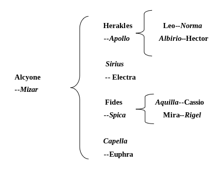

указывает на то, что Алкион женился на Мизар и у них родились четверо детей - два сына, Геракл и Фидес, и две дочери, Сириус и Капелла. В свою очередь Геракл женился на Аполлон и у них родились сын Лео (который женился на Норме) и дочь Альбирео, которая вышла замуж за Гектора. Второй сын Алкиона, Фидес, женился на Спике и у них родилась дочь Акила (которая выдалась замуж за Кассио) и сын Мира, который женился на молодой леди названной Ригель. Дочери Алкиона также вышли замуж: Сириус за Электру, а Капелла - за Ейфру; их детей (если они есть) можно найти в другой части диаграммы, так как детей всегда относят к отцу, если он принадлежит к любому из семейств, записанных на диаграмме. Чтобы найти детей Электры и Сириуса, поэтому, необходимо искать их отца Электру, который находится в той же колонке с его семьей. Если персонаж выходит замуж (как это обычно происходит), его имя дважды появляется на диаграмме - один раз в его собственной семье и один раз в той семье, в которую он вступает в брак; но потомки от брака записываются как принадлежащие только семье отца, чтобы избежать ненужного повторения.

Для печати оказалось удобным укоротить многие длинные имена, которые были даны в первой записи, но в большинстве случаев они всё равно останутся узнаваемыми для тех, кто знал их в старой форме. Два или три были полностью изменены, чтобы избежать путаницы между похожими сокращениями.

Кроме диаграмм от 1 до 6, указанная дата для каждой диаграммы - это дата рождения Алкиона, когда он появляется среди наших персонажей; когда его нет, это дата рождения какого-либо другого персонажа, о котором будет упоминаться в начале диаграммы. Приближённые даты для других легко вычисляются из этого. При попытке расчета средних значений, будет разумно исключить диаграммы от 1 до 6, так как между ними и указанными датами есть значительные неразгаданные пробелы, а указанные даты являются лишь округленными числами; с диаграммы 7 и далее серия жизней непрерывна для большинства персонажей, хотя и не для всех. В большинстве случаев не проводился поиск жизни позже той, которая была в Александрии в четвертом веке после Христа, хотя, вероятно, многие могли иметь промежуточную реинкарнацию с тех пор.

Из публикуемых здесь диаграмм легко (хотя и с трудом) составить реестр, на каждой странице которого у каждого персонажа есть список его рождений с заметками о его ближайших связях в каждой из них. Такие реестры были составлены некоторыми нашими друзьями для своего собственного использования, и образец страницы приложен, чтобы показать, как может быть выполнена работа.

Обычно добавляется колонка для замечаний, но нет места для ее воспроизведения.

Реестр Жизней Алкиона:

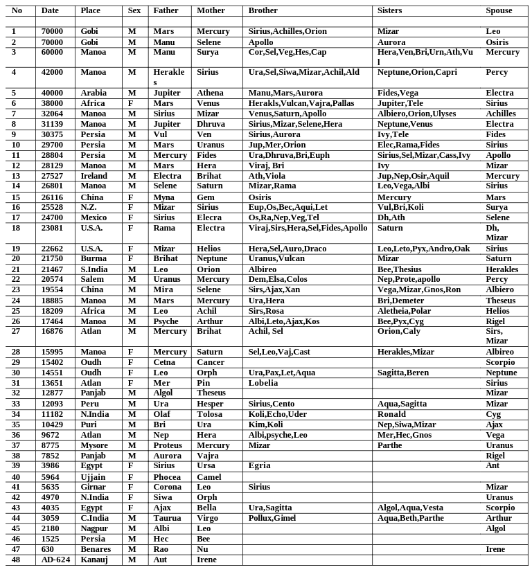

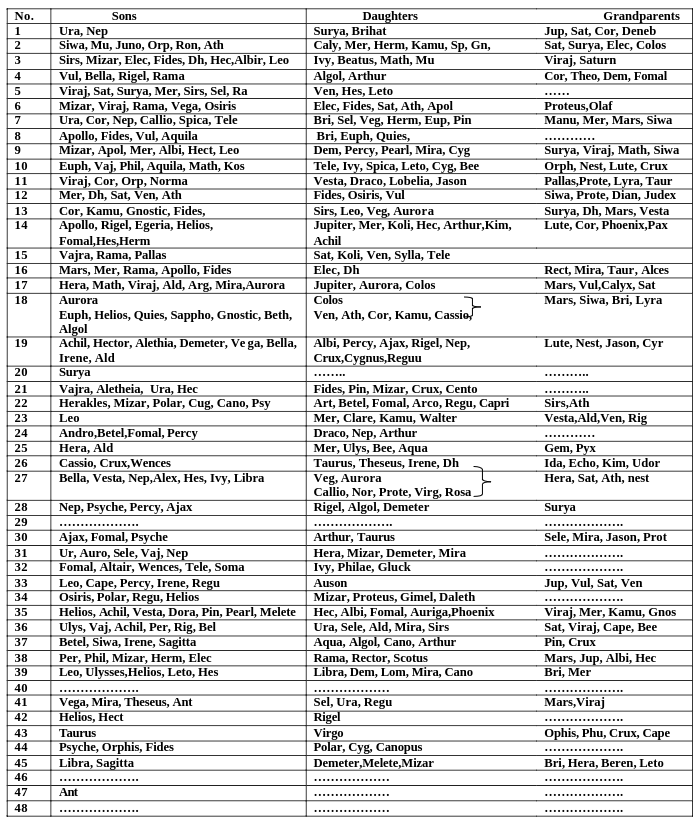

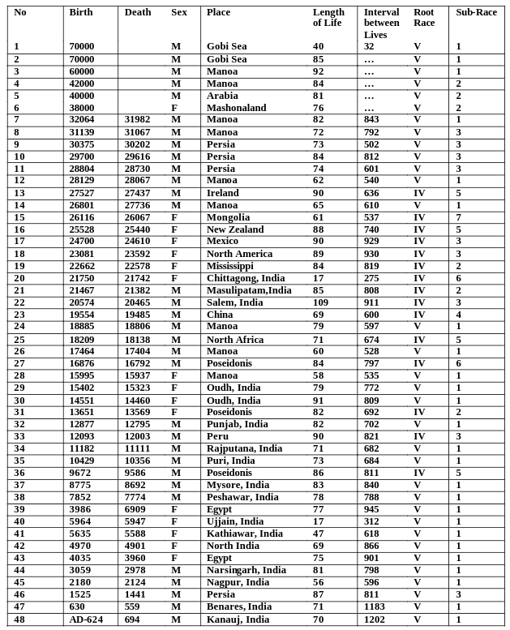

## Жизнь I

Работа Группы Служителей, возможно, редко была более тяжелой, чем в ранние дни Пятой Коренной Расы.

Читавшие "Человек: Откуда, Как и Куда", помнят, как великий Господь Ваивасвата Ману вел за собой свою избранную группу из Атлантиды до великой катастрофы 75,025 года до нашей эры, переезжая изначально в Аравию, а затем, после долгих испытаний там, к берегам Фобийского моря в Центральной Азии. Очень медленно и постепенно он делал свои расстановки, как это подобает тому, кто работает глядя на дальнее будущее, кто двигает нации, как пешки на доске, у кого есть столетия для каждого хода. Белый Остров Шамбаллы уже тогда был центром, из которого он действовал, хотя великий город, улицы которого исходили из него как спицы колеса, будет построен лишь спустя тысячи лет.

В тот период, когда открывается наша история - округлим до 70,000 лет до Христа - община насчитывала, возможно, 7-8 тысяч человек, живущих в нескольких деревнях вдоль южного берега внутреннего моря. Ману как Король жил на острове и редко появлялся на континенте, который управлялся от его имени его сыном Юпитером. Схема управления в значительной степени была патриархальной, и все пять сыновей Юпитера играли в ней свою роль под его началом. Его старший сын, Марс, правил одной из деревень и построил для себя на небольшом холме большой и уютный дом, окруженный огромными деревьями и просторными лужайками, где он собирал своих сельчан, когда желал обратиться к ним или провозгласить свои законы.

Во времена этой патриархальной жизни родился наш герой Алкион, уже 70,000 лет назад имевший близкие связи с теми, кто с тех пор стал Великими Учителями, вдохновляющими Теософское Движение - их ребенок в плоти тогда, как он является их сыном в духе теперь. За все эти жизни с тех пор он ни разу не сомневался в своей непреклонной преданности им, и теперь он идёт по Пути, по которому они уже прошли, стремясь к цели, которой они уже достигли. Мало он знал обо всем этом, когда так весело играл семьдесят тысяч лет назад в прекрасном саду с видом на море, вместе со своим братом Сириусом и сестрой Мизар - проверенные временем и верные товарищи, чья любовь к нему не угасла за века, всегда лишь усиливаясь - товарищи, которые все еще стоят рядом с ним, и будут с ним до конца.

Он был красивым мальчиком в те далекие времена, с орлиным носом и сияющими глазами, который немного напоминал аристократический тип среди арабов или пафов. Он много времени проводил на свежем воздухе, потому что таков был мудрый обычай того времени, и безумную практику загонять толпы подростков в плохо проветриваемые школьные классы еще не придумали. Марс назначил наставником и компаньоном для своих детей того, кого мы знаем под именем Роза - мужчина в той жизни, хотя имя звучит женственно - студент и ученый сын Роналда, друга его отца Юпитера. Но когда погода позволяла (и это должен был быть очень плохой день, чтобы погода считалась не подходящей), обучение происходило во время прогулок по парку окружавшего их дом, или в лесу, который покрывал соседние холмы.

Таким образом, мальчики выросли здоровыми и счастливыми, и когда Алкион достиг совершеннолетия, он был смелым всадником, отличным пловцом и неутомимым пешеходом, а также умелым чтецом странных старинных поэтических легенд и молитв, которые были популярной литературой того времени. Мальчиков и девочек воспитывали вместе и обучали тем же физическим упражнениям, хотя от девочек также ожидали, что они будут знать что-то о домашних делах - о кулинарии, ткацком деле и искусстве исцеления. Выбор в браке был ограничивался лишь правом вето Ману, которое, однако, почти никогда не применялось. Братья Сириус и Алкион влюбились в двух сестер, Вегу и Лео - обе они остались верными друзьями на века и до сих пор остаются рядом с ними в непоколебимой любви и лояльности. В рассматриваемой жизни эти две сестры были их кузинами по материнской линии и внучками великого вождя Короны.

Столь огромным был извилистый дворец, построенный Марсом, что его сыновья не покидали его после свадьбы, но просто добавляли новую секцию одну-две комнаты, по мере необходимости. Они были очень счастливой семьей, особенно неразлучными были Сириус и Алкион.

Они выполняли функции помощников для своего отца во многих работах, которые нужно было выполнить, наблюдали за культивацией его огромного поместья и улучшениями, которые он постоянно планировал. В этой насыщенной активностью жизни годы летели быстро, и вокруг каждого из братьев росла большая семья. Между тем Мизар покинула родительский дом, чтобы выйти замуж за своего любимого двоюродного брата Геракла, и у них тоже было пять детей; но общение между семьями было постоянным, поскольку их деревни находились всего в нескольких милях друг от друга.

Ману уже был очень стар, и он понял, что время, когда ему в благо расы, находящейся под его опекой, следует взять другое тело, чтобы оно могло начать снова на более высоком уровне, приближается. С этой целью он вызвал своих вождей - Юпитера, Корону, Марса и Ваджру и дал им определенные указания, предупредив их о том, что произойдёт - что раса почти полностью будет уничтожена дикими кочевниками с севера, и что они должны принять меры для спасения нескольких избранных детей, через которых она может продолжиться, теми же самими эго, но в немного более подходящих телах. Так вожди вернулись на материк с заданием выбрать среди детей и отправить ограниченное число на Белый Остров для безопасности, чтобы они жили там, в храмах, в ауре самих великих Кумаров и их славного двора Дэв - Ангелов Элементов, истинных правителей судьбы мира.

К этому времени у Алкиона и Льва было уже четверо детей, все они были великими душами, которые впоследствии стали Адептами. Их дочери - Сурья и Брихат (тот, кто сейчас является бодхисаттвой, и Учитель, чьим сосудом он стал в Палестине), их старший сын - Уран, а младший - Нептун. Все четверо были выбраны патриархами, но из детей Сириуса и Веги была взята лишь малютка Жемчуг. Маленькая Гектора, младшая дочерь Ахиллеса, была единственной, отобранной из большого семейства Марса; но Геракл и Мизар были удостоены чести отдать двоих - их младшего сына Фидеса и младшую дочь Пиндара. Трое маленьких сыновей Афины и Лиры были все взяты, и трое дочерей Кастора и Гелиоса, Эльза и Крюкс, дали сына Поляриса и дочь Цигнуса; и Электра, единственный сын Пчелы и Виолы, был добавлен к группе. Все они были совсем юны; но к ним также присоединились трое старших детей, которые на самом же деле принадлежали к более раннему поколению - Вулкан и Венера, двойняшки Аполлона и Осириса, и Паллас, младший брат Веги и Льва. Паллас был большим мальчиком, и когда он узнал о цели изоляции, он настоятельно просил оставить его и дать возможность бороться; но ему достаточно резко сказали, что он должен перейти на остров, чтобы заботиться о Венере, которую он давно обожал издали. Он не имел другого выбора, как повиноваться, и получил свою награду в виде разрешения Ману жениться на своей возлюбленной в ближайшее время.

Капелла - младшая сестра Геракла - стала главой группы, и немедленно решила разделить ответственность, выйдя замуж за Вулкана, самого старшего из мальчиков.

Как только дети были безопасно устроены на острове, разрушение, которое предвидел Ману, обрушилось на деревни на материке.

Туранские орды невероятной численности навалились на арийцев и после отважного и самого решительного сопротивления уничтожили всю колонию. По указанию Ману все ценности были зарыты, чтобы дикари не смогли их найти, так что победа, которая стоила им так дорого, оказалась совершенно бесплодной; их традиционные страхи не позволили им атаковать Белый Остров; и когда малая часть их армии, без добычи, пересекала на своем пути домой пустыню на севере от Моря Гоби, поднялась страшная песчаная буря, которая задушила целые полки, так что лишь истерзанный осколок могучего войска вернулся на равнины Тартарии, и на тысячи лет этот поучительный урок остался у них в памяти, а арийскую колонию оставили в покое.

Интересно отметить, как Ману рассматривает все, что происходит, только с точки зрения плана в целом. Резня Его новой расы для Него вовсе не является предметом скорби; это неотъемлемая часть схемы; и он так объясняет это своим последователям, что они считают это честью сотрудничать в работе. Мы замечаем, что не только в этом, но и во многих других случаях, физическая смерть вовсе не рассматривается Великими также как во внешнем мире. Наша современная тенденция – считать ее самым большим из всех зол; эти Лидеры, которые знают значительно больше нас, рассматривают ее просто как инцидент в работе, которая выполняется, или иногда как награду за хорошо выполненную работу. Нам было бы очень полезно, если бы мы могли принять эту точку зрения Учителей Мудрости, если бы мы могли 'смотреть расширенным взором' и видеть истину, которая скрывается за обманчивым внешним видом. Тогда мы бы в полной уверенности положились на мудрость Божественной Силы, зная что:

    Она дает жизнь и отнимает ее, не изменившись
      Кроме как для исполнения участи:
    Ее нити - это Любовь и Жизнь; и Смерть и Боль
      Челноки ее стана.

    Она творит и разрушает, улучшая все;
      То, что она создала, лучше, чем было прежде;
    Медленно формируется великолепный узор, который она планирует
      Между ее стремящимися руками.

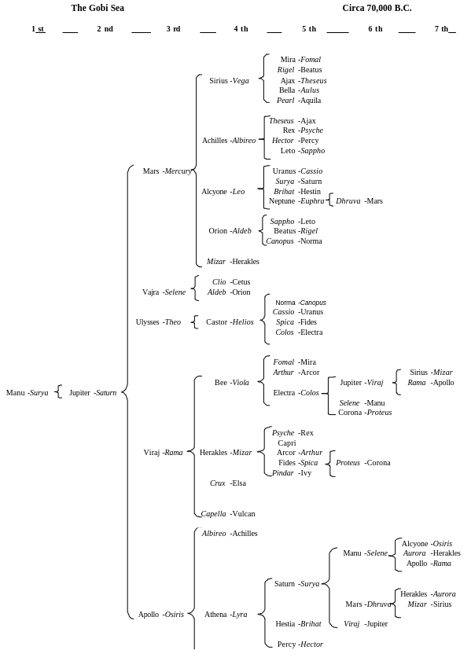

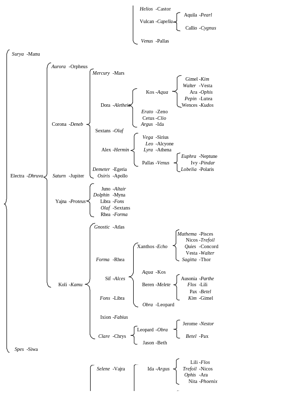

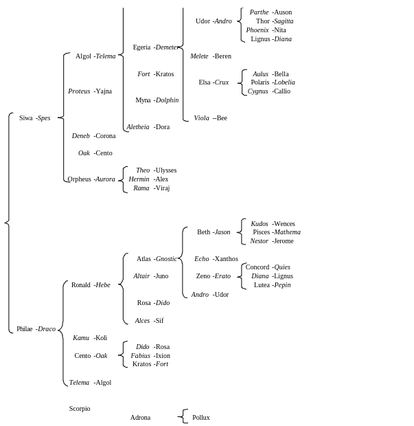

## Жизнь II

Арийцы, которые пали в туранском набеге, встретили свою смерть весело и даже с радостью, поскольку Ману обещал им, что те, кто умрет за младенческую расу, вскоре вновь родятся в ней в более совершенных телах. И он вскоре принялся за организацию удовлетворения этого обещания. Как только они устроились на острове, Вулкан и Капелла поженились одновременно с Палладой и Венерой. И так за год к их стаду присоединились новые существа. Примерно двадцать два маленьких человека счастливо выросли вместе, и когда они достигли брачного возраста, они естественным образом составили пары.

Когда наступило назначенное время, Ману отложил свое изношенное тело и заново родился от Сатурна и Сурьи, через двенадцать лет после массакра. Марс и Вирадж вскоре последовали за ним в качестве брата и сестры, в то время как Юпитер, Селена и Корона появились в качестве детей Электры. По мере того, как они в свою очередь взрослели, дальнейшие внутрибрачные связи предоставили возможность для реинкарнации Алкиона, Мизара, Геракла, Сириуса, Рамы и Аполлона, и вскоре потомки Сатурна и Сурьи превратились в немалый клан, в котором те, кто потерял свои жизни в массакре, постепенно появлялись в более усовершенствованных телах, чем те, которые они отказались. Тридцать два года после перелета на остров, наш герой родился в качестве старшего сына Ману, и вскоре после этого молодое сообщество снова было переведено на материковую часть. Ману решил восстановить и занять тот самый дом, который Марс построил для себя в своей предыдущей инкарнации, так что Алкион был введён второй раз в том же месте и при тех же условиях - почти в том же обществе. Его дядя Марс несколько лет поделил дом своего отца, так что его двоюродные братья, Геракл и Мизар, всегда были с ним; Аполлон, когда-то дядя, теперь был его младшим братом; в то время как Сириус и Рама, которые ранее были братом и теткой, теперь были двоюродными братьями, живущими по соседству, и поэтому всегда присутствовали в компании.

Даже на этой ранней стадии Ману уже имел в виду план великолепного города, который в будущие века должен был называться Его именем. Само строительство началось только после очередной великой резни, произошедшей через несколько тысяч лет спустя; но у Него уже была замысел тех радиальных улиц, длиной в десять миль, от каждого пункта которых должен был быть виден Белый остров. Он еще не делал попыток воздвигнуть могущественные здания, которые впоследствии должны были линейно идти вдоль этих магистралей; но он уже решил выбрать их направление, и на удаленном конце каждого из них установил огромный трилитон, немного похожий на тот, что в Стоунхендже, и за каждым из них – небольшой храм, почти ничто, кроме святилища. Улицы в последствии должны были расходиться от берега, как лепестки веера; но на тот момент еще не существовало улиц - только семь расходящихся троп, уходивших через холмы и леса, и в конце каждого из них такое строение, как было описано. Нашему клану было приказано посещать одно из этих святилищ каждый день по очереди.

На рассвете они купались и принимали первый прием пищи; вскоре после этого они все вместе собирались в доме Ману и выходили в процессию вдоль одной из троп. Когда они шли, они произносили стихи, которые для них написал Ману - в основном обращения, призывающие на них и их будущий дом благословения всех духов земли и воздуха, воды и огня. Так, идя и поючи, они совершали свое паломничество к святыне дня. Прибыв к ней, они проговаривали определенные молитвы, а затем клан некоторое время отдыхал, прежде чем снова собираться для торжественного возвращения. К моменту, когда они приходили домой, уже был полдень или даже позже, и их средний прием пищи подавался немедленно. После трапезы, было принято отдохнуть некоторое время, а затем провести оставшуюся часть дня за земледельческим трудом, необходимым для удовлетворения небольших потребностей общины, или за любой другой работой, которую руководители решали полезной.

Итак, видно, что почти половина каждого дня была посвящена тому, что мы должны рассматривать как религиозное упражнение, хотя с другой точки зрения это может считаться отдыхом, так как все люди получали от этого большое удовольствие, и тот, кто был оставлен дома из-за болезни, несчастного случая или какой-либо срочной работы, чувствовал, что он ущемлен. Маленькие дети настаивали, чтобы им разрешили идти, задолго до того, как они становились достаточно сильными для двадцатимильной прогулки, и считали, что это своего рода "достижение совершеннолетия", когда они наконец получали разрешение присоединиться к процессии. Алкионе, будучи очень молодым, завоевал большую популярность среди своих сверстников, убедив своего отца позволить ему организовать группу детей, которые могли бы идти на определенное расстояние с процессией, а затем играть, пока они снова не присоединились к ней при возвращении - он брал на себя обязательства, как капитан банды, быть ответственным за безопасность и хорошее поведение группы подростков.

Было удивительно, однако, насколько рано молодые люди могли преодолеть полный путь без утомления. Поскольку они совершали паломничество в соответствии с установленным порядком, ясно, что они проходили семь путь за всего неделю и посещали каждое святилище один раз за то же время. Цель состояла в магнитизации тех путей, которые должны были стать улицами отдаленного будущего. Ежедневная двадцатимильная прогулка, безусловно, делала многое для поддержания общины в хорошей форме, и они, по-видимому, не испытывали проблем с выполнением всех необходимых работ в остальную часть дня.

Ману, по всей видимости, придавал большое значение впечатлению, создаваемому вызывающими словами, регулярным ритмичным пением и атмосферой радости. Вызывающее слово, безусловно, имело эффект привлечения определенных порядков ангелов и духов природы; и не только привличения на момент, но и создания для них своего рода постоянной линии притяжения, или, возможно, лучше выразить это как линию наименьшего сопротивления, по которой все ангелы и духи природы, в любое время проходящие поблизости, находили бы естественным и легким путешествовать - таким само путешествие, конечно, постоянно увеличивало магнитизацию. Регулярный ритм и пение играли свою собственную роль в этой работе, в создании того, что могло бы называться привычкой вибрации в эфире и в астральной и мысленной материи - эффект заключается в том, чтобы упорядочение и регулярность стали проще, а беспорядок и нерегулярность сложнее и, следовательно, менее вероятны, будь то мысли, эмоции или действия, вдоль этого установленного маршрута. Дух радости, которому уделялось столько внимания, естественно, стремился к самовоспроизведению, и, следовательно, к установлению этого состояния разума как общего фона для будущих жителей.

Когда Алкион вырос, он все больше и больше мог делиться работой своего отца и, в конце концов, снять большую часть этой работы с его плеч.

В возрасте девятнадцати лет он женился на своей двоюродной сестре Осирис и вскоре испытал большую радость, приветствуя среди своих детей Меркурия, который был его матерью в прошлой жизни, и, что более важно, был связан с его всем существованием как человек, так как он присутствовал при его индивидуализации из животного мира. Другие друзья начали собираться вокруг него, некоторые в качестве его собственных детей, а некоторые в семьях Сириуса и Мизара, Геракла и Авроры, Аполлона и Рамы; на самом деле, перед его уходом с физического плана воплотились практически все служители.

Даже тогда сообщество было лишь маленьким, и жило больше как большая семья, чем как племя - простой жизнью на открытом воздухе, в которой все равно работали над тем, что необходимо было сделать, адаптируя под свои потребности то, что предоставляла природа, и изобретательно создавая для себя такие инструменты, которые требовались; хотя ряд таких вещей был закопан до массакра по приказу Ману, так что в этом отношении они были весьма хорошо обеспечены. Их положение было фактически положением переселенцев в новой стране, но они имели преимущество в домах и дорогах, построенных до массакра; также большая часть окружающей страны уже была очищена и вспахана, и хотя все безобразилось за прошедшие годы, это было совсем не так сложно, как разрушать первобытный лес.

У них были традиции высоко цивилизованной нации, и Ману выставлял для них высокие идеалы, показывая, как достигать наилучшего эффекта с ограниченными средствами в их распоряжении. Они были в большой степени отрезаны от остального мира (что, впрочем, было целью Ману, и необходимой частью его плана), но это имело свои преимущества, так как оставляло им множество земли, множество мест для роста и создавало им независимость.

Когда Ману достиг возраста семидесяти, Он решил отойти от дел и передал управление государством Алкиону, своему старшему сыну. Наш герой был тогда ровно пятидесяти, и он занимал позицию лидера маленького сообщества с гонором и достоинством до своей смерти в преклонном возрасте восемьдесяти пяти лет, когда его сменил его старший сын Сива, сам уже весьма почтенного возраста.

Эту ипостась можно считать важной для тех, кто участвовал в ней, ибо в ней мы замечаем определенное вмешательство Ману в обычные интервалы между жизнями Его последователей - ибо мы видим, что он посчитал нужным вернуть их почти немедленно ради блага расы, которую он занялся основывать.

Прилагаемая диаграмма (т.е. диаграмма II) на самом деле является продолжением диаграммы I, поэтому нумерация поколений сделана непрерывной, и две диаграммы в этом отношении перекрываются.

## Жизнь III

На данном этапе мы не стремимся представить последовательную историю нашего героя; мы просто отмечаем его появление, когда случайно встречаем его в ходе исследований, предпринятых совсем по другим целям. Мы перепрыгиваем около десяти тысяч лет с момента последней упомянутой жизни и спускаемся к тому, что, вероятно, можно считать заключительным этапом в основании Коренной Расы. Более чем один раз делались попытки, которые выглядели как предварительные или неудачные, и после нескольких столетий роста раса была сметена с лица земли вторжением варваров, как художник может стереть контур, чтобы попытаться нарисовать его заново более идеально. Каждый раз несколько самых многообещающих детей спасались от массакра, чтобы быть семенем следующей попытки; каждый раз Ману собирал свою Группу Служителей, которые были знакомы с его методами, чтобы реинкарнировать как его потомки и таким образом вести Расу по линиям, которые он желал.

Не имея личного кармического препятствия, он каждый раз создавал для себя тело, которое в большей степени соответствовало образцу, заданному для этой Расы Солнечным Божеством, единственным трудностью на его пути были ограничения, наложенные на это тело родительством, которое, хоть и было лучшим из возможных, неизбежно отставало от совершенства. Ему приходилось брать жену из существующей расы, и поэтому его дети, естественно, немного уступали ему в уровне специальных разработок, свойственных новому типу; но он обычно реинкарнировал несколько раз в линии своих собственных потомков, и каждый раз приближал расу к этому типу.

Последние из кровопролитий произошли около 60 000 г. до н. э., и несколько тщательно выбранных детей были переведены на острова, как и прежде. Среди этих людей была Юпитер, дочь Ману; и когда она выросла, она вышла замуж не за представителя своего собственного народа, а за Марса, Толтекского принца из Посейдониса, которого Ману специально воплотил там для этого брака, поскольку он считал желательным таким образом смешать некоторую отличную толтекскую кровь со своей. Старший сын Марса и Юпитера был Вирадж, и он, пришедшим своим временем, женился на Сатурне, своей двоюродной сестре, самой красивой из внучек Ману.

Когда Ману благословил этот союз, он оставил свое тело и возродился как их сын, имея таким образом одну четверть толтекской крови к трём четвертям арийской, каждая из которых была лучшей из своего рода.

Примерно в то же время была рождена Сурья, правнучка его предыдущего тела; и когда они достигли подходящего возраста, Ману вышел за нее замуж, и от этой благородной пары произошла новая Раса в своем окончательном происхождении. Мы отмечаем необычную особенность, связанную с его семьей и семьями его сыновей и дочерей - что вряд ли может быть случайным. У него самого было двенадцать детей, и каждый из них в свою очередь имел семью точно такого же размера. Мы наблюдаем то же явление, повторяющееся в третьем поколении, у нескольких его внуков тоже было двенадцать детей. Почти каждый опознанный член нашей группы служителей принял участие в этой работе, и есть многие, которых мы еще не знаем, хотя, вероятно, в будущем они придут к Теософской работе. Очевидно, что Ману, организовав для себя благоприятное рождение в особенно подходящем теле, и решив использовать его как окончательное начало его Расы, собрал все силы, которые у него были в распоряжении, и направил их всех в прямые потомки так быстро, как это согласовывалось с обеспечением для них наилучших возможных условий. Таким образом, новый вид был быстро и надежно установлен, так что арийский след неопровержим, и даже незначительное примесь этой крови проявляет себя в течение сотен лет.

Как только у него появилась эффективная группа способных работников, началось строительство могучей столицы его будущей империи. Вместо того чтобы позволить его городу расти постепенно, по мере увеличения населения, он установил его с самого начала так, как он предполагал, что это будет, построив дома задолго до того, как появились их жители, но используя такие вечные материалы, которые останутся неизменными с течением времени. Ни до, ни после такой город не видел мировой истории; на его постройку ушло тысячу лет, и он простоял практически неизменным пятьдесят тысяч, пока великая катастрофа затопления Посейдониса не превратила его в руины. Полное описание его великолепия можно найти в книге "Человек: откуда, как и зачем", главы xv и xvi.

Но нас заботит не законченный город, а его строительство, когда сто человек занялись работой, которую вполне могли бы приняться делать сто тысяч. Эти первопроходцы сначала должны были построить для себя скромные временные жилища; они должны были обрабатывать землю, чтобы у них было что есть; но тем не менее они начали выкапывать обширные карьеры, откуда они вырезали огромные блоки прекрасно окрашенного камня, готовясь к возведению тех зданий, которые позже стали чудом света. У этих людей - этих наших бывших сам - был уникальный характеристик - они были рады и готовы отдать свой труд и энергию работе таким образом для будущего поколения - поколения, которое состояло бы частично из них самих, как вероятно они знали; но из них самих в других телах, без памяти тогда об всем этом предшествующем труде, как и сейчас у них не было ясного предвидения грядущих слав. Тем не менее, они работали радостно как на религиозную обязанность, потому что их великий правитель сказал им, что это заслуживает внимания работа, часть мировой эволюции, часть гигантского плана, масштаб которого они пока не могли охватить. Медленно и очень медленно большой дизайн раскрывал себя; пути, которые наши служители магнетизировали с таким упорным усилием в своих ежедневных процессиях десять тысяч лет назад, теперь были обозначены как широкие прямые улицы, похожие на радиусы паутин; постепенно было указано положение крестовых улиц, и план всего города начал показывать себя по линиям, очищенным в великих лесах, которые покрывали его место.

С течением десятилетий начали возвышаться огромные здания как на священном Белом острове, так и на материке. Остров всегда был центром мыслей и поклонения этого растущего народа; с каждой точки семи радиальных улиц можно было видеть его сверкающие храмы, а его главный центральный купол доминировал и символизировал всю жизнь города. Но мы занимаемся вопросами начального этапа, когда вся эта слава еще была лишь мечтой о далеком будущем; поэтому нам нужно отвлечься от жизни города к частной жизни нашего героя.

Старший сын Ману и Бодхисаттвы Коренной расы, возрастающий в окружении благородных и любящих братьев и сестер, возможно, даже он редко имел более благоприятную обстановку. Будучи старшим — первым родившимся из новой Расы, первым образцом свежего потока жизни, который лился в мир, — он имел преимущество самого внимательного личного обучения со стороны своего отца и матери. Они жили почти полностью на открытом воздухе и уделяли большое внимание физической тренировке и развитию. С очень раннего возраста Ману держал Своего сына рядом с Собой днем и ночью, явно подчеркивая значение постоянного влияния личного магнетизма.

Немного больше года после его рождения родилась маленькая сестра, Гераклес, и по мере того как дети росли, между ними сложилась самая крепкая привязанность - как, впрочем, всегда и было на протяжении веков. Они учились вместе, играли вместе, работали вместе, и под мудрым наставничеством Ману в образовании мальчиков и девочек не было различий. В те ранние дни тяжелого труда было немного того, что для нас составляет образование, хотя дети и научились читать и писать, книги были редкими и рассматривались как священные сокровища. Для наших предков самым образованным человеком буквально был тот, кто мог приложить руку к чему угодно, был полон ресурсов и находчивости, был быстрым в принятии решений и действиях, компетентным в каждом смысле слова и во всех областях жизни. Итак, достигнув зрелости, крепкие сыновья и дочери Ману были не только великолепно красивой группой представителей новой Расы, но также компетентными, проницательными и самостоятельными лидерами для общины, которая возникла на берегах Гобийского моря.

Понятно, что это сообщество состояло из потомков детей, спасенных во время последнего массакра - к этому времени уже довольно численного сообщества. Но только дети Ману в его последнем рождении (когда он женился на Сурье) считались принадлежащими к божественной расе - "Дети Солнца", как они назывались. Каждый из двенадцати был идентифицирован с одним из знаков зодиака. Естественно, эти двенадцать должны были тщательно выбрать внешних своих спутников жизни - то есть, лучших из потомков Ману в его предыдущем рождении. Однако, когда их дети, в свою очередь, достигли брачного возраста, он выразил свое желание, чтобы они, по возможности, выбирали партнеров внутри Солнечной семьи. Очевидно из прилагаемой диаграммы, что это указание исполнили все персонажи, которых мы идентифицировали.

Однако, совершенно очевидно, что наши идентификации включают менее чем половину отряда Служителей. Хотя мы способны распознать все двенадцать детей и тех, на кого они женились, мы знаем только половину его внуков, так как мы завершаем только четыре семьи из двенадцати и можем назвать только четырех или пятерых детей в каждой из остальных. Когда мы переходим к следующему поколению, наше узнавание почти совсем ограничено потомками Алкионы, и даже здесь у нас есть лишь половина общего числа - всего три семьи полностью идентифицированы. Спускаясь еще на одно поколение, мы замечаем нескольких запоздалых следователей среди внуков старшего сына Алкионы Сириуса, но почти никого, кого мы знаем, больше не находим. Это было ожидаемо, так как к этому времени новая раса уже так твердо установлена, что необходимость в пионерской работе больше не ощущается, и эгоистически не преданные безкорыстной службе личности могут продолжать развивать новую нацию обычным способом. Количество детей в семье к этому времени становится непостоянным, и многие факты говорят о том, что необходимость в определенном регулировании больше не так срочна. Отряд Служителей проделал свою работу и отдыхает в небесной жизни, пока не наступит время для его следующего воплощения.

Когда Алкион достиг зрелости, он женился на своей двоюродной сестре, Меркурии, также внучке Вирадж и Сатурна, девушке высоких достижений и сияющей красоты, которую он любил с глубокой и благоговейной преданностью. Через год у него родились двойняшки-мальчики — Сириус и Мизар, которые выросли и стали абсолютно преданными ему, Меркурии и друг другу, как они были на протяжении веков. Через год пришел третий мальчик, Электра, и, наверное, никогда не было трех более прекрасных или счастливых детей. Другие братья и сестры быстро подтягивались, чтобы быть любимыми и заботиться о них, но эти трое, почти одного возраста, создали свою собственную маленькую подгруппу. Их лица были удивительно похожи; никто, кроме их родителей, никогда не знал, какой из близнецов кто, а Электра отличался только тем, что он был немного ниже.

С того времени, как они смогли ходить и говорить разумно, они были неразлучны; день и ночь они всегда были вместе, и почти всегда с их отцом, когда его работа не забирала его в места, куда они не могли удобно попасть. Их весьма профанно прозвали "троицей", поскольку они народно рассматривались как три идентичных проявления одной силы. Всевозможные странные ошибки возникали из-за их неотличимости, и "троица" немного наслаждалась этим и получала удовольствие, устроив их. Те, кто был вне семьи, считали абсолютное сходство несколько жутким, и так как они были первыми тремя сыновьями Алкиона, возникла традиция, что все его сыновья будут неотличимы - традиция, которую лишь частично нарушило приход его следующего сына Фидеса через два года, поскольку он также был очень похож на своих старших братьев. Куда бы трое ни пошли, их встречали с большим уважением, как надежду расы и ее будущих правителей; ибо, хоть Сириус был старше на несколько минут и, следовательно, формально был наследником, никто никогда не знал, кто из них он, и поэтому все они рассматривались одинаково.

Они могли бы подвергнуться риску испортиться вследствие общего восхищения, если бы не мягкая мудрость их матери Меркурия, которая учила их всегда, что их высокое положение влечет за собой обязательные обязанности и ответственности. Именно потому, что улыбка или доброе слово от них значило так много для каждого, кого они встретили, такая улыбка или доброе слово никогда не должны удерживаться, независимо от того, насколько они были заняты или насколько срочной была их работа. В это время Алкион постоянно занимался с отцом, Ману, наблюдением за строительством огромного полукруга дворцов, которые должны были образовать морской фасад будущего города, и три мальчика с большим интересом участвовали в этой работе и умоляли, чтобы управление определенными его частями было передано им. Ману улыбаясь согласился, и мальчики были в сильном состоянии возбуждения, испытывая одновременно удовлетворение от доверия к ним и тревогу оправдать это доверие бессонной бдительностью. Рабочим тоже было очень приятно, поскольку верилось, что "троица" приносит с собой там, где они появляются, удачу и защиту от несчастных случаев; в любом случае это верно, что в ходе всей этой грандиозной работы, которая подразумевала подъем и перенос огромных весов, не произошло никаких серьезных несчастных случаев.

Так Алкион провел жизнь в постоянной работе, главными событиями которой были начало и завершение этого или того сооружения. Было его искренним желанием получить разрешение на строительство удивительного лабиринта храмов, которые должны были покрыть священный остров; но этой чести ему так и не выпало, ведь это было постановлением Кумар, что определенная часть города должна быть завершена, прежде чем начнется эта работа. В редких случаях Ману принимали на аудиенцию у Самого Господа, и однажды в такое время было дано указание, что Алкион и его три старших сына также должны присутствовать, чтобы у них были замечательные привилегия и благословение стоять непосредственно перед правящим Планету - незабываемый опыт.

Ману жил среди своего народа полное столетие, а когда решил, что пора отойти на время, он созвал своих детей и внуков и сообщил им, что передает на ревность работу, которую он начал; что теперь на время он будет наблюдать за ней с более высокого уровня, но при необходимости его все еще можно консультировать, кем бы ни был на то время глава правящего Дома; и что когда он посчитает это необходимым, он снова воплотится, но всегда в той же королевской линии, которую всегда нужно держать свободной от любого смешения с чужой кровью, за исключением случаев, когда он сам явно распорядится об этом.

Так он покинул свое тело, и по его желанию его вынесли далеко в центр пустыни Гоби и погрузили в ее глубины. Его приказом было не скорбеть о его уходе, поэтому Алкион, его сын (который к этому времени уже был в возрасте восьмидесяти лет), стал вместо него править, и работа продолжалась так же уверенно, как и раньше. В нескольких случаях он показывал себя Алкиону во сне и давал ему указания о строительстве города, но в целом он выразил свою полную довольность тем, что было сделано.

Десять лет Алкион мудро правил своим теперь значительно расширившимся общиной; но по истечении этого времени его любимая жена Меркурий ушла из жизни, и он решил передать все активные обязанности своим сыновьям. Таким образом, он, в свою очередь, собрал всю семью (в этот момент его правнуки уже росли вокруг него) и сказал им считать теперь его старшего сына Сириуса их королем, пригласив его шагнуть вперед и торжественно принять престол. Но Сириус упал на колени перед ним и попросил разрешения заявить о своем последнем желании, прежде чем он откажется от своей власти; и когда разрешение было дано, он объяснил, что вот уже близится семьдесят лет, как он и его братья Мизар и Электра были в самом тесном согласии, работая и консультируясь вместе каждый день, так что они, казалось, были единым сердцем и умом. И желание, которое он просил исполнить, заключалось в том, чтобы этот дорогой союз оставался целым до самой смерти - чтобы все трое в равной степени носили титул короля, чтобы они могли сидеть вместе на трех равных тронах и если они когда-либо будут расходиться во мнениях, решение двоих, кто согласен, должно было преобладать; когда один умер, двое остальных должно было продолжать управление, и когда умирал второй, оставшийся в живых должен был быть единоличным королем. Алкион некоторое время сидел в раздумьях и общался со духами своего отца и своей мудрой жены Меркурий; и наконец он дал согласие на эту уникальную схему, но только при условии, что после смерти третьего из этого триумвирата, корона должна перейти к Коли, старшему сыну Сириуса, чтобы не было вмешательства в прямую линию наследования, на которую Ману уделял такое большое внимание. Так было должным образом устроено три трона, и Алкион дал свое благословение 'троице' - по-прежнему почти одинаковой, как и в старые дни их детства, по-прежнему такой дорогой друг для друга, хотя каждый из них теперь был отцом большой семьи.

Необычное троичное правление работало удивительно хорошо, но это привело к удивительной истории, которую некоторые путешественники даже донесли до далекой Посейдонис - истории о том, что посреди пустынь Центральной Азии существует великий город невероятного богатства и красоты - город такой огромной, что половина его зданий были необитаемы - который управлялся королем, обладающим таким чудесным магическим могуществом, что он мог умножать самого себя и одновременно мог быть виден в трех абсолютно идентичных формах, сидя на трех тронах, когда он осуществлял правосудие!

После отречения Алкион прожил еще два года и мирно отдал свое тело, находясь в зрелом возрасте девяноста двух лет, выразив желание, чтобы его тело было утоплено, как это было сделано с телом его отца - церемонию, которая была надлежащим образом проведена в присутствии трех правителей и тех из его детей, кто еще жив.

Сообщество росло на этот раз с минимальным внешним вмешательством. Его члены были почти в такой же полной изоляции от внешнего мира, как и десять тысяч лет назад.

Их единственные соседи были некоторые племена, наполовину атлантические и наполовину лемурийские, которые обитали в долинах среди гор примерно в двадцати милях вглубь суши - миролюбивые люди, не полностью некультурные, возможно, находящиеся в примерно таком же положении, как маоры при первом контакте с европейцами. Но эти люди оставались при себе, не доверяя открытой местности возле моря, из которой их предки были изгнаны веками назад, в результате нашествия татар. Некоторые из более смелых духов спустились в арийское поселение и устроились слугами и рабочими и "троица" вместе с группой своих друзей несколько раз устраивали экспедиции в горы, чтобы посмотреть деревни горцев; но не было ничего, что можно было бы назвать общением между расами, их язык и обычаи были совершенно разными.

## Жизнь IV

Следующий взгляд на судьбы нашего героя приходится на время через почти восемнадцать тысяч лет. Великий город Маноа, строительство которого мы видели начавшимся в нашей последней главе, теперь почтенного возраста, центр обширной и великолепной цивилизации, возможно, уже прошедшей свой зенит. Наша Группа служителей появляется лишь случайно в устоявшихся и великих цивилизациях, работа ее членов состоит скорее в том, чтобы действовать как пионеры, прокладывать путь для роста нового типа, делать первоначальную очистку и дорожные работы, которые позже сделают возможным продвижение других.

Именно в это время Ману испытывал потребность в них, так как он чувствовал, что пришло время начать вторую подразделение великой арийской расы - то подразделение,

[остатки] которого мы теперь называем арабской. Это было повторение предыдущего основания, но в меньшем масштабе и без необходимости в промежуточных массовых убийствах, потому что изменения, которые требовались на этот раз, не были радикальными, глубоко укорененными различиями между одной корневой расой и другой, а лишь подчеркиванием специальных характеристик, которые отделяют новую подрасу от ее предшественников. Но общий принцип был тем же, и Ману начал с того, что изолировал некоторых из своих преданных последователей от остальных и послал их осваивать одну из горных долин, которые вели в горы за городом.

В течение тысячелетия своего наибольшего процветания город значительно вырос в размерах, но Ману позаботился, чтобы он расширялся преимущественно вдоль берегов Моря Гоби и вглубь материка только до предгорий в двадцати милях отсюда, так что долины все еще были девственной землей или первобытным лесом. Теперь одна из этих долин должна была быть использована для цели, для которой она была предназначена с самого начала, поэтому Ману приступил к выбору своих инструментов.

Он сам не был воплощен в то время, но действовал через своего представителя Юпитера, который был главным жрецом того периода. Узнав о его желаниях, Юпитер сразу предложил своих детей для этой работы, если они сами были готовы. У него был сын Корона и две дочери, Фомал и Бет.

Корона тут же принял предложенную ему возможность, распродал свое замечательное имущество в городе и переехал со своей женой Тео, своими женатыми сыновьями Гераклом и Пиндаром и их семьями в выбранную долину, чтобы принять там явно первобытный и патриархальный образ жизни — очень отличающийся от того, к которому он был привык до того времени. Его сестра Фомал вышла замуж за Деметра, и эти двое сразу же были впитаны тем же энтузиазмом и сумели передать его своим шести детям. Другая сестра, Бет, была не менее рвущейся в бой, но не совсем так удачно влияла на своего мужа Каликса.

У Каликса довольно интересная история; он прошел через века с партнершей Амал, к которой он особенно тесно привязан, так что они находят друг друга и женятся, жизнь за жизнью, с удивительной последовательностью. В рассматриваемом нами рождении они оказались родными братом и сестрой, и поэтому обычаи страны не позволяли им возобновить свои обычные отношения. Каликс вышел замуж за Бет, младшую дочь Юпитера, а Амал было предложено ее матерью выйти замуж за Лаксу, богатого купца, которого она на самом деле не любила. Обе семьи проживали достаточно несчастной жизнью, Лакса решительно возражал против частых визитов своего шурина и протестовал против некоторых компрометирующих ситуаций, которые приходилось ему видеть.

Когда Бет, которая горячо желала жертвовать собой и своей семьей в ответ на призыв Ману, настойчиво беспокоила своего уже полуотсоединившегося мужа (метафорически) взять на себя свой крест и отправиться в дикую местность, которая не привлекала его, это действовало на него как окончательный шок, который определяет осаждение вещества из насыщенного раствора или внезапно превращает в лед поверхность пруда, которая, будучи абсолютно неподвижной, опустилась до температуры немного ниже точки замерзания, не замерзая на самом деле. Он бросил свою жену (оставив позади письмо, в котором объяснял, что никогда не сможет быть счастливым с ней, и поэтому считал самым добрым освободить ее, чтобы она следовала за своими собственными устройствами) и бежал со своей сестрой Амаль в далекий город. Лахса был в ярости - не из-за потери жены, а из-за скандала, который, он боялся, может повлиять на его бизнес; он заявил, что никогда не доверял ей, давно знал, что она ему изменяет, и никогда ни при каких обстоятельствах не примет ее обратно в свой дом. Бет и ее дети нашли убежище у ее сестры Фомаль, которая приняла их открытыми объятиями, и так случилось, что дети Юпитера все смогли воспользоваться возможностью, которую он так усердно хотел для себя.

Что касается беглых любовников, они появились несколько лет спустя, надеясь, что их побег проигнорируют; но общество в Маноа отказалось принять их, поэтому они фактически представили себя новому сообществу в долине. Не найдя там себе места, они вернулись обратно в далекий город, куда сначала убегали, и таким образом они выходят из нашей истории.

Новое сообщество, значит, начало свое существование под руководством Корона, и состояло из его потомков и потомков его двух сестер. Старший сын Корона - это Геракл, уже женатый на Сириусе и имеющий большую семью, все члены которой мы узнаем как старых друзей. Среди сыновей наш герой Алкион и его всегда любимый спутник Мизар; также Селена и Уран и Ахиллес; среди сестер мы замечаем Нептун и Орион. Таким образом, мы видим, что, хотя в совершенно разных отношениях, Алкион, Мизар и Сириус снова вместе; и хотя на первый взгляд третий член 'троицы' восемнадцать тысяч лет назад кажется отсутствующим, его вскоре обнаруживают в виде кузена.

Детство Алкиона прошло среди многочисленных радостей города, но он остро наслаждался большей свободой пионерской жизни. Эмигранты отнюдь не оставались без удобств, поскольку было доступно много денег, поэтому наемные рабочие были наняты для фактического копания и строительства, и работа нашей группы в основном заключалась в планировании и надзоре. Молодежь принялась за это с большим энтузиазмом и настойчивостью; сперва были построены временные места для тренировок, затем земля была очищена и введена в обработку; были пробурены колодцы и выкопаны водные пути, в то время как постоянные дома постепенно возводились в подходящих местах, и вокруг них создавались чудесные сады.

Почти все наши персонажи появились в долинном сообществе, поскольку семьи быстро увеличивались. Некоторые из предыдущего поколения остались в городе, Хантос; Кос, Пепин и Обра были слишком стары, чтобы переехать, хотя в каждом случае некоторые из их детей уехали.

У Хентоса и Коса было трое сыновей, и между ними, к несчастью, возникло много споров по поводу этого вопроса об эмиграции. Родители поддерживали эту идею, и их сын Демурер принял ее с энтузиазмом, как уже было сказано; но их старший сын, Кастор (большой поклонник моды и конвенций, всегда на уверен был, что прав в любом вопросе под солнцем), не видел в этом никакого смысла. Поэтому он и его жена Рея противостояли идее. У них было трое детей, но все они заняли противоположную позицию в этом вопросе, потому что вступили в брак с представителями эмигрировавших семей, и они предпочли следовать за своими супругами. Кастор и Рея чувствовали себя обиженными и брошенными, как и третий брат Лакса, от которого убежала Амаль. Но сын Лаксы Вале оставался у них, и благодаря его неизменности стал единственным наследником богатства двух семей.

Переход к жизни в деревне был настоящим преимуществом для Алкиона, который благодаря постоянным упражнениям на свежем воздухе вырос высоким, широким и сильным. В конце концов, он женился на своей двоюродной сестре Парсеус и через некоторое время стал отцом шести детей, среди которых были Рама и Вулкан, а Венера и Осирис были соответственно его зятью и невесткой. В том поколении родились несколько из тех, кто сейчас являются Учителями Мудрости, потому что помимо уже упомянутых, среди племянников и племянниц нашего героя оказались Сурья, Марс и Меркурий. Сыном Марса и Меркурия вновь появился сам Ману и взял в жены Коли, которая снова оказалась внучкой Алкиона, как и в прошлой жизни, только в этот раз девочкой, а не мальчиком. Сатурн и Вирадж родились как двоюродные братья Ману, и в том же поколении снова пришел Дхрува, так что новая подраса началась под высокими знаменами.

Долина была живописной - очень дикой и крутой, покрытой первобытным лесом. Разумеется, от большей части этого пришлось избавиться, но Корона хотел сохранить столько, сколько совместимо с его планом. Долина протянулась на десять миль, постоянно поднимаясь к горам. На верхнем конце была крутая стена, с которой стекал великолепный водопад, образовывая глубокое озеро у своих подножий, а затем вода бурно впадала в реку, которая проходила по центру долины. Общая идея Короны была в устройстве террас в этой долине (шириной около двух миль) как в продольном, так и в поперечном направлении, и для этого он разметил ее на двадцать участков. Шесть из них были сразу же данны в ответственность его шуру Деметру, двум его сыновьям - Гераклу и Пиндару, и его племянникам Веге, Мире и Авроре. Семь сыновей Геракла трудились под руководством своего отца, отвечая (как только они подрастали) за различные отделы; и Алкион, хоть и был еще молод, уже проявил себя как умный и надежный помощник. Он особенно ценил все самые красивые деревья и постоянно придумывал разные оригинальные способы их сохранения. Принятие решения об уничтожении дерева доставляло ему физическую боль - ему казалось, что он убивает своего друга. Он был настолько увлечен этим, что обошел всех других надзирателей и убедил их также применить схемы, которые он опробовал в участке его отца; и как ни один из них не мог отказать этому настойчивому, блистающему глазами мальчику, обработанная часть долины даже в начале уже выглядела как парк джентльменов. Очень скоро он стал авторитетом в планировке дорог и участков, и руководители всех участков использовали его таланты в этом направлении. Сейчас по всей долине в самых желательных местах раскиданы всего несколько жилищ; но указания Короны были запланировать улицы для мегаполиса будущего, который должен распространиться вдоль обоих берегов реки у входа в долину; и это стало возможным в основном благодаря заботе и предусмотрительности молодого Алкиона и его личным усилиям в пользу того, что он считал своей миссией: благодаря этому, она была заложена как садовый город, с улицами достаточно широкими, чтобы уместить двойной аллеи деревьев и двухполосные дороги.

Свое умение трудиться Алкион продемонстрировал его всесильному дедушке Короне, который тут же организовал его брак с его двоюродной сестрой Парсеус, о чем уже было упомянуто. Парсеус была красивой и величественной девушкой редкой красоты и стала преданной женой и матерью. И Алкион, и Мизар с самого детства особенно любили другую кузину и игрушку, Электру; но автократический дедушка рассматривал своих потомков как фигуры в игре и распределял их по бракам в соответствии с некоторой неясной теорией своей смешения различных качеств, которая мало принимала во внимание личные предпочтения.

Его решения принимались людьми как неминуемая судьба, и поэтому, когда Электра была отдана за Жемчужину, а Денеб - за Мизар, протестов в голос не поступало, хотя некоторые из участников сохранили боль в сердце на протяжении всего праздника. Все молодые люди были абсолютно верны своим обязательствам, и так как их дети росли вокруг них, их жизнь была достаточно счастливой; ведь они были слишком заняты, чтобы предаваться плодотворному сожалению.

Но в итоге, благодаря странному повороту колеса удачи, сбылись детские мечты. Блестящая, но капризная жена Мизара, Денеб, умерла через три года после их свадьбы, родив дочь Ки́гнус. А спустя менее двух лет муж Электры, Пёрл, которого она очень полюбила, упал с моста, который он строил через реку, и был унесён быстрым течением и утонул. Было вполне естественно, что лучший друг ее детства, Мизар, пришел в гости, чтобы утешить ее после такой трагедии; и поскольку вдовец был всего двадцать пять лет, а вдова - двадцать три, то вполне естественно было, что любовь, которая никогда не погасла в их сердцах, наконец-таки проявила себя, и дама согласилась сделать счастливым своего давнего обожателя, поставила лишь одно условие - чтобы они подождали до рождения посмертного ребенка от Пёрла. Мизара преследовал страх, что это может стоить Электре жизни, как это случилось с его первой женой; но этот прогноз счастливо не сбылся, потому что маленький чужеземец безопасно прибыл на сцену и оказался нашим старым знакомым Паласом, который в свое время вырос и женился на Вадже. Как только Электра снова набрала силы, верные любовники объединились, Корона не возражала; и никто из тех, кто видел всю любовь и доверие, которые светились в удивительных звездных глазах этой благородной невесты, не мог сомневаться в том, что их счастье было гарантировано.

Электра смеялась, заметив, что немногие пары имеют счастье начинать свою совместную жизнь уже с восемью детьми! К счастью, она очень любила детей, и у нее были сильно развиты материнские инстинкты, потому что с течением лет они увеличили свое изначальное семейство более чем вдвое. Это был веселый и тесно объединенный дом, замечательно свободный от несчастий и дисгармонии.

Однажды на их горизонте появилось серьезное облако, но оперативные и энергичные действия успокаивали его без последствий. Упомянуто, чтобы Ваджра женился на Палласе, и в процессе визитов, связанных с делами ухаживания, семьи Мизара и Поляриса увидели друг друга довольно часто. Броский, но довольно поверхностный младший брат Ваджры, по имени Поллюкс, умудрился завладеть сердцем Мельпомены, и их отношения стали неприемлемо близкими. Обнаружение этого было большим шоком для Мизара и Электры, потому что Мельпомене все еще была ребенком в их глазах, и они даже не подозревали, что она может быть в опасности. Родители Поллюкса также были очень огорчены произошедшим; был срочно созван совет родственников с обеих сторон, и было решено, что, несмотря на молодость правонарушителей, лучше всего, чтобы они немедленно поженились, и все присутствующие обязались никогда не раскрывать то, что они знали. Брак оказался довольно удачным, потому что молодые люди действительно любили друг друга; Поллюкс, хоть и ленив и эгоистичен, но не придирчив, а Мельпомене была поэтессой и художницей, так что у нее было много занятий, чтобы занять свое время.

Между тем, Алкион и его величественная жена Персей жили весьма счастливо и полезно, все более погружаясь с течением лет в библейскую задачу превращения пустыни в плодородное поле, а затем объединения плодородных полей в благородные поместья, достойные домов для великих горожан будущего города. Их четыре крепких сына оказывали им в этом деятельную поддержку, а обе дочери были счастливы выйти замуж за мужчин такого же типа, кто тоже во всю душу вкладывался в великий план, который так быстро осуществлялся; ведь одним из этих мужей был Аквила, сын Экектры от ее первого брака, а другим был никто иной, как Венера, младший брат Марса, который должен был стать отцом Ману.

Практически одновременно с Ману практически все остальные персонажи воплотились; и после окончания грубой первоначальной работы, новое сообщество стабильно стало на ноги, и так группа служителей уже не была нужна.

Через некоторое время Корона вступил в зрелый возраст и

Геракл перехватил управление правительством, приняв его от Короны, действуя мудро и разумно, и во всех отношениях реализовывая схему, как была заложена изначально. И Геракл, и Сириус прожили до старости, а их сыновья Альдебран и Ахиллес ушли из жизни до них, так что в руки Алкиона перешло контроль над делами, когда настало его время, оба они знали, что это должно быть передано племяннику Алкиона, Ману, как только он решит взять на себя эту ответственность. Алкиону было уже 62 года, когда он стал вождем клана, и был хорошо известен и любим каждым его членом; каждый день его мягкого правления увеличивал любовь, которой его народ относился к нему. Спустя пять лет Ману вышел вперед, чтобы вести свою новую подрассу, и Алкиону было дано привилегированное положение формально принять его, поместить корону на его голову и быть первым, кто преклонится перед ним в почтении.

Еще семнадцать лет прожил Алкион, чтимый и любимый всеми; его жена Персей ушла из жизни раньше его, а Мизар и Электра, быть может, самые близкие из всех к нему, ушли из жизни за несколько месяцев до него; так что он чувствовал, как он выразился, что все спутники его молодости ушли, и что его притягивает к другому миру больше, чем к этому. Так он мирно перешел в этот другой мир, с благословением самого Ману как своего проводника, готовый возвратиться к земной жизни, когда его лидеру понадобятся его услуги.

Ученикам следует отметить, что хотя эту группу служителей Ману удерживает для работы определенного типа, ее участники отнюдь не всегда заняты этой работой, по хорошей причине - такая работа нужна лишь время от времени.

Мы не должны предполагать, что их индивидуальное развитие было пренебрежено или что их точное личное карму каким-либо образом не удалось привести к должному эффекту; но из-за их членства в этом замечательном клане эти потребности были достигнуты методами, немного отличающимися от обычно используемых.

Большее или меньшее количество духовной силы, созданной в данной жизни, например, находит свое выражение не в сравнительной продолжительности небесной жизни, но в ее сравнительной интенсивности. Есть значительные интервалы, во время которых группа не требуется для оккультной работы, но даже тогда она продолжает оставаться вместе; ее члены не расходятся каждый в свою сторону, преследуя свое собственное развитие, но они помещаются, насколько мы можем видеть, там, где можно наилучшим образом учитывать наибольшее благо наибольшего числа людей. Когда они не нужны для внешней работы, учитывается их собственное развитие; но даже тогда это развитие не индивидуальное, а массовое. Фактически, до определенной степени, клан можно рассматривать как небольшой подмир сам по себе.

Большая часть кармы его членов неизбежно создается с их товарищами, и поэтому стремится урегулироваться внутри группы, и усиливать связи между товарищами, чтобы они могли лучше узнать друг друга и научиться работать вместе.

## Жизнь V

Пропустив одну или две жизни, вероятно, проведенные в той же подрасе, и связанные с ней планы Ману, мы видим Алькиона, рожденного снова в королевской семье Маноа. Он был четвертым сыном Юпитера, который тогда был правителем Империи, а его старшими братьями были Ману, Марс и Аврора. Его юность прошла вновь среди великолепия великого города Маноа, хотя он многократно посещал ту долину среди гор, которую в прошлой жизни он так усердно украшал. У него была младшая сестра, Фидес, которая обожала его, и он в свою очередь, конечно, был глубоко предан Ману и Марсу. Также он был большим любимцем своего дяди Вайра, чей сын Мизар был его близким другом. Тесное общение между этими двуми семьями привело к ожидаемому результату: когда Алькион вырос и стал совершеннолетним, он женился на сестре Мизара Электре, в то же время Мизар вступил в брак с Фидес. Супружеская жизнь обеих пар была чрезвычайно счастливой и гармонийной, хотя вскоре, как мы увидим, требования планов Ману привели к временному разделению мужей и жен, что было большим испытанием для всех.

Прошло уже около двух тысяч лет с момента восстановления долины, и великолепный план Короны был выполнен в полной мере. Вся долина от одного конца до другого поднималась наступательным порядком террас, с большим водопадом на конце и рядом меньших на протяжении каждых двух или трех миль. Места также поднимались гигантскими ступенями от реки до уровня окружающих холмов, и в каждой выгодной точке парадные резиденции были окружены красивыми садами и высокими деревьями; ибо план Алкиона был увековечен, и вся долина выглядела как один большой парк, деревья на котором были гораздо более заметны, чем дома. Даже великолепный город, занимавший устье долины, при взгляде с холмов выше, больше напоминал парк деревьев с зданиями, раскиданными здесь и там, чем большой город, которым он на самом деле был.

Община, населяющая эту прекрасную долину, величественно разрослась и стала состоятельной, и теперь фактически была нацией в себе, способной выставить значительную и хорошо оборудованную армию. Она оставалась частью великой Империи Маноа, но всегда имела своего подчиненного правителя, который обычно был старшим сыном короля, как в Англии старший сын монарха принимает титул Принца Уэльского - за исключением того, что в Маноа это было не просто титулом, а реальной регентством.

В тот момент, когда начинается наша история, Ману, как старший сын Юпитера, вновь правил долиной, и его закон накладывал строгие ограничения на браки между ее обитателями и теми, кто живет в больших городах на побережье. Те, кто читал книгу "Человек: откуда, как и куда?", помнят, что когда он впервые вышел из Атлантиды с небольшой группой последователей, которых он выбрал в качестве ядра своей пятой коренной расы, он сначала установился в горных районах Аравии. После пребывания там в течение некоторого времени, он сделал новый выбор среди своего народа и перенес их на берега Гобийского моря, оставив своих арабов размножаться и умножать в своем горном доме.

Теперь, когда его целью было распространить особенности своей второй подрасы, не вмешиваясь в население Империи Маноа, он, естественно, вспомнил об этих арабах как о тех, кто во внешнем мире в целом был ближе всего к типу, который он хотел создать. Его план, таким образом, был привести тщательно отобранную армию своей новой подрасы в Аравию, установиться там с минимальным количеством сопротивления, и постепенно включить в свою расу потомков своих древних последователей.

Он, следовательно, принялся за организацию масштабных мероприятий для отправления и обеспечения большой армии, выбирая своих людей с большой тщательностью. В ряды его армии были допущены только молодые и здоровые. Большинство были не женатыми мужчинами, а среди женатых он обычно выбирал тех, у кого было лишь немного детей. Общее число бойцов, отрядившихся в эту армию, составляло около ста пятидесяти тысяч, а жены, дети и не-бойцы, следующие за лагерем, добавили, возможно, еще сто тысяч. Большинство воинов, естественно, входили в эту армию, так как именно такого рода пионерскую работу они уже к этому времени хорошо привыкли выполнять.

Первым его шагом было распределение руководства работой между его непосредственными родственниками.

Полное управление переезжающей армией было передано его следующему брату, Марсу, до тех пор, пока он сам не присоединится к ним. Третий брат, Аврора, должен был занять его место как наследник престола Маноа и в качестве регента долины; и Ману намеревался передать управление Долиной ему, как только армия была готова к отправке, но остаться сам на некоторое время для совета и руководства, пока его армия медленно продвигалась по дружественной стране Персии и Месопотамии, а затем самому, перемещаясь быстро, догнать ее и взять на себя лидерство, прежде чем она фактически прибудет в Аравию. Он также хотел заранее отправить посольство, чтобы сообщить арабским племенам о своем приходе, и для этой деликатной миссии он выбрал своего еще более молодого брата, четвертого сына Юпитера, нашего героя
Алкиона.

Кузен Алкиона и его шурин, Мизар, должны были сопровождать его, а два старших брата Мизара, Корона и Феодор, должны были быть лейтенантами Марса и командовать крыльями армии.

Миссия, порученная Алкиону и Мизару, была воспринята ими как большая честь и знак доверия; но она имела и свою горькую сторону, так как она отделяла их от любимых жен. У Алкиона уже было трое маленьких сыновей (один только что родившийся младенец), и у Мизара тоже; и хотя предполагалось, что жены и дети этих двух послов последуют за ними с армией, и на протяжении всего пути будут под специальной заботой самой Гераклес, жены генералов, невозможно было не чувствовать разлуки и определенной тревоги за благополучие близких. Однако дамы были так горды доверием, оказанным их мужьям, что они сохранили душевное спокойствие во время прощания, и даже присоединились к исполнению своего рода прощальной песни, стоя на вершине лестницы и наблюдая за уходом маленькой каравана.

Вечеринка не была большой, хотя наши друзья привели гвардию чести, как и полагается их статусу, они особенно старались не делать показухи военной силой, потому что хотели убедить арабов в мироотношении своей миссии. Тяжёлый труд в долине, следует сказать, в основном выполняли люди монголоидной расы из племени, которое жило в почти недоступной части гор выше великого водопада. Ману на начальном этапе сделал свою работу по отправлению миссионеров к этому племени и дал ему такую цивилизацию, которую его члены были в состоянии усвоить; в результате большинство из них отказались от своей старой непредсказуемой охотничьей жизни и стали выполнять роли служителей, садовников, рабочих и обычных солдат для сообщества долины - всегда, однако, возвращаясь домой в свои горы, когда они уходили на покой.

Таким образом, гвардией чести, которая сопровождала молодых путешественников, были составлены из мужчин этого горного племени - большие, крепкие люди, особенно умные, но абсолютно заслуживающие доверия своей храбростью и верностью. Их капитаном был Иота, персонаж, который редко появляется в нашей истории, и обычно больше связан с Орионом, чем с Алкионом.

Другой человек из этого горного племени, который их сопровождал, был Бореас, которому повезло найти работу в дворецком хозяйстве, когда он был молодым парнем, и однажды, когда его назначили наблюдать за играми Алкиона (тогда еще совсем ребенка), почувствовал к нему такое сильное и непреодолимое влечение, что после этого никогда не отходил от него, но постоянное присутствие у него взял на себя как свою часть домашних обязанностей - сделка, к которой никто не возражал, так как это освобождало других служителей от ответственности. Когда Алкион вырос, Бореас стал его личным адъютантом и личным слугой, и теперь во время этого экспедиции в далекую Аравию он продолжал достойно занимать то же место и для него, и для Мизара, к которому его преданность была только меньше, чем к его собственному учителю.

Сначала группа направилась в Маноу, чтобы отдать дань уважения Юпитеру, а затем повернула свои лица на Запад и многие годы катилась к закату солнца. Долгое время их путь проходил через их родные земли, где они были хорошо известны и принимались с высокими почестями; но в конце концов они пересекли границу с Персией, королю которой они передали послание от Ману, просив разрешения находиться в его стране и предложив маршрут, который он мог бы выбрать, чтобы максимально снизить возможные беспокойства. Они также были уполномочены осуществлять меры по снабжению войска продовольствием на различных этапах его марша; и всю эту работу они выполнели очень успешно, отправляя полные сведения Ману с помощью курьеров, которых они привезли с собой для этой цели. Король Персии радушно принял их и выразил готовность сделать все возможное для помощи в планах Ману.

Он хотел, чтобы они остались в его столице на несколько месяцев и обещал разнообразные развлечения; но Алкион, поблагодарив его за доброту, сказал, что его дела требуют спешки, и что он чувствует свою обязанность продвигаться вперед как можно быстрее. Итак, король послал дополнительный и гораздо больший почетный эскорт, чтобы сопроводить их до его юго-восточной границы, а также проводить их через пустыню, о которой говорили, что там заселились разбойники.

Когда персидские солдаты оставили их, они уже были недалеко от достаточно неопределенных границ Аравии, и вскоре после этого они столкнулись с отрядом диких всадников, принадлежащих к одному из самых северных из арабских племен. Они вели переговоры с этими людьми и предложили им вознаграждение, если они приведут их к их вождю по имени Урса, чего они тут же и сделали; после чего наши послы предложили ему различные подарки от Ману и попытались объяснить ему желания и намерения этого великого лидера. Урса остался безразличным; он не видел, что он получит от предложенных вторжений иностранцев; он заметил, что он и его народ очень довольны ситуацией как она есть, и намекнул, что ему это предложение кажется скорее попыткой аннексии под другим именем. В конце концов, он до такой степени смирился, что обещал не препятствовать прохождению Ману через определенную часть его территории; но на большее он не согласился, пока не увидит, как складываются обстоятельства.

Два родственника со временем переходили к другим вождям, и в целом их везде гостеприимно принимали и относились к ним как к проходящим почетным гостям; но ни один из тех, с кем они советовались, не был готов безоговорочно принять идею введения иностранного элемента и объединения племен в Империю или Конфедерацию. Ни один из правящих вождей, то есть; но некоторые из дворян обращались к ним наедине и открыто признавали, что есть место для значительных улучшений, и лично они бы приветствовали любую схему, которая привела бы страну в более стабильное состояние и превратила бы их в великую нацию, подобную Персии и Египту.

Алкион периодически отправлял отчеты Ману, с помощью караванов, преодолевающих пустыню до Персии, а затем с помощью курьеров из персидской столицы в Маноа: так что Ману полностью осознавал, что его прием у полуцивилизованных остатков его первоначального выделения может быть не идеальным. Но тем не менее он продолжал усиленно готовиться, и примерно через восемнадцать месяцев его армия отправилась в дальний поход. Марс, Корона и Теодор успешно провели ее через свою страну в Персию, и Ману догнал ее, как было уговорено, как только она вступила в великую пустыню. Он тщательно посвятил Аврору в свое дело, торжественно попрощавшись с отцом и матерью, и теперь был готов посвятить остаток своей жизни арианизации Аравии.

Электра и Фидес путешествовали вместе с армией, под опекой Гераклеса; и несмотря на медлительность продвижения, они с большой радостью отмечали, что каждый день приближает их к супругам, которых они так дорого любят. Замечательный кладезь детей они везли с собой - пять мальчиков, все физически совершенные и красивые, но гораздо больше, потому что все они сейчас занимают высокие должности в верхней иерархии, и один из них является Бодхисаттва - Учитель ангелов и людей.

Всегда играя с ними и разделяя всю заботу, возложенную на них, были три малыша Марса и Гераклеса - в этот раз не все мальчики, потому что в семье генерала было две маленькие девочки; и они были очень счастливой группой звездочетов, поскольку им очень нравилась постоянная смена обстановки, а жизнь на свежем воздухе держала их веселыми и здоровыми.

Тем временем Алкионе и Мизар, проведя месяцы в дворце у каждого из ряда вождей партий, стараясь подружиться с этими недоверчивыми знатными людьми, вернулись к первому племени, которое они встретили при прибытии, и нетерпеливо ожидали прибытия Ману. Когда он наконец прибыл, его армия не была узнана; какой-то глупый местный чиновник принял его людей за персов, поспешно решил, что Персия по какой-то неизвестной причине вторгается в Аравию, и незамедлительно отправил отряд кавалерии, чтобы атаковать их.

Он легко отбил их, и взял в плен несколько их офицеров; затем он отправил этих мужчин объяснить их вождю, кто он, и потребовать встречи. Осажденный поражением своих войск и сильно обеспокоенный тем, что услышал о размерах и великолепном виде армии, Урса сначала отказался идти, опасаясь ловушки; но Алкионе сделал все возможное, чтобы успокоить его и, в конце концов, убедил его пойти с ним, чтобы встретиться братом. Ему было долго убеждать, что ему не угрожает никакой вред; и он был явно смущен наличием такой грозной силы в пределах его границ. Алкионе, который был достаточно долго в стране, чтобы знать, что эти мелкие вожди постоянно враждуют друг с другом, указал ему, что если он предложит гостеприимство этим военным незнакомцам, он будет полностью защищен от атаки; и этот аргумент, очевидно, повлиял на него, и в конце концов он решил сделать все возможное, и ехал через горы с Ману, чтобы показать Ему большую безлюдную долину, которую он предложил предоставить в его распоряжение.

Ману сразу принял это предложение, ввел свой народ в долину, и всего за несколько дней они смогли сильно изменить ее вид. Они знали все о восстановлении долин, и Корона и Алкионе чувствовали себя здесь в своем элементе; у них были всевозможные ресурсы, о которых арабы даже не мечтали, и они превратили эту пустыню в плодородный сад за год. Как только они обеспечили урожай, который был абсолютно необходим для их общины, они начали планировать долину в подражание дорогому для них дому, который они оставили позади. Деревья росли медленно, и климат был совершенно другим; но уже сейчас было видно, что скоро эта бесплодная точка станет райским уголком.

Увидев прекрасные преобразования, которые произошли, Урса желал обладать преобразившейся долиной; факт, существовало какое-то желание присвоить ее. Его старший сын Поллукс, ленивый и развратный тип, всегда подбивал его на захват долины и уничтожение незнакомцев; но он понимал, что даже при преимуществе подлого нападения, это будет задача, которую он не сможет выполнить. Он долго обижался на Ласи, вождя соседнего племени; и его второй сын, Трипос, посоветовал ему уговорить Ману напасть на этого наследного врага, обращая внимание на то, что независимо от исхода, результат будет благоприятен для них. Если Ману победит Ласи, тогда вражда закончится в их пользу; если Ласи победит Ману, будет легко затем уничтожить ослабленный отряд Ману. Но, к большому разочарованию двуличных игроков, Ману отверг их рассчетливое предложение; Он сказал, что если нападут на Урсу, Он будет защищать его, но Он не видел никаких причин вмешиваться в дела другого племени, которое мирно преследует свои натуральные занятия.

Тогда Трипос предложил еще одну идею — чтобы его отец в секрете послал посольство к своему старому врагу Ласи, и предложил ему обещание богатой добычи для их объединении в уничтожении ненавистных иностранцев. Ласи согласился на это, думая, что когда победа будет одержана, у него, возможно, появится возможность обратиться против Урсы и уничтожить его войска, или, может быть, он сможет во время конфликта обмануть его и перейти на сторону Ману. Однако, эти планы провалились, поскольку Ману узнал о их заговоре и был полностью готов к ним; когда они напали на него, Он разгромил их объединенную армию, и, так как они оба погибли в битве, провозгласил cебя правителем обеих их стран.

Поллукс также был убит, но Трипос был захвачен в плен, как и Капри, сын Ласи; так что Ману пригласил этих двух молодых людей и строго сказал им, что дни внутренней распри и анархии закончены, но если они выберут, под его контролем, позицию администраторов своих собственных стран, Он даст им справедливый срок испытания на этой должности. Они были скромными и напуганными, были поражены милостью победителя, и они приняли его невероятную щедрость с трепетом и страхом. Они узнали немного о Его методах, и в течение длительного времени они довольно успешно справлялись; но они никогда не смогли полностью преодолеть свою врожденную тенденцию к подлогу, и когда они наконец были обнаружены в особенно мерзком заговоре по убийству Ману и возврату страны себе, Он решил, что дальнейшие эксперименты с ними бессмысленны, поэтому Он изгнал их из своих владений, и они нашли убежище у Аластора, фанатичного религиозного лидера на юге

Аравии. Между тем Ману укрепил Свое королевство, постепенно убедив людей, что честность - лучшая политика, и что строго справедливое правление в долгосрочной перспективе наиболее выгодно для всех.

Создание сильного и упорядоченного государства, разумеется, привлекло много внимания в Аравии.

Придерживаясь общего принципа бросать половину кирпича в незнакомца, различные соседние вожди пытались набегать на территорию Ману; но оперативность и эффективность, с которой набеги были подавлены, постепенно внушали даже этим тупым черепам, что иногда полезно заниматься своим делом.

В самом деле, эти заблужденные попытки обычно заканчивались аннексией нападающего племени; и это племя, после того как его бушующая неразбериха была подавлена и оно освоило несколько элементарных принципов права и порядка, неизменно обнаруживало, что аннексия оказалась выдающе полезной, и тут же начинало процветать удивительным образом. Другие племена наблюдали за этим ростом с завистью, и некоторым из их Правителей было достаточно мудрости добровольно подчиняться Ману, в котором случае Он всегда принимал вассалитет и включал племя в Свою империю, но сохранял предыдущего Вождя в качестве вице-короля с полными полномочиями, назначая опытного члена Своего штаба в качестве своеобразного резидента-политического агента, чтобы объяснить, что следует делать и как это делать. Таким образом, постепенно весь внутренний плато Аравии попал в Его руки, а также северная половина прибрежных земель; но фанатичное проповедование Аластора удерживало южных арабов вместе в сопротивлении новому и благородному влиянию, так что они еще на протяжении нескольких веков оставались в своем старом полуцивилизованном состоянии беззаконных волнений.

Работа по аризации велась постепенно и с большой осторожностью. Те из наших героев, которые были в армии Ману, были почти все молодыми женатыми людьми, и даже когда в последующие годы их дети выросли, эти в свою очередь почти неизменно женились в своей собственной расе. Только внуки первых переселенцев были поощрены к бракам с арабами - новое поколение арабских жен, как только страна установилась; но только семь наших персонажей находятся среди этих молодых холостяков - Бутес, Вейл, Эйбл, Апис, Помо, Лакса и Зефир. Арабские женщины, за которыми они женились, будут отмечены на прилагаемой диаграмме.

Можно лишь представить, как радовались Алкион и Мизар встрече с их женами и детьми после двух лет разлуки. С годами к копилку Алкиона добавилось еще четыре сына и три дочери, первым из которых был его нынешний Учитель, Меркурий. Семья Мизара также достигла этого числа, и все они в свое время выросли, вышли замуж и были окружены своими ветвями маслины. Ману поручил всем своим братьям и двоюродным братьям управлять провинциями под его руководством, и та же участь постигла Аякса, который женился на его дочери Вега. Это все держало их в постоянной занятости, что заставило их жить раздельно, о чем они, так долго были тесно связаны, сильно пожалели. Однако они все равно умудрялись встречаться довольно часто, и их дети часто проводили долгие визиты друг к другу.

Алкион принял участие в ряде маленьких войн и более чем один раз отличился на поле боя; но с течением времени войны становились все реже, и работа по восстановлению и управлению все более занимала его время и внимание. Так прошли годы, занятые, но в некотором смысле безособые, принося с собой действительно постоянную череду инцидентов, которые были достаточно разнообразны и интересны для тех, кто принимал в них участие, но не предлагали ничего особенного, что стоило бы выше всего другого.

Одно событие, которое впечатлило его больше всего, было визит Махагуру, который на время остановился в Аравии во время своего пути на восток после появления в Египте в образе Тота или Гермеса. Он провел некоторое время в этой великой империи (тогда Атлантической и на пике своего величия), проповедуя ее жрецам и народу о тайнах Скрытого Света и Скрытой Работы, объясняя, как эти великие и славные истины символизированы в их древней религии. Итог его учений, даннный в "Человек: откуда, как и зачем", страницы 284-287, и повторился по мере того, как он проходил из провинции в провинцию по Королевству Ману в Аравии. Среди всех, кто слушал его удивительные учения, никто не принял их с большей искренностью, чем Алкион и его семья. Особенно это произвело впечатление на его третьего сына, Сурью, который только что достиг совершеннолетия; это так заполнило его душу, что он обратился к своему отцу и матери, требуя, а не просив, чтобы он мог посвятить всю свою жизнь этому учению, следовать за Махагуру, куда бы он ни пошел, и служить ему вечно. Они признали божественный призыв и согласились; но когда они пришли вместе к Махагуру, он с улыбкой сказал им, что не нуждается в такой личной службе, но что Сурья действительно мудр, желая посвятить свою жизнь распространению истины, так как он заслужил право на это благодаря службе, оказанной в далеком прошлом, воспоминание о которой временно от него скрыто вуалью плоти; и так он взял его к Ману и попросил, чтобы он, хоть и молодой, был назначен Верховным Жрецом новой религии, которую он основал. Ману согласился, и так получилось, что в только что созданном жречестве семья Алкиона заняла важное место.

Сам Алкион, по согласию Ману, передал управление своей провинцией старшему сыну Вираджу, весьма способному и энергичному юноше. И он, отец, с энтузиазмом вступил в священничество, радуясь служить под руководством своего талантливого сына Сурьи, через которого Махагуру мог общаться, даже находясь физически на расстоянии. Трое других младших сыновей Алкиона — Меркурий, Сириус и Селена - все испытали тот же прилив священного огня и торжественно посвятили всю свою жизнь его служению. Несмотря на их молодость - ведь Селене было всего шестнадцать - Махагуру принял их искренние обеты, ибо знал их прошлое и будущее; и тот, кто читает сердца людей, хорошо знает, кому можно доверять. Итак, он посвятил их в священники с большой торжественностью перед лицом всех людей; и толпы приветствовали это с радостью. И перед уходом из страны Махагуру однажды пришел в дом Алкиона и собрал отца и четырех сыновей, которые посвятили свою жизнь священничеству, и дал им свое прощальное благословение, произнеся слова, которые они никогда не забыли. Обращаясь сперва к Сурьи, а затем к остальным, он сказал: "Приветствую тебя, мой Брат сквозь столетия; приветствую вас, мои братья, которые еще предстоит стать ими; вы будете распространять Любовь и Мудрость Божью по всему миру, от моря до моря. Многие и великие будут вашими трудностями и испытаниями, но еще больше будет ваше вознаграждение; многие тысячи лет вы должны трудиться в подготовке к задаче, которую могут взять на себя лишь немногие, но когда она будет выполнена, вы будете сиять как звезды в небесах, ибо ваше вознаграждение тем, кто обращает многих к праведности. Существует духовное династическое правление, чей трон никогда не бывает пустым, и чье величие не угасает; его члены образуют золотую цепь, звенья которой никогда не могут быть разорваны, ибо они возвращают мир к Богу, откуда он пришел. Ради этого вы среди людей, мои Братья Великой Тайны, ибо через вас будет сиять Свет. Все больше и больше Скрытый Свет становится видимым; все больше и больше Скрытая Работа осуществляется открыто и становится понятной человеку; и именно ваши руки поднимут завесу, и именно ваши голоса объявят радостные вести миру. Вы станете носителями свободы, света и радости, и ваши имена станут святыми в ушах поколений, еще не рожденных. Прощайте; в этом теле вы меня больше не увидите, но не забывайте, что духовно мы всегда вместе."

Итак, он оставил их и отправился в далекую Шамбалу, чтобы не быть видимым для людей, пока, через десять тысяч лет, его пять священников снова не встретились с ним, чтобы узнать от него те же великие истины в новой форме и распространить их среди другого подчеловечества. Но Алкиона и его сыновья никогда не забывали его, и часто они ощущали его присутствие среди себя, когда они передавали его наставления множеству.

Так жизнь Алкиона, которая началась в войне и дипломатии, закончилась в религиозной работе; он был сорок шесть лет, когда Махагуру ушел от них, и после этого он проповедовал еще тридцать пять лет. Его жена Электра умерла в тот же год, что и ее муж, сохраняя даже в старости свое благородство и удивительную красоту; и через несколько месяцев умерли и Мизар, и Фидес. Так что об этой группе можно было сказать, как о Сауле и Иоанне, что "в жизни они были любимы и приятны, и в смерти они не были разделены."

Следующие солдаты арийской армии женились на членах банды, которые воплотились в Аравии для этой цели:

...

Упомянутые ниже члены также были воплощены в Аравии, чтобы они могли продвигать работу Ману, но они не воспользовались этой предложенной им возможностью:

...

Члены горного племени Манголии:

...

## Жизнь VI

Спустя две тысячи лет Алкиона все еще находилась в той же подрасе, но на этот раз в женском теле и в совершенно другой обстановке. Аравийская империя расширилась во многих направлениях; и в самом деле, за исключением небольшой полосы Атлантийской территории на Западном побережье, Аравия и Египет практически разделили между собой континент Африка. Марс продвинул свои завоевания на юг до реки Вал и построил там свою империю, в которую аравийское население, переполненное дома, все больше и больше перетекало. Наша группа служителей находит удовольствие в работе по созданию нового государства, и так как они всегда собираются вокруг Марса и Меркурия, которые в это время находятся в инкарнации, неудивительно, что от наших персонажей отсутствует лишь немногие.

Наш герой Алкиона была старшей дочерью Марса и его старшим сыном Гераклом, который уже управлял провинцией под его руководством. Меркурий был сестрой императора и была замужем за Дхрувой, который в то время исполнял обязанности главного жреца и министра образования - это была должность огромной власти и важности, поскольку традиция периодического затмения Сурьи Махагуру (о которой упоминалось в нашей последней главе), все еще сохранялась, и хотя жрецы не принимали непосредственного участия в управлении страной, их власть в некоторых вопросах была верховной. Например, они должны были выбирать наследника престола, и их выбор не всегда падал на старшего сына последних владельцев, как мы увидим позже.

Король Марс и его народ стремительно построили для себя города и храмы и ввели в свою новую страну все искусства своей цивилизации, так же, как это было сделано в Аравии две тысячи лет назад; но население страны арианизировать не удалось. Жители, которые прибывшие встретили на месте, были негритянскими племенами, происходящими из разных народов.

Тысячи лет назад населением здесь в основном были лемурийцы, но они сильно смешались с подрасой Рмохал и, так как страна когда-то была завоевана Тлаватли, в числе вождей также было немного такой крови. Марс позволял определенное количество экспериментальных браков - вообще, он никогда не запрещал их, но его гордые арабы неохотно смешались с расой, во многих отношениях такой неполной и решительно отличающейся по цвету. Некоторые из белых простолюдинов (ведь арийские арабы были почти белыми) смело женились на негритянках, и среди тех, кто проводил эти эксперименты, мы отмечаем Фоцею и Сирону, но их мулатчики были практически отдельной расой. Некоторые из них, если они были особенно привлекательны внешне, стали частью правящей расы и привнесли в нее несколько любопытных новых черт; некоторые же из них вышли замуж за негров и в конечном итоге влились обратно в их сообщество; но большинство хранили себя для себя, женились между собой и во многом жили как отдельное сообщество — сообщество, которое, по мере прохождения веков, медленно превращалось в нацию, получило свою территорию и имело долгую и перемежающуюся историю, которая нам здесь неинтересна. Однако, как можно заметить, арианизация ранее обитавшей здесь расы на этот раз не была одобрена и рекомендована, как это было в Аравии; хотя один мешаный брак, заключённый в политических целях, оказал влияние на жизнь некоторых наших главных героев, что станет ясно позже.

Религия негритянского племени была необычной, потому что она состояла в поклонении таинственной богине, которую, как утверждалось, обитает в определенной угрожающей скале, видимой на многие мили. Подножие этой скалы окружала почти непроходимая леса, где (естественно) предполагалось наличие всевозможных страшных демонов, но точной информации не было, так как ни один негр не решался войти в темные и мрачные заросли. Было известно, что неоднократно смелые охотники проникали в окраины этого леса в поисках дичи, но они никогда не возвращались; и общепринято было полагать, что только главный жрец богини мог безопасно добраться до скалы особым путем, знание которого было одним из его величайших секретов. Даже он должен был идти туда только в определенное время, чтобы принести особую жертву; и всем было понятно, что если он не выполнит своего ужасного обязательства или придет без жертвы, его жизнь будет проиграна. В день полнолуния он должен явиться перед своей вспыльчивой богиней, и он должен был сопровождаться молодым и красивым мужчиной, который только что вступил в взрослую жизнь и был предназначен для сомнительного чести брака с богиней. Что происходило там, знал только высший жрец, и его губы были закрыты страшной клятвой; но каждый месяц он возвращался один в состоянии панического ужаса, и о любом из женихов больше никогда не слышали.

Ходили слухи, что много лет назад трое отважных и скептически настроенных юношей, друзей избранного жениха по случаю, тайно последовали за жрецом и жертвой. Говорят, двое из них вернулись: один - истерично бормоча, прожил в этом состоянии много лет, другой - сломленный человек, чья сила воли была полностью потеряна, он никогда уже не поднял голову и умер через несколько дней. История, которую рассказал этот единственный выживший, была достаточно страшной. Эти три дерзких юноши следовали за жрецами через лес, слыша и видя многое, что их пугало, но все же продолжали преследование до тех пор, пока жрец и их друг не достигли подножия скалы. Затем, по словам дрожащего повествователя, эти двое поднялись на несколько метров до своего рода натуральной платформы, за которой лицо пропасти изгибалось в форме подковы - наблюдатель, конечно, оставался внизу в тени дерева, потому что свет полной луны падал на платформу, так что каждый объект на ней был отчетливо виден.

Затем главный жрец начал странный дикий плач или вызов; и внезапно, пока он пел, в скале открылась огромная трещина, и из нее выплеснулась масса демонов - существ, похожих на уродливых людей или огромных обезьян, но каким-то невыразимым образом искаженных и устрашающих, создающих впечатление адской ненависти, отчаяния и стремления к мести.

Эти ужасные существа окружали жертву и жреца, и казалось, что они нависают над ними и рвет их на куски; но жрец грубо оттолкнул их жестом власти и снова поднял свой хор. Внезапно, в огромном пороге, который был так таинственно рассечен в лице обрыва, появилась гигантская обнаженная женская фигура, при виде которой жрец и его спутник упали ниц, в то время как демоны танцевали вокруг них с странной дьявольской радостью. Обескураженный свидетель описывал фигуру богини как далеко превосходящую человеческий рост, однако обладающую ужасающей темной красотой, не от мира сего; и он с страстью утверждал, что из всего ужаса самым страшным было то, что, будучи полностью охвачен ужасом, как никогда прежде, он в то же время непреодолимо привлекался, так что, если бы его конечности не отказались слушаться его воли, ему пришлось бы ползти к ногам этой ужасной фигуры, хотя он вполне осознавал, что обнаружение означает для него нечто гораздо худшее, чем смерть.

Внезапно священник и жених встали на ноги, и на лице гигантской фигуры отметилась ужасающая привлекательная улыбка. Она протянула руку к обреченному мужчине, который медленно шел к ней, словно находясь в трансе. Когда он оказался в ее пределах, она нагнулась вперед и взяла его на руки - подняла этого большого сильного мужчину легко, как котенка, и повернулась, утащив его, и исчезла во тьме. Демоны бросились за ней, и вдруг скала стала пустой стеной в свете яркой луны, а священник, как пьяный, шатался по тропе от платформы. Он был слишком занят своим собственным бредовым страхом, чтобы заметить тех, кто наблюдал за ним, хотя он проходил мимо них близко, и тогда, они последовали за ним в его бешеном беге обратно через это проклятое лес, как могли. Но однажды они потеряли его из виду во тьме, потеряли и тропу, и упали в, казалось, бесконечную грязевую яму, из которой только двое из них смогли выбраться, и то только с наибольшим трудом и на всю исходящую от них силу. Когда это произошло, они уже были близко к краю леса, так что как-то уцелевшие выбрались из него, и как-то они вернулись домой, но единственный, кто мог говорить, сказал, что было бы лучше для них, если бы они тоже умерли в то болото. И когда высший жрец услышал эту историю, он улыбнулся ужасной улыбкой и сказал, что те, кто пытается проникнуть в тайны богини, не могут рассчитывать на то, что избегут ее возмездия.

Так была передана традиция в племени, и несложно представить, как подобная сказка могла повлиять на сознание толпы суеверных дикарей. Эта зловещая религия была окружена такой тайной, что долгое время новая правящая раса ничего определенного о ней не слышала. Так как негры всегда кланялись в сторону скалы, когда они видели ее, сначала предполагалось, что они поклоняются ей, а позже, что они считают ее троном или символом какого-то божества. Но существование предполагаемой богини и регулярно приносимые ей жертвы оставались в полном неведении. Способ, которым это стало известно, и всё то, что последовало после открытия, мы расскажем в нашем повествовании.

Для того чтобы это было понятно, мы должны сначала описать другую сторону этой отталкивающей религии - блага, которые ее люди, по предположению, получают от своей беспорядочно полиандрической богини в обмен на тяжелый дань в жертвах, налагаемых ею. Особо мрачный момент в неприятном впечатлении, которое она производила на единственного человека вне своего жречества, утверждавшего, что видел ее, была была она обладала ужасающей силой непреодолимого притяжения - по-видимому, магнитного по своей природе. Утверждалось, что она в состоянии передать эту силу своим поклонникам - что ее священники обладают ею по силу своей должности, и они могут передать ее другим по своему усмотрению - за вознаграждение, конечно! Она могла быть использована в малом масштабе в повседневной жизни, или в большом масштабе в национальных делах; с ее помощью молодой воин мог заставить даму его выбора полюбить его, торговец мог влиять на ум покупателя, чтобы получить свою цену за свои товары, или человек, вступивший в бой с другим, мог обезвредить своего врага.

Данную силу можно охарактеризовать как передаваемый мезмерический контроль, и с его помощью, нет сомнения, что священники смогли значительно обогатиться.

Марс и Дхрува решили никак не вмешиваться в религию негров - чтобы дать им возможность услышать простое изложение истины, но не провоцировать сопротивление, кажимым образом навязывая им свое внимание. Их общий план был направлен на усмирение во всех направлениях. И хотя они настаивали на правильном и подходящем правительстве, удерживая всю реальную власть в своих руках, они все же оставляли негритянским вождям и жрецам столько величия и внешнего блеска, сколько те желали. Вождь тех времен не является одним из наших персонажей, но его два сына появляются в нашем списке как Маркаб и Скорпио. Их внимание к этому забавному религиозному гипнозу привлекли покорители, когда второй из них был еще мальчиком. Старый вождь хотел, чтобы его старший сын Маркаб унаследовал такую внешнюю составляющую государства, которая ему осталась, и с целью обеспечения своего положения приказал ему искать себе жену среди правящей расы. Он даже предложил Марсу, что было бы уместно, если бы Маркаб мог жениться на Алкионе, которая тогда была красивой девушкой в четырнадцать лет. Но Марс отклонил это уместное предложение, и Маркаб утешал себя любовью к Абель, милой девушке из гораздо низшего класса среди арабов. От этого брака из политической выгоды родился Поллюкс, который позднее вызвал много проблем.

Исполненный погони за властью, старый вождь решил сосредоточить в своей семье все доступное ему влияние. Он договорился с высшим жрецом, который случайно оказался бездетным, чтобы его второй сын Скорпио унаследовал эту важную должность. Следовательно, мальчик уже проходил необходимую подготовку. Молодой Скорпио, так же как и его старший брат, смотрели на прекрасную Алкиону, и хотя он знал, что никогда легитимно не сможет ее обручить, он думал, что может завладеть ей с помощью особых сил, которыми он учился пользоваться. С этой целью он умудрялся оказывать ей воздействие и применять свои грязные искусства очарования - не без эффекта, потому что она непрерывно думала о нем с странной смесью отвращения и непостижимого притяжения. Она говорила о нем со своим двоюродным братом и товарищем Сириусом, который стал ее рыцарем и спутником, в то время как более мягкая Алкионе думала, что в нем должно быть что-то хорошее, чтобы вызвать это полуощущение притяжения.

Однако её благотворительность была на пределе, когда несколько дней спустя он совершил действие. Встретив однажды её на одинокой части большого сада возле дворца, он обрушил на неё всю мощь своей наполовину приобретённой гипнотической способности, пытаясь заставить её подчиниться своим объятиям. В ней начали просыпаться чувства, до этого неизвестные; хотя она чувствовала сильный гнев и возмущение, она все же не могла двигаться с места, и где-то наполовину её бы не хотелось двигаться. К счастью, верный Сириус (который был задержан некоторой работой, которую он должен был выполнить для своего отца) следовал по её следу и нагрянул именно тогда, когда Скорпион, с пылающим в глазах желанием, собирался прижать её беспомощную фигуру своими руками. Сириус сбросил его на землю, и жестко обратился к Алкионе, спрашивая, как она могла позволить такому созданию приблизиться к себе. Она прерывисто объяснила, как она до предела презирала его, и все же чувствовала себя бессильной двигаться, пока его глаза были на ней; как некое странное отвратительное заклинание заставило одну половину её вести войну против другой, и как его горящие глаза каким-то образом испачкали её и заставили её душу чувствовать себя грязной. Сириус, слушая и кипя от злости, отправился вновь в погоню за виновником, который отползал, проклинаясь; и последний, видя, что он догоняет его, и осознавая, что его гнев опасен, перепрыгнул через реку, которая текла через сад, и таким образом временно ускользнул, переплыв к другому берегу, в то время как Сириус, внятно объяснив мокрому молодчику в воде точно, что он сделает ему, если он снова таким образом будет нарушать границы, вернулся, чтобы утешить Алкионе.

Они обсудили этот вопрос вдоль и поперёк, и так как они совсем ничего не знали о гипнотизме, они пришли к выводу, что это должна быть ужасная первобытная магия; и Сириус тут же увёз беспокойную Алкионе к его маме Меркурий, которая была мудра в таких вопросах. Она выслушала их историю, выразила сочувствие их гневу и успокоила их, говоря, что слышала о такого рода магии раньше и что сила взгляда, как она назвала это, может быть использована как для добра, так и для зла, хотя светлые служители использовали эту силу скупо, считая неправильным отнимать у человека его волю, даже в благом деле. И она научила Алкиону священному слову, повторение которого может отклонить такое заклинание, если Скорпион когда-нибудь попытается это сделать снова; но Сириус спокойно заметил, что по его мнению, Скорпион не попытается это сделать снова; но если он попытается, то он, Сириус, лично позаботится о нем таким образом, что он больше не применит никаких заклинаний в этой жизни. Меркурий улыбнулась загадочно и отпустила детей вместе, значительно утешенных. Сириус был прав до тех пор, пока Скорпион не научился уроку и больше не делал прямых попыток добраться до Алкионы. Несколько лет спустя он женился на Геспере, девушке своей расы, и вскоре стал высшим священником, как и задумывал его хитрый отец.

Это было первое событие, которое привлекло внимание правящей расы к неопознанным силам, связанным с религией негров, но тему не изучали серьезно. Удивительно, но аналогичный инцидент в той же семье двадцать лет спустя вызвал дальнейшее расследование, которое привело к полному раскрытию всего преступного дела и к падению непристойного культа, который так долго проклинал страну.

Как можно было ожидать, Сириус и Алкиона в конечном итоге поженились, и ученикам реинкарнации будет так же естественно видеть, что Мицар является их старшим сыном, а Электра - старшей дочерью, и что все эти люди связаны между собой узами привязанности, значительно превосходящими обычную силу. За ними последовали другие дети, все они хорошо известные и любимые персонажи из прошлых и последующих жизней, все они так же дороги, как тогда, хотя некоторые достигли дальнего берега и занимают высокие должности среди Тех, кто управляет миром. Упоминалось, что Маркаб, глава негров, женился на Абеле; у них было четыре мулатских ребенка - два мальчика, Поллукс и Трипос, опять же братья, как они были две тысячи лет назад в Аравии, и с очень похожими характерами; и две девочки, Аластор и Кетус, менее грубые, по крайней мере, чем их мужские родственники.

Электра, уже в молодом возрасте, была знаменита во всей стране за свою чудесную красоту; и Поллукс, будучи таким, каким он был в Аравии, горел желанием обладать ею. Будучи старшим сыном вождя, он привык брать то, что ему хочется, поэтому он подумал, что и в этом случае ему нужно только попросить, и был очень удивлен и раздражен, когда от его предложения вежливо, но очень решительно отказались. Вскоре он был больше, чем удивлен и раздражен, потому что он был очень испорченным ребенком и не мог перенести противоречий или отказов, поэтому он унывал и нервничал, пока не стал болен от неудовлетворенного желания. Маркаб на самом деле любил своего старшего сына и видел в его характерных недостатках лишь соответствующее чувство его положения; также он никогда не прощал Марсу и Алкионе за отказ от его собственного предложения жениться на последней, равно как и Скорпион не забыл своего горького опыта в детстве от рук Сириуса. Поэтому эти достойные люди объединили свои усилия и решили, что Поллукс не должен страдать от болезни любви, но Электра должна быть похищена для него - таким образом, облегчая его страдания, но в тоже время расплачиваясь за старые счета и удовлетворяя давнее тлеющее ненависть.

Они выбрали для своего дьявольского замысла время, когда Сириус и Алкиона были в отъезде на один или два дня, занимаясь своими священническими делами в другом городе. С помощью поддельной записки, якобы от девушки-подруги, они легко заманили ничего не подозревающую Электру из ее дома; затем Скорпио встретил ее так же, как и в прошлый раз, и, используя силу, приобретенную за годы практики, укрепил ее волю и убедил без сопротивления следовать за ним в дом Маркаба. Она никогда не слышала о его попытке захватить ее мать, но этот человек ей инстинктивно не нравился и даже пугал; тем не менее, она заявила, что у нее не было выбора, кроме как пойти с ним - что (как говорила ее мать) половина ее хотела идти, в то время как другая половина настоятельно протестовала. В любом случае, она пошла, а по пути Скорпио использовал все свои уловки, чтобы усилить свое влияние на ее волю, взял в руку талисман, который носил, и с помощью него воззвал к своей страшной богине, чтобы она послала свою силу через него, и в ответ получил сильный запах мускуса, который всегда был знаком ее внимания и одобрения.

Электра послушно последовала за ним в дом Маркаба, и там, чтобы быть более уверенным в ее абсолютном покорении, он дал ей зелье, которое было хорошо известно многим племенам, смесь их тайных мерзких ядов, которые ослабляют волю и со временем разрушают память. Сделав это, он замкнул ее в одной из комнат, пока он сам пошел сообщить Поллуксу, который болел и лежал в постели, изнемогая от разочарованных желаний. Известие дяди действовало как временное лечение; он поспешно встал и начал тщательно одеваться, с тем чтобы произвести благоприятное впечатление на свою жертву. Но когда он, завершив свою туалет, спустился в гостиную, где ожидал встретить свою возлюбленную, дверь оказалась открытой, и птичка улетела!

Это было действительно ошеломляющим сюрпризом для всех трех злодеев, потому что они хорошо знали, что даже одно только зелье, не говоря уже об гипнозе, сделало абсолютно невозможным то, что их жертва могла уйти по собственной воле; ее должны были унести, но кто? Они начали чувствовать ужасный страх, потому что для них это пахло сверхъестественным; и даже если было естественное объяснение, дела не особо улучшились, поскольку это должно было влечь за собой раскрытие преступной деятельности и страшную месть со стороны обиженных арабов.

Оставив их на мгновение в страхе обсуждать происходящее, давайте подробно объясним, что случилось. Один из слуг главаря, Маркаб, был нашим старым знакомым Бореас; он видел Алкиону несколько раз и сильно ей восхищался, из-за чего решил узнать больше о религии света и втайне принял её. Он знал много о порочности своего хозяина и отвратительного Скорпиона; и когда он увидел, как последний привёл молодую Электру в этот позорный дом, он сразу заподозрил непостижимую подлость. Увидев лицо девушки, он понял, что она находится под влиянием того, что он назвал бы магией, и тут же решил, ради Алкионы, спасти её дочь от какого бы то ни было адского заговора, в который её впутали. Как только Скорпион отошёл в комнату Поллукса,

Бореас отпер дверь, которую только что запер, и вошёл к Электре, которая встретила его вход бледным и непонимающим взором.

"Госпожа", - с уважением и серьезностю сказал он,

"Я ваш друг, и я пришёл, чтобы спасти вас от злых людей; я прошу вас вернуться со мной домой прямо сейчас."

Но она не могла его чётко понять; она только ответила:

"Как я могу уйти? Он просил меня здесь его подождать."

Для спора времени не было; просив её о прощении, он поднял её на руки и быстро вынес из дома в сад, откуда по боковой тропе через дворовые постройки они добрались до ворот.

"Госпожа", - сказал он, - "вы в большой опасности; доверьтесь мне, идите со мной, и я спасу вас. Я не могу вас вынести за ворота, это привлечет слишком много внимания; вы должны идти со мной, и я помогу вам."

Она подчинилась, как будто автоматически, так как наркотик смутил влияние гипноза; но он также ослабил её физически, и она шла неуверенно. Он торопил её, насколько он мог, наполовину поддерживая и направляя её, пока не убедился, что они в безопасности от непосредственного преследования; и только тогда он позволил ей идти медленнее.

Его целью было незаметно доставить ее домой, если это возможно; он сознавал, что ее похищение Скорпионом и ее одиночное пребывание в доме с плохой репутацией, если можно, не должны быть общеизвестными, пока он не объяснит ситуацию Алкионе и не узнает ее желания по этому поводу. Он выбрал мало посещаемый путь и удачно избежал лишних вопросов. Войдя в дом Сириуса, он сразу же потребовал увидеть Алкионе и был глубоко разочарован, узнав, что она и Сириус отсутствуют. Он задумался на мгновение, а затем попросил позвать Мизара. У последнего захватило дух при виде бледного, напуганного лица своей сестры, а еще больше его потрясло то, что она не могла связно разговаривать с ним и казалось, не понимала, что он говорит. Он потребовал объяснений от Борея, который рассказал все, что знал, и между прочим попросил быть принятым в служители Сириуса, так как теперь ему никогда не вернуться в семью Маркаба. Уверив его в своей защите, Мизар заставил его еще раз внимательно рассказать о произошедшем, и несколькими тихими и тактичными вопросами к бедной Электре сумел достать достаточно информации, чтобы понять ситуацию. Затем он позвал свою сестру Фидес и Сатурна, передал Электру их заботам и сказал им уложить ее спать, если возможно; а сам в гневе отправился в дом Маркаба.

Прибыв туда, он без церемоний и колебаний вошел внутрь и обнаружил троих дрожащих негодяев в состоянии страхового совещания. Он был еще мальчиком, но был потомком доминирующей расы, и он выразил свое мнение о главаре и верховном жреце строгими и неохватывающими словами. Он не обратил ни малейшего внимания на хвастливую мезмерическую силу жреца, который действительно был слишком расстроен для того, чтобы использовать ее. Он закончил обличение следующими словами:

"Вы прекрасно знаете, что мне достаточно обратиться к моему деду - королю и рассказать свою историю, и в течение часа вы окажетесь в тюрьме, чтобы никогда из нее не выйти живыми; и вы знаете, что это такая судьба, которую вы заслуживаете. Но если бы это было сделано, ваше преступление и несчастье моей сестры стали бы известны всему королевству, и я не хочу, чтобы об этом узнали. Моя мать не дома; если она вернется и обнаружит мою сестру в этом состоянии, она будет беспокоиться, и я не собираюсь беспокоить ее. Поэтому вместо того, чтобы вручить вас суду, я соглашусь не обвинять вас только при условии: что вы сразу придете и снимете свою дьявольскую чару с ума моей сестры, вернув ее к нормальному здоровью. Если вы этого не сделаете, будьте уверены, что вы оба умрете".

Маркаб сразу же почувствовал себя более спокойным и поспешил согласиться; но Скорпион выглядел более расстроенным, чем когда-либо, и сказал: "Молодой белый господин, я по-настоящему сделал бы это для вас, если бы мог; но то, что вы просите, невозможно. Если бы я наложил на вашу сестру только свое заклятие, я мог бы его снять; но я применил к ней самую большую магию на моем владении. Я обложил ее заклятием богини, и сама богиня его утвердила; только она сама может его снять, если она решит. Но она никогда не решится на это".

"Я ничего не знаю о вашей богине", ответил Мизар строго,

"И я не боюсь ее, потому что почитаю Свет; но если только она может снять заклятие, веди меня сразу к ее храму, и я обращусь к ней лицом к лицу во имя Света и заставлю ее отменить свою гадкую магию."

"Учитель, учитель," закричал Скорпио ужасным голосом,"ты не знаешь, о чем говоришь; смотреть на лицо богини — это смерть, и никто не может устоять перед ее силой."

"Возможно, это так", ответил Мизар;

"Но я не отступлю перед смертью ради моей матери и моей сестры. Но по крайней мере я посмотрю этой богине в лицо, и заклятие будет снято." "Юноша, ты смел; хотя я ненавижу твою семью, я восхищаюсь твоей храбростью", сказал Скорпио;"но предупреждаю вас, что это бесполезно."

"Веди меня к твоей богине, или вы оба умрете", — был всего ответ, который дал Мизар.

"Веди его к ней, брат", сказал Маркаб, лучше бы он умер, чем мы.

"Идите же, если так того хотите", сказал Скорпио;"но ваша кровь на вашей голове. Я даже не знаю, покажет ли себя богиня в любой день, кроме ее собственного дня полной луны; и может быть, она убьет нас даже за нарушение ее покоя. А все же идите, так как придется. Что касается меня, мне все равно; это может быть смерть в любом случае, и я не думаю, что она убьет своего служителя."

Итак, Мизар и Скорпио отправились вместе в проклятый лес, служитель обдумывал в своем уме различные планы убийства своих спутников, чтобы избежать риска разозлить богиню.

Но Мизар был настороже и всегда хитро устраивал так, чтобы Скорпио шел вперед, и поэтому у последнего не было возможности, на которую он так надеялся, сбросить его в одну из бесконечных топей в болотах. Неизвестно двум путешественникам, Бореас, который хорошо знал Скорпио, чтобы постоянно подозревать его, следовал за ним на расстоянии, вооруженный тяжелым и зловещим кинжалом и полностью решивший использовать его в защите Мизара, если он увидит малейший намек на подлость. Со временем он достиг платформы на скале, и Скорпио еще раз настоятельно попросил Мизара отказаться от своего замысла и вернуться, не пытаясь увидеть богиню, на которую смертельно смотреть кому-либо, кроме ее законно назначенного служителя.

Но Мизар нетерпеливо приказал ему продолжать свою магию; и так, с отчаянием, он взмолился странным первобытным взывающим криком, который никогда раньше не использовался, кроме как в ночь полной луны.

Показалось, что он делает свою ужасающую работу так же хорошо на солнечном свете, как и при лунном свете, потому что традиционные результаты быстро последовали; каменная дверь поднялась, отвратительная толпа зловещих существ вырвалась наружу, и вскоре после этого показалась гигантская фигура. Скорпио упал лицом вниз, но Мизар стоял, глядя с огромным удивлением, смешанным с страхом, он пытался говорить с этим ужасающим существом, но его язык отказывался служить; он ощущал странное внутреннее вращение и непреодолимое желание двигаться вперед; он боролся, чтобы вспомнить, с какой целью пришел сюда и что решил сделать; но способность мыслить покинула его, и он чувствовал, как будто находится во власти какой-то великой силы природы - торнадо, лавины, водоворота. Меч, который он выхватил, выпал из его руки, и ужасная шайка схватила его с криком триумфа, и осыпая его вокруг, унесла его с собой, как вал волн, в то время как на лице богини появилась странная, медленная и ужасная улыбка. Она отступила, когда на нее набросилась взволнованная толпа, а каменная дверь вновь опустилась, как только шайка исчезла внутри. Затем Скорпио поднялся с земли и поднял руки над головой.

"Слава великой и вечно побеждающей богине", - воскликнул он,"пусть все ее враги будут так побеждены!"

И он повернулся и покинул платформу с торжествующим видом; но едва он минул первое дерево в лесу, как Бореас выпрыгнул из-за него и вонзил свой большой кинжал в его сердце. Так Скорпион упал в час своего нечестивого триумфа, а Бореас бежал обратно через лес, как будто позади него были псы ада. Когда спустя несколько часов, он достиг дома Сириуса и Алькионы, он обнаружил, что они только что вернулись из своего путешествия. Он представился и рассказал свою странную и ужасающую историю. Невероятно, как это казалось, но они не могли не верить, когда увидели, в какое жалкое состояние была приведена бедная Электра, и на самом деле они получили от нее некое подтверждение, поскольку теперь она могла говорить немного связнее; поскольку Бореас, который много знал о негритянских оберегах и лекарствах, посоветовал ее сестрам дать ей настой из определенного растения, который является противоядием от ядов, которые Скорпион заставил ее принять.

Ее отец и мать увидели целесообразность удержания этой неприятной истории от общественного слуха, но в то же время Сириус понял, что они здесь столкнулись с формидабельной силой, о ресурсах которой они не знали. Так что, хотя он решил сам отправиться без лишней задержки к логову этой гадкой богини, чтобы попытаться освободить своего старшего сына, он сначала вызвал своего второго сына Виража, рассказал ему всю историю и послал его повторить ее в тайне своему тестю - королю, просил лишь, чтобы о ней не стало известно публично, если он тоже попадет во власть этой отвратительной горгоны, и необходимо будет прибегнуть к военной силе, чтобы уничтожить ее. Но он надеялся, что до этого не дойдет, потому что он полностью осознавал, что они ступают на тонкий лед, и что открытое нападение на их священное святилище может ввергнуть всю негритянскую расу в бунт, и он знал, что Марс хочет примирить их.

В этот момент Алкиона вышла вперед и честно попросила своего мужа позволить ей сопровождать его в его опасном поиске, настоятельно заявляя, что Мизар - ее сын не меньше, чем его, и что у нее есть право помочь в его спасении. Она также заверила его, что ощущает сильное настойчивое предчувствие, что это ее работа, что появится какое-то ЧП, в котором женский разум, обостренный любовью матери, будет стоить больше, чем сила и храбрость простого мужчины. Сначала Сириус, сильно удивленный ее просьбой, не хотел слышать об этом; но она настаивала так упорно и была так уверена в своем праве, что в конце концов он, который в прошлом имел хорошие основания уважать ее интуицию, уступил наполовину вопреки своей воле. Так она оделась в одеяния охотника, одежда, принадлежавшая ее сыну Вираджу, и вооружилась луком и стрелами, в использовании которых она была так же искусна, как и многие дамы из ее расы. Затем они вызвали Борея в качестве проводника, и все трое выехали на лошадях, двигаясь с максимальной скоростью. Вскоре они достигли границы леса и, привязав своих лошадей к удобному дереву, окунулись в его мрачные глубины.

Когда они продолжали двигаться вперед, они обсуждали свой план действий - хотя так много вещей пришлось оставить на усмотрение, что едва ли можно сказать, что у них был какой-то план. У них не было средств, чтобы вскрыть каменную дверь, но Бореас думал, что он сможет успешно подражать жуткому крику верховного жреца и надеялся, что последует обычный ответ. Однако даже если это произойдет, у них не было представления о тех опасностях, которые может раскрыть эта открывающаяся дверь, ни о мощи дьявольского гарнизона, который мог находиться за ней. Они даже не знали, может ли эту ужасную вампирскую богиню ранить человеческое оружие, подвержена ли она человеческому воздействию, может ли она понять тоску материнского сердца или ответить на понятие любви или сочувствия. Во время их прогулки они извлекли от Борея все, что он знал о этом ужасном культе, и все, что он слышал о его скупых, но мрачных традициях; но они нашли в этом мало ободряющего.

Бореас не мог сказать им с какой-либо уверенностью о предполагаемом происхождении этого странного божества; одна теория связывала ее с таинственной расой существ, половина мужчины, половина животные, которые, как говорят, живут в огромных залах в глубинах земли; другая считала ее принцессой среди гигантской расы, которая давно занимала эту страну и вымерла или была изгнана, она выжила, потому что открыла секрет вечной жизни. Так же ходили слухи, что у нее была двойная сестра, с которой она поделилась секретом; что эта сестра сначала жила с ней, но что они спорили о какой-то жертве, которую обе хотели, и что другая ушла на восток по морю, чтобы молиться о жителях какой-то далекой земли.

Было неоспоримым фактом, что у нее были реальные силы, которые часто проявлялись через её служителей, но никто не знал точную природу этих сил, и до какой степени они распространяются. Бореас, однако, твердо верил, что тот же большой нож, который убил её первосвященника, вполне подойдет для того, чтобы избавить мир от нее, и больше ничего не хотел, как только возможность проверить свою теорию на практике.

Когда они добрались до платформы, они обнаружили тело Скорпиона, лежащее там, где его оставил Бореас, но это тело уже начало разорвать на части несколько огромных и особенно отталкивающих крабов, которые, предположительно, вышли из болота. Прогнав этих погребальных существ, они осмотрели тело и нашли висящий на его шее интересный талисман - золотой диск с изображением женщины, явно представляющей божество. Из позднейшего признания Рака, который, будучи старшей дочерью волшебника, знал некоторые секреты тюрьмы, было установлено, что этот сильно намагниченный диск являлся центром радиации силы богини. Когда первосвященник, гипнотизируя какое-либо лицо или вещь, держал этот объект в руке, лицо или вещь вступали в прямой контакт с этой жуткой божественностью и не могли затем быть освобождены без ее особого вмешательства. Это было в случае с Электрой, и поэтому Скорпион не мог снять заклинание.

Небольшая, но бесстрашная группа поднялась на платформу, и Борей поднял свой голос в странном пении, которое он слышал от умершего человека, надеясь, что через камень любые различия в интонации могут быть не замечены. Казалось, что дама не была критична или, возможно, ей было безразлично, каких гостей она принимает, уверенная в своей способности справиться с любым, кто может появиться. В любом случае, каменная дверь поднялась, как и раньше, и оттуда вылилась толпа уродливых гоблинов. Спустя минуту или две они увидели страшное существо, к которому они решили предпринять это необычное путешествие; в дверном проеме стояла громадная женская фигура, полностью заполняющая его от пола до переборки, около восьми футов в высоту и шире в пропорции, темно-синего цвета и слегка светящаяся в сгущающихся сумерках. Эта ужасающая аппариция была абсолютно голой, кроме огромного ожерелья из ярко сияющих камней; она исходила сильный и максимально тошнотворный, но наполовину опьяняющий мускусный запах; и на ее лице было отражено безжалостное и странное нечеловеческое непостижимое беззаконие, и однако какое-то страшное обаяние.

Сириус, стоявший перед группой как чемпион, испытал точно такие же впечатления, как те, что охватили Мицара ранее за день; он тоже пытался говорить, но не мог; он тоже чувствовал, как непреодолимое воздействие от этих неумолимых немигающих глаз охватывает его; он тоже, несомненно, был бы подчинен этому сверхъестественному обаянию, на которое он был оставлен один. Но голос прозвучал сзади его как труба:

"Муж, муж, она подавляет тебя! Стоя постоянно укрепил свет!"

И, как она говорила, Алкиона натянула свой лук до самой головки стрелы и непромахиваемо отправила свою стрелу в сердце этого земного чудовища; и когда он ударился, устрашающая фигура с громким нечеловеческим криком валится на землю и болтается там с ужасающим искаженным лицом. Спустя несколько минут она уже умерла, и все присутствующие почувствовали любопытные изменения в атмосфере - чувство глубокого облегчения, удаление груза.

И, когда они стояли, смотря друг на друга и задаваясь вопросом, откуда в пещере послышался громкий крик, и Мицар выбежал наружу, крича: "Я свободен; я свободен!"Он перепрыгнул через падший телу и бросился к своему отцу и матери, удивленно спрашивая, как они там оказались, и что произошло. Но, пожалуй, самые странные изменения произошли с толпой существ, которые всегда были первыми, кто выбегал, когда дверь открывалась. Они были как пораженные громом; вся их злоба исчезла; они стали говорить друг с другом сомневающимися голосами; некоторые из них упали, как будто от слабости. Алкиона сказала Сириусу: "Смотри, муж, смотри! Это не демоны, а люди, и они страдали от некой ужасной обаяния. Скажите, братья, кто вы и что за существа, и если мы можем помочь вам, мы сделаем это."

Тогда одно из этих странных созданий вышло вперед и начало говорить запинчиво, как человек, кому речь не знакома:

"Принцесса," сказал он, "недавно вы знали меня как солдата дворцовой гвардии; вы говорили со мной много раз, хотя мне не удивительно, что вы меня сейчас не узнаете. Три месяца назад я был молод, сильнен и смел; теперь мои волосы белы, я стар и сломлен и не могу жить; да мне действительно и не хочется жить, поскольку моя душа абсолютно осквернена и обагрена смертельным грехом. Всевышний жрец того страшного демона там, которого вы убили, выбрал меня в качестве ее супруга; я был приведен к ней под ее ужасным заклятием, и все то, что было нечистым и животным во мне, она вспыхнула в таком безумном бунте, который вы никогда не сможете понять, ни какой-либо здоровый человек; поскольку есть такие адские вещи, при мысли о которых кожа становится мурашками, а рассказ о них - это дыхание смерти. Целый месяц я служил ее чудовищным страстям, и мне казалось, что это один долгий безумный вихрь удовольствия, в котором я потерял всякое счёт времени; но в то время она отняла у меня всю жизнь и оставила меня таким, каким вы меня видите. На следующую полнолуние пришел новый жертва, и она отбросила меня, как изношенную одежду. Все эти, кого вы видите, такие же, как я; каждый имел свой день и был истощён своей жизненной энергией ужасающей вампирши, которая лежит там; именно так она сохраняла себя живой на протяжении несметных веков, питаясь жизнью людей, поскольку ее жертв было многие тысячи, а в пещере лежит огромная куча их костей. Однако она не позволяет нам умирать сразу, а удерживает нас таким образом неестественно живыми и без сна, полными дьявольской злобы и ревности, стремясь утянуть других в страдания, который мы пережили, однако все в то же время завидуя и ненавидя их. Наши остатки жизни стали для нас адом, и каждый день казался тысячью лет агонии и отчаяния. Но теперь, когда вы убили ее, все изменилось; ужасный кошмар прошел, и я думаю, что мы умрем мирно; как вы видите, некоторые из нас умирают уже сейчас."

Жалость и ужас наполнили сердца Алкионе, Сириуса и Мизара, когда они услышали эти страшные откровения; и сердце Сириуса забилось в нем, и он произнес тем обреченным несчастным такие слова, какие ему было дано произнести. Он рассказал им о свете, который жил в каждом из них, который там все еще укоренился, несмотря на все эти отвратительные ужасы; этот свет, который был лучом Вечного Света, от Кого все пришло, в который все должно вернуться. Поэтому и для них также была надежда и помощь, потому что, хотя и Божественная Искра горела слабо, она непременно однажды раздуется вновь в пламя; и для них также тьма должна исчезнуть, пока они не стоят навсегда в совершенном дне. И бедные существа слушали, верили и обрели утешение; и натуральный сон, который был чужд их глазам на протяжении многих утомительных месяцев и лет, мягко опустился на них, и во сне многие спокойно ушли. И в самом деле, больше ничего для них и не могло быть желаемым, поскольку продолжительная жизнь только продолжала бы быть пролонгированной мукой; они были бледными, исхудалыми и безнервными, согнутые так, что те, кто были высокими мужчинами, теперь были подобны деформированным и отупевшим детям, изуродованным и гангренозным, гниющим в смерти, будучи еще живыми.

Но Сириус и его сын пошли и посмотрели на тело мертвого монстра, преодолевая свой ужас, чтобы они могли увидеть, какое это было существо. Безусловно, человек, но от расы, которая, к счастью, давно вымерла; ужасная анахронизм, сохраняющийся только благодаря некому гротескному секрету массового убийства: "действительно, это ужасное зрелище, и не для того, чтобы это видеть."

Сириус с трудом преодолел свое отвращение достаточно, чтобы разъединить ожерелье из огромных камней; но само касание этой синей плоти было отталкивающим, ибо она была пробковой, похожей на полип, тошнотворной, нелюдской. Мизар практически перепрыгнул через тело и призвал их прийти и посмотреть на пещеру. И так, содрогаясь, они прошли в мутные глубины. Величественное место это было, огромные залы простирался за огромными залами, глубоко в сердце большой иглы из камня; и были ли эти залы естественными или искусственными изменениями, никто не мог сказать. В одном из них находилась огромная пирамида из человеческих костей - останки тысяч жертв, точно как говорил умирающий солдат. Но весь этот место воняло как костница, что казалось больше, чем просто физическим.

Исследовательская группа вскоре вышла снова на более свежий воздух, и когда они вышли, их поразил звук трубы и звонкие голоса. Они кричали в ответ, и под руководством их криков, король выбрал своих лучших солдат, самых смелых из его специальной гвардии.

Он был настолько обрадован, узнав, что его дочь в безопасности и здорова, что слушал притихший историю, которую они рассказали в ответ на его вопросы. Поверить сложно было, если бы не для неопровержимых доказательств на его глазах - трупы лемурийской гигантши и тех мужчин, которых она вампиризировала. Пораженный открытием ужасов, происходящих так близко от его столицы, он суровым образом издал королевские приказы. Большой листок сделан из ветвей, и мертвое тело монстра должно быть пронесено через все улицы города, чтобы все негры поняли, что их страшная дивность теперь безвредная, и что ее кровавый культ стал прошлым. Учение Света должно проповедоваться им на их родном языке, более полно, ясно и широко, чтобы ни один человек больше не попал под власть такого странного и противоестественного суеверия. На месте должен быть устроен лагерь, и все возможная помощь должна быть предоставлена умирающим жертвам. Вход в пещеры должен быть запечатлен и покрыт глубокими слоями камней, чтобы никто больше не смог туда попасть; болото должно было заполняться и осушаться, и через лес должна пролегать широкая дорога. Он также приказал покрасить высокую черную вершину, возвышавшуюся над ними, в белый цвет, как если бы она была увенчана снегом, и всегда поддерживать ее в таком состоянии, как знак того, что царство тьмы закончилось, и Свет победил своих врагов. Все эти указы были надлежащим образом выполнены, и вершина, которая стала символом ужаса и страха становилась постоянным напоминанием о неизбежной победе Света, который освещает каждого пришедшего в мир.

Наша измученная группа вернулась домой, и первый вопрос был о здоровье Электры. Они нашли ее бледной и слабой, но в остальном она была снова полностью она, и ее сестры рассказали, как вдруг вернулись ее чувства и она была свободна от странного притеснения, которое так сильно взвешивало ее; и никто не сомневался, что спасение пришло к ней в момент смерти Лемурийца, чье заклинание было возлежено на ней. Шок от этого беспрецедентного опыта был велик для всех, кто принимал в нем участие, и они наконец-то восстановились от него. Часть Электры в произошедшем не была объявлена публично, но была доверена только Короне, ее будущему мужу.

Несколько дней спустя Сириус, Алкионий, Мицар и Электра все вместе пришли к мудрой матери Меркурию, и долго и серьезно говорили с ней об этих странных событиях. Мицар спросил ее: "дедушка, как это получилось, что я, доверяя Свету, которому мы поклоняемся, не смог устоять против чар этой ужасной женщины, и даже мой отец был бессилен перед ней, в то время как моя мать осталась неповрежденной, и она смогла ее убить?"

Меркурий ответил: "Внук, воля монстра была гораздо сильнее, чем твоя, ага, даже сильнее, чем у твоего отца; не сильнее же, чем сила Света, но сильнее его проявление в тебе, по определенной причине, которую я скажу тебе. Ужасная тайна силы это существа имела свои корни в той другой тайне пола, и поэтому на каждого человека она могла быть использована лучше всего противоположного пола. Помни, как давно Скорпион, даже будучи мальчиком, подчинил девочку Алкионе своими средствами, но был немедленно свергнут мальчиком Сириусом, на которого она не повлияла.

Снова Скорпион легко влиял на Электру, но ничего не мог против вас, даже когда вы пришли к нему домой и открыто угрожали ему. Однако когда оператором была женщина - когда вы столкнулись лицом к лицу с самой вундеркинд - вы были потрясены, и как и ваш отец, не смогли противостоять Алкионе, потому что она была женщиной, и ее усилия были тщетными. Вероятно, вашу мать, одетую как мужчину, монстр просто обманул; магнетизм, который она излучала, предназначался для мужчин, и поэтому ваша мать осталась незатронутой. Действительно, и вы остались бы невредимы, если бы через вас свет проявился с полной чистотой; поскольку вы еще не достигли совершенства, поскольку вы все еще человек, в вас было то, на что могли воздействовать ее ужасные силы. В силе абсолютной чистоты, даже самая слабая воля может нести что-то, что можно запятнать, что-то, на что она может захватить; но пока есть даже зерно зла, опасность все еще существует. Однако, хотя это чудовище смогло нейтрализовать вашу волю, и могло втянуть вас в ее нечестивую пещеру и удерживать вас там в качестве пленника, она не могла доминировать над вашей душой и заставить вас служить ее злым целям, как она сделала это с теми, кто добровольно подчинился ей. Она, возможно, могла бы отнять вашу жизнь; она не могла сделать вас своим рабом. Поэтому всегда есть пределы мощи зла; и может прийти к каждому человеку только то, что он сам заслужил.

По прошествии лет Сириус стал Верховным Жрецом на месте своего отца Дхрувы, и с всегда сладкой и мудрой помощью своей жены Алкионе он долго и достойно занимал эту позицию. После его смерти на этот пост был выбран его сын Мизар.

Алкионе пережила своего мужа всего на год или два и умерла в возрасте семидесяти шести лет, получив огромное уважение. По смерти Короля Марса, старший сын Геракл был поставлен на трон; но когда он в свою очередь умер, выбор пал на его второго сына Корону, и таким образом прекрасная Электра заняла положение первой леди в стране.

После смерти Короны наследство перешло к его второму сыну Теодору; однако Коли, дочь Короны и Электры, вышла замуж за сына Мизара Лето, и им было присвоено звание родителей Самого Ману, который таким образом спустился в Южную Африку, чтобы подтвердить династию и подчеркнуть характеристики его второй суб-расы, поэтому естественно, что после смерти Теодора жречество поставило его на трон.

Верный Бореас женился на Ну, белой служанке в доме Алкионе, и преимущественно уделил себя служению Мизару - преданность, перенесенную из незапомненного прошлого.

Его сыновья, на удивление обратив колесо судьбы, женились на дочерях его старого хозяина, негритянского вождя Маркаба, и стали важными личностями в недавно созданном мулатском обществе. Два сына Маркаба, однако, женились на негритянских дочерях Скорпиона, и Поллукс таким образом стал обладателем не малого богатства накопленного последним верховным жрецом, а также богатства своего отца Маркаба. Этот брак вернул его обратно в ряды негров, но с другой стороны установил его в высоком положении среди них. Несколько лет спустя он замешал себя в интригу против Геракла, и когда это стало известно, его народ заставил его возглавить открытое восстание, но его быстро подавили и погубили под властью Короны.

## Жизнь VII

В описанных нами жизнях мы видели моменты работы, которую Ману проводил со своей второй подрасой и через нее. Следуя судьбам нашего героя, мы снова сталкиваемся с началом третьей. План подготовки был тот же, хотя в другой долине - долине покатых холмов, которая больше подходила для пастбищ, чем для крупномасштабного сельского хозяйства. В то время Ману сам правил городом Маноа; он женился на Меркурии и у них было два сына, Осирис и Сириус. Последний женился на Мизар, дочери Марса и Сивы, и у них было семь детей, из которых Алькион был старшим, рожденным в этот раз в мужском теле. Он был чувствительным ребенком, склонным к мечтательности и обожающим уединение, достаточно психически чувствительным, чтобы ощущать присутствие природных духов и мертвых людей, а иногда и видеть их. Время от времени ему снились фрагменты прошлых жизней; он тогда не знал, откуда они пришли или что они были, но мы (кто сопровождал его через них) сразу узнали орды людей, которые шли, поющие по долгой прямой тропе от моря к горам, за века до строительства города; посолы, которые отправились на двор короля Персии, а затем через пустыню в Аравию; и странные события последней описанной жизни, когда, будучи женщиной, он избавил своего сына (который теперь был его матерью) от ужасов Лемурийской магии. С тех пор прошло шесть тысяч лет, и у него должно было быть семь или восемь промежуточных жизней, но в его снах это было живым, как ежедневное происшествие; и он снова переживал это странное сочетание несовместимых чувств - отвращения и привлечения, страха перед неизвестным и в то же время уверенность в победе.

Теории Ману об образовании оставались теми же, и Сириус следовал им с посвящением, поэтому Алькион и Аполлон были менее обижены и недооценены, чем обычно случается с современными мальчиками, и, следовательно, они сохранили определенную чувствительность на протяжении всей жизни.

Он часто и с большим энтузиазмом рассказывал о своих снах отцу и матери, но у них не было такой же памяти, хотя у них часто было ощущение, что они на грани воспоминания, когда слушали ее яркие описания. И однажды, когда Мизар немного болела, у нее был очень ясный вижен одной из сцен - это подтверждало точность его описаний, что очень радовало Алькиона. Он также обнаружил, что когда он рассказывал один из своих снов в присутствии своего младшего брата Аполлона, последний мог уловить картину мыслей из его ума и нарисовать то, что он описывал, иногда включая детали, которые он сам забыл упомянуть. Младший брат восхищался старшим, и в течение их юности они всегда были вместе, вели жизнь полного счастья и взаимопонимания.

В свое время оба они женились. И это привнесло в их жизни новые интересы, которые сделали их прежнюю неразлучность невозможной, но не привело к уменьшению их взаимной любви. Их брак не требует особого комментария, но брак их сестры Орион вызвал немалый шум в семье. Эта сестра была по возрасту между ними - красивая и выразительная девушка, любимая обоими, и многими другими молодыми людьми. Одним из самых страстных ее обожателей был Гамма, сын соседа в скромном положении, по имени Тетис, которого считали падшим в результате злодеяния, совершенного много лет назад.

У Мизар была сестра Гелиос, которая с ранних лет была предназначена стать жрицей храма и получала довольно строгую подготовку, которая была необходима для тех, кто стремился к этой должности. Увидев эту девушку, Тетис стал жертвой всепоглощающей страсти к ней. Гелиос отвергла его ухаживания с презрением: он поклялся отомстить ей и сделал решительную попытку захватить ее и подчинить своей воле.

К счастью, его план был разоблачен, и беда была предотвращена; но события не могли остаться полностью конфиденциальными, и Тетис стал социальным изгнанником. Позже он женился на женщине низшего каста и имел сына Гамму, который в некоторой степени унаследовал его неконтрольность в этих вопросах. Орион и Гамма иногда играли вместе, когда были маленькими, без возражений со стороны Сириуса, который склонен был думать, что Тетис к этому времени искупил свой грех; но он ни на миг не рассматривал бы идею такого неподходящего союза для своей дочери, поэтому Гамма вел свое ухаживание в секрете, и даже сама Орион, несмотря на свое доброе отношение к нему, не считала его серьезным.

Около этого времени на виду отважного молодого иностранца прибыл караван из Месопотамии, принеся письмо ввода к Сириусу, который сразу же принял его в качестве своего гостя и предоставил ему все свои ресурсы. Было ясно видно, что этот красивый незнакомец был очарован грациями дочери хозяина, и вскоре ее бдительная мать Мизар позвала Ориона по этому вопросу, и она смущенно призналась, что ее счастье связано с жизнью этого новичка. Мизар сообщила об этом Сириусу, который очень сильно привлекал к себе визитера - что, в общем-то, можно было ожидать, ведь это был Геракл, который был специально послан Ману, чтобы принять воплощение за границей и ввести в проектную подрасу инфузию самой благородной аккадской крови. Но ни Геракл, ни Сириус не знали обо всем этом в своих физических телах, поэтому последний с предубеждением и грустью вышел к своему гостю и, хоть и тактично, но открыто заговорил на эту тему. Геракл сразу же признался в своей сильной любви к Ориону и объяснил свои богатство и семейное положение; чтобы показать, что он является подходящим претендентом. Сириус ответил: "У меня достаточно богатства и положения, чтобы позволить своей дочери выбрать себе мужа, я прежде всего хочу, чтобы она была счастлива, что, как я вижу, и будет с вами. Я даже могу признать, что так к незнакомцу я еще не относился - никогда не думал, что кто-то не арийской крови вызовет у меня такое чувство. Ты для меня как брат, и ничего не могло бы порадовать меня больше, чем этот союз, если бы он был возможен. Но это немыслимо, потому что наша раса отличается от других, это священная раса, на которую накладываются многочисленные ограничения. Так что было бы не благочестиво и непатриотично отдать дочь какому-то иностранцу, даже если мы все пострадаем от моего упорства. Не думайте, что я непонятлив. Я знаю, что вы считаете меня гордым и бездушным, но попытайтесь поверить мне, когда я говорю, что делаю тяжелый выбор, который знаю, что является моим религиозным долгом."

Но Геракл не мог быть убежден в необходимости отказа от его предложения, и Орион не могла найти утешения в любых предложениях о героической жертве, требуемой от нее; так что влюбленные оставались безутешными. Теперь Алькион также почувствовал себя братом Геракла, и, к тому же, он недавно женился на Ахиллеше, который был ближайшим другом Ориона; поэтому этой молодой паре очень сопереживали неудачным влюбленным и очень хотели найти для них какой-то почетный способ достаточно далеко и все же непостижимо. Наконец, Алькион, отважившись, пошел (не сообщая никому о своем намерении) и попросил у своего деда приватной аудиенции и положил всю ситуацию перед Ним, говоря Ему, что он отлично знает о невозможности этого союза, но что жизнь и счастье его любимой сестры находятся под угрозой, и он чувствовал, что должен быть какой-то выход из сложившейся ситуации. И Ману ответил:

"Внук, ты поступил правильно, обратившись ко мне по этому вопросу.

Будьте веселы, ибо я могу решить вашу проблему и принести счастье всем, кто в этом задействован, идите и расскажите об этом своей сестре и ее благородному любовнику, и передайте своему отцу мое приказание, что он без задержек должен прийти ко мне."

Их так поразила эта неожиданная, невероятная новость и они были настолько полны желания понять, что она могла значить, что все они немедленно прибыли во дворец, хотя только Сириус проник перед королем. И только после этого Ману раскрыл своему сыну часть своего удивительного плана - как он собирался начать новую подрасу и поручить подготовку данного занятия в руки своего второго сына, старшему поручив действовать в качестве его преемника в Маноа; как для целей этой подрасы ему понадобилось небольшое примешивание иностранной крови и поэтому он сам спланировал и устроил все так, чтобы случившееся выглядело как странности, ведь незнакомец на самом деле был не незнакомцем, а братом из далекого прошлого, которого следовало радостно принять в его родной дом - истинный дом его души, если не место рождения его тела этот раз.

Тогда Сириус, переполненный радостью, понял и согласился, прекратил сопротивление; любовников вызвали к Ману, который повторил им обьяснение, данное Сириусу, и обратившись к Гераклу сказал: "Мой сын, ты следовал за мной веками, хотя и не знаешь об этом; будешь ли ты следовать за мной снова, отрекаясь ради меня от страны в которой ты родился в этот раз и взяв на себя работу которую я предлагаю тебе?"

И Геракл склонил голову и дал обещание, чувствуя, что, делая это, он возвращается в свою истинную родину и принимает религиозную обязанность, а также вступает в жизнь счастья. Тогда Ману благословил их и дал им разрешение на брак; но чтобы его закон не был нарушен, Ману позвал своего старшего сына Осириса и спросил, готов ли он принять Геракла в свою семью. Осирис с радостью согласился, церемония усыновления была немедленно выполнена и должным образом зарегистрирована, чтобы были выполнены все предварительные формальности перед браком; и те, кто ранее был таким грустным, сейчас с большой радостью отметили это событие и все их друзья были счастливы за них, ведь Геракл сумел стать всенародно любимым.

В тот же вечер, когда Геракл и Алкионе гуляли вместе в большом саду Сириуса, рассуждая о событиях того дня и о планах, которые раскрыл Ману, человек внезапно выпрыгнул из-за дерева и с яростью ударил Геракла ножом. Геракл в тот момент не смотрел в ту сторону и мог стать легкой добычей для убийцы, но чтобы достичь его, ассасин должен был пересечься на пути Алкионе, который, увидев блеск ножа в звездном свете, бросился на человека и сбил его с ног, так что Гераклу была нанесена лишь небольшая царапина. Прежде чем вор воспользовался своим шансом, оба джентльмена успели его схватить, и Алкионе отобрал у него нож.

Когда его вытянули на свет, они обнаружили, что это Гамма, который свихнулся от идеи, что его обожаемая должна быть таким образом унесена другим - и даже не арийцем! Его передали офицерам справедливости, и Ману приговорил его к изгнанию из империи Маноа, сказав ему, что он происходит из плохого рода и недостоин привилегии быть арийцем. Так он был отправлен в то, что арийские поэты называли "внешней тьмой", где не исповедовалось религия света; и его место больше не знало его.

Сириус со своими детьми переехал в избранную долину, и история десяти тысяч лет назад повторилась. Та же работа по восстановлению земли и приведению ее в культуру, распределение на участки и постепенное строительство величественных загородных домов; даже сам план террасирования, который Корона приняла в другой долине, был тщательно продуман, так как естественно, все те, кто работал, специально изучали план и были знакомы с его результатами и со всеми улучшениями, которые внесли последующие века. Характер новой долины требовал определенных модификаций плана, но умение Алциона в этой работе не покинуло его, и скоро стали видны результаты. Геракл с радостью сопровождал своего шуринa и с характерной усердностью включился в первоначальную работу.

По мере прохождения лет вокруг них собрались крепкие сыновья и дочери, многие из наших старых друзей появились с новыми лицами.

Среди двенадцати детей Алкионы мы находим Корону, которая как всегда готова стать великим лидером людей, будь то в искусстве войны или мира; также в семье рождается дочь Селена, предназначенная столкнуться с очень необыкновенным приключением, о котором мы должны рассказать, так как это причинило, возможно, самый яркий инцидент в поздней жизни Алкионы. У Селены, как у ее тети Ориона, было два жениха, но в этом случае оба были в равной степени подходящими, так как оба принадлежали к высшим семьям, и в отношении мужества и умений ​​между ними было мало что выбирать. Селена выбрала Вирая, и помолвка была объявлена; но так как она была еще совсем молодой, решили отложить свадьбу на некоторое время. Другой жених, Денеб, чувствовал себя обиженным; он заявил, что если бы Селена его лучше знала, она бы не отвергла его. Он хотел только справедливости, сказал он, и равных возможностей, и он намеревался их получить любым образом. Его словам уделили мало внимания, так как их расценили просто как проявление острого разочарования; но позже их вспомнили. Его замысел был достаточно простым; он хотел следовать обычаю некоторых монгольских племен и похитить свою будущую жену силой - не с целью причинить ей как-либо вред, или даже заставить ее принять его, но убежденный, что все, что ему нужно, это возможность показать себя ей таким, какой он есть на самом деле, и она несомненно поддастся его обаянию. Действительно безумный план; но разочарованная любовь и излишняя самонадеянность - плохие советники.

Он умело разработал план похищения, выбрав время, когда Селена должна была совершить долгий визит к родственникам в городе. По разным предлогам он устранил слуг, сопровождавших ее, и заменил их на своих, которые были готовы помочь ему; затем ему удалось отправить ложные сообщения друзьям на каждом конце ее путешествия - ее семье, что она благополучно прибыла, а другим, что ее визит отложен на некоторое время. Так он выиграл целую неделю, прежде чем его предательство было раскрыто, и по истечении этого времени было невозможно отследить его движения. Вирай был, естественно, вне себя от ярости, Алкиона и Мизар были крайне обеспокоены; все они знали, что Селена не пошла бы добровольно с Денебом, и все они не могли понять, что произошло. Несколько дней было потрачено на исчерпывающие расспросы, но никакой надежной информации получить не удалось. Затем Мизару пришла в голову мысль, что ее сестра Helios, жрица, сможет помочь им, так как она иногда впадала в транс и говорила загадочные пророчества; поэтому она навестила ее и попросила помощи в поиск начертания, в котором Селена была увезена. Helios сразу проявила большой интерес и пообещала сделать все возможное для них; она вошла в рецептивное состояние и приняла утешающую информацию о том, что девушка в безопасности и чувствует себя хорошо, и не подвержена никаким опасностям; но ее увозят далеко, далеко на юг, и ее преследователям придется пересечь великое море прежде чем они догонят ее.

Исходя из этой скорее скудной информации, Алкион и Вирадж, со спутниками-служителями, отправились на юг. Они постоянно спрашивали, видели ли люди тех, кого они ищут, но долгое время этот след был потерян. Дело в том, что Денеб принял особые меры предосторожности, пока находился на территории, прямо управляемой Ману, но несколько ослабил бдительность, когда вошёл на территорию вассальных государств. Когда они пересекли границу, преследователи, наконец, услышали новости о тех, кого искали, и так узнали, что они на правильном пути. Но путь этот был не из простых, и прошло несколько недель, прежде чем они достигли океана. Там они потратили немало времени на безрезультатные поиски, но в конце концов узнали, что искомые отправились на корабле, торгующем с большими островами на юге - теми, которые мы теперь называем Голландскими Индиями. Они сели на следующий корабль, идущий в том же направлении, и на каждой станции аккуратно расспрашивали людей, пока, наконец, в порту на острове, который мы теперь называем Суматрой, не услышали, что их предшественники высадились и ушли в горы внутрь острова. Условия на этом острове в те времена мало чем отличались от нынешних; то есть, побережье было заселено и цивилизовано, занималось торговлей; но горы внутри были во многом контролированы различными дикими племенами, которые, хотя и научились трепетно относиться к побережью, часто воевали между собой, что делало страну опасной для путешественников.

Однако им не оставалось ничего другого, как следовать за ними. Поэтому Алкион взял с собой переводчика, понимающего язык племён, и смело отправился в горы. Дороги не было, и отряду приходилось с трудом пробиваться через суровую местность. Спрашивая о белом беглеце, они были направлены к племени в особенно труднодоступном районе, но, приближаясь к нему и получая более конкретные слухи, они понимали, что идут не туда. История сводилась к белому мужчине, который много лет назад пришел туда один и присоединился к ним. Итак, они продолжили поиски в другом месте, предлагая большую награду за информацию. Окольными путями вокруг одной и той же горы, они, наконец, услышали новости, которые, казалось, недвусмысленно относились к тем, кого они искали. Они были проинформированы, что небольшая группа белых людей, охраняющая даму, недавно появилась среди них и была нападена соседним племенем, но успела подружиться с его вождем. Люди это живут теперь в безопасности среди членов данного племени и считаются полубогами или великими героями с удивительными боевыми способностями. Но говорили, что дама всегда сидит отдельно, почти никогда не говорит и кажется погруженной в грусть, хотя все относятся к ней с наибольшим уважением.

Получив эту новость, наша группа быстро двинулась вверх по этой долине, но на полпути их встретил обстрел из луков, который убил слугу и двух лошадей, вызвав мгновенный беспорядок, пока они не спешили расположились для конфликта. В этот момент Денеб появился на вершине скалы, возвышавшейся над их позицией, и призвал их удержать оружие и отступить. Он сказал, что если они сделают это, их оставят в покое, но если продвинутся дальше, они непременно все погибнут, так как он разместил своих дикарей со стратегическим гением арийца. Он сказал им, что Селене в хорошем здоровье и абсолютно невредима, и что если ее оставить в покое, то он вполне уверен, что сможет убедить ее принять его в качестве мужа; но он намерен играть справедливо и не потерпит вмешательства.

Алкион и Вирадж не согласились с этим, но крикнули ему в ответ вызов, и приказали своим последователям атаковать в открытом порядке по долине. Они сделали это под новым потоком стрел, и как только они подошли ближе к дикарям, те сбежали, так как они не могли противостоять лучшему вооружению и большей храбрости цивилизованных людей. Но хотя они не хотели воевать лицом к лицу, они прятанулись за скалами и деревьями и продолжали обстреловывать из луков, и маленькая группа арийцев сильно пострадала, прежде чем они окончательно прогнали их. Денеб в начале подбадривал своих дикарей, и некоторые его арийские служители были среди них, пытаясь остановить их бегство; но когда он спустился со своей скалы, и Алкион бросился навстречу ему, он опустил меч и сказал: "Друзья, я хотел противостоять вам, потому что мне кажется, что я был несправедливо обработан; но я обнаруживаю, что не могу бороться вместе с дикарями против дворянина моей собственной расы."

Таким образом, неукротимая гордость арийской крови проявилась, когда настал кризис, и Алкион понял и признал этот настрой, даже если он был раздражен ненужной бойней как его собственных людей, так и barbarians. Он сказал: "Но ты устроил смерть многих людей от рук этих созданий; это поведение достойно арийца? Разве ты не знаешь, что за это одного тебя следовало бы изгнать из общества людей?"
(Ведь обычай арийцев был говорить о себе как о благородных - в конце концов, это и есть смысл слова "Ариец"; о высокоцивилизованных расах Атлантиды как "людях" или иностранцах; и о дикарских племенах просто как о варварах, не называя их вовсе "людьми".)

"Я знаю", - ответил Денеб, - "что это противоречит добродетели, потому что это не наш обычай; но это произошло, потому что вы гнались за мной в далекие страны и не оставили меня в покое осуществить свой план."

Но Вирадж вмешался: "Твой план злонамеренный, так как никто, кто достоин быть названным арийцем, не стал бы так пытаться управлять свободно рожденной дамой; ты прекрасно знаешь, что твой отец, твоя мать, твои братья не одобряют это и очень стыдятся тебя; ты знаешь, что ты сам будешь полон гнева, если кто-то так относится к твоей сестре Аулус. Поэтому я требую, чтобы ты сразу отдал мне эту молодую даму, которую она выбрала, и если ты этого не сделаешь, я убью тебя здесь и сейчас."

"Нет,"

"Денеб", вмешалась Алкиона, "я не могу позволить этому", так как то, что он говорит о моей сестре Аулус, верно, хотя я раньше не думал об этом так. Я просто думал предоставить госпоже Селене возможность узнать меня получше, уверенный, что моя преданность покорит ее, но если это не так, я совсем не хочу, чтобы она была несчастна. Я приму ее решение."

Все вместе они поднялись на холм, зазывая к себе разбросанных дикарей и объясняя им, что был достигнут мир.

Но варвары многие высказывали недовольство, говоря, что многих из них убили, и все же они ничего не получили. Их поселение было сборищем любопытно оформленных деревянных хижин, окруженной укреплением из терновых кустов, частично натуральных, частично искусственных, но не совсем эффективных; и нашей группе пришлось преодолеть это преграду, ползая по шаткой бамбуковой конструкции. Вождь встретил Денеба с некоторым недовольством, не понимая, как он подружился с врагом, и (как и его люди) не понимая, что он получил от войны. Он не понимал, почему такой шум поднимают из-за женщины, и считал все это бессмысленным, но если белый чужестранец даст ему деньги, на которые можно купить оружие, он готов был пожертвовать жизнями своих подданных до определенного числа.

Наши друзья уделили ему мало внимания, поскольку Денеб вёл их к хижине, где он разместил Селену; но когда они позвали её, чтобы она вышла наружу, не было ответа, и её нигде не могли найти. Возбуждённые запросы вскоре выявили факт того, что дикие женщины, которым поручено стеречь хижину, оставили её, чтобы посмотреть бой в долине ниже, а пока преступница, очевидно, сбежала. Начальник сразу же предложил отрубить головы невнимательным часовым и считал германцев ещё менее понятными, когда они отвергли его предложение с явным отвращением и ужасом. Но проблема была в том, куда могла уйти Селена? Единственный выход из долины был вниз, и она не проходила мимо них, когда они поднимались; там не было места, где она могла спрятаться, а скалы сверху и по бокам были явно недоступны.

Начальник приписал исчезновение дьявольскому вмешательству, но Алкион, хотя и не полностью скептичный по отношению к загадочным возможностям такого рода, был склонен к принятию предложения и упорно искал более привычное объяснение. Конец долины был небольшим по площади, и лежал перед ними, и не было возможности уйти с него, так как его окружала стена об sheer скалы высотой во многие футы. В конце долины, как часто бывает в аналогичных формациях, с большой высоты падает водопад. В конце долины, как часто бывает в подобных образованиях, водопад падает с ещё большей высоты, образуя у своих подножий бассейн, в котором смелые духи племени иногда купались, хотя и с осторожностью, из-за традиции о том, что там живёт какое-то зловещее существо, которое в некоторый отдалённый период прошлого ухватил двух молодых людей и утащил их, - по крайней мере, так предполагалось, потому что молодые люди пошли туда плавать и больше никогда не были видны, их тел так и не нашли. Наши друзья узнали, что Селена, которой разрешали полную свободу в поселении, когда не велосья реальных боёв, казалась привязанной к этому бассейну и ежедневно в нём плавала, вызывая восхищение у варваров своей смелостью и умениями. Теперь же её следа не было видно, однако Вираж грустно подозревал, что её исчезновение каким-то образом может быть связано с этой лагуной. Он аргументировал с некоторой долей разума, что в долине абсолютно нет ни одного места, где тело могло бы быть скрыто; он был в каждой хижине в деревни, и все они были абсолютно пусты. У Алкиона были подозрения насчёт дикого вождя, но он не мог обвинить его, так как было невозможно сформулировать любую разумную теорию о том, что он мог сделать с пропавшей молодой леди.

Они вернулись в хижину, которую отвели Денебу и его команде, чтобы обсудить эту загадку; но Вирадж неустанно бродил обратно к водопаду и его водоему, бормоча себе под нос, что она могла каким-то образом упасть в него, пытаясь влезть на скалы (хотя это казалось невероятно тяжелым); что мифическое чудовище, все же, могло оказаться реальным и могло утащить ее; что ее тело могло запутаться в каких-то водорослях; и прежде всего, что просто не было другого места, где она могла бы быть. С ним был его доверенный слуга Бореас, молодой человек, который был личным атендантом Алкионе; и мужчина предложил нырнуть в водоем и осмотреть дно, если он сможет добраться до него. Вирадж согласился, и Бореас скинул свою одежду и прыгнул внутрь. Он вскоре появился снова, сообщая, что берега бассейна откосы, но он не смог дойти до самого дна.

Еще дважды он пытался, но без успеха, и Вирадж сказал ему, что он только рискует своей жизнью, пытаясь проникнуть на глубины, недоступные для человека. Но он вырезал пометку, чтобы попробовать еще раз, поскольку, когда он в последний раз поднимался, он заметил любопытное образование из камня, которое он не понимал, и думал, что там может быть полка, под которой может устроиться тело. Так что после некоторого отдыха он снова прыгнул внутрь; но на этот раз он не появился как обычно. Ожидая около пяти минут, Вирадж убедился, что произошла какая-то авария, и он уже срывал свою собственную одежду, чтобы прыгнуть с общим намерением узнать, что случилось с верным парнем, когда Бореас появился на поверхности, выглядя совсем не хуже после своего продолжительного погружения.

Вирадж взволнованно выпалил на него, требуя объяснения; и объяснение было действительно любопытным. Бореас рассказал ему, как он исследовал полку, которую заметил, и обнаружил, что она свисала, и что за ней было отверстие. Он очень боялся, что это может быть логово мифического зверя, но все же решил заплыть внутрь, опасаясь, что тело, которое он опасался найти, может быть скрыто там. К своему большому удивлению, несколько взмахов в темноте привели его к месту, где был тусклый, но непреложный свет, поэтому он моментально поднялся к поверхности и обнаружил себя в другом водоеме, видимо, в какой-то пещере. Слабый свет проникал сверху с большой высоты, и казалось, что и пещера, и водоем занимают значительные пространства.

Бореас был сильно удивлен и очарован, и еще более убежден в том, что он наткнулся на жилище какого-то разрушительного монстра; но спустя несколько минут, проведенных в нервном раздумии, он вспомнил, что Вирадж должен быть обеспокоен его пропажей, и поэтому он снова нырнул через проход в полный свет дня и рассказал свою историю.

Естественно, Вирадж тут же отправился увидеть это чудо самостоятельно и вернулся сильно впечатленным, уверенный, что Селена непременно обнаружила этот странный путь бегства когда купалась и решила использовать его, когда представится возможность. Он поспешил назад в хижину, где Алкион и Денеб все еще занимались бессмысленными размышлениями, и изложил им свое открытие (или скорее открытие Борея) и свои идеи, заявив о своем намерении следовать за этим возможным ключом и всесторонне исследовать пещеру, в которой, как он думал, могла скрываться Селена. Он звал ее и не получил ответа; но размер щели был неизвестен, и вдоль этой линии была хоть какая-то надежда и конкретная задача. Алкион и Денеб согласились с ним и решили немедленно разделить свою группу, оставив достаточное количество стражи под руководством надежного подчиненного, чтобы следить за их лошадьми и другой собственностью, пока лидеры, с кем-то из хороших пловцов, собирались следовать по обнаруженному таким странным образом следу и либо найти Селену, либо удостовериться, что она не выбрала этот весьма необычный путь.

Денеб, ужаснувшийся от необъяснимого исчезновения Селены, теперь полностью был на стороне наших друзей и просил позволить сопровождать их в этом приключении, поэтому Алкион принял его, полностью веря, что он окажется верным товарищем. Они могли взять только немного одежды, но вооружились по полной, на случай, если мифическое чудовище окажется неприятной реальностью. Они не посвятили дикого вождя в свои намерения, говоря ему только, что они собираются оставить своих лошадей вне его деревни, пока они проводят дальнейшие исследования; но некоторые его люди, безусловно, видели удивительное зрелище, когда ряд воинов, один за другим, прыгали в пруд и полностью исчезали с земного взгляда, что может быть основой для многих удивительных легенд на многие столетия вперед.

Вирадж повел дорогу, как тот, кто ее знает; следовал за ним Алкион, затем Денеб, а после них - их люди, Борея замыкал шествие.

Алкион подождал, пока все его люди выйдут в любопытный полусвет пещеры, а затем приказал им плыть прямо из стены, через которую они вошли. Таким образом они быстро достигли другой стороны пещеры и высадились на отлогой скале, у которой маленький ручей впадал в пруд.

Алкион решил следовать за этим ручьем насколько возможно далеко, ведь таким образом он избегал бы падения в какую-нибудь бездонную расщелину - опасность, которую он опасался из-за недостаточного света, проникавшего через какую-то щель высоко над ними. Вскоре даже и этого света исчезло, так как ручей тек по своего рода туннелю, но, перебираясь в нем, они безопасно продолжали путь, и после того, что казалось долгим временем, вышли в другую пещеру другого характера - едва ли больше грота, но с гораздо большим количеством света, чем в предыдущей. На этот раз было видно отверстие, через которое проникал свет, и Алкион решил отказаться от дружелюбного маленького ручья и попытаться подняться к нему. Обнаружив, что подъем возможен, хотя и рискован, он призвал своих служителей следовать за ним, и они вышли на свет дня снова, на дне некой чаши или мелкого котлована среди скал.

Взобравшись на ее обод в единственном месте, где это казалось возможным, они оказались на маленькой площадке на склоне крутого камня. Идти вверх было явно не с руки; вниз было гладким как стекло и склонено под углом, вызывающим тревогу, но только примерно на двадцать футов, за которыми был обычный скалистый склон, очень крутой, но вполне проходимый. Так как другого выхода не было, наша группа позволила себе соскользнуть вниз по одному, и все прибыли среди валунов без происшествий. Они совершенно не знали, где они находятся, но следовали единственной тропе, которая, как им казалось, могла быть пройдена Селеной; и в любом случае, как заметил Вирадж, они определенно не могли вернуться тем же путем! Они вышли в голове другого ущелья; и, наблюдая из-за скал, они увидели людей движущихся чуть ниже, и вскоре они смогли различить деревню, которая, однако, казалась без обычной защиты в виде колючего забора. Позже они узнали, что это поселение, в которое они попали через невидимый задний вход, считалось абсолютно неприступным и поэтому никогда не подвергалось нападениям со стороны окружающих племен. Единственный путь в его долину вёл по узкой и внушающей страх дороге, серпантином идущей по полке на полпути вниз по огромной обрывистой скале - путь, по которому люди могли идти только в одиночку, который можно было заблокировать за секунду несколькими валунами и оборонять его от целой армии, если она имела дикарское оружие. Его жители, следовательно, отказались от неудобства колючего забора, а вместо этого двое часовых всегда днем и ночью охраняли ближайший конец своего пути.

Наши друзья, сидя в своем гнезде среди скал, наблюдали за жизнью деревни ниже и обсуждали, как им проникнуть в нее. Понятно было, что они должны двигаться вперед, ведь они не могли просто сидеть и голодать среди скал и не могли вернуться назад по этому скользкому склону. Они предположили, что Селена должна была найти тот же путь, который нашли они, потому что, практически, другого не было. Она могла спрятаться где-то в пещере, но казалось, что отсутствовала причина делать это. К тому же они кричали через промежутки времени, когда проходили сквозь нее. Поэтому вероятно, что она находится в деревне перед ними. Но как она была встречена дикими обитателями? Нужно отметить, что у многих из этих племен была очень плохая репутация, и потерянная в беде дама могла вызвать в них чувства, совсем разные от рыцарскости. Она уже пропадала несколько часов, поэтому очевидно, что наши друзья должны не задерживаться. Показалось вероятным, что продвигаясь осторожно среди скал, они смогут приблизиться к деревне, не привлекая внимания, поэтому они начали аккуратно двигаться вперед.

У ни одного члена племени даже и не было представления, что они могут быть атакованы сверху – с неба, как бы они сами выразились; поэтому с той стороны никакого наблюдения не было, и все хижины были развернуты вниз по ущелью. Так что наша группа, двигаясь осторожно, незамеченной подошла ближе чем на сто ярдов к последнему дому. Здесь они остановились и наблюдали за признаками какой-нибудь необычной активности; когда внезапно их планы были сорваны появлением белого человека, который вышел на солнце на маленькую открытую площадку в деревне. Он был одет в наряд вождя и явно не был пленником; поэтому Алкионе поднял мощный возглас на своем языке, и все сломя голову бросились вниз по холму так быстро, как позволял рельеф. При этом они потеряли из виду белого человека, но предположили, что он примет их как друзей. Однако послышались дикие крики удивления и тревоги и быстро ударил барабан, поэтому они поняли, что возможно, к поспешностью. У подножия скал они замедлили движение. Был нужен момент отдыха, ведь хотя они не видели ни одного человека, из-за хижин в полет пошли стрелы - на удачу несмертельные, но это был знак того, как их могут приветствовать.

Алкионе шел вперед один, вытянув руку в знак мира и крича на своем языке, что он - друг; но в ответ человек с белой повязкой на лице, в которой были прорези для глаз, вышел из-за хижины и крикнул на том же языке.

"Нет друг, а враг вечный! Но благодаря тебе я мог отомстить; но из-за тебя я мог выиграть свою невесту!

Крикнув какую-то команду, которая вызвала еще один залп стрел, а затем натиск горстки диких воинов, он бросился на Алкионе и начал яростно атаковать. Алкионе сразу понял, что перед ним опасный противник, и ему пришлось применить все свое мастерство, чтобы защититься от этой дикой атаки.

Варвар из стороны ударил по нему копьем; отскочив назад, чтобы избежать этого, дикарь, переусердствуя, на мгновение споткнулся между противниками. Быстрым толчком и рывком Алкион выбросил его на закутого человека и одним мощным ударом убил обоих. Ожесточенный бой тем временем разгорелся вокруг него, и он увидел, как Денеб, во главе небольшого отряда своих последователей, здорово прорубает себе путь сквозь толпу дикарей и гонит их вокруг ближайшей хижины. Падение закутого человека явно подавило дух у чернокожих, и они начали сдавать позиции перед решительным натиском нескольких ариеп. Как только побег стал общим и самая большая группа хижин оказалась в руках победителей, Алкион обратился со своими мирными намерениями с помощью жестов.

Переводчик боялся присоединиться к плавательной группе, поэтому у него не было под рукой средства связи; в основном они пребывали в укрытии, но, по крайней мере, перестали противостоять его продвижению. Дальше раздались крики, и сначала они подумали, что это предвещает возобновление боя, но через мгновение появился Денеб, ведя Селену за руку (это был первый раз за все время приключений, когда она разрешила ему это), и он отдал ее отцу, говоря: "Вот, сэр, я возвращаю вам то, что украл у вас, с глубоким сожалением и извинениями; теперь я понимаю, что поступил неправильно, думая только о себе и о своем желании, и не учитывал желания того, кого, тем не менее, я по-настоящему и вероятно люблю."

Он хотел бы сказать больше, но в этот момент потерял сознание, потому что был тяжело ранен, и Селена упала в отцовских объятиях над его телом. Но спустя мгновение он передал ее своему возлюбленному Вираджу и поднял бессознательное тело Денеба.

Они перевязали его рану как могли, обрызгали его лицо водой, и он немного пришел в себя. Они обнаружили, что Селена за время похищения выучила несколько слов на языке варваров, в том числе и их мирный крик, поэтому она смогла вызвать их из мест укрытия и объяснить, что им не угрожает никакая опасность.

Они знали о растении, чьи листья при прикладывании на раны давали отличный эффект, и вскоре они приготовили из них некий катаплазму для Денеба и других раненых. Они достаточно очистили одну из самых больших хижин, чтобы использовать ее в качестве укрытия от солнечных лучей и преобразовать во временный госпиталь. Алкион воодушевляла некая любопытство, поэтому он нашёл тело первого человека, который противостоял ему, и сорвал с него вуаль, чтобы обнаружить, что этим белым вождем дикого племени является ни кто иной, как Гамма, которого он давным-давно предотвратил от убийства его шурина Геракла.

Затем Селене рассказала им историю о своём похищении и огромной тоске и отчаянии с которыми она столкнулась. Она признала, что, кроме одного существенного факта, что он увез ее против ее воли,

Денеб вёл себя самым рыцарским образом и делал всё возможное для её комфорта. Тем не менее, она ни в коем случае не хотела быть с ним, и всегда искала возможность для бегства. Денеб ожидал преследования, но полагал, что спрятавшись на некоторое время среди варваров на этом далёком острове, он успешно уйдет от него; и как только Селене согласится выйти за него замуж, он намеревался вернуться домой и просить прощения за свою авантюру. Поэтому он подружился с вождем первого племени и договорился прожить у него некоторое время, помогая ему в его незначительных войнах против соседних племен взамен на его гостеприимство.

Селене обнаружила проход внутри пещеры, когда купалась и ныряла в бассейне, только в тот самый день атаки и собиралась использовать его той же ночью, как только собрала бы все драгоценности, которые носила на себе в момент похищения. Уходя ночью, она надеялась обеспечить себе хорошее преимущество, и она полагала, что никто не догадается о способе её бегства. Когда началась атака и все были отвлечены ею, она увидела свой шанс и воспользовалась им. Ей не было уверенности, что из пещеры есть другой выход, хотя она на это надеялась; но если бы она его нашла, у нее был план жить в пещере и нырять через проход ночью чтобы добыть еду, пока не представится шанс спастись из этой долины.

Идея того, что пещера должна выходить в другую территорию по ту сторону горы, пришла к ней, и она без промедления воспользовалась ею. Она также спустилась по этой гладкой скале, и когда она нашла белого вождя, который понимал ее язык, она подумала, что все ее проблемы на этом закончились. Но Гамма, хоть и принимал ее с большим уважением, явно думал, что провидение послало ей в спутники именно его, и уже мечтал о создании белой династии, которая завоевала бы все эти варварские племена и объединила их в единое империю. Сначала он был смущен услышать о существовании задней двери в свою неприступную долину, но после размышлений попросил ее охранять этот секрет от его последователей, так как понимал, что может использовать его для создания у народа иллюзии о своих сверхъестественных силах. Селена поняла, что избежала надоедливого претендента, только чтобы попасть в руки другого, еще менее привлекательного, и ее ситуация оставалась бы очень затруднительной, если бы не своевременное появление ее отца.

Но сейчас вопрос был в том, как собрать вместе две половины их экспедиции и как правильно обращаться с их ранеными людьми. Было ясно, что они никак не могут вернуть раненых обратно тем же путем, по которому они уже проходили, даже несмотря на то, что сооруженная из bamboo лестница позволила им преодолеть часть пути на гладком скале, и осмотр единственного пути в долину убедил Алкиона в том, что такая тяжелая нагрузка, как беспомощный человек, невозможно безопасно перевезти по такому опасному пути.

Поэтому оставалось только оставаться на месте и дожидаться, пока раненые поправятся, и пытаться привлечь другую секцию их команды каким-то другим путем. Такие консультации, которые Селена смогла провести с племенем по ту сторону горы, дали только смутный ответ, что оно живет в другой стране, расстояние до которой составляет много дней путешествия. Вираж предложил вернуться через туннель с одной арматурой и привести лошадей и остальную часть команды к нижней части долины, где они находятся, и после многих озабоченных размышлений, Алкион решил, что ничего лучше, чем принять это предложение, не оставалось. Таким образом, лестница была установлена, и оба мужчины вернулись в долину, которую они оставили, и вновь присоединились к своим товарищам там.

С помощью щедрых взяток они уговорили двух людей из этого племени пройти с ними в качестве гидов и показать кратчайший путь вокруг горы. Однако, территория была настолько жесткой, и для обхода враждебных племен пришлось совершать такие большие объезды, что лишь через две недели охранники Алкиона на другом конце скалистого уступа объявили о приближении Вираджа. Они сочли слишком большим риском попытаться проносить своих лошадей вдоль этой непроходимой тропы, поэтому пришлось устроить лагерь на другом конце. Однако эта территория была открыта для атак, и они считали разумным принять меры для её укрепления. Однако никто не мешал им, так как дикие жители уже начинали обсуждать любопытные истории о их странных способностях. Они были на стадии развития, когда ведьмовство кажется простейшим объяснением любого необычного факта.

Племенные дела были дезорганизованы из-за смерти их вождя, поэтому Алкион временно занял его место и старался устроить простое правосудие, как он мог, в условиях, которые он иногда, но на практике осознавал. Возникало впечатление, что Гамма взял себе жену из числа дикарей и имел несколько детей, старший из которых был шестнадцатилетним мальчиком. Гамма научил своих детей говорить на арийском языке, поэтому Алкион предложил отвезти их в Маноа, но все они согласились вместо этого присоединиться к племени, обычаи и жизнь которого они знали. Так что Алкион затребовал от народа, готовы ли они признать старшего сына Гамма их вождем, когда он сам уйдет, и все согласились с этим, так как они были полны почтения к белым людям, которых они считали особенно благосклонными к богам. Они всегда считали Гамму неприступным и даже сейчас утверждали, что его могли убить только более могущественные белые люди, которые, по их мнению, таинственно спустились с небес, чтобы выполнить на нем какое-то божественное указание.

Так Алкион забрал сына Гаммы к себе на время его пребывания и пытался дать ему начальное образование в духе Ариев, особенно указывая на принципы справедливости и мягкости, подчеркивая ответственность вождя за благосостояние и счастье своих людей. Мальчик усваивал все это с восторгом и при торжественно обещал соблюдать эту учебу всю свою жизнь и передавать её своим детям по очереди. Что касается вопроса о преемственности, мальчик с восторгом говорил об этом с Алкионом, умоляя его послать ему из Маноа белую девушку, чтобы стать его женой, потому что ему казалось, что вдохновение от этих новых идей иссякнет, если его дом станет таким же, как у дикарей, над которыми он собирался править. Алкион тихо объяснил, что условия жизни в далеком Маноа были настолько совершенно иными, что никакая женщина не согласилась бы постоянно покидать их ради правления над племенем суматранцев, но поскольку он обнаружил, что обычаи племени позволяли и даже поощряли брак между братьями и сестрами, и поскольку старшая дочь Гаммы, которая была всего на год моложе мальчика, испытывала такое же глубоко укоренившееся отвращение к приему варварского мужа, он решил, что меньшим из двух зол будет позволить этим двоим следовать обычаю племени, и таким образом увековечить мулатскую линию вождей, в которых, он надеялся, можно было хотя бы доверить продолжение традиций, которые он старался заложить.

Итак, именно так было окончательно установлено, и когда, спустя несколько месяцев, Денеб показался достаточно сильным, чтобы безопасно совершить опасное путешествие вдоль скалистой полки, сам Алкион отпраздновал брак между этими двумя странно ситуированными молодыми людьми и торжественно установил их в качестве короля и королевы племени, произнеся речь при этом случае (через нового короля как переводчика), в которой он дал людям много хороших советов и обещал им большое благосостояние, если они будут следовать этому. Он уже предварительно призвал их воздерживаться от бесполезных нападений на своих соседей и использовать свои великие естественные преимущества по максимуму, возделывая свою долину настолько, чтобы она была полностью самодостаточной.

Так, с множеством прощаний от нового вождя и вождей, Арии наконец отправились в обратное путешествие, которое они завершили без особых происшествий. Алкион отсутствовал дома настолько долго, что к его возвращению проявлялось большое интерес, и он был вынужден отчитываться перед публикой о своих путешествиях, которые практически свелись к курсу лекций. Сириус и Мизар были рады приветствовать своего сына, и свадьба Вираджа и Селены тотчас была организована с большим помпозом и радостью, главными участниками были популярные общественные деятели из-за своих романтических переживаний. Во время восстановления от своих ран Денеб научился примириться со своей судьбой, когда через год или два он женился на Касторе и устроился в роль послушного мужа и отца.

Это можно описать как главное приключение в жизни Алкиона, остальная часть которой прошла по пути счастья и полезности. Кажется любопытным, что в этом воплощении, как и в последнем, которое мы рассмотрели, один инцидент так явно выделяется среди остальной жизни, и что в обоих случаях эти инциденты связаны с спасением бедстующей дамы. Электра, которая была центром и причиной того странного приключения шесть тысяч лет назад, родилась на этот раз как племянник Алкиона, сын Геракла, чтобы получить то влияние аккадской крови, которое требовал Ману; но он женился на дочери Алкиона - Ефре, и был с ним, как если бы он принадлежал к его семье по рождению.

У Электры и Ефры был сын Эхо, поразительно красивый и очень многообещающий мальчик, но нервный и сильно разбалансированный.

К сожалению, его пылкое стремление к знаниям привело его к изнурительным учениям, так что его здоровье подорвано, и он стал жертвой какого-то неясного нервного заболевания. Ему дали полный отдых и отослали жить полностью на открытом воздухе, и его болезнь открыла перед ним все царство духов природы, которые были сильно привлечены его удивительной красотой, так что он с энтузиазмом и без сдержанности вошел в их жизнь, и абсолютно потерял интерес к человеческой жизни. Он стал настолько эфемерным и духовным по странному образу, но с физической точки зрения он явно терял силы ежедневно, и приближался к чему-то неестественному, эвтаназии.

Ефра была в отчаянии по поводу него, и в конце концов отдала его ее отцу - Алкиону, который славился своими мезмерическими исцелениями.

Алкион был глубоко заинтересован в странном деле своего внука, к которому он питал сильную привязанность; он взял мальчика жить к себе на некоторое время и потратил много времени на изучение этого необычного расстройства. Он совсем не отговаривал его от любви к лесу и обществу духов природы, но сделал акцент на сопровождении и сочувствии ему, просил его описывать и объяснять ему все это во всех подробностях. В то же время он тщательно следил за малейшими признаками выявления чисто человеческого интереса, и однажды он, казалось, обнаружил его, когда его маленькая внучка Ида приехала к нему в гости. Так что он немедленно одолжил ее у ее матери Герминия на долгий визит и позволил двум детям быть постоянно вместе.

Под его мудрым руководством, влияние человечества постепенно заменяло влияние фей, и Эхо постепенно восстанавливал физическую силу, которую едва не потерял навсегда. Алкион придавал большое значение тому, чтобы этого добиться с полным и искренним согласием всех заинтересованных сторон, особенно фей; ведь если бы это не было сделано, если они бы потеряли своего играющего товарища неохотно, они всегда пытались бы привлечь его обратно, и всегда была бы опасность рецидива, а также непрекращающееся чувство обиды и враждебности, что несомненно привело бы к катастрофическим результатам. Но только спустя многие месяцы Алкион объявил мальчика полностью излеченным и вернул его родителям, посоветовав им выдать его замуж за Иду (поскольку это теперь было единственное доминирующее желание его сердца, и она и ее родители были согласны с этим браком) как только они достаточно подрастут, этот совет был принят, и молодая пара была идеально счастлива, все следы нервозности Эхо теперь полностью исчезли, и его физическое здоровье было полностью восстановлено, хотя ему всегда оставался некий этеричный аспект.

Когда Ману покинул Свое тело, Осирис занял трон Маноа, но Сириус, его брат, правил небольшой общиной в вновь освоенной долине, и после смерти Сириуса, Алкион принял на себя это ведение. Когда он также ушел из жизни, по его особому желанию власть была передана его племяннику Виражу, спутнику его великого приключения многих лет назад. После него по очереди последовал его сын Дхрува, который женился на Аяксе; и сам Ману удостоил их чести, появившись как их старший сын, и с Его воплощением новая подраса была окончательно запущена на свой путь.

## Жизнь VIII

Следующее воплощение Алкиона, которое произошло более чем через восемьсот лет, можно рассматривать во многих отношениях как продолжение последнего. Группа служителей вернулась снова в эту долину для продолжения развития той же коренной расы, которая к этому времени хорошо осела и стала признанной дочерней нацией. Это был не тот случай, когда сам Ману считал необходимым воплотиться, но его ученик Юпитер управлял долиной от его имени, а Алкион появился в качестве его старшего сына. Как обычно в эти ранние времена, вокруг него были собраны некоторые из тех эго, которые кажутся наиболее тесно связанными с ним, поскольку в качестве его братьев мы находим Мизар, Геракл, Селену и Сириус, в качестве сестер - Нептун и Венеру; он женится на Электре, его сыновья - это Аполлон, Фидес, Вулкан и Акила, а его дочери - Брихат, Эуфора и Квиес.

Кажется очевидным, что эти группировки не являются результатом случайности, но тщательно организованы как часть определенного плана, в котором близкое физическое общение полу-патриархальных семейных отношений того времени использовалось для достижения необходимых результатов. Так же как в текущем периоде полу-отдельных семей используются совсем другие средства, и используется преимущество ментального общения обществ или клубов различного рода. То, что применяемые методы оказались эффективными, показывает случай Алкиона. От упомянутой группы только один в настоящей жизни двадцатого века был в физической связи с ним, тем не менее каждый член этой группы, встретив его в тот момент, что считалось первым встречей, тут же узнал духовную связь, которая значит гораздо больше, чем любые земные узы. Многие другие, помимо этих, принадлежат к его группе, но мы приводим их в качестве примера того, что имеется в виду. И что верно для Алкиона и его ближайших и наиболее тесных кругов, также верно и для других групп или подразделений клана Служителей, и в несколько меньшем масштабе для всего клана в целом. Четыре или пятьдесят жизней назад мы видим Алкиона, занимавшегося креплением этих специальных связей, о которых мы только что говорили; позже мы найдем его часто встречающимся с этими людьми, это правда, но все же несколько менее тесно связанным с ними, потому что тогда он занимается формированием определенных других связей – приложение усилий, результаты которых, возможно, еще в будущем.

Поскольку реальной целью воплощений является формирование этих связей, чтобы члены клана научились понимать и доверять друг другу, и таким образом постепенно превратиться в гибкую, надежную, интеллигентную единицу, которую можно использовать как инструмент великих, очевидно, что мы не можем оценивать важность какой-либо жизни по поверхностным инцидентам, которые - все, что мы можем описать в нашей серии рассказов. Живописные происшествия иногда могут предложить возможность для героической усилий и таким образом внезапно кристаллизуют в визуально видимый результат долгого, медленного внутреннего роста; но жизнь, бедная на приключения, может быть плодотворной в тихом развитии необходимых качеств. Таковой была эта восьмая жизнь нашей серии - счастливая, трудолюбивая, без сенсаций - приятная и спокойная прогрессия.

В детстве он пострадал при незначительной несчастной случайности, которая легко могла иметь смертельные последствия, но он, к счастью, избежал ее без ущерба для себя, хотя это повлияло на направление его учебы и интересов в более поздней жизни. В детстве он любил одиночество; и часто взбирался на скалы за домом отца, и уходил в одиночные экспедиции по холмам.

В одной из них, когда ему было около двенадцати лет, он наткнулся на симпатичное маленькое ущелье, которое, как ему казалось, он не видел ранее, и побежал исследовать его. В одном месте необычный вид скалы привлек его внимание, и он спрыгнул в небольшой кратер для более тщательного изучения. К его большому удивлению земля под ним провалилась, и он испытал ощущение значительного падения и шока и обнаружил себя в темноте.

Он не мог представить, что произошло, и был очень сильно шокирован и испуган. Он лежал на чем-то мягком - на почве, видимо, ловко принявшей его падение, и понял, что очутился в некоей пещере. Однако ему абсолютно не удавалось понять, почему он ничего не видит, и почему его окружает полнейшая тьма. От удара голова немного помутилась, но после того как он пришел в себя, встал и начал ощупывать окружающую его территорию, но ничего не почувствовал. Несколько осторожных шагов привели его к гладкой стене, по которой он прошел некоторое расстояние, но она, казалось, продолжалась бесконечно прямой. Он был полностью озадачен своим положением и довольно недоволен им; но он решил, что раз он каким-то образом оказался в этом месте, то лучший план действий будет попытаться выбраться из него тем же путем, если только он сможет его найти. Итак, он потерял свой путь обратно вдоль стены, пока не добрался до точки, где, как он думал, впервые коснулся ее, и после двух или трех попыток он споткнулся о растительность, среди которой он упал.

Стоя там, он смотрел вверх, но ничего не видел; он поднял руку вверх, но ничего не коснулся. Затем он подпрыгнул как можно выше, но обнаружил только пустоту. Он определенно как-то очутился в этой точке, и он не понимал, почему нет никаких следов отверстия, через которое он должен был пройти.

Ни одна из гипотез, которые он мог представить, не объясняла факты, и он начал подозревать сверхъестественное вмешательство и задумался, был ли он пойман в ловушку каким-то странными обитателями подземного мира, которые могут видеть в темноте. Неприятная мысль, которую он торопливо отверг, и решил что, раз получиться подняться кажется невозможным, он мог бы продолжить двигаться вдоль стены, как раньше, чтобы хоть как-то определить размеры своей тюрьмы. Он не был уверен в направлении, и некоторое время не мог найти стену, а когда наконец коснулся её, он нащупал наклон вместо прежних прямых углов. Он задался вопросом, была ли это та же стена, или он достиг другой стороны своей тюрьмы. Но когда он двигался вдоль него, он обнаружил, что и эта стена, видимо, бесконечна. Он уже побывал во многих пещерах, но ни одна из них не была такой. Невероятная гладкость как стен, так и пола поразила его, как и удивительные размеры места. Он шел, держа руку на стене - осторожно, ведь он знал, что в пещерах часто встречаются внезапные отверстия и даже ямы большой глубины - но здесь пол был гладкий как площадка, и в его голову закралась идея, что это должна быть искусственная раскопка. Но он никогда не слышал о таком. Кроме того, он знал, что пещера любого размера обычно соответствует ее высоте, что здесь невозможно из-за небольшого расстояния, которое он упал; и он знал, что он ходил рядом со стеной достаточно долго, чтобы пересечь половину большого города, а какая пещера может быть такой размерности?

Дело было безнадежной загадкой; однако, он мог только продолжать двигаться, несмотря на то, что его начало охватывать опасение, что во всем этом что-то неестественное, и этот кошмар ходьбы в темноте никогда не закончится. Действительно, в один момент он серьезно подумал о том, что может быть, был убит при падении, не осознав этого, и теперь бродит в неком странном подземном мире мертвых! Однако, были преграды для такой теории, а пока он физически уставал, что, казалось, показывало, что он все еще в своем теле. Все дальше и дальше он шел, и его темп незаметно ускорялся, ибо пол был равномерно гладким, и он шел почти так же быстро, как если бы был на свету, хотя всегда держал одну руку на стене рядом с собой, а другую протянул вперед на случай, если бы эта удивительная копка вдруг закончилась. Но все это время его пугали две вещи - интенсивность темноты и молчание. В темной комнате на земле обычно есть какой-то луч полумрака, некоторое уменьшение черноты; но здесь она была такой полной, такой бескомпромиссной, что казалось, она обволакивает его, как покрывало. Затем снова молчание; это было не относительное молчание верхнего мира, а абсолютное молчание, казавшееся неземным в своей окончательности. И потом абсолютная непостижимость всего этого дела; быть может, лучше не думать, а просто механически продолжать движение.

Тяжелое испытание для двенадцатилетнего мальчика; но, к счастью, даже тогда он уже был решительным и упорным. Так что он уверенно продолжал двигаться и старался сделать свой ум пустым, даже когда ему казалось, что время должно было кончиться, и началась вечность. И тут внезапно перед ним появилась светящаяся точка, словно звезда - так внезапно, что он воскликнул. Он не мог оценить, насколько далеко от него была эта крохотная точка интенсивного света, но он забыл о своей усталости и поторопился к ней, только тогда осознав, насколько близким к безнадежности было его состояние до этого. Долгое время, несмотря на его быструю ходьбу, она казалась не ближе, но в конце концов он заметил, что она стала больше - что вместо точки это была дыра. После еще одного периода ходьбы темнота начала становиться менее интенсивной, и вскоре через мрак он увидел еще одну стену, идущую параллельно его, а немного позже - потолок, быть может, шесть футов над его головой; благодаря чему он понял, что он, должно быть, шел мили по несомненно искусственному туннелю, и начал надеяться, что светящаяся точка впереди окажется его выходом.

Итак, он просто вышел, и вскоре оказался под благословенными лучами солнца, которые на несколько минут полностью ослепили его. Туннель выходил в чашеобразную впадину на уединенном холме, которую Алкион никогда раньше не видел, и он не имел понятия о том, где он находится, хотя это теперь мало его тревожило, когда он сбежал от ужаса темноты. Прежде чем покинуть этот странный подземный проход, он решил внимательнее его изучить, и его глаза подтвердили то, что уже давно сообщили ему его руки - удивительная гладкость стен и пола. Но почувствовать не удалось, что стены этого туннеля были обильно украшены рисунками, весьма неплохо выполненными в грубом, но предсказуемом стиле. Эти рисунки, распространялись вглубь, насколько позволял ему увидеть свет от входа; он обещал себе вернуться и изучить это подробнее позже, но на зените он решил, что не мог находиться в темноте больше трех часов, хотя ему казалось, что прошли целые дни, и он решил взобраться на верхушку холма в надежде определить, где он находится, дело требовало некоторого размышления, хотя он и узнавал очертания некоторых пиков, он рассматривал их с совершенно новой точки зрения, и ему понадобилось некоторое время, чтобы понять, что он прошел через сердце горы, и что чтобы вернуться, ему придется пройти либо через нее, либо вокруг нее.

Теперь, когда у него было время подумать об этом, он понял, что голоден, но, к сожалению, на склоне горы не было ничего съедобного, поэтому ему пришлось двигаться дальше как можно лучше. После некоторого подъема он наткнулся на ручей и выпил, что очень его окрепило, ведь в туннеле была тонкая, почти невесомая пыль, от которой ему сильно хотелось пить. Когда он вышел на гребень холма, он хотел увидеть дорогу обратно в свою долину, но ему пришлось пройти еще две мили, так что он вернулся домой только поздно вечером, и его отец начал беспокоиться о нем.

Его приключения заинтересовали отца, и на следующий день они вместе пошли на место происшествия, взяв с собой несколько людей, веревку и некоторое количество факелов. Алкиону не составило труда снова найти долину, в которой, по его словам, земля как будто открылась и проглотила его, но необычная вмятина в скале, которая первоначально привлекла его внимание, больше не была видна. То, что он заметил, была трещина около четырех футов длиной и нескольких дюймов шириной с четко определенными краями, и когда он прыгнул вниз, чтобы внимательнее ее рассмотреть, он смутно предположил, что должен был каким-то образом пролететь сквозь нее, хотя это казалось невозможным. Но теперь такой трещины не было видно, и его отец подумал, что он не найдет нужное место, хотя Алкион был уверен, что нашел, но не мог объяснить изменения.

Он заметил странно прямоугольное углубление в скале и, подойдя ближе, обнаружил, что посмотреть камень под его ногой, оказался уступчивым. На мгновение он увидел вчерашнюю трещину, а затем, когда он отступил, она снова исчезла.

Он очень испугался, но крик привлек его отца на место происшествия, и они начали осторожное исследование. Вскоре они обнаружили, что есть квадрат камня — своего рода плита — которая поддавалась под давлением и открывалась вниз, как люк, возвращаясь на свое место, когда давление уменьшалось. Дальнейший осмотр показал, что он работал по простой, но изящной системе противовесов, и что он закрывался против глубокого выступающего края, который не позволял проникнуть самому слабому свету. Было очевидно, что по какой-то причине осколок камня застрял в отверстии этого люка и не позволил ему полностью закрыться. Через таким образом оставленную щель — кто скажет, на сколько много лет? — проникли свет и дождь, и в результате под люком выросла тонкая подушка из гигантского мха, которая смягчила падение Алкиона. Когда он споткнулся о плиту, она поддалась под его весом; осколок скалы упал, и так дверца вернулась на свое место, полностью загородив свет.

Но какой мог быть смысл такого странного устройства, и кто мог его сделать? И какая доисторическая раса могла построить туннель длиной в шесть миль через твердую породу и зачем? Чтобы ответить на эти вопросы, требовались дальнейшие исследования; поэтому с помощью веревки, которую они принесли, Юпитер и Алкион, вместе с некоторыми своими людьми, спустились в проход и зажгли свои факелы. На этой точке стены также были украшены рисунками, и они сначала предположили, что они украшали протяжение всего прохода; но впоследствии выяснилось, что рисунки были группами, с долгими пустыми промежутками, что вероятно они выполненные функцию, примерно совпадающую с функцией станций Креста в католической церкви. Так как туннель тянулся в обоих направлениях, они могли увидеть, что находится в другом конце этого необычного выкопа.

С факелами они могли быстро двигаться вперед, и вскоре они пришли к месту, где проход раздвигался, или скорее, от него отходил другой, гораздо широкий коридор. Привлеченные видом этого широкого прохода, они повернули вдоль него и обнаружили, что он ведет их в большой зал, который по его расположению, очевидно, использовался как храм. В конце него стояла грубо высеченная статуя колоссального размера и пугающего вида, а перед ней платформа, которая вряд ли могла быть чем-то иным, как алтарем, хотя и необычной формы. Стены этого храма были покрыты рисунками, некоторые из них представляли собой танцы и оргии, вероятно, сомнительного характера. Алкион едва не упал через другой люк, построенный точно таким же образом, как и тот, который представил его этой подземной системе.

Продержав эту ловушечную дверь и проведя сквозь нее свои факелы, они не могли разглядеть обычную квадратную комнату, в которую Алкион, разумеется, умолял быть пущенным. Его опустили туда, и Юпитер последовал за ним, чтобы обнаружить его, обследующего какое-то каменное корыто или саркофаг, занимавший одну сторону пустующих теперь покоев, но, возможно, когда-то служивший гробницей какого-то высокого жреца этой забытой религии, которая проводила свои таинства в недрах земли. В конце камеры в стене были углубления, по которым можно было взобраться, и, поднявшись по ним, Алкион оказался внутри большого каменного идола и мог наблюдать за храмом через некоторые искусно спрятанные отверстия. Вероятно, это было устроено, чтобы жрец мог говорить оракулы через рот богини; но выглядело странно, что единственный обнаруженный вход был через ловушечную дверь на самом алтаре. Алкион предположил, что, возможно, предложения, помещенные на нем, были сделаны так, чтобы сквозь него пропадать и исчезать в знак их принятия богиней; либо, если они строили огонь на своем алтаре, жрец мог приобрести репутацию, таинственно исчезая среди дыма.

Поскольку их запас факелов быстро уменьшался, они считали разумным покинуть храм, и когда они снова вышли на узкий проход, они продолжили свой путь по нему, чтобы увидеть, куда он ведет.

Через некоторое время они вышли, как это сделал Алкион днем ранее, в небольшое впадину в форме чашечки, но в этом случае камни и земля опустились и почти закрыли вход, поэтому им пришлось с трудом пробивать себе путь наружу. Когда они смогли оглядеться, они увидели, что они совсем рядом с домом - на какой-то уступе на лицевой стороне утеса, с видом на их собственную долину. Место было теперь недоступным снизу, но по виду местности казалось вероятным, что в какой-то далекой эпохе произошел сход земли, и что до этого там мог быть легкий путь к устью туннеля. Но какая раса сделала эту работу копания, и почему они сочли нужным взять на себя такой громадный объем труда, эти факты остались необъясненными.

Алкион был очень заинтересован в этом месте, чувствуя, что у него есть своего рода собственное право на него, потому что он его обнаружил. Он часто посещал это место со своими друзьями-мальчиками, один из которых, Альбирео, сделал копии всех рисунков. Они измерили проходы и составили план всей раскопки, и собрали свои рисунки, планы и записи в виде книги, которую отправили королю в Маноа и хранили в большом музее там. Рисунки, очевидно, иллюстрировали церемонии, которые должны были проводиться на определенных этапах путешествия к храму, и некоторые из них были очень необычные.

Этот любопытный случай существенно повлиял на Алкиона, сильно обратив его интерес в сторону изучения доисторических народов и их религий и церемоний.

В связи с этим он подружился с куратором музея в Маноа и уговорил его написать коллеге из Города Золотых Ворот в Посейдонисе, описав экскавацию и статую, и прислав копии некоторых изображений, чтобы узнать есть ли подобные экземпляры. В ответ пришло письмо от главного стража Атлантийского музея, где было отмечено о наличии двух мест в Посейдонисе, где существуют подобные раскопки (с прилагаемыми планами и изображениями), и что они являются реликвиями странного тайного культа Земной Богини, предположительно исполняемого одной из последних подрас Лемурии, и заимствованным из него Рмоахалом. Этому культу приписывались развратные ритуалы и даже жертвоприношения людей, но атлантийский куратор считал эти обвинения недоказанными, и просил полного комплекта копий всех рисунков из новооткрытых раскопок, надеясь, что они помогут прояснить его теории. Алкион сам, будучи еще очень молодым, начал переписку с атлантийским ученым и предложил различные теории, объясняющие то, что он наблюдал. Алкион получил много информации из этих ученых писем из Атлантиды, и также тщательно изучил все, что можно было узнать по археологическим линиям в музее Маноа, так что, будучи еще совсем молодым, он уже был признанным специалистом по этим вопросам. Информация, полученная от куратора из Посейдониса, пролила много света на религию и обычаи древней расы, проводившей раскопки, но она не смогла окончательно установить назначение лазейки, в которую в первый раз упал Алкион. Подобная конструкция была обнаружена в одном из атлантийских проходов, но ее отверстие находилось в полу маленького храма, построенного на поверхности земли, в то время как, если какое-то здание когда-либо окружало лазейку Алкиона, следов его не осталось. Это могла быть установка для пойманных в ловушку, для тайного избавления от нежелательных или непослушных поклонников, или просто способность какого-то священника, знающего хитрость, приобрести репутацию за счет мистических исчезновений. Ничего не осталось ни на картине, ни в традиции, что определенно объяснило бы эту загадку.

В это воплощение, как и во многих других, близкие друзья Алкиона собрались вокруг него плотными рядами. Среди его братьев были Мизар, Геракл, Сириус и Селена, и когда он достиг совершеннолетия, он женился на Электре, дочери Короны и Виража.

Его жизнь была счастливой и полезной, ибо он был окружен любимыми людьми и проявлял большой интерес к работе, которой он занимался - управлению и улучшению долины. Он стал единственным управляющим долиной после смерти отца, Юпитера, но до того он был ответственным за район, который занимал большую часть его энергии, и мало времени оставлял для археологических исследований.

Среди других обязанностей на Алкионе лежал долг действовать в качестве судьи, и он получил некоторую известность благодаря смекалке, которую проявлял в сложных делах. Одно любопытное дело, которое пришло к нам на рассмотрение, затрагивало сыновей наших персонажей, и поэтому может быть интересным.

В главном городе долины жил человек по имени Хомара, который приобрел большое богатство, занимаясь торговлей и займами денег. Он был известен своей жадностью и бессовестностью. И хотя многие обращались к нему в чрезвычайных ситуациях, немногие хотели высказать о нем что-то хорошее. Его подозревали в шантаже, хотя это никогда не было доказано. Однажды ночью этого человека убили; его тело было найдено на дороге с разбитой головой, как будто после нескольких ударов тяжелой дубиной. Дорога, на которой было обнаружено тело, проходила вдоль долины и была прямо под террасой, так что с одной стороны у неё была высокая стена - фасад террасы выше, с домами и садами до самого края. С другой стороны были дома, каждый стоящий в своем саду. Хотя ворота этих садов выходили на дорогу, видны были только их задние части, так как все основные комнаты были повернуты лицом вниз по долине ради видов. В результате, несмотря на то что улица была заселена, она была сравнительно отдаленной и тихой. Таким образом, убийство осталось незамеченным, хотя, казалось бы, его совершили ранним вечером.

Жена Хомары сообщила полиции, что ее муж ушел из дома после наступления темноты, сказав, что у него назначена встреча с Клио. Клио был сильно задолжал Хомаре, который требовал немедленного платежа, что могло бы привести Клио к банкротству; здесь, как показалось, был возможный мотив для убийства, и Клио был немедленно арестован. Он признал, что у него была встреча с убитым на той же улице, где было найдено его тело, но заявил, что Хомара не явился на назначенное место, и что после нескольких часов ожидания он вернулся домой. Разные люди заявили, что видели, как Клио скрывался, и что он старался избегать их; и два свидетеля утверждали, что видели, как брат Клио, Феодор, подозрительно бродил в том же районе. Поэтому был выдан ордер на его арест, и выяснилось, что у него была обида на Хомара, так как Хомара был влюблен в Тавра, которую хотел жениться Феодор. Но так как у Хомары был какой-то влияние на старшего брата Тавра - Стеллу, он мог вставить палки в колеса Феодору.

Каждый из этих двух братьев - Клио и Феодор - тайно верил, что убийство совершил другой, и каждый приписывал другому полуалтруистические мотивы: Клио думал, что Феодор совершил это, чтобы спасти семью от разрушения, в то время как Феодор предполагал, что действия Клио были в основном мотивированы желанием обеспечить счастье его младшего брата. Таким образом, каждый был руководствовался идеей пожертвовать собой ради другого, и каждый признал себя виноватым, что привело к большому смущению судьи. Было предложено, что братья договорились прокладывать себе путь вместе, но оба категорически отрицали это, и все свидетели подтвердили, что они не были вместе.

Алкион склонялся к теории, что оба виновны в желании и намерении убить, но не видел пути к решению, кто из них нанес смертельный удар, особенно потому что не было доказательств того, что кто-либо из них носил оружие, способное нанести такие травмы.

На этом этапе процесса Удор явился перед судьей и попросил разрешения дать показания. Получив разрешение, он сказал, что хотел остаться молча, но его совесть больше не позволила ему это делать; он не мог позволить невиновным людям страдать за его действия, поэтому он посчитал своим долгом признаться, что это он убил Хомара; хотя он заявил, что удар был нанесен в самообороне. Его история заключалась в том, что он спешил по той незадачливой дороге поздно в ту ночь, когда на него напал человек, бешено махая каким-то оружием.

Встревоженный этим неожиданным и угрожающим призраком, он резко ударил толстой палкой, которую он держал; его нападавший упал сильно, ударившись головой об стену, и лежал у его ног, видимо, в беспамятстве. Удор, потерявший самообладание от внезапности всего этого, не остался заботиться о его выздоровлении, а поспешил домой, надеясь тем самым избежать проблем. Он заявил, что в то время у него не было понятия о том, кто был тот человек, которого он ударил; но когда впоследствии он услышал, что было найдено тело Хомара, он предположил, что этим противником, вероятно, был Хомара, и был ужасно поражен тем, что оказался виновным в убийстве, как бы нечаянно и даже простительно это ни было. Однако он не сказал ничего, надеясь, что смерть Хомара останется тайной, но когда он узнал, что по некоторому необъяснимому приливу щедрости или из-за странной ошибки другие люди берут на себя вину за его действие, он почувствовал, что его долг - выступить. Он не знал Хомара и не мог предложить никаких предположений о причине его нападения на него; в то время он думал, что этот человек должен быть сумасшедшим. Он не был уверен в том месте на дороге, где произошел инцидент, но та более или менее точная картина, которую он имел, не указывала на место, где было найдено тело, ни он не мог понять, как удар, который он нанес, мог привести к описанным результатам.

Любопытство и интерес Алкиона были чрезвычайно возбуждены этим уникальным преступлением, за которое вину на себя взяли три разных человека; он отложил рассмотрение дела и сам спустился на место, где было обнаружено тело, желая сформировать собственные выводы по некоторым возникшим вопросам. Первое, что он заметил, было наличие рва у подножия ранее упомянутой высокой стены; он сразу заметил, что это опровергает историю Удора, потому что если бы человек упал таким образом, чтобы удариться головой о стену, его тело не могло бы остаться кучкой на тротуаре, как описано, но должно было бы упасть в ров. Осмотрев этот ров, он обратил внимание на большой обломок камня, и потребовал, чтобы его подняли и принесли ему. При более тщательном осмотре обнаружилось, что нижняя сторона камня была испачкана темной жидкостью, явно кровью, и волосы, похожие на волосы умершего, прилипли к нему. Отойдя обратно на дорогу и взглянув вверх, он увидел, что в облицовке стены двадцатью футами выше была соответствующая дыра, и сразу же потребовал узнать, кто живет в доме, сад которого находился прямо над местом, где они стояли. Узнав, что это человек по имени Набха, он приказал привести его перед него и спросил, что он знает о камне, который упал. Набха молчал некоторое время, а затем, кажется, решил все рассказать.

"Я расскажу вам всю правду, господин," - сказал он, "я убил Хомара, и мне этого не жаль, потому что я считаю, что хорошо поступил, избавив мир от такого негодяя. Но с момента совершения этого поступка меня не оставляет спокойствие души, и возможно, если я откровенно признаюсь, я найду покой.

Этот умерший, господин, был злодеем, без стыда и сожаления; потому что я занял у него деньги и оказался в его власти, он заставил меня отдать свою дочь Суадху и, обещая полное освобождение, отвел ее для удовлетворения своих гнусных желаний. Тем не менее, после этого он продолжал выдвигать дополнительные требования к мне, утверждая, что у него еще есть документы, которые позволяют ему захватить мой дом и землю. Услышав это, я злобно настроился против него и решил пролить его кровь своими руками. ""В ту ночь, когда я гулял по своему саду, проклиная его и планируя, как я смогу отомстить ему, я посмотрел на улицу вдалеке и там увидел его самого. Я увидел его лицо, освещенное лампой, и понял, что силы зла прислушались к моим молитвам и отдали его в мои руки. Я подошел к вильнувшемуся камню на вершине своей стены и нацелил его так, чтобы можно было опрокинуть его одним движением. Быстро я бросил небольшую палку, чтобы определить точное место падения камня, и когда он был на грани наступить на неё, я опрокинул камень. Мои расчеты оказались верны; я видел, как он был раздавлен в землю, и я радовался, но в следующую секунду ужас окутал меня как покрывало, и я стал подобен безумному. Я выбежал из дома. Я прорвался на улицу внизу, но я не мог посмотреть на свое творение. Разбитый, я побежал по дороге, не зная, куда я иду; я увидел приближающегося к мне мужчину и подумал, что он собирается меня остановить. У меня была палка в руках, хотя я даже не знал, что взял ее; я угрожающе ей помахал, и этот незнакомец сбил меня с ног сильным ударом. Я предполагаю, что я был без сознания некоторое время; когда я пришел в себя, я был один, и у меня сильно болела голова, но казалось, что мое безумие меня покинуло, поэтому я ворочусь домой и лег спать. Это был справедливый поступок, и я сделал бы его снова; но с тех пор у меня нет умиротворения.

Алкион подумал, что в этом четвертом признании наконец была сказана правда, но он послал за девушкой Суадху в дом умершего Хомары и прослушал ее показания, которые полностью подтвердили то, что сказал ее отец относительно ее. Затем он вызвал всех заключенных перед собой. Клео и Теодоруса он освободил, отделавшись назидательной речью о добродетели абстрактной правды и объяснивших им, что ложь, даже когда она бескорыстна и диктуется связью, всегда препятствует каузе справедливости. Удор также был освобожден; судья похвалил его за смелость добровольно прийти и дать в интересах справедливости показания, так сильно противоречащие его собственным интересам, чтобы спасти других от вины за преступление, которое они уже признали, сказав, что заслуга, причитающаяся ему за его храбрость, никак не уменьшается тем фактом, что его показания оказались неправильными, так как человек, против предполагаемой атаки которого он оборонялся, был Набха, а не Хомара. Набхе он сказал:

"Ты избавил мир от негодяя, который, безусловно, заслуживал смерти, но я должен сказать, что ты ошибся, сделав это, потому что, отняв жизнь даже такого человека, ты нарушил благотворный закон нашего отца Ману, который устанавливает, что все жизнь священна, и что частное мщение недопустимо. Ты должен был придти ко мне и рассказать мне все, полагаясь на справедливость и разборчивость своего правителя. Я не буду выносить обычное приговор об изгнании из Империи Маноа на всю жизнь, потому что думаю, что в твоем случае были смягчающие обстоятельства; но ты должен прожить два года как отшельник в горах, чтобы у тебя было время посредством медитации очистить себя от кровавой вины и успокоить свой взволнованный дух под исцеляющим воздействием природы."

Так Алкион тихо проживал свою жизнь, исполняя свой долг перед своими людьми, всегда углублённый в планы по их благополучию; и когда он ушёл из жизни, будучи полным лет и уважения, его преемником в правлении долины стал его старший сын Аоплло, который старался следовать его стопам и продолжать его традиции.

## Жизнь IX

И в третий раз мы обнаруживаем Алкиона в долине Третьей Коренной Расы, который родился как раз вовремя, чтобы принять участие в великом переселении, на которое все предыдущие жизни были подобной подготовкой. В этот период правил сам Ману, под его руководством его сыновья Орфей и Сурья, вместе с его внуками Марс, Корона, Вулкан, Феодор и Ваджра. Эти внуки должны были стать капитанами его войска, их сыновья в свою очередь формировали особый штат адъютантов; и именно в этом штабе мы находим нашего героя, который родился восемнадцать лет назад как сын Вулкана и Венеры. Вместе с ним был его брат Сириус, который был на два года старше, и брат-близнецы Яджна и Аврора, которым было всего шестнадцать, но они были полны отваги и стремились заслужить себе имя на поле брани. Среди этих молодых людей особенно выделялись Геракл, сын Марса, и другие товарищи были Паллас, Герминий, Роза, Фонс, Алетия.

В этом случае было вполне очевидно, что требуется завоевать царство, поэтому переселение было разделено на две части. Сначала отправилась великолепная армия, численностью триста тысяч, и только спустя четыре года, когда новая Персидская империя была твердо установлена, женщины и дети были перевезены из родной долины в свой новый дом. Завоевание выполнено, молодые солдаты взяли жены и устроились на постоянное место, к организационной и строительной жизни, к которой они привыкли в предыдущих воплощениях. Алкион выбрал себе в партнеры Фидес, в которую также влюбился Геракл. Последний, разочаровавшись, ушел на войну, то есть возглавил карательную экспедицию против Трипоса - бунтовщика из аборигенов; и когда он вернулся победителем, женился на Психее, сироте-своей кузине, которая давно прославляла его издали. Старший брат Сириус женился на Ахиллесе, а близнецы, Яджна и Аврора, теперь упорные солдаты, совершившие много храбрых поступков, взяли себе в жены Альбу и Дорадо соответственно. Среди детей, которые приходили к ним с годами, было много наших хорошо известных персонажей: к Алкиону пришли сам Меркурий, Мизар, Аполлон, Альбирео, Гектор, Лео— все настоящие и проверенные друзья; к Сириусу пришли Сатурн и Брихат, Вега, Рама и другие персонажи, с которыми мы знакомы по нашим исследованиям.

После установления в стране, лидеры армии заняли должности губернаторов различных провинций и городов. В течение пятнадцати лет Ману управлял страной номинально, как частью своей империи, и несколько раз совершал своего рода королевский прогресс по провинциям, чтобы удостовериться, что все идет по его плану. С течением времени, будучи человеком весьма преклонного возраста, он ушел из активной жизни, и его сменил его внук Марс. Корона была затем назначена королем Персии, а под ним Теодор в качестве короля Месопотамии и Вавилонии, и так была запущена независимая Персидская империя в своем долгом пути.

Поскольку страна в целом была несколько бесплодной, и многие ее реки терялись в песках, Ману разработал сложную систему ирригации и начал ее строительство, как только военное правление сменило гражданское. Проект был такого масштаба, что для его полного осуществления потребовались усилия нескольких поколений; но по мере того, как он приближался к своему завершению, страна становилась все более плодородной и процветающей. Эта работа считалась настолько важной, что одним из многих поэтических титулов, которые народ дарил своему королю, было название "Даритель воды".

У Короны и Теодора не было сыновей, поэтому после их смерти они были сменены их племянниками, Сириусом и Алкионом, чьё прочное взаимное привязанность позволила им в полной гармонии управлять сложными отношениями двух частей Королевства.

Почти сразу после того, как Сириус взял на себя обязанности правительства, Империю атаковала жестокая и воинственная раса из Армении Майор, гористой страны на северо-западе, прямо под Каспийским морем и Черным морем. Войска, расположенные в северной части Месопотамии, предназначались только для поддержания порядка и отражения небольших налетов, и были совершенно недостаточны для противостояния большому вторжению; поэтому Сириус и Алкионе спешно собрали все доступные войска и призвали всех оставшихся ветеранов, которые завоевали эту землю четверть века назад. Таким образом, они сформировали большую и мощную армию, которую поставили под командование их брата Яджны и отправили ее отбивать наступление. Даже несмотря на это, арийская армия была сильно превосходна по численности своим противникам; но у нее было огромное преимущество в традиции дисциплины, которую Ману внушал своим воинам.

Яджна был не только храбрым солдатом, но и чрезвычайно способным для того времени генералом, хорошо знавшим стратегию и тактику того времени; но перед ним стояла сложная задача. Горцы уже продвинулись на некоторое расстояние в Империю; арийское население спешно отступило перед ними, и два из недавно основанных городов были уничтожены, и много земли опустошено. Враг был едва ли дисциплинированной силой; каждый боролся за себя, но они были сильными, стойкими и бесстрашно храбрыми, полными хвастливой уверенности в себе и презрения к всем остальным. Их главная специальность - это их непобедимый налет - дикий бег вопящих, прыгающих демонов, который никогда не удавалось вызвать ужас у их врагов, и они отступали в беспорядке и головокружительном бегстве перед ними. Схема, которую Яджна разработал, чтобы встретить это формидабельное нападение, совсем похожа на ту, которую использовали британцы, готовяшись принять кавалерию, за исключением того, что он расставил своих людей в несколько кругов, и учил свою армию готовиться в любой момент принять эту необычную формацию. Сердцем каждого круга было тело лучников, каждый из которых имел помощника, который носил с собой огромный пучок стрел, так что он мог стрелять в течение нескольких часов. Внешнее кольцо состояло из трех рядов копейщиков, внутренние ряды держали длинные копья, которые было приказано углубить под соответствующими углами, а первый ряд держал короткие тяжелые копья (верхняя треть из которых была из металла, как римский пилум) и также необычное устройство, больше похожее на фотографический штатив, который складывался в трость для удобства транспортировки, но раскрывался в неприятную систему металлических шипов.

Когда они получили от своих разведчиков сигнал о том, что враг несется на них, армия тотчас получила приказы принять эту окружную формацию. Она мгновенно распалась на предустановленные отряды; внешние ряды, развертывая свои штативы, втыкали их в землю перед собой и соединяли их таким образом, чтобы создать непроницаемый до уровня груди "чево-де-фриз", который продолжался выше копьями внутренних рядов: пока враг не приближался на расстояние выстрела, он был приветствован дождем стрел со стороны лучников в середине, которые, однако, получили особые инструкции не тратить стрелы впустую, но тщательно прицеливаться. Горцы не использовали стрельбу из лука в войне, считая ее женственной, и всегда стремились привести ближних противников; поэтому в первом сражении они пробовали свою обычную тактику, не обращая внимания на арийские стрелы (которые, тем не менее, децимировали их ряды прежде, чем они смогли подойти к кругам) и ожидая сразить всех перед собой при своем безумном натиске, но ждали шока своего молниеносного наступления со всевозможным спокойствием и принимали его на тревожащий арсенал острых концов. Через несколько моментов вокруг каждого круга был круг мертвых горцев, и хотя их соратники прыгали на эти тела и сражались с безрассудной бравурой, они столкнулись с тем, что не могли добраться до своих врагов, пока стабильный поток стрел неумолимо низводил их. Они идут снова и снова, но практически не оставляют следов, и после пары часов этой работы половина их сил лежит мертвой на поле битвы, а другая половина узнает из опыта о бессмысленности наступления на эти непроницаемые круги от которых смерть так стабильно выливается.

Их лидеры ратовали перед ними за возобновление атаки, но солдаты упрямо отказывались; и в то время как они спорили о предмете, Яджна внезапно разбил свои круги и напал на них, расставив своих людей в маленькие клинообразные группы, все еще с короткими копьями спереди и длинными сзади — лучниками на момент, свисая их луки за спину и становясь пикинерами. Горцы были привычны к атакам, но не к тому, чтобы их атаковали, и они разрушились перед непривычной атакой;

Яджна создал тщательно продуманные человеческие клины разрезали толпу, как нос корабля разрезает воду, и после храброй, но безрезультатной борьбы остатки предположительно непобедимой армии разорвались и убежали с ужасом. Арийцы тесно преследовали их, и так как они были относительно свежими, стоя на месте, пока другие износили себя бесполезными атаками, резня была большой, и лишь небольшая часть горной армии смогла вернуться в свою крепость.

Яджна отправил курьера к Алциону с новостями о своей победе, который он просил также передать Сириусу в персидскую столицу.

В то же время он объявил о своем намерении, если не будет отозван приказом о обратном, следовать своей победе путем немедленного вторжения в горную страну и просит о подкреплении для охраны его линий связи, когда он движется вперед. Он выполнил этот план, хотя суровый характер местности сопряжен с большими трудностями. Его репутация непобедимости предшествовала ему и выигрывала ему половину битв, прежде чем его противники даже увидели его; и так он занимал долину за долиной, стараясь по возможности избегать уничтожения жителей, но склонить их к капитуляции. Когда они сделали это, он принял их присягу на верность от имени Алциона, подтвердил их во владении их землями и обязал их предоставить определенное количество продовольствия для своей армии вместо обычного налога, который платился центральному правительству.

Он в течение двух лет проводил этот процесс постепенного аннексирования, закрыв кампанию безкровным захватом самой внутренней крепости горных вождей, отдаленной и уединенной долины, которая считалась абсолютно неприступной, кроме одного очень сложного пути. Однако, Яджна сумел обнаружить другой маршрут и без ведома врага собрал своих людей на холмах вокруг долины, так что ее вожди не могли не видеть, что вся территория подвержена его контролю; после этого он отправил своего сына Муни с посольством, рассудить с ними, не было бы ли мудрее немедленно сдаться и избежать бесполезных потерь. Дипломатические репрезентации Муни завершились успехом, и последний независимый фрагмент Армении мирно вошел в состав королевства Месопотамии. С согласия Сириуса, Алкион назначил Яджну первым вице-королем этой интересной земли, которую он завоевал, хотя прежде чем вступить в должность, он вернул свою победоносную армию, сначала в столицу Месопотамии, а затем в Персию, приняв в обоих местах радушные овации. В течение года сам Алкион совершил королевское путешествие по своей новой горной провинции, и был популярен как только ее преимущества были полностью поняты.

Жена Яджны, Альба, была чрезвычайно горда тем фактом, что она была старшей дочерью Коли, который в свою очередь был старшим внуком Ману, и на этом основании заявляла права на престол Персии от имени своего сына Муни. Чтобы успокоить ее, ее муж наконец обещал представить эти притязания Сириусу и Алкиону, хотя он прилагал все усилия, чтобы явно дистанцироваться от них и объяснить, что лично поддерживает теорию о наследовании титула только по мужской линии. Сириус и Алкион отклонили претензию, но в качестве некоторого формы компенсации они присвоили Яджне титул Короля вместо Вице-короля Армении, и устроили, чтобы он перешел к его сыну Муни и его наследникам навсегда, сохраняя при этом то же номинальное подчинение короне Месопотамии, что последняя уступала Персии. Было одновременно установлено, что в случае войны Король Армении должен действовать в качестве главнокомандующего совместных армий трех стран, из-за того гениального таланта, который он проявил в военных делах. Но в дальнейшем необходимость демонстрации силы не возникла благодаря репутации, которую он уже завоевал для персидских армий; трое братьев были по очереди заменены их старшими сыновьями, Вегой, Мизаром и Муни, и мирное развитие империи неуклонно продвигалось под их руководством.

## Жизнь X

Необычайно короткий промежуток времени отделяет следующую жизнь нашего героя от последней. Группа служителей на этот раз была занята помощью не в формировании расы, а религии, поскольку великий Махагуру появился снова, чтобы представить вечную истину перед своим народом, хотя под новым символом. Можно предположить, что он увидел это подходящим временем для пропаганды своего учения в вновь сформированной Персидской империи и соответственно сократил райскую жизнь своих работников, и мы обнаруживаем эту в том же сообществе помощников, ожидающих его. В Аравии, за десять тысяч лет до этого, он устроил назначение Сурьи в качестве главного жреца; здесь Сурья уже занимал это высокое положение даже до его прибытия. Он не родился в расе обычным способом, но взял тело, которое было тщательно подготовлено для него - тело Меркурия, второго сына короля Марса, который в то время был монархом Персии, в то время как его брат Корона управлял Месопотамией под его контролем.

У Марса было семь детей, четыре сына и три дочери - все они персонажи, с которыми мы уже знакомы. Его старший сын и наследник был Юпитер; далее шёл Меркурий, затем наш герой Алкионий, в то время как Орион был самым младшим из братьев. Сестры были Электра, Рама и Фидес, в то время как другие старые друзья находились неподалеку в семье главного жреца Сурьи, у которого были Мицар, Яджна и Селена среди его сыновей, и Сириус среди его дочерей. Все эти молодые люди играли, учились и вместе росли, и насколько возможно были членами одного дома, поэтому уже существующая между ними привязанность, которая появилась благодаря общению в прошлые века, имела все возможности для проявления и развития.

Когда наши молодые люди подошли к подростковому возрасту, их привязанность приняла новую форму, и вскоре Юпитер женился на Лео, а Мицар взял себе в жены Электру, свою сопартийцу в той старой 'троице'.

Меркурий не женился, поскольку все его мысли были направлены на подготовку к пришествию Махагуру.

К сожалению, Алкиона и Орион влюбились в одну и ту же девушку, Сириус, что привело к грустным сложностям, о которых нам придется рассказать позже.

За пятьсот лет, прошедших с момента завоевания Персии, был достигнут большой прогресс, и столица превратилась в прекрасный, великодушный, хорошо устроенный город, содержащий некоторые великолепные образцы архитектуры. Возникло множество других городов и городков, население быстро увеличилось, и теперь уже почти не оставалось незаселенной земли в центральных провинциях, поскольку план орошения, заказанный Ману, был полностью выполнен, и поэтому страна, когда-то пустынная, стала одной из самых плодородных в мире, и в ней царили процветание и довольство.

Величественная церемония, которая отметила занятие тела Меркурия Махагуру, была наиболее красиво описана г-жой Безант в работе "Человек: откуда, как и зачем", и к этой хронике я отсылаю всех желающих прочесть поэтическое описание поистине удивительного оккультного явления — великолепного кортежа среди приветствующих тысяч, проповеди Махагуру, Жезла

Мощи, огня, спадшего с небес, и Пылающей Звезды, приносящей благословение правителю Мира.

Духовное служение Махагуру непревзойденно является самой важной частью десятой жизни Алкионы, поэтому это описание, которое обязательно пропускает то, что уже было написано в "Человеке", неизбежно невероятно неполно и должно быть дополнено прочтением страниц 298-302 той работы.

Вскоре после прихода Махагуру Орион совершил ошибку, которая имела далеко идущие последствия. С самого детства он и его старший брат Алкион любили свою кузину Сириус. Молодая дама очень любила их обоих и, обладая нежным сердцем, не хотела объявлять решение, которое обязательно вызовет глубокое разочарование у одного из них. Решение за них приняли их родители, т.к. Марс и Сурья обсудили эту тему, и вызвали перед собой Алкиона, чтобы спросить, будет ли ему приемлемо взять свою кузину Сириус в жены. Алкион сказал, что это именно то, что он хотел, и тогда ее отец вызвал Сириус и сказал ей:

"Наш Господь Король оказывает нам честь, предлагая второй союз между нашими семействами, предполагая, что ты, моя дочь, станешь женой его сына Алкиона. Твоя мать и я ничего лучшего для тебя не могли бы пожелать; однако, поскольку жениться на неподходящих людях - великий грех, мы вызвали тебя, чтобы спросить, полностью ли ты готова принять Принца и можешь ли ты любить его всем сердцем, как должен быть любим муж."

Сириус скромно ответила, что она может и будет, поэтому пара там же и тогда обручилась, и была назначена ранняя дата свадебной церемонии. Сурья дал им торжественное благословение, и они были полны радости; но когда они отошли, Сириус нашептала своему жениху: "Это счастливейший день в нашей жизни; но это будет грустная новость для Ориона."

Алкион вздрогнул и повел ее обратно в длинный зал; и когда его отец удивленно обернулся к нему, он сказал: "Я должен вам сказать, Сир, что мой брат Орион также любит эту даму, и что это обручение будет для него большим ударом."

"О!" воскликнул Король; "а кого из них вы предпочитаете, молодая дама? Вы, кажется, вполне довольны тем, как все обстоит!"

Сириус смущенно намекнула, что она более, чем удовлетворена, и не могла даже думать о том, чтобы нарушить распоряжения Короля. Поэтому Марс сказал:

"Пусть будет так, девушка не может выйти замуж за вас обоих, и логично, что старший брат должен жениться в первую очередь. Я поговорю с Орионом и скажу ему, что он должен искать жену в другом месте; он еще молод, и перед ним еще много времени."

Но когда весть о помолвке достигла Ориона, он взбесился от ярости и клялся, что брак никогда не состоится, что прежде, чем это произойдет, он сам убьет и Сириуса, и его брата. Он сразу вызвал Гамму, который был молодым человеком низкого происхождения и присоединился к Ориону, как искушенный слуга и льстец. Гамма искусно играл на гордости Ориона и усиливал его гнев, думая что, он видит свой путь к извлечению выгоды из серьезной ссоры между принцами. К этому времени наступил сумрак, и он начал подглядывать за помолвленной парой, и когда увидел, что Алкион уходит в одиночку, он поспешно вызвал Ориона прийти к нему. Но когда Орион увидел

что Алкион идет, явно полный радости и на манер поет хорошо известную песню о победе, которую использовали персидские армии, его гнев против брата перерос в безумную ярость, и он выскочил на Алкиона и заколол его своим кинжалом. "Ты хорошо справился," - закричал Гамма, "теперь давайте быстро найдем девушку и уведем ее прежде, чем будет поднят тревога."

Так, скрываясь в тени ночи, они поспешили в ту часть большого здания, где жила Сурья, и в особенные апартаменты Сириуса, которые были хорошо известны обоим. Они считали себя удачливыми, обнаружив ее только с одной служанкой, которую Гамма немедленно ударил. Сириус звала на помощь, но была быстро одолена, связана и унесена двуми мужчинами, которым удалось вывести ее из садов незамеченной, а затем убежать в большой парк, который в тот вечер был почти пуст. Но к этому времени служанка пришла в себя и вызвала тревогу, и быстро собралась гвардия, которая отправилась в погоню. Один слуга видел двух мужчин, бежащих в сторону парка и несущих что-то большое, и как раз рассказывал об этом необычном происшествии своим товарищам, задумываясь, не воры ли они, которым следует преследовать, когда поднялась суматоха. Так что гвардии было известно, куда идти и кого искать, так как служанка узнала обоих мужчин.

К этому времени луна уже взошла, и выставив целый полк людей и быстро распределив их по парку, они вскоре вышли на след беглецов. Орион был слишком занят гневом, чтобы тщательно все просчитать, но у Гаммы была некая идея выбраться на открытую местность и спрятаться. Однако погоня началась слишком быстро, чтобы он мог осуществить свой план; он был отрезан от направления, в которое собирался идти, и поисковые группы так эффективно разделились, что через некоторое время для бегства остался только один путь. Это привело похитителей вверх по небольшому склону, и вскоре преследователи увидели их и начали сходиться на них. Внезапно они вышли на край обрыва над озером и увидели, что они в ловушке, потому что солдаты были близко позади, и не было надежды на поворот направо или налево.

Гамма с проклятиями бросился на траву, но Орион захватил Сириус на руки и смело прыгнул с обрыва в воду далеко вниз.

Большой крик поднялся от преследователей, когда они увидели, что их добыча ускользнула; они бросились к краю и заглянули вниз насколько могли, но в сумеречном свете они не могли четко различить что-либо. Они сами не могли спуститься к берегу без долгого обхода, но их крики и оглушительная громкость привлекли внимание другой группы искателей внизу, которых недавно заставили понять что произошло.

Под ними не было практического пляжа, но несколько мужчин кинулись в воду с ближайшего доступного места и быстро поплыли к плавающим телам.

И Орион, и Сириус умели плавать, и, к счастью, случилось так, что они упали в воду в почти вертикальном положении, поэтому они серьезно не пострадали, хотя в значительной степени были ошарашены ударом. Они вынырнули раздельно, и у Сириус, связанной шарфами, не оставалось ничего другого, как только плыть; но так как вода была спокойной, это было достаточно. Она впоследствии утверждала, что ни на мгновение не потеряла сознание, тогда как у Ориона, похоже, это случилось, хотя его тело каким-то образом держалось на плаву. Таким образом, спасатели нашли их и начали медленно двигаться обратно к берегу. На конце озера лодок не было, но было много помощников, и им удалось сбросить в воду большой бревно, которое оказалось очень полезным для поддержки пловцов. Так в конце концов они вытащили несчастную пару на берег, живой, хоть и едва живой; они заботливо облачили их в изящные гетры и отнесли домой во дворец, где ночной сон вернул их практически в нормальное состояние. Гамма не оказал сопротивления при захвате солдатами, и у него не было оправдания за свое участие в этом деле, но он рассказал всю историю совершенно бесстрастно.

Тем временем Алкионе был найден вскоре после того, как его сбили с ног; его перенесли в его комнаты, сопровождая этот процесс громкими неодобрительными замечаниями и угрозами мести врагу, который сделал это - ведь Алкионе был очень популярен. Врачей вызвали в спешке; они обработали его рану и ввели ему препарат, который временно вернул его в сознание; и вскоре они уложили его спать снова, с большой надеждой на выздоровление, если все пойдет хорошо, хотя он был крайне слаб, потеряв так много крови. Он не знал, кто ответственен за покушение на него; и о похищении Сириуса, конечно, он не знал, и хотя он заметил ее бледность, когда она посетила его на следующий день, он легко предположил, что это произошло из-за горя и беспокойства о его состоянии. Врачи запретили ему напрягаться, разговаривая, поэтому он узнал о случившемся только через много дней.

В это время король Марс был в королевской злости по всему поводу и на следующий день призвал перед себя Ориона и Гамму для суда. У них было мало что сказать в свое оправдание. Орион признал, что его поступок с ножевым ранением Алкионе был неверным, и выразил удовольствие от новости, что он его не убил; но он заявил, что был вне себя от гнева и не осознавал, что делает, и все еще думал, что если бы ему удалось сбежать с Сириусом, все как-нибудь было бы исправлено. Марс строго говорил о позоре, которым была испачкана королевская линия, когда сын короля нарушил законы, которые его должность обязывала поддерживать, и о тяжелой необходимости назначить своему сыну такое же наказание в виде изгнания, какое бы последовало за таким же преступлением для самого низшего из его подданных. Так он отправил Ориона и Гамму жить за пределами Империи Персии, сказав им загладить свои серьезные ошибки трудолюбием и порядочностью в других местах.

Ориону было не разрешено попрощаться с Алкионе, поскольку последний все еще ничего не знал об этом деле, и было очевидно, что волнение от узнавания об этом сейчас было бы для него разрушительным. Но его брат Меркурий — или скорее, Махагуру, живущий в теле его брата Меркурия — вызвал его себе перед отъездом и грустно, но доброжелательно сказал ему:

"Сын, ты поступил неумно. Ты действительно натворил много бед, но дело не в том, что ты наделал много бед. Дело в том, что ты, будучи одним из нас, способен на это. Эгоизм всегда зло, но сейчас он зло вдвойне, ибо он нарушает гармонию нашего союза как раз тогда, когда она важна для особой задачи в течение короткого времени, которое я могу провести с вами. Только раз в тысячелетия приходит такая возможность, какая была предложена вам в этой жизни - быть в числе лидеров тех, кто помогает в основании и распространении мировой религии.

Но вы позволили ревности выбросить вас из группы служителей, и вам придется пройти долгий и изнурительный путь, прежде чем вы заслужите право вновь вступить в нее. Идите же и усвойте свой урок, чтобы когда придет мой Преемник, вы были готовы взять на себя свою часть работы".

Таким образом, Орион на некоторое время исчезает с наших страниц - чтобы вернуться и занять свое старое место лишь через несколько тысячелетий. Алькион медленно восстановился и вскоре женился на Сириусе; среди их многочисленной семьи мы находим многих наших ведущих работников - все они были нужны, потому как это была жизнь полная напряженного труда. Юпитер, старший сын Короля Марса, естественно, должен был стать его преемником, и таким образом, Алькион был свободен полностью посвятить себя работе под руководством Махагуру и Сурьи, и он оказался самым преданным из их служителей. Религия Огня предназначалась не столько чтобы заменить, сколько чтобы дополнить поклонение Солнцу и Звездным Углам, которое было верой того времени. Немного о специальном учении Махагуру можно найти в книге "Человек", страницы 300 и 301, и это, со всевозможными вариациями и комментариями, проповедовал Алькион и его сверстники по всей этой великой империи. Спустя некоторое время, когда новая система стала прочно устанавливаться, Махагуру покинул их - покинул их так же драматично, как пришел. Но все это также было полностью изложено в той же книге, намного лучше, чем мне это когда-либо могло бы удаться описать; поэтому здесь мне нужно только упомянуть это. Стоит отметить, что в этой жизни наши персонажи почти все сосредоточены в двух поколениях - на поколении Махагуру и на следующем за ним. В этом отношении Воплощение, которым мы занимаемся, напоминает то, в котором мы сейчас находимся в этом двадцатом веке - в том, что тогда, как и сейчас, мы все одновременно находились в физических телах, потому что работа, которую приходилось делать, состояла в предоставлении могущественного импульса - устанавливая каналы для силы, которая могла бы потом продолжать течь по ним в течение веков.

Жизнь Алкиона в это время была долгой, и он сохранил полную силу до самого конца, обычно путешествуя полгода, а остальную часть времени проводил в столице, участвуя в службах различных храмов. Первые несколько лет совместной жизни, а также позже, когда все дети уже выросли, его жена Сириус обычно сопровождала его во всех его апостольских путешествиях; но был период, когда у них было много маленьких детей, и она с сожалением нашла необходимым оставаться дома, чтобы более эффективно заботиться о них. Но в эти периоды Алкион всегда брал с собой на путешествия старших детей, так как он твердо верил в воспитательную ценность путешествий и хотел с самого начала обучать их особой работе, которую они должны были выполнить.

Благодаря этому все они в раннем возрасте хорошо знали все огненные церемонии, умели проводить их с душой и эффективно, а также прекрасно управлялись с речами в стиле своего отца; он давал им постоянную практику в обеих областях. Используя своих детей на этой почве, он следовал совету своего тестя Сурьи, который прививал эту идею всей своей семье; так что одной из характеристик ранних дней этой новой веры в Огонь было то, что по всей стране ее с энтузиазмом проповедовали юноши во всем блеске юности и чистоты. Дети, рожденные в семьях священников во время пребывания Махагуру, были приведены к нему за благословением; и было замечено, что через тех, кому была оказана эта честь, текла особая сила, вызывающая в их слушателях удивительный энтузиазм.

Плодотворная и полезная жизнь, проведенная в активном труде до последних дней, продолжавшаяся в период правления трех императоров–его отца Марса, его брата Юпитера и его племянника и зятя Капеллы, жена которого Иви была признана красавицей семьи. Он умер спокойно в своем доме в восемьдесят пятый год жизни, и на смертном одре ему явился Махагуру в хорошо известной форме его брата Меркурия–не старым, как он сам, а молодым и сияющим, как он видел его в последний раз в памятный день Вознесения– поздравил его с жизнью, проведенной без себялюбия на его службе, и призвал его к заслуженному отдыху с ним. Он почти сразу прошел через астральный мир, и в течение восьмисот лет его жизни в райском мире Махагуру был главной фигурой в его окружении, и в блаженстве его присутствия он развивался, как цветок под солнцем, жадно открывая свое сердце.

## Жизнь XI

Вновь наша группа появляется в третьей подрасе в стране Персия, где к этому времени уже существовала старая и хорошо установленная цивилизация. Примерно через четырнадцать веков после завоевания страны Ману и около девяти веков после визита Махагуру, мы видим, что та же относительная организация трех основных подразделений королевства продолжает существовать. В этот момент Нептун был королем Персии, в то время как под его руководством Сиф был правителем Месопотамии, а Эльза горного района Армении. Каждое из этих подразделений значительно увеличилось за период между пребываниями, Персия расширилась на восток, Месопотамия - на юго-восток к вершине залива, а Армения - на запад, так что включала часть Малой Азии. Однако на этой западной стороне королевства граница была плохо определена, и не было точного определения прерогатив различных местных вождей, которые должны присягнуть на верность центральной власти. В разных частях королевства были почти неприступные горные укрепления, и в этих местах все еще оставались непокоренные племена, живущие своей изолированной жизнью.

Меркурий, чье тело в прошлой жизни использовалось Махагуру, в это воплощении был одним из служителей религии, которая ранее была основана через него; и наш герой Алкион появляется как его второй сын.

Меркурий был братом царицы Гераклы, поэтому его дети постоянно общались с королевскими детьми, а когда они выросли, последовали естественные последствия в виде тесных дружб и брачных союзов. Марс, наследник трона, женился на сестре Алкиона Ваджре, а второй сын короля Электра вступил в брак с Сириусом, еще одной из дочерей Меркурия. Но задолго до этих союзов Алкион и Электра были близкими друзьями, и третьим, кто часто был в их компании, был двоюродный брат Алкиона Сатурн, который впоследствии женился на Мизаре.

Трое молодых людей, Алкион, Сатурн и Электра, однажды пережили замечательное приключение, которое чуть не закончилось для них трагически. В те времена среди благородных семей Персии было принято, чтобы молодые люди завершали свое образование некоторым количеством путешествий, вполне как молодые англичане XVIII века совершали большое путешествие по Европе. Более бедные довольствовались посещением нескольких ведущих городов своей собственной империи, но модным было путешествие в большую Среднеазиатскую столицу Маноа. Это путешествие было должным образом совершено тремя друзьями, и они были глубоко поражены тем, что увидели; но после их возвращения они не были настроены осесть и решили совершить еще одну экспедицию, сначала через Армянские горы, которые в этой инкарнации они не видели, а затем вдоль побережья Малой Азии и обратно через Палестину и Месопотамию. Это путешествие, хотя и не было обычным, считалось вполне безопасным, поскольку большая часть левантийского побережья в то время находилась под контролем Атлантийского правителя по имени Рахануха (наш старый знакомый Трипос), который, хоть и был известен как строгий и беспощадный тиран, был дружелюбен к Персии из-за тесных торговых связей, которые существовали между этими двуми странами.

Атлантийские торговцы, которые в течение нескольких столетий до того времени основывали колонии на восточном конце Средиземноморья, были в основном представителями четвертой подрасы - умелыми торговцами, но в то же время смелыми и амбициозными людьми. Каждый раз, когда появлялась какая-то гавань, возникал один из их городов, и они вскоре открыли связь с Персией посредством караванов, тем самым предоставив ее торговцам выход к странам запада и альтернативный путь в Египет, в то время как они сами ввели в Персию товары Атлантиды. В ранние годы они много страдали от нашествий племен из внутренних районов, и им вскоре пришлось объединиться в конфедерацию для противостояния атакам. Несколько сотен лет, однако, они оставались кластером практически независимых городов, каждый из которых постепенно подчинял себе все больше и больше окружающей территории. Эти города приняли для себя различные формы правления, но самым распространенным было, что каждый из них ежегодно выбирал одного из ведущих торговцев на пост губернатора.

Вскоре случилось так, что в нескольких случаях люди, проявившие особую пригодность для этой должности, были избраны на нее пожизненно. Затем в одном из городов появился молодой человек с военными способностями, по имени Ал-хи (известный нам, однако, как Роксана); будучи сыном его губернатора, он был поставлен во главе его войск и организовал их так хорошо, что, когда племена совершили решительную атаку на него, он смог нанести им разгромное поражение. Вождь одного из побежденных племен поклялся отомстить и потратил несколько лет на посещение всех других племен и уговоры их присоединиться к нему в масштабном налете, который должен был поставить все прибрежные города в их власть и позволить им убить всех торговцев и захватить их золото.

Благодаря этому согласованному действию, три прибрежных города были одновременно осаждены и вскоре столкнулись с серьезными проблемами, поскольку племена надвигались на них как стая саранчи. Но Роксана был на высоте обстоятельств. Он обучал своих врагов и разработал умные планы, благодаря которым он обходил врагов и уничтожал их в деталях. Когда он полностью разгромил и разобрал армию, которая напала на него, он пошел на помощь ближайшему из других городов, которые были осаждены другой большой орущей толпой племен. Атакуя эту толпу в ближайшей точке, он быстро прорвался сквозь них в город, где его величайшие люди провозгласили освободителем. Но он предлагал свою помощь только на определенных условиях; он требовал, чтобы этот город признавал его отца своим королем, — в противном случае, говорит он, он уведет своих людей домой и оставит их на произвол судьбы. Они были в отчаянных обстоятельствах; они знали, что сами бессильны противостоять такому большому вторжению горцев, и поэтому скоро решили уступить условиям, которые требовал Роксана. Когда это было решено, он сразу же перешел в наступление против племен, и после долгого дня боя полностью их разбил. Затем, позволив своим людям немного отдохнуть, он двинулся к третьему городу. Там враг уже сломил все сопротивление, захватил город, и жестокое избиение и грабеж только начинались. Он немедленно бросился на победоносных племен, выгнал их из улиц и домов, и вскоре превратил поражение в победу. Поскольку важные люди этого места уже были убиты, ему было не трудно заставить признать авторитет его отца и спокойно сообщить отцу, что он присоединил к его власти еще два города.

Его отец сначала немного беспокоился, но Роксана вскоре убедил его в своих взглядах и склонил его к созванию собрания всех ведущих торговцев, которым он сам изложил большие преимущества объединения трех городов в одно государство и установления постоянной династии способных правителей. Его магнитная сила завоевала весь собрание, и его отец был провозглашен королем аплодисментами. Мудро, было сделано как можно меньше изменений в практическом ежедневном рутине управления, и как только граждане привыкли к номинальным изменениям, Роксана увез своего отца в посещение других городов и удалось сделать новый режим популярным и там.

Когда модернизированная система работала плавно, этот энергичный молодой человек приступил к строительству хорошей дороги, соединяющей три города, и в то же время установил эффективный контроль над промежуточными участками земли. Когда новое государство стало на прочные ноги, было только вопрос времени, когда оно присоединит остальные атлантические города выше по побережью, и постепенно будет вводить в обработку все больше и больше земель в глубинке. Несколько лет спустя отец умер, и сам Роксана вступил на трон королевства, которое он построил. Он правил им в течение почти полувека и за это время превратил его в могущественное и процветающее государство.

К сожалению, его преемники не обладали его способностью к организации и его неустанной преданностью благу своей страны, и к тому времени, когда его правнук Трипос взошел на трон, среди непослушных подданных уже было горькое недовольство.

Трипос был бесцеремонной личностью, настоящим Реавамом, и он пытался подавлять вместо того, чтобы примирять; и хотя в первые годы его правления его усилия были успешными, он накопил против себя такое количество ядовитой ненависти, которое неизбежно должно было найти жестокое выражение. В конце концов, это проявилось в вспышке бесчинственного массового убийства, очень похожего на Французскую революцию, в ходе которой были убиты не только Трипос, но и все, кто мог по воле фантазии быть связан с ним или с поддержкой его правления; и к сожалению, это взрывное происшествие случилось в то время, когда наши три путешественника находились в стране. Будучи прилично одетыми, они были немедленно задержаны первой группой повстанцев, с которой встретились, и когда при обыске они обнаружили письмо с рекомендацией к Трипосу, решили, что они опасные люди - аристократы, достойные смерти.

Левантийская революция, подобно соответствующему ужасу во Франции тридцать тысяч лет спустя, делала большой показ из форм правосудия, тщательно избегая реальности; так что наши путешественники были арестованы и отправлены в тюрьму в ожидании суда, который так и не состоялся, только потому, что самоназначенные чиновники, подписавшие обвинительное заключение, были убиты сами, прежде чем у них было время разыграть фарс обследования заключённых. Конечно, наши путешественники возмущённо протестовали, но на них не обращали внимания; их держали в тесном заключении несколько месяцев, получая еду самого грубого типа, и даже это нерегулярно и в недостаточном количестве; и они в итоге сумели сбежать, не благодаря какой-либо форме суда, а из-за еще одного взрыва варварства, когда какому-то головорезу, находившемуся на момент у власти, пришло в голову экономить деньги и труд, разбив тюрьму и зарезав заключенных.

Однако эти конкретные заключенные были арийцами, свежими и решительными, обученными бойцами, сильнее, смелее и более подвижными (даже после их долгого заключения), чем сравнительно изнемогшие атланты, и когда их тюремные двери были распахнуты, они скоро обзавелись оружием и быстро развернули ситуацию в свою пользу, отбиваясь от своих противников и выбравшись среди суматохи на свежий воздух. К счастью, была ночь, поэтому расовое отличие было менее заметно, чем должно было бы быть днем, и смешавшись с истерически вопящей толпой и аккуратно скрывшись за первым углом, они сумели на мгновение замести свои следы.

Несмотря на радость от обретённой свободы, они не могли не признать, что оказались в очень затруднительном положении. Их деньги были украдены, имущество конфисковано, слуга убит; у них было только то, в чем они стояли, и мечи, которые они только что отобрали у побеждённых врагов. Они были в сердце города, охваченного революцией, и им предстояло преодолеть сотни миль, возможно, враждебной территории, прежде чем они выйдут из зоны непосредственной опасности.

Их первоочередной целью было покинуть город, чтобы минимизировать вероятность повторного ареста; второй - найти еду. Они ничего не знали о городе, так как были захвачены сразу после его входа; они не могли удерживаться на прямом пути в любом направлении, поскольку были постоянно вынуждены отклоняться и укрываться в переулках, чтобы избежать возмущенных, часто полупьяных и драчливых вооруженных отрядов. Таким образом, прошедшие, как им казалось, часы блуждания, они внезапно обнаружили себя на берегу моря, а не на пути в интерьер, куда стремились добраться.

Видя, что несколько человек спешат по дороге, в которую они так неожиданно вышли, они решили не медлить и пересечь её, как будто им есть дело с кораблем, который находится напротив пирса. На корабле, казалось, никого не было, поэтому действовали как если бы им там было место, их поведение, по-видимому, не вызвало подозрений среди прохожих. Сначала у них была надежда, что они смогут захватить корабль и сбежать на нём, но они видели людей на соседнем судне и осознали, что эти люди обязательно заметят необычное желание переместить корабль ночью. Однако Алкион заметил маленькую лодку, привязанную к корме, и сразу понял, что, хотя большой корабль, безусловно, не мог быть перемещён без привлечения внимания, никто не удивится, если маленькая лодка проплывёт от одного судна к другому. Он нашёптал свою идею товарищам, которые её одобрили, но Электра сказала:

"Прежде чем отправляться в путешествие, давайте посмотрим, можем ли мы найти здесь что-нибудь поесть."

Быстро, но тщательно обыскивая, они вскоре нашли запасы еды - необычно очерченные буханки грубого твердого хлеба и клубки изюма и инжира, все смешанное вместе в пироги. Это была пища обычного моряка, но наши полуголодные герои не обращали на это внимания; Алкион быстро сбросил свой плащ и сделал из него своего рода мешок, который они наполнили хлебом и фруктами, в то время как Электра нашла и немедленно присвоила себе немного оливкового масла. Тем временем Сатурн, который осматривал корму корабля, внезапно и взволнованно пришел, чтобы сообщить им, что человек (возможно, сторож) спит там на груде парусов. Они двигались, как кошки, чтобы не разбудить его; и ухитрились безопасно попасть в лодку, которая была всего лишь достаточно большой для троих. Они тихо отошли и оттолкнули себя вдоль борта корабля, а затем мягко гребли руками на несколько метров, чтобы не производить шум. В лодке было два весла, но они не использовали их, пока не отдалились достаточно далеко от ряда кораблей, опасаясь привлечь внимание.

Передвигаясь с наивысшей осторожностью, они постепенно приблизились к устью маленького порта и вскоре оказались в безопасности.

Затем они прекратили грести и с большой благодарностью принялись за пучок грубых провизий, и сделали первый достаточно удовлетворительный прием пищи, который они имели за месяцы. От этого они ощутили значительное укрепление, обсудили свои планы и решили, что лучше всего будет подвести лодку вдоль побережья на несколько миль до какого-нибудь уединенного участка, а затем бросить лодку и стараться добраться в восточном направлении к менее тревожным местам. Когда наступила заря, они оказались напротив, по-видимому, заброшенного побережья и после некоторого поиска нашли место, где могли высадиться - несколько метров песка с небольшой пещерой на заднем плане. Они вытащили свою лодку на берег и в пещеру, опасаясь, что жители могут ее заметить, приняли необходимую и очень освежающую ванну, а затем уложились рядом с лодкой на несколько часов сна.

К счастью для наших странников, революционное безумие, которое сотрясало города, собрало в них большое количество сельских жителей, так что им удалось перемещаться незамеченными и спокойными. В течение дня они видели несколько домов, которые казались незаселенными, и ближе к вечеру они рискнули войти в один из них в поисках еды, но нашли только немного фруктов. Поскольку место было явно заброшено, они решили провести там ночь и воспользовались этой возможностью, чтобы постирать то, что оставалось от их одежды. В темной внутренней комнате они нашли сундук со одеждой, которую в то время носили фермеры, и в их бедственном положении они считали оправданным присвоить себе некоторые из этих вещей, так как они были менее привлекающими нежелательное внимание, чем лохмотья, в которые превратилась их собственная иностранная одежда. У них все еще были мечи, которые они прихватили во время драки при их побеге из тюрьмы, но у них не было ножен для них, поэтому они обнаружили их несколько неудобными.

На следующее утро они продолжили свой путь по пустынной местности, и после часа пути им повезло встретить стадо коз, у которых они смогли получить немного молока.

Ближе к полудню они увидели небольшую деревню, которую решили обойти стороной, так как по флагам, развевающимся у домов, они поняли, что дух беспокойства проник даже туда. К вечеру они снова почувствовали голод, и они решили, что им необходимо найти еще одну ферму. Взобравшись на холм и осмотрев окрестности, они обнаружили ее - уединенную ферму в отдаленной долине.

Поскольку из дома шел дым, они поняли, что в нем кто-то живет, поэтому они решили храбро спуститься к нему и попросить еды и укрытия, утверждая, что вряд ли те, кто живет в таком уединенном месте, заразились безумием города, а они в состоянии защитить себя от любых сил, с которыми они могут столкнуться в этом затворническом уголке.

Они обнаружили, что дом принадлежит старику и его жене, которые приняли их с большим гостеприимством, но говорили на каком-то местном диалекте, который совсем не был легок для понимания. Они, однако, поняли, что у старых людей есть несколько сыновей, которые ушли в город в надежде заработать большие деньги в революции; но старики самы не доверяют всем этим новомодным идеям и собираются поддерживать работу фермы как дом, в который их сыновья могут вернуться в качестве убежища после того, как временное безумие пройдет. Они с нетерпением спрашивали новостей о своих сыновьях и наши друзья с сожалением признались, что не могут дать никаких сведений. Они не могли полностью рассказать свое историю этим добрым людям, но они пытались дать им понять, что они путешественники, которые не имеют отношения к революции, но просто хотят продолжить свое путешествие в мире; что у них отобрали деньги и лошадей, и что их слугу убили. Старики вежливо кивали, хотя непонятно, насколько они все поняли; но они настойчиво предлагали еду и напитки своим неожиданным гостям и сразу показали им уютные спальные места.

На следующее утро их хозяин с заметной тревогой показал им свою ферму, на что они приняли его предложение и вознаградили его гостеприимство, продемонстрировав некоторые усовершенствованные арийские методы возделывания земли. Алкион также подружился с небольшой группой внуков, которые следовали за ним по всей ферме. Добрая старушка снабдила их провизией на путь, и они распрощались со своими добрыми друзьями с множеством благодарностей. Присутствуючие себя осуществленно в безопасности, хотя они все еще были формально на территории Атлантиды, но они находились далеко от своей границы, и страна, которая лежала между, была слабо заселена полуцивилизованными племенами неопределенного настроения. Они не нашли больше ферм, но продукты, которые они получили, хватило им на два дня, а кое-что добрались еще и за счет различных видов дикой фрукты. Еще один или два дня они получали очень мало, но затем им очень повезло найти большой участок какого-то вида дикого яма, который поставил их отличным питанием. Они не стремились поедать кузнечиков, как это делал Иоанн Креститель тысячи лет спустя, как делают многие арабы сегодня, но они ели боблокуста, когда натыкались на него, и когда имели возможность, охотно пробовали другую часть питания пророка - зверный мед. Однако у них было еще около десяти дней однозначно неудовлетворительного питания, прежде чем они снова увидели человека.

В конце этого времени они внезапно наткнулись на отряд всадников, которые окружили их с явным любопытством и обратились к ним на незнакомом им языке. Они ответили на атлантийском языке, которым долого говорили, и одного из всадников позвали вперед, кто знал немного атлантийского, но настолько мало, что обмен мнениями казался невозможным. И когда наши друзья начали говорить между собой на языке, который в то время использовался в Персии, лицо лидера отряда тут же прояснилось, и он ответил несколькими словами на этом языке, чтобы узнать, может ли он его понять. Вскоре был найден член отряда, который мог говорить на нем с достаточной беглостью, так он сказал, что он дважды был в Месопотамии с караванами. Через него наши путешественники быстро объяснили свое положение лидеру, который казался очень заинтересованным в их приключении и был готов предоставить всю возможную помощь. Он приказал подать перед ними доступную еду, и когда они ее приняли, он предоставил им лошадей, переорганизовав некоторый багаж отряда.

С новообретенными друзьями Алкион и его спутники отправились в путешествие, длившееся два дня, пока они не добрались до столицы этого племени - если можно так называть то, что на самом деле было не более чем своего рода постоянным лагерем, ведь в его стенах, защищенных проклятьем, было больше палаток, чем хижин. Наши друзья вскоре были представлены вождю, который с легкостью говорил на их языке и заявил, что рад служить знатным сыновьям расы, которую он очень восхищал. Он пригласил их отдохнуть с ним, и обещал предоставить им эскорт до столицы племени, живущего к востоку от него, откуда они смогли бы легко добраться домой, так как караваны часто отправлялись в Месопотамию. Вождь также посвятил их в распоряжение все свои ресурсы, просив их принять в дар три прекрасных лошади, полный комплект роскошной одежды, а также подарок из золота и драгоценных камней. Они сердечно поблагодарили его за его доброту и выразили надежду, что смогут отблагодарить его, когда доберутся до своей родины. Их приключения теперь закончились, и оставшееся путешествие было безопасным, хотя и медленным. Их отсутствие, хотя и было дольше ожидаемого, не вызвало особой тревоги, так как в Персии еще ничего не было известно о революции в городах Леванта.

Нептун с большим интересом прислушался к их рассказу и тут же согласился на их просьбу о том, чтобы посольство могло быть отправлено к вождю, который так своевременно пришел им на помощь. Ида был назначен руководителем этого похода, который привез вождю ценные подарки, благодарственное письмо от самого Нептуна и предложение о специальных привилегиях для молодых людей племени, которые желали вернуться в Персию для обучения и вступить на службу ее королю. Некоторые молодые люди приняли это предложение, и таким образом был установлен обычай, который существовал веками и постепенно распространялся на все племена Малой Азии - мода, согласно которой все молодые люди из аристократии, такие как сыновья вождей и дворян, должны учиться в персидских университетах. Таким образом, приключение трех друзей имело постоянный результат в виде распространения арийской формы цивилизации на большой территории страны.

Алкион особенно просил сделать попытку найти старого фермера в уединенной долине, который первым протянул им руку дружбы, поэтому Ида привлек к своей группе несколько молодых людей из страны гостеприимного вождя в качестве гидов и отправился на запад через опустошенные земли. После некоторых поисков они нашли долину и обнаружили старую пару в большом горе. К ним пришла группа революционеров, которые отобрали у них все, их трое сыновей погибли в бунтах города, и они остались в нищете с тремя овдовевшими дочерьми и восемью или десятью внуками. Ида был настолько впечатлен безнадежностью их положения, что он убедил их покинуть свой опустошенный дом и взяться с ним за дорогу назад в Персию. Он сомневался, как Алкион и Электра отнесутся к такому кардинальному решению, но они с радостью приняли простых стариков и привели их к королю Нептуну, который тут же назначил им ферму из своего королевского владения, гораздо больше и ценнее той, которую они покинули, хотя чтобы они не были затронуты резким переходом к многолюдной и шумной цивилизации, он выбрал для них участок среди гор, вдали от столицы. Алкион взял на себя ответственность за воспитание внуков и позаботился о том, чтобы для них были найдены места либо около храма, либо во дворце, и чтобы они в конечном итоге вступили в брак с представителями персидской расы. Так вся семья доброго фермера имела причины благодарить день, когда они приютили трех голодных беглецов и отпустили их дальше, радуясь их удаче.

В то время наследник престола Марс женился на сестре Алкиона - Яйне, и вскоре после возвращения наших странников, Электра, выполнила договор, заключенный в раннем детстве, выйдя замуж за старшую сестру Сириуса; а год или два спустя третий путешественник, Сатурн, женился на младшей сестре Мизар. Проезжая через Месопотамию, Алкион был очень привлечен Аполлоном, дочерью Сиф, и так как она была приглашена в столицу на праздники в связи с бракосочетанием Электры, молодые встретились снова, и очень скоро появилось что праздновать и третий союз. Все эти молодые люди были особи под опекой королевы Геракли, их советы всегда были бесценны, и она оказывала огромное влияние на их жизни. Она пережила на несколько лет своего мужа Нептуна и видела, как ее сын Марс прочно уселся на троне своего отца.

К тому времени Уран занял место своего отца Меркурия как верховный жерец, а его брат Алкион работал его помощником.

Он впоследствии был назначен представителем своего брата во втором городе королевства — должность, которая какое-то время отдалела его и его детей от остальных наших персонажей, хотя они часто навещали друг друга. Хотя его старший сын Вирадж родился в столице, большинство его детей, таким образом, были коренными жителями южного города. Из его четырёх сыновей Вирадж и Корона выбрали политическую и военную жизнь, тогда как Орфей и Норма были довольны помочь в административной и образовательной работе, которая относилась к делам священнослужителей. Алкион всегда имел сильную любовь к детям и глубокий интерес к образованию, и он уделял много времени разработке схемы всеобщего обучения для всех детей в стране — плана, не сильно отличающегося от современного движения Скаутов, за исключением того, что в него были включены также девочки. Многие из наших персонажей были задействованы в реализации этого проекта, который Марс сразу адаптировал и внедрил по всему своему королевству, как только он был представлен. В свои пятьдесят лет Алкион был вызван обратно в столицу и назначен министром образования, должность которую он занимал с энтузиазмом и эффективностью до своей смерти в возрасте семьдесяти четырёх лет.

## Жизнь XII

Наш герой вновь родился в великой столице Маноа, и в ее королевской семье. Мне кажется, среда могла едва ли быть лучше, чем в это воплощение, поскольку он был сыном Марса и Гераклы, у него были братья Вирадж и Брихат, он женился на Мизаре, и среди его восьмерых детей был только один, который сейчас не в числе адептов. Его отец Марс имел свои представления о обязанностях властителя, и с Алкионом, как его наследником, обращались с расчетом на должность, которую ему в один день придется занять. Даже когда он был совсем маленьким, его отец часто звал его послушать что говорится, когда он выносит справедливость своим людям и часто спрашивал мальчика: "Какие решение ты бы вынес, если бы рассматривал это дело?"

Когда ему исполнилось четырнадцать лет, его отец предоставил ему регулярную ежедневную практику в качестве судьи, причем король сам не принимал участия в процедуре, но спокойно сидел рядом и слушал. Постепенно, по мере взросления, отец научил его работе в других отделах царского ведомства. Они были разнообразными, поскольку Король лично наблюдал за работой всех министров и имел множество планов, которые они должны были готовы выполнять. Монарх был главой церкви, так же как и государства, поэтому одним из его отделов был отдел распространения религиозного обучения. Он во многом соответствовал тому, что мы сейчас называем миссионерской деятельностью, но был гораздо более либеральным, толерантным и масштабным в концепции. Вместо того чтобы многими сомнительными методами заменять одно суеверие на другое, его агенты в основном заняты пропагандой доктрины Внутреннего Света и объяснением огромных и далеко идущих изменений, которые вера в это вносит в повседневную жизнь тех, кто принимает ее. Проповедовалось не столько принятие новой формы религии, сколько накладывание на самые разные странные традиционные вероучения основных принципов отцовства Бога и братства Человека, и следственно замена ссоры миром, сотрудничества конкуренции. Считалось, что название, по которому называют Божество, не имеет значения, и что обряды, которыми Его почитают, могут меняться в зависимости от темперамента верующего. Любая форма религиозного убеждения считалась совместимой с верой в Свет, пока она признавала доброту Бога; недопустимыми считались только те, которые рассматривали Его как опасное существо, требующее умиротворения жертвами, или как злое существо, которое радуется мучениям своих созданий. Религии этого последнего типа назывались "вероучениями тьмы", и люди, которые придерживались их, смотрели с сочувствием, и даже с некоторым оттенком ужаса как на богохульников любви Божьей.

Было отделение, которое мы бы назвали отделением образования, но они называли его отделением для гражданского воспитания, и его работа коренным образом отличалась от того, что делается в настоящее время. Те, кто был назначен на должность инструкторов, не пытались напичкать память своих учеников фактами, но учили их, как делать вещи - как строить, готовить, ткать, культивировать землю, обрабатывать раны, лечить болезни, наставлять сломанные кости, ездить верхом, стрелять, плавать, взбираться - все практические потребности жизни на свежем воздухе. Все это учили каждого, как мальчиков, так и девочек, вместе с упражнениями для развития физического тела. Детям, полностью владеющим этими первоначальными требованиями, разрешалось выбирать линию жизни, которую они хотели бы пройти, и затем они проходили дальнейшую подготовку для этого. Чтение и письмо учили всех, а также определенный набор религиозных стихотворений; но литература страны исследовалась глубоко только теми, кто чувствовал к ней особую преданность и хотел сделать ее своим призванием. Главная работа образовательного отдела заключалась в открытии таланта и склонности, и считалось упреком для его сотрудников, если кто-то вынужден был выполнять работу, которая ему не подходит.

В стране, где так мало влаги, естественно, что департамент орошения имеет первостепенное значение. В его руках было заграждение и контроль над реками, а также прокладка и обслуживание огромной системы каналов. Но его опекунская роль не ограничивалась только этими важными преимуществами для страны в целом, поскольку он также был готов отправлять своих представителей для осмотра отдельных поместий и предлагать наиболее подходящую систему водоснабжения. Было признано, что одной из обязанностей правительства является обеспечение водой всех его людей, и для этого были разработаны сложные и изощренные меры - в результате все земли стали удивительно плодородными. Существовал также департамент сельского хозяйства, чьи сотрудники готовы были давать советы по лучшему использованию определенных почв и мест, а также снабжали новыми семенами и черенками. Этот департамент поддерживал представителей в отдаленных районах империи и даже в некоторых иностранных странах, которые всегда следили за чем-то новым в области растений или деревьев, что могло бы пригодиться в их собственном королевстве.

Таким образом, было внедрено множество иностранных деревьев и овощей, некоторые из которых настолько подошли, что они были окончательно приспособлены и стали постоянными обитателями Азии.

Еще одним департаментом занимался продвижением различных видов производства, в основном ориентируясь на эксперименты - эксперименты во всех мыслимых направлениях, которые, как предполагалось, имеют какое-либо отношение к любой из многочисленных отраслей производства, которые практиковались в это королевстве. У этого департамента также были агенты за рубежом, которые непрерывно следили за новыми открытиями и усовершенствованными методами.

Естественно, существовали различные подразделы - ткачество, гончарное искусство, резьба, чугунолитейное производство и множество других, ведь цивилизация Маноа была на высоком уровне.

Другая секция государственной работы занималась уходом за дорогами и связью, на что уделялось большое внимание. Подразделение этого отдела занималось открытием торговых путей и организацией регулярных караванов для их использования.

Все эти важные государственные департаменты имели своих руководителей и специалистов, но король должен был понимать и контролировать все; поэтому, в качестве части его подготовки, Алкион провел некоторое время в каждом из них, изучая и внимательно наблюдая. Когда позже он занял трон, он поддерживал все они на высоком уровне эффективности, часто совершая неожиданные посещения и иногда занимаясь работой государственного аппарата, и постоянно принимая в них участие сам. Он "плагиаторствовал заранее" методы известного Харуна аль-Рашида, поскольку он часто перемещался среди своего народа под видом крестьянина, чтобы отдавать справедливость и открывать таланты. Таким образом, он обнаружил среди неотличимой массы своих подданных некоторых очень честных и умных слуг, которые иначе могли бы остаться неизвестными и незамеченными. Некоторые из его приключений во время этих тайных экспедиций были не слишком отличными от приключений великого мусульманского халифа. Он часто сопровождался на них своим братом Вираджем, и позже в жизни - своим сыном Меркурием.

Обязанности автократического монарха в те давние времена были многообразны и разнообразны, и Алкион выполнял их с тщательной точностью. Действительно, можно сказать, что он истощил себя, выполняя работу для своей страны, так как умер в сравнительно раннем для него возрасте - шестьдесят два года, во многом став жертвой чрезмерной ответственности и системы жесткой централизации. Его сестра Яджна вышла замуж за Корону; и когда после смерти Алкиона его сын Меркурий вступил на трон, советы Короны и его удивительная способность к организации были бесценными для нового короля, который пытался так разделить труд, чтобы все могло быть эффективно выполнено без создания чрезмерной нагрузки на королевский пост.

В этой напряженной жизни тяжелой работы нет выдающихся сцен, требующих особого описания, но это была определенно жизнь обучения, жизнь, в которой был сделан определенный прогресс.

Диаграмма этой жизни мала, поскольку она включает только тех, чьи промежутки всегда коротки - тех, кто, если бы не был связан фактом принадлежности к группе Служителей, по-видимому, никогда не был бы отсутствующим более шести или семи веков.

Те, у кого тенденция к промежутку около тысячи двухсот лет, вовсе пропускают эту реинкарнацию, но появляются в следующей.

## Жизнь XIII

Следующая жизнь нашего героя знакомит нас впервые в этой серии с территорией, которая теперь является частью Соединенного Королевства, хотя окружающие условия были тогда настолько отличными, что местности можно узнать только с трудом. Тогда не существовало Британских островов; Северное море, Темза была притоком Рейна, который впадал в северный океан где-то возле Шетландских островов; можно было идти по суше в Норвегию, в Испанию или в Китай, и жители имели все преимущества и все недостатки, связанные с принадлежностью к большому континенту.

К части того, что сейчас является островом Ирландия, наша история направляет наше внимание. Большая часть этой страны тогда была неким плато, внешний вид которого был не особо значительным по сравнению с современной реальностью. Население было немногочисленным и забилось у подножия гор или скорее собиралось в укромных местах на южной стороне каждой горы. Это расположение создавало довольно любопытный эффект: у каждой горы, которая была достаточно высока для обеспечения надежной защиты, был свой маленький городок, построенный по принципу современного садового города; каждый дом на своем участке, все религиозно обращены к югу и открыты для любого солнечного света. Но незащищенные пространства между горами были либо могучими лесами, либо заброшенными ветреными возвышенностями. Властвующая раса, к которой принадлежали все наши персонажи, своими привычками показывала, что пришла из южного климата; ее члены имели непобедимую любовь к свету и свежему воздуху. Это была ветвь пятой атлантической подрасы, из рядов которой были отобраны те, кого Ману повел в Азию, чтобы они стали предками арийской расы. Ее народ делил страну с более ранней расой — меньшими и темнее, с широкими лицами манголов, которые жили в деревнях из хижин внутри лесов и поддерживали себя, частично занимаясь охотой, частично примитивным формами сельского хозяйства. В более ранние дни эти лесные деревни были постоянно в состоянии войны друг с другом, и часто устраивались налеты, в которых стада коз, которые представляли собой почти единственную форму их богатства, были угнаны победителями в качестве трофеев. Но с тех пор, как белая раса вторглась в страну, они настаивали на поддержании мира и заставили мужчин каждой деревни ограничиться определенными границами, назначая из народа капитана или старосту, который отвечал за поддержание порядка среди своих товарищей, а также за сбор с них небольшого ежегодного налога в знак признания сверхгосподства новых пришельцев. В рамках этого нового режима деревни более ранней расы стали процветающими, их население и примитивные формы богатства быстро увеличивались. Они приняли господство белых незнакомцев без труда, считая их полубожественной расой, благодаря их абсолютно божественным предкам, и считая их непобедимыми в битве. Белые люди были добрыми в своих отношениях к своим подчиненным, но между расами было мало общения и практически не было смешанных браков, хотя закон это не запрещал. Страна, хотя была влажной, была плодородной и не перенаселенной, и вкусы обоих ее рас были простыми, поэтому повсеместно царило удовлетворение и весьма примитивное уют.

Несколько десятилетий назад белая раса пришла в эту страну с юга и практически без всякого сопротивления заняла позицию хозяев над темной расой. Их лидерами были, как всегда, Король и Священник — люди, которых в значительной степени считали отделенными от своих последователей, поэтому их семьи предпочитали вступать в брак друг с другом, а не искать супругов среди своих последователей. Так образовались две великие линии, и из их младших ветвей возникла знать. Эти должности были наследственными, и на момент начала нашей истории их занимали Марс и Сурья. Король Марс женился на Весте, кузине Сурьи; но Сурья сам был вынужден пойти дальше, чтобы найти свою супругу, будучи ведомым странным и преследующим его видением. Среди этой расы реалии были обычны и придавалось им большое значение; и это постоянно повторяющееся видение явилось как истинное послание от Богов. Сурья было всего десять лет, когда оно пришло к нему, или скорее когда он впервые ясно его вспомнил. Во сне ему казалось, что он парит высоко в воздухе, глядя на город изумительной красоты — город более крупный, чем когда-либо виденный его физическим глазом, или представляемый как возможный в его физическом мозгу; город на берегу огромного озера, в котором возле берега был остров, усыпанный белоснежными зданиями, которые на его восхитительный взгляд казались самыми небесными залами.

И все же его не привлекал к себе чудесный остров, а большой низкий усадебный дом, стоящий в своем огромном парке немного в стороне от города. В этом парке он увидел девочку лет восьми, удивительной красоты, которую он как-то знал очень хорошо и любил с невероятной страстью, которая его удивила. Она стояла совсем одна на краю пруда с массивными каменными стенами, наблюдая за играми ярко раскрашенных рыб, живущих в нем, и как только он приблизился поближе, чтобы лучше видеть ее лицо, она наклонилась слишком далеко и упала с криком от страха в воду.

Очевидно, она не умела плавать; рядом не было никого, кто мог бы прийти на помощь, а стена вздымалась строго и плавно на несколько метров над ее головой; но еще до того, как она успела утонуть второй раз, Сурья каким-то образом оказался рядом с ней в воде, поддерживая ее и пытаясь переплыть с ней через пруд к лестнице, которая вела к уровню воды. Это была огромная нагрузка на него, потому что она обхватила его руками вокруг шеи и ограничила его движения; она практически утопила его, когда после последней отчаянной попытки он почувствовал под ногами ступеньки. Каким-то образом они выбрались на них и повалились на траву; а девочка, не разжав еще руки вокруг его шеи, глубоко взглянула ему в глаза и дала ему долгий, любящий поцелуй. А затем - он проснулся в своей кровати в далекой Ирландии с этим поцелуем еще на губах, а одежда вся промокшая от воды этого Центральноазиатского пруда!

Он был так возбужден этим приключением и настолько уверен, что это было реальное событие, а не просто видение, что сразу же бросился в комнату к своим отцу и матери, чтобы рассказать им эту историю, показывая свою мокрую одежду в качестве доказательства. Они были очень удивлены и не могли понять, как такое могло произойти; но они не отрицали это, ведь в их роду хранятся предания о необычных событиях, несильно отличающихся от этого - о священниках, которые имели силу появляться и исчезать загадочным образом, показываться на расстоянии от своих спящих тел, а иногда даже бить или спасать людей, которые были физически далеко от них.

Мать Сурьи уже была склонна верить в чудо своего благородного и бесстрашного сына; так что, как и другая мать в более поздней истории, она хранила все эти вещи и обдумывала их в своем сердце. Но Сурье очень было интересно, как он так хорошо знал эту девочку и любил ее так сильно, и уже тогда, будучи совсем маленьким, он поклялся, что будет посвящен только ей, и что она, и никто другой, станет его женой, когда он вырастет до зрелости.

Воспоминание об этом странном приключении осталось в его уме свежим и четким; обладая некоторым мастерством в рисовании, он нарисовал несколько портретов маленькой девочки, а также зарисовал бак и дом, которые увидел. Он не имел понятия, в какой части света эти места находятся, и даже его отец, старший жрец, не мог помочь ему в этом открытии, поскольку, хотя жрецы были основными хранителями знаний нации, география не была их сильной стороной.

Но, не зная, где она живет, он по-прежнему верил в физическое существование героини истории и решил, что, став взрослым, он найдет ее. Он был мальчиком мечтателем, и она всегда играла большую роль в его мечтах. Ему нравилось быть одному, и он часто проводил часы в удовольствии, гуляя или лежа на солнце и рассказывая себе бесконечные истории, в которых он и она переживали всяческие захватывающие приключения. Постоянно медитируя об ее совершенствах, он, естественно, подпитывал пламя своей любви, и, наконец, решил сделать мощную попытку покинуть свое тело и снова добраться до нее через материализацию. Задолго до этого он спросил своего отца о возможности этого; но Великий Жрец отговорил его от попытки, говоря, что такая сила может быть достигнута только после долгого и тяжелого обучения, которое может безопасно пройти только взрослый человек с большой силой воли, а не мальчик юных лет.

Но, наконец, его тоска стала невыносимой; и так, однажды ночью, после усердной молитвы Богу-Солнцу, он улегся в постель и начал свое большое начинание, решив преуспеть или умереть в этом испытании. После долгого напряжения ему показалось, что что-то щелкнуло, и сразу же он освободился от тела и начал парить в воздухе. Сначала он был испуган, но быстро собрался с духом, и когда он вновь сосредоточил свою волю на своей цели, он начал двигаться с большой скоростью. Он сохранил достаточный контроль над собой, чтобы обратить внимание на направление своего полета, ориентируясь по звездам, как он учился это делать в физическом мире. Путешествие показалось ему долгим, и его быстрый бег закончился, когда звезды, которые только начинали подниматься над его горизонтом в начале, уже были высоко за его зенитом, указывая на то, что он, должно быть, облетел четверть окружности земного шара. И тогда - совершенно неожиданно для него - он вышел на розовый рассвет и увидел в его слабом свете город и остров, которые так хорошо знал.

Быстро он нашел длинный низкий дом, сад и резервуар; рядом с ним он спустился и стоял, удивляясь, что делать дальше, но сильно желая, чтобы его любимая пришла к нему. И, безусловно, она вскоре и сделала это - она бежала через сад, легко прыгая по траве, за ней, немного отставая, шла величественная и добрая леди, очевидно, ее мать.

Его девушка выросла, став выше и красивее, и когда она увидела его, она на мгновение остановилась, была взволнована, а затем бросилась к нему с радостным криком узнавания и обняла его за шею. С прорывом долго скрытых чувств он прижал ее к сердцу, полностью искупив утомительное ожидание последних четырех лет; и ему казалось, что земля не могла дать ему больше счастья, если бы только этот момент мог продлиться вечно. Но слишком быстро он прошел, ведь ее мать подошла и смотрела на детей с выражением интенсивного, хоть и вовсе не враждебного удивления. Освободив его из своего объятия, но все еще держа его за руку, маленькая девочка с волнением выдала поток информации на языке, который ему был совершенно непонятен, и улыбающаяся мать взяла его на руки и тепло поцеловала. Он обратился к ней с уважительным приветствием, таким, какому его учили обращаться к великим дамам его родной земли, но было ясно, что его новые друзья могли понять его язык не больше, чем он понимал их. Мать обратилась к нему с несколькими разными интонациями, вероятно, пытаясь использовать разные языки, но ни один из них не донес до него смысла; видя это, она взяла его за руку и повела к дому, ее дочь крепко прижималась к его руке с другой стороны.

Полный глубочайшего счастья, Сурья был остро осведомлён о том, что был одет лишь в одной ночной робе, в то время как его спутники носили одежду из богатых материалов, которые, хотя и были совершенно не похожи на те, что он когда-либо видел, явно были их обычным костюмом. Но, к его счастью, он был утешен мыслью, что так как они должны рассматривать его как иностранца из неизвестной страны, они могут предполагать, что таможенные обычаи в плане одежды проще, чем их собственные. Дом, в который они его привели, был обставлен более роскошно, чем те, к которым он привык, и когда в конце концов они ввели его в комнату, где подавались блюда, он обнаружил, что еда и способ её употребления были ему странными. Он был наблюдательным мальчиком и, украдкой наблюдая за методами своих хозяев, смог преуспеть в приеме пищи, и еда была вкусной, хотя её вкусы были для него совершенно новыми. Как только завтрак закончился, вошел высокий властный мужчина, которого восторженно приветствовала маленькая девочка, которая сразу представила своего мальчика ему. Сначала он положил руку на голову Сурьи, как будто благословляя его, пронизывающим взглядом, который, казалось, прочитал в своей душе. Обыск был удовлетворительным, ибо он привлёк его к своей груди, поглотил его теплым объятием, и потом снова благословил его. Он также говорил с ним на нескольких языках, но на ни одном из них он не мог понять; и после прослушивания длинной истории, волнуемо поведанной девочкой с редкими подтверждающими восклицаниями от матери, он улыбнулся доброю улыбкой Сурье и вышел из комнаты.

Маленькая девочка затем вытащила его в сад, проводила к тонко вырезанному каменному креслу, села рядом с ним и начала пытаться установить какую-то форму общения с ним. Сначала она указывала на себя и несколько раз повторяла слово, которое он принял как свое имя, и она казалась очень довольной, когда он повторял его за ней. Затем она указала на него и, по всей видимости, спросила его имя; он произнес его, и после нескольких попыток она смогла произнести его точно.

Затем она начала указывать на различные предметы, очевидно, давая ему их названия на своем языке, и он быстро их запоминал, хотя интонация языка отличалась от его собственной. Многие другие слова она заставила его выучить, значения которых он мог только догадываться, но в течение двух или трех часов он накопил довольно большое количество отдельных слов и несколько маленьких фраз, значение которых он не был уверен. В конце концов мать вышла к ним; и когда она услышала, что они делают, она присоединилась к попытке объяснить.

Вдруг, когда все трое были глубоко увлечены его попытками произнести какое-то особенно сложное слово, его охватило необычное чувство; несколько мгновений он завертелся в необычном состоянии несознательности и очнулся от такого чувства слабости и расслабления, которого он ранее не знал. Он обнаружил себя на своей собственной кровати дома в Ирландии, где его собственная мать нависала над ним, явно сильно озабоченная его состоянием.

Прошло несколько минут, прежде чем он смог произнести слово, а потом слабо спросил, где маленькая девочка. Сначала никто его не понял, но в конечном итоге его мать осознала, что он, должно быть, говорит о том, что они назвали его сном. Он хотел рассказать свою историю, но чувствовал себя со слишком слабым, чтобы говорить; увидев это, его мать утешала его, и через некоторое время уложила его спать снова; но если во время этого сна он вернулся к своим друзьям в саду, он не помнил о таком возвращении, когда проснулся. Очевидно, его насильственные и упорные попытки перегрузили некую часть мозгового механизма, так как ему потребовалось несколько месяцев для полного выздоровления, и его отец и мать настояли на том, чтобы он пообещал никогда не рисковать своей жизнью и разумом, пытаясь прорваться туда, куда явно ему не следовало бы идти. Он пообещал, хотя и неохотно, но заявил о своей непреложной уверенности в том, что его любимица действительно существует, и об относительно своего намерения искать её по всему миру. Он тщательно записывал слова и предложения, которые узнал, и спрашивал всех ученых людей, с которыми встречался, признавали ли они их; но никто никогда не узнавал их.

Три года спустя, однако, в эту землю пришел путник неизвестной расы, не понимавший языка страны; и поскольку никто не мог с ним разговаривать, они привели его к Верховному Жрецу, как к самому ученому из их народа, в надежде, что он сможет общаться с ним. Верховный Жрец был беспомощен; но Сурья, который случайно был рядом, подумал, что узнает интонацию, и попробовал на незнакомце несколько своих хорошо запомненных слов и фраз. Лицо путника сразу прояснилось, и он начал быстро говорить на том самом языке друзей Сурьи. Конечно, Сурья не мог его понять, но у отца получил разрешение принять незнакомца гостем и много часов каждый день усердно работал с ним, пока каждый не узнал многое о языке другого, и они смогли обмениваться мыслями.

Он выяснил, что далеко на юге, на берегах другого моря, есть многие, кто говорит на их языке; и поскольку люди его расы не раз путешествовали к Средиземному морю, а некоторые даже поселились там, он надеялся, отправившись туда, найти кого-нибудь, кто знает хорошо как тот язык, так и его собственный. Поэтому он попросил отца разрешения совершить это путешествие; но отец предложил ему подождать год, пока он полностью не вступит в иерархию жрецов.

Он согласился на это, но не забыл о своем решении; и так, в свое время, он добрался до определенного большого южного города, где без труда нашел учителя, который смог удовлетворить его потребности.

Впервые он получил некоторую определенную информацию о стране своего приключения: он встретил людей, которые знали город и остров, которые он так детально описывал, и смогли дать ему представление о их направлении и расстоянии, оба из которых очень близко совпадали с результатами его детских наблюдений звезд. Но он никому не рассказывал детали тех странных ранних видений или визитов, сохраняя их в памяти как священное. Только перед тем, как вернуться домой, он выучил маноанский язык, чтобы говорить на нем, как на своем родном, в подготовке к посещению, которое он собирался совершить в Центральную Азию.

Его отец и мать сошлись на том, что он предпринимает это долгое путешествие, хотя мать умоляла его еще немного отложить его, но отложить на несколько лет. Дата его отъезда в конечном итоге была определена еще одним видением, хотя оно было другого рода, чем все предыдущие. В этот раз он оказался не в саду, а в доме, и во внутренней комнате, которую он раньше не посещал. У него не было особого намерения отправиться в Маноа именно в ту ночь (хоть мысль эта всегда была у него в голове); ни было у него воспоминаний о дороге: просто он себя обнаружил в наблюдении и прослушивании разговора между его возлюбленной (теперь большой и красивой женщиной) и ее мать, и его новообретенное знание языка позволило понять каждое слово. Он понял, что они обсуждают предложение брака, сделанное каким-то женихом высокого ранга, который, по-видимому, считался особенно привлекательным. Мать с половиной сердца продвигала его искательство, или, по крайней мере, рассматривала его преимущества; но дочь ни в какую, заявив, что ей не хочется выходить замуж. После того как дело было представлено с различных точек зрения и молодая дама все еще оставалась незаинтересованной, ее мать заметила:

"Моя дорогая дочь, я точно знаю, что ты чувствуешь; ты никогда не забывала своего призрачного жениха и не можешь вынести мысли о вероломстве в его отношении. Я глубоко сочувствую, но я также чувствую, что у нас абсолютно нет уверенности, что он действительно существовал, что он все еще жив, что он в свою очередь верен тебе. Даже если он жив, даже если он все еще тебя любит, его могли вынудить жениться в своей родной стране; мы ничего не знаем о его обычаях; мы даже не знаем, где это. Жертвуешь ли ты своей жизнью ради того, что после всего могло быть только каким-то странным видом необычайно яркого сна? Ты знаешь, что твой отец и я хотели бы видеть тебя в законном браке, и тебе больше никогда не будет лучшего предложения, чем это."

Дочь призналась, что её сердце полностью отдано ее призрачному мальчику, и сказала вполне откровенно, что, не зная, увидит ли она его снова, она предпочтёт оставаться старой девой, чем выйти замуж за кого-то другого, потому что она чувствовала, что мальчик, которого она дважды так странно видела, был ее истинным спутником. Ее мать признала, что диктаты ее собственного инстинкта полностью согласовались с решением ее дочери, хотя на физическом плане такой курс не мог бы быть защищён как разумный. "Если бы он только вернулся к нам снова", - сказала она, "мы, может быть, смогли бы узнать о нем что-то больше, так что у нас была бы понятная причина попросить хотя бы о задержке."

Сурья слышал всё это и горел нетерпением проявить себя; но он помнил своё обещание матери, и поэтому был раздираем между двумя обязанностями. Вдруг ему пришло в голову, почему он, очевидно, невидим для своих друзей, хотя сам мог чётко слышать и видеть. Не осознавая деталей, он понял, что обстоятельства его присутствия каким-то образом изменились, и он инстинктивно почувствовал, что даже если бы он был свободен сделать те же сложные усилия, они не могли бы быть успешными. Поэтому он переключил своё внимание в другое направление. В последнее время он изучал то, что мы бы называли мезмеризмом, и поэтому ему было естественно воспользоваться своими новообретёнными знаниями. Он приложил все свои силы, чтобы внушить девушке ощущение своего присутствия, и через несколько моментов он увидел, что ему удаётся. Она вздрогнула, повернулась к нему и устремила взгляд в тень угла, где он стоял. Он усилил свои старания, вложив всю свою душу в свой горящий взгляд, и вскоре после этого она воскликнула: "Мама, он здесь! Разве ты его не видишь?"

Она бросилась к нему, но её протянутые руки прошли сквозь него, и она воскликнула:

"Он действительно призрак; я не могу его коснуться; увы, он, должно быть, мёртв!"

Со всей силой он внушил ей ответ: "Не мёртв, а жив! В течение года я приду, чтобы забрать тебя."

И она услышала и поняла, и с энтузиазмом повторила его слова своей матери. Затем он направил течение своей воли на матерь, и на мгновение она тоже увидела его; затем напряжение сказалось на нем, и он исчез из их поля зрения. Но он все же смог наблюдать достаточно долго, чтобы видеть, как они обнимаются друг друга, плачут от радости, и слышать, как они говорят о его благородном виде, и говорят, что он превзошел все ожидания его юности. Затем он вернулся в свое тело, проснулся в большом волнении и сильным решением, и, как только настал свет, пошел к своим отцу и матери и рассказал им, что видел и слышал. Они согласились с ним, что его судьба является очевидной, и что воля Солнечного Бога явно обнаружилась в этом вопросе. Действительно, его отец публично рассказал об обстоятельствах на одной из великих религиозных собраний как о милости указании интереса Божественности в своих поклонниках, и он отправил своего сына в долгое путешествие со снаряжением, достойным его звания.

Кажется очевидным, что при первом визите в Маноа в качестве мальчика, он сначала был в своем астральном теле обычным образом, и, вероятно, материализовал себя, извлекая то, что ему необходимо, из окружающего эфира; может быть, его сильное желание помочь было достаточно для того, чтобы выполнить этот подвиг, или может быть, он был особенно помогал прохожим или Великим, кто наблюдал за его борьбой. Факт того, что когда он проснулся, его физическая одежда была мокрой, кажется намекает на то, что он взял вещество от своего собственного эфирного двойника; однако, у нас нет примера такого быстрого действия на таком расстоянии. Во второй раз ясно, что он рвал вещество своего собственного эфирного двойника, и этим повредил себе до такой степени, что восстанавливался несколько недель. Однако это позволило ему поддерживать материализацию намного дольше обычного, есть и пить, и четко повторять слова, произнесенные ему. Во время его третьего визита он вообще не материализовавался, но зомбировал мать и дочь до того, что они уверовали, что видят его.

С такими методами физического перемещения, которые были доступны, ему понадобился почти год, чтобы добраться до города Маноа, но когда он прибыл, он быстро нашел дорогу к дому и саду, которые он так хорошо знал; и очень странным ощущением было стоять физически там, где раньше он был только астрально.

Благодаря расспросам в округе, он узнал имя хозяйки дома и смело попросил её. Когда он был приведен к ней, она сразу узнала его и встретила с глубокой радостью и множеством восклицаний удивления. Её дочь была немедленно вызвана, и когда она вошла в комнату, она с радостным криком торжества и любви бросилась ему на шею. Он сразу стал как друг семьи, или скорее, как уважаемый ее член. Не тратя времени, он начал расспрашивать их о том, как обстояли дела с их стороны в удивительной истории их предыдущих встреч. Их версия полностью согласовывалась с его собственными воспоминаниями; но, естественно, они также рассказали о шоке, который пережили, увидев, как он исчезает во время первого и второго визитов. Они никогда не сомневались в том, что он был реальным живым человеком, хотя только дочь была непоколебимо уверена, что однажды встретится с ним вживую.

Вскоре пришел отец, и Сурья был представлен ему. Действительно, именно тогда он в первый раз по-настоящему объяснил, кто он и откуда пришел, так как до этого все были слишком заняты обсуждением его предыдущих появлений, чтобы делать что-либо кроме того, как принять его как данность. Его объяснения о себе были приняты как вполне убедительные, хотя его будущая свекровь выглядела очень серьезно, когда узнала, насколько далеко от Маноа будет новый дом ее дочери. Сурья тщательно объяснил, что в Ирландии меньше роскоши, чем в Маноа, и что они преимущественно живут на свежем воздухе. Но всё это его возлюбленная учла меньше, чем ничего, заботясь теперь только о том, что наконец нашла своего возлюбленного, который многие годы был для неё чем-то полумифическим и в то же время самым живым фактом в ее сознании. Естественно, она заполнила своим воображением множество пробелов, которые неизбежно существовали в ее знаниях о нем; и она была удивлена, как во многих случаях она угадала точно, так что в конечном итоге они начали понимать, что какой-то вид ясновидения или интуиции направлял её, когда она думала, что позволяет своим девичьим фантазиям разгуляться.

В их удивительной истории было столь явное вмешательство божественной силы, что родителям даже не пришло в голову возражать против отъезда их дочери в далекую и неизвестную страну. Однако они все же настаивали на некоторой задержке, и в итоге было решено, что брак состоится сразу, но молодожены будут проживать в доме невесты в течение года, особенно в надежде, что первый ребенок родится под этой кровлей. Сурья с охотой согласился на это и отправил одного из своего свиты вернуться в Ирландию, чтобы сообщить своей матери о своем благополучном прибытии, о браке и о своих планах, а также попросить ее быть готовой через год приветствовать свою невестку. Двенадцать месяцев пролетели быстро, и еще до их окончания ожидания старших исполнились, так как родился благородный сын - наш старый знакомый Электра.

Когда пришло время прощания, молодая пара с их новорожденным ребенком отправились в путь в то, что для невесты, по сути, был новый мир. Но ее любовь была столь совершенной, что она пошла навстречу ему без малейших колебаний. Путешествие прошло успешно, а молодой паре был устроен поистине королевский прием. К слову, это был буквально королевский прием, потому что родители Сурьи рассказали романтическую историю, и она сильно заинтересовала короля, который пригласил путешественников к себе в гости. Визит состоялся, и король отнесся к ним с большим уважением и принял их как благожелательные дары, желая, чтобы они остались у него в течение длительного времени. Но Сурье хотелось поскорее вернуть жену домой, чтобы передать ее на попечение своей матери. Вскоре у Электры появилась маленькая сестра - Мизар, которую он любил так сильно давным-давно и которую не меньше предстояло ему любить в предстоящей жизни.

Таким образом, видно, что арийская кровь была введена в семью старшего жреца; и они дальше переплелись с царской кровью своей собственной страны, поскольку Король продолжал свою дружбу с теми, кого он чувствовал как благодарящих Божеству. Он привлекал их к более тесным отношениям с собой; его старший сын в своё время женился на Мизар, в то время как две его дочери вышли замуж за сыновей Сурьи, Электра сам взял себе в жёны Брихат, а Рама женился на Вулкане. Электра и Брихат имели три сына и четыре дочери, и старшим в их семье был наш Алкионе, который таким образом родился прямо в наследство должности Высокого Жреца, и кроме того, имел преимущество в тесном союзе с семьей царствующего монарха. Работа служителей была очень интересной, поскольку она включала не только религиозное обучение народа, но и образование детей. Все дети в королевстве учились читать и писать странный округлый шрифт, но почти не кто из них, за исключением служителей, много пользовались солнцем, которое они поклонялись как источник всей жизни и символ или проявление Божества. Ежедневно ему пели гимны на рассвете и закате, и в определенные времена года в его честь праздновали специальные фестивали.

Электра был мудрым отцом и сумел сохранить полное доверие своего маленького сына, так что они всегда были очень счастливы вместе. Алкионе был также большим любимцем у своего деда Сурьи и бабушки Друвы, и он любил больше всего сидеть у ног последней, пока она рассказывала ему удивительные истории о городе, где родился его отец, о его широких улицах и великолепных зданиях, и прежде всего о чудесной красоте и умиротворении могучих храмов, построенных кто знает сколько времени назад руками гигантов и подобных богу мужчин старого на таинственном Белом острове.

"Почему у нас здесь нет таких храмов, дедушка?" - спросил он однажды у Сурьи.

И великий Служитель ответил:

"Мой мальчик, каждая раса имеет свои собственные обычаи и свои собственные способы служения Богу; и пока они признают Его, мало что имеет значение, как. У нас нет храмов, потому что наши предки научили нас, что наш Бог повсюду, и нам не нужно выделять одно время или место больше, чем другое, чтобы служить Ему, потому что наша любовь к Нему должна быть всегда в наших сердцах, и каждый роща, поля или жилище является для нас храмом его служения, и каждый день - священным днем, в который мы можем прославить Его. Мы считаем, что деревья и небо, которые Он создал, величественнее, чем любое человеческое произведение, и поэтому мы делаем их столпами и крышей нашего храма. По этой же причине у нас мало церемоний, потому что мы считаем, что наша вся жизнь должна быть одной большой церемонией служения Ему. Ты не помнишь, как вскоре после твоего рождения тебя поднесли на холм в ранний рассвет к большому алтарю возле вершины и положили на него, чтобы дождаться утреннего поцелуя Господа Солнца, и как при первом радостном луче розового света, падающем на тебя, я благословил тебя в его имя и приносил в жертву Ему долго планирующего божественное служение твоей силы и тела в качестве канала для Его любви. И если ты так решишь, позже будет еще одна церемония, которая посвятит тебя в новом смысле к еще более полному служению, когда ты станешь священником, как я и твой отец."

Алькион был удовлетворен; но он, тем не менее, решил, что как только он достаточно подрастет, отправиться в дальнюю Центральную Азию и посетить большой город, с которым его судьба казалась так странно связанной. Это решение он исполнил, отправившись в это путешествие, неся подарки от короля Марса из Ирландии к императору Маноа, и провел два года в городе, который он в прошлом столетии очень помогал строить. Возможно, это был именно этот факт, или, возможно, только множество рассказов, которые он слышал о нем, вызвали у него ощущение, что там ему было ничего не чуждо, а он чувствовал себя как дома на своих собственных склонах холма. Его прабабушка все еще жила, и была в восторге от его визита, и демонстрировала ему водоем, из которого его дед спас его бабушку, комнату, в которой родился его отец, и прочие подобные памятники прошлых дней, которые так радовали очень старых людей. Она была им очень рада и вручила ему подарки большой ценности, так что он вернулся домой после двух лет пребывания в Маноа намного богаче, чем был при прибытии. Когда он вернулся домой, то и у него были истории, которые рассказать его бабушке Дхруве - истории страны, которую сорок лет назад она покинула ради любви, но которую не забывала ни на один день.

Вскоре после его возвращения он женился на своей двоюродной сестре Меркурии, в которую был влюблен с момента ее рождения, или по крайней мере с дня, когда он, будучи маленьким мальчиком, был отведен своей матерью на холм, чтобы увидеть посвящение младенца, дочери его дяди Рамы. Не много времени прошло после этого, как состоялась церемония его собственного посвящения и инициации в полные тайны жречества - событие глубокого значения, память о котором оставалась с ним на протяжении всей его жизни. Место происхождения, как всегда, было великим предисторическим алтарем-камнем у вершины горы, которую их многочисленные церемонии сделали такой священной; и момент был, как и раньше, падением первого солнечного луча нового дня на лоб кандидата, увенчанного розами и лилиями, чтобы в то же время символизировать любовь Бога, которую он должен проповедовать, и чистоту жизни, которую он должен вести. Церемонию совершил его дед Сурья, и в ходе нее он произнес следующую назидательную речь:

"Это важное событие в вашей жизни, вероятно, самое важное в этой жизни, потому что оно принимает вас в братство тех, чья обязанность поддерживать огонь преданности в сердцах людей, и представлять перед ними сияющий свет хорошего примера. Хорошенько приглядывайте, чтобы вы никогда не колебались в выполнении этих обязанностей, чтобы вы достойно использовали силу, которую я сегодня поручил вам.

Всегда помните, что эта жизнь - лишь одна из многих жизней, один шаг на огромной лестнице, ведущей к порталу храма нашего Господа Солнца. Когда наконец все ступени пройдены, когда вы войдете в славный портал, перед вами раскроется величественная судьба. Слугами слуг Бога вы станете, чтобы помочь им на их пути к Нему, чтобы направить их ноги на путь мира и счастья. "Но для такого великого поста подготовка тяжела.

В течение многих прошлых жизней вы жили среди нас, среди королей и священников земли, которые являются вашими истинными духовными родственниками, чтобы их дух проник в вас, чтобы вы стали единым в сердце и уме с ними. Еще несколько жизней вы проведете в этом, но перед окончанием должны наступить испытательные времена, отдельные жизни, в которых вы отстоите в одиночку и далеко от нас, жизни, проведенные в простых условиях и среди менее развитых людей. Только так можно погасить последние долги, только так можно развить крайнее сочувствие, только так можно обрести силу, позволяющую Принцу Жизни и Смерти излить свою жизнь в окончательном самопожертвовании ради спасения и благословения мира. Наш Господь-Солнце всегда сияет; удержите свой взгляд всегда на Нем, и научитесь видеть Его сквозь самые темные земные тучи, чтобы Его отражение в вас постоянно пребывало, и чтобы в вас Его народ обрел вечно открытые врата, через которые он мог достигать Его ног. Таким образом, через вас они могут быть избавлены от своего греха и горя и невежества, через вас небольшие ручейки их жизни могут в конце концов достигнуть безбрежного моря Его бесконечности, океана вечного блаженства, который и есть жизнь Бога."

У Алкиона и Меркурия было девять детей - все они персонажи, с которыми мы уже много раз встречались. Первым был Сириус - на этот раз дочь, но старшим сыном был Корона. В свое время Сурья ушел из жизни, и Электра стала Верховным Священником; примерно в то же время умер Марс, и Вираж вступил на престол, тем самым сделав тетю Алкиона Мизар королевой страны.

Теперь, когда наш герой был следующим в очереди на должность Верховного Священника, он часто действовал на его месте и занимал второе место по мощи и важности после него. Резиденция Верховного Священника не находилась в столице, поэтому цивилизационный и религиозный центры страны были разными - это похоже на то, как в Англии Кентербери на самом деле является резиденцией эпистемологической главы Церкви, хотя Лондон - столицей страны. Однако не было намека на соперничество между этими двуми властями, поскольку каждая из них имела свою сферу, с которой другая не вмешивалась.

Место, где в те дни стояла столица, теперь не определить, поскольку оно было поглотено морем во время изменений, произошедших в то же время, когда затонул Посейдон; но гора, где действовал Сурья, все еще существует и сейчас называется Слив-ла-мон в Типперари. Священники Солнца хорошо знали магию и были знакомы с различными порядками природных духов, а также с более высокими Ангелами; и это Сурья первым придал Слив-ла-мону священный характер, который он сохраняет до наших дней. Устройства, которые существуют там сейчас, были установлены священниками Туата-де-данаана перед Милезийским завоеванием; но замысел этого великого проекта принадлежит Сурье, поскольку именно он впервые придумал идею о создании в стране ряда центров, из которых и через которые могла бы исходить сила. Электра и Алкион понимали эти планы и каждый по очереди проводил магнетизацию и передавал традицию своим преемникам.

Жизнь того времени была просторной и непоспешной, ведь существовало много свободного пространства, и у всех было достаточно времени. Поэтому часто бывало, что такие служители, которые этого хотели, поднимались на холм и сидели в медитации у камня алтаря. Простые люди приходили туда редко, хотя иногда кто-то, имеющий проблемы или сложную задачу для решения, сидел один на этом священном месте, ожидая вдохновения, принимая то, что приходило на ум при таким обстоятельствах, как ответ оракула, предложенный духами-хранителями этого места. Этот обычай является в высшей степени характерным для всего отношения этих людей. Их вся жизнь была пропитана знанием, что вокруг них и в тесных отношениях с ними находился другой, невидимый мир, который всегда присутствует и который всегда нужно учесть в каждом слове и действии. На самом деле, этот мир едва ли рассматривался как невидимый, так как часто косвенные свидетельства его присутствия навязывались физическим чувствам.

Умершие не рассматривались как отсутствующие, а скорее присутствующие немного иначе; было полностью признано, что многие из них оставались в плотном контакте со земными делами, и некоторое время после смерти они глубоко были заинтересованы в здоровье своих друзей, развитии их урожая, благополучии их лошадей и скота.

Живые не боялись мертвых, а скорее относились к ним с определенной почтительносью, считая их обладателями новых способностей и имеющими во многих отношениях более широкие возможности. Иногда люди призывали ушедшего родственника, но это считалось опасным и эгоистичным поступком, и служители отговаривали от этого, утверждая, что когда умерший может говорить, он попытается это сделать, и что когда он этого не делает, от живых неразумно и высокомерно настаивать на своих земных заботах. Невзирая на это, проявления от ушедших были довольно обычными, и так как раса в целом была ясновидящей, многие постоянно получали сильные впечатления о желаниях умерших, и они были выполнены, как правило, безошибочно.

Существование ангелов и природных духов было всеобще признано - в самом деле, для большинства людей это было вопросом личного опыта, потому что такие существа часто виделись, и были записаны самые странные приключения с ними. Я упомянул, что хотя каждый умел читать и писать, эти навыки использовались немного. В значительной степени их место занимало рассказывание историй, которое было развито в степени, какую мы при современных условиях не можем представить - степени, когда оно стало и традицией, и наукой. У них не было балов или садовых вечеринок, но вместо них они устраивали что-то, что можно описать только как оргии рассказывания историй. Соседи встречались в каком-то месте каждую ночь с этой целью, обычно по очереди собираясь в домах района, и компания устраивались вокруг огня, готовые слушать или рассказывать. Была обширная легенда и предполагаемая история - главным образом личные приключения определенных знаменитых героев - а другой огромный раздел состоял из рассказов о вмешательстве ангелов или фей; все эти были признанные и принятыми истории, которые должны были рассказывать в соответствии с традицией, отклонения от которой не терпелись, и люди, которые больше всего знали эти истории и умели их захватывающе пересказывать, всегда тепло принимались везде. Помимо этих классических произведений, всегда были новые повествования о современных приключениях и событиях - истории, которые становились популярными, а затем забывались или заняли свое место среди признанных романов.

У самого Алкиона был некоторый опыт этого рода, поскольку он не раз видел феи во время их игр; но большой сказкой о феях в семье было посещение подземного мира его младшей дочерью Яджна. Когда ребенку было около семи лет, она однажды пропала, и, несмотря на безумные поиски всей семьи по всему холму, ее не обнаружили. Дикие звери, хотя и редкие, не были полностью уничтожены, и первым страхом было то, что она стала их жертвой. Но на эту теорию не было никаких доказательств, и таких существ в окрестностях не видели уже много лет, поэтому подозрения постепенно переключились, и начали шептатся предположения, что возможно, феи ее увлекли, поскольку она была особенно красивым ребенком, и было известно, что в прошлом такие дети прельщали и забирали природные духи. Ее отец немедленно применил определенные искусства заклинаний, с которыми он был знаком, и вскоре получил подтверждение этой догадки, и обещание, что его дочь будет возвращена невредимой, если он начнет ее искать в ущелье, указанном информатором. Он немедленно отправился в назначенное место и обнаружил девочку, спящую под деревом.

Когда она проснулась, она рассказала странную историю. Гуляя по холму, близ своего дома, она обнаружила небольшую впадину в склоне холма, которую она никогда не видела раньше, и в ней обнаружила вход в пещеру. Она сомневалась, стоит ли идти дальше, из-за темноты; но пока она стояла, смеясь, из пещеры вышел красивый мальчик и с глубоким поклоном пригласил ее войти.

Ее польстило уважение, с которым он казалось, относился к ней, и она справилась о том, кто он и где он живет. Он ответил, что пещера - это вход в его дом, и что он с удовольствием покажет ей прекрасные сады, которые находятся всего немного дальше внутри.

Ее сильно удивил этот ответ, но любопытство оказалось сильнее, и она доверчиво положила свою руку в руку своего проводника, позволив ему вести себя в темноту.

Казалось, он видит довольно хорошо и без колебаний ведёт её вперёд. И, спустя несколько минут ходьбы, они внезапно обнаружили зал такой величины, что им показалось, будто они снова оказались под открытым небом. У Яджны не было воспоминаний о том, что она видела небо, но у неё возникло впечатление приятного теплого света, похожего на солнечный. Они оказались в саду, полном прекраснейших цветов и деревьев, но ни один из цветов или деревьев не был точно похож на те, которые она видела раньше. Мальчик провёл её через сад, и вскоре они встретили ряд других детей, которые, казалось, играли в какую-то игру. В эту игру присоединились как она, так и её проводник. Однако она так и не смогла объяснить, в какую именно игру они играли, кроме того, что она никак не походила на те, что играют на земле. Веселая компания играла и танцевала в течение нескольких часов, не чувствуя ни малейшей усталости. Они меняли занятия, бродя рука в руку среди пышной растительности и, в один из моментов, они окунулись в кристальное озеро и плескались в сладостно тёплой воде. Яджна была безумно счастлива и искренне желала, чтобы её братья, сестры и друзья могли разделить её радость. Она даже спросила своего мальчика-друга, не может ли она прийти снова и привести всех с собой. Он радостно засмеялся и сказал, что они будут рады видеть их, если они смогут найти путь - загадочное замечание, которое Яджна не поняла, но больше не стала спрашивать, чтобы не показаться невежливой. Тем не менее, среди всей её игры, странные небольшие призывы к её матери проникали в её ум - несомненно, результаты обеспокоенных мыслей Меркурия во время идущего поиска.

Внезапно к ним через сад пришла сияющая фигура, перед которой играющие дети проявили большой уважение. Он что-то говорил мальчику, который помог Яджне, а затем быстро ушел. Мальчик вызвал Яджну и сказал ей, что её отец ищет её и что он отведет её к нему. Она немедленно идет к нему, и он ведет её прочь от сада и вверх по странной лестнице, которая привела их к корням великого дерева, а оттуда в привычный каждодневный мир. Но этот мир казался каким-то странно серым, и даже солнечный свет был более бледным по сравнению с золотистым светом пещеры. Мальчик попросил её сесть рядом с ним на землю, и когда она так сделала, он положил свои руки на её плечи и долго смотрел ей в глаза. Его взгляд был добрым, хотя и настойчивым, и под его взглядом она почувствовала, что засыпает. Последнее, что она помнила, - это как он наклоняется вперед и целует её, пока она засыпает, и после этого она больше ничего не знает, пока касание отца не разбудит её.

Она неоднократно пыталась найти вход в пещеру и начало лестницы, которая вела к корням дерева, но никогда не находила ни малейшего следа от любого из них, хотя она, её отец и её дядя Нага потратили много часов на поиск. Она была глубоко впечатлена тем, что с ней произошло, и снова и снова пыталась вернуться в тот красивый подземный мир, но безуспешно.

Один день Нага сидел на склоне холма в одиночестве и вскоре заснул на солнце. Когда он проснулся, он обнаружил рядом с собой сияющего юношу, который смотрит на него с добротой. И ему как-то подсказало, что это была та сияющая фигура, о которой говорила его племянница Яджна. Он обратился к человеку, спросив, правда ли это, и посетитель улыбнулся в ответ.

Нага продолжил:

"Моя маленькая племянница так сильно привязалась к мальчику, который привел её в сад, и ей грустно не видеть его снова. Нельзя ли это как-то устроить? Нельзя ли им иногда играть, как они делали в тот раз?"

Юноша ответил:

"Скажи ей, что так же, как она любит того мальчика, так и он любит ее и искренне желает увидеть ее. Однако лучше, чтобы они не встречались, потому что они из разных миров, и не предназначено, чтобы эти миры слишком сильно перемешивались. Если бы она пришла к нам, то потерялась бы для вас; и у нее есть работа, которую она должна выполнить в вашем мире. Поверь мне, так лучше, как есть. Мальчик будет продолжать любить ее и незримо следить за ней. Смотри, я вызову его".

Через мгновение рядом с ним стоял красивый мальчик. Нага протянул к нему руки, и он подошел и серьезно позволил себя обнять; его взгляд был полон тоски, но он не произнес ни слова.

Нага поцеловал его в лоб, говоря: "Прими это как приветствие от той, кто тебя любит".

Затем в одно мгновение фигуры исчезли, и Нага пытался убедить себя, что это был лишь сон. Но он прекрасно знал, что дело было в чем-то подобном; и Алкион и Яджна также это осознали, как только он рассказал им историю. Много раз Яджна видела во сне своего мальчика-друга, и часто она получала неожиданную и необъяснимую помощь в различных детских затруднениях; и она всегда приписывала такую помощь его бдительности. Она упорно держалась за его память и всегда говорила, будучи ребенком, что хочет его найти и выйти за него замуж; но с возрастом впечатление постепенно стиралось, и в конце концов она вышла замуж за Муни — хотя говорила, что сделала это только потому, что он напоминал ей своего феерического мальчика больше, чем кто-либо другой.

Алкион, как обычно, прожил до глубокой старости, будучи любимым и уважаемым всеми тысячами тех, кто его знал.

## Жизнь XIV

Здесь мы имеем дело с ещё одной из королевских жизней, прожитых в Маное, о которых упоминал Сурья в своём Ирландском Пророчестве - это сыграло большую роль в развитии нашего героя. На этот раз он не был прямым наследником трона, поскольку его отцом был Селена, брат короля, но он жил в непосредственной близости от дворца, и его лучшим другом был Геракл, старший сын монарха. Пожалуй, в этой жизни у нас было триумвират молодых людей, которые всегда были вместе, как и в одиннадцатой жизни. Однако на этот раз предыдущие товарищи Алкиона, Сатурн и Электра, принадлежали к раннему поколению (Сатурна, будучи матью Алкиона, и Электру его дядей),так что товарищами его приключений в этот раз стали кузены, Геракл и Нага.

Будучи сверстниками и проводя много времени вместе, эти трое очень рано стали неразлучными, и их дружба укрепила один интересный инцидент, который произошёл, когда им было около двенадцати лет. Они очутились в одном из отдалённых пригородов города, вернувшись от долгого путешествия в сторону гор, когда наткнулись на неприятную сцену. Группа грубых мальчишек и молодёжи с низким социальным статусом издевались над тем, кто, очевидно, был иностранцем - кричали оскорбительные выкрики в его адрес и даже обливали его грязью. Жертвой был старик, который выглядел несколько монголоидно, одетый в странную иностранную одежду и поддерживающий себя при ходьбе странным резным слоновым посохом. Он спешил, стараясь игнорировать грубость своих нападчиков; но когда один из больших хулиганов толкнул другого в него и почти повалил его, он резко обернулся на них и ударил их своим слоновым посохом. На это молодые хулиганы начали кидаться в него камнями вместо грязи; одну из них поразило старика в голову, он упал на землю, и толпа набросилась на него.

Наши ребята обнаружили неприятное положение вещей на значительном расстоянии и немедленно побежали к месту конфликта, причем именно в этот критический момент они туда прибыли. Несмотря на то, что некоторые из злодеев были намного крупнее и сильнее, они сразу набросились на них и оттащили их от старика.

Такое неожиданное нападение испугало всю группу, но после нескольких мгновений, увидев лишь трех маленьких мальчиков, они обернулись к ним со злобой и замахались напасть на них. Наши трое стали вокруг старика, который уже сидел и смотрел вокруг себя в оглушенном виде; и Геракл схватил кость слона и ткнул ею в сторону угрожающей толпы, прокричав.

"Я сын короля и приказываю вам немедленно уйти."

Вероятно, некоторые из бандитов его узнали, поскольку после нескольких пришепотанных слов они нехотя отступили, и толпа мало-по-малу рассеялась, так что наши три мальчика смогли обратить внимание на пожилого незнакомца, которого они спасли.

Он эффективно поблагодарил их за помощь, говоря, что без них был бы серьезно ранен и, возможно, убит, и умолял их верить, что он не проявит неблагодарности.

Геракл предложил ему немедленно прийти во дворец, заявив, что он непосредственно обратится с жалобой к своему отцу, но старик поблагодарил его и заявил, что предпочитает вернуться домой и оставить наказание своих нападавших на волю судьбы. "По крайней мере," сказал Геракл, "позвольте нам сопроводить вас домой, если вы не пойдете с нами во дворец; возможно, эти негодяи все еще могут прятаться поблизости, и в любом случае вы, кажется, слабы и устали."

Старик (которого мы ранее знали как Лакса) показался тронутым предложенной ему добротой и позволил им сопровождать его без дальнейших протестов. Алкион предложил ему отдохнуть, положив руку на его плечо и прислонясь к нему, когда он шел. Таким образом, они прошли через несколько улиц, и, наконец, пришли в район города, неизвестный нашим трем мальчикам, и к довольно скромному дому, которым старик назвал своим домом. Он попросил их почтить его, зайдя внутрь, и, побросав друг на друга взгляды, они приняли его предложение, так как все трое испытывали значительное любопытство к нему. Нага, в частности, экзаменировал любопытную слоновую палку и задал ему вопрос об этом, на что он ответил довольно таинственно, что она гораздо важнее, чем кажется. Поэтому они были рады возможности войти в его дом, и они обнаружили, что внутри совсем не соответствует слегка обшарпанному внешнему виду. Комнаты оказались гораздо больше, чем они ожидали от такого бедного входа, и было очевидно, что этот дом вовсе не принадлежит человеку, страдающему бедностью. Мебели было не много, но то, что было, казалось хорошего качества, хотя и явно иностранного производства; были роскошные занавески ярких цветов и много различных курьезов, висевших на стенах и разбросанных по комнате. Старик заметил их явное любопытство и, казалось, был удовлетворен этим.

"Полагаю,"сказал он,"вы не ожидали найти такие комнаты в доме, который кажется таким бедным".

Когда они согласились, он продолжил:

"Я не так беден, как мне целесообразно казаться в стране, где люди моей расы презираются и часто жестоко обрабатывают. Могу заверить вас, что вы найдете меня не неблагодарным за большую доброту, которую вы мне оказали, и, возможно, моя благодарность окажется не столь совершенно бесполезной, как на первый взгляд могло показаться".

Мальчики поняли мало смысла его речи, но увидели, что он намерен быть дружелюбным, и их врожденное вежливое обращение подтолкнуло их третировать такого старого человека с уважением. Им было очень интересно множество курьезов в комнате, и Лакса был рад показать их им и объяснить их характер и использование. Вскоре он ударил по прекрасно отделанному гонгу, и появился слуга, которому он отдал приказ принести угощение. Мальчики сначала возражали, но старик настойчиво предлагал им еду, и они боялись обидеть его, отказываясь, и, таким образом, вкусили некоторые любопытные маленькие сладкие пирожные с необычным пряным вкусом, который был для них чем-то новым.

Поболтав некоторое время, он сказал: "Теперь что я должен сделать для вас, чтобы выразить мою благодарность вам за спасение моей жизни?"

Геракл возразил против этого, говоря, что они не желают вознаграждения за то, что сделал бы любой джентльмен, и остальные мальчики полностью согласились с его словами.

"Очень хорошо, тогда,"сказал Лакса,"раз вы говорите это так, я не буду оскорблять вас предложением подарков какого-либо рода. Но я предложу вам самое грандиозное благо, которое я могу дать.

Бедным, как я выгляжу, я занимаю высокий пост в могущественном тайном Обществе на моей родине. Молоды, как вы, и стар, как я, вы всё же стояли рядом со мной и помогали мне, как будто вы были из моей той же расы и семьи; поэтому, так как вы не примете от меня другой награды, я приму вас в братья моего Общества. И позвольте мне сказать вам, хотя вы можете думать что это важно не очень в Маноа, вы обнаружите что там, где есть человек моей расы, он будет вашим служителем из-за того, что вы сделали сегодня, когда вы покажете ему знак, который я вам дам."

Мальчики снова бросили друг на друга взгляд, сомневаясь, одобрят ли их родители и лидеры эти действия; но они были полны любопытства узнать больше об этом странном старике и тайном Обществе, о котором он говорил, и они чувствовали, что в любом случае им стоит увидеть, что, если что-то, это от них потребует. Поэтому Геракл несколько колеблясь выразил свое согласие, и остальные два мальчика были вполне готовы следовать его примеру.

Затем Лакса объяснил ему, что давно его страна была завоевана соседней расой - завоевана окончательно актом предательства настолько грубым, что он сделал все дружественные отношения между расами навсегда невозможными. Он сказал, что его люди стали невоенными из-за столетий мира и что они не могли противостоять этим иностранным правителям; но они объединились в различные тайные общества, и с помощью этих обществ им удавалось сохранять себя и отчасти сдерживать тиранию иностранцев. Теперь иностранная династия оказалась под властью Маноа, и дела шли гораздо лучше, чем раньше; но было привычкой Империи Маноа признавать правящие классы в странах, которые оказывались под её контролем, и по максимуму продолжать их в должностях, которые они ранее занимали. Вследствие этого ненавистная завоевывающая раса до сих пор удерживала свое положение как своего рода аристократический каста, и большая часть власти до сих пор была в их руках; поэтому было еще много недовольства, хотя старая ненависть постепенно угасала.

Было несколько таких тайных обществ, сказал он, и их цели сильно различались; то, в которое он имел честь принадлежать, не было из тех, которые прибегали к крайним мерам типа поджогов и убийств; скорее, это была братство, все члены которого клялись помогать друг другу в случае нужды и защищать друг друга от агрессии. Он объяснил им, что, поскольку они не граждане его страны, для них это будет означать только то, что они могут быть уверены в помощи от любого его соотечественника в любое время, когда они встретят его; и что если они когда-нибудь в будущем посетят его родную страну, это сразу поставит их в статус друзей, а не незнакомцев, и позволит им вступить во внутреннюю жизнь народа таким образом, который без такого паспорта был бы совершенно невозможен. Все, что он просил от них - это обещание считать и обращаться как с братьями с теми, кто может показать им знак этого братства.

Они с удовольствием согласились на это, и затем Лакса научил их определенному знаку, по которому они могли бы узнавать других членов, когда встретят их. Он также сказал им, что все члены этой Общества несут его печать, неразрушимо впечатленную на внутренней стороне их руки прямо под мышкой, и спросил их, согласны ли они носить этот знак. С восторгом предвкушая необычное приключение, мальчики охотно согласились, и Лакса затем снова ударил по своему гонгу, и когда появился слуга, дал ему некоторые инструкции на странном языке. В результате этих действий человек принес небольшой аппарат, который не очень отличался от обычной печати, за исключением того, что узор на печати был выделен с помощью множества крошечных игл. Он попросил их обнажить руки, и предупредил, что отпечаток печати несколько моментов будет очень болезненным; но эта боль, сказал он, вскоре пройдет. Затем он выполнил маленькую операцию, нажав печать на руки мальчиков в указанном месте и натерев на рану, которая образовалась, странную пасту.

Результатом этого действия было появление на руке знака свастики в красивом багровом цвете; но, естественно, рука стала очень болезненной, поэтому старик привязал к ране маленький кусочек влажной ткани, а затем отправил их домой, сказав, что боль скоро пройдет, и они будут в порядке через день или два. Он требовал от них обещания никому не рассказывать о своем приключении; и это обещание они честно сдержали. Как и говорил Лакса, через день или два воспаление прошло, и единственным постоянным результатом оказалась красивая маленькая татуировка. Перед уходом от старика мальчики спросили, могут ли они снова прийти к нему, и получили ответ, что он всегда будет рад их видеть; поэтому через несколько недель они повторили свой визит и были встречены как раньше, Лакса рассказывал им много захватывающих историй о своей стране.

Этот маленький приключение оставило значительное впечатление в их умах - впечатление, которое углубилось, когда пару недель спустя они случайно встретили двух мужчин монгольского происхождения - людей, которые казались им теми же, что и старик, которого они спасли. Им тут же пришло в голову, что здесь можно проверить его утверждения, поэтому Геракл сделал мистический знак, который они узнали. Мужчины, которые до этого казались невозмутимыми, проявили пылкий интерес, сразу положили с себя плащи и подняли руки, чтобы показать знак свастики. Как и обучал их старик, наши юноши тут же ответили, показав свои знаки подобным образом, и как только монголы увидели их, они тут же встали перед ними на дороге со всем видом почтения. Лакса рассказал мальчикам, что форма, в которой он запечатлел знак на них, указывает на их принятие в высший орден общества; и различие в рангах объясняло большое уважение монголов, так как при проверке они видели, что знак, наложенный на этих мужчин, отличается от того, который был наложен на них. Однако этот маленький инцидент убедил их в правдивости утверждений Лакса, и они начали понимать, что награда, которую он им дал, не так формальна, как они сначала подумали. Этот факт, а также информация, которую они получили от своего старого друга, вызвала у них сильный интерес к Монголии и ее народу, и они решили, что, став взрослыми, они смогут путешествовать в этой части мира и практически применить свое членство в этом странном обществе.

Однако много лет спустя им представилась возможность это сделать; но старый интерес все еще был жив, и они жаждали взять его. В стране было принято, что наследники королевской короны должны занимать губернаторские посты в провинциях империи; и представившаяся возможность заключалась в том, что губернаторство в отдаленной части того, что сейчас является Китайской империей, стало вакантным, когда наш герой достиг двадцати двух лет. Геракл, будучи наследником трона, был не в силах взять на себя какие-либо обязанности данного характера; но Алкионе немедленно подал заявку на этот пост, к удивлению своего отца и других родственников, которые считали его слишком молодым, чтобы взять на себя такую ответственность так далеко от столицы. Однако он настаивал на своем желании занимать эту должность, и поскольку никто другой на нее не претендовал, ее, в конечном итоге, ему и назначили; а заявку Наги о желании стать его помощником также удовлетворили. Таким образом, эти два молодых принца отправились вместе в путешествие, которое предстояло закончиться неожиданным образом.

Прошло много месяцев прежде, чем они достигли области, которой должен был управлять Алкьон. Прибытие их было далеко от удовлетворения, потому что, пересекая границу, их небольшая группа попала в засаду и была атакована со всех сторон вооруженными людьми, которых они первоначально приняли за разбойников. Вначале, в первом беспорядочном столкновении Алкьон был сбит с ног, и войска Ариев были сбиты с толку и разогнаны на некоторое расстояние. Затем Нага, быстро взявший на себя командование, сплотил их, и несколькими быстрыми маневрами позволил им найти время для восстановления боевого порядка и использования оружия. Как только это было сделано, они быстро прогнали толпу вооруженных людей, которые напали на них, которые быстро пали в конфуз и начали воевать между собой. Эти люди были разгромлены, и многие из них были убиты; но когда личная охрана вернулась на место, где упал Алкьон, его тела нигде не было видно. Взятые в плен люди были допрошены, но никто из них не признал, что что-то им известно об этом. Был проведен тщательный и всесторонний поиск в округе, но никаких следов пропавшего лидера не было найдено, и они были, наконец, вынуждены с отчаянием отказаться от надежды найти его тело.

Обследование показало, что атака была подстроена одной из тайных общин, о которых старик им рассказывал — Общиной Голубого Копья, которая славилась как самая крайняя и анархистская из всех подобных организаций.

Нага, полный горя и ярости от потери своего лидера, немедленно заключил в плен всех людей, найденных с голубыми наконечниками копий, и гнал их перед собой в своём походе. Теперь ему встретилась делегация, представляющая правящие классы провинции — делегация, которая вышла встретить нового Губернатора, и казалась шокирована горем и тревогой из-за произошедшей трагедии. Нага сухо сообщил им, что если и пока не появится Алкьон, он сам имеет намерение взять командование, и пока он готов принять их обещания верности, это может быть ему удовлетворительно доказано только обнаружением тела Алкьона и наказанием тех, кто убил его. Знатные люди страны заверили его в своем глубоком скорбе и в их полном сотрудничестве с ним в его попытках выяснить эту дело до конца.

Все участники, которые могли доказать свою причастность к Общине Голубого Копья, были арестованы, проводилось расследование и был раскрыт широко распространенный заговор. Было обнаружено, что руководители этой незаконной организации разработали план захвата власти в провинции и массового убийства правящих классов; и как предварительную меру они сочли целесообразным убрать нового губернатора.

Но, хотя существование заговора было открыто признано, не удалось получить никакой информации о его результате; выжившие после нападения заявили, что их в свою очередь таинственно атаковали не только небольшая группа арийских воинов, но и другие, которых они не знали. Слишком много людей отдельно рассказывали эту странную историю, из-за чего казалось, что у неё должны быть основания; но Нага не смог достичь ясности, хотя у него явно сложилось впечатление, что люди, которых он допрашивал, говорили правду, насколько они её понимали.

В таком переполохе ему пришла в голову идея использовать тайный знак Общества Красного Свастики, и хотя это не вызвало никакой реакции среди правящих слоёв, окружавших его, то быстро принесло ему узнавание среди других людей, которые, узнав о его ранге в их Обществе, немедленно предложили ему всю их организацию. Они сразу смогли объяснить тайну провала нападения Голубого Копья.

Они сами получили информацию об этом, и именно их члены вмешались и пришли в критический момент на помощь арийской гвардии. Они, однако, не смогли прояснить обстоятельства исчезновения тела Алкиона.

Глубоко скорбя о своём двоюродном брате, Нага понимал, что нужно заниматься государственными делами. Поэтому он принял должность губернатора и направил посольство на Марс с полным отчетом обо всем произошедшем, а также с уведомлением о том, что он управляет провинцией от имени Короля, пока его не утвердят на этой должности, или пока не назначат кого-то другого. Затем он приступил к управлению, но сначала постарался устранить Общество Синей Копья, прибегнув к помощи Общества Багровой Свастики. Ему удалось добиться успеха до определенного момента; но он всё время ощущал, что что-то ускользает от него, так как он часто находил следы какой-то другой скрытой силы, намного более мощной, которую не мог определить. Об этом он открыто говорил на тайных встречах своего общества, и местные лидеры с ним соглашались, но не могли разгадать загадку, хотя поверхностное управление казалось очень успешным, и дела в провинции шли гладко и успешно. Эта тайная неуверенность причиняла Наге постоянное внутреннее беспокойство; он остро ощущал ответственность своего положения и часто мечтал обсудить это со своими старыми товарищами, Гераклом и Алкионе, чтобы посоветоваться с ними, как он делал в былые дни.

Ситуация продолжалась таким образом в течение нескольких месяцев, и всё это время чувство раздражения Наги постепенно усиливалось, поскольку он снова и снова сталкивался с неуловимым сопротивлением. Наконец, этот непостижимый, но постоянно возникающий затруднительный вопрос так раздражил его нервы, что он созвал совет из всех глав Общества Багровой Свастики по всей провинции — открытую встречу, на которую допускались только те, у кого были самые высокие полномочия. Перед ними он изложил свою проблему и привёл аргументы, почему он уверен в существовании некоторой мощной организации, которая была абсолютно неизвестна им, хотя они полагали, что у них есть шпионы по всей стране, и они хорошо осведомлены о том, что происходит. Руководители организации утверждали, что абсолютно невозможно, чтобы такая группа существовала без их ведома; но они не могли удовлетворительно объяснить признаки, на которые указывал Нага.

Он потребовал провести более тщательное расследование и обвинил лидеров в неэффективности их действий; однако они не могли предложить каких-либо дальнейших действий для разъяснения этой тайны.

Как только они пришли к этому неутешительному выводу, страж двери комнаты в заметном волнении появился перед ними и объявил, что у двери стоит человек, который дает знак высшего звена их ордена, хотя каждый член этого звена в стране уже присутствовал в зале. Этот факт, по-видимому, намекал на серьёзное предположение о том, что высшие их тайны каким-то образом оказались в руках постороннего, что могло произойти только благодаря совершенно невероятной измене. Дверной спросил, что ему делать, но Нага быстро решил, что брат, обладающий высшими тайнами, должен быть допущен, какие бы меры затем ни пришлось предпринять. Вследствие этого двери были открыты, и вошел человек в плаще. Пройдя по залу, он сделал знак, который все присутствующие мгновенно узнали, и перед которым они встали в знак уважения. И когда он, наконец, подошел к Наге, он откинул свой капюшон и показал лицо Алкиона. Нага воспринял его с криком от неверия, но как только он понял, что его двоюродный брат действительно стоит перед ним, он представил его как истинного губернатора всем присутствующим и установил его в кресло президента.

У Алкиона, конечно, была своя история - очень удивительная история.

Его сбили и оглушили во время атаки голубых копий, но когда члены Красного Свастики, которые в свою очередь наблюдали за наблюдателями, вылились на голубые копья и подавили их, он как раз начал приходить в себя и сделал знак, который они мгновенно узнали. Они немедленно унесли его с поля боя в укрытие, но пока они это делали, он снова потерял сознание. Когда он пришел в себя во второй раз, он обнаружил, что за ним очень заботливо и уважительно ухаживают, потому что за это время они обнаружили его ранг в ордене по особой форме печати, наложенной на его руку.

Прошло некоторое время, прежде чем он полностью восстановился от полученного удара. В течение этого времени он узнал многое от своего временного хозяина о состоянии дел в стране, особенно о взаимоотношениях различных секретных обществ. Он находился в доме высокопоставленного служителя своего Общества, который обладал большим количеством информации о внутренней работе враждебной организации Копья. Алкион был глубоко заинтересован в этом и узнал, что его хозяин обладает знаниями, которые могут помочь им притвориться членами внутреннего круга Копья. Алкион немедленно решил посвятить себя исследованию истины об этой беззаконной организации, и ему пришла в голову мысль, что у него теперь есть уникальная возможность лично изучить это дело, чего он не смог бы сделать в своей должности губернатора провинции. Официально считалось, что он мертв, и, следовательно, он мог свободно использовать свои знания; в то время как в качестве губернатора его каждое движение было бы известно, и он должен был бы проводить все наиболее критические расследования через представителей. Несмотря на сожаление о горе, которое он знал, что вызовет это у Наги, он чувствовал, что для интересов его провинции может быть лучшим решением воспользоваться этой возможностью, которая так удачно подвернулась, и чтобы он и его хозяин тщательно замаскировались и попытались проследить за подсказками, которые так удачно оказались у них в руках.

Они выполнили это решение; им удалось войти во владение самыми глубокими секретами Копья, и они выяснили, что его сила кроется в существовании внутреннего круга, который был неизвестен даже для рядовых членов Общества - внутреннего круга, который, направляя внешнее общество, также действовал сам по себе, отличаясь неоспоримой секретностью и решительностью. У Алкиона ушло много времени и усилий, чтобы проследить все разветвления этого заговора, но в конечном итоге он узнал в лицо всех его лидеров, и накопил против них подавляющее количество доказательств. В течение всего времени, пока шло это расследование, он оставался тщательно скрытым, его истинной личности не подозревал никто, кроме его первоначального хозяина, которого он обязал своей клятвой на верность сохранять строгую тайну.

Когда, наконец, он получил всю необходимую информацию и его планы были полностью сформированы, он пришел в штаб-квартиру своего Общества с намерением вступить в связь со своим двоюродным братом, не раскрывая себя публике; и, как мы видели, он случайно прибыл в самый разгар особенно важного заседания.

Той же ночью был отдан приказ об аресте всех членов внутреннего круга Копья, и в течение нескольких дней Алкион и Нага имели их всех в своих руках.

Только когда это было достигнуто, Алкион представился стране и взял под свой контроль правительство. Обвиняемые были выведены перед установленные суды, и всё стало ясно, и только тогда сила, которая все время препятствовала лучшим усилиям Наги, была обнаружена и раскрыта. Заключённые были надлежащим образом приведены перед назначенные суды и осуждены; тирания зловещей организации была сломлена, и земля получила отдых от интриг и заговоров.

Алкион и Нага много лет занимались управлением своей провинции. Благодаря своему членству в Обществе Красного Свастики они завоевали доверие и сотрудничество местных жителей, смогли наладить с ними более интимные отношения и научились понимать их желания и стремления.

Марс, увидев, что у него здесь есть энтузиасты-подчиненные, которые хорошо понимают свою работу, мудро оставил их поступать по своему усмотрению; в результате этого в этой далекой провинции наступило большое благополучие и процветание.

Оба двоюродных брата были помолвлены еще до того, как они уехали из дома, и их счетная смерть Алкиона вызвала глубокую скорбь в Маное; соответственно, огромная была радость, когда стало известно, что слухи о его смерти были ложными. Как только заговор окончательно разрушился и стало очевидно, что провинция вступила в эпоху невиданного мира и процветания, губернатор и его помощник устроили, чтобы их будущие супруги отправились к ним, и двойная свадьба была отмечена с большим пафосом и всеобщей радостью.

С годами вокруг них выросли большие семьи, и жизнь шла довольно приятно. Алкион и Нага привязали к себе всех жителей своей большой провинции, постоянно путешествуя по ней и получая конфиденциальную и детальную информацию о потребностях народа через организацию, в которой они состояли. В несколько раз они навещали своих родственников в Маное, Нага оставался на управление провинцией, когда Алкион уезжал, а Алкион делал двойную работу во время отсутствия Наги; но они никогда вместе не уезжали, пока в возрасте шестьдесяти лет Алкион не получил от Херакла (который к тому времени преемником его отца - Марса) разрешение уйти на покой и провести остаток своих дней в своей родной стране. Пять лет спустя Алкион благополучно ушел из жизни, оставив после себя след эффективной и полезной работы для своей страны.

## Жизнь XV

Было бы, пожалуй, фантастическим предположить, что удивительное приключение из предыдущей жизни было прямой причиной этого, и все же кажется, что есть определенные основания для такого предположения. Интерес, который пробудился у нашего героя и его братьев по отношению к туранской расе и ее союзникам, определенно был вызван их встречей со стариком Лаксой; от этого интереса проистекло готовность Алкиона принять эту удаленную губернаторскую должность, от этого в свою очередь и весь основной труд его жизни. С другой стороны, привязанность Лаксы к арийской расе, безусловно, проистекала из благородного вмешательства трех мальчиков, потому что, насколько было видно, они были единственными арийцами, с которыми у него были приятные отношения. В этой пятнадцатой жизни мы находим Лаксу все еще в той же расе, хотя и не в той же ее ветви. Мы обнаруживаем, что его любовь к арийской расе побуждает его приложить значительные усилия, чтобы найти своей дочери арийского мужа, от этого факта в свою очередь происходит возможность воплощения среди его непосредственных потомков, не только трех мальчиков, которые спасли его, но и большого количества других членов группы Служителей.

У Лаксы было два сына и дочь. Сыновья вышли замуж в обычном порядке среди своих соотечественников; но для дочери, к которой он был сильно привязан, он очень хотел найти мужа среди более поздней расы. По этой причине он отклонил несколько подходящих предложений от своих соотечественников; и когда он услышал, что арийский скиталец присоединился к одному из кочевых племен в его окрестностях, он совершил значительное путешествие, чтобы найти это племя, поговорить со скитальцем и предложить ему достаточные стимулы для возвращения с ним в его родной дом. Этим скитальцем был наш старый друг Каликс, который бежал из империи Маноа, потому что в момент гнева и при большом провокации убил богатого и уважаемого человека, который угнетал его. Поэтому он был в положении авантюриста и был вполне рад встретиться с рациональным предложением работы с каким-то видом дома прилагаемым к ней. Так что, когда Лакса встречает его на своем пути, проявляет к нему явное влечение и предлагает ему возможность устроиться, он с удовольствием ушел на это. Когда после долгого путешествия Лакса привел его обратно к своему племени, он представил его своей дочери Клио, довольно привлекательной и приятной девушке; и после того, как они некоторое время знали друг друга, он спокойно раскрыл Каликсу свой план, чтобы тот женился на его дочери и соответственно преемствовал вождя племени, потому что Клио была его старшим ребенком, и после его смерти, по их обычаям, право власти переходит к ней и ее мужу, а не к его сыновьям, Мине и Капри.

Племя было одним из самых больших и богатых во всей этой части Азии, поэтому предложение было безусловно хорошим, и Каликс не колебался принять его, если Клио могла быть убеждена в согласии. Было быстро обнаружено, что ей нет возражений против плана ее отца, и таким образом вопрос был решен. Три сына этого брака были Марс, Мизар и Гераклес, а Алкиона была внучкой Лаксы через его сына Мины. Мизар, второй сын Каликса и Клио, женился на своей двоюродной сестре Меркурии, которая была еще одной внучкой Лаксы, и их старший сын был Нага; так что в этой связи три мальчика, которые помогали ему в Маноа семьсот лет назад, были его непосредственными потомками. С другой стороны, трое, которые проявляли такой огромный интерес к туранской расе в той предыдущей жизни, теперь оказались в позиции власти и авторитета в одной из ее ветвей. Нельзя настаивать на прямой связи, но сопоставление действительно предполагает эту идею.

Для этих трех мальчиков и для всех тех, кто родился в Маноа до этого, жизнь была весьма различной, поскольку это племя было кочевым в определенно величественном смысле. Оно владело огромными стадами коз и горных овец, и оно перемещалось по довольно бедной, но не лишенной интереса местности, останавливаясь на год или иногда на два или три года на определенном месте, сея свои культуры и собирая урожай, а затем переходило к другой сфере деятельности. Несмотря на то, что они были кочевниками в такой степени, эти люди никоим образом не могут быть рассматриваются как нецивилизованные, так как они очевидно обладали художественным вкусом в некоторых аспектах. У них не было ничего вроде живописи или скульптуры; но они обладали значительным искусством резьбы по дереву, несмотря на то, что дерево было редкой собственностью для них. Они были искусными металлургами и очень хорошо разбирались в ювелирном искусстве.

У них были и прекрасные узоры на их занавесках и коврах, и у них было изящное чувство гармонии в цвете.

Существует не так уж много, что можно было бы сказать о детстве нашей героини. Она была сильно привязана к своей матери Гем и еще больше к своей сестре Меркурий. Они выросли почти целиком на свежем воздухе и научились ездить верхом почти одновременно с первыми шагами. Образования, как мы его понимаем сейчас, в их жизни было совсем немного, хотя детей учили ремеслам прядения и тканья, и всем таким умениям, которые могли бы быть полезны в их странствующей жизни. Как только Алкиона выросла, она была выдана замуж за наследника престола, Марса, немного к зависти своих подруг, и оказалась хозяйкой одной из лучших палаток племени. Несмотря на то, что, как уже было сказано, они обычно оставались на одном месте на протяжении двенадцати месяцев, и не редко даже на два-три года, они никогда не строили постоянных домов, а всегда занимали свои палатки, которые, тем не менее, были просторными и удобно обставленными.

Палатка Марса была большим квадратным сооружением, поддерживаемым девятью тяжелыми столбами. Вместо парусины ткань из темно-коричневого козьего волоса натягивалась на нем, и большая палатка была разделена посередине занавеской. С одной стороны занавески располагалась жилая комната, а с другой - держались особые лошади семьи - не тяговые животные, но высокопородистые создания, которые использовались для верховой езды - животные удивительного духа и интеллекта, которых любили и трепетно относились к ним как к членам семьи. В той половине большой палатки, которую можно было бы описать как жилую комнату, установлено низкое деревянное сиденье или диван, образуя три стороны квадрата, но оставляя открытую сторону в сторону двери палатки. Этот диван был покрыт тканью приятных цветов, на которой было накоплено много подушек более ярких оттенков. Пол был покрыт красивыми коврами, а на столбах вешались ткани и оружие. В целом помещение оказалось гораздо просторнее и удобнее, чем можно было ожидать, и устройство хорошо адаптировано для изменений температуры и климата. Сторона палатки могла быть поднята или опущена по желанию, а вентиляция обеспечивалась пространством, оставленным под так называемым карнизом. Вся кулинария и другая домашняя работа выполнялась либо на открытом воздухе, либо в других, меньших палатках, стоящих за большой, а многочисленные служители размещались в подобных сооружениях.

Марс и Алкиона живут в таком доме очень счастливо, воспитывая семью из восьми детей, в то время как Мизар и Меркурий поддерживают аналогичное хозяйство неподалеку, так что как обычно, все их дети воспитываются вместе. Среди этих детей мы находим много хорошо известных и очень уважаемых имен через многие жизни, что станет видно при обращении к прилагаемой диаграмме. Однако будет замечено, что это в некоторой степени промежуточная инкарнация и что присутствуют только те персонажи, которые обычно делают интервал в семьсот лет или меньше.

Марс, как всегда, управлял своим племенем хорошо и мудро, а жизнь Алкионы была спокойной и радостной. Хотя ее работа во многом состояла в контроле над прядением и ткачеством и домашними обязанностями, она была не только этим, так как она постоянно обсуждала с мужем дела племени и сопровождала его в долгих поездках по катящейся и несколько бедной стране. Люди были не полностью вегетарианцами, так как они определенно ели козье мясо, сушеное и копченое. В дополнение к этому, их основная пища была сыр и хлеб, хотя они ели много фруктов, когда могли их получить. Религия этих людей не была очень видимой или четко определенной. Ее можно описать как анимистскую по типу, так как они определенно обожествляли некоторые силы природы, но также предлагали то, что фактически равносильно поклонению их предкам. Эта незаметная жизнь закончилась в сравнительно раннем для Алкионы возрасте 60 лет.

## Жизнь XVI

Судьба нашего героя заносит его в очередное из тех уютных цивилизаций, которые были так распространены в мире до того, как современный дух внес свое обременительное учение о необходимости постоянно жить в условиях высокого давления. Хотя теперь он находится на антиподах, это та же подраса, что и в Ирландии в тринадцатой жизни, и условия жизни имеют много общего. Климат гораздо лучше, поэтому поселения больше не ограничиваются солнечными сторонами холмов. Урожаи гораздо больше, фрукты более обильные, и жизнь в целом легче во всех отношениях. Но раса проявляет свои особенности, свою любовь к открытому воздуху, осознание близости невидимого мира, свое солнцепоклонство и отвращение к храмам, сделанным руками человека.

Мужчины этой пятой подрасы вошли в этот регион всего несколько веков назад, вытеснив племена, которые, по-видимому, были смесью туранцев и лемурийцев. Эти аборигены не оказали серьезного сопротивления захватчикам, но ушли в горы и менее доступные части страны, где они все еще существовали в большом количестве. Взаимодействие между двуми расами было незначительным, за исключением случаев, когда небольшие группы туранцев отказывались от своего враждебного отношения и обосновывались в непосредственной близости от белых людей, для которых они обычно были готовы работать по требованию. Дикая часть этой более ранней расы рассматривалась с ужасом и отвращением, в основном из-за их особенно неприятной формы религии, которая в конечном итоге привела к их полному подчинению, как будет видно позже.

Почти все наши персонажи присутствуют в данной жизни, большая часть из них, конечно, среди превосходной расы, но некоторые среди ТураноЛемурийцев. Правителем страны был Вирадж, и в соответствии с обычаем этой ветви расы, Король был также по сути главой Церкви, то есть Верховным жрецом. Однако Вирадж был сильным и немного жестким правителем, у которого был большой гений для администрирования. Ему мало привлекала жреческая сторона его работы, хотя он выполнял такие обязанности, какие должны были быть сделаны, с острым военным сжатием, которое впечатляло своим образом. Его старший сын Сурья с раннего возраста был гораздо более привлечен к жреческой стороне королевского звания, и эта черта была настолько выражена, что как только он достиг совершеннолетия, Вирадж передал ему всю эту работу, чтобы сам с новым пылом углубиться в организацию своей страны.

Сурья женился на Алкион, которая появилась в этот раз в женском теле в качестве дочери младшего брата короля Вираджа. Она испытывала к своему мужу самое глубокое уважение и любовь, и разделяла с ним его преданность жреческой стороне его звания. Несмотря на то что Сурья был наследным принцем, многие обязанности, которые естественно выпадали на его долю, были оставлены его младшему брату Лео, чтобы он мог посвятить всё своё время реорганизации жреческого класса и его методам. Его первыми детьми были близнецы Марс и Меркурий; и как только эти близнецы начали проявлять свои предпочтения, стало ясно, что они были воплощениями двух сторон королевского звания; ведь Марс казался сравнительно мало заботиться о храмовых церемониях, в то время как он проявлял самый сильный интерес к административной работе своего деда. Несмотря на то что привязанность между близнецами была очень трогательной, они полностью различались в этом вопросе; ведь приверженность Меркурия была только к храмовым службам, которые он постоянно посещал со своей матерью. Даже на тот момент Вирадж и Сурья уже решили, что если они оба доживут до этого, то корона должна перейти от деда к внуку Марсу, оставляя Сурью заниматься работой, которую он любит, и Меркурий должен унаследовать высокую должность при наступлении времени, тем самым устанавливая разделение между королевскими и жреческими должностями.

С годами семья Алкионы быстро расширилась, все ее члены были нам хорошо известны. Одним из главных удовольствий для нее было мечтать о их будущем, представляя всевозможные виды благородных судеб. Некоторые из ее снов, казалось, были настоящими предвидениями, и ее муж Сурья, прислушиваясь к ней с снисходительной улыбкой, был хотя бы однажды глубоко впечатлен одним из ее видений. Настолько, что он перебил ее и начал сам говорить, как будто был вдохновлен: "Ты и я, моя жена, и эти цветы нашей расы, стоим перед великим предназначением. Как в настоящее время ты следуешь за мной, так и ты, и они будут следовать за мной в том великолепном будущем. Некоторые из тех, кто сейчас называет тебя матерью, обгонят тебя и станут моими ближайшими помощниками в том деле, которое мне предстоит выполнить. И когда придет твоя доля в этой работе, другие из твоих детей окажутся рядом с тобой в роли помощников и учеников. Таким образом, члены нашей семьи не будут разлучаться, как это часто бывает; они вновь и вновь будут собираться вместе, становясь таким образом постоянной семьей, члены которой встречаются в братской любви в течение предстоящих веков."

Когда же Вирадж отправился к своим предкам, то Марс, а не Сурья был провозглашен королем вместо него; и не прошло много времени после его восшествия на трон, как стало необходимым взять под дополнительный контроль ту часть острова, которую населяли туранские лемурийцы. У последних была омерзительная форма религии, в которой, между прочим, проводились периодические жертвоприношения человека - обычно особенно красивых детей. Этих детей иногда выбирали из собственных семей, но чаще всего одно из племен нападало на другое в надежде найти подходящих жертв. Однако в один раз было решено жрецами этого омерзительного культа, что требуется необычайно избранная жертва, так как среди их народа разразилась неизвестная инфекционная болезнь. Тогда жрецы собрались на совет и решили, что поскольку обычные методы не смогли отвести гнев их богов, необходимо похитить и принести в жертву белого ребенка.

Единственная надежда получить такую добычу была связана с теми из их племени, которые находились в тесных связях с правящей расой.

Были случаи смешанных браков между расами, хотя власти и отговаривали от них, и именно из семей мулатов были выбраны самые мощные и хитроумные жрецы. Среди них, как раз в это время, мы знакомы с двумя, Лейси и Трипосом.

С помощью женщины по имени Рак, они решили украсть ребенка из белых поселений и, после многого скрытого наблюдения, они ухитрились унести Фру, одного из внуков Сурьи и Алкионы. Прошло некоторое время, прежде чем его пропажу заметили, и еще дольше, прежде чем его родственники заподозрили что произошло. Но как только правда была понята, отец мальчика, Нага, торопливо собрал немного друзей и слуг и отправился в погоню. Так как они ничего не знали о секретных укрытиях коренных жителей, они наверняка провалили бы свое задание, если бы им не помогли некоторые другие мулаты, которые были полностью благосклонны к белой расе. С их помощью Нага и его команда смогли догнать похитителей и спасти ребенка, прежде чем племя смогло собраться для жертвоприношения.

Они сделали пленниками трех упомянутых людей и привели их перед Королем Марсом, который незамедлительно приказал их казнить, и к тому же издал указ, что внутренняя часть страны должна быть непосредственно под его управлением, а жертвоприношения всех видов должны быть полностью запрещены. Это было сделано, но коренные жители пожалели о своей кровавой вере и отнюдь не были благосклонны к новому режиму.

В целом это была спокойная и непримечательная жизнь, которая прошла в приятной стране и среди любезных людей. Они совсем не отличались от своей расы, которую мы уже описывали как живущую в Ирландии несколько столетий назад. Они были хорошими фермерами и бравыми моряками, гостеприимными и любящими, проявляя большое почтение к старости. Великие люди среди них были скорее ораторами и поэтами, а не бойцами. От лидеров народа ожидалось известное превосходство в этих областях, так как все суждения, проповеди и публичные речи на важные случаи были неизменно произнесены в стихах. Они были умелыми строителями, ткачами и красильщиками, их резьба по дереву была удивительно хороша, сложна и детализирована. В целом жизнь была счастливой и простой, без заметных событий. В конце все этого Алкиона мирно ушла из жизни в преклонном возрасте восемьдесят восемь лет.

## Жизнь XVII

В этой жизни мы снова оказываемся среди восхитительной расы тольтеков. Во многих отношениях это самые могущественные и стойкие из всех сынов Атлантиды. Наша группа Служителей, однако, появляется не в центре империи на острове Посейдонис, а в стране, которую мы теперь называем Мексикой. Наши участники были там, очевидно, чтобы восстановить эту землю, так как во многих отношениях она упала с позиций великой материнской расы. Разврат и расслабленность, которые постепенно подкопали жизненные силы великого Города Золотых Врат, влияли на это богатое и процветающее поселение, приводя к отступлению от духовной и нравственной прочности, сопровождаемому упадком религии. То, что изначально было чистым и благородным культом Солнца, впитало грязные и жестокие обряды диких центральноамериканских племен, приведя его к усложнению и став в конце концов более развращённым и негодным, чем турано-лемурийский культ, описанный в предыдущей жизни.

Человеческие жертвоприношения стали происходить все чаще и в более пышной обстановке, поскольку великолепные храмы, возведенные расой на пике своего развития, до сих пор оставались целыми, хотя и использовались в целях, которые бы ужаснули их строителей.

Главным городом этой столицы был огромный амфитеатр, чуть больше Колизея в Риме, с небольшой пирамидой в центре, на вершине которой был маленький внутренний храм или святилище. Священнослужители не ограничивались обложением населения, они также отбирали наиболее одаренных детей для своих шокирующих обрядов. Они изучили искусство гипнотизма и довели его до высокой степени эффективности; и они беспощадно использовали его, убеждая родителей отдать свое потомство им. Взятые ими дети всегда умирали рано.

Их использовали как медиумов, постепенно истощая все живые силы; затем они обычно становились жертвами мерзких вожделений священнослужителей, и в конце концов оказывались жертвами жертвоприношений различным кровожадным божествам.

Но и это еще не все, потому что те, кто был принесен в жертву, часто становились вампирами после смерти и возвращались в виде существ, имена которым вызывают непередаваемый ужас, чтобы охотиться на тех, кого они в свое время любили больше всего. Добавьте к этому, что эти жрецы требовали тяжелые взносы от каждого, кого они считали обладателем богатства любого рода, и вы увидите, что страна стонала под ужасающим тиранией и сильно нуждалась в облегчении.

Все это знал король Марс с детства; и он часто думал, что когда станет королем, он попытается сделать что-то, чтобы обуздать власть этого нечестивого священства. Но на самом деле было далеко не просто увидеть, какие улучшения можно было бы внести. Вся система была абсолютно гнилой; много упреков в адрес людей вели к тому, что они выросли с ней и привыкли к ней; они лежат под тяжестью ее влияния и верили, что жестокие боги, о которых им рассказывали, навсегда отомстят им, если какие-либо из этих вопражающих ритуалов были пропущены. У жрецов было особенное бешенство, и под воздействием магнетизма они в какой-то мере заражали людей этим, поэтому в то время они действительно радовались ужасному священному существу, хотя хорошо знали, что они сами или самые дороги им люди могут быть следующими жертвами.

Поэтому король Марс, несмотря на то, что у него не было веры в таких богов, и он искренне желал освободить свой народ от этой отвратительной епископской тирании, не видел пути к немедленному действию.

Он знал, что однажды он должен будет вступить в конфликт с этой священничьей властью, но он также понимал, что когда он это сделает, борьба будет серьезной, и он ждал в тусклой надежде, что однажды обстоятельства могут быть более благоприятными для этого. Его главная надежда заключалась в том, что он полностью возвысил себя до народа своим справедливым, равноправным и милосердным правлением, и он был уверен, что они последуют за ним до смерти в любом деле, кроме того, которое противоречит их религиозным идеям. Но если его влияние на них было вызвано любовью, то влияние жрецов было вызвано страхом; и во всех, кроме самых благородных натур, последний эмоции склонны быть сильнее.

Марс женился на Вулкане, и у них родились три сына и две дочери. Наследником был Сириус, который женился на Электре, старой знакомой из прошлых жизней, и именно в качестве их старшей дочери родилась Алькиона. Выросши вдали от мира во великолепном дворце, окруженном прекрасными садами, охватывающими сотни квадратных миль, Алькиона знала почти ничего о ужасах, нависших над ее страной, услышав только несколько отголосков от своих слуг. Марс часто обсуждал это со своими сыновьями и дочерьми, но Алькионе ничего не говорили, пока ей не исполнилось почти положенное для этого возраст, только тогда произошло событие, которое заставило ее обратить на это внимание.

Младшей дочерью короля была Спика, которая вышла замуж за Алькса и у них было трое детей. Среди них ее любимцем был Фидес, которому тогда было около одиннадцати лет. На одном из главных религиозных праздников она взяла его с собой в главный храм, где собрались тысячи людей, чтобы принять участие в празднованиях. Она оказалась на арене огромного амфитеатра, у подножия центральной пирамиды. Они только что приняли участие в масштабном ритуальном пении, призывающем их божества — живописное и магнетическое действие, когда так много голосов принимает в нем участие — когда главный жрец Скорпион вышел из святая святых и остановился перед его входом, сурово глядя на толпу. Спика чувствовала, что он изливает страшное мезмерическое влияние, и скоро она поняла, что его взгляд особенно устремлен на нее, и что он использует все свои усилия, чтобы заставить ее подняться по ступеням и предложить ему своего сына в служители храма. Зная, какой будет его судьба в этом случае, она призвала все свои силы и сопротивлялась изо всех сил, прижимая мальчика к себе в попытке защитить его. Однако ее воля была гораздо менее обучена, чем воля Скорпиона, и несмотря на свои сверхчеловеческие усилия, она в итоге нашла себя поднимающейся к нему по ступеням, ведя за собой напуганного, но очарованного мальчика. "Ты хочешь предложить этого мальчика на службу высшим богам?"- спросил Скорпион.

Спика почувствовала, как она вынуждена промямлить неопределенное согласие, и Скорпион, с торжествующим усмешкой жестокости и похоти, торжественно принял подарок от имени своих богов, взял Фидеса за руку и провел его в святая святых, а Спика бросилась вниз по ступенькам и как-то пробила себе путь сквозь толпу. Как только она оказалась вне непосредственного влияния Скорпиона,

Скорпион полностью осознала ужас того, что сделала; но, хотя она была полна горя и отчаяния, она хорошо знала, что ей бесполезно возвращаться, поскольку под взглядом этих злых глаз она не сможет сказать ни слова. Некоторое время она бродила по парку за большим амфитеатром, разбитая и едва способная думать, но в конце концов она решила обратиться к своему отцу, королю, и представить ему свою историю, попросить о его вмешательстве.

Она нашла его в тех помещениях дворца, которые были специально предназначены для его старшего сына, и рассказала ему свою историю в присутствии Сириуса и Электры и их семьи. Гнев короля разгорелся, и его голос зазвучал глубоко и строго, когда он сказал им:

"Действительно, этого слишком много; они должны протянуть свои грязные руки даже к члену моей собственной семьи?"

Он собирался сказать больше, но остановился, когда восстала Алкиона, которая внезапно встала перед ним с величественной командной манерой, совершенно чужой ее обычной природе, и начала говорить быстро и звонко: "Пришло время, о Король," сказала она. "Годы этого тирания выполнены. В течение многих столетий ночь нависала над этой землей, становясь все темнее и темнее; но сейчас наконец наступит рассвет. Твоя рука, о Король, должна освободить твой народ от этого проклятия, и это зловещее жречество демонов должно быть уничтожено корень и ветвь, и его власть должна быть убрана навсегда. В первую очередь, о Король, потребуй возврата твоего внука; и когда это будет отказано, как и будет, поднимись в своем величии и провозгласи, что долгие годы злодейств и жестокости лишили это жречество его власти, и что ты, как король и отец своего народа, принимаешь священную власть на себя и на своих потомков навсегда. Принимай это решение, отправляй своих солдат, чтобы они его исполнили, и твой народ встретит тебя с восторгом как их освободителя от невыносимой несправедливости.

Сильно ненависть и страх, но любовь сильнее. И если ты смело возьмешь это в свои руки, совершая правильные и справедливые поступки, не боясь ничего, твое имя будет воспеваться на протяжении многих поколений, и твой народ будет жить свободно и счастливо под твоим руководством как отцом на земле, ведь Бог является их отцом на небесах".

Король Марс сидел в молчаливом изумлении, наблюдая за произнесением этого задорного речевого обращения обычно мягкой и обычно молчаливой Алкион, а его семья обступала её в равном изумлении. Но Сириус сказал: "Это не он говорил, но какой-то Великий; отец и король, это хороший совет, и она указала на самый мудрый путь," Схватите этого человека, свяжите его и всех его последователей; и следите за тем, чтобы он не произносил больше никакой измены против имени нашего господа короля."

Приказ был немедленно исполнен, и Сириус взял с собой отряд солдат, чтобы окружить амфитеатр и большое близлежащее монастырь. Это было сделано быстро, и ошеломленные священники стали пленниками, не понимая, что происходит. Были слышны какие-то ропоты из толпы, но когда Сириус обратился к ним и поднял перстень короля, люди склонили головы и молча ушли, удивляясь происходящему.

Затем Сириус вызвал перед собой настоятеля монастыря и потребовал знать, что было сделано с Фидесом. Настоятель отрицал знание о каком-либо человеке, но как только Сириус спокойно заметил, что если он не будет немедленно представлен, каждый священник в монастыре будет немедленно казнен, и место будет сожжено до тла, память настоятеля вернулась к нему, и он нехотя указал путь к отделению новичков. Сириус шествовал по эхом наполненным коридорам с сильным отрядом солдат за спиной, и вскоре нашел своего испуганного племянника, находившегося в комнате вместе с четырьмя другими мальчиками, которых их родители отдали в тот же день таким же подлым образом. Они были под присмотром рясного монаха, который возмущенно протестовал против вторжения, но был быстро заткнут. Сириус подтянул Фидеса и спросил, как он себя чувствует; но мальчик, видимо, был ошеломлен и не мог четко ответить.

Когда Сириус попытался его отвести, он некоторым неловким образом сопротивлялся, как будто действовал во сне или под влиянием какого-то наркотика. В конечном итоге Сириусу пришлось взять его на руки и таким образом унести его из этого злополучного дома. Остальных мальчиков аналогичным образом спасли военные, и всех их доставили во дворец, где Спика была безгранично счастлива, наконец-то обнимая сына, которого считала навсегда потерянным. Правда, он не узнал ее и старался увильнуть от ее объятий, или, в лучшем случае, пассивно их терпел. Но, по крайней мере, он был снова с ней, и она надеялась вскоре суметь излечить его от этой странной болезни.

В то время как все это происходило, слухи о событиях распространялись, и город стал немного неспокойным. Но король Марс, который между тем собрал почти целую дивизию своей армии, уже отправил отряды для захвата всех других монастырей в окрестностях, и для ареста их священнослужителей. А также он послал глашатаев объявить на всех городских площадях и в садах, что он требует от всех своих преданных подданных собраться после рассвета на следующий день, чтобы встретиться с ним в большом храме. Он объявил о начале военного положения, и каждому предписано оставаться спокойно дома ночью. Жители были недоумевали, но улицы были полными военных, и никто не рискнул не повиноваться, тем более что лишь немногие знали, что на самом деле произошло. Король отправил всадников-курьеров со всей скоростью в другие города страны, велев своим губернаторам везде арестовать всех священников и монахов, и держать их в безопасности до новых указаний от него.

На следующее утро это огромное амфитеатр был даже полнее, чем день ранее, но вместо праздничных ритуалов было лишь удивлённое молчание, нарушаемое только лояльными приветственными криками при виде короля, пересекающего на коне великие ворота храма, в пределах которого ранее никогда не бывало видно ни коня, ни каких-либо других животных.

Торжественно и медленно он ехал по проходу, открытом его военными. Его сыновья шли по обе стороны от него, и когда он достиг центральной пирамиды, он спешился и поднялся по ступеням, а затем обратился к народу:

"Мой народ," - сказал он,

"Сегодня я пришел, чтобы принести вам радостные известия. Великую радость. Многие годы вы страшно страдали.

Вы отдали на жертву своих дорогих сыновей, увидели, как они вырываются из ваших рук прямо в челюсти жрецов, и как те же самые жрецы постоянно отбирают у вас ваше богатство. Все это вы терпели безропотно, потому что вам говорили, что так воля богов, что им нужна эта жертва, это служение, это богатство, и если вы не подчинитесь, вам придется страдать еще больше. Я пришел сегодня утром, чтобы сказать вам, что вас обманули, что весь этот кошмар ужаса был одной огромной ложью, что Боги милостивы, а не враждебны, что они требуют от вас не жертвы, кроме жертвы чистой жизни, и что они не нуждаются в вашем вкладе, кроме помощи другим. Ваши жрецы ввели вас в заблуждение; потому что они думали только о себе, о своей власти и жадности, они не могли знать Богов и поэтому привели вас к поклонению демонам. С этого момента я, ваш король, становлюсь вашим жрецом и отцом, а мои сыновья станут также вашим священством. С этого времени королевская кровь будет печатью священства, и я уже посвящаю ее служению этих потомков моего дома."

И он расставил перед собой на ступенях своей пирамиды Рама, Нептун, Нага, Евфра, Селена, Мизар и Брихат. Обернувшись к народу, он сказал:

"Здесь и сейчас я освящаю этих моих детей для работы священника, и они поедут по всей стране и будут учить веру света вместо тьмы, радости вместо страха. И теперь, когда большое угнетение свергнуто, я призываю вас всех сделать этот день днем радости, такой радости, какую вы никогда раньше не испытывали. В этот день вы все мои гости, и я прошу вас веселиться и радоваться. Я также приказываю, что каждый год вечно этот день будет особо отмечаться и святиться в память о начале новой эры. И так, впервые как ваш настоящий Верховный Жрец и Король, я даю вам благословение Великого Бога, который является истинным Отцом своего народа."

Все, кто услышал слова Короля, подняли мощное восклицание радости, и их суть быстро повторилась по всей этой огромной толпе прямо до стен амфитеатра, а затем и до тысяч тех, кто не смог войти. И впрямь, все, богатые и бедные одинаково, хотя многие из них спрашивали себя, действительно ли все это может быть правдой, и не отомстят ли старые и злые боги им на самом деле.

Боевых действий было немного, ибо жрецы в провинциальных городах, услышав о том, как вся их иерархия в столице была сразу же покорена одним ударом, поспешили подчиниться. И хотя здесь и там было немного сопротивления, очень скоро все успокоилось, а в более отдаленных районах народ начал радоваться своей новой необычной свободе от угнетения.

В общей сложности там было много священников и монахов, а также прислужников монастырей. Всех этих король собрал вместе, и когда они были собраны со всех уголков страны в столице, он послал Сириуса объявить им провозглашение. Он сообщил им, что они должны ясно понимать: их зловещее господство наконец-то закончилось, что он не доверял тем, кто был священниками и лидерами в этой злой вере, и что если их снова найдут в её границах, они будут мгновенно убиты. Монахам и прочей сброду слуг он дал выбор; он сказал им, что они могут, если хотят, сопроводить своих учителей в изгнание, или если они решат заняться каким-то честным трудом, они могут получить возможность доказать, что они хорошие граждане; но они должны ясно понимать, что старый порядок вещей точно прошел, и прошел навсегда, и любая попытка его возродить будет мгновенно и окончательно подавлена.

Священники, на челе со Скорпионом, были, следовательно, выгнаны на южные границы и оставлены пробиваться как они могут среди диких племен, где в конце концов они вырубили для себя участок земли и стали небольшим отдельным сообществом, которым мы больше не интересуемся. Некоторые священники, преисполненные ненависти и злобы к королю, притворились монахами и таким образом получили разрешение остаться в Мексике. Среди них были Рак, Лейси и Трипос, которые принесли в эту жизнь ненависть к Марсу, которую они приобрели в Новой Зеландии семьсот лет назад; и через короткое время эти люди совершили неудачную попытку организовать восстание, явно объявив своей целью вернуть Скорпиона, свергнуть Марса и создать какое-то епископское правительство для управления страной. Однако, к счастью, эта заговор был обнаружен на ранней стадии, и трое главных организаторов были снова казнены.

Изменение в стране было удивительным, и под его влиянием народ расцвел, как цветы. Долгое время люди, казалось, едва могли поверить в свою свободу, и была сочинена некая популярная песня или повествование, рефреном которого было "Никогда больше".

"Никогда больше", - говорилось в песне, - "кровь не будет литься на алтари; никогда больше наших детей не будут отрывать от наших рук; никогда больше наше имущество не будет украдено у нас; никогда больше мы не будем страдать невыразимые ужасы во имя тех дьяволов, которых мы принимали за богов; никогда, никогда больше."

Все это время, когда все они радовались, Спика испытывала горе, потому что, хотя ее сын был спасен от власти Скорпиона, его ум был омрачен, и зловещее влияние все еще сильно действовало на него. Один из бывших монахов, знакомый с недобросовестными мезмерическими способностями Скорпиона, сказал ей, что тот, кто однажды попал под его контроль, никогда не сможет от него отделаться, но неизбежно пройдет через различные стадии деградации, заканчивающиеся вампиризмом. В ужасе от этого, она обратилась снова к своему отцу, королю, но он признался бессильным в этом вопросе, не зная, как бороться с проблемой. Он отнесся с большой добротой к своей дочери, проявил много симпатии и горя, но он не знал, что посоветовать. Наконец, он внезапно обратился к Алкионе и сказал ей: "Дочь моя, благодаря тебе мы получили совет, который спас мое королевство и навсегда освободил его от сил зла. Может быть, и в этом случае ты сможешь нам помочь, и избавить этого страдающего мальчика от зла, как ты сделала это для страны в целом?"

Тогда снова в ней вспыхнула сила, и она встала и сказала: "О, король, власть зла действительно страшна, и противостоять ей может означать растерзание тела и души. Но противостоять ей нужно, даже если жертва умрет, потому что если мы не будем противостоять, то он будет потерян навсегда, потому что никогда больше он не сможет освободиться от падения вампира. Я не могу сказать, что будет результатом, но я должна освободить его, даже если при этом уничтожу его тело."

Затем она обернулась к своему трепещущему племяннику, подняла руки в воздух над его головой и громко крикнула:

"Во имя Великого Отца всех, пусть это проклятие покинет тебя!"

Мальчик издал ужасный крик и упал, как мертвый. Много дней он пребывал в беспамятстве, но в конце концов он не умер, и после долгого времени сознание вернулось к нему, и он слабым голосом позвал свою мать. Он был слаб и больш, но она знала, что ее сын вернулся от мертвых, потому что теперь он узнавал ее и крепко держался за нее, как раньше. Вскоре он медленно начал восстанавливаться, но шок был настолько ужасным, что всю свою жизнь он оставался нервным и легко возбудимым. Действительно, на протяжении многих жизней и тысячелетий влияние этого ужасного психического потрясения все еще можно было видеть. Злой Верховный Жрец захватил саму его душу и связал ее со злом, чье имя никто не должен произносить. Разрушение такой связи - это задача которую могут выполнить лишь немногие. Но в этом случае это было сделано благодаря силе и любви Алкионы — и Сурьи, который действовал через нее, хотя на тот момент не был воплощен в физическом обличии.

Жизнь Алкионы прошла в большой любви и счастье. Она вышла замуж за своего двоюродного брата Селену, и ее старшим сыном был Геракл, в самом деле друг многих жизней. Среди ее десяти детей было двое, которые сейчас достигли вершины, и другие, в скором продвижении которых мы можем надеяться. Ее жизнь была одним продолжительным благословением для тех, кто окружал ее, ведь она осталась жить, чтобы видеть своих внуков и правнуков, даже до девяноста лет. И добрая работа, в которой у нее была такая большая доля, осталась после нее в качестве памятника, ведь никогда больше, пока толтекская раса заселяла древнюю землю Максико, жертвоприношения не были вновь установлены. Долго после того, как эта раса была уничтожена потопом, сопровождавшим затопление Посейдониса, ее вновь заселила полудикая раса, которая, обладая в себе много жестокости и алчности, психометрировала древние камни и в некоторой степени возродила древние ужасы, но двадцать тысяч лет и более работа Алкионы и Сурьи приносила свои плоды.

Проходит почти тысяча лет перед его следующей реинкарнацией, и большинство наших персонажей продвигаются наряду с ним.

Однако некоторые, которые явно принадлежат к типу, выбирающему более короткие промежутки, по-видимому, не могут отсутствовать так долго и, следовательно, возвращаются небольшой группой самостоятельно в Египет, около 24000 года. Здесь представлен список их отношений.

Орион, один из персонажей нашего списка, обнаружил весьма необычный ряд жизней, который был подробно описан в томах XXXII и XXXIII "Теофиста". В этой книге мы воспроизведем диаграммы, чтобы наш список воплощений не был серьезно неполным, но о самих жизнях мы можем опубликовать здесь только самую краткую суть, отсылая наших читателей к журналу за дальнейшими подробностями.

Было замечено, что Орион двигался вместе с остальной группой до десятой жизни. Затем он отделился от основного тела и на некоторое время исчез из нашего виду. Мы снова находим его в 23 875 году на Гавайских островах, где он был сыном Аластора, верховного жреца божества вулкана. Ориону суждено было наследовать должность своего отца, и, следовательно, он прошел через ряд неприятных инициационных церемоний, во время которых его вызывали в транс под действием наркотиков с идеей, что божество вулкана войдет в него. Моральный уровень этого жречества был весьма низким, его основной занятием было вынесение и отмена проклятий. Иногда приносились человеческие жертвы, и жрецы терроризировали народ, угрожая им кошмарными снами и страшными болезнями.

В юности Орион влюбился в Рак, который был уже обручен с Гаммой, его хорошим другом. Как только Орион решил, что хочет эту девушку для себя, он угрожал Гамме всевозможной магией, если тот не отдаст ее ему. Однако Гамма действительно любил Рак, и некоторое время противостоял угрозам Ориона, хотя и был серьезно напуган. Проклятия Ориона не сработали, поэтому он помог божеству, подав Гамме ядовитый наркотик, который вызвал долгую и тяжелую болезнь. В предчувствии скорой смерти Гамма согласился отдать свою невесту Ориону, но когда выздоровел, он почувствовал глубокую и неизгладимую ненависть к нему.

Аластор был чрезвычайно мстительным человеком и, устроив ссору с королём острова, попытался устроить его убийство. Король раскрыл заговор, изгнал Аластора и назначил его сына Ориона его преемником. После этого Орион отбросил свою жену Рака как не подходящую для его текущего положения и отравил ее, чтобы не мешать ему жениться на сестре короля, от которой он впоследствии и имел сына Цигнуса, которого очень любил. Когда Гамма узнал о убийстве Рака, он поклялся отомстить, и Орион, зная, что он опасен, устроил его заключение в тюрьме под обвинением в участии в заговоре против короля. Затем Орион послал к нему в тюрьму эмиссара, который удачно отравил Гамму.

Вскоре старый король умер, и его сын вступил на престол. Это смена правителей не подходила Ориону по планам. Ему удавалось управлять старым королём, но сын, с учётом его подозрительности относительно Ориона, был склонен его осуждать. Посольство из соседнего острова прибыло, и король посоветовался с Орионом о том, как его принять. Орион посоветовал встречать их высокомерно и неуважительно, что привело к вторжению. Когда враг прибыл, Ориону советовали проклясть их и помешать им наступать, но его проклятия оказались бездейственными, и он многое потерял из своего престижа и власти. В конце концов король воспользовался ссорой, чтобы сместить Ориона, и отправил его; и как только стало известно, что он больше не под защитой короля, Эпсилон, который был одним из его врагов, напал на него и ударил его. Эпсилон был возлюбленным Зеты, чувствительной, сильно возбудимой девушки, дочери богатого человека. Когда Эпсилон хотел жениться на ней, старший жрец отказал в согласии (которое, согласно закону страны, было необходимым), если только отец девушки не передаст большую часть наследства в жертву священству. Отец отказался это делать, и Орион угрожал всевозможными физическими и сверхъестественными бедами. Эти угрозы так действовали на нервы девушки, что в конце концов она сошла с ума, и её возлюбленный Эпсилон поклялся отомстить Ориону, и сделал это, как только представилась возможность.

...

## Жизнь XVIII

Опять находим нашего героя в расе Толтеков, но в совсем другом королевстве от Мексики - королевстве на том же континенте, правда, но дальше на север и к западу от горного хребта скалистых гор. Как обычно, его правителем был Марс, и его территория простирается далеко вдоль тихоокеанского побережья, от современной южной Калифорнии до северо-западной Британской Колумбии. Большое королевство Тлаватли занимало долину Миссисипи и практически всю территорию, которая сейчас составляет южные штаты Союза. Северная часть современной Канады была занята группами меньших племен, основным занятием которых была охота и рыбная ловля, и они не строили больших городов. Но цивилизация западного побережья была высокоразвитой и старинной, и королевство Марса включало многие города, такие большие и красивые, как в Мексике, хоть и стиль строительства был иным. Земля была плодородной, а климат - благоприятным, с достаточно разнообразием между северной и южной частями, чтобы обеспечить разнообразный ассортимент продуктов. Страна, следовательно, была процветающей, и она торговала с Южной Америкой, по бартеру - с королевством Тлаватли и обменивала различные товары на меха и шкуры с кочевыми племенами на севере и востоке. Несмотря на это, оставалось верным то, что в основном она была самодостаточной общиной, и то, что она импортировала, - это были роскоши, а не необходимые вещи.

В молодости Марсу пришлось бороться за свое королевство.

Он был младшим сыном, не стоявшим в прямой линии преемственности, но его старший брат был человеком дикого и бесконтрольного страстного характера и имел очень мало принципов. Он впутывал себя во всевозможные нежелательные ситуации и оставался глухим к строгим замечаниям отца. Наконец, после очередной особенно бесчестной выходки, отец формально отрёкся от него, лишил наследства и передал преемственность Марсу. Старший брат, которого изгнали с двора, заявил о недееспособности отца и самозахватил королевское звание, собрав вокруг себя армию сторонников.

Имея на своей стороне нескольких искусных и беспринципных воинов, он сначала добился значительного успеха и даже смог захватить своего отца, отдав его на смерть. Марс, который занимался управлением южной провинции, затем объявил себя королём по праву от отца, собрал оставшуюся у него армию и немедленно выступил против своего брата. У старшего брата было больше людей, и он запугал северное население своими жестокими действиями; но он имел роковые недостатки характера, которых в Марсе не было. Младший сын управлял своими войсками гораздо быстрее, чем предполагал его брат. В то время как праздный и роскошный старший брат все еще задерживался на месте своих триумфов, поглощенный празднествами и распутством, Марс внезапно напал на него и полностью разгромил его войска. Старший брат бежал после битвы. Некоторые говорили, что он мертв, другие - что он прячеться, третьи - что он ускользнул и теперь живет за границей среди охотничьих племен севера. Как бы то ни было, он исчез из практики политики, и авторитет Марса больше не ставился под сомнение.

Он женился на Сиве и приступил к своей любимой работе по организации строительства. Он полностью перестроил управление страной, разделив ее на провинции по своей схеме, в основном в соответствии с естественными продуктами. И хотя он назначил губернаторов для этих провинций, он также предоставил им определенное количество представителей по плану, более схожему с современными идеями, нежели с теми, что были двадцать тысяч лет до христианской эры.

Вскоре у него родился старший сын Рама, за которым быстро последовали еще два мальчика, Виола и Нептун, и две очень красивые девочки, Альбиеро и Аякс. Все эти годы Марс вел невероятно активную жизнь, так как он беспрерывно путешествовал по огромным просторам своего королевства, чтобы увидеть, как работает его новая конституция, и чтобы следить за тем, чтобы из всех разнообразных источников доходов, которые давала такая разная страна, извлекались лучшие возможные результаты. Как только его сын Рама достиг семи лет, Марс брал его с собой в эти постоянные путешествия и объяснял ему многое из того, что он делал, поощряя его задавать вопросы и пытаться понять причины всего.

Таким образом, у маленького мальчика быстро накапливалось большое количество разнообразных знаний, хотя и не в современном нашем понимании слова "образование"; и Марс старательно подчеркивал перед ним, что в один прекрасный день все это станет его обязанностью, и что обязанность короля - это тщательно понимать, как каждый из его подданных зарабатывает на жизнь, и следить за тем, чтобы ему не ставили препятствия в этом.

Рама вырос высоким, грациозным и сильным. На ранней стадии он влюбился в свою очаровательную кузину Электру, которая тут же ответила ему взаимностью. Марс улыбнулся их детской романтике, но не ставил в ее путь препятствий, и сказал Раме, что если когда он достигнет определенного возраста, окажется полностью владеющим всеми искусствами королевского правления, он получит в награду руку своей возлюбленной. Задолго до назначенного времени Рама освоил все что было нужно знать в этом направлении, и ему оставалось лишь приобрести практический опыт, чтобы суметь управлять королевством так же хорошо, как его отец. Более того, Марс зачастую отправлял его в одиночку посещать удаленные провинции, проверять состояние вещей там и отчитываться об этом, и эти отчеты всегда были удовлетворительно подготовлены и часто содержали очень ценные предложения. Так что, вскоре Рама получил свою награду, и свадьба счастливой пары была отмечена многодневными праздниками в столичном городе.

Рама продолжал свои инспекционные поездки, и вначале его жена всегда сопровождала его. Однако вскоре наступило время, когда семейные обязанности сделали желательным, чтобы она оставалась дома, несмотря на грусть от необходимости временного расставания с мужем. Их старшим сыном был Вираж, здоровый мальчик, который с самого начала проявил качество большой решительности. Скоро за ним последовали другой сын, Сириус, и красивая дочь Алкионе. С течением времени семья стала большой, и на протяжении многих лет Электра смогла сопровождать своего мужа только иногда и в его коротких поездках. Позже, когда дети подросли, она и он снова начали путешествовать вместе, как в старые времена, и, естественно, Рама практиковал с собственными мальчиками ту же схему свободного образования, с помощью которой Марс так искусно развил в нем способности к наблюдению и быстрому суждению. В конечном итоге Марс ушел ко своим предкам, и Рама вступил в качестве главы, после чего он посчел нужным провести большую часть своего времени в столичном городе, оставив путешественную инспекцию своей большой семье - семи сыновьям, некоторые из которых, однако, с разными периодами занимали позиции губернаторов провинций.

Между тем наша героиня также выросла и вступила в священный брак. В отношении ее брака возникло любопытное сложение обстоятельств, которое не оставило следа в ее последующей жизни. Два ее двоюродных брата одновременно влюбились в нее — Дхрува и Мизар, оба они были сыновьями ее мудрого дяди Меркурия. Оба брата были верны друг другу, поэтому они не ссорились из-за нее, но они, естественно, требовали, чтобы она выбрала одного из них; и она совершенно не могла этого сделать, потому что у нее была большая любовь ко обоим. В своем тайном сердце она действительно предпочитала младшего, но было так видно, что старший чувствовал, что не может жить без нее, что она была весьма смущена при принятии решения. В конечном итоге она призналась в своем затруднении отцу, который, естественно, сказал, что это является преимущественно ее собственным делом; но так как она, казалось, так четко видела обе стороны вопроса, король призвал Меркурия на совещание, и после тщательного обсуждения различных соображений они решили в пользу Дхрувы.

Мизар, конечно, был ужасно разочарован, и вполне возможно, что Алкионе в некоторой мере разделяла его чувства. Хотя она прилично скрывала свои чувства.

Именно в это время среди некоторых аффилированных племен полудикарей за горами разразилось множество проблем, и одна из сторон в споре обратилась за помощью к великому западному королю. Мизар добровольно пошел руководить экспедицией, которую только собирались отправить, и Рама посчитал целесообразным согласиться на его предложение, чтобы через напряженную и разнообразную работу он мог забыть о своем разочаровании. Друва, хоть и пребывал в восторге от решения в свою пользу, глубоко сочувствовал своему брату и был огорчен тем, что тот настаивал на отъезде на столь опасную службу. Мизар отсутствовал более двух лет. Подавив первоначальное волнение, он организовал ряд племен и уговорил их присоединиться к большому королевству, так что результатом его работы стало значительное расширение его границ. Он объединил свои новые племена в провинцию, которой Рама назначил его первым губернатором; и он успешно реализовывал свои планы, когда на севере его нового приобретения разразились новые проблемы.

Ряд более диких племен встревожили его действия, рассматривая их как угрозу их независимости; и таким образом, они на время заключили мир среди себя и обьединили свои силы, чтобы провести масштабный рейд на тех братьев, которые подчинились цивилизованному властвованию. Их атака была гораздо сильнее, чем те, с которыми Мизар прежде сталкивался, и он испытывал большие трудности в удержании своих позиций против них. Он спешно отправил в столицу просьбу о подкреплении, но знал, что по своей природе должно пройти значительное время, прежде чем они могут прибыть, и между тем ему пришлось занять оборонительную позицию, а не атаковать. Друва становился все более неспокойным по мере поступления новостей о безрассудных подвигах его брата, и когда наконец пришло это беспокойное обращение о помощи, он настоял на том, чтобы лично возглавить экспедицию по оказанию помощи.

Когда после долгого и утомительного путешествия он прибыл на место действия, то обнаружил, что его брат исчез. За несколько дней до этого Мизар увидел возможность нанести врагу серьезные потери за счет смелого внезапного рывка и поэтому взял небольшой отряд лучших солдат и отправился в рейд. Он проник в горы, и поспешное отступление врага свидетельствовало о том, что ему удалось достигнуть своей цели, но в то же время о нем больше ничего не слышно, и боялись, что он попал в засаду. Генерал, которого он оставил управлять недавно построенной столицей своей провинции, отправил несколько разведывательных отрядов, но они так и не смогли получить каких-либо новостей о своем губернаторе.

Как только Дхрува услышал об этом, несмотря на то, что его люди были все еще уставшими после изнурительного путешествия, он немедленно собрал несколько из своих лучших войск и, взяв некоторых местных жителей в качестве гидов, вонзился в горы в поисках своего брата. После многих приключений он наконец обнаружил его укрепленным со своими людьми в месте большой силы на вершине холма. Их позиция была почти неприступной, но они были немногочисленны, окружены подавляющими силами и почти полностью без пищи. Войска, которые были у Дхрувы, были далеко недостаточны для облегчения положения, осажденного таким большим количеством людей; тем не менее, он не колеблясь ни на момент, осуществил мощнейшую атаку. В то же время, Мизар и его люди, увидев приближающуюся группу спасения, бросились вниз по холму и напали на дикарей сзади, и после блестящего и тяжело сраженного боя они полностью разбили и разогнали ту дивизию врага, и остались неподвластными на поле боя. Оставшиеся дивизии, однако, сильно превосходили их по численности, и их потери были настолько тяжелыми, что еще одна победа такого же рода оставила бы мало кто живыми для ее празднования.

К сожалению, Дхрува был серьезно ранен, поэтому Мизар командовал экспедицией, и он немедленно приказал отступить вниз по долине, по которой они поднимались. Это было выполнено тщательным и организованным образом, и хотя враги постоянно атаковали их сзади, они не могли нанести им ущерб, так что они совершили свое отступление практически без потерь, хотя дикари тяжело пострадали.

Как только они вышли из гор и попали в область их территории, Мизар отправился обратно в свою местную столицу за дополнительными подкреплениями, и когда он их получил, он обратился к диким племенам и нанес им такое тяжелое поражение, что их армия была практически уничтожена, и они больше не создавали проблем.

Тем временем Дхрува лежал тяжело раненным, и вскоре стало очевидно, что он не сможет выздороветь. Мизар, полный угрызений совести, упрекал себя как косвенного виновника смерти своего брата, но Дхрува, когда ему стало возможно говорить, не слушал никаких таких предложений, заявив, что это просто удача войны, и что он рад, что это случилось с ним, а не с его дорогим братом. Он умолял Мизара донести новость о его смерти до Алкионе, и жениться на ней самом как только дни траура окончатся, говоря, что нет никого, кому он бы с таким удовольствием доверил свою маленькую дочь и сына. Мизар был глубоко тронут, и сильно сомневался, согласится ли Алкионе на это предложение, или, возможно, она будет воспринимать его с отвращением как до некоторой степени виновника смерти своего мужа; но чтобы удовлетворить умирающего Дхруву, он пообещал представить ей этот вопрос и придерживаться ее решения.

Вскоре после этого Дхрува умер, благословив своего брата последним дыханием, и завещав ему заботиться об его жене и детях. Мизар поставил своего главного капитана руководить его новой провинцией и медленно двигался в столицу с печальной новостью. Он боялся подойти к своему отцу, но Меркурий принял это благородно, говоря, что он уверен, что Мизар сделал все, что мог, и что, поскольку Дхрува должен был умереть, он мог умереть не лучше, чем спасая своего брата. Доклад пришлось представить королю Раме, который принял его в том же духе, а затем подошла еще более тяжелая задача - сообщить новость вдове Алкионе. Она была, конечно, шокирована; но когда Мизар передал ей умирающее послание ее мужа, она склонила голову и просто сказала: "Пусть будет так, как он повелел."

Так и случилось, что когда время траура прошло, Мизар и Алкионе поженились, и таким образом последняя была утешена потерей своего первого мужа. Дети были слишком молоды, чтобы что-то знать об этом; и ни разу за всю их жизнь им не приходилось скучать по отцу или чувствовать, что они обращаются с ними иначе, чем с их братьями и сестрами по отцу, которые впоследствии присоединились к ним.

Без сомнения, Мизар и Алкионе заслужили благословения, которое в древней цитате опытный король нисходит на человека, у которого колчан полон, потому что у них было не меньше четырнадцати детей, помимо двоих, которые были Дхрувы. С течением времени король Рама также умер, и брат Алкионы Вираж занял престол - старший из семи братьев. Все другие шесть еще жили и работали либо в качестве губернаторов провинций под Виражем, либо в качестве путешествующих инспекторов, так как схема, которую Марс учредил задолго до этого, все еще выполнялась. К этому времени было присоединено несколько отдаленных провинций, и система пограничной охраны была совершенствована, поэтому вторая половина жизни Алкионы была временем мира и большого прогресса, насколько это касалось страны. Как обычно, Алкионе прожила до глубокой старости и, наконец, ушла из жизни в возрасте восьмидесяти девяти лет, после жизни большого значения, в которой ее многочисленные дети были хорошо и счастливо воспитаны.

Орион родился в татарская расе в Центральной Азии. Он был сыном высокопоставленного чиновника, управляющего районом, обязанности которого постоянно велели его путешествовать по всей своей провинции. В перерывах между этими путешествиями он и его семья жили в одном из главных домов столичного города провинции.

Здесь, к сожалению, жила Гамма, та же женщина, которая оказала столь зловещее влияние на Ориона в его прошлой жизни, и ему было едва шестнадцать, когда она заманила его в свои сети. Прошлая жизнь могла повториться, но на сцену вышла Хелиос, молодая дама, которую он однажды спас от разбойников на сельской дороге. Она была должным образом благодарна, и он был глубоко впечатлен ее красотой, но был неприятно удивлен, узнав, что она была дочерью дома, между которым и его собственным царил горький враждебный конфликт. После глубоких размышлений он решил, что должен жениться на ней, и торжественно сообщил своему отцу о своей любви. Отец считал его сумасшедшим, и, обнаружив, что он неподатлив, в конечном итоге выгнал его из дома и отказался от наследства. Таким образом, молодой человек оказался в сложном положении — брошен на произвол судьбы без копейки ради девушки, которую он видел всего один раз, и не знал, нравится ли она ему хоть немного. Он поехал в город, где она жила, и умудрился устроить встречу с Хелиос. Он подъехал к замку ее отца и смело заявил своему наследственному врагу, что хочет жениться на его дочери. Вождь подумал, что он сумасшедший, и отстранил его из замка с предупреждением, чтобы он больше не являлся, под страхом смерти. Орион не знал, что делать дальше, у него не было денег, и он не знал ни одного ремесла, с помощью которого он мог бы содержать себя. Вдруг ему пришла в голову мысль, что он мог бы заработать на жизнь охотой, и некоторое время он так и жил, время от времени связываясь со своей возлюбленной через слугу. Это привело к неизбежному исходу; однажды дама сбежала из замка своего отца и они скрылись вместе, прячась среди одного из бродячих племен. Среди этих кочевых людей они жили очень счастливо, хоть их физические условия были ужасно жестокими и бедными. Орион предложил заниматься охотой для каравана взамен на пищу и жилье для себя и своей жены, и вскоре он променял некоторые свои шкуры на скот, и таким образом, владел немногим, как и мужчины из племени. Они странствовали с этим племенем несколько лет, а позже перебрались к другому более высокого типа. Когда это племя вступило в войну, Орион предложил свои услуги, которые были с радостью приняты, и когда его сторона победила, он получил значительную долю добычи, и стал относительно богатым.

Тем временем, новости о их совместном бегстве достигли семьи Ориона, которая была в ярости, считая, что он позорит их имя и топчет их честь в пыли, вступив в брак с их наследственными врагами; поэтому отец послал его брата, который умудрился отыскать пару; обнаружив их осевшими среди мощного воинственного племени, он не решился напасть на них. Вскоре он соединился с бандой разбойников, которая заняла маленькую скалистую долину среди холмов, и вскоре, с помощью пары бандитов, он напал на своего брата и попытался убить его. Ориону, однако, удалось отбить нападение; поэтому Скорпио, не сумев в этом, похитил маленького сына Ориона Альдеба. На что Орион организовал нападение на долину бандитов, и после тяжелых боев захватил ее и освободил своего маленького сына. В ходе боя он убил Скорпио, который был в маскараде, и тогда он впервые обнаружил, что именно его собственный брат преследовал его. Остаток его жизни прошел сравнительно спокойно, и он умер в возрасте пятидесяти восьми лет.

Орион снова появляется в женском теле в 22,978 году на острове Мадагаскар. Она снова была дочерью Аластора, который на этот раз был знаменитым охотником. Когда Орион выросла, она глубоко влюбилась в Цигнуса, который был ее сыном в прошлой жизни. Аластор был против их союза и продал Орион старому человеку, Раку, который был его женой в той другой жизни. У этого мужчины была прошлая жена Гамма, которая на Гавайях была любовницей жены Орион, Рака, и была отравлена им. Гамма была ревнивой и мстительной, и создавала массу неприятностей для Ориона, но боялась причинить ей серьезного вреда, пока муж продолжал любить ее и ее детей. Муж становился все более равнодушным, потому что был влюблен в Зету, которая на Гавайях была той молодой девушкой, которая сошла с ума от угроз Ориона. Орион пыталась утешить себя любовным романом с Цигнусом, но Гамма обнаружила их происки и привела мужа на них. Цигнус был ужасно истязан на глазах у Ориона, а затем брошен в руки гигантского осьминога, который считался неким видом божества. Разъяренный подозрением, что это не его ребенок, муж отнял у нее годовалого младенца и бросил его в огонь на ее глазах, а затем понизил ее до положения рабыни в своем доме, в котором она пробыла двадцать лет, получая очень жестокое обращение. В течение всего этого времени она питала самую сильную ненависть к своему мужу и Гамме. Теперь у последней был племянник, которого она страстно любила, и однажды Орион, сводимая с ума очередным актом жестокости, схватила этого племянника и толкнула его в огонь. В отместку за это Гамма приказала схватить Орион и раздетую уложить на землю возле кучи огромных вредоносных муравьев, которые тотчас же напали на нее и сожрали.

## Жизнь XIX

Король Марс снова правил в Северной Америке, но на этот раз по другую сторону Скалистых гор, в великом царстве Тлаватли Тойокатли, которое мы ранее описывали как включающее в себя все южные штаты Союза.

С ним, естественно, пришла группа служителей, и среди них мы находим нашу героиню Алкиону, старшую дочь Мизара и Гелиоса, которые были чрезвычайно добрыми, нежными и преданными родителями. Ее отец - Мизар - был человеком с большими богатствами, так как он не только владел огромными стадами, но также на его поместье было довольно много аллювиального золота, которое промывалось из гравия на берегах быстрого ручья в холмистом регионе. Эти стада, однако, не были козами или овцами, как мы знаем их сейчас, они больше напоминали гну.

Самым распространенным животным была своего рода тяжелосброенная длинноволосая коза, с головой, шеей и рогами, несколько напоминающими тех у миниатюрного быка. Холмистая местность вокруг залива, кажется, в те дни имела совершенно иной контур. Река, сейчас известная как Миссисипи, пересекала штат с тем же названием, вместо того чтобы течь вокруг него, изгибаясь между этим штатом и Луизианой, как сейчас. Залив Мексиканский был меньше по размеру, чем сейчас, а его конфигурация была совершенно иной.

В красивой роще недалеко от дома Алкионы стоял великолепный храм, построенный в форме пятиконечной звезды, в углах которой были лестницы, ведущие в центральную церемониальную комнату. Над этой комнатой находился большой купол, окрашенный в синий цвет внутри. На внутренней стене, сразу под куполом, был фриз высотой около трех футов из какого-то металла, похожего на серебро, инкрустированного символами и иероглифами. В верхней части купола висело семь серебряных колоколов, достаточно крупных и тяжелых, чтобы издавать четкие глубокие тона, резонансные и красивые.

Под самым храмом находились склепы, где хранились инструменты из золота и серебра, инкрустированные драгоценными камнями, которые использовались в церемониальном поклонении в специальные и секретные моменты. Центральный хол под куполом был круглым, а его стены были украшены редкими камнями, инкрустированными в символические формы; его общий вид наводил на мысли о византийской архитектуре. В нем проводились все таинственные и праздничные церемонии. На втором этаже храма, в точках звезды, были комнаты служителей; одно из окон в каждой комнате выходило на центральный хол, и иногда служители проводили меньшие службы и церемонии через эти большие отверстия.

Именно здесь мы наблюдаем первый важный эпизод в жизни Алкионы, посвящение или освящение, которое состоялось в возрасте шести месяцев. Ведущей фигурой в этом обряде был Меркурий, помогали ему физически три других священника: Осирис, Венера и Брихат, а астрально – Махагуру, который парил над алтарем, видимый только для ясновидящего. Эта группа представляет необычайный интерес для обдумывания, и вряд ли можно считать простым совпадением, что именно эти представители четырех разных форм Великих Тайн были вместе в это время. Церемония освящения Алкионы, по-видимому, во многом была астрологической. Цвет, использованный на алтаре, был электрически синим, цветом, приписываемым планете Уран, которая была в асценденте в момент рождения ребенка. Влияние этой планеты объясняет до некоторой степени возможности для психического развития, которые проявились позже в ее жизни. Во время церемонии освящения появился ангел, кому и вверили ребенка; это происходило при одобрении Махагуру, который от лица высших планов руководил действиями Меркурия. Махагуру был основателем религии этого народа, и он появился, чтобы установить связь между ребенком и надзирающим ангелом. Он словно взял в свое владение это первенствующее дитя семьи и простер над ним свои руки со словами о том, что он берет на себя попечение об этом эго, не только на этот раз, но и на будущее.

Венера была ответственной за астрологическую часть церемонии; он составил гороскоп ребенка и организовал необходимые детали в соответствии с планетарными аспектами в нем, хотя истинные обряды освящения проводил Меркурий. Ребенка поместили на меньший алтарь из металла, сильно намагниченный; он стоял перед главным алтарем, и обряды были предназначены для создания магнитной связи между ребенком, ангелом и Махагуру, а также для подавления каких-либо более низких возмущающих влияний. Во время церемонии, семь серебряных колоколов в куполе прозвучали три коротких музыкальных фразы, служители одновременно с ними скандировали, стоя каждый в центре одной из сторон большого квадратного алтаря, смотря в его сторону. Во время церемонии маленький Алкионе был одет в превосходно вышитую одежду, сделанную его матерью Гелиос, которая также часто имела привилегию вышивать одежду служителей и некоторые украшения Храма.

На одежде ребенка был вышит большой лебедь как центральный элемент (возможно, Калахамса), а на краю были изогнутые свастики. Сам храм был присоединен к большому центральному храму далеко на Атлантиде, где высокосвященником был Сурья, помощником которого были Юпитер и Сатурн.

Люди были светло-коричневой расы, принадлежали к подразделению Tlavatly четвертой коренной расы; и примерно через два года после описанной церемонии мы видим Алкионе - маленького коричневато-белого малыша, играющего в золотые браслеты, которые на самом деле были браслетами матери; поскольку малышу нравилось играть с ними, когда он был на руках у матери, она надевала их на его маленькие лодыжки, и они часто падали, когда ребенок ходил.

В этот раз наш старый друг Сириус был сыном священника Брихата, и он впервые увидел Алкионе на церемонии освящения. Хотя ему было всего три года, он был приведен родителями, чтобы стать свидетелем этого освящения, которое было исключительным, потому что родители Алкионе, будучи богатыми людьми, потратили много денег на украшения и процессии. Роскошь этого впечатлила его. И он сразу влюбился в малыша, заявив о своем намерении жениться на ней, когда вырастет. Когда он подрос и снова выразил те же чувства, его родители посоветовали ему выкинуть эту мысль из головы, поскольку они были относительно бедными, а родители Алкионе были очень богатыми.

Две семьи жили по разные стороны реки, которая в этом месте была примерно милю в ширину. Сириус не разделял взгляд своих родителей на то, что различие в обстоятельствах должно быть преградой для его любви, и когда ему было около двенадцати, а Алкионе около девяти лет, мы видим, как он переправляется через реку, чтобы посетить свою маленькую возлюбленную. Он принес ей кусок тростникового сахара, который она отказалась есть одна, поэтому они пришли к компромиссу, чередуя укусы, сидя вместе под тенью стены.

Сириус не мог забыть Алькионы и продолжал хитрить, чтобы навещать её; в итоге он купался через реку ежедневно для этой цели, несмотря на то что течение было очень быстрым и это требовало мужества. Поскольку никто не знал, куда он идет в эти моменты, он приобрёл репутацию странного мальчика, который в одиночестве бродит долго и много. Плавая через реку во время одного из этих визитов, он был нападен аллигатором, но умудрился убить его, пронзив его под передней ногой ножом, который он носил несколько дней, потому что видел подобное рептилию немного раньше. Брат Alcyone Геракл стал близким другом Сириуса и, будучи на несколько лет младше, просто почитал старшего мальчика и был рад передать для него письма Алькионе, что существенно способствовало этому младенческому любовному делу.

Годы прошли и дети выросли в юношу и девушку, но все ещё оставались верными друг другу. Родители молодой девушки, конечно, знали об этом к этому времени, но они не сильно приветствовали бедного жениха, особенно когда представилась возможность для Алькионы стать невестой Вайры, который был сыном короля Марса и наследником его трона. Алькиона, признавая что когда-нибудь будет очень приятно стать королевой, все равно не хотела отказываться от своей любви к Сириусу и хотела выйти за него замуж. Когда пришло время принимать окончательное решение по поводу брака и она была настоятельно просите своими родителями принять Вайру, она горько расплакалась и была глубоко подавлена и удручена. Ее мать не могла вынести это, и её отец тоже был глубоко тронут, поэтому в конечном итоге она все-таки добилась своего и получила разрешение принять Сириуса. Все будучи урегулированы, Хелиос желал выдать деньги для двоих, и проводить всё элегантно и щедро. Сириус и его отец были горды и им было трудно принять это, но в итоге это было устроено. Хелиос и Мизар сделали все возможное, и считали себя счастливыми, что их дочь выбрала сына одного из столь почитаемых в храме как Брихат.

Родители с обеих сторон приняли окончательное решение, свадьба счастливых молодых любовников состоялась в самый пышный образ в храме, и церемонию проводил старший священник Меркурий, помогаемый Брихатом, отцом Сириуса.

Брихат, отец Сириуса, и его дядьи Осирис и Яджна. Алькиона смотрелась красивейшей в белом платье, и здесь снова проявилось умелое мастерство Хелиоса, ведь платье украшено золотом и драгоценными камнями.

Меркурий, красивый как греческий Бог, произносил брачную службу наиболее внушительным и достойным образом, и вкладывал много сердечного личного чувства в слова, которые он должен был повторять, поскольку он знал и любил обоих молодоженов с их детства.

Центральная особенность этой свадебной церемонии, кажется, была своего рода эухаристия. Совершающий обряд призвал Махагуру, а затем передал священный кубок Сириусу, который передал его Алкионе; она выпила часть содержимого и вернула его ему, а затем он в свою очередь выпил.

Кубок и жидкость были сильно намагничены, так что все земное влияние было устранено, и преобладало только влияние Махагуру. Муж и жена, получив благословение Махагуру, были связаны венками из роз и шли рука в руку вокруг алтаря, произнося клятвы перед каждым из священников, участвовавших в церемонии. После этого они садились рядом в паликин, который подняли в воздух с помощью канатов и оставили качаться высоко над головами людей в то время как прозвучали дальнейшие благословения. Это было символом их новых взаимоотношений, что они теперь вместе и отдельно от остального мира, а также что они могут вместе подняться на уровни, выше чем любой из них смог бы достичь в одиночку, и таким образом, они работают вместе на благо. Затем они снова спустились на пол, и получили окончательное благословение от священника перед уходом из храма.

Им подарили множество шикарных подарков, и заметно, что все они были принесены в храм для магнитизации священниками. Среди них была огромная золотая чаша от Гелиоса, выполненная в форме лотоса.

Красивые серебряные подвесные лампы, украшенные резьбой, были подарены Мизаром и наполнены сладко пахнущим маслом, от которого весь храм пахло. В разные моменты церемонии колокола в куполах издавали мягкую приглушенную музыку, но по окончании они зазвонили радостно.

В этой семье мы находим значительное собрание теософского клана, ведь, помимо девяти детей Гелиоса, шестнадцать детей родили Сириус и Алкиона, все они - Егограммы, которые нам хорошо известны. Если мы включим в этот список детей Короля, а также детей Ваджры и Геракла, которые тоже многочисленны, мы найдем почти всех наших драматических персонажей. Детей большинства этих семей обучали жрецы храма, и некоторые из сыновей стали его обитателями. Помимо шестнадцати детей Алкионы и Сириуса, они также приняли к себе сироту Олафа, так как Меркурий проявлял к нему большой интерес.

В это время между королевским двором Марса и властями великого Храма были напряженные отношения, в основном из-за ряда маленьких недоразумений, намеренно созданных двумя молодыми жрецами плохого характера,

Тетисом и Скорпионом, которые питали горькую обиду на Короля, потому что он был вынужден изгнать их отца Краба за ряд греховных преступлений, которые он совершил по подстрекательству преступника, более сильного, чем он сам. Эти два молодых парня каким-то образом узнали о заговоре против Короля и присоединились к нему, намереваясь либо использовать его, либо предать, в зависимости от того, что лучше подходит для их замыслов. Они решили попросить у Короля аудиенцию, и если он согласится, попытаться воспользоваться этим случаем, чтобы убить его. Был некий важный служитель (Кастор) в королевском доме, одной из обязанностей которого было назначение аудиенций для него; так вот эти два молодых негодяя написали этому человеку письмо с просьбой о встрече, намекая на то, что они могут раскрыть темный заговор против Короля и также показать, что власти Храма пытаются подорвать его власть.

На подъеме ступеней дворца служитель случайно уронил письмо, и его поднял Геракл. (Геракл в настоящее время был близким другом Ваджры и, как следствие, часто бывал во дворце.) Он был в пути к Сириусу в этот момент, и когда прочитал содержание этого письма, у него возник такой странный предчувствие опасности, что он показал его Сириусу и обсудил вопрос с ним. Сириус немедленно проконсультировался со своей супругой Алкионой, которая прибегла к психометрическому анализу письма и увидела в мыслях мерзавцев заговор. Чтобы подтвердить то, что она увидела, они принесли письмо Гелиосу, который также был экстрасенсом. Он согласился с тем, что это заговор, и они думали, что должны предпринять какие-то действия, но поскольку некоторые высокопоставленные служители Храма были обвинены в предательстве Короля, и это упоминалось в письме, это был серьезный вопрос, что с ним делать.

Наконец, было решено пока ничего не говорить Королю, но Геракл обратился к служителю, которому было написано письмо. Тот посвященный в это дело, искал письмо везде, прежде чем доложить о его содержимом Королю. Геракл рассказал ему о своих опасениях, и вместе они придумали, что негодяи получат желаемую аудиенцию, но они сами будут присутствовать на ней и приготовят сильную охрану. Все пошло как запланировано, убийцы явились, и когда они поднимались после обычного преклонения, Тетис засунул руку в переднюю часть своего халата и схватил кинжал. Геракл, который стоял рядом с Королем, увидел это и догадался об истинном назначении действия Тетиса, поэтому он быстро бросился вперед, чтобы вовремя перехватить руку человека, когда тот поднимал кинжал и собирался напасть на Короля. Оба злодея были быстро обезоружены и заключены под стражу, а немного позже их изгнали из королевства. Закон осуждал их к захоронению за живо, но Монарх смягчил их приговор до изгнания, потому что считал, что, несмотря на то, что их поступок был злым и они сами казались ничтожными, их предательство было продиктовано искаженной идеей семейного уважения и чести.

Король был благодарен Гераклу за спасение его жизни и, узнав об участии Алкионы и Гелиоса в этом деле, призвал их к себе и публично поблагодарил. Вся семья, включая семью

Сириуса, значительно повысила свой рейтинг в королевском дворе и общественном мнении.

Геракл в знак уважения был удостоен руки королевской дочери (Пчелы) в брак и был назначен правителем большой провинции, где жила семья Сириуса. Ваджра был назначен правителем провинции, где жили Мизар и Гелиос, и поскольку река разделяла эти две провинции, между всеми этими семьями, двором и жреческими служителями храма поддерживалась теплая общественная связь. После попытки убийства Короля стало известно, что слух о том, что священнослужители храма пытались подорвать власть Короля, не имел никакого основания. Марс вызвал к себе первого жреца Меркурия, который пришел во дворец вместе с Гераклом и Ваджра. Между священнослужителем и Монархом было немедленно установлено чудесное взаимопонимание, и гармония была восстановлена между Дворцом и Храмом. Так сильно, что когда позже Король отрекся от престола в пользу своего сына Ваджры, он постоянно поселился с жрецами, чтобы жить жизнью преданности.

Король время от времени отправлял различные экспедиции, одной из которых руководили Ваджра и Геракл. Они были отправлены для заключения своего рода договора с правителем королевства, в котором они жили тысячу лет до этого, и везли с собой богатые подарки. По пути, около того места, где сейчас находится Нью-Мексико, их напали жестокие племена, похожие на индейцев-пуэбло, захватили их и потребовали большой выкуп. Но вместо выкупа король послал Сириуса с большой армией доверенных людей, чтобы освободить заложников. Это им удалось, армия столкнулась с индейцами перед их деревней, в то время как Сириус вошел в нее сзади и легко освободил Ваджру и Геракла, которых привезли домой среди большого празднования. Геракл научился индейскому языку, будучи в плену у них. Некоторое время после их возвращения была отправлена вторая экспедиция в ту же страну, которая достигла своего назначения и благополучно вернулась; но на этот раз король не позволил Сириусу, Ваджре или Гераклу поехать. Была отправлена еще одна экспедиция в северо-западном направлении, поскольку поступили слухи о больших серебряных и золотых рудниках в этом регионе. Экспедиция увенчалась успехом, и она вернулась с множеством сокровищ и большим количеством искрящихся золотых камней, подобных тем, что сейчас находят в Аризоне, а также огромными количествами других драгоценных камней различных видов.

Во время экспедиции Сириуса для спасения Ваджры и Геракла произошло довольно интересное событие в семье его сына Деметра, который женился на Эльзе и поселился в доме на окраине города. Они вскоре обнаружили, что в доме живут и другие прежние жильцы, которые не платили арендную плату, так как дом был преследуем в самом необычном образом, и они очень расстроились всевозможными нежелательными явлениями.

Слышались странные звуки, двери открывались и закрывались самопроизвольно, и их можно было обнаружить при расследовании. Явления концентрировались вокруг определенной комнаты, хотя ни одна часть дома не была полностью свободной от них. Постоянное давление этой психической проблемы совсем измотало и Деметра, и его жену. Сначала на жену напали эти преследующие сущности, но, пытаясь защитить ее, Деметр сам частично оказался одержим, и после этого проходили довольно долгие периоды времени, в течение которых он не имел точного представления о том, что произошло или что он делал. Оба они были совершенно истощены, и так как они ожидали добавление в семью, мать Деметра (Алкионе) почувствовала, что необходимы решительные действия. Она решила сама пойти в этот дом и провести там одну ночь в комнате, которая казалась центром беспорядка, чтобы попытаться выяснить, в чем заключается проблема, и посмотреть, есть ли возможность как-то справиться с этой ситуацией.

Деметр и его жена настойчиво просили, чтобы им разрешили остаться с ней, но она настаивала на одиночестве, заявив, что не может быть ответственной за кого-то, кроме себя. Когда все стало совершенно тихим, она закрыла свет и села ждать. В течение долгого времени ничего не происходило, но наконец раздались три глухие стучащие удара, какие мог бы производить большой медленно движущийся объект. Холодные озноби пробежали по спине Алкионы, и на нее обрушился подавляющий чувство страха. Она отогнала это, поспешно открыла свет и встала, ожидающе посмотрела в сторону, откуда, как казалось, доносились стуки, произнося мантры, с помощью которых она рассчитывала призвать дыхание на задней части шеи.

Она резко обернулась, затем что-то легко постучало ей по спине. Снова она обернулась, но не могла ничего увидеть, и пока она так смотрела в пространство, что-то коснулось ее голени. Оглядевшись вниз, она увидела ужасный объект на полу; это был похож на большого червя, длиной около четырех футов, но немного сигарообразный, покрытый волосами, черными, грубыми, короткими и щетинистыми; у него было что-то вроде рудиментарного лица, без черт лица, но большая красная дыра вместо рта, и все это издавало ужасный и противный запах как от давно мертвого. Он извивался и прикручивался к ее ноге, и когда она произнесла, чтобы его оторвать, он прикрепился к ее руке как вампир и начал обвиваться вокруг ее тела. Тут она увидела, как к ней приближается ее сын Деметр, выглядя как утонувший, с ужасными искаженными чертами лица — свинцового цвета, зеленоватого и вздутого — и со злобным смертельным огнем в глазах, светящимся и несвященным. Сначала она подумала, что он идет, чтобы защитить ее; ужасный червь именно поднимался к ее горлу, и она позвала Деметра помочь ей. Но он подошел к ней странным, пригнутым, подобно кошке, его пальцы сжимали воздух, и вместо помощи ей он схватил ее за горло. Используя всю силу воли, она позвала Сириуса (который находился в походе более чем в тысяче миль отсюда), и он сразу же пришел астрально; он схватил зверя одной рукой и Деметра другой, разорвал их, разбил зверя о пол и наступил на него многократно, до тех пор, пока оно не стало просто желе; затем он встряхнул Деметра, заставив его проснуться, и так же внезапно исчез. Деметр посмотрел на свою мать в некий озадаченный способ и снова спрашивал: "Что это? Что это? Что это?"

На него обрушилась большая слабость, которая не проходила в течение долгого времени, но никогда больше его не одолевло обессиление.

Волосы Алкионы обесцветились с той стороны, где зверь ударил ее, и в течение нескольких дней она не могла избавиться от ужасного запаха. Инцидент оставил глубокое впечатление на ее разум, и каждый раз, когда она об этом думала, ее тошнило. На протяжении многих лет она не могла вынести вид любого извивающегося существа, и однажды она едва не упала в обморок, когда безобидный кот случайно обернулся вокруг ее голеностопа, хотя с момента ее приключения прошел уже год; и долгое время даже вид небольшого червя вызывал у нее бледность и слабость.

Когда Алкиона позвала Сириуса на помощь, он и другие сидели вокруг костра, и он сразу же впал в транс. Он ясно услышал зов своей жены и каким-то образом оказался в комнате, которую не знал. Увидев свою жену в ужасной опасности, он бросился на помощь, обладая сверхчеловеческой силой. Когда он спас ее описанным образом, он, казалось, потерял сознание, а когда оно вернулось, его друзья из лагеря поливали его лицо водой. Он чувствовал себя довольно слабым после этого и не был полностью в своем уме в течение нескольких дней, поэтому его усилия, очевидно, были для него большим физическим напряжением.

Алкиона обратилась к Меркурию и рассказала ему свою историю, спрашивая, что могло быть причиной всех этих странных событий; он изучил вопрос и обнаружил, что на месте, где жила Деметра, когда-то был центр особо непристойной формы ранней магии. Ее последователи предлагали свои сеансы в ванне с человеческой кровью, и огромные скорпионоподобные существа материализовались и бродили вокруг, выплескивая яд, который обжигал все, что приближалось к ним. Среди этих существ был неприятный объект, который напал на Алкиону, и так как он долго голодал, он был пропорционально свирепым. Эти элементалы были выражением определенной формы зла, умышленно усиленного и материализованного посредством магических церемоний, и, обусловленные "знакомыми духами" отвратительного рода, были чрезвычайно опасными. Те, кто их создавал, называли их "посылками", потому что они могли быть направлены к любому, кого маг ненавидел, чтобы материализоваться в его спальне, чтобы сесть ему на грудь в ночи и выплюнуть на него яд. В такое существо вкладывалась сущность, эволюционировавшая ниже физического уровня, и она могла держаться вместе.

В 22,605 году, когда Сириусу было около шестидесяти лет, Король подготовил экспедицию в священный город в Юкатане, которую предстояло посетить Сурья - Верховный Священник великой атлантийской религии, и Алкион, Сириус, Мизар, Гелиос, Меркурий, Уран и многие другие, которые отправились в путешествие, начав в конце лета и двигаясь на юг вокруг залива. Сначала они использовали повозки, но со временем им пришлось покинуть главную каменную дорогу и отказаться от повозок, используя своих подобных мулам коней или мустангов как для перевозки грузов, так и для езды. Главные каменные дороги на самом деле были остатками предыдущей эпохи.

Когда Атлантида была на пике своего величия, широкие дороги из цельного камня были проложены во всех направлениях от Великого Города Золотых Ворот, проходя через холмы и долины на тысячи миль, и они крестились с сетью местных дорог, которые, однако, были не так хорошо выполнены или поддерживались.

Однажды наша группа столкнулась с трудностями при попытке пересечь реку. В дальнейшем пункте путешествия они встретили караван торговцев, которые использовали любопытное верблюдоподобное животное, похожее на большую ламу. Это было что-то среднее между двумя; атлантам нравилось экспериментировать с перекрестным разведением животных. Однажды наши путешественники проникли в глубокий каньон, и хотя его ширина была меньше пятидесяти ярдов, им пришлось пройти около тридцати миль вокруг, чтобы достичь его противоположной стороны.  Когда они были примерно на полпути своего путешествия, они встретили другой караван, все люди которого были на грани смерти, потому что дикари отравили воду в ручье, из которого они пили. Меркурий магнетизировал людей и нейтрализовал яд, спасая таким образом всех. Они двинулись на восток, затем немного на север и вскоре встретили гида, это был любопытный абориген, которого отправили из Юкатана, чтобы показать им путь. Жители города знали о приближении паломников, по крайней мере об этом конкретном караване, и процессия встретила их у ворот.

Марс, Меркурий и Служители немедленно отправились в великий храм, где главным жрецем был Сатурн, где в это время происходила некая инициация. Количество людей, допущенных к этому, было, конечно, ограничено, но и Сириус, и Алкионе были допущены. Там был своего рода золотой трон, великолепно украшенный; у него были львиные руки и путь из девяти ступени, ведущих к нему, с вырезанными животными с обеих сторон, что-то вроде египетского стиля работы. Сурья сидел на этом троне и принимал людей, по мере их представления, обмениваясь с каждым из них определенными знаками. Каждый служитель, когда он появлялся перед Сурьей, приветствовал его тайным приветствием, которое до сих пор используется в Белой Лодже. Сурья излучал потоки благословения, или, вероятно, они были направлены через него. Затем открылись огромные бронзовые ворота, и вошла остальная группа, а Сурья спустился с трона, чтобы поговорить с ними, приветствуя их самыми дружелюбными словами.

Один замечательный факт, который был замечен, - среди этого дружественного общения он, должно быть, уже тогда знал знак, который Алкионе выберет при поступлении в Сангху через двадцать восемь воплощений позже, в жизни, в которой он встретил Господа Будду, поскольку он явно сослался на это. Наши друзья также присутствовали на другой великой встрече, где Сурья говорил о любви, которая так характерна для него, объясняя всем паломникам, какое значение должно быть придано этой качестве.

"Любовь - это жизнь, - сказал он, - единственная реальная жизнь. Человек, который перестал любить, уже мертв. Все условия в жизни должны считаться счастливыми или несчастными в зависимости от возможностей, которые они предлагают для любви. Любовь придет в наиболее невероятных обстоятельствах, если люди позволят ей прийти.

Без этого все другие квалификации пропадают бесследно, как вода в песке."

Наша группа паломников оставалась в городе около двух месяцев, после чего отправилась домой. В пути им не хватало воды, и они не могли найти источник. Во время пути Гелиос умерла, к глубокому горю своих друзей и родственников. Мизар не мог оставить тело в пустыне и был огорчен тем, что у них не было обычной кислоты, которую принято вводить в труп для его немедленного сжигания. По сочувствию к Мизару, Меркурий положил свои руки на тело и разлагал его каким-то образом, словно направляя через него ток потребляющего тепла. Алкионе, обладая экстрасенсорными способностями, не чувствовала разлуки со своей матерью, и так Гелиос оставалась на связи с семьей, как и раньше, сопровождая их в своем астральном теле на их пути.

Сириус умер в возрасте шестьдесяти четырех лет, но он и Гелиос продолжали поддерживать тесные связи с Алкионом, задерживаясь специально на высших уровнях астрального мира, чтобы это делать. Её дети и брат Геракл заботливо удовлетворяли все её физические потребности. Последние двадцать лет своей жизни она посвятила написанию большой книги на религиозные темы. Она состояла из четырех частей или томов с удивительно афористичными и непереводимыми названиями. Самое ближайшее, что мы можем сделать, чтобы передать их на русский, это: "Откуда? Зачем? Куда? За пределами."

Меркурий приказал, чтобы после завершения этой работы её сохранили в крипте Храма; но некоторые столетия спустя, из-за угрозы вторжения, её перенесли в другой Храм в Юкатане. Копию её сделала сама Алкиона для старшего жреца Сурьи, которую она отправила ему в Атлантиду; теперь она находится в секретном музее Великой Белой Ложи.

Аякс женился на Эрато и у него был сын (Мелет) который был примерно пяти лет, когда произошел следующий любопытный инцидент. Однажды его не удалось найти, и его мать, наполовину сумасшедшая от беспокойства, обратилась к бабушке Алкионе, которая пыталась всеми возможными способами найти его, даже до того, чтобы послать служителя в колодец на веревке, чтобы увидеть, не упал ли он туда. Наконец, исчерпав все физические ресурсы, Алкиона села и решила искать его психически. Ей удалось найти его, и она сказала отцу взять свой меч и сразу же прийти с ней спасти ребенка. Она привела его к старой полуразрушенной хижине, куда одна дикарка унесла мальчика с намерением принести его в жертву в черном магическом ритуале. Её намерение состояло в том, чтобы сделать из его кишок струны для музыкального инструмента, предназначенного для демонических воплощений. Женщина отдыхала с ребенком в этой хижине, на пути к темному святилищу, которое находилось глубже в лесу. С помощью магического зелья она усыпила ребенка, чтобы удобнее было его переносить, и была на пороге, чтобы отправиться дальше, когда Алкиона и отец прибыли. Сначала они угрожали убить женщину, но после некоторого времени передумали, предупредив её, однако, что если она снова приблизится к их дому, она уверенно встретит смерть.

Еще один странный случай, демонстрирующий практическую пользу удивительных психических способностей Алкионы, можно отметить, хотя он произошел много лет до последнего и до смерти Сириуса. Однажды ночью она ярко видела во сне место, глубокий ущелье, где было спрятано золото. Этот сон приходил к ней трижды, и каждый раз ребенок или природный дух вели ее к этому месту и смеющись указывали на золото, брали его в руки и играли с ним. После третьего повторения она взяла это всерьез и обратилась к своему мужу. Он сразу решил, что в этом что-то есть, и отправился вместе с Алкионой и Мизаром найти это место. Они вскоре пришли к признакам, которые Алкиона узнала, но нашли точное место с большим трудом и потратили много времени. Когда они наконец добрались до места, они были хорошо вознаграждены за свои усилия; была своего рода карман, в котором лежало золото, и его количество было велико и позволило им быть обеспеченными на всю жизнь и совершать много актов милосердия.

Среди последних событий жизни Алкионы мы обращаем внимание на то, что в возрасте 84 лет она устроила великолепный прием в честь некоторых делегатов, которые были присланы из Центрального храма Атлантиды, Вирадж был главой посольства.

В 22,578 году закончилась эта полна событиями жизнь, и Алкиона ушла из жизни, любимая и уважаемая всеми, кто ее знал.

Орион снова появляется в 22,208 году, в женском теле, на полуострове Малакка, как дочь торговца. Она родилась с подавляющим ужасом перед всеми ползающими созданиями, большим страхом огня и часто имела страшные сны о своей прошлой жизни, из-за чего она много страдала от истерии. Она выросла, вышла замуж и родила двух детей; однако ее старший ребенок однажды упал в огонь и сгорел, и этот случай оказал ужасное воздействие на нее, поскольку он лишил ее разума. Ее жизнь после этого была долгим периодом душевных страданий, и она закончилась страшной смертью. Был зажжен большой костер для празднования победы, и когда она увидела его, то со взвывами бросилась в огонь. Единственный из наших героев, появившийся в ту же пору, был Зета, девушка, которую свела с ума в Мадагаскаре, но в этом случае она предстала в качестве сына часового мастера, который пытался заботиться об истерии Ориона.

Здесь мы столкнулись с еще одним примером явления, которое мы упоминали в Жизни XVIIIа. Алкиона остается вне воплощения в течение 819 лет, а затем имеет необычайно короткую жизнь, поэтому ее следующий интервал составлял 275 лет, таким образом общий интервал между девятнадцатой и двадцать первой жизнями составлял 1,111 лет. Это удобно подходило в качестве одного интервала для некоторых наших персонажей, но были и другие, кто не мог пробыть вдали так долго, и, следовательно, взял промежуточное воплощение в Индии, как будет показано в следующей диаграмме.

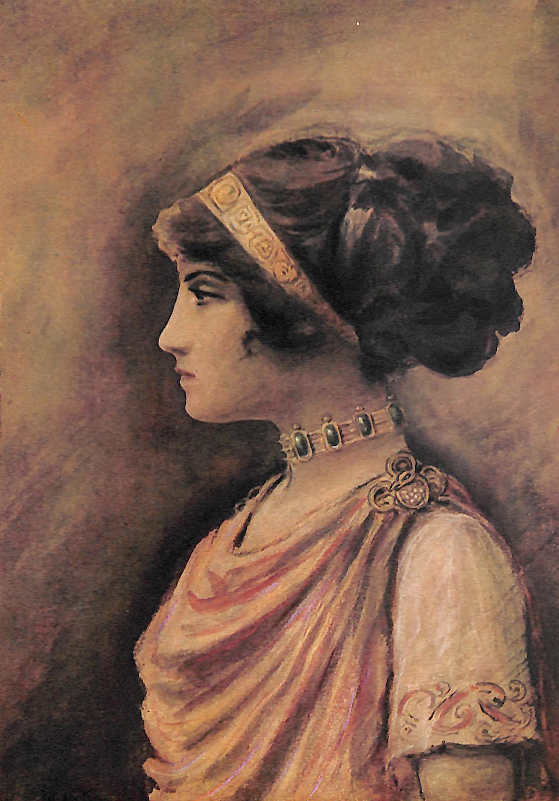

## Жизнь XX

Алкиона родилась в женском теле в 21759 году до н. э., недалеко от того места, где сейчас находится Читтагонг. Она была дочерью Брихат и Нептуна, и была одной из семьи из четырех человек. Ее старшим братом был Уран, а младшей сестрой - Мизар, но оба умерли молодыми: Уран в возрасте восемнадцати лет, а Мизар, при родах, в возрасте пятнадцати лет. Был также младший брат, Вулкан, которого с детства учили священники в храме.

Отец Брихат, по-видимому, был и правителем, и священником небольшого сообщества или королевства. Астрология играла значительную роль в религиозных идеях того времени, и гороскоп Алкионы был составлен с большой тщательностью. В нем предназначался ее брак с Сатурном, который был отдаленным родственником, и предсказывалось, что она даст жизнь ребенку с замечательной силой и святостью, и указывалось, что все ее ранняя жизнь должна быть организована в качестве подготовки к этому предстоящему событию. Инструкции были выполнены, и она получала специальное обучение у священников с этой целью.

Ее детство было счастливым. Мы видим ее как изящную, красивую девочку с длинными вьющимися черными волосами. Единственный способ укладки волос заключался в том, чтобы зафиксировать их у лица золотыми зажимами, в которых были закреплены превосходные бриллианты, такие большие, что они выглядели как яркие звезды против ее темных локонов. Волосы мыли каждый день и натирали магнитизированным маслом, которое, как считалось, стимулировало интеллектуальные способности. Она была аккуратно уклонена от всех возможных проблем или трудностей. Ее единственной горе была смерть старшего брата Урана, к которому она глубоко привязала.

В пятнадцать лет она была торжественно замужем за Сатурна с большой помпой, и через год родился благородный мальчик (Сурья). Это событие вызвало большую радость, и малыш, полный обещаний, был окружен заботой. Алкиона была очень чувствительной и впечатлительной, и когда ребенок был на подходе, у нее был чудесный сон, в котором она видела, как яркая звезда покидает небо и входит в нее. Этот сон вызвал у всех уважение к ней, как к святой. Также она была ясновидящей и осознавала присутствие эго, когда оно присоединилось к ней.

Все казалось предвещать ей долгую и блестящую жизнь в наилучших условиях; однако все эти ожидания обманули, поскольку ее жизнь резко оборвалась в семнадцать лет из-за обстоятельств, когда она добровольно пожертвовала собой, чтобы спасти своего ребенка. Ситуация была такой: дом Алкионы был частью больших построек, возведенных вокруг площади во дворце короля. Служительница, которая меняла воду в стеклянной вазе с золотыми рыбками, была вызвана по какому-то другому делу и оставила вазу на столе под прямыми лучами солнца. Стекло стало линзой, и солнечные лучи, проходящие через него, перетекли на соседние деревянные работы и подожгли их. Дом был полностью сделан из дерева, богато позолоченного, и пламя распространилось молниеносно во всех направлениях, вспыхнув как печь. В этот момент Алкиона была немного в стороне, но когда служители разбежались во все стороны, крича и визжа, она обратила внимание и бросилась, быстрая как олень, к горящему дому.

Малыш был оставлен со своей няней в верхней комнате, но та ушла, доверив своего питомца коллегам-служителям.

Они бежали вниз по тревоге огня, забыв о младенце, и напуганная няня, бросившаяся за ребенком, отшатнулась при виде горящей лестницы, которая была единственным путем в детскую. В отчаянии она закричала: "Ребенок! Ребенок!", но не осмеливалась встретиться с ревом пламени. "Мой мальчик?" - задыхаясь, прошептала Алкиона, и бросилась в пучину огня. Некоторые ступеньки уже обрушились, и в некоторых местах остались только еще не сгоревшие деревянные брускы. Отчаянно она продолжала подниматься, взбиралась, скользила, перепрыгивала через пролеты, через которые вспыхивал огонь, поджигая ее одежду и обжигая кожу. Казалось, никакие человеческие силы не помогут ей добраться до вершины! Но любовь матери всеобъемлющая, и она быстрее, чем можно рассказать, достигла комнаты, где лежал младенец.

Дым валил в комнату, и она завернула несгоревший кусок одежды себе на рот и ползла по полу. Младенец, радуясь игре огня, протянул пышные руки к своей матери, и, подхватив его, она прижала его лицо к своей груди и в ту же секунду побежала вниз, крепко прижимая к себе мальчика. Снова она пересекла этот горящий поток, ее тело обнажено, волосы в огне, из них выпадают алмазы, и огонь отражается от них. Как-то она добралась до дна, чистого воздуха, и упала бесчувственной снаружи, прикрывая младенца, даже падая. Он остался невредимым, а она умирала, и не прошло и часа, как она умерла. Слишком раньше оставив свое тело, слишком сильно пострадав, чтобы сохранять чувство, она едва осознавала страдание, и последняя улыбка казалась быть на освободившейся астральной форме, наклонившейся над спасенным мальчиком. Разве это не карма, созданная ею, умерев за Сурью тогда, урожающая в прекрасной возможности, данной Алкионе служить Благословенному снова?

После смерти его матери за ребенка взялась его тетя Вираж (сестра Сатурна), которая была тогда уже продвинутым эго и с тех пор стала важным членом Оккультной Иерархии. Она была ясновидящей, и через нее Алкиона все еще могла помочь и заботиться о ребенке. Тетя никогда не позволяла слугам трогать младенца и сама качала его в саду на качельке, подвешенной между деревьями. Там, в тихой роще, Алкиона говорила с ней из астрального мира о ребенке, который таким образом рос в священной атмосфере и вскоре стал чудом - в семь лет он учил в храме, и люди со всех сторон приходили слушать его.

Похоже, что время от времени члены тогдашней Иерархии Адептов рождались вместе в разных странах, чтобы помочь в основании новой религии или создать магнитизированный центр. Мы видим их также распространяющими религию и отправляющими экспедиции в другие отдаленные центры, как, например, в предыдущей их жизни в Северной Америке, куда была отправлена экспедиция в Юкатан. В текущей жизни, примерно через двадцать пять лет после смерти Алкиона, мы видим Сурью, отправляющего экспедицию на север, в город Салван. Некоторые участники группы погибли от тягот путешествия; среди них был младший брат Алкиона, Вулкан, в возрасте около тридцати пяти лет.

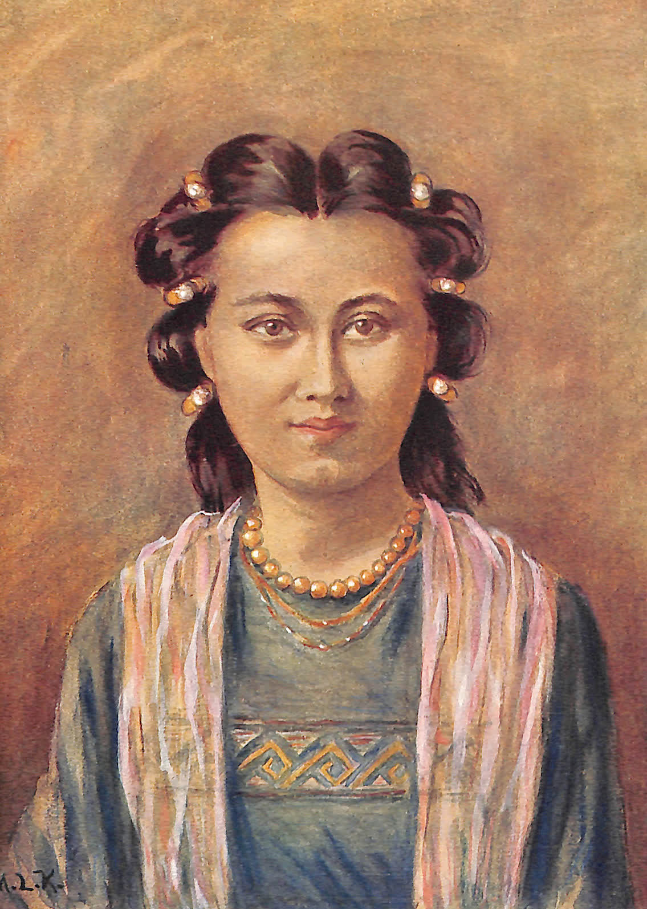

## Жизнь XXI

Наш следующий набор Служителей появился на юге Индии, и в этот раз Орион, который тысячи лет бродил по внешним пустыням, вернулся в группу, но очень странным образом. Он родился в 21540 году как девочка из одного из племен холмов Нилгири, умная, хорошо выглядещая и бесскрупулезная молодая особа. У нее не было намерений жить жизнью племен холмов, поэтому она приняла предложение служить благородной тамильской даме и была назначена обслуживать ее дочь Иоту, которую быстро сделала незаменимой для себя. В этой тамильской семье был семейный артефакт - огромный изумруд, приписывавшийся магическим способностям. Его намагничили в Атлантиде одним из Господ Темного Лица, и предполагалось, что он принесет его обладателю все, чего тот больше всего желает, но в итоге всегда приносил несчастье, и те, кто его использовали, становились инструментами первоначального намагничивателя. Иота уговорила своего отца отдать ей этот замечательный камень и при помощи него устроить для нее брак с соседним королем. Король, настроенный силой камня, выполнил этот план, и послал эскорт, чтобы привести к нему свою невесту. Иота взяла с собой трех служанок, среди которых была Орион, и во время путешествия Орион убила свою молодую госпожу и заняла ее место. Ее заговор удался, и она должным образом вышла замуж за короля Теодороса, которой была хорошей и умной женой. В заслугу Орион стоит отметить, что в новой обстановке она не забыла своего брата Эгерию, которого очень любила, но тайно послала за ним, обучила его, как это подобает ее новому положению, и в конце концов выдала его замуж за одну из дам двора, хотя не признавала его своим братом открыто.

Десять лет спустя, по причинам государственности, король взял вторую жену Ну, принцессу из соседнего дома. После всех этих лет убийство Иоты наконец-то раскрылось, и настоящий статус Ориона был обнаружен. Её муж был возмущен оскорблением его гордости и немедленно приговорил её к смерти. Когда её бросили в тюрьму, она призвала Господа Изумруда, и он явился ей и приказал ей выкинуть изумруд из окна Сигме, одному из маленьких детей второй жены Ну, который играл снаружи. Как только это было сделано, он приказал Ориону принять яд, и когда она покинула своё тело, маленькая девочка Сигма упала мертвой во дворе, и в Ориона была втолкнута в её тело. Когда они пошли проводить королеву на казнь, её, конечно, обнаружили мертвой в её камере.

В теле Сигмы она была обручена в брак с Лео, принцем соседнего королевства, в том, что теперь телугу страна, и после их замужества она побудила своего молодого мужа добиться отречения его отца, чтобы она сама могла стать королевой страны. Алкион родился в 21 467 году их старшим сыном, и было ещё четверо других детей. Когда Алкиону было одиннадцать лет, его мать Орион заболела каким-то внутренним заболеванием, которое оказалось неизлечимым. Как только она узнала, что смерть приближается, она снова обратилась к Господу Изумруда, который сказал ей, что поможет ей ещё раз взять другое тело, но это должно быть тело её дочери Тесеи, которую она очень любила. В течение некоторого времени она отказывалась от этого.

Но в конце концов усиливающиеся страдания заставили её согласиться. Так она утопила Тесею, повесила изумруд на шею ребёнку, а затем бросилась в воду и утонула. Когда она пришла в себя, она была в теле Тесеи, и таким образом, вместо того чтобы быть матерью Алкиона, она теперь, судя по внешнему виду, была его сестрой.

Политика того времени была сложной и тревожной, и Алкион, хоть и стремился выполнить свой долг, был больше заинтересован в своих учебах, чем в государственных делах. Он изучал все, что было обычно для мальчиков его класса и времени, и владел верховой ездой, стрельбой, плаванием и различными видами спорта соответствующей расы. Когда он достиг совершеннолетия, он женился на Геракле, дочери соседнего Раджи, и они были счастливы вместе в своих религиозных занятиях. Священник Меркурий был соседом и близким другом.

Для того чтобы спасти короля Лео от неминуемого поражения от коалиции соседних государств, мать Алкиона Орион уговорила Лео принять сюзеренитет Атлантийского императора Юпитера, и это вызвало большое недовольство среди народа. Несколько лет спустя, когда Орион был вынужден сменить тела и, следовательно, больше не мог направлять политику Лео, недовольство превратилось в открытое восстание, и Лео был повержен и убит. Сириус (сын Гимель, атлантийского дворянина) был отправлен Юпитером из Атлантиды, чтобы стать губернатором королевства, которое таким образом стало провинцией огромной Атлантийской империи. Сириус подружился с Алкионом и Орионом, сначала, возможно, из-за политических соображений, но дружба тихо развилась в истинную привязанность. Он влюбился в Орион и потребовал ее руки у ее брата Алкиона, который с радостью согласился, и тесная связь объединила две семьи, а также семью священника Меркурия. Это облегчило управление провинцией, поскольку официальные главы обеих сторон были теперь так тесно объединены. На самом деле три семьи стали почти одной и образовали некое общество, в котором обсуждались всякие интересные проблемы.

Мы обнаруживаем, что обычно используемый язык тогда в Индии не был санскритом, и обычно церемонии начинались со слова Тау, а не с Аум. Доктрины реинкарнации и кармы были широко известны народу. Учитель (Меркурий) знал о Великих, которые иногда помогали. Некоторые выражения, которые нам знакомы сейчас, также использовались тогда, например: "Я есть То". Меркурий говорил людям, что из всех качеств, которые они могут развивать, из всех квалификаций, которыми могут обладать, наиболее важной является способность признавать, что все есть То. "Вы повергаете дерево, - говорил он, - это жизнь дерева; поднимите камень, это то, что держит вместе частицы камня; это жизнь солнца, это в облаках, в реве моря, в радуге, в славе горы" и так далее. Эти слова взяты из речи Меркурия о смерти. В книге, из которой он читал людям, были хорошо известные фразы, такие как: "Одно есть право, а другое сладость; эти две вещи связывают человека с отдельными объектами. Из двух здорово тому, кто берет правильное, кто выбирает сладкое, упускает свою цель. Правильное и сладкое приходят к смертному; мудрый разделывает оба и отделяет их. Ведь мудрый предпочитает правильное сладкому; глупец берет сладкое, чтобы держать и сохранять". (Катха-Упанишад; слова в переводе Мидса.) Формулировка в книге Меркурия не была точно такой же, но это были явно те же стихи.

Было еще одно выражение: "Если кого-то убили, и я убитый, но я также меч убийцы, и никто не убивает и не убивается, потому что все едины. Нет первых и последних, нет жизни и смерти, потому что все едины в нем".

Книги, которыми пользовался Меркурий, не пришли от арийцев; эта книга, из которой он читал (очевидно, оригинал Катха Упанишады) была написана в городе Золотых Врат членом братства. Она принадлежала к великой коллекции и передавалась из века в век. История Начикетаса еще не была с ней связана.

В одном храме не было вообще никаких изображений. Религия это не было поклонение солнцу - по крайней мере, не исключительно; скорее, это было поклонение силам природы. Вне храма был большой каменный бык, обращенный лицом к храму и смотревший внутрь. Внутри было любопытное устройство - углубление, а не поднятый алтарь. Два или три ступени вели к большому низкому площадному платформу, выстланному красивой плиткой, и затем в центре было углубление с ограждением вокруг него. Люди бросали цветы в углубление, в центре которого была особенно святая плита; на ней были какие-то обозначения, но мы ничего не могли с ними связать.

В другом храме было много изображений, которые были установлены в ниши в его задней стене. Люди носили другую одежду, отличную от той, что была в предыдущем храме, и там были люди, которые были явно священниками, чего не было в другом. Изображения были сидящими с перекрещенными ногами, и у них не было больше натурального количества рук. Это, вероятно, была старая форма джайнизма, и изображения Тиртханкара. Некоторые изображения были обнаженными; другие, на которых было легкое одеяние, вероятно, считались одетыми, или, возможно, предполагался конвенциональный символ.

В другом храме, далеко на севере, уже было лингам. Там уже полностью признавалась тримурти, хотя имена были не те, которые используются сейчас. В одном пещерном храме было гигантское лицо, вырезанное из камня, которое было одновременно тремя лицами, хотя так размещено, что сразу можно было увидеть только одно лицо. Существовал великий храм в Южной Индии, в котором также содержалась Тримурти. Мы пытались узнать значение имени, прикрепленного к нему, чтобы увидеть, какая идея связана с ним в уме его священника, и мы обнаружили, что один священник думает о нем как о: "Том, чья жизнь течет через все."

В то же время другой имел представление, что три человека - это: "Тот, кто открывает ворота, Тот, кто направляет поток, и Тот, кто закрывает ворота". Мы не видели здесь образцов изображений с множеством рук, которые так много в настоящее время.

Священник уверенно говорил о "Озере Света", которое также было Смертью и Жизнью, и Любовью; все потоки впадали в Озеро Света, независимо от того, где они, казалось, начинались. Были также следы теории, что все, что мы видим, - это иллюзия, но единственная Реальность - это Озеро Света. "Мы живем в Озере Света и не знаем этого. Мы думаем о себе как о разделенных, но каждый из нас - это капля в озере."

Казалось, священник постоянно призывает людей отказаться от иллюзии о восприятии через чувства и осознать, что Именно Это - реальное Присутствие за всем этим, и что разделенные формы - это разделенные капли: "Когда они снова падают, они все становятся единым", - говорили они, "и именно мы сами создаем все горе и беды."

У них была молитва к "Господам, которые являются Светами, состоящие из Света”.

То, что написано выше, отражает лишь часть того, чему учили народ, но в небольшом и строго конфиденциальном семейном кругу Меркурий был готов пойти немного дальше, разъяснить истинное значение символа, дать гораздо больше информации об озере жизни и Господах, которые являются светом. Он рассказывал им о великом учителе, которого можно было вызвать определенными молитвами и обрядами, чье благословение можно было вызвать, если они просили об этом искренне и с чистым сердцем. Они призывали его на своих встречах, и ответ всегда приходил, и в двух особых случаях Он даже показывал Себя. Этот Великий - это Тот, Кого мы знаем как Махагуру, и Его особое отношение к этой группе заключалось в том, что Он, в предыдущей жизни, основал их религию и обустроил так, что как основатель, Он будет отвечать на определенные призывы, сделанные в правильных условиях его истинными последователями. Он вложил в ум Меркурия решение его проблем и ответы на их вопросы по религиозным вопросам, и один или два раза были даны определенные личные указания, хотя это было редкое явление.

Священник Меркурий женился на Одиссее. Приятное общение между семьями и их изучение вопросов, которые так их глубоко интересовали, продолжалось гармонично в течение многих лет, и первое раскол в группе произошло в 21423 году до н.э., когда Орион призналась в черной магии перед Меркурием и Сириусом, бросила магический изумруд в море и ушла в аскетическую жизнь, с целью искупить свои поступки. Она передала своих детей на попечение друга Гелиоса, и через четыре года последний женился на Альбирео, младшем брате Алкиона.

Дети этих семей выросли вместе и, естественно, влюбились друг в друга, так что когда они стали взрослыми, между ними произошло немало внутрисемейных браков. Ахилл женился на Мизар, тогда как Уран женился на Веге, а Гектор - на Селене. Однако Альдебран причинил множество проблем для семьи, замешкавшись и женившись на женщине плохого характера (Гамма), которая разрушила его жизнь и оставила его несчастным обломком, когда в конечном итоге оставила его и сбежала с Поллуксом, который был богатым, но развратным торговцем.

Ваджра также вызывал у своей матери Гераклеса тревогу, поскольку проявил склонность к странствиям и стал большим путешественником в поисках знаний и опыта. Он, однако, написал великолепный отчет о своих путешествиях, который снова и снова читалась всей семьей и был практически заучен наизусть младшими членами. Алкион настолько увлёкся некоторыми яркими описаниями, что действительно предпринял не менее трех трудных и опасных путешествий, чтобы увидеть места, так привлекательно описанные его сыном. В ходе этих путешествий он пережил разные приключения, серьезнейшим из которых стало похищение разбойниками и требование выкупа, хотя ему удалось ускользнуть, переодевшись женщиной. В другой раз он был снесен с ног, пытаясь перейти через разбухшую реку, и был смыт на более чем милю, чуть не утонув. Он также сопровождал Сириуса в нескольких официальных турах по провинции; на самом деле, Сириус делегировал ему многие из своих полномочий, стремясь показать людям глубокое согласие между властью Атланты и их старой королевской семьей. У этих двух мужчин были уникально тесные отношения, и, несмотря на то что они принадлежали к разным расам, они всегда казались отлично понимают друг друга. Сириус, который был патриотичен, рассказывал Алкиону многое о славе Посейдонии и Золотых ворот, и наполнил его великим энтузиазмом по этому поводу и горячим желанием увидеть это, что сказалось гораздо позже в его жизни.

Гераклес умерла в 21396 году до н. э. в возрасте семидесяти лет, и Сириус, с которым она была особенно близкой подругой, скорбел об ее утрате не менее, чем Алкион, и устроил для нее самые роскошные похороны. Это оставило Алкиона в одиночестве, и он еще больше привязался к своему другу Сириусу, который в полной мере отвечал ему взаимностью, так что эти два старика были как братья. В течение тридцати лет Сириус регулярно каждый месяц навещал свою жену Орион, которая жила как отшельница; и когда она умерла в 21392 году до н. э., он почувствовал, что больше не может оставаться в Индии, и подал заявление о своем желании отказаться от губернаторства и вернуться в Посейдонию. Алкион, хоть и был в возрасте семидесяти пяти лет, тут же объявил, что намерен сопровождать его, и действительно это сделал.

Двум семидесятилетним путешественникам досталось удачное плавание, и Алкион обнаружил, что роскошь столицы ещё более велика, чем он ожидал. Мало тех, кого Сириус знал сорок четыре года назад, остались в живых, чтобы приветствовать его. Император Юпитер давно ушел из жизни, и вместо него царствовал его сын Марс; он принял двух стариков с большой честью и дал им почетные должности при своем дворе, наградив их многочисленными знаками благоволения. Он, должно быть, чувствовал, что тянется к ним, ибо поручил своим придворным астрологам расчитать их связь с ним, и они сообщили ему, что оба уже более чем однажды сотрудничали с ним в прошлом и что оба предназначаются служить ему в каком-то великом деле в далеком будущем, когда к кругу времени будет добавлено почти четверть лаха лет.

Никто из них тогда не понимал этого пророчества, но очевидно, что оно исполнится в Калифорнийском сообществе около 2750 года н. э.

Ваджра, который сопровождал своего отца, скоро занял выдающееся положение под крылом императора и пользовался его полным доверием.

Сириус и Алкион жили вместе, как братья, десять лет и оба умерли в 21382, будучи здоровыми и жизнерадостными до последнего.

За эти десять лет они совместно подготовили книгу о Южной Индии, которая была высоко ценена и считалась в течение столетий в Посейдонисе классическим трудом по этой теме. Она была в двух томах, один из которых рассматривал различные расы и их обычаи, а другой - различные религии - последний включал в себя многое из учения, данного им давно священником Меркурием.

Немногие из группы служителей, которые приняли несколько более раннее воплощение, записанное в "Диаграмме XIXa", но не вовлеченные в вихрь диаграммы XXI, снова появляются в Индии около 21,200 года, сгруппировавшись вокруг учителя Вулкана.

Прилагается список.

## Жизнь XXII

Наш герой провел следующую жизнь в паломничестве - путешествии совершенно необычного характера, продолжавшемся полвека и протянувшемся на тысячи миль. Тем не менее, он начал свои странствия лишь в зрелые годы. Одной из весьма замечательных особенностей этой серии жизней является их сверхобычный срок на физическом плане. Все эти люди, чьи воплощения мы анализируем, принадлежат к тому, что называют высшими классами, где общая продолжительность жизни обычно больше, чем в низших. Список семнадцати жизней Эрато, например, дает нам среднюю продолжительность на физическом плане в 48 лет; двадцать четыре жизни Ориона дают средний счет 53 ½, и двадцать одна жизнь Сириуса имеет средний показатель 63 6/7 - последний уже заметно превышает норму; но средний показатель Алкиона составляет не менее 74.35!

Действительно, когда его жизнь обрывается из-за несчастного случая, он редко прекращает существование раньше восьмидесяти лет, которые Псалмопевец называет предельным сроком для людей своего времени; и что касается его, то он всегда остается в полном расцвете сил до конца своих необычайно продолжительных воплощений. Является ли это индивидуальной особенностью или характеристикой определенного типа, нам предстоит узнать.

Эта новая глава наших рассказов снова ведет нас к югу Индии, но на этот раз в то, что сейчас является округом Салем, где Уран, отец Алкиона, был важным землевладельцем - своего рода мелким главарем, который мог привести приличный полк своих подданных к стандарту своего верховного господина Марса. Уран был человеком большой смелости и справедливости, и он воспитывал своих детей в этих же добродетелях, говоря им, что без них человек, даже самого высшего происхождения, ничтожнее самого простого человека, обладающего этими качествами.

У него была большая семья, все они были видными членами группы Служителей.

Альквион, который родился в 20574 году до н.э., был ярким, ободряющим, бескорыстным ребенком, глубоко преданным своей матери Меркурии. На протяжении всей его жизни любовь к ней никогда не слабела, и он не предпринимал значимых действий без ее согласования. В его детстве и юности не происходило ничего особенного, что было бы важно для нашего рассказа. Он получил то, что в то время считалось качественным образованием, и в 20 лет женился на Перси, у которой родилось двенадцать детей. У него был прекрасный дом и все, что могла дать ему богатство; но его желание скорее было жить как отшельник, а не как часть мира, и его мать поддерживала это стремление, однако советовала ему дождаться взросления детей, прежде чем уйти от них.

За свою жизнь Альквион принял участие в трех военных экспедициях.

Первая была, когда он был совсем юным человеком, и сопровождал своего отца, когда тот ведет своих воинов войти за Марса. При одном случае во время этой кампании он был удостоен какого-то звания за свои выдающиеся заслуги. Во время второй из этих экспедиций он был сам по себе, но во время третьей его сопровождали сыновья, и Геракл проявил браваду в присутствии Марса, который теперь был уже стар. Вследствие этого акта Геракл получил место в личной охране Марса, где впоследствии он смог оказать ему много маленьких услуг.

Когда этот поход закончился, Король призвал Альквиона и попросил Геракла занять место своего отца в королевстве. Алькион ответил, что будет сделано все, что пожелает Король, но что он считает себя вполне способным продолжить свои услуги в его пользу. Но Король сказал: "Нет, это невозможно, ведь когда вы вернетесь домой, вы узнаете, что понесли большую утрату, после которой вы не будете больше воевать за меня в этой жизни, и при вашем следующем визите в этот город вы будете носить одежду святого человека - паломника".

"Пусть будет так, как желает Король," сказал Альквион; "Живой или мертвый, я всегда буду на службе у Короля". "Верно, вы будете служить," ответил Марс, "не только в этот раз, но и многие разы в предстоящие эпохи; но вашей величайшей службой будет не вражда с моими врагами, а помощь мне в создании королевства в будущем, которое продержится тысячи лет, и результаты ваших достижений в этом будущем королевстве никогда не исчезнут".

Затем Король поблагодарил его и попрощался.

Когда Алкион вернулся домой, он обнаружил, что пророчество Марса сбылось. Утрата, которую король предсказывал, была смертью его матери Меркурия. Это было для него таким большим горем, что он больше не мог участвовать в обычной жизни. Поскольку теперь все его дети достигли возраста разума, он решил осуществить давно зреющее намерение стать отшельником или аскетом. Поэтому он оставил старшего сына, Геракла, представлять его при дворе короля, а второму сыну, Мизару, поручил выполнить его обязанности владельца земли.

Хотя Геракл был еще очень молодым человеком, он стал не только великим капитаном под руководством Марса, но и высоко ценящимся советником. Он был популярен и очень любим народом. С течением времени он стал близким другом Орфея, старшего сына Марса, и после того, как последний унаследовал трон после своего отца, он назначил Геракла своим главным министром, на котором Геракл долгие годы усердно работал. В конце концов между королем и его премьер-министром возникли серьезные разногласия по какому-то вопросу политики. Из-за этого Геракл, который был гиперчувствительным, ушел в отставку и попросил назначить его губернатором далекой провинции.

Король с грустью удовлетворил его просьбу, и Геракл стал практически абсолютным правителем этой провинции, так как король никак не вмешивался в его дела.

В конце концов король умер, и вскоре после этого его преемник, Цетус, выдал некую директиву, которую Геракл считал недопустимой для своего народа. Он игнорировал ее, фактически объявив себя независимым, и его можно считать основателем небольшой отдельной королевства. Геракл женился на Близнецах, женщине штормового нрава, импульсивной и слабого характера.

Тем временем второй сын Алкиона, Мизар, успешно управлял огромным семейным имением. Он удивил всех, женившись на рабыне (Ирине), история которой следующая. Во второй войне, в которой Алкион воевал под командованием Марса, было захвачено много пленников, которых сделали рабами. Среди них был человек, дочь которого так сильно привязалась к нему, что когда его унесли в плен, она отказалась отделяться от него. После смерти отца дочь стала рабыней в доме Алкиона и очень привязалась к нему, служа ему с большой верностью и старательностью. Она помогала заботиться о его детях, и когда Мизар остался практически главой семьи, он решился на смелый шаг - сделать ее своей женой, действие, которого он ни разу не пожалел.

Во время безутешной скорби Алкиона после смерти его матери, почтенный друг предложил ему совершить паломничество к святому человеку, живущему в священном убежище на юге от дома Алкиона. Так они решили совершить паломничество вместе, и младший сын Алкиона, Кигнус, пошел с ними, чтобы заботиться о своем отце. Когда они достигли убежища, мудрый и святой жрец Юпитер принял их очень любезно, и Алкион был обрадован, слушая его слова. Он также разрешил Алкиону стать свидетелем некоторых секретных церемоний, которые очень напоминали Элевсинские тайны, и это стимулировало его психические способности настолько, что во время одной из них он не только увидел видение своей матери, но и смог с ней общаться. Он был настолько глубоко впечатлен красотой храма и его церемоний и святостью верховного жреца, что когда ему сказали, что в Индии есть много таких убежищ, он тогда же дал обет посетить их всех до своей смерти.

Кажется, этот обет иногда давали аскеты в тот период, но большинство из них умерли, не успев осуществить его.

Алкион вскоре обнаружил, что может продолжать общение со своей матерью Меркурий, и это являлось большой радостью и утешением для него. Она одобрила его паломничество и предприняла направлять его из убежища в убежище на его пути. Затем мы видим его в большом храме, которые располагается там, где сейчас находится Мадура; верховным жрецом, который отвечал за него, был Сатурн.

Некоторое время спустя после того, как он покинул это место, мы находим его в святилище в Центральной Индии около реки Годавари, где Брихат встретил его с самым теплым гостеприимством и дружбой.

Не много времени спустя произошел печальный инцидент. Как вы помните, Кигнус сопровождал Алкиона в его путешествиях.

Кигнус был глубоко привязан к своему отцу, был полностью готов служить ему любым образом, проявляя удивительную преданность. Это была одна сторона его характера; но, с другой стороны, он постоянно впутывал себя в дела противоположного пола. В три отдельных случая во время этого паломничества он попал в очень серьезные неприятности, и Алкиону приходилось с трудом успокаивать местных жителей. Каждый раз Кигнус обещал воздержаться от такого поведения, и его глубоко огорчало то, что у него возникали проблемы. Алкион снова и снова угрожал отправить его домой, но эта проблема продолжала возникать.

В четвертый и последний раз случился особо тяжелый случай, и подробности стали общеизвестными, вызвав сильное населенное возмущение. Из-за этого Алькион и Цигнус были вынуждены бежать неожиданно посреди ночи, чтобы избежать линчевания гневной толпы. Они укрылись в джунглях и там были атакованы тигром. В момент, когда тигр собирался прыгнуть, Цигнус - испытывающий глубокие сожаления и жестко упрекающий себя за вызванные беды - бросился перед своим отцом, чтобы принять на себя весь вес животного. Алькион немедленно атаковал зверя своим посохом - единственным наличным оружием, и в конце концов отбил его. Но Цигнус уже был мертв, и его отец глубоко оплакивал его потерю.

Затем Алькион двинулся в сторону Бирмы. Когда он достиг окрестностей Чандернагара, он посетил храм, куратором которого являлся старший священник Венера. В данном месте почитание имело много общего с астрологией, а на стенах храма можно было увидеть планетарные символы, выполненные из магнетизированного металла.

Оттуда Алькион продолжил свое путешествие на северо-восток и в конечном итоге достиг святилища в районе Лакхимпур возле реки Брахмапутра. Это место контролировалось Лирой, китайским священником, прибывшим из Тибета с целью учреждения новой религии под прямым вдохновением Махагуру. Позже этот священник стал философом Лао-Цзы. Он подарил Алькиону удивительный талисман из какого-то черного камня, инкрустированного крошечными китайскими значками, выполненными белым цветом. Их нанесение было произведено настолько аккуратно, что казалось, будто это сделано каким-то химическим веществом, которое отбелило камень. Вследствие этого талисман напоминал белые прожилки на черном мраморе. Этот талисман излучал удивительно сильные вибрации, а его целью, как говорили, было защищать Алькиона под влиянием определенных возвышенных сил, которые непосредственно подчиняются Махагуру. Прежде чем Алькион удалился, старший священник произнес над ним необычное благословение, предвидя для него обширную сферу полезности в далеком будущем.

Следующий храм, который посетил Алькион, был частью небольшого монастыря, расположенного на снежном склоне горы возле Брахмкунда. Многие из этих мест кажутся обеспеченными лично Махагуру, некоторые из них посредством весьма приземленных методов, почти таким же образом, как, спустя тысячи лет, были учреждены магнетизированные центры Аполлонием из Тианы.

После ухода из Брахмкунда, Алкион провел несколько лет в медленных путешествиях по всему северу Индии, во время которых он столкнулся с многими приключениями различного рода. Возможно, следующая особенная точка интереса для нас — это его визит в святыню на горе Гирнар в Катхиаваре, где главным священником был Алкесист. С этим местом Алкион и Орион были тесно связаны в последующей жизни; и теперь там есть великолепный джайнский храм, один из залов которого сам Алкион построил в те поздние времена.

Отсюда Алкион отправился в Сомнат, место, расположенное недалеко от моря, с прекрасным видом. Храм здесь был под попечением Вираджа и построен на самой великолепной шкале.

Чтобы добраться до следующего важного святилища, Алкиону пришлось вернуться на север и ему пришлось пересечь долгий, бесплодный, заброшенный участок земли, недалеко от того места, где сейчас находится Ахмедабад.

Мы снова видим нашего паломника в районе Сурата, в некоем типе пагоды-храма. Здешнее святилище было под опекой Палласа, старого священника с белой бородой и внушительным видом; великолепный, величественный человек, крайне интеллектуальный, хотя, возможно, слишком мало сердечности.

Этот священник был известен в гораздо более поздней жизни как философ Платон.

Чиновники, связанные с этим святилищем, были скорее государственниками, чем аскетами.

После Сурата, Алкион посетил храм в холмах Виндхья, названный атлантским именем, но не представляющий особого интереса. Здесь была говорящая статуя, которая работала с помощью говорящей трубы, но священники, управлявшие этим, не чувствовали, что обманывают людей. Священник, который говорил, действительно верил, что он вдохновлен божеством, и, передавая свое послание через рот статуи, он считал, что просто представляет его так, как он скорее всего произведет впечатление на своих слушателей. Среди священников там были хорошие люди, одним из которых был

Фоцея, который взял себе в жены Проциона.

Продолжая путь, странник посетил множество мест по пути домой и в целом потратил около пятидесяти лет своей жизни на исполнение своего обета. В конце концов, он обосновался в пещере, которую он обитал до начала своего паломничества, где он прожил до необычного возраста ста девяти лет.

Во время своих медитаций Меркурий постоянно появлялся перед ним и давал ему много советов и наставлений. Она помогла ему вспомнить предыдущие жизни и тех, кто был с ним в них, поэтому его пещера была населена мысле-формами многих персонажей, которые ранее появлялись в этой серии жизней.

Снова мы наблюдаем тот же феномен, который уже заметили ранее - некоторые члены группы не могут или не остаются вне инкарнации столь долго, сколько это делает Алкион, и, следовательно, мы имеем важную маленькую группу в той части Центральной Азии, которую мы теперь знаем как Тибет. Она, по-видимому, находится там для реформации и повышения религиозности людей, и сосредотачивается вокруг священника, Юпитера, который черпает свое вдохновение от Сурьи. Последний, однако, не встречается в инкарнации в этот период, но время от времени появляется астрально.

## Жизнь XXIII

Теперь мы переходим к другой замечательной древней цивилизации, поскольку следующее воплощение нашего героя произошло в 19554 году в древней туранской расе на территории современного Китая. Однако для появления всех наших героев на сцену нам придется вернуться немного назад по времени и пространству. Мы видим, что Орион родился в 19617 году в той же подрасе, но уже на территории современного Бактрии. Он происходил из старого, но обедневшего семейства, главной целью жизни которого было восстановление своего благосостояния. И именно в стремлении осуществить эту семейную идею Орион пережил такие приключения, которые отличили эту его жизнь.

Благодарный мужчина, которому Орион помог во время больших страданий и крайней бедности, рассказал ему странную историю о большом зарытом сокровище, на которое он наткнулся случайно, охотясь на севере страны. Он принес с собой немного взятое с собой, намереваясь вернуться позже с помощью и забрать остальное, но по пути назад с ним произошло несчастный случай, от которого он так и не оправился. Когда мужчина умер, Орион рассказал эту историю своему отцу, и, хотя они сначала не очень-то верили в неё,  решили отправиться на поиски сокровища. Во время этой экспедиции его поймали и поработили одно из жестоких кочевых племен. Он пережил двенадцать лет больших страданий. Его семья считала его мертвым – исключение составлял лишь второй сын Беллатрикс, который упорно верил, что отец жив, и решил отправиться на его поиски, как только станет взрослым. Так он и сделал, и спустя два года приключений нашел своего отца. Им обоим удалось сбежать. После этого они продолжили поиски сокровищ, успешно их отыскали и привезли домой, к радости и удивлению всей остальной семьи.

Нация Бактрии находилась в опасности быть поглощенной более мощной силой с юга и одновременно постоянно страдала от налетов кочевых племен с севера. Чтобы избежать этих бедствий, большое число его жителей переехало на восток, и семья Ориона в конце концов решила присоединиться к одному из этих переездов.

В конце концов, они поселились в плодородном районе на юге Китая и обустроили там уютный дом. Именно в этом районе и от ветви этой семьи наш герой Алкион родился. Он был правнуком Ориона и сыном Мира, который был человеком с достаточно большим богатством и влиянием и занимал различные высокопоставленные должности в своем районе. Мира был человеком тонким и властителем, но справедливым и добросердечным, и всегда относился хорошо к маленькому Алкиону, хотя иногда не понимал его и был немного нетерпелив. Мать Алкиона была Селена, также добросердечная личность; ученая женщина, больше занимавшаяся философскими вопросами, чем бытовыми заботами. Мира чрезвычайно восхищался ей и был горд ее образованием и литературными способностями, и эти чувства в полной мере разделял Алкион, как только он стал достаточно взрослым, чтобы их понять. Вероятно, главное влияние в его жизни оказало присутствие его брата Сириуса, который был старше его на два года и, следовательно, был своего рода мальчишеским героем в его глазах. Даже будучи детьми, эти два брата были неразлучны, и хотя они иногда попадали в неприятные ситуации, в целом они были довольно хорошими маленькими мальчиками.

Когда им исполнилось десять и восемь лет соответственно, одним из их главных удовольствий было сидеть у колен матери и слушать, как она объясняла им свои теории. Конечно, они не полностью их понимали, но были восхищены ее явной радостью, и естественно, постепенно они впитывали некоторые из ее идей. Они были особенно очарованы книгой, которую она написала сама, которая казалась их детским умам вполне божественным откровением. Это была попытка объяснить и популяризировать учения книги великой древности, которая была привезена из Атлантиды; похоже, это была первоначальная форма одной из Упанишад. Оригинал этой книги дети учились относиться с наибольшим уважением и почтением. В нем было много любопытных цветных диаграмм, над которыми они любили замирать с наибольшим интересом, хотя их толкования были очевидно фантастическими.

Когда Алкионе исполнилось около двенадцати лет, благодаря смелым действиям он спас своего брата Сириуса от серьезной травмы, возможно, даже спас его жизнь. Они бежали вместе по лесу, Сириус, как обычно, на несколько шагов впереди, когда они наткнулись на остатки костра, который был сделан в неглубокой яме. Огонь догорел до такой степени, что на поверхности была видна только черная обугленная масса, и Сириус прыгнул на нее, не подозревая о ее природе. Он пробил поверхность и вывихнул пятку, пытаясь вырваться, и не заметил, что пламя вспыхнуло за ним и впилось в его одежду. Прибежавший Алкионе оценил ситуацию и тут же прыгнул на него, отрывая горящую одежду с него, обжиг руки; затем, увидев, что его брат поражен и беспомощен, он отвлек его от быстро оживающего огня и перекатывал его по траве, чтобы потушить тлеющую ткань. Мальчики с трудом добрались до дома, взаимно помогая друг другу, Сириус перевязал обожженные руки Алкионе, поддерживая его как костыль для Сириуса, который с трудом прыгал на одной ноге.

Как только братья выросли, они стали увлеченными сторонниками теорий своей матери, что в какой-то мере привело их в противоречие с ортодоксальными идеями того времени и вызвало считать их эксцентричными. К счастью, тогда и там люди, похоже, были терпимы к религиозным вопросам, и не было никакого преследования из-за различий во взглядах.

Когда Сириусу было около двадцати, а Алкиону — восемнадцать, они оба страстно влюбились в Альберио, молодую даму, в жилах которой течет королевская кровь, будучи внучкой Марса, который в то время был императором Западного Китая. (Ваджра, дочь Марса, вышла замуж за Улисса, губернатора провинции, в которой жила наша семья, и по слухам, она подарила ему весьма несчастную жизнь.

Как бы то ни было, одна из их дочерей была Альбирео, и она была красивой девушкой, добродушной, но в то же время волевой и авторитетной. Братья были неосознанными соперниками за её руку, но, к счастью, Сириус вовремя обнаружил, чувства своего брата и решил подавить свои собственные чувства ради Алькиона. Он предложил всю свою долю семейного состояния Алькиону, чтобы тот мог ухаживать за ней с достоинством, соответствующим высокому сословию его возлюбленной. Не то чтобы сама она заботилась о деньгах, пока у неё было все, что она хотела, но согласие её отца могло быть куплено только дорогими подарками и, ещё больше, демонстрацией власти, которую дает большое состояние. Алкион долго отказывался принимать подарок своего брата, но отношение Улисса фактически вынудило его согласиться или отказаться от надежд стать женихом Альбирео.

Сириус не слушал о варианте отказа, утверждая, что этот союз будет высоко важен для семьи, хотя его настоящей причиной было то, что он знал, что неудача в его ухаживаниях разрушила бы сердце брата, которого он любил больше всего на свете.

Были и другие претенденты - в частности, богатый, но недобросовестный молодой человек (Скорпион), который владел большим богатством, но происходил не из благородной семьи. Он пытался настоять на своих желаниях различными подозрительными способами, и его планы вскоре столкнули его с Сириусом, который его откровенно презирал и недолюбливал. Когда в конце концов Сириус и Алкион устроили свадьбу последнего с Альбирео, Скорпион был в ярости и убежал в гневе, клянясь отомстить им, но они только смеялись над ним и вызывали его на дуэль

Позже Скорпион вернулся, притворяясь, что сожалеет о своем гневе и искренне стремится загладить его и сотрудничать в делении счастья молодоженов. Он рассказал им, что, почувствовав стыд за свой всплеск гнева, он обратился к астрологу, чтобы узнать, что он может сделать, чтобы помочь им, и узнал о большом сокровище, предназначенном для них, которое они могут получить только с его помощью. Он заявил, что это сокровище спрятано в определенной пещере в долине в отдаленной части страны, и предложил отвести их туда. Алькион, будучи честным и недоверчивым, склонен был верить этой истории, тем более что им нужны были деньги на свадьбу; но у Сириуса были сомнения, и он настоял на своем присутствии в этой поездке. Когда они приближались к месту, Скорпион устроил так, чтобы он задержался, - фактически он подкупил слугу, чтобы причинить небольшую задержку, так что Алькион и другой слуга (Борей) отправились одни к пещере.

Сначала Сириус не обращал внимания на задержку, но когда появились другие незначительные препятствия, он начал волноваться. Вдруг перед его глазами мелькнул видение, в котором он видел, как Алкиона атакуют дикие звери, и он инстинктивно почувствовал, что вся эта ситуация - дьявольский заговор. Хотя это было лишь интуицией, и он не имел доказательств, он сразу обвинил Скорпиона в коварстве и покушении на убийство, и бросил ему такой вызов, что злодей побледнел перед ним и практически признал свою вину. Сириус связал его и оставил под присмотром слуги, заверив, что если с Алкионой случится что-то плохое, он не преминет его убить при возвращении. Он взял с собой еще одного человека и поспешил на поиски своего брата, которого догнал как раз вовремя, чтобы предотвратить его попытку войти в пещеру.

Потом они обошли скалу сверху и посмотрели, были ли основания думать о диких зверях, и вот они увидели, как из пещеры выходят два облачных тигра. Когда они вернулись, они взяли Скорпиона с собой в качестве пленника и передали его губернатору, Улиссу, который, услышав их историю, изгнал его из страны.

Все это время Алкион даже не догадывался о неразделенных чувствах, которые разъедали сердце Сириуса. Когда все было утверждено и день свадьбы назначен, Сириус несколько расстроился и придумал оправдание, чтобы уехать в далекий город.

Алкион был очень удивлен и немного обижен отсутствием своего брата на церемонии, он не мог понять это, но после свадьбы оказалось, что у Альбирео были свои подозрения, и именно благодаря ее интуиции правда наконец-то вышла наружу. Алкион был полон угрызений совести и заявил, что хотя он не смог бы жить без Альбирео, он лучше бы умер, чем жил без своего любимого брата. Но Сириус успокоил его и сказал, что без воли богов он не мог бы знать, что происходит в голове его брата, и поэтому его жертва должна быть приемлемой в их глазах, и поэтому Алкион тоже должен мирно принять это как роковое решение. Тем не менее, Сириус так и не женился, а оставался верен памяти о первой любви; и на самом деле Альбирео была тронута и заявила, что любит и уважает их обоих одинаково.

У Сириуса и Алкиона была младшая сестра Вега, к которой они глубоко привязаны. Поллюкс, знакомый, которого пригласили в дом, обратил восхищение к этой молодой сестре и обманул ее, а когда было неизбежно обнаружение, он сбежал. Алкион и Сириус решили отомстить за обиду своей сестры и вместе отправились на его поиски. Они преследовали его по всему Китаю в течении двух лет и в конце концов выследили его в северной части страны.

В то время как они занимались этими поисками, Алкион заболел в местечке под названием Урга.

В том месте находился известный храм, которым руководил Орфей, Лама с длинной белой бородой. Он гостеприимно принял братьев, приютил их и поручил Ауриге, одному из своих священников, заботиться об Алкионе. Молодой священник очень привязался к своему пациенту и тщательно присматривал за ним. Когда Алкион снова почувствовал себя хорошо и они продолжили свою миссию, этот молодой человек сопровождал их на некотором расстоянии и оказывал им большую помощь.

Они обнаружили, что Поллюкс, который, очевидно, очень их боялся, перебрался на остров Сахалин в надежде уйти от них. Они, тем не менее, последовали за ним и в конечном итоге догнали и убили его; затем они вернулись домой с чувством выполненного долга. Согласно морали того времени, этот убийство Поллюкса было признано полной восстановлением репутации Веги, и через некоторое время она вышла замуж за Тифия, состоятельного купца из города и члена совета губернатора, а их старшей дочерью была Ирис, которая впоследствии вышла замуж за Лео. Мизар ранее женился на Полярисе, который был сыном библиотекаря главного храма. Они жили счастливо, и со временем Полярис занял должность своего отца.

Во время их отсутствия изгнанный Скорпион вернулся под видом аскета и сумел обрести покровительство Кастора, влиятельного политика. За границей Скорпион каким-то образом приобрел мезмерическую силу и знания в области магии нежелательного рода и, нищенствуя у дома Кастора, пометил его как легкую жертву, использовав свое мезмерическое влияние, чтобы получить приглашение постоять у него дома на постоянной основе. Постепенно он завоевывал большое влияние на Кастора, который устроил его в одном из храмов как священника. Он удерживал свою позицию в этом храме многие годы, и с большим успехом применял свои искусства на людях. Он никогда не забывал свою злобу к Сириусу и Алкиону, и постепенно отравил ум Кастора против них и вызвал множество неприятностей, так как Кастор в некоторой мере сумел повлиять на отца Альбирео.

Юлий также выступил против них, что привело к напряженности в семье. Скорпион нашел подходящий инструмент в лице Тетиды, молодой женщины сомнительного характера, которая влюбилась в старшего сына Алкиона Льва и обратилась к Скорпиону за помощью, чтобы получить какое-то любовное зелье для его. Скорпион согласился помочь ей при условии, что она передаст ему все деньги, которые унаследовала от своего отца. Затем он сделал глиняные изображения Льва и молодой женщины, совершил над ними множество мезмерических проходов с различными странными заклинаниями, и затем умудрился спрятать их в спальне Льва.

Его магия сработала до некоторой степени, и ему удалось вызвать в уме Льва увлечение этой молодой женщиной, до такой степени, что он даже говорил о том, что разрушит свою жизнь, женившись на ней. Однако сестра Льва Меркурий была интуитивна, и она чувствовала существование некоего заговора; она также знала, что ее брат сам по себе никогда не был привлечен женщиной такого грубого типа. Она обратилась с этим к своему отцу и дяде и заявила о своем убеждении, что Скорпион как-то замешан в заговоре, и что он - мошенник. Сириус давно сомневался в нем, видев доказательства того, что он обманывает людей при различных мелких предлогах, и на основании того, что сказала Меркурий, он решил провести расследование, которое вскоре привело к опознанию личности Скорпиона. Это открытие сделало Скорпиона подверженным смертной казни, так как его приговор к баню запрещал ему возвращаться в страну под страхом смерти; так что его немедленно казнили.

Все его интриги были раскрыты благодаря быстрой интуиции Меркурия, так что не только Лев был освобожден от его чар, но и Улисс и Кастор увидели, как они были введены в заблуждение, и была восстановлена идеальная гармония. Улисс стремился загладить свою прошлую холодность и недоверие, поэтому несколько лет спустя, когда он заболел и врачи сказали ему, что он не может выздороветь, он послал посланницу к Марсу, объявляя о своей приближающейся смерти и прося, чтобы Сириус был назначен на его место. Марсу это предложение понравилось, и Сириус стал губернатором района.

Он назначил Алкиона главным судьей, и они оба занимали свои должности с большой честью и уважением до своей смерти в 19485 году.

Разоблачение Скорпиона значительно укрепило репутацию Сириуса, а его строгая честность поддерживала ее на самом высоком уровне. Его племянница Меркурий, которой на самом деле благодаря и было сделано это открытие, вступила в храм в качестве постуланта и отличилась своим ясновидением и способностью излечивать определенные болезни.

Когда ей было около тридцати лет, Марс, теперь уже очень старый человек, совершал своеобразное торжественное шествие по своему королевству. Когда он прибыл в их район, накладывалась обязанность Сириуса и Алкионе принять его. Так случилось, что Марс встретил Меркурию и сразу почувствовал к ней большое впечатление. Он не терял ее из виду и в итоге убедил её покинуть храм и выйти замуж за Осириса, одного из его внуков, так что позже он стала королевой страны. Но это произошло, конечно, долго после смерти её отца. Сириус и Алкионе были так же неразлучными в старости, как и когда были мальчиками; на протяжении всей долгой жизни между ними никогда не возникало недоразумений, и они умерли в течение нескольких дней друг за другом, каждый чувствовал свою жизнь неполной без другого. Поскольку Сириус так и не женился, сын Алкионе, Леон, был назначен на вакантную должность губернатора, исполняя которую он весьма достойно проявил себя, бесценным помощником ему была его добрая супруга Ирис.

Наш первый эксперимент по изучению деталей прошлых жизней был проведен в связи с персонажем, названным Эрато, и точкой, в которой случайно начались эти исследования, было его рождение в Халдее в 19245 году до н. э. Он родился в наследственном жреческом касте, но, к сожалению, одновременно он родился в роскошной наследственной вражде, связанной с этим. Его дед Кастор имел близнецов, Мелету и Аглаию, и поскольку законом было положено, что верховное священство переходило к старшему сыну его нынешнего обладателя, вопрос о несколько минут преимущества был важным. К сожалению, медсестра, которая следила за детьми, перепутала их и не знала, кто есть кто, поэтому, так как вопрос не мог быть решен, Кастор постановил, что они должны быть сонаследниками. Когда они выросли, между ними было некоторое количество ревности, и каждый из них был решен на то, что его сын позже станет верховным жрецом. Эрато был сыном Мелеты, в то время как Фоция был сыном Аглаи. Зависть Аглаии зашла до того, что он даже решился трижды попытаться убить своего племянника Эрато. Третья попытка была по меньшей мере частично успешной, поскольку хотя Эрато ушел, его отец Мелет был убит. Была сделана четвертая попытка, но снова Эрато ушел, его младший брат Юно был убит вместо него. На этот раз вся история была раскрыта, и губернатор города вмешался, но его роль была отнята, так как император Теодор случайно оказался в этот период на одном из своих обычных визитов инспекции. Услышав об этом, он вызвал перед себя всех участников; и когда он узнал всю историю, он решил положить конец всем трудностям, дав каждому из кузенов отдельную сферу деятельности. Поскольку Фоция не был в курсе заговора об убийстве своего кузена, он оставил его в одиночестве заботиться о храме своего родного места, но увез Эрато с собой в свою столицу, чтобы заполнить вакансию в большом храме там. Там он прожил мирную и полезную жизнь под руководством главного жреца Палласа; и после смерти последнего он принял его должность и стал самой важной религиозной властью в королевстве Халдея.

Он прожил до старости и был очень уважаем. Ниже приведен список наших персонажей, которые появлялись с ним.

Почти та же подгруппа, которую мы видели на диаграмме XXIIa, пытаясь провести религиозную реформу в Тибете, снова занималась точно такой же работой 500 лет спустя на другой стороне мира в долине Амазонки. В то время это было местом интересной, но несколько изнуренной цивилизации, и вполне очевидно, что требовалась большая работа по очищению, в которой наши члены участвовали. Группа снова находилась под руководством Юпитера, но в этом случае Сурья, вместо того чтобы действовать из астрального мира, родилась обычным образом и вышла замуж за дочь Юпитера Нагу. Его проповедь была популярна во всей стране и дала ей в улучшенной форме новое срок службы, который продолжался несколько тысяч лет. Он жил долгую и активную жизнь, и когда он ушел, руководство над работой перешло к его старшему сыну Ваджре, который взял на себя огромную миссионерскую работу и провел свою жизнь, путешествуя по континенту. Из работы, выполненной в это время, и из организации, созданной на основе этой работы, развилась та удивительная перуанская цивилизация, с которой мы сталкиваемся в Жизни XXXIII.

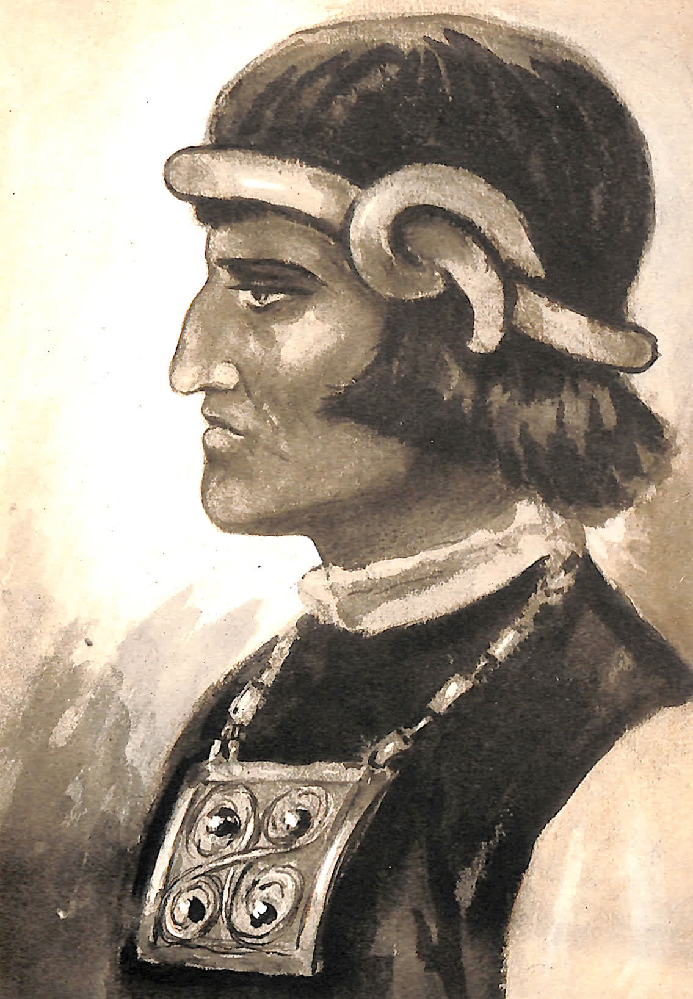

## Жизнь XXIV

Колыбель великой арийской расы была на берегах Центральноазиатского моря, которое (до катаклизма, затопившего остров Посейдонис под водами Атлантического океана) занимало территорию, которая сейчас является пустыней Гоби. Великий основатель расы, Ману Вайвасват, установил свою колонию там после неудачной попытки в горных районах Центральной Аравии, и после долгого инкубационного периода и многих перемен раса стала великой и мощной. Несколько раз за все время ее существования Ману отправлял огромные войска для создания подрас в различных частях этого огромного континента, и в тот момент, о котором мы сейчас пишем, эта энергичная нация снова выросла за свои границы. В течение своей истории Ману вновь и вновь воплощался, чтобы направлять ее, но во времена рождения Алкиона (18 885 г. до н. э.) он не появлялся физически среди своего народа в течение многих столетий, и поэтому было время для возникновения различий в мнениях о том, что именно он хотел.

Возникла группа людей, которые утверждали, что теперь, когда новая раса была окончательно установлена и не было опасности потерять тип, самые строгие установления Ману о немешании с другими расами больше не предполагались рабочими. В результате некоторые семьи позволили себе вступать в брак в политических целях с некоторыми правителями татарских рас. Это считалось преступлением у тех, кто был более ортодоксальным, и это привело к стольким трениям, что в конечном итоге те, кто поддерживал более широкое мнение, стали отдельной общиной, которая со временем превратилась в значительное королевство. Однако сами они, по-видимому, вскоре отказались от идеи о межрасовых браках, так что практически не было заметной разницы в типах между двуми племенами, но это нисколько не улучшило ситуацию с религиозным разделением, которое, наоборот, казалось, усиливалось с течением времени. Огромная часть арийцев с ужасом смотрела на это племя, которое когда-то смешивалось, и не хотела иметь никаких дел с ними. Появление или развитие различий в языке между ними еще больше подчеркивали разделение, и их воспринимали как враждебную расу на протяжении многих столетий, пока быстро растущие ортодоксальные арийцы не заняли их изначальную территорию после многих битв, и в конце концов не выдвинули их в пустыню.

Пахотные земли вокруг берегов Моря Гоби занимали ограниченную территорию, и большую часть ее занимало великое центральное ортодоксальное королевство пятой коренной расы. Эта отделенная раса, соответственно, должна была довольствоваться гораздо менее желаемыми территориями, и они в основном поселились в долинах вокруг северных холмов. Численность центральной расы росла настолько быстро, что она постоянно давила на эти независимые племена, пытаясь аннексировать их долины. Ортодоксы были настолько удивительно фанатичны и нетерпимы, что они не могли мирно сосуществовать с этими другими, отличающимися от них, и рассматривали их как демонов, которых следует истребить, поэтому в большинстве случаев компромисс не был возможен.

Марс, который в то время был королем одного из племен этой отделенной расы, долгое время был сильно озабочен вторжениями ортодоксов. Несмотря на то, что ему удалось противостоять им, он знал, что он не может надеяться на это бесконечно, потому что его племя, хотя и было большим и хорошо организованным, было лишь каплей по сравнению с многочисленностью центральной расы. Если он не будет постоянно бороться с ними, его раса быстро будет истреблена, и казалось, что даже самое решительное сопротивление может лишь отложить на некоторое время этот неизбежный конец. В своем недоумении по этому поводу он часто обращался за советом к своему духовному учителю Юпитеру; последний всегда настоятельно советовал не воевать, но не говорил ему, как он должен поддерживать существование своего народа.

Проблема все время обострялась, а опасность становилась все более реальной, когда в ответ на множество молитв и призывов Марсу пришло видение, которое определило его дальнейшие действия. И ортодоксы, и те, кого считали неортодоксами, в равной степени почитали память об Ману и отдавали ему практически божественные чести, поэтому когда он явился Марсу во сне и дал ему совет о его трудностях, тот с радостью принял предложенное решение.

Ману сказал ему, что дилемма, в которой он оказался, не была результатом игры случайных сил, а была запланирована задолго до этого как часть его плана. Он объявил, что его желание состоит в том, чтобы Марс, которого он особенно избрал для этой работы, возглавил авангард самой большой миграции в истории, то есть чтобы он взял свое племя и двинулся на запад и на юг на много лет, пока он не достигнет определенной священной земли, подготовленной для него - земли, которая превосходит все другие по плодородию и на которой может быть достигнут большой духовный и материальный прогресс. Здесь он должен поселиться и очень процветать; и ему было особо приказано благообразно и добре относиться ко всем племенам и расам, с которыми он вступал в контакт, воевать с ними только в случае крайней необходимости.

Он должен был вступить в эту обетованную землю и медленно двигаться к ее крайним пределам, и ему предсказывали, что племена православной империи, которые так настойчиво давили на него, восторгнутся от его ухода и торжествуют над покорением его земель; но в будущем они также увидят, что его люди управляют наиболее желаемой частью обетованной земли, и их попытки изгнать их не принесут успеха. Было также сказано, что он сам в будущих жизнях будет играть не последнюю роль в управлении этими миграциями, и что в награду за всю эту тяжелую работу он и его жена Меркурий получат в будущем привилегию совершать еще большую работу - такую же, какую совершил сам Ману. Это предсказание в особенности относилось к его сыновьям Гераклу и Алкиону и ясно говорило о том, что в будущем их ждет работа аналогичного рода.

Этот видения сразу же вывело Марса из всех его затруднений и наполнило его энтузиазмом к великой миссии, которая была ему доверена. Он приказал собрать всех своих людей и рассказал им о том, что он видел и слышал, и о том, что он решил сделать, и он говорил так убедительно, что унес за собой весь племя и заразил его своим пылом. Он приказал собрать большие запасы еды в наиболее вероятных формах, и вести с ними крепких и лучших из их стад. Он обратился к своим астрологам за советом о лучшем дне для старта, и незадолго до него он спланировал и провел успешный налет на территорию своих православных врагов, приобретая различное имущество, которое было ему полезно, а свой народ он увел в безопасное место и усердно продолжал свое путешествие до возможности отомстить.

Среди его подданных была довольно большая группа, которая считала эту миграцию диковинкой и видение Марса обманом. Во главе этой восставшей партии стоял Аластор, и он заявил, что его совесть не позволяет ему следовать за лидером, которого, как он верил, руководит какая-то злая или дьявольская сила, обманывая и вводящая его в заблуждение, и подталкивает его к безумному предприятию, которое может закончиться только полным гибелью тех, кто настолько глуп, чтобы последовать за ним. На эту тираду Марс ответил, что он не заставит никого идти с ним, поскольку ему нужны только лояльные и добровольные соработники, и что Аластор и его сторонники могут остаться, если хотят. Только небольшое число из партии Аластора были готовы совершить такой крайний шаг, и большинство его друзей настояли на пересмотре его решения. Он, однако, оставался упрям, заявляв, что он и его группа адуламитов - единственные, кто действительно верен приказам Ману, поскольку они остаются в стране, где он их установил, и отказываются отвлекаться от своего явного долга истерическими сновидениями и притворными откровениями.

Марс больше не тратил на него времени, но сказал ему, что он может идти на разрушение своим собственным путем. Аластор оставался и продемонстрировал некоторое зло умение в своих попытках извлечь максимальную пользу из ситуации. Как уже говорилось, Марс организовал налет на правоверных, и, естественно, их правитель организовал наказательную экспедицию, чтобы подавить дерзких горцев.

Аластор смело вышел навстречу этой армии, объявил себя главой одной из двух конкурирующих сторон, существующих в горном королевстве, и предложил свою поддержку захватчикам при условии хорошего обращения с ним и его людьми. Он заявил, что в течение долгого времени он был убежден, что люди его племени ошиблись, давно вступив в брак с атлантами, и что он часто хотел присоединиться к правоверной империи, но Марс его от этого отговаривал. Он описал маршрут, выбранный последним во время его миграции, и предложил показать захватчикам, как они могут догнать его, пересекая холмы по кратчайшему пути, и, возможно, разгромить его народ. Правоверный лидер решил принять его предложение о помощи и обещал ему жизни его последователей в обмен на эту предательству. Экспедиция, ведомая Аластором, бросилась в горы в попытке перехватить Марса; но будучи непривычными и неподготовленными к большим высотам, ее участники очень страдали, и когда они после многих трудностей совсем стали встречать Марса, они были разбиты с большими потерями.

Однако лидер сумел убежать и тут же казнил Аластора и его приспешников.

Марс, выполним своим указаниям, старался избегать борьбы насколько это было возможно. Когда он приближался к какому-либо организованному королевству, он всегда посылал свою эмбассаду к его правителю, объявляющий, что он и его народ прибыли в мире и дружбе, в послушании божественной команды, и все, что они хотели, это быть позволенным пройти спокойно по своему пути, чтобы выполнить приказы, которые они получили.

В большинстве случаев требуемое разрешение было легко получено, и часто жители стран, через которые они проходили, принимали их гостеприимно и провожали их на их пути с подарками еды.

Иногда вождь настораживался, узнав о их численности, отказывал им в приеме и не пускал в свои владения, и тогда Марс отклонялся от прямого курса и искал более дружественного правителя. Два-три раза его налегу рассматривали драгоценные племена, но его укрепленные горцы без особых трудностей отражали их.

В таких условиях ранняя жизнь Алкиона была неустойчивой и приключенческой. Он был примерно десяти лет, когда его отец решился на миграцию, и следовательно, в возрасте, когда он получал максимальное удовольствие от постоянных перемещений и приключений. У него, как будто было две стороны характера - одна откровенно мальчишеская, любящая весь этот ажиотаж и разнообразие, и другая - мечтательная и мистическая. Он очень любил обоих своих родителей, но, кажется, отца он особенно связывал с первым из этих настроений, а мать - со вторым. В одни дни он ездил со своим отцом во главе каравана, или метался вперед на какую-то разведку, активный и настоящий бойцовый дух; в другие он оставался с матерью, часто ездил, свернувшись на одном из багажников на спине, часто ездил, свернувшись на одном из багажников на спине рабочего животного, погруженный в свои видения и не обращая внимания на окружающую их страну.

В этом последнем состоянии он, казалось, жил не в настоящее время, а в прошлом, потому что у него часто были чрезвычайно живые видения (чаще всего это были его прошлые воплощения, хотя он и не знал об этом) которые он считал настолько личными и священными, что почти никогда не говорил о них даже с матерью, и вообще ни с кем другим. Эти видения были разнообразны, некоторые из них были связаны с жизнями, которыми мы уже занимаались, но другие нам до сих пор неизвестны. Во многих из этих сцен появлялись его отец и мать, и он всегда узнавал их, под какой бы завесой расы или пола они ни скрывались. Иногда, когда на него накатывала редкая волна уверенности, он рассказывал об этих видениях своей матери, делая их удивительно живописными и реалистичными. Он называл их своими историей-картинами, и говорил: "Мать, в этой истории ты священник в храме," в этой ты моя мать, как и сейчас," или " В этом ты мой маленький ребенок, и я ношу тебя на руках."

Когда он говорил о таких вещах, его мать чувствовала себя связанной с персонажем в видении, и его слова как будто пробуждали ее собственные воспоминания. Она теперь помнила, что когда была сама ребенком, у нее были подобные ощущения, которые со временем исчезли из ее памяти. И она поняла, что ее сын видит то, что когда-то видела она. В одном из его самых великолепных видений - том, которое он любил больше всего - ни его отец, ни мать не появлялись. Но он смотрел на себя как на молодую девушку, полную невероятной любви и решимости, которая бросилась через яростное пламя и удушающий дым, чтобы спасти ребенка, являющегося надеждой мира - это были воспоминания о жизни в Бирме три тысячи лет назад.

Но у него были и другие воспоминания, в которых его родители не принимали участия, и некоторые из них были гораздо менее желательными.

Одна забавная серия видений, которые время от времени возникали, представляли собой какие-то церемонии темной магии, явно из отдаленного прошлого. Они были неописуемо странными, но волнующими, и вызывали чувство невыразимого ужаса и отвращения, которое, однако, чем-то смешивалось с диким экстазом. В них было что-то крайне несвятое и злое - нечто, от чего природа Алкиона в ужасе и отвращении отшатывалась, при этом он остро осознавал, что было время в далеком прошлом, когда это доставляло ему фирбольшую радость - когда он каким-то образом мог наслаждаться тем, что теперь категорично отвергал. Ему крайне не нравились эти видения, но иногда они подавляли его волю, и как только одно из них начиналось, он казалось был вынужден сыграть свою роль до конца. О них он никогда не мог говорить со своей матерью, хотя она дважды замечала, как сильно его они истощали, поскольку после них он был в состоянии сильного пота и полной нервной истощенности. Но он говорил только о том, что его сны были ужасными, но описать их он не мог.

Непросто восстановить фактическое содержание этих зловещих видений, но они, похоже, отражали некоторые дикие оргии темного культа, практиковавшегося в Атлантиде - что-то вроде того, что обычно приписывается ведьмам.

Суббота Средневековья - своеобразное вульгарно чувственное обожание какой-то странной персонификации зла, принадлежащей бытию, которое человечество теперь полностью преодолело. Его почитатели, между прочим, смогли с помощью какого-то зелья или мази превратиться в животных по своему желанию и поднимать эти трансформированные физические тела в воздух. Вспоминая невольно об этих нечестивых пиршествах, Алкион всегда видел себя с партнером - всегда тем же партнером; и он знал, что придержался этого культа зла из любви к этой партнерше, ее обольщение затащило его в него и научило наслаждаться им. Но даже среди его ужаса он знал, что у нее не было никаких злых намерений в этом - это потому, что она любила его, на самом деле, она лучше умерла, чем навредила бы ему, и это было только ее незнание, которое позволило ей быть использованной в качестве приманки злыми силами сзади. Эти неприятные видения приходили к мальчику редко, и они не заслуживали бы такого детального упоминания, если бы не тот факт, что несколько лет спустя они оказались тесно связанными с одним из повторяющихся персонажей в нашей истории.

За некоторое время до рождения Алкиона определенный монгольский вождь пришел искать убежище в королевстве Марса. Этот вождь был младшим братом правящего главы, который был (по-видимому не безоговорочно) решительно непопулярным среди народа.

Младший, напротив, имел всенародную симпатию, и была заговор, хотя и полностью без знания молодого человека, чтобы свергнуть старшего брата и возвести его на его место. Все это было раскрыто и подавлено, но поскольку было невозможно убедить старшего брата, что младший не был в курсе, он был вынужден бежать, спасая свою жизнь, и таким образом он пришел, чтобы искать убежище у Марса. Он и два-три его друга, которые сбежали вместе с ним, оказались безвредными, и даже желательными членами арийского племени, поэтому они обосновались и были приняты без лишних вопросов.

Они привезли своих жен и детей с собой; поэтому они образовали своего рода небольшую общину внутри племени, живущую среди него, но не смешивающуюся с ним. У этого молодого вождя (Тауруса) было несколько детей, но единственная, которая входит в нашу историю - это его дочь Цигнус, которая была примерно одного возраста с Алкионом и которая безумно влюбилась в него. Они часто играли вместе в детстве, но вместе со многими другими, и не кажется, что Алкион особенно отличал ее от остальных, хотя он всегда был любящим ко всем. Постепенно, мальчики и девочки все больше и больше отдалялись друг от друга в своих играх, и поэтому он видел ее все меньше и меньше, но она ни на миг его не забывала.

Когда ей исполнилось семнадцать, ее отец выдал её замуж за Ария, сына одного из его спутников. Он был намного старше её, и она не испытывала к нему любви, но её мнения не спросили; это было чисто политическое решение. Ее муж не был плохим человеком и никогда не жестоко относился к ней, но он был поглощён своими учёными изысканиями и не уделял внимания своей молодой жене, которую он рассматривал скорее как часть необходимой обстановки дома, нежели как живое существо, которому, возможно, имеются претензии к нему.

Долгое время она тихо терпела эту обстановку, всё время безумно влюблённая в Алкиона, и видя его только время от времени и случайным образом. Наконец, наступило время, когда он был отправлен вперёд основного отряда на опасную разведывательскую экспедицию; услышав об этом и опасаясь, что он может быть убит, она, кажется, была приведена к отчаянию, и она сбежала от своего мужа, переоделась в мужскую одежду и присоединилась к небольшой группе людей, которых он забирал на эту опасную экспедицию. Алкиону удалось выполнить указания Марса, но только за счёт потери многих своих людей, и среди других Сигнус был смертельно ранен и её пол был раскрыт.

Её привели перед Алкионом, и когда он узнал её, она попросила оставить её наедине с ним на несколько моментов перед смертью. Тогда она рассказала ему о своей любви и причине, по которой она следовала за ним; он был очень удивлен и глубоко сожалел о том, что не знал о её чувствах раньше. Когда он стоял рядом с ней, его ум неотступно преследовали ярчайшие образы его старого видения диких оргий атлантийской магии, и, словно всплеск молнии, он осознал, что Сигнус и была та женщина, сопровождавшая его в тех старых ведовских ритуалах. Он был настолько поражен этим открытием, что его манера поведения показала это, и она, которая в детстве знала о визионерской стороне его натуры, немедленно поняла, что он видит нечто нефизическое, и собрала свои последние силы, чтобы тоже увидеть это. В течение жизни она не была совсем психически восприимчивой, но теперь, когда смерть подходила, покрывало до некоторой степени прорвалось благодаря ее усердным попыткам, и когда она схватила его за руку, визия, которую он видел, открылась и перед её глазами. Она была ужасно поражена его очевидным ужасом, но в то же время, в некотором роде, была также и восхищена, ведь она сказала: "По крайней мере, ты любил меня тогда, и, хотя по неведению я втянула тебя во зло, я клянусь, что в будущем заглажу это и верну твою любовь честной и бескорыстной службой до последнего".

Сказав это, она умерла, и Алкион оплакивал её, сожалея, что он не знал о её любви к нему. Если бы он знал, возможно, он смог бы предотвратить её преждевременный конец. Когда представилась возможность, он рассказал об этом странном опыте своей матери. Она согласилась с ним, что без сомнения его видение представляло события прошлых инкарнаций. Она, его отец, сестра, старшие братья и Цигнус действительно исполнили те роли, которые им были отведены в этих жизнях. Историю, напоминание о которой принёс этот конкретный инцидент, можно найти в сочинении "Человек: откуда, как и куда", на странице 122.

Сильное влияние матери Алкиона, Меркурии, казалось усиливается, а не уменьшается с течением годов. Хотя видения детства теперь посещали его редко, он все же оставался восприимчивым в отношении своей матери и часто улавливал ее мысли, даже находясь на расстоянии от нее. К примеру, в одном случае, когда ее сыновья были в разведывательном походе, прокладывая путь через горы для основного каравана, она во сне узнала об засаде, в которую Геракл и его группа могли попасть. Вся сцена была так живо перед ней, а природные черты местности так глубоко врезались в ее память, что она не могла не чувствовать, что опасность реальна. Она вызвала к себе нескольких местных жителей горного края, которые случайно находились в лагере, подробно описала им место, которое видела и спросила, узнают ли они его. Они немедленно ответили, что знают его очень хорошо, и спросили, как она об этом узнала, поскольку оно находилось на расстоянии более чем дневного перехода. Когда она услышала это, то стала ещё увереннее, и так как было невозможно своевременно отправить посланника к Гераклу, она попыталась передать предупреждение мысленно.

Однако Геракл был так занят делами и заботами об экспедиции, что не был восприимчив к мыслительным впечатлениям в тот момент; но, к счастью, Алкион, который возглавлял небольшую группу людей в соседней впадине, почувствовал, что его мать глубоко встревожена. Обратив свои мысли в ее сторону, он увидел всю ситуацию в ее ментальном плане как видение и немедленно изменил свой курс. Он повел свою группу по почти непреодолимому обрыву и через несколько встречных гряд гор, и добрался до своего брата как раз вовремя, чтобы предотвратить его попадание в засаду, тем самым неоспоримо спасая его жизнь, так как планы горных дикарей были так хорошо продуманы, что полное уничтожение его отряда было неизбежно. Но благодаря предупреждению, которое дал Алкион, арийцы смогли перехитрить дикарей, напав на них сверху, пока они наблюдали во воображаемой безопасности, так что они были прогнаны с большими потерями и был открыт чистый путь через горы для всего племени.

Вскоре после этого Марс решил, что Алкиону стоит жениться.

У молодого человека не было особого желания в этом вопросе, но он был вполне готов выполнить желание своего отца; поэтому он консультировался со своей матерью, и она предложила несколько девушек, которые, по ее мнению, были подходящими, и в итоге Алкион выбрал Тесея. Она была для него хорошей женой, хотя немного ревнивой и требовательной. У него было семь детей, среди которых был Нептун, который впоследствии женился на Гекторе, и одним из их детей была Мизар, которую Алкион всегда особенно любил как внучку и которая была ему особенно предана.

Много лет уходило на путешествие на запад через холмистую местность, и иногда племя испытывало значительные трудности, но в целом они успешно справлялись и потеряли удивительно немного людей, учитывая сложности маршрута. Когда наконец они достигли больших равнин Индии, их путь стал гораздо легче, особенно потому, что они вначале попали в владения великого короля по имени Подишпар (Вирадж), который встретил их с наибольшим гостеприимством, признал их и их труд, и сделал все возможное, чтобы помочь им на их пути. Прежде всего, он отвел им участок плодородной земли на берегу реки и предоставил им зерно для посева и в течении целого года они оставались в его гостеприимном лагере, а когда наконец ушли, у них было огромное количество зерна. Некоторые из них, истощенные бесконечными путешествиями прошлых тридцати лет, оставались жить навсегда в королевстве этого дружелюбного правителя, но большинство решило продолжить путь.

При прощании король Подишпар передал Марсу книгу.

Атлантические свитки и талисман необыкновенной мощи - куб с удивительным центром. Он также заранее послал посольства ко многим дружественным монархам, которые были его союзниками, сказав им о прибытии ариев и просил их принять их доброжелательно. Таким образом, для них был подготовлен путь и усталость от постоянных перемещений была сведена к минимуму. Талисман был известен по всему северу Индии, и все, кто его видели, отдавали ему должное. Считалось, что он даёт своему обладателю удачу и непобедимость. Но когда Viraj передал его Mars, он сказал гордо: "Мне он больше не нужен, потому что я и без него непобедим, и свою судьбу я высекаю собственным мечом."

У Podishpar был огромный двуручный меч с золотой рукоятью, в которую был вставлен великолепный рубин. Говорили, что этот меч обладает волшебными свойствами, его владелец никогда не почувствует страха, а также он не может быть ранен в битве. Кроме того, он командовал обслуживанием определенных джиннов или духов, примерно как Аладдин командовал рабами лампы. В качестве дальнейшего доказательства доброй воли и для того, чтобы укрепить союз между ними, король Podishpar попросил Mars отдать свою дочь Brihat в жены своему сыну Corona, и Mars с радостью согласился с просьбой. Ранее Brihat вышла замуж за Vulcan, одного из подчиненных лидеров арийского войска, но Vulcan погиб в одном из их боев с дикарями. Очевидно, что тогда было никаких предрассудков против повторного брака вдовы.

Время от времени, по тому или иному причине, группы людей отделялись от великого войска Mars с течением лет и оседали в разных местах по его маршруту. Со временем эти маленькие поселения превращались в мощные племена, которые подчиняли окружающих их людей и обретали значительные королевства. Они всегда были высокомерными и нетерпимыми, и бесили своими постоянными агрессиями, так что через тысячу лет атлантические королевства объединились против них и, с некоторой помощью от Божественного Правителя Золотых Ворот, в конце концов их победили и с огромными потерями загнали их на юг полуострова, где тогда правили потомки Mars. Там они нашли убежище и вошли в число общего населения. Высшие классы южных земель, хотя из-за долгого воздействия солнца Индии они стали несколько темнее, вполне принадлежат к арийскому народу, поскольку смешались только очень мало с царственной атлантической кровью.

Однако, несмотря на эти отступления, численность последователей Марса почти не уменьшилась, поскольку рождения среди его людей значительно превышали число смертей. Алкион, можно сказать, знал только эту скитальческую жизнь, и даже его дети родились в ней и выросли в ней. Но свежий воздух и постоянные упражнения были полезны для здоровья, и они любили свое вечное паломничество по этим солнечным землям. Марс, который теперь становился довольно старым, раздел свое большое войско на три части и передал их на руководство своим трем сыновьям, Урану, Гераклу и Алкиону, так что ему самому больше не приходилось беспокоиться о деталях.

И сохранял только общий контроль. Однако его жена Меркурий имела такую reputation для мудрости, что все люди обращались к ней за советом в особо трудных ситуациях, и трое её сыновей больше полагались на ее интуицию.

Король Подишпар сказал Марсу, что поскольку его задача была направиться на юг Индии, он порекомендовал бы ему определенного своего союзника, короля Хуяранду (иногда называемого Лахира), которому принадлежало королевство следующего по размеру после его собственного. На самом деле в это время эти два монарха контролировали большую часть Индии. Один правил на севере, а другой - на юге, и между ними была широкая полоса меньших королевств, несравнимых с ними по значимости.

Король Хуяранда (которого мы знаем как Сатурн) занимал довольно любопытное положение, поскольку, несмотря на то, что он был самодержавным и неоспоримым монархом своей страны, лидером её армии и распорядителем правосудия, в фоновом режиме существовала еще большая власть — высший жрец, также являющийся своеобразным религиозным правителем. Это был человек, которого никогда не видели обычные люди, но которого, тем не менее, они смотрели с большим трепетом. Он жил вдали от всех других людей в строгой отшельнической жизни, в великолепном дворце, стоящем посреди огромного сада, окруженного возвышающимися стенами. Даже его служители не имели права покидать это место. Он общался с внешним миром только через своего представителя, заместителя высшего жреца, и никто, кроме этого заместителя, не должен был его видеть, поскольку, когда он хотел прогуляться по своему саду, все получали приказменно не мешать ему. Причина всей этой уединённости заключалась в том, что он считался земным глашатаем Махагуру, и считалось, что если он не будет строго изолирован от всего контакта с обычными людьми, он не сможет быть достаточно чистым или спокойным, чтобы быть абсолютно идеальным каналом для посланий свыше.

Отношения между Королём и его невидимым Верховным Жрецом, кажется, были не совсем не похожи на те, что существовали в старину между Шогуном и Микадо в Японии, так как первый ничего не делал без совета последнего. В то время Верховным Жрецом был человек по имени Бярша, обладающий большой силой и мудростью - Великий Сурья, чью жизнь Алкионе спасла за счёт собственной три тысячи лет назад в Бирме.

Когда послы от короля Подишпара достигли короля Хуяранда и объявили о приближении Марса и его отряда, король Хуяранда немедленно консультировался с Сурьей о том, какую позицию он должен занять. Ответ Верховного Жреца был таков: этот переход был упорядочен богами, и прибывшее племя было предвестником могущественного народа, от которого должны были появиться многие великие учителя мира. Королю было рекомендовано принять их с всеми почестями и предоставить им участки земли возле всех его основных городов, чтобы желающие могли распространиться по стране и осесть в ней. Однако для тех, кто предпочитал оставаться отдельной общиной, был выделен практически не населённый район у подножия Нилгири, чтобы они могли жить там по обычаям своих предков.

Оракул заговорил за несколько лет до прибытия Марса, поэтому когда он приехал, всё было готово для его приёма. Король Хуяранда послал своего сына Круза встретить его на границе королевства, и когда тот приблизился к столице, сам вышел ему навстречу во главе великолепной процессии и отнёсся к нему с высшим почтением. Он объяснил Марсу инструкции, которые получил по поводу него, и Марс немедленно принял все предложенные урегулирования, благодарен за то, что наконец-то его странствия закончились, и его тяжёлая ответственность стала неактуальной. За удивительно короткое время предписания Верховного Жреца были выполнены, и арийцы мирно устроились как признанная часть населения этого великого южного королевства.

Перед их прибытием Сурья издал любопытный манифест о них, в котором учил свой народ, как они должны были принять и относиться к этим "высоконосым незнакомцам с севера."

Он особенно описывал их как природно подходящих для священнослужительской должности и установил, что ряды священнослужителей должны быть пополнены ими, и что должности также по возможности должны быть наследственными среди них.

Те из них, кто захотел, должны были иметь возможность свободно общаться со своим народом и посвящать себя военным или коммерческим делам, но те, кто был готов заняться священнической работой, должны были иметь все возможности для жизни отдельно от остальных, на поддержание которых предоставлялись подарки от остальных, но при этом не имели права владеть личным имуществом.

Заместитель Верховного Жреца, через которого все эти и другие указы были объявлены наружному миру, был в это время очень старым человеком, которого мы знаем как Осирис, и когда из-за продвинутого возраста он попросил освободить его от тяжелых обязанностей своего должности, Сурья попросил Марса послать его одного из сыновей, чтобы занять эту вакантную должность, как пример для нации. Марс был очень почтен этим запросом и сказал, что он и все, кто к нему принадлежит, полностью на рассмотрении Посланника Богов; но поскольку он теперь стар и желает уйти из мирской жизни, он предпочел бы, если бы его старший сын Геракл мог бы остаться, чтобы взять на себя его заботы и продолжить традиции и репутацию главы клана, и если бы его младший сын Алкион мог бы получить высокую почесть, которую Сурья предназначал для его семьи. (Стоит упомянуть, что Уран уже принял образ жизни отшельника и устроился в пещере в Нильгири, и, когда его спрашивали об этом, он категорически отказывался вернуться в обычный мир.) Сурья с признательностью принял предложение Марса, поэтому Алкион внезапно оказался в необычном положении представителя в наружном мире того, что было на самом деле главной властью в королевстве - единственного человека, который когда-либо встречал это величественное властительство лицом к лицу, и следовательно, каналом для всех связей с ним, даже тех от самого короля Хуйяранды. Сначала он сильно подавлен серьезностью ответственности, но по мере того, как он учился рутине своей работы и лучше узнавал Сурью, он обнаружил, что легко может выполнить обязанности своего положения. Главная сложность состояла в выборе - решить, какие из десятков дел, которые приходили к нему каждый день, стоит представить, ему приходилось решать самому; но наблюдая за суждениями Сурьи, он приобрел много мудрости и вскоре получил великую репутацию за проницательность и справедливость.

Собственно судебные инстанции, конечно, не были под его контролем, хотя его советы имели большой вес даже там; но многие люди в сложной ситуации обращались за советом к священнослужителям, вместо того чтобы искать юридических путей выхода, и когда решение Верховного Жреца или его заместителя было принято, оно никогда не подвергалось сомнению. Эта ответственность сама по себе была своего рода образованием для Алкиона, и постоянное тесное общение с Сурьей было для него полезным. Всегда на заднем плане было руководство Махагуру, но оно давалось только Сурье, обычно во сне или во время медитации, но иногда прямым и слышимым голосом. Однажды Алкион имел честь получить несколько слов доброжелательного одобрения от

Махагуру, что очень ободрило его в его тяжёлых трудах и дало ему новый стимул. Он обладал этой ответственной должностью почти тридцать лет, до своей смерти в возрасте семьдесяти девяти лет, и весь это время Сурия казался немного старевшим.

Когда Алкиона было около шестьдесяти лет, он потерял свою мать, что было для него большим горем, и, в общем-то, было бы несносным, если бы не утешение и помощь, которые оказал ему Сурия. Не так долго после этого его жена Тесей последовала за его матерью. В последние семнадцать лет его жизни его домашним хозяйством управляла его любимая внучка Мизар, которая была глубоко привязана к нему и понимала его лучше, чем кто-либо другой. После смерти Марса к главенству племени пришёл Геракл, но должность скоро стала довольно условной, так как арийцы устроились как часть народа, среди которого они проживали, хотя жреческий каст не вступал с ним в брак. Однако, когда Крюкс умер без потомства, народ единогласно потребовал, чтобы Геракл занял вакантный трон, и таким образом, арийская династия была твердо установлена на юге Индии. Все брахманы юга,

обычно называемые темными кавказцами, несомненно происходят от племени, прибытие которого мы описали, хотя из-за долгого проживания в тропических странах они заметно темнее своих предков.

В промежутке между этой и следующей жизнью Орион родился в Северной Африке, будучи сыном важного торговца и земледельца.

Он был страстной молодой человек, впал в плохую компанию, и чтобы начать исправляться, его родители женили его, когда ему было не до двадцати лет, на Сигму, которую он пренебрег, так как влюбился в Эпсилон, женщину довольно неприятного характера. У этой дамы был еще один обожатель - Краб, сын губернатора района, и она в конце концов решила остановить свой выбор на нем. Орион, обнаружив их вместе однажды, убил Краба и попытался увести обморочную Эпсилон. В бегстве с ней, он упал в овраг; его не сильно повредило, но девушку, похоже, убило. Когда некоторые люди, которые видели произошедшее, кричали ему вслед и преследовали его, Орион бежал к морю, и, увидев корабль, который он узнал как корабль своего отца, всего в нескольких шагах от берега, он прыгнул в море и проплыл к нему. Корабль шел в путешествие вдоль западного побережья Африки, но по дороге его застал очень сильный шторм и разбил. Орион остался единственным выжившим и в итоге очутился на необитаемом острове, теперь известном как Большой Сэлваж. Этот остров был совсем в стороне от обычного маршрута торговых судов, и он прожил там в одиночестве двадцать лет, и в конце концов его спасло судно, которое было сильно сбито с курса. Он начал долгий и утомительный путь через землю в свою родную страну. Когда он добрался до места своего рождения, он боялся себя заявить, но начал осторожно расспрашивать. Он узнал, что семьи губернатора и его семья покинули эту часть острова, и что остался только один женский член семьи девушки Эпсилон. Вскоре он устроил встречу с этим членом и увидел, что это была сама Эпсилон, которая узнала его, несмотря на прошедшее время и большие изменения, которые оно привнесло в его внешность. Она объяснила ему, что оправилась после падения, хотя это оставило ее постоянно хромающей, и все ее любовники поэтому поочередно ее покинули. В конечном итоге Орион женился на ней, и поскольку у нее были деньги, они открыли свое дело и прожили оставшуюся жизнь тихо и спокойно.

...

## Жизнь XXV

Наша история теперь переносит нас на другой континент. В этот раз наш герой был сыном Лео и Ахилла и родился в 18,209 году до н.э. в королевстве в Северной Африке, которое включало в себя большую часть того, что мы сейчас знаем как Алжир и Марокко. В то время это был остров, а то, что сейчас называется Сахарой, было морем. Живущая в стране раса была атлантийская семитская, и люди не отличались сильно от высшего класса арабов современности. Их цивилизация была высокого уровня, и обучение было очень высоко ценится. Порядок в общественных местах хорошо поддерживался, архитектура и скульптура были высокого уровня, а дороги и сады были прекрасно ухожены. Фонтаны были особенно многочисленны, воду приводили из гор по умело построенным акведукам, примерно как в древнем Риме.

Алкион жил в пригороде большого города на южной стороне острова, то есть на северном побережье Сахара моря.

Его отец Лео был главным судьей и администратором города - человеком большого богатства и влияния в общине, который владел большими усадьбами и также имел множество кораблей. Управление усадьбами все еще во многом было на патриархальном плане, но, естественно, Лео должен был проводить большую часть своего времени в городе, так что земля в большинстве своем оставалась в руках его управляющего Сагитта, который умело и преданно управлял ею. В детстве его близнецы Алкион и Сириус много жили в загородном доме посреди его огромной усадьбы, потому что оба они предпочитали это городской жизни. Там они часто играли с сыном управляющего Алголом и его дочерью Цигнус и испытывали детскую тягу к последней.

По мере взросления им всё чаще приходилось оставаться в городе для посещения университета, который благодаря своей замечательной репутации привлекал их. В нем училось большое количество стационарных студентов из окружающих районов, а также дневников, которые жили у себя дома, как это делали Сириус и Алкионе. Однако с течением времени университет стал вырастать из своих зданий, и его размещение стало в каждом отношении недостаточным.

Университет предоставлял степени по богословию, математике, искусствоведению и риторике, или, по крайней мере, свидетельствовал об умении ведения дискуссий и проведения лекций; но также выдавал призы за фехтование, метание дротика и искусство иллюминации рукописей. От ученика требовалось обучение воинскому делу и строгое соблюдение целебности, как это пристало воину-монаху; но из-за быстрого развития университета и полного отсутствия размещения, этот аспект образования в некоторой степени был заброшен.

Сириус и Алкионе прошли обычный курс обучения, и последний особенно пылал необыкновенным энтузиазмом для своего alma mater. Он разработал всяческие схемы для её улучшения и возвеличивания, и часто заявлял (но только наедине с Сириусом), что посвятит ей всю свою жизнь, удвоит количество студентов и сделает его знаменитым во всем мире. Он заразил своего брата своим рвением, и Сириус пообещал в случае смерти их отца взять на себя все управление имениями и наследие различных должностей от отца, чтобы оставить

Алкионе полностью свободным для осуществления жизненного проекта развития университета, но, конечно, деля всё с ним так, как будто он в полном объеме участвовал в делах их жизни.

Несмотря на то что Алкион был полон далеко идущих планов на будущее, он отнюдь не пренебрегал относительно малыми текущими возможностями выполнения любой службы, которая предлагала себя; это привлекло внимание университетских властей, так что когда пришло время, когда он естественным образом должен был уйти, они предложили ему пост в постоянном составе. Он с радостью принял, и благодаря готовности выполнять любую работу, которую другие избегали, благодаря непрерывной усердности и неутихающему увлечению интересами университета, он так быстро продвинулся, что в своем тридцатом году он был единодушно избран главой университета высшим советом города. Он был самым молодым человеком, который когда-либо занимал этот пост; тем не менее, единственным лицом в совете, голосовавшим против него, был его отец, и когда это стало известно, его советники объединились в просьбе отозвать его возражение, чтобы голосование было единодушным. Он тут же согласился, сказав, что знает о преданности своего сына университету и полностью согласен со своими коллегами, что они не найдут более увлеченного человека, и что он проголосовал против него сначала только из-за его молодости, и чтобы он сам не был бессознательно подвержен влиянию своей любви к сыну.

Когда у Алкиона наконец-то оказалась вся власть в руках, он тратил время впустую. Сначала он обратился к своему отцу с просьбой отдать ему почти половину своего великого поместья в качестве участка для университета и его садов, так как утверждал, что он больше не будет жить в грязи и недостаточно удобном месте в самом сердце города, а должен быть свободным и обширным жильем в здоровом месте у моря. Его отец и Сириус с радостью согласились отдать необходимую землю, а Алкион затем приступил к сбору больших средств, необходимых для его многозначительных схем. Он сумел разжечь патриотизм своих соотечественников, так что некоторые дали ему деньги, другие дали ему рабочих, другие снабдили его материалами бесплатно, и за удивительно короткое время работы начались в большом масштабе, возводились просторные здания для всех различных целей университета, и были разбиты великолепные сады. Поскольку Алкион был сильно впечатлен важностью жизни на открытом воздухе для молодежи, различные части его здания были построены по решительно новому плану, который стал возможным только благодаря благоприятному климату страны и большому количеству земли, которое у него было в распоряжении. За исключением башни для астрономических наблюдений, ни одно здание не имело верхнего этажа, и каждая комната была построена отдельно.

Университет не был зданием или даже набором зданий в обычном смысле, а огромным садом с рядом комнат, разбросанных по нему на интервалах, с аллеями, ведущими от одной к другой, среди фонтанов, прудов и миниатюрных каскадов.

Такие места и столы или площадки, которые считались необходимыми для различных классов или аудиторий, были размещены под деревьями на свежем воздухе, а в каждом случае была предусмотрена комната в качестве альтернативы, которую можно использовать только при непогоде. Это, конечно, распределило здания по большой территории, так что студентов расставляли в ряды спиной к спине, каждая комната выходила прямо в сад и не имела внутренней связи с другой.

Постоянно обеспечивалась свежая вода в каждой комнате, и безупречная чистота поддерживалась всегда. Учеников поощряли жить полностью на открытом воздухе и использовать свои комнаты только для сна.

Протестовали в интересах учеников-заочников против плана Алкионе перевести университет из города в деревню; поэтому, чтобы решить их трудность, он обещал предоставить средства для их перевозки. Для этого он изобрел новый способ необычного рода горного трамвая, работающего на водной энергии. Возможность этого была предложена ему с учетом особенностей местности. Вдоль побережья между городом и этим университетом проходила скала высотой примерно триста футов, и река пролегала через эту скалу примерно на полпути. Он перенаправил часть воды из этой реки с каждой стороны, начиная далеко вглубь материка, и таким образом устроил два параллельных ручья вдоль вершины утеса. Затем он сделал гладкую дорогу из очень полированной скалы, и по ней на бегунках тянули легкие вагоны, по принципу современных саней.

На частых промежутках были двухрядные подвижные водонапорные баки, которые двигались вверх и вниз по лицу скалы между колоннами, как лифт.

Когда он хотел запустить вагон, он позволял одному баку наполниться водой и затем спуститься по обрыву. Его вес тянул вагон (к которому он был привязан веревкой) от стартового места до вершины подъемника. Затем эту веревку немедленно отцепляли и привязывали веревку от следующей, которая таким же образом тащила его еще на сотню ярдов, и так посредством постоянной смены веревок вагон дотягивался до Университета со скоростью, чуть превышающей конскую, и каждый такой сетчатый вагон мог вмещать гораздо больше учеников, чем мог бы потянуть лошадь. По достижению нижней точки каждый бак немедленно опустошался, и падающий полный бак поднимал пустой, в то же время тянув вагон. Таким образом, он смог одновременно поддерживать движение большого количества вагонов, поскольку по каждому участку мог двигаться только один вагон, не было опасности столкновения, и, разумеется, все вагоны двигались в непрерывной процессии из города ранним утром и обратно вечером. Учеников перевозили на этом простом трамвае бесплатно, но вскоре выяснилось, что это также удобный способ перевозки грузов и материалов, и поэтому в середине дня иногда использовались и другие вагоны. Затем стало ясно, что часто были люди, которые хотели путешествовать в этом направлении.

Сначала такие люди формально просили разрешения на поездку в вагонах, но впоследствии Алкионе приказал, чтобы каждый мог ими пользоваться, оплатив небольшую сумму, и так была создана настоящая трамвайная система. Позже немного громоздкие подъемники заменили на водяные колеса, и использовали непрерывные ряды веревок.

Алкионе работал не только над зданием своего Университета, но и над его внутренним развитием. Он ни в чем себе не отказывал и тратил большие средства, чтобы сделать его абсолютно лучшим во всем, что мог придумать, даже отправлялся в Посейдонис, чтобы найти преподавателей, которые имели наивысшую репутацию по некоторым специальным предметам. (Среди тех, кто откликнулся на его приглашение, мы замечаем Палладу, Лиру, Орфея и Кетуса.) Он классифицировал неоднородную коллекцию рукописей, построил великолепную библиотеку для них и привлек агентов из многих стран для сбора прочих. Таким образом, он приобрел много ценных книг, но, как это естественно, часто случалось, что у него было несколько копий одного и того же произведения, он предложил план обмена одинаковыми книгами с другими библиотеками в Египте, Посейдонисе и Индии. Интересно отметить, что таким образом он связывался с той самой библиотекой в южной Индии, которую сам основал шестьсот лет назад, будучи заместителем Сурьи. Он также очень уделял внимание физической стороне своих воинственных служителей, и тренировал своих учеников так, как если бы они были регулярной армией.

Столица страны, резиденция её правителя, располагалась на северной стороне острова, но он давно уже совершил путешествие туда, получил аудиенцию у этого правителя (Венеры) и получил его поддержку и одобрение для своих схем. Он даже устроил так, чтобы сама Венера провела церемонию открытия и освящения Университета - ведь он был главным жрецом религии, а также временным правителем - функция, которая включала в себя неимоверно великолепное шествие и множество сложных ритуалов. Здания университета были отнюдь не полностью готовы к моменту этого официального открытия, но Алкион считал нужным воспользоваться визитом правителя, ради престижа, который даст его открытие.

Алкион больше предпочитал бы спокойную и неприметную жизнь, поскольку у него было большое желание написать определенные книги по философии, но, взяв на себя ответственность за любимый университет как свое жизненное дело, он считал своим долгом жертвовать личными предпочтениями. Он женился на Гелиосе и у него было несколько детей. Его старшая дочь, Меркурий, была очень горда и заинтересована в его работе для университета; действительно, после определенного трагического события, которое бросило тень на ее молодую жизнь, она полностью посвятила себя его благополучию. Вторая дочь, Улисса, была капризной и страстной девочкой, и ее неспособность контролировать себя привела к большим проблемам в семье, поскольку она безумно влюбилась в Ваджру, который являлся претендентом на руку ее сестры Меркурия. Аффект Ваджры уже полностью занят

Меркурием, поэтому он не обращал внимания на ухаживания Улиссы, а это равнодушие довело ее до отчаяния. Ее страсть была настолько безумной, что она проигнорировала все нормы приличия и сделала совершенно неподобающие ухищрения ему, думая, что если они преуспеют, она может заставить его жениться на ней. Его преданность Меркурию сделала его невосприимчивым к этому, и его отказ вызвал у Улиссы такую ярость, что в порыве страсти и ревности она его зарезала.

Ее брат Геракл, узнав об этом убийстве, взял на себя оно, чтобы защитить свою сестру и спасти семью от позора, который подобное неприличное поведение со стороны одной из её леди приносил бы. В результате он был арестован за убийство по своему собственному признанию и предстал перед своим дядей Сириусом в качестве судьи, поскольку к этому времени Лео уже отошел от дел. Сириус был очень шокирован таким происшествием в семье, но пытался исполнить свой судейский долг точно так же, как если бы обвиняемый был никак не связан с ним.

Имея большой опыт в различных ситуациях, он обратил внимание на ряд несоответствий в истории Геракла, задавал неудобные вопросы и в конце концов выразил свое полное недоверие к ней, отправив дело на дальнейшее расследование. Несколько раз он откладывал его таким образом, уверенный, что в этой истории кроется что-то большее, хотя Геракл упрямо утверждал свою версию; но закон не позволял бесконечное отсрочку, и, естественно, были те, кто связывал его колебания с тем, что обвиняемый - его племянник.

К счастью, в последний момент интуиция Меркурия привела ее к подозрению правды (она заявила, что ей это приснилось), и она так напористо обвинила Улисса, что тот, наконец, признался и покончил с собой, чтобы избежать позора публичного суда. Разумеется, Геракла немедленно освободили, но, естественно, это произшествие накинуло тень на обе семьи, и общественное мнение выразило им глубокую симпатию.

Меркурий долго и искренне оплакивала Ваджру и после его смерти окончательно отказалась от мысли о замужестве, посвятив себя поддержке его университета. Ее мать Гелиос тоже была полна хороших идей на это счет, а Геракл также способно помогал в этом усилии. Геракла глубоко беспокоило ложное сообщение о убийстве, даже несмотря на то, что его намерение было защитить сестру; поэтому он решил посоветоваться с Брихата, ученым и святым человеком, который жил как отшельник, хотя изредка выходил в мир, чтобы читать лекции в университете по философии и богословию. Он был очень уважаем в обществе и считался своего рода доверенным советником. Так что Геракл рассказал ему всю историю, признаваясь, что, по его мнению, он сделал что-то неправильное, и хотел искупить свою вину, приняв аскетический образ жизни. Брихат утешал его, говоря, что хотя он не мог одобрить ложь, он в полной мере оценил благородство его намерений. Он отговорил его от ухода из мира, посоветовал вместо этого остаться в нем и посвятить себя его служению. Геракл немедленно решил выбрать работу в университете в качестве своего основного направления, с чем Брихат тепло согласился.

Брихат также был известен как целитель, хотя, как видно, это было не столько его заслуга, сколько Сурья, который направлял через него энергию и таким образом исцелял. Так было сделано однажды в отношении самого Алкиона, после несчастного случая, произошедшего в университете. Второй сын Алкиона, Альдеб, с энтузиазмом изучал химию того времени, совершив путешествие в Египет для получения дополнительной информации у профессоров там. Он сделал несколько важных и полезных открытий, и всегда занимался экспериментами, часто самого смелого характера, которые также очень интересовали его сестру Меркурий.

Однажды, когда Алкион был приглашен в лабораторию для ознакомления с результатами некоторых новых процессов, произошел серьезный взрыв, от которого обездвижелись как Меркурий, так и Альдеб, и одежда последнего вспыхнула. Алкион проявил большую личную храбрость в этой критической ситуации, метнувшись вперед и сбивая пламя руками, и вытащил тело Меркурия из лужи горящей жидкости, тем самым, безусловно, спасая ей жизнь. Сам он сильно обжегся в процессе этого спасения, и как следствие этого его отвезли к Брихату. Последний легко пропустил руки над ранами и ожогами, нанес на них какое-то специальное масло, которое специально намагничил, а затем аккуратно обмотал их бинтами, сказав Алкиону не трогать их в течение определенного времени, и пообещав, что когда он в конце этого времени снимет их, он обнаружит, что раны зажили, что и произошло. Замечательно, что Брихат всегда использовал имя Сурья в своих намагничиваниях, и он призывал его, когда лечил Алкиона, говоря: "Я исцеляю его в твоем имени и для твоей работы".

Благодаря быстрой реакции Алкиона, Меркурий был едва ли не поранен, но Альдеб, который стоял ближе всего к колбе, получил серьезные травмы от силы взрыва, хотя едва ли он получил ожоги.

Алкион был настолько заинтересован методом Брихата, что впоследствии обратился к нему, чтобы научиться искусству мезмерического исцеления, и практиковал его среди своих учеников с большим успехом.

Однажды сам Брихат заболел, и его основательно ухаживал Гелиос.

В очередной раз полуоккультное влияние Брихата оказалось полезным для семейной жизни. Во время одного из университетских каникул соседнее село подверглось нападению негритянских пиратов с южного побережья Сахарского моря. Брихат каким-то образом узнал о предстоящей атаке – возможно, с его орлиного гнезда на вершине холма он видел приближающийся флотилию лодок – и смог предупредить Алкиона о опасности с помощью телепатической передачи мыслей. Лео, Алкион и Геракл, представляющие собой три поколения, случайно оказались неподалеку, и все они сразу же спустились в село и организовали жителей для сопротивления набегу. У жителей села было мало оружия и они были не привычны к боевым действиям, и если бы их застали врасплох, они, безусловно, стали бы легкой добычей для свирепых разбойников. Но имея троих господ, которые могли их вести и внушать уверенность, и которые разработали для них конкретный план обороны, они сумели справиться намного лучше.

Наши герои решили, что лучше не пытаться противостоять высадке врага, но смогли заманить их в засаду, в которой было убито большое количество противника.

Мизар, младший сын Сириуса, случайно оказался там вместе с двумя своими друзьями. Этих мальчиков, конечно, оставили позади, когда пришла весть, и строго приказали держаться подальше от опасности. Но они, разумеется, жаждали увидеть часть боя и потихоньку последовали за своими старшими. Пока они наблюдали издали за подготовкой Лео к обороне, Мизару пришла в голову блестящая идея, которую он тут же передал своим спутникам. Пираты вытащили свои лодки на берег, привязали их и оставили, пока направлялись в село на грабеж. Мальчики без промедления подбежали к лодкам и подожгли их, помогая пламени распространяться, подливая в них смолу, которую они взяли с верфи соседнего лодочного мастера. Пираты и не могли представить, что встретят серьезное сопротивление, и оставили свои суда без охраны, поэтому у мальчиков была свободная зона действий. В кратчайшие сроки, трудясь с беспокойной энергией, они зажгли всю флотилию лодок. При этом им помогал еще один из наших персонажей – Бореас, служитель Мизара.

К счастью для себя, они умудрились уйти как раз перед тем, как некоторые из пиратов, разочарованные неожиданно жарким приемом, возвращались обратно на пляж и осознали, что они отрезаны. Это открытие заставило их сражаться с удвоенной яростью, но планы Лео были настолько хорошо продуманы, и он был настолько умело поддержан молодыми людьми, что они смогли удерживать пиратов вдали до прихода Сириуса с большим вооруженным отрядом из города - ведь сразу после получения первого предупреждения об опасности Алкион отправил посланника к нему за военной помощью. Затем пираты были безжалостно уничтожены.

Младшие ветви семьи в некоторой степени вступали в брак между собой, Вега взял в жены Би, а Белла объединилась с Аква. Детская связь Цигнуса с Сириусом и Алкионом привела к тому, что она серьезно влюбилась в последнего, когда они подросли. Хотя она никогда прежде не продемонстрировала свою любовь открыто, его брак с Гелиосом был для нее большим ударом, и она сходила и жестоко упрекнула его в забывчивости, как она выразилась. Ему было очень грустно из-за этого дела, и он говорил с ней мягко и доброжелательно, хотя его преданность своей жене не была ни малейшим образом нарушена. Цигнус не мог забыть его и отказывалась от нескольких выгодных предложений из-за этого; но после нескольких лет она наконец сдалась под давлением часто повторяемых уговоров старого обожателя, вышла за него замуж и прожила трезвую и счастливую жизнь. Ее брат Алгол женился на Психее, что считалось весьма удачной партией для него.

Совершенное понимание всегда существовало между близнецами Сириусом и Алкионом, и когда первый умер в возрасте 69 лет, Алкион почувствовал, что потерял себя, а также своего брата.

Но он скоро понял, что ничего на самом деле не потерял, потому что каждую ночь он явственно мечтал о Сириусе, и в течение двух лет, которые он пережил, можно сказать, что он жил днями только ради ночей. Вплоть до последнего он сохранял наибольший интерес к своему Университету, и его величайшей радостью было видеть, как полностью его сын Геракл понимал его чувства и как охотно он продолжал его работу. Наконец, Алкион умер спокойно во сне в возрасте 71 года, оставив за собой в качестве памятника университет, слава которого длилась около двух тысяч лет, пока цивилизация не износилась и не была завоевана варварскими племенами. Мы находим еще одного из наших персонажей, Фокея, который работают клерком в офисе Университета.

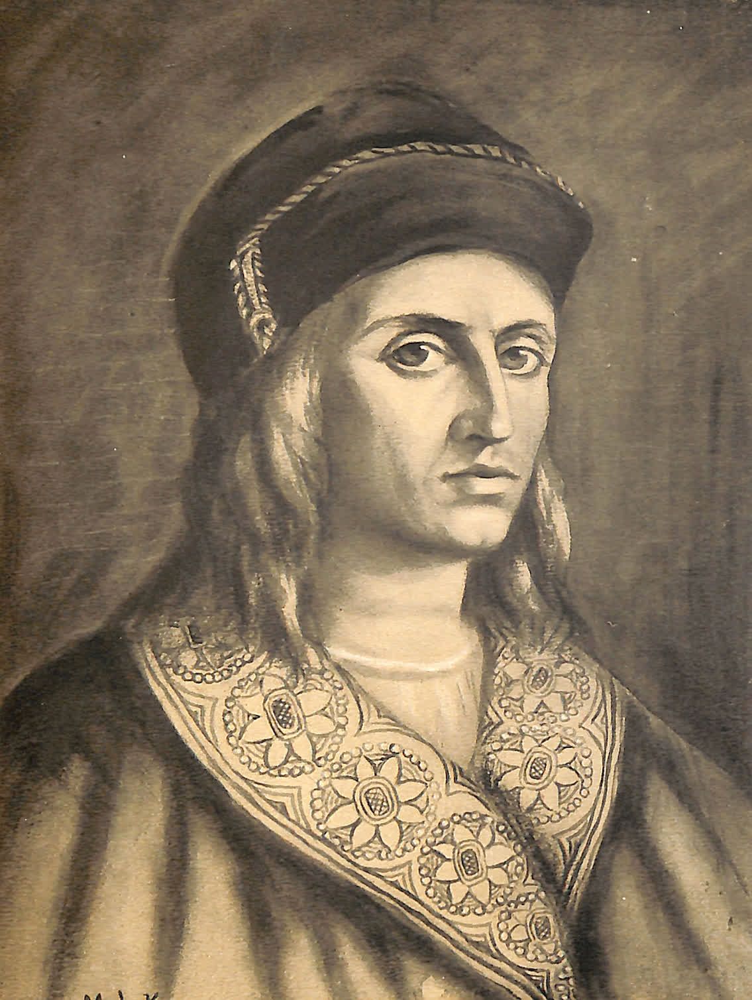

## Жизнь XXVI

Рождение Алкиона в этот раз снова переносит нас в Центральную Азию, но теперь в центре огромного православного большинства, поселившегося на этой колыбели пятой коренной расы. Это произошло в 17464 г. до н.э., вскоре после того, как через тысячи лет, они постепенно установили первую арийскую подрасу во владении Индийским полуостровом. Одно крыло экспедиции, предшествующее той, которую сейчас будет описано, столкнулось с серьезной катастрофой; часть эмигрантского тела последовала за западным маршрутом, пройденным Марсом в XIX веке до н.э. (18,875), избегая больших горных преград Гималаев; но небольшая группа, менее обремененная женщинами и детьми, решила смело встретиться с большим Рэйнжем, следуя за дорогой, о которой они узнали от торговцев, которая пролегала через практическую, но мрачную перевал, выходящую на равнины вблизи города, ныне известного как Пешавар. В наши дни мы знаем его как перевал Кхайбар. Они продвигались вперед, время от времени ввязываясь в стычки с племенами гор, пока, близким к концу перевала, их внезапно не обрушилась толпа врагов, словно лавина, сзади, спереди, с каждой стороны, и, безнадежно превосходя цифрами, они погибли почти до последнего человека. Несколько отсталых от главной группы уцелели, и, пережив невероятные трудности, которые оставили в живых только двух выживших, эти два голодных и несчастных беглеца попали на границу Арийцев, где, отдохнув вкратце, их отправили к королю центрального сообщества. Одетые в овечьи шкуры, которые дали им их первые хозяева, они явились перед ним и рассказали историю о бойне, и с тех пор перевал стал известен как перевал смерти. В то время Юпитер был мальчиком лет десяти, и эта история произвела на него большое впечатление, и когда, будучи королем племени, он решил отправить своего старшего сына Марса во главе другого большого войска эмигрантов проникнуть в Индию, он посоветовал ему избегать перевала смерти и искать другой выход.

Подготовка к экспедициям заняла несколько лет, и Марс решил тщательно отобрать семьи, которые должны были участвовать в эмиграции, выбирая тех, кто, по его мнению, наиболее способен выдержать неизбежные трудности пути, и в особенности воинов, лучше всего обученных методам партизанской борьбы в горах и упорных битвах на равнинах.

Среди прочих его выбор пал на Психея, отца Алкионы (тогда ещё мальчика в возрасте девяти лет), чья жена Артур была женщиной смелой и изобретательной. Также Марсом был выбран Капелла, сосед и близкий друг Психея, который был его товарищем по нескольким рейдовым экспедициям. Великий капитан, Вулкан, был воином, на которого Марс больше всего полагался, и, разделив свою армию на две части, отправил его немного впереди себя по маршруту, проходящему через горы на юг и изгибающемся к востоку, в то время как он сам ведёт свою группу немного к западу, но не так далеко на запад, как перевал Смерти. При выходе из гор отделённые отряды должны были снова объединиться, двигаясь в каждом направлении, пока они не встретятся.

Отправление Марса немного задержалось из-за беременности его жены Нептуна; вскоре после рождения его старшего сына Геракла, он отправился вперед со своим огромным караваном. Женщины и дети были разделены на большие группы, вместе с стадами крупного рогатого скота и лошадей, а также стадами овец и коз; их поместили в центре большого числа воинов, а на окраинах все вокруг пребывали воины, сопровождаемые быстрыми и легко вооруженными бегунами, которых они могли посылать к основному телу при любой тревоге, прикрывая их от преследования, поскольку бегуны меньше бросаются в глаза, чем всадники, а неровность местности мешает бегунам меньше, чем всадникам.

В ранние годы Марс и Психея часто виделись вместе, обсуждая перспективы перед ними, в то время как Алкион на своем надежном и уверенном пони из гор иногда сопровождал их, внимательно слушая их разговоры, а затем помчался вперед, чтобы присоединиться к разведчику впереди, превзойти своих старших на полном галопе, когда ехал к своей матери Артур в центре отряда, усердно заботясь о ней и радуя ее забавными историями о войсках или в час закатного солнышка, усаживался рядом с ней, шепча свои мечты, свои надежды. Альбейро и Лето часто сопровождали его в менее авантюрных путешествиях, а малыш Аякс сидел перед ним и болтал весело, когда он ехал, крепко держась за руку своего брата. Сыновья Капеллы стали членами этой молодежной группы, а дочери, сидящие верхом, часто сопровождали их.

Гектор, старшая дочь Капеллы, стала любимой спутницей Альбейро, в то время как Алкион нашел своего самого любимого товарища в Ригель, дочери Бетель. Еще до того, как были достигнуты равнины, две пары вступили в брак, и семья Марса увеличилась на двух сыновей и три дочери.

После примерно пятнадцати лет путешествий, караван-армия Марса достигла равнин, где ранние группы распоследовались и ожидали других, пока все они не были собраны в один большой лагерь. Иногда молодые люди совершали налеты на окружающую территорию, и в нескольких случаях Марс упрекал Геракла за его несколько безрассудные поездки в неизвестное; парень был упрямым и импульсивным, и склонен думать, что его старшие преувеличивают опасность его вылазок. Однако он усек свое урок, когда однажды он и его войска попали в засаду и были внезапно атакованы враждебной силой, которая внезапно поднялась со всех сторон и сильно их давила. Геракл отважно набросился на врагов со своими людьми, пытаясь прорваться сквозь окружение, но каждый раз был отброшен обратно; его случай казался безнадежным, когда группа всадников пришла в атаку и дождь стрел, выпущенных по мере их галопа, упал на нападающих. Лошадь Геракла упала, он оказался под ней, раненный и ошеломленный; последовала жесткая схватка, враги были отбиты, и Алкион, узнав своего друга по его лошади, перевернул его при помощи двух солдат и нашел бездыханное тело Геракла под ней. Как это кажется, Алкион пошел на восток в поисках ожидаемой армии под командованием Вулкана, и встретил аналогичный разведывательный отряд от него под командованием Ваджра, ищущего западную силу; они встретились с большой радостью, и возвращались в лагерь Марса, когда Ваджра заметил толстое облако пыли. Алкион был убежден, что Геракл в опасности, и призвал своих товарищей ускориться.

Они прибыли всего лишь вовремя, чтобы спасти группу от резни, и Алкион, нежно подняв тело своего друга, поддерживал его в обнимку до тех пор, пока не положил его у ног своей матери Нептуны. Она вскоре вернула своего крепкого сына к жизни, но Марс использовал случай, чтобы напомнить Гераклу о своем предупреждении и указать ему, что Алкион не менее храбр, потому что он не так поспешен.

Когда две армии объединились, наиболее способный лидер обеих решил двигаться на юг, чтобы найти подходящее место для постоянного поселения. Они оставили женщин и детей в крепко укрепленном лагере, охватывающем большую территорию примерно посередине между современными Джамму и Гуджранвала, с достаточным отрядом вооруженных людей, чтобы оборонять лагерь от нападений. Место вскоре приобрело облик города, с большими пастбищами вокруг со всех сторон и обработанными полями внутри укреплений.

Вторгшийся отряд перешел в уже заселенную и процветающую страну. Были великие города, жители которых достигли высокого уровня цивилизации и стали вечно роскошными и нерасторопными. Одна из иммиграций арийцев, по-видимому, установилась на больших территориях, которые не были засеяны, и после многих боев и переговоров ее члены поселились рядом с обитателями городов, защищая их от нападений других и больше или меньше грабя их самих под видом даней и субсидий. Владельцы страны презирели северных воинов как менее цивилизованных, но боялись их боевой мощи и арогантности в совете, и медленно, но верно допускали, что их оттесняют обратно в свои города, или превращают в слуг и рабочих наружу.

Арийцы, произносящие гимны своим военным богам и гордящиеся своей силой и вирильностью, с презрением относились как к роскошному, так и к декадентскому населению земли, которую они жаждали, и основались на территории, которую сейчас называют Пенджаб, постепенно став настоящими хозяевами страны. Другая волна иммиграции направилась на восток и основалась на территории современного Ассама и северного Бенгалии. Когда текущая волна иммиграции прибыла, нацеленная на то, что сейчас называют Пенджаб - по указанию Ману, переданного через Юпитер на Марс, она обнаружила землю, частично заселенную предыдущими поселенцами, которые смотрели на новоприбывших с недоверием и, воздерживаясь от активной враждебности, пытались пассивным сопротивлением и отказом в помощи отпугнуть их от своего района.

После года, проведенного в сборе информации и обсуждении докладов, привезенных разведчиками, Марс и его совет решили основать свое постоянное центральное поселение на земле, где сейчас расположен Дели, несмотря на то что единственная удобная дорога была перекрыта большим городом, населенным Толтеками - хозяевами земли. Алкионе, которому еще не было тридцати лет, была поручена миссия вести посольство к правителю города и окружающего района, моля о свободном прохождении мимо города и разрешении на покупку продуктов питания и кормов. Миссия была успешно выполнена, и разрешение было получено при условии, что основное тело войск не должно проходить близкого города, а должно сделать значительный обход, чтобы его избежать. Марса пригласили посетить вождя, и он принял предложение гостеприимства. Однако, как мудрый генерал, он привел с собой сильный эскорт, оставив Вулкана во главе главной группы, вместе с собой он взял Алкиона, Геракла и Ваджра.

Город был обнесен огромной стеной, состоящей из высоких валов, скошенных со стороны внутри, но прямых и облицованных железными пластинами, закрепленными вместе снаружи, тем самым образуя непрерывную и неодолимую поверхность. Эта необычная стена делала город практически неприступным для атаки современным в то время оружием, которым обладали нецивилизованные народы, чьи орды время от времени ниспадали на страну. Его успешно можно было захватить только сверху, однако технологии производства летательных аппаратов были утрачены этими вырожденными тольтеками, и они пока что не были переданы младшей арийской расе. Кастор, глава города, поэтому чувствовал себя в безопасности от атак, но тем не менее в глубине души решил, что когда эти опасные чужаки войдут в его ворота, он захватит их, в надежде, что армия, лишенная своих лидеров, сможет быть убеждена стать наемниками на его службе. Он был разочарован, узнав, что вторым по команде после Марса не был один из членов группы, но все равно был готов осуществить свой коварный план.

В ночь перед предполагаемым предательством, Нептуна посетила своего мужа во сне и рассказала ему, что видела видение его похищения на завтрашнем праздничном ужине. Под широкими праздничными одеяниями, предоставленными его хозяином, Марс в свою очередь одел свой боевой жеркин и скрыл оружие, приказав всем своим спутникам последовать его примеру. Они должны были быть готовы по его сигналу собраться в плотное образование и прорваться из зала, пока основная часть его эскорта должна была ждать их снаружи. Он послал нескольких своих людей бродить около городских ворот, которыми он собирался убежать, с приказами захватить стражу и удержать ворота по прибытии его посланников, и он расположил нескольких быстрых бегунов, чтобы они передавали новости, как только услышат звук его боевого рака.

В самом разгаре праздника, когда Кастор произносил величественную речь своему главному гостю, он подал сигнал тем, кто был выбран для захвата посетителей, и Марс был внезапно ошеломлен сзади. С отчаянной силой могучий воин освободился, вскочив на ноги, а со звуком раковины с его тыла пронеслось такое страшное эхо по залу, что его нападавшие на момент ошеломленно отступили. Пауза была достаточной. Алкион, Геракл, Ваджра и другие бросились к Марсу и охраняли его спину и бока, а он, ударив Кастора одним мощным ударом сжатого кулака – он не хотел убивать человека, хлеб которого он ел – быстро прорвался сквозь толпу к дверям банкетного зала. В следующий момент он был уже среди своих людей, которые на сигнал его раковины вскочили на своих лошадей и врывались во внутренний двор, принося лошадей Марса и его товарищей, и прежде чем охрана Кастора пришла в себя, Марс и его люди уже мчались вовсе волоса через улицы к назначенным воротам, где надёжный капитан Капелла, предупреждённый беглыми сообщниками, уже захватил охрану и поменял их на своих людей, заковал их в брошуры и повесил через шею своей лошади, ожидая объяснение происшествий до более удобного момента.

У Марса было слишком много тяжелой работы, чтобы поворачивать свою армию назад и наказывать агрессоров; кроме того, у него не было времени на осаду города голодом – работа на годы, и не было вооружения для штурма. Так что он продолжил путь к своей замеченной цели, положил основание будущему городу, назначил Вулкана губернатором, с Алкионом и Гераклом под его начальством, и сам с Ваджрой и отобранным отрядом отправился в свой дальний лагерь, чтобы привести женщин и детей. Собрав всех вместе, он снова отправился в свой новый город, который назвал Равипур, и прибыл туда после утомительного путешествия; скованный обузами лагеря, он не смог преодолеть в день больше семи или восьми миль.

Справедливости ради стоит отметить, что Кастор, обдумав ситуацию, стыдился своего плана, который он попытался провести против Марса, и нашел моральную силу отправить посольство с извинениями. Марс ответил на это, отправив Капеллу назад с дружественными подарками, чтобы заключить союз с Кастором, и в качестве закрепления этого, старший сын Кастора Ариес женился на дочери Капеллы Деметре – брак, который оказался счастливым для всех сторон.

Помимо большой группы наших персонажей, которые шли в Индию с Марсом, мы находим много тех, кто не был выбран для миграции, но остался в Центральноазиатском королевстве с его тётей Меркурий. Она вышла замуж за Виража, и от этого брака, а также от брака сестры Виража Виолы со Спесом, произошло несколько семей, среди которых около сорока человек, судьбы которых мы наблюдали.

С этого времени события развивались по обычному курсу – стычки с окружающими племенами, посольства к соседним вождям, обработка земли и дела большого поселения. Марс ушел из жизни в возрасте около 65 лет, оставив Геракла наследником, а Алкиона – его самым доверенным советником и ближайшим другом.

Алкион умер в возрасте шестьдесят лет, в 17 404 г. до н.э., его жена ушла из жизни за несколько лет до него. Геракл умер вскоре после Алкиона, никогда полностью не отойдя от потери. "Моя лучшая половина ушла," - грустно сказал он, "зачем мне оставаться?"

Не считая, что кто-либо из его сыновей, Джем или Аркор, достаточно стабилен и надежен, чтобы преемничать ему, он назвал своего брата Сива своим преемником и отправил своих сыновей в другие места, каждого с большим отрядом и караваном, чтобы они основали свои города.

Орион родился в 17228 году в аккадской расе в южной части Посейдониса. Страна находилась в неустойчивом состоянии, и население, в основном производители и торговцы, очень страдало от нападений пиратов.

Орион был сыном богатого торговца и рано включился в его дела, но из-за своей слабости к женщинам нежелательного типа, он быстро стал нечестным. Однажды он получил от своего отца платежи за большую партию товаров, но присвоил деньги; и так как обнаружение было неизбежным, он схватил молодого клерка Зета, который принес ему деньги, и продал его пиратам как раба. Вскоре женщина, Гамма, ради которой он совершил это преступление, устала от него и устроила, чтобы его в свою очередь захватили и продали пиратам. Таким образом, он был доставлен в их штаб-квартиру и встретил там свою жертву, которую он продал им годы назад. Изначально эти двое однокашники были заядлыми врагами, но в конце концов они примирились, стали друзьями и смогли, спустя четырнадцать лет рабства, сбежать из галер, в которых они были. Зета был сильно ранен во время побега, но Орион тщательно ухаживал за ним и таким образом спас ему жизнь.

Позже Орион устроился на работу к ювелиру и таким образом поддерживал Зету до его смерти. Орион со временем получил наследство по бизнесу и накопил некоторое состояние, но потерял все из-за нечестности рабочего. Теперь он был слишком стар, чтобы получать регулярную работу, поэтому он постепенно скатился вниз, снова стал нищим и прожил в бедности и забвении до глубокой старости.

Эрато родился в 17147 году в арабской семье, но примерно в девять лет его захватили и отвезли в Египет в качестве раба. Ему посчастливилось попасть в руки доброй семьи, и он был назначен слугой маленького сына своего хозяина. Его отношение к семье было очень хорошим, и когда глава семьи скончался, он женился на младшей сестре своего молодого хозяина и утвердился в своем положении. Собственность отца обременена долгами, и после его смерти они оказались очень бедны, и в основном их обеспечивал Эрато, так как его младший шурин никак не мог быть назван практичным человеком. Вместе с тем Эрато стал секретарем Палласа, старого человека, у которого была большая библиотека и который работал над большим историческим трудом. Он занимал этот пост десять лет, пока Паллас не скончался, оставив ему свою библиотеку и некоторую часть имущества при условии, что он закончит этот великий исторический труд. Эрато выполнил это условие, хотя потребовалось много лет, и в итоге он вручил копию книги фараону, который поместил ее в королевский архив, а Эрато предложил должность в связи с королевской библиотекой в столице. Эрато, однако, отказался от это и в конце концов мирно завершил свою жизнь на своем поместье.

...

## Жизнь XXVII

В 16,876 году до н.э. процветала великая аккадская морская олигархия, которая была расположена несколько южнее центральной части Посейдониса. Народ принадлежал к шестой атлантской подрасе, напоминая этрусков или финикийцев - по сути, раса торговцев и моряков, богатых, деловых и склонных к показухе. В это время Марс был императором Тольтеков, как и часто бывало ранее, и этот народ признавал его своим верховным сувереном, хотя по сути был независимым. Они были управляемы номинально избранным советом, но все его члены неизменно принадлежали к полудюжине великих семей, и хотя Марс назначал председателя совета, он мало вмешивался в их дела. Человек, который имел наибольшее влияние в стране в это время, был высокий жрец Сурья, человек святой жизни и великой мудрости, который был известен и почитаем на всей территории атлантской империи. Стремясь скрепить империю и в качестве политики, Марс предложил своего сына Геракла жениться на Сатурне, дочери Сурьи, и это предложение было принято. Таким образом, Геракл стал, не совсем второстепенным королем, но постоянным главой аккадского совета, и таким образом фактически правителем страны. Сыновья Геракла были Меркурий и Венера, и эти сыновья женились соответственно на Брихат и Осирисе, что приводит нас к поколению, с которым мы имеем дело, поскольку Алкион был старшим сыном Меркурия, а Сириус и Мизар были дочерьми Венеры.

Таким образом, Алкион был внуком Геракла и правнуком Марса и Сурьи. Император Марс был уже стариком шестидесяти лет, когда родился Алкион, и видел его всего лишь три или четыре раза во время периодических государственных прогулок Императора по его стране, и однажды, когда он сам посетил столицу. С его другим правнуком, Сурьей, он был в постоянном контакте, и между стариком и мальчиком была тесная привязанность. Сурья считал его очень талантливым ребенком и посвящал много времени его образованию, так что он получил гораздо больше, чем обычное торговое обучение того времени. Священники были в некотором роде хорошо образованными людьми, поскольку от них ожидалось, что они выучат свои священные тексты наизусть, и использование книги в любой части службы, даже в самой необычной, считалось слабостью. Они также были докторами и учеными того времени, так что им пришлось провести много лет в учебе. Как правило, только дети из священнического класса становились священниками, и даже не все из них, поскольку было вполне обычно, что младшие сыновья священников выбирали торговую или морскую профессию.

Геракл, будучи сыном Императора, и, следовательно, не принадлежащий к священническому касту, не рассматривался как подходящий кандидат для преемствования Сурьи, поэтому было понятно, что когда от смерти или отставки его должность станет вакантной, поручение должно быть наследовано его внуком Меркурием, который обучался в Храме с детства с такой целью. Поскольку его мать Брихат также была глубоко религиозной женщиной, естественно было, что Алкион знакомится с Храмовыми дворами в раннем возрасте и считает профессию священника самой желанной в мире. Однако, по мере того как он рос, он находил много друзей среди мальчиков города и вскоре обнаруживал, что большинство из них вовсе не разделяют его мнения, но все их желания сосредоточены вокруг совсем другой жизни — волнение от хороших сделок и заработка больших денег, или интерес к плаванию в далекие земли, где могут встретиться всякие странные приключения. Захватывающие истории об опасностях и быстро заработанных состояниях были втолкованы ему в уши, и в нем была сторона, которая очень быстро реагировала на все это. Но когда он взволнованно повторял эти истории своему отцу и матери, или своему правнуку Сурье, они мягко говорили ему, что, несмотря на то, как жизнь моряка или торговца может быть увлекательной, она все же в целом ориентирована на собственный интерес, в то время как священник служит альтруистической цели — он работает не только ради физической жизни, но и ради более высокой жизни и по всей вселенной. Они сказали ему, что хотя и моряк, и торговец иногда сталкиваются со странными и захватывающими приключениями, они все же редки, а ежедневная жизнь каждого из них включает много унылого, упорного труда.

Так он вырос, несущий в себе два противостоящих идеала, и годами он не был уверен, больше ли он хотел стать Великим Жрецом или успешным пиратом. Его друзья-мальчики яркими красками рисовали прелести жизни мечом и саблей, в то время как Сурья говорил ему о высших радостях самопожертвования; и каждое из этих стремлений, в свою очередь, казалось ему желанным. Меркурий и мягкий Брихат сомневались, было ли для него полезно общение с его молодыми друзьями, и обсуждали, не следует ли им избавить его от его очарования; но старый Сурья советовал им позволить ему идти своим путем и решать самому, указывая на то, что в нем смешались кровь

Императора и Верховного Жреца, и каждый из них должен иметь полное влияние. Потому что он сказал:

"За долгую жизнь я видел множество мальчиков, и я верю в этого парня и люблю его; и когда придет время для решения, я думаю, он сделает правильный выбор."

Доверие старика было оправдано. Когда Алкион достиг возраста, в котором он был принят в качестве постулянта в Храм, его прадед вызвал его и спросил его, хотел ли он войти туда. Он ответил, что да; но вместо того чтобы сразу принять его, Сурья приказал ему еще раз собраться со своими мальчишескими и девчоночьими друзьями, услышать все истории, которые они могли ему рассказать, пойти с ними на борт кораблей, тогда стоявших в порту, и поговорить с моряками, а затем вернуться к нему через неделю и рассказать ему, придерживается ли он своего решения. Мальчик сделал, как ему сказали, и борьба в его уме была жестокой. Рассказы о приключениях никогда не казались ему такими привлекательными; запах смолы, чужеродных пряностей и далеких морей, которые витали вокруг больших кораблей, опьянял его. Худшим из всего было притяжение определенной молодой дамы — Фоеи, дочери Алькеса, одного из богатых торговцев — маленькой девочки примерно его же возраста; многие мальчики старались привлечь ее внимание, и она одаривала тех, кто громко хвастался приключениями, которые они искать, и подвигами, которые они совершат; и она однажды с презрением назвала его "просто молодым жрецом".

Он пришел к ней в этот раз и увидел её, как обычно, устроившую небольшой дворец из восхищенных друзей рядом с гаванью, слушая и одобряя большелюди будущих морских капитанов или пиратов-монархов. Один мальчик, в частности, в этот момент, казался особенно популярным у их переменчивой юной богини, и он важничал соответствующим образом, насмешливо смотря на Алкиона над его предполагаемым отсутствием стремительности и смелости. Однако вскоре его тон изменился, потому что, когда все дети отправились на борт одного из пустующих кораблей, пришвартованных к причалу, он, сосредоточившийся на совершении перед своей возлюбленной забавного детского проказы, соскользнул с доски в грязную воду дока. Он закричал и безуспешно сопротивлялся, находясь в очевидной опасности утонуть, так как не умел плавать; но Алкйон, который был сильным и опытным пловцом, сразу погрузился в воду и вытащил его на ступеньки, хотя и с большим трудом, так как тонущий мальчик обхватил его за шею и он не мог освободиться. Оба они были очень истощены, при этом спаситель был в худшем состоянии, чем спасенный; но некоторые мужчины, что прибежали помочь, подняли их по ступеням и внесли во смежный дом, где они скоро восстановились. Маленькая девочка, которая упала в обморок, заметила, когда пришла в себя: "Молодой служитель -  лучший из всех нас."

Но Алкион винил в происшедшем несчастном случае её, и после этого никогда не почувствовал к ней притягательности.

Он тотчас же вернулся к своему прапрадеду и сказал: "Возьми меня в Храм, потому что помочь другим у себя дома - это лучше, чем искать приключений за границей."

И Сурья благословил его, и сказал: "Ты принял мудрое решение, как я знал, что ты и сделаешь. Я много молился за тебя, и вчера вечером, пока я молился, прошлое и будущее открылись перед моими глазами, и я знаю, что было и что будет. Так же, как сегодня ты спас другую жизнь, рискуя своей собственной, так давно ты спас мою жизнь, мою собственную, ценой своей, и еще раз в будущем ты можешь отдать свою жизнь ради меня, если будешь волен, и благодаря этой жертве все королевства мира будут благословлены."

Мальчик смотрел на Сурью с восхищением и трепетом, поскольку лицо старика трансформировалось, когда он говорил, и казалось, что вокруг него играют могущественные пламена, и хотя Алкион тогда не мог полностью понять, что он имел в виду, он никогда не забывал впечатление, которое это произвело на него. Он был должным образом принят в Храм, и был очень счастлив в своей жизни там, поскольку, хотя исследования были тяжёлыми, они были хорошо организованы и интересными для аспирантов. Возможно, желая показать мальчику, что и в жизни служителей также можно иметь путешествия и приключения, Сурья предложил ему возможность сопровождать его отца Меркурия и некоторых других служителей в миссию к большой библиотеке и университету в Северной Африке. Естественно, Алкион принял с большой радостью, и путешествие было для него непреходящим чудом и радостью. Это было долгим и медленным, но не слишком долгим для него; на самом деле, его волнение и интерес когда земля обозначилась на горизонте были несколько притуплены печалью, которую он испытывал, покидая судно, каждый моряк на котором был его личным другом.

Плывя по побережью, его охватило странное ощущение, что он уже видел всё это раньше. Это чувство настолько усилилось, что он развлекал себя, рассказывая морякам, что появится из-за каждого мыса, когда они к нему приближаются; и удивительное в этом было то, что он всегда оказывался прав. Он подробно описывал город, в котором они собирались высадиться, задолго до того, как они приблизились к нему; и моряки, которые его знали, сказали, что его описание холмов и долин и расположение зданий было удивительно точным, но то, что он говорил о форме и размерах зданий и расширении города, было почти полностью неверно. Когда они наконец увидели его, его чувства были самыми разнообразными; он мгновенно узнал все физические особенности места, но город был намного больше, чем по его мнению он должен быть, и здания казались все разными. Он был странно взволнован этим удивительным полуузнаваемым обликом всего, и постоянно спрашивал об этом у отца, но сначала Меркурий мог только сказать, что он должен был путешествовать впереди корабля в своем нетерпении и видеть вещи в видении.

Вскоре, когда стало очевидно, что город, который он знал, был гораздо меньше, его отец подумал, что они могут столкнуться с феноменом памяти о прошлой инкарнации; и когда они высадились, он стал почти уверен в этом, потому что когда Алкион описывал, как по его мнению должны идти разные улицы или стоять здания, в нескольких случаях жители говорили:

"Да, есть предание, что раньше было именно так."

Когда их доставили в университет на любопытной гидравлической каменной трамвайной дороге, он еще больше возбудился и точно описал, как она когда-то работала, и форму старых вагонов, которые на протяжении веков были заменены другим типом; и когда они дошли до самого университета, он совсем не мог удержаться, потому что заявил, что знает каждую дорожку в саду, и тащил отца показать ему все это. Вскоре его полнота памяти пробудила память его отца, и Меркурий также начал видеть вещи, как они были раньше, и вспоминать события, также как и сцены далекого прошлого. Тогда отец и сын смогли сравнить свои впечатления и осознать, что в те старые времена они были, не отцом и сыном, а отцом и дочерью, и что относительные позиции были наоборот. Тогда Алкион сказал отцу: "Ты - высокопоставленный жрец Храма, а я - только начинающий; как я мог вспомнить все это раньше тебя?"

Меркурий ответил: "Это именно потому, что твое тело моложе моего, тебе легче вспоминать; я тоже поменял пол, и поэтому имею совершенно другой взгляд на жизнь, в то время как у тебя его нет. Кроме того, этот университет был твоим жизненным делом, и поэтому он был сильнее впечатлен в твоем уме, чем в моем."

Они обсудили все время, проведенное вместе, и были в восторге, вспоминая один за другим инциденты из прошлой жизни и ходя от здания к зданию, отмечая изменения. Возможно, больше всего их интересовала библиотека, где они нашли некоторые те самые книги, в которых когда-то читали, некоторые даже скопированные своими руками.

Среди прочих воспоминаний к ним вернулся язык той страны, но, конечно, он использовался пятнадцать столетий назад, так что для тех, кто слушал их, он звучал архаично и практически непонятно; действительно, профессор древних языков был единственным человеком, с которым они могли свободно общаться. Профессорская команда университета была очень заинтересована сим удивительным явлением, и они устроили забавную дискуссию с профессором истории, который настаивал на том, что их память о различных событиях должна быть ошибочной, потому что она не согласуется с его книгами. Алкион нашел со большой радостью статую себя в той инкарнации, и после многих уговоров он убедил власти написать на ее постаменте свое нынешнее имя и отметку о том, что он является перевоплощением основателя, а также дату его визита в университет.

Из этого видно, что после тщательного расследования претензии наших двух путешественников были признаны, и это необычное событие вызвало огромный интерес, стало широко известным и имело большую репутацию.

После завершения работы по библиотеке, они отправились в обратное путешествие. Правитель страны вызвал их и попытался уговорить остаться в его царстве, но Меркурий вежливо отклонил приглашение, заявив в качестве отговорки, что он обязался выполнять в Посейдоне обязанности, принадлежащие его нынешнему воплощению, и что он должен вернуться, чтобы выполнить их.

Их путешествие домой было совершено без серьезных неудач, хотя сильная буря занесла их далеко в сторону от их курса и подарила им новые впечатления. По пути на этот раз корабль заскочил в большой город Золотые Ворота, и Алкион был очень поражен его архитектурным великолепием, хотя Меркурий почувствовал, что его моральная атмосфера грязна и деградирована. Конечно, они не упустили эту возможность, чтобы нанести визит Марсу, который встретил их с большой добротой и оставил у себя на два месяца.

Используя силу своего примера и строго подавляя злые наклонности, Марс умело поддерживал приличия по крайней мере на поверхности своего двора; но он хорошо осознавал, что толтекская цивилизация уже тогда находилась в упадке, а сильнейшая группировка его подданных с трудом скрывала свое нетерпение от ограничений, которые он им накладывал. Он чувствовал, что перспективы для Империи мрачны и радовался за своих потомков, чья участь выпала на ту часть континента, в которой, хотя жители часто были материалистичны и жадны, они по крайней мере были значительно свободнее от темной магии и от так называемых "изощренных" форм сенсуальности.

Хотя Алкион был молод, он чувствовал, что что-то не так с этим местом, несмотря на его великолепие, и был счастлив, когда пришло время продолжить свое путешествие.

Марс был глубоко заинтересован в повествовании о замечательном восстановлении памяти как отца, так и сына в Северо-Африканском университете. У него самого не было таких воспоминаний, но он сказал, что во сне он часто видел себя во главе огромных армий, пробивающихся через невероятные горные хребты, и интриговал, не являются ли эти воспоминания реальным символом его прошлого рождения. Когда Алкион сидел и слушал все это, ему казалось, что он тоже видит эти высокие вершины и эти медленно движущиеся массы, во главе которых стоит его прадед, и его видение дополняли многие детали, которые Марс, наверняка, узнал бы, если бы Алкион не был слишком застенчивым, чтобы рискнуть описать их перед Императором. Позже он описывал их своему отцу, но, как мы знаем, Меркурий не был причастен к эмиграции, на которую они ссылались, поэтому это не пробудило в нем воспоминаний.

Когда они наконец-то достигли своего родного города, старейший Сурья тепло приветствовал Алкиона и был рад услышать его визии прошлого. Отчет об этих визиях, который доложили ему, привел к тому, что его в Храме стали считать самым многообещающим из новых учеников, и все без исключения были уверены, что у него впереди великое будущее. По крайней мере один человек рассчитывал на это и решил, если возможно, разделить это с ним, это была Фойцея, девушка, которая почти отвела его от вступления в Храм несколько лет назад. Тогда она пыталась ему понравиться; сейчас она применяла более зрелые приемы, чтобы понравиться ему снова.

Но к этому времени он был трёхкратно вооружён против её ухищрений, поскольку сразу же по возвращении с путешествия он встретил свою кузину Сириус и сразу почувствовал такое сильное влечение к ней, что решил безоговорочно жениться на ней как можно скорее.

Она полностью разделяла его чувства и была так же стремительна к немедленному бракосочетанию, как и он, но родители с обеих сторон не совсем понимали такого резкого случая любви с первого взгляда и настойчиво, но доброжелательно требовали отсрочки минимум на год. Молодые люди неохотно согласились на это, поскольку не могли сделать иначе, но этот период ожидания был временем тяжёлых испытаний для обоих, и это стало настолько очевидно для прозорливых глаз Брихата, что она умудрилась укоротить его почти наполовину, к большому облегчению влюбленных. Сам Сурья совершил обряд бракосочетания, хотя очень редко и приглашался лично принимать участие в службах, обычно он просто благословлял многолюдные толпы со возвышенности в фасаде Храма, примерно так, как это делал Папа в Риме. Этот брак, в самом деле, стал его последним публичным действием, и всего через несколько месяцев после этого Алкион и его жена были вызваны к его постели, чтобы услышать прощальное послание. Он сказал Алкиону: "Теперь я стою на пороге другого мира, и мои глаза могут пронзить вуаль, висящую между этим и тем миром. Говорю вам, перед вами много испытаний, потому что всё на вашем прошлом пути, что было злом, должно быть искуплено, чтобы вы могли освободиться. В вашем следующем воплощении вы заплатите часть своего долга насильственной смертью, а после этого вы вернётесь в окружение тьмы и зла. Но если, сквозь это, вы сможете увидеть свет и разодрать вуаль, связывающую вас, ваша награда будет велика. Вы пойдёте по моим следам, и будете падать к ногам Того, Кого и я поклоняюсь. Да, и она тоже".

(обращаясь к Сириусу), "она также последует за мной, и твой отец будет вести тебя, ведь все вы принадлежите к одной великой Расе — Расе тех, кто помогает миру. А сейчас я спускаюсь в то, что люди называют смертью; но хотя мне кажется, что я оставляю вас, на самом деле я не оставляю вас, потому что ни смерть, ни рождение не могут разделить членов этой Расы — тех, кто даёт обет, который никогда не может быть нарушен. Так что извлеките мужество, чтобы встретить бурю, ибо после бури солнце должно светить — Солнце, которое никогда не садится."

Спустя несколько дней Сурья вздохнул в последний раз, но Алкион никогда не забывал его на протяжении всей своей долгой жизни, и он часто видел его во снах и получал от него благословение и помощь. Так Меркурий принял на себя обязанности великого Храма вместо него, и старался продолжить все так, как мудрость Сурьи ему приказала, при этом его отец Геракл сотрудничал во всех вопросах, являясь главой временного правительства.

Дочери Венеры были неразлучной семьей; действительно, их чувства были настолько близкими, что Сириус и Мизар оба были влюблены в Алкиона, также как и друг в друга. Когда он женился на первой, последняя, неспособная к чувству ревности, продолжала любить как мужа, так и жену также сильно, как и раньше, и они так сильно взаимно ответили на её любовь, что пригласили Мизар жить с ними. Она с радостью согласилась, и никто не мог быть более преданным и любящим соработником для Сириуса на протяжении всех последующих лет. Более жалким было дело Хелиос, племянницы Осириса, которая осталась сиротой в раннем возрасте и как следствие была усыновлена её дядей Венерой. Она выросла в семье и была так сильно связана с ней, что последовала примеру двух старших девушек, влюбившись в Алкиона, и была совершенно разбита, когда он увез их обеих, ведь она не могла предложить присоединиться к его новому дому. Однако позже она приехала в гости к семье на долгий срок и со временем приняла брата Алкиона, Ахиллеса, тем самым оставаясь в тесном контакте со всеми теми, кого она так любила.

Власти Северо-Африканского университета никогда не забывали своего основателя-реинкарнанта, маленького мальчика, который рассказал им такую удивительную историю и проявил такой яркий энтузиазм. Этот рассказ проник в народное воображение и был повторен в каждом доме в стране, и когда, спустя около двенадцати лет после его визита, пост ректора университета стал вакантным без очевидного преемника, и кто-то выдвинул предложение предложить этот пост оригинальному основателю, вся страна взорвалась от энтузиазма, и правитель по соображениям прислал столь настойчивое приглашение и сделал столь щедрое предложение, что Алкионе почувствовал, что было бы невежливо отказаться. Несмотря на то, что у него теперь были жена и три ребенка, он согласился переехать в другую страну и обустроить для них дом на чужбине.

В Африке его встретили с настоящими овациями; он прибыл в столицу по особенному запросу правителя, а после того, как его некоторое время пировали там, совершил торжественный проезд по стране до своего древнего дома. Он смог устроиться в тех самых залах, в которых он проживал четырнадцатьсот лет назад, и даже изготовил мебель по старинным моделям и постарался воспроизвести насколько возможно точный вид места из той предыдущей жизни. Воспоминание об его старых усилиях оставалось непреходящим удивлением и радостью для него теперь, и ему выпала такая возможность, какую получают немногие, - увидеть постоянные результаты своей собственной работы через много поколений. Он с энтузиазмом и рвением, которые четырнадцатьсот лет не уменьшали, бросился в профессорскую работу, и его жена Сириус и его свояченица Мизар (которые, конечно, сопровождали их) участвовали с равным рвением.

Заразившись его пылом, и Сириус, и Мизар начали вспоминать что-то из того далекого прошлого, но они никогда не достигали чего-то, что приближалось к его совершенному знакомству со старым временем.

Веста, который в то время был самым молодым ребенком, казался таким же домашним во всем этом, как и его отец, но Белла, хотя и он также был в равной мере тесно связан со всем этим в той другой жизни, не имел от этого вообще никаких воспоминаний. Алкион вскоре обнаружил, что создать университет и устроить все по своему желанию - это одно, а управлять им в условиях, когда все его обычаи имеют вес тысячелетней традиции, - совершенно другое. Тем не менее, он был счастлив в своей работе, и он управлял всем с таким тактом, что не поднялся никакой возмущения против различных реформ, которые ему удалось постепенно внедрить. Он поддерживал постоянную переписку с отцом Меркурием, это было действительно одним из условий, которые тот поставил, прежде чем дать свое согласие на прием его старшинства в университете. Он также настоял на том, чтобы его сын вернулся, когда ему очень нужно, или когда он чувствовал начало слабости.

Услед за этим последовали относительно спокойные годы тяжелой работы, во время которых его дети росли вокруг него. Несмотря на то, что они вышли замуж так молодыми, он и его жена были чрезвычайно счастливы вместе и были так же тесно связаны, как когда они были близнецами в той самой стране в той другой жизни. В то время как Алкион работал в Африке, его прадед Марс умер в Городе Золотых Ворот, и его деда Геракла вызвали принять имперскую пурпуровую мантию.

Венера тогда заняла место Геракла как временный вождь аккадцев, так как его старший брат Меркурий уже занимался работой в храме. Геракл обнаружил, что быть императором не простой задачей, поскольку он старался править по линии своего отца, хотя оппозиция партии, требовавшей большего произвола в нравах, становилась все силнее и более неспокойной. Различные заговоры были раскрыты и подавлены, однако новые все время появлялись на свет, и казалось, что враждебность между немногими, желающими сохранить видимость приличной жизни, и большинством, которым мало было до таких вещей, должна вскоре перерасти в открытую войну.

В этих обстоятельствах Геракл считал управление такой империей утомительной и неблагодарной задачей, и часто желал себе вернуться обратно в стабильное купеческое олигархическое управление.

Хотя Северо-Африканский Университет, вероятно, был на тот момент самым известным в мире, образование бедных слоев общества было полностью пренебрежено. Этот вопрос вообще не касался высших слоев, но Алкиону и Сириусу он был ярко представлен по причине того, что один из их особенно преданных служителей, который был почти другом, имел очень сообразительного мальчика (Бореаса), за которым прочно ухаживали дети Алкиона. Узнав об образовании этого мальчика (после некоторых замечаний, сделанных его сыновьями), Алкион впервые осознал, что для более бедных слоев нет абсолютно никакого образования. Ему по труду удалось обеспечить обучение этого ребенка частным репетитором, и в свое время его приняли как бесплатного ученика университета; но этот случай навел его на мысль о том, что среди бедных, возможно, есть и другие одинаково сообразительные дети, для которых такие возможности не представляются. Они с Сириусом обсудили этот вопрос долгое время и, наконец, проработали предварительный план, осуществление которого они решили посвятить некоторую часть значительного дохода университета.

Это было своего рода сочетание пансиона и сельскохозяйственного сообщества, и его план заключался в том, что университет должен приобретать участки земли в центральных местах по всей стране и строить и поддерживать на этих участках бесплатные школы. Каждый участок должен был находиться под совместным управлением учителя и фермера, и ученики должны были жить в школе и проводить половину дня за учебой, а вторую половину - за обработкой земли. Университет должен был поддерживать эти колонии в течение первого года, после которого ожидалось, что продажа излишков продукции будет достаточна для их обеспечения. Пропитание и одежда для учениц должны были быть обязательными расходами школы в обоих случаях. Девочки могли быть приняты в том объеме, в котором для них можно было найти подходящую работу. Если после успешной работы школьной колонии несколько лет оказывалось, что у нее есть достаточный излишек, ей разрешалось основывать филиалы или отхождения, но все должно было быть под прямым контролем университета. Ученики, показывавшие экстраординарные способности, должны были иметь возможность поступать в другие, более высокие школы, почти по плану современной системы стипендий, и если они могли подняться до уровня, требуемого для университета, определенные части должны были быть сделаны им, и заработная работа должна была быть предложена им, когда они прошли через его учебный план.

Эта схема была сначала представлена правителю страны, который благосклонно ее одобрил и порекомендовал своим подданным воспользоваться ею. Затем Алкион энергично приступил к делу, купил землю в разных местах и получил другие участки в дар, а затем начал строить учебные заведения в общем плане университета, то есть не одно большое здание, а ряд изолированных комнат в саду. Бедняки сначала немного стеснялись воспользоваться этими учреждениями, в основном потому, что мальчики, которые туда ходили, не могли заработать для своих родителей, но вскоре общественность начала понимать огромные преимущества этой схемы, и они все были заполнены до отказа. Экономичный план Алкиона для их управления, позволил быстро достичь финансовой независимости, так как он мог обеспечить их правильным семенем и черенками с огромных участков университета, что привело к прорыву среди них на честь основания филиалов. Алкион добавил к этому свою старую идею о физической тренировке, о которой он был все так же восторжен, как и в прошлой жизни, поэтому мальчики, которых он готовил, были не только гораздо лучше образованы, но и гораздо здоровее остальных. В заключение этой части темы, Алкион пробыл в Северной Африке двадцать семь лет, и правитель выдал декрет, делающий обучение в них обязательным для всех мальчиков до определенного возраста, пока они не достигнут определенного уровня, однако давая местным чиновникам право делать исключения, когда они видят к этому основания.

В целом план работал очень хорошо, но у него был один необъясненный результат. Внимание, уделенное физической тренировке, и прямая связь с университетом давали ученикам этих школ для бедных значительное преимущество над сыновьями более богатых родителей, которые посещали частные школы. Несколько купцов поэтому начали отправлять своих сыновей в эти школьные колонии, и вскоре несколько из них объединились, купили немного земли, построили школу типа Алкиона исключительно для детей своего класса, а затем предложили ее университету. Алкион принял ее, и это было успешным, и вскоре появилось множество подобных школ.

Естественным результатом стало то, что одна за другой старые частные школы закрылись из-за отсутствия учеников, и через несколько лет вся образовательная система страны была полностью под управлением университета, и Алкион практически стал министром общественного образования.

Все это очень заняло его, и в таких приятных трудах годы быстро пролетели. Он и Сириус согласовали, что их дети не должны забывать свою родную страну, поэтому они отправили каждого из них назад один или два раза в гости к своему дедушке Меркурию. Во время этих визитов трое мальчиков нашли себе жен, чтобы сопровождать их обратно в страну их приемного отечества.

Селен, младший брат Алкиона, женился на Уране, но умер молодым, оставив сына Лео и дочь Миру. Во время своего визита в Посейдонис, Веста влюбилась и женилась на Мире, и когда произошла смерть Селен; ее брат Лео решил вернуться в

Африка вместе со своей сестрой и ее мужем. Алкион сразу нашёл для него работу в университете, и он вскоре влюбился и женился на старшей дочери Алкиона, Веге. Не прошло и долго, как он попал в трагическую аварию, упав с лошади, и получил травмы, ставшие смертельными; так что Вега со своим младенцем Ваджра вернулась обратно в дом отца. После некоторого времени она вышла замуж за Пиндара, доброго и способного мужчину, и у них родилась дочь, Цигнус, которая стала очаровательной маленькой девочкой и всегда была особенно любима своим дедом, Алкионом. У них также был сын, Ирис.

Алкион тяжело работал на протяжении многих лет, и мог бы провести всю свою жизнь, руководя университетом, с которым был так тесно связан, если бы не его отец Меркурий и его мать Брихат, чувствовавшие, что стареют и становятся менее активными, чем раньше. Они написали ему письмо, в котором просили его вернуться и утешить их последние дни своим присутствием. Он почувствовал, что его долг откликнуться на этот зов, хотя ему было очень тяжело оставить свою африканскую работу. Он обсудил этот вопрос со своей женой, и она также согласилась с ним, что они должны принести в жертву свои собственные желания, как бы крепкими они ни были, ради желания родителей, которых они так уважали. Так что Алкион совершил поездку в столицу и получил аудиенцию у правителя, в которой он рассказал ему точные факты дела и то, что он чувствовал, что ему следует делать.

Изначально правитель категорически отказался дать ему возможность уйти из Университета; но после ночного сна он снова вызвал его и объявил, что если его сын Белла (которого правитель видел и ему нравился) согласится действовать в качестве заместителя руководителя Университета, Алкионе останется номинальным главой Университета, а все важные вопросы, связанные с ним, будут представлены на его решение. Алкионе с благодарностью принял эту договоренность, при условии, конечно, его одобрения Беллой; в котором, однако, он мало сомневался. По возвращении домой он созвал своих сыновей на семейный совет и сообщил им о решении правителя. Белла был деловым и способным человеком, и его жена Улисс также обладала значительными административными способностями, поэтому казалось, что интересы Университета будут в безопасности в их руках; к тому же Веста, который был психически восприимчивым, во многих отношениях казался лучше подходящим для принятия священнослужительского должности в Посейдонисе, чем его старший сын. После первого удивления от этого предложения, все согласились, что это было при обстоятельствах лучшее, что можно было сделать, и Белла в свою очередь отправился в столицу, чтобы представить свою формальное принятие должности в руки правителя, и получить от него торжественную обязанность по управлению Университетом. По возвращении Алкионе отправился в Посейдонис, в 16,823 году, взяв с собой Мизара, Весту и Нептуна.

Во время путешествия на него обрушился огромный удар в виде смерти его нежно любимой жены Сириус от несчастного случая. Она была беременна в то время, и в очень плохую погоду ее укутало со дивана, и она получила смертельную травму. Ее муж был ошеломлен горем и заявил, что не сможет жить без нее и не знает, что теперь делать. Но она попыталась его ободрить и попросила у него выполнить ее последнюю просьбу. Конечно, он обещал это сделать, и она попросила его немедленно жениться на ее сестре Мизар, чтобы дом продолжал функционировать так же, как и раньше, и она могла бы быть уверена, что все будет устроено для его комфорта. Она сказала, что если бы знала, что это случится скоро, то могла бы умереть в мире, она также останется рядом с ними, если это будет разрешено, и даже попытается говорить с ними. Алкионе и Мизар, в конце концов, уступили ее просьбе и обещали жениться, как только вернутся домой; и когда это было улажено, Сириус спокойно ушла из жизни, говоря им при последних словах, чтобы не горевать о ней.

Ее похоронили в море, и, верным своему обещанию, Алкионе женился на Мизар как можно скорее после того как они достигли Посейдониса.

Меркурий, много скорбевший о смерти Сириуса, провел для них церемонию, и они чувствовали присутствие умершей жены, пока шла служба. Действительно, Брихат заявила, что видела, как она стоит улыбающейся рядом с ними, присоединяясь к некоторым чтениям. У Брихат был сон или видение смерти Сириуса в то время, когда это произошло, и ни она, ни Меркурий не были неподготовлены услышать об этом при прибытии путешественников. Мизар оказалась истинной помощницей для Алкиона; она так хорошо знала его привычки, что все шло так, как будто Сириус все еще был на физическом плане. Она также была полностью согласна со всеми его интересами и знала все дела Университета, поэтому хотя он никогда не забывал Сириуса, он вскоре адаптировался к новым обстоятельствам и его жизнь продолжала двигаться по привычному курсу. Его старые увлечения служением в храме скоро воскресли, и он обнаружил, что многообразие интересов Храма оставляет ему мало времени для горевания о своей потере. Как только он немного привык к управлению делами,

Меркурий полностью отошел на задний план и жил отшельнической жизнью, появляясь только иногда и в особых случаях.

При этих разных обстоятельствах Алкион сохранял сильный интерес к образовательным вопросам и пытался внедрить в своей родной стране систему, подобную той, которая была настолько успешной в Африке. Он основал Университет по образцу старого и открыл пару своих школ-ферм для бедных.

Обе попытки можно считать успешными, но они никогда не воспринимались таким же энтузиазмом как в Северной Африке. Тем не менее, он усердно работал над этими вопросами, и его система медленно распространялась, и совет благодарил его за введение; но с течением лет он все больше и больше вынужден был делегировать другим людям дела, связанные с ней, так как его священодейство становилось все более и более захватывающим.

Он постоянно поддерживал связь через переписку с Беллой и работу университета в Африке, и часто приходили настойчивые приглашения посетить еще раз место его ранних трудов. Он всегда обещал, что когда-нибудь это сделает, но на протяжении многих лет возможности не представлялось.

Он готовил своего сына Весту стать его преемником в работе Храма, но Веста, хоть и был ревностным и душевным, был все еще слишком импульсивным и не всегда отличал импульсы от интуиций, что иногда приводило к непродуманным действиям. Его кузен и свои Аугрига оказали ему наибольшую помощь, и он так вовлекся в образовательную работу, что Алкион вскоре полностью передал ему этот отдел. Аугрига был человеком, отличающимся твердым здравым смыслом и хорошими организаторскими способностями, поэтому при его управлении школы вскоре начали очень процветать.

Венера, отец Авриги, давно уже был вызван в Город Золотых Врат для того, чтобы преемственно заменить Геракла. В свою очередь, он вызвал своего старшего сына Крюкса, чтобы поддержать его в старости и обучиться тому, как правят такой громоздкой империей, чтобы подготовиться к тому времени, когда ему самому предстоит взять власть в свои руки. В 16811 году Венера умер, и Крюкс вступил на трон, а вскоре после этого Меркурий и Брихат умерли с разницей в несколько месяцев. Несмотря на то, что это не было неожиданностью для людей такого зрелого возраста, это потрясло Алкиона, тем более, что он давно перерабатывал и не был в своем лучшем состоянии. Он почувствовал потребность в отдыхе и перемене, и с большим трудом уговорил себя совершить долгожданное путешествие в Северную Африку, надеясь, что морское путешествие и отсутствие ответственности восстановят его здоровье.

В большой степени эти ожидания оправдались: его переезд прошел приятно, в университете его хлопотливо приветствовали, и он был рад узнать, что Белла управляла всем с похвальной твердостью и тактом, так что и университет, и школы были в самом удовлетворительном состоянии. Он отказался вмешиваться каким-либо образом или брать на себя часть управления, хотя, конечно, его угощали где бы то ни было, ожидали, что он явится в роли главной фигуры и будет произносить речи в различных случаях. Он провел в Африке двенадцать месяцев и вернулся обратно только из-за настоятельной просьбы Весты. Когда он достиг своей родины, ему уже было семьдесят семь лет, и он почувствовал тягу к жизни в медитации и покое, поэтому он поощрял Весту продолжать работу, к которой она привыкла во время его отсутствия, а сам находился скорее в тени, выступая на свет только на больших празднествах или когда требовался особый совет. Все люди считали его великим святым и человеком умудренным, а те, кто мог получить его совет в своих затруднениях, считали себя удачливыми.

В нескольких случаях он мезмерически излечивал людей, страдающих от различных болезней, хотя отказывался делать это постоянной практикой, говоря, что может помочь только тем, кому он специально вдохновлен помочь.

Так он прожил ещё семнадцать лет, мирно и счастливо проводя вечер своей жизни, крепкий и энергичный, сохраняя все свои способности до конца. Мизар оставалась неразлучной с ним (она, конечно, сопровождала его в Африку), и их привязанность друг к другу была трогательной. Когда Мизар умерла в 16793 году, он, казалось, едва скорбел по ней, говоря, что не стоит скорбеть из-за такого короткого расставания, ведь он знал, что вскоре последует за ней. Его предсказание сбылось, и он спокойно умер на следующий год, оставив за собой великую репутацию на двух континентах. Сделали две абсолютно одинаковые статуи, и они были установлены в Центральных залах его двух университетов - в Африке рядом с той другой статуей его ранней личности, на пьедестале которой в юности было выгравировано его нынешнее имя. Один и тот же скульптор создавал обе статуи, и каждый университет подарил другому в знак привязанности с подходящей надписью. История основателя, который так странно вернулся и признал свою работу, повторялась в Африке веками, хотя позже, когда статуи исчезли, она стала запутанной и гласила, что он был великим магом, который сохранил тело на протяжении четырнадцати столетий и таким образом снова посетил место своих прежних трудов.

## Жизнь XXVIII

В центральном городе обитания пятой расы в Центральной Азии царило оживление и волнение. Светдвипа, белый остров на внутреннем море, на котором стоял и стоит Шамбалла, священный город, как всегда, была пронизана торжественным миром, который является благословением высоких присутствующих там существ; но соседний город на берегу моря, названный в честь Ману - Город Ману, кишел от нетерпеливого беспорядка, ведь шли подготовки к крупной эмиграции, самой крупной из тех, которые мы наблюдали до сих пор. Опять Ману обратился с просьбой к Сурье, заместителю Махагуру, о даровании Его двух сыновей, Марса и Меркурия, для возглавления огромной толпы эмигрантов. Он приказал разделить эмигрантов на три колонны.

Правый фланг, возглавляемый Корона, воином с железной волей и необыкновенным умением, но также и неукротимой гордостью, должен был пересечь Гималаи через то, что теперь является Кашмиром, и найти свой путь через Пенджаб и Объединенные провинции до Бенгалии; центральная и главная группа, командованная Марсом, который был главой трех армий, должна была проникнуть в Непал через Тибет, и идти из Непала в Бенгалию; третий взвод, левый фланг под управлением Вулкана, должен был проникнуть через Тибет до Бутана, а затем в Бенгалию. Таким образом, все три армии должны были сойтись на севере Бенгалии и завоевать эту страну, сделав ее своим новым домом.

Миграция, по-видимому, представляла особую важность, и многие знакомые фигуры были связаны с ней. Не меньше десяти, кто сейчас являются Учителями, играли важные роли, не говоря уже о многих их учениках, которые следовали за Ними на протяжении веков. Большой церемонии предшествовал отплытие огромных хозяйств. В храме Священного города на Белом острове, в великом Зале Аудиенций - с его монументальным троном, вырубленным из живого камня, покрытого золотыми лепнинами, что едва позволяли проглядывать через них камень, собрались самые величественные Фигуры. В центре, перед троном, но у подножия его семи ступеней, стояла могучая форма Вайвасваты, Ману, типичного человека Пятой Коренной Расы. Его темно-коричневые волоса, посыпанные золотом, падали на плечи, мощная борода такого же оттенка крупными локонами скатывалась на грудь; глаза орлиные, брови слегка изогнуты и затемнили глаза, если только веки, обычно слегка опущенные, внезапно не подымались, и глаза не светились ослепительно, заставляя всех, кто смотрел на Него, скрыть взгляд; высокий и изогнутый нос, криволинейные губы, сжатые крепко. Подлинный господин человечества; тот, чье слово означало Закон, чей поднятый указательный палец по своему усмотрению гнал или укрощал.

Рядом с Ним, справа, стоял Махагуру, Его священный Брат, Глава Религии общины. Величественным и могучим был и Он, но в то время как Ману дышал неукротимой Волей, и каждый жест говорил о Власти, этот Благословенный дышал только Любовью и Мудростью, не менее чистыми и глубокими, чем мОгущественная Воля Ману. Его волосы черные как эбеновое дерево, глаза темно-фиолетовые, почти черные, уста нежные, легко изогнутые в милой улыбке.

Иская Его имя, мы находим множество в умах людей - словно почет и любовь ищут разных форм выражения; часто Пита, Деоспита, Вьяс, Сарваджнарши, Сугата, Равидас, Ушадас, Махамуни, Джнанраджа - это лишь некоторые из имен, под которыми люди любят Его. Слева от Ману стоит Сурья, с сияющими волосами и проницательными глазами - глазами, которые с глубокой любовью смотрят на Его благородных сыновей, главных деятелей в толпе, стоящей перед алтарем, который находится между Главами общины и их народом.

Они одеты великолепно; длинный плащ из золотой ткани с тяжелыми драгоценными пряжками падает вокруг Их ног; Махагуру и Сурья под этим носят длинные белые одежды из самого тонкого материала; Ману носит двойное платье богатого багряного цвета, доходящее до колен, ноги и ступни голые. Они ждут, ожидая величественного присутствия Могучих Господей Огня, которые должны появиться, чтобы благословить отправляющиеся в путь войска.

Лидеры армии стоят близко к древнему Алтарю, на котором каждый поместил свое любимое оружие, булаву, топор или меч, обращенные лицом к их Лидерам. Марс стоит в центре, с его женой Брихат слева от него, а Меркурий справа. Жена Меркурия, Сатурн, стоит рядом с ним, а рядом с ней - Вулкан. Слева от Брихат - Корона, которая когда-то в прежней жизни правила как Император города Золотых Врат в далекой Атлантиде. Они выглядели благородной четверкой воинов со своими величественными женами, полностью достойных их.

Группа детей сидела за Алтарем, несколько смущенная величием Фигур, на которых были прикованы их взгляды; это были дети Марса и Меркурия; Юпитер, благородный десятилетний мальчик, старший сын Марса, вместе с сестрами Осирис, Уран и Улисс, его братом Сива, пухлым двухлетним мальчиком, и малышом Вираджем, которого на руках держала восьмилетняя Осирис, устремлявшим серьезные глаза на Троих. Старшим сыном Меркурия был Селена, задумчивый мальчик, примерно ровесник Юпитера, обнимавший самую младшую девочку, Мизар, непоседливую крошку, которой едва исполнился год; его братья Лео и Ваджра сидели, обнявшись за плечи; сестры Гераклес и Алкиона сидели вместе, маленькие девочки пяти и трех лет, поскольку Алкиона родилась в 15 995 году, а Гераклес была на два года старше и немного склонна заботиться о своей младшей сестре.

Наступила тишина, по великому залу прозвучала одна нота, ясная как серебряный кларнет, и над каменным троном вспыхнул яркий свет. Собрание кланяется, потому что на троне сидит удивительная Фигура, ослепительная, стаховитая Сила, а за Ним - три Других, несколько меньших, чем Он. Суть они - четверо Кумаров из индийского Писания, господа Пламени. "Выходите, дети мои, и делайте мою работу; моя сила с вами. Когда выполните, вернитесь."

Гласы раздаются в молчаливой тишине; рука поднимается в благословение, и когда головы, склоненные в почтении, поднимаются, трон пуст, и свет исчез.

Сурья вышел и благословил своих сыновей, которые преклонили колено перед ним, затем, склонившись, поднял маленькую Алкиону, свою любимую внучку, и прижал к себе крепкое телосложение Гераклеса:

"Мои маленькие," сказал он, и его нежное лицо приобрело торжественный оттенок, "вы идете далеко и жестоко. Вы станете матерями смелых мужчин, и красивые женщины также будут называть вас своими матерями.

Ваш род будет долго обитать в этой стране и сюда вы также вернетесь много раз чтобы учиться и учить. Но это будет началом жизней искупления, чтобы истощить старую Карму, исправить старые ошибки.

Смерть придет к вам обоим вместе, странным и насильственным образом. В этот час позовите меня, и я приду к вам, и Свет, который вы только что видели, будет светить в темноте."

Маленькая Алкиона спрятала лицо в его шее и тихо засмеялась; она не понимала, но она любила своего дедушку; а Гераклес смело смотрел вверх, не подозревая о серьезности предсказания; "Я буду звать громко, чтобы ты слышал," а Юпитер, который всегда называл

Гераклес его маленькой женой, сказал гордо: "Я буду заботиться о тебе."

Долгим и трудным был путь, и много лет прошло, прежде чем трое командиров снова встретились. Корона относительно легко проник на юг, так как дорога через Кашмир была известна, и жители поселенных участков были не враждебны. Но прибыв в Пенджаб, он начал вступать в конфликт с жителями практически сразу, и в конечном итоге ему пришлось пробиваться через враждебную страну. Он осадил великий город тольтеков, теперь под правлением арийцев, где Марс был предательственно обманут около пятнадцати столетий назад, и в конце концов он голодом заставил его сдаться, и заставил его правителя поклясться в верности себе; следующим же он покорил Равипур — недалеко от места современного Дели — и установил там одного из своих офицеров в качестве зависимого короля; продолжая двигаться на юг, всё время воевая и принуждая своих врагов к подчинению, он высек себе империю с полусотней подчиненных вождей. Прошло сорок лет, прежде чем он добрался до Бенгалии — уже пожилой воин в возрасте более семидесяти лет, чтобы обнаружить, что Марс обосновался в центральной Бенгалии и основал своё королевство.

Вулкан пробил себе путь через Тибет и Бутан за добрых шестнадцать лет раньше, совместил свои силы с силами Марса, и в 15 953 году вторгся в Ассам и к тому времени, когда Корона прибыл в 15 952 г. до н. э., он установил там довольно мирное владение. Впрочем, многое произошло к этому времени, и наш герой, или вернее героиня, находится с Марсом, и мы должны перейти к её судьбе.

Маршрут Марса после ухода из Центральной Азии привел его за четыре года через большой хребет в Тибет, где он пробыл год, чтобы отдохнуть слабейшие члены его армии-каравана, прежде чем они начали трудный путь через горы в Непал. В течение этого времени родился Кастор, и много времени ежедневно уделялось тренировкам мальчиков в различных видах атлетики. Юпитер был лидером во всех мужественных упражнениях, и среди тех мальчиков, которых он превратил в отряд по скаутской подготовке и игровой войне, стоит отметить его кузенов Лео, Ваджру и Селену. Ваджра компенсировал свой юный возраст своим бесшабашным смелым поведением и чрезвычайной активностью. Их друзья Альбеиро и Аркор также привлекли внимание. Алкионе - девочка от семи до восьми лет – была довольно мечтательной девушкой, спокойной и задумчивой, больше предпочитавшей сидеть дома, а не бродить по округе. Она пела себе под нос гимны ангелам своего народа и терялась в видах во время пения.

В конце пятого года после ухода из Маноа, армия снова отправилась в путь и медленно поднималась по горам, которые лежали между Тибетом и Непалом. Она пыталась следовать по ходу гор, которые лежали между востоком и югом, но постоянно была вынуждена отступать, когда река впадала в непроходимые ущелья и в пену прогоняла через овраги, где скалы почти смыкались над ней. Было много стычек с племенами холмов, но серьезных боев не было до тех пор, пока через два года они приблизились к Непалу. Здесь Марс вынужден был разделить свою армию, оставив половину под командованием Меркурия для охраны огромного укрепленного лагеря и выйдя сам со своими войсками, чтобы подчинить страну достаточно для того, чтобы проложить безопасный путь для своего народа. Он взял с собой своего старшего сына, Юпитера, и его молодую воинскую команду, Меркурий особенно пожелал своему сыну Ваджре научиться воинской обязанности подчинения. Одна попытка была сделана, чтобы ворваться в лагерь во время его отсутствия, но Меркурий отразил её без больших трудностей и при малой потере жизни. Прелестно видеть Меркурия, сидящего со своей женой и своей невесткой, с Алкионой, прижимающейся к его груди, и подругой девушкой Капри, специально дружащей с Гераклом, опирающейся на его колено, рассказывающим им истории о Сурье и Махагуру, и иногда, говоря тихо и негромко, о великих Кумарах, которых они видели до ухода из Маноа. Геракл был более беспокойным ребенком, и её глаза с нетерпением обходили лагерь снаружи в то время, как её отец говорил, принося на себя иногда серьезное обличение от более строгой Капри. Осирис и Уран тоже, с маленьким Вирадж, были заинтересованными слушателями, тогда как Одиссейу могло бы симпатизировать блуждающее взгляд Геракла.

Прошло два года, прежде чем в ожидаемый обожженный лагерь снова вернулся Марс, и радостные были приветствия, которые встретили возвращенных странников. Он обеспечил проход через Непал, частично через боевые действия, частично через дипломатию, и вся караван отправился в путь пару месяцев спустя, в начале лета. Зимой они построили лагерь у границ Непала, продолжив свое путешествие следующим летом, и так они медленно продвигались, идя летом, останавливаясь зимой и проводя долгие годы в пути, прежде чем они достигли самой Индии.

Между тем сестры выросли в великолепные и красивые девушки, унаследовав немного красоту и грацию своего отца и матери. Геракл теперь был восемнадцать лет, а Алкиона — шестнадцать, и Марс выбрал свою любимую племянницу в качестве жены для своего старшего сына, тогда как сладкие манеры и нежные глаза Алкионы завоевали сердце Албеиро, брат в оружии Юпитера. Благопристойная Капри стала идеалом Аркора, чья собственная несколько бурная природа находила покой и укрепление в её нежных домашних манерах, и три пары были женаты, прежде чем армия покинула свой зимний лагерь в 15 979 году до н. э.

Марс мирно провел свою великую армию через крайний север Бенгалии этим летом и разбил лагеря вдоль огромной реки, когда время марша было окончено. Здесь он решил ждать прибытия Вулкана и Короны, чтобы их объединенные силы могли взять во владение землю, и чтобы он мог здесь построить свое королевство. Еще два года, однако, прошло, прежде чем ему было сообщено о приближении Вулкана. О Короне ничего не слышно было, и после ожидания еще на третий год Марс, Меркурий и Вулкан решили продолжить без него. Они оставили женщин и детей в обыгранных лагерях в северной Бенгалии (15 975 г. до н.э.), пока они маршировали на юг, взяв с собой Юпитера, Альбеира, Селену и Лео, через плодородные, но негусто заселенные земли, и время от времени армия останавливалась и строила крепкие насыпи, защищенные глубокими рвами, которые, казалось, легко заполнялись водой, вода таким образом отводилась от значительной окружающей области, которая легко могла быть возделана и предоставила великолепные пастбища для скота. Марс отделил от каждого поселения значительное количество войск, оставив им приказы построить широкие и прочные дороги между лагерями; после пяти лет такого марширования и строительства он поставил Вулкана во главе всей завоеванной земли, поручив ему вернуться в северный лагерь, взяв с собой всех, кто хотел там обосноваться со своими женами и детьми, а также большое войско, достаточное для охраны больших масс, которые должны были осесть в различных лагерях, созданных в Бенгалии. Сам он решил продолжить свой марш на юг и объявил о своем возвращении на место, где они расстались, через еще пять лет.

Вулкан, соответственно, начал посещать все поселения по пути на север; он обнаружил, что они процветают и работают активно, рассеянные жители страны вступили с ними в дружественные отношения, часто устраиваясь на работу как пастухи, рабочие и так далее. Он продолжал движение на север, пока не достиг первого лагеря (15 967 г. до н. э.) и был радостно встречен его обитателями. Здесь было несколько новичков: до их расставания Геракл родил сына, Би, и дочь, Канопус; Алкиона - двух сыновей, Нептуна и Психею, в то время как Капри родила дочь Аркора, милую маленькую девочку Пиндар, и сына, Альтаира. К ним присоединились Алетея, сын Геракла, Ригель, дочь Алкионы, и Адрона, сын Аркора. Три старших ребенка, Би, Нептун и Пиндар, были одного возраста - одиннадцати лет, родившись зимой 15 978 года, и были неразлучны, как их матери, в то время как оставшаяся тройка, Канопус, Психея и Альтаир, были не менее привязаны друг к другу.

У каждой маленькой дамы было два рыцаря: Пиндар был всегда в сопровождении Би и Нептуна, Канопус - Психеи и Альтаира.

Их детство было счастливым: они играли пешком и на пони, собирались вечером со своими матерями, рассказывали о радостях дня и слушали истории о стране, которую матери покинули в детстве, прежде всего историю о великом храме от Алкионы, и о величественных Фигурах, которые их детские глаза видели. Алетея, Ригель и Адрона были всего семи лет, они были красивыми здоровыми детьми, которыми очень любили заботиться дяди двух первых, Ваджра и Кастор, младшие сыновья Меркурия.

Вулкан собрал вместе все семьи, головы или старшие члены которых следовали за Марсом, и взял их на юг, оставляя каждую группу со своими долгими разделенными мужскими родственниками в поселении, где они жили. Встречи были веселыми, но здесь и там печальными из-за пробелов в семейных кругах, когда смерть унесла болезнью или насилием тех, кто не собирался снова встретить своих близких на Земле.

Тем временем Марс продолжил движение на юг и вскоре оказался втянутым в длительный ряд стычек и битв, поскольку страна, которую он нападал, была густо заселена людьми атлантийского происхождения, и по мере приближения к морскому побережью они становились более воинственными и оказывали более сильное сопротивление его наступлению. Наконец, ему пришлось участвовать в серьезной генеральной битве, к которой король страны Орисса призвал всех своих войск: его священники, служители атлантийской черной магии, разжигали ярость войск своими пылкими речами и, как они верили, делали их непобедимыми благодаря человеческим жертвоприношениям, принесенным их мрачным элементальным богам в огромном храме у моря, который был самым священным центром их поклонения, храмом неизвестной древности и циклопической архитектуры лемурийского типа, стоящего в том, что сейчас является городом Пури. В мрачных уголках этого храма в ночь перед битвой священники собрались в непотребном собрании, и с ужасными ритуалами и яростными призывами призвали своих темных богов сражаться с светящимися ангелами арийских захватчиков.

На рассвете началась решающая битва, и она продолжалась пять дней; Марс и Меркурий с беззаветной храбростью возглавили свои войска, хорошо поддерживаемые своими сыновьями и верными друзьями, среди которых к особой смелости отличался Аркор. Бойня была большой, но как только пятый день превратился в вечер, войска Ориссы обратились в бегство, а победоносные

Арийцы преследовали их на юг и разбили лагерь на ночь на месте, которое оставили их враги. Марс казалось носил оберегающую жизнь, но все остальные лидеры были более или менее ранены, и очень уставшие были войска, которые спали.

Встав раньше рассвета, как это было их обычаем, странным и новым было видение перед глазами тех, кто, ничего не подозревая, разбил лагерь возле морского побережья. Никогда они не видели широкой площади океана, и громкие возгласы удивления и трепета раздались от этих детей пустыни и горы, когда огромная равнина волн встретила их взгляд в сумерках перед рассветом, и волны докатились до их ног, заставив их отпрыгнуть назад в страхе. Их лидеры вышли на крики солдат, удивленные, не вернулись ли враги с большими силами. Они тоже замерли на месте, и, глядя на это, восточное небо начало краснеть перед рассветом; они наблюдали, задержав дыхание, и внезапно жаркий шар Солнца бросился вверх из вод, как будто он выпрыгнул из лона глубин, и Марс и Меркурий бросились на лицо, а красные лучи пронеслись по океану, и крик: "Самудра! Самудра!" прозвучал от тысячи горл. Солнце было Пушаном, Питателем, Пантха, Путем, когда он вел их через пустыни; теперь он родился из моря, в волшебном чуде зари.

Сопротивление было сломлено и Марс создал центр своего королевства к северу от Ориссы, в Центральном Бенгалии, оставив Юпитера, своего старшего сына, во главе Ориссы, с Альбейро, Лео и Аркором как его лейтенантами. Он ушел свершить свое свидание с Вулканом, обещая, что Меркурий вернется и приведет с собой все семьи тех, кто остался, чтобы поселиться в этой части его владений. Сразу после этого Вулкан отделился от Марса и вторгся и завоевал Ассам, учредив там свое королевство без особых трудностей.

В свое время Меркурий вернулся, приведя с собой свою благородную жену Сатурн и своих сыновей Виража и Кастора, и своих три дочери, Гераклес, Алкионе и Мизар. Он привел с собой также Урана, чтобы стать невестой Лео, и Аврору для брака с Селеной. Аркор с радостью приветствовал свою любимую Капри и его сыновей Альтаира и Адрону.

И теперь начались многие годы тяжелой работы по созданию королевства, иногда прерываемые оборонительными войнами - столкновениями с хищническими бандами, попытками урегулировать отношения с бывшими владельцами земли и усилиями по искоренению человеческих жертв. Один раз за эти годы Марс посетил своих детей, приведя с собой своих сыновей Сиву и Виража, и свою дочь Улисса. Осирис вышла замуж и не могла покинуть свой дом. В этот раз Ваджра и Улисса были помолвлены, и после долгих обсуждений, родители решили оставить этих двоих властителями Ориссы и вернуться обратно в северную столицу, взяв с собой Юпитера и его семью; Ибо Марс был очень стар, и хотел установить своего старшего сына на трон и уйти из мира вместе с Меркурием и их женами. Это было сделано, и Ваджра и Улисса были оставлены во главе.

Время шло и все казалось хорошим, но под поверхностью назревал шторм. Ваджра не проявлял навыков урегулирования конфликтов, которые были характерными для Юпитера, и его действия, направленные на достижение благоприятного исхода, иногда были жесткими. В 15 937 году до н. э. должен был проходить великий религиозный праздник старой религии, но годом ранее Ваджра запретил его проведение, зная об опасности бурления страстей, разжигаемых жертвоприношениями и заклинаниями. Геракл приехал провести несколько месяцев с Алкионой, поскольку они не могли радоваться, будучи разлученными, и она - проникшись глубокими знаниями атлантской Белой Магии и объединив их с поклонением светлым богам, которых почитали в ее древнем доме - начала преподавать эту смешанную философию и религию молодым мужчинам и женщинам из королевства ее брата, включив в свои классы некоторых молодых священников темной атлантской веры. Это собиралось нанести смертельный удар все еще мощному жречеству, и вскоре гул ненависти становился все глубже и яростнее.

Месяцы проходили, ропоты становились громче, и был образован заговор на нападение на дом Албейро, где жили Геракл и Алкиона, когда он уйдет в запланированное путешествие с Ваджрой в отдаленную часть страны. Жречество решило, что запрещенное празднование все же состоится, и с жертвами, достойными больше обычного стада; они усиленно распространяли слухи о том, что восстание должно начаться в районе, куда направляются Ваджра и Албейро. Результат этой искусно спланированной дезинформации заключался в том, что Ваджра взял с собой большую часть своей армии, оставив сравнительно небольшую силу под командованием Аркора для поддержания порядка и защиты его семьи.

Был 15 937 год до н.э., и приближался день, или скорее ночь, запрещенного фестиваля. Раннее утро приветствовало свежей и прохладной, но можно было увидеть, как отдельные группы медленно сходятся к одному центру, и это центр - дом Албейро. Группы слились в толпу; толпа увеличивалась как по численности, так и по плотности. Внезапно глубокий звонкий звук ворвался в тишину: это был звук большого храмового колокола, который давно не слышали, колокола, который больше нельзя было зазвонить. Гул толпы отозвался на медный голос колокола, и через мгновение начались беспорядки. В дом Албейро проникли, стражников убили, и перед толпой, которая набегала, возвышалась высокая тощая фигура атлантского Верховного Жреца, Скорпиона, на голову которого давно возложена цена, и который прятался в подземных хранилищах храма, известных никому, кроме посвященного жречества. "Яа-ули! Яа-ули!," - визжала толпа, наполовину считая его воскресшим из мертвых и возбужденным религиозными чувствами. Медленная строгая улыбка согнулась на его железных губах, когда он услышал свое имя в эхе, и повернувшись, он отмахнулся от кричащей толпы, и они замолчали.

"Подождите, дети Господа Темного Лика; ваш день пришел. Я иду вызвать проклятых, женщин из северных варваров, которые ниспровергли ваше поклонение и закрыли храмы ваших богов. Аййо! Аййо! Господа восстали; они жаждут крови, и кровь они получат. Убейте! убейте всех, кроме двух женщин, которые принадлежат им. Они мои, как жрец богов, пьющих человеческую кровь и поедающих человеческую плоть. Сегодня их жажда будет утолена и их голод удовлетворен, Аййо! Аййо! Я сказал!"

Он вошел в дом, мрачный как смерть и строгий как воплощенная ненависть. С первой тревогой Аркор прозвал свою ракушку, чтобы созвать своих людей, и когда они бросились в проходы и заняли лестницы, яростный, но безнадежный бой закончился их уничтожением. Аркор сам бросился к частному входу в женские апартаменты, сбил жрецов, которые вели толпу - Я-ули осторожно отступил, пока путь был свободен - и отчаянно сражался, хоть и один, чтобы забаррикадировать дорогу. Он пал, пронзенный с десяток ран, и главный жрец перешагнул через его тело к своей жертве.

Алкион и Геракл были на утреннем богослужении, когда раскаты ломающихся дверей предупредили их об опасности, и когда они вставали, две высокие и величественные женщины - Геракл, теперь в возрасте шестидесяти лет, увенчанная серебристыми волосами, и Алкион со своими темными волосами, серебристо-прядеными, опускающимися ниже талии - дверь их молитвенной комнаты распахнулась, и высокий жрец стоял на пороге. Две женщины столкнулись с ним, гордый вопрос о таком вторжении выразился в поднятии благородных голов и взгляде устойчивых глаз. "Придите, вы проклятые! День вашего угнетения закончен; ночь вашей гибели близко. Придите, потому что Темные Лорды зовут. Я их вестник мести."

Геракл обняла свою сестру: "Жрец! Ты угрожаешь тем, кто не знает страха. Уходи! Не вызывай смерть."

Жесткий смех пронзил воздух: "Смерть, женщина! Я ее дарю, я ее не принимаю. Пойдите: вы мои."

Он сделал жест некоторым жрецам за ним; они вошли и схватили женщин за руки, достав из шнуров, чтобы связать.

"Не связывайте!" - сказала Геракл.

"Мы не собираемся бежать. Пойдем, моя дорогая, пойдем. Дочери нашего отца знают, как умирать."

Алкион взглянула на свою сестру, на ее лице играла ангельская улыбка: "Я готова, любимая сестра."

И они медленно двигались вперед, окруженные жрецами, по коридорам, устланным телами убитых.

Не дрогнув, они шли через бурлящую толпу, которая кричала на них, сжимая в кулаки, и разодрала бы их на части, если бы не боялись священников. Медленно они двигались через город к месту, где широко разевались могучие ворота храма, c длинными рядами темных колонн, затерянных во тьме. Белые одежды, светлая кожа, две сестры выглядели как ангелы света среди колеблющейся толпы темных лиц и темных обнаженных рук, брошенных высоко в воздух. У ворот священники остановились и Я-ули заговорил:

"Сегодня, через четыре часа после захода солнца, ворота будут открыты; пусть все дети господ тёмного лица придут на свой праздник."

Ворота с грохотом сомкнулись, и Геракл и Алкиона остались без земной помощи.

Сначала им не причиняли вреда; им предлагали богатую пищу и вино, но они не соглашались. Ели только фрукты и пили молоко. Затем начался долгий уговорительный разговор; Я-ули пытался добиться их обещания принять участие в поклонении Темным Богам этой ночью, обещая, что они вернутся домой в безопасности, если они купят жизнь бесчестьем. В своём лживом сердце он намеревался убить их после поклонения, но жаждал объявить их отступниками от своей веры и таким образом прославиться. Напрасно он боролся против их упорной воли, и, разъяренный наконец, он приказал священникам взять их и оставить в центре храма.

Это было страшное и ужасное место, где они оказались. Невыразимые формы, красные, чёрные, болезненно серые, еле виднелись во мраке. Тихие стоны, как от боли, доносились до их ушей.

"Геракл," прошептала Алкиона, "эти вещи живые или мертвые? Они заставляют меня содрогаться."

"Дорогая, я не знаю, но живые или мертвые, они не могут повредить душе."

Они шептались друг с другом в мрачной пещере, говорили о доме, о мужьях, о детях, а потом о днях счастливого детства, и о великолепном видении прошлого.

"Я думаю, что время пришло," сказала Алкиона, "и мы снова увидим нашего дедушку."

"И свет!" вздохнул Геракл.

Было десять часов, и огромное темное здание переполнила густая толпа - молчаливая, полная ожидания, страшно почитающая. По данному знаку женщин схватили и подняли на высокий алтарь на виду у всех, и кроваво-красный свет вспыхнул, неизвестно откуда, освещая страшные фигуры вокруг жутким подобием жизни. Раздался звук разрывающейся ткани, и одежды с двух женщин были сорваны, и их белые тела светились обнаженными и сжимавающимися. От них вырвался тихий крик ужаса, и затем Геракл подняла свою гордую голову и обняла свою сестру, пытаясь защитить ее от взгляда грубой толпы: "Вы позорите своих матерей, мужчины, когда позорите нас," - крикнула она, а затем замолчала. "Посмотрите на них, - призвал священник, - прежде чем Темный Господь на них полакомится. Когда вы увидите их в следующий раз, он уже будет сытым."

И тогда свет угас, и толпа выстроилась в очередь, чтобы подождать ритуалов, которые никто, кроме священников, не мог видеть и остаться в живых.

Как описать ужасы, которые последовали: пламя вспыхнуло от окружающих алтарей, и ведомые на крике пленники были приведены, и огонь подпитывался жиром, снятым с их живых тел, пока пламя не зарычало ввысь; затем их кровь начала течь и была собрана в железные сосуды, и варилась в огромных железных котлах, и лилась на изображения, расставленные вокруг; отвратительные твари слизи, огромные пауки, монструозные скорпионы, питались остатками искалеченных тел; и внезапно одно за другим изображения оживали с ужасом, начинали шевелиться, сползали с своих пьедесталов, отвратительные формы непредставимого ужаса, и крались и извивались к центру, где Алкиона и Геракл все еще стояли, обнявшись друг с другом. "Бегите! Бегите!" - кричали священники, "Темный Господь прибывает, и его войска здесь!" - и они споткнулись друг о друга в безумной попытке спастись от ужаса, которого они вызвали.

Над темнотой возникло гигантское лицо, лицо величественной силы, слишком глубокой для слов боли и гнева, невыразимой усталости и отчаяния. Заметно было, как начинает двигаться могучая рука, едва видимая своим собственным тусклым свечением, как горячее железо, на половину погашенное, и ужасающие фигуры собрались вокруг алтаря и поднялись, открыв свои кровавые пасти и волосатые клешни. Затем раздался ясный и звонкий голос Геракла:

"Сурьядева, Сурьядева, Махапита, приди! О, приди!"

И там, среди всех этих ужасов, вспыхнул свет, на который устремились глаза детей, и под ним сияющая фигура Сурьи, которую они знали, с ласковыми глазами и протянутыми руками; и с рыданием радости Алкиона бросилась вперед, и ее тело бездыханно упало на алтарь. И все зловещие фигуры съежились в ничто и лежали вокруг, как обугленные кожи змей, и колонны ломались, и стены пещеры обрушивались, и тела сестер были захоронены в могучем храме Господа Темного Лика.

И этой ночью в Пури страх и трепет разорвали землю, и огромная приливная волна пришла с моря. Но те, кто сжимался в ужасе, и те, кто, вспоминая двух сестер, плакал о их ужасной судьбе, ничего не знали о протянутых руках, которые унесли их домой, уложенные на грудь, которая должна стать Убежищем для мира; они ничего не знали о свете, который превратил ад этой тьмы в рай.

О мести, которую совершил Ваджра, когда вернулся, и о горе Юпитера и Албеиро, здесь нет места рассказывать. И это все давно прошло.

В то же время две наших героини, Рея и Вейл, оказываются в Атлантиде, где Вейл является мужчиной, а Рея - женщиной.

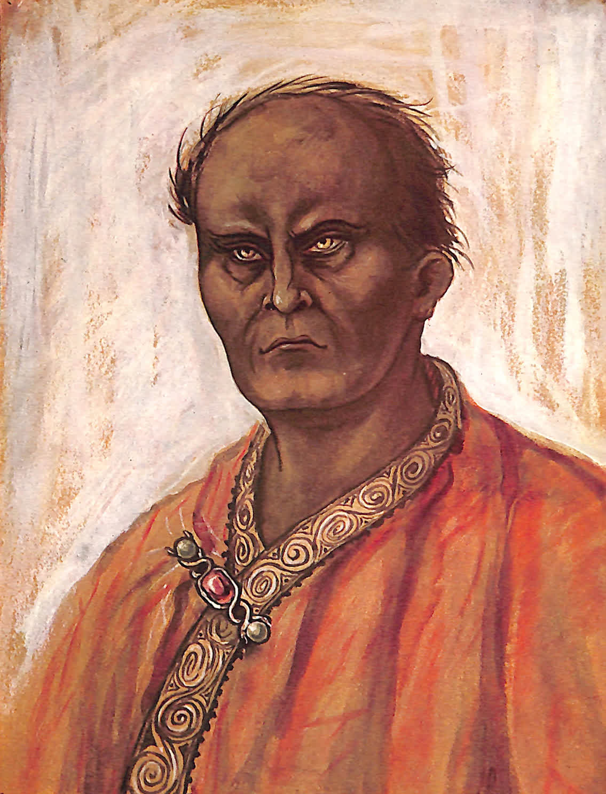

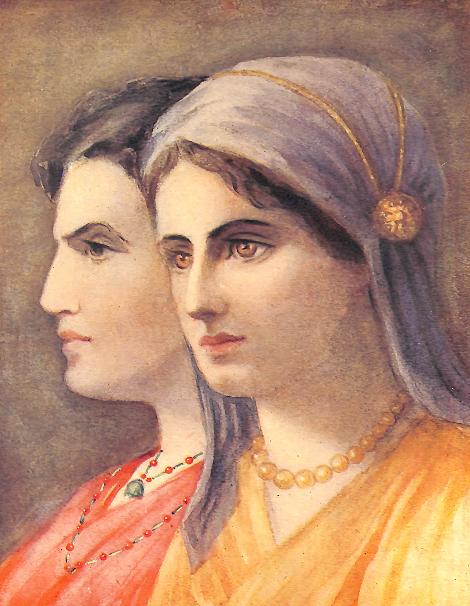

## Жизнь XXIX

Запомните, что в девятой из этой серии жизней Сурья предсказал трагическую смерть, которой закончилась десятая, и также предсказал, что испытания и трудности примутся в последующей. С другой стороны, он обещал, что если испытание будет достойно принято, проблемы успешно преодолены, результатом будет определенный прогресс. И в самом деле, вне этого конкретного случая, мы можем считать общим правилом, что когда человек подходит к входу на Путь, ему, вероятно, придется пройти через несколько жизней, наполненных страданиями и неприятными условиями.

Здесь есть две причины. Во-первых, все его зло, остающееся по прежнему кармическому долгу, должно быть устранено как можно скорее, чтобы оно не мешало ему, когда приближается время для финальных усилий. Во-вторых, все нежелательные качества в нем должны быть быстро побеждены, чтобы приобрести необходимые квалификации и очистить путь.

В уже описанных жизнях наш герой имел привилегию частого и тесного общения с мужчинами и женщинами, которые впоследствии превратились в Учителей Мудрости, и все было сделано для того, чтобы укрепить его характер при помощи примера и наставлений. В этой жизни, которую мы сейчас будем описывать, он с самого рождения попадает в грубую и злую обстановку, и поддержка этих Великих сущностей  отнимается от него - цель, очевидно, состоит в том, чтобы найти путь избавления от плохой кармы и при этом дать ему шанс доказать, есть ли в нем достаточно силы и проницательности чтобы прорваться через злую традицию, даже если она поддерживается всей тяжестью религиозной и родительской власти, бессмертным обычаем и личной страстью.

Алкиона, следовательно, родилась в женском теле в 15402 г. до н.э., в Рахане, в районе Уд в Индии. Её отец, Кетус, был жрецом религии, о которой казалось, было много загадочного. Хотя он сам был несомненно арийского происхождения, религия была, безусловно, коренной, так как в то же время была слишком сложной и дикой для веселого сердца арийцев.

Возможно, это было семя, из которого зародилось поклонение Кали, поскольку оно в основном состояло из мрачных обрядов к женскому божеству, жаждавшему крови. Во внешнем аспекте этой веры было много безрассудной веселости, но через все это всегда прозвучивал мрачный глухой звук уныния и страха. Многие тайные службы проводились, к которым допускались только "посвященные", и на них свободно практиковались самые ужасные обряды темной магии. Некоторые части этих служб проводились на языке, непостижимом для людей, но в тоже время некоторые речитативы были, по крайней мере, частично на санскрите.

Отец Алкионы был подходящей особой для такой веры, строгий, замкнутый и мрачный человек, но при этом очень влиятельный. Полагалось, что он завоевал много сил жертвоприношениями и аскезой, и ему приписывали готовность использовать их для зла многими способами. Её мать, Рак, не была жестокой, но всегда находилась в состоянии тревоги и ужаса, которые быстро передавались ребенку. Последняя проводила довольно напуганный и заброшенный образ жизни; с ней не обращались плохо, и так как она не была введена в внутренние службы, она ничего определенного не видела из более ненужных ужасов своей религии, но мрак и страх внутренних кругов отражались на её детстве, делая её жизнь жалкой от неопределенных страхов.

Она выросла без особого образования, и в ее молодом возрасте не произошло ни одного особого события, до тех пор, пока ей не исполнилось примерно шестнадцать лет, и она не встретила Поллукса, молодого, красивого и беззаботного парня, его появление сразу привлекло ее. Между ними похоже возникла взаимная симпатия, и они влюбились в обычный способ. Алкиона была слишком напугана, чтобы предложить идею любви в темной, неопределенной атмосфере семейной жизни, поэтому эти молодые люди часто встречались тайно и со временем стали слишком близкими.

Через некоторое время Алкионе потребовала от своего возлюбленного каких-нибудь действий по поводу брака, но на убеждения он ответил, что это невозможно, так как он принадлежит к совершенно другой религии, и семьи его и Алкионе разделяла наследственная вражда.

Uченицу затруднило осознать, что ее возлюбленный на самом деле безжалостен и не намерен предпринимать никаких шагов по этому вопросу; но как только она постигла правду, она отвернулась от него с отвращением и все рассказала своей матери, объяснив свою ситуацию и поклялась посвятить свою жизнь мести тому, кто втянул ее в нее. Ее мать была сильно потрясена и встревожена, но когда узнала, кто был любовником, сразу же сказала, что он из плохого семейства, и что его отец до него разрушил жизнь ее младшей сестры похожим образом. Этот рассказ всего лишь разожгел в Алкионе бурю возмущения, и, как уже было сказано, она решила посвятить всю свою жизнь тщательно спланированной мести. Затем ее мать разъяснила ей, что месть можно достичь через секретные ритуалы их религии, и она, соответственно, стала стремиться быть введенной в них.

Вся эта история должна была быть рассказана ее отцу, который тоже был возмущен до предела, потому что по обычаям того времени рождение незаконного ребенка обрекало ее на жизнь вдовы. Он строго упрекнул ее, но все же одобрил и поддержал ее желание отомстить.

Он разрешил ей изучить тайны веры, которые глубоко ее тронули, но в то же время сильно напугали, ведь ей пришлось пообещать совершить кошмар ритуалов, которые она была бы рада забыть. Чтобы скрыть последствия чрезмерной близости, отец настоял на ее немедленном браке со священником-дьяволом, Скорпионом, человеком гораздо старше ее и крайне нежелательного типа, который был медиумом для самых ужасных влияний.

Безусловно, она отшатывалась от всего этого с отвращением, но все же принимала это как неизбежную часть мести, которой решила посвятить свою жизнь. Все эти события искажались из-за ее долгого бурления от них, и ее состояние ума было таким, что она была открыта для постоянного давления от злых астральных влияний, состояние практической одержимости, которое считалось признаком большого прогресса в этой ужасно отвратительной религии. После того как ей вынесли кровавые клятвы о тайне, ее мать раскрыла ей особенно ужасный план мести, который, как она утверждала, никогда не подводил. Среди других отталкивающих деталей он включал в себя преступление убийства собственного ребенка и предложение его богу. В своем гневе против Поллукса она согласилась на это, потому что это был бы его ребенок; но когда ребенок родился, ее материнские инстинкты взяли верх, и она отказалась выполнять соглашение или совершать жертвоприношение.

Многие церемонии уже были начаты, потому что суть ужасного договора состояла в том, что с рождением ребенка она должна была полностью посвятить себя и его служению этой отвратительной божественности. Кульминацией должно было стать забиение ребенка на алтаре божества с некоторыми мощными призывами, в ответ на которые изображение должно было спуститься с своего постамента и обнять просящего. В этом объятии богиня должна была перейти из изображения в тело поклонницы, которая, будучи транспортным средством для божества, сама должна была съесть жертву. В силе этого ужасающего пира одержимая сущность должна была дать телу примерно те же способности, которые средневековое суеверие приписывало Руке Славы. При приближении мстителя все двери открываются, и все живое становится неспособным противостоять его воле, так что он может отомстить без препятствий и даже неосознанно, потому что богиня накладывает на него мантию невидимости.

Гонимая безумной яростью и практически неодолимой силой окружающей среды, Алкиона начала ранние стадии этого потрясающего заклинания. Но когда ребенок на самом деле родился, она испытала отвращение и отказалась продолжать посвятительные церемонии. Ее отец был крайне сердит и насмехался над ней как над слабой и недостойной помощи и благоволения богини. Он даже утверждал, что ребенок уже принадлежит не матери, а богине, которой он был посвящен, и потребовал, чтобы его ему передали от имени ней. Алкиона категорически отказалась от этого, не боясь даже гнева своего мрачного и ужасного отца. Он негодовал некоторое время, а затем внезапно сдался с иронической усмешкой, заявив, что богиня получит свои права другим способом.

Вскоре после рождения ребенок заболел, и несмотря на все усилия матери, его таинственная болезнь быстро ухудшалась. Она сама впала в болезнь от бессонных ночей и горя о нем и, придя в себя, узнала, что в ранние дни ее болезни ребенок умер, и его тело было сожжено обычным образом. Но у нее всегда были определенные подозрения, и после всего этого к ее страху перед отцом добавилась ненависть. Правда (которую, однако, она так и не узнала, несмотря на все свои подозрения) заключалась в том, что ее отец, по-настоящему веря в свой фанатизм, что ребенок принадлежит богине, и что ее гнев опустится на него, если он позволит ей быть обокраденной, умудрился ввести медленные дозы яда, сначала ребенку, а затем матери, и как только последняя потеряла сознание, он взял ребенка и сам принес его в жертву своей жаждущей крови божественности.

Человеческая жертва стала обычной частью тайных обрядов этой ужасной веры, и все же среди всех этих мерзостей были некоторые проблески изначально благих влияний - определенные предположения, которые могли быть отзвуком времени, когда вера не была настолько опущена. Даже фраза, которую священник торжественно произносил в кульминационный момент человеческой жертвы, казалось, имеет в себе какое-то слабое отражение лучшего времени, по крайней мере, первая его часть напоминает Упанишады. Она звучала примерно так:

"От земли - дыхание и кровь, но откуда душа? Кто он, кто держит нерожденные в своих руках? Старые стражи умерли, и теперь мы сторожим в свою очередь. По крови, которую мы тебе предлагаем, услышь нас и спаси! Дыхание и кровь мы отдаем тебе. Спаси ты душу и отдай ее нам взамен."

Эти последние слова, по-видимому, указывали на идею, что душа или, возможно, более точно астральное тело жертвы должно быть отдано в их власть, чтобы стать одной из их ужасающих групп обсессивных сущностей, стать сразу же инструментом и в каком-то странном смысле одним из объектов их падшего поклонения. Как было сказано, большинство их заклинаний были совершенно непонятны и имели существенное сходство с теми, которые используются в обрядах Вуду или Обии африканцами. Другие, однако, содержали отдельные слова на санскрите, обычно зарытые посреди ряда неуклюжих возгласов, произнесенных с яростной энергией, что, безусловно, делало их ужасно мощными для зла. Одной из их особенностей было использование определенных каκафонических комбинаций согласных, в которые по очереди вставлялись все гласные. Слог "хрим" использовался таким образом, как и сочетание "кшранг". Посреди этих неуклюжих вспышек злобы появилось то, что кажется злым желанием на неоспоримом санскрите: "Юшмабхих моханам бхавату", и вся фраза завершается рядом взрывных проклятий, которые, кажется, невозможно выразить на какой-либо обычной системе букв.

Бедная Алкиона вела чрезвычайно несчастную жизнь среди всего хаоса скверных ужасов. Ее муж был злым и хитрым человеком, который молился по удобрости народа и часто находился в состоянии полной интоксикации от употребления конопли и какого-то вида опиума. Вскоре Алкиона серьезно пожалела о том безумном порыве мести, который втянул ее в эту злую сеть, но она была слишком глубоко в ней, чтобы суметь сбежать, и впрочем, все еще были времена, когда одержимость доминировала над ней и она чувствовала, что месть будет правильной и сладкой. Вскоре умер ее отец, и семья вернулась в положение меньшего влияния.

Этот неестественный родитель, однако, был более страшен мертвым, чем живым, ведь он сосредоточил все свои силы в самой низкой части астрального плана ​​и испытал особенно злобное одержимость над своей дочерью. Она хорошо знала эту влияние и искренне желала его противостоять, но не могла найти способа это сделать, хотя ее страдания под его мощью были неописуемы, и всю ее душу пронизывала крайняя отвращение. Ее мать и все три других женских членов ее семьи были под тем же зловещим влиянием в большей или меньшей степени, но для них все это было само по себе разумеется и они даже считали себя особо одаренными и становились святыми, когда они захватывались, даже в самых страшных целях.

Вместе со всем психическим влиянием был целый лабиринт самых сложных и изощренных интриг на физическом уровне. Годы были потрачены на осуществление преступного плана, чтобы втянуть Поллюкса в семью, и, наконец, план созрел, и он и его ребенок Тифис были в их руках - ведь он в то время женился и у него был блестящий маленький мальчик. Мать Алкионы и другие женские родственницы были переполнены демонической радостью и присоединились к странной оргии ненависти, отец впечатлились на всех сильнее, чем когда-либо.

Алкиона ощущала огромную мощь этого сочетания, и часто она поддавалась ему и не могла противостоять его действию, хотя даже тогда она все время была в состоянии горького протеста и возмущения. Поллюксу предстояло быть отравленным особенно ужасным способом, и именно Алкионе была поручена задача непосредственного внедрения токсина, и Алкиона испытывала к нему только отвращение. И поскольку в этот критический момент обсессия отцом была близка к идеальной, сомнений в том, что преступление было бы совершено, почти не было, если бы не наиболее удачный шок, который она получила в последний момент.

Как только она начала протягивать чашу своей жертве, она столкнулась с широким взглядом ребенка. Глаза его были точно такими, как у его отца, ее веселого молодого возлюбленного многих лет назад, который был единственной яркой точкой в ее мрачной ранней жизни. Вспышка в этих глазах вернула ей прошлое, и с ним осознание того, что она собиралась сделать сейчас под страшным принуждающим влиянием этой ужасной религии ненависти.

Мгновенный поворот чувств был категорическим; она бросила чашу на землю и бросилась из дома — из дома и из города, одетая так, как она была в тот момент, настолько пораженная ужасом происходящего, что даже не задумывалась о том, что ее ждет, или что получится из этого, решившись навсегда и любой ценой покончить со всей этой злой жизнью.

Сила ее чувств пробила черным покровом злой власти, который так долго господствовал над ней, и на время она была полностью освобождена от вредоносного контроля своего отца. Она выбежала в поле, не заботясь о том, куда идет, лишь бы навсегда убежать от этой ужасной жизни. Не привыкшая к физической активности и свежему воздуху, она была скоро на грани истощения, но все равно продолжала упорно идти вперед, поддерживаемая каким-то бредом решимости. У нее, конечно, не было денег и надета была только домашняя одежда, но она даже не думала об этих вещах, пока не начала опускаться ночь. Только тогда, впервые, она осмотрелась и осознала свое положение. Она уже была в нескольких милях от дома, в открытом поле, и, наконец осознав усталость и голод, она направила свои шаги к некоему поместью, которое видела на небольшом расстоянии.

Она мало знала, что сказать или делать, но, к счастью, Ахилла, хозяйка этого дома, была доброй матерью, которую тронуло изнуренное состояние странницы. Она приняла ее с распростертыми объятиями, отложив свои вопросы до тех пор, пока она не поела и не отдохнула. Затем, мало-помалу, вся история стала известной, и много было восклицаний удивления и жалости со стороны доброй старухи, по мере того как ужасы темного демонического культа постепенно становились ясными. Старушка не придала значения тому факту, что уходя из дома, Алкиона потеряла свое положение в жизни и все свои мирские вещи, утверждая, что все это больше не имеет значения, теперь что она сбежала от других ужасов, и что она теперь должна посвятить себя полному и радикальному изменению своих позиций, и забыть о прошлом, как будто это был лишь ужасный кошмар. Она мудро сказала, что жизнь начинается заново для нее с этого часа—да на самом деле она еще не жила до сих пор, и обещала сделать все возможное, чтобы помочь ей и облегчить ее новую жизнь.

Алкиона боялась, что ее муж, священник-демон, может быть побужден утверждать на ней какое-то законное право, ибо она знала, что последователи темного культа будут яростно злиться на то, что один из их посвященных смог уйти от них. Но старуха, которая была смелой и решительной, заявила, что она не знает точно, что говорит закон, но в любом случае она была абсолютно уверена в одном - она не собиралась отдавать Алкиону мужу или каким-либо ее родственникам; и была уверена, что если дело будет представлено перед королем страны и все преступные действия темного демонического культа будут раскрыты, власти непременно возьмут ее сторону и откажутся вновь сдать ее в рабство, из которого она сбежала.

Алкиона была очень благодарна этой доброй защитнице и в своем состоянии полного истощения тела и духа была рада, что хотя бы могли отложить все дальнейшие обсуждения до завтрашнего дня, и с удовольствием отдыхала в уютном месте, которое для нее подготовили. Ее сильно потрясло, и было бы вполне естественным, если бы последовало серьезное заболевание; чуть этого не случилось, но благодаря удивительному видению, которое она получила ночью. Человек с внушительной внешностью и удивительной добротой (Меркурий) появился перед ней и сказал слова утешения и ободрения, сообщив, что ужасная жизнь, которую она прожила до сих пор, имела два аспекта, о которых она совершенно не подозревала.

Во-первых, ее страшные страдания погасили долги из давних прошлых жизней и прочистили путь для будущего прогресса; а во-вторых, всю эту жизнь можно рассматривать как испытание, позволяющее узнать, достаточно ли сильна ее воля на данном этапе, чтобы прорваться через огромные злоупотребления.

Он поздравил ее с успехом и решимостью в выбранном пути и предсказал ей блестящее будущее, наполненное бурным прогрессом и благодеянием. Он говорил, что перед ней ожидает долгий путь, но также нарисовал яркую картину двух путей развития: медленный и легкий путь, извивающийся вокруг горы, и короче, но круче и грубее путь, которым идут те, кто из любви к Богу и человеку, готовы посвятить себя благу своих братьев. У нее, по его словам, был шанс выбрать последний путь в будущем, и если она выберет его, то несмотря на трудности, награда будет немыслимо великой. Эта виденная картина произвела на нее глубокое впечатление, и она никогда не забывала слов лица своего учителя, и всегда вспоминала энтузиазм, с которым она приняла второй из этих вариантов, представленных ей.

На следующее утро она рассказала о своем видении своей доброй хозяйке, которая была глубоко впечатлена им, и сказала, что это полностью подтверждает впечатление, которое она сама получила. Видение оказало влияние даже на физический план, так как оно во многом помогло Алкионе ощущать себя лучше, чем можно было ожидать. Она ощущала сильное давление со стороны ее мертвого отца, заполнившего ее мысли своим присутствием. Однако она призывала все свои скрытые резервы воли и противостояла этому воздействию, отвергая его со всей силой, которую она обладала, без малейшего колебания или компромиссов, с жестким решением умереть в сопротивлении, но она никогда больше не подчинится ему. Эта борьба продолжалась с перерывами многие месяцы, но всякий раз, когда она возникала, она всегда представляла себе лицо своего визионерского посла и укрепляла себя, вспоминая его слова.

Все это время она проживала у своей доброй хозяйки, которая не хотела слышать о том, чтобы она ушла куда-либо еще или пыталась как-то обеспечить себя. Кроме постоянного астрального давления, у нее не было никаких проблем, так как никаких попыток вернуть ее на физическом плане от лица мужа не было. Видимо, семья каким-то образом узнала о ее смерти, до них дошли слухи о находке тела женщины, которая в какой-то мере соответствовала ее описанию. Ее хозяйка всегда утверждала, что боги направили ее шаги к ней и что она принимает ее как свою подопечную. Алкионе была очень благодарна за всю эту доброту и пыталась всеми возможными способами быть полезной своей благодетели взамен. Теперь она начала изучать обычные арийские религиозные обряды, которые оказались для нее привлекательными после всех ужасов ее раннего обучения. Она посвятила много времени его изучению и вскоре знала о нем гораздо больше, чем ее хозяйка.

В то время немногое было записано, но она получила много помощи и обучения от Веги, брахмана, который познакомился с ней во время визита к хозяйке. Ей был крайне заинтересован и глубоко тронут рассказом о ее предыдущих страданиях. Он научил ее множеству гимнов, некоторые из которых были великолепны, и все они были высокого морального тонуса и добродетельны. Его советы в целом были долгжны, хотя в некоторых направлениях он был несколько узк и связан. Его жена Аурига также оказывала Алкионе большую помощь, поскольку она была глубоко заинтересована в религиозных вопросах.

Примерно через год покойный отец перестал стараться оказывать влияние, и Алкионе наконец почувствовала, что все связи со старой жизнью были полностью разорваны. Когда она пыталась вспомнить что-либо из того времени, ей казалось, будто она вспоминает прошлую инкарнацию, и вскоре она смогла в большей мере отрезаться от этого, что некоторые детали стали выцветать в ее памяти.

После окончательного исчезновения влияния отца, она испытала неописуемое удовольствие и ободрение, когда вновь во сне увидела Иерофанта, который появился перед ней в первую ночь после ее бегства. На этот раз он поздравил ее с новыми свободами и пообещал помощь и защиту.

Она завоевала симпатии, не только хозяйки, но и других членов семьи, а также друзей. Она по сути стала дочерью дома, заменив ту, которая вышла замуж и покинула родительский дом. Казалось, что семья забыла, что она не одна из них, потому что, когда умерла старая благодетельница, ей предложили равную долю оставшегося имущества, а когда она возразила, они настаивали на этом с наивысшей искренностью. В конце концов, она согласилась принять небольшую долю, и еще несколько лет жила в этой же семье.

Настало время, когда второе поколение подросло, и больше пространства показалось желательным, поэтому она переехала в меньший дом на усадьбе, чтобы жить там вместе с одной из молодых пар, Цигнусом и Ирисом, для которых она действовала как своеобразная мать и советник. Ее интерес к религии никогда не угасал, и в конечном счете она узнала все, что ее браминский друг мог научить, и страстно хотела получить еще больше информации по многим вопросам. Брамин понял, что не в состоянии дать все это, но он рассказал ей о святом человеке, который, если был бы жив, смог бы ответить на все ее вопросы. Он упоминал об этом человеке с величайшим почтением, говоря, что от него узнал все, что знает, и всегда с грустью осознавал, что мог бы узнать гораздо больше, если бы только мог бы полностью понять мудрые слова, которые падали с губ учителя.

Он так страстно и проникновенно говорил об этом учителе, что после многих обсуждений Алкиона решила отправиться в поиск этого человека - серьезное предприятие для той, кто теперь становилась пожилой женщиной. Расстояние было большим, и так как брамин не слышал о своем учителе много лет, было много неопределенности, можно ли его будет еще найти в том же месте, но, похоже, не было никакого доступного способа узнать. Тем не менее, Алкиона отправилась в эту довольно любопытную паломничеству, и в последний момент брамин Вега решил отказаться от своего положения и работы и сопровождать ее, и так они путешествовали вместе, взяв с собой только пару служителей в качестве смотрителей, один из которых был наш старый знакомый Бореас.

После различных приключений и более чем месяца путешествия, они достигли храма, в котором преподавал учитель Веги, и узнали с великой радостью, что он все еще жив. Они попросили удовлетворить их просьбу и Вега был вне себя от радости, снова попав к ногам своего старого наставника. Затем он повернулся, чтобы представить Алкиону, но с удивлением увидел, что она смотрит на учителя с неописуемым удивлением и почтением, а также очевидным узнаванием, в то время как он в свою очередь улыбался ей, как кому-то, с кем он уже знаком. Несколько слов бессвязного объяснения вскоре показали, что данный учитель - это Меркурий, человек, который дважды являлся ей в видении, и, конечно, это открытие положило совершенно новый оттенок на все дело и связало их всех вместе как старых друзей.

Теперь началось счастливое время для Алкионы, ведь все ее вопросы были разрешены, а самые заветные желания исполнены. Учитель часто говорил ей о далеком будущем, в котором она узнает гораздо больше, чем сейчас может знать, и передаст знания другим для помощи миру. Но он сказал ей, что для этого нужны многие качества, которых у нее еще нет, что есть много кармы, которую еще предстоит проработать. Что ради этого она должна быть готова забыть о себе и полностью принести себя в жертву для блага человечества, но что в конце усилий будет триумф и покой в конце концов. Вега решил вызвать свою жену и семью и остаться на всю оставшуюся жизнь с этим учителем, и Алкиона с радостью сделала бы то же самое, потому что между ними возникла сильная привязанность. Но учитель сказал ей, что это не ее судьба, и действительно, что он сам будет на физическом плане еще немного времени, в то время как ее долг лежит в семье, которая помогала и спасала ее.

Так что через примерно год она с большими сожалениями попрощалась с ним и медленно вернулась обратно к своим старым друзьям, которые от всего сердца были рады приветствовать ее. Остаток ее жизни прошел спокойно, но счастливо, в заботе и помощи детям и внукам тех, кто был так добр к ней.

Алкиона завоевала широкую репутацию благодаря своим знаниям по всем религиозным вопросам, и она стала авторитетом, которым даже священники и брахманы окрестностей консультировались. Таким образом, жизнь, начавшаяся среди ужасов бури и борьбы, закончилась в спокойствии мирного заката, и она ушла, глубоко жалея обо всем тем, кто знал и так любил ее.

Небольшая группа наших персонажей появляется в это время в Раджпутане, и еще несколько оказываются существующими одновременно в Майсуре.

В ходе развития его характера в этот период стало необходимым для Эрато пройти через суровое испытание. Победив некоторые трудности в своей прошлой жизни в Египте, он теперь был брошен в самую гущу коррупционной и изнуренной атлантидской цивилизации - предположительно с надеждой, что сильное развитие в его прошлых жизнях позволит ему победить зло и жить чистой и благородной жизнью среди грубой нечистоты. Таким образом, он появляется снова в 15,288 году в Poseidonis как сын человека, который был богат и имел широкие связи, но был совершенно преданным приобретению, беспринципным, жестким и жадным, без мысли о чем-либо за рамками этого мира. Естественно, поэтому, Эрато был непокойным, несчастным родом мальчика, с неясными чувствами дискомфорта и недовольства своим окружением, и туманными стремлениями к лучшему. Однако, по мере взросления, он все больше увлекался праздной и порочной жизнью того времени; но не был особенно плох, но и не лучше. По мере взросления он все больше увлекался праздной и порочной жизнью того времени; но не был ни хуже, ни лучше тех, кто был вокруг него. Учитывая это, возможно, не стоит сожалеть о том, что его жизнь была оборвана в 44 года от раны, полученной в уличной драке. Пятеро других наших персонажей находятся рядом с ним:

...

Его следующее воплощение можно рассматривать как прямое следствие последней жизни, так как оно вывело его из роскошных и размягчающих условий цивилизации Посейдониса и поместило в окружение, насколько возможно огрубевшее, стойкое и некомфортное. Произошла смена пола, он родился в 14,746 году на крайнем Севере Америки, в ветви атлантов Rmohal. Это была явно жизнь тяжелого обучения, и ближайшие спутники Эрато в ней были далеко не на его уровне. Он временно был брошен среди людей, которые были значительно ниже его на пути эволюции, и ни одного из них нельзя идентифицировать как принадлежащего к нашему кругу служителей.

...

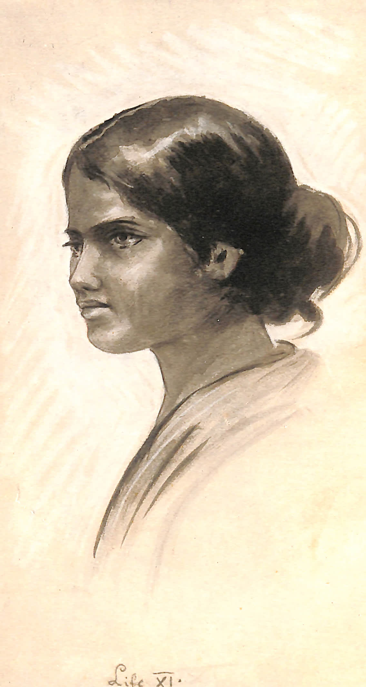

## Жизнь XXX

Воплощение, которое произошло в 14 415 году до н.э. в Калипе, в районе Удх, опять же является женским в касте брахманов, или, скорее, возможно, в той касте, которая впоследствии стала брахманской.

Мы приходим к времени, когда каждый глава семейства был священником своего семейства. Его долгом было самому совершать для своей семьи большую часть обрядов, для которых сейчас считается необходимым призывать на помощь специально обученного священника или служителя; так что, возможно, это можно рассматривать как переходный этап. Казалось, что каждый домовладелец должен знать все необходимые обряды, но уже в то время были некоторые, которые не знали их, и поэтому иногда им нужно было обращаться за помощью к более образованным или обученным соседям. Уже тогда это заложило основу для существования специального класса людей, которые должны были профессионально заниматься этой работой, и этот факт, похоже, отразился на других условиях, создавая своего рода порочный круг, поскольку те люди, которые были специально привлечены для выполнения такой работы, находили это для себя выгодным, чтобы умножить обряды и сделать их все более и более сложными, чтобы было необходимо призывать их для их надлежащего выполнения.

Алкиона была дочерью такого главы семейства (Лев) - человеком, который осуществлял земледелие в достаточно крупных размерах, будучи в основном фермером, но также имеющим много стад. Он был одним из тех, кого можно описать как ученого в обрядах, и ему редко требовалась внешняя помощь любого рода. Однако его вера, похоже, не имела совсем много общего с современным индуизмом, она была скорее поклонением персонафикации Шивы, Вишну и Брахмы; на самом деле его мысли были практически полностью лишены философии. Тем не менее, связь с современным индуизмом вполне заметна.

Их религия, по-видимому, в основном сводилась к проведению ряда жертвоприношений различным силам природы, хотя некоторые из их обрядов выглядят как прототипы сегодняшних. Старший сын приносил жертвы за умершего отца, но жертвоприношение казалось двойственным или имело два вида, одно из которых предполагало просто предложение некой пищи умершему, а другое было своего рода подкупом, чтобы успокоить существ, которые могли бы потревожить или опустошить умершего. Был также обряд, соответствующий современному вручению нити - своеобразному посвящению мальчика в обряды своего класса, хотя вручение нити не упоминалось в связи с этим; на самом деле, казалось, было три таких инициационных обряда на разных этапах, примерно в возрасте семи, четырнадцати и двадцати одного года соответственно, первый из которых был простой и подготовительной природы, второй являлся расширением первого, но гораздо более сложного и подробного, и только третий давал полную возможность действовать в качестве священника для других.

Алкион с детства проявляла большой интерес к обрядам. Будучи ребенком, она обладала некоторыми ясновидящими способностями, и по крайней мере часть ее восторга от обрядов заключалась в наблюдении за их эффектами и наблюдении за существами, вызванными ими, которые, однако, она считала скорее игровыми товарищами, чем страшными божествами. У нее был старший брат Уран, который разделял ее интерес ко всем этим вещам, хотя он не был ясновидящим и зависел от ее описаний происходящего. В детстве эти двое постоянно задавали своему отцу вопросы на такие темы, на которые он не мог ответить, и когда они выросли, эти молодые люди стали немного недовольны религией их времени, неустанно ища просвещения по общим проблемам, которые не затрагивались в информации, данной в таких традициях, которые тогда существовали. Они искали, фактически, некую рудиментарную Теософию, систему, которая могла бы содержать и объяснять изолированные и даже казалось бы противоречивые утверждения, сделанные им.

Брат и сестра всегда любили отделяться от остальных, чтобы обсуждать эти сложные проблемы. Хотя Уран, будучи старше, обладал большими способностями к рассуждению, у Алкионы часто возникали моменты интуиции, которые помогали ей приходить к решениям, до которых его интеллект не мог дойти. Остальные члены семьи, включая отца Лео и мать Орфея, считали эту пару мечтательной и непрактичной, их спекуляции и обсуждения им казались бесполезными. Они постоянно искали ответы на свои вопросы в разных направлениях, но сталкивались лишь с непониманием и отсутствием симпатии. Говорили, что где-то на удалении, в горах, было общество, братство, которые посвящали себя подобным исследованиям, но поскольку это были представители другой расы и религии, арийцы крайне пренебрежительно относились к ним и даже испытывали ненависть, считая их неверующими.

Иногда взрослые, которые случайно слышали грубые обсуждения брата и сестры, с презрением говорили им, что они должны пойти и поучиться у этого братства. Эта идея, сказанная, без сомнения, наугад или в шутку, укоренилась в их сознании, и в конечном итоге они начали думать о визите в это общество как о возможном и даже желательном, несмотря на глубоко укоренившееся неприятие своей расы и класса. Этот вопрос снова и снова обсуждался между ними наедине, и в конце концов они пришли к решению, что когда Уран достигнет совершеннолетия, они пойдут и найдут это общество, чтобы выяснить, было ли обосновано презрение, которое испытывали к его членам, или, возможно, у них действительно есть некоторые знания, которых не обладает презрительный ариец.

Вскоре после того, как старший брат достиг совершеннолетия, он объявил о своем намерении отправиться в это путешествие и взять с собоил Алкиону, что вызвало немало протестов и возражений в семье, особенно со стороны матери. И Уран, и Алкиона должны были жениться - или, по крайней мере, отец хотел это для обоих; но Уран (который, если не считать это необычное желание, всегда был хорошим сыном и отличался здравым смыслом) заявил, что он согласится на брак, только если ему сначала позволят совершить это путешествие и взять с собой сестру. Как было сказано, мать и другие родственники настойчиво протестовали, но отец в конце концов сказал: "Пусть идут и увидят сами; во-первых, они, вероятно, не смогут найти это общество и после многих напрасных поисков вернутся домой и успокоятся; во-вторых, если такое братство существует и они его найдут, то обязательно убедятся, что оно не имеет никакой ценной информации, и вновь поняв глупость своей мечты, они захотят вернуться домой и встать на обычный путь жизни".

Идея о том, что молодая девушка совершает такое любопытное паломничество в неизвестное, была, по-видимому, чуждой традициям того времени. Однако, так как брат и сестра были неразлучны, так как сестра заявила, что брат не должен идти без неё, и так как он, в свою очередь, объявил, что без неё он не пойдет, отец в конце концов смирился со всеми возражениями и дал свое разрешение, хотя и с некоторым презрением.

Брат и сестра отправились в путешествиe, проходя из деревни в деревню, через густонаселенные части страны, без значительных трудностей или особых приключений. Проходя дальше, они делали запросы относительно предполагаемого сообщества. Некоторые считали всё это мифом, или говорили, что, возможно, когда-то такое сообщество мужчин существовало, но было разогнано или уничтожено мародерскими группами ариев; другие заявили, что оно всё ещё существует, но, казалось, не имели точной информации о его местоположении или о типе людей, которые его составляли. Тем не менее, продвигаясь вперед, слухи о его реальном существовании начали преобладать над отказами, и когда они прибыли к подножию гор, они смогли получить что-то вроде определенного направления.

Однако именно здесь начались их приключения, поскольку поселки часто были расположены далеко друг от друга и их было сложно достичь. Хотя Алкиона была хорошо развитой юной женщиной и почти настолько же хорошим пешеходом на ровной поверхности, как ее брат, восхождения на горы приводили ее в замешательство, и ей потребовалось несколько недель, чтобы привыкнуть к ним и стать в них достаточно искусной. Сведения о братстве становились все более конкретными, но менее обнадеживающими, поскольку стало ясно, что жесткое исключительность является одним из его характерных правил, и ни одна женщина не принадлежала к нему ни была приглашена в его окружение. Это звучало зловеще, и Алкиона, которая с горячим желанием хотела довести приключение до логического конца, тут же предложила найти место в какой-нибудь деревне у подножия гор, где она могла бы остаться, пока ее брат проникнет в секретные места и узнает тайны братства, при условии, конечно, что он верно обещает передать их все ей по возвращении. Однако Уран не хотел слушать об этом и клялся, что они будут держаться вместе или вообще не поедут, и сказал, что не будет знаний у братства, настолько невежественного, чтобы отказывать в них любому искренне ищущему уму. Их мужество и выносливость были достойно проверены в ходу этого паломничества, из-за крайней усталости и случайного лишения, их приключениями с дикими зверями; также в одном или двух случаях они столкнулись с большим страданием и экспозицией из-за их потери ориентации.

В итоге, однако, они достигли своей цели и обнаружили, что эта так обсуждаемая община действительно существует на физическом плане. Братство жило в уединенной долине, уткнувшейся далеко в дикую часть гор, из рукояти защищенной от любой возможности атаки, или даже открытия для тех, кто не знаком с районом. В этой долине стояло большое центральное здание, грубо напоминающее крепость разбойников. Это было место проживания главы общины, в нем также находились большой столовая и зал для собраний. Вокруг него были группированы без всякого порядка ряд небольших каменных домов - почти хижин, некоторые из них - которые были возведены различными братьями по мере их вступления. Эта община или монастырь назывался Кухупан (очевидно, атлантическое имя) и состоял почти исключительно из людей высокой атлантической расы, лишь двое или трое среди них были арийцами. Они вели бы то ни было монастырскую жизнь, проводя много времени в медитации и учении, и при этом каждый занимал свое назначенное место в выращивании и подготовке зерновых и фруктов, на которых они жили.

Обнаружив этот секрет, брат и сестра представились у ворот долины, чтобы просить о входе. Их просьба была категорически отклонена, и им рекомендовали заняться своими делами. Однако Уран утверждал, что они прошли сотни миль в поисках мудрости, которую только это сообщество могло им дать, и он потребовал быть принятым к его главе, чтобы, по крайней мере, его дело было рассмотрено до того, как его окончательно отклонят. Несмотря на некоторые возражения, стражники ворот удовлетворили их просьбу, предупредив что все попытки войти тщетны. Тихая, но настойчивая упорствованность Урана в конечном итоге обеспечили им желаемую встречу, и они были приведены перед Вестой, главой братства, уважаемым и достойным человеком с необычайно проницательным взглядом. Они откровенно рассказали ему свою историю, и ответили по запросу, что они не хотят отказываться от религии, в которой они были рождены, по крайней мере, очень точно, не без дальнейшего запроса, но они искренне желают получить информацию, которую эта религия, как она была предложена их отцом и соседями, не была в состоянии дать им, и что они услышали издали о знаменитости и учености этого монастыря, и поэтому прошли всю эту дорогу в надежде быть допущенными к нему.

Уран так хорошо изложил свое дело, что глава сообщества в конечном итоге согласился позволить ему получить обучение, но долгое время он не мог согласиться на приеме Алькиона, поскольку никогда не разрешалось жить женщинам в пределах монастыря. Тем не менее, Уран решительно заявил, что обоих должны допустить к учению, или никого, и Алькион, когда спрашивали, проявила такой умный интерес к религиозным вопросам, что в конечном итоге аббат сдался, хотя он был уверен, что мог доверять своим братьям, ему все же были сомнения, не вызовет ли ее присутствие некоторые неприятности и сердечные переживания среди них. Брату и сестре был предоставлен пустой сарай.

С Алькион было установлено определенные ограничения на ее передвижения, которые она считала абсолютно нелепыми. Однако она всё же согласилась с гораздо более серьезными условиями в обмен на информацию, которую она ожидала получить.

Когда вопрос был таким образом урегулирован, аббат лично занимался обучением их той мудрости, которую он мог передать, и вскоре увидел, что оба из них достойны любой помощи, которую он мог предложить. Им представиться что-то из знания и науки Атлантиды было откровением нового мира. Хотя арийцы того времени были воинственной расой с множеством своих оригинальных идей, они не были высокообразованными людьми в отношении научного или философского знания. Брат и сестра вскоре обнаружили, что вопросы, о которых они довольно грубо размышляли, были тщательно обсуждены тысячи лет назад в Атлантиде, и что аббат и его монахи обладают определенными системами мышления, которые простирались гораздо дальше, чем они могли только мечтать.

Все это было для них чистейшим наслаждением, и они поглощали каждый кусочек информации, который могли получить от аббата или от любого другого брата. Система, представленная перед ними, имела много точек соприкосновения с современной теософией; и превыше всего, в монастыре было около двадцати тайных книг, из которых им читали стихи, наполняя их восторгом и трепетом, поскольку письменные книги еще не были распространены среди их народа. Они настойчиво хотели быть принятыми на испытательный срок в Орден, но этого аббат не разрешил, говоря, что Алкиоун в любом случае не может быть так принята, и что даже ее брат должен доказать свою подготовленность годами жительства. Однако ему было разрешено помочь в трудах сообщества, как своего рода оплата услуг за гостеприимство, неизбежно оказываемое его сестре и ему самому. Так прошло несколько счастливых месяцев, полных увлекательного изучения и интереса.

Однако вскоре полуформированные страхи аббата оправдались, потому что, несмотря на уродующую вуаль, некоторые из его молодых учеников начали влюбляться в Алкиоун, и, как следует опасаться, она сама нисколько не была равнодушна к их очевидному, хоть и не произнесенному, восхищению; хотя, чтобы быть справедливыми, ее голова так полна была новой философией, что она заметила их чувства лишь спустя некоторое время. Когда она привыкла к жизни и нашла время оглядеться вокруг, неизбежное продолжение такого аномального положения дел проявило себя. Старый аббат слишком доверял вуалированному лицу и различию расы - презрение арийца к тому, что он считал эфемерным и декадентским атлантовцем, было полностью взаимным от последнего, который считал арийца простым варваром без даже элементарной культуры. По крайней мере один из молодых атлантских монахов умудрился увидеть Алкиоун без вуали и обнаружил, что очарование красивой арийки полностью преодолело его расовые предубеждения. Вещи быстро дошли до стадии, на которой были организованы секретные встречи, и, безусловно, в конечном итоге эти секретные встречи были обнаружены, и тогда, конечно, произошел большой взрыв гнева. Алкиоун, ее брат и заблудший молодой монах, Нептун, все были переданы аббату и немедленно изгнаны из сообщества, потому что, хотя аббат полюбил этих двух незнакомцев, он любил свое сообщество как свое жизненное призвание гораздо больше.

Уран был очень возмущен и, несмотря на свою любовь к сестре, он строго упрекнул ее за ее действия. Как только их изгнали из долины и опека братьев прекратилась, он напал на молодого монаха, которого считал причиной своего изгнания, и между двуми молодыми людьми произошла схватка, в которой оба были ранены. Это позволило Алкионе взять ситуацию под контроль. Она строго упрекнула их обоих за их глупость в том, что они ссорились, когда было очевидно, что их интересы совпадают. Она сказала, что, хотя она горько сожалеет о том, что ее действия привели к этому изгнанию, она все же не может пожалеть самого действия, которое она считала полностью согласованным с природой. И она спросила, почему бы не было возможным жить во внешнем мире более естественной жизнью, чем в сообществе, и в то же время продолжать изучение философии, которая стала руководящим принципом их жизни.

Здравый смысл ее брата наконец привел его к пониманию этого, и молодой монах был вполне готов к дружелюбию, поэтому

Алкиона, не без труда и тяжких испытаний, довела двух молодых людей до ближайшей деревни, хотя и та была на значительном расстоянии. Она сама ухаживала за их ранами и делала все возможное для них, но только в деревне они могли получить помощь, отдохнуть и питаться нормально.

Они пробыли здесь некоторое время, но в конце концов решили, что будет лучше, если они будут еще дальше от монастыря, особенно молодой монах, который хотел попасть в какую-то часть страны, где его изгнание необходимо было бы знать. Не то чтобы он сожалел об этом, ведь он считал, что ради любви стоило потерять мир, и Алкиона, в свою очередь, прониклась к нему сильным уважением. Она не думала, что сможет вернуться домой с мужем презираемой расы, особенно одним, который был незаконно получен, и Уран тоже решил, по крайней мере временно, встать на сторону молодой пары.

Не имея средств к существованию, они, конечно, были вынуждены стремиться к какой-то работе. Уран хорошо знал практическое земледелие, но Нептун, хоть и силён, крепок и готов работать, не имел знаний ни в одном полезном искусстве, кроме того небольшого, которое он получил, занимаясь вместе с другими обработкой монастырской долины.

Тем не менее, они вскоре начали работать на Ирену, старого фермера, который, став старым и не имея под рукой детей, искал помощи в обработке своего имения. Таким образом, постепенно они заняли признанные позиции, которые, хотя сначала были скромными, со временем улучшились. Позже старый фермер, оказавшийся добрым и честным человеком, предоставил им определенную долю в фермерстве. Тут они провели несколько лет, в целом счастливо живя, постепенно завоевывая уважение и благосостояние в маленькой деревне.

У Алкионы было несколько детей, и она стала способной домохозяйкой. Несмотря на то, что ее интерес к философии и религиозным вопросам не пропал, она, естественно, имела меньше времени для их обсуждения, поскольку заботы о семье и доме нарастали. Несмотря на то что она воспитывала своих детей в обрядах своей родной арийской религии, она тем не менее привила им великую философию древнего Атлантиса и таким образом, для них и для некоторых друзей, которые проявляли интерес, она в некоторой степени предвосхитила более поздние развития того индуизма, который признает Упанишады, как и Веды. Среди этих друзей выделялся молодой сосед, Цигнус, который чувствовал большое восхищение Алкионой и большое уважение к ее мнению в религиозных вопросах. Он и его жена Мизар были близкими друзьями семьи на протяжении многих лет.

Тот факт, что Алкиона и ее муж были из разных рас, кажется, вовсе не поставил их за пределы социального организма ни в одной из рас. Напротив, это скорее действовало в обратном направлении, поскольку это позволило им завести друзей в обеих группах. Ее дети, по мере того как они выросли, были прекрасными крепкими представителями и кажется, что в этот раз комбинировали хорошие качества двух рас, вместо плохих, как это так часто, к сожалению, бывает в таких смешениях.

У Алкионы детская ясновидение уменьшилось по мере того, как она становилась старше, и после замужества почти полностью исчезла, хотя ее чувствительность и острое интуиция все еще оставались. Но ясновидение проявлялось время от времени, по крайней мере, у одного из ее детей, и в любом случае воспоминание об этом всегда было для нее ценным имуществом, позволяя ей ярче осознавать те факты невидимого мира, который всегда так близко окружает нас.

Примерно через двенадцать лет после их изгнания из монастыря, до них дошли новости, что аббат уже долгое время безрезультатно, но терпеливо пытался найти их. И, почувствовав себя в безопасности от его дальнейших действий, они не стеснялись отправиться на поиски его посланника и объявили о себе. Затем они узнали, что целью долгих поисков аббата было передать им определенное сообщение. Ему сообщил его учитель Меркурий (которого он глубоко почитал, который являлся ему или общался с ним астрально, но никогда ни разу не видел его во плоти), что он был не прав, изгоняя их, потому что хотя действие Алкионы и монаха было само по себе неопровержимым, это было всё равно лишь естественной слабостью тела, в то время как горячее желание узнать мудрость являлось качеством внутреннего человека, которое в далеком будущем будет использовано с большой пользой, не только для них самих, но и для помощи многим другим. Поэтому аббат хотел отменить свое решение и пригласить всех трех вернуться к изучению с общиной.

Это приглашение, конечно, было высказано в незнании того обстоятельства, что они уже обосновались в семейной жизни, и как Алкиона, так и ее муж считали невозможным принять его, поскольку теперь их обязанность перед детьми стала наиболее важной. Однако Уран решил навестить аббата, чтобы поблагодарить его за доброту в отправке такого сообщения, и попросить у него подарка, которого они давно и по-настоящему желали - копии одной из священных книг. После пребывания несколько месяцев в своих старых помещениях, он вернулся с этим драгоценным сокровищем, принося с собой дружеские пожелания и благословения Весты.

Вскоре после этого старый фермер Ирене, для которого они изначально начали работать, перешел на астральный план, оставив им в благодарность за их годы преданной службы почти все свое имущество, за исключением некоторых малых частей, уже обещанных некоторым дальним родственникам. Таким образом, семья утвердилась в роли местных магнатов, и их будущее благополучие было обеспечено.

Их дом также стал своего рода религиозным центром, поскольку было признано, что философская информация, которую они могли предоставить, являлась ценным дополнением к обычному обучению поклонения природе, которое окружало их. Муж Алкионы, Нептун, и ее брат Уран умерли до нее, но хотя она скорбела по поводу разлуки с ними, ее дети все же оставались с ней, как и ее положение большого уважения и почета в районе. Она ушла из жизни мирно в возрасте девяноста одного года.

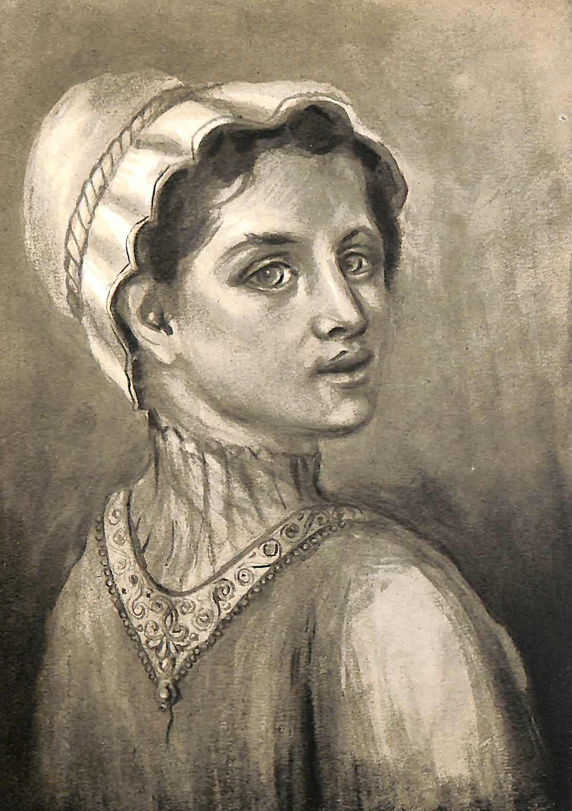

## Жизнь XXXI

Наша история на этот раз уводит нас на южную часть великого острова Посейдонис, расположенного в середине современного Атлантического океана. Алкиона родилась здесь среди народа горцев расы Тлаватли в 13 651 году до нашей эры. Она была дочерью Меркурия, священника Солнца, который был благородного происхождения, будучи отдаленно связан с правителем страны. Ее детство было счастливым, она безмерно предана своему отцу, который особенно добр и готов помочь ей, он казался понимающим детей лучше, чем большинство родителей того времени. Религия того периода была в основном культ Солнца, хотя также существовало много олицетворения различных сил природы. Кажется, что некоторые великие святые прошлых лет были обожествлены. Маленькая девочка была очень заинтересована в ритуалах в храме, они сильно впечатляли ее, и когда она была молода, ей хотелось посвятить свою жизнь службе в храме. В связи с храмом было открыто две карьеры для женщин - одна была похожа на обычных жрецов-девственниц или храмовых предсказателей, а вторая была своего рода гильдией службы, которая состояла из замужних женщин.

С возрастом она готовилась к первой позиции, с одобрением отца, и в возрасте шестнадцати лет вступила в число последовательниц. Видимо, разнообразные практики медитации, рекомендованные для девушек, оказали значительное воздействие на нее, и отец был полон надежд, что она быстро продвинется по службе. Однако, прежде чем завершился ее первый год определенной службы в новоявленных, на сцену вышел неизбежный молодой человек, и она глубоко влюбилась в него. Объект ее страсти (Сириус) был нечто вроде загадки; он только что появился в городе, и никто, похоже, не знал кто он такой, откуда он пришел, и даже в те ранние годы это считалось препятствием для возможного жениха, хоть он и был красивым и крепким молодым человеком.

Она увидела этого молодого человека на одной из служб в храме, и они странно тянулись друг к другу с первого взгляда, так что он начал искать поводы встретиться с ней, что было непросто, поскольку она непрерывно находилась в храме.

Однако юный поклонник, благодаря терпению и усердию, смог в нескольких случаях поговорить с ней, и их необычная дружба быстро переросла в страстное влечение.

Сначала Алкиона ничего не говорила об этом своему отцу, но он полуразгадал, что что-то происходит, и задал ей несколько вопросов, которые вскоре вызвали ее застенчивое признание в том, что службы в храме больше не являются для нее главным в жизни. Отец был разочарован, но тем не менее реагировал на это доброжелательно и философски, дав ей разумный совет, что бесполезно посвящать себя специальной службе Божеству, если она не абсолютно уверена в своем призвании, и что она все еще может служить Солнечному Богу, может быть, менее прямого пути, но так же истинно и благородно, если будет следовать зову своего сердца. Однако он требовал увидеть молодого человека, и его рассказ о себе оставил желать лучшего с точки зрения родителя, поскольку он мог сказать только то, что, хотя он был благородного рождения и равен по званию той, кого любил, вокруг его происхождения был неясный, который он не имел права раскрывать. К тому же сейчас он, по-видимому, не имел связи с своей семьей, какой бы она ни была, и зарабатывал себе на жизнь как мог, охотясь, хотя заявлял, что это совсем не то занятие, к которому он предназначен. Священник сильно тянулся к нему, несмотря на очевидную неподобающесть, ибо он казался достойным и привлекательным юношей, хотя странно диким и казалось необученным обычным жизненным правилам.

Меркурий открыто сказал ему, что ему нравится то, что он видит в нем, но в то же время абсолютно невозможно, чтобы он отдал свою дочь человеку, окутанному такой тайной и не имеющему регулярного средства к существованию. Если он не готов полностью доверять ему, он с сожалением должен признать, что вряд ли может поощрять близкие отношения двух юных влюбленных.

Молодой человек был очень подавлен этим, хотя не мог не признать его справедливость, но он все же утверждал, что тайна, в которую он был вовлечен, не была его собственной, и что он должен ждать подходящего времени перед тем, как ее раскрыть. Так что дело было оставлено в подвешенном состоянии на некоторое время, священник с сожалением запретив молодым людям видеться наедине, хотя он вполне открыто признавал, что чувствует сильное влечение к загадочному молодому человеку.

Любовь Алкионы к нему была настолько сильной, что она, вероятно, могла бы проигнорировать эту загадку и убежать с ним, если бы не ее сильная любовь и уверенность в своем отце, которые убедили ее, что он должен быть прав, даже в том, что она считала его первой жестокостью по отношению к ней. Она была сильно разрывалась между противоречивыми чувствами и некоторое время сильно страдала.

Все это время правитель страны, Аластор, вел войну с Толтекским сюзереном, Короной, некоторый вопрос о чрезмерном требовании дань привел к долго тлевшему недовольству до открытого мятежа. Благодаря значительному превосходству в дисциплине и боевой мощи армий сюзерена, было сложно для этих горцев выступить против них в открытом сражении. Однако местный король хорошо знал свою страну, и его сын Урса сумел уничтожить большую армию Толтеков, заманив ее в долину, которую он затем смог затопить из скрытого резервуара. В честь этой победы были устроены большие общественные празднования и своего рода национальный фестиваль. Каким-то образом, во время его проведения, странные слухи начали распространяться о молодом возлюбленном, Сириусе, и однажды он был внезапно арестован и доставлен перед старым королем Алсатором. В ходе тогда проведенного расследования вся странная жизненная история Сириуса вышла наружу и оказалась романтичной, хоть и явно нестандартной.

Старик Аластор был аккуратным, но невероятно глупым человеком, и из-за своего характера он серьезно испортил дела своей семьи. Его сын Урса был диким молодым парнем, привыкшим делать, что ему вздумается, не обращая внимания на других. У него была младшая сестра, Орион, которая в детстве была полностью предана ему. Они были всегда вместе, и он заставлял ее носить и приносить ему всё, что он хотел, как это обычно делают старшие братья с преданными младшими сестрами. Когда они подросли, их привязанность друг к другу оставалась такой же сильной, и со временем его отношения с ней стали более, чем братскими. Когда это выяснилось, это вызвало некоторый скандал, потому что даже в те более свободные времена такие отношения считались высоко неуместными. Когда Аластор узнал об этом, он вел себя как настоящий дурак, демонстрируя Спартанскую справедливость и вместо того, чтобы добродушно и разумно обращаться с молодыми людьми, изгнал своего сына из страны и приговорил свою дочь к смерти. Сам Урса, однако, не собирался мириться с таким несчастным оборотом своих удовольствий.

Он сумел сбежать из лап своего отца, спасти свою сестру из места, где она была заключена, и они вместе бежали и спрятались в лесу на окраине королевства, рассеяв преследование, ведь оставили понять, будто сбежали на корабле из порта, расположенного в совершенно другом направлении. Несколько лет они жили в лесу, где и родились их дети: сын Сириус и дочь Вега. Урса аккуратно вытатуировал красную змею вокруг талии Сириуса, значок наследника престола, а сестра и брат счастливо прожили в лесной тишине; но после некоторого времени Урса начал уставать от этой жизни и скучать по прелестям двора и той позиции, которую он покинул.

Привыкший думать только о себе, он без колебанийбыло оставил жену и детей; он появился в порту и притворился, что приехал из иностранного государства. Очень скоро он добрался до своего отца, который простил его и восстановил в звании наследника. Желая обеспечить продолжение рода. Вскоре Аластор устроил брак для Урсы, который тот принял, не сказав ни слова о жене и детях, которых он оставил в лесу. Действительно, вернувшись, он позволил понять, что не имел никакого отношения к побегу своей сестры и не знал ничего о ее судьбе. Его новая жена, Гесперия, вскоре родила ему ребенка, Поллюкса; этому мальчику также вытатуировали змею, ибо если бы Урса этого не допустил, сразу бы возникли подозрения. Новая жена, однако, оказалась тяжелым характером, и он часто вспоминал с сожалением о своей счастливой свободной жизни в лесу. Однажды, когда он охотился в том лесу, где так долго жил, он умудрился отделаться от своих спутников и пошел посмотреть на хижину, которую построил для своей сестры-жены, но обнаружил, что она пуста.

Орион жил там много лет и видел, как ее дети растут здоровыми и красивыми. У нее не было проблем с пищей, поскольку различные ловушки, которые Урса устроил, все еще работали, и она могла собирать фрукты и выкапывать корни, как это делал он. Когда ее дети выросли до того возраста, когда им стала нужна одежда, она ткала ее для них из тростника, и они жили спокойной и счастливой жизнью, хотя она очень тосковала из-за покидания ее братом и мужем. Она всегда лелеяла надежду, что когда-нибудь он вернется к ней, и что со временем ее сын сядет на трон своих предков.

Вскоре ей пришло в голову, что если это должно произойти, ей нужно как-то привести своих детей в контакт со своими собратьями, чтобы те не были для них совершенно незнакомыми; поэтому она оделась в то, что осталось от той одежды, в которой она изначально сбежала, и отправилась в деревню, где смогла обменять шкуры убитых ими животных на одежду, такую как носят крестьяне, подходящую для детей и для нее самой. Тогда она смогла несколько раз отвести своих детей в походы по деревням в отдаленной части страны, где находился лес, но она не посещала одну и ту же деревню дважды, чтобы не вызвать подозрений, и всегда утверждала, что она и ее дети - путешественники, проезжающие через страну. Когда юноша подрос, его мать рассказала ему историю о его королевском происхождении, и они планировали, как они появятся в столице и потребуют признания после смерти старого короля.

Впоследствии, однако, Орион заболела и умерла. На своем смертном одре она заставила сына торжественно обещать, что он пойдет к своему отцу и объявится наследником трона. Она предупредила его, что его отец - человек переменчивый в настроении, и чтобы он должен тщательно выбрать момент для такого объявления. Молодые люди горько скорбели о смерти своей матери. Они похоронили ее тело под полом хижины, а затем оставили ее навсегда, не сумев жить больше в месте, где каждое дерево и камень постоянно напоминали им о потере. Они потихоньку двинулись к столице, Сириус заботливо заботясь о своей сестре Веге. Ему удается найти работу, главным образом используя свои навыки охоты и ловушек. Сириус намеревался таким образом обеспечить себя и сестру до смерти старого короля; но, как уже описывалось, его опередили. Среди празднеств, связанных с ранее упомянутой великой победой, были плавательные гонки, в которых он участвовал - в которых, впрочем, он обогнал всех конкурентов - но случилось так, что красный змей, набитый вокруг его талии, был замечен и начались разговоры, которые в конце концов дошли до ушам старого Аластора, и его привели к нему. Когда правда вышла наружу, был гневный скандал, и Аластор заставил Урсу выдать приказ об казни Сириуса, который был брошен в тюрьму и строго охранялся. Однако для Аластора шок от раскрытия был настолько велик, что он вызвал у него апоплексический удар, от которого он так и не оправился, и умер через несколько дней.

Тогда Урса стал королем, и он был решен, что его старший сын Сириус должен стать наследником трона, вместо Поллукса, поскольку тот демонстрировал слабый и распущенный характер. У нового короля были проблемы, так как он не мог аннулировать указ, который его отец заставил его подписать, поэтому он решил подготовить безшумное освобождение Сириуса из тюрьмы. Вторая жена Урсы, Гесперия, каким-то образом поймала его намерения, или, может быть, лишь подозревала его, но в любом случае она пристально следила за ним и была решена сорвать его в интересах своего сына Поллукса.

Тюрьма была загадочным лабиринтом из каменных стен, круг за кругом, и каждое отверстие от одного круга к другому было эффективно охраняемым. Сын, будучи государственным узником, был помещен в самую центральную камеру. Урса переоделся и покинул свой дворец, тайно ночью, подошел к внешнему стражу и подкупил его необычной безделушкой, принимая которую, он согласился отсутствовать несколько минут и позволить замаскированному королю войти в тюрьму.

Тем временем ревнивая Гесперия обнаружила отсутствие мужа и, полная подозрений, немедленно бросилась к тюремным воротам. Находя первого стражника ушедшим, она подтвердила свои подозрения и вошла через дверь, которую Урса оставил открытой. Последний двинулся дальше, пока не встретил второго стражника, на которого он набросился, прежде чем тот смог поднять тревогу, и с трудом удалось заткнуть ему глотку до смерти. Ему удалось обойти третьего стража, но снова произошла борьба с четвертым, в которой он, наконец, одержал победу, но и сам получил ранение. В конце концов он проник в самую внутреннюю камеру и нашел своего сына, которому он предложил свободу и безопасность при условии, что он уйдет.

(сохраняя, однако, полную тишину относительно своей личности и истории) и никогда не возвращаться. Сын, не узнав отца в его маскараде, отказался дать это обещание, так как уже обещал умирающей матери вернуться в столицу и заявить о своих наследственных правах. Урса умолял его уйти, уйти при любых условиях или без условий, но в любом случае сбежать, пока еще есть время.

Что-то заставило его сына подозревать истинную личность его посетителя, и он сорвал маску с лица своего отца, узнав его. Именно в этот момент прибыла Гесперия; она обнаружила убитого стражника и вооружилась его кинжалом, но была задержана, так как пришлось переговариваться со стражником, который не позволял ей пройти, пока она не открыла свой вуаль и применила свою власть как королева. Теперь она набросилась на своего мужа, как безумная; и разразилась ужасная борьба, во время которой оба, отец и сын, были ранены. В конце концов, когда она увидела, что не может одолеть их, она в безумной страсти заколола себе сердце.

Отец и сын провели совещание о том, как лучше всего поступить. Сначала отец предложил сбежать вместе и оставить королевство заботиться о себе, но Сириус решительно возразил против этой идеи, предложив скорее исчезнуть и забыть об обещании своей матери. Но Урса сейчас на это согласиться не мог, и они обсуждали вопрос всю долгую ночь. Сириус предложил, что при смерти Урсы королевство должно быть разделено между ним и Поллуксом, или, если это невозможно, Поллуксу следует предложить высокую должность в правительстве. Урса не одобрил это и в конце концов решил, что честность - лучшая стратегия, и пришло время исправить ошибку своей жизни, насколько это возможно сейчас.

Они вместе вернулись во дворец, и Урса вызвал к себе Поллукса и рассказал ему всю историю, сказав, что он должен отказаться от всех надежд на престол. Поллукс взял новость плохо и в бешенстве выбежал из присутствия отца.

Затем Урса собрал своих вождей, рассказал им всю историю своей жизни и представил им настоящего наследника трона.

Большинство из них согласились принять Сириуса в качестве наследника несмотря на неправильность его рождения, и с тех пор он носил золотое ожерелье, обозначающее его звание. Однако Поллукс покинул страну и попытался собрать иностранную армию, чтобы помочь ему утвердить то, что он считал своим правом. Ему не удалось поднять эту армию среди небольших соседних племен, и поэтому он ушел в Посейдонис и попытался заинтересовать правителя толтеков в своих делах. Корона была вполне готова поддержать его дело из-за вопроса о дань, а также потому что Урса недавно одолела его армии, хотя он не мог оказать значительной активной помощи из-за огромного восстания в другой части его владений.

Тем временем, Сириус, которого публично признали, смог прийти к Меркурию и рассказать истинную историю своей ранней жизни, и вновь потребовать руки Алкионы. При этих измененных обстоятельствах Меркурий был вполне готов отдать ее, говоря, что хотя обстоятельства, окружающие рождение Сириуса, были чрезвычайно необычными, но его публичное признание в качестве наследника престола в значительной степени стирало все это и укрепляло его позицию. Несомненно, учитель проникся симпатией к молодому человеку, и именно это, а также сильная любовь Сириуса к Алкионе, заставили его быть готовым забыть о упомянутых необычностях. Таким образом, Алкиона была выдана замуж с основательным пафосом и церемонией, и, несмотря на свою молодость, заняла свое место среди великих женщин королевства.

Она была неимоверно счастлива в начале своей новой жизни, гордая своим мужем и восторженная его удивительной ранней историей, не оттолкнутая ею. Это невозмутимое счастье продолжалось примерно три года, за это время у нее родились двое прекрасных детей (сын Уран и дочь Геракл), но после этого война вновь разразилась и муж был вынужден участвовать в ней.

Казалось, однако, что Император Толтеков не ведет эту местную войну с особой энергией, и несмотря на большую дисциплину его людей и их гораздо большее количество, успехи были примерно равными и война тянулась долго без ярко выраженной победы с любой стороны. Король Урса часто обращался за советом к Меркурию, относясь к нему с большим уважением. Именно в это время Меркурий дал ему некоторую информацию о его отношениях с его сыном Сириусом в прошлой жизни - рассказ, который глубоко его тронул и вызвал между ним и его сыном большую сцену объяснений, после которой он решил уйти в отставку в пользу Сириуса и ушел жить жизнью отшельника.

Сириус взял на себя управление, и, несмотря на свою молодость, проявил себя достойно, часто обращаясь за советом к своему отшельнику-отцу, и еще чаще - к Меркурию, когда сталкивался с различными трудностями, неотъемлемыми от такого положения, как его. Таким образом, Алкиона была возведена в высшее положение в этом небольшом государстве и достойно несла свои почести. Новый король вел войну с переменным успехом и однажды чуть не лишился жизни из-за предательства. На его дворе была некая старуха, Тетида, которая притворялась великим преданным его делу, но на самом деле была на стороне его сводного брата, от имени которого Толтекский император вел войну. Она ухитрилась каким-то подрывным способом узнать о планах короля, особенно о небольшой экспедиции, которую он собирался возглавить, чтобы получить важную информацию о расположении армий Толтеков. Эта женщина смогла предать эту небольшую экспедицию Толтекам, чтобы они могли устроить засаду и так, как она думала, убедиться в смерти короля.

Её преступный проект был предотвращен только благодаря сну или видению отшельника-отца. Последний, в результате этого, покинул свою пещеру и встретил своего сына-короля по пути с его экспедицией, и потребовал разрешения возглавить группу сам.

Его сын возразил, сказав, что безумие отца в его возрасте подвергать себя такому риску. Однако Урса настаивал, и Сириус в конце концов был вынужден уступить. Итак, старый королевский отшельник возглавил экспедицию и смог получить необходимую информацию и отправить обратно вестника с ней, прежде чем попадет в засаду, которую приготовили для его сына, и был убит. Таким образом, была спасена жизнь Сириуса, но он очень скорбел по поводу смерти своего отца, тем более что Меркурий каким-то чутьем смог сказать ему, что его отец, благодаря своему сну, знал о опасности и поэтому добровольно отдал свою жизнь, чтобы спасти своего сына.

Это событие произвело глубокое впечатление как на Сириуса, так и на Алкиону, и первый обратился к Меркурию за советом о дальнейших действиях. Меркурий посоветовал, учитывая, что в стране не только идут бесконечные войны, но и недоступен любой реальный прогресс для народа, Сириусу следовало поддерживать решительные попытки договориться с императором Тольтеков, даже если для этого потребуется определенный компромисс, такой как уплата значительно большего дань. По счастливому стечению обстоятельств, Сириус вскоре сумел нанести сокрушительное поражение армии Тольтеков и выгнать ее остатки из своего королевства. Сразу после этого он послал посольство к императору Тольтеков с объявлением, что, хотя победа на данный момент полностью на его стороне, он все же желает мира, а не дальнейшей войны, и чтобы избежать пролития крови, он желает договориться. Император, уставший от нерентабельной войны в отдаленной части своего королевства, оказался более разумным, чем могло бы ожидаться, и Сириус смог распустить свои войска за немного увеличенную дань из доходов, и направить их на весьма нужные мирные работы.

Алкиона оказалась настоящей помощницей своему мужу во всем этом, предложив множество планов по улучшению условий жизни народа. Теперь начался период мира и процветания как для короля, так и для страны. Королю и королеве родилось еще несколько детей, и их семейная жизнь вместе была счастливой. Здесь появляется еще один из наших персонажей - Цигнус, который был смотрителем некоторых больших штатов, принадлежащих Сириусу, и много лет верно служил ему в этом качестве.

Другой претендент на трон, Поллукс, приемный брат короля, хотя Тольтекий император отказался поддерживать его дело, продолжал интриговать, чтобы захватить власть. Его основным стремлением было убить Сириуса, и дважды он чуть не сумел. Во второй из этих случаев жизнь мужа на самом деле спасла Алкиона, которая видела яркий сон, заставивший ее отправиться к нему со стремительной поспешностью, когда он выносил приговор, предупреждая его о предстоящем нападении. Ее сон или предсказание так точно описала человека, собирающегося совершить убийственную атаку, что король мгновенно смог его узнать, когда тот стал перед ним, и тут же приказал своим стражам арестовать и допросить его. Оружие, которым он намеревался убить короля, было найдено у него, и поскольку он не смог объяснить, откуда у него это оружие, его испытание было коротким.

Под умным правлением короля и благодаря миру, который он принес, королевство быстро укрепилось в силе и богатстве. По совету Меркурия, который теперь подходил к глубокой старости, Сириус вызвал к себе своего сводного брата, чтобы попытаться договориться с ним. Он ясно сказал ему, что считает королевство своей заботой, которую он не может передать кому-то другому, но предложил ему губернаторство одного из районов страны под своим управлением. Претендент, однако, отказался принять это и сказал, что удовлетворится только полным контролем. Однако в ходе переговоров со Сириусом, этот сводный брат влюбился в Алкиону и, чтобы быть рядом с ней, предложил принять губернаторство не отдаленной провинции, а столичного города. Сириус с радостью предоставил ему это.

Когда Меркурий узнал об этой договоренности, он предупредил Сириуса не вверять слишком много в явную дружелюбность его сводного брата. Пришло время, когда Поллюкс воспользовался своим новым положением, чтобы сделать неподобающие предложения Алкионе, которые она немедленно отвергла, однако она сомневалась, следует ли ей разоблачить его перед мужем, потому что последний был очень рад, что (как он думал) таким образом затушил многолетнюю вражду со сводным братом. Так как молодой человек пообещал исправиться, она скрыла это на некоторое время, но вскоре его страсти вновь взяли верх, и произошла сцена, которую было невозможно скрыть от Сириуса. Последний был крайне раздражен, он лишил своего брата полномочий и бросил его в тюрьму, где тот вскоре умер.

В это время на Сириуса и Алкиону обрушилась большая горесть - их уважаемый отец и учитель, Меркурий, умер в очень преклонном возрасте. Они искренне скорбели о его утрате и вполне это можно понять, поскольку после его ухода не нашелся ни один столь мудрый советник. Между тем, умер и император Толтеков, и его преемник, Улисс, решил провести агрессивную политику, стремясь привести всю островную территорию к прямому подчинению, вместо того, чтобы оставаться лишь номинальным сюзереном перед рядом Королей более ранних подрас. Сириус был убит в битве, пытаясь сохранить свободу своей страны, в 13,000 году.

Алкиона была полна глубокой скорби и позволила себе породить горькие мысли об отмщении новому императору Толтеков.

Это несчастье, кажется, на время полностью изменило её характер, и нежная и любящая жена превратилась в решительную и беспощадную мстительницу, полностью набитую одной идеей. Она оделась в броню своего мужа, встала во главе того, что осталось от ее народа, и убежала в глубины гор, так как весь регион был оккупирован армией тольтеков. Управляющий ее мужа, Цигнус, который всегда восхищался ею, стал одним из самых преданных бойцов ее банда, и в этой роли заметно выделился.

Она проводила партизанскую войну в течение нескольких лет, перенесла наибольшие трудности, но ни на миг не свернула с своей цели. С ее горцами она не могла столкнуться с тольтеками в открытом бою, но постоянно досаждала им и, благодаря глубокому знанию связей между горными цепями, всегда смогла избегать попыток поимки. Тем временем, она никогда не колебалась в ненависти к императору, чья амбиция привела к смерти ее любимого мужа.

Она заставила своих сыновей поклясться не останавливаться пока император и его власть не будут уничтожены, и отправила одного из них (Аврора) под прикрытием в Столицу Золотых Врат, чтобы попытаться обезвредить его. После многих приключений молодой человек добрался до этого города и вскоре умудрился примкнуть к некоторым из многих недовольных партий и, когда представилась возможность, он был в числе тех, кто набросился на императора и убил его. Он спешил к своей матери с новостями о падении тирана, гордо показывая ей кинжал, которым было совершено убийство. Она приветствовала его с похвалами как мстителя отца, но даже в этом акте в ее голову впервые пришло сомнение, одобрили ли бы ее мертвый муж и отец ее действия.

Это сомнение росло и усиливалось, пока не превратилось для нее в ночной кошмар, и она начала своего рода молитвы к своему мертвому мужу, утверждая, что не перестанет звать его, пока он не сообщит ей о своей воле. Она продолжала эту странную молитву днями и ночами, пока наконец не уснула от чистого исчерпания; тогда во сне она снова увидела Сириуса. Сириус и Меркурий пришли к ней вместе, и они сказали ей, что, хотя по всем стандартам времени ее акт мести был допустимым и даже похвальным, есть еще более высокая точка зрения, с которой вся месть не является прерогативой закона.

"Моя дочь", сказал Меркурий,

"В этом ты ошибся, хотя я прекрасно понимаю причину твоей ошибки. Твое оправдание казалось тебе достаточным, но никакое оправдание не может сделать неправое правым, ни оправдать насилие, и это твое действие принесет много страданий в будущем, как тебе, так и преданному инструменту, которого ты использовал; но через страдание придет к тебе мудрость, и в далеком будущем твоя рука приведет к свету того, кто грешную жизнь прервал ты, и в этом будущем я буду помогать и направлять вас обоих, как делал это в этой жизни."

Алкиона, хотя была расстроена неодобрением своего отца, все же была во многих отношениях успокоена этим видением, ибо вновь встретилась лицом к лицу с теми, кого во всем мире она любила больше всего. Она вновь стала самой собой. Она оставила мужской наряд только настолько долго, чтобы установить своего старшего сына Урана на трон его отца, а затем оставила его навсегда и стала нежной и любящей Алкионой из прошлых дней.

Теперь, когда тиран мертв, его королевство сразу же распалось на первоначальные части, и более не было нападений на племена южных гор. Новый король Уран правил хорошо и мудро, так как Королева-мать Алкиона всегда была рядом, думая о том, что бы сделал Сириус и что бы посоветовал Меркурий. Некоторое время они все же советовали ей, хоть она и была полуосознанно этого факта; тем не менее, часто именно их влиянию она обязана была мудростью принятых решений, которые скорее влияла на короля, чтобы принять их.

Хотя она сама начала сожалеть о периоде своей мести и с определенной отвращением, и действительно смотреть на него как на некую одержимость, народ аплодировал ей и считал это самым великолепным героизмом. Поэтому она была очень уважаема и любима, и ее влияние во многих отношениях даже превышало влияние самого короля. Она пережила своего мужа на каких-то тридцать лет и умерла в 13569 году в возрасте восемьдесяти двух лет, будучи глубоко любимой и оплаканной всем народом и многими детьми, которые она так хорошо воспитала, за исключением того одного темного времени, когда шок от большого горя заставил ее отклониться от учения закона любви. Ее сын король пережил ее на несколько лет и правил хорошо и мудро, помня ее наставления. Поскольку тольтеки так и не набрали достаточной силы, чтобы проявить себя в южных горах, основанная таким образом династия продолжалась веками, и ее племя процветало.

Эта жизнь, в целом, была хорошей, и в ней достигнут значительный прогресс, несмотря на одну ошибку под чрезвычайно сильным давлением, которая была доминирующим мотивом предыдущей жизни. Однако стоит отметить, что на этот раз чувство мести было вызвано не личной обидой, а исключительно вредом, причиненным близкому человеку. Как мы увидим позднее, существуют жизни, лежащие далеко в будущем, в которых любая мысль о мести будет отброшена под влиянием великого Воплощения Любви и Сострадания.

Ее старшая дочь, Гераклес, вышла замуж за Алдеба, и это перевело ее интересы на другое королевство того же общего типа и состояния, также Тлаватли. С течением времени ее муж унаследовал трон этого королевства, и поэтому она тоже стала королевой. У нее была большая репутация мудрой женщины, и временами она находилась под контролем доброй силы, поскольку ее муж часто консультировался с ней по вопросам, в которых сомневался, на которые она, безусловно, отвечала с большими знаниями, чем у нее было.

Мизар женился на Ирене - событие, которое произошло гораздо позже всех остальных браков. Когда ее мать старела, она и ее муж приехали и жили в старом доме, и она взяла на себя хозяйство. Ваджра рано покинул дом, казалось, его жизнь была полна путешествий, и он долгое время проживал с Алдебом и Гераклесом. Он был склонен к приключениям и предпринимал несколько исследовательских экспедиций в соседние горы. Деметра была довольно чувствительной, хотя явно не ясновидящей. Нептун, человек с большой любовью, которую он всегда размещал мудро, женился на Белле.

Селена вела тихую и ученую жизнь.

В это время Вирадж был правителем великой южно-индийской империи, а Брихат была его королевой, и Марс был одним из их сыновей. Ману в астральной форме появился перед императором и приказал ему отправить Марса через море в Египет через Шри-Ланку. Он также был направлен выбрать группу молодых мужчин и женщин, которые должны были сопровождать его и принять участие в великой работе аризации Египта. Среди тех, кто был так выбран, было несколько наших главных персонажей, как видно из приложенной диаграммы.

По прибытии в Египет, тогда находившийся под правлением толтеков, они встретились с Юпитером, фараоном того времени. У него был только один ребенок, его дочь Сатурн, его жена умерла при родах. Его верховный жрец, Сурья, получив в видении указание от махагуру, встретил прибывших с почестями и посоветовал Юпитеру отдать свою дочь Сатурна замуж за Марса; он так и сделал, и за относительно короткое время были устроены браки с существующей знатью для всех новых прибывших.

Несмотря на то, что эта привнесение арийской крови было незначительным, через несколько поколений оно окрасило всю египетскую знать, так как фараон поставил свою печать уважения на эти смешанные браки, все патрицианские семьи горячо соревновались за честь генеалогического союза с сыновьями или дочерьми новых пришельцев. Слияние двух рас породило новый и отDistinctive_dstinctive отDistinctive_dstinctive отDistinctive_dstinctive отDistinctive_dstinctive, который мы так хорошо знаем из египетских памятников. С этого времени воплощение среди высших классов Египта считалось рождением в первой подрасе пятой коренной расы.

Описание результатов этой аризации, уничтожения большей части населения во время затопления Посейдониса и постепенного перенаселения страны различными расами до тех пор, пока Ману снова не пришел и не объединил весь Египет под одной властью, можно найти в книге "Человек: Откуда, Как и Куда", страницы 503-5.

Клио и Маркаб заметили среди группы египетских государственных деятелей, которые не одобряли арийскую эмиграцию, и выступали против неё. Клиона, жена Клио, и Айбл, жена Маркаба, были задействованы в их интригах. Все четверо в конечном итоге были изгнаны, как и Канцер, сестра Адроны.

## Жизнь XXXII

Фанатичное большинство Арийской расы в Центральной Азии продолжало расти и размножаться, и так как обрабатываемая земля вокруг берегов Моря Гоби была ограниченным ресурсом, от неё отходило волна за волной эмиграций, и большинство этих волн в конечном итоге проникли в Индию. Намного позже некоторые отряды проникли в Персию, но в то время империя, занимавшая этот район, была слишком сильной, чтобы они решились её атаковать. Однако одно войско или племя таких эмигрантов обошли север Персии и в конечном итоге прибыли в Кавказский район, из которого гораздо позже они распространились по Европе. Многие мелкие волны иммиграции в Индию, по-видимому, продолжались на протяжении нескольких тысяч лет.

В общих чертах арийское вторжение очень напоминало нашествие готов и вандалов на Римскую империю. Мы видим тот же феномен высокой цивилизации со всевозможными специализированными деталями, которая, однако, стала отчасти эфемерной. Арийские захватчики, хотя они были менее цивилизованными в плане искусств и наук, были более жизнеутверждающей расой, гораздо более фанатичной и менее философской. Их лидеры убеждены в том, что их завоевание было религиозной войной. Они называли атлантов Dasyas и рассматривали их как неверующих, призывая истреблять их любой ценой, презирая их высокую цивилизацию и их искусства, хотя, по-видимому, не их золото и драгоценности. Их солдаты были хорошо дисциплинированы, но в большинстве случаев они не смогли устоять перед диким натиском мускулистых варваров из севера. В стране существовали другие расы, очевидно, лемурийского происхождения; было большое черное население, совершенно отдельное как от коричневого большинства Tlavatli, так и от красной расы toltect, в руках которой обычно была вся власть. Толтеков иногда называли Nagas, а некоторых темнокожих людей - Takshaks - народ, который использовал отравленные стрелы с железными шипами.

Арийцы были физически крупнее и, обладая острым зрением и орлиными носами, они напоминали нынешних афганцев или пуштунов. Один на один они легко преодолевали более ослабленных атлантов, хотя некоторые из больших укрепленных городов последних устояли против их нападений веками. В целом, арийцы были ярким и счастливым народом, хотя нельзя сказать, что их жизнь была идеальной. В то время большинство из них были плотоядными; по крайней мере, известно, что некоторые крупные племена убивали и ели скот. У них также была довольно широко распространена алкогольная зависимость, основным напитком которой был сок некоторого растения из семейства асклепиадов, который они смешивали с молоком. Некоторые из племен, когда они обосновались на завоеванных территориях на севере Индии, выращивали пшеницу и ячмень, и практически стали вегетарианцами. В этот период нет ничего похожего на систему каст.

Родители Алкиона принадлежали к одной из этих бродячих групп, и он родился в пути, где-то в горной стране в окрестностях того места, которое теперь называется Афганистаном, в 12,877 году до н. э. Эта группа медленно двигалась к Пенджабу, который уже был в руках арийцев. Кажется, эти разбойничьи покорители всегда были готовы к бою, столь же охотно с людьми своей собственной расы, как и с другими, если не могли получить точно то, что им нужно. В некоторых случаях арийские короли, уже на месте, достаточно мудро утверждали свою родственность с этими новыми группами и ускоряли их путь; другие, жившие на одном месте на протяжении веков, считали своих братьев простыми дикарями, сильно сопротивлялись им и обычно были ими побеждены.

Семья, к которой принадлежал Алкион, в конечном итоге обосновалась в местечке по имени Арупалу, недалеко от современного Амритсара. Нужно помнить, что хотя арийские захватчики обычно изгоняли или убивали атлантов, в некоторых местах они мирно сосуществовали с ними; и хотя большинство арийцев были разъярены, нетерпимы и фанатичны, не принимая даже намеки на более высокую цивилизацию Атлантиды, были и те, кто были более широкого ума и более желали учиться. Религия атлантов была формой солнечного культа, но сопровождалась великолепной системой философии. Их храмы, обычно выполненные из ослепительно белого камня, были построены в форме звезды.

Самые ранние воспоминания Алкиона были связаны с беспрестанным движением вперед племени, и первым божеством, которому его научили молиться, был Ведущий по пути. Племя обращалось к нему с просьбами найти для них дорогу и провести их в приятную землю. У них было много странных и интересных традиций о стране, откуда они пришли. Если этим традициям можно доверять, то, похоже, они были полубарбарским народом, жившим на окраине территории какой-то великой устоявшейся власти, чье постоянное давление и расширение приводили их к миграции.

Отец Алкиона в это воплощение был Алгол, а мать была Фесей, но она умерла вскоре после его рождения. Отец был человеком фанатичного типа, решительно противостоящим всему, хорошему и плохому, что напоминало о высокой атлантской цивилизации, и это чувство скорее усиливалось, чем смягчалось тем фактом, что в районе, где они поселились, арийцы и атланты договорились жить вместе в относительной гармонии. Алкион скоро начинал сомневаться в мудрости позиции своего отца, потому что многие вещи в этой цивилизации его привлекали, и даже будучи мальчиком, он подружился как с атлантскими, так и с арийскими детьми.

Действительно, его любимым спутником был Психе, сын богатого атлантского достопамятника, Орфей, но фанатизм его отца был настолько велик, что он никогда не осмеливался пригласить своего друга в свой дом, или даже дать своему отцу знать о существовании этого друга. Для него получилось случайно узнать гораздо больше, чем его отец позволил бы ему узнать, потому что он учился у своего друга многое из того, что тот учился.

Все эти факты оказали серьезное влияние на направление его будущей жизни, поскольку его визиты к этому другу продолжались на протяжении нескольких лет, до тех пор пока они оба не стали молодыми людьми, когда он усложнил ситуацию, влюбившись в сестру своего друга Мизар.

Чувства были взаимны, но перспектива для двух молодых людей не была обнадеживающей. Невозможно было даже думать о предложении такого союза отцу Алкиона, Алголу, в то время как атлантский господин, с его стороны, вряд ли бы приветствовал такую сделку, которая связывала его с тем, кто так яростно противостоял его расе. Так что молодые люди оказались в некоторой степени в затруднительном положении: они не могли сделать ничего, не взяв родителей в свои доверенные лица, а в то же время они не могли рассказать ни одному из родителей, из-за тех чувств, с которыми они относились друг к другу.

Гордиев узел был для них разрезан, однако, поскольку из-за каких-то сплетен новости о визитах Алкионе в атлантийский дом достигли ушей его отца и вызвали на его голову всплеск витупераций. Когда дело дошло до такого поворота, Алкионе смело признал, что его дружба с Мизар продолжается уже несколько лет, и заявил о своем намерении жениться на ней. Ответом его отца стало тут же изгнание из дома, но, к счастью, он не уведомил об этом своих атлантийских друзей. Алкионе немедленно пошел к ним, обратился с доверием к своему другу и Мизар и оставил ее без слов, предложив ей тут же сбежать вместе с ним, пока новости о действиях его отца не дошли до ее семьи. Сначала были естественные колебания, но, в конце концов, Мизар согласилась, и с помощью Психеи и большого количества денег, которые он им одолжил, эта пара молодых влюбленных действительно уехала вместе.

Их способ побега заключался в том, чтобы присоединиться к одной из арийских групп, которая как раз в то время проходила через страну. Они были уверены, что это последнее место, где кто-то будет искать их, а также в том, что арийцы-захватчики вряд ли выдадут их, даже если будут заданы вопросы о них. Некоторый предлог о внезапном визите к друзьям или родственникам отвлек атланта на время от их следа, пока группа, к которой они присоединились, не вышла из провинции. И к тому времени, как он осознал обстановку, было практически невозможно отследить беглецов; то есть, он смог узнать, что они присоединились к арийскому войску, но не смог вернуть их или получить о них дополнительную информацию.

Арийские группы двигались на восток, и хотя многое в их образе жизни было неприятно молодой паре, они всё же были доброжелательно обращены к ним на некоторой сердечной и громовой ноте. Они продолжали двигаться с группой некоторое время, хотя всегда полностью намеревались от них уйти, если почувствуют, что достаточно защищены от возможного преследования или вмешательства.

Таким образом, отказавшись от всего ради любви, Алкион, конечно, должен был подумать о том, как обеспечить себя и свою молодую жену. Поскольку они принадлежали к разным нациям, им необходимо было найти работу и дом в одной из тех местностей, где обе расы жили в мире. Алкиону повезло сделать личную услугу одному из лидеров банды, Весте, подвергая свою жизнь опасности при ночной атаке на нерегулярную армию; но, несмотря на то что однажды Алкион спас ему жизнь, его судьбой было покинуть эту плоскость, поскольку он был убит немного позже в сражении на востоке. В ответ на эту услугу Веста настаивал на том, чтобы Алкион принял большой сундук с золотом и драгоценностями, которые он приобрел во время нападения на один из атлантских городов во время своего похода.

Веста также потребовал, чтобы Алкион рассказал ему свою историю, и когда он узнал, что Алкион хотел как можно скорее отказаться от скитаний и заняться каким-то делом, он предложил ему выбор: отправиться с ними на дальнейшие завоевания в отдаленные и неизвестные восточные страны (вероятно, Бенгалию) или сразу же наладить контакт, по рекомендации к Дракону, родственнику лидера, который приехал в страну несколько лет назад с предыдущей бандой и сумел основать хозяйство недалеко от места, где они тогда находились. Поскольку Мизар готовилась стать матерью и ей тяжело давалось постоянное путешествие и грубая шумная жизнь в лагере, Алкион принял второй вариант, и благодаря помощи родственника лидера он вскоре стал владельцем поместья в местечке под названием Дхрамира, недалеко от того места, где сейчас расположен Сахаранпур. Жена Дракона Кассио оказала особую заботу Мизар и тщательно ухаживала за ней во время беременности.

Они поселились и наслаждались счастливой и относительно безмятежной жизнью. Благодаря рекомендации, полученной от арийского лидера, им удалось завести хороших друзей, но они так сильно привязаны друг к другу, что наиболее важной частью их жизни было семейное счастье. у них скоро родился сын, Фомаль, и их радость была бы неподдельной, если бы не несчастный случай, который произошел с Алкионом в это время и причинил ему много страданий - он никогда полностью от него не оправился. У него всегда был любопытный и экспериментальный подход к жизни, и когда богатый атлант экспортировал один из странных самолетов из Атлантиды, он с радостью принял приглашение сделать пробную поездку на нем вместе с его владельцем. Однако в ходе управления им произошла ошибка, из-за чего одна из управляющих труб заблокировалась в критический момент, и машина упала, а пассажиры были выброшены с большой силой. Оба получили серьезные травмы, и, хотя Алкион в конце концов выздоровел и стал таким же сильным как и прежде, он хромал до конца своих дней из-за некоторой повреждения бедра, которое не могло быть идеально устранено с помощью примитивной медицины того времени.

Однако его имущество процветало, и с течением времени он становился богатым и уважаемым. Он проявлял значительный интерес к изучению атлантской философии, и он и Мизар всегда поддерживали самые дружественные отношения с арийскими и атлантскими священниками, хотя их привязанность в целом была наибольшей к звездообразным храмам Бога-Солнца. Время от времени мимо них продолжали проходить арийские миграции, но они имели счастье умело обращаться с этими странствующими группами, и Алкион, во времена своего друга Весты, всегда предлагал им самое радушное гостеприимство, поэтому отношения с ними оставались добрыми. Самой многочисленной из всех этих переселений была группа под руководством Марса, который вел большой отряд вооруженных людей через Амритсар в Центральную Индию, где в конечном итоге он учредил свою империю. Его брат Меркурий шел с ним в качестве главного священника. Алкион испытывал пристрастие к дочери Марса, Геракле, и не мог с ней расстаться.

Как Алкион, так и его жена прожили долгую жизнь и уважались всеми. Алкион был особенно уважаем для людей как истолкователь философии и человек, который мог примирить противоречивые учения двух религий. Под конец своей жизни Мизар много страдала от ревматизма и практически не выходила из постели за несколько лет до своей смерти в возрасте семьдесяти пяти лет. Алкион пережил её на пять лет, умерев в 12795 году.

Несмотря на отсутствие ярких событий в этой жизни и на многие годы сравнительного благополучия, она стала важным шагом в формировании характера Алкиона, который становился все более смелым и решительным, показывая при этом значительные административные способности, и изучал искусство мудрого обращения с людьми - навык, который очень пригодился ему в следующей его жизни.

## Жизнь XXXIII

Двенадцать тысяч лет до христианской эры в стране, которую мы сейчас называем Перу, существовала одна из самых замечательных цивилизаций, которые когда-либо видел мир. Здесь не место для полного описания ее; это можно найти в книге "Человек: откуда, как и куда". Здесь достаточно сказать, что под руководством абсолютного автократа, царствовавшего по божественному праву, мы находим в полном объеме все интеллектуальное в идеях, выдвигаемых сегодняшними социалистами, результатом которого было полное отсутствие бедности, и общий уровень общественного здоровья и счастья был намного выше, чем в любой стране наших дней. Организация была настолько совершенной, что смерть наступала почти только от старости или в результате несчастного случая, что никому не нужно было работать после 45 лет, что было практически нет закона, кроме публичного мнения, и никакого наказания, кроме исключения из общества тех, кто своим недостатком цивилизованности считался лишившимся привилегии принадлежать к нему.

Эта самая удивительная из цивилизаций продержалась неизменной тысячи лет, как и та, что была в Египте; но со временем она стала вырождаться, как и все расы после достаточно долгого времени, и вырожденные потомки ее могучих героев были превзойдены другим, гораздо менее развитым народом. Завоеватели, хотя по многим отношениям были намного ниже тех, кого они заменили, имели достоинство признать преимущества той идеальной формы правления и постарались вести ее так далеко, как могли. Но им не хватало образования, силы и интеллекта людей старины, и это было лишь бледное отражение первоначальной славы той могучей империи, которую нашли христианские варвары, которые вторглись в страну четыреста лет назад и совершили там, быть может, самое грязное преступление, о котором говорит история.

Мы находим рождение Алкиона в 12 093 г. до н.э., как сына Урана и Гесперии, тем самым близко связанного с королевской семьей, поскольку Уран был братом Инки Марса. Алкион был младшим братом Сириуса и был очень красивым ребенком, красно-бронзового цвета, с вьющимися черными волосами и сверкающими черными глазами. Когда он был маленьким, на нем висело странное двойное ожерелье из великолепных изумрудов, самые большие, которые я когда-либо видел. Он родился возле Куско, в большом разбросанном доме из красного камня, построенном на крутом склоне, который был превращен в террасы, спускающиеся к реке, над которой был удивительный мост с огромными опорами.

Образование, которое он получал, было весьма практичным, хотя совсем не соответствовало современным представлениям. Он учился чтению и письму, и на искусство каллиграфии было уделено особое внимание. Было, видимо, два вида письма: текущее письмо обычной жизни и то, что называлось храмовыми письмами, писаниями, выполненными с точностью гравирования, которые выглядели красиво, поскольку обычно выполнялись в виде иллюминации многих цветов: красного, синего, черного и золотого. В этом последнем Алкион был особенно успешен, так что даже будучи еще ребенком, он был нанят для написания некоторых рукописей для главных храмов Куско и гордился тем, что был выбран для этой службы. Насколько я могу судить, мне не кажется, что какое-либо оккультное значение придается порядку цветов, но это точно был обычай писать определенные тексты всегда теми же цветами и сохранять тот же порядок.

У древних перуанцев не было математики в нашем понимании этого слова, и все их вычисления делались с помощью рамки и бусин, с которыми они обращались наиболее искусно.

Астрономия была их выдающейся дисциплиной, все звезды имели свои особые названия, хотя они, похоже, были сгруппированы совсем не так, как мы делаем это сегодня. Они также изучались с астрологической точки зрения, и каждая из них предполагалось, имеет свое особое влияние, много внимания уделялось этому и точному моменту, когда должны были начинаться определенные предприятия. География была известна только неполно, а история, которой они владели, была в основном местной, и даже так, ей изучали только несколько специалистов, а не как общий предмет. Было распространено много народных сказок о деяниях древних Богов и Героев, и некоторые из этих историй основывались на событиях атлантийской истории. Было также некоторое смутное понимание того, что на другой стороне мира основывается новая раса, но они не имели конкретной информации об этом.

Они придавали большое значение сложной системе физической культуры, ряду упражнений, похожим на современное дзюдо у японцев, знание которой было ограничено правящим классом. Это позволяло им выполнять то, что казалось чудесами в глазах простых людей и варварских племён. Химию изучали активно, но исключительно с практической точки зрения, связанной, например, с производством удобрений и пищи для растений всех видов. У них было много машин, хотя многие из них в наши дни казались бы нам грубыми в своем исполнении. И живопись, и музыку учили как нечто само собой разумеющееся в высших классах, хотя Алкион особого интереса к ним не проявлял, почти целиком посвятив себя созданию прекрасных храмовых записей. Живопись была необычной, выполняемой быстрыми мазками, которые тут же сохли и не подлежали коррекции. У них были невероятно яркие цвета, более яркие и чистые, чем любые, которые у нас сейчас; действительно, цвет играл важную роль в цивилизации.

Одежда народа была яркой, но в то же время приятной и гармоничной по цвету; Алкион, например, почти всегда одевался с головы до ног в прекрасный оттенок бледно-синего цвета. Даже пища, которую они ели, была окрашена, по крайней мере, высшие классы питались почти полностью специальными пирожными, сделанными из муки, похожей на пшеницу, а эти пирожные были приправлены различными вкусами и окрашены в соответствии с ними - красные, голубые, желтые или разноцветные полоски. Фрукты также были невероятно многочисленны, их употребляли в пищу в больших количествах, даже самые бедные люди.

Книги, в которых писал Алкион, были сделаны из тонких листов эмалевого металла; поверхность была почти как у фарфора, но пластины были гибкими. Символы наносились больше кистью, а не пером, а затем весь лист подвергался высокой температуре, при которой символы становились неизгладимыми - они, так сказать, запекались. Размеры этих книг, конечно, различались, но самый обычный формат был около 18 дюймов на 6, текст располагался по странице справа налево, как в рукописи на пальмовом листе. Листы крепились вверху углов и, когда не использовались, хранились в металлическом ящике. Эти металлические ящики часто украшались резьбой из рога, который встраивали неким необыкновенным способом и присоединением к металлу без использования заклепок или клея. Такие книги иногда были из золота, металла, который, по-видимому, был необычайно распространен в те времена в Перу, как и в последующие дни.

Внутренний священный санктуарий или святая часть храмов обычно покрывали золотыми пластинами, а в связи с храмами часто можно было увидеть барельефы с основательной покраской из толченого золота. Эти храмы были огромны, но, согласно нашим представлениям, обычно низки по сравнению с их другими размерами. Были также ступенчатые пирамиды с малыми храмами на вершине. В этот период в Перу не приносились животные в жертву - только фрукты и цветы. Очень много хвалы было предложено Солнцу как проявлению Божественности, но без молебнов, так как полагали, что Бог лучше знает, что хорошо для Его творений. Они верили в прогрессивное существование после смерти, условия которого зависели от поступков человека за жизнь, и считали несправедливым и неблагодарным скорбеть о мертвых, потому что Божество не любит видеть страдания своих детей. В их учении реинкарнация ясно не прослеживалась, хотя были некоторые тексты, которые, вероятно, действительно вели к ней, или, по крайней мере, казались наиболее естественной интерпретацией этого.

Алькион имел много молодых друзей обоего пола, но он всегда был привлечен больше всего к Мизар, дочери Весты и Миры, которую он знал в других жизнях. Она была застенчивой и стеснительной юной дамой, но липучей и нежной. В свою очередь, она обожала Алькиона, и когда они вышли замуж с радостным согласием семей с обеих сторон, они стали наиболее согласованной парой. Как принадлежащие к правящему классу, общественное мнение требовало от них бесконечной активности в интересах общины, и их жизненная дорога практически была отмечена фактом их рождения.

Задачей этого правящего класса всегда было править - но править исключительно в интересах их народа; поэтому обычный курс для молодого человека был начать сначала как помощник губернатора на небольшую деревню или часть города. Затем он постепенно продвигался, работая помощником у губернатора более высокого положения, пока наконец сам не был доверен деревней или малым подразделением. Алькион пришлось проходить эту рутину, как и всем остальным, и он служил помощником своему отцу Урану, а позже его старшему брату Сириусу. Они работали вместе в теснейшем братстве с полным взаимопониманием.

Алькион был особенно привязан к второму сыну Сириуса (Вега), больше, чем к остальным. Семья была большой и связанной, у неё было много выдающихся связей, но они все прекрасно ладили друг с другом.

Алкион работал под руководством Сириуса много лет, меняя одно постоянное место работы за другим, но в конечном итоге ему представилась хорошая возможность взять на себя отдельную должность, и тогда его долгий опыт работы в подчиненной должности оказался очень полезным, так что он быстро смог занять пост командующего большим приграничным районом, став Тлеколеном, то есть губернатором и судьей. Губернаторство этого приграничного района было непростой задачей, поскольку оно подразумевало не только управление самим районом, но и его отношениями с более или менее дикими племенами за пределами границы, над которыми он имел своего рода сюзеренность или свободную юрисдикцию.

В ранний период своего пребывания на этом посту Алкион зародил идею цивилизации ближайших из этих диких племен и присоединения их к империи, и в значительной степени он посвятил этому всю свою жизнь. Это наложило тяжелую нагрузку на него, потому что, кроме управления своей провинцией, он постоянно путешествовал среди этих племен, заводил дружбу с их вождями самым близким образом, и постепенно пытался обучить их перуанской системе, воспитанный в понимании существующих идеях об ответственности правителей за благосостояние своего народа. Таким образом, он уже скоро сумел сформировать довольно большую группу молодых варваров, которые уже не были варварами, и он поручил им подготовку своего народа к революции, которую он надеялся скоро провести.

На самом деле, за годы до того, как он решился предложить формальное включение новой провинции в состав империи Инков, у него уже работал весь механизм ее управления по перуанским методам. Так что когда пришло время, переход был легко организован. Он сделал главного вождя своего рода подгубернатором, но все еще был готов контролировать любые произволы власти. Это присоединение новой провинции считали большим достижением и принесло ему большую репутацию на дворе. Власти Инков сделали ему специальное приглашение, и он был публично поблагодарен за проделанную работу.

Значительное и очевидное улучшение условий жизни в этой новой провинции привлекло внимание других и более диких племен, находящихся за ее пределами, и несколько их вождей пришли как некая депутация предложить свою подданность губернатору и попросить распространить подобные блага на их народ. Алкион принимал этих людей в наиболее возможном полном состоянии, чтобы произвести на них впечатление. Его одежда при этом случае была самого великолепного описания, такая же, какую он бы надел, будучи представленным Императору — изготовленная из какого-то материала, покрытого маленькими золотыми чешуями, которые сияли на солнце с ослепительным блеском. Каким-то странным научным способом губернатор также был окружен вспышками слепящего света, так что дики повалились перед ним, очевидно, рассматривая его как сверхъестественное существо или какую-то Божественность. Это электрическое представление для него устроил Цигнус, который потратил много времени на изучение такого рода вещей. Он был связан браком с Алкионом и присоединился к нему, следуя за его судьбой. Когда Алкион стал губернатором этого пограничного района, Цигнус был назначен на пост главы главного города в качестве мэра и верно выполнял свою работу.

Страсть Алкиона к образовательной работе была настолько велика, что, достигнув возраста, когда губернатору разрешено отойти в отставку, он просил Инку позволить ему перейти в священнический каст и полностью посвятить себя этой образовательной работе. За губернаторами было принято работать до глубокой старости или даже до самой смерти, хотя они могли без каких-либо препятствий отказаться от своих обязанностей по достижении 60-летнего возраста. Его просьбу удовлетворили, и он немедленно перешел в отдел, возглавляемый его дядей Меркурием, под руководством которого он имел честь работать несколько лет. Столь велика была его увлеченность, что он был назначен его преемником на ответственную должность Генерального директора по образованию для всей империи. Естественным преемником Меркурия на этом посту должен был стать его сын Сурья, но его и его брата Инка отправили с важной миссией в Город Золотых Ворот, и по приглашению Императора они осели в Атлантиде, где занимали высокие должности. Алкион изобрел различные новые методы, в основном обучение с помощью предметов и сочетаний строительных блоков и дизайнов - это был своего рода примитивный детский сад. Он также придавал большое значение использованию различных цветов многими способами и пытался обучить детей различать художественные оттенки. Было учение в религиозном обучении, что красота форм и цвета особенно приятна Божеству, и что создание такой красоты может рассматриваться как приемлемое предложение Ему. Алкион взял на себя это дело и выдвинул его на передний план, сделав эту ценность красоты своим основным сообщением. Он сумел сохранить замечательную живучесть даже в глубокой старости и продолжал постоянно путешествовать по всей империи для надзора за различными образовательными учреждениями, вплоть до последних дней его жизни в 12,003гг. Его жена Мизар умерла за четыре года до этого, в 12,007гг, в возрасте 84-х лет. Эта была ценная жизнь, в которой было сделано много полезной работы для других и достигнут значительный прогресс. Наши герои Орион и Эрато также находятся в это жизни, рождённые в том же классе, что и Алкион, и выполняющие работу того же рода.

Одиссей принадлежал к королевской семье, будучи сыном Короны.

Он обучался в технической школе и стал великим агрономом. Позднее в жизни его отправили уговорить Ваджру вернуться из дикого племени, куда тот ушел, а во время их возвращения попали в засаду. Одиссей, увидев человека, готового выстрелить в Ваджру из лука, встал между ними и был убит.

## Жизнь XXXIV

Следующая жизнь вновь возвращает нас в Индию и во многих отношениях является большим контрастом с последней. Наш герой родился в 11,182 году в месте, называемом Рантхамбор, в Раджпутане. Он был сыном главы арийцев, владевшего большим количеством земли и заслуживавшего большого уважения, мужчиной с сильным характером, но несколько грубо. Каста, как таковая, еще не возникла явно, но семья, к которой принадлежал Алкион, была одной из наиболее высоко ценимых, и несколько ее членов стали священниками в различных храмах, поэтому можно считать ее явно брахманской. Его мать была хорошей домохозяйкой и способной женщиной, но всегда была погружена в мелкие дела и в соотношении с ее природой присутствовала сравнительно малая духовность.

В детстве Алкион был живым и активным, но сдержанным по натуре. Он был более ласков с его дядей, Перси, чем с отцом или матерью - вполне естественно, поскольку Перси был его старшим сыном в Перу, в то время как они тогда не были связаны с ним. Этот дядя жил в том же доме, и его влияние многое сделало для формирования ума ребенка. Перси был любопытен и всегда искал что-то новое, он был очень заинтересован во всех видах оккультных вляний и в исследованиях, связанных с ними. Хотя он не помнил их перуанских отношений, он был крайне привлечен к Алкиону с самого начала, и связь между ними еще усилилась, когда он обнаружил, что мальчик чрезвычайно чувствителен и гораздо легче, чем он сам, отзывается на некоторые оккультные влияния, вызываемые его действиями.

Он проводил с Алкионом ряд мезмерических экспериментов и достиг неожиданного успеха, обнаружив, что когда он вводил его в транс, через него могли говорить разные сущности, и он мог использоваться как инструмент для ясновидящего исследования. Хотя он сам постоянно мезмеризировал Алкиона, он никогда не разрешал этого делать другим, и также обучил Алкиона мезмеризирвоать других, и как призывать духов природы. Он заказал ему практиковать гадание на кристалле и автоматическую запись с помощью стилуса. Таким образом, он постоянно получал сообщения от различных умерших людей и также от живых сущностей, и после некоторого времени они не только писали через него, но даже начали использовать его как медиума и говорить через него.

Эти двое людей, дядя и племянник, жили своей внутренней жизнью, потому что родители Алкиона, хотя и знали обо всем, что происходило, были мало заинтересованы и склонны считать это несколько бессмысленным и бесполезным, хотя были вполне рады присоединиться к заслугам, когда ясновидение Алкиона случайно обнаруживало что-то полезное, как это случалось один или два раза. Происходили различные другие явления, многие из которых были весьма похожи на те, с которыми мы сталкиваемся в современном спиритуализме, но относились к ним с большой долей сомнения и подозрения, некоторые с некоторым уважением, как к некоему вдохновению. Молодой Алкион временами входил в транс, во время которого происходила материализация.

Все это было под контролем своего рода духовного наставника, который называл себя Нараяном и к которому они относились с большим уважением, расценивая его как божественное проявление. Этот энтитет обещал заботиться о медиуме в любых условиях, защищать и развивать его, и он предвещал великие события позже, когда мальчик подрастет. Среди прочего он посоветовал практиковать психометрию и, следовательно, они приложили много усилий, чтобы обзавестись подходящими образцами, такими как кусочки камня, мелкие предметы разного рода из разных стран и все, что можно было предположить, что было связано с любой древней цивилизацией. Алкион быстро освоил эту работу. Они проводили много сеансов и постепенно собрали огромное количество информации об ранних стадиях истории мира, о горных племенах и первобытных людях и допотопных животных. Они узнали о ранней цивилизации пятой корневой расы благодаря некоторым предметам, привезенным из Центральной Азии. Алкион увидел великий Город Золотых Ворот и серию картин из истории Атлантиды посредством других объектов, привезенных из Атлантиды. Действительно, они постепенно составляли книги о истории всех трех мест: ранняя Индия, Центральная Азия и сама Атлантида.

Энтитет, назвавший себя Нараяном, комментировал то, что они видели, и иногда давал объяснения. Таким образом, они постепенно создали целую массу литературы, и говорится, что у Перси не было иной цели в жизни, кроме как погружение в эти исследования.

Многие из тех, кто приходил просить поб помощи или совета, страдали от различных болезней, и Нараян достиг немалого успеха в их лечении, в основном используя набор трав. Его рецепты были современными, так как он всегда решительно настаивал на свежем воздухе и чистоте, и соблюдении гигиенических правил. Его знания анатомии и хирургии были ограниченными, но, тем не менее, он, очевидно, видел, что делал, и был в состоянии диагностировать состояние внутренних органов, и, следовательно, либо успешно лечить их, либо сказать, что их невозможно вылечить. Однако весь процесс был довольно неопределенным, поскольку в некоторых случаях энтитет, назвавший себя Нараяном, не появлялся, когда это требовалось, а в других случаях, по-видимому, отказывался от рецептов, или, по крайней мере, не проявлял интереса, не обращал внимания.

По мере взросления Алькиона, он тесно связался с храмом, в котором они поклонялись, для выполнения обрядов. Однажды, когда в храм пришла группа паломников, Нараян помог Алькиону обратиться к толпе, так что перед нами появляется явление, похожее на трансовую речь. Нараян не полностью контролировал Алькиона, последний все еще сохранял определенное сознание происходящего и мог без труда сидеть или стоять без опасности упасть; но в то же время он обычно не предвидел, что будет дальше, так что речь произносилась сквозь него, превратив его в инструмент, а не непосредственно им. Речь, которую он произнес перед паломниками в первый раз, сильно впечатлила и порадовала Адрону, главного жреца храма, который случайно его услышал, и он сразу увидел, что Алькион обладает необычайным даром, который может быть очень ценным для повышения репутации храма. Поэтому он поощрял Алькиона отдаться под влияние Нараяна, хотя сомнительно, что он действительно верил в высокие притязания, которые дух-проводник выставлял себе.

С этого времени молодой Алькион занимает важное место в храме, и часто через него произносятся проповеди и речи, хотя никогда нельзя было точно рассчитывать, будет ли коммуницирующая сущность проявлять себя в тот или иной момент. Кроме того, что можно назвать публичными проповедями, было сказано много личных посланий людям, пришедшим со всех уголков страны, чтобы задать различные вопросы или просить о благодеяниях различного рода. Некоторые из этих ответов были в обычном загадочном стиле, свойственном оракулам, но некоторые были вполне определенными и содержали реальную информацию, которая иногда была очень ценной, позволяя людям находить потерянные вещи, получать информацию относительно пропавших без вести родственников и так далее.

Несмотря на большое количество публичной и полупубличной работы, которая была выполнена в связи с храмом, Перси и Алькион продолжали, когда представлялась возможность, то, что можно назвать их частными сеансами, и на этих сеансах проявлялось множество удивительных явлений. В нескольких случаях им приводили маленькие предметы, которые, как утверждали, были привезены издалека. У них также время от времени проявлялись духовные огни и перемещения предметов. Материализации были нечастыми, но они все же иногда происходили, и таким образом они начали знакомиться с внешностью нескольких из этих духовных людей.

Несмотря на то, что медиумство безусловно нежелательно, оно никак не повредило здоровью Алькиона. Их сеансы, проповеди и психометризации продолжались с переменным успехом на протяжении довольно большого количества лет, и все это время Алькион укреплял свои позиции в храме.

Слава о достижениях Алкиона в этих разных областях распространилась, и люди со всех концов страны приходили в этот храм, значительно увеличивая его доходы. Однажды Король страны вызвал Алкиона, чтобы узнать, даст ли он какой-либо совет по поводу лечения болезненного заболевания, последствия несчастного случая на охоте.

К счастью, в этот раз Нараян был доступен и, хотя его инструкции Королю не понравились, он все равно их следовал, хоть и под протестом, и вскоре полностью вылечился, что, конечно, принесло Алкиону еще большую славу.

Также через Алкиона часто передавались сообщения от умерших людей, хотя дух-проводник весьма строго следил за этим и часто отказывался разрешать любые попытки в этом направлении. Однако, в некоторых случаях, то, что сегодня можно было бы назвать экспериментами, было проведено, и однажды ценное пропавшее сокровище было обнаружено благодаря информации, полученной от Нараян.

Приватные сеансы с Перси и психометрические исследования продолжались, хотя возможности для них теперь были сравнительно немногочисленны. На одном из этих приватных сеансов внезапно обнаружилось новое влияние, которое дало совершенно новое направление их исследованиям. Я упоминал, что иногда небольшие предметы доставлялись на расстоянии, и на одном из сеансов таким образом была получена прекрасно вырезанная печать, Нараян сообщил через Алкиона, что ему приказали принести её и предложить Алкиону исследовать её методом психометрии. Результат психометрического анализа был потрясающим, потому что эта печать происходила из Перу, и принадлежала его дяде Меркурию в прошлой жизни. Это привело к тому, что в его воспоминаниях оживились сначала одна или две особенные сцены из той инкарнации, а затем практически все остальные, так что он провел много часов, день за днем, переживая все её наиболее запомнившиеся событя.

Во всех этих сценах фигура Меркурия была наиболее заметной, а глубокое привязанность и уважение Алкиона к нему превратили эти образы в основу его реальности, более живую, чем его текущая жизнь. До того момента его инстинкт всегда подталкивал его к поиску помощи у духа-проводника, и следовать его совету при постановке любого вопроса. Но в этом образе Меркурия он нашел намного большую мудрость, и высокие и чистые мысли, что он начал стремиться к обращению к дяде из прошлой жизни вместо духа-проводника сего. Но, конечно, образы Перу, хотя и были живыми и реалистичными, были лишь образами, а люди в них могли повторять только то, что они делали в жизни восемьсот лет назад.

Возникла некоторая проблема в отношении использования влияния храма на преемственность трона страны. Главный жрец храма явно предпочитал того, кто не был законным наследником, поскольку он мог получить его поддержку в некоторых своих планах. С другой стороны, Алкион чувствовал, что использование силы храма в пользу того, кто очевидно был нехорошим человеком, было бы не только невероятно неправильно, но и явной неисполнением долга. В результате он был весьма обеспокоен этой проблемой. Совет Нараяна состоял в том, чтобы согласиться с желаниями главного жреца, так как это, вероятно, увеличило бы власть руководства храма; но Алкион был крайне недоволен этим, и очень хотел получить мнение дяди, на чьей мудрости он постоянно обучался в сценах из старого Перу. Нужно понимать, что осматривая эти образы психометрически, он не просто видел их как картинки, но также мог, так сказать, войти в эту форму и вновь прожить со всей прежней интенсивностью жизнь власти и эксперимента, которую он вел в те ранние века. И у него было как бы двойное сознание, поскольку воспоминания о жизни в Индии оставались в его уме, даже когда он переживал снова старое перуанское существование.

Во время этого периода нерешительности, он возвращался психометрически с помощью печати в более давнюю жизнь и постоянно обращался с горячим призывом к перуанскому дяде, чтобы получить совет в своих текущих индийских проблемах; или, скорее, возможно, для поддержки, он был уверен, что этот дядя поддерживал его убеждение на стороне того, что казалось ему правильным. Внезапно, и в ответ на этот призыв, произошло нечто, чего он никогда раньше не видел; некий вид животной и значительно усилившейся жизни вошел в форму дяди в его ментальном плане в реальность и преобразился перед его глазами в командирующую индийскую фигуру, которая материализовалась так, что стала видимой для Перси, как и для него, и отвечала ему с большим упором в ответ на его призыв.

Меркурий сообщил ему, что он действительно был его дядей давным-давно в старом Перу, но теперь снова родился в далекой части Индии. Затем он приступил к даче ему определенных советов, сначала по поводу вопроса, который стоял на повестке дня, затем в более личном порядке. Он сказал ему, что его интуиция была правильной, и что влияние храма должно использоваться только в пользу законного наследника трона, и поручил Перси передать это сообщение старшему жрецу со всей силой, на которую он способен. Затем Меркурий, в своей новой форме, с большим упреком сообщил, что Алкион вступил в опасный путь, подчиняясь так, как он делал это по отношению к Нараяну; что он должен больше не делать этого, но должен использовать только такие из его способностей, которые могут быть применены при полном сознании и без какого-либо уступания своего тела для использования любыми другими сущностями; что у него есть великое дело, которое он должен выполнить в далеком будущем, для чего ему нужно быть остро чувствительным и совершенно уверенным; что поэтому эта подготовка была необходимой, но что теперь этого достаточно.

Алкион с радостью и энтузиазмом принял этот совет, но спросил своего нового наставника, как ему сделать необходимое изменение — как, после стольких лет полного подчинения Нараяну, он теперь внезапно сможет сопротивляться. Меркурий ответил, что он сам много знает об этих вещах и поможет ему; что, пока ему невозможно прийти к нему в физическом теле, он все же даст ему астральные указания, которые необходимы, и что здесь и сейчас он поможет ему полностью отбросить влияние Нараяна и возможность этого нежелательного вида медиумности, загоняя его в транс, который продлится множество лет, и позволит его различным телам расти слишком сильно, чтобы их могли использовать кто-либо другой кроме него самого. Затем он обратился к Перси и дал ему точные указания о том, как обращаться с телом Алкиона во время этого продолжительного отдыха, и настоял на том, чтобы он бережно ухаживал за ним.

Затем, устремив свой проницательный взгляд на Алкиона, он совершил над ним несколько мезмерических пассов, под воздействием которых Алкион сразу же погрузился в глубокий транс, но на лице его осталась улыбка неописуемого счастья.

В этом странном трансе его физическое тело находилось на протяжении семи лет, точно как предсказал Меркурий, и все это время его указания были безоговорочно выполнены Перси, который заботливо следил за тем, чтобы каждая деталь была выполнена точно так, как это было заказано. Этот продолжительный транс, естественно, рассматривался властями храма как чудо первого порядка, и косвенно привел к огромному увеличению доходов, поскольку весь инцидент стал общеизвестным, и паломники тысячами приходили издалека посмотреть на спящего жреца.

Во время транса сознание Алкиона почти полностью было сосредоточено на ментальном плане; на самом деле это было сознание эго в тесном контакте с эго Меркурия, оба, по-видимому, под управлением и, можно сказать, объединены вместе и внутри, еще более высоким сознанием, которое направляло оба к некому великому, пока не выраженному цели. Все это время физическое тело Алкиона отдыхало в идеальном здоровье, все его частицы постепенно менялись в естественном ходе событий, в то время как его астральные и ментальные тела стабильно формировались под давлением этих высших воздействий. Когда в конце этого долгого сна он проснулся самым натуральным образом в тот самый день, который был назначен Меркурием, он был в физическом мозге полностью неосознанным всего, что произошло, помня только появление и слова Меркурия, как будто то, что произошло тогда, произошло только вчера вечером.

Когда Перси сообщил ему о прошедших годах, он сначала был совершенно недоверчив, и только постепенно и с наиболее убедительными доказательствами ему удалось понять поразительную судьбу, которая его постигла. Однако с того момента его способность быть медиумом полностью прекратилась, хотя его чувствительность и способность к психометрии остались. Он больше не подвержен влиянию Нараяна, о котором, впрочем, он больше никогда не слышал, и через него не говорили другие сущности до конца его жизни. Люди продолжали приходить к нему за избавлением от различных болезней; теперь это уже не делалось по его призыву, как раньше, но благодаря тщательному эксперименту он обнаружил, что во многих случаях он сам по своему пониманию способен диагностировать и лечить их недуги.

Он, конечно, был более известен, чем когда-либо, в связи с его длительным трансом, но когда по настоятельной просьбе главного священника он возобновил проповеди в храме, он обнаружил, что теперь ему приходилось полностью готовить и обдумывать их самому, хотя у него определенно были значительно больше мыслительная способность и способность выражать свои мысли.

Он снова и снова пробовал психометрировать перуанскую печать и обнаружил, что сможет воскресить все прошлое жизнь так же ярко, как и раньше; но никогда больше любимая форма его перуанского дяди не превращалась в ее современный индийский образ, и он не смог войти в физическое общение с тем, кому он был так много обязан.

Сообщение, сделанное Перси главному священнику храма семь лет назад, привело к тому, что священник встал на сторону законного наследника Орфея, и в результате этого наследник вступил на трон. Естественно, между храмом и дворцом поэтому была тесная связь, а новый Король, помня о том, что обязан Алкиону, оказывал ему всякое благосклонное отношение, так что при уходе главного священника на отдых в совершенном возрасте, Алкион был немедленно назначен его преемником и управлял делами храма до дня его смерти.

В возрасте двадцати двух лет он женился на доброй молодой даме Сигнус, которая всегда была к нему доброй и верной, хотя о ее характере ничто не требует специальных комментариев. Она у него родила девять детей. Естественно, все эти дети играли в психометрию, и Осирис оказался в ней еще более успешным, чем его отец. Все они пережили его и все достигли успеха в жизни, поскольку его влиятельное положение позволяло ему удачно разместить их.

Он умер в 11111 году в возрасте семьдесяти одного года, глубоко почитаемый широким кругом людей.

Меркурий находился в физической инкарнации в это время, но далеко на юге Индии, где большинство наших персонажей собрались вокруг него. Он не встречался с Алкионой в этой инкарнации на физическом плане.

Многие наши персонажи собрались в Китае около 10,750 г до н.э. Марс, как обычно, правит страной - мощный император; он женится на дочери красноречивого Верховного жреца Геракла, который в значительной степени является центром притяжения для остальной компании, поскольку все они в большей или меньшей степени являются его учениками или последователями его учеников. Некоторые из затронутых семей приехали с большого расстояния, привлеченные славой Верховного жреца, и даже пожертвовали своим наследством для этого. Сам Сурья появляется на сцене в качестве внука императора Марса и правнука Верховного жреца Геракла, после чьей смерти он продолжает работу по религиозной реформе, которую начал высокий жрец. У Сурьи было четверо братьев; старший Вираж был престолонаследником и должен был посвятить себя материальным упражнениям и учебе, соответствующей этому направлению жизни; но другие трое, Яджна, Нага и Сириус, вложили все свое сердце в помощь Сурье в его планах, и посвятили свою жизнь его служению. Их сыновья, в свою очередь, с энтузиазмом принялись за эту жизнь, как только достигли возраста, когда могли быть полезными. Они путешествовали по огромным территориям, и можно сказать, что вся Китай и большая часть Центральной Азии оказались под влиянием их работы.

## Жизнь XXXV

Колесница Джуггарнанта (правильно Яганнат, Владыка Мира), в городе Пури на берегу Букс-ского залива, известна в каждой цивилизованной стране, и в наших детских садах нам рассказывали ужасные истории о злоключениях, связанных с ней. Почему столь много возбуждения вызвали искаженные отчеты о ней, даны ранними миссионерами, немного трудно сказать, ибо не самый упорный сектант мог притвориться, что вся резня, которую увидел храм Яганната с момента своего основания, ужасна и жестока наравне с одним днем гротескных пыток христианской инквизиции. Но тем не менее, Яганнат имеет всемирную известность, и есть основания предполагать, что, хотя теперь он её не заслуживает, возможно, он заслуживал ее несколько тысяч лет назад.

Та картинка, которую мы были у предыдущей жизни из этой серии, готовит нас к тому, чтобы обнаружить, что неприятные практики все еще происходят там в 10,429 г. до н.э., когда Алкион родился в городе на побережье, который назывался Канура, всего в нескольких милях от Пури.

Его отец Брихат был великим арийским лидером, но теперь, когда вторгшиеся банды достигли моря, он пользовался большой репутацией как мудрый и святой человек, полный преданности. Мать Алкиона в этоей жизни была Уранна, серьезная и преданная женщина. Старшими детьми этой пары были две сестры-близнецы, Нептун и Шива, которые оказали большое влияние на Алкиона. Мизар также появляется как сестра, на четыре года младше Алкиона, которого он любил и защищал, и взамен Мизар была предана ему.

Алкион был искренним, пылким и легко восприимчивым. Он сразу же ответил на истинное привязанность, но отступил в апатию, если его обращались жестоко. Он исключительно восхищался своим отцом, матерью и старшими сестрами. Он был крайне чувствительным, отчасти психическим и ясновидящим в молодости - достаточно, по крайней мере, чтобы видеть элементалов и иногда слышать голоса, особенно один, который время от времени давал ему советы в кризисные моменты его жизни. Он всегда любил море и постоянно плавал в нем или греб на нем на лодке; будучи маленьким мальчиком, он больше всего хотел стать моряком. Однажды он был на некотором расстоянии на маленькой лодке с неуклюжим парусом, когда его застал внезапный шквал большой силы. Люди, наблюдавшие с берега, думали, что он непременно погибнет, но именно в критический момент голос сказал ему сохранить самообладание, и дал ему указания, что делать, так что он привел свою лодку в безопасность, таким образом, что это не мог обогнать даже самый опытный моряк, и с использованием маневра, о котором мало кто мог подумать.

Он был очень заинтересован во всех религиозных церемониях и совершал их торжественно и эффективно. Его отец, видя это, обнадежился в надежде, что он может иметь священный призвание, что было самой заветной мечтой его сердца для него. Мальчик был в восторге от этой идеи, и его сестры также поддержали ее, так что он был записан как послушник и гордился этим. Жизнь в храме была приятной для него, потому что все служители были привлечены его обаятельными манерами, и поэтому каждый помогал ему и облегчал его работу. Религия, по-видимому, в основном была поклонением Солнцу, и любопытно отметить, что они всегда упоминали свою Божественность как "Морское Солнце". Когда Алкион достиг зрелости, он женился на Аякс, и за годы у них появилось двенадцать детей.

В соседнем городе Пури до сих пор существовал большой центр одной из форм старинной атлантийской религии темного типа - поклонение сущности, требующей человеческих жертв, но, взамен на которые, казалось, проявляло большое количество явлений различного типа, которые обычно рассматривались как чудеса. Из-за этих удивительных результатов, члены группы Брихат время от времени уходили, чтобы следовать за жрецами этой магии, что сильно огорчало их лидера, поскольку он рассматривал всех членов группы, которых он привел в Индию, как своих детей. Так что этот другой храм был для него значительной неприятностью, и среди его ближайших последователей существовала сильная антипатия к нему. Алкионе, у которого было любопытное мышление, был любопытен обо всем, что касается явлений, и посетил этот храм, когда там должно было быть особое шоу во время определенного праздника. Его привлекательный вид привлек внимание одного из жрецов, который упорно пытался завоевать некоторый контроль над ним. С некоторой помощью и советами своего отца, Алкионе успешно противостоял этим попыткам, которые он находил очень напряженными. Голос, который время от времени вмешивался в его дела, по-видимому, принадлежал одному из родственных духов, поскольку он в нескольких случаях предлагал направления для изучения и приводил его на путь самых любопытных и необычных вещей.

В один прекрасный день этот голос сообщил ему поразительную информацию о том, что внутри Земли живут люди, и когда он проявил большой интерес к этому, голос предложил дать ему визуальное подтверждение этого факта, ведя его к определенной пещере, через которую он мог бы попасть в их обитель - или, точнее, одно из их жилищ. Он с радостью принял это предложение, но, к сожалению, оно было связано с условием, что он не должен рассказывать никому о своем путешествии, если он хочет его совершить. Он сомневался в мудрости этого решения, но в итоге решил совершить путешествие и попытаться подтвердить утверждение, но настоял на том, чтобы его близкий друг Деметр мог сопровождать его.

Деметр был еще одним молодым жрецом, сыном одного из главных жрецов того же храма; и первоначальной причиной их связи было то, что Деметр тоже мог видеть природные духи и иногда слышать тот же внутренний голос.

Это условие казалось непреодолимым препятствием на протяжении длительного времени, но в конечном итоге таинственный внутренний голос сдался на этом пункте - лишь при условии, что оба молодых человека дадут особо торжественное обещание никому не рассказывать о своем путешествии и не указывать другим путь, который должен был быть показан им. В соответствии с условиями этого соглашения они должны были притвориться, чтобы отправиться в 10,402 на паломничество к определенным северным святыням; то есть паломничество было вполне настоящим, поскольку они действительно посетили святыни, но истинная цель экспедиции была известна только тем, кто ее предпринял. Путешествие, которое им пришлось совершить, было долгим для того времени и заняло несколько месяцев, но в конце концов и после многих приключений они оказались в окрестностях места, которое им было указано.

Внутренний голос не позволил им взять с собой служителя или прислужника для последнего усилия, но велел им запастись едой на многие дни, а также набрать факелы для освещения пути во время исследований. С большими трудностями они нашли вход в пещеру, которая, по-видимому, была совершенно неизвестна племенам, живущим поблизости. Вошедшие в нее с большими опасениями, они не очень хотели оставлять себя на ее джедаи, ведь она казалась настоящим лабиринтом. Долгое время она приводила их просто в сердце горы, не предлагая какого-либо значительного спуска, но в конце концов путь естественно сводчатого прохода, которым они следовали, резко повернул вниз, и им пришлось с большим трудом и опасностью спускаться, обремененными пачками факелов и продуктами питания.

Насколько глубоко они в действительности ушли, они не могли знать, они также не могли точно оценить, сколько времени занял спуск, но их подземное путешествие должно было занять, вероятно, множество дней. Они страдали от избыточного давления атмосферы, которое было велико на такой глубине и пугало их, так как они, конечно, не понимали этого. Температура также немного повысилась, но не настолько серьезно, чтобы каким-либо образом мешать их продвижению, хотя она делала сверхусилия передвижения по такому грубому пути чрезвычайно трудными. У них было множество узких избавлений, более чем один раз они чуть было не попали в серьезные аварии. Хотя они не знали ничего о таких делах, есть все основания предполагать, что они двигались вдоль некого излома или трещины, который, возможно, был вызван землетрясением, или, возможно, вулканическим извержением давным давно. К счастью, вода была обычно доступна в достаточном количестве, хотя один или два раза в этой закрытой и нагретой атмосфере они сильно страдали от ее нехватки.

После долгого времени, проведенного в этой медленной эволюции, они стали осознавать слабый и необъяснимый свет в тяжелой атмосфере, которая окружала их, и вскоре вышли в такую огромную пустоту, что не могли увидеть ее пределов. Казалось, она полна этого странного бледного сияния, с помощью которого, однако, они могли видеть достаточно четко, чтобы вовсе отказаться от факелов. Их глазам потребовалось много времени на привыкание к этому необыкновенному свету, так что некоторое время они вообще не могли определить расстояние до объектов, что привело к некоторым неловким падениям. Все казалось им аномально тяжелым, и любое движение казалось каким-то насильственным усилием. Они скоро обнаружили, что эту огромную пустоту населяют не только животные, но и люди, хотя эти последние отличались друг от друга разными способами, непохожими на любых других, которых они когда-либо видели. Впечатление, которое они получили, было такое, что жители этого странного внутреннего мира когда-то в далеком прошлом принадлежали внешнему, хотя кажется, что сами люди склонны скорее к противоположной идее и думают о себе как об оригиналах, а о тех, кто сбежал во внешний мир - как о людях, на которых обрушилась какая-то ужасная судьба.

Люди, которых они видели, были диковинными, и каким-то неописуемо странными и нечеловеческими. Они, казалось, составляли многочисленное сообщество, и вокруг них было много необъяснимых вещей для наших исследователей. Они не могли общаться с ними, кроме как жестами, но было очевидно, что их прибытие вызвало большое удивление. Если эти первобытные пещерные люди когда-то общались с какой-либо гуманитарией на поверхности земли, то это должно было быть давно, ибо их характеристики в настоящее время значительно отличались от характеристик любой из известных рас.

Абсолютная странность всего угнетала духи наших исследователей, и несмотря на их естественно интенсивный интерес, они часто желали, чтобы никогда не брались за это приключение. Жизнь, в которой они оказались, была для них непостижима по многим причинам. Внутренний голос направлял их лишь изредка, и у них не было средств для получения информации по сотням вопросов, которые они, естественно, были так жаждущими освоить.

Они не могли сформировать какого-либо мнения о природе разлитого света, который заполнял огромную пещеру. Растения, которые росли в ней, и животные, которые двигались среди них, были им одинаково чужды. Люди казались им во многих отношениях дикими, поскольку у них не было видимых жилищ какого-либо рода, ни было понятно, что они занимаются какой-либо определенной работой, такой, например, как обработка своего почвенного слоя. Они, казалось, частично питались мясом определенных полу-рептилоидных животных, которых они ловили, и частично гигантским грибковым ростом, который был очень распространен, вроде гигантского мухомора.

Наши путешественники отшатнулись с ужасом от рептилии, которую местные жители употребляли в пищу в сыром виде, и не было никаких признаков, что они знали о огне в любой его форме. Однако, поскольку припасы, которые наши друзья привезли с собой, почти иссякли, и они не были уверены, смогут ли их пополнить, они начали есть грибы и обнаружили, что они довольно питательны, хотя и далеко не вкусны. По видимому, эта пища оказывала на их непривычные организмы странное бодрящее или почти опьяняюще действие.

Местные жители, видимо, были глубоко удивлены при виде своих гостей и, в начале, боялись их. Но вскоре они осмеливались и подходили, чтобы рассмотреть их поближе. Ничего похожего на одежду у них не было видно, а цвет кожи был неприятным свинцовым оттенком, вероятно, обусловленным этим странным разлитым светом. Среди них были и женщины, и большое количество детей. Возможно, они были остатками какой-то ранних лемурийских рас, поскольку у них было много характеристик синекожих, окаймленных людей, которые в свое время занимали значительную часть лемурийского континента. Среди прочего, они были немного ниже обычного роста, но широкие и приземистые внешне, в то время как древние лемурийцы, от которых они могли произойти, были значительно выше и худощавее. Если, однако, они действительно произошли от тех рас, то они должны были быть значительно изменены длительным проживанием в необычайных условиях.

Может быть, они относились к совершенно другому развитию или, может быть, к развитию внутреннего круга, в котором случае они представляли бы возможность человеческой инкарнации для тех индивидуализированных животных, для которых на поверхности земли уже нет достаточно примитивного человечества.

Эти люди все еще существуют и по сей день. Многие из этих пещер заселены племенами, гораздо более развитыми, чем те, с которыми столкнулись наши путешественники. У этих людей ментальный план развит очень слабо. Их речь - это своего рода чудовищное сочетание щелчков и ворчания, подкрепленное кучей грубых жестов. Наблюдать за ними еще не удалось. Браки между одним мужчиной и одной женщиной встречаются довольно часто, но иногда это не так. Никаких признаков иерархии или форм правления нет - вообще, управлять здесь нечем.

Иногда случаются ссоры, но все они незначительные. Что касается имущества, можно сказать, что у них есть какое-то оружие. Большинство не носят одежду. День и ночь для них не существует; после приема пищи они обычно просто отбрасываются на отдых. Дети иногда развлекают себя танцами.

Рек здесь предостаточно, и люди плавают в них странным собачьим способом.

Наши двое друзей проживали среди этих необычных дикарей в течение периода, который, измеряемый по дням и ночам, мог бы быть примерно пару недель. У них было много трудностей, и значительная часть каждого дня должна была быть посвящена сну, так как они никогда не спали оба в одно и тоже время, всегда чувствуя необходимость того, чтобы один из них оставался на страже. Дикари, казалось, не имели к ним злых намерений, и, скорее всего, боялись их, хотя были полны любопытства, но в то же время им нельзя было довериться, и, безусловно, некоторые из рептилий были плотоядными, и, вероятно, ядовитыми. Было довольно много растительности, особенно в окрестностях водоемов; ничего особенно крупного, кроме какого-то вида гигантской травы, своего рода бамбука, который не мог удержаться на месте, но ползал по земле. Были также колючие растения, похожие на алое, различные виды кактусов, камышей и осоки и так далее, но все они имели странно обесцвеченный нездоровый цвет, многие из них темнели, но ни одно из них не было действительно зеленым.

После того, как они немного привыкли к этому странному и неудобному состоянию вещей, голос направил Алкиона и его друга прямо в полость и продолжать идти вперед много часов, покинув великую стену. Они скоро потеряли из вида стену в этой любопытной рассеянной люминесценции и почувствовали себя странно потерянными в этом кошмарном мире, без уверенности в возможности выхода. Но они продолжали идти, несмотря на трудности с атмосферой, и наконец обнаружили другой тип людей, которые по сравнению с остальными можно было бы назвать довольно продвинутыми, потому что у них были места для жизни, хотя они были только вырыты из земли - камеры в скале. Но эти люди плели некий вид матов. Они, кажется, не знали огня, но можно сказать, что они держат домашних животных. У них был некий вид козы, молоко которой они пили. Их поселение было расположено вокруг целого ряда кипящих источников или гейзеров, и в этих кипящих источниках они готовили мясо своих коз, а также мясо некоторых похожих на черепах существ. Возможно, это была та же раса, но она явно продвинулась дальше. Они умели рисовать до определенной степени, а также выгравировали или нанесли знаки на скалы по некой примитивной системе, состоящей целиком из круглых впечатлений (чашкообразных знаков), упорядоченных в виде, обозначающем что-то -так много в одной прямой линии, означает одно, и столько-то углов - что-то другое. Это были не буквы, а идеограммы, или знаки для определенных вещей. Знаки были получены путем притирания заточенного края в скале. Таким образом, у них был ряд понятных знаков, но никакой идеи за пределами создания этих круглых углублений.

Они также делали некое подобие нити или веревки из своих тростников, и женщины начинали носить цветные камни. Наши друзья в одном месте обнаружили мешок с драгоценными камнями и унесли их с собой - прекрасные экземпляры, великолепные самоцветы, которые оказались редкими после их возвращения в верхний мир.

Эти люди, которых можно сказать немного более продвинутыми, иногда намазывались цветом, так как вместе с кипящими источниками можно было найти цветную глину. Мы заметили некий розовый цвет, зеленый и желтый (может быть, это был сера); это было похоже на "красные горшочки" в парке Йеллоустон. Чтобы набрать глину, эти люди использовали плоские камни.

В конечном итоге наши друзья с большим трудом нашли свой путь обратно к тому месту, где они вошли в полость. Их первоначальная еда все еще немного оставалась, хотя она была очень жесткой и сухой, и они взяли немного гриба. Они свернули в новую связку факелов из бамбука, но они были неудовлетворительными, поскольку они часто гасли. Тем не менее, они смогли зажечь их снова, так как брали с собой примитивный инструмент для зажигания огня, который они привезли с собой — палку и нитку и маленькую чашечку. Наконец они трудно поднялись на поверхность снова, но с большим трудом в подъеме, и вышли  на свет дня ослепленными и ошеломленными.

В самом деле, им пришлось остаться в пещере более чем на сутки, чтобы их глаза постепенно привыкли к дневному свету. Они испытали странное чувство болезни, по-видимому, из-за изменения плотности воздуха; эта болезнь продолжалась довольно много часов, но они были действительно благодарны за возможность вернуться назад.

Голос сообщил Алкиону, что этот опыт был необходим для него, что теперь у него есть более широкое понимание возможностей жизни и эволюции, чтобы он мог лучше понимать и сопереживать, и что позже он узнает больше обо всем этом. Но сейчас он должен вернуться домой, к своей семье, и подготовиться к другому великому испытанию, которое ему предстоит. Двое друзей договорились ни о чем не рассказывать на своем пути, но оставить все упоминания об этом до тех пор, пока они не вернутся домой.

Там они рассказали историю отцу Алкиона и всей семье.

Отец сказал: "Да, существует традиция, не среди нас, а среди атлантов, о таких подземных расах людей."

Немного об этой истории Деметра также рассказал нескольким другим людям извне; но они предположили, что это просто выдумка. Семья, конечно, знала, что это правда, и полностью осознавала, каким удивительным был этот опыт.

Алкион хорошо учился в храмовой жизни и занимал несколько должностей, важных для такого молодого человека. С течением времени он все больше и больше помогал своему отцу в его работе, и отец все больше и больше полагался на него, и их привязанность становилась все сильнее. Он также, кроме того, получил некоторое признание и славу самостоятельно. В 10387 году на него обрушилась большая горесть его жизни. Он предпринял путешествие, чтобы посетить некоторые далекие святыни на юге, на местах тех, которые сейчас называются Рамешварам и Шрирангам. Его сыновья, Гелиос и Ахиллес, теперь великолепные молодые люди двадцати лет, умоляли его позволить их сопровождать, и он и Аякс согласились, полагая, что опыт путешествия будет для них интересным. Он отправился в плавание на торговом судне, большом для того времени, и так началось его спокойное путешествие вдоль побережья, по пути он заходил в разные порты.

Интерес к путешествию был велик, и отец с сыновьями его наслаждались; но спустя несколько недель в пути разразилась ужасная буря, которая несколько дней метала их далеко от курса в абсолютно неизвестные моря, превратив их корабль в беспомощный обломок, ужасно течь. Они несколько дней дрифтовали в отчаянном состоянии, удерживая судно на плаву только благодаря постоянной работе, так что все, моряки и пассажиры, были совершенно истощены. Когда они были на последнем пределе истощения, они увидели землю впереди, что придало им сил для последней попытки удержаться на плаву и как-то попытаться достичь её. Направление их дрифта, похоже, уносило их на несколько миль к северу от земли, которая была всего лишь небольшим островом. Они обсудили возможность броситься в море, но они были слишком слабы, чтобы плыть, а за дрифтующим судном уже следовали несколько акул. Они подумали о возможности разрушить какую-то часть корабля и сделать своего рода грубый плот, но пока они слабо пытались это сделать, они увидели, что с берега отплыло многое каноэ. Вскоре они были окружены ордой орущих дикарей, которые приветствовали их дождем стрел, а затем вскочили на борт и забили своими дубинами уставших индейцев.

Сыновья Алкиона были убили на его глазах, а сам он был также сбит, хотя только ошеломлен. Когда он пришел в себя, дикари грабили корабль; как только он был увиден живым, один дикарь бросился на него с намерением убить, но другой, который, похоже, был властной фигурой, вмешался, и он был связан куском веревки и брошен в одно из каноэ. Сначала он думал, что он единственный выживший, и когда он вспомнил о смерти своих сыновей, он желал бы умереть вместе с ними; но позднее был обнаружен еще один живой человек, член экипажа, и его тоже связали и бросили в каноэ рядом с Алкионом. Алкион всегда говорил с моряками любезно и был известен им как святой человек, поэтому этот человек был глубоко огорчен, видя его в таком положении. Он мог предложить мало утешения, ибо сказал, что, хотя он не знал точно, где они были, у него было мало сомнений, судя по общему направлению шторма, что они попали среди самых кровожадных и жестоких каннибалов, о которых ему известно.

Дикари в конечном итоге решили отбуксировать судно на свой остров, что они смогли осуществить только очень медленно и с огромным количеством шума. Им удалось привести его прямо в вход небольшой бухты, прежде чем оно окончательно затонуло, так что оно осталось на песке, с палубами слегка под водой. Дикари, будучи опытными водолазами, смогли постепенно разгромить его и забрать все, что они считали ценным. Как только они восстановились после усилий по буксировке, начались подготовки к большому празднику. Радостная весть о захвате этого большого запаса пищи каким-то образом передавалась в другие части острова, по-видимому, с помощью столбов дыма, так что собрались большие группы дикарей. Тела индейцев, которых убили на борту корабля, почти все были найдены, и дикари начали строить огромный костер и готовить их. Количество, которое эти каннибалы смогли съесть, было удивительно, и к концу второго дня праздника все они были в коматозном состоянии.

Они, однако, приняли меры предосторожности, чтобы обезопасить Алкиона и его морского компаньона, прежде чем уснуть. Они были под строгой охраной, но их не обижали, и они были обильно снабжены пищей в виде грубого вида яма. Для пленников было очевидно, что они оставались на дрожжах для будущего пиршества, и они понимали, что их единственная надежда на спасение жизни - это сбежать как можно скорее, и они согласились, что они никогда не найдут лучшую возможность, чем в этот момент, когда все дикари преодолены тяжелым сном. Вооруженный человек охранял хижину, в которую они были заброшены, но и он также поел изрядно, и у них были все основания надеяться, что он скоро может заснуть, как и все остальные.

К сожалению, они были прочно связаны, как и с момента их захвата, их связи отпускались на несколько мгновений только тогда, когда им приносили еду. К тому же они были голыми и горю не знали безоружия, все было от них оторвано.

Алкион мало заботился о своей жизни теперь, когда его сыновья были мёртвы, и если бы он был один, он, вероятно, не сделал бы никаких усилий, чтобы избежать грозящей судьбы. Но когда он сказал что-то в этом роде моряку, последний - хотя и говорил очень неуверенно и с уважением - пытался подбодрить его и спросил, не было ли в Индии дома других близких, ради которых стоило бы жить. При этом он вспомнил о своем отце и матери, жене и Мизаре, и ему стало грустно от мысли о том, как они будут грустить, если его смерть настигнет его. И ради их он собрался с силами, чтобы слушать планы, которые предлагал моряк. Первая необходимость - как-то освободиться от уз, которые были очень болезненными, и это должно было быть сделано тихо, так как страж был всего в нескольких шагах от них. У моряка было несколько планов, но все они предполагали нападение на стражу (если бы она любезно не уснула), его перебор или даже убийство, а затем рывок к берегу и мародерство по первой попавшейся лодке, так как они согласились, что побег вглубь страны невозможен, так как они никогда не смогут себя обеспечить и скрыться от дикарей.

Прежде чем рискнуть морским путешествием на открытой лодке, было абсолютно необходимо запастись провизией и достаточным количеством воды, но они не имели представления, где найти обе эти вещи, и вряд ли у них было бы время искать их. В любом случае, первый пункт - освободить себя от веревок. Так как стража периодически заглядывала к ним, это была задача не малой трудности. Но в конце концов эти промежутки стали увеличиваться и, наконец, стража так долго не появлялась, что моряк принялся грызть веревку, которая связывала его со стеной хижины. После невероятных усилий ему удалось пережевать её; Алкион попытался сделать то же самое, но сделал немного прогресса. Потом моряк перекатился к нему и начал грызть веревку, которая связывала его руки. После долгого времени и многих тревог этот шаг наконец был успешным, хотя и ценой больших страданий для моряка; затем Алкион принялся развязывать узы моряка, и как только это было сделано, оба быстро освободились, хотя их конечности были опухшими и болезненными, и они не могли легко ими пользоваться.

После некоторого перемещения и волнения они осмелились посмотреть наружу и увидели, как стражник, по всей видимости, крепко спящий, съежился в кучу прямо перед дверью хижины. Никто другой не двигался, поэтому с бесконечной осторожностью, дюйм за дюймом, они стали прокрадываться мимо него, Алкион поднял копье, которое выпало из его руки и лежало рядом с ним. Дикари лежали кругом вокруг пепелищ своих костров, как мертвые на поле боя, и, насколько могли видеть наши герои, никто не стоял на страже. Они не видели ничего съедобного вокруг, поэтому им пришлось войти в хижину в поисках провизии. К сожалению, этим они неким образом разбудили женщину, которая тут же подняла тревогу. Два мужчины встали у двери хижины, перегородив им путь, но были все еще ошеломлены сном. Пока они могли сделать что-то действительное, Алкион вонзил в одного из них свое копье, а матрос безоружный прыгнул на другого, сбил его с ног, а затем ошеломил ударом его собственного дубинкой. Однако крики женщины пробуждали все больше дикарей, так что наши герои ринулись все скорости к морю. Только один из людоедов успел вставить себя между ними и объектом их желаний, а матросы расправились с ним при помощи дубинкой, которую он все еще держал. Они добрались до берега, наскоро оттолкнули себя от самой маленькой из каноэ, которые они нашли на пляже, вскочили в нее и начали грести с лихорадочной спешкой. Каноэ было отправлено за ними, но у них был хороший старт, и оба они были опытными гребцами, так что они смогли сохранил свое отрыв, пока не вышли в открытое море. Преследующая каноэ упорствовала некоторое время, но в конце концов, заметив, что они не догоняют беглецов, дикари с громким воплями отказались от погони и выпустили в их сторону последний залп стрел, одна из которых ранила матроса в ногу.

Таким образом, побег стал совершенным фактом, но они были абсолютно без еды и воды, плывущих по океану в маленьком каноэ, не имея понятия куда и в какую сторону им плыть. Они только знали, что Индия лежит к западу от них, но они также знали, что это должно быть многие сотни миль вдалеке,
и что и ветер и волны несут их решительно восточнее. Они согласились, что их единственная надежда - это быстро достичь какого-нибудь необитаемого острова, потому что в этой части мира жители означали людоеды. Но тем временем в поле зрения не было никакого острова, кроме того, который они только что покинули, и к которому они не осмеливались возвращаться. Они уже начинали страшно страдать от жажды. Увидев, что рыба кажется многочисленной, матрос засел в ожидании на носу лодки и после нескольких попыток смог пронзить одну с помощью оружия, которое Алкион забрал у стражника. Он предложил свою добычу Алкиону, который, однако, отказался ее трогать, так как он никогда в жизни не ел ни одного живого существа. Убедившись, что он ни при каких условиях не станет есть рыбу, сам матрос съел её сырой.

Вскоре после этого он начал жаловаться на острые пронзающие боли в конечностях и на странную слабость, и вскоре он бросил свое весло и рухнул на дно лодки. Алкион был очень озабочен, но ничего сделать не мог, и через час или около того матрос умер. Очевидно, стрела, которой он был ранен, была отравлена. Алкион сильно оплакивал потерю того, кто, хотя и был такой разной по сословию, стал на самом деле другом в эти несколько дней, наполненные приключениями и волнением. Отёкший и набухший труп скоро показал неоспоримые признаки того, что душа окончательно покинула его, поэтому Алкиону пришлось выбросить его за борт, и он дрейфовал в полях его зрения, пока его не разорвали на куски акулы.

Наступила ночь, ветер усилился, и ему пришлось приложить много усилий, чтобы предотвратить затопление его каноэ, поскольку море начинало накрывать его волнами. В конце концов наступила рассвет, и он все еще находился на воде, море немного спокойствовало, но его страдания от жажды были ужасными. День медленно скатывался, ветер оставался стабильным. Солнце пекло нещадно, и хотя он немного облегчил свое состояние, непрерывно обливая водой голову и тело, этот день стал для него днем великого страдания. Снова наступила ночь, и, наконец, появилось прохладное, и так как море успокоилось, он иногда кратковременно засыпал; но к наступлению второго утра он чувствовал себя слабым и обессиленным.

Когда встало солнце, он увидел слабую зыбь земли впереди, но на юге, и это зрелище воспрянуло его дух до такой степени, что заставило его приложить усилия, чтобы грести в этом направлении. Он снова много страдал от ожесточенного жара солнца и от беспрерывного гребного усилия в таких условиях; но ему все же удалось стабильно приближаться к цели, и, наконец, около трех часов дня, с последними усилиями, он выбросил свое каноэ на берег маленького острова и упал на песок.

После короткого отдыха беспощадное палящее солнце заставило его, измотавшего, подняться на ноги и искать воды в глубине острова. Сначала он не обнаружил, но заметил рощу кокосовых пальм и смог расколоть один из упавших плодов, выпил его содержимое. Это вскружило ему голову, и он продолжил исследования, сначала убедившись, что каноэ наглубоко засунул на берег, подальше от волн. Он обнаружил небольшой родник и несколько плодовых деревьев - дикий банан и несколько деревьев айва; и он упал в тени у родника и заснул сон, полный истощения. Когда он проснулся, ночь уже прошла, и настал рассвет. Он чувствовал себя намного лучше и принялся исследовать свой остров. Он был мал, но плотно порос деревьями, и был там небольшой родник хорошей воды, поэтому он считал себя счастливым, особенно так как остров, по всей видимости, был совершенно необитаем.

Однако он вскоре понял, что фруктов хватит всего лишь на несколько дней, поэтому он задумался, что ему следует делать. Его морские знания подсказывали, что Индия находится на западе, и ее было невозможно достичь, не только из-за огромного расстояния, но и потому, что в это время года преобладающий ветер и течение были неблагоприятными. Он мог двигаться только на восток, и он смутно помнил, что слышал от друзей-моряков о этих каннибальских островах, и что они были гораздо ближе к восточной стороне залива, чем к индийскому побережью. Он совсем не знал, сколько времени ему потребуется, чтобы достичь материка, поэтому ему казалось, что он должен отправиться как можно скорее, чтобы его запасы, если возможно, продержались на протяжении всего плавания.

Он решил собрать все фрукты, уложить их в свою лодку и попытаться уплыть на следующее утро, чтобы обеспечить себе еще одну хорошую ночь отдыха. Ему повезло найти некоторое количество ямов, которые значительно пополнили его скудные запасы, так что он наконец решил остаться еще на один день, чтобы из пальмовых листьев сделать грубый парус для своего каноэ. Будучи полностью голым, у него, конечно, не было ножа, но с большим трудом он смог оторвать палку, которая могла послужить мачтой, и прикрепить ее к каноэ, связав узлами из кокосовых волокон. Его примитивный парус пришлось прикрепить к палке таким же образом, и вся конструкция была на грани неустойчивости и неудовлетворительности. Но он обнаружил на практике, что она тянет его каноэ так же быстро, как он мог его грести, и поэтому, пока ветер оставался слабым, это по крайней мере экономило его силы, или немного ускоряло движение. Его самой серьезной проблемой было отсутствие сосуда для воды. Лучшее, что он мог сделать, - это взять с собой как можно больше кокосовых орехов, но их всё равно было мало, так как каноэ строилось не для перевозки груза. Итак, он взял с собой все фрукты и ямы, которые он смог найти на своей маленькой территории, и добавил к ним столько кокосовых орехов, сколько считал безопасным, только до воды опуская свою лодку.

Он начал на рассвете следующего утра и обнаружил, что его парус действует в целом лучше, чем он ожидал, но он был остро осознан, что при первом реальном порыве ветра всё обязательно перевернётся. Он греб час или около того с перерывами, очень стремясь ускорить путешествие насколько возможно, и в то же время экономить силы, так как не знал, сколько оно продлится и какой приём его ждёт в конце. В течение дня он сделал то, что казалось ему при этих обстоятельствах достаточным прогрессом, а ветер был таким мягким и постоянным, что он мог кое-как отдыхать в течение ночи. На следующее утро он оказался вне зоны видимости своего дружелюбного маленького острова и полностью один в центре огромного горизонта.

Весь день он продолжал движение, с немногими происшествиями для разнообразия однообразия, хотя его запасы еды и кокосовых орехов уменьшались с тревожной скоростью. Еще три дня и ночи прошли без каких-либо заметных изменений, и к этому времени у него почти не осталось еды или воды, но всё еще не было никаких признаков того, что он приближается к материку.

В течение следующей ночи, когда он, как обычно, задремал, его внезапно грубо разбудило резкое движение лодки, и через мгновение он обнаружил, что его парус оторван от мачты и унесен в пространство. Это был шквал, который длился всего несколько минут и сопровождался сильным дождем, но тем не менее он лишил его сразу главного средства прогресса. Он все еще греб с перерывами, когда чувствовал, что способен на это, но не напрягался сильно, так как, в конце концов, у него не было точных познаний о направлениях, в которых он должен был двигаться. На следующий день он сильно страдал от жары солнца, от которой в предыдущий день отчасти защищал его парус, и по мере того как проходили дни, и еда и питье полностью отсутствовали, он погрузился в своего рода ступор из слабости. Он был почти слишком апатичным, чтобы отчаиваться, но у него было мало надежды быть веселым, так как все его страдания были кармическими, и он обязательно будет спасен в итоге. Это очень ободрило его и дало ему силу выдержать еще два дня, и в конце этого времени он полностью потерял сознание.

Когда он пришёл в себя, обнаружил себя на борту маленького торгового судна в весьма слабом и истощённом состоянии, но всё ещё живым и способным при большом труде перемещаться и немного говорить. Никто из людей на корабле не говорил на языке, который он мог понимать, и он много размышлял о том, как он там оказался, не вспоминая ничего из своего прошлого, и даже не знал в то время своё собственное имя. Моряки на маленьком судне были добры к нему своим грубым способом и делились с ним такой грубой пищей, какую они имели, так что он медленно становился немного больше похожим на себя. Однако ему все равно не удавалось восстановить свою память. Явление было любопытным, поскольку казалось, что его астральное и эфирное тела были каким-то образом потянуты по наклонной из-за длительных страданий, и все его усердные попытки вспомнить оставались безуспешными. Он ничего не понимал, что ему говорили, и должен был пытаться общаться с добрыми моряками с помощью знаков.

После нескольких дней они достигли порта - города некоторого значения, но место было ему совершенно незнакомо, и все там говорили на этом языке, который он не мог понять. Люди были не индусы, а, по-видимому, представители какой-то монголоидной расы, с примесью более темнокожих людей, которые, вероятно, имели в своих венах некоторые остатки лемурианской крови. Следовательно, он был именно чужаком в чужой стране, и хотя его добродушные морские товарищи привели его к некой особе, которая явно была власть имущей, и пытались объяснить его случай, он остался в полном неведении относительно того, что они собирались с ним делать. Было ясно, что ему задавали много вопросов, но он мог только покачать головой, и действительно, он чувствовал, что даже если бы язык был ему понятен, он мог рассказать практически ничего о себе.

Он, конечно, не понимал, что происходит, но впоследствии выяснилось, что он был почти что отдан в рабство некому человеку, который предложил ему выполнить легкую работу на своих полях. Он с радостью выполнял такую работу, которая ему была дана, чувствуя благодарность за предоставленную ему пищу и кров, и осознавая, что пока он сам не вспомнит что-то более ясное, ему придется принять всё что попадется на его пути. Говорить о том, что он восстановил свою память, может быть слишком определённым выражением, ведь он на самом деле не понимал, что у него должно было быть прошлое, как и у других людей, но оно просто сейчас отсутствует.

И внезапно в ночи, когда он спал вместе с другими рабочими в некой большой хижине или сарае, его осенило. Ему показалось, что он проснулся и видит своего отца, и с этим пришел поток воспоминаний о его доме и всей его прошлой жизни. Его отец говорил с ним, заклинал его вернуться к своей скорбеющей семье, говорил, что становится старым и явно нуждается в его помощи.

Алкион вскочил на ноги и бросился обнимать своего отца, но, конечно, не нашел ничего на месте, где тот стоял. Он был глубоко взволнован этим внезапным восстановлением памяти и очень хотел немедленно отправиться домой, но из-за незнания языка людей, среди которых он оказался, практически невозможно было объяснить им такой сложный и необычный случай. Он мог лишь неуклюже и разрозненно утверждать, что видел своего отца и должен идти.

Не кажется, что его товарищи или работодатель высказали возражения против его ухода, однако он столкнулся со серьезными трудностями, когда понял, что не может донести свои мысли и не знает, к кому обратиться за помощью. Его знания географии страны ограничивались. Он осознавал, что где-то на севере есть какое-то сухопутное соединение и что, возможно, через это соединение можно вернуться в Индию, но он ничего не знал о расстоянии, кроме того, что оно должно быть большим, и не имел ни малейшего представления о том типе страны, который предстоит пересечь, или о том, кто там живет. Он добрался от фермы, на которой работал, обратно в порт, и какое-то время зарабатывал на жизнь, выполняя различную работу, связанную с мореплаванием. Он надеялся, что, зная что-то о морском ремесле, сможет найти корабль, отправляющийся в какой-нибудь порт Индии, и, в конце концов, представится возможность добраться до какого-нибудь места поблизости от дома. Он посетил много кораблей, но не нашел не одного, который плыл через залив.

Однако ему встретился один дружелюбный капитан, который знал несколько слов на его языке и, следовательно, проявил большой интерес к нему и попробовал помочь. Этому человеку он рассказал свою историю, а капитан заверил его, что ему, возможно, придется ждать годы прежде, чем он встретит судно, отправляющееся в его часть света, которая всего лишь расползающаяся слухами была известна капитану. Этот новый друг настоятельно посоветовал ему пойти на любое судно, идущее вверх по побережью к северу, доехать на нем до конца, а затем оставить его и попытаться найти другое, которое заберет его дальше. Таким образом, сказал он, в два или три этапа он сможет вернуться в некоторый порт на Индийском полуострове, и в конечном итоге даже может встретить судно, которое зайдет в его собственный порт.

Он увидел мудрость этого совета, и когда капитан дополнительно предложил сопроводить его в качестве переводчика и попытаться найти ему место на каком-нибудь североходящем корабле, он с благодарностью согласился на предложенное расположение. Капитан остался верен своему слову и нашел ему место на маленьком торговом судне, которое, хоть и медленно и свободно, доставило его на несколько сотен миль к северу. Он покинул это судно в северной оконечности ее путешествия и организовал переход на другой похожий корабль, движущийся еще дальше на север, так что за год он в конечном итоге вернулся к устьям Ганга. Будучи вновь среди людей, разговаривающих на его языке, он чувствовал себя близким к дому, и с небольшими трудностями смог попасть на корабль, который прибыл в порт, из которого он отправился в недолгое плясательное путешествие уже три года назад.

Его жена и семья встретили долгожданного скитальца с очень дикими проявлениями радости; они считали его утерянным, но его отец, Брихат, всегда утверждал, что он жив и здоров, и вернется к ним в нужное время, потому что он заявил, что дважды ясно видел его - один раз на маленькой открытой лодке, видимо, далеко в море, и в другой раз одетого как рабочий, среди большого числа других подобных людей, спящих в некотором казарме. После трех лет такого совершенно иного образа жизни ему потребовалось некоторое время, чтобы привыкнуть к рутине священнической работы, но ему было действительно радостно снова принимать ее и оказаться снова среди тех, кто так долго скорбел по нему как умершему. История его приключений быстро разнеслась, и он многократно рассказывал свою историю большому количеству заинтересованных людей. Никто не знал, что делать с потерей памяти, хотя некоторые слышали о подобных случаях.

Его необычные приключения сделали его заметной персоной, и его праправнуки никогда не уставали заставлять его пересказывать им эту историю, и слухи об этих приключениях дошли до ушей Орфея, правителя той части страны, и он пригласил Алкиона, чтобы услышать его отчет из первых рук. Это его сильно впечатлило, и он установил Алкиону пенсию в качестве компенсации за его страдания. Остальная его жизнь, похоже, не вызывает особого комментария. Его отец Брихат скончался в 10,378, и он был назначен его преемником.

Это, естественно, завлекло его в непрерывный цикл всех старых храмовых обрядов, и под влиянием этих обстоятельств в нескольких случаях голос, который так часто направлял его в более ранние годы, снова слышался, хотя он, по-видимому, совсем отпустил его в период его приключений и в некоторое время после этого. В эти более поздние годы он проявился лишь изредка, но, между прочим, предсказал ему точный день его смерти, которая произошла в 10,356.

В 9686 году Орион родился в женском теле в Китае, но утонул в тринадцать лет. Единственными из наших персонажей, которые появляются в это время, являются Тесей, маленькая подружка Ориона, и Эрато, которая родилась почти на полстолетия позднее как старшая дочь Тесея; но и Эрато скончалась в двенадцать лет. Трудно понять, ради какой цели эти два эго так быстро решили посетить туранскую расу; очевидно, что такой короткий визит должен был как-то помочь их эволюции. Возможно, причиной стало то, что они оба были нужны в следующей жизни в Посейдоние, и что небольшая промежуточная реинкарнация была необходима в каждом случае, чтобы заполнить время.

...

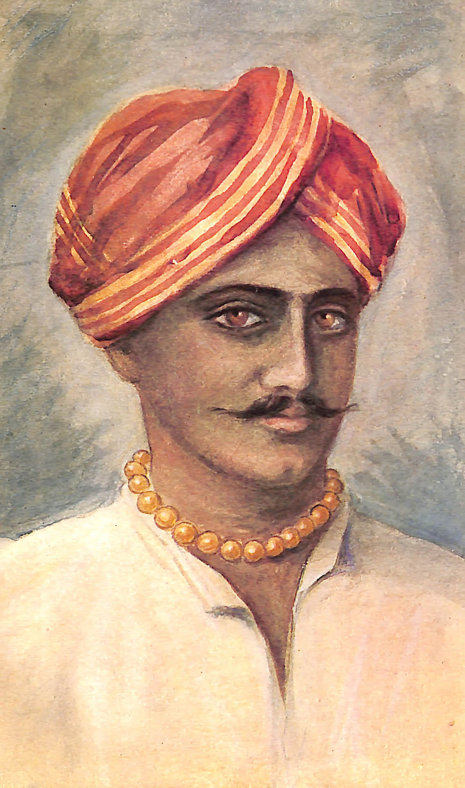

## Жизнь XXXVI

Наша история ведет нас обратно к великому атлантическому острову Посейдонис, потому что Алкион родился в белой расе, которая обитала на его северных горах. Его рождение произошло в 9672 году до н.э., незадолго до финальной катастрофы, которая унесла землю. Общее состояние страны было очень коррумпировым, и большинство населения, доминирующие расы, обитающие на равнинах, вели распутную и эгоистическую жизнь, привлекая множество черной магии. В этих северных горах, однако, были патриархальные условия, и в целом жизнь была гораздо здоровее, чем на равнинах ниже.

У людей было гораздо меньше искусства и утонченности цивилизации, но они определенно были чище и благороднее, чем те, кто жил в городах.

Некоторые племена, обитающие в разных долинах большого горного хребта, формально признавали власть тольтекского короля; другие имели независимых правителей. Но в любом случае владелец долины обычно был также его неоспоримым господином, так как его верность была лишь формальной, независимо от того, отдавал ли он ее монарху своего пятого подрасы или тольтекскому властелину.

Споры между тольтекским правительством и горцами о выплате дани были более или менее постоянными.

Из-за крайней сложности маневрирования армией в такой суровой местности тольтекскому монарху редко стоило пытаться взыскать свои требования; но время от времени армия высаживалась, и обычно она успевала опустошить одну или две изолированные долины, уничтожая мужчин и разграбляя женщин и скот.

Отец Алкиона был Нептун, а его мать - Гераклес.

Его старшая сестра Меркурий в молодости стала послушницей в храме в горах и позднее стала одной из его жриц; хотя это никак не помешало ее браку и семейной жизни. Все младшие дети семьи выбрали ее в качестве опекунки, и она всегда нежно протестовала, помогала и обучала их. Религия была формой солнечного культа, и все большие праздники были обусловлены солнцестояниями и равноденствиями. В целом, жизнь этих горных жителей кажется была чистой и здоровой - поразительная контрастность с полной коррупцией больших городов на равнинах. Нептун жил на своей огромной усадьбе в истинном патреархальном стиле: он практически владел целой долиной, поскольку земля состояла из долин, разделенных крутыми хребтами. У него было много подчиненных, но хоть они и относились к нему с уважением на своем роде независимости, они на самом деле были больше похожи на друзей, чем на служителей.

Здесь у нас была большая группа людей, которые жили счастливо вместе и в основном жили практически обособленно. Иногда они посещали людей из соседних долин и принимали их, но все эти визиты были довольно официальными, требующими большой подготовки, из-за серьезного количества восхождений при переходе через промежуточные хребты. Характерная особенность этой местности была такова, что при долгом обходе зачастую приходилось проходить многие мили, чтобы добраться до дома, который была в менее, чем миле, если бы можно было проложить туннель сквозь холм. В целом, эти долины были довольно надежно защищены от атак снизу, если только против них не была приведена в действие мощная сила и не был заранее составлен сложный план, чтобы заблокировать все пути отступления.

У них были книги, но их было не так много; было много рецитирования бардовских стихов и много рассказывания легенд, среди которых мать Алкиона, Геракл, имела чудесную коллекцию - достаточно, чтобы заставить современного фольклориста стать зеленым от зависти. Люди верили в природные духи, и среди них было много тех, кто видел их.

Условия, во многих аспектах, напоминали те, о которых мы слышим в средневековой Англии; все ткацкие работы и прядение выполнялись дома, и, по всей видимости, было великое количество домашних и фермерских обязанностей. Домохозяйки запасали множество льна и трав. Мужчины, по-видимому, в основном вели кочевнический образ жизни, используя своеобразную горную пони, похожую на мула. Многие из этих долин были свободно объединены под властью замечательного лидера, и некоторые из этих лидеров, как мы уже говорили, платили символический дань Толтекам, хотя большинство из них были независимыми, и среди потерявшихся был Король, которому принадлежала эта долина. Толтеки периодически нападали на них, но редко успешно, из-за особенностей местности. Помимо случайной угрозы таких атак, они жили мирно и счастливо, отпраздновав урожайные праздники и праздники, связанные с посевной период, на которых были очевидными гонки и спортивные игры. Эти праздники были великими событиями для встречи людей из разных долин; и особенно люди Нептуна обменивались любезностями с их ближайшими соседями, вассалами его братьев Наги и Яджны, которые разделили между собой следующую долину с одной стороны, и тех, кто проживал в Иви, живущих в небольшом изолированном бассейне высоко в горах с другой стороны. Их общество, несомненно, было ограничено, но гармонично. Образование было простым и в основном домашним, потому что в большинстве долин не было ничего, что можно было бы назвать школой.

Алкион весело вырос, и был сильным и здоровым мальчиком.

Он глубоко восхищался своим отцом и матерью, но любовь к старшей сестре, Меркурии, была доминирующим фактором в его ранней жизни. Будучи маленьким мальчиком, он не мог вынести разлуки с ней и ничего не делал без ее согласия; и на самом деле, пока она жила, она оказывала на него главное влияние.

На урожайном празднике, когда ему было только десять лет, он впервые увидел Вегу, которая должна была стать его будущей супругой; он сразу же выбрал ее и не хотел играть ни с кем другим, и маленькая девочка, которая была примерно его возраста, была смущена его вниманием и ответила взаимностью. Он никогда не забывал о ней, хотя при становлении взрослым становился более стеснительным в выражении своих чувств. Когда ей исполнилось шестнадцать, она привлекла к себе необычную красоту, и у нее уже было несколько женихов подавших заявку на ее руку - среди них брат Алкиона, Альбирео, который был наследником поместья и поэтому мог предложить лучшую позицию, чем мог Алкион, как младший из сыновей.

Это сильно беспокоило Алкиона; он любил своего брата и не хотел стоять у него на пути, ни препятствовать Веге стать миссис всей долины, как она в конечном итоге оказалась, если бы вышла замуж за Альбирео; но он чувствовал, что не может отказаться от нее.

Как обычно, он доверился Меркурию, который глубоко сочувствовал ему и сказал, что решение должно быть предоставлено Веге, которая, в конце концов, могла иметь личные предпочтения, не учитывающие богатство на руках или в стадах. Алкионе держался на заднем плане и дал Альбирео все шансы. Только когда Вега окончательно отказала ему, Алкионе рискнул предложить себя в качестве замены. Вега радостно приняла его и они поженились, когда им было всего двадцать, и пережили вместе самую счастливую жизнь. Альбирео лояльно принял решение Веги, хотя вначале он много страдал. После нескольких лет, он утешал себя, женившись на другой даме, Конкорд, но у них не было детей. Немного позже Альбирео был убит при сопротивлении одного из Толтекских набегов, так что в конце концов Алкионе стал наследником и оказался в позиции, которую он боялся лишить ее.

У Алкионе и Веги была большая семья — Сириус, который был последним и младшим из стада, родился, когда Алкионе был уже в возрасте пятьдесят четырех лет. Как раз в то время Нептун умер, и Алкионе унаследовал огромное имение, которым он управлял с большой мудростью, поскольку, хотя он и оставался главой долины и сам решал все дела, он почти полностью предоставил практическое управление землей своим младшим братьям, Психе и Лео, которые во многих отношениях были лучше его в деталях. В течение тридцати двух лет он занимал свою позицию, оставаясь здоровым, активным и острым на вид до последнего, пережив большинство своих современников.

Братья, которые так умело помогали ему, умерли долго до него, но их место занял его старший сын Улисс, который оказался очень способным управляющим. Все это время его жизнь текла спокойно, и в целом счастливо, так как се единственные выбросы были хорошие урожаи или плохие, благоприятные годы или бурные, с периодическими слухами о Толтекских набегах. Его дети выросли и вышли замуж, и он видел вокруг себя своих внуков и даже правнуков, и всегда был для всех из них лучшим другом и советником.

Большими горестями его жизни были смерти Меркурия и Веги, последняя, к счастью, произошла лишь немного раньше его собственной.

Долгожданное толтекское вторжение, о котором они слышали в течение многих лет, разоряя далекие долины, наконец обрушилось на них в 9586 году. Несмотря на возраст, Алкионе собрал свой народ и поехал им на встречу врагу. Благодаря преимуществу своей позиции, горцы смогли удерживать толтеков с помощью двух дней и уничтожить многих из них; но прибыли подкрепления с равнин, и Алкионе и его верные последователи были затоптаны числами. Он сам был убит, как и все мужчины и старшие женщины его племени, а молодых женщин перенесли в плен на равнинах. Сириус, который в то время был в возрасте тридцати двух лет, был одним из последних.

Её отдали в гарем богатого тольтека и она погрузилась в жизнь наиболее невыносимого характера служения. Она много страдала, но старалась переносить это философски, всегда надеясь на какое-то улучшение своего положения. Примерно через месяц Орион, которая жила в соседней долине, тоже была захвачена таким образом и была куплена тем же мужчиной, и так она и Сириус встретились впервые в этой жизни. Орион была менее философской; она была полна возмущения и все время была в состоянии страстного протеста против всех унижений, угрожавших ей. К концу недели она была наполовину сумасшествующей от всего ужаса, и на самом деле уже дважды попыталась покончить жизнь самоубийством. Сириус была полна жалости к ней и в какой-то мере смогла защитить ее и сделать ее участь более терпимой. Естественно, все их надежды были связаны с побегом, хотя это казалось совершенно безнадежным. В конце концов, Сириус придумала план, который, хотя и отчаянный, показался не совсем абсолютно невозможным. Выйти из дома вообще было их первой великой трудностью, но даже если это было достигнуто, их белая кожа сразу выдала бы их как рабов, и они не могли бы пройти сотню метров без уверенности в обнаружении и пленении. Очевидно, что необходим был маскировка, и Сириус сумела обзавестись некоторой краской для кожи, которая, будучи предназначена для тольтекской женщины, придавала темнее оттенок, который заставил бы беглецов походить на завоевывающую расу. Однажды Сириусу удалось прикрасться к набору одежды, которая принадлежала одному из мужских гостей.

Она торопливо нанесла краску на лицо, руки и руки, а также тщательно покрасила Orion. Затем она надела мужской костюм, одела Orion в одежду тольтекских женщин, заставила ее тщательно себя вуалировать, затем взяла ее уверенно за руку и пробралась в более общественную часть дома, легко смешиваясь с гостями и вполне естественно выходя из дома передней дверью среди кланяющихся слуг. Это счастливое дерзство безопасно вывело их на улицу, так как они выглядели как тольтекский муж и жена, никто с ними не мешал. У них, конечно, не было денег, но у Sirius были некоторые пустяки - драгоценности, которые она у себя, но она не считала это злом, чтобы украсть их обратно перед отъездом. Продав их, они получили некоторые деньги, а позже получили еще некоторые, продав свои модные одежды и переодеваясь в обычные наряды уважаемых рабочих людей страны.

Со всяческими приключениями и трудностями они двигались к холмам, где когда-то был их дом, и были очень благодарны, когда снова оказались среди своей собственной расы, включая племена подножий, которые давно были подчинены тольтеческому правительству. Но по крайней мере среди них им удалось стереть ужасающую краску, которую они с таким трудом подновляли. Чтобы достигнуть постоянной безопасности, они должны были либо добраться до той части гор, где люди не были подданными Тольтеков, либо укрыться в монастыре; когда страна подчинилась тольтеческому правительству, было сделано особое условие, что не будет вмешательства в религиозные учреждения страны, и право убежища осталось за ними. Поскольку Орион был слаб и нервный, они по сути были вынуждены выбирать последний вариант, и объявились к Хелиос, аббатисе большого монастыря, который находился по пути. Они открыли ей всю свою историю, и она сразу же приютила их и обеспечила защиту. Здесь они жили счастливо в течение многих лет, единственным инцидентом был попытка девы Скорпиона, проживающей в соседнем монастыре, добиться мезмерического влияния над Орионом в неподобающих целях. Эта попытка была предотвращена Сириусом, и махинации Скорпиона были раскрыты Хелиос, который заставил его покинуть монастырь.

Падение Посейдониса было предсказано священниками северной расы, и хотя многие не верили и не обращали на это внимания, были и те, кто верил. Когда время приближалось, аббатиса собрала свою великую армию монашек и драматично описала им, что грядет. Она заявила, что так как деньги скоро больше не будут нужны, все большое богатство монастыря находится в распоряжении тех, кто хочет покинуть страну, и все были полностью свободны делать то, что они хотели. Что касается ее, то она мало заботилась о жизни, и не хотела начинать все сначала в новом месте, так как была слишком стара, и поэтому намеревалась остаться и погибнуть со своей страной, поддерживая флаг своего ордена до последнего. Сириус и Орион, полные любви к ней, и вдохновленные ее энтузиазмом, решили остаться с ней, как и многие из монахинь. Более половины, однако, воспользовались ее предложением, и одиннадцать больших кораблей были подготовлены для перевозки их в другие земли.

С наступлением последнего разрушения аббатиса созвала монахинь и попросила Орион, которая была отличным музыкантом, что она сыграла им как никогда ранее. Нервная и скромная девушка была полностью преображена; экстаз спустился на нее, и она махнула рукой по струнам с благородной жестом, вызвав такой объем звука, какой никогда не издавала арфа. Так выполнялась мощь этой божественной музыки, что когда море перекатилось и унесло всех монахинь в уничтожение, ни один крик не раздался, потому что все были так увлечены от низшего мира, что переход в другой остался незамеченным.

Еще один из наших героев, Эрато, также рожденная женщиной среди гор, имела точно такой же опыт попадания в рабство в большом городе. В этом случае, однако, сын ее хозяина Аластор, Медведица, влюбился в нее и женился на ней.

Несмотря на то, что он был человеком эгоистичным, не лучше других в ту распущенную эпоху, он был добр к своей молодой жене, небрежным образом, и она была ему благодарна за то, что он спас ее от обычной участи рабыни. Когда подошло время катаклизма, ей предупредили об этом священники ее собственного народа, и она объявила об их пророчестве мужу. Он высмеял эту идею, но, так как многие другие спасались бегством, он предложил ей идти с ними и сказал, что она вернется через год или два, и найдет его живым той же жизнью в тех же условиях. Она поблагодарила его, но отказалась от его предложения, говоря, что, если он собирается погибнуть вместе со своей страной, она считает своим долгом остаться на его стороне. Его порадовало ее решение, хотя он совершенно не ожидал, что что-либо произойдет на самом деле. Когда катаклизм наступил, он признал, что она была права, и пожалел о том, что не послушал ее; но они погибли вместе, причем вовсе не бесславно.

Кажется, что по отношению к Эрато мы приходим к окончанию небольшого цикла душевной эволюции; в нем мы видим успех некоего эволюционного эксперимента. В своей предыдущей жизни в Халдее он был погружен в обстановку, которая в большой степени предопределяла для него хорошую жизнь. Родившись в касте священников, он сталкивался только с нравственными примерами; от него везде ожидали добродетель и постоянно облегчали ему ее проявление. Совершить серьезный грех было бы трудно; это было бы вопреки всем приятным условиям; это бы потребовало решимости по пути зла, которой, к счастью, наш герой не обладал. Так он поддался своей судьбе и поступал добро. Во второй жизни можно наблюдать применение проверки к привычке к добродетели, которая была установлена в предыдущей реинкарнации. Здесь были обстоятельства, явно менее благоприятные, чем в Халдее; смогут ли эго подняться над ними? Да, он смог; он героически преодолел испытание, тем самым укрепив свой характер. В третьей жизни был применен гораздо более серьезный тест, и он был погружен в гущу цивилизации, настолько неудовлетворительной во всех отношениях, что вести добрую жизнь в этих условиях было бы сложнее, чем вести злую жизнь, будучи священником в Халдее. Ему не хватило сил для этого; он стал игрушкой в руках обстоятельств и жил так, как жили другие вокруг него. Это может быть естественным для них, но для него это была неудача, ведь он знал что-то гораздо лучшее. В следствие этого, его следующая жизнь является явным спадом. В ней был некоторый физический страдание, который, безусловно, закалил его характер, даже если и позволил расплатиться с частью его тяжелого судьбы. В его следующей реинкарнации он столкнулся с большими эмоциональными страданиями. Подводя итог, он доблестно и благородно перенес все эти испытания, вышел из них очищенным и укрепленным. Жизнь в Перу была явно возможностью для него испытать свои новоприобретенные силы в самых благоприятных условиях, тем самым не только увеличивая их, но и формируя привычку использования их - создавая тягу к добру. Когда это было достигнуто, и когда он также достиг ожидаемого результата от того самобытного китайского воплощения, в котором он не сделал ничего больше, чем просто оставил свою визитку Китайской империи, он вернулся к тому самому месту первого провала в Посейдонии, чтобы снова попытаться пройти этот ужасный тест. Но промежуточные жизни не прошли зря; они выполнили свою задачу; на этот раз он сдал, и сдал торжественно, не только ведя хорошую жизнь среди всеобщего порока, но даже благородно принеся в жертву эту жизнь почти преувеличенного чувства долга. Таким образом, была достигнута цель эволюционных сил, и он мог перейти к развитию других сторон своего характера.

Возвратившись к долинам, в которых начиналась наша история об этой жизни, мы узнаем, что Одиссей, старший сын Алкиона, хотя и был оставлен умирать на поле битвы, впоследствии выздоровел и, собрав нескольких людей, которые смогли укрыться в горах, попытался частично восстановить разграбленные поместья. Все скот был пойман, все урожай - уничтожен, но он начал снова, пусть и в маленьких масштабах; и хотя он прожил всего несколько лет, двое его детей, Кетус и Пих, которых он спрятал, продолжили работу после его смерти и успели восстановить часть поместья перед погружением острова. Они, однако, были среди тех, кто прислушался к предупреждению священников и успел бежать из Посейдонии вовремя, чтобы избежать итоговой катастрофы.

Значительное количество детей удалось уберечь от резни.

Некоторые, например Кетус и Пих, были спрятаны в пещерах, которые толтекские мародеры так и не обнаружили; других отвезли, когда начали распространяться первые слухи о внутренней долине, существование которой было неизвестно солдатам равнин. Случилось так, что примерно двадцать лет назад, Алкион отправил своего племянника Фидеса к вождю этой внутренней долины; и тот влюбился в Фидеса, увидев, что тот может быть ему полезен и может многое научить его народ, и попросил его привести свою семью и поселиться там. Фидес так и сделал, получив на это разрешение от Алкиона; и так, когда воздух начал наполняться войнами и слухами о войнах, те дети, чьи родители подумали об их будущем, всегда могли найти приют среди своих родственников в этом безопасном месте. Например, Сириус приняла такое решение относительно своих двух маленьких дочерей Аякс и Эльзы, и в результате они выросли под попечительством Фидеса и Урануса и в конечном итоге счастливо вышли замуж.

Когда священники и астрологи белой горной расы издали предупреждение о грядущем уничтожении континента, Фидес, хоть и был уже стариком, собрал желающих покинуть страну из числа своих усыновленных людей и возглавил значительную миграцию морем на Север.

В Африку. Там их гостеприимно приняли, и его последователей поощряли осесть в горах Атлас, в долине, весьма похожей на их прежний дом. Среди Кабилей до сих пор можно найти некоторых из их потомков, хотя, конечно, в течение прошедших тысячелетий произошло некоторое смешение кровей. Одному из наших персонажей, Спике, выпала честь быть первым ребенком, рожденным в новом поселении, именно на следующий день после прибытия каравана. Фидес объявил это счастливым приметой и особенно отметил новорожденного младенца, присвоив ему звание "отца новой земли" и взяв его под свое особое покровительство.

## Жизнь XXXVII

Когда нашего героя здесь не оттягивают в другие места неотложными обязательствами служения или эволюции, он, похоже, естественно стремится к великой родине - Индии. Именно там мы находим его, переродившегося в 8775 г. до н.э. в местечке под названием Дорасамудра (ныне Халебида), к северу от Хассана в Майсуре. Его отец был Протеус, а мать - Меркурий, святейшая женщина, имевшая высокую репутацию мудреца. Он получил то, что в то время считалось хорошим образованием, которое заключалось в основном в запоминании огромного количества стихов на все темы: религию, легендарную историю и фольклор, право, медицину и даже математику. У его матери было удивительное знание всех этих вещей, и ее влияние бесценно ему во всех отношениях. Было много ненужных церемоний, но мать подходила к этому с непритворным здравым смыслом и постоянно напоминала ему, что нравственная жизнь важнее тысячи церемоний, и что истина, честь и доброта - это наилучшие жертвы божеству.

Его отец научил его ряду священнических заклинаний, в которые он вложил всю свою энергию, и смог успешно их проводить, действительно добиваясь ответа от различных сущностей, к которым он обращался. Его воля в юности была замечательной, хотя не всегда мудро применяемой; например, его однажды поймали за тем, как он отрывает ноготь с одного из своих пальцев, просто чтобы проверить, сможет ли он вынести эту боль. Снова, как в Перу, он приобрел репутацию за написание рукописей для храма, а также за чрезвычайно большое количество стихов, которые он знал в соответствии со своим возрастом, последнее было, конечно, результатом влияния его матери.

Когда ему было около двадцати, он женился на Уране, дочери другого из служителей. Хотя в это время и в этом месте ещё не было расы брахманов, уже существовал священнический класс, который уже несколько отделялся, поэтому было естественно, что сын служителя женился на дочери служителя, хотя он не был обязан так делать. Отец Ураны был служителем существенного положения, но не совсем равным по рангу Протею, который был человеком большой силы, потому что он управлял главным храмом, великолепным зданием из полированного камня с изящной резьбой. Местный раджа, Кастор, посещал и поддерживал этот храм, поэтому положение Протея как его духовного наставника было очень важным в государстве. Кастор признавал права верховного государя, Марса, который правил гораздо большим царством, но он был практически независим, за исключением иностранных дел.

Вскоре после свадьбы Алкиона в дело был введен новый фактор с приходом с севера Овна, человека с большой репутацией волшебника — репутация, которая была вполне заслуженная, потому что он действительно глубоко изучил и приобрел контроль над некоторыми астральными сущностями, и он также обладал знаниями некоторых фактов в химии и электричестве, которые позволяли ему выполнять то, что казалось людям того времени чудесными чудесами. У него также была некоторая мезмерическая сила; и с помощью этих разных способностей, он быстро завоевал полное влияние на Кастора и стал сильным соперником для ортодоксального Протея, чье влияние и престиж угасали по мере того, как увеличивалось влияние нового человека.

Овен никак не выставлял себя в явное противостояние Протею, и он не был по настоящему плохим человеком, хотя должно сказать, что он использовал каждую возможность для укрепления своего положения. Возможно, еще больше, чем подумал о прибыли, его двигала любовь к власти и удовольствие, которое он испытывал, работая над своими удивительными экспериментами и видя глубокое впечатление, которое они производят на людей. Протей, естественно, был довольно раздражен оттоком своих доходов и уменьшением своего влияния, и он был полностью уверен, что влияние Овна было совершенно злым.

Это положение дел продолжалось несколько лет, трение увеличивалось по мере прошествия времени. Кастор построил великий храм для Ариеса, и можно сказать, что оба культа открыто конкурировали. Протей действительно верил, что Ариес виноват в различных неодобрительных формах магии, и не колебался это говорить, что частично способствовало тому, что Ариес приобрел несколько дурную репутацию. Его несомненные способности вызывали большое восхищение, но он также немало пугал. Кастор причинял достаточно проблем Ариесу, всегда настаивая на участии в его секретных церемониях, постоянно пытаясь понять работу используемых сил и даже пытаясь с ними провести новые эксперименты. Поскольку его собственные знания были весьма ограниченными, Ариес всегда волновался об этих экспериментах, и в конечном итоге его страхи сбылись, поскольку Кастору удалось подорвать себя и умереть.

Конечно, считалось, что смерть Кастора полностью обусловлена магией, и Протей, не без оснований, использовал это происшествие и обвинил своего соперника в умышленном убийстве короля; действительно, нет причин сомневаться, что он действительно верил в это. Ариес решительно отверг эти обвинения и заявил, что Кастор погиб, несмотря на его предупреждения и вызывая гнев его прислужников. Этот несчастный случай усугубил вражду между двумя соперничающими сектами, и лидеры начали ненавидеть друг друга и вступать в заговоры против друг друга, каждый чувствуя себя вдохновленным самыми высокими мотивами и, безусловно, считая, что успех соперника обозначает катастрофу для государства.

Поскольку у Кастора не было наследника, глава Марс отправил своего сына Одиссея занять вакантный трон, и обе секты немедленно начали прилагать усилия, чтобы завоевать поддержку этого нового короля. Броские чудеса, делаемые Ариесом, имели успех и Одиссей, который был очень заинтересован в такого рода явлениях, стал преданным учеником мага. Успех соперника очень огорчил Протея, и в основном из-за разочарования и неприкрытой ярости он заболел и скоро умер, хотя его сторонники единогласно приписывали это магическому воздействию Ариеса. Было ли в их предположениях какая-то правда, трудно сказать. Несомненно, что Ариес, полностью убежденный в том, что Протей - опасный человек, использовал мезмерические и элементальные силы и ускорил его смерть. Во всяком случае, Алькион верил в это. Будучи молодым, он занял место своего отца как главный жрец большого храма, и он, безусловно, чувствовал, что вступает в конфликт с Ариесом и его последователями.

В то время участь Овна была далека от счастливой. Его непосредственные последователи, конечно, приняли его объяснение причин смерти Кастора, но среди большинства населения общества было много сомнений и подозрений, и люди стали бояться и недоверчиво относиться к нему больше, чем раньше. Улисс также доставлял ему немало проблем, хотя и не таких, какие создавал Кастор - дело не столько в том, что Улисс хотел сам проводить все эксперименты, сколько в том, что он постоянно требовал развлекать себя новыми чудесами и не верил, когда Овен сообщал ему, что исчерпал свой репертуар. Под этим постоянным давлением, Овен был вынужден демонстрировать эксперименты, с которыми был знаком лишь поверхностно, что порождало сомнения в уме Короля.

Чтобы восстановить свою позицию, Овен использовал все магические искусства, которые знал, включая некоторые, которые были явно темного характера. Таким образом, он окутал Улисса как бы гипнотическим заклинанием, и тот в конце концов стал лишь инструментом в его руках, практически не имеющим собственной воли. Но, несмотря на то, что ему таким образом удалось получить полное владычество над Королем, он был далек от свободы от проблем; для достижения некоторых своих эффектов он прибегал к обману, и один из его подчиненных, Скорпион, который знал об этом, угрожал раскрыть его перед Королем и народом, и таким образом обрел сильное влияние над Овном, которым он беспощадно пользовался. К сожалению, его замыслы были более эгоистичны и менее невинны, чем у Овна, и последний иногда оказывался вовлеченным в схемы, которые были ему крайне неприятны.

Среди них был заговор с множеством замысловатых узлов, которые не являются существенными для нашей истории. Однако одним из основных его элементов было то, что Овен (или скорее тот, кто стоял за ним) должен был завладеть Мизаром, младшим братом Алкиона, и втянуть его в некоторые тайны темного культа. Заговорщики сумели получить некоторое влияние на Мизара в связи с некоторыми его маленькими молодежными проступками, которые они угрожали обнародовать, и, кроме того, он был несколько ослеплен блестящими перспективами успеха и власти, которые они ему обещали.

Однако, Меркурий была решительна в том, чтобы ни один из ее сыновей не попал под их влияние, и она настоятельно уговаривала Алкиону принять решительную позицию в этом деле и объявить открытую войну, если это будет необходимо.

Об Улиссе просили разобраться в деле, и дело было так актуально для него, что даже погруженный в оцепенение под постоянной одержимостью некоторых сущностей, на которые направил Овен, ему было трудно игнорировать просьбы Алкиона. Однако, Овен, видя, что его планы в определенной степени под угрозой, обращается к слабой стороне Улисса, предлагая захватывающее представление магии, в котором он обязуется окончательно свергнуть Алкиона и отклонить его притязания на знания.

Улисс, который очень любил театральные представления любого рода, сразу же согласился на это, так как это выглядело справедливо, и в то же время избавило его от заботы принимать решение. Таким образом, в установленное время он пригласил всех участников перед ним и организовал то, что по сути сводилось к публичному соревнованию в магии перед его собранным судом.

Показалось, что это очень неравное соревнование, так как Овен был человеком с большим авторитетом, полностью оснащенным определенным объемом научных знаний на физическом плане, а также способными сослужителями на астрале - человеком командующего присутствия, еще не прошедшим пика своих сил. Алкион, с другой стороны, был молод и относительно непроверен; у него не было научных знаний, а его мантры, хотя и эффективные по-своему, были только ортодоксальными. Однако, его воля была сильной, и он был абсолютно решен бороться любой ценой, чтобы спасти своего брата. Он проконсультировался с Меркурием, который побудил его вступить в борьбу и обещал ему победу, несмотря на все противопоказания. Контраст между двуми противниками был еще более подчеркнут благодаря фантастическим одеяниям, в которых появился Овен, и тому факту, что он был окружен всеми служителями своего храма, в то время как Алкион просто представился без сопровождения, и в кремовом белом платье священника своего храма.

Улисс был в своем обычном состоянии частичной одержимости и, казалось, был несколько смущен и нерешителен в своей речи, когда открыл процесс, обратившись к своему другу и учителю Арию с просьбой высказать свою позицию. Арий принес с собой треножник, своего рода временный алтарь, на котором он сжигал большие количества какого-то особого благовония, на обезболивающее действие которого он, очевидно, рассчитывал. Он продемонстрировал несколько своих лучших чудес и привел своих слушателей в состояние большого волнения и энтузиазма, хотя нельзя не признать, что некоторые из них были и весьма испуганы. Наконец, он закончил свою длинную тираду, вызвав Мизара из толпы своих последователей, чтобы тот встал рядом с ним, и публично попросил его поклясться ему в верности, что Мизар, находясь явно под гипнотическим влиянием, незамедлительно и сделал. Затем Арий попросил Улисса и присутствующих придворных свидетельствовать об этом и, обратившись к Алкиону, который сидел один на противоположной стороне возвышения, на верхней части которого был установлен трон короля, он направил всю свою мезмерическую и магическую силу на него и призвал его также перейти на его сторону и стать его рабом. Поток силы, насыпавшийся на него, заставил Алкиону на мгновение закружилась голова, но когда зрение прояснилось, он увидел перед собой лицо своей матери. Он встал и сказал: "Я иду, но не как твой раб!"

Глубоко поклонившись перед Улиссом, он подошел и столкнулся с Арием, оказавшись лицом к лицу с ним, и бросил вызов его мезмерической силе. Арий поднял руку, будто собираясь проклять его, и начал быстро шептать заклинания. Алкион больше ничего не сказал; он не произнес ни слова, но упорно смотрел в глаза Ария, и концентрировал всю силу своей воли на наиболее решительном сопротивлении. Несколько минут они так стояли, лицом к лицу, в томительной тишине. Затем Алкион осознал, что сила Ария начинает слабеть, и сделал огромное усилие воли, поднял руку и, указывая прямо на Ария, произнес с омерзительной интенсивностью: "Пусть сила, которую ты злоупотребляешь, уйдет от тебя!"

Едва он произнес эту фразу, Арий, осознав свое поражение, бессознательно упал на землю. Затем Алкион направил свою волю на Улисса и позвал его:

"О, король, пробудись! Встань, отбрось эту злую силу и противостой демонам, которые захватили тебя! Выйди из тьмы в свет!"

С огромным рывком король вскочил на ноги и спустился по ступеням, пока не оказался перед Алкионом, и спросил: "Что ты со мной сделал? Во мне произошло значительное изменение?"

Алкион ответил: "Я ничего не сделал, о король; но сила божества проявила себя, и ты был освобожден от тюрьмы, в которой этот человек зашел тебя."

И Улисс отвечал, обращаясь к своим придворным:

"Воистину, то, что он говорит, является правдой, ибо я чувствую, что будто бы сбежал из какой-то темной тюрьмы, и я знаю, что, хотя раньше я был связан, теперь я свободен."

Обратившись к Алкиону, он продолжил: "Ты, который сделал для меня это великое дело — я передаю тебе вместе с этим актом все доходы того, чьи уловки ты победил, и я прошу тебя просвещать меня дальше в магии, столь мощной, что она так легко укротила самого великого мага, которого я когда-либо знал."

"Здесь нет магии, о Король," ответил Алкион, "только сильная воля, чистое сердце и чувство справедливости; но я благодарю тебя за твой подарок, и если ты пожелаешь, я с радостью помогу тебе исправить то зло, что было совершено. Но сначала позволь мне позвать моего брата."

Взглядом он позвал Мизара к себе. Мизар пришел охотно, так как падение его бывшего начальника вызвало шок, который позволил ему избавиться от гипнотического влияния, и теперь он не чувствовал ни малейшего влечения к темной магии, которая раньше была для него так важна. Теперь и он видел перед собой лицо их матери. И он охотно присоединился к Алкиону, не мог понять, как он мог даже временно оставить его.

Улисс рассеял ассамблею и, позвав Алкиона к себе, сразу начал устраивать для него серию инструкций. С этого момента он перенес всю свою заинтересованность и поддержку на великий храм, где преобладал Алкион; и по совету своей матери, Алкион постепенно смог привести его от любви к магическим феноменам к рассмотрению великих истин жизни и смерти и вдохнуть в него горячее желание ступить на путь, ведущий к совершенству. Так исполнилось пророчество, данное Меркурием в тридцать первой жизни, пять тысяч лет назад.

Со своей стороны, Улисс чувствовал к Алкиону большую привязанность и благодарность, и одалживал его почестями. Несмотря на молодость Алкиона, этот триумф сделал его практически самой большой силой в королевстве, так как Ариес полностью угас и перестал быть фактором в общественной жизни.

Действительно, можно было подумать, что его нервы были разрушены, так как он больше не мог командовать существами, с которыми раньше работал. Его химические и электрические знания кажутся в значительной степени забытыми. Кажется, что в тот момент, когда во время публичного испытания было затрачено огромное усилие воли, что-то в его мозгу треснуло, так что после этого его память стала недостаточной и совершенно ненадежной. Большинство его бывших друзей отвернулись от него, и друзья, которые теперь полностью изменили свое отношение, не чувствовали себя обязанными что-то для него делать, говоря, что он уже утратил большую часть своих средств.

Эту частичную потерю памяти можно считать милосердием, поскольку его жизнь была бы несчастной, если бы он полностью осознал изменения, которые произошли с его состоянием; но слабость в головном мозге увеличивалась с годами и в конечном итоге он погрузился в почти животное состояние. Теперь, когда Одиссей принял Алкионе в качестве своего советника, он также постоянно контактировал с Меркурией и испытывал к ней самое глубокое уважение. В действительности, благодаря ее заступничеству, в конце концов была назначена некая малая пенсия для Овна, так что он смог прожить остаток своей жизни без реальных переживаний за еду и жилье.

Одиссей отправил своему отцу, махарадже, ярко окрашенный отчет обо всем произошедшем, который так заинтересовал Марса, что тот тут же приказал Одиссею отправить и Алкионе, и Меркурию в его столицу. Визит был должным образом осуществлен, а Марс приемлил их с большой помпой и после серии бесед с ними предложил Алкионе поселиться в его столице, предложив ему руководство одним из главных храмов там. Было трудно отказаться от этого шедеврального предложения; но после долгих консультаций с матерью, Алкионе уважительно попросил позволить ему вернуться в свой храм, утверждая, что чувствует, что ведение его работы является обязанностью, которую он обязан своему умершему отцу, а также выразив свое искреннее желание помочь и направлять сына махараджи Одиссея, кем он чувствовал серьезную ответственность. Марс сожалел об этом решении, но все же в конечном итоге уступил просьбе под влиянием, в основном, уважения, которое он испытывал к Меркурии. Между ними сразу возникло самое близкое взаимопонимание, и хотя Марс хотел бы, чтобы они оба остались с ним навсегда, он не стал противостоять четко выраженному желанию дамы, которой он испытывал такое глубокое уважение. В свое время Меркурий и Алкионе вернулись домой, но с тех пор между махараджей и Меркурией всегда поддерживалась постоянная переписка, и махараджа более чем один раз посещал Дорасамудра, чтобы увидеть ее.

Воздействие Алкионе на Одиссея было вполне благотворным, ведь без него молодой правитель, безусловно, погрузился бы в распутный образ жизни. В его характере было две совершенно противоположные стороны, обе очень сильные. Его интерес к оккультным силам и явлениям, а также к прогрессу его народа, был безусловно подлинным и сильным, однако в то же время в нем была черта чувственности, которая иногда приводила его к беспечному игнорированию прав других и обязанностей своего положения.

Совет и влияние Алкиона значительно его устабилизировали и весьма смягчили отдельные приступы, так что в целом Король держался в разумных пределах. Характер Одиссея сильно изменился в лучшую сторону под руководством Алкиона. Он разработал и реализовал множество планов для блага своего народа, а Алкион и Меркурий всегда были силой, стоящей за троном в этих делах, так что в конечном итоге это маленькое королевство стало одним из самых процветающих на всем юге Индии.

Много лет прошло таким образом, и в свое время Меркурий умер, что навсегда оставило грусть в сердцах Алкиона и Одиссея. Махараджа пережил Меркурия всего на несколько лет, и после этого Одиссею пришлось повторить предложение, которое когда-то сделал его отец, упрашивающий Алкиона отправиться с ним в столицу. Он говорил, что все, что ему удалось сделать в Дорасамудре, было сделано с совета и в большей степени под руководством Алкиона, и он не мог взять на себя ответственность за эту намного большую работу без такой же помощи и руководства. Алкион долго сопротивлялся этому уговору, но поскольку его старший сын Сива теперь вырос и был не только полностью готов заняться своим храмом, но и был довольно готов взять на себя эту ответственность. В итоге Алкион поддался настоятельным увещаниям Одиссея, и они вместе отправились выполнять новую работу. Наконец Алкион был назначен главным жрецом главного храма в столице, должность, которую он занимал с достоинством и успехом. И хотя на каждом повороте как он, так и новый Махараджа скучали по мудрому совету Меркурия, они все же смогли хорошо справиться, постоянно применяя максимы, которые она их научила.

Его близость с Алкионом продолжалась до его смерти на посту, занимаемом с большим уважением, достоинством и пользой, на котором его сменил его брат Мизар. Несмотря на это, у него довольно часто возникало неразумное желание более активной жизни в мире — стремление выйти вместе с Одиссеем в его отдельные кампании и прожить жизнь солдата, а не жреца и ученика. Тем не менее, его жизнь в целом была счастливой, и в ней, безусловно, было сделано много хорошего кармы. В конце концов, он ушел на мир, в возрасте восьмидесяти трех лет, оставив за собой великую репутацию за мудрость и святость жизни.

После смерти Мизара, старшего сына Алкиона, Сиву пригласили занять место в главном храме столицы. Он согласился и привёл с собой своего старшего сына Брихата в качестве помощника, оставив первоначальный храм Алкиона в руках своего второго сына, Наги, который уже зарекомендовал себя как талантливого администратора, благодаря помощи своей жены, Гераклеса.

Эрато появилась одна в Этрурии в 8569 году. Она - дочь состоятельных земледельцев, живущих просто, но комфортно. Девушка проявляет свой художественный вкус в искусном сочетании цветов при ткачестве и подобных работах, но в этой весьма монотонной жизни не происходит никаких важных событий.

Орион берет женскую инкарнацию более чем через двести лет позже, в Этрурии, недалеко от места, где сейчас стоит Гроссето. Ее отец, Муни, - человек уверенный, богатый купец с владениями многих виноградников. Он мил с дочерью в общем и целом, но явно ставит свой бизнес на первое место в жизни и в конечном итоге жертвует ею, женив в семнадцать лет на Скорпионе, сорокапятилетнем мужчине, который казался ему подходящим бизнес-партнером. Скорпион рассматривает этот союз только как сделку, которая обеспечивает ему вступление в фирму, и обе стороны остались довольны их соглашением, пока отец не обнаружил, что его блестящий партнер обманывает его и присваивает большие суммы денег. Вспыхнул яростный спор, и дерзкий партнер покидает дом, разумеется, уводя с собой свою жену, и устраивает собственное хозяйство в другой части города. В этом новом месте его заброшенная жена знакомится с Ахиллесом, представительным, но без денег молодым человеком, и сразу влюбляется в него. После некоторого времени они скрытно уезжают и живут на мелких работах в большом счастье и живописной нищете. Оскорбленный муж был в ярости и угрожал жестокой местью, но отец Ориона хихикал над несчастьем своего бывшего партнера и заявил на публике, что рад принять свою дочь и ее любовника, если они сделают его дом своим домом. Они приняли его предложение, и Скорпион стал еще более злым; он был настроен разобраться с этим делом в самом мстительном духе, когда стали известны его дальнейшие махинации еще большего масштаба, и он был изгнан из страны с конфискацией его богатства и лишением гражданских прав.

Это дело освободило его супругу законно, и она была формально замужем за мужчиной своего выбора. Ее отец взял второго в бизнес вместо мошенника. У них родился сын Алдеб - красивый, перспективный мальчик, который, однако, упал с скал и утонул в тринадцать лет. Орион была безутешна от горя и отказывалась верить, что мальчик мертв, заявляя, что она не согласится с судьбой и вернёт своего сына, хотят этого боги или нет. Жизнь постепенно возвращалась к огорченной форме, и

## Жизнь XXXVIII

Снова мы находим себя в Индии, так как Алкион родился на этот раз в районе Пешавара в 7852 году, что, кажется, соответствует касте "кшатрии", хотя тогда она называлась "раджан". Вижу свидетельства только трех каст в это время: брахман, раджан и вис. Они, видимо, изначально были явно отличающимися расами; брахманы были почти чистыми арийцами, раджаны - арийцы, перемешанные с древней правящей расой тольтеков, а висы - арийцы, смешанные с другими атлантийскими расами, преимущественно монгольские и тлаватли, иногда с некоторой примесью более поздних лемурийских рас. Им разрешалось в то время вступать в брак между собой, но не с кем-то вне этих трех каст; и даже тогда уже начинало считаться, что более приемлемо и модно жениться только в своей касте.

Алкион был сыном Авроры, небольшого вождя, обладающего значительной репутацией воина. Его мать, Ваджра, была отважной и в некотором смысле мужественной женщиной. Битва казалась единственной занятостью этой касты, и она неизменно происходила. Было много, казалось бы, ненужного пролития крови. Часть страны, в которой мы оказались, была разделена на множество крошечных княжеств, и между ними велась непрерывная война. Иногда среди принцев появлялся сильный человек и завоевывал нескольких других, тем самым временно становясь верховным государем, но после его смерти его королевство почти непременно распадалось, и та же угнетающая череда бесконечных войн повторялась снова.

В целом это в меньшей степени влияло на массы населения, чем можно было бы ожидать. Торговля и сельское хозяйство продолжались до некоторой степени все время, и, как правило, воевали только профессиональные солдаты, хотя, конечно, ни одна жизнь действительно не была в безопасности. Это было очень странное состояние вещей, когда люди были в определенном смысле настолько высоко цивилизованы, а жизнь совершенно неопределенна. Не было действительно установленого закона или порядка, а лишь бесконечные годы боя - постоянные осады, постоянные экспедиции. Арийцы еще не обосновались - фактически можно сказать, что окончательная иммиграция все еще продолжалась. Примерно в 9700 г. до нашей эры последний арийский житель покинул Центрально-Азиатское королевство вокруг Гобийского моря; но Индия уже была заселена и густо населена, и эти поздние группы были отнюдь не встречены с радостью. В течение двух тысячелетий они были задержаны в Афганистане и Белуджистане, и большинство из них только постепенно, индивидуально, мирно проникли на равнины. Однако иногда организованные банды совершали налеты, и время от времени происходили вторжения монголов различных видов, которые уничтожали всех на своем пути. Несомненно, в этот период это была тревожная часть страны. Большое королевство, подобное тому, что я описывал, недавно распалось, и царила борьба за верховную власть.

Верования того времени в некоторых отношениях не совсем совпадали с современным индуизмом. Была троица, но это были Агни, Индра и Сурья, и более высокие идеи Шивы, Вишну и Брахмы еще не были достигнуты или известны. Жертвоприношения в больших масштабах были болезненно обычны, и Ашвамедха, или жертвоприношение коня, было высоко ценимо. Даже говорили, что сто таких жертв сделают человека выше Индры.

Алкионе и его отец и мать тесно общались с брахманской семьей, которая сильно повлияла на его жизнь. Главами этой семьи были Сатурн и его жена, Меркурий; их сыновьями были Брихат и Нага, а дочерьми - Нептун, Орфей и Уранус. Тесная дружба этой семьи была единственной радостью этой жизни; в противном случае, как бы необходимо это ни было для развития эго, мы не можем получать удовольствие от ее созерцания. Вспомним, что в предыдущей жизни Алкионе, несмотря на широкое влияние, которое он оказывал как духовный учитель, иногда скучал по более активной жизни солдата; вероятно, эта жизнь была прямым ответом на эти желания, данном чтобы раз и навсегда излечить эго от такого неудовлетворенности, предложив ему вдоволь насладиться мимолетной славой поля боя.

Он начл со некоторым энтузиазмом военной жизни, но вскоре ему это наскучило, и когда наступила реакция, он скучал по тому, чем восемьсот лет назад был не вполне доволен. Даже будучи совсем молодым человеком, он почувствовал, что ему хватило бесконечного убийства; он был храбрым и способным человеком, но ему не хватало безжалостности, которая необходима великим военным лидерам; он слишком сильно сочувствовал раненым и больным, независимо от того, были они на его стороне или на стороне его врагов. Он выразил нечто подобное своей матери, но она пресекла его дальнейшее доверие, относясь к его угрызениям совести как к женственности; поэтому он обратился к своим друзьям и товарищам Брихату и Наге, которые, будучи брахманами, полностью согласились с его чувствами по поводу пользы и злобности всего этого организованного убийства.

Брихат привел его к своей матери Меркурии, которая всегда была любящей и мудрой в совете, и у него был с ней ряд долгих разговоров. Она не совершила ошибку, отговорив или высмеив его, но сразу признала, что его отношение было разумным, и действительно полностью согласовывалось с ее собственным; но она указала ему, что он родился в касте раджанов, не случайно, а в результате какой-то предыдущей мысли или действия, и она считала, что, как бы ему этого ни было тошно, ему все же следует поддерживать традиционную честь своего дома и выполнять обязанности своего положения до тех пор, пока боги не соизволят освободить его от него, как они легко могут сделать, если захотят; и она верила и надеялась, что они сделают это, когда увидят, что пришло время.

И так он прошёл через множество лет, полных бурных, ужасных, невозможных событий, всегда уставая от всего этого и стремясь к жизни обучения и медитации, пока, наконец, в возрасте пятидесяти лет, он не лишился правой руки в битве и был так обездвижен, что дальнейшую борьбу сделать невозможной. Когда он выздоровел, по настоятельному приглашению Меркурия и Брихата, он переехал к ним, и можно сказать, что практически перешёл в касту брахманов - перемена, которая в те времена была вполне возможной. Так начался действительно счастливый период его жизни, и он скорее благодарен за случай, который вынудил его к отставке с поля боя. Его опыт военной жизни вызвал у него постоянное отвращение к этому, так что он никогда больше не жаждал этого в любой будущей жизни, и хотя иногда, когда он должен был это делать как вопрос долга, он делал это храбро и честно, никогда больше не испытывал удовольствие от этого.

Его привязанность к Меркурию была особенно сильной, и когда она умерла, он долго и болезненно скорбел по ней. Он оставался с Брихатом и Нагой, участвуя в обрядах храма (хотя, по-видимому, из-за его обездвиженного состояния были некоторые формы, от которых его рассматривали как изгоя), и с большим интересом изучая ту философию, которая была доступна, до 7774 года, когда он уже достиг возраста в 78 лет, Татары снова ниспали на его район, принося смерть и разрушение всюду. Против такой варварской массы Алкионе почувствовал, что его обязанностью было бороться, и когда после многих дней осады и самых страшных резней стало ясно, что город скоро должен был выпасть в руки этих жестоких налетчиков, он пошел в форт и, старый и обездвиженный, как он был, предложил самому поделиться судьбой своих старых товарищей по оружию и умереть (ведь все должны умереть), сражаясь так, как мог человек в его состоянии. Однако, когда форт был захвачен и разрушение стало неизбежным, раджа спасли себя от позора поражения, совершив суицид, и именно так умер Алкионе. Его сыновья, Перси и Мицар, погибли вместе с ним.

Лакса появляется около 7500 г. до н.э. в Халдее, в то время как Рея появляется в Туркестане. Примерно через 300 лет Вале также появляется в Туркестане; а через пять или шестьсот лет Каликс и Амаль отмечены в Ассирии.

Эрато рождается в Японии в женском теле в 7457 году. Ее жизнь протекает без особых событий, но ее художественные способности проявляются в умении рисовать на шелке. Ее талант используется для создания декоративных занавесей для храмов.

## Жизнь XXXIX

Поскольку наш герой уже семь раз последовательно рождался в мужских телах, происходит смена пола. В этот раз мы находим Алкионе, родившуюся в 6986 г. до н.э. в могущественном царстве Египта. Её имя было Себек-неферу-ра, и её отец Сириус был губернатором провинции и важной персоной в стране; он происходил из древнего рода, занимал высокое положение при дворе и пользовался доверием Фараона Марса, сын которого Геракл был всю его жизнь его ближайшим другом. И в самом деле, после смерти Лутеи, с которой Геракл был женат в молодости, Нага, старшая сестра его верного друга Сириуса, была выбрана наследником трона в качестве второй жены. Таким образом, через некоторое время Нага стала королевой Египта, и Сириус и Алкионе оказались в очень тесной связи с троном. Мать Алкионе, Урса, была белой женщиной - дочерью вождя возле гор Атлас; но поскольку он был лишь полудикий, на эту сторону её происхождения обычно не обращали внимания.

Урса была прохладно нежной к Алкионе, потому что она надеялась на сына и была очень разочарована; но отец сильно любил ребенка. Когда сын (Эгерия) прибыл через восемнадцать месяцев, мать была полностью занята им и поэтому немного забыла дочь; но отец и дочь были лишь еще ближе друг к другу из-за этого. Урса была очень властной и импульсивной, но, очевидно, старалась контролировать себя и стать лучше. Сириус, с другой стороны, был спокойным и стабильным.

Девушка Алкиона была образованной; она обладала проницательным умом и была нежной, чуткой и наблюдательной, но очень застенчивой и в некотором роде робкой. Когда она выросла, отец много времени проводил с ней; она попросила дать ей работу секретарем, и он обнаружил, что она действительно ценна в этом качестве. Когда ей исполнилось пятнадцать, у него случилась напряженная болезнь, но она эффективно выполняла большую часть работы, принимала мудрые решения, даже когда он был слишком больным, чтобы его можно было проконсультировать, и действовала отважно от его имени. Она отвергла, однако, использование смертной казни при любых обстоятельствах, хотя она применяла все другие полномочия, которые принадлежали ее отцу, используя его официальную печать.

Когда Сириус выздоровел, он подтвердил все ее решения, где это было необходимо, и приветствовал ее действия. Через два года, ее мать скончалась после долгого заболевания и больших страданий.

Алкиона ухаживала за ней и заботилась о ней самоотверженно, в то время как сын Эгерия, ради которого Урса пренебрегла своей дочерью, проводил большую часть времени где-то в другом месте и приходил к своей матери только редко.

Во время этого последнего заболевания, Урса признала, что она не сделала полное справедливость Алкионе, и была немного ослеплена интенсивностью своей любви к своему сыну.

Молодой человек ее сословия вскоре обратился к Алкионе с предложением руки и сердца; она не была ему равнодушна, но чувствовала, что не сможет вынести ухода от своего отца, и Сириус с его стороны тоже чувствовал, что жизнь без нее будет пустой. Тем не менее, он уговаривал ее принять молодого человека, так как он казался подходящим и искренне влюбленным. Она повиновалась, и в целом ее семейная жизнь была счастливой, хотя она всегда вспоминала свое детство как идеальное время.

Религиозные обряды того времени производили на нее глубокое впечатление и казались ей абсолютно реальными, пока они продолжались. Украшенный ритуал Египта, великолепные процессии по Нилу, гимны и танцы в честь богов и богинь, магия, которую приводили в действие служители, и периодические материализации божеств - все эти вещи оказали глубокий эффект на ее чувства и сыграли большую роль в ее жизни.

У нее было одиннадцать детей, по которым она безмерно увлекалась; все они были красивы и создавали прекрасный вид, когда они собирались вокруг нее. Она жила в основном ради них, и она относилась к общественным функциям как к надоедливым, потому что они отвлекали ее от детей, хотя она исполняла свою роль как великолепная дама, когда это было необходимо, и была справедлива и щедра по отношению к тем, кто зависел от нее.

Поскольку она была красива, к ней приставали несколько любовников разных видов, но она непременно отвергала их и оставалась верна своему мужу.

Однажды появился старик по имени Тетис - странствующий торговец, который знал немного о туманной прошлости ее матери. Урса была страстной и упрямой девушкой; она отказалась принять мужа, которого ей выбрал отец, и сбежала с другим мужчиной. К сожалению, выбранный им жених оказался беспутным человеком, уже женатым, и в конце концов он бросил ее. Злодей Тетис, узнав об этом из разговоров, угрожал Алкионе раскрытием всей этой истории. Алкиона, гордая по этому поводу и не зная, как ее муж отнесется к обнародованию (ведь он был типичным консерватором), в слабый момент согласилась заплатить этому шантажисту и таким образом попала под его власть. Он был настолько безжалостно алчен, что ей пришлось продавать драгоценности, чтобы удовлетворить его.

Однако один из ее сыновей, Гелиос, четырнадцатилетний мальчик, случайно услышал один из ее разговоров с этим вымогателем и, обуреваемый гневом от грубого замечания шантажиста, напал на него и убил его. Об этом мать была очень потрясена и испугана, хотя, конечно, с одной точки зрения она также была облегчена.

Было много проблем в связи с утилизацией тела, и мать с сыном в итоге ночью доставили его к реке. Угроза обнаружения накладывала тяжелый вес на сердце Алкионы, хотя, по-видимому, совсем не давила на ее сына. Ничего больше не было слышно об этом деле, поскольку тело шантажиста не было найдено, и предполагалось, что он снова уехал, как обычно.

Когда Алкионе было тридцать семь лет, умер ее отец, Сириус. Эта потеря стала для нее большой горестью; действительно, из-за этого умер ребенок, который должен был родиться. Однако один из ее детей обладал способностью медиума и мог видеть и разговаривать с умершим отцом, что принесло большое утешение Алкионе. Через этого ребенка (Деметра) Сириус смог дать ей множество хороших советов и помочь ей смириться с его отсутствием на физическом плане. В течение физической жизни он проявлял большой интерес к служению в храме и его магии. Он часто разговаривал с ней о таких вещах, какие мог разделить с ней. Даже после его смерти они продолжали говорить об этих вещах. Ее муж, однако, не понимал их и не заботился о них, хотя обычно был добрым и гордился своей женой. Он был успешным человеком, обладал большим влиянием; его идеи были более мирскими и менее религиозными, чем у жены, хотя он часто оперировал на ее суд в определенных вопросах и, казалось, думал, что она может обладать некоторым видом вдохновения.

В этой ипостаси не заметно было каких-то заметных событий; она сталкивалась с обычными радостями и горестями жизни, но благородно и стойко играла свою роль, которая была не лишена трудностей.

Она сторонилась всех мелких интриг и заговоров, как политических, так и социальных, которые были настолько распространены в то время, и добилась уважения и признания через прямолинейную простоту и надежность. Она прожила до семидесяти семи лет, будучи главой целого клана детей, внуков и правнуков, сохраняя свои способности и чувство привязанности до конца. Ее муж умер несколько лет назад.

Кажется, что так же как неудовлетворенность жизнью как брахмана обратила Алкионе в жизнь постоянных битв, так ее сильное отвращение к безрассудству и бесполезности этой постоянной борьбы привело её (или лучше сказать, его) к тому, что в целом стала умиротворенной и относительно безмятежной домашней жизнью. Так и есть, что сильные желания осуществляются.

В этой жизни Нептун и Афина пересекли море до Греции, чтобы присутствовать у Махагуру в его блуждающем воплощении как Орфей, в котором Он проповедовал Закон грекам через свою великолепную музыку.

В 6758 году Орион родилась среди татар, будучи дочерью одного из ведущих членов кочевого племени. В ее ранней жизни произошли некоторые несчастные эпизоды, но в конечном итоге она вышла замуж за Цигнуса. Ее ранние переживания дали ей особую симпатию к несчастным, и поэтому она взялась за защиту Канцера, которого разрушил Аглаия, сын вождя. Сначала она попыталась оказать на него влияние с помощью оккультных искусств, чтобы женить его на Канцере, но неудача вызвала в ней отвагу, и она смело обратилась к нему с прямой просьбой. Аглаия признал свою ответственность, сделал щедрое обеспечение для Канцера, но устроил для нее брак в соседнем племени. Орион была хорошей и заботливой матерью для своих детей и, в конце концов, достигла хорошего положения для всех, хоть и за цену долговременного самопожертвования, которое настолько исчерпало ее силы, что она скончалась в возрасте пятидесяти двух лет.

У нас одна из самых счастливых жизней, с которой мы встретились во время наших исследований - жизнь в высокоразвитой, но отчетливо духовной цивилизации. Благодаря усилиям группы наших героев, лучшие традиции Маноа были восстановлены в королевстве в центральной Индии - в странной двойной королевстве, две части которой в начале нашей истории находились под контролем Аякса и Фомала. Эти два правителя принадлежали к одной и той же подгруппе расы - гордому арийскому племени Сарасвати со далекого севера, красивому и обычно светлокожему народу. Однако между их предками возник спор о делимитации границы, который породил некоторое недовольство. Умудренные опытом два правителя решили для раз и навсегда устранить это недовольство, заключив наиболее твердый оборонительный союз, чтобы представить объединенный фронт перед неарийскими племенами соседей. У каждого был сын и дочь, и они решили, что дети должны пожениться, и даже что их потомство, по возможности, должно вступать в браки между собой.

Как только королевства объединились, они стали настолько сильными, что не опасались нападения соседних государств, и настал период беспрецедентного мира и процветания. Искусства всех видов цветут, достигается высокий уровень материального прогресса, и благодаря этому Силы, стоящие за всем этим, повышают духовный уровень расы, проводя своего рода религиозное возрождение. Безусловно, для этого наши герои и воплощены в этом месте и это время.

Со временем Аякс и Фомал ушли к их отцам, и на их месте стали править Геракл и Афина. Вокруг них выросли мощные и крепкие дети, которые, становясь взрослыми, влюблялись и естественно заключали браки между собой, так что им почти не требовалось стимулирование соглашениями, заключенными их дедами и бабками, ведь все они были давние друзья, близко родственные тысячами лет, ненароком узнавшие друг друга с первого взгляда, точно так же, как многие из них и в этой текущей жизни.

С раннего возраста королевские дети обучались искусству управления, точно так же, как и в восемнадцатой жизни. Каждый, достигнув совершеннолетия, начинал осуществлять то, чему научился, получая назначение на пост губернатора - сначала обычно в маленьком городе, затем в большем городе, а затем в провинции. Частью теории Геракла было пробуждение сильной личной привязаности, позволяя членам королевской семьи непосредственно общаться как можно больше с народом.

Религия того времени отличалась от всех, которые мы ранее наблюдали в Индии, тем что весь культ был направлен исключительно на богиню, а не на кого-либо из Троицы. Эта богиня не была кровожадной существом, как Кали, но благожелательной существом с именем Ума Химавати или, часто, Ума Май - своего рода земная матерь, наподобие Цереры, которой предполагалось даровать богатые урожаи своим поклонникам.

Но с этого исключительного поклонения богине возникло любопытное обстоятельство, что в храмах не было жрецов, были только жрицы. Поскольку народ был брахманами, каждый мужчина совершал свои домашние церемонии; но насколько это касалось общественного культа, предполагалось, что Ума Май будет служить только своего пола. Это дало женщинам уникальное положение и власть в этой цивилизации; особенно потому, что сутью веры было то, что богиня часто вдохновляла своих жриц и через них говорила своим преданным. На самом деле было много вдохновения, но оно в основном шло от Махагуру, который использовал этот необычный порядок для проведения религиозной реформы в масштабах общества.

Жены этих королевских губернаторов по должности были главными жрицами своих соответствующих провинций; и естественно, старшие сестры Юпитер и Меркурий, которые вышли замуж за наследников, занимали главное положение. Но после его старшей дочери Меркурий и его наследника Марса в семье Геракла появились близнецы Нага и Яджна, которые быстро стали знаменитыми благодаря частоте и точности своих вдохновений, так что люди приходили издалека, чтобы проконсультироваться с ними. Эти близнецы, хотя и связаны самыми сильными узами любви, настолько отличались по характеру, что их взгляды на любую тему обычно были очень разными--однако не столько расходящимися, сколько дополняющими друг друга. Поскольку их мужья Сириус и Лев занимали должности, которые обязывали их постоянно поддерживать связь друг с другом, эти дамы работали вместе в одном храме, и им стало обычным обсуждать одну и ту же тему с точки зрения друг друга. Яджна была полна вопросов, стремилась определить все через анализ и различие с другими вещами, обращаясь в основном к интеллекту своей аудитории, в то время как Нага всегда брала синтетическую точку зрения, стремилась понять все как проявление Божественной Любви, и всегда обращалась к высшим эмоциям и интуиции, которую она называла голосом богини в сердце человека.

Таким образом, эти две великолепно красивые женщины всегда представляли две стороны любого вопроса, но без всякого чувства противопоставления или спора, каждая прекрасно понимая позицию другой, поскольку вдохновение обеих исходило из одного источника - безграничной мудрости и любви Махагуру. Естественно, их мужья были безумно горды ими, и все они были очень счастливы вместе.

Супруги объединили свои силы, чтобы построить на склоне холма, прямо над их городом, великолепный храм для своих жен - храм столь грандиозный и с такими великолепными украшениями, что он считался одним из самых прекрасных в Индии и вскоре стал целью для паломничества из дальних уголков страны. Его освящение было великолепной церемонией, так как Махагуру лично омрачил Нагу и, выступив через нее, произнес проповедь настолько эксквизитной, что все услышавшие ее были глубоко тронуты и впечатлены, и были достигнуты значительные долгосрочные эффекты.

Не только многие из присутствующих с тех пор посвятили себя полностью религиозной жизни, но также был введен отчетливо более высокий моральный тон в повседневную жизнь города и района. Здание, так благоприятно открытое, стало известно как Храм Близнецов и оставалось почитаемым святилищем на протяжении многих столетий.

Связь между Сириусом и его женой была особенно тесной, и их привязанность необычайно сильной; они отлично понимали друг друга, и передача мыслей между ними была совсем не редкостью. В одной ситуации, когда шла война с южным королевством и Сириус был на войне, Нага и Яджна беседовали в доме первой. Внезапно Сириус вошел в дверь, подошел к ним с сияющей улыбкой и исчез! Женщины были очень испуганы, и Яджна воскликнула: "О, мои бедные сестры, он, должно быть, убит! Только в момент смерти люди приходят в таком виде".

Нага была обеспокоена этим словом, но она ответила: "Я не думаю, что он мертв; я уверена, что это не так, ведь я бы знала об этом изнутри."

Она цеплялась за эту веру, несмотря на то, что вскоре пришли новости с военного положения, что он пропал, и даже рассказ от того, кто видел, как он был сбит, как раз в тот час, когда он появился перед ней. Но она все же верила в свои внутренние убеждения; она все еще утверждала: "Мой муж не умер; мы когда-нибудь услышим от него".

Действительно, ее уверенность оправдалась, так как через долгое время к ней пришло письмо от него, в котором он рассказывал о том, как он был тяжело ранен, и как в самый момент падения его единственная мысль была о ней, и он видел ее и ее сестру-близнеца, смотрящих на него с радостным удивлением; но когда он подошел, чтобы заговорить с ними, они каким-то образом исчезли, и он потерял сознание.

Когда он снова пришел в себя, он обнаружил, что является пленником Эгерии, одного из его капитанов. Он продолжил рассказывать о том, как Эгерия ухаживала за ним, пока он не восстановил силы, и как они затем умудрились сбежать и воссоединиться с Армией, которая теперь была полностью победоительной. Нага очень обрадовалась этим новостям и тем больше, когда спустя несколько недель ее муж снова был с ней, крепким, активным, любящим, как всегда.

С течением времени Марс и Сатурн сменили Геракла и Афину. Тем не менее, завет Аякса и Фомала был религиозно выполнен, и старший сын каждого дома женился на старшей дочери другого, и поскольку все они были старыми друзьями, эта схема всегда работала хорошо. Так Мизар, старший сын Марса, женился на Фиде, а его сестра Рама стала женой Брихата, и судьбы этих благословенных королевств на многие годы остались в руках нашего отряда Служителей. Самая старшая дочь Наги, Селен, и вторая дочь Яджна, Эуфра, особенно откликнулись на влияние Махагуру, и поэтому смогли занять место своих матерей, когда те постарели. Близняшки и их мужья прожили до глубокой старости, до последних дней демонстрируя сильную любовь, которая была основой их жизни. Это была жизнь, наполненная счастьем для всех ее участников, стремлений к высшим идеалам, которые были благородно осуществлены. Под вдохновением Махагуру, описанные нами правящие семьи поставили себе цель повысить мысли и жизнь нации; и в большой мере это усилие принесло успех.

## Жизнь XL

После периода в почти тысячу лет, Алкиона снова появилась в 5964 г. до н. э. в виде девочки в брахманской семье в небольшой деревне под названием Атмапура, недалеко от Уджайна, в королевстве Мальва. Ее отец имел широкую репутацию как астролог, и многие люди приезжали к нему даже с большого расстояния для консультаций. У него, по-видимому, был большой процент успехов, и в целом он, кажется, давал хорошие советы; но он был весьма самодур и тиран, и если человек однажды пренебрегал его советом, он больше его не принимал, какую бы высокую плату он не предложил. Он накопил много денег, но был добродетельным - не плохим человеком, но фанатиком и сложным в общении, потому что он все регулировал по астрологии, каждую деталь своей жизни и жизни всех остальных.

В некоторые дни его семья вообще не ела в течение всего дня, потому что влияния были неблагоприятными для готовки; в другие разы их будили посреди ночи из-за какого-то злого звездного аспекта, чьи страшные результаты можно было избежать только через молитвы и церемонии. Он составлял гороскопы для своих детей и ожидал, что они будут следовать им, что иногда оказывалось трудным.

Он утвердил, что наша героиня родилась для жизни с огромными религиозными аскезами, чтобы искупить некое предполагаемое преступление прошлого, а также (каким-то образом, который не был ясно сформулирован в его уме) чтобы завоевать благосклонность богов для страны и подготовиться к неопределенно славному будущему.

Девочка искренне старалась ценить жизнь, наполненную нескончаемыми молитвами и подпольным голоданием, но ей это было тяжело, и иногда она мечтала жить без задачи, как обычные дети. В другие моменты, однако, она верила пророчествам своего отца, поддавалась его энтузиазму и иногда у нее были великолепные видения, в которых она демонстрировала психическую чувствительность, и эти моменты реабилитировали все остальное. Но физически она была слаба. Когда ей было около семнадцати, после семидневного поста она заболела лихорадкой и умерла. Ее отец был расстроен, но я думаю, что еще больше он был возмущен провалом своих пророчеств.

Это была удивительная маленькая жизнь, которая никак не связывалась с ее прошлыми и будущими жизнями. Вероятно, она отработала много плохого кармы, но главная ее роль, вероятно, заключалась в качестве временного заполнения промежутка. С момента ее последней жизни прошло почти тысячу лет, и поскольку эта последняя жизнь не была чем-то выдающимся, весьма вероятно, что сгенерированная духовная энергия не могла растянуться на более длительный период. Через триста лет ее нужно было встретить группу, к которой она принадлежит, в Катхиаваре, и это странное маленькое промежуточное воплощение, включая заслуженное небесное существование, только помогло ей преодолеть до нужного времени. Ее отношения с отцом-астрологом, вероятно, были завершением какой-то кармы, так как с тех пор они не вступали в контакт; и они не встретятся в этой жизни, поскольку астролог ушел из нашего мира до рождения Алкионе.

В Монголии около 5900 года Кастор и Лакса были братом и сестрой. Также появились Ну и Скорпио.

Эрато родился в 5879 году в большом городе, недалеко от вершины дельты Нила. Его отец Зено занимал должность архитектора королевских владений, и естественно, что молодой Эрато вырос, проявляя большой интерес к такой работе, и самостоятельно занимался моделированием. Отец хотел, чтобы он вступил в армию, что Эрато и сделал послушно, хотя у него не было интереса к военным делам, и его волновало только искусство. После участия в одной из великих экспедиций, отправленных Фараоном в Аравию и Сирию, он ушел из армии и обосновался в жизни скульптором. Вскоре после этого он женился на Мелете, и одно из его произведений было прекрасной группой Исиды и Гора, для которой его жена и первенец были моделями. После смерти отца он занял его должность, но продолжал работать скульптором. Среди прочего он создал знаменитую статуэтку Секретаря, которая сейчас находится в Лувре. Его жена умерла раньше него, и его последней работой была статуя ее, после завершения которой он мирно скончался.

## Жизнь XLI

После короткой жизни, проведенной в одиночестве, далеко от своих обычных друзей, Алкионе в этот раз вернулась к своей группе - прямо к ее сердцу. Ведь она вновь сидела у ног Меркурия, вновь вышла замуж за Мизара, и в записанных жизнях она и Сириус были близнецами во второй раз. Они родились в 5635 году в Гирнаре, в Катхиаваре, и были детьми местного раджи Короны. У Алкионе была исключительная симпатия к своему близнецу, она всегда знала, что с ним происходит, и иногда могла предсказывать вещи о нем. Когда Сириус был совсем маленьким мальчиком, он однажды упал с лошади, ударился головой и на несколько минут потерял сознание. В тот же момент дома, в нескольких милях, Чандракирти (Алкионе) закричала: "Он падает", и сама упала в обморок. Снова однажды он пропал на некоторое время, и его мать Лео была очень обеспокоена, так как были подозрения, что он упал в колодец, и мать начала упрекать его слугу за ненадлежащий уход за ним. Но маленькая сестра проговорила: "Все в порядке, мама, тебе не нужно ругать Биру. Мой брат на горе, и он очень устал. Я тоже такая усталая, и как только он придет, мы оба ляжем спать; но он совершенно в безопасности."

Близнецы всегда болели вместе и выздоравливали вместе, и они как будто знали, что думает другой — или даже больше, как будто они думали вместе, всегда любя одних и тех же людей и вещи. Возможно, по мере взросления их связь не была настолько совершенной в каждой детали; у них по-прежнему были одни и те же мысли, но один из них уделял больше внимания некоторым из них, чем другой. Обычно говорили, что у них одна душа на двоих, хотя на самом деле они развивались по довольно разным путям. Их внешность была очень похожа, за исключением того, что брат был немного выше; и одна из великих шуток Алкионы была одеться в одежду брата и посмотреть, насколько долго она сможет ввести в заблуждение его слуг, заставив их верить, что она - их молодой учитель; а её способности были настолько велики, что ей это удавалось девять раз из десяти, и даже несколько раз она уезжала на долгие прогулки с его конюхами и слугами, не была раскрыта.

Однако их характеры были отчетливо различны; брат был медленнее и стабильнее, в то время как сестра была яркой, но импульсивной, иногда жаркой и нетерпеливой. Она настаивала на том, чтобы получать образование вместе с ним — изучать все, что изучает он, и таким образом овладела набором способностей, необычно выдающихся для индийской девушки. Когда в возрасте четырнадцати лет он впервые столкнулся с походом на войну, она потребовала, чтобы ее тоже позволили пойти. Естественно, их отец этого не разрешил, и даже Сириус, весь гордость своей новой брони, сказал, что для девушки неподобающе сражаться, и, что еще важнее, что он сам не сможет сражаться хорошо, если будет знать, что его дорогая сестра в опасности.

Она была разгневана и заперлась в своей комнате в большом гневе; однако, наедине с собой, она решила пойти вопреки всем, и так она и сделала, переодевшись в мальчишескую одежду, Мизара (сына Андромеды, видного дворянина при дворе), который безнадежно, но отчаянно влюблен в неё, и поэтому готов сделать для нее все. Он был детским товарищем близнецов и долго поклонялся маленькой Алкионе, не смея поднять глаза на дочь короля.

Когда Алкиона оказалась в битве, она была явно напугана, но держалась настолько близко к брату, насколько могла, и ей повезло спасти его жизнь, потому что, пока он сражался с одним человеком, другой напал на него со спины. Алкиона увидела это, выбросила себя между ними с криком и при этом каким-то образом сбила нападавшего с ног, хотя и сама упала, запутавшись с ним. Через мгновение он был снова на ногах, с копьем, поднятым, чтобы убить её, но Сириус узнал её голос, когда убивал своего предыдущего противника. Он повернулся как молния, и одним взмахом своего меча отсек руку, которая держала копьё, но успел только по-волосок. Затем он приказал некоторым из своих слуг охранять его сестру, закончил битву (которую выиграл) и вернулся домой в триумфе с ней рядом.

Он не мог упрекнуть её за её присутствие, ведь она все-таки спасла ему жизнь, как и он спас ее. Но он заставил её пообещать, что она больше так не будет делать, описывая ей, какой ужасный шок испытал он, услышав ее голос снова и осознав, что она в опасности, как это отняло силы у его руки и сердца. Хотя, как она сразу же заметила, "по-видимому, силы осталось достаточно, чтобы отрубить человеку руку". Однако на этот раз она сдержала своё обещание и больше ни разу не пошла в бой вместе с ним.

Хотя все такие моменты доставляли ей гораздо больше мучений, чем если бы она была физически рядом с ним, ведь она, как будто, ощущала каждый раз, когда ему грозила опасность, и она остро чувствовала, что в этот раз она не там, чтобы отвести угрозу.

Когда пришло время ее бракосочетания, представилась подходящая возможность для свадьбы со сыном соседнего раджа, но она категорически отказалась покидать своего брата. Ее отец был недоволен, но Сириус присоединился к ее уговорам, и в конечном итоге был найден компромисс. Претендент был отклонен, но с условием, что Алкионе должна замуж за Мизара, старшего сына высокопоставленного дворянина при дворе. Разумеется, он был вне себя от счастья, и Алкионе была вполне довольна, так как она ставила условие, что ее муж должен будет жить в одном из крыльев дворца, чтобы она не была отделена от своего брата. Цигнус, младший брат Мизара, также был безнадежно влюблен в Алкионе и посвятил свою жизнь служению ей, оставаясь неженатым до ее смерти; но после этого он женился на Егерии.

Несколько лет спустя Сириус тоже женился, но к счастью, Алкионе одобрила невесту (Ориона) из Жайпурского государства, что названо Амером. Следующие годы были в целом очень счастливыми, хотя Алкионе испытывала тревогу, когда ее муж и брат уходили воевать. В конце концов Раджа (Корона) умер, и Сириус стал королем, и его обязанности государственного человека увеличились еще больше. Орион и Алкионе стали близкими друзьями и всегда были вместе; они часто называли их двумя королевами.

Оба испытывали сильное притяжение к великолепному храму на большом холме, возвышающемся над Гирнаром. Это было - и действительно удивительное здание, похожее на огромный средневековый замок из мрамора, двор открывается из двора, а зал из зала, в замешательстве, с бесподобными резьбами и прекрасными резьбами на каждой стороне. Он был построен на склоне крутой горы, и единственный вход в него был через одни узкие ворота в живописном гористом ущелье. Такие крутые были склоны, что вряд ли два его зала были на одном уровне, и когда вы смотрели на огромное здание со соседней вершины, оно производило странный эффект леса из сияющих белых мраморных куполов, растущих переменно вверх и вниз по полумилю крутого склона горы.

Страшный храм оказал абсолютное очарование на двух королев; они постоянно приказывали себя носить туда в своих паланкинах, и когда их любимые мужья отсутствовали дома, ведя какие-то маленькие войны того времени, они проводили там намного больше времени, чем в своем дворце ниже, даже несмотря на то, что вместо их широких мраморных залов у них была только маленькая гостевая комната, высеченная из скалы, - с видом из своего маленького окна на пятьдесят миль плодородной равнины. Именно там королева Орион настояла на отступлении (к ужасу своих придворных врачей), когда она должна была родить своего первого ребенка, и именно там в этой маленькой скальной комнате Алкион выхаживала ее по всему делу. Алкион очень любила этот храм и построила для него новое святилище за счет своего личного кармана, а также прекрасный мраморный зал со многими столбами. Сатурн был главой большого храма, и под ним как служители были Меркурий, Брихат, Ваджра и Геракл. Гелиос, Нага и Ахилл были рвущимися вперед молодыми постулянтами в том же храме, но Гелиос умер рано.

Меркурий был специальным советником двух королев, и также Сириуса. Благочестивый пример этих двух великих дам широко подражали по всему королевству, и благодаря этому причина религии значительно продвинулась.

У Сириуса было много проблем со своим старшим сыном Гамма, который был капризным и плохого расположения духа. Алкион не терпела его и думала, что его следует строго подавлять, но его отец обычно был добр и терпелив к нему, и совсем в конце его жизни это отношение оправдалось. Хотя он снова и снова доставлял проблемы, и на самом деле был действительно ответствен за смерть своего отца. Потому что были обнаружены его бесчестные и предательские действия, он бежал из двора и присоединился к вражеской армии, которая вторгалась в страну. В результате сражения, которое последовало, он сильно ранил своего отца в бок копьем, но в ужасе бежал, когда увидел его падение.

Сириус был положен в носилки и продолжил командовать остатками битвы, которая стала для него полной победой. Был захвачен его сын Гамма, который глубоко раскаялся в своих поступках.

Когда позже тот же враг собрал новые силы и снова напал на страну, исправившийся Гамма возглавил войска против них и одержал окончательную победу над ними, совершив отчаянный подвиг мужества, приведя безнадежный отряд к определенной смерти, но тем самым обеспечив победу.

Когда Сириус, раненный Гаммой, упал с лошади в той предыдущей битве, Алкиона также упала дома, крича: "Он ранен; он умрет!"

Она страдала так же, как и он, месяцами тянула, как и он, и, наконец, умерла в тот же день без каких-либо причин, кроме сочувствия своему раненому брату. Она не могла, однако, простить или принять своего племянника Гамму, который привел к смерти своего отца Сириуса; и даже после того, как Гамма умер, отважившись на покаяние, она все еще говорила, что это было меньше того, что он мог сделать, не говоря уже о том, чтобы искупить его злодеяния. У самой Алкионы было семь детей, которых она любила и была для них хорошей матерью.

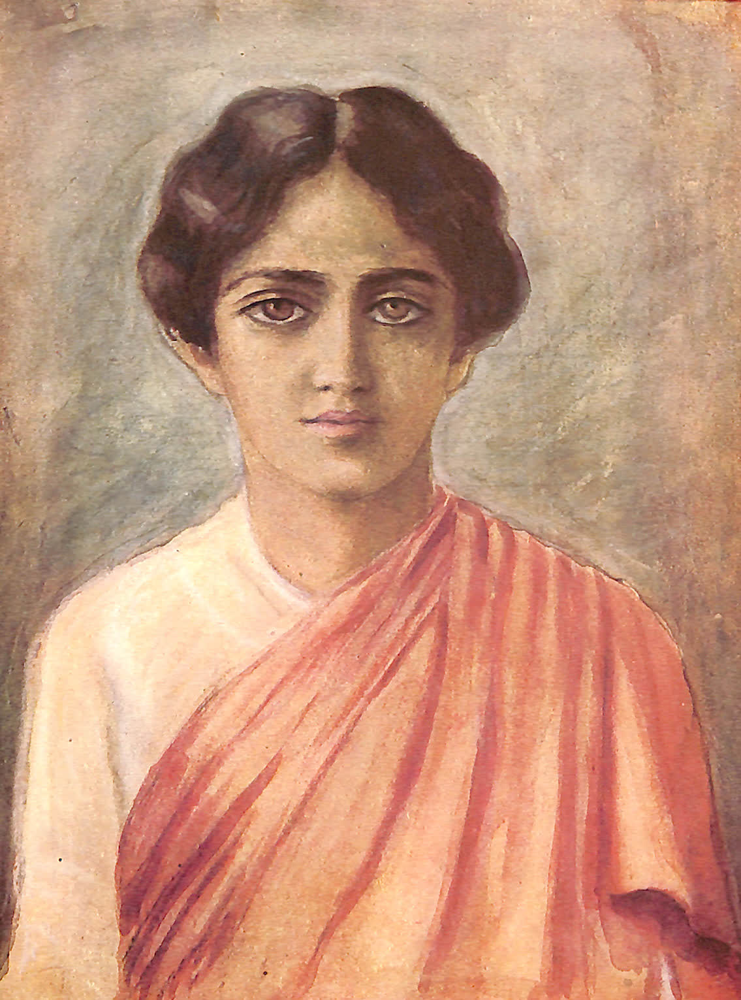

## Жизнь XLII

Мы приходим теперь к набору из четырех жизней, три из которых прожиты в Индии, которые были полностью посвящены разрешению прошлого кармы. Великие, хотя обычно они были рядом, играли менее важную роль в этих жизнях, чем в более ранние. В общем, я думаю, мы можем рассматривать эти четыре главным образом как подготовку к следующим четырем.

Алкиона родилась на этот раз в 4970 году, как дочь старого и благородного дома, в небольшом королевстве под названием Тирганга, которое было под властью или защитой махараджи большего района под названием Сравастхи. Имя Алкионы было Манидеви. Ее гороскоп предсказал, что она много пострадает и также говорил, что она будет матерью короля. Как ребенок, она была мальчишкой и импульсивной. Ее образование, по-видимому, было ограничено по объему и включало в себя только чтение и письмо и заучивание бесчисленных текстов; хотя она также училась тканию и кулинарии и всевозможным домашним обязанностям, а также науке о травах и составлении мазей и мазей для ран, и вообще медицины.

Она совсем не хотела выходить замуж, но ее желания были мало учтены; когда ее отец и мать увидели в этом по крайней мере возможный шаг в направлении исполнения пророчества, и когда у нее родился хороший сын (Гелиос), она, конечно, надеялась, хотя не казалось вероятным, что он может войти в линию наследования.

После нескольких лет была рождена дочь, Ригель, а затем второй сын Гектор; и вскоре после этого ее муж умер, и ее надежды значительно уменьшились. С точки зрения внешнего мира это практически сделало выполнение пророчества невозможным, но она все еще мечтала в своем сердце, что каким-то образом Боги осуществят свое указание, и поэтому она пыталась обучить своего симпатичного сына верховой езде и фехтованию, и всему, что сделало бы его заметной и подходящей фигурой в глазах общественности.

Внезапно умер долгоживущий старый Раджа, Цетус, и его преемник, сын Канцер, оказался слабым и неэффективным правителем. Его жена, Аластор, новая королева, была замышляющей и амбициозной личностью. Не имея собственного сына, она с злобой смотрела на привлекательного мальчика Алкионы, видя в нём потенциального претендента на трон в будущем. Алкионе приходилось себя сдерживать, ведь Аластор была подозрительной и бессовестной, и искала любого предлога, чтобы навредить ей. Однако надежды Алкионе снова усилились: хотя текущий Раджа все еще был молод и в любое время мог иметь сына, он не был крепким ни по здоровью, ни по воле, и ни он, ни королева не были популярны, так что ей казалось, что в какой-то момент в странном калейдоскопе индийского двора может появиться возможность для её собственного мальчика.

Однако, когда её сыну исполнилось восемнадцать лет, все эти надежды рухнули самым неожиданным образом. Она была религиозной женщиной, и когда через город проходил Геракл, святой человек с большой репутацией в стране, она с удовольствием предложила себя в качестве хозяйки, чтобы принять его. Он остался с ней на несколько недель, и она чувствовала к нему глубокую любовь и уважение; благородство его жизни и красота его учения настолько привлекали её сына Гелиоса, что он умолял святого человека принять его учеником и свою мать - разрешить ему уйти.

В её сердце разгорелась большая борьба, так как это означало полную жертву единственной большой мечты её жизни. С другой стороны, она хорошо понимала, что это большая честь, так как святой человек готов был принять её сына, говоря, что мальчик справится и далеко пойдёт, и что у него есть связи с ним из предыдущей жизни. Жертвование всеми её любящими амбициями представляло собой большую нагрузку, но через много дней она наконец согласилась, и Гелиос пошёл вместе со святым человеком в сторону холмов. Но разлучившись с ним, она замкнулась в себе, скорбя и не находя утешения.

После нескольких дней такого состояния младший брат, Гектор, наконец решил вмешаться в ее уединение, говоря ей, что хотя его брат ушел, он ушел к более высокой и великой жизни, а он все еще остался и будет стараться занять его место. Она никогда не думала о нем таким образом, хотя всегда была к нему добра и любяща; настолько она была углублена в старшего брата и пророчество, что воспринимала Гектора только как маленького малыша.

Аластор злобно радовалась, услышав, что красивый сын принял аскетический образ жизни. Около этого периода она решила, что ей совершенно необходим сын, и придумала козни, в которых представила Скорпио, незаконнорожденного сына Гесперии, одной из служительниц, своим, подкупив настоящую мать молчанием. Она требовала сложный и запутанный сценарий, и, несмотря на то, что ей не заслуженно повезло, она никогда после этого не была свободна от терзающего ее внутреннего трепета и подозрений.

Теперь, когда она таким образом обеспечила себе притворного наследника, она казалась более, чем когда-либо, желающей устранить любыми способами всех возможных соперников. Все еще неспокойная из-за Алкионы, она замышляет различные козни против нее, особенно пытаясь убить ее второго сына, Гектора, ночью своей собственной рукой; но из-за ошибки она поранила дочь Ригель и ушла, не будучи узнана. Хотя Алкиона подозревала ее.

Эта попытка не удалась, Аластор предъявила обвинение в сговоре против Алкионы и придумала достаточные доказательства, чтобы заставить ее покинуть город со своим сыном. Алкиона знала, что не только ее настоящие несчастья, но и смерть ее дочери, были прямо связаны с Аластор, и, следовательно, питала к ней большую обиду, и в момент гнева поклялась отомстить ей однажды. Будучи таким образом изгнанной, она жила в ближайшем государстве в большой бедности, зарабатывая на жизнь для себя и своего сына, делая и продавая сладости.

Прошло несколько лет, и все это время Алкиона питала горькие чувства к Аластор. В конечном итоге, Канцер умер, и его жена смогла короновать своего притворного сына, но он оказался развратным и неконтролируемым. Среди прочих злых поступков он оскорбил девушку, Тетис, которая была его сестрой, хоть он и не знал этого. Его настоящая мать, Гесперия, возмущенная, раскрыла его происхождение. Королева-вдова, конечно же, отрицала это и отравила Гесперию, но слухи распространились и нашли общее признание.

Было много шепотов и восстаний среди народа, и в итоге история дошла до ушей Марса, сюзерена в Шравастхи, который лично пришел расследовать дело и обнаружил подтверждение обвинениям. Тогда он отстранил от власти сына служителя, Скорпиона, и начал поиск Алкионы. После некоторых затруднений она была найдена, и ее сын Гектор был посажен на трон. Это стало и ее обязанностью, следить за ним и советовать ему, и она великолепно поднялась, выполняя эту новую роль, делая упорные попытки удерживать импульсивность своей прошлой жизни, проявляя терпение и мягкость с ним. Некоторое время она эффективно управляла маленьким государством, с умом и мудростью, благодаря превосходному благоразумию и сдержанности она привела его к процветанию.

Однако, существовала мощная партия поддержки бывшего коррумпированного двора, которая, лишившись власти, была внутренне нелояльна новому режиму и противодействовала ее усилиям при излагании справедливости, когда только осмеливались. В конечном итоге, молодой король женился на Регулусе, но его жена оказалась непригодной. Она была чрезвычайно амбициозной и ревнивой к влиянии его матери на него, и потому противодействовала Алкионе, пытаясь подорвать ее власть и подстрекать молодого короля к действиям, которые не одобряла его мать. Это недовольство длилось несколько лет, новая королева пыталась создать свою группу поддержки.

В конце концов, она заболела долгой и серьезной болезнью после родов. Алкиона ухаживала за ней в течение всего этого времени и так заботилась о её маленьких детях, что Регулус начала видеть ее истинный характер и полюбила ее. Поэтому после ее выздоровления, она полностью отказалась от своей старой противодействующей позиции, и все стало работать гораздо лучше. Бывшая королева-мать, Аластор, предполагаемая мать свергнутого короля, которая была отправлена в изгнание, секретно вернулась и подстрекла заговор для восстановления этого недостойного претендента на трон. Однако она была поймана, взята в плен и приведена перед Раджеем, который тогда вызвал свою мать и сказал: "Вот ваш древний враг, на которого ты клянчила месть за смерть моей сестры. Теперь я отдаю ее тебе. Что ты с ней сделаешь?"

Но разбитая интригантка выглядела такой жалкой, что Алкиона не могла сохранить гнев против нее, и она сказала: "Ее страдания и неудачи - достаточное наказание. Я прощаю ее. Пусть она уйдет."

Но женщина сразу после этого пришла и попросила видеть ее, бросилась ей к ногам, плакала по всему злу, которое она сотворила, говоря:

"Теперь я умираю, потому что когда я услышала, что меня должны были отдать тебе в руки, я немедленно приняла яд, чувствуя, что ты не сможешь простить меня, и будешь мучить меня за все, что я заставила тебя пережить."

"Нет," сказала Алкиона, "раз ты так покаялась, ты не умрешь", и она вызвала своего придворного врача и спросила у него о противоядии от этого яда. Они его ввели, и хотя Аластор уже находилась под сильным влиянием принятого ею наркотика, благодаря длительному и заботливому уходу им удалось спасти ее жизнь. Позже она посвятила себя аскетическому образу жизни - медитациям и благотворительной работе, чтобы искупить свои предыдущие злодеяния.

Однажды возрастающий и ослабевающий Геракл прибыл в Тирагангу и принес ужасные новости Алкионе - о смерти ее старшего сына, сына, которого она всегда больше всего любила в глубине своего сердца. Геракл, не скрывая скорби, рассказывал ей о своей любви к молодому человеку, о быстром прогрессе, который тот совершил на пути внутреннего развития, и о том, как он героически погиб, защищая своего учителя от нападения группы грабителей. Несмотря на то что Алкиона давно смирилась с мыслью отпустить своего сына, новости о его смерти стали для нее большим шоком и причинили глубокую скорбь, но Геракл утешал ее, снова и снова восхваляя его благородную жизнь, мужество и преданность, и объяснял, что такая жизнь и смерть не могли не сулить ему большого прогресса в будущем.

Геракл наполовину сомневался, не превратят ли печальные новости, которые он принес, его в не желанный визит у Алкионы, но наоборот, она привязалась к нему еще сильнее и убедила его поселиться в Тираганге, уговорив своего сына-раджу предоставить ему те скромные условия, на которые он согласился - хотя на самом деле он согласился без особого уговора, так как сам чувствовал глубокую почтительность к нему. Алкиона каждый день посещала его и узнавала многое от него, полагаясь на его совет в воспитании своих внуков, которым она преимущественно уделяла последние годы своей жизни. Король и королева полностью осознавали, как много они обязаны ее любящему уходу и разумному управлению, так что последние годы ее жизни прошли в спокойном счастье, и она была почитаема всеми с большим уважением и благодарностью. Она ушла спокойно в холода 4901 года в возрасте 69 лет.

## Жизнь XLIII

Мы снова находимся в одной из самых замечательных древних цивилизаций, которая развернулась на берегах Нила. Родилась Алкиона во времена правления Фараона Унаса, последнего монарха пятой династии, которая правила над радостными сыновьями великого Хема, будучи дочерью Аякса и Беллатрикс. Её имя было Хатшепсут.

Её отец был ближайшим соседом высокопоставленного дворцового чиновника по имени Анарсеб (Маркаб), а старшим сыном Маркаба был Сириус, на этот раз его звали Менка. Врожденная дружба предыдущих жизней быстро проявила себя, и Сириус и Алкиона, будучи игровыми товарищами, стали очень привязаны друг к другу.

Старший брат Алкионы, Уран, был очень добр с ними и уделял много времени обучению различным вещам. Деметра, еще одна девочка примерно того же возраста, кузина Алкионы, также была большим другом – это было ребенок, обладающий частичной ясновидением и видевший удивительные видения. Сириус и Алкиона любили слушать описание того, что она видит, и Алкиона несколько раз могла видеть эти вещи тоже, касаясь Деметры. Сириус не мог делать это, поэтому девочки сказали ему, что мальчикам не подходят такие привилегии, так как они слишком грубы и мужественны!

Они играли вместе среди прекрасных садов, за которые Египет был столь знаменит – сады, где искусно располагались искусственные холмы, долины и озера. Воды было везде, часто окруженные мраморными или отшлифованными гранитными ступенями и столбами; цветы росли на каждом квадратном футе травы и свешивались над каждой стеной, в то время как огромные цветы лотоса покрывали многие пруды. Дети так же чувствовали себя как дома в воде, так и на суше, и под теплым египетским солнцем они невероятно наслаждались своей ранней жизнью.

Конечно, Сириус и Алкиона давно договорились жениться, как только вырастут, но, к сожалению, возникло непредвиденное препятствие. Среди главных священников города был мужчина, которого немногие любили, и которого все боялись - человек, против которого ничего определенно не было известно, но многое подозревалось.

Каждый, кто оскорблял его или противостоял его воле, неизменно умирал вскоре после этого, но смерти никоим образом не могли быть связаны с ним. У него был сын (Скорпион), который был отцовской копией; он имел все неприятные особенности своего отца и был непристойным и оскорбительным.

Когда Алкиона выросла и стала красивой девушкой пятнадцати лет, Скорпион случайно увидел ее; ее красота воспламенила его страсть, и он сделал некоторые признания, которые она отвергла с презрением. Он рассеялся с несколько неопределенным извинением, но с зловещим взглядом. Трудности, возникшие на пути удовлетворения его желаний, только усилили его злобные желания, и он решил владеть ей любой ценой, даже если для этого ему придется жениться на ней. Он вскоре понял, что брак  в этой ситуации будет единственным способом достичь своих желаний, и поэтому он разрабатывал сложный план. Он долго работал над своим замыслом, пока он не стал дьявольски изощренным и завершенным. Он собрал некоторые письма ее отца, и с помощью умелых подделок и вставок превратил их в доказательства сговора против Фараона.

Затем он поискал встречу с Алкионой и объяснил, что эти документы попали к нему, и что его долг и интересы одновременно требуют, чтобы он немедленно передал их Королю, за что он получит большую похвалу и щедрую награду; но из-за его сильной любви к ней, он готов рискнуть и уничтожить их, если она, со своей стороны, отдаст себя и свое богатство ему, как компенсацию за потерянное вознаграждение, и сделает его интересы идентичными интересам ее семьи. Однако, если она скажет об этом кому-либо, он сразу передаст документы в соответствующих кругах.

Это сильно беспокоило Алкиону, ведь печати и подписи на письмах отцов были безусловно настоящими, и она знала, что он имел обыкновение высказывать довольно революционные воззрения. И хотя она время от времени сомневалась, она опасалась, что письма могли действительно быть написаны им. Казалось, появилась возможность сделать что-то действительно героическое, о чем она, Деметра и Сириус часто разговаривали - спасти семью за цену того, что для нее было дороже жизни. Она чувствовала, что ей запрещено консультироваться с кем-либо, и она не видела никакого выхода, поэтому она сдалась и объявила своей опешившей семье, что собирается выйти замуж за него. Но она ему не доверяла и потребовала, чтобы эти компрометирующие письма были у нее в руках до церемонии бракосочетания.

Все это было ужасным событием для нее, особенно когда ее мать спросила, действительно ли она любит этого человека, и ей пришлось притворяться, что это так, хотя ее сердце было полно отвращения. Сириус также был очень шокирован и огорчен, услышав эту новость. Он сказал, что, хотя он не мог любить никого, кроме Алкиону, он был бы вполне согласен, если бы она женилась на кого-то другого, если бы она действительно этого хотела и если это было бы лучше для нее, но он не мог поверить, что она могла совершить такое преступление против вкуса и выйти замуж за этого конкретного человека. Он настаивал на том, чтобы услышать ее решение из ее собственных уст, и даже тогда он сказал ей, что не может поверить в это, и думал, что она должна быть под каким-то чарами. Он был близок к угадыванию правды, что очень напугало ее, и заставило ее еще сильнее стараться обмануть его.

Ее старший брат Уран был в это время вдалеке от дома, иначе, возможно, он бы решил проблему. Как бы то ни было, она выполнила свою часть сделки и решила быть с ним, но ее жизнь никогда не была действительно счастливой, хотя на физическом плане у нее было достаточно роскоши. Ее муж не любил Сириуса и был ревнив к нему, поэтому она могла видеть его лишь редко. В 4017 году умерла мать Сириуса при рождении маленького сына (Веги). Не долго после этого умер и Маркаб, и на Сириуса легла забота о всем доме, и он также принял на себя некоторые из обязанностей своего отца, и был погружен в дела. Он все еще оставался верен памяти Алкионы и отказывался рассматривать вопрос о каком-либо другом браке, несмотря на многие выгодные предложения.

У Алкионы было двое детей, Телец и Дева, и она получала некоторое утешение, любя их, но всегда чувствовала страх, что они вырастут и станут похожи на отца. Ее жизнь была действительно долгой мученической, ведь она никогда не забывала о своей любви к Сириусу и никогда не могла полюбить своего мужа, хотя старалась исполнять свой долг перед ним.

Когда ее брат Уран вернулся, он был поражен и возмущен ее браком; он тщательно допрашивал ее, обсуждал это вопрос с Сириусом, и его подозрения были близки к правде. Его сестра умоляла его больше не давить на нее, так как все было уже сделано и не могло быть исправлено, и им всем приходилось принять это.

У нее были и другие дети, но все они умерли, и ее унылую жизнь тянулось уже двадцать лет. Пламенная страсть ее мужа угасла давно, но он никогда не жестоко обращался с ней, и ей больше нравилось его равнодушие, чем его внимание, пока в других его интригах она не видела ничего плохого. Теперь, когда он совершенно безразлично относился к тому, что она делает и куда ходит, ей удавалось видеться с Сириусом гораздо чаще.

Жизнь последнего изменилась в связи с обстоятельствами, связанными с определенной военной экспедицией на далекий юг, где был взят в плен молодой дворянин, Рамасфен (Меркурий). Этот молодой узник по очереди отдыхал в домах нескольких египетских капитанов и прожил два года в доме Сириуса. Его интерес к философии и оккультным проблемам был значителен, и поскольку Уран, Сириус и Алкионае тоже привлекали их, было много обсуждений. Теперь Меркурий был представлен некоторым высокопоставленным персонам одного из главных храмов Кастором, который также был офицером египетской армии и был вместе с Сириусом в то время, когда Меркурий был взят в плен. Отец Кастора был одним из самых щедрых покровителей этого храма и занимал некоторые важные мирские должности в связи с ним, на которые Кастор унаследовал, так что он был человеком с большим влиянием на священников, и его рекомендация сразу внесла Меркурия в самые глубины вещей. Последний сразу стал увлеченным студентом тайн, в которые он погрузился на годы, хотя и продолжал поддерживать связь со своими друзьями.

В 3998 году Алкиона наконец вырвалась из своего долгого покаяния смертью своего мужа, и, разумеется, Сириус сразу же захотел, чтобы она вышла за него замуж. Она сопротивлялась, полагая, что стала непримиримой, испачканной контактом с покойным мужем, но настойчивость Сириуса победила ее сомнения, и она, наконец, согласилась выйти за него замуж, как только прошло годическое мероприятие после смерти ее предыдущего мужа (как требует традиция).

Сириус был полон радостного ожидания, но, как и ранее, его надежды были разбиты. Его младший брат Вега попал в серьезные неприятности: он залез в проблемы с женщиной низкого класса, обнаружив ее неверность, убил ее и ее любовника, а затем сбежал и спрятался, чтобы избежать последствий своих злодеяний. Сириус прекратил все дела и посвятил себя поискам Веги. После долгих и тяжелых поисков он нашел его, болеющего и находящегося в тяжелых условиях в далеком городе. Фараон вынес ему смертный приговор, и лишь с большим трудом, обращаясь к своим собственным достижениям, Сириус смог смягчить его до штрафа настолько большого, что ему пришлось продать семейное имение, чтобы его оплатить. Таким образом, он оказался в сравнительной нищете, но он умудрился вернуть к себе Вегу, который полностью исправился, и они вместе прожили довольно счастливую жизнь в скромности.

При этих обстоятельствах он больше не мог попросить Алкион жениться на нем, так как, чтобы сделать это, ей было бы законно вынуждено отказаться от небольшой пенсии, которая была все, что оставил ей ее первый муж. Она с радостью поделилась бы бедностью с Сириусом, но боялась увеличить его бремя; и они оба почувствовали, что поскольку такие непредвиденные препятствия в два раза возникли, чтобы предотвратить их союз, вероятно, боги не желали им вступать в брак.

Алкион присоединилась к главному храму и изучала под руководством Меркурия, который сделал удивительные успехи в изучении мистических знаний, в то время как Сириус посвятил себя неприятной задаче заработать деньги, чтобы купить назад свой родовой дом. Это заняло у него почти двадцать лет, но ему, наконец, это удалось, и тогда еще раз, в возрасте шестьдесят лет, он обсудил с Алкион вопрос о браке. Она долго была посвящена службе и учению в храме, и сделала большие успехи в них, и чтобы выйти замуж, она была вынуждена отказаться от того положения, которое приобрела в работе храма, поэтому, тщательно обдумав предложение и проконсультировавшись с Меркурием и Ураном, они оба согласились, хотя и с некоторыми уколами сожаления, что они все еще будут продолжать совершать свои жизни в отдельности в жертву богам, как они делали до сих пор. Цигнус, один из учеников в храме, давно влюбился в Алкион и несколько раз просил ее выйти за него замуж, но без успеха.

Вега женился на своей старой подруге детства - Урсе, дочери индийского короля, который был изгнан из своего королевства и принял убежище на берегах Нила. Они жили счастливо и родили двоих прекрасных детей, Андромеду и Драко, а Сириус и Алкион окружили этих детей заботой, как будто они были их собственными. К этому времени под руководством Меркурия уже работали достаточно большие классы учеников, и это стало главным занятием последней части жизни Алкион.

Сириус умер в 3967 году, и Алкиона глубоко оплакивала его, пока однажды он не появился перед ней и не сказал, что скорбеть по нему недостойно ученика Скрытого Света. Он напомнил ей о учении, которое Мистерии предоставляли им о дне, когда приходит время появиться. Несмотря на то как часто они обсуждали всё это, только теперь впервые он заставил её полностью осознать, насколько неважна смерть и как семьей являются живые и мёртвые.

Это очень ободрило её, и она часто весьма чётко чувствовала его присутствие рядом, хотя лишь дважды она его видела: однажды, как описано выше, и второй раз - непосредственно перед её смертью, которая произошла в 3960 году, когда ей было 75. Он сказал ей тогда, что составил гороскоп или как-то посчитал дальнейшее будущее и обнаружил, что они оба жертвовали собой в этой жизни во имя обязанности. Поэтому, спустя почти шесть тысяч лет, они встретятся у подножия Меркурия, и после этого они уже не расстанутся; поэтому она ушла из жизни вполне спокойно и счастливо.

Орион также появился в этой жизни под именем Кеферена в качестве сына Ахилла, другого близкого соседа индийского царя и семьи Анарсеб. В детстве он постоянно играл с Вегой, младшим братом Сириуса. Он был восьми лет, когда пленённый Рамастенез пришёл жить в дом Сириуса, и Орион часто слушал его рассказы, сидя у его ног. Он был зарегистрирован как своего рода дневник в храме и в конечном итоге стал учеником Рамастенеза. К сожалению, он завяз некоторые нежелательные знакомства и увлёкся распутной городской жизнью, которую на момент он предпочёл жизни в храме. Когда стало окончательно известно, что он отказался от храма, Фараон Унас предложил свою дочь Гелиос Ориону в жёны, и церемония была отпразднована с большим помпезностью. Орион горячо любил свою молодую жену, но тем не менее понял, что сделал ошибку, отказавшись от храма, и он всегда сожалел об этом. Его жена умерла молодой, но оставила после себя троих детей, старший из которых Птаххотеп (которого мы знаем как Селену) был необычайно учёным юношей. Позднее он стал учёным и написал широко известную книгу "Мудрость Египта". Он прожил до очень преклонного возраста, до 110 лет, и его великом уважении за его глубокие ученые знания.

Последние дни Ориона были довольно одинокими, так как все друзья, которых он ценил, ушли из жизни до него. Под конец своей жизни он оказался в бедности. Видимо, это королевская жизнь в Египте под столь благоприятными обстоятельствами должна была стать кульминацией, к которой вели многие предыдущие воплощения. Однако выбор всегда должен быть свободным, и Кефрен сделал неправильный выбор, отложив тем самым предполагаемое завершение.

В этой жизни принимал участие и Эрато, хотя он родился вдали от всего этого в Аджмере, в Раджпутане, в семье вождя Денеба, и вышел замуж за дочь сюзерена Марса. В молодости он пошел на войну со своим отцом, и вскоре Марс послал его вместе с отцом в важное посольство в Египет. Среди офицеров, которые приняли посольство, были Сириус и Кастор, с которыми Эрато тут же подружился. Посольство разместилось на берегу Нила недалеко от группы друзей, о которой уже неоднократно упоминалось, и Эрато легко был принят в их круг. После возвращения в Индию он снова участвовал в постоянных войнах того времени и, к сожалению, случайно убил своего младшего брата в одном из сражений. Это печальное событие заставило его оставить жену и детей и стать отшельником. Он долго бродил по лесам, пока наконец не нашел старика Спику, жившего в пещере, который предложил ему приют и наставил его. Под его руководством Эрато научился принимать вещи спокойно и смиренно, и именно в этой пещере он умер в возрасте сорока пяти лет.

Рея присутствовала в этой жизни в качестве жены Каллесартона, офицера, который возглавлял экспедицию, захватившую Рамастенеса.

Офицер, возглавлявший экспедицию, захватившую

Рамастенеса. Последний был учеником Юпитера, стариком, который был убит в той же экспедиции. Его дочь Алькестис была в тоже время взята в плен Каллесартоном, и впоследствии вышла замуж за Кастора, у которого уже было две живые жены. У Алькестис была младшая сестра, которая жила вместе с ней в Египте, поскольку у них не было других родственников. Когда Пикс выросла, она вышла замуж за Зенона, сына Одиссея.

Значительное количество наших персонажей появилось в Индии в это время. Они в основном были сгруппированы в двух больших семьях, происходивших соответственно от Юпитера и Паво. Эти семьи обычно вступали в брак между собой, Марс и Корона были старшими сыновьями. У Юпитера было пять сыновей, которые, будучи все огромными людьми, обычно назывались пятью великанами. Они все были удивительно похожи по форме и чертам лица, хотя существенно отличались по характеру; Меркурий и Нага были так похожи, что их практически невозможно было отличить. Все они были обучены и искусны в военном деле, и при проведении турнира они бросили вызов любым двадцати рыцарям и дворянам, собравшимся там, чтобы сразиться с ними одновременно. Двадцать экспертов немедленно приняли вызов, но легко были побеждены; затем еще двадцать попытались, надеясь, что великаны могли утомиться после своих предыдущих усилий, но и это тоже беззастенчиво потерпело неудачу, и пять великанов остались владеть полем. У них была одна сестра Яджна, такая же высокая и крепкая, как ее братья; на самом деле, она была известна тем, что надевала их доспехи и выходила с ними без того, чтобы ее обнаружили. Она достойно вышла замуж за Корону.

Вместо того чтобы занимать должность губернаторов провинций, королевские сыновья в этой жизни ездили по стране, подобно бродячим рыцарям Средневековья, искали неправду, которую можно было исправить, и стремились обеспечить справедливость в своей земле. Когда Марс вступил на трон, он отправил своего младшего брата Нагу в качестве вице-короля в огромную новую провинцию, которая, из-за срыва своей первоначальной династии, только что была аннексирована в королевство, и Нага провел остаток своей жизни там, практически как независимый правитель, Марс посетил эту часть своего королевства всего два раза за примерно сорок лет. Нага был замужем за Электрой, и они смотрелись великолепно вместе; их многочисленные дети заботливо общались с другими ветвями семьи, но мы отметим, что уже внуки стали исклюительны и женились только среди своих людей.

Королевство, в котором ранее было много злоупотреблений и коррупции, благодаря усилиям нашей группы преобразилось в лучшую сторону, и правительство осталось сильным, справедливым и способным на протяжении нескольких столетий.

## Жизнь XLIV

В этот раз Алкион вернулся в свою любимую родину Индию, также вернувшись к мужскому полу, после того как был женщиной пять раз.

Он родился в городе под названием Нарсингарх, рядом с холмами Виндхья, в 3059 году до н. э. Его имя было Шиварши, и он родился в старой и благородной семье, которая, хотя и обеднела, была горда. Великие традиции, передаваемые от отца к сыну, были памятью о ее древнем величиии и указывали на необходимость поддержания достоинства и восстановления своего положения.

У неё все еще было существенное поместье, но не было денег, чтобы его обрабатывать или оснащать, и также деньги были как-то заняты под него.

Отец Алкиона, Таурус, был человеком добрым по натуре, но строгим и гордым; мать Вираго была слабовольной и склонной к жалобам, хотя и добронамеренной. Их жизнь была изобилующей некоторыми лишениями, потому что все должно было быть пожертвовано семейной гордости.

Прежние щедрые благотворительные акции теперь не могли быть раздарены, но скудные показательства благотворительности все-таки должны были быть; появления должны были как-то поддерживаться перед внешним миром, даже если еда заканчивалась. Они жили в старом заброшенном замке, где только небольшая часть была действительно пригодна для жилья, большая же часть его была в отчаянной нужде в ремонте. Алкион был вторым сыном, старшим был Поллукс; они были удивительно похожи по лицу, хотя совершенно разные по характеру. Как они выросли, Алкион был глубоко религиозен, надежен и трудолюбив, в то время как Поллукс был беспечен и развратен, и причинял своей семье много беспокойства.

Однако отец полагался на старшего сына, чтобы спасти благосостояние своего дома, не своими усилиями, но благодаря счастливой случайности. Поллукс случайно родился при определенном созвездии планет, в день имени местного правителя; и, следуя совету своих астрологов, этот правитель завещал ему большое состояние, хотя видел его только младенцем и мало знал о его последующей жизни. Во всех отношениях, поэтому, Алкиону пришлось жертвовать Поллуксом; например, когда они выросли, Алкион влюбился и хотел жениться, но не мог сделать это, потому что Поллукс, будучи старшим, должен был жениться, чтобы продолжить род, и на его свадьбе должен был быть показан весь блеск, а денег хватило бы не на двоих.

Так, Поллукс женился на Адроне, но не продолжал оставаться ей верным; он запутался в некоторых безнравственных действиях и в конце концов исчез с другой женщиной (Мелпо). Отец чувствовал, что все это плохое поведение Поллукса, а также его исчезновение, должны любой ценой быть сохранены от знания Раджи, чтобы он не отозвал свое наследство; поэтому он приказал Алкиону притворяться Поллуксом (что он мог легко сделать, так как было большое сходство между ними), и, хотя это было ему очень неприятно, он должен был повиноваться.

Так было объявлено, что это Алкион отправился в путешествие и что, из-за этого, Поллукс должен был изменить свой образ жизни и больше оставаться дома, Алкион полностью избегал друзей и мест обитания Поллукса, и таким образом избегал обнаружения. Он занимал должность Поллукса в течение нескольких лет и постепенно заслужил для него репутацию гораздо лучше его собственной. Однако он категорически отказался взять жену своего брата, как хотел отец.

Когда Поллукс вернулся без гроша и без несчастной женщины, они простили его, и он вновь занял свое место в семье - Алкиону, конечно, предполагалось вернуться из своего путешествия; но Поллукс не оправдывал репутации, которую Алкион создал для него, и поэтому вызвал много проблем.

Наконец, он совершил серьезное преступление, и ради чести семьи и наследства, Алкион пожертвовал собой и взял на себя вину за это деяние. В результате его осудили и бросили в тюрьму. Семья признала его героизм в свою защиту и сделала для него все возможное; но даже при их наилучших стараниях ему было очень тяжело, потому что условия в тюрьме были ужасными во всех отношениях. Алкиону приходилось находиться в тесном контакте с настоящими преступниками, а заключенным часто не предоставляли достаточно или даже надлежащую пищу. В обычаи входило то, что они нередко приходили к решетке и просили милостыню у прохожих, и таким образом они обычно могли выживать. Его отец сумел устроить так, чтобы Алкиону каждый день доставляли немного пищи, даже когда запасов дома не хватало; но даже эту мизерную пищу Алкион не мог принять только для себя, видя еще более великое страдание некоторых из более слабых заключенных.

Это ужасное заключение длилось какое-то время; и между тем Поллукс продолжил свои злодеяния и попал в еще большие неприятности; в конце концов Аква, симпатизирующая младшая сестра, к которой Алкион был особенно добр, больше не могла вынести этого страшного несправедливого состояния, поэтому она убежала из дома без разрешения отца, подошла к Радже и рассказала ему всю правду. Это привело к страшному разоблачению и нанесло семье большое публичное бесчестие; старый отец совершил самоубийство от стыда; старший сын Поллукс был изгнан; а Раджа освободил Алкиона из тюрьмы и поместил его на должность в своей службе.

После смерти отца и изгнания старшего брата, Алкион стал главой семьи, унаследовал все ее традиции и обязательства, а также ее долги и проблемы. Зарплата от его должности была достаточной, чтобы избежать голода и поддерживать минимально комфортные условия в доме, но это было далеко не достаточно, чтобы восстановить давно утраченные славу семьи. Поэтому Алкион часто задумывался о ситуации и размышлял, что он может сделать, чтобы выполнить многолетнее желание своего отца, которое он считал священным обязательством, возложенным на него.

Через некоторое время он решил обратиться за советом к Нептуну, старейшему брахману соседнего храма, который был известен своей святостью и мудростью. Брахман прислушался к его истории с сочувствием и после тщательных размышлений посоветовал ему совершить короткое паломничество к определенной известной святыне и там принести серию специальных молитв и медитаций божеству. Алкион принял этот совет; он совершил необходимые обряды и искренне молился божеству о помощи в этом вопросе, не ради денег, но из-за приказа своего отца.

В эти дни особой молитвы он должен был жить и спать в храме, как можно ближе к изображению божества. В последнюю ночь его пребывания он увидел ярчайший сон, в котором ему было сказано вернуться домой в свой замок, спуститься в определенный неиспользуемый подземелье его основания и там открыть камни пола и копать до определенной глубины. Он вернулся домой, но сомневался, следует ли прислушиваться к сну; в конечном итоге, однако, он подумал, что из-за его особой яркости он мог быть послан ему божеством в ответ на его молитву, и что в любом случае не составит труда сделать поиск как предложено.

Он тщательно следовал полученным указаниям и обнаружил под полом подземелья великолепное сокровище золотых сосудов и драгоценных камней, которое, предположительно, было похоронено одним из предков, когда грозила определенная опасность, как это часто случалось в индийской истории. Это великолепное клад положило конец его беде, его стоимость была более чем достаточной, чтобы позволить ему освободить свою землю от бремени, засеять и запастись ее; на самом деле, у него оставалось еще много, чтобы построить храм и некоторые дома отдыха и организовать множество процессий в благодарность божеству, пославшему ему сон.

Остаток его жизни прошел в родном городе, но он никогда не оставался в нем долгое время, кроме определенных паломничеств, которые он предпринимал. Он всегда был глубоко религиозным человеком, добрым и нежным с его семьей и зависимыми, и милосердным к бедным. Как только он отбыл находка сокровища от непосредственного давления финансовых забот, он обратил свое внимание на изучение и уделял ему определенную часть времени каждый день, и вскоре приобрел большую репутацию как ученый и святой человек. Когда его старший сын подрос до возраста усмотрения и доказал себя мудрым и способным управляющим, Алкион отрекся от своего положения и ушел на отдых, чтобы провести остаток своих дней в изучении, религиозных разговорах и упражнениях, не в джунглях, но в некой вроде маленького деревянного домика или сарая в саду на его собственной земле.

Здесь он умер мирно в преклонном возрасте.

Как Галлия во времена Цезаря, Крит в это время был разделен на три части или государства - Кносс, Гулас и Полурени. Юпитер был королем Кносса и главой всего острова, поскольку правители других государств признавали его своим лидером, хотя они имели полное право управлять своими внутренними делами. Марс был королем большого города и территории Гуласа, расположенного близ восточного конца острова, а Корона был королем Полурени. Также на юге острова находился независимый город с прилегающей к нему территорией, над которой Вулкан правил как наследный принц.

Все эти короли были также ex-officio Высшими Жрецами, как в Египте, и дворец короля всегда был главным храмом его государства.

Люди поклонялись двойственному божеству - Отцу-Матери, которые рассматривались как единое целое, хотя некоторые люди предпочитали больше поклоняться Отцу, а некоторые - Матери. Отец, когда о нем говорили отдельно, назывался Брито, а Мать - Диктина. Статуй этих божеств не делали, но огромное почтение уделялось их символу, который был загадочным объектом похожим на двухголовый топор. Этот символ был вырезан из камня и начеканен на металле и устанавливался в храмах на месте, где обычно ожидаешь увидеть статую, а конвенциональный рисунок представлял божество в письменности того времени. Этот двухголовый топор назывался лабирис, и именно для него изначально был построен знаменитый Лабиринт, чтобы символизировать для людей трудность поиска Пути Бога.

Большую часть своего религиозного служения и поклонения они проводили на открытом воздухе. Разные замечательные, изолированные вершины скал считались священными для Великой матери, и царь со своим народом выходили к одной или другой из них в некоторые дни в каждом месяце и проводили молитвы и песнопения. Зажигали огонь, и каждый человек влетал себе некий венок из листьев, носил его некоторое время, а затем бросал его в огонь в качестве дара Богине-Матери. У каждой из этих вершин также был особый ежегодный праздник, похожий на Перерыв в Бретани - своего рода полурелигиозную деревенскую ярмарку, на которую люди приходили из всех уголков острова, чтобы пикничать на свежем воздухе в течение двух-трех дней и прекрасно проводить время. В одном случае, мы обратили внимание, что огромное старое дерево необычайного размера и особенно идеальной формы было признано священным для Диктынны, и под его ветвями приносились жертвы. Под ним сжигали большое количество ладана, и предполагалось, что листья каким-то образом впитывали и сохраняли аромат, поэтому когда они опадали осенью, их аккуратно собирали и распределяли среди людей, которые считали их оберегами, защищающими их от зла. Нельзя отрицать, что у этих сушеных листьев был сильный аромат, но насколько он был связан с ладаном, остается под вопросом.

Это были великолепно выглядящие люди, очевидно греческого типа, их одежда была простая. В обычной жизни мужчины обычно носили ничего, кроме пояса на бедрах, за исключением случаев, когда на они одевали пышные официальные костюмы для религиозных или других праздников. Женщины носили ткань, которая покрывала все их тело, но была расположена примерно как индийский дхоти в нижней части, создавая эффект разделенной юбки.

Внутренняя часть острова была гористой, напоминающей Сицилию, и там было много прекрасных пейзажей. Архитектура была массивной, но дома были устроены по-особенному. При входе вы сразу попадали в большой зал, похожий на церковь, в котором весь день жила вся семья и служители, приготовление пищи происходило в одном из углов. Сзади находился крытый проход (как в домах на Яве в наше время), ведущий к реально отдельному зданию, где были спальни. Они были довольно маленькими и темными - простые кубики, но открыты со всех сторон примерно на два фута под крышей, поэтому вентиляция была достаточной. Вдоль стены этого зала под крышей обычно шла фриз из росписи барельефом - обычно это был какой-то процессионный шествие, выполненное в наиболее боевом стиле.

Здания были из гранита, и было много гранитных статуй, хотя некоторые были сделаны из более мягкого камня, и некоторые из меди и дерева. Эта раса использовала железо, но не очень много; основной металл был медь. Керамика была явно своеобразной; все самые обычные предметы были сделаны из яркой желтой глины, раскрашенной всевозможными фигурами. Эти фигуры обычно находились на широкой белой полосе вокруг средней части горшка, и использованные цвета были почти всегда красными, коричневыми или желтыми - очень редко синими или зелеными. Это были обычные домашние горшки; но для стола они ипользовали фарфор и стекло - оба очень хорошо сделанны. Большая часть стекла была голубовато-зеленого оттенка, похожая на некоторое старое венецианское стекло - не прозрачное, как наше. Люди использовали много сосудов из золота, замечательно гравированных и иногда инкрустированных драгоценными камнями. Эти люди были особенно изощренны в работы ювелиров и создавали сложные украшения. Среди них не было бриллиантов или рубинов - в основном аметисты, яшма и агат. Но многие украшения были очевидно импортированными, они имели статуэтки и модели, вырезанные в слоновой кости.

У этих людей было два вида письменности, очевидно, соответствующие египетским иероглифическому и демотическому, но они существенно отличались от египетских. В расчетах использовалась десятичная система, и, по-видимому, арифметика была хорошо понята. Эти критяне были хорошими моряками и имели мощный флот галер, некоторые из которых имели до шестидесяти весел. Они также использовали паруса, которые были удивительно раскрашены; но, по видимому, они использовали их только при ветре почти прямо сзади.

За королеву Юпитер имел Вирадж, которая была главной жрицей Богини-Матери Диктынны. Вирадж была очень святой женщиной с высокой репутацией и большой силой; на самом деле, через ее мужа, она была фактически правителем острова, а ее сын Сатурн занимал важное место среди священников и был губернатором столичного города под руководством отца. Марс, который был женат на Геракле, имел двух братьев, Меркурия и Брихаспати, которые служили заместителями священников и облегчали ему много работы.

Взаимосвязь различных персонажей можно увидеть, обратившись к списку драматических лиц, но стоит упомянуть о двух-трех событиях, которые заслуживают внимания. Мизар, младшая дочь Марса и Геракла, была известна на всем острове за свой остроумие и чудесную красоту, и, несмотря на то что она была все еще очень молода, полчища достойных молодых людей были влюблены в нее. Неписаный закон гласил, что дочери королевского дома не могут, кроме как в исключительных случаях, выходить замуж до 18 лет; поэтому в ее восемнадцатый день рождения ее отец получил четыре предложения для нее от Сириус, сына Меркурия; Крус, сына Брихаспати; Палласа, сын Короны; и Ахиллес, сын Вулкана.

Марс не знал, как выбрать из всех этих молодых людей, поэтому он вызвал их всех к себе и сказал им, чтобы они сами решили, кто первый получит право предложить руку прекрасной особы. В то время было принято, что женихи должны сражаться за невесту, но Марс этого не хотел, говоря, что они все как братья, и что ссора между ними неизбежно ослабит королевский дом. Паллас предложил решить вопрос с помощью игры в кости, но Сириус возразил, сказав:

"Я никогда не соглашусь на то, чтобы унижать такую благородную даму, делая ее руку призом в игре. Мы все здесь вместе; мы все братья королевского дома; почему кто-то из нас должен идти впереди другого, и почему мы должны ставить леди, которую мы все любим, в положение, где она должна отказываться от кого-то из нас лично? Если угодно Королю, пусть Цветок Крита будет вызван в его присутствие прямо сейчас, и пусть она скажет, кого из нас она выбирает - если вообще она захочет кого-то из нас, кого она знает всю свою жизнь, - потому что она может сначала захотеть увидеть незнакомцев из других земель. Я говорил правильно, о Король?" "Ты говорил правильно," ответил Марс. "Но прежде чем она будет вызвана, я должен получить обещание от всех вас, что вы мирно примете ее решение, и что не будет никаких споров в дальнейшем по этому вопросу." "Я по крайней мере свободно и полностью обещаю это, мой господин, Король," сказал Сириус. "Позвольте мне предложить еще одно предложение.

Мы все братья, как я уже сказал; давайте будем братьями в другом, отличном смысле. Мы все равно любим вашу дочь; давайте заключим торжественное обязательство, согласно которому , кого бы она ни выбрала, будь это один из нас или кто-то другой, мы лояльно примем это выбор и останемся всю свою жизнь истинными братьями для нее и ее мужа, готовыми оказать верную службу и при необходимости отдать жизнь за нее и за него."

Идея пришлась по душе остальным, и они все торжественно поклялись при присутствии Короля принять её выбор и всегда быть на её службе; а затем вызвали Мизара. Но Мизар предугадала, что происходило, и спряталась за шторой в верхней комнате, окно которой выходило на частный аудиенционный зал Короля; она услышала, что сказал Сириус, и, возможно, это повлияло на её выбор; или, возможно, она решила еще давно. В любом случае, когда ее отец кратко изложил суть, она застенчиво протянула руку Сириусу, а затем, обретая мужество от его касания, обратилась к другим, которые с поникшими головами уходили, поклонившись перед Королем: "Принцы, выслушайте меня! Я люблю вас всех; хотела бы, чтобы я могла радовать вас всех. Я слышала вашу клятву братства, и я восхищаюсь вами за это. Позвольте мне с моей стороны сказать вам, что мой муж и я принимаем вашу службу и вашу дружбу. Братьями вы будете для нас обоих, и будете близки нашим сердцам, пока жизнь продолжается, и даже после, если это возможно."

Клятва была сдержана, и никогда не позволялось возникать облаку недоразумений между членами этого братства. И Гектор (который тоже любил ее, но, поскольку он был младшим братом Сириуса, не считал правильным представить себя вместе с ним) попросил разрешения присоединиться к братству, когда он услышал о нем, и наиболее преданно сдерживал свое обещание. Позже он женился на Доре, но она умерла при родах, оставив ему троих маленьких детей. Суррогатной мамой для них стала Бореас, жена Ну, бедного человека, чей ребенок умер всего лишь за день или два до этого. Год спустя умер и Ну, и Бореас стала служанкой Мизара, к которой она была глубоко привязана.

Как будет видно из таблицы в конце, другие члены братства также в свое время женились, хотя они никогда не забывали свою клятву. К большому сожалению Ахиллеса, Офис, его старший сын, был убит в своем первом сражении, когда они отбивали атаку армии налетчиков с острова Кипр.

Перед своим браком Сириус был послан на Сицилию в качестве посола к одному из правителей там. При этом Ахиллес и Гектор сопровождали его, и у них было очень интересное путешествие, и они были глубоко впечатлены великолепной красотой острова.

Сома и Регулус были главами семьи из торгового класса, которые уделяли много своего состояния на благотворительность, и так завоевали дружбу Сириуса и Мизара, которые тоже много занимались подобной работой. Некоторые из наших второстепенных персонажей появляются в этой жизни в качестве рабов - редкое событие в группе изученных воплощений. Сын Сомы, Камел, влюбился в Помо, которая была одной из этих рабынь, купил ее, освободил и женился на ней.

Орион родился в 2736 году в арабской расе в Южной Африке. Его отец был владельцем земель и стад, но одновременно был и охотником и торговцем. Орион и его младший брат Скорпион влюбились в одну и ту же женщину. Орион женился на ней, и младший брат, следовательно, принял враждебное отношение. Вскоре в стране вспыхнуло восстание, и претендент захватил трон. Младший брат присоединился к нему, в то время как Орион, поддержавший правмого короля Сигму, был изгнан вместе с ним. В течение четырех лет они находились у негроидной расы, живущей в огромных пещерах. Сообщалось, что в глубинах этих пещер живет гигантская раса, и Орион организовал экспедицию в поисках этих людей, но не нашел их. В ходе своего исследования он приобрел несколько прекрасных алмазов, которые предложил своему королю, а также идею, которую их открытие подсказало ему. В этом королевстве самым ценным из королевских драгоценностей был замечательный меч с рукоятью из алмазов, который, предполагается, был очень старым и обладал магическими свойствами. Легенда гласила, что тот, кто держит этот меч, правит страной. Работа над рукоятью этого меча была изумительно тонкой, и самой ценной частью его украшения был огромный алмаз.

Самый прекрасный экземпляр в сокровищнице Ориона был вполне ему равен, если не больше, поэтому у Ориона возникла мысль, что возможно подготовить дубликат алмазного меча. Он думал, что если его король внезапно появится среди своих сторонников, обладая тем, что вряд ли не будет воспринято как священная реликвия, их вера в ее мистические свойства была бы настолько убедительной, что почти непобедимой. Фантазия короля разгорелась, но он сомневался, правильно ли и мудро ли делать дубликат священного меча. Тогда Орион предложил другой план. Он предложил пробраться в обратном путь в свою столицу под видом другого человека, как-нибудь украсть священный меч и принести его королю. Король принял его предложение, но он обнаружил, что дело далеко не так просто, и ему пришлось устроить сложную интригу. Ему удалось, и он сбежал одну ночь, держа меч, но его отсутствие было обнаружено раньше, чем он рассчитывал. Было предпринято преследование, и он и его слуга Гамма были настигнуты и захвачены. Тогда захватчики разбили лагерь на ночь, и к утру ресурсный слуга умудрился освободить себя и своего хозяина, убил охранника и украл меч у командующего. Притворщик попытался скрыть факт того, что меч потерян, но, несмотря на его усилия, это стало известно, и суеверие народа заставило их чувствовать, что его победа уже проиграна, и его скипетр отошел от него. Так что когда истинный король появился с сильной, но решительной армией последователей, сопротивление было лишь половинным, и притворщик сбежал в ужасе.

Орион затем был помещен королем в почетное положение, которое он сохранил до тех пор, пока не был убит в возрасте сорока восьми лет в битве с соседним племенем.

...

В 2695 году Вега родилась в некоем роде кочевой племени, но в десять лет она была похищена и увезена в Египет в качестве рабыни. Человек, кому она была передана, был Аурига, который относился к ней очень хорошо и взял ее в качестве личной прислуги. Сын хозяина влюбился в нее, и в итоге дела дошли до критической точки. Матери дома это стало известно, и она выгнала Вегу и ее маленького ребенка. Молодого человека отправили жить на расстоянии, чтобы он забыл свою увлеченность, но Вега умудрилась последовать за ним, и вскоре было еще два ребенка. Затем молодого человека призвали обратно в дом, простили и женили на женщине своего класса. Вега и ее три ребенка были оставлены в деревне, где на протяжении нескольких лет она работала в качестве служанки. В оригинале заявлено, что по мере взросления детей она поняла, что им нужно образование, и преподнесла себя в городском доме, где естественно начались большие потрясения. Хотя Аурига очень разозлился, он почувствовал, что правильно сделать что-то для детей, и предложил взять их под свое попечение, если мать согласится их отпустить и уже никогда больше не видеть. Это решение причинило ей большую боль, но в конечном итоге ради детей она согласилась и ушла навсегда. Ее мать, которую вместе с ней похитили, и которая все это время работала домработницей у Ауригу, ушла вместе с Вегой, и они жили вместе до конца этой жизни, которая закончилась в пятьдесят лет.

## Жизнь XLV

Оставаясь верным Индии, наш герой родился в 2180 году до н. э. в маленьком городке под названием Мопа, в королевстве Вардха, на территории современного округа Нагпур. Его имя было Бхроджагохалламарши, а его отец, Альбирео, был великим Брахманом — удивительно добрым человеком, серьезным, стабильным, упорным и милосердным. Его мать, Лео, была достойной спутницей такого мужа, так что Альцеон можно считать исключительно счастливым по отношению к его родителям. Его образование было тщательно контролируемо и представляло собой нечто гораздо более современное, чем в более ранних воплощениях.

Огромное число стихов по-прежнему учили наизусть; действительно, Альцеон сравнительно рано получил звание Двиведи, а затем Триведи, за запоминание двух и трех Вед соответственно — это было огромное занятие. Однако он также изучал грамматику, географию, астрологию, арифметику и медицину — последнюю весьма своеобразную. Его считали очень перспективным мальчиком, а позже в жизни уважали как необычайно образованного человека. Он говорил по крайней мере на четырех языках — старосанскрите; некотором производном от него диалекте, который, вероятно, тогда был аборигенными языками.

Когда он достиг совершеннолетия, он женился на красивой девушке, Алгол, и выбрал своей профессией учителя, в которой он достиг больших успехов. Он всегда был добр и нежен со своими учениками, и был для них кумиром; они были готовы сделать для него все, и не пожалели ни малейших усилий, чтобы угодить ему, а он в свою очередь не жалел усилий, чтобы заставить их понять, что он учил их. Ему очень нравилась его жизнь и работа, и поскольку его домашняя жизнь была также счастливой, это воплощение можно считать удачным в свои ранние годы, хотя оно закончилось катастрофой и несправедливым позором.

В 2150 году, когда ему было всего тридцать лет и у него были совсем маленькие дети, его страну вторгся какой-то соседний король. Алцион совсем не любил воевать и считал всю эту ситуацию абсурдной тратой времени; тем не менее, он занял свое место в рядах и отважно выполнил то, что должно было быть сделано. Но армия Варды была разгромлена, и Алцион был вынужден взять свою молодую семью и бежать из своего дома, чтобы избежать массакры.

Они три года бродили в изгнании, иногда сильно страдая от лишений; но в конце этого периода агрессора самого атаковали с другой стороны, и успешная революция вернула предыдущую правящую линию Варды на трон, так что Алцион смог вернуться в свою любимую школу.

Опустошение войны сменило голод; его старые ученики были разбросаны, и вернуть удалось только небольшую часть. У него был еще один период спокойной жизни, в течение которого он постепенно наращивал свою школу, пока она не превзошла свою бывшую силу, и он был очень рад обнаружить, что его старший сын Либра унаследовал его педагогические способности и любовь к этой профессии, и так стал способным помощником.

Тень, которая собиралась затмить его жизнь, начала нависать над ним в 2127 году; его младшей дочери Мизар, которую он нежно любил, было тогда пятнадцать лет, и для ее руки появился нежелательный жених в лице нашего старого историка Скорпиона - человека старше ее в два раза, уже известного своей распусной жизнью и обладателя весьма вспыльчивого и мстительного характера. Однако этот человек был богат, могуществен и принадлежал к семье, которую было небезопасно оскорбить; поэтому, хотя Алцион был твердо уверен, что не отдаст свою дочь такому человеку, он не смог отказаться так решительно, как хотел бы.

Нежелательный жених категорически отказался принять отрицательный ответ и продолжал настойчиво навязываться бедной девушке в любое время и в любом месте, пока его преследование не стало для нее настоящим кошмаром.

В конце концов, Алкион был принужден точно сказать ему, что его предложения не могут быть приняты при любых обстоятельствах, и даже запретил ему входить в дом. Мужчина был яростно возмущен и, клянусь, грубо выругался, что невзирая на ее отца, он будет иметь девушку, а его месть за осмеление оскорбить его будет необычайной. Алкион был очень встревожен этим делом, потому что, хотя и не мог поступить иначе, он все же хорошо знал, что у этого человека есть мощные связи, если он решит их использовать, и что богатый и бессовестный человек всегда опасный враг. Однако он не слышал больше об этом на время, и он надеялся, что нежелательный сват привлек его мимолетное внимание к какому-то другому объекту.

Но однажды ночью он услышал крики, исходящие из комнаты его дочери, и, подхватив нож и полуодетый бросившись внутрь, он обнаружил злодея, с еще двумя мужчинами для помощи, именно в процессе увода его дочери, с доказательствами особенного оскорбления. Будучи только таким образом вооружен и один против трех, он тут же бросился на обидчика и пронзил его сердце. Другие мужчины бежали, хотя один из них ранил его во время бегства. Он не мог серьезно сожалеть о совершенном акте, который был наложен на него, но тем не менее он знал, что убить члена богатого и мощного дома - опасное действие, как бы оно не было провоцировано; поэтому он посчитал разумным быть доставленным на следующую зарю в носилках во двор Раджи, чтобы самому представить свое дело, прежде чем против него могут подать жалобу.

Он рассказал всю правду королю, точно так, как это произошло.

Монарху не составило особого труда поверить в историю, потому что характер убитого был хорошо известен, а репутация Алкиона была хорошей. Раджа выразил полное сочувствие и заверил его, что закон не должен наказывать его за дело, которое он считает вполне оправданным; но в то же время могущественные враги, от более изощренных форм мести которых даже он, король, может не быть защищен.

Между тем, Раджа предупредил любые жалобы или критику, сам сделав официальное заявление о смерти насильника и обстоятельствах, при которых она произошла, также добавив в него свободное прощение Алкиону и выражение своего убеждения, что ни один храбрый человек не мог поступить иначе, чем он. После этого больше не было, что добавить, и большинство его народа согласилось с манифестом; пострадавшая семья сочла политически правильным согласиться с общим вердиктом, но в то же время они устроили своему родственнику торжественные похороны и по-разному, мелкими способами, показали, что они еще не готовы забыть и простить пятно, павшее на их имя.

С этого времени жизнь Алкиона никогда не была свободной от всяческих интриг и обвинений; и он вскоре начал понимать, что это не только из-за преследования на физическом плане со стороны могущественной семьи, но также, и в большей степени, из-за твердо заазмленного плана на астральном плане разрушить его. В самом деле, умерший человек многократно появлялся перед ним во сне, всегда угрожая ему абсолютной уверенностью в его гибели со своих рук. Алкион был храбрым человеком, но это постоянное давление из непредвиденных источников вскоре стало действовать ему на нервы. Он никогда не знал, что произойдет далее, но он точно знал, что что-то произойдет, что это будет что-то неприятное, и что оно обрушится на него внезапно оттуда, откуда он этого меньше всего ожидает. Таинственные потери обрушились на него; ученики отказались от его услуг по самым незначительным причинам; и он начинал понимать, что вскоре он будет в серьезных финансовых затруднениях.

Случилось так, что у него был богатый и бездетный дядя (Рак), который славился своим скупырством высшего уровня. Поскольку Алкион был его ближайшим живым родственником, и всегда считалось, что он станет его наследником, он решил обратиться к этому несимпатичному старику за финансовой помощью. Старик отказал ему с презрением и заверил его, что ни одна монета, которую он владеет, никогда случайно не перейдет в его руки. Алкион, что вполне естественно, был возмущен таким обращением и, возможно, говорил неудачно; но он определенно не испытывал злобы к старику, и был очень шокирован, когда в следующую ночь он почувствовал сильное и почти непреодолимое порыв к тому, чтобы убить этого сомнительного родственника и облегчить свои насущные нужды использованием скупердяевски накопленных ценностей.

Такое предложение, так сильно вторгшееся в его сознание, совсем его сбило с толку, и он не мог его никак понять, пока не показалось, что он как бы полувидит, полуощущает за ним фигуру претендента, которого ему пришлось убить; и он осознал, что это дьявольское предложение было лишь одним из способов этого человека попытаться причинить ему вред. Поняв это, предложение было мгновенно и окончательно отвергнуто, и он почти больше не думал о нем, пока внезапно не пришла новость о том, что его дядя-придирчивый резко исчез - а затем, немного позже, что его тело было найдено с явными следами убийства.

Следующая новость, которую он получил после этого, была привезена офицерами закона, которые пришли арестовать его за совершение преступления. Он, конечно, заявил о своей невиновности, но они просто смеялись над тем, что он говорил, и говорили ему, что он может объяснить все это судье, но они не думают, что ему удастся убедить его верить ему. Он находился в тюрьме некоторое время, а затем был представлен для суда. Дело, ведущееся против него, было для него непонятным; его собственный кинжал был найден спрятанным в комнате его дяди, и на теле были раны, очевидно нанесенные этим или аналогичным оружием. Двое мужчин клялись, что видели, как он входит в дом дяди в ту ночь, и слуга дяди свидетельствовал о том, что он впустил его и позже услышал звуки какой-то борьбы и тяжелые стоны из за двери, заблокированной таким образом, что открыть его было невозможно, и когда через несколько часов он смог пробраться внутрь, он не нашел там никого, хотя кровь и следы борьбы были явными.

Другие мужчины заявили, что ясно видели, как Алкйон нес огромную ношу в мешке, которая могла бы быть человеческим телом, через несколько часов позже той же ночью; и он шел в направлении места, где затем нашли тело. Слуга уверенно опознал тело своего господина; его лицо, скрытое под водой, было съедено рыбами и поэтому было неопознаваемым в реальности, но с одеждой, общей формой и видом трупа ошибки быть не могло.

Перед лицом таких улик, судья едва мог колебаться. Но когда, даже в последний момент, ценя безупречну репутацию Алкиона, он отложил вынесение приговора, появился другой свидетель, который, проходя под окном комнаты покойного, слышал жестокую ссору. Он узнал голоса Алкиона и его дяди, последний кричал о милосердии, а первый зло отказывался. Свидетель заявил, что он подождал некоторое время, чтобы увидеть, что из этого выйдет, и наблюдал, пока не увидел Алкиона, который вышел, неся мешок на плечах, как описывалось ранее, с выражением большого страха на лице и очевидными кровавыми пятнами на одежде. В суде был предъявлен его плащ с кровавыми пятнами; и судья неохотно объявил смертный приговор, добавив к нему слова глубокого сожаления о том, что тот, кто был так уважаем со многих сторон, в мгновение мести стал виновным в столь зверственном деянии. Алкион, конечно, всегда утверждал свою невиновность, но по мере накопления доказательств его как будто ошеломило, и в конце концов он мог только сказать: "Я не верю, что мой дядя умер; но по крайней мере, его исчезновение убьет меня."

Его отправили назад в тюрьму и приговорили к смерти на рассвете следующего утра. В тот вечер в его камере его посетил иностранный священник, который проходил через город около двух лет назад, когда он паломничал ко всем основным святыням Индии. Алкион предложил развлечения этому посетителю в тот раз, и он провел две или три недели в его доме. Имя незнакомца было Сартон (но мы знаем его как Меркурий), и он был священником, посвященным в Египетские Тайны.

Он и Алкион много раз обсуждали религиозные вопросы, и Алкион узнал много от него, особенно поражен был идентичностью двух религий, которые снаружи отличаются так же сильно, как египетская и индусская, согласно объяснениям Сартона.

В эту последнюю ночь его жизни Сартон, который теперь проходил через город по пути обратно в Египет, навестил его и, после того как выразил ему соболезнования, передал ему особое послание, которое, как он сказал, было ему сообщено Одним, который был гораздо большей властью в Тайнах, чем он сам. Это сообщение гласило, что, хотя его осуждение казалось несправедливым, на самом деле оно таковым не было, потому что эта смерть не была за якобы убийство старика (который, кстати, еще жив), а за другие действия, совершенные далеко назад в прошлом; что он должен мужественно и с радостью совершить этот окончательный расчет со старым долгом, поскольку это освободит перед ним путь, который был заблокирован, и здесь, впереди лежит Путь к Скрытому Свету и Скрытой Работе; и, как сказал Сартон: "Я сам, кому ты показал гостеприимство, возьму тебя за руку и проведу по нему;

ибо эта работа дана мне тем, кого никто не может неслушать. Поэтому не бойся, ведь все это хорошо, хотя кажется таким плохим; и те, кого ты любишь, не пострадают от твоей смерти."

Сказав это, он покинул его, прощаясь жестом, и на следующее утро на рассвете Алкион был обречен на казнь путем обезглавливания. Не прошло и трех дней, как поимка предполагаемой жертвы убийства служителями Раджи была осуществлена, и она была приведена перед нег. Тогда весь заговор был раскрыт; но старый дядя до последнего утверждал, что он - не его дело, отвергнутый претендент появился перед ним, чтобы скрыться, и организовать все таким образом, чтобы свалить вину за свое исчезновение на его племянника.

Услышав это, Раджа (Орфей) приказал арестовать всех свидетелей, но не убил их, потому что, хотя и допросил каждого из них отдельно, все они, не договорившись заранее, согласились в одном и том же истории, каждый из них привел свидетельство о том, что его заставил взять на себя эту роль мертвый человек, который был хорошо известен всем им. Раджа, однако, вознес особые приношения богам в искупление за то, что привел к смерти невиновного человека, и выплатил большую пенсию вдове человека, которого неверно казнили, особое государственное пособие для дочери, из-за которой впервые возникли все эти неприятности. Таким образом, предсказание Меркурия осуществилось, и те, кого он любил, не проиграли от его смерти в материальном плане; но для его сыновей это было ужасной бедой, которые возлагали ответственность за это на семью мертвого изнасилователя и вследствие этого начали с ними яростную вражду, которая продолжалась много поколений.

Другая часть предсказания Меркурия также осуществилась, ибо начинается быстрый прогресс по Пути Скрытого Света и

Скрытой Работы, который достиг своего пика в этой нынешней жизни в 'вхождении в поток', что сделало Алкиона членом

Великого Белого Братства, которое существует только для помощи миру. И Меркурий все еще ведет его, осуществляя обещание, данное тысячи лет назад.

Орфей, местный король, был подданным верховного владыки Рамы, внука и преемника Марса. Рама женился на тете Алкиона Осирис, так что вероятно, что прибегнув к семейному влиянию, Алкион мог бы получить дальнейшее рассмотрение своего дела; но у него было чувство, что по принципам такое влияние не следовало использовать. Также его отец Альбирео в молодости серьезно расходился во взглядах с другими членами семьи по определенным вопросам и постепенно отстранился от них. Так что Алкион почувствовал, что было бы неправильно претендовать на родство сейчас, просто потому что он оказался в несправедливых неприятностях.

В то же время некоторые наши персонажи родились в Египте, где они работали под руководством Меркурия. Улисс, вождь гиксосов, женился на сестре Меркурия - Фидес. Рея родилась на одном из греческих островов, но была похищена пиратами и увезена в рабство. К счастью для неё, она оказалась в руках Алкея, который был добр к ней, и когда последний женился на Ваджре, она стала своего рода секретарем для него.

Орион родился в королевстве Персия в 1879 году. Он был сыном богатого торговца, который был убит во время нападения банды грабителей, когда мальчику было около семи лет, а Орион и его мать были захвачены. В то время, как бой еще шел, на сцену внезапно выехала другая маленькая каравана, а ее лидер Сириус, наследственный вождь арабского племени, увидев, что происходит, поторопил своих людей на помощь путникам, которых атаковали. Он опоздал, чтобы быть полезным, потому что бой закончился до того, как он смог прибыть на место, и грабители ушли с большей частью своей добычи, оставив сироту Ориона - его мать была убита, пытаясь защитить его. Сириус усыновил ребенка и взял его с собой в свои поездки, которые он предпринимал с целью обучения. Они прожили вместе счастливую жизнь около десяти лет, но затем были убиты в схватке с кочевыми арабами.

## Жизнь XLVI

Теперь мы приходим к самым важным жизням этой долгой серии - жизням, к которым вели все остальные. Даже в этих жизнях мы увидим много страданий - окончательное очищение от остатков кармы; но Великие Существа вновь вступают в тесный и постоянный контакт с нашим героем, никогда больше не расставаясь с ним на протяжении всех веков, которые лежат перед нами, потому что тот, кто присоединяется к Великому Белому Братству, никогда больше не может остаться одиноким. В этой сорок шестой жизни и в следующей мы видим его, играющего скромную роль в основании двух великих религий мира; и так, случайно изучая его жизни, мы получаем захватывающие взгляды на некоторые самые важные периоды человеческой истории.

Остатки великой Персидской империи, которая просуществовала столько лет, были свергнуты Монгольскими племенами, и земля, которую она занимала, была опустошена. Но другое арийское племя - говорящие на языке Зенд - спустились с холмов округа Сусамир и заняли обветшанные территории, собрав вокруг себя таких беженцев, которые уцелели после резни, последовавшей после победы этих диких татарских племен. В этой стране, все еще в совершенно неустановленном состоянии, Алкионе родился в месте, называемом Дрепса, в Бактрии, в 1528 году до н.э. Его звали Маидхияимаонгха. (Хочу сказать, что имена, которые обычно использовались этой нацией, - самые необычные, с которыми мне приходилось сталкиваться, даже более устрашающие, как мне кажется, чем те, которые использовались атлантами, которых мы ранее считали держателями пальмы первенства по длине и невыговариваемости.) Он был сыном человека благородного семейства, по имени Арсати (Гектор), который был братом Пурушаспы (Шивы).

Его мать (Bee) умерла, когда он был еще молодым, поэтому в основном его растила тетя Дугнида (Vajra), жена Пурушаспы, которая имела большое влияние на его воспитание. Главным его спутником был сын ее сын Заратустра, который был старше его на два года, и Алкойон неуклонно его восхищался. Кажется, обе семьи были богатыми - возможно, семья Арасти даже более обеспеченной. Они обладали обширными землями, главным образом используемыми для земледелия. Религия играла сильную роль в жизни обеих семей. Можно сказать, что Дугнида и Заратустра оказали решающее влияние на формирование жизненного пути мальчика, к которому присоединился их наставник Барзинкарус (Uranus), человек с сильным характером и широкими знаниями.

Местного короля звали Дурансаран (Aurora), но Королем всей Бактрии был Лохарсп. Главным министром последнего был человек по имени Джамаспа (Castor), который вместе со своим братом Фрашаострой (Aldeb) имел большое влияние в стране. Они были близкими друзьями братьев Сиьва и Гектора — на самом деле все они принадлежали к одной большой семье или клану.

Состояние дел в стране было довольно необычным. Большая часть её, казалось, была только наполовину заселена: было некоторое количество земледельцев, но большие территории все еще находились в руках кочевых племен. Интересы этих двух сегментов общества часто противоречили друг другу, поэтому с течением времени они все больше и больше разделялись.

Кажется, даже их религиозные взгляды значительно различались.

Оба они, курьёзно развиваясь в противоположных направлениях, являлись производными от общего истока. Несколько столетий назад, казалось, некоторые из первобытных ариев, возможно, являющиеся ответвлениями от оригинальной первой подрасы нашей пятой коренной расы, поклонялись или почитали два класса или типа сущностей, которых они называли соответственно Дэвами и Асурами. Асуры были явно сначала воспринимаются как более высшие и более духовные, а Варуна, который был их главой, был воспринимаем как главный из всех их богов.

Племена великих миграций, которые повернули на восток в Индию, постепенно изменили или модифицировали эти идеи, и они начали применять титул Дэвы ко всем видам нематериальных сущностей, но в целом в хорошем смысле, в то время как они думали об Асурах как о бурном и в целом злом. Они постепенно позволили Варуне отойти на задний план и заменили его Индрой.

Племя, которое после веков изоляции в долине Сусамир спустилось и заняло Персию, сохраняло свое почитание Варуны и Асур. Они начали думать о Дэвах как о злых духах, или по крайней мере как о существах относительно низкого и материального уровня. Похоже, что низкая сторона Дэвах начала усиливаться, и они стали простыми персонификациями сил природы, которым они поклонялись с жертвами из животных.

Несомненно, в Персии в этот период, которым мы сейчас занимаемся, поклонение Асурам слито с тем, что осталось от учения, данного оригинальным Заратустра тысячелетия назад, и включало гораздо более духовные концепции, чем культ Дэва. Последние в это время были представлены в Персии в основном кочевыми племенами, которые убивали и ели скот.

Поклонники Асуры были в основном оседлыми земледельцами, которые считали корову священным животным, а ее уничтожение - серьезным преступлением. Они, похоже, приносили в жертву фрукты, цветы, масло или масло, и любопытные пироги. Здесь, в Персии, концепция Индры была явно более материалистичной, а Варуны - более духовной. Поклонники Асуры говорили, что люди-Дэва унижают идею божества, в то время как Дэва с их стороны говорили, что другие изощряют ее до простой абстракции и, таким образом, являются атеистами. Таким образом, шла ожесточенная теологическая борьба, чтобы усилить противостояние, созданное широким расхождением интересов.

Власть Лораспа над своей страной, похоже, не была чем-то определённым, и Аврора была практически независимой. Сын Лораспа, Виштаспа (Улисс), был примерно того же возраста, что и Алкион, и, так как он часто пребывал на большом имении, которое Лорасп имел в Дрепсе, он был близким другом двоюродных братьев, над которыми особо доминировал. Прекрасная маленькая девочка, маленькая сирота-двоюродная сестра, Третаитайна (Мизар), приехала жить с Алкионом, и, конечно, все трое мальчиков сразу влюбились в нее. Улисс был властным и думал, что никто не может ему устоять, потому что он был сыном господина; Заратустра был импульсивным, стремительным, поэтичным, пылающим страстью, но часто, наоборот, в глубинах отчаяния; в то время как Алкион был застенчив и уклончив, любил, возможно, более бескорыстно, чем кто-либо из других, но был гораздо менее способен это выразить. Все они испытывали большое уважение и любовь к своему учителю, Урану, и Алкион обожал Заратустру со всей преданностью, которую маленький мальчик может испытывать к тому, кто немного старше.

Заратустра был красив, энергичен, впечатляющ - полон жизненной энергии, и в то же время мальчик трансов и мечтаний. С самого раннего детства он постоянно видел в этих мечтах человека, обладающего авторитетной настойчивостью и сверхъестественной силой, окруженного всегда пылающим огнем - великого первоначального Зороастра, основателя Солнечного культа и главу одной из великих линий человеческой эволюции.

Он часто вдохновлял и направлял Заратустру, и как минимум однажды он так материализовался, что и Алкион тоже его увидел, и был глубоко впечатлен, приняв его за одного из великих звездных ангелов, о которых их религия учила их. Это ещё сильнее укрепило его убеждение, что его двоюродный брат обречен стать одним из величайших людей, и это видение подарило ему горячий энтузиазм для высшей работы и живую уверенность в реальности невидимого мира, которую он никогда потом не потерял.

Пока они росли вместе, почитание и любовь Алкиона к Заратустре стабильно увеличивались, и они проводили много часов в беседах о религиозных проблемах того времени. Заратустра был энтузиастом духовного культа Асура по сравнению с более материалистическими последователями Даэвов; и хотя Алкион был склонен видеть добро в обоих лагерях, он всегда заканчивал соглашением с Заратустрой. Неудивительно, что даже в молодости его пламенная красноречивость дала ему репутацию восходящей силы среди священнических семейств; также неудивительно, что он завоевал сердце молодой Мизар.

Глубоко в сердце Мизар на самом деле больше всего любила Алкиона как простого человека, но величие Заратустры ослепляло ее и привлекало, даже пугая. Она немного предпочитала Улисса, основываясь откровенно на его внушительной мирской позиции; и возможно, что-то бы из этого вышло, если бы его отец об этом не узнал. Так как у Лораспа были другие планы на своего сына, он тут же отстранил его от этого опасного очарования и как можно скорее женил его на принцессе его собственного выбора, именуемой

Хутаоса (Белла) - женщина, красивая, но надменная, которая сначала держалась на резерве, но, видимо, скоро осознала множество достоинств своего мужа, мудро проглядела через его недостатки и стала к нему глубоко привязана.

Таким образом, у Мизара осталось всего два поклонника; она была наполовину расстроена и наполовину рада, потому что, хотя она хотела стать королевой Бактрии, она на самом деле меньше всего любила Улисса из троих. Однажды Заратустра в приступе доверия рассказал Алкиону, как сильно он любит Мизар, и для бедного Алкиона это открытое признание звучало как приговор к смерти. Его сердце было связано с Мизар, но он любил и обожал Заратустра. Он умудрялся не показывать, как сильно его ранила эта новость, и ушел, чтобы все это пережить самим с собой.

Глубоко в душе он знал, что ум Заратустры так полон могучих идей, что для него любовь и брак на самом деле являются второстепенными вопросами, и он на самом деле не любит Мизар так от всего сердца, как любит ее Алкион. Но после долгой и горькой борьбы, он решил сделать все, что считал своим долгом перед другом; поэтому он полностью отдал себя и уехал в поездку на два месяца, и к тому времени, когда он вернулся, брак Мизара и Заратустры был уже урегулирован.

Брак состоялся в 1510 году и оказался достаточно счастливым; Мизар был полностью охвачен яркой личностью Заратустры, восхищался им до неимоверности и живуал лишь для того, чтобы заботиться о нем и делать его жизнь комфортной. Вскоре у нее был красивый мальчик (Аякс), которого она назвала Исатвастрой, а затем еще три дочери подряд, последней из которых была Пурочиста (Деметра).

К сожалению, в связи с рождением Пурочисты в 1505 году она заболела болезнью, которая оказалась смертельной, и семейная жизнь

Заратустры была на тот момент слишком короткой, и он остался с четырьмя маленькими детьми на руках. Он передал их на воспитание своей матери Дугде (Ваджра), которая, конечно, была крайне предана детям, и потратила много времени на них, особенно на младенца Пурочисту.

Кажется, что Заратуштра весьма остро пережил смерть своей жены, но все больше и больше углублялся в свои религиозные идеи и теории, полон был проектов по реформированию старой иранской религии. Чувствуя себя до некоторой степени освободившимся после смерти жены или, возможно, приняв это как божественное указание для себя, он отдался жизни отшельника в пещере в пустынном месте и посвятил себя удивительной жизни на протяжении около десяти лет, жизни, которая, кажется, была почти непрерывной чередой удивительных видений и экстазов.

В течение этого периода он был под постоянным, практически ежедневным наставничеством первоначального Зороастра и был им направлен вправду, которую он должен был представить людям. Он по-прежнему довольно определенно поддерживал Асуров против Девов; на самом деле, по мере прохождения времени, он все больше и больше склонялся к идее возвысить Асуров, или Ахуров, и действительно, название, которое он использовал для верховного бога, составлено из их имени, с добавлением слова Мазда, которое, как предполагают, обозначает мудрость. Так он получил имя Ахура-Мазда, которое означает Верховно Мудрый Дух или Дух Верховной Мудрости.

Не кажется, что в этот период он имел представление о персонификации зла под именем Ариман, которое теперь занимает такое видное место в зороастризме. Он до некоторой степени олицетворял зло, или по крайней мере идею противостояния, которую проявлял в действиях и поклонении Девам; но в этом отношении Дхрудж, кажется, также представлял материю, поскольку это была часть его теории, что Дух и материю, как будто, борются за человека, и что каждое действие человека считается на одной или другой стороне. Контраст между его теориями и теориями поклонников Дев кажется не совсем не похожим на тот, что между философией Пифагора и популярным поклонением таким божествам, как Аполлон и Диана.

Он признавал существование добрых духов, которых он называл Амешапентами, но был некоторый нечеткость в понимании, и они, кажется, были отчасти персонификациями этических идеалов или принципов. Он вполне понимал, что реинкарнация является фактом, но, кажется, не уделял ей много внимания, практическая сторона его схемы почти полностью заключалась в основании или продвижении некоторого рода священного сообщества или аграрного государства, в котором бережливость и оседлое земледелие были великими социальными добродетелями.

В течение десятилетнего пребывания в пустыне Алкион часто навещал Заратустру и заботился о том, чтобы его потребности были регулярно удовлетворены. Заратустра был благодарен за это и однажды сказал Алкиону, что видел его в пророческом видении как своего помощника в проповеди его реформ. Алкион часто привозил ему новости о его детях и иногда даже приводил их к нему, но Заратустра был настолько поглощен своими великолепными видениями, что почти не замечал их, и очень скоро они стали привязываться к Алкиону больше, чем к своему собственному отцу.

По истечении десяти лет, в 1495 году, Великий, появлявшийся перед Заратустрой в видениях, приказал ему вернуться в мир, взять на себя обязанности священника и передать людям истины, которые были ему открыты. Ему было предсказано, что он будет распространять веру по всему могущественному королевству Персии, но прежде чем начать путешествовать за границу, он должен был дождаться прихода того, кто придет к нему с запада, и ему были даны определенные знаки, по которым он должен был узнать этого знаменитого пришельца. Тем временем, он должен был вернуться к священной жизни в своем родном Бактрии. Его возвращение было довольно драматичным, потому как как только он покинул свою пещеру, произошло вулканическое извержение, которое уничтожило ее, и пламя извержения и сопровождавшее его землетрясение народ расценил как в какой-то мере связанное с его возвращением к обычной жизни.

К этому времени Лохрасп отрёкся в пользу своего сына, старого друга Заратустры Виштаспа (Улисса). После смерти своей первой жены, Виштасп поссорился со своим отцом и в гневе покинул страну. Он отправился в западную часть Персии, подружился с местным королем, женился на его дочери и вернулся домой во главе армии. Он практически заставил своего отца уйти в отставку, а затем сделал множество изменений в управлении королевством. Тем не менее, он был достаточно мудр, чтобы сохранить на посту первого министра отца Джамаспа (Кастора), что дало людям ощущение безопасности и помогло им смириться с некоторыми его действиями, против которых они в противном случае могли бы возразить.

Улисс с энтузиазмом приветствовал Заратустру и вскоре назначил его на должность Заохты, а позже дал ему звание Дастур-И-Дастур. Это дало ему большое влияние, и он проповедовал свои реформы со великолепной красноречивостью и пылким рвением. Поскольку он имел активную поддержку короля, вокруг него стали собираться толпы учеников, и у него уже было значительное число последователей, когда в 1489 году прибыл ожидаемый гость из запада.

Хотя Заратуштра вернулся к служению, он никоим образом не возобновил семейную жизнь. Все это время его дети росли под присмотром Алкионе, который в настоящее время был признанным учителем и администратором домашнего хозяйства. Все дети Заратуштры' хорошо выросли под покровительством Алкионе, и больше всего его любовь всегда была обращена к младшей, Пурухисте, которой теперь было шестнадцать лет, она была на рассвете своей женственности и физически точно повторяла облик своей матери. В самом деле, точно так же, как в прошлом он любил Мизар, так Алкионе теперь вложил в свое сердце ее дочь Пурухисту. Он хотел сделать ее своей женой, но останавливался, думая о большой разнице в их возрасте. Ее красота приводила много претендентов, но она отвергала всех, говоря Алкионе, что никогда не полюбит никого, кроме него.

Некоторое время он отгонял от себя эти признания, боясь, что осмелится воспользоваться ее молодостью, благодарностью и неопытностью, но в один день его чувства были слишком сильны, и он неуверенно спросил ее, действительно ли она хотела бы связать свою молодую жизнь с жизнью мужчины, столь далеко продвинувшегося к средним годам, как он. Она с восторгом и радостью приняла его, и казалось, что наконец его счастье было обеспечено; но даже теперь странная карма, которая следовала за ним на протяжении многих жизней, обогнала его еще раз, когда они пошли рука об руку к Заратуштре, надеясь получить его благословение, он спокойно сказал им, что только что организовал брак Пурухисты с Джамаспой Херами (Мира), сыном старого премьер-министра Кастора, и что этот брак был абсолютно необходим для интересов его реформы и успеха ее пропаганды.

Это, конечно, был страшный удар для обоих влюбленных; вначале у них были лихорадочные мысли о бунте, но для обоих подчинение олицетворяло собой религиозный долг, они чувствовали, что эту жертву Ахура Мазда требует от них. В таких обстоятельствах мог быть только один результат борьбы, и Пурухиста послушно стала женой Миры, хотя с небольшими надеждами на счастье.

Ее молодой муж, который сначала был притягателен лишь её уникальной красотой, вскоре научился любить ее за то, кто она есть, и оказался смелым, честным и преданным мужчиной; поэтому ее участь, в конце концов, совсем не оказалась такой печальной, как она предполагала, и со временем она смогла хотя бы отчасти ответить на глубокую привязанность своего мужа.

Алкион, однако, такого утешения не имел, и долгое время он переживал грустные моменты. Утешение пришло к нему от Меркурия, незнакомца с Запада, которого Заратустра передал под его заботу. Этот незнакомец удивил их многим: вместо того чтобы появиться в образе уважаемого проповедника, он пришел в обличьи молодого человека в одежде греческого рыбака; вместо того чтобы радостно воспользоваться княжеским гостеприимством, которое Алкион более чем готов был ему предложить, он настаивал на том, чтобы зарабатывать на своё проживание, и ежедневно работал по профессии ювелира.

Он рассказал им удивительную историю: как он, до прошлого года, был главным жрецом храма - храма Паллады в Агаде, в Малой Азии; и теперь, когда его город был разорён варварами, его тело убили, и вместо него он вошел в это тело молодого рыбака, который погиб, пытаясь спастись от резни.

С появлением Меркурия Заратустра был вдвойне вдохновлён, и они начали готовиться к проповедническому туру, который был так долго предсказан. За всё это время Заратустра поддерживал тесные отношения с королём Виштаспом (Одиссеем), и король был так же нетерпелив, как сам Заратустра, чтобы его пророк, как он его называл, был лидером религии для всей Персии. Заратустра ставил на первое место потребности своей работы и не забывал использовать все возможные связи, которые, на его взгляд, могли быть ему полезны. Не только он таким образом выдал замуж свою дочь за сына премьер-министра, но и он сам, в свою очередь, и по той же причине, женился на Кавихусраве (Ахиллесе), двоюродной сестре короля, и уже имел двух сыновей, именовавшихся Хваречитра и Урвататнара. Однако вторая жена не прожила очень долго, и в конце концов Заратустра втретье раз женился, еще больше укрепив свой союз с семьёй Кастора, взяв в жены Хвогви (Пиндар), младшую сестру премьера.

Такой глубокой была печаль Алкиона после своего второго ужасного разочарования, так полностью он был пропитан отчаянием и усталостью от жизни, что он серьезно задумался о самоубийстве, и уже почти решился на это, когда приезд Меркурия изменил его мировосприятие. Даже сразу он почувствовал к Меркурию сочетание любви и почтения, которое от гордого персидского дворянина к тому, кто казался скромным греческим рыбаком, было действительно удивительным.

Почти сразу Меркурий заговорил с ним о горе, которое так явственно тяготело на нем, и вытащил из него всю историю его жизни. Затем Меркурий встал со своего места, и на мгновение его фигура изменилась, и он стоял перед Алкионом в сияющей славе в той милосердной форме, которую мы так хорошо знаем, и говорил с зажигательными словами самой глубокой любви: "Велико действительно было ваше горе, не только на этот раз, но и многие разы; и даже сейчас остается некоторое горе, ведь тот, кто движется быстро, должен заплатить за свою быстроту. Но велика должна быть ваша радость в соответствии. Твоим будет блаженство, которое ни один язык не может выразить, ибо через тебя народы мира будут благословлены. Эта жизнь самопожертвования - кульминация многих жертв; и из-за этого, уже в следующей жизни, начнется твоя награда, и ты примешь обет, который никогда не будет нарушен. Путь лежит открытым перед тобой, и моя рука будет руководить тобой по нему, и мое благословение будет с тобой в жизни и в смерти, пока мы не окажемся перед лицом Царя."

Такое глубокое впечатление произвело на Алкиона это потрясающее пророчество, что с этого момента его отчаяние исчезло, и хотя иногда он с грустью думал о матери и дочери, которых он так сильно любил, он всегда возвращался к обещанию, что через это горе они и весь мир когда-нибудь будут помощены. В этой вере он жил и работал на протяжении всего того бурного времени - через все войны короля Виштаспа; сквозь татарское вторжение, которое принц Исгандехар (Денеб) отразил; через правление Виштаспа в то время его внука Бамана; на протяжении сорока лет проповедей Заратуштры, его странствий и управления. Эта вера поддерживала его даже когда после десяти лет напряженного труда Меркурий оставил их и ушел в Индию, оставив после себя легенду о Паишотане, учителе, который никогда не умирает, но вернется, чтобы основать новую расу и вести свой народ в рай. Она помогла ему оставаться смелым в темные периоды уныния, которые не так редко приходили к душе Заратуштры, когда пророк оплакивал теплоту своих последователей, признавал сомнения в успехе своей миссии или даже в истинности своих видений, и говорил о покидании страны из-за принца Бендвы, или Клана Грехма, или других приверженцев старого учения; и она поддерживала его даже при получении новостей об убийстве его героя всей жизни Заратуштры, когда он служил на алтаре великого храма в Балхе, когда город был штурмован татарами в 1449 году.

Примерно два года до этого, Алцион отказался от постоянных путешествий и публичных проповедей, почувствовав, что едва справляется с ними. В течение последних десяти лет своей жизни за ним хорошо ухаживали двое из детей, которых он так любил - Фрем и Трити (Регель и Бетель), овдовевшие дочери Заратуштры и Мизар - сестры Аякса и Деметры. Деметра умерла вскоре после того, как ее муж Мира погиб в битве, сражаясь против татар; но одна из ее дочерей, Хаошиага (Фомаль), которая также удивительно похожа на давно умершую Мизар - любовь его юности, постоянно приходила видеться и поднимать ему настроение. Она была у его постели, когда он умер в 1441 году, и в момент его смерти Меркурий вновь явился перед ним в том же сияющем обличии, улыбаясь ему нежной любовью. Он склонил руки в почтительном приветствии, и последние слова на его губах были заключительные слова пророчества: "Пока мы не встанем перед лицом Короля."

И в настоящей жизни это пророчество осуществилось.

Теперь нам нужно вернуться на несколько лет назад и повернуть свои лица на запад, чтобы рассмотреть большую встречу наших героев в Агаде в Малой Азии, городе, откуда пришел Меркурий. Этот город располагался на побережье Дарданелл, где-то возле текущего города Лампски. Он был построен вокруг гавани в форме полумесяца, за ней возвышались два небольших пика, на одном из которых стоял великий белый мраморный храм Паллады Афины, в котором Меркурий был тогда главным священником. Городом правила греческая раса, отражающая старый Ионийский тип, и именно этой белой расе принадлежал храм Афины. Реальное управление городом было в руках Яджны и Арктура, двух избранных должностных лиц, которых называли архонтами. Большая часть населения состояла из гораздо более темной красноватой расы, вероятно, Хеттов, которые владели страной до ее завоевания ранними греками несколько столетий назад. Эти хетты поклонялись Таммузу и величественной богине Танаис или Иштар (Аштарот из Библии), в городе у них был большой храм, в котором был священником Лиовтай. В этом храме религия была испорченного характера, там проводились многие нежелательные магические церемонии.

В храме Афины поклонялись Божественной Мудрости, и здесь давались высокие и чистые учения. На тайных собраниях посвященных священников иногда материализовывался Дхрува, индийский адепт, который был учителем Меркурия, и давал инструкции. Много лет назад он перебрался из Индии и обосновался в Агаде, женившись на гречанке Каликс; Сатурн, Корона и Нага были его детьми, а местный верховный священник Меркурий был его внуком. Как он учил их во время жизни, так он продолжил учить их и после смерти своего физического тела. Здесь был создан странный и мощный магнитный центр. Прямо под алтарем, глубоко в недрах камня, была вырыта сферическая полость. Эта полость никак не соединялась с внешним миром - в середине нее всегда горело стабильное электрическое пламя или свечение.

На полу храма, рядом с алтарем, стоял странный каменный трон, высеченный из огромного метеорита и уважаемый как объект, спавший с небес. К храму прикреплялись некоторые весталки (среди них были Геракл и Рея), и на определенных службах дежурные весталки садились на этот великий каменный стул и входили в состояние транса под влиянием огромной магнитной силы изнутри. Будучи в этом состоянии, весталки произносили проповеди народу, или, скорее, через них произносили проповеди Адепт Учитель или кто-то другой. Во время этих трансов Верховный жрец всегда стоял рядом со стулом, чтобы беречь тело девственницы и контролировать, чтобы ей не случилось никакого вреда. Часто также через вступившую в транс девственницу передавались специальные послания отдельным верующим, а получение такого послания считалось большой честью.

Было десять таких девственниц, хотя обычно в активной службе было пять, они чередовали свою работу, а остальные пять - это были младшие девушки, которые обучались. Эти девушки не были привязаны никакими постоянными обетами и могли покинуть храм, когда им вздумается, хотя пока они там находились, они обязаны были соответствовать строгим правилам. Все они должны были покинуть храм, достигнув определенного возраста, и тогда они, как правило, выходили замуж и вступали в обычную жизнь. Однако им всегда была открыта возможность, если они выбирали, вернуться в храм после некоторого времени и присоединиться к нему на постоянной основе, и многие так и делали. Пока они занимали свой пост, им уделялась высшая честь, и они, по-видимому, были довольно значительной силой в городе. Например, у них было необычное привилегия оспаривать судебные приговоры, если они считали это нужным, когда к ним обращались с просьбой об апелляции.

Орион был сыном Муни - богатого и уважаемого торговца и городского советника, доброго и снисходительного, но не особо религиозного человека. Матерью Гелиос была энергичная женщина с острыми чертами лица, сильно увлеченная философией. Ее дети были хорошо образованы, хотя учебная программа отличалась от нашей. Все они учились лепить из глины и делать керамику, которая была очень эффективно украшена фигурами животных. Их учили различным сложным формам письма, и искусство иллюминирования книг было поднято на очень высокий уровень. Книги обычно были пергаментные свитки, намотанные на слоновые палочки, а письмо было архаичным греческим, но ведущим справа налево. Дети играли во множество игр, особенно в игру с мячом, которую они называли сфайрике. Летом они носили легкую и изящную льняную одежду, зимой - меха, под которыми было мягкое кожаное нижнее белье. Бедняки в основном носили серый войлок. Среди богатых купцов были Камел, Хебе и Дельфин.

Орион весьма раннем возрасте проявил большой интерес к философии своей матери и к службам, проводимым в храме Афины. Он питал необычайное благоговение к Верховному жрецу Меркурию, и Верховный жрец часто замечал его и обращался к нему доброжелательно.

Когда он подрос, он начал помогать отцу в бизнесе; он увлекся этим и казался довольно алчным, но больше всего ему нравилась самая рискованная часть работы - помощь в погрузке странноватых кораблей с ярко-синими парусами, и иногда он даже плыл на них в какой-нибудь соседний порт. Тогда Протей был контролером порта, и его сын Селена, хотя был на четыре года младше Ориона, был его другом и частым сопутником в таких маленьких экспедициях, и они постоянно обсуждали философию, которая так глубоко их обоих привлекала. Интерес к этому постоянно увеличивался, и в конце концов совершенно подавил бизнес-инстинкты Ориона, так что он пошел к Верховному Жрецу и спросил, может ли он отказаться от мирских дел и посвятить свою жизнь исключительно учебе и работе в храме под его руководством. Несколько дней спустя, Орион был вызван во время одной из служб к трону, сделанному из метеорита, и одно из высоко ценимых посланий было передано ему.

"Ещё не время," - сказало оно, - "Вы не можете получить то, что желаете. Ваш Учитель уже звал вас, но вы не пришли. Придет время, когда Он позовет вас снова; работайте сейчас, чтобы быть готовыми ответить тогда, чтобы благодаря вам мир был благословен."

Орион был глубоко впечатлен и решил, что, хоть не поступит на службу в храм, он посвятит большую часть своего времени каждый день изучению философских истин.

В каком-то смысле его жизнь была полна событиями, но она развивала в нем самоконтроль и независимость, так как, в общем и целом, это была явно хорошая жизнь, проведенная среди коррупции и искушений. Когда город Агаде был уничтожен нашествием воинственных варваров из глубины страны, возможно, скифами, и он был убит при общей резне жителей, ему было тридцать один год. Жрецы храма Афины были предупреждены через сибилл об предстоящей катастрофе и Меркурий и Венера были приказаны отправить своих сыновей (вместе со своими женами и семьями) в город в двадцати милях отсюда, чтобы они могли избежать ее. Но им не разрешили сказать обычным членам своего стада; конечно, они могли бы спасти себя, но предпочли простоять с соотечественниками до конца. Жрецы храма Таммуза были посвящены в планы варварского нашествия, которое было тайно приглашено хеттами в надежде, что это позволит им успешно восстать против греков; но когда наступление началось, дикий инстинкт разбойничьих орд был слишком сильным для них, и они убили и грабили обе расы беспрекословно.

Мать Ориона умудрилась убежать от варваров и на время скрылась в пещере, но, к сожалению, потолок пещеры обрушился и раздавил ее, так что она умерла, испытывая большие страдания. Верховный жрец Меркурий был убит вместе с остальными, но его сила была достаточной, чтобы он мог воплотиться в теле молодого рыбака, который утонул, пытаясь спастись, и в этом теле он постепенно добрался до Индии, пробыв некоторое время в Персии, работая там ювелиром, и активно участвуя в основании современной формы зороастризма, о чем уже рассказывалось. В Индии он встретил своего Учителя, который уже воплотился там. Там же он нашел своего двоюродного брата Брихата, который также воплотился там. Брихат ранее уехал из Агады в поисках, где населено тело Друвы, и вот как это произошло.

Нага, дочь Друвы, была девушкой трансцендентной красоты, и в нее влюбились два брата - Юпитер и Лира. Хотя она относилась к обоим очень доброю, она предпочла Юпитера, старшего, и они стали мужем и женой. Через год у них родился сын - Брихат, красивый мальчик; но вскоре после его рождения Юпитер внезапно умер, чтобы воплотиться в Индии. Перед тем как оставить Нагу, он вызвал к своему постели Лиру и торжественно поручил ей его заботу, велев ему жениться на ней, как только это допустимо по обычаям после его собственной смерти. Хотя Нага понимала и с готовностью приняла запрошенную от нее жертву, ей остро давалось расставания; но Лира был заботлив и любящ, и вскоре у нее появились другие дети, чтобы отвлечь ее внимание. Они виделись с дедушкой Друвой часто и все они любили и восхищались им; но Брихат был ему особенно близок. Он присоединился к его личной службе еще в очень молодом возрасте, и ни за что бы не оставил его. Когда Друва умер, Брихат был безутешен и чувствовал, что сам умрет, если не сможет найти его. Он откровенно сказал матери о своем состоянии и убедил ее, что так как он уже решил посвятить себя целибату, она может также позволить ему немедленно отправиться в таинственную и далекую страну, о которой Друва часто говорил с такой тоской, как о его доме. Это было дополнительным испытанием для Наги, но она смело приняла его и убедила Лиру, что лучше всего позволить молодому человеку поступить по-своему. И так он отправился в Индию, и его место в Агаде больше его не знало.

Селена также была убита в той резне в возрасте двадцати семи лет и родилась затем рядом с Бенаресом в 593 году до н.э. как Чатта-Манавака, но прожила всего тринадцать лет, поэтому она была готова вернуться с остальными нашими героями к следующей жизни в Греции.

Группа наших персонажей неожиданно появляется в Хеттской империи короля Сепарера (Тэо), который в то время правил Сирией, значительной частью Малой Азии и частью Месопотамии, а его столица находилась в Дамаске. Это единственный известный случай, когда кого-либо из нашей группы служителей включали в состав хеттской нации. Они были людьми необычного вида, отличающимися от всех остальных, с кем мы сталкивались - брахицефалы с темными глазами и темными волосами, а также длинными орлиными носами, демонстрирующими любопытное смешение арийских и монголоидных характеристик. Их архитектура была низкой и тяжелой, а стены они строили невероятно толстыми. По многим параметрам они были умными людьми, в металлообработке всех видов, и замечательно, что все их надписи были вырезаны выпукло, а не высечены в камне. Они писали сложными иероглифами, которые читались то слева направо, то справа налево в альтернативных строках - верхняя строка шла справа налево, следующая слева направо, и так далее.

Сепарер был могущественным королем, который вел себя на равных с фараоном Египта и заключил с ним оборонительно-наступательный союз. Связь нашей группы с ним и его расой практически ограничена одной семьей - четырьмя братьями, двоюродными братьями короля, и их детьми - в общей сложности около сорока человек. Цель, с которой они появились в это воплощение, не ясна, хотя нет сомнений в том, что они были хорошими гражданами и весьма полезны для нации, частью которой они были.

...

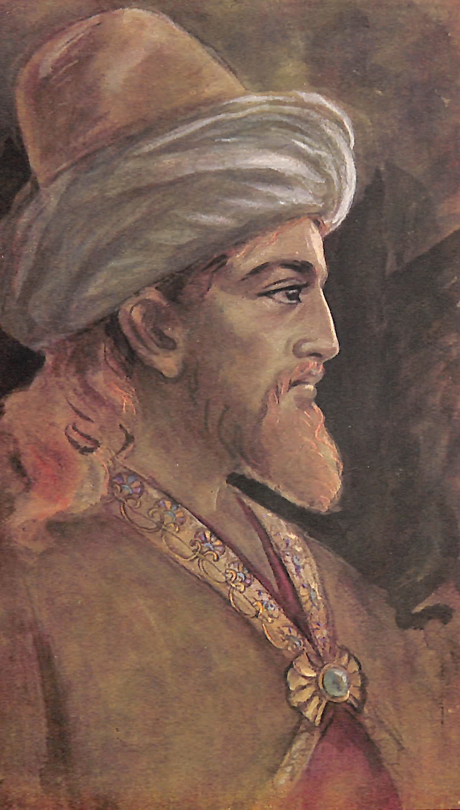

## Жизнь XLVII

В сорок шестой жизни нашей ленты Алкионе столкнулся с большими умственными страданиями, но при этом он имел выдающиеся преимущества благодаря тесной связи с Меркурием и Зороастром. В этой сорок седьмой жизни, которую мы сейчас рассматриваем, его преимущества будут еще больше, хоть и обстоятельства его рождения были далеки от благоприятных. Оно произошло в 2472 году Калиюги (630 г. до н. э.), в четвертом году царствования короля Кшаттранджаса, недалеко от города Раджгриха.

Бесспорно, его отец Джаганнадха был брахманом и богатым человеком, однако его характер оставлял желать лучшего. Он был жадным человеком, который занимался самыми разными способами заработка, некоторые из которых часто становились опасно близкими к грани мошенничества.

Вместе с другими брахманами он владел храмом, и уговор заключался в том, что каждый из этих соучастников взаимочередно полностью заботился о храме в течение определенного времени, и все пожертвования, полученные от паломников и других людей в этот период, доставались ему как личная собственность. Эта странная система вызывала множество остроумных действий со стороны этих брахманов; например, Джаганнадха имел агентов на основных маршрутах по всей Индии, которые искали преупреждающих его заранее, когда какой-то состоятельный паломник, или какая-то особо большая группа паломников, собирались в путь.

Послышав о том, он попытался организовать так, чтобы подобные паломники прибывали во время его смены в храме и приказал своим агентам придумать какой-то предлог для ускорения или задержки их, чтобы это было возможно. Таким образом, он смог накопить большое состояние, хотя его владение было, строго говоря, противоречащим правилам его касты. Он также владел большим количеством земель и имел высокую репутацию у короля, которому иногда делал политически обоснованные подарки. Jagannadha был совсем не мрачным, и он дал своим детям хорошее образование; но, к сожалению, как только они достигали возраста, он усердно возражал против своих собственных особых методов увеличения семейного богатства. Мать была добродушной и мягкой женщиной, аккуратной и добросовестной в исполнении своих домашних обязанностей, но с небольшим интересом к чему-либо за пределами их - религиозной до объяснения пункта верооткладывания, но не в состоянии осмыслить метафизику или философию. У нее было несколько детей, но только Алкиона (его имя на этот раз было Shivashankara) и его сестра Мули выжили. Jagannadha также усыновил другого мальчика, Мизара, который был сыном его двоюродного брата и остался сиротой в раннем возрасте. Имя Мизара на этот раз было Нирвана, и он был на два года младше Алкиона. Чувства между мальчиками могли быть даже сильнее, если бы они были братьями, хотя их характеры сильно различались. Алкиона был мечтательным и романтичным, с высокими идеалами, а Мизар был интересным и практичным. Но не всегда скрупулезным. Когда они были еще молоды, их мать умерла, и они были брошены сами на себя, поскольку Jaganndha был всегда занят своими схемами, или, как минимум, был так полон их, что не мог говорить ни о чем другом, что заставляло Алкиона думать о нем как об неинтересном компаньоне. Мизар гораздо более внимательно следил за ними и даже иногда делал умные предложения, с которыми выигрыш мог увеличиться.

В восемнадцать лет Алкиона женился на Ирене, добродушной и духовно-ориентированной женщине, и через год у них родился сын. Годом позже умер его отец, и Алкионе, следовательно, стал главой семьи и унаследовал обязанности и владения отца. Ему пришлось занять свое место при администрировании храма и жертвоприношениях. Ему крайне не нравилась эта работа по жертвоприношению, но поскольку обязанность пришла к нему, он делал это как данность из-за своего отца. Это включало большое количество убийств, поскольку предложение животных божеству считалось добродетелью. Жертвоприношение лошади было считалось особенно приятным; козы предлагались еще чаще, но они не считались столь приемлемыми.

Все чувства Алкиона возмущались этим оптом убийством, и он внутри себя сомневался, что это может быть приятно для любого благого Бога.

Кроме того, ему крайне не нравились методы привлечения паломников в храм своего отца. Он прекрасно понимал преимущества прибытия больших групп богатых людей во время его службы; но его отец часто прибегал к непосредственной хитрости и беззастенчивой лжи, чтобы добиться этого результата, и Алкионе чувствовал сильное отвращение к этому; на самом деле он решительно отказался участвовать в этом. Поэтому он совсем не так хорошо управлялся с доходами от храма, как это делал его отец.

Его двоюродный брат Мизар совсем не согласился с ним по этим вопросам.

Учеба отца оставила в нем глубокий след, и он наблюдал за всем этим с некоторой ревностью, смотря на уступки Альцпони с презрением и часто говорил себе, как ему было бы лучше управлять делами, если бы он был главой семьи. Он часто призывал Алкиона следовать по стопам отца и давал понять, что не делать этого равнозначно критике отца, которая не должна быть возможна для правильно воспитанного брамина.

Алкион мог только ответить, что Мизар может делать, что ему угодно в этих вопросах, но он сам не чувствовал, что мог бы продолжать старые обычаи. Ему мало что было до денег или показухи, но он был сильно увлечен домашними делами, тогда как Мизар, хоть и был равносильно добр намерен и дружелюбен по натуре, все же считал своим обязательством выполнить планы Яганнадхи, и поэтому поставил перед собой главной целью иметь как можно больше денег в семье.

Примерно в это время Мизар женился на Тетис, и, к сожалению, его жена была совсем не того рода женщина. Она оказала на него большое влияние и сильно усилила его растущее недовольство, потому что она была по сути интриганка — амбициозная женщина, которая ужасно жаждала богатства и власти. Молодая пара часто обсуждала эти вопросы, и оба они чувствовали, что если бы только они были главой семьи, то смогли бы накопить богатства гораздо быстрее. Естественно, жена Алкиона, Ирена, всегда должна была иметь преимущество, и Тетис была отчетливо завистлива по этому поводу, и по мере прохождения времени все больше и больше чувствовала, что не может этого вынести, и что она не находит возможности показать, что она на самом деле может делать и быть, хотя Ирена всегда была к ней добра и милосердна.

Еще одна проблема заключалась в том, что у Тетис был сын, и она хотела так устроить дела, чтобы он в свое время унаследовал храм и его доходы, а не сын Алкиона. Она размышляла над всем этим, пока наконец не начала замышлять и планировать, как осуществить свои желания. В корте всегда происходило множество интриг, так как король мог давать или отнимать имущество по своему усмотрению, и все зависело от его расположения. Поэтому Тетис принялась умело распускать разного рода слухи против Алкиона и Ирены, надеясь этим подорвать их позиции у короля.

Она также вызвала много неприятностей различными способами в хозяйстве, умудряясь различными изощренными схемами вызывать трения между двоюродными братьями, и даже иногда доводила до открытых ссор.

Другие брахманы, совместно управлявшие храмом с Алкионом, были к нему не особенно благосклонны из-за его отношения к их жертвоприношениям и методам вымогательства денег у пилигримов. Так что они были вполне готовы принять сплетни, которые навязывала Тетис, и когда король, услышав эти шепотки снова и снова, начал думать, что в них должно быть что-то и начал разбираться, эти брахманы были готовы выразить свои сомнения и отразить на Алкиона в достаточно неблагоприятном свете. Все это интригование было искусно продумано Тетис, и вокруг Алкиона и его жены была сплетена такая паутина постоянной интриги, что в итоге все дети были изгнаны из дворца и города. Это случилось в 598 году, когда Алкиону стукнуло тридцать два.

Тетис была в восторге от этого итога. Мизар не владел секретами её планов и был очень огорчен изгнанием своего кузена; но он в самом деле думал, что он сможет управлять храмом и его доходами намного лучше, чем Алкион, так что в этом отношении он был наполовину рад возможности, которая представилась ему после позора последнего. Ему пришлось заменить Алкиона на его посту, и он со своей женой таким образом добились исполнения своих долголетних желаний, и были счастливы этой предоставленной им возможности, хотя Мизар никогда не переставал сожалеть об изгнании Алкиона и внес несколько ходатайств о его возвращении.

Алкион считал, что с ним обошлись плохо, особенно потому что загородный дом, куда он был изгнан, был нездоровым и малярийным местом. Его сын заразился серьезной лихорадкой здесь и был долго болен. Он в конце концов восстановился, но так и не стал снова действительно сильным, так как болезнь оставила слабость в грудной клетке. Алкион и Ирена всегда обвиняли в этом Мизара и Тетис, и, по крайней мере, Ирена никогда не забывала этого секретного обиды на последнюю.

Четыре года спустя, в 594 году, умер король Кшаттранжас, и трон занял Бимбисарс. Алкион, который хорошо знал его, когда он был молодым принцем, сразу же обратился с просьбой восстановить его во власти. Новый король незамедлительно одобрил это, и Алкион вновь был назначен управлять своей частью храма, вернулся в свой городской дом и занял свое прежнее положение. Затем была великая сцена между двуми кузенами, и впервые Мизар узнал некоторые вещи, которые его жена сказала и сделала, и они его ужасно потрясли. Отношения между семьями были немного смягчены на то время, и Алкион позволил Мизару и его жене продолжать жить с ними в городском доме. Хотя дамы все еще были до некоторой степени недоверчивы по отношению друг к другу, и даже Алкион не мог совсем забыть, что Тетис способствовала изгнанию, которое привело к заболеванию его сына.

Тем не менее, Тетис оставалась недовольной и продолжала тайно пробовать различные планы с целью обеспечения наследственных прав для своего собственного сына вместо Алкиона. Она надеялась, что последний умрет, но т.к. он не сделал ей этой услуги, она разработала план, чтобы медленно отравить его, чтобы она не была под подозрением. Поэтому она начала очень осторожно вводить яд в его еду, незначительно увеличивая дозировку. Прежде чем зловещий заговор полностью удался, Алкион однажды обнаружил его и был яростно зол. Его первый инстинкт был раскрыть все дело и доставить Тетис на суд его другу, королю, но Мизар, хотя и был сильно поражен обнаружением, настоятельно умолял его не делать этого. В конце концов, Алкион согласился ничего об этом не говорить, но заявил, что он никогда больше не будет чувствовать себя в безопасности в том же доме с Тетис, поэтому он поставил условие, что Мизар и его жена и ребенок должны уехать в их загородный дом, куда он сам ранее был изгнан. Мизар благодарно принял это как относительно удовлетворительное решение, и в любом случае больше, чем он мог ожидать после предательства Тетис. К сожалению, обнаружение произошло слишком поздно, чтобы спасти сына Алкиона, который еще некоторое время боролся, но не мог быть вылечен доступными в тот момент врачами и в конце концов умер в 590 году. Алкион был неразлучим, полон отчаяния и иногда почти ненависти к Тетис, он казалось терял свою цепь жизни и больше ни о чем не заботился.

В первый год царствования короля Бимбисары Господь Гаутама пришел в Раджгриху и был попрошен королем произнести проповедь; но тогда Он этого не сделал и продолжил свое путешествие для достижения Просветления. После того, как Он стал Буддой, Господь Гаутама вспомнил добрый запрос короля Бимбисары и пришел проповедовать в Раджгриху в 588 году. Он был тогда тридцати пяти лет, так как родился в 623 году. Алкион пошел слушать Его и был невероятно впечатлен, был полностью выведен из своего отчаяния и депрессии. Господь Будда проповедовал о горе и карме, и многое из того, что Он сказал, точно подходило к случаю Алкиона и замечательно снимало его боль.

Он снова и снова ходил слушать эти замечательные проповеди, и однажды Господь горячо говорил о необходимости доброты и сострадания. Человек, который желал вступить на Путь, должен отказаться даже от малейшей тени гнева и ненависти, и должен показать ничто другу или врагу, кроме всепроникающей любви. Алкион долго думал об этом, и результатом этого было то, что он вышел в загородный дом, чтобы привести обратно Мизара и его жену и ребенка. Он поговорил с Тетис, которую он ранее даже отказывался видеть, и сказал ей, что он сожалеет о своих жестких чувствах к ней, поскольку он знал, что во всем, что она сделала, она была только инструментом его собственной кармы. Она была полностью сбита с толку его неожиданной добротой, и таким образом случилось, что и она, и Мизар были снова приведены, чтобы разделить дом, который она разрушила.

Алкион при первой же возможности привел Мизара послушать проповедь Господа Будды. Эта сцена никогда не будет забыта.

Возможно, около двух тысяч человек собрались там среди деревьев, большинство сидели на земле, некоторые прислонились к стволам, мужчины и женщины вместе, а маленькие дети сидели с ними или бегали между отдаленными группами людей. Господь сидел на небольшой возвышенности — травяном банке в самом центре сада, окруженный группой своих монахов в желтых одеяниях, и его прекрасным музыкальным голосом заставил всю эту толпу слушать без усилий, каждый день зачаровывая их, когда они приходили слушать его. О нем действительно было можно безоговорочно сказать, как когда-то сказали о другом пророке, что "никогда человек не говорил так, как этот человек".

Влияние его магнетизма на людей было неоценимым. Его аура заполняла весь сад, так что вся масса людей была прямо под ее влиянием — фактически внутри него, так сказать. Великолепие ауры привлекало огромные сонмы высших дэвов всех видов, и они также помогали влиять на аудиторию, поэтому мы не удивляемся, когда читаем в священных книгах, что часто по окончании одной проповеди сотни или даже тысячи достигали уровня Архата. Многие люди, тогда рожденные в этой части Индии, были теми, кто следовал за Ним в предыдущих воплощениях в далеких землях, и особенно родились в Индии, чтобы иметь это бесценное преимущество личного контакта с Ним после его прояснения.

Те, чье видение было ограничено физическим планом, видели только милостивого князя обольстительной внешности и обаятельного образа, который говорил с ними с ясностью и прямотой, к которым они вовсе не привыкли от своих брахманских учителей.

Последние многие годы преподавали в основном о необходимости частых подношений брахманам и постоянных жертвоприношений богам, что, конечно, всегда требовало от их жрецов больших платежей.

Но теперь прибыл этот намного могущественнее Учитель, который говорил им на простом и понятном языке, что единственная жертва, приемлемая Богам, - это чистая и нежная жизнь, что необходимо уничтожать и изгонять не животных, а пороки, и что великая необходимость не в золоте для храмов, но в чистоте и доброте жизни среди почитателей.

В этот раз, когда два двоюродных брата пришли услышать Его, Он выбрал в качестве текста тему огня. Он указал на огонь, который горел рядом, и рассказал им, как он стал неплохим символом иллюзии, потому что пламя казалось тем, чем оно не было; оно казалось твердым, хотя таковым не было, и оно обжигало человека, который коснулся его. Затем Он объяснил, как все страсти и все желания были подобны горящему пламени - как с ними, как и с ним, не полезны полумеры, поскольку огонь был безопасен только когда его полностью потушат, никогда не может быть уверенен, что он не появится снова и не причинит разрушения, пока не останется единой искры. Так, сказал Он, гнев, страсть, желание, иллюзия должны быть вытиснуты из человеческого сердца. Только тогда можно достичь покоя, только тогда человек может вступить на Путь.

Впечатление, произведенное на обоих двоюродных братьев, было непередаваемо. Сразу же Алкион объявил о своем намерении отказаться от всего в мире и полностью посвятить себя следованию за Господом. Его жена Ирена сразу согласилась с ним, и он предложил передать Мизару свою долю в храме, главенство в семье и все свои мирские богатства. Однако Мизар отказался это принять и заявил, что если Алкион посвятит себя религиозной жизни, он тоже так сделает, и даже Тетис одобрила это, хотя она сказала, что она не могла бы посметь предложить себя для этого, после всего, что случилось. Алкион считал, что семья должна была быть продолжена, и должность управляющего храмом должна была быть передана дальше, из-за их обещания отцу Джаганнадхе; и в конце концов они вместе обратились к Господу Будде, рассказали Ему все, что произошло с самого начала до конца, и безоговорочно отдали себя в Его руки. Благословенный Один услышал их историю, и Алкиону Он сказал:

"Ты уверен, что в твоем сердце теперь нет ни малейшего следа ненависти – что ты прощаешь до конца, даже смерть своего сына, и что для всех созданных существ ты можешь чувствовать только любовь вечно,, даже для тех, кто нанес тебе урон?"

И Алкион ответил: "Господь, это действительно так; если жена моего двоюродного брата причинила мне вред, я забыл об этом. Я отдаю ему свое богатство, потому что мне больше оно не нужно. У меня в жизни теперь только одно желание, и, хотя для его выполнения мне может потребоваться тысяча жизней, я клянусь здесь, у Твоих ног, что никогда не прекращу усилий, пока не достигну этого. Я клянусь следовать за Тобой, отдать себя для помощи страдающему миру, как Ты это сделал. Ты освободил меня от моего горя и привел меня к вечному миру. И к этому миру я тоже приведу мир, и этому я посвящаю свои будущие жизни, пока не стану, как Ты, спасителем мира."

И Будда Господь склонил голову и ответил: "Как ты говоришь, так и будет. Я, Будда, принимаю эту клятву, которую никогда нельзя нарушить, и в далекие века она будет исполнена."

И так Он протянул руку и благословил его, и Алкион упал ничком к Его ногам.

Затем, обратившись к Мизару, Он сказал: "Ты тоже последуешь за мной, но не сейчас. Тебе еще много чего надо сделать. Прими эту обязанность, которую мой новый ученик возложил на тебя. Прими это, что он тебе дает, потому что ему это больше ненужно, ибо богатство благого Закона превосходит все другое богатство. Суди справедливо и будь милосерд, и не забывай, что твое время также скоро настанет."

Так Он отпустил его с благословением, но Алкион остался с Ним и следовал за Ним во всех его скитаниях вверх и вниз по той прекрасной северной земле Индии.

После этого Мизар вернулся домой, чтобы выполнить свои обязанности, как сказал ему Будда Господь; но из-за учения Будды о милосердии ко всем, он категорически отказывался вновь убивать животных в жертву или применять любые из тех подлых трюков, с помощью которых. Джаганнадха накопил такие богатства. Таким образом, он потерял много денег и сделал себя очень непопулярным среди других брахманов храма, особенно потому, что несколько раз публично заявлял о своем принятии учений Будды о том, что брахман, который не живет, как должен жить брахман, на самом деле вовсе не является брахманом, независимо от того, как высоко его рождение, в то время как даже Шудра, который живет жизнью настоящего брахмана, достоин уважения, оказываемого брахману. Поэтому другие брахманы заговорили против него и еще больше урезали его доходы. Тем не менее, будучи явным буддистом, король не мог его отстранил от должности, хотя они часто подавали против него жалобы.

Несмотря на все истории, которые без конца распространяли против него брахманы, у него была хорошая репутация среди людей за человечность и доброту, поэтому с годами он становился все более популярным, хотя становился все беднее. Это был большой триумф для него, когда король Бимбисара, вдохновленный красноречивой проповедью Господа Будды, постановил, что больше не будет жертвоприношений. Другим брахманам, хотя и возмущенным этим приказом, не осмеливались его неподчиниться, и благодаря решительному распространению этих идей в более ранние дни, Мизар был в благодарности короля. Все же было много тех, кто не доверял ему, потому что враждебные брахманы как-то услышали искаженную версию истории об отравлении сына Алкиона, и, конечно, очень этим пользовались.

Мизар все еще использовал часть организации Джаганнадхи для привлечения больших групп паломников в его период управления храмом, уже не для того, чтобы зарабатывать на них, а чтобы защитить их от хищничества своих коллег, что, естественно, усиливало ненависть последних к нему. И к тому же его положение было всегда нестабильным, потому что, несмотря на благосклонность короля и благодарность многих людей, он должен был постоянно сталкиваться с интригами и едва скрытой злобой во всех возможных мелких повседневных вопросах. Тем не менее более двадцати лет он смог осуществлять свою работу и в течение этого времени внедрил множество полезных реформ в управление храмом, несмотря на многочисленное сопротивление. Он все время был открытым и признанным приверженцем Будды, и жил в соответствии с Его учением, хотя остался ортодоксальным брахманом; и в этом он был далеко не единственным, так как Будда не отдалял людей от старой религии, и никто, кроме тех, кто фактически принимал желтую мантию, не привязывался к Нему исключительно.

Конец жизни Мизара с мирской точки зрения был неудачным. В 566 году Бимбисару был убит своим неестественным сыном Аджатшатру, который таким образом захватил трон. Его план был реализован при помощи брахманов, и поэтому он отдавал предпочтение им и их религии, и открыто противостоял буддизму. Поэтому, когда брахманы храма подали жалобу на Мизара, новый король охотно выслушал их и сместил его, и конфисковал большую часть его имущества. У него оставалось немного земли, и он отошел и жил на этих землях в относительной нищете и забвении до своей смерти в 562 году в возрасте шестидесяти шести лет.

Между тем, Алкион присоединился к Господу Будде и никогда больше не покидал его до самой смерти, но путешествовал с ним вверх и вниз по долине Ганга много лет, все более и более глубоко пья от истока его мудрости, и принимая участие в частных уроках, которые он давал только своим монахам. Он образовал близкую, но почтительную дружбу с более старым монахом по имени Дхармаджьоти, который был очень добр к нему и много помогал ему на пути к идеальному миру. Этот монах Дхармаджьоти известен нам как Уран, позже он был Арьясангой и теперь является Учителем Джвал-кула. Имя, выбранное Алкионом при принятии желтого одеяния, было Майтрибаладаса, что означает "слуга силы доброты"; и Господь сказал ему: "Ты хорошо выбрал; это имя пророческое".

Ибо Майтрея - это имя Бодхисаттвы, который сменил Господа Будду на его посту - Христа, который придет; так что имя также можно трактовать как "слуга силы Майтреи". Следуя таким образом по следу Господа Будды, Алкион, естественно, принимал участие во многих интересных и исторических сценах; например, он был присутством, когда, в 580 году, Чатта Манавака (Селена) была вызвана Господом и преподаны прекрасные стихи, увековеченные для нас в священных книгах. Каждый раз, когда большой Учитель путешествовал в Раджгрих, Мизар непременно приходил приветствовать Алкиона, и взаимная любовь между двоюродными братьями становилась все сильнее с течением лет. Алкион умер в 559 году в возрасте семьдесят одного года, за шестнадцать лет до смерти Господа Будды в 543 году. Последняя часть его жизни прошла в неподдельном мире и счастье.

Через год после смерти Алкиона великий король Марс пришел послушать проповеди Господа. С собой он привез своего сына Геракла, который слушал Господа, затем последовал за Ним, и после Его смерти стал одним из Его великих миссионеров, внедряя Его Закон в Бирму и Восток. У Геракла, в свою очередь, было много увлеченных учеников — его сын Капри, любителем спорить, и его племянники: настойчивый, усердный Полярис и Капелла, импульсивный и безрассудный Близнецы, и всегда улыбающийся Адрона. Однако последний был оттянут от них аргументами чудодействующего брахмана Кетуса, который служил первым жрецом на дворе другого Раджа, Орфея, чьей дочерью Геракл женился. Это привело к полному распаду религиозных устоев этого государства, ведь после того как Адрона клятвенно обязался Кетусу, Геракл преуспел в конвертации королю Орфею и его сыновьям Сива и Мине. Кетус был очень зол из-за этого и в итоге вынудил Адрону покинуть страну с небольшой группой последователей, и они обосновались в соседнем государстве, где безуспешно пытались спровоцировать войну против Орфея. Первым и ближайшим последователем Геракла был его племянник Ива, с которым он всегда имел особенно сильную связь, происходившую от близких отношений в далеком прошлом.

Сам король Орфей хотел бы следовать за Господом, но тот сказал ему, что у него есть первичная обязанность перед своим королевством, и что он должен удерживать его в Его интересах. Два короля, Марс и Орфей, договорились между собой о том, что их дети должны вступить в брак друг с другом, и они выполнить это по мере возможности, что видно на прилагаемой диаграмме. В этой объединенной рояльной семье не только Геракл был так глубоко затронут; его брат Рама и его сестра Нага были так же глубоко поражены, и оба желали предложить Господу себя и свои семьи - всех своих сыновей и дочерей. Жена Рамы, Диана, полностью поддержала его в этом, но муж Наги, Мина, колебался и не хотел идти на такую большую жертву. В конечном итоге горящая любовь его жены заставила его побороть свои сомнения, и обе семьи получили полную свободу, чтобы отдаться Господу. Марс настоял, чтобы его внук Тео остался чтобы унаследовать его трон, и Господь приказал, что это должно быть так.

Влияние этой жизни на характеры Алькиона и Мизара было огромным - как и должно было быть, когда они заслужили такую большую благодать, как рождение на земле в то же время, что и Будда, и оказались под его благосклонным влиянием. Из сердца Алькиона были полностью стерты все следы гнева и мести, а качества сострадания, прощения и искренней любви были в нем развиты до предела. Насколько глубоким и существенным был результат, достигнутый в этой наиболее удачной жизни, можно увидеть по тому факту, что средний интервал между его жизнями полностью изменился благодаря ей. До этого в среднем было около семисот лет, а с тех пор это время составило тысячу двести лет. Мизар также был сильно затронут, так как в начале в его характере было некоторое коварство и эгоизм. Теперь большая часть этого исчезла навсегда, а на ее месте появились серьезность и любовь, при этом были установлены ценные связи, результаты которых еще предстоит увидеть в будущем. Однако в его случае средний интервал не изменился, и поэтому он не появляется в жизни сорока восьми.

После того как Господь Будда отказался от своего физического тела, должность Учителя Мира перешла к его преемнику, Господину Майтреи. Воспользовавшись огромным излиянием магнитной силы, которую оставил в мире Господь Будда, он вскоре воплощает себя в образе Шри Кришны в Индии, и почти одновременно он посылает Лиру появиться в Китае как Лао-цзы, и Меркурий чтобы преподавать грекам в лице Пифагора. Немного позже он посылает Палласа в Грецию как Платона.

...

Эрато и Аусония появились в Персидской империи в 573 году, как близнецы, дети богатых и влиятельных родителей. Они жили на берегу озера, по которому часто плавали на необычной плоскодонной лодке с шлюпочным парусом. К сожалению, однажды, когда им было двенадцать лет, внезапный шквал опрокинул лодку, и дети с лодочником оказались в воде. Они были примерно в миле от берега, и вода была очень бурной, поэтому, несмотря на то что лодочник решительно попытался доплыть до берега и унести детей с собой, он понял, что задача невыполнима. Тогда Эрато уговорила его попытаться спасти только ее сестру, прерыв

Он убедился, что вполне может удержаться на перевернутой лодке, пока не вернется, чтобы спасти его. Лодочник сначала отказался, но, поскольку казалось, что больше ничего не остается делать, в конце концов согласился. Он сумел достичь берега с маленькой девочкой, все еще живой, но без сознания, сам лодочник был совершенно изнемог. Тем не менее, он отправил еще одну лодку, чтобы спасти Эрато, но прежде чем она могла добраться до места, оба исчезли. Таким образом, он спас жизнь сестры ценой своей собственной, и поскольку сестра была той же личностью, которую он случайно убил в Жизни XLIII, можно предположить, что здесь имеет место кармическое действие.

Многие члены нашей группы родились в семьях Евпатридов Афин в бурное и волнующее время греческой истории около 500 года до н.э. Орион, например, родился в 499 году. Его имя было Феодор; его отцом был Клеомен (Сириус); его мать Филиппа (Коли); его старший брат Филалет (Селена); его младший брат Клеон (Мира); и его маленькая сестра Агата (Фомальгаут).

Они были особенно счастливой и дружной семьей, и связи любви между ними были сильными. Единственным слабым местом был второй сын Анаксимандр (Медведица), который вроде бы и не казался одним из них, испытывал приступы неприязни к своему дому и в разных смыслах доставлял множество неприятностей. Сириус участвовал в политике и борьбе того времени, но его большим интересом была школа философии Пифагора. В юности он видел самого великого Пифагора и получил особую помощь и инструкции от его ученика Клейния (Уран), который впоследствии приехал и поселился в Афинах, основав там школу философии, студентами которой были все наши персонажи.

Сам Уран был женат на Весте, а Агатокл (Эрато), дядя Ориона, женился на Деметре, одной из его дочерей, поэтому семьи были практически одной семьей. Эрато был знаменитым скульптором и упоминался в экзотерической истории; его произведениям он приписывал фальшивое имя Каламис. Он женился на Деметре, дочери философа Урана, и его дети, естественно, были особенно приметными в жизни Ориона, хотя большинство из них были намного младше его. Девочка Вега, например, была на девять лет младше Ориона; она была необыкновенно красивым ребенком, и все братья были влюблены в нее. Среди их товарищей по играм были также некоторые внуки Урана.

Несмотря на постоянные войны и беспорядки, их жизнь была счастливой и полной жизни, наполненной радостью от жизни под солнечными лучами, ощущение которой нам в наши дни сложно понять. Греческая раса была красивой, и большое внимание уделялось физической культуре. Орион был красивым и грациозным, полным жизни и энергии, и хорошо занимался спортом и играл в игры. У него была хорошая интеллектуальная голова и он быстро и легко учился. Образование того времени было любопытно отличным от нашего, ограниченным в некоторых направлениях, но превосходным в других. Не было много книжного знания, и мало было известно о законах природы, как это проявляется в таких науках, как химия или астрономия. Стремление было пробудить способности детей, а не нагружать их сухими фактами - сделать их повседневную жизнь яркой, счастливой и оценивать лучшее в искусстве и поэзии, петь и играть на лире и двойной флейте, и Орион хорошо справлялся со всеми этими направлениями. Максимы философии преподавались напрямую, но большое значение придавалось также влиянию окружающей среды, и перед глазами детей всегда держались красивые картины и статуи, и их поощряли попытаться их воспроизвести.

Орион преуспел в лепке из глины и очень часто бывал в студии своего дяди через двор. Позже он учился у него и сделал некоторые хорошие работы, сделав копии из мрамора некоторых его статуй - особенно мальчиков, верхом на которых Каламис добавил великую бронзовую группу Онатаса в Олимпии. Эти работы особенно привлекли его, потому что сам он участвовал в играх в Олимпии. Он успешно выступил в этих играх, как мальчиком, так и молодым человеком, и однажды он выиграл венок из дикой оливы, что было высшей честью, которую мог предложить Греция. Он был добросердечным и сочувствующим ребенком, всегда стремящимся облегчить любые страдания, которые видел; иногда капризный и противоречивый, но способный на блестящую щедрость аффекта.

Несчастный случай в раннем детстве сильно повлиял на его характер. Он всегда был миролюбивым ребенком и ужасался от видения, что кто-то может быть ранен, но однажды он потерял свое терпение в незначительной ссоре и с сильным гневом оттолкнул товарища по игре, когда они стояли в верхней части ступеней перед домом его отца. Другой ребенок упал с боковой стороны лестницы на землю и серьезно поранился, так что несколько лет был хромым. Горе и раскаяние Ориона были велики, и он снова и снова клялся, что никогда не будет наносить удар в личной ссоре, насколько бы великим ни было провокационное действие.

Он сдержал свою клятву, хотя в последующие годы пришлось принять участие в защите своей страны, как и другим знатным людям. На момент битвы при Марафоне, в которой участвовали его отец и дядя, ему было всего девять лет, поэтому, естественно, у него не было доли в этом великом подвиге оружия, в котором армия более ста тысяч персов под руководством одного из лучших генералов того времени была разбита с большими потерями десятью тысячами греков. Многие тысячи персов были убиты, но менее двухсот атлантов, и Греция на короткое время осталась в мире.

Празднование, во время которого Орион завоевал оливковую корону, было, конечно, большим радостным событием для его семьи, тем более, что оно совпало с его посвящением в Тайны Элевсин. Было устроено большое шествие, в котором выделялся красивый мальчик, увенчанный гирляндами из цветов. Его мать, Филиппа, всегда нежная, ласковая и сочувствующая своим детям, наблюдала за всем это с огромным восторгом и гордостью. С ней были Фомальгаут, а также Гелиос и Ахиллес (внучки Урана), которые обе влюбились в молодого спортсмена. Он вполне отвечал им взаимностью и мог бы испытать сложности с выбором между ними, но вскоре старшая сестра умерла, и когда ему было двадцать два, он женился на младшей.

До этого, однако, он принимал участие в некоторых волнующих событиях. Его отец был одним из атлантов, делегируемых на знаменитый Конгресс в Коринфе в 481 г. до н.э., и именно там Селена и Орион сопровождали его по этому историческому случаю. На следующий год Ксеркс наступал на Афины со своей великой армией в миллион человек - как он хвастал, населённых представителями сорока шести наций; и поскольку успешное сопротивление было невозможным, все афиняне были вынуждены покинуть свои дома и укрыться на территории прекрасного особняка, и, безусловно, мысль о нем заставила их бороться с дополнительной отвагой в великом морском сражении при Саламине. В этом бою персидский флот был полностью разгромлен, и Ксеркс поспешно отвёл свою армию обратно в Азию, оставив, однако, тридцать три тысячи человек под командованием своего генерала Мардония. Орион был достаточно смел в битве, хотя ужас сей его страх перед ранами и кровью, и ему трудно было заставить себя выполнить свой долг.

После битвы семья вернулась домой и была облегчена обнаружив, что персы, хоть и разрушили большую часть города, не достигли их района. Такое же благополучие посетило их на следующий год, когда Афины вновь пришлось покинуть из-за продвижения Мардония; Орион сыграл благородную роль в великой битве при Платеях, когда спартанцы под предводительством Павсания, наконец, пришли на помощь в битве. Но когда азиатские солдаты были окружены в своем лагере, и началась окончательная резня, которая навсегда уничтожила власть Персии, он заболел от ужасного бойни, и ему пришлось покинуть поле битвы.

Они все вновь вернулись домой, на этот раз без намерения снова уходить, и Орион начал участвовать в политической жизни. В то время в Афинах было две крупные партии, которые можно было бы описать как консерваторов и либералов. Аристид был главой консервативной группировки; он хотел сохранить все как в старые добрые времена и категорически возражал даже против строительства флота, который спас Европу при Саламине. Действительно, он настолько препятствовал этому, что был изгнан за несколько лет до той битвы, хоть и патриотично отбросил все разногласия и вернулся, чтобы помочь в ней.

Либеральная партия, с другой стороны, утверждала, что мир меняется, что старые феодальные времена господства помещиков прошли, и что Афины должны развивать свою коммерцию и иметь корабли для защиты ее.

Лидер этой партии был Фемистокл, и к нему примкнул Орион с большим восхищением его умными планами. Фемистокл был очень умным человеком и много сделал для блага своей страны, но, к сожалению, он был недобросовестен в своих методах. Его идеи были обычно отменными, и Орион верил в него, активно его поддерживал и не хотел слышать о нем плохого. Первое публичное выступление Ориона, которое он произнес, когда ему было меньше двадцати, было в поддержку плана Фемистокла по укреплению Афин и Пирея. Он говорил хорошо и сильно, выбирая слова и вкладывая много чувств в то, что говорил. Он также несколько раз выступал в поддержку основания Конфедерации Делос два года спустя, примерно в то время, как произошла его свадьба в 477 г. до н. э. У него было шесть детей, самой милой из них была Анастасия (Фесей).

Фемистокл был на вершине своей власти в течение шести лет после брака Ориона, и Орион был полезен ему во многих отношениях, хотя никогда не участвовал в его сомнительных делах. Однако, хвастовство и несправедливость Фемистокла заставили афинян ненавидеть его, и его изгнали, и он пошел жить в Аргос. Орион был возмущен этим и добровольно поделил его изгнание; но ему постепенно стало ясно, что его герой не безупречен, и это было для него большой горестью. Четыре года спустя, когда причастность Фемистокла к бесчестному заговору Павсания была ясно доказана, Фемистокл бежал в Персию, а Орион вернулся домой.

Тем временем Аристид умер, а Кимон, сын Мильтиада, стал его преемником как лидер консерваторов; вместо Фемистокла новым лидером либералов стал благородный по имени Перикл. В течение первых нескольких лет после возвращения Ориона у консервативной партии было преимущество, однако вскоре произошло изменение политики, и Перикл пришел к власти. С небольшими перерывами он удерживал свою позицию до своей смерти тридцать три года спустя, и в течение всего этого времени Орион верно служил и поддерживал его. У Ориона был большой вес в советах Афин, и он был признан одним из лучших ораторов особенно яркого типа. Он очень помог Периклу благодаря своей полной поддержке всех принятых реформ. Перикл, кажется, полностью заслуживал этой преданности, не только своим красноречием и мудростью, но также благородством своего характера. Его главная идея была развивать интеллект и хороший вкус у каждого афинянина, и затем доверять им управлять собой. Он поощрял искусство, поэзию и музыку в максимальной мере, и Орион хорошо справлялся со всеми этими направлениями. Он старался не принимать участия в многочисленных зарубежных войнах, но он сражался бок о бок со своим отцом вместе с "мальчиками и стариками" у Мегары против Коринфян; Перикл поручил ему строительство двух колоссальных стен, длиной в четыре мили и отстоящих друг от друга на двести ярдов, которые соединяли Афины с Пиреем.

Следующие двадцать пять лет были для него временем больших успехов, потому что, хоть он и продолжал произносить речи на политические темы, основное уделение он посвятил изучению проповеди и философии, и его дискурсы по этому поводу считались наиболее возвышающими и успешными. После смерти Урана, Сириус стал одним из лидеров школ, и когда он умер в 454 г. до н. э., его место заняли Селена и Орион, а его смерть наступила тридцать один год спустя. Он и его жена, оба в преклонном возрасте, проявили себя, активно и неутомимо помогая, когда чума опустошила Афины в 430 году до н. э.

Особенно тесная связь любви связывала его со шурином Альдебраном, а также с его младшим братом Мирой, оба они работали с ним упорно, чтобы облегчить страдания зараженных чумой и предотвратить распространение болезни. Он спокойно ушел из жизни в 423 году до н. э. в возрасте семьдесят шесть лет, завершив потрясающую по своей полезности жизнь, в которой развиты таланты в нескольких направлениях. Просто общество таких мужчин, среди которых он обитал, само по себе было большой помощью в эволюции. Не только значимое учение великого учителя Пифагора (Меркурия). Именно изучение этой философии и внутренней стороны Тайн, вместе с его великолепной способностью любить, подарило ему двухтысячадвадцатилетний небесный жизненный путь. Главные характеристики греческой жизни - это её острота и быстрота, любовь к знаниям и красоте, способность создавать красивые вещи, радость жизни и солнечного света; и все это сыграло роль в создании столь выдающихся благоприятных условий.

Один из наших персонажей достиг известности в истории, ибо Аполлон известен как Симонид с Кеоса, который обычно считается одним из наиболее образованных людей древности. Он был сыном Нептуна и Осириса и имел брата Урана, который впоследствии был видный ученик Пифагора. У Аполлона рано сложилась репутация благодаря его стихам, и его пригласили в Афины Гиппархом. Там он обосновался в роскошном доме на одном из холмов, с которого открывается вид на Акрополь. Здесь родились его сыновья Сириус и Эрато. После смерти ГиппARha он переехал в Фессалию, но оставил свой дом в Афинах и вернулся туда перед вторжением Персов в Грецию. Некоторые из его лучших стихов описывают события той войны, и говорят, что он превзошел даже Эсхила в его элегии о тех, кто упал в Марафоне, и что он выиграл не менее 56 наград в поэтических состязаниях. Позже он оставил афинский дом своим сыновьям и провел последние десять лет своей жизни при дворе Иерона из Сиракуз, где и скончался в 468 г. до н.э.

В жизнях его сыновей, Сириуса и Эрато, которые в этой жизни именовались Клеоменом и Агатоклом, можно отметить особые интересные моменты. Они были глубоко привязаны друг к другу и выросли в радости, уделяя много времени практике гимнастики, бегу, прыжкам, борьбе и бросанию круглого диска. Однако их учебу они не пренебрегли; ребята делали это с большим интересом и получали огромное удовольствие от обучения. Они занимались историей (которая, кстати, не всегда была точной) и мифологией; они читали о Троянской войне, которая сильно их волновала, и они устраивали битвы-игры, представляя по очереди всех героев.

Вероятно, их религиозное образование в основном состояло из максим, которые они должны были заучивать наизусть; никто серьезно не верил в странные рассказы о богах, но они рассматривались как сказки с символическим значением, которое могли полностью понять только инициированные в Тайны. Мальчишки были поставлены под защиту Паллады Афины и учились призывать её в опасности или затруднении. Верно было считать её реальным человеком – покровительницей этой благородной расы. Они верили в жизнь после смерти и в неумолимую справедливость, но были совершенно счастливы при мысли об этом и не боялись смерти. Несомненно, наиболее заметной частью их юношеской жизни были общественные игры; они и подготовка к ним составляли наивысший интерес их существования.

Их семья была в хороших условиях, и у них было множество возможностей. Самым важным событием их детства – важным с точки зрения последствий – стало то, что один из родственников предложил взять их в путешествие на корабле, в котором он был одним из владельцев. Это было торговое путешествие по греческим островам и на азиатский берег, которое согласно тогдашним неторопливым манерам заняло около года, в течение которого они посетили множество мест, увидели не только прекрасные виды, но и множество храмов с прекрасной скульптурой.

Среди других островов они зашли на Самос, где они имели возможность встретиться с великим философом Пифагором, который к тому времени уже был человеком пожилого возраста, на пороге смерти. Некоторые историки полагали, что этот мудрец погиб, когда его школу в Кротоне разрушили из-за общественных предрассудков. Другие, признавая, что он пережил эту катастрофу, верят, что он умер гораздо позже в Метапонте. Но ни одна из этих идей не является верной; уже будучи стариком, он покинул свою школу в Великой Греции и вернулся в свое отеческое имение на Самосе, чтобы закончить свою жизнь там, где он ее начал, и так случилось, что наши молодые путешественники были осчастливлены увидеть его во время своего путешествия.

Его главным учеником в то время был дядя Эрато - Клеинеас (теперь Учитель Джвал Кул), и Клеинеас (его мы знаем как Уран, старший брат Аполлона) был крайне добр к молодым странникам и терпеливо отвечал на все их любознательные вопросы, объясняя им систему пифагорейской философии. Они тут же привлеклись к изложенному учению и желали вступить в школу. Клеинеас сказал им, что скоро будет открыт ее филиал в Афинах, а пока он дал им множество уроков этики, в учении о переселении душ и тайне чисел. Слишком быстро судно было готово к морскому плаванию (она, к счастью, требовала переоснащения), и им пришлось с большим сожалением попрощаться с Пифагором и Клеинеасом. К их огромному и благоговеющему удивлению, когда они пришли попрощаться, старый философ благословил их и сказал с заметным акцентом: "Палин сунестатхесомта - мы снова встретимся". Через год или два они услышали о его смерти, и поэтому часто задумывались, в каком смысле он мог подразумевать эти слова; но когда в этой текущей икарнации один из братьев впервые имел честь встречи с Учителем К.Х., тот напомнил ему о той давней сцене и сказал: "Разве я тебе не говорил, что мы снова встретимся?"

Вскоре после смерти Пифагора, Уран выполнил обещание и основал школу философии, которая заняла важное место в мыслях того времени. Однако, это было волнующее время, совсем не подходящее для изучения высших проблем. Тогда начались сложности с Персией, и воздух наполнился беспокойством. Наконец наступило персидское вторжение, которое вылилось в знаменитое сражение при Марафоне, в котором принимали участие оба братья, как и спустя десять лет в великом морском сражении при Саламине. Спустя некоторое время братья считали своим долгом помочь греческим колониям в Малой Азии против Персии; они также присутствовали в битве при Платае, так что перед тем, как они могли действительно устояться, пришлось провести много боев.

Однако, результатом той роковой поездки, которая изменила для них многое, стало появление в Эрато скрытого художественного таланта после просмотра многочисленных прекрасных скульптур во время их путешествий, и с полным одобрением его брата, он решил посвятить свою жизнь изучению этого вида искусства. Однако, он никогда не забывал философскую сторону жизни; он был посвящен в Мистерии Элевсина, и уделял много времени их изучению, особенно учению о карме, или переустройстве, как тогда называли. За исключением управления семейным имуществом, Сириус посвятил всю свою жизнь философии, в то время как Эрато делит свое время между философией и искусством.

Он создал несколько отличных статуй, обычно подписывал их под предполагаемым именем Каламис. Одна из самых значительных была бронзовым Аполлоном, высотой почти в пятьдесят футов. Он был выполнен по заказу одного из городов на Черном море; но несколько столетий спустя его переместили в Рим. Другой Аполлон, возможно, был даже более знаменит, хотя и был в натуральную величину; он был установлен в Керамейкосе, где его приписывали некую защитную силу против чумы. Эту статую широко копировали ученики, и одна такая копия теперь находится в Британском музее, где она известна как Аполлон Омфалос. Она сильно повреждена, и, кажется, что различные Были предприняты предположительные попытки (в основном неточные) восстановить его. Похоже, что в первоначальном рисунке левая рука держала оливковую ветвь, а правая, опирающаяся на пень, держала какой-то ремень. Часть оригинала все еще хранится в Афинах и значительно превосходит копии.

Храм Афины Нике был возведен в Олимпии по планам и под руководством нашего героя; а статуя Афины, которую он содержал, была сделана его собственными руками. По каким-то причинам он решил сделать ее мраморной копией древнего и священного деревянного изображения под названием Ксоанон, которое хранилось в Афинах. Эта статуя обычно называлась Ника Аптерос, и в ее левой руке был шлем, а в правой - гранат.

Еще одна работа, которая принесла ему много славы, была статуя Афродиты (называемая Сесандра), которая была размещена у входа в Эрополис в Афинах. Лицо этой фигуры было особенно очаровательным. Она была выполнена по заказу богатого мужчины по имени Каллиас, который предложил ее богине в исполнение какого-то обета, связанного с его браком. Его имя, любопытно написанное, находится в начале непонятной надписи на основании. По крайней мере в двух случаях Агатоклес, по-видимому, работал вместе с другими скульпторами: однажды с старшим Праксительом (дедушкой более известного художника с тем же именем), последний поставил фигуру водителя для сложно обработанной бронзовой колесницы, выполненной Каламисом, и установленной на Акрополе в память о победе афинян над Халком; и еще один раз с человеком по имени Онатас, который получил заказ на бронзовую колесницу в Олимпии--группу, которую наш герой завершил, добавив с каждой стороны гоночную лошадь с голым мальчиком в качестве наездника. Эти мальчики и лошади отмечаются своей изящностью, и в целом превосходят работу Онатаса. Некоторые другие фигуры мальчиков, молящихся в отношении склонения, также в Олимпии, являются особенно красивыми.

Еще одна потрясающая работа, следы которой можно еще найти, - это статуя Гермеса, установленная в Танагре, и популярно называется Криофорос, поскольку Бог изображен с овцой на плечах. Идея, возможно, была предложена архаическим и грубо выработанным изображением, на котором этот же божество несет теленка таким же образом. Этот Гермес Криофорос широко копировался, выпускалось множество меньших репродукций, не только из мрамора, но и из глины или подобного материала, и даже еще меньших изображений из золота, серебра или слоновой кости, которые использовались в качестве амулетов. Копия этого существует в Британском музее. Он также был отштампован на монетах Танагры.

В том же городе Каламис также создал мраморную статую Диониса или Бакхуса. В Фивах у них было две его работы, колоссальные фигуры Зевса Аммона и Геракла (первую заказал поэт Пиндар), каждая выполнена в его лучшем стиле и замечательными в каждом случае теми особыми чертами Великих Одиноких, которые они выражают: в первом - спокойное величие и сознание силы, во втором - самоуверенная легкость и жизнерадостность юности в совершенном здоровье и силе. Казалось, что он особенно любил лепить лошадей и всегда успешно справлялся с этой задачей; он часто изображал своих субъектов, управляющих колесницами, и иногда ездящих верхом.

Среди его малоизвестных статуй можно упомянуть Алкмену, Гермиону в Дельфах и Асклепия (Эскулапа) из золота и слоновой кости, держащего шишку сосны в одной руке и посох в другой; также позолоченная Афина, стоящая на бронзовой пальме в Дельфах, держащая посох и сопровождаемая совой. Эта статуя была установлена в честь победы над персами.

В энциклопедии он упоминается как современник Фидия, но это несколько вводит в заблуждение. Безусловно, они оба были на Земле в одно и то же время, но Фидий был на двадцать или тридцать лет моложе Каламида, и к тому же какое-то время учился у него. Сам Каламис изучал искусство под руководством Антенора, среди своих однокурсников были Нестиот и Критий; но ни один из них не достиг славы Каламиса. Он действительно занимал уникальное и важное место в истории греческого искусства, поскольку именно он первым осмелился нарушить жесткие традиционные методы архаической школы. Его работа в этом отношении заметно превосходит работы его учителя Антенора, хотя все еще носит явный отпечаток последнего. Все же нашему герою принадлежит честь заложить основу для той реформы в скульптуре, которая впоследствии так славно завершилась в работах его преемника Фидия. Еще одним успешным учеником Агатокла был Праксиакс.

Оба брата женились и воспитывали свои семьи в противоположных сторонах исходного отцовского дома, в котором было достаточно места для всех. Верно, они составляли удивительно сплоченное домашнее хозяйство, и их жилье было центром как для философов, так и для художников. Несмотря на то что времена были бурными, они содержали много благородного и возвышающего; и наш герой принимал участие в яркой жизни Афин в её лучший период, хотя его искусство и высшие исследования всегда у него были на первом месте перед политическими соображениями. Смерть Сириуса оставила пробел в их понимании, что такое смерть, и в их уверенности, что в будущем существовании они встретятся снова. Эрато пережил Сириуса примерно на пять лет, и когда он в свою очередь скоропостижно ушёл из жизни, он быстро прошёл через астральный план и долго пребывал в мире небесном.

Улисс родился в начале третьего века до н.э. в огромном городе на севере Индии, называемом Палиботра. Город занимал шесть квадратных миль и имел по восемь ворот на каждой из его четырех сторон. Основание его стены было построено из дерева, аккуратно укрепленного насыпью. Империя была большой и охватывала всю Индию до Пондичери, включая также Непал и Бутан. Эта империя была в значительной степени создана Чандрaгуптой, который был дедом Улисса. У Улисса был старший брат Сусина, который был наследником трона, но в молодом возрасте он попал в серьезную аварию. Охотясь, два парня столкнулись с раненым тигром, который напал на наследника; младший брат защитил его и бросил копье, которое попало тигру в глаз и убило его. Сусина не умер, но так и не восстановился после своих травм и всегда хромал. Позже дворцовый интриган отдал Улисса от Палиботры, и тот стал губернатором Уджайна. Во время его пребывания там определенная женщина плохого поведения получила над ним большое влияние и даже уговорила его уволить учителя Канишку, который был учеником Марса. Позже он перенес свою деятельность в Гиндукуш, и мы находим его там, отстаивающего победу над греческими воинами. Ложного наследника выдвинул один из старых министров его отца; но в ходе боя тот был убит стрелой в горло. Услышав, что его отец Видусара умирает, Улисс вернулся к нему, но отец при виде его впал в такую ярость, что расщелил кровеносный сосуд и умер на месте. Улисс, находясь на месте, забрал трон. Женщина злого влияния пыталась вновь установить над ним свою власть, но так как он теперь был женат на чистой и благородной жене, она оказалась не в состоянии сделать это, и в своей бессилии ярости она дала себя подстрекнуть Фоцеей, парией дворца, чтобы совершить попытку отравить Улисса. Затем он призвал своего учителя обратно.

Примерно в это время он начал войну с Калингами, которые обитали в стране, простирающейся на значительное расстояние вдоль берегов залива Бенгалия. В этом он был полностью успешен и присоединил страну к своей Империи, тем самым расширив ее на всю Индию от моря до моря. Но то, что он тогда увидел, ужасы войны, произвели на него такое впечатление, что он решил больше не устраивать завоеваний, если это не было абсолютно необходимо для самообороны. В результате он отправил посольство к бактрийскому греческому королю, с которым был некий спор, и заключил с ним мир на выгодных условиях. Хотя женщина плохого поведения удалилась из его жизни, ее злое влияние все еще оставалось, потому что ее отец затеял вражду против короля в связи со самоубийством, и его поддерживали многие жрецы, которые постоянно интриговали против Улисса.

В это время его учитель Канишка с большим церемониалом и после долгой подготовки привел его в пещеру, в которой Мастер Марс явился перед ним, рассказал ему о своем родстве с ним, и показал ему картину рождения давно в Атлантиде, в которой была установлена связь между ними. Он также сказал ему, что несмотря на то что у него еще много трудностей и страданий впереди, он все же будет работать под его руководством до конца времен, так как узы, которые были установлены, не могут быть разорваны. Эта встреча изменила жизнь Улисса, и он начал теперь вкладывать всю свою энергию в полезные дела - строительство дорог и основание колледжей. Примерно в это время произошел всплеск чумы, и когда она была подавлена, он издал указ, что впредь запасы медицины должны храниться в определенных местах, чтобы больше никогда не быть застигнутыми врасплох такой эпидемией. В своем увлечении новыми решениями он энергично взялся за браминов за их многочисленные коррупции: он депортировал многих из них, и в конечном итоге открыто заявил себя буддистом, и издал указ за указом, провозглашая свою новую веру.

Люди начали ворчать против него, и Учитель Марс снова явился ему и поручил ему внедрять его реформы с большей тактичностью. Он собрал совет буддистских монахов, отправляя свои указы с процессией слонов, чтобы они их доставили. Он все время боролся против священников и делал все возможное, чтобы выдворить все недостойные элементы как среди брахманов, так и среди буддистских монахов.

У него были прекрасные сын и дочь. Махинда и Сангхмитта. В течение всего этого периода, Учитель Марс время от времени являлся ему в видениях, и наконец, в одном случае, он провел с ним долгое собеседование, во время которого Учитель обещал, что в знак вознаграждения за то, что он делает сейчас, Учитель даст ему возможность после его возвращения принести дальнейшие большие пользы его любимой стране, Индии. Он также сказал ему, что с рождения в рождение он должен продолжать работать под его руководством, и заключил беседу торжественным благословением. Улисс был настолько глубоко тронут этим, что отказался от престола в пользу своего сына и ушел на покой в домик в деревне возле пещеры, в которой ему явился Учитель, и провел там оставшиеся годы в медитации. Он хотел уйти на покой в джунгли, но ему отказали в этом до достижения восьмидесяти лет. Он много размышлял о пророчестве Учителя, но не мог полностью его понять. Наконец, он умер под деревом в возрасте восьмидесяти двух лет, уставший от жизни и радующийся её оставить. Во время его последних моментов, его учитель был рядом с ним, и чтобы облегчить для него прохождение, показал ему великолепную картину о будущем труде, который он должен был совершить в связи с основанием Шестой Коренной Расы в Калифорнии. Его имя в этой жизни было Ашока, хотя он часто называл себя Пиядаси, "милостивый богам". Его сын Махинда обратил остров Цейлон в буддизм, стал там Архатом и теперь значительно продвинулся.

Уже очевидно, что связь между Алкионом и Мизаром является необычной, поскольку практически в каждой жизни они оказывались вместе. Они присутствовали вместе при Господе Будде и после чудесных событий, характеризующих это воплощение, некоторое время они разделились, поскольку обычный интервал между их жизнями в случае Алкиона был полностью изменен из-за огромного влияния Господа Будды. Безусловно, на Мизар также оказывалось влияние, но, по-видимому, не в такой степени или, возможно, менее глубоким образом.

Мы видим, что он сохраняет обычный интервал в семьсот лет, который был значительно расширен в случае Алкиона, так что в то время как последний впервые появляется в 603 году н.э., Мизар родился в 222 году н.э. в месте под названием Каверипаттанам в Чола, на юге Индии.

Имя Мизара - весьма неожиданно - было Луцием Фабием Кокулусом, отчеством, которое трудно связать с югом Индии. Равным образом удивительно и то, что он был сыном римского сенатора по имени Гай Фабий Лентул. Эта явная несоответствие имеет вполне простое объяснение. Несколько лет назад этот римский сенатор пользовался положением и достоинством на своей родине; но в это время постоянно происходили внутренние войны между различными претендентами на императорский пурпур, и Лентулу не повезло поддержать проигравшую сторону в одном из этих споров. Клавдий Альбин был провозглашен Кесарем его легионами в Британии, почти в то же время и то же почесть удостоился Септимий Север от тех, кто сражался под его знаменем. Теперь Септимий Север был человеком грубого воинского типа, в то время как Клавдий Альбин был более аристократичен и изыскан как по характеру, так и по держанию. Поскольку Лентул был его другом, и в самом деле был человеком похожего типа, он, естественно, встал на его сторону и открыто поддерживал его права. После нескольких лет дипломатической схватки соперники перешли к открытой войне, и Альбин был побежден и свергнут в большой битве во Франции. Затем Септимий Север тщательно установил свою власть и показал мало милосердия к тем, кто был выдающимся в поддержке его поверженного соперника.

К счастью для самого себя, Лентулусу удалось сбежать из Рима и он отправился на корабле в Александрию, где пробыл некоторое время. Вскоре он обнаружил, что эмиссары покорителя идут по его следу. Еще раз ему с трудом удалось избежать их, и на этот раз, будучи совершенно испуган, он решил бежать так далеко, чтобы даже власть Имперского Рима не могла добраться до него. Он отправился на корабле по Красному морю и в конце концов пересек в Индию, где прибыл в порт Каверипаттанам. Это место, похоже, было главным портом Каверипаттанама, и беглец был достаточно удачлив, чтобы найти небольшую колонию римских торговцев, которые быстро наживали состояния в этой далекой стране.

Лентулус, хоть и был патриций (или, возможно, именно потому что был патриций), имел представление о относительной стоимости драгоценных камней и редких шелков, и он также знал, что привлекает его соотечественников в таких делах. Он был достаточно мудр, чтобы понять, что в этой чужой земле бессмысленно требовать почтения из-за своего происхождения и достоинства; поэтому он предложил свои специальные знания и несомненно хороший вкус. Он быстро стал важной персоной среди них; вскоре вступил в партнерство с одним из них, оказался для него незаменимым и быстро увеличил прибыль фирмы, возможно, в десять раз. Вместо того, чтобы торговать осторожно и совершать много ошибок, он стал заниматься крупными спекуляциями, но всегда руководил их уверенной рукой и непогрешимым суждением. Через несколько лет он стал одним из самых богатых людей королевства, и его предыдущие знакомства с политикой позволили ему мудро использовать влияние, которое давало ему его богатство. Он женился на Глауке, дочери Ифигении, чиновника, занимавшего высокую должность на дворе Чола, и наш герой, Мизар, был его первым рожденным сыном. Отец дал ему имя Кокулус, но мать дала ему прозвище Маникьям, которое, возможно, все-таки только перевод на ее язык домашнего имени, данного отцом.

Мизар был талантливым ребенком и, казалось, сочетал в себе лучшие качества обеих рас, смешанных в его венах. Он жил в атмосфере политики, поэтому не удивительно, что, вырастая, он стал проявлять острый интерес к ней. Страна находилась в волнениях, ведь ее король, Ченкуддева, постоянно воевал с соседним королем, Уграперувалати, который управлял страной Пандья и держал свой двор в том, что теперь Мадура. Несмотря на непрерывные войны, обычные жители страны были меньше затронуты этим, чем можно было предположить, и торговцам удавалось закупать свои товары и отправлять свои суда практически так же регулярно, как если бы страна находилась в состоянии глубокого мира. К примеру, Мадура была местом расположения своего рода университета или, возможно, большого поэтическо-философского центра, который пользовался широкой известностью на всем юге Индии и считался намного лучше, чем все, что существовало в Чола Кингдом. Несмотря на частые войны, никто даже не думал о том, что Мизар встретит на своем пути какую-либо опасность или трудности, присоединившись к университету Мадуры, что он и сделал. Более того, он даже, по-видимому, принял участие в некоторых функциях двора в этом городе, будучи человеком некоторого значения, согласно его богатству, так как его отец давал ему весьма щедрую помощь.

На этом дворе он встретил поэта Тируваллувара, автора "Курал", и был присутствующим при выдаче последнему общественного признания за отличие его стихов. По всей видимости, Тируваллувар родился в Майлапуре, в нескольких километрах от нашей штаб-квартиры, но был человеком низкого кастового статуса - ткачом или чем-то в этом роде. Вот почему он не был хорошо принят авторитетами университета и вначале они отказались позволить ему представить его стих на конкурс. Однако он нашел способ уговорить одного из членов университета прочитать его стих перед тем, как осуждать его, и тот был настолько поражен его превосходством, что ему каким-то образом удалось принять его. Судьи признали его произведение наилучшим из представленных, однако ужасное кастовое предрассудок не позволило его автору получить полное признание. Как было принято, успешные участники занимали высокие места, где они были на всеобщем обозрении. Из-за его низкого кастового статуса Тируваллуру не позволили занять место среди других победителей, но манускрипт его книги был помещен на высокий сиденье на его место. Однако, когда успешное произведение было прочитано перед общественностью, оно стало настолько однозначно лучшим, что захватило всю публику и, несмотря на его кастовый статус, он был призван избрать место, которое заслужило его труд. Под впечатлением от всего этого, Мизар подружился с поэтом, увидел его много раз и, вернувшись в Майлапур, продолжал переписываться с ним.

Мизар был весьма способным молодым человеком и прославился в Мадурском университете настолько, что король Уграперувалати предложил ему возможность вступить в его службу и постоянно проживать в королевстве Пандья, вместо возвращения на родину. Он был достаточно мудр, чтобы отказаться от этой опасной чести, и в итоге ничего не потерял, поскольку, услышав об этом, его собственный король, Ченкддева, тут же предложил ему аналогичную должность на своем дворе, которую Мизар немедленно принял. Ему очень нравилось заниматься дипломатией, и даже в юном возрасте он до большой степени развил искусство убеждать и управлять людьми, благодаря чему он оказался полезным в политике, хотя некоторые политические методы, с которыми он столкнулся, настолько его возмутили. Его отец, Лентул, принимал старательное участие во всей этой работе, хотя он сам, будучи иностранцем и полностью занятым на работе, которую он взял на себя, не играл прямой роли в ней, а только советовал и направлял своего сына.

К тридцати годам Мизар был уже послан на несколько важных миссий для урегулирования деликатных вопросов с соседними монархами, и во всех этих случаях ему удавалось пройти свои переговоры успешно. Примерно в это время он женился на дочери высокопоставленного чиновника, что еще больше укрепило его статус, который он заслужил благодаря своему собственному уму и богатству отца. По случаю его свадьбы, отец купил ему в подарок крупное и прекрасно расположенное имение, и король вскоре присвоил ему звание дворянина в знак признания оказанных услуг. Таким образом, он стал основателем того, что впоследствии стало одной из великих семей страны. В целом его карьера была гладкой и удачной. Его быстрый рост вызвал некоторую зависть и ревность, но его приспособляемость, по-видимому, позволила ему в конечном итоге разоружить всех тех, кто первоначально смотрел на его прогресс с подозрением.

Когда его отец Лентул умер, ему устроили общественные похороны, будто он был дворянином страны. Мизар все еще формально продолжал вести дело, но на самом деле совсем не имел с ним дела, так как его время было полностью занято работой на политическом посту. Однако ему повезло иметь очень способного менеджера в лице сына одного из колонистов-торговцев из Рима, среди которых его отец изначально осел. Он полностью поручил коммерческую часть своих дел этому человеку, а в конечном итоге пригласил его в партнеры.

Мизар был человеком веселого нрава - не особенно религиозным типом, хотя он щедро жертвовал различным храмам и считал религию важным фактором в благополучии государства. Подробная история последней части его жизни была бы просто записью различных операций, в которых он участвовал, и различных должностей, которые он занимал, что едва ли поможет для наших целей. Пусть будет достаточно сказать, что несмотря на его успешную карьеру, он заработал удивительно мало врагов, и что опыт в общении с людьми, который эта жизнь дала ему, был вполне ценным как подготовка к той роли, которую ему придется играть в будущей истории. Он умер, будучи очень уважаемым и оплакиваемым, в 293 году, в возрасте семидесяти одного года.

История жизни и смерти Гипатии слишком известна, чтобы повторять ее здесь. Но будет полезно связать нашу диаграмму с историей этого периода, упомянув имена некоторых наших персонажей. Нептун появился в этот раз как Ямблих, автор книги о Таинственном, он женился на Наге, одной из пяти дочерей Вулкана и Нестора. Трипос был его учеником, именуемым Аедесий. Аполлон был Феон, отец Гипатии, а Лутея была римским префектом Орестом, чья дружба была для нее одновременно ценной и утомительной. Большинство наших персонажей были убиты вместе с ней. Ее двоюродный брат Яджна женился на Осирисе, а их старший сын был Венерой, который в этой инкарнации был известен истории как Прокл. Яджна и его жена любили путешествия, поэтому получилось так, что их старший сын Венера родился не у них дома в Александрии, а в Константинополе в 411 году. Позже они некоторое время прожили в Ксанфе в Ликии, затем, вернувшись домой в Александрию, они провели немало времени в Афинах. Все эти несколько причудливые переезды сыграли свою роль в обучении молодого Прокла и помогли сделать его тем, кем он был, последним крупным толкователем неоплатонизма - человеком, чье влияние затмило всю средневековую христианскую церковь.

Аркор родилась в Норвегии около 250 года н.э., среди викингов, и после множества приключений, в ходе которых она встретила Маркаба в Византии, она наконец отправилась в Индию и, в конце концов, умерла от травм, нанесенных тигром. В нескольких случаях в течении этой жизни белая дама (Гераклес) появлялась у нее в трудные времена.

## Жизнь XLVIII

Чудесное воздействие Господа Будды изменило для Алкионе продолжительность интервала между его жизнями, однако оно никак не повлияло на тенденцию проводить эти жизни в Индии. Опять мы находим его на священной земле - рожденным в девятнадцатом году правления короля Харши (3726 Кали Юга, или 624 год н.э.) рядом с Каньякубджей, ныне Каноу, на Ганге. Король Харша также был известен как Силадитья; он вступил на престол в 606 году н.э. Алкионе был сыном брахмана по имени Джаясекара (Муравей); семья была буддийской по вероисповеданию, хотя и брахманского происхождения.

Большое количество людей всех каст в это время явно приняли буддизм как свою религию и, следовательно, не признавали касту как таковую; но, тем не менее, те из них, которые были брахманами по происхождению, все еще были социально признаны и воспринимались как брахманы другими, которые следовали их предковой религии. Связи касты были сильными, но ограничения были не такими обременительными, как сейчас, поскольку эти брахмане, которые стали буддистами, определенно не теряли свою касту, даже если это включало встречи и прием пищи с людьми других каст, которые также исповедовали буддизм. Семьи брахманов, которые все еще придерживались индуистской религии, свободно вступали в брак с теми брахманами, которые принимали буддизм, каждая сторона договора сохраняла свою религию, не вмешиваясь в другую. Однако те брахманы, которые стали буддистами, насколько я могу видеть, не вступали в брак с людьми низших каст, хотя социально они принимали их без всякого сомнения.

Это было несколько любопытное время, так как во многих отношениях оно было отпечатлено признаками изнуренной и устаревшей цивилизации. Все было высоко специализировано, и было много роскоши, при этом мужественность, которая так отличала эту расу во времена Господа Будды, отсутствовала. Все жили по правилам, вплоть до самых мелких обстоятельств повседневной жизни; цивилизация все еще была доброй и благородной, но люди делали вещи больше потому, что это было привычно, чем потому, что они сами стремились к доброте. Король Харша был человеком непомерной энергии и великим завоевателем; он попытался поновить империю Ашоки, но успел это сделать только частично.

Однако он был великим покровителем буддизма и оказывал огромные пожертвования его монастырям и храмам.

Имя Алкиона в этой жизни было Упасена, хотя он был гораздо более известен под именем Дхаммаланкара, которое он взял позже, приняв желтую рясу. Его мать была доброй и набожной женщиной, и он многому был обязан ее раннему воспитанию. У него был сильный религиозный смысл, и в детстве он постоянно строил планы о том, что будет делать для буддизма в будущем. Другая его сторона, которая казалась несколько несовместимой, была такова, что у него был любопытный механический гений, и он изобрел для использования в доме несколько полезных маленьких машин.

В то время было модно среди отцов говорить о посвящении своих сыновей в монашескую жизнь и очень одобрять любого молодого человека, который выбирал ее; но странная искусственность этого периода проявлялась снова в том, что хотя почти каждый ребенок, рожденный от Буддистских родителей, на год или два надевал рясу и жил в этот период в монастыре, как делали другие, довольно мало кто действительно постоянно выбирал эту жизнь. Однако в случае Алкиона, его набожная мать с большим энтузиазмом относилась к жизни в Ордене, и в раннем возрасте она внушила своему сыну такой же энтузиазм, так что он обещал ей сделать это своей миссией.

Это обещание помогло ему в трудное время, потому что он был едва больше пятнадцати, когда безумно влюбился в Аякс - необычайно красивую молодую даму, которая была его каким-то родственником. Девушка ответила ему взаимностью, так как он был поразительно красивым юношей. Их любовь была глубокой, истинной и страстной, и после взаимного признания в ней и обещаний нерушимой любви она, безусловно, следовала бы обычному пути, если бы не воспоминание юноши об обещании, данном его матери.

Он не говорил об этом своему отцу и матери, но прошел через долгую и ужасную борьбу сам с собой, главным образом потому, что, хотя он четко понимал, в каком направлении лежит его долг, склонности указывали ему, что, возможно, у него нет права, даже если он готов принести самопожертвование, насиловать подобное самопожертвование на Аякса. Ему стоило много сил принять свое решение, и это вызвало у него многие дни большого душевного страдания; но в конце концов он решил, что во что бы то ни стало он должен следовать своему истинному призванию, сохранить обещание, данное матери, и что против разочарования своего кузена, если он выберет один путь, он должен поставить еще большее разочарование своей матери, если он выберет другой.

Так что он заговорил с Аяксом и рассказал ей все; и хотя сначала она со многими слезами пыталась поколебать его решимость, когда она увидела, что она неизменна, она тоже поднялась на высоту жертвы и заявила, что, поскольку он намерен присоединиться к Сангхе, она тоже ради его будет, так как она никогда не забудет его или любит другого, вступит в религиозную жизнь и станет монахиней. Она сделала это, и она верно сдержала свое обещание.

Несмотря на его юность, этот любовный роман оказал огромное влияние на его жизнь. Во многих отношениях это сделало из него мужчину, там и тогда; и когда сцена закончилась, и обеты вечной верности - но также обеты вечного разделения - были обменены, он сразу пошел к своей матери, рассказал ей всю историю от начала до конца и объявил, что он может сохранить свое обещание только если ему будет разрешено немедленно стать саманерой, или испытуемым, и таким образом ему будет разрешено вступить в монастырь. Мать поняла, и хотя она плакала из-за страданий, через которые прошел ее сын, она в то же время радовалась тому, что он был достаточно сильным для этого большого акта отречения, и что теперь он действительно решил посвятить свою жизнь самым благородным из всех объектов. Так мальчик пошел с ней к отцу и скорее объявил о своем намерении надеть желтую робу, чем попросил разрешения на это. Отец одобрил идею, хотя сам он далек от желания подражать ей, и большая церемония упсампады, или посвящения, прошла как можно скорее.

Это было очень отличным по своему замысловатому ритуалу от простого, но впечатляющего обряда, посреди которого Господь Будда сам принял его во время предыдущего рождения. Тогда он просто поклонился Господу, ответил на тщательные вопросы и дал некоторые обещания; затем его отвел Dharmajyoti, и он снял свою обычную одежду и надел жёлтую мантию тех, кто помогает миру. Затем, одетый в символ своей новой жизни, он вернулся и преклонился перед Господом, который торжественно благословил его как своего нового ученика и велел убедиться, что его жизнь оправдает мантию, которую он теперь носит.

Это был обычай Господа, но к этому времени весь процесс стал замысловатым ритуалом и поводом для большого пиршества, на которое были приглашены все друзья семьи. Кандидат был одет с наибольшим великолепием, все семейные драгоценности были навалены на него; он носил корону принца и одежды, сделанные по подобию королевского платья. Во всей этой неудобной пышности он устроил своего рода последний прием, на котором все его друзья пришли поздравить его и подарить ему подарки, он возглавлял пиршество несколько дней, и всю честь уделяли ему.

Upasena прошел через все это, потому что это от него ожидали, однако среди всего этого видимого триумфа у него не было никаких чувств, кроме скучающей унылости и острого нетерпения до момента, когда всё это закончится. Одна особенность, которая доставила ему много страданий, заключалась в том, что его любимая кузина, побужденная семейным обычаем, должна была принять участие во всей этой развлечухе и поздравить его вместе со всеми остальными.

Наконец, настал день церемонии посвящения, когда он предстал перед главой монастыря. Все его монахи, собравшиеся вокруг него, ждали приёма его Альдебраном. Он, удалив все свои драгоценности, корону и великолепные робы, бросил их к ногам главного аббата, заявив, что с ними и всем, что они символизируют, он покончил навсегда. Преклонившись перед аббатом, одетый только в простой белый халат, он затем должен был пройти долгий и утомительный катехизис и услышать цитирование большого числа текстов; но наконец обет Ордена торжественно принялся от него, и ему позволили уйти со своим избранным учителем (ведь каждый заявитель должен выбрать одного из старших монахов в качестве своего ответственного учителя) в подобную сакристию, где он снял даже свой белый халат и вместо этого надел прекрасную мантию Сангхи.

Это платье, по крайней мере, оставалось неизменным на протяжении всех веков его пребывания в небесном мире; и даже когда он облачился в три мантии, которые теперь должны были представлять все его земные владения, действие казалось ему каким-то странно знакомым, и у него возникла полупамять о славном Присутствии, в котором он когда-то совершал этот символический акт.

Затем он снова вышел в великий холл монастыря и пал ниц перед ногами старшего аббата, точно так же, как двенадцать столетий назад перед ногами самого Господа, и таким образом вновь принял на себя жизнь отшельника, хотя на этот раз в возрасте пятнадцати лет, а не сорока двух.

Он с горячностью погрузился в свои новые учения, чтобы помочь себе забыть свою любовь - или скорее, не забыть, а освятить ее и поднять на более высокий уровень. Монастырь, в котором он проживал, был великим и богатым, и, между прочим, он был известен своей великолепной библиотекой. Дхаммаланкара посвятил себя ей, даже несмотря на то, что от него ожидали другие занятия. Казалось, у него была любовь к книгам, и он обратился к библиотекарю с просьбой разрешить ему расставить их и поддерживать в порядке, и удивительно быстро он знал название и точное место каждой книги в этой огромной библиотеке.

Так прошло несколько лет усердной работы, его мать часто приходила к нему, чтобы видеться и говорить с ним, хотя теперь, будучи монахом, он даже не мог коснуться ее руки. Некоторую материнскую грусть она испытывала, потому что больше не могла обнять своего мальчика; но это было далеко перевешено священной радостью, что теперь он вступил на свой восходящий путь, и что ее самые великие надежды сбылись. Когда-то она, благословляла его и творила над ним клятвы; теперь она радовалась, получая благословение от его рук, и любила проговаривать свои ежедневные заветы по его диктовке.

Хоть она и больше не могла обнять его, никакого закона, запрещающего ей наблюдать за ним, когда он проходил по улицам, не замечая ее милосердного взгляда, не было. Она наблюдала за ним, испытывая радость и гордость, которые, возможно, имели определенное обоснование, ведь он был, безусловно, самым красивым служителем в монастыре, и прекрасного первоцветного цвета, который с течением времени выцветает при постоянной стирке и перекрашивается снова и снова, становясь ярко-оранжевым, и в конце концов, если его не менять, скверно-коричневым. И его отец иногда приходил, но имел мало что сказать, кроме банальных вещей, хотя и он был доволен видом своего сына и репутацией усердия и святости, которую он уже успел заработать.

К сожалению, его красивое лицо привлекло внимание не только его матери, среди привлеченных были

Скорпион — женщина со значительной известностью в своем кругу и сомнительной — ну, нет, едва ли сомнительной — репутацией. Она увидела его на улице, и ей не по себе стало от нечестивой страсти к нему; она пришла послушать его проповеди и попыталась привлечь его внимание, но безуспешно.

Затем она пришла консультироваться с ним лично и просить совета, на что, однако, он отослал ее к старшим служителям, не кажется восприняв очевидные намеки, которые она делала.

Обнаружив, что это бессмысленно, она пригласила его к себе домой, чтобы он зачитал тексты благословения для больного человека - вызову, которому он не мог отказать; и пока он находился там, она пыталась в разнообразных формах его подкупить, устроив соблазн перед ним с целью нарушения его обетов. Однако, молодой человек был полон отвращения и удрал при первой удобной возможности, так что несвятая страсть Скорпиона превратилась в ненависть, и она поклялась осрамить его и поразить его. В ее ловушках было множество мужчин, которые были готовы помочь ей в ее интригах, поэтому она придумала весьма изощренный заговор, подстрекая определенную девушку обвинить его, и она сама (с видимой неохотой) дала ложные показания против него, привлекая нескольких мужчин, чтобы поддержать обвинение с разных сторон.

Алкион, конечно же, категорически отрицал всё это, но дело было доставлено, и его привели перед настоятелем монастыря. Однако, будучи умным человеком, он задал несколько хитрых вопросов, которые обнаружили противоречия в истории обвинителей. Он вскоре узнал достаточно, чтобы представить дело перед королем Харшой, который немедленно начал расследование, раскрыл весь злонамеренный заговор, и изгнал женщину и ее сообщников, конфисковав все их богатство и передав его в храм Алкиона.

Главный аббат, хоть и был полностью убежден в невиновности Алкиона, тем не менее посчитал желательным убрать на время такого красивого молодого монаха от места, где такие интриги становились легко возможными, и отправил его в паломничество к великим буддийским святыням, что заняло его более года.

Год или два до этого, когда ему было всего двадцать лет, его монастырь принимал знаменитого китайского паломника.

Хиуэн Цзан был принят как почетный гость, которому уделялась вся возможная честь. В тот момент Алкион был одним из сотен монахов, которые присоединились к великому шествию, организованному самим королем - необычному шествию, многие части которого, должно быть, показались зрителям вовсе не религиозными. Хотя в нем участвовали монахи и богато украшенные храмовые слоны, были также люди, одетые в костюмы диких зверей, и другие, танцующие и показывающие некий вид мечтательного боя с длинными палками, в котором они были очень искусны. Еще другие были одеты, чтобы подражать первобытным племенам, горцам и иностранцам, некоторые, по-видимому, были предназначены для греков или римлян, с белоокрашенными лицами.

Великое шествие, безусловно, произвело впечатление, хотя радость по этому поводу чуть было не была омрачена ужасной несчастностью, потому что некий индуистский фанатик (вероятно, безумец) бросился на короля и попытался убить его. Однако его быстро схватили и разоружили, прежде чем он смог осуществить свои коварные планы, и король Харша в то время не обратил на это никакого внимания, но приказал шествию продолжать, как будто ничего не произошло. Тем не менее, позже он провел строгое расследование этого инцидента, и отстранил ряд брахманов, которых обвинили в причастности к заговору.

Король отправился с большим помпом в Прайаг (ныне Аллахабад), и там провел необычную церемонию отречения, или экстравагантной благотворительности, отдавая бедным или храмам все свои драгоценности, свою корону, и даже свои королевские робы. К сожалению, всего несколько лет спустя, в 648 году, король Харша умер, и великая империя, которую он так трудно и ценой такого кровопролития создавал, быстро развалилась.

Сразу после его смерти его премьер-министр, человек по имени Арджуна, захватил высшую власть. Однако ему удалось утвердить ее только над небольшой частью страны, которая была под властью Харши; и менее чем через два года он был внезапно подавлен монгольской армией. После этого, по-видимому, было несколько претендентов на власть, и в итоге принц по имени Васудхарман управлял некоторое время - не империей Харши, а гораздо меньшим государством или подразделением, называемым Панчала. Во время всех этих беспорядков город Каньякубджа, похоже, был странно мало затронут; его храмы, по крайней мере, остались целиком неповрежденными и испытали не больше проблем, чем некоторые колебания в доходах, причем более всего на этом выигрывали буддийские или индуистские храмы, в зависимости от религии правителя, который оказался на вершине власти в данный момент.

Когда Алкион был отправлен в паломничество, он посетил все важные буддийские святыни на севере Индии, и поэтому, естественно, во многом повторил путь своей предыдущей жизни, хотя и ничего об этом не знал. Однако дважды у него было любопытное видение, которое вызвало воспоминания о некоторых наиболее ярких сценах той предыдущей жизни. Впервые это произошло в Будда Гая, где, медитируя в исступлении благочестия под Бо-деревом, у него было яркое представление о замечательной сцене Иллюминации. Второй случай был в саду возле Раджгрихи, где в течение двух последовательных дней он сумел вспомнить две картинки из прошлого - свое торжественное обещание о будущем достижении, данное Будде, и ту сцену в саду, когда он впервые привел свою кузину Мизар, чтобы услышать учение Господа. Он также посетил Сарнат и увидел там великолепный пиллар из серого гранита в форме льва, установленный на месте, где большой Учитель проповедовал.

Этот столп находился в центре огромного полукруга других столбов, обращенных к большой ступе, в то время как за ними, за пределами кривизны полукруга, расположены огромные и густо населенные монастырские здания.

Алкиону было жаль о смерти короля Харши, который был хорошим другом и патроном его монастыря; но, как я уже говорил, политические трудности и беспорядки следующих лет удивительно мало повлияли на храмы или монастыри. Верно, что они почувствовали отсутствие активной поддержки короля, но толпы паломников приходили и уходили, несмотря на войны, и даже монгольская армия испытывала такое же уважение к храмам Будды, как и обычные жители страны. Через шесть лет после смерти короля Харши старый друг и помощник Алкиона Дхармаджйоти посетил монастырь, но на этот раз он был прославленным учителем и проповедником Арьясанга. Он оставался в Каньякубдже довольно продолжительное время, собирая огромные толпы своей красноречивостью.

Действительно, они были бы рады, если бы он остался там навсегда, но он мечтал о проповеди чистого учения Будды в горном Тибете, поэтому не захотел задерживаться по пути.

В натуре старые связи тут же вновь укрепились, хотя, впрочем,возможно лишь с Арьясангой, Алкион всё же не знал причины той сильной привлекательности, которой его, буквально с первого взгляда, тянуло к ногам великого возрожденца. Арьясанга улыбнулся молодому человеку и быстро вовлек его в тесные отношения с собой, и когда через несколько месяцев пришло время для его дальнейшего путешествия в горы, Алкион был одним из тех, кого он выбрал в попутчики. Добрый Аббат Альдебран также очень высоко думал об Алкионе, но был вполне согласен отпустить его на такую экспедицию.

Они путешествовали много дней, далеко в горы, в ленивом ритме тех дней, делая длительные остановки на несколько недель в различных монастырях по пути. Арьясанга всегда проповедовал монахам и людям, вдохновляя их своим огненным рвением и энтузиазмом. Многократно он назначал Алкиона говорить перед народом, и всегда он справлялся хорошо.

Их первое долгое пребывание было в монастыре в красивой долине в Непале, и здесь Арьясанга и его группа оставались почти год, обучая монахов, организуя религию в общем по большой части страны, и делая этот монастырь своего рода штаб-квартирой для их реформированной веры. Именно в этом монастыре Арьясанга оставил своим преемникам ту замечательную книгу выдержек, которую он назвал "Книгой Золотых Предписаний", которая начиналась Станзами Дзяна и включала много цитат из сочинений великого Нагарджуны (Меркурия), которым в предыдущей жизни в Греции он был таким преданным последователем, когда был Клеинасом, а Нагарджуна - Пифагором.

Затем, пробыл там почти двенадцать месяцев, он перебрался через горы в Лхассу, оставив Алкионе в Непальском монастыре, чтобы помочь и организовать учебный процесс сообщества, которое он реорганизовал; и именно Алкионе подготовил и дополнил эту книгу докладами о беседах Арьясанги, три из которых Мадам Блаватская перевела для нас на страницах Голоса Тишины, благодаря чему мы обязаны ему за этот бесценный том, так же как в его текущей инкарнации мы обязаны ему хранением нашего изысканного компаньона, стоящего у подножия Учителя.

Он оставался там около двух лет, а затем вернулся в свой собственный монастырь в Каньякубдже в 657 году. Старый аббат был искренне рад его видеть и приветствовал его с большой честью.

Хотя он был еще совсем молодым человеком, к нему относились с большим уважением из-за его тесной связи с почитаемым Арьясангой. Он постепенно приобрел значительную репутацию, как за свое образование, так и за интуицию. Люди приходили даже издалека, и после того, как он услышал их истории (если дело было сложное и выходило за рамки его собственного понимания), он переходил в состояние глубокой медитации, из которого всегда выходил с неким вдохновением о том, что он должен сказать людям. Советы, которые он давал, всегда были здравыми и мудрыми, и они производили большое впечатление на умы его посетителей. Он все еще сохранял свою раннюю любовь к книгам, и помимо своей другой работы, он несколько лет занимал пост библиотекаря монастыря.

В 667 году к нему пришло послание из храма в Непале, моля его вернуться туда и стать аббатом этого монастыря, поскольку среди монахов не было никого, кто считал бы себя достойным занять его место. Алкионе был глубоко взволнован и долго колебался по этому поводу; он любил свою работу и свои книги в Каньякубдже и не мог не чувствовать, что он нужен многим, кто приходил туда за советом. Но в то же время храм в горах был работой его великого друга и учителя Арьясанги, и помощь в этом тоже казалась долгом. После долгих консультаций со старшим аббатом, который всегда оставался его крепким другом, он решил уступить призыву. Старый аббат благословил его горько, но все же думал, что в целом это его обязанность уйти.

Итак, он вновь вошел в удивительную горную страну и прожил десять лет в этом уединенном монастыре, руководя работой, поддерживая организацию Арьясанги, и направляя и стимулируя веру большого горного района. Однако всё это время одной из его главных задач было обучение Непальских монахов самостоятельному управлению своим монастирем; с самого начала он выбрал Феникса, человека, которого считал наиболее подходящим, и готовил его занять свое место, чтобы освободить его и вернуться в Индию, когда это было возможно. Однако, было еще много работы, и только в 677 году он наконец повернул своё лицо на юг. Даже тогда он вернулся только после получения срочного сообщения от Альдебрана, его главного аббата в Каньякубдже, который к этому времени исполнилось девяносто лет, и который писал, что он чувствует себя не в силах управлять сложными делами этого большого монастыря, и что нет никого, кому он мог бы так уверенно передать свой долг, как своему дорогому ученику.

Итак, Алкион торжественно установил в качестве аббата Непальского монастыря преемника, которого он так тщательно готовил, и, дав всем последнее и торжественное благословение, последний раз обернулся к этому удивительному заснеженному хребту и отправился в более теплую страну равнин внизу. Его встретили с народными овациями и уважали все. Главный аббат приветствовал его со слезами радости и хотел сразу передать ему знаки своего должностного лица. Однако Алкион предпочел договориться о том, что, хотя он и будет выполнять всю работу и брать на себя всю ответственность, его старый учитель должен сохранить номинальное положение, пока он жив. Старик протянул еще несколько счастливых лет, но Алкион на практике управлял всем и управлял мудро и хорошо, так что когда Альдебран умер, в управлении на самом деле не было никакого разрыва.

На старости лет Алкион оставался столь же энергичным, как и прежде, но стал более мягким, чем в дни молодости, и хотя он постоянно проповедовал против большой роскоши тех времен, он умел делать это так, чтобы не оттолкнуть свою аудиторию, потому что он никогда не нападал на нее яростно или не называл ее грехом, как это делали многие другие реформаторы, а просто нежно и настойчиво напоминал своим слушателям, что все это также проходит, и что привязанность к объектам всегда ведет к горю. Он установил и расширил влияние, которое его старый покровитель Альдабран завоевал для своего храма, и сделал его определенно мощным фактором добра, не только в городе, но и во всем этом королевстве Панчала. Времена были напряженные и было много беспорядка, но влияние Алкиона и его предшественника многое сделало, чтобы удержать значительную часть более влиятельных людей города.

Часто лидеры некоторых противоборствующих фракций обращались к нему с просьбой поддержать справедливость их дела и благословить их военные действия; но его ответ всегда был одинаков - никакое дело, каким бы добрым оно ни было, не может оправдать неправду или убийства и угнетение; что учения Будды ясны, что люди должны жить в мире и любви, и что мало важно, кто несет бремя управления страной, до тех пор, пока ее обитатели живут в соответствии с установками Доброго Закона. Так он умер в конце концов в запахе святости в 694 году, и хотя среди его преемников было мало людей, которые не были более приземленными, чем он, престиж, который он и его учитель привнесли в монастырь, оставался вокруг него как ореол на протяжении нескольких столетий. Даже варварские захватчики с севера обычно уважали жизнь его монахов, хотя иногда они ограбляли его сокровищницу.

В этой текущей жизни Алкион снова родился на юге Индии и в тринадцать лет был принят под опеку президента Теософского общества. Вскоре после этого Учитель принял его как испытуемого ученика и спустя всего пять месяцев (самый короткий испытательный срок из известных) перевел его на вторую стадию - стадию приемника. Спустя всего несколько дней на этой степени, он был принят в еще более близкое общение третьего стадии и стал 'сыном Учителя'; и в то же время он сделал самый важный шаг, который может сделать эго, - он 'вступил в поток' - достиг первой из Великих Инициаций, которая не только делает человека надежным навсегда, но и допускает его в качестве члена Великого Белого Братства, правящего миром. Что будет судьбой жизни, которая начинается так? Теософское общество может действительно радоваться, что оно было признано достойным принять такого человека в свои штаб-квартиры.

Верный Мизар - его младший брат в этот раз, как он был многие разы до этого. Многие из тех, имена которых упоминались в это истории, собрались вокруг него, чтобы помочь и получить помощь; и хотя в этой жизни лишь несколько из них связаны друг с другом родственными связями, они объединены гораздо более тесной связью их общей любви к Теософии и ему. Венцес появился в Богемии около 800 года н.э. в качестве короля Вацлава. Аврора был его премьер-министром.

Спика появилась как саксонка в Кенте в 825 году н.э. и снова в 1278 году в Индии, в обоих случаях в женском теле.

Время не позволяет нам подробно рассказывать о последней жизни Мизара, хотя есть многое, связанное с ней, что заслуживает более детального рассмотрения. Он родился в городе, называющимся Канчи (теперь Кондживерам) на юге Индии в 1070 году н.э., вскоре после вступления на престол Кингулотанги. Отец Мизара, Телема, был высокопоставленным государственным деятелем, пользующимся большим доверием у монарха, его мать звали Сома. Детство у него, похоже, было счастливым - его родители были более разумными, чем большинство, и больше думали о его комфорте, чем о своих предубеждениях.

Он вырос в атмосфере индийского двора - возможно, не лучшей школе для столь восприимчивого ума. Но отец и мать были людьми удивительной прямоты, честными среди толпы интриганов, так что обстановка в семье, по крайней мере, всегда была хорошей и чистой. Его замечательный друг в школьные и студенческие годы был Глюк, сын Айви, соседний вождь, почти независимый, хотя номинально признававший господаря того же короля. Два друзей были неразлучными до тех пор, пока вопрос религии их не разделил - не потому, что они когда-то спорили по религиозным темам, но Глюк был вовлечен в круг, который собирался вокруг великого нового проповедника Рамануджачарьи, в то время как Мизар, хотя и восхищаясь им и испытывая к нему ничего, кроме самой глубокой дружбы и почтения, все же не смог отказаться от шиваистского обряда поклонения, в котором он был воспитан.

Некоторое время это не мешало дружбе двух друзей, однако вскоре Кингулотанга, подстрекаемый своими семейными священниками, стал жестко враждебным к Рамануджачарье, и последний решил отступить в Шрирангам, куда его преданный ученик его последовал, и вот в первые друзья разделились. Мизар унаследовал политический гений своего отца и занимал важные должности как под руководством Кингулотанги, так и под руководством его сына, Викрам Чолы, который преемственно принял его после его смерти в 1118 году. Ему пришлось вести некоторые чувствительные переговоры со Шри-Ланкой, чьим королем тогда был Виджайобаху, который начал большую войну против тамильских захватчиков своей страны и в конце концов отбивал их обратно на материк.

Мизар полностью справился с миссией, которую он предпринял, и получил великую репутацию и значительную награду в результате своего искусства.

Он женился, хоть и не в раннем возрасте, и его жена была нежной и безупречной - заботливой партнером по жизни и хорошей матерью для шести детей, которых она родила ему.

Мизар умер в 1148 году, достигнув преклонного возраста. Последние годы своей жизни он провел в отступлении от активной службы, хотя иногда советовал своему преемнику, когда возникали особые трудности. Эти две административные жизни, вероятно, предназначались в качестве подготовки к гораздо более важной исполнительной работе, которая, по всей вероятности, выпадет на его долю в этой текущей жизни.

Маленькая, но важная группа наших героев собралась в Центральной Франции к концу одиннадцатого века. Колосс, который в той жизни носил имя Теселина, был человеком знатной семьи, рыцарем и вассалом герцога Бургундии, жившим в Фонтене, недалеко от Дижона. Он женился на леди Алет (Веста), которая тоже была из благородной семьи Монбара. У этой пары было шесть детей, все они являются персонажами нашей истории. Было пять братьев: Никос, Паво, Нага, Крукс и Куиес, и одна сестра Алгол. Колосса убили во время Первого крестового похода, когда его дети еще были молоды, а примерно через десять лет умерла и Веста, хотя не до того, как она неизгладимо впечатала на своих детей свою набожность, пылкую религиозную рвение и замечательную любящую природу. Ее два старших сына по собственной воле выбрали профессию рыцарей и женились; но преданность матери нашла свое полное отражение в третьем сыне Бернарде, который в нашей истории называется Нага.

Он родился в 1090 году и с раннего возраста заявил о своем намерении полностью посвятить себя служению Богу в мире, путем попыток вести человечество к Нему. Он посвящал много времени медитации, в основном в лесу, так как его любовь к природе была его страстью, уступающей лишь любви к человечеству. В последствии он написал: "Experto crede; aliquid amplius invenies in silvis quam in libris; ligna et lapides docebunt te quod a magistris audire non possis". "Поверь узнавшему; ты найдешь больше в лесах, чем в книгах; леса и камни научат тебя тому, чего ты не сможешь услышать от учителей". Его великие идеи о помощи человечеству были: во-первых, стать примером безупречной жизни, и, во-вторых, стать монахом и проповедовать людям, и он начал с горячим убеждением излагать эту доктрину тем, кто был ему ближе и дороже, так что вся его семья последовала за ним; его два старших брата Гвидо и Жерард обеспечили своих жен и детей, отказались от рыцарства и присоединились к нему в монашеской жизни, в то время как его младшие братья и сестра приняли ее с самого начала.

Он говорил с таким влиянием на своих соседей одного ранга, что в возрасте двадцати двух лет он смог появиться в небольшом заброшенном монастыре Ситро с тридцатью молодыми людьми, все они были из знатных семей, все они горели желанием принять самые строгие монашеские обеты и посвятить себя служению Богу в мире. В тот время главой этого скромного монастыря был англичанин по имени Стивен Хардинг, монах из аббатства Шерборн в Дорсетшире, и он, конечно же, с энтузиазмом приветствовал этот важный приток в свое малозначительное общество. Нага продолжал использовать свою удивительную убедительность, и, как говорит современный писатель, "матери скрывали своих сыновей, жены - своих мужей, друзья - своих друзей, потому что никто не мог устоять перед ним."

Условия скромного здания в Цито оказались совершенно недостаточными, поэтому в 1115 году Нагу отправили с двенадцатью другими людьми, чтобы найти место для филиала. Он отправился на север и вскоре выбрал дикую, густо заросшую лесом долину, где основал монастырь Клерво, слава которого позже распространилась по всему христианству. Несмотря на свою молодость, он был назначен аббатом этого монастыря, и число его послушников увеличивалось с поразительной быстротой. В тот момент молодой аббат был настолько презрительно нетерпелив к обычным желаниям и эмоциям человечества, что требовал от себя, хотя и не от других, невероятно быстрого преодоления их. Его аскезы были настолько крайними, что он быстро заболел и, вероятно, бы привел себя и свое дело к преждевременному концу, если бы не вмешательство более мудрого и гораздо старшего друга, Вильяма де Шампо, который был достаточно хорошим врачом, чтобы понимать, что аскетизм легко может быть переборщен, и тогда это неизбежно приводит к плачевным результатам.

Совет взрослого преобладал, и Нага восстановил свое здоровье; и его вновь обретенная энергия вскоре проявила себя как в его речах, так и в его писаниях. Его высокий образ и его абсолютное бескорыстие дали ему очень широкое влияние, и слава о его рвении и святости распространилась по всей Франции. Он начал быть приглашен на Синоды и Советы Церкви, и именно он обеспечил официальное признание ордена Тамплиеров и составил для них таблицу регулирований. Его необыкновенная способность к убеждению проистекала из бескорыстной глубины любви в его природе; но он считал своим долгом направить это исключительно по линии любви к человечеству в целом.

Основная идея его проповедей всегда была в том, что люди могут достигнуть спасения только зарядившись духом Христа и, следовательно, ставя подобными Христу. Он считал, что еретиков следует привлечь в стадо не силой оружия, а силой аргументов, и что веру следует возбуждать внутри убеждением, а не навязывать ее людям извне. Однако дух эпохи сильно противоречил этим более мягким учениям, и он не остался вовсе вне его влияния, поэтому иногда он был втянут в высказывания и действия, не совместимые с образом высших идеалов. Вне зависимости от того, какое дело он поддерживал, он целиком и полностью идентифицировал себя с ним, и подвергался опасности стать фанатичным в его отстаивании.

Когда папа Гонорий II умер в 1130 году, появились два претендента на папский трон - Иннокентий и Анаклет. Кардиналы поддерживали последнего, и он был установлен в Риме, в то время как Иннокентий бежал во Францию. Король Людовик Франции поддержал Иннокентия и созвал большой Совет архиепископов и епископов, чтобы решить этот вопрос. Нагу пригласили на этот Совет, и он считал своим долгом прийти, хотя с значительной нехотой покинул свою тихую литературную жизнь в Клерво. После многих дебатов и тщательного изучения претензий и характера обоих пап, он высказался в пользу Иннокентия, и его красноречие убедило весь Совет.

Затем он путешествовал с Иннокентием по большей части Франции и Германии, и ему везде удавалось убеждать людей в его позиции в Риме, остальная Европа признавала Иннокентия. Нага настолько воодушевил императора Лотаря, что тот взялся за оружие, чтобы утвердить претензию Иннокентия, и в конечном итоге получил его коронацию в Риме, Анаклет был заперт в замке Санкт-Аугело, где вскоре умер. На сцене появился другой антипапа, но убеждения Наги заставили его отказаться от своих претензий, так что христианство вновь стало единым.

На собрании в Сенсе в 1140 году его выдвинули, чтобы он мог спорить с великим школастиком Абеляром, который, однако, отступил от соревнования. Тем не менее, Нага убедительно представил свои аргументы против предполагаемых ересей Абеляра, в результате чего он получил от Папы приговор о их осуждении. Против своей воли он втянулся в эти споры, а позже - в политические комбинации; он воспринимал это как наложенную на него обязанность, и поэтому выполнял ее наилучшим образом, хотя это бросало вызов его собственной природе любви и ласки. Он был против своего убеждения, когда его уговорили быть жестким против Абеляра, а также в другой случай против епископа Гильберта из Пуатье. Он несомненно был в сложной ситуации; Папа и все церковные власти того времени считали, что строгое отношение к еретикам абсолютно необходимо для блага Церкви и, следовательно, принимали это как должное, и сомневались в правильности тех, кто не одобрял такого. Нага убежденно придерживался иерархической теории о долге полного покорения власти и считал, что у него нет права выставить свое мнение против их; однако интенсивное присущее ему чувство было постоянно в конфликте с этими внешними требованиями. Иногда это триумфировало полностью, как в случае его строгого упрека христианам, которые пытались разжечь преследование евреев в Майнце.

Упоминалось, что Колосс был убит во время Первого крестового похода, и, естественно, юношеский энтузиазм Наги был сильно возбужден рассказами о подвигах христиан в попытке отнять Святую Землю у Неверующих. Итак, когда Папа решил объявить Второй Крестовый поход, Нага был тем, кого он выбрал для его проповеди, и опять же он считал своим долгом взяться за эту работу, хотя с множеством сомнений о том, стоит ли даже священная цель, которая должна быть достигнута, террора, который она влечет - не может ли дело Господа Любви быть продвинуто вперед уничтожением тысяч Его существ.

Но когда он решил предпринять эту миссию, будучи полностью уверен в том, что ответственность за нее ложится на команду Папы, он отдался этой идее с характерной для него энергией и упорством. Его проповеди сопровождались обычным успехом, люди следовали за ним с таким энтузиазмом, что говорили, что целые районы оказались без людей, ибо их жители отправились на Восток, полные религиозного пыла, но с удивительно малым представлением о практической стороне предпринимаемого экспедиции.

Как история нам показывает, Второй Крестовый Поход окончился катастрофическим провалом, и когда это стало общеизвестным, Нагу начали обвинять в его доле в продвижении этого. Он горько испытывал свою ответственность, и нет сомнений, что последний период его жизни был очень омрачен чувством, что он в какой-то мере ответственен за такой огромной потери. Многие из его личных друзей погибли в этих бессмысленных экспедициях; и в этом он также глубоко страдал, так как всегда искренне сочувствовал своим друзьям и товарищам.

Возможно, частично из-за этого эмоционального страха в этот период его здоровье начало подводить его, хотя несомненно также правда, что он подорвал свой организм чрезмерными аскезами своей молодости.

Все больше и больше в своих последних годах учители уединяются в внутреннем восторге мистического посвящения, которое всегда привлекало их, хотя на протяжении всей их ранней жизни они намеренно подавляли эту сторону своей жизни, чтобы без прерывания и совершенным эгоизмом посвятить себя тому, что, как им казалось, является работой Бога в мире. В итоге он ушел из жизни в 1153 году, и когда на астральном плане он с ясным взглядом рассматривал ход своей физической жизни, он видел, что иногда именно скрупулезность его самоотречения и послушания приводила его к ошибке. Теперь он осознал с ясностью более объективного взгляда, что евангелие любви никогда не может быть распространено через споры или войны, и он молился о том, чтобы была предоставлена еще одна возможность служить Богу более достойно - используя власть своей любви в гармонии с Вечной Любовью, которой это является частью. В этой текущей реинкарнации эта возможность ему предоставлена; да будут благословения Господа Любви спуститься на него при его использовании этого!

Эрато родился в 1503 году в городе Ратисбоне, Бавария. Его отец был гравером и эстампировщиком, учеником Альберта Дюрера - также художником и архитектором. Мальчик наблюдал за работой отца и быстро приобрел художественные знания и навыки, и к пятнадцати годам мог выполнять работу, неотличимую от работы его отца. Религиозные взгляды семьи были взглядами Квиетистов. Однако, жизнь Эрато оказалась короткой, так как в девятнадцать лет он умер от одной из эпидемий, которые так часто бушевали в средневековой Европе.

Во второй половине шестнадцатого века Ваджра появилась в Индии как Абул Фазл, премьер-министр Акбара. Геракл появился в Италии в мужском теле. Ахиллес и Гелиос также родились в женских телах в Италии.

...

Орион родился в 1597 году вторым сыном венецианского дворянина. Его отец и мать, хоть и были добрыми, были мирскими людьми и оставили его почти полностью на уход старой няни (Гамма), которая забивала его голову дикими историями о рыцарях и драконах, и об их битвах с неверующими во имя веры. На первой же возможности он влюбился в Эгерию, дочь богатого купца. Он был постулантом, а она, как полагалось, обращалась к нему за информацией по религиозным вопросам; но их отношения продвинулись дальше, чем ожидали их друзья, усилилось возмущение. Молодую даму родители опустили так жестко, что она бросилась в канал и утонула, а Ориона в позоре поспешно увезли и поместили в монастырь в Падуе, где он вскоре начал тосковать и умер в возрасте двадцати трех лет.

...

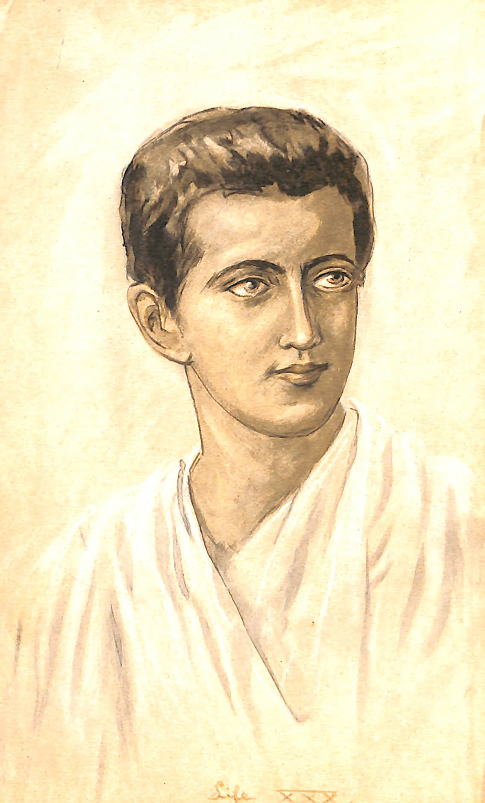