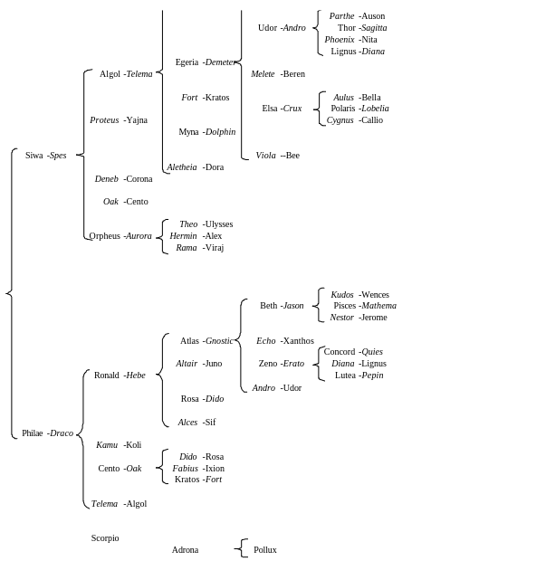

# Жизни Алкиона

_Авторы: Энни Безант и Ч. В. Ледбитер_

## Примечание

Жизни изданы в двух томах. С момента первоначального черновика к числу служителей добавились новые участники, которые были обнаружены и признаны, поэтому в текст были включены дополнительные диаграммы.

Рисунки были созданы одним из наших помощников, который наряду с артистическим талантом и редкой способностью наглядно представить описание, обладал некоторыми ясновидящими и интуитивными способностями. Они дают довольно точное представление об облике объекта биографий, как он был известен нам.

Это, насколько я знаю, первая серьезная попытка связать множество жизней разных людей в последовательном порядке, и они проливают много света на работу Кармы и Закона Реинкарнации. Они напоминают одну из фраз из Еврейских писаний: "Я соберу моих сыновей издалека и моих дочерей от концов земли." Настоящий период жизни напоминает о "сборе клана" и было странно видеть, как, по видимости случайно, мальчики и девочки из разных стран, приведенные жизненными обстоятельствами, естественно объединились в гармоничную группу.

Без сомнения, в будущем появятся и другие подобные книги, по мере того как распространение взгляда становится все более общим. Это - пионерская работа, новый рубеж, и наш корабль, вероятно, будет плыть по бурному морю.

_Энни Безант_

_Декабрь, 1924_

## Введение

### Служители

Все, кто читал "Человек: откуда, как и куда", знакомы с идеей Группы Служителей - группы людей, которые добровольно берут на себя выполнение определенного объема тяжелой работы на благо мира, особенно работу новаторов. Когда новая страна хочет себя обработать; должны быть люди, которые будут первыми войти в него, которые долгое время будут готовы отказаться от всех мелких удобств, облегчающих жизнь, жить грубо и трудно, вырубая деревья, убирая подлесок, обрабатывая и выравнивая землю, прокладывая колодцы и дороги, и в общем превращая пустыню в плодородное поле и делая джунгли пригодными для жизни; и без такого подготовительного труда цивилизованная жизнь, и все, что она приносит в своем следе в виде возможностей и достижений, вовсе бы не была возможной.

То же самое верно и в отношении иной, более высокой, формы развития. Когда начинается новая Коренная Раса, Ману, отвечающий за эту задачу, должен взять определенное количество людей и обращаться с ними в том же стиле, что и новатор с новой страной. Он должен упразднить многие их обычаи, предрассудки, способы мышления и заменить их на совершенно другие, в то время как он вносит изменения в форму и строение их физических тел. Безусловно, такая работа, как сложная и запутанная она ни была, может быть выполнена проще, если человеческий материал послушен, если он в определенной мере привык к этому процессу, и если он готов сотрудничать по мере своих способностей, так как только что обработанная почва проще для возделывания, чем почва, которая никогда не обрабатывалась. Таких членов Ману находит в нас, которые являемся членами его Группы Служителей. Обратите внимание на качества, которые ему необходимы в нас.

Во-первых, упомянутая выше послушность. Мы должны быть готовы следовать за Ним через все опасности и трудности, стремясь принять любую подсказку, которую он бросает нам, всегда готовы отложить личные желания и чувства ради выполнения предстоящей работы.

Во-вторых, такое понимание по крайней мере общих контуров работы, которое позволило бы нам интеллектуально сотрудничать - так, как в наше время мы интересуемся теософией.

В-третьих, терпение, ибо без него мы, несомненно, отстанем на долгом пути эволюции, разочаровавшись в малых видимых результатах всех наших усилий.

В-четвертых, трудолюбие, впрыскивание энергии изнутри, которое поддерживает нас в движении, несмотря на все препятствия - маховое колесо, которое помогает нам преодолеть мертвую точку исчерпания и уныния.

В-пятых, приспособляемость и товарищество, чтобы мы могли научиться работать вместе как единое целое, доверять друг другу и учитывать особенности друг друга.

Полностью ли мы, теми, кто имеет честь принадлежать к этой Группе, развили все эти качества? Конечно, нет, но мы в процессе их развития, и нам предоставляется каждая возможность, чтобы ускорить их раскрытие. После множества инкарнаций, продолжающихся тысячи лет, мы должны проявлять эти квалификации в значительно большей степени, чем это наблюдается среди наших сограждан. Если мы еще не проявляем их, если мы еще не тем, кем Он хотел бы, чтобы мы были, это, очевидно, наша вина и мы должны немедленно приступить к исправлению. История наших прошлых жизней также показывает нам, что с некоторыми из нашей группы Его стремление уже достигло максимально возможного успеха. Кроме того, если для остальных из нас прогресс не был таким быстрым, знание о том, что те, кто сейчас - адепты, уже сделали, должно быть для нас в то же время наибольшим стимулом и наиболее убедительной поддержкой. Давайте посмотрим, что мы можем узнать из этой истории.

С тех пор, как была написана Книга Человек, были проведены некоторые дополнительные исследования в процессе подготовки к печати новой книги, содержащей рассказ о сорока восьми жизнях Альциона. Эти исследования в определенной степени меняют некоторые из наших предыдущих выводов и изменяют относительное значение, которое мы первоначально склонны придавать различным факторам, определяющим последовательные инкарнации этой Группы Служителей. Когда "Жизни Альциона" были впервые опубликованы в "Теософисте", после каждой Жизни было дано всего несколько драматических персонажей - только те персонажи, которые случайно вступили в тесное общение с героем истории или оказали определенное влияние на его жизнь. Несколько из этих людей появлялись почти каждый раз, но большинство из них были нерегулярными; и это казалось исследователям вполне согласующимся с тем, что можно было ожидать, поскольку очевидно, что люди с широко различающимися темпераментами создают для себя карму различного рода, которая направляет некоторых в этом направлении, а некоторых в том, и дают некоторым долгую жизнь в небесном мире между инкарнациями, в то время как другим приходится спускаться в физическую жизнь после гораздо меньшего промежутка времени.

Из других областей исследований мы осознали существование трех важных факторов, определяющих место и время рождения каждого человека. Во-первых, сила эволюции, которая помещает каждого человека там, где он может наиболее легко приобрести те качества, в которых он случайно недостаточен; во-вторых, закон кармы, которые ограничивает действие этой первой силы по заслугам человека; в-третьих, закон притяжения, который снова и снова сводит человека с другими эгами, с которыми он связан какими-то связями. Мы изучаем эти законы обычно в указанном порядке, и этот порядок передает их относительную важность для большинства людей. Действительно, как мы предполагали, продолжительность жизни человека в мире небес определяется количеством духовной силы, которую он сгенерировал на земле; верно, что карма его предыдущих жизней в значительной степени решает, какой будет его текущая существование, и какое счастье или страдания он испытает.

Однако дальнейшее изучение показало нам, что в случае с Группой Служителей эти правила, которые обычно действуют, подчиняются цели Группы. Суть нашего членства в этом Коллективе заключается в том, что мы должны быть готовы отказаться от всех индивидуальных чувств и интересов ради общего блага; и мы обнаруживаем, что это правило действует даже в отношении рождений, которые мы принимаем. Для нас третий из этих факторов становится первым; и что преимущественно рассматривается, это не наша индивидуальная карма, а нужды группы в целом. В тех более ранних исследованиях мы находили случаи, когда всего несколько его друзей появлялись вместе с Альционом, и мы принимали это как данность, что остальные, вероятно, были вне инкарнации в тот период. Расширив наши поиски, рассматривая поколения до и после того, в котором наш герой родился, исследуя соседей и друзей, а также родных, мы в почти каждом случае смогли найти всех или почти всех тех, кого специально идентифицировали; так что, хотя это верно, что индивидуальная карма Альциона или потребности его личной эволюции иногда вводили его прямо в центр группы, а иногда отталкивали на момент от нее, мы не должны предполагать, что есть какие-либо изменения в эволюции группы как единого целого.

Теперь становится ясно, что члены этого Объединения, будь они эмоциональными или интеллектуальными, духовными или материалистическими по складу характера, шли через века вместе, и факт их объединения всегда был наиболее влиятельным фактором в их жизни, ключевым элементом, определяющим время и место их перерождения. Их размещали там, где они были нужны для работы, без какого-либо учёта, на момент, их индивидуальных потребностей или личного развития. Мы не должны думать, что их индивидуальное развитие было заброшено или что их точное личное карма каким-то образом не произвело должного эффекта. Но из-за их членства в этом необычном клане эти потребности были удовлетворены методами, которые немного отличаются от тех, которые обычно используются. Большее или меньшее количество духовной силы, сгенерированное в течение определенной жизни, например, находит свое выражение не в сравнительной длительности небесной жизни, а в ее сравнительной интенсивности.

Есть довольно большие промежутки времени, когда Группе не требуется выполнение оккультного труда; но даже тогда она остается вместе; ее члены не разбегаются каждый в свою сторону, каждый занимающийся своим развитием, но они, насколько мы можем видеть, там, где лучше всего можно проконсультироваться по поводу наибольшего блага наибольшего числа людей. Когда их услуги не требуются для внешней работы, учитывается их собственное развитие; но даже тогда это не индивидуальное развитие, а развитие массы. На самом деле, в определенной степени, клан можно считать небольшим подмиром вплоть до себя. Большая часть кармы его членов, безусловно, генерируется совместно с их товарищами, и поэтому склонна урегулироваться внутри Группы, укрепляя связи между ее членами. Поэтому очевидно, что при подсчёте средних значений для мира в целом лучше не учитывать членов нашей Группы, поскольку они находятся под влиянием, которое отличает их различными способами от тех, кто еще не используется в особых целях.

Во введении к "Жизням", опубликованным в "Теософе", было отмечено, что мы заметили существование двух классов эго, которые, между прочим, отличаются обычным интервалом между жизнями, одни проживают в среднем около 1200 лет, а другие - в среднем 700 лет. Мы по-прежнему видим, что эти классы ясно определены; но когда их члены вступают в Группу служителей, их интервалы немедленно изменяются. Различие все еще сохраняется в некоторых выраженных случаях; подробное изучение диаграмм, которые будут опубликованы в новой книге Жизней, покажет, что есть случаи, когда можно предположить, что врожденная тенденция оказывается слишком сильной для нового влияния, и клан временно делится на две группы, каждая из которых берет интервал, к которому ранее была привыкла. Но когда это происходит, мы видим, что весь клан снова объединяется по простому плану: третья реинкарнация одного набора совмещается со второй другого, так что они лишь на непродолжительное время разделены. Между этими случайными вспышками старых привычек они достигают некоторого компромисса и остаются вместе, но с интервалами, которые несколько нерегулярны - иногда тысяча лет или больше, а иногда только восемьсот. Отдельные члены иногда отрываются от группы на одну или две реинкарнации - предположительно, потому что они создали карму, требующую специального обращения.

Феномен, который имеет свое влияние на эти случайные отклонения от обычного порядка вещей, - это существование того, что можно назвать подгруппами. У некоторых главных персонажей есть небольшая группа последователей, которые обычно следуют за ними куда бы они ни пошли. Это становится полностью ясным только тогда, когда у нас перед глазами вся серия диаграмм, поэтому наши читатели не смогут полностью изучить это, пока у них не будет новой книги Жизней перед глазами; но даже из очень частичных списков, которые были опубликованы в The Theosophist, можно видеть признаки этого факта. Близкий приязнь Геракла к Марсу - наглядный пример; Марс сам обычно ассоциируется с Юпитером и Ману; в то время как Геракл в свою очередь имеет определенную более или менее постоянную группу последователей, в которой выделяются Капелла, Беатрикс, Близнецы, Аркор и Козерог. Еще более близкая связь существует между Альционой и Мизаром, и где бы они ни находились, обычно оказывается, что Сириус, Электра и Фидес недалеко. Эрато, Мелета, Конкордия и Аусония образуют группу из четырех, которые случайно тесно связаны в этой текущей жизни; но это не исключение из общего правила, потому что в прошлых жизнях они постоянно тесно связаны. Замечательной парой являются Калипсо и Амальтея; поскольку эти двое постоянно находятся в отношениях мужа и жены, и если кто-то из них так недалеко, чтобы жениться на ком-то другом, они обычно решают проблему, убегая вместе. Еще одна группа, которая, похоже, тесно связана, включает в себя Дракона, Андромеду, Аргуса, Аталанту, Лили, Феникс и Дактил; связь здесь настолько частая, что когда, в ходе наших исследований, мы наталкивались на одного из членов этой группы, мы всегда были уверены, что скоро встретим остальных, и редко оказывались разочарованы. Еще одна группа включает Гектора, Альбирео, Льва, Лето, Беренику и Пегаса; еще одна включает Альдебарана, Ахиллеса и Ориона. Все они образуют меньшие системы в рамках всего клана, точно так же, как в солнечной системе у каждой из крупных планет есть своя система спутников. Однако в случае Группы есть это отличие, что подгруппы не являются внутренне связанными; они чаще вместе, чем нет, но они иногда разделяются и перемешиваются, и очевидно, что такие изменения партнерства намеренно организованы.

Еще одна очень любопытная группа состоит из сущностей, связь которых с кланом менее определена, поскольку их связь с ним часто кажется скорее враждебной, чем дружественной. Ярким примером этого является Скорпион, который проходит через века в жесткой оппозиции к Гераклу, позицию которого он до сих пор поддерживает в настоящей жизни, в которой ненависть и беспринципность выступают на первый план как никогда, хотя способность наносить вред очевидно уменьшилась с течением времени. Другие члены того же типа, но несколько менее жестокие, - Рак, Ласерта, Урса, Гесперия; и у них в свою очередь есть группа друзей, таких как Трапеция, Маркаб, Авелледо, которые иногда ассоциируются с ними, а иногда - с более определенно лояльными членами Группы. Поллукс, который иногда является частью этой партии, имеет свою специальную связь с Мельпоменой, хотя она часто ведет по нежелательным линиям. Некоторые, кто начал сорок или пятьдесят тысяч лет назад как члены этой менее удовлетворительной подгруппы, похоже, постепенно выходят из нее и все более тесно ассоциируются с основным телом; Гамма и Фетида - примеры таких случаев. Есть и те, кто тесно и почетно связан с кланом, но почти всегда в подчиненной роли; примером этого является Борей. У личностей очень явные определенные специальные характеристики; например, все персонажи в большинстве жизней в той или иной степени связаны друг с другом и, следовательно, предположительно находятся на одном социальном уровне; но когда мы приходим к воплощению, в котором некоторые из них являются священниками и воинами, а другие - торговцами, можно всегда заранее угадать, какие имена будут найдены в каждом из этих классов. Есть некоторые, которые появляются в группе только изредка и как бы случайно - очевидно, они сами не являются регулярными членами, но, вероятно, по кармическим причинам связаны с некоторыми из членов; примеры такого рода - Лота, Каппа и Лиовтай.

Группа Служителей велика; двести пятьдесят персонажей, которым были присвоены имена, предполагается, как меньше одной десятой от всего числа. Считается вероятным, что весь клан разделен на группы для специального обучения, и что за каждой группой по очереди присматривает Ману и его подчиненные. Наши двести пятьдесят, вероятно, могут быть такой группой, и когда один из ее членов исчезает из нее на время, он, скорее всего, приобретает опыт в одной из других групп. Есть различные свидетельства, указывающие на это. Например: наши персонажи были созваны Ману около 70 000 г. до н. э., когда он готовился к созданию своей новой Коренной Расы; многие из них были убиты в резне, которая тогда произошла, и получили от него обещание, что те, кто умер ради Расы, будут немедленно реинкарнированы в ней в более подходящих условиях. Когда, через десять тысяч лет, раса была окончательно установлена, каждый член нашей группы появился в ней. Когда пришло время для создания второй подрасы, наша группа использовалась как при первом заселении долины, так и две тысячи лет спустя, когда произошла фактическая миграция в Аравию. То же самое произошло в отношении третьей подрасы, наша группа прошла через три реинкарнации в процессе ее установления. Но когда пришло время для основания четвертой и пятой подрас, ни одного члена нашего клана из двухсот пятидесяти не было среди тех, кто помогал Ману в его работе. Кажется очевидным, что в тот период пришла черед другой группы -- и другой набор эго должен был проходить это обучение.

Когда Бодхисаттва снизошел с небес в Индии, как Шри Кришна, и в Палестине, как Иисус, ни один член нашей группы не был при нем, и нас не выбрали, как сейчас, для подготовки пути к его пришествию. В каждом из этих случаев у Него были служители, поэтому предполагается, что они принадлежали к одной из других групп.

Из того, что мы знаем о началах Шестой Коренной Расы, мы знаем, что нашему клану Служителей предстоит честь быть задействованными в этой связи, и имеются основания полагать, что мы должны будем попутно участвовать в развитии шестой подрасы этой настоящей Коренной Расы. Но цель, ради которой мы сейчас собраны, - это так или иначе ни одна из них, хотя и является обычной подготовительной мерой. Нам теперь поручено проложить путь Господа - помочь подготовить мир к приходу Бодхисаттвы. Потому что это так, метод этой реинкарнации отличается от всех предыдущих. Когда мы основывали физическую расу, мы рождались в одной стране и находились в тесном физическом общении, но сейчас это совсем не то, что требуется. Грядущему учителю нужны вестники, чтобы подготовить его путь во всех странах, и поэтому та древняя и сплоченная Группа Служителей оказывается разбросанной по всему цивилизованному миру.

Таким образом, разрозненно нас собрав, они снова объединяют нас, но уже на интеллектуальном уровне, на ментальном плане, а не на физическом. Они привлекают нас всех общим интересом к теософии, и проводят над нами этот интересный эксперимент, чтобы посмотреть, можем ли мы, после всего набранного опыта, сохранить дух клана и равно эффективно работать вместе ради общей цели, когда мы рождены в разных расах и семьях. Подопытные сначала ничего не знают об этом. Они обнаруживают себя в отношениях с людьми других рас и многих типов, у каждого из которых свои особенности, и первая мысль, которая приходит им в голову, - как утомительны эти особенности и как трудно идти на контакт с этими людьми. Но в конечном итоге они преодолевают поверхностные разногласия, достигая общего человечества позади всего этого. Эго прорывается через вуаль своих тел, и старый дух товарищества восстанавливается. Мы должны быть в каждой стране, потому что Нам нужны наши агенты в каждой стране; все эти агенты должны работать вместе как одно большое тело, оживленное одним могучим духом.

И в этих ранних жизнях мы обычно видим наших людей, собранных в три или четыре большие семьи, часто происходящих от одной пары или двух-трех пар. Потомки этих пар в течение трех или четырех поколений обычно почти полностью состоят из членов нашей группы. Затем внезапно поток иссякает, и следующее поколение состоит из посторонних. Но среди этих посторонних многих замечают повторяющимися, и возможно, они могли бы оказаться членами той второй группы, существование которой мы предполагали. Возможно, эта вторая группа, члены которой пока не определены, могла преследовать нашу группу в случае первой, второй и третьей подрасы, и они были опробованы в ведущей роли в случае четвертой и пятой. Вероятно, что в таком важном случае, как спуск Бодхисаттвы, обе эти группы, и, возможно, ещё дюжина других, могут быть воплощены.

Наши исследования были предприняты с особым учетом прошлых жизней Альциона и тех эго, которым были присвоены имена, являются теми, кто больше всего связан с ним - теми, кто проходил обучение одновременно с ним. Те, кто, как представляется, проходит обучение в другом отряде, естественно, не появляются вовсе, хотя очевидно, что их работа должна быть столь же важной в связи с другими подрасами. Даже в нашем отряде многие другие сущности узнаются кап самые часто встречающиеся и, несомненно, могут быть идентифицированы среди существующих членов Теософского Общества, если бы им уделить столько же внимания, сколько вначале было уделено другим.

Иногда теософы спрашивают нас, не были ли они в прошлом частью этой Группы Служителей, так как они так сильно влечутся к некоторым из Великих, или к Президенту, что уверены, будто они уже встречались с ними ранее. Я думаю, что практически каждый член общества (по крайней мере, каждый член, который усердно и безкорыстно работает на него) должен был быть в одной или другой из этих групп в одно время или другое. Некоторые из них могут образовать ту позднюю генерацию, которую мы так часто полуосознаем. Вокруг семей, которые мы каталогизировали, есть какое-то подобие полутени, внешнее краевое обрамление, которое, вероятно, содержит тысячи тех, кто сейчас ученик священной мудрости. В самом деле, некоторые, которые не были специально упомянуты, могут быть так же тесно связаны с Великими, как и те, кто есть в нашем списке; ведь мы часто узнаем всего двоих или троих детей из семьи из восьми или десяти; без сомнения, неопознанные дети тоже являются членами Общества!

Иногда персонаж почти навязывает себя нашему вниманию. Например, я заметил во многих случаях появление великого, но неизвестного образа в тесной связи с некоторыми из наших самых уважаемых имен - это, очевидно, персонаж большого значения. Встретив его два или три раза, мы наконец решили проследить его до нашего времени и обнаружили, что он - Учитель Учителя К.Х. - старший адепт, которому мы на наших диаграммах дали имя Дхрува. Совсем недавно я наткнулся на другой образ, кажется, совершенно случайно. Один из наших членов привел к моему вниманию своего молодого друга, потому что узнал, что у нас есть общий интерес; и в тот момент, когда этот молодой незнакомец был представлен мне, я увидел, что он не незнакомец, а, напротив, важный персонаж во многих из тех прошлых жизней - тот, кого я предполагал в настоящее время не воплощенным. В этот раз он появился в моей жизни, когда в подготовке уже были корректуры новой книги "Жизни Альционе"; он оказался как раз вовремя для включения в диаграмму номер I, но уже слишком поздно, чтобы занять свое место на модельной странице списка, поскольку она уже была 'снята'.

Что произошло тогда, может повториться; в любой момент мы можем натолкнуться на человека, который занимал важную позицию среди нас в древние времена. Даже если мы и сделаем это, однако, для него будет уже слишком поздно для включения в этот выпуск книги; двери закрыты для этого конкретного цикла проявления! В самом деле, в любом случае, больше никаких имен теперь не даются, так как их число уже слегка неловкое для наших диаграмм и списков. К тому же, никакой полезной цели не достигнет добавление к списку; у нас уже достаточно примеров, чтобы делать выводы по поводу Служителей; если будут проводиться дальнейшие исследования, они будут более продуктивно проводиться среди какого-нибудь совершенно другого класса сущностей.

Диаграммы создаются по принципу родословного дерева, и каждая показывает отношения персонажей на определенный момент времени.

От них легко, хотя и трудоемко, подготовить своего рода книгу учета, в которой каждому персонажу отводится своя страница, и его отношения в последовательных жизнях вносятся в нужном порядке, что позволяет нам сразу видеть, какую позицию он занимал, и как часто он был в контакте с тем или иным лицом. Образец страницы такой книги учета может быть представлен в новой книге в качестве руководства для тех, кто хочет создать такой том.

Недавно друг отметил, что продолжительность физической жизни упомянутых персонажей всегда значительно выше среднего, данного в настоящее время статистикой страхования. Это верно; но актуарные таблицы до сих пор занимались только средним, основанным на текущих жизнях множества разных эго, а не на последовательных жизнях одного эго. Насколько нам известно, эго могут иметь свои особенности в этом вопросе; некоторые могут иметь привычку проживать самые долгие физические жизни, которые их карма позволяет, в то время как другие могут предпочитать более частые изменения. Или это все может быть решено для нас извне.

Ученики заметят, что на протяжении веков почти все наши персонажи были практически моногамны. Это не должно восприниматься как показатель того, что цивилизации, в которых они жили, никогда не признавали полигамию. Возможно, выбор всего одной жены был указанием Ману; или это в большей степени было делом практического удобства, как это происходит в Индии сегодня. Я понимаю, что индийский обычай практически не ограничивает количество жен, которые у мужчины могут быть одновременно, тем не менее, среди моих многих друзей в Индии я не знаю никого, кроме представителей некоторых королевских семей, у кого есть более одной жены. 

Семьи на наших диаграммах часто достаточно большие - хотя не необычайно большие, если сравнить с некоторыми из них наших дней, ведь в этой двадцатом веке один из наших самых замечательных членов принадлежит к семье из тридцати пяти человек - больше, чем мы когда-либо находили в наших диаграммах! Внимательный уход за детьми всегда был важной частью указаний Ману, и по этой причине вы встречаете мало младенческой смертности среди персонажей. Также по его указанию семьи так усердно вступали в брак между собой, чтобы новая раса оставалась чистой от смешения - результатом было то, что мы сравнительно редко находим одного из наших персонажей, выходящего замуж за одного из неузнаваемых.

Обычно мы разбросаны по трем или четырем поколениям, и заметными оказываются определенные группировки. Две или три пары, с которых начинаются эти семьи, часто являются теми, кто сейчас находится среди великих. Мы можем понять это, предполагая, что, чтобы задать тип, необходимы следователи с сильно развитыми характерами. Обычно эти великие лица являются братьями или сестрами в семье, остальные члены которой нам неизвестны.

Их родители иногда явно являются людьми с высоко развитым сознанием, и мы можем предположить, что они, вероятно, достигли адептства и находятся за пределами нашего понимания. Непосредственные потомки этих двух или трех пар обычно являются людьми, которые даже в наши дни тесно следуют за ними. Эти люди в свою очередь вступают в брак между собой, и тогда появляется основная масса группы. Но на диаграмме обычно есть четко определенная нижняя линия, под которой редко оказываются отстающие. Даже на самой нижней линии наши персонажи почти всегда находят мужей или жен, которых узнают, но их семьи, хоть и так же многочисленны, не содержат персонажей, которых мы знаем. Такое расположение достаточно обычно, чтобы можно было с уверенностью сказать, что это не случайно, а преднамеренно.

Интересно отметить, что некоторые персонажи почти всегда появляются на этой нижней линии и так, согласно нашим диаграммам и реестрам, кажется, не имеют потомства, поскольку их дети не находятся среди опознанных; другие, напротив, обычно появляются наверху диаграммы и следовательно показывают множество детей, хотя их бабушки и дедушки, и иногда даже родители, неизвестны, другие обычно попадают где-то посередине диаграммы, поэтому мы можем заполнить в реестре и их предков, и их потомков. Пока еще рано что-то предполагать о смысле такого расположения, хотя без сомнения оно проявится по мере дальнейшего изучения. Можно предположить, что те, у кого есть члены группы как дети, учатся, как подготовлять средства для использования этими полезными эго; но вряд ли стоит предполагать что-то, пока у нас не будут все данные перед нами в табличной форме, и у нас не будет времени их рассмотреть со всех точек зрения. Уже была выполнена замечательная работа по этой линии Монсье Гастоном Ревелем, но к сожалению, у него были только очень скромные статистические данные, опубликованные в The

Теософ, и, следовательно, многие его выводы потребуют пересмотра - как это часто бывает с нашими первыми попытками обобщения. Например, мы занялись интересным вопросом о том, дольше ли в среднем период между жизнями после мужской или женской инкарнации; но теперь, когда мы видим, что для мужчин и женщин интервал определяется по требованиям группы в целом, очевидно бесполезно продолжать этот вид исследования.

Очевидно, что эксперимент, который проводится в этой текущей инкарнации с Вереницей Служителей, является совершенно новым. Не только в прошлом они всегда были в тесном физическом контакте, но и детали этого отношения не были оставлены на волю случая, а аккуратно устроены как часть определенного плана, в котором тесная связь полупатриархальной семейной жизни тех времен использовалась для достижения необходимых результатов, также как в наше время полунезависимых семей используются совсем другие средства, и получают преимущества из ментальных связей обществ и клубов различного рода.

Эффективность используемого метода показывает пример Альционе. В его текущей жизни двадцатого века всего один член группы, которую мы так часто встречали вокруг него, был родственно связан с ним, тем не менее, каждый член этой группы, встречая его в этой жизни, которую считали первой, мгновенно узнал духовные связи, которые намного важнее любых земных уз.
И то, что верно для Альционе и его ближайших и самых близких друзей, также верно и для других групп или подразделений клана Служителей, и в несколько меньшей степени для всего клана. Сорок или пятьдесят жизней назад мы находим Альционе, занимающегося закреплением определенных особых связей; позже мы находим его, встречающегося с этими же людьми часто, это правда, но все еще несколько менее тесно связанным с ними, потому что тогда он занимается формированием определенных других связей - прилагая усилия, результаты которых, возможно, еще в будущем.

Поскольку реальной целью этих воплощений является формирование этих связей, чтобы члены клана могли научиться понимать и доверять друг другу, и таким образом постепенно стать гибким, надежным, разумным блоком, который может быть использован Великими как инструмент, очевидно, что мы не можем оценивать важность какой-либо жизни по поверхностным происшествиям, которые все, что мы можем описать в нашей серии историй. Живописные события иногда могут предлагать возможности для героических усилий, и таким образом внезапно кристаллизуют в видимости результаты долгого медленного внутреннего роста; но, с другой стороны, жизнь без приключений может быть плодотворной в тихом развитии необходимых качеств - жизни счастливой, трудолюбивой, недраматичной, приятной, спокойной и прогрессивной. Отбросив повторяющиеся отношения, вызванные объединением в небольших подгруппах, можно обнаружить, что каждая единица в течение этой серии жизней установила тесную связь с большим количеством других единиц. Если бы мы, например, открыли журнал наугад и посмотрели на колонки с мужьями или женами, мы бы обнаружили в целом очень мало повторений.

Иногда одна душа будет выходить за другую снова и снова, но чаще они покажут сорок восемь различных экспериментов в супружеской жизни. Кажется очевидным, что власти, которые руководят этими вопросами, смешивают нас намеренно, чтобы путем вступления в самые тесные связи с целым числом разных людей мы могли узнать их и научиться работать с ними.

Быть членом этого Отряда Служителей - действительно благородная цель, но это не та, которая приносит честь в глазах людей. При основании рас и подрас часто требовалось, чтобы некоторые из наших персонажей занимали высокие посты, как короли и первосвященники, хотя общины, с которыми они были так связаны, обычно были малы. Однако в более поздние дни, особенно в историческое время, мы довольствовались более скромными позициями, хотя мы обнаружили, что всегда были среди образованных людей нашего времени. Немногие из нас имели известные истории имена, и те из них, кто достиг совершенства, как можно видеть в таблицах, опубликованных в "Мани".

Большинство из нас находятся далеко не на этом интеллектуальном уровне, но то, что от нас требуется, это не гениальность, а именно те качества, о которых я упоминал в начале этой статьи. Поскольку это отчетливо то, что от нас требуется, наше дело - работать над этим развитием, и делать это с максимальной скоростью, чтобы когда Господь придет, он может найти в нашей группе готовый к работе инструмент, который мы можем сделать почти совершенным.

Чем больше мы знаем об этой Группе Служителей, тем больше я лично благодарен за честь быть частью нее, потому что она явно выполняет определенную работу для Него; и иметь возможность делать это - поистине редкое благословение. Исходя из этого, я не могу не глубоко сожалеть, что некоторые, кто были частью этой Группы в далеком прошлом, отдалились от нее в этой жизни. Я знаю, что они не могут уйти навсегда, что их бродяжничество - это только забеги расшаленного ребенка, который вырывает руку из рук своего отца и делает небольшой забег своим счетом - заканчиваясь часто падением в грязь; я знаю, что в следующей их инкарнации они снова будут среди нас, изучая ту же философию, работая ради той же великой цели. Они наверняка воспользуются будущими возможностями; но как жаль пропустить эту. Помните историю Господа Будды и огромный импульс, который его благословенное присутствие дало всем, кто оказался в его влиянии.

Пришествие Господа Любви окажет такое же влияние на тех, кто стоит вокруг него; почему бы кому-то отказываться участвовать в таких благах? Можем ли мы надеяться, что это чудесная магнитная сила привлечет их всех обратно к его ногам, что его великолепный свет откроет глаза слепых, что недопонимания, ревность и зависть растают под огнем его любви? Так и должно это быть! Но если некоторые, которые должны быть с нами, отсутствуют, мы должны проявить еще больше усердия и энергии, чтобы общее количество выполняемой работы не уменьшалось - чтобы, если это возможно, отсутствие наших товарищей оставалось незамеченными, пока они не успеют вылечиться от своей временной немощи и вернуться в ряды. Прежде всего, мы должны помнить золотое правило: "ненависть не уменьшается от ненависти; ненависть исчезает только от любви"; ибо только тогда, когда все это осознают, мы сможем быть достойными знать и служить Господу Любви, когда он придет.

_К. W. Лидбитер_

## Введение

Среди людей есть много различных классов, и установления, сделанные для реинкарнации этих классов, очень разнятся - варьируются, потому что главной целью является продвижение их эволюции, и будучи такими разными, они нуждаются в различном подходе. Сэр Эдвин Арнольд написал:

    Кто трудился рабом, может вернуться князем,
      За достойную ласку и заслуженные достоинства.
    Кто правил королем, может бродить по земле в лохмотьях
      За совершенные и несовершенные дела.

Хотя безусловно верно, что случаи такого внезапного изменения положения, как предполагает поэт, довольно редки и не должны расцениваться как обычный ход ряда жизней.

В подавляющем большинстве случаев человек, родившийся в культурных классах, вероятно, окажется в подобном положении в своей следующей жизни. Причина этого двояка. Во-первых, он - тот тип личности, который может извлечь выгоду из такого окружения, иначе его туда не поставят; во-вторых, тип кармы, который он создает в этом положении, слишком сложен для того, чтобы его разрешить в трущобах или среди примитивных дикарей.

Итак, духи высшего класса обычно рождаются среди образованных людей, хотя время от времени мы сталкиваемся и с замечательными исключениями.

Среди этих духов высшего класса существует несколько общих типов. Чаще всего мы изучаем эго, которые, как правило, проходят по порядку через различные расы, обычно перерождаются в каждой из них и оставляют между этими перерождениями промежуток около тысячи лет. Каждая подраса, по-видимому, специально создана и адаптирована для развития определенных качеств и обучения определенным урокам, и дух проходит через все их по очереди, чтобы его характер постепенно становился полным и было достигнуто итоговое совершенство.

Дух, уже обладающий качеством, которое условия определенной подрасы предполагают вызвать, может пропустить эту подрасу и переродиться в следующей, тогда как дух, особенно нуждающийся в этом качестве, может потребоваться два или три подряд идущих воплощения в этой подрасе, прежде чем он будет готов перейти к другой.

Однако есть еще один тип эго высшего класса, которые не привыкли проходить подрасы в определенном порядке, но вместо этого склонны возвращаться снова и снова к одной подрасе. Они главным образом посвящают себя развитию через эту подрасу и лишь иногда делают экскурсии в другие в поисках особых качеств. Обнаружено, что у этого типа обычно более короткие средние промежутки между жизнями - в среднем около семисот лет вместо тысячи. Это вовсе не означает, что его члены порождают меньше духовной силы, но они проявляют ее с гораздо большей интенсивностью. Более быстрые воплощения и возвращение к той же подрасе могут предполагать, что они в некотором роде являются промежуточными между первыми и вторыми классами, так как эти характеристики в некоторой степени присущи последнему классу; но они явно не промежуточные, а во всех отношениях равны по общему развитию наивысшим эго первого класса, жизни которых мы рассматривали ранее. Они не совсем такие же, как эти другие; тип мозга немного отличается.

Видимо, в целом они живут меньше в физическом плане, а на более высоких уровнях они более развиты; однако пока нам не удалось прийти к чему-либо, что можно было бы определить как действительно основное отличие.

Очевидно, что эго, прибывающие сюда с лунной цепи, приходят группами - кучами, так сказать, примерно так же, как пассажиры прибывают на пароходе из 

Америки - с большими промежутками между ними; и участники каждой такой партии имеют общие характеристики, в которых они, вероятно, отличаются от всех остальных куч. Сначала думали, что это могут быть люди разных путей или планетарных типов, но это не так, так как у нас есть люди почти всех типов в каждой из куч.

Все это на данном этапе в процессе формирования и на начальных стадиях, но мы уже видим, что это открывает некоторые интересные возможности, и что, когда исследования будут проведены значительно дальше, они, вероятно, существенно увеличат наши знания о различных методах эволюции.

Вероятно, что могут существовать и другие, еще не обнаруженные типы. Уже известно, что евреи - это исключение из общего правила, что они составляют расу, отличную от других, члены которой редко воплощаются вне нее; не было бы удивительно, если бы китайцы и японцы впоследствии обнаружились как еще один, более крупный пример такого же исключения. Но это предположение можно подтвердить или опровергнуть только путем накопления большого количества дополнительных фактов.

Отдельно стоящие эго низшего класса перевоплощаются много раз в каждом случае, так как обучаются они гораздо медленнее. Поскольку их духовное развитие не так велико, они генерируют гораздо меньше силы и, следовательно, интервалы между их рождениями намного короче; так что, хотя есть и некоторые важные исключения, общий принцип состоит в том, что те, кто ниже по эволюции, принимают более короткий интервал. Действительный дикарь, живущий в Центральной Африке или в лондонском трущобе, проводит несколько лет на астральном плане, а затем почти немедленно возвращается на землю. Из этого следует, что диспропорция между развитыми и культурными людьми и огромной массой неразвитых не так безнадежна, как кажется на первый взгляд, ведь последние все время полностью показывают свою численную силу, так как проводят всего лишь немного времени на высших планах, в то время как первые отсутствуют на физическом плане от 90 до 95 процентов своего времени. Попытка грубой классификации эго можно найти в т. ii Книги Внутренней Жизни.

При решении реального случая перерождения вступают в игру три основных фактора.

Прежде всего и прежде всего влияние Закона Эволюции. Божество желает продвижения человека, и эта Воля оказывает на него постоянное и неуклонное давление.

Действие этого Закона всегда стремится поместить человека в такую среду, которая наилучшим образом подходит для развития тех качеств, которые ему недостают, несмотря на его симпатии и антипатии или его заслуги. Человек в своей близорукости часто считает такое действие неприятным и даже враждебным его прогрессу; ведь он естественно желает окружения, которое даст ему возможность делать то, что он уже хорошо умеет, тогда как Закон скорее наделяет его тем, что он будет вынужден делать то, чего пока не может - развивать качества, которых у него сейчас нет.

Второй фактор, который вступает в игру при определении места рождения человека, - это его собственная Карма - результат его прошлых действий. Если Закон Эволюции не контролировался, он бы дал ему наилучшие возможные возможности для развития; но его прошлые жизни могли быть такими, что не заслуживают этих возможностей. По этой причине ему может быть невозможно дать наилучшее место, поэтому он должен довольствоваться вторым лучшим.

Точность, с которой любая возможная комбинация кармы проявляется в предоставленной среде, просто удивительна; часто становится очевидным, что нет другого места в мире, которое было бы так подходящим, как то, в котором оказывается человек. Если можно так выразиться без неуважения, расположение человека в целом не представляет проблем для божеств кармы: если он должен родиться в диком племени, то не имеет большого значения, будет ли это в Центральной Африке, в Южной Америке или среди аборигенов Австралии; если он должен увидеть свет в трущобах, то вряд ли важно, будет ли это Монмартр, Боуэри или Семь перекрестков. Грубые воздействия, которые пока могут произвести на него только впечатление, можно найти во всех этих местах. Но для развитого человека проблемы значительно больше, потому что он ранее запустил множество окончательных сил всех видов, и поэтому необходима среда, в которой их эффекты могут воздействовать на него. Для молодой души любое из ста мест, вероятно, подойдет одинаково хорошо; у него столько уроков, что не имеет большого значения, какой из них он берет первым или где получает свое предварительное обучение. Но старая душа требует особого подхода, и единственная ниша, специально предназначенная для нее, обычно является единственной в мире, которая действительно подходит для нее. По своей природе он очень редко так думает, потому что при составлении распорядка учитывались не его предпочтения, а настоящие интересы; но эта утверждение тем не менее справедлива.

Третий фактор, влияющий на реинкарнацию человека, является другой вариант его кармы - связи, которые он установил с другими эго в предыдущих жизнях. Все незначительное добро и зло, которое мы совершаем, вносится в общий дебитовый и кредитовый счет и систематически учитывается; но если мы так влияем на жизнь другого, чтобы существенно помочь или помешать его эволюции, мы формируем с ним личную связь, которая неизбежно требует другой встречи позже - иногда много других встреч.

Бескорыстная любовь - одна из самых сильных сил в мире, и она снова и снова привлекает эго, тем самым в значительной степени модифицирует на время действие сил эволюции и кармы.

Это не значит, что человек когда-либо может избежать последствий того, что он сделал; долг всегда должен быть оплачен, но время и условия часто значительно меняются с введением этой замечательной силы сильной привязанности. Многие примеры этого можно заметить в линиях жизни, опубликованных для нашего изучения.

Кажется очевидным, что в течении долгого ручья наших жизней мы собираемся в группы, - или оттуда мы, возможно, первоначально и появились, - обычно в центре которых стоит какое-то доминирующее эго. В истории жизней Alcyone мы видим такую группу (или, возможно, следы двух групп), собранных вокруг могущественных индивидуальностей двух Великих, которые с тех пор достигли уровня Адептства. Отодвигаясь все дальше и дальше в туманы далекого прошлого, мы замечаем, что эта маленькая группа эго все теснее связана. Это никоим образом не подразумевает, что связи между ними последние время ослабли, наоборот, они кажутся сильнее, чем когда-либо. Скорее, предполагается, что недавно члены стали достаточно сильными, чтобы на время разделиться без потери связей -- каждый мог отправиться туда, где это было необходимо для развития отсутствующих качеств или изучения особых уроков, без опасности, что при этом он забудет своих товарищей или обнаружит, что его любовь к ним ослабла. Таким образом, за последние несколько тысяч лет они встречались несколько реже, чем раньше, пока каждый учился устоять в одиночку; но в текущей жизни вся группа снова собрана вместе - не благодаря простым семейным отношениям, а по более сильной связи общего интереса к общей работе, следуя как всегда Великим лидерам, которым они обязаны всем, что у них есть и что они есть - Учителям Мудрости, в руках которых лежит судьба будущей Расы. В этой жизни они являются верными членами Теософского общества и через него они отдают на службу человечеству все силы, которые они получили благодаря бурям и спокойствию, радости и горю многочисленных жизней, которые они прошли. Как минимум для некоторых из них дано обещание, что они больше не расстанутся - вся их будущая жизнь будет посвящена любимому делу под руководством великих Капитанов, с которыми их жизни так тесно связаны.

Эту группу мы назвали Служителями, и мы замечаем, что через всю их историю им доверялись важные задачи, связанные с началом новых подрас.

Все, чьи жизни мы исследовали до сих пор, являются членами этой группы, и мы обнаружили, что именно членство в ней всегда было самым важным фактором, определяющим время и место их перерождения. Будь они чувствительными или интеллектуальными, духовными или материалистическими, им приходилось двигаться по векам вместе, и поэтому результатом создания большего количества духовной силы в любой конкретной жизни был не (как обычно) более долгий период небесной жизни, а период большей интенсивности наслаждений.

Двадцать лет назад наше внимание было привлечено к жизням Эрато - первой серии, которую мы изучали - серии из семнадцати воплощений с довольно длительными интервалами между ними; не полных волнительных событий, но с призрачной регулярностью продвигающихся через последующие подрасы. Затем последовали несколько меньших серий; следующая длинная серия, исследованная через четырнадцать лет, включала в себя двадцать четыре жизни Ориона. Они оказались бурные и неровные - большое противоположность тех, что у Эрато. Еще через два года началось исследование жизней Альционе, и серия из тридцати была опубликована в The Theosophist.

В ходе исследований другого рода, проводимых в связи с созданием подрас, мы обнаружили группу Служителей, уже существовавшую в более ранние периоды истории; мы наткнулись на них еще в 70 000 до н.э., а затем в 60 000, в 42 000, в 40 000, в 38 000, в 32 000. Поскольку наши предыдущие запросы относятся к 22 600 году до н.э., показалось целесообразным продлить их на еще десять тысяч лет; так что теперь у нас есть некоторые записи о 42 последовательных воплощениях Альционе, а также несколько моментов из более отдаленных эпох.

Герой этой серии жизней, которую мы предлагаем нашим читателям, которому мы дали имя звезды Алкиона, принадлежит к типу или группе людей, которые между своими рождениями проводят средний интервал в 800 лет. Он не следует подрассам в регулярном порядке, а, главным образом, служит первой подрассе пятой коренной расы, вначале около Моря Гоби, потом принимая участие в нескольких переездах на равнины Индии и в следующие возможные рождения в этой стране древней красоты и тайн. Значительная часть исследованных нами жизней была прожита на исторической земле Индии, но так как они привели его к вратам Пути Святости, ясно, что этот посвященный одной священной Родине вовсе не задерживал его развитие. Пусть его жизни будут изучены, чтобы следовать его шагам; пусть читатель увидит из них, какие качества необходимы для достижения того Пути, чтобы и он сам мог вступить в течение жизни, как это сделал Алкион, и стать одним из тех, кому предназначено навсегда быть в безопасности и заниматься служением человечеству.

В этих жизнях можно увидеть развивающиеся определенные качества, укрепляющиеся определенные отношения, и их следует изучить, указывая на цель, которую Монад ставит перед собой. Подобные качества и отношения каждый должен развивать и формировать - некоторые раньше, потому что они начали раньше, другие позже, потому что они начали позже. Они могут помочь некоторым понять, что сегодня все так же, как и в начале, и что дорога открыта как прежде, Путь столь же пройденный как и прежде.

Те, кто любил, поддерживал, боролся бок о бок с Алкионом в прошлом, находятся с ним и сейчас, какие-то чтобы помочь, а какие-то для помощи.

Возможно, стоит несколько слов сказать о методах исследования, применяемых при изучении этих прошлых жизней. Обычный план - использовать свойства Каузального Тела и просто прочитать записи. Таким образом, всю жизнь под исследованием можно просмотреть так быстро или медленно, как будет угодно. Обычно лучше быстро просмотреть жизнь и выбрать из нее такие инциденты, которые имеют наиболее далеко идущие последствия, а затем вернуться и описать их подробнее.

Так как во многих из этих историй о прошлом сами исследователи участвовали, им часто был доступен еще один метод исследования - перекатываться обратно в эти формы далекого прошлого и снова жить этими захватывающими жизнями - снова чувствовать то, что они чувствовали тысячи лет назад, смотреть на мир со странно различных точек зрения индийского скетика, атлантидского благородного человека или арийского захватчика. Таким образом, истории для авторов кажутся невероятно живыми и драматическими, так что они жаждут описательных способностей великих писателей-фантастов, чтобы такие острые ситуации были достойно изображены.

Когда обсуждаются прошлые жизни, люди часто спрашивают, как возможно установить точные даты на таком большом временном расстоянии. Это было сделано благодаря упорному труду и многим тяжким подсчетам, обычно начинающимся с какой-то заранее определенной точки. Когда это было возможно, полученные результаты проверялись путем некоторого типа взаимного сравнения или астрономических наблюдений. В подсчетах, конечно, могли быть допущены ошибки, но для таких ошибок маржа маленькая, и не было пощажено ни малейших усилий, чтобы добиться точности.

Эти рассказы о прошлом не печатаются просто как хорошие истории - хотя они часто таковы, - но как уроки работы кармы из жизни в жизнь, полные наставлений для ученика и полезные для осознания непрерывности человеческой жизни. Однако при чтении их необходимо помнить, что более глубокие причины часто остаются за гранью видимости, и что в записи истории жизни неизбежно слишком много действий, слишком мало мыслей и чувств. Тем не менее, мысли и чувства гораздо сильнее действуют как порождающие причины, чем наши действия, поскольку действия - это воплощение прошлых мыслей и чувств, больше, чем создатели будущего. Мотив действия имеет более далекий охват, чем само действие, хотя он часто глубоко скрыт, в то время как действие наглядно бросается в глаза.

Несмотря на это, многое из того, как работает карма, можно узнать изучая серию жизней; мы видим отношения между людьми, результаты благ и злодеяний, связи, которые притягивают эго друг к другу, и отталкивания, которые раздвигают их, из жизни в жизнь. Мы замечаем эпохи, в которых образуются большие группы связанных эго, затем их рассеивание на столетия, тысячелетия, их воссоединения и новые рассеивания. И из всего этого растет чувство безопасности, постоянного управления, Мудрости, которая планирует, Власти, которая выполняет, определенного осуществления большой цели, выбранных, проверенных, принятых или отброшенных агентов, предложенных, использованных, отвергнутых возможностей, уверенного вперед идущего развития среди сложностей отливов и приливов. Одна жизнь видится в пропорции, предшествующая и последующая многим другим. Чувство силы и достоинства растет в ученике, когда он думает: "У меня тоже длинное прошлое за спиной, и у меня тоже бесконечное будущее впереди." Трудности настоящего теряют свою серьезность, если смотреть на них в свете бессмертия; успехи и неудачи становятся преходящими эпизодами в долгой панораме; рождение и смерть - сколько раз они переживались! Ученик осознает глубокую истину, высказанную Шри Кришной, что, поскольку обитатель тела постоянно отбрасывает изношенные тела и постоянно переодевается в новые, "поэтому, о сын Кунти, ты не должен горевать."

Такую помощь мы надеемся оказать нашим читателям путем публикации этой серии жизней. Пусть они найдут в ней крепкий посох в дни беды и факел, освещающий запутанный путь жизни!

## Персонажи

Следующий список персонажей с объяснением их представлен (за исключением изменений) в свободном переводе с «Человека: Откуда, Как и Куда: История не может быть записана без имён, и так как реинкарнация является фактом — а значит, и повторное появление одного и того же индивида в течение последующих веков также является фактом — эго, играющее многие роли под разными именами, мы здесь обозначили многими именами, по которым их можно опознать в драмах, где они участвуют. Ирвинг остаётся тем же Ирвингом для нас, будь он Макбет, Ричард III, Шейлок, Чарльз I, Фауст, Ромео, Матфей; в любой истории его жизни в роли актёра он упоминается как Ирвинг, какую бы роль он ни играл; его продолжающуюся индивидуальность признают везде. Так же и человек, в длинной истории, где жизни — это дни, играет сотни ролей, но он остаётся самим собой везде — будь он мужчина или женщина, крестьянин, принц или священник. Этому «самому себе» или эго мы дали отличительное имя, чтобы его можно было узнавать под всеми маски, одетыми для соответствия его роли. Это в основном имена созвездий, звёзд или греческих героев. Например, мы дали Юлию Цезарю имя Короны; Платону — имя Паллады; Лао-цзы — имя Лиры. Таким образом, мы можем увидеть, насколько различны пути эволюции, прошлые жизни, которые породили Цезаря и Платона. Это придаёт истории человеческий интерес и обучает ученика реинкарнации. Имена Тех, кто постоянно появляется в этой истории как обычные мужчины и женщины, но кто теперь являются Учителями, могут сделать эти великие Существа реальными для некоторых; Они поднялись там, где Они стоят на той же лестнице жизни, по которой мы сейчас поднимаемся; Они знали обычную домашнюю жизнь, радости и горести, успехи и неудачи, которые составляют человеческий опыт. Они не боги, совершенные на протяжении бесконечных веков, а мужчины и женщины, которые раскрылись в себе и по трудному пути достигли сверхчеловека. Они являются исполненным обещанием того, кем мы должны стать, цветами на растении, на котором мы — бутоны.

Некоторые персонажи истории:

    Четыре кумары  -- Четыре Господа Огня, по-прежнему проживающие в Шамбале.
    Махагуру  -- Бодхисаттва своего времени, проявляющийся как Вьяса, Тот (Гермес), Заратустра, Орфей, и как Гаутама, который стал Господом Буддой.
    Сурия  -- Господь Майтрея, нынешний Бодхисаттва, Верховный Учитель мира.
    Ману  -- Глава Коренной Расы. Если с приставкой, Коренной-Ману или Семенной-Ману, еще более высокий Официальный, президирующий над более крупным циклом эволюции - Кругом или Цепью. Титул Вайвасвата в индийских книгах дают как Коренному-Ману нашей Цепи и Ману Арийской, или пятой, Коренной Расы.
    Вираж  -- Маха-Чохан, высокая должность, равная Ману или Бодхисаттве.
    Сатурн  -- Ныне Учитель, о котором упоминается в некоторых теософских книгах как 'Венецианец'.
    Юпитер  -- Ныне Учитель, проживающий в холмах Нильгири.
    Марс  -- Ныне Учитель М. Оккультного мира.
    Меркурий  -- Ныне Учитель K.Х. Оккультного мира.
    Нептун  -- Ныне Учитель Илларион.
    Осирис  -- Ныне Учитель Серапис.
    Брихаспати  -- Ныне Учитель Иисус.
    Венера  -- Ныне Учитель Рагозци (или Раковский), 'Венгерский Адепт', граф Сен-Жермен XVIII века.
    Уран  -- Ныне Учитель Д.K.
    Вулкан  -- Ныне Учитель, известный в своей последней земной жизни как сэр Томас Мур.
    Афина  -- Ныне Учитель, известный на Земле как Томас Вон, 'Евгений Филателист'.
    Альба  -- Этель Уайт
    Альбирео  -- Мария-Луиза Кирби
    Алкион  -- Дж. Кришнамурти
    Алетея  -- Джон ван Манен
    Альтаир  -- Герберт Уайт
    Аркор  -- A. J. Wilson
    Аврора  -- Граф Бубна-Лицич
    Капелла  -- S. Мод Шарп
    Корона  -- Юлий Цезарь
    Крукс  -- Почетный Отвей Каффе
    Денеб  -- Лорд Кокрейн (Десятый граф Дандональд)
    Евдоксия  -- Луиза Шоу
    Fides  -- G. S. Arundale
    Gemini   -- E. Мод Грин
    Гектор  -- W. H. Kirby
    Гелиос  -- Мари Русак
    Геракл  -- Анни Безант
    Лео  -- Фабрицио Русполи
    Ломиа  -- J. I. Wedgwood
    Лютеция  -- Чарльз Брэдлоу
    Лира  -- Лао-Цзы
    Мира  -- Карл Холбрук
    Мизар  -- Я. Нитьянанда
    Мона  -- Пит Мёльман
    Норма  -- Маргарита Русполи
    Олимпия  -- Дамодар K. Маваланкар
    Паллас  -- Платон
    Фоцея  -- W. Q. Judge
    Феникс  -- Т. Паскаль
    Полярная звезда  -- B. P. Вадиа
    Протей  -- Тешу Лама
    Селена  -- C. Джинараджадаса
    Сириус  -- C. W. Ледбитер
    Сива  -- Т. Субба Рао
    Спика  -- Франческа Арундейл
    Таурус  -- Джером Андерсон
    Улисс  -- H. S. Олькотт
    Ваджра  -- H. P. Блаватская
    Веста  -- Минни С. Холбрук

## Примечания к диаграммам

Диаграммы персонажей упорядочены по обычному плану родословного дерева, за исключением того, что последовательные поколения расположены друг рядом с другом в столбцах, а не одно под другим. Самое старое поколение, следовательно, находится в левой части страницы, и дети любой пары соединены скобкой. Поколения можно проследить с страницы на страницу по номерам в верхней части столбцов, как поезда в расписании железной дороги. Часто бывает, что одна семья может занимать более одной страницы; например, на Диаграмме 1, у Юпитера и Сатурна есть пять сыновей, чьи потомки занимают целые страницы {21} и {22}. Читателю это показано тем, что скобка, включающая их семью, не заканчивается на странице 21, но очевидно обрывается, чтобы продолжиться на странице 22. Мужские инкарнации напечатаны обычным романским шрифтом, а женские - курсивом. Когда дети женятся, муж (или жена) вставляется либо после ребенка на той же строке, отделенный тире, либо под ребенком, но немного правее - новая пара становится центром для скобки в следующем столбце справа, которая содержит их детей, если таковые имеются. Например:

would indicate that Alcyone married a wife Mizar, and had four children—two sons, Herakles and Fides, and two daughters, Sirius and Capella. Herakles in due course took Apollo as wife and had a son Leo( who married Norma) and a daughter Albireo, who espoused Hector. Alcyone's second son Fides married Spica, and had a daughter Aquila ( who bestowed her hand upon Cassio) and a son Mira, who married a young lady named Rigel. Alcyone's two daughters also married, Sirius being espoused by Electra, and Capella by Euphra; but their families, if any will be found in another part of the chart as the children are always put under the father, when he belongs to any of the families entered in the chart. To find the children of Elecrta and Sirius, therefore, it is necessary to search for their father Electra, who will be found elsewhere in same column, along with his family. When a character marries ( as nearly all of them do) his name appears twice in the chart—once in his own family, and once in that family into which he marries; but the offspring of the marriage are entered as belonging to the father's family only, to avoid unnecessary repetition.

Для печати удобным оказалось укорачивание многих длинных имён, которые были даны при первой записи, но в большинстве случаев они всё равно останутся узнаваемыми для тех, кто знал их в старой форме. Два или три были полностью изменены, чтобы избежать путаницы между похожими сокращениями.

Кроме диаграмм от 1 до 6, указанная дата для каждой диаграммы - это дата рождения Алкиона, когда он появляется среди драматических персонажей; когда его нет, это дата рождения какого-либо другого персонажа, о котором будет упоминаться в начале диаграммы. Приближённые даты для других легко вычисляются из этого. При попытке расчета средних значений, будет разумно исключить диаграммы от 1 до 6, так как между ними и указанными датами есть значительные неразгаданные промежутки, а указанные даты являются лишь округленными числами; с диаграммы 7 и далее серия жизней непрерывна для большинства персонажей, хотя и не для всех. В большинстве случаев не проводился поиск жизни позже той, которая была в Александрии в четвертом веке после Христа, хотя, вероятно, многие могли иметь промежуточную реинкарнацию с тех пор.

Из публикуемых здесь диаграмм легко (хотя и с трудом) составить реестр, на каждой странице которого у каждого персонажа есть список его рождений с заметками о его ближайших связях в каждой из них. Такие реестры были составлены некоторыми нашими друзьями для своего собственного использования, и образец страницы (pp 14,15) приложен, чтобы показать, как может быть выполнена работа.

Обычно добавляется колонка для замечаний, но нет места для ее воспроизведения.

Реестр Жизней Алкиона:

## Жизнь I

Работа Банды Служителей, возможно, редко была более тяжелой, чем в ранние дни Пятой Коренной Расы.

Те, кто читал "Человек: Откуда, Как и Куда", помнят, как великий Господь Ваивасвата Ману вел за собой свою избранную группу из Атлантиды до великой катастрофы 75,025 года до нашей эры, переезжая изначально в Аравию, а затем, после долгих испытаний там, к берегам Фобийского моря в Центральной Азии. Медленно, очень медленно и постепенно он делал свои расстановки, как это подобает тому, кто работает на дальнее будущее, кто двигает нации, как пешки на доске, у кого столетия перед ним для его комбинаций. Белый Остров Шамбаллы уже тогда был центром, из которого он действовал, хотя великий город, улицы которого исходили из него как спицы колеса, не должен был быть построен еще тысячи лет.

В тот период, когда открывается наша история - округлим до семидесяти тысяч лет до Христа - община насчитывала, возможно, семь или восемь тысяч человек, живущих в нескольких деревнях вдоль южного берега внутреннего моря. Ману как Король жил на острове и редко появлялся на континенте, который управлялся от его имени его сыном Юпитером. Схема управления в значительной степени была патриархальной, и все пять сыновей Юпитера играли в ней свою роль под его началом. Его старший сын, Марс, правил одной из деревень и построил для себя на небольшом холме большой и приятный дом, окруженный великими деревьями и широкими лужайками, где он собирал своих сельчан, когда желал обратиться к ним или провозгласить свои законы.

Во времена пространной патриархальной жизни родился наш герой Алкионе, уже семьдесят тысяч лет назад имевший близкие связи с теми, кто с тех пор стал Великими Учителями, вдохновляющими Теософское Движение - их ребенок в плоти тогда, как он является их ребенком в духе теперь. За все эти жизни с тех пор он никогда не колебался в своем непреклонном приверженности им, и он теперь следует по Пути, по которому они уже прошли, стремясь к цели, которой они уже достигли. Мало он знал обо всем этом, когда так весело играл семьдесят тысяч лет назад в прекрасном саду с видом на море, вместе со своим братом Сириусом и сестрой Мизар - проверенные временем и верные товарищи, чья любовь к нему продлилась через века, всегда усиливаясь и никогда не угасая - товарищи, которые все еще стоят рядом с ним, и будут с ним до конца.

Он был красивым мальчиком в те далекие времена, с орлиным носом и сияющими глазами, который немного напоминал аристократический тип среди арабов или пафов. Он много жил на свежем воздухе, потому что это было мудрое обычаем того времени - безумная практика скапливать толпы подростков в плохо проветриваемых школьных классах еще не придумали. Марс назначил наставником и компаньоном для своих детей того, кого мы знаем под именем Роза - мужчина в той жизни, хотя имя звучит женственно - студент и ученый сын Роналда, друга его отца Юпитера. Но когда погода позволяла (и это должен был быть очень плохой день, чтобы дети согласились, что погода не подходящая), обучение происходило во время прогулок по парку окружавшему их дом, или в лесу, который покрывал соседние холмы.

Таким образом, мальчики выросли здоровыми и счастливыми, и когда Алкионе достиг совершеннолетия, он был смелым всадником, отличным пловцом и неутомимым пешеходом, а также умелым чтецом странных старинных поэтических легенд и молитв, которые были популярной литературой того времени. Мальчиков и девочек воспитывали вместе и обучали тем же физическим упражнениям, хотя от девочек также ожидали, что они будут знать что-то о домашних делах - о кулинарии, ткацком деле и искусстве исцеления. Выбор в браке был свободен, но подлежал праву вето Ману, которое, однако, практически никогда не применялось. Братья Сириус и Алкионе влюбились в двух сестер, Вегу и Лео - обе они остались верными друзьями через века и до сих пор остаются рядом с ними в непоколебимой любви и лояльности. В рассматриваемой жизни эти две сестры были их кузинами по материнской линии и внучками великого вождя Короны.

Таким был огромный извилистый дворец, который построил Марс, что его сыновья не покидали его после свадьбы, но просто привели в действие новую секцию или добавили одну-две комнаты, по мере необходимости. Они были очень счастливой семьей, особенно неразлучными были Сириус и Алкионе.

Они выполняли функции помощников для своего отца во многих работах, которые нужно было выполнить, наблюдали за культивацией его огромного поместья и улучшениями, которые он постоянно планировал. В этой насыщенной активностью жизни годы бесприметно проскальзывали, и вокруг каждого из братьев росла крупная семья. Между тем Мизар покинула родовое дома, чтобы выйти замуж за своего любимого двоюродного брата Геракла, и у них тоже было пять детей; но общение между семьями было постоянным, поскольку их деревни находились всего в нескольких милях друг от друга.

Ману уже был очень стар, и он понял, что время, когда ему в благо расы, находящейся под его опекой, следует взять другое тело, чтобы оно могло начать снова на более высоком уровне, приближается. С этой целью он вызвал своих вождей - Юпитера, Корону, Марса и Ваджру и дал им определенные указания, предупредив их о том, что наступит - что раса почти полностью будет уничтожена дикими кочевниками с севера, и что они должны принять меры для спасения нескольких избранных детей, через которых она может продолжиться, теми же самими эго, но в немного более подходящих телах. Так вожди вернулись на материк с заданием выбрать среди детей и отправить ограниченное число на Белый Остров для безопасности, чтобы они жили там, в храмах, в самой ауре великих Кумаров и их славного двора Дэв - Ангелов Элементов, истинных правителей судьбы мира.

К этому времени у Альционе и Льва было уже четверо детей, все они были великими душами, которые впоследствии стали Адептами. Их дочери - Сурья и Брихат (Тот, кто сейчас является бодхисаттвой, и Учитель, чьим сосудом он стал в Палестине), их старший сын - Уран, а младший - Нептун. Все четверо были выбраны патриархами, но из детей Сириуса и Веги была взята лишь малютка Жемчуг. Маленькая Гектора, младшая дочерь Ахиллеса, была единственной, отобранной из большого семейства Марса; но Геракл и Мизар почтились отдать двоих - их младшего сына Фидеса и младшую дочь Пиндара. Трое маленьких сыновей Афины и Лиры были все взяты, и трое дочерей Кастора и Гелиоса, Эльза и Крюкс, дали сына Поляриса и дочь Цигнуса; и Электра, единственный сын Пчелы и Виолы, был добавлен к группе. Все они были совсем юны; но к ним также присоединились трое старших детей, которые на самом же деле принадлежали к более раннему поколению - Вулкан и Венера, двойняшки Аполлона и Осириса, и Паллас, младший брат Веги и Льва. Паллас был большим мальчиком, и когда он узнал о цели изоляции, он настоятельно просил оставить его и дать возможность бороться; но ему достаточно резко сказали, что он должен перейти на остров, чтобы заботиться о Венере, которую он давно обожал издали. Он не имел другого выбора, как повиноваться, и получил свою награду в виде разрешения Ману жениться на своей возлюбленной в ближайшее время.

Капелла - младшая сестра Геракла и едва не ребенок сама по себе - стала главой группы, и немедленно решила разделить ответственность, выйдя замуж за Вулкана, самого старшего из мальчиков.

Как только дети были безопасно устроены на острове, разрушение, которое предвидел Ману, обрушилось на деревни на материке.

Туранские орды с невероятной численностью навалились на арийцев и после отважного и наиболее решительного сопротивления уничтожили всю колонию. По указанию Ману все ценности были зарыты, чтобы дикари не смогли их найти, так что победа, которая стоила им так дорого, оказалась совершенно бесплодной; их традиционные страхи не позволили им атаковать Белый Остров; и когда голая часть их армии, бездушная, без добычи, мятежная, пересекала на своем пути домой пустыню на севере от Моря Гоби, поднялась страшная песчаная буря, которая задушила целые полки из них, так что лишь истерзанный и паникующий осколок могучего войска вернулся на равнины Тартарии, и на тысячи лет этот строго поучительный урок запомнился, и арийскую колонию оставили в покое.

Интересно отметить, как абсолютно Ману рассматривает все, что происходит, только с точки зрения плана в целом. Резня Его новой расы для Него вовсе не является предметом сожаления; это неотъемлемая часть схемы; и он так объясняет это своим последователям, что они считают это честью сотрудничать в работе. Мы замечаем, что не только в этом, но и во многих других случаях, физическая смерть вовсе не рассматривается Великими как обычно в внешнем мире. Наша современная тенденция – считать ее самым большим из всех зол, наказывать ею как окончательное наказание; эти Лидеры, которые знают значительно больше нас, рассматривают ее просто как инцидент в работе, которая выполняется, или иногда как награду за хорошо выполненную работу. Нам было бы очень хорошо, если бы мы могли принять эту точку зрения Учителей Мудрости, если бы мы могли 'смотреть расширенным взором' и видеть истину, которая скрывается за обманчивым внешним видом. Тогда мы бы в полной уверенности положились на мудрость Божественной Силы, зная что:

    Она дает жизнь и отнимает ее, не изменившись
      Кроме как для исполнения участи:
    Ее нити - это Любовь и Жизнь; и Смерть и Боль
      Челноки ее стана.

    Она творит и разрушает, улучшая все; 
      То, что она создала, лучше, чем было прежде; 
    Медленно формируется великолепный узор, который она планирует 
      Между ее стремящимися руками.

## Жизнь II

Арийцы, которые пали в туранском набеге, встретили свою смерть весело и даже с радостью, поскольку Ману обещал им, что те, кто умрет за младенческую расу, вскоре вновь родятся в ней в более совершенных телах. И он вскоре принялся за организацию удовлетворения этого обещания. Как только они устроились на острове, Вулкан и Капелла поженились одновременно с Палладой и Венерой. И так за год к их стаду присоединились новые существа. Примерно двадцать два маленьких человека счастливо выросли вместе, и когда они достигли брачного возраста, они естественным образом составили пары.

Когда наступило назначенное время, Ману отложил свое изношенное тело и заново родился от Сатурна и Сурьи, через двенадцать лет после массакра. Марс и Вирадж вскоре последовали за ним в качестве брата и сестры, в то время как Юпитер, Селена и Корона появились в качестве детей Электры. По мере того, как они в свою очередь взрослели, дальнейшие внутрибрачные связи предоставили возможность для реинкарнации Алкиона, Мизара, Геракла, Сириуса, Рамы и Аполлона, и вскоре потомки Сатурна и Сурьи превратились в немалый клан, в котором те, кто потерял свои жизни в массакре, постепенно появлялись в более усовершенствованных телах, чем те, которые они отказались. Тридцать два года после перелета на остров, наш герой родился в качестве старшего сына Ману, и вскоре после этого молодое сообщество снова было переведено на материковую часть. Ману решил восстановить и занять тот самый дом, который Марс построил для себя в своей предыдущей инкарнации, так что Алкион был введён второй раз в том же месте и при тех же условиях - почти в том же обществе. Его дядя Марс несколько лет поделил дом своего отца, так что его двоюродные братья, Геракл и Мизар, всегда были с ним; Аполлон, когда-то дядя, теперь был его младшим братом; в то время как Сириус и Рама, которые ранее были братом и теткой, теперь были двоюродными братьями, живущими по соседству, и поэтому всегда присутствовали в компании.

Даже на этой ранней стадии Ману уже имел в виду план великолепного города, который в будущие века должен был называться Его именем. Само строительство началось только после очередной великой резни, произошедшей через несколько тысяч лет спустя; но у Него уже была замысел тех радиальных улиц, длиной в десять миль, от каждого пункта которых должен был быть виден Белый остров. Он еще не делал попыток воздвигнуть могущественные здания, которые впоследствии должны были линейно идти вдоль этих магистралей; но он уже решил выбрать их направление, и на удаленном конце каждого из них установил огромный трилитон, немного похожий на тот, что в Стоунхендже, и за каждым из них – небольшой храм, почти ничто, кроме святилища. Улицы в последствии должны были расходиться от берега, как лепестки веера; но на тот момент еще не существовало улиц - только семь расходящихся троп, уходивших через холмы и леса, и в конце каждого из них такое строение, как было описано. Нашему клану было приказано посещать одно из этих святилищ каждый день по очереди.

На рассвете они купались и принимали первый прием пищи; вскоре после этого они все вместе собирались в доме Ману и выходили в процессию вдоль одной из троп. Когда они шли, они произносили стихи, которые для них написал Ману - в основном обращения, призывающие на них и их будущий дом благословения всех духов земли и воздуха, воды и огня. Так, идя и поючи, они совершали свое паломничество к святыне дня. Прибыв к ней, они проговаривали определенные молитвы, а затем клан некоторое время отдыхал, прежде чем снова собираться для торжественного возвращения. К моменту, когда они приходили домой, уже был полдень или даже позже, и их средний прием пищи подавался немедленно. После трапезы, было принято отдохнуть некоторое время, а затем провести оставшуюся часть дня за земледельческим трудом, необходимым для удовлетворения небольших потребностей общины, или за любой другой работой, которую руководители решали полезной.

Итак, видно, что почти половина каждого дня была посвящена тому, что мы должны рассматривать как религиозное упражнение, хотя с другой точки зрения это может считаться отдыхом, так как все люди получали от этого большое удовольствие, и тот, кто был оставлен дома из-за болезни, несчастного случая или какой-либо срочной работы, чувствовал, что он ущемлен. Маленькие дети настаивали, чтобы им разрешили идти, задолго до того, как они становились достаточно сильными для двадцатимильной прогулки, и считали, что это своего рода "достижение совершеннолетия", когда они наконец получали разрешение присоединиться к процессии. Альционе, будучи очень молодым, завоевал большую популярность среди своих сверстников, убедив своего отца позволить ему организовать группу детей, которые могли бы идти на определенное расстояние с процессией, а затем играть, пока они снова не присоединились к ней при возвращении - он брал на себя обязательства, как капитан банды, быть ответственным за безопасность и хорошее поведение группы подростков.

Было удивительно, однако, насколько рано молодые люди могли преодолеть полный путь без утомления. Поскольку они совершали паломничество в соответствии с установленным порядком, ясно, что они проходили семь путь за всего неделю и посещали каждое святилище один раз за то же время. Цель состояла в магнитизации тех путей, которые должны были стать улицами отдаленного будущего. Ежедневная двадцатимильная прогулка, безусловно, делала многое для поддержания общины в хорошей форме, и они, по-видимому, не испытывали проблем с выполнением всех необходимых работ в остальную часть дня.

Ману, по всей видимости, придавал большое значение впечатлению, создаваемому вызывающими словами, регулярным ритмичным пением и атмосферой радости. Вызывающее слово, безусловно, имело эффект привлечения определенных порядков ангелов и духов природы; и не только привличения на момент, но и создания для них своего рода постоянной линии притяжения, или, возможно, лучше выразить это как линию наименьшего сопротивления, по которой все ангелы и духи природы, в любое время проходящие поблизости, находили бы естественным и легким путешествовать - таким само путешествие, конечно, постоянно увеличивало магнитизацию. Регулярный ритм и пение играли свою собственную роль в этой работе, в создании того, что могло бы называться привычкой вибрации в эфире и в астральной и мысленной материи - эффект заключается в том, чтобы упорядочение и регулярность стали проще, а беспорядок и нерегулярность сложнее и, следовательно, менее вероятны, будь то мысли, эмоции или действия, вдоль этого установленного маршрута. Дух радости, которому уделялось столько внимания, естественно, стремился к самовоспроизведению, и, следовательно, к установлению этого состояния разума как общего фона для будущих жителей.

Когда Альцион вырос, он все больше и больше мог делиться работой своего отца и, в конце концов, снять большую часть этой работы с его плеч.

В возрасте девятнадцати лет он женился на своей двоюродной сестре Осирис и вскоре испытал большую радость, приветствуя среди своих детей Меркурия, который был его матерью в прошлой жизни, и, что более важно, был связан с его всем существованием как человек, так как он присутствовал при его индивидуализации из животного мира. Другие друзья начали собираться вокруг него, некоторые в качестве его собственных детей, а некоторые в семьях Сириуса и Мизара, Геракла и Авроры, Аполлона и Рамы; на самом деле, перед его уходом с физического плана воплотились практически все служители.

Даже тогда сообщество было лишь маленьким, и жило больше как большая семья, чем как племя - простой жизнью на открытом воздухе, в которой все равно работали над тем, что необходимо было сделать, адаптируя под свои потребности то, что предоставляла природа, и изобретательно создавая для себя такие инструменты, которые требовались; хотя ряд таких вещей был закопан до массакра по приказу Ману, так что в этом отношении они были весьма хорошо обеспечены. Их положение было фактически положением переселенцев в новой стране, но они имели преимущество в домах и дорогах, построенных до массакра; также большая часть окружающей страны уже была очищена и вспахана, и хотя все безобразилось за прошедшие годы, это было совсем не так сложно, как разрушать первобытный лес.

У них были традиции высоко цивилизованной нации, и Ману выставлял для них высокие идеалы, показывая, как достигать наилучшего эффекта с ограниченными средствами в их распоряжении. Они были в большой степени отрезаны от остального мира (что, впрочем, было целью Ману, и необходимой частью его плана), но это имело свои преимущества, так как оставляло им множество земли, множество мест для роста и создавало им независимость.

Когда Ману достиг возраста семидесяти, Он решил отойти от дел и передал управление государством Алкиону, своему старшему сыну. Наш герой был тогда ровно пятидесяти, и он занимал позицию лидера маленького сообщества с гонором и достоинством до своей смерти в преклонном возрасте восемьдесяти пяти лет, когда его сменил его старший сын Сива, сам уже весьма почтенного возраста.

Эту ипостась можно считать важной для тех, кто участвовал в ней, ибо в ней мы замечаем определенное вмешательство Ману в обычные интервалы между жизнями Его последователей - ибо мы видим, что он посчитал нужным вернуть их почти немедленно ради блага расы, которую он занялся основывать.

Прилагаемая диаграмма (т.е. диаграмма II) на самом деле является продолжением диаграммы I, поэтому нумерация поколений сделана непрерывной, и две диаграммы в этом отношении перекрываются.

## Жизнь III

На данном этапе мы не стремимся представить последовательную историю нашего героя; мы просто отмечаем его появление, когда случайно встречаем его в ходе исследований, предпринятых совсем по другим целям. Мы перепрыгиваем около десяти тысяч лет с момента последней упомянутой жизни и спускаемся к тому, что, вероятно, можно считать заключительным этапом в основании Коренной Расы. Более чем один раз делались попытки, которые выглядели как предварительные или неудачные, и после нескольких столетий роста раса была сметена с лица земли вторжением варваров, как художник может стереть контур, чтобы попытаться нарисовать его заново более идеально. Каждый раз несколько самых многообещающих детей спасались от массакра, чтобы быть семенем следующей попытки; каждый раз Ману собирал свою Группу Служителей, которые были знакомы с его методами, чтобы реинкарнировать как его потомки и таким образом вести Расу по линиям, которые он желал.

Не имея личного кармического препятствия, он каждый раз создавал для себя тело, которое в большей степени соответствовало образцу, заданному для этой Расы Солнечным Божеством, единственным трудностью на его пути были ограничения, наложенные на это тело родительством, которое, хоть и было лучшим из возможных, неизбежно отставало от совершенства. Ему приходилось брать жену из существующей расы, и поэтому его дети, естественно, немного уступали ему в уровне специальных разработок, свойственных новому типу; но он обычно реинкарнировал несколько раз в линии своих собственных потомков, и каждый раз приближал расу к этому типу.

Последние из кровопролитий произошли около 60 000 г. до н. э., и несколько тщательно выбранных детей были переведены на острова, как и прежде. Среди этих людей была Юпитер, дочь Ману; и когда она выросла, она вышла замуж не за представителя своего собственного народа, а за Марса, Толтекского принца из Посейдониса, которого Ману специально воплотил там для этого брака, поскольку он считал желательным таким образом смешать некоторую отличную толтекскую кровь со своей. Старший сын Марса и Юпитера был Вирадж, и он, пришедшим своим временем, женился на Сатурне, своей двоюродной сестре, самой красивой из внучек Ману.

Когда Ману благословил этот союз, он оставил свое тело и возродился как их сын, имея таким образом одну четверть толтекской крови к трём четвертям арийской, каждая из которых была лучшей из своего рода.

Примерно в то же время была рождена Сурья, правнучка его предыдущего тела; и когда они достигли подходящего возраста, Ману вышел за нее замуж, и от этой благородной пары произошла новая Раса в своем окончательном происхождении. Мы отмечаем необычную особенность, связанную с его семьей и семьями его сыновей и дочерей - что вряд ли может быть случайным. У него самого было двенадцать детей, и каждый из них в свою очередь имел семью точно такого же размера. Мы наблюдаем то же явление, повторяющееся в третьем поколении, у нескольких его внуков тоже было двенадцать детей. Почти каждый опознанный член нашей группы служителей принял участие в этой работе, и есть многие, которых мы еще не знаем, хотя, вероятно, в будущем они придут к Теософской работе. Очевидно, что Ману, организовав для себя благоприятное рождение в особенно подходящем теле, и решив использовать его как окончательное начало его Расы, собрал все силы, которые у него были в распоряжении, и направил их всех в прямые потомки так быстро, как это согласовывалось с обеспечением для них наилучших возможных условий. Таким образом, новый вид был быстро и надежно установлен, так что арийский след неопровержим, и даже незначительное примесь этой крови проявляет себя в течение сотен лет.

Как только у него появилась эффективная группа способных работников, началось строительство могучей столицы его будущей империи. Вместо того чтобы позволить его городу расти постепенно, по мере увеличения населения, он установил его с самого начала так, как он предполагал, что это будет, построив дома задолго до того, как появились их жители, но используя такие вечные материалы, которые останутся неизменными с течением времени. Ни до, ни после такой город не видел мировой истории; на его постройку ушло тысячу лет, и он простоял практически неизменным пятьдесят тысяч, пока великая катастрофа затопления Посейдониса не превратила его в руины. Полное описание его великолепия можно найти в книге "Человек: откуда, как и зачем", главы xv и xvi.

Но нас заботит не законченный город, а его строительство, когда сто человек занялись работой, которую вполне могли бы приняться делать сто тысяч. Эти первопроходцы сначала должны были построить для себя скромные временные жилища; они должны были обрабатывать землю, чтобы у них было что есть; но тем не менее они начали выкапывать обширные карьеры, откуда они вырезали огромные блоки прекрасно окрашенного камня, готовясь к возведению тех зданий, которые позже стали чудом света. У этих людей - этих наших бывших сам - был уникальный характеристик - они были рады и готовы отдать свой труд и энергию работе таким образом для будущего поколения - поколения, которое состояло бы частично из них самих, как вероятно они знали; но из них самих в других телах, без памяти тогда об всем этом предшествующем труде, как и сейчас у них не было ясного предвидения грядущих слав. Тем не менее, они работали радостно как на религиозную обязанность, потому что их великий правитель сказал им, что это заслуживает внимания работа, часть мировой эволюции, часть гигантского плана, масштаб которого они пока не могли охватить. Медленно и очень медленно большой дизайн раскрывал себя; пути, которые наши служители магнетизировали с таким упорным усилием в своих ежедневных процессиях десять тысяч лет назад, теперь были обозначены как широкие прямые улицы, похожие на радиусы паутин; постепенно было указано положение крестовых улиц, и план всего города начал показывать себя по линиям, очищенным в великих лесах, которые покрывали его место.

С течением десятилетий начали возвышаться огромные здания как на священном Белом острове, так и на материке. Остров всегда был центром мыслей и поклонения этого растущего народа; с каждой точки семи радиальных улиц можно было видеть его сверкающие храмы, а его главный центральный купол доминировал и символизировал всю жизнь города. Но мы занимаемся вопросами начального этапа, когда вся эта слава еще была лишь мечтой о далеком будущем; поэтому нам нужно отвлечься от жизни города к частной жизни нашего героя.

Старший сын Ману и Бодхисаттвы Коренной расы, возрастающий в окружении благородных и любящих братьев и сестер, возможно, даже он редко имел более благоприятную обстановку. Будучи старшим — первым родившимся из новой Расы, первым образцом свежего потока жизни, который лился в мир, — он имел преимущество самого внимательного личного обучения со стороны своего отца и матери. Они жили почти полностью на открытом воздухе и уделяли большое внимание физической тренировке и развитию. С очень раннего возраста Ману держал Своего сына рядом с Собой днем и ночью, явно подчеркивая значение постоянного влияния личного магнетизма.

Немного больше года после его рождения родилась маленькая сестра, Гераклес, и по мере того как дети росли, между ними сложилась самая крепкая привязанность - как, впрочем, всегда и было на протяжении веков. Они учились вместе, играли вместе, работали вместе, и под мудрым наставничеством Ману в образовании мальчиков и девочек не было различий. В те ранние дни тяжелого труда было немного того, что для нас составляет образование, хотя дети и научились читать и писать, книги были редкими и рассматривались как священные сокровища. Для наших предков самым образованным человеком буквально был тот, кто мог приложить руку к чему угодно, был полон ресурсов и находчивости, был быстрым в принятии решений и действиях, компетентным в каждом смысле слова и во всех областях жизни. Итак, достигнув зрелости, крепкие сыновья и дочери Ману были не только великолепно красивой группой представителей новой Расы, но также компетентными, проницательными и самостоятельными лидерами для общины, которая возникла на берегах Гобийского моря.

Понятно, что это сообщество состояло из потомков детей, спасенных во время последнего массакра - к этому времени уже довольно численного сообщества. Но только дети Ману в его последнем рождении (когда он женился на Сурье) считались принадлежащими к божественной расе - "Дети Солнца", как они назывались. Каждый из двенадцати был идентифицирован с одним из знаков зодиака. Естественно, эти двенадцать должны были тщательно выбрать внешних своих спутников жизни - то есть, лучших из потомков Ману в его предыдущем рождении. Однако, когда их дети, в свою очередь, достигли брачного возраста, он выразил свое желание, чтобы они, по возможности, выбирали партнеров внутри Солнечной семьи. Очевидно из прилагаемой диаграммы, что это указание исполнили все персонажи, которых мы идентифицировали.

Однако, совершенно очевидно, что наши идентификации включают менее чем половину отряда Служителей. Хотя мы способны распознать все двенадцать детей и тех, на кого они женились, мы знаем только половину его внуков, так как мы завершаем только четыре семьи из двенадцати и можем назвать только четырех или пятерых детей в каждой из остальных. Когда мы переходим к следующему поколению, наше узнавание почти совсем ограничено потомками Алкионы, и даже здесь у нас есть лишь половина общего числа - всего три семьи полностью идентифицированы. Спускаясь еще на одно поколение, мы замечаем нескольких запоздалых следователей среди внуков старшего сына Алкионы Сириуса, но почти никого, кого мы знаем, больше не находим. Это было ожидаемо, так как к этому времени новая раса уже так твердо установлена, что необходимость в пионерской работе больше не ощущается, и эгоистически не преданные безкорыстной службе личности могут продолжать развивать новую нацию обычным способом. Количество детей в семье к этому времени становится непостоянным, и многие факты говорят о том, что необходимость в определенном регулировании больше не так срочна. Отряд Служителей проделал свою работу и отдыхает в небесной жизни, пока не наступит время для его следующего воплощения.

Когда Альцион достиг зрелости, он женился на своей двоюродной сестре, Меркурии, также внучке Вирадж и Сатурна, девушке высоких достижений и сияющей красоты, которую он любил с глубокой и благоговейной преданностью. Через год у него родились двойняшки-мальчики — Сириус и Мизар, которые выросли и стали абсолютно преданными ему, Меркурии и друг другу, как они были на протяжении веков. Через год пришел третий мальчик, Электра, и, наверное, никогда не было трех более прекрасных или счастливых детей. Другие братья и сестры быстро подтягивались, чтобы быть любимыми и заботиться о них, но эти трое, почти одного возраста, создали свою собственную маленькую подгруппу. Их лица были удивительно похожи; никто, кроме их родителей, никогда не знал, какой из близнецов кто, а Электра отличался только тем, что он был немного ниже.

С того времени, как они смогли ходить и говорить разумно, они были неразлучны; день и ночь они всегда были вместе, и почти всегда с их отцом, когда его работа не забирала его в места, куда они не могли удобно попасть. Их весьма профанно прозвали "троицей", поскольку они народно рассматривались как три идентичных проявления одной силы. Всевозможные странные ошибки возникали из-за их неотличимости, и "троица" немного наслаждалась этим и получала удовольствие, устроив их. Те, кто был вне семьи, считали абсолютное сходство несколько жутким, и так как они были первыми тремя сыновьями Альциона, возникла традиция, что все его сыновья будут неотличимы - традиция, которую лишь частично нарушило приход его следующего сына Фидеса через два года, поскольку он также был очень похож на своих старших братьев. Куда бы трое ни пошли, их встречали с большим уважением, как надежду расы и ее будущих правителей; ибо, хоть Сириус был старше на несколько минут и, следовательно, формально был наследником, никто никогда не знал, кто из них он, и поэтому все они рассматривались одинаково.

Они могли бы подвергнуться риску испортиться вследствие общего восхищения, если бы не мягкая мудрость их матери Меркурия, которая учила их всегда, что их высокое положение влечет за собой обязательные обязанности и ответственности. Именно потому, что улыбка или доброе слово от них значило так много для каждого, кого они встретили, такая улыбка или доброе слово никогда не должны удерживаться, независимо от того, насколько они были заняты или насколько срочной была их работа. В это время Алкион постоянно занимался с отцом, Ману, наблюдением за строительством огромного полукруга дворцов, которые должны были образовать морской фасад будущего города, и три мальчика с большим интересом участвовали в этой работе и умоляли, чтобы управление определенными его частями было передано им. Ману улыбаясь согласился, и мальчики были в сильном состоянии возбуждения, испытывая одновременно удовлетворение от доверия к ним и тревогу оправдать это доверие бессонной бдительностью. Рабочим тоже было очень приятно, поскольку верилось, что "троица" приносит с собой там, где они появляются, удачу и защиту от несчастных случаев; в любом случае это верно, что в ходе всей этой грандиозной работы, которая подразумевала подъем и перенос огромных весов, не произошло никаких серьезных несчастных случаев.

Так Алкион провел жизнь в постоянной работе, главными событиями которой были начало и завершение этого или того сооружения. Было его искренним желанием получить разрешение на строительство удивительного лабиринта храмов, которые должны были покрыть священный остров; но этой чести ему так и не выпало, ведь это было постановлением Кумар, что определенная часть города должна быть завершена, прежде чем начнется эта работа. В редких случаях Ману принимали на аудиенцию у Самого Господа, и однажды в такое время было дано указание, что Алкион и его три старших сына также должны присутствовать, чтобы у них были замечательные привилегия и благословение стоять непосредственно перед правящим Планету - незабываемый опыт.

Ману жил среди своего народа полное столетие, а когда решил, что пора отойти на время, он созвал своих детей и внуков и сообщил им, что передает на ревность работу, которую он начал; что теперь на время он будет наблюдать за ней с более высокого уровня, но при необходимости его все еще можно консультировать, кем бы ни был на то время глава правящего Дома; и что когда он посчитает это необходимым, он снова воплотится, но всегда в той же королевской линии, которую всегда нужно держать свободной от любого смешения с чужой кровью, за исключением случаев, когда он сам явно распорядится об этом.

Так он покинул свое тело, и по его желанию его вынесли далеко в центр пустыни Гоби и погрузили в ее глубины. Его приказом было не скорбеть о его уходе, поэтому Алкион, его сын (который к этому времени уже был в возрасте восьмидесяти лет), стал вместо него править, и работа продолжалась так же уверенно, как и раньше. В нескольких случаях он показывал себя Алкиону во сне и давал ему указания о строительстве города, но в целом он выразил свою полную довольность тем, что было сделано.

Десять лет Альцион мудро правил своим теперь значительно расширившимся общиной; но по истечении этого времени его любимая жена Меркурий ушла из жизни, и он решил передать все активные обязанности своим сыновьям. Таким образом, он, в свою очередь, собрал всю семью (в этот момент его правнуки уже росли вокруг него) и сказал им считать теперь его старшего сына Сириуса их королем, пригласив его шагнуть вперед и торжественно принять престол. Но Сириус упал на колени перед ним и попросил разрешения заявить о своем последнем желании, прежде чем он откажется от своей власти; и когда разрешение было дано, он объяснил, что вот уже близится семьдесят лет, как он и его братья Мизар и Электра были в самом тесном согласии, работая и консультируясь вместе каждый день, так что они, казалось, были единым сердцем и умом. И желание, которое он просил исполнить, заключалось в том, чтобы этот дорогой союз оставался целым до самой смерти - чтобы все трое в равной степени носили титул короля, чтобы они могли сидеть вместе на трех равных тронах и если они когда-либо будут расходиться во мнениях, решение двоих, кто согласен, должно было преобладать; когда один умер, двое остальных должно было продолжать управление, и когда умирал второй, оставшийся в живых должен был быть единоличным королем. Альцион некоторое время сидел в раздумьях и общался со духами своего отца и своей мудрой жены Меркурий; и наконец он дал согласие на эту уникальную схему, но только при условии, что после смерти третьего из этого триумвирата, корона должна перейти к Коли, старшему сыну Сириуса, чтобы не было вмешательства в прямую линию наследования, на которую Ману уделял такое большое внимание. Так было должным образом устроено три трона, и Альцион дал свое благословение 'троице' - по-прежнему почти одинаковой, как и в старые дни их детства, по-прежнему такой дорогой друг для друга, хотя каждый из них теперь был отцом большой семьи.

Необычное троичное правление работало удивительно хорошо, но это привело к удивительной истории, которую некоторые путешественники даже донесли до далекой Посейдонис - истории о том, что посреди пустынь Центральной Азии существует великий город невероятного богатства и красоты - город такой огромной, что половина его зданий были необитаемы - который управлялся королем, обладающим таким чудесным магическим могуществом, что он мог умножать самого себя и одновременно мог быть виден в трех абсолютно идентичных формах, сидя на трех тронах, когда он осуществлял правосудие!

После отречения Альцион прожил еще два года и мирно отдал свое тело, находясь в зрелом возрасте девяноста двух лет, выразив желание, чтобы его тело было утоплено, как это было сделано с телом его отца - церемонию, которая была надлежащим образом проведена в присутствии трех правителей и тех из его детей, кто еще жив.

Сообщество росло на этот раз с минимальным внешним вмешательством. Его члены были почти в такой же полной изоляции от внешнего мира, как и десять тысяч лет назад.

Их единственные соседи были некоторые племена, наполовину атлантические и наполовину лемурийские, которые обитали в долинах среди гор примерно в двадцати милях вглубь суши - миролюбивые люди, не полностью некультурные, возможно, находящиеся в примерно таком же положении, как маоры при первом контакте с европейцами. Но эти люди оставались при себе, не доверяя открытой местности возле моря, из которой их предки были изгнаны веками назад, в результате нашествия татар. Некоторые из более смелых духов спустились в арийское поселение и устроились слугами и рабочими и "троица" вместе с группой своих друзей несколько раз устраивали экспедиции в горы, чтобы посмотреть деревни горцев; но не было ничего, что можно было бы назвать общением между расами, их язык и обычаи были совершенно разными.

## Жизнь IV

Следующий взгляд на судьбы нашего героя приходится на время через почти восемнадцать тысяч лет. Великий город Маноа, строительство которого мы видели начавшимся в нашей последней главе, теперь почтенного возраста, центр обширной и великолепной цивилизации, возможно, уже прошедшей свой зенит. Наша Группа служителей появляется лишь случайно в устоявшихся и великих цивилизациях, работа ее членов состоит скорее в том, чтобы действовать как пионеры, прокладывать путь для роста нового типа, делать первоначальную очистку и дорожные работы, которые позже сделают возможным продвижение других.

Именно в это время Ману испытывал потребность в них, так как он чувствовал, что пришло время начать вторую подразделение великой арийской расы - то подразделение,

[остатки] которого мы теперь называем арабской. Это было повторение предыдущего основания, но в меньшем масштабе и без необходимости в промежуточных массовых убийствах, потому что изменения, которые требовались на этот раз, не были радикальными, глубоко укорененными различиями между одной корневой расой и другой, а лишь подчеркиванием специальных характеристик, которые отделяют новую подрасу от ее предшественников. Но общий принцип был тем же, и Ману начал с того, что изолировал некоторых из своих преданных последователей от остальных и послал их осваивать одну из горных долин, которые вели в горы за городом.

В течение тысячелетия своего наибольшего процветания город значительно вырос в размерах, но Ману позаботился, чтобы он расширялся преимущественно вдоль берегов Моря Гоби и вглубь материка только до предгорий в двадцати милях отсюда, так что долины все еще были девственной землей или первобытным лесом. Теперь одна из этих долин должна была быть использована для цели, для которой она была предназначена с самого начала, поэтому Ману приступил к выбору своих инструментов.

Он сам не был воплощен в то время, но действовал через своего представителя Юпитера, который был главным жрецом того периода. Узнав о его желаниях, Юпитер сразу предложил своих детей для этой работы, если они сами были готовы. У него был сын Корона и две дочери, Фомал и Бет.

Корона тут же принял предложенную ему возможность, распродал свое замечательное имущество в городе и переехал со своей женой Тео, своими женатыми сыновьями Гераклом и Пиндаром и их семьями в выбранную долину, чтобы принять там явно первобытный и патриархальный образ жизни — очень отличающийся от того, к которому он был привык до того времени. Его сестра Фомал вышла замуж за Деметра, и эти двое сразу же были впитаны тем же энтузиазмом и сумели передать его своим шести детям. Другая сестра, Бет, была не менее рвущейся в бой, но не совсем так удачно влияла на своего мужа Каликса.

У Каликса довольно интересная история; он прошел через века с партнершей Амал, к которой он особенно тесно привязан, так что они находят друг друга и женятся, жизнь за жизнью, с удивительной последовательностью. В рассматриваемом нами рождении они оказались родными братом и сестрой, и поэтому обычаи страны не позволяли им возобновить свои обычные отношения. Каликс вышел замуж за Бет, младшую дочь Юпитера, а Амал было предложено ее матерью выйти замуж за Лаксу, богатого купца, которого она на самом деле не любила. Обе семьи проживали достаточно несчастной жизнью, Лакса решительно возражал против частых визитов своего шурина и протестовал против некоторых компрометирующих ситуаций, которые приходилось ему видеть.

Когда Бет, которая горячо желала жертвовать собой и своей семьей в ответ на призыв Ману, настойчиво беспокоила своего уже полуотсоединившегося мужа (метафорически) взять на себя свой крест и отправиться в дикую местность, которая не привлекала его, это действовало на него как окончательный шок, который определяет осаждение вещества из насыщенного раствора или внезапно превращает в лед поверхность пруда, которая, будучи абсолютно неподвижной, опустилась до температуры немного ниже точки замерзания, не замерзая на самом деле. Он бросил свою жену (оставив позади письмо, в котором объяснял, что никогда не сможет быть счастливым с ней, и поэтому считал самым добрым освободить ее, чтобы она следовала за своими собственными устройствами) и бежал со своей сестрой Амаль в далекий город. Лахса был в ярости - не из-за потери жены, а из-за скандала, который, он боялся, может повлиять на его бизнес; он заявил, что никогда не доверял ей, давно знал, что она ему изменяет, и никогда ни при каких обстоятельствах не примет ее обратно в свой дом. Бет и ее дети нашли убежище у ее сестры Фомаль, которая приняла их открытыми объятиями, и так случилось, что дети Юпитера все смогли воспользоваться возможностью, которую он так усердно хотел для себя.

Что касается беглых любовников, они появились несколько лет спустя, надеясь, что их побег проигнорируют; но общество в Маноа отказалось принять их, поэтому они фактически представили себя новому сообществу в долине. Не найдя там себе места, они вернулись обратно в далекий город, куда сначала убегали, и таким образом они выходят из нашей истории.

Новое сообщество, значит, начало свое существование под руководством Корона, и состояло из его потомков и потомков его двух сестер. Старший сын Корона - это Геракл, уже женатый на Сириусе и имеющий большую семью, все члены которой мы узнаем как старых друзей. Среди сыновей наш герой Альцион и его всегда любимый спутник Мизар; также Селена и Уран и Ахиллес; среди сестер мы замечаем Нептун и Орион. Таким образом, мы видим, что, хотя в совершенно разных отношениях, Альцион, Мизар и Сириус снова вместе; и хотя на первый взгляд третий член 'троицы' восемнадцать тысяч лет назад кажется отсутствующим, его вскоре обнаруживают в виде кузена.

Детство Альциона прошло среди многочисленных радостей города, но он остро наслаждался большей свободой пионерской жизни. Эмигранты отнюдь не оставались без удобств, поскольку было доступно много денег, поэтому наемные рабочие были наняты для фактического копания и строительства, и работа нашей группы в основном заключалась в планировании и надзоре. Молодежь принялась за это с большим энтузиазмом и настойчивостью; сперва были построены временные места для тренировок, затем земля была очищена и введена в обработку; были пробурены колодцы и выкопаны водные пути, в то время как постоянные дома постепенно возводились в подходящих местах, и вокруг них создавались чудесные сады.

Почти все наши персонажи появились в долинном сообществе, поскольку семьи быстро увеличивались. Некоторые из предыдущего поколения остались в городе, Хантос; Кос, Пепин и Обра были слишком стары, чтобы переехать, хотя в каждом случае некоторые из их детей уехали.

У Хентоса и Коса было трое сыновей, и между ними, к несчастью, возникло много споров по поводу этого вопроса об эмиграции. Родители поддерживали эту идею, и их сын Демурер принял ее с энтузиазмом, как уже было сказано; но их старший сын, Кастор (большой поклонник моды и конвенций, всегда на уверен был, что прав в любом вопросе под солнцем), не видел в этом никакого смысла. Поэтому он и его жена Рея противостояли идее. У них было трое детей, но все они заняли противоположную позицию в этом вопросе, потому что вступили в брак с представителями эмигрировавших семей, и они предпочли следовать за своими супругами. Кастор и Рея чувствовали себя обиженными и брошенными, как и третий брат Лакса, от которого убежала Амаль. Но сын Лаксы Вале оставался у них, и благодаря его неизменности стал единственным наследником богатства двух семей.

Переход к жизни в деревне был настоящим преимуществом для Алкиона, который благодаря постоянным упражнениям на свежем воздухе вырос высоким, широким и сильным. В конце концов, он женился на своей двоюродной сестре Парсеус и через некоторое время стал отцом шести детей, среди которых были Рама и Вулкан, а Венера и Осирис были соответственно его зятью и невесткой. В том поколении родились несколько из тех, кто сейчас являются Учителями Мудрости, потому что помимо уже упомянутых, среди племянников и племянниц нашего героя оказались Сурья, Марс и Меркурий. Сыном Марса и Меркурия вновь появился сам Ману и взял в жены Коли, которая снова оказалась внучкой Алкиона, как и в прошлой жизни, только в этот раз девочкой, а не мальчиком. Сатурн и Вирадж родились как двоюродные братья Ману, и в том же поколении снова пришел Дхрува, так что новая подраса началась под высокими знаменами.

Долина была живописной - очень дикой и крутой, покрытой первобытным лесом. Разумеется, от большей части этого пришлось избавиться, но Корона хотел сохранить столько, сколько совместимо с его планом. Долина протянулась на десять миль, постоянно поднимаясь к горам. На верхнем конце была крутая стена, с которой стекал великолепный водопад, образовывая глубокое озеро у своих подножий, а затем вода бурно впадала в реку, которая проходила по центру долины. Общая идея Короны была в устройстве террас в этой долине (шириной около двух миль) как в продольном, так и в поперечном направлении, и для этого он разметил ее на двадцать участков. Шесть из них были сразу же данны в ответственность его шуру Деметру, двум его сыновьям - Гераклу и Пиндару, и его племянникам Веге, Мире и Авроре. Семь сыновей Геракла трудились под руководством своего отца, отвечая (как только они подрастали) за различные отделы; и Алкион, хоть и был еще молод, уже проявил себя как умный и надежный помощник. Он особенно ценил все самые красивые деревья и постоянно придумывал разные оригинальные способы их сохранения. Принятие решения об уничтожении дерева доставляло ему физическую боль - ему казалось, что он убивает своего друга. Он был настолько увлечен этим, что обошел всех других надзирателей и убедил их также применить схемы, которые он опробовал в участке его отца; и как ни один из них не мог отказать этому настойчивому, блистающему глазами мальчику, обработанная часть долины даже в начале уже выглядела как парк джентльменов. Очень скоро он стал авторитетом в планировке дорог и участков, и руководители всех участков использовали его таланты в этом направлении. Сейчас по всей долине в самых желательных местах раскиданы всего несколько жилищ; но указания Короны были запланировать улицы для мегаполиса будущего, который должен распространиться вдоль обоих берегов реки у входа в долину; и это стало возможным в основном благодаря заботе и предусмотрительности молодого Алкиона и его личным усилиям в пользу того, что он считал своей миссией: благодаря этому, она была заложена как садовый город, с улицами достаточно широкими, чтобы уместить двойной аллеи деревьев и двухполосные дороги.

Свое умение трудиться Алкион продемонстрировал его всесильному дедушке Короне, который тут же организовал его брак с его двоюродной сестрой Парсеус, о чем уже было упомянуто. Парсеус была красивой и величественной девушкой редкой красоты и стала преданной женой и матерью. И Алкион, и Мизар с самого детства особенно любили другую кузину и игрушку, Электру; но автократический дедушка рассматривал своих потомков как фигуры в игре и распределял их по бракам в соответствии с некоторой неясной теорией своей смешения различных качеств, которая мало принимала во внимание личные предпочтения.

Его решения принимались людьми как неминуемая судьба, и поэтому, когда Электра была отдана за Жемчужину, а Денеб - за Мизар, протестов в голос не поступало, хотя некоторые из участников сохранили боль в сердце на протяжении всего праздника. Все молодые люди были абсолютно верны своим обязательствам, и так как их дети росли вокруг них, их жизнь была достаточно счастливой; ведь они были слишком заняты, чтобы предаваться плодотворному сожалению.

Но в итоге, благодаря странному повороту колеса удачи, сбылись детские мечты. Блестящая, но капризная жена Мизара, Денеб, умерла через три года после их свадьбы, родив дочь Ки́гнус. А спустя менее двух лет муж Электры, Пёрл, которого она очень полюбила, упал с моста, который он строил через реку, и был унесён быстрым течением и утонул. Было вполне естественно, что лучший друг ее детства, Мизар, пришел в гости, чтобы утешить ее после такой трагедии; и поскольку вдовец был всего двадцать пять лет, а вдова - двадцать три, то вполне естественно было, что любовь, которая никогда не погасла в их сердцах, наконец-таки проявила себя, и дама согласилась сделать счастливым своего давнего обожателя, поставила лишь одно условие - чтобы они подождали до рождения посмертного ребенка от Пёрла. Мизара преследовал страх, что это может стоить Электре жизни, как это случилось с его первой женой; но этот прогноз счастливо не сбылся, потому что маленький чужеземец безопасно прибыл на сцену и оказался нашим старым знакомым Паласом, который в свое время вырос и женился на Вадже. Как только Электра снова набрала силы, верные любовники объединились, Корона не возражала; и никто из тех, кто видел всю любовь и доверие, которые светились в удивительных звездных глазах этой благородной невесты, не мог сомневаться в том, что их счастье было гарантировано.

Электра смеялась, заметив, что немногие пары имеют счастье начинать свою совместную жизнь уже с восемью детьми! К счастью, она очень любила детей, и у нее были сильно развиты материнские инстинкты, потому что с течением лет они увеличили свое изначальное семейство более чем вдвое. Это был веселый и тесно объединенный дом, замечательно свободный от несчастий и дисгармонии.

Однажды на их горизонте появилось серьезное облако, но оперативные и энергичные действия успокаивали его без последствий. Упомянуто, чтобы Ваджра женился на Палласе, и в процессе визитов, связанных с делами ухаживания, семьи Мизара и Поляриса увидели друг друга довольно часто. Броский, но довольно поверхностный младший брат Ваджры, по имени Поллюкс, умудрился завладеть сердцем Мельпомены, и их отношения стали неприемлемо близкими. Обнаружение этого было большим шоком для Мизара и Электры, потому что Мельпомене все еще была ребенком в их глазах, и они даже не подозревали, что она может быть в опасности. Родители Поллюкса также были очень огорчены произошедшим; был срочно созван совет родственников с обеих сторон, и было решено, что, несмотря на молодость правонарушителей, лучше всего, чтобы они немедленно поженились, и все присутствующие обязались никогда не раскрывать то, что они знали. Брак оказался довольно удачным, потому что молодые люди действительно любили друг друга; Поллюкс, хоть и ленив и эгоистичен, но не придирчив, а Мельпомене была поэтессой и художницей, так что у нее было много занятий, чтобы занять свое время.

Между тем, Алкион и его величественная жена Персей жили весьма счастливо и полезно, все более погружаясь с течением лет в библейскую задачу превращения пустыни в плодородное поле, а затем объединения плодородных полей в благородные поместья, достойные домов для великих горожан будущего города. Их четыре крепких сына оказывали им в этом деятельную поддержку, а обе дочери были счастливы выйти замуж за мужчин такого же типа, кто тоже во всю душу вкладывался в великий план, который так быстро осуществлялся; ведь одним из этих мужей был Аквила, сын Экектры от ее первого брака, а другим был никто иной, как Венера, младший брат Марса, который должен был стать отцом Ману.

Практически одновременно с Ману практически все остальные персонажи воплотились; и после окончания грубой первоначальной работы, новое сообщество стабильно стало на ноги, и так группа служителей уже не была нужна.

Через некоторое время Корона вступил в зрелый возраст и

Геракл перехватил управление правительством, приняв его от Короны, действуя мудро и разумно, и во всех отношениях реализовывая схему, как была заложена изначально. И Геракл, и Сириус прожили до старости, а их сыновья Альдебран и Ахиллес ушли из жизни до них, так что в руки Алкиона перешло контроль над делами, когда настало его время, оба они знали, что это должно быть передано племяннику Алкиона, Ману, как только он решит взять на себя эту ответственность. Алкиону было уже 62 года, когда он стал вождем клана, и был хорошо известен и любим каждым его членом; каждый день его мягкого правления увеличивал любовь, которой его народ относился к нему. Спустя пять лет Ману вышел вперед, чтобы вести свою новую подрассу, и Алкиону было дано привилегированное положение формально принять его, поместить корону на его голову и быть первым, кто преклонится перед ним в почтении.

Еще семнадцать лет прожил Алкион, чтимый и любимый всеми; его жена Персей ушла из жизни раньше его, а Мизар и Электра, быть может, самые близкие из всех к нему, ушли из жизни за несколько месяцев до него; так что он чувствовал, как он выразился, что все спутники его молодости ушли, и что его притягивает к другому миру больше, чем к этому. Так он мирно перешел в этот другой мир, с благословением самого Ману как своего проводника, готовый возвратиться к земной жизни, когда его лидеру понадобятся его услуги.

Ученикам следует отметить, что хотя эту группу служителей Ману удерживает для работы определенного типа, ее участники отнюдь не всегда заняты этой работой, по хорошей причине - такая работа нужна лишь время от времени.

Мы не должны предполагать, что их индивидуальное развитие было пренебрежено или что их точное личное карму каким-либо образом не удалось привести к должному эффекту; но из-за их членства в этом замечательном клане эти потребности были достигнуты методами, немного отличающимися от обычно используемых.

Большее или меньшее количество духовной силы, созданной в данной жизни, например, находит свое выражение не в сравнительной продолжительности небесной жизни, но в ее сравнительной интенсивности. Есть значительные интервалы, во время которых группа не требуется для оккультной работы, но даже тогда она продолжает оставаться вместе; ее члены не расходятся каждый в свою сторону, преследуя свое собственное развитие, но они помещаются, насколько мы можем видеть, там, где можно наилучшим образом учитывать наибольшее благо наибольшего числа людей. Когда они не нужны для внешней работы, учитывается их собственное развитие; но даже тогда это развитие не индивидуальное, а массовое. Фактически, до определенной степени, клан можно рассматривать как небольшой подмир сам по себе.

Большая часть кармы его членов неизбежно создается с их товарищами, и поэтому стремится урегулироваться внутри группы, и усиливать связи между товарищами, чтобы они могли лучше узнать друг друга и научиться работать вместе.

## Жизнь V

Пропустив одну или две жизни, вероятно, проведенные в той же подрасе, и связанные с ней планы Ману, мы видим Алькиона, рожденного снова в королевской семье Маноа. Он был четвертым сыном Юпитера, который тогда был правителем Империи, а его старшими братьями были Ману, Марс и Аврора. Его юность прошла вновь среди великолепия великого города Маноа, хотя он многократно посещал ту долину среди гор, которую в прошлой жизни он так усердно украшал. У него была младшая сестра, Фидес, которая обожала его, и он в свою очередь, конечно, был глубоко предан Ману и Марсу. Также он был большим любимцем своего дяди Вайра, чей сын Мизар был его близким другом. Тесное общение между этими двуми семьями привело к ожидаемому результату: когда Алькион вырос и стал совершеннолетним, он женился на сестре Мизара Электре, в то же время Мизар вступил в брак с Фидес. Супружеская жизнь обеих пар была чрезвычайно счастливой и гармонийной, хотя вскоре, как мы увидим, требования планов Ману привели к временному разделению мужей и жен, что было большим испытанием для всех.

Прошло уже около двух тысяч лет с момента восстановления долины, и великолепный план Короны был выполнен в полной мере. Вся долина от одного конца до другого поднималась наступательным порядком террас, с большим водопадом на конце и рядом меньших на протяжении каждых двух или трех миль. Места также поднимались гигантскими ступенями от реки до уровня окружающих холмов, и в каждой выгодной точке парадные резиденции были окружены красивыми садами и высокими деревьями; ибо план Алкиона был увековечен, и вся долина выглядела как один большой парк, деревья на котором были гораздо более заметны, чем дома. Даже великолепный город, занимавший устье долины, при взгляде с холмов выше, больше напоминал парк деревьев с зданиями, раскиданными здесь и там, чем большой город, которым он на самом деле был.

Община, населяющая эту прекрасную долину, величественно разрослась и стала состоятельной, и теперь фактически была нацией в себе, способной выставить значительную и хорошо оборудованную армию. Она оставалась частью великой Империи Маноа, но всегда имела своего подчиненного правителя, который обычно был старшим сыном короля, как в Англии старший сын монарха принимает титул Принца Уэльского - за исключением того, что в Маноа это было не просто титулом, а реальной регентством.

В тот момент, когда начинается наша история, Ману, как старший сын Юпитера, вновь правил долиной, и его закон накладывал строгие ограничения на браки между ее обитателями и теми, кто живет в больших городах на побережье. Те, кто читал книгу "Человек: откуда, как и куда?", помнят, что когда он впервые вышел из Атлантиды с небольшой группой последователей, которых он выбрал в качестве ядра своей пятой коренной расы, он сначала установился в горных районах Аравии. После пребывания там в течение некоторого времени, он сделал новый выбор среди своего народа и перенес их на берега Гобийского моря, оставив своих арабов размножаться и умножать в своем горном доме.

Теперь, когда его целью было распространить особенности своей второй подрасы, не вмешиваясь в население Империи Маноа, он, естественно, вспомнил об этих арабах как о тех, кто во внешнем мире в целом был ближе всего к типу, который он хотел создать. Его план, таким образом, был привести тщательно отобранную армию своей новой подрасы в Аравию, установиться там с минимальным количеством сопротивления, и постепенно включить в свою расу потомков своих древних последователей.

Он, следовательно, принялся за организацию масштабных мероприятий для отправления и обеспечения большой армии, выбирая своих людей с большой тщательностью. В ряды его армии были допущены только молодые и здоровые. Большинство были не женатыми мужчинами, а среди женатых он обычно выбирал тех, у кого было лишь немного детей. Общее число бойцов, отрядившихся в эту армию, составляло около ста пятидесяти тысяч, а жены, дети и не-бойцы, следующие за лагерем, добавили, возможно, еще сто тысяч. Большинство воинов, естественно, входили в эту армию, так как именно такого рода пионерскую работу они уже к этому времени хорошо привыкли выполнять.

Первым его шагом было распределение руководства работой между его непосредственными родственниками.

Полное управление переезжающей армией было передано его следующему брату, Марсу, до тех пор, пока он сам не присоединится к ним. Третий брат, Аврора, должен был занять его место как наследник престола Маноа и в качестве регента долины; и Ману намеревался передать управление Долиной ему, как только армия была готова к отправке, но остаться сам на некоторое время для совета и руководства, пока его армия медленно продвигалась по дружественной стране Персии и Месопотамии, а затем самому, перемещаясь быстро, догнать ее и взять на себя лидерство, прежде чем она фактически прибудет в Аравию. Он также хотел заранее отправить посольство, чтобы сообщить арабским племенам о своем приходе, и для этой деликатной миссии он выбрал своего еще более молодого брата, четвертого сына Юпитера, нашего героя
Алкиона.

Кузен Алкиона и его шурин, Мизар, должны были сопровождать его, а два старших брата Мизара, Корона и Феодор, должны были быть лейтенантами Марса и командовать крыльями армии.

Миссия, порученная Алкиону и Мизару, была воспринята ими как большая честь и знак доверия; но она имела и свою горькую сторону, так как она отделяла их от любимых жен. У Алкиона уже было трое маленьких сыновей (один только что родившийся младенец), и у Мизара тоже; и хотя предполагалось, что жены и дети этих двух послов последуют за ними с армией, и на протяжении всего пути будут под специальной заботой самой Гераклес, жены генералов, невозможно было не чувствовать разлуки и определенной тревоги за благополучие близких. Однако дамы были так горды доверием, оказанным их мужьям, что они сохранили душевное спокойствие во время прощания, и даже присоединились к исполнению своего рода прощальной песни, стоя на вершине лестницы и наблюдая за уходом маленькой каравана.

Вечеринка не была большой, хотя наши друзья привели гвардию чести, как и полагается их статусу, они особенно старались не делать показухи военной силой, потому что хотели убедить арабов в мироотношении своей миссии. Тяжёлый труд в долине, следует сказать, в основном выполняли люди монголоидной расы из племени, которое жило в почти недоступной части гор выше великого водопада. Ману на начальном этапе сделал свою работу по отправлению миссионеров к этому племени и дал ему такую цивилизацию, которую его члены были в состоянии усвоить; в результате большинство из них отказались от своей старой непредсказуемой охотничьей жизни и стали выполнять роли служителей, садовников, рабочих и обычных солдат для сообщества долины - всегда, однако, возвращаясь домой в свои горы, когда они уходили на покой.

Таким образом, гвардией чести, которая сопровождала молодых путешественников, были составлены из мужчин этого горного племени - большие, крепкие люди, особенно умные, но абсолютно заслуживающие доверия своей храбростью и верностью. Их капитаном был Иота, персонаж, который редко появляется в нашей истории, и обычно больше связан с Орионом, чем с Альционом.

Другой человек из этого горного племени, который их сопровождал, был Бореас, которому повезло найти работу в дворецком хозяйстве, когда он был молодым парнем, и однажды, когда его назначили наблюдать за играми Альциона (тогда еще совсем ребенка), почувствовал к нему такое сильное и непреодолимое влечение, что после этого никогда не отходил от него, но постоянное присутствие у него взял на себя как свою часть домашних обязанностей - сделка, к которой никто не возражал, так как это освобождало других служителей от ответственности. Когда Альцион вырос, Бореас стал его личным адъютантом и личным слугой, и теперь во время этого экспедиции в далекую Аравию он продолжал достойно занимать то же место и для него, и для Мизара, к которому его преданность была только меньше, чем к его собственному учителю.

Сначала группа направилась в Маноу, чтобы отдать дань уважения Юпитеру, а затем повернула свои лица на Запад и многие годы катилась к закату солнца. Долгое время их путь проходил через их родные земли, где они были хорошо известны и принимались с высокими почестями; но в конце концов они пересекли границу с Персией, королю которой они передали послание от Ману, просив разрешения находиться в его стране и предложив маршрут, который он мог бы выбрать, чтобы максимально снизить возможные беспокойства. Они также были уполномочены осуществлять меры по снабжению войска продовольствием на различных этапах его марша; и всю эту работу они выполнели очень успешно, отправляя полные сведения Ману с помощью курьеров, которых они привезли с собой для этой цели. Король Персии радушно принял их и выразил готовность сделать все возможное для помощи в планах Ману.

Он хотел, чтобы они остались в его столице на несколько месяцев и обещал разнообразные развлечения; но Алкион, поблагодарив его за доброту, сказал, что его дела требуют спешки, и что он чувствует свою обязанность продвигаться вперед как можно быстрее. Итак, король послал дополнительный и гораздо больший почетный эскорт, чтобы сопроводить их до его юго-восточной границы, а также проводить их через пустыню, о которой говорили, что там заселились разбойники.

Когда персидские солдаты оставили их, они уже были недалеко от достаточно неопределенных границ Аравии, и вскоре после этого они столкнулись с отрядом диких всадников, принадлежащих к одному из самых северных из арабских племен. Они вели переговоры с этими людьми и предложили им вознаграждение, если они приведут их к их вождю по имени Урса, чего они тут же и сделали; после чего наши послы предложили ему различные подарки от Ману и попытались объяснить ему желания и намерения этого великого лидера. Урса остался безразличным; он не видел, что он получит от предложенных вторжений иностранцев; он заметил, что он и его народ очень довольны ситуацией как она есть, и намекнул, что ему это предложение кажется скорее попыткой аннексии под другим именем. В конце концов, он до такой степени смирился, что обещал не препятствовать прохождению Ману через определенную часть его территории; но на большее он не согласился, пока не увидит, как складываются обстоятельства.

Два родственника со временем переходили к другим вождям, и в целом их везде гостеприимно принимали и относились к ним как к проходящим почетным гостям; но ни один из тех, с кем они советовались, не был готов безоговорочно принять идею введения иностранного элемента и объединения племен в Империю или Конфедерацию. Ни один из правящих вождей, то есть; но некоторые из дворян обращались к ним наедине и открыто признавали, что есть место для значительных улучшений, и лично они бы приветствовали любую схему, которая привела бы страну в более стабильное состояние и превратила бы их в великую нацию, подобную Персии и Египту.

Алкион периодически отправлял отчеты Ману, с помощью караванов, преодолевающих пустыню до Персии, а затем с помощью курьеров из персидской столицы в Маноа: так что Ману полностью осознавал, что его прием у полуцивилизованных остатков его первоначального выделения может быть не идеальным. Но тем не менее он продолжал усиленно готовиться, и примерно через восемнадцать месяцев его армия отправилась в дальний поход. Марс, Корона и Теодор успешно провели ее через свою страну в Персию, и Ману догнал ее, как было уговорено, как только она вступила в великую пустыню. Он тщательно посвятил Аврору в свое дело, торжественно попрощавшись с отцом и матерью, и теперь был готов посвятить остаток своей жизни арианизации Аравии.

Электра и Фидес путешествовали вместе с армией, под опекой Гераклеса; и несмотря на медлительность продвижения, они с большой радостью отмечали, что каждый день приближает их к супругам, которых они так дорого любят. Замечательный кладезь детей они везли с собой - пять мальчиков, все физически совершенные и красивые, но гораздо больше, потому что все они сейчас занимают высокие должности в верхней иерархии, и один из них является Бодхисаттва - Учитель ангелов и людей.

Всегда играя с ними и разделяя всю заботу, возложенную на них, были три малыша Марса и Гераклеса - в этот раз не все мальчики, потому что в семье генерала было две маленькие девочки; и они были очень счастливой группой звездочетов, поскольку им очень нравилась постоянная смена обстановки, а жизнь на свежем воздухе держала их веселыми и здоровыми.

Тем временем Альционе и Мизар, проведя месяцы в дворце у каждого из ряда вождей партий, стараясь подружиться с этими недоверчивыми знатными людьми, вернулись к первому племени, которое они встретили при прибытии, и нетерпеливо ожидали прибытия Ману. Когда он наконец прибыл, его армия не была узнана; какой-то глупый местный чиновник принял его людей за персов, поспешно решил, что Персия по какой-то неизвестной причине вторгается в Аравию, и незамедлительно отправил отряд кавалерии, чтобы атаковать их.

Он легко отбил их, и взял в плен несколько их офицеров; затем он отправил этих мужчин объяснить их вождю, кто он, и потребовать встречи. Осажденный поражением своих войск и сильно обеспокоенный тем, что услышал о размерах и великолепном виде армии, Урса сначала отказался идти, опасаясь ловушки; но Альционе сделал все возможное, чтобы успокоить его и, в конце концов, убедил его пойти с ним, чтобы встретиться братом. Ему было долго убеждать, что ему не угрожает никакой вред; и он был явно смущен наличием такой грозной силы в пределах его границ. Альционе, который был достаточно долго в стране, чтобы знать, что эти мелкие вожди постоянно враждуют друг с другом, указал ему, что если он предложит гостеприимство этим военным незнакомцам, он будет полностью защищен от атаки; и этот аргумент, очевидно, повлиял на него, и в конце концов он решил сделать все возможное, и ехал через горы с Ману, чтобы показать Ему большую безлюдную долину, которую он предложил предоставить в его распоряжение.

Ману сразу принял это предложение, ввел свой народ в долину, и всего за несколько дней они смогли сильно изменить ее вид. Они знали все о восстановлении долин, и Корона и Альционе чувствовали себя здесь в своем элементе; у них были всевозможные ресурсы, о которых арабы даже не мечтали, и они превратили эту пустыню в плодородный сад за год. Как только они обеспечили урожай, который был абсолютно необходим для их общины, они начали планировать долину в подражание дорогому для них дому, который они оставили позади. Деревья росли медленно, и климат был совершенно другим; но уже сейчас было видно, что скоро эта бесплодная точка станет райским уголком.

Увидев прекрасные преобразования, которые произошли, Урса желал обладать преобразившейся долиной; факт, существовало какое-то желание присвоить ее. Его старший сын Поллукс, ленивый и развратный тип, всегда подбивал его на захват долины и уничтожение незнакомцев; но он понимал, что даже при преимуществе подлого нападения, это будет задача, которую он не сможет выполнить. Он долго обижался на Ласи, вождя соседнего племени; и его второй сын, Трипос, посоветовал ему уговорить Ману напасть на этого наследного врага, обращая внимание на то, что независимо от исхода, результат будет благоприятен для них. Если Ману победит Ласи, тогда вражда закончится в их пользу; если Ласи победит Ману, будет легко затем уничтожить ослабленный отряд Ману. Но, к большому разочарованию двуличных игроков, Ману отверг их рассчетливое предложение; Он сказал, что если нападут на Урсу, Он будет защищать его, но Он не видел никаких причин вмешиваться в дела другого племени, которое мирно преследует свои натуральные занятия.

Тогда Трипос предложил еще одну идею — чтобы его отец в секрете послал посольство к своему старому врагу Ласи, и предложил ему обещание богатой добычи для их объединении в уничтожении ненавистных иностранцев. Ласи согласился на это, думая, что когда победа будет одержана, у него, возможно, появится возможность обратиться против Урсы и уничтожить его войска, или, может быть, он сможет во время конфликта обмануть его и перейти на сторону Ману. Однако, эти планы провалились, поскольку Ману узнал о их заговоре и был полностью готов к ним; когда они напали на него, Он разгромил их объединенную армию, и, так как они оба погибли в битве, провозгласил cебя правителем обеих их стран.

Поллукс также был убит, но Трипос был захвачен в плен, как и Капри, сын Ласи; так что Ману пригласил этих двух молодых людей и строго сказал им, что дни внутренней распри и анархии закончены, но если они выберут, под его контролем, позицию администраторов своих собственных стран, Он даст им справедливый срок испытания на этой должности. Они были скромными и напуганными, были поражены милостью победителя, и они приняли его невероятную щедрость с трепетом и страхом. Они узнали немного о Его методах, и в течение длительного времени они довольно успешно справлялись; но они никогда не смогли полностью преодолеть свою врожденную тенденцию к подлогу, и когда они наконец были обнаружены в особенно мерзком заговоре по убийству Ману и возврату страны себе, Он решил, что дальнейшие эксперименты с ними бессмысленны, поэтому Он изгнал их из своих владений, и они нашли убежище у Аластора, фанатичного религиозного лидера на юге

Аравии. Между тем Ману укрепил Свое королевство, постепенно убедив людей, что честность - лучшая политика, и что строго справедливое правление в долгосрочной перспективе наиболее выгодно для всех.

Создание сильного и упорядоченного государства, разумеется, привлекло много внимания в Аравии.

Придерживаясь общего принципа бросать половину кирпича в незнакомца, различные соседние вожди пытались набегать на территорию Ману; но оперативность и эффективность, с которой набеги были подавлены, постепенно внушали даже этим тупым черепам, что иногда полезно заниматься своим делом.

В самом деле, эти заблужденные попытки обычно заканчивались аннексией нападающего племени; и это племя, после того как его бушующая неразбериха была подавлена и оно освоило несколько элементарных принципов права и порядка, неизменно обнаруживало, что аннексия оказалась выдающе полезной, и тут же начинало процветать удивительным образом. Другие племена наблюдали за этим ростом с завистью, и некоторым из их Правителей было достаточно мудрости добровольно подчиняться Ману, в котором случае Он всегда принимал вассалитет и включал племя в Свою империю, но сохранял предыдущего Вождя в качестве вице-короля с полными полномочиями, назначая опытного члена Своего штаба в качестве своеобразного резидента-политического агента, чтобы объяснить, что следует делать и как это делать. Таким образом, постепенно весь внутренний плато Аравии попал в Его руки, а также северная половина прибрежных земель; но фанатичное проповедование Аластора удерживало южных арабов вместе в сопротивлении новому и благородному влиянию, так что они еще на протяжении нескольких веков оставались в своем старом полуцивилизованном состоянии беззаконных волнений.

Работа по аризации велась постепенно и с большой осторожностью. Те из наших героев, которые были в армии Ману, были почти все молодыми женатыми людьми, и даже когда в последующие годы их дети выросли, эти в свою очередь почти неизменно женились в своей собственной расе. Только внуки первых переселенцев были поощрены к бракам с арабами - новое поколение арабских жен, как только страна установилась; но только семь наших персонажей находятся среди этих молодых холостяков - Бутес, Вейл, Эйбл, Апис, Помо, Лакса и Зефир. Арабские женщины, за которыми они женились, будут отмечены на прилагаемой диаграмме.

Можно лишь представить, как радовались Алкион и Мизар встрече с их женами и детьми после двух лет разлуки. С годами к копилку Алкиона добавилось еще четыре сына и три дочери, первым из которых был его нынешний Учитель, Меркурий. Семья Мизара также достигла этого числа, и все они в свое время выросли, вышли замуж и были окружены своими ветвями маслины. Ману поручил всем своим братьям и двоюродным братьям управлять провинциями под его руководством, и та же участь постигла Аякса, который женился на его дочери Вега. Это все держало их в постоянной занятости, что заставило их жить раздельно, о чем они, так долго были тесно связаны, сильно пожалели. Однако они все равно умудрялись встречаться довольно часто, и их дети часто проводили долгие визиты друг к другу.

Алкион принял участие в ряде маленьких войн и более чем один раз отличился на поле боя; но с течением времени войны становились все реже, и работа по восстановлению и управлению все более занимала его время и внимание. Так прошли годы, занятые, но в некотором смысле безособые, принося с собой действительно постоянную череду инцидентов, которые были достаточно разнообразны и интересны для тех, кто принимал в них участие, но не предлагали ничего особенного, что стоило бы выше всего другого.

Одно событие, которое впечатлило его больше всего, было визит Махагуру, который на время остановился в Аравии во время своего пути на восток после появления в Египте в образе Тота или Гермеса. Он провел некоторое время в этой великой империи (тогда Атлантической и на пике своего величия), проповедуя ее жрецам и народу о тайнах Скрытого Света и Скрытой Работы, объясняя, как эти великие и славные истины символизированы в их древней религии. Итог его учений, даннный в "Человек: откуда, как и зачем", страницы 284-287, и повторился по мере того, как он проходил из провинции в провинцию по Королевству Ману в Аравии. Среди всех, кто слушал его удивительные учения, никто не принял их с большей искренностью, чем Алкион и его семья. Особенно это произвело впечатление на его третьего сына, Сурью, который только что достиг совершеннолетия; это так заполнило его душу, что он обратился к своему отцу и матери, требуя, а не просив, чтобы он мог посвятить всю свою жизнь этому учению, следовать за Махагуру, куда бы он ни пошел, и служить ему вечно. Они признали божественный призыв и согласились; но когда они пришли вместе к Махагуру, он с улыбкой сказал им, что не нуждается в такой личной службе, но что Сурья действительно мудр, желая посвятить свою жизнь распространению истины, так как он заслужил право на это благодаря службе, оказанной в далеком прошлом, воспоминание о которой временно от него скрыто вуалью плоти; и так он взял его к Ману и попросил, чтобы он, хоть и молодой, был назначен Верховным Жрецом новой религии, которую он основал. Ману согласился, и так получилось, что в только что созданном жречестве семья Алкиона заняла важное место.

Сам Алкион, по согласию Ману, передал управление своей провинцией старшему сыну Вираджу, весьма способному и энергичному юноше. И он, отец, с энтузиазмом вступил в священничество, радуясь служить под руководством своего талантливого сына Сурьи, через которого Махагуру мог общаться, даже находясь физически на расстоянии. Трое других младших сыновей Алкиона — Меркурий, Сириус и Селена - все испытали тот же прилив священного огня и торжественно посвятили всю свою жизнь его служению. Несмотря на их молодость - ведь Селене было всего шестнадцать - Махагуру принял их искренние обеты, ибо знал их прошлое и будущее; и тот, кто читает сердца людей, хорошо знает, кому можно доверять. Итак, он посвятил их в священники с большой торжественностью перед лицом всех людей; и толпы приветствовали это с радостью. И перед уходом из страны Махагуру однажды пришел в дом Алкиона и собрал отца и четырех сыновей, которые посвятили свою жизнь священничеству, и дал им свое прощальное благословение, произнеся слова, которые они никогда не забыли. Обращаясь сперва к Сурьи, а затем к остальным, он сказал: "Приветствую тебя, мой Брат сквозь столетия; приветствую вас, мои братья, которые еще предстоит стать ими; вы будете распространять Любовь и Мудрость Божью по всему миру, от моря до моря. Многие и великие будут вашими трудностями и испытаниями, но еще больше будет ваше вознаграждение; многие тысячи лет вы должны трудиться в подготовке к задаче, которую могут взять на себя лишь немногие, но когда она будет выполнена, вы будете сиять как звезды в небесах, ибо ваше вознаграждение тем, кто обращает многих к праведности. Существует духовное династическое правление, чей трон никогда не бывает пустым, и чье величие не угасает; его члены образуют золотую цепь, звенья которой никогда не могут быть разорваны, ибо они возвращают мир к Богу, откуда он пришел. Ради этого вы среди людей, мои Братья Великой Тайны, ибо через вас будет сиять Свет. Все больше и больше Скрытый Свет становится видимым; все больше и больше Скрытая Работа осуществляется открыто и становится понятной человеку; и именно ваши руки поднимут завесу, и именно ваши голоса объявят радостные вести миру. Вы станете носителями свободы, света и радости, и ваши имена станут святыми в ушах поколений, еще не рожденных. Прощайте; в этом теле вы меня больше не увидите, но не забывайте, что духовно мы всегда вместе."

Итак, он оставил их и отправился в далекую Шамбалу, чтобы не быть видимым для людей, пока, через десять тысяч лет, его пять священников снова не встретились с ним, чтобы узнать от него те же великие истины в новой форме и распространить их среди другого подчеловечества. Но Алкиона и его сыновья никогда не забывали его, и часто они ощущали его присутствие среди себя, когда они передавали его наставления множеству.

Так жизнь Алкиона, которая началась в войне и дипломатии, закончилась в религиозной работе; он был сорок шесть лет, когда Махагуру ушел от них, и после этого он проповедовал еще тридцать пять лет. Его жена Электра умерла в тот же год, что и ее муж, сохраняя даже в старости свое благородство и удивительную красоту; и через несколько месяцев умерли и Мизар, и Фидес. Так что об этой группе можно было сказать, как о Сауле и Иоанне, что "в жизни они были любимы и приятны, и в смерти они не были разделены."

Следующие солдаты арийской армии женились на членах банды, которые воплотились в Аравии для этой цели:

...

Упомянутые ниже члены также были воплощены в Аравии, чтобы они могли продвигать работу Ману, но они не воспользовались этой предложенной им возможностью:

...

Члены горного племени Манголии:

...

## Жизнь VI

Спустя две тысячи лет Алкиона все еще находилась в той же подрасе, но на этот раз в женском теле и в совершенно другой обстановке. Аравийская империя расширилась во многих направлениях; и в самом деле, за исключением небольшой полосы Атлантийской территории на Западном побережье, Аравия и Египет практически разделили между собой континент Африка. Марс продвинул свои завоевания на юг до реки Вал и построил там свою империю, в которую аравийское население, переполненное дома, все больше и больше перетекало. Наша группа служителей находит удовольствие в работе по созданию нового государства, и так как они всегда собираются вокруг Марса и Меркурия, которые в это время находятся в инкарнации, неудивительно, что от наших персонажей отсутствует лишь немногие.

Наш герой Алкиона была старшей дочерью Марса и его старшим сыном Гераклом, который уже управлял провинцией под его руководством. Меркурий был сестрой императора и была замужем за Дхрувой, который в то время исполнял обязанности главного жреца и министра образования - это была должность огромной власти и важности, поскольку традиция периодического затмения Сурьи Махагуру (о которой упоминалось в нашей последней главе), все еще сохранялась, и хотя жрецы не принимали непосредственного участия в управлении страной, их власть в некоторых вопросах была верховной. Например, они должны были выбирать наследника престола, и их выбор не всегда падал на старшего сына последних владельцев, как мы увидим позже.

Король Марс и его народ стремительно построили для себя города и храмы и ввели в свою новую страну все искусства своей цивилизации, так же, как это было сделано в Аравии две тысячи лет назад; но население страны арианизировать не удалось. Жители, которые прибывшие встретили на месте, были негритянскими племенами, происходящими из разных народов.

Тысячи лет назад населением здесь в основном были лемурийцы, но они сильно смешались с подрасой Рмохал и, так как страна когда-то была завоевана Тлаватли, в числе вождей также было немного такой крови. Марс позволял определенное количество экспериментальных браков - вообще, он никогда не запрещал их, но его гордые арабы неохотно смешались с расой, во многих отношениях такой неполной и решительно отличающейся по цвету. Некоторые из белых простолюдинов (ведь арийские арабы были почти белыми) смело женились на негритянках, и среди тех, кто проводил эти эксперименты, мы отмечаем Фоцею и Сирону, но их мулатчики были практически отдельной расой. Некоторые из них, если они были особенно привлекательны внешне, стали частью правящей расы и привнесли в нее несколько любопытных новых черт; некоторые же из них вышли замуж за негров и в конечном итоге влились обратно в их сообщество; но большинство хранили себя для себя, женились между собой и во многом жили как отдельное сообщество — сообщество, которое, по мере прохождения веков, медленно превращалось в нацию, получило свою территорию и имело долгую и перемежающуюся историю, которая нам здесь неинтересна. Однако, как можно заметить, арианизация ранее обитавшей здесь расы на этот раз не была одобрена и рекомендована, как это было в Аравии; хотя один мешаный брак, заключённый в политических целях, оказал влияние на жизнь некоторых наших главных героев, что станет ясно позже.

Религия негритянского племени была необычной, потому что она состояла в поклонении таинственной богине, которую, как утверждалось, обитает в определенной угрожающей скале, видимой на многие мили. Подножие этой скалы окружала почти непроходимая леса, где (естественно) предполагалось наличие всевозможных страшных демонов, но точной информации не было, так как ни один негр не решался войти в темные и мрачные заросли. Было известно, что неоднократно смелые охотники проникали в окраины этого леса в поисках дичи, но они никогда не возвращались; и общепринято было полагать, что только главный жрец богини мог безопасно добраться до скалы особым путем, знание которого было одним из его величайших секретов. Даже он должен был идти туда только в определенное время, чтобы принести особую жертву; и всем было понятно, что если он не выполнит своего ужасного обязательства или придет без жертвы, его жизнь будет проиграна. В день полнолуния он должен явиться перед своей вспыльчивой богиней, и он должен был сопровождаться молодым и красивым мужчиной, который только что вступил в взрослую жизнь и был предназначен для сомнительного чести брака с богиней. Что происходило там, знал только высший жрец, и его губы были закрыты страшной клятвой; но каждый месяц он возвращался один в состоянии панического ужаса, и о любом из женихов больше никогда не слышали.

Ходили слухи, что много лет назад трое отважных и скептически настроенных юношей, друзей избранного жениха по случаю, тайно последовали за жрецом и жертвой. Говорят, двое из них вернулись: один - истерично бормоча, прожил в этом состоянии много лет, другой - сломленный человек, чья сила воли была полностью потеряна, он никогда уже не поднял голову и умер через несколько дней. История, которую рассказал этот единственный выживший, была достаточно страшной. Эти три дерзких юноши следовали за жрецами через лес, слыша и видя многое, что их пугало, но все же продолжали преследование до тех пор, пока жрец и их друг не достигли подножия скалы. Затем, по словам дрожащего повествователя, эти двое поднялись на несколько метров до своего рода натуральной платформы, за которой лицо пропасти изгибалось в форме подковы - наблюдатель, конечно, оставался внизу в тени дерева, потому что свет полной луны падал на платформу, так что каждый объект на ней был отчетливо виден.

Затем главный жрец начал странный дикий плач или вызов; и внезапно, пока он пел, в скале открылась огромная трещина, и из нее выплеснулась масса демонов - существ, похожих на уродливых людей или огромных обезьян, но каким-то невыразимым образом искаженных и устрашающих, создающих впечатление адской ненависти, отчаяния и стремления к мести.

Эти ужасные существа окружали жертву и жреца, и казалось, что они нависают над ними и рвет их на куски; но жрец грубо оттолкнул их жестом власти и снова поднял свой хор. Внезапно, в огромном пороге, который был так таинственно рассечен в лице обрыва, появилась гигантская обнаженная женская фигура, при виде которой жрец и его спутник упали ниц, в то время как демоны танцевали вокруг них с странной дьявольской радостью. Обескураженный свидетель описывал фигуру богини как далеко превосходящую человеческий рост, однако обладающую ужасающей темной красотой, не от мира сего; и он с страстью утверждал, что из всего ужаса самым страшным было то, что, будучи полностью охвачен ужасом, как никогда прежде, он в то же время непреодолимо привлекался, так что, если бы его конечности не отказались слушаться его воли, ему пришлось бы ползти к ногам этой ужасной фигуры, хотя он вполне осознавал, что обнаружение означает для него нечто гораздо худшее, чем смерть.

Внезапно священник и жених встали на ноги, и на лице гигантской фигуры отметилась ужасающая привлекательная улыбка. Она протянула руку к обреченному мужчине, который медленно шел к ней, словно находясь в трансе. Когда он оказался в ее пределах, она нагнулась вперед и взяла его на руки - подняла этого большого сильного мужчину легко, как котенка, и повернулась, утащив его, и исчезла во тьме. Демоны бросились за ней, и вдруг скала стала пустой стеной в свете яркой луны, а священник, как пьяный, шатался по тропе от платформы. Он был слишком занят своим собственным бредовым страхом, чтобы заметить тех, кто наблюдал за ним, хотя он проходил мимо них близко, и тогда, они последовали за ним в его бешеном беге обратно через это проклятое лес, как могли. Но однажды они потеряли его из виду во тьме, потеряли и тропу, и упали в, казалось, бесконечную грязевую яму, из которой только двое из них смогли выбраться, и то только с наибольшим трудом и на всю исходящую от них силу. Когда это произошло, они уже были близко к краю леса, так что как-то уцелевшие выбрались из него, и как-то они вернулись домой, но единственный, кто мог говорить, сказал, что было бы лучше для них, если бы они тоже умерли в то болото. И когда высший жрец услышал эту историю, он улыбнулся ужасной улыбкой и сказал, что те, кто пытается проникнуть в тайны богини, не могут рассчитывать на то, что избегут ее возмездия.

Так была передана традиция в племени, и несложно представить, как подобная сказка могла повлиять на сознание толпы суеверных дикарей. Эта зловещая религия была окружена такой тайной, что долгое время новая правящая раса ничего определенного о ней не слышала. Так как негры всегда кланялись в сторону скалы, когда они видели ее, сначала предполагалось, что они поклоняются ей, а позже, что они считают ее троном или символом какого-то божества. Но существование предполагаемой богини и регулярно приносимые ей жертвы оставались в полном неведении. Способ, которым это стало известно, и всё то, что последовало после открытия, мы расскажем в нашем повествовании.

Для того чтобы это было понятно, мы должны сначала описать другую сторону этой отталкивающей религии - блага, которые ее люди, по предположению, получают от своей беспорядочно полиандрической богини в обмен на тяжелый дань в жертвах, налагаемых ею. Особо мрачный момент в неприятном впечатлении, которое она производила на единственного человека вне своего жречества, утверждавшего, что видел ее, была была она обладала ужасающей силой непреодолимого притяжения - по-видимому, магнитного по своей природе. Утверждалось, что она в состоянии передать эту силу своим поклонникам - что ее священники обладают ею по силу своей должности, и они могут передать ее другим по своему усмотрению - за вознаграждение, конечно! Она могла быть использована в малом масштабе в повседневной жизни, или в большом масштабе в национальных делах; с ее помощью молодой воин мог заставить даму его выбора полюбить его, торговец мог влиять на ум покупателя, чтобы получить свою цену за свои товары, или человек, вступивший в бой с другим, мог обезвредить своего врага.

Данную силу можно охарактеризовать как передаваемый мезмерический контроль, и с его помощью, нет сомнения, что священники смогли значительно обогатиться.

Марс и Дхрува решили никак не вмешиваться в религию негров - чтобы дать им возможность услышать простое изложение истины, но не провоцировать сопротивление, кажимым образом навязывая им свое внимание. Их общий план был направлен на усмирение во всех направлениях. И хотя они настаивали на правильном и подходящем правительстве, удерживая всю реальную власть в своих руках, они все же оставляли негритянским вождям и жрецам столько величия и внешнего блеска, сколько те желали. Вождь тех времен не является одним из наших персонажей, но его два сына появляются в нашем списке как Маркаб и Скорпио. Их внимание к этому забавному религиозному гипнозу привлекли покорители, когда второй из них был еще мальчиком. Старый вождь хотел, чтобы его старший сын Маркаб унаследовал такую внешнюю составляющую государства, которая ему осталась, и с целью обеспечения своего положения приказал ему искать себе жену среди правящей расы. Он даже предложил Марсу, что было бы уместно, если бы Маркаб мог жениться на Альционе, которая тогда была красивой девушкой в четырнадцать лет. Но Марс отклонил это уместное предложение, и Маркаб утешал себя любовью к Абель, милой девушке из гораздо низшего класса среди арабов. От этого брака из политической выгоды родился Поллюкс, который позднее вызвал много проблем.

Исполненный погони за властью, старый вождь решил сосредоточить в своей семье все доступное ему влияние. Он договорился с высшим жрецом, который случайно оказался бездетным, чтобы его второй сын Скорпио унаследовал эту важную должность. Следовательно, мальчик уже проходил необходимую подготовку. Молодой Скорпио, так же как и его старший брат, смотрели на прекрасную Альциону, и хотя он знал, что никогда легитимно не сможет ее обручить, он думал, что может завладеть ей с помощью особых сил, которыми он учился пользоваться. С этой целью он умудрялся оказывать ей воздействие и применять свои грязные искусства очарования - не без эффекта, потому что она непрерывно думала о нем с странной смесью отвращения и непостижимого притяжения. Она говорила о нем со своим двоюродным братом и товарищем Сириусом, который стал ее рыцарем и спутником, в то время как более мягкая Альционе думала, что в нем должно быть что-то хорошее, чтобы вызвать это полуощущение притяжения.

Однако её благотворительность была на пределе, когда несколько дней спустя он совершил действие. Встретив однажды её на одинокой части большого сада возле дворца, он обрушил на неё всю мощь своей наполовину приобретённой гипнотической способности, пытаясь заставить её подчиниться своим объятиям. В ней начали просыпаться чувства, до этого неизвестные; хотя она чувствовала сильный гнев и возмущение, она все же не могла двигаться с места, и где-то наполовину её бы не хотелось двигаться. К счастью, верный Сириус (который был задержан некоторой работой, которую он должен был выполнить для своего отца) следовал по её следу и нагрянул именно тогда, когда Скорпион, с пылающим в глазах желанием, собирался прижать её беспомощную фигуру своими руками. Сириус сбросил его на землю, и жестко обратился к Альционе, спрашивая, как она могла позволить такому созданию приблизиться к себе. Она прерывисто объяснила, как она до предела презирала его, и все же чувствовала себя бессильной двигаться, пока его глаза были на ней; как некое странное отвратительное заклинание заставило одну половину её вести войну против другой, и как его горящие глаза каким-то образом испачкали её и заставили её душу чувствовать себя грязной. Сириус, слушая и кипя от злости, отправился вновь в погоню за виновником, который отползал, проклинаясь; и последний, видя, что он догоняет его, и осознавая, что его гнев опасен, перепрыгнул через реку, которая текла через сад, и таким образом временно ускользнул, переплыв к другому берегу, в то время как Сириус, внятно объяснив мокрому молодчику в воде точно, что он сделает ему, если он снова таким образом будет нарушать границы, вернулся, чтобы утешить Альционе.

Они обсудили этот вопрос вдоль и поперёк, и так как они совсем ничего не знали о гипнотизме, они пришли к выводу, что это должна быть ужасная первобытная магия; и Сириус тут же увёз беспокойную Альционе к его маме Меркурий, которая была мудра в таких вопросах. Она выслушала их историю, выразила сочувствие их гневу и успокоила их, говоря, что слышала о такого рода магии раньше и что сила взгляда, как она назвала это, может быть использована как для добра, так и для зла, хотя светлые служители использовали эту силу скупо, считая неправильным отнимать у человека его волю, даже в благом деле. И она научила Альциону священному слову, повторение которого может отклонить такое заклинание, если Скорпион когда-нибудь попытается это сделать снова; но Сириус спокойно заметил, что по его мнению, Скорпион не попытается это сделать снова; но если он попытается, то он, Сириус, лично позаботится о нем таким образом, что он больше не применит никаких заклинаний в этой жизни. Меркурий улыбнулась загадочно и отпустила детей вместе, значительно утешенных. Сириус был прав до тех пор, пока Скорпион не научился уроку и больше не делал прямых попыток добраться до Альционы. Несколько лет спустя он женился на Геспере, девушке своей расы, и вскоре стал высшим священником, как и задумывал его хитрый отец.

Это было первое событие, которое привлекло внимание правящей расы к неопознанным силам, связанным с религией негров, но тему не изучали серьезно. Удивительно, но аналогичный инцидент в той же семье двадцать лет спустя вызвал дальнейшее расследование, которое привело к полному раскрытию всего преступного дела и к падению непристойного культа, который так долго проклинал страну.

Как можно было ожидать, Сириус и Альциона в конечном итоге поженились, и ученикам реинкарнации будет так же естественно видеть, что Мицар является их старшим сыном, а Электра - старшей дочерью, и что все эти люди связаны между собой узами привязанности, значительно превосходящими обычную силу. За ними последовали другие дети, все они хорошо известные и любимые персонажи из прошлых и последующих жизней, все они так же дороги, как тогда, хотя некоторые достигли дальнего берега и занимают высокие должности среди Тех, кто управляет миром. Упоминалось, что Маркаб, глава негров, женился на Абеле; у них было четыре мулатских ребенка - два мальчика, Поллукс и Трипос, опять же братья, как они были две тысячи лет назад в Аравии, и с очень похожими характерами; и две девочки, Аластор и Кетус, менее грубые, по крайней мере, чем их мужские родственники.

Электра, уже в молодом возрасте, была знаменита во всей стране за свою чудесную красоту; и Поллукс, будучи таким, каким он был в Аравии, горел желанием обладать ею. Будучи старшим сыном вождя, он привык брать то, что ему хочется, поэтому он подумал, что и в этом случае ему нужно только попросить, и был очень удивлен и раздражен, когда от его предложения вежливо, но очень решительно отказались. Вскоре он был больше, чем удивлен и раздражен, потому что он был очень испорченным ребенком и не мог перенести противоречий или отказов, поэтому он унывал и нервничал, пока не стал болен от неудовлетворенного желания. Маркаб на самом деле любил своего старшего сына и видел в его характерных недостатках лишь соответствующее чувство его положения; также он никогда не прощал Марсу и Альционе за отказ от его собственного предложения жениться на последней, равно как и Скорпион не забыл своего горького опыта в детстве от рук Сириуса. Поэтому эти достойные люди объединили свои усилия и решили, что Поллукс не должен страдать от болезни любви, но Электра должна быть похищена для него - таким образом, облегчая его страдания, но в тоже время расплачиваясь за старые счета и удовлетворяя давнее тлеющее ненависть.

Они выбрали для своего дьявольского замысла время, когда Сириус и Альциона были в отъезде на один или два дня, занимаясь своими священническими делами в другом городе. С помощью поддельной записки, якобы от девушки-подруги, они легко заманили ничего не подозревающую Электру из ее дома; затем Скорпио встретил ее так же, как и в прошлый раз, и, используя силу, приобретенную за годы практики, укрепил ее волю и убедил без сопротивления следовать за ним в дом Маркаба. Она никогда не слышала о его попытке захватить ее мать, но этот человек ей инстинктивно не нравился и даже пугал; тем не менее, она заявила, что у нее не было выбора, кроме как пойти с ним - что (как говорила ее мать) половина ее хотела идти, в то время как другая половина настоятельно протестовала. В любом случае, она пошла, а по пути Скорпио использовал все свои уловки, чтобы усилить свое влияние на ее волю, взял в руку талисман, который носил, и с помощью него воззвал к своей страшной богине, чтобы она послала свою силу через него, и в ответ получил сильный запах мускуса, который всегда был знаком ее внимания и одобрения.

Электра послушно последовала за ним в дом Маркаба, и там, чтобы быть более уверенным в ее абсолютном покорении, он дал ей зелье, которое было хорошо известно многим племенам, смесь их тайных мерзких ядов, которые ослабляют волю и со временем разрушают память. Сделав это, он замкнул ее в одной из комнат, пока он сам пошел сообщить Поллуксу, который болел и лежал в постели, изнемогая от разочарованных желаний. Известие дяди действовало как временное лечение; он поспешно встал и начал тщательно одеваться, с тем чтобы произвести благоприятное впечатление на свою жертву. Но когда он, завершив свою туалет, спустился в гостиную, где ожидал встретить свою возлюбленную, дверь оказалась открытой, и птичка улетела!

Это было действительно ошеломляющим сюрпризом для всех трех злодеев, потому что они хорошо знали, что даже одно только зелье, не говоря уже об гипнозе, сделало абсолютно невозможным то, что их жертва могла уйти по собственной воле; ее должны были унести, но кто? Они начали чувствовать ужасный страх, потому что для них это пахло сверхъестественным; и даже если было естественное объяснение, дела не особо улучшились, поскольку это должно было влечь за собой раскрытие преступной деятельности и страшную месть со стороны обиженных арабов.

Оставив их на мгновение в страхе обсуждать происходящее, давайте подробно объясним, что случилось. Один из слуг главаря, Маркаб, был нашим старым знакомым Бореас; он видел Алкиону несколько раз и сильно ей восхищался, из-за чего решил узнать больше о религии света и втайне принял её. Он знал много о порочности своего хозяина и отвратительного Скорпиона; и когда он увидел, как последний привёл молодую Электру в этот позорный дом, он сразу заподозрил непостижимую подлость. Увидев лицо девушки, он понял, что она находится под влиянием того, что он назвал бы магией, и тут же решил, ради Алкионы, спасти её дочь от какого бы то ни было адского заговора, в который её впутали. Как только Скорпион отошёл в комнату Поллукса,

Бореас отпер дверь, которую только что запер, и вошёл к Электре, которая встретила его вход бледным и непонимающим взором. 

"Госпожа", - с уважением и серьезностю сказал он,

"Я ваш друг, и я пришёл, чтобы спасти вас от злых людей; я прошу вас вернуться со мной домой прямо сейчас."

Но она не могла его чётко понять; она только ответила:

"Как я могу уйти? Он просил меня здесь его подождать."

Для спора времени не было; просив её о прощении, он поднял её на руки и быстро вынес из дома в сад, откуда по боковой тропе через дворовые постройки они добрались до ворот.

"Госпожа", - сказал он, - "вы в большой опасности; доверьтесь мне, идите со мной, и я спасу вас. Я не могу вас вынести за ворота, это привлечет слишком много внимания; вы должны идти со мной, и я помогу вам."

Она подчинилась, как будто автоматически, так как наркотик смутил влияние гипноза; но он также ослабил её физически, и она шла неуверенно. Он торопил её, насколько он мог, наполовину поддерживая и направляя её, пока не убедился, что они в безопасности от непосредственного преследования; и только тогда он позволил ей идти медленнее.

Его целью было незаметно доставить ее домой, если это возможно; он сознавал, что ее похищение Скорпионом и ее одиночное пребывание в доме с плохой репутацией, если можно, не должны быть общеизвестными, пока он не объяснит ситуацию Альционе и не узнает ее желания по этому поводу. Он выбрал мало посещаемый путь и удачно избежал лишних вопросов. Войдя в дом Сириуса, он сразу же потребовал увидеть Альционе и был глубоко разочарован, узнав, что она и Сириус отсутствуют. Он задумался на мгновение, а затем попросил позвать Мизара. У последнего захватило дух при виде бледного, напуганного лица своей сестры, а еще больше его потрясло то, что она не могла связно разговаривать с ним и казалось, не понимала, что он говорит. Он потребовал объяснений от Борея, который рассказал все, что знал, и между прочим попросил быть принятым в служители Сириуса, так как теперь ему никогда не вернуться в семью Маркаба. Уверив его в своей защите, Мизар заставил его еще раз внимательно рассказать о произошедшем, и несколькими тихими и тактичными вопросами к бедной Электре сумел достать достаточно информации, чтобы понять ситуацию. Затем он позвал свою сестру Фидес и Сатурна, передал Электру их заботам и сказал им уложить ее спать, если возможно; а сам в гневе отправился в дом Маркаба.

Прибыв туда, он без церемоний и колебаний вошел внутрь и обнаружил троих дрожащих негодяев в состоянии страхового совещания. Он был еще мальчиком, но был потомком доминирующей расы, и он выразил свое мнение о главаре и верховном жреце строгими и неохватывающими словами. Он не обратил ни малейшего внимания на хвастливую мезмерическую силу жреца, который действительно был слишком расстроен для того, чтобы использовать ее. Он закончил обличение следующими словами:

"Вы прекрасно знаете, что мне достаточно обратиться к моему деду - королю и рассказать свою историю, и в течение часа вы окажетесь в тюрьме, чтобы никогда из нее не выйти живыми; и вы знаете, что это такая судьба, которую вы заслуживаете. Но если бы это было сделано, ваше преступление и несчастье моей сестры стали бы известны всему королевству, и я не хочу, чтобы об этом узнали. Моя мать не дома; если она вернется и обнаружит мою сестру в этом состоянии, она будет беспокоиться, и я не собираюсь беспокоить ее. Поэтому вместо того, чтобы вручить вас суду, я соглашусь не обвинять вас только при условии: что вы сразу придете и снимете свою дьявольскую чару с ума моей сестры, вернув ее к нормальному здоровью. Если вы этого не сделаете, будьте уверены, что вы оба умрете".

Маркаб сразу же почувствовал себя более спокойным и поспешил согласиться; но Скорпион выглядел более расстроенным, чем когда-либо, и сказал: "Молодой белый господин, я по-настоящему сделал бы это для вас, если бы мог; но то, что вы просите, невозможно. Если бы я наложил на вашу сестру только свое заклятие, я мог бы его снять; но я применил к ней самую большую магию на моем владении. Я обложил ее заклятием богини, и сама богиня его утвердила; только она сама может его снять, если она решит. Но она никогда не решится на это".

"Я ничего не знаю о вашей богине", ответил Мизар строго,

"И я не боюсь ее, потому что почитаю Свет; но если только она может снять заклятие, веди меня сразу к ее храму, и я обращусь к ней лицом к лицу во имя Света и заставлю ее отменить свою гадкую магию."

"Учитель, учитель," закричал Скорпио ужасным голосом,"ты не знаешь, о чем говоришь; смотреть на лицо богини — это смерть, и никто не может устоять перед ее силой."

"Возможно, это так", ответил Мизар;

"Но я не отступлю перед смертью ради моей матери и моей сестры. Но по крайней мере я посмотрю этой богине в лицо, и заклятие будет снято." "Юноша, ты смел; хотя я ненавижу твою семью, я восхищаюсь твоей храбростью", сказал Скорпио;"но предупреждаю вас, что это бесполезно."

"Веди меня к твоей богине, или вы оба умрете", — был всего ответ, который дал Мизар.

"Веди его к ней, брат", сказал Маркаб, лучше бы он умер, чем мы.

"Идите же, если так того хотите", сказал Скорпио;"но ваша кровь на вашей голове. Я даже не знаю, покажет ли себя богиня в любой день, кроме ее собственного дня полной луны; и может быть, она убьет нас даже за нарушение ее покоя. А все же идите, так как придется. Что касается меня, мне все равно; это может быть смерть в любом случае, и я не думаю, что она убьет своего служителя."

Итак, Мизар и Скорпио отправились вместе в проклятый лес, служитель обдумывал в своем уме различные планы убийства своих спутников, чтобы избежать риска разозлить богиню.

Но Мизар был настороже и всегда хитро устраивал так, чтобы Скорпио шел вперед, и поэтому у последнего не было возможности, на которую он так надеялся, сбросить его в одну из бесконечных топей в болотах. Неизвестно двум путешественникам, Бореас, который хорошо знал Скорпио, чтобы постоянно подозревать его, следовал за ним на расстоянии, вооруженный тяжелым и зловещим кинжалом и полностью решивший использовать его в защите Мизара, если он увидит малейший намек на подлость. Со временем он достиг платформы на скале, и Скорпио еще раз настоятельно попросил Мизара отказаться от своего замысла и вернуться, не пытаясь увидеть богиню, на которую смертельно смотреть кому-либо, кроме ее законно назначенного служителя.

Но Мизар нетерпеливо приказал ему продолжать свою магию; и так, с отчаянием, он взмолился странным первобытным взывающим криком, который никогда раньше не использовался, кроме как в ночь полной луны.

Показалось, что он делает свою ужасающую работу так же хорошо на солнечном свете, как и при лунном свете, потому что традиционные результаты быстро последовали; каменная дверь поднялась, отвратительная толпа зловещих существ вырвалась наружу, и вскоре после этого показалась гигантская фигура. Скорпио упал лицом вниз, но Мизар стоял, глядя с огромным удивлением, смешанным с страхом, он пытался говорить с этим ужасающим существом, но его язык отказывался служить; он ощущал странное внутреннее вращение и непреодолимое желание двигаться вперед; он боролся, чтобы вспомнить, с какой целью пришел сюда и что решил сделать; но способность мыслить покинула его, и он чувствовал, как будто находится во власти какой-то великой силы природы - торнадо, лавины, водоворота. Меч, который он выхватил, выпал из его руки, и ужасная шайка схватила его с криком триумфа, и осыпая его вокруг, унесла его с собой, как вал волн, в то время как на лице богини появилась странная, медленная и ужасная улыбка. Она отступила, когда на нее набросилась взволнованная толпа, а каменная дверь вновь опустилась, как только шайка исчезла внутри. Затем Скорпио поднялся с земли и поднял руки над головой.

"Слава великой и вечно побеждающей богине", - воскликнул он,"пусть все ее враги будут так побеждены!"

И он повернулся и покинул платформу с торжествующим видом; но едва он минул первое дерево в лесу, как Бореас выпрыгнул из-за него и вонзил свой большой кинжал в его сердце. Так Скорпион упал в час своего нечестивого триумфа, а Бореас бежал обратно через лес, как будто позади него были псы ада. Когда спустя несколько часов, он достиг дома Сириуса и Алькионы, он обнаружил, что они только что вернулись из своего путешествия. Он представился и рассказал свою странную и ужасающую историю. Невероятно, как это казалось, но они не могли не верить, когда увидели, в какое жалкое состояние была приведена бедная Электра, и на самом деле они получили от нее некое подтверждение, поскольку теперь она могла говорить немного связнее; поскольку Бореас, который много знал о негритянских оберегах и лекарствах, посоветовал ее сестрам дать ей настой из определенного растения, который является противоядием от ядов, которые Скорпион заставил ее принять.

Ее отец и мать увидели целесообразность удержания этой неприятной истории от общественного слуха, но в то же время Сириус понял, что они здесь столкнулись с формидабельной силой, о ресурсах которой они не знали. Так что, хотя он решил сам отправиться без лишней задержки к логову этой гадкой богини, чтобы попытаться освободить своего старшего сына, он сначала вызвал своего второго сына Виража, рассказал ему всю историю и послал его повторить ее в тайне своему тестю - королю, просил лишь, чтобы о ней не стало известно публично, если он тоже попадет во власть этой отвратительной горгоны, и необходимо будет прибегнуть к военной силе, чтобы уничтожить ее. Но он надеялся, что до этого не дойдет, потому что он полностью осознавал, что они ступают на тонкий лед, и что открытое нападение на их священное святилище может ввергнуть всю негритянскую расу в бунт, и он знал, что Марс хочет примирить их.

В этот момент Алкиона вышла вперед и честно попросила своего мужа позволить ей сопровождать его в его опасном поиске, настоятельно заявляя, что Мизар - ее сын не меньше, чем его, и что у нее есть право помочь в его спасении. Она также заверила его, что ощущает сильное настойчивое предчувствие, что это ее работа, что появится какое-то ЧП, в котором женский разум, обостренный любовью матери, будет стоить больше, чем сила и храбрость простого мужчины. Сначала Сириус, сильно удивленный ее просьбой, не хотел слышать об этом; но она настаивала так упорно и была так уверена в своем праве, что в конце концов он, который в прошлом имел хорошие основания уважать ее интуицию, уступил наполовину вопреки своей воле. Так она оделась в одеяния охотника, одежда, принадлежавшая ее сыну Вираджу, и вооружилась луком и стрелами, в использовании которых она была так же искусна, как и многие дамы из ее расы. Затем они вызвали Борея в качестве проводника, и все трое выехали на лошадях, двигаясь с максимальной скоростью. Вскоре они достигли границы леса и, привязав своих лошадей к удобному дереву, окунулись в его мрачные глубины.

Когда они продолжали двигаться вперед, они обсуждали свой план действий - хотя так много вещей пришлось оставить на усмотрение, что едва ли можно сказать, что у них был какой-то план. У них не было средств, чтобы вскрыть каменную дверь, но Бореас думал, что он сможет успешно подражать жуткому крику верховного жреца и надеялся, что последует обычный ответ. Однако даже если это произойдет, у них не было представления о тех опасностях, которые может раскрыть эта открывающаяся дверь, ни о мощи дьявольского гарнизона, который мог находиться за ней. Они даже не знали, может ли эту ужасную вампирскую богиню ранить человеческое оружие, подвержена ли она человеческому воздействию, может ли она понять тоску материнского сердца или ответить на понятие любви или сочувствия. Во время их прогулки они извлекли от Борея все, что он знал о этом ужасном культе, и все, что он слышал о его скупых, но мрачных традициях; но они нашли в этом мало ободряющего.

Бореас не мог сказать им с какой-либо уверенностью о предполагаемом происхождении этого странного божества; одна теория связывала ее с таинственной расой существ, половина мужчины, половина животные, которые, как говорят, живут в огромных залах в глубинах земли; другая считала ее принцессой среди гигантской расы, которая давно занимала эту страну и вымерла или была изгнана, она выжила, потому что открыла секрет вечной жизни. Так же ходили слухи, что у нее была двойная сестра, с которой она поделилась секретом; что эта сестра сначала жила с ней, но что они спорили о какой-то жертве, которую обе хотели, и что другая ушла на восток по морю, чтобы молиться о жителях какой-то далекой земли.

Было неоспоримым фактом, что у нее были реальные силы, которые часто проявлялись через её служителей, но никто не знал точную природу этих сил, и до какой степени они распространяются. Бореас, однако, твердо верил, что тот же большой нож, который убил её первосвященника, вполне подойдет для того, чтобы избавить мир от нее, и больше ничего не хотел, как только возможность проверить свою теорию на практике.

Когда они добрались до платформы, они обнаружили тело Скорпиона, лежащее там, где его оставил Бореас, но это тело уже начало разорвать на части несколько огромных и особенно отталкивающих крабов, которые, предположительно, вышли из болота. Прогнав этих погребальных существ, они осмотрели тело и нашли висящий на его шее интересный талисман - золотой диск с изображением женщины, явно представляющей божество. Из позднейшего признания Рака, который, будучи старшей дочерью волшебника, знал некоторые секреты тюрьмы, было установлено, что этот сильно намагниченный диск являлся центром радиации силы богини. Когда первосвященник, гипнотизируя какое-либо лицо или вещь, держал этот объект в руке, лицо или вещь вступали в прямой контакт с этой жуткой божественностью и не могли затем быть освобождены без ее особого вмешательства. Это было в случае с Электрой, и поэтому Скорпион не мог снять заклинание.

Небольшая, но бесстрашная группа поднялась на платформу, и Борей поднял свой голос в странном пении, которое он слышал от умершего человека, надеясь, что через камень любые различия в интонации могут быть не замечены. Казалось, что дама не была критична или, возможно, ей было безразлично, каких гостей она принимает, уверенная в своей способности справиться с любым, кто может появиться. В любом случае, каменная дверь поднялась, как и раньше, и оттуда вылилась толпа уродливых гоблинов. Спустя минуту или две они увидели страшное существо, к которому они решили предпринять это необычное путешествие; в дверном проеме стояла громадная женская фигура, полностью заполняющая его от пола до переборки, около восьми футов в высоту и шире в пропорции, темно-синего цвета и слегка светящаяся в сгущающихся сумерках. Эта ужасающая аппариция была абсолютно голой, кроме огромного ожерелья из ярко сияющих камней; она исходила сильный и максимально тошнотворный, но наполовину опьяняющий мускусный запах; и на ее лице было отражено безжалостное и странное нечеловеческое непостижимое беззаконие, и однако какое-то страшное обаяние.

Сириус, стоявший перед группой как чемпион, испытал точно такие же впечатления, как те, что охватили Мицара ранее за день; он тоже пытался говорить, но не мог; он тоже чувствовал, как непреодолимое воздействие от этих неумолимых немигающих глаз охватывает его; он тоже, несомненно, был бы подчинен этому сверхъестественному обаянию, на которое он был оставлен один. Но голос прозвучал сзади его как труба:

"Муж, муж, она подавляет тебя! Стоя постоянно укрепил свет!"

И, как она говорила, Алкиона натянула свой лук до самой головки стрелы и непромахиваемо отправила свою стрелу в сердце этого земного чудовища; и когда он ударился, устрашающая фигура с громким нечеловеческим криком валится на землю и болтается там с ужасающим искаженным лицом. Спустя несколько минут она уже умерла, и все присутствующие почувствовали любопытные изменения в атмосфере - чувство глубокого облегчения, удаление груза.

И, когда они стояли, смотря друг на друга и задаваясь вопросом, откуда в пещере послышался громкий крик, и Мицар выбежал наружу, крича: "Я свободен; я свободен!"Он перепрыгнул через падший телу и бросился к своему отцу и матери, удивленно спрашивая, как они там оказались, и что произошло. Но, пожалуй, самые странные изменения произошли с толпой существ, которые всегда были первыми, кто выбегал, когда дверь открывалась. Они были как пораженные громом; вся их злоба исчезла; они стали говорить друг с другом сомневающимися голосами; некоторые из них упали, как будто от слабости. Алкиона сказала Сириусу: "Смотри, муж, смотри! Это не демоны, а люди, и они страдали от некой ужасной обаяния. Скажите, братья, кто вы и что за существа, и если мы можем помочь вам, мы сделаем это."

Тогда одно из этих странных созданий вышло вперед и начало говорить запинчиво, как человек, кому речь не знакома:

"Принцесса," сказал он, "недавно вы знали меня как солдата дворцовой гвардии; вы говорили со мной много раз, хотя мне не удивительно, что вы меня сейчас не узнаете. Три месяца назад я был молод, сильнен и смел; теперь мои волосы белы, я стар и сломлен и не могу жить; да мне действительно и не хочется жить, поскольку моя душа абсолютно осквернена и обагрена смертельным грехом. Всевышний жрец того страшного демона там, которого вы убили, выбрал меня в качестве ее супруга; я был приведен к ней под ее ужасным заклятием, и все то, что было нечистым и животным во мне, она вспыхнула в таком безумном бунте, который вы никогда не сможете понять, ни какой-либо здоровый человек; поскольку есть такие адские вещи, при мысли о которых кожа становится мурашками, а рассказ о них - это дыхание смерти. Целый месяц я служил ее чудовищным страстям, и мне казалось, что это один долгий безумный вихрь удовольствия, в котором я потерял всякое счёт времени; но в то время она отняла у меня всю жизнь и оставила меня таким, каким вы меня видите. На следующую полнолуние пришел новый жертва, и она отбросила меня, как изношенную одежду. Все эти, кого вы видите, такие же, как я; каждый имел свой день и был истощён своей жизненной энергией ужасающей вампирши, которая лежит там; именно так она сохраняла себя живой на протяжении несметных веков, питаясь жизнью людей, поскольку ее жертв было многие тысячи, а в пещере лежит огромная куча их костей. Однако она не позволяет нам умирать сразу, а удерживает нас таким образом неестественно живыми и без сна, полными дьявольской злобы и ревности, стремясь утянуть других в страдания, который мы пережили, однако все в то же время завидуя и ненавидя их. Наши остатки жизни стали для нас адом, и каждый день казался тысячью лет агонии и отчаяния. Но теперь, когда вы убили ее, все изменилось; ужасный кошмар прошел, и я думаю, что мы умрем мирно; как вы видите, некоторые из нас умирают уже сейчас."

Жалость и ужас наполнили сердца Альционе, Сириуса и Мизара, когда они услышали эти страшные откровения; и сердце Сириуса забилось в нем, и он произнес тем обреченным несчастным такие слова, какие ему было дано произнести. Он рассказал им о свете, который жил в каждом из них, который там все еще укоренился, несмотря на все эти отвратительные ужасы; этот свет, который был лучом Вечного Света, от Кого все пришло, в который все должно вернуться. Поэтому и для них также была надежда и помощь, потому что, хотя и Божественная Искра горела слабо, она непременно однажды раздуется вновь в пламя; и для них также тьма должна исчезнуть, пока они не стоят навсегда в совершенном дне. И бедные существа слушали, верили и обрели утешение; и натуральный сон, который был чужд их глазам на протяжении многих утомительных месяцев и лет, мягко опустился на них, и во сне многие спокойно ушли. И в самом деле, больше ничего для них и не могло быть желаемым, поскольку продолжительная жизнь только продолжала бы быть пролонгированной мукой; они были бледными, исхудалыми и безнервными, согнутые так, что те, кто были высокими мужчинами, теперь были подобны деформированным и отупевшим детям, изуродованным и гангренозным, гниющим в смерти, будучи еще живыми.

Но Сириус и его сын пошли и посмотрели на тело мертвого монстра, преодолевая свой ужас, чтобы они могли увидеть, какое это было существо. Безусловно, человек, но от расы, которая, к счастью, давно вымерла; ужасная анахронизм, сохраняющийся только благодаря некому гротескному секрету массового убийства: "действительно, это ужасное зрелище, и не для того, чтобы это видеть."

Сириус с трудом преодолел свое отвращение достаточно, чтобы разъединить ожерелье из огромных камней; но само касание этой синей плоти было отталкивающим, ибо она была пробковой, похожей на полип, тошнотворной, нелюдской. Мизар практически перепрыгнул через тело и призвал их прийти и посмотреть на пещеру. И так, содрогаясь, они прошли в мутные глубины. Величественное место это было, огромные залы простирался за огромными залами, глубоко в сердце большой иглы из камня; и были ли эти залы естественными или искусственными изменениями, никто не мог сказать. В одном из них находилась огромная пирамида из человеческих костей - останки тысяч жертв, точно как говорил умирающий солдат. Но весь этот место воняло как костница, что казалось больше, чем просто физическим.

Исследовательская группа вскоре вышла снова на более свежий воздух, и когда они вышли, их поразил звук трубы и звонкие голоса. Они кричали в ответ, и под руководством их криков, король выбрал своих лучших солдат, самых смелых из его специальной гвардии.

Он был настолько обрадован, узнав, что его дочь в безопасности и здорова, что слушал притихший историю, которую они рассказали в ответ на его вопросы. Поверить сложно было, если бы не для неопровержимых доказательств на его глазах - трупы лемурийской гигантши и тех мужчин, которых она вампиризировала. Пораженный открытием ужасов, происходящих так близко от его столицы, он суровым образом издал королевские приказы. Большой листок сделан из ветвей, и мертвое тело монстра должно быть пронесено через все улицы города, чтобы все негры поняли, что их страшная дивность теперь безвредная, и что ее кровавый культ стал прошлым. Учение Света должно проповедоваться им на их родном языке, более полно, ясно и широко, чтобы ни один человек больше не попал под власть такого странного и противоестественного суеверия. На месте должен быть устроен лагерь, и все возможная помощь должна быть предоставлена умирающим жертвам. Вход в пещеры должен быть запечатлен и покрыт глубокими слоями камней, чтобы никто больше не смог туда попасть; болото должно было заполняться и осушаться, и через лес должна пролегать широкая дорога. Он также приказал покрасить высокую черную вершину, возвышавшуюся над ними, в белый цвет, как если бы она была увенчана снегом, и всегда поддерживать ее в таком состоянии, как знак того, что царство тьмы закончилось, и Свет победил своих врагов. Все эти указы были надлежащим образом выполнены, и вершина, которая стала символом ужаса и страха становилась постоянным напоминанием о неизбежной победе Света, который освещает каждого пришедшего в мир.

Наша измученная группа вернулась домой, и первый вопрос был о здоровье Электры. Они нашли ее бледной и слабой, но в остальном она была снова полностью она, и ее сестры рассказали, как вдруг вернулись ее чувства и она была свободна от странного притеснения, которое так сильно взвешивало ее; и никто не сомневался, что спасение пришло к ней в момент смерти Лемурийца, чье заклинание было возлежено на ней. Шок от этого беспрецедентного опыта был велик для всех, кто принимал в нем участие, и они наконец-то восстановились от него. Часть Электры в произошедшем не была объявлена публично, но была доверена только Короне, ее будущему мужу.

Несколько дней спустя Сириус, Альционий, Мицар и Электра все вместе пришли к мудрой матери Меркурию, и долго и серьезно говорили с ней об этих странных событиях. Мицар спросил ее: "дедушка, как это получилось, что я, доверяя Свету, которому мы поклоняемся, не смог устоять против чар этой ужасной женщины, и даже мой отец был бессилен перед ней, в то время как моя мать осталась неповрежденной, и она смогла ее убить?"

Меркурий ответил: "Внук, воля монстра была гораздо сильнее, чем твоя, ага, даже сильнее, чем у твоего отца; не сильнее же, чем сила Света, но сильнее его проявление в тебе, по определенной причине, которую я скажу тебе. Ужасная тайна силы это существа имела свои корни в той другой тайне пола, и поэтому на каждого человека она могла быть использована лучше всего противоположного пола. Помни, как давно Скорпион, даже будучи мальчиком, подчинил девочку Альционе своими средствами, но был немедленно свергнут мальчиком Сириусом, на которого она не повлияла.

Снова Скорпион легко влиял на Электру, но ничего не мог против вас, даже когда вы пришли к нему домой и открыто угрожали ему. Однако когда оператором была женщина - когда вы столкнулись лицом к лицу с самой вундеркинд - вы были потрясены, и как и ваш отец, не смогли противостоять Альционе, потому что она была женщиной, и ее усилия были тщетными. Вероятно, вашу мать, одетую как мужчину, монстр просто обманул; магнетизм, который она излучала, предназначался для мужчин, и поэтому ваша мать осталась незатронутой. Действительно, и вы остались бы невредимы, если бы через вас свет проявился с полной чистотой; поскольку вы еще не достигли совершенства, поскольку вы все еще человек, в вас было то, на что могли воздействовать ее ужасные силы. В силе абсолютной чистоты, даже самая слабая воля может нести что-то, что можно запятнать, что-то, на что она может захватить; но пока есть даже зерно зла, опасность все еще существует. Однако, хотя это чудовище смогло нейтрализовать вашу волю, и могло втянуть вас в ее нечестивую пещеру и удерживать вас там в качестве пленника, она не могла доминировать над вашей душой и заставить вас служить ее злым целям, как она сделала это с теми, кто добровольно подчинился ей. Она, возможно, могла бы отнять вашу жизнь; она не могла сделать вас своим рабом. Поэтому всегда есть пределы мощи зла; и может прийти к каждому человеку только то, что он сам заслужил.

По прошествии лет Сириус стал Верховным Жрецом на месте своего отца Дхрувы, и с всегда сладкой и мудрой помощью своей жены Альционе он долго и достойно занимал эту позицию. После его смерти на этот пост был выбран его сын Мизар.

Альционе пережила своего мужа всего на год или два и умерла в возрасте семидесяти шести лет, получив огромное уважение. По смерти Короля Марса, старший сын Геракл был поставлен на трон; но когда он в свою очередь умер, выбор пал на его второго сына Корону, и таким образом прекрасная Электра заняла положение первой леди в стране.

После смерти Короны наследство перешло к его второму сыну Теодору; однако Коли, дочь Короны и Электры, вышла замуж за сына Мизара Лето, и им было присвоено звание родителей Самого Ману, который таким образом спустился в Южную Африку, чтобы подтвердить династию и подчеркнуть характеристики его второй суб-расы, поэтому естественно, что после смерти Теодора жречество поставило его на трон.

Верный Бореас женился на Ну, белой служанке в доме Альционе, и преимущественно уделил себя служению Мизару - преданность, перенесенную из незапомненного прошлого.

Его сыновья, на удивление обратив колесо судьбы, женились на дочерях его старого хозяина, негритянского вождя Маркаба, и стали важными личностями в недавно созданном мулатском обществе. Два сына Маркаба, однако, женились на негритянских дочерях Скорпиона, и Поллукс таким образом стал обладателем не малого богатства накопленного последним верховным жрецом, а также богатства своего отца Маркаба. Этот брак вернул его обратно в ряды негров, но с другой стороны установил его в высоком положении среди них. Несколько лет спустя он замешал себя в интригу против Геракла, и когда это стало известно, его народ заставил его возглавить открытое восстание, но его быстро подавили и погубили под властью Короны.

## Жизнь VII

В описанных нами жизнях мы видели моменты работы, которую Ману проводил со своей второй подрасой и через нее. Следуя судьбам нашего героя, мы снова сталкиваемся с началом третьей. План подготовки был тот же, хотя в другой долине - долине покатых холмов, которая больше подходила для пастбищ, чем для крупномасштабного сельского хозяйства. В то время Ману сам правил городом Маноа; он женился на Меркурии и у них было два сына, Осирис и Сириус. Последний женился на Мизар, дочери Марса и Сивы, и у них было семь детей, из которых Алькион был старшим, рожденным в этот раз в мужском теле. Он был чувствительным ребенком, склонным к мечтательности и обожающим уединение, достаточно психически чувствительным, чтобы ощущать присутствие природных духов и мертвых людей, а иногда и видеть их. Время от времени ему снились фрагменты прошлых жизней; он тогда не знал, откуда они пришли или что они были, но мы (кто сопровождал его через них) сразу узнали орды людей, которые шли, поющие по долгой прямой тропе от моря к горам, за века до строительства города; посолы, которые отправились на двор короля Персии, а затем через пустыню в Аравию; и странные события последней описанной жизни, когда, будучи женщиной, он избавил своего сына (который теперь был его матерью) от ужасов Лемурийской магии. С тех пор прошло шесть тысяч лет, и у него должно было быть семь или восемь промежуточных жизней, но в его снах это было живым, как ежедневное происшествие; и он снова переживал это странное сочетание несовместимых чувств - отвращения и привлечения, страха перед неизвестным и в то же время уверенность в победе.

Теории Ману об образовании оставались теми же, и Сириус следовал им с посвящением, поэтому Алькион и Аполлон были менее обижены и недооценены, чем обычно случается с современными мальчиками, и, следовательно, они сохранили определенную чувствительность на протяжении всей жизни.

Он часто и с большим энтузиазмом рассказывал о своих снах отцу и матери, но у них не было такой же памяти, хотя у них часто было ощущение, что они на грани воспоминания, когда слушали ее яркие описания. И однажды, когда Мизар немного болела, у нее был очень ясный вижен одной из сцен - это подтверждало точность его описаний, что очень радовало Алькиона. Он также обнаружил, что когда он рассказывал один из своих снов в присутствии своего младшего брата Аполлона, последний мог уловить картину мыслей из его ума и нарисовать то, что он описывал, иногда включая детали, которые он сам забыл упомянуть. Младший брат восхищался старшим, и в течение их юности они всегда были вместе, вели жизнь полного счастья и взаимопонимания.

В свое время оба они женились. И это привнесло в их жизни новые интересы, которые сделали их прежнюю неразлучность невозможной, но не привело к уменьшению их взаимной любви. Их брак не требует особого комментария, но брак их сестры Орион вызвал немалый шум в семье. Эта сестра была по возрасту между ними - красивая и выразительная девушка, любимая обоими, и многими другими молодыми людьми. Одним из самых страстных ее обожателей был Гамма, сын соседа в скромном положении, по имени Тетис, которого считали падшим в результате злодеяния, совершенного много лет назад.

У Мизар была сестра Гелиос, которая с ранних лет была предназначена стать жрицей храма и получала довольно строгую подготовку, которая была необходима для тех, кто стремился к этой должности. Увидев эту девушку, Тетис стал жертвой всепоглощающей страсти к ней. Гелиос отвергла его ухаживания с презрением: он поклялся отомстить ей и сделал решительную попытку захватить ее и подчинить своей воле.

К счастью, его план был разоблачен, и беда была предотвращена; но события не могли остаться полностью конфиденциальными, и Тетис стал социальным изгнанником. Позже он женился на женщине низшего каста и имел сына Гамму, который в некоторой степени унаследовал его неконтрольность в этих вопросах. Орион и Гамма иногда играли вместе, когда были маленькими, без возражений со стороны Сириуса, который склонен был думать, что Тетис к этому времени искупил свой грех; но он ни на миг не рассматривал бы идею такого неподходящего союза для своей дочери, поэтому Гамма вел свое ухаживание в секрете, и даже сама Орион, несмотря на свое доброе отношение к нему, не считала его серьезным.

About this time a dashing young foreigner arrived with a caravan from Mesopotamia, bringing a letter of introduction to Sirius, who at once received him as his guest, and put all his resources at his disposal. It was speedily evident that this, handsome stranger was captivated by the graces of his host' s daughter, and presently her watchful mother Mizar sounded Orion on the subject, and she blushingly confessed that her happiness was bound up with the life of this new-comer. Mizar communicated her discovery to Sirius, for he had felt strongly attracted to his visitor—as indeed might have been expected, for this was Herakles, who had been especially sent by the Manu himself to take incarnation abroad in order that an infusion of the noblest Akkadian blood might be introduced into his projected sub-race. But in their physical bodies neither Herakles nor Sirius knew anything of all this, so the latter sought his guest sadly, and spoke frankly though delicately about the subject. Herakles at once admitted his strong affection for Orion, and explained the rank and wealth of his family; in order to show that as far as such qualifications went he was an eligible suitor. Sirius replied; "Both of wealth and rank I have amply sufficient to leave my daughter entirely free to select her future husband where she will, and I desire above all things that she should be happy, as I clearly see she would be with you. Indeed I may confess to you openly that never have I felt towards any stranger as I do towards you—never have I thought it possible that I could so feel towards one not of our Aryan blood; you are to me as a brother, and nothing could please me better than this alliance if it were possible. But it is unthinkable, because our race is a race set apart, a sacred race upon which many restrictions are laid; therefore it would be impious and unpatriotic of me to yield in this matter to the dictates of my heart, however deeply you and I and my daughter may suffer from my inflexibility. Do not think me unsympathetic in this; I know that to you I must seem proud and heartless, yet try to believe me when I tell you that I am doing at heavy cost to myself what I know to be a religious duty."

But Herakles could not be convinced of the necessity of this rejection of his suit, nor was Orion to be comforted by any suggestions of the heroism of the sacrifice required of her; so the lovers remained disconsolate. Now Alcyone also felt as a brother towards Herakles, and moreover he had recently married Achilles, who was the bosom friend of Orion; so naturally this newly wedded couple felt deep sympathy with these unfortunate lovers, and desired very earnestly to find for them some honorable way of attaining the happiness which seemed at the same time so near them and yet so unreachable. At last Alcyone, greatly daring, went (without telling anyone of his intention) and solicited a private audience of his grandfather, and laid the whole case before Him, telling Him that he knew quite well the impossibility of the union, but that his beloved sister' s life and happiness were at stake, and he felt that there ought to be some solution of the difficulty. And the
Manu replied:

"Grandson you have done well to come to me in this matter.

Be of good cheer, for I can solve your difficulty, and bring happiness to all concerned, go and tell this to your sister and to her noble lover, and bear to your father my command that he shall wait upon me without delay."

Их так поразила эта неожиданная, невероятная новость и они были настолько полны желания понять, что она могла значить, что все они немедленно прибыли во дворец, хотя только Сириус проник перед королем. И только после этого Ману раскрыл своему сыну часть своего удивительного плана - как он собирался начать новую подрасу и поручить подготовку данного занятия в руки своего второго сына, старшему поручив действовать в качестве его преемника в Маноа; как для целей этой подрасы ему понадобилось небольшое примешивание иностранной крови и поэтому он сам спланировал и устроил все так, чтобы случившееся выглядело как странности, ведь незнакомец на самом деле был не незнакомцем, а братом из далекого прошлого, которого следовало радостно принять в его родной дом - истинный дом его души, если не место рождения его тела этот раз.

Тогда Сириус, переполненный радостью, понял и согласился, прекратил сопротивление; любовников вызвали к Ману, который повторил им обьяснение, данное Сириусу, и обратившись к Гераклу сказал: "Мой сын, ты следовал за мной веками, хотя и не знаешь об этом; будешь ли ты следовать за мной снова, отрекаясь ради меня от страны в которой ты родился в этот раз и взяв на себя работу которую я предлагаю тебе?"

И Геракл склонил голову и дал обещание, чувствуя, что, делая это, он возвращается в свою истинную родину и принимает религиозную обязанность, а также вступает в жизнь счастья. Тогда Ману благословил их и дал им разрешение на брак; но чтобы его закон не был нарушен, Ману позвал своего старшего сына Осириса и спросил, готов ли он принять Геракла в свою семью. Осирис с радостью согласился, церемония усыновления была немедленно выполнена и должным образом зарегистрирована, чтобы были выполнены все предварительные формальности перед браком; и те, кто ранее был таким грустным, сейчас с большой радостью отметили это событие и все их друзья были счастливы за них, ведь Геракл сумел стать всенародно любимым.

В тот же вечер, когда Геракл и Алкионе гуляли вместе в большом саду Сириуса, рассуждая о событиях того дня и о планах, которые раскрыл Ману, человек внезапно выпрыгнул из-за дерева и с яростью ударил Геракла ножом. Геракл в тот момент не смотрел в ту сторону и мог стать легкой добычей для убийцы, но чтобы достичь его, ассасин должен был пересечься на пути Алкионе, который, увидев блеск ножа в звездном свете, бросился на человека и сбил его с ног, так что Гераклу была нанесена лишь небольшая царапина. Прежде чем вор воспользовался своим шансом, оба джентльмена успели его схватить, и Алкионе отобрал у него нож.

Когда его вытянули на свет, они обнаружили, что это Гамма, который свихнулся от идеи, что его обожаемая должна быть таким образом унесена другим - и даже не арийцем! Его передали офицерам справедливости, и Ману приговорил его к изгнанию из империи Маноа, сказав ему, что он происходит из плохого рода и недостоин привилегии быть арийцем. Так он был отправлен в то, что арийские поэты называли "внешней тьмой", где не исповедовалось религия света; и его место больше не знало его.

Сириус со своими детьми переехал в избранную долину, и история десяти тысяч лет назад повторилась. Та же работа по восстановлению земли и приведению ее в культуру, распределение на участки и постепенное строительство величественных загородных домов; даже сам план террасирования, который Корона приняла в другой долине, был тщательно продуман, так как естественно, все те, кто работал, специально изучали план и были знакомы с его результатами и со всеми улучшениями, которые внесли последующие века. Характер новой долины требовал определенных модификаций плана, но умение Алциона в этой работе не покинуло его, и скоро стали видны результаты. Геракл с радостью сопровождал своего шуринa и с характерной усердностью включился в первоначальную работу.

По мере прохождения лет вокруг них собрались крепкие сыновья и дочери, многие из наших старых друзей появились с новыми лицами.

Среди двенадцати детей Алкионы мы находим Корону, которая как всегда готова стать великим лидером людей, будь то в искусстве войны или мира; также в семье рождается дочь Селена, предназначенная столкнуться с очень необыкновенным приключением, о котором мы должны рассказать, так как это причинило, возможно, самый яркий инцидент в поздней жизни Алкионы. У Селены, как у ее тети Ориона, было два жениха, но в этом случае оба были в равной степени подходящими, так как оба принадлежали к высшим семьям, и в отношении мужества и умений ​​между ними было мало что выбирать. Селена выбрала Вирая, и помолвка была объявлена; но так как она была еще совсем молодой, решили отложить свадьбу на некоторое время. Другой жених, Денеб, чувствовал себя обиженным; он заявил, что если бы Селена его лучше знала, она бы не отвергла его. Он хотел только справедливости, сказал он, и равных возможностей, и он намеревался их получить любым образом. Его словам уделили мало внимания, так как их расценили просто как проявление острого разочарования; но позже их вспомнили. Его замысел был достаточно простым; он хотел следовать обычаю некоторых монгольских племен и похитить свою будущую жену силой - не с целью причинить ей как-либо вред, или даже заставить ее принять его, но убежденный, что все, что ему нужно, это возможность показать себя ей таким, какой он есть на самом деле, и она несомненно поддастся его обаянию. Действительно безумный план; но разочарованная любовь и излишняя самонадеянность - плохие советники.

Он умело разработал план похищения, выбрав время, когда Селена должна была совершить долгий визит к родственникам в городе. По разным предлогам он устранил слуг, сопровождавших ее, и заменил их на своих, которые были готовы помочь ему; затем ему удалось отправить ложные сообщения друзьям на каждом конце ее путешествия - ее семье, что она благополучно прибыла, а другим, что ее визит отложен на некоторое время. Так он выиграл целую неделю, прежде чем его предательство было раскрыто, и по истечении этого времени было невозможно отследить его движения. Вирай был, естественно, вне себя от ярости, Алкиона и Мизар были крайне обеспокоены; все они знали, что Селена не пошла бы добровольно с Денебом, и все они не могли понять, что произошло. Несколько дней было потрачено на исчерпывающие расспросы, но никакой надежной информации получить не удалось. Затем Мизару пришла в голову мысль, что ее сестра Helios, жрица, сможет помочь им, так как она иногда впадала в транс и говорила загадочные пророчества; поэтому она навестила ее и попросила помощи в поиск начертания, в котором Селена была увезена. Helios сразу проявила большой интерес и пообещала сделать все возможное для них; она вошла в рецептивное состояние и приняла утешающую информацию о том, что девушка в безопасности и чувствует себя хорошо, и не подвержена никаким опасностям; но ее увозят далеко, далеко на юг, и ее преследователям придется пересечь великое море прежде чем они догонят ее.

Исходя из этой скорее скудной информации, Альцион и Вирадж, со спутниками-служителями, отправились на юг. Они постоянно спрашивали, видели ли люди тех, кого они ищут, но долгое время этот след был потерян. Дело в том, что Денеб принял особые меры предосторожности, пока находился на территории, прямо управляемой Ману, но несколько ослабил бдительность, когда вошёл на территорию вассальных государств. Когда они пересекли границу, преследователи, наконец, услышали новости о тех, кого искали, и так узнали, что они на правильном пути. Но путь этот был не из простых, и прошло несколько недель, прежде чем они достигли океана. Там они потратили немало времени на безрезультатные поиски, но в конце концов узнали, что искомые отправились на корабле, торгующем с большими островами на юге - теми, которые мы теперь называем Голландскими Индиями. Они сели на следующий корабль, идущий в том же направлении, и на каждой станции аккуратно расспрашивали людей, пока, наконец, в порту на острове, который мы теперь называем Суматрой, не услышали, что их предшественники высадились и ушли в горы внутрь острова. Условия на этом острове в те времена мало чем отличались от нынешних; то есть, побережье было заселено и цивилизовано, занималось торговлей; но горы внутри были во многом контролированы различными дикими племенами, которые, хотя и научились трепетно относиться к побережью, часто воевали между собой, что делало страну опасной для путешественников.

Однако им не оставалось ничего другого, как следовать за ними. Поэтому Альцион взял с собой переводчика, понимающего язык племён, и смело отправился в горы. Дороги не было, и отряду приходилось с трудом пробиваться через суровую местность. Спрашивая о белом беглеце, они были направлены к племени в особенно труднодоступном районе, но, приближаясь к нему и получая более конкретные слухи, они понимали, что идут не туда. История сводилась к белому мужчине, который много лет назад пришел туда один и присоединился к ним. Итак, они продолжили поиски в другом месте, предлагая большую награду за информацию. Окольными путями вокруг одной и той же горы, они, наконец, услышали новости, которые, казалось, недвусмысленно относились к тем, кого они искали. Они были проинформированы, что небольшая группа белых людей, охраняющая даму, недавно появилась среди них и была нападена соседним племенем, но успела подружиться с его вождем. Люди это живут теперь в безопасности среди членов данного племени и считаются полубогами или великими героями с удивительными боевыми способностями. Но говорили, что дама всегда сидит отдельно, почти никогда не говорит и кажется погруженной в грусть, хотя все относятся к ней с наибольшим уважением.

Получив эту новость, наша группа быстро двинулась вверх по этой долине, но на полпути их встретил обстрел из луков, который убил слугу и двух лошадей, вызвав мгновенный беспорядок, пока они не спешили расположились для конфликта. В этот момент Денеб появился на вершине скалы, возвышавшейся над их позицией, и призвал их удержать оружие и отступить. Он сказал, что если они сделают это, их оставят в покое, но если продвинутся дальше, они непременно все погибнут, так как он разместил своих дикарей со стратегическим гением арийца. Он сказал им, что Селене в хорошем здоровье и абсолютно невредима, и что если ее оставить в покое, то он вполне уверен, что сможет убедить ее принять его в качестве мужа; но он намерен играть справедливо и не потерпит вмешательства.

Алкион и Вирадж не согласились с этим, но крикнули ему в ответ вызов, и приказали своим последователям атаковать в открытом порядке по долине. Они сделали это под новым потоком стрел, и как только они подошли ближе к дикарям, те сбежали, так как они не могли противостоять лучшему вооружению и большей храбрости цивилизованных людей. Но хотя они не хотели воевать лицом к лицу, они прятанулись за скалами и деревьями и продолжали обстреловывать из луков, и маленькая группа арийцев сильно пострадала, прежде чем они окончательно прогнали их. Денеб в начале подбадривал своих дикарей, и некоторые его арийские служители были среди них, пытаясь остановить их бегство; но когда он спустился со своей скалы, и Алкион бросился навстречу ему, он опустил меч и сказал: "Друзья, я хотел противостоять вам, потому что мне кажется, что я был несправедливо обработан; но я обнаруживаю, что не могу бороться вместе с дикарями против дворянина моей собственной расы."

Таким образом, неукротимая гордость арийской крови проявилась, когда настал кризис, и Алкион понял и признал этот настрой, даже если он был раздражен ненужной бойней как его собственных людей, так и barbarians. Он сказал: "Но ты устроил смерть многих людей от рук этих созданий; это поведение достойно арийца? Разве ты не знаешь, что за это одного тебя следовало бы изгнать из общества людей?"
(Ведь обычай арийцев был говорить о себе как о благородных - в конце концов, это и есть смысл слова "Ариец"; о высокоцивилизованных расах Атлантиды как "людях" или иностранцах; и о дикарских племенах просто как о варварах, не называя их вовсе "людьми".)

"Я знаю", - ответил Денеб, - "что это противоречит добродетели, потому что это не наш обычай; но это произошло, потому что вы гнались за мной в далекие страны и не оставили меня в покое осуществить свой план."

Но Вирадж вмешался: "Твой план злонамеренный, так как никто, кто достоин быть названным арийцем, не стал бы так пытаться управлять свободно рожденной дамой; ты прекрасно знаешь, что твой отец, твоя мать, твои братья не одобряют это и очень стыдятся тебя; ты знаешь, что ты сам будешь полон гнева, если кто-то так относится к твоей сестре Аулус. Поэтому я требую, чтобы ты сразу отдал мне эту молодую даму, которую она выбрала, и если ты этого не сделаешь, я убью тебя здесь и сейчас."

"Нет,"

"Денеб", вмешалась Алкиона, "я не могу позволить этому", так как то, что он говорит о моей сестре Аулус, верно, хотя я раньше не думал об этом так. Я просто думал предоставить госпоже Селене возможность узнать меня получше, уверенный, что моя преданность покорит ее, но если это не так, я совсем не хочу, чтобы она была несчастна. Я приму ее решение."

Все вместе они поднялись на холм, зазывая к себе разбросанных дикарей и объясняя им, что был достигнут мир.

Но варвары многие высказывали недовольство, говоря, что многих из них убили, и все же они ничего не получили. Их поселение было сборищем любопытно оформленных деревянных хижин, окруженной укреплением из терновых кустов, частично натуральных, частично искусственных, но не совсем эффективных; и нашей группе пришлось преодолеть это преграду, ползая по шаткой бамбуковой конструкции. Вождь встретил Денеба с некоторым недовольством, не понимая, как он подружился с врагом, и (как и его люди) не понимая, что он получил от войны. Он не понимал, почему такой шум поднимают из-за женщины, и считал все это бессмысленным, но если белый чужестранец даст ему деньги, на которые можно купить оружие, он готов был пожертвовать жизнями своих подданных до определенного числа.

Наши друзья уделили ему мало внимания, поскольку Денеб вёл их к хижине, где он разместил Селену; но когда они позвали её, чтобы она вышла наружу, не было ответа, и её нигде не могли найти. Возбуждённые запросы вскоре выявили факт того, что дикие женщины, которым поручено стеречь хижину, оставили её, чтобы посмотреть бой в долине ниже, а пока преступница, очевидно, сбежала. Начальник сразу же предложил отрубить головы невнимательным часовым и считал германцев ещё менее понятными, когда они отвергли его предложение с явным отвращением и ужасом. Но проблема была в том, куда могла уйти Селена? Единственный выход из долины был вниз, и она не проходила мимо них, когда они поднимались; там не было места, где она могла спрятаться, а скалы сверху и по бокам были явно недоступны.

Начальник приписал исчезновение дьявольскому вмешательству, но Алкион, хотя и не полностью скептичный по отношению к загадочным возможностям такого рода, был склонен к принятию предложения и упорно искал более привычное объяснение. Конец долины был небольшим по площади, и лежал перед ними, и не было возможности уйти с него, так как его окружала стена об sheer скалы высотой во многие футы. В конце долины, как часто бывает в аналогичных формациях, с большой высоты падает водопад. В конце долины, как часто бывает в подобных образованиях, водопад падает с ещё большей высоты, образуя у своих подножий бассейн, в котором смелые духи племени иногда купались, хотя и с осторожностью, из-за традиции о том, что там живёт какое-то зловещее существо, которое в некоторый отдалённый период прошлого ухватил двух молодых людей и утащил их, - по крайней мере, так предполагалось, потому что молодые люди пошли туда плавать и больше никогда не были видны, их тел так и не нашли. Наши друзья узнали, что Селена, которой разрешали полную свободу в поселении, когда не велосья реальных боёв, казалась привязанной к этому бассейну и ежедневно в нём плавала, вызывая восхищение у варваров своей смелостью и умениями. Теперь же её следа не было видно, однако Вираж грустно подозревал, что её исчезновение каким-то образом может быть связано с этой лагуной. Он аргументировал с некоторой долей разума, что в долине абсолютно нет ни одного места, где тело могло бы быть скрыто; он был в каждой хижине в деревни, и все они были абсолютно пусты. У Алкиона были подозрения насчёт дикого вождя, но он не мог обвинить его, так как было невозможно сформулировать любую разумную теорию о том, что он мог сделать с пропавшей молодой леди.

Они вернулись в хижину, которую отвели Денебу и его команде, чтобы обсудить эту загадку; но Вирадж неустанно бродил обратно к водопаду и его водоему, бормоча себе под нос, что она могла каким-то образом упасть в него, пытаясь влезть на скалы (хотя это казалось невероятно тяжелым); что мифическое чудовище, все же, могло оказаться реальным и могло утащить ее; что ее тело могло запутаться в каких-то водорослях; и прежде всего, что просто не было другого места, где она могла бы быть. С ним был его доверенный слуга Бореас, молодой человек, который был личным атендантом Альционе; и мужчина предложил нырнуть в водоем и осмотреть дно, если он сможет добраться до него. Вирадж согласился, и Бореас скинул свою одежду и прыгнул внутрь. Он вскоре появился снова, сообщая, что берега бассейна откосы, но он не смог дойти до самого дна.

Еще дважды он пытался, но без успеха, и Вирадж сказал ему, что он только рискует своей жизнью, пытаясь проникнуть на глубины, недоступные для человека. Но он вырезал пометку, чтобы попробовать еще раз, поскольку, когда он в последний раз поднимался, он заметил любопытное образование из камня, которое он не понимал, и думал, что там может быть полка, под которой может устроиться тело. Так что после некоторого отдыха он снова прыгнул внутрь; но на этот раз он не появился как обычно. Ожидая около пяти минут, Вирадж убедился, что произошла какая-то авария, и он уже срывал свою собственную одежду, чтобы прыгнуть с общим намерением узнать, что случилось с верным парнем, когда Бореас появился на поверхности, выглядя совсем не хуже после своего продолжительного погружения.

Вирадж взволнованно выпалил на него, требуя объяснения; и объяснение было действительно любопытным. Бореас рассказал ему, как он исследовал полку, которую заметил, и обнаружил, что она свисала, и что за ней было отверстие. Он очень боялся, что это может быть логово мифического зверя, но все же решил заплыть внутрь, опасаясь, что тело, которое он опасался найти, может быть скрыто там. К своему большому удивлению, несколько взмахов в темноте привели его к месту, где был тусклый, но непреложный свет, поэтому он моментально поднялся к поверхности и обнаружил себя в другом водоеме, видимо, в какой-то пещере. Слабый свет проникал сверху с большой высоты, и казалось, что и пещера, и водоем занимают значительные пространства.

Бореас был сильно удивлен и очарован, и еще более убежден в том, что он наткнулся на жилище какого-то разрушительного монстра; но спустя несколько минут, проведенных в нервном раздумии, он вспомнил, что Вирадж должен быть обеспокоен его пропажей, и поэтому он снова нырнул через проход в полный свет дня и рассказал свою историю.

Естественно, Вирадж тут же отправился увидеть это чудо самостоятельно и вернулся сильно впечатленным, уверенный, что Селена непременно обнаружила этот странный путь бегства когда купалась и решила использовать его, когда представится возможность. Он поспешил назад в хижину, где Алкион и Денеб все еще занимались бессмысленными размышлениями, и изложил им свое открытие (или скорее открытие Борея) и свои идеи, заявив о своем намерении следовать за этим возможным ключом и всесторонне исследовать пещеру, в которой, как он думал, могла скрываться Селена. Он звал ее и не получил ответа; но размер щели был неизвестен, и вдоль этой линии была хоть какая-то надежда и конкретная задача. Алкион и Денеб согласились с ним и решили немедленно разделить свою группу, оставив достаточное количество стражи под руководством надежного подчиненного, чтобы следить за их лошадьми и другой собственностью, пока лидеры, с кем-то из хороших пловцов, собирались следовать по обнаруженному таким странным образом следу и либо найти Селену, либо удостовериться, что она не выбрала этот весьма необычный путь.

Денеб, ужаснувшийся от необъяснимого исчезновения Селены, теперь полностью был на стороне наших друзей и просил позволить сопровождать их в этом приключении, поэтому Алкион принял его, полностью веря, что он окажется верным товарищем. Они могли взять только немного одежды, но вооружились по полной, на случай, если мифическое чудовище окажется неприятной реальностью. Они не посвятили дикого вождя в свои намерения, говоря ему только, что они собираются оставить своих лошадей вне его деревни, пока они проводят дальнейшие исследования; но некоторые его люди, безусловно, видели удивительное зрелище, когда ряд воинов, один за другим, прыгали в пруд и полностью исчезали с земного взгляда, что может быть основой для многих удивительных легенд на многие столетия вперед.

Вирадж повел дорогу, как тот, кто ее знает; следовал за ним Алкион, затем Денеб, а после них - их люди, Борея замыкал шествие.

Алкион подождал, пока все его люди выйдут в любопытный полусвет пещеры, а затем приказал им плыть прямо из стены, через которую они вошли. Таким образом они быстро достигли другой стороны пещеры и высадились на отлогой скале, у которой маленький ручей впадал в пруд.

Алкион решил следовать за этим ручьем насколько возможно далеко, ведь таким образом он избегал бы падения в какую-нибудь бездонную расщелину - опасность, которую он опасался из-за недостаточного света, проникавшего через какую-то щель высоко над ними. Вскоре даже и этого света исчезло, так как ручей тек по своего рода туннелю, но, перебираясь в нем, они безопасно продолжали путь, и после того, что казалось долгим временем, вышли в другую пещеру другого характера - едва ли больше грота, но с гораздо большим количеством света, чем в предыдущей. На этот раз было видно отверстие, через которое проникал свет, и Алкион решил отказаться от дружелюбного маленького ручья и попытаться подняться к нему. Обнаружив, что подъем возможен, хотя и рискован, он призвал своих служителей следовать за ним, и они вышли на свет дня снова, на дне некой чаши или мелкого котлована среди скал.

Взобравшись на ее обод в единственном месте, где это казалось возможным, они оказались на маленькой площадке на склоне крутого камня. Идти вверх было явно не с руки; вниз было гладким как стекло и склонено под углом, вызывающим тревогу, но только примерно на двадцать футов, за которыми был обычный скалистый склон, очень крутой, но вполне проходимый. Так как другого выхода не было, наша группа позволила себе соскользнуть вниз по одному, и все прибыли среди валунов без происшествий. Они совершенно не знали, где они находятся, но следовали единственной тропе, которая, как им казалось, могла быть пройдена Селеной; и в любом случае, как заметил Вирадж, они определенно не могли вернуться тем же путем! Они вышли в голове другого ущелья; и, наблюдая из-за скал, они увидели людей движущихся чуть ниже, и вскоре они смогли различить деревню, которая, однако, казалась без обычной защиты в виде колючего забора. Позже они узнали, что это поселение, в которое они попали через невидимый задний вход, считалось абсолютно неприступным и поэтому никогда не подвергалось нападениям со стороны окружающих племен. Единственный путь в его долину вёл по узкой и внушающей страх дороге, серпантином идущей по полке на полпути вниз по огромной обрывистой скале - путь, по которому люди могли идти только в одиночку, который можно было заблокировать за секунду несколькими валунами и оборонять его от целой армии, если она имела дикарское оружие. Его жители, следовательно, отказались от неудобства колючего забора, а вместо этого двое часовых всегда днем и ночью охраняли ближайший конец своего пути.

Наши друзья, сидя в своем гнезде среди скал, наблюдали за жизнью деревни ниже и обсуждали, как им проникнуть в нее. Понятно было, что они должны двигаться вперед, ведь они не могли просто сидеть и голодать среди скал и не могли вернуться назад по этому скользкому склону. Они предположили, что Селена должна была найти тот же путь, который нашли они, потому что, практически, другого не было. Она могла спрятаться где-то в пещере, но казалось, что отсутствовала причина делать это. К тому же они кричали через промежутки времени, когда проходили сквозь нее. Поэтому вероятно, что она находится в деревне перед ними. Но как она была встречена дикими обитателями? Нужно отметить, что у многих из этих племен была очень плохая репутация, и потерянная в беде дама могла вызвать в них чувства, совсем разные от рыцарскости. Она уже пропадала несколько часов, поэтому очевидно, что наши друзья должны не задерживаться. Показалось вероятным, что продвигаясь осторожно среди скал, они смогут приблизиться к деревне, не привлекая внимания, поэтому они начали аккуратно двигаться вперед.

У ни одного члена племени даже и не было представления, что они могут быть атакованы сверху – с неба, как бы они сами выразились; поэтому с той стороны никакого наблюдения не было, и все хижины были развернуты вниз по ущелью. Так что наша группа, двигаясь осторожно, незамеченной подошла ближе чем на сто ярдов к последнему дому. Здесь они остановились и наблюдали за признаками какой-нибудь необычной активности; когда внезапно их планы были сорваны появлением белого человека, который вышел на солнце на маленькую открытую площадку в деревне. Он был одет в наряд вождя и явно не был пленником; поэтому Алкионе поднял мощный возглас на своем языке, и все сломя голову бросились вниз по холму так быстро, как позволял рельеф. При этом они потеряли из виду белого человека, но предположили, что он примет их как друзей. Однако послышались дикие крики удивления и тревоги и быстро ударил барабан, поэтому они поняли, что возможно, к поспешностью. У подножия скал они замедлили движение. Был нужен момент отдыха, ведь хотя они не видели ни одного человека, из-за хижин в полет пошли стрелы - на удачу несмертельные, но это был знак того, как их могут приветствовать.

Алкионе шел вперед один, вытянув руку в знак мира и крича на своем языке, что он - друг; но в ответ человек с белой повязкой на лице, в которой были прорези для глаз, вышел из-за хижины и крикнул на том же языке.

"Нет друг, а враг вечный! Но благодаря тебе я мог отомстить; но из-за тебя я мог выиграть свою невесту!

Крикнув какую-то команду, которая вызвала еще один залп стрел, а затем натиск горстки диких воинов, он бросился на Алкионе и начал яростно атаковать. Алкионе сразу понял, что перед ним опасный противник, и ему пришлось применить все свое мастерство, чтобы защититься от этой дикой атаки.

Варвар из стороны ударил по нему копьем; отскочив назад, чтобы избежать этого, дикарь, переусердствуя, на мгновение споткнулся между противниками. Быстрым толчком и рывком Алкион выбросил его на закутого человека и одним мощным ударом убил обоих. Ожесточенный бой тем временем разгорелся вокруг него, и он увидел, как Денеб, во главе небольшого отряда своих последователей, здорово прорубает себе путь сквозь толпу дикарей и гонит их вокруг ближайшей хижины. Падение закутого человека явно подавило дух у чернокожих, и они начали сдавать позиции перед решительным натиском нескольких ариеп. Как только побег стал общим и самая большая группа хижин оказалась в руках победителей, Алкион обратился со своими мирными намерениями с помощью жестов.

Переводчик боялся присоединиться к плавательной группе, поэтому у него не было под рукой средства связи; в основном они пребывали в укрытии, но, по крайней мере, перестали противостоять его продвижению. Дальше раздались крики, и сначала они подумали, что это предвещает возобновление боя, но через мгновение появился Денеб, ведя Селену за руку (это был первый раз за все время приключений, когда она разрешила ему это), и он отдал ее отцу, говоря: "Вот, сэр, я возвращаю вам то, что украл у вас, с глубоким сожалением и извинениями; теперь я понимаю, что поступил неправильно, думая только о себе и о своем желании, и не учитывал желания того, кого, тем не менее, я по-настоящему и вероятно люблю."

Он хотел бы сказать больше, но в этот момент потерял сознание, потому что был тяжело ранен, и Селена упала в отцовских объятиях над его телом. Но спустя мгновение он передал ее своему возлюбленному Вираджу и поднял бессознательное тело Денеба.

Они перевязали его рану как могли, обрызгали его лицо водой, и он немного пришел в себя. Они обнаружили, что Селена за время похищения выучила несколько слов на языке варваров, в том числе и их мирный крик, поэтому она смогла вызвать их из мест укрытия и объяснить, что им не угрожает никакая опасность.

They knew of a plant whose leaves when chewed made an excellent application for wounds, and they soon had a sort of cataplasm of them prepared for Deneb and the other wounded men, and they cleaned out one of the largest huts sufficiently to enable them to use it as a shelter from the rays of the sun, and convert it into a temporary hospital. There was a point about which Alcyone had some curiosity, so he sought for the corpse of the first man who had opposed him, and dragged the veil off his head, to discover that this white chief of a savage tribe was none other than Gamma, whom long ago he had prevented from killing his brother-in-law
Herakles.

Then Selene told them the story of her abduction, and of the intensity of her indignation and despair. She admitted that, except for the one all-important fact of thus carrying her off against her will,

Deneb had behaved most chivalrously, and had done everything in his power for her comfort. Nevertheless, she would have none of him at any price, and she was always watching for an opportunity to escape. Deneb had expected pursuit, but thought that by burying himself for a time amidst the barbarians of this far-away island he would successfully conceal himself from it; and as soon as Selene had made up her mind to marry him he intended to return home and be forgiven for his escapade. Therefore he had made friends with the chieftain of the first tribe, and arranged to stay with him for a while and help him in his petty wars against neighboring tribes in return for his hospitality.

Selene when bathing and diving in the pool, had discovered the passage inside the cave only on the very day of the attack, and had intended to make use of it that same night, as soon as she had got together the jewels that she was wearing when abducted. By leaving at night she hoped to secure a good start, and, she trusted that no one would guess the manner of her flight. When the attack came, and everyone' s attention was attracted by it, she saw opportunity and profited by it. She had no certainty that there was another way out of the cave, though she hoped there might be; but if she could find one, she had formed the plan of living in the cave, and diving out through the passage at night to obtain food, until such time as a chance might offer for escaping from the valley altogether.

Идея того, что пещера должна выходить в другую территорию по ту сторону горы, пришла к ней, и она без промедления воспользовалась ею. Она также спустилась по этой гладкой скале, и когда она нашла белого вождя, который понимал ее язык, она подумала, что все ее проблемы на этом закончились. Но Гамма, хоть и принимал ее с большим уважением, явно думал, что провидение послало ей в спутники именно его, и уже мечтал о создании белой династии, которая завоевала бы все эти варварские племена и объединила их в единое империю. Сначала он был смущен услышать о существовании задней двери в свою неприступную долину, но после размышлений попросил ее охранять этот секрет от его последователей, так как понимал, что может использовать его для создания у народа иллюзии о своих сверхъестественных силах. Селена поняла, что избежала надоедливого претендента, только чтобы попасть в руки другого, еще менее привлекательного, и ее ситуация оставалась бы очень затруднительной, если бы не своевременное появление ее отца.

Но сейчас вопрос был в том, как собрать вместе две половины их экспедиции и как правильно обращаться с их ранеными людьми. Было ясно, что они никак не могут вернуть раненых обратно тем же путем, по которому они уже проходили, даже несмотря на то, что сооруженная из bamboo лестница позволила им преодолеть часть пути на гладком скале, и осмотр единственного пути в долину убедил Алкиона в том, что такая тяжелая нагрузка, как беспомощный человек, невозможно безопасно перевезти по такому опасному пути.

Поэтому оставалось только оставаться на месте и дожидаться, пока раненые поправятся, и пытаться привлечь другую секцию их команды каким-то другим путем. Такие консультации, которые Селена смогла провести с племенем по ту сторону горы, дали только смутный ответ, что оно живет в другой стране, расстояние до которой составляет много дней путешествия. Вираж предложил вернуться через туннель с одной арматурой и привести лошадей и остальную часть команды к нижней части долины, где они находятся, и после многих озабоченных размышлений, Алкион решил, что ничего лучше, чем принять это предложение, не оставалось. Таким образом, лестница была установлена, и оба мужчины вернулись в долину, которую они оставили, и вновь присоединились к своим товарищам там.

С помощью щедрых взяток они уговорили двух людей из этого племени пройти с ними в качестве гидов и показать кратчайший путь вокруг горы. Однако, территория была настолько жесткой, и для обхода враждебных племен пришлось совершать такие большие объезды, что лишь через две недели охранники Алкиона на другом конце скалистого уступа объявили о приближении Вираджа. Они сочли слишком большим риском попытаться проносить своих лошадей вдоль этой непроходимой тропы, поэтому пришлось устроить лагерь на другом конце. Однако эта территория была открыта для атак, и они считали разумным принять меры для её укрепления. Однако никто не мешал им, так как дикие жители уже начинали обсуждать любопытные истории о их странных способностях. Они были на стадии развития, когда ведьмовство кажется простейшим объяснением любого необычного факта.

Племенные дела были дезорганизованы из-за смерти их вождя, поэтому Алкион временно занял его место и старался устроить простое правосудие, как он мог, в условиях, которые он иногда, но на практике осознавал. Возникало впечатление, что Гамма взял себе жену из числа дикарей и имел несколько детей, старший из которых был шестнадцатилетним мальчиком. Гамма научил своих детей говорить на арийском языке, поэтому Алкион предложил отвезти их в Маноа, но все они согласились вместо этого присоединиться к племени, обычаи и жизнь которого они знали. Так что Алкион затребовал от народа, готовы ли они признать старшего сына Гамма их вождем, когда он сам уйдет, и все согласились с этим, так как они были полны почтения к белым людям, которых они считали особенно благосклонными к богам. Они всегда считали Гамму неприступным и даже сейчас утверждали, что его могли убить только более могущественные белые люди, которые, по их мнению, таинственно спустились с небес, чтобы выполнить на нем какое-то божественное указание.

Так Алкион забрал сына Гаммы к себе на время его пребывания и пытался дать ему начальное образование в духе Ариев, особенно указывая на принципы справедливости и мягкости, подчеркивая ответственность вождя за благосостояние и счастье своих людей. Мальчик усваивал все это с восторгом и при торжественно обещал соблюдать эту учебу всю свою жизнь и передавать её своим детям по очереди. Что касается вопроса о преемственности, мальчик с восторгом говорил об этом с Алкионом, умоляя его послать ему из Маноа белую девушку, чтобы стать его женой, потому что ему казалось, что вдохновение от этих новых идей иссякнет, если его дом станет таким же, как у дикарей, над которыми он собирался править. Алкион тихо объяснил, что условия жизни в далеком Маноа были настолько совершенно иными, что никакая женщина не согласилась бы постоянно покидать их ради правления над племенем суматранцев, но поскольку он обнаружил, что обычаи племени позволяли и даже поощряли брак между братьями и сестрами, и поскольку старшая дочь Гаммы, которая была всего на год моложе мальчика, испытывала такое же глубоко укоренившееся отвращение к приему варварского мужа, он решил, что меньшим из двух зол будет позволить этим двоим следовать обычаю племени, и таким образом увековечить мулатскую линию вождей, в которых, он надеялся, можно было хотя бы доверить продолжение традиций, которые он старался заложить.

Итак, именно так было окончательно установлено, и когда, спустя несколько месяцев, Денеб показался достаточно сильным, чтобы безопасно совершить опасное путешествие вдоль скалистой полки, сам Алкион отпраздновал брак между этими двумя странно ситуированными молодыми людьми и торжественно установил их в качестве короля и королевы племени, произнеся речь при этом случае (через нового короля как переводчика), в которой он дал людям много хороших советов и обещал им большое благосостояние, если они будут следовать этому. Он уже предварительно призвал их воздерживаться от бесполезных нападений на своих соседей и использовать свои великие естественные преимущества по максимуму, возделывая свою долину настолько, чтобы она была полностью самодостаточной.

Так, с множеством прощаний от нового вождя и вождей, Арии наконец отправились в обратное путешествие, которое они завершили без особых происшествий. Алкион отсутствовал дома настолько долго, что к его возвращению проявлялось большое интерес, и он был вынужден отчитываться перед публикой о своих путешествиях, которые практически свелись к курсу лекций. Сириус и Мизар были рады приветствовать своего сына, и свадьба Вираджа и Селены тотчас была организована с большим помпозом и радостью, главными участниками были популярные общественные деятели из-за своих романтических переживаний. Во время восстановления от своих ран Денеб научился примириться со своей судьбой, когда через год или два он женился на Касторе и устроился в роль послушного мужа и отца.

Это можно описать как главное приключение в жизни Алкиона, остальная часть которой прошла по пути счастья и полезности. Кажется любопытным, что в этом воплощении, как и в последнем, которое мы рассмотрели, один инцидент так явно выделяется среди остальной жизни, и что в обоих случаях эти инциденты связаны с спасением бедстующей дамы. Электра, которая была центром и причиной того странного приключения шесть тысяч лет назад, родилась на этот раз как племянник Алкиона, сын Геракла, чтобы получить то влияние аккадской крови, которое требовал Ману; но он женился на дочери Алкиона - Ефре, и был с ним, как если бы он принадлежал к его семье по рождению.

У Электры и Ефры был сын Эхо, поразительно красивый и очень многообещающий мальчик, но нервный и сильно разбалансированный.

К сожалению, его пылкое стремление к знаниям привело его к изнурительным учениям, так что его здоровье подорвано, и он стал жертвой какого-то неясного нервного заболевания. Ему дали полный отдых и отослали жить полностью на открытом воздухе, и его болезнь открыла перед ним все царство духов природы, которые были сильно привлечены его удивительной красотой, так что он с энтузиазмом и без сдержанности вошел в их жизнь, и абсолютно потерял интерес к человеческой жизни. Он стал настолько эфемерным и духовным по странному образу, но с физической точки зрения он явно терял силы ежедневно, и приближался к чему-то неестественному, эвтаназии.

Ефра была в отчаянии по поводу него, и в конце концов отдала его ее отцу - Алкиону, который славился своими мезмерическими исцелениями.

Алкион был глубоко заинтересован в странном деле своего внука, к которому он питал сильную привязанность; он взял мальчика жить к себе на некоторое время и потратил много времени на изучение этого необычного расстройства. Он совсем не отговаривал его от любви к лесу и обществу духов природы, но сделал акцент на сопровождении и сочувствии ему, просил его описывать и объяснять ему все это во всех подробностях. В то же время он тщательно следил за малейшими признаками выявления чисто человеческого интереса, и однажды он, казалось, обнаружил его, когда его маленькая внучка Ида приехала к нему в гости. Так что он немедленно одолжил ее у ее матери Герминия на долгий визит и позволил двум детям быть постоянно вместе.

Под его мудрым руководством, влияние человечества постепенно заменяло влияние фей, и Эхо постепенно восстанавливал физическую силу, которую едва не потерял навсегда. Альцион придавал большое значение тому, чтобы этого добиться с полным и искренним согласием всех заинтересованных сторон, особенно фей; ведь если бы это не было сделано, если они бы потеряли своего играющего товарища неохотно, они всегда пытались бы привлечь его обратно, и всегда была бы опасность рецидива, а также непрекращающееся чувство обиды и враждебности, что несомненно привело бы к катастрофическим результатам. Но только спустя многие месяцы Альцион объявил мальчика полностью излеченным и вернул его родителям, посоветовав им выдать его замуж за Иду (поскольку это теперь было единственное доминирующее желание его сердца, и она и ее родители были согласны с этим браком) как только они достаточно подрастут, этот совет был принят, и молодая пара была идеально счастлива, все следы нервозности Эхо теперь полностью исчезли, и его физическое здоровье было полностью восстановлено, хотя ему всегда оставался некий этеричный аспект.

Когда Ману покинул Свое тело, Осирис занял трон Маноа, но Сириус, его брат, правил небольшой общиной в вновь освоенной долине, и после смерти Сириуса, Альцион принял на себя это ведение. Когда он также ушел из жизни, по его особому желанию власть была передана его племяннику Виражу, спутнику его великого приключения многих лет назад. После него по очереди последовал его сын Дхрува, который женился на Аяксе; и сам Ману удостоил их чести, появившись как их старший сын, и с Его воплощением новая подраса была окончательно запущена на свой путь.

## Жизнь VIII

Следующее воплощение Алкиона, которое произошло более чем через восемьсот лет, можно рассматривать во многих отношениях как продолжение последнего. Группа служителей вернулась снова в эту долину для продолжения развития той же коренной расы, которая к этому времени хорошо осела и стала признанной дочерней нацией. Это был не тот случай, когда сам Ману считал необходимым воплотиться, но его ученик Юпитер управлял долиной от его имени, а Алкион появился в качестве его старшего сына. Как обычно в эти ранние времена, вокруг него были собраны некоторые из тех эго, которые кажутся наиболее тесно связанными с ним, поскольку в качестве его братьев мы находим Мизар, Геракл, Селену и Сириус, в качестве сестер - Нептун и Венеру; он женится на Электре, его сыновья - это Аполлон, Фидес, Вулкан и Акила, а его дочери - Брихат, Эуфора и Квиес.

Кажется очевидным, что эти группировки не являются результатом случайности, но тщательно организованы как часть определенного плана, в котором близкое физическое общение полу-патриархальных семейных отношений того времени использовалось для достижения необходимых результатов. Так же как в текущем периоде полу-отдельных семей используются совсем другие средства, и используется преимущество ментального общения обществ или клубов различного рода. То, что применяемые методы оказались эффективными, показывает случай Алкиона. От упомянутой группы только один в настоящей жизни двадцатого века был в физической связи с ним, тем не менее каждый член этой группы, встретив его в тот момент, что считалось первым встречей, тут же узнал духовную связь, которая значит гораздо больше, чем любые земные узы. Многие другие, помимо этих, принадлежат к его группе, но мы приводим их в качестве примера того, что имеется в виду. И что верно для Алкиона и его ближайших и наиболее тесных кругов, также верно и для других групп или подразделений клана Служителей, и в несколько меньшем масштабе для всего клана в целом. Четыре или пятьдесят жизней назад мы видим Алкиона, занимавшегося креплением этих специальных связей, о которых мы только что говорили; позже мы найдем его часто встречающимся с этими людьми, это правда, но все же несколько менее тесно связанным с ними, потому что тогда он занимается формированием определенных других связей – приложение усилий, результаты которых, возможно, еще в будущем.

Поскольку реальной целью воплощений является формирование этих связей, чтобы члены клана научились понимать и доверять друг другу, и таким образом постепенно превратиться в гибкую, надежную, интеллигентную единицу, которую можно использовать как инструмент великих, очевидно, что мы не можем оценивать важность какой-либо жизни по поверхностным инцидентам, которые - все, что мы можем описать в нашей серии рассказов. Живописные происшествия иногда могут предложить возможность для героической усилий и таким образом внезапно кристаллизуют в визуально видимый результат долгого, медленного внутреннего роста; но жизнь, бедная на приключения, может быть плодотворной в тихом развитии необходимых качеств. Таковой была эта восьмая жизнь нашей серии - счастливая, трудолюбивая, без сенсаций - приятная и спокойная прогрессия.

В детстве он пострадал при незначительной несчастной случайности, которая легко могла иметь смертельные последствия, но он, к счастью, избежал ее без ущерба для себя, хотя это повлияло на направление его учебы и интересов в более поздней жизни. В детстве он любил одиночество; и часто взбирался на скалы за домом отца, и уходил в одиночные экспедиции по холмам.

В одной из них, когда ему было около двенадцати лет, он наткнулся на симпатичное маленькое ущелье, которое, как ему казалось, он не видел ранее, и побежал исследовать его. В одном месте необычный вид скалы привлек его внимание, и он спрыгнул в небольшой кратер для более тщательного изучения. К его большому удивлению земля под ним провалилась, и он испытал ощущение значительного падения и шока и обнаружил себя в темноте.

Он не мог представить, что произошло, и был очень сильно шокирован и испуган. Он лежал на чем-то мягком - на почве, видимо, ловко принявшей его падение, и понял, что очутился в некоей пещере. Однако ему абсолютно не удавалось понять, почему он ничего не видит, и почему его окружает полнейшая тьма. От удара голова немного помутилась, но после того как он пришел в себя, встал и начал ощупывать окружающую его территорию, но ничего не почувствовал. Несколько осторожных шагов привели его к гладкой стене, по которой он прошел некоторое расстояние, но она, казалось, продолжалась бесконечно прямой. Он был полностью озадачен своим положением и довольно недоволен им; но он решил, что раз он каким-то образом оказался в этом месте, то лучший план действий будет попытаться выбраться из него тем же путем, если только он сможет его найти. Итак, он потерял свой путь обратно вдоль стены, пока не добрался до точки, где, как он думал, впервые коснулся ее, и после двух или трех попыток он споткнулся о растительность, среди которой он упал.

Стоя там, он смотрел вверх, но ничего не видел; он поднял руку вверх, но ничего не коснулся. Затем он подпрыгнул как можно выше, но обнаружил только пустоту. Он определенно как-то очутился в этой точке, и он не понимал, почему нет никаких следов отверстия, через которое он должен был пройти.

Ни одна из гипотез, которые он мог представить, не объясняла факты, и он начал подозревать сверхъестественное вмешательство и задумался, был ли он пойман в ловушку каким-то странными обитателями подземного мира, которые могут видеть в темноте. Неприятная мысль, которую он торопливо отверг, и решил что, раз получиться подняться кажется невозможным, он мог бы продолжить двигаться вдоль стены, как раньше, чтобы хоть как-то определить размеры своей тюрьмы. Он не был уверен в направлении, и некоторое время не мог найти стену, а когда наконец коснулся её, он нащупал наклон вместо прежних прямых углов. Он задался вопросом, была ли это та же стена, или он достиг другой стороны своей тюрьмы. Но когда он двигался вдоль него, он обнаружил, что и эта стена, видимо, бесконечна. Он уже побывал во многих пещерах, но ни одна из них не была такой. Невероятная гладкость как стен, так и пола поразила его, как и удивительные размеры места. Он шел, держа руку на стене - осторожно, ведь он знал, что в пещерах часто встречаются внезапные отверстия и даже ямы большой глубины - но здесь пол был гладкий как площадка, и в его голову закралась идея, что это должна быть искусственная раскопка. Но он никогда не слышал о таком. Кроме того, он знал, что пещера любого размера обычно соответствует ее высоте, что здесь невозможно из-за небольшого расстояния, которое он упал; и он знал, что он ходил рядом со стеной достаточно долго, чтобы пересечь половину большого города, а какая пещера может быть такой размерности?

Дело было безнадежной загадкой; однако, он мог только продолжать двигаться, несмотря на то, что его начало охватывать опасение, что во всем этом что-то неестественное, и этот кошмар ходьбы в темноте никогда не закончится. Действительно, в один момент он серьезно подумал о том, что может быть, был убит при падении, не осознав этого, и теперь бродит в неком странном подземном мире мертвых! Однако, были преграды для такой теории, а пока он физически уставал, что, казалось, показывало, что он все еще в своем теле. Все дальше и дальше он шел, и его темп незаметно ускорялся, ибо пол был равномерно гладким, и он шел почти так же быстро, как если бы был на свету, хотя всегда держал одну руку на стене рядом с собой, а другую протянул вперед на случай, если бы эта удивительная копка вдруг закончилась. Но все это время его пугали две вещи - интенсивность темноты и молчание. В темной комнате на земле обычно есть какой-то луч полумрака, некоторое уменьшение черноты; но здесь она была такой полной, такой бескомпромиссной, что казалось, она обволакивает его, как покрывало. Затем снова молчание; это было не относительное молчание верхнего мира, а абсолютное молчание, казавшееся неземным в своей окончательности. И потом абсолютная непостижимость всего этого дела; быть может, лучше не думать, а просто механически продолжать движение.

Тяжелое испытание для двенадцатилетнего мальчика; но, к счастью, даже тогда он уже был решительным и упорным. Так что он уверенно продолжал двигаться и старался сделать свой ум пустым, даже когда ему казалось, что время должно было кончиться, и началась вечность. И тут внезапно перед ним появилась светящаяся точка, словно звезда - так внезапно, что он воскликнул. Он не мог оценить, насколько далеко от него была эта крохотная точка интенсивного света, но он забыл о своей усталости и поторопился к ней, только тогда осознав, насколько близким к безнадежности было его состояние до этого. Долгое время, несмотря на его быструю ходьбу, она казалась не ближе, но в конце концов он заметил, что она стала больше - что вместо точки это была дыра. После еще одного периода ходьбы темнота начала становиться менее интенсивной, и вскоре через мрак он увидел еще одну стену, идущую параллельно его, а немного позже - потолок, быть может, шесть футов над его головой; благодаря чему он понял, что он, должно быть, шел мили по несомненно искусственному туннелю, и начал надеяться, что светящаяся точка впереди окажется его выходом.

Итак, он просто вышел, и вскоре оказался под благословенными лучами солнца, которые на несколько минут полностью ослепили его. Туннель выходил в чашеобразную впадину на уединенном холме, которую Алкион никогда раньше не видел, и он не имел понятия о том, где он находится, хотя это теперь мало его тревожило, когда он сбежал от ужаса темноты. Прежде чем покинуть этот странный подземный проход, он решил внимательнее его изучить, и его глаза подтвердили то, что уже давно сообщили ему его руки - удивительная гладкость стен и пола. Но почувствовать не удалось, что стены этого туннеля были обильно украшены рисунками, весьма неплохо выполненными в грубом, но предсказуемом стиле. Эти рисунки, распространялись вглубь, насколько позволял ему увидеть свет от входа; он обещал себе вернуться и изучить это подробнее позже, но на зените он решил, что не мог находиться в темноте больше трех часов, хотя ему казалось, что прошли целые дни, и он решил взобраться на верхушку холма в надежде определить, где он находится, дело требовало некоторого размышления, хотя он и узнавал очертания некоторых пиков, он рассматривал их с совершенно новой точки зрения, и ему понадобилось некоторое время, чтобы понять, что он прошел через сердце горы, и что чтобы вернуться, ему придется пройти либо через нее, либо вокруг нее.

Теперь, когда у него было время подумать об этом, он понял, что голоден, но, к сожалению, на склоне горы не было ничего съедобного, поэтому ему пришлось двигаться дальше как можно лучше. После некоторого подъема он наткнулся на ручей и выпил, что очень его окрепило, ведь в туннеле была тонкая, почти невесомая пыль, от которой ему сильно хотелось пить. Когда он вышел на гребень холма, он хотел увидеть дорогу обратно в свою долину, но ему пришлось пройти еще две мили, так что он вернулся домой только поздно вечером, и его отец начал беспокоиться о нем.

Его приключения заинтересовали отца, и на следующий день они вместе пошли на место происшествия, взяв с собой несколько людей, веревку и некоторое количество факелов. Алкиону не составило труда снова найти долину, в которой, по его словам, земля как будто открылась и проглотила его, но необычная вмятина в скале, которая первоначально привлекла его внимание, больше не была видна. То, что он заметил, была трещина около четырех футов длиной и нескольких дюймов шириной с четко определенными краями, и когда он прыгнул вниз, чтобы внимательнее ее рассмотреть, он смутно предположил, что должен был каким-то образом пролететь сквозь нее, хотя это казалось невозможным. Но теперь такой трещины не было видно, и его отец подумал, что он не найдет нужное место, хотя Алкион был уверен, что нашел, но не мог объяснить изменения.

Он заметил странно прямоугольное углубление в скале и, подойдя ближе, обнаружил, что посмотреть камень под его ногой, оказался уступчивым. На мгновение он увидел вчерашнюю трещину, а затем, когда он отступил, она снова исчезла.

Он очень испугался, но крик привлек его отца на место происшествия, и они начали осторожное исследование. Вскоре они обнаружили, что есть квадрат камня — своего рода плита — которая поддавалась под давлением и открывалась вниз, как люк, возвращаясь на свое место, когда давление уменьшалось. Дальнейший осмотр показал, что он работал по простой, но изящной системе противовесов, и что он закрывался против глубокого выступающего края, который не позволял проникнуть самому слабому свету. Было очевидно, что по какой-то причине осколок камня застрял в отверстии этого люка и не позволил ему полностью закрыться. Через таким образом оставленную щель — кто скажет, на сколько много лет? — проникли свет и дождь, и в результате под люком выросла тонкая подушка из гигантского мха, которая смягчила падение Альциона. Когда он споткнулся о плиту, она поддалась под его весом; осколок скалы упал, и так дверца вернулась на свое место, полностью загородив свет.

Но какой мог быть смысл такого странного устройства, и кто мог его сделать? И какая доисторическая раса могла построить туннель длиной в шесть миль через твердую породу и зачем? Чтобы ответить на эти вопросы, требовались дальнейшие исследования; поэтому с помощью веревки, которую они принесли, Юпитер и Альцион, вместе с некоторыми своими людьми, спустились в проход и зажгли свои факелы. На этой точке стены также были украшены рисунками, и они сначала предположили, что они украшали протяжение всего прохода; но впоследствии выяснилось, что рисунки были группами, с долгими пустыми промежутками, что вероятно они выполненные функцию, примерно совпадающую с функцией станций Креста в католической церкви. Так как туннель тянулся в обоих направлениях, они могли увидеть, что находится в другом конце этого необычного выкопа.

С факелами они могли быстро двигаться вперед, и вскоре они пришли к месту, где проход раздвигался, или скорее, от него отходил другой, гораздо широкий коридор. Привлеченные видом этого широкого прохода, они повернули вдоль него и обнаружили, что он ведет их в большой зал, который по его расположению, очевидно, использовался как храм. В конце него стояла грубо высеченная статуя колоссального размера и пугающего вида, а перед ней платформа, которая вряд ли могла быть чем-то иным, как алтарем, хотя и необычной формы. Стены этого храма были покрыты рисунками, некоторые из них представляли собой танцы и оргии, вероятно, сомнительного характера. Альцион едва не упал через другой люк, построенный точно таким же образом, как и тот, который представил его этой подземной системе.

Продержав эту ловушечную дверь и проведя сквозь нее свои факелы, они не могли разглядеть обычную квадратную комнату, в которую Алкион, разумеется, умолял быть пущенным. Его опустили туда, и Юпитер последовал за ним, чтобы обнаружить его, обследующего какое-то каменное корыто или саркофаг, занимавший одну сторону пустующих теперь покоев, но, возможно, когда-то служивший гробницей какого-то высокого жреца этой забытой религии, которая проводила свои таинства в недрах земли. В конце камеры в стене были углубления, по которым можно было взобраться, и, поднявшись по ним, Алкион оказался внутри большого каменного идола и мог наблюдать за храмом через некоторые искусно спрятанные отверстия. Вероятно, это было устроено, чтобы жрец мог говорить оракулы через рот богини; но выглядело странно, что единственный обнаруженный вход был через ловушечную дверь на самом алтаре. Алкион предположил, что, возможно, предложения, помещенные на нем, были сделаны так, чтобы сквозь него пропадать и исчезать в знак их принятия богиней; либо, если они строили огонь на своем алтаре, жрец мог приобрести репутацию, таинственно исчезая среди дыма.

Поскольку их запас факелов быстро уменьшался, они считали разумным покинуть храм, и когда они снова вышли на узкий проход, они продолжили свой путь по нему, чтобы увидеть, куда он ведет.

Через некоторое время они вышли, как это сделал Алкион днем ранее, в небольшое впадину в форме чашечки, но в этом случае камни и земля опустились и почти закрыли вход, поэтому им пришлось с трудом пробивать себе путь наружу. Когда они смогли оглядеться, они увидели, что они совсем рядом с домом - на какой-то уступе на лицевой стороне утеса, с видом на их собственную долину. Место было теперь недоступным снизу, но по виду местности казалось вероятным, что в какой-то далекой эпохе произошел сход земли, и что до этого там мог быть легкий путь к устью туннеля. Но какая раса сделала эту работу копания, и почему они сочли нужным взять на себя такой громадный объем труда, эти факты остались необъясненными.

Алкион был очень заинтересован в этом месте, чувствуя, что у него есть своего рода собственное право на него, потому что он его обнаружил. Он часто посещал это место со своими друзьями-мальчиками, один из которых, Альбирео, сделал копии всех рисунков. Они измерили проходы и составили план всей раскопки, и собрали свои рисунки, планы и записи в виде книги, которую отправили королю в Маноа и хранили в большом музее там. Рисунки, очевидно, иллюстрировали церемонии, которые должны были проводиться на определенных этапах путешествия к храму, и некоторые из них были очень необычные.

Этот любопытный случай существенно повлиял на Алкиона, сильно обратив его интерес в сторону изучения доисторических народов и их религий и церемоний.

В связи с этим он подружился с куратором музея в Маноа и уговорил его написать коллеге из Города Золотых Ворот в Посейдонисе, описав экскавацию и статую, и прислав копии некоторых изображений, чтобы узнать есть ли подобные экземпляры. В ответ пришло письмо от главного стража Атлантийского музея, где было отмечено о наличии двух мест в Посейдонисе, где существуют подобные раскопки (с прилагаемыми планами и изображениями), и что они являются реликвиями странного тайного культа Земной Богини, предположительно исполняемого одной из последних подрас Лемурии, и заимствованным из него Рмоахалом. Этому культу приписывались развратные ритуалы и даже жертвоприношения людей, но атлантийский куратор считал эти обвинения недоказанными, и просил полного комплекта копий всех рисунков из новооткрытых раскопок, надеясь, что они помогут прояснить его теории. Алкион сам, будучи еще очень молодым, начал переписку с атлантийским ученым и предложил различные теории, объясняющие то, что он наблюдал. Алкион получил много информации из этих ученых писем из Атлантиды, и также тщательно изучил все, что можно было узнать по археологическим линиям в музее Маноа, так что, будучи еще совсем молодым, он уже был признанным специалистом по этим вопросам. Информация, полученная от куратора из Посейдониса, пролила много света на религию и обычаи древней расы, проводившей раскопки, но она не смогла окончательно установить назначение лазейки, в которую в первый раз упал Алкион. Подобная конструкция была обнаружена в одном из атлантийских проходов, но ее отверстие находилось в полу маленького храма, построенного на поверхности земли, в то время как, если какое-то здание когда-либо окружало лазейку Алкиона, следов его не осталось. Это могла быть установка для пойманных в ловушку, для тайного избавления от нежелательных или непослушных поклонников, или просто способность какого-то священника, знающего хитрость, приобрести репутацию за счет мистических исчезновений. Ничего не осталось ни на картине, ни в традиции, что определенно объяснило бы эту загадку.

В это воплощение, как и во многих других, близкие друзья Алкиона собрались вокруг него плотными рядами. Среди его братьев были Мизар, Геракл, Сириус и Селена, и когда он достиг совершеннолетия, он женился на Электре, дочери Короны и Виража.

Его жизнь была счастливой и полезной, ибо он был окружен любимыми людьми и проявлял большой интерес к работе, которой он занимался - управлению и улучшению долины. Он стал единственным управляющим долиной после смерти отца, Юпитера, но до того он был ответственным за район, который занимал большую часть его энергии, и мало времени оставлял для археологических исследований.

Среди других обязанностей на Алкионе лежал долг действовать в качестве судьи, и он получил некоторую известность благодаря смекалке, которую проявлял в сложных делах. Одно любопытное дело, которое пришло к нам на рассмотрение, затрагивало сыновей наших персонажей, и поэтому может быть интересным.

В главном городе долины жил человек по имени Хомара, который приобрел большое богатство, занимаясь торговлей и займами денег. Он был известен своей жадностью и бессовестностью. И хотя многие обращались к нему в чрезвычайных ситуациях, немногие хотели высказать о нем что-то хорошее. Его подозревали в шантаже, хотя это никогда не было доказано. Однажды ночью этого человека убили; его тело было найдено на дороге с разбитой головой, как будто после нескольких ударов тяжелой дубиной. Дорога, на которой было обнаружено тело, проходила вдоль долины и была прямо под террасой, так что с одной стороны у неё была высокая стена - фасад террасы выше, с домами и садами до самого края. С другой стороны были дома, каждый стоящий в своем саду. Хотя ворота этих садов выходили на дорогу, видны были только их задние части, так как все основные комнаты были повернуты лицом вниз по долине ради видов. В результате, несмотря на то что улица была заселена, она была сравнительно отдаленной и тихой. Таким образом, убийство осталось незамеченным, хотя, казалось бы, его совершили ранним вечером.

Жена Хомары сообщила полиции, что ее муж ушел из дома после наступления темноты, сказав, что у него назначена встреча с Клио. Клио был сильно задолжал Хомаре, который требовал немедленного платежа, что могло бы привести Клио к банкротству; здесь, как показалось, был возможный мотив для убийства, и Клио был немедленно арестован. Он признал, что у него была встреча с убитым на той же улице, где было найдено его тело, но заявил, что Хомара не явился на назначенное место, и что после нескольких часов ожидания он вернулся домой. Разные люди заявили, что видели, как Клио скрывался, и что он старался избегать их; и два свидетеля утверждали, что видели, как брат Клио, Феодор, подозрительно бродил в том же районе. Поэтому был выдан ордер на его арест, и выяснилось, что у него была обида на Хомара, так как Хомара был влюблен в Тавра, которую хотел жениться Феодор. Но так как у Хомары был какой-то влияние на старшего брата Тавра - Стеллу, он мог вставить палки в колеса Феодору.

Каждый из этих двух братьев - Клио и Феодор - тайно верил, что убийство совершил другой, и каждый приписывал другому полуалтруистические мотивы: Клио думал, что Феодор совершил это, чтобы спасти семью от разрушения, в то время как Феодор предполагал, что действия Клио были в основном мотивированы желанием обеспечить счастье его младшего брата. Таким образом, каждый был руководствовался идеей пожертвовать собой ради другого, и каждый признал себя виноватым, что привело к большому смущению судьи. Было предложено, что братья договорились прокладывать себе путь вместе, но оба категорически отрицали это, и все свидетели подтвердили, что они не были вместе.

Альцион склонялся к теории, что оба виновны в желании и намерении убить, но не видел пути к решению, кто из них нанес смертельный удар, особенно потому что не было доказательств того, что кто-либо из них носил оружие, способное нанести такие травмы.

На этом этапе процесса Удор явился перед судьей и попросил разрешения дать показания. Получив разрешение, он сказал, что хотел остаться молча, но его совесть больше не позволила ему это делать; он не мог позволить невиновным людям страдать за его действия, поэтому он посчитал своим долгом признаться, что это он убил Хомара; хотя он заявил, что удар был нанесен в самообороне. Его история заключалась в том, что он спешил по той незадачливой дороге поздно в ту ночь, когда на него напал человек, бешено махая каким-то оружием.

Встревоженный этим неожиданным и угрожающим призраком, он резко ударил толстой палкой, которую он держал; его нападавший упал сильно, ударившись головой об стену, и лежал у его ног, видимо, в беспамятстве. Удор, потерявший самообладание от внезапности всего этого, не остался заботиться о его выздоровлении, а поспешил домой, надеясь тем самым избежать проблем. Он заявил, что в то время у него не было понятия о том, кто был тот человек, которого он ударил; но когда впоследствии он услышал, что было найдено тело Хомара, он предположил, что этим противником, вероятно, был Хомара, и был ужасно поражен тем, что оказался виновным в убийстве, как бы нечаянно и даже простительно это ни было. Однако он не сказал ничего, надеясь, что смерть Хомара останется тайной, но когда он узнал, что по некоторому необъяснимому приливу щедрости или из-за странной ошибки другие люди берут на себя вину за его действие, он почувствовал, что его долг - выступить. Он не знал Хомара и не мог предложить никаких предположений о причине его нападения на него; в то время он думал, что этот человек должен быть сумасшедшим. Он не был уверен в том месте на дороге, где произошел инцидент, но та более или менее точная картина, которую он имел, не указывала на место, где было найдено тело, ни он не мог понять, как удар, который он нанес, мог привести к описанным результатам.

Любопытство и интерес Альциона были чрезвычайно возбуждены этим уникальным преступлением, за которое вину на себя взяли три разных человека; он отложил рассмотрение дела и сам спустился на место, где было обнаружено тело, желая сформировать собственные выводы по некоторым возникшим вопросам. Первое, что он заметил, было наличие рва у подножия ранее упомянутой высокой стены; он сразу заметил, что это опровергает историю Удора, потому что если бы человек упал таким образом, чтобы удариться головой о стену, его тело не могло бы остаться кучкой на тротуаре, как описано, но должно было бы упасть в ров. Осмотрев этот ров, он обратил внимание на большой обломок камня, и потребовал, чтобы его подняли и принесли ему. При более тщательном осмотре обнаружилось, что нижняя сторона камня была испачкана темной жидкостью, явно кровью, и волосы, похожие на волосы умершего, прилипли к нему. Отойдя обратно на дорогу и взглянув вверх, он увидел, что в облицовке стены двадцатью футами выше была соответствующая дыра, и сразу же потребовал узнать, кто живет в доме, сад которого находился прямо над местом, где они стояли. Узнав, что это человек по имени Набха, он приказал привести его перед него и спросил, что он знает о камне, который упал. Набха молчал некоторое время, а затем, кажется, решил все рассказать.

"Я расскажу вам всю правду, господин," - сказал он, "я убил Хомара, и мне этого не жаль, потому что я считаю, что хорошо поступил, избавив мир от такого негодяя. Но с момента совершения этого поступка меня не оставляет спокойствие души, и возможно, если я откровенно признаюсь, я найду покой.

Этот умерший, господин, был злодеем, без стыда и сожаления; потому что я занял у него деньги и оказался в его власти, он заставил меня отдать свою дочь Суадху и, обещая полное освобождение, отвел ее для удовлетворения своих гнусных желаний. Тем не менее, после этого он продолжал выдвигать дополнительные требования к мне, утверждая, что у него еще есть документы, которые позволяют ему захватить мой дом и землю. Услышав это, я злобно настроился против него и решил пролить его кровь своими руками. ""В ту ночь, когда я гулял по своему саду, проклиная его и планируя, как я смогу отомстить ему, я посмотрел на улицу вдалеке и там увидел его самого. Я увидел его лицо, освещенное лампой, и понял, что силы зла прислушались к моим молитвам и отдали его в мои руки. Я подошел к вильнувшемуся камню на вершине своей стены и нацелил его так, чтобы можно было опрокинуть его одним движением. Быстро я бросил небольшую палку, чтобы определить точное место падения камня, и когда он был на грани наступить на неё, я опрокинул камень. Мои расчеты оказались верны; я видел, как он был раздавлен в землю, и я радовался, но в следующую секунду ужас окутал меня как покрывало, и я стал подобен безумному. Я выбежал из дома. Я прорвался на улицу внизу, но я не мог посмотреть на свое творение. Разбитый, я побежал по дороге, не зная, куда я иду; я увидел приближающегося к мне мужчину и подумал, что он собирается меня остановить. У меня была палка в руках, хотя я даже не знал, что взял ее; я угрожающе ей помахал, и этот незнакомец сбил меня с ног сильным ударом. Я предполагаю, что я был без сознания некоторое время; когда я пришел в себя, я был один, и у меня сильно болела голова, но казалось, что мое безумие меня покинуло, поэтому я ворочусь домой и лег спать. Это был справедливый поступок, и я сделал бы его снова; но с тех пор у меня нет умиротворения.

Алкион подумал, что в этом четвертом признании наконец была сказана правда, но он послал за девушкой Суадху в дом умершего Хомары и прослушал ее показания, которые полностью подтвердили то, что сказал ее отец относительно ее. Затем он вызвал всех заключенных перед собой. Клео и Теодоруса он освободил, отделавшись назидательной речью о добродетели абстрактной правды и объяснивших им, что ложь, даже когда она бескорыстна и диктуется связью, всегда препятствует каузе справедливости. Удор также был освобожден; судья похвалил его за смелость добровольно прийти и дать в интересах справедливости показания, так сильно противоречащие его собственным интересам, чтобы спасти других от вины за преступление, которое они уже признали, сказав, что заслуга, причитающаяся ему за его храбрость, никак не уменьшается тем фактом, что его показания оказались неправильными, так как человек, против предполагаемой атаки которого он оборонялся, был Набха, а не Хомара. Набхе он сказал:

"Ты избавил мир от негодяя, который, безусловно, заслуживал смерти, но я должен сказать, что ты ошибся, сделав это, потому что, отняв жизнь даже такого человека, ты нарушил благотворный закон нашего отца Ману, который устанавливает, что все жизнь священна, и что частное мщение недопустимо. Ты должен был придти ко мне и рассказать мне все, полагаясь на справедливость и разборчивость своего правителя. Я не буду выносить обычное приговор об изгнании из Империи Маноа на всю жизнь, потому что думаю, что в твоем случае были смягчающие обстоятельства; но ты должен прожить два года как отшельник в горах, чтобы у тебя было время посредством медитации очистить себя от кровавой вины и успокоить свой взволнованный дух под исцеляющим воздействием природы."

Так Альцион тихо проживал свою жизнь, исполняя свой долг перед своими людьми, всегда углублённый в планы по их благополучию; и когда он ушёл из жизни, будучи полным лет и уважения, его преемником в правлении долины стал его старший сын Аоплло, который старался следовать его стопам и продолжать его традиции.

## Жизнь IX

И в третий раз мы обнаруживаем Алкиона в долине Третьей Коренной Расы, который родился как раз вовремя, чтобы принять участие в великом переселении, на которое все предыдущие жизни были подобной подготовкой. В этот период правил сам Ману, под его руководством его сыновья Орфей и Сурья, вместе с его внуками Марс, Корона, Вулкан, Феодор и Ваджра. Эти внуки должны были стать капитанами его войска, их сыновья в свою очередь формировали особый штат адъютантов; и именно в этом штабе мы находим нашего героя, который родился восемнадцать лет назад как сын Вулкана и Венеры. Вместе с ним был его брат Сириус, который был на два года старше, и брат-близнецы Яджна и Аврора, которым было всего шестнадцать, но они были полны отваги и стремились заслужить себе имя на поле брани. Среди этих молодых людей особенно выделялись Геракл, сын Марса, и другие товарищи были Паллас, Герминий, Роза, Фонс, Алетия.

В этом случае было вполне очевидно, что требуется завоевать царство, поэтому переселение было разделено на две части. Сначала отправилась великолепная армия, численностью триста тысяч, и только спустя четыре года, когда новая Персидская империя была твердо установлена, женщины и дети были перевезены из родной долины в свой новый дом. Завоевание выполнено, молодые солдаты взяли жены и устроились на постоянное место, к организационной и строительной жизни, к которой они привыкли в предыдущих воплощениях. Альцион выбрал себе в партнеры Фидес, в которую также влюбился Геракл. Последний, разочаровавшись, ушел на войну, то есть возглавил карательную экспедицию против Трипоса - бунтовщика из аборигенов; и когда он вернулся победителем, женился на Психее, сироте-своей кузине, которая давно прославляла его издали. Старший брат Сириус женился на Ахиллесе, а близнецы, Яджна и Аврора, теперь упорные солдаты, совершившие много храбрых поступков, взяли себе в жены Альбу и Дорадо соответственно. Среди детей, которые приходили к ним с годами, было много наших хорошо известных персонажей: к Альциону пришли сам Меркурий, Мизар, Аполлон, Альбирео, Гектор, Лео— все настоящие и проверенные друзья; к Сириусу пришли Сатурн и Брихат, Вега, Рама и другие персонажи, с которыми мы знакомы по нашим исследованиям.

После установления в стране, лидеры армии заняли должности губернаторов различных провинций и городов. В течение пятнадцати лет Ману управлял страной номинально, как частью своей империи, и несколько раз совершал своего рода королевский прогресс по провинциям, чтобы удостовериться, что все идет по его плану. С течением времени, будучи человеком весьма преклонного возраста, он ушел из активной жизни, и его сменил его внук Марс. Корона была затем назначена королем Персии, а под ним Теодор в качестве короля Месопотамии и Вавилонии, и так была запущена независимая Персидская империя в своем долгом пути.

Поскольку страна в целом была несколько бесплодной, и многие ее реки терялись в песках, Ману разработал сложную систему ирригации и начал ее строительство, как только военное правление сменило гражданское. Проект был такого масштаба, что для его полного осуществления потребовались усилия нескольких поколений; но по мере того, как он приближался к своему завершению, страна становилась все более плодородной и процветающей. Эта работа считалась настолько важной, что одним из многих поэтических титулов, которые народ дарил своему королю, было название "Даритель воды".

У Короны и Теодора не было сыновей, поэтому после их смерти они были сменены их племянниками, Сириусом и Альционом, чьё прочное взаимное привязанность позволила им в полной гармонии управлять сложными отношениями двух частей Королевства.

Почти сразу после того, как Сириус взял на себя обязанности правительства, Империю атаковала жестокая и воинственная раса из Армении Майор, гористой страны на северо-западе, прямо под Каспийским морем и Черным морем. Войска, расположенные в северной части Месопотамии, предназначались только для поддержания порядка и отражения небольших налетов, и были совершенно недостаточны для противостояния большому вторжению; поэтому Сириус и Альционе спешно собрали все доступные войска и призвали всех оставшихся ветеранов, которые завоевали эту землю четверть века назад. Таким образом, они сформировали большую и мощную армию, которую поставили под командование их брата Яджны и отправили ее отбивать наступление. Даже несмотря на это, арийская армия была сильно превосходна по численности своим противникам; но у нее было огромное преимущество в традиции дисциплины, которую Ману внушал своим воинам. 

Яджна был не только храбрым солдатом, но и чрезвычайно способным для того времени генералом, хорошо знавшим стратегию и тактику того времени; но перед ним стояла сложная задача. Горцы уже продвинулись на некоторое расстояние в Империю; арийское население спешно отступило перед ними, и два из недавно основанных городов были уничтожены, и много земли опустошено. Враг был едва ли дисциплинированной силой; каждый боролся за себя, но они были сильными, стойкими и бесстрашно храбрыми, полными хвастливой уверенности в себе и презрения к всем остальным. Их главная специальность - это их непобедимый налет - дикий бег вопящих, прыгающих демонов, который никогда не удавалось вызвать ужас у их врагов, и они отступали в беспорядке и головокружительном бегстве перед ними. Схема, которую Яджна разработал, чтобы встретить это формидабельное нападение, совсем похожа на ту, которую использовали британцы, готовяшись принять кавалерию, за исключением того, что он расставил своих людей в несколько кругов, и учил свою армию готовиться в любой момент принять эту необычную формацию. Сердцем каждого круга было тело лучников, каждый из которых имел помощника, который носил с собой огромный пучок стрел, так что он мог стрелять в течение нескольких часов. Внешнее кольцо состояло из трех рядов копейщиков, внутренние ряды держали длинные копья, которые было приказано углубить под соответствующими углами, а первый ряд держал короткие тяжелые копья (верхняя треть из которых была из металла, как римский пилум) и также необычное устройство, больше похожее на фотографический штатив, который складывался в трость для удобства транспортировки, но раскрывался в неприятную систему металлических шипов.

Когда они получили от своих разведчиков сигнал о том, что враг несется на них, армия тотчас получила приказы принять эту окружную формацию. Она мгновенно распалась на предустановленные отряды; внешние ряды, развертывая свои штативы, втыкали их в землю перед собой и соединяли их таким образом, чтобы создать непроницаемый до уровня груди "чево-де-фриз", который продолжался выше копьями внутренних рядов: пока враг не приближался на расстояние выстрела, он был приветствован дождем стрел со стороны лучников в середине, которые, однако, получили особые инструкции не тратить стрелы впустую, но тщательно прицеливаться. Горцы не использовали стрельбу из лука в войне, считая ее женственной, и всегда стремились привести ближних противников; поэтому в первом сражении они пробовали свою обычную тактику, не обращая внимания на арийские стрелы (которые, тем не менее, децимировали их ряды прежде, чем они смогли подойти к кругам) и ожидая сразить всех перед собой при своем безумном натиске, но ждали шока своего молниеносного наступления со всевозможным спокойствием и принимали его на тревожащий арсенал острых концов. Через несколько моментов вокруг каждого круга был круг мертвых горцев, и хотя их соратники прыгали на эти тела и сражались с безрассудной бравурой, они столкнулись с тем, что не могли добраться до своих врагов, пока стабильный поток стрел неумолимо низводил их. Они идут снова и снова, но практически не оставляют следов, и после пары часов этой работы половина их сил лежит мертвой на поле битвы, а другая половина узнает из опыта о бессмысленности наступления на эти непроницаемые круги от которых смерть так стабильно выливается.

Их лидеры ратовали перед ними за возобновление атаки, но солдаты упрямо отказывались; и в то время как они спорили о предмете, Яджна внезапно разбил свои круги и напал на них, расставив своих людей в маленькие клинообразные группы, все еще с короткими копьями спереди и длинными сзади — лучниками на момент, свисая их луки за спину и становясь пикинерами. Горцы были привычны к атакам, но не к тому, чтобы их атаковали, и они разрушились перед непривычной атакой;

Яджна создал тщательно продуманные человеческие клины разрезали толпу, как нос корабля разрезает воду, и после храброй, но безрезультатной борьбы остатки предположительно непобедимой армии разорвались и убежали с ужасом. Арийцы тесно преследовали их, и так как они были относительно свежими, стоя на месте, пока другие износили себя бесполезными атаками, резня была большой, и лишь небольшая часть горной армии смогла вернуться в свою крепость.

Яджна отправил курьера к Алциону с новостями о своей победе, который он просил также передать Сириусу в персидскую столицу.

В то же время он объявил о своем намерении, если не будет отозван приказом о обратном, следовать своей победе путем немедленного вторжения в горную страну и просит о подкреплении для охраны его линий связи, когда он движется вперед. Он выполнил этот план, хотя суровый характер местности сопряжен с большими трудностями. Его репутация непобедимости предшествовала ему и выигрывала ему половину битв, прежде чем его противники даже увидели его; и так он занимал долину за долиной, стараясь по возможности избегать уничтожения жителей, но склонить их к капитуляции. Когда они сделали это, он принял их присягу на верность от имени Алциона, подтвердил их во владении их землями и обязал их предоставить определенное количество продовольствия для своей армии вместо обычного налога, который платился центральному правительству.

Он в течение двух лет проводил этот процесс постепенного аннексирования, закрыв кампанию безкровным захватом самой внутренней крепости горных вождей, отдаленной и уединенной долины, которая считалась абсолютно неприступной, кроме одного очень сложного пути. Однако, Яджна сумел обнаружить другой маршрут и без ведома врага собрал своих людей на холмах вокруг долины, так что ее вожди не могли не видеть, что вся территория подвержена его контролю; после этого он отправил своего сына Муни с посольством, рассудить с ними, не было бы ли мудрее немедленно сдаться и избежать бесполезных потерь. Дипломатические репрезентации Муни завершились успехом, и последний независимый фрагмент Армении мирно вошел в состав королевства Месопотамии. С согласия Сириуса, Альцион назначил Яджну первым вице-королем этой интересной земли, которую он завоевал, хотя прежде чем вступить в должность, он вернул свою победоносную армию, сначала в столицу Месопотамии, а затем в Персию, приняв в обоих местах радушные овации. В течение года сам Альцион совершил королевское путешествие по своей новой горной провинции, и был популярен как только ее преимущества были полностью поняты.

Жена Яджны, Альба, была чрезвычайно горда тем фактом, что она была старшей дочерью Коли, который в свою очередь был старшим внуком Ману, и на этом основании заявляла права на престол Персии от имени своего сына Муни. Чтобы успокоить ее, ее муж наконец обещал представить эти притязания Сириусу и Альциону, хотя он прилагал все усилия, чтобы явно дистанцироваться от них и объяснить, что лично поддерживает теорию о наследовании титула только по мужской линии. Сириус и Альцион отклонили претензию, но в качестве некоторого формы компенсации они присвоили Яджне титул Короля вместо Вице-короля Армении, и устроили, чтобы он перешел к его сыну Муни и его наследникам навсегда, сохраняя при этом то же номинальное подчинение короне Месопотамии, что последняя уступала Персии. Было одновременно установлено, что в случае войны Король Армении должен действовать в качестве главнокомандующего совместных армий трех стран, из-за того гениального таланта, который он проявил в военных делах. Но в дальнейшем необходимость демонстрации силы не возникла благодаря репутации, которую он уже завоевал для персидских армий; трое братьев были по очереди заменены их старшими сыновьями, Вегой, Мизаром и Муни, и мирное развитие империи неуклонно продвигалось под их руководством.

## Жизнь X

Необычайно короткий промежуток времени отделяет следующую жизнь нашего героя от последней. Группа служителей на этот раз была занята помощью не в формировании расы, а религии, поскольку великий Махагуру появился снова, чтобы представить вечную истину перед своим народом, хотя под новым символом. Можно предположить, что он увидел это подходящим временем для пропаганды своего учения в вновь сформированной Персидской империи и соответственно сократил райскую жизнь своих работников, и мы обнаруживаем эту в том же сообществе помощников, ожидающих его. В Аравии, за десять тысяч лет до этого, он устроил назначение Сурьи в качестве главного жреца; здесь Сурья уже занимал это высокое положение даже до его прибытия. Он не родился в расе обычным способом, но взял тело, которое было тщательно подготовлено для него - тело Меркурия, второго сына короля Марса, который в то время был монархом Персии, в то время как его брат Корона управлял Месопотамией под его контролем.

У Марса было семь детей, четыре сына и три дочери - все они персонажи, с которыми мы уже знакомы. Его старший сын и наследник был Юпитер; далее шёл Меркурий, затем наш герой Альционий, в то время как Орион был самым младшим из братьев. Сестры были Электра, Рама и Фидес, в то время как другие старые друзья находились неподалеку в семье главного жреца Сурьи, у которого были Мицар, Яджна и Селена среди его сыновей, и Сириус среди его дочерей. Все эти молодые люди играли, учились и вместе росли, и насколько возможно были членами одного дома, поэтому уже существующая между ними привязанность, которая появилась благодаря общению в прошлые века, имела все возможности для проявления и развития.

Когда наши молодые люди подошли к подростковому возрасту, их привязанность приняла новую форму, и вскоре Юпитер женился на Лео, а Мицар взял себе в жены Электру, свою сопартийцу в той старой 'троице'.

Меркурий не женился, поскольку все его мысли были направлены на подготовку к пришествию Махагуру.

Unfortunately both Alcyone and Orion fell in love with the same young lady, Sirius, which led to sad complications, as we shall have to explain later.

In the five hundred years which had elapsed since the conquest of Persia there had been great progress, and the capital had grown into a fine, specious, well-arranged city, containing some magnificent specimens of architecture. Many other cities and towns had sprung into being, the population had rapidly increased, and but little waste land was now left all through the central provinces, for the scheme of irrigation ordered by the Manu had been thoroughly carried out, so that the country, once barren, had become one of the most fertile in the world, and prosperity and contentment reigned in it.

The splendid ceremony which celebrated the occupation by the Mahaguru of the body of Mercury has been the most beautifully described by Mrs. Besant in Man: Whence, How and Whither, and to that chronicle I refer all who wish to read a poetical account of a truly wonderful occult phenomenon—of the gorgeous procession amidst cheering thousands, of the sermon of the Mahaguru, of the Rod of

Power, of the Fire which fell from heaven, and the Blazing Star which brings the blessing of the ruler of the World.

The ministry of the Mahaguru is beyond all comparison the most important part of the tenth life of Alcyone, so this description, which perforce omits what has already been written in Man, is necessarily woefully incomplete, and should be supplemented by the reading of pages 298-302 of that work.

Вскоре после прихода Махагуру Орион совершил ошибку, которая имела далеко идущие последствия. С самого детства он и его старший брат Альцион любили свою кузину Сириус. Молодая дама очень любила их обоих и, обладая нежным сердцем, не хотела объявлять решение, которое обязательно вызовет глубокое разочарование у одного из них. Решение за них приняли их родители, т.к. Марс и Сурья обсудили эту тему, и вызвали перед собой Альциона, чтобы спросить, будет ли ему приемлемо взять свою кузину Сириус в жены. Альцион сказал, что это именно то, что он хотел, и тогда ее отец вызвал Сириус и сказал ей:

"Наш Господь Король оказывает нам честь, предлагая второй союз между нашими семействами, предполагая, что ты, моя дочь, станешь женой его сына Альциона. Твоя мать и я ничего лучшего для тебя не могли бы пожелать; однако, поскольку жениться на неподходящих людях - великий грех, мы вызвали тебя, чтобы спросить, полностью ли ты готова принять Принца и можешь ли ты любить его всем сердцем, как должен быть любим муж."

Сириус скромно ответила, что она может и будет, поэтому пара там же и тогда обручилась, и была назначена ранняя дата свадебной церемонии. Сурья дал им торжественное благословение, и они были полны радости; но когда они отошли, Сириус нашептала своему жениху: "Это счастливейший день в нашей жизни; но это будет грустная новость для Ориона."

Альцион вздрогнул и повел ее обратно в длинный зал; и когда его отец удивленно обернулся к нему, он сказал: "Я должен вам сказать, Сир, что мой брат Орион также любит эту даму, и что это обручение будет для него большим ударом."

"О!" воскликнул Король; "а кого из них вы предпочитаете, молодая дама? Вы, кажется, вполне довольны тем, как все обстоит!"

Сириус смущенно намекнула, что она более, чем удовлетворена, и не могла даже думать о том, чтобы нарушить распоряжения Короля. Поэтому Марс сказал:

"Пусть будет так, девушка не может выйти замуж за вас обоих, и логично, что старший брат должен жениться в первую очередь. Я поговорю с Орионом и скажу ему, что он должен искать жену в другом месте; он еще молод, и перед ним еще много времени."

Но когда весть о помолвке достигла Ориона, он взбесился от ярости и клялся, что брак никогда не состоится, что прежде, чем это произойдет, он сам убьет и Сириуса, и его брата. Он сразу вызвал Гамму, который был молодым человеком низкого происхождения и присоединился к Ориону, как искушенный слуга и льстец. Гамма искусно играл на гордости Ориона и усиливал его гнев, думая что, он видит свой путь к извлечению выгоды из серьезной ссоры между принцами. К этому времени наступил сумрак, и он начал подглядывать за помолвленной парой, и когда увидел, что Алкион уходит в одиночку, он поспешно вызвал Ориона прийти к нему. Но когда Орион увидел 

что Алкион идет, явно полный радости и на манер поет хорошо известную песню о победе, которую использовали персидские армии, его гнев против брата перерос в безумную ярость, и он выскочил на Алкиона и заколол его своим кинжалом. "Ты хорошо справился," - закричал Гамма, "теперь давайте быстро найдем девушку и уведем ее прежде, чем будет поднят тревога."

Так, скрываясь в тени ночи, они поспешили в ту часть большого здания, где жила Сурья, и в особенные апартаменты Сириуса, которые были хорошо известны обоим. Они считали себя удачливыми, обнаружив ее только с одной служанкой, которую Гамма немедленно ударил. Сириус звала на помощь, но была быстро одолена, связана и унесена двуми мужчинами, которым удалось вывести ее из садов незамеченной, а затем убежать в большой парк, который в тот вечер был почти пуст. Но к этому времени служанка пришла в себя и вызвала тревогу, и быстро собралась гвардия, которая отправилась в погоню. Один слуга видел двух мужчин, бежащих в сторону парка и несущих что-то большое, и как раз рассказывал об этом необычном происшествии своим товарищам, задумываясь, не воры ли они, которым следует преследовать, когда поднялась суматоха. Так что гвардии было известно, куда идти и кого искать, так как служанка узнала обоих мужчин.

К этому времени луна уже взошла, и выставив целый полк людей и быстро распределив их по парку, они вскоре вышли на след беглецов. Орион был слишком занят гневом, чтобы тщательно все просчитать, но у Гаммы была некая идея выбраться на открытую местность и спрятаться. Однако погоня началась слишком быстро, чтобы он мог осуществить свой план; он был отрезан от направления, в которое собирался идти, и поисковые группы так эффективно разделились, что через некоторое время для бегства остался только один путь. Это привело похитителей вверх по небольшому склону, и вскоре преследователи увидели их и начали сходиться на них. Внезапно они вышли на край обрыва над озером и увидели, что они в ловушке, потому что солдаты были близко позади, и не было надежды на поворот направо или налево.

Гамма с проклятиями бросился на траву, но Орион захватил Сириус на руки и смело прыгнул с обрыва в воду далеко вниз.

Большой крик поднялся от преследователей, когда они увидели, что их добыча ускользнула; они бросились к краю и заглянули вниз насколько могли, но в сумеречном свете они не могли четко различить что-либо. Они сами не могли спуститься к берегу без долгого обхода, но их крики и оглушительная громкость привлекли внимание другой группы искателей внизу, которых недавно заставили понять что произошло.

Под ними не было практического пляжа, но несколько мужчин кинулись в воду с ближайшего доступного места и быстро поплыли к плавающим телам.

И Орион, и Сириус умели плавать, и, к счастью, случилось так, что они упали в воду в почти вертикальном положении, поэтому они серьезно не пострадали, хотя в значительной степени были ошарашены ударом. Они вынырнули раздельно, и у Сириус, связанной шарфами, не оставалось ничего другого, как только плыть; но так как вода была спокойной, это было достаточно. Она впоследствии утверждала, что ни на мгновение не потеряла сознание, тогда как у Ориона, похоже, это случилось, хотя его тело каким-то образом держалось на плаву. Таким образом, спасатели нашли их и начали медленно двигаться обратно к берегу. На конце озера лодок не было, но было много помощников, и им удалось сбросить в воду большой бревно, которое оказалось очень полезным для поддержки пловцов. Так в конце концов они вытащили несчастную пару на берег, живой, хоть и едва живой; они заботливо облачили их в изящные гетры и отнесли домой во дворец, где ночной сон вернул их практически в нормальное состояние. Гамма не оказал сопротивления при захвате солдатами, и у него не было оправдания за свое участие в этом деле, но он рассказал всю историю совершенно бесстрастно.

Тем временем Альционе был найден вскоре после того, как его сбили с ног; его перенесли в его комнаты, сопровождая этот процесс громкими неодобрительными замечаниями и угрозами мести врагу, который сделал это - ведь Альционе был очень популярен. Врачей вызвали в спешке; они обработали его рану и ввели ему препарат, который временно вернул его в сознание; и вскоре они уложили его спать снова, с большой надеждой на выздоровление, если все пойдет хорошо, хотя он был крайне слаб, потеряв так много крови. Он не знал, кто ответственен за покушение на него; и о похищении Сириуса, конечно, он не знал, и хотя он заметил ее бледность, когда она посетила его на следующий день, он легко предположил, что это произошло из-за горя и беспокойства о его состоянии. Врачи запретили ему напрягаться, разговаривая, поэтому он узнал о случившемся только через много дней.

В это время король Марс был в королевской злости по всему поводу и на следующий день призвал перед себя Ориона и Гамму для суда. У них было мало что сказать в свое оправдание. Орион признал, что его поступок с ножевым ранением Альционе был неверным, и выразил удовольствие от новости, что он его не убил; но он заявил, что был вне себя от гнева и не осознавал, что делает, и все еще думал, что если бы ему удалось сбежать с Сириусом, все как-нибудь было бы исправлено. Марс строго говорил о позоре, которым была испачкана королевская линия, когда сын короля нарушил законы, которые его должность обязывала поддерживать, и о тяжелой необходимости назначить своему сыну такое же наказание в виде изгнания, какое бы последовало за таким же преступлением для самого низшего из его подданных. Так он отправил Ориона и Гамму жить за пределами Империи Персии, сказав им загладить свои серьезные ошибки трудолюбием и порядочностью в других местах.

Ориону было не разрешено попрощаться с Альционе, поскольку последний все еще ничего не знал об этом деле, и было очевидно, что волнение от узнавания об этом сейчас было бы для него разрушительным. Но его брат Меркурий — или скорее, Махагуру, живущий в теле его брата Меркурия — вызвал его себе перед отъездом и грустно, но доброжелательно сказал ему:

"Сын, ты поступил неумно. Ты действительно натворил много бед, но дело не в том, что ты наделал много бед. Дело в том, что ты, будучи одним из нас, способен на это. Эгоизм всегда зло, но сейчас он зло вдвойне, ибо он нарушает гармонию нашего союза как раз тогда, когда она важна для особой задачи в течение короткого времени, которое я могу провести с вами. Только раз в тысячелетия приходит такая возможность, какая была предложена вам в этой жизни - быть в числе лидеров тех, кто помогает в основании и распространении мировой религии.

Но вы позволили ревности выбросить вас из группы служителей, и вам придется пройти долгий и изнурительный путь, прежде чем вы заслужите право вновь вступить в нее. Идите же и усвойте свой урок, чтобы когда придет мой Преемник, вы были готовы взять на себя свою часть работы".

Таким образом, Орион на некоторое время исчезает с наших страниц - чтобы вернуться и занять свое старое место лишь через несколько тысячелетий. Алькион медленно восстановился и вскоре женился на Сириусе; среди их многочисленной семьи мы находим многих наших ведущих работников - все они были нужны, потому как это была жизнь полная напряженного труда. Юпитер, старший сын Короля Марса, естественно, должен был стать его преемником, и таким образом, Алькион был свободен полностью посвятить себя работе под руководством Махагуру и Сурьи, и он оказался самым преданным из их служителей. Религия Огня предназначалась не столько чтобы заменить, сколько чтобы дополнить поклонение Солнцу и Звездным Углам, которое было верой того времени. Немного о специальном учении Махагуру можно найти в книге "Человек", страницы 300 и 301, и это, со всевозможными вариациями и комментариями, проповедовал Алькион и его сверстники по всей этой великой империи. Спустя некоторое время, когда новая система стала прочно устанавливаться, Махагуру покинул их - покинул их так же драматично, как пришел. Но все это также было полностью изложено в той же книге, намного лучше, чем мне это когда-либо могло бы удаться описать; поэтому здесь мне нужно только упомянуть это. Стоит отметить, что в этой жизни наши персонажи почти все сосредоточены в двух поколениях - на поколении Махагуру и на следующем за ним. В этом отношении Воплощение, которым мы занимаемся, напоминает то, в котором мы сейчас находимся в этом двадцатом веке - в том, что тогда, как и сейчас, мы все одновременно находились в физических телах, потому что работа, которую приходилось делать, состояла в предоставлении могущественного импульса - устанавливая каналы для силы, которая могла бы потом продолжать течь по ним в течение веков.

Жизнь Алкиона в это время была долгой, и он сохранил полную силу до самого конца, обычно путешествуя полгода, а остальную часть времени проводил в столице, участвуя в службах различных храмов. Первые несколько лет совместной жизни, а также позже, когда все дети уже выросли, его жена Сириус обычно сопровождала его во всех его апостольских путешествиях; но был период, когда у них было много маленьких детей, и она с сожалением нашла необходимым оставаться дома, чтобы более эффективно заботиться о них. Но в эти периоды Алкион всегда брал с собой на путешествия старших детей, так как он твердо верил в воспитательную ценность путешествий и хотел с самого начала обучать их особой работе, которую они должны были выполнить.

Благодаря этому все они в раннем возрасте хорошо знали все огненные церемонии, умели проводить их с душой и эффективно, а также прекрасно управлялись с речами в стиле своего отца; он давал им постоянную практику в обеих областях. Используя своих детей на этой почве, он следовал совету своего тестя Сурьи, который прививал эту идею всей своей семье; так что одной из характеристик ранних дней этой новой веры в Огонь было то, что по всей стране ее с энтузиазмом проповедовали юноши во всем блеске юности и чистоты. Дети, рожденные в семьях священников во время пребывания Махагуру, были приведены к нему за благословением; и было замечено, что через тех, кому была оказана эта честь, текла особая сила, вызывающая в их слушателях удивительный энтузиазм.

Плодотворная и полезная жизнь, проведенная в активном труде до последних дней, продолжавшаяся в период правления трех императоров–его отца Марса, его брата Юпитера и его племянника и зятя Капеллы, жена которого Иви была признана красавицей семьи. Он умер спокойно в своем доме в восемьдесят пятый год жизни, и на смертном одре ему явился Махагуру в хорошо известной форме его брата Меркурия–не старым, как он сам, а молодым и сияющим, как он видел его в последний раз в памятный день Вознесения– поздравил его с жизнью, проведенной без себялюбия на его службе, и призвал его к заслуженному отдыху с ним. Он почти сразу прошел через астральный мир, и в течение восьмисот лет его жизни в райском мире Махагуру был главной фигурой в его окружении, и в блаженстве его присутствия он развивался, как цветок под солнцем, жадно открывая свое сердце.

## Жизнь XI

Вновь наша группа появляется в третьей подрасе в стране Персия, где к этому времени уже существовала старая и хорошо установленная цивилизация. Примерно через четырнадцать веков после завоевания страны Ману и около девяти веков после визита Махагуру, мы видим, что та же относительная организация трех основных подразделений королевства продолжает существовать. В этот момент Нептун был королем Персии, в то время как под его руководством Сиф был правителем Месопотамии, а Эльза горного района Армении. Каждое из этих подразделений значительно увеличилось за период между пребываниями, Персия расширилась на восток, Месопотамия - на юго-восток к вершине залива, а Армения - на запад, так что включала часть Малой Азии. Однако на этой западной стороне королевства граница была плохо определена, и не было точного определения прерогатив различных местных вождей, которые должны присягнуть на верность центральной власти. В разных частях королевства были почти неприступные горные укрепления, и в этих местах все еще оставались непокоренные племена, живущие своей изолированной жизнью.

Меркурий, чье тело в прошлой жизни использовалось Махагуру, в это воплощении был одним из служителей религии, которая ранее была основана через него; и наш герой Алкион появляется как его второй сын.

Меркурий был братом царицы Гераклы, поэтому его дети постоянно общались с королевскими детьми, а когда они выросли, последовали естественные последствия в виде тесных дружб и брачных союзов. Марс, наследник трона, женился на сестре Алкиона Ваджре, а второй сын короля Электра вступил в брак с Сириусом, еще одной из дочерей Меркурия. Но задолго до этих союзов Алкион и Электра были близкими друзьями, и третьим, кто часто был в их компании, был двоюродный брат Алкиона Сатурн, который впоследствии женился на Мизаре.

Трое молодых людей, Альцион, Сатурн и Электра, однажды пережили замечательное приключение, которое чуть не закончилось для них трагически. В те времена среди благородных семей Персии было принято, чтобы молодые люди завершали свое образование некоторым количеством путешествий, вполне как молодые англичане XVIII века совершали большое путешествие по Европе. Более бедные довольствовались посещением нескольких ведущих городов своей собственной империи, но модным было путешествие в большую Среднеазиатскую столицу Маноа. Это путешествие было должным образом совершено тремя друзьями, и они были глубоко поражены тем, что увидели; но после их возвращения они не были настроены осесть и решили совершить еще одну экспедицию, сначала через Армянские горы, которые в этой инкарнации они не видели, а затем вдоль побережья Малой Азии и обратно через Палестину и Месопотамию. Это путешествие, хотя и не было обычным, считалось вполне безопасным, поскольку большая часть левантийского побережья в то время находилась под контролем Атлантийского правителя по имени Рахануха (наш старый знакомый Трипос), который, хоть и был известен как строгий и беспощадный тиран, был дружелюбен к Персии из-за тесных торговых связей, которые существовали между этими двуми странами.

Атлантийские торговцы, которые в течение нескольких столетий до того времени основывали колонии на восточном конце Средиземноморья, были в основном представителями четвертой подрасы - умелыми торговцами, но в то же время смелыми и амбициозными людьми. Каждый раз, когда появлялась какая-то гавань, возникал один из их городов, и они вскоре открыли связь с Персией посредством караванов, тем самым предоставив ее торговцам выход к странам запада и альтернативный путь в Египет, в то время как они сами ввели в Персию товары Атлантиды. В ранние годы они много страдали от нашествий племен из внутренних районов, и им вскоре пришлось объединиться в конфедерацию для противостояния атакам. Несколько сотен лет, однако, они оставались кластером практически независимых городов, каждый из которых постепенно подчинял себе все больше и больше окружающей территории. Эти города приняли для себя различные формы правления, но самым распространенным было, что каждый из них ежегодно выбирал одного из ведущих торговцев на пост губернатора.

Вскоре случилось так, что в нескольких случаях люди, проявившие особую пригодность для этой должности, были избраны на нее пожизненно. Затем в одном из городов появился молодой человек с военными способностями, по имени Ал-хи (известный нам, однако, как Роксана); будучи сыном его губернатора, он был поставлен во главе его войск и организовал их так хорошо, что, когда племена совершили решительную атаку на него, он смог нанести им разгромное поражение. Вождь одного из побежденных племен поклялся отомстить и потратил несколько лет на посещение всех других племен и уговоры их присоединиться к нему в масштабном налете, который должен был поставить все прибрежные города в их власть и позволить им убить всех торговцев и захватить их золото.

Благодаря этому согласованному действию, три прибрежных города были одновременно осаждены и вскоре столкнулись с серьезными проблемами, поскольку племена надвигались на них как стая саранчи. Но Роксана был на высоте обстоятельств. Он обучал своих врагов и разработал умные планы, благодаря которым он обходил врагов и уничтожал их в деталях. Когда он полностью разгромил и разобрал армию, которая напала на него, он пошел на помощь ближайшему из других городов, которые были осаждены другой большой орущей толпой племен. Атакуя эту толпу в ближайшей точке, он быстро прорвался сквозь них в город, где его величайшие люди провозгласили освободителем. Но он предлагал свою помощь только на определенных условиях; он требовал, чтобы этот город признавал его отца своим королем, — в противном случае, говорит он, он уведет своих людей домой и оставит их на произвол судьбы. Они были в отчаянных обстоятельствах; они знали, что сами бессильны противостоять такому большому вторжению горцев, и поэтому скоро решили уступить условиям, которые требовал Роксана. Когда это было решено, он сразу же перешел в наступление против племен, и после долгого дня боя полностью их разбил. Затем, позволив своим людям немного отдохнуть, он двинулся к третьему городу. Там враг уже сломил все сопротивление, захватил город, и жестокое избиение и грабеж только начинались. Он немедленно бросился на победоносных племен, выгнал их из улиц и домов, и вскоре превратил поражение в победу. Поскольку важные люди этого места уже были убиты, ему было не трудно заставить признать авторитет его отца и спокойно сообщить отцу, что он присоединил к его власти еще два города.

Его отец сначала немного беспокоился, но Роксана вскоре убедил его в своих взглядах и склонил его к созванию собрания всех ведущих торговцев, которым он сам изложил большие преимущества объединения трех городов в одно государство и установления постоянной династии способных правителей. Его магнитная сила завоевала весь собрание, и его отец был провозглашен королем аплодисментами. Мудро, было сделано как можно меньше изменений в практическом ежедневном рутине управления, и как только граждане привыкли к номинальным изменениям, Роксана увез своего отца в посещение других городов и удалось сделать новый режим популярным и там.

Когда модернизированная система работала плавно, этот энергичный молодой человек приступил к строительству хорошей дороги, соединяющей три города, и в то же время установил эффективный контроль над промежуточными участками земли. Когда новое государство стало на прочные ноги, было только вопрос времени, когда оно присоединит остальные атлантические города выше по побережью, и постепенно будет вводить в обработку все больше и больше земель в глубинке. Несколько лет спустя отец умер, и сам Роксана вступил на трон королевства, которое он построил. Он правил им в течение почти полувека и за это время превратил его в могущественное и процветающее государство.

К сожалению, его преемники не обладали его способностью к организации и его неустанной преданностью благу своей страны, и к тому времени, когда его правнук Трипос взошел на трон, среди непослушных подданных уже было горькое недовольство.

Трипос был бесцеремонной личностью, настоящим Реавамом, и он пытался подавлять вместо того, чтобы примирять; и хотя в первые годы его правления его усилия были успешными, он накопил против себя такое количество ядовитой ненависти, которое неизбежно должно было найти жестокое выражение. В конце концов, это проявилось в вспышке бесчинственного массового убийства, очень похожего на Французскую революцию, в ходе которой были убиты не только Трипос, но и все, кто мог по воле фантазии быть связан с ним или с поддержкой его правления; и к сожалению, это взрывное происшествие случилось в то время, когда наши три путешественника находились в стране. Будучи прилично одетыми, они были немедленно задержаны первой группой повстанцев, с которой встретились, и когда при обыске они обнаружили письмо с рекомендацией к Трипосу, решили, что они опасные люди - аристократы, достойные смерти.

Левантийская революция, подобно соответствующему ужасу во Франции тридцать тысяч лет спустя, делала большой показ из форм правосудия, тщательно избегая реальности; так что наши путешественники были арестованы и отправлены в тюрьму в ожидании суда, который так и не состоялся, только потому, что самоназначенные чиновники, подписавшие обвинительное заключение, были убиты сами, прежде чем у них было время разыграть фарс обследования заключённых. Конечно, наши путешественники возмущённо протестовали, но на них не обращали внимания; их держали в тесном заключении несколько месяцев, получая еду самого грубого типа, и даже это нерегулярно и в недостаточном количестве; и они в итоге сумели сбежать, не благодаря какой-либо форме суда, а из-за еще одного взрыва варварства, когда какому-то головорезу, находившемуся на момент у власти, пришло в голову экономить деньги и труд, разбив тюрьму и зарезав заключенных.

Однако эти конкретные заключенные были арийцами, свежими и решительными, обученными бойцами, сильнее, смелее и более подвижными (даже после их долгого заключения), чем сравнительно изнемогшие атланты, и когда их тюремные двери были распахнуты, они скоро обзавелись оружием и быстро развернули ситуацию в свою пользу, отбиваясь от своих противников и выбравшись среди суматохи на свежий воздух. К счастью, была ночь, поэтому расовое отличие было менее заметно, чем должно было бы быть днем, и смешавшись с истерически вопящей толпой и аккуратно скрывшись за первым углом, они сумели на мгновение замести свои следы.

Несмотря на радость от обретённой свободы, они не могли не признать, что оказались в очень затруднительном положении. Их деньги были украдены, имущество конфисковано, слуга убит; у них было только то, в чем они стояли, и мечи, которые они только что отобрали у побеждённых врагов. Они были в сердце города, охваченного революцией, и им предстояло преодолеть сотни миль, возможно, враждебной территории, прежде чем они выйдут из зоны непосредственной опасности. 

Их первоочередной целью было покинуть город, чтобы минимизировать вероятность повторного ареста; второй - найти еду. Они ничего не знали о городе, так как были захвачены сразу после его входа; они не могли удерживаться на прямом пути в любом направлении, поскольку были постоянно вынуждены отклоняться и укрываться в переулках, чтобы избежать возмущенных, часто полупьяных и драчливых вооруженных отрядов. Таким образом, прошедшие, как им казалось, часы блуждания, они внезапно обнаружили себя на берегу моря, а не на пути в интерьер, куда стремились добраться.

Видя, что несколько человек спешат по дороге, в которую они так неожиданно вышли, они решили не медлить и пересечь её, как будто им есть дело с кораблем, который находится напротив пирса. На корабле, казалось, никого не было, поэтому действовали как если бы им там было место, их поведение, по-видимому, не вызвало подозрений среди прохожих. Сначала у них была надежда, что они смогут захватить корабль и сбежать на нём, но они видели людей на соседнем судне и осознали, что эти люди обязательно заметят необычное желание переместить корабль ночью. Однако Альцион заметил маленькую лодку, привязанную к корме, и сразу понял, что, хотя большой корабль, безусловно, не мог быть перемещён без привлечения внимания, никто не удивится, если маленькая лодка проплывёт от одного судна к другому. Он нашёптал свою идею товарищам, которые её одобрили, но Электра сказала:

"Прежде чем отправляться в путешествие, давайте посмотрим, можем ли мы найти здесь что-нибудь поесть."

Быстро, но тщательно обыскивая, они вскоре нашли запасы еды - необычно очерченные буханки грубого твердого хлеба и клубки изюма и инжира, все смешанное вместе в пироги. Это была пища обычного моряка, но наши полуголодные герои не обращали на это внимания; Алкион быстро сбросил свой плащ и сделал из него своего рода мешок, который они наполнили хлебом и фруктами, в то время как Электра нашла и немедленно присвоила себе немного оливкового масла. Тем временем Сатурн, который осматривал корму корабля, внезапно и взволнованно пришел, чтобы сообщить им, что человек (возможно, сторож) спит там на груде парусов. Они двигались, как кошки, чтобы не разбудить его; и ухитрились безопасно попасть в лодку, которая была всего лишь достаточно большой для троих. Они тихо отошли и оттолкнули себя вдоль борта корабля, а затем мягко гребли руками на несколько метров, чтобы не производить шум. В лодке было два весла, но они не использовали их, пока не отдалились достаточно далеко от ряда кораблей, опасаясь привлечь внимание.

Передвигаясь с наивысшей осторожностью, они постепенно приблизились к устью маленького порта и вскоре оказались в безопасности.

Затем они прекратили грести и с большой благодарностью принялись за пучок грубых провизий, и сделали первый достаточно удовлетворительный прием пищи, который они имели за месяцы. От этого они ощутили значительное укрепление, обсудили свои планы и решили, что лучше всего будет подвести лодку вдоль побережья на несколько миль до какого-нибудь уединенного участка, а затем бросить лодку и стараться добраться в восточном направлении к менее тревожным местам. Когда наступила заря, они оказались напротив, по-видимому, заброшенного побережья и после некоторого поиска нашли место, где могли высадиться - несколько метров песка с небольшой пещерой на заднем плане. Они вытащили свою лодку на берег и в пещеру, опасаясь, что жители могут ее заметить, приняли необходимую и очень освежающую ванну, а затем уложились рядом с лодкой на несколько часов сна.

К счастью для наших странников, революционное безумие, которое сотрясало города, собрало в них большое количество сельских жителей, так что им удалось перемещаться незамеченными и спокойными. В течение дня они видели несколько домов, которые казались незаселенными, и ближе к вечеру они рискнули войти в один из них в поисках еды, но нашли только немного фруктов. Поскольку место было явно заброшено, они решили провести там ночь и воспользовались этой возможностью, чтобы постирать то, что оставалось от их одежды. В темной внутренней комнате они нашли сундук со одеждой, которую в то время носили фермеры, и в их бедственном положении они считали оправданным присвоить себе некоторые из этих вещей, так как они были менее привлекающими нежелательное внимание, чем лохмотья, в которые превратилась их собственная иностранная одежда. У них все еще были мечи, которые они прихватили во время драки при их побеге из тюрьмы, но у них не было ножен для них, поэтому они обнаружили их несколько неудобными.

На следующее утро они продолжили свой путь по пустынной местности, и после часа пути им повезло встретить стадо коз, у которых они смогли получить немного молока.

Ближе к полудню они увидели небольшую деревню, которую решили обойти стороной, так как по флагам, развевающимся у домов, они поняли, что дух беспокойства проник даже туда. К вечеру они снова почувствовали голод, и они решили, что им необходимо найти еще одну ферму. Взобравшись на холм и осмотрев окрестности, они обнаружили ее - уединенную ферму в отдаленной долине.

Поскольку из дома шел дым, они поняли, что в нем кто-то живет, поэтому они решили храбро спуститься к нему и попросить еды и укрытия, утверждая, что вряд ли те, кто живет в таком уединенном месте, заразились безумием города, а они в состоянии защитить себя от любых сил, с которыми они могут столкнуться в этом затворническом уголке.

Они обнаружили, что дом принадлежит старику и его жене, которые приняли их с большим гостеприимством, но говорили на каком-то местном диалекте, который совсем не был легок для понимания. Они, однако, поняли, что у старых людей есть несколько сыновей, которые ушли в город в надежде заработать большие деньги в революции; но старики самы не доверяют всем этим новомодным идеям и собираются поддерживать работу фермы как дом, в который их сыновья могут вернуться в качестве убежища после того, как временное безумие пройдет. Они с нетерпением спрашивали новостей о своих сыновьях и наши друзья с сожалением признались, что не могут дать никаких сведений. Они не могли полностью рассказать свое историю этим добрым людям, но они пытались дать им понять, что они путешественники, которые не имеют отношения к революции, но просто хотят продолжить свое путешествие в мире; что у них отобрали деньги и лошадей, и что их слугу убили. Старики вежливо кивали, хотя непонятно, насколько они все поняли; но они настойчиво предлагали еду и напитки своим неожиданным гостям и сразу показали им уютные спальные места.

На следующее утро их хозяин с заметной тревогой показал им свою ферму, на что они приняли его предложение и вознаградили его гостеприимство, продемонстрировав некоторые усовершенствованные арийские методы возделывания земли. Альцион также подружился с небольшой группой внуков, которые следовали за ним по всей ферме. Добрая старушка снабдила их провизией на путь, и они распрощались со своими добрыми друзьями с множеством благодарностей. Присутствуючие себя осуществленно в безопасности, хотя они все еще были формально на территории Атлантиды, но они находились далеко от своей границы, и страна, которая лежала между, была слабо заселена полуцивилизованными племенами неопределенного настроения. Они не нашли больше ферм, но продукты, которые они получили, хватило им на два дня, а кое-что добрались еще и за счет различных видов дикой фрукты. Еще один или два дня они получали очень мало, но затем им очень повезло найти большой участок какого-то вида дикого яма, который поставил их отличным питанием. Они не стремились поедать кузнечиков, как это делал Иоанн Креститель тысячи лет спустя, как делают многие арабы сегодня, но они ели боблокуста, когда натыкались на него, и когда имели возможность, охотно пробовали другую часть питания пророка - зверный мед. Однако у них было еще около десяти дней однозначно неудовлетворительного питания, прежде чем они снова увидели человека.

В конце этого времени они внезапно наткнулись на отряд всадников, которые окружили их с явным любопытством и обратились к ним на незнакомом им языке. Они ответили на атлантийском языке, которым долого говорили, и одного из всадников позвали вперед, кто знал немного атлантийского, но настолько мало, что обмен мнениями казался невозможным. И когда наши друзья начали говорить между собой на языке, который в то время использовался в Персии, лицо лидера отряда тут же прояснилось, и он ответил несколькими словами на этом языке, чтобы узнать, может ли он его понять. Вскоре был найден член отряда, который мог говорить на нем с достаточной беглостью, так он сказал, что он дважды был в Месопотамии с караванами. Через него наши путешественники быстро объяснили свое положение лидеру, который казался очень заинтересованным в их приключении и был готов предоставить всю возможную помощь. Он приказал подать перед ними доступную еду, и когда они ее приняли, он предоставил им лошадей, переорганизовав некоторый багаж отряда.

С новообретенными друзьями Альцион и его спутники отправились в путешествие, длившееся два дня, пока они не добрались до столицы этого племени - если можно так называть то, что на самом деле было не более чем своего рода постоянным лагерем, ведь в его стенах, защищенных проклятьем, было больше палаток, чем хижин. Наши друзья вскоре были представлены вождю, который с легкостью говорил на их языке и заявил, что рад служить знатным сыновьям расы, которую он очень восхищал. Он пригласил их отдохнуть с ним, и обещал предоставить им эскорт до столицы племени, живущего к востоку от него, откуда они смогли бы легко добраться домой, так как караваны часто отправлялись в Месопотамию. Вождь также посвятил их в распоряжение все свои ресурсы, просив их принять в дар три прекрасных лошади, полный комплект роскошной одежды, а также подарок из золота и драгоценных камней. Они сердечно поблагодарили его за его доброту и выразили надежду, что смогут отблагодарить его, когда доберутся до своей родины. Их приключения теперь закончились, и оставшееся путешествие было безопасным, хотя и медленным. Их отсутствие, хотя и было дольше ожидаемого, не вызвало особой тревоги, так как в Персии еще ничего не было известно о революции в городах Леванта.

Нептун с большим интересом прислушался к их рассказу и тут же согласился на их просьбу о том, чтобы посольство могло быть отправлено к вождю, который так своевременно пришел им на помощь. Ида был назначен руководителем этого похода, который привез вождю ценные подарки, благодарственное письмо от самого Нептуна и предложение о специальных привилегиях для молодых людей племени, которые желали вернуться в Персию для обучения и вступить на службу ее королю. Некоторые молодые люди приняли это предложение, и таким образом был установлен обычай, который существовал веками и постепенно распространялся на все племена Малой Азии - мода, согласно которой все молодые люди из аристократии, такие как сыновья вождей и дворян, должны учиться в персидских университетах. Таким образом, приключение трех друзей имело постоянный результат в виде распространения арийской формы цивилизации на большой территории страны.

Алкион особенно просил сделать попытку найти старого фермера в уединенной долине, который первым протянул им руку дружбы, поэтому Ида привлек к своей группе несколько молодых людей из страны гостеприимного вождя в качестве гидов и отправился на запад через опустошенные земли. После некоторых поисков они нашли долину и обнаружили старую пару в большом горе. К ним пришла группа революционеров, которые отобрали у них все, их трое сыновей погибли в бунтах города, и они остались в нищете с тремя овдовевшими дочерьми и восемью или десятью внуками. Ида был настолько впечатлен безнадежностью их положения, что он убедил их покинуть свой опустошенный дом и взяться с ним за дорогу назад в Персию. Он сомневался, как Алкион и Электра отнесутся к такому кардинальному решению, но они с радостью приняли простых стариков и привели их к королю Нептуну, который тут же назначил им ферму из своего королевского владения, гораздо больше и ценнее той, которую они покинули, хотя чтобы они не были затронуты резким переходом к многолюдной и шумной цивилизации, он выбрал для них участок среди гор, вдали от столицы. Алкион взял на себя ответственность за воспитание внуков и позаботился о том, чтобы для них были найдены места либо около храма, либо во дворце, и чтобы они в конечном итоге вступили в брак с представителями персидской расы. Так вся семья доброго фермера имела причины благодарить день, когда они приютили трех голодных беглецов и отпустили их дальше, радуясь их удаче.

В то время наследник престола Марс женился на сестре Алкиона - Яйне, и вскоре после возвращения наших странников, Электра, выполнила договор, заключенный в раннем детстве, выйдя замуж за старшую сестру Сириуса; а год или два спустя третий путешественник, Сатурн, женился на младшей сестре Мизар. Проезжая через Месопотамию, Алкион был очень привлечен Аполлоном, дочерью Сиф, и так как она была приглашена в столицу на праздники в связи с бракосочетанием Электры, молодые встретились снова, и очень скоро появилось что праздновать и третий союз. Все эти молодые люди были особи под опекой королевы Геракли, их советы всегда были бесценны, и она оказывала огромное влияние на их жизни. Она пережила на несколько лет своего мужа Нептуна и видела, как ее сын Марс прочно уселся на троне своего отца.

К тому времени Уран занял место своего отца Меркурия как верховный жерец, а его брат Алкион работал его помощником.

Он впоследствии был назначен представителем своего брата во втором городе королевства — должность, которая какое-то время отдалела его и его детей от остальных наших персонажей, хотя они часто навещали друг друга. Хотя его старший сын Вирадж родился в столице, большинство его детей, таким образом, были коренными жителями южного города. Из его четырёх сыновей Вирадж и Корона выбрали политическую и военную жизнь, тогда как Орфей и Норма были довольны помочь в административной и образовательной работе, которая относилась к делам священнослужителей. Алкион всегда имел сильную любовь к детям и глубокий интерес к образованию, и он уделял много времени разработке схемы всеобщего обучения для всех детей в стране — плана, не сильно отличающегося от современного движения Скаутов, за исключением того, что в него были включены также девочки. Многие из наших персонажей были задействованы в реализации этого проекта, который Марс сразу адаптировал и внедрил по всему своему королевству, как только он был представлен. В свои пятьдесят лет Алкион был вызван обратно в столицу и назначен министром образования, должность которую он занимал с энтузиазмом и эффективностью до своей смерти в возрасте семьдесяти четырёх лет.

## Жизнь XII

Наш герой вновь родился в великой столице Маноа, и в ее королевской семье. Мне кажется, среда могла едва ли быть лучше, чем в это воплощение, поскольку он был сыном Марса и Гераклы, у него были братья Вирадж и Брихат, он женился на Мизаре, и среди его восьмерых детей был только один, который сейчас не в числе адептов. Его отец Марс имел свои представления о обязанностях властителя, и с Алкионом, как его наследником, обращались с расчетом на должность, которую ему в один день придется занять. Даже когда он был совсем маленьким, его отец часто звал его послушать что говорится, когда он выносит справедливость своим людям и часто спрашивал мальчика: "Какие решение ты бы вынес, если бы рассматривал это дело?"

Когда ему исполнилось четырнадцать лет, его отец предоставил ему регулярную ежедневную практику в качестве судьи, причем король сам не принимал участия в процедуре, но спокойно сидел рядом и слушал. Постепенно, по мере взросления, отец научил его работе в других отделах царского ведомства. Они были разнообразными, поскольку Король лично наблюдал за работой всех министров и имел множество планов, которые они должны были готовы выполнять. Монарх был главой церкви, так же как и государства, поэтому одним из его отделов был отдел распространения религиозного обучения. Он во многом соответствовал тому, что мы сейчас называем миссионерской деятельностью, но был гораздо более либеральным, толерантным и масштабным в концепции. Вместо того чтобы многими сомнительными методами заменять одно суеверие на другое, его агенты в основном заняты пропагандой доктрины Внутреннего Света и объяснением огромных и далеко идущих изменений, которые вера в это вносит в повседневную жизнь тех, кто принимает ее. Проповедовалось не столько принятие новой формы религии, сколько накладывание на самые разные странные традиционные вероучения основных принципов отцовства Бога и братства Человека, и следственно замена ссоры миром, сотрудничества конкуренции. Считалось, что название, по которому называют Божество, не имеет значения, и что обряды, которыми Его почитают, могут меняться в зависимости от темперамента верующего. Любая форма религиозного убеждения считалась совместимой с верой в Свет, пока она признавала доброту Бога; недопустимыми считались только те, которые рассматривали Его как опасное существо, требующее умиротворения жертвами, или как злое существо, которое радуется мучениям своих созданий. Религии этого последнего типа назывались "вероучениями тьмы", и люди, которые придерживались их, смотрели с сочувствием, и даже с некоторым оттенком ужаса как на богохульников любви Божьей.

Было отделение, которое мы бы назвали отделением образования, но они называли его отделением для гражданского воспитания, и его работа коренным образом отличалась от того, что делается в настоящее время. Те, кто был назначен на должность инструкторов, не пытались напичкать память своих учеников фактами, но учили их, как делать вещи - как строить, готовить, ткать, культивировать землю, обрабатывать раны, лечить болезни, наставлять сломанные кости, ездить верхом, стрелять, плавать, взбираться - все практические потребности жизни на свежем воздухе. Все это учили каждого, как мальчиков, так и девочек, вместе с упражнениями для развития физического тела. Детям, полностью владеющим этими первоначальными требованиями, разрешалось выбирать линию жизни, которую они хотели бы пройти, и затем они проходили дальнейшую подготовку для этого. Чтение и письмо учили всех, а также определенный набор религиозных стихотворений; но литература страны исследовалась глубоко только теми, кто чувствовал к ней особую преданность и хотел сделать ее своим призванием. Главная работа образовательного отдела заключалась в открытии таланта и склонности, и считалось упреком для его сотрудников, если кто-то вынужден был выполнять работу, которая ему не подходит.

В стране, где так мало влаги, естественно, что департамент орошения имеет первостепенное значение. В его руках было заграждение и контроль над реками, а также прокладка и обслуживание огромной системы каналов. Но его опекунская роль не ограничивалась только этими важными преимуществами для страны в целом, поскольку он также был готов отправлять своих представителей для осмотра отдельных поместий и предлагать наиболее подходящую систему водоснабжения. Было признано, что одной из обязанностей правительства является обеспечение водой всех его людей, и для этого были разработаны сложные и изощренные меры - в результате все земли стали удивительно плодородными. Существовал также департамент сельского хозяйства, чьи сотрудники готовы были давать советы по лучшему использованию определенных почв и мест, а также снабжали новыми семенами и черенками. Этот департамент поддерживал представителей в отдаленных районах империи и даже в некоторых иностранных странах, которые всегда следили за чем-то новым в области растений или деревьев, что могло бы пригодиться в их собственном королевстве.

Таким образом, было внедрено множество иностранных деревьев и овощей, некоторые из которых настолько подошли, что они были окончательно приспособлены и стали постоянными обитателями Азии.

Еще одним департаментом занимался продвижением различных видов производства, в основном ориентируясь на эксперименты - эксперименты во всех мыслимых направлениях, которые, как предполагалось, имеют какое-либо отношение к любой из многочисленных отраслей производства, которые практиковались в это королевстве. У этого департамента также были агенты за рубежом, которые непрерывно следили за новыми открытиями и усовершенствованными методами.

Естественно, существовали различные подразделы - ткачество, гончарное искусство, резьба, чугунолитейное производство и множество других, ведь цивилизация Маноа была на высоком уровне.

Другая секция государственной работы занималась уходом за дорогами и связью, на что уделялось большое внимание. Подразделение этого отдела занималось открытием торговых путей и организацией регулярных караванов для их использования. 

Все эти важные государственные департаменты имели своих руководителей и специалистов, но король должен был понимать и контролировать все; поэтому, в качестве части его подготовки, Алкион провел некоторое время в каждом из них, изучая и внимательно наблюдая. Когда позже он занял трон, он поддерживал все они на высоком уровне эффективности, часто совершая неожиданные посещения и иногда занимаясь работой государственного аппарата, и постоянно принимая в них участие сам. Он "плагиаторствовал заранее" методы известного Харуна аль-Рашида, поскольку он часто перемещался среди своего народа под видом крестьянина, чтобы отдавать справедливость и открывать таланты. Таким образом, он обнаружил среди неотличимой массы своих подданных некоторых очень честных и умных слуг, которые иначе могли бы остаться неизвестными и незамеченными. Некоторые из его приключений во время этих тайных экспедиций были не слишком отличными от приключений великого мусульманского халифа. Он часто сопровождался на них своим братом Вираджем, и позже в жизни - своим сыном Меркурием.

Обязанности автократического монарха в те давние времена были многообразны и разнообразны, и Алкион выполнял их с тщательной точностью. Действительно, можно сказать, что он истощил себя, выполняя работу для своей страны, так как умер в сравнительно раннем для него возрасте - шестьдесят два года, во многом став жертвой чрезмерной ответственности и системы жесткой централизации. Его сестра Яджна вышла замуж за Корону; и когда после смерти Алкиона его сын Меркурий вступил на трон, советы Короны и его удивительная способность к организации были бесценными для нового короля, который пытался так разделить труд, чтобы все могло быть эффективно выполнено без создания чрезмерной нагрузки на королевский пост.

В этой напряженной жизни тяжелой работы нет выдающихся сцен, требующих особого описания, но это была определенно жизнь обучения, жизнь, в которой был сделан определенный прогресс.

Диаграмма этой жизни мала, поскольку она включает только тех, чьи промежутки всегда коротки - тех, кто, если бы не был связан фактом принадлежности к группе Служителей, по-видимому, никогда не был бы отсутствующим более шести или семи веков.

Те, у кого тенденция к промежутку около тысячи двухсот лет, вовсе пропускают эту реинкарнацию, но появляются в следующей.

## Жизнь XIII

Следующая жизнь нашего героя знакомит нас впервые в этой серии с территорией, которая теперь является частью Соединенного Королевства, хотя окружающие условия были тогда настолько отличными, что местности можно узнать только с трудом. Тогда не существовало Британских островов; Северное море, Темза была притоком Рейна, который впадал в северный океан где-то возле Шетландских островов; можно было идти по суше в Норвегию, в Испанию или в Китай, и жители имели все преимущества и все недостатки, связанные с принадлежностью к большому континенту.

К части того, что сейчас является островом Ирландия, наша история направляет наше внимание. Большая часть этой страны тогда была неким плато, внешний вид которого был не особо значительным по сравнению с современной реальностью. Население было немногочисленным и забилось у подножия гор или скорее собиралось в укромных местах на южной стороне каждой горы. Это расположение создавало довольно любопытный эффект: у каждой горы, которая была достаточно высока для обеспечения надежной защиты, был свой маленький городок, построенный по принципу современного садового города; каждый дом на своем участке, все религиозно обращены к югу и открыты для любого солнечного света. Но незащищенные пространства между горами были либо могучими лесами, либо заброшенными ветреными возвышенностями. Властвующая раса, к которой принадлежали все наши персонажи, своими привычками показывала, что пришла из южного климата; ее члены имели непобедимую любовь к свету и свежему воздуху. Это была ветвь пятой атлантической подрасы, из рядов которой были отобраны те, кого Ману повел в Азию, чтобы они стали предками арийской расы. Ее народ делил страну с более ранней расой — меньшими и темнее, с широкими лицами манголов, которые жили в деревнях из хижин внутри лесов и поддерживали себя, частично занимаясь охотой, частично примитивным формами сельского хозяйства. В более ранние дни эти лесные деревни были постоянно в состоянии войны друг с другом, и часто устраивались налеты, в которых стада коз, которые представляли собой почти единственную форму их богатства, были угнаны победителями в качестве трофеев. Но с тех пор, как белая раса вторглась в страну, они настаивали на поддержании мира и заставили мужчин каждой деревни ограничиться определенными границами, назначая из народа капитана или старосту, который отвечал за поддержание порядка среди своих товарищей, а также за сбор с них небольшого ежегодного налога в знак признания сверхгосподства новых пришельцев. В рамках этого нового режима деревни более ранней расы стали процветающими, их население и примитивные формы богатства быстро увеличивались. Они приняли господство белых незнакомцев без труда, считая их полубожественной расой, благодаря их абсолютно божественным предкам, и считая их непобедимыми в битве. Белые люди были добрыми в своих отношениях к своим подчиненным, но между расами было мало общения и практически не было смешанных браков, хотя закон это не запрещал. Страна, хотя была влажной, была плодородной и не перенаселенной, и вкусы обоих ее рас были простыми, поэтому повсеместно царило удовлетворение и весьма примитивное уют.

Несколько десятилетий назад белая раса пришла в эту страну с юга и практически без всякого сопротивления заняла позицию хозяев над темной расой. Их лидерами были, как всегда, Король и Священник — люди, которых в значительной степени считали отделенными от своих последователей, поэтому их семьи предпочитали вступать в брак друг с другом, а не искать супругов среди своих последователей. Так образовались две великие линии, и из их младших ветвей возникла знать. Эти должности были наследственными, и на момент начала нашей истории их занимали Марс и Сурья. Король Марс женился на Весте, кузине Сурьи; но Сурья сам был вынужден пойти дальше, чтобы найти свою супругу, будучи ведомым странным и преследующим его видением. Среди этой расы реалии были обычны и придавалось им большое значение; и это постоянно повторяющееся видение явилось как истинное послание от Богов. Сурья было всего десять лет, когда оно пришло к нему, или скорее когда он впервые ясно его вспомнил. Во сне ему казалось, что он парит высоко в воздухе, глядя на город изумительной красоты — город более крупный, чем когда-либо виденный его физическим глазом, или представляемый как возможный в его физическом мозгу; город на берегу огромного озера, в котором возле берега был остров, усыпанный белоснежными зданиями, которые на его восхитительный взгляд казались самыми небесными залами.

И все же его не привлекал к себе чудесный остров, а большой низкий усадебный дом, стоящий в своем огромном парке немного в стороне от города. В этом парке он увидел девочку лет восьми, удивительной красоты, которую он как-то знал очень хорошо и любил с невероятной страстью, которая его удивила. Она стояла совсем одна на краю пруда с массивными каменными стенами, наблюдая за играми ярко раскрашенных рыб, живущих в нем, и как только он приблизился поближе, чтобы лучше видеть ее лицо, она наклонилась слишком далеко и упала с криком от страха в воду.

Очевидно, она не умела плавать; рядом не было никого, кто мог бы прийти на помощь, а стена вздымалась строго и плавно на несколько метров над ее головой; но еще до того, как она успела утонуть второй раз, Сурья каким-то образом оказался рядом с ней в воде, поддерживая ее и пытаясь переплыть с ней через пруд к лестнице, которая вела к уровню воды. Это была огромная нагрузка на него, потому что она обхватила его руками вокруг шеи и ограничила его движения; она практически утопила его, когда после последней отчаянной попытки он почувствовал под ногами ступеньки. Каким-то образом они выбрались на них и повалились на траву; а девочка, не разжав еще руки вокруг его шеи, глубоко взглянула ему в глаза и дала ему долгий, любящий поцелуй. А затем - он проснулся в своей кровати в далекой Ирландии с этим поцелуем еще на губах, а одежда вся промокшая от воды этого Центральноазиатского пруда!

Он был так возбужден этим приключением и настолько уверен, что это было реальное событие, а не просто видение, что сразу же бросился в комнату к своим отцу и матери, чтобы рассказать им эту историю, показывая свою мокрую одежду в качестве доказательства. Они были очень удивлены и не могли понять, как такое могло произойти; но они не отрицали это, ведь в их роду хранятся предания о необычных событиях, несильно отличающихся от этого - о священниках, которые имели силу появляться и исчезать загадочным образом, показываться на расстоянии от своих спящих тел, а иногда даже бить или спасать людей, которые были физически далеко от них.

Мать Сурьи уже была склонна верить в чудо своего благородного и бесстрашного сына; так что, как и другая мать в более поздней истории, она хранила все эти вещи и обдумывала их в своем сердце. Но Сурье очень было интересно, как он так хорошо знал эту девочку и любил ее так сильно, и уже тогда, будучи совсем маленьким, он поклялся, что будет посвящен только ей, и что она, и никто другой, станет его женой, когда он вырастет до зрелости.

Воспоминание об этом странном приключении осталось в его уме свежим и четким; обладая некоторым мастерством в рисовании, он нарисовал несколько портретов маленькой девочки, а также зарисовал бак и дом, которые увидел. Он не имел понятия, в какой части света эти места находятся, и даже его отец, старший жрец, не мог помочь ему в этом открытии, поскольку, хотя жрецы были основными хранителями знаний нации, география не была их сильной стороной.

Но, не зная, где она живет, он по-прежнему верил в физическое существование героини истории и решил, что, став взрослым, он найдет ее. Он был мальчиком мечтателем, и она всегда играла большую роль в его мечтах. Ему нравилось быть одному, и он часто проводил часы в удовольствии, гуляя или лежа на солнце и рассказывая себе бесконечные истории, в которых он и она переживали всяческие захватывающие приключения. Постоянно медитируя об ее совершенствах, он, естественно, подпитывал пламя своей любви, и, наконец, решил сделать мощную попытку покинуть свое тело и снова добраться до нее через материализацию. Задолго до этого он спросил своего отца о возможности этого; но Великий Жрец отговорил его от попытки, говоря, что такая сила может быть достигнута только после долгого и тяжелого обучения, которое может безопасно пройти только взрослый человек с большой силой воли, а не мальчик юных лет.

Но, наконец, его тоска стала невыносимой; и так, однажды ночью, после усердной молитвы Богу-Солнцу, он улегся в постель и начал свое большое начинание, решив преуспеть или умереть в этом испытании. После долгого напряжения ему показалось, что что-то щелкнуло, и сразу же он освободился от тела и начал парить в воздухе. Сначала он был испуган, но быстро собрался с духом, и когда он вновь сосредоточил свою волю на своей цели, он начал двигаться с большой скоростью. Он сохранил достаточный контроль над собой, чтобы обратить внимание на направление своего полета, ориентируясь по звездам, как он учился это делать в физическом мире. Путешествие показалось ему долгим, и его быстрый бег закончился, когда звезды, которые только начинали подниматься над его горизонтом в начале, уже были высоко за его зенитом, указывая на то, что он, должно быть, облетел четверть окружности земного шара. И тогда - совершенно неожиданно для него - он вышел на розовый рассвет и увидел в его слабом свете город и остров, которые так хорошо знал.

Быстро он нашел длинный низкий дом, сад и резервуар; рядом с ним он спустился и стоял, удивляясь, что делать дальше, но сильно желая, чтобы его любимая пришла к нему. И, безусловно, она вскоре и сделала это - она бежала через сад, легко прыгая по траве, за ней, немного отставая, шла величественная и добрая леди, очевидно, ее мать.

Его девушка выросла, став выше и красивее, и когда она увидела его, она на мгновение остановилась, была взволнована, а затем бросилась к нему с радостным криком узнавания и обняла его за шею. С прорывом долго скрытых чувств он прижал ее к сердцу, полностью искупив утомительное ожидание последних четырех лет; и ему казалось, что земля не могла дать ему больше счастья, если бы только этот момент мог продлиться вечно. Но слишком быстро он прошел, ведь ее мать подошла и смотрела на детей с выражением интенсивного, хоть и вовсе не враждебного удивления. Освободив его из своего объятия, но все еще держа его за руку, маленькая девочка с волнением выдала поток информации на языке, который ему был совершенно непонятен, и улыбающаяся мать взяла его на руки и тепло поцеловала. Он обратился к ней с уважительным приветствием, таким, какому его учили обращаться к великим дамам его родной земли, но было ясно, что его новые друзья могли понять его язык не больше, чем он понимал их. Мать обратилась к нему с несколькими разными интонациями, вероятно, пытаясь использовать разные языки, но ни один из них не донес до него смысла; видя это, она взяла его за руку и повела к дому, ее дочь крепко прижималась к его руке с другой стороны.

Полный глубочайшего счастья, Сурья был остро осведомлён о том, что был одет лишь в одной ночной робе, в то время как его спутники носили одежду из богатых материалов, которые, хотя и были совершенно не похожи на те, что он когда-либо видел, явно были их обычным костюмом. Но, к его счастью, он был утешен мыслью, что так как они должны рассматривать его как иностранца из неизвестной страны, они могут предполагать, что таможенные обычаи в плане одежды проще, чем их собственные. Дом, в который они его привели, был обставлен более роскошно, чем те, к которым он привык, и когда в конце концов они ввели его в комнату, где подавались блюда, он обнаружил, что еда и способ её употребления были ему странными. Он был наблюдательным мальчиком и, украдкой наблюдая за методами своих хозяев, смог преуспеть в приеме пищи, и еда была вкусной, хотя её вкусы были для него совершенно новыми. Как только завтрак закончился, вошел высокий властный мужчина, которого восторженно приветствовала маленькая девочка, которая сразу представила своего мальчика ему. Сначала он положил руку на голову Сурьи, как будто благословляя его, пронизывающим взглядом, который, казалось, прочитал в своей душе. Обыск был удовлетворительным, ибо он привлёк его к своей груди, поглотил его теплым объятием, и потом снова благословил его. Он также говорил с ним на нескольких языках, но на ни одном из них он не мог понять; и после прослушивания длинной истории, волнуемо поведанной девочкой с редкими подтверждающими восклицаниями от матери, он улыбнулся доброю улыбкой Сурье и вышел из комнаты.

Маленькая девочка затем вытащила его в сад, проводила к тонко вырезанному каменному креслу, села рядом с ним и начала пытаться установить какую-то форму общения с ним. Сначала она указывала на себя и несколько раз повторяла слово, которое он принял как свое имя, и она казалась очень довольной, когда он повторял его за ней. Затем она указала на него и, по всей видимости, спросила его имя; он произнес его, и после нескольких попыток она смогла произнести его точно.

Затем она начала указывать на различные предметы, очевидно, давая ему их названия на своем языке, и он быстро их запоминал, хотя интонация языка отличалась от его собственной. Многие другие слова она заставила его выучить, значения которых он мог только догадываться, но в течение двух или трех часов он накопил довольно большое количество отдельных слов и несколько маленьких фраз, значение которых он не был уверен. В конце концов мать вышла к ним; и когда она услышала, что они делают, она присоединилась к попытке объяснить.

Вдруг, когда все трое были глубоко увлечены его попытками произнести какое-то особенно сложное слово, его охватило необычное чувство; несколько мгновений он завертелся в необычном состоянии несознательности и очнулся от такого чувства слабости и расслабления, которого он ранее не знал. Он обнаружил себя на своей собственной кровати дома в Ирландии, где его собственная мать нависала над ним, явно сильно озабоченная его состоянием.

Прошло несколько минут, прежде чем он смог произнести слово, а потом слабо спросил, где маленькая девочка. Сначала никто его не понял, но в конечном итоге его мать осознала, что он, должно быть, говорит о том, что они назвали его сном. Он хотел рассказать свою историю, но чувствовал себя со слишком слабым, чтобы говорить; увидев это, его мать утешала его, и через некоторое время уложила его спать снова; но если во время этого сна он вернулся к своим друзьям в саду, он не помнил о таком возвращении, когда проснулся. Очевидно, его насильственные и упорные попытки перегрузили некую часть мозгового механизма, так как ему потребовалось несколько месяцев для полного выздоровления, и его отец и мать настояли на том, чтобы он пообещал никогда не рисковать своей жизнью и разумом, пытаясь прорваться туда, куда явно ему не следовало бы идти. Он пообещал, хотя и неохотно, но заявил о своей непреложной уверенности в том, что его любимица действительно существует, и об относительно своего намерения искать её по всему миру. Он тщательно записывал слова и предложения, которые узнал, и спрашивал всех ученых людей, с которыми встречался, признавали ли они их; но никто никогда не узнавал их.

Три года спустя, однако, в эту землю пришел путник неизвестной расы, не понимавший языка страны; и поскольку никто не мог с ним разговаривать, они привели его к Верховному Жрецу, как к самому ученому из их народа, в надежде, что он сможет общаться с ним. Верховный Жрец был беспомощен; но Сурья, который случайно был рядом, подумал, что узнает интонацию, и попробовал на незнакомце несколько своих хорошо запомненных слов и фраз. Лицо путника сразу прояснилось, и он начал быстро говорить на том самом языке друзей Сурьи. Конечно, Сурья не мог его понять, но у отца получил разрешение принять незнакомца гостем и много часов каждый день усердно работал с ним, пока каждый не узнал многое о языке другого, и они смогли обмениваться мыслями.

Он выяснил, что далеко на юге, на берегах другого моря, есть многие, кто говорит на их языке; и поскольку люди его расы не раз путешествовали к Средиземному морю, а некоторые даже поселились там, он надеялся, отправившись туда, найти кого-нибудь, кто знает хорошо как тот язык, так и его собственный. Поэтому он попросил отца разрешения совершить это путешествие; но отец предложил ему подождать год, пока он полностью не вступит в иерархию жрецов.

Он согласился на это, но не забыл о своем решении; и так, в свое время, он добрался до определенного большого южного города, где без труда нашел учителя, который смог удовлетворить его потребности.

Впервые он получил некоторую определенную информацию о стране своего приключения: он встретил людей, которые знали город и остров, которые он так детально описывал, и смогли дать ему представление о их направлении и расстоянии, оба из которых очень близко совпадали с результатами его детских наблюдений звезд. Но он никому не рассказывал детали тех странных ранних видений или визитов, сохраняя их в памяти как священное. Только перед тем, как вернуться домой, он выучил маноанский язык, чтобы говорить на нем, как на своем родном, в подготовке к посещению, которое он собирался совершить в Центральную Азию.

Его отец и мать сошлись на том, что он предпринимает это долгое путешествие, хотя мать умоляла его еще немного отложить его, но отложить на несколько лет. Дата его отъезда в конечном итоге была определена еще одним видением, хотя оно было другого рода, чем все предыдущие. В этот раз он оказался не в саду, а в доме, и во внутренней комнате, которую он раньше не посещал. У него не было особого намерения отправиться в Маноа именно в ту ночь (хоть мысль эта всегда была у него в голове); ни было у него воспоминаний о дороге: просто он себя обнаружил в наблюдении и прослушивании разговора между его возлюбленной (теперь большой и красивой женщиной) и ее мать, и его новообретенное знание языка позволило понять каждое слово. Он понял, что они обсуждают предложение брака, сделанное каким-то женихом высокого ранга, который, по-видимому, считался особенно привлекательным. Мать с половиной сердца продвигала его искательство, или, по крайней мере, рассматривала его преимущества; но дочь ни в какую, заявив, что ей не хочется выходить замуж. После того как дело было представлено с различных точек зрения и молодая дама все еще оставалась незаинтересованной, ее мать заметила:

"Моя дорогая дочь, я точно знаю, что ты чувствуешь; ты никогда не забывала своего призрачного жениха и не можешь вынести мысли о вероломстве в его отношении. Я глубоко сочувствую, но я также чувствую, что у нас абсолютно нет уверенности, что он действительно существовал, что он все еще жив, что он в свою очередь верен тебе. Даже если он жив, даже если он все еще тебя любит, его могли вынудить жениться в своей родной стране; мы ничего не знаем о его обычаях; мы даже не знаем, где это. Жертвуешь ли ты своей жизнью ради того, что после всего могло быть только каким-то странным видом необычайно яркого сна? Ты знаешь, что твой отец и я хотели бы видеть тебя в законном браке, и тебе больше никогда не будет лучшего предложения, чем это."

Дочь призналась, что её сердце полностью отдано ее призрачному мальчику, и сказала вполне откровенно, что, не зная, увидит ли она его снова, она предпочтёт оставаться старой девой, чем выйти замуж за кого-то другого, потому что она чувствовала, что мальчик, которого она дважды так странно видела, был ее истинным спутником. Ее мать признала, что диктаты ее собственного инстинкта полностью согласовались с решением ее дочери, хотя на физическом плане такой курс не мог бы быть защищён как разумный. "Если бы он только вернулся к нам снова", - сказала она, "мы, может быть, смогли бы узнать о нем что-то больше, так что у нас была бы понятная причина попросить хотя бы о задержке."

Сурья слышал всё это и горел нетерпением проявить себя; но он помнил своё обещание матери, и поэтому был раздираем между двумя обязанностями. Вдруг ему пришло в голову, почему он, очевидно, невидим для своих друзей, хотя сам мог чётко слышать и видеть. Не осознавая деталей, он понял, что обстоятельства его присутствия каким-то образом изменились, и он инстинктивно почувствовал, что даже если бы он был свободен сделать те же сложные усилия, они не могли бы быть успешными. Поэтому он переключил своё внимание в другое направление. В последнее время он изучал то, что мы бы называли мезмеризмом, и поэтому ему было естественно воспользоваться своими новообретёнными знаниями. Он приложил все свои силы, чтобы внушить девушке ощущение своего присутствия, и через несколько моментов он увидел, что ему удаётся. Она вздрогнула, повернулась к нему и устремила взгляд в тень угла, где он стоял. Он усилил свои старания, вложив всю свою душу в свой горящий взгляд, и вскоре после этого она воскликнула: "Мама, он здесь! Разве ты его не видишь?"

Она бросилась к нему, но её протянутые руки прошли сквозь него, и она воскликнула:

"Он действительно призрак; я не могу его коснуться; увы, он, должно быть, мёртв!"

Со всей силой он внушил ей ответ: "Не мёртв, а жив! В течение года я приду, чтобы забрать тебя."

И она услышала и поняла, и с энтузиазмом повторила его слова своей матери. Затем он направил течение своей воли на матерь, и на мгновение она тоже увидела его; затем напряжение сказалось на нем, и он исчез из их поля зрения. Но он все же смог наблюдать достаточно долго, чтобы видеть, как они обнимаются друг друга, плачут от радости, и слышать, как они говорят о его благородном виде, и говорят, что он превзошел все ожидания его юности. Затем он вернулся в свое тело, проснулся в большом волнении и сильным решением, и, как только настал свет, пошел к своим отцу и матери и рассказал им, что видел и слышал. Они согласились с ним, что его судьба является очевидной, и что воля Солнечного Бога явно обнаружилась в этом вопросе. Действительно, его отец публично рассказал об обстоятельствах на одной из великих религиозных собраний как о милости указании интереса Божественности в своих поклонниках, и он отправил своего сына в долгое путешествие со снаряжением, достойным его звания.

Кажется очевидным, что при первом визите в Маноа в качестве мальчика, он сначала был в своем астральном теле обычным образом, и, вероятно, материализовал себя, извлекая то, что ему необходимо, из окружающего эфира; может быть, его сильное желание помочь было достаточно для того, чтобы выполнить этот подвиг, или может быть, он был особенно помогал прохожим или Великим, кто наблюдал за его борьбой. Факт того, что когда он проснулся, его физическая одежда была мокрой, кажется намекает на то, что он взял вещество от своего собственного эфирного двойника; однако, у нас нет примера такого быстрого действия на таком расстоянии. Во второй раз ясно, что он рвал вещество своего собственного эфирного двойника, и этим повредил себе до такой степени, что восстанавливался несколько недель. Однако это позволило ему поддерживать материализацию намного дольше обычного, есть и пить, и четко повторять слова, произнесенные ему. Во время его третьего визита он вообще не материализовавался, но зомбировал мать и дочь до того, что они уверовали, что видят его.

С такими методами физического перемещения, которые были доступны, ему понадобился почти год, чтобы добраться до города Маноа, но когда он прибыл, он быстро нашел дорогу к дому и саду, которые он так хорошо знал; и очень странным ощущением было стоять физически там, где раньше он был только астрально.

Благодаря расспросам в округе, он узнал имя хозяйки дома и смело попросил её. Когда он был приведен к ней, она сразу узнала его и встретила с глубокой радостью и множеством восклицаний удивления. Её дочь была немедленно вызвана, и когда она вошла в комнату, она с радостным криком торжества и любви бросилась ему на шею. Он сразу стал как друг семьи, или скорее, как уважаемый ее член. Не тратя времени, он начал расспрашивать их о том, как обстояли дела с их стороны в удивительной истории их предыдущих встреч. Их версия полностью согласовывалась с его собственными воспоминаниями; но, естественно, они также рассказали о шоке, который пережили, увидев, как он исчезает во время первого и второго визитов. Они никогда не сомневались в том, что он был реальным живым человеком, хотя только дочь была непоколебимо уверена, что однажды встретится с ним вживую.

Вскоре пришел отец, и Сурья был представлен ему. Действительно, именно тогда он в первый раз по-настоящему объяснил, кто он и откуда пришел, так как до этого все были слишком заняты обсуждением его предыдущих появлений, чтобы делать что-либо кроме того, как принять его как данность. Его объяснения о себе были приняты как вполне убедительные, хотя его будущая свекровь выглядела очень серьезно, когда узнала, насколько далеко от Маноа будет новый дом ее дочери. Сурья тщательно объяснил, что в Ирландии меньше роскоши, чем в Маноа, и что они преимущественно живут на свежем воздухе. Но всё это его возлюбленная учла меньше, чем ничего, заботясь теперь только о том, что наконец нашла своего возлюбленного, который многие годы был для неё чем-то полумифическим и в то же время самым живым фактом в ее сознании. Естественно, она заполнила своим воображением множество пробелов, которые неизбежно существовали в ее знаниях о нем; и она была удивлена, как во многих случаях она угадала точно, так что в конечном итоге они начали понимать, что какой-то вид ясновидения или интуиции направлял её, когда она думала, что позволяет своим девичьим фантазиям разгуляться.

В их удивительной истории было столь явное вмешательство божественной силы, что родителям даже не пришло в голову возражать против отъезда их дочери в далекую и неизвестную страну. Однако они все же настаивали на некоторой задержке, и в итоге было решено, что брак состоится сразу, но молодожены будут проживать в доме невесты в течение года, особенно в надежде, что первый ребенок родится под этой кровлей. Сурья с охотой согласился на это и отправил одного из своего свиты вернуться в Ирландию, чтобы сообщить своей матери о своем благополучном прибытии, о браке и о своих планах, а также попросить ее быть готовой через год приветствовать свою невестку. Двенадцать месяцев пролетели быстро, и еще до их окончания ожидания старших исполнились, так как родился благородный сын - наш старый знакомый Электра.

Когда пришло время прощания, молодая пара с их новорожденным ребенком отправились в путь в то, что для невесты, по сути, был новый мир. Но ее любовь была столь совершенной, что она пошла навстречу ему без малейших колебаний. Путешествие прошло успешно, а молодой паре был устроен поистине королевский прием. К слову, это был буквально королевский прием, потому что родители Сурьи рассказали романтическую историю, и она сильно заинтересовала короля, который пригласил путешественников к себе в гости. Визит состоялся, и король отнесся к ним с большим уважением и принял их как благожелательные дары, желая, чтобы они остались у него в течение длительного времени. Но Сурье хотелось поскорее вернуть жену домой, чтобы передать ее на попечение своей матери. Вскоре у Электры появилась маленькая сестра - Мизар, которую он любил так сильно давным-давно и которую не меньше предстояло ему любить в предстоящей жизни.

Таким образом, видно, что арийская кровь была введена в семью старшего жреца; и они дальше переплелись с царской кровью своей собственной страны, поскольку Король продолжал свою дружбу с теми, кого он чувствовал как благодарящих Божеству. Он привлекал их к более тесным отношениям с собой; его старший сын в своё время женился на Мизар, в то время как две его дочери вышли замуж за сыновей Сурьи, Электра сам взял себе в жёны Брихат, а Рама женился на Вулкане. Электра и Брихат имели три сына и четыре дочери, и старшим в их семье был наш Альционе, который таким образом родился прямо в наследство должности Высокого Жреца, и кроме того, имел преимущество в тесном союзе с семьей царствующего монарха. Работа служителей была очень интересной, поскольку она включала не только религиозное обучение народа, но и образование детей. Все дети в королевстве учились читать и писать странный округлый шрифт, но почти не кто из них, за исключением служителей, много пользовались солнцем, которое они поклонялись как источник всей жизни и символ или проявление Божества. Ежедневно ему пели гимны на рассвете и закате, и в определенные времена года в его честь праздновали специальные фестивали.

Электра был мудрым отцом и сумел сохранить полное доверие своего маленького сына, так что они всегда были очень счастливы вместе. Альционе был также большим любимцем у своего деда Сурьи и бабушки Друвы, и он любил больше всего сидеть у ног последней, пока она рассказывала ему удивительные истории о городе, где родился его отец, о его широких улицах и великолепных зданиях, и прежде всего о чудесной красоте и умиротворении могучих храмов, построенных кто знает сколько времени назад руками гигантов и подобных богу мужчин старого на таинственном Белом острове.

"Почему у нас здесь нет таких храмов, дедушка?" - спросил он однажды у Сурьи.

И великий Служитель ответил:

"Мой мальчик, каждая раса имеет свои собственные обычаи и свои собственные способы служения Богу; и пока они признают Его, мало что имеет значение, как. У нас нет храмов, потому что наши предки научили нас, что наш Бог повсюду, и нам не нужно выделять одно время или место больше, чем другое, чтобы служить Ему, потому что наша любовь к Нему должна быть всегда в наших сердцах, и каждый роща, поля или жилище является для нас храмом его служения, и каждый день - священным днем, в который мы можем прославить Его. Мы считаем, что деревья и небо, которые Он создал, величественнее, чем любое человеческое произведение, и поэтому мы делаем их столпами и крышей нашего храма. По этой же причине у нас мало церемоний, потому что мы считаем, что наша вся жизнь должна быть одной большой церемонией служения Ему. Ты не помнишь, как вскоре после твоего рождения тебя поднесли на холм в ранний рассвет к большому алтарю возле вершины и положили на него, чтобы дождаться утреннего поцелуя Господа Солнца, и как при первом радостном луче розового света, падающем на тебя, я благословил тебя в его имя и приносил в жертву Ему долго планирующего божественное служение твоей силы и тела в качестве канала для Его любви. И если ты так решишь, позже будет еще одна церемония, которая посвятит тебя в новом смысле к еще более полному служению, когда ты станешь священником, как я и твой отец."

Алькион был удовлетворен; но он, тем не менее, решил, что как только он достаточно подрастет, отправиться в дальнюю Центральную Азию и посетить большой город, с которым его судьба казалась так странно связанной. Это решение он исполнил, отправившись в это путешествие, неся подарки от короля Марса из Ирландии к императору Маноа, и провел два года в городе, который он в прошлом столетии очень помогал строить. Возможно, это был именно этот факт, или, возможно, только множество рассказов, которые он слышал о нем, вызвали у него ощущение, что там ему было ничего не чуждо, а он чувствовал себя как дома на своих собственных склонах холма. Его прабабушка все еще жила, и была в восторге от его визита, и демонстрировала ему водоем, из которого его дед спас его бабушку, комнату, в которой родился его отец, и прочие подобные памятники прошлых дней, которые так радовали очень старых людей. Она была им очень рада и вручила ему подарки большой ценности, так что он вернулся домой после двух лет пребывания в Маноа намного богаче, чем был при прибытии. Когда он вернулся домой, то и у него были истории, которые рассказать его бабушке Дхруве - истории страны, которую сорок лет назад она покинула ради любви, но которую не забывала ни на один день.

Вскоре после его возвращения он женился на своей двоюродной сестре Меркурии, в которую был влюблен с момента ее рождения, или по крайней мере с дня, когда он, будучи маленьким мальчиком, был отведен своей матерью на холм, чтобы увидеть посвящение младенца, дочери его дяди Рамы. Не много времени прошло после этого, как состоялась церемония его собственного посвящения и инициации в полные тайны жречества - событие глубокого значения, память о котором оставалась с ним на протяжении всей его жизни. Место происхождения, как всегда, было великим предисторическим алтарем-камнем у вершины горы, которую их многочисленные церемонии сделали такой священной; и момент был, как и раньше, падением первого солнечного луча нового дня на лоб кандидата, увенчанного розами и лилиями, чтобы в то же время символизировать любовь Бога, которую он должен проповедовать, и чистоту жизни, которую он должен вести. Церемонию совершил его дед Сурья, и в ходе нее он произнес следующую назидательную речь:

"Это важное событие в вашей жизни, вероятно, самое важное в этой жизни, потому что оно принимает вас в братство тех, чья обязанность поддерживать огонь преданности в сердцах людей, и представлять перед ними сияющий свет хорошего примера. Хорошенько приглядывайте, чтобы вы никогда не колебались в выполнении этих обязанностей, чтобы вы достойно использовали силу, которую я сегодня поручил вам.

Всегда помните, что эта жизнь - лишь одна из многих жизней, один шаг на огромной лестнице, ведущей к порталу храма нашего Господа Солнца. Когда наконец все ступени пройдены, когда вы войдете в славный портал, перед вами раскроется величественная судьба. Слугами слуг Бога вы станете, чтобы помочь им на их пути к Нему, чтобы направить их ноги на путь мира и счастья. "Но для такого великого поста подготовка тяжела.

В течение многих прошлых жизней вы жили среди нас, среди королей и священников земли, которые являются вашими истинными духовными родственниками, чтобы их дух проник в вас, чтобы вы стали единым в сердце и уме с ними. Еще несколько жизней вы проведете в этом, но перед окончанием должны наступить испытательные времена, отдельные жизни, в которых вы отстоите в одиночку и далеко от нас, жизни, проведенные в простых условиях и среди менее развитых людей. Только так можно погасить последние долги, только так можно развить крайнее сочувствие, только так можно обрести силу, позволяющую Принцу Жизни и Смерти излить свою жизнь в окончательном самопожертвовании ради спасения и благословения мира. Наш Господь-Солнце всегда сияет; удержите свой взгляд всегда на Нем, и научитесь видеть Его сквозь самые темные земные тучи, чтобы Его отражение в вас постоянно пребывало, и чтобы в вас Его народ обрел вечно открытые врата, через которые он мог достигать Его ног. Таким образом, через вас они могут быть избавлены от своего греха и горя и невежества, через вас небольшие ручейки их жизни могут в конце концов достигнуть безбрежного моря Его бесконечности, океана вечного блаженства, который и есть жизнь Бога."

У Альциона и Меркурия было девять детей - все они персонажи, с которыми мы уже много раз встречались. Первым был Сириус - на этот раз дочь, но старшим сыном был Корона. В свое время Сурья ушел из жизни, и Электра стала Верховным Священником; примерно в то же время умер Марс, и Вираж вступил на престол, тем самым сделав тетю Альциона Мизар королевой страны.

Теперь, когда наш герой был следующим в очереди на должность Верховного Священника, он часто действовал на его месте и занимал второе место по мощи и важности после него. Резиденция Верховного Священника не находилась в столице, поэтому цивилизационный и религиозный центры страны были разными - это похоже на то, как в Англии Кентербери на самом деле является резиденцией эпистемологической главы Церкви, хотя Лондон - столицей страны. Однако не было намека на соперничество между этими двуми властями, поскольку каждая из них имела свою сферу, с которой другая не вмешивалась.

Место, где в те дни стояла столица, теперь не определить, поскольку оно было поглотено морем во время изменений, произошедших в то же время, когда затонул Посейдон; но гора, где действовал Сурья, все еще существует и сейчас называется Слив-ла-мон в Типперари. Священники Солнца хорошо знали магию и были знакомы с различными порядками природных духов, а также с более высокими Ангелами; и это Сурья первым придал Слив-ла-мону священный характер, который он сохраняет до наших дней. Устройства, которые существуют там сейчас, были установлены священниками Туата-де-данаана перед Милезийским завоеванием; но замысел этого великого проекта принадлежит Сурье, поскольку именно он впервые придумал идею о создании в стране ряда центров, из которых и через которые могла бы исходить сила. Электра и Альцион понимали эти планы и каждый по очереди проводил магнетизацию и передавал традицию своим преемникам.

Жизнь того времени была просторной и непоспешной, ведь существовало много свободного пространства, и у всех было достаточно времени. Поэтому часто бывало, что такие служители, которые этого хотели, поднимались на холм и сидели в медитации у камня алтаря. Простые люди приходили туда редко, хотя иногда кто-то, имеющий проблемы или сложную задачу для решения, сидел один на этом священном месте, ожидая вдохновения, принимая то, что приходило на ум при таким обстоятельствах, как ответ оракула, предложенный духами-хранителями этого места. Этот обычай является в высшей степени характерным для всего отношения этих людей. Их вся жизнь была пропитана знанием, что вокруг них и в тесных отношениях с ними находился другой, невидимый мир, который всегда присутствует и который всегда нужно учесть в каждом слове и действии. На самом деле, этот мир едва ли рассматривался как невидимый, так как часто косвенные свидетельства его присутствия навязывались физическим чувствам.

Умершие не рассматривались как отсутствующие, а скорее присутствующие немного иначе; было полностью признано, что многие из них оставались в плотном контакте со земными делами, и некоторое время после смерти они глубоко были заинтересованы в здоровье своих друзей, развитии их урожая, благополучии их лошадей и скота.

Живые не боялись мертвых, а скорее относились к ним с определенной почтительносью, считая их обладателями новых способностей и имеющими во многих отношениях более широкие возможности. Иногда люди призывали ушедшего родственника, но это считалось опасным и эгоистичным поступком, и служители отговаривали от этого, утверждая, что когда умерший может говорить, он попытается это сделать, и что когда он этого не делает, от живых неразумно и высокомерно настаивать на своих земных заботах. Невзирая на это, проявления от ушедших были довольно обычными, и так как раса в целом была ясновидящей, многие постоянно получали сильные впечатления о желаниях умерших, и они были выполнены, как правило, безошибочно.

Существование ангелов и природных духов было всеобще признано - в самом деле, для большинства людей это было вопросом личного опыта, потому что такие существа часто виделись, и были записаны самые странные приключения с ними. Я упомянул, что хотя каждый умел читать и писать, эти навыки использовались немного. В значительной степени их место занимало рассказывание историй, которое было развито в степени, какую мы при современных условиях не можем представить - степени, когда оно стало и традицией, и наукой. У них не было балов или садовых вечеринок, но вместо них они устраивали что-то, что можно описать только как оргии рассказывания историй. Соседи встречались в каком-то месте каждую ночь с этой целью, обычно по очереди собираясь в домах района, и компания устраивались вокруг огня, готовые слушать или рассказывать. Была обширная легенда и предполагаемая история - главным образом личные приключения определенных знаменитых героев - а другой огромный раздел состоял из рассказов о вмешательстве ангелов или фей; все эти были признанные и принятыми истории, которые должны были рассказывать в соответствии с традицией, отклонения от которой не терпелись, и люди, которые больше всего знали эти истории и умели их захватывающе пересказывать, всегда тепло принимались везде. Помимо этих классических произведений, всегда были новые повествования о современных приключениях и событиях - истории, которые становились популярными, а затем забывались или заняли свое место среди признанных романов.

У самого Алкиона был некоторый опыт этого рода, поскольку он не раз видел феи во время их игр; но большой сказкой о феях в семье было посещение подземного мира его младшей дочерью Яджна. Когда ребенку было около семи лет, она однажды пропала, и, несмотря на безумные поиски всей семьи по всему холму, ее не обнаружили. Дикие звери, хотя и редкие, не были полностью уничтожены, и первым страхом было то, что она стала их жертвой. Но на эту теорию не было никаких доказательств, и таких существ в окрестностях не видели уже много лет, поэтому подозрения постепенно переключились, и начали шептатся предположения, что возможно, феи ее увлекли, поскольку она была особенно красивым ребенком, и было известно, что в прошлом такие дети прельщали и забирали природные духи. Ее отец немедленно применил определенные искусства заклинаний, с которыми он был знаком, и вскоре получил подтверждение этой догадки, и обещание, что его дочь будет возвращена невредимой, если он начнет ее искать в ущелье, указанном информатором. Он немедленно отправился в назначенное место и обнаружил девочку, спящую под деревом.

Когда она проснулась, она рассказала странную историю. Гуляя по холму, близ своего дома, она обнаружила небольшую впадину в склоне холма, которую она никогда не видела раньше, и в ней обнаружила вход в пещеру. Она сомневалась, стоит ли идти дальше, из-за темноты; но пока она стояла, смеясь, из пещеры вышел красивый мальчик и с глубоким поклоном пригласил ее войти.

Ее польстило уважение, с которым он казалось, относился к ней, и она справилась о том, кто он и где он живет. Он ответил, что пещера - это вход в его дом, и что он с удовольствием покажет ей прекрасные сады, которые находятся всего немного дальше внутри.

Ее сильно удивил этот ответ, но любопытство оказалось сильнее, и она доверчиво положила свою руку в руку своего проводника, позволив ему вести себя в темноту.

Казалось, он видит довольно хорошо и без колебаний ведёт её вперёд. И, спустя несколько минут ходьбы, они внезапно обнаружили зал такой величины, что им показалось, будто они снова оказались под открытым небом. У Яджны не было воспоминаний о том, что она видела небо, но у неё возникло впечатление приятного теплого света, похожего на солнечный. Они оказались в саду, полном прекраснейших цветов и деревьев, но ни один из цветов или деревьев не был точно похож на те, которые она видела раньше. Мальчик провёл её через сад, и вскоре они встретили ряд других детей, которые, казалось, играли в какую-то игру. В эту игру присоединились как она, так и её проводник. Однако она так и не смогла объяснить, в какую именно игру они играли, кроме того, что она никак не походила на те, что играют на земле. Веселая компания играла и танцевала в течение нескольких часов, не чувствуя ни малейшей усталости. Они меняли занятия, бродя рука в руку среди пышной растительности и, в один из моментов, они окунулись в кристальное озеро и плескались в сладостно тёплой воде. Яджна была безумно счастлива и искренне желала, чтобы её братья, сестры и друзья могли разделить её радость. Она даже спросила своего мальчика-друга, не может ли она прийти снова и привести всех с собой. Он радостно засмеялся и сказал, что они будут рады видеть их, если они смогут найти путь - загадочное замечание, которое Яджна не поняла, но больше не стала спрашивать, чтобы не показаться невежливой. Тем не менее, среди всей её игры, странные небольшие призывы к её матери проникали в её ум - несомненно, результаты обеспокоенных мыслей Меркурия во время идущего поиска.

Внезапно к ним через сад пришла сияющая фигура, перед которой играющие дети проявили большой уважение. Он что-то говорил мальчику, который помог Яджне, а затем быстро ушел. Мальчик вызвал Яджну и сказал ей, что её отец ищет её и что он отведет её к нему. Она немедленно идет к нему, и он ведет её прочь от сада и вверх по странной лестнице, которая привела их к корням великого дерева, а оттуда в привычный каждодневный мир. Но этот мир казался каким-то странно серым, и даже солнечный свет был более бледным по сравнению с золотистым светом пещеры. Мальчик попросил её сесть рядом с ним на землю, и когда она так сделала, он положил свои руки на её плечи и долго смотрел ей в глаза. Его взгляд был добрым, хотя и настойчивым, и под его взглядом она почувствовала, что засыпает. Последнее, что она помнила, - это как он наклоняется вперед и целует её, пока она засыпает, и после этого она больше ничего не знает, пока касание отца не разбудит её.

Она неоднократно пыталась найти вход в пещеру и начало лестницы, которая вела к корням дерева, но никогда не находила ни малейшего следа от любого из них, хотя она, её отец и её дядя Нага потратили много часов на поиск. Она была глубоко впечатлена тем, что с ней произошло, и снова и снова пыталась вернуться в тот красивый подземный мир, но безуспешно.

Один день Нага сидел на склоне холма в одиночестве и вскоре заснул на солнце. Когда он проснулся, он обнаружил рядом с собой сияющего юношу, который смотрит на него с добротой. И ему как-то подсказало, что это была та сияющая фигура, о которой говорила его племянница Яджна. Он обратился к человеку, спросив, правда ли это, и посетитель улыбнулся в ответ.

Нага продолжил:

"Моя маленькая племянница так сильно привязалась к мальчику, который привел её в сад, и ей грустно не видеть его снова. Нельзя ли это как-то устроить? Нельзя ли им иногда играть, как они делали в тот раз?"

Юноша ответил:

"Скажи ей, что так же, как она любит того мальчика, так и он любит ее и искренне желает увидеть ее. Однако лучше, чтобы они не встречались, потому что они из разных миров, и не предназначено, чтобы эти миры слишком сильно перемешивались. Если бы она пришла к нам, то потерялась бы для вас; и у нее есть работа, которую она должна выполнить в вашем мире. Поверь мне, так лучше, как есть. Мальчик будет продолжать любить ее и незримо следить за ней. Смотри, я вызову его".

Через мгновение рядом с ним стоял красивый мальчик. Нага протянул к нему руки, и он подошел и серьезно позволил себя обнять; его взгляд был полон тоски, но он не произнес ни слова.

Нага поцеловал его в лоб, говоря: "Прими это как приветствие от той, кто тебя любит".

Затем в одно мгновение фигуры исчезли, и Нага пытался убедить себя, что это был лишь сон. Но он прекрасно знал, что дело было в чем-то подобном; и Альцион и Яджна также это осознали, как только он рассказал им историю. Много раз Яджна видела во сне своего мальчика-друга, и часто она получала неожиданную и необъяснимую помощь в различных детских затруднениях; и она всегда приписывала такую помощь его бдительности. Она упорно держалась за его память и всегда говорила, будучи ребенком, что хочет его найти и выйти за него замуж; но с возрастом впечатление постепенно стиралось, и в конце концов она вышла замуж за Муни — хотя говорила, что сделала это только потому, что он напоминал ей своего феерического мальчика больше, чем кто-либо другой.

Альцион, как обычно, прожил до глубокой старости, будучи любимым и уважаемым всеми тысячами тех, кто его знал.

## Жизнь XIV

Здесь мы имеем дело с ещё одной из королевских жизней, прожитых в Маное, о которых упоминал Сурья в своём Ирландском Пророчестве - это сыграло большую роль в развитии нашего героя. На этот раз он не был прямым наследником трона, поскольку его отцом был Селена, брат короля, но он жил в непосредственной близости от дворца, и его лучшим другом был Геракл, старший сын монарха. Пожалуй, в этой жизни у нас было триумвират молодых людей, которые всегда были вместе, как и в одиннадцатой жизни. Однако на этот раз предыдущие товарищи Альциона, Сатурн и Электра, принадлежали к раннему поколению (Сатурна, будучи матью Альциона, и Электру его дядей),так что товарищами его приключений в этот раз стали кузены, Геракл и Нага.

Будучи сверстниками и проводя много времени вместе, эти трое очень рано стали неразлучными, и их дружба укрепила один интересный инцидент, который произошёл, когда им было около двенадцати лет. Они очутились в одном из отдалённых пригородов города, вернувшись от долгого путешествия в сторону гор, когда наткнулись на неприятную сцену. Группа грубых мальчишек и молодёжи с низким социальным статусом издевались над тем, кто, очевидно, был иностранцем - кричали оскорбительные выкрики в его адрес и даже обливали его грязью. Жертвой был старик, который выглядел несколько монголоидно, одетый в странную иностранную одежду и поддерживающий себя при ходьбе странным резным слоновым посохом. Он спешил, стараясь игнорировать грубость своих нападчиков; но когда один из больших хулиганов толкнул другого в него и почти повалил его, он резко обернулся на них и ударил их своим слоновым посохом. На это молодые хулиганы начали кидаться в него камнями вместо грязи; одну из них поразило старика в голову, он упал на землю, и толпа набросилась на него.

Наши ребята обнаружили неприятное положение вещей на значительном расстоянии и немедленно побежали к месту конфликта, причем именно в этот критический момент они туда прибыли. Несмотря на то, что некоторые из злодеев были намного крупнее и сильнее, они сразу набросились на них и оттащили их от старика.

Такое неожиданное нападение испугало всю группу, но после нескольких мгновений, увидев лишь трех маленьких мальчиков, они обернулись к ним со злобой и замахались напасть на них. Наши трое стали вокруг старика, который уже сидел и смотрел вокруг себя в оглушенном виде; и Геракл схватил кость слона и ткнул ею в сторону угрожающей толпы, прокричав.

"Я сын короля и приказываю вам немедленно уйти."

Вероятно, некоторые из бандитов его узнали, поскольку после нескольких пришепотанных слов они нехотя отступили, и толпа мало-по-малу рассеялась, так что наши три мальчика смогли обратить внимание на пожилого незнакомца, которого они спасли.

Он эффективно поблагодарил их за помощь, говоря, что без них был бы серьезно ранен и, возможно, убит, и умолял их верить, что он не проявит неблагодарности.

Геракл предложил ему немедленно прийти во дворец, заявив, что он непосредственно обратится с жалобой к своему отцу, но старик поблагодарил его и заявил, что предпочитает вернуться домой и оставить наказание своих нападавших на волю судьбы. "По крайней мере," сказал Геракл, "позвольте нам сопроводить вас домой, если вы не пойдете с нами во дворец; возможно, эти негодяи все еще могут прятаться поблизости, и в любом случае вы, кажется, слабы и устали."

Старик (которого мы ранее знали как Лакса) показался тронутым предложенной ему добротой и позволил им сопровождать его без дальнейших протестов. Алкион предложил ему отдохнуть, положив руку на его плечо и прислонясь к нему, когда он шел. Таким образом, они прошли через несколько улиц, и, наконец, пришли в район города, неизвестный нашим трем мальчикам, и к довольно скромному дому, которым старик назвал своим домом. Он попросил их почтить его, зайдя внутрь, и, побросав друг на друга взгляды, они приняли его предложение, так как все трое испытывали значительное любопытство к нему. Нага, в частности, экзаменировал любопытную слоновую палку и задал ему вопрос об этом, на что он ответил довольно таинственно, что она гораздо важнее, чем кажется. Поэтому они были рады возможности войти в его дом, и они обнаружили, что внутри совсем не соответствует слегка обшарпанному внешнему виду. Комнаты оказались гораздо больше, чем они ожидали от такого бедного входа, и было очевидно, что этот дом вовсе не принадлежит человеку, страдающему бедностью. Мебели было не много, но то, что было, казалось хорошего качества, хотя и явно иностранного производства; были роскошные занавески ярких цветов и много различных курьезов, висевших на стенах и разбросанных по комнате. Старик заметил их явное любопытство и, казалось, был удовлетворен этим.

"Полагаю,"сказал он,"вы не ожидали найти такие комнаты в доме, который кажется таким бедным".

Когда они согласились, он продолжил:

"Я не так беден, как мне целесообразно казаться в стране, где люди моей расы презираются и часто жестоко обрабатывают. Могу заверить вас, что вы найдете меня не неблагодарным за большую доброту, которую вы мне оказали, и, возможно, моя благодарность окажется не столь совершенно бесполезной, как на первый взгляд могло показаться".

Мальчики поняли мало смысла его речи, но увидели, что он намерен быть дружелюбным, и их врожденное вежливое обращение подтолкнуло их третировать такого старого человека с уважением. Им было очень интересно множество курьезов в комнате, и Лакса был рад показать их им и объяснить их характер и использование. Вскоре он ударил по прекрасно отделанному гонгу, и появился слуга, которому он отдал приказ принести угощение. Мальчики сначала возражали, но старик настойчиво предлагал им еду, и они боялись обидеть его, отказываясь, и, таким образом, вкусили некоторые любопытные маленькие сладкие пирожные с необычным пряным вкусом, который был для них чем-то новым.

Поболтав некоторое время, он сказал: "Теперь что я должен сделать для вас, чтобы выразить мою благодарность вам за спасение моей жизни?"

Геракл возразил против этого, говоря, что они не желают вознаграждения за то, что сделал бы любой джентльмен, и остальные мальчики полностью согласились с его словами.

"Очень хорошо, тогда,"сказал Лакса,"раз вы говорите это так, я не буду оскорблять вас предложением подарков какого-либо рода. Но я предложу вам самое грандиозное благо, которое я могу дать.

Бедным, как я выгляжу, я занимаю высокий пост в могущественном тайном Обществе на моей родине. Молоды, как вы, и стар, как я, вы всё же стояли рядом со мной и помогали мне, как будто вы были из моей той же расы и семьи; поэтому, так как вы не примете от меня другой награды, я приму вас в братья моего Общества. И позвольте мне сказать вам, хотя вы можете думать что это важно не очень в Маноа, вы обнаружите что там, где есть человек моей расы, он будет вашим служителем из-за того, что вы сделали сегодня, когда вы покажете ему знак, который я вам дам."

Мальчики снова бросили друг на друга взгляд, сомневаясь, одобрят ли их родители и лидеры эти действия; но они были полны любопытства узнать больше об этом странном старике и тайном Обществе, о котором он говорил, и они чувствовали, что в любом случае им стоит увидеть, что, если что-то, это от них потребует. Поэтому Геракл несколько колеблясь выразил свое согласие, и остальные два мальчика были вполне готовы следовать его примеру.

Затем Лакса объяснил ему, что давно его страна была завоевана соседней расой - завоевана окончательно актом предательства настолько грубым, что он сделал все дружественные отношения между расами навсегда невозможными. Он сказал, что его люди стали невоенными из-за столетий мира и что они не могли противостоять этим иностранным правителям; но они объединились в различные тайные общества, и с помощью этих обществ им удавалось сохранять себя и отчасти сдерживать тиранию иностранцев. Теперь иностранная династия оказалась под властью Маноа, и дела шли гораздо лучше, чем раньше; но было привычкой Империи Маноа признавать правящие классы в странах, которые оказывались под её контролем, и по максимуму продолжать их в должностях, которые они ранее занимали. Вследствие этого ненавистная завоевывающая раса до сих пор удерживала свое положение как своего рода аристократический каста, и большая часть власти до сих пор была в их руках; поэтому было еще много недовольства, хотя старая ненависть постепенно угасала.

Было несколько таких тайных обществ, сказал он, и их цели сильно различались; то, в которое он имел честь принадлежать, не было из тех, которые прибегали к крайним мерам типа поджогов и убийств; скорее, это была братство, все члены которого клялись помогать друг другу в случае нужды и защищать друг друга от агрессии. Он объяснил им, что, поскольку они не граждане его страны, для них это будет означать только то, что они могут быть уверены в помощи от любого его соотечественника в любое время, когда они встретят его; и что если они когда-нибудь в будущем посетят его родную страну, это сразу поставит их в статус друзей, а не незнакомцев, и позволит им вступить во внутреннюю жизнь народа таким образом, который без такого паспорта был бы совершенно невозможен. Все, что он просил от них - это обещание считать и обращаться как с братьями с теми, кто может показать им знак этого братства.

Они с удовольствием согласились на это, и затем Лакса научил их определенному знаку, по которому они могли бы узнавать других членов, когда встретят их. Он также сказал им, что все члены этой Общества несут его печать, неразрушимо впечатленную на внутренней стороне их руки прямо под мышкой, и спросил их, согласны ли они носить этот знак. С восторгом предвкушая необычное приключение, мальчики охотно согласились, и Лакса затем снова ударил по своему гонгу, и когда появился слуга, дал ему некоторые инструкции на странном языке. В результате этих действий человек принес небольшой аппарат, который не очень отличался от обычной печати, за исключением того, что узор на печати был выделен с помощью множества крошечных игл. Он попросил их обнажить руки, и предупредил, что отпечаток печати несколько моментов будет очень болезненным; но эта боль, сказал он, вскоре пройдет. Затем он выполнил маленькую операцию, нажав печать на руки мальчиков в указанном месте и натерев на рану, которая образовалась, странную пасту.

Результатом этого действия было появление на руке знака свастики в красивом багровом цвете; но, естественно, рука стала очень болезненной, поэтому старик привязал к ране маленький кусочек влажной ткани, а затем отправил их домой, сказав, что боль скоро пройдет, и они будут в порядке через день или два. Он требовал от них обещания никому не рассказывать о своем приключении; и это обещание они честно сдержали. Как и говорил Лакса, через день или два воспаление прошло, и единственным постоянным результатом оказалась красивая маленькая татуировка. Перед уходом от старика мальчики спросили, могут ли они снова прийти к нему, и получили ответ, что он всегда будет рад их видеть; поэтому через несколько недель они повторили свой визит и были встречены как раньше, Лакса рассказывал им много захватывающих историй о своей стране.

Этот маленький приключение оставило значительное впечатление в их умах - впечатление, которое углубилось, когда пару недель спустя они случайно встретили двух мужчин монгольского происхождения - людей, которые казались им теми же, что и старик, которого они спасли. Им тут же пришло в голову, что здесь можно проверить его утверждения, поэтому Геракл сделал мистический знак, который они узнали. Мужчины, которые до этого казались невозмутимыми, проявили пылкий интерес, сразу положили с себя плащи и подняли руки, чтобы показать знак свастики. Как и обучал их старик, наши юноши тут же ответили, показав свои знаки подобным образом, и как только монголы увидели их, они тут же встали перед ними на дороге со всем видом почтения. Лакса рассказал мальчикам, что форма, в которой он запечатлел знак на них, указывает на их принятие в высший орден общества; и различие в рангах объясняло большое уважение монголов, так как при проверке они видели, что знак, наложенный на этих мужчин, отличается от того, который был наложен на них. Однако этот маленький инцидент убедил их в правдивости утверждений Лакса, и они начали понимать, что награда, которую он им дал, не так формальна, как они сначала подумали. Этот факт, а также информация, которую они получили от своего старого друга, вызвала у них сильный интерес к Монголии и ее народу, и они решили, что, став взрослыми, они смогут путешествовать в этой части мира и практически применить свое членство в этом странном обществе.

Однако много лет спустя им представилась возможность это сделать; но старый интерес все еще был жив, и они жаждали взять его. В стране было принято, что наследники королевской короны должны занимать губернаторские посты в провинциях империи; и представившаяся возможность заключалась в том, что губернаторство в отдаленной части того, что сейчас является Китайской империей, стало вакантным, когда наш герой достиг двадцати двух лет. Геракл, будучи наследником трона, был не в силах взять на себя какие-либо обязанности данного характера; но Альционе немедленно подал заявку на этот пост, к удивлению своего отца и других родственников, которые считали его слишком молодым, чтобы взять на себя такую ответственность так далеко от столицы. Однако он настаивал на своем желании занимать эту должность, и поскольку никто другой на нее не претендовал, ее, в конечном итоге, ему и назначили; а заявку Наги о желании стать его помощником также удовлетворили. Таким образом, эти два молодых принца отправились вместе в путешествие, которое предстояло закончиться неожиданным образом.

Прошло много месяцев прежде, чем они достигли области, которой должен был управлять Алкьон. Прибытие их было далеко от удовлетворения, потому что, пересекая границу, их небольшая группа попала в засаду и была атакована со всех сторон вооруженными людьми, которых они первоначально приняли за разбойников. Вначале, в первом беспорядочном столкновении Алкьон был сбит с ног, и войска Ариев были сбиты с толку и разогнаны на некоторое расстояние. Затем Нага, быстро взявший на себя командование, сплотил их, и несколькими быстрыми маневрами позволил им найти время для восстановления боевого порядка и использования оружия. Как только это было сделано, они быстро прогнали толпу вооруженных людей, которые напали на них, которые быстро пали в конфуз и начали воевать между собой. Эти люди были разгромлены, и многие из них были убиты; но когда личная охрана вернулась на место, где упал Алкьон, его тела нигде не было видно. Взятые в плен люди были допрошены, но никто из них не признал, что что-то им известно об этом. Был проведен тщательный и всесторонний поиск в округе, но никаких следов пропавшего лидера не было найдено, и они были, наконец, вынуждены с отчаянием отказаться от надежды найти его тело.

Обследование показало, что атака была подстроена одной из тайных общин, о которых старик им рассказывал — Общиной Голубого Копья, которая славилась как самая крайняя и анархистская из всех подобных организаций.

Нага, полный горя и ярости от потери своего лидера, немедленно заключил в плен всех людей, найденных с голубыми наконечниками копий, и гнал их перед собой в своём походе. Теперь ему встретилась делегация, представляющая правящие классы провинции — делегация, которая вышла встретить нового Губернатора, и казалась шокирована горем и тревогой из-за произошедшей трагедии. Нага сухо сообщил им, что если и пока не появится Алкьон, он сам имеет намерение взять командование, и пока он готов принять их обещания верности, это может быть ему удовлетворительно доказано только обнаружением тела Алкьона и наказанием тех, кто убил его. Знатные люди страны заверили его в своем глубоком скорбе и в их полном сотрудничестве с ним в его попытках выяснить эту дело до конца.

Все участники, которые могли доказать свою причастность к Общине Голубого Копья, были арестованы, проводилось расследование и был раскрыт широко распространенный заговор. Было обнаружено, что руководители этой незаконной организации разработали план захвата власти в провинции и массового убийства правящих классов; и как предварительную меру они сочли целесообразным убрать нового губернатора.

Но, хотя существование заговора было открыто признано, не удалось получить никакой информации о его результате; выжившие после нападения заявили, что их в свою очередь таинственно атаковали не только небольшая группа арийских воинов, но и другие, которых они не знали. Слишком много людей отдельно рассказывали эту странную историю, из-за чего казалось, что у неё должны быть основания; но Нага не смог достичь ясности, хотя у него явно сложилось впечатление, что люди, которых он допрашивал, говорили правду, насколько они её понимали.

В таком переполохе ему пришла в голову идея использовать тайный знак Общества Красного Свастики, и хотя это не вызвало никакой реакции среди правящих слоёв, окружавших его, то быстро принесло ему узнавание среди других людей, которые, узнав о его ранге в их Обществе, немедленно предложили ему всю их организацию. Они сразу смогли объяснить тайну провала нападения Голубого Копья.

Они сами получили информацию об этом, и именно их члены вмешались и пришли в критический момент на помощь арийской гвардии. Они, однако, не смогли прояснить обстоятельства исчезновения тела Альциона.

Глубоко скорбя о своём двоюродном брате, Нага понимал, что нужно заниматься государственными делами. Поэтому он принял должность губернатора и направил посольство на Марс с полным отчетом обо всем произошедшем, а также с уведомлением о том, что он управляет провинцией от имени Короля, пока его не утвердят на этой должности, или пока не назначат кого-то другого. Затем он приступил к управлению, но сначала постарался устранить Общество Синей Копья, прибегнув к помощи Общества Багровой Свастики. Ему удалось добиться успеха до определенного момента; но он всё время ощущал, что что-то ускользает от него, так как он часто находил следы какой-то другой скрытой силы, намного более мощной, которую не мог определить. Об этом он открыто говорил на тайных встречах своего общества, и местные лидеры с ним соглашались, но не могли разгадать загадку, хотя поверхностное управление казалось очень успешным, и дела в провинции шли гладко и успешно. Эта тайная неуверенность причиняла Наге постоянное внутреннее беспокойство; он остро ощущал ответственность своего положения и часто мечтал обсудить это со своими старыми товарищами, Гераклом и Алкионе, чтобы посоветоваться с ними, как он делал в былые дни.

Ситуация продолжалась таким образом в течение нескольких месяцев, и всё это время чувство раздражения Наги постепенно усиливалось, поскольку он снова и снова сталкивался с неуловимым сопротивлением. Наконец, этот непостижимый, но постоянно возникающий затруднительный вопрос так раздражил его нервы, что он созвал совет из всех глав Общества Багровой Свастики по всей провинции — открытую встречу, на которую допускались только те, у кого были самые высокие полномочия. Перед ними он изложил свою проблему и привёл аргументы, почему он уверен в существовании некоторой мощной организации, которая была абсолютно неизвестна им, хотя они полагали, что у них есть шпионы по всей стране, и они хорошо осведомлены о том, что происходит. Руководители организации утверждали, что абсолютно невозможно, чтобы такая группа существовала без их ведома; но они не могли удовлетворительно объяснить признаки, на которые указывал Нага.

Он потребовал провести более тщательное расследование и обвинил лидеров в неэффективности их действий; однако они не могли предложить каких-либо дальнейших действий для разъяснения этой тайны.

Как только они пришли к этому неутешительному выводу, страж двери комнаты в заметном волнении появился перед ними и объявил, что у двери стоит человек, который дает знак высшего звена их ордена, хотя каждый член этого звена в стране уже присутствовал в зале. Этот факт, по-видимому, намекал на серьёзное предположение о том, что высшие их тайны каким-то образом оказались в руках постороннего, что могло произойти только благодаря совершенно невероятной измене. Дверной спросил, что ему делать, но Нага быстро решил, что брат, обладающий высшими тайнами, должен быть допущен, какие бы меры затем ни пришлось предпринять. Вследствие этого двери были открыты, и вошел человек в плаще. Пройдя по залу, он сделал знак, который все присутствующие мгновенно узнали, и перед которым они встали в знак уважения. И когда он, наконец, подошел к Наге, он откинул свой капюшон и показал лицо Альциона. Нага воспринял его с криком от неверия, но как только он понял, что его двоюродный брат действительно стоит перед ним, он представил его как истинного губернатора всем присутствующим и установил его в кресло президента.

У Альциона, конечно, была своя история - очень удивительная история.

Его сбили и оглушили во время атаки голубых копий, но когда члены Красного Свастики, которые в свою очередь наблюдали за наблюдателями, вылились на голубые копья и подавили их, он как раз начал приходить в себя и сделал знак, который они мгновенно узнали. Они немедленно унесли его с поля боя в укрытие, но пока они это делали, он снова потерял сознание. Когда он пришел в себя во второй раз, он обнаружил, что за ним очень заботливо и уважительно ухаживают, потому что за это время они обнаружили его ранг в ордене по особой форме печати, наложенной на его руку.

Прошло некоторое время, прежде чем он полностью восстановился от полученного удара. В течение этого времени он узнал многое от своего временного хозяина о состоянии дел в стране, особенно о взаимоотношениях различных секретных обществ. Он находился в доме высокопоставленного служителя своего Общества, который обладал большим количеством информации о внутренней работе враждебной организации Копья. Альцион был глубоко заинтересован в этом и узнал, что его хозяин обладает знаниями, которые могут помочь им притвориться членами внутреннего круга Копья. Альцион немедленно решил посвятить себя исследованию истины об этой беззаконной организации, и ему пришла в голову мысль, что у него теперь есть уникальная возможность лично изучить это дело, чего он не смог бы сделать в своей должности губернатора провинции. Официально считалось, что он мертв, и, следовательно, он мог свободно использовать свои знания; в то время как в качестве губернатора его каждое движение было бы известно, и он должен был бы проводить все наиболее критические расследования через представителей. Несмотря на сожаление о горе, которое он знал, что вызовет это у Наги, он чувствовал, что для интересов его провинции может быть лучшим решением воспользоваться этой возможностью, которая так удачно подвернулась, и чтобы он и его хозяин тщательно замаскировались и попытались проследить за подсказками, которые так удачно оказались у них в руках.

Они выполнили это решение; им удалось войти во владение самыми глубокими секретами Копья, и они выяснили, что его сила кроется в существовании внутреннего круга, который был неизвестен даже для рядовых членов Общества - внутреннего круга, который, направляя внешнее общество, также действовал сам по себе, отличаясь неоспоримой секретностью и решительностью. У Альциона ушло много времени и усилий, чтобы проследить все разветвления этого заговора, но в конечном итоге он узнал в лицо всех его лидеров, и накопил против них подавляющее количество доказательств. В течение всего времени, пока шло это расследование, он оставался тщательно скрытым, его истинной личности не подозревал никто, кроме его первоначального хозяина, которого он обязал своей клятвой на верность сохранять строгую тайну.

Когда, наконец, он получил всю необходимую информацию и его планы были полностью сформированы, он пришел в штаб-квартиру своего Общества с намерением вступить в связь со своим двоюродным братом, не раскрывая себя публике; и, как мы видели, он случайно прибыл в самый разгар особенно важного заседания.

Той же ночью был отдан приказ об аресте всех членов внутреннего круга Копья, и в течение нескольких дней Альцион и Нага имели их всех в своих руках.

Только когда это было достигнуто, Альцион представился стране и взял под свой контроль правительство. Обвиняемые были выведены перед установленные суды, и всё стало ясно, и только тогда сила, которая все время препятствовала лучшим усилиям Наги, была обнаружена и раскрыта. Заключённые были надлежащим образом приведены перед назначенные суды и осуждены; тирания зловещей организации была сломлена, и земля получила отдых от интриг и заговоров.

Альцион и Нага много лет занимались управлением своей провинции. Благодаря своему членству в Обществе Красного Свастики они завоевали доверие и сотрудничество местных жителей, смогли наладить с ними более интимные отношения и научились понимать их желания и стремления.

Марс, увидев, что у него здесь есть энтузиасты-подчиненные, которые хорошо понимают свою работу, мудро оставил их поступать по своему усмотрению; в результате этого в этой далекой провинции наступило большое благополучие и процветание.

Оба двоюродных брата были помолвлены еще до того, как они уехали из дома, и их счетная смерть Альциона вызвала глубокую скорбь в Маное; соответственно, огромная была радость, когда стало известно, что слухи о его смерти были ложными. Как только заговор окончательно разрушился и стало очевидно, что провинция вступила в эпоху невиданного мира и процветания, губернатор и его помощник устроили, чтобы их будущие супруги отправились к ним, и двойная свадьба была отмечена с большим пафосом и всеобщей радостью.

С годами вокруг них выросли большие семьи, и жизнь шла довольно приятно. Альцион и Нага привязали к себе всех жителей своей большой провинции, постоянно путешествуя по ней и получая конфиденциальную и детальную информацию о потребностях народа через организацию, в которой они состояли. В несколько раз они навещали своих родственников в Маное, Нага оставался на управление провинцией, когда Альцион уезжал, а Альцион делал двойную работу во время отсутствия Наги; но они никогда вместе не уезжали, пока в возрасте шестьдесяти лет Альцион не получил от Херакла (который к тому времени преемником его отца - Марса) разрешение уйти на покой и провести остаток своих дней в своей родной стране. Пять лет спустя Альцион благополучно ушел из жизни, оставив после себя след эффективной и полезной работы для своей страны.

## Жизнь XV

Было бы, пожалуй, фантастическим предположить, что удивительное приключение из предыдущей жизни было прямой причиной этого, и все же кажется, что есть определенные основания для такого предположения. Интерес, который пробудился у нашего героя и его братьев по отношению к туранской расе и ее союзникам, определенно был вызван их встречей со стариком Лаксой; от этого интереса проистекло готовность Альциона принять эту удаленную губернаторскую должность, от этого в свою очередь и весь основной труд его жизни. С другой стороны, привязанность Лаксы к арийской расе, безусловно, проистекала из благородного вмешательства трех мальчиков, потому что, насколько было видно, они были единственными арийцами, с которыми у него были приятные отношения. В этой пятнадцатой жизни мы находим Лаксу все еще в той же расе, хотя и не в той же ее ветви. Мы обнаруживаем, что его любовь к арийской расе побуждает его приложить значительные усилия, чтобы найти своей дочери арийского мужа, от этого факта в свою очередь происходит возможность воплощения среди его непосредственных потомков, не только трех мальчиков, которые спасли его, но и большого количества других членов группы Служителей.

У Лаксы было два сына и дочь. Сыновья вышли замуж в обычном порядке среди своих соотечественников; но для дочери, к которой он был сильно привязан, он очень хотел найти мужа среди более поздней расы. По этой причине он отклонил несколько подходящих предложений от своих соотечественников; и когда он услышал, что арийский скиталец присоединился к одному из кочевых племен в его окрестностях, он совершил значительное путешествие, чтобы найти это племя, поговорить со скитальцем и предложить ему достаточные стимулы для возвращения с ним в его родной дом. Этим скитальцем был наш старый друг Каликс, который бежал из империи Маноа, потому что в момент гнева и при большом провокации убил богатого и уважаемого человека, который угнетал его. Поэтому он был в положении авантюриста и был вполне рад встретиться с рациональным предложением работы с каким-то видом дома прилагаемым к ней. Так что, когда Лакса встречает его на своем пути, проявляет к нему явное влечение и предлагает ему возможность устроиться, он с удовольствием ушел на это. Когда после долгого путешествия Лакса привел его обратно к своему племени, он представил его своей дочери Клио, довольно привлекательной и приятной девушке; и после того, как они некоторое время знали друг друга, он спокойно раскрыл Каликсу свой план, чтобы тот женился на его дочери и соответственно преемствовал вождя племени, потому что Клио была его старшим ребенком, и после его смерти, по их обычаям, право власти переходит к ней и ее мужу, а не к его сыновьям, Мине и Капри.

Племя было одним из самых больших и богатых во всей этой части Азии, поэтому предложение было безусловно хорошим, и Каликс не колебался принять его, если Клио могла быть убеждена в согласии. Было быстро обнаружено, что ей нет возражений против плана ее отца, и таким образом вопрос был решен. Три сына этого брака были Марс, Мизар и Гераклес, а Альциона была внучкой Лаксы через его сына Мины. Мизар, второй сын Каликса и Клио, женился на своей двоюродной сестре Меркурии, которая была еще одной внучкой Лаксы, и их старший сын был Нага; так что в этой связи три мальчика, которые помогали ему в Маноа семьсот лет назад, были его непосредственными потомками. С другой стороны, трое, которые проявляли такой огромный интерес к туранской расе в той предыдущей жизни, теперь оказались в позиции власти и авторитета в одной из ее ветвей. Нельзя настаивать на прямой связи, но сопоставление действительно предполагает эту идею.

Для этих трех мальчиков и для всех тех, кто родился в Маноа до этого, жизнь была весьма различной, поскольку это племя было кочевым в определенно величественном смысле. Оно владело огромными стадами коз и горных овец, и оно перемещалось по довольно бедной, но не лишенной интереса местности, останавливаясь на год или иногда на два или три года на определенном месте, сея свои культуры и собирая урожай, а затем переходило к другой сфере деятельности. Несмотря на то, что они были кочевниками в такой степени, эти люди никоим образом не могут быть рассматриваются как нецивилизованные, так как они очевидно обладали художественным вкусом в некоторых аспектах. У них не было ничего вроде живописи или скульптуры; но они обладали значительным искусством резьбы по дереву, несмотря на то, что дерево было редкой собственностью для них. Они были искусными металлургами и очень хорошо разбирались в ювелирном искусстве.

У них были и прекрасные узоры на их занавесках и коврах, и у них было изящное чувство гармонии в цвете.

Существует не так уж много, что можно было бы сказать о детстве нашей героини. Она была сильно привязана к своей матери Гем и еще больше к своей сестре Меркурий. Они выросли почти целиком на свежем воздухе и научились ездить верхом почти одновременно с первыми шагами. Образования, как мы его понимаем сейчас, в их жизни было совсем немного, хотя детей учили ремеслам прядения и тканья, и всем таким умениям, которые могли бы быть полезны в их странствующей жизни. Как только Алкиона выросла, она была выдана замуж за наследника престола, Марса, немного к зависти своих подруг, и оказалась хозяйкой одной из лучших палаток племени. Несмотря на то, что, как уже было сказано, они обычно оставались на одном месте на протяжении двенадцати месяцев, и не редко даже на два-три года, они никогда не строили постоянных домов, а всегда занимали свои палатки, которые, тем не менее, были просторными и удобно обставленными.

Палатка Марса была большим квадратным сооружением, поддерживаемым девятью тяжелыми столбами. Вместо парусины ткань из темно-коричневого козьего волоса натягивалась на нем, и большая палатка была разделена посередине занавеской. С одной стороны занавески располагалась жилая комната, а с другой - держались особые лошади семьи - не тяговые животные, но высокопородистые создания, которые использовались для верховой езды - животные удивительного духа и интеллекта, которых любили и трепетно относились к ним как к членам семьи. В той половине большой палатки, которую можно было бы описать как жилую комнату, установлено низкое деревянное сиденье или диван, образуя три стороны квадрата, но оставляя открытую сторону в сторону двери палатки. Этот диван был покрыт тканью приятных цветов, на которой было накоплено много подушек более ярких оттенков. Пол был покрыт красивыми коврами, а на столбах вешались ткани и оружие. В целом помещение оказалось гораздо просторнее и удобнее, чем можно было ожидать, и устройство хорошо адаптировано для изменений температуры и климата. Сторона палатки могла быть поднята или опущена по желанию, а вентиляция обеспечивалась пространством, оставленным под так называемым карнизом. Вся кулинария и другая домашняя работа выполнялась либо на открытом воздухе, либо в других, меньших палатках, стоящих за большой, а многочисленные служители размещались в подобных сооружениях.

Марс и Алкиона живут в таком доме очень счастливо, воспитывая семью из восьми детей, в то время как Мизар и Меркурий поддерживают аналогичное хозяйство неподалеку, так что как обычно, все их дети воспитываются вместе. Среди этих детей мы находим много хорошо известных и очень уважаемых имен через многие жизни, что станет видно при обращении к прилагаемой диаграмме. Однако будет замечено, что это в некоторой степени промежуточная инкарнация и что присутствуют только те персонажи, которые обычно делают интервал в семьсот лет или меньше.

Марс, как всегда, управлял своим племенем хорошо и мудро, а жизнь Алкионы была спокойной и радостной. Хотя ее работа во многом состояла в контроле над прядением и ткачеством и домашними обязанностями, она была не только этим, так как она постоянно обсуждала с мужем дела племени и сопровождала его в долгих поездках по катящейся и несколько бедной стране. Люди были не полностью вегетарианцами, так как они определенно ели козье мясо, сушеное и копченое. В дополнение к этому, их основная пища была сыр и хлеб, хотя они ели много фруктов, когда могли их получить. Религия этих людей не была очень видимой или четко определенной. Ее можно описать как анимистскую по типу, так как они определенно обожествляли некоторые силы природы, но также предлагали то, что фактически равносильно поклонению их предкам. Эта незаметная жизнь закончилась в сравнительно раннем для Алкионы возрасте 60 лет.

## Жизнь XVI

Судьба нашего героя заносит его в очередное из тех уютных цивилизаций, которые были так распространены в мире до того, как современный дух внес свое обременительное учение о необходимости постоянно жить в условиях высокого давления. Хотя теперь он находится на антиподах, это та же подраса, что и в Ирландии в тринадцатой жизни, и условия жизни имеют много общего. Климат гораздо лучше, поэтому поселения больше не ограничиваются солнечными сторонами холмов. Урожаи гораздо больше, фрукты более обильные, и жизнь в целом легче во всех отношениях. Но раса проявляет свои особенности, свою любовь к открытому воздуху, осознание близости невидимого мира, свое солнцепоклонство и отвращение к храмам, сделанным руками человека.

Мужчины этой пятой подрасы вошли в этот регион всего несколько веков назад, вытеснив племена, которые, по-видимому, были смесью туранцев и лемурийцев. Эти аборигены не оказали серьезного сопротивления захватчикам, но ушли в горы и менее доступные части страны, где они все еще существовали в большом количестве. Взаимодействие между двуми расами было незначительным, за исключением случаев, когда небольшие группы туранцев отказывались от своего враждебного отношения и обосновывались в непосредственной близости от белых людей, для которых они обычно были готовы работать по требованию. Дикая часть этой более ранней расы рассматривалась с ужасом и отвращением, в основном из-за их особенно неприятной формы религии, которая в конечном итоге привела к их полному подчинению, как будет видно позже.

Почти все наши персонажи присутствуют в данной жизни, большая часть из них, конечно, среди превосходной расы, но некоторые среди ТураноЛемурийцев. Правителем страны был Вирадж, и в соответствии с обычаем этой ветви расы, Король был также по сути главой Церкви, то есть Верховным жрецом. Однако Вирадж был сильным и немного жестким правителем, у которого был большой гений для администрирования. Ему мало привлекала жреческая сторона его работы, хотя он выполнял такие обязанности, какие должны были быть сделаны, с острым военным сжатием, которое впечатляло своим образом. Его старший сын Сурья с раннего возраста был гораздо более привлечен к жреческой стороне королевского звания, и эта черта была настолько выражена, что как только он достиг совершеннолетия, Вирадж передал ему всю эту работу, чтобы сам с новым пылом углубиться в организацию своей страны.

Сурья женился на Алкион, которая появилась в этот раз в женском теле в качестве дочери младшего брата короля Вираджа. Она испытывала к своему мужу самое глубокое уважение и любовь, и разделяла с ним его преданность жреческой стороне его звания. Несмотря на то что Сурья был наследным принцем, многие обязанности, которые естественно выпадали на его долю, были оставлены его младшему брату Лео, чтобы он мог посвятить всё своё время реорганизации жреческого класса и его методам. Его первыми детьми были близнецы Марс и Меркурий; и как только эти близнецы начали проявлять свои предпочтения, стало ясно, что они были воплощениями двух сторон королевского звания; ведь Марс казался сравнительно мало заботиться о храмовых церемониях, в то время как он проявлял самый сильный интерес к административной работе своего деда. Несмотря на то что привязанность между близнецами была очень трогательной, они полностью различались в этом вопросе; ведь приверженность Меркурия была только к храмовым службам, которые он постоянно посещал со своей матерью. Даже на тот момент Вирадж и Сурья уже решили, что если они оба доживут до этого, то корона должна перейти от деда к внуку Марсу, оставляя Сурью заниматься работой, которую он любит, и Меркурий должен унаследовать высокую должность при наступлении времени, тем самым устанавливая разделение между королевскими и жреческими должностями.

С годами семья Альционы быстро расширилась, все ее члены были нам хорошо известны. Одним из главных удовольствий для нее было мечтать о их будущем, представляя всевозможные виды благородных судеб. Некоторые из ее снов, казалось, были настоящими предвидениями, и ее муж Сурья, прислушиваясь к ней с снисходительной улыбкой, был хотя бы однажды глубоко впечатлен одним из ее видений. Настолько, что он перебил ее и начал сам говорить, как будто был вдохновлен: "Ты и я, моя жена, и эти цветы нашей расы, стоим перед великим предназначением. Как в настоящее время ты следуешь за мной, так и ты, и они будут следовать за мной в том великолепном будущем. Некоторые из тех, кто сейчас называет тебя матерью, обгонят тебя и станут моими ближайшими помощниками в том деле, которое мне предстоит выполнить. И когда придет твоя доля в этой работе, другие из твоих детей окажутся рядом с тобой в роли помощников и учеников. Таким образом, члены нашей семьи не будут разлучаться, как это часто бывает; они вновь и вновь будут собираться вместе, становясь таким образом постоянной семьей, члены которой встречаются в братской любви в течение предстоящих веков."

Когда же Вирадж отправился к своим предкам, то Марс, а не Сурья был провозглашен королем вместо него; и не прошло много времени после его восшествия на трон, как стало необходимым взять под дополнительный контроль ту часть острова, которую населяли туранские лемурийцы. У последних была омерзительная форма религии, в которой, между прочим, проводились периодические жертвоприношения человека - обычно особенно красивых детей. Этих детей иногда выбирали из собственных семей, но чаще всего одно из племен нападало на другое в надежде найти подходящих жертв. Однако в один раз было решено жрецами этого омерзительного культа, что требуется необычайно избранная жертва, так как среди их народа разразилась неизвестная инфекционная болезнь. Тогда жрецы собрались на совет и решили, что поскольку обычные методы не смогли отвести гнев их богов, необходимо похитить и принести в жертву белого ребенка.

Единственная надежда получить такую добычу была связана с теми из их племени, которые находились в тесных связях с правящей расой.

Были случаи смешанных браков между расами, хотя власти и отговаривали от них, и именно из семей мулатов были выбраны самые мощные и хитроумные жрецы. Среди них, как раз в это время, мы знакомы с двумя, Лейси и Трипосом.

С помощью женщины по имени Рак, они решили украсть ребенка из белых поселений и, после многого скрытого наблюдения, они ухитрились унести Фру, одного из внуков Сурьи и Алкионы. Прошло некоторое время, прежде чем его пропажу заметили, и еще дольше, прежде чем его родственники заподозрили что произошло. Но как только правда была понята, отец мальчика, Нага, торопливо собрал немного друзей и слуг и отправился в погоню. Так как они ничего не знали о секретных укрытиях коренных жителей, они наверняка провалили бы свое задание, если бы им не помогли некоторые другие мулаты, которые были полностью благосклонны к белой расе. С их помощью Нага и его команда смогли догнать похитителей и спасти ребенка, прежде чем племя смогло собраться для жертвоприношения.

Они сделали пленниками трех упомянутых людей и привели их перед Королем Марсом, который незамедлительно приказал их казнить, и к тому же издал указ, что внутренняя часть страны должна быть непосредственно под его управлением, а жертвоприношения всех видов должны быть полностью запрещены. Это было сделано, но коренные жители пожалели о своей кровавой вере и отнюдь не были благосклонны к новому режиму.

В целом это была спокойная и непримечательная жизнь, которая прошла в приятной стране и среди любезных людей. Они совсем не отличались от своей расы, которую мы уже описывали как живущую в Ирландии несколько столетий назад. Они были хорошими фермерами и бравыми моряками, гостеприимными и любящими, проявляя большое почтение к старости. Великие люди среди них были скорее ораторами и поэтами, а не бойцами. От лидеров народа ожидалось известное превосходство в этих областях, так как все суждения, проповеди и публичные речи на важные случаи были неизменно произнесены в стихах. Они были умелыми строителями, ткачами и красильщиками, их резьба по дереву была удивительно хороша, сложна и детализирована. В целом жизнь была счастливой и простой, без заметных событий. В конце все этого Алкиона мирно ушла из жизни в преклонном возрасте восемьдесят восемь лет.

## Жизнь XVII

В этой жизни мы снова оказываемся среди восхитительной расы тольтеков. Во многих отношениях это самые могущественные и стойкие из всех сынов Атлантиды. Наша группа Служителей, однако, появляется не в центре империи на острове Посейдонис, а в стране, которую мы теперь называем Мексикой. Наши участники были там, очевидно, чтобы восстановить эту землю, так как во многих отношениях она упала с позиций великой материнской расы. Разврат и расслабленность, которые постепенно подкопали жизненные силы великого Города Золотых Врат, влияли на это богатое и процветающее поселение, приводя к отступлению от духовной и нравственной прочности, сопровождаемому упадком религии. То, что изначально было чистым и благородным культом Солнца, впитало грязные и жестокие обряды диких центральноамериканских племен, приведя его к усложнению и став в конце концов более развращённым и негодным, чем турано-лемурийский культ, описанный в предыдущей жизни.

Человеческие жертвоприношения стали происходить все чаще и в более пышной обстановке, поскольку великолепные храмы, возведенные расой на пике своего развития, до сих пор оставались целыми, хотя и использовались в целях, которые бы ужаснули их строителей.

Главным городом этой столицы был огромный амфитеатр, чуть больше Колизея в Риме, с небольшой пирамидой в центре, на вершине которой был маленький внутренний храм или святилище. Священнослужители не ограничивались обложением населения, они также отбирали наиболее одаренных детей для своих шокирующих обрядов. Они изучили искусство гипнотизма и довели его до высокой степени эффективности; и они беспощадно использовали его, убеждая родителей отдать свое потомство им. Взятые ими дети всегда умирали рано.

Их использовали как медиумов, постепенно истощая все живые силы; затем они обычно становились жертвами мерзких вожделений священнослужителей, и в конце концов оказывались жертвами жертвоприношений различным кровожадным божествам.

Но и это еще не все, потому что те, кто был принесен в жертву, часто становились вампирами после смерти и возвращались в виде существ, имена которым вызывают непередаваемый ужас, чтобы охотиться на тех, кого они в свое время любили больше всего. Добавьте к этому, что эти жрецы требовали тяжелые взносы от каждого, кого они считали обладателем богатства любого рода, и вы увидите, что страна стонала под ужасающим тиранией и сильно нуждалась в облегчении.

Все это знал король Марс с детства; и он часто думал, что когда станет королем, он попытается сделать что-то, чтобы обуздать власть этого нечестивого священства. Но на самом деле было далеко не просто увидеть, какие улучшения можно было бы внести. Вся система была абсолютно гнилой; много упреков в адрес людей вели к тому, что они выросли с ней и привыкли к ней; они лежат под тяжестью ее влияния и верили, что жестокие боги, о которых им рассказывали, навсегда отомстят им, если какие-либо из этих вопражающих ритуалов были пропущены. У жрецов было особенное бешенство, и под воздействием магнетизма они в какой-то мере заражали людей этим, поэтому в то время они действительно радовались ужасному священному существу, хотя хорошо знали, что они сами или самые дороги им люди могут быть следующими жертвами.

Поэтому король Марс, несмотря на то, что у него не было веры в таких богов, и он искренне желал освободить свой народ от этой отвратительной епископской тирании, не видел пути к немедленному действию.

Он знал, что однажды он должен будет вступить в конфликт с этой священничьей властью, но он также понимал, что когда он это сделает, борьба будет серьезной, и он ждал в тусклой надежде, что однажды обстоятельства могут быть более благоприятными для этого. Его главная надежда заключалась в том, что он полностью возвысил себя до народа своим справедливым, равноправным и милосердным правлением, и он был уверен, что они последуют за ним до смерти в любом деле, кроме того, которое противоречит их религиозным идеям. Но если его влияние на них было вызвано любовью, то влияние жрецов было вызвано страхом; и во всех, кроме самых благородных натур, последний эмоции склонны быть сильнее.

Mars had married Vulcan, and they had three sons and two daughters. The heir-apparent was Sirius, who married Electra, an old friend of many lives, and it was as their eldest daughter that Alcyone was born. Brought up as she was in the seclusion of a splendid palace surrounded by lovely gardens which covered several square miles, Alcyone knew almost nothing of the terror which brooded over her country, hearing only some faint reflections of it from the talk of her slaves. Mars discussed the matter frequently with his sons and daughters, but nothing was said about it to Alcyone until she was almost of age, when an event happened which forced it upon her attention.

A younger daughter of the King was Spica, who had married Alces, and had three children. Of these her favourite was Fides, who was at that time about eleven years of age. On one of the great religious festivals she took him with her to the principal temple, where many thousands of people were gathered to join in the celebrations. She found herself in the arena of the vast amphitheatre, near the foot of the central pyramid. She had just been joining in a mighty chant or song invoking their deity—a most impressive and magnetic performance when so many thousands of voices took part in it—when the chief priest Scorpio came out of the inner shrine and stood in front of its door gazing sternly upon the crowd. Spica was acutely conscious that he was pouring out the much dreaded mesmeric influence, and she soon felt that his eye was resting especially upon her, and that he was using all his arts to induce her to come up the steps and offer her son to him as a servant of the temple. Knowing full well what his fate in that case would be, she called up all her reserves of will-power, and resisted with all her strength, clasping the boy to her side in the earnestness of her endeavour to protect him. Her will, however, was far less trained than that of Scorpio, and in spite of her superhuman efforts, she presently found herself moving towards him up the steps, drawing with her the frightened yet fascinated boy. "You wish to offer this boy to us for the service of the high gods?"inquired Scorpio.

Spica felt herself forced to mutter some indistinct acquiescence, and Scorpio, with a triumphant leer of lust and cruelty, solemnly accepted the gift in the name of his deities, took Fides by the hand and led him into the shrine, while Spica rushed blindly down the steps and forced her way somehow through the crowd. As soon as she was out of the immediate influence of

Скорпион полностью осознала ужас того, что сделала; но, хотя она была полна горя и отчаяния, она хорошо знала, что ей бесполезно возвращаться, поскольку под взглядом этих злых глаз она не сможет сказать ни слова. Некоторое время она бродила по парку за большим амфитеатром, разбитая и едва способная думать, но в конце концов она решила обратиться к своему отцу, королю, и представить ему свою историю, попросить о его вмешательстве.

Она нашла его в тех помещениях дворца, которые были специально предназначены для его старшего сына, и рассказала ему свою историю в присутствии Сириуса и Электры и их семьи. Гнев короля разгорелся, и его голос зазвучал глубоко и строго, когда он сказал им:

"Действительно, этого слишком много; они должны протянуть свои грязные руки даже к члену моей собственной семьи?"

Он собирался сказать больше, но остановился, когда восстала Алкиона, которая внезапно встала перед ним с величественной командной манерой, совершенно чужой ее обычной природе, и начала говорить быстро и звонко: "Пришло время, о Король," сказала она. "Годы этого тирания выполнены. В течение многих столетий ночь нависала над этой землей, становясь все темнее и темнее; но сейчас наконец наступит рассвет. Твоя рука, о Король, должна освободить твой народ от этого проклятия, и это зловещее жречество демонов должно быть уничтожено корень и ветвь, и его власть должна быть убрана навсегда. В первую очередь, о Король, потребуй возврата твоего внука; и когда это будет отказано, как и будет, поднимись в своем величии и провозгласи, что долгие годы злодейств и жестокости лишили это жречество его власти, и что ты, как король и отец своего народа, принимаешь священную власть на себя и на своих потомков навсегда. Принимай это решение, отправляй своих солдат, чтобы они его исполнили, и твой народ встретит тебя с восторгом как их освободителя от невыносимой несправедливости.

Сильно ненависть и страх, но любовь сильнее. И если ты смело возьмешь это в свои руки, совершая правильные и справедливые поступки, не боясь ничего, твое имя будет воспеваться на протяжении многих поколений, и твой народ будет жить свободно и счастливо под твоим руководством как отцом на земле, ведь Бог является их отцом на небесах".

Король Марс сидел в молчаливом изумлении, наблюдая за произнесением этого задорного речевого обращения обычно мягкой и обычно молчаливой Алкион, а его семья обступала её в равном изумлении. Но Сириус сказал: "Это не он говорил, но какой-то Великий; отец и король, это хороший совет, и она указала на самый мудрый путь," Схватите этого человека, свяжите его и всех его последователей; и следите за тем, чтобы он не произносил больше никакой измены против имени нашего господа короля."

Приказ был немедленно исполнен, и Сириус взял с собой отряд солдат, чтобы окружить амфитеатр и большое близлежащее монастырь. Это было сделано быстро, и ошеломленные священники стали пленниками, не понимая, что происходит. Были слышны какие-то ропоты из толпы, но когда Сириус обратился к ним и поднял перстень короля, люди склонили головы и молча ушли, удивляясь происходящему.

Затем Сириус вызвал перед собой настоятеля монастыря и потребовал знать, что было сделано с Фидесом. Настоятель отрицал знание о каком-либо человеке, но как только Сириус спокойно заметил, что если он не будет немедленно представлен, каждый священник в монастыре будет немедленно казнен, и место будет сожжено до тла, память настоятеля вернулась к нему, и он нехотя указал путь к отделению новичков. Сириус шествовал по эхом наполненным коридорам с сильным отрядом солдат за спиной, и вскоре нашел своего испуганного племянника, находившегося в комнате вместе с четырьмя другими мальчиками, которых их родители отдали в тот же день таким же подлым образом. Они были под присмотром рясного монаха, который возмущенно протестовал против вторжения, но был быстро заткнут. Сириус подтянул Фидеса и спросил, как он себя чувствует; но мальчик, видимо, был ошеломлен и не мог четко ответить.

Когда Сириус попытался его отвести, он некоторым неловким образом сопротивлялся, как будто действовал во сне или под влиянием какого-то наркотика. В конечном итоге Сириусу пришлось взять его на руки и таким образом унести его из этого злополучного дома. Остальных мальчиков аналогичным образом спасли военные, и всех их доставили во дворец, где Спика была безгранично счастлива, наконец-то обнимая сына, которого считала навсегда потерянным. Правда, он не узнал ее и старался увильнуть от ее объятий, или, в лучшем случае, пассивно их терпел. Но, по крайней мере, он был снова с ней, и она надеялась вскоре суметь излечить его от этой странной болезни.

В то время как все это происходило, слухи о событиях распространялись, и город стал немного неспокойным. Но король Марс, который между тем собрал почти целую дивизию своей армии, уже отправил отряды для захвата всех других монастырей в окрестностях, и для ареста их священнослужителей. А также он послал глашатаев объявить на всех городских площадях и в садах, что он требует от всех своих преданных подданных собраться после рассвета на следующий день, чтобы встретиться с ним в большом храме. Он объявил о начале военного положения, и каждому предписано оставаться спокойно дома ночью. Жители были недоумевали, но улицы были полными военных, и никто не рискнул не повиноваться, тем более что лишь немногие знали, что на самом деле произошло. Король отправил всадников-курьеров со всей скоростью в другие города страны, велев своим губернаторам везде арестовать всех священников и монахов, и держать их в безопасности до новых указаний от него.

На следующее утро это огромное амфитеатр был даже полнее, чем день ранее, но вместо праздничных ритуалов было лишь удивлённое молчание, нарушаемое только лояльными приветственными криками при виде короля, пересекающего на коне великие ворота храма, в пределах которого ранее никогда не бывало видно ни коня, ни каких-либо других животных.

Торжественно и медленно он ехал по проходу, открытом его военными. Его сыновья шли по обе стороны от него, и когда он достиг центральной пирамиды, он спешился и поднялся по ступеням, а затем обратился к народу:

"Мой народ," - сказал он,

"Сегодня я пришел, чтобы принести вам радостные известия. Великую радость. Многие годы вы страшно страдали.

Вы отдали на жертву своих дорогих сыновей, увидели, как они вырываются из ваших рук прямо в челюсти жрецов, и как те же самые жрецы постоянно отбирают у вас ваше богатство. Все это вы терпели безропотно, потому что вам говорили, что так воля богов, что им нужна эта жертва, это служение, это богатство, и если вы не подчинитесь, вам придется страдать еще больше. Я пришел сегодня утром, чтобы сказать вам, что вас обманули, что весь этот кошмар ужаса был одной огромной ложью, что Боги милостивы, а не враждебны, что они требуют от вас не жертвы, кроме жертвы чистой жизни, и что они не нуждаются в вашем вкладе, кроме помощи другим. Ваши жрецы ввели вас в заблуждение; потому что они думали только о себе, о своей власти и жадности, они не могли знать Богов и поэтому привели вас к поклонению демонам. С этого момента я, ваш король, становлюсь вашим жрецом и отцом, а мои сыновья станут также вашим священством. С этого времени королевская кровь будет печатью священства, и я уже посвящаю ее служению этих потомков моего дома."

И он расставил перед собой на ступенях своей пирамиды Рама, Нептун, Нага, Евфра, Селена, Мизар и Брихат. Обернувшись к народу, он сказал:

"Здесь и сейчас я освящаю этих моих детей для работы священника, и они поедут по всей стране и будут учить веру света вместо тьмы, радости вместо страха. И теперь, когда большое угнетение свергнуто, я призываю вас всех сделать этот день днем радости, такой радости, какую вы никогда раньше не испытывали. В этот день вы все мои гости, и я прошу вас веселиться и радоваться. Я также приказываю, что каждый год вечно этот день будет особо отмечаться и святиться в память о начале новой эры. И так, впервые как ваш настоящий Верховный Жрец и Король, я даю вам благословение Великого Бога, который является истинным Отцом своего народа."

Все, кто услышал слова Короля, подняли мощное восклицание радости, и их суть быстро повторилась по всей этой огромной толпе прямо до стен амфитеатра, а затем и до тысяч тех, кто не смог войти. И впрямь, все, богатые и бедные одинаково, хотя многие из них спрашивали себя, действительно ли все это может быть правдой, и не отомстят ли старые и злые боги им на самом деле.

Боевых действий было немного, ибо жрецы в провинциальных городах, услышав о том, как вся их иерархия в столице была сразу же покорена одним ударом, поспешили подчиниться. И хотя здесь и там было немного сопротивления, очень скоро все успокоилось, а в более отдаленных районах народ начал радоваться своей новой необычной свободе от угнетения.

В общей сложности там было много священников и монахов, а также прислужников монастырей. Всех этих король собрал вместе, и когда они были собраны со всех уголков страны в столице, он послал Сириуса объявить им провозглашение. Он сообщил им, что они должны ясно понимать: их зловещее господство наконец-то закончилось, что он не доверял тем, кто был священниками и лидерами в этой злой вере, и что если их снова найдут в её границах, они будут мгновенно убиты. Монахам и прочей сброду слуг он дал выбор; он сказал им, что они могут, если хотят, сопроводить своих учителей в изгнание, или если они решат заняться каким-то честным трудом, они могут получить возможность доказать, что они хорошие граждане; но они должны ясно понимать, что старый порядок вещей точно прошел, и прошел навсегда, и любая попытка его возродить будет мгновенно и окончательно подавлена.

Священники, на челе со Скорпионом, были, следовательно, выгнаны на южные границы и оставлены пробиваться как они могут среди диких племен, где в конце концов они вырубили для себя участок земли и стали небольшим отдельным сообществом, которым мы больше не интересуемся. Некоторые священники, преисполненные ненависти и злобы к королю, притворились монахами и таким образом получили разрешение остаться в Мексике. Среди них были Рак, Лейси и Трипос, которые принесли в эту жизнь ненависть к Марсу, которую они приобрели в Новой Зеландии семьсот лет назад; и через короткое время эти люди совершили неудачную попытку организовать восстание, явно объявив своей целью вернуть Скорпиона, свергнуть Марса и создать какое-то епископское правительство для управления страной. Однако, к счастью, эта заговор был обнаружен на ранней стадии, и трое главных организаторов были снова казнены.

Изменение в стране было удивительным, и под его влиянием народ расцвел, как цветы. Долгое время люди, казалось, едва могли поверить в свою свободу, и была сочинена некая популярная песня или повествование, рефреном которого было "Никогда больше". 

"Никогда больше", - говорилось в песне, - "кровь не будет литься на алтари; никогда больше наших детей не будут отрывать от наших рук; никогда больше наше имущество не будет украдено у нас; никогда больше мы не будем страдать невыразимые ужасы во имя тех дьяволов, которых мы принимали за богов; никогда, никогда больше."

Все это время, когда все они радовались, Спика испытывала горе, потому что, хотя ее сын был спасен от власти Скорпиона, его ум был омрачен, и зловещее влияние все еще сильно действовало на него. Один из бывших монахов, знакомый с недобросовестными мезмерическими способностями Скорпиона, сказал ей, что тот, кто однажды попал под его контроль, никогда не сможет от него отделаться, но неизбежно пройдет через различные стадии деградации, заканчивающиеся вампиризмом. В ужасе от этого, она обратилась снова к своему отцу, королю, но он признался бессильным в этом вопросе, не зная, как бороться с проблемой. Он отнесся с большой добротой к своей дочери, проявил много симпатии и горя, но он не знал, что посоветовать. Наконец, он внезапно обратился к Алкионе и сказал ей: "Дочь моя, благодаря тебе мы получили совет, который спас мое королевство и навсегда освободил его от сил зла. Может быть, и в этом случае ты сможешь нам помочь, и избавить этого страдающего мальчика от зла, как ты сделала это для страны в целом?"

Тогда снова в ней вспыхнула сила, и она встала и сказала: "О, король, власть зла действительно страшна, и противостоять ей может означать растерзание тела и души. Но противостоять ей нужно, даже если жертва умрет, потому что если мы не будем противостоять, то он будет потерян навсегда, потому что никогда больше он не сможет освободиться от падения вампира. Я не могу сказать, что будет результатом, но я должна освободить его, даже если при этом уничтожу его тело."

Затем она обернулась к своему трепещущему племяннику, подняла руки в воздух над его головой и громко крикнула:

"Во имя Великого Отца всех, пусть это проклятие покинет тебя!"

Мальчик издал ужасный крик и упал, как мертвый. Много дней он пребывал в беспамятстве, но в конце концов он не умер, и после долгого времени сознание вернулось к нему, и он слабым голосом позвал свою мать. Он был слаб и больш, но она знала, что ее сын вернулся от мертвых, потому что теперь он узнавал ее и крепко держался за нее, как раньше. Вскоре он медленно начал восстанавливаться, но шок был настолько ужасным, что всю свою жизнь он оставался нервным и легко возбудимым. Действительно, на протяжении многих жизней и тысячелетий влияние этого ужасного психического потрясения все еще можно было видеть. Злой Верховный Жрец захватил саму его душу и связал ее со злом, чье имя никто не должен произносить. Разрушение такой связи - это задача которую могут выполнить лишь немногие. Но в этом случае это было сделано благодаря силе и любви Алкионы — и Сурьи, который действовал через нее, хотя на тот момент не был воплощен в физическом обличии.

Жизнь Альционы прошла в большой любви и счастье. Она вышла замуж за своего двоюродного брата Селену, и ее старшим сыном был Геракл, в самом деле друг многих жизней. Среди ее десяти детей было двое, которые сейчас достигли вершины, и другие, в скором продвижении которых мы можем надеяться. Ее жизнь была одним продолжительным благословением для тех, кто окружал ее, ведь она осталась жить, чтобы видеть своих внуков и правнуков, даже до девяноста лет. И добрая работа, в которой у нее была такая большая доля, осталась после нее в качестве памятника, ведь никогда больше, пока толтекская раса заселяла древнюю землю Максико, жертвоприношения не были вновь установлены. Долго после того, как эта раса была уничтожена потопом, сопровождавшим затопление Посейдониса, ее вновь заселила полудикая раса, которая, обладая в себе много жестокости и алчности, психометрировала древние камни и в некоторой степени возродила древние ужасы, но двадцать тысяч лет и более работа Альционы и Сурьи приносила свои плоды.

Проходит почти тысяча лет перед его следующей реинкарнацией, и большинство наших персонажей продвигаются наряду с ним.

Однако некоторые, которые явно принадлежат к типу, выбирающему более короткие промежутки, по-видимому, не могут отсутствовать так долго и, следовательно, возвращаются небольшой группой самостоятельно в Египет, около 24000 года. Здесь представлен список их отношений.

Орион, один из персонажей нашего списка, обнаружил весьма необычный ряд жизней, который был подробно описан в томах XXXII и XXXIII "Теофиста". В этой книге мы воспроизведем диаграммы, чтобы наш список воплощений не был серьезно неполным, но о самих жизнях мы можем опубликовать здесь только самую краткую суть, отсылая наших читателей к журналу за дальнейшими подробностями.

Было замечено, что Орион двигался вместе с остальной группой до десятой жизни. Затем он отделился от основного тела и на некоторое время исчез из нашего виду. Мы снова находим его в 23 875 году на Гавайских островах, где он был сыном Аластора, верховного жреца божества вулкана. Ориону суждено было наследовать должность своего отца, и, следовательно, он прошел через ряд неприятных инициационных церемоний, во время которых его вызывали в транс под действием наркотиков с идеей, что божество вулкана войдет в него. Моральный уровень этого жречества был весьма низким, его основной занятием было вынесение и отмена проклятий. Иногда приносились человеческие жертвы, и жрецы терроризировали народ, угрожая им кошмарными снами и страшными болезнями.

В юности Орион влюбился в Рак, который был уже обручен с Гаммой, его хорошим другом. Как только Орион решил, что хочет эту девушку для себя, он угрожал Гамме всевозможной магией, если тот не отдаст ее ему. Однако Гамма действительно любил Рак, и некоторое время противостоял угрозам Ориона, хотя и был серьезно напуган. Проклятия Ориона не сработали, поэтому он помог божеству, подав Гамме ядовитый наркотик, который вызвал долгую и тяжелую болезнь. В предчувствии скорой смерти Гамма согласился отдать свою невесту Ориону, но когда выздоровел, он почувствовал глубокую и неизгладимую ненависть к нему.

Аластор был чрезвычайно мстительным человеком и, устроив ссору с королём острова, попытался устроить его убийство. Король раскрыл заговор, изгнал Аластора и назначил его сына Ориона его преемником. После этого Орион отбросил свою жену Рака как не подходящую для его текущего положения и отравил ее, чтобы не мешать ему жениться на сестре короля, от которой он впоследствии и имел сына Цигнуса, которого очень любил. Когда Гамма узнал о убийстве Рака, он поклялся отомстить, и Орион, зная, что он опасен, устроил его заключение в тюрьме под обвинением в участии в заговоре против короля. Затем Орион послал к нему в тюрьму эмиссара, который удачно отравил Гамму.

Вскоре старый король умер, и его сын вступил на престол. Это смена правителей не подходила Ориону по планам. Ему удавалось управлять старым королём, но сын, с учётом его подозрительности относительно Ориона, был склонен его осуждать. Посольство из соседнего острова прибыло, и король посоветовался с Орионом о том, как его принять. Орион посоветовал встречать их высокомерно и неуважительно, что привело к вторжению. Когда враг прибыл, Ориону советовали проклясть их и помешать им наступать, но его проклятия оказались бездейственными, и он многое потерял из своего престижа и власти. В конце концов король воспользовался ссорой, чтобы сместить Ориона, и отправил его; и как только стало известно, что он больше не под защитой короля, Эпсилон, который был одним из его врагов, напал на него и ударил его. Эпсилон был возлюбленным Зеты, чувствительной, сильно возбудимой девушки, дочери богатого человека. Когда Эпсилон хотел жениться на ней, старший жрец отказал в согласии (которое, согласно закону страны, было необходимым), если только отец девушки не передаст большую часть наследства в жертву священству. Отец отказался это делать, и Орион угрожал всевозможными физическими и сверхъестественными бедами. Эти угрозы так действовали на нервы девушки, что в конце концов она сошла с ума, и её возлюбленный Эпсилон поклялся отомстить Ориону, и сделал это, как только представилась возможность.

...

## Жизнь XVIII

Опять находим нашего героя в расе Толтеков, но в совсем другом королевстве от Мексики - королевстве на том же континенте, правда, но дальше на север и к западу от горного хребта скалистых гор. Как обычно, его правителем был Марс, и его территория простирается далеко вдоль тихоокеанского побережья, от современной южной Калифорнии до северо-западной Британской Колумбии. Большое королевство Тлаватли занимало долину Миссисипи и практически всю территорию, которая сейчас составляет южные штаты Союза. Северная часть современной Канады была занята группами меньших племен, основным занятием которых была охота и рыбная ловля, и они не строили больших городов. Но цивилизация западного побережья была высокоразвитой и старинной, и королевство Марса включало многие города, такие большие и красивые, как в Мексике, хоть и стиль строительства был иным. Земля была плодородной, а климат - благоприятным, с достаточно разнообразием между северной и южной частями, чтобы обеспечить разнообразный ассортимент продуктов. Страна, следовательно, была процветающей, и она торговала с Южной Америкой, по бартеру - с королевством Тлаватли и обменивала различные товары на меха и шкуры с кочевыми племенами на севере и востоке. Несмотря на это, оставалось верным то, что в основном она была самодостаточной общиной, и то, что она импортировала, - это были роскоши, а не необходимые вещи.

В молодости Марсу пришлось бороться за свое королевство.

Он был младшим сыном, не стоявшим в прямой линии преемственности, но его старший брат был человеком дикого и бесконтрольного страстного характера и имел очень мало принципов. Он впутывал себя во всевозможные нежелательные ситуации и оставался глухим к строгим замечаниям отца. Наконец, после очередной особенно бесчестной выходки, отец формально отрёкся от него, лишил наследства и передал преемственность Марсу. Старший брат, которого изгнали с двора, заявил о недееспособности отца и самозахватил королевское звание, собрав вокруг себя армию сторонников.

Имея на своей стороне нескольких искусных и беспринципных воинов, он сначала добился значительного успеха и даже смог захватить своего отца, отдав его на смерть. Марс, который занимался управлением южной провинции, затем объявил себя королём по праву от отца, собрал оставшуюся у него армию и немедленно выступил против своего брата. У старшего брата было больше людей, и он запугал северное население своими жестокими действиями; но он имел роковые недостатки характера, которых в Марсе не было. Младший сын управлял своими войсками гораздо быстрее, чем предполагал его брат. В то время как праздный и роскошный старший брат все еще задерживался на месте своих триумфов, поглощенный празднествами и распутством, Марс внезапно напал на него и полностью разгромил его войска. Старший брат бежал после битвы. Некоторые говорили, что он мертв, другие - что он прячеться, третьи - что он ускользнул и теперь живет за границей среди охотничьих племен севера. Как бы то ни было, он исчез из практики политики, и авторитет Марса больше не ставился под сомнение.

Он женился на Сиве и приступил к своей любимой работе по организации строительства. Он полностью перестроил управление страной, разделив ее на провинции по своей схеме, в основном в соответствии с естественными продуктами. И хотя он назначил губернаторов для этих провинций, он также предоставил им определенное количество представителей по плану, более схожему с современными идеями, нежели с теми, что были двадцать тысяч лет до христианской эры.

Вскоре у него родился старший сын Рама, за которым быстро последовали еще два мальчика, Виола и Нептун, и две очень красивые девочки, Альбиеро и Аякс. Все эти годы Марс вел невероятно активную жизнь, так как он беспрерывно путешествовал по огромным просторам своего королевства, чтобы увидеть, как работает его новая конституция, и чтобы следить за тем, чтобы из всех разнообразных источников доходов, которые давала такая разная страна, извлекались лучшие возможные результаты. Как только его сын Рама достиг семи лет, Марс брал его с собой в эти постоянные путешествия и объяснял ему многое из того, что он делал, поощряя его задавать вопросы и пытаться понять причины всего.

Таким образом, у маленького мальчика быстро накапливалось большое количество разнообразных знаний, хотя и не в современном нашем понимании слова "образование"; и Марс старательно подчеркивал перед ним, что в один прекрасный день все это станет его обязанностью, и что обязанность короля - это тщательно понимать, как каждый из его подданных зарабатывает на жизнь, и следить за тем, чтобы ему не ставили препятствия в этом.

Рама вырос высоким, грациозным и сильным. На ранней стадии он влюбился в свою очаровательную кузину Электру, которая тут же ответила ему взаимностью. Марс улыбнулся их детской романтике, но не ставил в ее путь препятствий, и сказал Раме, что если когда он достигнет определенного возраста, окажется полностью владеющим всеми искусствами королевского правления, он получит в награду руку своей возлюбленной. Задолго до назначенного времени Рама освоил все что было нужно знать в этом направлении, и ему оставалось лишь приобрести практический опыт, чтобы суметь управлять королевством так же хорошо, как его отец. Более того, Марс зачастую отправлял его в одиночку посещать удаленные провинции, проверять состояние вещей там и отчитываться об этом, и эти отчеты всегда были удовлетворительно подготовлены и часто содержали очень ценные предложения. Так что, вскоре Рама получил свою награду, и свадьба счастливой пары была отмечена многодневными праздниками в столичном городе.

Рама продолжал свои инспекционные поездки, и вначале его жена всегда сопровождала его. Однако вскоре наступило время, когда семейные обязанности сделали желательным, чтобы она оставалась дома, несмотря на грусть от необходимости временного расставания с мужем. Их старшим сыном был Вираж, здоровый мальчик, который с самого начала проявил качество большой решительности. Скоро за ним последовали другой сын, Сириус, и красивая дочь Альционе. С течением времени семья стала большой, и на протяжении многих лет Электра смогла сопровождать своего мужа только иногда и в его коротких поездках. Позже, когда дети подросли, она и он снова начали путешествовать вместе, как в старые времена, и, естественно, Рама практиковал с собственными мальчиками ту же схему свободного образования, с помощью которой Марс так искусно развил в нем способности к наблюдению и быстрому суждению. В конечном итоге Марс ушел ко своим предкам, и Рама вступил в качестве главы, после чего он посчел нужным провести большую часть своего времени в столичном городе, оставив путешественную инспекцию своей большой семье - семи сыновьям, некоторые из которых, однако, с разными периодами занимали позиции губернаторов провинций.

Между тем наша героиня также выросла и вступила в священный брак. В отношении ее брака возникло любопытное сложение обстоятельств, которое не оставило следа в ее последующей жизни. Два ее двоюродных брата одновременно влюбились в нее — Дхрува и Мизар, оба они были сыновьями ее мудрого дяди Меркурия. Оба брата были верны друг другу, поэтому они не ссорились из-за нее, но они, естественно, требовали, чтобы она выбрала одного из них; и она совершенно не могла этого сделать, потому что у нее была большая любовь ко обоим. В своем тайном сердце она действительно предпочитала младшего, но было так видно, что старший чувствовал, что не может жить без нее, что она была весьма смущена при принятии решения. В конечном итоге она призналась в своем затруднении отцу, который, естественно, сказал, что это является преимущественно ее собственным делом; но так как она, казалось, так четко видела обе стороны вопроса, король призвал Меркурия на совещание, и после тщательного обсуждения различных соображений они решили в пользу Дхрувы.

Мизар, конечно, был ужасно разочарован, и вполне возможно, что Альционе в некоторой мере разделяла его чувства. Хотя она прилично скрывала свои чувства.

Именно в это время среди некоторых аффилированных племен полудикарей за горами разразилось множество проблем, и одна из сторон в споре обратилась за помощью к великому западному королю. Мизар добровольно пошел руководить экспедицией, которую только собирались отправить, и Рама посчитал целесообразным согласиться на его предложение, чтобы через напряженную и разнообразную работу он мог забыть о своем разочаровании. Друва, хоть и пребывал в восторге от решения в свою пользу, глубоко сочувствовал своему брату и был огорчен тем, что тот настаивал на отъезде на столь опасную службу. Мизар отсутствовал более двух лет. Подавив первоначальное волнение, он организовал ряд племен и уговорил их присоединиться к большому королевству, так что результатом его работы стало значительное расширение его границ. Он объединил свои новые племена в провинцию, которой Рама назначил его первым губернатором; и он успешно реализовывал свои планы, когда на севере его нового приобретения разразились новые проблемы.

Ряд более диких племен встревожили его действия, рассматривая их как угрозу их независимости; и таким образом, они на время заключили мир среди себя и обьединили свои силы, чтобы провести масштабный рейд на тех братьев, которые подчинились цивилизованному властвованию. Их атака была гораздо сильнее, чем те, с которыми Мизар прежде сталкивался, и он испытывал большие трудности в удержании своих позиций против них. Он спешно отправил в столицу просьбу о подкреплении, но знал, что по своей природе должно пройти значительное время, прежде чем они могут прибыть, и между тем ему пришлось занять оборонительную позицию, а не атаковать. Друва становился все более неспокойным по мере поступления новостей о безрассудных подвигах его брата, и когда наконец пришло это беспокойное обращение о помощи, он настоял на том, чтобы лично возглавить экспедицию по оказанию помощи.

Когда после долгого и утомительного путешествия он прибыл на место действия, то обнаружил, что его брат исчез. За несколько дней до этого Мизар увидел возможность нанести врагу серьезные потери за счет смелого внезапного рывка и поэтому взял небольшой отряд лучших солдат и отправился в рейд. Он проник в горы, и поспешное отступление врага свидетельствовало о том, что ему удалось достигнуть своей цели, но в то же время о нем больше ничего не слышно, и боялись, что он попал в засаду. Генерал, которого он оставил управлять недавно построенной столицей своей провинции, отправил несколько разведывательных отрядов, но они так и не смогли получить каких-либо новостей о своем губернаторе.

Как только Дхрува услышал об этом, несмотря на то, что его люди были все еще уставшими после изнурительного путешествия, он немедленно собрал несколько из своих лучших войск и, взяв некоторых местных жителей в качестве гидов, вонзился в горы в поисках своего брата. После многих приключений он наконец обнаружил его укрепленным со своими людьми в месте большой силы на вершине холма. Их позиция была почти неприступной, но они были немногочисленны, окружены подавляющими силами и почти полностью без пищи. Войска, которые были у Дхрувы, были далеко недостаточны для облегчения положения, осажденного таким большим количеством людей; тем не менее, он не колеблясь ни на момент, осуществил мощнейшую атаку. В то же время, Мизар и его люди, увидев приближающуюся группу спасения, бросились вниз по холму и напали на дикарей сзади, и после блестящего и тяжело сраженного боя они полностью разбили и разогнали ту дивизию врага, и остались неподвластными на поле боя. Оставшиеся дивизии, однако, сильно превосходили их по численности, и их потери были настолько тяжелыми, что еще одна победа такого же рода оставила бы мало кто живыми для ее празднования. 

К сожалению, Дхрува был серьезно ранен, поэтому Мизар командовал экспедицией, и он немедленно приказал отступить вниз по долине, по которой они поднимались. Это было выполнено тщательным и организованным образом, и хотя враги постоянно атаковали их сзади, они не могли нанести им ущерб, так что они совершили свое отступление практически без потерь, хотя дикари тяжело пострадали.

Как только они вышли из гор и попали в область их территории, Мизар отправился обратно в свою местную столицу за дополнительными подкреплениями, и когда он их получил, он обратился к диким племенам и нанес им такое тяжелое поражение, что их армия была практически уничтожена, и они больше не создавали проблем.

Тем временем Дхрува лежал тяжело раненным, и вскоре стало очевидно, что он не сможет выздороветь. Мизар, полный угрызений совести, упрекал себя как косвенного виновника смерти своего брата, но Дхрува, когда ему стало возможно говорить, не слушал никаких таких предложений, заявив, что это просто удача войны, и что он рад, что это случилось с ним, а не с его дорогим братом. Он умолял Мизара донести новость о его смерти до Альционе, и жениться на ней самом как только дни траура окончатся, говоря, что нет никого, кому он бы с таким удовольствием доверил свою маленькую дочь и сына. Мизар был глубоко тронут, и сильно сомневался, согласится ли Альционе на это предложение, или, возможно, она будет воспринимать его с отвращением как до некоторой степени виновника смерти своего мужа; но чтобы удовлетворить умирающего Дхруву, он пообещал представить ей этот вопрос и придерживаться ее решения.

Вскоре после этого Дхрува умер, благословив своего брата последним дыханием, и завещав ему заботиться об его жене и детях. Мизар поставил своего главного капитана руководить его новой провинцией и медленно двигался в столицу с печальной новостью. Он боялся подойти к своему отцу, но Меркурий принял это благородно, говоря, что он уверен, что Мизар сделал все, что мог, и что, поскольку Дхрува должен был умереть, он мог умереть не лучше, чем спасая своего брата. Доклад пришлось представить королю Раме, который принял его в том же духе, а затем подошла еще более тяжелая задача - сообщить новость вдове Альционе. Она была, конечно, шокирована; но когда Мизар передал ей умирающее послание ее мужа, она склонила голову и просто сказала: "Пусть будет так, как он повелел."

Так и случилось, что когда время траура прошло, Мизар и Альционе поженились, и таким образом последняя была утешена потерей своего первого мужа. Дети были слишком молоды, чтобы что-то знать об этом; и ни разу за всю их жизнь им не приходилось скучать по отцу или чувствовать, что они обращаются с ними иначе, чем с их братьями и сестрами по отцу, которые впоследствии присоединились к ним.

Без сомнения, Мизар и Альционе заслужили благословения, которое в древней цитате опытный король нисходит на человека, у которого колчан полон, потому что у них было не меньше четырнадцати детей, помимо двоих, которые были Дхрувы. С течением времени король Рама также умер, и брат Альционы Вираж занял престол - старший из семи братьев. Все другие шесть еще жили и работали либо в качестве губернаторов провинций под Виражем, либо в качестве путешествующих инспекторов, так как схема, которую Марс учредил задолго до этого, все еще выполнялась. К этому времени было присоединено несколько отдаленных провинций, и система пограничной охраны была совершенствована, поэтому вторая половина жизни Альционы была временем мира и большого прогресса, насколько это касалось страны. Как обычно, Альционе прожила до глубокой старости и, наконец, ушла из жизни в возрасте восьмидесяти девяти лет, после жизни большого значения, в которой ее многочисленные дети были хорошо и счастливо воспитаны.

Орион родился в татарская расе в Центральной Азии. Он был сыном высокопоставленного чиновника, управляющего районом, обязанности которого постоянно велели его путешествовать по всей своей провинции. В перерывах между этими путешествиями он и его семья жили в одном из главных домов столичного города провинции.

Здесь, к сожалению, жила Гамма, та же женщина, которая оказала столь зловещее влияние на Ориона в его прошлой жизни, и ему было едва шестнадцать, когда она заманила его в свои сети. Прошлая жизнь могла повториться, но на сцену вышла Хелиос, молодая дама, которую он однажды спас от разбойников на сельской дороге. Она была должным образом благодарна, и он был глубоко впечатлен ее красотой, но был неприятно удивлен, узнав, что она была дочерью дома, между которым и его собственным царил горький враждебный конфликт. После глубоких размышлений он решил, что должен жениться на ней, и торжественно сообщил своему отцу о своей любви. Отец считал его сумасшедшим, и, обнаружив, что он неподатлив, в конечном итоге выгнал его из дома и отказался от наследства. Таким образом, молодой человек оказался в сложном положении — брошен на произвол судьбы без копейки ради девушки, которую он видел всего один раз, и не знал, нравится ли она ему хоть немного. Он поехал в город, где она жила, и умудрился устроить встречу с Хелиос. Он подъехал к замку ее отца и смело заявил своему наследственному врагу, что хочет жениться на его дочери. Вождь подумал, что он сумасшедший, и отстранил его из замка с предупреждением, чтобы он больше не являлся, под страхом смерти. Орион не знал, что делать дальше, у него не было денег, и он не знал ни одного ремесла, с помощью которого он мог бы содержать себя. Вдруг ему пришла в голову мысль, что он мог бы заработать на жизнь охотой, и некоторое время он так и жил, время от времени связываясь со своей возлюбленной через слугу. Это привело к неизбежному исходу; однажды дама сбежала из замка своего отца и они скрылись вместе, прячась среди одного из бродячих племен. Среди этих кочевых людей они жили очень счастливо, хоть их физические условия были ужасно жестокими и бедными. Орион предложил заниматься охотой для каравана взамен на пищу и жилье для себя и своей жены, и вскоре он променял некоторые свои шкуры на скот, и таким образом, владел немногим, как и мужчины из племени. Они странствовали с этим племенем несколько лет, а позже перебрались к другому более высокого типа. Когда это племя вступило в войну, Орион предложил свои услуги, которые были с радостью приняты, и когда его сторона победила, он получил значительную долю добычи, и стал относительно богатым.

Тем временем, новости о их совместном бегстве достигли семьи Ориона, которая была в ярости, считая, что он позорит их имя и топчет их честь в пыли, вступив в брак с их наследственными врагами; поэтому отец послал его брата, который умудрился отыскать пару; обнаружив их осевшими среди мощного воинственного племени, он не решился напасть на них. Вскоре он соединился с бандой разбойников, которая заняла маленькую скалистую долину среди холмов, и вскоре, с помощью пары бандитов, он напал на своего брата и попытался убить его. Ориону, однако, удалось отбить нападение; поэтому Скорпио, не сумев в этом, похитил маленького сына Ориона Альдеба. На что Орион организовал нападение на долину бандитов, и после тяжелых боев захватил ее и освободил своего маленького сына. В ходе боя он убил Скорпио, который был в маскараде, и тогда он впервые обнаружил, что именно его собственный брат преследовал его. Остаток его жизни прошел сравнительно спокойно, и он умер в возрасте пятидесяти восьми лет.

Орион снова появляется в женском теле в 22,978 году на острове Мадагаскар. Она снова была дочерью Аластора, который на этот раз был знаменитым охотником. Когда Орион выросла, она глубоко влюбилась в Цигнуса, который был ее сыном в прошлой жизни. Аластор был против их союза и продал Орион старому человеку, Раку, который был его женой в той другой жизни. У этого мужчины была прошлая жена Гамма, которая на Гавайях была любовницей жены Орион, Рака, и была отравлена им. Гамма была ревнивой и мстительной, и создавала массу неприятностей для Ориона, но боялась причинить ей серьезного вреда, пока муж продолжал любить ее и ее детей. Муж становился все более равнодушным, потому что был влюблен в Зету, которая на Гавайях была той молодой девушкой, которая сошла с ума от угроз Ориона. Орион пыталась утешить себя любовным романом с Цигнусом, но Гамма обнаружила их происки и привела мужа на них. Цигнус был ужасно истязан на глазах у Ориона, а затем брошен в руки гигантского осьминога, который считался неким видом божества. Разъяренный подозрением, что это не его ребенок, муж отнял у нее годовалого младенца и бросил его в огонь на ее глазах, а затем понизил ее до положения рабыни в своем доме, в котором она пробыла двадцать лет, получая очень жестокое обращение. В течение всего этого времени она питала самую сильную ненависть к своему мужу и Гамме. Теперь у последней был племянник, которого она страстно любила, и однажды Орион, сводимая с ума очередным актом жестокости, схватила этого племянника и толкнула его в огонь. В отместку за это Гамма приказала схватить Орион и раздетую уложить на землю возле кучи огромных вредоносных муравьев, которые тотчас же напали на нее и сожрали.

## Жизнь XIX

Король Марс снова правил в Северной Америке, но на этот раз по другую сторону Скалистых гор, в великом царстве Тлаватли Тойокатли, которое мы ранее описывали как включающее в себя все южные штаты Союза.

С ним, естественно, пришла группа служителей, и среди них мы находим нашу героиню Алкиону, старшую дочь Мизара и Гелиоса, которые были чрезвычайно добрыми, нежными и преданными родителями. Ее отец - Мизар - был человеком с большими богатствами, так как он не только владел огромными стадами, но также на его поместье было довольно много аллювиального золота, которое промывалось из гравия на берегах быстрого ручья в холмистом регионе. Эти стада, однако, не были козами или овцами, как мы знаем их сейчас, они больше напоминали гну.

Самым распространенным животным была своего рода тяжелосброенная длинноволосая коза, с головой, шеей и рогами, несколько напоминающими тех у миниатюрного быка. Холмистая местность вокруг залива, кажется, в те дни имела совершенно иной контур. Река, сейчас известная как Миссисипи, пересекала штат с тем же названием, вместо того чтобы течь вокруг него, изгибаясь между этим штатом и Луизианой, как сейчас. Залив Мексиканский был меньше по размеру, чем сейчас, а его конфигурация была совершенно иной.

В красивой роще недалеко от дома Алкионы стоял великолепный храм, построенный в форме пятиконечной звезды, в углах которой были лестницы, ведущие в центральную церемониальную комнату. Над этой комнатой находился большой купол, окрашенный в синий цвет внутри. На внутренней стене, сразу под куполом, был фриз высотой около трех футов из какого-то металла, похожего на серебро, инкрустированного символами и иероглифами. В верхней части купола висело семь серебряных колоколов, достаточно крупных и тяжелых, чтобы издавать четкие глубокие тона, резонансные и красивые.

Под самым храмом находились склепы, где хранились инструменты из золота и серебра, инкрустированные драгоценными камнями, которые использовались в церемониальном поклонении в специальные и секретные моменты. Центральный хол под куполом был круглым, а его стены были украшены редкими камнями, инкрустированными в символические формы; его общий вид наводил на мысли о византийской архитектуре. В нем проводились все таинственные и праздничные церемонии. На втором этаже храма, в точках звезды, были комнаты служителей; одно из окон в каждой комнате выходило на центральный хол, и иногда служители проводили меньшие службы и церемонии через эти большие отверстия.

Именно здесь мы наблюдаем первый важный эпизод в жизни Альционы, посвящение или освящение, которое состоялось в возрасте шести месяцев. Ведущей фигурой в этом обряде был Меркурий, помогали ему физически три других священника: Осирис, Венера и Брихат, а астрально – Махагуру, который парил над алтарем, видимый только для ясновидящего. Эта группа представляет необычайный интерес для обдумывания, и вряд ли можно считать простым совпадением, что именно эти представители четырех разных форм Великих Тайн были вместе в это время. Церемония освящения Альционы, по-видимому, во многом была астрологической. Цвет, использованный на алтаре, был электрически синим, цветом, приписываемым планете Уран, которая была в асценденте в момент рождения ребенка. Влияние этой планеты объясняет до некоторой степени возможности для психического развития, которые проявились позже в ее жизни. Во время церемонии освящения появился ангел, кому и вверили ребенка; это происходило при одобрении Махагуру, который от лица высших планов руководил действиями Меркурия. Махагуру был основателем религии этого народа, и он появился, чтобы установить связь между ребенком и надзирающим ангелом. Он словно взял в свое владение это первенствующее дитя семьи и простер над ним свои руки со словами о том, что он берет на себя попечение об этом эго, не только на этот раз, но и на будущее.

Венера была ответственной за астрологическую часть церемонии; он составил гороскоп ребенка и организовал необходимые детали в соответствии с планетарными аспектами в нем, хотя истинные обряды освящения проводил Меркурий. Ребенка поместили на меньший алтарь из металла, сильно намагниченный; он стоял перед главным алтарем, и обряды были предназначены для создания магнитной связи между ребенком, ангелом и Махагуру, а также для подавления каких-либо более низких возмущающих влияний. Во время церемонии, семь серебряных колоколов в куполе прозвучали три коротких музыкальных фразы, служители одновременно с ними скандировали, стоя каждый в центре одной из сторон большого квадратного алтаря, смотря в его сторону. Во время церемонии маленький Альционе был одет в превосходно вышитую одежду, сделанную его матерью Гелиос, которая также часто имела привилегию вышивать одежду служителей и некоторые украшения Храма.

На одежде ребенка был вышит большой лебедь как центральный элемент (возможно, Калахамса), а на краю были изогнутые свастики. Сам храм был присоединен к большому центральному храму далеко на Атлантиде, где высокосвященником был Сурья, помощником которого были Юпитер и Сатурн.

Люди были светло-коричневой расы, принадлежали к подразделению Tlavatly четвертой коренной расы; и примерно через два года после описанной церемонии мы видим Альционе - маленького коричневато-белого малыша, играющего в золотые браслеты, которые на самом деле были браслетами матери; поскольку малышу нравилось играть с ними, когда он был на руках у матери, она надевала их на его маленькие лодыжки, и они часто падали, когда ребенок ходил.

В этот раз наш старый друг Сириус был сыном священника Брихата, и он впервые увидел Альционе на церемонии освящения. Хотя ему было всего три года, он был приведен родителями, чтобы стать свидетелем этого освящения, которое было исключительным, потому что родители Альционе, будучи богатыми людьми, потратили много денег на украшения и процессии. Роскошь этого впечатлила его. И он сразу влюбился в малыша, заявив о своем намерении жениться на ней, когда вырастет. Когда он подрос и снова выразил те же чувства, его родители посоветовали ему выкинуть эту мысль из головы, поскольку они были относительно бедными, а родители Альционе были очень богатыми.

Две семьи жили по разные стороны реки, которая в этом месте была примерно милю в ширину. Сириус не разделял взгляд своих родителей на то, что различие в обстоятельствах должно быть преградой для его любви, и когда ему было около двенадцати, а Альционе около девяти лет, мы видим, как он переправляется через реку, чтобы посетить свою маленькую возлюбленную. Он принес ей кусок тростникового сахара, который она отказалась есть одна, поэтому они пришли к компромиссу, чередуя укусы, сидя вместе под тенью стены.

Сириус не мог забыть Алькионы и продолжал хитрить, чтобы навещать её; в итоге он купался через реку ежедневно для этой цели, несмотря на то что течение было очень быстрым и это требовало мужества. Поскольку никто не знал, куда он идет в эти моменты, он приобрёл репутацию странного мальчика, который в одиночестве бродит долго и много. Плавая через реку во время одного из этих визитов, он был нападен аллигатором, но умудрился убить его, пронзив его под передней ногой ножом, который он носил несколько дней, потому что видел подобное рептилию немного раньше. Брат Alcyone Геракл стал близким другом Сириуса и, будучи на несколько лет младше, просто почитал старшего мальчика и был рад передать для него письма Алькионе, что существенно способствовало этому младенческому любовному делу.

Годы прошли и дети выросли в юношу и девушку, но все ещё оставались верными друг другу. Родители молодой девушки, конечно, знали об этом к этому времени, но они не сильно приветствовали бедного жениха, особенно когда представилась возможность для Алькионы стать невестой Вайры, который был сыном короля Марса и наследником его трона. Алькиона, признавая что когда-нибудь будет очень приятно стать королевой, все равно не хотела отказываться от своей любви к Сириусу и хотела выйти за него замуж. Когда пришло время принимать окончательное решение по поводу брака и она была настоятельно просите своими родителями принять Вайру, она горько расплакалась и была глубоко подавлена и удручена. Ее мать не могла вынести это, и её отец тоже был глубоко тронут, поэтому в конечном итоге она все-таки добилась своего и получила разрешение принять Сириуса. Все будучи урегулированы, Хелиос желал выдать деньги для двоих, и проводить всё элегантно и щедро. Сириус и его отец были горды и им было трудно принять это, но в итоге это было устроено. Хелиос и Мизар сделали все возможное, и считали себя счастливыми, что их дочь выбрала сына одного из столь почитаемых в храме как Брихат.

Родители с обеих сторон приняли окончательное решение, свадьба счастливых молодых любовников состоялась в самый пышный образ в храме, и церемонию проводил старший священник Меркурий, помогаемый Брихатом, отцом Сириуса.

Брихат, отец Сириуса, и его дядьи Осирис и Яджна. Алькиона смотрелась красивейшей в белом платье, и здесь снова проявилось умелое мастерство Хелиоса, ведь платье украшено золотом и драгоценными камнями.

Меркурий, красивый как греческий Бог, произносил брачную службу наиболее внушительным и достойным образом, и вкладывал много сердечного личного чувства в слова, которые он должен был повторять, поскольку он знал и любил обоих молодоженов с их детства.

Центральная особенность этой свадебной церемонии, кажется, была своего рода эухаристия. Совершающий обряд призвал Махагуру, а затем передал священный кубок Сириусу, который передал его Алкионе; она выпила часть содержимого и вернула его ему, а затем он в свою очередь выпил.

Кубок и жидкость были сильно намагничены, так что все земное влияние было устранено, и преобладало только влияние Махагуру. Муж и жена, получив благословение Махагуру, были связаны венками из роз и шли рука в руку вокруг алтаря, произнося клятвы перед каждым из священников, участвовавших в церемонии. После этого они садились рядом в паликин, который подняли в воздух с помощью канатов и оставили качаться высоко над головами людей в то время как прозвучали дальнейшие благословения. Это было символом их новых взаимоотношений, что они теперь вместе и отдельно от остального мира, а также что они могут вместе подняться на уровни, выше чем любой из них смог бы достичь в одиночку, и таким образом, они работают вместе на благо. Затем они снова спустились на пол, и получили окончательное благословение от священника перед уходом из храма.

Им подарили множество шикарных подарков, и заметно, что все они были принесены в храм для магнитизации священниками. Среди них была огромная золотая чаша от Гелиоса, выполненная в форме лотоса.

Красивые серебряные подвесные лампы, украшенные резьбой, были подарены Мизаром и наполнены сладко пахнущим маслом, от которого весь храм пахло. В разные моменты церемонии колокола в куполах издавали мягкую приглушенную музыку, но по окончании они зазвонили радостно.

В этой семье мы находим значительное собрание теософского клана, ведь, помимо девяти детей Гелиоса, шестнадцать детей родили Сириус и Алкиона, все они - Егограммы, которые нам хорошо известны. Если мы включим в этот список детей Короля, а также детей Ваджры и Геракла, которые тоже многочисленны, мы найдем почти всех наших драматических персонажей. Детей большинства этих семей обучали жрецы храма, и некоторые из сыновей стали его обитателями. Помимо шестнадцати детей Алкионы и Сириуса, они также приняли к себе сироту Олафа, так как Меркурий проявлял к нему большой интерес.

В это время между королевским двором Марса и властями великого Храма были напряженные отношения, в основном из-за ряда маленьких недоразумений, намеренно созданных двумя молодыми жрецами плохого характера, 

Тетисом и Скорпионом, которые питали горькую обиду на Короля, потому что он был вынужден изгнать их отца Краба за ряд греховных преступлений, которые он совершил по подстрекательству преступника, более сильного, чем он сам. Эти два молодых парня каким-то образом узнали о заговоре против Короля и присоединились к нему, намереваясь либо использовать его, либо предать, в зависимости от того, что лучше подходит для их замыслов. Они решили попросить у Короля аудиенцию, и если он согласится, попытаться воспользоваться этим случаем, чтобы убить его. Был некий важный служитель (Кастор) в королевском доме, одной из обязанностей которого было назначение аудиенций для него; так вот эти два молодых негодяя написали этому человеку письмо с просьбой о встрече, намекая на то, что они могут раскрыть темный заговор против Короля и также показать, что власти Храма пытаются подорвать его власть.

На подъеме ступеней дворца служитель случайно уронил письмо, и его поднял Геракл. (Геракл в настоящее время был близким другом Ваджры и, как следствие, часто бывал во дворце.) Он был в пути к Сириусу в этот момент, и когда прочитал содержание этого письма, у него возник такой странный предчувствие опасности, что он показал его Сириусу и обсудил вопрос с ним. Сириус немедленно проконсультировался со своей супругой Алкионой, которая прибегла к психометрическому анализу письма и увидела в мыслях мерзавцев заговор. Чтобы подтвердить то, что она увидела, они принесли письмо Гелиосу, который также был экстрасенсом. Он согласился с тем, что это заговор, и они думали, что должны предпринять какие-то действия, но поскольку некоторые высокопоставленные служители Храма были обвинены в предательстве Короля, и это упоминалось в письме, это был серьезный вопрос, что с ним делать.

Наконец, было решено пока ничего не говорить Королю, но Геракл обратился к служителю, которому было написано письмо. Тот посвященный в это дело, искал письмо везде, прежде чем доложить о его содержимом Королю. Геракл рассказал ему о своих опасениях, и вместе они придумали, что негодяи получат желаемую аудиенцию, но они сами будут присутствовать на ней и приготовят сильную охрану. Все пошло как запланировано, убийцы явились, и когда они поднимались после обычного преклонения, Тетис засунул руку в переднюю часть своего халата и схватил кинжал. Геракл, который стоял рядом с Королем, увидел это и догадался об истинном назначении действия Тетиса, поэтому он быстро бросился вперед, чтобы вовремя перехватить руку человека, когда тот поднимал кинжал и собирался напасть на Короля. Оба злодея были быстро обезоружены и заключены под стражу, а немного позже их изгнали из королевства. Закон осуждал их к захоронению за живо, но Монарх смягчил их приговор до изгнания, потому что считал, что, несмотря на то, что их поступок был злым и они сами казались ничтожными, их предательство было продиктовано искаженной идеей семейного уважения и чести.

Король был благодарен Гераклу за спасение его жизни и, узнав об участии Алкионы и Гелиоса в этом деле, призвал их к себе и публично поблагодарил. Вся семья, включая семью 

Сириуса, значительно повысила свой рейтинг в королевском дворе и общественном мнении.

Геракл в знак уважения был удостоен руки королевской дочери (Пчелы) в брак и был назначен правителем большой провинции, где жила семья Сириуса. Ваджра был назначен правителем провинции, где жили Мизар и Гелиос, и поскольку река разделяла эти две провинции, между всеми этими семьями, двором и жреческими служителями храма поддерживалась теплая общественная связь. После попытки убийства Короля стало известно, что слух о том, что священнослужители храма пытались подорвать власть Короля, не имел никакого основания. Марс вызвал к себе первого жреца Меркурия, который пришел во дворец вместе с Гераклом и Ваджра. Между священнослужителем и Монархом было немедленно установлено чудесное взаимопонимание, и гармония была восстановлена между Дворцом и Храмом. Так сильно, что когда позже Король отрекся от престола в пользу своего сына Ваджры, он постоянно поселился с жрецами, чтобы жить жизнью преданности.

Король время от времени отправлял различные экспедиции, одной из которых руководили Ваджра и Геракл. Они были отправлены для заключения своего рода договора с правителем королевства, в котором они жили тысячу лет до этого, и везли с собой богатые подарки. По пути, около того места, где сейчас находится Нью-Мексико, их напали жестокие племена, похожие на индейцев-пуэбло, захватили их и потребовали большой выкуп. Но вместо выкупа король послал Сириуса с большой армией доверенных людей, чтобы освободить заложников. Это им удалось, армия столкнулась с индейцами перед их деревней, в то время как Сириус вошел в нее сзади и легко освободил Ваджру и Геракла, которых привезли домой среди большого празднования. Геракл научился индейскому языку, будучи в плену у них. Некоторое время после их возвращения была отправлена вторая экспедиция в ту же страну, которая достигла своего назначения и благополучно вернулась; но на этот раз король не позволил Сириусу, Ваджре или Гераклу поехать. Была отправлена еще одна экспедиция в северо-западном направлении, поскольку поступили слухи о больших серебряных и золотых рудниках в этом регионе. Экспедиция увенчалась успехом, и она вернулась с множеством сокровищ и большим количеством искрящихся золотых камней, подобных тем, что сейчас находят в Аризоне, а также огромными количествами других драгоценных камней различных видов.

Во время экспедиции Сириуса для спасения Ваджры и Геракла произошло довольно интересное событие в семье его сына Деметра, который женился на Эльзе и поселился в доме на окраине города. Они вскоре обнаружили, что в доме живут и другие прежние жильцы, которые не платили арендную плату, так как дом был преследуем в самом необычном образом, и они очень расстроились всевозможными нежелательными явлениями.

Слышались странные звуки, двери открывались и закрывались самопроизвольно, и их можно было обнаружить при расследовании. Явления концентрировались вокруг определенной комнаты, хотя ни одна часть дома не была полностью свободной от них. Постоянное давление этой психической проблемы совсем измотало и Деметра, и его жену. Сначала на жену напали эти преследующие сущности, но, пытаясь защитить ее, Деметр сам частично оказался одержим, и после этого проходили довольно долгие периоды времени, в течение которых он не имел точного представления о том, что произошло или что он делал. Оба они были совершенно истощены, и так как они ожидали добавление в семью, мать Деметра (Альционе) почувствовала, что необходимы решительные действия. Она решила сама пойти в этот дом и провести там одну ночь в комнате, которая казалась центром беспорядка, чтобы попытаться выяснить, в чем заключается проблема, и посмотреть, есть ли возможность как-то справиться с этой ситуацией.

Деметр и его жена настойчиво просили, чтобы им разрешили остаться с ней, но она настаивала на одиночестве, заявив, что не может быть ответственной за кого-то, кроме себя. Когда все стало совершенно тихим, она закрыла свет и села ждать. В течение долгого времени ничего не происходило, но наконец раздались три глухие стучащие удара, какие мог бы производить большой медленно движущийся объект. Холодные озноби пробежали по спине Алкионы, и на нее обрушился подавляющий чувство страха. Она отогнала это, поспешно открыла свет и встала, ожидающе посмотрела в сторону, откуда, как казалось, доносились стуки, произнося мантры, с помощью которых она рассчитывала призвать дыхание на задней части шеи.

Она резко обернулась, затем что-то легко постучало ей по спине. Снова она обернулась, но не могла ничего увидеть, и пока она так смотрела в пространство, что-то коснулось ее голени. Оглядевшись вниз, она увидела ужасный объект на полу; это был похож на большого червя, длиной около четырех футов, но немного сигарообразный, покрытый волосами, черными, грубыми, короткими и щетинистыми; у него было что-то вроде рудиментарного лица, без черт лица, но большая красная дыра вместо рта, и все это издавало ужасный и противный запах как от давно мертвого. Он извивался и прикручивался к ее ноге, и когда она произнесла, чтобы его оторвать, он прикрепился к ее руке как вампир и начал обвиваться вокруг ее тела. Тут она увидела, как к ней приближается ее сын Деметр, выглядя как утонувший, с ужасными искаженными чертами лица — свинцового цвета, зеленоватого и вздутого — и со злобным смертельным огнем в глазах, светящимся и несвященным. Сначала она подумала, что он идет, чтобы защитить ее; ужасный червь именно поднимался к ее горлу, и она позвала Деметра помочь ей. Но он подошел к ней странным, пригнутым, подобно кошке, его пальцы сжимали воздух, и вместо помощи ей он схватил ее за горло. Используя всю силу воли, она позвала Сириуса (который находился в походе более чем в тысяче миль отсюда), и он сразу же пришел астрально; он схватил зверя одной рукой и Деметра другой, разорвал их, разбил зверя о пол и наступил на него многократно, до тех пор, пока оно не стало просто желе; затем он встряхнул Деметра, заставив его проснуться, и так же внезапно исчез. Деметр посмотрел на свою мать в некий озадаченный способ и снова спрашивал: "Что это? Что это? Что это?"

На него обрушилась большая слабость, которая не проходила в течение долгого времени, но никогда больше его не одолевло обессиление.

Волосы Альционы обесцветились с той стороны, где зверь ударил ее, и в течение нескольких дней она не могла избавиться от ужасного запаха. Инцидент оставил глубокое впечатление на ее разум, и каждый раз, когда она об этом думала, ее тошнило. На протяжении многих лет она не могла вынести вид любого извивающегося существа, и однажды она едва не упала в обморок, когда безобидный кот случайно обернулся вокруг ее голеностопа, хотя с момента ее приключения прошел уже год; и долгое время даже вид небольшого червя вызывал у нее бледность и слабость.

Когда Альциона позвала Сириуса на помощь, он и другие сидели вокруг костра, и он сразу же впал в транс. Он ясно услышал зов своей жены и каким-то образом оказался в комнате, которую не знал. Увидев свою жену в ужасной опасности, он бросился на помощь, обладая сверхчеловеческой силой. Когда он спас ее описанным образом, он, казалось, потерял сознание, а когда оно вернулось, его друзья из лагеря поливали его лицо водой. Он чувствовал себя довольно слабым после этого и не был полностью в своем уме в течение нескольких дней, поэтому его усилия, очевидно, были для него большим физическим напряжением.

Альциона обратилась к Меркурию и рассказала ему свою историю, спрашивая, что могло быть причиной всех этих странных событий; он изучил вопрос и обнаружил, что на месте, где жила Деметра, когда-то был центр особо непристойной формы ранней магии. Ее последователи предлагали свои сеансы в ванне с человеческой кровью, и огромные скорпионоподобные существа материализовались и бродили вокруг, выплескивая яд, который обжигал все, что приближалось к ним. Среди этих существ был неприятный объект, который напал на Альциону, и так как он долго голодал, он был пропорционально свирепым. Эти элементалы были выражением определенной формы зла, умышленно усиленного и материализованного посредством магических церемоний, и, обусловленные "знакомыми духами" отвратительного рода, были чрезвычайно опасными. Те, кто их создавал, называли их "посылками", потому что они могли быть направлены к любому, кого маг ненавидел, чтобы материализоваться в его спальне, чтобы сесть ему на грудь в ночи и выплюнуть на него яд. В такое существо вкладывалась сущность, эволюционировавшая ниже физического уровня, и она могла держаться вместе.

В 22,605 году, когда Сириусу было около шестидесяти лет, Король подготовил экспедицию в священный город в Юкатане, которую предстояло посетить Сурья - Верховный Священник великой атлантийской религии, и Алкион, Сириус, Мизар, Гелиос, Меркурий, Уран и многие другие, которые отправились в путешествие, начав в конце лета и двигаясь на юг вокруг залива. Сначала они использовали повозки, но со временем им пришлось покинуть главную каменную дорогу и отказаться от повозок, используя своих подобных мулам коней или мустангов как для перевозки грузов, так и для езды. Главные каменные дороги на самом деле были остатками предыдущей эпохи.

Когда Атлантида была на пике своего величия, широкие дороги из цельного камня были проложены во всех направлениях от Великого Города Золотых Ворот, проходя через холмы и долины на тысячи миль, и они крестились с сетью местных дорог, которые, однако, были не так хорошо выполнены или поддерживались.

Однажды наша группа столкнулась с трудностями при попытке пересечь реку. В дальнейшем пункте путешествия они встретили караван торговцев, которые использовали любопытное верблюдоподобное животное, похожее на большую ламу. Это было что-то среднее между двумя; атлантам нравилось экспериментировать с перекрестным разведением животных. Однажды наши путешественники проникли в глубокий каньон, и хотя его ширина была меньше пятидесяти ярдов, им пришлось пройти около тридцати миль вокруг, чтобы достичь его противоположной стороны.  Когда они были примерно на полпути своего путешествия, они встретили другой караван, все люди которого были на грани смерти, потому что дикари отравили воду в ручье, из которого они пили. Меркурий магнетизировал людей и нейтрализовал яд, спасая таким образом всех. Они двинулись на восток, затем немного на север и вскоре встретили гида, это был любопытный абориген, которого отправили из Юкатана, чтобы показать им путь. Жители города знали о приближении паломников, по крайней мере об этом конкретном караване, и процессия встретила их у ворот.

Марс, Меркурий и Служители немедленно отправились в великий храм, где главным жрецем был Сатурн, где в это время происходила некая инициация. Количество людей, допущенных к этому, было, конечно, ограничено, но и Сириус, и Алкионе были допущены. Там был своего рода золотой трон, великолепно украшенный; у него были львиные руки и путь из девяти ступени, ведущих к нему, с вырезанными животными с обеих сторон, что-то вроде египетского стиля работы. Сурья сидел на этом троне и принимал людей, по мере их представления, обмениваясь с каждым из них определенными знаками. Каждый служитель, когда он появлялся перед Сурьей, приветствовал его тайным приветствием, которое до сих пор используется в Белой Лодже. Сурья излучал потоки благословения, или, вероятно, они были направлены через него. Затем открылись огромные бронзовые ворота, и вошла остальная группа, а Сурья спустился с трона, чтобы поговорить с ними, приветствуя их самыми дружелюбными словами.

Один замечательный факт, который был замечен, - среди этого дружественного общения он, должно быть, уже тогда знал знак, который Алкионе выберет при поступлении в Сангху через двадцать восемь воплощений позже, в жизни, в которой он встретил Господа Будду, поскольку он явно сослался на это. Наши друзья также присутствовали на другой великой встрече, где Сурья говорил о любви, которая так характерна для него, объясняя всем паломникам, какое значение должно быть придано этой качестве.

"Любовь - это жизнь, - сказал он, - единственная реальная жизнь. Человек, который перестал любить, уже мертв. Все условия в жизни должны считаться счастливыми или несчастными в зависимости от возможностей, которые они предлагают для любви. Любовь придет в наиболее невероятных обстоятельствах, если люди позволят ей прийти.

Без этого все другие квалификации пропадают бесследно, как вода в песке."

Наша группа паломников оставалась в городе около двух месяцев, после чего отправилась домой. В пути им не хватало воды, и они не могли найти источник. Во время пути Гелиос умерла, к глубокому горю своих друзей и родственников. Мизар не мог оставить тело в пустыне и был огорчен тем, что у них не было обычной кислоты, которую принято вводить в труп для его немедленного сжигания. По сочувствию к Мизару, Меркурий положил свои руки на тело и разлагал его каким-то образом, словно направляя через него ток потребляющего тепла. Алкионе, обладая экстрасенсорными способностями, не чувствовала разлуки со своей матерью, и так Гелиос оставалась на связи с семьей, как и раньше, сопровождая их в своем астральном теле на их пути.

Сириус умер в возрасте шестьдесяти четырех лет, но он и Гелиос продолжали поддерживать тесные связи с Алкионом, задерживаясь специально на высших уровнях астрального мира, чтобы это делать. Её дети и брат Геракл заботливо удовлетворяли все её физические потребности. Последние двадцать лет своей жизни она посвятила написанию большой книги на религиозные темы. Она состояла из четырех частей или томов с удивительно афористичными и непереводимыми названиями. Самое ближайшее, что мы можем сделать, чтобы передать их на русский, это: "Откуда? Зачем? Куда? За пределами."

Меркурий приказал, чтобы после завершения этой работы её сохранили в крипте Храма; но некоторые столетия спустя, из-за угрозы вторжения, её перенесли в другой Храм в Юкатане. Копию её сделала сама Алкиона для старшего жреца Сурьи, которую она отправила ему в Атлантиду; теперь она находится в секретном музее Великой Белой Ложи.

Аякс женился на Эрато и у него был сын (Мелет) который был примерно пяти лет, когда произошел следующий любопытный инцидент. Однажды его не удалось найти, и его мать, наполовину сумасшедшая от беспокойства, обратилась к бабушке Алкионе, которая пыталась всеми возможными способами найти его, даже до того, чтобы послать служителя в колодец на веревке, чтобы увидеть, не упал ли он туда. Наконец, исчерпав все физические ресурсы, Алкиона села и решила искать его психически. Ей удалось найти его, и она сказала отцу взять свой меч и сразу же прийти с ней спасти ребенка. Она привела его к старой полуразрушенной хижине, куда одна дикарка унесла мальчика с намерением принести его в жертву в черном магическом ритуале. Её намерение состояло в том, чтобы сделать из его кишок струны для музыкального инструмента, предназначенного для демонических воплощений. Женщина отдыхала с ребенком в этой хижине, на пути к темному святилищу, которое находилось глубже в лесу. С помощью магического зелья она усыпила ребенка, чтобы удобнее было его переносить, и была на пороге, чтобы отправиться дальше, когда Алкиона и отец прибыли. Сначала они угрожали убить женщину, но после некоторого времени передумали, предупредив её, однако, что если она снова приблизится к их дому, она уверенно встретит смерть.

Еще один странный случай, демонстрирующий практическую пользу удивительных психических способностей Альционы, можно отметить, хотя он произошел много лет до последнего и до смерти Сириуса. Однажды ночью она ярко видела во сне место, глубокий ущелье, где было спрятано золото. Этот сон приходил к ней трижды, и каждый раз ребенок или природный дух вели ее к этому месту и смеющись указывали на золото, брали его в руки и играли с ним. После третьего повторения она взяла это всерьез и обратилась к своему мужу. Он сразу решил, что в этом что-то есть, и отправился вместе с Альционой и Мизаром найти это место. Они вскоре пришли к признакам, которые Альциона узнала, но нашли точное место с большим трудом и потратили много времени. Когда они наконец добрались до места, они были хорошо вознаграждены за свои усилия; была своего рода карман, в котором лежало золото, и его количество было велико и позволило им быть обеспеченными на всю жизнь и совершать много актов милосердия.

Среди последних событий жизни Альционы мы обращаем внимание на то, что в возрасте 84 лет она устроила великолепный прием в честь некоторых делегатов, которые были присланы из Центрального храма Атлантиды, Вирадж был главой посольства.

В 22,578 году закончилась эта полна событиями жизнь, и Альциона ушла из жизни, любимая и уважаемая всеми, кто ее знал.

Орион снова появляется в 22,208 году, в женском теле, на полуострове Малакка, как дочь торговца. Она родилась с подавляющим ужасом перед всеми ползающими созданиями, большим страхом огня и часто имела страшные сны о своей прошлой жизни, из-за чего она много страдала от истерии. Она выросла, вышла замуж и родила двух детей; однако ее старший ребенок однажды упал в огонь и сгорел, и этот случай оказал ужасное воздействие на нее, поскольку он лишил ее разума. Ее жизнь после этого была долгим периодом душевных страданий, и она закончилась страшной смертью. Был зажжен большой костер для празднования победы, и когда она увидела его, то со взвывами бросилась в огонь. Единственный из наших героев, появившийся в ту же пору, был Зета, девушка, которую свела с ума в Мадагаскаре, но в этом случае она предстала в качестве сына часового мастера, который пытался заботиться об истерии Ориона.

Здесь мы столкнулись с еще одним примером явления, которое мы упоминали в Жизни XVIIIа. Альциона остается вне воплощения в течение 819 лет, а затем имеет необычайно короткую жизнь, поэтому ее следующий интервал составлял 275 лет, таким образом общий интервал между девятнадцатой и двадцать первой жизнями составлял 1,111 лет. Это удобно подходило в качестве одного интервала для некоторых наших персонажей, но были и другие, кто не мог пробыть вдали так долго, и, следовательно, взял промежуточное воплощение в Индии, как будет показано в следующей диаграмме.

## Жизнь XX

Альциона родилась в женском теле в 21759 году до н. э., недалеко от того места, где сейчас находится Читтагонг. Она была дочерью Брихат и Нептуна, и была одной из семьи из четырех человек. Ее старшим братом был Уран, а младшей сестрой - Мизар, но оба умерли молодыми: Уран в возрасте восемнадцати лет, а Мизар, при родах, в возрасте пятнадцати лет. Был также младший брат, Вулкан, которого с детства учили священники в храме.

Отец Брихат, по-видимому, был и правителем, и священником небольшого сообщества или королевства. Астрология играла значительную роль в религиозных идеях того времени, и гороскоп Альционы был составлен с большой тщательностью. В нем предназначался ее брак с Сатурном, который был отдаленным родственником, и предсказывалось, что она даст жизнь ребенку с замечательной силой и святостью, и указывалось, что все ее ранняя жизнь должна быть организована в качестве подготовки к этому предстоящему событию. Инструкции были выполнены, и она получала специальное обучение у священников с этой целью.

Ее детство было счастливым. Мы видим ее как изящную, красивую девочку с длинными вьющимися черными волосами. Единственный способ укладки волос заключался в том, чтобы зафиксировать их у лица золотыми зажимами, в которых были закреплены превосходные бриллианты, такие большие, что они выглядели как яркие звезды против ее темных локонов. Волосы мыли каждый день и натирали магнитизированным маслом, которое, как считалось, стимулировало интеллектуальные способности. Она была аккуратно уклонена от всех возможных проблем или трудностей. Ее единственной горе была смерть старшего брата Урана, к которому она глубоко привязала.

В пятнадцать лет она была торжественно замужем за Сатурна с большой помпой, и через год родился благородный мальчик (Сурья). Это событие вызвало большую радость, и малыш, полный обещаний, был окружен заботой. Алкиона была очень чувствительной и впечатлительной, и когда ребенок был на подходе, у нее был чудесный сон, в котором она видела, как яркая звезда покидает небо и входит в нее. Этот сон вызвал у всех уважение к ней, как к святой. Также она была ясновидящей и осознавала присутствие эго, когда оно присоединилось к ней.

Все казалось предвещать ей долгую и блестящую жизнь в наилучших условиях; однако все эти ожидания обманули, поскольку ее жизнь резко оборвалась в семнадцать лет из-за обстоятельств, когда она добровольно пожертвовала собой, чтобы спасти своего ребенка. Ситуация была такой: дом Алкионы был частью больших построек, возведенных вокруг площади во дворце короля. Служительница, которая меняла воду в стеклянной вазе с золотыми рыбками, была вызвана по какому-то другому делу и оставила вазу на столе под прямыми лучами солнца. Стекло стало линзой, и солнечные лучи, проходящие через него, перетекли на соседние деревянные работы и подожгли их. Дом был полностью сделан из дерева, богато позолоченного, и пламя распространилось молниеносно во всех направлениях, вспыхнув как печь. В этот момент Алкиона была немного в стороне, но когда служители разбежались во все стороны, крича и визжа, она обратила внимание и бросилась, быстрая как олень, к горящему дому.

Малыш был оставлен со своей няней в верхней комнате, но та ушла, доверив своего питомца коллегам-служителям.

Они бежали вниз по тревоге огня, забыв о младенце, и напуганная няня, бросившаяся за ребенком, отшатнулась при виде горящей лестницы, которая была единственным путем в детскую. В отчаянии она закричала: "Ребенок! Ребенок!", но не осмеливалась встретиться с ревом пламени. "Мой мальчик?" - задыхаясь, прошептала Альциона, и бросилась в пучину огня. Некоторые ступеньки уже обрушились, и в некоторых местах остались только еще не сгоревшие деревянные брускы. Отчаянно она продолжала подниматься, взбиралась, скользила, перепрыгивала через пролеты, через которые вспыхивал огонь, поджигая ее одежду и обжигая кожу. Казалось, никакие человеческие силы не помогут ей добраться до вершины! Но любовь матери всеобъемлющая, и она быстрее, чем можно рассказать, достигла комнаты, где лежал младенец.

Дым валил в комнату, и она завернула несгоревший кусок одежды себе на рот и ползла по полу. Младенец, радуясь игре огня, протянул пышные руки к своей матери, и, подхватив его, она прижала его лицо к своей груди и в ту же секунду побежала вниз, крепко прижимая к себе мальчика. Снова она пересекла этот горящий поток, ее тело обнажено, волосы в огне, из них выпадают алмазы, и огонь отражается от них. Как-то она добралась до дна, чистого воздуха, и упала бесчувственной снаружи, прикрывая младенца, даже падая. Он остался невредимым, а она умирала, и не прошло и часа, как она умерла. Слишком раньше оставив свое тело, слишком сильно пострадав, чтобы сохранять чувство, она едва осознавала страдание, и последняя улыбка казалась быть на освободившейся астральной форме, наклонившейся над спасенным мальчиком. Разве это не карма, созданная ею, умерев за Сурью тогда, урожающая в прекрасной возможности, данной Альционе служить Благословенному снова?

После смерти его матери за ребенка взялась его тетя Вираж (сестра Сатурна), которая была тогда уже продвинутым эго и с тех пор стала важным членом Оккультной Иерархии. Она была ясновидящей, и через нее Альциона все еще могла помочь и заботиться о ребенке. Тетя никогда не позволяла слугам трогать младенца и сама качала его в саду на качельке, подвешенной между деревьями. Там, в тихой роще, Альциона говорила с ней из астрального мира о ребенке, который таким образом рос в священной атмосфере и вскоре стал чудом - в семь лет он учил в храме, и люди со всех сторон приходили слушать его.

Похоже, что время от времени члены тогдашней Иерархии Адептов рождались вместе в разных странах, чтобы помочь в основании новой религии или создать магнитизированный центр. Мы видим их также распространяющими религию и отправляющими экспедиции в другие отдаленные центры, как, например, в предыдущей их жизни в Северной Америке, куда была отправлена экспедиция в Юкатан. В текущей жизни, примерно через двадцать пять лет после смерти Альциона, мы видим Сурью, отправляющего экспедицию на север, в город Салван. Некоторые участники группы погибли от тягот путешествия; среди них был младший брат Альциона, Вулкан, в возрасте около тридцати пяти лет.

## Жизнь XXI

Наш следующий набор Служителей появился на юге Индии, и в этот раз Орион, который тысячи лет бродил по внешним пустыням, вернулся в группу, но очень странным образом. Он родился в 21540 году как девочка из одного из племен холмов Нилгири, умная, хорошо выглядещая и бесскрупулезная молодая особа. У нее не было намерений жить жизнью племен холмов, поэтому она приняла предложение служить благородной тамильской даме и была назначена обслуживать ее дочь Иоту, которую быстро сделала незаменимой для себя. В этой тамильской семье был семейный артефакт - огромный изумруд, приписывавшийся магическим способностям. Его намагничили в Атлантиде одним из Господ Темного Лица, и предполагалось, что он принесет его обладателю все, чего тот больше всего желает, но в итоге всегда приносил несчастье, и те, кто его использовали, становились инструментами первоначального намагничивателя. Иота уговорила своего отца отдать ей этот замечательный камень и при помощи него устроить для нее брак с соседним королем. Король, настроенный силой камня, выполнил этот план, и послал эскорт, чтобы привести к нему свою невесту. Иота взяла с собой трех служанок, среди которых была Орион, и во время путешествия Орион убила свою молодую госпожу и заняла ее место. Ее заговор удался, и она должным образом вышла замуж за короля Теодороса, которой была хорошей и умной женой. В заслугу Орион стоит отметить, что в новой обстановке она не забыла своего брата Эгерию, которого очень любила, но тайно послала за ним, обучила его, как это подобает ее новому положению, и в конце концов выдала его замуж за одну из дам двора, хотя не признавала его своим братом открыто.

Десять лет спустя, по причинам государственности, король взял вторую жену Ну, принцессу из соседнего дома. После всех этих лет убийство Иоты наконец-то раскрылось, и настоящий статус Ориона был обнаружен. Её муж был возмущен оскорблением его гордости и немедленно приговорил её к смерти. Когда её бросили в тюрьму, она призвала Господа Изумруда, и он явился ей и приказал ей выкинуть изумруд из окна Сигме, одному из маленьких детей второй жены Ну, который играл снаружи. Как только это было сделано, он приказал Ориону принять яд, и когда она покинула своё тело, маленькая девочка Сигма упала мертвой во дворе, и в Ориона была втолкнута в её тело. Когда они пошли проводить королеву на казнь, её, конечно, обнаружили мертвой в её камере.

В теле Сигмы она была обручена в брак с Лео, принцем соседнего королевства, в том, что теперь телугу страна, и после их замужества она побудила своего молодого мужа добиться отречения его отца, чтобы она сама могла стать королевой страны. Алкион родился в 21 467 году их старшим сыном, и было ещё четверо других детей. Когда Алкиону было одиннадцать лет, его мать Орион заболела каким-то внутренним заболеванием, которое оказалось неизлечимым. Как только она узнала, что смерть приближается, она снова обратилась к Господу Изумруда, который сказал ей, что поможет ей ещё раз взять другое тело, но это должно быть тело её дочери Тесеи, которую она очень любила. В течение некоторого времени она отказывалась от этого.

Но в конце концов усиливающиеся страдания заставили её согласиться. Так она утопила Тесею, повесила изумруд на шею ребёнку, а затем бросилась в воду и утонула. Когда она пришла в себя, она была в теле Тесеи, и таким образом, вместо того чтобы быть матерью Алкиона, она теперь, судя по внешнему виду, была его сестрой.

Политика того времени была сложной и тревожной, и Алкион, хоть и стремился выполнить свой долг, был больше заинтересован в своих учебах, чем в государственных делах. Он изучал все, что было обычно для мальчиков его класса и времени, и владел верховой ездой, стрельбой, плаванием и различными видами спорта соответствующей расы. Когда он достиг совершеннолетия, он женился на Геракле, дочери соседнего Раджи, и они были счастливы вместе в своих религиозных занятиях. Священник Меркурий был соседом и близким другом.

Для того чтобы спасти короля Лео от неминуемого поражения от коалиции соседних государств, мать Алкиона Орион уговорила Лео принять сюзеренитет Атлантийского императора Юпитера, и это вызвало большое недовольство среди народа. Несколько лет спустя, когда Орион был вынужден сменить тела и, следовательно, больше не мог направлять политику Лео, недовольство превратилось в открытое восстание, и Лео был повержен и убит. Сириус (сын Гимель, атлантийского дворянина) был отправлен Юпитером из Атлантиды, чтобы стать губернатором королевства, которое таким образом стало провинцией огромной Атлантийской империи. Сириус подружился с Алкионом и Орионом, сначала, возможно, из-за политических соображений, но дружба тихо развилась в истинную привязанность. Он влюбился в Орион и потребовал ее руки у ее брата Алкиона, который с радостью согласился, и тесная связь объединила две семьи, а также семью священника Меркурия. Это облегчило управление провинцией, поскольку официальные главы обеих сторон были теперь так тесно объединены. На самом деле три семьи стали почти одной и образовали некое общество, в котором обсуждались всякие интересные проблемы.

Мы обнаруживаем, что обычно используемый язык тогда в Индии не был санскритом, и обычно церемонии начинались со слова Тау, а не с Аум. Доктрины реинкарнации и кармы были широко известны народу. Учитель (Меркурий) знал о Великих, которые иногда помогали. Некоторые выражения, которые нам знакомы сейчас, также использовались тогда, например: "Я есть То". Меркурий говорил людям, что из всех качеств, которые они могут развивать, из всех квалификаций, которыми могут обладать, наиболее важной является способность признавать, что все есть То. "Вы повергаете дерево, - говорил он, - это жизнь дерева; поднимите камень, это то, что держит вместе частицы камня; это жизнь солнца, это в облаках, в реве моря, в радуге, в славе горы" и так далее. Эти слова взяты из речи Меркурия о смерти. В книге, из которой он читал людям, были хорошо известные фразы, такие как: "Одно есть право, а другое сладость; эти две вещи связывают человека с отдельными объектами. Из двух здорово тому, кто берет правильное, кто выбирает сладкое, упускает свою цель. Правильное и сладкое приходят к смертному; мудрый разделывает оба и отделяет их. Ведь мудрый предпочитает правильное сладкому; глупец берет сладкое, чтобы держать и сохранять". (Катха-Упанишад; слова в переводе Мидса.) Формулировка в книге Меркурия не была точно такой же, но это были явно те же стихи.

Было еще одно выражение: "Если кого-то убили, и я убитый, но я также меч убийцы, и никто не убивает и не убивается, потому что все едины. Нет первых и последних, нет жизни и смерти, потому что все едины в нем".

Книги, которыми пользовался Меркурий, не пришли от арийцев; эта книга, из которой он читал (очевидно, оригинал Катха Упанишады) была написана в городе Золотых Врат членом братства. Она принадлежала к великой коллекции и передавалась из века в век. История Начикетаса еще не была с ней связана.

В одном храме не было вообще никаких изображений. Религия это не было поклонение солнцу - по крайней мере, не исключительно; скорее, это было поклонение силам природы. Вне храма был большой каменный бык, обращенный лицом к храму и смотревший внутрь. Внутри было любопытное устройство - углубление, а не поднятый алтарь. Два или три ступени вели к большому низкому площадному платформу, выстланному красивой плиткой, и затем в центре было углубление с ограждением вокруг него. Люди бросали цветы в углубление, в центре которого была особенно святая плита; на ней были какие-то обозначения, но мы ничего не могли с ними связать.

В другом храме было много изображений, которые были установлены в ниши в его задней стене. Люди носили другую одежду, отличную от той, что была в предыдущем храме, и там были люди, которые были явно священниками, чего не было в другом. Изображения были сидящими с перекрещенными ногами, и у них не было больше натурального количества рук. Это, вероятно, была старая форма джайнизма, и изображения Тиртханкара. Некоторые изображения были обнаженными; другие, на которых было легкое одеяние, вероятно, считались одетыми, или, возможно, предполагался конвенциональный символ.

В другом храме, далеко на севере, уже было лингам. Там уже полностью признавалась тримурти, хотя имена были не те, которые используются сейчас. В одном пещерном храме было гигантское лицо, вырезанное из камня, которое было одновременно тремя лицами, хотя так размещено, что сразу можно было увидеть только одно лицо. Существовал великий храм в Южной Индии, в котором также содержалась Тримурти. Мы пытались узнать значение имени, прикрепленного к нему, чтобы увидеть, какая идея связана с ним в уме его священника, и мы обнаружили, что один священник думает о нем как о: "Том, чья жизнь течет через все."

В то же время другой имел представление, что три человека - это: "Тот, кто открывает ворота, Тот, кто направляет поток, и Тот, кто закрывает ворота". Мы не видели здесь образцов изображений с множеством рук, которые так много в настоящее время.

Священник уверенно говорил о "Озере Света", которое также было Смертью и Жизнью, и Любовью; все потоки впадали в Озеро Света, независимо от того, где они, казалось, начинались. Были также следы теории, что все, что мы видим, - это иллюзия, но единственная Реальность - это Озеро Света. "Мы живем в Озере Света и не знаем этого. Мы думаем о себе как о разделенных, но каждый из нас - это капля в озере."

Казалось, священник постоянно призывает людей отказаться от иллюзии о восприятии через чувства и осознать, что Именно Это - реальное Присутствие за всем этим, и что разделенные формы - это разделенные капли: "Когда они снова падают, они все становятся единым", - говорили они, "и именно мы сами создаем все горе и беды."

У них была молитва к "Господам, которые являются Светами, состоящие из Света”.

То, что написано выше, отражает лишь часть того, чему учили народ, но в небольшом и строго конфиденциальном семейном кругу Меркурий был готов пойти немного дальше, разъяснить истинное значение символа, дать гораздо больше информации об озере жизни и Господах, которые являются светом. Он рассказывал им о великом учителе, которого можно было вызвать определенными молитвами и обрядами, чье благословение можно было вызвать, если они просили об этом искренне и с чистым сердцем. Они призывали его на своих встречах, и ответ всегда приходил, и в двух особых случаях Он даже показывал Себя. Этот Великий - это Тот, Кого мы знаем как Махагуру, и Его особое отношение к этой группе заключалось в том, что Он, в предыдущей жизни, основал их религию и обустроил так, что как основатель, Он будет отвечать на определенные призывы, сделанные в правильных условиях его истинными последователями. Он вложил в ум Меркурия решение его проблем и ответы на их вопросы по религиозным вопросам, и один или два раза были даны определенные личные указания, хотя это было редкое явление.

Священник Меркурий женился на Одиссее. Приятное общение между семьями и их изучение вопросов, которые так их глубоко интересовали, продолжалось гармонично в течение многих лет, и первое раскол в группе произошло в 21423 году до н.э., когда Орион призналась в черной магии перед Меркурием и Сириусом, бросила магический изумруд в море и ушла в аскетическую жизнь, с целью искупить свои поступки. Она передала своих детей на попечение друга Гелиоса, и через четыре года последний женился на Альбирео, младшем брате Альциона.

Дети этих семей выросли вместе и, естественно, влюбились друг в друга, так что когда они стали взрослыми, между ними произошло немало внутрисемейных браков. Ахилл женился на Мизар, тогда как Уран женился на Веге, а Гектор - на Селене. Однако Альдебран причинил множество проблем для семьи, замешкавшись и женившись на женщине плохого характера (Гамма), которая разрушила его жизнь и оставила его несчастным обломком, когда в конечном итоге оставила его и сбежала с Поллуксом, который был богатым, но развратным торговцем.

Ваджра также вызывал у своей матери Гераклеса тревогу, поскольку проявил склонность к странствиям и стал большим путешественником в поисках знаний и опыта. Он, однако, написал великолепный отчет о своих путешествиях, который снова и снова читалась всей семьей и был практически заучен наизусть младшими членами. Алкион настолько увлёкся некоторыми яркими описаниями, что действительно предпринял не менее трех трудных и опасных путешествий, чтобы увидеть места, так привлекательно описанные его сыном. В ходе этих путешествий он пережил разные приключения, серьезнейшим из которых стало похищение разбойниками и требование выкупа, хотя ему удалось ускользнуть, переодевшись женщиной. В другой раз он был снесен с ног, пытаясь перейти через разбухшую реку, и был смыт на более чем милю, чуть не утонув. Он также сопровождал Сириуса в нескольких официальных турах по провинции; на самом деле, Сириус делегировал ему многие из своих полномочий, стремясь показать людям глубокое согласие между властью Атланты и их старой королевской семьей. У этих двух мужчин были уникально тесные отношения, и, несмотря на то что они принадлежали к разным расам, они всегда казались отлично понимают друг друга. Сириус, который был патриотичен, рассказывал Алкиону многое о славе Посейдонии и Золотых ворот, и наполнил его великим энтузиазмом по этому поводу и горячим желанием увидеть это, что сказалось гораздо позже в его жизни.

Гераклес умерла в 21396 году до н. э. в возрасте семидесяти лет, и Сириус, с которым она была особенно близкой подругой, скорбел об ее утрате не менее, чем Алкион, и устроил для нее самые роскошные похороны. Это оставило Алкиона в одиночестве, и он еще больше привязался к своему другу Сириусу, который в полной мере отвечал ему взаимностью, так что эти два старика были как братья. В течение тридцати лет Сириус регулярно каждый месяц навещал свою жену Орион, которая жила как отшельница; и когда она умерла в 21392 году до н. э., он почувствовал, что больше не может оставаться в Индии, и подал заявление о своем желании отказаться от губернаторства и вернуться в Посейдонию. Алкион, хоть и был в возрасте семидесяти пяти лет, тут же объявил, что намерен сопровождать его, и действительно это сделал.

Двум семидесятилетним путешественникам досталось удачное плавание, и Алкион обнаружил, что роскошь столицы ещё более велика, чем он ожидал. Мало тех, кого Сириус знал сорок четыре года назад, остались в живых, чтобы приветствовать его. Император Юпитер давно ушел из жизни, и вместо него царствовал его сын Марс; он принял двух стариков с большой честью и дал им почетные должности при своем дворе, наградив их многочисленными знаками благоволения. Он, должно быть, чувствовал, что тянется к ним, ибо поручил своим придворным астрологам расчитать их связь с ним, и они сообщили ему, что оба уже более чем однажды сотрудничали с ним в прошлом и что оба предназначаются служить ему в каком-то великом деле в далеком будущем, когда к кругу времени будет добавлено почти четверть лаха лет.

Никто из них тогда не понимал этого пророчества, но очевидно, что оно исполнится в Калифорнийском сообществе около 2750 года н. э.

Ваджра, который сопровождал своего отца, скоро занял выдающееся положение под крылом императора и пользовался его полным доверием.

Сириус и Алкион жили вместе, как братья, десять лет и оба умерли в 21382, будучи здоровыми и жизнерадостными до последнего.

За эти десять лет они совместно подготовили книгу о Южной Индии, которая была высоко ценена и считалась в течение столетий в Посейдонисе классическим трудом по этой теме. Она была в двух томах, один из которых рассматривал различные расы и их обычаи, а другой - различные религии - последний включал в себя многое из учения, данного им давно священником Меркурием.

Немногие из группы служителей, которые приняли несколько более раннее воплощение, записанное в "Диаграмме XIXa", но не вовлеченные в вихрь диаграммы XXI, снова появляются в Индии около 21,200 года, сгруппировавшись вокруг учителя Вулкана.

Прилагается список.

## Жизнь XXII

Наш герой провел следующую жизнь в паломничестве - путешествии совершенно необычного характера, продолжавшемся полвека и протянувшемся на тысячи миль. Тем не менее, он начал свои странствия лишь в зрелые годы. Одной из весьма замечательных особенностей этой серии жизней является их сверхобычный срок на физическом плане. Все эти люди, чьи воплощения мы анализируем, принадлежат к тому, что называют высшими классами, где общая продолжительность жизни обычно больше, чем в низших. Список семнадцати жизней Эрато, например, дает нам среднюю продолжительность на физическом плане в 48 лет; двадцать четыре жизни Ориона дают средний счет 53 ½, и двадцать одна жизнь Сириуса имеет средний показатель 63 6/7 - последний уже заметно превышает норму; но средний показатель Алкиона составляет не менее 74.35!

Действительно, когда его жизнь обрывается из-за несчастного случая, он редко прекращает существование раньше восьмидесяти лет, которые Псалмопевец называет предельным сроком для людей своего времени; и что касается его, то он всегда остается в полном расцвете сил до конца своих необычайно продолжительных воплощений. Является ли это индивидуальной особенностью или характеристикой определенного типа, нам предстоит узнать.

Эта новая глава наших рассказов снова ведет нас к югу Индии, но на этот раз в то, что сейчас является округом Салем, где Уран, отец Алкиона, был важным землевладельцем - своего рода мелким главарем, который мог привести приличный полк своих подданных к стандарту своего верховного господина Марса. Уран был человеком большой смелости и справедливости, и он воспитывал своих детей в этих же добродетелях, говоря им, что без них человек, даже самого высшего происхождения, ничтожнее самого простого человека, обладающего этими качествами.

У него была большая семья, все они были видными членами группы Служителей.

Альквион, который родился в 20574 году до н.э., был ярким, ободряющим, бескорыстным ребенком, глубоко преданным своей матери Меркурии. На протяжении всей его жизни любовь к ней никогда не слабела, и он не предпринимал значимых действий без ее согласования. В его детстве и юности не происходило ничего особенного, что было бы важно для нашего рассказа. Он получил то, что в то время считалось качественным образованием, и в 20 лет женился на Перси, у которой родилось двенадцать детей. У него был прекрасный дом и все, что могла дать ему богатство; но его желание скорее было жить как отшельник, а не как часть мира, и его мать поддерживала это стремление, однако советовала ему дождаться взросления детей, прежде чем уйти от них.

За свою жизнь Альквион принял участие в трех военных экспедициях.

Первая была, когда он был совсем юным человеком, и сопровождал своего отца, когда тот ведет своих воинов войти за Марса. При одном случае во время этой кампании он был удостоен какого-то звания за свои выдающиеся заслуги. Во время второй из этих экспедиций он был сам по себе, но во время третьей его сопровождали сыновья, и Геракл проявил браваду в присутствии Марса, который теперь был уже стар. Вследствие этого акта Геракл получил место в личной охране Марса, где впоследствии он смог оказать ему много маленьких услуг.

Когда этот поход закончился, Король призвал Альквиона и попросил Геракла занять место своего отца в королевстве. Алькион ответил, что будет сделано все, что пожелает Король, но что он считает себя вполне способным продолжить свои услуги в его пользу. Но Король сказал: "Нет, это невозможно, ведь когда вы вернетесь домой, вы узнаете, что понесли большую утрату, после которой вы не будете больше воевать за меня в этой жизни, и при вашем следующем визите в этот город вы будете носить одежду святого человека - паломника".

"Пусть будет так, как желает Король," сказал Альквион; "Живой или мертвый, я всегда буду на службе у Короля". "Верно, вы будете служить," ответил Марс, "не только в этот раз, но и многие разы в предстоящие эпохи; но вашей величайшей службой будет не вражда с моими врагами, а помощь мне в создании королевства в будущем, которое продержится тысячи лет, и результаты ваших достижений в этом будущем королевстве никогда не исчезнут".

Затем Король поблагодарил его и попрощался.

Когда Алкион вернулся домой, он обнаружил, что пророчество Марса сбылось. Утрата, которую король предсказывал, была смертью его матери Меркурия. Это было для него таким большим горем, что он больше не мог участвовать в обычной жизни. Поскольку теперь все его дети достигли возраста разума, он решил осуществить давно зреющее намерение стать отшельником или аскетом. Поэтому он оставил старшего сына, Геракла, представлять его при дворе короля, а второму сыну, Мизару, поручил выполнить его обязанности владельца земли.

Хотя Геракл был еще очень молодым человеком, он стал не только великим капитаном под руководством Марса, но и высоко ценящимся советником. Он был популярен и очень любим народом. С течением времени он стал близким другом Орфея, старшего сына Марса, и после того, как последний унаследовал трон после своего отца, он назначил Геракла своим главным министром, на котором Геракл долгие годы усердно работал. В конце концов между королем и его премьер-министром возникли серьезные разногласия по какому-то вопросу политики. Из-за этого Геракл, который был гиперчувствительным, ушел в отставку и попросил назначить его губернатором далекой провинции.

Король с грустью удовлетворил его просьбу, и Геракл стал практически абсолютным правителем этой провинции, так как король никак не вмешивался в его дела.

В конце концов король умер, и вскоре после этого его преемник, Цетус, выдал некую директиву, которую Геракл считал недопустимой для своего народа. Он игнорировал ее, фактически объявив себя независимым, и его можно считать основателем небольшой отдельной королевства. Геракл женился на Близнецах, женщине штормового нрава, импульсивной и слабого характера.

Тем временем второй сын Алкиона, Мизар, успешно управлял огромным семейным имением. Он удивил всех, женившись на рабыне (Ирине), история которой следующая. Во второй войне, в которой Алкион воевал под командованием Марса, было захвачено много пленников, которых сделали рабами. Среди них был человек, дочь которого так сильно привязалась к нему, что когда его унесли в плен, она отказалась отделяться от него. После смерти отца дочь стала рабыней в доме Алкиона и очень привязалась к нему, служа ему с большой верностью и старательностью. Она помогала заботиться о его детях, и когда Мизар остался практически главой семьи, он решился на смелый шаг - сделать ее своей женой, действие, которого он ни разу не пожалел.

Во время безутешной скорби Альциона после смерти его матери, почтенный друг предложил ему совершить паломничество к святому человеку, живущему в священном убежище на юге от дома Альциона. Так они решили совершить паломничество вместе, и младший сын Альциона, Кигнус, пошел с ними, чтобы заботиться о своем отце. Когда они достигли убежища, мудрый и святой жрец Юпитер принял их очень любезно, и Альцион был обрадован, слушая его слова. Он также разрешил Альциону стать свидетелем некоторых секретных церемоний, которые очень напоминали Элевсинские тайны, и это стимулировало его психические способности настолько, что во время одной из них он не только увидел видение своей матери, но и смог с ней общаться. Он был настолько глубоко впечатлен красотой храма и его церемоний и святостью верховного жреца, что когда ему сказали, что в Индии есть много таких убежищ, он тогда же дал обет посетить их всех до своей смерти.

Кажется, этот обет иногда давали аскеты в тот период, но большинство из них умерли, не успев осуществить его.

Альцион вскоре обнаружил, что может продолжать общение со своей матерью Меркурий, и это являлось большой радостью и утешением для него. Она одобрила его паломничество и предприняла направлять его из убежища в убежище на его пути. Затем мы видим его в большом храме, которые располагается там, где сейчас находится Мадура; верховным жрецом, который отвечал за него, был Сатурн.

Некоторое время спустя после того, как он покинул это место, мы находим его в святилище в Центральной Индии около реки Годавари, где Брихат встретил его с самым теплым гостеприимством и дружбой.

Не много времени спустя произошел печальный инцидент. Как вы помните, Кигнус сопровождал Альциона в его путешествиях.

Кигнус был глубоко привязан к своему отцу, был полностью готов служить ему любым образом, проявляя удивительную преданность. Это была одна сторона его характера; но, с другой стороны, он постоянно впутывал себя в дела противоположного пола. В три отдельных случая во время этого паломничества он попал в очень серьезные неприятности, и Альциону приходилось с трудом успокаивать местных жителей. Каждый раз Кигнус обещал воздержаться от такого поведения, и его глубоко огорчало то, что у него возникали проблемы. Альцион снова и снова угрожал отправить его домой, но эта проблема продолжала возникать.

В четвертый и последний раз случился особо тяжелый случай, и подробности стали общеизвестными, вызвав сильное населенное возмущение. Из-за этого Алькион и Цигнус были вынуждены бежать неожиданно посреди ночи, чтобы избежать линчевания гневной толпы. Они укрылись в джунглях и там были атакованы тигром. В момент, когда тигр собирался прыгнуть, Цигнус - испытывающий глубокие сожаления и жестко упрекающий себя за вызванные беды - бросился перед своим отцом, чтобы принять на себя весь вес животного. Алькион немедленно атаковал зверя своим посохом - единственным наличным оружием, и в конце концов отбил его. Но Цигнус уже был мертв, и его отец глубоко оплакивал его потерю.

Затем Алькион двинулся в сторону Бирмы. Когда он достиг окрестностей Чандернагара, он посетил храм, куратором которого являлся старший священник Венера. В данном месте почитание имело много общего с астрологией, а на стенах храма можно было увидеть планетарные символы, выполненные из магнетизированного металла.

Оттуда Алькион продолжил свое путешествие на северо-восток и в конечном итоге достиг святилища в районе Лакхимпур возле реки Брахмапутра. Это место контролировалось Лирой, китайским священником, прибывшим из Тибета с целью учреждения новой религии под прямым вдохновением Махагуру. Позже этот священник стал философом Лао-Цзы. Он подарил Алькиону удивительный талисман из какого-то черного камня, инкрустированного крошечными китайскими значками, выполненными белым цветом. Их нанесение было произведено настолько аккуратно, что казалось, будто это сделано каким-то химическим веществом, которое отбелило камень. Вследствие этого талисман напоминал белые прожилки на черном мраморе. Этот талисман излучал удивительно сильные вибрации, а его целью, как говорили, было защищать Алькиона под влиянием определенных возвышенных сил, которые непосредственно подчиняются Махагуру. Прежде чем Алькион удалился, старший священник произнес над ним необычное благословение, предвидя для него обширную сферу полезности в далеком будущем.

Следующий храм, который посетил Алькион, был частью небольшого монастыря, расположенного на снежном склоне горы возле Брахмкунда. Многие из этих мест кажутся обеспеченными лично Махагуру, некоторые из них посредством весьма приземленных методов, почти таким же образом, как, спустя тысячи лет, были учреждены магнетизированные центры Аполлонием из Тианы.

После ухода из Брахмкунда, Алкион провел несколько лет в медленных путешествиях по всему северу Индии, во время которых он столкнулся с многими приключениями различного рода. Возможно, следующая особенная точка интереса для нас — это его визит в святыню на горе Гирнар в Катхиаваре, где главным священником был Алкесист. С этим местом Алкион и Орион были тесно связаны в последующей жизни; и теперь там есть великолепный джайнский храм, один из залов которого сам Алкион построил в те поздние времена.

Отсюда Алкион отправился в Сомнат, место, расположенное недалеко от моря, с прекрасным видом. Храм здесь был под попечением Вираджа и построен на самой великолепной шкале.

Чтобы добраться до следующего важного святилища, Алкиону пришлось вернуться на север и ему пришлось пересечь долгий, бесплодный, заброшенный участок земли, недалеко от того места, где сейчас находится Ахмедабад.

Мы снова видим нашего паломника в районе Сурата, в некоем типе пагоды-храма. Здешнее святилище было под опекой Палласа, старого священника с белой бородой и внушительным видом; великолепный, величественный человек, крайне интеллектуальный, хотя, возможно, слишком мало сердечности.

Этот священник был известен в гораздо более поздней жизни как философ Платон.

Чиновники, связанные с этим святилищем, были скорее государственниками, чем аскетами.

После Сурата, Алкион посетил храм в холмах Виндхья, названный атлантским именем, но не представляющий особого интереса. Здесь была говорящая статуя, которая работала с помощью говорящей трубы, но священники, управлявшие этим, не чувствовали, что обманывают людей. Священник, который говорил, действительно верил, что он вдохновлен божеством, и, передавая свое послание через рот статуи, он считал, что просто представляет его так, как он скорее всего произведет впечатление на своих слушателей. Среди священников там были хорошие люди, одним из которых был

Фоцея, который взял себе в жены Проциона.

Продолжая путь, странник посетил множество мест по пути домой и в целом потратил около пятидесяти лет своей жизни на исполнение своего обета. В конце концов, он обосновался в пещере, которую он обитал до начала своего паломничества, где он прожил до необычного возраста ста девяти лет.

Во время своих медитаций Меркурий постоянно появлялся перед ним и давал ему много советов и наставлений. Она помогла ему вспомнить предыдущие жизни и тех, кто был с ним в них, поэтому его пещера была населена мысле-формами многих персонажей, которые ранее появлялись в этой серии жизней.

Снова мы наблюдаем тот же феномен, который уже заметили ранее - некоторые члены группы не могут или не остаются вне инкарнации столь долго, сколько это делает Альцион, и, следовательно, мы имеем важную маленькую группу в той части Центральной Азии, которую мы теперь знаем как Тибет. Она, по-видимому, находится там для реформации и повышения религиозности людей, и сосредотачивается вокруг священника, Юпитера, который черпает свое вдохновение от Сурьи. Последний, однако, не встречается в инкарнации в этот период, но время от времени появляется астрально.

## Жизнь XXIII

Теперь мы переходим к другой замечательной древней цивилизации, поскольку следующее воплощение нашего героя произошло в 19554 году в древней туранской расе на территории современного Китая. Однако для появления всех наших героев на сцену нам придется вернуться немного назад по времени и пространству. Мы видим, что Орион родился в 19617 году в той же подрасе, но уже на территории современного Бактрии. Он происходил из старого, но обедневшего семейства, главной целью жизни которого было восстановление своего благосостояния. И именно в стремлении осуществить эту семейную идею Орион пережил такие приключения, которые отличили эту его жизнь.

Благодарный мужчина, которому Орион помог во время больших страданий и крайней бедности, рассказал ему странную историю о большом зарытом сокровище, на которое он наткнулся случайно, охотясь на севере страны. Он принес с собой немного взятое с собой, намереваясь вернуться позже с помощью и забрать остальное, но по пути назад с ним произошло несчастный случай, от которого он так и не оправился. Когда мужчина умер, Орион рассказал эту историю своему отцу, и, хотя они сначала не очень-то верили в неё,  решили отправиться на поиски сокровища. Во время этой экспедиции его поймали и поработили одно из жестоких кочевых племен. Он пережил двенадцать лет больших страданий. Его семья считала его мертвым – исключение составлял лишь второй сын Беллатрикс, который упорно верил, что отец жив, и решил отправиться на его поиски, как только станет взрослым. Так он и сделал, и спустя два года приключений нашел своего отца. Им обоим удалось сбежать. После этого они продолжили поиски сокровищ, успешно их отыскали и привезли домой, к радости и удивлению всей остальной семьи.

Нация Бактрии находилась в опасности быть поглощенной более мощной силой с юга и одновременно постоянно страдала от налетов кочевых племен с севера. Чтобы избежать этих бедствий, большое число его жителей переехало на восток, и семья Ориона в конце концов решила присоединиться к одному из этих переездов. 

В конце концов, они поселились в плодородном районе на юге Китая и обустроили там уютный дом. Именно в этом районе и от ветви этой семьи наш герой Альцион родился. Он был правнуком Ориона и сыном Мира, который был человеком с достаточно большим богатством и влиянием и занимал различные высокопоставленные должности в своем районе. Мира был человеком тонким и властителем, но справедливым и добросердечным, и всегда относился хорошо к маленькому Альциону, хотя иногда не понимал его и был немного нетерпелив. Мать Альциона была Селена, также добросердечная личность; ученая женщина, больше занимавшаяся философскими вопросами, чем бытовыми заботами. Мира чрезвычайно восхищался ей и был горд ее образованием и литературными способностями, и эти чувства в полной мере разделял Альцион, как только он стал достаточно взрослым, чтобы их понять. Вероятно, главное влияние в его жизни оказало присутствие его брата Сириуса, который был старше его на два года и, следовательно, был своего рода мальчишеским героем в его глазах. Даже будучи детьми, эти два брата были неразлучны, и хотя они иногда попадали в неприятные ситуации, в целом они были довольно хорошими маленькими мальчиками.

Когда им исполнилось десять и восемь лет соответственно, одним из их главных удовольствий было сидеть у колен матери и слушать, как она объясняла им свои теории. Конечно, они не полностью их понимали, но были восхищены ее явной радостью, и естественно, постепенно они впитывали некоторые из ее идей. Они были особенно очарованы книгой, которую она написала сама, которая казалась их детским умам вполне божественным откровением. Это была попытка объяснить и популяризировать учения книги великой древности, которая была привезена из Атлантиды; похоже, это была первоначальная форма одной из Упанишад. Оригинал этой книги дети учились относиться с наибольшим уважением и почтением. В нем было много любопытных цветных диаграмм, над которыми они любили замирать с наибольшим интересом, хотя их толкования были очевидно фантастическими.

Когда Альционе исполнилось около двенадцати лет, благодаря смелым действиям он спас своего брата Сириуса от серьезной травмы, возможно, даже спас его жизнь. Они бежали вместе по лесу, Сириус, как обычно, на несколько шагов впереди, когда они наткнулись на остатки костра, который был сделан в неглубокой яме. Огонь догорел до такой степени, что на поверхности была видна только черная обугленная масса, и Сириус прыгнул на нее, не подозревая о ее природе. Он пробил поверхность и вывихнул пятку, пытаясь вырваться, и не заметил, что пламя вспыхнуло за ним и впилось в его одежду. Прибежавший Альционе оценил ситуацию и тут же прыгнул на него, отрывая горящую одежду с него, обжиг руки; затем, увидев, что его брат поражен и беспомощен, он отвлек его от быстро оживающего огня и перекатывал его по траве, чтобы потушить тлеющую ткань. Мальчики с трудом добрались до дома, взаимно помогая друг другу, Сириус перевязал обожженные руки Альционе, поддерживая его как костыль для Сириуса, который с трудом прыгал на одной ноге.

Как только братья выросли, они стали увлеченными сторонниками теорий своей матери, что в какой-то мере привело их в противоречие с ортодоксальными идеями того времени и вызвало считать их эксцентричными. К счастью, тогда и там люди, похоже, были терпимы к религиозным вопросам, и не было никакого преследования из-за различий во взглядах.

Когда Сириусу было около двадцати, а Альциону — восемнадцать, они оба страстно влюбились в Альберио, молодую даму, в жилах которой течет королевская кровь, будучи внучкой Марса, который в то время был императором Западного Китая. (Ваджра, дочь Марса, вышла замуж за Улисса, губернатора провинции, в которой жила наша семья, и по слухам, она подарила ему весьма несчастную жизнь.

Как бы то ни было, одна из их дочерей была Альбирео, и она была красивой девушкой, добродушной, но в то же время волевой и авторитетной. Братья были неосознанными соперниками за её руку, но, к счастью, Сириус вовремя обнаружил, чувства своего брата и решил подавить свои собственные чувства ради Алькиона. Он предложил всю свою долю семейного состояния Алькиону, чтобы тот мог ухаживать за ней с достоинством, соответствующим высокому сословию его возлюбленной. Не то чтобы сама она заботилась о деньгах, пока у неё было все, что она хотела, но согласие её отца могло быть куплено только дорогими подарками и, ещё больше, демонстрацией власти, которую дает большое состояние. Алкион долго отказывался принимать подарок своего брата, но отношение Улисса фактически вынудило его согласиться или отказаться от надежд стать женихом Альбирео.

Сириус не слушал о варианте отказа, утверждая, что этот союз будет высоко важен для семьи, хотя его настоящей причиной было то, что он знал, что неудача в его ухаживаниях разрушила бы сердце брата, которого он любил больше всего на свете.

Были и другие претенденты - в частности, богатый, но недобросовестный молодой человек (Скорпион), который владел большим богатством, но происходил не из благородной семьи. Он пытался настоять на своих желаниях различными подозрительными способами, и его планы вскоре столкнули его с Сириусом, который его откровенно презирал и недолюбливал. Когда в конце концов Сириус и Алкион устроили свадьбу последнего с Альбирео, Скорпион был в ярости и убежал в гневе, клянясь отомстить им, но они только смеялись над ним и вызывали его на дуэль

Позже Скорпион вернулся, притворяясь, что сожалеет о своем гневе и искренне стремится загладить его и сотрудничать в делении счастья молодоженов. Он рассказал им, что, почувствовав стыд за свой всплеск гнева, он обратился к астрологу, чтобы узнать, что он может сделать, чтобы помочь им, и узнал о большом сокровище, предназначенном для них, которое они могут получить только с его помощью. Он заявил, что это сокровище спрятано в определенной пещере в долине в отдаленной части страны, и предложил отвести их туда. Алькион, будучи честным и недоверчивым, склонен был верить этой истории, тем более что им нужны были деньги на свадьбу; но у Сириуса были сомнения, и он настоял на своем присутствии в этой поездке. Когда они приближались к месту, Скорпион устроил так, чтобы он задержался, - фактически он подкупил слугу, чтобы причинить небольшую задержку, так что Алькион и другой слуга (Борей) отправились одни к пещере.

Сначала Сириус не обращал внимания на задержку, но когда появились другие незначительные препятствия, он начал волноваться. Вдруг перед его глазами мелькнул видение, в котором он видел, как Алкиона атакуют дикие звери, и он инстинктивно почувствовал, что вся эта ситуация - дьявольский заговор. Хотя это было лишь интуицией, и он не имел доказательств, он сразу обвинил Скорпиона в коварстве и покушении на убийство, и бросил ему такой вызов, что злодей побледнел перед ним и практически признал свою вину. Сириус связал его и оставил под присмотром слуги, заверив, что если с Алкионой случится что-то плохое, он не преминет его убить при возвращении. Он взял с собой еще одного человека и поспешил на поиски своего брата, которого догнал как раз вовремя, чтобы предотвратить его попытку войти в пещеру. 

Потом они обошли скалу сверху и посмотрели, были ли основания думать о диких зверях, и вот они увидели, как из пещеры выходят два облачных тигра. Когда они вернулись, они взяли Скорпиона с собой в качестве пленника и передали его губернатору, Улиссу, который, услышав их историю, изгнал его из страны.

Все это время Алкион даже не догадывался о неразделенных чувствах, которые разъедали сердце Сириуса. Когда все было утверждено и день свадьбы назначен, Сириус несколько расстроился и придумал оправдание, чтобы уехать в далекий город.

Алкион был очень удивлен и немного обижен отсутствием своего брата на церемонии, он не мог понять это, но после свадьбы оказалось, что у Альбирео были свои подозрения, и именно благодаря ее интуиции правда наконец-то вышла наружу. Алкион был полон угрызений совести и заявил, что хотя он не смог бы жить без Альбирео, он лучше бы умер, чем жил без своего любимого брата. Но Сириус успокоил его и сказал, что без воли богов он не мог бы знать, что происходит в голове его брата, и поэтому его жертва должна быть приемлемой в их глазах, и поэтому Алкион тоже должен мирно принять это как роковое решение. Тем не менее, Сириус так и не женился, а оставался верен памяти о первой любви; и на самом деле Альбирео была тронута и заявила, что любит и уважает их обоих одинаково.

У Сириуса и Алкиона была младшая сестра Вега, к которой они глубоко привязаны. Поллюкс, знакомый, которого пригласили в дом, обратил восхищение к этой молодой сестре и обманул ее, а когда было неизбежно обнаружение, он сбежал. Алкион и Сириус решили отомстить за обиду своей сестры и вместе отправились на его поиски. Они преследовали его по всему Китаю в течении двух лет и в конце концов выследили его в северной части страны.

В то время как они занимались этими поисками, Алкион заболел в местечке под названием Урга.

В том месте находился известный храм, которым руководил Орфей, Лама с длинной белой бородой. Он гостеприимно принял братьев, приютил их и поручил Ауриге, одному из своих священников, заботиться об Альционе. Молодой священник очень привязался к своему пациенту и тщательно присматривал за ним. Когда Альцион снова почувствовал себя хорошо и они продолжили свою миссию, этот молодой человек сопровождал их на некотором расстоянии и оказывал им большую помощь.

Они обнаружили, что Поллюкс, который, очевидно, очень их боялся, перебрался на остров Сахалин в надежде уйти от них. Они, тем не менее, последовали за ним и в конечном итоге догнали и убили его; затем они вернулись домой с чувством выполненного долга. Согласно морали того времени, этот убийство Поллюкса было признано полной восстановлением репутации Веги, и через некоторое время она вышла замуж за Тифия, состоятельного купца из города и члена совета губернатора, а их старшей дочерью была Ирис, которая впоследствии вышла замуж за Лео. Мизар ранее женился на Полярисе, который был сыном библиотекаря главного храма. Они жили счастливо, и со временем Полярис занял должность своего отца.

Во время их отсутствия изгнанный Скорпион вернулся под видом аскета и сумел обрести покровительство Кастора, влиятельного политика. За границей Скорпион каким-то образом приобрел мезмерическую силу и знания в области магии нежелательного рода и, нищенствуя у дома Кастора, пометил его как легкую жертву, использовав свое мезмерическое влияние, чтобы получить приглашение постоять у него дома на постоянной основе. Постепенно он завоевывал большое влияние на Кастора, который устроил его в одном из храмов как священника. Он удерживал свою позицию в этом храме многие годы, и с большим успехом применял свои искусства на людях. Он никогда не забывал свою злобу к Сириусу и Альциону, и постепенно отравил ум Кастора против них и вызвал множество неприятностей, так как Кастор в некоторой мере сумел повлиять на отца Альбирео.

Юлий также выступил против них, что привело к напряженности в семье. Скорпион нашел подходящий инструмент в лице Тетиды, молодой женщины сомнительного характера, которая влюбилась в старшего сына Алкиона Льва и обратилась к Скорпиону за помощью, чтобы получить какое-то любовное зелье для его. Скорпион согласился помочь ей при условии, что она передаст ему все деньги, которые унаследовала от своего отца. Затем он сделал глиняные изображения Льва и молодой женщины, совершил над ними множество мезмерических проходов с различными странными заклинаниями, и затем умудрился спрятать их в спальне Льва.

Его магия сработала до некоторой степени, и ему удалось вызвать в уме Льва увлечение этой молодой женщиной, до такой степени, что он даже говорил о том, что разрушит свою жизнь, женившись на ней. Однако сестра Льва Меркурий была интуитивна, и она чувствовала существование некоего заговора; она также знала, что ее брат сам по себе никогда не был привлечен женщиной такого грубого типа. Она обратилась с этим к своему отцу и дяде и заявила о своем убеждении, что Скорпион как-то замешан в заговоре, и что он - мошенник. Сириус давно сомневался в нем, видев доказательства того, что он обманывает людей при различных мелких предлогах, и на основании того, что сказала Меркурий, он решил провести расследование, которое вскоре привело к опознанию личности Скорпиона. Это открытие сделало Скорпиона подверженным смертной казни, так как его приговор к баню запрещал ему возвращаться в страну под страхом смерти; так что его немедленно казнили.

Все его интриги были раскрыты благодаря быстрой интуиции Меркурия, так что не только Лев был освобожден от его чар, но и Улисс и Кастор увидели, как они были введены в заблуждение, и была восстановлена идеальная гармония. Улисс стремился загладить свою прошлую холодность и недоверие, поэтому несколько лет спустя, когда он заболел и врачи сказали ему, что он не может выздороветь, он послал посланницу к Марсу, объявляя о своей приближающейся смерти и прося, чтобы Сириус был назначен на его место. Марсу это предложение понравилось, и Сириус стал губернатором района.

Он назначил Алкиона главным судьей, и они оба занимали свои должности с большой честью и уважением до своей смерти в 19485 году.

Разоблачение Скорпиона значительно укрепило репутацию Сириуса, а его строгая честность поддерживала ее на самом высоком уровне. Его племянница Меркурий, которой на самом деле благодаря и было сделано это открытие, вступила в храм в качестве постуланта и отличилась своим ясновидением и способностью излечивать определенные болезни.

Когда ей было около тридцати лет, Марс, теперь уже очень старый человек, совершал своеобразное торжественное шествие по своему королевству. Когда он прибыл в их район, накладывалась обязанность Сириуса и Альционе принять его. Так случилось, что Марс встретил Меркурию и сразу почувствовал к ней большое впечатление. Он не терял ее из виду и в итоге убедил её покинуть храм и выйти замуж за Осириса, одного из его внуков, так что позже он стала королевой страны. Но это произошло, конечно, долго после смерти её отца. Сириус и Альционе были так же неразлучными в старости, как и когда были мальчиками; на протяжении всей долгой жизни между ними никогда не возникало недоразумений, и они умерли в течение нескольких дней друг за другом, каждый чувствовал свою жизнь неполной без другого. Поскольку Сириус так и не женился, сын Альционе, Леон, был назначен на вакантную должность губернатора, исполняя которую он весьма достойно проявил себя, бесценным помощником ему была его добрая супруга Ирис.

Наш первый эксперимент по изучению деталей прошлых жизней был проведен в связи с персонажем, названным Эрато, и точкой, в которой случайно начались эти исследования, было его рождение в Халдее в 19245 году до н. э. Он родился в наследственном жреческом касте, но, к сожалению, одновременно он родился в роскошной наследственной вражде, связанной с этим. Его дед Кастор имел близнецов, Мелету и Аглаию, и поскольку законом было положено, что верховное священство переходило к старшему сыну его нынешнего обладателя, вопрос о несколько минут преимущества был важным. К сожалению, медсестра, которая следила за детьми, перепутала их и не знала, кто есть кто, поэтому, так как вопрос не мог быть решен, Кастор постановил, что они должны быть сонаследниками. Когда они выросли, между ними было некоторое количество ревности, и каждый из них был решен на то, что его сын позже станет верховным жрецом. Эрато был сыном Мелеты, в то время как Фоция был сыном Аглаи. Зависть Аглаии зашла до того, что он даже решился трижды попытаться убить своего племянника Эрато. Третья попытка была по меньшей мере частично успешной, поскольку хотя Эрато ушел, его отец Мелет был убит. Была сделана четвертая попытка, но снова Эрато ушел, его младший брат Юно был убит вместо него. На этот раз вся история была раскрыта, и губернатор города вмешался, но его роль была отнята, так как император Теодор случайно оказался в этот период на одном из своих обычных визитов инспекции. Услышав об этом, он вызвал перед себя всех участников; и когда он узнал всю историю, он решил положить конец всем трудностям, дав каждому из кузенов отдельную сферу деятельности. Поскольку Фоция не был в курсе заговора об убийстве своего кузена, он оставил его в одиночестве заботиться о храме своего родного места, но увез Эрато с собой в свою столицу, чтобы заполнить вакансию в большом храме там. Там он прожил мирную и полезную жизнь под руководством главного жреца Палласа; и после смерти последнего он принял его должность и стал самой важной религиозной властью в королевстве Халдея.

Он прожил до старости и был очень уважаем. Ниже приведен список наших персонажей, которые появлялись с ним.

Почти та же подгруппа, которую мы видели на диаграмме XXIIa, пытаясь провести религиозную реформу в Тибете, снова занималась точно такой же работой 500 лет спустя на другой стороне мира в долине Амазонки. В то время это было местом интересной, но несколько изнуренной цивилизации, и вполне очевидно, что требовалась большая работа по очищению, в которой наши члены участвовали. Группа снова находилась под руководством Юпитера, но в этом случае Сурья, вместо того чтобы действовать из астрального мира, родилась обычным образом и вышла замуж за дочь Юпитера Нагу. Его проповедь была популярна во всей стране и дала ей в улучшенной форме новое срок службы, который продолжался несколько тысяч лет. Он жил долгую и активную жизнь, и когда он ушел, руководство над работой перешло к его старшему сыну Ваджре, который взял на себя огромную миссионерскую работу и провел свою жизнь, путешествуя по континенту. Из работы, выполненной в это время, и из организации, созданной на основе этой работы, развилась та удивительная перуанская цивилизация, с которой мы сталкиваемся в Жизни XXXIII.

## Жизнь XXIV

Колыбель великой арийской расы была на берегах Центральноазиатского моря, которое (до катаклизма, затопившего остров Посейдонис под водами Атлантического океана) занимало территорию, которая сейчас является пустыней Гоби. Великий основатель расы, Ману Вайвасват, установил свою колонию там после неудачной попытки в горных районах Центральной Аравии, и после долгого инкубационного периода и многих перемен раса стала великой и мощной. Несколько раз за все время ее существования Ману отправлял огромные войска для создания подрас в различных частях этого огромного континента, и в тот момент, о котором мы сейчас пишем, эта энергичная нация снова выросла за свои границы. В течение своей истории Ману вновь и вновь воплощался, чтобы направлять ее, но во времена рождения Алкиона (18 885 г. до н. э.) он не появлялся физически среди своего народа в течение многих столетий, и поэтому было время для возникновения различий в мнениях о том, что именно он хотел.

Возникла группа людей, которые утверждали, что теперь, когда новая раса была окончательно установлена и не было опасности потерять тип, самые строгие установления Ману о немешании с другими расами больше не предполагались рабочими. В результате некоторые семьи позволили себе вступать в брак в политических целях с некоторыми правителями татарских рас. Это считалось преступлением у тех, кто был более ортодоксальным, и это привело к стольким трениям, что в конечном итоге те, кто поддерживал более широкое мнение, стали отдельной общиной, которая со временем превратилась в значительное королевство. Однако сами они, по-видимому, вскоре отказались от идеи о межрасовых браках, так что практически не было заметной разницы в типах между двуми племенами, но это нисколько не улучшило ситуацию с религиозным разделением, которое, наоборот, казалось, усиливалось с течением времени. Огромная часть арийцев с ужасом смотрела на это племя, которое когда-то смешивалось, и не хотела иметь никаких дел с ними. Появление или развитие различий в языке между ними еще больше подчеркивали разделение, и их воспринимали как враждебную расу на протяжении многих столетий, пока быстро растущие ортодоксальные арийцы не заняли их изначальную территорию после многих битв, и в конце концов не выдвинули их в пустыню.

Пахотные земли вокруг берегов Моря Гоби занимали ограниченную территорию, и большую часть ее занимало великое центральное ортодоксальное королевство пятой коренной расы. Эта отделенная раса, соответственно, должна была довольствоваться гораздо менее желаемыми территориями, и они в основном поселились в долинах вокруг северных холмов. Численность центральной расы росла настолько быстро, что она постоянно давила на эти независимые племена, пытаясь аннексировать их долины. Ортодоксы были настолько удивительно фанатичны и нетерпимы, что они не могли мирно сосуществовать с этими другими, отличающимися от них, и рассматривали их как демонов, которых следует истребить, поэтому в большинстве случаев компромисс не был возможен.

Марс, который в то время был королем одного из племен этой отделенной расы, долгое время был сильно озабочен вторжениями ортодоксов. Несмотря на то, что ему удалось противостоять им, он знал, что он не может надеяться на это бесконечно, потому что его племя, хотя и было большим и хорошо организованным, было лишь каплей по сравнению с многочисленностью центральной расы. Если он не будет постоянно бороться с ними, его раса быстро будет истреблена, и казалось, что даже самое решительное сопротивление может лишь отложить на некоторое время этот неизбежный конец. В своем недоумении по этому поводу он часто обращался за советом к своему духовному учителю Юпитеру; последний всегда настоятельно советовал не воевать, но не говорил ему, как он должен поддерживать существование своего народа.

Проблема все время обострялась, а опасность становилась все более реальной, когда в ответ на множество молитв и призывов Марсу пришло видение, которое определило его дальнейшие действия. И ортодоксы, и те, кого считали неортодоксами, в равной степени почитали память об Ману и отдавали ему практически божественные чести, поэтому когда он явился Марсу во сне и дал ему совет о его трудностях, тот с радостью принял предложенное решение.

Ману сказал ему, что дилемма, в которой он оказался, не была результатом игры случайных сил, а была запланирована задолго до этого как часть его плана. Он объявил, что его желание состоит в том, чтобы Марс, которого он особенно избрал для этой работы, возглавил авангард самой большой миграции в истории, то есть чтобы он взял свое племя и двинулся на запад и на юг на много лет, пока он не достигнет определенной священной земли, подготовленной для него - земли, которая превосходит все другие по плодородию и на которой может быть достигнут большой духовный и материальный прогресс. Здесь он должен поселиться и очень процветать; и ему было особо приказано благообразно и добре относиться ко всем племенам и расам, с которыми он вступал в контакт, воевать с ними только в случае крайней необходимости.

Он должен был вступить в эту обетованную землю и медленно двигаться к ее крайним пределам, и ему предсказывали, что племена православной империи, которые так настойчиво давили на него, восторгнутся от его ухода и торжествуют над покорением его земель; но в будущем они также увидят, что его люди управляют наиболее желаемой частью обетованной земли, и их попытки изгнать их не принесут успеха. Было также сказано, что он сам в будущих жизнях будет играть не последнюю роль в управлении этими миграциями, и что в награду за всю эту тяжелую работу он и его жена Меркурий получат в будущем привилегию совершать еще большую работу - такую же, какую совершил сам Ману. Это предсказание в особенности относилось к его сыновьям Гераклу и Алкиону и ясно говорило о том, что в будущем их ждет работа аналогичного рода.

Этот видения сразу же вывело Марса из всех его затруднений и наполнило его энтузиазмом к великой миссии, которая была ему доверена. Он приказал собрать всех своих людей и рассказал им о том, что он видел и слышал, и о том, что он решил сделать, и он говорил так убедительно, что унес за собой весь племя и заразил его своим пылом. Он приказал собрать большие запасы еды в наиболее вероятных формах, и вести с ними крепких и лучших из их стад. Он обратился к своим астрологам за советом о лучшем дне для старта, и незадолго до него он спланировал и провел успешный налет на территорию своих православных врагов, приобретая различное имущество, которое было ему полезно, а свой народ он увел в безопасное место и усердно продолжал свое путешествие до возможности отомстить.

Среди его подданных была довольно большая группа, которая считала эту миграцию диковинкой и видение Марса обманом. Во главе этой восставшей партии стоял Аластор, и он заявил, что его совесть не позволяет ему следовать за лидером, которого, как он верил, руководит какая-то злая или дьявольская сила, обманывая и вводящая его в заблуждение, и подталкивает его к безумному предприятию, которое может закончиться только полным гибелью тех, кто настолько глуп, чтобы последовать за ним. На эту тираду Марс ответил, что он не заставит никого идти с ним, поскольку ему нужны только лояльные и добровольные соработники, и что Аластор и его сторонники могут остаться, если хотят. Только небольшое число из партии Аластора были готовы совершить такой крайний шаг, и большинство его друзей настояли на пересмотре его решения. Он, однако, оставался упрям, заявляв, что он и его группа адуламитов - единственные, кто действительно верен приказам Ману, поскольку они остаются в стране, где он их установил, и отказываются отвлекаться от своего явного долга истерическими сновидениями и притворными откровениями.

Марс больше не тратил на него времени, но сказал ему, что он может идти на разрушение своим собственным путем. Аластор оставался и продемонстрировал некоторое зло умение в своих попытках извлечь максимальную пользу из ситуации. Как уже говорилось, Марс организовал налет на правоверных, и, естественно, их правитель организовал наказательную экспедицию, чтобы подавить дерзких горцев.

Аластор смело вышел навстречу этой армии, объявил себя главой одной из двух конкурирующих сторон, существующих в горном королевстве, и предложил свою поддержку захватчикам при условии хорошего обращения с ним и его людьми. Он заявил, что в течение долгого времени он был убежден, что люди его племени ошиблись, давно вступив в брак с атлантами, и что он часто хотел присоединиться к правоверной империи, но Марс его от этого отговаривал. Он описал маршрут, выбранный последним во время его миграции, и предложил показать захватчикам, как они могут догнать его, пересекая холмы по кратчайшему пути, и, возможно, разгромить его народ. Правоверный лидер решил принять его предложение о помощи и обещал ему жизни его последователей в обмен на эту предательству. Экспедиция, ведомая Аластором, бросилась в горы в попытке перехватить Марса; но будучи непривычными и неподготовленными к большим высотам, ее участники очень страдали, и когда они после многих трудностей совсем стали встречать Марса, они были разбиты с большими потерями.

Однако лидер сумел убежать и тут же казнил Аластора и его приспешников.

Марс, выполним своим указаниям, старался избегать борьбы насколько это было возможно. Когда он приближался к какому-либо организованному королевству, он всегда посылал свою эмбассаду к его правителю, объявляющий, что он и его народ прибыли в мире и дружбе, в послушании божественной команды, и все, что они хотели, это быть позволенным пройти спокойно по своему пути, чтобы выполнить приказы, которые они получили.

В большинстве случаев требуемое разрешение было легко получено, и часто жители стран, через которые они проходили, принимали их гостеприимно и провожали их на их пути с подарками еды.

Иногда вождь настораживался, узнав о их численности, отказывал им в приеме и не пускал в свои владения, и тогда Марс отклонялся от прямого курса и искал более дружественного правителя. Два-три раза его налегу рассматривали драгоценные племена, но его укрепленные горцы без особых трудностей отражали их.

В таких условиях ранняя жизнь Алкиона была неустойчивой и приключенческой. Он был примерно десяти лет, когда его отец решился на миграцию, и следовательно, в возрасте, когда он получал максимальное удовольствие от постоянных перемещений и приключений. У него, как будто было две стороны характера - одна откровенно мальчишеская, любящая весь этот ажиотаж и разнообразие, и другая - мечтательная и мистическая. Он очень любил обоих своих родителей, но, кажется, отца он особенно связывал с первым из этих настроений, а мать - со вторым. В одни дни он ездил со своим отцом во главе каравана, или метался вперед на какую-то разведку, активный и настоящий бойцовый дух; в другие он оставался с матерью, часто ездил, свернувшись на одном из багажников на спине, часто ездил, свернувшись на одном из багажников на спине рабочего животного, погруженный в свои видения и не обращая внимания на окружающую их страну.

В этом последнем состоянии он, казалось, жил не в настоящее время, а в прошлом, потому что у него часто были чрезвычайно живые видения (чаще всего это были его прошлые воплощения, хотя он и не знал об этом) которые он считал настолько личными и священными, что почти никогда не говорил о них даже с матерью, и вообще ни с кем другим. Эти видения были разнообразны, некоторые из них были связаны с жизнями, которыми мы уже занимаались, но другие нам до сих пор неизвестны. Во многих из этих сцен появлялись его отец и мать, и он всегда узнавал их, под какой бы завесой расы или пола они ни скрывались. Иногда, когда на него накатывала редкая волна уверенности, он рассказывал об этих видениях своей матери, делая их удивительно живописными и реалистичными. Он называл их своими историей-картинами, и говорил: "Мать, в этой истории ты священник в храме," в этой ты моя мать, как и сейчас," или " В этом ты мой маленький ребенок, и я ношу тебя на руках."

Когда он говорил о таких вещах, его мать чувствовала себя связанной с персонажем в видении, и его слова как будто пробуждали ее собственные воспоминания. Она теперь помнила, что когда была сама ребенком, у нее были подобные ощущения, которые со временем исчезли из ее памяти. И она поняла, что ее сын видит то, что когда-то видела она. В одном из его самых великолепных видений - том, которое он любил больше всего - ни его отец, ни мать не появлялись. Но он смотрел на себя как на молодую девушку, полную невероятной любви и решимости, которая бросилась через яростное пламя и удушающий дым, чтобы спасти ребенка, являющегося надеждой мира - это были воспоминания о жизни в Бирме три тысячи лет назад.

Но у него были и другие воспоминания, в которых его родители не принимали участия, и некоторые из них были гораздо менее желательными.

Одна забавная серия видений, которые время от времени возникали, представляли собой какие-то церемонии темной магии, явно из отдаленного прошлого. Они были неописуемо странными, но волнующими, и вызывали чувство невыразимого ужаса и отвращения, которое, однако, чем-то смешивалось с диким экстазом. В них было что-то крайне несвятое и злое - нечто, от чего природа Альциона в ужасе и отвращении отшатывалась, при этом он остро осознавал, что было время в далеком прошлом, когда это доставляло ему фирбольшую радость - когда он каким-то образом мог наслаждаться тем, что теперь категорично отвергал. Ему крайне не нравились эти видения, но иногда они подавляли его волю, и как только одно из них начиналось, он казалось был вынужден сыграть свою роль до конца. О них он никогда не мог говорить со своей матерью, хотя она дважды замечала, как сильно его они истощали, поскольку после них он был в состоянии сильного пота и полной нервной истощенности. Но он говорил только о том, что его сны были ужасными, но описать их он не мог.

Непросто восстановить фактическое содержание этих зловещих видений, но они, похоже, отражали некоторые дикие оргии темного культа, практиковавшегося в Атлантиде - что-то вроде того, что обычно приписывается ведьмам.

Суббота Средневековья - своеобразное вульгарно чувственное обожание какой-то странной персонификации зла, принадлежащей бытию, которое человечество теперь полностью преодолело. Его почитатели, между прочим, смогли с помощью какого-то зелья или мази превратиться в животных по своему желанию и поднимать эти трансформированные физические тела в воздух. Вспоминая невольно об этих нечестивых пиршествах, Алкион всегда видел себя с партнером - всегда тем же партнером; и он знал, что придержался этого культа зла из любви к этой партнерше, ее обольщение затащило его в него и научило наслаждаться им. Но даже среди его ужаса он знал, что у нее не было никаких злых намерений в этом - это потому, что она любила его, на самом деле, она лучше умерла, чем навредила бы ему, и это было только ее незнание, которое позволило ей быть использованной в качестве приманки злыми силами сзади. Эти неприятные видения приходили к мальчику редко, и они не заслуживали бы такого детального упоминания, если бы не тот факт, что несколько лет спустя они оказались тесно связанными с одним из повторяющихся персонажей в нашей истории.

За некоторое время до рождения Алкиона определенный монгольский вождь пришел искать убежище в королевстве Марса. Этот вождь был младшим братом правящего главы, который был (по-видимому не безоговорочно) решительно непопулярным среди народа.

Младший, напротив, имел всенародную симпатию, и была заговор, хотя и полностью без знания молодого человека, чтобы свергнуть старшего брата и возвести его на его место. Все это было раскрыто и подавлено, но поскольку было невозможно убедить старшего брата, что младший не был в курсе, он был вынужден бежать, спасая свою жизнь, и таким образом он пришел, чтобы искать убежище у Марса. Он и два-три его друга, которые сбежали вместе с ним, оказались безвредными, и даже желательными членами арийского племени, поэтому они обосновались и были приняты без лишних вопросов.

Они привезли своих жен и детей с собой; поэтому они образовали своего рода небольшую общину внутри племени, живущую среди него, но не смешивающуюся с ним. У этого молодого вождя (Тауруса) было несколько детей, но единственная, которая входит в нашу историю - это его дочь Цигнус, которая была примерно одного возраста с Алкионом и которая безумно влюбилась в него. Они часто играли вместе в детстве, но вместе со многими другими, и не кажется, что Алкион особенно отличал ее от остальных, хотя он всегда был любящим ко всем. Постепенно, мальчики и девочки все больше и больше отдалялись друг от друга в своих играх, и поэтому он видел ее все меньше и меньше, но она ни на миг его не забывала.

Когда ей исполнилось семнадцать, ее отец выдал её замуж за Ария, сына одного из его спутников. Он был намного старше её, и она не испытывала к нему любви, но её мнения не спросили; это было чисто политическое решение. Ее муж не был плохим человеком и никогда не жестоко относился к ней, но он был поглощён своими учёными изысканиями и не уделял внимания своей молодой жене, которую он рассматривал скорее как часть необходимой обстановки дома, нежели как живое существо, которому, возможно, имеются претензии к нему.

Долгое время она тихо терпела эту обстановку, всё время безумно влюблённая в Альциона, и видя его только время от времени и случайным образом. Наконец, наступило время, когда он был отправлен вперёд основного отряда на опасную разведывательскую экспедицию; услышав об этом и опасаясь, что он может быть убит, она, кажется, была приведена к отчаянию, и она сбежала от своего мужа, переоделась в мужскую одежду и присоединилась к небольшой группе людей, которых он забирал на эту опасную экспедицию. Альциону удалось выполнить указания Марса, но только за счёт потери многих своих людей, и среди других Сигнус был смертельно ранен и её пол был раскрыт.

Её привели перед Альционом, и когда он узнал её, она попросила оставить её наедине с ним на несколько моментов перед смертью. Тогда она рассказала ему о своей любви и причине, по которой она следовала за ним; он был очень удивлен и глубоко сожалел о том, что не знал о её чувствах раньше. Когда он стоял рядом с ней, его ум неотступно преследовали ярчайшие образы его старого видения диких оргий атлантийской магии, и, словно всплеск молнии, он осознал, что Сигнус и была та женщина, сопровождавшая его в тех старых ведовских ритуалах. Он был настолько поражен этим открытием, что его манера поведения показала это, и она, которая в детстве знала о визионерской стороне его натуры, немедленно поняла, что он видит нечто нефизическое, и собрала свои последние силы, чтобы тоже увидеть это. В течение жизни она не была совсем психически восприимчивой, но теперь, когда смерть подходила, покрывало до некоторой степени прорвалось благодаря ее усердным попыткам, и когда она схватила его за руку, визия, которую он видел, открылась и перед её глазами. Она была ужасно поражена его очевидным ужасом, но в то же время, в некотором роде, была также и восхищена, ведь она сказала: "По крайней мере, ты любил меня тогда, и, хотя по неведению я втянула тебя во зло, я клянусь, что в будущем заглажу это и верну твою любовь честной и бескорыстной службой до последнего".

Сказав это, она умерла, и Алкион оплакивал её, сожалея, что он не знал о её любви к нему. Если бы он знал, возможно, он смог бы предотвратить её преждевременный конец. Когда представилась возможность, он рассказал об этом странном опыте своей матери. Она согласилась с ним, что без сомнения его видение представляло события прошлых инкарнаций. Она, его отец, сестра, старшие братья и Цигнус действительно исполнили те роли, которые им были отведены в этих жизнях. Историю, напоминание о которой принёс этот конкретный инцидент, можно найти в сочинении "Человек: откуда, как и куда", на странице 122.

Сильное влияние матери Алкиона, Меркурии, казалось усиливается, а не уменьшается с течением годов. Хотя видения детства теперь посещали его редко, он все же оставался восприимчивым в отношении своей матери и часто улавливал ее мысли, даже находясь на расстоянии от нее. К примеру, в одном случае, когда ее сыновья были в разведывательном походе, прокладывая путь через горы для основного каравана, она во сне узнала об засаде, в которую Геракл и его группа могли попасть. Вся сцена была так живо перед ней, а природные черты местности так глубоко врезались в ее память, что она не могла не чувствовать, что опасность реальна. Она вызвала к себе нескольких местных жителей горного края, которые случайно находились в лагере, подробно описала им место, которое видела и спросила, узнают ли они его. Они немедленно ответили, что знают его очень хорошо, и спросили, как она об этом узнала, поскольку оно находилось на расстоянии более чем дневного перехода. Когда она услышала это, то стала ещё увереннее, и так как было невозможно своевременно отправить посланника к Гераклу, она попыталась передать предупреждение мысленно.

Однако Геракл был так занят делами и заботами об экспедиции, что не был восприимчив к мыслительным впечатлениям в тот момент; но, к счастью, Алкион, который возглавлял небольшую группу людей в соседней впадине, почувствовал, что его мать глубоко встревожена. Обратив свои мысли в ее сторону, он увидел всю ситуацию в ее ментальном плане как видение и немедленно изменил свой курс. Он повел свою группу по почти непреодолимому обрыву и через несколько встречных гряд гор, и добрался до своего брата как раз вовремя, чтобы предотвратить его попадание в засаду, тем самым неоспоримо спасая его жизнь, так как планы горных дикарей были так хорошо продуманы, что полное уничтожение его отряда было неизбежно. Но благодаря предупреждению, которое дал Алкион, арийцы смогли перехитрить дикарей, напав на них сверху, пока они наблюдали во воображаемой безопасности, так что они были прогнаны с большими потерями и был открыт чистый путь через горы для всего племени.

Вскоре после этого Марс решил, что Алкиону стоит жениться.

У молодого человека не было особого желания в этом вопросе, но он был вполне готов выполнить желание своего отца; поэтому он консультировался со своей матерью, и она предложила несколько девушек, которые, по ее мнению, были подходящими, и в итоге Алкион выбрал Тесея. Она была для него хорошей женой, хотя немного ревнивой и требовательной. У него было семь детей, среди которых был Нептун, который впоследствии женился на Гекторе, и одним из их детей была Мизар, которую Алкион всегда особенно любил как внучку и которая была ему особенно предана.

Много лет уходило на путешествие на запад через холмистую местность, и иногда племя испытывало значительные трудности, но в целом они успешно справлялись и потеряли удивительно немного людей, учитывая сложности маршрута. Когда наконец они достигли больших равнин Индии, их путь стал гораздо легче, особенно потому, что они вначале попали в владения великого короля по имени Подишпар (Вирадж), который встретил их с наибольшим гостеприимством, признал их и их труд, и сделал все возможное, чтобы помочь им на их пути. Прежде всего, он отвел им участок плодородной земли на берегу реки и предоставил им зерно для посева и в течении целого года они оставались в его гостеприимном лагере, а когда наконец ушли, у них было огромное количество зерна. Некоторые из них, истощенные бесконечными путешествиями прошлых тридцати лет, оставались жить навсегда в королевстве этого дружелюбного правителя, но большинство решило продолжить путь.

При прощании король Подишпар передал Марсу книгу.

Атлантические свитки и талисман необыкновенной мощи - куб с удивительным центром. Он также заранее послал посольства ко многим дружественным монархам, которые были его союзниками, сказав им о прибытии ариев и просил их принять их доброжелательно. Таким образом, для них был подготовлен путь и усталость от постоянных перемещений была сведена к минимуму. Талисман был известен по всему северу Индии, и все, кто его видели, отдавали ему должное. Считалось, что он даёт своему обладателю удачу и непобедимость. Но когда Viraj передал его Mars, он сказал гордо: "Мне он больше не нужен, потому что я и без него непобедим, и свою судьбу я высекаю собственным мечом."

У Podishpar был огромный двуручный меч с золотой рукоятью, в которую был вставлен великолепный рубин. Говорили, что этот меч обладает волшебными свойствами, его владелец никогда не почувствует страха, а также он не может быть ранен в битве. Кроме того, он командовал обслуживанием определенных джиннов или духов, примерно как Аладдин командовал рабами лампы. В качестве дальнейшего доказательства доброй воли и для того, чтобы укрепить союз между ними, король Podishpar попросил Mars отдать свою дочь Brihat в жены своему сыну Corona, и Mars с радостью согласился с просьбой. Ранее Brihat вышла замуж за Vulcan, одного из подчиненных лидеров арийского войска, но Vulcan погиб в одном из их боев с дикарями. Очевидно, что тогда было никаких предрассудков против повторного брака вдовы.

Время от времени, по тому или иному причине, группы людей отделялись от великого войска Mars с течением лет и оседали в разных местах по его маршруту. Со временем эти маленькие поселения превращались в мощные племена, которые подчиняли окружающих их людей и обретали значительные королевства. Они всегда были высокомерными и нетерпимыми, и бесили своими постоянными агрессиями, так что через тысячу лет атлантические королевства объединились против них и, с некоторой помощью от Божественного Правителя Золотых Ворот, в конце концов их победили и с огромными потерями загнали их на юг полуострова, где тогда правили потомки Mars. Там они нашли убежище и вошли в число общего населения. Высшие классы южных земель, хотя из-за долгого воздействия солнца Индии они стали несколько темнее, вполне принадлежат к арийскому народу, поскольку смешались только очень мало с царственной атлантической кровью.

Однако, несмотря на эти отступления, численность последователей Марса почти не уменьшилась, поскольку рождения среди его людей значительно превышали число смертей. Альцион, можно сказать, знал только эту скитальческую жизнь, и даже его дети родились в ней и выросли в ней. Но свежий воздух и постоянные упражнения были полезны для здоровья, и они любили свое вечное паломничество по этим солнечным землям. Марс, который теперь становился довольно старым, раздел свое большое войско на три части и передал их на руководство своим трем сыновьям, Урану, Гераклу и Альциону, так что ему самому больше не приходилось беспокоиться о деталях.

И сохранял только общий контроль. Однако его жена Меркурий имела такую reputation для мудрости, что все люди обращались к ней за советом в особо трудных ситуациях, и трое её сыновей больше полагались на ее интуицию.

Король Подишпар сказал Марсу, что поскольку его задача была направиться на юг Индии, он порекомендовал бы ему определенного своего союзника, короля Хуяранду (иногда называемого Лахира), которому принадлежало королевство следующего по размеру после его собственного. На самом деле в это время эти два монарха контролировали большую часть Индии. Один правил на севере, а другой - на юге, и между ними была широкая полоса меньших королевств, несравнимых с ними по значимости.

Король Хуяранда (которого мы знаем как Сатурн) занимал довольно любопытное положение, поскольку, несмотря на то, что он был самодержавным и неоспоримым монархом своей страны, лидером её армии и распорядителем правосудия, в фоновом режиме существовала еще большая власть — высший жрец, также являющийся своеобразным религиозным правителем. Это был человек, которого никогда не видели обычные люди, но которого, тем не менее, они смотрели с большим трепетом. Он жил вдали от всех других людей в строгой отшельнической жизни, в великолепном дворце, стоящем посреди огромного сада, окруженного возвышающимися стенами. Даже его служители не имели права покидать это место. Он общался с внешним миром только через своего представителя, заместителя высшего жреца, и никто, кроме этого заместителя, не должен был его видеть, поскольку, когда он хотел прогуляться по своему саду, все получали приказменно не мешать ему. Причина всей этой уединённости заключалась в том, что он считался земным глашатаем Махагуру, и считалось, что если он не будет строго изолирован от всего контакта с обычными людьми, он не сможет быть достаточно чистым или спокойным, чтобы быть абсолютно идеальным каналом для посланий свыше.

Отношения между Королём и его невидимым Верховным Жрецом, кажется, были не совсем не похожи на те, что существовали в старину между Шогуном и Микадо в Японии, так как первый ничего не делал без совета последнего. В то время Верховным Жрецом был человек по имени Бярша, обладающий большой силой и мудростью - Великий Сурья, чью жизнь Альционе спасла за счёт собственной три тысячи лет назад в Бирме.

Когда послы от короля Подишпара достигли короля Хуяранда и объявили о приближении Марса и его отряда, король Хуяранда немедленно консультировался с Сурьей о том, какую позицию он должен занять. Ответ Верховного Жреца был таков: этот переход был упорядочен богами, и прибывшее племя было предвестником могущественного народа, от которого должны были появиться многие великие учителя мира. Королю было рекомендовано принять их с всеми почестями и предоставить им участки земли возле всех его основных городов, чтобы желающие могли распространиться по стране и осесть в ней. Однако для тех, кто предпочитал оставаться отдельной общиной, был выделен практически не населённый район у подножия Нилгири, чтобы они могли жить там по обычаям своих предков.

Оракул заговорил за несколько лет до прибытия Марса, поэтому когда он приехал, всё было готово для его приёма. Король Хуяранда послал своего сына Круза встретить его на границе королевства, и когда тот приблизился к столице, сам вышел ему навстречу во главе великолепной процессии и отнёсся к нему с высшим почтением. Он объяснил Марсу инструкции, которые получил по поводу него, и Марс немедленно принял все предложенные урегулирования, благодарен за то, что наконец-то его странствия закончились, и его тяжёлая ответственность стала неактуальной. За удивительно короткое время предписания Верховного Жреца были выполнены, и арийцы мирно устроились как признанная часть населения этого великого южного королевства.

Перед их прибытием Сурья издал любопытный манифест о них, в котором учил свой народ, как они должны были принять и относиться к этим "высоконосым незнакомцам с севера."

Он особенно описывал их как природно подходящих для священнослужительской должности и установил, что ряды священнослужителей должны быть пополнены ими, и что должности также по возможности должны быть наследственными среди них.

Те из них, кто захотел, должны были иметь возможность свободно общаться со своим народом и посвящать себя военным или коммерческим делам, но те, кто был готов заняться священнической работой, должны были иметь все возможности для жизни отдельно от остальных, на поддержание которых предоставлялись подарки от остальных, но при этом не имели права владеть личным имуществом.

Заместитель Верховного Жреца, через которого все эти и другие указы были объявлены наружному миру, был в это время очень старым человеком, которого мы знаем как Осирис, и когда из-за продвинутого возраста он попросил освободить его от тяжелых обязанностей своего должности, Сурья попросил Марса послать его одного из сыновей, чтобы занять эту вакантную должность, как пример для нации. Марс был очень почтен этим запросом и сказал, что он и все, кто к нему принадлежит, полностью на рассмотрении Посланника Богов; но поскольку он теперь стар и желает уйти из мирской жизни, он предпочел бы, если бы его старший сын Геракл мог бы остаться, чтобы взять на себя его заботы и продолжить традиции и репутацию главы клана, и если бы его младший сын Алкион мог бы получить высокую почесть, которую Сурья предназначал для его семьи. (Стоит упомянуть, что Уран уже принял образ жизни отшельника и устроился в пещере в Нильгири, и, когда его спрашивали об этом, он категорически отказывался вернуться в обычный мир.) Сурья с признательностью принял предложение Марса, поэтому Алкион внезапно оказался в необычном положении представителя в наружном мире того, что было на самом деле главной властью в королевстве - единственного человека, который когда-либо встречал это величественное властительство лицом к лицу, и следовательно, каналом для всех связей с ним, даже тех от самого короля Хуйяранды. Сначала он сильно подавлен серьезностью ответственности, но по мере того, как он учился рутине своей работы и лучше узнавал Сурью, он обнаружил, что легко может выполнить обязанности своего положения. Главная сложность состояла в выборе - решить, какие из десятков дел, которые приходили к нему каждый день, стоит представить, ему приходилось решать самому; но наблюдая за суждениями Сурьи, он приобрел много мудрости и вскоре получил великую репутацию за проницательность и справедливость.

Собственно судебные инстанции, конечно, не были под его контролем, хотя его советы имели большой вес даже там; но многие люди в сложной ситуации обращались за советом к священнослужителям, вместо того чтобы искать юридических путей выхода, и когда решение Верховного Жреца или его заместителя было принято, оно никогда не подвергалось сомнению. Эта ответственность сама по себе была своего рода образованием для Альциона, и постоянное тесное общение с Сурьей было для него полезным. Всегда на заднем плане было руководство Махагуру, но оно давалось только Сурье, обычно во сне или во время медитации, но иногда прямым и слышимым голосом. Однажды Альцион имел честь получить несколько слов доброжелательного одобрения от 

Махагуру, что очень ободрило его в его тяжёлых трудах и дало ему новый стимул. Он обладал этой ответственной должностью почти тридцать лет, до своей смерти в возрасте семьдесяти девяти лет, и весь это время Сурия казался немного старевшим. 

Когда Альциона было около шестьдесяти лет, он потерял свою мать, что было для него большим горем, и, в общем-то, было бы несносным, если бы не утешение и помощь, которые оказал ему Сурия. Не так долго после этого его жена Тесей последовала за его матерью. В последние семнадцать лет его жизни его домашним хозяйством управляла его любимая внучка Мизар, которая была глубоко привязана к нему и понимала его лучше, чем кто-либо другой. После смерти Марса к главенству племени пришёл Геракл, но должность скоро стала довольно условной, так как арийцы устроились как часть народа, среди которого они проживали, хотя жреческий каст не вступал с ним в брак. Однако, когда Крюкс умер без потомства, народ единогласно потребовал, чтобы Геракл занял вакантный трон, и таким образом, арийская династия была твердо установлена на юге Индии. Все брахманы юга,

обычно называемые темными кавказцами, несомненно происходят от племени, прибытие которого мы описали, хотя из-за долгого проживания в тропических странах они заметно темнее своих предков.

В промежутке между этой и следующей жизнью Орион родился в Северной Африке, будучи сыном важного торговца и земледельца.

Он был страстной молодой человек, впал в плохую компанию, и чтобы начать исправляться, его родители женили его, когда ему было не до двадцати лет, на Сигму, которую он пренебрег, так как влюбился в Эпсилон, женщину довольно неприятного характера. У этой дамы был еще один обожатель - Краб, сын губернатора района, и она в конце концов решила остановить свой выбор на нем. Орион, обнаружив их вместе однажды, убил Краба и попытался увести обморочную Эпсилон. В бегстве с ней, он упал в овраг; его не сильно повредило, но девушку, похоже, убило. Когда некоторые люди, которые видели произошедшее, кричали ему вслед и преследовали его, Орион бежал к морю, и, увидев корабль, который он узнал как корабль своего отца, всего в нескольких шагах от берега, он прыгнул в море и проплыл к нему. Корабль шел в путешествие вдоль западного побережья Африки, но по дороге его застал очень сильный шторм и разбил. Орион остался единственным выжившим и в итоге очутился на необитаемом острове, теперь известном как Большой Сэлваж. Этот остров был совсем в стороне от обычного маршрута торговых судов, и он прожил там в одиночестве двадцать лет, и в конце концов его спасло судно, которое было сильно сбито с курса. Он начал долгий и утомительный путь через землю в свою родную страну. Когда он добрался до места своего рождения, он боялся себя заявить, но начал осторожно расспрашивать. Он узнал, что семьи губернатора и его семья покинули эту часть острова, и что остался только один женский член семьи девушки Эпсилон. Вскоре он устроил встречу с этим членом и увидел, что это была сама Эпсилон, которая узнала его, несмотря на прошедшее время и большие изменения, которые оно привнесло в его внешность. Она объяснила ему, что оправилась после падения, хотя это оставило ее постоянно хромающей, и все ее любовники поэтому поочередно ее покинули. В конечном итоге Орион женился на ней, и поскольку у нее были деньги, они открыли свое дело и прожили оставшуюся жизнь тихо и спокойно.

...

## Жизнь XXV

Наша история теперь переносит нас на другой континент. В этот раз наш герой был сыном Лео и Ахилла и родился в 18,209 году до н.э. в королевстве в Северной Африке, которое включало в себя большую часть того, что мы сейчас знаем как Алжир и Марокко. В то время это был остров, а то, что сейчас называется Сахарой, было морем. Живущая в стране раса была атлантийская семитская, и люди не отличались сильно от высшего класса арабов современности. Их цивилизация была высокого уровня, и обучение было очень высоко ценится. Порядок в общественных местах хорошо поддерживался, архитектура и скульптура были высокого уровня, а дороги и сады были прекрасно ухожены. Фонтаны были особенно многочисленны, воду приводили из гор по умело построенным акведукам, примерно как в древнем Риме.

Алкион жил в пригороде большого города на южной стороне острова, то есть на северном побережье Сахара моря.

Его отец Лео был главным судьей и администратором города - человеком большого богатства и влияния в общине, который владел большими усадьбами и также имел множество кораблей. Управление усадьбами все еще во многом было на патриархальном плане, но, естественно, Лео должен был проводить большую часть своего времени в городе, так что земля в большинстве своем оставалась в руках его управляющего Сагитта, который умело и преданно управлял ею. В детстве его близнецы Алкион и Сириус много жили в загородном доме посреди его огромной усадьбы, потому что оба они предпочитали это городской жизни. Там они часто играли с сыном управляющего Алголом и его дочерью Цигнус и испытывали детскую тягу к последней.

По мере взросления им всё чаще приходилось оставаться в городе для посещения университета, который благодаря своей замечательной репутации привлекал их. В нем училось большое количество стационарных студентов из окружающих районов, а также дневников, которые жили у себя дома, как это делали Сириус и Альционе. Однако с течением времени университет стал вырастать из своих зданий, и его размещение стало в каждом отношении недостаточным.

Университет предоставлял степени по богословию, математике, искусствоведению и риторике, или, по крайней мере, свидетельствовал об умении ведения дискуссий и проведения лекций; но также выдавал призы за фехтование, метание дротика и искусство иллюминации рукописей. От ученика требовалось обучение воинскому делу и строгое соблюдение целебности, как это пристало воину-монаху; но из-за быстрого развития университета и полного отсутствия размещения, этот аспект образования в некоторой степени был заброшен.

Сириус и Альционе прошли обычный курс обучения, и последний особенно пылал необыкновенным энтузиазмом для своего alma mater. Он разработал всяческие схемы для её улучшения и возвеличивания, и часто заявлял (но только наедине с Сириусом), что посвятит ей всю свою жизнь, удвоит количество студентов и сделает его знаменитым во всем мире. Он заразил своего брата своим рвением, и Сириус пообещал в случае смерти их отца взять на себя все управление имениями и наследие различных должностей от отца, чтобы оставить 

Альционе полностью свободным для осуществления жизненного проекта развития университета, но, конечно, деля всё с ним так, как будто он в полном объеме участвовал в делах их жизни.

Несмотря на то что Алкион был полон далеко идущих планов на будущее, он отнюдь не пренебрегал относительно малыми текущими возможностями выполнения любой службы, которая предлагала себя; это привлекло внимание университетских властей, так что когда пришло время, когда он естественным образом должен был уйти, они предложили ему пост в постоянном составе. Он с радостью принял, и благодаря готовности выполнять любую работу, которую другие избегали, благодаря непрерывной усердности и неутихающему увлечению интересами университета, он так быстро продвинулся, что в своем тридцатом году он был единодушно избран главой университета высшим советом города. Он был самым молодым человеком, который когда-либо занимал этот пост; тем не менее, единственным лицом в совете, голосовавшим против него, был его отец, и когда это стало известно, его советники объединились в просьбе отозвать его возражение, чтобы голосование было единодушным. Он тут же согласился, сказав, что знает о преданности своего сына университету и полностью согласен со своими коллегами, что они не найдут более увлеченного человека, и что он проголосовал против него сначала только из-за его молодости, и чтобы он сам не был бессознательно подвержен влиянию своей любви к сыну.

Когда у Алкиона наконец-то оказалась вся власть в руках, он тратил время впустую. Сначала он обратился к своему отцу с просьбой отдать ему почти половину своего великого поместья в качестве участка для университета и его садов, так как утверждал, что он больше не будет жить в грязи и недостаточно удобном месте в самом сердце города, а должен быть свободным и обширным жильем в здоровом месте у моря. Его отец и Сириус с радостью согласились отдать необходимую землю, а Алкион затем приступил к сбору больших средств, необходимых для его многозначительных схем. Он сумел разжечь патриотизм своих соотечественников, так что некоторые дали ему деньги, другие дали ему рабочих, другие снабдили его материалами бесплатно, и за удивительно короткое время работы начались в большом масштабе, возводились просторные здания для всех различных целей университета, и были разбиты великолепные сады. Поскольку Алкион был сильно впечатлен важностью жизни на открытом воздухе для молодежи, различные части его здания были построены по решительно новому плану, который стал возможным только благодаря благоприятному климату страны и большому количеству земли, которое у него было в распоряжении. За исключением башни для астрономических наблюдений, ни одно здание не имело верхнего этажа, и каждая комната была построена отдельно.

Университет не был зданием или даже набором зданий в обычном смысле, а огромным садом с рядом комнат, разбросанных по нему на интервалах, с аллеями, ведущими от одной к другой, среди фонтанов, прудов и миниатюрных каскадов.

Такие места и столы или площадки, которые считались необходимыми для различных классов или аудиторий, были размещены под деревьями на свежем воздухе, а в каждом случае была предусмотрена комната в качестве альтернативы, которую можно использовать только при непогоде. Это, конечно, распределило здания по большой территории, так что студентов расставляли в ряды спиной к спине, каждая комната выходила прямо в сад и не имела внутренней связи с другой.

Постоянно обеспечивалась свежая вода в каждой комнате, и безупречная чистота поддерживалась всегда. Учеников поощряли жить полностью на открытом воздухе и использовать свои комнаты только для сна.

Протестовали в интересах учеников-заочников против плана Альционе перевести университет из города в деревню; поэтому, чтобы решить их трудность, он обещал предоставить средства для их перевозки. Для этого он изобрел новый способ необычного рода горного трамвая, работающего на водной энергии. Возможность этого была предложена ему с учетом особенностей местности. Вдоль побережья между городом и этим университетом проходила скала высотой примерно триста футов, и река пролегала через эту скалу примерно на полпути. Он перенаправил часть воды из этой реки с каждой стороны, начиная далеко вглубь материка, и таким образом устроил два параллельных ручья вдоль вершины утеса. Затем он сделал гладкую дорогу из очень полированной скалы, и по ней на бегунках тянули легкие вагоны, по принципу современных саней.

На частых промежутках были двухрядные подвижные водонапорные баки, которые двигались вверх и вниз по лицу скалы между колоннами, как лифт.

Когда он хотел запустить вагон, он позволял одному баку наполниться водой и затем спуститься по обрыву. Его вес тянул вагон (к которому он был привязан веревкой) от стартового места до вершины подъемника. Затем эту веревку немедленно отцепляли и привязывали веревку от следующей, которая таким же образом тащила его еще на сотню ярдов, и так посредством постоянной смены веревок вагон дотягивался до Университета со скоростью, чуть превышающей конскую, и каждый такой сетчатый вагон мог вмещать гораздо больше учеников, чем мог бы потянуть лошадь. По достижению нижней точки каждый бак немедленно опустошался, и падающий полный бак поднимал пустой, в то же время тянув вагон. Таким образом, он смог одновременно поддерживать движение большого количества вагонов, поскольку по каждому участку мог двигаться только один вагон, не было опасности столкновения, и, разумеется, все вагоны двигались в непрерывной процессии из города ранним утром и обратно вечером. Учеников перевозили на этом простом трамвае бесплатно, но вскоре выяснилось, что это также удобный способ перевозки грузов и материалов, и поэтому в середине дня иногда использовались и другие вагоны. Затем стало ясно, что часто были люди, которые хотели путешествовать в этом направлении. 

Сначала такие люди формально просили разрешения на поездку в вагонах, но впоследствии Алкионе приказал, чтобы каждый мог ими пользоваться, оплатив небольшую сумму, и так была создана настоящая трамвайная система. Позже немного громоздкие подъемники заменили на водяные колеса, и использовали непрерывные ряды веревок.

Алкионе работал не только над зданием своего Университета, но и над его внутренним развитием. Он ни в чем себе не отказывал и тратил большие средства, чтобы сделать его абсолютно лучшим во всем, что мог придумать, даже отправлялся в Посейдонис, чтобы найти преподавателей, которые имели наивысшую репутацию по некоторым специальным предметам. (Среди тех, кто откликнулся на его приглашение, мы замечаем Палладу, Лиру, Орфея и Кетуса.) Он классифицировал неоднородную коллекцию рукописей, построил великолепную библиотеку для них и привлек агентов из многих стран для сбора прочих. Таким образом, он приобрел много ценных книг, но, как это естественно, часто случалось, что у него было несколько копий одного и того же произведения, он предложил план обмена одинаковыми книгами с другими библиотеками в Египте, Посейдонисе и Индии. Интересно отметить, что таким образом он связывался с той самой библиотекой в южной Индии, которую сам основал шестьсот лет назад, будучи заместителем Сурьи. Он также очень уделял внимание физической стороне своих воинственных служителей, и тренировал своих учеников так, как если бы они были регулярной армией.

Столица страны, резиденция её правителя, располагалась на северной стороне острова, но он давно уже совершил путешествие туда, получил аудиенцию у этого правителя (Венеры) и получил его поддержку и одобрение для своих схем. Он даже устроил так, чтобы сама Венера провела церемонию открытия и освящения Университета - ведь он был главным жрецом религии, а также временным правителем - функция, которая включала в себя неимоверно великолепное шествие и множество сложных ритуалов. Здания университета были отнюдь не полностью готовы к моменту этого официального открытия, но Алкион считал нужным воспользоваться визитом правителя, ради престижа, который даст его открытие.

Алкион больше предпочитал бы спокойную и неприметную жизнь, поскольку у него было большое желание написать определенные книги по философии, но, взяв на себя ответственность за любимый университет как свое жизненное дело, он считал своим долгом жертвовать личными предпочтениями. Он женился на Гелиосе и у него было несколько детей. Его старшая дочь, Меркурий, была очень горда и заинтересована в его работе для университета; действительно, после определенного трагического события, которое бросило тень на ее молодую жизнь, она полностью посвятила себя его благополучию. Вторая дочь, Улисса, была капризной и страстной девочкой, и ее неспособность контролировать себя привела к большим проблемам в семье, поскольку она безумно влюбилась в Ваджру, который являлся претендентом на руку ее сестры Меркурия. Аффект Ваджры уже полностью занят 

Меркурием, поэтому он не обращал внимания на ухаживания Улиссы, а это равнодушие довело ее до отчаяния. Ее страсть была настолько безумной, что она проигнорировала все нормы приличия и сделала совершенно неподобающие ухищрения ему, думая, что если они преуспеют, она может заставить его жениться на ней. Его преданность Меркурию сделала его невосприимчивым к этому, и его отказ вызвал у Улиссы такую ярость, что в порыве страсти и ревности она его зарезала.

Ее брат Геракл, узнав об этом убийстве, взял на себя оно, чтобы защитить свою сестру и спасти семью от позора, который подобное неприличное поведение со стороны одной из её леди приносил бы. В результате он был арестован за убийство по своему собственному признанию и предстал перед своим дядей Сириусом в качестве судьи, поскольку к этому времени Лео уже отошел от дел. Сириус был очень шокирован таким происшествием в семье, но пытался исполнить свой судейский долг точно так же, как если бы обвиняемый был никак не связан с ним.

Имея большой опыт в различных ситуациях, он обратил внимание на ряд несоответствий в истории Геракла, задавал неудобные вопросы и в конце концов выразил свое полное недоверие к ней, отправив дело на дальнейшее расследование. Несколько раз он откладывал его таким образом, уверенный, что в этой истории кроется что-то большее, хотя Геракл упрямо утверждал свою версию; но закон не позволял бесконечное отсрочку, и, естественно, были те, кто связывал его колебания с тем, что обвиняемый - его племянник.

К счастью, в последний момент интуиция Меркурия привела ее к подозрению правды (она заявила, что ей это приснилось), и она так напористо обвинила Улисса, что тот, наконец, признался и покончил с собой, чтобы избежать позора публичного суда. Разумеется, Геракла немедленно освободили, но, естественно, это произшествие накинуло тень на обе семьи, и общественное мнение выразило им глубокую симпатию.

Меркурий долго и искренне оплакивала Ваджру и после его смерти окончательно отказалась от мысли о замужестве, посвятив себя поддержке его университета. Ее мать Гелиос тоже была полна хороших идей на это счет, а Геракл также способно помогал в этом усилии. Геракла глубоко беспокоило ложное сообщение о убийстве, даже несмотря на то, что его намерение было защитить сестру; поэтому он решил посоветоваться с Брихата, ученым и святым человеком, который жил как отшельник, хотя изредка выходил в мир, чтобы читать лекции в университете по философии и богословию. Он был очень уважаем в обществе и считался своего рода доверенным советником. Так что Геракл рассказал ему всю историю, признаваясь, что, по его мнению, он сделал что-то неправильное, и хотел искупить свою вину, приняв аскетический образ жизни. Брихат утешал его, говоря, что хотя он не мог одобрить ложь, он в полной мере оценил благородство его намерений. Он отговорил его от ухода из мира, посоветовал вместо этого остаться в нем и посвятить себя его служению. Геракл немедленно решил выбрать работу в университете в качестве своего основного направления, с чем Брихат тепло согласился.

Брихат также был известен как целитель, хотя, как видно, это было не столько его заслуга, сколько Сурья, который направлял через него энергию и таким образом исцелял. Так было сделано однажды в отношении самого Алкиона, после несчастного случая, произошедшего в университете. Второй сын Алкиона, Альдеб, с энтузиазмом изучал химию того времени, совершив путешествие в Египет для получения дополнительной информации у профессоров там. Он сделал несколько важных и полезных открытий, и всегда занимался экспериментами, часто самого смелого характера, которые также очень интересовали его сестру Меркурий.

Однажды, когда Алкион был приглашен в лабораторию для ознакомления с результатами некоторых новых процессов, произошел серьезный взрыв, от которого обездвижелись как Меркурий, так и Альдеб, и одежда последнего вспыхнула. Алкион проявил большую личную храбрость в этой критической ситуации, метнувшись вперед и сбивая пламя руками, и вытащил тело Меркурия из лужи горящей жидкости, тем самым, безусловно, спасая ей жизнь. Сам он сильно обжегся в процессе этого спасения, и как следствие этого его отвезли к Брихату. Последний легко пропустил руки над ранами и ожогами, нанес на них какое-то специальное масло, которое специально намагничил, а затем аккуратно обмотал их бинтами, сказав Алкиону не трогать их в течение определенного времени, и пообещав, что когда он в конце этого времени снимет их, он обнаружит, что раны зажили, что и произошло. Замечательно, что Брихат всегда использовал имя Сурья в своих намагничиваниях, и он призывал его, когда лечил Алкиона, говоря: "Я исцеляю его в твоем имени и для твоей работы".

Благодаря быстрой реакции Алкиона, Меркурий был едва ли не поранен, но Альдеб, который стоял ближе всего к колбе, получил серьезные травмы от силы взрыва, хотя едва ли он получил ожоги.

Алкион был настолько заинтересован методом Брихата, что впоследствии обратился к нему, чтобы научиться искусству мезмерического исцеления, и практиковал его среди своих учеников с большим успехом.

Однажды сам Брихат заболел, и его основательно ухаживал Гелиос.

В очередной раз полуоккультное влияние Брихата оказалось полезным для семейной жизни. Во время одного из университетских каникул соседнее село подверглось нападению негритянских пиратов с южного побережья Сахарского моря. Брихат каким-то образом узнал о предстоящей атаке – возможно, с его орлиного гнезда на вершине холма он видел приближающийся флотилию лодок – и смог предупредить Алкиона о опасности с помощью телепатической передачи мыслей. Лео, Алкион и Геракл, представляющие собой три поколения, случайно оказались неподалеку, и все они сразу же спустились в село и организовали жителей для сопротивления набегу. У жителей села было мало оружия и они были не привычны к боевым действиям, и если бы их застали врасплох, они, безусловно, стали бы легкой добычей для свирепых разбойников. Но имея троих господ, которые могли их вести и внушать уверенность, и которые разработали для них конкретный план обороны, они сумели справиться намного лучше.

Наши герои решили, что лучше не пытаться противостоять высадке врага, но смогли заманить их в засаду, в которой было убито большое количество противника.

Мизар, младший сын Сириуса, случайно оказался там вместе с двумя своими друзьями. Этих мальчиков, конечно, оставили позади, когда пришла весть, и строго приказали держаться подальше от опасности. Но они, разумеется, жаждали увидеть часть боя и потихоньку последовали за своими старшими. Пока они наблюдали издали за подготовкой Лео к обороне, Мизару пришла в голову блестящая идея, которую он тут же передал своим спутникам. Пираты вытащили свои лодки на берег, привязали их и оставили, пока направлялись в село на грабеж. Мальчики без промедления подбежали к лодкам и подожгли их, помогая пламени распространяться, подливая в них смолу, которую они взяли с верфи соседнего лодочного мастера. Пираты и не могли представить, что встретят серьезное сопротивление, и оставили свои суда без охраны, поэтому у мальчиков была свободная зона действий. В кратчайшие сроки, трудясь с беспокойной энергией, они зажгли всю флотилию лодок. При этом им помогал еще один из наших персонажей – Бореас, служитель Мизара.

К счастью для себя, они умудрились уйти как раз перед тем, как некоторые из пиратов, разочарованные неожиданно жарким приемом, возвращались обратно на пляж и осознали, что они отрезаны. Это открытие заставило их сражаться с удвоенной яростью, но планы Лео были настолько хорошо продуманы, и он был настолько умело поддержан молодыми людьми, что они смогли удерживать пиратов вдали до прихода Сириуса с большим вооруженным отрядом из города - ведь сразу после получения первого предупреждения об опасности Алкион отправил посланника к нему за военной помощью. Затем пираты были безжалостно уничтожены.

Младшие ветви семьи в некоторой степени вступали в брак между собой, Вега взял в жены Би, а Белла объединилась с Аква. Детская связь Цигнуса с Сириусом и Алкионом привела к тому, что она серьезно влюбилась в последнего, когда они подросли. Хотя она никогда прежде не продемонстрировала свою любовь открыто, его брак с Гелиосом был для нее большим ударом, и она сходила и жестоко упрекнула его в забывчивости, как она выразилась. Ему было очень грустно из-за этого дела, и он говорил с ней мягко и доброжелательно, хотя его преданность своей жене не была ни малейшим образом нарушена. Цигнус не мог забыть его и отказывалась от нескольких выгодных предложений из-за этого; но после нескольких лет она наконец сдалась под давлением часто повторяемых уговоров старого обожателя, вышла за него замуж и прожила трезвую и счастливую жизнь. Ее брат Алгол женился на Психее, что считалось весьма удачной партией для него.

Совершенное понимание всегда существовало между близнецами Сириусом и Алкионом, и когда первый умер в возрасте 69 лет, Алкион почувствовал, что потерял себя, а также своего брата.

Но он скоро понял, что ничего на самом деле не потерял, потому что каждую ночь он явственно мечтал о Сириусе, и в течение двух лет, которые он пережил, можно сказать, что он жил днями только ради ночей. Вплоть до последнего он сохранял наибольший интерес к своему Университету, и его величайшей радостью было видеть, как полностью его сын Геракл понимал его чувства и как охотно он продолжал его работу. Наконец, Алкион умер спокойно во сне в возрасте 71 года, оставив за собой в качестве памятника университет, слава которого длилась около двух тысяч лет, пока цивилизация не износилась и не была завоевана варварскими племенами. Мы находим еще одного из наших персонажей, Фокея, который работают клерком в офисе Университета.

## Жизнь XXVI

Рождение Алкиона в этот раз снова переносит нас в Центральную Азию, но теперь в центре огромного православного большинства, поселившегося на этой колыбели пятой коренной расы. Это произошло в 17464 г. до н.э., вскоре после того, как через тысячи лет, они постепенно установили первую арийскую подрасу во владении Индийским полуостровом. Одно крыло экспедиции, предшествующее той, которую сейчас будет описано, столкнулось с серьезной катастрофой; часть эмигрантского тела последовала за западным маршрутом, пройденным Марсом в XIX веке до н.э. (18,875), избегая больших горных преград Гималаев; но небольшая группа, менее обремененная женщинами и детьми, решила смело встретиться с большим Рэйнжем, следуя за дорогой, о которой они узнали от торговцев, которая пролегала через практическую, но мрачную перевал, выходящую на равнины вблизи города, ныне известного как Пешавар. В наши дни мы знаем его как перевал Кхайбар. Они продвигались вперед, время от времени ввязываясь в стычки с племенами гор, пока, близким к концу перевала, их внезапно не обрушилась толпа врагов, словно лавина, сзади, спереди, с каждой стороны, и, безнадежно превосходя цифрами, они погибли почти до последнего человека. Несколько отсталых от главной группы уцелели, и, пережив невероятные трудности, которые оставили в живых только двух выживших, эти два голодных и несчастных беглеца попали на границу Арийцев, где, отдохнув вкратце, их отправили к королю центрального сообщества. Одетые в овечьи шкуры, которые дали им их первые хозяева, они явились перед ним и рассказали историю о бойне, и с тех пор перевал стал известен как перевал смерти. В то время Юпитер был мальчиком лет десяти, и эта история произвела на него большое впечатление, и когда, будучи королем племени, он решил отправить своего старшего сына Марса во главе другого большого войска эмигрантов проникнуть в Индию, он посоветовал ему избегать перевала смерти и искать другой выход.

Подготовка к экспедициям заняла несколько лет, и Марс решил тщательно отобрать семьи, которые должны были участвовать в эмиграции, выбирая тех, кто, по его мнению, наиболее способен выдержать неизбежные трудности пути, и в особенности воинов, лучше всего обученных методам партизанской борьбы в горах и упорных битвах на равнинах.

Среди прочих его выбор пал на Психея, отца Алкионы (тогда ещё мальчика в возрасте девяти лет), чья жена Артур была женщиной смелой и изобретательной. Также Марсом был выбран Капелла, сосед и близкий друг Психея, который был его товарищем по нескольким рейдовым экспедициям. Великий капитан, Вулкан, был воином, на которого Марс больше всего полагался, и, разделив свою армию на две части, отправил его немного впереди себя по маршруту, проходящему через горы на юг и изгибающемся к востоку, в то время как он сам ведёт свою группу немного к западу, но не так далеко на запад, как перевал Смерти. При выходе из гор отделённые отряды должны были снова объединиться, двигаясь в каждом направлении, пока они не встретятся.

Отправление Марса немного задержалось из-за беременности его жены Нептуна; вскоре после рождения его старшего сына Геракла, он отправился вперед со своим огромным караваном. Женщины и дети были разделены на большие группы, вместе с стадами крупного рогатого скота и лошадей, а также стадами овец и коз; их поместили в центре большого числа воинов, а на окраинах все вокруг пребывали воины, сопровождаемые быстрыми и легко вооруженными бегунами, которых они могли посылать к основному телу при любой тревоге, прикрывая их от преследования, поскольку бегуны меньше бросаются в глаза, чем всадники, а неровность местности мешает бегунам меньше, чем всадникам.

В ранние годы Марс и Психея часто виделись вместе, обсуждая перспективы перед ними, в то время как Алкион на своем надежном и уверенном пони из гор иногда сопровождал их, внимательно слушая их разговоры, а затем помчался вперед, чтобы присоединиться к разведчику впереди, превзойти своих старших на полном галопе, когда ехал к своей матери Артур в центре отряда, усердно заботясь о ней и радуя ее забавными историями о войсках или в час закатного солнышка, усаживался рядом с ней, шепча свои мечты, свои надежды. Альбейро и Лето часто сопровождали его в менее авантюрных путешествиях, а малыш Аякс сидел перед ним и болтал весело, когда он ехал, крепко держась за руку своего брата. Сыновья Капеллы стали членами этой молодежной группы, а дочери, сидящие верхом, часто сопровождали их.

Гектор, старшая дочь Капеллы, стала любимой спутницей Альбейро, в то время как Алкион нашел своего самого любимого товарища в Ригель, дочери Бетель. Еще до того, как были достигнуты равнины, две пары вступили в брак, и семья Марса увеличилась на двух сыновей и три дочери.

После примерно пятнадцати лет путешествий, караван-армия Марса достигла равнин, где ранние группы распоследовались и ожидали других, пока все они не были собраны в один большой лагерь. Иногда молодые люди совершали налеты на окружающую территорию, и в нескольких случаях Марс упрекал Геракла за его несколько безрассудные поездки в неизвестное; парень был упрямым и импульсивным, и склонен думать, что его старшие преувеличивают опасность его вылазок. Однако он усек свое урок, когда однажды он и его войска попали в засаду и были внезапно атакованы враждебной силой, которая внезапно поднялась со всех сторон и сильно их давила. Геракл отважно набросился на врагов со своими людьми, пытаясь прорваться сквозь окружение, но каждый раз был отброшен обратно; его случай казался безнадежным, когда группа всадников пришла в атаку и дождь стрел, выпущенных по мере их галопа, упал на нападающих. Лошадь Геракла упала, он оказался под ней, раненный и ошеломленный; последовала жесткая схватка, враги были отбиты, и Алкион, узнав своего друга по его лошади, перевернул его при помощи двух солдат и нашел бездыханное тело Геракла под ней. Как это кажется, Алкион пошел на восток в поисках ожидаемой армии под командованием Вулкана, и встретил аналогичный разведывательный отряд от него под командованием Ваджра, ищущего западную силу; они встретились с большой радостью, и возвращались в лагерь Марса, когда Ваджра заметил толстое облако пыли. Алкион был убежден, что Геракл в опасности, и призвал своих товарищей ускориться.

Они прибыли всего лишь вовремя, чтобы спасти группу от резни, и Алкион, нежно подняв тело своего друга, поддерживал его в обнимку до тех пор, пока не положил его у ног своей матери Нептуны. Она вскоре вернула своего крепкого сына к жизни, но Марс использовал случай, чтобы напомнить Гераклу о своем предупреждении и указать ему, что Алкион не менее храбр, потому что он не так поспешен.

Когда две армии объединились, наиболее способный лидер обеих решил двигаться на юг, чтобы найти подходящее место для постоянного поселения. Они оставили женщин и детей в крепко укрепленном лагере, охватывающем большую территорию примерно посередине между современными Джамму и Гуджранвала, с достаточным отрядом вооруженных людей, чтобы оборонять лагерь от нападений. Место вскоре приобрело облик города, с большими пастбищами вокруг со всех сторон и обработанными полями внутри укреплений.

Вторгшийся отряд перешел в уже заселенную и процветающую страну. Были великие города, жители которых достигли высокого уровня цивилизации и стали вечно роскошными и нерасторопными. Одна из иммиграций арийцев, по-видимому, установилась на больших территориях, которые не были засеяны, и после многих боев и переговоров ее члены поселились рядом с обитателями городов, защищая их от нападений других и больше или меньше грабя их самих под видом даней и субсидий. Владельцы страны презирели северных воинов как менее цивилизованных, но боялись их боевой мощи и арогантности в совете, и медленно, но верно допускали, что их оттесняют обратно в свои города, или превращают в слуг и рабочих наружу.

Арийцы, произносящие гимны своим военным богам и гордящиеся своей силой и вирильностью, с презрением относились как к роскошному, так и к декадентскому населению земли, которую они жаждали, и основались на территории, которую сейчас называют Пенджаб, постепенно став настоящими хозяевами страны. Другая волна иммиграции направилась на восток и основалась на территории современного Ассама и северного Бенгалии. Когда текущая волна иммиграции прибыла, нацеленная на то, что сейчас называют Пенджаб - по указанию Ману, переданного через Юпитер на Марс, она обнаружила землю, частично заселенную предыдущими поселенцами, которые смотрели на новоприбывших с недоверием и, воздерживаясь от активной враждебности, пытались пассивным сопротивлением и отказом в помощи отпугнуть их от своего района.

После года, проведенного в сборе информации и обсуждении докладов, привезенных разведчиками, Марс и его совет решили основать свое постоянное центральное поселение на земле, где сейчас расположен Дели, несмотря на то что единственная удобная дорога была перекрыта большим городом, населенным Толтеками - хозяевами земли. Алкионе, которому еще не было тридцати лет, была поручена миссия вести посольство к правителю города и окружающего района, моля о свободном прохождении мимо города и разрешении на покупку продуктов питания и кормов. Миссия была успешно выполнена, и разрешение было получено при условии, что основное тело войск не должно проходить близкого города, а должно сделать значительный обход, чтобы его избежать. Марса пригласили посетить вождя, и он принял предложение гостеприимства. Однако, как мудрый генерал, он привел с собой сильный эскорт, оставив Вулкана во главе главной группы, вместе с собой он взял Алкиона, Геракла и Ваджра.

Город был обнесен огромной стеной, состоящей из высоких валов, скошенных со стороны внутри, но прямых и облицованных железными пластинами, закрепленными вместе снаружи, тем самым образуя непрерывную и неодолимую поверхность. Эта необычная стена делала город практически неприступным для атаки современным в то время оружием, которым обладали нецивилизованные народы, чьи орды время от времени ниспадали на страну. Его успешно можно было захватить только сверху, однако технологии производства летательных аппаратов были утрачены этими вырожденными тольтеками, и они пока что не были переданы младшей арийской расе. Кастор, глава города, поэтому чувствовал себя в безопасности от атак, но тем не менее в глубине души решил, что когда эти опасные чужаки войдут в его ворота, он захватит их, в надежде, что армия, лишенная своих лидеров, сможет быть убеждена стать наемниками на его службе. Он был разочарован, узнав, что вторым по команде после Марса не был один из членов группы, но все равно был готов осуществить свой коварный план.

В ночь перед предполагаемым предательством, Нептуна посетила своего мужа во сне и рассказала ему, что видела видение его похищения на завтрашнем праздничном ужине. Под широкими праздничными одеяниями, предоставленными его хозяином, Марс в свою очередь одел свой боевой жеркин и скрыл оружие, приказав всем своим спутникам последовать его примеру. Они должны были быть готовы по его сигналу собраться в плотное образование и прорваться из зала, пока основная часть его эскорта должна была ждать их снаружи. Он послал нескольких своих людей бродить около городских ворот, которыми он собирался убежать, с приказами захватить стражу и удержать ворота по прибытии его посланников, и он расположил нескольких быстрых бегунов, чтобы они передавали новости, как только услышат звук его боевого рака.

В самом разгаре праздника, когда Кастор произносил величественную речь своему главному гостю, он подал сигнал тем, кто был выбран для захвата посетителей, и Марс был внезапно ошеломлен сзади. С отчаянной силой могучий воин освободился, вскочив на ноги, а со звуком раковины с его тыла пронеслось такое страшное эхо по залу, что его нападавшие на момент ошеломленно отступили. Пауза была достаточной. Алкион, Геракл, Ваджра и другие бросились к Марсу и охраняли его спину и бока, а он, ударив Кастора одним мощным ударом сжатого кулака – он не хотел убивать человека, хлеб которого он ел – быстро прорвался сквозь толпу к дверям банкетного зала. В следующий момент он был уже среди своих людей, которые на сигнал его раковины вскочили на своих лошадей и врывались во внутренний двор, принося лошадей Марса и его товарищей, и прежде чем охрана Кастора пришла в себя, Марс и его люди уже мчались вовсе волоса через улицы к назначенным воротам, где надёжный капитан Капелла, предупреждённый беглыми сообщниками, уже захватил охрану и поменял их на своих людей, заковал их в брошуры и повесил через шею своей лошади, ожидая объяснение происшествий до более удобного момента.

У Марса было слишком много тяжелой работы, чтобы поворачивать свою армию назад и наказывать агрессоров; кроме того, у него не было времени на осаду города голодом – работа на годы, и не было вооружения для штурма. Так что он продолжил путь к своей замеченной цели, положил основание будущему городу, назначил Вулкана губернатором, с Алкионом и Гераклом под его начальством, и сам с Ваджрой и отобранным отрядом отправился в свой дальний лагерь, чтобы привести женщин и детей. Собрав всех вместе, он снова отправился в свой новый город, который назвал Равипур, и прибыл туда после утомительного путешествия; скованный обузами лагеря, он не смог преодолеть в день больше семи или восьми миль.

Справедливости ради стоит отметить, что Кастор, обдумав ситуацию, стыдился своего плана, который он попытался провести против Марса, и нашел моральную силу отправить посольство с извинениями. Марс ответил на это, отправив Капеллу назад с дружественными подарками, чтобы заключить союз с Кастором, и в качестве закрепления этого, старший сын Кастора Ариес женился на дочери Капеллы Деметре – брак, который оказался счастливым для всех сторон.

Помимо большой группы наших персонажей, которые шли в Индию с Марсом, мы находим много тех, кто не был выбран для миграции, но остался в Центральноазиатском королевстве с его тётей Меркурий. Она вышла замуж за Виража, и от этого брака, а также от брака сестры Виража Виолы со Спесом, произошло несколько семей, среди которых около сорока человек, судьбы которых мы наблюдали.

С этого времени события развивались по обычному курсу – стычки с окружающими племенами, посольства к соседним вождям, обработка земли и дела большого поселения. Марс ушел из жизни в возрасте около 65 лет, оставив Геракла наследником, а Алкиона – его самым доверенным советником и ближайшим другом.

Альцион умер в возрасте шестьдесят лет, в 17 404 г. до н.э., его жена ушла из жизни за несколько лет до него. Геракл умер вскоре после Альциона, никогда полностью не отойдя от потери. "Моя лучшая половина ушла," - грустно сказал он, "зачем мне оставаться?"

Не считая, что кто-либо из его сыновей, Джем или Аркор, достаточно стабилен и надежен, чтобы преемничать ему, он назвал своего брата Сива своим преемником и отправил своих сыновей в другие места, каждого с большим отрядом и караваном, чтобы они основали свои города.

Орион родился в 17228 году в аккадской расе в южной части Посейдониса. Страна находилась в неустойчивом состоянии, и население, в основном производители и торговцы, очень страдало от нападений пиратов.

Орион был сыном богатого торговца и рано включился в его дела, но из-за своей слабости к женщинам нежелательного типа, он быстро стал нечестным. Однажды он получил от своего отца платежи за большую партию товаров, но присвоил деньги; и так как обнаружение было неизбежным, он схватил молодого клерка Зета, который принес ему деньги, и продал его пиратам как раба. Вскоре женщина, Гамма, ради которой он совершил это преступление, устала от него и устроила, чтобы его в свою очередь захватили и продали пиратам. Таким образом, он был доставлен в их штаб-квартиру и встретил там свою жертву, которую он продал им годы назад. Изначально эти двое однокашники были заядлыми врагами, но в конце концов они примирились, стали друзьями и смогли, спустя четырнадцать лет рабства, сбежать из галер, в которых они были. Зета был сильно ранен во время побега, но Орион тщательно ухаживал за ним и таким образом спас ему жизнь.

Позже Орион устроился на работу к ювелиру и таким образом поддерживал Зету до его смерти. Орион со временем получил наследство по бизнесу и накопил некоторое состояние, но потерял все из-за нечестности рабочего. Теперь он был слишком стар, чтобы получать регулярную работу, поэтому он постепенно скатился вниз, снова стал нищим и прожил в бедности и забвении до глубокой старости.

Эрато родился в 17147 году в арабской семье, но примерно в девять лет его захватили и отвезли в Египет в качестве раба. Ему посчастливилось попасть в руки доброй семьи, и он был назначен слугой маленького сына своего хозяина. Его отношение к семье было очень хорошим, и когда глава семьи скончался, он женился на младшей сестре своего молодого хозяина и утвердился в своем положении. Собственность отца обременена долгами, и после его смерти они оказались очень бедны, и в основном их обеспечивал Эрато, так как его младший шурин никак не мог быть назван практичным человеком. Вместе с тем Эрато стал секретарем Палласа, старого человека, у которого была большая библиотека и который работал над большим историческим трудом. Он занимал этот пост десять лет, пока Паллас не скончался, оставив ему свою библиотеку и некоторую часть имущества при условии, что он закончит этот великий исторический труд. Эрато выполнил это условие, хотя потребовалось много лет, и в итоге он вручил копию книги фараону, который поместил ее в королевский архив, а Эрато предложил должность в связи с королевской библиотекой в столице. Эрато, однако, отказался от это и в конце концов мирно завершил свою жизнь на своем поместье.

...

## Жизнь XXVII

В 16,876 году до н.э. процветала великая аккадская морская олигархия, которая была расположена несколько южнее центральной части Посейдониса. Народ принадлежал к шестой атлантской подрасе, напоминая этрусков или финикийцев - по сути, раса торговцев и моряков, богатых, деловых и склонных к показухе. В это время Марс был императором Тольтеков, как и часто бывало ранее, и этот народ признавал его своим верховным сувереном, хотя по сути был независимым. Они были управляемы номинально избранным советом, но все его члены неизменно принадлежали к полудюжине великих семей, и хотя Марс назначал председателя совета, он мало вмешивался в их дела. Человек, который имел наибольшее влияние в стране в это время, был высокий жрец Сурья, человек святой жизни и великой мудрости, который был известен и почитаем на всей территории атлантской империи. Стремясь скрепить империю и в качестве политики, Марс предложил своего сына Геракла жениться на Сатурне, дочери Сурьи, и это предложение было принято. Таким образом, Геракл стал, не совсем второстепенным королем, но постоянным главой аккадского совета, и таким образом фактически правителем страны. Сыновья Геракла были Меркурий и Венера, и эти сыновья женились соответственно на Брихат и Осирисе, что приводит нас к поколению, с которым мы имеем дело, поскольку Альцион был старшим сыном Меркурия, а Сириус и Мизар были дочерьми Венеры.

Таким образом, Альцион был внуком Геракла и правнуком Марса и Сурьи. Император Марс был уже стариком шестидесяти лет, когда родился Альцион, и видел его всего лишь три или четыре раза во время периодических государственных прогулок Императора по его стране, и однажды, когда он сам посетил столицу. С его другим правнуком, Сурьей, он был в постоянном контакте, и между стариком и мальчиком была тесная привязанность. Сурья считал его очень талантливым ребенком и посвящал много времени его образованию, так что он получил гораздо больше, чем обычное торговое обучение того времени. Священники были в некотором роде хорошо образованными людьми, поскольку от них ожидалось, что они выучат свои священные тексты наизусть, и использование книги в любой части службы, даже в самой необычной, считалось слабостью. Они также были докторами и учеными того времени, так что им пришлось провести много лет в учебе. Как правило, только дети из священнического класса становились священниками, и даже не все из них, поскольку было вполне обычно, что младшие сыновья священников выбирали торговую или морскую профессию. 

Геракл, будучи сыном Императора, и, следовательно, не принадлежащий к священническому касту, не рассматривался как подходящий кандидат для преемствования Сурьи, поэтому было понятно, что когда от смерти или отставки его должность станет вакантной, поручение должно быть наследовано его внуком Меркурием, который обучался в Храме с детства с такой целью. Поскольку его мать Брихат также была глубоко религиозной женщиной, естественно было, что Альцион знакомится с Храмовыми дворами в раннем возрасте и считает профессию священника самой желанной в мире. Однако, по мере того как он рос, он находил много друзей среди мальчиков города и вскоре обнаруживал, что большинство из них вовсе не разделяют его мнения, но все их желания сосредоточены вокруг совсем другой жизни — волнение от хороших сделок и заработка больших денег, или интерес к плаванию в далекие земли, где могут встретиться всякие странные приключения. Захватывающие истории об опасностях и быстро заработанных состояниях были втолкованы ему в уши, и в нем была сторона, которая очень быстро реагировала на все это. Но когда он взволнованно повторял эти истории своему отцу и матери, или своему правнуку Сурье, они мягко говорили ему, что, несмотря на то, как жизнь моряка или торговца может быть увлекательной, она все же в целом ориентирована на собственный интерес, в то время как священник служит альтруистической цели — он работает не только ради физической жизни, но и ради более высокой жизни и по всей вселенной. Они сказали ему, что хотя и моряк, и торговец иногда сталкиваются со странными и захватывающими приключениями, они все же редки, а ежедневная жизнь каждого из них включает много унылого, упорного труда.

Так он вырос, несущий в себе два противостоящих идеала, и годами он не был уверен, больше ли он хотел стать Великим Жрецом или успешным пиратом. Его друзья-мальчики яркими красками рисовали прелести жизни мечом и саблей, в то время как Сурья говорил ему о высших радостях самопожертвования; и каждое из этих стремлений, в свою очередь, казалось ему желанным. Меркурий и мягкий Брихат сомневались, было ли для него полезно общение с его молодыми друзьями, и обсуждали, не следует ли им избавить его от его очарования; но старый Сурья советовал им позволить ему идти своим путем и решать самому, указывая на то, что в нем смешались кровь 

Императора и Верховного Жреца, и каждый из них должен иметь полное влияние. Потому что он сказал:

"За долгую жизнь я видел множество мальчиков, и я верю в этого парня и люблю его; и когда придет время для решения, я думаю, он сделает правильный выбор."

Доверие старика было оправдано. Когда Альцион достиг возраста, в котором он был принят в качестве постулянта в Храм, его прадед вызвал его и спросил его, хотел ли он войти туда. Он ответил, что да; но вместо того чтобы сразу принять его, Сурья приказал ему еще раз собраться со своими мальчишескими и девчоночьими друзьями, услышать все истории, которые они могли ему рассказать, пойти с ними на борт кораблей, тогда стоявших в порту, и поговорить с моряками, а затем вернуться к нему через неделю и рассказать ему, придерживается ли он своего решения. Мальчик сделал, как ему сказали, и борьба в его уме была жестокой. Рассказы о приключениях никогда не казались ему такими привлекательными; запах смолы, чужеродных пряностей и далеких морей, которые витали вокруг больших кораблей, опьянял его. Худшим из всего было притяжение определенной молодой дамы — Фоеи, дочери Алькеса, одного из богатых торговцев — маленькой девочки примерно его же возраста; многие мальчики старались привлечь ее внимание, и она одаривала тех, кто громко хвастался приключениями, которые они искать, и подвигами, которые они совершат; и она однажды с презрением назвала его "просто молодым жрецом".

Он пришел к ней в этот раз и увидел её, как обычно, устроившую небольшой дворец из восхищенных друзей рядом с гаванью, слушая и одобряя большелюди будущих морских капитанов или пиратов-монархов. Один мальчик, в частности, в этот момент, казался особенно популярным у их переменчивой юной богини, и он важничал соответствующим образом, насмешливо смотря на Алкиона над его предполагаемым отсутствием стремительности и смелости. Однако вскоре его тон изменился, потому что, когда все дети отправились на борт одного из пустующих кораблей, пришвартованных к причалу, он, сосредоточившийся на совершении перед своей возлюбленной забавного детского проказы, соскользнул с доски в грязную воду дока. Он закричал и безуспешно сопротивлялся, находясь в очевидной опасности утонуть, так как не умел плавать; но Алкйон, который был сильным и опытным пловцом, сразу погрузился в воду и вытащил его на ступеньки, хотя и с большим трудом, так как тонущий мальчик обхватил его за шею и он не мог освободиться. Оба они были очень истощены, при этом спаситель был в худшем состоянии, чем спасенный; но некоторые мужчины, что прибежали помочь, подняли их по ступеням и внесли во смежный дом, где они скоро восстановились. Маленькая девочка, которая упала в обморок, заметила, когда пришла в себя: "Молодой служитель -  лучший из всех нас."

Но Алкион винил в происшедшем несчастном случае её, и после этого никогда не почувствовал к ней притягательности.

Он тотчас же вернулся к своему прапрадеду и сказал: "Возьми меня в Храм, потому что помочь другим у себя дома - это лучше, чем искать приключений за границей."

И Сурья благословил его, и сказал: "Ты принял мудрое решение, как я знал, что ты и сделаешь. Я много молился за тебя, и вчера вечером, пока я молился, прошлое и будущее открылись перед моими глазами, и я знаю, что было и что будет. Так же, как сегодня ты спас другую жизнь, рискуя своей собственной, так давно ты спас мою жизнь, мою собственную, ценой своей, и еще раз в будущем ты можешь отдать свою жизнь ради меня, если будешь волен, и благодаря этой жертве все королевства мира будут благословлены."

Мальчик смотрел на Сурью с восхищением и трепетом, поскольку лицо старика трансформировалось, когда он говорил, и казалось, что вокруг него играют могущественные пламена, и хотя Алкион тогда не мог полностью понять, что он имел в виду, он никогда не забывал впечатление, которое это произвело на него. Он был должным образом принят в Храм, и был очень счастлив в своей жизни там, поскольку, хотя исследования были тяжёлыми, они были хорошо организованы и интересными для аспирантов. Возможно, желая показать мальчику, что и в жизни служителей также можно иметь путешествия и приключения, Сурья предложил ему возможность сопровождать его отца Меркурия и некоторых других служителей в миссию к большой библиотеке и университету в Северной Африке. Естественно, Алкион принял с большой радостью, и путешествие было для него непреходящим чудом и радостью. Это было долгим и медленным, но не слишком долгим для него; на самом деле, его волнение и интерес когда земля обозначилась на горизонте были несколько притуплены печалью, которую он испытывал, покидая судно, каждый моряк на котором был его личным другом.

Плывя по побережью, его охватило странное ощущение, что он уже видел всё это раньше. Это чувство настолько усилилось, что он развлекал себя, рассказывая морякам, что появится из-за каждого мыса, когда они к нему приближаются; и удивительное в этом было то, что он всегда оказывался прав. Он подробно описывал город, в котором они собирались высадиться, задолго до того, как они приблизились к нему; и моряки, которые его знали, сказали, что его описание холмов и долин и расположение зданий было удивительно точным, но то, что он говорил о форме и размерах зданий и расширении города, было почти полностью неверно. Когда они наконец увидели его, его чувства были самыми разнообразными; он мгновенно узнал все физические особенности места, но город был намного больше, чем по его мнению он должен быть, и здания казались все разными. Он был странно взволнован этим удивительным полуузнаваемым обликом всего, и постоянно спрашивал об этом у отца, но сначала Меркурий мог только сказать, что он должен был путешествовать впереди корабля в своем нетерпении и видеть вещи в видении.

Вскоре, когда стало очевидно, что город, который он знал, был гораздо меньше, его отец подумал, что они могут столкнуться с феноменом памяти о прошлой инкарнации; и когда они высадились, он стал почти уверен в этом, потому что когда Альцион описывал, как по его мнению должны идти разные улицы или стоять здания, в нескольких случаях жители говорили:

"Да, есть предание, что раньше было именно так."

Когда их доставили в университет на любопытной гидравлической каменной трамвайной дороге, он еще больше возбудился и точно описал, как она когда-то работала, и форму старых вагонов, которые на протяжении веков были заменены другим типом; и когда они дошли до самого университета, он совсем не мог удержаться, потому что заявил, что знает каждую дорожку в саду, и тащил отца показать ему все это. Вскоре его полнота памяти пробудила память его отца, и Меркурий также начал видеть вещи, как они были раньше, и вспоминать события, также как и сцены далекого прошлого. Тогда отец и сын смогли сравнить свои впечатления и осознать, что в те старые времена они были, не отцом и сыном, а отцом и дочерью, и что относительные позиции были наоборот. Тогда Альцион сказал отцу: "Ты - высокопоставленный жрец Храма, а я - только начинающий; как я мог вспомнить все это раньше тебя?"

Меркурий ответил: "Это именно потому, что твое тело моложе моего, тебе легче вспоминать; я тоже поменял пол, и поэтому имею совершенно другой взгляд на жизнь, в то время как у тебя его нет. Кроме того, этот университет был твоим жизненным делом, и поэтому он был сильнее впечатлен в твоем уме, чем в моем."

They talked over all that time together, and marvelled greatly as they recalled incident after incident of the earlier life, and went from building to building, noting the changes. Most of all, perhaps, they were interested in the library, where they found some of the very books in which they used to read—some even that they had copied with their own hands.

Among other recollections, the language of that country came back to them, but of course it used to be spoken fifteen hundred years before, so that to those who heard them it sounded archaic and almost unintelligible; indeed the professor of ancient language was the only man with whom they could converse quite freely. The
University staff were greatly interested in this wondrous phenomenon, and they had an amusing argument with a professor of history, who insisted that their memory of various events must be wrong because it did not agree with his books. Alcyone found with great glee a statue of himself in that incarnation, and after much persuasion he induced the authorities to inscribe on its pedestal his present name, and a record of the fact that he was a reincarnation of the founder, and the date on which he had visited the University.

From this it will be seen that after a searching enquiry the claims of our two travellers were admitted, and this unusual occurrence aroused a vast amount of interest, and was widely known and had a great reputation.

After their work in connection with the library was completed, they started on their homeward voyage. The ruler of the country sent for them, and desired to persuade them to stay in his realm, but Mercury respectfully declined the invitation, alleging as excuse that he had undertaken in Poseidonis duties belonging to his present incarnation, and that he must return to fulfil them.

Their voyage home was accomplished without serious mishap, though a heavy storm carried them far out of their course and gave them some new experiences. The vessel this time called in passing at the great City of Golden Gate, and Alcyone was much impressed with its architectural splendour, though Mercury felt its moral atmosphere to be foul and degraded. Of course they took this opportunity to pay a visit to Mars, who received them with great kindness, and kept them with him for two months.

By force of example and by stern repression of evil tendencies, Mars had kept his court at least outwardly decent; but he was well aware that the Toltec civilisation was even then decadent, and that a strong party among his subjects scarcely veiled their impatience of the restrictions which he imposed upon them. He felt that the outlook for the Empire was a gloomy one,and congratulated his descendents that their lot was cast in a part of the continent in which, though the inhabitants were often materialistic and avaricious, they were at least much freer from the darker magic and from what was called' refined' forms of sensuality. Even

Alcyone, young though he was, felt that there was something wrong with the place, despite its magnificence, and was glad when the time came for them to pursue their journey.

Mars was deeply interested in the account of the remarkable recovery of memory on the part of both father and son at the North African University. He had no recollections of that nature himself, but said that in dreams he frequently found himself leading vast hosts through stupendous mountain ranges, and that he found himself leading vast hosts through stupendous mountain ranges, and that he had speculated as to whether those might not be memories of actual achievements in some previous birth. As Alcyone sat and listened to all this, it seemed to him that he too could see those towering peaks and those slow-moving multitudes, with his greatgrandfather riding at their head, and his vision added many details which Mars would certainly have recognised if Alcyone had not been far too shy to venture upon describing them in the presence of the Emperor. He did describe them afterwards to his father, but, as we know, Mercury had not been in the emigration to which they referred, and so they awakened no memory for him.

When at last they reached their native city, the aged Surya welcomed Alcyone warmly, and rejoiced to hear his visions of the past. The report of these, which had rejected to hear of his visions of the past. The report of these, which had preached him, caused him to be regarded in the Temple as the most promising of its neophytes, and it was universally felt that he had a great future before him. One person at least reckoned upon that, and determined if possible to share it, and that was Phocea, the girl who had so nearly drawn him away from entering the Temple several years before. She had tried to attract him then; she tried with maturer arts to attract him now.

But by this time he was trebly armed against her wiles, for immediately on returning from his voyage he had met his cousin Sirius, and at once felt so strong an attraction for her that he determined off hand to marry her at the earliest possible moment.

She thoroughly reciprocated his feelings, and was just as eager for instant marriage as he was, but the parents on both sides did not wuite understand such a violent case of love at first sight, and insisted kindly but firmly on a delay of at least a year. The young people unwillingly consented to this, because they could not help it, but this intervening period was one of severe trial to both of them, and this became so evident to the discerning eyes of Brihat that she contrived to get it shortened by almost half, to the great relief of the lovers. Surya himself performed the marriage ceremony, though it was but rarely that he took any personal part in the services, usually giving only his benediction to vast crowds from a lofty opening in the facade of the Temple, much as the Pope used to do at Rome. This marriage was indeed his last appearance at any public function, and only a few months later Alcyone and his wife were summoned to his bedside to receive his farewell message. He said to Alcyone: "Now I stand on the threshold of another world, and mine eyes can pierce the veil which hangs between this and that. I tell you that there lies before you much of tribulation, for all that has been evil in your past must be expiated, and you may be free. In your next birth you will pay something of your debt by a death of violence and after that you will return amidst surroundings of darkness and evil yet if, through that, you can see the light and tear away the veil which binds you, your reward shall be great. You shall follow in my footsteps, and shall fall at the feet of Him whom I also worship. Yes,
and she also”

(turning to Sirius),"she also shall follow me, and your father shall lead you, for you be all of one great Race—the Race of those who help the world. And now I go down into what men call death; but though I seem to leave you, yet in truth I leave you not, for neither death nor birth can separate the members of that Race—those who take upon them the vow that can never be broken. So take courage to meet the storm, for after the storm the Sun shall shine—the Sun that never sets."

A few days later Surya breathed his last, but Alcyone never forgot him through all his long life, and he often saw him in dreams and received blessing and help from him. So mercury took charge of the great Temple in his stead, and strove to carry on everything as Surya' s wisdom had ordered it, his father Herakles co-operating in every way as the head of the temporal government.

The daughters of Venus had been a closely united family; indeed their feelings were so nearly identical that Sirius and Mizar were both in love with Alcyone, as well as with one another. When he married the former, the latter, incapable of any feeling of jealousy, loved both husband and wife just as dearly as before, and they so strongly reciprocated the affection that they invited Mizar to live with them. She joyously accepted, and no one could have been more loyal and loving coadjutor than she was to Sirius during all the years that followed. A more piteous case was to Sirius during all the years that followed. A more piteous case was that of Helios, a niece of Osiris, who had followed. A more piteous case was that of Helios, a niece of Osiris, who had been left an orphan at an early age, and consequently adapted by her uncle Venus. She had grown up with the family, and was so much one with it that she followed the example of the two elder girls in falling in love with Alcyone, and was quite heart-broken when he carried them both off, since she could not well offer to join his new household. She did, however, later came on long visits to the family, and in course of time accepted Alcyone' s younger brother Achilles, thus remaining in close touch with all those whom she loved so well.

The authorities of the North African University had never forgotten their reincarnation founder, the little boy who had told th em so marvellous a story and exhibited such vivid enthusiasm. The tale had caught the popular imagination and been repeated in every home in the land, and when, some twelve years after his visit, the headship of the University fell vacant with no obvious successor, and somebody set on foot the idea that the post should be offered to the original founder, there was a tremendous outburst of enthusiasm over the whole country, and the ruler in consequence sent so pressing an invitation and made so generous an offer that Alcyone felt it would be churlish to refuse. Though he had now a wife and three children he consented to expatriate himself, and set up a home for them in a foreign land.

He was received in Africa with a perfect ovation; he landed at the capital city, by the special request of the ruler, and after being feted there for some time made a triumphal progress through the country to his ancient home. He was able to arrange to inhabit the very same suite of rooms or halls in which he had lived fourteen hundred years before, and he even had furniture constructed on archaic models, and endeavoured to reproduce as far as he could the exact appearance of the place in that previous life. The recollection of his earnest efforts then was a never-failing wonder and joy to him now, and he had such an opportunity as is given to few to see the permanent results of his own work after many generations. He threw himself into the university work with a vigour and enthusiasm which fourteen hundred years had not diminished, and his wife Sirius and his sister-in-law Mizar (who of course had accompanied them) co-operated with equal zeal.

Infected by his eagerness, both Sirius and Mizar began to remember something of that remote past, but they never attained to anything approaching his perfect familiarity with the older time.

Vesta, who at that time was the youngest child, seemed as thoroughly at home in it all as his father, but Bella, though he also had been equally intimately associated with it all in that other life, had no memory of it whatever. Alcyone soon found that to establish a university and arrange it all just as one wished was one thing, but that to administer it when all its customs had the weight of a thousand years of tradition behind them was quite another. Still, he was happy in his work, and he managed everything with such tact that no outcry was made against various reforms which he contrived by degrees to institute. He kept up a constant correspondence with his father Mercury, this being indeed one of the stipulations which the latter had made before giving his consent to his acceptance of the headship of the University. He had also made it a condition that his son should return whenever he had urgent need of him, or whenever he felt his own strength beginning to fail.

Some comparatively uneventful years of hard work followed, his children growing up around him. Though they had married so young, he and his wife were exceedingly happy together, and as closely united as when they were twin brothers in the same country in that other life. While Alcyone was working in Africa, his greatgrandfather Mars passed away in the City of the Golden Gate, and his grandfather Herakles was called to assume the imperial purple.

Venus then took the place of Herakles as temporal chieftain of the Akkads, since his elder brother Mercury was already in charge of the Temple work. Herakles found that the position of Emperor was on sinecure, for he did his best to carry on government on his father' s lines, though the opposition of the party who demanded greater license in morals grew ever stronger and more restive. Various conspiracies were unmasked and suppressed, yet new ones were ever coming to light, and it seemed that the hostility between the few who wished to retain the semblance of decent living and the majority who cared little for such things must soon break out into open war.

Under these circumstances Herakles found the government of such things must soon break out into open war. Under these circumstances Herakles found the government of such an Empire a weary and thankless task, and often wished himself back again in the steady-going mercantile oligarchy.

Although the North African University was at that time probably the most famous in the world, the education of the poorer classes in that category was entirely neglected. This matter did not seem to occur at all to the upper classes, but it was brought prominently before Alcyone and Sirius by the fact that an especially faithful servant of theirs, who was really almost a friend, had an exceedingly bright-looking little boy (Boreas) to whom Alcyone' s children took a great fancy. It was on enquiring about the education of this boy (in consequence of some remarks made by his own sons) that Alcyone first realised that there was absolutely no provision of this sort for the poorer classes. He arranged easily enough for the teaching of that particular child by a private tutor, and in due course admitted him as a free pupil of the University; but the incident suggested to him that there might well be many more equally bright children among the poor, for whom no such possibilities presented themselves. He and Sirius discussed the matter for a long time together, and finally worked out a tentative scheme, to the carrying out of which they resolved to devote some of the large income of the University.

It was a sort of combination of a bording-school and an agricultural community, and his plan was that the university should acquire tracts of land in central positions all over the country, and on these tracts should build and operate free schools. Each tract was to be under the joint management of a school master and a farmer, and the boys were to live at the school and spend half of each day in learning and the other half in cultivation the land. The university was to support these colonies for the first year, after which it was expected that the sale of the surplus produce would be sufficient to maintain them. The feeding and clothing of the boys themselves was to be a first charge upon the school funds in either case. Girls were to be admitted to the extent to which suitable work could be found for them. If after a school-colony had worked successfully for some years it was found that it had a sufficient surplus, it was to be allowed the honour of founding branches or offshoots, but all to be under the direct control of the University. Boys who showed exceptional talent were to have facilities for entering other and higher schools, somewhat on the plan of the modern scholarship system, and if they could work their way up to the level required for the University itself, certain allowances were to be made to them, and remunerative work of some sort was to be made to them, when they had passed through its curriculum.

This scheme was first submitted to the ruler of the country, who was graciously pleased to approve of it and to recommend his subjects to take advantage of it. Then Alcyone set vigorously to work, bought land in various places and got other tracts given to him, and began to have schools built much on the general plan of the University itself—that is, not one large building, but a number of isolated rooms in a garden. The poor were at first a little shy in taking advantage of the establishments, mainly because the boys who went there were unable to earn any money for their parents; but soon the vast benefits of the scheme began to be generally understood, and they were all filled to overflowing. Alcyone' s plan for their management was an economical one, and as he was able to provide them with the right kind of seeds and cuttings form the vast estates of the University, they rapidly became financially independent, and a brisk competition arose among them for the honour of founding branches. Alcyone coupled with it his old idea of physical training, about which he was just an enthusiastic now as in the previous birth, so that the boys whom he turned out were not only far better educated but far healthier than the rest. To conclude this part of the subject here, Alcyone stayed altogether twenty-seven years in North Africa and, the ruler had issued a decree making attendance at them compulsory upon all boys under a certain age until they had reached a certain level, with, however, discretion to local officials to make exceptions where they saw good cause to do so.

The plan on the whole worked exceedingly well, but it had one unexplained result. The care bestowed upon physical training and the direct affliction with the University gave the pupils of these schools for the poor a considerable advantage over the sons of richer parents who attended private schools. A few merchants consequently began to send their sons to the school-colonies, and presently several of them joined together, bought some land, erected a school of the Alcyone type exclusively for children of their own class, and then offered it to the University. Alcyone accepted it, and it proved a success, and soon there were many others like it.

The natural result was that one after another of the old private schools closed for lack of pupils, and in a few years the whole education of the country was entirely under the management of the University, and Alcyone was practically Minister of Public Education.

All this kept him very busy, and in such congenial toil the years slipped rapidly by. He and Sirius had agreed that their children should not be allowed to forget their native country, and so they had sent each of them back once or twice on visits to their grandfather Mercury. During these visits the three boys had found themselves wives to accompany them back to the country of their adoption.

Selene, a younger brother of Alcyone, had married Uranus, but died young, leaving a son Leo and a daughter Mira. On his visit to Poseidonis, Vesta fell in love with and married Mira, and when Selene' s death occurred; her brother Leo decided to return to

Africa with his sister and brother-in-law. Alcyone at once found work for him in connection with the university, and he soon fell in love with and married Alcyone' s eldest daughter Vega. Not long afterwards he met with a sad accident, being thrown from his horse, and receiving injuries which proved fatal; so Vega with her baby son Vajra returned once more to her father' s house. After some years she married Pindar, a kind and capable man, and to them was born a daughter, Cygnus, who became a charming little girl and was always a prime favorite with her grandfather Alcyone. They had also a son, Iris.

Alcyone worked on steadily for a number of years, and might have spent the whole of his life in guiding the University to which he was so closely linked, but that his father Mercury and his mother Brihat, finding themselves growing old and less active than of yore, wrote begging him to return and solace their last days with his presence. He felt it his duty to obey this call, though it was a great struggle for him to leave his African work. He discussed the matter with his wife, and she also agreed with him that they ought to sacrifice their own wishes, however strong they were, to the desire of the parents whom they so revered. So Alcyone made a journey to the capital and had an audience with the ruler, in which he told him exactly the facts of the case, and what he felt he ought to do.

At first the ruler flatly refused to give him permission to abandon the University; but after a night' s sleep he sent for him again, and announced that if his son Bella (whom the ruler had seen and liked) would act as deputy manager of the University, Alcyone should still remain the nominal Head of the University, and that all important questions connected with it should be submitted for his decision. Alcyone thankfully accepted his arrangement, subject of course to its endorsement by Bella; of which however he had little doubt. On his return home he summoned his sons to a family council, and told them the ruler's' decision. Bella was a businesslike and capable man, and his wife Ulysses had also considerable administrative ability, so it seemed that the interests of the University would be safe in their hands; furthermore Vesta, who was psychic and impressionable, seemed in many ways better fitted for succession to the priestly office in Poseidonis than was his eldest son. After the first surprise of the proposal was over, they all agreed that it was under the circumstances the best that could be done, and Bella in his turn journeyed to the capital to place his formal acceptance of the office in the hands of the ruler, and to receive from him a solemn charge with regard to the conduct of the University. On his return Alcyone set sail for Poseidonis, in the year 16,823, taking with him Mizar, Vesta and Neptune.

On the voyage a great blow fell upon him in the death of his dearly loved wife Sirius by an accident. She was enceinte at the time, and in very bad weather she was thrown off a couch and fatally injured. Her husband was overpowered by grief, and declared that he could not live without her, and should not know in the least what to do. But she tried to cheer him, and begged him to grant her one last request. Of course he promised to do so, and she asked him to marry her sister Mizar at once, so that the home might go on just as before, and she might feel satisfied that everything was being made comfortable for him. She said that if she knew that this would be soon she could die in peace, and she would also keep near them if it was permitted, and would even try to speak to them. Alcyone and

Mizar finally yielded to her request, and promised to marry as soon as they reached home; and when this was settled Sirius peacefully passed away, telling them with her last words not to grieve for her.

She was buried at sea, and, true to his promise, Alcyone married Mizar as soon as possible after they reached Poseidonis.

Mercury, who mourned much over the death of Sirius, performed the ceremony for them, and they felt the presence of the dead wife while the service was in progress. Indeed Brihat declared that she saw her standing smilingly beside them, and joining in some of the recitations. Brihat had had a dream or vision of the death of Sirius at the time when it occurred, and neither she nor Mercury was unprepared to hear the news of it on the arrival of the travellers. Mizar proved a true helpmeet for Alcyone; she knew his ways so thoroughly that every thing went on just as though Sirius had been still on the physical plane. She was also thoroughly in sympathy with all his interests and knew the whole of the University business, so that though he never forgot Sirius he soon settled down into the new condition of affairs, and his life ran smoothly along its grooves. His old pleasures in the priestly work was soon revived, and he found that the manifold interests of the Temple left him little time for sorrowing over his loss. As soon as he was little used to the management of affairs

Mercury withdrew entirely into the background and lived the life of a recluse, coming forth only rarely and on special occasions.

Alcyone retained under these different conditions his strong interest in educational matters, and made an attempt to introduce into his native land a system similar to that which had been so successful in Africa. He founded a University on the lines of the old one, and opened a couple of his farm-colony schools for the poor.

Both attempts may be said to have succeeded, but they were never taken up in the oligarchy with quite the same enthusiasm as in North Africa. Still, he worked hard at the arrangements, and his system slowly spread, and he was thanked by the council for introducing it; but as years passed on he was obliged more and more to delegate to others the business connected with it, for his priestly work became more and more engrossing.

He kept constantly in touch by correspondence with Bella and the University work in Africa, and frequently and earnest invitations reached him asking him to pay another visit to the scene of his earlier labours. He always promised that he would do this some time of other, but for years no opportunity presented itself.

He was training his son Vesta to succeed him in the Temple work, but Vesta, though eager, zealous and psychic, was still somewhat too impulsive, and did not always distinguish impulses from intuitions, and so was sometimes hurried into unwise actions. His cousin and brother-in-law Augriga proved of the greatest assistance to him, and took up the educational work so enthusiastically that Alcyone soon turned over that department entirely to him. Auriga was a person of hard-headed commonsense, and a good organiser, so under his management the schools soon began to flourish exceedingly.

Venus the father of Auriga, had long before been called to the City of the golden Gate to succeed Herakles, and he in his turn had summoned his eldest son Crux to support him in his old age, and to learn the way in which so cumbrous an Empire was managed, in preparation for the time when he himself should be called upon to hold the reins of power. In 16,811 Venus passed away and Crux came to the throne, and very shortly after that Mercury and Brihat died within a few months of one another. Though this was not unexpected at so great an age, it came as a shock to Alcyone, all the more so as he had been overworking himself for a long time and was therefore not at his strongest. He felt the need of rest and change, and with considerable difficulty he persuaded to pay the long promised visit to North Africa, the hope being that the seavoyage and the absence of responsibility might set him up again in health.

This expectation was to a great extent fulfilled, for his passage was a pleasant one, and he received a most enthusiastic welcome at the University, and was delighted to find that Bella had been managing everything with praiseworthy firmness and tact, so that both the University itself and the schools were in a most satisfactory state of efficiency. He declined to interfere in any way, or to take any share in the management, though he was of course feted everywhere, and expected to appear as a figure-head and make speeches on numerous occasions. He spent twelve months in Africa, and even then returned only because of an urgent request from Vesta. When he reached his native land he was already sixty seven years old, and he yearned much for a life of meditation and repose, so he encouraged Vesta to continue as far as possible the work to which he had grown accustomed during his father' s absence, and he himself remained rather in the background, coming forth only on great festivals or when special advice was needed. He was regarded by all the people as a great saint and a person of marvellous wisdom, and those who could obtain his advice in their difficulties thought themselves highly favoured.

On several occassions he mesmerically cured people suffering from various diseases, though e refused to make a regular practice of this, saying that he could help only those cases which he was specially inspired to help.

So he lived on for seventeen years, passing the evening of his life peacefully and contentedly, hale and vigorous, and keeping all his faculties to the last. Mizar remained inseparable from him (she had of course accompanied him to Africa) and their devotion to one another was touching. When Mizar died in the year 16,793 he seemed scarcely to mourn her, saying that it was not worth while to sorrow over so short a seperation, as he knew he should soon follow her almost immediately. His prediction was justified, for he passed quietly away the following year, leaving behind him a great reputation on two continents. Two exactly similar statues of him were made, and were set up in the Central Halls of his two Universities—in that in Africa besides that other statue of his earlier personality on the pedestal of which in his boyhood he had had his present name engraved. The same sculptor produced the two statues, and each University presented one to the other with a suitable inscription. The story of the founder who had so strangely returned and recognised his work was repeated in Africa for centuries, though later, when the statues had disappeared, it became confused, and ran that he was a great magician who had preserved the same body for fourteen hundred years, and so had revisited the scene of his former labours.

## Life XXVIII

There was much movement and excitement in the central city of the Fifth Race settlement in Central Asia. Swetdwipa, the White island in the inland sea, whereon stood and stands Shamballa, the Sacred City, was indeed, pervaded as ever by the solemn peace which is the benediction of the high Presences that dwell there; but the adjoining city on the shore of the sea, taking its name from the Manu—Manu' s City—was full of eager turmoil, for preparation were on foot for a great emigration, the greatest which we have so far observed. Once more the Manu had spoken and had demanded from Surya, the Deputy of the Mahaguru, the gift of His two sons, Mars and Mercury, to lead the vast host of emigrants. He had directed that the emigrants should be divided into three columns.

One, forming the right wing, led by Corona—a warrior of iron will and extraordinary ability, but also of indomitable pride—was to cross the Himalayas through what is now Kashmir, and to find its way through the Punjab and the United Provinces to Bengal; the central and principal host, commanded by Mars—who was the head of the three armies—was to penetrate to Nepal through Tibet, and march from Nepal to Bengal; the central and principal host, commanded by Mars—who was the head of the three armies—was to penetrate to Nepal through Tibet, and march from Nepal to Bengal; the third, the left wing, under Vulcan, was to make its way across Tibet to Bhutan, and thence to Bengal. Thus the three armies were to converge on Northern Bengal, and subjugate that country, making it their home.

This migration seems to have been one of special importance, and a large number of familiar figures were concerned in it. No less than ten who are now Masters are found playing important parts, to say nothing of their many disciples who have followed Them through the ages. A great ceremony preceded the setting out of the vast hosts. In the temple of the Sacred city on the White Island, in the great Hall of Audience—with its massive chair hewn out of living rock, covered with golden mouldings that scarce allowed the rock to peep through—were gathered the most august of Figures. In the centre, in front of the chair but at the foot of its seven steps, towered the mighty form of Vaivasvata, the Manu, the typical man of the Fifth Root-Race. Clustering hair of dark brown shot with fold fell upon His shoulders, and the massive beard of like hue rolled, thick-curling, over His breast; eagle-eyed, with brows slightly arched and shadowing the eyes into darkness, save when the lids, normally somewhat dropped, were lifted suddenly and the eyes flashed out dazzlingly, compelling all who looked on Him to veil their gaze; the nose high and arched, the lips curved and set firmly. A King of men, truly; one whose word meant Law, whose lifted hand impelled or restrained at will.

Beside Him, on His right, stood the Mahaguru, His priestly Brother, the Head of the Religion of the community. Stately and mighty also was He, but while the Manu breathed resistless Will and every gesture spoke of Rule, this Blessed One breathed Love most compassionate, and a Wisdom as pure and deep as the Manu' s Will was mighty. His hair dusky as ebony, His eyes of darkest violet, almost black, His mouth tender, easily curving into a gracious smile.

Seeking His name, we find many in the people' s minds—as though reverence and love sought varied expression; often Pita, Deospita, Vyas, Sarvajnarshi, Sugata, Ravidas, Ushadas, Mahamuni, Jnanraja—such are some of the names by which the people love Him. On the left side of the Manu stands Surya, with radiant hair and shining eyes—eyes that dwell with deep affection on His noble sons, the chief figures in the crowd facing the alter, which stands between the Heads of the community and Their people.

They are clad with great magnificence; a long cloak of cloth of gold with heavy jewelled clasps falls around Their feet; the Mahaguru and Surya have, beneath this, long white robes of finest material; the Manu wears a double-like garment of rich erimson, reaching below His knees, the legs and feet bare. They are waiting, expectant, for the overshadowing presence of the Mighty Lords of the Flame, who are to appear to bless th e departing hosts.

The leaders of the army stand close to the ancient Alter, whereon each has placed his favourite weapon, mace, or axe, or sword, facing their Chiefs. Mars is in the centre, with his wife Brihat on his left, and Mercury upon his right. Mercury' s wife, Saturn, is beside him, and by her, again, stands Vulcan. On Brihat' s left is Corona, who had once in a previous birth ruled as an Emperor of the city of the Golden Gate in far Atlantis. A noble quartet of warriors they looked, with their stately wives, full worthy of them.

A group of children sat beyond the Alter, a little awed by the great Figures on whom their eyes were fixed; they were the children of Mars and Mercury; Jupiter, a noble boy of ten years of age, the eldest son of Mars, with his sisters Osiris, Uranus and Ulysses, his brother Siwa, a chubby boy of two, and in the arms of Osiris, the eight years-old maiden, a baby boy, Viraj, who gazed with solemn eyes upon the Three. Mercury' s eldest son was Selene, a thoughtful-looking boy, about the age of Jupiter, his arm thrown round the youngest girl, Mizar, a restless babe scarce twelve months old; his brothers Leo and Vajra sat, with arms round each other' s shoulders; the sisters Herakles and Alcyone sat nested together, little maids of five and three, for Alcyone had been born in 15,995, and Herakles was two years her elder and a little inclined to be protective of her junior.

There is a great hush, for a single note rings through the great Hall, clear as a silver clarion, and a brilliant Light blazes out above the rock-hewn chair. The assembly bows down, for in the chair is seated a marvellous Figure, dazzling, an emboldened Power, and behind Him are three Others, only less great than He. They are the four Kumaras of Indian Scriptures, the Lords of the Flame. "Go forth, my children, and do my work; my strength is upon you. Having wrought return."

The accents fall upon the hushed stillness; a hand is raised in blessing, and when the heads bent low in reverence are raised, the chair is empty and the Light is gone.

Surya stepped out and blessed his sons, who bent the knee before him and then, stooping, raised the little Alcyone, his favorite grand daughter, and drew close to him the sturdier form of Herakles:

"My little ones," he said, and his tender face grew gently solemn,"on a far rough way you go. Mothers of brave men you shall be, and fair women also shall call each of you' mother'.

Your race shall dwell long in the land and thither also you shall come again many times, to learn and teach. But this is the first of the lives of expiation, that old Karma may be outworn, old wrongs made right.

Death shall come to both of you together, in strange and violent way. In that hour, call on me and I will come to you, and the Light you have just now seen shall shine in the darkness then."

Little Alcyone hid her face in his neck and laughed softly; she did not understand, but she loved her grandfather; and Herakles looked up boldly, unwitting the gravity of the prophecy;"I shall call loud, so that you will hear," and Jupiter, who always called

Herakles his little wife, said proudly: "I will take care of you."

Long and arduous was the journey, and many years had passed ere the three commanders met again. Corona found his way south fairly easily, as the road through Kashmir was known, and the people of the settled portions were not unfriendly. But on reaching the Punjab he fell out with the inhabitants almost from the beginning, and presently he had to fight his way through a hostile country. He besieged the great Toltec city, now under Aryan rule, where Mars had been betrayed some fifteen hundred years before, and at length reduced it by starvation, and made its ruler swear fealty to himself; he next subdued Ravipur—near the site of the modern Delhi—and established there one of his own officers as a tributary King; he pressed southwards, ever fighting and reducing his enemies to submission, till he had carved himself out an empire, with half a hundred tributary chiefs. Forty years had rolled away ere he reached Bengal, an aged warrior of over seventy years of age, to find Mars settled in Central Bengal, having founded and established his kingdom.

Vulcan had found his way through Tibet and Bhutan a good sixteen years earlier, had joined his forces with those of Mars, and in

15,953 had invaded Assam, and had there established himself in fairly peaceful possession by the time Corona arrived, in 15,952 B.C. Much however had happened ere that, and our hero, or rather heroine, is with Mars, and to her fortunes we must turn.

The route of Mars, on leaving Central Asia, took him in four years across the great Range into Tibet, and he remained there for a full year, to rest the feebler members of his army-caravan, ere they began the toilsome road across the mountains to Nepal. During this time Castor was born, and much time was given daily to training the boys of the party in athletics of every sort. Jupiter was the leader in all manly exercises, and among the boys whom he formed into a troop, which he trained in scouting and mimic warfare, we note his cousins Leo, Vajra and Selene, Vajra making up for his juvenility by his reckless daring and extreme activity—and their friends Albeiro and Arcor. Alcyone, a girl between seven and eight, was a somewhat dreamy maiden, quiet and thoughtful, more apt to sit at home than to roam abroad. She would sing softly to herself the chants to the angels of her people and lose herself in visions as she sang.

At the end of the fifth year since leaving Manoa, the army started again on its way, and climbed slowly over the mountains which lay between Tibet and Nepal. It tried to follow the course of a mountains which lay between eastwards and southwards, but was constantly forced to turn aside when the river plunged into impassable gorges and foamed through ravines where the cliffs almost closed above it. There were many skirmishes with hill-tribes, but no serious fighting until two years later they approached Nepal, where Mars found himself obliged to divide his army, leaving half under Mercury to guard the huge entrenched camp, and going out himself with remainder of his troops to subdue the country sufficiently to make a safe road for his people. He took with him his eldest son, Jupiter, and his young troop, Mercury specially bidding his son Vajra learn the soldierly duty of obedience. One attempt was made to rush the camp during his absence, but Mercury repelled it without great difficulty and with little loss of life. It is a pretty scene to see Mercury seated with his wife and sister-in-law, with Alcyone nestling on his breast, and a girl-friend Capri, Herakles' special chum, leaning against his knee, as he told them stories of Surya and the Mahaguru, and sometimes, speaking softly and low, of the great Kumaras whom they had seen ere leaving Manoa. Herakles was a more restless child, and her eyes would rove eagerly over the camp outside while her father was speaking, bringing on herself sometimes a solemn reproof from the more demure Capri. Osiris and Uranus also, with little Viraj, were interested auditors while Ulysses was apt to sympathise with Herakles' wandering gaze.

Two years passed before the waiting camp again welcomed Mars and joyous were the greetings which met the returning wanderers. He had secured a passage through Nepal, partly by fighting, partly by diplomacy, and the whole caravan set out, a couple of months later, in early summer. That winter they camped near the borders of Nepal, resuming their journey the following summer, and thus slowly they went forwards, marching during the summer, camping in the winter, and spending weary years on the way ere they reached India itself.

Meanwhile the sisters had grown into stately and handsome maidens, inheriting something of the beauty and grace of their father and mother. Herakles was now eighteen, and Alcyone sixteen, and Mars sought his favourite niece as wife for his eldest son, while the sweet ways and gentle eyes of Alcyone had won the heart of Albeiro, Jupiter' s brother in arms. Demure Capri had become the ideal of Arcor, whose own somewhat stormy nature found rest and refreshment in her gentle household ways, and the three pairs were married ere the army left its winter camp in 15,979 B.C.

Mars led his great host peacefully through the extreme north of Bengal that summer, and camped along a huge river when marching time was over. Here he determined to wait the arrival of Vulcan and Corona, in order that their united forces might take possession of the land, and that he might there build up his kingdom. Another two years, however, elapsed before the approach of Vulcan was reported to him. Nothing whatever was to be heard of corona, and after waiting for a third year, Mars, Mercury and Vulcan decided to press on without him. They left the women and children in an entrenchment camp in northern Bengal (15,975 B.C.) while they marched southwards, taking with them Jupiter, Albeiro, Selene and Leo, through a fertile but only thinly settled land, and at intervals the army stopped and threw up strong embankments, protected by deep trenches which seem to have become easily filled up with water, the water being thus drained away from a considerable surrounding area, which was readily cultivable, and afforded splendid grazing grounds for cattle. Mars detached at each of these settlements a considerable body of troops, leaving them orders to make broad and firm roads between the camps; after five years of this marching and building, he placed Vulcan in authority over the whole of the conquered land, directing him to return to the northern camp, taking with him all those who wished to settle down there with their wives and children, as well as a large force, sufficient to guard the great numbers that were to settle in the various camps established in Bengal. He himself determined to continue his march southwards, and arranged to return to the place where they parted after another five years.

Vulcan accordingly started visiting all the settlements on his way north; he found them prosperous and busy, the scattered inhabitants of the country having entered into friendly relations with them, often taking service as cowherds, laborers and so on. He pressed on northwards till he reached the original camp (15,967 B.C.) and was joyfully welcomed by its inhabitants. He found a few newcomers there; before they had parted Herakles had given birth to a son, Bee, and a daughter, Canopus; Alcyone to two sons, Neptune and Psyche, while Capri had borne Arcor a daughter, a pretty little girl, Pindar, and a son, Altair. To these had been added Aletheia, son of Herakles, Rigel, daughter of Alcyone, and Adrona, son of Arcor. The three older children, Bee, Neptune and Pindar were of an age—eleven years old, having been born in winter of 15,978—and were as inseparable as their mothers, while remaining trio, Canopus, Psyche and Altair were equally fond of each other.

Each little maiden had her two knights, Pindar being everywhere accompanied by Bee and Neptune, Canopus by Psyche and Altair.

A happy childhood was theirs, playing on foot and on ponyback, rough unkempt ponies, and gathering at eventide with their mothers, to tell of the day' s delight, and to listen to stories of the land the mothers had left in childhood, above all to the story of the great Temple from the lips of Alcyone, and the august Figures their childish eyes had seen. Aletheia, Rigel and Adrona were but seven years of age, pretty healthy children, much petted by the uncles of the two first-named, Vajra and Castor, the younger sons of Mercury.

Vulcan gathered together all the families whose heads or elder members had followed Mars, and took them southwards, leaving each group with their long separated men relatives in the settlement where these were dwelling. Joyous were the meetings, saddened here and there by gaps in family circles, when death had swept away by disease or violence those who were not to meet again their loved ones upon earth.

Meanwhile Mars had gone southwards, and soon found himself engaged in a long series of skirmishes and battles, for the country he invaded was thickly populated with people of Atlantean blood, and as he approached the sea-board these became more warlike, and offered more resistance to his advance. At last he had to fight a serious pitched battle, to which the King of the Orissa country had summoned all his hosts: his priests, followers of the Atlantean dark magic, had incited the troops to fury by fiery harangues, and had rendered them, as they believed, invincible by human sacrifices offered to their gloomy elemental deities in the huge temple near the sea which was the most sacred centre of their worship, a temple of unknown antiquity and cyclopean architecture of the Lemurian type, standing in what is now the town of Puri. In the dim recesses of that temple, on the night before the battle joined, the priests had gathered in unholy conclave, and with ghastly rites and furious invocations had summoned their dark deities to give battle to the radiant angels of the Aryan invaders.

At daybreak the decisive battle began, and for five days it raged; Mars and Mercury led their hosts with dauntless valour, well seconded by their sons and their faithful friends, among whom Arcor was conspicuous for his reckless courage. Great was the slaughter, but, as the fifth day darkened into evening, the hosts of Orissa were in headlong fight and the victorious

Aryans chased them southwards, and encamped for the night in the camp that their enemies had left. Mars appeared to have carried a charmed life, but all the other leaders were wounded more or less, and very weary were the hosts that slept.

Rising ere daybreak, as was their wont, strange and new was the sight before the eyes of those who, all unknowing had camped near the sea-shore. Never had they seen the broad expanse of the ocean, and loud cries of wonder and of awe burst from these children of the desert and the mountain as the huge plain of heaving waters burst upon their gaze in the dim twilight ere the dawn, and the waves rippled to their feet, making them start back in fear. Their leaders came out at the shouts of the soldiers, wondering if the enemy had returned in force. Transfixed they also stood, and, as they gazed, the eastern sky began to redden towards the dawn; they watched, breathless, and suddenly the crimson globe of the Sun flung itself upwards from the waters, as though it leaped from the bosom of the deep, and Mars and Mercury threw themselves upon their faces and the red rays blazed across the ocean, and the cry: "Samudra! Samudra!"rang from a thousand throats. The Sun had been Pushan, the Nourisher, Pantha, the Path, as he guided them over the deserts; now he was born of the sea, in the magical wonder of the dawning.

The neck of the resistance was broken, and Mars established the centre of his kingdom to the north of Orissa, in Central Bengal, leaving Jupiter, his eldest son, in charge of Orissa, with Albeiro, Leo and Arcor as his lieutenants. He departed to keep his tryst with Vulcan, promising that Mercury should return and bring with him the families of all left to settle in that part of his realm. Immediately after this Vulcan parted from Mars and invaded and conquered Assam, setting up there his kingdom with little difficulty.

In due course Mercury returned, bringing with him his noble wife, Saturn, and his sons Viraj and Castor, and his three daughters, Herakles, Alcyone and Mizar. He brought with him also Uranus, to be the bride of Leo, and aurora to wed Selene. Arcor joyfully welcomed his fondly loved Capri and his sons Altair and Adrona.

And now came many years of hard work, the building up of a kingdom, interspersed with occasional wars of defense—skirmishes with predatory bands, endeavours to conciliate the former owners of the country, and efforts to put sown human sacrifices. Once during these years Mars paid a visit to his children, bringing with him his sons Siwa and Viraj, and his daughter Ulysses. Osiris had married and could not leave her home. On this occasion Vajra and Ulysses were wed, and after much discussion, the parents decided to leave these two as rulers of Orissa, and to return themselves to the northern capital, taking with them Jupiter and his family; for Mars was very old, and wished to install his eldest son upon the throne and retire from the world with Mercury and their wives. This was done, and Vajra and Ulysses were left in charge.

For a time all went apparently well, but a storm was gathering below the surface. Vajra did not show the skill in conciliation characteristic of Jupiter, and his measures, aimed to bring about good results, were sometimes harsh. In 15,937 B.C. a great religious festival of the old religion was to be held, and Vajra had, the year before, forbidden its celebration, knowing the danger of such a concourse, excited by sacrifices and incantations. Herakles had come to spend some months with Alcyone, for the twain were not happy when apart, and she - having become learned in the deeper knowledge of the Atlantean White Magic and having wedded it to the worship of the bright Gods worshipped in her ancient home—began teaching this mingled philosophy and religion to the younger men and women of her brother' s kingdom, and she included in her classes some of the younger priests of the dark Atlantean faith. This was to strike a deadly blow to the still powerful priesthood, and ere long the muttering of hatred grew deep and angry.

As the months passed, the growlings grew louder, and a conspiracy was formed to attack the house of Albeiro, where Herakles and Alcyone were living, while he was away on a projected journey with Vajra to a distant part of the country. The priesthood resolved that the forbidden celebration should take place, and with victims nobler than the common herd; and they diligently circulated rumours that a rising was to take place in the district whither Vajra and Albeiro were going. The result of this skillfully planned deception was that Vajra took with him the main part of his army, leaving a comparatively small force under Arcor to preserve order and defend his household.

It was 15,937 B.C. and the high day, or rather night, of the forbidden festival was near. The early morning dawned clear and cool, but scattered groups might be seen slowly converging to a centre, and that centre the house of Albeiro. The groups coalesced into a crowd; the crowd grew in number and denseness. Presently a deep clanging note clashed into the quiet: it was the note of the great bell of the temple, unheard for long, the bell that no longer might be sounded. The roar of the crowd answered the brazen voice of the bell, and in a moment a riot had broken out. The house of Albeiro was broken into, the guards slaughtered, and in front of the crowd, as it surged inwards, towered the tall gaunt form of the Atlantean High Priest, Scorpio, on whose head a price had long been set, and who had lain hidden in the underground vaults of the temple, known to none but the initiated priesthood."Ya-uli! Yauli!,"shrieked the mob, half deeming him risen from the dead, and frenzied by religious excitement. A slow stern smile curved his iron lips as he heard his name re-echo, and turning, he waved back the yelling mob, and they stopped silent.

"Wait, children of the Lord of the Dark Face; your day has come. I go to bring forth the accursed, the women of the barbarians of the North, who have crushed your worship and closed the temples of your Gods. Aiyo! Aiyo! The Lords have risen; they cry for blood, and blood shall they have. Slay! slay all but the two women who are theirs. They are mine, as the priest of the Gods who drink human blood and devour human flesh. Tonight shall their thirst be slaked and their hunger appeased, Aiyo! Aiyo! I have said!"

Into the house he stalked, grim as death and stern as an incarnate Hate. At the first alarm Arcor had sounded his conch to summon his men, and, as they flung themselves into the passages and held the stairways, a fierce but hopeless combat had ended in their extermination. Arcor himself had rushed to the private entrance into the ladies' apartment, had struck down the priests who led the crowd—Ya-uli cautiously withdrawing till the way was clear—and had battled desperately, though alone, to bar the road. He fell, pierced by a score of wounds, and the Chief Priest stepped over his body to his prey.

Alcyone and Herakles were at their morning worship when the crash of breaking doors told them of danger, and as they rose, two tall and stately women—Herakles, now at the age of sixty, crowned with silver hair, and Alcyone with dark tresses, silver streaked, falling below her waist—the door of their worship-chamber burst open, and the tall Priest stood on the threshold. The two women faced him, a proud interrogation as to such intrusion spoken by the uplift of the noble heads, the gaze of the steady eyes. "Come, ye accursed! The day of your oppression is over; the night of your doom is near. Come, for the Dark Lords call. I am their messenger of vengeance."

Herakles threw her arm round her sister' s slight form: "Priest! You threaten those who know not fear. Begone! invite not death."

A harsh laugh grated on the air: "Death, woman! I give it, I do not accept it. Come forth: you are mine."

He made a gesture to some priests behind him; they came in and seized the women by the arms, drawing out cords to bind.

"Bind not!" said Herakles."

We shall not flee. Come, dearest, come. Our father' s daughters know how to die."

Alcyone glanced up at her sister, an angelic smile upon her face: "I am ready, sister beloved."

And they moved slowly forward, surrounded by the priests, through the passages strewn with the bodies of the dead.

Unblenching they went through the seething crowd, which yelled at them, shook clenched fists as they passed, and would have torn them in pieces had it not been for the priests they feared. Slowly they went onwards through the city to the place where yawned widely the mighty open gates of the temple, with long aisles of dark pillars glooming away into darkness. White-robed, fair skinned, the two sisters looked like angels of light amid the tossing crowd of dark faces and dark bare arms flung high in the air. At the gate the priests turned and Ya-uli spake:

"To-night, four hours after the sunset, the gates will be opened; let all children of the Lords of the Dark Face come to their festival."

The gates clanged together, and Herakles and Alcyone were past all earthly help.

At first, no harm was wrought on them; they were offered rich food and wine, but would not eat. Only fruit would they take, and a drink of milk. Then commenced a long persuasive talk; Ya-uli strove to win their promise to take part in the worship of the Dark Gods that night, pledging himself that they should return home in safety if they would thus purchase life with dishonor. In his false heart he meant to slay them after they had worshipped, but he longed to proclaim them renegades to their faith and so win credit for his own. Uselessly he strove against their steady will, and in wrath at last he bade the priests take them to the gloomy centre of the temple, and leave them there awhile.

A dread and awful place it was in which they were left. Dim shapes, some red, some black, some sickly grey, were half visible through the gloom. Low moans, as of something in pain, came, dully muffled, to their ears.

"Herakles," whispered Alcyone,"are these things alive or dead? They make me shudder."

"Darling, I know not, but living or dead, they cannot hurt the soul."

They whispered to each other in the gloomy cavern, spoke of home, of husbands, of children, and then of the days of happy childhood, and the glorious vision of the past.

"I think the time has come," said Alcyone,"and we shall see our grandfather again."

"And the Light!"breathed Herakles.

It was ten o' clock, and a dense crowd filled the huge dark building, silent, expectant, awe-struck. At a given sign the women were seized, and lifted upon a high altar, in view of all, and a lurid light, blood red shone out, none could say whence, and threw the awful figures around into grim semblance of life. There was a sound of rending cloth, and the robes of the two women were torn from them, and the fair white bodies shone out nude and shrinking. A low cry of horror burst from them, and then Herakles threw up her proud head and flung her arms around her sister, striving to shield her from the gaze of the rough crowd: "You shame your mothers, men, in shaming us," she cried, and then stood silent."Look at them," called the Priest,"before the Dark Lord feasts upon them. When next you see them, he shall have had his fill."

And then the light faded, and the crowd filed out, to wait for the rites that none save the priests might see and live.

How tell the horrors that ensued: flames rose from surrounding altars, and shrieking captives were led in, and the fire fed with fat skinned from their living bodies till the flames roared high; then their blood was set flowing and caught in iron vessels, and set to boil in huge iron pots, and poured upon the images set in the circle round; foul creatures of the slime, huge spiders, monstrous scorpions, fed on the remnants of the slime, huge spiders, monstrous scorpions, fed on the remnants of the mutilated bodies; and presently one after another of the images woke into awful life, began to stir, to slip downwards from their pedestals, obscene shapes of unimaginable horror, and crawled and writhed towards the centre where Alcyone and Herakles still stood, clasped in each other' s arms."Fly! Fly!" yelled the priests,"the Dark Lord is coming, and his hosts are here!"and they tumbled over each other in a mad rush to escape from the terror they had invoked.

Out of the darkness loomed a gigantic face—a face of power majestic, of pain and wrath too deep for words, of intolerable weariness and despair. A mighty hand was waved, just visible by its own dull glow, as of hot iron half-quenched and the fearful figures rolled up around the alter and reared up red gaping mouths and hairy tearing claws. Then rang out the voice of Herakles, loud and clear:

"Suryadeva, Suryadeva, Mahapita, come! Oh, come!"

And there, in the midst of all the horrors, there shone out the light on which the children' s eyes had rested, and beneath it the radiant form of the Surya they knew, with tender eyes and outstretched arms; and with a sob of joy Alcyone sprang forward, and her body dropped lifeless on the alter. And all the horrid shapes shrivelled into nothingness, and lay about like the cast-off skins of snakes, and the pillars broke, and the cavern walls fell in, and the bodies of the sisters had for tomb the mighty temple of the Lord of the Dark Face.

And that night in Puri, there was fear and trembling, for earthquake rent the ground, and a huge tidal wave came rushing from the sea. But they who cowered in terror, and they who, remembering the two sisters, wept for their awful fate, they knew nothing of the outstretched arms that had carried them home, cradled on the bosom that is to become the Refuge of the world; they knew nothing of the Light that had turned into heaven the darkness of that hell.

Of the vengeance Vajra wrought when he returned, and of the grief of Jupiter and Albeiro, there is here no room to tell. And it was all over very long ago.

Simultaneously with this two of our characters. Rhea and Vale are found in Atlantis, Vale being male and Rhea female.

## Life XXIX

It may be remembered that in the ninth of this series of lives Surya prophesied the tragic death which closed the tenth, and also foretold that great trial and difficulty should characterise that which succeeded it. On the other hand he promised that if the trial were nobly borne, the difficulty successfully surmounted, definite progress should be the result. Indeed, apart from this particular case, we may take it as a general rule that, when a man is approaching the entrance to the Path, he is likely to have some lives involving a good deal of suffering and some unpleasant conditions.

There are two reasons for this. First, whatever of evil karma remains to him must be cleared out of the way as speedily as possible, in order that it may not hamper him when the time draws near for the final effort. Second, any undesirable qualities in him must be quickly conquered, so that the necessary qualifications may be acquired, and the way may be clear.

In the lives already described our hero has had the privilege of frequent and close association with men women who have since become Masters of the Wisdom, and everything has been done to strengthen his character by example and precept. In this life which is now to be chronicled he is thrown from birth into gross and evil surroundings and the help of the presence of those Great Ones is withdrawn from him - the object evidently being to work off some bad karma, and in doing so to give him an opportunity of showing whether he has within him sufficient strength and insight to break through an evil tradition even though it has behind it all the weight of religious and tradition even though it has behind it all the weight of religious and parental authority, of immemorial custom and of personal passion.

Alcyone, then, was born this time in a female body in the year 15,402 B.C. in Rahana, in the Oudh district of India. Her father, Cetus was the priest of a religion about which there seemed to be much mystery. Although he himself was unquestionably of Aryan descent, the religion was certainly aboriginal, for it was at the same time too elaborate and too barbarous for the joyous-hearted Aryans.

It may well have been the seed from which Kali worship has since arisen, for it consisted mainly of gloomy rites to a bloodthirsty female deity. There was a good deal of reckless gaiety about the outer side of this faith, but through it all there always rang a sombre note of gloom and fear. Many secret services were held to which only the 'initiated' were admitted, and at these the most horrible rites of the darker magic were freely practiced. Many parts of some of these services were held in a language incomprehensible to the people, but at the same time some of the recitations were at least partially
Sanskrit.

Alcyone' s father was a fit person for such a faith, a stern, reserved and gloomy man, but nevertheless a person of very great influence. He was supposed to have won many powers by sacrifices and austerities, and was further credited with readiness to use them for evil in a great many ways. Her mother, Cancer, was not unkind, but was always in a condition of anxiety and terror, which speedily communicated itself to the child. The latter lived a rather frightened and neglected life; she was not actually badly treated, and as she was not admitted to the inner services, she saw nothing definite of the more unnecessary horrors of her religion, but the gloom and the fear of the inner circles reacted upon her childhood miserable with vague terrors.

She grew up without much education, and there was no event of special importance in her young life, until at the age of about sixteen she met Pollux, a bright handsome careless fellow, whose appearance at once attracted her. The attraction seems to have been mutual, so they fell in love in the ordinary way. Alcyone was too terrified to find it possible to propound the idea of love in the dark, uncertain atmosphere of the family life, so these young people met frequently in secret, and in course of time became too intimate.

After a while Alcyone pressed her lover to make some arrangements as to marriage, but when urged he declared that this was an impossibility, as not only did he belong to quite a different religion, but there was also a hereditary feud between his family and that of
Alcyone.

It took a long time to convince Alcyone that her lover was really heartless and did not intend to make any move in the matter; but, when at last she realised the truth, she turned from him with disgust and told all to her mother, announcing her condition, and vowing to devote her life being revenged upon the man who had brought her into it. Her mother was much shocked and upset, but when she learnt who the lover was she said at once that he came of a bad stock, and that his father before him had ruined a younger sister of hers, in a similer manner. This story made Alcyone only the more fiercely indignant and, as has been said, she resolved to dedicate her whole life to a full and carefully-planned revenge. Her mother then unfolded to her the secret that revenge could be had through the secret rites of their religion, and she consequently became eager to be initiated into it.

The whole story had to be told to her father, who also was furiously angry, for by the customs of the time the birth of an illegitimate child doomed her to the life of a widow. He blamed her bitterly, but yet commended and encouraged her desire for revenge.

He permitted her to learn the secrets of the faith, by which she was deeply impressed, but also greatly terrified, for she had to pledge herself to a nightmare of horrors which she would have been glad to be able to forget. In order to cloak as far as possible the results of the undue intimacy, the father insisted upon her immediate marriage to a devil-priest, Scorpio, a man much older than herself and of most undesirable type, one who was a medium for the most horrible influences.

Of course she shrank with loathing from all this, but yet accepted it as a necessary part of the revenge to which she had resolved to devote her life. The whole affair had become distorted by her long brooding over it, and her state of mind was such that she was open to a steady pressure from evil astral influences, a condition of practical obsession which was considered a mark of great advancement in this peculiarly abominable religion. After extracting from her blood curdling oaths of secrecy, her mother unfolded to her a particularly ghoulish scheme of vengeance which she said had never been known to fail. Among other repulsive details it involved the crime of murdering her own child, and offering it to the deity invoked. In her rage against Pollux she agreed to this, because it would be his child; but when it was born her maternal instincts triumphed, and she refused to fulfil the agreement or to consummate the sacrifice.

Many of the ceremonies had already been commenced, for it was of the essence of the horrible pact that the birth of the child she should already have dedicated both herself and it utterly to the service of this loathsome goddess. The culmination was to be the slaughter of the child upon the alter of the deity with certain tremendous invocations, in response to which the image was supposed to descend from its pedestal and to embrace the suppliant. In this embrace the goddess was to pass from the image into the body of the worshipper, who then, as the vehicle of the deity, was herself to devour the sacrifice. In the strength of that ghastly meal the obssessing entity was supposed to give to the body much the same powers which medieval superstition attributed to the Hand of Glory. At the approach of the avenger all doors flew open, and all living creatures became incapable of resisting his will, so that he could wreak his vengeance unopposed, and even unrecognised, for the goddess threw over him a mantle of invisibility.

Driven by mad rage and by the almost irresistible force of environment, Alcyone had begun the earlier stages of this appalling piece of witchcraft. But when the child was actually born she experienced a revulsion of feeling, and declined to continue the dedicatory ceremonies. Her father was exceedingly angry, and rediculed her as weak and unworthy of the assistance and favour of the goddess. He even claimed that the child already belonged not to the mother but to the deity to whom it had been dedicated, and demanded that it should be delivered to him on her behalf. Alcyone firmly refused this, braving even the anger of her gloomy and terrible father. He insisted indignantly for a time, and then suddenly yielded with a sneer, saying that the goddess would obtain her rights in another way.

Soon afterwards the baby fell ill, and in spite of all that the mother could do its mysterious malady grew rapidly worse. She presently fell ill herself with watching and grieving over it, and when she recovered she fell ill herself with watching and grieving over it, and when she recovered she was told that early in her illness the baby had died, and its body had been burnt in the usual way. But she always had certain lurking suspicions, and ever after this a drawing of hatred mingled with her fear of her father. The truth (which, however, she never actually knew, whatever she may have suspected) was that her father, really believing in his fanaticism that the child belonged to the goddess, and that her anger would descend upon him if he allowed her to be robbed of it, had contrived to administer repeated doses of slow poison, first to the child and then to the mother, and as soon as the latter was unconscious he had taken the child and sacrificed it himself to his bloodthirsty deity.

Human sacrifice formed a regular part of the secret rites of this horrible faith, and yet in the midst of all these abominations there were certain gleams of some original better influences--certain suggestions which may have been the reflection of a condition in which the faith was not so utterly degraded. The very phrase which was solemnly pronounced by the priest at the culminating point of a human sacrifice seemed to have in it some faint reflection of a better time, for the earlier part of it at least had a tone which reminds one of the Upanishads. It ran something like this:

"From the earth is the breath and the blood, but whence is the soul? Who is he who holds the unborn in his hands? The watchers of old are dead, and now we watch in turn. By the blood which we offer, hear us and save! The breath and the blood we give thee. Save thou the soul and give it to us in exchange."

These last words seemed to point to the idea that the soul, or perhaps more exactly th e astral body, of the sacrificed was to be given into their power to become one of their horrible band of obsessing entities, to be at once an instrument and yet in some strange way one of the objects of their degraded worship. As has been said, most of their incantations were entirely incomprehensible, and bore a considerable resemblance to those employed in Voodoo or Obeah ceremonies by the Negroes. Others, however, contained distinct Sanskrit words, usually buried in the midst of a series of uncouth exclamations delivered with a furious energy which certainly made them terribly powerful for evil. One of their characteristics was the use of certain cacophonous combinations of constants into which all the vowels were inserted in turn. The syllable"hrim” was used in this way, as also the interjection"kshrang”. In the midst of these uncouth outbursts of spite occurred what appears to be an evil wish in unmistakable Sanskrit: "Yushmabhih mohanam bhavatu," and the whole utterance concluded with some peculiarly explosive curses which it seems impossible to express in any ordinary system of letters.

Poor Alcyone led an exceedingly miserable life amidst all the chaos of obscene horrors. Her husband was an evil and crafty man, who prayed upon the credulity of the people, and was often in a condition of complete intoxication from the use of hemp and some form of opium. Soon Alcyone came bitterly to regret the fit of mad revenge which had led her into all this network of evil, but she was too firmly entangled in it to be able to make her escape, and indeed there still were times when the obsession dominated her and she felt that revenge would be right and sweet. Presently her father died, and the family fell back into a position of less influence.

This unnatural parent, however, was more terrible dead than alive, for he concentrated all his energies, in the lowest part of the astral plane, and execercised a peculiarly malignant obsession over his daughter. She knew the influence well, and earnestly desired to resist it, but could find no method of doing so, though her suffering under it was indescribable and her whole soul was filled with uttermost loathing. Her mother and all three other female members of her family were under the same malign influence to a greater of less degree, but to them the whole thing was a matter of course, and they even supposed themselves to be specially favoured and to become in some way holy, when they were seized upon even for the most dreadful purposes.

Along with all the psychical influence there was a perfect labyrinth of the most complicated and ingenious plotting on the physical plane. Years were spent in the elaboration of a nefarious scheme to get Pollux into the power of the family, and at last the plan matured itself and he and his child Tiphys were in their hands— for he had married in the meantime and had with him a bright little boy. Alcyone' s mother and other female relatives were filled with fiendish exultation, and joined in a strange kind of orgy of hatred, the father impressing himself upon them all more strongly than ever.

Alcyone felt the tremendous power of this combination, and was often carried away by it and unable to resist its action, although even then she was all the time in a condition of bitter protest and resentment. Pollux was to be poisoned in a piculiarly horrible way, and it was to Alcyone that the task was entrusted of the actual administration of the dissipation, and Alcyone felt nothing but repulsion for him; and, as at this critical moment the obsession by the father was almost perfect, there is little doubt that the crime would have been committed, but for a most fortunate shock which she received at the last moment.

Just as she was handing the cup to her victim, she met the wide gaze of the child. his eyes were exactly those of his father, her joyous young lover of so many years ago, who had been the one bright spot in her dreary early life. in a flash those eyes brought back the past, and with it a realisation of what she was about to do now under the awful compelling power of this ghastly religion of hate.

The instantaneous revulsion of feeling was complete; she dashed the cup to the ground and rushed from the house—from the house and from the city, dressed just as she happened to be at the moment, so overpowered by the horror of the thing that she never even paused for a thought as to what lay before her, or what would come of it, resolved only to have done for ever at any cost with all that evil life.

The violence of her feelings broke through the black pall of evil influence which had so long dominated her, and for the time she was entirely freed from the maleficent control of her father. She rushed out into the country, careless whither she went so long as she escaped for ever from that awful life. Unaccustomed to exercise and to the free air of heaven, she was soon sinking from fatigue, but still she pressed on, upheld somehow by a kind of frenzy of determination. She had of course no money, and only indoor clothing, but she thought nothing of these things until night began to fall. Then for the first time she looked about her and became conscious of her surroundings. She was already many miles from home, out in the open country, and, becoming conscious at last of severe fatigue and hunger, she turned her steps towards a country house of some size which she saw at a little distance.

She knew little what to say or do, but fortunately Achilles, the mistress of this house, was a kind motherly woman, who was touched by the exhausted condition of the wanderer and received her with open arms, and postponed her questions until she had eaten and rested. Then, little by little, the whole story came out, and many were the exclamations of wonder and pity on the part of the good old dame, as the horrors of the dark demon-worship were gradually revealed. The old lady made light of the fact that in leaving home Alcyone had lost her position in life and all her worldly possessions, telling her that all that mattered nothing now that she had escaped from the other horrors, and that she must now devote herself to changing radically and entirely her whole attitude of mind, and forget all about the past as though it had been a mere hideous dream. She said wisely that life began afresh for her from that hour—indeed that she had not really lived until now, and she promised to do all in her power to help her and make the new life easy for her.

Alcyone feared that her husband, the devil-priest, might be incited to assert some kind of legal claim over her, for she knew that the worshippers of the dark cult would be fiercely angry that one of their initiates should escape from the fold. But the old woman, who was a brave and capable person, declared that she did not know exactly how the law might stand, but that, law or no law, she was at any rate quite certain as to one fact—that she did not intend to give Alcyone up to her husband or any of her relations; and she felt quite confident that if the case were carried before the King of the country and all the nefarious proceedings of the dark demon-worship exposed, the authorities would be certain to take her side and decline to deliver her again into the slavery from which she had escaped.

Alcyone was most thankful to this kind protectress, and in her condition of utter exhaustion of body and mind was glad to adopt the suggestion that at least they might leave all further discussion till the morrow, and to sink to rest in the comfortable quarters provided for her. The shock to her had been severe, and it would have been only natural if some serious illness had supervened; and indeed it seemed as though that would have been the case but for a wonderful vision which came to her during the night. A man of commanding appearance and wonderful gentleness of mien(Mercury) appeared to her and spoke words of comfort and encouragement, telling her that the awful life which she had lived so far had two aspects of which she had been entirely unconscious.

First, its terrible sufferings had paid off outstanding debts from long past lives and had made the way clear for future advancement; and secondly, the whole life had been in the nature of a test, to see whether at its present stage her will was strong enough to break through as exceedingly powerful surrounding of evil.

He congratulated her upon her success and determination in breaking away, and prophesied for her a future of rapid progress and usefulness. He said that the way was long before her, but drew for her also by his words a beautiful picture of two paths of progress, the slow and easy road that winds round the mountain, and the shorter but steeper and more rugged path that lies before those who for love of God and man, are willing to devote themselves to the welfare of their brothers. She had, he said, the opportunity to take the latter in the future if she chose, and if she took that path, though the work would be arduous, the reward would be glorious beyond all comprehension. This vision produced a profound impression upon her, and she never afterwards forgot the words of the face of the instructor, not did she ever entirely lose the glow of enthusiasm with which she felt herself eagerly accepting the second of these alternatives which he placed before her.

Next morning she related her vision to her kind hostess, who was deeply impressed by it, and said it quite confirmed the impression which she herself had received. It had its effect even upon the physical plane, for it was largely owing to it that Alcyone was better than might have been expected. Her dead father troubled her greatly by constant and determined attempts to reassert his old dominion over her. She however, called up all the latent reserves of her will and and set them definitely against this influence, rejecting it with all the vigour which she possessed, without the slightest hesitation or compromise, with the strong resolution that she might die in resisting the obsession, but at least she would never again submit to it. This struggle continued at frequent intervals for many months, but whenever it came she always kept before her the face of the vulnerable messenger of her vision, and fortified herself by remembering his words.

All this time she stayed with her kind hostess, who would not hear of her going anywhere else, or of her making any effort to support herself in any way. Apart from this constant astral pressure she had no trouble, for no attempt to reclaim her was made on the physical plane on behalf of her husband. Indeed, it seems that the family somehow acquired the idea that she was dead, some rumours reaching them of the discovery of the body of a woman vaguely answering to her description. Her hostess always declared that the Gods had guided her footsteps to her, and that she accepted her as a charge from them. Alcyone was most grateful for all this kindness, and tried in every possible way to make herself of some use to her benefactress in return for it. She now began to learn something of the ordinary Aryan religion, which proved attractive to her after all the horrors of her early training. She devoted much time to its study, and soon knew much more about it than her hostess.

Little seems to have been at this time committed to writing, but she obtained much assistance and instruction from Vega, a Brahman, who made her acquaintance on the occasion of a visit which he paid to her hostess. He was much interested in her and profoundly touched by the story of her previous sufferings. He taught her a number of hymns, some of them of great beauty, and all of high moral tone and of beneficent intent. His advice was on the whole good and sensible, though in certain directions he was somewhat narrow and fettered. His wife Auriga was also of great help to Alcyone, for she was deeply interested in religious matters.

At the end of about a year the dead father ceased to make any effort to assert his influence, and Alcyone felt at last that all connection with the old evil life had been entirely severed. It seemed to her like looking back upon some past incarnation, when she tried for a moment to see anything of that earlier time, and soon she was able to cut herself off from it so far that some at least of its details began to fade from her memory.

After the influence of the father had entirely departed, she had the unspeakable pleasure and encouragement of seeing once more in dream the Hierophant who had shown himself to her on the first night of her escape. On this occasion he congratulated her upon her newly won freedom and gave her a promise of help and protection.

She endeared herself much, not only to her hostess, but also to other members of the family and to friends. She became practically a daughter of the house, or rather filled the place of one who had married and left the homestead. It seemed in fact as though the family had forgotten that she was not one of themselves, for when the old benefactress died an equal share of what was left was offered to her as a matter of course, and when she protested against this it was pressed upon her with the utmost sincerity. She agreed at last to accept a certain small share, and continued for some years longer to live with this same family.

There came a time when the second generation was growing up and more room seemed desirable, so she transferred herself to a smaller house on the estate, to live there with one of the younger couples, Cygnus and Iris, to whom she acted as a kind of mother and advisor. Her interest in the religion never waned, and presently she had learned all that her Brahman friend, was able to teach her, and was passionately desirous of still further information upon many points. The Brahman found himself unable to supply all this, but he told her of a holy man who, if he still lived, would be able to answer all her questions. He spoke of this man with the greatest reverence, saying that from him he had learnt all that he knew, and that he had always felt sadly conscious that he might have learnt much more if only he had had the power to grasp fully the words of wisdom which fell from the teacher' s lips.

He spoke so earnestly and enthusiastically of this teacher, that after much consultation Alcyone resolved to make a journey in search of this man—a considerable undertaking for one who was now becoming an old woman. The distance was great, and as the Brahman had not heard of his teacher for a number of years, there was a good deal of uncertainty as to whether he would still be found in the same place, but there seems to have been no readily available method of making enquiries. However, Alcyone set off on this rather curious pilgrimage, and at the last moment the Brahman Vega resolved to throw up his position and his work and accompany her, and thus they journeyed together taking with them only a couple of servants as attendants, one of whom was our old acquaintance
Boreas.

After various adventures and more than a month' s travelling, they reached the temple over which Vega' s teacher presided, and heard to their great joy that he was still living. They asked for an audience and Vega was overjoyed to fall once more at the feet of his ancient instructor. He then turned to introduced Alcyone, but saw with amazement that she was regarding the teacher with unspeakable wonder and reverence, and yet with an obvious recognition, while he in turn smiled upon her as some one with whom he was already familiar. A few words of incoherent explanation soon showed that this teacher was Mercury, the person who had twice appeared to her in vision, and of course this discovery put an entirely new complexion upon the affair, and linked them all together as already old friends.

Now began a happy time for Alcyone, for all her questions were answered and her most earnest desires were fulfilled, and the teacher spoke often to her of a far distant future in which she should learn far more than she could at present know, and should hand on the knowledge to others for the helping of the world. But he told her that for this many qualities were needed which she did not yet possess, that there was much karma even yet to be worked out; that to this end she must be willing to forget self and to sacrifice herself utterly for the welfare of mankind, but that at the end of this effort would come triumph and peace at the last. Vega made up his mind to send for his wife and family and to stay for the rest of his life with this teacher, and Alcyone would gladly have done the same, for a strong affection sprang up between them; but the teacher told her that this was not her destiny, and indeed that he himself would be but a little while longer upon the physical plane, while her duty lay with the family who had helped and rescued her.

So at the end of about a year she took leave of him with many regrets and travelled slowly back again to her old friends, who were heartily glad to welcome her. The rest of her old friends, who were heartily glad to welcome her. The rest of her life was spent quietly but happily in ministering to and helping the children and grandchildren of those who had been so kind to her.

Alcyone acquired a wide reputation because of her remarkable knowledge on all religious points, and she became an authority to be consulted even by the priests and the Brahmans of the neighbourhood. So the life which had begun amidst such horrors of storm and strife ended with the calm of a peaceful sunset, and she passed away deeply regretted by all those who knew and loved her so well.

A small group of our characters appear at this time in Rajputana, and a few more are found to be existing contemporaneosly in Mysore.

In the course of the development of his character it became necessary at this time for Erato to undergo a severe test. Having triuphed over certain difficulties in his last life in Egypt, he was now thrown into the midst of the corrupt and effete Atlantean civilisation --presumably with the hope that the strong development in his previous lives would enable him to triumph over the evil, and to live a pure and noble life in the midst of gross impurity. Thus he reappears in 15,288 in Poseidonis as the son of a man who was rich and well connected, but wholly devoted to gain, unscrupulous, hard and grasping, with no thought of anything beyond this world. Naturally, therefore, Erato was an uneasy, unhappy sort of boy, with vague feelings of discomfort and discontent with his surroundings, and dim aspirations toward something better. As he grew up, however, he became absorbed in the idle and vicious life of the time; but was in no way specially bad, but neither better. As he grew up, however, he became absorbed in the idle and vicious life of the time; but was in no way specially bad, but neither better nor worse than those around him. This being the case, it is perhaps hardly to be regretted that his life was cut short at the age of forty-four by a wound received in a street brawl. Five others of our characters are found along with him:

...

His next appearance may be regarded as directly the consequence of the last life, for it took him out of the luxurious and enervating conditions of the civilisation of Poseidonis, and placed him amidst surroundings as bleak, as hardy and as uncomfprtable as can well be imagined. There was a change of sex, for he was born in 14,746 in the extreme North America, in the Rmohal branch of the Atlanteans. It was clearly a life of hard training, and Erato's immediate associates in it were by no means at his level. He had temporarily been cast among people for below him in evolution, none of whom can be identified as belonging to our band of servers.

...

## Life XXX

The incarnation which took place B.C. 14,415 at Kalipa, in the Oudh neighbourhood, is again a female one in the Brahman caste, or rather perhaps in the caste which afterwards became Brahman.

We have reached a period when each head of a house hold was the priest for that household. It was his duty himself to perform for his family most of the ceremonies for which it is now considered necessary to invoke the assistance of a specially trained priest or officiant; so perhaps this may be regarded as a kind of transition stage. It seems to have been supposed that every householder should know all the necessary ceremonies, and yet even already there were some who did not, and therefore needed sometimes to call in the assistance of better read or trained neighbours. This was even then paving the way for the existence of a special class who should make a profession of doing this work, and this very fact seems to have reacted upon other conditions, and produced a kind of vicious circle, because those men who were specially engaged to do such work found it to their interest to multiply ceremonies and make them more and more complicated, precisely in order that it might be necessary to call them in for their due performance.

Alcyone was the daughter of such a head of a household (Leo)—a man who practiced farming on a fairly large scale, being chiefly a cultivator of the ground, but also having many flocks and herds. He was one of those who may be described as learned in the ceremonies, and he rarely needed to call in outside assistance of any kind. His brief, however, does not seem to have corresponded at all closely to modern Hinduism, being much more largely a worship of the personification of Shiva, Vishnu and Brahma; in fact, his mind was practically devoid of philosophy altogether. Still the connection with modern Hinduism is quite observable.

Their religion appears to have consisted mainly of the offering of a number of sacrifices to the various powers of nature, but some at least of their ceremonies look like prototypes of those of the present day. Sacrifices were offered for the dead father by his eldest son, but the sacrifice seems to have had two parts, or to have been of two varieties, one involving merely provision of some sort of food for the dead, and the other being of the nature of a kind of bribe to appease entities who might otherwise have annoyed or preyed upon the dead man. There was also a ceremony corresponding to the thread-giving of the present day—a kind of initiation of the boy into the ceremonies of his class, though the giving of a thread was not noticed in connection with it; in fact there appeared to be three such initiatory ceremonies at different stages, about the ages of seven, fourteen and twenty-one respectively, the first being of a simple preparatory and personal nature, the second an extension of the same but much more elaborate and detailed, and only the third conferring the full power to act as a priest for others.

Alcyone, even from childhood, took a keen interest in the ceremonies. As a child she was to some extent clairvoyant, and part at least of her delight in the ceremonies consisted in watching their effects and observing the entities evoked by them, whom however she regarded more as play-fellows than as dread deities. She had an elder brother Uranus, who shared her interest in all these matters, though he was not clairvoyant, and had to depend upon her for a description of what occurred. As children these two were perpetually asking their father about such matters questions which he was unable to answer, and as they grew up these young people became somewhat dissatisfied with the religion of their time, seeking perpetually for enlightenment with the religion of their time, seeking perpetually for enlightenment on general problems which were not touched upon in the information given in such traditions as were then extant. They were seeking, in fact, for some king of rudimentary Theosophy, some system which could contain and explain the isolated and even apparently contradictory statements made to them.

The brother and sister were always fond of going off alone together and discussing these knotty problems, and while Uranus, being older, had greater reasoning power, Alcyone frequently had flashes of intuition which brought solutions at which his intellect did not enable him to arrive. The rest of the family, even including the father Leo and the mother Orpheus, regarded this young couple as dreamy and unpractical, and thought their speculations and arguments of little use. They were constantly seeking in various directions for light upon their difficulties, but they met with but little either of comprehension or of sympathy. Somewhere in a secluded spot at some distance away in the hills, it was said that a community or fraternity existed who devoted themselves to some such studies as these; but since they were people of a different race and a different faith, they were much despised by the Aryans, and even regarded with hatred as unbelievers.

Sometimes elder people who overheard the rather crude discussions of the brother and sister would contemptuously tell them that they ought to go and learn from this fraternity, and this idea, spoken no doubt merely at random or in jest, took root in their minds, until at last they came to think of a visit to that community as a possible and even a desirable thing, in spite of the bitter prejudice felt against in by their own race and class. The matter was again and again discussed between them in private, and eventually they arrived at a resolution that when Uranus came of age they would go and find this community, with a view to ascertaining whether the disdain in which its members were held was well-founded, or whether perchance they really had some teaching to give, of which the contemptuous Aryan was not possessed.

Soon after the elder brother came of age, he announced his intention of making this journey and of taking Alcyone with him, and this of course caused a good deal of outcry and opposition in the family, more especially from the mother. Both Uranus and Alcyone were about to be married—or rather that was the father' s wish with regard to both; but Uranus(who, apart from this abnormal desire, had always been a good son and full of common sense) declared that his assent to their marriage arrangements would be conditional upon his first being allowed to make this experimental visit and so take his sister with him. As has been said, the mother and other relations protested rigourously, but the father eventually said: "Let them go and see for themselves; first, they will probably not be able to find the community, and after much unavailing search will presently come home and settle down contentedly; secondly, it there is such a brotherhood and they do find it, they will assuredly also find that it has no information of any value to give them; and again having realised the foolishness of their dream they will be willing to come home and settle down into ordinary life."

The idea of a young girl undertaking such a curious pilgrimage into the unknown was evidently foreign to the custom of the time, but since the two were inseparable, since the sister declared that the brother should not go without her, and since he on his part announced that without her he would not go, the father at last silenced all opposition and gave his permission, though with a good deal of semi-contemptuous feeling.

The brother and sister started on their journey, passing from village to village, through the thickly populated part of the country, without any difficulty or special adventure. As they passed on they made enquiries with regard to the alleged community. Some people regarded the whole thing as a myth, or said that perhaps there once had been such a body of men, but that it had been dispersed or massacred by the marauding bands of Aryans; others declared that it still existed, but they seemed to have no definite information of its whereabouts, or the type of men who composed it. however as they moved onward, the rumours of its real existence began to prevail over the denials, and when they came to the foot of the hills they were able to get something like a definite direction.

Here, however, their adventures began, for the villages now were often wide apart and difficult of access, and though Alcyone was a well-developed young woman, and almost as good a walker on the level as her brother, the hill-climbing tried her sorely, and it took her some weeks to become accustomed to it, and fairly proficient in it. As information about the brotherhood became more definite it also became less encouraging, for it was evident that rigid exclusiveness was one of its prominent rules, and certainly that no women belonged to it or were admitted into its precincts. This sounded ominous, and Alcyone, though eagerly anxious to carry out the adventure to its legitimate conclusion, at once offered to find a place in some village at the foot of the hills, where she could stay while her brother penetrated into the secret places, and learnt the mysteries of the brotherhood—on condition, of course, that he faithfully promised to impart them all to her on his return. Uranus, however, would not hear of this, and vowed that they would keep together or not go at all, and said that he would have none of the wisdom of a fraternity so churlish as to refuse it to any honestly enquiring mind. Their courage and endurance were fairly tested in the course of this pilgrimage, by the extreme fatigue and occasional privation, and by their adventure, and by their adventures with wild beasts; also on one or two occasions they met with much suffering and exposure in consequence of their losing their way.

Eventually however they reached their goal and found that this much discussed community was really a fact upon the physical plane. The brotherhood lived in a secluded valley, nestling far up in a wild part of the mountains, exceedingly well defended by nature against any possibility of attack, or indeed even of discovery by those unaquainted with the district. In this valley was a large central building, rudely some sort of robber fortress. This was the residence of the head of the community, and also contained the large dining and meeting hall. Round it were grouped irregularly a number of small stone houses—almost huts, some of them—which had been erected by the various brothers as they joined. This community or monastery was called Cuhupan (evidently an Atlantean name) and consisted almost entirely of men of high Atlantean race, only two or three among them being Aryan. They lived what might be called a semi-monastic life, spending much of their time in meditation and study, and yet at the same time each taking his appointed share in the cultivation and preparation of the grains and fruits upon which they lived.

Having altast discovered this secret, the brother and sister presented themselves at the gates of the valley for admission. This was at first promptly denied to them, and they were practically told to go about their business. Uranus however represented that they had travelled hundreds of miles in search of the wisdom which this community alone could give to them, and he demanded to be taken before its head, that at least his case might be enquired into before its head, that at least his case might be enquired into before it was summarily disposed of. After some demur the guardians of the gate granted them this favour, though assuring them beforehand that it was entirely useless to attempt admission. The quiet but determined persistence of Uranus eventually procured them the desired interview, and they were brought before Vesta, the head of the brotherhood, a man of venerable and dignified appearance, yet with an exceedingly keen and penetrating gaze. To him they told their story quite frankly, asserting, in answer to an enquiry, that they had no wish to give up the religion into which they had been born, at least certainly not without much further enquiry, but that they earnestly desired information which that religion as propounded by their father and neighbours was unable to give them, and that they had heard from afar of the fame and the learning of this monastery, and so had come all this way in the hope of being allowed to partake of it.

Uranus stated his case so well that the head of the community finally agreed to allow him to receive instruction, but for a long time he would not consent to the admission of Alcyone, as no woman had ever been permitted to reside within the precincts of the monastery. Uranus, however, quite definitely took the stand that both must be admitted to the teaching, or neither, and Alcyone herself when questioned showed such an intelligent interest in religious matters that eventually the abbot gave way, though he felt sure that he could trust his brethren, he yet doubted whether some trouble and heart-burning might not be caused among them by her presence. An empty hut was assigned to the brother and sister.

Certain restrictions were placed upon Alcyone' s movements which she considered as absolutely ridiculous. She would, however, have complied with far more serious conditions for the sake of the information which she expected to obtain.

When once the matter was thus settled, the abbot in person interested himself in teaching them such wisdom as he had to give, and he soon saw that both of them were well worthy of any help that he could give them. For them to come into touch with something of the knowledge and science of Atlantis was the revelation of a new world. Though the Aryans of the period were a fighting race, with a great many original ideas of their own, they were not a highly educated people in the direction of either scientific or philosophical knowledge. The brother and sister soon found that the questions about which they had somewhat crudely speculated had been thoroughly discussed thousands of years before in Atlantis, and that the abbot and his monks were possessed of definite systems of thought which extended far further than they had ever dreamed.

All this was the purest delight to them, and they devoured every scrap of information that they could obtain from the abbot or from any other of the brothers. The system put before them had many points of contact with the Theosophy of to-day; and above all things the monastery possessed a score of secret books, from which verses were read to them, which filled them with delight and with awe, since written books were not yet in vogue among their own people. They earnestly desired to be admitted as probationers of the Order, but this the abbot would not permit, saying that Alcyone could in no case be so received, and that even her brother must prove his fitness by years of residence. He was, however, allowed to assist in the labours of the community, as a sort of payment in kind for the hospitality necessarily extended to his sister and himself. So passed some happy months, full of eager study and interest.

Presently, however, the abbot' s half-formed fears were realised, for, in spite of the disfiguring veil, some of his younger disciples began to fall in love with Alcyone, and it is to be feared that she herself was by no means indifferent to their obvious though unspoken admiration; though, to do her justice, her head was so full of the new philosophy that it was some time before she perceived their sentiments. When she became more accustomed to the life, and had time to look about her, the inevitable sequel to such an anomalous condition of affairs specially declared itself. The old abbot had trusted too much to the veiled face and the difference of race—for the contempt of the Aryan for what he considered the effeminate and effete Atlantean was fully reciprocated by the latter, who regarded the Aryan as a mere barbarian without even the rudiments of real culture. One at least of the young Atlantean monks contrived to see Alcyone unveiled, and found that the charms of the fair Aryan altogether overpowered his race prejudice. Things soon reached a stage at which secret meetings were arranged, and equally inevitably in due course of time these secret meetings were discovered, and then of course a great explosion of wrath took place. Alcyone, her brother, and the erring young monk, Neptune, were all brought up before the abbot and instantly banished from the community, for though the abbot had learned to love the two strangers he loved his community as his life-work far more.

Uranus was exceedingly indignant and, much as he loved his sister, he blamed her severely for her action. As soon as they were cast out of the valley and the restraining guardianship of the brothers was removed, he fell upon the young monk, whom he considered as the cause of his exclusion, and a struggle took place between the two young men in which both were wounded, which left Alcyone mistress of the situation. She rated them both roundly for their folly in quarrelling when it was obvious that, their interests were identical; she said that, while she bitterly regretted that any action of hers should have led to this banishment, she yet could not regret the action in itself, which she felt to be entirely in accordance with nature, and she asked why it might not be possible that they live a life in the outer world more natural than that of the community, and yet at the same time continue the study of the philosophy which had become the guiding principle of their lives.

The common sense of her brother brought him at last to see this, and the young monk was willing enough to be friendly, so

Alcyone, with much trouble and hardship, got the two young men to the nearest village, though even that was a long distance away. She herself tended their wounds and did her best for them, but it was only at the village that they could get help and rest and proper food.

They stayed here for some little time, but eventually decided that it would be better to be even further away from the monastery, the young monk especially desiring to reach some part of the country where the story of his expulsion need not be known. Not that he regretted it, for he regarded the world as well lost for the sake of love, and Alcyone in turn developed a strong regard for him. She did not feel that it would be possible for her to return home with a husband of the despised race, especially one who had been obtained in so irregular a manner, and Uranus also determined to throw in his lot with the young couple, at any rate temporarily.

Having no means of subsistence, they had naturally to endeavour to turn to work of some sort. Uranus understood practical farming well, but Neptune, though strong, sturdy and willing, had no knowledge of any useful art beyond the little that he had gained in taking his share in the cultivation of the monastic valley.

Nevertheless they presently engaged themselves to Irene, a farmer who, growing old and having no children within reach, desired assistance in the cultivation of his estate. Thus by degrees they worked their way into a recognised position which, though at first but humble, gradually improved itself. As they came to know him better the old farmer proved kindly and honourable, and presently he assigned to them a definite share in the farm. Here they lived and worked for some years, on the whole happily, gradually winning their way to position of respect and opulence in the little village.

Several children were born to Alcyone, and she became a capable house-mother. Though she never lost her interest in philosophy and religious problems she had naturally less time to give to their discussion, as the cares of the family and the household accumulated upon her. While she brought up her children in the rites of her ancestral Aryan religion she nevertheless grafted on to it the noble philosophy of old Atlantis, and so for them and for some friends who were interested she to some extent anticipated the later developments of that Hinduism which accepted the Upanishads as well as the Vedas. Prominent among these friends was a young neighbour, Cygnus, who felt great admiration for Alcyone and great respect for her opinion in religious matters. He and his wife Mizar were close friends of the family for many years.

The fact that Alcyone and her husband were of different races does not seem to at all to have put them outside the pale of society in either race; on the contrary, it operated rather in the opposite direction, as it enabled them to make friends in both. Her children as they grew up were fine stalwart specimens, and seemed for once to combine the good qualities of the two races, instead of the bad ones, as he so often unfortunately the case in such admixtures.

Alcyone' s childish clairvoyance had diminished as she grew older, and deserted her almost entirely after marriage, though her sensitiveness and keen intuition still remained. But the clairvoyance showed itself occasionally in at least one of her children, and at any rate the recollection of it was always a precious possession to her, as enabling her to realise far more keenly than would have otherwise been the case the facts of the unseen world which is always so close about us.

Some twelve years after their expulsion from the monastery, news reached them that its abbot had for a long time been making patient but unsuccessful enquiries after them; and, feeling now perfectly secure with respect to any further steps that he might take, they had no hesitation in sending in search of his messenger and announcing themselves to him. Then they found that the object of the abbot' s long continued enquiries was to convey to them a certain message. He had been told by his teacher Mercury(whom he reverenced deeply, who appeared to him or communicated with him astrally, but had never been seen by him in the flesh) that he had done wrong in expelling them, for though the action of Alcyone and the monk was in itself indefensible, it was after all but a natural weakness of the body, while the earnest desire for wisdom was a quality of the man within, which in the far-distant future would be turned to valuable account, not for themselves alone, but for the helping of many others also. Therefore the abbot wished to rescind his action, and invite all three to return to their studies with the community.

This invitation had of course been issued in ignorance of the fact that they had settled down into family life, and both Alcyone and her husband felt that it was impossible for them to accept it, since their duty to their children was now paramount. Uranus, however, decided to pay a visit to the abbot, to thank him for his kindness in sending them such a message, and to beg from him a gift which they had long and earnestly desired—a copy of one of the sacred books. After a stay of some months in his old quarters he returned with this much prized treasure, bringing with him the friendly wishes and blessings if Vesta.

Soon after this the old farmer Irene, for whom they had originally begun to work, passed over to the astral plane, leaving them in return for their years of loyal service nearly the whole of his estate, with the exception of certain small portions already promised to some distant relations. Thus the family became definitely established as local magnates, and their future welfare was assured.

There house also became a kind of religious centre, since it was recognised that the philosophical information which they had to give formed a valuable supplement to the ordianary teaching of the Nature-worship which surrounded them. Alcyone' s husband Neptune and her brother Uranus both died before her, but though she mourned over the separation from them her children still remained to her, as did also her position of great respect and honour in the district. She passed away peacefully at the age of ninety-one.

## Life XXXI

Our story takes us this time to the southern part of the great island of Poseidonis, in the middle of what is now the Atlantic Ocean. Alcyone was born there among a nation of mountaineers of Tlavatli race, in the year 13,651 B.C. She was the daughter of Mercury, a priest of the Sun, who was of noble birth, being distantly related to the ruler of the country. She had a happy childhood, and was utterly devoted to her father, who was especially kindly and helpful towards her, and seems to have understood children better than the average parent of that age. The religion of the period was primarily Sun-worship, although there was also a good deal of personification of various powers of nature; and it would also seem that some great saints of old had been deified. The little girl was keenly interested in the temple ceremonies, and much impressed by them, and when she was young it was her wish to dedicate her life to the service of the temple. In connection with the temple there were two careers open for women—one being something along the line of the usual vestal virgins, or temple-clairvoyants, and the other a sort of guild of service which consisted of married women.

As she grew up she prepared herself for the former position, with the approval of her father, and entered herself at the age of sixteen. The various practices of meditation enjoined for the girls appear to have produced considerable effect upon her, and the father was hopeful about her making rapid progress. However, before her first year of definite service in the novitiate was completed, the inevitable young man appeared on the scene, and she fell deeply in love with him. The object of her affections (Sirius) was something of a mystery; he had only recently appeared in the city, and no one seemed to know who he was, nor whence he came, and even in these earlier years that was regarded as an objection to a possible suito r, though he was a handsome and well-set-up youth.

She saw this young man at some of the temple service, and they were strangely attracted towards each other at first sight, so that he began to scheme for occasions of meeting her, which were difficult to procure, since she was constantly in attendance at the temple.

The young suitor, however, contrived, by the exercise of great patience and assiduity, to obtain speech with her on a good many occasions, and their strange friendship rapidly warmed into a passionate attachment.

At first, Alcyone said nothing of this to her father, but he halfdivined that something was going on, and he put some questions to her which presently brought forth a shamefaced confession that the temple services were no longer the first thing in life for her. The father was disappointed at this, but nevertheless took it both kindly and philosophically, and gave her some sensible advice, to the effect that it was useless to devote herself to the special service of the Deity unless she was absolutely certain of her vocation, and that after all she could serve the Sun-God, less directly perhaps, yet just as truly and nobly, if she followed the dictates of her heart. He demanded, however, to see the young man, and the latter' s account of himself was by no means satisfactory from the point of view of a parent, for he could only say that though he was of noble birth and quite equal in rank to her whom he loved, yet there was surrounding his origin a mystery, which he was not at liberty to disclose. Also he seemed to have no present connection with his family, whatever it might have been, and was obtaining a somewhat precarious livelihood by hunting, though he declared that this was in no way the vocation to which he was born. The priest was strongly attracted to him, in spite of his obvious undesirability, for he seemed both a handsome and a worthy young fellow, though curiously untamed and seemingly ignorant of the ways of ordinary life.

Mercury frankly told him that he liked what he saw of him, but at the same time it was quite impossible that he should give his daughter to a person involved in so much mystery, and with no regular means of livelihood, that unless he was prepared fully to confide in him, he felt with regret that he could hardly encourage the intimacy of the two young lovers.

The young man was much cast down by this, though he could not but admit its justice, but he still maintained that the secret in which he was involved was not his own, and that he must await the proper time before divulging it. Thus the matter was left in suspense for some little time, the priest regretfully forbidding the young people to see each other in private, even though he quite frankly admitted that he felt strongly drawn towards the mysterious young man.

Alcyone' s affection for him was so strong that she probably might have ignored the mystery and fled with him, but for her strong love for and confidence in her father, which persuaded her that he must be right, even in what she thought his first cruelty towards her. She was much torn by divided feelings, and suffered greatly for a while.

All this time the ruler of the country, Alastor, was at war with the Toltec overlord, Corona, some question of an extravagant demand for tribute having brought a long smouldering disaffection to the point of open revolt. Owing to the greatly superior discipline and fighting power of the armies of the suzerain, it was difficult for these men of the hills to meet them in open fight. The local King, however, knew his country very well, and his son Ursa contrived to destroy a large Toltec army by inveigling it into a valley which he was then able to flood from a concealed reservoir. In honour of this victory there were great public rejoicings and a sort of national festival was held. Somehow, in the course of this, strange rumours began to fly about with regard to the young lover, Sirius, and he was one day suddenly arrested and carried before old King Alsator. In the course of the enquiries then made the whole of the strange life-story of Sirius came out, and proved to be romantic though distinctly unconventional.

This old Alastor was a precise but incredibly stupid man, and in consequence of his character the affairs of his family had gone seriously wrong. His son Ursa was a wild young fellow, accustomed to do what he liked, without any consideration for others. He had a younger sister, Orion, who in their childhood was entirely devoted to him. They were always together, and he made her fetch and carry for him in the usual manner of elder brothers with devoted little sisters. As they grew up, the affection between them remained as strong as ever, and in process of time his relations with her became more than fraternal. This was discovered, and caused some scandal, for even in those more easy-going times such relationship was considered highly improper. When it came to Alastor' s knowledge he behaved in the most foolish manner, making a great parade of Spartan justice, and, instead of treating the young people kindly and sensibly, he banished his son from the country and condemned his daughter to death. Ursa, however, had idea of submitting quietly to such an inauspicious ending to his pleasures.

He managed to escape from his father' s guards, and to rescue his sister from the place in which she was confined, and they fled together and concealed themselves in a forest on the outskirts of the kingdom, having contrived to divert pursuit by allowing it to be understood that they had fled by sea from a certain port in quite another direction. In this forest he and his sister lived for some years, and two children were born to them, a son, Sirius, and a daughter, Vega. Ursa carefully tattooed round the waist of Sirius the red snake which marked him as the heir to the throne, and the brother and sister lived happily enough in sylvan solitude; but after a time Ursa began to tire of this life and to yearn for the delights of the Court and the position which he had left.

Being in the habit of considering only his own convenience, he had no hesitation in abandoning his wife and children; he made his appearance at a port and pretended to have arrived from a foreign country. He soon made his way to his father, who forgave him and reinstated him as heir to the throne. Being anxious to provide for the succession. Alastor shortly arranged a marriage for Ursa, which the latter accepted without saying anything about the wife and the children whom he had left behind in the forest. Indeed, on first returning he had allowed it to be understood that he had had no part in his sister' s escape, and knew nothing about her fate. His new wife, Hesperia, presently bore him child, Pollux; and this child was also tattooed with the snake, for if Ursa had not permitted this to be done, suspicion would have been at once aroused. The new wife, however, proved to be of a trying temper, and he often looked back with regret on his happy free life in the forest. On one occasion when he was out hunting in the forest where he had lived so long, he contrived to separate himself from his companions and went to look at the hut which he had built for his sister-wife, but he found it deserted.

Orion had lived on there for many years and had seen her children grow up healthy and beautiful. She had no difficulty with regard to food, for the various traps which Ursa had made were still in action and she was able to gather fruit and dig up roots as he had done. When her children grew old enough to need clothing she wove it for them from reeds, and they lived a natural and happy life, though she sorrowed much because of the desertion of her brother and husband. She always cherished the hope that some time of other he would return to her, and that in process of time her son would sit upon the throne of his ancestors.

Presently it occurred to her that, if this were to be so, she must manage to bring her children somehow into contact with their fellow-creatures, that they might not be entirely strange to them; so she dressed herself in what remained of the clothes in which she had originally escaped, and made her way to a village where she was able to exchange the skin of the creatures that they had killed for some clothing, such as peasants wear, suitable for the children and herself. She was then able to take her children once or twice on expeditions to villages in the remote part of the country where the forest was situated, but she did not visit the same village twice, lest suspicion should be excited, and she always gave out that she and her children were travellers passing through the country. As the young man grew up his mother told him the story of his royal birth, and they planned how they would reappear in the capital and claim recognition after the death of the old king.

Presently, however, Orion fell ill and died. When on her deathbed she made her son solemnly promise that he would go to his father and announce himself as the heir to the throne. She warned him however that his father was a man of moods, and that he must watch carefully for the right moment at which to make such an announcement. The young people mourned deeply the death of their mother. They buried her body under the floor of the hut, and then abandoned it for ever, as they could not bear to live any longer in a place where every tree and stone reminded them perpetually of their loss. They made their way gradually to the capital, Sirius taking the most affectionate care of his sister Vega. He contrived to find some employment there, using chiefly his skill in hunting and trapping. His intention was in this way to support himself and his sister until the old King died; but, as has been described, he was forestalled in this. Among the festivities in connection with the great victory previously mentioned were some swimming races in which he took part—in which, indeed, he out-distanced all competitors— but it happened by some accident that the red snake tattooed round his waist was seen, and remarks began to fly about which eventually reached the ears of old Alastor, and led to his being brought before him. When the truth came out there was an angry scene, and Alastor compelled Ursa to issue an order for the execution of Sirius, who was cast into prison and closely guarded. To Alastor, however, the shock of the disclosure had been so great that it brought on a stroke, from which he never recovered, and he died in few days.

Ursa then became King, and he was resolved that his elder son Sirius should be heir to the throne, instead of Pollux, as the latter had even shown a weak and dissipated character. The new King was however in difficulties, as he could not well annul the decree which his father had forced him to sign, so he determined to manage privately the escape of Sirius from prison. His second wife, Hesperia, seems in some way to have got wind of his intention, or perhaps she only suspected him, but at any rate she watched him closely and resolved to thwart him in the interest of her own son
Pollux.

The prison was a curious labyrinth of stone walls, circle within circle, and every opening from one circle to another was efficiently guarded. The son, as a prisoner of State, was placed in the central cell of all. Ursa disguised himself and left his palace, secretly at night, went to the outer guard and bribed him with a curious trinket, in consideration for receiving which he agreed to absent himself for a few moments, and allow the disguised King to enter the prison.

Meanwhile the jealous Hesperia had discovered her husband' s absence, and, full of suspicion, immediately rushed to the prison gates. Finding the first guard gone her suspicions were confirmed, and she entered by the door which Ursa had left open. The latter went on until he met the second guard, upon whom he sprang before he could give the alarm, and managed, after a furious struggle, to choke the man to death. He succeeded in eluding the third guard, but again had a struggle with the fourth, in which he finally conquered, though he himself was wounded. Finally he penetrated to the innermost cell and found his son, to whom he offered freedom and safety on condition that he would go away

(preserving however absolute silence as to his identity and history) and never return. The son, not recognising his father in his disguise, refused to give this pledge, as he said that he was bound by the promise which he had already made to his mother on her death-bed that he would return to the capital and claim his inheritance. Ursa implored him to go, to go under any conditions or no conditions, but in any case to escape while still there was time.

Something caused his son to suspect the identity of his visitor, so he tore away the disguise from his father' s face and recognised him. Just at this moment Hesperia arrived; she had found the murdered guard and had possessed herself of his dagger, but had been detained through having to parley with third guard, who would not let her pass until she unveiled herself and used her authority as Queen. Now she sprang upon her husband like a maniac; and there was a terrible struggle, during which both father and son were wounded. Eventually, when she saw that she could not prevail against them, she stabbed herself to the heart in her wild passion.

Father and son now held a consultation as to the best course to pursue. At first the father suggested that they should escape together and leave the kingdom to take care of itself, but Sirius strenuously opposed that idea, offering rather to disappear and disregard his promise to his mother. But Ursa would not now consent to that, and they discussed the matter all through the long hours of the night. Sirius suggested that at Ursa' s death the kingdom should be divided between himself and Pollux, or, if that was not feasible, that a high post in the Government should be offered to the latter. Ursa did not approve this, and finally decided that honesty was the best policy, and that the time had come to undo the wrong of his life so far as was now possible.

They went back to the palace together, and Ursa sent for Pollux and told him the whole story, saying that he must give up all hope of succeeding to the throne. Pollux took the news badly, and rushed out of his father' s presence in a great rage.

Ursa then called together his chieftains, told them the whole history of his life, and introduced to them the true heir to the throne.

The majority of them at once agreed to accept Sirius as heir, in spite of the irregularity of his birth, and thenceforward he wore the golden collar which marked his rank. Pollux, however, left the country and endeavored to get together a foreign army to help him to assert what he supposed to be his claim. He was unable to raise this army among small neighboring tribes, and so went off to Poseidonis and tried to interest the Toltec ruler in his affairs. Corona was quite willing to espouse his cause because of the question of the tribute, and also because Ursa had recently defeated his armies, though he was unable to give much active assistance in consequence of a considerable rebellion in another part of his dominions.

Meantime Sirius, having been publicly acknowledged, was able to come before Mercury and tell the true story of his early life, and demand once more the hand of Alcyone. Under these altered circumstances Mercury was quite willing to give it, saying that though the conditions surrounding the birth of Sirius had been exceedingly irregular, yet his public acceptance as heir to the throne to a large extent wiped out all that and assured his position. There is no doubt the priest had taken a liking to the young man, and that it was this and the strong love of Sirius for Alcyone that induced him to be ready to overlook the irregularities aforesaid. Alcyone therefore was married with considerable pomp and ceremony, and, though still young, took her place among the great ladies of the kingdom.

She was intensely happy in this beginning of her new life, proud of her husband and really exulting in his most remarkable early history instead of being repelled by it. this unalloyed happiness lasted for some three years, during which time two beautiful children (Uranus, a son, and Herakles, a daughter) were born to her, but after this the war broke out again and her husband had to go forth and bear his share in it.

It seemed, however, that the Toltec Emperor was not pursuing this local war with any great vigour, so that in spite of the superior discipline of his men, and their far great number, successes were fairly evenly divided, and the war dragged on for a long time with no pronounced victory on either side. King Ursa was in the habit of consulting Mercury when he required advice, and paid him deep reverence. It was about this time that Mercury gave him some information with regard to his relations with his son Sirius in a previous life —an account which affected him deeply, and caused him to have a great scene of explanation with his son, at the end of which he decided to abdicate in favour of Sirius, and retired to a kind of hermit life.

Sirius took up the reins of government and, young as he was, acquitted himself creditably, coming often to his hermit-father, and still more often to Mercury, for advice as to the way in which he should meet the various difficulties which are inseparable from such a position as his. Alcyone was thus lifted to the highest position in this small State, and bore her honours well. The new King carried on the war with varying success, and at one time had an exceedingly narrow escape of losing his life by treachery. There was at his court a certain old woman, Thetis, who pretended great loyalty to his cause, but was in reality on the side of his half-brother, on whose behalf the Toltec Emperor was waging war. She contrived in some underhand way to learn something of the King' s plans, and especially of a certain small expedition which he was about to lead in order to obtain important information as to the disposition of the Toltec armies. This woman was able to betray this little expedition to the Toltecs, in order that they might arrange an ambuscade, and so, as she thought, make sure of the death of the King.

Her nefarious project was defeated only by a dream or inspiration which came to the hermit-father, in consequence of which he left his cave, and met his son the King while on his way with his expedition, and demanded to be allowed to lead thee party himself.

His son expostulated, saying that it was madness for his father at his age to expose himself to such risks. Ursa however insisted, and Sirius was at last compelled to yield. The old royal hermit therefore led the expedition, and contrived to obtain the necessary information and send back a messenger with it before he fell into the ambuscade which had been prepared for his son, and was killed. In this way the life of Sirius was saved, but he mourned greatly for the death of his father, all the more since Mercury by some intuition was able to tell him that his father had, through his dream, known of the danger, and had therefore voluntarily resigned his own life in order to deliver his son.

This event produced a profound impression upon both Sirius and Alcyone, and the former went to consult Mercury as to what line of action he should take. Mercury' s advice was that, since not only was the country being devastated by this incessant warfare, but also anything like real progress for the people was impossible while such conditions persisted, he should make a determined effort to come to terms with the Toltec Emperor, even though for that purpose it might be necessary to offer some compromise, such as the payment of a largely enhanced tribute. By good fortune, Sirius was able shortly afterwards to inflict a crushing defeat upon the Toltec army, and to drive its remnants out of his kingdom. As soon as this had been done, he at once sent an embassy to the Toltec Emperor announcing that although the victory was at present entirely in his hands, he yet desired peace and not further war, and to save bloodshed he desired to come to an amicable arrangement. The Emperor, tired of an unprofitable war in a distant part of his kingdom, was more reasonable than might have been expected, and so, by the payment of only a slightly enhanced tribute from the revenues, Sirius was enabled to disband his armies, and devote them to much needed works of peace.

Alcyone was a real helpmate to her husband in all this, being full of plans for the amelioration of the condition of the people. A time of peace and prosperity now began both for the King and the country. Several more children were born to the King and Queen and they were happy in their domestic life together. Another of our list of characters appears here—Cygnus, who steward of some large States belonging to Sirius, whom he served faithfully in that capacity for many years.

The other claimant to the throne, Pollux, the half-brother of the King, though his case was abandoned by the Toltec Emperor, did not cease to plot in order to gain the throne. His chief endeavor was to assassinate Sirius, and twice he all but succeeded. On the second of these occasion it was really Alcyone who saved her husband' s life, for she had a vivid dream which induced her to send to him with the greatest haste as he sat in judgement, warning him that an attack on him was about to be made. Her dream or forecast described the man who was about to make the murderous attack with such accuracy that the king was instantly able to recognise him when he came before him, and immediately ordered his guards to seize and examine him. The weapon with which it had been his intention to murder the King was found upon him, and as he was not able to account for its possession his shrift was a short one.

Under the King' s intelligence rule, and with the peace which he had procured for it, the kingdom rapidly advanced in power and wealth. Again at the suggestion of Mercury, now drawing to extreme old age, Sirius sent for his half-brother, and endeavoured to come to some sort of arrangement with him. He told him quite plainly that he regarded the kingdom as a charge committed to his care, and that he could not therefore yield it to anyone else, but he offered him the governorship of a certain division of the country under himself. The claimant, however declined to accept this, and said that he would be satisfied with nothing less than the whole. However, in the course of interviews which he had had with Sirius, this half-brother had fallen in love with Alcyone, and for the purpose of being near her he presently offered to accept the governorship, not of a distant province, but of the capital city. This Sirius willingly gave him.

When Mercury heard of this arrangement he warned Sirius not to place too great a confidence in the apparent friendliness of his half-brother. A time came when Pollux took advantage of his new position to make improper advanced to Alcyone, which she promptly rejected, yet she doubted whether she should expose him to her husband because of the fact that the latter was greatly pleased to have (as he thought) thus extinguished the lifelong enmity of his half-brother. As the young man promised amendment she hid the matter for a while, but presently his passions once more got the better of him and a scene occurred which it was impossible to hide from Sirius, the latter was exceedingly angry, and deposed his brother and cast him into prison, where he shortly afterwards died.

At this period a great sorrow came both to Sirius and Alcyone in the death of their revered father and teacher, Mercury, at a very advanced age. They mourned sincerely over his loss, and indeed they might well do so, for no similarly sage counsellor was forthcoming after he had gone. Meanwhile the Toltec Emperor also had died, and his successor, Ulysses, presently determined upon an aggressive policy, his idea being definitely to reduce the whole of the island to a direct obedience to himself, instead of his being merely the nominal suzerain over a number of Kings of the earlier sub-races. After a great deal of effort to make the whole into one kingdom, but the Tlavatli mountaineers could not brook the loss of their liberty, and constant outbreaks were the result, and plots and counterplots. Sirius was killed in battle in the effort to save the liberty of his country, in the year 13,000.

Alcyone was filled with deepest sorrow, and allowed herself to harbour bitter thoughts of revenge against the new Toltec Emperor.

This misfortune seemed for the time quite to change her character, and the gentle and loving wife became a determined and relentless avenger, filled entirely with one idea. She dressed herself in her husband' s armour, put herself at the head of what remained of her people and fled to the recesses of the mountains, since the Toltec armies had overrun the whole country. Her husband' s steward, Cygnus, who had always greatly admired her, became one of the foremost of her band of warriors, and distinguished himself greatly.

She directed a guerrilla warfare for some years, enduring the greatest hardships, but never for a moment swerving from her purpose. She was unable, with her handful of mountaineers, to meet the Toltecs in open fight, but she constantly harassed them and, owing to the intimate knowledge which she gained of the fastnessees of the mountain-chain, she was always able to elude all attempts to capture her. Meanwhile, she never wavered in her hatred of the Emperor, whose ambition had caused the death of her beloved husband.

She caused her sons to take an oath never to rest until that Emperor and his power should be destroyed, and she sent one of them (Aurora) in disguise to the City of the Golden Gate to endeavour to compass this destruction. After many adventures the young man reached that city, and soon contrived to attach himself to some of the many disaffected parties, and when the opportunity offered he was one of the party who fell upon the Emperor and slew him. He hurried to his mother with the news of the downfall of the tyrant, proudly exhibiting to her the dagger with which the deed had been done. She welcomed him with praise as the avenger of his father, yet even in the very act a doubt for the first time came across her mind as to whether her dead husband and her dead father would fully have approved her action.

The doubt grew and increased until it became a nightmare to her, and she commenced a kind of invocation to her dead husband, declaring that she would not cease to call for him until he should tell her what was his will. For days and nights she continued this strange invocation until at last she fell asleep in sheer exhaustion; then in her dream she saw Sirius once more. Sirius and Mercury came to her together, and they told her that, while by all the standards of the time her act of revenge had been allowable and even laudable, there was yet a higher standpoint from which all revenge was not prerogative of the Law.

"My daughter," said Mercury,

"in this you have erred, though well I understand the reason for your error. Your excuse seemed to you a sufficient one, yet no excuse can ever make wrong right, nor violence justifiable, and this act of yours will bring much suffering in the future, both to you and the devoted instrument whom you have employed; but through suffering wisdom shall come to you, and in the far future your hand shall lead to the light him whose career of sin you have now cut short, and in that future I shall help and direct you both as I have done in this life."

Alcyone, though grieved at the disapproval of her father, was yet greatly comforted in many ways by this vision, for she had once more met face to face those whom in all the world she had loved most deeply. Once more she became herself again. She retained her man' s attire only long enough to install her eldest son Uranus upon the throne of his father, and then cast it aside for ever, and became the gentle and loving Alcyone of earlier days.

Now that the tyrant was dead, his kingdom at once broke up into its original parts, and no further attack was made upon the tribes of the southern mountains. The new King Uranus ruled well and wisely, for the Queen-mother Alcyone was ever at his back, thinking always what Sirius would have done, and what Mercury would have advised. For some considerable time they did still advise her, though she was but half conscious of the fact; yet often it was to their influence that she owed the wisdom of the decisions which she made, or rather influenced the King to make.

Though she herself had now come to regard the period of her revenge with regret and distaste, and indeed to look upon it with wonder as a kind of obsession, the people applauded it, and regarded it as the most splendid heroism. She was therefore greatly reverenced and admired, and her influence was in many ways even greater than that of the King himself. She survived her husband for some thirty years, and eventually passed peacefully away in the year 13,569, at the age of eighty-two, deeply loved and mourned by the whole nation and by the many children whom she had reared so well, except fot that one dark time when the shock of a great sorrow had led her to deviate from the teaching of the law of love. Her son the King survived her for some years and, remembering her instruction, ruled well and wisely, and as the Toltec power never regained sufficient strength to reassert itself in the southern mountains, the dynasty which was thus founded lasted for centuries, and her tribe flourished exceedingly.

This life was on the whole a good one, and in it considerable progress was made, in spite of that one lapse, under terrible provocation, into the fault which had been the dominant note of a previous life. But at least we may note that this time the feeling of revenge was excited no longer on merely personal grounds, but solely by the injury to a loved one. As we shall presently see, there are lives lying yet far in the future in which all thought of revenge shall be cast aside under the influence of the great Embodiment of
Love and Compassion.

Her eldest daughter, Herakles, married Aldeb, and this transferred her interests to another kingdom of the same general type and condition, also Tlavatli. In course of time her husband inherited the throne of this kingdom, so that she also became a Queen. She had a great reputation for wisdom, and was at times under the control of some good influence, for her husband often consulted her on points about which he was in doubt, which she certainly answered with more than her own knowledge.

Mizar married Irene—an event which took place much later than any of the other marriages. When her mother grew old she and her husband came and lived at the old home, and she took charge of the household. Vajra left home early, and seemed to have traveled a good deal, and he stayed a long time with Aldeb and Herakles. He was decidedly adventurous, and undertook several exploring expeditions into the neighbouring mountains. Demeter was rather sensitive, tough not distinctly psychic. Neptune, a man with a good deal of affection which he always placed wisely, married Bella.

Selene led a quiet life and studious life.

At this time Viraj was Ruler of the great South Indian empire, and Brihat was his queen, and Mars was one of their sons. The Manu appeared astrally to the Emperor, and directed him to send Mars over the sea to Egypt by way of Ceylon. He was directed also to choose a band of young men and young women who were to accompany him and take part in the great work of the Aryanisation of Egypt. Among those so chosen were a number of our characters, as will be seen from the subjoined chart.

On their arrival in Egypt, then under Toltec rule, they were met by Jupiter, the Pharaoh of the time. He had one child only, his daughter Saturn, his wife having died in childbirth. His High Priest, Surya had been directed in a vision by the mahaguru to receive the strangers with honour, and to advise Jupiter to give his daughter to Mars in marriage; this he did, and in a comparatively short time marriages were arranged among the existing nobility for all of the new comers.

Small as was this importation of Aryan blood, in a few generations it had tinged the whole of Egyptian nobility, for since the Pharaoh had set his seal of august approval upon these mixed marriages, all the patrician families competed eagerly for the honour of an alliance with the sons or daughters of the new comers. The mingling of the two races produced a new and, distinctive type, which we know so well from the Egyptian monuments. From this time onwards an incarnation among the upper classes of Egypt counted as a birth in the first sub- race of the fifth Root Race.

Some account of the result of this Aryanisation, of the destruction of the bulk of the population at the time of the sinking of Poseidonis, and of the gradual re-population of the country by various races, until the Manu himself came again and united the whole of Egypt under one rule, will be found in the book Man: Whence, How and Whither, pages 503--5.

Clio and Markab were noted among a group of Egyptian statesmen who disapproved of the Aryan immigratioon, and seemed against it. Clio's wife Adrona and Markab's wife Able were implicated in their plots. All four of them were eventually exiled, as was also Cancer, the sister of Adrona.

## Life XXXII

The fanatical majority of the Aryan race in Central Asia continued to increase and multiply, and as the cultivable land round the shores of the Gobi Sea was a limited quantity, wave after wave of emigrations went forth from it, and the great majority of these waves eventually found their way into India. Much later certain bands penetrated Persia, but at this time the empire occupying that district was much too strong for them to venture to attack it. One army or tribe of such emigrants had, however, worked their way round the north of Persia, and eventually arrived at the Caucasian district, from which far later they radiated over Europe. Many minor waves of immigration into India seem to have extended over a period of some thousands of years.

In a general way the Aryan incursion much resembled the descent of the Goths and Vandals upon the Roman Empire. We find the same phenomenon of a high civilisation with all sorts of specialised detail, yet somewhat effete. The A ryan invaders, though much less civilised as far as arts and sciences went, were a more virile race, far more fanatical and less philosophical. Their leaders impressed upon them that their conquest was a religious war. They spoke of the Atlanteans as Dasyas, and regarded them as unbelievers, to be exterminated at all costs, despising their higher civilisation and their arts, though not apparently their gold and jewels, and their soldiers were well-disciplined, yet in most cases they were unable to stand before the wild onrush of the burly barbarians from the north, Other races existed in the country, apparently of Lemurian descent; there was a large black population quite apart both from the brown Tlavatli majority, and from the red Toltec race, in whose hands was usually all the power. The Toltecs were sometimes spoken of as Nagas, and some of the darker people were called Takshaks—a people who used poisoned arrows with iron barbs.

The Aryans were physically larger and men, with keen eyes and aquiline noses, not unlike the Afgans or Pathans of the present day, and man for man they easily overmatched the more enervated Atlanteans, though some of the large fortified towns of the latter held out against their attacks for centuries. The Aryans were on the whole a bright and happy people, though by no means ideal in the life which they lived. At this period the majority were flesh-eaters; at least it is certain that some large tribes did kill and eat cattle. Also there was a good deal of drunkenness among them, the chief liquor being the juice of some plant of the asclepiad order, which they mixed with milk. Some of the tribes, when they settled down in the conquered countries in the north of India, cultivated wheat and barley, and practically became vegetarians. Nothing in the nature of caste is observable at this period.

The parents of Alcyone belonged to one of these wandering bands, and he was born on the march, somewhere in the hill country in the neighbourhood of what is now called Afghanistan, in the year 12,877 B. C. This band made its way slowly down to the Punjab, which was already in the hands of the Aryans. These marauding invaders seem always to have been ready to fight, just as much with men of their own race as with others, if they could not get exactly what they wanted. In some cases the Aryan Kings already in possession were wise enough to claim kinship with these new bands and speed them on their way; others, having been settled for centuries, regarded their bretheren as mere savages, resisted them vigorously, and were usually defeated by them.

The family to which Alcyone belonged eventually settled down at a place called Arupalu, not far from where Amritsar now is. It must be remembered that while the Aryan invaders usually expelled or massacred the Atlanteans, in some places they lived amicably with them; and though the majority of the Aryans were fiercely intolerant and fanatical, and objected to anything which even savoured of the higher civilisation of Atlantis, there were yet some who were more broad-minded and more willing to learn. The religion of the Atlanteans was a form of Sun worship, but it was accompanied by a magnificent system of philosophy. Their temples were usually of dazzling white stone, and built in the shape of a star.

Alcyone's earliest memories were connected with the ceaseless forward movement of the tribe, and he first deity to whom he was taught to pray was the Path-finder, to whom the tribe put up their petitions that he would find a road for them, and lead them into a pleasant land. They had many strange and interesting traditions of the country whence they had come. If these are in any way to be trusted, it would seem that they had been a semi-barbarous people, living on the outskirts of the territory of some great settled power, whose constant pressure and expansion drove them into migration.

Alcyone's father in this incarnation was Algol, and his mother was Theseus, but she died very shortly after his birth. The father was a man of fanatical type, bitterly opposed to everything, good and bad alike, which savored of the high Atlantean civilisation, and this feeling was rather intensified than modified by the fact that in the district in which they settled the Aryans and Atlanteans had arranged to live together in comparative harmony. Alcyone soon doubted the wisdom of his father's position for there were many things about the civilisation which attracted him strongly, and even as a boy he made friends equally with Atlantean and Aryan children.

Indeed, his favorite companion, Psyche, was the son of a wealthy Atlantean dignitary, Orpheus, but his father's fanaticism was so great that he never dared to invite his friend to his home, or even to let his father know of that friend's existence. He contrived incidentally to get a good deal more education than his father would have given him, for he learnt at second-hand from his friend a good deal of what the later was taught.

All these facts had a serious influence over the direction of his future life, for his visits to this boy-friend continued over a period of some years, until they were both young men, when he complicated the situation by falling deeply in love with his friend's sister Mizar.

The feeling was strongly reciprocated, but the prospect before the two young people was not hopeful. It was impossible even to think of proposing such an alliance to the father Algol, while the Atlantean dignitary on his side was little likely to welcome an arrangement which linked him to one who was so fiercely opposed to his race. So the young people found themselves to some extent in a dilemma-unable to do anything without taking the parents into their confidence, and yet at the same time unable to tell either of the parents, because of the feelings with which they regarded each other.

The Gordian knot was cut for them, however, for through gossip of some kind the news of Alcyone' s visits to an Atlantean household reached his father' s ears, and called down upon his head an outburst of vituperation. When it thus came to the point, Alcyone boldly admitted that his friendship was a matter of years, and he furthermore announced his intention of marrying Mizar. His father promptly turned him out of the house, but fortunately omitted to notify his Atlantean friends. Alcyone at once went to call upon them, took his friend and Mizar into his confidence, and took away the breath of the latter by proposing that she should instantly fly with him then and there, before the news of his father' s proceedings could come to the ears of her family. At first there was some natural hesitation, but finally Mizar yielded, and with Psyche' s assistance, and a large sum of money which he lent them, these two young lovers actually started off together.

Their method of escape was to attach themselves to one of the Aryan bands which happened just then to be passing through the country, feeling certain that that was the last place in which anyone would look for them, and also that a body of Aryan invaders would be unlikely to give them up, even if enquiries were made for them. Some sort of excuse about a sudden visit to some friends or relations kept the Atlantean father off their track until the band to which they joined themselves had passed out of the province, and by the time that he realised the state of affairs it was practically impossible to trace the fugitives; that is to say, he was able to discover that they had joined the Aryan host, but not to recover them or to obtain any further information about them.

The Aryan bands were moving eastwards, and though there was much about their mode of life which was distasteful to the young couple, they were nevertheless kindly treated in a kind of hearty and boisterous manner. They moved on with the band for some time, though always fully intending to break away from it when they felt themselves sufficiently secure from possible pursuit or interference.

Having thus sacrificed everything for the sake of love, Alcyone had of course to consider how he could make a living for himself and his young wife. As they were of different nations it was necessary that they should find something to do, and somewhere to make a home, in one of these parts of the country where the two races were living together in amity. Alcyone had the good fortune to be able to reduce a personal service to Vesta, one of the leaders of the band, by an act of bravery during a night attack which was made upon a part of this very irregular army; but although for that once Alcyone had saved his life, his destiny was evidently to leave this plane, for he was killed shortly afterwards in some fighting a little further to the east. In return for this service Vesta pressed upon Alcyone' s acceptance a large chest of gold and jewels which he had acquired in the attack upon some Atlantean city in an earlier part of his march.

He also demanded Alcyone' s story, and when he heard that it was his desire to abandon the wandering life as soon as possible and settle to some occupation, he offered him the choice of coming on with them to further conquests in the remote and unknown eastern country (probably Bengal) or of establishing himself almost immediately with recommendations to Draco, a certain relative of the leader' s who had come into the country a few years before with a previous band, and had succeeded in establishing himself not far from where they then were. As Mizar was about to become a mother, and found the constant travelling and the rough boisterous life of the camp very trying, Alcyone accepted the latter alternative, and through the good offices of the leader' s relative he presently found himself in possession of an estate at a place called Dhramira, not far from where Saharanpur now stands. Draco' s wife Cassio was particularly kind to Mizar, and nursed her carefully through her confinement.

They settled down now into a happy and somewhat uneventful life. Owing to the recommendation which they had received from the Aryan leader they were able to make good friends, but they were so much devoted to each other that the really important part of their life was the domestic. A son, Fomal, was soon born to them, and their pleasure would have been unalloyed but for an unfortunate accident which befell Alcyone at this period, and caused him a great deal of suffering--—deed, he never entirely recovered from it. He was always of as enquiring and experimental turn of mind, and when a rich Atlantean friend, Aletheia, imported one of the strange air-ships from Atlantis, he willingly accepted an invitation to make a trial trip in it along with its owner. Some error in the management of the power caused one of the directing tubes to catch and become jammed at a critical moment so that the machine fell, and its passengers were thrown out with great violence. Both were badly injured, and though Alcyone eventually recovered and become as strong as ever, he walked with a limp until the day of his death, owing to some injury to the hip which could not be perfectly dealt with by the primitive surgery of the time.

His estate however prospered, and as the years rolled by he became rich and respected. He took considerable interest in the study of Atlantean philosophy, and he and Mizar remained always upon the most friendly terms with both the Aryan and the Atlantean priests, though their attachment was on the whole greatest to the star-shaped temples of the Sun-God. Aryan migrations continued to pass them at intervals, but they were fortunate in being able to deal in a politic manner with these wandering bands, and Alcyone, in memory of his friend Vesta, always offered them the freest hospitality, and so kept on good terms with them. The largest of all these migrations was under the charge of Mars, who led a mighty host of armed men through Amritsar on his way to Central India, where he eventually made for himself an empire. His brother Mercury came with him as high priest. Alcyone felt an intense admiration for Herakles, the daughter of Mars, and could not bear to part from her.

Both Alcyone and his wife lived to a good old age, and were much respected, he being especially looked up to as an expounder of the philosophy and one who was able to harmonise the conflicting tenets of the two religions. Towards the end of her life Mizar suffered much from rheumatism, and was practically bed-ridden for some years before her death at the age of seventy-five. Alcyone survived her for five years, himself passing away in the year 12,795.

Although there were few striking events in this life, and many years of comparatively quiet prosperity, it was not without its effect in developing the character of Alcyone, who gained in courage and decision, and showed considerable administrative ability, learning also especially the art of dealing wisely with men—an acquisition which was of great value to him in his next incarnation.

## Life XXXIII

Twelve thousand years before the Christian era there existed in the country which we now call Peru one of the most remarkable civilisations that the world has ever seen. This is not the place to give a full account of it; that may be found in the book Man: Whence, How and Whither. Here it must suffice to say that under an absolute autocrat who reigned by divine right, we find in full operation all that is intelligent in the ideas propounded by the Socialists of to-day, with the result that poverty was entirely unknown, and the general average of public health and happiness was out of all proposition higher than in any country at the present day. The organisation was so perfect that death occurred almost only from old age or accident, that no one needed to work after the age of forty-five, that there was practically no law but that of public opinion, and no punishment except the expulsion from the community of anyone who by uncivilised behaviour was considered to have forfeited the privilege of belonging to it.

This most marvellously successful of civilisations lasted unchanged for thousands of years, much as did that of Egypt; but eventually it became effete, as do all races after a sufficient lapse of time, and the degenerate descendants of its mighty heroes were overcome by another and far less developed nation. The conquerors, though in many respects far inferior to those whom they displaced, had the grace to recognise the advantages of that ideal form of government, and tried to carry it on as far as they could. But they lacked the education, the strength and intelligence of the men of old, and it was but a pale reflection of the original glory of that mighty empire that was found by the Christian barbarians who invaded the country four hundred years ago, and perpetrated there perhaps the foulest crime of which history tells us.

We find Alcyone born in 12,093 B.C., as the son of Uranus and Hesperia, and thus closely connected with the royal family, since Uranus was the brother of the Inca Mars. Alcyone was the younger brother of Sirius, and was a very handsome child, redbronze in colour, with wavy black hair and flashing black eyes. As a little child he wore a curious double necklace of magnificent emeralds, the largest I have ever seen. He was born near Cuzco, in a great rambling house of reddish stone, built on a steep, hill-side, which was cut into terraces leading down to a river, over which there was a wonderful bridge with enormous piers.

The education which he received was an exceedingly practical one, though not at all in accordance with modern ideas. He learnt reading and writing, and very great care was bestowed upon the art of calligraphy. There seem to have been two scripts—the cursive script of ordinary life, and what was called temple-scripts, a writing done with the accuracy of engraving, which presented a beautiful appearance, as it was usually executed in a kind of illumination of many colours, red, blue, black and gold. At this latter Alcyone was particularly successful, so that even while still a boy he was employed to write some manuscripts for some of the principal temples in Cuzco, and was proud of being chosen for this service. It does not appear, so far as I can see, that any occult significance is to be attached to the order of the colours; but it was certainly the custom to write particular texts always in the same colours, and to preserve the same order.

The ancient Peruvians had no arithmetic in our sense of the word, and all their calculations were done by means of a frame and beads, in the manipulation of which they were most dexterous.

Astronomy was their prominent subject, all the stars having special names of their own, though they seem to have been grouped in a manner quite different from that which we employ at the present day. They were also studied from an astrological point of view, and each was supposed to have its special influence, much attention being paid to this and to the exact moment at which certain undertakings were to be commenced. Geography was only imperfectly known, and the history at their command was chiefly local, and even so was studied only by a few specialists, and not at all as a general subject. Many folk-tales were current of the doings of ancient Gods and Heroes, and some of these were founded upon events of Atlantean history. There was also some vague knowledge that a new race was being founded on the other side of the world, but they had no definite information about the matter.

They made much of an elaborate system of physical culture, a series of exercises not unlike the modern jinjitsu of the Japanese, the knowledge of which was confined to the ruling class. It enabled them to perform what looked like miracles in the eyes of the common people and the barbarian tribes. Chemistry was liberally studied, but purely from a practical point of view, connected, for example, with the making of manures and plant-foods of all descriptions. They had a good deal of machinery, though much of it would seem to us at the present day clumsy in its construction. Both painting and music were taught as a matter of course to the higher classes, though Alcyone did not take any special interest in either, devoting himself almost entirely to the production of beautiful temple writings. The painting was curious being done with rapid dashes which dried instantly, and could not be altered. They had some exceedingly fine colours, more brilliant and yet purer than any that we have now; indeed, colour took a prominent part in civilisation.

The clothing of the people was of bright, yet tasteful and harmonious colour; Alcyone, for example, almost always dressed himself from head to foot in a most lovely shade of pale blue. The very food which they ate was coloured, for the upper classes at least lived almost entirely upon a sort of cake made of flour much like wheat, and these cakes were flavoured in many different ways and coloured according to the flavour, red, blue, yellow or variegated with stripes. Fruit also was extraordinarily plentiful, and a great deal of it was eaten, even by the poorest of the people.

The books in which Alcyone wrote were composed of thin sheets of enamelled metal of some kind; the surface was almost exactly like porcelain, but the plates were flexible. The characters were painted on, rather than written, and then the whole sheet was subjected to great heat so that the characters were rendered indelible by it—fired in, as it were. These books were of course of different sizes, but the most ordinary kind was about eighteen inches by six, the writing running along the page from left to right, as on a palm-leaf manuscript. The sheets were fastened together at the upper corners, and when not being used were kept in a shallow metal box. These metal boxes were frequently ornamented with carved horn, which was inlaid in some curious manner, and caused to adhere to the metal without rivets or glue. Such books were sometimes of gold, a metal which seems to have been exceedingly common in Peru then, as in later days.

The innermost shrine, or holy place, of the temples was usually hung with plates of gold, and also in connection with the temples it was not uncommon to see basso-relievos with quite a thick coating of beaten gold. These temples were vast, but according to our ideas generally rather low in proportion to their other dimensions. There were however also a number of steppyramids, with small temples upon the top of them. At this period no animal sacrifices of any sort were offered in Peru—only fruit and flowers. Much praise was offered to the Sun as to the manifestation of the Deity, but no prayer, as it was supposed that the Deity knew best what was good for His creatures. They believed in a progressive existence after death, the conditions of which depended upon the man' s actions during life, and it was considered wrong and the man' s actions during life, and it was considered wrong and ungrateful to mourn for the dead, because the Deity did not like to see his children suffer. Reincarnation was not clearly present in their teaching, though there were some texts which were probably really references to it, or at least appear to bear that as their most natural interpretation.

Alcyone had many young friends of both sexes, but he was always attracted most of all towards one whom he had known in other lives, Mizar, the daughter of Vesta and Mira. She was a timid and shrinking young lady, but clinging and affectionate. She in her turn adored Alcyone, and when they were married with the glad consent of the families on both sides they formed a most united couple. As they belonged to the ruling class, public opinion exacted from them ceaseless activity in the interest of the community, and their course in life was practically marked out for them by the mere fact of their birth.

The business of this ruling class was always to rule—but to rule entirely in the interest of their people; and so the usual course for a young man was to begin first as an assistant governor on a small scale over some small village or quarter of a town. After that he gradually passed onward, acting as assistant to some governor of some what higher position, until at last he was entrusted with a village or a small subdivision himself. Alcyone had to go through this routine like all the others, and he acted as assistant for a time to his father Uranus, and later to his elder brother Sirius. They worked together in closest fraternity with the fullest mutual understanding.

Alcyone had a special attachment to the second son of Sirius (Vega), loving more than the rest. The family was a large and united one and had many distinguished connections, but they all stood well together.

Alcyone worked under Sirius for many years, as they were transferred from one post to another, but eventually a good opportunity offered for him to take a separate charge, and then his long experience in the subordinate capaciity stood him in good stead, so that he was able to rise rapidly to the command of a large border district, of which he became the Tlecolen, that is, the governor and judge. The governorship of this border district was an onerous charge, for it involved not only the management of the district itself but also of its relations with the more or less savage tribes beyond the border, over which he had a sort of suzerainty or loose jurisdiction.

At an early period of his journey of this office Alcyone conceived the idea of civilising the nearest of these savage tribes, and adding them to the empire, and he made this to a great extent his life-work. This imposed a heavy strain on him, because in addition to the business of his province he was constantly travelling among these tribes, making friends in the most intimate manner with their chiefs, and gradually trying to educate them into Peruvian system, and brought up to understand the current ideas as to the responsibility of the rulers for the welfare of their people. In this way he had presently succeeded in forming quite a large band of young barbarians, who were in truth barbarians no longer, and he entrusted to them the preparation of their people for the revolution which he hoped presently to bring about.

In fact, for years before he ventured to propose the formal incorporation of the new province into the empire of the Inca, he had already the whole machinery of its government in working order, according to the Peruvian methods. So that when the time was ripe the transition was easily managed. He made the principal chief a sort of sub-governor, but still stood ready to check any arbitrary exercise of authority. This incorporation of a new province was considered a great achievement, and brought him great credit at court. He was specially sent for by the Inca, and publicly thanked for the work that he had done.

The remarkable and obvious improvement introduced into the conditions of life in this new province attracted the attention of other and more savage tribes lying beyond it and a number of their chieftains came as a kind of deputation to offer their submission to the governor, and to ask for a similar extension of benefits to their people. Alcyone received these people in the fullest possible state, in order to produce an impression upon them. His robes on the occasion were of the most magnificent description, the same that he would have worn if presented to the Emperor—made of some sort of cloth covered with small scales of gold, which gleamed in the sunlight with a dazzling splendour. Some curious scientific arrangement was also introduced by which the governor was surrounded with flashes of blinding light, so that the savages prostrated before him, evidently regarding him as a supernatural being, or some kind of Deity. This electrical display was arranged for him by Cygnus, who had spent much of his time in studies of this sort. He was a relation by marriage of Alcyone' s and had attached himself to him and followed his fortunes. When Alcyone became governor of this border district, Cygnus was put in charge of the principal tow as a kind of mayor, and did his work faithfully.

Alcyone' s interest in educational work was so great that when he reached the age at which it was permissible for a governor to retire, he petitioned the Inca to allow him to transfer himself to the priestly caste, and devote himself entirely to this educational work. It was more usual for governors to work on until extreme old age, or even until death, although they were at perfect liberty to give up their work on attaining the age of sixty. This petition was granted, and he at once transferred himself to the department presided over by his uncle Mercury, under whom he had the privilege of working for some years. So great was his enthusiasm and appointed as his successor in the responsible office of Director General of Education for the empire. The natural successor of Mercury in this office would have been his son Surya, but he and his brother had been sent by the Inca on an important mission to the City of the Golden Gate, and on the invitation of the Emperor had settled in Atlantis, where they held high office. Alcyone invented various new methods, largely teaching by objects, and by combinations of building-blocks and designs—a kind of primitive kindergarten. He also made a great point of the use of varied colours in many ways, and tried to train the eyes of the children to distinguish artistic shades. There was a doctrine in the religious teaching that beauty of form and colour was especially pleasing to the Deity, and that the production of such beauty might be regarded as an acceptable offering to Him. Alcyone took up this matter, and brought it prominently forward, making this value of beauty his especial gospel. He maintained remarkable vigour even up to extreme old age, and continued to travel constantly all over the empire to oversee the various educational establishments, until within a few days of his death in 12,003. His wife Mizar had died four years previously, in 12,007, at the age of eighty-four. This was a valuable life, in which much useful work was done for others, and so great progress was made. Our characters Orion and Erato are also to be found in this life born in the same class as Alcyone and doing work of the same kind.

Ulysses belonged to the royal family, being the son of Corona.

He was educated in a technological school and became a great agriculturist. Later in life he was sent to persuade Vajra to return from a wild tribe to which he had gone, and while they were on their return journey they fell into an ambush. Ulysses, seeing a man about to shoot Vajra with an arrow rushed in between and was killed.

## Life XXXIV

The next life takes us back again to India, and gives in many ways a great contrast to the last one. Our hero was born in the year 11,182 at a place called Ranthambhor in Rajputana. He was the son of an Aryan chief owning a good deal of land and much respected, a man of strong character, but somewhat harsh. Caste, as such, had not yet distinctly appeared, but the family to which Alcyone belonged was one of the most highly regarded, and several members of it had become priests in various temples, so that we may regard it as distinctly Brahman. His mother was a good housewife and a capable woman, but always immersed in small matters, and with comparatively little of spirituality about her nature. His mother was a good housewife and a capable woman, but always immersed in small matters, and with comparatively little of spirituality about her nature.

Alcyone as a child was keen and active, but reserved in nature. He was more affectionate with his uncle. Percy than with either his father or his mother—naturally enough, for Percy had been his eldest son in Peru, while they had not then been related to him. This uncle lived in the same house, and his influence had much to do with forming the child' s mind. Percy was of a speculative and inquiring turn of mind, and was much interested in all kinds of occult influences and in researches connected with them. Though he did not remember their Peruvian relationship, he was strongly attracted towards Alcyone from the first, and the tie between them was greatly strengthened when he discovered that the boy was exceedingly sensitive, and responded much more readily than he himself did to some of the occult influences which he had learnt how to evoke.

He tried a number of mesmeric experiments with Alcyone, and attained unexpected success, finding that when he had thrown him into a trance various entities could speak through him, and he could also be used as an instrument for clairvoyant investigation. Although he himself constantly mesmerised Alcyone he never permitted anyone else to do so, and he also taught Alcyone how to mesmerise others, and how to invoke nature-spirits. He set him to practice crystal-gazing, and automatic writing with a stylus. In this way, he constantly received communications from various dead people and also from living entities, and after a time these not only wrote through him, but even began to use him as a medium and to speak though him.

These two people, then, the uncle and the nephew, lived a kind of inner life of their own, for Alcyone' s parents, though they knew all about what was taking place, were but little interested in it, and inclined to regard it as somewhat useless and nonsensical, though quite glad to share in the credit when Alcyone' s clairvoyance happened to discover something useful, as once or twice happened. Various other phenomena took place, many of them by no means unlike those with which we meet in modern Spiritualism, but these were regarded by those who knew of them with a good deal of hesitation and suspicion, some holding them with a certain respect, as a kind of inspiration. The young Alcyone occasionally passed into a trance during which materialisation occurred.

All this was under the control of a kind of spirit-guide who called himself Narayan to whom they paid great respect, regarding him as a divine manifestation. This entity promised to take care of the medium under all conditions, to protect and develop him, and he held out hopes of great occurences later when the boy should be grown up. Among other things he advised the practice of psychometry, and accordingly they took a great deal of trouble to procure suitable specimens, such as fragments of stone, small articles of various kinds from different countries, and anything that might be supposed to have been connected with any ancient civilisation. Alcyone soon proved apt at this work. They held many sittings, and acquired by degrees a vast amount of information about the earlier stages of the world' s history, about hill-tribes and primitive men and prehistoric animals. By means of some articles which had been brought from Central Asia they got on the track of that early fifth Root-Race civilisation; by means of other objects which had been brought from Atlantis, Alcyone had visions of the great City of the Golden Gate, and also a series of pictures from Atlantean history. Indeed they compiled by degrees books of history of all the three places—early India, Central Asia, and Atlantis itself.

The entity calling himself Narayan commented on what they saw, and sometimes gave explanations. In this way they produced by degrees quite a mass of literature, and it said that Percy had no other object in life than the prosecution of these studies.

Many of those who came to ask for help or advice were suffering from various diseases, and Narayan met with considerable success in prescribing for these, having chiefly a small set of herbal remedies, which on the whole worked well. His prescriptions had quite a modern air about them, for he always insisted vehemently upon fresh air and cleanliness, and the observation of hygienic rules. His anatomical and surgical knowledge was limited, but still he could evidently see what he was doing, and was able to diagnose the condition of the internal organs, and therefore either to deal with them successfully or to say that they could not be dealt with. There was considerable uncertainty, however, about the whole thing, as in some cases the entity calling himself Narayan did not appear when required, and in other cases he apparently refused to prescribe, or at least did not manifest or take any notice.

As Alcyone grew older he was definitely attached to the temple at which they worshipped, for the performance of ceremonies. On one occasion when a number of pilgrims were present, Narayan impressed him to address the crowd, so that we have here the phenomenon of a kind of trance-speaking. Narayan did not completely obsess Alcyone, as the latter still retained a certain consciousness of what was going on, and was able to sit or stand without falling; but at the same time he did not usually know what was coming, so that the speech was given through him as an instrument rather than by him. The address which he gave to the piligrim on the first occasion greatly pleased and impressed Adrona, the head priest in charge of the temple, who happened to hear it, and he at once saw that Alcyone possessed in this a talent of an unusual order, which might be of the greatest value in enhancing the reputation of the temple. He therefore encouraged Alcyone to yield himself to this influence of Narayan, though it is doubtful whether he really believed the high claims made by the spirit-guide.

From this time forth the young Alcyone took a position of considerable importance in the temple, and addresses and sermons were not infrequently given through him, tough they were never able to calculate with certainty whether the communicating entity would or would not manifest himself on any given occasion. Besides what may be called public sermons, a great many private messages were given to persons who came from all parts of the country, to ask various questions or to beg for boons of different kinds. Some of these answers were in the usual cryptic style peculiar to oracles, but on the other hand some were quite definite, and conveyed real information, which was at times distinctly valuable as enabling people to recover lost articles, to gain information with regard to missing relations, and so on.

Although a great deal of public and semi-public work was done in this way in connection with the temple, Percy and Alcyone continued, as opportunity offered, what may be called their private seances, and at these a number of remarkable phenomenon manifested themselves. On several occasions small objects were brought to them, which were alleged to have come from great distances. They had also now and then manifestations of spiritlights, and the carrying about of objects. Materialisations were not common, but still they did occasionally take place, and in this way they began to know the appearance of several of these spirit-people.

Undesirable as mediumship undoubtedly is, it did not in any way injure Alcyone' s health. Their seances and sermons and psychometrisations continued with varied success for quite a number of years, and all this time Alcyone was making his position more secure in the temple.

The fame of Alcyone' s achievements along these various lines was noised abroad, and people came from all parts of the country to this temple, thereby adding greatly to its revenues. The King of the country on one occasion sent for Alcyone, to see whether any advice would be given through him towards the curing of a painful disease consequent upon an accident while hunting.

Fortunately on this occasion Narayan was available, and though the instructions which he gave were not palatable to the King he nevertheless followed them, though under protest, and was shortly entirely cured, which of course brought still greater fame to Alcyone.

In many cases also communications from dead people were given through Alcyone, though the spirit-guide exercised rather a rigid censorship over this, and often declined to permit any attempt in this direction. However, in some cases, what could now-a-days be called tests were given, and on one occasion a valuable missing treasure was discovered through the information supplied by Narayan.

The private seances with Percy and the psychometry were continued, though naturally the opportunities for them were now comparatively few. At one of these private seances a new influence suddenly manifested itself, which gave quite a fresh direction to their investigations. I have mentioned that occasionally small objects were brought from a distance, and at a certain seance a beautiful carved seal was produced in that way, Narayan telling them through Alcyone that he was ordered to bring it and to direct that Alcyone should psychometrise it. The result of the psychometrisation was startling, for this seal came from Peru, and was one of those which had been officially used by his uncle Mercury in the previous incarnation. Its effect was to bring before him with the greatest vividness first one or two special scenes from that incarnation, and then practically the whole of it, so that he spent many hours, day after day, in living over again all its most striking events.

In all these scenes the figure of Mercury was the most prominent, and Alcyone' s strong attachment to him and deep reverence for him made these pictures more of a reality to him than the very life which he was really living. Until now his instinct had always been to consult the spirit-guide, and to abide in all cases by his advice when any question arose for decision; but in this psychometric image of Mercury he found himself in the presence of so much greater wisdom, and also of an altogether purer and higher attitude towards everything, that he constantly yearned to consult the uncle of his former life instead of the spirit-guide of this. But of course the pictures of the Peruvian life, intensely vivid and realistic as they were, were still only pictures, and the characters in them could only repeat the parts, which they had really played some eight hundred years before.

A problem of some difficulty arose as to the way in which the temple influence should be used with regard to the succession to the throne of the country. The chief priest of the temple was distinctly in favour of one who was not the rightful heir, because he could obtain his support in certain schemes which he had in hand. Alcyone himself, on the other hand, felt that to use the power of the temple in favour of one who was emphatically not a good man would be not only a highly improper thing in itself but distinctly a failure in duty, and so he was in considerable trouble with regard to this matter. The advice of Narayan was to fall in with the wishes of the chief priest, since greater power would probably accrue in that way to the temple authorities; but Alcyone felt strongly dissatisfied with this, and earnestly desired to have the opinion on this subject of the uncle upon whose wisdom he found himself so constantly learning in the scenes from old Peru. It must be understood that in examining these pictures psychometrically, he found them not merely as pictures, but was able, as it were, to enter into that form and to live over again, with all its original intensity, the life of authority and experiment which he had led in those earlier centuries, and he had when doing this a curious double consciousness, for the memories of the Indian life were present in his mind even while he was living over again the older Peruvian existence.

During this period of indecision he was going back psychometrically by means of the seal into that older life, and constantly he made a passionate appeal to the Peruvian uncle for counsel in his present Indian difficulty; or rather perhaps for the support which he felt sure that that uncle would have given to his own conviction of the side of what seemed to him right. Suddenly, and in answer to this appeal, there came something which he had never seen before; a kind of vivid and greatly intensified life came into the form of the uncle in his mental picture into reality and changed before his eyes into a commanding Indian figure, which materialised itself so as to be visible to Percy as well as to him, and spoke to him with great emphasis in reply to his appeal.

Mercury told him that he had really been his uncle long ago in old Peru, but now was born again in a distant part of India. He then proceeded to give him definite advice, first of all upon the subject at issue, and then on a more personal matter. He told him that his intuition was right, and that the influence of the temple should be used only in favour of the rightful heir to the throne, and charged Percy to put that message before the chief priest with all the force of which he was capable. Then Mercury, in his new form, told Alcyone most impressively that he had embarked upon a dangerous course in submitting himself as he had done to the will of Narayan; that he should do so no longer, but should use only such of his powers as could be exercised in full consciousness and without any yielding of his body to the use of any other entity whatever; that he had a great work to do in the far distant future, to do which he must be keenly sensitive and yet absolutely positive; that therefore this training had been necessary, but that now there had been enough of it.

Alcyone gladly and eagerly accepted this advice, but asked his new monitor how he was to make the required change—how, after so many years of complete submission to Narayan, he could now suddenly succeed in resisting. Mercury replied that he himself knew much of these matters and would assist him; that while it was impossible for him to come to him in the physical body, he would yet give him astrally such instruction as was necessary, and that here and now he would enable him altogether to cast off the influence of Narayan and the possibility of that undesirable kind of mediumship, by throwing him into a trance which should last for years, and enable his various vehicles to grow too strong ever again to be used by any other than himself. Turning then to Percy, he gave him minute directions as to the treatment of the body of Alcyone during this lengthened rest, and charged him to take the greatest care of it.

Then, fixing his piercing eyes upon Alcyone, he made over him a few mesmeric passes, under the effect of which Alcyone passed immediately into a deep trance, but with a smile of ineffable happiness upon his face.

In that strange trance his physical body lay for a period of seven years, exactly as Mercury had foretold, and all this time the latter' s directions were implicitly followed by Percy, who took the greatest care that every detail should be carried out exactly as it had been ordered. This prolonged trance was of course regarded by the temple authorities as a miracle of the first order, and it was indirectly the cause of an enormous increase in the revenues, as the whole affair became noised abroad, and pilgrims came by thousands from distant parts to see the sleeping priest.

During the trance, the consciousness of Alcyone rested almost entirely upon the mental plane; it was in fact the consciousness of the ego in close contact with the ego of Mercury, both apparently under the direction of, and it were bound together by and in, a still higher consciousness, which was directing both to some great end at present unexpressed. All this time Alcyone' s physical body lay rested in perfect health, all its particles gradually changing in the natural course of events, while his astral and mental bodies were being steadily moulded by the pressure of these higher influences. When, at the end of this long sleep, he awoke in the most natural manner on the very day that had been fixed by Mercury, he was in the physical brain entirely unconscious of all that had passed, remembering only the appearance and the words of Mercury, just as though what had happened then had taken place only the evening before.

When Percy informed him of the lapse of years he was at first utterly incredulous, and only by slow degrees and by the most convincing proofs could he be brought to understand the astonishing fate which had overtaken him. From that moment however, his mediumship ceased entirely, although his sensitiveness and his power of psychometry remained. He was no longer amenable to the influence of Narayan, of whom indeed he never heard again, nor did any other entity speak through him for the rest of his life. People continued to flock to him for the curing of various diseases; this was now no longer done though him as before, but by a careful experiment he found that in many cases he himself by his own insight was able to diagnose and to cure their ills.

He had of course a greater reputation than ever, in consequences of his long trance, but when at the urgent solicitation of the chief priest he resumed his temple addresses, he found that he had now to prepare and to think them out entirely for himself, though he had certainly a greatly enhanced power of thought and capacity of expression.

He tried again and again the psychometrisation of the Peruvian seal, and found himself able to call up the whole of the older life as vividly as before; yet never again did the loved form of his Peruvian uncle change into its modern Indian presentment, nor was he able to come into touch on the physical plane with him to whom he owed so much.

The communication made by Percy to the chief priest of the temple seven years before had led to the priest' s throwing the weight of the temple influence into the scales in favour of the rightful heir Orpheus, and in consequence of that this heir had since come to the throne. There was naturally therefore a close link between the temple and the palace, and the new King, mindful of what he owed to Alcyone, showed marked favour to him in every way, so that on the passing away of the chief priest at an advanced age, Alcyone was at once appointed as his successor, and administered the affairs of the temple until the day of his death.

At the age of twenty-two he had married a good young lady, Cygnus, who was always kind and faithful to him, though there was nothing about her character which calls for any special remark. She bore him nine children. Naturally all of these children played at trying psychometry, and Osiris proved to be even more successful with it than his father. They all survived him, and all did well in the world, as his influential position enabled him to place them satisfactorily.

He died in the year 11,111, at the age of seventy-one, deeply reverenced by a wide circle of people.

Mercury was in physical incarnation at this time, but far away in the south of India, where most of our characters were gathered round him. He did not meet Alcyone in this incarnation upon the physical plane.

A good many of our characters are gathered together in China about 10,750 B.C. Mars is as usual the Ruler of the country--a powerful Emperor; he marries the daughter of the eloquent High Priest Herakles, who is to a large extent the centre of attraction for the rest of the party, as they are all more or less his desciples, or followers of his desciples, in turn. Some of the families involved have come from a considerable distance, attracted by the fame of the High Priest, and have even sacrificed their patrimony in order to do so. Surya himself appears on the scene as a grandson of the Emperor Mars, and a great-grandson of High-Priest Herakles, at whose death he takes up and carries on the work of religious reform which the high priest had begun. Surya had four brothers; the eldest Viraj was heir-presumptive to the throne, and had to devote himself to the material exercises and studies appropriate to that line of life; but the other three, Yajna, Naga and Sirius, threw themselves whole heartedly into the work of helping Surya in his plans, and devoted their lives to his serice. their sons in turn took up this life enthusiastically as soon as they became old enough to be of assistance. Their sons in turn took up this life enthusiastically as soon as they became old enough to be of assistance. They travelled over vast areas of country, and it is not too much to say that the whole of China and a great part of central Asia was affected by their work.

## Life XXXV

The car of Juggarnant (properly Jagannath, the Lord of World), in the town of Puri on the Bay of Bengal, is famous in every civilised country, and we were regaled in our nurseries upon gruesome stories of the iniquities connected with it. Why so much excitement was aroused by the garbled accounts of it given by early missionaries, it is somewhat difficult to say, for not even the most bigoted sectarian could pretend that all the slaughter which the temple of Jagannath has seen since its foundation equals in horror and cruelty one day of the ghastly tortures of the Christian Inquisition. But nevertheless Jagannath has a world-wide reputation, and there seems reason to suppose that, though it by no means deserves it now, it may have done so some thousands of years ago.

The glimpse which we had of its methods at the close of the twentyeighth life of this series prepares us to find that unpleasant practices were still going on there in 10,429 B.C., when Alcyone was born at a coast-town called Kanura, only a few miles from Puri.

His father Brihat had been a great Aryan leader, but now that the invading bands had reached the Sea, he had a great reputation as a wise and holy man, full of devotion. Alcyone' s mother in this life was Uranus, an earnest and devoted woman. The eldest children of this couple were two sisters, twins, Neptune and Siwa, and these two had a great influence over Alcyone. Mizar also appears as a sister, four years younger that Alcyone, whom he loved and protected, and Mizar was devoted to him in return.

Alcyone was earnest, eager, and easily impressible. He responded at once to true affection, but shrank into stolidity if treated unkindly. He had an intense admiration for his father, his mother and his elder sisters. He was extremely sensitive, and to some extent psychic and clairvoyant when young—sufficiently so at least to see nature-spirits and sometimes to hear voices, especially one which occasionally gave him counsel at crises in his life. He was always fond of the sea, and was perpetually swimming in it, or rowing sailing on it; and as a small boy he would have liked nothing better than to be a sailor. On one occasion he was some distance out in a small boat with a clumsy sail, when he was caught by a sudden squall of great severity. The people watching on shore thought that he must inevitably be lost, but just at the critical moment the voice told him to keep his presence of mind, and gave him directions what to do, so that he brought in his boat in safety, in a way which could not have been surpassed by the most experienced seaman, and by the use of a manoeuvre of which few would have thought.

He was much interested in all religious ceremonies, and performed them solemnly and—effectively. His father, seeing this, was encouraged to hope that he might have the priestly vocation, which was the dearest wish of his heart for him. The boy was delighted at the idea, and his sisters also encouraged it, so he was entered as a novice, and was proud of it. his life in the temple was pleasant to him, for all the priests were attracted by his charming ways, and thus every one helped him and made his work easy. The religion seems to have been principally Sun-worship, and it is curious to note that they spoke of their Deity always as the"Sea- born Sun”. When Alcyone came to man' s estate he married Ajax, and in the course of the years had a family of twelve children.

In the neighbouring town of Puri there was still a great centre of one of the forms of the old Atlantean religion of the darker sort— the worship of an entity which required human sacrifices, but in return for them seems to have displayed a large number of manifestations of various kinds which were popularly regarded as miracles. Because of these marvellous results, members of Brihat' s band were occasionally drawn away to follow the priests of this magic, much to their leader' s sorrow, for he regarded all members of the band which he had led into India as though they were his children, so that this other temple was a considerable source of annoyance to him, and among his immediate followers there was a strong feeling against it. Alcyone, who had an inquiring turn of mind, was curious about anything in the way of phenomena, and once paid a visit to this temple, on the occasion of a certain festival on which there was to be a special display. His handsome appearance attracted the notice of one of the priests there, who made persistent effort to gain some control over him. He successfully resisted these with some assistance and advice from his father, but found them exceedingly trying. The voice which occasionally intervened in his affairs seems to have been that of a kindred spirit, for it on several occassions suggested lines of investigation, and put him upon the track of all sorts of curious and out-of-the-way things.

On one occasion this voice gave him the startling information that there were people living in the interior of the earth, and when he developed a keen interest in this it offered to give him ocular demonstration of the fact by leading him to a certain cave by which he would gain admission into their dwelling-place—or rather, as was represented, one of their dwelling-places. He eagerly accepted this offer, but it was unfortunately coupled with a condition that he should tell no one of the expedition, if he wished to undertake it. He doubted much as to the wisdom of this course, but eventually to make the journey and attempt to verify the statement, but stipulated that a certain bosom-friend, Demeter, should be allowed to accompany him.

Demeter was another young priest, a son of one of the chief priests of the same temple; and the original reason of the bond between them was that Demeter also could see nature-spirits, and could sometimes hear the same inner voice.

This stipulation seemed for some time to be an insuperable difficulty, but eventually the mysterious inner voice yielded on that point—only, however, on, condition that both the young men took a specially solemn bow that they would tell no one of their journey nor indicate to anyone else the way which was to be shown to them. In compliance with the terms of this agreement they had to pretend to set forth in 10,402 upon a pilgrimage to certain northern shrines; that is to say, the pilgrimage was genuine enough, for they really visited the shrines, but the true object of the expedition was known to none but those who undertook it. The journey which they had to take was a long one for those days, and occupied some months, but in due course and after many adventures they found themselves in the neighbourhood of the spot that had been indicated to them.

The inner voice would not permit to take with them say servant or attendant for the final effort, but directed them to provide themselves with food for many days, and also with a supply of torches to light them during their exploration. With considerable trouble they found the entrance to a cavern which was apparently quite unknown to the tribes living in the neighbourhood. They entered it with considerable misgivings, not caring, when it came to the point, to trust themselves in its intricacies, for indeed it seemed to be a perfect labyrinth. For a long time it led them merely into the heart of the mountain, without making any specially appreciable descent, but eventually the course of the naturally-arched passage which they had been directed to follow turned steeply downwards, and they had to do an amount of downward climbing which was exceedingly awkward and perilous for them, hampered as they were with bundles of torches and packages of food.

How far down they actually penetrated they had no means of knowing, nor could they estimate with any sort of accuracy the time which the descent occupied, but their underground journey must have been altogether a matter of many days. They suffered a good deal from the pressure of the atmosphere, which was great at that depth, and alarming to them, as of course they did not in the least understand it. The temperature also increased slightly, but not seriously enough to interfere in any way with their advance, though the conditions made the violent exertion of progress over so rough a road exceedingly trying. They had many narrow escapes, more than once only just avoiding serious accidents. Though they knew nothing of such matters it seems probable that they were travelling down a kind of fault or fissure, which may perhaps have been caused by an earthquake, or possibly by some volcanic outburst of long ago. Fortunately, plenty of water was usually available, although once or twice in that confined and heated atmosphere they suffered considerably from the want of it.

After a long time spent in this slow progress they became conscious of a faint and inexplicable luminosity in the heavy atmosphere which surrounded them, and presently they came out onto a cavity so vast that they were unable to see its limits. It seemed to be full of this curious pale radiance, by means of which, however, they were able to see distinctly enough to dispense altogether with the torches. Their eyes required great deal of adjustment to this extraordinary light, so that for some time they could not at all calculate the distance of objects, and met with some awkward falls in consequence. Everything felt abnormally heavy to them, and every motion seemed somehow a violent effort. They soon discovered that this enormous cavity was inhabited not only by animals but also by human beings, though these last were in various ways unlike any others that they had ever seen. The impression conveyed to them was that the inhabitants of this strange inner world had at some time or other in the far past belonged to the outer, though it would appear that the people themselves held rather the opposite idea, and thought of themselves as original, and of those who had escaped into the - outer world as men upon whom some dismal fate had fallen.

The men whom they saw were wild-looking, and somehow indescribably strange and inhuman. They seemed to constitute a numerous community, and there were many things about them which were inexplicable to our explorers. They had no means of communicating with them, except by gestures, but it was evident that their arrival excited great wonder. If these primitive cave-men had ever had communication with any humanity on the surface of the earth it must have been long ago, for their characteristics at this day differed widely from those of any of the known races.

The utter strangeness of everything daunted the spirits of our explorers, and although their interest was naturally intense they often wished that they had never undertaken the adventure. The life in the midst of which they found themselves was in so many ways quite incomprehensible to them. The inner voice directed them only occasionally, and they had no means of obtaining the information on hundreds of points which they were naturally so eager to acquire.

They were unable to form any opinion as to the nature of the diffused radiance which filled the vast cavern. The vegetables which grew in it, and the animals which moved among them, were alike strange to them. The people seemed to be in many ways what we should call savages, for they had no visible dwellings of any sort, nor was it clear that they engaged in any definite work, such for example as the cultivation of their soil. They appeared to live partly upon the flesh of certain semi-reptilian animals which they caught, and partly upon a huge fungoid growth which was exceedingly common, a sort of gigantic toadstool.

Our adventurers shrank with horror from the reptilian form of food, which the inhabitants devoured raw—indeed there was nothing whatever to show that they knew of fire in any of its forms—but since the stores which our friends had brought with them were running low, and they had no certainty of being able to replenish them, they did eat the fungus, and found it to be sustaining, though far from palatable. It seemed to have a curious exhilarating or almost intoxicating effects upon their unaccustomed organisms.

The people were evidently greatly astonished to see their visitors, and indeed at first fled from them in fear, but presently they ventured to approach and examine them more closely. Nothing in the nature of clothing was seen, and the colour of the people was an unpleasant and curious livid kind of lead-colour, probably produced by this strange diffused light. Women were seen among them and also, large numbers of children. They may have been a remnant of some early Lemurian race, for they had many of the characteristics of the blue egg-headed people, who at one time occupied a considerable portion of the Lemurian continent. Among other things, they were now somewhat below the ordinary height of men, though broad and squat in appearance, whereas the ancient Lemurian races from which they might have sprung were distinctly taller and looser in build than the men of later races. If, however, they did originally come from that stock, they must have been considerably modified by long ages of sojourn under these unearthly conditions.

They may have belonged to a different evolution altogether, or perhaps to that of the Inner round, in which case they would afford an opportunity of human incarnation to those individualised animals for whom there is now no humanity sufficiently primitive on the surface of the earth.

These people still exist at the present day. There are many of these cavities and some of them are peopled by tribes much more advanced than those encountered by our adventurers. The mental body of these people is not at all highly developed. Their speech is an unholy compound of clicks and grunts, helped out with a good deal of clumsy gesture. No ceremonies have so far been observed among them. Marriage is between one man and one woman in many cases, but in other cases not. There seems no sign of rank, nor any kind of government—indeed, there is nothing to govern.

Sometimes there are quarrels, but all on a small scale. As regards property they may be said to own some sort of weapons. The majority of them have no clothing. There is no day and night with them; they mostly throw themselves down to sleep after taking a meal. The children sometimes amuse themselves with dances.

There are plenty of rivers, and the people swim in them in a curious dog-like fashion.

Our two friends abode among these extraordinary savages for a period which, measured by day and night, would have been perhaps a couple of weeks. Their difficulties were considerable, and a great portion of each day had to be devoted to sleep, as they never both slept at the same time, feeling it always necessary that one should be on the watch. The savages seemed to have no evil intentions towards them, and indeed to be on the whole rather afraid of them, though full of curiosity, but at the same time they could not trust them, and it is also certain that some of the reptiles were carnivorous, and probably poisonous. There was a good deal of vegetation, specially in the neighbourhood of water; nothing of any great size, except what might be called a sort of gigantic grass, a kind of bamboo which could not support itself, but crept along the ground. There were also spiky plants of the general appearance of aloes, and various kinds of cactus and rushes and sedges and that kind of thing, but all of a curious bleached unhealthy colour, many of them darkish, but none really green.

After they had become somewhat accustomed to this weird and uncomfortable condition of affairs, the voice directed Alcyone and his friend to proceed straight out into the cavity and to walk for many hours in a straight line, leaving the great wall. They soon lost sight of the wall in this curious diffused luminosity, and felt strangely lost in this nightmare of a world, with no certainty of getting out of it again. But they continued walking in spite of the difficulties of the atmosphere, and at last came upon a different type of people, who by comparison with the others might be said to be quite advanced, for they had places to live in, though they were only hollowed out of the ground—chambers in the rock. But these people wove a sort of matting. They did not seem to know fire, but they may be said to have kept domestic animals. They had a kind of goat, of which they drank the milk. Their settlement was pitched round a number of boiling springs or geysers, and in these boiling springs they cooked the flesh of their goats, also that of some turtle like creatures. It may have been the same race, but it was certainly a stage further advanced. They could draw to a certain extent, and also they engraved or scratched signs upon the rocks according to some primitive scheme, consisting entirely of round impressions (cupshaped marks) arranged in a form which signified something—so many in a straight line meaning one thing, and so many arranged in an angle something else. These were not letters, but ideograms, or signs for certain things. The marks were produced by grinding a sharpened edge into the rock. They had thus a series of intelligible signs, but no idea beyond the making of these round depressions.

They made also a kind of string or rope out of their reeds, and the women were beginning to wear coloured stones. Our friends came in one place upon a kind of pocket of precious stones, and carried them away with them —fine specimens, splendid gems, which proved on their return to the upper world to be of great rarity.

These people, who might be said to be a little more advanced, sometimes smeared themselves with colour, for there was coloured mud to be found in connection with the boiling springs. We noticed a sort of rose-colour, green, and yellow (which may have been sulphur); it was something like the"paint-pots” in the Yellowstone Park. To swoop out the mud these people used flat stones.

Eventually our friends found their way back, with great difficulty, to the hoe by which they had entered the cavity. They had still some of their original food, though it was hard and dry, and they also took with some of the fungus. They made a fresh bundle of torches out of the bamboo, but they were not satisfactory, as they often went out. However, they were able to relight them, as they carried with them the primitive instrument for fire-making which they had brought with them—a stick and string and a little cup. At last they struggled up to the surface again, but with great difficulty in climbing, and came out into the daylight dazzled and bewildered.

Indeed, they had to remain in the cavern for more than a day, in order to get their eyes gradually used to the daylight. They had a curious feeling of sickness, arising apparently from the change in the density of the air; this sickness, lasted for a good many hours, but they were thankful indeed to get back again.

The voice told Alcyone that this experience was necessary for him, that now he had a wider knowledge of the possibilities of life and evolution, so that he might understand and sympathise more fully, and that later on he would know more about all this. But now he was to go home again, to rejoin his family, and to prepare himself for another great trial which was to come. The two friends agreed to say nothing of their story anywhere in the places through which they passed, but to reserve all mention of it until they reached home.

There they told the story to Alcyone' s father and the family circle.

The father said: "Yes, there is a tradition, not among us, but among the Atlanteans, of such underground races of men."

Something of the story was also told by Demeter to some other people outside; but they supposed it to be mere fabrication. The family of course knew it to be true, and fully realised what a wonderful experience it was.

Alcyone did well in the temple life, and held some offices important for one so young. As time went on he more and more helped his father in his work, and the father grew to rely more and more upon him, the affection between them becoming steadily stronger. He also, in addition, obtained some recognition and fame on his own account. In 10,387 the great sorrow of his life came to him. He undertook a journey to visit some distant shrines in the south, of the sites of those now called Rameshwaram and Srirangam. His sons, Helios and Achilles, now splendid young men of twenty, begged to accompany him, and he and Ajax agreed, thinking that the experience of the voyage would be of interest to them. He took ship in a trading vessel, a large one for those times, and thus he commenced a leisurely voyage down the coast, calling at various ports on the way.

The interest of the voyage was great, and father and sons enjoyed it; but after they had been some weeks on their way a fearful storm arose, and lasted for many days, sweeping them far out of their course into quite unknown seas, and reducing their ship to a helpless wreck, leaking in the most serious manner. They drifted for days in a desperate condition, keeping the vessel afloat only by constant work, so that all, sailors and passengers alike, were absolutely worn out. When they were at the last point of exhaustion they saw land ahead of them, which heartened them to make a final effort to keep afloat and to try somehow to reach it. the direction of their drift appeared to be carrying them some miles to the north of the land, which was only an island of no great size. They debated the advisability of casting themselves into the sea, but they were too weak to swim, and a number of sharks were already following the drifting vessel. They thought of breaking up some part of the ship and making a kind of rough raft, but while they were feebly trying this they saw a fleet of canoes put off from the shore. Soon they were surrounded by a horde of shrieking savages, who greeted them with a shower of arrows, and then sprang on board and massacred the exhausted Indians with clubs.

Alcyone' s sons were murdered before his eyes, and he himself was also struck down, though only stunned. When he came to himself the savages were looting the ship; as soon as he was seen to be alive a savage rushed at him to kill him, but another, who seemed to be in authority, interfered, and he was bound with a piece of rope, and thrown into one of the canoes. He thought at first that he was the only survivor, and when he remembered the death of his sons, he wished that he died with them; but presently another living man was discovered, a member of the crew, and he also was bound and thrown into the canoe beside Alcyone. Alcyone had always spoken kindly to the sailors, and was known by them as a holy person, so this man was deeply sorry to see him in such a pass. He had small comfort to give, for he said that, though he did not know exactly where they were, he had but little doubt, from the general direction of the storm, that they had fallen among a set of the most bloodthirsty and ferocious cannibals known.

The savages presently decided to tow the vessel to their island—a proceeding which they accomplished only very slowly, and with a prodigious amount of noise. They succeeded in getting it just within the entrance of a small cove before it actually sank, so that it remained resting on the sand, with its decks just awash. The savages, being expert divers, were able by degrees to break it up, and to take from it all that they considered of value. As soon as they had recovered from the labour of the towing, preparations were made for a great feast. The glad news of the capture of this great store of food was somehow communicated to other parts of the island, apparently by means of columns of smoke, so that large bodies of savages gathered. The bodies of the Indians who had been killed on board the ship were almost all recovered, and the savages proceeded to build an enormous fire and to cook them. The amount that these cannibals were able to eat was most surprising, and by the end of the second day of the feast they were all in a comatose condition.

They had however, taken the precaution to secure Alcyone and his sailor companion before they went to sleep. They were kept strongly under guard, but were not otherwise ill-treated, and they were plentifully supplied with food in the shape of a coarse kind of yam. It was painfully evident to the captives that they were being reserved for another day' s feasting, and they felt that their only hope of preserving their lives was to escape as soon as possible, and they agreed that they would never be likely to find a better opportunity than this time when all the savages were overcome with heavy sleep. An armed man was guarding the hut into which they had been thrown, but he also had eaten enormously, and they had good reason to hope that presently he might slumber like the rest.

Unfortunately they were securely bound, as indeed they had been ever since their capture, their bonds being partially relaxed for a few moments only when food was brought to them. Also they were naked, and entirely without weapons of any kind, everything having been torn away from them.

Alcyone cared little for his life now that his sons were dead, and had he been alone he would probably have made no effort to escape the impending fate; but when he said something of that sort to the sailor, the latter—though speaking very hesitatingly and respectfully—tried to cheer him up, and asked whether there were not other dear ones at home in India for whom it might be worth while to live. This reminded him of his father and mother, his wife and Mizar, and he thought how sad they would be if death overtook him, so for their sake he roused himself to listen to the plans which the sailor suggested. The first necessity was to get free somehow from their bonds, which were very painful, and it had to be done silently, as the guard was only a few feet from them. The sailor had various schemes, but they all involved springing upon the guard (unless he accommodatingly fell asleep), overpowering or even killing him, and then making a rush for the shore, and seizing the first boat that came in their way; for they agreed that escape inland was an impossibility, as they could never maintain themselves, nor hide themselves from the savages.

Before attempting a hazardous voyage in an open boat a store of provisions was absolutely necessary, and also plenty of water, but they had no idea where to find either of these things, and they were unlikely to have time to search for them. Anyhow the first point was to free themselves from the ropes. As the guard looked in upon them at frequent intervals, this was an undertaking of no slight difficulty. But presently these intervals became longer, and at last he was absent so long that the sailor set to work to gnaw at the rope that bound him to the wall of the hut. After incredible labour he succeeded in severing it; Alcyone tried to do the same, but could make little progress. The sailor then rolled over to him, and began to gnaw the cord which tied his hands. After a long time and much anxiety this effort was at last successful, though at the cost of great suffering to the sailor; then Alcyone set to work to untie the sailor' s bonds, and as soon as that was achieved they were both quickly free, though their limbs were swollen and painful, and they could not use them easily.

After rubbing and chafing other a little they peeped cautiously out and saw the sentinel crouched in a heap just before the door of the hut, evidently fast asleep. No one else seemed to be moving, so with infinite caution, inch by inch, they glided past him, Alcyone picking up the spear which had fallen from his hand and lay beside him. The savages lay about round the ashes of their fires like the dead upon a battle-field and, so far as our adventurers could see, no watch was being kept. They could see nothing eatable anywhere, so they were compelled to enter a hut in search of provisions, and unfortunately in doing this they somehow awoke a woman, who at once raised a warning cry. Two men started up at the door of the hut, and barred their way, but they were still dazed with sleep, and before they could do anything effective Alcyone drove his spear into one of them, while the sailor sprang unarmed upon the other, bore him to the ground, and then stunned him with a blow from his own club. The woman' s shouts, however, were awakening more savages, so our heroes started at full speed for the sea. Only one of the cannibals was in time to interpose himself between them and the object of their desires, and the sailors disposed of him with the club, which he still retained. They reached the shore, pushed off hurriedly the smallest of the canoes which they found drawn up on the beach, threw themselves into her, and commenced to paddle with feverish haste. A boat was put off after them, but they had a good start and both of them were expert rowers, so they were able to keep their distance until they got well out to sea. The pursuing boat persevered for some time; but presently, seeing that they did not gain upon the fugitives, the savages gave up the chase with a yell of disgust and hatred, and sent after them a final flight of arrows, one of which wounded the sailor in the leg.

The escape was thus an accomplished fact, but they were entirely without food and water, afloat on a great ocean in a small canoe, with no idea where or which way to steer. they knew only that India lay to the west of them, but they knew, also that it must be many hundreds of miles away, and that both wind and waves were carrying them decidedly eastward. they agreed that their only hope was speedily to reach some uninhabited island, for in this part of the world inhabitants meant cannibals. But meantime no island was in sight but that which they had left, to which they dared not return, and they were beginning already to suffer terribly from thirst. Seeing that fish seemed numerous the sailor lay in wait in the bows of the boat, and after several attempts succeeded in spearing one with the weapon which Alcyone had taken from the sentinel. He offered his prize respectfully to Alcyone, who however refused to touch it, as he had never in his life eaten any living creature. When convinced that he would on no account partake of it, the sailor himself devoured it raw.

Shortly afterwards he began to complain of acute shooting pains in his limbs, and of strange lassitude, and presently he laid down his paddle, and collapsed in the bottom of the boat. Alcyone was much concerned, but there was nothing that he could do, and in an hour or so the sailor was dead. Evidently the arrow which had wounded him was poisoned. Alcyone sorrowed greatly for the loss of one who, though so different in rank, had become really a friend in these few days of crowded adventure and excitement. The swollen and puffy body soon showed unmistakable signs that the soul had finally left it, so Alcyone had to throw it overboard, and it drifted in sight of him until it was torn to pieces by sharks.

Night fell, and the wind freshened, and he had great trouble in preventing the swamping of his canoe as the sea rose. Dawn came at last, and he was still afloat, and the sea had gone down somewhat, but his sufferings from thirst were horrible. The day wore slowly on, the wind remaining steady. The heat of the sun was intense, and though he relieved himself a little by constantly throwing water over his head and body he had a day of great misery. Night came again, and there was at last a coolness, and as the sea was quiet he had occasional snatches of sleep; but he was nevertheless weak and faint when the second morning dawned.

When the sun rose he saw a faint blur of land, ahead of him but to the south, and the sight revived him enough to induce him to make an effort to paddle in that direction. Again he suffered much from the fierce heat of the sun, and the violent exertion of incessant paddling under such conditions; but he did manage to draw steadily nearer to the goal, and at last, about three o' clock in the afternoon, with a final struggle, he ran his canoe on the beach of a tiny island, and threw himself down on the sand.

After a short rest the remorseless glare of the sun forced him, exhausted as he was, to struggle to his feet again, and wander inland in search of water. This he did not at first find, but he saw a grove of coconut trees, and contrived to break open of the fallen fruit, and drank the contents. This refreshed him, and he made further investigations, first securing the boat by drawing it high on the shore, out of reach of the waves. He found a small spring and some fruit-trees—a kind of wild banana and some wood-apples; and he threw himself down in the shade b the spring, and slept the sleep of utter weariness. When he awoke the night had passed, and it was dawn once more. He felt much better, and started to make an exploration of his island. It was small, but thickly covered with trees, and it was dawn once more. He felt much better, and started to make an exploration of his island. It was small but thickly covered with trees, and there was a little spring of good water, so he thought himself fortunate, especially as it seemed to be entirely uninhabited.

He soon saw, however, that there was only enough fruit to support him for a few days, and he debated within himself what he should do. His nautical knowledge told him that India lay to the west, and that it was impossible to reach it, not only because of the great distance, but also because at this season of the year the prevailing wind and current were unfavourable. He could go only eastward, and he remembered vaguely that he had heard from sailor friends about these cannibal islands, and that they were much nearer to the east side of the bay than to the Indian coast. He did not in the least know how long it would take him to reach the mainland of the continent, so he felt that he must start as soon as he could, so that his provisions might, if possible, last through the voyage.

He determined to gather all the fruit, store it in his boat, and try to get off the following morning, thus making sure of one more good night' s rest. He had the good fortune to find some yams, which added largely to his scanty store, so he finally decided to stay one more day in order to make a rough sail for his canoe by plaiting some palm-leaves. Being entirely naked he had of course no knife with him, but with great trouble he contrived to drag off a stick which would make an apology for a mast, and to tie it in its place in the canoe by knotted coconut fibres. His primitive sail had to be attached to the stick in the same manner, and the whole arrangement was absolutely insecure and unsatisfactory. But still he discovered by experiments that it would pull his canoe along as fast as he could paddle it, and that therefore as long as the wind remained light, it would at least save his arms, or slightly increase this speed. His most serious difficulty was that he had no vessel to carry water. The best that he could do seemed to be to take with him as large a number of cocoanuts as possible, but that number after all was only small, as the canoe was not built to carry much in the way of freight. He took with him then all the fruits and yams that he could find in his tiny territory, and added to this as large a heap of cocoanuts as he thought safe, weighing down his boat merely to the water' s edge.

He started at daybreak the following morning and found that his sail acted on the whole better than he expected, but he was acutely conscious that at the first real puff of wind the whole thing would infallibly go over. He rowed for an hour or so at intervals, being exceedingly anxious to hasten the voyage as much as possible, and at the same time to economise his strength, because he knew neither how long it would last nor what kind of reception he would be likely to meet with at its end. During the day he made what he felt under the circumstances to be satisfactory progress, and the wind was so gentle and so steady that he was able to doze a good deal during the night. The next morning found him out of sight of his friendly little islet, and entirely alone in the centre of a vast horizon.

All day long he moved on, with little of incident to break the monotony, though his store of food and cocoanuts was diminishing with alarming rapidity. Three more days and nights passed without any change worth chronicling, and by this time he had little food or water left, but yet there was no sign of any sort that he was approaching the mainland.

During the next night he was dozing as usual when he was suddenly rudely awakened by the rough movement of the boat, and in a moment found his sail torn away from its mast and carried off into space. It was a squall which lasted only a few minutes, and was accompanied by a heavy shower of rain, but nevertheless it had robbed him at one stroke of his principal means of progression. He still rowed at intervals whenever he felt equal to it, but did not press himself greatly, as he had after all no certain knowledge of the directions in which he had to progress. The next day he suffered greatly fr om the sun' s heat, from which on the previous day the sail had to a certain extent protected him, and as the days passed on, and food and drink entirely failed him, he sank into a sort of stupor of weakness. He was almost too apathetic to be despairing, but he had little hope to be of good cheer, since all his suffering was karmic, and he would certainly be saved in the end. This encouraged him greatly and gave him strength to bear up for two days more, and at the end of the end of that time he entirely lost consciousness.

When he recovered it to be found himself on board a small trading vessel in a sadly weak and emaciated condition, but still alive and able with great difficulty to move and to speak a little. None of the people of the ship spoke any language which she could understand, and he wondered much how he came to be there, as he found himself unable to recall anything of his past, nor did he even know for the time his own name. The sailors of the little vessel were kind to him in their rough way, and shared with him such coarse food as they had, so that he became slowly somewhat more like himself again, but still he could not recover his memory. The phenomenon was a curious one, for it seemed as though his astral and etheric bodies had been somehow dragged awry by the longcontinued suffering, and all his earnest efforts to remember were for the present unsuccessful. He could understand nothing that was said to him, and had to try to communicate with the kindly sailor by means of signs.

After some days they reached a port—a city of some importance, but the place was utterly strange to him, and everyone there spoke this language which he could not understand. The people were not Indians, but were apparently of some Mongoloid race, with a sprinkling of darker men who had probably some relics of Lemurian blood in their reins. He was distinctly therefore a stranger in a strange land, and though his good-natured sailor companions took him before some person who was evidently in authority, and seemed to be explaining his case, he was left quite in ignorance as to what they intended to do with him. It was evident that many questions were put to him, but he could only shake his head, and indeed he felt that even if the language had been intelligible to him he could have told practically nothing about himself.

He did not of course understand what was passing, but it afterwards transpired that he had been assigned practically as a kind of slave to a certain man who employed him to do light work in his fields. He did willingly enough such work as was assigned to him, feeling grateful for the food and lodging accorded to him, and realising that, unless he himself could remember something more clearly, he must just take anything which came in his way. To speak of his recovering his memory is perhaps too definite an expression, for he did not actually realise that he must have had a past, just as other people had, but it simply seemed to be missing.

Then it came to him suddenly in the middle of the night, as he was sleeping with other labourers in a kind of large hut or shed. He seemed to wake from sleep and see his father, and with that came a rush of recollection of his home and of all his previous life. He father spoke to him, adjuring him to return to his sorrowing family, telling him that he himself was growing old and surely needed his help.

Alcyone sprang to his feet and rushed to embrace his father, but of course found nothing in the spot where he had stood. He was intensely excited by this sudden recovery of memory, and was moat anxious to start at once for his home, but did not in acquaintance with the language of the people among whom he found himself made it practically impossible to explain to them so complicated and unusual a case. He could only assert clumsily and brokenly that he had seen his father, and must go.

It does not seem that any objection was offered to his departure either by his companions or employer, but he was confronted with serious difficulties in that he could not make himself understood, nor did he know to whom to apply for any sort of assistance. His knowledge of the geography of the country was limited. He realised that there was some kind of land connection somewhere to the north, and that it might be possible to return to India by that route but he knew nothing whatever as to the distance except that it must be great, nor had he any idea of the kind of country to be traversed, or by whom it was inhabited. He made his way from the inhabited. He made his way from the island farm at which he had been working back to the port once more, and there for some little time he made a precarious living by doing odd jobs in various ways connected with shipping. His idea was that, as he knew something of a sailor' s work, he might possibly find a ship sailing to some Indian port, and might work his way at last to some place near home. He visited many ships, but found none that were going across the bay.

He encountered, however, one friendly captain who could speak a few words of his language, and consequently took a great interest in him, and tried to help him. To this man he told the outline of his story, and the captain assured him that he might have to wait for the years before he met with a vessel going to his own part of the world, which indeed was only vaguely known to the captain, by reputation. This new friend strongly advised him to take any vessel which he could find gong up the coast northward, to go wit it as far as it went, and then to leave it and try for another one which would take hi further along. In that way he said that by two or three stages he would certainly be able to get back to some port on the Indian peninsula, and might even meet eventually with a vessel which would touch at his own port.

He saw the wisdom of this advice, and when the captain further offered to come with him to act as interpreter for him and try to find him a berth on some ship that was northward bound, he fell in thankfully with the proposed arrangement. The captain was as good as his word, and he found him a berth upon a small trading vessel which, though in a slow and leisurely manner, carried him some hundreds of miles northwards. He left this craft at the northern extremity of her voyage, and contrived to ship himself upon another somewhat similar vessel bound still further north, and so in the course of a year he eventually got back to the mouths of the Ganges. When once more among people who spoke a variant of his language he felt himself not far from home, and with but little difficulty contrived to put himself on board a vessel which called at the port from which he had sailed on that disastrous voyage, now tree years ago.

His wife and family greeted the long-lost wanderer with the wildest demonstrations of joy; they had given him up for lost, but his father, Brihat, had always maintained that he was alive and well, and would return to them in due course, for he declared that on two occasions he had clearly seen him—once in a small open boat, apparently far out at sea, and on another occasion dressed as a labourer, and amidst a great number of other similar people lying sleeping in a kind of shed. After three years of such an entirely different existence it took him some time to accustom himself to the routine of the priestly work, but he was indeed glad to take it up again and to find himself once more among those who had so long mourned him as dead. The story of his adventures was soon noised abroad, and he had to tell his tale over many times to large numbers of enquires. No one knew what to make of the loss of memory, although there were some few who had vaguely heard of similar cases.

His extraordinary adventures made him a person of mark, and his great-grandchildren were never tired of making him repeat the story to them, the report of these adventures reached the ears of Orpheus, the ruler of that part of the country, and he sent for Alcyone in order to hear his account at first-hand. It impressed him greatly, and he decreed a pension to Alcyone as some sort of compensation for his sufferings The rest of his life seems to call for no special comment. His father Brihat died in 10,378, and he was appointed as his successor.

This naturally brought him into a continuous round of all the old temple ceremonies, and under these influences on several occasions the voice which had so often directed him during the earlier years was heard by him again, though it had apparently altogether abandoned him during the period of his adventures and for some years subsequently. It manifested in these later years only rarely, but among other things it foretold to him the exact day of his death, which took place in 10,356.

In 9686 Orion was born in a female body in China, but was drowned at the age of thirteen. The only other of our characters to appear at this time are Theseus, a little girl friend of Orion,, and Erato who was born nearly half a century later as the eldest daughter of Theseus; but Erato also passed away at the age of twelve. It is a little difficult to understand the object for which the two egos thus make a passing call upon the Turanian race; but evidently such a brief visit must have been in some way necessary for their evolution. One reason may have been that they were both needed in the following life in Poseidonis and that a small intermediate incarnation was necessary in each case to fill up the time.

...

## Life XXXVI

Our story now carries us back again to the great Atlantic island of Poseidonis, for this time Alcyone took a male birth in the white race which inhabited its northern mountains. He was born in the year 9672 B.C., only a little before the final catastrophe which sank the land. The general condition of the country was one of great corruption, and the majority of the population, the dominant races which inhabited the plains, lived dissolute and selfish lives, which involved the practice of a large amount of black magic. In these northern mountains, however, patriarchal conditions existed, and life in general was of a much healthier type than that in the plains below.

The people had much less of the arts and refinements of civilisation,, but were certainly purer and nobler than those of the cities.

Some of the tribes inhabiting the various valleys of the great mountain range owed a nominal allegiance to the Toltec king below; others had independent rulers of their own. But in either case the owner of the valley was usually practically also its undisputed lord; for his allegiance was merely nominal, whether it was given to some monarch of his own fifth sub-race or to the Toltec sovereign.

Quarrels between the Toltec government and the mountaineers as to the payment of the amount of tribute were more or less constant.

Owing to the extreme difficulty of manoeuvring an army in such rugged country it was rarely worth while for the Toltec sovereign to try to enforce his claims; but now and then an army was sent out, and usually it succeeded in devastating one or two isolated valleys, massacring the male inhabitants and carrying off the women and cattle.

The father of Alcyone was Neptune, and his mother Herakles.

His elder sister Mercury became while quite young a postulant at a temple in the hills, and later was one of its priestesses; though this in no way interfered with her marriage and family life. All the younger children of the family adopted her, and she always gently protested, helped and taught them. The religion was a form of sun-worship, and all the great festivals were determined by the solistices and equinoxes. On the whole the life of these mountaineers seems to have been pure and healthy—a striking contrast to the utter corruption of the great cities of the plains. Neptune lived on his huge estate in truly patriarchal style; he practically owned a whole valley—for the land was all valleys divided by steep ridges. He had many dependants, but although they were respectful in a certain independent sort of way, they were really almost more like friends than servants.

We have here then a large group of people who lived happily together, and on the whole lived practically to themselves. They occasionally visited the men of neighbouring valleys and received visits from them, but these were always rather formal affairs, needing a good deal of preparation, because of the serious amount of climbing involved in crossing the intervening ridges. The character of the country was such that a detour of many miles was frequently necessary in order to reach a house which would have been less than a mile off if a tunnel could have which made through the hill. On the whole these valleys were fairly secure against attacks from below, unless a eat force was brought against them and an elaborate plan was made to close beforehand all means of escape.

They had books, but not many of them; there was much recitation of bardic poems and much telling of legends, of which Alcyone' s mother, Herakles, had a wonderful collection—enough to make a modern folk-lorist green with envy. The people believed in naturespirits, and there were among them many who had seen them.

The conditions in some ways rather resembled those of which we hear in mediaeval England; all the weaving and spinning were done at home, and there seems to have been an immense amount of house and farm work. The housewives kept great stores of linen and herbs. The men seem mostly to have lived on horseback, using a kind of surefooted mountain pony, which looked somewhat mulelike. Many of these valleys were loosely joined under a chieftain, and some of these chieftains paid, as we have said, a nominal tribute to the Toltecs, though most of them were independent, and among these lost was the King to which this valley belonged. The Toltecs periodically attacked them, but rarely with success, because of the configuration of the country. Apart from the occasional menace of such attacks they lived peacefully and happily enough, with their harvest festivals and their festivals at the time of sowing the seed, at both of which races and athletic sports were prominent. These festivals were the great occasions of meeting between the people of the different valleys; and Neptune' s men especially exchanged amenities with their nearest neighbours, the vassals of his brothers Naga and Yajna, who divided between them the next valley on one side, and those of Ivy, who dwelt in a little isolated basin far up the hills on the other. Their society was necessarily limited, but harmonious. Education was simply, and was chiefly given at home, for in most of the valleys there was nothing in the nature of a school.

Alcyone grew up happily, and was a strong and healthy boy.

He deeply admired his father and mother, but his love for his elder sister, Mercury, was the dominant factor in his early life. As a small boy he could not bear to be parted from her, and did nothing without consulting her; and indeed as long she lived she was the principal influence over him.

At a harvest festivity, when he was only ten years old, he first saw Vega, who was to be his future wife; he singled her out at once, and would play with no one else, and the small maiden, who was about his own age, was flattered by his attentions and reciprocated his affection. He never forgot her, though as he grew older he became more shy in expressing his sentiments. When she was sixteen she had grown unusually beautiful, and several suitors were already eagerly applying for her hand—among them Alcyone' s elder brother, Albireo, who was the heir to the estate and therefore could offer a better position than Alcyone could as a younger son.

This troubled Alcyone greatly; he loved his brother and did not wish to stand in his way, nor to prevent Vega from becoming mistress of the whole valley, as she would eventually be if she married Albireo; and yet he felt that he could not give her up.

As usual he confided in Mercury, who sympathised deeply, and told him that the matter must be left to the decision of Vega, who might after all have a personal preference which could take no account of wealth in hand or in flocks and herds. Alcyone kept himself in the background, and gave Albireo every chance, and only when Vega had definitely refused the latter did he venture to offer himself as a substitute. Vega joyously accepted him, and they were married when they were just twenty, and lived the happiest of lives together. Albireo loyally accepted Vega' s decision, though he suffered much at first. After some years, he consoled himself by marrying another lady, Concord, but they had no children, and a little later Albireo was killed in resisting one of the Toltec forays, so that after all Alcyone became the heir, and stood in the position of which he had feared that he was depriving her.

Alcyone and Vega had a large family—Sirius, the last and youngest of the flock, being born when Alcyone was already fiftyfour years of age. Just at that time Neptune died, and Alcyone inherited the vast estate, which he directed with much wisdom, for while he kept the headship of the valley, and decided all cases himself, he yet left the practical management of the land almost entirely in the hands of his younger brothers Psyche and Leo, who were in many ways better at details than he was himself. For thirtytwo years he held his position, hale, active and keen-sighted to the last, outliving most of his contemporaries.

The brothers who had assisted him so ably died long before him, but their place was filled by his eldest son Ulysses, who proved a most capable manager. Through all this time his life flowed on evenly, and on the whole happy, for the only variations were good harvests or bad harvests, fine years or stormy ones, with occasional rumours of Toltec raids. His children grew up and married, and he saw his grandchildren and even his great-grandchildren around him, and was always the best of friends and counsellors to all of them.

The great sorrows of his life were the deaths of Mercury and of Vega, the latter fortunately taking place only a little before his own.

The long dreaded Toltec invasion, of which they had been hearing for years as harrying distant valleys, finally descended upon them in the year 9586. Old as he was, Alcyone gathered his people, and rode at their head to meet the enemy. Owing to the superiority of their position, the mountaineers were able to hold back the Toltecs for two days, and to slaughter many of them; but reinforcements from the plains arrived, and Alcyone and his faithful followers were overwhelmed by numbers. He himself was killed, as were all the men and elder women of his tribe, while the younger women were carried into captivity down in the plains. Sirius, at that time thirty-two years of age, was one of the latter.

She was assigned to the harem of a rich Toltec, and plunged into a life of servitude of a most intolerable character. She suffered much, but tried to bear it philosophically, hoping always for some amelioration of her condition. About a month later, Orion, who had lived in an adjoining valley, was captured in the same way and was bought by the same man, and so she and Sirius met for the first time in that life. Orion was less philosophical; she was filled with indignation, and was all the while in a condition of passionate protest against all the outrages offered to her. By the end of a week she was half insane with the horror of it all, and in fact had already made two attempts at suicide. Sirius was filled with pity for her, and contrived to some extent to protect her and to make her lot more bearable. Naturally, all their hopes were centred upon escape, though it seemed entirely hopeless. Sirius at last conceived a plan which, though desperate enough, seemed not quite absolutely impossible. To get out of the house at all was their first great difficulty, but even if that were achieved their white skins would at once betray them as slaves, and they could not walk a hundred yards without the certainty of exposure and capture. Obviously, therefore, disguise was necessary, and Sirius contrived to obtain possession of some of the complexion paint which, being intended for a Toltec woman, gave the darker tint which would make the fugitives resemble the conquering race. One day Sirius contrived to purloin a suit of clothes which belonged to one of the male visitors.

Hurriedly she applied the paint to her face, hands and arms, and also carefully painted Orion. Then she put on the male garments, dressed Orion in some clothes of the Toltec women, made her veil herself thoroughly, and then took her boldly by the hand and made her way into the more public part of the house, mingling easily with the guests and quite naturally walking out of the house by the front door amidst bowing servants. This happy audacity carried them safely into the street as they were the appearance of a Toltec husband and wife no one interfered with them. They had, of course, no money, but Sirius had some trifling jewels, which she had from her, but she thought it no harm to steal them back again before she started. Selling these they obtained some money, and later on they gained some by selling their fashionable garments and changing into ordinary dress of the respectable working people of the country.

With all sorts of adventures and difficulties they made their way towards the hills where their home had been, and were very thankful when they came once more among people of their own race, even though these were only the tribes of the foot-hills, who had long been in subjection to the Toltec government. But at least among them they were able to wash off the horrible paint which it had cost them such ceaseless trouble to renew. To attain permanent safety they must either reach some part of the mountains where the people did not owe allegiance to the Toltecs, or they must take refuge in a nunnery; for when the country had yielded itself to the Toltec government a special stipulation had been made that there should be no interference with the religious institutions of the country, and that the right of sanctuary should still remain to these. As Orion was in weak and nervous state they were practically forced to the latter alternative, and accordingly they applied to Helios, the abbess of a great monastery which lay near their route. To her they revealed their entire history, and she at once took them in and assured them of her protection. Here they lived happily for many years, the only incident of adjoining monastery, to obtain mesmeric influence over Orion for improper purposes. This attempt was defeated by Sirius, and Scorpio' s trickery was revealed to Helios, who had him sent away from the monastery.

The sinking of Poseidonis was foretold by the priests of the northern race, and, though many did not believe or pay any attention, there were also many who did. As the time approached, the abbess called her great army of nuns together, and dramatically described to them what was coming. She stated that as money would soon no longer be required, all the great wealth of the convent was at the disposal of those who wished to leave the country, and all were left perfectly free to do what they chose. For herself she cared little about life, and did not care to begin it all over again in a new place as she was too old, and so she intended to stay and perish with her country, upholding the flag of her order to the last. Sirius and Orion, full of affection for her, and fixed by her enthusiasm, resolved to stay with her, as did a good many of the nuns. More than half, however, took advantage of her offer, and eleven large ships were fitted out to convey them to other lands.

When the final destruction came the abbess called the nuns together and asked Orion, who was a fine musician, to play to them, to play as she had never played before. The nervous shrinking woman was absolutely transfigured; an ecstasy descended upon her and she swept the strings with a noble gesture and called forth such a volume of sound as no harp had ever before given. So tremendous was the power of that divine music that when the sea rushed in and swept all the nuns to destruction not a single cry was raised, for all were so rapt from the lower world that the passage into the next was unnoticed.

Another of our characters, Erato, also born in a female body among the mountains, had precisely the same experience of being captured and enslaved in the great city. In this case, however, the son Ursa of her owner Alastor fell in love with her and married her.

Though a self-indulgent man, no better than the rest in that dissolute era, he was good to his young wife in a careless sort of way, and she was grateful to him for having saved her from the ordinary lot of the slave. When the time of the cataclysm approached, she was warned of it by the priests of her own people, and she announced their prophesy to her husband. He ridiculed the idea, but as many others were escaping to them, telling her that she would come back in a year or two and find him living just the same life under the same conditions. She thanked him, telling he that she would come back in a year or two and find him living just the same life under the same conditions. She thanked him, but declined his offer, saying that if he intended to perish along with his country she thought it her duty to remain by his side. He was pleased with her decision, even though he had not the slightest expectation that anything would really happen. When the cataclysm came he acknowledged that she had been right, and regretted that he had not listened to her; but they died together by no means ignobly.

It would seem that with the life we come as far as Erato is concerned to the close of a minor cycle of soul-evolution ; in it we see the success of a kind of evolutionary experiment. In his earlier life in Chaldea he was thrown into surroundings which made a good life eminently probable for him. Born in the priestly caste, he encountered none but virtuous examples; virtue was universally expected of him, and in every way made easy for him. To have sinned seriously would have been difficult; it would have been to fly in the face of all comfortable conventions; it would have needed a determination in the direction of wickedness which our hero happily did not possess. So he succumbed to his fate, and was good. In the second life one may see the application of a test to the habit of goodness which had been set up in the previous incarnation. Here were circumstances distinctly less favourable than the Chaldean; would the ego prove strong enough to rise superior to them? He did; he came triumphantly through the ordeal, and thereby strengthened his character. In the third life a far harder test was applied, and he was plunged into the midst of a civilisation so unsatisfactory in every way that to lead a good life under the conditions would have been more difficult than to lead an evil one as a priest in Chaldea. He was not strong enough for this; he became the creature of his circumstances, and lived as did others around him. It may have been but natural for them, but for him it was a failure, for he had known something far better. Consequently, his next life shows a distinct drop. There was here a certain amount of physical suffering, which no doubt toughened his fibre even while it discharged some portion s of his heavy karmic debt. In the succeeding incarnation he had a great deal of emotional suffering. On the whole he bore it well and nobly, and came out of it purified and strengthened. The Peruvian life was clearly an opportunity for him to try his newly acquired powers under the most favourable auspices, thereby not only increasing them but setting up a habit of using them - creating a momentum along the line of good. When this had been accomplished, and when he had also achieved whatever result was expected from that quaint Chinese incarnation in which he did little more than leave his card on the Celestial Empire, back he came again to the very scene of the original failure in Poseidonis to try over again to the very scene of the original failure in Poseidonis to try over again that terrible test. But the intervening lives had not been spent in vain; they had done their work; this time he passed, and passed triumphantly, not only leading a good life in the midst of general iniquity, but even nobly sacrificing that life to an almost exaggerated sense of duty. Thus the object of the evolutionary forces was achieved and he was at liberty to pass on to the development of another side of his character.

Returning now to the valleys in which our story of this life opened, we find that Ulysses, the eldest son of Alcyone, though left for dead upon the field of battle, afterwards recovered and, gathering together a few men who had contrived to escape to the hills, attempted a partial restoration of the ravaged estates. All the cattle had been captured and all the crops destroyed, but he made a beginning again in a small way; and though he lived only for a few years, two of his children, Cetus and Pyx, whom he had hidden, carried on the work after his death, and had succeeded in bringing part of the estate once more under cultivation before the date of the sinking of the island. They were, however, among these who accepted the warning of the priests, and made their escape from Poseidonis in time to avoid to final catastrophe.

A considerable number of the children escaped the massacre.

Some, like Cetus and Pyx, were hidden in caves which the Toltec marauders never discovered; others were sent away when the first rumours of the inland valley, the very existence of which was unknown to the soldiers of the plains. It happened that some twenty years before. Alcyone had sent his nephew Fides on a mission to chief of that inland valley; and that chief, taking a great fancy to Fides, and seeing that he could be of great use to him and could teach his people much, had begged him to send for his family and settle there. This fides did, after obtaining permission from Alcyone; and so when wars and rumours of wars began to fill the air, a refuge among their own relations in that place of safety was ready for those children whose parents thought it wise to provide for them. Sirius, for example, made this arrangement for her two little daughters Ajax and Elsa, and consequently they grew up under the fostering care of Fides and Uranus, and in due course were happily married.

When the priests and astrologers of the white mountain race issued their warning of the impending destruction of the continent, Fides, though by that time an old man, gathered together those among his adopted people who wished to leave the country, and acted as leader of a considerable migration by sea to Northern

Africa. He was hospitably received there, and his followers were encouraged to settle among the Atlas Mountains, in a valley by no means unlike the home that they had left. There among the Kabyles some of their descendants are still to be found, though naturally there has been some of their descendants are still to be found, though naturally there has been some admixture of other blood during the millenniums that have passed. One of our characters, Spica, had the honour of being the first baby born in the new settlement, the very day after the caravan had ramped there; and Fides declared this to be a happy omen, and specially distinguished the newly born infant by conferring upon him the title of"father of the new land” and taking him under his special protection.

## Life XXXVII

Whenever he is not drawn elsewhere by absolute necessities of service or of evolution, our hero here seems to gravitate naturally towards the great motherland of India. It is there that we find him reborn in 8775 B.C. at a place called Dorasamudra (now Halebida) north of Hassan in Mysore. His father was Proteus and his mother Mercury, a most saintly woman, of high reputation for wisdom. He received what was considered at the time a good education, which consisted chiefly in memorizing immense numbers of verses on any and every subject religion, legendary history and folklore, law, medicine, and even mathematics. His mother had a marvellous knowledge of all these matters, and her influence was of the greatest value to him in every way. There was a vast amount of unnecessary ceremonial, but the mother took an eminently common-sense view of all this, and constantly impressed upon him that a virtuous life was more important than a thousand ceremonies, and that truth, honour, and kindliness were the offerings must pleasing to the deity.

His father taught him a number of priestly invocations, into which he threw himself with great vigour, and was able to perform them effectively, really succeeding in obtaining a response from the various entities upon whom he called. His will-power as a boy was remarkable, though not always wisely exercised; for instance, he was once discovered in the act of tearing off a nail from one of his fingers just to see if he could bear it. Once again, as in Peru, he acquired a reputation for writing temple manuscripts, and also for the extraordinary number of verses that he knew in proportion to his age, the latter being of course due to the influence of his mother.

When he was about twenty he married Uranus, the daughter of another of the priests. Although there was not yet at this period and in this place exactly a Brahman caste, there was a priestly class which already tended somewhat to keep apart, so that it was natural that a priest' s son should marry a priest' s daughter, although he was in no way bound to do so. The father of Uranus was a priest of considerable position, but not quite equal in rank to Proteus, who was a man of great power because he was in charge of the principal temple, a magnificent polished stone building wit elaborate sculptures. The local Raja, Castor, attended and supported this temple, so that the position of Proteus as his spiritual adviser was one of great importance in the State. Castor owed allegiance to an overlord, Mars, who ruled a far larger kingdom, but he was practically independent, except as to foreign affairs.

Soon after the marriage of Alcyone a new factor was introduced into the case by the arrival from the north of Aries, a man with a great reputation as a magician—a reputation which was not altogether undeserved, for he really had studied deeply and acquired control over certain astral entities, and he also possessed a knowledge of some facts in chemistry and electricity, which enabled him to perform what to the men of those days seemed marvellous miracles. He had, too, some mesmeric power; and by the display of these various accomplishments he soon acquired complete ascendancy over Castor, and so became a formidable opponent to the orthodox Proteus, whose influence and prestige declined as that of the new man increased.

Aries did not in any way set himself in open opposition to Proteus, and he was not at heart a bad man, though it must be said that he took every opportunity to feather his own nest. Perhaps even more than by thought of gain, he was actuated by the love of power and by the pleasure which he felt in working his wonderful experiments, and seeing the profound impression which they forced upon the people. Proteus was, not unnaturally, a good deal annoyed at the falling off of his revenues and the decrease of his influence and he was thoroughly persuaded that the influence of Aries was entirely an evil one.

This condition of affairs went on for some years, the friction getting worse as time passed. Castor built a great temple for Aries, and the two cults may be said to have been in open rivalry. Proteus really believed Aries to be guilty of various objectionable forms of magic, and did not at al scruple to say so and this was partly responsible for the fact that Aries acquired a somewhat unenviable reputation, and though his undoubted powers were much admired, he was also a good deal feared. Castor caused some trouble to Aries by always insisting on partaking in his secret rites, trying always to understand the working of the various forces employed, and even to attempt new experiments of various kinds with them. As his own knowledge was after all somewhat limited, Aries was always distinctly nervous about these experiments, and eventually his fears were realised, as Castor contrived to get himself blown up and killed.

Of course Castor' s death was supposed to be attributable entirely to magic, and Proteus, not unnaturally, made the most of this accident and charged his rival with having intentionally compassed the death of the King; indeed, there is no reason to doubt that he really believed this to be the case. Aries indignantly repudiated the charge, and declared that Castor had come by his end through disregarding his warnings, and provoking the wrath of his attendant spirits. This unfortunate occurrence exasperated the feeling between the two rival sects, and the leaders actually began to hate one another and to enter into plots against one another, each feeling himself inspired by the highest motives and doubtless believing that his rival' s success would mean disaster of the State.

As Castor had no heir, the overlord Mars sent his own son Ulysses to fill the vacant throne, and the two sects immediately began to scheme for the support of this new King. The showy miracles of Aries carried the day, and Ulysses, who was exceedingly eager after phenomena of this kind, became a devoted disciple of the magician. The success of the rival galled Proteus greatly, and it was chiefly through disappointment and baffled rage that he fell ill and speedily died, though his followers with one accord attributed this entirely to the workings of magic by Aries. Whether there was any truth in their surmise it is difficult to say. There is no doubt that Aries, firmly convinced that Proteus was a dangerous man, employed mesmeric and elemental forces and accelerated his death. Alcyone, at any rate, believed this. Young as he was, he succeeded to his father' s position as chief priest of the great temple, and he undoubtedly felt that in doing this he was taking up arms against Aries and his followers.

In the meantime the lot of Aries was by no means a happy one. His own immediate followers naturally accepted his statement as to the cause of Castor' s death, but there was a good deal of doubt and suspicion among the majority of the populace, and people feared and distrusted him more than ever. Ulysses also gave him a good deal of trouble, though not quite in the same way as Castor had done it was not so much that Ulysses desired to perform all the experiments himself, as that he was constantly requiring to be entertained by new marvels, and would not believe when Aries told him that he had exhausted his repertoire. By this constant pressure Aries was forced into exhibiting experiments with which he was only imperfectly acquainted, gave rise to doubt in the King' s mind.

To retrieve his position Aries employed all the magical arts which he knew, even some which were decidedly dark in complexion. By means such as these he wove kind of mesmeric spell round Ulysses, so that the latter eventually became a mere tool in his hands, and had scarcely any will of his own. But though in this way he had obtained complete ascendancy over the King, he was by no means free from trouble; in order to produce some of his effects he had resorted to trickery, and one of his subordinates, Scorpio, who knew of this, threatened to expose him to the King and the people, and so obtained a powerful influence over Aries, which he exercised mercilessly. Unfortunately his designs were more personal and less innocent than those of Aries, and the latter sometimes found himself involved in schemes which were intensely hateful to him.

Among these was a plot with many complications, an account of which is not essential to our story. One of its chief element however was that Aries (or rather the schemer behind him) was to gain possession of Mizar, a young brother of Alcyone, and push him into some of the mysteries of the darker cult. The plotters had contrived to obtain a certain hold over Mizar in consequence of some small youthful indiscretions of his which they threatened to expose, and he was besides, somewhat dazzled by the splendid prospects of success and power which they held out to him.

Mercury, however, was determined that no son of hers should fall under the their influence, and she strongly urged Alcyone to take a determined stand in the matter and to declare open war if necessary.

An appeal was made to Ulysses about the affair, and the case was so pressed upon him that, even though he was sunk into a kind of stupor under the constant obsession of some of the entities directed by Aries, he found it difficult not to give ear to Alcyone' s representations. Aries, however, seeing his plans to be in some danger, appealed to the weak side of Ulysses by proposing a spectacular exhibition of magic, in which he undertook finally to overthrow Alcyone and dispose of his pretensions to knowledge.

Ulysses, who had a great love for theatrical display of any sort, immediately consented to this, as it had every appearance of fairness, and yet relieved him from the trouble of coming to a decision; so at an appointed time he summoned all the parties before him, and contrived what practically amounted to a public contest in magic before his assembled court.

It seemed a very unequal contest, for Aries was a man of great reputation, thoroughly well-equipped with a certain amount of science on the physical plane and also with capable co-adjucators on the astral—a man of commanding presence, hardly past the prime of life. Alcyone, on the other hand, was young and comparatively untried; he had none of the scientific knowledge, and his mantras, though effective in their way, were only of the orthodox kind. His will, however, was strong, and he was absolutely determined at all costs to save his brother. He took counsel with Mercury who urged him to undertake the struggle and promised him victory in spite of all appearances. The contrast between the two opponents was still further emphasised by the splendid robes in which Aries appeared, and the fact that he was surrounded by all his temple servants whereas Alcyone had simply presented himself unattended, and in the creamy white dress of a priest of his temple.

Ulysses was in his usual condition of partial obsession, and seemed somewhat dazed and hesitating in his speech, as he opened the proceedings by calling upon his friend and teacher Aries to state his case. Aries had had a tripod brought in, a sort of temporary altar, upon which he burnt great quantities of some special kind of incense, upon the stupefying effects of which he evidently calculated. He produced a number of his best miracles and worked up his auditors to a condition of great excitement and enthusiasm, though it must be admitted that some of them were also badly frightened. Finally he ended a long diatribe by calling Mizar out of the crowd of his followers to stand by his side, and asking him publicly to swear allegiance to him, which Mizar, being quite obviously under hypnotic influence, forthwith proceeded to do. Aries then called upon Ulysses and the courtiers present to witness this, and then, turning to where Alcyone was seated alone at the opposite side of the dais upon the upper part of which the King' s throne was set, he projected all his mesmeric and magical force against him, and adjured him also to come over at his bidding and to be his slave. The stream of force poured upon him made Alcyone' s head swim for a moment, but as his sight cleared he saw the face of his mother before him. He rose and said: "I come, but not as your slave!"

Bowing deeply before Ulysses, he strode across and confronted Aries, standing face to face with him, and challenging his mesmeric power. Aries raised his arm as though to curse him, and began rapidly uttering spells. Alcyone said nothing more; he spoke not a single word, but kept his burning eyes fixed upon those of Aries, and threw all the force of his will into a most determined resistance. For some minutes they stood thus facing each other amidst breathless silence. Then Alcyone became conscious that the power of Aries was failing, and with one great effort of will he raised his arm and, pointing straight at Aries, said with fell intensity: "May the power that thou hast misused depart from thee!"

Even as he uttered the words Aries, realising his defeat, fell to the ground insensibly. Then Alcyone turned his will on Ulysses, and called to him:

"O King, awake! Rise, shake off this evil power and defy the demons who have seized thee! Come forth from darkness to light!"

With a great start the King sprang to his feet and came down the steps until he faced Alcyone, and said: "What is this that you have done to me? A great change has come over me?"

Alcyone answered: "I have done nothing, O King; but the power of the deity has manifested itself, and thou hast been freed from the prison in which this man had immured thee."

And Ulysses replied, speaking to his courtiers:

"Verily this which he says is true, for I feel as though I had escaped from some dark dungeon, and I know that whereas before I was bound, now I
am free."

Turning to Alcyone he continued: "You, who have done this great thing for me—I transfer to you by this act all the revenues of him whose wiles you have conquered, and I ask you to instruct me further in a magic so powerful as to defeat so easily the greatest magician whom I have known."

"There is no magic here, O King," replied Alcyone," but that of a strong will, a pure heart and a sense of right; yet I thank thee for thy gift, and if it be thy will I will gladly help thee to undo the wrong that has been done. But first let me call my brother."

With a look he called Mizar to his side. Mizar came willingly enough, for the fall of his quondam chief had caused a shock which had enabled him to throw off the hypnotic influence, and now he felt not the slightest attraction to the darker magic which before had meant so much to him. Now he too saw before, him the face of their mother. And he gladly attached himself to Alcyone, unable to comprehend how he could ever have even temporarily left him.

Ulysses dismissed the assembly and, calling Alcyone to him, began at once to arrange for a series of instructions from him. From that moment he transferred all his interest and support to the great temple over which Alcyone presided; and; with the advice of his mother, Alcyone was gradually able to lead him from love of magical phenomena to a consideration of the mighty truths of life and death and to inspire him with an earnest desire to set his feet on the path which leads to perfection. Thus was fulfilled the prophecy-madeby Mercury in the thirty - first life, five thousand years before.

Ulysses on his part felt strong affection and gratitude towards Alcyone, and conferred him with honours. Young as Alcyone was, this triumph made him practically the greatest power in the kingdom, for Aries eclipsed entirely and ceased to be a factor in public life.

Indeed, it would seem that his nerves were shattered, for he was no longer could command the entities with which he had formerly worked. His chemical and electrical knowledge appears largely to have abandoned him. It seems as though, in the tremendous effort of willpower, made on the occasion of the public test, something had snapped in his brain, so that ever after that his memory was defective and quite unreliable. Most of his fair-weather friends deserted him, and friends, who had now a complete revulsion of feeling, did not feel called upon to do anything for him, saying that he had already wasted over him a large proportion of his substance.

This partial occlusion of memory may be regarded as merciful, for his life would have been a miserable one if he had fully realised the change which had come over his fortunes; but the weakness in the brain increased as the years passed, and he eventually sank into an almost animal condition. Now that Ulysses accepted Alcyone as his adviser he also came much into contact with Mercury, and felt the deepest respect for her, and it was in reality owing to her intercession that a sort of small pension was eventually assigned to her intercession that s sort of small pension was eventually assigned to Aries, so that he was able to live out what remained of his life without actual anxiety as to food and lodging.

Ulysses sent to his father the Maharaja a highly coloured account of all that had occurred, which so interested Mars that he promptly ordered Ulysses to send both Alcyone and Mercury to his capital. The visit was duly paid, and Mars received them with great pomp, and after a series of interviews with them desired that Alcyone should settle in his capital, offering to put him in charge of one of the principal temples there. It was difficult to refuse this munificent offer; but, after long consultation with his mother, Alcyone respectfully begged to be allowed to return to his own temple, representing that he felt the carrying on of its work to be a duty which he owed to his dead father, and also urging his earnest desire to help and guide the Maharaja' s son Ulysses, for whom he felt a serious responsibility. Mars regretted this decision, but yet eventually granted the request influenced thereto principally by the strong regard which he had for Mercury. The most intimate understanding seemed immediately to spring up between them, and though Mars would fain have had them both remain with him permanently, yet he would not oppose the clearly stated wish of the lady for whom he felt so deep a respect. In due course Mercury and Alcyone returned home, but from that time onward constant correspondence was kept up between the Maharaja and Mercury, and the Maharaja more than once visited Dorasamudra in order to see her.

Alcyone' s influence over Ulysses was emphatically a good one, for without it the young ruler would certainly have fallen into dissolute ways. He had distinctly two sides to his character. Both of them exceedingly strong. His interest in occult powers and phenomena, and also in the progress of his people, was undoubtedly genuine and strong, yet at the same time there was a streak of sensuality in him which led him sometimes into reckless disregard of the rights of others and of the duties of his position.

Alcyone' s advice and influence steadied him greatly, and much modified the occasional outbursts which occurred, so that on the whole the King was kept within reasonable bounds. The character of Ulysses changed greatly for the better under Alcyone' s direction, and he formed and carried out many schemes for the good of his people, Alcyone and Mercury being always the force behind the throne in these matters, so that eventually this little kingdom became one of the most flourishing in the whole of the south of India.

Many years passed in this way, and in the fullness of time Mercury died, to the lasting sorrow of Alcyone and Ulysses. The Maharaja survived Mercury by a few years only, and then Ulysses was compelled to his turn repeated the offer which his father had made, begging Alcyone to go w ith him to the capital, and saying that as all that he had been able to do in Dorasamudra had been with the advice of and largely under the direction of Alcyone, he could not possibly take upon his shoulders the responsibility of this far larger work without the same help and guidance. Alcyone resisted this persuasion for a long time, but as his eldest son Siwa had now grown up and was not only well able to take charge of his temple, but also quite willing to undertake that responsibility. Alcyone at last yielded to the urgent solicitations of Ulysses, and they journeyed together to take up the new work. Alcyone was at last appointed as chief priest of the principal temple in the capital, a post which he filled with dignity and success; and although at every turn both he and the new Maharaja missed the sage counsel of Mercury, they were yet able to manage well by constantly applying the maxims which she had taught them.

His closeness to Alcyone remained until his death, in a position of great honour dignity and usefulness, in which he was succeeded by his brother Mizar yet in spite of all this he quite frequently had an irrational longing for the more active life of the world—a desire to go out with Ulysses in his occasional campaigns, and to live the life of a soldier rather than that of the priest and student. Nevertheless his life was on the whole a happy one, and one in which much good karma was unquestionably made. Finally he passed peacefully away at the age of eighty - three, leaving behind him a great reputation for wisdom and sanctity of life.

After Mizar' s death, Alcyone' s eldest son Siwa was invited to take charge of the Principal temple at the capital. He accepted, and brought with him his eldest son Brihat as assistant, leaving Alcyone' s original temple in the hands of his second son, Naga, who with the help of his wife Herakles had already established for himself a great reputation for administrative ability.

Erato appears alone in Etruria in the year 8569. He is the daughter of well to do cultivators who live in homely but comfortable way. The girl shows her artistic taste in the skilful combination of colours in weaving and similar work, but there are no events of importance in this somewhat monotonous life.

Orion takes a female incarnation more than two hundred years later, in Etruria, not far from where Grosseto now stands. Her father Muni, is a man of substance, a rich merchant, though he also owns many vineyards. He is kind to his daughter in a general way, but distinctly puts his business as the first interest in life, and eventually sacrifices her to it, marrying her at the age of seventeen to Scorpio, a man of forty five who he thinks suitable for a business partner. Scorpio regarded the affair as merely a transaction which secured his entry into the firm, and both parties were well satisfied with their bargaain until the father discovered that his brilliant partner was swindling him and misappropriating large sums of money. A frious quarrel occurred, and the dashing partner left the house, of course carrying his wife with him, and set up an establishment of his own in another part of the city. In this new locality his neglected wife made acquaintance with Achilles, a presentable but penniless young man, and at once fell violently in love with him. After a time they eloped, and lived on odd jobs in great happiness and picturesque poverty. The injured husband was furious, and threatened condign vengeance, but Orion's father chuckled over the misfortune of his former partner, and caused it to be publicly known that he would welcome his daughter and her lover if they would make his house their home. They accepted his offer, and Scorpio was more angry than ever; he was just taking the matter up in the most vindictive spirit when some further frauds of his on a still larger scale came to light, and he was banished from the country with forfeiture of his wealth and his rights as a citizen.

This set his wife legally free, and she was formally married to the man of her choice. Her father took her second into the business in place of the swindler. Aldeb was born to them as a son--a handsome, promising boy who, however, fell from the rocks and was drowned at the age of thirteen. Orion was frantic with grief, and refused to believe that the boy was dead, declaring that she would not submit to fate and would have her son back whether gods willed it or not. Life did gradually return to the frpstrate form, and

## Life XXXVIII

Again we find ourselves in India, for Alcyone took birth this time in the Peshawar district, in the year 7852, in what appears to correspond to the Kshattriya caste, though it was then called "rajan”. I see evidence at this time of three castes only, brahman, rajan, and vis. They seem to have been originally clearly different races; the brahman was the almost unmixed Aryan, the rajan was the Aryan intermingled with the ancient ruling race of the Toltecs, and the vis was Aryan mixed with other Atlantean races, chiefly Mongolian and Tlavatli, with sometimes a certain intermixture of later Lemurian races. They were allowed at that time to intermarry among themselves, but not with any one outside of the three castes; and even already it was beginning to be thought more proper and fashionable to marry only in one' s own caste.

Alcyone was the son of Aurora, a petty chieftain of considerable reputation as a warrior. His mother was Vajra, a brave and somewhat masculine woman. Fighting seems to be the only business of this caste, and it was most persistently pursued. There was a vast amount of apparently needless bloodshed. The part of the country in which we find ourselves was divided into a number of tiny principalities, and among these perpetual warfare went on. occasionally a stronger man appeared among the princes etc and conquered several others, and thus made himself overlord for a time ,but at his death his kingdom almost invariably broke up, and the same dreary cycle of ceaseless war repeated itself.

On the whole it affected the mass of the population much less than might have been expected. Trade and agriculture went on to a certain extent all the time, and only the professional soldiers fought as a rule,though of course no man' s life was ever really safe. It was a very curious state of affairs, the people being in certain ways so highly civilised, and yet life being absolutely uncertain. There was no really settled law or order, but endless years of combat— constant sieges, constant expeditions. The Aryans were not yet settled—in fact, it may be said that the final immigration was still pressing on. by about 9700 B.C. the last Aryan inhabitant had withdrawn from the Central Asian kingdom round the Gobi Sea; but India was already settled and thickly populated, and these later bands were by no means welcome. For two thousand years they were held back in Afghanistan and Baluchistan, and most of them only gradually, individually, peaceably, made their way down to the plains. Sometimes, however, raids were made by organised bands, and occasionally also there was an incursion of Mongols of various kinds, who massacred everybody. Certainly, at this period, this was an uncomfortably turbulent part of the country. A large kingdom, such as I have described, had just recently broken up, and determined struggles for the overlordship were still going on.

The belief of the time was in some ways not quite the same as that in modern Hinduism. There was a trinity, but it was of Agni, Indra and Surya, and the higher idea of Shiva, Vishnu and Brahma had not yet been reached or known. Sacrifices on a large scale were painfully common, and the Ashwamedha or horse sacrifice was highly esteemed. It was even said that a hundred such sacrifices would make a man higher than Indra.

Alcyone and his father and mother were in close association with a Brahman family who had a great influence over his life. The heads of this family were Saturn and his wife Mercury; their sons were Brihat and Naga, and Neptune, Orpheus and Uranus were their daughters. The close friendship of this family formed the one redeeming feature of this life; otherwise, however necessary it may have been for the evolution of the ego, it is not one that we can find much pleasure in contemplating. It will be recollected that in the previous birth Alcyone, though enjoying a wide influence as a spiritual teacher, used sometimes to yearn for the more active life of the soldier; probably this incarnation was a direct response to those desires, given in order to cure the ego once and for all of such dissatisfaction, by offering him his fill of the ephemeral glory of the battle-field.

He began with some little enthusiasm for the military life, but soon sickened of it, and when the reaction set in he would have been glad to return to that with which eight hundred years before he had not been fully content. Even when still quite a young man, he felt that he had had enough of this ceaseless slaughter; he was a brave and capable man, but he lacked the ruthlessness which is necessary for the great military leaders; he was too full of sympathy for the wounded and the suffering, whether they were on his side or that of his enemies. He expressed something of this to his mother, but she checked his further confidence by treating his scruples as effeminate; so he turned to his friends and companions Brihat and Naga, who, being Brahmans, fully, sympathised with his feelings as to the usefulness and wickedness of all this organised murder.

Brihat took him to his mother Mercury, who was always affectionate and wise in counsel, and he had a series of long talks with her. She did not make the mistake of discouraging or ridiculing him, but admitted at once that his attitude was a reasonable one, and indeed agreed entirely with her own ; but she pointed out to him that he had been born in the rajan caste, not by chance but as the result of some previous thought or action, and her opinion was that, distasteful as it all was to him, he should yet uphold the traditional honour of his house, and fulfil the duties of his position until such time as the gods should see fit to release him from it, as they easily could if they chose; and she believed and hoped that they would do so when they saw that the time had come.

So he went on through many years of all sorts of stormy, horrible, impossible scenes, always tired of it all and yearning for a life of learning and meditation, till at last at the age of fifty he lost his right arm in a battle, and was in other ways so crippled as to render further fighting impossible. When he recovered, at the earnest invitation of Mercury and Brihat he took up his abode with them, and may be said to have passed practically into the Brahman caste—a change which was quite possible in those days. Thus began the really happy period of his life, and he felt rather thankful than otherwise for the accident which had forced him into retirement from the field. His experience of the soldier' s life had bred a permanent distaste for it, so that he never wished for it again in any future life, and though sometimes, when he had to do it as a matter of duty he did it bravely and honourably, he never again felt any delight in it.

His attachment to Mercury was specially strong, and when she died he mourned her long and sincerely. He remained with Brihat and Naga, taking part in the temple ceremonies(though apparently there some form which his crippled condition was considered to debar him), and studying with keen interest such philosophy as was available, till in 7774, when he had already reached the age of seventy-eight, the Tarters once more descended upon his district, dealing death and destruction everywhere. Against a fee, so barbaric as this Alcyone felt it right to fight, and when after many days of siege and the most awful massacres it seemed certain that the town must soon fall into the hands of these savage marauders, he went to the fort and, old and crippled though he was, offered himself to share the fate of his old comrades in arms, and die—since all must die—fighting as well as a man in his condition could. When, however, the fort was captured and destruction certain, the rajans saved themselves from the disgrace of defeat by simultaneous suicide, and it was thus Alcyone died. His sons Percy and Mizar both perished with him.

Laxa appears about 7500 B.C. in Chaldea, while Rhea appears in Turkestan. About 300 years later Vale also appears in Turkestan; and five or six hundred years later Calyx and Amal are noted in Assyria.

Erato takes birth in Japan in a female body in the year 7457. Her life is uneventful, but her artistic faculties show themselves in her skill in painting upon silk. Her talent is employed to produce decorative hangings for the temples.

## Life XXXIX

As our hero had now had seven successive lives in male bodies, a change of sex takes place. We find Alcyone born this time in the year 6986 B.C. in the mighty kingdom of Egypt. Her name was Sebek-neferu-ra, and her father Sirius was the governor of a province and a man of importance in the country; he was of an old family, and stood high at Court and in the confidence of the Pharaoh, Mars, whose son Herakles was all his life his closest friend. Indeed, upon the death of Lutea, to whom Herakles had been married in his youth, it was Naga, the elder sister of his bosom friend Sirius, whom the heir to the throne chose as his second wife. Thus in due course of time Naga became Queen of Egypt, and Sirius and Alcyone thus found themselves in very close association with the throne. Alcyone' s mother, Ursa was a white woman—the daughter of a chieftain near the Atlas Mountains; but as he had been only a semi-civilised person no reference was usually made to this side of her ancestry.

Ursa was only tepidly affectionate to Alcyone, because she had hoped for a son, and was much disappointed; but the father loved the child dearly. When a son (Egeria) arrived eighteen months later, the mother was entirely wrapped up in him and therefore neglected the daughter somewhat; but the father and the daughter were only drawn the closer together by that. Ursa was very imperious and impulsive, but was evidently trying hard to control and improve herself. Sirius, on the other hand, was quiet and steadygoing.

The girl Alcyone was well-educated; she had a keen brain and was affectionate, sensitive and observant, but very shy and in certain ways timid. As she grew up the father had her much with him; she asked to be used as a secretary, and he found her really valuable in that capacity. When she was fifteen he had a tiresome illness, but she carried on most of the work very efficiently, deciding wisely, even when he was too ill to be consulted, and acting boldly in his name. She declined, however, to use the death-penalty under any circumstances, although she exercised all the other powers of jurisdiction which belonged to her father, using his official seal.

Sirius, when he recovered, confirmed all her decisions where that was necessary, and applauded her actions. Two years later, her mother died after a lingering illness and much terrible suffering.

Alcyone waited upon her and looked after her devotedly, while the son Egeria for whose sake Ursa had neglected her daughter, spent most of the time elsewhere and came to see his mother but rarely.

During this final illness, Ursa recognised that she had not done full justice to Alcyone, and had been somewhat blinded by the intensity of her affection for her son.

A young man of her own rank presently sought Alcyone' s hand in marriage; she was not averse to him, but she felt that she could not bear to leave her father, and Sirius on his side also felt that life would be empty without her. Still he urged her to accept the young man, as he seemed eligible and honestly in love. She obediently did so, and on the whole her married life was happy, though she always looked back upon her childhood as an ideal time.

The religions ceremonies of the period impressed her deeply, and seemed absolutely real to her while they lasted. The ornate ritual of Egypt, the splendid processions down the Nile, the hymns and dances in honour of the gods and goddesses, the magic that was worked by the priests, and the occasional materialisations of the deities—all these things had a profound effect upon her feelings, and played a large part in her life.

She had eleven children, to whom she was deeply devoted; they were all handsome, and made a beautiful picture when they were gathered round her. She lived chiefly for them, and she regarded social functions as tiresome because they took her away from children, although she played her part as a grand lady when necessary, and was just and generous to those dependent on her.

As she was beautiful, several lovers made advances of various kinds to her, but she invariably rejected them, and remained faithful to her husband.

One day an old man, Thetis, turned up—a travelling merchant, who had known something of her mother' s early history, which had not been free from blame. Ursa had been an impulsive and headstrong girl; she had refused to accept a husband whom her father had designated for her, and had run off instead with another man. Her chosen bridegroom, unfortunately, turned out to be a worthless fellow who was already married, and he eventually abandoned her. Now this villain Thetis, discovering from gossip Alcyone' s position, threatened her with the exposure of all this history. Alcyone, being proud with regard to this, and not knowing how her husband would take an exposure (he being a conventional type of man) in a weak moment agreed to pay money to this blackmailer, and therefore fell into his power. He was so mercilessly rapacious that she had to sell jewels to satisfy him.

However, one of her sons, Helios, a boy of fourteen,
accidentally overheard one of her conversations with this extortioner, and, stung by a rude remark of th e blackmailer, sprang out upon him and killed him. The mother was much shocked and startled, though of course from one point of view relieved also.

There was great trouble as to the disposal of the body, and mother and son finally conveyed it by night to the river. The dread of discovery weighed heavily for some time upon Alcyone' s heart, though, apparently, not at all upon her son' s. Nothing further was heard of the affair, for the blackmailer' s body was not found, and he was supposed to have travelled away again, as usual.

When Alcyone was thirty-seven years of age her father, Sirius, died. The loss was a great grief to her; indeed, a child about to be born then died in consequence. One of her other children, however, proved to be mediumistic, and could see and speak to the dead father, and this brought great consolation to Alcyone. Through this child (Demeter) Sirius was able to give her much good advice, and to reconcile her to his absence from the physical plane. During physical life he had been much interested in the service of the temple and its magic. And he had often conversed with her about such matters as he was allowed to share with her. Even after his death they still spoke of these things. Her husband, however, did not understand them or care for them, though he was usually king and proud of his wife. He was a successful man, and had considerable influence; his ideas were more worldly and less religious than his wife' s, though he often deferred to her judgement about certain matters, and seemed to think that she might have some sort of inspiration.

No very conspicuous events were noticed as occurring in this incarnation; she met the ordinary joys and sorrows of life, but acted nobly and steadfastly a part which was not without its difficulties.

She avoided all the little plots and conspiracies, political and social, which were so common at the time, and she attained a position of consideration and respect through a straightforward simple reliability. She lived to the age of seventy- seven, the head of quite a clan of children, grandchildren and great-grandchildren, retaining her faculties and power of affection to the last. Her husband had died some years before.

It would seem that, just as the dissatisfaction with life as a Brahman brought Alcyone into a life of constant fighting, so his intense disgust with the unreasonableness and uselessness of that constant fighting brought him (or rather her) into what was on the whole a placid and comparatively eventless home-life. So true is it that strong desires being about their own fulfilment.

It was in this life that Neptune and Athena crossed the sea to Greece in order to attend the Mahaguru in His wandering incarnation as Orpheus, in which He preached the Law to the Greeks through the medium of his glorious music.

In 6758 Orion took birth among the Tartars, as the daughter of one of the prominent members of a nomad tribe. There were some one of the prominent members of a nomad tribe. There were some unfortunate passages in her early life, but she eventually married Cygnus. Her early experiences gave her an especial sympathy for the unfortunate, and she therefore championed the cause of Cancer, who had been ruined by Aglaia, the son of the chief. She attempted at first to influence him by the occult arts to marry Cancer, but as this failed she went boldly to him and made a direct appeal. Aglaia admitted his responsibility, made a handsome provision for Cancer, but arranged a marriage for her in a neighbouring tribe. Orion was a good and careful mother to her children, and finally achieved a good position for all of them, though only at the cost of long-continued self-sacrifice, which so overtasked her strength that she passed away at the age of fifty-two.

We have one of the happiest lives with which we have met during our investigations a life i n a highly developed yet distinctly spiritual civilisation; for by the efforts of a group of our characters the best traditions of Manoa were revived in a kingdom in Central India, a curious dual kingdom, the two parts of which were, at the period of the opening of our story, under the control of Ajax and Fomal respectively. These two rulers belonged to the same subdivision of the race--a haughty Aryan tribe called Saraswati from the far north, a handsome and usually light coloured people; but a dispute had grown up between their forefathers about the delimitation of the frontier, and there had been a certain amount of ill-feeling, which these two wisely determined to end once for all by making the strongest possible offensive alliance, in order that they might present a united front to the non-Aryan tribes of the neighbourhood. Each had a son and a daughter, and it was resolved that these should marry, and even that their offspring in turn should intermarry as far as possible.

When thus combined, the twin kingdoms were too strong to fear attack from any of the neighbouring potentates, so that an era of unexampled peace and prosperity set in, during which arts of all kings flourished, and a high level of material progress was attained, of which the Powers behind took advantage to raise the spiritual tone of the race by a sort of religious revival--for the purposes of which, no doubt, the members of our group were brought into incarnation at this place and time.

In course of time Ajax and Fomal were gathered to t heir father, and Herakles and Athena reigned in their places. Round them grew up strong and sturdy children, who as they came of age fell in love and intermarried naturally enough, needing therefore little stimulous from the agreement made by their grandparents, for they were all friends of long ago, closely akin for thousands of years, instinctively recognising their affinity at first sight, just as many of them do in this present life.

From an early age, the royal children were trained in the art of government, much as in the eighteenth life; and as each came of age he was set to practice what he had learnt, being appointed to some Governership--in a small town first usually, then in a larger town, and then in a province. For it was part of the theory of Herakles to awaken strong personal loyalty by bringing members of the royal family into direct touch with as many of the people as possible.

The religion of the period differed from any that we have previously observed in India, in that the whole of the worship was directed exclusively to a goddess, instead of to any of the Persons of the Trinity. This goddess was not of the murderous variety, like Kali, but a beneficent being called Uma Himavati, or often Uma Mai--a kind of earth -mother like Ceres, who was supposed to give good harvests to her votaries.

But from this exclusive worship of a goddess came the curious fact that at the temples there were no priests, but only priestesses. As the people were Brahmans, each man performed his own household ceremonies; but as far as the outer public worship went, it was supposed that Uma Mai would be served by own sex only. This gave the women a unique position and power in this civilisation; especially as it was of the essence of the faith that the goddess frequently inspired her priestesses, and spoke through them to her devotees. As a matter of fact there was a good deal of inspiration, but it chiefly came from Mahaguru, who was making use of this peculiar arrangement to bring about religious reform on a large scale.

The wives of these royal Governors were ex officio the Chief Priestesses of their respective provinces; and naturally the elder sisters Jupiter and Mercury, who had married the two heir-apparent, took the principal position. But after his eldest daughter Mercury, and his heir Mars, came in the family of Herakles the twin sisters Naga and Yajna, who speedily became celebrated for the frequency and accuracy of their inspirations, so that people came from a great distance to consult them. These twins, though bound together by the strongest ties of affection, differed so greatly in disposition that their views on any subject were usually wide apart--yet not so much divergent as complimentary. As their husbands Sirius and Leo held offices which obliged them to keep in constant touch with each other, these ladies worked together at the same temple, and it became their custom both to speak on the same subject from their different points of view. Yajna was full of questions, seeking to define everything by analysis and by differentiating it from other things, and appealing chiefly to the intellect of her audience, while Naga took always the synthetical view, sought to understand everything as an expression of the Divine Love, and appealed always to the higher emotions and to the intuition, which she called the voice of the goddess within the heart of man.

So these two superbly handsome women presented always the two sides of any subject, yet without the least feeling of opposition or disputation, each understanding perfectly the position of the other, for the inspiration of both came from the same source--limitless wisdom and love of the Mahaguru. Naturally their husbands were intensely proud of them, and they were all exceedingly happy together.

The husbands joined their forces to build upon the slope of a hill just above their town a magnificent temple for their wives--a temple on so grand a scale and with such splendid decorations that it was regarded as one of the finest in India, and soon became a goal for pilgrim age from distant parts of the country. Its consecration was a wonderful ceremony, for the Mahaguru Himself overshadowed Naga, and delivered through her a sermon so exquisite that all who heard it were profoundly touched and impressed, and great permanent effects were produced.

Not only did many of the audience devote themselves thence forward entirely to the religious life, but a distinctly higher moral tone was introduced into the daily life of the town and district. The building so auspiciously inaugurated was known as the Temple of the Twin Sisters, and it remained as a venerated shrine for many centuries.

The tie between Sirius and his wife was peculiarly close, and their affection unusually strong; they understood each other thoroughly, and thought - transference between them was by no means uncommon. On one occasion, when there was war with a southern kingdom, and Sirius was away fighting, Naga and Yajna were sitting together in earnest conversation in the house of the former. Suddenly Sirius walked in at the door, approached them with a radiant smile, and -vanished! The ladies were greatly startled, and Yajna cried: "O my poor sisters, he must be killed! It is only at the moment of death that men come like that."

Naga was troubled at the saying, yet she replied, "I do-not think he is dead; I am sure he is not, for I should know inside it he were."

She clung to this faith, even though presently news came from the seat of war that he was missing, and even an account from one who had seen him struck down, apparently at the very hour when he had appeared to her. But still she trusted to her inner conviction; still she affirmed, "My husband is not dead; we shall hear from him some day."

Surely enough, her confidence was justified, for after a long time came a letter from him telling her how he had been severely wounded, and how at the very moment of falling his one thought had been of her, and he had seen her and her twin sister, looking at him in glad surprise; but as he advanced to speak to them, they somehow vanished, and he sank into unconsciousness.

When he came to himself again, he found himself a prisoner with Egeria, one of his captains; and he went on to say how Egeria had nursed him until he was strong again, and how they had then contrived to esca pe and rejoin the Army, which was now entirely victorious. Naga rejoiced greatly over the news, and still more when, a few weeks later, her husband was once more with her, strong, active, loving as ever.

In course of time Mars and Saturn succeeded Herakles and Athena. Still the covenant of Ajax and Fomal was religiously carried out, and the eldest son of each house married the eldest daughter of the other, and since all of them were intimate friends from of old, the arrangement always worked well. Thus Mizar, the eldest son of Mars, married Fides, and his sister Rama was joined to Brihat, and the destinies of those favoured kingdoms remained for many years in the hands of our band of Servers. Naga's Eldest daughter Selene, and Yajna's second daughter Euphra proved specially responsive to the influence of the Mahaguru, and so were able to take the place of their mothers when the latter grew older. The twin sisters and their husbands lived to a great age, and showed forth to the last the strong affection which had been the key-note of their lives. This was a life of great happiness for all concerned in it, of high aspiration nobly realised; for under the inspiration of the Mahaguru, the ruling families of whom we have written, set themselves to elevate the thought and life of a nation; and to a great extent that effort succeeded.

## Life XL

After a period of nearly a thousand years, Alcyone appeared again in 5964 B.C. as a girl in a Brahman family at a small place called Atmapura, near Ujjain, in a kingdom called Malwa. Her father had a wide reputation as an astrologer, and many people came even from great distances to consult him. He appeared to have made a large percentage of successes, and on the whole he seems to have given good advice; but he was exceedingly imperious and tyrannical, and it any person once neglected any advice of his he would never receive him again, no matter how high a fee he might offer. He amassed much money, but was charitable with it—not a bad man, but a fanatic and difficult to get on with, because he would regulate every detail of his life and everybody else' s by astrology.

On some day his household had no food during the whole day, because the influence were not favourable for cooking; at other times they were roused in the middle of the night, because of some evil stellar aspect, whose dire results could be averted only by prayers and ceremonies. He cast horoscopes for his children, and expected them to live up to them, which sometimes proved trying.

He decreed that our heroine was born to a life of tremendous religious austerities, in order to atone for some supposed crime of the past, and also (in some way which was not clearly formulated in his mind) to win thereby the favour of the gods for the country, and prepare for a vaguely glorious future.

The child honestly tried to appreciate a life of incessant prayer and semi-starvation, but found it difficult, and sometimes yearned to be without a mission, just found it difficult, and sometimes yearned to be without a mission, just like ordinary children. At other times, however, she quite believed her father' s prophesies and entered into his enthusiasm, and there were occasions on which she was psychically sensitive and had gorgeous visions, and for the time those seemed to make up for every-thing. Still she was physically weak; and when she was about seventeen, during a seven days fast she caught fever and died. Her father was sorry, but I think even more indignant at the failure of his prophesies.

A curious little life, this, bearing no visible relation to those which preceded and followed it. it must have worked out a good deal of bad karma, but its principal use was probably as stop-gap. A period of nearly a thousand years had passed since the last life, and as that last life was not in any way highly distinguished, it may well be that the spiritual force generated could not readily be extended to cover a longer time. She was needed in Kathiawar three hundred years later to meet the group to which she belongs, and this quaint little intermediate incarnation, with the heaven-life which it earned, just carried her over to the required time. Her relations with the astrologer-father were probably the conclusion of some piece of karma, for they have not come into contact since; nor will they in this life, as the astrologer passed away from among us before
Alcyone' s birth.

In Mongolia about 5900 Castor and Laxa were brrother and sister. Nu and Sxorpio also appeared with them.

Erato takes birth in the year 5879 in a large city not far above the apex of the delta of the Nile. His father Zeno held the office of architect of the royal domains, and naturally the young Erato grew up to take a great interest in such work, and to do a little modelling in private on his own account. His father desired him to join the army, which he obediently did, though he had no interest in military matters, and cared only for art.After taking part in one of the great expeditions sent by the Pharaoh into Arabia and Syria he left the army and settled down in life as a sculptor. Soon after this he married Melete, and one of his works was a fine group of Isis and Horus, for which his wife and his first-born son were the models. At his father's death he took over his office, but continued his work as a sculptor. Among other things he porduced the celebrated statuette of the Scribe, which is now to be seen in the Louvre. His wife died before him, and his last work was a statue of her, after finishing which he peacefully passed away.

## Life XLI

After a short life spent in solitude, quite apart from her usual friends. Alcyone this time returned to the bosom of her group—to the very heart of it. Indeed, for once more she sat at the feet of Mercury, once more she married Mizar, and for the second time in the recorded lives she and Sirius were twins. They were born in the year 5635 at Girnar, in Kathiawar, and were the children o f the local Raja, Corona. Alcyone had an extraordinary sympathy with her twin brother, always knew what was happening to him, and could sometimes foretell things about him, and could sometimes foretell things about him. When quite a little boy, Sirius once had a fall from his horse, struck his head and was insensible for a few minutes. At the same moment, at home, some miles away, Chandrakirti (Alcyone) cried,"Oh, he is falling,"and herself fell in a faint. Again one day he was lost for a time, and his mother Leo was very anxious, because there was a suspicion that he had fallen down a well, and the mother began reproaching his attendant for not taking proper care of him. The little sister, however, lisped: "It is all right, mother, you need not scold Biru. My brother is on the mountain, and he is very tired. I am also just as tired, and as soon as he comes in we shall both go to bed; but he is quite safe."

The twins were always both ill together and recovered together, and they seemed each to know what the other was thinking—or still more they seemed to think together, always liking the same people and things. Perhaps as they grew up the rapport was not quite so perfect in every detail; they still had the same thoughts, but one would emphasize some of them more than the other did. It was commonly said by the people that they had only one soul between them, though in reality they had evolved along quite different lines. They were exceedingly alike physically, except that the brother was a little taller; and one of Alcyone' s great jokes was to dress in brother' s clothes and see for how long she could deceive his servants into believing her to be their young master; and her aptitude was so great that she succeeded in this about nine times out of ten, and even several times went out for long rides with his grooms and attendants without being discovered.

Their characteristics, however, were decidedly different; the brother was slower and steadier, while the sister was brilliant but impulsive, and sometimes choleric and impatient. She insisted on being educated with him—on learning everything that he learnt, and so acquired a set of accomplishments somewhat unusual for an Indian girl. When, at the age of fourteen, he had his first experience of going to battle, she demanded to be allowed to go too. Naturally their father would not permit this, and even Sirius, in all the pride of his new armour, said that it was not proper for a girl to fight, and, much more, that he could not fight well himself if he knew that his dear sister was in danger.

She was indignant, and went and shut herself up in her room in high dudgeon; privately, however, she had determined to go in spite of them all, and go she did, disguised in the dress of a boy, Mizar (the son of Andromeda, a prominent noble at the Court) who was desperately but hopelessly in love with her, and so would do anything for her. He had been a play-fellow of the twins, and had long worshipped the small Alcyone, without daring to aspire to the hand of the daughter of the King.

When Alcyone found herself in the battle she was distinctly nervous, but she kept as close to her brother as she could, and had the good fortune to be able to save his life, for while he was fighting with one man, another rushed at him from behind. Alcyone saw this, flung herself between them with a shout, and contrived in doing so to throw the assailant off his feet, though she too fell, entangled with him. In a moment he was on his feet again, with spear uplifted to kill her, but Sirius had recognised her voice as he was in the act of killing his previous antagonist. He swept round like lightning, and with the same swing of his sword cut off the arm which held the spear, but only just in time. Then he appointed some of his men to guard his sister, finished the battle ( which he won) and rode home in triumph with her beside him.

He could not chide her for her presence, because after all she had saved his life, as he had saved hers, but he made her promise not to do it again by describing in her what a terrible shock it was to him when he heard her voice again and realised that she was in danger, and how it took the strength from his arm and from his heart—though, as she instantly remarked,"enough of it seems to have remained to cut off a man' s arm”. However, she kept her promise, and after this she never went into battle with him again.

Though all such times were occasions of much greater agony for her than if she had actually been with him, for she seemed to sense whenever danger approached him, and she felt acutely that this time she was not there physically to ward it off.

When the time came for her marriage there was an eligible offer from the son of a neighbouring Raja, but she absolutely refused to leave her brother. Her father was annoyed, but Sirius joined his pleadings to hers, and eventually a compromise was arranged. The suitor was refused, but on condition that Alcyone should marry Mizar, the eldest son of an important noble of the Court. Naturally he was overjoyed, and Alcyone was well content, for she had stipulated that her husband should come and live in a wing of the palace, so that she might not be seperated from her brother. Cygnus, a younger brother of Mizar, was also hopelessly in love with Alcyone, and devoted his life to her service, remaining unmarried until her death; but afterwards he married Egeria.

A few years later Sirius himself married, but fortunately Alcyone approved of the bride (Orion) who came all the way from Amer, in the Jaipur State. The years which followed were on the whole very happy ones, though Alcyone had anxieties when her husband and her brother were away fighting. Presently, the Raja (Corona) died, and Sirius became King, and was more than ever involved in affairs of State. Orion and Alcyone became bosom friends and were together; they were commonly called the two
Queens.

Both felt a strong attraction for the wonderful temple on the great hill which towers above Girnar. It was—and is truly marvellous building, like a vast mediaeval castle of marble, court opening out of court, and hall out of hall, in bewildering confusion, with matchless carvings and lovely traceries on every hand. It was built on the side of a steep mountain, and the only entrance to it was through a single narrow gateway in a rugged picturesque gorge. So sharp were the slopes that hardly two of its halls were on the same level, and when one looked down upon the huge building from the neighbouring summit, it had a curious effect of a forest of gleaming white marble domes, growing precariously up and down half-a-mile of steep hillside.

The stupendous temple had an absolute fascination for the two Queens; the were constantly having themselves carried up there in their palanquins, and when their dearly loved husbands were away from home, fighting in some of the petty wars of the period, they spent much more time up there than in their palace below, even though instead of their wide marble halls they had only a tiny guestchamber hollowed out of the rock—with, however a prospect from its little window of fifty miles of fertile plain. It was up there that Queen Orion insisted on retiring (much to the dismay of her court physicians) when her first child was to be born, and up there in that tiny rock chamber Alcyone nursed her through the affair. Alcyone greatly loved this temple, and built from her own private purse a new shrine for it, and a lovely marble hall with many pillars. Saturn was the Head of the great Temple, and under him as officiants were Mercury, Brihat, Vajra and Herakles. Helios, Naga and Achilles were eager young postulants in the same temple, but Helios died early.

Mercury was the special advisor of the two Queens, and also of Sirius. The pious example of these two great ladies was widely followed all through the kingdom, and the cause of religion was greatly promoted thereby.

Sirius had a good deal of trouble with his eldest son Gamma, who was wayward and of bad disposition. Alcyone had no patience with him and thought he ought to be sternly repressed, but his father was usually gentle and forbearing with him, and quite at the end of his life that attitude was justified. Though he caused trouble over and over again in the meantime and indeed was really responsible for his father' s death. Because some dishonourable and treacherous actions of his had been discovered, he had fled from the court and had joined a hostile army which was invading the country. In the battle which ensued he wounded his father severely in the side with a spear, but fled in horror when he saw him fall.

Sirius had himself put into a litter and still directed the rest of the battle, which was a complete victory for him. The son Gamma was captured, and was deeply repentant for his deeds.

When later the same enemy gathered a new force and again attacked the country, the reformed Gamma led the troops against them, and won a final victory over them by a desperate deed of valour, leading a forlorn hope to certain death, but thereby gaining the day.

When Sirius wounded by Gamma, had fallen from his horse in that previous battle. Alcyone also had fallen at home, crying : "He is hurt; He will die!"

She suffered just as he did, lingered on for months as he did, and finally died on the same day without any reason but sympathy with her wounded brother. She could not however forgive or receive her nephew Gamma, who had caused the death of his father Sirius; and even after Gamma died bravely in the effort to atone, she still said that it was the least he could do, and not half enough to expiate his wickedness. Alcyone herself had seven children, to whom she was a good and loving mother.

## Life XLII

We come now to a set of four lives, three of which were spent in India, which were devoted entirely to the working out of past karma. The Great Ones, though usually in the neighbourhood, took a less prominent part in these than in the earlier lives. In a general way I think we may regard these four principally as a preparation for the four which followed them.

Alcyone was born this time in the year 4970, as the daughter of an old and noble house, in a small kingdom called Tirganga, which was under the suzerainty of protection of the Maharaja of much larger district called Sravasthi. Alcyone' s name was Manidevi. Her horoscope foretold that she would suffer much, and also said that she would be the mother of a king. As a child she was boyish and impulsive. Her education seems to have been limited in scope, and included little but reading and writing and the recitation of innumerable texts; though she also learnt weaving and cooking and housewifely duties of various sorts, as well as the science of herbs and of compounding unguents and salves for wounds, and indeed medicines generally.

She did not at all wish to be married, but her desires were little consulted; when her father and mother saw in this at least a possible step in the direction of the fulfilment of the prophesy, and when a fine son (Helios) was born to her she naturally had her hopes, though it did not seem likely that he could come into the line of inheritance.

After some years a daughter, Rigel, was born, and then a second son Hector; and soon after that her husband died, and her hopes therefore much diminished. From the outer-world point of view this practically made the fulfilment of the forecast impossible, but she still cherished in her heart the feeling that somehow the Gods would carry out their decree, and so she tried to train her handsome son in riding and swordsmanship, and everything that would make him a striking and suitable figure in the popular eye.

Presently the old Raja, Cetus, who had seemed likely to live on indefinitely died suddenly, and the son, Cancer, who succeeded him proved to be weak and inefficient ruler. His wife, Alastor, the new Queen, was a scheming and ambitious person, and having no son herself, she looked with an evil eye on Alcyone' s handsome boy as a possible claimant in the future. Alcyone had to keep very quiet, for Alastor was suspicious and unscrupulous, and only sought for some pretext to harm her. Her hopes, however, had again risen; for although at any time the present Raja, who was still a young man, might have a son, he seemed no stronger in health than he was in will, and neither he nor the Queen was popular; so she thought that, in some turn of the strange kaleidoscope of an Indian court, some opening for her own boy might presently appear.

When her son was eighteen, however, all these hopes were dashed to the ground in an entirely unexpected manner. She was a religious woman, and when Herakles, a holy man of great reputation in the country, was passing through the town, she eagerly offered herself for the privilege of entertaining him. He stayed with her for some weeks, and she felt deep affection and reverence for him; and the nobility of his life and the beauty of his teaching appealed so strongly to her son Helios that he begged the holy man to accept him as a pupil, and his mother to allow him to go.

A great struggle took place within her; for this would mean the entire sacrifice of the one great dream of her life. And yet, on the other hand, she knew well that this was a high honour, for the holy man was willing to accept her son, saying that the boy would do well and would go far, and that he had links with him from a previous life. The sacrifice of all her affectionate ambitions was a great strain, but after many days at last she agreed; and Helios went with the holy man on his journey towards the hills. But having parted with him she shut herself up to mourn, and would not be comforted.

After some days of this, the younger brother, Hector, at last resolved to break in upon her solitude, telling her that though his brother was gone it was to a higher and grander life, and that he himself was still left and would endeavour to take his place. She had never thought of him in that way, though always kind and loving towards him; she had been so entirely engrossed in the elder brother and the prophesy, that she had thought of Hector only as a little boy.

Alastor maliciously rejoiced when she heard that the handsome son had adopted the ascetic life. About this period she determined that it was quite imperative that she should have a son, so she contrived a plot by which she presented Scorpio, the illegitimate son of Hesperia, one of the servants, as her own, bribing the real mother to silence. This required an elaborate and complicated plot, and although it was undeservedly successful, she was never free thereafter from devouring anxiety and suspicion.

Now that she had thus provided a pretended heir for herself, she seemed more than ever desirous to remove by any means all possible rivals. Still uneasy about Alcyone, she made various plots against her, and especially made an effort to murder her second son. Hector, by night by her own hand; but through a mistake she stabbed the daughter Rigel instead, and escaped without being recognised. Though Alcyone suspected her.

This attempt having failed, Alastor brought an accusation of plotting against Alcyone, and contrived to manufacture sufficient evidence to get her driven away from the city with her son. Alcyone knew that not only her present misfortunes, but also the death of her daughter, were directly attributable to Alastor, and therefore felt great resentment against her directly attributable to Alastor, and therefore felt great resentment against her, and vowed in a moment of anger to be revenged upon her some day. Being exiled in this way she lived in great poverty in a neighbouring State, earning a living for herself and her son by making and selling sweet-meats.

Some years passed in this way, Alcyone all the while harbouring bitter feelings against Alastor. Cancer presently died, and his wife succeeded in getting her pretended son crowned, but he proved dissolute and unmanageable. Among other evil deeds he outraged a girl, Thetis, who was his own sister, though he did not know it. His real mother, Hesperia, in anger betrayed his origin. The queen-dowager, of course, denied it, and had Hesperia poisoned, but the rumour had spread and found general acceptance.

There was much murmuring and rebellion among the people, and the story eventually reached the ears of Mars, the Suzerain at Sravasthi, who came down in person to investigate the case and found ample proof of the charge, whereupon he deposed the servant' s son Scorpio, and caused enquiry to be made for Alcyone. After some trouble she was found, and her son Hector placed upon the throne, it became her duty to look after and advise him, and she rose nobly to the emergency, making determined efforts to check the impulsiveness of her former life, and to be always patient and gentle with him. For sometime she practically governed the little State wisely and well, and by admirable prudence and restraint she made it happy and flourishing.

There was, however, a strong party of the supporters of the previous corrupt court who, having been dispossessed, were inwardly disloyal to the new regime, and opposed her effort to do justice whenever they dared. Presently the young King married Regulus, but his wife did not prove satisfactory. She had much personal ambition, and was jealous of the influence of his mother over him, so that she worked against Alcyone, and tried to undermine her power and to inveigle the young King into taking action which his mother disapproved. For some years this unsatisfactory condition of affairs went on, the new Queen trying to make a party of her own.

Eventually she had a long and serious illness, following upon the birth of one of her children. Alcyone nursed her through this, and took such unremitting care of her little children that Regulus began to see her true character, and came to love her. After her recovery, therefore, she entirely withdrew her old opposition, and everything worked much more smoothly. The Queen-dowager, Alastor, the supposed mother of the deposed King, who had been sent away into exile, returned secretly and stirred up a plot to restore that unworthy pretended son. She was however detected, taken prisoner and brought before the Raja, who then sent for his mother, and said: "Here is your ancient enemy, against whom you vowed vengeance for the death of my sister. Now I give her to you. What will you do with her?"

But the defeated plotter looked so abject that Alcyone could not retain her anger against her, so she said: "Her misery and failure are punishment enough. I forgive her. Let her go."

But the woman came immediately afterwards and asked to see her, and threw herself at her feet, and wept over all the evil that she had done, saying:

"Now I die, for when I heard that I was too be delivered into your hands I at once took poison, feeling that you could not forgive me, but would torture me for all that I had done made you suffer."

"No," said Alcyone;"since you have thus repented you shall not die," and she sent for her own court physician and asked what antidote there was for this poison. The administered it, and though Alastor was already deeply under the influence of the drug which she had taken, by long and careful nursing they succeeded in saving her life. She afterwards devoted herself to an ascetic existence of meditation and works of charity, to atone for her previous evil deeds.

Herakles, now grown rather old and feeble, arrived one day at Tiraganga, and brought terrible news to Alcyone, the news of the death of her eldest son—the son whom, in her heart, she had always loved the best. Herakles told her, with unaffected sorrow, how he had loved the young man, of the swift progress the latter had made along the line of inner development, and how at last he had died heroically, defending his master from the attack of a party of robbers. Even though Alcyone had long ago made up her mind to give up her son, the news of his death was a great shock to her, and caused her deep grief, but Herakles comforted her by reciting again and again the praised of his nobility of life, his courage and his devotion, and explained the good karma that such a life and such a death could not but make for his own future advancement.

Herakles had half-doubted whether the sad news that he brought would not make him an unwelcome guest to Alcyone; but instead of that she was more strongly drawn to him than ever, and begged him to make his home in Tiraganga, persuading her son the raja to provide for him such modest establishment as he was willing to accept—though indeed he needed little persuasion, for he himself also felt deep reverence for him. Alcyone herself visited him daily and learnt much from him, trusting much to his advice in the education of her grandchildren, to whom she principally devoted the closing years of her life. The king and Queen fully recognised how much they owed to her loving care and prudent management, so that the concluding years of her life were passed in calm happiness, and she was regarded by all with great reverence and affection gratitude. She finally passed away peacefully in the cold weather of the year 4901, at the age of sixty-nine.

## Life XLIII

We find ourselves once more in that most wonderful of the old civilisations which had its seat on the banks of the Nile. It was in the reign of the Pharaoh Unas, the last sovereign of the fifth dynasty which ruled over the joyous sons of mighty Khem, that Alcyone was born as the daughter of Ajax and Bellatrix. Her name was Hatshepu.

Her father was the nextdoor neighbour of a great Court official, named Anarseb (Markab), and Markab' s eldest son was Sirius, whose name this time was Menka. The comradeship of previous lives soon asserted itself, and Sirius and Alcyone, being playmates, became much attached to each other.

Alcyone' s elder brother Uranus was very kind to them, and gave up much time to teaching them various things. Demeter, another little girl about the same age, a cousin of Alcyone, was also a great friend—a partially clairvoyant child who had wonderful visions. Sirius and Alcyone liked to listen to the descriptions of what she saw, and Alcyone was several times able to see these things too, by touching Demeter. Sirius could not do this, so the girls told him that boys were not fit for such privileges, being too coarse and masculine!

They played together amidst the lovely gardens for which Egypt was so famous—gardens which contained cleverly arranged artificial hills, dales and lakes. There was water everywhere, surrounded often by marble or polished granite steps and pillars; there were flowers growing on every foot of grass and hanging over every wall, while the huge blossoms of the lotus covered many of the ponds. The children were as thoroughly at home in the water as on the land, and enjoyed their early life immensely under the warm
Egyptian sun.

Naturally Sirius and Alcyone had long ago arranged to marry as soon as they grew up, but unfortunately an unforeseen obstacle presented itself. There was among the chief priests of the city a man whom few liked and everybody feared—a man against whom nothing was certainly known but a great deal was suspected.

Everyone who offended him or opposed his will invariably died shortly afterwards, but the deaths could never in any way be traced to him. He had a son (Scorpio) who was decidedly a chip of the old block; he had all his father' s unpleasant peculiarities and was vulgar and offensive in addition.

When Alcyone was a well grown handsome girl of about fifteen, Scorpio happened to see her; his passion was aroused by her beauty, and he made some approaches which she rejected with scorn. He drew off with some sort of muttered apology, but with an evil look. The difficulty thus placed in the way of their gratification only intensified his wicked desires and he determined to obtain possession of her at any cost, even if he had to marry her. He soon saw that marriage would be the only way in which he could hope to attain his wishes, and so he prepare an elaborate plot. He worked at his scheme for a long time, until it was diabolically ingenious and complete. He got hold of certain letters of her father' s, and by skilful forgeries and interpolations transformed them into evidence of complicity in a plot against the Pharaoh.

Then he sought an interview with Alcyone, and explained that these documents had fallen into his hands, and that his duty and interest alike demanded that he should at once place them before the King, by which he would obtain much credit and great reward; but that because of his great love for her he was willing to take the risk of suppressing them, if she on her part, by giving herself and her wealth to him, would indemnify him for the loss of this reward, and make his interests identical with those of her family. It, however, she said a work about this to her father or anyone else, he would instantly lodge the documents in the proper quarter.

This troubled Alcyone greatly; for her father' s seals and signatures were undoubtedly genuine, and she knew that he was in the habit of expressing rather revolutionary opinions, and although she had occasionally a doubt, she feared that the letters must really be his. Also this seemed an opportunity to so something really heroic, such as she and Demeter and Sirius had often talked about—to save the family at the cost of what to her was more than life. She felt herself precluded from consulting anybody, and she saw no way to escape, so she yielded to this fellow' s representations and announced to her astonished family that she intended to marry him. But she did not trust him, and so she stipulated that she must have those incriminating letters in her hands before the marriage ceremony.

The whole thing was a horrible business for her, especially when her mother questioned her as to whether she really liked this man, and she had to pretend that she did, while all the time her heart was full of loathing. Sirius also was much shocked and pained when he heard the news; he said that, though he could never love anyone but Alcyone, he was quite willing she should marry someone else if she really wished it, and if it was best for her, but that he could not believe that she could commit such an outrage on good taste as to marry that particular person. He insisted upon hearing her decision from her own lips, and even then he told her that he could not really believe it, but thought that she must be under some enchantment. He came near guessing the truth, which terrified her greatly, and made her try the more earnestly to deceive him.

Her elder brother Uranus was away from home at this time, or it is probable that he would have solved the difficulty. As it was, she carried out her bargain and resolved to make the best of it, but her life was never really a happy one, though so far as the physical plane was concerned she had luxuries enough. Her husband disliked Sirius and was jealous of him, so she could see but little of her old lover. In 4017 Sirius' mother died, at the birth of a little son(Vega). Not long after this Markab died also, and Sirius had the household upon his hands, and as he also succeeded to some of his father' s offices he was immersed in business affairs. He still remained faithful to the memory of Alcyone, and refused to consider the question of any other marriage, though there were many advantageous offers.

Alcyone had two children, Taurus and Virgo, and obtained some consolation in loving them, but was always haunted by the fear that they would grow up like father. Her life was really a long martyrdom, for she never forgot her love for Sirius, and never could learn to like her husband, though she tried to do her duty to him.

When her brother Uranus returned he was amazed and indignant about her marriage; he questioned her closely, and discussed the matter with Sirius, and his suspicions came near to the truth. His sister begged him not to press her any further as the deed was now done and could not be undone, and they must all make the best of it.

She had other children, but they all died, and her dreary life dragged on for twenty years. Her husband' s fiery passion had died away long ago, but he never ill treated her, and she preferred his neglect to his attentions while she had no objection to any other intrigues in which he might engage. Now that he was quite careless as to what she did and where she went, she contrived to see Sirius much more frequently.

Some change had been introduced into the life of the latter by the circumstances connected with a certain military expedition to the far south, in which a young noble named Ramasthenes (Mercury) had been taken prisoner. This young captive was entertained in turn by several of the Egyptian captains, and spent two years in the house of Sirius. His interest in philosophy and occult problems was marked, and as Uranus, Sirius and Alcyone all delighted in them also, there was much discussion. Now Mercury was introduced to certain high authorities of one of the chief temples by Castor, who was also an officer in Egyptian army, and had been with Sirius at the time when Mercury was taken prisoner. The father of Castor had been one of the most munificent patrons of this temple, and had held certain important lay offices in connection with it, to which Castor had succeeded, so that he was a person of great influence with the priests, and his recommendation carried Mercury at once into the heart of things. The latter at once became an enthusiastic student of the Mysteries, in which he immersed himself for years, though still keeping in touch with his friends.

In 3998 Alcyone was at last released from her long penance by the death of her husband, and of course Sirius immediately wanted her to marry him. She resisted on some theory that she was now unfit, being polluted by contact with her late husband, but the persistence of Sirius overcame her scruples, and she at last consented to marry him as soon as the year' s interval after the death of her previous husband (which custom demands) should have expired.

Sirius was happy in the prospect, but once more his hopes were dashed to the ground. His younger brother Vega got into serious trouble; he had forced a connection with a woman of low type, discovered her in infidelity to him, and killed her and her paramour, and then ran away and hid himself to escape the consequences of the murder. Sirius gave up all business, and devoted himself to searching for Vega, and after the expenditure of much time and trouble he succeeded in finding him in a state of illness and destitution in a far-away city. A death sentence had been passed upon him by the Pharaoh, and it was only with great difficulty, and much distasteful reference to his own services that Sirius was able to get this commuted for a fine so heavy that he had to sell the ancestral home in order to pay it. He was thus reduced to comparative poverty, but he recovered Vega, who had entirely reformed, and they lived together happily enough in their obscurity.

Under these circumstances he could no longer ask Alcyone to marry him, as in order to do so she would have been legally compelled to give up the small pension which was all that her first husband had left her. She would willingly have shared poverty with Sirius, but feared to ass to his burdens; and they both felt that since such unforeseen obstacles had twice arisen to prevent their union, perhaps the Gods did not wish them to marry.

Alcyone attached herself to the chief temple, and studied under Mercury, who had made wonderful progress in mystic lore, while Sirius devoted himself to the uncongenial task of trying to make money in order to buy back his ancestral home. It took him nearly twenty years to do this, but he succeeded at last, and then once more, at the age of sixty, he discussed with Alcyone the subject of marriage. She had long been devoted to the temple services and studies, and had made great advancement in them, and in order to marry she would have had to give up the position which she had gained in the temple work, so after thinking the offer over carefully and consulting Mercury and Uranus, they both agreed, though with certain pangs of regret, that they would still continue to offer their lives separately as a sacrifice to the Gods, as they had done hitherto. Cygnus, one of the students in the temple, had long ago fallen in love with Alcyone, and had several times asked her to marry him, but without success.

Vega married an old playmate of his childhood, Ursa, the daughter of an Indian king who had been driven from his kingdom and had taken refuge on the banks of the Nile. They lived happily and had two beautiful children, Andromeda and Draco, and Sirius and Alcyone hovered over these children as though they had been their own. Quite a class of students were by this time working under the direction of Mercury, and this was the principal; interest of the latter part of Alcyone' s life.

Sirius died in 3967, and Alcyone mourned deeply for him, until one day he appeared to her and told her that to mourn for him, was unworthy of a student of the Hidden Light, and reminded her of the teaching which the Mysteries gave them as to the coming forth by day. Often as they had talked over it all, it was now for the first time tat he made her fully realise of how little importance death is, and how entirely the dead and the living are one family.

This cheered her greatly, and she could often feel quite clearly his presence near her, though it was only twice that she actually saw him, once as above described, and once just before her own death, which occurred in 3960, at the age of seventy five. He told her then that he had cast a horoscope, or somehow made a calculation, about the remote future, and had discovered that, because they both had sacrificed themselves in this life for the sake of duty, they would meet once more at the feet of Mercury, after the passage of nearly six thousand years, and after that they would part no more; so she passed away quite peacefully and happily.

Orion also appeared in this life, under the name of Kepheren, as the son of Achilles, another near neighbour of the Indian king and the Anarseb family, in his childhood he played constantly with Vega, the little brother of Sirius. He was eight years old when the Captive Ramasthenese came to reside in the house of Sirius, and he used often to sit at the stranger' s feet and listen to this talk. He was entered as a kind of day-scholar at the temple, and eventually became a pupil of Ramasthenes. Unfortunately, however, he formed some undesirable acquaintances, and was led away into the dissipations of the city life which for the moment he preferred to that of the temple. When it was definitely known that he had renounced the temple, the Pharaoh Unas offered his daughter Helios to Orion in marriage, and the ceremony was celebrated with much pomp and magnificence. Orion ardently loved his young wife, but nevertheless he realised that he had made a mistake in giving up the temple, and he never ceased to regret this. His wife died young but left behind her three children of whom the eldest Ptah-hotep(whom we know as Selene) was an unusually studious youth. He later became a learned man, and wrote a widely celebrated book on The Wisdom of Egypt. He lived to an extreme old age, one hundred and ten years, and was much respected for his great erudition.

Orion' s later days were somewhat lonely, as all the friends for whom he cared passed on before him. Towards the end of his life he came to poverty. Evidently this royal life in Egypt under such remarkably favourable conditions was intended to be the climax towards which many previous incarnations had led. But choice must always be free, and Kephren chose wrongly, thus postponing the designed culmination.

Erato also took his part in this life, though he was born far away at Ajmere in Rajputana, as the son of the chieftain Deneb, and married the daughter of the suzerain Mars. In his youth he went to the wars with his father, and was presently sent along with him by Mars on an important embassy to Egypt. Among the officers who received the embassy were Sirius and Castor, with whom Erato at once struck up a friendship. The embassy was housed on the bank of the Nile in the neighbourhood of the group of friends to which reference has already several times been made, and Erato was readily admitted to intimacy with it. After his return to India he again took part in the constant wars of the period, and eventually had the misfortune to kill his own younger brother by accident in one of the battles. This sad occurrence induced him to leave his wife and children and become an ascetic. He wandered for a long time in the forests until at last he found an old man, Spica, living in a cave, who sheltered him and offered him instruction. Under his tuition Erato grew calm and resigned, and it was in that cave that he died at the age of forty-five.

Rhea was present in this life as the wife of Kallesarthon, the officer in charge of the expedition which captured Ramasthenes.

The officer in charge of the expedition which captured

Ramasthenes. The latter had been the pupil of Jupiter, an old man who was killed in that same expedition. His daughter Alcestis was taken prisoner at the same time by Kalesarthon, and was subsequently married by Castor, although he had already two wives living. Alces had a younger sister to live with her in Egypt, as they had no other relations living. When Pyx grew up she married Zeno,
the son of Ulysses.

A considerable nunber of our characters appeared in India at this time. They were grouped chiefly in two large families, descended respectively from Jupiter and Pavo. These families intermarried in the usual way, Mars and Corona being the eldest sons. Jupiter had five sons, who being all huge men, were commonly called the five giants. They were all huge men, were commonly called the five giants. They were all remarkably alike in form and feature, though differing widely in disposition; Mercury and Naga resembled each other so closely that they were practically indistinguishable. They were all trained and expert warriors, and on the occasion of a tournament they challenged any twenty of the knights and nobles assembled there to fight simultaneously against them. Twenty experts promptly accepted the challenge, but were easily defeated; then twenty more tried hoping that the giants might be fatigued after their previous exertions, but this also failed ignominiously, and the five giants were left in possession of the field. They had one sister Yajna, as tall and stalwart as her brothers; indeed, she had been known to put on their armour and go forth with with them with out being detected. She appropriately married Corona.

Instead of acting as governors of Provinces, the king's sons in this incarnation rode up and down the country like the knights-errant of the Middle Ages, seeking for wrongs to redress, and endeavouring to see that justice was done in their land. When Mars came to the throne he sent his next brother Naga to be Viceroy of a vast new province which, owing to the failure of its original dynasty, had just been absirbed unti the kingdom, and Naga spent the rest of his life there as practically an independent ruler, Mars visiting that part of his kingdom only twice in some forty years. Naga had married Electra, and they made a magnificently handsome pair; their numerous children were careful to intermingle with the other branches of the family, but we may notice that the grandchildren were already becoming exclusive, and marrying only among their own people.

The kingdom in which there had previously been a good deal of mal-administration and corruption was brought by the efforts of our group into a much better condition, and the Government remained strong, just and able for some centuries.

## Life XLIV

This time Alcyone returned to his beloved motherland of India, and also to the male sex, having been five times feminine.

He was born in a town called Narsingarh, near the Vindhya Hills, the the year 3059 B.C. His name was Shivarshi, and he was born into an old and noble family, though much reduced in the world-poor but proud. The great traditions handed down from father to son were the memory of its ancient greatness, and imposed the necessity of maintaining the dignity and re-establishing the position.

It still retained a considerable estate, but had no money to cultivate or stock it, and also money had been borrowed on it in some way.

Alcyone' s father Taurus was a good man at heart, but stern and proud; the mother Virago was rather weak and complaining, though well-meaning. Their life was one of a certain amount of privation because everything had to be sacrificed to the family pride.

The old profuse charities could not now be lavished, but some scanty show of them must be; appearances must somehow be kept up before the outer world, even though food ran short. They lived in a rambling old castle, only a small part of which was really habitable, most of it being desperately in need of repairs. Alcyone was the second son, the eldest being Pollux; they were remarkably alike to face, though absolutely different in disposition. As they grew up Alcyone was deeply religious, reliable and painstaking, while Pollux was careless and dissolute, and a source of much trouble to his family.

Nevertheless it was to the eldest son that the father booked to mend the fortunes of his house, not by his own exertions, but by a fortunate chance. Pollux happened to have been born at a certain conjunction of the planets, on the name-day of the local ruler; and consequently by the advice of his astrologers that ruler had bequeathed great wealth to him, though he had seen him only as a baby, and knew little of his later life. In all ways, therefore, Alcyone had to be sacrificed to Pollux; for example, when they grew up Alcyone fell deeply in love and wished to marry, but could not do so because Pollux, being the eldest, must marry, in order to carry on the family, and a brave show must be made at his wedding, and there was not money enough for two.

So Pollux married Adrona, but did not long remain faithful to her; he got himself entangled in some disreputable transactions and finally disappeared with another woman (Melpo). The father felt that all this bad behaviour of Pollux, and also his disappearance, must at any cost be kept from the knowledge of the Raja, lest he should withdraw his legacy; so he ordered Alcyone to personate Pollux (which he could easily do, as there was a close resemblance between them), and, though this was most distasteful to him, he had to obey.

So it was given out that it was Alcyone who had gone on a journey, and that, because of that, Pollux had to change his mode of life and stay more at home, Alcyone entirely avoided the friends and the haunts of Pollux, and in this way escaped detection. He held the position of Pollux for some years, and gradually built up for him a reputation vastly better than his own. He entirely declined however to take his brother' s wife, as the father wished him to do. When

Pollux returned penniless, and without the unfortunate woman, they forgave him and he resumed his place in the family—Alcyone, of course, being supposed to have returned from his journey; but Pollux did not live up to the reputation which Alcyone had made for him, and so caused much trouble.

Finally he committed a serious crime, and, for the sake of the family honour and the legacy Alcyone sacrificed himself and took the blame for this action upon himself. The result was that he was condemned and cast into prison. The family recognised his heroism on its behalf, and did all that it could for him; but even with their best endeavours he had a miserable time, for the prison was horrible in many ways; he had to herd indiscriminately with real criminals, and the prisoners were habitually left without proper or sufficient food. It was the custom that they should stand in turn at a grating and beg from the passers-by, and in that way they were usually able to eke out a precarious existence. His father contrived to send some little food daily to Alcyone, even though the store at home was frequently insufficient; but even this miserable dole—Alcyone could not take wholly for himself, when he saw the still greater suffering of some of the weaker prisoners.

This horrible imprisonment dragged on for some time; and in the meantime Pollux pursued his evil ways and got himself into still further difficulties; at last Aqua, a sympathetic younger sister to whom Alcyone had been especially kind, could not bear this condition of frightful injustice any longer, so she escaped from the house without her father' s leave, went before the Raja, and told him the whole truth. This involved a terrible exposure, and brought great public disgrace on the family; the old father committed suicide out of shame; the eldest son Pollux was banished; and the Raja removed Alcyone from prison and appointed him to an office in his service.

The father being dead and the elder brother away, Alcyone was now the head of the family, and inherited all its traditions and obligations, and also its debts and difficulties. The salary of his office was sufficient to prevent starvation and to keep the house going in a modestly comfortable way, but it was not at all enough to restore the long-lost glories of the family. Alcyone therefore pondered often over the state of affairs, and wondered what he could do to carry out the life-long wish of his father, which he regarded as a sacred charge laid upon him.

After a time he decided to go and consult Neptune, the chief Brahman of a neighbouring temple, who had a great reputation for sanctity and wisdom. The Brahman heard his tale sympathetically, and after much consideration advised him to undertake a short pilgrimage to a certain well-known shrine, and there to offer up a series of special prayers and meditations to the deity. This advice he accepted; he performed the necessary ceremonies, and prayed earnestly to the deity to help him in this matter, not for the sake of the money, but because of his father' s command.

During these days of special prayer he had to live and sleep in the temple, as near as might be to the image of the deity. On the last night of his stay he had an exceedingly vivid dream, which told him to go home to his castle, to go down into a certain unused dungeon among its foundations, and there to take up the stones of the floor and to dig to a certain depth. He return home, but doubted whether he should pay attention to the dream; eventually, however, he thought that because of its peculiar vividness it might have been sent to him by the deity in answer to his prayer, and that at any rate it would cost but little trouble to make the search as suggested.

He followed carefully the instructions given to him, and discovered under the dungeon floor a magnificent treasure of golden vessels and precious stones, which had presumably been buried by some ancestor when some danger impended, as so often happened in Indian history. This splendid trove put matters right for him, for its value was more than sufficient to enable him to free his land from its encumbrances, and to sow it and stock it; indeed it left him much over, wherewith to build a temple and some rest-house and to organise many processions in gratitude to the deity who had sent him the dream.

The rest of his life passed in his native city, but never left it for any length of time except for certain pilgrimages which he undertook. He was always a deeply religious man, of devotional type, kind and gentle with his family and dependants, and charitable towards the poor. As soon as he was relieved by the finding of the treasure of the immediate pressure of financial worries, he turned his attention to study and devoted to it a definite portion of time each day, and presently acquired a great reputation as a learned and holy man. When his eldest son grew up to years of discretion and had proved himself a wise and capable manager, Alcyone abdicated his position and retired to spend the remainder of his days in study, religious conversation and exercises, not in the jungle, but in a sort of small wooden house or shed in a garden upon his own estate.

Here he died peacefully at an advanced age.

Like Gaul in the days of Ceaser, Crete was at this time civided into three parts or states--Knossos, Goulas and Polurheni. Jupiter was King of Knossos and Overlord of the whole island, for the rulers of the other states acknowledged him as their leader, although they were perfectly free to manage their own internal affairs. Mars was King of the great City and terrirory of Goulas, near the eastern end of the island, and Corona was King of Polurheni. There was also, in the south of the island, an independent city with a few miles of territory attached to it, over which Vulcan ruled as hereditary Prince.

All these Kings were also ex-officio High Priests, as in Egypt, and the King's palace was always the principal temple of his State.

The people worshipped a dual deity-Father-Mother-and these two were regarded as one, though some men offered their devotion more to the Father-aspect, and some to the Mother. The Father, when spoken of separately, was called Brito, and the Mother Dictynna. No statues were made of these deities, but great reverence was paid to their symbol, which was a curious object like a souble-headed axe. This was carved in stone and made in metal, and set up in the temples where one would naturally expect a statue, and a conventional drawing of it represented the deity in the writing of the period. This double axe was called labrys and it was for it originally that the celebrated Labyrinth was built, to symbolise to the people the difficulty of finding the Path of
God.

Much of their religious service and worship was carried on out of doors. Various remarkable isolated peaks of rock were regarded as sacred to the Great mother, and the King and his people went out to one or other of these on certain days in each month and chanted prayers and praises. A fire was lit, and each person wove a sort of crown of leaves for himself, wore it for awhile, and then threw it into the fire as an offering to the Mother-God. Each of these peaks had also a special yearly festival, much like a Pardon in Brittany--a kind of semi religious village fair, to which people came from all parts of the island to picnic in the open air for two or three days and enjoyed themselves hugely. In one case we noticed that a great old tree of enormous size and unusually perfect shape was regarded as sacred to Diktynna, and offerings were made under its branches. A vast amount of incense was burnt under it, and it was supposed that the leaves they were carefully collected and distributed to the people, who regarded as sacred to Diktynna, and offerings were made under its branches. A vast amount somehow absorbed and retained the scent, so when they fell in autumn they carefully collected and distributed to the people, who regarded them as talismans which protected them from evil. That these dried leaves had a strong fragrance is undeniable, but how far it was due to the incense seems problematical.

The people were a fine looking race, obviously Greek in type, their dress was simple, for the men in ordinary life usually wore nothing but a loin cloth except when they put on gorgeous official costumes for religious or other festivals. The women wore a cloth which covered the whole of their body, but was arranged something like an Indian dhoti in the lower part, giving rather the effect of a divided skirt.

The interior of the island was mountainous, not unlike Sicily, and there was much beautiful scenery. The architecture was massive but the houses were curiously arranged. On entering, one came directly into a large hall like a church, in which the entire family and the servants lived all day, the cooking being done in one corner. At the back was a covered passage (as in the houses in Java at the present day) leading to what was in effect a separate building in which were the sleeping rooms. These were quite small and dark--mere cubicles--but open all round for about two feet under the rood, so that there was ample ventilation. Round the wall of this hall under the roof usually ran a frieze of painted bas -relief-generally a procession, executed in the most spirited style.

The buildings were of granite, and there were many statues of granite, though also some made of a softer stone, and some of copp er and wood. Iron was used by this race, but not much; the principal metal was copper. The pottery was distinctly peculiar; all the commonest articles were made of bright yellow earthenware, painted with all sorts of figures. These figures were generally on a broad white band round the middle of the pot, and the colours used were nearly always red, brown or yellow-very rarely blue or green. These were the common household pots; but for the table they had porcelain and glass--both very well made. Most of the glass was of a bluish green tint, like some of the old Venetian glass--not colourless like ours. The people used many vessels of gold, wonderfully chased and sometimes set with jewels. These people were especially clever at jeweller's work of all sorts, and made elaborate ornaments. One sees among them no diamonds or rubies--chiefly amethysts, jasper and agate. But many ornamentals were evidently imported, for they had statuettes and models in carved ivory.

These people had two kinds of writing, evidently corresponding to the hieroglyphic and the demotic in Egypt, but they were quite different from the Egyptian. A decimal system was used in calculating, and arithematic generally seems to have been well understood. These Cretans were good sailors, and had a powerful fleet of galleys, some with as many as sixty oars. They used sails alsosails which were wonderfully painted; but apparantly they employed them only whe the wind was almost directly astern.

Jupiter had for his queen Viraj, who was the chief priestess of the Mother-God Diktynna. Viraj was a very holy woman of high reputation and great power; in fact through her husband, she was virtually the ruler of the island, and her son Saturn held an imp ortant position among the priests, and was governor of the capital city under his father. Mars, who had married Herakles, had two brothers, Mercury and Brihaspati, who acted as assistant priests and relieved him of much of his work.

The relationship of various characters will be seen by reference to the list of dramatis personne, but two or three events of interest are worth mentioning here. Mizar, the youngest daughter of Mars and Herakles, was famed throughout the whole island for her wit and marvellous beauty, and, though she was still very young, a host of eligible young men were in love with her. It was an unwritten law that the daughters of the royal house should not, except under extraordinary circumstances, marry before the age of eighteen; so on her eighteenth birthday her father receieved four proposals for her, from Sirius, the son of Mercury; Crux, the son of Brihaspati; Pallas, the son of Corona; and Achilles, the son of Vulcan.

Mars did not know how to decide among all these young men, so he called them all together into his presence and told them to settle amongst themselves who should have the first right to offer himself to the fair one. The natural instinct of the time would have been that the swains should fight for the maiden, but this Mars did not desire, saying that they were all as brothers, and that a quarrel between them sould inevitably weaken the royal house. Pallas proposed that they should decide by throwing the dice, but
Sirius objected saying;

"I will never consent to dishonour so noble a maid by making her hand the prize of a gambling contest. We are all here together; we are all brothers of the King's house; why should one seek to go before the other, and why should we put the lady whom we all lovve to the pain of refusing any of us privately? If it please the King, let the Flower of Crete be called into his presence here and now, and let her say which of us she chooses--if indeed she will have anyone of us whom she has known all her life, for she may desire first to see strangers from other lands. Have I spoken well, O King?""You have spoken well,"replied Mars."Yet before she is called, I must have a promise from all that you will abide peacefully by her decision, and that there shall be no quarrelling later about this matter.""That will I at least promise freely and fully, my lord King,"said Sirius."Let me offer yet one more suggestion.

All we are bretheren, as I have said; let us be bretheren in another and different sense. All alike we love your daughter; let us bind ourselves by a solemn sworn agreement that whoever she shall choose, whether it be one of us or some other, we will loyally accept that choice, and will remain through all our lives true brothers to her and her husband, ready to render faithful service, and if need be to yield life itself for her and for him."

The idea caught the fancy of the others, so they all sloemnly swore in the presence of the King to accept her choice and to be ever at her service; and then Mizar was called. But Mizar had guessed beforehand what was going on, and had concealed herself behind a curtain in an upper room the window of which looked down into the King's hall of private audience; she had heard what Sirius had said, and perhaps that may have influenced her choice; or perhaps she had made up her mind long before. At any rate, when her father concisely stated the case, she shyly gave her hand to Sirius, and then gathering courage from his grasp, she called to the others, who were turning away in dejection after bowing before the King: "Princes, hear me! I love you all; I would that I could please you all. I heard your vow of brotherhood, and I honour you for it. let me on my side tell you that my husband and I accept your service and your friendship. Brothers shall you be to both of us, and near our hearts, as long as life shall last, and even afterwards, if that may be."

The vow was kept, and no cloud of misunderstanding was ever allowed to arise between the members of that brotherhood. And Hector (who had also loved her, but, because he was the younger brother of Sirius, had not thought it proper to present heiself along with him) asked to be allowed to join the brotherhood when he heard of it, and most loyally kept his pledge. Afterwards he married Dora, but she died in childbirth, leaving him three little babies. He found a foster mother for them in Boreas, the wife of Nu, a poor man, whose little child had died only a day or two before. A year later Nu also died, and Boreas became a servant to Mizar, to whom she was deeply devoted.

As will be seen from the table at the end, the other members of the brotherhood also married in due course, though they never forgot their vow. Much to the sorrow of Achilles, Ophis, his eldest son, was killed in his first battle, when they were repulsing the attack of an army of marauders from the island of Cyprus.

Before his marriage Sirius had been sent to Sicily on an embassy to one of the rulers there. On that occasion Achilles and Hector accompanied him, and they had a most interesting voyage, and were much impressed by the wonderful beauty of the island.

Soma and Regulus were the heads of a family of the merchant class, who devoted much of their wealth to charitable purposes, and so aquired the friendship of Sirius and Mizar, who were also much engaged in similer work. Some of our minor characters appear in this life as slaves--a rare event in the group of incarnations which has been examined. Soma's son, Camel, fell in love with Pomo who was one of these slaves, bought her, set her free and married her.

Orion took birth in 2736, in an Arab race in South Africa. His father owned land and flocks, but was at the same time a hunter and trader. Orion and his younger brother Scorpio fell in love with the same woman. Orion married her, and the younger brother,

![Chart XLIV a - Crete - 2821 B.C. thereforee, adopted a hostile attitude. Presently a rebellion arose in the country, and a usurper seized upon the throne. The younger brother took his side, while Orion, who had espoused the cause of the rightful king Sigma, was driven into exile with him. For four years they took refuge with a tribe of negroid race who lived in enormous caves. It was reported that a giant race existed in the recesses of these caves, and Orion promoted an expedition in search of these people, but did not find them. In the course of his exploration he aquired a number of fine diamonds, which he offered to his King, together with an idea which their discovery had suggested to him. In that kingdom the most valuable of the crown jewels was a remarkable diamond-hilted sword, supposed to be of great age, and to possess magical qualities. The legend was that whoever held this sword by its right the ruler of the country. The work on the hilt of this sword was wonderfully fine, and the most valuable part of its decoration was a huge diamond.]()

The finest specimen in Orion's treasure trove was quite equal to it, or if anything rather larger, so the idea had occurred to Orion that it might be possible to prepare a duplicate of the diamond sword, and he thought that if his King suddenly reappeared among his partisans in apparantly miraculous possession of what could hardly fail to be taken for the sacred relic, their faith in its mystical porperties would so assure them of victory as to make them practically invincible. The king's imagination was fired, but he doubted whether it was right or wise to make a duplication of the sacred sword. Orion then suggested another plan. He offered to make his way back in disguise to their capital, manage somehow to steal the sacred sword and bring it to the king. The king accepted his offer, but he found the matter far from easy, and had to arrange an elaborate plot. He was successful, and fled one night with the sword in his possession, but its absence was discovered sooner than he had calculated. A pursuit was undertaken, and he and his servant Gamma were overtaken and captured. The captors then encamped for the night, and before morning the resourceful servant had contrived to free both himself and his master, had murdered the guard and stolen the sword from the officer in charge. the usurper endeavoured to conceal the fact that the sword was lost, but it became known in spite of his efforts,and the superstition of the people made them fee that his cause was already lost and his sceptre departed from him. So when the true king appeared with a strong but determined army of followers the resistance offered was only half-hearted, and the usurper fled in dismay.

Orion was then placed by the king in a position of honour which he retained until he was killed at the age of forty-eight in a battle with a neighbouring tribe.

...

In 2695 Vega was born in a sort of Bedouin tribe, but at ten years old she was captured and carried off into Egypt as a slave. The person to whom she was assigned was Auriga, who was very good to her and took her as a personal attendant. A son of the house fell in love with her, and affairs presently came to a crisis. The mistress of the house discovered it, and turned out Vega and her little baby. The young man was sent away to reside at a distance for a time and forget his infatuation, but Vega contrived to follow him and presently there were two more babies. Then the young man was recalled to his home, forgiven, and married to a person of his own rank. Vega and her three babies being left behind in the country, where she worked for some years as servant. eventually, as the children began to grow up, she felt that she must have some education for them, and she consequently presented herself at the town house where there was naturally a great disturbance. Auriga, though very angry, felt that it was right to do something for the children and offered to take charge of them if the mother would let them go, and never see them again. This decision caused her great suffering, but I the end for the sake of the children she yielded, and went away never to return. Her mother who had been captured along with her and had all this time been acting as housekeeper to Auriga went away with Vega, and they lived together for the rest of this life, which ended at the age of fifty.

## Life XLV

Faithful once more to Hindustan, our hero took birth in the year 2180 B.C. at small town called Mopa, in the kingdom of Wardha, in what is now the Nagpur district. His name was Bhrojagohallamarshi, and his father, Albireo, was a Brahman of the highest type—a thoroughly good man, earnest, steady, persevering and charitable. His mother, Leo, was a worthy helpmate to such a husband, so Alcyone may be considered distinctly fortunate in his parents. His education was carefully supervised, and was of a somewhat more modern type than in the earlier incarnations.

Enormous numbers of verses were still learnt by heart; indeed Alcyone acquired at quite an early age the title of Dwivedi, and later on that of Trivedi, for learning by heart two and three Vedas respectively—a stupendous task. But he also learnt grammar, geography, astrology, arithmetic and medicine—the last of rather remarkable character. He was considered a most promising boy, and later in life was respected as an unusually learned man. He spoke at least four languages—the older Sanskrit; some dialect derived from it, which was then probably aboriginal languages.

When he came of age he married a beautiful girl, Algol, and chose as his profession that of a schoolmaster, in which he was eminently successful. He was always kind and gentle with his boys, and was idolised by them; they would do anything for him, and take any trouble to please him, and he on his part spared no pains to make them understand whatever he taught them. He greatly enjoyed his life and work, and as his home life was also happy one, this incarnation may be considered a propitious one in its earlier years, although it closed with disaster and undeserved disgrace.

In 2150, when he was only thirty years of age and had still quite young children, his country was invaded by some neighbouring king. Alcyone did not at all like fighting, and he regarded the whole affair as a ridiculous waste of time; nevertheless, he took his place in the ranks, and bore his part bravely in what had to be done. The Wardha army, however, was defeated, and Alcyone was compelled to take his young family and fly from his home to escape massacre.

They wandered in exile for three years, sometimes suffering greatly from privations; but at the end of that time the invader was himself attacked from another direction, and a successful revolution restored the previous ruling line of Wardha, so that Alcyone was able to return to his beloved school.

The ravages of war had been followed by famine; his old pupils were all scattered, and only a moiety could be gathered together again. He had now another spell of quiet life, during which he gradually built up his school until it exceeded its former strength, and he was much delighted to find that his eldest son Libra had inherited his power of teaching and his love for that profession, and so made an able assistant.

The shadow that was to darken his life began to loom over him in 2127; his youngest daughter Mizar, whom he loved tenderly, was then fifteen, and an undesirable suitor appeared for her hand in the person of our old historian Scorpio—a man of more than twice her age, already noted for a life of debauchery, and credited with the possession of a most violent and vindictive temper. The man, however, was rich, powerful, and a scion of a family which it was not well to offend; so though Alcyone was absolutely determined that he would not give his daughter to such a person, the refusal could not be made as abrupt and decided as he would have wished it to be.

The undesirable suitor absolutely declined to take a negative answer, and persisted in thrusting himself at all times and seasons upon the poor girl, until his persecution became a nightmare to her.

Alcyone was at last driven to tell him in no measured terms that his proposals could not under any circumstances be accepted, and indeed to forbid him to enter the house. The man was violently indignant, and swore, with much abusive language that not only would he have the girl in spite of her father, but that his revenge upon that father for daring to insult him should be one of no ordinary character. Alcyone was much troubled about this affair, because, although he could not possibly have done otherwise, he still knew well that this man had powerful connections if he chose to use them, and that a rich and unscrupulous man is always a dangerous enemy. However, he heard nothing more of the matter for a time, and he hoped that the undesirable suitor had had his fleeting fancy attracted towards some other object.

But one night he heard screams proceeding from his daughter' s room, and, catching up a dagger and rushing in halfdressed, he found the villain, with two other men to help him, in the very act of carrying off his daughter, with evidence of peculiar outrage. Though only thus partially armed, and only one against three, he rushed at once upon the ravisher and stabbed him to the heart. The other men fled, although one of them wounded him in his flight. He could not seriously regret the act which had been forced upon him, but nevertheless he knew that to kill a member of a rich and powerful house was a dangerous action, no matter now great the provocation may have been; so he judged it wise to have himself carried at the earliest dawn in a litter to the court of the Raja, so that he himself might state his case before a complaint could against him.

He told the whole truth to the king, exactly as it had occurred.

The Monarch had little difficulty in believing the story, for the dead man' s character was well known, and Alcyone' s reputation was a good one. The Raja expressed perfect sympathy and assured him that the law should not punish him for the deed, which he considered entirely justifiable; but at the same time powerful enemies, from the subtler forms of whose vengeance even he, the king, might not be able to shield him.

Meanwhile the Raja forestalled any complaint or criticism by himself issuing a notice announcing the death of the ravisher, and the circumstances under which it had taken place, adding a free pardon to Alcyone, and an expression of his belief that no brave man could have acted otherwise than he had done. After that there was nothing more too be said, and the majority of his people heartily approved the manifesto; the injured family thought it politic to appear to agree with the general verdict, but at the same time they gave elaborate funeral ceremonies to their kinsman, and contrived in various small ways to make it apparent that they were by no means ready to forget and forgive the stain that had fallen on their name.

From this time onwards Alcyone' s life was never free from all kinds of intrigues and accusations; and he soon began to realise that this was due not merely to the physical plane persecution of a powerful family, but also, and much more, to a determined attempt from the astral plane to compass his ruin. Indeed, the dead man showed himself to him many times in dreams, always threatening him with the absolute certainty of destruction at his hands. Alcyone was a brave man, but this perpetual pressure from unexpected quarters soon began to get upon his nerves. He never knew what would happen next, but he knew quite certainly that something would happen, that it would be something unpleasant, and that it would come upon him suddenly from the quarter from which he least expected it. Mysterious losses fell upon him;; pupils were withdrawn from him on the most flimsy excuses; and he began to see that shortly he would be in serious monetary difficulties.

It happened that he had a rich and childless uncle (Cancer), who had the reputation of a miser of the most pronounced type. As Alcyone was his nearest living relation, and it had always been understood that he was to be his heir, he bethought himself of applying to this somewhat unpleasant old man for financial assistance. The old man, refused him with contumely, and assured him that no single coin of whatever money he possessed should ever by any chance pass into his hands. Alcyone was not unnaturally indignant at this treatment, and perhaps spoke somewhat unwisely; but he certainly cherished no resentment against the old man, and he was much horrified when, the next night, he found a strong and almost irresistible suggestion coming into his head to go and kill this somewhat unworthy relation, and relieve his most pressing necessities by the use of the miser' s store.

Such a suggestion coming into his mind so strongly quite confounded him, and he could not in the least understand it, until suddenly he seemed half to see and half to sense behind it the form of the suitor whom he had been obliged to kill; and he realised that this diabolical suggestion was only another of that man' s methods of trying to injure him. This once understood, the suggestion was instantly and finally repudiated, and he thought little more of it. until suddenly news arrived that his old curmudgeon of an uncle had mysteriously disappeared—and then, a little later, that his body had been found, showing clear traces of murder.

The next news that he had after this was brought by the officers of the law, who came to arrest him for the commission of the crime. He of course protested his innocence, but they simply laughed at what he said, and told him that he could explain all that to the judge, but that they did not think that he would succeed in persuading him to believe him. He lay in prison for some time, and was then brought up for trial. The case as represented against him utterly confounded him; his own dagger had been found concealed in his uncle' s room, and the wounds upon the body had obviously been made by that, or some exactly similar weapon. Two men swore to having seen him enter his uncle' s house on the night in question, and his uncle' s servant testified to having admitted him, and afterwards having heard the sounds of a struggle of some sort, and heavy groans proceeding from the door closed in some way that made it impossible to open it, and when some hours afterwards he succeeded in making his way in, he found no one there, though the blood and the traces of the struggle were evident.

Other men testified to having clearly seen Alcyone carrying a huge load in a sack, which might well have been a human body, a few hours later during the same night; and he had been walking in the direction of the place where the body was afterwards found. The servant positively identified the body as that of his master; as it had been hidden under water, the face had been eaten away by fishes, and was not therefore actually recognisable, but there was no mistake as to the clothes and general shape and appearance of the corpse.

In the face of such circumstantial evidence the judge could scarcely hesitate; but when, even at the last moment, thinking of the unblemished reputation of Alcyone, he delayed to pronounce the sentence, another witness appeared who, passing beneath the window of the dead man' s room, had heard a furious altercation, in which he had recognised the voices of Alcyone and his uncle, the latter crying for mercy and the former angrily refusing it. the witness declared that he had waited for a time to see what would come of it, and watched until he saw Alcyone come forth bearing the sack upon his shoulders as previously described, and with an expression of great fear upon his countenance and obvious bloodstains upon his clothing. A cloak of his with bloodstains on it was produced in court; and the judge reluctantly pronounced the death penalty, adding to it remarks of deep regret that one who had been so universally respected for many years should, in a moment of revengeful passion, have been guilty of so barbarous a deed. Alcyone of course protested his innocence all through, but as the proofs accumulated he seemed quite stunned, and at last he could only say: "I do-not believe that my uncle is dead; but at least his disappearance will kill me."

He was sent back to prison and condemned to die at daybreak the next morning. That evening in his cell he received a visit from a foreign priest who had passed through the town some two years previously, as he was making a pilgrimage to all the principal shrines of India. Alcyone had offered entertainment to this visitor on that occasion, and he had spent two or three weeks in his house. The stranger' s name was Sarthon (but we know him as Mercury), and he was a priest initiated into the Egyptian Mysteries.

He and Alcyone had many a time discussed religious matters and Alcyone had learnt much from him, being especially struck by the identity, according to Sarthon' s explanation, of two religions which exteriorly differed as much as did the Egyptian and the Hindu.

On this last night of his life Sarthon, who was now passing through the town on his way back to Egypt, called upon him, and after condoling with him, gave him a peculiar message which he said was communicated to him by One who was of far greater power in the Mysteries than himself. It was to the effect that although his condemnation seemed unjust, in reality it wan not so, for this death was not for the alleged murder of an old man(who indeed was still alive), but for other actions committed far back in the past; that he should make cheerfully and bravely this final payment of that ancient debt, since by it his way should be cleared of much that obstructed it, and hereafter the Path to the Hidden Light and the Hidden Work would lie clear before him; and, said Sarthon: "I myself to whom you have shown hospitality, shall take your hand and conduct you along it; for this work is given to me by

Him whom none can disobey. Therefore have no fear, for all this is well, though it seems so ill; and those whom you love will not suffer through your death."

Saying this he left him with a gesture of farewell, and next morning at sunrise Alcyone was duly beheaded. Not three days had passed before the supposed victim of the murder was captured by some of the Raja' s officers, and brought before him. Then the whole plot was revealed; but the old uncle declared to the last that this was no act of his, that the rejected suitor had appeared before him to hide himself, and to arrange everything so as to throw the blame of his disappearance upon his nephew.

The Raja (Orpheus), hearing this, ordered the arrest of all the witnesses, yet did not put them to death because, though examined separately, they all without connivance agreed in the same story, every one of them bearing witness that he had been forced into the part he took by the dead man, who was well known to them all. The Raja, however, made, special offerings to the Gods in atonement for having put an innocent man to death, and decreed a large pension to the wife of the man who had been unjustly executed, with a special grant to the daughter in connection with whom all this difficulty had first arisen. So Mercury' s prophecy came true, and as far as money went, those whom he loved did not lose by his death; but it was a terrible affliction to his sons, who held the family of the dead ravisher responsible for it, and commenced a bitter feud against them in consequence, which lasted for many generations.

The other part of Mercury' s prediction has also been fulfilled, for from the life which closed with this undeserved decapitation began the rapid progress along the Path of the Hidden Light and the

Hidden Work which has culminated in this present life in the' entry upon the stream', which has made Alcyone a member of the

Great White Brotherhood which exists but for the helping of the world. And Mercury leads him still, in fulfilment of that promise made thousands of years ago.

Orpheus, the local King, owed allegiance to the overlord Rama, the grandson and Successor of Mars. Rama had married Alcyone' s aunt Osiris, so that it is probable that by appealing to family influence Alcyone might have obtained some further consideration of his case; but he had a feeling that as a matter of principle such influence should not be used. Also his father Albireo had in youth seriously differed in opinion from the other members of the family on certain points, and had gradually withdrawn himself from them. So Alcyone felt that it would be improper to claim relationship now just because he happened to be in undeserved trouble.

At the same time some of our characters are born in Egypt where they worked under the leadership of Mercury. Ulysses, a Hyksos chieftain, married Mercury's sister Fides. Rhea was born in one of the Greek islands, but was captured by pirates and carried away into slavery, but fortunately for herself she fell into the hands of Alces, who was kind to her, and when the latter married Vajra she became a sort of secretary to him.

Orion was born in the kingdom of Persia in the year 1879. He was the son of a rich merchant, who was killed in attack by a band of robbers when the child was about seven, Orion and his mother being captured. While the fight was still in progress another sma -ll caravan appeared on the scene, and its leader Sirius, the hereditary chief of an Arab tribe, seeing what was happening, hurried his men forward to the assistance of the travellers who were being attacked. He was too late to be of any use, for the fight was over before he could reach the ground, and the robbers got away with most of their booty, but left the orphan Orion behind-for his mother had been killed in trying to protect him. Sirius adopted the child and carried him with him on his travels which were undertaken for purposes of study. They had a happy life together for about ten years, but were then killed in a fight with some bedoin
Arabs.

## Life XLVI

We come now to the most momentous lives of this long series—the lives to which all the others have been leading up. Even in these we will see much of suffering—the final clearing away of such karma as remains; but the Great Ones come once more into close and constant touch with our hero—never more to part from him through all the ages that lie before us, for he who joins the Great White Brotherhood can never again be alone. In this forty-sixth life and in the next we find him playing a humble part in the foundation of two of the great religions of the world; and so incidentally in studying his lives we obtain fascinating glimpses of some of the most important periods of human history.

The remnants of the great Persian empire, which had lasted for so many years, had been overthrown by the Mongol tribes, and the land which it had occupied had been devastated. But another Aryan tribe—the speakers of Zend—descended from the hills of the Susamir district and occupied the wasted territories, drawing round them such refugees as had escaped the massacre which had followed the victory of those savage Tartar tribes. In this country, still in quite an unsettled condition, Alcyone was born at a place called Drepsa, in Bactria, in the year 1528 B.C. His name was Maidhyaimaongha. (I may say that the names habitually used by this nation are the most extraordinary that I have encountered—more formidable even. I think, than those of the Atlanteans, which we had previously supposed to bear away the palm for length and unpronounceability.) He was the son of a man of high family, named Arsati (Hector), who was the brother of Purushaspa (Siwa).

His mother (Bee) died while he was still young, so that he was chiefly in the care of his aunt Dughda (Vajra), who was the wife of Purushaspa, and had much to do with his upbringing. His chief companion was her son Zarathushtra, who was two years older, and Alcyone admired him immensely. Both families seem to have been wealthy—that of Arasti perhaps more so. They possessed wide lands, which were mostly devoted to agriculture. Religion was a strong factor in the lives of both of families. We may say that Dugdha and Zarathushtra were the principal influences in modelling the boy' s life, adding thereto their tutor Barzinkarus(Uranus), a man of strong character and wide learning.

The local king was named Duransaran (Aurora), but the King of all Bactria was Loharsp. The prime minister of the latter was a man named Jamaspa (Castor), who with his brother Phrashaostra (Aldeb) exercised great influence in the country. They were intimate friends of the brothers Siwa and Hector—indeed they all belonged to the same great family or clan.

The condition of affairs in the country was rather peculiar. A large part of it seems to have been only half-settled; there as a certain number of agriculturalists, but also large tracts were still given over to nomadic tribes. The interests of these two sections of the community were often opposed, so that as time went on they tended more and more to separate.

It seems that even their religious beliefs differed considerably.

Both had developed curiously in opposite directions from a common origin. Centuries before it would seem that some of the primitive Aryans, perhaps offshoots from the original first sub-race of our fifth Root-Race, had worshipped or reverenced two classes or types of entities, which they called respectively Daevas and Asuras. The Asuras were clearly at first regarded as higher and more spiritual, and Varuna, who was their head, as the principal of all their deities.

The tribes of the great migrations which turned eastward into India gradually changed or modified these ideas, and they began to apply the title Daeva to all kings of non physical entities, but on the whole in a good sense, while they thought of the Asuras as turbulent and on the whole evil. They gradually allowed Varuna to sink into the background, and substituted Indra for him.

The tribe which, after centuries of seclusion in the Susamir Valley descended and occupied Persia, on the contrary preserved their reverence for Varuna and the Asura, and they presently began to think of the Daevas as evil spirits, or at any rate as comparatively low and materail. It would seem that the lower side of the Daevas became emphasised until they were mere personifications of the powers of nature, and were worshipped with animal sacrifices.

Unquestionably in Persia at this period with which we are now dealing, the Asura-worship had amalgamated with what remained of the teaching given by the original Zoroaster thousands of years before, and included far more spiritual conceptions than did the creed of the Daeva worshippers. The latter were at this time represented in Persia chiefly by the nomad tribes who killed and ate cattle, while the

Asura worshippers were mostly settled agriculturists, who regarded the cow as a sacred animal, and its destruction as a serious crime. They themselves seem to have offered fruit, flowers, oil or butter, and curious cakes. Here in Persia the Indra conception was distinctly the more materialistic, and the Varuna the more Spiritual. The Asura worshippers said that the Daeva men were degrading the idea of deity, while the Daeva men on their side said that the others were refining it to a mere abstraction, and so were atheistic. Thus a bitter theological struggle was raging, to intensify the opposition created by the wide divergence of interests.

Loharsp' s hold over his country does not seem to have been very definite, and Aurora was practically independent. Lohrasp' s son Vishtaspa (Ulysses) was of about the same age as Alcyone, and as he often lived upon a big estate which Lohrasp had at Drepsa, he was an intimate friend of the two cousins, over whom he rather domineered. A lovely little girl, a small orphan cousin, Thraetaina (Mizar), came to live with Alcyone, and of course all three boys at once fell in love with her. Ulysses was imperious and thought nobody could resist him because he was the son of the overlord; Zarathushtra was impulsive, eager, poetical, flaming with ardour, yet often, by reaction, in the depths of despondency; while Alcyone was shy and retiring, loving perhaps more unselfishly than either of the others, but far less able to express it. they all felt great respect and affection for the tutor, Uranus, and Alcyone idolised Zarathushtra with all the devotion which a small boy can feel for one who is a little older.

Zarathushtra was handsome, forceful, striking in every way— full of vitality, yet also a boy of trances and dreams. From earliest childhood he saw constantly in these dreams a man of commanding presence and of more than mortal power, surrounded always by glowing fire—the great original Zoroaster, the founder of SunWorship, and the head of one of the great lines of human evolution.

He frequently inspired and directed Zarathushtra, and on at least one occasion He so far materialised Himself that Alcyone also saw Him, and was profoundly impressed, taking Him for one of the great Star-angels about whom their religion taught them. This confirmed him more than ever in the conviction that his cousin was destined to be one of the greatest of men, and the sight gave him a burning enthusiasm for the higher work, and a living certainty of the reality of the unseen world which he never afterwards lost.

As they grew up together Alcyone' s reverence and love for Zarathushtra steadily increased, and they talked for many an hour over the religious problems of the time. Zarathushtra was an enthusiastic supporter of the spiritual Asura-worship as against the more materialistic followers of the Daevas; and though Alcyone was disposed to see good on both sides, he always ended by agreeing with Zarathushtra. It is small wonder that even as a youth the latter' s fiery eloquence obtained a reputation for him as a coming power among the priestly families; small wonder also that he captured the heart of the young Mizar.

Deep down Mizar really loved Alcyone best as a mere human being, but the greatness of Zarathushtra dazzled her and attracted her, even while it half-frightened her. She had had something of a preference for Ulysses, based frankly on his commanding worldly position; and something might have come of it if his father had not heard of it. As Lohrasp had other plans for his son, he at once withdrew him from this dangerous fascination, and as soon as possible married him to a princess of his own selection named

Hutaosa (Bella), a woman also beautiful but haughty, who at first reserved, but evidently soon realised the many good points in her husband, and wisely overlooked his faults and become deeply devoted to him.

Thus Mizar was reduced to two suitors; she was half-sorry and half-glad, for though she had coveted the position of Queen of Bactria she had really liked Ulysses least of the three. One day Zarathushtra, in a burst of confidence, told Alcyone how deeply he loved Mizar, and to poor Alcyone this open avowal came like a sentence of death. His heart was bound up with Mizar, yet he loved and adored Zarathushtra. He contrived not to show how severely the news wounded him, and went away and fought it all out with himself.

He knew deep down within himself that Zarathushtra' s mind was so full of mighty ideas, that for him love and marriage were in reality secondary matters, so that he did not really love Mizar as wholeheartedly as Alcyone himself did; but after a long and bitter struggle, he resolved to do at all costs what he thought to be his duty to his friend; so he withdrew himself entirely and went away on a visit for two months, and by the time he returned, the marriage of Mizar with Zarathshtra had been arranged.

The marriage took place in the year 1510, and turned out happily enough; for Mizar was altogether dominated by the vivid personality of Zarathushtra, admired him intensely, and lived only to look after him, and make his life smooth for him. Soon she had a beautiful boy (Ajax), whom she called Isatvastra, and later on three daughters in succession, the last being Purochista (Demeter).

Unfortunately, in connection with the birth of Purochista in 1505 she contracted an illness which proved fatal, so that the wedded life of

Zarathushtra was at this time but short, and he was left with four young children upon his hands. He turned them over to the care of his mother Dughda (Vajra), which of course was exceedingly, fond of children, and spent a good deal of time over these, especially over the baby Puruchista.

Zarathushtra seems to have felt his wife' s death somewhat acutely, but he was becoming ever more and more engrossed in his religious ideas and theories, and was full of projects for the reforms of the old Iranian religion. Feeling himself to some extent set free by his wife' s death, or perhaps accepting it as a divine intimation to him, he betook himself to a hermit-life in a cave in a desert place, and set himself to most marvellous life for some ten years, a life which seems to have been an almost continuous succession of wonderful visions and ecstasies.

During this period he was under the constant, the almost daily instruction of the original Zoroaster, and was guided by Him as to the truths which he was to place before the people. He still maintained quite definitely his support of the Asuras as against the Daevas; in fact, as time went on, he tended to exalt the idea of the Asuras, or Ahuras, more and more, and indeed the title which he used for the supreme deity is made from their name, with the addition of the word Mazda, which appears to signify wisdom. Thus he obtained the name Ahura-Mazda, which mean the SupremelyWise Spirit, or the Spirit of Supreme Wisdom.

It does not appear that at this period he had the conception of the personification of evil called Ahriman, which now holds so prominent a place in the Zoroastrian religion. He did to some extent personify evil, or at least the idea of opposition, such as showed itself in the actions and worship of the Daevas; but to this extent Dhruj seems also to have represented matter, for it was a part of his theory that Spirit and matter as it were fight for man, and that every action of man counts on one side or the other. The contrast between his theories and those of the Daevas worshippers seems not unlike that between the philosophy of Phythagoras and the popular worship of such deities as Apollo and Diana.

He recognised the existence of good spirits, whom he called Ameshapentas, but there was some haziness about the conception, and they appear to have been partially personifications of the ethical ideals or principals. He quite understood reincarnation to be a fact, but seems not to have dwelt upon it, the practical side of his scheme being almost entirely the foundation or promotion of some sort of holy community, or agricultural State, in which thrift and settled tillage of the soil were the great social virtues.

During his ten years' sojourn in the desert Alcyone went out often to see him, and saw to it that his wants were regularly supplied. Zarathushtra was grateful for this, and on one occasion told Alcyone that he had seen him in a prophetic vision acting as his lieutenant in the preaching of his reform. Alcyone brought him frequent news of his children, and even sometimes took them to see him, but Zarathushtra was so entirely absorbed in his gorgeous series of visions that he scarcely noticed them, and they soon came to cling far more to Alcyone than to their own father.

At the end of ten years, in 1495, Zarathushtra was ordered by the Great One who appeared to him in his visions to return to the world, to take up the office of the priesthood, and to deliver to the people the truths which had been taught to him. It was prophesied to him that he should spread the faith over the whole of the mighty kingdom of Persia, but that before he began to travel abroad he must await the arrival of one who should come to him from the West,, and certain signs were given to him by which he was to recognise this illustrious stranger. Meantime he was to return to the priestly life in his own country of Bactria. His re-entry was somewhat dramatic, for just as he had left his cave a volcanic outburst took place which destroyed it, and the flames of the eruption and the accompanying earthquake were taken by the people as in some way connected with his return to ordinary life.

By this time Lohrasp had abdicated in favour of his son, Zarathushtra' s old friend Vishtapa (Ulysses). After the death of his first wife, vishtaspa quarrelled with his father, and left the country in a fit of anger. He travelled into the western part of Persia, made friends with a local King there, married his daughter, and came back home at the head of an army. He practically forced his father into abdication, and then made many changes in the administration of the kingdom. He had, however, the wisdom to retain his father' s prime minister Jamaspa(Castor), and this gave the people a feeling of safety which reconciled them to some of his proceedings, to which they might otherwise have objected.

Ulysses eagerly welcomed Zarathushtra, and soon appointed him to the office of Zaohta, and later gave him the title of Dastur-IDastur. This gave him great influence, and he preached his reforms with splendid eloquence and fiery zeal. Since he had the vigorous support of the King, crowds of disciples gathered round him, and he had already a considerable following when the expected visitor from the west arrived in 1489.

Though Zarathushtra had returned to priestly work, he had by no means resumed family life. All this time his children had been growing up under the care of Alcyone, who was indeed now the recognised master and administrator of the household. All of Zarathushtra' s children had turned out well under Alcyone' s fostering care, and most of all his love had always gone out towards the youngest, Puruchista, who was now sixteen years of age, in the first flush of dawning womanhood, and physically the exact image of her mother. Indeed, just as in years gone by he had loved Mizar, so did Alcyone now enfold within his heart her daughter Puruchista. He yearned to make her his wife, but was restrained by the consideration of the great difference in their age. Her beauty brought her many suitors, but she rejected them all, telling Alcyone that she could never love anyone but him.

For some time he put from his mind these avowals, fearing lest he should be tempted to take advantage of her youth, her gratitude, and her inexperience; but at last one day his feelings were too strong for him, and he asked her in faltering tones whether she really meant that she would be willing to line her fair young life with that of a man so far advanced towards middle age as himself. She eagerly and joyously accepted him,, and it seemed as though at last his happiness was assured; yet even now the strange karma which hung over him for so many lives overtook him once more, for when they went hand in hand to Zarathushtra, hoping to receive his blessing, he calmly told them that he had just arranged for the marriage of Puruchista with Jamaspa Kherami (Mira), the son of the old prime minister Castor, and that this marriage was absolutely necessary for the interests of his reform and the success of its propaganda.

This was of course a terrible blow to both the lovers; they at first had wild thoughts of rebellion, yet for both of them submission imaged as a religious duty and they felt that this sacrifice was required of them by Ahura Mazda. Under such circumstances there could be but one end to the struggle, and Puruchista dutifully became the wife of Mira, though with little expectation of happiness.

Her young husband, however, who had at first been attracted merely by her unusual beauty, soon learnt to love her for herself, and proved a brave, honourable and devoted man; so that her lot, after all, was by no means as sad as she had expected, and after a time she became able to return at least to some extent her husband' s deep affection.

Alcyone, however, had no such comfort, and for a long time he suffered keenly. Comfort was brought to him by Mercury, the stranger from the West, who had been handed over to his care by Zarathushtra. This stranger had been a great surprise to them in many ways; instead of appearing as a reverend preacher, he came to them in the guise of a young man in the dress of a Greek fisherman; instead of partaking freely of the princely hospitality which Alcyone was more than ready to offer him, he insisted upon earning his own living, and worked daily at the trade of a goldsmith.

A wondrous tale, too, he told them: how, until a year ago, he had been chief priest of a temple—the temple of Pallas at Agade, in Asia Minor; and now, when his city was ravaged by barbarians, that body of his had been killed, and in its place he had entered into this vehicle of a young fisherman of the place, who had been drowned in attempting to escape the massacre.

By the arrival of Mercury Zarathushtra seemed doubly inspired, and they began to make arrangements for the preaching tour which had been so long foretold, Zarathushtra had, all this time, maintained the closest relations with the king Vishtaspa (Ulysses), and the King was now as eager as Zarathushtra himself that his prophet, as he called him, should be the leader of religion for the while of Persia. Zarathushtra subordinated everything to what he considered the needs of his work, and by no means neglected to make all possible use of worldly links that he thought might be of value to him. Not only had he in this way married his daughter to the son of the prime minister, but he himself in turn, and for the same reason, had married Kavihusrava (Achilles), a cousin of the King, and by her had already two sons, named Hvarechithra and Urvatatnara. This second wife, however, did not live very long, and eventually Zarathushtra married a third time, still further cementing his alliance with the family of Castor by taking to wife Hvoghvi (Pindar), the youngest sister of the premier.

So deep was the grief of Alcyone at his second terrible disappointment, so entirely was he filled with despair and weariness of life, that he thought seriously of suicide, and had all but decided upon it when Mercury' s arrival changed the face of the world for him. Even at first he felt for Mercury a combination of affection and reverence, which from a proud Persian noble to one who was apparently a humble Greek fisherman was indeed passing strange.

Almost at once Mercury spoke to him of the sorrow which so evidently sat heavily upon him, and drew forth from him the whole story of his life. Then Mercury rose from his seat, and for the moment his figure changed, and he stood before Alcyone in radiant glory in that gracious form that we know so well, and spoke with glowing words of deepest love: "Great indeed had been your sorrow, not this time only, but many times; and even yet some sorrow remains, for he who moves swiftly must pay for his swiftness. But great in proportion shall be your joy. Yours shall be the bliss which no tongue can utter, for through you shall the nations of the world be blessed. This life of sacrifice is the culmination of many sacrifices; and because of this, even in the next life, your reward shall begin, and you shall take the vow which can never be broken. The path lies open before you, and upon it my hand shall guide you, and my blessing shall be with you in life and in death, until we stand in the presence of the King."

So profound was the impression created upon Alcyone by this tremendous prophesy that from that moment his moment his despair was gone, and though sometimes he thought sorrowfully of the mother and daughter whom he had loved so dearly, he turned always from that to the promise that through that sorrow they and all the world should one day be helped. In that faith he lived and worked through all that troublous time—through all the wars of King Vishtspa; through the Tartar invasion which Prince Isgandehar (Deneb) repelled; through the reign of Vishtaspa into that of his grandson Baman; through the forty years of Zarathushtra' s preachings, wanderings and administrations. That faith sustained him even when after ten years of arduous labour Mercury left them and passed on into India, leaving behind him the legend of Paishotan, the teacher who never dies, but shall return to found a new race and to lead his people to paradise. It helped to keep him brave during the dark periods of despondency which came not infrequently to the soul of Zarathushtra, when the prophet bewailed the lukewarmness of his followers, admitted doubts as to the success of his mission, or even the truth of his visions, and talked of flying the country because of the opposition of Prince Bendva, or the Grehma Clan, or other adherents to the older teaching; and it sustained him even under the news of the murder of his lifelong hero Zarathushtra, while officiating at the altar of the great temple at Balkh, when the city was stormed by the Tartars in 1449.

Some two years before this, Alcyone had given up constant journeyings and public preachings, finding himself scarcely equal to the strain of them. During the last ten years of his life he was well cared for by two of the children whom he had so loved—Phrem and Thrity (Regel and Betel), the widowed daughters of Zarathushtra and Mizar—the sisters of Ajax and Demeter. Demeter had died soon after her husband Mira had been killed in battle fighting against the Tartars; but one of her daughters, Haoshyagha (Fomal), also wonderfully like the long-dead Mizar, the love of his youth, came constantly to see and to cheer him. She was at his bedside when he passed away in 1441, and at the moment of his death Mercury once more stood visibly materialised before him in that same radiant form, smiling on him in tender love. He joined his hands in reverent greeting, and the last words upon his lips were the concluding words of the prophesy: Until we stand in the presence of the King."

And in the present life has that prophesy been fulfilled.

We must now go back for a few years in time and turn our faces westward, to examine the great gathering of our characters at Agade in Asia Minor, the city whence Mercury had come. This city was situated in Asia Minor, the city whence Mercury had come. This city was situated in Asia Minor on the shores of the Dardennelles, somewhere near the town of Lampski now is. It was built around a cresent shaped harbour, with two little peaks rising behind it, on one of which stood the great white marble temple of Pallas athene,of which stood the great white two little peaks rising behind it, on one of which stood the great white marble temple of Pallas Athene, of which Mercury was then the Chief Priest. The ruling race of the city was Greek, of the old Ionian type, and it was to this white race that the temple of Athens belonged. The actual administration of the government of the city was in the hands of Yajna and Arcturus, two elected officials, who were called archons. The greater part of the population were of a much darker reddish race, probably Hittites, who had held the country before it was conquered by the early Greeks some centuries before. These Hitties were worshippers of Tammuz, and of the veiled goddess Tanais or Ishtar (the Ashtaroth of the Bible) and dawn in the city they had a great temple, of which Liovtai was a priest, where the religion was of a corrupt character and many undesirable magical ceremonies were performed.

In the temple of Athene the Divine Wisdom was worshipped, and a high and pure type of teaching was given. At the secret meetings of the initiated priests Dhruva, an Indian Adept who was the Master of Mercury, sometimes materialised and gave instruction. Many years before he had come over from India and settled in Agade, marrying Calyx, a Greek lady; Saturn, Corona and Naga had been his children, and the High Priest Mercury was his gradson. As he had taught them during life, so he continued to teach them after the death of his physical body. A curious and powerful magnetic centre had been established there. A spherical cavity had been hollowed out in the living rock, deep down directly under the alter. This cavity had no entrance whatever--no physical communication withanything else; yet floating in the midst of it there burnt always a steady electric looking glow or flame.

Above upon the floor of the temple, beside the altar stood a crious stone throne, which had been hollowed out of a huge meteorite and was regarded with great veneration as having fallen from heaven. There were some vestal virgins attached to the temple (Her akles and Rhea were amongst them) and at certain services the vestal virgins on duty used to sit I this great stone chair and pass into a trance condition under the influence of the tremendous magnetic force from below. When in this state the virgins delivered sermons to the people, or rather, sermons were delivered through them by the Adept Teacher or others. During these trances the High Priest always stood close by the chair to watch over the body of the virgin and see that no harm came to her. Frequently also special messages were given through the entranced virgin to individuals among the worshippers, and to receive such a message was considered a high honour.

There were ten of these virgins, though usually five were in active service, taking turns at the work, while the other five were younger girls who were being trained. These girls were bound by no permanent vows, and could leave the temple whenever they wisshed, though while there they were obliged to conform to strict rules. All had to leave on reaching a certain age, and it was custom ary for them then to marry and enter ordinary life. It was however open to them, if they chose, to return to the temple after a certain time and attach themselves to it permanently, and many did this. While they were in office the highest honour was paid to these vestals, and they seem to have been quite a power in the city; for example, they had the curious privilage of remitting judicial sentences if they thought fit, when appeal was made to them.

Orion was the son of Muni, a rich and dignified merchant and town councillor, good and indulgent, but not specially a religious man. The mother Helios was an eager, keen-faced woman, intensely interested in philosophy. Her children were well educated, though the curriculum was different from ours. They all learned modelling in clay and the making of pottery, which was very effectively ornamented with figures of animals. They were taught various elaborate forms of writing, and the making of pottery, which was very effectively ornamented with figures of animals. They were taught various elaborate forms of writing, and the illumination of bo oks was carried to a very high level. The books were usually parchment scrolls rolled on ivory sticks, and the writing was archaic Greek, but running from right to left. The children played many games, especially a ball game which they called sphairike. They wore light and graceful linen garments in summer, and furs in winter, with an under-garment of soft leather. The poorer wore chiefly a kind of gray felt. Among the wealthy merchants were Camel. Hebe and Dolphin.

Orion was at quite an early age much interested in his mother's philosophy, and in the services held in the temple of Athene. He had unusual veneration for the High Priest Mercury, and the High Priest often noticed him and spoke kindly to him.

As he grew up he began to assist his father in the business; he took it up keenly and seemed rather avaricious, but he liked best the more adventurous part of the work--assisting in the loading of the strange-looking ships with bright blue sails, and sometimes even sailing in them to some neighbouring port. Proteus was then the controller of the port, and his son Selene, though four years younger than Orion, was his friend and frequent companion on such little expeditions, and they constantly discussed the philosophy which attracted them both so deeply. The interest in this continued steadily to increase, and at last quite overpowered Orion's business instincts, so that he went to the High Priest and asked whether he might resign worldly affairs and devote his life altogether to study and to temple work under him. A few days afterwards Orion was called up during one of the services to the meteorite throne,, and one of the highly prized messages was delivered to him.

"Not yet,"it said,"Can you have your desire. Once before your Master called you, and you would not come. There will come a time when He will ask you again; work now that you may be ready to answer then, so that through you the world may be blessed."

Orion was tremendously impressed, and resolved that, though he might not enter the temple service, he would at least devote the greater part of his time each day to the study of philosophical truths.

In a way his life was eventful, yet it developed self-control and self-reliance, for it was on the whole a distinctly good life, though lived amidst much of corruption and temptation. He had reached the age of thirty-one when the city of Agade was destroyed by an incursion of warlike barbarians from the interior, probably Scythians, and he was killed in the general massacre of the inhabitants. The priests of the temple of Athene were warned through the sybils of the impending catastrophe, and Mercury and Venus were ordered to send their sons (with their wives and families) to a city twenty miles away in order that they might escape it. But they were not allowed to tell the ordinary members of their flock; of course they might have saved themselves, but they preferred to stand with their countrymen to the last. The priests of the temple of Tammuz had been privy to the barbarian invasion, which was secretly invited by the Hittites in the hope that it might enable them successfully to revolt against the Greeks; but when the attack came, the savage instincts of the robber hordes were too strong for them, and they slaughtered and plundered both races indiscriminately.

Orion's mother contrived to fly from the barbarians, and hid herself in a cave for a while, but unfortunately the roof of the cave collapsed and crushed her, so that she died with great suffering. The High Priest Mercury was killed with the rest, but his power was sufficient to enable him to take the body of a young fisherman who had been drawned in the effort to escape, and in that body he made his way by degrees to India, staying for some time in Persia en route, working there as a goldsmith, and taking a prominent part in the founding of the modern form of Zoroastrianism, as has already been described. In India he joined in the physical body his Master, who had already reincarnated there. There also he found his cousin Brihat, who had already reincarnated there. There also he found his cousin brihat, who had departeed from agade long before in search of Dhruva's physical abiding-place-an event which happened in this wise.

Naga the daughter of Dhruva was a girl of transendental beauty, and two brothers Jupiter and Lyra simultaneously fell in love with her. Though she felt most kindly towards them both, she preferred Jupiter, the elder, and they became man and wife. In a year's time a son was born to theml-Brihat, a handsome boy; but soon after his birth Jupiter died suddenly, in order that he might reincanate over in India. Before he left Naga, he called to his bedside his brother Lyra, and solemnly commended her to his care, telling him to marry her as soon after his own death as custom permitted. Though Naga understood and willingly offered the sacrifice asked from her, she suffered much from the parting; but Lyra was assiduous and loving, and presently there came other children to occupy her attention. They saw a great deal of their grandfather Dhruva, and all of them loved and admired him; but Brihat was drawn to him in an especial manner. He attached himself to his personal service even at quite an early age, and would not leave him for any consideration. When Dhruva died, Brihat was inconsolable, and felt that he himself would die too unless he could find him again. He told his mother quite frankly that this was the case, and represented to her that as he had already resolved to devote to a celibate life, she might just as well allow him to depart at once for the mysterious and far-away country of which Dhruva had often spoken so lingingly as his home. This was an additional trial for Naga, but she faced it bravely, and persuaded Lyra that it was best to let the young man have his way. So he departed for India, and his place at Agade knew him no more.

Selene was also killed in that massacre at the age of twenty-seven and took birth next near Benares in the year 593 B.C. as Chatta Manavaka, but lived only for thirteen years, so that he was ready to return with the rest of out characters to the next life in Greece.

A group of our characters appear somewhat unexpectedly in the Hittite Empire of King Separer(Theo), who then ruled over Syria, a considerable portion of Asia Minor, and also part of Mesopotamia, having his capital at Damascus. This is the only time in which any group taken from our band of servers has been known to enter into the Hittite nation. They were a strange-looking people, different from all others whom we have encountered-brachycephalous, with dark eyes and dark hair, and long aquiline noses, showing a curious mixture of Aryan and Man golian characteristics. Their architure was low and heavy, and they built their walls enormously thick. They were clever people in many ways, at metal work of all kinds, and it is noteworthy that their inscriptions were all carved in relief instead of being cut into stone. They wrote in clumsy hieroglyphics, which read backwards and forwards in alternate lines--the top line running from right to left, the next from left to right, and so on.

Separer was a mighty king, who treated on equal terms with the Pharoah of Egypt, and concluded an offensive and defensive alliance with him. The connection of our group with him and his race is practically confined to one family--four brothers, cousins of the king, and their children--some forty people altogether. The speed work for which they appeared in this incarnation is not clear, though there can be no doubt that they were good citizens, and eminently useful to the nation of which they forme a part.

...

## Life XLVII

In the forty-sixth life of our list Alcyone had much mental suffering, but yet he had remarkable advantages in his close association with Mercury and Zarathushtra. In this forty-seventh life, which we have now to consider, his advantages were to be greater even than those; yet his birth was by no means a favourable one. It took place in the year 2472 of the Kaliyuga (630 B.C.), the fourth year of King Kshattranjas, near the town of Rajgriha.

It is true that his father Jagannadha was a Brahman and a rich man, bur his character left much to be desired. He was a grasping man, who had all kinds of ways of making money, some of which came perilously near to the verge of dishonesty.

With some other Brahmans he owned a temple, and the arrangement was that each of these joint owners took sole charge of the temple in turn and managed it for a certain specified time, and during that time all the offerings made by pilgrims and others came to him, and were his private property. This curious system led to a great deal of sharp practice on the part of these Brahmans; for example Jagannadha had agents along the main tracks in all parts of India, who were instructed to warn him far in advance when any rich pilgrim, or any specially large party of pilgrims, was setting out.

When he received the news, he tried to arrange it so that such pilgrims should arrive during his period in charge of the temple, and he directed his agents to contrive some pretext for hurrying or delaying them so that this might be managed. It was in this way that he had succeeded in amassing much wealth, though its possession was, strictly speaking, contrary to the rules of his caste. He also owned a good deal of land, and stood well in the favour of the King, to whom he now and then made politic presents. Jagannadha was by no means unkind, and he gave his children a good education; but unfortunately, as soon as they were old enough, he also trained them zealously in his own peculiar methods of increasing the family fortunes. The mother was a kindly and gentle woman, careful and thorough in fulfillment of her household duties, but with little interest in anything beyond them—religious as far as the punctual performance of ceremonies went, but not capable of comprehending metaphysics or philosophy. She had had several children, but only Alcyone (whose name this time was Shivashankara) and his sister Muli survived. Jagannadha had also adopted another boy, Mizar, who was the son of a cousin of his, and had been left an orphan at an early age. Mizar' s name this time was Nirvana, and he was two years younger than Alcyone. The affection between the boys could not have been stronger if they had been brothers, though their dispositions differed widely. Alcyone was dreamy and romantic, with high ideals, while Mizar was keen and practical. But not always scrupulous. While they were still young their mother died, and they were left much to their own devices, as Jaganndha was always occupied with his schemes, or at least so full of them that he could talk of nothing else, which made Alcyone think him rather an uninteresting companion. Mizar entered much more fully into them, and even sometimes made ingenious suggestions, whereby the gains could be increased.

At the age of eighteen Alcyone married Irene, a good and spiritually-minded woman, and in a year' s time a son was born to them. A year later his father died, and Alcyone consequently became the head of the family, and inherited the father' s duties and possessions. He had therefore to take his place in turn in the administration of the temple and its sacrifices. He strongly disliked the sacrificial work, tough since the duty came to him he did it for a time as a matter of course, as his father had done. It involved a large amount of slaughter, as the offering of animals to the deity was supposed to be meritorious. The sacrifice of a horse was thought to be in some way especially pleasing; goats were even more frequently offered, but were not considered so acceptable.

All Alcyone' s feelings revolted this wholesale slaughter and he inwardly doubted whether it could be pleasing to any good God.

Also, he further disliked intensely his father' s methods of attracting pilgrims to the temple. He quite understood the advantage of the arrival of large parties of rich people during his tenancy of the office; but his father had frequently resorted to direct trickery and shameless falsehood in order to produce this result, and Alcyone felt a strong repugnance for this; in fact, he absolutely declined to engage in it. He therefore made by no means so good a thing out of the temple revenues as his father had done.

His cousin Mizar did not at all agree with him on these points.

The father' s teaching had deeply impressed him, and he watched all this with a somewhat jealous eye, regarding Alcyone' s scruples with some contempt, and often telling himself how much better he could manage affairs if he were the head of the family. He often urged Alcyone to follow in his father' s footsteps, and intimated that not to do so amounted to a kind of disrespectful criticism of the father which ought not to be possible for a well-regulated Brahman.

Alcyone could only reply that Mizar might do what he liked in these matters, but that he himself did not feel that he could carry on the old customs. He cared little for money or for ostentation, but was much engrossed in domestic affairs, while Mizar on the other hand, though equally well intentioned and kindly in disposition, still thought it a duty to carry put the plans of Jagannadha, and so set it before himself as a paramount object to have as much money as possible in the family.

About this time Mizar married Thetis, and unfortunately his wife was not at all the right kind of woman. She exercised a great fascination over him, and much increased his growing discontent, for she was essentially a schemer—an ambitious woman, who longed intensely for wealth and power. The young couple often discussed these affairs, and they both felt that if only they were at the head of the family they could contrive to accumulate wealth much more rapidly. Naturally Alcyone' s wife Irene always had to take precedence, and Thetis was distinctly envious of this, and as time went on felt more and more that she could not bear it, and that she was not finding a opportunity to show what she really could do and be, though Irene was always kind and gracious to her.

Another point was that Thetis has a son, and she wanted so to arrange matters that he should in due course inherit the temple and its revenues, instead of the son of Alcyone. She brooded over all these until at last she began to plot and plan to bring about her wishes. A vast amount of intrigue was always going on in the Court, for the King could give or take away property as he chose, and everything depended upon his favour. Thetis therefore began cleverly to set afloat rumours of different kinds against Alcyone and Irene, her hope being to undermine them in the favour of the King.

She also caused a great deal of trouble in various ways in the household, managing by various ingenious schemes to cause friction between the two cousins, and even sometimes to get them an open quarrel.

The other Brahmans who shared the charge of the temple with Alcyone were not especially well-disposed towards him, because of the attitude which he took both to their sacrifices and to their methods of squeezing money from the pilgrims; so that they were quite prepared to accept the rumours which Thetis set afloat, and when the King, hearing these over and over again, began to think there must be something in them to make enquiries, these Brahmans were quite ready to express their doubts, and to give Alcyone a somewhat indifferent character. All this plotting was cleverly managed by Thetis, and such a net of constant intrigue was woven round Alcyone and his wife that finally this child were all banished from the court and the city. This was in the year 598, when Alcyone was already thirty two years old.

Thetis was exceedingly triumphed over this result. Mizar was not in the secret of her plans, and was much distressed at his cousin' s exile; but he certainly did think that he could manage the temple and its revenues much better than Alcyone, so that as far as that went he was half glad of the opportunity which was afforded to him by the latter' s disgrace. He had to take Alcyone' s place, and he and his wife thus gained the fulfillment of their long-cherished desires, and were happy in the opportunity thus given to them, though Mizar never ceased to regret Alcyon' s banishment, and presented several petitions to have him recalled.

Alcyone felt that he had been badly treated, especially as the country house to which he was banished was an unhealthy and malarious place. His son caught a bad fever here and was ill for a long time. He finally recovered, but was never really strong again, as the disease had left a weakness of the chest. Alcyone and Irene always blamed Mizar and Thetis for this, and Irene at least bore a grudge against the latter for it, and never ceased to think of it secretly.

Four years later, in the year 594, King Kshattranjas died, and Bimbisars came to the throne. Alcyone, who had known him well when he was a young prince, immediately applied to be restored to favour. The new King at once granted this, so Alcyone was once more put in charge of his share of the temple, returned to his town house, and took his original position. There was then a great scene between the two cousins, and Mizar for the first time came to know some of the things which his wife had said and done, and they shocked him terribly. The feeling between families was somewhat softened for the time, and Alcyone permitted Mizar and his wife to continue to live with them in the town house. Though the ladies were still to some extent distrustful of one another, and even Alcyone could not quite forget that Thetis had been instrumental in procuring the banishment which led to the ill-health of his son.

Thetis, however, was still dissatisfied, and continued to try secretly all sorts of plans for the purpose of securing the succession for her own son in place of Alcyone' s. She hoped that the latter would die but as he did not oblige her, she formed a scheme to kill him gradually by slow poisoning so that she should not be suspected. She therefore, began to introduce the poison very cautiously into his food, increasing the dose little by little. Before the nefarious plot had fully succeeded, Alcyone one day discovered it, and was violently angry. His first instinct was to expose the whole affair, and deliver Thetis to his friend the King for judgement, but Mizar, though much horrified at the discovery, begged him earnestly not to do this. Eventually Alcyone consented to say nothing about it, but declared that he could never again feel safe in the same house with Thetis, so he stipulated that Mizar and his wife and child should retire to their country house, to which he himself had previously been banished. Mizar thankfully accepted this as a comparatively satisfactory arrangement, and at any rate more than he could have expected after Thetis' s treachery. Unfortunately the discovery had come too late to save Alcyone' s son, who lingered on for some time, but could not be cured by such physicians as were then available, and eventually died in the year 590. Alcyone was inconsolable, full of despair, and sometimes almost of hatred for Thetis, he seemed to lose his hold on life, and no longer cared for anything.

In the first year of the reign of King Bimbisara the Lord Gautama came to Rajgriha and was asked by the King to preach; but He would not then do so, and went on His way to attain Enlightenment. After He became Buddha the Lord Gautama remembered King Bimbisara' s kindly request, and came and preached at Rajgriha in the year 588. He was then thirty-five, having been born in the year 623. Alcyone went to hear Him, and was immensely impressed, and lifted clear out of his hopelessness and depression. The Lord Buddha preached about sorrow and karma, and much of what He said exactly fitted Alcyone' s case and wonderfully relieved his aching heart.

He went again and again to hear those wonderful sermons, and one day the Lord spoke strongly about the necessity of kindness and compassion. The man who wished to enter upon the Path must put away from him even the slightest shadow of anger and of hatred, and must show nothing to friend or enemy but allembracing love. Alcyone thought long over this, ad the result of it was that he went out to the country house to fetch back Mizar and his wife and child. He spoke to Thetis, whom before he had refused even to see, and told her that he regretted his hard feelings towards her, for he knew that in all that she had done she had been only the instrument of his own karma. She was utterly overcome by his unexpected kindness, and thus it happened that both she and Mizar were brought back again to share the home which she had desolated.

Alcyone on the first opportunity took Mizar to hear a sermon of the Lord Buddha. The scene was one never to be forgotten.

Perhaps two thousand people were gathered there among the trees, most sitting on the ground, some leaning against the trunks, men and women together, and little children sitting with them or running about between the outlying groups of people. The Lord sat on a slightly raised platform—a grassy bank in the midst of the garden, sorrounded by a band of His monks in their yellow robes, and with His glorious musical voice made all that crowd hear without an effort, and held them entranced day after day as they came to listen to Him. Of Him it was indeed emphatically true, as was once said of another prophet, that"never man spake like this man”.

The influence of His magnetism upon the people was incalculable. His aura filled the whole garden, so that all the vast crowd was directly under its influence—actually within Him, so to speak. The splendour of the aura attracted vast hosts of the higher devas of all kinds, and they also helped to influence the audience, so that we cannot wonder when we read in the sacred books that often at the close of a single sermon hundreds or even thousands attained the Arhat level. Many of the people then born in that part of India were those who had followed Him in previous incarnations in far-away lands, and were especially born in India in order that they might have this inestimable advantage of direct contact with Him after His enlightenment had been gained.

Those whose vision was confined to the physical plane saw only a gracious Prince of commanding appearance and of winning manner, who spoke to them with a clearness and directness to which they were not at all accustomed from their brahman teachers.

The latter had for many years taught little but the necessity of frequent offerings to Brahmans, and of constant sacrifice to the Gods, which of course always involved heavy fees to their priests.

But now came this far mightier Teacher, who told them in the simplest and most direct language that the only sacrifice pleasing to the Gods was that of a pure and gentle life—that not animals but vices were to be destroyed and cast out, and that the great necessity was not gold for the temples, but purity and kindliness of life among the devotees.

On this occasion when the two cousins went to hear Him, he took for His text the subject of fire. He pointed out to a fire which was burning near, and told them how it was no inapt symbol of delusion, in that the flame looked like what it was not; it seemed solid while it was not so, and it burned the man who touched it. Then He explained how all passion and all desire were like the burning flame—how with them, as with it, no half-measures were useful, since the fire was never safe until it was utterly stamped outnever certain not to reappear and cause devastation until there was no single spark of it left. So, He said, must anger, passion, desire, delusion, be stamped out of the human heart. Only then could peace be attained, only then could man enter upon the Path.

The impression produced upon both the cousins was indescribable. At once Alcyone announced his intention of giving up everything in the world, and devoting himself entirely to following the Lord. His wife Irene immediately agreed with him, and he proposed to turn over to Mizar his share in the temple, the headship of the family, and all his worldly wealth. Mizar, however, refused to receive this, and declared that if Alcyone devoted himself to the religious life he would do so too, and even Thetis approved of this, though she said that she could not dare to offer herself for it, after all that had happened. Alcyone thought that the family should be perpetuated and the office of manager of the temple should be carried on, because of their promise to the father Jagannadha; and finally they went together to the Lord Buddha, told Him all that had happened from the beginning to the end, and put themselves unreservedly in His hands. The Blessed One heard their story, and to Alcyone He said:

"Are you sure that there remains now no taint of hatred in your heart—that you forgive to the uttermost, even the death of your son, and that for all created beings you can feel nothing but love evermore,, even for those who have injured you?"

And Alcyone replied: "Lord, this indeed is so; if my cousin' s wife has injured me, I have forgotten it. I give him freely all my wealth, for I need it no longer. I have now in life only one desire, and though it take me a thousand lives, I vow here at Thy feet that I will never cease the effort until I shall have accomplished it. I vow to follow Thee, to give myself as Thou hast done to help the suffering world. Thou hast freed me from my sorrow, and brought me to eternal peace. To that peace also will I bring the world, and to this I consecrate my future lives, even until I shall be as Thou art, the saviour of the World."

And the Lord Buddha bowed His head and answered: "As thou sayest, so shall it be. I the Buddha, accept that vow which can never be broken, and in the far distant ages it shall be fulfilled."

And so He stretched out His hand and blessed him, and Alcyone fell prostrate at His feet.

Then turning to Mizar, He said: "You also shall follow me, but not yet. There is still much for you to do. Take up this charge which my new pupil has laid upon you. Take this which he gives you, for he needs it no longer, for the riches of the good Law excel all other wealth. Do justice and be merciful, and forget not that your time also shall soon come."

So He dismissed him with a blessing, but Alcyone remained with Him, and followed Him thereafter in all His wanderings up and down that fair northland of India.

Mizar after this returned home to fulfil his duties, as the Lord Buddha told him to do; but because of the Buddha' s teaching of mercy to all he steadfastly refused ever again to kill any animals for sacrifice, or to adopt any of the mean tricks by which. Jagannadha had amassed so much wealth. Thus he lost much money, and made himself very unpopular with the other temple Brahmans, especially as he several times publicly announced his adhesion to the Buddha' s saying that a Brahman, who does not live as a Brahman should, is not in reality a Brahman at all, no matter how high his birth may be, whereas even a Shudra who lives the life of a true Brahman is worthy of the respect accorded to a Brahman. The other Brahmans therefore plotted against him, and reduced his revenues still further. Nevertheless, the King being pronouncedly Buddhist, they could not procure his depositions, though they often lodged complaints against him.

He had a good reputation among the people for humanity and kindliness, in spite of all the stories which the Brahmans were constantly circulating against him, so as years rolled on he grew richer in popularity, though poorer in pocket. It was a great triumph for him when King Bimbisara, moved by an eloquent sermon from the Lord Buddha, decreed that there should be no more slaughter for the sacrifice. The other Brahmans, though greatly incensed by this order, dared not disobey it, and because of the determined propagation of these ideas in earlier days Mizar stood well in the King' s favour. Still there were many who distrusted him, because the hostile Brahmans had somehow come to hear a distorted version of the story of the poisoning of Alcyone' s son and of course they made the most of it.

Mizar still used some part of Jagannadha' s organisation to bring large bodies of pilgrims into his period of management of the temple, not now in order to make money out of them, but in order to save them from the rapacity of his compeers—which naturally increased the hatred of the latter for him. His position was therefore always a precarious one, for though he had the favour of the King and the gratitude of many people, he had to face ceaseless intrigue and scarcely veiled malevolence in all sorts of small every-day matters. Still, for more than twenty years he contrived to carry on the work, and in that time introduced many useful reforms into the administration of the temple, in the teeth of much opposition. He was all the while quite openly and professedly a follower of the Buddha, and was living according to His teaching, though still remaining an orthodox Brahman; and in this he was by no means singular,, for the Buddha did not take people away from the older religion, and no one except those who actually assumed the yellow robe attached themselves exclusively to Him.

The end of Mizar' s life was from a worldly point of view unfortunate. In 566 Bimbisara was murdered by his unnatural son Ajatshatru, who thus seized upon the throne. His plot had been carried out by the aid of the Brahmans, and he therefore favoured them and their religion, and was openly opposed to Buddhism. So, when the Brahmans of the temple preferred a complaint against Mizar, the new King readily gave ear to them and deposed him, and confiscated most of his property. He still had a little land, and he retired and lived upon this in comparative poverty and obscurity until his death in 562 at the age of sixty-six.

Meanwhile Alcyone had attached himself to the Lord Buddha, and never again left Him until death, but travelled with Him up and down the ganges valley for many years, drinking ever more and more deeply at the fount of His wisdom, and partaking in the private teaching which He gave only to His monks. He formed a close but reverential friendship for an older monk named Dharmajyoti, who was very kind to him, and helped him much along the road to perfect peace. This monk Dharmjyoti is known to us as Uranus; he was later Aryasanga, and is now the Master Djwal-kul. The name selected by Alcyone upon assuming the yellow robe was Maitribaladasa, which means"the servant of the power of kindness” ; and the Lord said to him: "You have chosen well; that name is prophetic."

For Maitreya is the name of the Bodhisattva who succeeded the Lord Buddha in His office—the Christ who is to come; so the name may also be rendered" the servant of the power of

Maitrey”. Followinng thus in the train of the Lord Buddha. Alcyone naturally bore part in many interesting and historical scenes; for example, he was present when, in the year 580, Chatta Manavaka (Selene) was called up by the Lord and taught the beautiful verses immortalised for us in the sacred books. Whenever the great Master' s travels took Him to Rajgriha, Mizar invariably came to welcome Alcyone, and the affection between the cousins grew ever stronger as the years rolled on. Alcyone died in 559 at the age of seventy one, sixteen years before the death of the Lord Buddha in 543. The latter part of his life was passed in unalloyed peace and happiness.

A year after Alcyone' s death came the great King Mars to hear the preaching of the Lord. With him he brought his son Herakles, who listened to the Lord and followed Him thenceforth, and after His death became one of His great missionaries, carrying His Law into Burma and the East. Herakles in his turn had many enthusiastic disciples—his own son the disputatious Capri, and his nephews, the eager, earnest Polaris and Capella, the impulsive and blundering Gem ini, and the ever smiling Adrona. The latter was, however, drawn away from him by the arguments of a wonderworking brahman, Cetus, who had been acting as chief-priest at the court of another Raja, Orpheus, whose daughter Herakles had married. An entire breaking up of the religious arrangements of that little State followed, for, after Adrona had pledged himself irrevocably to Cetus. Herakles succeeded in converting King Orpheus and his sons Siwa and Myna. Cetus was very angry about this, and eventually he had Adrona left the country with a small band of followers, and took up their abode in a neighbouring State, which they tried unsuccessfully to stir up into war against Orpheus. The first and closest follower of Herakles was his nephew. Ivy, with whom he had always a peculiarly strong sympathy, born of intimate relationship in the far-off past.

King Orpheus himself would have followed the Lord, but that the latter told him that he had a primary duty towards his Kingdom, and that he must hold it on His behalf. The two kings, Mars and Orpheus had an agreement between them that their children should intermarry, and they carried this out as far as possible, as will be seen from the accompanying chart. In this combined royal family it was not only Herakles who was so deeply affected; his brother Rama and his sister Naga were moved as profoundly, and both desired to offer to the Lord as followers not only themselves but their entire families—all their sons and daughters. Rama' s wife Diana heartily agreed with him in this, but Naga' s husband Myna hung back and was unwilling to make so great a sacrifice. Eventually the burning love of his wife overbore his scruples, and the two families were left entirely free to throw themselves at the feet of the Lord, Mars stipulated only that his grandson Theo should be left to succeed to his throne, and the Lord ordered that this should be so.

The effect of this life upon the characters of Alcyone and
Mizar was enormous—as well it might be when they had earned so great a favour as to be born upon earth at the same time as the Buddha, and to come under His benign influence. Every vestige of anger and revenge was wiped from the heart of Alcyone, and the qualities of compassion, forgiveness and true affection were developed in him to the utmost. How deep and essential in its nature was the result produced by this most fortunate of lives may be seen by the fact that the average interval between his lives has been entirely altered by it. Before this the average was about seven hundred years and since then it has been twelve hundred. Mizar too was powerfully affected, for in the beginning he had had some scheming and selfishness in his character. Now most of that had disappeared for ever, and much of earnestness and love had taken its place, while valuable links had been formed, the result of which lies yet in the future. In his case, however, the average interval was not changed, and he therefore does not appear in the forty-eight life.

After the Lord Buddha resigned His physical body, the office of World Teacher passed to his xuccessor, the Lord Maitreya. Taking advantage of the tremendous outpouring of magnetic power left in the world by the Lord Buddha, he soon incarnated himself in the person of Sri Krishna in India, and almost simultaneously he sent Lyra to appear in China as Laotze, and Mercury to teach the Greeks as Pythagoras. A little later still he sent Pallas to Greece as Plato.

...

Erato and Ausonia appeared in the Persian Empire in the year 573, as twins, the children of wealthy and influential parents. They lived on the shores of a lake on which they frequently sailed in a curious flat bottomed boat with a lateen sail. Unfortunately one day when they were twelve years old a sudden squall upset the boat, and the children and the boatman were thrown into the water. They were about a mile from the shore and the water was very rough, so that although the boatman made a determined attempt to swim ashore and carry the children with him, he found the task impossible. Erato then persuaded him to make the effort with his sister alone, alleg-

![Chart XLVI - Rajgriha - 630 B.C. ing that he could quite easily hold on to the overturned boat until he could return to fetch him. The boatman at first refused, but as there seemed nothing else to do at last consented. He succeeded in reaching the shore with the little girl, still alive but unconscious, the boatman himself being utterly exhausted. Nevertheless, he sent back another boat to rescue Erato, but before it could reach the spot both had disappeared. Thus he saved his sister's life at the cost of his own, and as the sister was the same ego whom he had killed by accident in Life XLIII, it may be that there is here some karmic action.]()

Many members of our group took birth among the families of the Eupatriadae at Athens at a troublous and exciting time of Greek history about the year 500 B.C. Orion, for example, was born in the year 499. His name was Theodoros; his father was Kleomenes(Sirius) ; his mother Philippa (Koli) ; his eldest brother Philalethes (Selene) ; his younger brother Kleon (Mira) ; and his little sister Agatha (Fomalhaut).

They were an especially happy and united family, and the ties of affection between them were strong. The only weak spot was the second son Anaximandros (Ursa), who did not seem quite to be one of them, had spasms of dislike for his home, and gave a good deal of trouble in various ways. Sirius took his share in the politics and fighting of the period, but his greatest interest was the Pythagorean school of philosophy. In his youth he had seen the great Pythagoras himself, and had been specially helped and instructed by his pupil Kleinias (Uranus), who afterwards came and settled in Athens and founded a school of philosophy there, of which allour characters were earnest students.

Uranus himself had as wife Vesta, and Agathokles (Erato), the uncle of Orion, married Demeter, one of his daughters, so that he families were practically one family. Erato was a celebrated sculptor, and has been mentioned in exoteric history; he attached to most of his works the assumed name of Kalamis. He had married Demeter, daughter of the philosopher Uranus, and his boys and girls were naturally prominent in the life of Orion, though most of the were a good deal younger than he. The girl Vega, for example, was nine years younger than Orion; she was an exceedingly beautiful child and all the brothers were forn of her. Some grandchildren of Uranus were also among their playmates.

In spite of the constant wars and turmoils their life was a gree and happy one, filled with a joy of living in the sunlight which it is difficult for us in these modern days to realise. The Greek race was a beautiful one, and great attention was paid to physical culture. Orion was handsome and graceful, full of life and vigour, and good at sports and games. He had a fine intellectual head, and learned quickly and easily. The education of the period was curiously different from ours, limited in certain directions but excellent in others. There was not much actual book learning, and but little was known of the laws of nature as exemplified in such sciences as chemistry or astronomy. The endeavour was to wake up the faculties of the children rather than to load them with dry facts--to make their daily life bright, happy and to appreciate the best in art and poetry, to sing and to play upon the lyre and the double flute, and Orion did well in all these lines. The maxims of philosophy were directly taught, but great reliance was also placed upon the influence of surroundings, and beautiful pictures and statues were always kept before the eyes of the children, and they were encouraged to try to reproduce them.

Orion excelled in clay-modelling, and was very often in his uncle's studio across the court. He studied under him later, and did some good work, making copies in marble of some of his uncle's statues--notably of the boys upon horseback which Kalamis added to the great bronze group of Onatas at Olympia. These specially attracted him because he himself had taken parts in the games at Olympia. He was successful in these games, both as a boy and as a young man, and once he won the crown of wild olive which was the greatest honour Greece had to give. He was a kind hearted and sympethetic child, always anxious to relieve any suffering he saw; wayward and contrary sometimes, but capable of a glorious wealth of affection.

An unfortunate accident in early boyhood produced a considerable effect upon his character. He was always a peaceable child, and shrank from seeing anyone hurt, but on one occasion he lost his temper in some little quarrel and gave an angry push to a playmate when they were standing at the top of the steps in front of his father's house. The other child fell over the side of the flight of steps to the ground beneath, and was seriously hurt, so that he was lame for some years. The grief and remorse of Orion were great, and he vowed again and again that he would never strike a blow in a personal quarrel, no matter how great the provocation might be.

He kept his vow, though in later years he had to take part in the defence of his country like the other nobles. He was only nine years old at the time of the battle of Marathon, in which his father and uncle took part, so he naturally had no share in that great feat of arms, in which an army of over a hundred thousand Persians, under one of the best generals of the time, was defeated with great loss by a body of ten thousand Greeks. Many thousands of the Persians were slain, but fewer than two hundred of the Atlanteans, and Greece was left in peace for a short time.

The occasion on which Orion won the olive crown was of course one of great rejoicing for his family--the more so as it coincided with his initiation into the Mysteries of Eleusis. There was a splendid procession in which the handsome boy, covered with garlands of flowers, was the prominent figure. His mother Phillipa, who was always gentle, tender and sympethetic to her children, watched with keen delight and pride. With her was Fomalhaut, and also Helios and Achilles (the two granddaughters of Uranus) who had both fallen deeply in love with the young athelete. He quite reciprocated their affection, and might have found it difficult to choose between them, but presently the elder sister died, and when he was twenty-two he married the younger.

Before this, however, he had borne his part in some stirring events. His father was one of the Atlantean delegated to the celebrated Congress at Corinth in 481 B.C. and both Selene and Orion accompanied hhim on this historic occasion. In the next year Xerxes advanced upon Athens with his mighty army of a million men--drawn, he boasted, from forty six nations; and as successful resistance was impossible all the Athenians had to withdraw from their homes, and take refuge on beautiful mansion, and no doubt the thought of it made them fight with additional valour at the great naval battle of Salamis. In this the Persian fleet was totally defeated, and Xerxes hurriedly marched his army back into Asia, leaving, however, thirty three thousand men under his general Mardonius. Orion was brave enough in the battle, though horror se-

After the battle the family returned home, and were relieved to find that the Persians, though they had destroyed much of the town, had not reached their quarter. The same good fortune attended them next year when Athens had once more to be abandoned before the advance of Mardonius; and Orion played a noble part in the great battle of Plataea, when the Spartans under Pausanias at last came to the help of the battle, but when the Asiatic soldiers were at last surrounded in their camp and the final massacre had commenced, which destroyed for ever the power of Persia, he turned sick at the awful carnage and had to leave the field.

Once more they all returned home, this time not to leave it again, and Orion began to take part in political life. At this time there were two great parties in Athens, which might be described as in some sense corresponding to Conservatives and Liberals. Aristides was the head of the Conservative section; he wished to keep everything as in the ancient days, and had vehemently opposed even the building of the fleet that had saved Europe at Salamis. Indeed, he had made so much trouble that he had been exiled a few years before that battle, though he patriotically cast aside all differences of opinion and returned to help in it.

The Liberal party on the other hand said that the world was changing, that the old feudal times of the landlord's domination was passed, and that Athens must develop her commerce and have ships to protect it.

The leader of this party was Themistokles, and to him Orion attached himself with great admiration for his clever plans. Themistokles was an exceedingly clever man, and did much for the good of his country, but he was unfortunately unscrupulous in his methods. His ideas were usually excellent, and Orion believed in him, supported him hotly, and would hear no evil of him. Orion's first public speech, which he delivered before he was twenty, was in favour of Themistokles' scheme of fortifications for Athens and the Piraeus. He spoke well and forcefully, with an admirable choice of words, and putting a great deal of feeling into what he said. He also spoke several times in favour of the foundation of the Confederacy of Delos two years later, just about the time of his marriage in 477 B.C. He had six children, the sweetest of them being
Anastasia (Theseus).

Themistokles was at the height of his power during the six years after Orion's marriage, and Orion was useful to him in many ways, though never in any of his doubtful transactions. However, degrees the boastfulness and injustice of Themistokles made the Athenians hate him, and he was ostrasised, and went to live at Argos. Orion was indignant at this, and voluntarily shared his exile; but it was gradually forced upon him that his hero was not faultless, and it was a great sorrow to him to discover it. When, four years later, the complicity of Themistokles in the disgraceful conspiracy of Pausanias was clearly proved, Themistokles fled to Persia, and Orion returned home.

Meanwhile Aristides had died, and Kimon, the son of Miltiades, had succeeded him as leader of the Conservatives; while in place of Themistokles the Liberal leader was now a noble named Perikles. For the first few years after the return of Orion the Conservative party had the advantage, but presently there was a change of policy, and Perikles came into power. With slight intermissions he retained his position until his death thirty-three years later, and during all that time Orion served and supported him faithfully. He came to have great weight in the councils of Athens, and was regarded as one of the finest orators of a peculiarly brilliant type. He was of great assistance to Perikles, because of his thorough-going support of all the reforms introduced. Perikles seems to have been fully worthy of this devotion, not only in his eloquence and wisdom, but also in the nobleness of his character. His central idea was to develop intelligence and good taste in every Athenian citizen, and then to trust them to govern themselves. He encouraged art, poetry and music to the utmost, and Orion did well along all these lines. He avoided taking any part in the numerous foreign wars, but he fought beside his father along with the"boys and the old men"at Megara against the Corinthians; he was put by Perikles in charge of the building of two tremendous walls, four miles long and two hundred yards apart, which connected Athens with the Piraeus.

The next twenty-five years was a time of great progress for him, for though he still spoke frequently upon political subjects, he devoted himself mainly to the study of preaching and philosophy, his discourses upon which were considered most ennobling and successful. After the death of Uranus, Sirius had become one of the leaders of the schools, and when he died in 454 B.C., Selene and Orion took his place, and his own death thirty-one years later. He and his wife, though both then old people, distinguished themselves greatly by the active and untiring help that they gave when the plague devastated Athens in the year 430 B.C.

A particularly close tie of affection bound him to his brother-in-law Aldebran, and also his younger brother Mira, both of whom worked nobly with him in his efforts to relieve the sufferings of the plague stricken and to prevent the spread of the disease. He finally passed away peacefully in the year 423 B.C. at the age of seventy-six, thus ennding an exceedingly useful life, in which much talent had been developed in more than one direction. The mere company of such men as tose among whom he moved was in itself a great help to evolution. Not only was by the teaching of the great master Pythagoras (Mercury). It was the study of this philosophy and of the inner side of the Mysteries which, together with his splendid power of affection, gave him his long heaven-life of two thousand and twenty years. The chief caracteristics of Greek life weere its keenness and quickness, its love of knowledge and of beauty, its power of creating beautiful things, its joy in life and sunlight; and all these had their part in the production of surroundings so exceptionally favourable.

One of our characters attained some renown in history, for Apollo is known as Simonides of Ceos, who is generally considered one of the most accomplished men of antiquity. He was the son of Neptune and Osiris, and had for his brother Uranus, who was afterwards the most

![Chart LXVII a - Greece - (Birth of Orion) 499 B.C. prominent disciple of Pythagoras. Apollo early gained a reputation for his poems, and was invited to Athens by Hipparchus. There he established himself in a splendid house on one of the hills looking across at the Acropolis, and there were born his sons Sirius and Erato. When Hipparchus died he removed himself to Thessaly, but still retained his house at Athens, and returned to it before the invasion of Greece by the Persians. Some of his finest poems describe the events of that war, and it is said that he surpassed even Aeschylus in his elegy upon those who fell at Marathon, and that he won no less than fifty six prizes in poetical contests. Later he left the Athenian house to his sons, and spent the last ten years of his life at the Court of Hiero of Syracuse, where he died inn 468 B.C.]()

There are points of interest in the lives of his sons Sirius and Erato, whose names in this birth were Kleomenes and Agathocles. They were deeply attached to each other, and grew up together joyously, spending much time in the practice of gymnastics, running, leaping, wrestling and throwing the quoit. Their studies, however, were by no means neglected; the boys were thoroughly interested in them, and took a keen delight in learning. They took up history (not always very exact, by the way) and mythology; they read about the Trojan War, and got much excited over it, making up mimic battles and playing the part of all the heroes in turn.

The religious education given seems to have consisted chiefly of maxims, which were to be learnt by heart; no one seriously believed the strange stories about the Gods, but they were regarded as fairy tales with a symbolical meaning which only those who were initiated into the Mysteries could thoroughly comprehend. The boys were placed under the protection of Pallas Athene, and were taught to call upon her when in danger or difficulty. She was rightly regarded as a real person--the tutelary spirit of that noble race. They believed in a future life and in inexorable justice, but were quite happy about it all, and had no fear of death. Unquestionably the facts which bulked most largely in their boyish lives were the public games; these and the training for them were the supreme interests of their existence.

Their family was in good circumstances, and they had good opportunities. The most important event in their boyhood--important in view of its after results--was that a relation offered to take them for a voyage in a ship of which he was part owner. It was a trading voyage among the Greek islands and over to the Asiatic shore, and with the leisurely methods of those days it occupied about a year, during which they visited many places, and saw not only much beautiful scenery but many temples adorned with exquisite sculpture.

Among other islands they called at Samos, where they came into touch with the great philosopher Pythagoras, who then a man of advanced age, and near his death. Some historians have thought that this sage perished when his school at Crotona was wrecked by popular prejudice; others, recoginsing that he survived that catastrophe, believe that he died much later at Metapontum. But neither of these ideas is correct; wh en quite old, he left his school in Magna Graecia, and returned to his patrimony in Samos to end his days where he had begun them, and so it happened that our young travellers had the great privilege of seeing him in the course of their voyage.

His principal desciple at that time was Erato's uncle Kleineas(now the Master Djwal Kul); and Kleineas (whom we know as Uranus the elder brother of Apollo) was exceedingly kind to the young wanderers, and patiently answered all their eager questions, explaining to them the system of the Pythagorean philosophy. They were at once most strongly attracted towards the teaching expounded to them, and were anxious to join the school. Kleineas told them that a branch of it would presently be opened in Athens, and meantime he gave them much instruction in ethics, in the doctrine of reincarnation and the mystery of numbers. All too soon their vessel was ready for sea (it had fortunately required refitting) and they had regretfully to take leave of Pythagoras and Kleineas. To their great and awed delight, when they called to bid him adieu, the aged philosopher blessed them, and said with marked emphasis: "Palin sunestathesomtha --we shall meet again."Within a a year or two they heard of his death, and so they often wondered in what sense he could have meant those words; but when in this present incarnation, one of those brothers had for the first time the privilege of meeting the Master K.H. the latter recalled to his memory that scene of long ago, and said: "Did I not tell you that we should meet again?"

Soon after the death of Pythagorous, Uranus fulfilled his promise to come and set on foot a school of the philosophy took a high place in the thought of the time. It was however a troublous time, by no means ideal for the study of those higher problems. The difficulties with Persia were just commencing, and the air was full of uneasiness. At last came the Persian invasion, culminating in the celebrated battle of Marathon in which both the brothers took part, as they did also ten years later in the great naval engagement of Salamis. Later still, the brothers thought it their duty to go and assist the Greek colonies in Asia Minor against the Persians; they were present also at the battle of Plataea, so that there was a great deal of fighting before they could really settle down.

Another result, however, had followed upon that faateful voyage which changed for them so many things. The many beautiful sculptures which they had seen in the course of their travels had aroused in Erato the latent artistic faculty, and with his brother's fullest approval he had resolved to devote his life to the pursuit of art in that form. Not that he ever neglected the philosophical side of life; he was initiated into the Mysteries of Elensis, and gave much time to their study, especially to the doctrine of karma, or readjustment, as it was then called. Except for the management of the family estate, Sirius gave the whole of his life to philosophy, while Erato divided his between philosophy and art.

He produced some excellent statues, usually attaching to them the assumed name of Kalamis. One of the most important was an Apollo in Bronze, which must have been nearly fifty feet in height. It was executed as a commission for one of the cities on the Black Sea; but some centuries later it was removed to Rome. Another Apollo was perhaps even more celebrated, though it was only life-size; it was erected in the Kerameikos, from some fancied power of warding off pestilence which was attributed to it. This statue was largely copied by pupils, and one such copy is now in the British Museum, where it is called the Apollo of the Omphalos. It is much injured, and it seems that various

A temple to Athena Nike was erected at Olympia from the plans and under the supervision of our hero; and the statue of Athena which it contained was the work of his own hands. For some reason he chose to make it a copy in marble of an ancient and sacred wooden image called the Xoanon, which was preserved at Athens. This statue was commonly called Nike Apteros, and held in its left hand a helmet, and its right a pomegranate.

Another work which brought him much fame was a statue of Aphrodite (called the Sesandra) which was placed at the entrance of the Aeropolis at Athens. The face of this figure was particularly charming. It was executed to the order of a rich man named Kallias, who offered it to the Goddess in fulfilment of some vow connected with his marriage. His name appears, curiously written, at the head of an incomprehensible inscription on the base. In at least two cases Agathokles seems to have collaborated with other sculptors: once with the elder Praxiteles (grand father to the better known artist of that name) the latter supplying the figure of the driver for an elaborately worked bronze quadriga or chariot executed by Kalamis, and set up in the Acropolis in memory of the victory of the Athenians over Chalcis; and on another occasion with a man named Onatas, who received a commission for a bronze chariot-group at Olympia--a group which our hero completed by adding on each side a race-horse with a naked boy as rider. These boys and horses remarkably graceful, and altogether surpass the work of Onatas. Some other figures of boys in an attitude of prayer--also at Olymmpia--are specially beautiful.

Another remarkable work of which some traces may still be found in a statue of Hermes erected at Tanagra, and popularly called Kriophores because the God is represented as bearing a ram upon his shoulders--the idea being perhaps suggested by an archaic and roughly exeimage in which the same deity is seen bearing a calf in similer fashion. This Hermes Kriophoros was largely copied, numbers of smaller reprductions being made,, not only in marble but in terracotta or some similer substance, and even still smaller images in gold, silver or ivory, which were used as amulets. A copy of this exists in the British Museum--It was also stamped upon the coins of Tangra.

At the same town Kalamis also produced a statue in marble of Dionysos or Bacchus. At Thebes, too, they had two of his works, collossal figures of Zeus Ammon and Herakles (the former commissioned by the poet Pindar), both in his best style, and each remarkable for the wonderful success with which it expresses the special characteristics of the Great Ones--in the first case serene dignity and consciousness of power, and in the second, the easy self-confidence and joyousness of youth in perfect health and strength. He seems to have been specially fond of sculpting horses, and was always successful with them; he often represented his subjects driving chariots, and occasionally as riding.

Among his less celebrated statues may be mentioned an Alkmene, a Hermione at Delphi, and an Asklepios (Aesculapius) in gold and ivory holding a pine-cone in one hand and a staff in the other; also a gilded Athena, standing on a bronze palm-tree at Delphi, holding a staff, and attended by an owl. This was erected to commemorate a victory over the Persians.

He is mentioned in an encyclopaedia as a contemporary of Phidias, but this is somewhat misleading. Certainly they were on earth at the same time, but Phidias was twenty or thirty years younger than Kalamis, and studied under him for some time. Kalamis himself studied art under Antenor, having for his fellow-students: Nestiotes and Kritias among others; but none of these attained the fame of Kalamis. He really held a peculiar and important place in the history of Greek art, for it was he who first ventured to break through the stiff conventional methods of the archaic school. His work shows in this respect a marked improvement over that of his master Antenor, though it still bears obvious traces of the latter influence. Still, to our hero belongs the honour of initiating that reform in sculpture which culminated so gloriously in the works of his successor Phidias. Praxiax was another successful pupil of Agathokles.

Both of the brothers married, and brought up their families in opposite sides of the origial paternal house, in which there was plenty of room for all. Indeed they formed a wonderfully united household, and their residence was quite a centre both for philosophers and artists. Stormy though the times were, there was much in them that was noble and elevating; and our hero took his part in the vivid life of Athens at its best even though his art and his higher studies always came for him before political considerations. The death of Sirius left a gap in their knowledge of what death meant, and in their certainty that in a future existence they would meet again. Erato survived Sirius by some five years, and when he in turn shuffled off this mortal coil he passed through the astral plane with great rapidity, and had a long and elevated sojourn in the heaven-world.

Ulysses was born in the early part of the third century before Christ in a huge city in northern India, called Palibothra. The city was in six miles square, and had eight gates in each of its four sides. The foundation of its wall was built of wood carefully embanked. The empire was a great one, and inclined the whole of India down to the level of Pondicherry, and included also Nepal and Bhutan. This empire had been largly built up by Chandragupta who was the grandfather of Ulysses. Ulysses had an older brother Susina, who was heir to the throne, but while they were still quite young he met with a serius accident. The two boys were out on hunting; a wounded tiger sprang upon the heir; the younger defended him and threw a javelin which struck the tiger in the eye and killed him. Susina did not die, but he never recovered from his injuries, and was always lame. Later on a palace intrigue drove Ulysses away from Palibothra, and he became Governor of Ujjain. During his stay there a certain woman of bad character obtained great influence over him, and even induced him to dismiss the teacher Kanishka, who was a pupil of Mars. Later on he transferred his activities to the Hindu Kush, and we find him there fighting victoriously against Greek soldiers. A false heir had been put forward by on of his father's old ministers; but in the course of the fighting he was killed by an arrow through his throat. Hearing that his father Vidusara was dying Ulysses returned to his bedside, but the father fell into such a rage at the sight of him that he burst a blood vessel and died atonce. Ulysses being on the spot took possession of the throne. The woman of evil influence tried to reassert her power over him, but as he was now married to a pure and noble wife she found herself unable to do so, and in her impotent rage she allowed herself to be instigated by Phocea, a pariah-hanger on of the palace, to make an attempt to poison Ulysses then recalled his teacher.

About this time he undertook a war of conquest against the Kalingas, who inhabited the country extending a considerable distance along the shores of the Bay of Bengal. In this he was entirely successful, and he annexed the country to his Empire, thus extending it clear across India from sea to sea. But what he saw then of the horrors of was impressed him so forcibly that he determined to undertake no more conquests, except absolutely in self defence. Consequently he sent out an embassy to a Bactrian Greek king with whom there had been some quarrel, and concluded peace with him on advvantageous terms. Although the woman of bad character had removed herself from his life, her evill influence still remained, for her father had taken up a feud against thee king in consequence of the suicide, and he was supported by a number of the priests who were perpetually plotting against Ulysses.

About this time his teacher Kanishka took him with much ceremony and after long preparation to a cave in which the Master Mars appeared to him, told him of his relationship to him, and showed him a picture of a birth long ago in Atlantis in which the connection between them was first formed. He further told him that although he had still much trouble and suffering in front of him he should yet work under him for all time, as the tie which had been formed could not be broken. This interview changed the life of Ulysses, and he began now to put all his energy into works of utility--the making of roads and the founding of colleges. About this time there was an outbreak of plague, and when it was suppressed he issued an edict that henceforth stores of medicine should be kept at certain specified places, so that they should never again be taken unawares by such an epidemic. In the zeal of his new resolutions he attacked the Brahmans vigorously with reference to their many corruptions: he deported many of them, and eventually openly declared himself a Buddhist, and issued edict after edict proclaiming his new faith.

The people began to murmur against him, and the Master Mars appeared to him again and instructed him to use greater tact in the carrying out of his reform. He called together a council of Buddhist monks, sending out his edicts with a procession of elephants to carry them. All the way through he was fighting against the priests, and doing his best to weed out, both from among the Brahmans and the Buddhists monks, all who were unworthy of their position.

He had a beautiful son and daughter. Mahinda and Sanghmitta. All through this period the Master Mars appeared to him now and then in visions, and in one case at last he had a long interview with him, during which the Master promised that as reward for what he was then doing he should on his retur have the opportunity of doing further great benefit to his beloved country India.He also told him that from biirth to birth he should continue to work under him, andended the interview with a solemn blessing. Ulysses was so deeply affected by this that he abdicated in favour of his son and retired to a country house near the cave in which the Master had appeared to him, and spent his remaining

![Chart LXVII a - Greece - (Birth of Orion) 499 B.C. years in meditation. He wished to be allowed to retire at once into the jungle, but permission was refused to him until he reached the age of eighty. He meditated much upon the Master's prophecy, but could not fully understand it. He finally died under a tree at the age of eighty two weary of life and glad to leave it.His master was present with him during his last moments, and in order to make the passage easy for him he showed him a splendid picture of the work that he was to do in the future in connection with the founding of the Sixth Root Race in California. His name in this life was Ashoka, though he frequently spoke of himself as Piyadasi,"beloved of the gods". His son Mahinda converted the island of Ceylon to Buddhism and became an Arhat there, and is now far advanced.]()

It is evident that the tie between Alcyone and Mizar is of an unusual character; for in almost every life they have been associated. They were were together in the presence of the Lord Buddha, and after the wonderful events which characterised that incarnation, they separated for a time because the regular interval between their lives was entirely altered in Alcyone's case by the tremendous influence exerted over him by the Lord Buddha. Mizar was undoubtedly influenced also, but apparantly not to the same extent or perhaps in a less fundamental manner.

We find that he retaiinde the ordinary seven hundred years' interval which was so largely extended in the case of Alcyone; so that while the latter next appears in A.D. 603, Mizar was born in the year A.D. 222, at a place called Kaveripattanam in the Chola country in the south of
India.

Mizar's name --most unexpectedly--was Lucius Fabius Coculus,a patronymic which it is difficult to associate with the south of India. Equally remarkable id the fact that he was the son of Roman Senator named Caius Fabius Lentulus. This apparent incongruity had a fairly simple explanation. Some years before, this Roman Senator had been enjoying position and dignity in his own land; but at this period there were constant internecine wars between barious claimants for the imperial purple, and Lentulus was unfortunate enough to espouse the losing side in one of these contests. Claudius Albinus had been proclaimed Caeser by his Legions in Britain, almost at the same time that the same honour was conferred upon Septimius Severus by those who fought under his standard. Now Septimius Severus was a man of a rough soldier type while Caludius Albinus was far more aristocratic and refined both in character and in bearing. As Lentulus had been a friend of his, and indeed was himself a man of similer type, he naturally took his side and openly maintained his rights. After some years of diplomatic fencing the rivals came to open warfare, and Albinus was defeated and overthrown in a great battle in France. Septimius Severus then thoroughly established his authority and showed little mercy to those who had been prominent in their support of his defeated rival.

Fortunately for himself, Lentulus succeeded in escaping from Rome and took ship for Alexandria, where he remianed for some little time. Prsently he discovered that the emissaries of the conqueror were upon his track. Once more he saved himself from them with difficulty, and this time being thoroughly frightened he determined to fly so far that even the power of Imperial Rome should be unable to reach him. He took ship down the Red Sea and eventually crossed to India where he landed at this port of Kaveripattanam. This place seems to have been the principal port of Kaveripattanam and the fugitive was fortunate enough to find a little colony of Roman merchants who were rapidly making fortunes in this far-away land.

Now Lentulus, though a patrician (or perhaps because he was a patrician) had a fair idea of the relative value of gems and rare silks, and he also knew precisely what wass the taste of his countrymen in such matters. He was wisse enough to see that in this foreign land it was useless to stand upon his birth and dignity; so he placed at his disposal his special knowledge and his undoubted good taste. He quickly became a person of importance among them; he soon entered into partnership with one of them, proved himself indispensable to him and rapidly raised the profits of the firm to perhaps ten times their former amount. Instead of peddling cautiously and making frequent mistakes, he launched out into much larger speculations, but always guided them with a sure hand and unerring judgement. In a few years he was one of the richest men of the kingdom, and his previous acqquaintance with politics enabled him to use wisely the influence which his wealth gave him. He married Glaucus, the daughter of Iphigenia, an official who held a high position in the Chola court, and our present hero, Mizar, who held a high position in the Chola court, and our present hero, Mizar, was his first born son. His father gave him the name of Coculus, but his mother gave him the name of Coculus, but his mother gave him the nickname of Manikyam-which is perhaps after all only a translation into her language of the pet name given by the father.

Mizar was a precocious child, and seemed to combine within himself the good qualities of both the races whose blood was intermingled in his veins. He lived in an atmosphere of politics, and it is little wonder that, as he grew up, he began to take a keen interest in them. The country was in a disturbed condition; for its King, Chenkuddeva, was perpetually at war with a neighbouring King, Ugraperuvalathi, who reigned over the Pandya country and held his court at what is now Madura. Although there was this constant state of warfare, the common people of the country were affected by it than one would suppose possible, and the merchants succeeded in procuring their goods and despatching their vessels almost as regularly as though the land had been in a condition of profound peace. For example, Madura was the seat of a Kind of University, or perhaps rather a great school of poets and philosophers, which had a wide reputation over the whole of the south of India, and was considered far better than anything that existed in the Chola Kingdom. In spite of the frequent wars, it never seems to have occurred to anyone that there was the slightest danger or difficulty in Mizar's attaching himself to the Madura University, which he accordingly did, and even apparantly took part in certain Court functions in that town, being a person of some consideration in consequence of his wealth as his father made him an unusually large allowance.

At that court he met the poet Tiruvalluvar, the writer of the Kural, and was present on the occasion when the latter received the public honour which was adjudged to him because of the excellency of his poems. Tiruvalluvar seems to have been born at Mylapore, within a couple of miles of our Headquarters, but was a man of low caste--a weaver or something of that sort. Consequently he was not at all well received by the authorities of the University, and, at first, they declined to allow him to present his poem for the competition which was taking place. He contrived, however, to persuade one of the authorities to read it before condemning it; and this man was so much struck by its excellence, that he somehow managed to get it accepted. The judges pronounced it by far the best that had been sent in, but still the terrible caste prejud ice prevented its author from receiving full recognition. It appears to have been the custom that the successful competitiors should the occupy an elevated seat where they were the observed of all observers. Because of his low caste, Tiruvallur was not allowed to take his place with the other victors, but the manuscript of his book was put upon the elevated seat in his place. When however the successful composition came to be read in public, it was so emphatically the best that it took the popular fancy by storm and in spite of his caste he was called by acclamation to occupy the seat which his work had earned. Much interested by all this, Mizar made friends with the poet, saw a good deal of him and kept up a correspondence with him after his return to Mylapore.

Mizar was distinctly an able young man and distinguished himself at the Madura University--so much so indeed, that King Ugraperuvalathi offered him the opportunity of entering his service and of residing permanently in the Pandya Kingdom, instead of returning to his own country. He was wise enough to decline this dangerous honour, and indeed he lost nothing by doing so; for when his own King, Chenkddeva, heard of it, he at once offered him an equivalent position in his own court, which Mizar promptly accepted. He had a keen delight in the exercise of diplomacy and even when quite young he had developed, to a high degree, the art of persuading and managing people, so that he was useful in politics, though he was much disgusted with some of the political methods which he encountered. His father, Lentulus, took eager interest in all this work, though he himself, being of foreign birth and besides fully occupied with the business which he had taken up, bore no direct part in it, but only advised and guided his son..

Beofre he was thirty years of age, Mizar had already been sent on several important missions to arrange delicate matters with neighbouring monarchs, and in all these cases he was able to carry through his negotiations with success. About this time, he married the daughter of a high official, and this further established the position which he had already gained through his own cleverness and through the wealth of his father. On the occasion of his marriage his father bought for him, as a wedding present, a large and beautifully situated estate, and the King presently gave him a title of nobility in acknowledgement of the services rendered. Thus he was actually the founder of what afterwards became one of the great families of the country. On the whole his career was smooth and fortunate. His rapid advance brought upon him a certain amount of envy and jealousy, but his adaptability seems to have enabled him presently to disarm all those who had at first looked askance at his progress.

When his father Lentulus died, he was accorded a public funeral just as though he had been a noble of the country. Mizar still just as though he had been a noble of the country. Mizar still nominally carried on the business, but had in reality nothing to do with it as his time was entirely taken up with the work of his political office. He was fortunate enough, however, to have a very capable manager in the son of one of he colony of Roman merchants, among whom his father had originally settled. He left the commercial part of his affairs entirely in the hands of this man, and eventually took him into partnership.

Mizar was a man of cheery disposition--not especially religious in type, although he gave liberally to various temples and considered religion an important factor in the well being of the State. A detailed history of the latter part of his life would be simply a record of the various operations in which he was engaged and the various posts which he held, which would be scarcely helpful for our purpose. Let it suffice to say, that though his career was so successful, he made wonderfully few enemies, and that the experience in dealing with men, which this life gave him, was distinctly valuable as preparing him for the part which he will have to play in future history. He died, much respected and lamented, in the year 293, at the age of seventy one.

The story of the life and death of Hypetia is too well known to need repetition here. But it will be well to link out chart to the history of the period by mentioning the names of a few of our characters. Neptune appeared this time as lamblichus, the author of a book on the Mysterious he married Naga, one of the fivee daughters of Vulcan and Nestor. Tripos was a pupil of his, named Aedesius. Apollo was Theon, the father of Hypetia, and Lutea was the Roman prefect Orestes, whose friendship was at the same time valuable and tiresome to her. Most of our characters were slain along with her. Her cousin Yajna married Osiris, and their eldest son was Venus, who in this incarnation was known to history as Proclus. Yajna and his wife loved travel, so it happened that their eldest son Venus was born not at their home in Alexandria, but in Constantinople in the year 411. Later on they lived for a time at Xanthos in Lycia, then, after returning home to Alexandria, they spent a considerable time in Athens. All these somewhat erratic movements played their part in the training of the young Proclus, and helped to make him what he was, the last great exponent of Neo-Platonism--the man whose influence overshadowed the whole mideaval Christian Church.

Arcor was born in Norway, about A.D. 250, among the Vikings, and after many adventures, in the course of which she met Markab in Byzantium, she at last went to India, and finally died from wounds inflicted upon her by a tiger. On several occasions in the course of this life a white lady(Herakles) appeared to her in times of difficulty.

## Life XLVIII

The wonderful influence of the Lord Buddha changed for Alcyone the length of the interval between his lives, but it in no way affected the tendency to spend these lives in India. Once more we find him in the sacred land—born in the nineteenth year of the reign of King Harsha (3726 Kali Yuga, or A.D. 624), near Kanyakubja, now Kanauj, on the Ganges. King Harsha was also called Siladitya; he came to the throne in the year A.D. 606. Alcyone was the son of a brahman named Jayasekara (Ant); the family was Buddhist by religion, though Brahman by descent.

Large numbers of people of all castes had at this period definitely embraced Buddhism as their religion, and they did not therefore recognise caste as such; but notwithstanding this, those among them who were Brahmans by descent were still socially recognised and treated as Brahmans by the others who held their ancestral religion. The bonds of caste were strong, but yet the restrictions were not so irksome as at present, because these Brahmans who became Buddhists certainly did not in any way lose caste by doing so, even though it involved receiving and eating with men of other castes who also professed Buddhism. The Brahman families who still held the Hindu religion intermarried quite freely with those Brahmans who embraced Buddhism, each party to the contract keeping to his or her religion without interfering with the other. However, those Brahmans who because Buddhists do not seem, as far as I can see, to have intermarried with people of lower castes, although socially they received them quite freely.

The period was a somewhat curious one, for in many ways it had the marks of an effete and worn out civilisation. Everything was highly specialised, and there was a great deal of luxury, while the virility which had characterised the race so markedly in the time of the Lord Buddha seemed to be absent. Everybody lived by rule down to the minutest circumstances of daily life; the civilisation was still a good and a noble one, but the people were doing things far more because it was the custom to do them then because they felt strongly moved towards goodness themselves. King Harsha was a man of tremendous energy and a great conqueror; he tried to reconstitute the empire of Ashoka, but succeeded only very partially.

He was, however, a great patron of Buddhism, and gave huge donations to its monasteries and temples.

Alcyone' s name in this life was Upasena, though he was far better known by that of Dhammalankara, which he took afterwards, upon assuming the yellow robe. His mother was a good and pious woman, and he owed much to her early training. He had a strong religious sense, and as a boy he was always planning what he would do for Buddhism in the future. Another side of him which seemed somewhat incongruous was that he had a curious mechanical genius, and invented for the use of the household several useful little machines.

It was the fashion of the time for fathers to talk about dedicating their sons to the monastic life, and greatly to applaud any young man who adopted it; but the strange artificiality of the period showed itself again in the fact that though almost every boy born of

Buddhist parents put on the robe for a year or two, and lived during that time in the monastery as did the others, the number who really made this permanently their life was comparatively small. In Alcyone' s case, however, the pious mother was eagerly enthusiastic for the life of the Order, and at an early age she fired her son with the same enthusiasm, so that he promised her to make this his vacation.

That promise stood him in good stead in a time of trial, for he was scarcely more than fifteen when he fell deeply in love with Ajax—an unusually lovely young lady who was some sort of cousin of his. The girl reciprocated his feelings, for he was strikingly handsome boy. Their affection was deep and true and passionate, and after their mutual confession of it and their pledges of undying love it would certainly have followed the usual path, but for the boy' s recollection of that promise to his mother.

He said nothing of the matter to his father and mother, but he had a long and terrible struggle with himself, principally because though he felt clear as to the direction in which his duty lay, inclination was clear to point out to him that perhaps he had no right, even though prepared to make the sacrifice himself, to force similar sacrifice upon Ajax. It cost him much to make his decision, and caused him many days of great mental anguish; but at last he decided that at all costs to himself his true vocation must be followed, and the promise to his mother must be kept, and that against the disappointment of his cousin, if he took one course, he must set the even greater disappointment of his mother, if he took the other.

So he spoke to Ajax and told her all; and though at first with many tears she tried to shake his resolution, when she found that it was unalterable she also rose to the height of the sacrifice, and declared that since he intended to join the Sangha she also for his sake, since she could never forget him or love another, would take up the religious life and become a nun. This she did, and she faithfully kept her vow.

Young as he was, this love affair had an enormous influence in his life. In many ways it made a man of him, there and then; and when the scene was over, and vows of eternal fidelity—yet also of eternal separation—had been exchanged, he went straight to his mother, told her the whole story from beginning to end, and announced that he could keep his vow only if he were allowed instantly to become a samanera, or probationer, and so were permitted to enter the monastery. The mother understood, and though she wept for the suffering through which her son had passed, she at the same time rejoiced that he had been strong enough for this great act of renounciation, and that now he was really resolved to dedicate his life to the noblest of all objects. So the boy went with her to his father, and rather announced his intention of assuming the yellow robe than asked permission to do so. The father applauded the idea, though he himself was far from wishing to imitate it, and the great ceremony of the upsampada, or consecration, took place as soon as possible.

It was very different in its ornate ritual from the simple yet most impressive ceremony by which the Lord Buddha Himslef had received him during his previous birth. Then he had simply bowed before the Lord, had answered searching questions, and made some promises; he was then taken aside by Dharmajyoti, and he cast off his ordinary dress and put on the yellow robe of those that help the world. Then, dressed in that symbol of his new life, he returned and prostrated himself at the feet of the Lord, who blessed him solemnly as His new pupil, and told him to see to it that his life proved worthy of the robe which now he wore.

That was the custom of the Lord, but by this time the whole affair had become an elaborate ritual and the occasion for a great feast, to which all friends of the family were invited. The candidate was dressed with the greatest magnificence, all the family jewels being heaped upon him; he wore the crown of a prince, and robes made in imitation of the state dress of the King. In all this uncomfortable finery he held a kind of final reception, at which all his friends came and congratulated him and offered him presents, he presiding for several days over the feasting, and all honour being paid to him.

Upasena went through all this because it was expected of him, yet in the midst of all this apparent triumph he had no feeling but utter boredom and the keenest impatience for the time when all should be over. One feature which caused him much of suffering was that the cousin whom he loved so dearly was compelled by family custom to take part in all this entertainment, and to offer her congratulations with the rest.

At last came the day of the ordinance ceremony, when he appeared before the head of the monastery. Aldebran who sat to receive him with all his monks mustered around him. One by one he took off all his jewels, his crown and his gorgeous robes, and cast them at the feet of the chief abbot, announcing that he had done with them for ever and with all that they symbolised. Bending before the abbot, clad in one simple white robe only, he then had to submit to a long and weary catechism, and to hear the recitation of a great number of texts; but at last the vow of the Order was solemnly administered to him, and he was allowed to go with his chosen teacher (for every applicant must choose one among the elder monks for his responsible teacher) into a sort of vestry, where he cast off even his white robe and put on instead the beautiful robe of the Sangha.

That dress at least had been unchanged through all the centuries of his sojourn in the heaven world; and even as he endued himself with sojourn in the heaven-world; and even as he returned himself with the three robes which were henceforth to represent all his worldly possessions, the act seemed somehow strangely familiar to him, and there came to him a half-memory of the glorious Presence in which ones before he had performed the symbolical act.

Then he went out again into the great hall of monastery, and prostrated himself at the feet of the chief abbot, even as twelve hundred years before at the feet of the Lord Himself, and so once more he took upon himself the life of the ascetic, though this time at the age of fifteen instead of forty-two.

He plunged into his new studies with ardour, in order to help him to forget his love—or rather, not to forget but to sanctify it, and to raise it to a higher level. The monastery to which he belonged was a great and rich one, and among other things it was noted for its magnificent library. Dhammalankara devoted himself to this, even beyond the studies that were expected from him. He seemed to have a love for the books, and applied to the librarian for permission to arrange them and keep them in order, and in a surprisingly short time he knew the title and the exact place of every book in that vast library.

So passed some years of eager work, his mother coming often to see him and to talk with him, though now as a monk he might not even touch her hand. Some natural maternal sorrow she felt, that she could no longer embrace her boy; yet this was far outweighed by the solemn joy that now he had entered upon his upward course, and that her richest hopes had been fulfilled. Once it had been she who blessed him and breathed her vows over him; now she rejoiced to receive a blessing at his hands, and loved to recite her daily precepts at his dictation.

Though she might no longer embrace him, there was no law to prevent her from looking at him when he passed through the streets unconscious of her fond regard. She watched him then with a joy and pride which had perhaps a certain amount of justification, for he was certainly by far the handsomest monk in the monastery, and the beautiful primrose colour, though as that fades with constant washing and they are dyed again and again, they become a rich deep orange, and eventually if not renewed, a rather dirty brown. His father too came occasionally, but had little to say except platitudes, though he also was gratified at the appearance of his son, and at the reputation for diligence and sanctity which he had already acquired.

Unfortunately others besides his mother were attracted to his handsome face, and among them

Scorpio—a woman of considerable notoriety in her own line of life and of doubtful—well, no, scarcely doubtful—reputation. She saw him passing in the street, and was smitten by an unholy affection for him; she came to hear him preach and tried to catch his eye, but without success.

Then she came to consult him privately and to seek for advice, for which however he referred her to older monks, not seeming to observe the various obvious hints which she threw out.

Finding this ineffectual, she invited him to her house to recite the texts of blessing for a sick person—a call which he could not refuse to obey; and while there she tried in various ways to entrap him, contriving to expose herself before him as a temptation to break his vows. The young man, however was filled with disgust, and made his escape at the earliest convenient opportunity, so that Scorpio' s lust was turned to hate, and she vowed to compass his disgrace and overthrow. Many men were in her toils, and were quite ready to help her in her schemes, so she worked out an exceedingly ingenious plot, inducing a certain girl to accuse him, and herself (with every appearance of reluctance) bearing false witness against him, and bringing several men to support the charge from different sides.

Alcyone of course indignantly denied the whole thing, but the case was pressed, and brought before the chief abbot. He however, being an astute man, and somewhat shrewd questions, which exposed contradictions in the story of the accusers. He soon discovered sufficient to warrant him in laying the matter before King Harsha, who promptly enquired into it, laid bare the whole nefarious plot, and banished the woman and her fellow-conspirators, confiscating all their wealth and transferring it to Alcyone' s temple.

The chief abbot, though thus entirely convinced of Alcyone' s innocence, still thought it desirable to remove so handsome a young monk for a time from the place where such plots were so easily possible, and so he sent him out upon a pilgrimage to the great Buddhist shrines, which occupied him for more than a year.

A year or two before this, when he was just twenty years of age, his monastery had entertained a celebrated Chinese pilgrim.

Hiuen Tsang, who had been received as a distinguished visitor, to whom every possible honour was paid. On that occasion Alcyone was one of hundreds of monks who joined in a great procession which was arranged by the King himself—an extraordinary procession, many parts of which must have seemed to the spectators in no way religious. Although the monks and the gorgeously caprisoned temple elephants took part in it, there were also men dressed as wild beasts, and others dancing and showing a curious sort of sword-play with long sticks, at which they were extremely clever. Still others were dressed to imitate aboriginal tribes, hillmen and foreigners, some apparently being intended for Greeks or Romans, with faces painted white.

The great procession was undoubtedly effective, though the rejoicings of the occasion came near to being marred by an appalling accident, for some Hindu fanatic (probably insane) rushed at the King and attempted to kill him. He was however seized and disarmed before he could effect his nefarious purpose, and King Harsha at the time took no notice whatever, but ordered the cortege to proceed as though nothing had happened. Afterwards, however, he made strict enquiry into the affair, and banish a number of Brahmans who were accused of complicity in the plot.

The King went in great state to Prayag (now Allahabad), and there went through a curious ceremony of renounciation, or extravagant charity, giving away to the poor or to the temples all his jewels, his crown, and even his royal to the poor or to the temples all his jewels, his crown, and even his royal robes. Unfortunately, only a few years later, in the year 648, King Harsha died, and the great Empire, which he had built up so labouriously and at the cost of so much bloodshed, fell rapidly to pieces.

Immediately after his death his prime minister, a man of the name of Arjuna, seized upon the supreme power. He was, however, able to assert it over only a small part of the country that had owned Harsha' s sway; and in less than two years he was summarily suppressed by a Mongolian army. After that there seem to have been several claimants to sovereignty, and presently a prince named Vasudharman ruled for some tithe—not, however ever Harsha' s Empire, but over a far smaller state or subdivision, or it called Panchala. Through all this disturbance the city of Kanyakubja seems to have been strangely little affected; its temples at any rate were entirely uninjured, and experienced no greater trouble than certain fluctuations in revenue, the Buddhist or the Hindu temples reaping the greatest profit according to the religion of the ruler who happened to be uppermost at the time.

When Alcyone was sent on his pilgrimage he visited all the important Buddhist shrines in the north of India, and therefore naturally to a great extent retraced the steps of his previous incarnation, though he knew nothing of this. Twice, however, he had a curious vision which involved the recollection of some of the more striking scenes of that previous incarnation. The first time was at Buddha Gaya itself, where, meditating in devotional ecstacy under the Bo-tree, he had a very clear and vivid presentment of the wonderful scene of the Illumination. The other occasion was in the garden near Rajgriha, where on two successive days he was able to recall two pictures from the past—his own solemn pledge of future attainment given to the Buddha, and that scene in the garden when first he took his cousin Mizar to hear the teaching of the Lord. He visited Sarnath also, and found there a magnificent grey granite lion pillar erected on the spot where the great Master used to preach.

This pillar was at the centre of a huge semicircle of other pillars facing towards the great dagoba, while behind them, outside of the curve of the semicircle, were arranged the enormous and thickly populated monastery buildings.

Alcyone regretted the death of King Harsha, who had been a good friend and patron of his monastery; but, as I have said, the political troubles and disturbances of the next few years made wonderfully little difference to the temples or the monasteries. It is true that they missed the active patronage of the King, but the crowds of pilgrims came and went in spite of the wars, and even the Mongolian army felt as deep respect for the temples of the Buddha as did the ordinary inhabitants of the country. Some six years after
King Harsha's death, Alcyone's old friend and helper

Dharmajyoti visited the monastery, but this time he was the celebrated teacher and preacher Aryasanga. He remained for some time in Kanyakubja, attracting huge crowds by his eloquence.

Indeed they would fain have had him settle there altogether, but he had set his heart upon carrying the purer teaching of the Buddha into the highlands of Tibet, and so he would not tarry on his way.

Naturally the old tie at once reasserted itself, though however it may have been with Aryasanga, Alcyone at any rate did not know the reason of the compelling attraction which instantly and at first sight drew him to the feet of the great revivalist. Aryasang smiled upon the younger man and drew him quickly into close relations with himself, and when in a few months the time came for his further journey towards the hills, Alcyone was one of those whom he chose to accompany him. The good abbot Aldebran also thought much of Alcyone, but was quite willing to let him go upon an expedition as this.

For many days they travelled, far up into the mountains, in the leisurely fashion of those days, making halts of weeks in duration at various monasteries on the way, Aryasanga always preaching to the monks and the people, and inspiring them with his own fiery zeal and enthusiasm. Many a time on such occasions he appointed Alcyone to speak to the people, and he always aquitted himself well.

Their first long stay was at a monastery in a beautiful valley in Nepal, and here Aryasanga and his band remained for nearly a year, teaching the monks, organising the religion generally over a large section of the country, and making this monastery a kind of headquarters for their reformed faith. It was at this monastery a kind of headquarters for their reformed faith. It was at this monastery that Arayasanga left to his successors that wonderful book of extracts which he called The Book of the Golden Precepts, which commenced with the Stanzas of Dzyan, and included many quotations from the writings of the great Nagarjuna included many quotations from the writings of the great Nagarjuna included many quotations from writings of the great Nagarjuna (Mercury), of whom in an earlier life in Greece he had been so devoted a follower when he was Kleineas, and Nagarjuna was Pythagoras.

Then after staying there for nearly twelve months he went on over the mountains to Lhassa, he left Alcyone at the Nepalese monastery to help and direct the studies of the community which he had reorganised; and it was Alcyone who prepared and added to that book the reports of the discourses of Aryasanga, three of which Madame Blavatsky has translated for us in The Voice of the Silence, so that we owe that priceless volume to his care in reporting, just as in this present incarnation we owe to him our possession of the exquisite companion volume, At the Feet of the Master.

For some two years he remained there, and then returned to his own monastery at Kanyakubja, in 657. The old abbot was unfeignedly glad to see him and received him with great honour.

Though still quite a young man, he was regarded with great respect because of his close association with the revered Aryasanga. He gradually acquired a considerable reputation of his own, both for learning and for intuition. People came even from great distances, and after hearing their stories (if the case was difficult one and beyond his own judgement) he would pass into a condition of deep meditation, from which he always emerged with some inspiration as to what he should say to the people. The advice which he gave was always sound and wise, and it produced a great impression upon the minds of his visitors. He retained still his early love for books, and in addition to his other work he held for some years the post of librarian to the monastery.

In 667 there came to him an embassy from the temple in Nepal, praying him to return thither and become abbot of that monastery, since there was no one among the monks who felt himself worthy to take his place. Alcyone was much divided in mind, and hesitated long with regard to this matter; he loved his work and his books in Kanyakubja, and he could not but feel that he was of use to the many who came thither to consult him. But at the same time the temple in the hills represented the work of his great friend and teacher Aryasanga, and to help that also seemed a duty. After long consultation with the chief abbot, who had always remained his firmest friend, he decided to accede to the summons. The old abbot blessed him sorely, but yet that he thought on the whole that it was his duty to go.

So once more he entered the wonderful hill country, and dwelt for ten years in that lonely monastery, directing the work, keeping alive the organisation of Aryasanga, and guiding and stimulating the faith of a great mountain district. All this time, however, one of his chief objects was to train the Nepalese monks to manage their own monastery; from the first he selected Phoenix, the man whom he thought most suitable, and prepared him to take his own place and to set him free to return to India as soon as might be. There was much work, however, to be done, and it was not until 677 that at last he turned his face southward again. Even then it was only upon receipt of an urgent message from Aldebran, his own chief abbot at Kanyakubja, who was by this time ninety years of age, and wrote that he found himself no longer able to administer the complicated affairs of that great monastery, and that there was no one into whose hands he could so confidently deliver his charge as those of his dearly loved pupil.

So Alcyone solemnly installed as abbot of the Napalese monastery the successor whom he had been so carefully training, and giving them all a final and solemn benediction, he turned his back for the last time upon that wonderful snowy range, and journeyed into the warmer country of the plains below. He was received with a popular ovation, and treated with the greatest reverence by all. The chief abbot welcomed him with tears of joy, and would have delivered at once into his hands the insignia of office. Alcyone, however, preferred to arrange that though he himself would do all the work and take all the responsibility, his old teacher should retain the nominal position as long as he lived. The old man lingered on for some happy years, but Alcyone practically ruled everything, and ruled it wisely and well, so that when Aldebran died there was really no break in the continuity of the management.

Alcyone in his old age remained as enthusiastic as ever, but was gentler than in the days of his youth, and though he preached constantly against the great luxury of the times, he contrived to do so without alienating his audience, because he never attacked it fiercely or characterised it as wickedness, as did so many other reformers, but simply gently and persistently reminded his hearers that all this also would pass away, and that attachment to objects leads always to sorrow. He established and extended the influence which his old patron Aldabran had gained for his temple, and he made it distinctly a powerful factor for good, not only in the town, but in the whole of this Kingdom of Panchala. The times were troubled and there was much disturbance, but the influence of Alcyone and his predecessor aided much to hold steady a large proportion of the more influential of the people of the city.

Often the leader of some of the rival factions would come to him to plead the justice of their cause and ask for his blessing upon their warfare; but his answer was always the same—that no cause however good, could make wrong right or justify slaughter and oppression; that the teaching of the Buddha was clear, that men should live together in peace and in love, and that it mattered little who bore the burden of ruling the country, so long as its inhabitants lived according to the precepts of the Good Law. So he died at last in the odour of sanctity in the year 694, and though in the line of his successors there were few men who were not more worldly than he, the prestige which he and his teacher had given to the monastery clung round it like a halo for some centuries to come, and even the barbarous invaders from the north usually respected the lives of its monks, though sometimes they robbed it of its treasures.

In this present life Alcyone was again born in the south of India, and at thirteen years of age was brought under the fostering care of the President of the Theosophical society. Soon after this the Master admitted him as a probationary pupil, and after only five months (the shortest probation yet known) passed him on to the second stage--that of accepted discipleship. After only a few days in this degree he was received into the still closer union of the third stage, and became a'son of the Master'; and at the same time he took the most important step which an ego can take, for he'entered upo the stream'-he attained that first of the Great Initiations which not only makes a man safe for ever, but also admits him as a member of the Great White Brotherhood that rules the world. What shall be the future of a life which opens thus? The Theosophical Society may indeed rejoice that it has been counted worthy to receive such an one into its Headquarters.

The faithful Mizar is his younger brother this time, as he has so often been before. Many of those whose names have been mentioned in this chronicle have gathered round him to help and to be helped; and though in this life but few of them are related to one another by cosanguinity they are drawn together by the far closer tie of their common love for Theosophy and for him. Wences appeared in Bohemia about A.D.800 as King Wenceslass. Aurora was his Prime Minister.

Spica appeared as a Saxon in Kent in A.D. 825 and again in A.D. 1278 in India, in each case in a female body.

Time does not permit us to do more than glance at the last life of Mizar, though there is much connected with it that would repay more detailed investigation. He was born at a city called Kanchi (now Conjiveram) in the south of India, in the year A.D.1070 just after King Kulottanga came to the throne. His father was Telema, a statesman high in favour of the monarch, and his mother was Soma. His childhood seems to have been a happy one, as his parents were more sensible than most, and xonsulted his comfort rather than their own prejudices.

He grew up into the atmosphere of an Indian court nott the best school, perhaps, for so receptive a mind. But the father and mother were people of remarkable probity, honest among a host of intriguers, so that the home influence, at any rate, was always good and pure. His great friend during school and student days was Gluck, the son of Ivy, a neighbouring chieftain, almost independent, although nominally owing allegiance to the same King. The two friends were inseparable until a matter of religion divided them --not that they ever quarrelled on religious subjects, but that Gluck was absorbed into the circle which gathered round the great new preacher Ramanujacharya, while Mizar, though admiring him immensely and feeling nothing but the deepest friendliness and reverence for him, yet would not leave the Shavite form of worship in which he had been brought up.

For a long time this made no difference to the two friends, but presently King Kulottunga, stirred up by his family priests, became violently hostile to Ramanujacharya, and the latter found it politic to retire to Srirangam, whither his devoted disciple followed him, and thus for the first time the friends were separated. Mizar inherited his father's political genius, and held important positions both under King Kulottunga and under his son Vikram Chola who succeded him after his death in the year 1118. He had to conduct some delicate negotiations with ceylon, whose King at that time was one Wijayobahu, who had undertaken a great war against the Tamil invaders of his country, and had finally driven them back to the mainland.

Mizar was entirely successful in the mission which he undertook, and gained great reputation and substantial reward as the result of his skill.

He married, though not early in life, and his wife was gentle and unobjectionable--a careful helpmate and a good mother to the six children whom she bore him.

Mizar died in the year 1148 at an advanced age. Having spent the last few years of his life in retirement from active service, though occasion ally advising his successor when special difficulties arose. These two administrative lives may be regarded as probably intended to serve as a preparation for the far more important executive work which seems likely to fall to his share in this present life.

We find a small but important group of our characters gathered in Central France towards the end of the eleventh century, Colossus, who in that life bore the name of Tecelin, was a man of distinguished family, a knight and vassal of the Duke of Burgandy, living at Fontaines near Dijon. He married the Lady Aleth (Vesta) who was also of a noble family of the name of Montbard. This couple had six children, all of them characters in our story. There were five brothers: Nicos, Pavo, Naga, Crux and Quies, and one sister Algol. Colossus was killed in the First Crusade while his children were still yong, and some ten years after Vesta also passed away, though not until she had ineffaceaby stamped herr piety, her fiery religious zeal and her wonderfully loving nature upon her young family. Her two elder sons had taken up the profession of arms as a matter of course, and had married; but the mother's devotion found its fullest reflection in the third son Bernard, who in our history is called Naga.

He was born in the year 1090, and from an early age declared his intention of consecrating himself absolutely to the service of God in the world, through the endeavour to guide humanity towards Him. He devoted much of his time to meditation, chiefly out in the woods, for his love of nature was only less a passion with him than his love for humanity. In later life he wrote: Experto crede; aliquid amplius invenies in silvis quam in libris; ligna et lapides docebunt te quod a magistris audire non possis."Trust one who knows; you will find something wider in woods than in books; the forests and the rocks will teach you something which you cannot learn from the professors."His great ideas as to the means of helping humanity were: first, to set them the example of a stainless life, and secondly to become a monk and preach to them, and preach to them, and he began expounding this doctrine to those nearest and dearest to him with such wonderfully persuasive power that his whole family followed him; his two elder brothers Guido and Gerard made provision for their wives and children, gave up the profession of arms, and joined him in the monastic life, while his younger brothers and his sister adopted it from the first.

He spoke with such effect to neighbours of his own rank that at the age of twenty two he was able to present himself at the little ruined monstery of Citreaux with thirty young men, alll of noble family, and all burning with anxiety to take the severest monastic vows, and to devote themselves to God's work in the world. The head of this humble monastery was at this time an Englishman, named Stephen Harding, a monk from the Abbey of Sherborne in Dorsetshire, and he naturally welcomed with enthusiasm this important accession to his obscure little community. Naga continued to exercise his marvellous persuasive power, and it is said by a contemporary writer that"mothers his their sons, wives their husbands, comanions their friends, because none could resist him."

The accommodation of the humble building at Citeaux proved entirely inadequate, so in 1115 Naga was sent out with twelve others to seek a site for a daughter establishment. He went northward and presently decided upon a wild and thickly wooded valley, where he founded the monastery of Clairvaulx, the fame of which was later to spread through Christendom. Young as he was, he was appointed abbot of this mon astery, and the number of its novices increased with startling rapidity. The young abbot was at this time scornfully impatient of the ordinary desires and emotions of humanity, and he demanded from himself, though not from others, an impossibly rapid rate of progress in their subju gation. His austerities were so extreme that he speedily fell ill and would probably have brought himself and his work to a premature end but for the interference of a wiser and much older friend, William de Champeaux, who was enough of a doctor to understand that ascetism may very easily be overdone, and that when it is, it inevitably leads to disastrous results.

His senior's counsel prevailed, and Naga re-established his health; and his renewed vigour speedily showed itself both in his speeches and in his writings. His high character and his absolute unselfishness gained him very wide influence, and the fame of his zeal and of his sanctity spread over the whole of France. He began to be invited to the Synods and Councils of the Church, and it was he who secured official recognition for the order of the knights Templars, and drew up for them their table of regulations. His extraordinary power of persuation resulted from the unselfish depth of affection in his nature; but he regarded it as his duty to direct this entirely along the lines of love for humanity as a whole.

The tenor of his teaching was always that men could attain salvation only by being filled with the spirit of Christ, and therefore becoming Christlike. He held that heretics shold be brought into the fold not by force of arms but by force of argument, and that faith was to be produced from within by persuation and not to be imposed upon men from without. The spirit of the age, however, was strongly in opposition to those milder doctrines, and it was not entirely without its influence on him, so that he was sometimes betrayed into expressions and actions incosistent with these high ideals. Whatever cause he espoused, he identified himself with it whole heartedlly, and ran some danger of becoming fanatical in its advocacy.

When Pope Honorius II died in 1130 there sprang up two claimants to the Papal Throne--Innocent and Anacletus. The cardinals favoured the latter, and he was established in Rome, while Innocent fled to France. King Louis of France espoused Innocent's cause, and called a great Council of archbishops and bishops to decide upon the matter. To this Council Naga was summoned, and he thought it his duty to go, though it was with considerable reluctance that he abandoned his quiet literary life at Clairvaulx. After much debate and careful examination as to the claims and character of the two Popes he pronounced in favour of Innocent, and his eloquence carried the whole Council with him.

He then travelled with Innocent over a good deal of France and Germany, and he was everywhere successful in bringing men to his position in Rome, all the rest of Europe acknowledged Innocent. Indeed, Naga so stirred up the Emperor Lothair that he took up arms in order to assert Innocent's claim, and finally obtained his coronation in Rome, Anacletus being shut up in the Castle of St. Augelo, where he shortly

At the council at Sens in 1140 he was put forward to argue with the great Schoolman Abelard, who, however, retired from the contest.Naga however, presented so ably his case against the alleged heresies of Abelard that he obtained a condemnation of them from the Pope. It was against his will that he was drawn into these wranglings, and later into political complications; but he regarded it as a duty thrust upon him and so he did it to the best of his ability, even though it outraged his own nature of love and gentleness. It was entirely against his better feelings that he was persuaded to harshness against Ableard, and also on another occasion against Bishop Gilbert of Poietiers. He was undoubtedly in a very difficult position; the Pope and all the eccliastical authorities of the time thought that severity against heretics was absolutely necessary for the welfare of the Church, and they therefore took it as a matter of course, and were inclined to be doubtful of the orthodoxy of any who disapproved it. Naga held strongly to the hierarchical theory of the duty of full obedience to authority, and felt that he had no right to set his opinion against theirs; yet the intense inherent affection of his nature was constantly at war with these outer requirements. Sometimes it triumphed altogether, as in the case of his stern rebuke to the Christians who attemped to set on foot a persecution against the Jews in Mayence.

It has been mentioned that Colossus was killed in the First Crusade and naturally enough Naga's youthful entusiasm had been strongly excited by the account of the doughty deeds of the Christians in the endeavour to wrest the Holy Sepulture from the hands of the Paynim. So when the Pope decided upon a Second Crusade, Naga was the man whom he chose to preach it, and once more he thought it his duty to take up the work, though with many misgivings as to whether even the sacred object which was to be gained could be worth the terrible slaughter which it entailed--whether the work of the Lord of Love could ever be furthered by the indiscriminate slaughter of thousands of His creatures.

But when he decided to take up this mission, throwing the responsibility for his coins so entirely upon the command of the Pope, he threw hiself into it with characteristic vigour and tenacity of purpose. His preaching was attended by its usual success, the people followed him with such enthusiasm that it is said that whole districts were depopulated, as their inhabitants set out for the East full of religious fervour, but with remarkably little idea of the practical side of the expedition which they were undertaking.

As history tells us, the Second Crusade was a disastrous failure, and when this became generally known, Naga was widely blamed for his share in promoting it. He felt his responsibility bitterly, and there is no doubt that the last part of his life was much saddened by the feeling that he was to some extent responsible for such a tremendous amount of fruitless slaughter. Many of his own personal friends were killed in this futile expeditions; and in this way also he suffered greatly, since he had always been especially ardent in his sympathies and friendships.

It was probably partly in consequence of this emotional suffering that at this period his health began to fail him, though it is undoubtedly also true that he had undermined his constitution by the excessive austerities of his youth.

More and more in his later years he took refuge in the inner rapture of mystic devotion which had always had a keen attraction for him, though all through his earlier life he intentionally repressed that side of his life in order to devote himself without interruption and with utter selfish ness to what seemed to him the work of God in the world. He passed away eventually in the year 1153, and when in the astral world he reviewed with clearer vision the course of his physical life, he saw sometimes the very thoroughness of his self renunciation and obedience had led him into error. He realised now with the clearness of that more impartial sight that the gospel of love can never be spread by disputation or by war, and he prayed earnestly for another opportuity to serve God more acceptably--by using the compelling power of his love in har mony with the Eternal Love of which it is a part. In this present incarnation that opportunity is given to him; may the blessing of the Lord of Love descend upon him in his use of it!

Erato was born in the year 1503, at the city of Ratisbon in Bavaria. His father was an etcher and engraver, a pupil of Albert Durer--also a painter and an architect. The boy watched his father at work and rapidly acquired artistic knowledge and skill, and by the age of fifteen was able to do work indistinguishable from hiss father's. The religious views of the family were those of the Quietists. The life, however, was but a short one, as at the age of nineteen Erato was carried off by one of the epidemics which so frequently raged in mideaval Europe.

In the latter part of sixteenth century Vajra appeared in India as Abul Fazl, prime minister of Akbar. Herakles appeared in Italy in a male body. Achilles and Helios also were born in female bodies in Italy.

...

Orion was born in 1597 as the second son of a Venetian nobleman. His father and mother, though kind, were worldly people, and he was left almost entirely to the care of an old nurse (Gamma) who filled his mind with wild stories of Knights and dragons, and of fights against the infidel for the sake of the faith. He fell in love at the first opportunity with Egeria, the daughter of a wealthy merchant. He was a postulant, and she was supposed to be seeking information on religious subjects from him; but the relations between them went further than their friends expected, and there was a great disturbance. The young lady was treated so harshly by her parents that she threw herself into the canal and was drowned, and Orion was hurried off in disgrace and placed in a monastery in Padua, where he soon pined away and died at the age of twenty three.

...