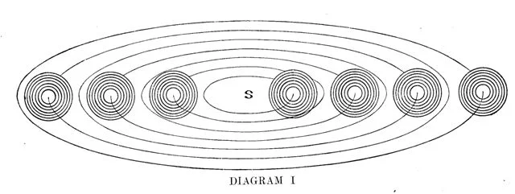
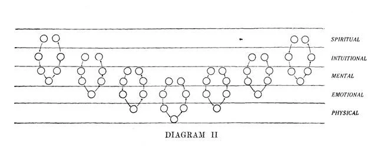
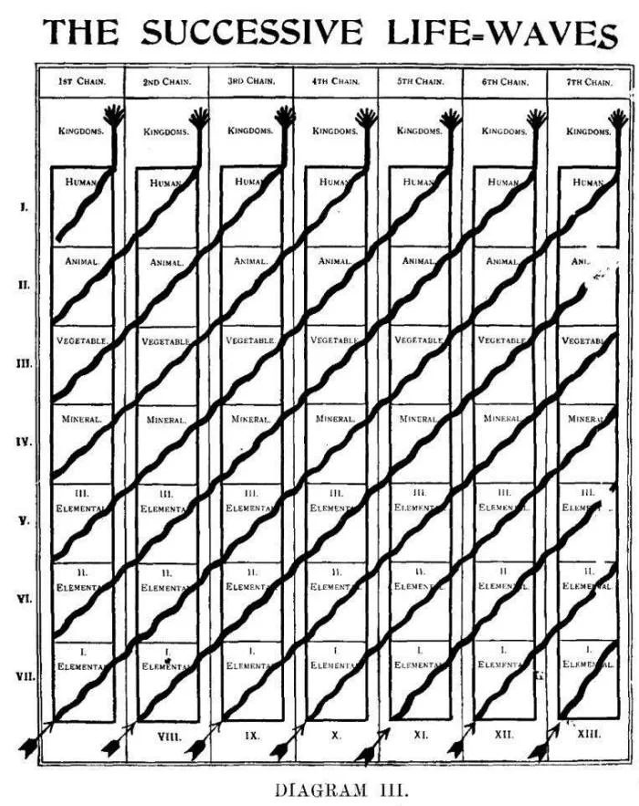
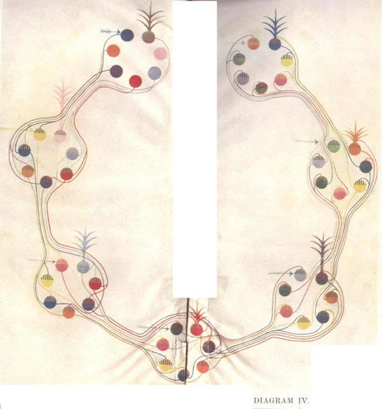

# Человек: Откуда, Как и Куда

> **Черновой перевод 11/2023**

_Запись ясновидческого исследования_

_Анни Безант и Ч. У. Ледбитер_

_Теософическое Общество, Адьяр, Индия_

- _Часть I. Человек: Откуда и Как_
  - [Глава I](#глава-i). Основы
  - [Глава II](#глава-ii). 1-ая и 2-ая цепи
  - [Глава III](#глава-iii). Ранние времена лунной цепи
    - [Глава IV](#глава-iv). 6-ой круг лунной цепи
    - [Глава V](#глава-v). 7-ой круг лунной цепи
  - [Глава VI](#глава-vi). Ранние времена земной цепи
    - [Глава VII](#глава-vii). Начало 4-го круга
      - [Глава VIII](#глава-viii). 4-ая коренная раса
        - [Глава IX](#глава-ix). Черная магия в Атлантиде
        - [Глава X](#глава-x). Цивилизация Атлантиды
          - [Глава XI](#глава-xi). Две цивилизации Атлантиды -- Перу
          - [Глава XII](#глава-xii). Две цивилизации Атлантиды -- Перу (продолжение)
          - [Глава XIII](#глава-xiii). Две цивилизации Атлантиды -- Халдея
      - [Глава XIV](#глава-xiv). Начало 5-ой коренной расы
        - [Глава XV](#глава-xv). Возведение великого города
        - [Глава XVI](#глава-xvi). Ранняя арийская цивилизация и её Империя
          - [Глава XVII](#глава-xvii). 2-ая подраса, арабская
          - [Глава XVIII](#глава-xviii). 3-я подраса, иранская
          - [Глава XIX](#глава-xix). 4-ая подраса, кельтская
          - [Глава XX](#глава-xx). 5-ая подраса, тевтонская
        - [Глава XXI](#глава-xxi). Корень расы и его спуск в Индию
- _Часть II. Человек: Куда_
  - [Глава XXII](#глава-xxii). Видение короля Ашоки. _Помощник дэва. Видение будущего._
  - [Глава XXIII](#глава-xxiii). Начало шестой коренной расы. _Основание сообщества. Собрание членов. Вхождение в усадьбу. Дети ману. Правительство. Дух новой расы. Ману и его совет._
  - [Глава XXIV](#глава-xxiv). Религия и храмы. _Теософия в сообществе. Дэвы. Богослужения в храме. Алый храм. Связи с логосом. Проповедь. Кадение. Звук. Синий храм. Служба преданности. Благословение. Разум. Желтый храм. Интеллектуальный стимул. Интеллектуальное чувство. Ментальная магия. Зеленый храм. Линия исцеляющих дэва. Независимые. Собрание мертвых. Учитель религии._
  - [Глава XXV](#глава-xxv). Образование и семья. _Обучение детей. Тренировка воображения. Более продвинутые классы. Школьная система. Программа обучения. Детские службы. Символические танцы. Центральная идея. Рождение и смерть. Брак._
  - [Глава XXVI](#глава-xxvi). Здания и обычаи. _Расовые характеристики. Общественные здания. Дома. Мебель. Одежда. Еда. Библиотеки. Газеты. Общественные встречи. Отделы науки. Искусства. Сила воли. Экономические условия. Новая энергия. Условия работы. Частная собственность. Город-парк. Транспорт. Санитария и орошение._ 
  - [Глава XXVII](#глава-xxvii). Заключение. _Федерация наций. Религия Христа. Новый язык. Старые нации. Земля и рудники. Правительство Британии. Лондон. Другие места. Адьяр. Теософическое общество. Три метода реинкарнации. Как нам подготовиться._
- [Эпилог](#эпилог)
- [Приложения](#приложения)

## Предисловие

Идея о возможности ясновидения уже не кажется совершенно безумной, хотя она не получила общего признания ни в какой значительной степени. Однако постоянно растущее меньшинство весьма разумных людей верит в ясновидение как в факт и рассматривают его как совершенно естественную способность, которая в процессе эволюции станет универсальной. Они не рассматривают его как естественный дар, ни как проявление высокой духовности, блестящего интеллекта или чистоты характера; все это может проявляться у человека, который ничуть не ясновидец. Они знают, что эта способность заложена во всех людях, и что любой, кто способен и готов заплатить цену требуемую для его развития, может раскрыть ее в себе опережая общий прогресс эволюции.

Использование ясновидения для исследования прошлого не ново. Тайная Доктрина Е. П. Блаватской является выдающимся примером такого использования. Насколько надежной является работа, проведенная таким образом, вопрос, который должен быть решен будущими поколениями, которые будут обладать силой, которая мы сейчас используем для этой цели. Мы знаем, что у нас будет большое число читателей-учеников, которые, веря в реальность этой способности и зная о нашей честности, найдут эту книгу интересной и пооучительной. Для них она написана. По мере того как растёт число учеников, растёт и число наших читателей. Большего мы не смеем желать. Спустя столетия, когда люди смогут написать гораздо лучшие книги, основанные на подобных исследованиях, на эту посмотрят как на интересную первооткрывательницу, учитывая время, в котором она была написана.

Явных доказательств его общей точности, конечно, не может быть дано, хотя время от времени могут быть сделаны открытия, подтверждающие отдельные утверждения. Правду ясновидческого исследования невозможно доказать широкой публике, как невозможно показать цвет слепому. Общественность, по крайней мере та его часть, которая читает книгу, будет относиться к ней с непередаваемым недоверием; некоторые могут считать ее интересной выдумкой; другим она может показаться скучной. Большинство посчитают авторов либо самообманщиками, либо мошенниками, в зависимости от того, добросердечны ли они или злонамеренны.

Ученикам мы бы хотели сказать: примите её настолько, насколько это помогает в ваших учебных занятиях, и проливает свет на то, что вы уже знаете. В будущем могут быть сделаны уточнения и исправления, потому что мы показали лишь несколько фрагментов огромной истории, и даже эта задача была очень сложной.

Исследовательская работа проводилась в Адьяре летом 1910 года; в течение жаркого лета многие ученики уехали, и мы закрывались в библиотеке пять вечеров каждую неделю, чтобы не отвлекаться; мы наблюдали и тщательно записывали то, что видели. Два члена группы, г-жа Ван Хук и Дон Фабрицио Русполи, были настолько любезны, что записывали всё, что мы говорили, точно так, как мы это говорили; эти два набора заметок были сохранены. Они переплетены с настоящим рассказом, написанным частично в течение лета 1911 года, несколько недель которого были посвящены этому, и завершенным в апреле и мае 1912 года, также украденными из нашей напряженной жизни. Такая работа не может быть выполнена при постоянных перерывах, и единственный способ её выполнить -- это временно уйти от мира, "отправиться в отшельники", как говорят римские католики.

Мы сделали набросок общего теософического плана эволюции, который изложен в "предисловии" в главе I. Он определяет весь курс и служит основным планом книги. Факт наличия Оккультной Иерархии, которая направляет и формирует эволюцию, принимается здесь как само собой разумеющееся, и некоторые ее члены неизбежно являются в ходе рассказа. Чтобы погрузиться в самые ранние стадии, мы обратились к нашим собственным сознаниям, присутствующим там, и подставили их в начало рассказа, т.к. других персонажей мы не узнали. Они, так сказать, обеспечили нашу основу для исследований в первой и второй цепи. От последней части третьей цепи и далее, мы проследили историю человечества, следуя за группой людей, за исключением случаев, когда эта группа была занята на каком-либо важном этапе эволюции -- как в начале третьей и четвертой подрас третьей коренной расы; когда это случалось, мы отвлекались от их истории и следовали за основным потоком прогресса. В этой записи дается сравнительно мало деталей о личностях, так как рассматривается большой период времени. Однако многие подробные истории жизни были опубликованы в 'The Theosophist' под общим названием _“Прорехи в вуали времени”_ -- прорехи, через которые можно увидеть прошлое. Мы надеемся, что однажды будет издан том под названием _"Жизни Алкиона"_, в котором будут показаны полные генеалогические таблицы, в которых видны родственные связи всех упомянутых персонажей. Если бы были люди для выполнения этого, то такая работа могла бы выполняться _ad libitum_.

Историю невозможно написать без имен и, поскольку реинкарнация -- это факт, а следовательно, и повторное появление одного и того же индивида в течение последующих эпох тоже является фактом. Этот индивид играет множество ролей под множеством имен -- мы присваиваем многим людям имена, по которым они могут быть узнаны в драмах, участниками которых они являются. Ирвинг для нас всегда Ирвинг, как Макбет, Ричард III, Шейлок, Карл I, Фауст, Ромео, Маттиас; и в любой истории его жизни как актера о нем говорят как об Ирвинге, независимо от той роли, которую он играет: его продолжающаяся индивидуальность признается на протяжении всей истории. Так и человек, в долгой истории, в которой жизни являются днями, играет сотни ролей, но остается самим собой: будь то мужчина или женщина, крестьянин, принц или священник. Мы присвоили этому "Я" уникальное имя, чтобы его можно было узнать под всеми масками, надетыми для исполнения роли. Это в основном имена созвездий или звезд. Например, мы присвоили Юлию Цезарю имя Корона; Платону -- имя Паллада; Лао-цзы -- имя Лира; таким образом, мы можем увидеть как различны их линии эволюции, предыдущие жизни, которые породили Цезаря и Платона. Это придает истории человеческий интерес и учит читателей реинкарнации.

Имена тех, кто постоянно появляется в этой истории в качестве обычных мужчин и женщин, но кто ныне стали Учителями, могут сделать этих великих существ более реальными для многих; Они поднялись туда, где сейчас стоят, по той же лестнице жизни, по которой мы сейчас поднимаемся; Они познали обыденную домашнюю жизнь, радости и печали, успехи и неудачи, которые составляют человеческий опыт. Они не боги, совершенные с бесконечных времен, а мужчины и женщины, которые раскрыли Бога в себе и по трудному пути достигли сверхчеловечности. Они -- исполненное обещание того, чем мы станем, великолепные цветы на растении, на котором мы -- бутоны.

И так мы отправляем наш корабль в бурный океан общественности, чтобы тот встретил свою судьбу и узнал свою участь.

_Анни Безант и Ч. У. Ледбитер_

## Некоторые из персонажей в истории

- Четыре кумары -- Четыре Господа Огня, по-прежнему проживающие в Шамбале.
- Махагуру -- Бодхисаттва тех времён, являющийся как Вьяса, Тот (Гермес), Заратустра, Орфей, а также как Гаутама, который стал Господом Буддой.
- Сурия -- Господь Майтрея, нынешний Бодхисаттва, Верховный Учитель мира.
- Ману -- Глава коренной расы. Если с приставкой, Коренной-Ману или Семенной-Ману, еще более высокий Чин, отвечающий за более крупный цикл эволюции -- за Круг или за Цепь. Титул Вайвасвата в индийских книгах дают как Коренному-Ману нашей Цепи и Ману арийской, или пятой, коренной расы.
- Вирадж -- Маха-Чохан, высокая должность, равная Ману или Бодхисаттве.
- Сатурн -- Ныне Учитель, о котором упоминается в некоторых теософских книгах как 'Венецианец'.
- Юпитер -- Ныне Учитель, проживающий на Холмах Нильгири.
- Марс -- Ныне Учитель М. Оккультного мира.
- Меркурий -- Ныне Учитель K.Х. Оккультного Мира.
- Нептун -- Ныне Учитель Илларион.
- Осирис -- Ныне Учитель Серапис.
- Брихаспати -- Ныне Учитель Иисус.
- Венера -- Ныне Учитель Рагозци (или Раковский), 'Венгерский Адепт', граф Сен-Жермен XVIII века.
- Уран -- Ныне Учитель Д.K.
- Вулкан -- Ныне Учитель, известный в своей последней земной жизни как сэр Томас Мур.
- Афина -- Ныне Учитель, известный на Земле как Томас Вон, 'Евгений Филателист'.
- Альба -- Этель Уайт
- Альбирео -- Мария-Луиза Кирби
- Алкион -- Дж. Кришнамурти
- Алетея -- Джон ван Манен
- Альтаир -- Герберт Уайт
- Аркор -- A. J. Wilson
- Аврора -- Граф Бубна-Лицич
- Капелла -- S. Мод Шарп
- Корона -- Юлий Цезарь
- Крукс -- Почетный Отвей Каффе
- Денеб -- Лорд Кокрейн (Десятый граф Дандональд)
- Евдоксия -- Луиза Шоу
- Fides -- G. S. Arundale
- Gemini -- E. Мод Грин
- Гектор -- W. H. Kirby
- Гелиос -- Мари Русак
- Геракл -- Анни Безант
- Лео -- Фабрицио Русполи
- Ломиа -- J. I. Wedgwood
- Лютеция -- Чарльз Брэдлоу
- Лира -- Лао-Цзы
- Мира -- Карл Холбрук
- Мизар -- Я. Нитьянанда
- Мона -- Пит Мёльман
- Норма -- Маргарита Русполи
- Олимпия -- Дамодар K. Маваланкар
- Паллас -- Платон
- Фоцея -- W. Q. Judge
- Феникс -- Т. Паскаль
- Полярная звезда -- B. P. Вадиа
- Протей -- Тешу Лама
- Селена -- C. Джинараджадаса
- Сириус -- Ч. У. Ледбитер
- Сива -- Т. Субба Рао
- Спика -- Франческа Арундейл
- Таурус -- Джером Андерсон
- Улисс -- H. S. Олькотт
- Ваджра -- Е. П. Блаватская
- Веста -- Минни С. Холбрук

## Введение

Вопрос о происхождении человека, его эволюции, его судьбе, есть вопрос неиссякающего интереса. Откуда пришел он, этот величественный разум, и по крайней мере на этой сфере вершина видимых существ? Как он развился до своего нынешнего положения? Внезапно ли он спустился сверху, как сверкающий ангел, чтобы стать временным обитателем дома из глины; или же он поднимался вверх в течение долгих мрачных веков, начиная свое скромное происхождение от первобытной слизи, от рыбы, пресмыкающегося, млекопитающего, и до человеческого царства? Каков его дальнейший путь? Продолжит ли он развиваться дальше, поднимаясь все выше и выше, только чтобы скатиться по длинному склону дегенерации, пока не упадет в пропасть смерти, оставив позади себя холодную планету, мавзолей множества цивилизаций; или же его нынешнее восхождение лишь обучение бессмертной духовной Силе, цель которой в своей зрелости властвовать над миром, системой, собранием Систем, своего рода богом в становлении?

На эти вопросы были даны многие ответы, частичные или довольно полные, в Священных Писаниях древних религий, в туманных традициях, переданных из рук в руки от могучих людей древности, в исследованиях современных археологов, в изысканиях геологов, физиков, биологов, астрономов наших дней. Самые современные знания подтвердили самые древние записи, приписывая нашей земле и ее обитателям период существования огромной продолжительности и невероятной сложности; сотни миллионов лет сваливаются в одну кучу, чтобы дать время для медленных и тяжелых процессов природы; все дальше и дальше отодвигается "первобытный человек"; Лемурия становится видимой, там где сейчас колышется Тихий океан, и Австралия, недавно переоткрытая, считается одной из старейших земель; Атлантида положена там, где сейчас волнуется Атлантический океан, и Африка связана с Америкой твердым мостом земли, так что венок открывателя срывается с головы Колумба, и он видится как следователи давно исчезнувших поколений, которые нашли свой путь из Европы на континент заходящего солнца. Посейдонис больше не является просто фееричной сказкой, рассказанной суеверными египетскими жрецами греческому философу; Минос с Крита выкопан из его древней могилы, человек, а не миф; Вавилон, когда-то древний, преподносится как современный преемник серии высокоцивилизованных городов, погребенных в слой за слоем, теряющихся в ночи времени. Традиция намекает исследователю, чтобы он провел раскопки в Туркестане, в Центральной Азии, и шепчет о циклопических руинах, которые ждут лишь его лопаты для своего открытия.

Среди этого столкновения мнений, этого конфликта теорий, этого подтверждения и опровержения неустанно появляющихся гипотез, возможно, записи двух наблюдателей, двух исследователей, следующих по весьма древнему пути, по которому сегодня ступают лишь несколько людей, но который будет все более и более обходить многочисленные ученики по мере течения времени, -- имеют шанс быть прочитанными. Сегодня наука исследует чудеса того, что она называет 'субъективным умом', и находит в нем странные силы, странные проявления, странные воспоминания. Здоровый и уравновешенный, он, контролируя мозг, проявляется как гений; не в равновесии с мозгом, неудержимый и непредсказуемый, он проявляется как безумие. Когда-нибудь наука поймет, что то, что она называет субъективным умом, Религия называет Душой и что проявление его сил зависит от физических и сверхфизических инструментов в его распоряжении. Если они хорошо построены, звучны и гибки, и полностью находятся под его контролем, то силы видения, слуха, памяти, непредсказуемо всплывающие из субъективного ума, становятся нормальными силами в распоряжении Души; и если Душа стремится к Духу -- Божественному Я -- скрытому в материи нашей Системы, в истинном Внутреннем Человеке, вместо того чтобы всегда привязываться к телу, тогда ее силы растут, и знания, иначе недостижимые, оказываются перед ней.

Метафизики, древние и современные, утверждают, что прошлое, настоящее и будущее всегда одновременно существуют в божественном сознании и являются последовательными лишь когда проявляются, то есть под влиянием времени, которое есть истинная последовательность состояний сознания. Наше ограниченное сознание, существующее во времени, неизбежно связано с этой последовательностью; мы можем думать только последовательно. Но мы все знаем из нашего опыта в состоянии сна, что меры времени меняются с этим изменением состояния, хотя последовательность остается; мы знаем также, что меры времени меняются еще больше в мире мысли, и что когда мы строим ментальные образы, мы можем замедлить, ускорить, повторить последовательность изображений мыслей по своему усмотрению, хотя все равно остаемся связанными с последовательностью. Продолжая эту линию мысли, несложно представить себе ум, возвышенный до трансцендентной силы, ум ЛОГОСА или СЛОВА -- такого Существа, например, как описано в Евангелии Иоанна, i. 1-4 -- содержащее в себе все ментальные образы, воплощенные в, скажем, Солнечной системе, упорядоченные в последовательности их предполагаемого проявления, но все они есть, все могут быть пересмотрены, как мы можем пересматривать свои собственные образы мыслей, хотя мы еще не достигли божественной силы, так впечатляюще озвученной Пророком Мухаммедом: "Он только говорит ему: _Будь_, и он есть". (_Al Quran_, xi. 17.) Тем не менее, как младенец в первый же день содержит в себе потенциал своего отца, так и мы, потомство Бога, содержим в себе потенциал Божественности. Следовательно, когда мы решительно отворачиваем Душу от земли и концентрируем её внимание на Духе -- субстанции, тени которой он является в мире материи -- Душа может достичь "Памяти Природы", воплощения в материальном мире Мыслей ЛОГОСА, отражения, так сказать, Его Разума. Там живет прошлое в вечно живых записях; там же живет и будущее, более труднодоступное для полуразвитой Души, так как оно еще не проявлено, не воплощено, хотя оно вполне "реально". Душа, читая эти записи, может передать их телу, впечатлить их в мозг, а затем записать их в словах. Когда Душа сливается с Духом -- как в случае "совершенных людей", тех, кто завершил человеческую эволюцию, духи, которые "освобождены" или "спасены" (термины, используемые индусами и христианами для обозначения окончания чисто человеческой эволюции.) -- тогда касание божественной Памяти всегда немедленное, прямое, всегда доступное и безошибочное. Прежде чем этот этап будет достигнут, касание несовершенно, посредственно, подвержено ошибкам наблюдения и передачи.

Авторы этой книги, обученные методу касания, но столкнувшиеся со сложностями, связанными с их незавершенной эволюцией, сделали все возможное, чтобы наблюдать и передавать, но они полностью осознают множество слабостей, которые портят их работу. Им иногда оказывали помощь Старшие Братья, помогая с общими контурами здесь и там, а также с датами, где это было необходимо.

Как и в случае с родственными книгами, которые предшествовали этой в теософическом движении, "сокровище находится в глиняных сосудах", и, признавая помощь, благосклонно оказанную, они берут на себя всю ответственность за все ошибки.

## Человек: Откуда и Как

### Глава I

#### Основы

Откуда пришёл человек и куда он идёт? В самом полном смысле мы можем только ответить: Человек, как Существо духовное, исходит от Бога и идёт к Богу; но Откуда и Куда, с которыми мы имеем дело здесь, означают гораздо более скромный охват. Это лишь одна страница его жизненной истории, которая здесь скопирована, рассказывая о рождении в плотную материю некоторых Детей Человека -- Что лежит за этим рождением, быть может, еще непроглядная Ночь? -- и следуя их росту от мира к миру к точке в ближайшем будущем, всего лишь несколько столетий впереди -- Что лежит за этим облачным рассветом, быть может, еще не восшедший День?

И все же название не совсем неточное, потому что тот, кто приходит от Бога и идет к Богу, не совсем 'Человек'. Этот Луч божественного Великолепия, который исходит от Божественности в начале проявления, этот _"фрагмент моего собственного Я, преобразованный в мире жизни в бессмертный Дух,"_ (_Бхагавад-Гита_, xv 7) это гораздо больше, чем Человек. Человек -- это лишь один этап его развития, а минерал, растение, животное -- лишь этапы его эмбриональной жизни в материнской утробе Природы, до того как он родится Человеком. Человек -- это стадия, на которой Дух и Материя борются за господство, и когда борьба закончена и Дух стал Господом Матери, Учителем жизни и смерти, тогда Дух вступает в свое сверхчеловеческое развитие, и он уже не Человек, а скорее Сверхчеловек.

Здесь мы имеем дело только с ним как с Человеком: с Человеком на эмбриональной стадии, в минеральном, растительном и животном царствах; с Человеком в его развитии в человеческом царстве; с Человеком и его мирами, Мыслителем и его полем эволюции.

Чтобы легче было понять историю, рассказанную в этой книге, читателю стоит сделать небольшую паузу и взглянуть на общее представление о Солнечной системе, изложенное в теософической литературе¹ и на общих принципах эволюции, проводимых в ней. Это не сложнее, чем техническая терминология каждой науки, или другие космические описания, как в астрономии, и немного внимания позволит ученику легко освоить всё это. Во всех исследованиях глубокого содержания всегда есть сухие предварительные факты, которые нужно понять. Беспечный читатель посчитает их скучными, пропустит их, и во время последующего чтения окажется весьма ошеломлен и запутан; он строит свой дом без фундамента и вынужден постоянно его подпирать. Внимательный читатель смело встречает эти трудности, преодолевает их раз и навсегда, и с полученными знаниями легко идет вперед, так что встречаемые им детали легко находят свое место. Тем, кто предпочитает первый метод, лучше пропустить эту главу и перейти к Главе II; более мудрые читатели уделят час на освоение того, что последует далее.

> ¹ Изучающий может найти его в _'Тайной доктрине'_ Е. П. Блаватской, _'Эзотерическом буддизме'_ и _'Росте души'_ А. П. Синнетта, _'Древней Мудрости'_ А. Безант и т.д. Есть незначительные различия, такие как названия сфер Земной цепи Блаватской и Синнеттом, но основные факты идентичны.

Великий мудрец, Платон, один из величайших умов мира, чьи благородные идеи определили европейскую мысль, делает многозначительное заявление: _"Бог геометризует."_ Чем больше мы знаем о природе, тем больше мы осознаем этот факт. Листья растений вырастают в определенном порядке, 1/2, 1/3, 1/5, 3/8, 5/13 и так далее. Вибрации, создающие последовательные ноты шкалы, можно соотносить с регулярным рядом. Некоторые болезни следуют определенному циклу дней, а 7-й, 14-й, 21-й дни означают кризисы, которые выражаются в продолжении физической жизни или смерти. Нет недостатка в примерах.

Так что неудивительно, что мы обнаруживаем в нашей Солнечной системе постоянное повторение числа Семь. По этой причине, это число называли 'священным' ; было бы лучше назвать его 'значимым'. Жизнь луны естественным образом делится на дважды семь дней нарастания и равное количество убывания, а ее четверти дают нам неделю из семи дней. И мы находим это семь как коренное число нашей Солнечной Системы, делящее ее отделения на семь, и они снова делятся на вспомогательные семь и эти на другие семь и так далее. Религиозный ученик подумает о семи Амешаспентах зороастрийца, о семи Духах перед троном Бога христианина; теософ о великом Тройном Логосе системы, с Его министрами, «Правителями семи Цепей»¹, вокруг Него, каждый из которых правит своим отделом системы, как наместник короля. Нас здесь интересует только одно подобное отделение. В Солнечной системе их десять, так как, будучи укорененной в семи, она развивает десять отделений, и поэтому десять мистики зовут 'совершенным числом'. Господин А. П. Синнетт удачно назвал эти отделы 'Схемами Эволюции', и в каждой из этих схем есть человечества которые эволюционируют или будут эволюционировать. Теперь мы ограничимся нашей, хотя мы не забываем, что есть и другие, и что очень высокоразвитые Разумы могут переходить от одного к другому. Фактически, такие посетители пришли на нашу землю на одном из этапов ее эволюции, чтобы направлять и помогать нашему только что родившемуся человечеству.

> ¹ Их называют Планетарными Логосами, но этот термин часто лишь запутывает, и потому здесь мы его избегаем.

> _Диаграмма I_

Схема Эволюции проходит через семь великих эволюционных стадий, каждое из которых называется Цепью. Это название происходит от того факта, что Цепь состоит из семи Сфер, взаимосвязанных друг с другом; это цепь из семи звеньев, где каждое звено -- сфера. Семь Схем показаны на Диаграмме I, вокруг _центрального солнца_, и в каждый период времён только одно из колец в каждой Схеме будет активно; каждое кольцо каждой из этих семи Схем состоит из семи сфер; они не показаны отдельно, но формируют то, что мы здесь нарисовали в виде кольца, чтобы сэкономить место. Сферы показаны на следующей диаграмме.

> _Диаграмма II_

На Диаграмме II мы видим одну Схему, представленную на семи этапах своего эволюционного развития или на семи последовательных цепях; она теперь показана в отношении к пяти из семи типов, или сфер, материи, существующих в Солнечной системе; материал каждого типа состоит из атомов определенного вида, все твердые, жидкие, газообразные вещества и эфиры одного типа материи являются агрегациями атомов одного вида¹ этот материал называется в соответствии с состоянием сознания, которому он отвечает: физический, эмоциональный, ментальный, интуитивный и духовный.² В первой Цепи, её семь Миров, A, B, C, D, E, F, G, изображены в следующем порядке³: A и G, корневой и семенной мир, находятся на духовном плане, ибо все спускается с верхних уровней на нижние, с более тонких к более грубым, и вновь поднимается к верхним, обогащенное результатами путешествия, результаты служат семенами для следующей Цепи; B и F находятся на интуитивном плане, один собирает, а другой усваивает; C и E находятся на высшем ментальном плане, в аналогичных отношениях; D, поворотный пункт, точка баланса между восходящим и нисходящим дугами, находится в нижней части ментального плана. Эти пары сфер в каждой Цепи всегда тесно связаны, но одна из них представляет собой грубый набросок, другая -- завершённую картину. Во второй Цепи все сферы спустились на один уровень ниже в материю, и D находится на эмоциональном плане. В третьей Цепи они опустились еще на одну стадию, и D достиг физического плана. В четвертой Цепи, и только на ней, срединной из семи, и самой глубокой, увязшей в грубейшей материи, переломной точки для Цепей как D для сфер, на физическом плане находится три сферы -- C, D и E. Во время обратного путешествия, как было сказано, подъем схож с спуском: в пятой Цепи, как и в третьей, есть одна физическая сфера; в шестой, как и во второй, сфера D эмоциональная; в седьмой, как и в первой, сфера D ментальная. С завершением седьмой Цепи Схема полностью реализует себя: все её плоды собраны.

> ¹ См. _"Оккультную химию"_, Анни Безант и Ч. У. Ледбитер.

> ² Физическая материя -- это материя, с которой мы ежедневно взаимодействуем в нашей бодрствующей жизни. Эмоциональная материя -- это та, что колеблется под влиянием желаний и эмоций, и в наших старых книгах она называется астральной, название которое мы в какой-то степени сохраняем. Ментальная материя -- это та, которая аналогично отвечает на мысли. Интуитивная материя (будхическая на санскрите) -- это та, которая служит средой для высшей интуитиции и всеобъемлющей любви. Духовная материя (атмическая) -- это та, в которой действует творческая Воля.

> ³ Верхняя левая сфера -- это А; следующая ниже -- B; и так до G, верхней правой сферы.

Семь Схем нашей Солнечной системы, для удобства, могут быть названы именем своей сферы D, эта сфера является наиболее известной нам; их имена: Вулкан, Венера, Земля, Юпитер, Сатурн, Уран, Нептун (см. Диаграмму I). В Схеме, к которой принадлежит наша Земля, Цепь, предшествующая нашей земной Цепи, была третьей в ее серии, и ее единственная физическая сфера D была тем, чем сейчас является наша Луна; поэтому третью Цепь называют лунной, в то время как вторую и первую Цепи обозначают только номерами; наша земная или терранская Цепь, является четвертой по счету и три из своих семи сфер у неё в физическом проявлении, её третья сфера, C, то, что называется планетой Марс, а ее пятая сфера, E -- то, что называется планетой Меркурий. Также Нептунская Схема, с Нептуном в качестве ее сферы D, имеет три сферы своей Цепи в физическом проявлении -- C и Е являются двумя физическими планетами, связанными с ней, существование которых было упомянуто в теософической литературе прежде, чем они были признаны Наукой -- и следовательно достигла четвертой Цепи своей серии. Венерианская Схема приближается к окончанию своей пятой Цепи, и Венера, поэтому, недавно потеряла свою Луну, сферу D предыдущей Цепи¹. Возможно, что Вулкан, который видел Гершель, но который, как говорят, теперь исчез, находится в своей шестой Цепи, но об этом у нас нет информации, ни прямой, ни опосредованной. Юпитер еще не обитаем, но его луны населены существами с плотными физическими телами.

> ¹ Возможно вы помните, что Луну Венеры видел Гершель.

> _Диаграмма III_

Диаграммы III и IV представляют собой взаимоотношения между семью Цепями в рамках Схемы, показывая эволюционное развитие от Цепи к Цепи. Сначала следует изучить Диаграмму III; это всего лишь упрощение Диаграммы IV, которая является копией рисунка, нарисованного Учителем; хотя на первый взгляд она может показаться запутанной, она окажется очень познавательна, если её понять.

Диаграмма III располагает семь Цепей в Схеме в виде столбцов, стоящих бок о бок, чтобы можно было проследить путь божественных Потоков Жизни, обозначенных стрелками, от царства к царству в их восхождении. Каждая секция в столбце представляет одно из семи царств Природы -- три элементальных, минеральное, растительное, животное, человеческое¹. Следуйте Потоку Жизни 7, единственному, который проходит через семь царств в рамках Схемы; он входит в первую Цепь в первом Элементальном Царстве и развивается там в течение жизненного периода Цепи; он переходит во второе Элементальное Царство на второй Цепи и развивается там в течение ее жизненного периода; он появляется в третьем Элементальном Царстве на третьей Цепи и входит в Минеральное на четвертой; затем он последовательно развивается через Растительное и Животное Царства на пятой и шестой Цепях и достигает Человеческого на седьмой. Вся Схема таким образом предоставляет поле для эволюции потока божественной Жизни от его одушевления материи до человека². Остальные потоки либо начались в другой Схеме и вошли в эту на достигнутой там стадии эволюции, либо вошли в эту слишком поздно, чтобы достичь здесь человеческого царства.

> ¹ 'Элементальными' царствами являются три стадии жизни на ее спуске в материю -- инволюции -- и семь царств могут быть представлены на спускающейся и поднимающейся дуге, как Цепи и сферы:

<pre style="font-family:monospace">
      1-ое Элементальное    Человеческое
  2-ое Элементальное                Животное
      3-ое Элементальное    Растительное
                    Минеральное
</pre>

> ² Эти семь Потоков Жизни и шесть дополнительных входов для самого низшего Элементального Царства в остальных шести Цепях, все 13, являются последовательными импульсами, которые составляют для этой Схемы то, что Теософы называют 'второй Волной Жизни', т.е. формирующийся поток Жизни от Второго ЛОГОСА, Вишну индусов, Сына христиан, Троиц.

> _Диаграмма IV_

Изучение Диаграммы IV следует начать с понимания того, что цветные круги не являются семью Цепями _сфер_, как можно было бы ожидать, а семью Царствами Природы в каждой последующей Цепи, и поэтому соответствуют секциям столбцов в Диаграмме III. Здесь мы видим всю Схему Эволюции с местом каждого Царства, показанной в каждой Цепи. Ученик должен выбрать линию любого цвета в первом круге и внимательно проследить за ней.

Давайте возьмем синий круг в верхнем левом углу, указанный стрелкой; он представляет первое Элементальное Царство на первой Цепи. Покидая первую Цепь ради второй -- следующего кольца разноцветных кругов -- синий поток разделяется при прибытии туда; его наименее продвинутая часть, которая не готова перейти во второе Элементальное Царство, отделяется от основного потока и снова входит в первое Элементальное Царство второй Цепи, присоединяясь к новому Потоку Жизни -- окрашенному в жёлтый цвет и обозначенному стрелкой -- который начинает свою эволюцию в этой Цепи, и сливается с ним; основной синий поток продолжает движение во второе Элементальное Царство второй Цепи, включая в себя некоторых отстающих из второго Элементального Царства первой Цепи, ассимилируя их и вместе с собой несет их дальше; стоит обратить внимание, что из этого Царства выходит только синий поток, другие элементы полностью ассимилированы. Синий поток продолжает течь в третью Цепь, разделяется, оставляет своих отстающих во втором Элементальном Царстве в третьей Цепи, в то время как основная масса идет на формирование третьего Элементального Царства третьей Цепи; снова он получает некоторых отстающих от третьего Элементального Царства второй Цепи, ассимилирует их и несет их с собой, чистый синий поток, в Минеральное Царство четвертой Цепи; как и раньше, он оставляет некоторых отстающих для их развития в третьем Элементальном Царстве четвертой Цепи, и получает некоторых из Минерального Царства третьей Цепи, ассимилируя их, как и раньше. Теперь он достиг своей самой плотной точки в эволюции, Минерального Царства. Оставляя его -- мы всё еще следуем за синей линией -- он поднимается в Растительное Царство пятой Цепи, отправляя своих отстающих в Минеральное Царство этой Цепи, и принимая отстающих от Растительного Царства четвертой Цепи. Снова он поднимается вверх, теперь в Животное Царство шестой Цепи, оставляя свои недостаточно развитые растения, чтобы завершить эту стадию их эволюции в Растительном Царстве шестой Цепи, и принимая неразвитых животных из пятой Цепи в своё Царство. Наконец, он завершает свою долгую эволюцию, вступая в Человеческое Царство на седьмой Цепи, опуская своих слишком неразвитых животных в Животное Царство седьмой Цепи, принимая некоторых людей из Человеческого Царства шестой Цепи, унося их дальше с собой к триумфальному завершению, где достигает совершенства человеческая эволюция и начинается сверхчеловеческая, по одному из семи путей, указанных синем пламенем в конце. В другой Схеме, те, кого мы оставили в качестве отстающих в Животном Царстве седьмой Цепи, появятся в Человеческом Царстве первой Цепи той новой Схемы, и в ней достигнут совершенства как люди. Они будут в круге, соответствующем серо-коричневому кружку, со своим пламенем в первой Цепи на данной Диаграмме.

Каждую линию можно проследить таким образом от Царства к Царству в последующих Цепях. Жизнь во втором, оранжевом круге, представляющая второе Элементальное Царство в первой Цепи -- и имеющее, следовательно, одну стадию жизни в Цепи за ним, или, иными словами, вошедшее в поток эволюции как первое Элементальное Царство в седьмой Цепи предыдущей Схемы (см. верхний левый круг со стрелкой в седьмой Цепи на нашей Диаграмме) -- достигает Человеческого Царства в шестой Цепи и проходит дальше. То, что находится в третьем круге, фиолетового цвета, с двуми Царствами за ним в предыдущей Схеме, достигает Человеческого Царства в пятой Цепи и проходит дальше. То, что в четвертой, в Минеральном Царстве, выходит в четвертой Цепи. То, что в Растительном Царстве, выходит в третьей Цепи; то, что в Животном, во второй; то, что в Человеческом, в первой.

Ученик, который тщательно разберется в этой диаграмме, обретет в своем распоряжении план, в разделы которого он сможет уложить любое количество деталей, не теряя при этом из виду общих принципов эонной эволюции среди их сложности.

Остаются две точки: суб-элементальое и сверхчеловеческое. Поток Жизни от ЛОГОСА оживляет материю вначале в первом, или низшем, Элементальном Царстве; следовательно, когда этот же поток от Цепи входит во второе Элементальное Царство на второй Цепи, материя, которая должна быть той, что от первого Элементального Царства на этой второй Цепи, должна быть оживлена новым Потоком Жизни от ЛОГОСА, и так далее с каждой из оставшихся Цепей¹.

> ¹ "Отец мой работает до сих пор, а значит и я." Иоанн, 17. См. в Главе V описание этого на нашей Земле, когда дух Луны воплощается в ней.

Когда Человеческое Царство пройдено, и человек стоит на пороге своей сверхчеловеческой жизни, как освободившийся дух, перед ним открываются семь путей на выбор: он может войти в блаженное всеведение и всемогущество Нирваны, с деятельностью, далеко превосходящей наше понимание, чтобы, возможно, в каком-то будущем мире стать Аватарой или божественным Воплощением; это иногда называют "взятием одеяния Дхармакайи". Он может вступить в "Духовный Период" -- фразу охватывающую непонятные смыслы, среди которых, вероятно, есть и "взятие одеяния Самбогакайи". Он может стать частью того хранилища сокровенных духовных сил, на которые опираются Агенты ЛОГОСА для своей работы, "взяв одеяние Нирманакайи". Он может остаться членом Оккультной Иерархии, которая управляет и охраняет мир, в котором он достиг совершенства. Он может перейти к следующей Цепи, чтобы помочь в создании ее форм. Он может вступить в великолепную Эволюцию Ангелов -- Дэв. Он может отдать себя непосредственному служению ЛОГОСУ, чтобы быть использованным Им в любой части Солнечной Системы, слугой и посланником, который живет только для исполнения Его воли и выполнения Его работы по всей системе, которой Он управляет. Как генерал имеет свой штаб, члены которого передают сообщения в любую часть поля, так и Они являются штабом Того, кто командует всеми, "служителями Его, вершащими Его волю"¹. Этот путь, по-видимому, считается особо трудным, возможно, самой большой жертвой, которую может принести Адепт, и поэтому считается особой честью. У члена Генерального штаба нет физического тела, но он создает его для себя с помощью Крияшакти -- "силы созидания" -- из материи Сферы, на которую он отправлен. Штаб включает в себя Существа на очень разных уровнях, начиная от Архатов² и выше. Есть те, кто посвятил себя ему, достигнув Архатства в Лунной Цепи; другие, которые являются Адептами;³ и те кто ушли далеко вперёд за пределы этой стадии человеческой эволюции.

> ¹ Псалмы, ciii, 21

> ² Те, кто прошел четвертое Великое Посвящение.

> ³ Те, кто прошел пятое Великое Посвящение.

Потребность в таком Штабе, вероятно возникает, помимо многих прочих причин неизвестных нам, из того факта, что на очень ранних стадиях эволюции Цепи -- особенно той, что на нисходящей дуге -- или даже Сферы, требуется больше помощи снаружи, чем потом. На первой Цепи нашей Схемы, например, достижение первого из Великих Посвящений было обозначенной целью, и никто из того человечества не смог стать Адептом, что само по себе весьма далеко от уровня Будды; следовательно, было необходимо назначить высших офицеров извне. Также помогали более поздним Цепям, и наша Земля должна будет предоставить высших Чиновников для более молодых Цепей других Схем, а также обеспечить обычную поддержку для поздних Сфер и Кругов нашей Цепи. Уже из нашей собственной Оккультной Иерархии два Члена, насколько нам известно, покинули нашу Землю, либо чтобы присоединиться к Генеральному штабу, либо быть предоставленными Главой нашей Иерархии Главе Иерархии другой Сферы вне нашей схемы.

Человеческие существа, которые в любой Цепи не достигают до определенного момента уровня, обозначенного для Человечества Цепи, являются ее "неудачами"; такая "неудача" может быть связана с молодостью и следовательно с нехваткой времени, или с недостатком должных усилий и так далее; но, какова бы ни была причина, те, кто не достигает точки, из которой они смогут достаточно продвинуться в течение оставшейся жизни Цепи, чтобы достичь требуемого уровня к ее концу, выпадают из ее эволюции до того, как эта эволюция завершится, и вынуждены войти в следующую Цепь в точке, определяемой уже достигнутым уровнем, чтобы завершить свой человеческий цикл. Есть и другие, кто справляется с прохождением этой решающей точки, "Судного Дня" для Цепи, но все же не продвигается с достаточной скоростью, чтобы достичь уровня, с которого открываются семь Путей. Эти, хотя они уже и не "неудачи", все же не вполне достигли успеха, и они тоже переходят в следующую Цепь и ведут ее человечество, когда оно достигает стадии, на которой тела достаточно эволюционировали, чтобы служить для их дальнейшего прогресса. В нашем изучении мы найдем эти различные классы, и это только краткий обзор их; подробности сделают их яснее. Лишь в первой цепи мы не заметили неудач, выпавших из ее эволюции. Были те, кто не добился успеха, но если у этой Цепи и был свой Судный День, мы его не заметили.

В рамках одной Цепи эволюционная волна перемещается от А до G, используя каждую сферу по очереди как поле для роста; это обращение вокруг Цепи соответственно называется Кругом, и семь раз волна перемещается вокруг, прежде чем жизнь Цепи заканчивается, и ее работа завершается. Затем результаты собираются и складываются, и все они становятся семенем для следующей Цепи, за исключением Тех, кто, завершив свой курс людей и став сверх-людьми, выбирают службу путём отличным от руководства будущей Цепи, и кто вступает на один из семи Путей.

Завершим это вступление. В Сфере Монад, на сверхдуховном уровне, обитают Божественные Излияния, Сыны Бога, которые должны облечься в плоть и стать Сынами Человека в приходящей вселенной. Они всегда видят Лицо Отца и являются Ангельскими соответствиями людей. Этот божественный Сын в своем собственном мире называется 'Монадой', Единством. Он тот, кто, как сказано ранее, "преобразуется в мире жизни в бессмертного Духа". Дух -- это Монада, скрытая в материи, поэтому он тройственен в своих аспектах Воли, Мудрости и Активности, но будучи самой Монадой, после того как он присвоил атомы материи духовной, интуитивной и ментальной сферы, вокруг которых будут сформированы его будущие тела. В Монаде бьёт ключём фонтан жизни; Дух, или его скрытый вид, это его проявление во вселенной. По мере того, как он усваивает власть над материей в нижней сфере, он все больше и больше контролирует эволюционную работу, и все больше решений, которые определяют судьбу человека, делаются его Волей, направляются его Мудростью и достигаются его Активностью.

### Глава II

#### Первая и вторая цепи

Мы столкнулись с практически единственной большой трудностью нашего исследования в самом начале -- это эволюционные циклы на первой и второй Цепях нашей Схемы. Учитель, улыбаясь, сказал на этот счёт: "Ну, вы сможете увидеть это, но сомнительно, что вы сможете описать это доступным языком, чтобы и другие могли понять". Условия там настолько отличаются от всего, что мы здесь знаем: формы настолько тонкие, изящные, изменчивые; материя настолько как "ткань, из которой сотканы сны", что четкое выражение увиденного практически невозможно. Несмотря на то, насколько неполным окажется описание, необходимо представить хоть что то, чтобы сделать понятным последующее развитие и раскрытие; пусть и несовершенное, но оно быть лучше, чем ничего.

Настоящее 'начало' найти возможно не удасться; в бесконечной цепи живых существ можно исследовать одно звено, вполне достаточное само по себе; но материал, из которого оно сделано, где-то в прошлом покоился в недрах земли, был добыт из какой-то шахты, плавился в какой-то печи, обрабатывался в какой-то мастерской, принимал форму под руками кого-то, прежде чем стать звеном в той цепи. Так происходит и с нашей Схемой. Без предыдущих Схем она не могла бы существовать, так как высшие существа, обитающие в ней, не начали свою эволюцию здесь. Достаточно сказать, что некоторые фрагменты Божества, вечные Духи, которые в других местах прошли по нисходящей дуге -- окружая себя все уплотняющейся материей через Элементальные Царства, и достигая своей самой нижней точки -- начали в Минеральном Царстве этой первой Цепи свое восхождение, свое долгое развёртывание в эволюционирующей материи; и в той Цепи, изучив наши первые уроки эволюции в Минеральном Царстве, были мы -- человечество нашей нынешней земли. Именно эти сознания мы предлагаем проследить от их жизни в минералах в первой Цепи до их жизни в людях в четвёртой. Будучи сами частью человечества земли, нам будет проще проследить это, чем проследить что-то совсем чужое для нас. Ведь в этом мы всего лишь вызываем из Вечной Памяти сцены, где мы сами играли свою роль, с которыми мы неразрывно связаны, и которые мы, поэтому, можем скорее достичь.

Наблюдаются семь центров, образующих первую цепь, первый и седьмой, как уже было сказано, на духовном уровне (Нирванический), второй и шестой на интуитивном (Буддхический), третий и пятый на высшем ментальном, четвертый на нижнем ментальном. Мы называем их по образу более поздних сфер, A и G, B и F, C и E, и в центре D, поворотная точка цикла. В первом круге четвертой цепи, которая является до некоторой степени грубой копией первой цепи, _Оккультный комментарий_, цитируемый в _"Тайной доктрине"_, говорит о Земле как о "эмбрионе в матрице пространства", и это сравнение всплывает у нас в памяти. Эта цепь -- будущие миры в матрице мысли, миры, которые позднее должны родиться в более плотном веществе. Мы едва ли можем назвать эти центры "сферами"; они скорее похожи на центры света в море света, фокусы света, через которые свет стремительно проходит, составленные из самой субстанции света и только света, и все же измененные потоком света, который пропускают через себя; они подобны воронкам, но кольца состоят лишь из света, отличаются только своим вращением, по разности своего движения, подобно водоворотам, состоящим лишь из воды посреди воды, но это водовороты света посреди света. Первый и седьмой центры являются модификациями духовного вещества, седьмой -- совершенная реализация широких контуров, видимых в первом, законченная картина, выточенная из грубого зарисовки божественного Художника. Существует там человечество, очень прославленное человечество, продукт какой-то предыдущей эволюции, которое должно здесь закончить свой человеческий путь на этой цепи (смотрите верхний правый круг на первой цепи на Диаграмме IV); здесь каждая сущность обретёт свое наименее развитое тело -- в четвертой сфере каждого круга -- тело ментального вещества, которое является самым плотным, что может дать эта цепь. Уровень, установленный для достижения на этой цепи -- не достижение которого подразумевало бы необходимость повторного рождения на следующей цепи -- это первая из великих Инициаций или то, что соответствует ей здесь. На этой первой цепи, насколько мы могли видеть, нет тех, кто отпадает как неудачи, и некоторые, как, кажется, всегда бывает на более поздних цепях, идут гораздо дальше установленного уровня; в седьмом круге члены этого человечества, ставшие Посвященными, выбирают один или другой из ранее упомянутых Семи Путей.

Все стадии эго, кажется, присутствуют на этой цепи, но отсутствие нижних уровней вещества, к которым мы привыкли, приводит к одному заметному различию в методе эволюции, которое поражает наблюдателя: все не только начинается, но и развивается "сверху", поскольку "снизу" нет и нет "форм" в обычном смысле этого слова, а только центры жизни, существа без стабильных форм; нет физических и эмоциональных миров -- в первых трех сферах даже нет нижнего ментального, откуда могут вырываться импульсы, поднимающиеся вверх, вызывая отклик высшего, чтобы оживить и использовать формы, уже существующие на нижних уровнях. Ближайший к такому действию вариант находится на сфере D, где мыслеформы подобные животным простираются вверх, привлекая внимание тонких центров, парящих над ними; затем больше жизни Духа пульсирует в центры, и они закрепляют себя за мыслеформами и одушевляют их, и мыслеформы становятся человеческими.

Сложно разграничить последовательные Круги; они, кажется, перетекают один в другой, как мягко растворяющиеся видения¹, и отмечаются только небольшими увеличениями и уменьшениями света. Прогресс идет очень медленно; вспоминается Сатья Юга² из индийских Священных писаний, где жизнь длится тысячи лет без особых перемен. Сущности развиваются очень медленно, под действием лучей магнетизированного света; это напоминает беременность, рост внутри яйца или цветка внутри чехла. Основной интерес Цепи заключается в эволюции Сияющих -- Дэвов, или Ангелов -- тех, кто постоянно живет на этих высоких уровнях, в то время как более низкие эволюции играют второстепенную роль. Человечество значительно влияется на них, в основном их присутствием и атмосферой, созданной ими, и время от времени можно видеть, как Сияющий берёт человека почти как игрушку или питомца. Обширная ангельская эволюция помогает человечеству своим существованием; вибрации, устанавливаемые этими великими Духами, воздействуют на низшие человеческие типы, укрепляя и оживляя их. В целом, мы видели Цепь как поле для этого Ангельского Царства в первую очередь и лишь во вторую очередь для человечества; возможно, это всегда так, и мы считаем мир исключительно принадлежащим нам потому что это свойственно людям.

> ¹ Возможно, вы помните, что первая и вторая расы в нашем текущем мире также показали нечто подобное, хотя на гораздо более низком уровне.

> ² Индусы делят время на циклы, состоящие из четырех Юг, или Эпох, которые следуют друг за другом, Сатья, первая по счету, является самой духовной и самой длинной. Когда четвертая эпоха заканчивается, начинается новый цикл, снова с Сатьей.

На четвертой сфере время от времени можно видеть, как Сияющий осознанно помогает человеку, перенося материю из своего тела в человеческое, тем самым увеличивая способность и восприимчивость последнего к восприятию. Такие помощники принадлежат к классу Форм-Ангелов -- Рупа-Дэвов -- которые живут в низшем мысленном мире.

Обратив взгляд на минеральное царство, мы находимся среди тех, кто станет людьми на Лунной Цепи и некоторых -- на Земной Цепи. Сознание, спящее в этих минералах, должно постепенно пробуждаться и раскрываться через долгие стадии в человечестве.

Растительное царство немного более живое, но все еще очень зыбкое и сонное; обычный прогресс здесь перенесет внутреннее сознание в животное царство на второй Цепи и в человеческое на третьей.

В настоящее время, хотя мы по прежнему вынуждены говорить о этих царствах как о минеральном и растительном, они на самом деле сотканы из одних лишь мыслей -- мыслей о минералах, мыслях о растениях, с монадами, которые, можно сказать, мечтают над ними, подсылая слабые толчки жизни в эти воздушные формы; эти монады вероятно вынуждены время от времени обращать внимание на них, чувствовать через них, ощущать через них, когда некое внешнее воздействие вынуждает их пробудиться. Эти мыслеформы представляют собой модели в Разуме Повелителя Семи Цепей, живущие внутри Него, продукты Его медитации, мир мыслей, мир идей; мы видим, что те монады, которые получили постоянные атомы в какой-то предыдущей Схеме и которые парят над этими мыслеформами, присоединяются к ним, и становятся смутно осознающими себя в и через них. Несмотря на то, что это сознание является смутным, в нем есть отличия; низшая ступень едва ли может быть названа сознанием, жизнью в мыслеформах, напоминающих то, что мы теперь называли бы землей, скалами, камнями. Монады, касающиеся их, едва ли можно было бы сказать, что воспринимают что-либо через них, кроме давления, вызывающего у них тусклое пробуждение жизни, проявляющее себя как сопротивление давлению, и поэтому отличное от еще более тусклой жизни в химических молекулах, не связанных с монадами, и не ощущающих давления. На следующей ступени, в мыслеформах, напоминающих то, что мы теперь называли бы металлами, чувство давления сильнее, а сопротивление ему немного более определенное; это почти что попытка вытолкнуть наружу, реакция, вызывающая расширение. Когда этот подсознательный ответ присутствует в нескольких направлениях, формируется мыслеформа кристалла. Мы заметили, что когда наше собственное сознание было в минерале, мы ощущали только подсознательный ответ; но выходя из него и пытаясь почувствовать реакцию извне, она проявлялась в нашем сознании как смутное недовольство давлением и тусклая обиженная попытка противостоять и оттолкнуть. "Я чувствую себя обиженным минералом" -- заметил один из нас. Возможно, монадическая жизнь, ищущая выражения, действительно смутно ощущает неудовольствие своим положением, и это мы ощутили, когда вышли из минерала, чувствуя это в себе, как мы чувствовали это в той части нашего сознания, которая в тот момент была за пределами жесткой формы. Если мы быстро заглянем вперед, то увидим, что монады, прикрепленные к кристаллам, не входят в следующую Цепь в низших формах растительной жизни, а только в более высоких и, переходя через них, вступают в Лунную Цепь на ее средней точке как млекопитающие, индивидуализируются там и воплощаются в пятом круге в образе человека.

Один из наиболее сбивающих с толку фактов для наблюдателей -- это то, что эти "мысли о минералах" не неподвижны, а мобильны; холм, который ожидаешь увидеть стабильным, может перевернуться или уплыть, или изменить свою форму; здесь нет твердой земли, а только изменчивая панорама. Для перемещения этих гор не требуется веры, так как они перемещаются сами по себе.

В конце этой первой Цепи все, кто достиг намеченного уровня -- который, как уже говорилось, соответствует нашей первой Инициации -- ушли по одному из семи Путей, один из которых вел к работе на второй Цепи в качестве строителей форм ее человечества, играя в ней роль, аналогичную роли, которую позже сыграли на нашей Земле "Владыки Луны" (Бархишад Питри из "Тайной Доктрины). Их называет Е. П. Блаватская "Асурами", то есть "живыми существами"; позже термин был ограничен в использовании живыми существами, в которых развит интеллект, но не эмоции.² Те, кто не смог достичь этого уровня, перешли на вторую Цепь для своей дальнейшей эволюции в самой ее середине и возглавили ее человечество, в конце той Цепи достигая освобождения и становясь среди ее "Господ"; некоторые из этих Господ в свою очередь работали на третьей Цепи, строя формы ее человечества (по номенклатуре из "Тайной Доктрины", став ее Бархишад Питри). Раннее человечество на второй Цепи было взято из животного царства первой; животное царство второй Цепи из растительного первой; в то время как растительное царство второй произошло из минерального первой. Три элементальных царства на спуске первой Цепи аналогично перешли во вторую Цепь, заполнив минеральное царство и два элементальных, в то время как первое элементальное царство формировалось из нового импульса жизни от ЛОГОСА.

> ² Эти Асуры действовали на второй Цепи как Бархишад Питри, и на третьей как Агнишватта Питри, и были одними из самых высоких классов сверхчеловеческих Манасапутр, которые пришли на нашу Землю, согласно Тайной Доктрине. Необходимо помнить, что все эти стадии сверхчеловеческие; на вид они указывают на сверхчеловеческие стадии пятого из семи Путей. В Тайной Доктрине возникает трудность из-за использования этого же имени Асуры для тех, кто покинул лунную Цепь с первой сферы ее седьмого круга и вызвал проблемы на Земле, "отказавшись создавать". Читатели _"Генеалогии Человека"_ должны учесть это, а также детали, данные позже, ибо я ошиблась из-за двойного использования слова в Тайной Доктрине. Человеческие существа, как таковые, не могут существовать более чем в двух последовательных Цепях. Они должны стать Сверхлюдьми, ибо таково их предназначение. -- А.Б.

На второй Цепи дальнейшее погружение в материю дает нам сферу на эмоциональном уровне, астральную сферу, а более плотный материал делает вещи немного более связанными и понятными. Так, у нас А и G на интуитивном уровне, B и F -- на верхнем ментальном, С и E -- на нижнем ментальном, а D -- на эмоциональном. На этой самой низкой сфере вещи были немного больше похожи на то, к чему мы привыкли, хотя все еще были очень странными и необычными. Так, вещи с общим видом овощей передвигаются с свободой животных, хотя, по-видимому, с малым, если вообще, чувством. Они не были прикреплены к физической материи, и поэтому были очень мобильны. Молодое человечество здесь жило в тесном контакте с Сияющими, которые по-прежнему доминировали на эволюционном поле, и Ангелы-Формы и Ангелы-Желания -- Рупа-Дэвы и Кама-Дэвы -- сильно, но в большей степени неумышленно, влияли на человеческую эволюцию. Страсть проявила себя во многих, кто теперь имел эмоциональные тела на сфере D, и ее зародыши были видимы у животных. Были заметны различия в способности откликаться на вибрации, которые непроизвольно и осознанно отправляли Сияющие, но изменения были очень постепенными, и прогресс был медленным. Позже, когда раскрылось интуитивное сознание, возникло общение между этой Схемой и Схемой, в которой Венера теперь является физическим миром; эта Схема находится впереди нашей Цепи, и некоторые пришли к нашей второй Цепи оттуда; но принадлежали ли они человечеству Венеры, или были членами "Штаба", мы не смогли определить.

Облака вещества, величественные в своем цветовом разнообразии, были заметной особенностью сферы D на протяжении первого круга; в следующем круге они становились более плотными, более яркими, более чувствительными к вибрациям, формирующим их в виды -- либо растительные, либо животные -- сложно сказать. Большая часть работы проходила на более высоких уровнях, это была витализация тонкого материала для будущего использования, проявляющаяся лишь небольшим влиянием на более низшие формы. Так же как сейчас используется элементальная эссенция для построения эмоциональных и ментальных тел, так тогда Ангелы-Формы и Ангелы-Желания стремились к более полному различению, используя эти облака вещества и обитая в них. Они спускались, подплан за подпланом, в более плотное вещество, но при этом не использовали человеческого царства. На сегодняшний день дэва, или ангел, может оживлять целый регион, и такое действие было очень распространённым тогда; эмоциональное и нижнее ментальное вещество составляло тела этих Ангелов, меняясь, смешиваясь; а пока, постоянные атомы растений, минералов, и даже животных, коренясь в таких ангельских телах, росли и развивались. Ангелы, казалось, не проявляли особого интереса к ним, точно так же, как мы не интересуемся развитием микробов внутри нас; время от времени, однако, некоторый интерес проявлялся к животному, и его способность реагировать на таких условиях резко увеличивалась.

Изучая сознание растений во второй цепи -- где мы, теперь уже люди, жили в растительном мире -- мы обнаруживаем слабое осознание действующих на них сил и некое принуждение к росту. В некоторых было чувство желания расти, стремления к росту; как сказал один из исследователей: "Я стараюсь расцвести". В других наблюдалось слабое сопротивление внесенной линии роста и незначительное нащупывание другого, самостоятельно выбранного направления. Некоторые пытались использовать любые силы, с которыми они контактировали, и в своем зародыше сознания считали, что все вокруг существует для них. Некоторые пытались продвигаться в направлении, которое их привлекало, и испытывали разочарование, они становились смутно обиженными; одно из растений, являющееся частью дэвы, оказалось в таком положении, поскольку дэва, естественно, устраивал всё так, чтобы ему самому было удобно, а не тем, кто составляет его тело. С другой стороны, с темной точки зрения растения, действия дэвы были столь же непостижимы, как и погода для нас в наши дни, и часто так же проблемны. К концу цепи, более развитые растения начинали проявлять немного ума, скорее детского интеллекта, признавая существование внешних животных, предпочитая соседство одних и уклоняясь от других. И было стремление к большей связности, очевидно, результата нисходящего движения жизни в материал большей плотности, воли, работающей в Природе для спуска на более плотные уровни. Без физического якоря, эмоциональные формы были очень нестабильными и имели тенденцию бесцельно и вяло перемещаться.

В седьмом круге этой цепи многие вышли из нее человечества как неудачи, упавшие слишком далеко, чтобы найти подходящие формы; и они продолжили свой путь позже, в третьей, Лунной цепи, как люди. Другие достигли уровня, который теперь обозначается как третья инициация, уровня, назначенного для успеха во второй цепи, и погли одним из семи путей, один из которых, как и раньше, ведет к следующей цепи для работы на ней. Те, кто не были неудачами, но не достигли совершенного успеха, перешли на третью Цепь, входя в круг, соответствующий пройденному ранее этапу. Передовые из животного царства индивидуализировались во второй цепи и начали свою человеческую эволюцию в Лунной цепи, проходя очень быстро через ее низшие царства и становясь людьми; затем они вели эволюцию в этой цепи, пока уже упомянутые классы -- сначала неудачи, а затем те, кто не достиг совершенного успеха -- не вступили в нее из второй цепи и поочередно стали лидерами. Передовые из второй Цепи Растительного царства вошли в Животное царство Лунной цепи как млекопитающие в его четвертом круге, не проходя через инфузорий и низших животных типов -- рыб и рептилий; остальные вошли в его первый круг как животные низших типов. Сознание в Минеральном царстве второй цепи перешло в Растительное царство Лунной цепи, а Минеральное царство было заполнено из высшего Элементального царства второй цепи. Как и раньше, низшее Элементальное царство было заполнено новой волной жизни от ЛОГОСА.

Здесь можно упомянуть важный принцип: каждый из семи подпланов, составляющих план, снова делится на семь; поэтому тело, хотя и содержит материал всех подпланов в своем составе, проявляет активность только на подразделениях, соответствующих количеству уже пережитых или переживаемых в данный момент цепей или кругов. Человек, работающий во втором круге второй цепи, сможет использовать в своих эмоциональном и ментальном телах только первые и вторые подразделения каждой подплоскости астральной и ментальной материи; в третьем круге он сможет использовать первый, второй и третий, хотя не так полно в отношении третьего, как он сделает это, когда будет в третьем круге третьей цепи, и так далее. Так, позже, в нашей Земной цепи, человек во втором круге работал над первыми и вторыми подразделениями каждой из подпланов, и слабо в третьем и четвертом, так как он был в четвертой цепи; так что, хотя он имел в себе материю всех подпланов, только два нижних подразделения двух нижних подпланов были полностью активными, и только через них его сознание могло полностью работать. Только к седьмой расе нашего седьмого круга человек будет обладать великолепным телом, в каждой частице которого будет откликаться на него, и даже тогда не так совершенно, как в последующих цепях.

### Глава III

#### Ранние времена лунной цепи

На Лунной цепи -- третьей по счету -- происходит более глубокое погружение в материю, и средняя сфера находится на физическом плане; A и G находятся на высшем ментальном, B и F на низшем ментальном, C и E на эмоциональном, а D на физическом. Эта средняя сфера, место наибольшей активности в цепи, все еще существует в виде Луны, но Луна -- это лишь то, что от нее осталось после значительной потери материала, его внутреннее ядро, так сказать, после разрушения коры, сфера сильно уменьшенного размера, на пути к полному разрушению -- труп, если можно так сказать.

Следуя за развивающимися сознаниями, которые мы видели как минералы на первой Цепи, как растения на второй, мы обнаруживаем, что гребень волны, которая несет нас внутри себя, входит в третью Цепь как млекопитающие в ее центре, появляясь на сфере D, Луне, в четвертом круге. Эти млекопитающие -- своеобразные существа, маленькие, но исключительно активные; самые продвинутые из них имеют облик обезьян, умеющих делать огромные прыжки. Существа четвертого круга, как правило, сначала имеют чешуйчатую кожу, а затем она становится похожей на лягушачью; затем у более продвинутых типов развиваются щетины, образующие очень грубый и жесткий мех. Воздух совершенно отличается от нашей нынешней атмосферы, он тяжелый и удушающий, напоминающий угарный газ, но очевидно подходит жителям Луны. Сознания, которые мы рассматриваем, принимают тела маленьких млекопитающих, длинных на теле и на коротких лапах, смесь горностая, мангуста и дикой собаки, с коротким пушистым хвостом, на вид неуклюжим и с лохматым концом; у них красные глаза, и они способны видеть в темноте своих нор; выходя из нор, они поднимаются на задних ногах, которые вместе с коротким крепким хвостом образуют треногу, и поворачивают головы в стороны, нюхая вокруг. Эти животные достаточно умны, и отношения между лунными животными и людьми, по крайней мере, в этом районе, кажутся более дружелюбными, чем между дикими животными и людьми на нашей земле; эти существа не одомашнены, но и не убегают, когда люди появляются рядом. В других местах, где люди -- простые дикари, поедающие своих врагов, когда те попадаются под руку, и животных, когда нет возможности получить человеческое мясо, дикие создания боятся и избегают людей.

После этого первого этапа животной жизни следует период когда существа, живущие в основном на деревьях, с двусуставными конечностями и подушечками на ногах; ноги удивительно модифицированы, с отростком, подобным большому пальцу, который ориентирован под прямым углом к конечности, как шпора у петуха, и вооружен изогнутым когтем; быстро передвигаясь по нижней части веток, животное использует его для цепляния, оставшаяся часть ступни оказывается бесполезной; но когда они перемещается по земле, они идут на подушечках, шпора торчит сзади, над уровнем земли, и не мешает движению.

Другие животные, более развитые, чем эти и гораздо более умные, с обликом обезьяны, постоянно проживают в человеческих поселениях и прочно привязываются к людям своего круга, служа им различными способами. Оти индивидуализируются на сфере D этого четвертого круга, и на сферах E, F и G развивают человеческие, эмоциональные и ментальные тела; каузальные тела, хотя и полностью сформированные, показывают мало роста. Они покинут Лунную Цепь в середине седьмого круга, как мы увидим, и таким образом пройдут на Лунной Цепи три круга развития как люди. Среди этих, индивидуализированных в небольшом сообществе, живущим на сельской местности, наблюдаются нынешние Учителя -- Марс и Меркурий, которые сейчас возглавляют Теософическое общество и которые будут Ману и Бодхисаттвой (официальные титулы глав -- короля и священника, правителя и учителя -- коренной расы) шестой коренной расы на нашей земле, в нынешнем четвертом круге Земной Цепи.

Сознание животных, которых мы преследуем после гибели их последних тел на сфере D, фактически спало на протяжении остатка четвертого круга и первых трех сфер пятого; забыв о своих эмоциональных и сырых ментальных телах вскоре после смерти физических, и не имея каузальных, они оставались спящими в своего рода раю приятных снов, не имея контакта с проявленными мирами, пропасть между ними и этими мирами была непреодолима. На сфере D пятого круга они снова были брошены в тела и явились как большие обезьяноподобные существа, прыгающие на сорок футов за раз, и, казалось, получающие удовольствие от огромных прыжков высоко в воздух. Во времена четвертой человеческой расы на этой сфере D они были приручены, выполняли функции сторожей имущества своих хозяев и стали друзьями детей семьи, примерно как нынешние верные сторожевые собаки; они переносили детей на своих спинах и в своих лапах, проявляя глубокую привязанность к своим человеческим хозяевам; дети с восторгом прятались в их пушистом мехе, и были в восторге от огромных прыжков своих верных стражей. Одна сцена может служить образцом индивидуализации таких существ.

Есть хижина, в которой живет Человек-луна, его жена и дети; в последующие времена мы узнаем их под именами Марс и Меркурий, Махагуру и Сурья.¹ Рядом с хижиной живут эти обезьяноподобные существа, они преданы своим хозяевам как верные собаки; среди них мы замечаем будущих Сириуса, Геракла, Алкиона и Мизара, которым мы можем дать их будущие имена для узнавания, хотя они все еще не являются людьми. Их астральные и ментальные тела развиваются под влиянием интеллекта их хозяев, как это происходит сейчас у домашних животных под нашим влиянием; Сириус в основном предан Меркурию, Геракл -- Марсу; Алкион и Мизар -- страстно преданные слуги Махагуру и Сурьи.

> ¹ Читайте больше об этой группе в подробной обзорной статье _"Rents in the Veil of Time"_ в _The Theosophist_ за 1910, 1911гг. Махагуру -- это Господь Гаутама, Сурья -- это Господь Майтрейя. Почему эти животные пришли в столь тесную связь с теми, кто станет их учителями на тогда еще далекой Земле? Были ли они как растения, которыми они занимались, так же как мы сейчас заботимся о наших растениях, в высших категориях -- для Господа Гаутамы и Майтреи, людей второй цепи, или животных и растений низших порядков, которые имели привязанность друг к другу?

Однажды ночью началась паника; хижину окружили дикари, с поддержкой своих прирученных животных, яростными и сильными, напоминающими пушистых ящериц и крокодилов. Верные стражи мгновенно окружили хижину своих хозяев и отчаянно боролись за ее защиту; Марс выходит и отражает нападение, используя оружие, которого нет у нападающих; но пока он отталкивает их назад, ящерица проскальзывает за его спиной в хижину, хватает ребенка Сурьи и начинает уносить его. Сириус бросается на него, сбивает с ног и бросает ребенка Алкиону, который возвращает его обратно в хижину, пока Сириус вступает в схватку с ящерицей и после отчаянной борьбы убивает ее, падая без чувств, тяжело раненый, над ее телом. Тем временем один дикарь оказывается за спиной у Марса и наносит удар в спину, но Геракл, резким прыжком бросается между своим учителем и оружием, принимая удар прямо в грудь, и падает, умирая. Дикие животные теперь разбегаются во все стороны, и Марс, почувствовав падение какого-то существа за своей спиной, спотыкается и, восстановив равновесие, поворачивается. Он узнает своего верного защитника-зверя, наклоняется над своим умирающим слугой и кладет его голову себе на колени.

Бедная обезьяна поднимает глаза, полные решительной преданности, к лицу своего хозяина. Желание выполнить свою службу и страстное желание спасти вызывают ответный поток от волевого аспекта Монады в огненном вихре силы, и в самый момент смерти обезьянка индивидуализируется, и умирает уже человеком.

Наша раненая обезьяна, Сириус, сильно пострадала от своего врага-ящерицы, но все еще жива, и ее принесли в хижину. Она живет довольно долгое время, будучи сильно травмированной, и может передвигаться лишь с большим трудом. Трогательно смотреть на его немую верность хозяйке; его глаза следуют за ней, куда бы она ни передвигалась; ребенок Сурья бережно ухаживает за ним, а его товарищи по обезьяньему племени, Алкион и Мизар, всегда рядом; постепенно его интеллект, питаемый любовью, становится сильнее, пока низший ум, тянущись вверх, не вызывает ответ от высшего, и каузальное тело вспыхивает в момент его смерти. Алкион и Мизар живут после его смерти некоторое время, основным характерным признаком которых является безоговорочная преданность Махагуру и Сурье, пока эмоциональное тело, пронизанное этим чистым огнем, не вызывает ответа с интуитивного плана, и они также достигают индивидуализации и умирают.

Эти случаи являются хорошими примерами трех основных типов методов индивидуализации,¹ в каждом из которых приток более высокой жизни происходит через один аспект Тройного Духа: через Волю, через Мудрость и через активный Интеллект. Действие тянется вверх и вызывает Волю; Любовь тянется вверх и призывает Мудрость; Разум тянется вверх и вызывает Интеллект. Это три "правильных пути" к индивидуализации. Есть и другие отражения этих же путей, но в более плотной материи, эти пути мы рассмотрим чуть позже. Однако они являются "неправильными путями" и ведут к большим страданиям.

> ¹ cм. по этому вопросу работу Ч. У. Ледбитера "Способы индивидуализации" во "Внутренней жизни", том ii, § 6.

С этого момента те сознания, за которыми мы следим, становятся определенно человеческими и имеют те же каузальные тела, что и сейчас; они на сфере E как люди, но не принимают какую-либо определенную роль в ее обычной жизни. Они плавают в ее атмосфере, как рыбы в воде, но слишком неразвиты, чтобы участвовать в ее нормальной деятельности. Новое эмоциональное тело на сфере E создается с помощью некоторого отростка, образующегося вокруг эмоционального постоянного атома; новоиндивидуализированные не рождаются как дети ее обитателей, которые, стоит сказать, не представляют из себя ничего привлекательного; их реальный прогресс как человеческих существ не может начаться до тех пор, пока они вновь не приземлятся на сфере D в шестом круге. Безусловно, есть некоторое уплотнение и улучшение -- в эмоциональном теле, плавающем в атмосфере сферы E, в ментальном, аналогично плавающем в атмосфере сферы F, и в причинном, аналогично находящемся в атмосфере сферы G. Это улучшение проявляется в спуске через атмосферы сфер A, B и C на шестом круге, где материя, втягиваемая в каждое тело, лучше своего рода и более сплоченная. Но, как было сказано, активный прогресс происходит на сфере D, где снова надевается физическая материя.

Среди передовых животных пятого круга, живущих в контакте с первобытными людьми, есть те, которые интересны, потому что они позже сходятся в типе, основанном на сходстве метода индивидуализации. Они проходят индивидуализацию одним из прежде упомянутых "неправильных путей". Они пытаются имитировать людей, среди которых находятся, чтобы заслужить признание своего превосходства среди соплеменников, ходят надменно и постоянно "выставляют себя напоказ". Это обезьянистые создания, очень похожие на тех, что наблюдались ранее, но отличающиеся умственными способностями и с большой фантазией или, по крайней мере, способностью к имитации, и они играют в людей, как дети играют во взрослых. Они проходят индивидуализацию посредством этого распухшего тщеславия, которое стимулирует имитационные способности до аномальной степени и вызывает сильное чувство отделения, выделяя зарождающееся "Я" животного, пока стремление выделиться среди других не вызывает ответа с высших уровней, чем формируется эго. Но стремление превосходить своих сородичей, без восхищения или любви к кому-либо над ними, только для того, чтобы смотреть вниз, ничего не меняет в животных страстях, не превратит их в человеческие эмоции и не заложит основу для будущего гармоничного развития эмоциональной и интеллектуальной натур. Они независимы, эгоцентричны, самодостаточны, каждый думает только о себе, не думая о сотрудничестве, или объединении ради общей цели. Когда они умирают, после прохождения индивидуализации, они мечтают в периоде между смертью и перерождением на сфере D в шестом круге, примерно так же, как это делали другие индивидуализированные животные, но с одним отличием -- отличием огромного значения для их линий развития -- что в предыдущих случаях новые люди с любовью концентрировали свои мысли на своих обожаемых хозяевах сферы D, и их эмоции таким образом усиливались и улучшались, тогда как те, кто индивидуализировался из-за тщеславия, концентрировали свои мысли только на себе и своих собственных достоинствах, и, следовательно, не имели эмоционального роста любви.

Другой набор животных индивидуализируется посредством восхищения людьми, с которыми они вступают в контакт, они также стремятся имитировать их, но не из-за желания обогнать своих сородичей, а потому что они считают людей лучше себя и хотят быть как они. У них отсутствует любовь к ним или желание служить им, но зато есть сильное желание учиться и большая готовность подчиняться, что происходит из уважения, которое они испытывают к ним как к сверхъестественным существам. Они обучаются своими владельцами, сначала выполнять трюки, а затем выполнить незначительные услуги, и таким образом они развивают определенное чувство сотрудничества со своими владельцами; они стараются угодить им и заслужить их одобрение, не потому что они особенно заботятся о них, но потому что такое сотрудничество, основанное на заслуженном одобрении, приближает их к великим существам, с которыми они работают. Когда они индивидуализируются через рост интеллекта, интеллект готов смириться с дисциплиной, готов сотрудничать, и видеть преимущества объединенных усилий, а также необходимость послушания. Они переносят в свое промежуточное существование это чувство объединенной работы и готовность подчиняться, что приносит им большую пользу в будущем.

Другой тип развивается по самой нежелательной линии, это разум, заострённый и настороженный от страха; животные за которыми охотятся для еды или принадлежащие примитивным типам людей, которые часто жестоко обращаются с ними, могут достичь индивидуализации усилиями когда избегают жестокости или планируют как убежать в случае преследования; они развивают ловкость, хитрость и похожие способности, проявляя искаженную изобретательность, порожденную страхом, смешанную с большой подозрительностью, недоверием и мстительностью. Когда таким образом ум был укреплен до определенной степени в контакте с людьми, пусть и по самым нежелательным линиям, происходит индивидуализация; в одном случае мы заметили, что соратник животного был убит, и возник большой порыв ненависти и страстной мести, вызвавший индивидуализацию; в другом животное индивидуализировалось благодаря сильному желанию причинить боль, чувствуя превосходство над другими; но здесь снова стимулом было злобное человеческое влияние и пример. Долгий интервал между индивидуализацией и реинкарнацией в этих случаях наполнен сновидениями о успешных побегах, коварных планах мести и жестокостях, причиненных теми, кто злоупотреблял ими в их прошлых животных жизнях. Несчастный итог возлагает ответственность на человека, который его вызвал, и создает связь в будущих жизнях; возможно, будет не безосновательно считать все такие индивидуализации преждевременными -- "слишком ранним принятием человеческой формы". Мы снова найдем эти типы в шестом Круге, реализуя свою новую человечность вдоль линий, определенных их соответствующими методами индивидуализации. Похоже, что только три вида индивидуализации, вызванных снисхождением сверху, были в Плане, а прорывы снизу были вызваны грехами человека.

Прежде чем следовать за этими и нашими друзьями других типов в их жизни на сферах D в шестом Круге, давайте взглянем на более высокую цивилизацию городов Лунной Цепи в этом, ее пятом, Круге. Было много сообществ, разбросанных по сфере, ведущих отчетливо первобытный образ жизни; некоторые, подобные тем, о которых уже упоминалось в хижине, были добры, хотя мало развиты, и сражались с жестокостью, когда их атаковали, в то время как другие были дикие, сварливые и постоянно воюющие, по-видимому, только ради жажды крови и жестокости. В дополнение к этим различным сообществам, некоторые большие, некоторые маленькие, некоторые кочевые, некоторые пастушеские, были более цивилизованные люди, живущие в городах, занимающиеся торговлей, и с установленными правительствами. По-видимому, не было причин не считать то общество нацией; город и значительная, иногда очень обширная, область вокруг него, со спрятанными деревнями, образовывали отдельное государство, и эти государства вступали в меняющиеся соглашения друг с другом по торговле, взаимной защите и т.д.

Рассмотрим одн пример. Вблизи того, что соответствует экватору, есть большой город -- который больше похож на кладбище -- с большим плодородным участком вокруг него. Город разбит на отдельные кварталы, в соответствии с классом жителей. Бедные люди живут на улицах в течение дня, а ночью, или когда идет дождь, прячутся под плоскими крышами, напоминающие дольмены, которые ведут в прямоугольные дыры или комнаты, вырезанные из скал. Это подобие подземных нор, идущих глубоко и связанных друг с другом, как настоящий лабиринт; входная дверь сделана из огромной каменной плиты, опирающейся на вертикальные маленькие камни как столбы. Эти комнаты сгруппированы вместе -- их там тысячи -- образуя две стороны одной длинной круговой улицы и формируя внешнее кольцо города.

Высшие классы живут в куполообразных домах, расположенных внутри этого кольца. Дома построены на возвышенности, спереди у них широкая терраса, образующая кольцо такое же, как и дорога внизу. Купола опираются на короткие, крепкие столбы, украшенные резьбой, что указывает на достаточно развитую цивилизацию. Огромное количество этих куполов соединены по нижнему краю, образуя своего рода общинный город -- пояс, выше которого на внутреннем краю расположена еще одна круговая терраса. Самая высокая часть города -- его центр, где дома выше, с тремя куполами, вытянутыми один над другим. В центральном доме -- пять куполов, построенных один на другим, каждый последующий купол меньше предыдущего. До верхнего купола можно добраться по ступенькам, расположенным внутри одного из столбов на первом этаже и ведущим вокруг центрального столба по направлению вверх. Кажется, будто эти столбы были высечены из вершины живой скалы. В верхних куполах, похоже, не предусмотрены отверстия для света и воздуха. В верхнем куполе подвешен некий гамак, и выполняющий функцию молельной комнаты. Кажется, тот, кто молится, не должен прикасаться к земле во время молитвы.

Очевидно, что это высшее человечество Луны, которое впоследствии станет Владыками Луны, достигнув уровня Архатов, цель поставленую для лунной эволюции. Они уже образованы и в одной из комнат ученик пишет на языке, который нам совершенно непонятен.

Те представители лунного человечества, которые в этом круге вступили на Путь, были в контакте с более высокой группой существ, Иерархией того времени, которые пришли из второй цепи, чтобы помочь эволюции на третьей. Они жили на высокой и практически недоступной горе, однако их присутствие воспринималось теми, кто был на Пути, и в общем было признано фактом разумным человечеством того времени. Их ученики достигали их, когда оставались без тела и, иногда, одно из этих существ спускалось к равнинам и жило некоторое время среди людей. Жители центрального дома города, описанного выше, общались с этими существами и учитывали их мнение в важных вопросах.

### Глава IV

#### Шестой круг лунной цепи

Мы снова приходим к Сфере D, но теперь в шестом круге, и наши индивидуализированные животные рождаются в нем как люди простого и первобытного, но не дикого или жестокого, типа. Они не привлекательны согласно нашим современным представлениям о красоте -- волосы их лохматые, губы толстые, носы плоские и широкие у основания. Они живут на острове, и у них закончилась еда, так что в своей первой полностью человеческой жизни Геракл появляется на сцене, вовлеченный в ожесточенную борьбу с другим дикарём за труп крайне неприятного на вид животного. Борьба среди островитян случается редко и происходит только тогда, когда еда кончается; но они часто отражают вторжения с материка, где живут особенно жестокие каннибалы, дьявольски хитрые и наводящие ужас на своих более мягких соседей. Эти неприятные соседи пересекают пролив на примитивных плотах и высаживаются на остров, разрушая все на своем пути. Они считаются демонами у островитян, которые, тем не менее, яростно сражаются если дело доходит до самообороны. Островитяне убивают всех, кого берут в плен, но в отличие от дикарей с материка, они не мучают их и не едят после смерти.

Эти дикари с материка происходят от тех, кто индивидуализировался страхом в пятом круге, и среди них можно узнать Скорпиона, чья ненависть к Гераклу, столь заметную в будущих жизнях, вероятно возникла здесь, так как даже в этой очень примитивной цивилизации они принадлежат к противоборствующим племенам и кровожадно сражаются друг с другом. Скорпион, во второй жизни Геракла в этом сообществе, возглавляет набег на островное племя, о котором будет упомянуто далее, и Геракл находился в спасательной группе, которая напала на дикарей во время их возвращения домой, и им удалось разгромить их, и даже освободить раненого пленника более развитого типа, которого держали для пыток.

Среди островитян в это же время мы находим Сириуса, а также Алкиона и Мизара; кажется, что здесь нет каких-то особенных отношений -- жизнь коллективная, и полигамия у них норма -- за исключением тех, что возникают из-за личных симпатий в течение одной жизни. Интервалы между смертью и повторным рождением очень коротки, всего несколько лет, и наши дикари перерождаются в том же сообществе. Вторая жизнь показывает прогресс, благодаря помощи извне, которая ускоряет их эволюцию.

Незнакомец высаживается на остров, он -- человек гораздо более высокого типа и светлого цвета кожи -- ярко-голубого -- чем у грязно-коричневых островитян, которые толпой теснятся вокруг него, выражая любопытство и восхищение. Он прибыл, чтобы цивилизовать островитян, которые послушны и обучаемы, с целью включить их в Империю, столицу которой он покинул. Иноземец начинает с того, что поражает их. Он наливает воду в чашу, сделанную из некоего плода, и, достав из кармана маленький шарик, похожий на семя, бросает его в воду; шарик загорается и незнакомец поджигает сухие листья, и вскоре возникает пылающий огонь -- первый огонь, который видят дикари, так что те тотчас убегают и забираются на деревья, глядя вниз на это странное, прыгающее, светящееся существо. Он постепенно уговаривает их спуститься и они осторожно приближаются, и, обнаружив, что ничего плохого не происходит, и что огонь приятен ночью, они безоговорочно решают, что он -- Бог, и начинают поклоняться ему и огню. Пользуясь таким влиянием, он обучает их культивации земли, и они выращивают некий овощь, похожий на кактус, но красный, который производит подземные клубени, немного напоминающие ямс; он режет толстые стебли и листья, сушит их на солнце, и показывает им, как сделать из них нечто вроде густого супа. Внутренняя часть стебля немного похожа на arrowroot, а выжатый сок дает крупнозернистый сладкий сахар. Геракл и Сириус -- близкие товарищи, и они в своей неуклюжей невежественной манере обсуждают действия этого чужака, оба чувствуют, что он им очень нравится.

Тем временем, партия дикарей с материка напала на другое племя, живущее на некотором расстоянии от нашего поселения, убив большинство мужчин, забрав некоторых в плен, вместе со всеми женщинами детородного возраста и детьми, и убив старых женщин; детей забрали как животных -- как особенно вкусную пищу. Раненый беглец прибыл в деревню с новостью и умолял воинов освободить несчастных пленников; Геракл с отрядом отправились туда, не прочь поучаствовать в бою, и напал на дикарей когда те были обессилены от обжорства; им удалось перебить всю банду кроме Скорпиона, который куда то пропал. В хижине они нашли раненого мужчину который, очевидно, был той же расы, что и незнакомец пришедший на остров; его держали в плену для пыток и съедения остатков того, что от него останется. Его подняли на носилки из скрещённых копий -- если длинные заточенные палки можно так назвать -- и унесли обратно на остров, вместе с двумя или тремя освобожденными пленниками и молодыми женщинами, которые были ещё живы. Он был сильно ранен, но все равно издал крик радости узнав в незнакомце давно любимого друга из того же города, что и он сам, и его приняли в хижину незнакомца. Там он остался до выздоровления и рассказал как его отправили истреблять дикие племена на материковых побережьях; его армия была окружена и уничтожена, его самого и некоторых его офицеров и солдат захватили в плен. Их убили ужасными пытками, но его оставили, чтобы тот набрал сил, поскольку он был слишком слаб, чтобы развлекать дикарей долгим сопротивлением пыткам, и таким образом он был спасен. Геракл сидел рядом и с большой преданностью ухаживал за ним, как за больным, и сидел рядом часами, слушая, как друзья -- Марс и Меркурий -- общались на языке, которого он совсем не понимал. Меркурий был врачом, и под его уходом друг быстро выздоравливал, его раны заживали, и силы возвращались.

Люди становились понемногу цивилизованнее под влиянием Меркурия, и когда Марс выздоровел и решил вернуться в город, Меркурий решил остаться некоторое время с преданным племенем, которое он обучал. Экспедиция была отправлена сопровождать Марса через опасную зону, населённую людоедами, и небольшой эскорт сопровождал его до самого города, где Геракл настоял на том, чтобы стать его слугой, отказавшись его покинуть. Его возвращение в город вызвало много радости, так как люди думали, что он мёртв; новость о поражении его армии и его собственном спасении из рук смерти вызвала большое волнение, и подготовка к новой экспедиции была немедленно начата.

Тот город был определённо цивилизованным, с большими и красивыми зданиями в лучших кварталах и огромным количеством магазинов. Было много одомашненных животных, некоторые из которых использовались для тягловой работы или верховой езды. Торговля велась с другими городами, и существовала система каналов, соединяющих город с многими другими на большие расстояниях. Сам город был разделен на кварталы, разные классы населяли разные его части; в центре города люди отличались высоким класом и голубой кожей, и правитель и его высшие дворяне были связаны с группой людей живущих уединенно в труднодоступном регионе. Эти люди, некоторые из которых позже будут известны как Владыки Луны, были сами учениками ещё более великих Существ, которые прибыли откуда-то из другой сферы. Некоторые из человечества Луны смогли пройти дальше Инициации Архатов, и их наставники, очевидно, происходили из человечества, достигшего гораздо более высокой ступени развития.

Именно от них поступил приказ правителю города, которое было столицей большой империи, об уничтожении варваров с берегов материка. Экспедицию возглавил Вирадж, который был похож на североамериканского индейца, под ним был Марс, и это была огромная сила. Против такой группы плохо вооруженные и недисциплинированные варвары не имели шансов, и они были полностью уничтожены. Скорпион, снова, возглавил отряд, и он и его люди отчаянно сражались до последнего. Геракл последовал за Марсом как его слуга и сражался под его командованием, а когда битвы закончились, и было решено переселить послушных варваров с острова на материк и присоединить их к Империи как колонию, Сириус и Геракл вновь встретились, что очень обрадовало обоих. Меркурий перебросил своих людей на материк и оставил их там как земледельцев, а затем вернулся в город вместе с Марсом. Геракл уговорил Сириуса, который был совсем не против, сопровождать их, и в результате оба стали жителями города и прожили там до глубокой старости, очень сильно привязавшись к своим учителям, которых они считали божествами, всемогущими представителями божественной расы.

Уничтожение варваров, хотя и произошло по приказу которому никто не смел противиться, солдаты и даже большинством офицеров расценили лишь как часть политического плана завоевания, направленного на расширение границ Империи: эти племена стояли на пути, и поэтому их нужно было убрать. С более высокой точки зрения, была достигнута стадия, дальше которой те варвары не могли продвинуться на Лунной Цепи, и тел подходящих для их низкого уровня развития больше не было. Поэтому, умирая или будучи убитыми, они не рождались снова, а переходили в состояние сна; многие тела подобных низкоразвитых типов были уничтожены сейсмическими катастрофами, которые уничтожали целые регионы, и население сферы значительно сократилось. Это был 'Судный День' Лунной Цепи, разделение между теми, кто был способен, и теми, кто был неспособен к дальнейшему усовершенствованию на этой Цепи, и с того времени все было направлено на то, чтобы как можно быстрее продвинуть тех, кто остался; это была подготовка оставшегося населения для эволюции на другой Цепи.

Стоит отметить, что в это время год, примерно, был такой же длины, как и сейчас; положение сферы по отношению к солнцу было похожим, но оно отличалось по отношению к созвездиям.

Всё племя, частично цивилизованное Меркурием, избежала выпадения, в то время как в городе, Геракл и Сириус, вместе с членами семьи Марса и Меркурия¹ также еле успели перешагнуть через разделяющую линию, благодаря своей привязанности к своим лидерам; они женились -- если это можно применить к отношениям того времени -- на членах низшего класса города, и жизнь последовала за жизнью в теъ низших классах более цивилизованного народа того времени, при очень медленном прогрессе и слабом интеллектуальном развитии. Сириус, в одном из воплощений, был замечен как скромный торговец, магазин которого был норой десять футов на десять футов, в которой он продавал разные вещи. Геракл, через двенадцать жизней, был замечен в виде женщины, трудящейся на полях, достаточно развитой, чтобы готовить своих крыс и другую пищу, а не есть их сырыми, и со всей толпой братьев-мужей -- Капеллой, Пиндаром, Беатрикс, Лютетией. Женщин в то время было мало, и многомужество было очень распространено.

> ¹ В домохозяйстве Марса были: Геракл, Сиува, Корона, Ваджра, Капелла, Пиндар, Беатрикс, Лютетия, Теодор, Улисс, Аврора. В домохозяйстве Меркурия: Сириус, Алкион, Мизар, Орион, Ахиллес, Гектор, Альбирео, Олимпия, Альдебаран, Лев, Кастор, Рея.

Намного позднее было заметно улучшение; члены вышеупомянутых групп уже не были столь первобытными, ниже них появились другие, но они были лишь небольшими работодателями, продавцами и фермерами, и они не сильно продвинулись дальше этой стадии на Луне. В одной из жизней, которая привлекла наше внимание своими странными аграрными процедурами, Сириус была женой небольшого фермера, у которого были наёмные работники. Сбор урожая был кошмарен. Многие растения относились к тому, что мы теперь называем семейством грибов, но они были гигантские и монструозные. Были деревья, которые вырастали до большой высоты за один год и которые были полу-животными. Отрубленные ветки извивались как змеи и обвивались вокруг работников с топорами, сжимаясь, когда умирали; красный сок, как кровь, брызгал под ударами топора, а текстура дерева была похожей на плоть; оно было плотоядным и во время своего роста схватывало любое животное, которое его касалось, обвивая свои ветви вокруг него, как осминог, и высасывая его до суха. Сбор этого урожая считался очень опасным делом, и в нем принимали участие только самые сильные и умелые. Когда дерево было срублено и ветки обрублены, дерево оставляли умерать; затем, когда все движение прекращалось, кору сдирали и использовали в качестве кожаной одежды, а мясо готовили и ели.

Многие из растений были полуживотными и полурастительными; одно из них имело большой широкий верх, с щелью посередине, которая позволяла двум половинам, вооруженным зубами, раскрыться; оно наклонялось с этими разинувшимися челюстями, висящими над землей, и любое животное, задевшее его, захватывалось и две половины закрывались над ним; затем стебель выпрямлялся, и закрытые половины снова образовывали поверхность зонтика, в то время как животное внутри их медленно высасывалось. Эти растения срубались, когда челюсти были наверху и закрыты, а умение состояло в том, чтобы увернуться от броска, когда верх пытался захватить агрессора.

Насекомых были много и они были гигантскими, и в основном служили пищей хищным деревьям. Некоторые насекомые достигали двух футов в длину, имели очень грозный вид и сильно пугали людей. Дома строились в форме четырехугольников вокруг очень больших внутренних двориков. Эти дворики закрывались крепкой сеткой, и в те времена, когда большие насекомые были активны, детям не разрешалось выходить за эти их пределы.

Те, кто обрел индивидуальность в пятом круге посредством тщеславия, в основном рождались в городских общинах, и жизнь за жизнью их притягивало друг к другу из за сходства вкусов и презрения к другим, хотя их доминирующее каечество -- тщеславие -- приводило к бесконечным спорам и частым расколам. Они становились все изолированнее, их ментальное тело укреплялось нежелательным образом, все больше превращаясь в оболочку, отгораживающую от других. Эмоциональное тело становилось слабее по мере угнетения животных страстей, которые гасились суровым и холодным аскетизмом, вместо того чтобы трансформироваться в человеческие эмоции. Половая страсть, например, была уничтожена, а не переродилась в любовь. В результате они стали менее эмоциональны с ростом числа перерождений и физически стремились к бесполости, развивая индивидуализм жизнь за жизнью, который приводил к постоянным спорам и мятежам. Они формировали общины, но эти общины постоянно распадались, потому что никто не хотел подчиняться; каждый хотел управлять. Любая попытка помочь или направить их со стороны более развитых людей приводила к всплеску ревности и недовольства; они воспринимали подобные попытки как план по управлению или унижению их. Гордость у них становилась все сильнее, и они превращались в холодных, расчетливых, жестоких и непрощающих людей. Когда волна жизни двинулась вперёд в пятую сферу -- сферу эмоциональности -- они пробыли в активности совсем недолго. Эмоциональное тело стало малоразвитым и в конечном итоге атрофировалось. На шестой сфере, ментальное тело стало твёрдым и потеряло пластичность, что привело к странному неполноценному эффекту, напоминающему причудливого человека, который потерял ноги от колен и ниже, а штаны зашил на обрубках.

Тот тип, который в предыдущем Круге проявлялся через восхищение и был податлив и обучаем, также склонен был преимущественно населять города, и сначала формировал лучший класс рабочих, поднимаясь по социальной лестнице от низшего среднего класса до высшего, развивая интеллект до очень значительной степени. Они не испытывали излишней гордыни, свойственной предыдущему типу -- гордыне, которая глубоко окрашивала их ауры в оранжевый цвет -- и проявлялись в чистом, ярком и довольно золотистом желтом цвете. Они не были лишены эмоций, но их эмоции, побуждающие их к сотрудничеству и повиновению тем, кто был мудрее них, были скорее эгоистичны, чем любящи по своей природе. Они ясно понимали, что сотрудничество приносит лучшие результаты, чем конкуренция, и они сотрудничали ради собственной выгоды, а не из стремления распространять счастье среди других. Они были гораздо умнее людей, за которыми мы следим, и их организованность и дисциплина ускоряли их эволюцию. Но они производили впечатление того, что развили в своих ментальных телах (благодаря четкому видению того, что было наиболее в их интересах) качества, которые должны быть укоренены в их эмоциональных телах, основанных на любви и приверженности. Поэтому эмоциональные тела развивались недостаточно, хотя и не атрофировались, как у ранее упомянутого типа. Но они также мало что получили от пребывания на сфере E, хотя значительно улучшили свои ментальные тела на сфере F.

Сферы E, F и G были особенно полезными для групп эго, индивидуализировавшихся одним из трех "правильных путей", и, следовательно, развивались всесторонне, а не однобоко, как это было с теми, кто индивидуализировался "неправильными путями" по отношению к развитию интеллекта. Но в конце концов эти эго были вынуждены развивать те эмоции, которые они до этого игнорировали. В конечном итоге, все способности должны быть полностью развиты; и просматривая огромный обзор эволюции от невежества до всеведения, прогресс или методы на любом конкретном этапе теряют ту важность, которую они, как нам кажется, имеют при взгляде сквозь туман нашего незнания.

Когда эти три сферы на восходящей дуге шестого круга постепенно активировались, более продвинутые эго совершили значительный эмоциональный и психический прогресс. Поскольку на них воплощались только те, кто перешёл критический барьер, "День Суда" на Лунной цепи, не было безнадежных отстающих, которые могли бы тормозить эволюцию, и рост был стабильным и более быстрым, чем раньше. Когда Круг завершился, началась подготовка к исключительным условиям финального Круга, седьмого, во время которого все обитатели и большая часть вещества Лунной цепи должны были быть перенесены на его преемника, в котором наша Земля является четвертой или центральной сферой.

### Глава V

#### Седьмой круг на лунной цепи

Седьмой Круг Цепи отличается от предыдущих Кругов тем, что его сферы, одна за другой, переходят в покой на пути к дезинтеграции, по мере того как их обитатели покидают их в последний раз. Когда настает время для окончательного ухода с каждой сферы, те ее обитатели, которые способны к дальнейшей эволюции на Цепи, переходят, как и в Кругах до этого, на следующую сферу; в то время как остальные, для которых условия более поздних сфер не подходят, покидают всю Цепь, когда уходят со сферы, и остаются в состоянии, которое будет описано позже, ожидая нового воплощения в следующей Цепи. Таким образом, поток отбывающих с каждой сферы в этом Круге -- не считая тех, кто достиг уровня Архата -- разделяется на два, некоторые продолжают путь как обычно на следующую сферу, в то время как другие отправляются в плавание через океан, дальний берег которого является следующей Цепью.

Обычно человек может покинуть Цепь -- если его не выбросили как неуспевающего на тот момент -- только тогда, когда он достигнет уровня, установленного для человечества, развивающегося на Цепи. Уровень на Лунной Цепи, как мы уже видели, был эквивалентен тому, что мы сейчас называем четвертым, или посвящением Архата. Но мы, к нашему удивлению, обнаружили, что в седьмом Круге группы эмигрантов покинули сферы A, B и C, в то время как огромная масса населения сферы D окончательно покинула Лунную Цепь, вслед за жизненной волной, которая ушла с этой сферы, чтобы продолжить свой путь на сфере E. Только относительно малое число осталось, чтобы продолжить свою эволюцию на оставшихся трех сферах, и из них некоторые в конце концов покинули Цепь, когда каждая сфера перешла в неактивное состояние.

Кажется, что в седьмом Круге могущественное Существо, которому было дано звание "Семенной Ману Цепи", берет под свою опеку человечество и низшие формы живых существ, которые развивались на нем. Семенной Ману Цепи вбирает в себя, забирает в свою могучую далеко простирающуюся ауру все эти результаты эволюции на Цепи, перенесённые на Межцепевую сферу, Нирвану для обитателей умирающей Цепи, питающую их в себе, и в конечном итоге передающую их в назначенное время Коренному Ману следующей Цепи, который, следуя плану Семенного Ману, определяет время и места их введения в Его королевство.

Семенной Ману Лунной Цепи, по-видимому, имел обширный план, согласно которому он группировал лунных существ, разделяя их после их последней смерти на классы, подклассы и субподклассы, очень определенным образом, видимо с помощью какого-то магнетизма; это устанавливало определенные скорости вибрации, и люди, чью работу можно было лучше всего сделать с одной такой скоростью, были сгруппированы вместе, а те, кто работали лучше с другой скоростью, тем же образом группировались и так далее, когда он имел дело с сферой D. Эти группы, по-видимому, автоматически формируются в небесном мире сферы D, примерно как фигуры на вибрирующем диске формируются под действием музыкальной ноты; но в трех предыдущих сферах линии разрыва появлялись более наглядно, и людей отправлял какой-то важный Чиновник, очевидно, работая по определенному плану. В этой гигантской работе Семенному Ману помогали многие великие сущности, выполняя его указания, и весь обширный план был реализован с невероятно впечатляющим порядком и неумолимостью. Он, среди прочего, по-видимому, выбирал чиновников для следующей Цепи, тех, кто в процессе долгой эволюции опередит своих товарищей и станет Учителями, Ману, Бодхисаттвами в различных Кругах и Расах. По всей видимости, он выбрал гораздо больше, чем было нужно, как садовник, выбирающий множество растений для специального выращивания, из которого позже может быть сделан выбор. Большая часть, если не все, выбора была сделана на сфере D, и мы вернемся к нему, когда доберемся до того мира. Тем временем мы рассмотрим сферы A, B и C.

На сфере А Лунной Цепи мы видим, что часть человечества не переходит на сферу В, но вынуждена покинуть Цепь, потому что не может больше прогрессировать на ней. Великий Чиновник, который руководит сферой, не смог развить некоторых людей так, как он хотел -- на самом деле, он обнаружил, что некоторый человеческий материал слишком жесткий для дальнейшего развития, и поэтому он отправляет его, когда жизнь сферы заканчивается. Этот «отправленный народ», как мы его называем, потому что их число не велико, состоит из наших друзей с оранжевыми аурами, которые довели свои ментальные тела до состояния, после которого они не могут развиваться на Лунной Цепи, кроме как вредным образом; они настолько закрыли себя в свою ментальную оболочку и настолько истощили зародыши своих эмоциональных тел, что они не могут безопасно спуститься ниже; более того, они слишком горды, чтобы захотеть это сделать. каузальные тела у них -- жесткая оболочка, а не живая расширяющаяся форма, и допустить их переход на сферу В означало бы только необратимое отвердение нижнего ментального тела. Они очень умны, но ещё более эгоистичны, чем отрезали себя от дальнейшего прогресса на данный момент, кроме прогресса, который оказался бы вредным. Чиновник явно недоволен этими оранжевыми людьми и делает для них все возможное, отправляя их; забегая вперед, отметим, что снова встретимся с некоторыми из них в Атлантиде, в качестве Владык Темного Лика, жрецов Темного Культа борющихся с Белым Императором. Тем временем, они будут отдыхать в межцепной сфере, все такие же самоцентрированные.

Упомянутая ранее группа людей, чьи ауры показывали золотисто-желтый цвет дисциплинированного ума, вместе с остальными жителями Цепи, перешла на сферу В, включая некоторых, кто достиг уровня Архата на сфере А, и кто на сфере В стал Адептами. Из сферы В золотисто-желтую группу отправили, так как они также недостаточно развили эмоциональную сторону, чтобы сформировать достаточно развитое эмоциональное тело на сфере С. Их готовность к послушанию открывает им более светлое будущее, чем у оранжевых людей, и мы встречаем их снова в Атлантиде, как жрецов Белых храмов, постепенно формирующих эмоциональные тела хорошего типа. Обе эти первые «партии» начинают земное развитие в его четвертом круге, будучи слишком продвинутыми для участия в его более ранних стадиях. Похоже, что на каждой сфере необходимо развить качества, которые для полного выражения потребуют тела из материала следующей; так что наши желтые люди не смогли пройти дальше, и их пришлось отправить в межцепную сферу.

Из сферы C ушла небольшая группа, достигшая уровня Архата, которые развили до высокого уровня и интеллект и эмоции, и которым больше не требовалась эволюция на Лунной Цепи; поэтому они покинули ее по одному из обычных семи Путей. Одна из этих групп особенно интересна для нас, потому что они были частью одного отделения "Владык Луны" -- группы, называемой в "Тайной доктрине" Бархишад Питри, которые наблюдали за эволюцией форм на нашей Земной Цепи. Покинув сферу C, они двинулись в сторону области, где строилась Земная Цепь, чтобы позже присоединиться к ряду других, которые также посвятили себя этой работе. Сфера A земной Цепи начинает формироваться со сменой жизненного импульса сферы A Лунной Цепи. Дух сферы, когда его жизнь заканчивается, принимает новую инкарнацию и, так сказать, переносит жизнь с собой на соответствующую сферу следующей Цепи. Жителям, покинувшим Цепь, приходится долгое время ждать, пока их новый дом не будет готов, но подготовка этого дома начинается, когда Дух первой сферы покидает ее, и она становится мертвым телом, а он входит в новый цикл жизни, и вокруг него начинает формироваться новая сфера. Молекулы строятся под руководством Дэв, человечество в этом вообще не участвует. Дух сферы, вероятно, следует по линии этого класса Дэв, и члены этого класса работают над созданием сфер во всей системе. Большая волна жизни от ЛОГОСА создает атомы в системе посредством таких Дэв; затем строятся молекулы, потом клетки и так далее. Живые существа похожи на паразитов на поверхности Духа Земли, он не заботится о них и, вероятно, обычно не осознает их существование, хотя может слегка ощущать их, когда они делают очень глубокие шахты. Архаты, покинувшие сферу C Лунной Цепи, выбрали путь, ведущий к Земной Цепи, и перебрались, как уже говорилось, в регион где формировалась сфера A Земной Цепи; все начиналось с первого Элементального Царства, которое поднималось сверху от центра сферы -- мастерской Третьего ЛОГОСА -- как вода поднимается в артезианской скважени и стекает по краям со всех сторон. Она исходит из сердца Лотоса, как сок поднимается в лист. Эти Господы Луны на данной стадии не принимали активного участия; они, казалось, просто смотрели на строительство будущего мира. Эоны спустя к ним присоединились некоторые Господы Луны из сферы G Лунной Цепи, и они создали первоначальные формы на сфере А -- дав свои Чхайи, или Тени, чтобы создать их, как говорится в _"Тайной доктрине"_ -- и затем Жизни пришли и поочередно заняли те формы. Сферы B и C были аналогично построены вокруг своих соответствующих Духов, когда те покидали своих лунных предшественников. Наша физическая Земля формировалась, когда жители покинули сферу D Лунной Цепи; Дух сферы оставил Луну, и Луна начала распадаться, и большая часть ее вещества ушла на формирование Земли. Когда жители начали окончательно покидать Луну, сферы A, B и C земной Цепи уже были сформированы, но сфера D, наша Земля, не могла продвинуться далеко в своем формировании, пока ее собрат, сфера D Лунной Цепи, Луна, не умерла.

Группы -- которые, как уже говорилось, были немногочисленными -- которые покинули Цепь из сфер A и B, были, как мы видели, людьми, которые в интеллектуальном плане опережали остальных, но которые индивидуализировались в пятом круге. Архаты, которые покинули сферу C, индивидуализировались в четвертом круге среди городского населения, и таким образом были внесены в цивилизацию, где давление ускорило их эволюцию; окружение более высокоразвитых людей простимулировало их ускоренный рост. Чтобы быть готовыми использовать эти условия, очевидно, что их развитие как животных на предыдущей Цепи должно было достичь более высокой точки, чем у тех, кто индивидуализировался на той же Цепи в первобытных сельских районах. Кажется, что человечество Цепи может продвинуться к Пути и войти в него, только когда индивидуализация животных на этой Цепи практически прекращается и когда в будущем будут только исключительные случаи таких индивидуализаций. Когда дверь в человеческое царство закрывается для животных, тогда дверь к Пути открывается для человечества.

Как уже говорилось, группы, которые покинули Цепь со сфер A, B и C, были малочисленными, большая масса населения каждой сферы переходила на следующую обычным путем. Но на сфере D все очень изменилось; на ней подавляющее большинство населения к моменту угасания сферы не были готовы к переходу на сферу E, и после смерти физичекого тела они отправились в Меж-Цепную сферу, лунную Нирвану, чтобы ждать там перехода на следующую Цепь подготавливаемую для них. Если сравнивать другие группы запущенные в пространство с нагруженными лодками, то у нас получится огромный морской флот в том океане. Основной флот покидает Луну; остается только маленькое население отложенное в сторону по причинам которые скоро будут ясны, и они покидают сферы E, F и G небольшими группами, одиночными лодками, если пользоваться нашей метафорой.

Группа эго, за которой мы следим как за образцом низшего человечества Луны, показывает явные признаки улучшения на сфере D; каузальное тело хорошо прорисовывается, разум становится более развит, и привязанность к их старшим углубилась и усилилась; вместо страсти она теперь стала основной эмоцией и это их самая приметная черта. Эту группу можно назвать Служителями -- хотя инстинкт остается слепым и полусознательным, желание служить и угождать старшим людям, которым они посвятили себя, становится доминирующим мотивом в их жизни. Впереди мы видим, что эти черты сохраняются у них на протяжении всей серии жизней на земле, и они выполняют много тяжёлой работы первопроходцев в будущем. Они любят своих лидеров и готовы подчиняться им, "без споров и промедлений". В этом Круге в их физических телах произошли значительные изменения; они теперь ярко-синие, вместо грязно-коричневых, как раньше. Они собираются вместе физически в их последних жизнях на Луне, и много работы совершается на протяжении длительного периода перед этим: укрепление связей между группами эго обеспечивается направлением их к рерождению в сообществах, и очень большое количество, даже большинство персонажей в _"Прорехах в Вуали Времени"_ появляются здесь; кажется вероятным, что и остальные, если бы мы могли узнать их, окажутся среди их друзей далее, ведь все они — Служители, готовые делать все, что им говорят, идти куда бы они не были посланы. Их выделяет небольшое облако высшей жизни которое вызывает небольшое расширение нити интуитивного материала, соединяющей интуитивный и умственный постоянные атомы, и делает его чуть шире сверху, чем снизу, как маленькую воронку; большое количество людей, гораздо более умных чем они, не имеют такого качества из за слаборазвитого желания служить. Группа включает многие типы и не состоит, как можно было бы ожидать, из людей одного Луча или темперамента; есть люди, которые стали индивидуализированы каждым из трех Правильных Путей, через аспекты Воли, Мудрости и активного Разума (Атма, Будхи, Манас), каждый из которых стимулирован к действию преданностью старшему. Метод индивидуализации входит только как причина деления внутри группы и влияет на продолжительность интервала между смертью и перерождением, но не влияет на характеристику готовности к служению. Это влияет на скорость вибрации причинного тела, которое в каждом из случаев образуется попыткой служить: (1) актом преданности; (2) великим всплеском чистой преданности; и (3) преданностью, вызывающей попытку понять и оценить. Фактическое образование причинного тела всегда происходит внезапно; оно возникает как вспышка; но предшествующие обстоятельства отличаются и влияют на скорость вибрации тела, которое так образовано. Акт самопожертвования в физическом теле рассчитывает на Волю, и возникает пульсация в духовном материале; преданность, работающая в эмоциональном теле (транспортное средство для желаний, Кама) обращается к Мудрости, и также возникает пульсация в интуитивном материале; активность в нижнем уме обращается к активному Разуму, и возникает пульсация в высшем умственном материале. Мы вскоре обнаружим, что наша группа Служителей разделена на две этими различиями, первые две формируют подгруппу, с интервалами в среднем в семьсот лет между рождениями, и третья формируют вторую группу с интервалами в среднем в тысячу двести лет. Это различие будет наблюдаться на Земной Цепи на более продвинутой стадии эволюции, куда две подгруппы прибывают на Землю в четвертом Круге с интервалом в 400,000 лет между ними, с явной задумкой, чтобы они родились вместе в определенный период, когда их совместные услуги будут нужны; столь детально продуман Великий План. Это разделение не влияет на отношения между Учителями и учениками, так как ученики каждого из двух Учителей, которые собираются стать Ману и Бодхисаттвой шестой коренной расы, обнаружены в обеих подгруппах. Так, зародышевое желание служить, видимое высшими Властями, является особенностью этой целой группы, а различия в индивидуализации, влияющие на интервал между смертью и перерождением, подразделяют группу на две.¹

> ¹ Понятно, что семьсот и одна тысяча двести лет -- это "средние" интервалы, и "точная" продолжительность каждого интервала будет зависеть от продолжительности и условий предыдущей жизни. Между подгруппами есть это заметное различие, будто члены одной живут с большей интенсивностью, чем другие в небесном мире, и таким образом занимают схожее количество в более краткий срок.

Во главе этой группы стоят многие, кого мы теперь знаем как Учителей, и ещё выше -- те кто уже были Архатами, и теперь передают нижестоящим приказы, полученные от гораздо более великих существ. Ману расы -- седьмой расы сферы -- находится во главе, и он выполняет приказы, осуществляя план Семенного Ману, который руководит всеми приготовлениями к переводу всего огромного населения. Некоторые продвинутые люди смутно осознают, что некие большие изменения неминуемы, но эти изменения, хотя и существенны, происходят слишком медленно, чтобы привлекать много внимания; некоторые сотрудничают не осознавая этого, но тем не менее эффективно, думая что они осуществляют свои большие планы. Есть например один человек, представляет в своем уме идеальное общество и собирает вместе множество людей, чтобы сформировать его; таким образом пытаясь угодить Учителю, который является Архатом Луны, и люди привлекаются им и собираются вокруг него, образуя определенную группу с общей целью, таким образом способствуя Великому Плану. Мы, на нашем приземлённом уровне, смотрим на Архатов и более возвышенных людей как на богов, и пытаемся, очень скромно, согласовать любые указания их желаний, которые мы можем уловить.

Эта группа Служителей, когда ее численность окончательно иссякает, достигнув необходимого уровня на сфере D, собирается заново на ментальном плане, небесном мире, и ее участники пребывают там очень долгое время, и всегда перед глазами у них образы тех, кого они любят, особенно выделяется более развитое эго которому они особенно преданны. Именно эта глубокая преданность очень помогает их развитию и раскрывает их высшие качества, так что позже они становятся более чувствительны к влияниям которые воздействуют на них на межцепном сфере. Они включены в общую массу эго, которые названы Е. П. Блаватской "Солнечные Питри" и А. П. Синнетом "Питри первого класса". Другие огромные множества также достигают ментального мира -- никто из достигших определенного уровня, суть которго, по-видимому, наличие полностью сформированного каузального тела, не возвращается к рождению -- и они объединяются в большие группы под влиянием мощной магнитной силы, упомянутой ранее, излучаемой на них Семенным Ману. Как струны разной натяженности отвечают на разные ноты, так и каузальные тела этих людей -- и здесь нет, как только что было сказано, никого, кроме тех, у кого каузальные тела полностью сформированы -- отвечают на аккорд, который он вызывает, и они таким образом отделяются. Люди, которые проходят через того же Планетарного Правителя, разделяются на разные группы; друзья попадают в разные группы; ни одна из обычных связей, похоже, не имеет значения. Эго автоматически сортируются и ждут в своих местах, как толпа, в континентальных странах, разделена на залы ожидания, чтобы дождаться прибытия своего поезда -- в данном случае, чтобы использовать нашу предыдущую аналогию, ждут своего корабля.

Мы особенно отметили два корабельных груза, поскольку мы сами были частью их; один включал будущего Ману и Бодхисаттву, тех, кто сейчас являются Чоханами и Учителями, вместе с многими Служителями, которые теперь являются учениками, или приближающимися к этому уровню. Все они, по-видимому, принадлежали к подгруппе со средним интервалом в семьсот лет между земными жизнями. Другой включал многих, кто сейчас является Учителями и учениками, возможно, с половиной людей, упомянутых в _"Прорехах в Вуали Времени"_, все принадлежащие к подгруппе со средним интервалом в тысячу двести лет. Эти два корабельных груза содержали многих, если не всех, тех, кто должен составить Небесного Человека, и они были тогда разделены на две подгруппы. Вайвасвата Ману и нынешний Бодхисаттва были замечены вместе на сфере D, но они перешли на более высокие сферы Лунной Цепи.

Эта великая масса включает в себя: (1) Указанных выше Служителей, очень смешанную группу разных уровней, объединенных одной общей чертой. Затем (2) большая группа высокоразвитых эго, которые приближаются к Пути -- по линии Служения, но они слишком далеко впереди, чтобы быть отнесенными к предыдущей группе -- и кто еще не так близок к Пути, чтобы достичь его в течение оставшейся жизни Цепи. Затем (3) огромная группа очень хороших людей, но людей, которые не хотят служить и еще не обратились к Пути, и которые будут составлять большую часть населения Атлантиды во время ее хорошего периода. (4) Небольшая, но поразительная группа эго, объединенная общей чертой высокоразвитой интеллектуальной силы, будущие гении, разнообразные по характеру и нравам, группа, явно предназначенная для лидерства в будущем, но не посвящающая себя Служению, не обращающая свои взоры к Пути. Затем три очень большие группы: (5) хорошие и часто религиозные люди -- торговцы, солдаты и т. д., достаточно умные, эгоцентричные, думающие в основном о своем развитии и продвижении, не знающие о Пути и поэтому не имеют желания вступить на него; (6) буржуазно-заурядно-слабые, очень большая группа этого типа, понятного из названия; (7) неразвитые, благонамеренные, необразованные люди, самый низший класс, у которого полностью сформировано каузальное тело.

Все они находятся в небесном мире Луны, ожидая их отправки в межцепную сферу. Когда сотрясения начинают разрывать Луну, в преддверии разрушения ее коры, другие типы также переходят в этот мир; очень значительное количество Солнечных Питри, или Питри первого класса -- способны продолжить прогресс на оставшихся сферах Цепи, где мы встретим их снова -- переходят на небесный уровень, чтобы в свое время перейти на сферу E.

Ниже этих Питри первого класса находится огромный класс эго, у которых еще не полностью сформировано каузальное тело, "Питри второго класса" господина Синнетта; у них образовалась сеть, соединившая эго и нижний ум, и поэтому их назвали "плетёнки". Большая часть из них, когда Луна начинает приближаться к разрушению, покидают тело в последний раз на Лунной Цепи и собирается в эмоциональном мире. Там они засыпают, поскольку не могут функционировать в нем; когда этот эмоциональный мир Луны становится непригодным для жизни, они теряют свои эмоциональные тела и остаются обращенными внутрь, как луковицы, ожидающие отправки в другую землю, чтобы в свое время отправится в межцепную сферу где они будут спать веками пока третий Круг Земной Цепи не предоставит подходящее поле для их роста. Некоторые плетёнки, однако, показывают способность к дальнейшему развитию на Лунной цепи, и они перейдут на более высокие сферы, когда те вступят в действие, и там сформируют каузальное тело, усиливая Солнечных, или Питри первого класса.

Последний класс выше животных, -- это Животные Люди, "Лунные Питри первого класса" мадам Блаватской, или "Питри третьего класса" господина Синнетта. Этот класс отличается тонкими линиями материи, которые связывают зародышевое эго с пробуждающимся низшим разумом. Они собираются, как и плетёнки, в эмоциональном мире, когда они в последний раз покидают тело на Луне, и остаются бессознательными в ментальном мире; они отправятся в свое время, проспят эоны времени, и в конечном итоге достигнут Земной Цепи, где начнут долгую работу по строительству на сфере A, проходя через все царства до человеческого, а затем станут людьми на последующих сферах круга и на следующих кругах. Некоторые из этих "Линий", как мы можем их назвать для отличия, также удерживаются когда остальная масса отправляется, и отправляются на сферу Е для дальнейшей эволюции, там они становятся плетенками, присоединяясь таким образом к классу, который был над ними.

До сих пор мы проследили судьбу различных классов лунного человечества. Некоторая его часть выпала, неудачи, в шестом кругу, и была "приостановлена" до тех пор, пока следующая Цепь не предоставила подходящее поле для дальнейшей эволюции. Некоторые, оранжевого оттенка, покинули сферу А в седьмом кругу. Некоторые, золотисто-желтые, покинули сферу В. Некоторые Архаты ушли с сфер А, В и С, а некоторые из них перешли на формирующуюся Земную Цепь со сферы С. Затем у нас есть классы, которые покинули сферу D; те, у кого полностью сформированные каузальные тела, те, у кого есть плетёнки, те, у кого есть линии. Те, кто остался, перешли на сферы E, F и G, некоторые покидали каждую сферу, когда они достигли всего прогресса, на который были способны; некоторые плетёнки, Питри высшего класса и Архаты таким образом ушли от каждой сферы. Большинство животных отправились в Межцепную Нирвану -- настоящий ковчег Ноя; немногие, которые были способны стать Животными людьми, были взяты на более поздние сферы.

Определяющей причиной этих различий в каузальных телах является стадия на которой происходила индивидуализация. В низших частях животного мира очень много животных прикреплены к одной групповой душе, численность которой уменьшается по мере их восхождения к человечеству, до тех пор, пока в высшем классе животных к групповой душе прикреплено лишь десять или двадцать животных. Контакт с человеком может вызвать индивидуализацию на сравнительно низкой стадии; если животное, скажем, собака, долго было в контакте с человеком и является одним из маленькой группы из десяти или двадцати, то при индивидуализации формируется полное каузальное тело. Если в группе около ста -- стадия овчарки -- было бы сформировано каузальное тело-плетенка; если бы их было несколько сотен -- дворняжки, как в Константинополе или Индии -- у него был бы намек на каузальное тело, сделанное из связывающих линий.

Эти стадии напоминают нам о несколько похожих различиях в растительном царстве; более развитые представители растительного мира переходят напрямую в царство млекопитающих. Спокойное, мягкое животное не станет жестоким и грубым дикарем, но простым приятным и простодушным человеком. Царства смешиваются, и действительно приятное животное может оказаться лучшим компаньоном чем некоторые люди.

Сущность может провести меньше времени в стадии животного и больше времени в стадии человека, или наоборот. На самом деле, это, кажется, не имеет значения, так как она всегда в конечном итоге "добирается" до цели, как более длительные или более короткие периоды в мире Небес приводят к той же стадии прогресса среди людей. Вероятно, это лишь человеческое заблуждение, которое заставляет нас считать, что приятнее быть лучшим из своего рода сейчас, и что один предпочёл бы быть деревом баньяном или дубом, а не стаей комаров, великолепным мастифом, а не глиноедом или каннибалом.

Но вернемся назад. Сферы E, F и G, по-видимому, использовались как вид тепличных условий для особых культур, чтобы позволить некоторым достичь Пути или достичь уровня Архата, которые не могли осуществить это на сфере D, хотя и подходили для этого, и даже позволить некоторым, стремящимся к более высокой стадии, войти в нее. Они были больше центрами, чем сферами. Их население было мало, поскольку большинство людей и животных были отосланы со сферы D, и количество жителей еще больше сократилось после отправки небольшой группы с каждой сферы, переходящей в состояние покоя. Группа, отправленная со сферы E, состояла из некоторых, кто уже был на Пути и кто там стал Архатами, некоторых плетёнок, которые завершили каузальное тело, и некоторых Линий, которые стали плетёнками. Когда они покинули сферу E, оставшееся население, состоящее из тех, кто был ниже уровня Архата и мог выдержать напряжение дальнейшего ускорения, было перенесено на сферу F. Те, кто ушел, перешли в межцепную Нирвану и там были разделены на классы которых достигли, как запоздавшие письма с дополнительной маркой сортируются в кучки, к которым они принадлежат.

Аналогичный процесс происходил на сфере F, и было чрезвычайно интересно отметить, что Господь Гаутама Будда и Господь Майтрея были среди тех, кто продвинулся вперед, как со сферы E, так и со сферы F, и достигли первой великой Инициации на сфере G. Они отказались от участия в седьмом круге второй цепи, не сумев выдержать процесс ускоренного развития на сферах E, F и G этой цепи. Условия были слишком сложными и подходящими только для тех, кто мог достигнуть предписанного уровня для этой цепи, или смог перейти из класса, в котором они находились, в класс выше. Они вступили в сферу D Лунной цепи в четвертом круге в качестве первобытных людей с животными второй цепи, которые были почти готовы к индивидуализации.

Они вместе, на сфере F, дали обет стать Буддами, но договоренности отличались от тех, что есть на нашей земле. Там был некий Небесный Совет в небесном мире -- буддистском Сухавати -- и великое Существо, перед которым они дали свой обет и которое, как действующий Будда, приняло его, был Тем, кого в книгах называют Дипанкара. Они достигли Архатства на сфере G, прежде чем покинуть Цепь.

Господь Будда Дипанкара пришел из четвертой Цепи Венеринской Схемы; физическая сфера этой Цепи была Луной Венеры, которую видел Гершель, но которая исчезла с тех пор. Он был одним из членов Генерального штаба, о котором говорилось ранее, и который может быть послан на любую Цепь, нуждающуюся в такой помощи. За господом Дипанкарой последовали в этом высоком статусе Будды Земной Цепи; мы знаем о Господе Кашьяпе, Бодхисаттве третьей коренной расы, ставшего буддой в четвертой; и о Господе Гаутаме, Бодхисаттве четвертой коренной расы, ставшего буддой в пятой. Его наследует Господь Майтрейя, Бодхисаттва пятой коренной расы, который станет буддой в шестой. За ним последует будущий Бодхисаттва шестой коренной расы -- теперь известный как Учитель К.Х. -- который станет буддой в седьмой.

Нужно помнить, что Будда -- это Официальное лицо, которое должно наблюдать за чем-то большим, чем человечество; Он -- Учитель Дэв, Ангелов, равно как и людей, поэтому тот факт, что данное человечество может находиться на очень низкой стадии эволюции, не отменяет потребность в этом высоком звании.

Мы также отметили Учителя Юпитера среди тех, кто вступил на Путь на сфере G.

#### Межцепная нирвана

Человеческий ум впадает в растерряность перед лицом огромных периодов времени связанных с эволюцией, и ищет утешение в старой -- и современной -- идее, что время не имеет абсолютного существования, но кажется долгим или коротким в зависимости от работы сознания существа которого оно касается.¹ В меж-цепной Нирване действительно функционирующими сознаниями были лишь те, что принадлежали Семенному Ману лунной цепи и Коренному Ману земной. Можно лишь догадываться каким время предстаёт для Их сознаний.

> ¹ Смотрите замечательную маленькую книгу, "Два новых мира", автора E. E. Fournier d'Albe.

Великий План находится в уме Семенного Ману, и Коренной Ману получает его от Него и реализует его в новой цепи, которой Тот управляет. Результаты эволюции в Цепи, жизнь которой завершена, собираются в ауре Семенного Ману, где они становятся организованы, систематизированы и зафиксированы -- если можно использовать термины, заимствованные из нашей повседневной жизни -- в идеальном порядке. На эти разнообразные уровни разума, устремлённые внутрь, живущие странной медленной субъективной жизнью, без идеи о времени, Он периодически излучает потоки Своего стимулирующего магнетизма. Непрерывный поток разрушил бы их тела, поэтому он воздействует на них немного и останавливается, после чего они дремлют еще миллион лет, медленно ассимилируя его влияние; затем другой поток воздействует на них, и так далее, в течение миллионов и миллионов лет. Когда мы наблюдали эту необычную сцену, в наших умах возникали многие аналогии: луковицы, аккуратно положенные на полки, периодически навещаемые садовником; кровати в больнице, каждый день навещаемые врачом. Приближалось время, когда великий Садовник должен был распределить свои луковицы для посадки, и местом посадки была Земная Цепь, а луковицы -- живыми душами.

### Глава VI

#### Ранние времена на Земной Цепи

Тем временем Земная Цепь медленно формировалась, и Владыки Луны наблюдали за этим строительством (см. _Ante_, стр. 65); пришло время отправить на новую Цепь первых из тех, кто будет эволюционировать на ней в предстоящие эпохи. Семенной Ману определил содержание каждой партии и порядок их отправки, а Коренной Ману разместил их по мере их последовательного поступления на сферу А земной Цепи.

Здесь будет уместно кратко рассказать об Оккультном управлении Цепью, хотя бы только в общих чертах, чтобы ученик мог осознать величие эволюционного Плана, который он изучает.

Во главе стоит Семенной Ману предыдущей Цепи, Чакшушас, часть его великой работы мы видели в лунной Цепи. Ему помогают должностные лица, которые сообщают Ему о том как его подопечные из каждого особого подразделения среагировали на его влияния, которые он направлял на них во время их пребывания в Межцепной Нирване. Также как наименее продвинутые 'по возрасту' отправляются выполнять задачу заселения в самых примитивных формах, а более продвинутые следуют за ними когда формы развиваются до более совершенного состояния, так и из любого специального подразделения перенесенного с Луны и сохраненного в Межцепной Нирване, те кто развился слабее всех под Его влиянием во время перерыва, отправляются первыми в новый мир.

Коренной Ману земной Цепи, Ваивасвата¹ -- который управляет всем порядком его эволюции, является могущественным Существом из четвертой Цепи Венерианской Схемы; двое из Его Ассистентов пришли из той же Цепи, и третий -- высокий Адепт, который достиг цели в самом начале лунной Цепи.² Коренной Ману Цепи должен достичь уровня предначертанного для Цепи или Цепей, на которых он человек и стать одним из их Господов; затем он становится Ману расы; затем пратьека-буддой; затем Господом Мира; затем Коренным Ману, затем Семенной Ману Круга, и лишь тогда -- Коренным Ману Цепи. Он направляет всех Ману кругов, которые распределяют работу среди Ману рас. Кроме того, каждая Цепь дает ряд успешных людей, 'Господов Цепи', некоторые из которых посвящают себя работе новой Цепи, под руководством ее Коренного Ману.

> ¹ Коренного Ману Ваивасвату не следует путать с Ману Ваивасватой арийской коренной расы. Первый был Гораздо более могучим Существом, как это будет видно из описания Его долгого восхождения, сделанного в этом же абзаце

> ² Следует помнить, что когда человек достигает уровня установленного для Цепи на которой он эволюционирует, он может остаться на ней и продолжить свою дальнейшую эволюцию, также как Адепты, достигшие своего уровня на нашей сфере, могут, не покидая ее, достичь ещё более высоких уровней Иерархии.

Таким образом, мы обнаруживаем, что на нашей Цепи существует семь классов Владык Луны, работающих под руководством нашего Коренного-Ману, вышедшего из семи сфер Лунной Цепи; они составляют один из двух главных классов Помощников Извне, которые принимают участие в направлении общей эволюции Земной Цепи. Второй важный класс Помощников Извне -- это те, кто известен как Господы Пламени, прибывающие с Венеры на четвертую сферу, в четвертый круг, в середине третьей коренной расы, чтобы ускорить ментальную эволюцию, основать оккультную иерархию Земли и взять под свой контроль управление сферой. Именно Они своим огромным влиянием так ускорили рост зародышей ментальной жизни, что они взорвались ростом, последовал великий поток через Монаду, которую мы называем третьей Жизненной Волной, вызвавшей формирование каузального тела, 'рождение' или 'спуск эго' для всех тех, кто прошел путь от животного царства; таким быстрым была реакция миллиардов обитателей Земли, что Они иногда говорят, будто 'даровали' или 'внедрили' искру разума; но та искра была разожжённым пламенем, а не внедренным; природа дара -- это ускорение роста зародыша, уже присутствующего в зарождающейся человечности, действие солнечного луча на семя, а не дар семени.¹ Господами Пламени была сосредоточена сила ЛОГОСа на Монадах, как солнечные лучи могут быть сфокусированы линзой, и под этим воздействием возникла ответная искра. Они -- истинные Манасапутры, Сыны Разума -- пришедшие, как они пришли, из пятого, ментального круга Венеры -- Сыны Огня, Господы Пламени.²

> ¹ Тайная доктрина, (издание 1897 года) iii, 560; (Адьярское издание) V, 533.

> ² Слово Манасапутра используется в Тайной Доктрине для обозначения не только Этих, но и всех эго, которые достаточно совершенствовались для того, чтобы пробуждать в активность зародыш разума в других, как мы можем сейчас делать с животными. Слово, таким образом, охватывает огромный класс, содержащий множество отличающихся ступеней эволюции.

Семь классов Владык Луны были распределены Коренным-Ману по Цепи Земли, чтобы принять на себя ответственность за Круги и сферы, в то время как Ману Рас занимались эволюцией рас, каждый своей Коренной Расой.

#### Первый круг

Владыки Луны из сфер A, B и C лунной Цепи были тремя классами, которые наблюдали за созданием физических сфер нашей Цепи, но не участвуя в нем, по мере того как эти сферы формировались вокруг Духа каждой сферы (см. _Ante_, cтр. 65) Они, по всей видимости, контролировали детальную работу тех Господ, которые достигли своего уровня позже. Самый низший класс, из сферы G, создал первичные архетипические формы на сфере A Земной Цепи в первом Круге и направил сюда Линии, которые пришли, чтобы населить их и эволюционировать в них. Следующий класс, из сферы F, контролировал эволюцию форм во втором Круге; тот, что из сферы E -- подобную эволюцию в третьем; а тот, что из сферы D -- аналогичную эволюцию в четвертом.³ Кроме того, мы находим некоторых из Господ со сферы E, работающих на Марсе в четвертом Круге, в то время как те, что из сферы D, становятся активны позже на Земле.

> ³ Все они включены под именем Бархишад-питри в _"Тайной Доктрине"_.

Когда началось отправление первых существ из меж-цепной Нирваны, первые корабли привезли Линий и большую массу животных из сферы D Лунной Цепи; первые корабельные грузы шли один за другим с интервалами около ста тысяч лет, а затем поставка прекратилась, и последовал огромный период времени, в течение которого новоприбывшие, первопроходцы нашей Земной Цепи, продолжали свое долгое путешествие через 1-ый и 2-ой Круг и часть 3-го.

Эти миры весьма причудливы, и напоминают вихри-воронки; наша Земля, самая твёрдая, горячая, грязная и липкая, и кажется, что большая часть ее территории не закреплена. Она кипит, постоянно меняя свою консистенцию; великие катаклизмы периодически поглощают огромные массы, но в их эмбриональном состоянии они слабо реагируют на такие события; они растут и размножаются в огромных пещерах и гротах, как будто они живут на поверхности.

Первый Круг Сферы Земли расположил свои сферы на том же уровне, что и седьмой Круг Лунной Цепи; сфера А была на высшем ментальном плане, и некоторая материя едва проснулась; сфера B на низшем ментальном; сфера C на эмоциональной; сфера D на физическом; сфера E снова на эмоциональном; сфера F на низшем ментальном; сфера G на высшем ментальном. Во втором Круге вся Цепь опустилась и три сферы стали физическими: C, D и E; но живые существа на них были эфирными по своему составу и тестообразными по форме, пользуясь эпитетом Е. П. Блаватской. Сферы С и E, которые мы сейчас называем Марсом и Меркурием, тогда имели физическую материю, но в светящемся газообразном состоянии.

Человеческие тела на Земле во время первого Круга были амебоподобны, облачными и дрейфующими образованиями, в основном эфирными, и поэтому безразличными к температуре; они размножались делением. Они, казалось, сменяли друг друга в Расах, но без отдельных инкарнаций, каждая форма жила столько, сколько и сама Раса. Рождений и смертей не было; они обладали амебным бессмертием и находились под опекой Владык Луны, которые достигли Архатства на сфере G. Некоторые эфирные дрейфующие существа казалось пытаются, не очень успешно, стать растениями.

Минералы были несколько более твердыми, поскольку их забросила на Землю в основном Луна, в расплавленном состоянии; температура должно быть сильно превышала 3500°C (6332°F), поскольку медь была в состоянии пара, и она испаряется в электрической печи при такой температуре. Кремний был видим, но большинство дургих веществ были в виде протоэлементов, а не элементов, и современные молекулы встречались редко; Земля была окружена огромными облаками пара, удерживающего тепло, и поэтому она охлаждалась очень медленно. У полюса кипела какая-то грязь, которая в целом осела, и спестя несколько тысяч лет появлялась зеленая поросль, похожая на растения; или, возможно, было бы более точно сказать, что позже она станет растениями.

#### Второй круг

Во втором Круге температура сферы D значительно снизилась, и медь остыла и стала жидкой, в некоторых местах даже твердой. Была земля около полюсов, но если пробурить отверстие, из него извергались пламя, подобно тому как это происходит в некоторых местах на сторонах конуса Везувия. Существа, напоминающие кожаные мешки, казалось, не замечали тепла и летали кругом, своим видом напоминая раненых солдат, лишенных ног и затянутых в одежде вокруг туловища; удар приводил к вмятине, которая медленно заполнялась обратно, как плоть человека, страдающего от отечности. У этих существ было нечто вроде всасывающего отверстия, через который оно засасывало пищу, и оно могло прикрепиться к другому и высосать его, будто высасывая яйцо через дырку, после чего высосанный слабел и умирал. Мы заметили, как двое пытались высосать друг друга. У них были лапы подобные плавникам тюленя, и они издавали жизнерадостный визг, выражающий удовольствие, которое было своего рода общим чувством благосостояния, а болью был общий дискомфорт, нечто просто неприятное, слабое недовольство. Кожа иногда была чешуйчатая, создавая оттенки цвета. Позже они стали немного менее бесформенны и более человеческими и ползали по земле, как гусеницы. Еще позже, ближе к северному полюсу, на земле, существа начали развивать руки и ноги, хотя еще не могли стоять, и у них стало заметно больше интеллекта. Был замечен Владыка Луны — Архат, достигший этого на сфере F Лунной цепи — который магнетизировал остров и пас на нём стадо этих существ, которые напоминали морских коров или дельфинов, но без сформированных голов; их научили пастись вместо того, чтобы высасывать друг друга, но когда они всё же ели друг друга, они развили предпочтение или вкус к одним частям тела вместо других. Углубление, которое служило ртом, превращалось в некую воронку, и начиналось развитие желудка, который немедленно выворачивался наизнанку, если туда попадало что-то чужеродное. Одно из существ полностью перевернуло себя наизнанку и, похоже что это его совсем не смутило. Они время от времени обжигались или частично сваривались, что им явно не нравилось, и если это длилось слишком долго, они теряли сознание. Тяжелый воздух способствовал тому, чтобы они могли плавать в воздухе, и на это было куда приятней смотреть, чем на спазматическое движение по земле, напоминавшее "отвратительного червя". Размножение происходило за счет почкования; появлялся вырост, который рос, а затем отламывался, начиная самостоятельное существование.

Их интеллект был был совсем простым, и один из них пытался укусить своего соседа, но промахнулся, и схватил самого себя за нижний конец тела, но продолжил себя с удовлетворением высасывать, пока ему не стало некомфортно, и он не выплюнул себя обратно. Один из них понял, что, засунув свой нижний конец в грязь, он может стоять вертикально, вместо горизонтального положения, чем он был очень горд. Постепенно конец, в котором находилася воронка, стал немного острее, и в нем появился маленький центр, который в будущем, возможно, станет мозгом. Также появился небольшой вырост, и существа научились двигаться вперед, держа его спереди как рот, и постоянные столкновения способствовали их развитию.

Растительная жизнь развивалась в это период, благодаря тяжелой душной атмосфере; были подобные лесу наросты, очень похожие на траву, но высотой в сорок футов и соответственной толщиной. Они росли в теплой грязи и очень процветали.

Ближе к концу этого периода, некоторая часть Земли была вполне твердой и всего лишь умеренно теплой. Возникало множество трещин в земле, видимо, из-за усадки, и каждый холм был активным вулканом.

Марс стал твердее, так как быстрее остывал из-за своего меньшего размера, но жизнь на нем была очень похожа на ту, что была на Земле.

#### Третий круг

В третьем Круге Марс стал совсем твердым и устойчивым, и там начали развиваться некоторые животные, хотя в начале они выглядели скорее как неповоротливые куски дерева, как пеньки. Они напоминали рисунки, сделанные детьми, которые еще не научились рисовать; но со временем появились существа, которые были отчетливо человеческими, хотя больше похожими на горилл, чем на людей.

Конфигурация тогда была очень отличной от современного Марса. Вопрос о воде не вставал, поскольку около трех четвертей поверхности были водой, и только одна четвертая часть была сушей. Поэтому там не было каналов, как сейчас, и общее физическое состояние очень напоминало сегодняшнюю Землю.

Люди, которые начали с линий каузального тела, к тому времени развили плетёнки, которое, как мы заметили, было грубее, чем то, что было развито на Луне. Когда этот этап был достигнут, плетёнки с Луны начали прибывать, и снова Семенной Ману отправлял корабли на Землю.

Осматривая Меж-цепную Нирвану, чтобы проследить прибытие плетёнок на Марс, мы наткнулись на интересную деталь. «Полки», на которых хранились «луковицы», явно были из высшего ментального материала, но луковицы были перенесены в ауре Семенного-Ману через духовную сферу, и таким образом их плетёнки из лунного ментального материала были дезинтегрированы и их надо было восстановить, прежде чем эти сущности начнут свою земную жизнь. Они спали целые века в духовной сфере, и затем были снова одеты в плетёнки эквивалентного земного ментального материала. Между Цепями нет непрерывного моста из ментального материала. Расстояние, конечно, может быть проигнорировано, поскольку земная Цепь занимает примерно ту же позицию, что и лунная, но разрывность ментального материала делает необходимым разрушение и реинтеграцию каузальных тел плетёнок.

Мы видели, как Ману переходил на Марс с кораблем, нагруженным плетёнкими, напоминая нам истории в индийских Пуранах о Ману, переходящем океан на корабле, несущем в себе семена нового мира, и те, которые в еврейских записях об Ное, сохраняющем в ковчеге все, что необходимо для населения Земли после потопа. Легенды, сохраненные в Священных писаниях религий, часто содержат истории, в которых зашифрованы записи об истории, и Ману действительно пришел в Марсианский мир, чтобы дать новый импульс эволюции. Прибыв на Марс, Он основал там колонию Своих плетёнок.

Отслеживая историю этой конкретной группы, и первое появление плетёнок в земной Цепи, мы узнали, что они прибыли со сферы G лунной Цепи, где они стали плетёнками. Они были наименее развитыми среди всех плетёнок, так как последними достигли этой стадии; Ману направил их родиться в самых перспективных семьях третьей расы на Марсе, а когда они выросли, то Сам привел их в Свою колонию, где они могли быстрее развиться до четвертой расы. В колонии люди двигались под руководством центральной воли, как пчелы в улье, центральной волей являлась воля Ману; Он направлял потоки силы и управлял всеми. Еще два комплекта этих плетёных "пчел" прибыли на Марс, те, кто достиг этой стадии на сферах E и F Лунной Цепи; они прибыли в обратном порядке по сравнению с тем, в каком они покинули Луну, те, кто прибыл с сферы F, стали четвертой Расой на Марсе, а те, кто прибыл с сферы E -- пятой. Они развили некоторую привязанность и некоторую интеллектуальность под заботливым покровительством Ману; сначала обитая в пещерах, они вскоре начали строить и учить аборигенов строить под своим руководством, и даже плетёнки становились лидерами на этой стадии эволюции.

Те люди были гермафродитами, но обычно один пол был более развит, чем другой, и для репродукции требовались два индивида. Существовали и другие формы размножения среди более низших форм жизни, и у некоторых эмбриональные гуманоиды вида гидры размножались посредством почкования, некоторые через эксудацию, в то время как некоторые откладывали яйца. Но среди плетёнок эти способы не встречались.

В пятой расе социальные устои менялись по мере развития интеллекта; система улья исчезла, но у них все еще было мало индивидуальности, и они двигались скорее стадами, под чутким ведением их Ману. Плетёнки стали теснее связаны и представляли то, что может сделать развивающаяся жизнь в тех, кто создал себя сам, без помощи внешнего стимула данного в четвертом Круге Владыками Пламени. Этот тип, который движется стадами, до сих пор широко представлен среди нас: они придерживаются общепринятых идей, лишь потому что другие так делают и полностью подчинены мнению окружающих. Они часто весьма хорошие люди, очень спокойные, покладистые и потрясающе однообразны. Существуют различия между ними, но они подобны различиям между людьми, которые покупают чай, либо фунтами, либо унциями, замечаемые преимущественно теми самыми людьми.

Был замечен один жесткий вид плетёнок, не проживающих в сообществах, но блуждающих по лесам парами; их головы были узкие сзади, соответствующие подбородку спереди, и голова, заканчивающаяся двумя острыми концами, выглядела странно и непривлекательно. Они сражались, сшибая друг друга, как козлы, верхняя часть их головы была очень твердой костью. Были и некоторые еще более низшие формы, странные рептильные существа, живущие на деревьях. Они были больше Линий и гораздо глупее их, и ели последних при первой возможности.

На Марсе также обитали некоторые плотоядные звери; мы увидели огромное крокодилоподобное животное, которое яростно напало на человека. Человек бросился на него с дубиной, которая была не очень эффективным оружием. Он споткнулся о камень и рухнул прямо в челюсти зверя, чем сражение и закончилось.

Третий круг на Земле сильно напоминал тот, что был на Марсе, люди были мельче и плотнее, но, с нашей нынешней точки зрения, все еще огромны и похожи на горилл. Большая часть плетёнок со сферы D лунной Цепи прибыла на Землю в этом круге и лидировала в человеческой эволюции; существа с Марса остались позади, и все они были похожи на достаточно умных горилл. Те животные были чешуйчатыми, и даже те существа, которых мы должны назвать птицами, были покрыты чешуей, а не перьями; все они были словно сделаны из ошметков, склеенных вместе, наполовину птичьих, наполовину рептильных, вообщем совершенно некрасивых на вид. Все же это было уже немного больше похоже на наш мир, нежели предыдущие сферы, и вообще на что-то, что мы видели с тех пор, как покинули Луну; позже здесь строились даже города. Работа Владык Луны, которыми в этом круге были Архаты из сферы E, больше напоминала тренировку животных, чем эволюцию человечества. Однако стоит отметить, что они работали над отдельными частями различных тел, физических и тонких. Особое внимание уделялось работе над третьим подпланам физической, астральной и ментальной сфер, и также активизировались спириллы атомов этих подпланов. (см. _Ante_, стр. 32.)

Методы размножения на нашей Земле во время третьего круга были теми, что сейчас применяются только в низших царствах природы. В первой и второй расах, еще не полностью уплотнившихся, все еще происходило размножение делением, но с третьей и далее методы были следующие: почкование как у гидр в менее организованных организмах; выделение клеток из различных органов тела, которые воспроизводили схожие органы и превращались в миниатюрную копию родителя; откладывание яиц, в которых развивался человеческий эмбрион. Эти существа были гермафродитами, и постепенно один пол начал доминировать, но не в той мере, чтобы создать мужчину и женщину.

Переход волн жизни с одной сферы на другую происходит постепенно и существует значительное наложение волн друг на друга; следует помнить, что сфера А земной Цепи начала формироваться когда сфера А лунной Цепи разрушалась, переход Духа сферы был сигналом переноса активности. (см. _Ante_, стр. 65.) Таким образом, активность жизни -- это непрерывный процесс, хотя у эго есть долгие периоды отдыха. Сфера "проходит в состояние затмения" когда внимание ЛОГОСА отворачивается от нее и Его Свет уходит. Она переходит в некоторое подобие комы, на ней остаются немногие живые существа которые уже не размножаются в этот период. Но в то время как расы умирают и эго населяющие их уходят дальше, сфера становится местом для Внутреннего Круга куда могут быть переданы эго в переходном состоянии для особого лечения, чтобы ускорить их эволюцию. Сфера, на которую обращено внимание ЛОГОСА, начинает активную жизнь и принимает потоки эго, готовые продолжать свое путешествие.

Еще одним моментом, который можно отметить, является повторение типов на более высоком уровне эволюции, где они формируют только переходные этапы. Как в развитии человеческого эмбриона сегодня, проявляются морфологии рыбы, рептилии и низшего млекопитающего, повторяя за несколько месяцев развитие в прошлом на протяжении эонов, мы видим в каждом Круге, что период повторения предшествует новому продвижению. Третий Круг тщательно проработал в деталях то, что третья Раса в четвертом Круге воспроизведет с относительной быстротой, в то время как вторая Раса будет аналогично отражать второй Круг, а первая Раса -- первый Круг. Этот общий принцип, как только его усвоят, упрощает изучение, поскольку структура становится понятной, и в неё лишь подставляются детали.

### Глава VII

#### Ранние стадии четвертого круга

При предварительном обзоре четвертого Круга с высоты птичьего полета, становится заметным одно важное и далеко идущее изменение в окружающей среде, в которой должно происходить развитие человека. В трех предыдущих Кругах элементальная сущность была почти не затронута человеком, и она была затронута только дэвами, или ангелами, под влиянием которых она эволюционировала. Человек был недостаточно развит, чтобы серьезно ее затронуть. Но в этом Круге влияние человека играет важную роль, и его самодостаточные мысли создают вихри в элементальной сущности, окружающей его. Элементалы тоже начинают проявлять больше враждебности к нему, поскольку он выходит из животного состояния в доминирующее человеческое и, с точки зрения элементалов, он уже не животное среди животных, а независимое и доминирующее существо, которое, вероятно, будет враждебным и агрессивным.

Другой очень важный характеристикой четвертого круга, который находится по середине семи, является то, что в нем была закрыта дверь для животного царства, и открыта дверь к Пути. Оба эти утверждения верны в общем плане; здесь и там животное, благодаря особой помощи, все еще может развиваться до точки, где возможна человеческая реинкарнация для него, но в почти всех случаях теперь не найдется человеческого тела, достаточно низкого уровня развития для его воплощения; также и ученик, достигший Архатства или выше на Лунной Цепи, может подняться еще выше, но все кто ниже этого уровня и кто имел завершенные каузальные тела, не вступили в эволюцию на Земной Цепи до более поздней третьей и ранней четвёртой коренных рас.

На Марсе в четвертом круге мы находим много дикарей, которые не были достаточно продвинуты, чтобы покинуть эту сферу и отправиться на Землю, когда основная масса эго продолжала свой путь в предшествующем круге. На каждой сфере кто то не может идти дальше и остаётся позади когда сфера начинает уходить в тень; и они возвращаются на эту же сферу, когда она вновь возвращается к полной жизни, и формируют там очень отсталый класс; то были плетёнки очень слабого типа и дикари жестокого и грубого типа, некоторые из тех, кто индивидуализировался через страх и гнев.

Марс в четвертом круге испытывал трудности из-за нехватки воды, и это были Владыки Луны -- Архаты, достигшие должного уровня на сфере Е -- кто спланировал систему каналов, и плетёнки, которые работали под их руководством. Моря на Марсе были пресные, и полярные снежные шапки, растаивая, обеспечивали необходимую воду для орошения, и таким образом делали возможной обработку земли и урожая.

Пятая коренная раса Марса была белой и достигла значительного прогресса, и плетёнки развились в полное каузальное тело. Они были добрыми, хорошо мыслящими и добросердечными, хотя и не способными на большие идеи, на широкие чувства любви или на самопожертвование. На достаточно ранней стадии они начали делить еду, а не бороться за нее, развивая таким образом коллективное чувство до некоторой степени.

Первые и вторые Коренные расы на Земле формировались до того, как Марс был заброшен, так как некоторые сущности, используемые в этих первобытных условиях, были слишком продвинутыми для Марса на его закате. Внимание ЛОГОСА было обращено на Землю не полностью в те ранние времена. Владыки Луны -- архаты, достигшие высот на сфере D лунной Цепи -- привнесли в эти ранние расы ряд отсталых сущностей, и поэтому они служили особыми тренерами для отстающих, многие из которых вернули этот долг и вошли в первую подрасу третьей коренной расы, среди его наименее развитых видов. Они были с головой в виде яйца, с глазом на макушке, валиком похожим на колбасу там где должен быть лоб, и чрезмерно развитыми челюстями. Этот тип с яйцевидной головой сохранялся очень долго, но значительно преобразился в более поздних подрасах той третьей коренной расы, и образцы их были позже найдены во времена Лемурии. Синие люди, составляющие мощную шестую подрасу, и белые, составляющие седьмую подрасу, были более прогрессивными типами, но они все еще были лемурийцами и имели кое какие признаки яйцевидности из-за сползающих лбов.¹ Численность населения Земли во время первой и второй Коренных Рас была весьма мала, и эта особая помощь, похоже, была оказана потому что на четвертой сфере четвертой Цепи _“дверь"_ должна быть закрыта. Кроме того, было сделано все возможное, чтобы провести вперед всех способных на это, до того как прибытие Владык Огня в середине третьей коренной расы сделает пропасть между человеческими и животными царствами едва ли преодолимой.

> ¹ Пока этот текст шёл в печать, в газетах появился отчет о находке черепов этого типа, но подробности пока неизвестны. См. _«Theosophist»_ за август 1912 года, в _'On the Watch-Tower,'_ стр. 631.

Марс, к концу своей седьмой коренной расы, имел многочисленное населения, которое могло быть переброшено на Землю, и они пришли к третьей Коренной Расе, чтобы возглавить ее, пока более продвинутые эго с Лунной Цепи не пришли бы, чтобы взять на себя руководство. Эти Корзины, чьи каузальные тела теперь были завершены, сделали значительный прогресс на Марсе, и они теперь готовили путь для более продвинутых людей, которые должны были скоро прибыть. Это они боролись с жестокими рептилиями, слизкими и безпозвоночными, которые были теми “водными людьми, ужасными и плохими” из _Stanzas of Dzyan_, перерождающиеся останки предыдущих Кругов, которые были "водяными людьми", т.е. земноводными, чешуйчатыми, полу-человеческими животными, на Марсе.

Многие методы размножения, характерные для третьего Круга, повторяются в этой третьей Коренной Расе и в то же время присутствуют в разных частях Земли. Большинство населения последовательно прошло через все стадии и стало в основном яйцекладущим, но были различные небольшие подразделения, в которых удерживались более ранние методы. Похоже, различные схемы размножения подходили эго на разных стадиях эволюции и продолжали существовать для отстающих, после того как большинство людей продвинулось дальше них. Метод с яйцом уходил очень медленно; оболочка становилась все тоньше и тоньше, а человек внутри развивался в гермафродита; затем он становился гермафродитом с одним доминирующим полом; и наконец однополым существом. Эти изменения начались примерно 16.5 млн лет назад и длились около 5.5-6 млн лет, физические тела менялись очень медленно, и регресс часто происходил. Тем не менее, первоначальное население было малочтсленным, и потребовалось время для его роста. Когда этот последний тип стал совсем стабильным, яйцо было сохранено лишь внутри женского тела, и размножение приняло форму, которая сохраняется по сей день.

Вкратце: у нас есть первая Коренная Раса, повторяющая первый Круг, эфирные облака, дрейфующие в горячей тяжелой атмосфере окутывающей планету, разрывающейся от периодических катаклизмов; эти облака множились путём деления. Вторая Коренная Раса, повторяющая второй Круг, была вида "пудинговый мешок", описанного во втором Круге; они размножались методом почкования. Ранняя третья Коренная Раса, повторяющая третий Круг, была в форме человека-гориллы, а размножение в начале происходило методом выделения клеток, "рожденных от пота", как гласит _"Тайная Доктрина"_. Затем наступает этап яйцерождённых, и наконец однополый.

Некоторые яйца подвергались весьма особой обработке; их забирали Владыки Луны, аккуратно магнетизировали и хранили при стабильной температуре, пока из них не вылупилась человеческая форма, на этом этапе гермафродит; затем его отдельно кормили и тщательно воспитывали, и когда он был готов, его захватил один из Господ Луны, многие из которых воплотились для работы на физическом плане, и долгое время они пользовались этими самыми тщательно подготовленными телами; некоторые Дэвы также взяли некоторые из этих подготовленных тел. Всё это, похоже, произошло всего за несколько столетий до разделения полов.

В то время как поздние Яйцерожденные правили, лучшие из плетёнок пришли прямо из Межцепной Нирваны, и за ними быстро последовали низшие среди тех, кто приобрел полные каузальные тела на Луне. Между высшими из первых и низшими из вторых было мало различий. Первая "партия" состояла из тех, кто мало откликался на влияние Семенного Ману, со сфер G, F и E лунной Цепи, большинство были из G, самые глупые из тех, кто приобрел полные каузальные тела. Вторая "партия" включала в себя многих из сферы G, низший уровень из сферы F, и ещё менее развитые из сферы E. Третья партия содержала лучших из сферы G, с некоторыми достаточно хорошими представителями из сферы F, и хорошими представителями из сферы E. Четвертая "партия" привела лучших из сферы F, и всех, кроме самых лучших, из сферы E. Пятая "партия" привезла лучших из сферы E, с некоторыми из сферы D. Казалось, что все они были отобраны не по "типу", а по "возрасту", и были, по сути, всех типов. Был замечен один индивид, который был вождем дикого племени на материке, которое на Луне схватило Марса, индивид, индивидуализировавшийся через страх. Все они воплощались среди Яйцерожденных, по крайней мере несколько сотен тысяч таких.

Затем, где-то 10-11 млн лет назад, когда разделение полов было окончательно установлено, наступил важный этап, когда некоторые из этих воплощенных Владык Луны спустились на семиконечную Лемурийскую Полярную Звезду и создали эфирные образы самих себя, которые затем уплотнялись, и размножались для использования прибывающими эго; Владыки были разных типов, "семь человек, каждый на своем участке", и давали тела, подходящие для семи Лучей или темпераментов человечества, создавая формы на вершинах Звезды.

На этом этапе было четыре класса людей, тесно контактировавшие друг с другом для получения более совершенных человеческих форм. Это были: (1) лучшие из вышеуказанных плетёнок, вместе с пятью лодками из сфер G, F и E, обладающими полными каузальными телами; затем (2) плетёнок с Марса; затем (3) Линий, которые были здесь все это время; и (4) последние, состоящие из тех, кто только сейчас поднялся из животного мира. Ниже них были животные, растения и минералы, которых мы не будем здесь рассматривать.

Принятие их в эфирные формы, предоставленные Владыками Луны, чем то напоминало сражение, поскольку за единственную форму часто соперничали многие, и тот, кто умудрялся ее получить, не всегда мог удержать ее дольше нескольких мгновений; вся эта картина напоминает греческий миф о том, что Боги сотворили мир среди веселой суматохи, поскольку там определенно был комический момент, когда эго боролись за формы и не могли справиться с ними, даже когда их получали. Это одно из погружений в материю, конечная материализация тела человека, завершение его "падения". Постепенно они привыкали к новым 'одеждам из кожи' и усиленно воспроизводили семь великих темпераментов. В различных частях мира другие способы размножения продолжались долгое время; последовательные стадии заметно накладывались друг на друга из-за больших различий в эволюции, и классы, что пришли из других Кругов, не участвовали в двух ранних коренных расах Земли; племена, следующие ранним методам, постепенно становились бесплодными, тогда как ярковыраженные мужчины и женщины активно размножались, пока человечество, каким мы его знаем сейчас, окончательно не установилось по всему миру.

Формы, которые создали Владыки Луны, были весьма красивы, но, будучи эфирными, легко поддавались изменениям, и входящие эго сильно их искажали; дети, рожденные от них, были совсем некрасивы; вероятно, те, кто их использовал, привыкли думать о голове в виде яйца и о лбе, похожем на колбасный рулет, и поэтому эти характеристики снова появились.

После того как многие поколения хорошо оформившихся людей, происходящих от материализованных эфирных форм, эволюционировали, Архаты подтолкнули тех, кто покинул сферы А, В и С Лунной Цепи -- потому что те не могли дальше прогрессировать на ней -- чтобы те спустились и воплотились в телах, теперь готовых для их обитания. Там было три корабля с этими людьми; более двух миллионов оранжевых людей из сферы А, чуть меньше трех миллионов золотисто-желтых из сферы В и чуть больше трех миллионов розовых из сферы С -- всего около девяти миллионов; они были направлены в разные районы поверхности Земли, с тем чтобы они образовали племена. Оранжевые, увидев предложенные им тела, отказались войти в них, не из за какой-то злобы, но из гордости, презрев непривлекательные формы, и возможно, также из-за своей древней ненависти к сексуальным союзам; но желтые и розовые оказались послушнее и повиновались, постепенно улучшая тела, в которых они обитали. Они образовали четвертую подрасу Лемурийцев, первую, которая была в каком-то смысле, за исключением эмбрионального, человеческой; и ее можно датировать с момента предоставления форм. Интересно отметить, что Е. П. Блаватская в _"Тайной доктрине"_ говорит об этой четвертой подрасе как о "желтой", видимо, отмечая прибытие золотисто-желтых людей из сферы В Лунной Цепи; вряд ли она могла иметь в виду установленный цвет четвертой подрасы, так как он был черным, и черный сохранялся даже в низших классах шестой подрасы, в которой высшие классы были весьма достойного синего цвета. Но даже в них был основной оттенок черного.

Территория, отведенная оранжевому племени, осталась свободной, и тела, которые они должны были использовать, были с радостью захвачены сущностями, только что вышедшими из животного царства, самого низкого из ранее упомянутых классов, самого бедного человеческого типа; эти, вполне естественно, мало чувствовали разницу между собой и теми, кого они только что покинули, и отсюда возник "грех безумных".

Интересно отметить карму этого отказа оранжевых людей занять свое связующее место в работе по населению мира. Позднее, закон эволюции вынудил их воплотиться, и они были вынуждены принять более низкие и грубые тела, так как Владыки Луны уже посвятили себя другой работе; так они стали отсталой расой, хитрой, и недоброй, и прошли через много неприятных жизненных препятствий; их число сокращалось за счет постоянных столкновений с общим порядком, и в основном за счёт страданий, они были вынуждены занять ряды среди обычных людей. Немногие -- сильные, беспощадные и безнравственные -- стали Владыками Тёмного Лика в Атлантиде; некоторых можно было заметить среди североамериканских индейцев с тонкими, но жесткими лицами; некоторые все еще живут вреди нас даже в наши дни -- это безнравственные короли финансов, политики вроде Бисмарка, завоеватели вроде Наполеона; но они постепенно исчезают, потому что они извлекли множество горьких уроков. Те, кто лишен сердца, кто всегда воюет, всегда противоречит всему и везде, по общим принципам, в конечном итоге, в рамках закона, будут приведены в порядок силой; очень немногие закончат черной магией, но постоянное давление слишком велико для большинства. Это трудная дорога для прогресса!

#### Пришествие Владык Огня

Великая полярная звезда Лемурии все еще была совершенной, и огромный Полумесяц все еще простирался вдоль экватора, включая Мадагаскар. Море, занимавшее то, что сейчас является пустыней Гоби, все еще билось о скалистые барьеры северных склонов Гималаев, и все готовилось к самому драматическому моменту в истории Земли -- пришествию Владык Огня.

Владыки Луны и Ману третьей коренной расы сделали все возможное, чтобы поднять людей до той точки, в которой можно ускорить зарождение ума, и чтобы эго могло совершить спуск. Всех отстающих подтолкнули вперед; и не осталось больше тех, кто мог бы подняться из животного мира в человеческий. Дверь для дальнейшего перехода из животного царство в человеческое была закрыта лишь тогда, когда в поле зрения не осталось никого способного, и никто уже не смог бы достичь ее без повторения того могучего импульса, который даётся лишь раз в эволюции Схемы, в ее середине.

Было выбрано великое астрологическое событие, когда особая конфигурация планет и магнитное состояние Земли были наиболее благоприятными. Оно случилось около 6.5 млн лет назад. Не оставалось ничего другого, что можно было сделать, кроме того, что могли лишь Они.

Тогда, с могучим ревом быстрого падения с неимоверных высот, окруженный пламенеющими массами огня, которые наполнили небо стремительно мелькающими языками пламени, через воздушные пространства метнулась колесница Сынов Огня, Господ Пламени с Венеры; она остановилась, паря над "Белым островом", который лежал улыбаясь в лоне моря Гоби; он был зелён и сиял массами ароматных многоцветных цветов, Земля предлагала всё самое лучшее и красивое, чтобы поприветствовать своего прибывшего Короля. Там Он стоял, "юноша шестнадцати лет", Санат Кумара, "вечный девственный юноша", новый Владыка Земли, прибывший в свое королевство, Его Ученики, три Кумары, с Ним, Его Помощники вокруг Него; тридцать могучих Существ были там, невообразимо великих по земным меркам, хотя и разных по рангу, одетых в великолепные тела, которые они создали с помощью Крияшакти, первой Оккультной Иерархии, ветвей одного раскинувшегося Баньянового Дерева, ясли будущих Адептов, центра всей оккультной жизни. Их место жительства было и остается Нетленной Священной Землей, над которой всегда сияет Пылающая Звезда, символ Земного Монарха, неизменный Полюс, вокруг которого крутится жизнь нашей Земли.¹

> ¹ Использование этих оккультных символов ввело в заблуждение читателей _"Тайной Доктрины"_ (возможно, даже ее автора), думая, что "Полюс" и "Звезда", упомянутые в _Оккультном Комментарии_, являются физическим Северным полюсом и Северной звездой. Я поддалась этой ошибочной идее в своей _"Родословии Человека"_. -- А.Б.

_Катехизис_ говорит: _«Из семи Кумар, четыре принесли себя в жертву за грехи мира и за обучение невежественных, и остаются до конца нынешней Манвантары... Это Глава, Сердце, Душа и Семя бессмертного знания.»_ Е. П. Блаватская добавляет: _«Выше Четверых на Земле, как на Небе, только  одно существо, еще более загадочное и уединенное -- Безмолвный Наблюдатель»._¹

> ¹ Тайная Доктрина, 1897 г. изд. ii, 294, 295; Адьярское издание iii, 282, 283.

До прихода Владык корабли из Межцепной Нирваны прибывали отдельно, но теперь, с огромным стимулом, плодовитость, как и все остальное, резко возросла, и требовались целые флоты, чтобы привезти эго населить тела; они прибывали массами, в то время как другие более низших типов взяли во владение всех животных, обладающих зародышами ума, кто был индивидуализирован во время Пришествия. Владыки Пламени сделали за мгновение для миллионов то, что мы теперь делаем долгим трудом для единиц.

И теперь архаты из сфер A, B и C воплотились, чтобы помочь Ману в основании и цивилизации пятой, шестой и седьмой подрас лемурийцев. Четвертая подраса продолжала существовать, очень яйцеголовая, ростом 24-27 футов, грубо и неуклюже сложенная, черного цвета; один представитель, которого мы измеряли, был 25 футов в высоту.² Их жилища были пропорциональны их размеру, циклопичные, составленные из огромных камней.

> ² Могут возникнуть вопросы о том, как мы его измеряли: сначала мы встали рядом с ним, и наш рост достиг примерно его колена; затем, мы сравнили его с балконом на первом этаже в нашей штаб-квартире, где он мог опустить руки на парапет и опереться подбородком на них. Позже мы измерили высоту этого парапета. Его совсем непривлекательный вид был воспринят без радости, когда он высунул голову над балконом: "Уберите его," -- сказал владелец балкона, "он страшно уродлив, и может напугать кого угодно." Возможно, он и правда был таким, бедняга.

Архаты становились королями в более поздних подрасах, короли-посвященные из мифов, которые часто точнее, чем история.

Король-посвященный собирал вокруг себя группу людей, образуя клан, затем обучал этот клан некоторым видам цивилизации, направлял и помогал им в строительстве города. Один крупный город был построен по таким указаниям на территории современного Мадагаскара, многие другие были построены аналогичным образом по всему великому Полумесяцу. Архитектурный стиль, как уже говорилось выше, был циклопическим, впечатляющим своим огромным размахом.

Долгое время Лемурийцы медленно меняли свой внешний вид. Центральный глаз на вершине головы постепенно уходил, поскольку терял свою функцию, от поверхности к внутренней части головы, образуя _epiphysis cerebri_, в то время как два глаза -- первоначально по сторонам от него -- становились активны. Греческий миф о Циклопах, по всей видимости, пришёл из ранней лемурийской эпохи.

Было замечено приручение животных; мы видели лемурийца с яйцеобразной головой, который водил за собой чудовище с чешуей, почти столь же непривлекательное, как и его хозяин. Животных всех видов ели сырыми -- и некоторые племена не чуждались и человеческого мяса -- существа такого рода, как наши улитки, моллюски и черви, намного крупнее своих выродившихся потомков, считались особыми деликатесами.

В то время, как развивалась шестая подраса, большое количество посвящённых и их учеников отправились с Междуцепной Нирваны на Землю¹, чтобы помочь Ману четвёртой коренной расы, и обретая воплощение в лучших телах, которые он успел развить. Самые лучшие тела были даны тем, кто исчерпал свою карму, и их владельцы могли усовершенствовать их, извлекая из них всё, на что они способны. Эти Архаты и их ученики трудились под руководством Владык Луны и Ману третьей и четвертой коренных рас; седьмая подраса, сине-белая, развилась с их помощью, и предоставила лучший тип мужчин и женщин для дальнейшего развития у Ману четвертой расы.

> ¹ Стоит отметить, что хотя общим правилом было отправлять на Землю сначала менее развитых, были и исключения когда требовалась помощь, как в этом случае с той особой группой.

### Глава VIII

#### Четвёртая коренная раса

Глава Иерархии начал практически сразу после своего прихода принимать меры по созданию четвёртой коренной расы, поручив будущему Ману выбрать самые маленькие, самые плотные и самые лучшие из имеющихся типов лемурийцев; в то время как под руководством королей-посвященных происходило создание и развитие цивилизации среди лемурийцев, Ману будущей расы усердно искал подходящие эго для своих целей и выбирал для них подходящие воплощения. Он собирал в одном случае тысячи людей и, наконец, выбирал одного после испытаний, которые длились многие годы, встречая, очевидно, большие трудности в поисках подходящих родителей для своей расы. Племена были разделены, их члены вступали в браки на длительные периоды, а Ману выбирал перспективных особей и пересаживал их; он и его ученики воплощались в потомстве этих особей, чтобы поднять их физический уровень. Он проводил различные эксперименты на разных концах звезды одновременно, используя различия климата. В начале это казалось безнадёжной задачей, как если бы негры и мулаты вступали в брак, чтобы создать белую расу; но после нескольких поколений отбора внутри племени, он отделял одного или двух и сводил их с другими, аналогично отобранными из другого племени. Ману третьей расы развил голубой тип для своей шестой подрасы и сине-белый для седьмой, хотя массы лемурийцев оставались чёрными; некоторые из четвертой подрасы также смешались с голубыми, и очень медленно общий тип лемурийцев улучшался. Заметно также, что когда в других частях мира появлялся более светлый или лучший тип, его отправляли к Ману, и он пытался найти для него подходящую жену или мужа; мы наблюдали одного, который был таким образом отправлен из города на Мадагаскаре, и другие аналогично прибывали из других мест.

Прогресс ускорился после прибытия посвященных, упоминавшихся в заключении последней главы, лучшие тела, улучшенные их присутствием, были взяты Ману для формирования его первой подрасы; таким образом, у четвертой расы в конечном итоге получились очень утонченные основатели, благодаря большому числу развитых людей, которые взяли на себя инициативу и продвигали всех вперед. Наконец, Ману смог взять тела седьмой подрасы, улучшенные посвященными, используя их как ядро Его первой подрасы, _рмоахал_, четвертой коренной расы. Все, кого забрали в четвертую коренную расу, были посвященными и их учениками в этих телах, и на этом этапе никто не был взят из тех, кто ранее эволюционировал на Земной Цепи.

Субба Рао отметил лемурийцев как сине-черных, атлантов как красно-желтых и арийцев как коричнево-белых. Мы видим, как четвертый Ману расы устраняет синий цвет своего народа, проходя через фиолетовый в красный у подрасы рмоахал, а затем, смешав его со снежно-белым седьмой подрасы лемурийцев, он получает первую подрасу, которая кажется полностью человекообразной, и которую мы можем представить себе живущими среди нас. После того, как расовый тип был окончательно установлен, у него таким образом появились материалы для насыщенного красно-коричневого цвета толтеков, третьей подрасы, самой великолепной и имперской из атлантских народов, которая правила миром десятки тысяч лет. После долгого периода терпеливой работы, когда около миллиона лет было потрачено на удивительную заботу и терпение, Он достиг довольно неплохого сходства с данным ему типом для производства; тогда он окончательно основал расу, сам воплотившись в ней и позвав своих учеников взять тела в своей собственной семье, и Его потомство таким образом образовало расу. В самом буквальном смысле Ману расы -- это ее Прародитель, потому что вся раса имеет своего Ману как своего физического предка.

Однако даже непосредственные потомки Ману были не слишком привлекательны, если судить по нашим современном стандартам, хотя это было огромным улучшением по сравнению с остальным населением. Они были меньше, но не обладали какой либо нервной организацией, и их астральные тела были бесформенны. Поразительно как он смог преобразовать своё тело такого типа, меняя и формируя его по образу и подобию Его собственных астральных и ментальных тел и меняя пигмент кожи, пока тот не стал похож на нужный для своей расы цвет.

Лишь через множество поколений та молодая Раса заняла свой континент, Атлантиду. Но с этого момента грузы эго стали приходить из Межцепной Нирваны для воплощения в телах четвертой расы. Ману договорился с Коренным Ману о том, чтобы посылать ему большие количества эго, готовых к воплощению -- тех, кто на сфере D Лунной Цепи имел полные каузальные тела и индивидуализировался в четвертом и пятом лунных кругах. Некоторые из них пришли в подрасу тлаватей, а некоторые ещё позже в подрасу толтеков, когда та развилась; затем Он вновь воплотился во вторых и основал Город Золотых Врат, первый из многих последующих городов с этим именем. Основание произошло примерно миллион лет назад, 150,000 лет до первой крупной катастрофы, которая разделила континент Атлантиды.

В это время толтеки был правящей расой, благодаря своему существенному превосходству. Это была воинственная раса, она путешествовала по всему миру, подчиняя его обитателей, но ее чистые представители никогда и нигде не формировали низшие классы. Даже в Городе Золотых Врат только аристократия и средний класс были толтеками; низшие классы были смешанной крови и в большей степени состояли из мужчин и женщин, которые были захвачены в плен в войнах с другими подрасами и обращены в рабство их завоевателями.

В то время на Землю прибыл транспорт с эго, в одной группе из которых -- держащейся вместе -- мы особенно заинтересованы, так как она содержала многих наших старых друзей, Сириуса, Ориона, Льва и других; некоторые из них при прибытии были отмечены Ману Вайвасватой -- Ману пятой расы -- как часть Его будущих материалов. По этой причине Е. П. Блаватская говорит об основании пятой расы, как о произошедшем миллион лет назад, хотя она была выведена из Атлантиды лишь в 79,997 году до н.э. Эти, позже, сформировали группу со средним интервалом в 1,200 до 1,000 лет между смертью и рождением.¹

> ¹ Эти интервалы должны рассматриваться условно; интервалы между смертью и рождением в этой группе и в упомянутой ниже были примерно такой длительности.

Интервал между смертью и воплощением в это время был несколько короче, так как материал, собранный в этих первобытных жизнях, был недостаточен для создания долгого перерыва, даже если бы он был очень редким. Люди ещё не были способны к глубоким чувствам, хотя и набирались опыта в небесной жизни. В небесном мире эти эго оставались вместе, и связанные с ними существа в интуитивной сфере показывали сильное взаимное притяжение. В низших сферах присутствовало видимое туманное, ощупывающее ощущение "недостатка", как будто они очень смутно ощущали отсутствие старых друзей из прошлых жизней и интервала между цепями, которые все еще спали в межцепной нирване и до прибытия на Землю им оставалось еще 400,000 лет. В интуитивной сфере эти 700-летние люди имели связь с 1200-летней группой, но лишь когда первая группа прибыла на Землю было всеобщее ликование на высшем ментальном плане, в основном, благодаря приезду тех, кто был наиболее сильно любим и уважаем -- будущих Учителей. Те, кто был непосредственно связан с некоторыми из ранних групп, все ещё были в той Нирване, хотя другие пришли на Землю с 1200-летей группой, среди них было двое будущих Учителей, которые теперь живут в английских телах.¹ Для того, чтобы держать эту группу вместе во воплощении, иногда прибегали к небольшому замедлению или ускорению их перерождений.

> ¹ Они были когда-то сэром Томасом Муром и 'филателистом' Томасом Воном.

В одной из этих ранних жизней Корона² -- выдающийся воин -- прибыл из Города Золотых Врат и завоевал племя тлаватей, в котором жили наши друзья. Несмотря на то, что он не осознавал связь с ними, она на него тем не менее повлияла, и он отнёсся к племени благосклонно: вместо того чтобы сослать их в рабство, он привнёс различные улучшения и включил племя в состав толтекской империи. Сириус прошел несколько воплощений в подрасе тлаватей, а потом перешел к толтекам. Взглянув вперед, мы увидели его однажды воплощенным среди рмоахалов, чтобы быть с Урсой и другими, затем он провел несколько жизней среди туранцев, четвертой подрасы -- в эпохе Китая -- и несколько жизней в аккадской, шестой; мы видели его торговцем в народе, напоминавшего финикийцев более поздних времен. Он не выбирал подрасы в каком-то определенном порядке и пока что трудно сказать об этом что то ещё.

> ² Известный в дальнейшей истории как Юлий Цезарь.

Контингенты эго продолжали прибывать, и главной причиной разделения, казалось, был метод индивидуализации. Эго всех Лучей, или темпераментов, с похожим общим развитием были перемешаны, но те, у кого были разные интервалы между перерождениями, оставались порознь. Также не было смешения больших классов Лунных людей и животных. Если только индивид не прошел Внутренний Круг и не подвергся его специальному ускорению, чтобы перейти в следующий класс, основные границы были неизменны, и один класс не обгонял другой. Даже когда плетёнки работали над своими каузальными телами, их происхождение оставалось узнаваемым.

Первая группа из 700-летних, прибывшая на Землю около 600,000 лет до н.э., появилась примерно через 250,000 лет после первого большого катаклизма, который разделил континент Атлантиды. С ней прибыли будущие Учителя -- Марс, Меркурий и другие, и Марс родился на севере в подрасе тлаватей, где Сурья и Меркурий были его отцом и матерью. Также в той семье Геракл была старшей сестрой. Сурья был вождем племени, и Марс, его старший сын, вскоре стал его главным воином. В возрасте пятнадцати лет его оставили умирать на поле боя, но его сестра, горячо любившая его, нашла его и выходила. Он унаследовал титул вождя у своего отца и впервые стал правителем.

Была одна довольно маленькая, но интересная группа, всего 105 человек, которые прибыли примерно в тот же период, 600,000 лет до н.э., но не с Луны. Это был контингент, специально организованный Главой Иерархии, и казалось, что в нем были те, кто на Венере были домашними животными Владык Огня и были так сильно привязаны к Ними, что без Них они бы не смогли эволюционировать. Они индивидуализировались на Венере и были перенесены сюда, где Он разместил их всех на первом и втором Лучах. Были и другие маленькие группы, с необычными путями эволюции. Так, одна маленькая группа, относящаяся к третьему Кругу, была отправлена на Меркурий для особой подготтовки в условиях той сферы, а затем вернулась сюда. Некоторые прошли такую подготовку перед пятой коренной расой. Стоит отметить, что Е. П. Блаватская упоминает тех, кто пришли на Землю с Меркурия.

Третье воплощение Геракла на Земле произошло в том же племени, в котором вновь воссоединились многие члены группы. Они определенно были цивилизованными, но их дома были простыми хижинами, и, благодаря теплому климату, одежда была очень прстой. Их жизнь была отмечена повторной нежелательной встречей со Скорпионом, что имеет определенное значение для вовлеченных сторон. Племя, в котором Геракл был воином, подверглось нападению очень лютого племени, к которому принадлежал Скорпион. План последнего был в том, чтобы застать тех врасплох и принести в жертву своему божеству или, в случае неудачи, совершить самоубийство, чтобы продолжить причинять вред своим врагам из другого мира. Они совершили магические ритуалы, вроде обеах, которые, хоть и были совершены в тайне, по-видимому, стали известны Гераклу. Финальное самоубийство было крайне важно для того плана деятельности после смерти, и тогда стали эффективны странные заклинания с многочисленными 'проклятиями и ругательствами': результат этих действий был страшным для их врагов и потому ценился. Нападение не удалось, и они приступили к осуществлению своего плана -- групповому самоубийству с отвратительными ритуалами. Геракл, отчасти потому, что его религия не допускала самоубийств, отчасти из-за суеверного страха, и отчасти из-за мысли, что эти дикари станут хорошими крепкими рабами, вмешался и спас некоторых из них, захватив и связав их. Позже те люди замышляли его убить, и он приказал их казнить; так началась очередная вражда, на этот раз на Земле, которая до сих пор себя не исчерпала.

Стоит отметить, что связи, возникшие между отдельными индивидами и сохраняющиеся на протяжении сотен жизней, с тех пор окрепли в группах 1,200 и 700-летних -- и которых мы теперь можем назвать "Кланом" -- хотя и посетили почти все страны мира, они делали это вместе. Сириус редко оказывался в браке вне этой небольшой группы. Если смотреть сверху, мы видим, что были временные собрания всего большого Клана, например, в Городе Золотых Врат, когда Марс был королем, в Перу, когда он был императором, на материке возле Белого острова под руководством Ману и во второй и третьей коренных расах во время их начала и миграций, и это лишь несколько примеров. Геракл оказался с боевым характером, и очень привязался к Марсу; Сириус был более миролюбив, и везде следовал за Меркурием; Алкион также принадлежит к этой группе, вместе с Мицаром. Многие из больших групп, которые мы хорошо знали в те ранние дни, кажется, отделились по пути, и мы не встретили их в той жизни; возможно некоторые из них сейчас в небесном мире. Теософическое общество -- ещё один пример сбора этого Клана, и люди постоянно вливаются в него, оказываясь старыми знакомыми. Также некоторые, как Корона, сейчас ждут подходящей возможности для воплощения.

Грузы продолжали поступать в течение долгого времени и прекратились лишь после катастрофы в 75,000 г. до н.э., поэтому фраза о закрытии двери, очевидно, относится только к животным, восходящим к человечности, а не к тем, чьи каузальные тела уже были развиты. Антропоидные обезьяны, о которых говорила Е. П. Блаватская, как о возможных для принятия человеческих тел, принадлежат к животному царству Луны, а не Земли; они взяли на себя тела, созданные "грехом безумия", и являются гориллами, шимпанзе, орангутангами, бабуинами и гиббонами. Их можно было бы найти в Африке, где они могут воплотиться в еще существующих самых примитивных человеческих расах лемурийского типа.

Двигаясь вперёд, к 220,000 г. до н.э., до города Золотых Врат, мы обнаруживаем Марса, правящего императора и носящего по наследству титул 'Божественного Правителя', переданный от тех, кто правил в прошлом, великих посвященных предыдущих эпох. Меркурий был главным иерофантом, главой государственной религии. Замечательно, как эти двое сошлись вместе спустя века, один всегда был правителем, воином, другой всегда учителем, священником. Также стоит отметить, что мы никогда не видели Марса в женском теле, тогда как Меркурий время от времени воплощался в женских телах.

В это время в Клане собралась довольно большая компания. Наследником престола был тогда Ваджра, и Одиссей, который был успешным лидером на границе, был капитаном имперской гвардии. Эта гвардия формировала привилегированное воинское подразделение, даже рядовые в котором были из высших классов, и они следили за Дворцом; они не отправлялись воевать, а скорее ходили в пышных униформах, сопровождали Монарха во время церемоний и добавляли ему величия. Однако, после смерти Одиссея, Ваджра стал капитаном гвардии, и уговорил отца позволить ему отвести свою войска в поход; он был всегда бурной и непоседливой личностью, ему не хватало жизни в показной роскоши, и его солдаты, которых он воодушевлял своей храбростью и решительностью, не возражали против замены своих золотых нагрудников на более строгое военное вооружение. Среди них мы нашли многих из нашего Клана: Геракл был там, а также Пиндар, Беатрикс, Гемини, Капелла, Лутеция, Беллона, Апис, Аркор, Каприкорн, Теодорос, Скотус и Сапфо. У Геракла были трое мальчиков-слуг тлаватей, захваченные его отцом в битве и отданные ему -- Гигея, Бутес, и Алкмена. Солдаты были весьма драчливы, предавались оргиям еды и питья, и затем шатались по городу; но они уважали образование, почитали священников, и посещали религиозные церемонии как часть своих дворцовых обязанностей. У них был свой некий кодекс чести, и они строго его соблюдали, в том числе и защиту слабых. Их дома были по своему изящны, хоть и не по современным меркам.

Важно отметить смерть Одиссея, капитана гвардии, потому что она связала неразрывными узами троих главных участников. Император Марс поручил заботу о своем сыне Ваджре, отважному и беспечному юноше, капитану гвардии, потому что времена были опасные и Золотой Город был полон заговорщиков, а похищение наследника престола стало бы большой победой для них. Поэтому Одиссей не позволял принцу покидать территорию Дворца, что совсем не устраивало молодого человека. Однажды капитан и принц сидели на некотором расстоянии от Дворца, и группа смельчаков, сильно рискующих, подкралась к ним под прикрытием кустов и внезапно напала. Принца сразу же свалили с ног, но Одиссей, став на защиту своего подопечного, яростно вступил в схватку с нападающими, крича о помощи. Его крики были услышаны, и когда он упал, истекающмй кровью, через тело своего молодого господина, сражённый множеством ран, к нему подбежали солдаты гвардии, и заговорщики разбежались. Двое без сознания были подняты на носилки, принесены в тронный зал Дворца, где сидел император, и там уложены у его ног. Умирающий капитан поднял глаза на своего императора: "Сир, простите; я сделал, что мог."

Император наклонился и коснулся пальцем крови, истекающую из груди капитана; затем он коснулся ею лба умирающего, своего собственного лба, и своих стоп, и его музыкальный голос прозвучал в тишине: _"Кровью пролитой за меня и моих, связь между нами не разорвётся никогда. Отправляйся с миром, верный слуга и друг."_

Слова коснулись ушей умирающего Одиссея; тот улыбнулся и умер. Молодой принц, который был лишь оглушён, пришел в себя. И этот неразрывный союз продолжался тысячелетие за тысячелетием и стал связью между Учителем и учениками, навсегда нерушимой.

Жизни Геракла долгое время ничем не выделялись. Когда его тело было мужским, жизнь проходила в боях, когда женским -- в рождении многочисленных детей.

Распространение черной магии в Атлантиде привело к второй большой катастрофе в 200,000 г. до н.э. От огромного континента, соединившего Европу и Африку с Америкой, остались лишь два больших острова: Рута и Дайтья. Они существовали до катастрофы 75,025 лет до н.э.¹, которая утопила их в водах океана, который теперь мы называем Атлантикой.

> ¹ Обычно эта дата округляется до 80,000 лет до н.э.

В течение следующих 100,000 лет, народ Атлантиды процветал, построив мощную, но чересчур роскошную цивилизацию. Её центром был Город Золотых Врат — это название сохранилось — но она распространилась далеко за его пределы по всему миру, включив Африку и Запад. К сожалению, вместе с цивилизацией распространялось и знание позволяющее контролировать природу, которое будучи использованное в эгоистических целях, стало чёрной магией.

Члены Клана сталкивались с ней, в той или иной мере, иногда рождаясь в семьях замешанных в ней, но потом вырывались; иногда они игрались с ней, из за чего потом страдали. Некоторые из переживаний Алкиона, которые часто мучили его в виде снов в последующей жизни, будут здесь примером. Они произошли в жизни, которая случилась около 100,000 лет до н.э. Корона был Белым Императором в Городе Золотых Врат; Марс -- его генералом, а Геракл -- женой Марса. Готовилось большое восстание, и человек со странным и злым знанием, «Владыка Тёмного Лика», в союзе с темными духами Земли, те что образуют «Царство Пана», полулюдьми, полузверьми -- прообразы греческих сатиров, постепенно собирал вокруг себя большую армию, которая считала его своим Императором Полуночного Солнца, Темным Императором, противостоящего Белому. Культ, который он создал, с собой в роли главного идола -- в храмах были огромные изображения его самого -- был чувственным и вызывающим, подчиняя людей потворствуя их животным страстям. В противовес Белой Пещере Посвящений в Городе Золотых Врат была создана Тёмная Пещера, в которой праздновались мистерии Пана, земного бога. Всё шло к новой большой катастрофе.

Алкион, примерно сто двадцать жизней назад, был сыном человека, который следовал отвратительным ритуалам этого мрачного культа, но держался в стороне, избегая диких звериных оргий, которые околдовывали большую часть поклоняющихся. Но, как это слишком часто случается, он попал в ловушку расставленную красотой женщины, и заплатил тяжёлую цену. Эту историю стоит рассказать, поскольку она проливает свет на причины навлекшие на Атлантиду тяжкую кару, оглашенную Оккультной Иерархией.

### Глава IX

#### Чёрная магия в Атлантиде

##### Один эпизод

Алкион лежал полусонный на травянистом берегу, спускающегося к журчащему ручейку. Его лицо выражало смущение, даже тревогу, отражая его беспокойные мысли. Он был сыном богатой и могущественной семьи, принадлежащей к жречеству, «Жрецам Полуночного Солнца», давшего клятву служить Богам Нижнего Мира, которых жрецы искали в темноте ночи, в мрачных земных пещерах, открывающихся в проходы, ведущие вниз, и вниз, в неизвестные глубины.

В это время великие цивилизованные нации Атлантиды разделились на два враждующих лагеря: один, с местом богослужения в древнем Городе Золотых Врат, сохранял традиционную веру своей расы -- поклонение Солнцу. Солнцу в красоте его восхода, одетом в яркие цвета зари, окруженном радужной молодежью и фрейлинами его двора; Солнцу в зените его славы, ослепительной силе его неба, рассеивающем свои яркие лучи жизни и тепла; Солнцу в роскошном ложе его заката, окрашивающем в неповторимые нежные оттенки облака, которые оно оставляло в знак обещания своего возвращения. Люди почитали его хоровыми танцами, благовониями и цветами, радостными песнями, подношениями из золота и драгоценных камней, смехом и музыкой, радостными играми и развлечениями. Белый Император правил этими детьми Сияющего Солнца, и его раса тысячелетиями удерживала непререкаемое господство. Но постепенно отдалённые королевства, которыми управляли его помошники, начали обретать независимость и объединяться в Федерацию вокруг человека, внезапно возникшего среди них -- примечательной и зловещей фигуры.

Этот человек, по имени Одуарпа, амбициозный и хитрый по натуре, понял, что дабы обеспечить устойчивость Федерации и дать отпор Белому Императору, необходимо призвать к силы чёрной магии, заключить договор с обитателями Нижнего Мира и учредить культ который привлёк бы людей своими чувственными удовольствиями и мрачными сверхъестественными силами в руках его адептов. Он сам, таким способом, продлил свою жизнь до аномального длительности, и вступая в бой делал себя неуязвимым для копья или меча, материализуя металлическое покрытие на своем теле, которое отталкивало оружие, как рубаха из кольчуги. Он стремился к абсолютной власти и был на пути к этому, и он мечтал о том, как он будет сидеть коронованный во дворце Города Золотых Врат.

Отец нашего юноши был одним из самых близких друзей Одуарпы и был посвящен в его самые тайные планы, и оба надеялись, что юноша посвятит себя продвижению их амбиций. Но у молодого человека были свои мечты и надежды, которые он тихо вынашивал в своем сердце; он видел в видениях ночи величественную фигуру Марса, генерала Белого Императора Короны, глядел в его глубокие проникновенные глаза и слышал издали его слова: _"Алкион, сын мой, ты из моего народа, ты должен вернуться ко мне, и узнать себя среди нас. Не давай клятв моим врагам, сын мой."_ И он поклялся ему в верности, как вассал своему господину.

Об этом думал Алкион, укрывшись в раздумьях у ручья. На него действовала ещё одна сила, и его кровь бурлила в жилах. Отца и Одуарпу не устраивали его отчужденность от их культа -- от его неприязни к ритуалам, к внешним обрядах жертвоприношения животных и отказа пить особый напиток -- и они придумали план привлечь его в тайные мистерии с помощью красоты девушки, Цигнус, темной и прекрасной, как полная звезд ночное небо, которая сильно его любила, но до сих пор не смогла покорить его юное сердце своими чарами. Между ее выразительными черными глазами и его полуоколдованным взглядом мелькало прекрасное лицо из его видения, и он снова слышал волнующий шепот: "сын мой".

Наконец, она заметно преуспела, подговорённая к этой хитрости ее матерью, непревзойдённой ведьмой, которая сказала ей, что только так она сможет завоевать его любовь и чтобы та получила от него обещание, что он сопроводит ее в подземные пещеры, где проводились магические обряды для привлечения жителей нижнего мира из их укрытий, и для получения от тех запретного знания, которое обращало человека в животную форму, тем самым давая возможность свободно потакать звериным страстям спрятанным в человеке, похоти и убийству. Цигнус изощренно сыграла с его сердцем, наученная своей собственной страстью, и раздула его равнодушие в огонь, не долговечный, конечно, но достаточно горячий на некоторое время. В тот день в нём полыхала страсть, и сила её притяжения повела его. Она оставила его, добившись обещания встретиться с ней после заката у пещер, где проводятся мистерии, и он боролся между желанием следовать за ней и отвращением к ожидаемым сценам, в которых от него ожидают участия. Солнце садилось за горизонт, и небо темнело, пока Алкион еще размышлял; с дрожью в ногах он поднялся, но теперь уже с принятым решением, и направился к месту встречи.

К его удивлению, на месте уже собралась большая компания; его отец был там со своими друзьями из жрецов, а Цигнус с полумесяцем на голове, знаком невесты, и перед ней ряд девушек, все одетые в прозрачные звездные одежды, через которые проглядывали тёмные нежные руки; группа юношей его возраста, среди которых он узнал своих ближайших друзей, так же ждали, одетые в пятнистые шкуры животных, держа легкие тарелки, которыми они стучали, когда танцевали вокруг него, как фавны.

_"Привет, Алкион!"_ -- кричали они, -- _"любимец черного солнца, дитя ночи! Смотри, твоя луна и ее звезды ждут тебя. Но сначала нужно отвоевать ее от нас, ее защитников."_

Внезапно она была унесена в толпе танцующих и исчезла в темноте просторной пещеры впереди, а Алкиона захватили, лишили его одежды, накинули на него шкуру, как у остальных, и он, ошеломленный и взбешеный, бросился за ней в погоню посреди смеха и криков: _"Эй! юный охотник, будь проворнее, иначе собаки загрызут твою лань!"_

Через несколько минут Алкион, преследуемый кричащей толпой, промчался через внешние пещеры и достиг огромного зала, сверкающего красным светом. Посреди него возвышался огромный балдахин, тоже красный, усыпанный большими карбункулами, отражавшими свет, как брызги огненной крови; под балдахином был медный трон, инкрустированный золотом, а перед ним зияющая пропасть, из которой вылетали языки пламени, мрачные и ревущие. Тяжёлые облака странного ладана заполнили воздух, ошеломляющего, сводящего с ума.

Толпа захватила его и утащила в бурный вихрь танцующих; они которые кричали, визжали, прыгали в воздух, окружая балдахинный трон и восклицая: _"Одуарпа! Одуарпа! Приди, мы жаждем тебя!"_

Низкий рокот прокатился по пещере, становясь все громче и громче и закончился оглушительным раскатом прямо над головой; пламя вспыхнуло, и среди него возникла могучая фигура Одуарпы, стального-серого цвета в его магической броне, стройной, величественной, с лицом, серьезным, даже грустным, как у падшего Архангела, но с сильной непреклонной гордостью и железной решимостью. Он занял свое место на троне, где он молча и мрачно сидел на протяжении всего, что последовало дальше, не участвуя в беспорядках; он махнул рукой, и безумная оргию продолжилась, самые безумные танцоры купались в пламени, которое зыбилось по краям пропасти и взмывало высоко в воздух. Алкион заметил Цигнус среди юношей и девушек, и он, обезумев от возбуждения, бросился в ее сторону; она уклонилась от него, его сопровождение препятствовало ему, он коснулся ее только для того, чтобы увидеть, как она унесена из его поля зрения. Наконец, задыхаясь, взбешеный, он сделал отчаянный бросок, и сопровождение убежало со смехом, каждый юноша с девушкой, и он бросился на Цигнус и схватил руками.

Пир становился всё безумнее; появились рабы, несущие огромные кувшины с крепкими напитками, сопровождаемые другими со бокалами. Безумие пьянства прибавлялось к безумию движения, и зловещие огни падали в сумрачное красноватое свечение. Лучше будет не описывать оргию, которая последовала.

Но смотрите! Из прохода, откуда появился Одуарпа, вышла дикая процессия; волосатые двуногие, длиннорукие и с когтями на ногах, с головами животных и гривой, которая падает на плечи, ужасные и жуткие, нечеловечески, но и кошмарно человекообразные. Они держали в своих когтистых руках флаконы и коробки, и когда они смешиваются с самыми обезумевшими танцорами, они раздавали всё это пьяным и полным похоти веселящимся. Они натерли свои конечности мазью из коробок, выпили содержимое флаконов, и раз! они упали без чувств, свернувшись калачиком на земле, но из каждой такой кучи появилась звериная форма, рычащая и хищная, и исчезла из пещеры в темноту внешней ночи.

Светлые Боги помогают путникам, которые встречают эти зловещие астральные материализации, жестокие и не имеющие совести, как звери, но коварные и хитрые, как люди. Но светлые Боги спали, и только хозяева Полуночного Солнца, призраки, гоблины и все злые существа, действовали в ту ночь. Существа вернулись, их челюсти были в крови, а шкуры в грязи, и до наступления рассвета они прижались к лежащим фигурам на полу пещеры, погрузились в них и исчезли.

Такие оргии проводились время от времени, Одуарпа использовал их, чтобы усилить свое влияние на людей, и он учредил похожие обряды во многих местах, сделав себя центральной фигурой во всех, став настоящим объектом поклонения, и постепенно объединив людей в преданности к себе, пока он не стал признанным Императором. Его связи с обитателями нижнего мира -- позже названного, как было сказано ранее, 'Царством Пана' -- дали ему большую силу, и у него были верные лейтенанты -- связанные с ним общим знанием и участием в жутких кошмарах этого царства -- всегда готовые выполнять его приказы.

Он наконец-то сумел собрать огромную армию и начал свой марш против Белого Императора, направляясь к Городу Золотых Врат. Он надеялся запугать и победить, не только мощным воинственным натиском, но и ужасом, который бы навели его дьявольские союзники, а также жуткими превращениями черных колдунов в животных. Вокруг него был личный отряд охраны из магических зверей, мощные астральные-формы, материализованные в физическом обличье, которые охраняли его и пожирали любого, кто приближался к нему с враждебными намерениями. Когда разгоралась битва, и исход был неясен, Одуарпа внезапно присылал против своих врагов свою орду демонических союзников, которые врывались в схватку, рвали зубами и когтями, и вносили панику среди поражённых солдат. Когда его враги обращались в бегство, он посылал за ними этих быстрых демонов, и войска колдунов также принимали форму зверей, ненасытно пожирая тела павших.

Таким образом, он продолжал свой путь, неизменно на север, пока не приблизился к Городу Золотых Врат, где находилась последняя армия Белого Императора. Алкион был солдатом в армии, частично околдованный, но достаточно бодрствующим, чтобы с горечью в сердце наблюдать за происходящим. Цигнус, вместе с другими дамами, сопровождала лагерь. Рассветал день решающей битвы; имперскую армию возглавил сам Белый Император; Корона, а правое крыло армии было под командованием его самого доверенного генерала, Марса. В предшествующую ночь Алкиону снова было то давнее видение, и он услышал дорогой ему голос: _«Алкион, ты воюешь против своего истинного господина, и завтра ты встретишь меня лицом к лицу. Сломай свой мятежный меч и сдайся мне; ты умрешь рядом со мной, и все обернется к лучшему.»_

И все так и случилось. Через несколько мгновений битвы, когда имперские войска отступали, и Император был убит, Алкион увидел, оказывающего заметное сопротивление превосходящему противнику, его лицо из видения, генерала Марса. С криком он бросился вперед, сломав свой меч попалам, и подхватив копье, он бросился к спине генерала, жестоко пронзив солдата, который наносил удар Марсу в спину. В этот момент Одуарпа, в ярости, нанес удар Марсу, свалил его на землю, и с воплем, который разнесся по полю, призвал Цигнус, быстро превратив ее с помощью заклинания в зверя, который с оскаленными клыками бросился на Алкиона, теряющего сознание от ран. Но в самый последний момент любовь, которая была ее жизнью, вырвалась из души Цигнус и спасла ее; ее сильный поток превратил из обличье ярости в любящую женщину, и, поцеловав умирающего Алкионе, она умерла.

Геракл, жена Марса, была захвачена Одуарпой в ходе нападения на Город Золотых Врат, которое последовало и завершило его победу. Она с гневом отвергла его домогательства, и, схватив кинжал, ударила его всей своей силой. Кинжал скользнул по его металлическому покрытию, и он со смехом сбил ее на пол; осквернив ее, когда та лежала в почти без сознания. Когда она пришла в себя, он призвал своих жутких зверей, те разорвали ее на части и съели.

Одуарпа, уселся на кучу трупов в окружении своих животных и полу-животных стражей, был коронован как Император Города Золотых Врат, осквернив звание 'Божественного Правителя'. Но его торжество оказалось недолгим: против него выступил Вайвасвата Ману с большой армией, и одно его присутствие разогнало обитателей Царства Пана, пока он разрушал искусственные мыслеформы, созданные чёрной магией. Разгромное поражение обратило армию императора в бегство, а сам он был заперт в башне, куда забрался во время отступления. Здание подожгли, и он погиб в мучениях, сварившись в своей металлической защите.

Вайвасвата Ману очистил Город и восстановил в нем правление Белого Императора, посвятив на эту должность верного слугу Иерархии. Какое-то время все шло хорошо, но зло опять медленно набрало силу и южный центр снова отделился; в итоге тот же самый Владыка Темного Лика в новом рождении выступил против Белого Императора того времени и установил свой собственный трон против него. Тогда глава Иерархии произнес слова судьбы, как говорит нам _Оккультный Комментарий_,: "Великий Король Сияющего Лика" -- Белый Император -- отправил весть своим братьями: _"Готовьтесь. Восстаньте, люди Благого Закона, и перейдите по земле, пока она суха"_. "Посох Четверых Кумар" был поднят. "Час пробил, чёрная ночь пришла." "Слуги Великих Четверых" предупредили свой народ, и многие ушли вовремя. "Их короли подобрали их на своих виманах¹ и подвели их к землям огня и металла²". Взрывы газа, наводнения и землетрясения уничтожили Руту и Дайтью, огромные острова Атлантиды, оставшиеся после катастрофы 200,000 лет до н.э., и остался лишь остров Посейдонис, последний кусочек огромного континента Атлантики. Эти острова погибли в 75,025 г. до н.э., после чего Посейдонис продержался до 9,564 года до н.э. и также скрылся под водами океана.

> ¹ Колесницы перемещающиеся по воздуху -- аэропланы древних времён.

> ² Восток и север. _The Secret Doctrine_ (1897 Edition) ii, 445, 446; (Adyar Edition) iii, 424, 425.

### Глава X

#### Цивилизация Атлантиды¹

> Перевод этой главы взят из http://www.theosophy.ru/lib/cwl-civ.htm

> ¹ Хороший отчёт об этой цивилизации можно прочитать в "Истории Атлантиды". Авторы данной книги были среди сотрудников, собиравших материал, который был в ней столь удачно представлен и расположен, так что тема эта нам хорошо знакома.

Атланты своими подрасами населяли множество стран и построили много великолепных цивилизаций. Их знали Египет, Месопотамия, Индия, Северная и Южная Америка, и воздвигнутые ими империи сохранялись долгое время, достигнув такой славы, которой арийская раса пока что не смогла превзойти. Главы данной работы о Перу и Халдее показывают остатки их величия, и к ним можно добавить некоторые дополнительные подробности.

М-р Скотт Эллиот так описывает знаменитый город Золотых Врат: "Великолепная лесистая местность, подобная парку, окружала город. Виллы представителей более богатого класса были разбросаны вокруг на обширном пространстве. На западе простиралась горная цепь, откуда в город поступала вода. Сам город был выстроен на склонах холма, который возвышался на 150 метров над равниной. На вершине этого холма находился дворец императора, окруженный садами, посреди которых бил ключом никогда не иссякающий родник воды, снабжая ею прежде всего дворец и другие фонтаны в саду, а затем, разделившись на четыре части, этот родник протекал по четырем различным направлениям и падал каскадом в нечто вроде канала или рва, окружавшего территорию дворца, отделяя таким образом его от города, простиравшегося внизу со всех сторон. Четыре канала, которые выходили из этого рва, отводили воду в четыре квартала города, образуя каскады, снабжающие в свою очередь водой следующий окружной канал, расположенный уровнем ниже. Было три таких канала, расположенных концентрическими кругами, причём внешний и самый нижний всё же лежал выше уровня равнины. Четвёртый канал, находившийся на этом низшем уровне, был прямоугольной формы, принимал постоянно стекающие воды и выносил их в море. Город занимал часть равнины до края этого большого наружного канала, окружавшего и защищавшего его прямоугольной водной преградой, простиравшейся в одном направлении на двенадцать, а в другом — на десять миль.

Таким образом можно видеть, что город был разделён на три больших пояса, окружённых каналами. Характерной чертой верхнего пояса, который следовал сразу же за дворцовой территорией, было круглое поле для скачек и огромные публичные сады. Большинство домов придворных сановников находились в этом же кругу; там же было и учреждение, которому нет аналогов в наше время. Термин "странноприимный дом" внушает нам представление о бедном здании в убогих окрестностях, но в Атлантиде это был настоящий дворец, где все посещающие город иностранцы получали гостеприимство так долго, как это им нравилось — к ним относились, как к гостям правительства. Отдельные частные дома и разбросанные по городу различные храмы занимали два других пояса. Во времена величия толтеков, настоящей бедности, похоже, не существовало — даже свита рабов, прислуживавших в большинстве домов, была хорошо накормлена и одета. Однако же были конечно сравнительно бедные жилища, они находились в нижнем круге, на севере от города, равно как и за последним каналом, в сторону моря. Большинство жителей этой части города были связаны с мореходством, и их дома, хотя и не были скучены, но всё же стояли друг к другу ближе, чем в остальных кругах."

Другие большие города, построенные на равнинах, были защищены огромными земляными валами, пологими в сторону города, и иногда спускающимися к нему террасами, тогда как внешняя крутая сторона была облицована склёпанными между собой толстыми металлическими пластинами, которые поддерживались деревянными балками. Столбы вкапывались глубоко в землю и соединялись тяжёлыми поперечными балками; к ним и крепились пластины, перекрываясь подобно чешуйкам. Затем пространство между валом и этим барьером также засыпалось землёй, плотно утрамбовывавшейся. Всё это образовывало практически неприступный барьер против копий, мечей и стрел, которые были обычным оружием того времени. Но такой город неизбежно оказывался открыт для нападений с воздуха, а атланты довели изготовление воздушных кораблей, или, как бы мы назвали их, самолётов, до высокой степени совершенства. И если нужно было атаковать такой город, то туда посылались эти птицы войны, сбрасывавшие на него бомбы, взрывавшиеся в воздухе и обрушивавшие дождь тяжёлого ядовитого пара, смертельно опасного. Намёки на это можно найти в описаниях столкновений, описанных в великих эпосах индусов и Пуранах. У них также было оружие, исторгавшее снопы стрел с огненными наконечниками, которые разлетались повсюду, проносясь по воздуху, как смертоносные ракеты, и много другого подобного оружия, сконструированного людьми, весьма сведущими в сложнейших областях научных знаний. Многие из них тоже описаны в упомянутых древних книгах как дары того или иного высшего существа. Знания, необходимые для их создания, никогда не делались общим достоянием.

Земельная система толтеков описана нами в главе о Перу, и отсутствие бедности и всеобщее благосостояние народа достигалось в основном благодаря всеобщему начальному образованию. Вся система правления была разработана мудрыми на благо всех, а не только для выгоды избранных классов. Потому общий комфорт был несравнимо выше, чем современных цивилизациях.

Наука продвинулась далеко, ведь благодаря тому, что применение ясновидения было обычным делом, природные процессы, теперь невидимые для большинства, могли легко наблюдаться. Её применение к искусствам и ремёслам также было широким и полезным. Солнечные лучи, пропущенные через цветные стёкла, применялись для улучшения роста растений и животных,¹ тщательно проводилось научное совершенствование многообещающих видов. Проводились и эксперименты по скрещиванию пшеницы с различными травами для получения разных видов зерна. Менее удовлетворительными были другие попытки, в результате которых из пчёл получились осы, а из муравьёв — термиты.² Банан без семян был получен из предшественника, подобного дыне, который, как и она, имел в себе большое количество семян. Науке того времени были известны силы, знание которых теперь утеряно. Одна из них использовалась для передвижения как воздушных, так и водных судов, а другая позволяла так изменить взаимодействие тяжёлых тел и Земли, что вместо того, чтобы притягиваться, они отталкивались, что делало подъём гигантских камней на большую высоту весьма лёгким делом. Более тонкими из этих сил управляли не при помощи технических устройств, а силой воли, используя досконально понятый и развитый механизм человеческого тела, "тысячеструнную вину".

> ¹ Этот эффект в XIX веке был повторно открыт в Америке и описан Э. Бэббитом в книге "Принципы света и цвета" — прим. пер.

> ² Пшеница, пчёлы и муравьи были принесены с Венеры Владыками Пламени, и их скрещивание с видами, уже существовавшими на Земле, дало упомянутые результаты. Природные духи, в ведении которых были некоторые отделы животной и растительной эволюции, тоже со своей стороны пытались имитировать с помощью чисто земных ресурсов, имеющихся в их распоряжении, эти нововведения, занесённые с другой планеты. Их попытки, которые были успешными лишь отчасти, ответственны за некоторые из самых неприятных вышеупомянутых результатов. — Прим. авт. (Конечно же, принесены были не физические виды, а те линии эволюции, для которых на Земле были образованы соответствующие тела — прим. пер).

Металлы использовались широко и их обработка была достойна восхищения. Для украшения и изготовления домашней утвари больше всего использовались золото, серебро и орихалк. Гораздо чаще они получались алхимически, чем добывались в недрах Земли, и очень часто с большим искусством вводились в схемы украшения, добавляя богатство к их ярким цветам. Оружие богато инкрустировалось ими, и то, которое использовалось только для шествий и церемоний, часто целиком делалось из драгоценных металлов. Золотые шлемы, доспехи и наголенники надевались по таким случаям поверх туник и чулок самых ярких цветов — алого, оранжевого и очень изысканного пурпурного.

Еда подразделялась на разные классы. Народные массы ели мясо, рыбу и даже рептилий — впрочем, можно и не говорить "даже", если вспомнить, что и у нас отцы города лакомятся черепахой. Целая туша животного, со всем её содержимым, разрезалась по груди и животу и подвешивалась над большим костром. Когда она была полностью готова, её снимали с огня, содержимое вычерпывалось и раскладывалось по тарелкам — у людей более утончённых, тогда как более грубые люди собирались вокруг самой туши, запуская в неё руки, и вырывали кусочки повкуснее, что иногда приводило к ссорам. Остальное выбрасывали или бросали домашних животным — к самому мясу относились, как у нас к потрохам. Высшие классы употребляли подобную же пищу, но те, кто принадлежал непосредственно ко двору, старались держать подобные пиршества в секрете. Конечно же, божественный царь и его приближённые питались лишь пищей из разнообразно приготовленных зёрен, овощами, фруктами и молоком; последнее и пили, и готовили из него многие сладкие блюда. Фруктовые соки также в значительной мере использовались в качестве напитков. Можно было наблюдать, как некоторые из придворных и сановников, публично принимавших эту более лёгкую пищу, потом тихо пробирались в свои личные покои и лакомились более скоромной пищей, среди которой не последнюю роль играла рыба "с душком".

Правление было самодержавным, и в дни расцвета толтекской цивилизации это правление божественных царей было для народа самой счастливой системой. Когда же неограниченная власть, которой они обладали, перешла к более молодым душам, начались злоупотребления и бедствия увеличивались, ибо здесь, как и везде, рыба гнила с головы. Система заключалась в том, что губернаторы отвечали за благоденствие и счастье своих провинций, и преступность или голод считались результатом их небрежности или непригодности. В основном они назначались из высших классов, но особо многообещающие дети, где бы они ни обнаруживались, набирались в высшие школы для подготовки к государственной службе. Дискриминации по половому признаку, подобной существовавшей в XIX веке, не было, и для женщин была доступна любая должность в государстве.

Огромный рост богатства и роскоши постепенно подорвал самую великолепную из цивилизаций, которую только видел мир. Знание проституировалось для целей личной корысти, и контроль над силами природы вместо служения был обращён на подавление. Потому Атлантида пала, несмотря на все свои достижения и мощь её империй, и мировое лидерство перешло в руки дочерней, арийской расы, которая, хотя в прошлом и имела на своём счету множество великолепных достижений, ещё не достигла зенита своей славы и своего могущества, и через несколько столетий поднимется даже выше, чем возвышалась Атлантида в свои лучшие дни.

Мы выбрали две дочерние цивилизации, которые возникли в более поздние времена, далеко от большого центра четвертой коренной расы -- одну, происходящую от третьей подрасы, толтекской, другую -- от четвертой подрасы, Туранской, чтобы дать более живое и подробное изображение уровня, достигнутого Атлантами. Эти исследования не входили в расследования, проведенные летом 1910 года, и описанные в настоящей книге; они были выполнены в последние десятилетие девятнадцатого века нынешними авторами, работавшими с некоторыми другими членами Т.С., имена которых мы не вправе раскрывать. Один из нынешних авторов представил их в виде статей для _The Theosophical Review_, и эти статьи здесь повторно печатаются на их подобающем месте, как часть гораздо большей работы.

### Глава XI

#### Две Цивилизации Атлантиды¹

##### Толтекская цивилизация в древнем Перу, 12,000 лет до н.э.

> Перевод этой главы взят из http://www.theosophy.ru/lib/cwl-civ.htm

> ¹ Вступительные страницы этого описания Древнего Перу, представленного в _The Theosophical Review_, можно найти в Приложении iii, вместе с кратким изложением обстоятельств, при которых оно было изначально написано.

Цивилизация Перу в XIII тысячелетии до н.э. столь близко напоминала толтекскую Империю в её зените, что мы, поскольку тщательно исследовали этот период, используем его здесь как пример цивилизации атлантов. Египет и Индия в атлантский их период дали другие примеры, но в целом основные черты толтекской Империи лучше всего были представлены в Перу описываемого нами периода. Правление было самодержавным — никакое иное правительство в те времена не было возможным.

Чтобы показать, почему это было так, мы должны мысленно вернуться в более ранний период — к первоначальному выделению великой четвёртой коренной расы. Станет очевидно, что когда Ману и его сподвижники — великие адепты из намного более высокой эволюции — воплотились среди молодой расы, над развитием которой они работали, для этого народа они были совершенными богами как в знаниях, так и в силе, настолько они опережали его во всех мыслимых отношениях. В таких обстоятельствах не могло быть иной формы правления, кроме автократии, поскольку правитель был единственным человеком, который действительно что-то знал, и поэтому ему приходилось принять управление над всем. Потому эти великие стали естественными правителями и водителями человечества-ребёнка, и им всегда выказывалось охотное повиновение, потому что благодаря их мудрости авторитет их был общепризнан, равно как и то, что самая большая помощь, которую только можно оказать невежественным — это вести и обучать их. Отсюда и произошёл тот общественный порядок, как и должен приходить всякий истинный порядок — сверху, а не снизу, и по мере распространения новой расы этот принцип сохранялся. На его основании были созданы могущественные монархии отдалённой древности, в большинстве случаев начинаясь с правления царей-посвящённых, мудрость и власть которых вела их младенческие государства через все начальные трудности.

Таким образом получилось, что даже когда первоначальные божественные правители передали свои посты в руки своих учеников, истинный принцип правления всё ещё понимался, и потому, когда основывалось новое царство, всегда предпринимались усилия как можно более точно имитировать в новых условиях великолепные институты власти, которые божественная мудрость уже дала миру. Только лишь когда и у народа, и у правителей возрос эгоизм, прежний порядок постепенно стал меняться, уступив место немудрым экспериментам и правительствам, движимым жадностью и честолюбием, а не вдохновляемым исполнением долга.

В рассматриваемый нами период — около 12000 г. до н.э. — ранние Города Золотых Врат уже не существовали, так как многие тысячи лет назад они скрылись под волнами океана, и хотя главный из царей острова Посейдониса всё ещё высокомерно короновался прекрасным титулом, некогда принадлежавшим царям Атлантиды, он уже не претендовал на то, чтобы следовать методам правления, которые обеспечивали им стабильность, намного превосходящую ту, что даёт обычное человеческое устройство правления. Однако, за несколько столетий до этого, царями страны, позже названной Перу, была предпринята хорошо задуманная попытка возродить — хотя конечно же в значительно меньшем масштабе — жизнь этой древней системы, и в эпоху, о которой мы говорим, это возрождение вполне состоялось и было, вероятно, в зените своей славы, хотя система эта сохраняла свою эффективность и впоследствии, на протяжении множества веков. Именно это перуанское возрождение мы сейчас и рассматриваем.

Несколько трудно дать представление о физической внешности расы, населявшей страну, поскольку ни одна ныне существующая на Земле раса не напоминает её достаточно, чтобы послужить сравнением, не сбивая с верной мысли в том или ином направлении. Представители великой третьей подрасы атлантской коренной расы, ещё сохранившиеся на Земле, значительно выродились и измельчали в сравнении с тем, какой была эта раса во времена её славы. У наших перуанцев были высокие скулы, и общий их облик ассоциировался у нас с высшим типом индейцев, хотя контур лица имел отличия, делавшие его скорее более арийским, чем атлантским, и выражение его фундаментально отличалось от выражения лиц современных краснокожих, будучи открытым, радостным и мягким, а у высших классов на лицах были явные признаки проницательного интеллекта и благосклонности. Цвет кожи был красновато-бронзовым, в целом более светлый у высших классов, и более тёмный у низших, хотя классы были так перемешаны, что вряд ли можно было выделить даже такое различие.

В целом расположение духа народа было счастливым, довольным и мирным. Законы были немногочисленными, удобными и хорошо исполнялось, так что население было естественно законопослушным; климат был по большей части приятным, позволяя людям не утомляться чрезмерно на земледельческих работах, поскольку при умеренных усилиях давал богатый урожай. Это делало людей довольными и позволяло получать от жизни максимум. Очевидно, что такое настроение народа давало правителем страны огромные начальные преимущества.

Как было уже замечено, монархия была абсолютной, но всё же она настолько отличалась от всего существующего сейчас, что простое упоминание монархии не даст никакого представления о фактах. Тон во всей системе задавала ответственность. У царя, конечно же, была абсолютная власть, но он также нёс и абсолютную ответственность за всё происходящее. С ранних лет его учили понимать, что где бы в его обширной империи ни существовало какое-нибудь зло, которого можно было избежать — например, человек, желающий работать, не мог найти себе подходящий вид работы, или больной ребёнок не получал должного внимания — это было упущением в его руководстве, пятном на его правлении и на его личной чести.

У него имелся большой правящий класс, помогавший ему в его работе, и будучи на попечении этого класса, вся нация подразделялась самым тщательным и систематическим образом. Прежде всего, империя разделялась на провинции, над каждой из которой был поставлен вице-король, за ними шли те, кого мы могли бы назвать генерал-губернаторами округов, а за теми — губернаторы городов и небольших областей. Каждый из них прямо отвечал перед вышестоящим начальником за благосостояние каждого человека в его ведении. Это подразделение ответственности продолжалось, пока мы не доходили до своеобразного сотника — чиновника, на попечении которого была сотня семей, за которые он был полностью ответственен. Это был самый низший представитель правящего класса, но ему, в свою очередь, обычно помогали добровольные помощники, взятые им из каждого десятого семейства, доставлявшие ему самые последние новости обо всём, что требовалось или шло не так.¹

> ¹ Читавшие древнеиндийскую литературу сразу же признают сходство этой системы с той, что преобладала у арьев в ранний период. Это только естественно, поскольку все следующие друг за другом ману являются членами той же Иерархии, и заняты в аналогичной работе.

Если кто-либо из чиновников, входивших в эту тщательно разработанную систему, пренебрегал своей работой, сообщение вышестоящему начальнику вызывало немедленное расследование, поскольку честь последнего зависела от полного довольства и благосостояния каждого, кто находился в его юрисдикции. Такая неусыпная бдительность при исполнении общественного долга не столько вменялась законом (хотя, несомненно, закон такой был), сколько вызывалась общим для всего правящего класса чувством, схожим с чувством чести джентльмена, что было силой, превосходящей силу любого внешнего закона, поскольку в действительности тут действовал высший закон изнутри — указание пробуждающегося "Я" личности, касающееся того, что оно знает.

Таким образом видно, что мы познакомились с системой, во всех отношениях основывавшейся на том, что было полным антитезисом всем тем идеям, которые провозглашаются сейчас прогрессивными. Фактор, делавший такой вид правления возможным и действенным — существование среди всех классов просвещённой части общества глубоко укоренившегося мнения — столь сильного и определённого, что делало практически невозможным для любого человека неисполнение своего долга перед государством. Всякий, кто не исполнял его, считался бы нецивилизованным существом, недостойным высокой привилегии гражданства в этой великой империи "Детей Солнца", как называли свою страну эти ранние перуанцы. На него смотрели бы примерно с таким же ужасом и жалостью, как в средневековой Европе — на отлучённого от церкви.

Из этого положения дел — столь отличного от чего-либо существующего сейчас, что нам очень трудно его представить — возникал другой факт, почти столь же трудный для нашего осознания. В древнем Перу почти не было законов, а следовательно — и тюрем, и наша система исполнения наказаний показалась бы тому народу, о котором мы сейчас говорим, совершенно бессмысленной. В их глазах жизнь гражданина империи казалась единственной стоящей жизнью, и все хорошо понимали, что каждый человек занимал своё место в обществе только на условиях исполнения своего долга перед ним. Если кто-нибудь каким-либо образом не исполнял его (а это был почти неслыханный случай из-за уже упомянутой силы общественного мнения), от чиновника, управляющего областью, где он жил, требовали объяснений, и если расследование показывало, что он достоин осуждения, то он получал от этого чиновника выговор. Что-либо подобное систематическому пренебрежению своим долгом расценивалось как одно из ужасных преступлений, подобное убийству или воровству, и за все подобные преступления наказание было только одно — изгнание.

Теория, на которой основывалось подобное общественное устройство, была исключительно проста. Перуанцы придерживались мнения, что цивилизованный человек принципиально отличается от дикаря тем, что понимает и разумно выполняет свои обязанности перед государством, часть которого составляет. Если же он не выполняет эти обязанности, он сразу же становится опасностью для государства. Он показал, что недостоин участвовать в его благах, и следовательно, исключается из него, чтобы жить среди варварских племён на границах империи. Отношение перуанцев к этому вопросу, может быть, хорошо характеризует само слово, которым у них назывались эти племена — с их языка оно буквально переводилось как "беззаконные".

Однако, к этой крайней мере — изгнанию — приходилось прибегать лишь изредка. В большинстве случаев чиновников любили и уважали, и одного намёка с их стороны было более чем достаточно, чтобы призвать нарушителя к порядку. Да и те немногие исключённые изгонялись из родной страны не навсегда — после определённого периода им, после испытательного срока, позволялось вновь занять своё место среди цивилизованных людей, и снова получать удовольствие от преимуществ гражданства, как только они покажут себя достойными этого.

Среди многих функций чиновников (или "отцов", как они назывались), была обязанность судей, хотя законов, в нашем понимании, там практически не было; скорее всего они больше всего соответствовали нашим третейским или арбитражным судьям. Все споры, которые возникали между двумя людьми, передавались им, и в этом случае, как и во всех других, неудовлетворённый решением мог подать апелляцию вышестоящему судье, так что в пределах возможного было и то, что какое-нибудь запутанное дело доходило до подножия трона самого царя.

Высшими руководителями предпринимались все усилия к тому, чтобы быть доступными для всех, и частью составленного для этой цели плана была тщательно разработанная система визитов. Раз в семь лет сам царь совершал для этой цели объезд империи, и точно так же губернатор провинции должен был объезжать её ежегодно, а его подчинённые в свою очередь должны были постоянно наблюдать собственными глазами, всё ли хорошо у вверенных им людей, а тем, кто хотел бы проконсультироваться с ними или обратиться к ним, предоставлять для этого всякую возможность. Эти царские и губернаторские поездки обставлялись с достаточной торжественностью и всегда были поводами к радости народа.

Система правления по меньшей мере в том имела что-то общее с современной, что существовала полная и тщательная система регистрации. Рождения, браки и смерти фиксировались со скрупулёзной точностью, из чего составлялась статистика во вполне современном стиле. У каждого сотника был подробный список всех его подопечных, и на каждого их них у него была заведена любопытная маленькая табличка, на которую заносились основные события его жизни, по мере того, как они происходили. Но вышестоящему начальнику он уже не сообщал имён, а отчитывался в числах — сколько больных, сколько здоровых, сколько родилось, сколько умерло и т.д., и эти маленькие отчёты постепенно сводились воедино и передавались всё выше и выше по чиновничьей иерархии, пока их резюме периодически не доставлялось самому монарху, у которого таким образом всегда под рукой были результаты этой постоянной переписи населения империи.

Другой момент сходства между этой древней системой и нашей собственной можно найти в том, насколько тщательно отмерялась и нарезалась земля, и прежде всего — как она анализировалась — ибо главной целью всех этих обследований было выяснить точное состояние земли в разных частях страны, чтобы можно было засадить её наиболее подходящей культурой и получить от неё максимум в целом. В самом деле, можно сказать, что наибольшая важность в сравнении со всеми прочими направлениями работы придавалась тому, что мы бы назвали научным ведением сельского хозяйства.

Это прямо подводит нас к рассмотрению того, что наверно было самым примечательным из всех институтов этой древней расы — её земельной системы. Это уникальное устройство столь прекрасно подходило этой стране, что куда более низкоразвитая раса, которая через тысячи лет покорила и поработила выродившихся потомков наших перуанцев, постаралась поддерживать её, насколько ей это удавалось, и её остатки, которые ещё действовали, вызвали восхищение заставших её испанских завоевателей. Можно сомневаться, могла ли такая система успешно проводиться на менее плодородных и более заселённых землях, но во всяком случае, она превосходно работала в то время и в том месте, где мы её обнаружили. И теперь мы должны постараться объяснить эту систему, сначала для ясности набросав лишь её общие контуры и оставив многие жизненно важные моменты для объяснения в другом месте.

Каждому городу или деревне отводилось для обработки определённое количество пахотной земли вокруг, и оно было строго пропорционально количеству жителей. Из этих жителей всегда назначалось значительное количество работников для обработки земли, которых можно было назвать рабочим классом. Не то, чтобы другие не работали, но эти были выделены для данного конкретного типа работы. Как набирался этот рабочий класс, мы объясним позднее, а пока что нам будет достаточно сказать, что его члены были мужчинами в расцвете сил, в возрасте от 25 до 45 лет — стариков, детей, больных или слабых людей в его рядах не было.

Земля, отведённая каждой деревне для обработки, прежде всего делилась на две половины, которые мы можем назвать частной и общественной землёй. Обе они должны были обрабатываться рабочими — частная земля для их собственных нужд и выгоды, а общественная земля — для блага общества. Обработка общественной земли, так сказать, выполняла роль налогов, собираемых в современных государствах. Естественно, сразу может возникнуть представление, что налог, составлявший половину дохода человека или отнимавший половину его времени и энергии (что в данном случае то же самое), чрезмерно тяжёл и несправедлив. Но пусть читатель подождёт, пока не узнает, что делалось с продуктом этой общественной земли, и какую роль он играл в жизни нации, прежде чем станет осуждать это как тираническую эксплуатацию. Нужно усвоить, что практически выполнение этого правила вовсе не приводило к суровым результатам — обработка и своей, и общественной земли означала куда менее тяжёлую работу, чем выпадает на долю английского крестьянина. И хотя по меньшей мере дважды в год она требовала нескольких недель непрестанной работы с утра до ночи, были длинные периоды, когда всё необходимое легко делалось за два часа в день.

Частная земля, которой мы займёмся сначала, разделялась между жителями с самой скрупулёзной справедливостью. Каждый год после сбора урожая каждому взрослому, будь то мужчина или женщина, давался определённый участок земли, хотя вся обработка выполнялась мужчинами. Таким образом, женатый мужчина без детей мой иметь в два раза больше земли, чем холостой, а например, вдовец с двумя незамужними дочерьми — в три раза больше, но когда дочь выходила замуж, её надел переходил вместе с ней к её мужу. С рождением каждого ребёнка паре давался дополнительный участок, который увеличивался по мере того, как дети росли — это делалось, чтобы у каждой семьи было необходимое пропитание.

Человек мог выращивать на своей земле всё, что угодно, но не мог оставлять её необработанной. Конечно, он должен был выращивать то или иное зерно для своего пропитания, но коль скоро этого было достаточно для жизни, остальное было его собственным делом. В то же время к его услугам всегда были эксперты, от которых он мог получить самый лучший совет, так что он не мог пожаловаться на незнание, если его выбор оказывался неподходящим. Человек, не принадлежащий к этому классу сельскохозяйственных рабочих, то есть, зарабатывающий каким-то иным способом, мог либо обрабатывать свой участок в свободное время, либо нанять одного из этих рабочих, но в этом случае продукт принадлежал не ему, а человеку, который выполнял работу. Тот факт, что один такой рабочий мог выполнять работу двоих, что он часто совершенно добровольно и делал, доказывает, что этот фиксированный объём работы с действительности был весьма нетрудным делом.

Приятно отметить, что в связи с этой сельскохозяйственной работой всегда выказывалось много дружеских чувств и изъявлялась готовность помочь. Человек, имевший много детей и потому необычно большой земельный участок, всегда мог рассчитывать на любезную помощь своих соседей, как только они закончат свои более лёгкие труды, и всякий, у кого были основания устроить себе выходной, никогда не оставался без помощи друга, который занимал его место на время его отсутствия. Вопроса болезни мы здесь не касаемся по причинам, которые скоро станут ясны.

Что касается урожая, то с тем, как им распорядиться, не было никаких трудностей. Большинство людей выбирали для выращивания те зерновые культуры, фрукты и овощи, которые они сами могли использовать в пищу, а излишек можно было продать или обменять на одежду или иные товары. В худшем случае правительство всегда было готово купить любое количество предложенного зерна по фиксированной цене, которая была чуть меньше рыночной, для своих запасов, которые всегда содержались в огромных зернохранилищах на случай голода или иной чрезвычайной ситуации.

Но давайте теперь посмотрим, что делалось с урожаем другой половины обрабатываемой земли, которую мы назвали общественной. Она сама подразделялась на две равные части (каждая из которых таким образом составляла четверть всей пахотной земли в стране), и одна из них называлась землёй царя, а другая — землёй Солнца. Существовал закон, что прежде всего должна была обрабатываться земля Солнца, а когда это было сделано, человек мог заняться своей личной землёй, и только когда вся эта работа была выполнена, он должен был внести свой вклад в обработку земли царя. Так что если плохая погода задерживала урожай, потери в первую очередь нёс царь, и это, за исключением совсем уж неурожайных лет, не влияло на личную долю. Земля же Солнца была застрахована почти что от всех возможных случайностей, за исключением полной гибели посевов.

Что касается вопроса орошения, всегда важного в стране, большая часть которой бесплодна, всегда соблюдался тот же порядок. Пока не были полностью орошены земли Солнца, ни одна капля драгоценной воды не направлялась в другие места, и пока личные участки всех людей не получали требуемого, вода не направлялась на царские земли. Смысл такого распределения будет очевиден позже, когда мы поймём, как использовалась продукция этих разных наделов.

Таким образом мы видим, что четверть всего богатства страны направлялась непосредственно в руки царя, поскольку с деньгами, выручаемыми от производства или добычи полезных ископаемых поступали так же — первая четверть Солнцу, затем половина рабочим и оставшаяся часть — царю. Что же делал царь с этим громадным доходом?

Во-первых, он содержал всю правительственную машину, о которой уже упоминалось. Жалованье всему классу чиновников — от вице-королей больших провинций до сравнительно скромных сотников — выплачивалось им, и не только жалование, но и все их расходы, связанные с визитами и прочими поездками.

Во-вторых, на эти доходы он осуществлял все гигантские общественные работы своей империи, даже отдельные руины которых всё ещё удивляют нас через четырнадцать тысячелетий спустя. Замечательные дороги, соединявшие города и городки по всей империи, прорубались сквозь гранитные горы и огромными мостами пересекали непреодолимые пропасти. Великолепная система акведуков, которые в инженерном отношении нисколько не уступали современным, могла доставлять жизнедающую воду в самые дальние уголки засушливой и часто бесплодной страны. Всё это строилось и поддерживалось на доходы, получаемые с царских земель.

В-третьих, он строил и всегда держал полными огромные зернохранилища, расположенные с частым интервалом по всей империи. Ведь иногда случалось, что дождливый сезон вообще не приходил, и несчастным крестьянам мог угрожать голод — потому существовало правило, что всегда должен поддерживаться двухлетний запас продуктов для всей нации — запас, который, вероятно, никакая другая нация не пыталась держать. И каким бы колоссальным ни было это предприятие, это правило всегда выполнялось несмотря на все затруднения. Возможно, даже великая власть перуанского императора не смогла бы добиться этого, но у него имелся способ создания концентрированной пищи, который был одним из открытий его химиков — этот метод будет упомянут позже.

В-четвёртых, на эти средства он содержал армию — ибо у него была армия, и очень хорошо подготовленная, хотя он использовал её для многих других целей, кроме военных, поскольку для неё не часто находилась такая работа — менее цивилизованные племена, окружавшие империю, знали и научились уважать её силу.

Здесь лучше не останавливаться для описания особой работы армии, дабы закончить наш грубый набросок устройства этого древнего государства, показав место, занимаемое в нём великим сословием жрецов Солнца — насколько это касается светской стороны их работы. Как же использовали они свои огромные доходы, в общей сумме равные доходам царя, когда последние достигали своего максимума, да ещё и лучше застрахованные от снижения в годы неурожая?

Царь на свою долю доходов действительно совершал чудеса для благосостояния страны, но его достижения меркнут в сравнении с достижениями жрецов. Во-первых, они содержали великолепные храмы Солнца по всей стране, причём в таком масштабе, что маленькая деревенская часовня имела золотые украшения, вес которых можно было бы считать на тонны, а уж храмы больших городов сияли таким великолепием, к которому с тех пор никогда не приближались нигде на Земле.

Во-вторых, они давали бесплатное образование всей молодёжи империи — как юношам, так и девушкам. Это было не просто начальное образование, но тщательное техническое обучение, которое длилось до двадцатилетнего возраста, а иногда и заметно дольше. Подробности о нём мы приведём позже.

В-третьих (и это, возможно, покажется нашим читателем самой необычайной из их функций), они полностью заботились обо всех больных. Это не значит, что они были просто врачами (хотя и ими они тоже были), но с того момента, как мужчина, женщина или ребёнок заболевали, они сразу же переходили под опеку жрецов, или, по тогдашнему изящному выражению, становились "гостями Солнца". Больной незамедлительно освобождался от всех своих обязанностей по отношению к государству, и до его выздоровления не только необходимые лекарства, но и продукты питания поставлялись ему бесплатно из ближайшего храма Солнца, тогда как в серьёзных случаях его обычно забирали туда как в больницу, чтобы обеспечить ему более тщательный уход. Если заболевший был кормильцем семьи, его жена и дети тоже становились "гостями Солнца" до его выздоровления. В наши дни любая система, хотя бы отдалённо напоминающая эту, непременно привела бы к мошенничеству и симуляции, но это из-за отсутствия у современных наций того просвещённого и повсеместно распространённого общественного мнения, которое в древнем Перу делало такие вещи невозможными.

В-четвёртых, — и возможно, это заявление сочтут даже более поразительным, чем предыдущее — все люди старше сорокапятилетнего возраста (за исключением чиновников) тоже становились "гостями Солнца". Считалось, что человек, проработавший 25 лет после двадцатилетнего возраста, когда на него впервые возлагались обязанности по внесению своего вклада в государство, заслужил отдых и комфорт до конца своей жизни, сколько бы она ни продлилась. Поэтому всякий человек, достигнув возраста в 45 лет, мог, если желал, прикрепиться к одному из храмов, и жить жизнью изучающего, подобной монашеской, или, если он предпочитал остаться со своими родственниками, он мог жить и с ними, распоряжаясь своим досугом, как ему угодно. Но в любом случае он освобождался от всякой работы на государство, а его пропитание обеспечивалось жрецами Солнца. Конечно, ему вовсе не возбранялось продолжать любой вид работы, какую он пожелает, и фактически большинство людей предпочитало найти себе какое-нибудь занятие, даже если это было всего лишь хобби. В действительности, большинство самых ценных открытий и изобретений были сделаны теми, кто будучи свободен от постоянных трудов, был волен следовать своим идеям и экспериментировать на досуге так, как не мог никто из занятых людей.

Члены класса чиновников, однако, не удалялись от активной жизни в возрасте 45 лет, кроме как в случае болезни; не делали этого и жрецы. В этих двух классах считалось, что мудрость и опыт, накопленные с годами, были слишком ценными, чтобы их не использовать, так что в большинстве случаев жрецы и чиновники умирали, будучи ещё на службе.

Теперь станет очевидно, почему работа жрецов считалась самой важной, и почему вклад в богатства Солнца не должен был снижаться, даже если другие доходы страдали — ведь от них зависели не только религиозные дела, но и образование молодёжи и забота о больных и стариках.

Этой странной системой ещё в те отдалённые времена было достигнуто следующее — каждому человеку было обеспечено полное образование со всеми возможностями развития любых его особых талантов, затем следовали 25 лет работы — довольно упорной, но никогда не чрезмерной по количеству или неподходящей по характеру, после чего был обеспечен комфорт и свободное время, и человек был совершенно свободен от всяческих забот или беспокойств. Конечно же, некоторые были беднее других, но то, что мы называем бедностью, было неизвестно, и нужда была невозможно; а в дополнение к этому почти не было преступности. Неудивительно, что изгнание из этого государства считалось самым страшным земным наказанием, и что варварские племена на границах сразу же включались в эту систему, как только им удавалось её понять.

Интересно будет исследовать религиозные представления этих людей древних времён. Если бы нам нужно было классифицировать их веру, поместив её среди уже нам известных, нам пришлось бы назвать её культом Солнца, хотя конечно же они и не думали поклоняться физическому Солнцу. Всё же они считали его чем-то большим, чем просто символ. Если мы постараемся выразить их чувства в теософической терминологии, пожалуй, ближе всего мы подойдём к их идее, если скажем, что они смотрели на Солнце как на физическое тело Логоса, хотя этим мы припишем им такое представление, которое они сами, вероятно, сочли бы непочтительным. Они сказали бы вопрошающему, что поклоняются Духу Солнца, от которого всё пришло и к которому всё вернётся, и это вовсе не неудовлетворительное представление великой истины.

Похоже, у них не было ясного представления о доктрине перевоплощения. Они были совершенно уверены, что человек бессмертен, и придерживались мнения, что в конечном счёте ему было предназначено вернуться к Духу Солнца, возможно, став единым с ним, хотя это в их учениях не было ясно определено. Они знали, что до этого конечного свершения должно было пройти множество других длительных периодов существования, но мы не находим, что они с уверенностью сознавали, что какая-та часть этой будущей жизни будет вновь проведена на этой земле.

Самой выдающейся чертой их религии был её радостный характер. Всякая грусть или печаль считалась злом и полной неблагодарностью, поскольку эта религия учила, что Божество желает видеть своих детей счастливыми, и само бы опечалилось, увидев их печаль. Смерть не считалась поводом для скорби, но скорее для чего-то вроде торжественной и почтительной радости, поскольку Великий Дух счёл ещё одного из своих детей достойным приблизиться ближе к нему. Напротив, самоубийство, в виду этой идеи, считалось самым отвратительным поступком и актом грубейшей самонадеянности — человек, совершивший самоубийство, пытался без приглашения войти в высшие царства, годным для которых он ещё не был сочтён единственным авторитетом, обладавшим знаниями, требуемыми для решения этого вопроса. Но в действительности во времена, о которых мы пишем, самоубийства были практически неизвестны, потому что народ в целом был очень довольным.

Публичные службы были самого простого характера. Ежедневно воздавались хвалы Духу Солнца, но они никогда не были молитвами. Религия учила, что Божество лучше знает, что нужно людям для их блага — хотелось бы, чтобы эту доктрину полнее понимали и в наши дни. В храмах жертвовались плоды и цветы — не потому что Бог Солнца желал таких приношений, но просто в знак того, что всем этим люди были обязаны ему, ибо одной из самых заметных теорией в их вероисповедании была та, что весь свет, жизнь и сила приходят от Солнца — теория, вполне подтверждаемая открытиями современной науки. На их великих праздниках устраивались великолепные процессии, и жрецы обращались к народу с увещеваниями и наставлениями, но даже в этих проповедях самой заметной чертой была их простота, и учения давались в основном в образах и притчах.

Однажды, в ходе исследований жизни конкретного человека, мы проследовали за ним на одно из этих собраний, и слушали с ним проповедь, прочитанную по этому случаю старым седобородым жрецом. Несколько простых слов, сказанных им тогда, возможно, дадут лучшее представление об этой религии древнего мира, чем любое описание, которое можем предложить мы сами. Жрец, одетый в нечто вроде золотой ризы, которая была знаком его сана, встал на вершине ступеней храма и оглядел аудиторию. Затем он обратился к людям мягким, но звучным голосом, скорее как отец, рассказывающий детям историю, чем как оратор, выступающий с речью.

Он говорил им об их Господе, Солнце, призывая их помнить о том, что всё, что им нужно для их физического благосостояния, вызывается к существованию Солнцем, что без его великолепного света и тепла мир был бы холоден и мёртв, и жизнь была бы невозможна, и что именно благодаря ему растут плоды и зерно, составляющие основу их питания, и даже берётся свежая вода, самая драгоценная и необходимая для всех. Затем он объяснил им, что мудрецы древности учили, что за этим действием, которое могут видеть все, всегда есть другое, более великое действие, которое невидимо, но всё же ощущаемое теми, кто живёт в гармонии со своим Господом, и что подобно тому, что делает Солнце для их тел, в другом, и более удивительном аспекте, оно делает то же и для жизни их душ. Он указал на то, что оба этих действия совершенно непрерывны — и хотя Солнце иногда бывает скрыто от взора своих детей, причина этого временного затемнения обнаруживается в Земле, а не в Солнце, поскольку достаточно лишь забраться высоко в горы и подняться выше облаков, чтобы убедиться, что Господь всегда сияет во всей своей славе, совершенно не завися от той завесы, которая казалась нам столь плотной, будучи наблюдаема снизу.

Отсюда было легко перейти к теме подавленности духа или сомнений, которые, похоже, иногда отсекают высшие влияния, идущие от души, и проповедник самым решительным образом утверждал, что несмотря на видимость противного, эта аналогия хорошо соблюдается и здесь — облака всегда являются собственным порождением людей, и им нужно лишь достаточно высоко подняться, чтобы осознать, что Господь неизменен, и духовная сила и святость изливаются вниз всё время так же ровно, как и всегда. Потому депрессию и сомнение нужно отбросить как порождение неразумия и невежества; более того, их нужно осудить, как неблагодарность к Даятелю всего благого.

Вторая часть проповеди была столь же практичной. Пользу от деятельности Солнца, продолжал жрец, могут в полной мере испытать лишь те, кто и сам в совершенном здравии. Знаком совершенного здравия на всех уровнях будет подобие человека своему Господу, Солнцу. Человек, наслаждающийся полным физическим здоровьем — сам, как маленькое солнце, излучает силу и жизнь на всё окружающее, так что даже от самого его присутствия слабые становятся сильнее, а больные и страдающие получают помощь. Точно так же, указывал жрец, и человек, совершенно здоровый нравственно, является духовным солнцем, излучающим любовь, чистоту и святость, на тех, кому посчастливилось встретиться с ним. Таким образом, сказал он, долг человека — выразить благодарность за благие дары Господа, во-первых приготовив себя, чтобы принять их во всей полноте, а во вторых — передавая их без уменьшения своим собратьям. И обе эти цели могут быть достигнуты одним, и только одним путём — постоянным следованием примеру доброй воли Духа Солнца, что является единственным путём, по которому его дети могут приблизиться к нему.

Такой была эта проповедь, прочитанная четырнадцать тысячелетий назад, и при всей её простоте мы не можем не признать, что это учение является по сути теософическим и демонстрирует большее знание фактов жизни, чем многие более красноречивые проповеди, которые читаются в наши дни. Повсюду в этой проповеди мы замечаем малые моменты особой значимости — например, точное знание об излучении излишней жизненности здоровым человеком указывает на владение способности ясновидения теми предшественниками, от которых происходила эта традиция.

Следует помнить, что помимо того, что можно назвать чисто религиозной деятельностью, в ведении жрецов полностью находилось образование всей страны. Всё образование было совершенно бесплатным, и его начальные стадии были совершенно одинаковыми для обоих полов. Дети шли в подготовительные классы с раннего возраста, и мальчики и девочки обучались совместно. Там давалось нечто соответствующее нынешнему начальному образованию, хотя охватываемые им предметы значительно отличались. Конечно же, там учили чтению, письму, и некоему подобию арифметики, и всякий ребёнок должен был легко писать, читать и считать, но в эту систему входило и многое другое, что несколько трудно классифицировать — набор базовых знаний об общих правилах и интересах жизни, так что дети обоих полов к десяти-одиннадцатилетнему возрасту уже не пребывали в невежестве относительно того, как обеспечиваются обычные потребности жизни и как выполняются любые обычные работы. В отношениях между учителями и детьми преобладали доброта и любовь, и не было ничего хотя бы отдалённо соответствующего безумной системе принуждения и наказаний, которая занимает столь заметное и губительное место в современной школе.

Учебное время было длительным, но занятия были столь разнообразными и включали в себя так много всего, что мы и не подумали бы отнести к школьным занятиям, что дети никогда не утомлялись зря. Например, каждого ребёнка учили, как приготовить некоторые простые блюда, как отличать ядовитые плоды от съедобных, как находить еду и укрытие, заблудившись в лесу, как пользоваться простейшими инструментами, применяемыми в столярном деле, строительстве и сельском хозяйстве, как находить путь по солнцу и звёздам, как управлять лодкой, плавать, взбираться в горы и прыгать с удивительной ловкостью. Их учили также методам оказания первой помощи при травмах и прочих несчастных случаях, и разъясняли назначение разных растительных лекарств. Весь этот замечательный и разнообразный курс вовсе не был чисто теоретическим — от детей постоянно требовали применять всё это на практике, так что прежде чем они заканчивали эту начальную школу, они должны были стать весьма умелыми молодыми людьми, способными в какой-то мере самостоятельно действовать почти в любой ситуации, в которой они могли оказаться.

Они также получали тщательные наставления касательно государственного устройства своей страны, и им объяснялся смысл разных обычаев и правил. С другой стороны, они оставались в полном неведении относительно многих вещей, которым учатся европейские дети — они не знали ни одного языка, кроме своего собственного, и хотя большой упор делался на чистоту речи и умение точно выражаться, это достигалось скорее постоянной практикой, чем соблюдением грамматических правил. Они совсем не знали алгебры, геометрии и истории, а из географии не знали ничего, кроме своей собственной страны. По окончании этой начальной школы они могли бы построить удобный дом, но не могли бы нарисовать вам его чертёж; они ничего не знали из химии, но были основательно обучены принципам практической гигиены.

Прежде чем дети могли считаться окончившими эту начальную школу, они должны были достичь во всех этих предметах определённого стандарта, требуемого от добропорядочного гражданина. Большинство из них легко достигали этого уровня к двенадцатилетнему возрасту, некоторым менее способным требовалось ещё несколько лет. На главных учителях этих подготовительных школ лежала серьёзная ответственность за определение будущей карьеры учеников, а точнее — за совет по выбору её, поскольку никого из детей не заставляли посвятить себя той работе, которая ему не нравилась. Однако, какой-то определённый путь ребёнок должен был избрать, и сделав это, он определялся в нечто вроде техникума, который должен был подготовить его к выбранному им образу жизни. Здесь он проводил оставшиеся девять или десять лет своего ученичества в основном в практической работе, которой он решил посвятить свою энергию. Эта черта являлась самой заметной во всей системе обучения — там было сравнительно мало теоретического обучения, но мальчики и девочки, после того, как им что-нибудь несколько раз покажут, должны были сделать это сами, повторяя снова и снова, пока не достигали в этом лёгкости.

В этом плане была значительная доля гибкости — например, если ребёнок после особого теста оказывался негоден к избранной им работе, ему позволяли, посоветовавшись с учителями, избрать себе другое призвание и перейти в соответствующую школу. Однако такие переходы, похоже, были редки, поскольку в большинстве случаев после окончания начальной школы ребёнок выказывал явную годность к тому или иному направлению деятельности, открывавшемуся перед ним.

Каждый ребёнок, независимо от происхождения, обладал возможностью пройти соответствующую подготовку, чтобы стать членом правящего класса страны, если сам он того желал и его учителя не возражали. Но подготовка, позволяющая удостоиться этой чести, была столь суровой, а необходимые требования — столь высокими, что количество желающих никогда не было чрезмерно большим. В действительности наставники всегда присматривались к детям с необычайными способностями, чтобы попробовать подготовить их к этому почётному, но нелёгкому делу, если сами они выражали желание взяться за него.

Помимо чиновников и жрецов было множество профессий, которые мог выбрать себе ученик. Было много видов мастеров, и это давало большие возможности для разнообразного развития художественных способностей. Были разные направления работы по металлу, созданию и совершенствованию машин и всех видов архитектуры. Но, пожалуй, главным направлением в этой стране было научное земледелие.

От него в большой мере зависело благосостояние страны, и потому ему всегда уделялось много внимания. Путём долгого ряда терпеливых экспериментов, продолжавшихся много поколений, были точно выяснены плодородные свойства разных видов почв, так что к тому времени, которое мы описываем, сложилась уже обширная традиция по этому вопросу. Подробные отчёты обо всех опытах хранились в месте, которое мы бы теперь назвали архивом министерства сельского хозяйства, но общие их результаты для всеобщего пользования были сведены в набор кратких принципов, изложенных так, чтобы они легко запоминались студентами.

Однако те, кто избрал своей профессией сельское хозяйство, вовсе не должны были обязательно полагаться на мнения своих праотцов. Напротив, всячески поощрялись новые эксперименты, и всякий, кому удавалось изобрести новое и полезное удобрение или экономящую труд машину, высоко почитался и награждался правительством. По всей стране было рассеяно множество государственных ферм, на которых тщательно обучалась молодёжь, и опять же, как и в начальных школах, обучение было менее теоретическим и более практическим — каждый студент основательно обучался, как самостоятельно выполнить каждую деталь работы, которой ему в будущем придётся руководить.

На этих учебных фермах и проводились все новые эксперименты, причём за счёт правительства. Изобретатель был свободен от хлопот по поиску спонсора, который финансировал бы испытания его изобретения, что в наши дни так часто бывает фатальным препятствием для успеха. Он просто представлял свою идею начальнику своей области, который при необходимости советовался с экспертами, и если они не могли указать на какое-то очевидное упущение в его рассуждениях, новый метод испробовался, или конструировалась его машина, что делалось под его надзором, но совершенно без всяких издержек и беспокойств с его стороны. Если опыт показывал, что в изобретении что-то есть, оно сразу же принималось правительством, и применялось повсюду, где могло быть полезным.

Фермеры были вооружены тщательно разработанными теориями применения разных видов удобрений к разным почвам. Они не только пользовались материалом, который мы для этих же целей и сейчас импортируем из этой самой страны, но и пробовали все виды химических соединений, некоторые из которых давали примечательный успех. У них была искусная, хотя и громоздкая, система утилизации сточных вод, которая, впрочем, была не менее эффективной, чем любая канализация, которой мы располагаем в наши дни.

Они достигли заметного прогресса в конструировании и применении машин, хотя б'ольшая часть их техники была проще и грубее нашей, и в ней не было ничего подобного той величайшей точности подгонки мельчайших деталей, которая столь характерна для современной механики. С другой стороны, хотя их машины были часто большими и громоздкими, они были эффективными, и по-всей видимости, вовсе не склонными к выходу из строя. Одним из примеров их техники, на который мы обратили внимание, была любопытная сеялка, основная часть которой была сделана по образцу яйцеклада какого-то насекомого. Она была устроена в виде очень широкой и низкой телеги, и когда её тянули по полю, она автоматически делала десять линий лунок на равных расстояниях, бросала в каждую зерно, поливала его и опять засыпала грунтом, заравнивая почву.

Они, очевидно, располагали и некоторым знанием гидравлики, поскольку многие их машины работали на гидравлическом принципе — особенно те, которые использовались в их тщательной системе орошения, которая была необычайно совершенной и эффективной. Значительная часть страны была холмистой и не могла с пользой обрабатываться в своём естественном состоянии, но её древние обитатели ввели террасное земледелие, во многом такое же, как применяется сейчас в гористой части Шри Ланки. Всякий, кому приходилось путешествовать по железной дороге из Рамбукканы в Перадению, не мог не заметить многочисленных примеров такой работы. В древнем Перу каждый клочок земли вблизи больших населённых центров использовался самым тщательным образом.

Они обладали множеством научных знаний, но вся их наука имела сугубо практический характер. У них не было никакого представления об абстрактном изучении науки, подобном нашему. Они тщательно изучали, например, ботанику, но вовсе не с нашей точки зрения. Их совершенно не заботила классификация растений на эндогенные и экзогенные, количество тычинок в цветке или расположение листьев на стебле. Что они хотели знать о растении — так это его свойства и какое ему можно найти применение в медицине или для изготовления продуктов или красок. Это они знали, и очень основательно.

Такой же была и их химия: они не располагали знаниями о количестве и расположении атомов в молекуле углерода; на самом деле, у них вообще не было представления об атомах и молекулах, насколько мы могли видеть. То, что их интересовало — это те химикаты, которым можно найти применение — составить из них ценные удобрения, использовать на различных производствах, получая красивые краски или полезные кислоты. Все научные исследования проводились с какой-нибудь практической точки зрения; они всё время старались открыть что-нибудь, но всегда с определённой целью, связанной с жизнью человека, а не просто ради абстрактных знаний.

Возможно, ближе всего к абстрактной науке было их изучение астрономии, но её они считали скорее религиозным, чем просто светским знанием. От остальных наук она отличалась тем, что была чисто традиционной, и не делалось никаких попыток пополнить запас знаний в этом направлении. Запас этот был невелик, но достаточно точен в том, что он охватывал. Они понимали, что планеты отличаются от звёзд, и называли их "сёстрами Земли" — ибо знали, что Земля является одной из них, — иногда они называли планеты "старшими детьми Солнца". Они знали, что Земля круглая, и что день и ночь происходят от её вращения вокруг своей оси, а времена года — от её обращения вокруг Солнца. Также им было известно, что звёзды находятся вне Солнечной Системы, а кометы они считали посланцами от этих других великих существ к их Господу Солнцу, но вряд ли они имели какое-то адекватное представление о действительном размере любого из этих небесных тел.

Они могли предсказывать и солнечные, и лунные затмения с большой точностью, но это делалось не на основании наблюдений, а при помощи традиционной формулы; они понимали их природу и не придавали им большой важности. Имеются обильные свидетельства, показывающие, что те, от кого они унаследовали свои традиции, должны были либо вести непосредственные научные наблюдения, либо обладать способностями ясновидения, делающими эти наблюдения излишними; но перуанцы той эпохи, которую мы исследуем, не располагали ни одним из этих преимуществ. Единственной замеченной нами попыткой с их стороны сделать что-то вроде личных наблюдений было точное определение момента полудня путём тщательного измерения длины тени высокой колонны во дворе храма; чтобы точно её отметить, применялся набор маленьких колышков, передвигаемых по канавкам, вырезанным в камне. Этот же примитивный аппарат применялся для определения летнего и зимнего солнцестояний, поскольку с этими датами были связаны особые религиозные службы.

### Глава XII

#### Две Цивилизации Атлантиды

##### Толтеки в древнем Перу, 12,000 лет до н.э. (продолжение)

> Перевод этой главы взят из http://www.theosophy.ru/lib/cwl-civ.htm

Архитектура этой древней расы во многих отношениях отличалась от любой нам известной, и её изучение предоставило бы огромный интерес для любого ясновидящего, обладающего техническим знанием этого предмета. Недостаток такого знания у нас самих делает для нас трудным точное описание подробностей, но мы надеемся передать хотя бы общее впечатление, которое с первого взгляда производит эта архитектура на современного наблюдателя.

Она была колоссальна, но не помпезна, и здания строились определённо для пользы и удобства, а не напоказ, во многих случаях являя свидетельства многих лет кропотливой работы. Многие здания были огромны, но большинство из них показались бы на современный взгляд несколько непропорциональными — почти всегда потолки были слишком низкими в сравнении с площадью комнат. Например, вполне обычным делом было обнаружить в доме губернатора несколько комнат размером с Вестминстерский Зал, и при этом высота потолков ни в одной из них не превышала 3 м. 75 см. Колонны не были неизвестны вообще, но использовались редко, и там, где у нас применили бы изящную колоннаду, в древнем Перу обычно строили стену с частыми проёмами. Те же колонны, которые использовались, были массивными и часто монолитными.

Настоящая арка с венечным камнем была им, по всей видимости, неизвестна, хотя окна и дверные проёмы с полукруглым верхом вовсе не были редкостью. В самых больших из них иногда использовалась массивная металлическая дуга, упиравшаяся с двух сторон, но обычно они всецело полагались на мощный скрепляющий раствор, которым пользовались вместо цемента. Состав этого материала нам неизвестен, но он был несомненно эффективен. Они вырезали и подгоняли свои огромные каменные блоки с величайшей точностью, так что место соединения едва можно было заметить; затем они залепляли внешнюю поверхность каждого соединения глиной и заливали между камнями свой горячий и жидкий "цемент". Как бы ни были малы щели между камнями, жидкость находила в них путь и наполняла их, и когда она застывала, она становилась твёрдой, как кремень, который, впрочем, тогда и напоминала по внешнему виду. Тогда глину соскребали с поверхности, и стена была готова; и если через столетия в этой кладке появлялась трещина, она обязательно оказывалась в камне, а не в соединениях, поскольку они были крепче самого этого камня.

Большинство крестьянских домов были построены из того, что мы должны бы назвать кирпичами, поскольку делались они из глины, но "кирпичи" эти были большими кубами, достигавшими в размере почти метра. Глина не обжигалась, но смешивалась с особым химическим реагентом и оставлялась на открытом воздухе на несколько месяцев для затвердения, так что по виду и консистенции эти кубы скорее напоминали бетонные блоки, чем кирпичи, и построенный из них дом во всех отношениях почти не уступал каменному.

Все дома, даже самые маленькие, строились по классическому восточному плану с внутренним двориком, и у всех их стены были необычайной по нынешним понятиям толщины. Самый простой и бедный домик имел четыре комнаты, по одной с каждой из сторон дворика, на который они выходили, и поскольку у этих комнат обычно не было внешних окон, снаружи эти дома выглядели голо и угрюмо. В более бедных частях города или деревни делалось очень мало попыток внешнего украшения домов — однообразие глухих стен нарушалось лишь чем-то вроде фриза с очень простым узором.

Вход всегда был на углу квадрата, и в ранний период дверь была просто огромной каменной плитой, которая подобно подъёмным решёткам в древних замках или современным выдвижным оконным рамам, двигаясь по пазам, поднималась с помощью противовесов. Когда дверь была закрыта, противовесы могли быть помещены на полку или отсоединены, так что дверь становилась совершенно неподъёмной массой, которая определённо бы обескуражила вора-домушника, если бы такой человек действительно существовал в столь хорошо устроенном государстве. В домах высших классов эта дверная плита была искусно украшена резьбой, а в более поздний период часто заменялась толстой пластиной из металла. Принцип действия, однако, менялся лишь незначительно, хотя в немногочисленных случаях наблюдались тяжёлые металлические двери, поворачивавшиеся на осях.

Более крупные дома первоначально строились по тому же плану, хотя имели гораздо больше украшений — не только в виде резьбы по камню, но и в виде широких полос метала, которые разнообразили его поверхность. В таком климате столь основательно повторенные здания были почти вечными, и большинство домов, существовавших и использовавшихся в то время, которое мы описываем, были этого типа. Однако, некоторые более поздние — очевидно, построенные в те века, когда население убедилось в стабильности системы правления и способности правительства обеспечить законность — имели два ряда комнат вокруг внутреннего двора, как бывает в современных домах, и один ряд комнат выходил во двор (который у них обычно был красиво устроенным садом), а другой смотрел наружу. В этих комнатах были большие окна, или скорее, проёмы, поскольку, хотя в стране производилось несколько типов стекла, его не использовали для окон, которые закрывались по тому же принципу, что и двери.

Хотя общий стиль архитектуры этих домов, и маленьких, и больших, был несколько суровым и однообразным, зато он прекрасно подходил к тамошнему климату. Крыши были в основном массивные и почти плоские, и делались либо их камня, либо из листов металла. Одной из самых примечательных черт их строений было почти полное отсутствие дерева, которого избегали из-за его горючести, и вследствие этой предосторожности большие пожары в древнем Перу были неизвестны.

Способ, которым возводились эти дома, был своеобразным. Строительных лесов не применялось, но по мере того, как дом возводился, он наполнялся землёй, так что когда стены поднимались до полной высоты, внутри была ровная земляная поверхность. На это всё клались камни крыши, и затем между ними, как обычно, заливался горячий цемент. Как только он застывал, землю выбирали, и крыша оказывалась в состоянии выдержать своей громадный вес, будучи, благодаря этому удивительному цементу, совершенно безопасной. На самом деле всё строение — и стены, и крыша, — когда было окончено, становилось во всех отношениях одним монолитным блоком, как если бы оно было вырезано из одной целой скалы, что, кстати, в некоторых горных местностях тоже применялось.

К некоторым столичным домам добавлялся второй этаж, но идея эта не пользовалась популярностью, и такие смелые нововведения были чрезвычайно редки. Нечто, напоминавшее многоэтажные дома, достигалось в любопытных зданиях, в которых размещались монахи или жрецы Солнца, но это устройство было таково, что не могло широко применяться в густонаселённом городе. Сначала делалась огромная квадратная земляная платформа 300 метров в ширину и 5—6 метров в высоту, а затем на ней делалась другая подобная платформа в 270 метров шириной, отступавшая от краёв предыдущей на 15 метров, на ней — последовательно платформы в 240 и 210 метров, и так они возвышались, постепенно уменьшаясь, пока не достигали на десятом уровне размера в 30 метров. В центре этой последней платформы строился небольшой храм Солнца.

В целом это производило эффект огромной плоской ступенчатой пирамиды. В вертикальной поверхности каждой их этих огромных платформ выкапывались кельи, в которых жили монахи и их гости. В каждой келье была внешняя и внутренняя комната, причём в последнюю свет проникал только из первой, которая была полностью открыта своей внешней стороной — фактически, у неё было только три стороны и потолок. Обе комнаты были облицованы и вымощены каменными плитами, скреплёнными обычным образом. На террасах были разбиты сады и проложены дорожки, так что в целом эти кельи были приятными местами обитания. В некоторых случаях для устройства таких террас использовалась естественная возвышенность, но большинство этих пирамид были насыпаны искусственно. Часто вовнутрь нижнего яруса вели туннели, и тем были устроены погреба для зерна и других надобностей.

В дополнение к этим примечательным уплощённым пирамидам существовали и обычные храмы Солнца, некоторые из которых были огромного размера и занимали большую площадь, хотя все они, на европейский взгляд, имели один общий недостаток — были несоразмерно низкими по отношению к своей ширине. Они всегда окружались приятными садами, под деревьями которых в основном и проходило обучение, которым эти храмы столь заслуженно славились.

Внешний вид этих храмов иногда был менее внушительным, чем того можно было желать, но во всяком случае внутреннее их убранство более чем компенсировало все другие возможные недостатки. Значительное применение драгоценных металлов для украшения было чертой перуанской жизни и через тысячи лет спустя, когда горстка испанцев смогла покорить сравнительно выродившуюся расу, занявшую место тех, чьи обычаи мы пытаемся описать. В те времена, о которых мы пишем, обитатели Перу не были знакомы с нашим искусством позолоты, но были чрезвычайно искусны в ковке больших тонких пластин, и было вовсе нередкой вещью, когда храмы были буквально облицованы золотом и серебром. Пластины, покрывавшие стены, часто были толщиной более полусантиметра, и всё же они повторяли тонкий рельеф в камне, будто были с лист бумаги, так что с современной точки зрения храм часто был хранилищем несметных богатств.

Но раса, построившая эти храмы, вовсе не считала это богатством в нашем смысле слова, а лишь подходящим и годным украшением. Следует помнить, что применение подобных украшений вовсе не ограничивалось храмами — стены всех достаточно приличных домов были покрыты каким-нибудь металлом, подобно как наши бывают оклеены обоями, и голая каменная стена внутри дома была для них примерно тем же, чем для нас — просто побелённая; применение таких стен было практически ограничено хозяйственными постройками или домами крестьянства. Но чистым золотом, как храмы, были отделаны только дворцы царя и генерал-губернаторов, для простого же народа делались все виды красивых и полезных сплавов, и богатый эффект достигался сравнительно низкой ценой.

Думая об их архитектуре, мы не должны забывать цепь крепостей, воздвигнутых царём на границах империи, чтобы сдерживать жившие за её границами варварские племена. Для точного их описания и оценки, которая хоть чего-нибудь стоила бы, нам потребовались бы услуги эксперта, но даже совершенно гражданский человек мог видеть, что во многих случаях расположение этих фортов было прекрасно выбрано, и при отсутствии у наступающих артиллерии они должны были быть практически неприступными. Высота и толщина их стен была в некоторых случаях необычайной, и у них была та особенность (как впрочем и у всех высоких стен в стране), что они постепенно утончались с толщины нескольких метров у основания до более обычной толщины на высоте 7 или 10 метров. В этих замечательных стенах были проделаны тайные проходы и наблюдательные камеры, а внутри крепость была так устроена и снабжена провизией, что её гарнизон мог выдерживать длительную осаду без особого неудобства. Особенно наблюдатели были поражены искусным устройством серии вложенных ворот, соединённых узкими и извилистыми проходами, оставлявших войска, штурмующие крепость, полностью на милость обороняющихся.

Но самой удивительной работой этого странного народа были без сомнения их дороги, мосты и акведуки. Эти дороги тянулись по стране на сотни километров (а некоторые — более чем на тысячу), невзирая на все трудности рельефа, что вызвало бы восхищение самых смелых современных инженеров. Всё делалось в колоссальных масштабах, и хотя в некоторых случаях количество требовавшегося труда было почти неисчислимым, результаты были великолепными и долговечными. Вся дорога была вымощена плоскими каменными плитами, во многом так же, как тротуары наших лондонских улиц; с каждой стороны на всём её протяжении были высажены деревья, дававшие тень, и цветущие кустарники, наполнявшие воздух благоуханием, так что страна была пересечена сетью великолепных мощёных бульваров, по которым ежедневно туда и сюда спешили гонцы царя. Эти люди были также и почтальонами, поскольку в их обязанности входило бесплатно доставлять письма любого, пожелавшего их послать.

Терпеливый гений и неукротимое упорство этого народа особенно были видны там, где строителям дороги приходилось преодолеть ущелье или реку. Как мы уже говорили, принцип настоящей арки был этому народу неизвестен, и самым большим приближением к нему в мостостроении была укладка камней по такому принципу, чтобы каждый следующий камень немного выдавался над предыдущим, пока две опоры моста наконец не соединялись; а их удивительный цемент скреплял всё строение до прочности монолита. Они ничего не знали и об изолирующих дамбах и кессонах, так что часто им приходилось проводить огромную работу по отводу реки в другое русло на время, пока строился мост, или, в других случаях, они строили своеобразный волнорез, выдававшийся до того места, где нужно было установить опору, а затем, по завершении работы над ней, разрушавшийся. По причине этих трудностей там, где это было возможно, они предпочитали строительству мостов насыпку дамб, и часто вели дорогу и акведук через ущелье, по которому протекала достаточно большая река, с помощью огромной дамбы с многочисленными трубами в ней, вместо постройки обычного моста.

Их система орошения была удивительно совершенной, и в значительной мере она поддерживалась даже сменившим их народом, так что большая часть страны, снова превратившаяся сейчас в пустыню, была зелёной и плодородной, пока не попала в руки ещё более некомпетентных испанских завоевателей. Возможно, не было в мире более масштабных инженерных подвигов, чем создание дорог и акведуков в древнем Перу. И всё это делалось не принудительным трудом рабов или пленников, а получавшими регулярную плату крестьянами, которым в значительной мере помогала армия.

Царь держал многочисленную армию, чтобы всегда быть в состоянии бороться с пограничными племенами, но поскольку вооружение этой армии было очень простым и обучения требовалось совсем немного, б'ольшую часть времени солдаты были доступны для привлечения к разного рода общественным работам. В их руках полностью были все ремонтные работы, связанные с общественными сооружениями, и также они поддерживали постоянный поток гонцов-почтальонов, доставлявших отчёты и депеши, равно как и личную корреспонденцию по всей империи. Армия хорошо справлялась с поддержанием всей существующей инфраструктуры, но когда должна была быть построена новая дорога или крепость, обычно нанималась дополнительная рабочая сила.

Конечно, иногда случалась война с менее цивилизованными племенами, жившими на границах, но в то время, о котором мы пишем, они редко причиняли серьёзное беспокойство. Их легко отбивали и налагали на них дань, или, если представлялось, что они могут воспринять более высокую цивилизацию, их страна присоединялась к империи и подпадала по её законы. Естественно, поначалу с такими новыми гражданами были некоторые трудности — они не понимали новых обычаев и не видели причин, почему нужно следовать им, но через некоторое время большинство и них легко входили колею, а те, кто оказывались неисправимыми, высылались в другие страны, ещё не поглощённые империей.

В ведении войны эти перуанцы были достаточно гуманны, и поскольку в войне с дикими племенами они почти всегда оказывались победителями, это было для них сравнительно легко. У них было высказывание: "Ты никогда не должен быть жесток к своему врагу, потому что завтра он будет твоим другом". Покоряя окружающие племена, они всегда старались сделать это с наименьшим кровопролитием, чтобы эти народы охотно входили в империю и могли давать хороших граждан, испытывающих братские чувства к своим завоевателям.

Их основным оружием были копья, мечи и луки; также они давали значительное применение боласам, орудию, которое до сих пор применяется южноамериканскими индейцами. Оно состоит из двух каменных или металлических шаров, соединённых верёвкой, и бросается так, чтобы запутать ноги человека или коня и повалить его на землю. Защищая крепость, они всегда скатывали на нападающих большие камни, и сооружения были специально так устроены, чтобы это удобно было делать. Применявшийся меч был коротким, больше похожим на мачете, и использовался только когда было сломано или потеряно копьё. Обычно они деморализовывали врага непрерывным потоком стрел, и пока он не успевал опомниться, нападали на него с копьями.

Оружие было сделано хорошо, потому что перуанцы превосходно владели искусством работы по металлу. Они использовали железо, но не знали, как сделать из него сталь, и потому оно для них было менее ценным, чем медь и различные латуни и бронзы, которые они могли делать чрезвычайно твёрдыми, сплавляя их с разновидностью своего примечательного цемента, тогда как железо не могло сплавляться с ним столь совершенно. Процесс упрочнения давал замечательные результаты, и даже медь, будучи подвергнута ему, могла быть выкована так же тонко и быть при этом такой же острой, как наша лучшая сталь, и нет сомнений, что некоторые из их сплавов были твёрже любого металла, который мы в состоянии изготовить сейчас.

Возможно, самой красивой чертой их работы по металлу была её чрезвычайная тонкость. Некоторые из их гравировок были просто удивительны — узор был почти неразличим невооружённым глазом, во всяком случае, глазом современного человека. Лучше всего была удивительная работа, подобная филиграни, в которой они так преуспели — невозможно понять, как им удавалось выполнить её без увеличительного стекла. Большая её часть была столь неописуемо утончённой, что её нельзя было чистить любым обычным способом. При попытке тереть или чистить её, как бы осторожно это ни делалось, она была бы сразу испорчена; так что когда это было необходимо, её приходилось чистить чем-то вроде выдувной трубки.

Другим производством, ставшим особенностью этой цивилизации, было гончарное дело. Они придумали, как, смешивая глину с особым химикатом, придавать ей красивый розовый цвет, и инкрустировали её серебром и золотом так, что достигался эффект, не виданный нами где-либо ещё. Здесь нас опять восхитила чрезвычайная тонкость линий. Достигались также и другие прекрасные цвета, а одна из модификаций оказывавшегося повсюду полезным кремнёвого цемента, будучи смешана с приготовленной глиной, делала её прозрачной почти как наше лучшее стекло. Огромным преимуществом такого стекла было то, что оно было значительно менее хрупким, чем современное — оно почти что напоминало "ковкое стекло", о котором иногда приходится читать как о средневековой выдумке. Они несомненно владели искусством изготовления определённого вида тонкого фарфора, который мог гнуться, не разбиваясь, о чём пойдёт речь, когда мы перейдём к их литературным достижениям.

Поскольку у этой нации не в обычае было использование дерева, металлическое и гончарное производство в значительной мере его заменяли, причём с б'ольшим успехом, чем нам бы показалось возможным в наши дни. Несомненно, что древние перуанцы, в своих постоянных химических исследованиях, открыли некоторые процессы, которые до сих пор остаются тайной для наших производителей, но со временем они будет вновь открыты и нашей пятой расой, и когда это случится, настоятельные потребности и конкуренция нашего времени приведут к применению их в областях, о которых в древнем Перу и не мечтали.

Искусство живописи практиковалось там в значительной мере, и всякому ребёнку, показавшему особую склонность, помогали развить свой талант до предела. Однако, методы, принятые там, совершенно отличались от наших собственных, и их специфика необычайно увеличивала трудности обучения. В качестве поверхности не использовалось ни бумаги, ни холста, ни деревянных досок, но вместо этого применялись листы особого материала на основе кремния. Его точный состав оказалось трудно выяснить, но у него была нежная кремовая поверхность, напоминающая тонкий и ещё не покрытый глазурью фарфор. Он не был ломким, но мог сгибаться, как лист фольги, а толщина, в соответствии с размером, варьировалась от толщины плотной бумаги до толстого картона.

На эту поверхность краски большой яркости и чистоты наносили кистью, предоставленной самой природой. Это был просто кусок, отрезанный от треугольного в сечении стебля какого-то распространённого там волокнистого растения. У этого куска последние два сантиметра или чуть больше толкли, пока не оставались только волокна, тонкие, как волос, но почти такие же жёсткие, как проволока; и так получалась кисточка, тогда как остальная часть служила ей ручкой. Такую кисть, конечно же, можно было снова и снова обновлять по мере износа, подобно тому, как мы чиним карандаш. Художник просто отрезал износившиеся волокна и размягчал следующий отрезок ручки. Острое треугольное сечение этого инструмента позволяло умелому художнику использовать его и для тонких линий, и для широких мазков, используя в первом случае угол, а во втором — сторону треугольника.

Краски были обычно в виде порошка, и по мере надобности разводились, но не маслом и не водой, а каким-то особым составом, который моментально высыхал, так что раз нанесённый мазок уже более не мог быть изменён. Никаких эскизов не делалось — художник должен был научиться работать верными и быстрыми мазками, добиваясь нужного цвета и нужной формы одним исчерпывающим усилием, во многом так же, как это делается при создании фресок или в некоторых японских техниках. Эти краски были чрезвычайно эффектными и яркими, и некоторые их них превосходили по чистоте и тонкости цвета любые, применяемые сейчас. Например, была удивительная голубая краска чище любого ультрамарина, а также розовая и фиолетовая краски, непохожие ни на один современный пигмент, при помощи которых великолепие закатного неба воспроизводилось гораздо точнее, чем представляется возможным в наши дни. Украшения из золота, серебра, бронзы и металла, имевшего глубокую малиновую окраску и неизвестного сейчас науке, изображались на картине при помощи порошка из самих этих металлов, во многом как на средневековых миниатюрах. И каким бы эксцентричным не казался этот метод на современный взгляд, нельзя отрицать, что он производил эффект варварского богатства, по-своему чрезвычайно поразительный.

Перспектива выдерживалась хорошо, рисунки были точны и совершенно свободны от грубоватой неуклюжести, характерной для позднего периода центрально- и южноамериканского искусства. И хотя их пейзажное искусство было определённо хорошо, в то время, которое мы изучали, оно не было самоцелью, а использовалось лишь как фон для человеческих фигур. В качестве темы часто выбирались религиозные процессии, а иногда сцены, где заметную роль играл царь или местный губернатор.

Когда картина была окончена (а опытными художниками это делалось с замечательной быстротой), она покрывалась каким-то лаком, который обладал свойством высыхать почти моментально. Картина, обработанная им, становилась практически несмываемой и могла быть на долгое время выставлена под дождь или на солнце без всякого заметного ущерба для неё.

Близко связана с искусством этой страны была и её литература, поскольку книги писались, или скорее, рисовались на том же материале и такими же красками, что и картины. Книга состояла из набора тонких листов, обычно форматом 45 на 15 сантиметров, и иногда скреплялись проволокой, но гораздо чаще их просто хранили в ящичках от 7 до 13 сантиметров глубиной. Эти ящички делались из разных материалов, и более или менее богато украшались, но чаще всего они были из металла, напоминающего платину, и отделывались резным рогом, который каким-то образом прикреплялся к металлической поверхности путём размягчения, что позволяло ему держаться без помощи клея или заклёпок.

Насколько мы могли видеть, ничего подобного книгопечатанию известно не было; наибольшим приближением к нему было применение трафарета для размножения копий официальных циркуляров, чтобы доставить их всем губернаторам империи. Однако, мы не наблюдали ни одного примера попыток применить этот метод для размножения какой-либо книги. Очевидно, такой эксперимент был бы сочтён святотатством, поскольку вся нация глубоко чтила книги и относилась к ним так же, как средневековые монахи. Изготовление копии книги считалось определённо заслугой, и многие книги были переписаны очень красиво и с большим искусством.

Разнообразие их литературы было несколько ограниченным. Было несколько трактатов, которые можно было бы определённо классифицировать как религиозные, или во всяком случае, этические, и в основном направление их было подобно той проповеди старого жреца, краткое изложение которой было приведено нами выше. Два или три их них имели даже определённо мистическую склонность, но они читались и распространялись меньше, чем те, которые считались более непосредственно применимыми к практике. Наиболее интересная из этих мистических книг столь близко напоминала китайский "Канон чистоты", что вряд ли можно сомневаться в том, что они представляют собой варианты того же текста, лишь незначительно расходящиеся.

Бо́льшую же часть их литературы можно было грубо разделить на две группы — содержавшую научные сведения и истории с моралью. Существовали трактаты или руководства по всякому производству, ремеслу или искусству, применявшемуся в стране, и они имели характер официальных справочников — обычно они не были сочинением конкретного человека, но скорее являлись записью всех знаний по тому или иному предмету, существовавших на момент их написания. По мере новых открытий или при пересмотре старых взглядов к ним постоянно выпускались приложения, и всякий, у кого имелся экземпляр, вносил в него поправки в соответствии с ними, будто это был его религиозный долг. Поскольку распространение такой информации входило в обязанности губернаторов, они обеспечивали её распространение среди всех, кого она могла интересовать, и перуанское руководство по любой теме было настоящим компендиумом всех полезных знаний, её касающихся, и давало студенту в сжатой форме весь опыт его предшественников в этом направлении.

Истории же почти все принадлежали к одному общему типу, и как я уже сказал, всегда были поучительными. Главный герой неизменно был царём, губернатором или чиновником, и в рассказе говорилось, как они справлялись с различными ситуациями, с которым им приходилось сталкиваться в ходе их работы, будь это успешно или нет. Многие из этих историй были классическими и вошли в поговорку, подобно библейским историям в Европе, и постоянно упоминались и цитировались как примеры того, как надо или не надо было поступать. Таким образом, почти в любой мыслимой затруднительной ситуации человек уже знал некий прецедент, которым мог руководствоваться. Были ли все эти рассказы достоверными, или часть их была вымышленной — нельзя быть уверенным, но несомненно, что там они признавались как правдивые.

Если сцена такого рассказа разыгрывалась на границе провинции, то нередко в сюжет входило множество захватывающих приключений, но (к счастью для наших друзей перуанцев) утомительное бремя и пугало для современного читателя, любовные романы, среди них не встречались. Многие ситуации, возникавшие в рассказах, были не лишены юмора — народ был радостным и любил смех, но специальной юмористической литературы у них не было. Другим, и ещё более достойным сожаления пробелом было полное отсутствие поэзии как таковой. Некоторые максимы и выражения, сложенные так, чтобы их можно было читать звучно и размеренно, были широко известны и постоянно цитировались, подобно некоторым стихотворным строфам у нас, но какими бы поэтическими ни были некоторые из этих идей, в их форме не было ничего определённо ритмического. В некоторых из этих коротких сентенций, который давались детям для запоминания, прибегали к помощи аллитерации, а на религиозных службах некоторые фразы распевались под музыку, но даже они приспосабливались к пению точно так же, как у нас приспосабливают псалмы к григорианскому тону, на который они распеваются, а не писались специально на определённую музыку, как наши гимны.

Это подводит нас к рассмотрению музыки древних перуанцев. У них было несколько видов музыкальных инструментов, среди которых мы заметили трубу и разновидность арфы, из которых извлекались дикие, отрывистые, но приятные мелодии, напоминающие звук эоловой арфы. Но главный и самый популярный их инструмент был вроде фисгармонии. Звук создавался с помощью вибрации металлических язычков, но воздух подавался в инструмент не с помощью ног, а искусным механическим устройством. Вместо клавишей, подобных нашим, были верхушки группы маленьких металлических колонн, на которые и нажимал пальцами музыкант, так что игра на таком инструменте с виду напоминала печатание на машинке.

На этом инструменте достигалась значительная сила и красота выражения, но древнеперуанская гамма была такой же, как и в Атлантиде, и столь радикально отличалась от нашей, что нам почти невозможно верно оценить производимый этой музыкой эффект. Насколько мы могли видеть, этот народ не знал такой вещи, как музыкальные пьесы, которые бы записывались нотами и затем многократно исполнялись — каждый исполнитель импровизировал сам, и музыкальным искусством считалась не умение интерпретировать, а способность к сочинению и импровизации.

Скульптура тоже была искусством, вполне хорошо развитым, хотя их стиль можно было бы скорее назвать смелым и эффектным, чем изящным. Почти все статуи были огромных размеров, и некоторые из них были просто колоссальными, но глазу, привыкшему к греческому искусству, в массивной силе древнеперуанской скульптуры виделся какой-то грубоватый налёт. Тонкая работа, однако, выполнялась барельефом, который почти всегда покрывался металлом, поскольку талант этого народа особенно был развит в направлении работы по металлу, где постоянно создавались самые утончённые украшения.

В повседневной жизни этой нации, в её манерах и обычаях, были некоторые моменты, сразу привлекшие наше внимание как необычные и интересные. Например, их брачные обычаи были особенными, поскольку браки заключались только в один день в году. Согласно общественному мнению, в браке должен был состоять каждый, если у него не было уважительных причин поступить иначе, но ничего такого, что можно было бы считать принуждением, здесь не было. Браки несовершеннолетних были запрещены, но как только молодые люди достигали совершеннолетия, они были вольны выбрать себе партнёров из своей среды. Однако, свадьба не могла состояться до того дня, когда губернатор области или города наносил формальный визит, и все молодые люди, достигшие брачного возраста за предыдущий год, не вызывались к нему, где им официально сообщалось, что теперь они могут вступить в брак. Некоторые из них уже делали к тому времени свой выбор и тут же не упускали случая воспользоваться возможностью, обращаясь с прошением к губернатору, который, задав им несколько вопросов, совершал простое оформление и объявлял их мужем и женой. Он также давал указание выделить землю согласно новым обстоятельствам, так как новобрачные уже не считались членами семей своих отцов, а были самостоятельными и полноценными домохозяевами. Потому женатый мужчина получал в два раза больше земли, чем холостой, но даже в этом случае её обработка редко требовала чрезмерного труда.

Была замечена одна особенность, связанная с основной пищей нации. Конечно же, люди употребляли различные виды пищи, как и сейчас. Мы не знаем, было ли запрещено мясо, но его точно не ели в исследованный нами период. Выращивался картофель и ямс, также в рацион в различных сочетаниях входили кукуруза, рис и молоко. Однако, у них был один любопытный искусственный вид пищи, который можно было бы назвать их хлебом, поскольку он занимал то основное место, которое хлеб занимает у нас. В основе его была кукурузная мука, но с ней смешивались разные химические добавки, и всё это подвергалось огромному давлению, так что в результате получались твёрдые и концентрированные хлебцы. Компоненты были тщательно подобраны, чтобы в минимальном объёме содержалось всё необходимое для совершенного питания, и эксперимент этот был столь успешен, что маленького кусочка такого хлебца было достаточно на целый день, и человек мог без малейшего неудобства нести с собой запас провизии для длительного путешествия.

Самый простой метод употребления этой пищи был медленно сосать её, как конфету, но если время позволяло, её можно было сварить или приготовить различными способами, при которых она всегда значительно разбухала в объёме. Сама по себе она вряд ли обладала каким-то вкусом, но обычно ей придавали тот или иной вкус в процессе производства, и этот вкус указывался различными цветами. Например, у розовых хлебцев был вкус граната, а голубых — ванили, у жёлтых — апельсина, у полосатого бело-розового — гуавы и так далее, так что каждый мог найти что-нибудь себе по вкусу.

Эти любопытные сжатые конфеты были основным продуктом в стране, и множество людей не питались практически ничем другим, даже если у них был выбор многих других блюд. Они производились в таких огромных количествах, что были чрезвычайно дёшевы и доступны всем, и для занятых людей обладали многими очевидными преимуществами. Там выращивалось много фруктов, и люди, любившие их, ели их вместе с этими хлебцами, но делали это скорее для вкуса, а не по необходимости.

Весь этот народ любил разнообразных домашних животных, и с веками были выведены самые необычайные их породы. Наиболее частыми любимцами были кошки и маленькие обезьянки, и было много их причудливых разновидностей, отошедших от первоначального вида настолько же, насколько отошли от обычной собаки наши современные таксы. Что касается кошек, то особенно там специализировались на породах разных необычных цветов, и им удалось вывести даже кошку такого цвета, который вообще не встречается у четвероногих — ярковыраженного голубого!

Многие любили и птиц, что вполне ожидаемо на континенте, где встречаются столь великолепно окрашенные образцы, и в действительности вовсе не исключено, что существованием некоторых красивых разновидностей птиц, ныне населяющих леса Амазонии, мы обязаны их заботе. Некоторые из более богатых женщин имели во дворах огромные вольеры для птиц, сделанные из золотой проволоки, и всё свое свободное время посвящали попыткам развить разум и привязанность у своих питомцев.

Национальная одежда была простой и её было немного — просто свободное ниспадающее одеяние, не лишённое сходства с некоторыми из тех, что носят сейчас на Востоке, с той разницей, что древние перуанцы носили меньше белого и были больше привержены к цвету, чем средний индиец наших дней. Перуанская праздничная толпа была чрезвычайно ярким зрелищем, с которым в наши дни сможет сравниться разве что толпа бирманцев. Женщины, как правило, демонстрировали склонность к голубым одеяниям, и платье, довольно часто изображавшееся средневековыми художниками на Деве Марии, было в то время, о котором мы пишем, одним из самых распространённых. Материалом обычно был хлопок, хотя иногда использовался тонкий сорт шерсти ламы и вигони. Очень прочная разновидность ткани выделывалась также из волокон американской агавы, которые проходили какую-то химическую обработку, чтобы стать годными для такого применения.

Нация легко применяла чисто механические методы быстого счёта, столь характерные для расы атлантов. Они использовали абак (счёты), близко напоминающий применяемый теперь с такой же ловкостью японцами; также они изготовляли ему более дешёвую замену из бахромы верёвок с узелками, что, вероятно, было первоначальным вариантом кипу, увиденного испанцами в применении в этой стране тысячи лет спустя.

При изучении древней цивилизации подобной этой, обнаруживаются столь многие интересные моменты, как сходные, так и контрастирующие с современной жизнью, что трудно принять решение скорее что опустить, чем то, о чём рассказать в своём отчёте. Мы не можем передать нашим читателям то чувство живой реальности, которое испытали видевшие всё это, но надеемся, что хотя бы для немногих наша попытка оживить на краткий миг это давно ушедшее прошлое оказалась не совсем безуспешной. Ведь нужно помнить, что это мы сами — многие из нас, живущих сейчас и работающих в Теософическом Обществе — жили в то самое время среди обитателей древнего Перу, и многие наши любимые друзья тоже были нашими друзьями и родственниками в эти отдалённые времена, так что память обо всём том, что мы старались описать, должна в спящем виде сохраняться глубоко в каузальных телах многих наших читателей, и вовсе не невозможно, что у некоторых из них эта память может быть постепенно оживлена путём спокойного размышления над нашим описанием. И если кто-то достигнет в этом успеха, он осознает, как любопытно и интересно оглянуться в те давно забытые жизни и увидеть, что мы смогли приобрести с тех пор, и чего нам приобрести не удалось.

На первый взгляд может показаться, что с тех пор во многих отношениях был сделан регресс, а не прогресс. Физическая жизнь со всей её обстановкой была устроена там несомненно лучше, чем когда-либо позже, насколько нам известно. Правящему классу предоставлялись, пожалуй, непревзойдённые возможности для бескорыстного труда и исполнения своего долга, хотя надо признать, что менее интеллигентным классам там не требовалось никаких умственных усилий, хотя если таковые и проявлялись, вознаграждались они щедро.

Несомненно, состояние общественного мнения применительно к исполнению долга сейчас не так высоко и не так сильно, каким оно было тогда. Но, по правде, такое сравнение вряд ли можно назвать честным. Мы — ещё сравнительно молодая раса, тогда как та, которую мы исследовали, была одним из самых великолепных отростков расы, давно миновавшей свой расцвет. Сейчас, по причине нашего невежества, мы проходим через период испытаний, бурь и стресса, но со временем, когда мы разовьём немного здравого смысла, из всего этого мы перейдём в период покоя и успеха, и когда для нас наступит это время, то благодаря закону эволюции мы достигнем даже более высокого уровня, чем они.

Мы должны помнить, что какой бы прекрасной ни была их религия, у них, насколько нам известно, не было ничего, что можно было бы на самом деле назвать оккультизмом, и они не обладали таким пониманием великой схемы развития вселенной, как мы, располагающие привилегией изучать теософию. Когда наша пятая коренная раса достигнет той же стадии своей жизни, мы непременно можем надеяться на то, что совместим такие же хорошие физические условия, как у них, с истинным философским учением и более высоким интеллектуальным и духовным развитием, чем было для нас возможно, когда мы составляли часть этого великолепного остатка цивилизации атлантов четырнадцать тысяч лет назад.

### Глава XIII

#### Две Цивилизации Атлантиды

##### Туранская цивилизация в древней Халдее, 19,000 лет до н.э.

> Перевод этой главы взят из http://www.theosophy.ru/lib/cwl-civ.htm

Ещё одна древняя цивилизация, по-своему заинтересовавшая нас почти так же, как перуанская, возникла в той части Азии, которая впоследствии была названа Вавилонией или Халдеей. У этих цивилизаций была одна общая любопытная черта — обе они в период своего упадка, через много веков после периода великолепного расцвета, в который и было полезнее всего их изучать, были покорены народами, стоявшими гораздо ниже них по шкале цивилизации, но тем не менее попытавшимися принять, в той мере, в какой они могли, обычаи, религию и государственное устройство покорённых ими вымирающих рас. И точно так же, как и Перу, открытое Писарро, было почти во всех отношениях бледной копией древнего Перу, которое мы пытались описать, так и Вавилония, известная изучающим археологию, была во многих отношениях выродившимся отражением более ранней и великой империи.

Во многих отношениях, но, пожалуй, не во всех. Возможно, позднейшее царство в зените своей славы превосходило своего предшественника в военной мощи, территориальным владениям и масштабам торговли; но в том, что касается простоты жизни, искренней приверженности принципам своей замечательной религии и истинного знания фактов природы, мало может быть сомнения, что преимущество было за ранней расой.

Пожалуй, трудно найти больший контраст между двумя странами, чем мы обнаруживаем между Перу и Вавилонией. Самой выдающейся чертой Перу была примечательная система правления, а религия играла в жизни народа сравнительно небольшую роль, и в действительности гражданские функции жрецов как просветителей, врачей и участников огромной системы обеспечения продовольствием гораздо больше бросались в глаза, чем их проповеди и хвалы, время от времени произносимые по случаю храмовых служб. В Халдее, напротив, система правления никоим образом не была необычайной, но главным фактором в жизни была именно религия, ибо ни одно предприятие какого бы то ни было сорта не начиналось без особого к ней обращения. Фактически, религия проникала в жизнь народа и преобладала в ней в степени, которая может сравниться лишь с той, в какой она управляет жизнью брахманов Индии.

Вспомним, что у перуанцев культ состоял в простой, но исключительно красивой форме поклонения Солнцу, или, скорее, духу Солнца; догматы их религии был ясными и немногочисленными, а главной чертой её был всепроникающий дух радости. В Халдее вера была более суровой и мистической, а ритуалы были более сложными. Там почитали не только Солнце, но весь сонм небес, и фактически религия была чрезвычайно сложной схемой поклонения великим звёздным ангелам, причём в качестве практического руководства к повседневной жизни в неё входила тщательно разработанная система астрологии.

Давайте пока что отложим описание их великолепных храмов и пышных ритуалов, и рассмотрим сначала отношение этой странной религии к жизни людей. Чтобы понять её эффект, мы должны попытаться понять их взгляд на астрологию, и я думаю, что мы найдём его в целом выражением здравого смысла, и он дал бы большие преимущества, будь он принят профессорами этого искусства наших дней.

Конечно же, в ранний период, о котором мы говорим, никто из жрецов или наставников, да и насколько мы могли видеть, даже самый невежественный из простого народа не придерживался того взгляда, что сами физические планеты могут влиять на дела людей. Тщательно разработанная математическая теория жрецов, вероятно, была передана им по непрерывной линии традиции от ранних учителей, обладавших непосредственным знанием великих фактов природы, полученным на собственном опыте. Общее представление об их схеме будет нетрудно передать, однако построить какую-либо математическую фигуру, соответствующую требованиям их теории во всех подробностях, в наших трёх измерениях представляется невозможным — по крайней мере при наших нынешних знаниях.

Всю Солнечную Систему, во всей своей огромной сложности, они считали просто одним великим существом, а все её части — его частными выражениями. Все его физические составляющие — Солнце с его удивительной короной, все планеты с их спутниками, их океанами, атмосферами и окружающими их различными эфирами — все они вместе составляли его физическое тело, его выражение на физическом плане. Таким же образом совокупность их астральных миров (не только астральные сферы, принадлежащие к физическим планетам, но и чисто астральные планеты всех цепей — такие, например, как планеты B и F нашей цепи) составляла его астральное тело, а совокупность ментальных миров — его ментальное тело, тот проводник, через который оно проявлялось на ментальном плане.

Пока что идея ясна, и она очень близка к тому, чему учили и нас касательно великого логоса нашей системы. Теперь допустим, что в этих его "телах" на различных их уровнях есть определённые различные классы или типы материи, достаточно равномерно распределённые по всей системе. Эти типы не соответствуют обычному нашему разделению на подпланы, которое производится согласно степени плотности материи, так что, например, в физическом мире мы имеем твёрдое, жидкое, газообразное и эфирные состояния материи. Напротив, это совсем иной способ подразделения, при котором в каждом из типов содержится материя всех этих состояний, так что если мы обозначим каждый из этих типов числами, то получим твёрдую, жидкую и газообразную материю первого типа, твёрдую, жидкую и газообразную материю второго типа и так далее.

Так происходит на всех уровнях, но для ясности давайте пока что ограничим наши размышления одним. Пожалуй, легче всего эту идею будет проследить в отношении астрального плана. Часто объяснялось, что в астральном теле человека можно найти материю, принадлежащую к каждому из подпланов, и пропорция между более плотными и тонкими её видами показывает, насколько это тело способно откликаться на более грубые или утончённые виды желаний, таким образом в некоторой мере являясь индикатором уровня, до которого развился человек. Подобно этому, в каждом астральном теле есть материя и всех этих типов, или перпендикулярных подразделений, но в данном случае пропорция между ними показывает темперамент человека — возбудимый он или спокойный, сангвиник он или флегматик, терпеливый или раздражительный и так далее.

Халдейская теория заключалась в том, что каждый из этих типов материи в астральном теле логоса, а конкретно — масса элементальной сущности, функционирующая через тот или иной тип, является в некотором роде отдельным проводником, почти что отдельным существом, имеющим свои особые сродства и способным вибрировать, откликаясь на влияния, которые, возможно, и не вызвали бы отклика у других типов. Эти типы различны между собой из-за того, что составляющая их материя первоначально изошла через разные центры логоса, так что материя каждого типа всё ещё находится в самой близкой симпатии с тем центром, к которому она принадлежит, и малейшее изменение любого рода в состоянии этого центра сразу же отражается тем или иным образом во всей материи соответствующего типа.

Поскольку в каждом человеке есть материя всех этих типов, то очевидно, что всякое действие любого из этих центров и любое изменение в них должно в той или иной мере повлиять на всех существ в системе, причём степень, в которой тот или иной человек подвергнется этому воздействию, зависит от пропорции, в которой присутствует в его астральном теле тот тип материи, который подвергается влиянию. Так что мы обнаруживаем различные типы людей, точно так же, как и материи, и в силу их конституции, а именно — строения их астральных тел, некоторые их них оказываются более подвержены одним влияниям, а некоторые — другим.

Вся Солнечная Система, если смотреть на неё с достаточно высокого плана, выглядит состоящей из этих великих центров, каждый из которых окружён огромной сферой влияния, указывающей пределы, в которых изливающаяся через него сила особенно активна. У каждого из этих центров имеется нечто вроде своих собственных упорядоченных периодических изменений, возможно, на бесконечно более высоком уровне соответствующих биениям человеческого сердца. Но поскольку период некоторых из этих изменений гораздо быстрее, чем период других, это даёт любопытный и сложный набор эффектов, и было замечено, что движение физических планет и положение их относительно друг друга даёт ключ к расположению этих великих сфер в любой момент. В Халдее считали, что при постепенном сгущении первоначального светящегося тумана, из которого образовалась наша система, местоположение физических планет определялось образованием вихрей в определённых точках пересечения этих сфер друг с другом и данной плоскостью.

Влияния, принадлежащие этим сферам, широко варьируются по качеству, и один из способов, которыми проявляется эта разница, является их воздействие на элементальную сущность в человеке и вокруг него. Однако следует всегда помнить, что существование такого влияния предполагается на всех планах, а не только на астральном, хотя сейчас ради простоты мы ограничиваемся именно им. У этих влияний могут и должны быть другие, и более важные линии воздействия, чем известно нам сейчас, но по меньшей мере то, что каждая сфера оказывает свой особый эффект на многообразные разновидности элементальной сущности, не может не обратить на себя внимание наблюдателя.

Одно, например, значительно стимулирует активность и жизненность тех видов сущности, которые относятся к центру, из которого оно пришло, в то же время по всей видимости сдерживая активность других или управляя ею; влияние же другого на свои собственные виды сущности может быть очень сильным, при этом нисколько не действуя на другие виды. Есть всевозможные виды сочетаний и видоизменений, при которых действие одного из влияний может быть усилено или почти нейтрализовано присутствием другого.

Здесь неизбежно зададут вопрос — не были ли халдейские жрецы фаталистами, и не считали ли они, открыв, какой точно эффект оказывают эти влияния на разные типы людей, что эти результаты неизбежны и человеческая воля не в силах им сопротивляться? Их ответ на последний вопрос решительно утверждал, что эти влияния ни в малейшей степени не имеют власти над волей человека; всё, что они могут сделать — это в некоторых случаях облегчить, а в некоторых — затруднить действие воли в некоторых направлениях. Но поскольку астральное и ментальное тела человека состоят практически из той живой материи, которую мы называем элементальной сущностью, то всякое необычное возбуждение любого из её типов, или внезапное увеличение её активности, несомненно может в некоторой мере повлиять на его эмоции или ум, или на то и другое. Очевидно также, что эти влияния воздействуют по-разному на разных людей — по причине отличия разновидностей сущности, входящих в их состав.

Однако самым ясным образом заявлялось, что человек ни в коем случае не может быть сбит ими с избранного им направления действий без ведома его воли, хотя очевидно, что они могут помочь или помешать ему в предпринимаемых им усилиях. Жрецы учили, что человеку по-настоящему сильному почти нет нужды беспокоиться о том, когда какие влияния господствуют, но всем заурядным людям обычно стоит знать, в какой момент какую силу можно будет применить с наибольшим преимуществом.

Они тщательно разъясняли, что сами по себе эти влияния являются не в большей мере добрыми или злыми, чем любые другие силы природы, как сказали бы мы теперь — подобно тому, как электричество или любая другая великая сила может нам помогать или вредить соответственно тому, какое ей даётся применение. И точно так же, как некоторые эксперименты скорее будут успешными, если предпринимаются, когда воздух сильно заряжен электричеством, тогда как другие в этих условиях скорее всего не удадутся, так, говорили они, и усилия, требующие применения сил нашей умственной и эмоциональной природы, с большей или меньшей лёгкостью достигнут своей цели соответственно влияниям, преобладающим во время их совершения.

Потому всегда понималось, что человек железной решимости или изучающий истинный оккультизм мог отбросить эти факторы как пренебрежимо малые, но поскольку большинство представителей человечества всё ещё позволяют себе быть беспомощными игрушками сил желания и пока не развили ничего достойного называться собственной волей, считалось, что их слабость позволяет этим влияниям обрести ту важность, на которую они сами по себе и не претендовали.

Факт воздействия какого-либо влияния никогда не означает неизбежности того или иного события, но делает его более вероятным. Например, в результате того, что в современной астрологии называется влиянием Марса, в астральной сущности устанавливаются определённые вибрации, склоняющие к страсти. Потому вполне можно предсказать, что человек, по природе склонный к чувственности и страстности при особо усиленном воздействии этих влияний, вероятно, совершит какое-нибудь преступление связанное с чувственностью и страстью. Он ни в малейшей степени не будет к этому принуждён, но просто наступит состояние, при котором ему станет гораздо труднее сохранять равновесие. Ведь воздействие, которому он подвергнется, будет двоякого характера — не только сущность внутри него будет побуждена к большей активности, но и соответствующая материя плана снаружи тоже ускорится, что опять же подействует на него.

Часто приводился пример того, как определённая разновидность влияния иногда может вызвать такое положение дел, когда заметно усиливаются все виды нервного возбуждения, вследствие чего повсюду возникает общее чувство раздражительности. При таких обстоятельствах гораздо чаще, чем обычно, возникают споры, даже по самым пустячным поводам, и большое количество людей, которые всегда были на грани потери самообладания, полностью теряют над собой контроль при малейшей провокации.

Также говорилось, что иногда может случиться, что такие влияния, попадая на почву затаённого недовольства или невежественной зависти, могут раздуть их до народного бунта, из которого могут последовать масштабные бедствия. Очевидно, это предупреждение, данное тысячи лет назад, вовсе нелишне и сейчас, ибо именно под этой причине в 1870 году парижане носились по улицам с криками "на Берлин!", и именно так много раз возникал дьявольский призыв "дин! дин!", так легко возбуждавший бешеный фанатизм нецивилизованной исламской толпы.

Потому астрология этих халдейских жрецов занималась в основном вычислением положений и воздействий этих сфер влияния, так что главной её функцией скорее было установление распорядка жизни, а не предсказание будущего. Во всяком случае её предсказания носили характер указания тенденций, а не точных событий, тогда как астрология нашего времени, похоже, посвящает себя в значительной мере именно последнему.

Тем не менее, не может быть сомнений, что древние халдеи были правы в том, что человеческая воля в силах изменить судьбу, назначенную ему его кармой. Карма может забросить человека в определённое окружение или подставить его под те или иные влияния, но она никогда не может заставить его совершить преступление, хотя и может поставить его в такое положение, что с его стороны потребуется большая решимость, чтобы этого преступления избежать. Потому нам представляется, что в силах астрологии — предупреждать человека об обстоятельствах, в которых он окажется в то или иное время, но всякое предсказание его действий при этих обстоятельствах теоретически может основываться лишь на вероятности, — хотя мы и вполне признаём, что в случае заурядного и безвольного человека из толпы эта вероятность становится определённостью.

Вычисления этих древних жрецов позволяли им составить нечто вроде официального календаря на каждый год, которым в значительной мере регулировалась вся жизнь народа. Они решали, в какое время наиболее безопасно можно проводить все сельскохозяйственные работы и указывали подходящие моменты для разведения животных и растений. Они были не только наставниками народа, но и врачами, и точно знали, при каком сочетании влияний различные лекарства можно было применять с наибольшей эффективностью.

Своих последователей они делили на классы по признаку, которые теперь бы мы назвали управляющими планетами, и их календарь был полон предупреждений, адресованных разным классам, например: "в седьмой день поклоняющиеся Марсу должны особенно остерегаться беспричинного раздражения", или "с двенадцатого по пятнадцатый день существует необычайная опасность опрометчивости в любовных делах, особенно для поклоняющихся Венере", и так далее. И в том, что эти предостережения оказывались очень полезными для масс народа, мы не можем сомневаться, какой бы странной ни казалась эта разработанная система предосторожностей против малейших случайностей в наши дни.

Из этого своеобразного деления людей на типы соответственно планетам, указывавшим положение центра влияния, которому они были легче всего подвержены, происходило столь же любопытное устройство как публичных храмовых служб, так и личного поклонения верующих. Определённые часы дня для молитвы, определяемые по видимому движению Солнца, соблюдались одинаково всеми; на восходе, в полдень и на закате жрецами в храмах распевались определённые стихи или гимны, и более религиозные люди взяли себе за правило регулярно присутствовать на этих коротких службах, тогда как те, кому не было удобно на них присутствовать, соблюдали эти часы, читая несколько благочестивых фраз восхваления и молитвы.

Но, совершенно отдельно от этих обрядов, которые, похоже, были общими для всех, у каждого были свои собственные молитвы, возносимые тому божеству, с которым он был связан от рождения, а время для них постоянно изменялось соответственно с движением его планеты. Момент прохождения ею меридиана по всей видимости считался самым благоприятным, а следующими по степени благоприятности считались несколько минут, следующих сразу за её восходом или непосредственно предшествовавших её заходу. Однако, к ней можно было обращаться в любое время, когда она над горизонтом, и даже после захода её за горизонт божество планеты не было всецело вне досягаемости, хотя в этом случае к нему обращались только в случае какой-нибудь чрезвычайной ситуации, и весь церемониал был совершенно иным.

Жрецами составлялись особые календари для последователей каждого из этих планетных божеств, где содержались все подробности, касающиеся подходящих часов для молитвы и стихов, которые должны были в них читаться. Они были чем-то вроде периодических молитвенников, выпускавшихся для каждой планеты, и все, кто был связан с определённой планетой, старались раздобыть себе копии соответствующего календаря. Фактически, это было нечто гораздо больше, чем просто расписания, напоминавшие о часах молитвы; они готовились в особых астрологических условиях — каждый под влиянием своего собственного божества, и считались обладающими свойствами талисманов, так что каждый последователь той или иной планеты всегда имел с собой самый свежий календарь для неё.

Из этого следовало, что у религиозных людей древней Халдеи не было регулярных часов молитвы и поклонения каждый день, как это практикуют сейчас — вместо этого время для медитации и религиозных упражнений было скользящим и иногда могло приходиться на утро, иногда — на полдень, иногда — на вечер, и даже на полночь. Но когда бы оно ни наступало, его не пропускали, и как бы неудобно ни вклинивался этот час в дела человека, его удовольствия или его отдых, если он упускал возможность воспользоваться этим преимуществом, это считалось серьёзным уклонением от исполнения долга. Насколько мы могли видеть, ни у кого и мысли не было, что дух планеты мог каким-либо образом прогневаться, если этими часами пренебрегали, или что он вообще мог испытывать гнев; идея скорее была в том, что в эти моменты божество изливает своё благословение, и было бы не только глупо, но и неблагодарно упускать столь любезно предоставленную возможность.

Пока что мы коснулись лишь личной религиозной жизни людей, но у них были и большие и пышные публичные церемонии. Каждой планете соответствовало по меньшей мере два великих праздника в году, а у Солнца и Луны их было куда больше, чем два. У каждого планетного духа были храмы во всех частях страны, и по обычным случаям их последователи довольствовались посещением ближайшего; но в большие праздники, о которых мы говорим, огромные множества людей собирались на обширной равнине в окрестностях столицы, где находилась группа великолепных храмов, каждый из которых был совершенно уникален.

Эти здания сами по себе достойны внимания как отличные образцы доисторического стиля архитектуры, но больше всего интересны они тем, что их расположение, очевидно, имело целью представить расположение планет в Солнечной Системе, и поняв принцип расположения этих храмов, можно было убедиться, что составлявшие этот план обладали значительным знанием предмета. Самым великолепным и намного превосходящих всех по размеру был огромный храм Солнца, которые будет необходимо описать более подробно. Другие, воздвигнутые на постепенно увеличивающихся расстояниях от него, с первого взгляда выглядели так, будто были построены не по упорядоченному плану, а просто так, как диктовало удобство.

Однако, более пристальное изучение показало, что план был, и план примечательный — что не только постепенно растущие расстояния между меньшими храмами находились в определённом соотношении и несли определённый смысл, но и даже относительные размеры некоторых важных частей этих храмов не были случайными, поскольку означали соответственно размеры планет и их расстояния от Солнца.

Но всякому, кто вообще хоть что-то знает об астрономии, очевидно, что всякие попытки построить модель Солнечной Системы, соблюдая масштаб, обречены на неудачу — во всяком случае, если делать храмы таких размеров, чтобы они годились для обычного поклонения. Разница в размерах между Солнцем и самыми маленькими членами его семьи столь значительна, а расстояния между ними столь огромны, что если здания не сделать кукольными домиками, никакая страна не смогла бы вместить всю систему.

Как же тогда халдейские жрецы, спланировавшие этот удивительный комплекс храмов, ухитрились преодолеть эти трудности? Точно так же, как поступают иллюстраторы наших современных книг по астрономии — использовав два совершенно разных масштаба, но сохранив относительные пропорции внутри каждого из них. В этом удивительном памятнике древнего искусства нет ничего, что могло бы нам доказать, что его автор знал абсолютные размеры планет и расстояния до них, хотя конечно же он мог их знать, но в чём можно быть уверенными, так это в том, что ему прекрасно были знакомы их относительные размеры и удалённость от Солнца. Он также узнал от своих учителей или сам открыл закон Боде. Насколько дальше простирались его знания, на основании изучения этих построек остаётся только предполагать, но он точно должен был владеть некоторыми знаниями о размерах орбит планет, хотя его вычисления в некоторых отношениях отличались от принятых сейчас.

Святилища, посвящённые внутренним планетам, образовывали нечто вроде неравномерного скопления под самыми стенами великого храма Солнца, тогда как храмы других членов солнечной семьи были рассыпаны по равнение со всё большими интервалами, и представитель удалённого Нептуна почти терялся вдалеке. Здания отличались по стилю, и почти нет сомнений, что у каждого видоизменения было своё особое значение, хотя во многих случаях мы и не могли его выяснить. Однако, была одна черта, являвшаяся для всех общей — у каждого из них был центральный полусферический купол, который, очевидно, имел особое отношение к тому небесному телу, которое он представлял.

Все эти полусферы были ярко окрашены теми цветами, которые халдейская традиция связывала с той или иной планетой. Принцип, по которому были выбраны эти цвета, далеко не ясен, но мы вернёмся к этим цветам позже, когда будем описывать великие праздничные службы. Купола вовсе не всегда сохраняли те же пропорции к размерам храмов, но их относительные размеры точно соответствовали диаметрам планет, которые они символизировали. Что касается Меркурия, Венеры, Луны и Марса, халдейские вычисления этих размеров точно совпадали с нашими собственными, но купола для Юпитера, Сатурна, Урана и Нептуна, хотя и были значительно больше, чем у внутренней группы, всё же были явно меньше, чем должны были быть согласно нашим расчётам, если были бы построены в том же масштабе.

Возможно, причиной этому применение для этих огромных шаров другого стандарта, но гораздо более вероятным кажется, что халдейские пропорции были верны, а современные астрономы значительно переоценили размеры внешних планет. Пока лишь установлено, что в случае Юпитера и Сатурна наблюдаемая нами поверхность — это лишь край обширного и плотного облачного покрова, а не поверхность самой планеты, и если это так, то халдейское представление этих планет должно быть столь же точно, как и в остальных частях их схемы. Другой аргумент в пользу такого предположения состоит в необычайно низкой плотности, обычно приписываемой этим планетам нашими астрономами, которая не согласуется с плотностью планет, более доступных для нашего наблюдения.

Несколько любопытных подробностей, будучи взяты вместе, показали нам, что тот, кто планировал эти прекрасные храмы, должно быть обладал основательным знанием Солнечной Системы. Вулкан,¹ планета, орбита которой находится внутри орбиты Меркурия, был представлен должным образом, а то место, которое в этой схеме должна была занимать Земля, было занято храмом Луны — он был большим, но венчавшее его полушарие было непропорционально маленьким, будучи выполнено в том же масштабе, что и все остальные. Вблизи этого храма возвышался отдельный купол из чёрного мрамора, поддерживаемый колоннами, который, судя по его размеру, очевидно, должен был олицетворять Землю, но при нём не было никакого святилища.

> ¹ Считается, что эта планета не открыта современными астрономами из-за своих малых размеров и того, что она находится очень близко к Солнцу. Е. П. Блаватская указывает, что в экзотерических гороскопах её роль выполняет Солнце, которое, будучи звездой, не должно рассматриваться в качестве одной из планет гороскопа (См. "Протоколы ложи Блаватской", Встреча IV). — Прим. пер.

В пространстве между Марсом и Юпитером (вычисленном совершенно точно) не было храма, но находилось несколько колонн, каждая из которых венчалась крохотным куполом обычной полусферической формы; как мы предположили, они должны были представлять астероиды. У каждой планеты, имевшей спутники, они были тщательно обозначены второстепенными куполами соответствующих пропорций, окружавшими главный купол, и также ясно были показаны кольца Сатурна.

По главным праздникам той или иной планеты все последователи соответствующего божества (или как бы мы сказали сейчас, люди, родившиеся под этой планетой) надевали поверх или вместо своих обычных одежд мантии или ризы того цвета, который был посвящён этой планете. Цвета эти были чрезвычайно яркими, а материал блестел, подобно атласу, так что эффект обычно получался поразительным, особенно когда под основным цветом был другой оттенок, как в так называемом переливающемся шёлке. Список этих цветов может оказаться интересным, хотя, как мы ранее заметили, причины, определившие их выбор, не всегда очевидны.

Платье последователей Солнца было из красивого тонкого шёлкового материала, в который были вплетены золотые нити, так что это одеяние выглядело по-настоящему золотым. Но золотая ткань, знакомая нам теперь, толстая и негнущаяся, тогда как та ткань была столь гибкой, что её можно было сложить, как муслин.

Цвет Вулкана был характерным цветом пламени, ярким и эффектным — вероятно, символизируя крайнюю близость Вулкана у Солнцу и огненные физические условия, которые должны на нём иметь место.

Меркурий символизировался ярким оранжевым оттенком, переливающимся с лимонным — эти оттенки нередко можно было заметить в аурах его последователей, как и в их облачениях, но хотя в некоторых случаях преобладающий в ауре цвет казался возможным объяснением выбора цвета планеты, были и другие случаи, к которым этот принцип вряд ли можно было применить.

Приверженцы Венеры одевались в красивый и чистый небесно-голубой, под которым был светло-зелёный, что в целом давало переливчатый эффект, когда одетый так человек двигался.

Одеяния Луны были, естественно, из белого материала, но в него были вплетены серебряные нити, так что его практически можно было назвать серебряной тканью, так же как одеяния Солнца были тканью золотой. Однако при некоторых типах освещения эти лунные одеяния демонстрировали красивые бледно-фиолетовые оттенки, что значительно улучшало производимый эффект.

Марс достаточно уместно облачал своих приверженцев в великолепные ярко-алые одеяния, но под этим цветом был сильный малиновый оттенок, практически занимая его место при наблюдении с некоторых точек. Этот цвет совершенно невозможно было спутать с цветами Вулкана и Меркурия — он совершенно от них отличался. Он мог быть избран как по причине цвета ауры, так и по красноватому оттенку самой физической планеты.

Юпитер облачал своих детей в замечательный блестящий сине-фиолетовый материал, испещрённый крохотными серебряными крапинками. Причину этого объяснить нелегко, если опять не приписать это ассоциации с цветами ауры.

Приверженцы Сатурна одевались в ясный зелёный цвет, подобный иногда появляющемуся при закате солнца, а под ним были жемчужно-серые оттенки, тогда как родившиеся под Ураном носили великолепный глубокий голубой — непередаваемый цвет Южной Атлантики, незнакомый никому, кроме тех, кому приходилось его видеть. Одежды, соответствующие Нептуну, были наименее заметными их всех, поскольку это был простой тёмно-синий цвет, хотя при ярком освещении он тоже приобретал неожиданное богатство.

По основным праздникам какой-либо из этих планет её последователи появлялись в полном облачении, и процессией следовали в её храм, украшенные гирляндами цветов, неся знамёна и золочёные жезлы, и наполняя воздух звучным пением. Но самым большим зрелищем был один из главных праздников Бога Солнца, когда все люди вместе, одетые в пышные облачения своих божеств-покровителей, своим огромным множеством совершали торжественный ход вокруг храма Солнца. По таким случаям приверженцы Солнца наполняли до отказа само здание храма, тогда как рядом со стенами проходили последователи Вулкана, снаружи их — Меркурия, Венеры, и так далее — все планеты были представлены в порядке их удалённости от Солнца. Вся масса народа, таким образом расположенная концентрическими кругами ярких цветов, медленно и равномерно вращалась подобно колоссальному живому колесу, и под потоками живого света, изливаемыми тропическим солнцем, они, пожалуй, представляли самое яркое зрелище, которое только видел мир.

Чтобы можно было дать некоторое представление о ещё более интересных церемониях, происходивших по таким случаям внутри самого храма Солнца, необходимо попробовать описать его внешний вид и устройство. Основной его план был крестообразный, с большим круглым помещением (покрытым полусферическим куполом), где и встречались лучи креста. Мы получим о нём более верное представление, если вместо обычной крестообразной церкви с нефом, алтарём и притворами представим себе огромное круглое помещение под куполом, напоминающее читальный зал Британского Музея, и четыре гигантских нефа, расходящихся от него на все четыре стороны света, при этом все лучи креста имеют одинаковую длину. Чётко представив эту часть картины, добавим к этому четыре других больших прохода между лучами креста, ведущие в обширные залы, стены которых так закруглялись, что в плане эти залы имели вид листьев или лепестков цветка. Фактически, план храма выглядел, как равносторонний крест, наложенный на простой четырёхлепестковый цветок, так что лучи креста были между лепестками.

Человек, стоявший в центре под куполом потому мог наблюдать виды, простирающиеся во всех направлениях. Всё строение было тщательно ориентировано по сторонам света, так что лучи креста были точно направлены на кардинальные точки. Южный конец оставался открытым и образовывал главный вход, напротив которого был огромный алтарь, занимавший конец северного нефа. В восточном и западном нефах тоже были алтари, гигантские с нашей точки зрения, хотя и значительно меньшие, чем главное возвышение в северном конце.

Эти восточный и западный алтари, похоже, играли примерно ту же роль, что и те, что в католических соборах посвящаются Пресвятой Деве и Св. Иосифу, так как один из них был посвящён Солнцу, а другой — Луне, и некоторые из регулярных ежедневных служб, связанные с этими двумя светилами, совершались возле них. Однако самые большие толпы собирались вокруг большого северного алтаря, возле которого проводились все самые большие церемонии, и его устройство и обстановка были интересными и любопытными.

На стене за алтарём, в том месте, которое в обычное церкви занимает "восточное окно" (хотя здесь это был север), висело огромное вогнутое зеркало, намного превосходящее в размерах любое, которое нам приходилось видеть. Оно было металлическим, скорее всего серебряным, и было отполировано до предельно возможной степени. Нами было замечено, что уход за ним и поддержание его блеска и такой чистоты, чтобы на нём не было и пылинки, считалось религиозным долгом самого первостепенного характера. Изготовление столь огромного зеркала с таким совершенством, да ещё и так, чтобы его огромный вес не искривил его, оказалось бы серьёзной проблемой для современных инженеров, но она была успешно решена этими людьми, жившими в далёком прошлом.

По центру крыши этого огромного северного нефа проходил узкий разрез, через который было видно небо, так что свет всякой звезды, проходившей меридиан, проникал в храм и падал на это огромное зеркало. Известное свойство вогнутого зеркала состоит в том, что оно формирует в воздухе перед собой, в своём фокусе, образы всего, что в нём отражается, и этот принцип использовался жрецами, чтобы (как бы они, вероятно, это назвали) собрать и применить влияние каждой планеты, когда она в самой большой силе. На полу, под фокусом зеркала, был пьедестал с установленной на нём жаровней, и когда планета проходила меридиан и светила через прорезь в крыше, на угли в жаровне бросали немного благовония. Сразу же поднимался столб серого дымка, и посреди него сиял живой образ планеты. Тогда прихожане склоняли свои головы, и звучало радостное пение жрецов. Фактически, эта церемония несколько напоминала выставление святых даров в католической церкви.

При необходимости пускалось в действие и другое устройство — плоское круглое зеркало, которое спускалось с крыши на верёвках так, чтобы точно занимать фокус большого зеркала. Им ловили отражённый образ планеты, и наклоняя его, могли направлять концентрированный свет, принятый вогнутым зеркалом, на определённые места на полу храма. На эти места клали больных, для которых данное конкретное влияние считалось благотворным, тогда как жрец возносил молитву, чтобы планетный дух излил на них исцеляющее и укрепляющее влияние; и несомненно, эти усилия часто вознаграждались исцелениями, хотя вполне возможно, что в достижении результата большую роль играла вера.

Возжжение некоторых священных огней, когда меридиан проходило само Солнце, совершалось с помощью того же приспособления, хотя одна из самых интересных церемоний этого рода проводилась всегда на западном алтаре. На этом алтаре всегда горел огонь, называвшийся "священным лунным огнём", и ему позволяли погаснуть лишь раз в год, в ночь перед весенним равноденствием. На следующее утро лучи Солнца, проходя через отверстие над восточным алтарём, падали прямо на на западный притвор, и с помощью подвешенного на их пути стеклянного шара, наполненного водой и действовавшего как линза, само Солнце снова зажигало священный огонь Луны, который затем заботливо хранили и поддерживали весь следующий год.

Внутренняя поверхность большого купола представляла собой планетарий, и при помощи некоего сложного механизма основные созвездия двигались в соответствии с реальным движением звёзд, так что в любое время дня, или в пасмурную ночь, поклоняющийся в храме мог точно определить положение любого из знаков зодиака и положение планет относительно их. Для представления планет использовались светящиеся тела, и в ранние дни этой религии, в точности как и в ранние дни мистерий, они были настоящими материализациями, вызванными к существованию учителями-адептами; но в позднейшие дни и в том, и в другом случае сделать действующие правильным образом материализации оказалось трудным или невозможным, и их место заняли искусно устроенные механизмы. Внешняя поверхность этого огромного купола была покрыта тонкими пластинами золота; и примечательно, что на поверхности создавался специфический пятнистый эффект, целью которого, очевидно было воспроизвести "рисовые зёрна" или пятна на Солнце.

Другой интересной чертой этого храма было подземное помещение или потайной склеп, который был предназначен исключительно для жрецов, по всей видимости, с целью медитации и саморазвития. Единственный допускавшийся туда свет проходил через толстые пластины хрусталеоподобного вещества различных цветов, вставленные в полу храма. Были сделаны устройства, отражавшие солнечный свет и направлявшие его через эти фильтры, и жрец, практиковавший медитацию, позволял этому отражённому свету падать на различные центры своего тела — иногда между глаз, иногда в основание позвоночника, и так далее. Очевидно, это способствовало развитию способностей предсказания, ясновидения и интуиции, а применяемый цвет зависел не только от того, какой цели хотел достигнуть жрец, но и от планеты или типа, к которому он принадлежал. Было также замечено, что здесь, как и в греческих мистериях, использовался тирс — пустотелый стержень, заряженный электрическим или жизненным огнём.

Интересную часть изучения этой религии древнего мира составили наши попытки понять, что же имели в виду её учителя, когда говорили о звёздном ангеле и духе звезды. Небольшое, но тщательное исследование показало, что эти термины, хотя иногда бывали синонимами, не всегда таковы, поскольку под общим термином "дух планеты" у них, похоже, скрывалось по меньшей мере три совершенно разных понятия.

Во-первых, они верили в существование у каждой планеты неразвитой, полуразумной, и в то же время чрезвычайно мощной сущности, суть которой в нашей теософической терминологии мы, пожалуй, могли бы выразить как совокупность всей элементальной сущности этой планеты, рассматриваемую как одно огромное существо. Мы знаем, как в случае человека элементальная сущность, входящая в состав его астрального тела, становится во всех отношениях отдельным существом, которое иногда называют элементалом желания, и как различные типы и классы этой сущности соединяются во временное единство, способное на вполне определённые действия по своей самозащите, как например, сопротивление процессу распада, начинающемуся после смерти.¹ Точно так же мы можем представить и совокупность элементальных царств какой-либо планеты, энергетически представляющую единое целое, и тогда поймём теорию, которой придерживались древние халдеи касательно этой первой разновидности планетарного духа, для которого гораздо более подходящим названием будет "планетарный элементал". Влияние (или, возможно, магнетизм) этого-то планетарного элементала и пытались они сфокусировать на людях, страдающих от определённых болезней, или заключить его в талисман для будущего использования.

> ¹ См. Ч. Ледбитер, "Внутренняя жизнь", Раздел V, глава "Элементал желания" — прим. пер.

Жрецы считали, что видимые для нас физические планеты служат указателями положения или состояния великих центров в теле самого логоса, и что через каждый из этих великих центров изливается один из десяти типов сущности, из которой, согласно им, было построено всё. Каждый из этих типов, взятый сам по себе, отождествлялся c планетой, и также часто назывался духом этой планеты, таким образом придавая этому термину ещё один, совершенно отличный смысл. В этом смысле они говорили о духе планеты как о присутствующем повсюду во всей Солнечной Системе, действующем в каждом человека и показывающем себя в его действиях, а также проявляющемся через определённые растения и минералы и придающем им их отличительные свойства. Конечно, этот самый "дух планеты" в человеке и подвергался воздействию состояния того великого центра, к которому он принадлежал, и именно в отношении его и выпускались все астрологические предостережения.

Однако, когда халдеи призывали благословение духа планеты, или старались подняться к нему искренней и почтительной медитацией, они использовали это выражение в ещё одном смысле. Каждый из этих великих центров они считали дающим рождение целой иерархии великих духов, и во главе каждой из этих иерархий стоял Великий, называвшийся Духом планеты, или чаще, звёздным ангелом. Это его благословения искали родившиеся под его влиянием, и это его считали они одним из великих архангелов, семи духов перед престолом божим, как называют их благоговейные христиане, одним из могучих распорядителей божественной силы логоса, каналом, через который проявляется его невыразимое великолепие. Поговаривали, что когда в большом храме проводится праздник какой-либо планеты, в тот самый момент, когда её образ ярко вспыхивал среди дыма благовоний, те, чьи глаза открывались благодаря благоговейному экстазу, иногда видели могучую форму её ангела, парящую под сияющим светилом, так, что оно горело у него во лбу, когда он милостиво смотрел на тех поклоняющихся, чья эволюция была с ним так близко связана.

Одно из положений этой древней веры заключалось в том, что в редких случаях для высокоразвитых людей, полных искренней преданности своему ангелу, открывалась возможность силой продолжительной медитации подняться из нашего мира в его мир — то есть изменить весь ход своей эволюции и получить следующее рождение уже не здесь, а на его планете, и храмовые записи содержали отчёты о жрецах, совершивших это, и ушедших таким образом за пределы обычной области человеческого познания. Считалось, что один или два раза в истории это происходило и в отношении более высокого порядка звёздных божеств, относящихся к звёздам, находящимся всецело за пределами нашей Солнечной Системы, но это считалось дерзким полётом в неизвестное, поскольку о полезности этого даже величайшие из высоких жрецов хранили молчание.

Какими бы странными ни показались бы сейчас нам эти методы, и как бы сильно они ни отличались от всего, что мы узнаём теперь, изучая теософию, было бы глупо их осуждать или сомневаться в том, что для тех, кому они предназначались, они были столь же эффективны, как и наши собственные. Мы знаем, что в великом Белом Братстве есть много Учителей, и хотя требования, предъявляемые для каждого шага Пути, одинаковы для всех кандидатов, всё же каждый из Великих Учителей принимает для своих учеников тот метод подготовки, который ему видится для них наиболее подходящим, а поскольку все эти пути одинаково ведут к вершине, не нам говорить, который из них кратчайший или лучший для нашего ближнего. Для каждого человека есть один путь, который является кратчайшим, но который это путь, зависит от того места, из которого он отправляется. Ожидать, что все должны сначала собраться вокруг нашей отправной точки, а оттуда идти нашим путём, значило бы впасть в иллюзию, порождённую невежеством и самомнением — ту самую, которая закрывает глаза религиозным фанатикам. Нас не учили поклоняться великим звёздным ангелам или ставить перед собой цель присоединиться к эволюции дэв на сравнительно ранней стадии, но мы всегда должны помнить, что есть и иные направления оккультизма помимо той его формы, с которой нас познакомила теософия, и что даже в нашем собственном направлении мы знаем очень мало.

Пожалуй, лучше избегать слова "поклонение", когда мы описываем чувства халдеев по отношению к звёздным ангелам, поскольку на Западе оно всегда ведёт к ошибочным представлениям. Это скорее глубокая любовь, почтение и преданность, подобные тем, что мы испытываем к Учителям Мудрости.

Эта религия была близка сердцам халдейского народа, и несомненно помогала большинству вести хорошую и праведную жизнь. Её жрецы были людьми великой учёности в своей области, их исследования истории и астрономии были глубоки, и в том, что они изучали две эти науки вместе, не было ничего неестественного, поскольку они всегда классифицировали исторические события согласно их предполагаемой связи с разными астрономическими циклами. Они были также довольно хорошо сведущи в химии, и использовали некоторые её достижения в своих церемониях. Мы наблюдали случай, когда жрец, стоявший на плоской крыше одного из храмов и призывавший одного из планетных духов, держал в руке длинный посох, конец которого был покрыт каким-то веществом, напоминавшим битум. Он начал своё обращение с того, что на каменных плитах, которыми была вымощена крыша, начертил перед собой этим посохом астрологический знак, и это вещество оставило на поверхности камня яркий фосфоресцирующий след.

Как правило, каждый из жрецов посвящал себя какому-нибудь особому направлению обучения. Одна группа становилась искусной в медицине, постоянно исследуя свойства различных трав и лекарств, приготовляемых при той или иной комбинации звёздных влияний; другая обращала своё внимание исключительно к земледелию, выявляя, какая почва лучше подходит для конкретных посевов, и как её можно улучшить. Они также работали над выращиванием всех видов культурных растений и над выведением новых сортов, испытывая скорость и силу их роста под по-разному окрашенными стёклами и так далее. Эта идея применения цветного света для способствования росту растений была распространённой у некоторых из древних атлантских народов, и составляла часть учения, которое первоначально давалось в самой Атлантиде. Ещё одна группа составляла нечто вроде бюро погоды и с достаточной точностью предсказывала как обычные перемены погоды, так и особые возмущения, такие как бури, ураганы и смерчи. Позже это стало чем-то вроде правительственного департамента, и жрецов, предсказывавших неточно, смещали с должности как негодных.

Огромную важность там придавали дородовым влияниям, и будущая мать за несколько месяцев до родов направлялась в уединение, чтобы жить почти монашеской жизнью, которая продолжалась и несколько месяцев после рождения ребёнка. Система образования страны не находилась непосредственно в руках жрецов, как это было в Перу, хотя именно они решали, к какой планете принадлежит родившийся ребёнок, что делалось при помощи вычислений, к которым, по всей видимости, в некоторых случаях добавлялись ясновидческие прозрения. Дети, относящиеся к какой-то конкретной планете, посещали школу этой самой планеты и обучались учителями, принадлежавшими к тому же типу, что и они сами, так что детям Сатурна вовсе не разрешалось посещать школу Юпитера, а детям Венеры — обучаться у приверженца Меркурия. Подготовка, предписанная для разных типов, значительно различалась, дабы в каждом случае развить хорошие качества и противодействовать тем слабостям, ожидать которых у данного типа мальчиков или девочек наставников подготовил долгий опыт.

Целью образования у них почти всецело было формирование характера; простая передача знаний занимала полностью подчинённое положение. Каждый ребёнок обучался любопытному иероглифическому письму этой страны и основам простой арифметики, но кроме этого не преподавалось ничего, что мы бы признали за школьные предметы. Учениками заучивалась наизусть многочисленные религиозные, или скорее, этические правила, предписывающие поведение, ожидающееся от "сына Марса", или любой другой планеты при различных обстоятельствах, которые могли возникнуть, и единственной изучавшейся литературой были объёмистые комментарии на них, которым не было конца, полные историй о приключениях и ситуациях, в которых герои действовали иногда мудро, а иногда глупо. Детей учили давать критическую оценку этим действиям и обосновывать своё мнение, а также описать, как бы отличались их собственные действия в подобных обстоятельствах от действий героев.

Хотя дети проводили в школах много лет, всё это время тратилось на ознакомление (не только теоретическое, но и практическое, насколько это было возможно) с учениями этой огромной "Книги Долга", как она называлась. Чтобы уроки лучше запечатлевались в умах детей, они должны были разыгрывать сцены из этих историй, как в театре, олицетворяя тех или иных героев. Всякий молодой человек, у которого развился вкус к истории, математике, сельскому хозяйству, химии или медицине, по окончании школы мог присоединиться в качестве ученика к жрецу, специализирующемуся по одному из этих предметов, но школьный курс ни одного из них не включал, и даже не давал никакой подготовки к их изучению свыше той общей, которая годилась для всех.

Литература этого народа не была обширной. Официальные записи велись с превеликой аккуратностью; регистрировался отвод земли, указы и декреты царей всегда каталогизировались для удобства справки; но хотя эти документы предоставляли прекрасный, даже если несколько суховатый, материал для историка, мы не обнаружили следов написания какой-либо связной истории. Она преподавалась устно, по преданию, и некоторые эпизоды сводились в таблицы в связи с астрономическими циклами, но это были лишь хронологические таблицы, а не история в нашем смысле этого слова.

Поэзия была представлена серией священных книг, дававших высоко символический и образный отчёт о происхождении мира и человечества, а также несколькими балладами или сагами, прославлявшими деяния легендарных героев. Последние, однако, не записывались, а просто передавались от одного чтеца к другому. Этот народ, как и многие другие восточные народы, любил слушать и сочинять истории, и множество преданий такого рода было передано через века, очевидно, из отдалённой эпохи более грубой цивилизации.

По некоторым из этих ранних легенд оказалось возможным восстановить общий набросок ранней истории этого народа. Большинство этой нации было туранского происхождения и принадлежало к четвёртой подрасе атлантской коренной расы. Первоначально по всей видимости они представляли собой несколько небольших племён, постоянно враждовавших между собой, живших примитивным земледелием и знавших очень мало об архитектуре или какой-либо культуре вообще.¹ В 30000 г. до н.э., когда они ещё пребывали в таком состоянии, к ним пришёл великий вождь с востока, принадлежавший уже к другой расе, который после арийского завоевания Персии и Месопотамии и установления правления Ману над этими областями, был послан им туда в качестве правителя. От него-то и пошла царская династия древней Халдеи — её представители внешне сильно отличались от своих подданных бронзовой кожей и глубоко посаженными сверкающими глазами. Значительно более поздние вавилонские скульптуры, дошедшие до нас, дают нам неплохое представление об этом типе, хотя ко времени их создания арийская кровь пропитала уже весь этот народ, тогда как в то время, которое мы описываем, она лишь чуть примешалась к нему.

> ¹ В таком состоянии они были около 75000 г. до н.э., когда Вайвасвата Ману провёл через их земли свой маленький караван.

После долгого периода великолепия и процветания могущественная Халдейская Империя стала медленно приходить в упадок, пока наконец не была уничтожена вторжением орд фанатичных варваров, которые, придерживаясь более грубой веры, и с истинно пуританским жаром ненавидя все свидетельства более благородных и прекрасных религиозных чувств, чем их собственные, уничтожили все следы великолепных храмов, с такой любовью возведённых для служения звёздным ангелам, которое мы попытались описать. Эти разрушители были в свою очередь изгнаны аккадийцами, пришедшими из северной холмистой страны, которые тоже были атлантами, но шестой подрасы; и последние, постепенно смешиваясь с остатками прежнего народа и другими племенами туранского типа, составили ту шумеро-аккадскую нацию, из которой развилась позднейшая Вавилонская Империя. Однако по мере её роста к ней всё больше примешивалась арийская кровь — сначала от арабской (семитской), а потом и от иранской подрасы, так что ко временам, обычно называемым "историческими", на лицах, запечатлённых для нас скульптурами и мозаиками Ассирии, вряд ли сохранились какие-либо туранские следы.

Этот позднейший народ, по меньшей мере поначалу, поддерживал сильную традицию своего более великого предшественника, и всегда старался возродить положение и религию прошлого. Его усилия были успешны лишь отчасти — из-за примеси чужой веры и воспоминаний о другой, более недавней традиции партнёра, доминировавшего в этой комбинации народов, получилась лишь бледная и искажённая копия великолепного культа звёздных ангелов, процветавшего в золотом веке, который мы попытались описать.

Какими бы бледными и нереальными ни были все эти картины прошлого для тех, кто не видел их сам, всё же они могут не только представить для изучающего оккультизм глубокий интерес, но и оказаться ему очень полезными. Их изучение поможет расширить его кругозор и время от времени будет давать ему отдельные проблески того, как действует огромное целое, в котором всякая эволюция и всякий прогресс, который мы только можем представить, оказывается лишь крошечным колёсиком в огромной машине, маленькой компанией в огромной царской армии. Также для него будет некоторым ободрением, узнав немного из того прекрасного и славного, которое видела наша старая Земля, уразуметь, что это лишь бледные предвестники той славы и красоты, которая только грядёт.

Но мы не должны оставить эти незначительные наброски двух картин из прошлого золотого века, вставленные нами в огромную картину мировой истории, не упомянув идеи, которая обязательно придёт в голову тому, кто их изучает. Мы — те, кто любит человечество и старается, хотя бы и немного, помочь ему на его многотрудном пути, можем ли мы читать об условиях, существовавших в древней Халдее, и пожалуй, ещё в большей степени — в древнем Перу, где народы жили счастливой и праведной жизнью, свободные от проклятия невоздержанности и ужасов нищеты, можем ли мы читать об этом без закрадывающегося сомнения — действительно ли человечество эволюционирует? Мы задаём себе вопрос — разве это на благо человечества, что после всего того, что достигли эти цивилизации, им было позволено разрушиться и пасть, не оставив и следов, и теперь мы пришли к этому?

Да, поскольку мы знаем, что закон прогресса — это закон циклических изменений, и согласно ему личности, империи, расы и миры уходят и больше не возвращаются — в той же форме. Все формы должны погибнуть, какими бы прекрасными они ни были, чтобы пребывающая в них жизнь могла расти и расширяться. Мы также знаем, что этот закон — выражение Воли, божественной воли логоса, и потому в конечном счёте его действие должно быть на благо любимого нами человечества. Никто никогда не любил человека так, как он, пожертвовавший собой, чтобы человек мог быть; он знает всю эволюцию, от начала и до конца, и он удовлетворён. Это в его руке, той руке, которая благословляет человека, все судьбы людей, и есть ли среди нас хоть один, кто не доволен этим и не хотел бы оставить их в его руках, и не удовлетворённый до глубины души, слыша, как он говорит, как однажды один Великий Учитель сказал своему ученику: "что я делаю, теперь ты не знаешь, а уразумеешь после"?

### Глава XIV

#### Начало пятой коренной расы

Утверждение в Тайной Доктрине, что пятая коренная раса началась миллион лет назад, как уже говорилось, по-видимому, относится к моменту выбора материала Владыкой Вайвасватой, Ману Расы. Он был Владыкой Луны, сделавшим первый шаг Посвящения на сфере G седьмого круга, где он достиг Архатства. Примерно миллион лет назад, тогда, он выбрал из партии, которая включала нашу 1200-летнюю группу, несколько людей, которых он надеялся подготовить для своей расы, и с которыми он поэтому поддерживал связь. 400,000 лет спустя он подобрал еще нескольких. Это было похоже на просмотр стада овец и выбор наиболее подходящих. Из них, в дальнейшем, самые слабые были отброшены, и таким образом группа становилась всё меньше.

Изоляция одного племени белой пятой подрасы (лунной расы, как ее поэтически описывают в _Станцах Дзиан_) проживавшей в горах на севере от Руты, было первым решительным шагом на пути к формированию Расы, что произошло около 100,000 лет до н.э. Можно упомянуть вскользь, что пятая подраса в целом имела привязанность к горам, и лучшими современными их представителями являются Кабулы из Атласских гор. Их религия отличалась от религии тольтеков, живших на равнинах, и Ману воспользовался этим для изоляции подрасы. Затем его брат Бодхисаттва, который позже стал Господом Гаутамой Буддой, основал новую религию; и люди, присоединившиеся к ней, были выделены в отдельную группу и призваны держаться в стороне, им было запрещено вступать в межплеменные браки. Его ученики отправились в другие земли и собрали ещё немногих вместе, которые, впоследствии, присоединились к основной группе. Им сказали, что однажды они отправятся далеко в другой край, который стала для них "землей обетованной", и что они подданные Короля и Господа, кого им ещё не довелось увидеть; таким образом их поддерживали в готовности к приходу великого Того, кто их поведёт за собой; Он собирался направить свой народ в безопасное место, где они могли бы избежать предстоящей катастрофы -- той, что случилась в 75,025 г. до н.э.¹ История евреев, вероятно, возникла из этих фактов, хотя появление народа, который стал известен как евреи, произошло позже. Это их предки буквально были 'избранным народом', выделенным для великой миссии.

> ¹ Обычно эту дату округляют до 80,000 г. до н.э.

Непосредственной причиной миграции было предстоящее распространение влияния Тёмного Правителя на белую подрасу и желание Ману уберечь свой народ от этого влияния. Так, в 79,797 г. до н.э., Он призвал их к побережью, чтобы они могли пересечь Сахарское море, откуда они далее двинулись пешим ходом на юг от Египта до Аравии. У них был маленький флот из тридцати кораблей; самый большой корабль, по-видимому, не превышал 500 тонн, и три из них были похожи на катера и перевозили лишь провизию. Это были неповоротливые корабли, уверенно плывущие против ветра, но плохо маневрирующие. У некоторых были весла, а также паруса, и они определенно не были приспособлены для длительного морского путешествия. Однако, им нужно было пересечь открытую воду только до устья Сахарского моря (которое было кривым как бухта, открывающая Атлантику), а затем плыть вдоль его мелководья. Флот перевез около 2,900 человек, высадил их на берегу в восточной части Сахарского моря и вернулся в место сбора за следующей группой. Путешествие повторилось три раза, и небольшая нация, состоящая из 9,000 мужчин, женщин и детей, плюс еще несколько из других мест, отправилась на восток пешком.¹ С ними также было множество животных, похожих на гибрид буйвола и слона с чем-то вроде свиньи, напоминающих бегемота -- вообщем смесь разных животных. Их использовали для пищи, когда другие запасы были исчерпаны, но обычно их считали слишком ценными для такой участи. Весь процесс погрузки, высадки, обустройства и ожидания своих соплеменников, а также подготовки к пешему пути занял несколько лет, и Ману, вместе с некоторыми другими важными фигурами, был затем отправлен главой иерархии, чтобы вести их на высокое плато Аравии, где они должны были остаться на некоторое время.

> ¹ 5/6 из 9,000 представляли пятую подрасу; 1/12 была аккадцами, и 1/12 -- тольтеками, каждая лучшая из своего рода.

Атланты завоевали Египет и управляли страной в то время. Они построили пирамиды, на которых Хеопс высечет свое имя спустя многие тысячи лет; когда Египет был затоплен наводнением около 77,000 лет назад, люди попытались спастись, забираясь на эти пирамиды, но не смогли из-за гладкости их стен. Эта великая атлантская цивилизация исчезла; затем было другое наводнение, и негроидное господство, и другая империя атлантов, и затем приход арийцев (13,500 г. до н.э.) -- все это до того периода, что история называет 'древне-египетским'. Но мы не можем здесь слишком отвлекаться на это отступление.

Достаточно будет сказать, что великолепная тольтекская цивилизация процветала в Египте, когда наши эмигранты проследовали вдоль его границ, и египетский правитель, следуя древнему тольтекскому убеждению, будто другие расы существуют лишь для того, чтобы тольтеки могли их эксплуатировать, попытался подкупить их, чтобы они остались на его земле. Некоторые поддались искушению и остались в Нижнем Египте, вопреки приказу Ману, и позже оказались рабами тольтеков.

Остальные достигли Аравии по маршруту, который сейчас является Суэцким каналом, и были размещены Ману в группах в различных долинах большого аравийского плато. Страна была слабо заселена негроидной расой, а долины были плодородны. Но эмигрантам их новое место пребывания не очень нравилось, и хотя большинство людей, подготовленных Ваивасватой Ману в Руте, были фанатично преданны Ему, молодое поколение начало ворчать, ведь это была тяжелая работа первопроходцев, а не "персональный тур Кука".

Мы обнаружили в одной из долин большое количество 1,200 и 700-летних групп, включая многих членов "семьи", и их преданность определенно граничила с яростным фанатизмом. Они предложили убить всех людей, которые не были полностью преданны Ману, и были готовы сражаться с дезертирами, которые комфортно устроились в Египте. Это вызвало гнев египтян, последовало большое кровопролитие и наши фанатики были полностью уничтожены. Марс и Корона мужественно противостояли египетскому нашествию, пока сторонний отряд, среди которых был Геракл -- молодой неженатый мужчина, ошибся с направлением врага и был убит египтянами; Ваивасвата Ману подоспел с подкреплением и резко изменил ход войны, оттеснив египтян; в свою очередь, их сторонний отряд был атакован превосходящим противником, среди которых был замечен Сириус, отец Геракла, в ярости от того, что обнаружил своего сына среди мертвых. Зная местность, они загнали египтян во впадину в форме кратера с крутыми склонами, усыпанными камнями; эти камни они с удовольствием кидали на окруженных врагов, и последнее, каким мы видели Сириуса в тот раз, это его спуск по крутому склону на лавине камней, размахивающего копьем и насмешливо поющий военную песню недружелюбного характера, чтобы стать частью кровавой кучи из раздавленных людей и тяжелых камней, которые заполнили нижнюю часть кратера.

Немногие египетские солдаты, что в итоге сбежали и добрались до Египта, были немедленно казнены, так как они опозорили армию своим поражением.

После этого колонисты жили в мире некоторое время, и они занимались своими долинами, довольно морозными зимой и обжигающе горячими летом. Они привезли разные семена из Атлантиды, и часть из них прижилась в новом доме. Они выращивали какие-то безвкусные фрукты, напоминающие яблоки, и, на склонах горячей части долины они выращивали очень крупный фрукт, размером с голову человека, который был похож на финик своей липкостью и общей грязностью. Один кратер, где солнечные лучи отражались от камней, служил теплицей, и они выращивали там фрукт размером с кокос, которым они были чрезвычайно горды. Этот продукт был питательным, и, отварив его в воде, он давал сахар при испарении воды, пока остатки фрукта не превращались в муку, из которой жители делали некий вид сладкого булочного изделия. У Сириуса в его одежде было две таких булочки, когда он спускался с гористого склона смерти.

В следующей жизни Геракл появился в виде высокой, стройной и довольно примечательной молодой женщины, которая вешала своего несколько надоедливого младшего брата-Сапфо на дерево, похожее на тамаринд, в колыбель из коры дерева.

Выделенная группа из пятой атлантической подрасы росла и множилась очень быстро, и превратилась в нацию численностью несколько миллионов за всего около двух тысяч лет; они были довольно изолированы от остального мира поясом песка, который можно было пересечь только на караванах с большим количеством воды, и был лишь один путь через него с травой и водой -- там, где сейчас находится Мекка. Время от времени эмигранты покидали основную группу, некоторые обосновались на юге Палестины и некоторые на юге Египта; эти передвижения поощрялись представителями Ману, так как плато было ограничено по размеру и стало слишком тесным. Наименее желательный тип был отправлен в качестве эмигрантов, тогда как Он сохранял в своем поясе пустыни самых перспективных. Со временем появлялись предложения о отправке каравана поселенцев для создания колонии или основания города; там мы впервые обнаружили коней. Иногда Он Сам воплощался, и Его потомки составляли отдельный класс, отличающийся некоторым улучшением типа. Но в целом Он не присутствовал физически, но управлял делами через Его лейтенантов, среди которых самыми видными были Юпитер и Марс.

Жители были пастухами и земледельцами, они не создавали крупных городов; население на равнине быстро росло, и спустя около 3,000 лет, оно стало похоже на одну большую деревню; тогда Он отправил огромную группу в Африку, чтобы основать там большую колонию и таким образом снизить численность в центральном поселении. Эта колония позже была полностью уничтожена.

Только за несколько лет до катастрофы 75,025 года до н.э., по получении сообщения от Главы Иерархии, Он выбрал около 700 своих потомков, чтобы повести их на север. Он снова сделал этих людей неортодоксальной сектой, с более строгим образом жизни, чем у других, и за это ортодоксальные жители принимали их неблагосклонно; Он посоветовал им следовать за Ним в земли, где они могли бы жить в мире, избегая преследований ортодоксов, землю, которая находилась в нескольких годах пути. Даже Его собственные лейтенанты, по-видимому, не были допущены к Его секретам, но просто следовали Его указаниям; среди них было несколько тех, кто теперь стали Учителями, и другие, кто ушли ещё дальше, и покинули Землю.

Его последователи были немногочисленны, поэтому они составили всего один караван. Ману отправил сообщение правителю империи Шумеро-Аккадцев с просьбой о мирном проходе через его владения -- включая нынешнюю Турцию в Азии, Персию и страны за ней. Он без трудностей добрался до границ этой Империи, и Император оказался дружелюбным; его пропуск довёл его до Туркестана, затем он должен был вести переговоры с конфедерацией туранских вассальных государств, включая современный Тибет. Он прошел между горными хребтами, одним из которых был нынешний Тянь-Шань. Эти хребты обозначали границы Гобийского моря и тянулись вплоть до Северного Ледовитого океана. Он прошел через Месопотамию и Вавилон, склоняясь на север, и горы, которые ему пришлось пересечь, были не очень высокими. Туранская конфедерация дала разрешение на его проход, частично потому, что его люди были недостаточно многочисленны, чтобы вызывать опасения, а частично потому, что он заявил, что выполняет миссию, возложенную на него Всевышним. После нескольких лет путешествий он достиг берега Гобийского моря, но, помня полученное сообщение, он не остался на равнине, а отправился в горы на север, где большое мелкое море растянулось на север к Северному Ледовитому океану и таким образом к самому Полюсу. Звезда Лемурии за это время заметно распалась, и ее ближайшая вершина была примерно в тысяче миль на севере. Он расположил часть своих последователей на мысе, выходящем на северо-восток, но большинство обосновалось в плодородной впадине в виде кратера, вроде 'Чаши Дьявола' в Суррее, но гораздо больше; это впадина была более внутренней, хотя с прилегающей вершины они могли видеть море. С этого высокого мыса они могли видеть Гобийское море и землю, где позже они должны были обосноваться. Здесь должен был быть их дом до великого катаклизма, который был уже близок. Белый остров находился на юго-востоке и был полностью скрыт, хотя позже, когда он стал покрыт высокими храмами, он стал видимым с этого места. Мыс и прилегающая земля были сформированы из пластов скал, которые в случае землетрясения практически не пострадали бы. Здесь он должен оставаться до тех пор, пока не минуют все опасности; а до этого оставалось несколько лет. Многие из Его людей умерли во время путешествия и вскоре после его окончания, и позже Он сам родился, чтобы быстрее улучшить тип.

Эти люди, как уже говорилось, были на самом деле Его семьей, будучи Его физическими потомками, и, по мере смерти тел, Он помещал их эго в новые и улучшенные тела.

В Атлантиде возродившийся Металлический Человек снова захватил власть, по-видимому, не научившись на своих прежних ошибках. Он правил Городом Золотых Врат, тяжко угнетая благородные семьи атлантов.

Город был уничтожен внезапно, когда море через огромные трещины, созданные взрывами газа, ворвалось в город; но в отличие от катаклизма, при котором остров Посейдонис утонул за 24 часа, эти сотрясения продолжались в течение двух лет. Дальнейшие взрывы образовали новые разломы, землетрясения продолжали трясли город, и каждый новый взрыв приводил к всё большим разрушениям. Гималаи поднялись чуть выше; земля на юге от Индии ушла под воду вместе с её населением; Египет тоже был затоплен, и устояли только пирамиды; узкий мост земли, который тянулся от Египта до нынешних Марокко и Алжира исчез, и две страны стали островами, омываемых Средиземным и Сахарским морем. Гобийское море стало круглым, и возникла новая земля, ныне Сибирь, отделяющая его от Северного Ледовитого океана; Средняя Азия также поднялась, и многочисленные руки, вызванные невиданными дождями, прорезали глубокие ущелья через мягкую землю.

Во время этих сейсмических катаклизмов, земля общины Ману избежала больших разломов и изменений рельефа; но люди были в ужасе перед непрекращающимися землетрясениями и были парализованы страхом, что Солнце (которое скрылось на год из-за облаков, в основном состоящих из тонкой пыли) навсегда погасло. Погода была невыносимой. Страшные дожди шли почти непрерывно; пар и облака пыли окутывали землю и затемняли воздух. Ничто не росло как положено, и община, изначально состоящая из 700 человек и увеличившаяся до 1000, из-за этих тягот сократилась до примерно 300. Выжили только сильнейшие.

Через пять лет они снова обустроились; углубление в форме чаши превратилось в озеро; после стольких лет катаклизмов пришли несколько лет теплой погоды; на поверхности оказалось много плодородной почвы, и они смогли обрабатывать землю. Ману постарел; он получил указание перебраться со своим народом на Белый Остров, что он и сделал.

Там, под руководством самого Главы Иерархии, перед ним развернулся великий план будущего, охватывающий тысячи и десятки тысяч лет. Его народ должен был жить на материке, на берегах Моря Гоби, и они должны были расти и становиться сильнее. Новую расу следовало основать на самом Белом Острове, и когда она станет многочисленнее, на противоположном берегу они должны будут построить могучий Город который станет её домом, и был показан план Города. Вдоль берегов Моря Гоби шел горный хребет, находившийся примерно в двадцати милях, и от этого хребта к берегу тянулись низменные холмы; было четыре великих долины, простирающихся от гор до моря, полностью отделенные друг от друга промежуточными холмами; Он должен был поместить определенные избранные семьи в эти долины и развивать там четыре отдельные подрасы, которые затем должны были быть отправлены в разные части мира. Также он должен был послать некоторых своих людей родиться в другом месте, и привести их обратно, чтобы таким образом образовать новые смешения -- ведь они должны были жениться на его семье; и когда тип был готов, ему самому следовало вновь в нем воплотиться и закрепить его. Для Центральной расы также было необходимо некоторое смешение, так как тип не был вполне удовлетворительным.

Таким образом, должны были быть сформированы основной тип и несколько подтипов, начало отличиям должно было быть положено довольно рано, получив при этом пять групп для развития по разным направлениям. Интересно отметить, что несмотря на то, что Он очищал Свой народ в течение многих поколений и запрещал браки с внешними народами, Он все же посчитал необходимым впоследствии внести немного иностранной крови и затем отделить потомство от этого иностранного предка.

Ману приступил к обустройству своего народа (примерно 70,000 лет до н.э.), предписав им строить деревни на материке и прибавлять численность на протяжении нескольких тысяч лет. Им не нужно было начинать с пустого листа, как дикарям, так как они уже были цивилизованными людьми, и использовали много различной техники для экономии труда. В одном из городов рассеянных на большом расстоянии друг от друга вдоль побережья, мы заметили ряд знакомых лиц. Марс, внук Ману, был главой общины и, вместе со своей женой Меркурием и семьей, в которую входили Сириус и Алкион, жил в уютном доме, окруженном большим садом и красивыми деревьями. Корона был там, а также Орфей, старый и уважаемый джентльмен. Юпитер был правителем провинции -- если мы можем так назвать всё поселение этой зарождающейся расы, численность которой составляла около 7000 душ -- обладая авторитетом, который был делегирован ему Ману, признанным королём общины, и проживающим в Шамбалле.

Наблюдая за этим городом, мы увидели вбегающую в суматохе группу людей, которые, очевидно, совершали набег; они сидели на животных, похожих на лошадей, и их возглавлял Ваджра; они остановились у дома Марса, который был братом Ваджры, и вскоре ускакали прочь так же шумно, как и приехали; мы последовали за ними в другой город, который был также на берегу Гоби, где мы нашли Вирая в роли предводителя. Его сын, Геракл, был в группе налетчиков, в которой мы также заметили Улисса.

Здесь появились новые знакомые лица; Цетус и Улисс враждовали; сначала они поссорились из-за животного, потому что не могли решить, что из них его убил, затем из-за земли, которую оба хотели, и наконец из-за женщины, которую оба желали. Поллукс и Геракл были большими друзьями, Поллукс спас жизнь Геракла в рейде, рискуя своей собственной жизнью. Одна из дочерей Геракла, Психея, высокая, сильная девушка, попалась нам на глаза в возрасте четырнадцати лет: она несла на руках своего младшего брата, Фидеса, когда на нее напал большой козёл; у козла были большие рога, завивающиеся у основания и конические сверху, но девушка не испугалась; она схватила козла за рога, опрокинула ее вверх ногами, а затем, подняв за задние ноги, сильно ударила его об землю. Мальчик Фидес, похоже, был настоящим любимчиком семьи, поскольку мы видели, как Геракл носил его на плече.

Несколько лет спустя большой ажиотаж вызвал Ману, который тогда был уже очень стар, вызвав к себе Юпитера, Корону, Марса и Ваджру; по возвращении, слушаясь Его приказа, они выбрали некоторых детей из поселения и отправили их в Шамбаллу; эти дети были лучшими в общине и с тех пор поднялись до уровня Учителей. Это были сыновья Алкиона, Уран и Нептун, и его дочери Сурья и Брихаспати; также были выбраны Сатурн и Вулкан, мальчики, и Венера, девушка. С ними также отправили несколько женщин, которые заботились о них, и дети были воспитаны в Шамбале; в своё время Сатурн женился на Сурье, и Ману родился вновь в качестве их старшего сына, чтобы заново начать Расу на более высоком уровне.

Тем временем на материке события развивались. Вскоре после ухода вышеупомянутых детей, туранцы обрушились на общину, разрушительным потоком, и это было то событие, о котором Ману предупредил своих лейтенантов и от которого спасли тех детей; вторжение были отважно отбито несколько раз, но одна орда сменяла другую и не было им конца. В конце концов, большая часть воинов пала, и битва превратилась в бойню, не оставив в живых ни мужчин, ни женщин, ни даже детей. Наш старый знакомый Скорпио был главой одного из племён, возобновив его вечный конфликт с Гераклом. Было убито много перспективных детей; но, в конце концов, это не имело большого значения, потому что все они вместе ушли из земной жизни: деды, родители и дети, и были готовы вернуться, когда Ману основал свою семью. Марс вернулся раньше и родился в Шамбале в качестве младшего брата Ману, в то время как Вирадж стала Его сестрой.

Затем все началось снова, но на более высоком уровне; они изобрели, или переизобрели, множество полезных вещей, и через несколько тысяч лет здесь процветала густонаселенная цивилизация. Наши старые друзья были среди основателей, Геракл, на сей раз, в качестве сына Марса. Те, из группы Служителей, кто тогда родились, усердно трудились под руководством своих лидеров, стараясь исполнять их волю. Они часто были медлительны и глупы, и совершали множество ошибок, но всегда были преданны и честны, что тесно связало их с теми, кому они служили.

Строились дома большого размера, предназначенные для нескольких поколений (фактически, для всех членов семьи), основательно укрепленные, с одним входом и окнами, выходящими в большой внутренний двор, где женщины и дети были в безопасности. Со временем вокруг деревень и городов возвели крепкие стены в качестве дополнительной защиты, так как дикие туранцы скитались на окраинах общины, пугая жителей своими воплями и внезапными вторжениями. На окраинах была постоянная тревога, а жители побережья жили сравнительно безмятежно.

Когда Раса снова превратилась в небольшую нацию, последовало новое решительное нападение туранцев, и в итоге еще одна резня, в результате которой были спасены лишь немногие дети и их няньки, которых доставили в Шамбаллу. Замечательно, что даже кровожадные туранцы не нападали на Белый Остров, так как они считали его святым. Таким образом, тип расы всегда сохранялся, даже когда большая ее часть была дважды стерта с лица земли, и после каждого такого события Ману и его лейтенанты как можно скорее воплощались в нем и еще больше его очищали, все ближе подходя к типу, к которому они стремились.

### Глава XV

#### Возведение великого города

После второго уничтожения, Ману решил, что Его Расе требуется немного больше толтекской составляющей, в которой, как мы помним, было всего 1/12 толтекской крови. Он послал Марса, которого убили в начале последней войны, воплотиться в чистейших толтекских семьях Посейдониса и приказал ему вернуться в Его зарождающееся сообщество в возрасте 25 лет. Самая прекрасная и лучшая из дочерей Ману, которая уцелела во время второй резни в детстве, стала женой Марса -- его давний друг и учитель, Юпитер. У этих двоих родился Вирадж -- блестящий образец всего лучшего в двух Расах, из которых он произошел. Он женился на Сатурне, и Ваивасвата Ману вновь родился, как их сын. Этот момент можно считать началом пятой, или арийской коренной расы, как действительно успешной основы, потому что с того момента она не подвергалась уничтожению. Это было около 60,000 лет до н.э. Цивилизация, которая медленно взросла из этого крошечного семени, была чистой и прекрасной и, в значительной степени изолированная от остального мира, она достигла великолепных высот.

Потомки Ману проживали на острове до тех пор, пока их число не достигло 100: Ману указал, что, достигнув этого числа, они должны перейти на континент и начать работу над Городом, который он запланировал в качестве будущей столицы своей расы. План был полностью разработан по его указаниям, все улицы были размечены, их ширина указана, размер основных зданий был определён и т.д. Белый остров был центром, к которому сходились главные улицы, так что если бы они пересекли море на своём пути, они бы закончились на острове. Низкие утесы поднимались из моря, а с них земля постепенно вздымалась до очаровательных фиолетовых холмов в двадцати милях: это было великолепное место для города, хотя и открытое для холодных ветров с севера; город распространялся веером вдоль кромки берега, охватывая этот большой плавный склон, и главные улицы были настолько широкими, что даже от их крайних концов по направлению к холмам можно было видеть Белый остров. Это был наиболее заметный объект и, казалось, он доминировал во всей жизни Города, когда весь великолепный план был выполнен. Город был построен за тысячу лет до людей, которые должны были в нем жить; он не рос бессистемно, как Лондон, и небольшая группа из ста -- дети и внуки Ману -- казалась совершенно несоразмерной для столь огромной задачи, которая стояла перед ними, и которую их потомки должны будут закончить. Они построили временные жилища для себя таким образом, который не мешал плану, а также, конечно, выращивали достаточное количество еды на земле, чтобы прокормить себя. Все время, которое им не приходилось тратить на выживание, они посвящали подготовке к строительству; они замеряли землю и выделяли широкие улицы согласно плану; они срубили много деревьев, древесина которых использовалась для их собственных жилищ. Вскоре, некоторые из них отправились в горы искать подходящие камни и металлы, и там они копали шахты и карьеры. Из этих мест они добывали белый, серый, красный и зеленый камни, похожие на мрамор, но были, по-видимому, тверже известного нам мрамора; возможно, у них был какой-то секрет его упрочнения, поскольку они пришли из Атлантиды, где архитектура достигла больших высот. Позже они они нашли порфир превосходного пурпурного цвета, который применялся с большой эффектностью.

Было странным видеть этих строителей будущего города в работе. Потомки Ману, схожие в образовании и подготовке, они чувствовали и действовали как одна семья, даже когда их число возросло до тысяч. Безусловно, появление самого Ману и его помощников поддерживало это чувство, и превращало растущее сообщество в настоящее братство, каждый член которого знал других. Они работали, потому что были рады работать, и чувствовали, что выполняют волю того, кто был одновременно их отцом и королем. Они работали в поле, мололи зерно, они выращивали пшеницу, рожь и овес, они резали и обрабатывали огромные камни привезенные из гор; все делалось с радостью, как религиозный долг и как способ проявить добродетель, и любая работа выполнялась с готовностью.

Архитектурный стиль был циклопическим, использовались огромные камни, даже бо&#x0301;льшие, чем в Карнаке. Применялась машина, на роликах которой катили огромные камни; иногда, при затруднениях, Ману давал указания, облегчающие работу, возможно, с помощью некоторых методов магнетизации. Им было разрешено использовать всю свою силу и изобретательность в работе с этими грандиозными камнями, некоторые из которых были длиной 160 футов, и им удавалось тащить их по дорогам. Но их поднятие на предназначенное место Ману и его лейтенанты облегчали с помощью оккультных методов. Некоторые из тех помошников, стоящие выше уровня Учителей, были Владыками Луны, которые стали Чоханами Лучей. Они жили среди людей, следя за их работой, и их называли общим именем _Махарши_. Некоторые имена включали горловые звуки, как _Рхудра_; другое услышанное нами имя было _Васукхья_.¹ Здания были построены в египетском стиле, но были гораздо легче на вид; это было особенно заметно в зданиях на Белом острове, где купола не были большими сферами, но начинались у основания и поднимались до вершины, как плотно закрытый бутон лотоса, в котором сложенные листья были заданы неким кручением. Будто две спирали, правая и левая, были наложены друг на друга, так что линии пересекались, и это было проработано до бутона лотоса, выпирающего у основания. В основании огромных зданий были огромные монолиты; завершали всё минареты и арки с особой и очень изящной кривой, и наконец, на вершине, был фееричный бутон лотоса в виде купола.

> ¹ Мы были очень удивлены, найдя то, что было очевидной формой санскрита, существующего уже в те времена в столь узнаваемой форме. Оказалось, что язык, привезенный с Венеры Владыками Пламени и был этим материнским санскритом -- во истину 'божественным языком' -- и, пока люди общались с Ними, он сохранялся без больших изменений.

Вся стройка велась десятки лет, но когда Белый остров был завершен, он стал чудом света. Сам остров возвышался к центральной точке, и строители воспользовались этим. Они построили там огромные храмы, все из белого мрамора инкрустированного золотом, и так они покрыли весь остров, превратив его в единый священный Город. Все они возвышались к огромному храму в центре, который был увенчан вышеупомянутыми минаретами и арками, с куполом в форме бутона лотоса в середине. Купол венчал великий зал, в котором Четыре Кумары являлись по особым случаям, как  на великих религиозных праздниках и церемониях начионального значения.¹

> ¹ Читавшие _Rents in the Veil of Time_ в _Теософисте_ за июль 1910 года, вспомнят описание собрания глав эмиграции в этом зале и появление Четырех Кумар в 10-й жизни Алкиона.

С расстояния -- скажем, с 10-ти миль, с конца одной из улиц города -- эффект производимый бело-золотым Городом, будто белым куполом стоящим посреди голубого моря Гоби², где все здания казалось взмывали ввысь и в центр, увенчанный волшебным куполом будто парящим в атмосфере, производил глубокое и прекрасное впечатление. Взлетев над ним в воздухе, как на воздушном шаре, и вглядевшись вниз, мы смогли увидеть Белый Город в виде круга, разделенного крестом, потому что улицы были выстроены как четыре радиуса, сходящихся в центральном храме. Если смотреть с северо-запада, с мыса раннего поселения, создавался экстраординарный эффект, который вряд ли мог бы быть случайным. Все это напоминало великий Глаз масонского символизма, укороченный так, что кривые становились цилиндрическими, а темные линии города на материке образовывали радужную оболочку.

> ² Море Гоби в те времена было чуть меньше Чёрного моря в нынешней Европе.

Как внутри, так и снаружи, храмы на Белом острове были украшены множеством резных изображений. Многие из них содержали масонские символы, так как масонство унаследовало свои символы от Мистерий, и все арийские Мистерии происходят из этого древнего центра Посвящения. В одной комнате, прилегающей к центральному храму, по-видимому использовавшейся для обучения, была серия резных изображений, начиная с физического атома и продолжая химическими атомами, расставленными в порядке, с объяснительными линиями, отмечающими различные комбинации. Во истину, нет ничего нового под солнцем.¹

> ¹ Если бы нынешние авторы знали в то время о существовании этих резных изображений, они могли бы сэкономить много времени при исследовании оккультной химии.

В другой комнате было множество моделей, в одной из которых лемнискаты Крукса были расставлены перекрестно, формируя атом с четырехлепестковой розой. Многие вещи были отмоделированы с использованием _alto-relievo_, такие как пранический атом, кислородная змея, азотный шар.

Увы, но великая катастрофа превратила эти могучие здания в руины! Если бы не она, они могли бы простоять ещё тысячи лет.

Город на материке был построен из разноцветного камня, вырезанного из горных карьеров, некоторые из зданий выглядели очень эффектно благодаря смешению серого и красного цвета. Розовый и зеленый -- еще одна популярная комбинация, и здесь и там применялся пурпурный порфир с примечательным успехом. Посмотрев в будущее через несколько веков, мы увидели, что стройка продолжилась, хотя и с бо&#x0301;льшим количеством работников, до тех пор, пока великий Город не раскрылся в своем полном великолепии, как столица построенная за тысячу лет, для народа которому было предначертано стать имперским. Рабочие переезжали всё дальше, по мере роста их численности, и приспосабливали обширные земли, которые была очень плодородны, под выращивание еды, и потому они работали то на полях, то в своих огромных храмах. С течением веков это распространение продолжалось вдоль берегов Моря Гоби и вверх по большому склону к холмам, всегда следуя исходному плану Ману.

В горах были золотые рудники, а также рудники драгоценных камней. Золото широко использовалось в строительстве, особенно на зданиях из белого мрамора, и создавало эффект впечатляющего, но воздержанного богатства. Драгоценные камни также вносили большой вклад в украшение, встраивались как блестящие точки в цветовые схемы; плиты халцедона применялись в декоративном дизайне, а драгоценный камень, похожий на мексиканский оникс, создавал узоры. Одно из любимых и наиболее эффектных украшений больших общественных зданий состояло из сочетания темного зеленого нефрита и пурпурного порфира.

Резьба была широко распространена как снаружи, так и внутри зданий, однако нами не было замечено картин или рисунков на плоских поверхностях, а также применения перспективы. Были длинные фризы, изображающие процессии, в высоком рельефе, при этом все фигуры были одного размера, и на расстоянии их размер не уменьшался. Не было ни деревьев, ни облаков на заднем плане, и вообще идея пространства не была передана. Эти фризы напоминали Элгинские мраморные скульптуры, выполненные очень аккуратно и естественно. Фигуры на этих фризах часто окрашивали, как и отдельные статуи, которые были многочисленны как на улицах, так и в частных домах.

Город был связан с Белым Островом массивным и великолепным мостом -- конструкцией столь замечательной, что она дала имя городу, названному в ее честь, Городом Моста.¹ Это был подвесной мост, очень изящной формы, обведенный массивными резными узорами и украшенный величественными группами скульптур там, где его концы опирались на скалу материка и на сам Остров. Камни мостовой были длиной 160 футов и соответствующей ширины -- солидная конструкция, достойная даже Острова, к которому она была единственным подходом.

> ¹ Также называемого _Manova_, Городом Ману.

Город достиг своего зенита в 45,000 году до н.э., когда он стал столицей огромной Империи, включившую в себя всю Восточную и Центральную Азию, от Тибета до побережья и от Маньчжурии до Сиама, кроме того, она претендовала на сюзеренитет над всеми островами от Японии до Австралии. Следы ее влияния до сих пор можно заметить в некоторых из этих стран; неизгладимый след арийской крови заметен среди таких примитивных рас, как волосатые айну из Японии и так называемые аборигены Австралии.

В зените своей славы оно обладало великолепной архитектурой, которую мы описали, циклопическую по размерам, но выполненную с большой аккуратностью и отполированную до удивительной степени. Мы видели, что его строители воздвигли замечательные Храмы, чьи колоссальные развалины до сих пор поражают всех, кто мог видеть их в Шамбале в наши дни;¹ именно они одарили мир тем непревзойденным Мостом, который когда-то связывал Священный Остров с берегом -- который до сих пор можно увидеть стоящим, могучим как всегда, хотя теперь под ним только смещающийся песок пустыни. Его скульптура была благородной, как мы видели, его окраска яркой, его механический гений впечатляющим. В свое золотое время оно не уступало Атлантиде, и хотя его роскошь никогда не была такой великой, его мораль была явно чище.

> ¹ По сей день, Шамбала является Нетленной Священной Землей, домом четырёх Кумар, где раз в семь лет собираются Посвящённые всех наций.

Таков был могущественный Город, спланированный Ваивасватой Ману и построенный Его детьми. Много было великих городов в Азии, но Город Моста превзошел их всех. И над ним всегда надстояли могущественные Присутствия, земной дом Которых по сей день находится на священном Белом Острове, даря этому городу, среди всех прочих городов Земли, постоянно изливаемое благословение Своей непосредственной близости.

### Глава XVI

#### Ранняя арийская цивилизация и империя

Дети Ману не были совсем примитивным народом, ведь за их плечами было множество столетий цивилизации Атлантиды, а также тысячелетия под руководством своего Ману, в Аравии и северной Азии. Все жители умели читать и писать, включая тех, кто выполнял работу, которую мы бы назвали самой низшей; ведь вся работа считалась почетной, так как она выполнялась для Ману, и не важно, какая она была. Мы заметили человека, который убирал улицы, и как придворный священник в великолепной одежде, явно занимающий высокий пост, обращался к уборщику с уважением, как к брату, как к равному, как к члену великой семьи Ману. Культивировалось чувство братства расы, система замечательного фундаментального равенства, похожая на ту, что иногда можно увидеть среди масонов, и взаимной учтивости; при этом полное признание заслуг каждого человека, уважение к более великим людям и глубокая благодарность им за помощь, а также полное отсутствие грубого самоутверждения. Преобладало дружелюбное отношение к каждому человеку, исходя из предположения, что он имеет хорошие намерения; ссоры избегались. Это арийская цивилизация поразительно отличалась от более сложной и роскошной атлантийской, где каждый искал своего комфорта и признания для себя; и где люди не доверяли друг другу и были очень подозрительны. Здесь же доверие было основной нотой -- слова человека было достаточно; нарушение обещания считалось неприемлемым для арийца.

Еще одной любопытной особенностью было количество людей, которых каждый казалось знал. Как теперь в небольшой деревне, так и там, в большом городе, на протяжении веков все люди, кажется, более менее знали друг друга. По мере увеличения численности населения, когда это стало невозможно, обязанностью чиновников было знать людей своих районов, и знание большого числа людей было одним из требований для такой должности.

Ощущение братства, однако, было братством расы; оно не простиралось за пределы арийцев, например, к туранцам. Они были из другого рода и другой культуры; они были хитрыми и коварными, и на них нельзя было положиться. К ним они проявляли сдержанность, которая была заметной и очень гордой; они не были враждебны к иностранцам, они не презирали их, но относились к ним с осторожностью, не как к членам семьи. Людям из других наций не разрешалось входить во внутренние комнаты их домов, только во внешние дворы. Были же отведены специальные дома и дворы для принятия иностранцев, которых, однако, было немного; время от времени прибывали караваны торговцев и посольства от других наций, и их принимали вежливо и гостеприимно, но всегда с той же осторожностью, которая указывала на границу, запрещенную для перехода.

Управляя другими народами, что им позже приходилось делать, они бывало проявляли жесткость: это было замечено в отношении губернатора, поставленного над туранцами; он не был жестоким или угнетателем, но он был строг и весьма непреклонен. Эта строгая позиция была весьма характерной для их иностранного правления, и она совмещалась с самым теплым чувством братства в отношении их собственной Расы.

Кажется, что здесь, как и везде, братство земного мира требует определенного общего уровня образования и культуры, морали и чести. Человек был "арийцем", "благородным человеком", и этот факт подразумевал кодекс чести и обычаев, которые нельзя было игнорировать. Он должен быть, как мы бы теперь сказали, "джентельменом", живущим в соответствии с определенными социальными обязанностями. Он мог заниматься любой работой, мог достигнуть любого уровня образования, но был определенный минимум хорошего поведения и хороших манер, ниже которого он не имел права упасть. Из этого родилось чувство сдержанности по отношению ко всем "за пределами", о манерах и обычаях, морали и качествах которых ничего не было известно. Дети Ману были нацией аристократов, в истинном смысле этого слова, гордящихся своим высоким происхождением и полностью признавали требования, которые оно к ним предъявляло. Для них _noblesse oblige_ (благородство обязывает) не было пустым звуком.

Цивилизация была весьма яркой и радостной, с обилием музыки, танцев и веселья, и этому способствовала их религия, так как она была преимущественно полна хвалы и благодарности. Люди постоянно пели гимны в честь дэв, и они признавали присутствие дэв во всех природных силах. Встречающих рассвет богинь воспевали с радостью каждое утро, а дух Солнца был главным объектом поклонения. Четыре Кумары были почитаемы как боги, и их присутствие очевидно ощущалось людьми, живущими так близко к природе, что у них в какой то мере было развито экстрасенсорное восприятие. За троном Главы Кумар в большом Зале центрального храма было гигантское золотое Солнце, полусфера, выступающая из стены, и в дни церемоний оно светилось ослепительным светом. Планета Венера также была изображена как объект поклонения, возможно, в связи с традицией, что именно с Венеры спустились Владыки Пламени. Небо само по себе почиталось, и было время, когда воздавалось поклонение Атому, как началу всего, и проявлению Божественности в миниатюре.

Одна из ежегодных церемонии будет примером одного из таких великих религиозных праздников.

Ранним утром, люди -- мужчины, женщины и дети -- шли в процессии по улицам сходящимся к большому полумесяцу, который был направлен в сторону могучего Моста. Из окон и на флагштоках развевались богатые шелковые ткани, а дороги были усыпаны цветами; над большими жаровнями клубились облака ладана, и люди были одеты в шелка разных цветов, часто украшенными тяжелыми драгоценностями, и несли великолепные коралловые украшения, венки и гирлянды из цветов -- чудесная страна цвета, -- и все они шли под звон металлических тарелок и залпы рогов.

Переходя через Мост в организованном порядке, но все звуки угасли, как только они ступили на Мост; и в тишине они прошли между могучими Храмами к центральной Святыне, а затем в сам Зал. Великий трон, вырубленный из живой скалы, украшенный золотом и ювелирными изделиями, стоял на своей скалистой платформе, которая была усыпана великими символами, выполненными из золота, а перед ним стоял алтарь, теперь заполненный до краев благовонной древесиной. Наверху висело слабо мерцающее огромное золотое Солнце и планета Венера, висящая в воздухе высоко в куполе над нами.

Когда зал наполнился до предела, за исключением пространства перед великим троном и с его сторон, из задней части вошла величественная группа и заняла это пространство, и все низко поклонились в знак почтения; там стояли трое Ману, одетые в их служебные робы, Махагуру, Бодхисаттва того времени, и Вьяса, вместе с Ваивасватой. И был там Сурья, сразу за своим могучим Братом и Предшественником, и ближе всех к трону трое Кумар -- вероятно, невидимые для толпы, но, безусловно слабо ощущаемые, висели в воздухе, в огромном полукруге, а также великолепные пурпурные и серебряные Дэвы. Затем на все собрание опустилась полная тишина, как будто люди с трудом осмеливались дышать. И мягко, едва нарушая тишину, зазвучала изящная музыка, поддерживающая гимн произносимый теми Самыми Могучими и Святыми, кто стоял вокруг трона -- призыв к Господу, Правителю, чтобы он пришел туда среди Своих. Торжественные сдержанные голоса внезапно смолкли, и тут прозвучала одинокая серебрянная нота, будто в ответ; великое золотое Солнце вспыхнуло с ослепительной красотой, и прямо над троном полыхнула яркая Звезда, ее лучи как молнии пронеслись над головами ожидающей толпы; И _Он_ был там, верховный Господь Иерархии, восседающий на троне, сияющий более чем Солнце и Звезда, которые казалось черпали своё сияние от Него; тогда все пали ниц, опустив взгляд из за слепящей славы Его Присутствия.

Затем, в своей благосклонности, Он слегка приглушил свет своей славы, и тогда все смогли поднять взгляд и увидеть Его, Санат Кумару, "вечно непорочного",¹ во всей красе своей неизменной юности, но который был старше древности. У преклонившейся толпы вырвался глубокий вздох удивления и восхищения, и сияющая улыбка, сделавшая утончённую и сильную красоту Его лица ещё поразительнее, была ответом на их простодушные благоговейные взоры любви и поклонения.

> ¹ Это имя, переведенное с санскрита, означает "Вечная Дева", но окончание указывает, что "Дева" мужского рода.)

Затем Он протянул руки к алтарю, огонь вспыхнул на нем, и пламя вознеслось высоко в воздух. И вдруг Он исчез -- трон стал пуст, Звезда исчезла, сияние золотого Солнца вновь стало едва заметным, но Огонь, который Он дал, остался гореть на алтаре. Из него горящие угли дали священникам для алтарей других храмов, и каждому главе домашнего очага, присутствовавшего там,¹ которые получали их в сосуде с крышкой, которая закрывалась над ним, где он оставался, живой негасимый огонь, пока его переносили к домашнему алтарю.

> ¹ В более поздние времена, когда население города сильно выросло, этот огонь получали чиновники, чтобы передать домам в своих районах.

Вновь сформировав процессию, люди покинули священное место в тишине, вернувшись в Город через Мост. Затем раздался взрыв радостного пения, и люди шли держась за руки; они поздравляли друг друга, старшие благословляли молодых, и все были счастливы. Священный огонь переносили на семейный алтарь, чтобы зажечь пламя, которое должно было гореть весь год; лучины зажженные от него несли в дома тех, кто не был на церемонии, так как до следующего фестиваля оставался год, и такой огонь невозможно было получить другим способом. Затем была музыка, пир и танцы, пока счастливый город не уснул.

Таков был праздник Священного Огня, который проходил каждый год в _Midsummer Day_¹ в городе Моста.

> ¹ 24-го июня, день летнего солнцестояния -- прим. перев.

Некоторые практически полностью посвятили себя учебе и достигли больших успехов в оккультной науке, чтобы посвятить себя определенным видам общественных служб. Они стали ясновидящими и научились контролировать различные природные силы, обучились созданию мыслеформ и искусству покидать физическое тело по своей воле. Учитывая печальные последствия оккультизма в Атлантиде, где он был аморален и корыстен, учителя этих искусств выбирали своих учеников предельно осторожно, и один из помошников Ману контролировал такое обучение. Некоторые ученики, достигнув мастерства, особым образом служили государству, поддерживая сообщение между удалёнными частями Империи; газет тогда не было, но они вели то, что можно назвать отделом новостей. Новости как правило не публиковались, но любой кто хотел узнать что либо о ком либо в любом уголке Империи, мог пойти в этот центральный офис и получить нужные сведения. Таковы были Комиссары разных стран, каждый из которых передавал информацию об стране, находящейся в его ведении, получая её оккультными средствами. Экспедиции, отправленные с мирной или военной миссией, координировались таким образом, и о них поступали новости, также как в наши дни для этого применяют беспроводную телеграфию.

Однажды, когда Корона управлял далекой страной, Ману не смог впечатлить его Своим указаниями; поэтому он приказал одному из тех опытных учеников оставить свое физическое тело, отправиться астрально к Короне и материализоваться по прибытии; вот так сообщение было передано Короне в его бодрствующее сознание. За счёт этого Ману оставался истинным правителем, независимо от того, насколько расширялась Империя.

Письмо наносили на различные субстанции; мы наблюдали за одним человеком как он писал острым инструментом на воскообразной поверхности в прямоугольной рамке, так будто он делал гравировку; затем он прошелся по нему ещё раз полым пером, из которого текла цветная жидкость, твердеющая при высыхании, таким образом оставляя надпись влитой в воск. Иногда человек выдумывал свой собственный метод.

Механизмы ещё не были так развиты как в Атлантиде; они были проще, и больше работы выполнялось вручную. Очевидно, Ману не хотел повторять чрезмерную роскошь Атлантиды в своём народе.

Из скромного начинания 60,000 лет до н.э. постепенно возникло плотно населенное королевство, которое окружило Море Гоби и стало править многими соседними нациями, включая туранскую, которая так безжалостно убивала их предков. Это был _корень_ всех арийских наций, и от него пошли -- с 40,000 г. до н.э. -- великие эмиграции, которые сформировали арийские подрасы. Он оставался в своей колыбели до тех пор, пока не отправил четыре такие миграции на запад и не отправил великое множество воинственных эмигрантов в Индию, которые подчинили и заняли ту землю; последние его остатки покинули свой дом и присоединились к своим предшественникам в Индии незадолго до того, как затонул Посейдонид, в 9564 г. до н.э. Их, фактически, отправили, чтобы они могли избежать разрушений, вызванных этим колоссальным катаклизмом.

> ¹ Этот корень обычно называется "1-ой подрасой" в теософической литературе, но не следует забывать, что это та самая Коренная Раса, от которой произошли все ветви, или подрасы. Первая миграция называется 2-ой подрасой и так далее. Все эмигранты в Индию произошли от этого азиатского корня и являются "1-ой подрасой".

С 60,000 г. до н.э. до 40,000 г. до н.э. родительский корень рос и процветал, достигнув первого зенита своей славы примерно в 45,000 г. до н.э. Он завоевал Китай и Японию, где преимущественно проживали монголы -- 7-ая атлантическая подраса -- двигаясь на север и на восток пока их не остановил холод; он также добавил к своей империи Формозу и Сиам, населённые туранцами и тлаватями -- 4-ая и 2-ая атлантические подрасы. Затем арийцы колонизировали Суматру и Яву и прилегающие острова -- не столь разбитые, как сейчас; обычно их приветствовали в тех землях местные жители, которые воспринимали светлолицых чужаков как богов и предпочитали поклоняться им, а не биться с ними. Интересный остаток одного из тех поселений, до сих пор оставшийся на _Celebes_, -- это племя горцев, называемых Тоала. Этот остров, к востоку от Борнео, оказался под их властью, и они распространились по тому, что сейчас является Малайским полуостровом, Филиппинами, островами _Liu-Kiu_, Восточным Архипелагом и Папуа, островами на пути к Австралии, и по самой Австралии, которая была все еще густо заселена лемурийцами -- 3-й коренной Расой.

Мы обнаружили, что Корона, около 50,000 лет до н.э., правил большим королевством на этих островных морях; он родился в этом регионе и создал себе королевство, признав в Ману Господина и выполняя любые указания, которые он получал от Него. Над всей этим огромной империей со многими королевствами Ману был Сузереном. Будь он в инкарнации или нет, короли правили от Его имени, и он время от времени давал указания насчёт дальнейшей работы.

К 40,000 г. до н.э. империя начала показывать признаки упадка, и острова, как и внешние провинции стали заявлять о варварской независимости. Ману все еще время от времени воплощался, но обычно он руководил вещами с более высоких планов. Однако центральное королевство всё ещё оставалось великолепной цивилизацией, радостным и спокойным еще целых 25,000 лет, пока деятельность в основном развивалась в более удалённых направлениях, в создании подрас и в их распространении во все земли.

### Глава XVII

#### Вторая подраса, арабская

Отметим, что когда Ману отправился в Шамбаллу -- после того, как он провел свое небольшое стадо из Аравии в их временное северное место отдыха, и, после великой катастрофы 75,025 г. до н.э., привел их на Белый остров -- ему был показан Главой иерархии план, которому следовало придерживаться при формировании его расы.1 (¹ См. Главу XIV.) Четыре длинные долины -- пролегавшие через горный хребет, находившийся в двадцати милях от берега моря Гоби, отделенные друг от друга межгорными холмами -- должны быть использованы им для сегрегации и обучения четырех отдельных подрас. Эта работа теперь должна начаться.

Ману начал с выбора из большой группы Служителей -- которые развивались в великой арийской цивилизации -- несколько семей, готовых действовать в качестве первопроходцев, и, покинув великолепный город Моста, отправиться в пустыню и основать его новую колонию. Большая группа людей, которые, в большинстве своем, являются или были членами Теософического общества нашего времени, были выбраны им для этой пионерской работы¹, и из этих несколько семей были отправлены, чтобы показать путь. На третьем поколении Марс и Меркурий родились среди потомков этих людей, а затем Ману и некоторые великие люди воплотились там, чтобы специализировать тип, Ману готовил особое тело типа, к которому он стремился, и воплотился в нем, когда он привел его до желаемой точки.

> ¹ Они снова делают то, что так часто делали до этого, прокладывают путь для нового типа человечества и цивилизации. Они -- первопроходцы, саперы и шахтеры большой продвигающейся армии, для которой они расчищают джунгли, строят дороги, мосты через реки. Работа может быть неблагодарной, но она необходима и для многих приятная.

Эта последняя группа высокоразвитых Личностей устанавливают модель всякий раз, когда основывается новая подраса, и модель затем представляется в лучшем виде: это Золотой Век, к которому каждая нация вспоминает в последующие дни. Затем младшие эго приходят и продолжают, не в состоянии, конечно, сохранять устанавливаемый уровень. В каждом случае есть группа младших эго, посланных чтобы подготовить путь; затем приходят некоторые старшие из того ранга, который теперь включает Учителей; из них большие люди принимают тела и устанавливают новый тип. Затем младшие собираются вместе и делают с ним всё возможное, сначала под руководством некоторых из своих старших, а затем оставляются сами себе, чтобы учить уроки опытом.

Среди младших, выбранных для формирования первых пионерских семей, мы заметили Геракла -- сына Короны и Теодора -- с Сириусом в роли жены, Сириус -- высокая, довольно мускулистая женщина, замечательная домохозяйка, и очень добрая к своей довольно большой семье, в которой мы наблюдали Алкионе, Мизар, Уран, Селену и Нептун.¹ (¹ См. Приложение vii, для полных списков.) Геракл привел к себе некоторых благородных тлаватей как пленников из похода, и сын одного из них, Апис, женился на его племяннице Близнецы, что вызвало большой гнев в гордой арийской семье, которая смотрела на этот брак как на несоответствие -- недостойное смешение их чистой крови; но, без сомнения, это было тихо организовано Ману, чтобы могло произойти смешение с тлаватей! У них были Спика и Фидес как близнецы, забавная маленькая пара. Гектор и Аврора были еще одной семейной парой из эмигрантских семей, и их дочь Альбирео женилась на Селене; у них был ребенок -- Меркурий. Уран женился на Андромеде, и у них родились Марс и Венера, и Вулкан появился как сын Алкионы.

Здесь будет замечено, что два, которые сейчас являются Учителями, Уран и Нептун, родились во втором поколении; Марс и Венера, оба сейчас Учителя, родились в семье этих в третьем; Меркурий, теперь Учитель, также родился в третьем, от Селены; и Вулкан, также сейчас Учитель, в третьем, от Алкионы. В четвертом поколении появился Ману, как сын Марса и Меркурия.

В то время некоторые наши друзья жили в Городе Моста — среди них Кастор, женатый на Рея. Они считали людей, отправившихся в долину, крайне глупыми, ведь существовавшая цивилизация была великолепной, и не было смысла уезжать, чтобы создавать новую и выращивать репу в неосвоенной долине, вместо жизни в культуре и порядке Города. К тому же новая религия, которую внедряли обитатели долины, была совершенно ненужной, старая была намного лучше. Другим из друзей, который сопровождал Кастора на протяжении веков, был Лахесис, весомый торговец, с Велледой в качестве вспыльчивого, нетерпеливого сына, который был невежлив с клиентами, что вызывало недовольство его вежливого отца. Лахесис женился на Амальтеи, которая убежала с Калипсо, акт, который был признан крайне неподобающим. Поскольку она и её любовник не были приняты в Городе, они уехали в долину, но и там не встретили более теплого приема.

Визит толтекского принца из Посейдониса в Город явил старого знакомого Крукса в его обличии, и среди его свиты был другой старый друг, Фоцеа.

На протяжении нескольких столетий народ в долине увеличивал и размножался, происходила тщательная специализация, и в 40,000 г. до н.э., Ману посчитал их достаточно численными и достаточно подготовленными, чтобы отправить их в мир. Он отправил их под руководством Марса, поддерживаемого Короной и Феодором, чтобы повторить путь, по которому они пришли столько тысяч лет назад, попытаться аризировать потомков арабов, которых они оставили позади, ведь именно эти арабы из всех атлантов были наиболее близкими к обладанию новыми характеристиками. Эти арабы все еще находились там, где Он их поселил — численные полуцивилизованные племена, занимающие всю Аравийскую п-ову, и с несколькими поселениями на Сомалийском побережье. Сильная и дружественная мощь существовала в то время в регионе, ныне называемом Персия и Месопотамия, и Ману — который позже присоединился к эмигрантам и возглавил Свои силы — не испытывал трудностей в получении разрешения пройти Своим войском по нему по тщательно указанному и охраняемому маршруту. Стоит отметить, что эта миграция отличается характером от тех, что происходили в последующие годы. В те, которые спускались в Индию, переезжало все племя, от стариков и старух до младенцев; но в данном случае старики и те, у кого было много маленьких детей, были советованы остаться, и миграция ограничивалась людьми боевого возраста, с их женами и сравнительно небольшим числом детей. Среди них было также много молодых неженатых мужчин. Число бойцов составляло около 150 000, а женщины и дети могли добавить к этой группе еще около 100,000 человек.

Ману послал послов два года назад, чтобы подготовить арабские племена к своему прибытию, но новости воспринимались не слишком благожелательно, и он не был уверен в теплом приеме. Когда он пересек пояс пустыни, который тогда, как и сейчас, отделял Аравию от остального мира, и увидел первые аравийские поселения, перед ним появилась группа вооруженных наездников, которые напали на его армию. Он легко отразил их атаку, захватил несколько из них и попытался объяснить, что его миссия миролюбивая. Язык изменился настолько, что им было очень трудно понимать друг друга, но он смог убедить своих пленников и отправил их назначить встречу с их вождем. После некоторых трудностей и обмена еще несколькими сообщениями, вождь пришел, настроенный подозрительно и неконструктивно; но долгий разговор и подробные объяснения несколько изменили его отношение, и ему пришла в голову мысль использовать эту необычную инвазию в своих интересах. Он был в смертельной вражде с соседним племенем, и, не имея сил, которые смогли бы справиться с весьма способной армией Ману, понял, что если он привлечет этих незнакомцев на свою сторону, он сможет легко сломить своих старинных врагов. Таким образом, он забыл о своих планах и согласился позволить гостям устроиться в большой заброшенной долине на границе его территории.

Они с благодарностью приняли это предложение и вскоре полностью изменили вид этой долины. Пришедшие из высокоцивилизованной нации, они знали все о науке бурения скважин, и вскоре вся долина эффективно орошалась, а в ее середине тек большой поток. В течение года вся их территория была тщательно обработана и уже были получены хорошие урожаи; через три года они полностью обосновались как процветающее и самостоятельное сообщество.

Однако, вождь, принявший их, был далеко не удовлетворен; он с завистью смотрел на улучшения, которые они внесли, и чувствовал, что, поскольку это часть его территории, именно его народ, а не незнакомцы, должны пожинать плоды этих улучшений. Кроме того, когда он предлагал присоединиться к грабительским экспедициям, Ману совершенно ясно сказал, что, хотя он благодарен своему хозяину и всегда готов защищать его от нападений, он не станет участвовать в неспровоцированной атаке на мирных людей. Это сильно разозлило вождя-- тем более что он не видел способов принудить к исполнению его команды. В конце концов, он заключил мир со своим наследственным врагом и уговорил его присоединиться к нему в попытке уничтожить новоприбывших.

Однако, это небольшое замышление провалилось безнадежно: Ману победил и убил обоих лидеров, завладев властью над их объединенными государствами. Их подданные, когда только битва закончилась, философски приняли нового правителя и вскоре обнаружили, что они гораздо процветаючи и счастливи под новым режимом, хотя он и подразумевал меньше боев и больше регулярной работы. Таким образом, Ману укрепил свою позицию в Аравии и немедленно приступил к арианизации своих новых подданных как можно быстрее. Другие племена постоянно нападали на него, но были настолько неизменно побеждены с большими потерями, что в конце концов пришли к признанию мудрости оставить его в покое. С течением времени его королевство все богаче процветало и становилось сильнее, в то время как постоянные внутренние борьбы ослабляли и обедняли остальные племена. Естественный итог последовал: постепенно, ухватившись за возможности по мере их появления, он поглощал племя за племенем, обычно без пролития крови и с полным согласием большинства. Перед его смертью, через сорок лет, верхняя половина Аравии признавала его власть и могла быть считана определенно арийской. Возможно, он мог бы завладеть и властью над югом, но появился религиозный фанатик, который напомнил своему народу, что они избранная раса; этого человека, который, поскольку он появится позже, нам понадобится название, чтобы его отличить, мы назовем Аластором -- призывал следовать указаниям их Ману, данному в древние времена, запрещающих им вступать в брак с иностранцами. По этой причине они ни при каких обстоятельствах не долны смешивать свои крови с этими язычниками, о происхождении которых никто не знает, с их притворной цивилизацией и отвратительным тираничеством, которое отказывало человеку даже в его неотъемлемом праве свободно убивать своего собрата, когда он желал. Это обратилось к сильному недовольству арабов контролем, и южные племена, которые столетиями своекорыстно ссорились друг с другом, теперь объединились, чтобы противостоять своему перерожденному лидеру. И они противились ему, используя его собственное имя, делая его первоначальный приказ о чистоте расы своим радиальным криком против него.

Было своеобразно, что Ваивасвата Ману использовался против самого себя, но Аластор был лишь анахронизмом, застрявшим в плане, из которого он не мог выйти. Когда Ману нужен был отдельный народ, он запретил межрасовые браки; когда он хотел аернизировать потомков своих старых последователей, межрасовый брак стал необходимым. Но по мнению Аластора -- как и многих его сверстников -- рост и адаптация были ересью, и он играл на фанатизме своих последователей.

Во время этой долгой борьбы, Ману имел радость, в один из моментов относительного мира, принять визит от своего могучего брата, Махагуру -- Будды будущего -- который пришел к второй субрасе, прежде чем она начала свою долгую карьеру завоеваний -- чтобы доктринализировать ее новою религией, которую он учил в Египте в качестве реформы древней там люверующей веры.

Великую Атлантскую Империю в Египте -- которая поссорилась с Ваивасвата Ману, когда он уводил свой народ от катастрофы 75,025 г. до н.э., чтобы поселиться в Аравии -- поглотил катаклизм, когда Египет ушел под воду. Когда болота позднее стали пригодными для проживания, негроидная раса на некоторое время завладела землей, оставив за собой несостыковочные кремни и другие подобные варварские остатки, маркирующие их пребывание. После них пришла вторая Атлантская Империя с великой династией Божественных Королей и многими героями, которых Греция позднее считала полубогами, такими как Геракл с двенадцатью подвигами, чья традиция передавалась Греции. Эта Атлантская Империя продолжалась до примерно 13,500 г. до н.э., когда арийцы пришли из южной Индии и создали там Империю арийского коренного стока. Это Атлантское Империя, следовательно, правила в 40,000 г. до н.э., когда Ману был снова в Аравии и достиг очень высокого уровня цивилизации, величавой и великолепной; она имела огромные храмы, такие как тот, что в Карнаке, с длинными и очень мрачными проходами, а также очень украшенным ритуалом, с проработанным религиозным учением.

Египтяне были глубоко религиозной расой, и они жили сквозь истории своей веры с такой интенсивностью реальности, от которой сейчас видно только слабое отображение среди римских и англиканских католиков в такие дни, как Страстная Пятница. Они были психически восприимчивы и чувствовали влияние сверхфизических сил, и поэтому не сомневались в существовании высших существ и высших миров; их религия была их самой жизнью. Они строили свои огромные храмы, чтобы произвести впечатление неизмеримости и величия, чтобы вселить почтение в умы простого народа. Вся красота и великолепие жизни вращались вокруг их религии. Люди, как правило, носили белое, но религиозные процессии были пышными реками ярких цветов, сияющими золотом и драгоценными камнями. Церемонии, сопровождающие празднование смерти Осириса, дрожали от реальности; скорбь о убитом Боге была настоящей скорбью; люди плакали и вопили, весь народ был охвачен страстным эмоциональным волнением, призывая Осириса вернуться.

К этому народу пришел Махагуру, как Техути или Тот, который позже был назван греками Гермесом. Он пришел, чтобы преподнести великое учение о 'Внутреннем Свете' священнослужителям храмов, могущественной иерархии Египта, возглавляемой его фараоном. Во внутреннем дворе главного храма он учил их о “свете, освещающем каждого человека, приходящего в мир”, -- фразе его, которая передавалась через века и отразилась в четвертом евангелии на древнеегипетском языке. Он учил их, что Свет универсален, и что Свет, который есть Бог, обитает в сердце каждого человека: “Я этот Свет,” -- велел он им повторять, -- “я этот Свет”. “Этот Свет,” -- говорил он, -- “это настоящий человек, хотя люди могут не узнать его, хотя они пренебрегают им. Осирис -- это Свет; он произошел из Света; он обитает в Свете; он является светом. Свет скрывается везде; он в каждой скале и в каждом камне. Когда человек становится единым с Осирисом-Светом, тогда он становится единым со всем, частью которого он был, и тогда он может видеть Свет в каждом, как бы густо он ни был замаскирован, подавлен и заперт. Все остальное не существует; но Свет существует. Свет -- это жизнь людей. Для каждого человека -- хотя есть славные церемонии, хотя у священника есть много обязанностей, и много способов помочь людям -- этот Свет ближе всего, в его самом сердце. Для каждого человека Реальность ближе, чем любая церемония, потому что ему нужно только обратиться внутрь себя, и тогда он увидит Свет. Это -- цель каждой церемонии, и церемонии не должны быть отменены, потому что я не пришел уничтожать, а выполнить. Когда человек знает, он идет за церемонию, он идет к Осирису, он идет к Свету, Свету Аммон-Ра, от которого все происходит, к которому все вернется”.

И снова: "Осирис находится в небесах, но Осирис также пребывает в самом сердце людей. Когда Осирис в сердце осознает Осириса в небесах, человек становится Богом, и Осирис, однажды раздробленный на фрагменты, вновь становится целым. Но смотри! Божественный дух Осириса, вечная Мать Исида, дают жизнь Гору, которым является человек, человек, рождённый от обоих, но единый с Осирисом. Гор осуществляет слияние в Осирисе, и Исида, которая была Материей, становится через него Королевой Жизни и Мудрости. И Осирис, Исида и Гор все рождены от Света."

"Два рождения Гора. Он рожден от Исиды, Бог, воплотившийся в Человечность, взял плоть от Вечной Матери, Материи, Вечной Девы. Он рождается вновь в Осирисе, искупляя свою Мать от долгого поиска фрагментов её мужа, разбросанных по земле. Он рождается в Осирисе, когда Осирис в сердце видит Осириса в небесах и знает, что эти два существа едины."

Так он учил, и мудрые среди жрецов были довольны.

Фараону, Монарху, Он дал девиз: "Ищи Свет", ибо говорил Он, что только Король, видя Свет в сердце каждого, может править хорошо. И народу Он дал девиз: "Ты -- Свет. Пусть этот Свет сияет". И он расставил этот девиз вокруг пилонов великого Храма, идущего вверх по одной колонне, через бар и вниз по другой колонне. И это было выгравировано над дверьми домов, и были сделаны маленькие модели пилонов, на которых он выгравировал его, модели из драгоценных металлов, а также из обожженной глины, чтобы самые бедные могли купить маленькие голубые глиняные модели, с бурными прожилками, глазурированные. Другой любимый девиз был: "Следуй за Светом". Позже он стал: "Следуй за Королем", и это распространилось на запад и стало девизом Круглого Стола. Люди научились говорить о своих умерших: "Он ушел к Свету".

И веселая цивилизация Египта стала еще более радостной, потому что Он, воплощенный Свет, жил среди них. Жрецы, которых он обучил, передавали его учения и его секретные инструкции, которые они воплотили в своих Мистериях, и ученики приходили со всех наций, чтобы учиться 'Мудрости Египетских', и слава египетских школ распространилась по всем землям.

В то время Он отправился в Аравию, чтобы обучать лидеров там установившейся подрасы. Велика была радость каждого, когда могучие Братья сжимали друг друга за руки и улыбались, глядя друг другу в глаза, думая о своем далеком доме в изгнании, о Городе Моста и Белой Шамбале. Ведь даже Великим иногда бывает не по себе, когда они живут среди незначительности невежественных людей.

Так ко второй подрасе пришел Верховный Учитель и передал им учение об Внутреннем Свете.

Возвратимся к истории развития этого народа в Аравии. В результате противодействия, вызванного Ману Аластором на юге, полуостров Аравии поделился на две части, и преемники Ману, в течение многих поколений, были довольны поддержанием своего королевства, не стремясь увеличить его границы. Через несколько столетий на трон вступил более амбициозный правитель, который, воспользовавшись местными разногласиями на юге, провел свою армию до самого океана и провозгласил себя Императором Аравии. Он позволил своим новым подданным сохранить свои религиозные взгляды, и так как новое правительство было во многих отношениях улучшением старого, не было долговременного сопротивления завоевателю.

Однако некоторая фанатичная секция южан приняла на себя обязанность протестовать против того, что они считали триумфом зла; и под руководством пророка с грубой и пылкой красноречивостью они покинули свою завоеванную родину и поселились в общине на противоположном Сомалийском побережье.

Там, под управлением пророка и его преемников, они жили несколько столетий, резко увеличиваясь численности, пока не произошло событие, вызвавшее серьезный разрыв. Было обнаружено, что правящий пророк того времени, призывая к фанатической чистоте расы, сам увлекся молодой негритянкой из внутренних районов. Когда это стало известно, произошел большой шум, но пророк соответствовал ситуации и выдвинул как новое откровение идею о том, что строгий запрет на межрасовые браки предназначен только для предотвращения их смешивания с прибывшими с севера новичками, и вовсе не распространяется на негров, которые, к тому же, должны рассматриваться в качестве рабов, веществ, а не в качестве жен. Это смелое заявление разделило сообщество: большинство приняло его, сперва с некоторым колебанием, а потом с энтузиазмом, и черные "рабы" стали покупаться с азартом. Однако совсем немалая группа восстала против этого откровения и осудила его как просто грубую ухищрённость для защиты развратного священника (что, впрочем, и было так); и когда они увидели, что были проигнорированы большинством, они с отвращением отделились, заявив, что больше не могут жить среди еретиков, отказавшись от всех принципов. Амбициозный проповедник, всегда тосковавший по роли лидера, возглавил их, и они превратились в огромный караван и уехали с величественным возмущением. Они долго бродили по берегу Аденского залива и по побережью Красного моря, в конце концов добравшись до египетской территории. Их любопытная история привлекла внимание Фараона того времени, и он предложил им дальний район своего королевства, если они захотят там поселиться. Они согласились и мирно жили там несколько столетий, процветая под благосклонным египетским правительством, но никоим образом не смешиваясь с его народом.

В конечном итоге, некоторый Фараон потребовал от них дополнительного налогообложения и принудительной работы, что они считали нарушением своих привилегий; поэтому они снова предприняли массовую миграцию и на этот раз поселились в Палестине, где мы знаем их как евреев, все также уверенно утверждающих, что они избранный народ.

Но большинство, оставшиеся в Сомалиленде, также испытали приключения. Теперь, благодаря работорговле, они стали более известными племенам из внутренних районов, которых они всегда ранее строго держали за пределами своих границ, и дикари осознали возможность наживы за счет ограбления полуцивилизованных, и начали серию нападений на колонию, которые настолько запугали ее членов, что, в течение многих лет сражаясь с ними, теряя тысячи жизней и обнаруживая, что их территории с каждым десятилетием становились все более и более ограниченными, они решили покинуть свои дома и снова переехать через залив на землю своих предков. Они были приветливо приняты и быстро полностью ассимилировались со всем населением. Они назвали себя "истинными арабами", хотя они заслужили это звание меньше всего; и даже сегодня там существует традиция о том, что истинные арабы приземлились в Адене и медленно распространились к северу; даже сегодня в южной части страны среди хамитских арабов можно наблюдать несмываемые следы того смешения негроидной крови, произошедшего несколько тысяч лет назад; даже сегодня мы можем услышать легенду о том, что мостаребы или приемные арабы северной половины как-то ушли на долгое время в Азию, далеко за Персию, а затем вернулись, неся с собой много следов своего пребывания в чужих землях.

Вторая подраса процветала и росла, блестяще развиваясь на протяжении многих тысяч лет, и распростирая свое господство почти на всю Африку, за исключением той части, которая была в власти Египта. Однажды, значительно позже, они вторглись в Египет и недолго правили в качестве Гиксосских королей, но их наиболее процветающее время было тогда, когда они правили большим Алжирским островом, прокладывали свой путь вниз вдоль восточного побережья до самого мыса Доброй Надежды, и основали королевство, которое включало в себя всю Матабелеленд и Трансваал, а также округ Лоренцо Маркез.

Наш отряд переселенцев, после нескольких жизней в Аравии, принял участие в создании этой Южно-Африканской империи, и мы обнаружили, что Марс здесь был монархом, а его верный Геракл правил провинцией под его контролем. Сириус также родился в Машоналенде, где он женился на Алкионе, и среди их негритянских слуг мы находим верную горничную многих жизней, Борея. Пейзажи в Матабелеленде были красивы, долины были полны великолепных деревьев и пестрели стадами антилоп. Появлялись большие города в предпочтительном массивном стиле, громадные храмы, и постепенно формировалась не самая недостойная цивилизация. Но пропасть между двумя народами, коренными африканцами и арабскими завоевателями, была слишком велика, чтобы ее можно было преодолеть, и африканцы оставались рабочими и домашними слугами, полностью подчиненными.

Арабы также основали поселения на Западном побережье Африки, но там они столкнулись с людьми из Посейдониса и были в конечном итоге полностью оттеснены. Мадагаскар был вторгнут, южная империя попыталась его оккупировать, но смогла только на время удерживать поселения в разных частях побережья.

Когда великая Сумеро-Аккадская империя Персии, Месопотамии и Туркестана наконец распалась на малые государства и оказалась в хаосе, арабский монарх посмел задумать идею её возобновления под своим руководством. Он вел свои армии против неё, и, после двадцати лет напряженных боёв, стал учителем на равнинах Месопотамии и почти всей Персии, до великого соленого озера Кхорасана, где сейчас пустыня. Но он не смог покорить Курдистан, и не смог подчинить горные племена, которые беспокоили его армии в пути. Затем он умер, и его сын мудро решил укрепить, а не расширять свою империю. Она держалась вместе неплохо в течение нескольких веков, и могла бы продержаться гораздо дольше, но династические трения начались в самой Аравии, и губернатор Персии, двоюродный брат арабского короля, взял эту возможность, чтобы объявить себя независимым. Арабская династия, которую он основал таким образом, продолжала свое существование двести лет, но среди непрерывных войн; затем снова наступил период беспорядка и малых племен, а также частые набеги от диких кочевников Центральной Азии, которые играют такую заметную роль в истории этого региона. Один арабский король был искушен сообщениями, которые дошли до него о фантастическом богатстве Индии, чтобы послать туда флот для атаки; но это оказалось провалом, так как его флот был немедленно уничтожен, а его люди убиты или взяты в плен.

После окончательного распада Арабской империи Персии и Халдели прошло несколько столетий анархии и кровопролития, и страны почти опустели; поэтому Ману, наконец, решил прийти на их спасение, и послал им свою третью подрасу, которая основала великую Персидскую империю иранцев.

### Глава XVIII

#### Третья подраса, иранская

Мы вновь возвращаемся в Город Бридж, все еще великий, хотя и утративший часть своего блеска, так как мы приближаемся к ано 30,000 г. до н.э. Спустя десять тысяч лет после отправки второй подрасы Ману послал третью. Люди для этой миссии были тщательно подготовлены на протяжении многих столетий, как и предыдущие; Он удерживал их в отличие от других в своей горной долине, и развивал их, пока они не проявились как совершенно отдельный тип. В своем первоначальном выборе в Атлантиде, он включил небольшое количество лучших представителей шестой атлантийской подрасы, и теперь использовал семьи, которые сохранили больше всего аккадской крови, посылая их в инкарнацию в свою группу первопроходцев. Одного или двух из них отправили дальше, чтобы привести назад некую линию аккадской крови из ее родных западных стран. Так мы видим Геракла, сильного хорошо выглядещего молодого человека, прибывшего в Город Бридж караваном из Месопотамии, его родины; он был долукоцефальным, аккадцем чистой крови. Он присоединился к каравану из простого стремления к приключениям, желания молодого, полного сил человека увидеть мир, и, безусловно, не имел ни малейшего представления о том, что он был отправлен в Месопотамию на рождение, и был привлечен обратно в Центральную Азию, чтобы присоединиться к своим старым друзьям в привычной работе первопроходцев. Он был чрезвычайно привлечен красотой и великолепием древней и упорядоченной цивилизации, в которую он пришел, и немедленно укрепился в ней, влюбившись в Орион, дочь Сириуса.

Сириус и его жена Мизар не приветствовали этот ход событий, так как Сириус был младшим сыном Ваивасваты Ману и Меркурия, и он не одобрял введение молодого аккадца в своё семейное круг. Однако, подсказка от его Отца была достаточной, чтобы гарантировать его согласие, так как он всегда был покорно послушен власти, а Ману был одновременно его Отцом и его Королем. В рамках закона, который сам Ману установил, стало необходимым принять Геракла в арийскую семью, поэтому он был принят в семью Осириса, старшего брата Сириуса.

Ману был очень стар, и поскольку Сириус не был нужен для преемственности, его отправили в долину, выбранную для создания третьей субрасы, со своей семьёй, включая его зятя, Геракла, и его детей.1 (¹ См. Приложение viii, для полных списков.) Паллас -- Платон более поздней истории -- был там в качестве жреца, а Гелиос была жрицей, высокой властной женщиной с достойными жестами.

Жители этой долины, вместе с растущим населением, больше занимались скотоводством, чем земледелием, содержали большие стада овец и крупного рогатого скота, а также много лошадей.

Ману, который на этот раз значительно изменил свой облик, вошел в данную субрасу в пятом поколении, и он позволил людям размножаться в течение около двух тысяч лет, до тех пор пока не появилась армия из трехсот тысяч боеспособных мужчин, готовых к тяжёлым условиям и усиленным маршам. Затем он послал в реинкарнацию Марса, Корону, Теодороса, Вулкана и Ваджра, подходящих капитанов для его войска, и лично возглавил его. На этот раз это было не простое переселение; это была просто армия в походе. Женщины и дети остались в долине, где Нептун, жена Марса, и Осирис, жена Короны, сильные и благородные матроны, взяли дела в свои руки и успешно управляли общиной.1 (¹ См. Приложение ix.)

Финальный отряд молодых неженатых мужчин действовал как штаб для лидеров, готов в любой момент быть отправленным с сообщениями в любом направлении; они были очень горды собой и очень веселы, восторженно думая о том, что они отправляются на настоящий хороший бой под руководством самого Ману.

Но это было не праздничное шествие, ведь маршрут проходил через труднопроходимую местность; некоторые перевалы через основание Тянь-Шаня, где он изгибается в сторону района Кашгар, высотой девять тысяч футов; часть пути они следовали по руслу реки, которая протекала через ущелья и долины. Ману влёл свою большую армию из трёхсот тысяч великолепных бойцов в Кашгар, легко побеждая те племена кочевников, которые решались напасть на него, когда он пересекал их пустыни. Эти племена кружили вокруг армии, и было много стычек, но не было битв серьезного масштаба. В качестве оружия использовались длинные и короткие копья и пики, короткие крепкие мечи, пращи и луки. Всадники использовали копья и мечи, на их спинах свисали круглые щиты; пехотинцы носили копья, и были отряды лучников и пращников, первые шли в центре, а лучники и пращники -- по краям.

Иногда, приближаясь к деревне, жители -- которые боялись и ненавидели воинственные племена холмов -- встречали и приветствовали их, принося скот и пищу всех видов. Долго мучимые набегами, часто нападавшими, грабившими и уничтожавшими их, люди равнин были склонны приветствовать власть, которая бы восстановила и поддерживала порядок.

Персия была быстро захвачена без особых трудностей в течение двух лет, а затем была покорена Месопотамия. Ману установил военные посты на частых интервалах, разделяя страну между своими вождями. Были построены крепости, сначала из земли, а позднее из камней, пока не была сформирована сеть по всей Персии для предотвращения набегов из гор. Не предпринималось попыток покорить воинственные племена, но они были фактически заключены в свои укрепления и больше не имели право грабить мирных жителей равнин.

Личная гвардия, теперь бородатые и опытные воины, сопровождали своих вождей везде, и земля была завоевана вплоть до пустыни на юге и до гор Курдистана на севере. Несколько лет были периодические боёвые столкновения, и только когда страна стала совершенно мирной и устоявшейся, Ману вызвал обратно огромный караван жён и детей солдат, оставшихся в долине третьей подрасы.

Прибытие каравана было поводом для большого праздника, и брак стал обычным делом. Геракл и Алкиона влюбились в одну и ту же молодую женщину, Фидес, красивую девушку с выраженным носом; она предпочла Алкиону, и огорченный Геракл решил покончить с собой, жизнь больше не казалась ему стоящей; однако его отец, Марс, вмешался, велев ему не быть глупцом, и отправил его в экспедицию против восставшего вождя, Трапециона; в этих условиях Геракл очнулся, победил своего противника, вернулся вполне довольным и женился на Психее, племяннице Марса, которую он усыновил после того, как её отец погиб в битве.

В течение следующих пятидесяти лет Ману держал это новое Империю под своим прямым управлением, несколько раз посещая её и назначая членов своей семьи её губернаторами; но накануне своей смерти он передал свой трон в Центральной Азии своему внуку Марсу, назначил младшего брата Марса, Корону, независимым королём Персии, с Теодором под ним в качестве губернатора Месопотамии. С того времени третья подраса быстро усиливала свою власть. В течение нескольких столетий она доминировала над всей Западной Азией от Средиземного моря до Памира, и от Персидского залива до моря Арал. С некоторыми изменениями его Империя просуществовала до около 2200 года до н.э.

В этот длинный период в двадцать восемь тысяч лет одно событие выделяется как особо важное -- приход Махагуру в качестве первого Заратустры, основание Религии Огня, в 29,700 году до н.э.

К тому времени страна уже достаточно укрепилась под правлением королей, которые пришли после Короны, из которых Марс, правитель того времени -- конечно, в новом теле -- был десятым. Военное правление отошло в прошлое, хотя от время до времени набеги напоминали жителям о своих бойких соседях по другую сторону кольца фортов, теперь уже хорошо построенных и крепких. В целом это была сельскохозяйственная страна, хотя содержались большие стада, и именно они особенно привлекали врагов с гор.

Вторым сыном Марса был Меркурий, и его тело было выбрано в качестве средства для Верховного Учителя; Сурья был главным жрецом, иерофантом, того времени, возглавлявшим государственную религию, смесь природного и звёздного культа, и он обладал огромной властью, в основном из-за своего положения, но также и потому, что был из королевской крови. Тот факт, что Меркурий был выбран для передачи своего тела для использования Махагуру, был сообщен как его отцу, так и главному жрецу, и с детства его тщательно готовили к своему великому судьбоносному вызову, при этом Сурья занимался его обучением, а отец сотрудничал всеми возможными способами.

Наступил день, когда должно было произойти первое публичное появление Махагуру; Он прибыл из Шамбалы в своем тонком теле и вошел в тело Меркурия, и большая процессия вышла из Королевского дворца к главному храму города. В ней шагал, справа, под золотым балдахином, величественная фигура Короля; драгоценный балдахин Верховного Жреца мерцал слева; и между ними несли, на уровне плеча, чтобы все могли видеть, золотое кресло, в котором сидела хорошо известная фигура второго сына Короля. Но что вызывало шепот удивления и восхищения, когда он проходил? Это действительно был Принц, которого они знали с детства? Почему он был поднят высоко в центре процессии, в то время как Король и Иерофант скромно шли рядом с ним? Что это за новое величие, этот неизвестный достоинство, этот взгляд, такой проницательный и такой нежный, который скользил по толпе? Не так вели себя, не так смотрели на них, Принц, который вырос среди них.

Процессия двигалась дальше и вошла в огромный двор Храма, переполненный людьми в разноцветных одеяниях праздничных дней, когда каждый носил мантию цвета своей планеты-покровителя; вдоль ступеней, которые вели к платформе перед большой дверью Храма, стояли жрецы в длинных белых одеждах и радужных шелковых накидках; посередине платформы был воздвигнут алтарь, на нем складывали дрова, ароматические смолы и ладан, но дыма не поднималось -- к удивлению людей, костер не был зажжен.

Процессия прошла к подножию ступеней, и все остановились, кроме трёх центральных фигур; они поднялись по ступеням, Король и Иерофант установили себя справа и слева от алтаря, а Принц, который был Махагуру, в центре, за ним.

Затем Сурья, Иерофант, обратился к жрецам и народу, говоря им, что Тот, кто стоит там за алтарем, больше не Принц, которого они знали, но что Он -- Посланник от Всевышнего и от Сынов Огня, обитающих в далеком Востоке, откуда пришли их предки. Что Он принес Их слово к Их детям, на которое все должны отвечать уважением и послушанием, и он призвал их слушать, пока великий Посланник говорит в Их Имя. Как Глава их веры, он смиренно приветствовал Его.

Затем над внимательной толпой прозвучал серебряный голос Махагуру, и не было того, кто не мог бы услышать его так, как если бы речь шла только к нему одному. Он сказал им, что прибыл от Сыновей Огня, Владыкей Пламени, которые обитали в священном Городе Белого Острова, в далекой Шамбалле. Он принес им откровение от Них, символ, который постоянно напоминал бы им об Них. Он рассказал им, как Огонь был самым чистым из всех элементов и очищающим все вещи, и что теперь он станет для них символом Священного. Что Огонь воплощен в Солнце в небесах и горит, хотя и скрыт, в сердце человека. Это было тепло, это был свет, это было здоровье и сила, и всё жило и двигалось посредством него. И много он рассказал им о глубоком смысле этого, и о том, как во всем они должны видеть скрытое присутствие Огня.

Затем он поднял свою правую руку, и вот! В ней светилась Палочка, как будто молнию удерживали в плену, но она обдавала светом все стороны; и Он указал Палочкой на Восток Небес, и крикнул несколько слов на неизвестном языке; и небеса стали одним листом огня, и Огонь упал, пылая, на алтарь, и звезда засияла над Его Головой и казалось обливала Его своим сиянием. И все священнослужители и народ упали лицом вниз, и Сурья и король поклонились перед Ним, и облака благоухающего дыма от алтаря на мгновение скрыли их от виду.

Затем, с поднятой рукой в благословении, Махагуру спустился по ступеням, и Он, король и иерофант, вернулись с процессией в дворец, откуда они прибыли. И народ очень удивлялся и радовался, потому что Боги их предков вспомнили о них и послали им Слово Мира. И они несли домой цветы, которые посыпались на них с неба, когда прошел Огонь, и хранили их в своих святых местах как драгоценные реликвии для своих потомков.

Махагуру оставался в городе довольно долго, каждый день ходил в храм, чтобы преподавать священникам. Он учил их, что Огонь и вода -- это очистители всего остального, и они никогда не должны загрязняться, и что даже вода очищается Огнем; что весь огонь -- это Огонь Cолнца, и он во всех вещах и может быть освобожден как огонь; что из Огня и из воды все вещи приходят, потому что Огонь и вода -- это два Духа, Огонь -- это жизнь, а вода -- форма.¹

> ¹ Возможно, из этого впоследствии возникло учение Ормузда и Аримана. Существуют пассажи, которые показывают, что двойник Ормузда изначально не был злой силою, но скорее материей, в то время как Ормузд был Духом.

Вокруг Махагуру было довольно благоговейное собрание Учителей и других, менее продвинутых. Он оставил их продолжить Seго учение, когда ушел.

Его уход был таким же драматическим, как и Его первая проповедь.

Люди собрались вместе, чтобы услышать Его проповедь, как Он обычно делал время от времени, и они не знали, что это будет в последний раз. Он стоял, как и раньше, на большой платформе, но там не было алтаря. Он проповедовал, утверждая обязанность приобретения знаний и практики любви, и призывал их следовать за Сурьей, которого Он оставил на Своем месте в качестве Учителя. Затем Он сказал им, что уходит, благословил их, и подняв руки к восточному небу, громко призвал; и из небес спустилось вращающееся облако огня, оно окутало Его, стоявшего, а затем, все еще вращаясь, оно взлетело и улетело на восток, и-- Он исчез.

Тогда люди пали лицом к земле и восклицали, что Он Бог, и они весьма восторженно горевали о том, что Он жил среди них; но Король был очень грустен и много дней оплакивал Его уход. И Меркурий, который в своем тонком теле всегда оставался рядом с Ним, в служении Ему, вернулся с Ним к Святым и некоторое время отдыхал в покое.

После Его ухода звездное поклонение не исчезло сразу, потому что люди воспринимали Его учение как реформу, а не замену, и продолжали поклоняться Луне, Венере, созвездиям и планетам; но Огонь считался священным как образ, эмблема и сущность Солнца, и новая религия скорее обхватывала старую, чем заменяла ее. Постепенно Вера в Огонь становилась все сильнее; звездное поклонение отступило от Персии к Месопотамии, где оно осталось господствующей верой и приняло очень научную форму. В Месопотамии астрология достигла своего зенита и научно управляла человеческими делами, как публичными, так и частными. Ее жрецы обладали значительным оккультным знанием, и мудрость Магов стала известной на весь Восток. В Персии Религия Огня победила, и более поздние пророки продолжали работу великого Заратустры, и создали зороастрийскую веру и ее литературу; она существует до наших дней.

Третья пришельческая раса численностью около миллиона душ поселилась в Персии и Месопотамии, и они быстро размножались в благоприятных условиях своего нового дома, а также включали в свою нацию редко населенную страну, существующую в стране, когда они вошли в нее.

За двадцать восемь тысяч лет существования Персидской империи, разумеется, было много колебаний; в большинстве случаев Персия и Месопотамия были под управлением разных правителей, из которых иногда один, иногда другой, был номинально верховным владыкой; иногда эти две страны были разделены на более мелкие государства, оказывая своего рода слабую феодальную верность центральному королю. Всю их историю они постоянно сталкивались с проблемами с кочевыми монголами с одной стороны, и горцами Курдистана и Гиндукуша -- с другой. Иногда иранцы отступали перед этими племенами на некоторое время; иногда они продвигали границу цивилизации дальше и оттесняли дикарей назад. В один период они управляли большей частью Малой Азии и создали временные поселения в нескольких странах вдоль Средиземного моря; в одно время они владели Кипром, Родосом и Критом; но в целом в этой части мира атлантийская власть была слишком сильной для них, и они избегали конфликтов с ней. На этом западном пределе их королевства мощные скифские и хеттские конфедерации оспаривали их господство в разные периоды их истории; как минимум однажды они завоевали Сирию, но, похоже, обнаружили, что это было бесполезным завоеванием и вскоре отказались от него; и дважды они вступали в конфликт с Египтом, против которого они могли сделать немного. В нужное время они поддерживали высокий уровень цивилизации, и многие остатки их величественной архитектуры сейчас зарыты под песками пустыни. Среди них возникли разные династии, и несколько разных языков стали распространены в течение их изменчивой истории. Они избегали столкновений с Индией, отделяясь от неё дикими территориями -- неким "ничейной землёй"; мало беспокоила их Аравия, так как там также находилась полезная полоса пустыни. Они были великими торговцами, купцами, производителями продукции -- значительно более установившимся народом, чем вторая подраса, и имели более определённые религиозные представления. Лучшие образцы современных парсов дают представление о их внешности. Нынешние жители Персии еще имеют в себе много их крови, хоть она и смешана с кровью их арабских завоевателей. Курды, афганцы и белуджи также преимущественно происходят от них, хотя с различными примесями.

### Глава XIX

#### Четвертая подраса, кельтская

> ¹ Наша группа Служителей не принимала участия в основании четвертой и пятой подрас. Они работали во многих странах и встречаются в жизни Алкиона.

К этому времени великая Центральноазиатская раса уже сильно претерпела упадок, но Ману заботливо сохранил достоинство, мощь и первозданный пыл в двух ветвях, которым Он уделил особое внимание -- это семя четвертой и пятой подрас. Его планы для них были несколько отличны от планов по поводу предыдущих сегрегаций. Тип корневой расы, пункты, в которых они отличались от атлантийцев, уже были тщательно установлены, и теперь Он мог уделить внимание другого рода специализации.

Те, кто должны были образовать четвертую подрасу, как обычно, были выделены в большую долину в горах, недалеко от столицы; Ману выбрал ряд самых изысканных людей, которых он мог найти в городе, как ядро новой подрасы, и началось разделение классов в колонии; Ману стремился развить определенные новые характеристики, пробудить воображение и художественную чувствительность, поощрить поэзию, ораторство, живопись и музыку, и те, кто откликался на это, не могли заниматься сельским хозяйством и другим тяжелым физическим трудом. Каждого, кто проявлял любое художественное таланты в школах, отделяли для специальной культуры; так Нептун был замечен декламирующим и получал особое внимание, чтобы развить художественное способности, которые проявились в его речитативе. Он был замечательно красивым, и физическая красота была выдающейся чертой подрасы, особенно среди этого художественного класса. Также население обучали быть энтузиастичным и преданным своим лидерам. Долгие века прилагали большие усилия для развития этих качеств, и работа была настолько успешной, что они остались особыми отличительными чертами кельтов. Долина фактически управлялась как отдельное государство, и большое преимущество давалось уже упомянутым видам искусства, искусство все виды финансировались разными способами. Под воздействием этих особых мер подраса, с течением времени, стала несколько заносчивой и смотрела свысока на остальную часть королевства, как на то, что мы теперь называли бы 'филистимским'. И, в самом деле, у них было много оснований для гордости, потому что они были необычайно красивыми, культурными и изысканными по вкусам, и обладали большим художественным талантом.

Время, выбранное для их отправки, было около 20,000 г. до н.э., и их инструкциями было продвигаться вдоль северной границы Персидского царства и завоевать себе дом среди гор, которые мы теперь называем Кавказом, на тот момент заселенных рядом диких племен хищнической природы, которые постоянно раздражали Персию. Используя это, Ману смог договориться с персидским монархом не только о том, чтобы обеспечить своему огромному войску свободный проход и пищу, но и о том, чтобы отправить вместе с ними сильную армию, чтобы помочь в подавлении горцев. Даже с такой помощью это оказалось нелегкой задачей. Новоприбывшие быстро завоевали для себя место для жизни, и они легко победили племена, когда те решились на настоящую битву; но когда дело доходило до партизанской войны, они были куда менее успешными, и прошло много лет, прежде чем они могли считать себя относительно защищенными от нападений. Они первыми поселились где-то в районе Эривана, на берегах озера Севанга, но с течением веков их число значительно увеличилось, они постепенно истребляли племена или принуждали их к подчинению, и в конечном итоге вся Грузия и Мингрелия оказались в их руках. Действительно, через две тысячи лет они заселили также Армению и Курдистан, и позже Фригия также оказалась под их властью, так что они владели почти всей Малой Азией, а также Кавказом. В своем горном доме они процветали и стали могущественной нацией.

Они скорее образовали федерацию племен, нежели империю, так как их страна была сильно разделена между долинами, что свободная коммуникация была невозможна. Даже после того, как они начали колонизировать побережье Средиземного моря, они все еще смотрели на Кавказ как на свой дом, и это был второй центр, из которого вторая цепь отправилась к своей славной судьбе. К 10,000 году до н.э. они начали продолжать свое западное шествие, путешествуя не как нация, но как племена. Поэтому они в конечном итоге прибыли в Европу только в относительно небольшом количестве, которое предназначалось им занимать.

Даже целое племя не уезжало целиком, оставляя за своими плечами многих членов в своей долине, чтобы продолжить работу по обработке земли; они вступали в браки с представителями других рас, и их потомки, которые немного смешались с семитской кровью, -- это современные грузины. Только в случаях, когда племя собиралось поселиться в стране, которая уже находилась в руках их подрасы, они в полном составе уезжали со своей родной земли.

Первой группой, перешедшей из Малой Азии в Европу, были древние греки -- не греки нашей "древней истории", а их далекие предки, которых иногда называют пеласгами. Напомним, что египетские жрецы, упомянутые в "Тимее" и "Критии" Платона, говорили позднему греку о великолепной расе, которая предшествовала его народу; о том, как они отразили вторжение могущественной нации с Запада, завоевательной нации, которая покоряла все перед ней, пока не разбила о себя героическую доблесть этих греков. По сравнению с ними, говорилось, современные греки -- греки нашей истории, которые кажутся нам такими великими -- были как карлики. От этих людей произошли троянцы, которые сражались с современными греками, а город Агаде в Малой Азии был заселен их потомками.

Те, которые уже долгое время удерживали побережье Малой Азии и острова Кипр и Крит, а также занимались всей торговлей этой части мира. В Крите постепенно становилась мощной цивилизация, которая продолжала развиваться на протяжении тысячелетий и все еще процветала в 2800 г. до н.э. Имя Миноса навсегда останется в памяти как основателя или главного строителя, и он был одним из старших греков, даже до 10,000 г. до н.э. Последней причиной их окончательного входа в Европу как силы стало агрессивное действие императора Посейдониса.

Средиземноморские побережья и острова в течение многих веков находились в руках небольших народов, большинство из которых были этрусками или аккадцами, а некоторые семитами; эти народы, за исключением случайных споров, обычно занимались торговлей. Однако однажды император Позейдонида решил присоединить все эти государства, чтобы расширить свои владения и противостоять традициям своих предков. Поэтому он собрал мощную армию и флот и начал своё путь завоевания. Без труда ему поддался большой алжирский остров; он опустошил побережья Испании, Португалии и Италии, заставив все эти народы подчиниться; а Египет, который не был великой морской державой, уже обдумывал, предложить ему договор или вызвать его гнев, сопротивляясь, что вроде бы безнадежно. Именно тогда, когда он почувствовал, что успех его планов гарантирован, возникла проблема совершенно неожиданной стороны. Греческие моряки из Леванта отказались восхищаться его внушительной силой и вызвали его не вмешиваться в их торговлю. Он был настолько уверен в победе, что разделил свой флот, и у него была немедленно доступна только его половина; но с этой половиной он немедленно атаковал наглых греков, которые нанесли ему серьезное поражение, утопив тысячи его солдат и не оставив ни одного корабля из большого числа, которые атаковали их. Битва была несколько похожа на уничтожение грандиозной испанской Армады англичанами; греческие суда были меньше атлантских и не так сильно вооружены, но они были более быстрыми и гораздо легче управляемыми. Они хорошо знали свои моря и в нескольких случаях привлекали врагов в места, где гибель большого корабля была неминуемой. Погода тоже помогала им, как и в случае со испанской Армадой. Атлантские корабли имели большое количество весел и были неуклюжими, медлительными судами, совершенно непригодными для штормовой погоды, и легко забирающими воду. Они также могли плавать только в глубоких водах, а ловкие греческие суда бежали по каналам, которые были плаваемы для них, но смертельны для их тяжелых противников, которые немедленно садились на мель.

Вторая половина атлантского флота была срочно собрана, и была сделана еще одна атака, но она была не более успешной, чем первая, хотя греки потеряли много во время ее отражения. Атлантскому монарху самому удалось спастись, и он смог приземлиться на Сицилии, где расположились некоторые его войска; но как только стало известно, что его флот был уничтожен, завоеванные народы восстали против него и ему пришлось пробиваться домой через всю Италию. В процессе отступления он забирал различные гарнизоны, которые он разместил, но все же, когда он добрался до Ривьеры, у него осталось всего несколько совершенно истощенных последователей. Он прошел в маскараде через юг Франции и в конце концов достиг своего королевства на торговом корабле. Естественно, он поклялся в кровавой мести грекам и сразу же приказал готовиться к новому масштабному походу; но новости о полном поражении его флота и армии приободрили различные недовольные племена на его собственном острове поднять знамя восстания, и на протяжении остатка его царствования он больше никогда не находил себя в положении, чтобы предпринять иностранные агрессии.

Успех греков значительно укрепил их позиции в Средиземноморье, и в течение следующего века они основали поселения на многих его берегах. Но теперь их атаковал хуже враг, чем император Позейдонида, и на время победил их, хотя в конечном итоге это оказалось благотворным. Это было страшное цунами, созданное за счет затопления Позейдониса в 9564 г. до н.э., которое разрушило большинство их поселений и серьезно повредило остальные. Море Гоби и Сахара стали сушей, и произошли наиболее ужасающие конвульсии.

Однако это лишь слегка повлияло на основную массу подрасы в их горном доме; послы от почти уничтоженных эмигрантов прибыли в Кавказ, срочно просившие помощи, и они обращались к каждому племени, заставляя народ выслушать свои речи и призывая отправить помощь страдающим братьям. Частично из сопереживания, частично из желания улучшить свое собственное положение и продвигать свои имущественные интересы за счет торговли, племена объединились, как только стало ясно, что катастрофа закончилась, чтобы отправить экспедиции для исследования судьбы своих братьев за морем, и когда те вернулись, организовано было большое масштабное облегчение.

Ранние греческие поселения были расположены все у морского побережья, и колонисты были отважными мореходами; население внутренних регионов не всегда было дружелюбным, хотя и были приглушены дерзкими и отважными действиями греков. Но когда эти последние были почти полностью уничтожены катаклизмом, немногие выжившие часто подвергались преследованию, а даже в некоторых случаях оказывались в рабстве у внутренних рас. Когда вода Сахарского моря поднялась, она вылилась через огромный проход между Египтом и Тунисом, где сейчас находится Триполи, и приливная волна уничтожила прибрежные районы, хотя внутренния части пострадали немного; именно на этих прибрежных районах поселились греки, поэтому они стали основными жертвами. Сахара постепенно опустилась вниз, и образовавшееся новое побережье приняло форму, которую мы знаем сегодня на африканском побережье, великий алжирский остров присоединился к материку и образовал с новыми землями северное побережье Африки.

Почти вся морская перевозка была просто уничтожена, и пришлось строить новые флоты; однако энергичность греков была настолько велика, что уже через несколько лет все порты Малой Азии снова начали функционировать, и потоки новых судов вышли из них, чтобы узнать, требуется ли помощь за морем, восстановить колонии и вернуть честь греческому имени, освободив тех, кто его носил, от иностранного ига. За удивительно короткое время это было сделано, и греки древности, первыми оправившиеся от шока великого катаклизма, получили возможность захватить все лучшие гавани нового побережья, и поскольку большая часть торговли Египта также была в их руках, Средиземное море оставалось на протяжении веков практически греческим морем. Настало время, когда финикийцы и карфагеняне разделили торговлю с греками, но это было гораздо позже. Они даже провели свою торговлю на восток, одна экспедиция добралась до Явы и основала колонию на этом острове, с которым долгое время поддерживали связь.

Финикийцы были представителями четвертой расы, происходящими от семитов и аккадцев, пятого и шестого подвида атлантийской расы, причем кровь аккадцев значительно превалировала. Карфагеняне, появившиеся позже, также были аккадцами, смешанными с арабами и примесью негроидной крови. Оба эти народа занимались торговлей, и в более поздние времена, когда Карфаген был могущественным городом, его войска почти полностью состояли из наемников, вербуемых среди африканских племен, ливийцев и нумидиев.

Эмиграция из Малой Азии в Европу происходила практически непрерывно, и трудно разделить её на отдельные волны. Если принять древних греков как наш первый подраздел, то тогда албанцев, возможно, можно считать вторым, а итальянскую расу -- третьей. Обе последние нации занимали примерно те же страны, что и сейчас. Затем после некоторого перерыва пришла четвертая волна удивительной жизнеспособности -- та, которую современные этнологи называют "кельтской". Эта раса стала преобладающей на севере Италии, во всей Франции и Бельгии, на Британских островах, западной части Швейцарии и в Германии к западу от Рейна. Греки, о которых мы знаем из нашего "древнего истории", были смесью первой волны, смешанных с поселенцами второй, третьей и четвертой, а также с примесью пятой подрасы, пришедшей с севера и поселившейся в Греции. Они дали редкие и очень ценные золотистые волосы и голубые глаза, время от времени встречающиеся среди греков.

Пятая волна фактически исчезла на севере Африки, и теперь можно найти лишь следы её крови, сильно смешанной с семитской -- пятой подрасой атлантов, которой первоначально принадлежало это имя, и второй подрасой арийцев, арабов, иногда также называемых семитами -- среди берберов, мавров, кабилей, и даже гуанчей Канарских островов, в этом последнем случае с примесью тлаватей. Эта волна встретила четвертую и смешалась с ней на Испанском полуострове, и в более позднюю стадию своего существования -- всего около двух тысяч лет назад -- внесла последний из многих элементов, которые составили население Ирландии. К этой волне принадлежали милезийские захватчики, которые проникли на этот остров из Испании -- некоторые из них основали династию милезийских королей во Франции -- и связали ее с причудливыми формами магии.

Однако куда более величественный элемент ирландского населения прибыл на ее территорию ранее: это была шестая волна, которая покинула Малую Азию совершенно другим направлением, двигаясь к северо-западу, пока не достигла Скандинавии, где они до некоторой степени смешались с пятым подрасой, тевтонами, о которых мы поговорим в следующей главе. Таким образом, они спустились в Ирландию с севера и прославились в истории этого региона как Туатха-де-Данаан, которые упоминаются скорее как боги, чем люди. Небольшое смешение с тевтонской подрасой привнесло этой последней волне некоторые характеристики, как по характеру, так и по внешнему виду, в которых они отличались от большинства своей подрасы.

Но, в общем, мы можем описать людей этой четвертой, или кельтской, подрасы как обладающих коричневыми или черными волосами и глазами, а также округлыми головами. В среднем они были не высокого роста, их характер ясно показывает следы усилий Ману, произведенных тысячи лет назад. Они были образны, красноречивы, поэтичны, музыкальны, способны к восторженной преданности своему лидеру и ошеломительно храбры в следовании за ним, хотя подвержены быстрым депрессивным состояниям в случае неудачи. Они, по-видимому, не обладали тем, что мы называем деловыми качествами, и уважение к истине у них было скорее номинальным.

Первый Афины -- или город, построенный на месте, где сейчас находятся Афины -- был построен в 8000 г. до н.э. (Афины из наших историй были начаты около 1000 г. до н.э., парфенон был построен в 480 г. до н. э). После катастрофы 9564 г. до н.э., некоторые из старых греков осели в Элладе, заселяя страна, и именно там к ним пришел Махагуру, Верховный Учитель, Орфей, основатель самых древних Орфических Мистерий, из которых произошли позднейшие Мистерии Греции. Примерно в 7000 г. до н.э. Он прибыл, в основном проживая в лесах, где собирал вокруг себя учеников. Его не приветствовал ни один король, не приветствовал его ни один великолепный дворец. Он пришел как певец, странствующий по земле, любящий жизнь в природе, ее солнечные пространства и затененные убежища леса, отдаляясь от городов и переполненных мест обитания людей. Вокруг него собрался круг учеников, и он обучал их в полянах леса, тихих, за исключением пения птиц и сладких звуков лесной жизни, которые, казалось, не нарушали тишину.

Он преподавал песнями, музыкой, музыкой голоса и инструмента, несущий пятиструнный музыкальный инструмент, вероятно, происхождение лиры Аполлона, и использовал пентатоническую гамму. Под это Он пел, и чудесной была Его музыка, дэвы приближались, чтобы прослушать тонкие ноты; звуками он воздействовал на астральные и ментальные тела Своих учеников, очищая и расширяя их; звуком Он оттягивал тонкие тела от физического, освобождающих их в высших мирах. Его музыка совершенно отличалась от последовательностей, которые повторялись снова и снова, и которые достигли того же результата в коренном стволе расы, и которые та перенесла в Индию. Здесь Он работал мелодией, а не повторением схожих звуков; у каждого эфирного центра была своя мелодия, пробуждающая его в активность. Он показывал своим ученикам живые картинки, созданные музыкой, и в греческих тайнах это было сделано таким же образом, традиция передавалась от Него. И он учил, что звук содержится во всех вещах, и что если человек гармонизирует себя, тогда Божественная Гармония проявит себя через него и сделает всю природу радостной. Так Он прошел через Элладу, песнопениями выбирая того или иного, кто должен последовать за Ним, и пел также для народа иными способами, создавая вокруг Греции сеть музыки, которая должна сделать ее детей прекрасными и питать художественный гений ее земли. Один из Его учеников был Нептун, молодой человек изумительной красоты, который следовал за Ним везде и часто нес Его лиру.

Традиции о Нем услышали люди и распространились далеко и широко. Он стал Богом Солнца, Фебом-Аполлоном и, на Севере, Балдером Красивым; поскольку шестой кельтский вал, как мы видели, направился на север в Скандинавию, принеся с собой легенду об Элладском певце.

Вспоминая о символике, используемой этим Великим Учителем, приходившим как Вьяса, как Гермес, как Заратустра, как Орфей, мы признаем единство учения среди разнообразия символов. Он всегда преподавал единство жизни и единство Бога со своим миром. Для Вьясы это было Солнце, которое греет все и дает жизнь; для Гермеса это был свет, который светит одинаково в небе и на земле; для Заратустры это был огонь, который лежит скрытым во всех вещах; для Орфея это была гармония, в которой все вибрирует вместе. Но Солнце, Свет, Огонь, Звук -- все они давали лишь одно сообщение: Единственная Любовь, которая превыше всего, и через все, и во всех.

Из Эллады некоторые из учеников отправились в Египет, и вступили в братство с учителями Внутреннего Света, и некоторые преподавали настолько далеко, как на Яве. И так Звук пошел вперед, даже до краев мира. Но Великий Учитель больше не пришел к преподаванию подрасы. Почти через семь тысяч лет Он вернулся к своему древнему народу, пришел последний раз, и в теле, взятом у них в Индии, Он достиг окончательного Освещения, Он завершил свои жизни на земле, Он стал Буддой.

### Глава XX

#### Пятая подраса, тевтонская

Теперь мы должны вернуться к 20,000 г. до н.э., чтобы проследить с самого начала пятую подрасу, поскольку она была подготовлена одновременно с четвёртой, хотя и другим способом. Для неё Ману отделил долину далеко от своей столицы, на северной стороне Моря Гоби, и он осторожно ввёл туда элементы, которых не было в четвёртой подрасе. Он вернул в долину некоторых из лучших представителей его третьей подрасы из Персии, где она к тому времени была полностью специализирована, и он призвал также несколько семитов из Аравии. Он выбрал для неё в особенности высоких и светлых людей, и когда он сам родился в этой подрасе, он всегда использовал тело, ярко демонстрирующее эти характеристики. Нужно помнить, что Ману начинает каждую подрасу так же, как и коренную расу -- воплощаясь в ней сам; и форма, которую он выбирает, во многом определяет внешний вид подрасы. Эта пятая подраса была очень сильного и энергичного типа, гораздо больше предыдущей, высокой и светлой, долгоголовой, со светлыми волосами и голубыми глазами. Характер также отличался от характера кельтской подрасы; он был упорным и выносливым, с малой долей стремительности, типичной для четвёртой; его достоинства не были художественного типа, а скорее деловые и практичные, прямолинейные, беспощадно правдивые, откровенные и прямодушные, ориентированные на конкретику, а не поэзию.

Пока четвёртая подраса развивала свой прекрасный и художественный тип в своей долине, пятая подраса тоже создавала свой тип в своём отведённом месте обитания, таким образом, две различные эволюции проходили одновременно. Когда обе были готовы к миграции, различие между ними было ясно выражено; и хотя они покинули Центральную Азию вместе, в 20,000 г. до н.э., и прошли вместе через Персию, их окончательные судьбы были совершенно разными.

Пятая подраса, небольшая по численности, была направлена двигаться дальше по берегам Каспийского моря, и она поселилась на территории Дагестана. Здесь она медленно росла тысячи лет, постепенно распространяясь по северным склонам Кавказского хребта и занимая Терский и Кубанский районы. Здесь ее люди проживали до большого катаклизма 9564 г. до н.э.; в действительности, почти тысячу лет после этого они начали свое большое шествие к мировому господству. Они не простаивали в течение этого долгого периода ожидания, поскольку они уже разделились на несколько отчетливых типов.

Затем, словно по общему согласию, когда болота великой Центральной Европейской равнины начинали становиться пригодными для обитания, они двигались к северу-западу одной мощной армией до того места, которое теперь является Краковом в Польше. Там они пробыли несколько веков, так как болота еще не были достаточно сухими для безопасного обитания, а болезни поражали их и истощали их ряды. Именно из этого второстепенного центра происходили финальные радиации. Первая из них была славянская, и она разветвилась в двух основных направлениях. Одна группа двинулась на восток и север, и от нее в основном происходят современные русские; другая выполнила более южный манёвр и сейчас представлена хорватами, сербами и боснийцами. Второй волной была латышская, хотя ее члены не прошли далеко; она подарила нам латышей, литовцев и пруссов. Третьей была германиская, и по крайней мере часть из них ушла дальше, ибо те, кого особенно называли тевтонами, распространились по Южной Германии, в то время как другие ветви, называемые готами и скандинавами, двигались к северному концу Европы. Позднейшее нашествие скандинавов на Нормандию и готов на Южную Европу, распространение этой пятой подрасы по Австралии, Северной Америке и Южной Африке, ее доминирование в Индии, где находится корневая стезя ее народа, принадлежит современной истории.

Ей еще предстоит построить, как и ее предшественникам, свою Мировую Империю, хотя начало ее уже перед нашими глазами. Ужасная ошибка восемнадцатого века, которая оторвала от Великобритании ее колонии в Северной Америке, может быть исправлена оборонительно-наступательным союзом между отделёнными половинами, а аналогичный союз с Германией, оставшейся большой частью тевтонской подрасы, смог бы превратить все это в достаточно единую структуру, чтобы создать федеративную империю. Недавние события показывают расцвет Индии и ее тем самым занимает свое место в этой расширяющейся Империи, судьба которой быть могущественной как на Востоке, так и на Западе.

Пока эта Мировая Империя поднимается к своему зениту в ближайшие века, группа, состоящая из людей величайшего гения, о которых говорилось на стр. 69 , будет послана перевоплотиться в ней, чтобы вывести ее на самую высокую вершину литературной и научной славы, пока она не превзойдет исчезнувшие империи арабов, персов, римлян -- тех, которые относятся ко второй, третьей и четвертой подрасам арийского народа. Ибо неудержимый ход веков, раскрывающий Божественный План, должен выполнить свою миссию, пока пятая Раса не сыграет свою роль, а шестая и седьмая не последуют за ней, формируя такое человеческое совершенство, какое принадлежит истории нашей Земли в этом четвертом Круге нашей земной Цепи. Какие вершины невероятного великолепия скрыты в дальнейшем будущем, никакой полуразвитый язык человека не может рассказать.

### Глава XXI

#### Коренная раса и ее спуск в Индию

Мы примерно и в общих чертах проследили миграцию из Центральной Азии второй, третьей, четвертой и пятой подрас арийского коренного ствола. Мы видели их великолепную цивилизацию и огромное пространство их империи, и что начиная с 40,000 г. до н.э. она постепенно приходила в упадок. С 40,000 г. до н.э. до 20,000 г. до н.э. основная работа Вайвасваты Ману была связана с его подрасами, и Он и Его ближайшая группа в течение этих двадцати тысяч лет воплощались в специально отведенных районах для подготовки этих подрас. Оригинальная империя, давно прошедшая свой зенит, исчезала, как это бывает со всеми человеческими учреждениями, пока ее подрасы отправлялись исполнять свои намеченные роли, и процесс дезинтеграции уже сильно продвинулся. Монгольская и туранская расы, над которыми она так долго правила, заявили о своей независимости, и королевство, центровавшееся вокруг Города Моста, теперь было маленьким. Люди больше не строили -- они жили в развалинах великого творения своих предков. Я-сущности, проявляющие гениальность и стремление к высшему образованию, воплощались в великих дочерних цивилизациях, поэтому в Материнском государстве уровень образования постоянно понижался. Торговля почти нулевая, и люди становились только сельскохозяйственными и пастушескими. Центральное королевство все еще держалось вместе, но окраинные регионы отделились и стали независимыми.

Но теперь, в 18,800 г. до н.э., трудоемкая работа по созданию и отправке подрас на время была завершена. Ману провел все свои миграции и увидел, что Его подрасы окончательно установились, и Он теперь обратил свое внимание снова на коренную расу, потому что хотел постепенно увести ее от ее родного дома и установить в Индии, стране, выбранной для ее дальнейшего развития. В Индии великолепная атлантическая цивилизация развивалась с тех пор, как огромные атлантические армии, проливались через гималайские перевалы, после того как земля стала достаточно сухой для поселения, и заняли страну; до этого огромное атлантическое королевство существовало на дальнем юге и распространилось до океана, который до катастрофы в 75,025 г. до н.э. образовывал его северную границу. Эта цивилизация, излишне роскошная, теперь стала исчерпавшейся, а высшие классы, принадлежащие толтекской подрасе, были пассивными и жаждали только себя; однако, оставались значительные произведения литературы и большая традиция оккультного знания, которые были необходимы для будущей работы и поэтому должны были быть сохранены. Воинственный дух в основном вымер, и богатства страны, величественно и щедро демонстрируемые, приглашали на завоевание более мужественный народ, который должен был унаследовать и продолжить все, что заслуживало сохранения.

Полное выселение расы из ее центральноазиатской родины было необходимо, чтобы: (1) Шамбалла осталась в требуемом одиночестве; работа, проводимая в тесном контакте с внешним миром, на данный момент была завершена, и Раса должна была расти без внешнего контроля; (2) Индия стала арийская; (3) Раса должна была уйти, прежде чем произойдет катастрофа, так как центральноазиатский регион значительно изменится.

Ману не воплощался в Коренной Расе с тех пор, как он увел четвертые и пятые подрасы, то есть примерно тысячу двести лет назад; ибо, как было сказано выше, сейчас мы находимся в 18800 г. до н.э. В Центральной Азии он поэтому стал несколько мифической личностью, и несколько веков назад возникли разногласия о том, сохраняются ли его правила относительно смешанных браков. Некоторые считали их устаревшими, так как их цель была достигнута, и некоторые семьи вступали в брак с некоторыми татарскими правителями. Таким образом, произошло раскол, и те, кто поддерживал новый курс, покинули Королевство и организовали отдельное сообщество. Однако они не шли дальше по пути смешанных браков, и можно предположить, что немногие внешние браки, которые имели место, были проведены для того, чтобы внести небольшую, но необходимую, примесь другой крови, а возможно, и чтобы вызвать желаемое отделение. Исчезновение первоначальной причины разногласий не сближало сообщества, и, в сущности, они становились более враждебными по мере прохождения веков, и увеличивающееся количество людей в Центральном Королевстве оттесняло отщепенцев все дальше и дальше в долины северных холмов. Марс, в указанный выше период, был королем одного из племен отщепенцев, сильно страдавших от нашествий большой нации; непрекращающиеся бои едва позволяли его племени удерживать свои позиции, и его конечное уничтожение было неизбежным; его учитель, Юпитер, советовал ему не сражаться, но это ему не помогло, и он отчаянно думал и молился, чтобы найти путь спасения для своего народа, такого храброго, такого верного, но такого беспомощно превзойденного.

Затем, в кризис его замешательства, Ману явился ему во сне и велел ему вести свое племя на запад и на юг -- передовую группу самого большого переселения, которое когда-либо происходило -- в священную землю Индию, которая была отведена Расе для обитания. Ему сказали сражаться как можно меньше на пути к своему будущему дому, не атаковать тех, кто позволит ему проходить в мире, и продолжать путь до южной оконечности Индии. В будущем вся Раса последует за ним, и он будет часто участвовать в грядущих миграциях; и в будущем он и его жена Ртуть будут выполнять такую работу, какую сейчас выполняет он, Ману.

Так ободренный и полный радости, Марс принялся за работу, рассказывая своему народу о своем сне и призывая их готовиться к походу. Почти все верили ему, но наш старый арабский знакомый, Аластор, снова появился, и он возглавил небольшую группу, которая отказалась следовать за Марсом, говоря, что он не собирается оставлять старую землю и старые учения из-за истерического сна перенервничавшего и отчаявшегося человека. Так что он остался позади, предал маршрут своего народа их врагам и был убит после провала погони.

Марс начал свой путь в 18875 году до н.э.,1 (¹ См. Приложение X.) и, сложившей широкую дорогу, после многих трудностей и немалых битв -- ведь, хотя он никогда не нападал, его часто атаковали -- он достиг больших равнин Индии. Время он провёл, наслаждаясь гостеприимством своего товарища по многим жизням, Вираджа, который правил как Король Подишпар над большей частью северной Индии. Союз закрепился браком Короны, сына Подишпара, и Брихаспати, дочери Марса и вдовы Вулкана, которого убили в битве во время путешествия. Южная Индия была тогда большим королевством под управлением короля Хуйаранда, или Лахира -- наших Сатурн -- Верховный жрец королевства был наш Сурья под именем Бьярша, а заместителем Верховного жреца был Осирис. Сурья сказал Сатурну, что незнакомцы прибудут по приказу Богов, за несколько лет до их прибытия, так что Король отправил на встречу им Кронового принца, Круса, и принял их, обосновав в своей земле. Позже Сурья заявил, что "у странных людей с высоким носом из севера" есть талант быть жрецами, и что они должны занимать этот должность по наследству; те, кто согласились на это, стали жрецами и являются предками брахманов Южной Индии, не мешаясь в брак с ранее обитавшими там жителями и живя как отдельный класс.

Другие вступили в брак с тольтекской аристократией, постепенно аризировав всю верхнюю часть страны, и юг Индии мирно перешел под правление ариев; Крус, который сменил Сатурна, умер, не оставив потомства, и Геракл, второй сын Марса, был избран народом на вакантный трон, учредив династию арийцев. С этой миграции и далее все иммигранты в Индию называются "первой подрасой", поскольку вся коренная раса, древний запас, перекочевала в Индию. Рождения в эту расу рассматриваются как рождения в первую подрасу, независимо от того, происходят ли они в самой Индии или в странах, колонизированных и аризированных ею.

Мы встречаем много старых друзей в этой миграции, помимо уже упомянутых; старшим сыном Марса был Уран, который стал отшельником в Нильгири, и его третьим сыном был Алкион, который стал заместителем Верховного Жреца после отставки -- по старости -- Осириса. Его вторая дочь была Деметра.1 (¹ См. Приложение X.) Забавной чертой является привлечение друзей из-за рубежа -- так появился молодой монгольский вождь Таурус, который скрылся от гнева старшего брата и укрылся у Марса в его Центральном Азиатском Королевстве; он привел с собой свою жену Процион, и Цигнус, которую он выдал замуж за Ария, была одной из его дочерей.

Примерно в 13,500 году до н.э. из южного арийского королевства Индии вышла важная миссия в Египет; приказ пришел от главы иерархии через Ману, и экспедиция отправилась через Шри-Ланку, по воде вверх по Красному морю, тогда еще немного более чем просто заливом. Не было намерением колонизировать, поскольку Египет уже был великой империей, но скорее поселиться там под управлением египтян, великой и благой, а также высоко цивилизованной власти.

Марс возглавил экспедицию, а Сурья был первосвященником в Египте, как и почти три тысячи лет назад в Южной Индии; как и тогда, он подготовил путь для приближающихся ариев, рассказал фараону о их прибытии и посоветовал ему принять их. Фараон прислушался к его советами, а позже по совету Сурьи фараон распорядился, чтобы его дочь вышла замуж за Марса и назвал последнего своим наследником. Это было должным образом выполнено, и таким мирным, но эффективным способом в Египте была установлена арийская династия после смерти правящего фараона. Эта династия правила великолепно многие тысячи лет, пока не началось погружение Посейдониса, когда она вместе с египетским народом была вынуждена уйти в горы из-за затопления Египта. Однако, затопление отступило относительно скоро, и страна не заставила себя долго ждать. История Манэто, по всей видимости, имеет отношение к этой арийской династии; он называет Унаса, чья дата указана как 3900 г. до н.э., а мы знаем, что это было 4030 г. до н.э., последним царем Пятой династии. Арабские цари Хиксосы занимают место в 1500 г. до н.э. Под арийскими фараонами великие школы Египта стали еще более знаменитыми, и на протяжении долгого времени они были на передовой западного мира.

Это была вторая мощная Империя первой подрасы, если считать Империю коренной расы первой. Из Египта была внедрена арийская кровь в несколько племен Восточной Африки; видимо, иногда для слабо развитых эго требовался низкий тип тела, те, кто прошел через многие предыдущие подрасы без значительного прогресса, и был введен в контакт с высшей расой, чтобы заставить их двигаться вперед. Некоторые из самых низких типов обитателей трущоб цивилизованных четвертой и пятой арийских подрас очевидно менее продвинуты, чем зулусы. С другой стороны, капля арийской крови в некультурном племени может дать определенные характеристики, необходимые для его улучшения.

Южно-индийское Королевство использовался Ману в качестве дополнительного центра радиации в других случаях, отличных от аризации Египта. Он послал оттуда колонистов на Яву, в Австралию и на острова Полинезии, что объясняет арийский элемент, который можно наблюдать даже сегодня у так называемых коричневых полинезийцев, в отличие от меланезийцев.

В то время как эти мероприятия осуществлялись на юге Индии, Ману продолжал заниматься постепенной переброской Своего народа из Центральной Азии в северные регионы Индии. Одна из ранних иммиграций осела в Панджабе, и после множества сражений заключила мирные условия с местными жителями, частично грабя и частично защищая их. Другая, повернув на восток, основалась в Ассаме и северном Бенгалии. Экспедиция, предшествующая той, на которую мы можем остановиться на несколько минут, произошла около 17,520 г. до н.э.; часть ее успешно достигла пункта назначения по тому же маршруту, который Марс прошел более тысячи лет назад, в то время как небольшая группа, которая пыталась проникнуть через то, что сейчас называется Пешаварским перевалом, была уничтожена. В 17,455 г. до н.э. была отправлена третья¹ (¹ См. Приложение XI.), возглавляемая Марсом, старшим сыном правящего Монарха Центрального Королевства, Юпитера: у Юпитера была жена Сатурн и сестра Меркурий. Марс тщательно выбирал членов своей экспедиции, отбирая сильнейших и наиболее энергичных мужчин и женщин, которых он мог найти; среди них были Психея и его жена Арктуриус, с тремя сыновьями, Алкион, Альбирео и Лето. Капелла и его жена Юдекс были выбраны. Вулкан, великий капитан, был воином, на которого Марс больше всего полагался, и он, с Ваджра в качестве подчиненного, возглавлял одно крыло экспедиции, в то время как Марс возглавлял другое.

Две группы экспедиции встретились, как это было запланировано, и они устроили женщин и детей в хорошо укрепленном лагере, между современной Джамму и Гуджранвалой, сами движущиеся к месту, где теперь стоит Дели, где они построили первый город на этом имперском месте и назвали его Равипур, Город Солнца. По пути они столкнулись со скирмишем с мощным вождем Кастором, но сумели пройти дальше, и когда новый город был готов, в него прибыли женщины, дети и их охрана, и началась первая жизнь Дели, как столицы. Марс оставил свое Королевство старшему сыну Гераклу, которого очень поддерживал Алкион, на девять лет старше и его ближайший друг.

Одна из самых крупных эмиграций из Центрального Королевства произошла в 15,950 г. до н.э., три большие армии были сформированы с Марсом в качестве Главнокомандующего; командование правым крылом было передано Короне, которая должна была проходить через Кашмир, Панджаб и провинции, теперь названные Объединенными, в Бенгалии; левое крыло должно было пересечь Тибет в Бутан и оттуда в Бенгалию; центр под Марсом, с Меркурием в качестве второго по рангу, должен был пересечь Тибет в Непал и далее к общему месту встречи, Бенгалия-- который должен был стать их домом. Однако, Корона потратил сорок лет на создание своего собственного королевства и не прибыл в Бенгалию до того, как Марс, долго правивший здесь, стал старым человеком. Вулкан присоединился к Марсу и в конечном итоге установил себя в Ассаме. Сам Марс, с помощью Вулкана, подчинил Бенгалию и, после отчаянных боев, Ориссу, и окончательно определил свою столицу в Центральной Бенгалии; когда он был стариком, он поместил своего старшего сына, Юпитера, на свой трон и ушел из мира.

Великое значение этой далеко зашедшей иммиграции подчеркивается фактом, что в ней приняли участие десять тех, кто теперь являются Учителями: Марс, Меркурий, Вулкан, Юпитер, Брихаспати, Осирис, Уран, Сатурн, Нептун, Вирадж. Среди других, носящих знакомые имена, сбор был также большим.¹ (¹ См. Приложение XII. Для наглядного описания см. десятую жизнь в Жизнях Алкиона.)

С этого времени начались постоянные вторжения в Индию из Центральной Азии, иногда это были просто небольшие группы, иногда значительные армии, старые поселенцы часто сопротивлялись новичкам, новички грабили старожилов. Волна за волной прокатывалась в течение тысячелетий, и некоторые из более размышляющих ариев изучали философию тольтеков, которых они иногда называли нагами. Нижние слои атлантийского населения, в основном коричневые тлаватей, они называли дасиями, в то время как черных людей лемурийского происхождения, которых они воспринимали с ужасом, они называли дайтьями и такшаками.

Были некоторые межрассовые браки между более либеральными ариями и тольтеками, и мы обнаружили, что Алкион, примерно в 12850 г. до н.э., очень привязан к Психею, сыну Орфея, атлантийского достопримечательности, и женился на его дочери Мизар, хотя его собственный отец, Алгол, был фанатическим арийцем, ненавидящим атлантийцев и их цивилизацию. В то время как при этих обстоятельствах он и его молодая жена стали беглецами, арийский лидер, Веста, глава вторженческой группы, предоставил им убежище, а его родственник Драко вместе со своей женой Кассиопеей, члены группы, дольше осевшие в Индии, помогли им обрести имущество, где он был на очень дружественных отношениях с Алетейей, богатым атлантийцем. Очевидно, по крайней мере в некоторых случаях, дружественные отношения между расами существовали, и их не нарушило вторжение большого войска арийцев, снова под руководством Марса, который прошел через это место, чтобы вырезать себе империю в Центральной Индии.¹ (¹ Смотрите приложение XIII.)

В результате этих постоянных миграций, Центрально-Азиатское царство было исчерпано своим населением примерно в 9700 г. до н.э. Катаклизмы, сопровождавшиеся катастрофой 9564 г. до н.э., превратили Город Моста в развалины и уничтожили большую часть больших храмов на Белом острове. Последние отряды добрались до Индии не так легко; они были задержаны в Афганистане и Белуджистане на протяжении двух тысяч лет, и многие были замучены монгольскими налетчиками; остальные медленно проникли на равнины, уже густо заселенные.

Когда Его народ был таким образом окончательно приведен в Индию, возникла опасность того, что арийская кровь может стать лишь слабым следом среди огромного большинства атлантов и атланто-лемурийцев, поэтому Manu снова запретил межрасовый брак и около 8000 г. до н.э., ввел систему каст, чтобы больше не было смешения, и чтобы те смешения, которые уже произошли, были закреплены. Сначала он основал только три касты -- брахманов, раджанов и вишей. Первые были чистыми арийцами, вторые -- арийцами и тольтеками, третьи -- арийцами и монголами.

Касты были названы Варнами, или цветами, чистые арийцы были белыми, смесь арийцев и тольтеков -- красной, а арийцы и монголы -- желтой. Было разрешено междукастовое бракосочетание, но быстро возникло чувство, что браки следует заключать только внутри касты. Позже те, кто вообще не был арийцем, были включены под общим названием шудр, но даже здесь во многих случаях может появиться небольшое количество арийской крови. Многие племена гор, частично арийские -- некоторые полностью таковыми являются, как народ Сиапош и цыганские племена.

Во время эмиграции в Индию одно племя отклонилось от пути других и умудрилось устраивать себя в долине в округе Сусамир. Там, в забытье от остального мира, оно наслаждалось своей первобытной пасторальной жизнью в течение многих столетий. Около 2200 года до н.э. среди монгольских племен возник великий военачальник, и они опустошили всю доступную им Азию, полностью уничтожив, среди прочего, остатки Персидской империи. Главарь татар был в конечном итоге свергнут, и его орды разбросаны, но он оставил за собой полное опустошение. Однако, примерно через сто лет, новости о плодородной, но не занятой земле достигли наших арийцев в их долине; они отправили шпионов, чтобы сделать доклад, и когда история подтвердилась, они целиком переехали в Персию. Это были говорящие на языке зенд, и их позднее прибытие объясняет странное неустроенное состояние страны даже во времена последнего Зороастра. Такие остатки третьей подрасы, которые только были изгнаны из своих домов и уцелели после общего уничтожения, вернулись и объединились с нашим племенем, и из этих начал постепенно развивалась последняя Персидская империя.

## Человек: Куда

#### Предисловие

Следующие страницы будут попыткой изобразить зарождение шестой коренной расы, сравнимое с зарождением пятой коренной расы в Аравии. Перед тем, как шестая Раса займёт свое место и обустроит свой континент, который сейчас медленно, по частям поднимается в Тихом океане, пройдут долгие тысячи лет. Северная Америка распадётся на части, и западный берег, где зародится первая Колония, станет восточным берегом нового континента.

Пока эта маленькая Колония будет в эмбриональной стадии, пятая Раса будет на пике своего могущества, и вся слава и всё внимание мира будут сосредоточены на ней. На этом фоне, Колония будет выглядеть совсем незначительно: собранием безумцев, фанатично преданных своему Учителю.

Этот набросок взят из журнала _The Theosophist_ и полностью является работой моего коллеги.

_A.Б._

### Глава XXII

#### Видение короля Ашоки

ОКОЛО двенадцати лет назад нынешние авторы занялись исследованием некоторых из ранних жизней полковника H. S. Olcott. Большинство членов Общества знают, что в предыдущей его инкарнации он был великим буддийским королем Ашока; а те, кто прочитал небольшую заметку о его предыдущей истории (написанную для Американского Конвента), помнят, что когда подходил конец той жизни, он оказался в условиях большого уныния и сомнения, чтобы облегчить которые его Учитель показал ему две выдающиеся картины, одну из прошлого и другую из будущего. Он скорбел о своем несостоявшемся осуществлении всех своих планов, и его главное сомнение касалось его способности упорствовать до конца, сохранить связь с своим Учителем, пока не будет достигнута цель. Чтобы развеять это сомнение, Учитель сначала объяснил ему посредством видения из прошлого, как связь между ними была изначально установлена далеко назад в Атлантиде, и как тогда было дано обещание, что эта связь никогда не будет разорвана; а затем, через другое видение из будущего, Он показал Себя в качестве Ману шестой коренной расы, а короля Ашоку как своего помощника, служащего под Его высоким руководством.

Сцена была развернута в прекрасном парковом уголке, где цветочные холмы скатывались к сапфировому морю. Учитель М. стоял, окруженный маленькой армией учеников и помощников, и, даже когда увлеченный Король наблюдал за эта прекрасной картиной, на сцену входил Учитель К.Х., за которым следовала его группа учеников. Два Учителя обнялись, группы учеников смешались с радостными приветствиями, и чудесная картина исчезла перед нашими очарованными глазами. Но впечатление, которое она оставила, осталось неизменным, и оно несет в себе определенное знание, странное за гранью слов и полное трепета. Зрение, которое мы тогда использовали, было зрением причинного тела, и поэтому эго, составляющие эту толпу, были ясно видимы нашему взору. Многих из них мы мгновенно узнали; других, тогда нам неизвестных, мы с тех пор встретили на физическом плане. Поистине странным за гранью слов было встречать (возможно, на другой стороне мира) некоторого участника, которого физически мы никогда не видели до этого, и обмениваться за его спиной взглядом, который пробивает путь к нашему признанию его -- который говорит: "Вот еще один, который будет с нами до конца."

Мы также знаем, кто не будет там; но, спасибо Богу, нам не приходится делать из этого какие-либо выводы, поскольку мы знаем, что большое число тех, кто не был на вступлении в Расу, присоединится к ней позже, а также то, что есть и другие центры деятельности, связанные с работой Учителя. Этот особенный центр, на который мы смотрим, будет существовать в особом назначении основания новой коренной расы и поэтому будет уникален; и только те, кто благодаря тщательному предварительному самообучению подготовил себя к участию в его специфической работе, могут принять в нем участие. Именно для того, чтобы природа этой работы и характер необходимого для нее образования были ясно понятны, мы получаем разрешение представить нашим членам этот набросок того будущего жизни. Это самообучение включает в себя высшее самоотвержение и жесткое самоуничтожение, как это будет ясно видно по мере продвижения нашей истории; и оно включает абсолютное доверие к мудрости Учителей. Многие хорошие члены нашего Общества еще не обладают этими качествами, и поэтому, как бы высоко развиты они ни были в других направлениях, они не могут занять свое место в этой особой группе работников; поскольку труды Ману напряжены, и у Него нет ни времени, ни силы, чтобы тратить их на споры с неподдающимися помощниками, которые думают, что они знают лучше Него. Однако, внешняя работа этого Общества будет продолжаться и в эти будущие столетия, и в ее огромно расширенных отраслях найдется достаточно места для всех, кто желает помочь, даже если они еще не способны на полное самоотречение, которое требуется от помощников Ману.

Ничто из того, что мы видели в то время, в этом видении, показанном Королю, не давало нам никаких улик, когда должно произойти предвиденное событие или где. Полная информация об этих моментах сейчас у нас в распоряжении. Тогда мы только знали, что случай был важным и связан с основанием новой расы -- в самом деле, Король Ашока был предупрежден о многом; и, зная, какие должности наши два почитаемых Учителя должны занимать в шестой Коренной Расе, мы легко смогли связать эти две идеи.

И так, дело оставалось в таком состоянии до гораздо более поздних времен, и мы не ожидали, что нам будет дано дополнительное разъяснение. Внезапно, и, казалось бы, совершенно случайно, вопрос был снова открыт, и исследование в области учения, абсолютно непричастной к основанию Шестой коренной расы, оказалось прямо в самом сердце её истории, проливая поток света на её методы.

Остаток истории рассказывает тот, кто был выбран для её передачи.

##### Помощник дэва

Я общался с группой друзей о фрагменте из "Джнанешвари", в котором описывается йогин как "слышащий и понимающий язык Дэва", и пытался объяснить, какими удивительными экстазами цвета и звука некоторые порядки великих Ангелов выражают себя, когда я почувствовал присутствие одного из них, который при нескольких предыдущих случаях был добродушен достаточно, чтобы помочь мне в моих усилиях понять тайны их славного существования. Увидев, предполагаю, недостаточность моих попыток описания, он передал мне два поразительно живых небольших изображения и сказал мне: "Вот, опиши это им".

Каждое из изображений показывало интерьер великого Храма, архитектура которого отличается от всех мне знакомых, и в каждом из них Дэва действовал как священник или советник, ведущий девоции огромного собрания. В одном из них служитель достигал своих результатов исключительно с помощью манипуляций с невообразимо великолепным взрывом цвета, в то время как в другом случае музыка была средством, через которое он, с одной стороны, обращался к эмоциям своего собрания, а с другой стороны, выражал их стремления к Божеству. Более подробное описание этих Храмов и методов, применяемых в них, будет дано позже; на данный момент перейдем к последующим исследованиям, которые были только начальной точкой. Дэва, который показал эти картины, объяснил, что они представляют сцены из будущего, в котором Дэвы будут гораздо свободнее общаться с людьми, чем сейчас, и помогут им не только в их девоциях, но и во многих других вещах. Благодаря ему за его доброе содействие, я описал эти прекрасные картины как мог лучше для своей группы, он сам время от времени делал предложения.

##### Видение будущего

Когда встреча закончилась, в уединении своей комнаты я с наслаждением вспоминал эти картины, сохранял их в своем уме в мельчайших деталях и пытался понять, насколько возможно увидеть в связи с ними другие окружающие обстоятельства. К моему большому удовольствию, я обнаружил, что это вполне возможно -- что я могу усилием расширить свое видение от Храмов до городов и стран, окружающих их, и таким образом видеть и описывать в деталях эту жизнь будущего. Это, естественно, вызывает множество вопросов о типе ясновидения, с помощью которого предсказывается будущее, степени, в которой такое будущее может быть предвиденное, и насколько, если вообще возможно, то, что видно, поддается модификации по воле тех, кто наблюдается как актеры в этой драме; ведь если все уже уставлено и они не могут его изменить, разве мы не вновь столкнулись с утомительной теорией предопределения? Я не более компетентен, чтобы удовлетворительно решить вопрос о свободе воли и предопределении, чем любой из тысяч людей, которые писали об этом, но хотя бы я могу свидетельствовать об одном несомненном факте -- что существует план, с которого прошлое, настоящее и будущее лишились своих относительных характеристик, и каждый из них так же действительно и абсолютно присутствует в сознании, как и другие.

Я многократно исследовал записи прошлого и более чем однажды описывал, насколько полноценно и живо эти записи предстают перед исследователем. Он просто живет в этой сцене, и он может научиться смотреть на нее со стороны, будучи лишь зрителем, или же на время идентифицировать свое сознание с сознанием того человека, кто принимает участие в это сцене, и таким образом получить большое преимущество современного мнения о рассматриваемом вопросе. Могу только сказать, что в этом, первом долгом и связном видении будущего, которое я предпринял, опыт был в точности аналогичным; что это будущее также было полноправным и живым, как любые из этих сцен прошлого, или как комната, в которой я сижу, пока пишу; что в этом случае также существовали точно такие же две возможности -- смотреть на все это как на зрителя, или же идентифицировать себя с сознанием того, кто живет в нем, и тем самым понимать, какие были его мотивы и как выглядела жизнь для него.

Так как во время части исследования у меня случайно был рядом в физическом теле один из тех, кого я четко видел принимающим участие в этом обществе будущего, я приложил некоторые усилия, чтобы увидеть, насколько возможно для этого эго, действуя в промежуточных веках, предотвратить себя от участия в этом движении или изменить свое отношение к нему. После повторного и весьма тщательного обследования, мне стало ясно, что он не может избежать или значительно изменить судьбу, которая лежит перед ним; но причина, почему он не может сделать это, заключается в том, что Монада над ним, сам Дух внутри него, действуя через еще неразвитую часть себя как эго, уже определила это и запустила причины, которые неизбежно должны привести к этому. У эго, безусловно, есть большое количество свободы в эти промежуточные века. Он может отклониться от заданного ему пути в эту или другую сторону; он может ускорять свой прогресс по нему или задерживать его; но все же неумолимая власть, которая в то же время является его истинным Я, не позволит такого абсолютного и окончательного отклонения от него, которое может заставить его упустить возможность, которая лежит перед ним. Воля истинного человека уже установлена, и эта Воля обязательно восторжествует.

Я очень хорошо осознаю исключительную трудность размышлений об этой теме, и я нисколько не претендую предложить новое решение; я просто вношу свой вклад в исследование этой темы в виде свидетельского показания. Пусть, по крайней мере на данный момент, будет достаточно утверждения, что я знаю, это точное изображение того, что неизбежно произойдет; и веда это, я представляю его перед нашими читателями, как вопрос, который, как мне кажется, вызовет у них большой интерес и будет большим ободрением для тех, кто может принять это; в то же время у меня нет ни малейшего желания настаивать на его внимании у тех, кто еще не приобрел уверенности, что возможно предвидеть даже самые мелкие детали далекого будущего.

_C.W.L._

### Глава XXIII

#### Начало шестой коренной расы

Было обнаружено, что эти великолепные храмовые службы не представляют собой то, что будет обычным поклонением мира в то время, но что они будут проводиться среди определенного сообщества людей, живущих отдельно от остального мира; и для этого нам практически не потребовалось дополнительных исследований, чтобы понять, что это та же самая община, основание которой составляло основу видения, показанного так давно царю Ашоке. Это сообщество фактически представляет собой отделение, проведенное Ману шестой коренной расы; но вместо того, чтобы увести его в отдаленные пустыни, недоступные для остального мира, как это сделал Ману пятой коренной расы, наш Ману помещает его в самую гущу населенного региона и сохраняет его от смешения с более ранними расами только моральной границей. Так же, как материал для пятой коренной расы должен был быть взят из пятого подрасового атлантского стока, так и материальные тела, из которых должна быть развита шестая коренная раса, должны быть выбраны из шестого подраса нашей нынешней арийской расы. Поэтому вполне логично, что это сообщество было учреждено, как это было обнаружено, на большом континенте Северной Америки, где даже уже принимаются меры для развития шестого подраса. Также логично, что выбранной частью этого континента будет та, которая по пейзажу и климату наиболее близко подходит к нашему идеалу рая, то есть Нижняя Калифорния. Оказалось, что дата событий, изображенных в видении царя Ашоки -- фактическое основание сообщества -- почти точно через семьсот лет с текущего момента; но картинки, показанные дэвой (и те, которые были раскрыты исследованиями, вытекающими из них), относятся к периоду примерно через сто пятьдесят лет после, когда сообщество уже полностью установлено и полностью самодостаточно.

##### Основание сообщества

План следующий. Из Теософического общества, каким оно есть сейчас и каким будет в будущих веках, Ману и Верховный жрец будущей расы -- наш Марс и Меркурий -- выбирают тех людей, которые искренне стремятся служить Им и предлагают им возможность стать их помощниками в этой великой работе. Нельзя отрицать, что работа будет трудоемкой и потребует от тех, кто получит привилегию участвовать в ней, максимальной самоотдачи.

ЛОГОС, прежде чем призвать в существование эту часть своей системы, в своем уме имел подробный план того, что он намеревался с ней сделать -- до какого уровня должна достигнуть каждая Раса в каждом Круге и чем она должна отличаться от своих предшественников. Вся его могучая мыслеформа существует даже сейчас на плане Божественного Разума; и когда Ману назначается на зару Участника коренной расы, его первым делом стемняется эту мыслеформу до какой-то планы, где он может иметь ее под рукой для быстрого обращения. Его задача затем состоит в том, чтобы из существующего мира взять тех мужчин, которые больше всего похожи на этот тип, отделить их от остальных и постепенно развить в них, насколько это возможно, качества, которые должны быть особенно характерны для новой расы.

Когда Он проведет этот процесс настолько далеко, насколько это возможно с материалом, готовым к его рукам, Он сам воплотится в отделенной группе. Поскольку Он давно исчерпал все препятствующее карму, Он вполне свободен формировать все свои транспортные средства, причинные, ментальные и астральные, точно по образцу, который перед ним установил ЛОГОС. Несомненно, Он также может оказывать большое влияние даже на свой физический план, хотя он должен быть обязан этим родительям, которые, тем не менее, все еще принадлежат к пятой Коренной Расе, хотя они сами в большой степени специализировались.

Только те тела, которые физически являются прямыми потомками Его, образуют новую Коренную Расу; и поскольку Он, в свою очередь, очевидно, должен вступить в брак с представителями старой пятой коренной расы, очевидно, что тип не будет абсолютно чистым. Его детям первого поколения также придется выбрать себе пару из старой расы, хотя только в пределах выделенной группы; но после этого поколения нет дальнейшего смешения со старой кровью, внебрачные связи за пределами новообразованной семьи абсолютно запрещены. Позже Сам Ману вновь реинкарнируется, вероятно, в качестве своего собственного правнука, и таким образом дополнительно очистит Расу, и все время Он не будет ослаблять свои усилия, чтобы привести все их тела, включая теперь и физические, к более тесному сходству с моделью, данной Ему ЛОГОСОМ.

##### Собирая членов

Для того чтобы эта работа специального формирования была выполнена как можно быстрее и полнее, безусловно необходимо, чтобы все эго, воплощающиеся в эти новые тела, полностью понимали, что делается, и были полностью преданы работе. Поэтому Ману собирает вокруг Себя большое количество своих учеников и помощников и помещает их в тела, которые Он Сам предоставляет, причем условием является то, что они полностью посвящают себя этой задаче, беря новое тело, как только им нужно отказаться от старого. Поэтому, как мы уже говорили, на тех, кто становится Его помощниками, будет возложена очень тяжелая работа. Они должны рождаться снова и снова без обычного перерыва в других планах; и более того, каждая из этих несомненных физических жизней должна быть абсолютно бескорыстной -- она должна быть полностью посвящена интересам новой расы без малейшей мысли о себе или о личных интересах. Фактически, человек, который берется за это, должен жить не для себя, но для расы, и это век за веком.

Это не легкое бремя; но с другой стороны, можно сказать, что те, кто берется за это, непременно сделают аномально быстрый прогресс, и они получат не только славу, играя ведущую роль в эволюции человечества, но и неоценимую привилегию работать на протяжении многих жизней под непосредственным физическим руководством Мастеров, которых они так сильно любят. И те, кто уже был так прославлен, чтобы испытать сладость их присутствия, хорошо знают, что в их присутствии никакой труд не кажется тяжелым, никакие препятствия не кажутся непреодолимыми; скорее, все трудности исчезают, и мы оглядываемся с удивлением на ошалелых вчерашних, не в состоянии понять, как мы могли чувствовать себя обескураженными или отчаянными. Ощущение абсолютно такое, которое так хорошо выразил Апостол, когда сказал: "Я могу все через Христа, который укрепляет меня."

##### Вхождение в усадьбу

Когда наступает время, которое, по Его мнению, наиболее подходит для фактического основания расы, Он позаботится о том, чтобы все эти ученики, которых он выбрал, родились в этой шестой подрасе. Когда они все достигнут зрелости, Он (или они вместе) купят большую земельную участок в удобном месте, и все отправятся туда, чтобы начать свою новую жизнь в коммуне. Именно эту сцену захвата участка показали Королю Ашоке, и место, где встретились два Учителя, находится рядом с границей имения. Затем они ведут своих последователей к центральному участку, который уже был выбран для главного города общины, и там они занимают жилища, которые были заранее приготовлены для них. Ведь давно до этого Ману и его непосредственные подчиненные контролировали сооружение великолепной группы зданий в преддверии этого случая -- великого центрального храма или кафедрального собора, огромных зданий, служащих библиотеками, музеями и залами совета, и, окружающих их, примерно четырехсот жилых домов, каждый стоящий на своем участке земли. Несмотря на многочисленные различия в стиле и деталях, все эти дома построены в определенном общем плане, который будет описан позже.

Вся эта работа была выполнена обычными рабочими под контрактом -- большим коллективом людей, многие из которых привлечены издалека; они высоко оплачиваются, чтобы гарантировать, что работа будет выполнена наилучшим образом. Колония требует множество сложных машин, и в свои первые дни вне их используются для управления этими машинами и обучения колонистов их использованию; но в течение нескольких лет колонисты учатся создавать и ремонтировать все необходимое для их благосостояния, и тогда они могут обойтись без внешней помощи. Еще в первом поколении колония становится самодостаточной, и после этого труд не импортируется извне. Огромное количество денег тратится на установление колонии и приведение ее в рабочий порядок, но когда она однажды крепко установлена, она полностью самодостаточна и независима от внешнего мира. Община, однако, не теряет связь с остальным миром, так как всегда старается знать обо всех новых открытиях и изобретениях, а также об улучшениях в технологии.

##### Дети ману

Основные исследования, которые мы провели, тем не менее, касаются периода примерно в сто пятьдесят лет позже, когда число общин резко возросло и составляло примерно сто тысяч человек, все из которых являлись прямыми потомками Ману, за исключением нескольких, допущенных из внешнего мира на условиях, которые будут описаны в дальнейшем. Вначале нам показалось маловероятным, что потомки одного человека за такой период могли бы достичь такого большого числа; но поверхностный осмотр, который был сделан за этот промежуточный период, показал, что все это произошло вполне естественно. Когда Ману решает жениться, некоторые из его учеников, выбранных им, готовятся добровольно оставить свои старые тела, как только он сможет предоставить им новые. У него всего двенадцать детей; следует отметить, что он устраивает так, чтобы каждый из них родился под особым влиянием -- как бы сказали астрологи -- один под каждым знаком Зодиака. Все эти дети, конечно, вырастают и женятся на выбранных детях других членов общины.

Принимаются все меры предосторожности, чтобы обеспечить совершенно здоровую и подходящую обстановку, так что детская смертность отсутствует, и весьма большие, по нашим меркам, семьи становятся нормой. Через пятьдесят лет после основания общины одиннадцать внуков Ману уже живы. Через восемьдесят лет с начала общины число потомков становится слишком великим, чтобы его можно было легко подсчитать; но выбирая наугад десять из ста четырех внуков, мы обнаруживаем, что эти десять к тому времени имеют вместе девяносто пять детей, что дает нам грубую оценку тысячи прямых потомков в этом поколении, не включая первоначальных двенадцати детей и ста четырех внуков. Перейдя еще на четверть века -- то есть через сто пять лет с момента первоначального основания общины, мы находим полностью десять тысяч прямых потомков, и становится понятным, что в течение следующих сорока пяти лет не возникает никакого труда в учете полностью ста тысяч.

##### Правительство

Теперь необходимо описать управление и общие условия нашей общины, узнать которые являются ее методами образования и преклонения, а также ее отношение с внешним миром. Это последнее кажется вполне дружественным; община платит совершенно номинальный налог за свою землю генеральному правительству страны, и взамен ее почти полностью оставляют в покое, так как она сама строит свои дороги и не требует никаких услуг от внешнего правительства.

Оно пользуется большим уважением у народа; его члены считаются очень добрыми и искренними людьми, хотя в некоторых отношениях они проявляют ненужную строгость. Иногда приезжают посетители извне, как туристы в двадцатом веке, чтобы полюбоваться храмами и другими зданиями. Их никто не препятствует, но и не приветствует. Обычно их комментарии выглядят следующим образом: "Все очень красиво и интересно, но я бы не хотел жить так, как они!"

Так как участники отделены от внешнего мира уже полтора века, старые семейные связи отошли на второй план. В нескольких случаях такие связи все еще помнят, и время от времени обмениваются визитами. Никаких ограничений на это не существует; участник общины может свободно посетить друга за пределами общины или пригласить друга к себе в гости. Единственное правило касательно этих вопросов -- строго запрещен брак между теми, кто внутри общины, и теми, кто вне ее. Даже такие визиты, о которых уже было упоминание, случаются нечасто, поскольку все мысли общины настолько сосредоточены на одной точке, что людям из внешнего мира вряд ли будет интересна ее повседневная жизнь.

##### Дух новой расы

Одним из самых значительных фактов, определяющих эту общину, является пронизывающий ее дух. Каждый ее член знает, что он здесь с определенной целью, о которой он ни на мгновение не забывает. Все они присягли служить Ману во имя продвижения новой расы. Все они полны решимости; каждый полностью доверяет мудрости Ману и никогда бы не посмел оспорить какое-либо его решение. Необходимо помнить, что эти люди -- отборные из отборных. За столетия многие тысячи были привлечены Теософией, и из них были выбраны самые искренние и наиболее проникнутые этими идеями. Большинство из них недавно прожили ряд быстрых воплощений, воспоминания о которых они в значительной степени сохранили, и во всех этих воплощениях они знали, что их жизни в новой Расе придется полностью посвятить самоотверженности ради той расы. Поэтому они тренировались в отказе от личных желаний, и по этой причине в них очень сильно развито общественное мнение в пользу альтруизма, так что даже малейшее проявление эгоизма считается позором и бесчестьем.

Глубоко укоренилась идея, что в этом отборе им была предложена великолепная возможность, и что тем, кто окажется недостойным ее, и в результате покинет общину и вернется во внешний мир, это навсегда покроет тенью их честь. Кроме того, похвала Ману достается тем, кто продвигается вперед, кто может предложить что-то новое и полезное и помогает в развитии общины, а не тем, кто что-то делает исключительно в своих интересах. Существование этого сильного общественного мнения практически исключает необходимость законов в обычном понимании. Вся община своим устройством напоминает армию, выходящую на бой; если между отдельными солдатами есть личные разногласия, то на момент боя все они теряются, и преобладает лишь мысль о совершенном сотрудничестве с целью победить врага. Если в общине возникает какое-либо разногласие между участниками, оно немедленно передается или Ману, или ближайшему члену его Совета, и никто не сомневается в правильности принимаемого решения.

##### Ману и его совет

Таким образом, в обычном понимании этого слова, власть в этой общине едва ли существует. Правление Ману не оспаривается, и он собирает вокруг себя Совет из около дюжины своих высокоразвитых учеников, некоторые из которых уже являются Адептами на уровне Асекха. Они также являются руководителями отделов по управлению делами и постоянно проводят новые эксперименты с целью улучшения благополучия и эффективности расы. Все члены Совета достаточно развиты, чтобы свободно функционировать на всех нижних планах, по крайней мере до уровня причинного тела; следовательно, мы можем думать о них как о людях, который находятся в постоянном совещательном процессе -- постоянно в диалоге, даже в самом акте администрирования.

В природе не существует ничего подобного судам или полицейским силам, и такие вещи не требуются; поскольку абсурдно предполагать наличие злодеяний или насилия среди группы людей, которые полностью усердствуют к одной цели. Ясно, что если кто-то из сообщества мог бы нарушить его дух, единственным наказанием, которое могло бы быть вынесено ему, было бы исключение из него. Но поскольку это для него было бы концом всех его надежд, полным провалом амбиций, ухоженных в течение многих жизней, можно предположить, что никто не рискнет заставить это произойти.

Думая о общем настроении народа, следует помнить, что некоторое психическое восприятие практически универсально и что во многих случаях оно уже достаточно развито; так что все могут сами увидеть что-то из работы сил, с которыми они должны иметь дело, и огромное преимущество Ману, Верховного Жреца и Их Совета очевидно как определенный и несомненный факт, так что все имеют перед глазами наиболее убедительную причину для принятия их решений. В обычной физической жизни, даже когда люди имеют полное доверие к мудрости и доброй воле правителя, все еще остается сомнение в том, что этот правитель может быть неверно информирован по отдельным вопросам, и по этой причине его решения могут не всегда соответствовать абстрактной справедливости. Однако здесь ни малейшей тени такого сомнения быть не может, поскольку по ежедневному опыту все прекрасно знают, что Ману практически всеведущ, когда дело касается сообщества, и поэтому невозможно, чтобы какие-либо обстоятельства ускользнули от Него. Даже если Его суждение по любому поводу будет отличаться от ожидаемого, это будет хорошо понято Его народом, это не потому что какие-то обстоятельства, влияющие на его, были Ему неизвестны, а скорее потому, что Он учитывал обстоятельства, неизвестные им.

Таким образом, мы видим, что два типа людей, которые постоянно вызывают беспокойство в обычной жизни, не существуют в этом сообществе: те, кто намеренно нарушают законы с целью получить что-то для себя, и те, кто вызывают беспокойство, потому что считают себя обиженными или неправильно понятыми. Первый класс не может существовать здесь, потому что в сообщество принимаются только те, кто отказывается от себя и полностью посвящает себя его благу; второй класс не может существовать здесь, потому что для всех очевидно, что недоразумение или несправедливость невозможны. При таких условиях проблема управления становится простой.

### Глава XXIV

#### Религия и храмы

ОТНОСИТЕЛЬНОЕ отсутствие всех регулятив даёт всему месту воздух замечательной свободы, хотя в то же время атмосферу единоличной задачи сильно проявляет себя. Люди различных типов и движутся по линиям развития через интеллект, преданность и действие; но все они признают, что Ману отлично знает, что он делает, и что все эти разные пути -- это всего лишь многочисленные методы служения Ему -- то что развитие приходит к одному, оно приходит ему не для себя, но для расы, чтобы это могло быть передано его детям. Более нет различных религий в нашем понимании этого слова, хотя единое учение даётся в различных типических формах. Тема религиозного поклонения, однако, так важна, что мы теперь уделим ей отдельный раздел, после чего рассмотрим новые методы образования и особенности личной, социальной и коллективной жизни общества.

##### Теософия в сообществе

Поскольку два Учителя, которые основали Теософическое Общество, также являются лидерами этого сообщества, вполне естественно, что там встречающееся религиозное мнение должно быть тем, что мы теперь называем Теософией. Все, что мы теперь принимаем, все, что сейчас известно в самых внутренних кругах нашего Эзотерического Отдела -- это общая вера сообщества, и многие вопросы, на которые пока наши собственные знания ограничены, здесь вполне освоены и понимаются в деталях. Наша Теософия больше не является предметом обсуждения, но определенности, и факты жизни после смерти и существование и природа высших миров становятся вопросами экспериментального знания почти для всех членов общины. Здесь, как и в наше время, разные направления исследования привлекают разных людей; некоторые думают прежде всего о высшей философии и метафизике, в то время как большинство предпочитает выразить свои религиозные чувства в одном из направлений, которые предлагаются им в различных Храмах. Сильная жила практичности проходит через все их мышление, и мы не ошибемся, если скажем, что религия этого сообщества заключается в выполнении того, что ему говорят. Между наукой и религией нет никакого раздела, потому что обе одинаково направлены только на одну цель и существуют только ради Государства. Люди больше не поклоняются различным проявлениям, поскольку все обладают точными знаниями о Солнечном Божестве. По-прежнему многие приветствуют Солнце при восходе, но все полностью осознают, что он должен рассматриваться как центр в теле Божества.

##### Дэвы

Одной из отличительных особенностей религиозной жизни является то, насколько активное участие в ней принимают дэвы. Многие религии двадцатого века говорили о Золотом Веке в прошлом, когда Ангелы или Божества свободно перемещались среди людей, но тогда это счастливое состояние прекратилось из-за грубости на тот момент стадии эволюции. Что касается нашего сообщества, то оно вновь было осознано, великие дэвы обыденно приходят среди людей и приносят им много новых возможностей развития, каждый притягивает к себе тех, кто свойственен его собственной природе. Это не должно нас удивлять, ведь еще в двадцатом веке многая помощь была оказана дэвами тем, кто мог ее принять. Такие возможности обучения, такие пути прогресса тогда не были доступны большинству, но это произошло не из-за неохоты дэв, а из-за отставания человека в эволюции. Мы были тогда в положении детей в начальной школе этого мирового училища. Большие профессоры из университетов иногда приходили в нашу школу, чтобы обучать продвинутых учеников, и мы иногда видели их проходить вдали; но их учение еще не приносило нам прямой пользы, просто потому, что мы были не в возрасте и не в стадии развития, когда мы могли бы им воспользоваться. Курсы с ними проводились. Учителя были там, полностью в нашем распоряжении, как только мы доросли. Наше сообщество доросло, поэтому теперь оно пожинает плоды постоянного общения с этими великими Существами и частых уроков от них.

##### Богослужения в храме

Эти Дэвы не просто спорадически появляются, но определенно работают как часть регулярной организации под руководством Верховного Жреца, который полностью контролирует религиозную эволюцию сообщества, а также его образовательный отдел. Внешним проявлением этой религии являются различные классы храмовых служб, управление которыми является особой функцией Дэв. Было замечено четыре типа этих Храмов, и хотя общий план и цели служб были одинаковы во всех, заметны были бросающиеся в глаза различия в формах и методах, которые мы теперь постараемся описать.

Ключевая идея храмовой службы заключается в том, что каждый человек, принадлежащий к определенному типу, имеет свою собственную дорожку, по которой он может наиболее легко достичь Божественного, и, следовательно, быть наиболее легко достигнутым божественным воздействием. У некоторых людей это может быть привязанность, у других -- преданность, у третьих -- симпатия, а у еще других -- интеллект. Имеются четыре вида Храмов, каждый из которых направлен на приведение в активные и сознательные отношения выделяющегося качества человека с соответствующим качеством в ЛОГОС, которое является его проявлением, так как именно таким образом человек может наиболее легко подняться и получить помощь. В результате он временно может возвыситься до уровня духовности и силы, которые ему обычно недоступны; и каждое такое усилие духовного подъема облегчает последующие подобные усилия, а также немного поднимает его нормальный уровень. Каждая служба, на которую человек посещает, предполагает на него определенное и рассчитанное воздействие, а службы на протяжении года или ряда лет тщательно планируются с учетом средиего развития прихожан и с целью поднять их до определенного уровня. Именно в этой работе сотрудничество Дэвы становится настолько ценным, поскольку он действует как истинный жрец и посредник между людьми и ЛОГОС, принимая, собирая вместе и направляя их потоки стремления, а также распространяя, применяя и опуская до их уровня потоки божественного влияния, которые приходят в ответ с высот.

##### Багряный храм

Первый Храм, в который входят с целью обследования, был одним из тех, которые Дэва изначально показывал на своих картинках -- одним из тех, где прогресс достигается преимущественно через любовь, значительной особенностью услуг которых является великолепный поток цвета, сопровождающий их, и в самом деле представляющий собой их основное проявление. Вообразите величественное круглое здание, напоминающее собор, но не относящееся к тому порядку архитектуры, который нам сейчас известен, и гораздо более открытое для внешнего воздуха, чем это возможно для любого собора в обычных европейских климатах. Представьте его заполненным почитательской аудиторией, а дэва-священник стоит в центре перед ними, на вершине своего рода пирамиды или конусного подъема из филигранной работы, так что он одинаково виден из каждой части большого здания.

Замечательно, что каждый верующий, входя, тихо и почтительно занимает свое место на напольной покрытии, затем закрывает глаза и видит перед своим ментальным взором череду листов или облаков цвета, таких как иногда проходят перед чьими-то глазами в темноте перед тем, как заснуть. У каждого человека собственный порядок этих цветов, и они в некотором роде отражают его собственную персональность. Это, по-видимому, природа предварительной молитвы при входе в церковь двадцатого века и предназначено для успокоения человека, для собирания его мыслей, если они были разбросаны, и для настройки его на окружающую атмосферу и цель, которую она поддерживает. Когда служение начинается, Дэва материализует себя на вершине своей пирамиды, принимая на этот случай великолепную и прославленную человеческую форму, и носит в этих конкретных Храмах течение одежды богатого багряного цвета (цвет меняется в зависимости от типа Храма, как будет видно позже).

Его первым действием становится вспыхивание над его головой полосы ярких цветов, в некотором роде похожей на солнечный спектр, за исключением того, что в разные моменты цвета расположены в разном порядке и различаются по своим пропорциям. Практически невозможно точно описать эту цветовую полосу, поскольку она представляет собой гораздо больше, чем простой спектр: это изображение, и в то же время им не является; в нем имеются геометрические формы, однако на данный момент у нас нет методов, с помощью которых можно его нарисовать или изобразить, так как оно в большем количестве измерений, чем нам ведомо в рамках наших текущих чувственных возможностей. Эта полоса -- ключевая нота или текст той конкретной службы, сообщает тем, кто понимает, точную цель, которую она предполагает достичь, и направление, в котором должны быть направлены их усердие и стремление. Это мысль, выраженная на языке цветов дэв, и понятна как таковая всему собранию. Он вещественно видим на физическом плане, а также на астральном и ментальном, поскольку, хотя большинство из собравшихся, вероятно, обладают хотя бы астральным взглядом, все же могут быть некоторые, для которых такой вид только случаен.

Теперь каждый из присутствующих пытается воспроизвести этот текст или ключевую ноту, создавая силой своей воли в воздухе перед собой меньшую полосу цветов, насколько это возможно похожее на нее. У некоторых это получается гораздо лучше, чем у других, так что каждая такая попытка выражает не только тему, указанную дэвой, но и характер человека, который ее совершает. Некоторые умеют делать это настолько определенно, что оно видимо на физическом плане, в то время как другие могут сделать это только на астральном и ментальном уровнях. Некоторые из тех, кто создают наиболее яркие и успешные подражания форме, сделанной дэвой, не выводят его на физический план.

Дэва, вытянув руки над людьми, теперь проливает через эту цветовую форму на них удивительный поток воздействия -- поток, который достигает их через их собственные соответствующие цветовые формы и поднимает их именно в той степени, в которой они смогли похоже создать свои цветовые формы. Влияние не только от дэва-священника, так как выше и совершенно вне его, отдельно от храма или материального мира, стоит кольцо более высоких дэв, для которых он действует как канал. Астральный эффект от этого излияния замечательный. Море бледно-красного света пронизывает огромную ауру дэвы и распространяется в больших волнах над собранием, так действуя на них и волнуя их эмоции. Каждый из них устремляет в розовое море свою особую форму, но, хотя эта форма красива, она, конечно, ниже по порядку, чем форма дэвы, индивидуально грубее и менее яркая, чем общая яркость, с которой она вспыхивает, и поэтому мы получаем любопытный и красивый эффект глубоких багровых пламен, пронизывающих розовое море -- как можно представить вулканические пламени, вспыхивающие перед великолепным закатом.

Чтобы в определенной степени понять, как достигается эта деятельность симпатической вибрации, мы должны осознать, что аура Дэвы намного более обширна, чем аура человеческого существа, и она также гораздо более гибка. Чувство, которое у обычного человека проявляется в улыбке приветствия, у Дэвы вызывает внезапное расширение и осветление ауры, которое проявляется не только в цвете, но и в музыкальном звуке. Приветствие от одной Дэвы к другой -- это великолепный аккорд музыки, или, вернее, арпеджио; беседа между двумя Дэвами напоминает фугу; речь, произносимая одним из них, есть пышный ораторий. У обычно развитого Рупадэвы аура часто достигает несколько сотен ярдов в диаметре, и когда что-то заинтересовывает его или вызывает его энтузиазм, она мгновенно увеличивается в огромных размерах. Наш Дэва-священник, следовательно, включает в свою ауру всех своих прихожан, и поэтому способен воздействовать на них очень интимным образом -- изнутри, так и снаружи. Наши читатели, возможно, представят себе эту ауру, если они вспомнят ауру Архата в "Человеке видимом и невидимом"; но они должны думать о ней как о менее стабильной и более флюидической, более огненной и сверкающей -- состоящей почти полностью из пульсирующих огненных лучей, которые тем не менее дают примерно тот же общий эффект расположения цвета. Как будто эти сферы цвета остаются, но состоят из огненных лучей, которые постоянно течут наружу, но по мере прохождения каждого отрезка радиуса они принимают его цвет.

##### Связи с логосом

Это первое вливание влияния на людей имеет эффект, приводящий каждого человека к его высшему уровню и вызывающий у него самые благородные чувства, на которые он способен. Когда Дэва видит, что все настроены на нужный ключ, он меняет направление своей силы, концентрирует и определяет свою ауру в меньшей сферической форме, из верхней части которой поднимается огромная колонна, достигающая вверх. Вместо того чтобы распространять свои руки над людьми, он поднимает их над своей головой, и на этот сигнал каждый человек в прихожании направляет к Дэва-священнику всё богатство своей привязанности и стремления -- отдает себя в поклонение и любовь у ног Божества. Дэва забирает все эти огненные потоки в себя; и отсылает их вверх в виде одного огромного фонтана разноцветного пламени, который расширяется по мере подъема и попадает в круг ожидающих Дэв, которые пропускают его через себя и, преобразуя его, сходятся, как лучи, собранные через линзу, пока они не достигают великого вождя Дэвы своего Луча, могущественного потентата, который смотрит на самого ЛОГОСА; и представляет этот Луч в отношении к Нему.

Великий вождь собирает подобные потоки со всех частей своего мира и превращает эти множественные потоки в одну большую веревку, связывающую Землю с ногами ее Бога; он объединяет эти множественные потоки в одну большую реку, которая обтекает эти ноги и приближает наш лепесток лотоса к сердцу цветка. И Он отвечает. В свете самого ЛОГОСА на мгновение засияет еще большее сияние; обратно к великому дэвскому вождю моментально мелькает признание; через него в нижнем кольце подают ожидание силы; и когда через них это затрагивает дэвского священника, ожидающего на своем пике, он снова опускает руки и распространяет их над своим народом в благословение. Поток цветов, великолепных за пределами всех описаний, заполняет весь огромный собор; потоки, словно жидкое огнёное море, но одновременно нежные, как оттенки египетского заката, окутывают каждого своим сиянием; и из всей этой славы каждый берет то, что он способен взять, то, что стадия его развития позволяет ему усвоить.

Все транспортные средства каждого присутствующего человека воодушевляются в свою наивысшую активность этим ступенчатым ниспадением божественной силы, и на мгновение каждый понимает до конца, что на самом деле означает жизнь Бога и как в каждом она должна выражаться как любовь к его ближнему. Это гораздо более полное и личное благословение, чем то, которое было излияно в начале служения, потому что здесь есть то, что точно соответствует каждому человеку, укрепляя его в его слабости, и в то же время развивающее до максимума все лучшее в нем, даря ему не только чудесный и превосходный опыт в то время, но и память, которая будет для него как сияющий и светящийся свет многие грядущие дни. Это ежедневная служба, ежедневная религиозная практика тех, кто принадлежит к этому Лучу любви.

Доброе влияние этого служения затрагивает не только тех, кто присутствует; его излучения распространяются на большую территорию, очищая астральную и ментальную атмосферы. Эффект отчетливо ощутим любому умеренно чувствительному человеку даже в двух-трех милях от Храма. Каждая такая служба также отправляет огромный выброс розовых мыслеформ, которые обстреливают окружающую страну мыслями о любви, так что вся атмосфера полна ими. В самом храме образуется огромный багровый вихрь, который в значительной степени постоянен, так что каждый, входящий в храм, немедленно ощущает его влияние, и это также поддерживает стабильное излучение на окружающий район. Кроме того, каждый человек, идущий домой после служения, сам является центром силы, и когда он достигает своего дома, излучения, которые исходят от него, сильно ощутимы любым соседям, которые не могли посетить службу.

##### Проповедь

Иногда, кроме этого, или возможно как отдельная служба, Дэва представляет то, что можно описать как своеобразную цветную проповедь, выбирая цветовую форму, которую мы упомянули как основной или текстовый мотив дня, объясняя его своим людям путем развертывания, и чаще всего без произнесенных слов, и, возможно, заставляя его проходить через серию мутаций, предназначенных для передачи им различных видов инструкций. Одна чрезвычайно яркая и поразительная цветная проповедь такого рода была предназначена для демонстрации влияния любви на различные качества в других, с которыми она вступает в контакт. Черные облака злобы, алый цвет гнева, грязно-зеленый обмана или твердый коричнево-серый эгоизма, коричнево-зеленый ревности и тяжелый унылый серый депрессии, все они по очереди были подвергнуты пылающему красному огню любви. Были показаны этапы, через которые они проходили, и было ясно показано, что в конце концов ни одно из них не могло противостоять его силе, и все они в конце концов растворялись в нем и сгорали.

##### Кадила

Хотя цвет является основной чертой в этой службе, которую мы описали, Дэва не пренебрегает использованием других каналов восприятия, кроме зрения. На протяжении всей его службы, и даже до ее начала, кадила горят в подвешенных кадильницах под его золотой пирамидой, где два юноши заботятся об этом. Вид кадила меняется вместе с различными частями службы. Люди гораздо более чувствительны к ароматам по сравнению с нашими предшествующими веками; они могут точно отличать все разные виды кадила, и они точно знают, что означает каждый вид и какое назначение он имеет. Количество приятных запахов, доступных этим образом, гораздо больше, чем тех, которые использовались ранее, и они нашли какой-то метод, делающий их более летучими; так что они мгновенно проникают в каждую часть здания. Это воздействует на эфирное тело примерно так же, как цвета на астральное, и вносит свой вклад в быстрое приведение всех тел человека в гармонию. У этих людей есть немало новой информации о влиянии запахов на определенные части мозга, как мы увидим подробнее, когда перейдем к образовательным процессам.

##### Звук

Естественно, каждое изменение цвета сопровождается соответствующим звуком, и хотя это является второстепенной особенностью в цветном Храме, о котором мы говорили ранее, оно все равно имеет свое влияние. Мы теперь попытаемся описать схожую службу в Храме, где музыка является ведущим фактором, а цвет служит только для усиления ее действия, точно так же как звук помогает цвету в Храме привязанности. В общем употреблении, эти Храмы, в которых прогресс достигается в основном развитием чувства привязанности, называются "багровыми Храмами". Во-первых, потому что все знают, что багровый цвет в ауре указывает на привязанность, и, следовательно, это господствующий цвет всего великолепия, которое происходит в нем; во-вторых, потому что в честь этого же факта все изящные контуры архитектуры обозначаются линиями багрового цвета, и даже есть Храмы, полностью окрашенные в этот оттенок. Большинство этих Храмов строятся из камня красивого светло-серого цвета с отполированной поверхностью, очень похожей на мрамор, и когда это так, только внешние украшения имеют цвет, указывающий на характер служений, которые происходят внутри. Иногда, однако, Храмы привязанности полностью строятся из камня прекрасного бледно-розового цвета, который чудесным образом выделяется на фоне яркой зелени деревьев, которыми они всегда окружены. Подобным образом, Храмы, в которых музыка является доминирующим фактором, известны как "синие Храмы", потому что, поскольку их основная цель -- пробуждение максимально возможного преданности, синий является цветом, наиболее выделяющимся в связи с их службами, а следовательно, цветом, выбранным для внешнего и внутреннего украшения.

##### Синий храм

Общий контур служб в одном из синих Храмов тесно напоминает описанный нами ранее, за исключением того, что звук замещает цвет как основной агент. Так же как в Храме цвета целью было стимулировать любовь в человеке, приводя ее сознательно в связь с божественной любовью, так и в этом Храме цель заключается в продвижении развития человека через качество преданности, которое с помощью музыки неимоверно возносится и усиливается и приводится в прямую связь с ЛОГОСОМ, являющимся его объектом. Так же как в багровом Храме существует постоянный вихрь высшей и благороднейшей привязанности, так и в этом музыкальном Храме существует подобная атмосфера бескорыстной преданности, которая мгновенно влияет на каждого, кто входит в него.

В эту атмосферу приходят члены общины, каждый из которых держит в руке необычный музыкальный инструмент, не похожий на что-либо известное ранее на Земле. Это не скрипка; это скорее похоже на небольшую круглую арфу со струнами из какого-то блестящего металла. Но у этого странного инструмента есть много удивительных свойств. Он на самом деле гораздо больше, чем просто инструмент; он специально намагничен для своего владельца, и никто другой его использовать не должен. Он настроен на владельца; он есть выражение владельца -- воронка, через которую его можно достичь на этом физическом плане. Он играет на нем, и в то же время при этом на него играют. Он излучает и получает вибрации через него.

##### Служба преданности

Когда почитатель входит в Храм, он представляет перед собой ряд прекрасных звуков -- музыкальное произведение, которое для него выполняет ту же функцию, что и серия цветов, проходящих перед глазами человека в цветном Храме на том же этапе процедуры. Когда дэва материализуется, он также берет в руки инструмент подобной природы и начинает служение, ударяя по нему аккорд (или, скорее, арпеджио), который выполняет функцию главного тонуса в цвете, используемого в другом Храме. Эффект этого аккорда поразителен. Его инструмент небольшой и, по видимости, не обладает большой силой, хотя его тон чрезвычайно сладок; но когда он его бьет, аккорд кажется подхваченным в воздухе вокруг него, как будто его повторяют тысячи невидимых музыкантов, и он звучит под большим куполом Храма и изливается в потоке гармонии, море бурного звука, покрывающего всю общину. Теперь каждый член общины касается своего собственного инструмента, и сначала очень тихо, но постепенно увеличивая громкость, пока каждый не принимает участие в этой удивительной симфонии. Таким образом, как и в цветном Храме, каждый член приводится в гармонию с основной идеей, которую дэва хочет подчеркнуть на этой службе, и в этом случае, как и в другом, над людьми изливается благословение, поднимающее каждого до наивысшего для него уровня, и вытягивающее из него неподдельное эхо, проявляющее себя как в звуке, так и в цвете.

Здесь также используется благовоние, и оно меняется на разных этапах службы, как и в предыдущем случае. Затем, когда община полностью настроена, каждый человек начинает играть. Все явно исполняют свои части, хотя кажется, что это не было заранее организовано или отрепетировано. Как только этот этап в полной мере работает, дэва-священник укрупняет свою ауру и начинает направлять свой звук внутрь, а не на людей. Каждый человек вкладывает всю свою жизнь в свое исполнение и целенаправленно стремится к дэва, чтобы через него оно могло подняться. Эффект на высшие эмоции людей наиболее заметен, и живое стремление и преданность общины поднимаются вверх в мощном потоке через дэва к большому кругу дэва выше, которые, как и ранее, впитывают его в себя, перерабатывая его на совершенно другой уровень, и отправляют его дальше в еще более мощном потоке к великому дэва в голове их Луча. На него сходятся тысячи таких потоков от всего почитания земли, и он в свою очередь собирает все эти и ткает их в одну нить, которую, отправляя вверх, связывает с Самим СОЛНЕЧНЫМ ЛОГОСОМ.

В этом он занимает свою долю в концерте, который исходит из всех миров системы, и эти потоки из всех миров каким-то образом образуют могучую двенашку, которую сам ЛОГОС выбирает, когда сидит на Лотосе своей системы. Невозможно описать это словами; но автор видел это, и знает, что это правда. Он слушает, Он отвечает, и Он сам играет на Своей системе. Так, впервые у нас есть вкратце видение страшного жизненного пути, который Он проходит среди других ЛОГОСОВ, которые являются Его товарищами; но мысль ступорится перед этой славой; наши умы недостаточны для ее понимания. По крайней мере, ясно, что великие музыкальные дэвы, взятые в своем совокупном единстве, представляют музыку для ЛОГОСА, и Он выражает себя через них в музыке для Своих миров.

##### Благословение

Затем следует отклик -- оглушительный поток упорядоченного звука, слишком великого, чтобы описать его, который возвращается через Вождя Луча к кругу Дэв внизу и от них к дэва-жрецу в Храме, на каждом этапе преобразуясь на более низкие уровни, чтобы в конце вылиться через служителя в храме в форме, которая может быть усвоена его прихожанами -- огромный океан мягкого, сладкого, нарастающего звука, взрыв музыки небес, который окружает, охватывает, подавляет их, и в то же время вливает в них через их собственные инструменты столь живые, так поднимающие настроение, что их высшие тела вступают в действие, и их сознание поднимается на уровни, которых они не могли бы даже подойти в своей повседневной жизни. Каждый человек держит свой инструмент перед собой, и именно через него производится на него это чудесное воздействие. Кажется, что из великой симфонии каждый инструмент выбирает аккорды, соответствующие ему самому -- то есть владельцу, которого он представляет. И все же каждая арфа каким-то образом не только выбирает и реагирует, но и вызывает в жизнь гораздо больше своего объема звука.

Вся атмосфера пронизана Гандхарвами, или музыкальными Дэвами, так что всякий звук умножается, и на каждый отдельный тон производится большой аккорд обертонов и нижних тонов, все невероятной сладости и красоты. Благословенный отклик свыше -- это поистине поразительный опыт, но слова полностью теряют смысл, когда мы пытаемся его описать. Он должен быть увиден, услышан и почувствован, чтобы его можно было хоть как-то понять.

Этот великолепный финальный всплеск, как бы возвращается домой с людьми; он все еще живет в них, даже когда служба закончилась, и часто ученик пытается воспроизвести его в меньшем масштабе в своем собственном маленьком частном сервисе дома. В этом Храме также может быть то, что соответствует проповеди, но в этом случае она произносится Дэвой через его инструмент и принимается людьми через их собственные. Очевидно, что все ощущают ее по-разному -- некоторые получают больше, другие -- меньше от смысла Дэва и от эффекта, который он намерен создать.

##### Разум

Все эффекты, которые создаются в багровом Храме через любовь к горячим морям цвета, здесь достигаются через преданность благодаря великолепному использованию музыки. Ясно, что в обоих случаях действие прежде всего направлено на интуитивные и эмоциональные тела людей -- непосредственно на интуитивное у тех, кто развил его до реагирующей стадии, и на интуитивное через эмоциональное у других, которые слегка менее продвинуты. Разум коснется только отражения от этих планов, тогда как в следующем варианте Храма, который будет описан, это действие обратно, поскольку стимуляция приводит к действию прямо на разум, и только через него и с его помощью интуитивному скоро предстоит проснуться. Безусловно, конечные результаты одинаковы, но порядок действий различен.

##### Желтый храм

Если мы считаем, что люди из багряного Храма развиваются через цвет, а сторонники синего Храма используют звук, то мы можем предположить, что форма является основным средством, применяемым в желтом Храме -- ведь желтый становится цветом Храма, особенно посвященного интеллектуальному развитию, поскольку именно так он символически проявляется в различных телах человека.

Опять же, архитектура и внутреннее устройство Храма остаются прежними, за исключением того, что все украшения и контуры выполнены в желтом цвете, а не в синем или багряном. Общая схема службы также идентична -- сначала ключевой текст или мотив, которые объединяют всех, затем стремление, молитва или усилие народа, которое вызывает ответ от ЛОГОСА. Форма обучения, которую, ввиду отсутствия лучшего названия, я назвал проповедью, также имеет свое место во всех службах. Везде используется благовоние, хотя заметно отличие между видом благовония, использованным в этом желтом Храме, и тем, что использовалось в синем и багряном. Вихрь в этом случае стимулирует интеллектуальную активность, так что просто вход в Храм заставляет человека чувствовать себя более острым умом, лучше понимать и оценивать.

Эти люди не приносят с собой никаких физических инструментов, и вместо того, чтобы пропускать перед своими глазами марш многоцветия, они начинают визуализировать определенные ментальные формы, как только занимают свои места. У каждого человека есть своя форма, которая явно предназначена для выражения его сущности, как это было с физическим инструментом музыканта или с особым цветовым решением в храме любви. Эти формы всех разные, и многие из них явно подразумевают способность визуализации в физическом мозге некоторых более простых четырехмерных фигур. Способность визуализации у всех разная; поэтому некоторые люди могут создавать свои фигуры гораздо более полными и определенными, чем другие. Но, любопытно, нечеткость проявляется в обоих концах шкалы. Менее образованные мыслители, те, кто лишь начинает учиться мысли, часто создают формы, которые нечетко вырезаны, или даже если они сначала могут их ясно видеть, они не могут удерживать их в таком состоянии, и они постоянно скользят в неопределенность. Они не воплощают их в материальном виде, но создают их в ментальной материи, и почти все, даже на очень ранней стадии, кажутся способными делать это. Формы очевидно навязываются им вначале, и им говорят скорее удерживать их, чем сосредотачиваться на них. Они явно предназначены для того, чтобы быть выражением своего творца, чей дальнейший прогресс будет включать в себя модификации формы, хотя они не меняют ее в своей основе. Через нее предполагается мыслить и принимать вибрации, так же как музыкант принимает их через свой инструмент, или член многоцветного собрания -- через свою цветоформу. У более умных людей форма становится более четкой и сложной; но у некоторых из самых определенных она снова начинает принимать внешний вид, предполагающий неопределенность, поскольку она начинает проявляться всё больше и больше на ещё более высоком уровне, потому что она включает в себя всё больше измерений и становится настолько живой, что её почти невозможно удержать на месте.

##### Интеллектуальный стимул

Когда дэва появляется, она также создает форму -- не форму, которая является выражением ее сущности, но, как и в других храмах, форму, которая должна быть основной нотой службы, определяющей конкретную цель, к которой на этот раз он стремится. Его приверженцы потом погружаются в свои формы и пытаются через них отреагировать на его форму и понять ее. Иногда это меняющаяся форма -- одна, которая разворачивает или раскрывает себя в ряду последовательных движений. Вместе с формированием этой формы и через нее дэва-жрец изливает на них большой поток желтого света, который применяет интенсивный стимул к их интеллектуальным способностям вдоль определенной линии, которую он указывает. Он сильно действует на их каузальные и ментальные тела, но очень мало -- на эмоциональное или интуитивное. У некоторых, кто обычно не осознает сознания ментального тела, оно пробуждается в них этим процессом, так что впервые они могут свободно пользоваться им и видеть ясно с его помощью. У других, у кого его обычно нет, он пробуждает способность видения в четырех измерениях впервые; у менее продвинутых он просто заставляет их видеть вещи немного яснее и временно понимать идеи, которые обычно слишком метафизические для них.

##### Интеллектуальное чувство

Умственный труд вовсе не лишен чувства, по крайней мере, в нем есть огромная радость от стремления вверх, которую ощущают почти исключительно через ментальное тело. Все они направляют свои мысли через свои формы в дэва-жреца, как и ранее, и они приносят эти индивидуальные вклады в виде своего рода жертвы, логосу в виде сущего наилучшего, что они могут дать. Через него и через него отдают себя сдачей на волю горящего Света сверху; они соединяют себя, бросают себя внутрь него. Это белое тепло интеллектуальности, приведенной к своей максимум. Как и в других Храмах, дэва-жрец синтезирует все разные формы, которые к нему посылают, и смешивает все потоки силы, перед отправкой его в круг выше, который на этот раз состоит из особого класса, который на данный момент мы будем называть желтые дэвы -- те, кто развивает интеллект и обожает помогать и руководить им в человеке.

Как и раньше, они поглощают силу, но только чтобы снова отправить ее на более высоком уровне и значительно увеличенную по количеству великому вождю, который является главой их Луча, и своего рода центром обмена силами. Интеллектуальный аспект Логоса пронизывает его сверху, в то время как все человеческий интеллект стремится к нему и через него снизу. Он принимает и отправляет вклад из Храма, и в свою очередь он открывает шлюзы Божественного разума, который, преодолев множество ступеней по пути, изливается на ожидающих людей и поднимает их из их повседневной жизни в то, что они будут в будущем. Временный эффект такого излияния практически невозможно измерить. Все присутствующие эго активизируются, и сознание в причинном теле действует у всех, у кого это возможно. В других это означает только значительно увеличенную умственную активность; некоторые так выбиваются из себя, что фактически покидают тело, а другие переходят в своего рода самадхи, потому что сознание затягивается в транспортное средство, которое еще недостаточно развито, чтобы выразить его.

Реакция свыше -- это не просто стимуляция. Она также содержит огромное количество форм -- кажется, все возможные формы в рамках конкретной темы дня. Эти формы также усваиваются теми из собравшихся, кто может их использовать, и замечательно, что одна и та же форма означает гораздо больше для некоторых людей, чем для других. Например, форма, которая для одного человека передаёт какие-то интересные детали физической эволюции, для другого представляет целый огромный этап космического развития. Для многих людей это как будто они видят в видимой форме Стансы Дзян. Все стараются мыслить в одном направлении, но делают это по-разному, и, следовательно, привлекают к себе разные формы из обширной упорядоченной системы, которая у них в распоряжении. Каждый человек выбирает из этого множества то, что ему больше подходит. Некоторые люди, например, просто получают новые инсайты по теме, заменяя свою мыслеформу на другую, которая на самом деле ничем не превосходит её, а просто представляет собой другую сторону вопроса.

По всей видимости, люди по этим линиям поднимаются в интуитивное сознание. Интенсивно думая и понимая совокупность потоков, они сначала получают интеллектуальное понимание состава вселенной, а затем, осуществив сильное давление вверх, они реализуют его и прорываются. Обычно это происходит стремительно и почти ошеломляет человека -- особенно потому, что до этого он мало занимался пониманием чувств человечества. С интеллектуальной точки зрения, он философски изучал и разбирал людей, как будто они были растениями под микроскопом, и вдруг, в одно мгновение, ему стало ясно, что все они также божественны, как и он, что все они полны своих собственных чувств и эмоций, понимания и недопонимания, что они больше, чем братья, поскольку они на самом деле в нем, а не вне его. Это большой шок для человека, которому это приходит, и ему нужно время, чтобы снова настроиться и развить некоторые другие качества, которые он до сих пор в некоторой степени пренебрегал. Служение заканчивается примерно так же, как и остальные, и ментальная форма каждого человека постоянно в некоторой степени улучшается благодаря процессу, через который он прошел.

##### Ментальная магия

Здесь мы также имеем форму инструкции, которую мы назвали проповедью, и в этом случае это обычно толкование изменений, происходящих в определенной форме или наборе форм. Дэва иногда использует говореные слова, хотя их немного. Всё как будто он показывает им меняющиеся картины волшебного фонарика и называет их по мере их прохождения перед ними. Он материализует особенно ясно и отчетливо мыслеформу, которую он им показывает, и каждый член общины пытается скопировать её в своем ментальном материале. В рассматриваемом случае описывается передача форм с плана на план -- это вид ментальной магии, который показывает, как одну мысль можно превратить в другую. На нижнем ментальном плане он показывает, как эгоистическая мысль может стать альтруистичной. Никто из его людей не является грубо эгоистичным, иначе они не были бы в коммуне; но все же могут оставаться тонкие формы эгоцентричного мышления. Здесь также есть определенная опасность интеллектуальной гордости, и показывается, как она может быть преобразована в поклонение мудрости ЛОГОСА.

В других случаях показываются самые интересные метаморфозы -- формы, превращающиеся одна в другую, выворачиваясь наизнанку, как сфера. Так, например, додекаэдр становится икосаэдром. Не только показываются эти изменения, но и объясняется их внутренний смысл на всех различных планах, и здесь также интересно увидеть разворачивание последовательных эзотерических значений и заметить, как некоторые члены общины останавливаются на одном из них, чувствуя его в максимальной степени, и вполне довольные собой, что они могут это увидеть, в то время как другие идут дальше на одну, две или более стадий дальше, глубже в истинное сердце значения. То, что большинством общины применяется только как преобразование их собственных мыслей, может быть переводом космической силы с одного плана на другой для немногих, кто ушел дальше. Такая проповедь -- это настоящая тренировка в ментальной интенсивности и активности, и для её отслеживания требуется тесное удержание внимания.

Во всех этих храмах большое внимание уделяется тренировке воли, необходимой для того, чтобы удержать внимание сфокусированным на всех различных частях их вариаций в картинках, музыке или мыслеформах. Все это наиболее ярко показано интенсивной сиянием причинных тел, но это влияет на ментальные транспортные средства и даже на физический мозг, который, как видно, в целом значительно крупнее у этих пионеров шестой коренной расы, чем у людей пятой. Раньше многие думали, что изучение и интеллектуальное развитие в значительной степени способствуют атрофии или уничтожению способности к визуализации, но это совсем не так с преданными желтого храма. Возможно, разница в том, что раньше учеба была в основном изучением просто слов, тогда как все эти люди уже много жизней посвящают себя также и медитации, которая неизбежно включает в себя постоянную практику визуализации в высокой степени.

##### Зеленый храм

Еще один тип Храма еще предстоит описать -- тип, который украшен прекрасным бледно-зеленым цветом, поскольку мыслеформы, создаваемые в нем, имеют именно этот цвет. Из уже упомянутых Храмов малиновый и синий, кажется, имеют много общих черт, и аналогичная связь соединяет желтый и зеленый. Можно было бы сказать, что синий и малиновый соответствуют двум типам того, что в Индии называется Бхакти-йогой; в этом случае желтый Храм можно было бы рассматривать как предлагающий нам Джнана-йогу, а зеленый Храм Карма-йогу; на английском мы могли бы охарактеризовать их как Храмы привязанности, преданности, интеллекта и действия соответственно. Собрание зеленого Храма также работает в основном на ментальном плане, но его особенная линия -- перевод мысли в действие -- чтобы добиться выполнения задач. Его регулярный обряд становится частью общинной службы, с основным фокусом на поддержании контакта с миром в общем. В других Храмах они также думают об уровне, который выходит за рамки представленного мира, поскольку включают его в свои мысли о любви и преданности или обрабатывают его интеллектуально; но зеленый Храм ключится к действию во всем, и они считают, что идея еще не охвачена, пока они не переведут ее в действие.

Жители желтого Храма, с другой стороны, воспринимают ту же идею совершенно по-другому и считают, что полное понимание возможно без действия. Но поклонники этого зеленого Храма не могут чувствовать, что они действительно выполняют свое место в мире, если они не в постоянном активном движении. мыслеформа для них не является действенной мыслеформой, если она не содержит некого их типичного зеленого -- потому что, как они говорят, ей не хватает симпатии -- так что все их силы выражают себя в действии, действии, всегда только в действии и в действии их счастье, и через самоотверженность в действии они достигают совершенства.

У них на уме -- мощные и сосредоточенные планы, и в некоторых случаях замечается, что многие из них объединяются, чтобы продумать один план и осуществить задуманное. Они стараются накапливать много знаний о любом предмете, который они выбрали в качестве своего направления. Часто каждый из них принимает на себя область в мире, в которую он выливает свои мыслеформы для достижения определенной цели. Один, например, будет заниматься образованием в Гренландии или социальными реформами в Камчатке. Они естественно занимаются всевозможными такими дальними местами, потому что к этому времени все, что только можно представить, уже сделано во всех местах, о которых мы когда-либо слышали в обычной жизни. Они не используют гипноз, однако; они ни в коем случае не пытаются доминировать над волей того человека, которому они хотят помочь; они просто стараются внедрить свои идеи и улучшения в его мозг.

##### Линия исцеляющих дэва

Еще раз, общий план их служения подобен тому, как это делают другие. Они не приносят с собой физических инструментов, но у них есть свои мыслеформы, как у интеллектуалов, только в этом случае они всегда являются планами деятельности. У каждого есть свой специальный план, которому он посвящает себя, хотя в то же время через него он посвящает себя ЛОГОСУ. Они держат свои планы и их реализацию перед собой, так же, как другие люди делают с их мыслями или цветовыми формами. Примечательно, что эти планы всегда поднимаются до великой высоты мысли. Например, план человека по организации страны третьего мира будет включать и главным образом сосредотачиваться на идеи духовного и морального подъема ее жителей. Эти служители Серебряного Храма не являются филантропами в старом смысле слова, хотя их сердца наполнены сочувствием к их ближним, которое выражается в самом прекрасном оттенке их характерного цвета. Действительно, из того, что мы могли заметить о внешнем мире, кажется, что обычная филантропия совершенно не нужна, поскольку бедность исчезла. Все их схемы -- это планы по помощи людям или по улучшению условий каким-либо образом.

Здесь находят свое место предложения всех видов и типов деятельности, и они обращаются к активным или исцеляющим дэвам, типу, который христианские мистики связывают с иерархией Архангела Рафаила. Их дэва-священник выдвигает перед ними, как его текст или доминирующую идею служения, что-то, что будет аспектом всех их идей и укрепит каждую из них. Они пытаются четко представить свои схемы, и через это они получают развитие для себя, пытаясь сочувствовать и помогать другим людям. После предварительного настройки и открывающего благословения, идет снова предложение их планов. В открывающем благословении можно видеть симпатию дэв к их планам и идентификацию дэва-священника с каждым из них.

Когда наступает время стремлений, каждый предлагает свой план как нечто свое, что он должен дать, как свой вклад, как плод своего мозга, который он кладет перед Господом, и также у него есть мысль о том, что таким образом он бросает себя и свою жизнь в свои схемы в качестве жертвы ради ЛОГОСА. Снова мы получаем тот же великолепный эффект, великолепную череду и фонтаны, великое свечение моря бледно-зеленого цвета при закате, и среди него — пламя темно-зеленого цвета, поднимающееся от сочувственной мысли каждого присутствующего. Как и раньше, все это собирается в точку фокусировки дэва-священником, он отправляет его в круг исцеляющих дэв сверху и через них к Вождю их Луча, который снова представляет этот аспект мира ЛОГОСУ.

Когда они таким образом предлагают себя и свои мысли, к ним возвращается великий поток реакции -- излияние доброй воли и благословения, который, в свою очередь, освещает жертву, которую они принесли по линии, к которой каждый из них обратился. Большие дэвы, казалось бы, магнетизируют человека и увеличивают его силу вдоль этой и смежных линий, поднимая ее на более высокие уровни, даже при увеличении. Ответ не только усиливает такие нравственные мысли, какие у них уже есть, но также открывает для них представление о дальнейших деятельностях для их мыслей. Это определенный акт проекции, и он осуществляется ими в момент молчаливой медитации после получения благословения.

Существует много типов среди этих людей; они приводят в действие разные чакры или центры в ментальном теле, и их потоки мыслеформы проецируются иногда с одной чакры, иногда с другой. В окончательном благословении кажется, что ЛОГОС наливает Себя через Своих Дэв в них, а затем опять через них к объектам их симпатий, чтобы произойти дополнительное преобразование силы, и кульминацией их акта должно быть активное служение Его действию. Глубокая симпатия -- это отношение, которое эти люди культивируют больше всего; это их основной мотив, посредством которого они постепенно поднимаются через ментальные и каузальные тела к интуитивному и там находят вершину симпатии, потому что там объект симпатии больше не находится вне них, но внутри.

Проповедь в этом случае часто является изложением приспособляемости различных типов элементальной сущности к мыслеформе, которую они требуют. Такую проповедь иллюстрируют по ходу дела, и мыслеформы, создаются перед общиной дэвой и материализуются для них, чтобы они могли точно узнать самый лучший способ их создания и наилучшие материалы для их строительства.

##### Независимые

В этих специальных направлениях развития Храмов есть некое половинное предложение о четырех нижних подпланах ментального плана, как они проявляются в жизни после смерти, поскольку, как мы помним, одной из основных характеристик этих планов является привязанность, самоотверженность другого, действия ради Божества третьего и ясное понимание права ради права четвертого. Однако очевидно, что между эго, кто следует одной линией, и теми, кто следует другой, нет разницы в прогрессе; все эти пути совершенно равны, все одинаково ведут ступеньки от уровня обычной человечности к Пути Святости, ведущему к уровню Посвящения. Большинство людей общины принадлежат к одному или другому из этих типов, поэтому все эти храмы ежедневно наполнены массами прочитаных.

Есть несколько людей, которые не посещают ни одну из этих служб, просто потому, что ни одна из них не является для них наиболее подходящим способом развития. Однако никто не испытывает чувство, что эти люди поэтому нерелигиозны или каким-то образом ниже самых активных участников. Тщательно признается, что к вершине горы ведут много путей и что каждый человек абсолютно свободен выбирать тот, который ему кажется наилучшим. В большинстве случаев человек выбирает свой путь и придерживается его, но ему никогда не приходилось упрекать соседа, предпочитающего другой, или отказываться выбирать какой-либо из предложенных. Каждый старается изо всех сил по-своему подготовить себя к работе, которую ему предстоит делать, а также выполнить наилучшим образом работу, стоящую сейчас перед ним. Никто не думает: "Я лучше такого-то человека," видя, что другой делает по-другому. Обычные посетители одного Храма достаточно часто посещают и другие; действительно, некоторые люди пробуют их все по очереди, в зависимости от своего настроения, говоря себе: "Думаю, мне сегодня утром понадобится немного желтого, чтобы просветить мой интеллект"; или: "Возможно, я становлюсь слишком метафизическим, давайте попробую тоник Зеленого Храма"; или, с другой стороны: "Я недавно напряженно работал в интеллектуальном направлении; давайте теперь переключусь на привязанность или самоотверженность."

##### Собрание мертвых

Многие люди также участвуют в великолепных, хоть и более начальных, службах, которые часто проводятся в Храмах, предназначенных в основном для детей; мы подробно опишем их, когда дойдем до темы образования. Интересно отметить, что особый характер храмовых служб этого сообщества, очевидно, привлек внимание в астральном мире, поскольку большое количество умерших людей посещают службы. Они обнаружили участие Дэв и огромные силы, которые следовательно проходят через них, и, очевидно, хотят получить их преимущества. Собравшиеся умершие набираются исключительно из внешнего мира; внутри сообщества нет умерших, потому что каждый человек, когда откладывает одно физическое тело, немедленно принимает другое, чтобы продолжить работу, которой он посвятил себя.

##### Учитель религии

Религиозная и образовательная стороны жизни сообщества находятся под руководством Учителя K.H.; Он сам посещает все Храмы по очереди, заменяя исполняющего обязанности дэва, и таким образом показывает, что в максимально возможной степени сочетает в себе все качества всех типов. Дэвы, которые работают в области религии и образования, все действуют под Его командованием. Некоторые члены сообщества специально обучаются Дэвами, и, похоже, такие люди со временем переходят на линию эволюции Дэв.

### Глава XXV

#### Образование и семья

##### Обучение детей

Как можно было ожидать, в этом сообществе большое внимание уделяется образованию детей. Оно считается настолько важным, что ничего, что может каким-либо образом помочь, не пренебрегается, и привлекаются все силы; цвет, свет, звук, форма, электричество -- все это используется на службу, и Дэвы, которые играют большую роль в работе, пользуются помощью армий природных духов. Было понято, что многие ранее игнорированные или считавшиеся незначительными факты имеют свое место и свое влияние в образовательных процессах. Например, определено, что окружение, наиболее благоприятное для изучения математики, не обязательно одно и то же, что лучше всего подходит для музыки или географии.

Люди узнали, что разные части физического мозга могут стимулироваться разными светами и цветами -- что для определенных предметов полезна атмосфера, слегка заряженная электричеством, в то время как для других она категорически недопустима. Поэтому в углу каждого класса стоит вариация на тему электрической машины, с помощью которой условия окружающей среды можно менять по желанию. Некоторые комнаты украшены желтым цветом, декорированы исключительно желтыми цветами и пронизаны желтым светом. В других, напротив, преобладают синий, красный, фиолетовый, зеленый или белый цвета. Также обнаружено, что различные ароматы могут стимулировать, и они тоже используются по определенной системе.

Возможно, самой важной инновацией является работа природных духов, которые с большим удовольствием выполняют возложенные на них задачи и наслаждаются помощью и стимуляцией детей, как могут радоваться садовники производству особенно красивых растений. Среди прочего они принимают все соответствующие воздействия света и цвета, звука и электричества, и сосредотачивают их; и, так сказать, распыляют их на детей, чтобы они могли произвести наилучший возможный эффект. Их также привлекают учителя в индивидуальных случаях; если, например, один ученик в классе не понимает поставленный перед ним вопрос, природный дух немедленно начинает трогать и стимулировать определенный центр в его мозгу, и тогда он в состоянии понять. Все учителя должны быть ясновидящими; это абсолютное требование для данной должности. Эти учителя являются членами общины -- мужчины и женщины без различия; Дэвы часто материализуются для специальных случаев или для дачи определенных уроков, но, похоже, никогда не берут на себя полную ответственность за школу.

Четыре больших типа, символизируемые Храмами, также существуют здесь. Дети тщательно наблюдаются и воспитываются в соответствии с результатами наблюдения. В большинстве случаев они уже в очень раннем возрасте сами относят себя к одной или другой линии развития, и им предоставляется каждая возможность выбрать то, что они предпочитают. Здесь нет ничего принуждающего. Даже маленькие дети отлично осведомлены об цели общины и полностью понимают, что это их долг и привилегия вести свою жизнь соответственно. Необходимо помнить, что все эти люди непосредственно реинкарнируются, и большинство из них сохраняет хотя бы некоторую память о всех своих прошлых жизнях, поэтому для них образование просто процесс как можно быстрее взять под контроль новый набор средств, и восстановить как можно скорее любые связи, которые могут быть потеряны в процессе перехода от одного физического тела к другому.

Разумеется, это вовсе не означает, что дети человека, который находится (скажем) на музыкальной линии, сами должны быть музыкальными. Поскольку их предыдущие воплощения всегда известны родителям и учителям, им предоставляются все удобства для развития вдоль линии их последней жизни или любой другой, которая может казаться им наиболее простой. Существует полное сотрудничество между родителями и учителями. Один из членов общины, который был замечен, привел своих детей к учителью, объяснил ему всех их в деталях и регулярно приходил к нему обсудить, что может быть лучшим для них. Если, например, учитель считает, что определенный цвет особенно желателен для определенного ученика, он сообщает свою идею родителям, и дома и в школе перед ребенком выставляется много этого цвета; он окружен им, и он используется в его одежде и так далее. Все школы находятся под руководством Учителя К.Х., и каждый учитель лично отвечает перед Ним.

##### Тренировка воображения

Возьмем в качестве примера практику школы, прикрепленной к одному из желтых Храмов, и посмотрим, как они начинают интеллектуальное развитие самого низшего класса. Сначала учитель выставляет перед ними маленький светящийся шарик, и их просят создать образ этого шарика в их сознании. Некоторые, кто ещё совсем маленькие, делают это действительно хорошо. Учитель говорит:

    «Вы видите мое лицо; теперь закройте глаза; вы все еще видите его? Теперь посмотрите на этот шарик; вы можете закрыть глаза и все еще видеть его?»

Учитель, используя свою ясновидящую способность, может видеть, достаточно ли хорошо дети визуализируют образы. Те, кто способен делать это, каждый день практикуются с различными простыми формами и цветами. Затем их просят представить, что точка начинает двигаться, оставляя за собой след, как это делает падающая звезда. После чего они должны представить этот светящийся след -- то есть линию. Затем их просят представить, что эта линия движется под прямым углом к себе, каждая точка в ней оставляет подобный след, и так они в уме создают квадрат. Затем перед ними предлагаются различные перестановки и разделения этого квадрата. Это бьется на треугольники разного вида, и им объясняют, что на самом деле все эти вещи -- живые символы с значением. Даже самые маленькие дети учат некоторые из этих вещей.

    "Что для тебя означает точка?"
    "Один."
    "Кто такой Один?"
    "Бог."
    "Где Он?"
    "Он везде."

А затем они учат, что двойка символизирует дуализм духа и материи, что три точки определенного вида и цвета означают три аспекта Божественности, в то время как три другие разного вида означают душу в человеке. Старшая группа также имеет промежуточные три, которые, очевидно, означают Монаду. Таким образом, ассоциируя великие идеи с простыми объектами, даже самые маленькие дети обладают количеством теософической информации, которая была бы весьма удивительна для человека, привыкшего к более старой и менее интеллектуальной системе образования. Была замечена забавная приспособление для дошкольного обучения -- своего рода шар из слоновой кости -- по крайней мере, он выглядел как слоновая кость -- который, когда касаешься пружины, раскрывается в крест с нарисованной на нем розой, как в символе Розенкрейцеров, из которого выходят ряд маленьких шариков, каждый из которых в свою очередь делится на части. С помощью другого движения его можно снова закрыть, механизм замаскирован умело. Это предназначено как символ для иллюстрации идеи о том, как Единое становится многими и о последующем возвращении многих в Единое.

##### Более продвинутые классы

В дальнейшем, на более поздних занятиях, этот светящийся квадрат снова двигается под прямым углом к себе и образует куб, а затем еще позже куб двигается под прямым углом к себе и создает тессеракт, большинство детей способны видеть это и ясно представить в своих умах. Ученики, обладающие талантом, обучаются рисовать картинки, деревья, животных, пейзажи и эпизоды из истории, и каждому ученику учат делать его картину живой. Ему рассказывают, что концентрация его мысли может фактически изменить физическую картину, и дети гордятся, когда им это удается. После того как они нарисовали картину так, как умеют, дети сосредотачиваются на ней и пытаются улучшить ее, изменить своими мыслями. Примерно через неделю, уделяя этому пропитке каждый день некоторое время, они способны сделать существенные переделки, и четырнадцатилетний мальчик из-за многих тренировок может сделать это довольно быстро.

Модифицировав свою картину, ученик учится создавать из нее мыслеформу, вглядываться в нее, внимательно рассматривать, а затем закрывать глаза и визуализировать ее. Сначала он берет обычные физические картинки; затем ему дается стеклянный сосуд, содержащий цветной газ, и посредством своей воли он должен воспроизвести газ в определенных формах -- заставлять его принять форму мыслей -- становиться, внутри своего сосуда, сферой, кубом, тетраэдром или что-то подобное. Многие дети после небольшой практики способны с легкостью делать это. Затем их просят сделать его в форме человека, а затем в форме картины, на которую они предварительно смотрели. Когда они могут хорошо справляться с этим газообразным веществом, они пытаются это сделать в эфире, затем в астральном, а затем в чисто ментальном материале. Учитель сам создает материализации, чтобы они могли исследовать их при необходимости, и таким образом они постепенно продвигаются к более сложным актам создания мыслей. Все эти классы открыты для визитов родителей и друзей, и часто многие взрослые любят посещать их и сами выполнять упражнения, заданные для детей.

##### Система школы

Ничего нет похожего на интернат. Все дети счастливо живут дома и посещают школу, которая для них наиболее удобна. В некоторых случаях священники-девы готовят детей к тому, чтобы занять их места; но даже в этих случаях ребенка не уносят из дома, хотя его обычно окружают особым защитным покровом, чтобы воздействие, которое дева оказывает на него, не оказывалось под влиянием других вибраций.

Ребенок в образовательной системе не принадлежит к какому-либо конкретному классу точно так же, как по старым методам; у каждого ребенка есть список номеров для разных предметов; он может быть в первом классе по одному предмету, в третьем -- по другому, а в пятом -- по какому-то другому. Даже для маленьких детей такое распределение кажется менее похожим на классы, а больше на некую лекционную аудиторию. Пытаясь понять эту систему, мы никогда не должны забывать об эффекте немедленных реинкарнаций, и о том, что эти дети в среднем гораздо более развиты и интеллектуально зрелы, чем другие дети их возраста, а также что они развиваются неравномерно. Некоторые четырехлетние дети помнят больше о предыдущей реинкарнации и о том, что они тогда учились, чем другие дети в возрасте восьми или девяти лет; и некоторые дети полностью помнят определенный предмет и в то же время почти полностью потеряли знания о других предметах, которые выглядят вполне простыми. Так что мы имеем дело со совершенно необычными условиями и принятые схемы обучения должны быть к ним адаптированы.

В то время, что можно назвать началом школьного дня, все стоят вместе и поют что-то. Они успевают пройти четыре урока за утреннюю сессию, но уроки короткие и между ними всегда есть перерыв для игры. Как и все их здания, школьный класс не имеет стен, он полностью поддерживается на колоннах, так что практически вся жизнь детей, как и остального общества, проходит на открытом воздухе; но несмотря на это, после каждого урока детей выгоняют даже из этой имитации комнаты и оставляют играть в парке, который окружает школу. Девочки и мальчики учатся вместе запросто. Эта утренняя сессия охватывает все, что было бы названо обязательными предметами -- предметы, которые изучают все; в полдень проводятся дополнительные уроки по дополнительным предметам для тех, кто хочет их пройти, но большое количество детей удовлетворены утренней работой.

##### Программа обучения

Учебная программа школы отличается от той, что была в двадцатом веке. Сами предметы в основном разные, и даже те, которые остались прежними, преподаются совершенно по-новому. Арифметика, например, стала намного проще; нет сложных весов и мер любого рода, всё организовано по десятичной системе; ученики мало калькулируют, и подробная работа с длинными рядами чисел считается неисполнимо скучной. Учится только то, что вероятно будет практически полезно для обычного человека в будущей жизни; все остальное -- вопрос ссылки. В более ранние века были используемы книги логарифмов, благодаря которым можно было избежать длинных и сложных расчетов; теперь они используют ту же систему, но существенно расширенную и в то же время гораздо более сжатую. Это схема, с помощью которой результат практически любого трудного расчета можно найти в книге всего за несколько моментов человеком, знающим эту книгу. Дети умеют считать, как человек может уметь делать свои логарифмы, но обычно используют книгу, чтобы избежать потери времени на тягомотные процессы с длинными рядами цифр.

Арифметика у них вряд ли является предметом сама по себе, но принимается только как вводный курс к расчетам, связанным с геометрией, которая занимается твердыми фигурами и более высокими измерениями. Все это настолько отличается от прежних представлений, что его не так просто объяснить. Например, во всех задачах детей нет вопроса об деньгах и нет комплексных расчетов. Понять задачу и знать, как ее решать, достаточно. Теория у учителя в школе -- не забивать головы детей информацией, а развивать их способности и говорить им, где найти факты. Никто, например, не мечтал бы умножать строчку из шести цифр на другую подобную строчку, но использовал бы для этого либо вычислительную машину (они обычны), либо одну из упоминавшихся мной книг.

Проблема чтения и письма упростилась по сравнению с прошлым, поскольку все орфография является фонетической, и произношение не может быть неправильным, когда определенный слог всегда должен иметь определенный звук. Письмо в виде стенографии. Есть многое, что нужно в нем узнать, но в то же время, когда он освоил его, ребенок обладает более тонким и гибким инструментом, чем любой из старых языков, потому что он может писать по крайней мере так же быстро, как обычный человек может говорить. В этом много условностей, и целое предложение часто выражается знаком, похожим на молнию.

Язык, на котором они говорят, естественно, английский, поскольку община возникла в стране, где говорят на английском, но он значительно модифицирован. Многие причастные формы исчезли, и некоторые слова отличаются. Подход к изучению всех предметов сейчас совершенно другой. Никто не изучает историю, кроме отдельных интересных сюжетов, но в доме каждого есть книга, в которой можно найти краткое содержание всей истории. Географию по-прежнему изучают в некоторых пределах. Они знают, где живут все разные расы, и с большой точностью, чем эти расы отличаются и какие качества они развивают. Но коммерческая сторона отпала; никого не волнуют экспортные товары Болгарии; никто не знает, где делают шерстяную ткань, или не хочет знать. Все это можно найти в книгах, которые являются свободной мебелью каждого дома, и считалось бы пустой тратой времени запоминать такие бесценные факты.

Схема во всех отношениях строго утилитарна; они не учат детей тому, что легко можно найти в энциклопедии. Они разработали схему ограничения образования необходимыми и ценными знаниями. Просто обычно двенадцатилетний мальчик уже имеет в своем физическом мозгу все воспоминания о том, что он знал в прошлых жизнях. Принято носить амулет из жизни в жизнь, который помогает ребенку восстановить память в новых телах -- амулет, который он носил в его предыдущем рождении, поэтому он полностью насыщен магнетизмом этого рождения и теперь может вновь вызвать те же колебания.

##### Детские службы

Еще одна интересная образовательная особенность -- это так называемое детское служение в храме. Многие, кто в это посещает, особенно те, кто еще не совсем на уровне других уже описанных служб. Детская служба в музыкальном храме невероятно красива; дети выполняют серию изящных упражнений, и они поют и играют на инструментах, когда они переходят. Та, что в храме цвета, похожа на особенно великолепный пантамим в Друри Лейне и, по-видимому, многократно тщательно репетировала.

В одном случае они воспроизводят хоровой танец жрецов Вавилона, который представляет движение планет вокруг солнца. Это выполняется на открытой равнине, как это было в Ассирии, и группы детей одеваются в специальные цвета (представляющие различные планеты) и двигаются гармонично, так что в своей игре у них также есть астрономический урок. Но необходимо понимать, что они полностью осознают, что участвуют в священном религиозном обряде, и что хорошо и тщательно делать это не только поможет им самим, но и будет служить своего рода преподнесением их услуг Божеству. Им сказали, что это делалось в старой религии много тысяч лет назад.

Дети испытывают большое удовольствие, и между ними ведется соревнование, чтобы стать частью Солнца! Гордые родители также следят за этим и рады сказать: «Сегодня мой мальчик -- часть Меркурия» и так далее. У всех планет есть свои спутники -- больше спутников, чем раньше, что, очевидно, свидетельствует о прогрессе в астрономии. Кольца Сатурна необычайно хорошо представлены детьми, которые непрерывно двигаются, образуя фигуру, очень похожую на 'великую цепь' в начале пятого фигурного танца Лансье. Особенно интересно отметить, что даже внутреннее 'крапчатое' кольцо Сатурна представлено, так как дети, которые находятся внутри следующего кольца, поддерживают полупрозрачное покрывало, чтобы изображать его. Спутники представлены одиночными детьми или парами детей, вальсирующими за пределами кольца. Все это время, хотя они получают огромное удовольствие, они никогда не забывают, что исполняют религиозный ритуал и что они предлагают это Богу. Другой танец, похоже, указывает на передачу жизни из Лунной Цепи в Земную Цепь. Детям таким образом даются все виды инструкций, это и игра, и религиозная церемония.

##### Символические танцы

Есть большие праздники, которые каждый храм отмечает специальными представлениями этого рода, и в эти дни все стараются украсить свои окрестности как можно богатее. Здания так устроены, что линии выделены в виде постоянного фосфоресцентного свечения, не линия ламп, а свечение, которое, кажется, исходит из материала. Линии архитектуры изящны, и это создает великолепный эффект. Богослужение детей -- это урок цветов. Комбинации действительно удивительны, и дети отлично обучены. Большие группы детей одинаково одеты в самые прекрасные оттенки, нежные, но яркие, и они двигаются друг среди друга по самым сложным фигурам. В хорейском танце их учат, что они должны не только носить цвет звезды для зрелищных целей, но также стараться ментально создать тот же цвет. Им рассказывают, что они должны представлять, что они этого цвета и думать, что они действительно часть планеты Меркурия или Венеры, в зависимости отситуации. Пока они двигаются, они поют и играют, у каждой планеты свои особые аккорды, так что все планеты, обращающиеся вокруг солнца, могут воспроизводить подражание музыке сфер. В детских службах также часто участвуют дэвы и помогают с цветами и музыкой. Оба вида, кама и рупа-дэвы, свободно перемещаются среди людей и участвуют в повседневной жизни.

Детская служба, связанная со Жёлтым Храмом, весьма любопытна. Здесь они часто танцуют в геометрических фигурах, но их поведение сложно описать. Одно из представлений, например, весьма привлекательно и эффектно. Тридцать два мальчика в золотых брокатных одеяниях стоят в определённом порядке, не все на одном уровне, но на поднятых площадках. Они явно представляют углы какой-то твёрдой фигуры. В руках у них толстые веревки золотого цвета, и они подают эти веревки от одного к другому так, чтобы указать очертания определённой фигуры -- скажем, додекаэдра. Внезапно, по заранее подготовленному сигналу, они отпускают один конец верёвки или бросают его другому мальчику, и за мгновение очертания меняются на икосаэдр. Это великолепно и создает впечатляющий иллюзорный эффект изменения твердых форм друг в друга. Все такие изменения происходят в определённом порядке, который каким-то образом связан с эволюцией материи планов при начале солнечной системы. Другое развитие, очевидно, призвано демонстрировать образование атомов из пузырей. Дети представляют эти пузыри. Они выскакивают из центра и устраиваются определенным образом. Затем они возвращаются обратно в центр и выходят еще дальше, и группируются совсем по-другому. Все это требует много тренировок, но дети кажутся весьма восхищенными этим.

##### Центральная идея

Образование и религия настолько тесно переплетены, что сложно четко разграничить одно от другого. Дети играют в Храме. Основная идея, которую им постоянно напоминают, это то, что все это лишь физическое проявление нечто гораздо большего и великолепнее, принадлежащего высшим мирам. Таким образом, они чувствуют, что у каждого их действия есть внутренняя сторона, и они стремятся это осознать и смочь увидеть и понять непосредственно; и это всегда держится перед ними как окончательная награда за их усилия.

##### Рождение и смерть

Различные влияния, которые играют такую важную роль в образовании детей, начинают оказывать на них воздействие еще до рождения. Снова мы должны подчеркнуть, что когда предстоит рождение, отец и мать и все заинтересованные стороны полностью осознают, какой эго придет к ним, и поэтому они заботятся о том, чтобы за месяцы до фактического рождения окружение было во всех отношениях подходящим для этого эго и способствующим созданию идеального физического тела. Большое значение придается влиянию красивых окружающих условий. Будущая мать всегда видит перед собой прекрасные картины и изящные статуи. Идея красоты пронизывает всю жизнь, настолько, что считалось бы преступлением против общины выставить что-либо некрасивое или неизящное. Во всей архитектуре красота линии так же важна, как красота цвета, и то же верно и для всех мелочей жизни. Даже до рождения ребенка для него уже делают подготовку; его мать одевается преимущественно в определенные цвета и окружает себя цветами и светильниками, которые считаются наиболее подходящими.

Родословная является вопросом договорённости между всеми заинтересованными сторонами, а смерть обычно является добровольной. Поскольку члены этого сообщества ведут полностью здоровый образ жизни и окружили себя идеальными санитарными условиями, болезни практически исключены. Исключением является редкий случай несчастного случая, и люди умирают только от старости, не расставаясь с жизнью до тех пор, пока она остаётся полезной. Они вовсе не чувствуют, что отказываются от жизни, а только что меняют изношенный "транспорт". Отсутствие беспокойства и нездоровых условий, безусловно, в целом способствует продлению физической жизни. Никто не выглядит старым, по крайней мере, до 80, и многие переходят за столетний рубеж.

Когда человек начинает замечать, что его силы ослабевают, он также начинает присматриваться к желанному возрождению. Он выбирает отца и мать, которые, по его мнению, подходили бы ему, и приходит к ним, чтобы спросить, согласны ли они принять его. Если они согласны, он сообщает им, что скоро умрёт, а затем передаёт им личный талисман, который носил всю жизнь. Также он отправляет им личные вещи, которые хочет сохранить для следующей жизни. Обычно талисманом служит драгоценный камень соответствующего типа, относящийся к эго по знаку зодиака, под влиянием которого он обрёл индивидуальность. Этот оберег он всегда носит, чтобы он был насыщен его магнетизмом, и заботится о том, чтобы в следующей жизни его получили в оберегающих целях, чтобы облегчить вспоминание о прошлых жизнях в новом теле и сохранить непрерывное осознание жизни как эго. Этот амулет всегда соответствует его имени как эго -- имени, которое он носит из жизни в жизнь. Во многих случаях люди уже используют это имя в повседневной жизни, хотя в других они сохранили имя, которое они носили при вступлении в сообщество, сохраняя его из жизни в жизнь и меняя окончание, чтобы сделать его мужским или женским в соответствии с полом. Каждый человек, таким образом, имеет своё собственное имя, постоянное имя, и в дополнение к нему в каждой инкарнации принимает имя семьи, в которую он случайно или по выбору родился.

Личные вещи не включают в себя ничего, что было бы по своей природе деньгами, поскольку деньги больше не используются, и у человека есть лишь пожизненное владение домами, землей или другой собственностью. Однако у него иногда есть несколько книг или украшений, которые он хочет сохранить, и если это так, он передает их своему будущему отцу и матери, которые, услышав о приближающейся его смерти, могут начать готовиться к нему. Он не меняет свой обычный образ жизни; он не делает ничего, что хоть сколько-нибудь напоминало бы самоубийство; но он просто теряет волю к жизни — так сказать, отпускает свою жизнь — и обычно умирает мирно во сне в течение короткого промежутка времени. Как правило, он сразу после заключения договора переезжает к будущим отцу и матери и умирает в их доме.

Никакой похоронной церемонии нет, так как смерть не считается событием, имеющим какое-либо значение. Тело не кремируют, а помещают в некую реторту, в которую наливают химическое вещество — вероятно, сильную кислоту. Реторту затем герметично запечатывают, и через нее пропускают энергию, похожую на электричество, но гораздо сильнее. От кислоты шипит пена, и через несколько минут тело полностью растворяется. Когда реторту открывают и процесс завершен, остается только тонкая серая пыль. Ее не сохраняют и не относятся к ней с каким-либо почтением. Процедура утилизации тела легко выполняется дома, аппаратуру привозят туда по требованию. Никакой церемонии не проводят, и друзья умершего не собираются по этому поводу. Однако они приходят навестить его вскоре после его перерождения, поскольку считается, что визиты способствуют вспоминанию прошлого в новом теле младенца. В этих условиях, конечно, нет никаких молитв или обрядов для умерших, и нет никакой необходимости в помощи на астральном плане, поскольку каждый член сообщества помнит свои прошлые жизни и отлично знает, какое тело он собирается взять, как только оно будет готово к нему. Многие члены сообщества продолжают действовать как невидимые помощники для остального мира, но внутри сообщества ничего подобного не требуется.

Учитель тщательно ведет записи всех последовательных воплощений каждого из членов своего сообщества и в редких случаях вмешивается в выбор родителей его личностью. В большинстве случаев все члены общества уже лишились такого грубого кармы, которое ограничило бы их в выборе, и они также достаточно хорошо знают свой тип и условия, которые им необходимы, чтобы не совершать неподходящий выбор, так что почти во всех случаях они абсолютно свободны в урегулировании своих дел. Однако, эти вопросы всегда под контролем Учителя, так что Он может изменить план, если он ему не утверждается.

Как правило, умирающий человек имеет право выбрать пол своего следующего рождения, и многие, по-видимому, практикуют чередование рождений в мужском и женском обличье. Не существует какого-либо регулирования по этому поводу, и все остается максимально свободным; но в то же время должно поддерживаться должное соотношение полов в сообществе, и если количество либо мужчин, либо женщин временно падает ниже нормы, Учитель призывает добровольцев, чтобы восстановить гармонию. Родители обычно планируют иметь десять или двенадцать детей в семье, и обычно одинаковое количество девочек и мальчиков. Близнецы, и даже тройняши, совсем не редкость. Между рождением одного ребенка и следующим обычно проходит два или три года, и, по-видимому, есть теории относительно этого вопроса. Главная цель -- родить идеальных детей, и ни одного уродца или инвалида здесь не видно, также как и детской смертности. Очевидно, что труд родов сократился почти до нуля; действительно, кажется, что почти нет никаких сложностей, кроме, возможно, небольших при рождении первого ребенка. 

##### Брак

Что приводит нас к вопросу о браке. Никаких ограничений здесь нет, за исключением одного большого -- никто не должен вступать в брак за пределами сообщества; но обычно считается довольно нежелательным, чтобы люди с одинаковым типом религиозного чувства вступали в брак. Нет никакого правила против этого, но понятно, что в общем Учитель предпочитает, чтобы это не происходило. Есть некое выражение, которое фактически ставит любой вопрос за пределы обсуждения: "Это не Его воля".

Люди выбирают себе партнеров по жизни, влюбляются, точно также, как они делали это раньше, но доминирующая идея долга всегда превосходит, и даже в вопросах сердца никто не позволяет себе ни делать, ни чувствовать ничего, что он не считает лучшим для общества. Главной мотивацией не является страсть, а долг. Они держат в руках обычные половые страсти, так что люди теперь объединяются осознанно с целью продолжения общества и создания хороших тел для этой цели. Они видят в браке в основном возможность для этого, и то, что необходимо для такого производства, является религиозным и магическим действием, которое нужно тщательно направлять. Это является частью их жертвы LOGOSу, так что никто не должен терять своё равновесие или рассудок в связи с этим.

Когда люди влюбляются и, как мы бы сказали, обручаются, они идут к самому Ману и просят его благословения на их союз. Обычно они также находят согласие у будущего сына или дочери, так что когда они идут к Ману, они говорят, что такой-то человек хочет родиться от них, и просят разрешения на брак. Ману проверяет их, чтобы увидеть, будут ли они подходить друг другу, и если он одобряет, он произносит формулу: "Ваша совместная жизнь будет благословенной". Брак рассматривается почти исключительно с точки зрения будущего потомства. Иногда это даже они устраивают. Один человек придет к другому и скажет:

"Я ожидаю умереть через несколько недель, и я бы хотел, чтобы вы и мисс X были моим отцом и матерью, так как у меня есть кармические связи с вами обоими, которые я бы хотел разрешить; будет ли это вам по душе?"

Не редко это предложение принимается, и план успешно выполняется. Один человек, выбранный случайно для исследования, был найден с тремя эго, желающими реинкарнировать через него, так что, когда он привел свою будущую жену к Ману, он спросил:

"Можем ли мы пожениться, если у нас трое эго, желающих родиться через нас?"

И Ману дал свое согласие. Кроме этого благословения Ману, больше никаких брачных церемоний не проводится, свадьба не становится поводом для праздника или даров. Брачный контракт отсутствует. Все отношения строго моногамны, а развода не существует, хотя соглашение всегда можно расторгнуть по обоюдному согласию. Люди женятся с целью предоставления тела для определенной души, и когда это успешно сделано, решение о продлении своего брачного соглашения они принимают полностью самостоятельно. Поскольку родители выбираются с особым вниманием, в большинстве случаев соглашение продлевается, и они остаются мужем и женой на всю жизнь; но бывают случаи, когда соглашение расторгается и обе стороны заключают другие союзы. Как и во всем остальном, здесь главной движущей силой является долг, и каждый всегда готов отдать предпочтение общему благу над своими личными желаниями. Именно поэтому в этих отношениях гораздо меньше страстей, чем в более старые века; наиболее сильными, вероятно, являются чувства между родителями и детьми.

Имеются случаи, когда неформальное правило о нежелательности брака с человеком того же типа отменяется, например, когда хотят получить детей, которых по обучению дэвас могут сделать священниками для определенного храма. В редком случае, когда человек гибнет в результате несчастного случая, его сразу затевают в астральное тело и принимают меры для его перерождения. Большое количество людей стремится родиться детьми членов Совета; те, однако, имеют обычное число детей, чтобы не снижать качество. Родиться в семье Ману -- это высшая из всех почестей; но, конечно, Он сам выбирает своих потомков. Статус мужчин и женщин одинаков, и они свободно занимаются любой доступной работой. В этом контексте может быть любопытно отметить мнение человека того времени, которое было изучено специально для этого. Этот человек, кажется, не придает большого значения различию между мужчиной и женщиной. Он говорит, что оба пола необходимы для основания расы, но мы знаем, что женщинам предстоят лучшие времена. Он чувствует, что, рожая детей, женщины выполняют более трудную долю работы и поэтому их следует жалеть и защищать. Однако Совет состоит исключительно из мужчин и под руководством Ману его члены проводят эксперименты по созданию тел, рожденных разумом. Они создали некоторые приемлемые копии человечества, но пока не смогли удовлетворить Ману.

### Глава XXVI

#### Здания и обычаи

##### Расовые характеристики

По внешности община все еще напоминает ту шестую подрасу, из которой она произошла -- то есть это белая раса, хотя среди них есть люди с темными волосами и глазами, а также испанского или итальянского типа. Рост расы заметно увеличился, поскольку ни один из мужчин не ниже шести футов, и даже женщины всего на немного короче этого. Все люди здесь мускулисты и симметричны, упражнениям и равномерному развитию мышц уделяется большое внимание. Заслуживает внимания то, что они сохраняют свободную и грациозную осанку даже на крайне старые годы.

##### Общественные здания

В начале упоминалось, что при основании общины был возведен огромный блок центральных зданий, вокруг которого были сгруппированы дома первых поселенцев, хотя всегда с достаточным пространством между ними для красивых садов. К настоящему времени в этом районе появилось много второстепенных городов -- хотя, возможно, слово "город" может ввести в заблуждение читателя двадцатого века, поскольку здесь нет ничего, что бы хоть немного напоминало тип города, к которому он привык. Эти поселения скорее могут быть названы группами вилл, редко разбросанных среди прекрасных парков и садов, но по крайней мере все такие поселения имеют свои Храмы, так что каждый житель всегда находится в пределах легкой досягаемости от Храма того вида, который ему больше по душе. Населенная часть усадьбы не такая уж большая, всего около сорока или пятьдесят миль в диаметре, что даже большие центральные здания в конечном итоге вполне легко доступны для тех, кто хочет их посетить. Обычно рядом с каждым храмом есть комплекс других общественных зданий -- своеобразный общественный зал, обширная библиотека и школьные здания.

##### Дома

Дома, построенные для сообщества до его основания, были выстроены по одному общему плану, и хотя в тех, что были построены позже, прослеживается достаточно индивидуального вкуса, основной принцип остается прежним. Два выдающихся элемента их архитектуры, которые сильно отличают их от почти всего, что предшествовало им, -- это отсутствие стен и углов. Дома, храмы, школы, фабрики -- все они ничто иное, как крыши, опирающиеся на столбы -- столбы, в большинстве своем такие же высокие, как в египетских храмах, хотя гораздо легче и изящнее. Существуют, однако, устройства для закрытия пространств между столбами при необходимости -- что-то вроде технических рулонных жалюзи магазинов более ранних столетий, но они могут быть сделаны прозрачными по желанию. Однако эти устройства редко используются, и всю жизнь людей, днем и ночью, в сущности проходит под открытым небом.

Куполы различных форм и размеров -- выдающиеся элементы. Некоторые из них по форме напоминают купол собора Святого Петра, хотя меньше; некоторые низкие и широкие, как в Сан Джованни дегли Эремити в Палермо; некоторые напоминают лепестки лотоса, как у мечетей мусульман. Эти купола полны окон, или часто сами по себе построены из прозрачного материала различных цветов. В каждом храме есть большой центральный купол, и в каждом доме есть по крайней мере один. Общий план дома предусматривает большой круглый или овальный зал под куполом, который служит общей гостиной. Почти три четверти его окружности открыты, но за четвертой частью часто строятся комнаты и различные служебные помещения, которые обычно достигают только половины высоты колонн, имея над собой другие маленькие комнаты, используемые как спальни. Все эти комнаты, хоть и разделены разделительными стенками, не имеют наружных стен, поэтому и в них люди по-прежнему фактически находятся под открытым небом. Везде нет углов, каждая комната круглая или овальная. Всегда есть часть крыши, по которой можно ходить. В каждом доме полно цветов и статуй, еще одной выдающейся чертой является изобилие воды везде; водяные фонтаны, искусственные водопады, миниатюрные озера и бассейны во всех направлениях.

Дома всегда освещаются сверху. Фонари или лампы не используются, но купол заставляет светиться огромное количество света, цвет которого можно менять по желанию, и в более маленьких комнатах секция потолка организована так, чтобы светиться аналогичным образом. Все парки и улицы тщательно освещены ночью мягким и лунным, но проникающим светом -- гораздо ближе к дневному свету, чем что-либо ранее достигнутое.

##### Мебелирование

Мебель заметна в основном своим отсутствием. В домах едва ли есть стулья, и в храмах или общественных залах нет ни одного места для сидения. Люди отдыхают на подушках, немного подобно восточному стилю, или скорее, пожалуй, как стародавние римляне, потому что они не сидят в позе лотоса. Как бы то ни было, подушки достаточно странные; они всегда надувные или изготовлены из растительных продуктов и наполнены мягким волокнистым материалом, не совсем похожим на волокна кокосовой травы. Эти вещи можно стирать, и они постоянно стираются. При посещении храма, библиотеки или общественного собрания каждый обычно берёт с собой свою надувную подушку, а в домах видно большое количество подушек, которыми может пользоваться каждый. Есть небольшие низкие столы-- или, возможно, они скорее описываются как подставки для книг, которые можно расставить так, чтобы они были плоскими, как стол. Все полы из мрамора или из камня, отполированного подобно мрамору--часто насыщенного багрового оттенка. Кровати, наполненные воздухом или водой или сделаны из того же растительного материала, что и подушки, расположены на полу или иногда подвешены, как гамаки, но кровати не используются. В тех немногочисленных случаях, когда стены относительно постоянные, например, между спальными комнатами и служебными помещениями и большим залом, они всегда красиво расписаны пейзажами и историческими сценами. Интересно, что все эти предметы взаимозаменяемы, и есть отдел, который всегда готов организовать обмены-- своего рода библиотека обмена декорациями, посредством которой любой человек может изменить стенные панели или статуи, украшающие его дом, когда он захочет это сделать.

##### Одежда

Одежда народа проста и изящна, но в то же время строго практична. Большинство её не слишком отличается от той, что носят в Индии, хотя иногда мы видим приближение к древнегреческому стилю. Единого стиля нет, и люди носят самые разные вещи. Но все выглядит гармонично, все выполнено в идеальном вкусе. Яркие и нежные цвета носят как мужчины, так и женщины, так как нет различий в одежде обоих полов. Ни один предмет не сделан из шерсти; она никогда не носится. Используемый материал это исключительно лен или хлопок, но он пропитан химическим веществом, которое сохраняет его волокна, так что одежда служит долго, хотя всё стирается ежедневно. Химический процесс придает блестящую, как шелк, поверхность, но совсем не влияет на мягкость или гибкость материала. Обувь или сандалии или любые другие защитные накидки для ног не носятся членами общества, и почти у всех нет головных уборов, хотя есть несколько, похожих на панамы, и были замечены одна или две маленькие льняные кепки. Идея отличительной одежды для определённых должностей исчезла; не носятся никакие формы, за исключением того, что служащая дэва всегда материализует вокруг себя одежды цвета своего храма во время проведения службы; и дети, как было описано ранее, одеваются в определенные цвета, когда они готовятся принять участие в религиозных праздниках.

##### Еда

Община полностью вегетарианская, поскольку одним из основных правил является принцип, что ничто не должно быть убито. Даже внешний мир к настоящему времени в значительной степени вегетарианский, потому что началось осознание того, что употребление мяса грубо, вульгарно, и прежде всего вышло из моды! Сравнительно немногие люди заботятся о приготовлении собственных блюд или ужинают у себя дома, хотя они вполне свободны делать это, если хотят. Большинство предпочитает то, что можно назвать ресторанами, хотя, поскольку они практически полностью находятся на открытом воздухе, их, скорее всего, можно сравнить с чайными садами. Фрукты занимают большую часть рациона этого времени. У нас есть ошеломляющее разнообразие фруктов, и вековое усердие было посвящено научному скрещиванию фруктов, чтобы получить наиболее совершенные формы питания и придать им уникальные вкусы.

Если мы заглянем на фруктовую ферму, мы увидим, что участок, отведенный под каждый вид фруктов, всегда разделен на меньшие участки, и каждый участок помечен как обладающий определенным вкусом. Мы можем иметь, например, виноград или яблоки, скажем, со вкусом клубники, гвоздики, ванили и т.д. -- смеси, которые казались бы странными с точки зрения тех, кто к ним не привык. Это страна, где почти нет дождя, так что вся культура здесь управляется с помощью ирригации, и когда они ирригируют эти разные участки, они добавляют в воду то, что называется "пищей для растений", и благодаря изменениям этого они удачно преображают вкусы. Изменяя пищу, можно усилить или замедлить рост, а также регулировать размер фруктов. Имение общины поднимается на холмы, так что у них есть возможность на разных уровнях высоты выращивать почти все возможные виды фруктов.

Наиболее употребляемым продуктом питания является некая субстанция, имеющая сходство с бисквитом. Ее можно найти в разнообразии оттенков, причем цвет указывает на вкус, как это было в древнем Перу. Выбор весьма обширен. Возможно, разнообразие вкусов этого продукта заменяет такие привычки, которые сейчас исчезли, как курение, употребление вина или поедание сладостей. Есть также вещество, похожее на сыр, но сладкое. Однозначно можно сказать, что это не сыр, поскольку не используются продукты животного происхождения, и в колонии воспитываются только домашние животные. Используется молоко, но исключительно растительное, полученное из так называемого "древа-коровы", или точная подделка, сделанная из определенного вида бобов. Ножи и вилки отсутствуют, но ложки все еще используются, и большинство людей приносит с собой свои. У слуги есть что-то вроде оружия, напоминающего топор, которым он разрезает фрукты и орехи. Оно сделано из сплава, имеющего все свойства золота, но с твердым лезвием, которое, по-видимому, не нуждается в заточке. Возможно, это изготовлено из одного из редких металлов, таких как иридий. В этих садах-ресторанах также нет стульев, но каждый полурасположен в мраморном углублении в земле, и перед ним есть мраморная плита, которую он может раскрутить так, чтобы поставить на нее свою еду. Когда он закончил, он переворачивает ее, и вода проходит через нее.

В целом люди едят значительно меньше, чем в двадцатом веке. Обычно в середине дня устраивается один основной прием пищи, а утром и вечером употребляются легкие фруктовые блюда. Все завтракают сразу после восхода солнца, так как люди всегда встают тогда или немного раньше. Легкий вечерний прием пищи происходит в пять часов, так как большинство идут спать достаточно рано. Судя по всему, никто не садится за тяжелый ужин, но в этих вопросах полная свобода, поэтому люди следуют своим предпочтениям. Питье чая или кофе не замечено; вообще, кажется, питьевой режим минимален, возможно, потому что употребляется много фруктов.

Везде доступна большое количество воды, несмотря на почти полное отсутствие дождей. У них есть огромные сооружения для дистилляции морской воды, которую поднимают на большую высоту, а затем распределяют наиболее щедро. Отметим, однако, что вода, специально предназначенная для питья, не является чистым результатом дистилляции, но к ней добавляют небольшое количество определенных химикатов, считая, что чистая дистиллированная вода не самая полезная для питья. Управляющий интерпретирует, что они используют натуральную воду из источника, но ее недостаточно, и поэтому она должна быть дополнена дистиллированной водой, но тогда необходимо добавить химикаты, чтобы сделать ее свежей, искрящейся и действительно утоляющей жажду.

##### Библиотеки

Литературные установки здесь занимательны, но совершенны. Каждый дом оборудован, бесплатно и в качестве постоянного оборудования, своего рода энциклопедией самого всеобъемлющего характера, содержащей краткое содержание практически всего известного, поданное как можно более лаконично, но с огромным богатством подробностей, чтобы содержать всю информацию, которая может понадобиться обычному человеку на любую тему. Однако, если по какой-то причине ему нужно узнать больше, он может просто пойти в ближайшую районную библиотеку, которая есть у каждого храма. Там он найдет гораздо более полную энциклопедию, в которой статья на любую тему содержит тщательное содержание каждой книги, когда-либо написанной по ней -- это громадная работа. Если ему хочется узнать еще больше, или если он хочет посмотреть оригинальные книги, напечатанные на старых языках или с использованием уже не используемого древнего римского шрифта, он должен обратиться в центральную библиотеку общины, которая масштабна в соответствии с британским музеем. Переводы на современный английский язык, напечатанные в этом шрифте, похожем на стенографию, всегда прилагаются к оригиналам.

Таким образом, человек может изучать на самом полном уровне любую тему, которая его интересует, так как все исследовательские инструменты и книги предоставляются бесплатно. Все время пишутся новые книги на самые разные темы. Фикция тех времен почти полностью основана на реинкарнации, персонажи всегда переходят из жизни в жизнь, показывая действие кармы; однако писатель в эти дни пишет не с целью получить славу или деньги, а всегда ради блага сообщества. Некоторые люди пишут короткие статьи, и они всегда доступны в зале районного храма. Любой может прийти и прочитать их там, и любой, кто заинтересовался, просто должен попросить копию, и она ему дается. Если человек пишет книгу, она выставляется этим способом, глава за главой; таким образом, вся жизнь сообщественна; люди делятся с соседями тем, что они делают, пока они это делают.

##### Газеты

Ежедневная газета исчезла, или, скорее, можно сказать, что она выжила в значительно исправленной форме. Для понимания этого предпосылка состоит в том, что в каждом доме есть аппарат, который является сочетанием телефона и записывающего устройства. Он связан с центральным офисом в столице и устроен таким образом, что можно не только говорить через него, как через телефон, но и все, что написано или нарисовано на специально подготовленной пластине и помещено в бокс большого прибора в центральном офисе, автоматически воспроизводится на листках, которые падают в ящик прибора в каждом из домов. Утренняя газета управляется таким образом. Можно сказать, что каждый человек печатает свою газету в своем собственном доме. Когда какие-либо важные новости приходят в любое время, они сразу же посылаются этим способом в каждый дом общины, однако набор таких новостей рано утром и обычно называется "Утренний разговор общины за завтраком". Это довольно небольшая рубрика и имеет некоторое сходство с оглавлением и индексом, поскольку она дает краткий обзор новостей, но присваивает номер каждой из них, различные разделы печатаются на разных цветах. Если человек хочет получить полную информацию о любом из пунктов, ему достаточно позвонить в центральный офис и попросить детали номера такого-то, и все, что доступно, сразу же отправляется по его линии и выпадает перед ним. Но газета значительно отличается от тех, что были в более старые времена. Политических новостей почти нет, поскольку даже внешний мир изменился многими способами. Множество информации по научным темам и о новых теориях. Есть короткие заметки о делах королевских особ, а также раздел новостей общины, который в основном занимается научными статьями, изобретениями и открытиями, хотя он также фиксирует браки и рождения.

Тот же прибор также используют для добавления информации в домашние энциклопедии, когда это необходимо. Ежедневно отправляются дополнительные записи, если есть что сказать, так что газета, как и прежде, доставляется по частям в течение всего дня, и время от времени поступают небольшие записки, которые нужно добавить в различные отделы энциклопедии.

##### Общественные встречи

В связи с каждым Храмом есть определенный план образовательных зданий, так что, в общем и целом, школьная работа каждого района выполняется под покровительством его Храма. Великий центральный Храм имеет связь с огромными открытыми местами собраний, где, при необходимости, может собраться почти вся община. В большинстве случаев, когда Ману хочет внести какое-либо распоряжение или информацию для всех его людей, он говорит в великом центральном Храме, и то, что он говорит, одновременно воспроизводится посредством усовершенствованной фонографической системы во всех других Храмах. Кажется, что каждый из районных Храмов имеет своего рода фонограф в центральном Храме, который записывает на другом конце линии все, что происходит там, так что все подробности таким образом немедленно воспроизводятся.

##### Отделы науки

Уже упоминалось о большой центральной библиотеке в контексте центрального храма. В дополнение к этому, как другая часть того же большого комплекса зданий, есть полностью оборудованный музей и то, что можно назвать университетом. Здесь изучаются различные науки, но методы отличаются от привычных нам. Изучение животных и растений, например, делается исключительно с помощью ясновидения, без всякого разрушения, причем профессорами и учениками этих искусств являются только те, кто развил достаточное зрение для работы таким образом. Есть отдел, который мы можем назвать физической географией, где уже созданы модели всей Земли в масштабе, показывающие с помощью цветных знаков и надписей не только природу поверхностного слоя почвы, но и то, что находится в глубинах в виде минералов и ископаемых.

В продолжение этого, также имеется сложный этнографический отдел, в котором имеются статуи в реальную величину всеx рас людей, которые когда-либо существовали на Земле, а также модели тех, которые существуют на других планетах этој цепи. Здесь имеется даже отдел с информацией о других цепях солнечной системы. Для каждой из статуй представлено исчерпывающее описание с диаграммами, на которых показано, в чем различаются его высшие транспортные средства. Все это упорядочено и организовано с точки зрения Ману, чтобы показать, каким было развитие человечества в различных Расах и подрасах. Многое также представлено о будущем, и для них тоже предлагаются модели с подробными объяснениями. Кроме того, есть и анатомический отдел, который занимается подробной анатомией человеческого и животного тела в прошлом, настоящем и будущем. Медицинского отдела как такового нет, потому что болезни больше не существуют; их исключили. Однако, есть хирургия для случаев увечий, хотя и та стала значительно совершеннее. Преподавателей этого искусства мало, поскольку, естественно, несчастные случаи редки. Уже нет больниц как в прошлые времена, остались лишь несколько светлых и воздушных комнат, где, при необходимости, можно временно разместить пострадавших от несчастного случая.

В связи с этим учебным центром также работает обширный музей всех видов искусств и ремесел, которые существовали в мире с самого начала. В нем также представлены модели всех видов машин, большая часть из которых нам нова, поскольку они были изобретены между двадцатым и двадцать восьмым веками. Здесь также представлено много атлантийских машин, которые давно были забыты, так что этот заведение предлагает полное обучение для любой дисциплины в этих областях.

История все еще пишется и она находится в процессе формирования уже более ста лет; но она пишется на основе чтения записей. Ее иллюстрирует метод, который для нас весьма нов -- метод, который воплощает сцену из записей, когда это считается важным. У нас также есть серия моделей, иллюстрирующих историю мира во все периоды. В центральной библиотеке есть некоторые небольшие комнаты, похожие на телефонные кабины, в которые ученики могут взять запись любого значимого события в истории, и, поместив ее в машину и запустив, они могут видеть и слышать всю сцену с точной визуализацией внешности действующих лиц и их словами в тоне, в котором они были произнесены.

Есть также астрономический отдел с наиболее интересными механизмами, показывающими точное положение в любой момент всего, что видно на небе. Есть огромное количество информации обо всех этих мирах. Существуют два отдела, один для прямого наблюдения различными средствами и другой для табуляции информации, полученной на основе свидетельств. Много этой информации было дано Дэвами, связанными с различными планетами и звездами; но это всегда держится отдельно от результатов прямого наблюдения. Химия развита до удивительной высоты и глубины. Все возможные комбинации теперь полностью понятны, и наука получила расширение в связи с элементальной сущностью, что ведет к целому вопросу о природных духах и Дэвах как к определенному направлению науки, изучаемому с помощью иллюстративных моделей. Также есть отдел талисманов, поэтому любой чувствительный человек с помощью психометрии может пройти за пределы простых моделей и увидеть предметы сами по себе.

##### Искусства

Чрезвычайно редко занимание лектором занимает выдающееся место. Иногда человек, изучающий какую-либо тему, может рассказать о ней немногим своим друзьям, но если у него есть что сказать, он передает это чиновникам, и это попадает в ежедневные новости. Если кто-то пишет стихи или эссе, он делится этим с собственной семьей, а возможно, вывешивает это в районном зале. Люди продолжают рисовать, но уже только ради развлечения. Никто теперь не посвящает этому все свое время. Однако искусство проникает в жизнь гораздо глубже, чем раньше, ведь все, даже самый простой предмет повседневного использования, создается с художественным вкусом, и люди вкладывают часть себя в свою работу, постоянно пробуя что-то новое.

Ничего аналогичного театру здесь не существует, и при попытке объяснить это местному жителю, в его уме возникает определение театра как места, в котором люди бегают и кричат, притворяясь другими, чем есть на самом деле, и играют роли великих личностей. Они считают это архаичным и детским. Большие хореографические танцы и процессии могут быть рассмотрены как театральные, но для них это выглядит как религиозные упражнения.

Игры и атлетика занимают важное место в этой новой жизни. Есть спортзалы, и большое внимание уделяется физическому развитию как женщин, так и мужчин. Игра, похожая на лоун-теннис, является одной из основных любимых. Дети играют так же, как и прежде, и пользуются большой свободой.

##### Сила воли

Сила воли признается в обществе безусловной и многое делается ее прямым действием. Природные духи хорошо известны и играют важную роль в повседневной жизни людей, большинство из которых могут их видеть. Почти все дети способны видеть их и использовать их различными способами, но они часто теряют некоторую эту способность по мере взросления. Использование таких методов, а также телепатии, является своего рода игрой среди детей, и взрослые признают их превосходство в этом отношении, поэтому, если они хотят передать сообщение друзьям на расстоянии, они часто вызывают ближайшего ребенка и просят его отправить его вместо того, чтобы пытаться сделать это сами. Он может отправить сообщение по телепатии другому ребенку на другом конце, который затем немедленно передает его человеку, которому оно предназначено, и это вполне надежный и обычный метод общения. Взрослые часто теряют эту способность к моменту своего бракосочетания, но некоторые из них сохраняют ее, хотя это требует значительно больших усилий, чем для ребенка.

##### Экономические условия

Были предприняты некоторые усилия, чтобы понять экономические условия колонии, но их было непросто понять. Община обеспечивает себя сама, производя все, что ей нужно. Единственные вещи, которые импортируются извне, -- это такие раритеты, как древние рукописи, книги и произведения искусства. Оплату такого рода вещей всегда производят чиновники общины, у которых есть некоторое количество денег извне, которые привозят туристы или посетители. Также они изучили секрет создания золота и различных драгоценных камней с помощью алхимии, и они часто используются для оплаты немногих товаров, ввозимых извне. Если одному из членов общины понадобится что-то, что можно купить только за пределами мира колонии, он сообщает о своем желании ближайшему чиновнику, и ему поручается какая-то работа, помимо ежедневной работы, которую он обычно выполняет, чтобы он мог заработать значение того, что он желает.

Каждый в общине занимается какой-то работой для блага общества, но обычно каждому предоставляется полная свобода выбора того, чем он займется. Нет никакого вида работы, который бы считался благороднее любого другого, и нет никаких идей о кастовости. Ребенок в определенном возрасте выбирает, что он будет делать, и всегда может изменить род своей деятельности, предварительно уведомив об этом. Образование бесплатное, но бесплатное обучение в центральном университете предоставляется только тем, кто уже доказал свою особую профессиональность в тех областях, которые хотят изучать. Еда и одежда предоставляются бесплатно всем -- или, скорее, каждому человеку периодически распределяется определенное количество токенов, которые можно обменять на прием пищи в любом из больших ресторан-садов по всей колонии. Или, если он предпочитает, он может пойти в определенные магазины и там получить продукты, которые может забрать домой и приготовить по своему вкусу. Система может показаться сложной для постороннего, но среди тех, кто хорошо ее понимает, она работает просто идеально.

Все люди работают на общину, и среди выполняемых работ -- производство продуктов питания и одежды, которые затем распределяются. Возьмем, например, случай с текстильной фабрикой. Это фабрика правительства, и она производит в среднем столько ткани, сколько нужно, но в любой момент можно увеличить или уменьшить объем производства. Работа в основном на руках у девушек; они добровольно устраиваются на фабрику; на самом деле, есть конкуренция за место, потому что нужно только определенное количество работников. Если что-то не требуется, оно не делается. Если нужна ткань, фабрика готова ее произвести; если нет, она просто ждет. Супервайзер, ответственный за склад ткани правительства, рассчитывает, что за определенное время ему понадобится столько-то ткани, что у него на складе столько-то, и поэтому ему нужно на пополнение столько-то, и он заказывает ее соответственно; если ему не нужно, он говорит, что у него достаточно. Фабрика никогда не закрывается, хотя график работы может значительно варьироваться.

В этой текстильной фабрике большинство работников -- это женщины довольно молодого возраста, которые в основном только наблюдают за работой определенных машин и убеждаются, что с ними все в порядке. Каждая из них управляет своим видом ткацкого станка, в который она вставляет несколько рисунков. Представьте что-то вроде большого циферблата с рядом подвижных штырьков. Когда девушка запускает свою машину, она устанавливает эти штырьки в соответствии со своими представлениями, и при работе машины создается определенный узор. Она может установить его на выпуск пятидесяти тканей, каждая с разным рисунком, а затем оставить его. Каждая девушка устанавливает свою машину по-разному -- вот где проявляется их искусство; каждая партия отличается от всех остальных, если только она не позволяет машине проходить через свой список снова, после того как она закончила пятьдесят. Тем временем, после запуска машин, девушкам надо время от времени бросать на них взгляд, и машины настолько совершенны, что практически никогда с ними ничего не случается. Они настроены работать почти бесшумно, так что пока они ждут, одна из девушек читает из книги всем остальным. 

##### Новая энергия

Одна из особенностей, которая делает огромную разницу, это способ подачи энергии. Больше нигде нет огня, а следовательно, нет тепла, грязи, дыма и почти нет пыли. Весь мир к этому времени эволюционировал так, что больше не использует пар или любую другую форму энергии, требующую тепла для ее генерации. Кажется, был промежуточный период, когда был открыт какой-то способ передачи электричества без потерь на огромные расстояния, и тогда была собрана и спроектирована вся доступная гидроэнергия Земли; падения в центральной Африке и во всех возможных укромных местах делали свой вклад, и все это собирали вместе в больших центральных станциях и распределяли международно. Несмотря на огромное количество энергии, доступной таким образом, к настоящему времени она была полностью превзойдена, и все это сложное устройство сделано бесполезным благодаря открытию лучшего метода использования того, что покойный господин Кили называл динасферической силой -- силой, скрытой в каждом атоме физического вещества.

Вспомним, что еще в 1907 году сэр Оливер Лодж заметил, что «общая мощность миллионной киловаттной станции за тридцать миллионов лет существует постоянно и в данный момент недоступна в каждом кубическом миллиметре пространства» (Philosophical Magazine, April, 1907, ст. 493). В описываемый нами период эта мощность больше не является недоступной, и, следовательно, неограниченная энергия поставляется всем во всем мире бесплатно. Она доступна, как газ или вода, в каждом доме и каждом заводе этого сообщества, а также везде, где она необходима, и может быть использована для всех возможных целей, к которым может быть применена мощь. В настоящее время все виды работ во всем мире осуществляются именно так. Отопление и освещение -- это просто проявления этого. Например, когда требуется тепло, никто в цивилизованной стране даже не задумывается о неуклюжем и расточительном процессе разжигания огня. Он просто включает силу и, при помощи крошечного прибора, который можно носить в кармане, превращает ее в тепло точно там, где это необходимо. При этом температура, достигающая многих тысяч градусов, может быть мгновенно выработана где угодно, даже на площади маленькой, как булавка.

Благодаря этой энергии все машины работают в заводе, который мы осмотрели, и одним из результатов этого является то, что все рабочие выходят в конце дня, не испачкав даже руки. Еще одним последствием является то, что завод больше не выглядит ужасным и бесплодным местом, к которому мы в более ранние времена были больно привыкли. Он красиво украшен -- все колонны вырезаны и увенчаны сложным орнаментом, вокруг стоят статуи белого, розового и пурпурного цвета -- последние сделаны из прекрасно отполированного порфира. Как и все остальные здания, завод не имеет стен, а имеет только колонны. Девушки носят цветы в волосах, и, de facto, цветы обильно украшают завод во всех направлениях. Он по архитектурной красоте не уступает частному дому.

##### Условия работы

Посетитель, пришедший осмотреть завод, любезно задает вопросы управляющей -- молодой девушке с черными волосами и великолепным венком из алых цветов на голове. Она отвечает:

"О, нам говорят, сколько нам нужно сделать. Руководитель сообщества тканевых магазинов считает, что ему понадобится столько-то тканей к определённому сроку. Иногда требуется мало, иногда много, но всегда что-то, и мы работаем в соответствии с этим. Я говорю своим девчонкам, когда прийти завтра в соответствии с этим спросом -- на один час, два или четыре, в зависимости от того, сколько работы предстоит. Обычно около трех часов будет вполне достаточно для среднего рабочего дня, но они работали до пяти часов в день, когда приближался большой праздник. О, нет, не так много потому что для праздника требовались новые одежды, а потому что самим девушкам хотелось быть полностью свободными от работы на неделю, чтобы посетить праздник. Вы видите, мы всегда заранее знаем, сколько от нас ожидают за определенную неделю или месяц, и мы рассчитываем, что можем сделать это, работая, скажем, по два с половиной часа каждый день. Но если девушки хотят неделю отпуска на праздник, мы можем сжать двухнедельную работу в одну неделю, работая по пять часов в день в течение этой недели, а затем мы можем вообще закрыться на следующую, и все равно предоставить назначенное количество ткани в установленное время. Конечно, мы редко работаем так много, как пять часов; мы обычно распределяем работу на праздничную неделю на протяжении трех предыдущих недель, так что каждый день на час дольше обеспечивает все, что нужно. Отдельная девушка часто хочет такой отпуск, и она всегда может организовать его, попросив кого-то прийти и заменить ее, или другие девушки с радостью поработают несколько минут дольше, чтобы компенсировать объем работы, который она бы сделала. Они все хорошие подруги и совершенно счастливы. Когда они берут отпуск, они обычно идут в центральную библиотеку или кафедральный собор, для чего им нужен целый день свободы."

Посетитель из внешнего мира удивляется, что кто-то вообще работает, где нет принуждения, и спрашивает, почему люди это делают, но встречает мало симпатии или понимания от жителей:

"Что вы имеете в виду?" -- отвечает один из них, "мы здесь, чтобы работать. Если есть работа, она делается ради Него. Если работы нет, это бедствие, что так случилось, но Он знает лучше."

"Это другой мир!" -- восклицает посетитель.

"Но какой же другой мир возможен?" -- спрашивает озадаченный колонист; "ради чего существует человек?"

Посетитель сдаётся и спрашивает:

"Но кто вам говорит работать, а когда и где?"

“Каждый ребенок достигает определенной стадии,” ответил колонист. “Он внимательно наблюдался учителями и другими людьми, чтобы увидеть, в каком направлении его силы легче всего двигаются. Потом он выбирает соответственно, полностью свободно, но с помощью советов других. Вы говорите, что работа должна начинаться в это или то время, но это вопрос соглашения между работниками и ежедневного планирования”.

Некоторую трудность представляет понимание этой беседы, потому что, хотя язык тот же самый, было введено много новых слов, и грамматика значительно изменилась. Что означает 'он' или 'она'. Возможно, изобретение этого стало необходимым из-за того, что люди помнят и часто должны говорить об инкарнациях в обоих полах.

Во всех посещенных типах фабрик методы работы почти одинаковы. Везде люди работают, наблюдая за машинами, которые выполняют работу, и иногда нажимают кнопки для регулировки или для того, чтобы вновь запустить машину. Везде принято короткое рабочее время, за исключением ресторанов-садов, где установлены несколько иные правила. В таком случае, персонал не может полностью отсутствовать одновременно, потому что еда должна быть готова в любое время, поэтому всегда есть какие-то работники на дежурстве, и никто не может уйти на целый день без предварительной договоренности. Во всех местах, где требуется постоянное присутствие, как, например, в ресторане, и в определенных ремонтных мастерских, и в некоторых других отделах, существует сложная схема замещения. Штат всегда значительно превышает требования, поэтому в любой момент времени дежурит лишь небольшая его часть. Приготовление или организация пищи, например, в каждом из ресторанов выполняется одним мужчиной или одной женщиной на каждый прием пищи -- один человек на большую еду посреди дня, другой на утренний завтрак, еще один на ужин, каждый проработал что-то около трёх часов.

Кулинария полностью преобразилась. Женщина, которая занимается этой работой, сидит за родом офисного стола со всей лентой кнопок перед ней. До нее по телефону доходят сообщения о том, что необходимо, вот она и нажимает на определенные кнопки, которые добавляют требуемый вкус в блюдо, например, в бисквит, затем оно отправляется по трубе и доставляется ожидающему обслуживанию в саду ниже. Иногда требуется нагрев, но и это она делает, не вставая со своего места, с помощью других кнопок. Вокруг нее кружатся маленькие девочки от восьми до четырнадцати лет. Они, очевидно, ученики, обучающиеся ремеслу; они наливают что-то из маленьких бутылочек и также смешивают другие продукты в маленьких мисках. Но даже среди этих девочек, если кому-то потребуется выходной день или неделя, то она просит другую девочку заменить ее, и просьба всегда удовлетворяется; и хотя, конечно, замена, скорее всего, будет непрофессиональной, однако товарищи всегда так охотно помогают ей, что никогда не возникает сложностей. Всегда есть много взаимного воспоминания и обмена в всех этих вопросах; но, возможно, самое поразительное -- это готовность каждого помочь каждому, и никто даже не думает, что с ним обращаются несправедливо или что его обижают.

Очень приятно видеть, что ни одна профессия не считается хуже другой. Но ведь и грязной или тяжелой работы больше не осталось. Шахтерская деятельность более не проводится, поскольку все необходимое может быть произведено алхимическим способом значительно проще. Знания о внутренней стороне химии таковы, что почти что угодно можно сделать таким образом, но некоторые вещи сложны и поэтому непрактичны для обычного использования. Есть много сплавов, которые были неизвестны старому миру.

Все сельскохозяйственные работы теперь выполняются с помощью машин, и никому больше не нужно копать или пахать вручную. Человек даже не копает свой собственный частный сад, а вместо этого использует любопытную маленькую машину, которая выглядит как бочка на ногах, которая копает дыры на любую необходимую глубину и на любом необходимом расстоянии друг от друга, в зависимости от установок, и сама перемещается по ряду автоматически, требуя только присмотра и переворота в конце ряда. Нет ручного труда в старом понимании этого слова, потому что даже машины теперь сделаны другими машинами; и хотя машины все еще нуждаются в смазке, даже это кажется сделано аккуратно. Пониженного или грязного труда действительно не требуется. Даже нет канализации, потому что все химически преобразуется и в конечном итоге превращается в беззапаховый серый порошок, напоминающий пепел, который используется в качестве удобрения для сада. В каждом доме есть свой конвертер.

В этой модели жизни нет служанок, поскольку для них практически нет работы; но всегда найдется много людей, готовых прийти на помощь при необходимости. В жизни каждой женщины бывают времена, когда она временно неспособна управлять своими домашними делами; но в таком случае всегда найдется кто-то, кто придет на помощь -- иногда это дружелюбный сосед, а иногда женщина-помощница, которая приходит, потому что ей хочется помочь, но не за зарплату. Когда требуется такая помощь, тот, кому она нужна, просто обращается через признанные средства связи, и кто-то сразу же добровольно подает заявку.

##### Частная собственность

Существует не много идей о частной собственности. Вся колония, например, принадлежит общине. Человек живет в определенном доме, и сады принадлежат ему, так что он может изменить их или устроить так, как ему нравится, но он не ограничивает доступ к ним никаким образом и не вторгается на территорию своих соседей. Принцип в общине -- не владеть вещами, а получать от них удовольствие. Когда человек умирает, поскольку обычно он делает это добровольно, он заботится о том, чтобы уладить все свои дела. Если у него остается живая жена, она держит его дом до своей смерти или до своего повторного брака. Поскольку все, кроме самых редких случаев, живут до старости, вряд ли может случиться, что какие-либо дети останутся без защиты, но если такое все-таки происходит, всегда найдутся многие добровольцы, желающие их усыновить. После смерти обоих родителей, если все дети женаты, дом отходит общине и передается следующей молодой паре в окрестностях, которые случайно выходят замуж. Обычно после брака молодая пара занимает новый дом, но случаются случаи, когда одного из сыновей или дочерей родители просят остаться с ними и заботиться о доме за них. В одном случае к дому добудывается пристройка для внучки, выходящей замуж, чтобы она могла все еще оставаться в тесном контакте со стариками; но это исключительный случай.

Ничто не запрещает людям собирать портативное имущество и перед смертью передавать его выбранным родителям для следующей жизни. Это всегда делается с помощью талисмана, как уже было сказано, и не редко с ним передают несколько книг, а иногда, возможно, любимую картину или предмет искусства. Человек, как мы упоминали, может зарабатывать деньги, если захочет, и может покупать вещи обычным способом, но ему не обязательно это делать, так как еда, одежда и жилье предоставляются бесплатно, и нет особого преимущества в частной собственности других объектов.

##### Город-парк

Несмотря на то, что в этой общине такое большое количество людей собрано в одном центральном городе и других подчиненных центрах, нет ощущения перенаселенности. В настоящее время нет ничего подобного тому, что подразумевалось под центральной частью города в более ранние века. Сердцем большого центрального города является кафедральный собор с его прилегающим массивом зданий музея, университета и библиотеки. Возможно, это имеет некоторое сходство со зданиями Капитолия и Конгресс-библиотеки в Вашингтоне, хотя и в более крупных масштабах. Как и в том случае, он окружен большим парком. Весь город и даже вся община находятся в парке — парке, щедро усыпанном фонтанами, статуями и цветами. Значительное количество воды везде — одна из поразительных особенностей. В каждом направлении можно найти великолепные фонтаны, поднимающиеся, как в старом Кристальном дворце. В многих случаях с удовольствием можно узнать точные копии старых и знакомых красот; например, один фонтан точно повторяет Fontana di Trevi в Риме. Дороги совсем не улицы в старом смысле слова, а скорее дороги через парк, дома всегда стоят далеко от них. Не дозволено строить их менее определенного минимального расстояния друг от друга.

Пыли практически нет, и уличные дворники отсутствуют. Дорога -- единое целое, не состоит из блоков, поскольку лошадей, которые могут поскользнуться, теперь нет. Поверхность -- это прекрасный отшлифованный камень с фактурой, напоминающей мрамор, но с видом зерна, умеренно напоминающим гранит. Дороги широки, и по их сторонам расположены небольшие бордюры; точнее будет сказать, что дорога расположена немного ниже уровня травы по каждой стороне, а бордюры возвышаются до уровня травы. Все это представляет собой неглубокий канал из шлифованного мрамора, который каждое утро затапливают водой, таким образом дороги удерживаются в чистоте и безупречности без необходимости привлекать обычную армию уборщиков. Камень имеет разные цвета. Большинство больших улиц имеют прекрасный бледно-розовый оттенок, но некоторые выложены бледно-зеленым камнем.

Таким образом, для передвижения людям остается лишь трава и высоко отполированный камень, что объясняет факт того, что они всегда могут ходить босиком, не только без неудобств, но и с максимальным комфортом. Даже после долгой прогулки ноги почти не пачкаются, тем не менее, у входа в каждый дом или фабрику есть углубление в камне -- своего рода неглубокая ванна, через которую постоянно течет свежая вода. Люди, перед тем как войти в дом, ступают в это углубление, и их ноги мгновенно остывают и очищаются. Все храмы окружены кольцом неглубокой течащей воды, так что каждый человек перед входом должен ступить в нее. Это как будто одна из ступеней, ведущих к храму, является своего рода неглубокой ванной, так что никто не приносит в храм даже крупинки пыли.

##### Перемещение

Весь этот паркоподобный ансамбль и пространство между домами делают столицу нашего сообщества ярко выраженным 'городом великолепных расстояний'. Однако это никак не вызывает практических неудобств, поскольку каждый дом имеет несколько легких беговых машин изящного вида. Они совсем не похожи на любой вид автомобиля-- 
они скорее напоминают ванночки, выполненные из легкой металлической филиграни, вероятно, из алюминия, с шинами из чрезвычайно эластичного вещества, хотя, по видимому, не пневматическими. Они двигаются с абсолютной плавностью и могут развивать высокую скорость, но настолько легкие, что даже самые крупные размеры легко толкаются одним пальцем. Они работают от всеобщей энергии; человек, желающий отправиться в путь, заряжает от крана питания некий плоский, неглубокий ящик, который устанавливается под сидением. Этого достаточно, чтобы он мог пересечь сообщество без перезарядки, и если ему нужно больше, он просто заходит в ближайший дом и просит разрешения подключить его аккумулятор к его крану питания на несколько мгновений. Эти маленькие машины постоянно используются; они являются обычным средством передвижения, и прекрасные дороги, выложенные впадинах, почти полностью предназначены для них, поскольку пешеходы в основном идут по маленьким дорожкам среди травы. Тяжелого транспорта мало-- нет огромных и неуклюжих транспортных средств. Любое большое количество товаров или материалов перевозится в ряде маленьких транспортных средств, даже большие балки и балки поддерживаются на ряде маленьких тележек, которые распределяют вес. Летательные аппараты обычно используются в внешнем мире, но в сообществе они не популярны, так как его члены считают, что они должны быть способны перемещаться свободно в своих астральных телах, и поэтому презирают другие средства воздушного передвижения. Их учат в школе использовать астральное сознание, и у них есть регулярные уроки проекции астрального тела.

##### Санитария и орошение

Проблем со санитарией нет. Указанный ранее метод химического превращения включает в себя дезодорацию, и газы, которые от него отделяются, не являются вредными. Кажется, они в основном состоят из углерода и азота, с некоторым хлором, но без углекислоты. Эти газы проходят через воду, которая содержит некоторый раствор, поскольку у нее острое кислое ощущение. Все газы абсолютно безвредны, так же как и серый порошок, который присутствует только немного. Все плохие запахи любого рода теперь заблокированы даже в внешнем мире. В городе не существует того, что мы бы назвали особым деловым кварталом, хотя некоторые фабрики строятся относительно близко друг к другу для удобства обмена различными продуктами. Однако, разница между фабрикой и частным домом настолько невелика, что трудно отличить их друг от друга, и поскольку фабрика не создает шума или запаха, она не является никаким неудобством для соседей.

Главное преимущество этих людей -- их климат. Настоящей зимы там нет, и даже в соответствующий ей сезон, вся земля покрыта цветами, как и в остальное время. Они проводят ирригацию даже там, где не ведут культивацию; это лишь усилило применение данной системы, которое в ряде случаев расширяется на поля и леса, и в общем, там, где нет прямого культивирования. Они особо отдают предпочтение эшшольции, которая была настолько распространена в Калифорнии сотни лет назад, и вывели множество новых вариаций этого растения, красные, равно как и ярко-оранжевые, и посеяли его везде, позволив бурно расти. Очевидно, что вначале они активно импортировали семена всех видов из всех уголков мира. Иногда люди выращивают в своих садах растения, которым нужна дополнительная тепловая поддержка зимой, но они не ставят их в тепличные условия, а окружают их маленькими струями тепловой энергии. Пока они еще не вынуждены строить недалеко от границы общины, и не встречаются поселки или деревни в рамках этой границы. До приобретения имущества все это было огромной фермой, окруженной в основном более мелкими. Законы внешнего мира не вносят ощутимого влияния на общину, и правительство континента вообще не вмешивается, так как получает номинальный ежегодный дань от них. Жители общины хорошо осведомлены о жизни внешнего мира; даже школьники знают названия и местоположение всех основных городов мира.

### Глава XXVII

#### Заключение

##### Федерация наций

Основная цель данного исследования -- получить всю возможную информацию о начале Шестой коренной расы и общине, основанной Ману и Верховным жрецом с этой целью. Поэтому особое внимание не уделялось другой части мира. Тем не менее, случайно были получены отрывочные сведения и о других его частях, и, возможно, будет интересно их отметить; они записаны без попытки их оформить или дополнить, так, как они были замечены.

Практически весь мир объединился на политическом уровне. Европа кажется конфедерацией с нечто вроде Рейхстага, в которую все страны посылают представителей. Этот центральный орган регулирует вопросы, и короли различных стран по очереди являются президентами конфедерации. Перестройка политического механизма, благодаря которой было достигнуто это замечательное изменение, является работой Юлия Цезаря, который реинкарнировал где-то в двадцатом столетии в связи с приходом Христа, чтобы произнести заново ВЕЛИЧАЕ ЕГО МУДРОСТЬ. Были сделаны огромные улучшения во всех отношениях, и невозможно не поразиться изумительному изобилию богатства, которое, должно быть, было потрачено на это. Когда Цезарю удается создать федерацию и убедить все страны отказаться от войны, он предлагает, что каждая из них должна будет на протяжении определенного числа лет откладывать половину или треть денег, которые она привыкла тратить на вооружения, и направлять их на определенные социальные улучшения, которые он указывает. Согласно его схеме, налоги во всем мире постепенно снижаются, но, тем не менее, остается достаточно денег, чтобы накормить всех бедняков, уничтожить все трущобы и внести замечательные улучшения во все города. Он предлагает, чтобы те страны, в которых обязательная военная служба была правилом, на некоторое время все же сохраняли эту практику, но они должны были сводить своих призывников к работе на государство: создавать парки и дороги, сносить трущобы и расширять сообщения везде. Он предлагает, чтобы старые обузы постепенно смягчались, но, тем не менее, он умудряется с тем, что от них осталось, возродить мир. Действительно, он великий человек; самый поразительный гений.

Сначала, похоже, были некоторые проблемы и первоначальное ссоры, но он собирает очень способную группу людей -- своего рода кабинет из лучших организаторов, которых мир когда-либо производил -- реинкарнации Наполеона, Сципиона Африканского, Акбара и других -- одно из лучших коллективных тел для практической работы, которое когда-либо видел мир. Все делается на великолепном уровне. Когда все короли и премьер-министры собираются вместе, чтобы решить основу для конфедерации, Цезарь строит для этого случая круглый зал с большим количеством дверей, чтобы все могли войти одновременно, и ни один потентат не превосходил бы другого.

##### Религия христа

Цезарь организует всю машину этой замечательной революции, но его работа во многом стала возможной благодаря приходу и проповеди самого Христа, поэтому здесь мы имеем новую эру во всем смысле этого слова, не только во внешнем расположении, но и внутреннем чувстве. Все это давно с точки зрения времени, на которое мы смотрим, и Христос теперь становится как бы мифическим для людей, как это было для многих людей в начале двадцатого века. Религия мира теперь -- это то, что Он основал; это Религия, и нет другой такой же важной, хотя еще есть некоторые выжившие, к которым мир в целом относится свысока снисходительно, считая их фантастическими религиями или любопытными суевериями. Есть несколько людей, представляющих старую форму христианства -- кто во имя Христа отказывается принять Его, когда Он приходит в новой форме. Большинство считают этих людей безнадежно устаревшими. В целом, во всех мировых делах обстановка, очевидно, намного удовлетворительнее, чем в более ранних цивилизациях. Армии и военно-морские силы исчезли, или их представляет только некая маленькая сила, использующаяся для полицейских целей. Бедность также практически исчезла из цивилизованных земель; все трущобы в больших городах были снесены, и их места заняты, не другими зданиями, а парками и садами.

##### Новый язык

Эта любопытная измененная форма английского, написанная в форме стенографии с множеством графологических исключений, была принята как универсальный торговый и литературный язык. Все обычно образованные люди в каждой стране знают его в дополнение к своему опыту, и действительно, очевидно, что среди высших слоев и коммерческой элиты он быстро вытесняет языки разных стран. Конечно, простые люди в каждой стране все еще говорят на своем старом языке, но даже они понимают, что первый шаг на пути к успеху в мире -- это изучение универсального языка. Большинство книг, например, напечатаны только на нем, если они предназначены специально для других. Таким образом, теперь книга может получить гораздо более широкую аудиторию, чем это было возможно ранее. Есть профессора и ученые, которые знают все старые языки, но они представляют собой малую часть, и все особенно хорошие книги всех языков давно переведены на этот универсальный язык.

В каждой стране есть большое количество среднего и высшего класса, которые не знают иного языка, или знают только те несколько слов языка страны, которые необходимы для общения со служащими и рабочими. Одним из факторов, который внес значительный вклад в это изменение, является новый и улучшенный метод письма и печати, который был впервые введен в английском языке и, поэтому, более приспособлен к нему, чем к другим. В нашем сообществе все книги печатаются на бледно-морской зеленой бумаге темно-синими чернилами, поскольку, судя по всему, этот вариант менее нагружает глаза, чем старая система черного на белом. Этот план широко используется и в другом мире. Цивилизованное правление или колонизация распространились на многие части мира, которые раньше были дикими и хаотичными; на самом деле теперь практически нет действительно диких людей.

##### Старые нации

Люди еще не преодолели национальные чувства. Страны больше не сражаются друг с другом, но каждая нация все еще гордится собой. Самое большое преимущество состоит в том, что они больше не боятся друг друга, нет подозрений, а значит, намного больше братства. Но в целом, люди не сильно изменились; просто сейчас у них больше возможностей проявить свою лучшую сторону. Большой смешения народов все еще не произошло; большинство людей все еще женятся в своем окружении, поскольку те, кто обрабатывает землю, почти всегда склонны оставаться на одном месте. Преступления случаются время от времени, но их гораздо меньше, чем раньше, потому что в целом людей знают больше, чем раньше, и главное, они гораздо больше довольны.

Новая религия распространилась широко, и ее влияние, безусловно, сильно. Она полностью научная религия, так что хотя религия и наука до сих пор являются отдельными учреждениями, они уже не в оппозиции, как раньше. Естественно, люди все еще спорят, хотя предметы споров уже не те, которые мы знаем так хорошо. Например, они обсуждают разные виды общения с духами и спорят о том, безопасно ли слушать каких-либо призраков, кроме тех, кто был авторизован и гарантирован ортодоксальными авторитетами времени. Школы существуют везде, но они уже не находятся под контролем церкви, которая обучает только тех, кто должен быть ее проповедниками. Обычной благотворительности не требуется, так как бедности практически нет. Еще существуют больницы, и все они являются государственными учреждениями. Все товары первой необходимости контролируются, поэтому их цена не может сильно колебаться. Всевозможные роскоши и ненужные вещи все еще остаются в руках частной торговли -- предметы искусства и подобные вещи. Но даже при этом конкуренция не настолько большая, сколько деление бизнеса; если один человек открывает магазин для продажи украшений и подобных вещей, другой вряд ли начнет бизнес рядом, просто потому что у него не будет достаточно торговли для двоих; но нет ограничения свободы в этом отношении.

##### Земля и рудники

Условия собственности на частные земли, шахты и фабрики значительно изменились. Большая часть земли, по крайней мере, временно принадлежит королю, на основании какого-то вида аренды, согласно которой она безоговорочно возвращается ему по истечении тысячи лет, но он имеет право вернуть её в любой промежуточный период, если захочет, с определенной компенсацией. Тем временем, она может переходить от отца к сыну или быть продана или разделена, но никогда без согласия властей. Существуют также значительные ограничения на многие из этих поместий, относящиеся к видам зданий, которые могут быть построены на них. Все фабрики по производству необходимых товаров являются государственной собственностью, но все же нет ограничений, которые мешали бы кому-либо открыть подобную фабрику, если он захочет. Шахтерская деятельность все еще продолжается, но гораздо меньше, чем раньше. Полости и галереи многих старых шахт в северных частях Европы теперь используются в качестве санаториев для редких случаев туберкулеза или бронхиальных или других заболеваний, из-за их равномерной температуры летом и зимой. Существуют также установки для добычи металла с больших глубин, которые нельзя назвать шахтами, поскольку они больше похожи на колодцы. Это можно считать современным и улучшенным типом шахты. Лишь малая часть работы выполняется под землей человеком; скорее машины копают, вырезают огромные куски и поднимают их. Все это в конечном итоге является государственной собственностью, но во многих случаях частные владельцы арендуют их у государства. Железо выжигается из различных земель каким-то образом, и материал получается с меньшими усилиями, чем раньше.

##### Правительство британии

Правительство Англии значительно изменилось. Все реальная власть находится в руках короля, хотя есть министры, ответственные за отдельные департаменты. Парламента нет, но существует система, которую непросто полностью понять при быстром взгляде, который является всем, что у нас есть. Это что-то вроде референдума. У каждого есть право выступать с предложениями, и эти предложения проходят через руки служащих, чья задача -- принимать жалобы или петиции. Если эти представления показывают какую-либо несправедливость, она быстро исправляется без обращения к высшим властям. Каждая такая петиция рассматривается, если она может быть признана разумной, но она обычно не доходит до самого короля, если нет множества запросов на то же самое. Монархия все же наследственная, все еще управляет по праву наследия от Кердика. Британская империя выглядит такой же, как и в двадцатом веке, но это была более ранняя федерация, чем большая, и естественно она постоянно признает одного короля, в то время как Мировая Федерация постоянно меняет своего президента. Некоторые из тех, кто раньше был губернаторами колоний, теперь занимают свои должности по наследству и похожи на вассальных монархов.

##### Лондон

Лондон все еще существует, и его размеры теперь больше, чем когда-либо, но он сильно изменился, поскольку теперь во всем мире нет огня, а следовательно, и дыма. Некоторые из старых улиц и площадей узнаваемы в общих чертах, но было проведено много разрушений и улучшений в большом масштабе. Собор Святого Павла все еще стоит, его бережно сохраняют как древний памятник. Башню частично восстановили. Введение неограниченной энергии также привело здесь к большим изменениям, и большинство необходимых вещей, по-видимому, получают по принципу открытия крана. Здесь также немногие люди теперь готовят в частных домах, но они ходят есть, в основном, как в общине, хотя здесь сервируют еду немного по-другому.

##### Другие места

Бросая взгляд на Париж, мы видим, что он тоже сильно изменился. Все улицы стали шире и весь город, как будто, расслабился. Они снесли целые кварталы и превратили их в сады. Все это безнадежно отличается от прежнего. Взглянув на Голландию, мы видим страну, настолько плотно заселенную, что она похожа на один сплошной город. Амстердам, однако, все еще ясно узнаваем, и здесь разработали какую-то систему, благодаря которой они увеличили количество каналов и придумали, как менять всю воду во всех из них каждый день. Там нет естественного движения воды, но есть какая-то странная схема центрального всасывания, вид своего рода огромной трубной системы с глубоким центральным выемом. Детали не ясны, но они каким-то образом исчерпывают площадь и все отходы и подобные материалы затягиваются в это место, откуда они вместе с большим потоком воды выводятся в море на значительное расстояние, и затем выбрасываются с огромной силой. Корабли не проходят рядом с этим местом, поскольку сила слишком велика. Также как и в общине, они здесь дистиллируют морскую воду и извлекают из нее различные вещества -- получая продукты, из которых изготавливаются многие вещи -- среди прочего и пищевые продукты, а также красители. На некоторых улицах они выращивают тропические деревья на открытом воздухе, поддерживая вокруг них постоянный поток энергии в его тепловом аспекте.

Веками назад они начали накрывать улицы крышами и поддерживали температуру внутри, как в тепличных условиях; но когда возникла неограниченная энергия, они решили отказаться от крыш, которые различным образом создавали неудобства. Бросая взгляд на другие части мира, сложно отметить что-то заслуживающее упоминания. Китай, судя по всему, пережил некоторые перемены. Здесь все еще живет это народ, и он, похоже, не уменьшился. Во многих городах произошли поверхностные перемены, но в общем и целом цивилизация этой расы не изменилась. Подавляющее большинство крестьян все еще говорит на своем родном языке, но все ведущие люди знают общемировой язык.

Индия -- еще одна страна, где наблюдается мало изменений. Незабвенная индийская деревня по-прежнему остается индийской деревней, однако теперь там нет голода. Страна объединяется в два или три больших королевства, но все еще является частью одной великой Империи. Очевидно, что в высших слоях общества стало намного больше смешения, а также значительно увеличилось количество браков с белыми расами, что ясно указывает на то, что в большом сегменте образованных людей система каст в значительной степени была разрушена. Тибет кажется значительно открытее, так как к нему легко получить доступ с помощью летательных аппаратов. Но даже они иногда сталкиваются с проблемами из-за разреженности воздуха на большой высоте. Центральная Африка кардинально изменилась, и окрестности Виктория-Ньянза стали своего рода Швейцарией, полной больших отелей.

##### Адьяр

Естественно, интересно узнать, что произошло со временем с нашим штаб-квартирой в Адьяре, и приятно обнаружить, что она все еще процветает и теперь гораздо крупнее, чем в прошлые времена. Теософическое Общество все еще существует. Но поскольку его первая задача уже в значительной степени выполнена, оно главным образом сосредотачивается на выполнении второй и третьей. Общество превратилось в великий центральный университет для продвижения исследований по этим направлениям, с дочерними центрами в разных частях мира, аффилированными с ним.

Нынешнее здание Штаб-квартиры было заменено на роскошный дворец с огромным куполом, центральная часть которого, похоже, является имитацией Тадж-Махала в Агре, только в масштабах куда более больших. В этом здании за важные места принято ставить мемориальные столбы с надписями: "Здесь была комната Мадам Блаватской"; "Здесь была написана та или иная книга"; "Здесь была первоначальная святыня"; и так далее. Они даже установили статуи некоторых из нас и создали мраморную копию статуи Основателей в великом зале. Даже эта мраморная копия теперь считается реликвией далеких времен. Общество владеет рекой Адьяр и землей с другой стороны от нее, чтобы ничто не могло быть построено там, что могло бы испортить его обзоры, и оно выложило русло реки камнем, чтобы ее было легче очищать. Они покрыли поместье зданиями и, возможно, приобрели дополнительную милю вдоль набережной. Подальше за садами Олкотта расположен отдел оккультной химии, где воспроизведены все оригинальные пластины увеличенного размера и также исключительно красивые модели всех различных видов химических атомов. У них есть великолепный музей и библиотека, и некоторые вещи, которые были здесь в начале двадцатого века, все еще можно увидеть. Еще существует один прекрасный старинный эмалированный манускрипт, но сомнительно, есть ли какие-либо книги, которые относятся к двадцатому веку. Они имеют копии "Тайной Доктрины", но все они переписаны на универсальный язык.

##### Теософическое общество

Общество занимает видное место в мире. Это особое направление в науке мира и имеет длинную череду специальностей, которые, кажется, никто больше не преподает. Оно издает огромное количество литературы, возможно то, что мы назовем учебниками, и поддерживает интерес к старым религиям и забытым вещам. Общество выпускает большую серию похожую на старые «Священные книги Востока», но в более величественном масштабе. Только что выпущенный том -- № 2159. Многие ученые являются авторитетами по прошлому. Каждый из них, кажется, специализируется на одной книге. Он знает ее наизусть и все о ней, и тщательно изучил все комментарии к ней. Литературный отдел огромен и является центром мировой организации. Несмотря на то что они продолжают использовать английский язык, они говорят на нем по-другому, но настоящую мотто Общества они сохранили в оригинальной форме. Филиалы Общества в других частях мира являются почти автономными большими учреждениями и универсими во всех ведущих странах, но все они смотрят на Адьяр как на источник и начало движения и делают его местом паломничества. Колонель Олкотт, работающий в сообществе в Калифорнии в звании лейтенанта Ману, является номинальным президентом Общества и посещает его Штаб-квартиру по крайней мере один раз в два года. Он приходит и возглавляет приветственные ритуалы перед статуями Основателей.

##### Три метода реинкарнации

Поскольку при исследовании калифорнийского сообщества было замечено много людей, которые явно узнаваемы как друзья двадцатого века, кажется целесобразным выяснить, как они смогли там оказаться -- будь то их ряд быстрых инкарнаций или они рассчитали свое пребывание в небесном мире, чтобы прибыть в нужный момент.

Исследование ведет в неожиданные направления и вызывает больше проблем, чем предполагалось, но было обнаружено по крайней мере три способа использования промежуточного времени. Во-первых, некоторые работники действительно исследуют небесную жизнь, но значительно сокращают и усиливают её. Этот процесс укорочения, но усиления приводит к значительным и фундаментальным различиям в причинном теле; его эффекты никак нельзя описать как лучше или хуже, но они точно отличны. Это тип, который гораздо больше поддаётся влиянию Дэв, чем другой, и это один из способов внесения изменений. Эта короткая небесная жизнь не заключена в маленьком мире, но в целом открыта для влияния Дэв. Мозги людей, идущих этим путем, отличаются, потому что они сохраняют линии рецептивности, которые в других случаях атрофировались. На них легче влиять для добра невидимыми существами, но есть соответствующая ответственность за менее желательное влияние. Личность меньше проснулась, но человек внутри просыпается пропорционально. Те, кто проводит более долгую небесную жизнь, практически весь свое сознание фокусируют в одном месте сразу, но люди этого другого типа этого не делают. Их сознание более равномерно распределено на разных уровнях, и, следовательно, они обычно меньше сосредоточены на физической плоскости и могут меньше достигать в связи с ней.

Есть и другие, которым была предложена другая возможность: им было задано, способны ли они вынести серию быстрых воплощений с тяжелой работой, посвященной созданию Теософического Общества. Естественно, такое предложение делается только тем, кто приводит себя определенно к точке, где они полезны -- тем, кто работает достаточно усердно, чтобы дать удовлетворительные обещания на будущее. Им предлагается такая возможность продолжить свою работу, принимать воплощение за воплощением без перерыва, в разных частях мира, чтобы продвинуть Теософическое Движение до той степени, где оно может предложить этот большой контингент для сообщества. Сообщество во время наблюдения гораздо больше, чем Теософическое Общество двадцатого века; но это Общество возрастает геометрической прогрессией в течение международного столетия -- настолько, что, хотя практически все сто тысяч членов сообщества прошли через его ряды (большинство из них многократно), до сих пор огромное Общество продолжает работать в Адьяре и других крупных центрах по всему миру.

Мы уже видели два способа, с помощью которых люди, пребывающие в обществе в двадцатом веке, могут стать частью общины двадцать восьмого века: усиление жизни в раю и принятие специальных и повторяющихся воплощений. Еще один метод гораздо более замечательный, чем любой из этих, и, вероятно, применяется лишь в ограниченном числе случаев. Случай, который привлек к этому внимание, был связан с человеком, который посвятил себя Учителю в конце своего воплощения двадцатого века и безоговорочно посвятил себя подготовке к этой работе. Назначенная подготовка действительно была весьма необычной, поскольку он нуждался в развитии определенного рода для совершенствования своего характера и реальной полезности, которое можно было получить только при существующих условиях на другой планете цепи. Поэтому он был переведен на некоторое время на эту планету, а затем вновь вернут сюда -- это был специальный эксперимент, разрешенный самим Маха-Чоханом. Такое же разрешение в некоторых случаях было получено другими Учителями для их учеников, хотя такие крайние меры редко бывают необходимы.

Большинство членов сообщества принимали воплощение несколько раз и поэтому сохранили те же астральные и ментальные тела сквозь все эти жизни. Следовательно, у них сохранилась та же память, и это означает, что они знают об общине уже несколько воплощений и имели представление о ней. Обычно такая серия специальных и быстрых воплощений организуется только для тех, кто уже принял первое из великих посвящений. Понимается, что в среднем семь таких жизней должны привести их к посвящению Архата, и что после этого достижения еще семь должны быть достаточны для снятия оставшихся пяти пут и достижения совершенного освобождения на уровне Асекха. Это число, четырнадцать воплощений, данное просто в качестве среднего, и возможно значительно уменьшить время, приложив особые усилия и работу, или, напротив, увеличить его из-за равнодушия или небрежности. Подготовка к работе в общине -- исключение из обычных правил, и, хотя все ее члены явно нацелены на Путь, мы должны понимать, что не все из них пока достигли больших высот.

Небольшое число людей из внешнего мира, уже проникнутых идеями общины, иногда приходят и желают присоединиться к ней, и, по крайней мере, некоторых из них принимают. Им не разрешается вступать в брак с членами общины из-за требования о особой чистоте расы, но им разрешается приходить и жить среди остальных, и они обрабатываются точно так же, как и все остальные. Когда такие члены умирают, они реинкарнируются в телах, принадлежащих семьям общины.

Ману имеет продвинутые представления о количестве прогресса, которого он ожидает от общины в целом за определенный период времени. В главном храме он ведет нечто вроде записи этого, напоминающей метеорологическую диаграмму, показывающую по линиям, что он ожидал, и сколько более или менее было достигнуто. Весь план этой общины был организован нашими двумя учителями, и свет их бдительного заботливого взгляда всегда над ним парит. Все, что было написано, дает только небольшое сияние этого света -- частичное предзнаменование того, что они собираются сделать.

##### Как нам подготовиться

Определенно не без определенного замысла именно сейчас, в этот момент истории нашего Общества, разрешено публиковать это, первый конкретный и подробный прогноз великой работы, которую предстоит сделать. Можно с небольшим сомнением утверждать, что одной из целей Великих в разрешении этого является не только ободрение и стимулирование наших преданных членов, но и показ того, по каким направлениям они должны особенно развивать себя, если желают неоценимого привилегия участвовать в этом великолепном будущем, а также что (если что-то) они могут сделать для подготовки пути к предстоящим изменениям. Одна из вещей, которые можно сделать здесь и сейчас для подготовки к этому великолепному развитию, -- это активное продвижение нашей первой цели, лучшего понимания между различными нациями, кастами и верованиями.

Каждый из нас может помочь, несмотря на то, что наши способности могут быть ограничены. Ведь каждый из нас может попытаться понять и оценить качества наций, отличных от нашей. Каждый из нас, когда слышит какие-то глупые или предвзятые замечания о людях другой нации, может воспользоваться этой возможностью, чтобы представить другую сторону вопроса -- порекомендовать обратить внимание на их хорошие качествa, а не на недостатки. Каждый из нас может активно проявлять доброжелательное отношение к иностранцам, с которыми мы случайно контактируем, и отдавать себе отчет в том, что когда иностранец посещает нашу страну, все мы временно становимся для него хозяевами. Если нам доводится путешествовать за границу -- и никто из тех, у кого есть такая возможность, не должен ею пренебрегать -- мы должны помнить, что мы на время становимся представителями нашей страны для тех, кого мы встречаем, и что мы обязаны стремиться произвести как можно лучшее впечатление любезности и готовности оценить все многообразие красот, которые открываются перед нами, всегда умело игнорируя или расценивая наилучшим образом любые недостатки, которые поразят нас.

Другим способом, которым мы можем помочь подготовиться, является стремление продвигать красоту во всех ее аспектах, даже в самых обычных вещах вокруг нас. Одной из наиболее выраженных черт общества будущего является его глубокое уважение к красоте, так что даже самая обычная утварь является в своем простом виде объектом искусства. Мы должны следить за тем, чтобы, по крайней мере в пределах нашего влияния, все это было так и сейчас; и это не значит, что мы должны окружить себя дорогими сокровищами, а скорее, что при выборе простых необходимых вещей повседневной жизни, мы всегда должны учитывать вопросы гармонии, уместности и изящества. В этом смысле и в такой степени мы все должны стремиться стать художниками; мы должны развивать в себе этого восприятия и понимания, которое является величайшей чертой характера художника.

С другой стороны, пока мы так стараемся развить его положительную сторону, мы должны осторожно избегать нежелательных качеств, которые оно иногда приносит. Художник может быть возвышен над своим обычным повседневным "я" благодаря преданности своему искусству. Благодаря интенсивности этого, он не только чудесно возвышает себя, но и возвышает тех, кто способен откликнуться на такой стимул. Но, если он не аномально уравновешенный человек, это замечательное восхищение почти всегда сопровождается его реакцией, соответствующим большим упадком настроения. Этот этап обычно длится гораздо дольше, чем первый, и волны мыслей и чувств, которые он излучает, затрагивают почти всех в значительной зоне, в то время как только некоторые (возможно) смогли отреагировать на возносительное воздействие искусства. Вполне возможно, что многие люди с художественным темпераментом, в целом, таким образом причиняют гораздо больше вреда, чем добра; но художник будущего осознает необходимость и значение идеального равновесия, и таким образом будет добиваться добра без вреда; и мы должны стремиться к этому.

Очевидно, что для работы Ману и Главного Священника требуются помощники, и в такой работе есть место для всех возможных различий таланта и направленности. Никто не должен отчаиваться, считая, что он бесполезен из-за отсутствия интеллекта или экстатического волнения; место найдется для каждого, а качества, которые сейчас недостают, могут быстро развиться в особых условиях, которые обеспечит сообщество. Требуется доброжелательность и послушность, а также полное уверенность в мудрости и способностях Ману; и прежде всего, решимость полностью забыть о себе и жить только ради работы, которую нужно выполнить в интересах человечества. Без этого последнего все другие квалификации «заливают пустыню».

Те, кто предложит оказать помощь, должны обладать своебразным духом армии -- духом полной самоотдачи, преданности Лидеру и уверенности в нем. Они должны быть, прежде всего, верными, послушными, добросовестными, бескорыстными. Они могут обладать и многими другими великими качествами, и чем их больше, тем лучше; но по крайней мере, эти они должны иметь. Будет место для самого острого ума, величайшего изобретательства и способностей в любом направлении; но все эти качества будут бесполезны без способности к мгновенному подчинению и абсолютного доверия Учителям. Самоуверенность является абсолютным препятствием на пути к полезности. Человек, который не может выполнять приказы, потому что всегда считает, что знает лучше властей, человек, который не может полностью утопить свою личность в работе, которую ему поручено делать и гармонично сотрудничать со своими коллегами -- такой человек не имеет места в армии Ману, каковы бы его квалификации ни были. Все это лежит перед нами для выполнения, и это будет сделано, будем ли мы принимать участие в этом или нет. Но, поскольку нам предоставляется такая возможность, мы виноваты в глупости, если упустим ее. Уже сейчас начинается подготовительная работа; урожай действительно обильный, но пока рабочих слишком мало. Господь Урожая зовет желающих помочь; есть ли среди нас те, кто готов ответить на его призыв?

## Эпилог

Очевидно, что чертёж общины в Калифорнии и мира в двадцать восьмом веке -- это лишь несущественный фрагмент этакого "Куда" пути, по которому будет двигаться человечество. Это лишь дюйм или два из бесчисленного количества миль, которые простираются между нами и целью нашей Цепи, и даже тогда более долгий путь "Куда" простирается дальше. Идёт речь о первых малых началах шестой коренной расы, началах, которые имеют такое же отношение к жизни той расы, как собрание нескольких тысяч на берегу моря, что омывало юго-восточную часть Руты, имеет к великой пятой Коренной Расе, которая теперь ведёт мир. Мы не знаем, сколько времени должно пройти с тех спокойных дней до лет, в течение которых Америка будет разорвана на части землетрясениями и вулканическими извержениями, и новый континент будет вынесен в Тихом океане, чтобы стать домом шестой коренной расы. Видим, что позднее полоса в дальнем западе Мексики, на которой существует община, станет полосой в дальнем востоке нового континента, в то время как Мексика и США будут погружены в разруху. Постепенно этот новый континент будет подниматься вверх, с многими дикими всплесками вулканической энергии, и земля, которая когда-то была Лемурией, проснется от своего вечного сна и снова будет лежать под солнечными лучами нашего земного дня.

Можно предположить, что эти большие сейсмические изменения займут очень долгий период, прежде чем новая земля будет готова к новой Расе, и ее Ману и Бодхисаттва поведут ее туда.

Затем наступят эпохи, во время которых его семь подрас взойдут, будут царствовать и угаснут; и из седьмой будут выбраны зародыши седьмой коренной расы ее будущим Ману, а долгое трудолюбие этого нового Ману и его Брата нового Бодхисаттва, пока она, в свою очередь, не превратится в определенную новую Расу и не унаследует землю. У неё тоже будут свои семь подрас, которые поднимутся, будут царствовать и исчезнут -- исчезая вместе с землёй, которая погружается в сон и переходит в свою четвертую затемненность.

Солнце Жизни взойдет на новой Земле, планете Меркурий, и этот прекрасный светило пройдёт через свой день веков, и опять это Солнце сядет, и наступит ночь. Новый восход, новый закат на сферах F и G нашего Круга, и окончание Круга и сбор его плодов в нутро его Семенного Ману.

Затем, после долгого отдыха, пятый, шестой и седьмой Круги, прежде чем наша земная Цепь исчезнет в прошлом. Затем вперед ещё, после Меж-Цепного Нирвана, и все еще они есть пятые и шестые, и седьмые Цепи, которые еще предстоит прийти и исчезнуть, прежде чем День Высших Богов склонится к своему закату, и мягкая, тихая ночь будет облачать отдыхающую систему, и великий Сохранитель отдохнет на многоглавой змее Времени.

Но даже тогда путь "Куда" тянется вперед, в бесконечные эпохи Бессмертной Жизни. Ослеплённые глаза закрыты; оцепенелый мозг стоит на месте. Но сверху, снизу, со всех сторон, тянется безграничная Жизнь, которая есть БОГ, и в Нём всегда будут жить, двигаться и существовать дети людей.

_Мир всем существам_

## Приложения

### Приложение I

#### Лунная цепь

Имена отдельных личностей, которые можно проследить на протяжении веков-- заимствованные из "Прорех в Завесе Времени", с многими последующими добавлениями --, были в максимально возможной степени перенесены на приложения. В книге, предназначенной для широкой публики, слишком много этих имен было бы утомительно. С другой стороны, они представляют большой интерес для членов Теософического Общества, многие из которых могут таким образом проследить некоторые из их прошлых воплощений. Мы оставили эти имена в тексте, где это требовалось по сюжету, и добавили большое количество, семейные отношения и т.д., в виде приложений.

Стр. 35. Индивидуализированы на сфере D, в четвертом круге Лунной Цепи: МАРС и МЕРКУРИЙ; вероятно, многие другие, кто стал Учителями в Земной Цепи. Еще более великие Существа индивидуализировались в более ранних Цепях. Так, МАХАГУРУ и СУРЬЯ вышли из сферы D седьмого круга второй Цепи в ее День Суда и пришли на сферу D третьей, или Лунной Цепи, в четвертом круге-- как первобытные люди, с животными второй Цепи, готовыми для индивидуализации. Вероятно, ЮПИТЕР был со всеми ними, так же как и ВАИВАСВАТА МАНУ-- Ману пятой расы на четвертом круге Земной Цепи.

Стр. 38. Индивидуализированы на сфере D, в пятом круге: Геракл, Сириус, Алкионе, Мизар, и, вероятно, все те, кто позже были названы слугами, которые работали сообща на протяжении веков-- смотрите следующий абзац. Многие другие, которые сделали большой прогресс по другим линиям, вероятно, индивидуализировались в течение этого круга. Так же индивидуализировались на сфере D, в пятом круге: Скорпион и многие его единомышленники; но они снова ушли в День Суда в шестом круге. О них впервые заметили в шестом круге, очевидно, на той же стадии, что и Геракл, Сириус, Алкионе и Мизар; и поэтому они должны были индивидуализироваться в пятом круге.

### Приложение II

#### В городе золотых врат, около 220,000 г. до н.э.

В этих списках будут упомянуты все особи, признанные на момент написания, будь они упомянуты в тексте или нет, чтобы позволить читателю, без особого труда, составить генеалогическую схему, если он захочет это сделать.

МАРС был Императором, наследником был Ваджра, главным жрецом государства был МЕРКУРИЙ, а Улисс был капитаном гвардии дворца. В имперской Гвардии были признаны: Геракл, Пиндар, Беатрикс, Гемини, Капелла; Лютеция, Беллона, Апис, Аркор, Каприкорн, Теодорос, Скотус, Сафо. У Геракла было трое слуг-- атлатских молодых людей-- Алкмена, Гигея и Бутес-- которых его отец захватил в бою и отдал ему.

### Приложение III

#### Древний Перу

Когда статьи об древнем Перу появились в Theosophical Review, мистер Лидбитер написал следующее введение к ним, и здесь эту информацию полезно перепечатать. Оно было написано в 1899 году.

Когда я писал о ясновидении, я упомянул о великолепных возможностях, которые представляются при изучении записей о прошлом перед студентом истории, некоторые читатели предложили мне, что наших Теософических читателей более, чем заинтересуют фрагменты результатов таких исследований, которые можно представить им. Это, без сомнения, правда, но не так легко выполнить эту мысль, как можно было бы предположить. Нужно помнить, что исследования не проводятся для удовольствия или удовлетворения простого любопытства, а только тогда, когда они являются необходимыми для должного выполнения какой-то работы или для разъяснения некоторых неясных пунктов в нашем изучении. Большинство сцен из прошлой истории мира, которые так заинтересовали и восхитили наших исследователей, представились нам в ходе изучения одной из линий последовательных жизней, которые были проследованы в более ранние времена. Это было сделано с целью собрать информацию о работе великих законов кармы и реинкарнации. Таким образом, то, что мы знаем о древней античности, скорее относится к серии взглядов, а не к постоянным знаниям -- это скорее галерея картин, а не история.

Тем не менее, даже в этом относительно случайном и несистематическом видении, многое чрезвычайно интересное было открыто нашим глазам -- многое не только о прекрасных цивилизациях Египта, Индии и Вавилонии, но и о государствах Персии, Греции и Рима, которые были более современными; но и о других, которые на много больше и величественнее даже этих -- которые, в действительности, суть лишь ростки вчерашнего дня; миры, чьи начала восходят к первопрошлым рассветам, хотя и остаются некоторые их следы на земле для тех, у кого есть глаза, чтобы видеть.

Возможно, величайшим из всех этих было магнифическое и охватывающее весь мир владычество Божественных Правителей города Золотых Врат в старой Атлантиде. За исключением первичной арийской цивилизации вокруг берегов Центрального азиатского моря, почти все Империи, которые люди с тех пор называли великими, были лишь слабыми и частичными копиями его удивительной организации. До него не существовало ничего, что можно было бы сравнить с ним, единственные попытки управления в действительно крупных масштабах были предприняты яичноголовой подрасой лемурийцев и множественными войсками курган-строителей тлаватей на далеком западе ранней Атлантиды.

Некоторый очерк политики, которая на протяжении многих тысяч лет сосредоточилась вокруг великолепного города Золотых Врат, уже был дан в одной из сделок Лондонского Ложа; то, что я хочу сделать сейчас, это предложить небольшой обзор одной из его последующих копий -- одной, которая, хотя и в малом масштабе по сравнению с его могучим родителем, все же сохранила почти до того, что мы привыкли называть историческими периодами, многое из великолепного общественного духа и высшего чувства долга, которые были самой жизнью этой великой старой схемы.

Часть мира, к которой мы должны обратить наше внимание, -- это древнее королевство Перу -- королевство, однако, включающее намного больше южноамериканского континента, чем республика, которую мы сейчас называем таким образом, или даже участок страны, которым владели Инки в 16 веке. Правда, система управления в этом последнем королевстве, которая возбуждала восхищение Писарро, стремилась воспроизвести условия ранней и величественнейшей цивилизации, о которой я сейчас должен говорить; однако, хотя даже эта бледная копия была признана удивительной, мы должны помнить, что это была лишь копия, организованная тысячи лет спустя далеко не самой лучшей расой, в попытке оживить традиции, некоторые из лучших моментов которых были забыты.

Первое знакомство наших исследователей с этой очень интересной эпохой состоялось, как уже было намекнуто, в ходе попытки проследить длинную линию перерождений. Было обнаружено, что после двух благородно прожитых жизней большого труда и стресса (сами по себе, по-видимому, следствие серьезной неудачи в предшествующей им), объект (Эрато), историю которого следовали, был рожден в благоприятных обстоятельствах в этой великой Перуанской Империи и там прожил жизнь, которая, хотя и была полна тяжелого труда, как и ее предшественники, все же отличалась от них наличием почета, счастья и успеха, далеко превосходящими обычную долю.

Естественно, вид государства, в котором казалось бы были решены большинство социальных проблем -- где не было бедности, недовольства и, практически, преступности -- сразу привлек наше внимание, хотя мы тогда не могли задержаться, чтобы изучить его поближе. Однако позже оказалось, что несколько других направлений жизни, которые были для нас интересны, также прошли через эту страну в тот же период, и мы таким образом начали узнавать все больше и больше о её обычаях и традициях, постепенно осознавая, что мы наткнулись на настоящую физическую утопию -- время и место, где, по крайней мере, физическая жизнь человека была лучше организована, счастливее и более полезна, чем, возможно, где-либо еще.

Безусловно, многие зададут себе вопрос: "Как мы можем узнать, отличается ли это описание от описаний других утопий -- как мы можем быть уверены, что исследователи не обманывали себя красивыми мечтами, и не вносили собственные теоретические идеи в зрения, которые они убеждали себя, что видели -- как, в общем-то, мы можем убедиться в том, что это что-то большее, чем просто сказка?"

Единственный ответ, который можно дать на такие вопросы -- для них нет гарантий. Сами исследователи уверены -- уверены за счет длительного накопления множества доказательств, часто маленьких по отдельности, но, возможно, неотразимых в сочетании, -- уверены также на основании своих знаний, постепенно приобретенных в результате многих терпеливых экспериментов, о разнице между наблюдением и воображением. Они хорошо знают, как часто они сталкивались с абсолютно неожиданным и невообразимым, и как часто и как полностью были опровергнуты их дорогие предположения. Среди тех, кто не принадлежит к рядам этих исследователей, есть еще немногие, которые достигли практически равной уверенности, либо благодаря своим собственным интуициям, либо благодаря личному знакомству с теми, кто делает эту работу. Для остального мира результаты любого исследования в таком отдалённом прошлом обязательно останутся гипотетическими. Они могут рассматривать этот рассказ о древней перуанской цивилизации как простую сказку; но даже в таком случае я надеюсь, что смогу добиться их признания, что это красивая сказка.

Предполагаю, что кроме этих методов ясновидения сейчас было бы невозможно найти какие-либо следы цивилизации, которую мы собираемся изучить. У меня мало сомнений, что следы еще существуют, но, вероятно, потребовались бы обширные и сложные раскопки, чтобы нам получить достаточные знания для их точного отделения от следов других и более поздних рас. Возможно, в будущем антиквары и археологи уделят больше внимания, чем до сих пор, этим удивительным странам Южной Америки. Тогда, возможно, они смогут разделить следы разных рас, которые одна за другой обитали и правили ими. Но на данный момент все, что мы знаем (за исключением ясновидения) о старом Перу, это то немногое, что нам рассказали испанские завоеватели. Та цивилизация, которой они так удивились, была всего лишь бледным и далеким отголоском старой и великой действительности.

Сама раса изменилась; хотя те, кого испанцы нашли, были еще неким отпрыском той величественной третьей подрасы атлантов, которая, похоже, обладала намного большей долговечностью и жизнеспособностью, чем любая из последующих, все же очевидно, что во многом этот отпрыск был в последней стадии упадка, был более варварский, более деградированный, менее изысканный, чем гораздо более старая ветвь, о которой нам предстоит говорить.

Этот маленький фрагмент из истинной истории мира -- этот взгляд на всего лишь одну картину из бескрайних галерей природы -- открывает нам то, что может показаться идеальным государством по сравнению с тем, что существует в наше время. И часть его интереса для нас заключается в том, что все результаты, к которым стремятся наши современные общественные реформаторы, там уже были полностью достигнуты, но достигнуты методами, диаметрально противоположными большинству из тех, что предлагаются сейчас. Люди были миролюбивыми и процветающими; нищета была неизвестна, и практически не было преступности; ни у кого не было причин для недовольства, потому что у каждого была возможность для реализации своего гения (если он был) и он сам выбирал свою профессию или вид деятельности, что бы это ни было. Никому не было навязано слишком тяжелой или слишком изнурительной работы; у каждого было достаточно свободного времени для любимого занятия или достижения; образование было полным, бесплатным и эффективным, больные и пожилые люди получали полное и даже роскошное уход. И все это чудесно сложное устройство для продвижения физического благополучия было осуществлено, и насколько мы можем видеть, могло быть осуществлено только при автократии, которая была одной из самых абсолютных, которые когда-либо были в мире.

### Приложение IV

#### Перу, около 12,000 г. до н.э.

ЭТО одно из крупнейших собраний тех, кто теперь работает в Теософическом Обществе. В то время МАРС был Императором, и списки начинаются со статуса его отца и матери. Было три семьи того времени, между которыми они были распределены, это были потомки ЮПИТЕРА, САТУРНА и Психеи.

ЮПИТЕР женился на ВУЛКАНЕ и у него было два сына -- МАРС и УРАН. Семья МАРСА, образованная его браком с БРИХАСПАТИ, состояла из двух сыновей, Сивы и Пиндара, которые соответственно женились на Протее и Толосе. У Сивы и Протея также было два сына, Корона и Орфей, Корона женился на Палласе, и у них было два сына, Одиссей и ОСИРИС, а также дочь, Теодорос -- Одиссей женился на Кассиопее, ВИРАЖ стал их сыном; ОСИРИС женился на АФИНЕ, а Теодорос на Денебе; Орфей женился на Гестией, у которой у него было два сына -- Тор и Рекс -- они, в свою очередь, женились на Ифигении и Аяксе. У Пиндара и Толосы было три дочери, Геракл, Адрона и Кетус, и один сын -- Олимпия. Геракл женился на Касторе; Адрона -- на Беренике; Кетус -- на Проционе; а Олимпия -- на Диане.

УРАН вступил в брак с Гесперией и у них было трое сыновей -- Сириус, Центавр и Алкион -- и две дочери -- Водолей и Стрелец. Женой Сириуса была Спика, и у них было трое сыновей -- Поллукс, Вега и Кастор, и две дочери -- Альцеста и Минерва. Фидес был приемным сыном и женился на Глокусе. Поллукс женился на Мелпомене и у них было трое сыновей -- Кирена, Апис, Флора -- и две дочери -- Эрос и Хамелеон. Апис женился на Буте, Эрос на Рыбах, Хамелеон на Близнецах. Вега вступила в брак с Помоной, у них был один сын, Урса, который женился на Ящерице, и две дочери -- Кирка и Аякс, последняя вышла замуж за Рекса. Семья Урсы включала Рака (дочь), Аластора (сына), Фоцею (дочь) и Фетиса (сына). Из них Аластор вышел замуж за Клио и у них была одна дочь, Трапеция, и сын, Маркаб. Кастор вышел замуж за Геракла, и их детьми были Ваджра и Аврора (сыновья), последний женился на Венцеславе, и дочери Ящерица, Алкмена и Сафо, вышедшие замуж соответственно за Урсы, Гигею и Дорадо. Альцеста вышла замуж за Никосию, и у них есть сын -- Форматор. Минерва вышла замуж за Беатуса. Следующим сыном УРАНА был Центавр, который женился на Гимеле, их сын был Беатус. Алкион женился на Мизаре, и их детьми были -- Персей, Лев, Капелла, Регулус и Ирена (сыновья) и Аусония (дочь). Персей женился на Александре. Лев вступил в брак с Конкордией, и у них были дети -- Денеб, у которого женой была Теодорос, Эгерия, мужем которого был Телемак, Каллиопе, женой которой была Парфенопея, Ифигения, муж которой был Тор, и Далет, муж которым был Полярис. Капелла вступила в брак с Сомой и у них было два сына -- Телемак и Орёл -- и одна дочь -- Парфенопея, которая вышла замуж за Каллиопе. Телемак женился на Эгерии и у них был сын, Бет. Аусония вышла замуж за Раму. Регулус вышел замуж за Математику, и у них была дочь, Трефойл, которая вышла замуж за Орела. Ирена вышла замуж за Флоса. Среди дочерей УРАНА Водолей вышла замуж за Деву, а Стрелец -- за Аполлона.

Вторая великая семья того времени принадлежала САТУРНУ, который женился на ВЕНЕРЕ. У них было шесть детей -- Гесперия (дочь), которая вышла замуж за УРАНА; МЕРКУРИЙ (сын), который женился на Лире (у них было два сына, СУРИЯ и Аполлон, и одна дочь, Андромеда, которая вышла замуж за Аргуса); Калипсо (сын), который женился на Авелледо. У них был один сын, Рея (который женился на Заме и у него было два сына, Сирона и Лахезиз) и одна дочь, Амальтея; Скорпий (дочь), которая вышла замуж за НЕПТУНА, у них было пять детей -- Мелет, сын, (женился

Третья семья была семьей Психеи, женой которой была Либра. Им родились: дочь Ригель, которая вышла замуж за Бетельгейзе, у которых было шесть детей: Альтаир, жена Альба (сын Ара, женат на Пепине); Гектор, муж Альбирео (сыны Пегас, жена Секстана, Беренице, жена Адрона); Аврига, муж Леопардус (дочь Флос, вышла замуж за Ирену; Виола, жена Электра (дочь Аулус, вышла замуж за Норму, сын Нитокрис, женат на Арктуре); Цигнус, жена Филеша (дочь Минорка, вышла замуж за Юну); и Деметра, жена которой была Ахиллес -- Мира, муж которой была Веста; и Алголь, жена которой была Ирина, у которых было пять детей: Гелиос, жена Ломия (дочь Математика, замужем за Регулус); Дракон, жена Феникс (сын Аталанта, замужем за Герминием); Аргус, жена Андромеда (дочери Пепин, замужем за Арой, и Дактилий, замужем за Тесеем); Фонс, дочь, и Ксант, сын. Также упоминается Борей как один из героев.

### Приложение V

#### На берегу моря Гоби, примерно в 72,000 г. до н.э.

МАНУ имел внуков от МАРСА, Ваджры, Улисса, ВИРАЖА и Аполлона; МАРС женился на МЕРКУРИИ, и у них было пять сыновей: Сириус, Ахиллес, Алкионе, Орион и одна дочь, Мизар. Сириус женился на Веге и у них были дети: Мира, Ригель, Аякс, Беллатрикс и Прозерпина, которых всех замучили. Ахиллес женился на Альбирео и у них была дочь, Гектор. Алкионе женился на Леоне, и у них были сыновья: УРАН и НЕПТУН и дочери Сурья и Брихаспати; все они уцелели после резни, и Сурья, будучи женщиной, вышла замуж за САТУРНА, который уцелел тоже и у них были дети ВАЙВАСВАТА МАНУ, ВИРАЖ и МАРС; в следующем поколении, Геракл был сыном МАРСА. Возвращаясь к детям МАРСА и МЕРКУРИЯ, Мизар женилась на Геракле, сыне ВИРАЖА, и у них было трое сыновей: Козерог, Аркор, Фидес, и две дочери, Психей и Пиндар. Корона вышла замуж за Денеба и у них было два сына, один из которых был Дорадо. У Адроны был сын Поллюкс. Кит женился на Клио. Были видны также Орфей, ВУЛКАН и ВЕНЕРА, которые оба уцелели, а также ЮПИТЕР, глава общины. Вега и Лев были сестрами, так же как Альбирео и Гелиос, последняя была очень симпатичной и кокетливой молодой дамой. Скорпио появился среди туранианских нападающих.

### Приложение VI

#### В Шамбале, примерно 60,000 г. до н.э.

МАРС, принц толтек из Посейдониса, женился на ЮПИТЕРЕ, дочери МАНУ. У них был сын ВИРАЖ, который женился на САТУРНЕ, и у них родился ВАЙВАСВАТА МАНУ.

### Приложение VII

#### В городе моста и в долине 2-й подрасы, примерно 40,000 г. до н.э.

Главным образом две семьи предоставили эмигрантов, Корона и Теодорос, которые послали двух сыновей, Геракла и Пиндара, а Деметра и Фомальгаут отправили своих сыновей, Вегу и Аврору, и своих дочерей, Сириус и Дорадо; их оставшийся сын Мира и дочь Дракон остались с ними в городе. В городе также находились Кастор и Рея. Лахесис, который женился на Амалтее, имел сына Веледа; и Калипсо, которая сбежала с Амалтеей; Крюкс, иностранец, с Фоцеей, пришли в гости.

Геракл женился на Сириусе, и у них были дети: Алкиона, Мизар, Орион, Ахилл, УРАН, Альдебаран, Сива, Селена, НЕПТУН, Козерог и некоторые другие, которые не узнали. Алкиона вышла замуж за Персея, и ВУЛКАН, Беллатрикс, Ригель, Альголь и Арктур были их детьми. Мизар женился на Денебе, и их детьми были Вацлав, Офиух и Цигнус, и многие другие, которых не узнали. Орион женился на Эросе и имел в своей семье Стрельца, Тесея и Му. Ахилл женился на Леве и имел детей Одиссея, Весту, Психею и Кассиопею. УРАН женился на Андромеде, и МАРС и ВЕНЕРА были рождены им. Альдебаран женился на Пегасе, и Капелла и Юнона были среди их детей. Селена вышла замуж за Альбирео, и МЕРКУРИЙ появился в их семье; она вышла замуж за МАРСА, и у них был сын ВАЙВАСВАТА МАНУ. Козерог женился на своей двоюродной сестре, Полярисе, и их детьми были Ваджра, Адрона, Поллукс и Диана.

Пиндар женился на Беатрикс, и у них были дети Гемини, Аркор и Полярис. Гемини вышел замуж за иностранца Апида, и Спика и Фидес родились у них вдвойне.

Дети Сириуса указаны выше; его брат Вега женился на Гелиосе, и у них были дети Лев, Прозерпина, Канопус, Водолей и Аякс. Аврора вышла замуж за Гектора, и одним из их детей был Альбирео. У Дорадо была дочь Алетейя, которая вышла замуж за Аргуса.

### Приложение VIII

#### В городе моста и в долине 3-й подрасы, около 32,000 г. до н.э.

МАНУ женился на МЕРКУРИИ и имел Сириуса как младшего сына. Сириус женился на Мизаре и имел детей: Алкиону, Ориона, ВЕНЕРУ, Одиссея, Альбирео и САТУРН , и поселился в долине. Алкиона вышла замуж за Ахилла, который был дочерью Весты и Альдебарана, и имела брата Весы. Орион женился на Геракле, аккаде, и у них было шесть сыновей: старший, Капелла, был прекрасным всадником; Фидес -- хорошим бегуном, стройным и легким; Дорадо -- хорошим всадником и отличным игроком, любил игру в кольца, бросая их на вертикальные столбы; Электра, Канопус и Аркор -- третий, пятый и шестой. Среди дочерей были: Гемини, которая, странно повторяя историю восьми тысяч лет назад, вышла замуж за Апида, араба, который приехал так далеко от дома; Фортуна, Дракон, Гигея -- очень толстая девочка, к которой младенец Козерог тянулся с большой энергией, и страстный ребенок Полярис, которого видели, как он лежит на спине, громко кричит, потому что животное унесло его игрушку. Альбирео вышла замуж за Гектора, и в ее семье были обнаружены Пегас, Лев и Береница. Паллада и Гелиос были в долине, как сказано в тексте.

### Приложение IX

#### В переселении, около 30,000 г. до н.э.

ВАИВАСВАТА МАНУ в качестве лидера. Его капитаны: МАРС (жена, НЕПТУН), Корона (жена, ОСИРИС), его брат, ВУЛКАН (жена, ВЕНЕРА), Теодорос (жена, Альдебаран), ВАЙРА. В охране: Одиссей, Геракл, Сириус, Аркор, Лев, Алкион, Полярис. МЕРКУРИЙ женился на Раме, Вайра женился на УРАНЕ. Одиссей женился на Спике. Геракл, сын Марса, женился на Психее, и у них были сыновья Капелла, Дельфин, Лютеция и Канопус, и дочь, Дафна. Сириус женился на Ахиллесе, а затем на Авроре, Дорадо. Капелла женился на Беллатрикс. Лев женился на Лето. Алкион женился на Фидес, и у них были дети: Цигнус, Мира, Персей, Прозерпина, Деметра. Полярис женился на Минерве. Вега женился на Гелиосе, Кастор женился на Овне и у них был сын Лахезис, который женился на Рее. Калипсо женился на Амальтеи. Среди их детей была Толоза. У Велледы были дети Кирена и Сирона. Маркаб был солдатом и женился на Клио. Веста, Мизар, Альбирео, Орион, Аякс, Гектор, Крюкс и Селене также были замечены. Трапеция был вождем повстанцев.

### Приложение X

#### Первая арийская иммиграция в индию, 18,875 г. до н.э.

МАРС женился на МЕРКУРИИ, и у них были сыновья УРАН, Геракл и Алкион, дочери, БРИХАСПАТИ и Деметра. БРИХАСПАТИ первым женился на ВУЛКАНЕ, а после его смерти -- на Короне, сыне ВИРАЖа, и у них был один сын, Трефойль, который женился на Арктуре, и пять дочерей: Фидес, которая вышла замуж за Бетельгейзу; Тор, который женился на Ифигении; Рама, который женился на Персее; Дедал, который женился на Эльзе; и Ректор, который женился на Фомальгауте. САТУРН был королем в Южной Индии, а у него был сын Крюкс; СУРЬЯ был Верховным жрецом, а ОСИРИС -- заместителем Верховного жреца.

Геракл женился на Капелле, и у них были сыновья Кассиопея, Альтаир и Лето, дочери Аргус и Центавр. Алкион женился на Тесее, и у них было четыре сына: Андромеда, Бетельгейза, Фомальгаут и Персей, и три дочери, Дракон, НЕПТУН и Арктур. Деметра вышла замуж за Вацлава, и у них были сыновья Эльза, Ифигения и Диана, которые вышли замуж за Дедала, Тора и Дракона соответственно. Кассиопея вышла замуж за Козерога, и у них были сыновья Цетус, Спика и Адрона, и дочь Сирона; Спика вышла замуж за Кудоса, Альтаир вышла замуж за Поляриса и у них был сын Толоза. Лето женился на Близнецах. Аргус вышла замуж за Андромеду и среди ее сыновей был Аркор, который женился на Мизаре, дочери НЕПТУНА и Гектора; у последнего были также сыновья Сива и Орфей. Диомед вышел замуж за Орфея. Регулус и Ирене были дочерьми Аркора и Мизара. Аргус вышла замуж за второго мужа, Математика, и у них было три дочери, Диомед, Юдекс, которая вышла замуж за Беатуса, и Кудос. Центавр вышла замуж за Гармонию. Из сыновей Алкиона: Андромеда вышла замуж за Аргуса, как уже упоминалось и скоро умерла; Бетельгейза вышла замуж за Фидес, и у них были сыновья, Флос и Беатус, который вышел замуж за Юдекс. Фомальгаут вышел замуж за Ректора, Персей женился на Раме, Дракон, Диана, НЕПТУН, Гектор и Арктур, Трефойль. Женой Алкиона была Тесея, дочь Глаука и Телемаха, у последнего была сестра, Сома. Аластор был в Центральной Азии. Телец, монгол, был женат на Проционе, у них была дочь Цигнус, которая вышла замуж за Овна.

### Приложение XI

#### Арийская иммиграция в индию, 17,455 г. до н.э.

ЮПИТЕР женился на САТУРНЕ и имел МАРСА как своего сына и МЕРКУРИЙ как свою сестру. МАРС женился на НЕПТУНЕ, и у них были сыновья: Геракл, Шива и Мизар, дочери: ОСИРИС, Пиндар и Андромеда. Геракл женился на Цетусе, и у них были сыновья: Близнецы и Аркор; дочери: Полярная звезда, которая вышла замуж за Диану, Козерог, который женился на Глейкусе, и Адрона. Шива женился на Прозерпине, Мизар женился на Раме, и у них были сыновья: Диана и Дедал; дочери: Диомеда и Кудос. ОСИРИС вышла замуж за Персея.

ВУЛКАН женился на Короне, и их три дочери, Рама, Ректор и Тор, вышли замуж соответственно за Мизара, Трефойль и Лето. Психея, друг Марса, вышла замуж за Арктура, и у них были сыновья: Алкион, Альбирей, Лето и Аякс; дочери: Беатрикс, Процион и Цигнус. Алкион вышел замуж за Ригель и у них были сыновья: Кассиопея, который вышел замуж за Диомеда; Крюкс, который вышел замуж за Кудоса, и Вацлав, который вышел замуж за Регулуса. У них были также три дочери: Телец, который вышел замуж за Конкордию, Ирена, которая вышла замуж за Флоса, и Тесей, который вышел замуж за Дедала. Альбирей вышел замуж за Гектора, и у них была дочь Беатус, которая вышла замуж за Ифигению. Лето вышел замуж за Тора, и у них был сын, Флос. Аякс вышел замуж за Эльзу, Беатрикс, Математик, и Цигнус, Фомальгаут. Капелла, другой друг МАРСА, вышла замуж за Юдекса, и у них были сыновья Персей, который вышел замуж за ОСИРИС, и Фомальгаут, который вышел замуж за Цигнуса. Дочери были Гектор, Деметра, которая вышла замуж за Овна, и Эльза, которая вышла замуж за Аякса. Ваджра вышла замуж за Орфея, и у них были сыновья Дракон и Альтаир, дочери БРИХАСПАТИ, УРАН и Прозерпина. Дракон женился на Аргусе, и у них был сын Конкордия, который вышел замуж за Тельца. Альтаир вышел замуж за Кентавра, и их дочь, Регулус, вышла замуж за Вацлава. Бетельгейзе вышел замуж за Канопуса, и у них были сыновья Спика и Олимпия, дочь Ригель. Спика вышел замуж за Телемаха, и у них были два сына, Глейкус и Ифигения, чьи браки упоминаются выше. Кастор вышел замуж за Поллукса, и у них были сыновья Овен и Аластор, и три дочери, Минерва, Сирона и Помона.

### Приложение XII

#### Арийская иммиграция в индию 15,950 г. до н.э.

СУРЬЯ был отцом МАРСА и МЕРКУРИЯ. МАРС женился на БРИХАСПАТИ, и они имели сыновей: ЮПИТЕР, Сиву и ВИРАЖ; дочери: ОСИРИС, УРАН и Улисс. ЮПИТЕР женился на Геракле, и у них родились сыновья: Беатрикс, который женился на Пиндаре, Алетейя, который женился на Тауре, и Бетелгейзе; и дочери: Канопус, которая вышла замуж за Фомальгаута, Поллюкс, которая вышла замуж за Мельпомену, и Гектор, который женился на НЕПТУНЕ. УРАН женился на Лео, а Улисс -- на Ваджре; последний имел сыновей: Клио, который женился на Конкордии, Мельпомене и Аластор, который женился на Близнецах; и дочери: Ирену, которая вышла замуж за Адрону, Сирону, которая вышла замуж за Спику, и Беатуса, которая вышла замуж за Сому.

МЕРКУРИЙ женился на САТУРНЕ, и их сыновьями были: Селен, Лео, Ваджра и Кастор, а дочерями, Геракл, Алкионе и Мизар. Селен женился на Авроре и у них были сыновья: Венцеслав, который женился на Круце, Тесей, который женился на Лигнусе, и Полярис, который женился на Прозерпине; дочери: Таура, который вышла замуж за Алетейю, Арктура, который вышла замуж за Персея, и Аргуса, который вышла замуж за Дракона. Лео женился на УРАНЕ и у них были сыновья: Лето, который женился на Деметре, Дракона и Фомальгаута -- оба женились как выше -- и дочери: Центавра, который вышел замуж за Альтаира, Прозерпина и Конкордия, которая вышла замуж за Клио. Кастор женился на Ифигении. Алкионе вышла замуж за Альбирео и у них было четыре сына: НЕПТУН, который женился на Гекторе, Психея, женившийся на Кларионе, Персей, женившийся на Арктуре, и Аякс, женившийся на Капелле; у них были дочери: Ригель, которая вышла замуж за Центуриона, Деметра, которая вышла замуж за Лето, и Алголь, которая вышла замуж за Приама. Мизар женился на Глауке и у них родились два сына, Сома и Флос. Дочери, Диомед и Телемах, вышли замуж за Трефойля и Бетелгейзе соответственно; ВУЛКАН женился на Кете и у них был один сын, Процион, и три дочери, Олимпия, Минерва и Помона. Аркор женился на Козероге и у них появились четыре сына: Альтаир, Адрона, Спика, Трефойль, и четыре дочери: Пиндар, Капелла, Круц и Близнецы. Корона вышла замуж за Орфея и у них было трое сыновей: Рама, который женился на ВЕНЕРЕ, Кассиопея, который женился на Ректоре, и Овен; из дочек: Андромеда вышла замуж за Дедала, Эльза за Математика, и Паллада за Диану. Тор женился на Кудосе; его сыновья были Математик, Диана и Дедал -- которые женились на трех сестрах выше -- и Юдекс; дочерью была Ректор.

На одном из полюсов человеческой эволюции на момент этой иммиграции стояли четыре КУМАРЫ, МАНУ и МАХАГУРУ; далеко внизу к другому -- Скорпион, верховный жрец Я-ули.

### Приложение XIII

#### В северной индии, 12,800 г.до н.э.

МАРС и МЕРКУРИЙ были братьями. МАРС женился на САТУРНЕ и у него было два сына, Ваджра и ВИРАЖ, и две дочери, ВУЛКАН и Геракл. Ваджра женился на Прозерпине и у него было трое сыновей: Одиссей, Фидес и Селена, и три дочери: Беатрикс, Гектор и Гестида. ВИРАЖ женился на ОСИРИСЕ, ВУЛКАН -- на УРАНЕ, а Геракл -- на Полярной звезде. Одиссей женился на Филе, и у него было трое сыновей: Цигнус женился на Диане, Каллиопа женился на Партенопе и Рыбы женились на Аяксе; его дочерьми стали Беллатрикс, которая вышла замуж за Тора, Водолей, которая вышла замуж за Кларион, и Пепин, которая вышла замуж за Лигнус. Возвращаясь к сыновьям Ваджры, у нас есть: Фидес, который женился на Ифигении, и у которого было трое сыновей: Орел женился на Сафо, Кудос, Конкордия и Беатус, Гимель. Они были отцами четырех дочерей: Герминий, который женился на Никосии, Секстанс женился на Деве, Стрелец женился на Клио, Партенопеи женился на Каллиопе. Селена женила Ахиллеса и у них было два сына: Альдебаран, который женился на Электре, и Гелиос, который женился на Ломии. У них было пять дочерей: Вега, вышедшая замуж за Льва, Ригел, вышедшая замуж за Лето, Алкестис, вышедшая замуж за Авророй, Колосс, вышедший замуж за Овном, и Эрос, вышедшего замуж за Юноной. У дочерей Ваджры, Беатрикс вышла замуж за Альбирео, и у них было два сына, Береника, который женился на Канопусе, и Денеб. Дочери, Пиндар и Лира, вышли замуж за Капеллу и Ефросину соответственно. Гектор вышел замуж за Вацлава, и у них были такие сыновья как: Лев, Лето, Норма, женившийся на Мелете, Никосия, женившийся на Герминии; их дочерьми были: Аякс, который вышел замуж за Рыбы, и Крест, которая вышла замуж за Деметру. Гестида женилась на Телемаке, их сыновьями были: Тор, Диомид, женившийся на Хризосе, а их дочерьми стали Сафо, Трефолий, Минорка, которая вышла замуж за Лобелию, и Магнус, который вышел замуж за Калипсо. Гераклея, дочь МАРСА, вышла замуж за Полярную звезду, их трое сыновей, Виола, Дорадо и Олимпия, женились на Егерии, Дактиле и Мире соответственно; их дочь, Феникс, вышла замуж за Аталанту. Виола и Егерия имели четырех сыновей: Бетельгейзе, который женился на Ирис, Нитокрис, женившийся на Брунильде, Телец на Тифии и Персей на Фонсе; одна дочь, Ломия, вышла замуж за Гелиоса, другая, Либра, вышла замуж за Борея. Дорадо и Дактикель у сыновей был: Центурион, у которого жена Теодорос, Пегас, у которого жена Приам, и Скотус, у которого жена Аусония; дочери: Арктур был женат на Ректоре, а Брунгильда на Нитокрис. Олимпия вышла замуж за Миру, и у них было четырех сыновей: Кларион, у которого жена Водолей, Поллукс, Рак, Процион, Авельдо, и Козерог, у которого жена Зама. Их дочь, Аркор вышла замуж за Центавра. Феникс, дочь Геракла, вышла замуж за Аталанту и у них было трое сыновей: Близнецы, Лигнус и Дева, вышедшие замуж за Адрону, Пепин и Секстанс; их дочерьми стали: Далет, вышедшая замуж за Регулуса, Дельфин, вышедшая замуж за Форматора, и Дафна, вышедшая замуж за Аписа. Тем самым освещены потомки МАРСА.

МЕРКУРИЙ, его брат, женился на ВЕНЕРЕ, и у него были сыновья НЕПТУН и УРАН, а дочерями были ОСИРИС, Прозерпина и Толоза. УРАН вышел замуж за ВУЛКАНА, и у них было два сына, Рама и Альбирео, которые вышли замуж за Глаукуса и Беатрикс, а также две дочери, БРИХАСПАТИ и АТЕНА , которые вышли замуж за Аполлона и ЮПИТЕРА . У Рамы и Глаукуса был сын Юно и Ара, которые женились на Эросе и Офиухе; их дочерьми были: Канопус, которая вышла замуж за Беренику, Диана, которая вышла замуж за Цигнуса, Хризос, ради которой Диомид поженились, и Юдекс, вышедшая замуж за Ирену. Альбирео, вступивший в семью Ваджры, имеет детей, упоминаемых выше. BRIHASPATI и Apollon имеют троих сыновей: Капелла, вышедший замуж за Пиндара, Корона, и Шива, а их дочь Протеус вышла замуж за Рекса. ОСИРИС вышел замуж за ВИРАЖА, и у них были сыновья ЮПИТЕР и Аполлон, последний женился на БРИХАСПАТИ. Их дочь, Паллада, вышла замуж за Кастора; у них было пять сыновей: Клио, который женился на Стельце, Маркаб, который женился на Кетусе, Овен, который вышел замуж за Колосса, Аглаия, вышедший замуж за Помону, и Сирона, вышедшая замуж за Тишину. Этим заканчиваются потомки МЕРКУРИЯ.

Алголь вышла замуж за Тесея, и у них появился сын Алкион, который женился на Мизаре, дочери Орфея и сестры Психеи. У Алкиона и Мизара было пятеро сыновей: Фомальгаут, что женился на Александре, Альтаир, что женился на Альбе, Вацлав, что вышел замуж за Гектора, Телемак на Гестию, Сома на Флоса; их три дочери были: Ифигения, что вышла замуж за Фидеса, Глаукус на Раму, Фила на Улисса. У Фомальгаута и Александра было трое сыновей: Рекс, который вышел замуж за Протею, Ректор, который вышел замуж за Арктура, и Леопард, а у них было трое дочерей: Мелета, что вышла замуж за Норму, Аусония, что вышла замуж за Скотуса, и Конкордия, что вышла замуж за Кудоса.

Альтаир и Альба имели троих сыновей: Апис, который женился на Дафне, Центавр, который женился на Аркоре и Флоре; их дочери были Хамелеон, Гимель, которая вышла замуж за Беатуса, и Приам, который вышла замуж за Пегаса. Дети Венцеслава упоминаются среди потомков МАРСА, как и дети Телемаха, Ифигении и Филы, в то время как дети Глаукона числятся среди потомков МЕРКУРИЯ. Сома и Флос имели четырех сыновей: Аластор, жених Мельпомены, Бореас, муж Либры, Регулус, муж Далета, Ирена, жена Юдекса; две их дочери, Фоция и Дедал, вышли замуж за Зефира и Леопардуса.

Алетейа взяла в жёны Спеса и имела двух сыновей, Мону и Фортуну, и четырех дочерей: Ахиллеса, Аулуса, Флоса и Альбу. Мона вышла замуж за Андромеду, и у них были сыновья: Лобелия, которая вышла замуж за Минорку, и Зефир, который вышел замуж за Фоцию; их дочери: Адрона, которая вышла замуж за Гемини, Кетус, которая вышла замуж за Маркаба, Мельпомене, которая вышла замуж за Аластора, и Авелледо, которая вышла замуж за Проциона. Фортуна вышла замуж за Ауригу, и у них было два сына, Хебе и Стелла, которые вышли замуж за Трифоль и Хамелеона; их дочери: Ирис, Тифис, Евдоксия, жена Флоры, и Помона, жена Аглаии. Аулус женился на Аргусе, и у них было трое сыновей: Калипсо, муж Магнуса, Форматор, муж Дельфина, и Минерва; дочери, Электра и Офиух, вышли замуж за Альдебарана и Ару. 

Психея, брат Мизара, женился на Математикусе, и у них было три дочери: Эгерия, Эльза, которая вышла замуж за Бета, и Мира. У Эльзы и Бета были сыновья: Аврора, Деметра и Евфросине, которые вышли замуж за Алкестиса, Крюкса и Лиру; их дочери: Теодорос, муж Центуриона, и Фонс, муж Персея.

Драко вышла замуж за Кассиопею; их сыновья: Аргус, Бет, Аталанта и Кастор, сын Паллады; каждый из его дочерей: Андромеда, Дактил, Александр, Аурига. Веста также была присутствует.

### Приложение XIV

#### Арианизация египта

В основной части этой книги мы трижды ссылались (на стр. 250, 293, 341) на экспедицию, отправленную из Южной Индии МАНУ с целью арианизации благородных семейств Египта. В то время как книга находилась под печатью, были проведены некоторые дополнительные исследования, которые оказались освещающими дополнительный свет на эту тему и, в некоторой степени, связывающие её с принятыми историческими данными Египта. Более ранняя часть книги уже набрана, поэтому всё, что мы можем сделать, -- это приложить здесь статью, которая была написана для объяснения позднейших открытий.

Относясь к нашему замечанию на стр.341 о том, что "история Манефона, по-видимому, связана с этой арийской династией", мы теперь видим, что он, вполне разумно, начинает с объединения Египта под руководством МАНУ, и что дата, которую наши исследования устанавливают для этого объединения (хотя еще не подтверждена с идеальной точностью), отстает на несколько лет от 5510 г. до н.э., которая является последним предположением самого авторитетного живого египтолога для начала Первой династии. Новые египтологические теории сейчас делают дату фараона Унаса на двести лет раньше, чем мы.

Кроме тех нескольких персонажей, которых МАРС взял с собой, другие наши персонажи могут быть найдены в Египте в 13,500 г. до н.э.; полный список всех этих персонажей будет предоставлен, когда Жизни Алкиной будут представлены в форме книги.

### Приложение XV

#### Арианизация юга индийского полуострова

В шестой жизни Алкиона мы следуем за первым из великих арийских переселений от берегов бывшего тогда Центрально-Азиатского моря к югу от Индийского полуострова. Религиозное королевство, которое арийцы установили там, по мере прохождения веков, использовалось МАНУ в качестве второстепенного центра радиации, как мы уже сказали.

Из Южной Индии также была отправлена экспедиция, предназначенная для арианизации Египта, которая осуществлялась примерно таким же образом и многими из тех же эго, которые пять тысяч лет назад принимали участие в переселении из Центральной Азии, на которое только что было сделано упоминание.

Около 13,500 г. до н.э., вскоре после времени тринадцатой жизни Алкиона и двенадцатой жизни Ориона, когда так много наших персонажей родились в расе тлаватей, обитающей в южной части острова Посейдонис, ВИРАЖ был правителем великой индийской империи. Он женился на БРИХАСПАТИ, а МАРС был одним из их сыновей. МАНУ явился в астральном образе императору и приказал ему отправить МАРСА через море в Египет через Шри-Ланку. ВИРАЖ повиновался, и МАРС отправился в долгое путешествие, взяв с собой (согласно полученным инструкциям) группу молодых мужчин и женщин, которых можно узнать: Аякс, Betelgueuse, Денеб, Лев, Персей и Теодорус среди мужчин, и Арктур, Канопус, Олимпия, ВУЛКАН, Паллада и ОСИРИС среди дам.

По прибытии в Египет, тогда находившийся под властью тольтеков, их встретил Фараон того времени, ЮПИТЕР. У него был только один ребенок -- его дочь САТУРН, его жена умерла при родах. Верховный Жрец СУРЬЯ, по указанию МАХАГУРУ в видении, был направлен принять незнакомцев с почестями и посоветовать ЮПИТЕРУ отдать свою дочь замуж за МАРСА, что он и сделал. И в относительно короткий срок для всех новоприбывших были устроены браки с существующей знатью.

Несмотря на то, что эта импортация арийской крови была мала, через несколько поколений она окрасила всю египетскую знать, потому что поскольку Фараон поставил свою величественную печать одобрения на эти смешанные браки, все патрицианские семьи соревновались за честь союза с сыновьями или дочерьми новоприбывших. Смешение двух рас породило новый и отличительный тип, который имеет высокие арийские черты, но тольтекскую расцветку -- тип, который мы так хорошо знаем из египетских памятников. Арийская кровь настолько сильна, что ее несомненные следы все еще видны даже после веков разбавления; и с этого времени воплощение в главных классах Египта считалось рождением в первой подрасе пятой коренной расы.

Многое изменилось по мере того, как проходили века, и импульс, даный арийским омоложением, постепенно затухал. Страна никогда не достигала такого низкого уровня, как параллельная цивилизация Посейдониса, главным образом из-за сохранения арийской традиции определенным кланом, члены которого исключительно для себя заявляли о прямом происхождении от королевской линии МАРСА и САТУРНА. Больше тысячи лет после аризации этот клан правил страной, Фараон был всегда его главой; но пришло время, когда по политическим причинам царствующий монарх женился на иностранной принцессе, которая постепенно завоевала над ним такое влияние, что смогла отвести его от традиций его предков и установить новые формы вероисповедания, на которые клан в целом не подписался. Страна, уставшая от арийской строгости, последовала своему монарху в разврат и роскошь; клан собрал свои ряды в строгом неодобрении и с тех пор его члены значительно дистанцировались -- не отказываясь занимать должности в армии или на службе государства, но женились только между собой, и очень заботились об удержании старых обычаев и того, что они называли чистотой религии, так и расы.

Спустя почти четыре тысячи лет мы видим господствующую картину, в которой Египетская империя, ее религия и даже язык одновременно деградируют и разрушаются. Только в рядах консервативного клана мы можем найти слабое отражение Египта прежних времён. Примерно в это время среди жрецов клана появляются те, кто являются пророками, которые повторяют в Египте послание, которое уже дано в Посейдонисе -- предупреждающее, что из-за безнравственности этих мощных и долговечных цивилизаций они обречены на гибель, и что необходимо немногим праведникам скоро бежать от надвигающегося гнева. Так как значительная часть белой расы горцев покинула Посейдонис, так и члены клана в сборе стерли пыль Египта с своих ног, переплыли Красное море на кораблях и нашли убежище в горах Аравии.

Как мы знаем, в свое время пророчество сбылось, и в 9564 году до н.э. остров Посейдонис исчез под водами Атлантики. Эффект от этого катаклизма для остального мира был самым серьёзным, а для земли Египта -- особенно разрушителен. До этого момента у Египта было обширное западное побережье, и хотя Сахарское море было мелким, оно было достаточно для больших флотов относительно маленьких кораблей, которые обеспечивали связь с Атлантисом и Алжирскими островами. В этой великой катастрофе поднялось дно Сахарского моря, огромная приливная волна пронеслась через Египет, уничтожив почти всё его население. А когда всё успокоилось, страна стала пустыней, на западной границе которой теперь уже не было красивого и мирного моря, а было огромное соленое болото, которое со временем превратилось в негостеприимную пустыню. Ото всей славы Египта остались только одиноко торчащие Пирамиды -- заброшенность, которая продолжалась пятнадцать столетий, прежде чем самоизгнанный клан вернулся из своего горного убежища, превратившись в великий народ.

Однако за долгое время до этого полуварварские племена рискнули войти в землю, ведя свои первобытные бои на берегах великой реки, которая когда-то несла на себе флотилии могучей цивилизации, и еще раз обрекла на оживление эти древние славы, вновь отражая величественные храмы Осириса и Амон-ра. Профессор Флиндерс Петри описывает пять этих ранних рас, которые переселились в разные части страны и ведущих междоусобное борьбу.

Орлиное племя типа Либио-Амаритиец, которое заняло большую часть страны, и удерживало свои позиции дольше остальных, поддерживая на протяжении веков приличный уровень цивилизации.

Хеттское племя с кудрявыми волосами и заплетенными бородами.

Народ с крюком на конце носа и длинными косичками -- горные жители, носящие длинные, толстые одеяния.

Народ с короткими и вздернутыми носами, который некоторое время установился в центральной части страны.

Еще один вариант этой расы с более длинными носами и выдающимися бородами, которые в основном обитали в болотах у Средиземного моря. Все они наблюдаются при помощи ясновидения, но они столько смешались, что часто бывает трудно их различить; вдобавок к этим и, вероятно, появившись на поле раньше всех, дикое негроидное племя из глубин Африки, которое практически не оставило следов своего существования.

В этот котел разных рас пришел наш клан, приведенный через море священниками с аравийских холмов, и постепенно утвердился в Верхнем Египте, установив свою столицу в Абидосе и медленно завладевая всё большими и большими участками окружающих земель, пока, на основании своего превосходного цивилизационного уровня, он не был признан доминирующей силой. Его политика в течение первых столетий состояла не столько в войне, сколько в поглощении -- строительстве из этого хаоса народов расы, на которую должны были быть нанесены его наследственные черты. С момента их прибытия прошло тысячу лет, когда, в двадцать первой жизни Алкиона, мы видим МАРСА, царствующего над уже высоко организованной империей; но еще через четырнадцатьсот лет МАНУ (теперь его имя искажено в Мены) объединил весь Египет под одним правлением и одновременно основал первую династию и свой великий город Мемфис, тем самым лично инициировав еще одну стадию работы, начатой по его указанию в 13,500 г. до н.э.

Клио и Маркаб были замечены среди группы египетских государственных мужей, которые не поддерживали миграцию арийцев и замышляли против нее. Жена Клио Адрона и жена Маркаба Авелледо были вовлечены в их интриги. В конечном итоге все четверо были изгнаны, как и Канкер, сестра Адроны.
