# Наука Священнодействий

Черновой перевод 09/2023
<ul>
<li>Версия для редактирования: https://raw.githubusercontent.com/theogpt/theogpt.github.io/master/science-of-sacraments/index.md</li>
<li>Английская версия взятая за основу: https://archive.org/details/sciencesacramen00leadgoog</li>
</ul>

Чарльз У. Ледбитер

_Регионарный Епископ Либеральной Католической Церкви Австралии_

1920

Оглавление:

- Часть I
  - Предисловие
  - Глава I. Новая идея богослужения в церкви
- Часть II
  - Глава II. Святая Евхаристия
  - Глава III. Крещение и Миропомазание
  - Глава IV. Святые Посвящения
  - Глава V. Младшие Священнодействия
- Часть III
  - Глава VI. Здание Церкви
  - Глава VII. Алтарь и его аксессуары
  - Chapter VIII. The Vestments
- Часть IV
  - Chapter IX. Vespers and Benediction of the Most Holy Sacrament
  - Chapter X. Occasional Services
  - Приложение. Душа и её проводники.

_Примечание_

_Литургия Либерально-Католической Церкви отмечается необыкновенной живописностью и располагает целым спектром поэтической красоты и возвышенных стремлений. Несмотря на то, что рамки данной работы включают обширные цитаты из литургии, цельным представлением о её достоинствах и индивидуальном влиянии можно обладать лишь при ознакомлении с полным текстом. Издания в переплетах из ткани, украшенных золотым тиснением, можно приобрести у издателей._

_Была проведена ограниченная печать главной иллюстрации в цвете, экземпляры которой доступны у издателей по цене 1/6 за каждый._

## Предисловие

Всюду вокруг нас располагается огромный незримый мир; незаметный для большинства из нас, но не обязательно невидимый. В каждом человеке присутствуют духовные способности, которые, будучи развиты, откроют ему это невидимое пространство, позволив активно исследовать и изучать его, как было проделано с миром, доступным всем нам. Эти способности являются общим наследием всего человечества; они будут развиваться в каждом из нас вместе с прогрессом эволюции; но те, кто готовы отдать себя этим усилиям, могут достичь их раньше остальных, как ученик кузнеца, усердно тренирующий определенные группы мышц, может достичь высот (как минимум в этой области) выше, чем прочие ровесники.

Существуют люди, у которых эти способности действующие, и благодаря их использованию они способны получить богатство интереснейшей информации о мире, который большинство из нас все еще не может видеть. Новости, которые эти исследователи привозят нам, населяют нас спокойствием; они уверяют нас в том, что в этих верхних сферах более тонкой материи царит божественный закон, также как и в наших самых земных сферах; что каждая вещь в этом мире содержит в себе внутреннюю сторону, которая зачастую гораздо величественнее и благороднее, чем наш взор на внешнюю, который, кажется, содержит всё.

Они утверждают, что человек — это дух, искра Божьего пламени; что он обладает бессмертием, и что его рост и величие не ограничиваются ничем; что Божий замысел для него превосходит все воображения своей красотой и великолепием, и что никто не может не достичь обозначенной для себя цели, как бы медленно он ни шел к ней или как бы далеко он ни сбился с пути истины. Они не слагают себе права обладать знанием всего этого богатого замысла, но его основное направление предельно ясно. Независимо от того, на какой ступени жизненной лестницы мы сейчас находимся, мы видим другие ступени как ниже, так и выше себя, и те, кто стоит высоко над нами — так высоко, что они кажутся нам полубогами своим невероятным познанием и силой — утверждают, что они недавно были на том же месте, где мы находимся сейчас, и указывают нам на четкие шаги, которые и нам предстоит сделать, если мы хотим быть такими же, как они. Все эти вещи не являются вопросами веры, но ясности и уверенности для тех, кто освоил глаз духа.

Пусть будет ясно усвоено, что такое видение не имеет ничего общего с фантазией или противоестественностью. Это просто расширение способностей, которые всем нам хорошо известны, и его развитие — это наш вклад в чувствительность к более быстрым вибрациям, нежели те, на которые обычно реагируют наши физиологические чувства.

Настолько коренным является изменение в нашем восприятии жизни, которое привнесено нашим знанием этого внутреннего мира, что (хотя я старался избегать специфической терминологии) я опасаюсь, что многие из вещей, написанных мной на следующих страницах, могут оказаться непонятными тем, для кого данная область не является предметом изучения. Поэтому, я считаю, будет полезно в качестве приложения к этой книге перепечатать объяснительную лекцию, которую я прочитал несколько лет назад, и я бы посоветовал тем, кто не знаком с идеей существования окружающего мира, состоящего из материи более тонкой, нежели физическая, обратиться к этому приложению и изучить его до начала чтения самой книги.

Итак, случается, что некоторые из нас, проведя множество лет в напряженной работе, которую большинство людей не осмелилось бы предпринять, успешно развивают свои чувства и глубоко интересуются Церковью и ее обрядами. Поэтому вполне естественно, что, обретя богатый опыт в других областях с помощью усиленных наблюдательных способностей, мы обращаем их к исследованию внутренней и духовной сущности Священнодействий. Нам важно понять, что они на самом деле представляют, какую пользу могут принести нам и другим, и как нам исполнять их, чтобы как можно лучше служить намерению Христа, основателя этих священных таинств. Результаты продолжительного ряда таких исследований и экспериментов представлены в этой книге.

Прежде Святую Евхаристию рассматривали в качестве средства благодати для отдельной личности. И это, безусловно, так. Однако я хочу, с должным почтением, показать, что она имеет гораздо большее значение. Она является планом продвижения эволюции мира путем частого истечения потоков духовной энергии. И предоставляет нам непревзойденную возможность стать, по словам святого Павла, сотрудниками Божьими, служить Ему истино достойным образом, став каналами Его чудесной силы.

Я изложил свои мысли, по-моему, гнсколько пространно, часто отклоняясь от основной темы моего комментария к служению Святой Евхаристии, чтобы следовать каким-то приманчивым маршрутом, открывшимся передо мной. Однако я делал это сознательно, потому что этот аспект служения настолько нов, его разветвления и соответствующие значения настолько многочисленны и глубоки, что я считаю, он требует определенной свободы в подходе. Я сознательно не затрагивал высказывания о теологических убеждениях, порожденных расширенным познанием, хотя признаки их неизбежно проглядывают из текста. Если мне даст Господь время, то я надеюсь в дальнейшем подготовить второй том, посвященный этой стороне вопроса.

Я хочу выразить свою искреннюю признательность Главному Епископу Либеральной Католической Церкви, Ув. Джеймсу И. Веджвуду, за многочисленные неоцениваемые предложения и критические замечания; и Ув. Ирвингу С. Куперу, Епископу нашей Церкви в Соединенных Штатах Америки, за его труд, связанный с освещающими иллюстрациями, представленными в этой книге, и за его ценное и тщательное сотрудничество при подготовке книги к публикации. Также я хочу выразить свою признательность г-ну Е. Уорнеру за сложную техническую работу по подготовке иллюстраций евхаристического обряда; мисс Джудит Флетчер за фотографии одеяний; и мисс Кэтлин Мэддокс за ее внимательность при фиксации множества проповедей и неформальных бесед, которые вошли в этот том. Я молю, чтобы польза книги для других была в меру труда, вложенного в ее создание.

## Глава I. Новая идея богослужения в церкви

Несомненно, наибольшим из многих инструментов, которые Христос предоставил своему народу, является таинство Евхаристии, обычно называемое Мессой — самое красивое, самое удивительное, самое возвышающее из христианских обрядов. Оно приносит пользу не только индивиду, как и другие таинства, но и всему собранию; оно полезно не только однажды, как крещение или обряд твердости, но и предназначено для помощи каждому верующему на протяжении всей его жизни; и кроме того, оно влияет на всю окружающую церковь территорию.

Люди могут спросить нас, как их дети спрашивали израильтян в давние времена: «Что значит этот обряд?» Что такое эта Евхаристия, которую вы совершаете? Мы должны быть в состоянии ответить на этот вопрос грамотно; но чтобы это сделать, мы должны изучить некоторые аспекты темы, которые обычно забывают; мы должны полностью отказаться от любой ограниченной или эгоистической точки зрения; мы должны понимать, что наша религия прежде всего предназначена, чтобы помочь нам служить верой и плодотворно нашему Господу и Учителю.

Следует помнить, что истинная религия всегда имеет объективную сторону; она действует не только изнутри, стимулируя сердца и разумы своих приверженцев, но и снаружи, обеспечивая подъемные и очищающие влияния на все их оболочки; она не ограничивает свои усилия только своими последователями, но и пытается через них повлиять на невежественный и безразличный мир вокруг. Храм или церковь должны быть не только местом поклонения, но и центром магнитного излучения, через который духовная сила может быть излита на весь округ.

Необходимо, чтобы такое излучение было сделано как можно более экономично. Странная ненаучная идея о чудесах, которая преобладала среди христиан на протяжении столетий, оказала парализующее воздействие на церковное мышление и помешала разумному пониманию метода, который Христос выбрал для обеспечения своей церкви. Мы должны осознавать, что такое обеспечение осуществляется через действие промежуточных Сил, ресурсы которых отнюдь не безграничны, как бы огромны они ни казались по сравнению с нашими. Следовательно, конкретной задачей таких Сил является экономия этой силы, и поэтому делать то, для чего они назначены, наиболее простым способом. Например, при этом излиянии духовной силы было бы явно расточительным изливать ее везде, как дождь, потому что это потребовало бы усилий для ее материализации на более низком уровне в тысячах мест сразу. Очевидно, намного более практично установить в определенных местах явные магнитные центры, где машина такой материализации может быть постоянно устроена, так что когда сила изливается сверху, она может быть сразу распределена без ненужной траты на установку временного оборудования.

План, принятый Христом по отношению к этой религии, заключается в том, что специальный отсек великого резервуара духовной силы отведен для его использования, и что определенный ряд должностных лиц уполномочен, с помощью назначенных обрядов, слов и знаков силы, черпать из него в пользу человечества. Схема, выбранная для передачи этой силы, - это таинство посвящения, которое будет объяснено в следующей главе. Кто-то, для кого вся идея резервуара духовной силы абсолютно нова, может обратиться к описанию, данному там.

Посредством церемонии Евхаристии, каждый раз, когда она отмечается, в мир выходит волна мира и силы, эффект которой вряд ли можно переоценить, и мы вряд ли ошибемся, считая это основной целью службы, поскольку это достигается при каждом праздновании Святой Евхаристии, будь то Великая или Малая, будь то священник один в своем частном оратории или служащий огромной общине в неком великолепном соборе.

Эта идея подтверждается тем фактом, что когда мы так собираемся вместе в церкви, мы говорим, что пришли присоединиться к Божественной службе. Я уверен, что многие люди, когда используют это выражение, думают, что под служением подразумевается присвоение хвалы и поклонения Богу; но описать это как служение вряд ли верно. Безусловно подобает, правильно и наш долг всячески превозносить, смиренно поклоняться и благодарить великого Господа всего. Это очень хорошо для нас и большое преимущество для нашей эволюции; но было бы недостойно и даже богохульно предполагать, что Бесконечное Существо может получать какое-то удовлетворение от простой лести; но когда мы собираемся вместе, чтобы построить форму мысли или евхаристический здание (как будет описано позже), через которое Его сила может легче излиться, мы сразу видим уместность слова «служба», поскольку осознаем, что мы буквально предлагаем себя в качестве добровольцев в Его великой армии, и что, каким бы скромным было наше место, как бы бесконечно далеко мы ни были, мы действительно становимся соучастниками Его труда — несомненно, самое высокое звание и величайшая привилегия, которые когда-либо могут выпасть на долю человека. Значимо, что буквальный смысл слова «литургия» — общественная работа, вторая часть слова имеет точно такое же происхождение, как «энергия».

Другой целью является эффект, произведенный на тех, кто присутствует на службе, и третьим — еще больший результат, полученный в случае тех, кто причащается Святого Таинства; но об этом я напишу позже. Мы также должны помнить о его аспекте как о чудесном и величественном символе, напоминающем нам о спуске Второго Лица Троицы в материю, а также о жертве Христа, взявшего на себя тело и прожившего ограниченную физическую жизнь, чтобы в новой форме представить перед нами благую весть Древней Мудрости. Благочестивые отцы Церкви считали, что в ритуале Евхаристии они могут проследить аллегорическое представление о земной жизни Христа. Я никоим образом не стремлюсь отрицать правду таких предположений или даже уменьшать их важность, но я хочу подчеркнуть аспект церемонии как возможности, предлагаемой нам — возможности работать ради Бога и для мира; рассмотреть ее реальное влияние на различные планы и описать некоторые механизмы, с помощью которых этот эффект достигается.

Если этот механизм будет ясно понят членами Церкви, они обнаружат, что могут полезно и эффективно сотрудничать со священнослужителями в чудесно прекрасной бескорыстной работе, тем самым не только значительно продвигая свое собственное эволюционное развитие, но и существенно улучшая ментальную и моральную атмосферу города или сельской местности, в которых они живут. Когда мы осознаем, какую прекрасную возможность здесь нам предлагают, мы поймем, что было бы глупо и действительно неправильно не воспользоваться ею так часто и так полно, как мы можем. Но для этого требуется некоторое изучение и некоторые умственные усилия; и эта книга написана для того, чтобы помочь тем, кто серьезно стремится к более полному пониманию этого вопроса.

Особый метод, разработанный для приема и распределения этого излияния энергии, происходит от тайн некоторых старых религий. Они любили передавать влияние от Божества к Его поклонникам посредством особенно освященной пищи или напитка — очевидно полезный способ, когда цель состоит в том, чтобы сила полностью проникла в физическое тело человека и привела его в гармонию с изменением, которое одновременно вводится в более высокие сущности. Чтобы выразить максимально возможную близость отношений между Вторым Лицом благословенной Троицы и поклонниками, а также в память о Его вечной Жертве (ибо Он — «Агнец, убитый с основания мира»), то, что едят и пьют, мистически называют Его телом и кровью. Возможно, нашему вкусу в наше время какое-то другое выражение показалось бы более привлекательным, но было бы неблагодарно со стороны христианина придираться к принятой символике, когда он получает столь великое благо.

Каждая из великих Служб Церкви (и особенно празднование Святой Евхаристии) изначально предназначалась для создания мощной упорядоченной формы, выражающей и окружающей центральную идею — формы, которая бы облегчала и направляла излучение влияния на всю деревню, которая была сгруппирована вокруг церкви. Идея Службы может быть сказана дважды: во-первых, принять и распределить большое излияние духовной силы, и во-вторых, собрать посвящение людей и предложить его перед троном Бога.

В случае Евхаристии, как она празднуется Римской или Греческой Церковью, различные части Службы сгруппированы вокруг центрального акта освящения специально с учетом симметрии большой формы, созданной, а также их прямого воздействия на прихожан. Изменения, внесенные в Английскую Книгу молитв в 1552 году, явно были делом людей, не знающих этой стороны вопроса, поскольку они полностью нарушили эту симметрию — что является одной из причин, почему для Церкви Англии крайне желательно как можно скорее так устроить свои дела, чтобы получить разрешение использовать в качестве альтернативы Мессу короля Эдуарда VI, согласно Книге молитв 1549 года. Это отнюдь не идеальная Служба, но она хотя бы лучше позднейшей редакции, которая во многих отношениях жалко недостаточная, поскольку она ни предоставляет достаточного материала для своей евхаристической формы, ни молится об Ангеле, который мог бы использовать такой материал, какой он предоставляет. Ее составители, кажется, создали Службу исключительно для блага тех, кто присутствует на ней, и совершенно упустили гораздо более широкую бескорыстную цель, которая была так ясно в уме Основателя.

Одним из самых важных эффектов церковной службы, как на непосредственное собрание, так и на окружающий район, всегда было создание этих прекрасных и боготворных форм мысли, через которые пролив жизни и силы из высших миров может более эффективно действовать. Эти формы создаются лучше и их эффективность усиливается, когда значительная часть тех, кто участвует в службе, делает это с пониманием, но даже когда преданность невежественна, результат все равно прекрасен и возвышающ.

Многие секты, которые к сожалению, откололись от Церкви, полностью упустили из виду эту внутреннюю и более важную сторону публичного богослужения. Идея службы, предлагаемой Богу, почти исчезла, и на ее место в большей степени заняло фанатичное проповедование узких теологических догм, которые всегда были несущественными и часто смешными. Читатели иногда выражают удивление, что те, кто пишет с точки зрения внутреннего видения, так решительно отдают предпочтение практике Церкви, а не тем или иным сектам, чье мышление во многих отношениях более либерально. Причина показана именно в этом рассмотрении внутренней стороны вещей, которым мы сейчас занимаемся.

Ученик, изучающий ту высшую сторону жизни, которая до сих пор скрыта от большинства из нас, наиболее полно признает ценность усилий, которые сделали свободу совести и мысли возможной; но он не может не видеть, что те, кто отбросил великолепные старые формы и службы Церкви, в этом самом действии почти полностью потеряли одну из самых важных сторон своей религии и сделали из нее в основном эгоистичную и ограниченную вещь - вопрос в основном о "личном спасении" для индивида, вместо благодарного преложения поклонения Богу, который сам по себе является неизменным каналом, через который божественная любовь изливается на всех.

Достижение умственной свободы было необходимым шагом в процессе человеческой эволюции; грубый и жестокий метод, которым она была получена, и глупость излишеств, в которые грубое невежество привело своих защитников, ответственны за многие плачевные результаты, которые мы видим сегодня. Та же жестокая, бессмысленная жажда безрассудного разрушения, которая заставила жестоких солдат Кромвеля разбивать бесценные статуи и неповторимые витражи, также в большой степени лишила английскую Церковь ценного эффекта, производимого в высших мирах непрерывными молитвами за умерших, и почти универсальной преданностью обычных людей в Средние Века к святым и ангелам. Тогда большая масса народа была религиозной, даже если и невежественно религиозной; теперь она откровенно и даже хвастливо нерелигиозна. Возможно, этот переходный этап необходим, но его едва ли можно считать сам по себе прекрасным или удовлетворительным.

Если религия означает «обратная связь», мы должны понять, что она создана не только для того, чтобы привязать каждого из нас лично к Богу; она предназначена для связывания всего мира Бога обратно к Нему; поэтому если мы действительно религиозны, мы должны быть бескорыстными; мы должны сотрудничать с Ним, нашим Господом, ради этого славного конечного завершения. Мы начали слишком сильно думать о религии, как только о молитве и славословии, или только о преданности. Помним поговорку Laborare est orare, которая означает «работать значит молиться», и не забываем сопровождающее её высказывание Bene orasse est bene laborasse — «хорошо помолиться значит хорошо поработать». Мы в большей степени называем нашу религию молитвой и славословием; религию Древнего Египта называли «скрытой работой», и то же самое до сих пор называют работой в другой могущественной организации, которая, хоть и не объявляет себя религией, трудится в том же направлении — также предлагает своё поклонение Тому, кто есть Мудрость, Сила и Красота, так же истинно и красиво, как это делает Церковь.

Итак, давайте научимся служить как нашим умом, так и нашим телом. Давайте попробуем понять эту великую и славную Службу, которую Христос дарует нам не только для нашего собственного помощи, но и как великолепную возможность, великую привилегию, чтобы мы могли разделить Его божественное дело служения и освящения с Ним.

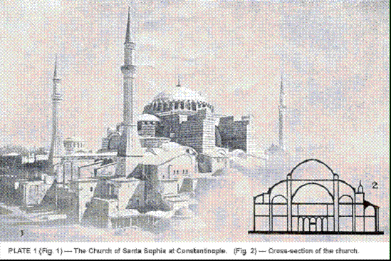

Мысле-строение Евхаристии, о которой я упоминал, создается во время и в основном посредством должного исполнения обряда. Эта структура несколько отличается от любых изображенных в книге "Мыслеформы", хотя она имеет много общего с великими музыкальными формами, изображенными в конце этой работы. На Малом празднестве материал для строительства предоставляется мыслями и преданностью священника, поддерживаемой теми же качествами его прихожан (если они есть); но на Великом празднестве музыка и другие аксессуары играют важную роль в его создании, хотя слова и чувства священнослужителя все еще остаются контролирующей силой, и во всех случаях имеется определенное количество ангельского руководства и помощи. Эта структура строится из материи принадлежащей различным планам — ментального, астрального и эфирного — и на более поздней стадии службы вводится материя еще более высоких уровней, как будет объяснено впоследствии. В этот процесс производства входит столько факторов, что существует место для больших различий в размерах, стиле, декоре и цветовой гамме, но общий план всегда узнаваем. Он напоминает форму базилики; действительно, говорят, что Церковь Санта-София в Константинополе была построена в подражание некоторым из этих духовных строений. (Рис. 1.)

См. книгу "Мыслеформы" (А. Безант и Ч.У. Ледбитер). Тем, для кого тема создания форм в более высокой материи силой мысли является новой, рекомендуется ознакомиться с этим трудом.

Завершенная структура обычно имеет примерно квадратную форму на земной плоскости, с рядом углубленных отверстий или дверей на каждой из ее четырех сторон, увенчанная большим центральным куполом, с меньшими куполами или иногда миноретами по углам. Взрывная сила на Санктусе настолько увеличивает купол и его прилегающие купола, что он становится важной частью строения, и после этого изменения здание ниже скорее становится основанием, поддерживающим ступу, чем церковью, увенчанной куполом.

Эта гигантская мыслеформа постепенно создается в начале Службы. Весь ритуал направлен на правильное создание этой формы, на ее зарядку божественной силой, а затем на ее разрядку; и каждое пение или чтение вносит свой вклад в эту работу, помимо той части, которую оно играет в подготовке сердец и умов священника и народа. Здание вздымается изнутри, как пузырь, который надувают. Говоря в общих терминах, можно сказать, что открывающее пение обеспечивает его павимент, а вступление - материал для его стен и крыши, в то время как Kyrie обеспечивает вспомогательные миски или купола, а Gloria - большой центральный купол. Детали здания варьируются в зависимости от формы Службы, которая используется, и до некоторой степени от размера и преданности общины. То, что проиллюстрировано в этой книге, является результатом измененной Литургии, используемой Либеральной католической церковью. То, что создано Римской Мессой, выглядит так же в общем плане, но неудачные выражения, которые так постоянно портят ее красоту, имеют явно неблагоприятное влияние на эту духовную архитектуру.

Как известно каждому изучающему историю, в форме, в которой она сейчас используется Римской Церковью, Месса не является цельной, но является собранием частей, взятых из различных более ранних форм, и ее формулировки в некоторых местах банальны и совершенно недостойны величественной реальности, которую они должны выразить. Но, хотя фактическое слово прошло через множество изменений, эффективность лежащей в основе магии не была фундаментально подорвана. Она по-прежнему достигает сбора и излучения божественной силы, для которой ее Основатель предназначал ее, хотя, безусловно, могло бы быть излито большее количество бесценной любви и преданности, если бы все страх и беспомощность были устранены из ее формулировок, все униженные просьбы о "милосердии", и просьбы к Богу сделать за нас ряд вещей, которые мы должны взяться делать сами. Была предпринята попытка внести некоторые улучшения в этом отношении в измененной Литургии, используемой Либеральной католической церковью.

Услуги, которые использует Церковь Англии, к сожалению, сильно искалечены и урезаны. Очевидно, что так называемые реформаторы не знали ничего о реальном назначении великого ритуала, который они так беспощадно урезали. И хотя Ордена Церкви Англии действительны, и её священники обладают силой черпать из великого резервуара духовной энергии, здание, которое она строит для его приема и распространения, серьезно несовершенно и относительно плохо приспособлено к своей цели. Это не мешает изливанию, но уменьшает количество доступного для излучения, потому что много силы должно быть использовано Ангелами-помощниками для создания механизмов, которые должны были быть подготовлены нами.

Эта мыслеформа играет в Служении примерно ту же роль, что и конденсатор в установке для дистилляции воды. Пар исходящий из реторты рассеялся бы в окружающем воздухе, если бы не был принят в колбу или камеру, в которой его можно охладить и конденсировать в воду. Камера необходима, чтобы содержать пар, пока он не превратится в более низкую и плотную форму, чтобы он был доступен для обычного физического использования.

Или, если мы хотим использовать силу пара, мы должны собрать его в какой-то виде емкости, чтобы мы могли создать давление, чтобы мы могли контролировать его и направлять его струи в желаемом направлении. То же самое верно и для этой гораздо более легкой силы, но поскольку она действует в материи, гораздо более тонкой, чем любая, которую мы знаем, никакая физическая емкость не могла бы ее удержать; чтобы удерживать ее, емкость должна быть сделана из материи этих высших плоскостей, которую можно манипулировать только с помощью мысли. Именно такой сосуд для нас создает на гигантском масштабе Ангел Господа, чью помощь мы призываем.

Мы живем в механическую эпоху, и наши мысли привыкли двигаться вдоль механических линий. Человек может научиться водить автомобиль, не зная много о его внутреннем устройстве; мы можем включить электрический свет, не зная, что такое электричество; но, тем не менее, человек, который понимает машину, которой он пользуется, несомненно, более эффективен и полезен. Весь обряд Святой Евхаристии может рассматриваться с этой точки зрения как создание и использование великолепной машины для освобождения силы и ее направления на помощь миру; и понимание того, что представляет собой эта машина, как она строится и как она предназначена для работы, безусловно, позволит нам более интеллектуально сотрудничать в этой схеме. Пусть будет понятно, что Ангел Евхаристии создает для нас то, что называется мыслеформой из тонкой материи, внутри которой божественная сила может храниться и накапливаться, пока она не будет направлена и использована, как пар накапливается в котле или в куполе паровоза.

Основная цель жертвы Святой Евхаристии - предложить возможность для особого излияния божественной силы с самых высших уровней и предоставить такой транспорт для этой силы, который позволит этим Ангелам-помощникам использовать его для определенных целей в нашем физическом мире, как будет объяснено позже. Вода, пролитая на землю, мало полезна, кроме как для орошения этой земли; если мы хотим использовать ее для других целей, мы должны предоставить сосуд, чтобы содержать ее. Кроме того, нужна форма, в которой сила может быть собрана, чтобы Ангел мог видеть общее количество и рассчитать, сколько он может позволить себе распределить по каждой из целей, к которым она должна быть предназначена.

Цели, которые мы ставили перед собой при подготовке этой пересмотренной формы Литургии, заключались в сохранении общего контура формы, которую она создает, и функционировании старой магии - эффектов различных действий на разных этапах, спуска и возвращения Ангела Присутствия и т. д. - но при этом мы стремились убрать из него все оттенки страха и эгоизма, и в некоторой степени изменить стиль его архитектуры с классического на готический. После исследования мы обнаружили, что Великие вдохновили блуждающие группы каменщиков-свободных масонов (которые построили большинство великих кафедральных соборов Европы) идеей готического стиля, как попытку на физическом уровне направить их к более жизнерадостной и стремительной мыслеформе, которую они хотели, чтобы их религиозные службы создали; но они были удивительно медлительны в понимании аналогии.

Общая позиция христиан того времени была угоднической и сжимающейся; многие из них воспринимали Бога как существо, которое необходимо умилостивить, и в своих молитвах они умоляли его услышать их на мгновение перед тем, как уничтожить их, просили его о милости, и в целом они действовали и говорили, как будто он был злым тираном, а не любящим отцом. Итак, их преданная мысль создала в целом плоскостное здание. Мы увидели, что его нынешняя поверхность, как строится римским ритуалом, часто представляет собой мертвый уровень нервозности и беспокойства, полный уродливых углублений и ям депрессии, вызванных преувеличенными исповедями отвратительности и униженными мольбами о милости, обесчестившими одинаково Бога и людей, которых Он создал по своему образу. Каждое такое углубление должно быть заменено пиком пылкой преданности, подтянутым абсолютной уверенностью в любви Бога, чтобы мыслеформа показала лес сверкающих шпилей, как собор в Милане, вместо плоской или прогибающейся крыши, которую она часто носит в настоящее время, чтобы по симпатии её восхождение могло направлять мысли людей вверх и отучить их от рабского страха к вере, благоговению и любви.

Мы увидели, сколь злым было воздействие на мыслеформу мстительных, угрожающих или униженных отрывков из еврейских псалмов, и на нас особенно настоятельно произвели впечатление слова, которые мы не могли по-настоящему поддержать.

Мы старались реализовать эти идеи в полной мере наших сил, и наш труд был вознагражден большей симметрией возведенного здания и определенно увеличенной адаптивностью к его цели. Важно подчеркнуть, что разумное сотрудничество прихожан с священником является наиболее ценным фактором в этой великой работе, потому что грандиозное излияние силы и великолепная и эффективная коллективная мыслеформа могут быть созданы собранием людей, которые искренне участвуют в Службе. Обычно достичь этого результата бывает весьма сложно, потому что члены обычного прихода совсем не умеют сосредотачиваться, и, следовательно, коллективная мыслеформа обычно представляет собой рваную и хаотичную массу, а не великолепное и организованное целое.

Преданность, будь то индивидуальная или коллективная, значительно варьируется по качеству. Преданность первобытного дикаря, например, обычно сильно смешана с страхом, и основная идея в его сознании, связанная с этим, – это умиротворение божества, которое иначе может оказаться мстительным. Немногим лучше этого является многая преданность людей, которые считают себя цивилизованными и христианами, потому что это своего рода нечестная сделка – предложение Божеству определенного количества преданности, если Он, с Своей стороны, окажет определенное количество защиты или помощи.

Такая преданность, по своей природе полностью эгоистичная и жадная, дает результаты только в более низких типах астрального вещества; и во многих случаях они выглядят крайне неприятно. Мыслеформы, которые они создают, часто имеют форму крюков, и их силы всегда движутся по замкнутым кривым, воздействуя только на человека, который их отправляет, и возвращая ему любой незначительный результат, который они могут добиться. Истинная, чистая, бескорыстная преданность - это всплеск чувств, который никогда не возвращается к человеку, который его породил, но становится в самом деле космической силой, производящей широкие результаты в высших мирах.

Хотя сама сила никогда не возвращается, человек, породивший ее, становится центром пролива божественной энергии, которая приходит в ответ, и таким образом в своем акте преданности он действительно благословил себя, хотя в то же время он также благословил многих других, и, кроме того, если его мысли движутся по христианским путям, он имел честь внести свой вклад в особый резервуар, который Христос отводит для работы Своей Церкви. Все, у кого есть книга "Мыслеформы", могут увидеть в ней попытку представить великолепный синий шпиль, созданный такой преданностью, когда он стремится вверх, и он легко поймет, как это открывает путь для определенного излияния божественной силы.

Бог изливает свою удивительную жизненную энергию на каждом уровне, в каждом мире, и, естественно, излияние, принадлежащее высшему миру, сильнее, полнее и менее ограничено, чем то, что находится ниже. Обычно каждая волна этой великой силы действует только в своем мире и не может (или по крайней мере так не делает) двигаться поперечно от одного мира или плана к другому; но именно посредством бескорыстной мысли и чувства, будь то преданность или привязанность, временный канал обеспечивает тем, чтобы сила, обычно принадлежащая высшему миру, могла спуститься к более низкому и могла там произвести результаты, которые без нее никогда не могли бы произойти.

Каждый человек, который действительно бескорыстен, часто делает себя таким каналом, хотя, конечно, в сравнительно малом масштабе; но мощный акт преданности целой огромной общины, когда она действительно объединена и абсолютно не думает о себе, дает тот же результат в гораздо большем масштабе. Иногда, хотя редко, эту скрытую сторону религиозных служб можно видеть в полной активности, и никто, кто хоть раз имел привилегию видеть такое великолепное проявление, не может на мгновение сомневаться в том, что скрытая сторона церковной службы имеет бесконечно большую важность, чем что-либо исключительно физическое.

Такой человек увидит ослепительно синий шпиль или купол из высшего типа астрального вещества, мчащегося ввысь в небо, выше образа его в камне, который иногда венчает физическое сооружение, в котором собираются верующие; он увидит ослепительную славу, которая проливается через него и распространяется как большой поток живого света по всему окружающему региону. Естественно, диаметр и высота шпиля предопределены для открытия спуска высшей жизни, в то время как сила, которая выражается в скорости, с которой энергия преданности стремится вверх, имеет отношение к скорости, с которой может происходить соответствующее исходящее движение. Зрелище действительно великолепное, и тот, кто видит его, никогда больше не сомневается в том, что невидимые влияния превышают видимые, и он не может не осознать, что мир, который идет своим путем, не обращая внимания на преданного человека, или, возможно, даже презирая его, все время больше обязан ему, чем знает.

Никакая другая Служба не имеет эффекта, вообще сравнимого с тем, что происходит при праздновании Святой Евхаристии, хотя, конечно, великие музыкальные формы могут появляться на любой Службе, где используется музыка. Во всех остальных Службах (за исключением, пожалуй, благословения Пресвятого Таинства) формы мыслей, которые развиваются, и общая польза, которая делается, в еще большей степени зависят от преданности народа. Когда случается так, что некоторое количество учеников этого внутреннего аспекта христианства принадлежит к такому собранию, они могут быть очень полезны для своих собратьев в вере, осознанно собирая разбросанные потоки преданности и объединяя их в один гармоничный и могущественный поток.

В нашем обряде, как и в обряде Церкви Рима, призывается Ангел для того, чтобы присмотреть за этим объединением и руководить строительством здания. Например, в редком случае, описанном выше, он бы взял на себя этот великолепный всплеск преданности, и вместо того, чтобы позволить ему молниеносно взлететь в этой великолепной синей шпили, он бы ловко преобразовал его в структуру, которая вскоре стала бы транспортным средством для нисходящего движения, возможно, в десять раз, или даже в сто раз больше, чем ответ, который он мог бы заслужить в своей первоначальной форме. Ангел может и будет дополнять то, что недостает, и исправлять наши недостатки, но очевидно, что желательно, чтобы мы облегчали его работу насколько это возможно.

Рассмотрение сотрудничества собрания должно превосходить все остальные при выборе музыки, используемой на различных Службах. Замысловатая музыка действительно дает далеко идущие результаты на более высоких уровнях и оказывает замечательное воздействие на тех, кто полностью понимает и ценит ее красоту; но на этой стадии эволюции человечества таких людей очень мало; и даже эти немногие должны осознавать, что они приходят в церковь не для своего личного утешения и поднятия, но чтобы работать на Службе Бога для помощи своим ближним. Они должны научиться забывать о себе и своих индивидуальных желаниях, приглушить личность и работать как часть целого, как мальчик делает, когда он присоединяется к команде по крикету, футболу или гребле на байдарке. Он должен действовать не ради своей собственной чести и славы, а ради блага клуба; он может быть вызван абсолютно отказаться от своих собственных желаний и пожертвовать возможностями яркого выступления или развлечения. Так и нам нужно научиться стирать низшее "я" и работать как собрание в реальном братстве и сотрудничестве.

Никаких сомнений в сравнительной эффективности двух методов не может быть. Простая музыкальная Служба, в которой сто человек принимают участие от души и с полной преданностью, гораздо полезнее миру, чем представление самой великолепной музыки, которую тысячи слушают, даже если они слушают с удовольствием и выгодой для себя. Тщательное и повторное исследование результатов во внутренних мирах убедительно показало, что хотя время от времени священные концерты играют важную роль в индивидуальном развитии, Служба церкви должна быть так организована, чтобы все могли активно и осознанно участвовать в работе, которую она предназначена делать.

Следует принять простую форму музыкальной Службы, и ее основные черты должны оставаться неизменными, чтобы каждый мог тщательно ознакомиться с ними. Прихожане должны быть хорошо проинструктированы о значении и воздействии различных частей церемонии и о намерении, которое они должны держать в уме на каждом этапе. Таким образом, даже небольшое число людей может выполнить эффективную и полезную работу и стать реальным центром благословения для большого района; и сами они могут получить почти неоценимую помощь, если их можно убедить присоединиться от души к волнующим и хорошо подобранным гимнам и псалмам.

Не вся простая музыка одинаково подходит. Очевидно, что меньше всего проблем Ангелу доставит та музыка, которая сама по себе создает форму, приближенную к той, которую он желает. Она, конечно, должна варьироваться в выражении слов, но она всегда должна быть радостной и вдохновляющей. Стоит избегать унылых, протяжных, неопределенных пассажей любой ценой. Ни одна из существующих композиций не подходит идеально под наши слова, но некоторые можно адаптировать без особого труда. Без сомнения, появятся композиторы из Либерально-католической церкви, которые создадут именно то, что нужно; тем временем была опубликована предварительная Служба[^1], которая, хотя и далека от совершенства в музыкальном плане, использовалась несколько лет с очень хорошими практическими результатами.

Искренний священник должен стараться обеспечить для своей церкви исполнение такой музыкальной Службы, которая экономично, но эффективно обеспечит достаточное количество лучшего доступного материала для использования Ангелом Евхаристии; но он должен постоянно быть на страже против благонамеренных, но эгоистических усилий его хора внедрить амбициозную музыку, в которой приход не может участвовать. Я не имею в виду, что есть какие-то возражения против вставки (на празднике, например) более короткого и подходящего гимна, который должен быть исполнен только хором; но музыка Литургии всегда должна быть так организована, что люди могут в полной мере участвовать в ней. Если используется гимн, нужно уделять большое внимание его выбору, так как многие содержат слова, противоречащие всему духу нашей Службы — ссылки на предполагаемый гнев Бога, призывы о милосердии и выражения страха или тошнотворной подобострастности. Если такое дополнение сделано, лучшим местом для него, по-видимому, будет после Евангелия, либо перед, либо вместо проповеди.

Певцы нашей Церкви должны осознавать, что у них есть уникальная возможность работать на Службе Богу, помогая своим менее талантливым братьям; и они должны преданно заниматься этой работой, не ища пустой показной демонстрации своих способностей, ни щекотки слуха и поднятия своего духа, но действуя с абсолютной бескорыстием, и тем самым идя по стопам своего Учителя, Христа. Священнику стоит поощрять изучение музыки среди своих прихожан, чтобы он мог постепенно укрепить эту часть своей Службы; он может организовать сколько угодно образовательных концертов более сложной музыки, но он никогда не должен терять бесценное сотрудничество своей общины в реальных Службах своей церкви.

Будет понятно, что церковь, которая была освящена и постоянно используется для различных Божественных Служб, уже является убежищем от бесконечной суеты обыденных мыслей за её пределами, и что её атмосфера наполнена преданностью. Тем не менее, люди, которые приходят в неё каждый день, приносят с собой определенную долю своих личных забот и проблем; их умы полны самых разнообразных мыслей и идей, связанных с внешним миром - не обязательно плохих мыслей, но мыслей, которые не особенно религиозны по своей природе. Некоторые могут даже быть обременены сознанием неудачи или реального проступка. Поэтому желательно сделать особые усилия, чтобы очистить церковь перед началом Службы.

По этой причине всегда полезно начинать с процессии. Священнослужители и хор должны, очевидно, войти порядочным образом и занять свои места, и когда это возможно, хорошо расширить этот необходимый порядок входа в обход церкви, потому что таким образом первоначальная очистка значительно облегчается. И община помогает сосредоточиться, устойчивости мысли и концентрации на предстоящей работе.

Одним из наиболее ценных факторов в этом усилии является благовоние; оно уже было освящено Священником или Епископом, и, следовательно, его дым несет с собой очищающие и поднимающие влияния везде, куда проникает его аромат. Если присутствует Епископ, он изливает свое благословение на людей (используя знак креста), когда процессия проходит среди них; и хотя этот долг не возложен на Священника, он все же сможет значительно помочь своим прихожанам, если, идя в процессии, он будет держать в своем сознании сильное чувство мира и искреннее желание, чтобы его приход с ним этим поделился.

Воздействие процессионального гимна на людей хорошо и в других отношениях, так как оно стремится привести всех в гармоничные вибрации и направить их мысли в подобные каналы. Это в некотором роде эквивалентно настройке струн скрипки, поскольку пение имеет решительное влияние на настройку их эмоций и мыслей. Конечно, невозможно довести смешанный приход абсолютно в унисон, что касается их мыслей и чувств, но они должны быть по крайней мере приведены в гармонию друг с другом, чтобы они сливались в гармоничное целое, как разнообразные инструменты большого оркестра.

Сильные колеблющиеся вибрации гимна подавляют такие мыслительные волны, которые с ними не согласуются, а прохождение хора так близко среди людей стимулирует последних более активно и энергично участвовать в Службе, и таким образом общинное пение является отличной подготовкой к работе, которая следует. Гимн создает в более высокой материи ряд прямоугольных форм, нарисованных с математической точностью, следующих одна за другой в определенном порядке, как звенья в некоторой могучей цепи; и это постоянное повторение действует как повторяющиеся удары молотка по шляпке гвоздя и внедряет урок, который он предназначен внедрить. Опять же, великолепный вид хорошо организованной процессии, цвета и огни, богатые знамена и пышные облачения, все это вместе подогревает воображение, поднимает мысли людей выше прозаического уровня обыденной жизни и помогает их преданности и энтузиазму.

## Глава II. Святая Евхаристия

### Asperges

#### Псалом

РИМСКО-КАТОЛИЧЕСКАЯ[^2] | ЛИБЕРАЛЬНО-КАТОЛИЧЕСКАЯ[^3]
----------------------- | ---------------------------
_Перед Главной Мессой в воскресенье._ | _Перед всеми Службами Евхаристии._
_Антифон_ | _Антифон_
Ты обрызгаешь меня иссопом, и я буду чист: ты омоешь меня, и я стану белее снега. | Ты обрызгаешь меня иссопом, Господи, и я буду чист: Ты омоешь меня, и я стану белее снега.
_Псалом_ | _Псалом_
Помилуй меня, Боже, по великой Твоей милости. |  Возвожу очи мои к холмам: откуда придет помощь моя. Помощь моя от Господа: Который сотворил небо и землю. Он не допустит, чтобы твоя нога поколебалась: и Тот, Кто тебя сохраняет, не уснет. Вот, Тот, кто сохраняет Израиль: не будет ни дремать, ни спать. Сам Господь твой страж; Господь - твоя защита справа тебя. Так что солнце не поразит тебя днем: ни луна ночью. Господь сохранит тебя от всякого зла; да, именно Он сохранит твою душу. Господь сохранит твое выход и вход: отныне и вовек.
Слава Отцу и Сыну. и Святому Духу. Как было в начале, так и теперь, и всегда, и во веки веков. Аминь. | Слава Отцу и Сыну. и Святому Духу. Как было в начале, так и теперь, и всегда, и во веки веков. Аминь.
_Антифон_ | _Антифон_
Ты обрызгаешь меня иссопом, и я буду чист: ты омоешь меня, и я стану белее снега. | Ты обрызгаешь меня иссопом, Господи, и я буду чист: Ты омоешь меня, и я стану белее снега.

Литургия начинается с аспергеса, или обряда очищения. "Аспергес" просто латинское название для первых слов антифона "Ты окропишь меня", так как в Церкви постоянно принято использовать первое слово или слова псалма или песнопения как его название.

После того как процессия уже подняла людей и помогла им объединиться в мыслях и чувствах, священник с помощью аспергеса особо старается очистить церковь от накопления мирских мыслей. Он делает это, окропляя святой водой, которая была сильно намагничена с целью этого вида работы.

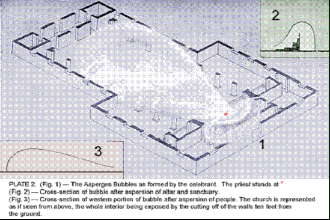

Прибыв в святилище, священник кланяется перед Алтарем и поет начальные слова антифона: "Ты окропишь меня", хор и прихожане продолжают мелодию с этого момента. Священник получает аспергилл, который был погружен в святую воду, и, сделав его святым знаком креста над собой, окропляет Алтарь трижды, так как особенно важно, чтобы эта часть церкви была тщательно подготовлена к приему огромной силы, которая так скоро будет излучаться из нее. Он не должен рассеивать большое количество воды при этом, так как очищение происходит меньше от падающих капель, чем от воли священника, направляющего энергию, хранящуюся в намагниченной воде. С каждым движением аспергилла он направляет эту силу в любом желаемом направлении, и она тотчас же течет по заданной для нее линии. Таким образом, он может направить струю силы к кресту над табернакулем, через Алтарь к свечам и т.д. Священнослужители и хор затем окропляются, и, наконец, прихожане; в каждом случае выстреливает поток очищающей силы, который способен путешествовать, когда он направлен на людей, вплоть до самого конца церкви, какой бы большой она ни была. Этот всплеск вдувает то, что выглядит как огромный плоский пузырь из эфирного и астро-ментального вещества, мысленное здание, эфирное, диафанное — пузырь, который как раз включает прихожан. (См. Рис. 2.) Внутри этого психическая атмосфера очищается, пузырь отталкивает то, что не было затронуто. Таким образом, очищается территория для действий Ангела, который вскоре будет призван.

В то время как священник совершает этот обряд, хор и прихожане поют сто двадцать первый псалом, который можно было бы суммировать в известной фразе, заимствованной из другого псалма: "Если Господь не построит дома, напрасно трудятся строители; если Господь не охраняет город, напрасно бодрствует страж". Это подчеркивает мысль, что только силой Господа можно удерживать зло на расстоянии; очевидно, что только, постоянно держа наши мысли на Нем, мы можем сохранить состояние умственной и астральной чистоты, которое было установлено в здании с помощью аспергеса. Как всегда, псалму сопутствует антифон, который указывает нам мысль, которую мы должны держать в голове, пока поем его — в этом случае мысль о совершенной чистоте.

Изначально в первобытной Церкви стихи псалма пели Священник или певчий в одиночку, в то время как антифон повторялся после каждого стиха всем собранием как своего рода припев, и только позже его отодвинули в начало и конец псалма, как это выглядит сейчас. Таким образом, держа в уме всё время это намерение идеальной чистоты мысли и чувства, мы поём различные стихи псалма, которые говорят нам, что такую чистоту можно поддерживать только, сосредоточившись на мысли о Боге и более высоких вещах. Здесь главная идея - это не прежде всего общая чистота жизни, хотя это, безусловно, чрезвычайно желательно. Это скорее концепция чистоты намерений - то, что мы описали бы как единоличность или однонаправленность. Все другие мысли должны быть строго изгнаны, все наклонности к блужданию должны быть твердо сдержаны, чтобы мы могли сосредоточить наши энергии на работе, которую мы имеем в виду.

Пока эти мысли стабильно истекают из умов Священника и народа, фактическое исполнение слов, которые воплощают их, одновременно производит свой эффект - укрепляет, расширяет и обогащает пузырь, надутый усилием Священника. (См. Рис. 3.) Этот псалом не является необходимым для эффективности очищения; действительно, можно увидеть, что в более короткой форме Службы мы полностью обходим его стороной. Но когда у нас есть много времени в нашем распоряжении, он, без сомнения, помогает собрать разрозненные мысли людей. Мы должны осознать, что внезапная и интенсивная концентрация мысли не легка - в сущности, едва ли возможна - для неподготовленного ума; большинству людей требуется немного времени и более одной попытки, прежде чем они смогут поднять свой энтузиазм и преданность до высшей точки, чтобы их силы были полностью в действии. Псалом вставлен, чтобы дать время для этого "разогрева" тем, кому он нужен.

Желательно использовать для этого псалма один из самых простых григорианских тонов; например, 6-й, 1-й в конце, оказались удовлетворительными, или 8-й тон, 1-й в конце. (Эти числа соответствуют системе известного Псалтиря Хельмора) Ясновидящий, изучающий влияние церковной музыки, вряд ли не заметит разницу между разбитыми, хотя и блестящими, осколками англиканского пения и великолепной сияющей однородностью григорианского тона.

В конце псалма появляется восхваление всеславной Троице, которым с древнейших времён было обычаем закрывать все свои псалмы и кантиллы в Церкви. Он не требует комментариев, кроме замечания, что "мир без конца" - это несколько неудовлетворительный перевод "per omnia sæcula sæculorum"; который ясно означает именно то, что говорит: "на протяжении всех веков веков". Понятие aion или диспенсации как названия долгого периода времени было прекрасно известно грекам и римлянам, как и дальнейшая идея ещё более продолжительного периода, названного эоном эонов - как мы могли бы поэтично назвать десять тысяч лет веком веков. Так что "через все века веков" равносильно "на протяжении всей вечности".

Здесь также в нашей Службе впервые используется слово "Аминь", которым верующие предполагают одобрить то, что сказал священник. Это обычно воспринимается как уверенное утверждение; слова, которые Христос так часто использует, переведенные в нашем английском варианте как "Воистину, воистину", в Новом Завете звучат как "Аминь, Аминь". Это не греческое, а ивритское слово; мне говорили, что оно существует в нескольких семитских языках, означая уверенность, истину, надежность. Это единственное толкование, которое признают западные ученые, но во времена нашего Господа были те, кто относил его к совершенно другому источнику, выводя его из одного из египетских имен Солнечного Бога - Амон-Ра. Клясться именем Амон было клятвой, которую никто не осмеливался нарушить; никто, кто призывал Амона свидетелем того, что он говорил, не рискнул бы говорить иное, чем правду; и так эта формула, "Я говорю вам именем Амона", убеждала слушателей. Поэтому, когда наш Господь хотел быть особенно настойчивым, Он использовал форму, к которой Его аудитория привыкла, которая не могла не убедить тех, кто ее слышал. Произнесенное в конце речи или молитвы, оно выражало полное согласие и одобрение тех, кто его использовал: "Именем Амона, так оно и есть" или "Именем Амона, мы согласны с этим"; и так оно в конечном итоге становится аналогом выражения "Пусть будет так" или "Так оно и есть". Пример его более раннего использования можно увидеть в Исаии LXV, 16, где английская уполномоченная версия переводит: "Тот, кто благословляет себя на земле, будет благословлять себя в Боге истины, и тот, кто клянется на земле, будет клясться Богом истины". Ивритское слово, переведенное здесь как "истина", - это Аминь; так что реальное утверждение просто в том, что люди должны клясться Богом Аминь, точно так же, как это делалось в древнем Египте.

### Versicles

Римская | Либеральная
------- | -----------
V. Покажи нам, Господи, Твою милость. | P. Господи, открой наши уста.
R. И даруй нам Твое спасение.         | C. И наши уста возвестят хвалу Тебе.
V. Господи, услышь мою молитву.       | P. Кто взойдет на гору Господа?
R. И пусть мой вопль дойдет до Тебя.  | C. Тот, у кого руки чисты и сердце чисто.

Затем священник поёт версик: "Господи, открой наши уста," и хор отвечает: "И наши уста возвестят хвалу Тебе." Этот версик использовался с раннего периода в истории Церкви в начале одной из утренних Служб, хотя и не во время Массы. Его основная идея заключается в том, что мы можем надеяться на достойное прославление или поклонение только при помощи божественной силы внутри нас самих. Когда мы говорим о помощи Господа, мы должны понимать, что мы можем прибегать к божественной силе снаружи — к тому, что обычно называют Силой Божьей — только потому, что мы сами также являемся Богом, потому что мы в основе своей являемся частью Него.

Намерение этого версика заключается в том, чтобы божественное в человеке могло быть пробуждено и вступить в гармонию с божественным снаружи, в то время как ответ указывает нам, что после того, как наши уста будут открыты, первое, что мы должны сделать, является восславление Господа. Важно отметить, что не молитва о благах, а хвала является первым, что мы должны предложить. Затем церемониал поет: "Кто взойдет на гору Господа?", подразумевая под этим: кто может полезно и соответствующим образом подняться по ступеням, ведущим к Алтарю? Сразу же приходит ответ: "Тот, у кого руки чисты и сердце чисто." Теперь, когда этот убежденность укоренилась внутри него, церемониал обращается к людям и впервые в Службе дает Малое Благословение.

### Dominus Vobiscum

Римская | Либеральная
------- | -----------
V. Господь с тобой. | P. Господь с тобой.
R. И с духом твоим. | C. И с духом твоим.

Кто внимательно наблюдал за римской Службой Массы, вряд ли мог не заметить, как часто священник обращается к собравшимся и произносит слова: Dominus vobiscum ("Господь с вами.")

На что люди отвечают: Et cum spiritu tuo ("И с духом твоим") фраза, которая, кажется, требует пересмотра, поскольку Дух является единственным обладателем и никогда ни при каких обстоятельствах не может быть обладаемым. Более точное выражение было бы: "И с тобой как с духом," Но ранняя Церковь не говорила с такой аккуратностью, а скорее приняла формулировки еврейского псалма, который не редко призывает свою душу благословить Господа, по-видимому, идентифицируя себя со своим телом.

Апостол Павел был лучше осведомлён, поскольку он пишет о теле, душе и духе как о трехчастной дивизии человека, хотя даже он все еще ставит их как владения человека.

Более научное утверждение гласит, что Дух (иногда называемый Монадой) это божественная Искра в каждом из нас, которая является причиной всего остального, и, следовательно, истинным человеком; что этот Дух проникает вниз на уровни ниже его собственного, частичное проявление себя, которое мы называем душой или эго; что эта душа раскрывает свои скрытые божественные качества через множество последующих жизней в еще более низком мире, в ходе которых она облачается в оболочки, подходящие для этого мира, которые мы называем телом. Так что в любой данный момент физической жизни человек, Дух, обладает душой и телом - действительно, несколькими телами, поскольку апостол Павел далее объясняет: "Есть естественное тело, и есть духовное тело." Эти слова не очень хорошо переведены; но из контекста становится ясно, что под "естественным телом" он подразумевает это плотное облачение, с которым мы все хорошо знакомы, и что под термином "духовное тело" - разделенное позднейшими исследователями на астральные и ментальные оболочки.

Независимо от того, насколько идея могла быть затуманена в течение веков, наверняка, что Служба Святой Евхаристии задумывалась как связная церемония, последовательно движущаяся к кульминации и искусно рассчитанная на достижение определенных величественных эффектов. Рассматривая ритуал научно с этой точки зрения, можно было бы немного удивиться частому повторению фразы, которая, хотя и красива сама по себе, на первый взгляд не имеет очевидной связи с великолепной целью великого духовного акта, частью которого она служит.

Фраза встречается не менее девяти раз (в более короткой форме - три) в течение Литургии, с небольшим, но важным дополнением в одном случае - приветствием мира, к которому я обращусь, когда мы к нему придем. В центре Службы в целом находится мощное излияние силы, которое происходит при освящении. Все, что говорится и делается до этого момента, предназначено разными способами подготовить к этому, и все, что происходит после, связано с сохранением и распределением силы. Безусловно, присутствует идея подготовки священника к выполнению великого акта, но также и более заметная идея подготовки собравшихся к его приему и пользе от него. Эта подготовка людей в значительной степени достигается путем все более тесного привлечения их в магнитную гармонию со священником - приведения их мысленно и эмоционально в симпатию с ним в великой работе, которую он выполняет. Помощь в постоянном увеличении силы и продвижение все более гармоничных колебаний между священником и народом - вот цели этого постоянно повторяющегося Малого Благословения.

Для того, кто обладает ясновидением, его ценность ясна: когда служитель обращается к людям и поет или произносит предписанные слова, мощный поток силы обрушивается на собравшихся, а затем через мгновение обратно к алтарю, сильно увеличиваясь в объеме, потому что он подхватывает и уносит с собой все маленькие струи силы, которые создали отдельные верующие, и которые иначе бы уплыли вверх и рассеялись. Все сходится на священника со словами: "И с духом твоим", и рывок иногда такой сильный, что если бы он его ощутил, то упал бы, но его обязанность - принять его в себя и удерживать его для использования ангела, которого он собирается вызвать.

Это взаимодействие очень эффективно связывает священника, помощников и собравшихся в одно гармоничное целое - настоящий живой инструмент, который будет использоваться в магии Евхаристии. Эти слова повторяются в течение Службы каждый раз, когда священник совершает какое-то действие или произносит молитву, которая возвышает его эмоции или наполняет его какой-то особой силой, идея заключается в том, что он способен поделиться этим возвышением или силой с народом через Малое Благословение, и тем самым приблизить их к Богу. В этом случае делится идея и понимание чистоты и концентрации: понимание необходимости этих добродетелей и решимость достичь их.

Служитель начинает, надувая пузырь аспержеса, и псалом, который тем временем поется, и последующие стихи, устанавливают контакт между ним и собравшимися. Это состояние используется, чтобы позволить священнику, на Малом Благословении, которое сразу следует за ним, накинуть сеть на своих прихожан, которой он может удерживать их, как упряжь держит лошадей. Эта сеть очень полезна в Службе, и по ее линиям связи священник посылает силу при каждом последующем повторении этого предложения - "Господь с вами", что очень эффективно для сохранения гармонии между ним и его приходом, и в то же время для поддержания давления силы, на алтаре и в теле церкви, более или менее равномерным. Эта сеть постоянно оживляется и заставляет сильно светиться каждым повторением Dominus Vobiscum, до Оффертория, когда она больше не нужна. Когда Мессу говорит епископ, он, кажется, включает людей на более высокий уровень с его сетью, чем делает это священник. И когда епископ присутствует на Мессе священника, он не полностью включен, так сказать, не совсем погружен в это излияние. Из этой, его более возвышенной точки зрения, он может много сделать, чтобы помочь. В более короткой форме аспержеса, предложение "Братья, давайте теперь заложим основание нашего храма" создает эту сеть.

### Ангел Евхаристии

Священник теперь обращается к другой части приготовления и говорит:

#### Сбор

Римская | Либеральная
------- | -----------
Давайте помолимся. | Давайте помолимся.
Милосердно услышь нас, О святой Господь, всемогущий Отец, вечный Бог: и дай послать твоего святого ангела с небес, чтобы охранять, питать, защищать, посещать и защищать всех, кто живет в этом жилище. Через Христа, нашего Господа. | Веди нас, О Всемогущий Отец, во всех наших делах, и с твоего небесного трона пошли твоего святого Ангела, чтобы он был с твоим народом, который собрался служить и поклоняться Тебе. Через Христа, нашего Господа.
Отв. Аминь. | Отв. Аминь.

Фраза "Давайте помолимся" - это сигнал, данный священником народу, когда он собирается сказать молитву, и поэтому пришло время для них стать на колени. Такой знак был еще более необходим в примитивной Церкви, когда люди не имели копий литургии (и, в большинстве случаев, не могли прочитать их, даже если бы у них они были), и поэтому были вынуждены полностью полагаться на священника по поводу позиции, которую они должны были занять. В самом деле, в течение значительного времени не было письменной литургии, и каждый служитель экспромтом заполнял контур церемонии, как это было дано Христом.

То, что Христос дал такой план, точно известно из экстрасенсорного исследования. Описание учреждения этого Таинства, данное в различных евангелиях, вероятно, в основном точное, хотя мы должны помнить, что авторы составляли удивительную и красивую тайну-драму, в которой они были гораздо более обеспокоены успешным передачей великих истин, которые лежат за их символизмом, нежели точным соблюдением единства формы рассказа, в которую они решили вложить свой сюжет. Но слова, произнесенные на первой Евхаристии вечером Великого Четверга (или, как кажется более вероятным, сразу после полуночи, и так очень рано утром Великой Пятницы (1)), были лишь формальным учреждением великой церемонии.

Евреи начинали свой день на закате, поэтому в любом случае это уже была пятница по их подсчету.

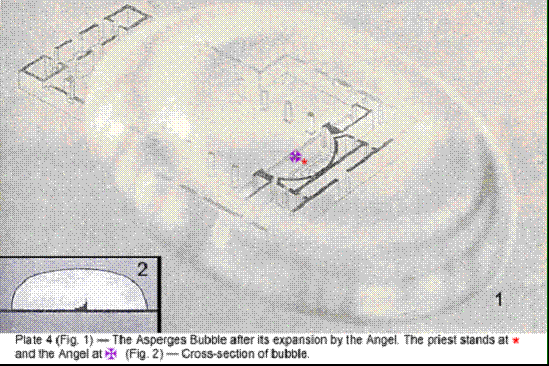

Детальная информация о методе и намерении была дана Господом после Его воскресения среди многих вещей, "касающихся Царства Божия", которые Он тогда наставлял Своим ученикам. Несомненно, что Он дал им ясные указания по основным моментам Службы Eвхаристии и объяснил, какой эффект предназначался каждому из них, но также очевидно, что Он оставил эту структуру церемонии для того, чтобы Его апостолы заполнили ее по мере того, как они находили это удобным в постоянно меняющихся условиях их ранней евангельской работы. Следователи каждого апостола естественно старались бы помнить и воспроизводить его импровизации, и так бы росло количество ритуалов, все построены на одном и том же скелете, но одевающие его по-разному. Только со стечением веков Церковь разработала на основе опыта и компиляции различные литургии, которыми мы сейчас обладаем, хотя снова мы не должны забывать, что Он Сам всегда стоял за ее усилиями, всегда готов вдохновлять и направлять тех из ее лидеров, которые открывались для духовного влияния.

Совершив предварительное очищение и, таким образом, обеспечив поле (внутри огромного пузыря, созданного усилием священника), где Ангел сможет работать, священник теперь вызывает на помощь одного из этих благодетельных помощников. Существует много порядков и рас этих светящихся нечеловеческих духов, и большинство из них на текущем этапе человеческой эволюции имеет мало связи с человечеством. Однако некоторые типы всегда готовы участвовать в религиозных церемониях, не только из-за желания совершить доброе дело, но и потому что такая работа предлагает им лучшую возможность для прогресса.

Четыре раза в течение Службы Eвхаристии священник призывает святых Ангелов на помощь, и мы можем быть уверены, что он никогда не вызывает зря, так как связь с этими небесными войсками является одним из преимуществ, которые передаются ему при его посвящении. В этот раз он призывает то, что обычно называется Ангелом Евхаристии, чья специальная работа в связи с ней заключается в помощи в строительстве того здания, о котором я уже говорил. Он определяет размер формы, которую можно построить при любом данном случае, учитывая количество присутствующих людей, интенсивность их преданности, объем их знаний, готовность сотрудничать и так далее. Большое собрание, работающее осознанно, может дать гораздо больше материала для строительства формы, чем небольшое собрание; опять же, гораздо больше материала доступно на Великом Праздновании, чем на Малом.

В задачи Ангела входит следить за тем, чтобы наш материал был мудро использован в строительстве здания. Если бы была построена слишком большая площадка при пении песнопения, евхаристическое здание, когда оно окончательно завершится, могло бы быть настолько разреженным, что едва ли держалось бы вместе. Форма формируется и направляется этим Ангелом, хотя ее контур можно в определенной степени изменить по воле священника, если он знает о существовании формы и цели, для которой она строится. Первым действием Ангела по прибытии является расширение пузыря, созданного волей священника при asperges. (Рис. 4.) Он толкает его за алтарь, пока он не освободит пространство столь же далеко к востоку от алтаря, как исходное освободило к западу. Чтобы сделать это расширение возможным без того, чтобы пузырь стал слишком тонким, священник, во время asperges на алтаре, должен представить себе пленку пузыря гуще в районе алтаря и святилища, чем в других местах.

Будет заметно, что римская форма молитвы аспергеса не даёт прямой отсылки к работе Ангела в возведении здания, хотя именно благодаря этому строению он в большой степени охраняет, защищает и заступается за общину от вторжения злых или блуждающих мыслей, даже в то время как своим мощным, но в то же время очень спокойным магнетизмом он истинно посещает и питает тех, кто готов принять его влияние. Я не имею в виду, что если человек позволяет своему уму заполняться личными заботами, Ангел особенно вмешается, чтобы изгнать их; но он исключает из своего строения огромные стаи неопределенных форм мысли, которые в обычной жизни постоянно давят на нас и проникают в наши умы, когда на мгновение мы оставляем их пустыми. Его присутствие само по себе является благословением, потому что от него всегда исходит успокаивающее и возвышающее влияние; так что его визит явно представляет ценную возможность тем, кто готов воспользоваться ею. В более короткой Службе мы сжимаем всё действие аспергеса в один сборник. Совершая знак креста над собой аспергиллом, священник говорит:

Да очистит меня Господь, чтобы я достойно совершил Его службу.

_Он окропляет алтарь и хор._

В силе Господней я отражаю всё зло от этого Его святого алтаря и святилища,

_Он окропляет людей._

и от этого Дома, где мы поклоняемся Ему;

_Он обращается к алтарю._

и я молюсь нашему небесному Отцу, чтобы Он послал Своего святого Ангела построить для нас духовный Храм, через который Его сила и благословение могут быть излиты на Его народ. Через Христа, нашего Господа.

Отв. Аминь.

Это во всех отношениях так же эффективно, как и более длинная форма, но она требует бдительности и сосредоточенного мышления со стороны священника. Он, вероятно, найдет целесообразным произносить сборник несколько медленно, вкладывая всю силу своей воли в каждую фразу. Призывание, которое непосредственно следует за аспергесом в более длинной форме, в короткой форме предшествует ему, тем самым делая очищение определенной частью евхаристической Службы, а не подготовкой к ней.

Мы стремились в укороченной форме точнее подобрать слова к тому эффекту, который создается, чтобы общине было легче следовать за внутренней стороной Службы. Все ручные действия священника абсолютно одинаковы; между возведенными двумя формами зданиями или в объеме излитой силы нет заметной разницы. Когда не читаются эпистоля и евангелие, мы теряем количество полезного материала, генерируемого в процессе прочтения Градуала; и те члены общины, которым нужно много устойчивого давления, чтобы поднять свой энтузиазм, имеют время внести немного больше во время долгих молитв. Но на практике этот небольшой недостаток обычно компенсируется повышенной бдительностью и более ясным пониманием того, что делается. В укороченной форме важные действия ритуала следуют друг за другом быстрее, потому что всё, что не является действительно необходимым для внутренней работы, было устранено. Приходится опускать многие красивые отрывки; но тем не менее укороченная форма окажется удобной при многих случаях, когда невозможно выполнить полную церемонию.

Примечание. Сейчас служитель вызывает Ангела Евхаристии, который будет строить для нас форму. Кажется, что не видно, как он подходит издалека, но он внезапно появляется таким образом, что создается впечатление, будто за алтарем толстый слой тумана, и когда его вызывают, он просто делает шаг вперед через него и оказывается рядом с нами. Я не знаю, что является причиной этого эффекта; это может быть связано со скоростью, с которой он перемещается, так что момент, когда его видно вдалеке, почти совпадает с его прибытием в церковь, и кажется нам, что это действительно так, и, следовательно, к тому времени, когда мы его увидели в первый раз, он уже прибыл. Более вероятное объяснение состоит в том, что он приходит к нам на какой-то высокий план - возможно, где пространство не существует - и затем материализует нижние тела для себя.

Мы заметили, что в нескольких изученных нами случаях, когда сам служитель был развитой личностью - посвященным Великой Белой Ложи - цвета Ангела соответствовали определенным цветам в верхней части ауры служителя. Это предполагает, что в тех случаях, когда Священник достаточно развит для того, чтобы его характер мог оказать определенное влияние на вещи, при прочих равных условиях, Ангел, который приходит работать с ним, вероятно, будет того же типа, что и он сам. Конечно, есть церкви, которые имеют определенных Ангелов, обычно связанных с ними, но похоже, есть и служители, у которых есть свои Ангелы, имеющие эти цветовые сходства.

Что касается положения Ангела в различные моменты Службы, я привожу результаты наблюдений в одной конкретной церкви.

Кажется, что он много перемещается внутри ограниченной области вокруг алтаря, но чаще всего он рядом с служащим Священником. Когда он впервые появляется, он перед служителем, но немного с эпистольной стороны - среди свечей на этой стороне алтаря. Это более мужская сторона церкви, поскольку лучи, представленные свечами, драгоценными камнями и крестами на этой стороне - Юге - более активны, чем те, что на Севере. В этом контексте можно спекулировать о возможных причинах этого, найденных в том факте, что некоторые большие земные токи принимаются на Северном полюсе и отдаются на Южном полюсе. Будь то как угодно, факт остается фактом, что юг церкви более мужественный, и поскольку церковная власть должна протекать через мужские каналы, Ангелу, вероятно, проще работать на этой стороне.

Он остается здесь, почти в центре, во время Кантиклы и Интроита; за исключением последнего, когда он стоит немного дальше по сторонам алтаря, чтобы управлять вихрями силы, идущей от служителя, диакона и субдиакона, до центральной линии (созданной табернаклем, крестом и картиной) и обратно. Во время Кирие он прямо над головой служителя; для Глория ин Эксельсис он поднимается немного выше и движется к людям, так что он над вратами святилища, собирая из людей и сильно привлекая к себе строительный материал.

Во время Сборов он в основном находится на своем первоначальном месте, в линии с тремя служителями, и там принимает силу, направленную вверх по этой линии. В то время как читается Епистоль, Ангел находится близко к центру алтаря, чтобы, кроме более умственной силы, которую он изливает через служителя и диакона в субдиакона, он мог быть в удобном положении, чтобы черпать из свечей на Севере, а также изливать эмоционально поднимающую силу, которая стимулирует и поднимает уровень эмоций субдиакона, а следовательно, и его мысли. Когда сила вытекает через него к людям, она производит на них тот же эффект. За исключением нескольких моментов, когда он выходит немного левее субдиакона — который стоит в центральной линии алтаря на нижней ступени — и когда он на мгновение уходит за алтарь в связи с созданием столпов и украшений во время Градуала, Ангел сохраняет свое центральное положение до конца Евангелия. Кажется, что на этой части Службы он занят уравновешиванием и преобразованием эмоциональной и мыслительной силы, от которой идет вихрь, кружащийся вокруг церкви. Ряд свечей служит полезным ситом для этой цели, и отфильтровывает много грязи, сильно усиливая (и в то же время усиливаясь от) силу от людей. Эта активность воздействует на людей и дальше стимулирует их, и так вихрь нарастает.

На протяжении большей части Символа веры Ангел находится над головой служителя, но к концу он всплывает высоко над крестом алтаря. После этого он больше на свое усмотрение и получает награду за свою работу. Тем не менее, он продолжает быть очень полезным как источник силы и занят украшением вещей. Хотя это руководящий Ангел, который руководит, когда весь здание увеличивается при Терсанктусе, строительный Ангел все еще очень полезен даже в этом действии, так как он так много силы вносит сам, что это помогает расширить купол.

### Святая Евхаристия — Подготовка

#### Призыв

Римская | Либеральная
------- | -----------
Во имя Отца, и Сына, и Святого Духа. Аминь. | Во имя Отца, и Сына, и Святого Духа. Аминь.

Теперь, когда Служба Евхаристии готова начаться, с плеч священнослужителя снимается плащ, и на него надевается казула, жертвенная одежда, которая с самых ранних дней церкви была предназначена для празднования Святой Евхаристии. Значение и использование этого гармента будут описаны в части III, "Инструменты Священнодействий".

Евхаристия начинается, как и все Службы Церкви, со Слова и Знака Силы. Чтобы полностью понять использование и силу таких слов и знаков, мы должны изучить аспект природы, который в наши дни почти полностью забыт. Мы должны осознать, что мы живем не в пустом и безответном материальном мире, но посреди огромного океана кишащей жизни — что мы всегда окружены великим облаком свидетелей, могучей армией существ, невидимых нашим физическим глазам. В эту огромную армию входят сверхчеловеческие существа (ангелы всех степеней и типов), несметные толпы мертвых (которые, конечно, остаются на уровне человеческого) и неисчислимые миллионы суб-человеческих сущностей — природные духи, одушевленные мыслительные формы и прочее.

Все они постоянно воздействуют на нас, некоторые во благо, некоторые во вред, так же, как мы постоянно воздействуем на них. Большинство людей полностью неосознанно или с презрением относятся к всему этому, и поэтому они спотыкаются по жизни без помощи; хотя, возможно, также верно, что барьер их слепого неверия до некоторой степени защищает их от возможных опасностей. Но, безусловно, Бог хочет, чтобы все Его творение работало вместе на Его службу, и что мы должны использовать множество помощи, которую Он приготовил к нашим услугам, как только мы станем достаточно мудры, чтобы понять их. В этом, как и во всех других направлениях, знание — это сила, и тот, кто будет разумно использовать силы природы, может получить большое преимущество от этого.

Те, кто изучали сравнительную религию, знают о важности, которую имеют имена; они знают, что согласно всем древним убеждениям, имя вещи имеет прямое соединение с ней и может вызвать его в любом месте. Будет помниться, что в Египетской Книге Мертвых кандидат, проходящий через Зал Аменти, сталкивается со всевозможными сущностями, некоторые из них ужасны по своему характеру, которые преграждают его путь и требуют идентификации. Если он правильно подготовлен, он быстро узнает их и говорит каждому: "Я знаю тебя; таково твое имя." При этом препятствующий дракон мгновенно успокаивается, и кандидат торжественно продолжает свой путь.

В этой древней системе ясно, что знать имя чего-либо подразумевает знание его глубочайшей природы, его сил и качеств. Для древних людей, следовательно, приказывать в Имени или по Имени любого проявления Бога означало обращаться к силе этого проявления. В этой идее есть много правды, особенно когда призыв произносится тем, кто, будучи связан с источником силы, получил власть использовать его. Так что заявить, что мы начинаем нашу Службу во имя Отца, и Сына, и Святого Духа, значит в случае священника вызвать и привести в действие особую связь, созданную на его рукоположении, и в ответ на это происходит мощный поток силы.

Когда присутствует епископ, эти мощные слова всегда произносит он, поскольку он способен вызвать дополнительный слой силы. Когда это обращение использует мирянин, он призывает эквивалент или представителя Святой Троицы в себе — Дух, интуицию и интеллект. Как в солнечной системе все начинается и заканчивается Троицей, так и в символизме Святой Евхаристии мы начинаем с обращения к Отцу, Сыну и Святому Духу, и заканчиваем благословением во имя тех же Трех Аспектов Божества.

Знак силы, сопровождающий это обращение, знак святого креста, имеет различные аспекты в качестве символа. Греческий крест с равными руками символизирует Логос в активности — руку Господа, протянутую на помощь или на благословение. Латинский крест с более длинным стволом олицетворяет Второй Аспект Логоса, Второе Лицо благословенной Троицы, Бога Сына, спустившегося в материю. Во всех благословениях и экзорцизмах он используется для впечатления воли священника на человека или объект, с которым он имеет дело. Это знак, через который протекает сила, иногда от священника к другому; иногда свыше в самого священника, как в некоторых моментах Службы. Когда человек делает его над собой, он предназначен для усиления самосознания; чтобы напомнить ему о Имени, которое он символизирует, и помочь ему осознать, что где это Имя вызывается, мы верим, что зло не последует.

Это своего рода миниатюрное вероисповедание, выраженное в действии, а не словами, ибо когда мы касаемся сначала лба, а затем солнечного сплетения, это напоминает нам о том, как "ради нас людей и нашего спасения" Христос спустился от Отца, который есть Глава над всем, на эту землю, на физическую плоскость, нижнюю часть Его творения; в то время как когда мы касаемся сначала левого плеча, а затем правого, мы помним, что Он перешел с земли в нижний астральный мир, называемый адом, и изображенный как слева от Бога (хотя и так он выше земли) и оттуда присоединился к славе навсегда справа от Отца.

Человек, чьи мысли и чувства всегда на высшем возможном уровне, может не нуждаться в напоминании этого рода; но большинство из нас еще не совершенны, и поэтому неразумно отказываться от чего-либо, что может помочь нам. Большинство из нас полны добрых намерений, но забывчивы, и все, что помогает нам вспомнить идеал и способствует отгонять нездоровые мысли и влияния, полезно. Мы еще не святые; мы все еще подвержены влиянию волн раздражения или эгоизма или нежелательных мыслей. Знак креста, сделанный над собой, привлечет к нам невидимые влияния, которые помогут отогнать все неприятное и в то же время упростят сохранение добра.

Для понимания этой силы знака креста мы должны осознать, как я уже сказал, что мы живем среди огромного множества других существ. Среди них, суб-человеческие существа (или, как их иногда называют, природные духи) особенно подвержены влиянию знаков силы, одним из которых является крест. Где бы этот знак ни был сделан, он сразу привлекает внимание всех таких существ в округе, и они немедленно собираются вокруг человека, делающего знак, в ожидании, что он будет излучать мысли и вибрации того типа, которые они любят.

Мы не должны путать этих духов природы с Ангелами. Если великий Ангел, который случайно пролетал мимо, увидел знак креста и хорошие мысли, которые его сопровождали, он, безусловно, улыбнулся бы человеку, сделавшему это, своей светящейся улыбкой, которая несет полезное влияние, но вряд ли он отвлекся бы от своей работы. Духи природы развиваются в значительной степени за счет вибраций, в которых они погружают себя, и поэтому внутренний инстинкт заставляет их всегда искать те, которые полезны для них. Есть такие, которым на данной стадии эволюции нужны грубые типы вибраций, которые для нас (но не для них) выражают злые или страстные мысли или чувства.

Такие существа сгрудятся вокруг нас, когда мы проявляем раздражительность или чувственность, и их давление поддерживает и усиливает любую нежелательную тенденцию, которая может проявляться, — не потому, что эти существа сами по себе злые или желают нам зла, они просто следуют своему инстинкту и собираются около источника излучений, которые для них приятны, как мухи собираются вокруг банки с медом или люди вокруг костра в холодную погоду. Другие находятся на стадии, когда им нужны более высокие вибрации, которые у нас выражают хорошие мысли и чувства, и знак креста привлекает этот тип, так же как отгоняет другой. Дело не в том, что последние его боятся, как обычно предполагается (вы знаете, как это формулируется в гимне: "При знаке триумфа Сатанинская свита бежит"), правда скорее в том, что его сияние им неприятно, и они сразу понимают, что там, где сделан этот знак, для них ничего нет; поэтому они быстро уходят в поисках более перспективных пастбищ.

Мы скорее поймем, как эти силы действуют, если сможем полностью избавиться от детских суеверий о дьяволе и злых ангелах и посмотреть на всю эту тему с позиции здравого смысла и науки. Этические идеи добра и зла здесь не при чем. Царство духов природы содержит столько же разнообразия, сколько и животное царство. Некоторые духи природы, как и некоторые животные, полезны для нас, в то время как другие представители обоих царств вредны для нас, и так же, как мы отпугиваем, гоним или уничтожаем крыс, змей, скорпионов и паразитических вредителей, так и мы должны отпугивать или гонять нежелательные астральные или эфирные сущности.

Слишком много людей не разбираются в этих вопросах; либо они глупо суеверны, либо одинаково глупо недоверчивы, потому что они не могут видеть мир более тонкого вещества, который окружает их. Они не видят микробов болезни; но эти невидимые существа часто влияют на их жизнь в серьезной степени, и также могут влиять невидимые астральные существа. Духи природы, будь то полезные или вредные, охотно реагируют на колебания, которые их привлекают; они воспроизводят их в себе и усиливают их, и таким образом в свою очередь воздействуют на нас и стремятся увековечить в нас условия, которые их привлекают. Поэтому, хотя невежественные люди иногда считают это простым суеверием, совершение знака креста имеет определенную практическую ценность.

Примечание. Призыв к Троице, сопровождающийся знаком силы, заставляет людей открываться на самом высоком уровне, на котором они осознают себя. Это место, в которое сила вливается, когда человек должен использоваться как канал, и поэтому мы можем назвать его "точкой входа". Три аспекта сознания - воля, мудрость и активность, на этом уровне выглядят как три светящихся светила в форме треугольника. Светила имеют три цвета — белый, синий и красный. Белый представляет волю, Силу Отца; синий — мудрость, Силу Сына; а красный представляет активность, Силу Святого Духа. Эти светила сильно светятся, когда упоминаются Три Лица Троицы, и сила вливается через эти три принципа вниз, в личности священников и членов общины. Этот приток силы одного и того же рода через всех присутствующих способствует объединению, и это создает прекрасное зрелище яркого света по всей церкви.

#### Кантилена

Римская | Либеральная
------- | -----------
_Антифона_ | _Антифона_
Я пойду к алтарю Божьему. К Богу, который дарует радость моей юности. | Я пойду к алтарю Божьему. Даже к Богу моей радости и веселья.
_Пропускается на всех мессах сезона с Воскресенья Страстной недели до Великой Субботы, невключительно._ |
_Псалом._ | _Кантилена._
Суди меня, Боже, и отдели дело мое от неправедного народа: избавь меня от неправедного и коварного человека. Ибо Ты, Боже, - моя сила: почему Ты отверг меня? И почему я скорблю, когда враг угнетает меня? Посылай свет Твой и истину Твою: они повели меня и привели к святой горе Твоей и в жилища Твои. И я пойду к алтарю Божьему, к Богу, который дарует радость моей юности. | Я радовался, когда они сказали мне: мы пойдем в дом Господень. Я буду радоваться и веселиться в Тебе: да, я посвящу Твоему Имени мои песни, Ты, Высочайший. Отправь Свет Твой и Истину Твою, чтобы они вели меня: и привели меня на Свою святую гору и к Твоему жилищу. И чтобы я мог идти к алтарю Божьему, даже к Богу моей радости и веселья: и на гуслях я буду благодарить Тебя, Бог мой, мой Бог.
Я буду славить Тебя на гуслях, Боже, мой Бог; почему ты печален, о душа моя, и почему ты волнуешь меня? Надейся на Бога, ибо я буду еще славить Его, Он - спасение моего лица и мой Бог. | Господь в Своем святом храме: трон Господень на небесах. Небеса возвещают славу Божью: и твердь обнаруживает дело Его рук.
_Псалом._ | _Кантилена._
0 | Величайте Господа нашего Бога и поклоняйтесь Ему на Его святой горе: ибо Господь наш Бог свят. Господь даст силу народу Своему: Господь даст Свой народ благословение мира.
Слава Отцу, и Сыну, и Святому Духу. Как было в начале, так и теперь, и всегда, и во веки веков. Аминь. | Слава Отцу, и Сыну, и Святому Духу. Как было в начале, так и теперь, и всегда, и во веки веков. Аминь.
_Антифона._ | _Антифона._
Я пойду к алтарю Божьему. К Богу, который дарует радость моей юности. | Я пойду к алтарю Божьему. Даже к Богу моей радости и веселья.

Этот призыв немедленно сопровождается начальной кантиленой, во время которой ясно указано отношение, которое люди должны принять; везде говорится о радости, веселье и благодарности. В молитве: "Отправь Свет Твой и Истину Твою, чтобы они вели меня, и привели меня на Свою святую гору и к Твоему жилищу," выражена мысль, что мы можем приемлемо подойти к алтарю Божьему только если мы делаем это в полном свете истины, не уклоняясь от фактов, которые может принести истина, и наполненные таким мужеством и решимостью, что мы полностью свободны от страха, трусости, недоверия. Мы никогда не сможем по-настоящему оценить полное значение Святой Евхаристии и большую часть ее благ, если мы наполнены страхом Бога, который нас любит.

Затем мы пытаемся осознать славу и святость Бога, и то, что от Него исходит сила и спокойствие. Так мы говорим: "Господь даст силу народу Своему; Господь даст Своему народу благословение мира." Вся кантилена предназначена для того, чтобы заложить основание того, что будет сделано позже, приведя людей в состояние радости, веселья, доверия и мира, необходимое, чтобы они могли с пользой участвовать в Службе; и, как обычно, антифона даёт нам ключевую мысль — мысль, которую мы должны держать перед собой, когда поём. Нельзя переоценить важность принятия этого правильного настроя на начало Службы. Вероятно, что в ранней Церкви подготовительную кантилену пели в процессии, когда священнослужители и хор входили в священное здание.

Кантилена, произносимая здесь в Римской Церкви священнослужителем и его помощниками, содержит стихи, которые кажутся неуместными и бесполезными, поэтому мы заменили их другими, которые лучше передают идею. Мы следовали этому плану во всей нашей Службе, выбирая для наших псалмов только те стихи, которые имеют какое-то понятное значение, и избегая всех тех, которые жалуются, пресмыкаются или проклинают.

Пока слова, которые мы поём, способствуют подготовке наших умов, Ангел Евхаристии активно работает, но с грациозной лёгкостью, используя как формы, созданные музыкой кантилены, так и всплеск, вызванный нашими чувствами любви и преданности, когда мы её поём. С этим материалом он заложил пол или основание своего здания, сначала следуя нижней части тонкого пузыря, созданного аспергесом, а затем поворачиваясь на восток и расширяя свой пол за Алтарём, пока не создаст двойного размера площадку, по сравнению с той, на которой стоит собор. (См. Рис. 5.) Его работа определяется числом присутствующих людей и количеством и типом оживленного вещества, которым они его снабжают своим энтузиазмом.

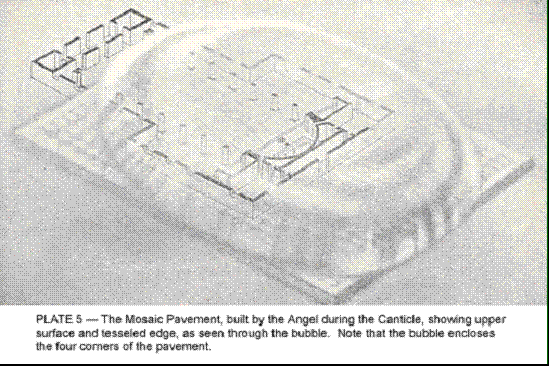

Если церковь полностью заполнена, ангел обычно берёт её план за основу для своего павильона; если она заполнена наполовину, он не обязательно включает всё пространство, но, скорее всего, завершит свой пол сразу за самым дальним участником своего собрания. Вне зависимости от того, насколько далеко он продвинулся на запад от Алтаря, он всегда проводит его одинаково далеко в противоположном направлении за Алтарем, который неизменно обозначает центральную точку завершенной формы. Если хватает материала, он часто расширяет свое здание на север и на юг, в этом случае оно иногда становится крестообразным, хотя чаще квадратным и очень напоминает уже упомянутую форму базилики.

Глубина основания зависит от доступного материала; на хорошо посещаемом Великом Праздновании павильон может быть толщиной до метра, его верхняя поверхность совпадает с полом церкви. Его дизайн всегда одинаков - мозаика из синих и алых блоков, установленных по диагонали, так что они представляют собой вид алмазов. Где на краях видна толщина павильона, он показывает мозаичную границу из чередующихся треугольников тех же цветов, что намекает на то, что блоки, используемые в его конструкции, не кубы, а пирамиды (см. диаграмму 6.) Алый и синий цвета выражают любовь и преданность соответственно, а оттенки меняются в соответствии с характером этих эмоций. Обычно мы получаем глубокие насыщенные цвета; но если собрание включает многих обученных и бескорыстных людей, можно увидеть светящиеся и нежные оттенки лазури и розы.

Ангел первым делом протягивает руки в стороны и изливает через них поток любви, который создает алую линию с каждой стороны от места, где он стоит, до стены церкви. Медленно размахивая руками вперед, он вызывает ряд параллельных линий, которые выстреливают из стороны оригинала, как зубцы расчески, за исключением того, что они наклонены к центру церкви, так что они пересекают друг друга, чтобы создать диагональный узор (см. диаграмму 1.) Еще одно подобное движение выбрасывает синий поток преданности, который заполняет пространства, оставленные багрянцем любви. Затем он поворачивается на восток и повторяет эти движения, чтобы создать аналогичный павильон для той части евхаристической формы, которая находится за пределами церкви.

Эти первые движения создают тонкую паутину в виде шашечки и настоящего привидения пола, настолько легкого и прозрачного, что он не мог бы удерживаться вместе, если бы не пузырь, который оттеснил хаос резких вибраций, которые бы разрушили его нежность. но пол быстро затвердевает, когда стихи песнопения раздаются, и интересно заметить, что, где стихи поются антифонально, Ангел отводит чередующийся всплеск звука и использует его для обозначения диагональных линий, которые вырезают его материал для пола в алмазы, или скорее пирамиды (см. рис. 6.) На Малом Праздновании здание часто бывает небольшим, а окраска павильона блёклой; но узор всегда сохраняется.

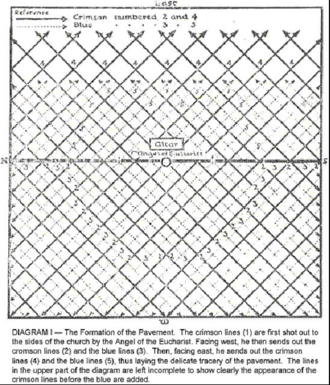

ДИАГРАММА 1. — Формирование Мозаикового Покрытия. Багряные линии (1) вначале протягиваются к бокам храма Ангелом Евхаристии. Обратившись к западу, он затем излучает багряные линии (2) и синие линии (3). Затем, обернувшись к востоку, он излучает багряные линии (4) и синие линии (5), тем самым создавая теневой рисунок на мозаиковом покрытии пола. Линии в верхней части диаграммы оставлены незаконченными, чтобы ясно продемонстрировать образ багряных линий до добавления синих.

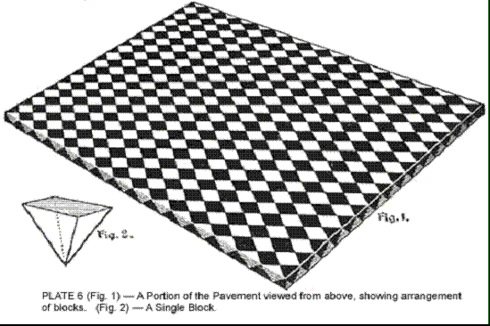

Следует понимать, что Малое Празднование вполне эффективно при вызове божественной силы и её распространении по округе, хотя, естественно, сила на Великом Праздновании во многих отношениях гораздо больше. Церемония окружена славой и красотой, которые призваны возбудить сердца и умы людей, сделав их более восприимчивыми. Кроме того, прихожан обычно гораздо больше - фактор, который имеет большое значение. Освящение и качество излучения, исходящего от священного Хоста, конечно же, одинаковы в каждом случае; но если тех, кто испытывает почтение, больше, количество излучения будет больше, потому что дополнительное количество той божественной силы вызывается этим дополнительным почтением.

Я считаю очень важным осознать, что эта божественная сила - это реальность - определенный, научный факт. Эта духовная сила, которую часто называют благодатью Божьей, так же определенна, как пар или электричество или любая другая из великих сил природы. Она работает в материи, которая немного выше, чем электричество, и её результаты не очевидны для физического глаза, но тем не менее она во всех отношениях так же реальна, и даже гораздо мощнее, так как она работает скорее над душой, разумом, эмоциями человека, чем просто над его физическим телом. Поистине, в этом Святейшем Таинстве Евхаристии она спускается даже до нашего физического уровня - так велика забота нашего Господа о своем народе, так он старается, чтобы мы получили всю помощь, которую мы способны принять.

Её излияние - научно измеримое явление; возможно, не измеримое методами физической плоскости, но доступное измерению и сравнению с другими излияниями в высших мирах. Его распределение происходит по точно таким же божественным законам, как и излучение на этой плоскости, учитывая определенные различия, вызванные более быстрыми колебаниями материи в более высоком состоянии.

Например, воздействие силы, вызванной на церемонии Евхаристии, можно сравнить, не без уместности, с течением электрического тока. При постоянном напряжении тока, проходящего через провод, количество полученного света зависит от количества включенных ламп. Если мы представим, что ток, текущий в проводе, исходит из неисчерпаемого источника и может удовлетворить любые требования к нему, очевидно, что мы свободны добавлять любое количество ламп, и тем самым получим яркое свечение.

В Службе Евхаристии каждый человек, который осознанно сотрудничает, напоминает лампу, и с добавлением каждого такого человека канал для течения тока становится шире и полнее. Небольшое собрание из пятидесяти человек, каждый из которых понимает цель Службы и точно знает, что каждая её часть планируется делать, может отправить столько же света в окружающий район, как большое, но невежественное собрание многих тысяч, собравшихся в каком-нибудь большом соборе. Размер собрания, безусловно, помогает, потому что по мере того, как больше людей отправляют свое почтение, канал становится шире; но когда к почтению добавляется разум и воля к служению, результат гораздо больше.

Когда из собрания поднимается шпиль почтения, его высота и блеск отмечают интенсивность почтения, в то время как его диаметр указывает на количество эмоции. Широкий, но короткий и бочкообразный шпиль, немного тусклый по цвету, показал бы, что большая масса достаточно невежественного почтения была испытана, не искренне, а скорее по привычке. Если люди встревожены действительно глубоким, сильным чувством, большой шпиль ярко-синего цвета мчится вверх над их головами, и в таком случае внизу идущий ответ пропорционален восходящему потоку. Целью Церковной Службы является создание канала, через который может протекать божественная сила. Чем больше количество людей, которые присутствуют, чем больше в них энтузиазма и преданности, тем больше канал для божественной силы. В этом смысле это Служба Богу, потому что, собираясь вместе, мы формируем больший и лучший канал для Его любви и благословения, которые Он всегда стремится пролить на мир.

Мы можем спросить: "Но почему Он не может всегда изливать это Сам по Себе?" Он это делает; но помните, что Он действует, как мы также должны действовать, по линии наименьшего сопротивления. Он наполняет высшие миры духовной силой, но привести эту духовную силу сюда, к нашим физическим мозгам и астральным телам, было бы проявлением силы, которое не оправдало бы результатов, если бы Он должен был делать все это Сам. Но если мы сотрудничаем и делаем нижнюю часть этой работы, делая себя каналами для этого изливания, тогда это действительно становится целесообразным излить эту силу. Люди не обязательно выполняют все обязанности искреннего христианина, просто сидя на своих местах и наслаждаясь подъемом церемонии. Если они хотят, они могут значительно усилить силу Службы и расширить сферу ее влияния.

Мы должны присоединяться к такой организации, как Церковь, не для себя, а ради других. Конечно, верно, что присоединяясь, мы получаем большую пользу, но чем меньше мы думаем о пользе, которую получаем, и чем больше мы думаем о помощи, которую можем оказать, тем лучше для нас и для организации, к которой мы принадлежим. Люди должны приходить на Службу, потому что хотят быть полезными. Те, кто приходит регулярно независимо от погоды и с энтузиазмом участвует в Службе, делают Евхаристию живой силой. Это особенно верно, когда они тщательно изучили ритуал и поэтому могут разумно сотрудничать с тем, кто причащает.

Когда служитель чувствителен и у него за спиной община, которая работает с ним, он обычно может чувствовать, как сила, сгенерированная их мыслями, вихрем взмывает вокруг и за ним, словно сильный ветер. Когда она приходит, она вызывает любопытное электрическое чувство, которое иногда можно заметить, находясь посреди большой толпы, охваченной сильной эмоцией. Однако служитель, как и капитан корабля или дирижер оркестра, и так же, как капитан не должен терять голову, когда его пассажиры охвачены волнением, должен сохранять полный контроль над своими эмоциями, чтобы использовать эту полезную силу, сгенерированную общиной. Он не только должен направлять силы, но и следить за тем, что делают его помощники, чтобы, если кто-то не сделает нужное вовремя, он мог бы немедленно восполнить этот пробел, внедряя дополнительную силу и помогая любым возможным способом.

Опять же, на Великом Праздновании у нас есть почти неоценимое преимущество использования музыки. Мы уже говорили, что упорядоченные вибрации звука оживляют огромные объемы материи, и таким образом предоставляют Ангелу Евхаристии много великолепного материала для его структуры; но за этим стоит гораздо больше, хотя и сложно найти слова для его описания, и это не место для подробного обсуждения такой тайной темы. Давайте скажем, что земля - это великий разум, и что музыка - одна из ее способностей, что, когда мы играем или поем, мы помогаем земле выразить себя; более того, что музыка - это своего рода сущность или совокупность сущностей, и что, когда мы ее используем, мы привлекаем к нашей работе новый набор сил, другую сторону Природы и привлекаем к нашей работе множество великих Музыкальных Ангелов. Мы не можем отвлекаться на подробности здесь; но даже такой небольшой намек даст мимолетный взгляд вдоль могучего пространства - достаточно, чтобы показать, что есть веские причины вводить музыку в наши Службы, когда это возможно и любым образом.

Эти соображения также применимы к _Миссе Кантате_, но на Великом Праздновании у нас в дополнение имеются помощь диакона и субдиакона, которые образуют треугольник с служителем и на время действуют как продолжения его сознания, освобождая его от некоторых аспектов его работы и позволяя сосредоточить свои энергии. Некоторые из используемых сил излучаются через них и усиливаются их присутствием и действием. Их задача - действовать в качестве посредников как в сборе, так и в распределении энергии - задача, которая тем самым выполняется более легко и эффективно (см. диаграмму 2.)

Чтобы прояснить их функцию, мы можем использовать аналогию с человеческим телом. Если сравнивать служителя с мозгом, то диакон и субдиакон являются ганглиями, имеющими под своей зарядкой определенные тракты; мозг, конечно, направляет ганглии, но есть вещи, которые они могут делать без мозга. Изначально, в ранней Церкви, диакон и субдиакон представляли мужчин и женщин соответственно, потому что диакон стоял справа от священника, то есть со стороны епископа, где сидели мужчины, и собирал всю преданность от мужчин и подготавливал ее для использования священника, тогда как субдиакон делал то же самое для женщин. В некоторых церквях полы до сих пор разделяются, но я не знаю, есть ли в этом какое-то особое преимущество, за исключением того, что, если числа вообще равны, это создает приятный эффект в антифональном пении.

Поток преданности, стремления, любви и поклонения от общины обрушивается на священника в потоке разнообразных вибраций, и не так-то просто свести их все к некоему общему знаменателю, чтобы их можно было удобно переслать. Диакон и субдиакон могут получать их от народа, и в большой степени отсеивать и сочетать их по мере прохождения в руки священника, таким образом сэкономив ему много хлопот.

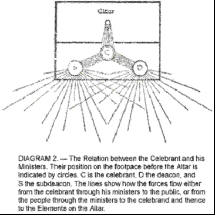

ДИАГРАММА 2. - Взаимоотношения между Совершителем и его Помощниками. Их расположение у подножия перед алтарем отмечено кругами. С - это Совершитель, D - диакон, а S - субдиакон. Линии иллюстрируют, как энергии передаются либо от Совершителя через его Помощников к верующим, либо от верующих через Помощников к Совершителю и далее к Тайнам на алтаре.

Для сокращенной формы Святой Евхаристии мы выбрали песнопение, которое более прямо относится к работе, которую Ангел выполняет, закладывая основание своего здания. Ему предшествует приглашение от священника, который говорит:

Братья и сестры, давайте теперь заложим основание нашего Храма.

_Антифон._

Христос - наша основа.

И наш главный краеугольный камень.

Мы больше не чужие и пришельцы: но соотечественники святых и домашние у Бога;

И мы строимся на основании апостолов и пророков: Иисус Христос Сам является главным краеугольным камнем:

В Котором вся постройка, грамотно сложенная вместе: растет в святой храм в Господе;

В Котором и вы также строитесь вместе; для обители Бога через Дух.

Если Господь не строит дом: труд строителей напрасен.

Основание Бога стоит надежно, имея свою печать: пусть каждый, кто называет Имя Христа, уходит от беззакония.

_Антифон._

Христос - наша основа.

И наш главный краеугольный камень.

Примечание. Двоеточие посреди каждой строки песнопения обозначает изменение направления чередующихся диагональных токов, которые создают синее и малиновое мозаичное покрытие, на котором должно быть построено наше здание. Так, если во время первой части стиха линии идут между юго-западным и северо-восточным углами, то во время второй половины они текут между юго-восточным и северо-западным. Но во время каждой половины сила могла бы бегать взад и вперед несколько раз - в зависимости от количества ударов в ритмической мере конкретного полустиха. Глория в конце, заканчивает покрытие, подравнивает края и оставляет всё прибранным. Упоминание о Трех Лицах Троицы заставляет три света у каждого входа светиться заново.

#### Versicles

Римская | Либеральная
------- | -----------
V. Наша помощь во имя Господа.                              | P. Наша помощь во Имя Господа.
R. Кто сотворил небо и землю.                               | C. Кто сотворил небо и землю.
_Соответствующие версиклы и ответы следуют за Отпущением._  | P. Обрати нас вновь, Господи, и оживи нас.
0 | C. Чтобы Твой народ мог радоваться Тебе.
0 | P. Доверьтесь Господу навеки.
0 | C. Ибо наша Вечная Скала - это Господь.

Теперь мы переходим к дальнейшему этапу нашей подготовки к великому делу, которое мы собираемся начать. Мы стремились очистить ментальную атмосферу, отгоняя бродячие мысли, и привести себя в состояние силы, мира и радости, которое необходимо, чтобы хорошо выполнить нашу работу. Однако могут остаться и механические трудности; мы должны попытаться устранить и их. Но это можно сделать быстро только при помощи специальной помощи извне, поэтому мы применяем метод, предназначенный Христом для Своей Церкви - метод исповеди и отпущения грехов.

Версиклы, которые вводят эту часть Службы, предназначены для вызова состояния души, которое будет способствовать действию этого плана. Сначала мы признаем, что этот быстрый результат можно достичь только божественной силой (вот где вновь Имя эквивалентно Силе), но мы напоминаем себе, что для всемогущего Творца неба и земли эта быстрая перемена - простая задача. И поэтому мы обозначаем себя знаком креста, чтобы приблизить себя к Нему. Поскольку мы немного отдалились от Него, от состояния полной любви, мира, понимания и единства, и в этом смысле мы ограничены как каналы духовной силы, мы просим в словах: "Обрати нас вновь, Господи, и оживи нас", чтобы Он привел нас обратно на путь правильных усилий, и чтобы Он оживил нас Своей сияющей жизнью. Без этой возобновленной жизни мы не сможем испытать глубокую радость, необходимую для того, чтобы в полной мере воспользоваться жертвоприношением, которое следует далее.

Затем, чтобы подчеркнуть нашу полную уверенность в Его силе и благоволении, мы говорим: "Доверьтесь Господу навеки; ибо наша Вечная Скала - это Господь." Возможность быстрой корректировки зависит от нашего абсолютного убеждения в том, что это можно сделать. Если мы сомневаемся в этом, то само сомнение создает преграду и препятствует свободному действию силы. Божественная сила готова, но мы должны открыть свои сердца. Итак, давайте рассмотрим систему исправления через исповедь и отпущение грехов и увидим, как это работает.

#### Исповедь

Римская | Либеральная
------- | -----------
P. Я исповедуюсь всемогущему Богу, благословенной Марии, всегда девственной, благословенному Михаилу архангелу, благословенному Иоанну Крестителю, святым апостолам Петру и Павлу, всем святым и вам, братья, что я грешен избыточно, в мысли, слове и деле; через мою вину, через мою вину, через мою тяжкую вину. Поэтому я молю благословенную Марию, всегда девственную, благословенного Михаила архангела, благословенного Иоанна Крестителя, святых апостолов Петра и Павла, всех святых и вас, братья, помолиться к Господу нашему Богу за меня. | Все. О Господи, ты создал человека бессмертным и сделал его образом своей вечности: тем не менее, мы часто забываем о славе нашего наследия и отклоняемся от пути, ведущего к праведности. Но ты, Господи, создал нас для себя, и наши сердца всегда неспокойны, пока они не найдут покоя в тебе. Взгляни глазами своей любви на наши многочисленные недостатки и прости все наши промахи, чтобы мы были исполнены светом вечного света и стали неизъянным зеркалом твоей силы и образом твоего блага. Через Христа, нашего Господа. Аминь.
S. Пусть всемогущий Бог помилует тебя, простит тебе твои грехи и приведет тебя к вечной жизни. |
S. Я исповедуюсь всемогущему Богу и т.д. |
P. Пусть всемогущий Бог и т.д. |

Форма, применяемая в Римской церкви, начинается со слова Confiteor, "я исповедуюсь"; отсюда и название. Цель этой исповеди - помочь людям обрести сосредоточенность и привести их в то состояние ума, которое необходимо, если они хотят получить пользу от абсолюции, следующей непосредственно после. Формулировка Confiteor, используемая в ритуале Либеральной католической церкви, в некоторой степени оригинальна и (как можно видеть) значительно отличается по тону от той, которую используют Римская или Англиканская церкви. Римская исповедь: "Я грешил избыточно, в мысли, слове и деле; через мою вину, через мою вину, через мою тяжкую вину"; замечание Англиканской церкви: "В нас нет здоровья," которое, однако, не встречается в Службе Святой Евхаристии, но в Утрене и Вечерне и других подобных утверждениях, являются преувеличениями и не представляют того, что обычный человек действительно чувствует. Ни один вменяемый и разумный человек не чувствует себя полностью злым, и помещать такие слова в его рот либо превращает его в лицемера, либо дает ему абсолютно неверное представление о человеческой природе.

Это постоянное повторение о врожденной злобе человеческого сердца, вероятно, возникло в раннем христианстве как реакция на определенные излишества, которые портили цивилизации, в середине которых эта вера укоренилась. Величайшими из цивилизаций, с которыми новая религия имела дело, были Греция и Египет. Обе они были в высшей степени здравы и разумны. Грек, например, поклонялся красоте и был полон жизнерадостности. Он отлично понимал, что существуют более высокие и более низкие плоскости, небо и земля, но он утверждал, что Бог создал и нижнее, и верхнее, и пока мы на нижнем, Он хочет, чтобы мы извлекли из этого максимум и наслаждаемся жизнью по максимуму, пока мы выполняем свой долг перед Богом и нашими ближними.

Когда эти древние и великолепные цивилизации начали угасать, без сомнения, появились излишества, и в поисках красоты иногда забывали о добре. Эти излишества были противны ранним христианам, и, установив идеал аскетизма, они в своем мышлении склонились к противоположному крайнему и осудили как зло все, что относится к миру и к физической жизни.

Такие преувеличения нездоровы и излишни, как учил еще давно Господь Будда, срединный путь разума всегда самый безопасный, и чрезмерный аскетизм, с одной стороны, так же опасен и неестественнен, как и чрезмерное наслаждение, с другой; и поэтому мы тщательно избегали в формулировках признания любых утверждений, которые мы не могли бы честно подписать. Мы использовали слова святого Августина, который сказал, что Бог создал нас для Себя, и наши сердца поэтому всегда беспокойны, пока не найдут покоя в Нем. Когда мы отклоняемся от того, что знаем как правильное, как мы все более или менее делаем из-за небрежности или забывчивости, мы чувствуем себя некомфортно, пока не исправим ситуацию, потому что знаем, что сделали ошибку. Мы всегда несчастны, когда уходим с пути, даже если не осознаем причину нашего несчастья.

Мы говорим, что Он создал человека по Своему образу — образу Своей вечности, прекрасная мысль, взятая из _Мудрости Соломона_ (ii, 23). Поскольку мы таким образом являемся воспроизведением Его, мы всегда должны быть близки к Нему, в полном свете Его мощи и Его любви; но из-за нашего невежества и ошибки мы отдаляем себя от Него. Цель признания состоит в том, чтобы устранить ментальное отношение, которое удаляет нас, и заменить его на открытое и восприимчивое состояние всего человека, чтобы свет Божий мог войти. Исповедь не напрямую влияет на евхаристическое здание, которое мы строим, хотя это важный фактор в подготовке нас к его строительству. Давайте посмотрим, как абсолюция, следующая за ним, достигает своих результатов.

Примечание: Здесь впервые община говорит вместе со священником, поэтому, возможно, здесь уместно указать на то, что во всей Службе, когда все так присоединяются, ни один человек не должен поднимать свой голос выше голоса совершающего службу священника таким образом, чтобы попытаться изменить скорость, акцент или интонацию, с которой произносится часть Службы. Помимо приемлемости этого, есть очень важная причина для этого. Материал, из которого мы строим нашу форму, просто материя, оживленная вибрациями эмоций людей и ответным излиянием на них. Таким образом, ритм и движение целого, которые гармонизирует Ангел, являются сущностью его существования — первым условием для формы вообще. Сейчас священник, находясь в центре на физической плоскости, гармонизирует эти вибрации и объединяет их в одно, давая им определенный тон. Будучи этим центром на физической плоскости, он лучше всего ощущает ритм, подходящий для определенного дня календаря и собора, с которым он работает, и затем интерпретирует его в терминах своих собственных, с которыми будет сотрудничать ангел. Таким образом, священник и Ангел будут работать вместе, устанавливая сильную регулярную вибрацию, с помощью которой может быть построено наше здание. Но если будут все виды внешних воздействий, устанавливающих собственные биения, которые звучат выше центрального, возникнет неприятное смешение перекрестных токов, которые нейтрализуют друг друга, оставив мало ритма для оживления нашего строительного материала. Должен быть лидер, и священник должен быть этим лидером.

Мы видим, что в течение первых двух предложений исповеди происходит прекрасное излияние очень тонко окрашенного и духовного влияния на людей. По мере продолжения Исповеди, это влияние проникает в них и помогает привести их в требуемое состояние, которое является умом, твердо настроенным на стремление к более высокому идеалу. Под действием этого, их любовь взмывает к Воплощению всех истинных идеалов, и таким образом делает их готовыми к отпущению грехов.

#### Отпущение

Священник встает, подходит к Алтарю, поворачивается к людям и произносит отпущение.

Римская | Либеральная
------- | -----------
Да подарит нам всемогущий и милосердный Господь прощение, отпущение и освобождение от наших грехов. Ответ: Аминь. | Бог Отец, Бог Сын, Бог Святой Дух, благословляют, сохраняют и освящают вас: Господь в своей любви смотрит на вас и милосердствует к вам: Господь освобождает вас от всех ваших грехов, и дарует вам благодать и утешение Святого Духа. Ответ: Аминь.
0 | _Соответствующие стихи и ответы предшествуют Исповеди._
В. Ты, Боже, обратишься и оживишь нас. |
О: И народ твой возрадуется в тебе. |
В. Покажи нам, Господи, твое милосердие. |
О: И даруй нам твое спасение. |
В. Господи, услышь мою молитву. |
О: И да придет к тебе мой вопль. |
0 |  _Соответствующее Малое Благословение предшествует Вступлению._
В. Да будет с вами Господь. |
О: И с твоим духом. |
П. Забери у нас наши беззакония, мы умоляем тебя, Господи, чтобы мы были достойны войти с чистыми умами в Святую Святых. Через Христа, нашего Господа. Аминь. |
Мы умоляем тебя, Господи, по заслугам святых, чьи реликвии здесь, и всех святых, чтобы ты удостоил простить мне все мои грехи. Аминь. |

Чтобы понять действие отпущения грехов, нам сначала нужно объяснить, что идеи, обычно ассоциируемые с прощением греха, совершенно неверны и вводят в заблуждение. Общепринятое представление заключается в том, что Бог, создавший человека и, следовательно, знающий его возможности и то, что он, вероятно, сделает в любых обстоятельствах, тем не менее отворачивается от него и возмущается им, когда он делает то, что расчет средних показателей заставляет ожидать от обычного человека. Это та же путаница, которая постоянно сталкивается с искателем христианства. Если бы христиане отказались от первобытного еврейского представления о завистливом и мстительном племенном божестве и приняли учение их лидера, Христа, большинство этих недопониманий немедленно исчезли бы.

Я совершенно уверен, что многие размышляющие христиане гораздо лучше своего кредо и на самом деле в своем сердце не держат такого низкого мнения о Божестве, как это может показаться из их слов. В высказывании покойного полковника Ингерсолла есть много правды: "человек создает своего Бога по своему образу"; по мере того как человек развивается, его представление о Боге становится более истинным и благородным; по мере того как он постепенно отказывается от своих грубых пороков, он перестает приписывать их своему Богу и смотрит на дикое табу-этику своих предков как на грубое и богохульное. Я предполагаю, что мы можем признать, что теория, согласно которой Бог злится, когда человек ошибается, что Ему нужно умиротворить и умолить прощения, является грубым и материалистическим способом изложения определенного закона природы; но она подвергается очень серьезному возражению, что она дает человеку совершенно неправильное и унижающее представление о Боге, и делает невозможным для него принятие того единственного отношения к своему Богу, которое делает его прогресс практичным.

Никто в здравом уме не предположит, что Бог питает враждебность к Своему народу. Всю идею о том, что человеку, поступившему неправильно, нужно прощение, следует полностью выкинуть из нашего сознания, потому что утверждение, что Бог должен простить человека, подразумевает, что если бы он не был прощен, Бог бы затаил на него обиду. Никто не имеет права говорить такое о Божественном Отце. Бог ни на кого не злится. Напротив, Он всегда готов помочь, так же как и солнце всегда светит. Солнце не злится на нас, когда проходящее облако закрывает его свет и тепло. Солнечный свет всегда есть, и все, что нам нужно сделать, это подождать прохождения облака.

Бог, который подвесил нашу солнечную систему в пространстве и влил в нее Свою жизнь, чтобы мы и Его другие существа могли возникнуть, руководит развитием этого грандиозного Эксперимента с благожелательным, отцовским интересом. Он знает о нас гораздо больше, чем мы можем знать о себе; Он понимает нашу силу и нашу слабость, и Он не может злиться на нас больше, чем мы можем злиться на цветок в нашем саду. Но Он следит за нашим ростом и оставляет нам на пути различные помощи; возможно, Ему нравится, когда мы понимаем и используем их, но даже если мы этого не делаем, поддержка Его помощи никогда не далеко от нас, иначе мы быстро перестали бы существовать.

Внимание Бога поддерживает Его систему в существовании; если бы Он на один миг отвлекся, она мгновенно рассеялась бы на пузырьки, из которых она и состоит. И это внимание проявляется здесь, на низших уровнях, как сила, или скорее как ряд сил. Трудно перевести эти концепции в слова, не впадая в отчаяние от их материализации; однако лучше их переоценить, чем совсем не ведать их красоты и величия.

Давайте попробуем прояснить, что на самом деле происходит, когда человек совершает то, что обычно называют грехом. Грех - это все, что противоречит течению эволюции. Если человек намеренно делает что-то, что задерживает эволюцию, будь то его собственную или чужую, то он определенно делает что-то неправильное. Но я сомневаюсь, что человек когда-либо делает зло ради зла, кроме, возможно, очень редких случаев, как нацистские зверства, многие из которых были совершены преднамеренно, холоднокровно и по приказу, с явной целью запугать мирное население жестокостью.

Обычно то, что называют грехом, возникает из одной из двух вещей: либо человек невежественен и допускает ошибки, либо он беззаботен и эгоистичен, не достаточно внимателен к последствиям своих поступков. Если бы человек действительно полностью понял, что он делает, когда грешит, он бы этого не сделал. Многие злодеяния исходят из алчности, из желания денег. Это потому, что скряги не знают лучше; для них деньги важнее всего. Огромное количество вреда приходит от животных страстей. Опять же, сенсуалисты невежественны и эгоистичны, они на самом деле не понимают, какой вред они наносят другим и себе. Способ избавиться от зла - это увеличить мудрость, как проповедовал Господь Будда в Индии две с половиной тысячи лет назад.

Давайте примем, что грех или проступок - это любая мысль, слово или деяние, которые не согласуются с Божьей волей по отношению к человеку, то есть эволюцией. Вместо прогрессии это проступок, не движение вперед с эволюционной силой, а через линию его потока. Эта божественная воля действует как постоянное давление вверх и вперед и действительно создает в более высокой материи (даже до эфирного уровня) некий напряжение, которое можно описать словами только как тенденцию к движению в определенном направлении - течение духовного потока. Когда мысли, слова и действия человека хороши, он более полно открывается для этого влияния; он проникнут им и несется с ним.

Когда он делает или думает зло, он отрывает себя от направления этого духовного потока и тем самым создает определенное напряжение в эфирной, астральной и умственной материи, так что он больше не в гармонии с природой, больше не помогает, а мешает, становится препятствием в реке жизни. Это напряжение, или крестообразное скручивание, почти полностью останавливает его прогресс на время и делает невозможным для него извлечь пользу из всех импульсов доброго влияния, которые постоянно мчатся вдоль течения потока, о котором мы говорили. Прежде чем он сможет сделать что-то действительно хорошее для себя или кого-то другого, он должен исправить это искажение и вступить в гармонию с природой, и таким образом, снова быть полностью открытым для доброго влияния и способным воспользоваться многими и ценными помощниками, которые так щедро предоставляются для него.

Различные транспортные средства человека на самом деле не разделены в пространстве, потому что более тонкие виды материи всегда проникают в более грубые. Но смотря снизу, они создают впечатление, что находятся одно над другим, и также что они связаны множеством тонких проводов или линий огня. Каждое действие, которое работает против эволюции, накладывает неравномерное напряжение на эти - скручивает и запутывает их. Когда человек серьезно ошибается в любом отношении, путаница становится такой, что связь между верхними и нижними телами серьезно затруднена; он больше не является своим истинным Я, и только низшая сторона его характера способна полностью проявить себя.

Нужно ясно понимать, что в долгом, медленном ходе эволюции природные силы вполне способны исправить это несчастное состояние дел. Постоянное давление течения со временем износит преграду, но может пройти много месяцев или даже лет, прежде чем адаптация будет полностью осуществлена, хотя усердные усилия со стороны человека могут немного сократить этот период. Но даже тогда есть определенная тенденция к возвращению искажения.

Поэтому очевидно, что в интересах человека отыскать более быстрый способ восстановления равномерности. Такой метод предлагает Церковь, так как способность исправлять эту путаницу в более высокой материи - это одно из тех особенных даров, которые наделяют священника при посвящении. Сам Христос говорил об этой власти самыми ясными словами, хотя люди обычно уклоняются от них или пытаются их объяснить, просто потому что они озадачивают свои умы идеей эмоционального прощения и не могут понять, что нам нужно иметь дело с прямолинейным научным процессом.

Но священник не может совершить это чудесное исцеление в одиночку; ему нужно сотрудничество его пациента. Никто не может заставить человека быть в гармонии, если он настойчиво стремится к дисгармонии; это происходит только "Если мы исповедуем наши грехи", что "Он верен и справедлив, чтобы прощать нам наши грехи и очищать нас от всякой несправедливости". Требуется, чтобы кандидат стремился подняться над недостатками своей природы и жить высшей жизнью. На всех ее главных Службах, Церковь предлагает форму общего исповедания, которую должны произнести ее люди, и форму абсолюции, которую должен произнести священник; и если кто-нибудь в собрании действительно сожалеет о какой-то ошибке или промахе, который он совершил, и искренне желает снова полностью согласовать с эволюционным течением, нет сомнений, что божественная сила, которая течет через священника, когда он произносит абсолюцию, проникает через высшие тела этого человека, расчесывает запутанность и выпрямляет искаженные линии, пока он снова не станет в полной гармонии с волей Божьей.

Священник изливает абсолютивную силу над своим собранием и не знает, на кого или в каком направлении она действует; но если индивид приходит к нему лично и точно говорит ему, что не так, у него, возможно, есть определенное преимущество в том, чтобы сконцентрировать всю силу там, где она наиболее нужна. Кроме того, вне зависимости от власти, предоставленной ему, священник часто может на основании своего опыта дать очень полезные советы.

Но никто не должен думать, что общее абсолютивное прощение, данное всему собранию, в чем-то уступает частному прощению, если желание исправления со стороны грешника одинаково искренне и серьезно. Как уже было сказано, со временем искажение должно исправиться под влиянием обычных эволюционных сил; и нет сомнений, что этот процесс будет ускорен сильным желанием пациента на перестройку. Действие священника в этом вопросе - это просто то, что обычно называют "средством благодати" - то есть небольшой помощью на пути эволюции, предоставленной Христом для Своих последователей.

В Либеральной Католической Церкви ушная исповедь полностью опциональна и не требуется как предварительное условие для приема Святой Евхаристии. Частая и систематическая практика не поощряется, поскольку считается, что при таких условиях подробная исповедь склонна становиться рутиной, и ее духовная ценность в жизни индивидуума тем самым уничтожается. Для всех обычных целей общая исповедь в Святой Евхаристии должна быть достаточной.

Должно быть четко понятно, что эффект абсолюции строго ограничен исправлением описанного выше искажения. Он открывает определенные каналы, которые были в значительной степени закрыты злыми мыслями или действиями; но это никак не противодействует физическим последствиям этого действия, ни не устраняет необходимость восстановления, где было сделано зло.

Человек, который крадет, например, оказывается в неправде тремя отдельными способами: он нарушил божественный закон любви и справедливости, тем самым отрезав себя от полного и свободного общения с высшей стороной природы; он нарушил законы своей страны; и он обидел индивида, у которого он украл. Если он полностью осознает ошибку, которую совершил, и искренне стремится ее исправить, абсолюция священника выправит для него эфирное, астральное и умственное запутывание, которое было вызвано его действием, или скорее умственным отношением, которое сделало это действие возможным; но это не освобождает его от юридического наказания за это действие, ни от обязанности немедленно и полностью возвращать то, что он украл.

Опьянение - искушение для людей на низкой стадии развития; тот, кто поддается ему, несомненно, очень нуждается в помощи абсолюции, чтобы устранить преграды, которые он поставил между собой и светом Божьей благодати; но, уступая, он также ослабил свою волю и повредил свое физическое здоровье, и он не должен ожидать, что абсолюция укрепит первое или восстановит второе. Священнодействие возвращает человека в согласие с Богом; но это не освобождает его от ответственности за свои поступки, ни в коей мере не влияет на их физические последствия.

Это духовный процесс, освобождение от рабства греха, процесс воссоединения с Высшим Я, восстановление внутренней гармонии бытия, которое нарушено неправильным поступком, чтобы человек мог сделать свежую попытку к праведности, укрепленный непрерывным потоком божественной силы внутри него. Человек не может избежать последствий своих злодеяний, хотя он может нейтрализовать их, засеяв свежие причины праведного рода. "Не обманывайтесь; Бога не обдурить: ибо что посеет человек, то и пожнет."

Примечание: Когда пастырь делает первый крест, благословение Господа, которое в какой-то мере вливается в них, приводит все их тела в порядок и улаживает вещи в личности. Когда он произносит слова "пусть Господь в своей любящей доброте посмотрит на вас и окажет вам благодать", священник работает на уровне, где Господь смотрит на нас как на единство - будхический уровень - где мы получаем Его благосклонность в такой щедрой мере. Здесь пастырь един с своим приходом, и на этом высоком уровне, попытавшись поднять всех их в себя, он изливает поток силы в их низшие транспортные средства, которые принимают образ их высших Я (уже сделанных более яркими и более верными отражениями Великого Я благодаря излиянию в Confiteor и при первом благословении в абсолюции) и, через их точки входа, ставит это на личность, тем самым не только влияя на эту личность, но и очищая канал, соединяющий его с Большим Я. Сила Бога стимулирует Божественный Образ в каждом из нас, чтобы произвести более определенное впечатление на личность, и, насаждая себя, она очищает любые скрученности в соединительном канале между нижними и высшими я - между индивидом и Богом. Так жизнь Логоса - эволюционный поток - снова может свободно течь через человека. Он больше не препятствие в потоке, потому что он был исправлен в своем отношении к своему Создателю.

Это замечательная помощь, но помните, что абсолюция не идет дальше этого. Не стоит употреблять выражение, что человек прощен или помилован, потому что Бог никогда не находится в таком отношении к нам, чтобы мы могли говорить о необходимости его изменить от обиды к прощению. Он сделал нас такими, какие мы есть, и Он не злится на нас, потому что мы все еще находимся на низших стадиях нашей эволюции. Говорить о Его гневе - это очень грубое недоразумение; в самом деле, такое предположение на самом деле является богохульством.

Лучше это выразить так, что, так как мы перевесили чашу весов в одну сторону, она вновь вернется, и мы должны нести последствия нашего поступка. Абсолюция не может отрицать закон причины и следствия. Что она может и действительно делает, так это разрешает для нас путаницу и дает нам силу, которую мы можем использовать, чтобы продолжить и делать лучше, тем самым запуская другие причины для добра, которые могут нейтрализовать или смягчить результат наших злодеяний. Это единственный вид раскаяния, который имеет какое-либо значение; угрызения совести и раскаяние на самом деле сами по себе являются лишь дополнительным проступком и часто являются оправданием для того, чтобы мы полностью обратили наши мысли на себя в убеждении, что мы делаем это для высших целей. Таким образом, мы тратим энергию, которую следовало бы тратить на Его службу, и часто вредим людям вокруг нас; ибо вибрации, которые мы отправляем в этом состоянии, очень вероятно, вызовут депрессию, эгоизм и раздражительность у других. У никого нет права это делать; на самом деле это антисоциальная форма самоудовлетворения и, следовательно, сама по себе грех.

#### Окадывание Алтаря

Далее следует прекрасная церемония освящения кадильницы перед Алтарем, которая требует некоторых объяснений. Она досталась нам из ранних дней Церкви и упоминается самим Оригеном. Использование благовония полно смысла. Оно одновременно символическое, почитательное и очищающее. Оно восходит перед Богом, как символ молитв и преданности народа; но также распространяется по церкви как символ сладкого благоухания благословения Бога. Это предложено в знак уважения, как это было во многих старых религиях; но оно также используется с явной идеей очищения, и поэтому священник вливает в него святое влияние с намерением, что, где бы ни проник его аромат, где бы ни прошла самая маленькая частица того, что было освящено, она должна нести с собой чувство мира и чистоты и прогонять все негармоничные мысли и чувства.

Даже вне благословения его влияние положительно, потому что оно тщательно смешивается из определенных смол, скорость колебаний которых идеально гармонирует со духовными и религиозными вибрациями, но явно противостоит почти всем остальным. Магнитизация может лишь усилить его естественные характеристики или добавить к нему другие специальные колебания, но в любом случае его использование в связи с религиозными церемониями всегда желательно. Аромат сандала имеет многие из тех же свойств; и аромат чистого аттара роз, хотя совершенно иной по характеру, также оказывает хорошее воздействие.

Известно более сотни разновидностей благовоний, и каждый из используемых ингредиентов оказывает свое особое влияние на высшие тела человека. Существует наука об ароматах, и злые силы, так же как и добрые, могут быть вызваны такими средствами. Почти все благовония, приготовленные для использования в церкви, содержат большую долю бензоина и олибана, поскольку опыт показал, что они оба приятны и эффективны. Бензоин почти жестоко аскетичен и очищает; он решительно борется со всеми грубыми формами нечистой мысли и прекрасно подходит для использования в большом соборе, заполненном несколько неразвитыми индивидами. Для меньших собраний менее примитивных умов ему требуется большое количество других элементов для достижения наилучших результатов. Олибан - это особое благовоние преданности; его аромат сильно стремится пробудить это чувство у всех, кто способен на него, и углубить и усилить его, где оно уже существует. Благоразумное смешивание этих двух смол оказывается удовлетворительным на практике, поэтому оно часто используется в качестве основы или центрального запаса, к которому могут быть добавлены другие менее важные ароматизаторы.

Когда подходят тот, кто держит кадильницу, и тот, кто несет лодочку, служитель выложивает некоторое количество благовония в кадильницу и торжественно благословляет его, говоря: "Будь ты благословен Тем, в честь Кого ты будешь сожжен". Если присутствует епископ, лучше, чтобы он благословил его, так как он может внести в него немного дополнительной силы, которая не подвластна священнику. Благословляя благовоние, лучше всего иметь в виду намерение очистить путь, пронзить все, с чем оно придет в контакт, и поляризовать все. Мысль, которую я сам имею в виду, благословляя благовоние, состоит в том, чтобы оно "прямо проложило путь Господу".

Был задан вопрос, нельзя ли заранее благословить всю ладанную смесь, вместо того чтобы благословлять только ту часть, которую используют для наполнения кадила. Это было бы не так эффективно, потому что ладан не сохраняет полного магнетизма на неопределенный срок, как это делает драгоценный камень. Лучше благословить каждый раз ту порцию ладана, которая только что была помещена на горящие угли, таким образом магнетизм впечатляется в него в момент его плавления, когда он может проникнуть наиболее глубоко, и таким образом достигается наилучший эффект.

После этого служитель переходит к окадыванию Алтаря. Таким образом он стремится проникнуть весь Алтарь и атмосферу вокруг него высоким и священным влиянием, и перенести на высшие планы подготовительный процесс, который уже был выполнен для эфиричного уровня во время Asperges. Алтарь станет центром огромного излучения, и необходимо так подготовить его, чтобы он не истощал силы, которые он должен передать. Если бы его не окадывали, определенная часть силы, которая приходит во время Священнодействия, была бы потрачена на упорядочивание частиц Алтаря для этой передачи, чтобы сила могла быть правильно распределена. План окадывания Алтаря хорош, поскольку он распространяет магнетизм очень полно и точно через сам Алтарь и везде на нем.

Средняя линия Алтаря, на которой расположены Хостия и Крест, - это направление, по которому будет течь сила Священнодействия, и поэтому прежде всего необходимо окадить и очистить ее.

Мы приняли с небольшими изменениями римский порядок окадывания, но мы делаем девять махов к кресту, сгруппированных по три, что лучше подходит для этой цели, чем три двойных маха римской церкви. В этом действии мы оказываем наивысшую почесть в нашей власти всему, что символизирует крест - самому Христу и великой Жертве, которая породила вселенную. Также это девятикратное махание имеет особое и прекрасное значение, потому что оно символизирует предложение Троице Бога трехкратного человека, которого Он создал по Своему образу; это показывает, что мы посвящаем "себя, наши души и тела" (как это говорится в христианской фразе, что ученики называют Монадой, эго и личностью) каждому Лицу Благословенной Троицы по очереди. Когда Священник выполняет это действие, каждый член общины должен умственно создать такую полную преданность, тем самым пробуждая в себе все, что еще может быть пробуждено в каждом из этих отделов, и подготавливая себя к участию в Kyrie позже. Когда Священник берет кадило у диакона, он поворачивается и преклоняется, говоря про себя: "Отец, я посвящаю (как он машет кадилом три раза) (1) дух, (2) душу, (3) тело"; затем следует мгновенная пауза, и в этой паузе перед вторым набором махов он говорит себе: "Сыну, я посвящаю (как он делает три маха) дух, душу, тело"; и затем, когда он делает паузу перед третьим набором махов, он говорит про себя: "Святому Духу, я посвящаю (как он делает махи) дух, душу, тело". Затем он преклоняется и обращается к свечникам на южной или Epistle стороне Алтаря и окадывает каждый из них одним махом кадила (см. диаграмму 8), что магнетизирует каждую свечу, а также ту часть поверхности Алтаря, которую охватывает мах кадила. Выполняя это, священник должен обдумать каждый из семи Лучей, которые представлены шестью свечами и крестом — или, возможно, более точно, светом перед крестом, который можно рассматривать как своего рода его продолжение.

Поскольку это религия Христа, главы второго Луча, и латинский крест является его особенным символом, Алтарный крест представляет для нас второй Луч, и, качая кадило в его сторону, мы поклоняемся Святой Троице "через Христа Господа нашего", как мы так часто говорим в своих молитвах. Первая свеча, которую окуривают (ближайшая к кресту с южной стороны), представляет первый Луч; следующая представляет четвертый, а наружная свеча пятый Луч. С стороны Евангелия свеча, ближайшая к кресту, обозначает седьмой Луч (тот, который сейчас становится доминирующим в мире), следующая представляет третий, а последняя - шестой Луч. Распределение свечей по этим конкретным Лучам соответствует расположению драгоценных камней в камне алтаря, которое объясняется в Главе III, и связь между ними будет очевидна из Диаграммы 8.

Окуривая каждую свечу, священник должен думать о Луче, с которым она связана, принося поклонение Богу по этой конкретной линии, и люди также должны держать в уме ту же мысль, насколько они способны. Это означает что-то вроде двойной мысли — решения попытаться развить в себе качество, специально принадлежащее этому Лучу, и в то же время посвятить службе Богу все, что у нас есть из этого качества. Для нашей текущей цели характеристики Лучей и желания, которые мы должны предложить, можно выразить следующим образом:

_ | _
----- | -----
Сила | "Я буду сильным, смелым, упорным в Его служении."
Мудрость | "Я достигну той интуитивной мудрости, которую можно развить только через совершенную любовь."
Адаптивность или Такт | "Я постараюсь обрести способность говорить и делать именно то, что нужно, в нужный момент — встретить каждого человека на его уровне, чтобы эффективнее помочь ему."
Красота и Гармония | "Насколько это возможно, я привнесу красоту и гармонию в свою жизнь и окружение, чтобы они были более достойны Его; я научусь видеть красоту во всей Природе, чтобы так я мог служить Ему лучше."
Наука (детальное знание) | "Я получу знания и точность, чтобы посвятить их Его работе."
Преданность | "Я разовью в себе могущественную силу преданности, чтобы через неё привести других к Нему."
Упорядоченная служба (церемония, призывающая ангельскую помощь) | "Я так упорядочу и распределю свою службу Богу по линиям, которые Он предписал, чтобы я мог полностью использовать любящую помощь, которую Его святые Ангелы всегда готовы оказать."

Очевидно, что невозможно обдумать все это за время одного качания кадила, поэтому может быть предложено, что когда священник кланяется после окуривания креста, он должен сказать себе: "для Его службы я раскрою в себе" (пока он окуривает свечи в порядке) "(1) Силу, (4) Гармонию, (5) Знание."

Затем он окадывает южный угол Алтаря, как снизу, так и сверху (см. диаграмму 3), и, делая это, должен убедиться, что он достигает его и со стороны. Во время этой и следующей операции он твердо держит в уме мысль: "Пусть Его сила создаст надежный щит для Его благодати." Затем край и верх Алтаря окадываются, включая все вазы, стоящие на нем. Когда он преклоняет колено, достигая средней точки, он снова думает: "ради Его службы я раскрою в себе" (когда он окадывает свечи) "(7) Порядок, (3) Такт, (6) Преданность." Затем, когда он обращается к северному или Евангельскому углу, краю и верху таким же образом, он возвращается к предыдущей идее создания такого сильного вихря силы, что ничто не может помешать ему, используя те же слова, что и на южной стороне, и удерживая эту мысль, когда он окадывает нижнюю часть Алтаря с обеих сторон. Когда есть только две свечи, как на частных празднованиях, священник должен окадить каждую свечу три раза, удерживая те же мысли, как указано выше.

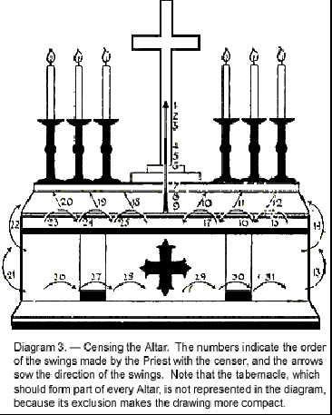

ДИАГРАММА 3. — Окуривание Алтаря. Цифры указывают на последовательность движений, совершаемых священником с кадильницей, а стрелки обозначают направление этих движений. Заметьте, что табернакуль, неотъемлемый элемент любого алтаря, на данной диаграмме не изображён, так как его отсутствие делает изображение более компактным.

Таким образом, весь Алтарь окружен оболочкой мощного магнетизма, которая производит эффект на его материал, и на объекты на нем, который не отличается от магнетизации железного стержня. Той же действием блок эфира вокруг Алтаря отделяется от остального; он не присоединяется на время к общему эфирному обращению; будучи особенно поляризованным, он остается как вихрь - все еще эластичное тело, хотя и отделено на время в окрестностях Алтаря, пока на втором окадывании он не расширяется еще больше. Если мы думаем о Хосте как о одном полюсе магнита (другой полюс которого - это Христос), то этот эфирный вихрь - это магнитное поле вокруг него. Так же как пространство внутри евхаристического сооружения на время отгорожено от внешнего мира, так и магнитное поле вокруг Алтаря временно отгорожено от церкви в свою очередь - Святая святых внутри Храма. Чтобы изменить метафору - если церковь, или, скорее, евхаристическое сооружение, изображается как энергетическая станция, то эфирный вихрь вокруг Алтаря - это генератор, а священнослужитель - инженер, отвечающий за его обслуживание. В знак того, что он так отделен и связан с этим внутренним святилищем, он, и только он, также окадывается на этом этапе.

Здесь мы сталкиваемся с еще одним из многих преимуществ Великого празднования перед обычным Малым празднованием. Легко понять, что желательно оставить это магнитное поле исключительно для приема и хранения силы свыше, и иметь в нем как можно меньше какого-либо другого действия, кроме того, что происходит в нем. Дело священника, который обязательно находится внутри зарезервированной зоны, принять вклады силы, генерируемые преданностью и благодарностью его народа, и ускорить их путь вверх. но они очень разнообразны по качеству и силе, и им нужно гармонизировать, координировать, очищать, часто даже в значительной степени трансмутировать, прежде чем он сможет использовать их наилучшим образом, и приварить их в такой поток, который вызовет каждую унцию силы, которую они могут привлечь из необъятного божественного хранилища.

Рассматривая множество преимуществ, которые мы получаем от использования благовоний, мы не должны забывать о помощи специальных порядков Ангелов и духов природы, которые действуют посредством их. Ангелы благовоний относятся к двум совершенно различным типам — нам их трудно будет понять, за исключением тех, кто уделил много времени изучению подобных вопросов. Такие исследователи знают, что существуют Ангелы Музыки — великие существа, которые выражают себя в музыке так же, как мы выражаем себя в словах — для которых арпеджио — это приветствие, фуга — разговор, оратория — речь. Существуют Ангелы Цвета, которые выражают себя калейдоскопическими изменениями светящихся оттенков, мерцаниями и вспышками радужного света. Также есть Ангелы, которые живут в и выражают себя тем, что для нас являются ароматами и запахами — хотя использование таких слов кажется унижающим, как будто материализующим изысканные излучения, в которых они так радостно погружаются. Подразделение этого типа включает Ангелов благовоний, которые привлекаются его вибрациями и находят удовольствие в использовании его возможностей.

Также есть другой вид, которому менее подходит название "Ангел". Они также изящны и красивы по-своему, но на самом деле они принадлежат к царству эльфов или духов природы. Внешне они напоминают детей-ангелов Тициана или Микеланджело, за исключением того, что у них нет крыльев. Они не выражают себя посредством ароматов, но они живут благодаря и на таких излучениях, и поэтому всегда находятся там, где распространяется аромат. Среди них много разновидностей, некоторые питаются грубыми и отвратительными запахами, а другие только теми, которые деликатны и изысканы. Среди них есть несколько типов, которые особенно привлекаются запахом благовоний, и они всегда находятся там, где его сжигают. Когда мы окуриваем Алтарь и тем самым создаем магнитное поле, мы заключаем в нем ряд этих прекрасных маленьких эльфов, и они поглощают много энергии, которая накапливается там, и становятся ценными агентами в его распределении в нужное время.

Благовония полезны для нашей Службы таким множеством различных способов, что очень желательно использовать их замечательные свойства всякий раз, когда это возможно. Если можно, каждый священник должен хранить маленький кадильник в своей личной молельне и использовать его в своем ежедневном Праздновании. Маронитская церковь горы Ливан всегда использует благовония как на Малом, так и на Великом Праздновании, и мы из Либеральной Католической Церкви следуем ее примеру в этом вопросе по возможности.

Замечание: Помимо почётного и очищающего применения, курение имеет огромное значение в том, что оно вызывает силы Лучей через их представительные свечи, когда каждая по очереди окуривается. Рассмотрим цвета различных излияний. Мы не утверждаем, что это цвета Лучей, поскольку для установления этого с какой-либо уверенностью потребовался бы очень компетентный ясновидящий. Сложности на этом пути велики по разным причинам. Возможно, каждый Луч имеет фундаментальный цвет, который можно приписать ему, но он скрыт под многими другими. Вероятно, есть некоторое расположение, при котором они соответствуют цветам спектра, и они, вероятно, меняют свои цвета в соответствии с потребностями мира в данный момент, которые зависят от циклических изменений.

Есть много других соображений, каждое из которых оказывает свое влияние; это как настройка многокольцевого замка для писем; если бы мы однажды поняли Слово — регулирующий Принцип — мы, вероятно, обнаружили бы, что это достаточно ясно, но с нашей сегодняшней позиции, не зная этого Слова и видя только запутанное огромное количество возможных соображений, это вызывает только замешательство. Однако, мы можем указать цвета, излучаемые при курении, не затрагивая вопрос о абсолютных цветах Лучей.

С первым тройным взмахом к центральному кресту и картине, мы видим прекрасный поток белого цвета, который распространяется по всему Алтарю. Это также стимулирует драгоценные камни в камне Алтаря к активной деятельности, так что они участвуют в этом белом излиянии. Возможно, только алмаз, драгоценный камень первого Луча, излучает этот цвет, но я склонен думать, что это результат сочетания цветов всех Лучей, которые, подобно цветам спектра, могут быть объединены в чистый белый цвет. Это отличается от ослепительного и настойчиво позитивного излучения первого Луча; это простая белизна, которая не поражает, как молния, но излучает, как молоко, и светится мягким светом, который, тем не менее, очень тверд. Я уверен, что именно с намерением имитировать это были даны указания, что на Алтаре должна быть разложена "чистая льняная скатерть". Следующие три взмаха вызывают аналогичное излияние голубого цвета от Христа; и последний набор приносит красный цвет Святого Духа. Взмах к свече первого Луча вызывает мощный струйный поток силы, который стремительно спускается по свече и выходит на Алтарь, распространяясь в форме буквы V. В то же время это вызывает большую активность в драгоценном камне первого Луча Алтарного камня, который разливает материал того же цвета по всему Алтарю. Поток от свечи обильно продолжается в течение нескольких мгновений, а затем цвет скрывается под белизной "чистой льняной скатерти". Однако, несмотря на это, некоторое количество остается видимым сквозь этот белый материал, но кажется, что то, что просачивается, принадлежит к высокой октаве цвета, так оно изящно и утонченно.

Цвета, которые спускаются по каждой из свечей, имеют несколько слоев. У первого Луча есть тонкая линия ярко-золотого цвета, которая окружена замечательным и блестящим серебристо-электрическим голубым цветом, который так часто виден в связи с этим Лучом. Поверхность этого излияния покрыта серебристыми искрами, которые оно постоянно выпускает с шипением. Многие из них издают почти трескучий звук, когда поток достигает края Алтаря и падает с Алтаря, окрашенного этими замечательными цветами, как они светятся под белизной покрывала Алтаря. Все излияния из других пяти свечей происходят точно так же, за исключением того, что их цвета отличаются, и из-за их относительного расположения их дорожки в форме буквы V также немного отличаются.

Следующий мах кадила направлен к свечам четвертого Луча. Его ядро обладает своеобразным непередаваемым цветом, который наиболее близок к прозрачно-розовому маджента — яркому цвету, но с очень тонким оттенком раковины. Сам розовый цвет плавно переходит в опалесцентный аквамариновый ореол. Основа силы представляет собой великолепное смешение темно-синего и зеленого, напоминающее грудь павлина; а на поверхности мы видим тот же цвет, что и в сердцевине, за исключением того, что маджента присутствует лишь в виде пятнышек, а опалесцентного эффекта гораздо больше. Контраст мадженты, видимой на фоне темного вечно меняющегося потока смешанных глубоких синих и зеленых оттенков, создает иллюзию, что этот любопытный облачный ореол опалесценции почти похож на прекрасный эстетический серый, но при ближайшем рассмотрении видно, что в нем много нежных цветов, которые выглядят ярче, когда вечно бурный поток выбрасывает их на поверхность, и что сероватость лишь результат контраста между сильным почти металлическим блеском темных цветов и нежным ореолом этого странного розового цвета. Возможно, некоторые цвета этой силы Луча связаны с его долгой связью с Египтом. Они также могут быть связаны с его позицией в центре или балансирующей позицией между двумя группами по три с каждой стороны. Некоторые полагают, что в трехкратном цикле эволюции первые три Луча характеризуют первую часть цикла, а пятый, шестой и седьмой Лучи - последнюю, четвертый Луч доминирует на протяжении всего среднего цикла. Я далеко не убежден в этом, но если бы это было так, это объяснило бы многие цвета и любопытные смешения в этом излиянии, так как ему пришлось бы подстроиться под гораздо больше периодов, чем другие Лучи.

Следующей окадывается свеча пятого Луча, которая производит излияние с сердцевиной насыщенного абрикосового красного — в нем есть оранжевый и марсианский красный — и окружающим телом прекрасного и исключительно чистого желтого цвета. На поверхности имеются крошечные вкрапления центрального цвета, абрикосового.

Последняя свеча является каналом для силы шестого Луча, которая в центре представляет собой чистый марсианский красный цвет — очень сильный и огненный, цвет, вдохновляющий мучеников. Основной объем излияния, окружающий эту центральную струю, является прекрасным розоватым багрянцем — самым нежным и чистым оттенком гвоздики — действительно непередаваемым. Возможно, ближе всего к нему на физическом уровне можно приблизиться, глядя на определенные очень яркие ракеты; но даже это — лишь самое бедное и выцветшее воспроизведение чистой красоты этого высшего цвета. Марсианский красный проявляется снова в виде поверхностных вкраплений.

Фейерверки на физическом уровне представляют собой наиболее близкое сходство с астральными цветами; но даже они не могут дать истинное представление о том, что кажется почти парадоксальной смесью крайней яркости и интенсивности цвета с наиболее прозрачными диафанной и жемчужной гаммой. Эти цвета сочетаются с постоянно меняющимся, вечно неспокойным и мерцающим блеском, чтобы создать впечатление жизни, которое наводит на мысль, что цвета являются выражением живого существа, чьи настроения никогда не остаются прежними с момента на момент.

Следующая часть окадывания аналогична той, которая была сделана с Епистольной стороны Алтаря; затем следуют шесть круговых махов — три с каждой стороны — вдоль нижней части фронтальной части Алтаря. Эти махи притягивают силу, представленную определенной свечой перед каждым махом, и так усиливают орфреи Алтаря.

С каждым всплеском из свечей, соответствующий Лучевой драгоценный камень посылает поток той же силы на весь Алтарь, который, хотя и исчезает под белым покрытием, все же определенно оставляет свою магнетизм. Каждый всплеск из различных свечей быстро распространяется, пока не касается путей своих двух соседних излияний; так что практически вся верхняя часть Алтаря покрыта этими цветами, которые (в отличие от тех, которые идут от более общего и диффузного эффекта драгоценных камней Алтаря) не полностью исчезают под белым покрытием, но остаются мерцать сквозь него, как мерцающие звезды между ветреными пальмовыми листьями. Аналогично, передняя часть Алтаря остается все покрытой этими полосами полу скрытых цветов, которые все еще кажутся живыми под светящимся белым.

Таким образом, для ясновидящего, окадывание является очень красивым обрядом, Алтарь оживает этими удивительно яркими цветами, и каждая свеча, подобно небольшому солнцу данного оттенка — ведь свечи не только служат трубами для стремительного спуска, но и сами, вокруг пламени и мест, где в них установлены Лучевые драгоценные камни, буквально прорываются радиацией света и славы, создавая настоящий огонь или свет алтарных свечей.

Все это отделяет Алтарь от остальной частью церкви, чтобы внутри него могли генерироваться специальные силы. Священник в определенной степени включен в это магнитизированное поле, когда диакон теперь окадывает его. Я говорю "в определенной степени включен", потому что Священник ни при каких условиях не может коснуться Алтаря, потому что, если бы он это сделал, накопленная в нем сила вытекла бы в него. Если бы он был полностью частью этого магнитного поля, он и Алтарь были бы равнозаряжены, и поэтому не имело бы значения, коснулся он его или нет. Но поскольку это имеет значение, он явно включен только "в определенной степени" в заряженную область.

Его облачения поглотили немало из излияний во время окадывания Алтаря, и теперь, когда он сам окадывается, он заряжается гораздо большей силой. Это то, чем он делится с народом в Малом благословении, которое следует непосредственно за ним.

#### Dominus vobiscum

Римская | Либеральная
------- | -----------
-- | P. Да будет Господь с вами.
-- | C. И с духом твоим.

Повторение второго из этих Малых благословений помогает священнику собрать из собравшегося народа ту силу, которая могла быть сгенерирована благодаря их чувству благодарности за абсолюцию. Также с его помощью люди налаживают наиболее тесную связь со священником, и он стремится поделиться с ними, насколько это возможно, удивительной электрификацией, которую он получил во время обряда кадильницы. Магнитное поле, изолированное пространство, все сильнее заряжается, и с помощью этого действия священник проецирует часть этой силы на своих прихожан; и скорый ответ тесно связывает их с ним, так что их вибрации поднимаются на более высокий уровень. Струны высшего сознания натягиваются и настраиваются.

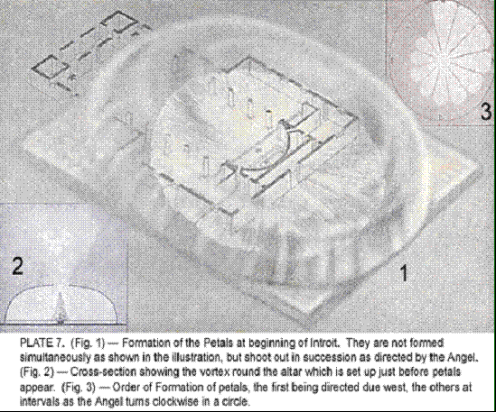

Исправление, достигнутое абсолюцией, сделало это настройку возможной, так что теперь люди могут быть собраны гораздо теснее, чем это было возможно ранее, как связка прямых палок может быть связана плотнее, чем куча изогнутых, нерегулярных веток. У каждого человека были свои изгибы и углы; они теперь в большой степени были выровнены, и теперь есть хотя бы приближение к параллелизму, и следовательно, способность к психической совместной работе в создании евхаристического здания красивым актом поклонения, называемым Интроитом. В сокращенной форме Евхаристии, место Малого благословения перед Интроитом занимает особое отношение к работе, которую мы сейчас предпринимаем. Священник поет: "С похвалой и молитвой наш Храм будет построен." И народ отвечает: "Слава только Богу."

#### Введение

Римская | Либеральная
------- | -----------
_Введение бывает разным. Следующее предназначено для Троицы воскресенья._
Благословенная святая Троица и неделимое Единство: мы воздадим славу Ему, ибо Он проявил нам Свою милость. О Господи, наш Господь, как велико Твое имя по всей земле! Слава Отцу и Сыну, и Святому Духу. Как было в начале, так и ныне, и присно, и во веки веков. Аминь. | Благословенная Святая Троица, неделимое Единство, вечное, бессмертное, невидимое, которому дана честь и слава навеки и навеки. Аминь.
Благословенная святая Троица и неделимое Единство: мы воздадим славу Ему, ибо Он проявил нам Свою милость. | О Господи, наш Бог, как велико Твое Имя по всему миру! Слава Отцу, и Сыну, и Святому Духу. Как было в начале, так и ныне, и присно, и во веки веков. Аминь.
-- | Благословенная Святая Троица, неделимое Единство, вечное, бессмертное, невидимое, которому дана честь и слава навеки и навеки. Аминь.

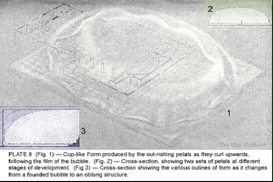

Введение это в сущности дальнейшее признание и призыв величия и славы Имени, которое превыше всех имен; и помните всегда, что это на самом деле синоним Мощи, которая превыше всех мощей. В его центре находится стих: "О Господи, наш Бог, как велико Твое имя по всей земле!" Остальная часть Введения состоит из обычного Gloria Patri, добавленного к этому, и величественного антифона, который предшествует и следует за ним. Было бы не просто придумать более великолепное прославление, и оно прекрасно подходит для создания материала для стен и кровли здания. Оживленная материя изливается великими волнами на мозаичный пол, затапливая его и изгибаясь вверх по его краям, следуя (что касается церкви) форме пузыря, сдутого Asperges, но повторяя эту форму на восточной стороне Алтаря.

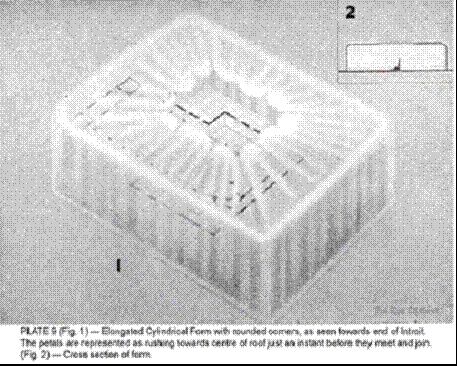

С помощью знака креста в начале каждый полностью открывает себя для воздействия электризации, а затем под воздействием этого удивительного стимула изливает себя в любовь, преданность и поклонение. Первый порыв этой силы, поднимающейся от общины к Алтарю, создает огромный вихрь вокруг него (рис. 7), в который божественный ответ на преданные чувства спускается в потоке; но Ангел Евхаристии быстро распространяет это и уравнивает, так что оно мчится во всех направлениях по павименту и поднимается по стенам, имея странное сходство с быстро растущим цветком дупла (рис. 8). Каждая фраза Введения отправляет свежую волну, и поднимающийся материал вскоре снова изгибается в крышу, так что здание на этом этапе выглядит как огромный цилиндрический мешок, все его углы и края округлены (рис. 9).

Ангел, невероятно способный, стоит посреди у Алтаря, ловко распыляя силу во всех направлениях с удивительной легкостью и точностью, тем самым быстро превращая изгибы в углы, пока у нас не получится прямоугольное здание (рис. 10). Цвета все еще преимущественно багряные и синие, как на павименте, хотя иногда они смешиваются в пурпур с редкими оттенками золота. Материал изначально более густой у нижней части стен и, следовательно, темнее по оттенку; верхняя часть, будучи более легкой и тонкой, показывает прекрасные нежные оттенки розового и лазурного, невероятно яркого, но по мере продолжения восхода вся конструкция становится более прочной и менее воздушной.

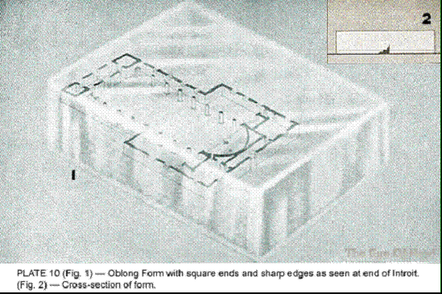

В Римском Миссале Введение постоянно меняется в зависимости от времени года. Мы считали целесообразным избегать этого и отдавали предпочтение обычаю Греческой Церкви, которая не меняет свои Службы таким образом. Мы обнаружили, что многие Введения Римской Церкви не всегда одинаково эффективны в создании необходимого материала для здания, поэтому кажется желательным взять лучшее из них, слегка изменив; и еще более важным является то, что люди гораздо охотнее и с большей готовностью присоединяются к словам, которые им хорошо знакомы. Когда они знают, что идет дальше, они могут вложить свои мысли в то, что они говорят, вместо того чтобы думать о том, как подогнать слова под музыку; поэтому если мы хотим искреннего участия с энтузиазмом от тех, кто не обладает высокими навыками пения, очевидно, что большая часть обряда должна быть неизменной, чтобы они могли выучить его наизусть.

Примечание: Римский обряд здесь предписывает, чтобы священник и его помощники стояли формируя полукруг. Это полезно, поскольку помогает установить вихрь силы, который стремительно поднимается к центральной линии и там вызывает истечение, с помощью которого Ангел строит стены и крышу здания. Вихрь находится на положительной стороне из-за силы и стабильности истечения на этой стороне. Эта часть Службы предоставляет прекрасное зрелище для ясновидящего. Великолепный всплеск истекающей силы, напоминающий цветок, распространяется во всех направлениях по багряному и синему павименту, который отчетливо виден под прозрачными, опалесцирующими цветами истекающего материала. Эффект удваивается благодаря свету центрального истечения, который, кажется, отражается на распространяющемся потоке, прикасаясь к которому, все волны превращаются в золото, как водоем на вершине какой-то большой горы — лагуна, окруженная травой, подобно яркому сапфиру, вложенному в изумруды — которая в тот же момент чувствует первое дыхание утра и улавливает рассеянное золото.

Когда стены быстро поднимаются вокруг, вы смотрите на волшебный мир, видимый, как он есть, через удивительные синий и багряный, золотой и сиреневый цвета блестящей и диафанной структуры.

#### Kyrie

Римская | Либеральная
------- | -----------
Kyrie, eleison. Kyrie, eleison. Kyrie, eleison. | Kyrie, eleison. Kyrie, eleison. Kyrie, eleison.
Christe, eleison. Christe, eleison. Christe, eleison. | Christe, eleison. Christe, eleison. Christe, eleison.
Kyrie, eleison. Kyrie, eleison. Kyrie, eleison. | Kyrie, eleison. Kyrie, eleison. Kyrie, eleison.

Это единственные слова оригинального языка, которые остались в нашей Литургии. Фраза "Кирие, елейсон" обычно переводится как "Господи, помилуй нас" - формулировка, которая вносит ложную и недостойную идею, что Бог на нас злится и что мы должны просить о милосердии, что полностью согласуется с униженным отношением, о котором мы уже говорили, и которое так неблагоприятно влияет на истинное благочестие. Действительно, греческий глагол ελεεω (eleéo) подразумевает этот смысл, когда он используется для выражения просьбы заключенного к судье; но что у него есть другое, более естественное значение, показывает наш использование английского слова "eleemosynary", произошедшего от него. Это подчеркивает идею свободного дара, дара как милостыни; поэтому гораздо более подходящим эквивалентом для "Кирие, елейсон" будет: "Господи, даруй нам Себя" или "Господи, излей Себя". Один христианский ученый переводит это как: "Господи, будь добр к нам". Но мог ли наш Небесный Отец когда-нибудь быть иначе, чем добрым?

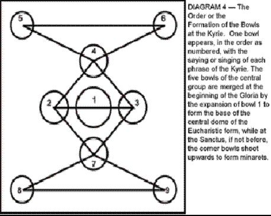

ДИАГРАММА 4. — Порядок формирования чаш на Kyrie. Каждая чаша появляется в порядке, идентичном пронумерованному, при произнесении или пении каждой фразы из Kyrie. Пять чаш из центральной группы соединяются в начале Глории за счёт расширения первой чаши, при этом образуется основание центрального купола в евхаристической форме. В момент прочтения Санктуса, если не ранее, угловые чаши стремительно поднимаются, формируя минареты.

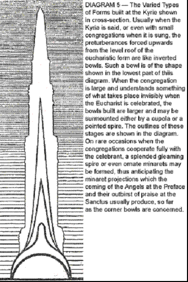

ДИАГРАММА 5. — Разнообразные типы образований, создающихся на Kyrie, изображенные в разрезе. Обычно, когда говорится Кирие, или даже в небольших собраниях, когда оно исполняется песнопением, выпуклости, образующиеся вверх от единообразного крылья евхаристической формы, подобны перевернутым чашам. Такая чаша представляет собой форму, показанную в нижней части данной схемы. Когда община больше и осознает кое-что из того, что происходит незримо при праздновании Евхаристии, строятся более объемные чаши, могущие быть завершены либо куполом, либо острым шпилем. Контуры этих этапов обозначены на схеме. В редких случаях, когда община полностью согласовывает свои действия с воцерковляющим, могут формироваться великолепные сияющие шпили или даже орнаментированные минареты, таким образом предвкушая минаретные выступы, обычно возникающие при прибытии ангелов на префацию и их излиянии хвалы в Sanctus, что касается угловых чаш.

Эта молитва на самом деле предхристианская, поскольку она, по сути, является переводом той, которую в египетских Мистериях обращали к Солнечному Богу Ра, прося его светить на свой народ своим благотворным и дарующим жизнь лучом, а не тем, который сжигает или разрушает. Когда мы понимаем истинное назначение празднования Евхаристии - когда мы понимаем, что на самом деле предстоит продолжение великого Жертвоприношения, мы сразу видим, насколько подходящей является такая молитва и насколько искусно разработана курьезная форма, в которую она воплощена.

Этот девятикратный призыв соответствует девятикратной жертве духа, души и тела при кадильнице; это открывает человека на этих трех уровнях, и ответ, который приходит на этот призыв, заполняет открытые сосуды. Пока он поет первую просьбу, поклонник, тянущийся со всей своей силой к Всеотцу и пытающийся осознать свое абсолютное единство с Ним, должен думать: "Я - искра Тебя, Живого Пламени; О Отец, излей Себя внутрь и через Твою искру". Придерживаясь того же осознания, когда он поет вторую, он почувствует: "Отец, затопи мою душу, чтобы через нее можно было питать другие души". И на третьей: "Отец, мои тела Твои; используй их к Твоей славе". В четвертой, пятой и шестой просьбах он повторит эти мысли, заменив осознание Сына на осознание Отца; и в третьей серии он предложит те же просьбы Богу Святому Духу. Но при всем этом он не должен просить что-либо исключительно для себя, и не должен гордиться тем, что был выбран в качестве отдельного сосуда для Божьей благодати, но должен скорее знать себя одним из братьев, солдатом среди товарищей.

Когда община понимает эту схему вызывания и эффективно её осуществляет, это порождает замечательные результаты в евхаристическом строении. С крыши его поднимается великолепная группа шпилей, следуя красивому и наглядному порядку в их расположении (диаграмма 4). Первая идентификация духа с Всеотцом порождает великолепный центральный шпиль; вторая и третья молитвы выдвигают аналогичные, но несколько меньшие шпили севернее и южнее его. Четвертая вызывает шпиль восточнее центрального, пятая и шестая - меньшие шпили в северо-восточном и юго-восточном углах крыши, образуя треугольник с четвертым. Седьмое обращение поднимает шпиль западнее центра, тем самым завершая группу из четырех, которые окружают первый и самый большой в форме ромба, восьмой и девятый занимают северо-западный и юго-западный углы и образуют треугольник с седьмым. Эту компоновку легко проследить с помощью иллюстрации.

Только хорошо отточенная община может возвести этот лес шпилей; ранние попытки приводят к образованию низких, куполообразных, перевернутых чаш (рис. 11), точно таких же, как на крыше Церкви Сан-Джованни дегли Эремити в Палермо (рис. 12); но расположение всегда одно и то же. Иногда, с особо обученной и преданной общиной, образуются великолепные минареты за счет всплеска силы. Чаша образуется, когда сила слабая, минарет - когда она сильная (диаграмма 5).

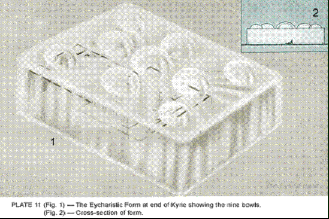

В римской службе эти куполообразные формы часто вновь опускаются и становятся углублениями в крыше, а не выступами над ней. Это связано с идеями страха и самоуничижения, которые часто сопровождают недопонимание, вызванное недостойным переводом греческих слов. Когда мы думаем о себе как о несчастных грешниках и постоянно умоляем Бога о милосердии, эффект на строение поражает, поскольку вместо вздувшихся куполов и вспыхивающих шпилей появляются возвратные кривые и впадины. Поклоняться Богу со страхом и трепетом - это, с невидимой стороны вещей, отрезать от себя много той любви, которая пронеслась бы через нас, если бы мы только научились доверять Ему как любящему Отцу.

В римских церквях часто можно увидеть великолепные всплески преданности от отдельных людей, но редко можно найти комбинацию разумной преданности от нескольких людей, поэтому результат больше похож на несколько разбросанных строительных лесов, чем на минарет. Иногда люди создают великие волны преданности, но она обычно расплывчата и неосведомлена, поэтому даже когда ее можно использовать в строительстве строения, она оставляет всю работу по строительству полностью на Ангела. Важно, чтобы каждый присутствующий человек думал сильно, не о себе, а о том, чтобы действовать как часть единого целого. Таким образом, сила его преданности, вместо того чтобы протиснуться через крышу строения, как стержень, помогает поднимать и расширять купола или минареты.

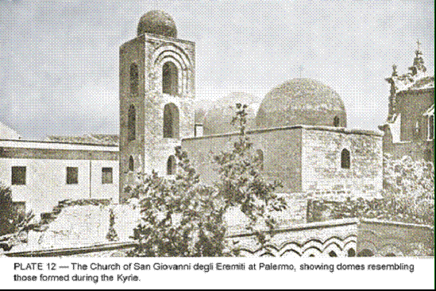

В Службе Евхаристии Церкви Англии эффект от Кирие был почти полностью утерян из-за печального введения в эту Службу заповедей Моисея. Девять Кирие разбросаны среди них, десятое добавляется после последнего, которое предполагается обращено ко Всем Трем Лицам совместно. Кирие особенно предназначено, чтобы подготовить народ к достойному и полезному присоединению к Gloria in Excelsis, но так называемые реформаторы, не имеющие никакого представления обо всем этом, широко развели их, поставив одно в начале и другое в конце Службы. Кирие в этой Службе, конечно, не могут возводить шпили или купола, как это должно было бы быть; ведь пока что абсолютно нет никакого здания, и никакой Ангел не был призван, кроме тех немногих церквей, которые, хотя и используют англиканскую Литургию, дополняют ее недостатки, вставляя основные элементы римского обряда.

#### Gloria in excelsis

Римская | Либеральная
------- | -----------
_Пропускается во время Страстной и Святой недели._ | 
Слава Богу на высоте, и на земле мир людям, благоволит Бог. Мы восхваляем Тебя, мы благословляем Тебя, мы поклоняемся Тебе, мы прославляем Тебя. Мы благодарим Тебя за Твою великую славу. Господи Боже, небесный Царь, Бог Отец всемогущий. | Слава Богу на высоте, и на земле мир людям, Бог благоволит. Мы хвалим Тебя, мы благословляем Тебя, мы поклоняемся Тебе, мы прославляем Тебя; мы благодарим Тебя за Твою великую славу, Господи Боже, Небесный Царь, Бог Отец Всемогущий.
Господи Иисусе Христе, единородный Сын. Господи Боже, Агнец Божий, Сын Отца, взявший на себя грехи мира, помилуй нас. Взявший на себя грехи мира, прими нашу молитву. Ты, сидящий одесную Отца, помилуй нас. | Господи Христе, единорожденный Отца; Господи Боже, Внутренний Свет, Сын Отца, чья мудрость могуче и нежно упорядочивает все вещи, пролей свою любовь; Ты, чья сила поддерживает и поддерживает все творение, прими нашу молитву; Ты, чья красота сияет через всю вселенную, открой свою славу.
Ведь только Ты свят. Только Ты Господь. Только Ты, Иисус Христос, величайший, вместе со Святым Духом, в славе Бога Отца. Аминь. | Ибо Ты один свят; Ты один - Господь; Ты один, Христос, со Святым Духом, являешься высшим в славе Бога Отца. Аминь.

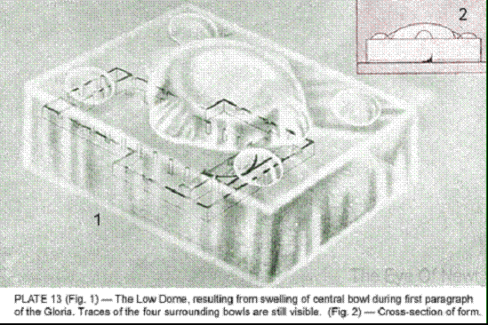

Gloria in Excelsis (как указано в римских или англиканских книгах молитв) - это перевод раннего греческого гимна. Первое упоминание о ней можно найти в указе, который издал Папа Телесфор в 128 году. Существует значительное разнообразие среди старых версий, которые уцелели, и некоторые из ее наименее защищаемых черт отсутствуют в более ранних версиях. Несколько столетий ее пели только при епископе; затем священнику разрешили использовать его лишь в День Пасхи; и, наконец, около двенадцатого века, разрешилось его общее использование во всех праздничных Мессах.

Мы приняли перевод первого и последнего из его трех абзацев, как он стоит в английской службе общения, за исключением фразы "благоволение к людям", которая, хотя, возможно, и более живописна как чувство, всё же неприемлима как перевод оригинального греческого текста и затемняет важный вопрос, что только те могут иметь мир, кто наполнен благоволением к своим собратьям. Во второй абзац внесены определенные изменения. Мы исправили перевод слова monogehvz с "единородного" на "рожденного от одного" - то есть рожденного от одного родителя, а не от сизигии или пары, как все остальные созданные существа. Мы удалили вводящую в заблуждение фразу "помилуй нас", заменив ее другими, более в гармонии с духом этого великолепного гимна. Вместо ссылки на грехи мира, мы цитировали из другого ритуала благородное описание Святой Троицы как Мудрости, Силы и Красоты.

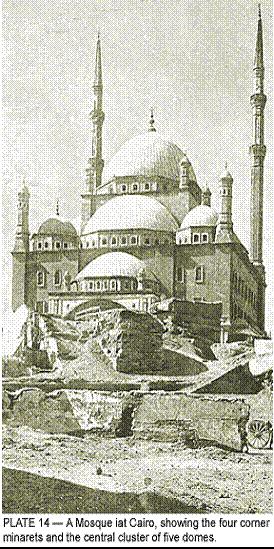

При исполнении этого гимна как священнослужителю, так и прихожанам лучше всего следовать тексту как можно ближе, стараясь прочувствовать и проникнуться им до конца. Ведь так же как в Аспержес мы в основном имели дело с эфирным материалом, так во всей этой части Службы мы в основном занимаемся оживлением астрального вещества, хотя без сомнения у всех, кто способен на это, также возбуждаются сильные вибрации интуитивной мудрости.

Эффект исполнения "Gloria in Excelsis" на евхаристическую постройку очень заметен. Каждая из его трех частей способствует созданию этой постройки. По мере того как мы поем первый абзац, центральная шпиль, сформированная пением первого Kyrie, увеличивается и расширяется, пока не сливается с четырьмя окружающими шпилями, формируя большой центральный купол (рис. 13).

Этот купол невысок по сравнению со своим диаметром и еще не совсем круглый у основания, поскольку на этой стадии он все еще несет следы четырех меньших куполов или шпилей, которые он поглотил. Форма на этой стадии странно напоминает мечеть в Каире, показанную на рис. 14. При пении второго абзаца этот большой сплюснутый купол округляется, и из его вершины вырастает высокий и изящно пропорциональный купол. Наконец, в третьей части из купола выступает как бы фонарь, весь комплекс теперь состоит из трех уровней, что-то вроде купола Капитолия в Вашингтоне, хотя детали отличаются (рис. 15). Наконец, когда люди перекрещиваются, произнося последние слова, над их головами образуется розовый крест и всплывает в фонарь-подобную часть постройки.

Учитывая важную роль, которую этот великолепный гимн играет в создании формы, римский обычай пропускать его и Символ веры в то, что некоторые люди называют временами покаяния, весьма печальный.

Примечание: три стиха этого великолепного гимна обращены к Трем лицам Троицы, поэтому основание центрального сооружения посвящено Отцу, средняя часть - Сыну, а фонаре-подобное сооружение на вершине, образованное последним стихом, посвящено Святому Духу. Эта часть Службы всегда довольно яркое цветовое представление; и центральный купол еще более обогащается Сборами, которые добавляют отличительные цвета для различных праздников, в честь которых он утвержден, и дополнительно укрепляет его.

#### Dominus Vobiscum

Римская | Либеральная
------- | -----------
V. Да будет Господь с вами. | P. Да будет Господь с вами.
R. И с духом твоим. | C. И с духом твоим.

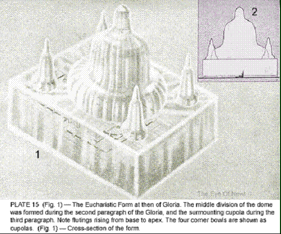

По окончании Gloria in Excelsis, когда люди особенно возвышены благородными словами, которые они только что произнесли, и находятся в более чувствительном и восприимчивом состоянии, еще раз священник обращается к ним и пытается посредством Малого Благословения влить в них нечто из своего собственного энтузиазма. Их готовый ответ приводит их к более тесному союзу с ним и также помещает в его руки всю силу, которую они генерировали.

#### Сбор

Римская | Либеральная
------- | -----------
_Сбор бывает разным. Приведенный ниже относится к Троицкому воскресенью._
Всемогущий, вечный Бог, который даровал твоим слугам в исповедании истинной веры признать славу вечной Троицы и в силе божественного величия также поклоняться единству: дай, чтобы, пребывая в той же вере, мы всегда были защищены от всякого зла. Через нашего Господа. | Всемогущий Бог, перед которым открыты все сердца, все желания известны, и от которого ни один секрет не скрыт; очисти мысли наших сердец вдохновением Твоего Святого Духа, чтобы мы могли совершенно любить Тебя и достойно прославлять Твое святое Имя. Через Христа, нашего Господа. Аминь.
_Здесь следуют любые дополнительные Сборы, после чего читается Эпистоля._ | _Здесь следует Сбор дня, после чего читается Эпистоля._

Преданность и любовь людей теперь были тщательно пробуждены великими актами поклонения и взывания, в которых они участвовали, и, следовательно, строительство евхаристического здания было завершено настолько, насколько это касается его астральных частей. Теперь желательно пробудить умный энтузиазм собрания, в результате чего материя ментального плана также может быть вплетена в нашу постройку. Это делается путем чтения людям Эпистолии и Евангелия и призыва их присоединиться к чтению Символа веры. Но сначала произносятся определенные молитвы, называемые Сборами, из которых в нашей пересмотренной Литургии одна используется неизменно, но остальные меняются с календарем.

Эти краткие и всеобъемлющие молитвы использовались в Церкви с самых ранних периодов. Название, применяемое к ним, имеет великую древность, но неясное происхождение. Литургисты считали, что они так называются только потому, что они использовались в общественном собрании или сборе людей; или из-за того, что в них многие ходатайства собраны в краткое резюме; или потому, что они собирают вместе идеи, представленные в Эпистолии и Евангелии дня, и превращают их в молитву. Опять же, есть предположение, что в более ранние времена священник "собирал" желания своего прихода и включал их в свою импровизированную молитву. Другая теория, которая находила широкую поддержку, основывается на том факте, что в древние времена, когда проводилась служба, называемая станцией, обычно священнослужители и люди сначала собирались в другой церкви, а затем шли процессией в ту, где должна была быть сказана Евхаристия. Прежде чем они отправились из первой церкви, произносилась короткая молитва, называемая Oratio ad collectam, и от этого обычая сама эта молитва стала называться Сбором. Как бы то ни было, такие молитвы найдены во всех известных Литургиях.

Наш первый Сбор, который мы не меняли, - это молитва ранней Церкви, называемая Сбором за Чистоту, который непосредственно следует за Отче Наш в начале Службы Евхаристии Церкви Англии. Его искреннее стремление к чистоте мысли особенно уместно здесь, когда мы только собираемся предоставить ментальную материю, необходимую для евхаристического здания; и молитва о том, чтобы мы были наполнены совершенной любовью и могли достойно прославлять Святое имя Бога, затрагивает именно ту ноту и дает нам ключ к точному отношению ума, которое мы должны сохранять, если мы хотим правильно служить Ему.

Выбирая Сборы для воскресений и праздников, мы во многих случаях использовали те, что из Книги Общих Молитв Церкви Англии, которые в свою очередь обычно выбирались из тех, что в древней Литургии; но мы последовательно исключали все проявления покорности или неверия и стремились всегда держать перед умами наших членов мысль о любви и славе Бога и о высшей радости альтруистической службы.

Что касается памятных дат, мы следуем обычной практике нашей Церкви. Когда два праздника совпадают, мы используем Службу более важного из них и кроме того читаем Сбор другого, чтобы наши люди не пропустили его.

#### Послание

В ранние дни Церкви, кажется, было принято в это время Службы читать ряд уроков, количество которых было ограничено только временем, которое было в их распоряжении; мы находим указание на то, что епископ или священник должен был дать сигнал, когда, по его мнению, было прочитано достаточно. Позднее, этот излишек уроков был сокращён до трёх, которые называли Пророчеством, Посланием и Евангелием; ещё позже исчезает первое из них, и мы находим только Послание и Евангелие, как у нас сейчас, хотя след ужатия до сих пор остаётся в том факте, что то, что называется Посланием, иногда берётся из книг Пророков. Ясно, что здесь подразумевается предоставление людям определённого обучения; мы не должны забывать, что в древние времена не было печатных книг, поэтому обучение могло быть дано только устно. В отношении здания, цель этих чтений - пробудить интеллектуальные способности собрания, предоставив ему пищу для размышлений, чтобы материал как астральный, так и ментальный мог быть предоставлен.

При выборе чтений для Послания мы иногда выбирали лекции, отличные от тех, которые использовались в Римской или Англиканской ветвях Церкви. Мы не чувствовали себя обязанными брать какой-либо конкретный отрывок в его полном объёме, так как, если бы мы это сделали, нам пришлось бы во многих случаях читать совершенно неподходящие и неконструктивные отрывки. Вместо того чтобы всегда выбирать последовательные стихи, мы часто выбирали только те, которые выражают какую-то возвышенную и побуждающую к действию мысль, опуская другие, которые не имеют отношения к обсуждаемой теме или подходят к ней с точки зрения, несовместимой с твердой верой в любовь и мудрость Бога.

Критики, конечно, обвинят нас в том, что мы принимаем то, что в Писании соответствует нашим целям, и игнорируем или отвергаем остальное. Мы никоим образом не стремимся опровергнуть такое обвинение, потому что каждый автор или оратор делает именно это; цитируя книгу, он берет то, что иллюстрирует ту точку, которую ему случилось осветить, и избегает всего, что к ней не относится. В Либеральной Католической Церкви мы оставляем наших членов абсолютно свободными во всех вопросах веры, поэтому если кто-то из них хочет придерживаться теории вербального вдохновения английского перевода Писания, он вполне вправе это делать.

Для автора эта книга - одна из многих других томов Священного Закона, которые были почитаемы и изучены святыми людьми различных религий на протяжении веков - томов, все из которых содержат жемчужины истины, обрамлённые красивыми и поэтическими словами, проливающих свет и полезные во все времена; но также все они включают многое, что является неправдивым или представляет интерес лишь временный и местный. Считать любую такую книгу безошибочной - значит идти вразрез с истиной, с разумом и историей, потому что легко доказуемо, что все они содержат много неточностей; и почти во всех из них есть много крайне неприемлемого материала. Но это не значит, что мы не должны собирать из них всё, что мы считаем ободряющим, поучительным и возвышающим.

По окончании Послания, служители, хор и собрание говорят или поют: "Слава Богу".

Примечание. Теперь мы переходим к более умственной части службы. До сих пор мы работали с астральной материей, но теперь мы начинаем функционировать на следующем более высоком уровне. Послание частично умственное и частично астральное, Последовательное чтение больше умственное, Евангелие практически полностью таковое, и Символ веры в значительной степени выше умственного.

Из-за известного факта, что все вещи на более низком уровне имеют свои аналоги на высших уровнях, студенты иногда не видят необходимости строить в умственной материи, где оно уже должно существовать как необходимый атрибут создания астральной формы. Но не следует забывать, что именно на том уровне, на котором что-то создается, оно имеет наиболее реальное существование, и форма, созданная за счет блестящей умственной материи, подобной той, которая поставляется Символом веры, гораздо более живая, чем просто последствие того, что в основном было астральным усилием, таким как то, что было до этого момента, силой строительства.

Излияние послания начинается, когда Ангел, стоящий в центре алтаря, изливает высшую астральную и низшую ментальную материю через трех священников. Это прорабатывается собранием, и затем возвращается, вибрируя на немного сниженной скорости, но в более значительном объеме.

Здесь есть две альтернативные позиции, которые занимают три священнослужителя. Иногда они стоят с празднующим в центре ближе к алтарю, и диакон и субдиакон каждый на одной стадии ближе к народу, образуя линию, которая постепенно отклоняется от центра, так что диакон заметно смещен к стороне Послания. В этом случае субдиакон обращен лицом к собранию, чтобы читать им, но двое других обращены на север. С такой формацией много силы возвращается от собрания через трех священников, и диакон и празднующий обращают свои левые или негативные стороны к народу для приема этого, а их правые или положительные стороны - к Ангелу, чтобы передать ему. Конечно, в то же время идет непрерывный и концентрированный поток от Ангела вниз через троих из них, но не только этот поток меньше по объему, чем поток, который идет от людей, но он также протекает прямо, без каких-либо трудностей, в то время как больший объём должен быть отсортирован, просеян и очищен; поэтому основная работа состоит в приеме материала от тела церкви, и мы не так сконцентрированы на том, что идет из за алтаря, поскольку это случится и без нас. Следовательно, негативная сторона повернута не к востоку, а к западу.

Альтернативное расположение заключается в том, что диакон должен стоять прямо за субдиаконом, так что линия, проведенная от празднующего к диакону, а затем к субдиакону, не будет прямой, а образует две стороны треугольника, третья сторона - гипотенуза, образованная прямой линией от празднующего к субдиакону. С таким формированием, празднующий часто обращен на запад, как и субдиакон, хотя диакон все еще смотрит на север. Некоторые линии силы между Посланиями и священнослужителем текут напрямую от одного к другому, а некоторые через диакона, тем самым образуя треугольник из линий света. С таким расположением, поток силы в основном направлен наружу - празднующий обращен прямо к своему собранию, и после того, как он кружится и разрабатывается немного дольше, он вновь вливается во время последовательного чтения. Каждая схема, по-видимому, работает хорошо, и с оккультной точки зрения немногое может повлиять на выбор. Считалось, что треугольник, будучи живым символом, будет действовать как большой канал, но эта форма магии - создание связей таким образом с архетипами - больше относится к египетской форме церемониала и не так сильно требуется в христианской схеме, где у нас есть Хост, который, по-видимому, создает все необходимые связи. Более того, в этой конкретной части службы нет особого вызова для такого канала.

Независимо от того, какой план будет принят, празднующий должен оставаться в центре алтаря, так как он, подобно Ангелу, должен собирать силы с обеих сторон алтаря, чтобы направить их вниз и наружу через своих помощников.

Послание не сопровождается таким же громадным всплеском, как Евангелие, и у него нет таких же механических устройств, связанных с ним, но, тем не менее, это определенное излияние, и, естественно, поскольку это часть Библии, которая читается, она находится в контакте с телом мысли, стоящим за этим Томом Священного Учения.

#### Градуал

Римская | Либеральная
------- | -----------
_Градуал бывает разным. Следующий относится к Троицкому воскресенью._ | _Градуал меняется только на Рождество, Пасху, Вознесение, Пятидесятницу и Троицкое воскресенье; также в праздники Богородицы или Ангелов. Следующий используется на протяжении остального года._
Благословен ты, Господи, видящий глубины и сидящий на херувимах. | Кто любит мудрость, любит жизнь, и те, кто рано ищет её, будут наполнены радостью. Научи меня, Господи, пути Твоих уставов: и я буду соблюдать его до конца. Дай мне понимание, и я буду соблюдать Твой закон: да, я буду соблюдать его всем сердцем. Путь праведника, как сияющий свет: все более и более светящий до совершенного дня.
Благословен ты, Господи, в тверди небесной и достоин хвалы навеки. Аллилуйя, аллилуйя. |
Благословен ты, Господи Бог отцов наших, и достоин хвалы навеки. Аллилуйя. |

Градуал - одна из старейших частей Службы, и называется так из-за латинского слова Gradus, ступень, потому что он пелся с самой низкой ступени амвона или ростра, с которого читались Епистоля и Евангелие. Во времена, когда было много чтений, всегда после каждого пелись псалмы; этот, который называется Градуал, первоначально был между Пророчеством и Епистолой, а слово "Аллилуйя", многократно повторяемое, пели перед Евангелием, чтобы выразить благодарность народа за благую весть, которую оно принесло им.

Привычка затягивать последний слог этого слова и замешкаться над многими нотами (не редко достигающими трех или четырех сотен, и как минимум в одном случае до семисот!), этот неопределенный нечленораздельный шум как-то считался символом невыразимой радости святых на небесах. Когда у ранних христиан медленно начал развиваться музыкальный вкус, им пришла в голову мысль заменить эту странную какофонию на гимн; и когда это было сделано, гимн назывался Секвенцией, потому что он следовал за Аллилуйей.

Когда желали придать печальный оттенок Службе, как в Великий Пост или на похоронах, они вместо Аллилуйи подставляли псалом, которому давали название Тракта, потому что он исполнялся сразу (in uno tractu) и не чередовался с другими стихами. Тракт и Секвенция до сих пор можно найти в римской Литургии, но мы считали ненужным сохранять их, так как большое количество маленьких отрывков, которые постоянно меняются, вызывают путаницу и затрудняют следование за Службой для собрания. По той же причине мы используем один Градуал на протяжении всего года, за исключением тех великих праздников, для которых назначены особые префации.

Так как в этой части Службы мы сосредоточены на оживлении умственной материи для здания, Градуал призывает к любви к мудрости и объясняет необходимость обучения для достижения реального прогресса - чтобы мы, таким образом, расширяли понимание и становились все более светящимся светом и помощью миру. Ангел Евхаристии использует материал, полученный от пения Градуала, для укрепления и обогащения своего здания, а особенно для разделения каждой из его четырех стен на панели с помощью возведения полустолбов.

На Малом Праздновании, когда Градуал опущен, колонны и украшения не появляются, хотя обычно есть слабое указание на панели. Естественно, форма, создаваемая на Малом Праздновании, не только значительно меньше, чем на полноценной музыкальной Службе, но и во всех отношениях проще и менее изыскана. Еще одним фактором, который существенно влияет на форму, является сознательное сотрудничество священника. В церквях, где это направление не изучается, вся работа по проектированию и строительству здания полностью ложится на Ангела Евхаристии (или, когда он не вызывается, на Руководящего Ангела); он может и действительно облегчает труд, предоставляя материал именно тогда и там, где он нужен.

Примечание.

В этот момент субдиакон стоит посередине, на нижней ступени, или, по римской традиции, с другой стороны, с Епистольской стороны, ожидая, когда подойдут несущие свечи, чтобы организовать процессию с книгой Евангелий. В любом случае, он оставляет свободное пространство для прямого соединения между диаконом и общиной, благодаря которому диакон получает умственную материю, оживляемую ими в настоящее время, минуя субдиакона, который представляет эмоциональную сторону вещей. Он передает это священнослужителю, который передает дальше, а затем ответ приходит обратно, снова в терминах умственной материи, что помогает подготовить диакона к явно умственному излиянию Евангелия.

Диакон представляет более умственную сторону вещей, и его сторона Алтаря - это та, которая в лучевых влияниях преимущественно мужская; именно с его стороны мы имеем научные доминирующие Лучи. Сторона Алтаря субдиакона представляет больше эмоциональный подход и имеет на ней Луч преданности. Это более пассивная или женская сторона, и когда-то было принято, что женщины в церкви сидят со стороны субдиакона, а мужчины - со стороны диакона. Интересное исключение из этого правила можно найти в древнем обряде _Сарума_, где это было перевернуто.

Тем временем субдиакон принимает все чувства людей, которые, после их преобразования, он высвобождает. Часть этого поднимается к священнослужителю, а многое выходит к его левой стороне и прямо вверх. Ангел использует это для украшения стен формы, и я склонен думать, что он резервирует это для украшения западной половины и использует то, что проходит через священнослужителя, для восточной половины. У субдиакона также есть определенные линии, идущие от него к диакону, и это выглядит так, как будто он дает диакону преимущества некоторых более высоких чувств, которые более специфически стимулируют ум, перед тем как передать их дальше.

#### Munda Cor Meum

Римская | Либеральная
------- | -----------
Очисти мое сердце и мои уста, о Всемогущий Бог, Ты, кто очистил уста пророка Исайи живым углем: даруй мне из Твоего милосердия такое же очищение, чтобы я мог достойно провозглашать Твое святое Евангелие. Через Христа, Господа нашего. Аминь. | Очисти мое сердце и мои уста, о Боже, Ты, кто рукой Своего Серафима очистил уста пророка Исайи горящим углем с Твоего Алтаря, и в Твоей любящей доброте так очисти меня, чтобы я мог достойно провозглашать Твое святое Евангелие. Через Христа, Господа нашего. Аминь.
Молю, Господь, благослови. Пусть Господь будет в моем сердце и на моих устах, чтобы я мог достойно и справедливо провозгласить Его Евангелие. Аминь. | Пусть Господь будет в моем сердце и на моих устах, чтобы через мое сердце сияла любовь Бога, и через мои уста Его сила была явлена. Аминь.

Эта молитва произносится как указано выше только на Малом Праздновании или Мисса Кантата. На Великом Праздновании первая часть повторяется диаконом, который затем становится на колени перед священником (или перед епископом, если он присутствует), и последний читает вторую часть воздыхания, заменяя слово "мой" на "твой". Это искреннее желание со стороны читающего, чтобы он был так очищен, чтобы выполнить свою работу должным образом и быть подходящим каналом для мощи, которая должна быть излита; и действительно реальный ответ получается через благословение священника или епископа, который тем самым дарует ему часть электризации, которая произошла при окадывании, и временно включает его в магнитное поле, тем самым допуская его в Святую святых для выполнения этой специальной работы.

Примечание.

Молитва диакона о очищении его сердца и губ направляет его внимание на эти центры, то есть на сердце и горло, и таким образом стимулирует их. Это делает их более восприимчивыми к силе, которая собирается быть влившейся в них через служителя. Поскольку работа, связанная с Евангелием, в основном происходит на умственном уровне, центры мозга диакона также должны получить внимание, и поэтому центр у гипофиза аналогично начинает светиться. Дальнейший эффект молитвы виден на людях, которые, если они следовали за тем, что говорил диакон, испытывали активизацию тех же центров в себе. Это происходит не только в результате его следования, но также из-за прямого эффекта, который он может оказать на них в результате связи, установленной между собой и людьми во время Gradual, так что когда его собственные центры приводятся в действие, соответствующие чакры в людях затрагиваются таким же образом.

диакон должен помнить, что, поскольку именно он собирал все "умственные стремления" людей, именно он должен передать им силу, которая спускается в ответ на это. Таким образом, он является посредником для народа, и, как агент в вопросах физической плоскости, он должен помнить о их интересах. Вкратце, он не должен забывать, что он должен быть "очищен" исключительно ради своего долга перед народом и, следовательно, представляет или говорит за них, а также за себя. В результате этого усиливается связь между ним и людьми, и он сможет сделать гораздо больше при чтении Евангелия, а также центры людей будут лучше подготовлены для пролития Евангелия. Однако влияние на диакона и народ во время молитвы незначительно; только в ответ на ответ служителя можно заметить что-то определенное.

Со словами "Пусть Господь будет в твоем сердце" изливается прекрасный золотой поток, который в основном влияет на сердце диакона, и когда служитель говорит: "и на твоих губах", сверкающее серебро мелькает, которое главным образом привлекает его к горловому центру. При словах "чтобы через твое сердце сияла любовь Божия" диакон окружен прекрасной облаком розового цвета, с горящим ядром в чакре в груди. Фраза: "и через твои губы Его сила проявится", посылает поток удивительной бледно-синей силы первого Луча - который всегда искрится серебряными вспышками - в диакона в горле. С помощью Меньшего Благословения он немедленно делится этим благословением с народом и получает их ответ, тем самым завершая свою связь с ними. Эффект на собрание этой близкой гармонии в основном проявляется в умственном стимулировании прихожан; пробуждение их центров является лишь второстепенным вопросом, полезным в том, что он помогает в ускорении способности восприятия и понимания; поэтому во всей этой подготовке к Евангелию диакон должен иметь в виду общее оживление способности к пониманию и усвоению, а не концентрироваться слишком на центрах людей.

Чтобы сделать эту точку зрения ясной, будет полезно рассмотреть, как влияют на диакона излияния цвета. Центр сердца, прежде всего, связан с выражением благородных эмоций, и существует прямое соединение между верхним астральным и будхическим или интуитивным уровнями. Золотая сила, которая сначала изливается на сердце диакона, является будхической и таким образом стимулирует интуитивную сторону высших способностей понимания. Розовый цвет привязанности, который позже концентрируется в сердце диакона, гарантирует, что Евангелие будет толковаться в духе чистой любви — астральное ощущение, наиболее близкое к чему-либо будхическому — которое на высших планах не только любовь, но и мудрость, правильное понимание вещей.

Горло, будучи центром, через который у нас есть прямое касание с высшими астральными уровнями — где мы находим самую возвышенную и наиболее будхическую форму любви — по этой причине также оживляется. Но не только ради этого высшего касания эта чакра ускоряется, но и потому, что мы готовимся услышать чтение — слушать — а горло является физическим приемником для астральных звуков. Но в случае диакона есть еще одна причина для этого. Серебристо-электрический синий цвет сил первого Луча дается ему для того, чтобы по мере прохождения слов через его губы — губы являются продолжением горловой чакры — они могли получить наиболее мощный возможный импульс.

Видно, что все, что происходит с отдельными центрами, имеет лишь второстепенное значение по сравнению с необходимостью пробуждения способностей к пониманию и пониманию — и, в случае диакона, способности к передаче. Таким образом, достаточно, если эти общие идеи будут учтены диаконом, и он просто будет думать о пробуждении этих вещей в собрании, а также в себе, во время его молитвы об очищении.

Это принцип, который применяется во всем церемониале. Всегда лучше пытаться уловить центральную идею, доминирующую цель молитвы или абзаца, и твердо держать ее в уме, чем отвлекаться на каждое отдельное предложение. Если это делать, каждое отдельное положение укрепляет сильную четко очерченную форму мысли, которая затем с высокой эффективностью разряжается; тогда как, если часть ритуала производится без этого сильного понимания его направления и намерения — если ум просто переходит от предложения к предложению — создаваемая форма значительно менее четка и склонна выглядеть нечеткой, что делает ее гораздо менее эффективной; и это так, насколько ясно мысли могут быть об отдельных предложениях. Причина в том, что захват центральной идеи влечет за собой использование синтезирующих способностей высшего ума, и поэтому приводит к намного большему участию индивидуума.

#### Dominus Vobiscum

Римская | Либеральная
------- | -----------
Господь с вами. | Господь с вами.
И с духом твоим. | И с духом твоим.

Сразу же диакон обращается и делится этим частным благословением с народом (за исключением, конечно, того, что он не может включить их в поле действия), и находится в тесной связи с ними благодаря их готовому и серьезному ответу. Их стремление, конечно же, должно быть таковым, чтобы их сердца могли быть так очищены от низменных эмоций, чтобы они могли достойно принять учение и извлечь из него пользу.

### Евангелие

Римская | Либеральная
------- | -----------
_Священник объявляет отрывок Евангелия, который будет прочитан, делая знак креста над книгой своим правым большим пальцем._ | _Священник объявляет отрывок Евангелия, который будет прочитан, делая знак креста над книгой своим правым большим пальцем._
-- | Слава Тебе, Господи.
_Он читает евангелие._ | _Он кадит книгу трижды и читает евангелие._
Хвала Тебе, Христос. | Хвала Тебе, Христос.
_Священник целует книгу, говоря:_ |
Пусть наши грехи будут искуплены словами Евангелия. |

Евангелие всегда считалось самым важным из чтений. Поскольку предполагалось, что оно содержит слова самого Христа или рассказ о каком-то эпизоде из Его земной жизни. С этой точки зрения, книга, в которой это было написано, окружалась наибольшим почтением; ее окадывали и целовали чтец и помощники с свечами. Теперь мы хорошо знаем, что исторически большинство этих причин для особого уважения не существует; многие критики считают, что эти книги в большей степени не являются работой тех, кому они приписываются, что многие слова, которые они приписывают Христу, вероятно, никогда им не произносились, и что в любом случае их авторы не предполагали, что они будут приняты как отчет об исторических фактах, но только как оформление великих вечных фактов человеческого прогресса в форме аллегории, как это было сделано в других великих тайных драмах древних. Это было прекрасно понято великими гностическими врачами ранней Церкви, хотя забыто, как и многое другое, когда на мир опустились темные века невежества и варварства.

Ориген, самый блестящий и ученый из всех церковных Отцов, учит, что "гностик или мудрец больше не нуждается в распятом Христе. Вечное или духовное Евангелие, которым он обладает, ясно показывает все вещи, касающиеся самого Сына Божьего, как тайны, показанные Его словами, так и вещи, символами которых были Его действия. Не столько Ориген отрицает или сомневается в истинности евангелия, сколько он считает, что события, произошедшие только однажды, не могут иметь никакого значения, и рассматривает жизнь, смерть и воскресение Христа только как одно проявление универсального закона, который был действительно совершен, не в этом мимолетном мире теней, но в вечных советах Всевышнего. Он считает, что те, кто полностью убежден в универсальной истине, открытой Воплощением и Искуплением, не должны больше беспокоиться о их конкретных проявлениях во времени." (Христианская мистика, Дина Инге, стр. 89.)

Ориген ясно высказывается о разнице между невежественной верой неразвитого большинства и более высокой и обоснованной верой, которая основана на определенном знании. Он проводит различие между популярной иррациональной верой, которая ведет к тому, что он называет соматическим христианством (то есть, лишь физической формой религии) и духовным христианством, предложенным Гнозисом или Мудростью. Он ясно указывает, что под соматическим христианством он понимает веру, основанную на полагаемой истории Евангелия. О преподавании, основанном на этом повествовании, он говорит: "Какой лучший метод мог быть придуман для помощи массам?"

Таким образом, очевидно, что сама книга Евангелий вряд ли может рассматриваться как достойная преувеличенного уважения, поскольку несомненно существуют и другие тома, в которых Священная Правда изложена более точно и гораздо менее аллегорически. Но почтение, с которым мы продолжаем приветствовать ее, отдается ей как символу. Мы кланяемся Кресту-Алтарю и кадим его, не потому что мы поклоняемся этому конкретному Нехуштану, но потому что это признанный символ Христа и Его могучей Жертвы; мы салютуем нашему национальному флагу, не потому что эта часть гирлянды превосходит другую, но ради славной идеи, которую она должна напоминать нам.

Таким образом, книга Евангелий является христианским представлением Древней Мудрости, Гнозиса, Истины, которая делает нас свободными; она занимает у нас ту же позицию, что и Дхамма, или Закон Жизни, среди буддистов. Поэтому мы отдаем ей должное, поэтому мы благодарим Христа за нее, как бы несовершенно это конкретное проявление не представляло Его учение. Некоторые Кресты-Алтари сделаны из дерева, некоторые из латуни, некоторые из золота, но мы одинаково кланяемся всем; некоторые флаги могут быть только окрашенной хлопчатобумажной тканью, но символ остается тем же.

Три знака креста, которые нам предписано сделать перед чтением Евангелия, символизируют посвящение ума, губ и сердца делу распространения истины и также предназначены для открытия трех центров на лбу, горле и груди к влиянию, которое собирается быть излитым. Книга становится центром силы, окруженным своеобразным коконом благоговейной и благодарной мысли, и поэтому она является назначенным каналом для оттока, который должен стимулировать наши умственные способности и помочь нам в нашем вкладе материала на этом уровне в строительство сооружения. Первый крест, сделанный диаконом над книгой, предназначен для открытия двери хранилища сокровищ - для открытия крана, так сказать; а остальные три, сделанные народом, открывают их для притока.

Делается особое усилие, чтобы обеспечить хороший излучающий центр; субдиакон держит книгу, и по одному служителю с свечой стоит с каждой стороны от него; том кадится, и тот, кто держит кадило, остается в непосредственной близости во время чтения; так что вибрация света и проникновение аромата оба используются для помощи в распространении различных аспектов влияния.

Использование большого пальца при совершении знака креста соответствует месмерическому проходу; это и соответствующее место в Римском Последнем Евангелии - единственные случаи, когда оно предписано в Службе Евхаристии, но оно встречается в обрядах Крещения и Благословения, и его использование признано в Римской Службе по освящению епископа при помазании его рук, где делается отсылка к "наложении этой освященной руки или большого пальца". Оно, похоже, используется тогда, когда требуется малый, но мощный поток силы, например, для открытия центров.

По окончании чтения Евангелия диакон обращается к служителю и кадит его, тем самым возвращая ему все неиспользованное из силы, которая была предоставлена на "Munda Cor Meum", чтобы она могла быть использована в работе Службы. Во время чтения, члены общины должны внимательно следить, стараясь всегда понять внутренний, так и внешний смысл; и когда в конце все присоединяются к пению: "Слава Тебе, Христе", они должны осознавать, что они выражают свою благодарность не только за то, что только что было прочитано, но и за великий дар Древней Мудрости, знания, которое приносит жизнь и свет всем.

Примечание.

Затем, завершив свою связь с людьми посредством Малого Благословения, диакон переходит на сторону Евангелия, чтобы дать людям в своем чтении силу, которую он получил от благословения служителя. Он начинает, коснувшись книги левой рукой и, объявляя Евангелие, правой рукой - особенно используя большой палец - он делает знак креста над местом, где начинается отрывок Писания на этот день. В связи со всей этой церемонией чтения Евангелия, есть весьма сложный элемент магии, и чтобы его понять, нам нужно сделать отступление.

Каждое широко известное литературное произведение, как и каждое известное музыкальное произведение, имеет облако мыслей вокруг него, которые объединяются и образуют огромную мыслительную форму. Так произошло с Евангелиями, но с ними есть еще один фактор - преданность, которую люди прикладывают к своим мыслям о них. На более высоких уровнях, ни одна полезная сила не теряется впустую - и сильная преданность является очень полезной силой, которая всегда получает ответ - поэтому мы должны учесть все преданные мысли, связанные с этими священными писаниями. За это отвечает особый Ангел, который работает через мыслительную форму Евангелия, принимает, передает и отвечает на преданность людей с эффективностью торгового дома, обрабатывающего свои заказы.

В этом контексте мы можем отметить некоторые моменты о мыслительных формах за различными Литургиями. Та, что стоит за Римской Литургией, дает замечательное чувство древности и зрелости. Ее тона смягчены, как в картине старого мастера, и ее атмосфера дает такое же приятное ощущение, как и аромат редкого старого вина. Во многом, ее сила кажется проистекающей из достоинства, придаваемого богатством зрелой традиции. Но, хотя она сильная и очень красивая, в ней есть некоторые грязные, темно-окрашенные и коричневатые пятна.

Литургия Восточной Церкви имеет восхитительное ощущение, которое приятно отличается от наших западных литургий, но она довольно странная и очень неопределенная — совсем не ясная в контурах или идеях. Мыслительная форма за Книгой Общих Молитв Англиканской Церкви во многом испорчена тем, что она так разбита бесчисленными различными обычаями и разделами в этой ветви Церкви. Это создает странный эффект, напоминающий дом с множеством различных этажей и разделов, или картотеку, полную ячеек, но довольно запутанную. Атмосфера многих его отделов заставляет человека почувствовать себя каким-то образом слишком приличным; но его великая красота языка и достойное чувство сдержанности сочетаются, чтобы создать звук величественной красоты и духовного утонченности.

Тело мысли за нашей собственной Литургией выделяется благодаря его удивительно ярким цветам. Такая вещь, когда она новая, склонна иметь яркий и твердый вид, но чтобы предотвратить это и в то же время придать ей силу, Христос наделил ее чудесной жизнью своей собственной, которая позволяет нам добиться эффекта долгой традиции за короткое время, так что, хотя она новая, ее цвета все равно прекрасны. Этот акт благодати становится возможным только благодаря тому факту, что мы удалили все угнетающие или ложно унижающие пассажи из нашей Литургии. Этот же факт позволяет нам достигнуть, в любой совершенно новой церкви нашей, того же влияния за несколько месяцев, которое обычно требует столетий для установления — и которое, следовательно, обычно можно найти только в старом соборе. Другим фактором является то, что мы слегка находимся в контакте с мыслительной формой Римской Литургии, и это помогает в создании этого эффекта зрелости и предотвращает слишком твердый и блестящий вид нашей собственной мыслительной формы Литургии. Имея в некоторой степени образец прекрасного языка Книги Общих Молитв Англиканской Церкви, наша мыслительная форма не лишена прикосновения его целомудренного утончения.

Но англикане потеряли многое из-за своего исключения того, что презрительно называют Мариолатрией. Можно сказать, что Римская Церковь слишком увлекается культом Благословенной Девы, и этому обвинению придает вес тот факт, что в мыслительной форме Римской Литургии есть большое "липкое" пятно сексуальной эмоции, которое является прямым результатом этого. Конечно, это не единственный результат всего этого чудесного преданного отношения к нашей Даме: Есть гораздо большее пятно удивительно прекрасной цветной мысли и чувства к ней; но нужно помнить, что особая сила христианской религии должна течь по мужским каналам, и поэтому соблюдение определенной умеренности в этом отношении — такое, какое мы соблюдаем в Либеральной Католической Церкви — кажется наиболее эффективным и сохраняет все гораздо свободнее от сексуальной сентиментальности.

Все эти мыслительные формы являются хранилищами огромной силы, и Ангелы, ответственные за них, имеют схему распределения этой силы наиболее полезным возможным образом, всегда обращаясь к той части, которая нужна. Схема, которая принята для формы Евангелия, такова.

Ангел, ответственный за них, естественно, имеет представление, мыслительную форму, обо всех содержаниях Евангелий, и каждая часть видится в его мысленном образе как разный цвет, оттенок или цветовое сочетание. В этом нет ничего странного, потому что каждый раз, когда мы думаем о разных вещах, мы создаем мысли разных цветов. Удивительно то, что Ангел способен видеть все свое длинное кинохранилище разнообразных пигментов одновременно, что означает, что он способен удерживать в своем уме полное представление, включающее все содержание Евангелий. Оккультисты говорят о Христе, что Он может видеть за мгновение то, что содержится в любой книге, разрешив идеи и предложения на различные оттенки, а затем взглянув на цветовую схему, так созданную.

Теперь в каждой церкви, где оно читается, богослужебная мысль, окружающая Евангелие, и церемониал, связанный с его чтением, используются для создания мыслительной формы, которая наделяется определенным родом механической жизни. Она становится своего рода автоматом, элементалом напоминающим часовой механизм.

Когда диакон касается книги Евангелий своей левой рукой, из его руки выходит поток, который в основном кажется эфирной силой, и запускает этот механизм. Этот автомат стоит в связи, и является, можно сказать, предпостом, Ангела, ответственного за большое тело мысли за Евангелиями, так что как только механизм приводится в движение, устанавливается связь с Ангелом за формой Евангелия. Знак креста, который диакон делает над местом, где начинается евангелие дня (для эффективной работы магии важно, чтобы крест был сделан точно на месте, где начинается первое слово, иначе элементал не дает четкого представления о месте начала Ангелу) и объявление о месте, откуда оно взято, заставляют эту полусознательную машину отправить информацию до Ангела Евангелий о том, какая именно часть будет прочитана. Восприятие Ангела этой части похоже на секцию того, что, чтобы дать ясное представление о материале, мы описали бы как кинематографическую пленку цветовых сочетаний. В ответ элементалу он шлёт вниз многоцветный луч, который выглядит так, как будто он является результатом размещения его секции пленки перед волшебным фонарем.

Как только этот разноцветный луч силы вливается в механизм, часть его вливается в левую руку диакона. Далее диакон кладет свою левую руку на грудь, а затем, говоря: "Слава Тебе, Господи", делает своим большим пальцем знак креста на лбу, губах и сердце. Эти кресты дальше открывают центры, которые он собирается использовать во время Евангелия, и указывают на линию, по которой сила, которая была влита в него во время Munda Cor Meum, будет течь, когда она спустится из его мозга, неся отпечаток его восприятия смысла того, что он читает. Этот поток силы будет течь из груди и через руки диакона, так как он держит их ладонью к ладони перед ним, в механизм вокруг книги Евангелий. Но следует помнить, что после того, как диакон получил в свою левую руку образец многоцветного луча, который Ангел Евангелий посылает в искусственный элементал вокруг книги, он, диакон, положил свою левую руку на свое сердце. Это переносит образец этого луча из книги в грудь диакона. Когда он читает, этот образец представления о фильме, или слайде, будет проходить через его грудь, так что поток силы, исходящий из его сердца, будет изменяться в гармонии с ним, и будет окрашен точно согласно цвету идеи Ангела о конкретной части Евангелия, которое он читает. Теперь мы видим реальное предназначение нашего часового элементала, потому что в то же время, когда этот поток силы от диакона вливается в механизм, аналогично окрашенный поток огромной силы молниеносно сходит от Ангела, и это значительно усиливает то, что вливает диакон, и посылает идеи сообщения через часовой механизм к собравшимся в ослепительных вспышках света, которые бьют по ним и производят эффект, совершенно несоразмерный с благородством идей предмета, о котором читается.

С целью ясного понимания того, что произошло с этим потоком силы, мы проследили его, пока не увидели его предназначение, но не объяснили некоторые другие вопросы, которые мы должны, следовательно, теперь вернуться и рассмотреть.

Первое, что мы упустили, - это фраза: "Слава Тебе, Господи", которую все произносят, делая три креста на лбу, губах и груди. Вся хвала Богу — Богу на троне, в отличие от Воплощенного Бога — стремится взойти, и так как символ Непроявленного Бога, Бога Отца, - это голова (голова является особым местом представления Первого Лица Троицы в духе человека), именно от вершины головы исходит это излияние преданности. Пока оно поднимается и проходит через эту часть, оно оживляет лепестки чакры, через которые оно должно там пройти — Брахмарандра или Сахасрара. Это создает видимость белых пламенных плюмажей над головами прихожан и делает их особенно восприимчивыми к Евангелию. Священник стоит перед диаконом и вливает в него силу. Упорядочивание его центра Брахмарандра делает диакона более открытым для приема этого излияния, которое, если священник является епископом, усиливается с помощью посоха.

Обратите внимание, что как крест над книгой Евангелий, так и кресты на лбу, губах и груди, делаются большим пальцем. Поток магнетизма, исходящий от большого пальца, идеален, когда требуется что-то маленькое и концентрированное. Использование силы пугнала хорошо известно в месмеризме.

Следующим этапом является почитание книги Евангелий процессией, в которой субдиакон несет ее через хор, сопровождаемый двумя служками с свечами; а затем позднее благовонием. Все это делается ради создания и усиления нашего искусственного элементала — создания большого свечения вокруг книги Евангелий. Римский план предполагает, что диакон должен благовонить книгу двумя взмахами в центр, двумя вправо и двумя влево. Некоторые из наших священнослужителей изменили порядок взмахов влево и вправо; но так как всегда принято делать это определенным образом, сознание Ангела, расширяющееся искусственным элементалом, кажется, ожидает этого, и происходит едва заметное сбоение, когда не следуют обычному порядку. К тому же, кажется странным, что новая Церковь должна отказаться от каких-либо прекрасных старых традиционных обрядов, если нет на то хорошей причины. Возможно, есть некоторая причина благовонить сначала правую сторону, как мы благовоним сначала правую сторону Алтаря; и так как мы не изменили эту последнюю традицию, почему мы должны изменить первую? Кажется логичным сначала благовонить правую сторону Алтаря, поскольку это положительная, мужская сторона, и эти церемонии предназначены для мужских тел и, следовательно, для мужских сил; и вполне возможно, что есть подобная причина для благовония сначала правой стороны книги Евангелий.

Вся эта церемония вокруг книги и элементала имеет тенденцию очень сильно их связывать, и по возможности лучше использовать специальную книгу Евангелий, тем самым сохраняя элементала в постоянной физической инкарнации в сильно намагниченном сосуде. Все, что способствует укреплению индивидуальности и созданию различий между различными частями сознания этого элементала, - благо. В этом вся идея иллюминирования книг, которые, будь то Мессалы или книга Евангелий, делают их гораздо более эффективными. Пигменты иллюминирования имеют тенденцию вписываться и ассоциироваться с различными оттенками в телах мысли и с цветным "фильмом" мысли Ангела, который стоит за этими книгами. Любой вид цветной печати помогает в этом отношении, вне зависимости от его ценности в придании индивидуальности элементалу, образованному в результате ассоциации жизни всех молекул в книге. Этот элементал не следует путать с элементалом-часовым механизмом, о котором мы только что говорили, который, насколько нам известно, ограничивается церквями, тогда как у каждой книги есть отдельная жизнь, где бы она ни находилась, и книга Евангелий имеет это в дополнение к джентльмену-часовому механизму, хотя эти двое имеют тенденцию к интеграции. Мы всегда придаем книге больше индивидуальности, красиво ее переплетая; и не следует забывать, что у книг есть своеобразное полусознание, точно такое же, как у большого двигателя или скрипки - так же, как у нас есть физические, астральные и ментальные элементалы, которые не что иное, как объединенная жизнь всех частиц каждого из тел, сливающихся в единство. В книгаъ это, как бы, оживляется мыслями и чувствами, которые мы вкладываем в них при чтении, так что книга может в итоге стать сильным и решительным сознанием. Кроме того, сверх всего этого, каждая книга является выражением, передовым отрядом идеи автора при ее написании, и поэтому имеет за собой его мыслительную силу - не говоря уже о всех мыслях и чувствах всех людей, которые когда-либо ее читали.

Таким образом, книга бесценна для чувствительного человека как средство входа в контакт с течением мысли, так как (даже если это не известное произведение, что значительно увеличивает его силу) можно войти в прямой контакт с автором через нее, так же как в практическом оккультизме часто используют фотографию, чтобы найти умершего человека. (Все изображения напрямую связаны с их оригиналами. Отсюда страх красного индейца перед фотографированием.) Однажды вступив в контакт с умом автора, можно легко войти в общий поток мысли по предмету, так как он, автор, должен был быть с ним на связи, чтобы написать о нем. Книги, следовательно, являются определенными сущностями; но мы можем значительно усилить их индивидуальности всеми такими средствами, как иллюстрация и украшение - мыслями и церемониями. Поэтому мы должны по максимуму использовать нашу книгу Евангелий, если хотим сделать ее действительно эффективным каналом. Мы видим эту возможность с книгами наиболее полно использованной в Восточной Церкви, где книга обычно переплетена металлом, который, конечно, идеален для удержания магнетизма. Постоянное целование и почитание их томов намагничивает их настолько, что они становятся очень эффективными каналами, как можно увидеть, когда книгу торжественно выводят за врата хора (она носится так же, как мы носим монстранс) и затем используют для благословения. Знак креста делается с ней - опять же, примерно так же, как мы делаем это с монстрансом; и таким образом изливается довольно сильное благословение. Похожий результат достигается благодаря их иконам; и когда видишь, как люди в русской церкви подходят и совершают свои поклоны перед ними, должным образом целуя их, можно заметить в каждом случае, что, как бы формально это ни стало, всегда есть определенный результат для каждого человека. Индивидуальное, в отличие от коллективного, поклонение напоминает _пугу_ каждого человека на Востоке, где также уделяется особое внимание изображениям. Восточная Церковь сохранила эту связь с Востоком, и только в самой западизированной части Церкви - в низшей ментальной ее части, так называемой протестантской ветви - мы находим полный отказ от большой помощи магнетизированных символов и изображений более высоких вещей. В своей крайней форме, это использование изображений прекрасно подходит полувосточному русскому типу, но, естественно, совершенно не подходит нашей цивилизации, где было бы сложно найти столь слепое соблюдение обычая такого рода. Тем не менее, мы можем и действительно делаем хорошее использование определенных символов книги Евангелий в некотором роде.

Закончив чтение Евангелия, диакон возвращается туда, где он начал чтение, и кладет свою руку, ладонью вниз, на точное место, где начинается текст. Опять же, важно указать точное место, поскольку мы имеем дело не с особо умным существом, а скорее с автоматическим механизмом. Это действие делает две вещи. Во-первых, оно прекращает приток любой дальнейшей силы от Ангела; и, во-вторых, берет разноцветный материал, который все еще остается в автомате (помните, что этот материал - это восприятие Ангела смысла Евангелий) и конденсирует его в мыслеформу, содержащую суть или сущность того, что было прочитано. Это затем отправляется над людьми, как своего рода бомба, которая, взрываясь, внедряет важную часть излияния в их умы. Возвращение от конца к началу таким образом создает своего рода резюме или конспект прочитанного. Если бы диакон коснулся Евангелия в конце, а не в начале, это привело бы к тому, что вся сила вернулась бы к нему с ударом, а не к собравшимся. К тому же, это прекратило бы приток силы от Ангела довольно резко.

Все это, как положено, было сделано, и люди говорят: "Слава тебе, Христос". Поскольку эта хвала не направлена к Богу на высотах небес, а к Христу "Кто ... сошел с небес и стал человеком", она не восходит, а стремительно движется в сторону диакона, поскольку именно он проводит эту часть церемонии. Затем, когда он поворачивается, чтобы вернуться к причастнику, любая оставшаяся сила от того, что было дано ему при Munda Cor Meum, он также включает в себя эту новую силу от народа.

### Проповедь

Если запланирована проповедь, она следует здесь. Прежде чем начать, проповедник должен повернуться к Алтарю и, сделав над собой знак креста, произнести древние слова силы — призыв: "Во имя Отца, и Сына, и Святого Духа", на что все присутствующие должны ответить "Аминь". Закончив своё слово, он должен снова повернуться к Алтарю, и, снова сделав над собой знак креста, должен произнести заключительную формулу: "И теперь Богу Отцу, Богу Сыну и Богу Святому Духу, Трем Лицам в Едином Боге, принадлежат вся честь, хвала, величие и господство, теперь и во веки веков." И присутствующие должны ответить как прежде. Проповедь не является обязательной частью Службы, и её включение или пропуск полностью на усмотрение священника. В любом случае, её длительность не должна превышать пятнадцати минут.

#### Верую

Римская | Либеральная
------- | -----------
_Пропускается в определенные дни._ |
Верую в одного Бога, Отца всемогущего, творца неба и земли, и всего видимого и невидимого. | Верую в одного Бога, Отца всемогущего, творца неба и земли, и всего видимого и невидимого.
Верую в одного Господа Иисуса Христа, единородного Сына Божьего, рожденного от Отца до всех веков; Бога от Бога, свет от света, истинного Бога от истинного Бога; рожденного, а не сотворенного, единосущего с Отцом; Того, Кем всё сотворено. Кто ради нас людей и ради нашего спасения сошел с небес и стал плотью от Духа Святого и Девы Марии и стал Человеком. И был распят также за нас, пострадал под Понтием Пилатом и был погребен. И в третий день воскрес по Священному Писанию, и восшел на небеса, и сидит справа от Отца. И снова придет со славой, чтобы судить живых и мертвых: Его царству не будет конца. | И в одного Господа, Иисуса Христа, единородного Сына Божьего, рожденного от Отца до всех веков; Бога от Бога, Свет от Света, истинного Бога от истинного Бога, рожденного, не сотворенного, сущностью единого с Отцом, Тем, Кем всё было сотворено. Кто для нас, людей, и для нашего спасения сошел с небес и воплотился от Духа Святого и Девы Марии и стал Человеком. И был распят также за нас, под Понтием Пилатом Он пострадал и был погребен. И в третий день Он воскрес в соответствии со Священным Писанием и восшел на небеса, и сидит справа от Отца. И Он снова придет в славе судить живых и мертвых: Его Царство не будет иметь конца.
И в Святого Духа, Господа и жизнедателя, исходящего от Отца и Сына, Которого вместе с Отцом и Сыном поклоняемся и славим, Который говорил через пророков. И в одну святую католическую и апостольскую Церковь. Исповедую одно крещение для прощения грехов. И ожидаю воскресения мертвых, и жизни будущего века. Аминь. | И мы верим в Святого Духа, Господа, дарующего жизнь, происходящего от Отца и Сына, Которого вместе с Отцом и Сыном мы поклоняемся и славим, Того, Кто говорил через пророков. И мы верим в одну святую католическую и апостольскую Церковь. Мы признаем одно крещение для прощения грехов. И мы ожидаем воскресения мертвых и жизни будущего века. Аминь.

Произнесение или пение Символа Веры играет особенно важную роль в рамках Евхаристического празднества — роль, значение которой возрастает с интеллектуальной способностью собора. Так как излияние астральной материи было вызвано великими восхвалениями, и нижняя ментальная материя была добавлена при рассмотрении послания и Евангелия, так теперь должны быть возбуждены более высокие усилия благодаря более абстрактной мысли, заложенной в стремлении постигнуть великие истины, представленные перед нами в Символе Веры. Уже были задействованы силы эмоционального и ментального тел; на этом этапе то, что может быть развито у каждого человека в гораздо более высоком причинном теле, также включается в игру. Насколько это может быть сделано зависит от того, насколько человек понимает реальное внутреннее значение слов, которые он использует; представления, задействованные здесь, настолько велики и далеки, что только через терпеливое изучение и постепенное усвоение человек может надеяться сделать их частью себя.

В Либеральной Католической Церкви мы не накладываем никаких ограничений на веру наших членов, как я уже говорил, поэтому если есть те, кто предпочитает принять квази-историческую интерпретацию Символа Веры, они вполне свободны делать это, в то же время мы готовы предложить то, что мы считаем его духовным значением, тем, кто способен его постигнуть, и его можно будет найти в другой книге этой серии. Здесь мы занимаемся только эффектом, который он производит на евхаристическое строение, который состоит в том, что он пронизывает его великолепным золотым сиянием высшей ментальной материи, гораздо более тонкой и лучистой, чем то, что было представлено ранее. Форма Символа Веры, приведенная выше, обычно используется всей Западной Церковью. Это не (хотя это часто предполагается) Символ Веры Никейского собора, а исправленная форма, принятая на соборе Константинополя в 381 году. В более короткой форме Службы предлагаются несколько заменителей — так называемый Апостольский Символ Веры, оригинальная форма Никейского Символа Веры, и Акт Веры, который, хотя и старше всех остальных, яснее в выражении внутреннего значения. Еще более короткие формы предлагаются для нашего выбора в Службах для Прайма и Комплина.

Во время произнесения Символа Веры, как и при Gloria Patri и в конце всех гимнов, с самых ранних дней Церкви был общепринятым обычаем повернуться к Алтарю, что обычно означает (или должно означать) поворот на восток. Этот обычай, направленный к восходящему солнцу, источнику света, предшествует христианству и является наследием древнего солнечного культа. В наших Службах это всегда особое стремление излить силу наружу и вверх — прямое восхваление славы Бога, в котором принимает участие весь собор, и признание Христа как истинного Великого Востока, Солнца Праведности, восходящего на востоке, чтобы просветить, занимать и наставлять мир.

Примечание.

Теперь мы переходим к Символу Веры, последнему великому акту в этой части обряда, и здесь мы должны определенно использовать наши каузальные и другие способности. В дело вступает триада Атма, Буддхи и Манас, в качестве отражения Монады. Чтобы понять это прикосновение к Монаде, мы должны осознать, что Символ Веры не просто то, что кажется на вид - заявление узкого догмата, но это величественная аллегория, замечательный символ всего жизненного процесса вселенной - первоначального исхода творческой Жизни и его окончательного возвращения в недра Отца, после того как она усовершенствована опытом. (Я говорю о нем здесь, как о том, что имеет начало и конец; это верно только для одной его части, когда мы смотрим на эту часть с точки зрения действия, происходящего во времени; но это вводит в заблуждение, если мы не осознаем, что на самом деле процесс вечен и находится вне времени.) Этот непрерывный цикл есть Жизнь Бога, и поэтому полностью существует в Нем; но поскольку каждая Монада является точной проекцией Его - сделана по Его Образу - следовательно, все это существует в своей полноте в каждой из этих божественных Искр Небесного Пламени; так что каждый из нас имеет этот архетип всего творения в своем высшем и настоящем "я", который, благодаря этому, является полной и самодостаточной сущностью, содержащей все вещи внутри себя. В этом не было бы никакой тайны, если бы мы могли осознать совершенное единство, существующее между Монадой и Богом - гипостатическое соединение, которое делает одно сознание, а не двойственность - одну Жизнь, а не две. Таким образом, этот дух в человеке имеет все в себе, потому что он так абсолютно един с Тем, Кто есть всё сущее. Вот почему, повторяя Символ Веры и таким образом создавая этот символ цикла всего, мы ставим себя в контакт с ближайшим эпитетом, или представителем этого, который для каждого из нас является его собственной Монадой. Таким образом, здесь мы используем не только наши личности и Я; все наше существо принимает участие в службе Христа и так обновляется, или, в какой-то степени, перестраивается по Образцу Совершенного Человека - совершенного, то есть, для этой эволюции, которая имеет своей целью союз тела и души с Духом того, кто стал Адептом. Позже, когда мы предлагаем "себя, наши души и тела," это происходит в этом качестве, как перестроенное по этому образцу совершенства - для каждого человека образец является его собственным духом или монадой - которое достигается благодаря этому явлению высшего в нас.

Завершая обновление себя, мы также завершаем строительство евхаристического здания для этой части Службы - заканчиваем его, насколько мы можем это сделать без помощи. Позже у нас есть помощь Ангелов - существ, которые сами более развиты, чем мы, и принадлежат к более высокой эволюции, поэтому у них должна быть более высокая цель или стандарт совершенства, по которым, в качестве примера, они могут переделать себя. Когда к нам присоединяются эти существа на _Терсаркте_, форма становится гораздо более красивой, ибо она становится совершенной в глазах Ангелов, которые имеют более высокую шкалу оценки, потому что они сами лучше представляют свою собственную высшую природу и поэтому могут делать вещи более совершенными, чем мы. До этого, у нас в конце Символа Веры есть здание, которое структурно полное и архитектурно красивое. Слава и Сборы завершили эту часть работы на астральном уровне; и теперь Послание, Евангелие и Символ Веры построили его в умственной материи. Таким образом, завершив строительную работу, мы можем перейти к следующей стадии Евхаристии. Но прежде чем действительно сделать это, давайте рассмотрим, что именно происходит во время Символа Веры.

Для полного понимания Символа Веры мы должны осознать, что он, как и Евангелие и Литургия, имеет за собой огромное тело мысли, которое также оживляет великий Ангел. Сохраняя в нашей Литургии этот Символ Веры, мы сохранили важную связь с остальной Церковью Христа и сделали многое для сохранения нашего целостного единства как определенной части тела общины - связи, которая позволит нам оживить остальные члены этого великого тела новой жизнью, которую мы черпаем из вдохновения живого Христа. В то же время это сохранит в нашей собственной Церкви красоту традиции - так хорошо сохраняемую ортодоксальными ветвями - послания, данного в Палестине.

Теперь рассмотрим его подробнее. Для полной эффективности в Святой Евхаристии требуется идеальное сотрудничество и командная работа, поэтому все, что способствует укреплению этого, есть хорошая вещь. По этой причине лучше начать наше заявление словами "Мы верим", чем более обычными словами "Я верю". Первый вариант направляет через служителя тело сильно оживленной материи, которое очень ценно для наших строительных операций; второй формат стремится запустить ряд маленьких индивидуальных струй, которые создают крошечные выступы в крыше структуры, как будто кто-то ткнул в нее палкой. Это показывает необходимость для нас работать как целое и работать вместе как единый человек; поэтому важность забывать о себе, наших маленьких заботах и индивидуальных посвящениях не может быть преувеличена. Евхаристия - это служба в буквальном смысле этого слова, и так как она совершается во славу Бога, мы обязаны чести заботиться о делах на руках и делать их наилучшим образом; и это может быть сделано только тогда, когда мы забываем о себе. Особые неприятности и радости каждой нашей личности должны быть отложены при входе в церковь. Не нужно осознанно напрягаться и напрягать себя, чтобы стимулировать чувство; но мы должны забыть о себе в мысли о службе Христа и так работать с легкостью и естественностью, в идеальной гармонии и сотрудничестве с остальной общиной, с которой мы объединены через нашу свободную и естественно изливающуюся любовь к Учителю, который одинаково присутствует во всех нас. Это должно быть наше отношение - спонтанное сотрудничество, объединенное в общем посвящении - отношение, совершенно чуждое тому, которое постоянно думает: "Мне нужно приложить большое усилие", "Мне это очень нравится", "Мне очень помогают".

Более того, наша Церковь особенно воздерживается от навязывания своим членам какой-либо конкретной формы веры. Вероисповедание для нас - это не тест на православие, а общее изложение принципов, к которым большинство из нас присоединяется; поэтому кажется лучше сказать, что мы как Церковь придерживаемся определенных мнений, а не вкладываем в уста каждого отдельного человека утверждение, чтобы он прининял различные догмы, по поводу которых, или некоторых из которых, он все еще может сохранять открытость ума.

Если мы обратимся к рассмотрению окраски, производимой различными частями Вероисповедания, мы обнаружим, что первый абзац в основном белый, с оттенками золота и синего электрического цвета первого Луча; все это - цвета, обычно связанные с первым Лучом, и они, следовательно, ожидаемы в этой части Вероисповедания, которая относится к Правящей Власти, Богу Отцу.

Доминирующим цветом второго абзаца является синий, но есть и много других цветов — розовый, сиреневый и зеленый заметны. При открытии слов: "И в единого Господа Иисуса Христа", происходит удивительная вспышка розового и особого светло-голубого цвета Христа, после чего она преимущественно желтая до слов: "Который ради нас людей и для нашего спасения". Этот желтый, однако, не следует путать с тем прозрачным потоком сияющего желтого света, который, на высшем умственном уровне, проходит через все Вероисповедание с постоянно увеличивающимся объемом, поскольку он собирается для славного излияния на кульминации. Желтый, вызванный этой конкретной частью, кажется, исходит из другого источника и отдельно от основного потока. С последней процитированной фразой цвет меняется на синий и сиреневый. Поклонение в этой точке служит не только для того, чтобы более ярко впечатлить момент в умы прихожан, но и является драматическим представлением истины - просто еще одним способом ее выражения, параллельным методу произнесения ее. Так что здесь у нас эта факт вспоминается или символизируется двумя способами, и таким образом мы получаем двойное излияние. Это принцип за всей церемонией, которая сочетает действие с речью.

При словах: "И стал человеком," появляется замечательный розовый с опалесцентным белым светом, который, кажется, является отражением будхического золото-желтого вдохновения надежды. "И был распят" делает тяжелый синий и зеленый, но все еще мы видим светящийся желтый цвет надежды, смешанный с более высоким зеленым. Когда мы повторяем: "и восшел на небеса", у нас есть еще более великолепный амарант; после этого он снова становится желтым. Со словами: "И снова придет", прекрасный розовый оттенок, как от благодарности, окутывает все.

Так же, как первый и второй абзацы были соответственно белыми и синими по своим основным цветам, так и последний абзац в основном замечательный красный цвет Святого Духа - нечто вроде розоватого багрянца, с многочисленными красными и кирпичными красными оттенками. Все эти цвета высших планов очень трудно выразить в терминах физических пигментов, так как они гораздо более живые, чем что-либо, что мы знаем здесь; они всегда искрятся и мерцают сотнями меняющихся отблесков, которые производят композитный эффект.

При упоминании слова "Отец" в фразе: "Который от Отца и Сына исходит", происходит вспышка белого огня первого Луча с его оттенком серебра и синего; и при слове "Сын" прекрасный розовый и синий. При втором упоминании Отца и Сына в фразе: "Который вместе с Отцом и Сыном почитаем", мы видим вспышки тех же цветов. Доминирующий красный переходит в зеленый при упоминании Святой Католической Церкви. Прекрасный оранжевый цвет уверенности, уверенности в Пути, Пути Посвящения, который символизирует крещение, и синий цвет преданности, благодарности, оба видны во время упоминания "Крещения для прощения грехов".

Две последние фразы: "воскресение мертвых и жизнь будущего века" создают великолепное сияние синего и золотого — изумительного синего цвета чистого поклонения и сверкающего золота радости и надежды, безграничной, энтузиазмом наполненной жизни будхического плана. Это будхическое золото — удивительный цвет, который на более высоком уровне сливается с розой идеальной любви и понимания. Как на будхическом плане всё объединяется в единство, так и этот особый качественный аспект будхического плана объединяет множество качеств в одно. Он может проявляться у разных людей в различных цветах, в зависимости от того, какую интерпретацию он способен предложить человек, или в соответствии с тем, какая его сторона проявляется в данный момент через него. То есть, в зависимости от того, какие из благородных чувств он испытывает в данный момент. Это золото будхического блаженства, или экстаза, может поэтому представлять многие вещи, которые на более низких уровнях кажутся совершенно разными.

Удивительный огненный желтый — этот базовый поток цвета, который, как видно, берет свое начало на высшем умственном уровне и проходит через всё Вероучение — изливает себя к концу в великолепном всплеске, смешиваясь с молниями силы, исходящей от оживления отражений Монады. В случае епископа, это сверкает на его пастырском посохе — который уже очень активен и находится в сильной симпатической вибрации с Ангелом Евхаристии — и оттуда усиливается и отправляется с огромной силой и удивительной яркостью, добавляя себя к и укрепляя высшую умственную струю желтого. Этот энтузиазм, продолжающий изливаться во время последующего Малого благословения, создает эффективную связь между служителем и народом.

Знак креста в конце оживляет на умственном уровне крест в фонаре купола; также, будучи сам по себе символом веры, он помогает материализовать эффект всего Вероучения, от каузального тела до нижних тел как служителя, так и общины. Это помогает привести нижние тела в гармонию с высшими и облегчить работу Ангела, который также излучает силу, которая впечатлит содержание Вероучения на общину. Таким образом, крестясь, люди становятся более открытыми и восприимчивыми к высшим влияниям. Знак креста - это краткое изложение христианской веры и вселенского жизненного процесса. Линия, проведенная от головы к солнечному сплетению, космически символизирует спуск Духа в материю — мистически, Бог стал человеком. Касание левого плеча (левая сторона всегда обозначает тьму, невежество или зло) символизирует спуск в ад — космически, опыт зла; в обряде Посвящения это время, проведенное в подземном мире, символизированное в некоторых ритуалах погружением неофита в могилу. Переход к правому плечу относится к Вознесению к правой руке Отца, возвращению души к Богу, и в обряде посвящения, пробуждению новоиспеченного на третий день.

Акт Веры, который мы используем в сокращенной форме Евхаристии, обладает удивительно яркими и вспыхивающими цветами, но, кажется, не устанавливает того же контакта с Монадой, которого достигает Никийское Вероучение, поскольку оно является символом Троичного Бога, Воплощения и Вознесения — всего жизненного процесса вселенной, который полностью происходит в Монаде. Также сокращенная форма не создает ту же связь с другими Церквами, поделившись с ними контактом с тем корпусом мысли и с Ангелом, стоящим за Никийским символом. Среди прочего, эти соображения, вероятно, перевесят чашу весов в пользу более длинного изложения веры, если у вас есть община, хорошо осведомленная о высоких и аллегорических значениях этого великолепного представления веры, особенно если вы имеете дело с философами, интеллектуалами или мистиками; но если у вас простые люди, которые не постигнут его высокие метафизические понятия, или незнакомцы, которые приписывают обычные грубо материализованные идеи Никийскому Символу Веры, то предпочтительнее, вероятно, будет использовать сокращенную форму. Эта форма также, вероятно, лучше подойдет прямому, научному оккультисту; тогда как другая больше понравится людям мистического склада.

#### Dominus Vobiscum

Римская | Либеральная
------- | -----------
V. Господь с тобой. | P. Господь с тобой.
R. И с духом твоим. | C. И с духом твоим.

Вероятно, священник гораздо полнее своих прихожан понимает величественные доктрины, изложенные в Символе Веры; изучая их более глубоко, они должны иметь для него большое значение. Именно поэтому его интеллектуальный энтузиазм должен быть больше их, и он пытается поделиться с ними этим в Малом Благословении, которое немедленно следует за этим. В своем ответе они через него изливают всю силу, которая была пробуждена в них, и с помощью этого Ангел Евхаристии завершает свою структуру, насколько это касается трех нижних планов.

### Офферториум

Римская | Либеральная
------- | -----------
_Офферториум бывает разным. Тот, что следует далее, относится к Троицкому воскресенью._ |
Благословен Бог Отец, и Единородный Сын Божий, и Святой Дух; потому что он проявил нам свою милость. | Со взошедшего солнца до его захода, имя Господне будет превозносимо; и в каждом месте курение будет приноситься во имя Его, и чистое приношение. Здесь будет слышен голос радости и голос веселья, голос тех, кто принесет жертву в виде хвалы в дом Господень.

Мы приходим к Офферториуму, цель которого - предоставить людям возможность для практического выражения на физическом плане чувств, которые были вызваны предыдущей частью Службы, чтобы радость от дарения, от приношения могла добавиться ко всему, что было ранее.

Единственным приношением сейчас является деньги, но в древние времена каждый приносил то, что он мог бы выделить из своего домашнего запаса, а пищу затем использовали для пропитания духовенства и распределяли среди бедных. Немного позже стали обычными подарками зерно, вино и масло; позже еще - только хлеб и вино, из которых бралось то, что требовалось для Евхаристии, остаток все еще отдавался бедным. Но что бы ни принесло общение, это всегда сначала торжественно предлагалось Богу священником; и слова этого посвящения до сих пор остаются в нашей Службе, как сейчас будет видно, хотя теперь элементы, которые будут использоваться в Священнодействии, также должны выполнять роль символических приношений.

### Приношение Элементов

Римская | Либеральная
------- | -----------
_Священник предлагает хост._ | _Священник предлагает хост._
Прими, О святой Отче, всемогущий Бог, эту безупречную жертву, которую я, твой недостойный слуга, приношу тебе, моему Богу, живущему и истинному, за мои несметные грехи, проступки и ошибки, и за всех здесь присутствующих, как и за всех верующих христиан, живущих или мертвых; чтобы она могла помочь и мне, и им на пути к здоровью для вечной жизни. Аминь. | Мы поклоняемся Тебе, О Бог, источник всей жизни и доброты, и с истинными и благодарными сердцами приносим Тебе Твои собственные жизнедарящие дары, которые Ты нам одарил, Ты, кто есть даритель всего.
_Сделав крест из патены, священник кладет принесение на корпораль._ | _Сделав крест из патены, священник кладет принесение на корпораль._
_Он благословляет воду, которая будет смешана в чаше, говоря:_ | _Он наливает вино и немного воды в чашу, говоря:_
О Бог, который на удивление создал и возвысил сущность человека, и еще более удивительно обновил ее; дай, чтобы через мистическое объединение воды и вина мы могли стать спутниками Божественности нашего Господа Иисуса Христа, твоего Сына, так как он согласился разделить с нами нашу человеческую природу; кто живет и царствует с тобой в единстве Святого Духа, один Бог, мир без конца. Аминь. | Согласно непамятной традиции, О Господь, мы смешиваем воду с этим вином, моля Тебя, чтобы мы могли навсегда пребывать в Христе и Он в нас.
_Он приносит чашу_ | _Он приносит чашу_
Мы приносим тебе, Господи, чашу спасения, умоляя тебя в твоей милости, чтобы она поднялась как сладкий аромат перед твоим божественным величеством для нашего собственного спасения и для спасения всего мира. Аминь. | Мы приносим Тебе, Господи, эту чашу с радостью и весельем; пусть поклонение, которое мы приносим, восходит перед Твоим Божественным Величеством как жертва, чистая и приемлемая в Твоих глазах. Через Христа, нашего Господа. R Аминь.
_Сделав крест с чашей, священник кладет ее на корпораль._ | _Сделав крест с чашей, священник кладет ее на корпораль._
Смиренным духом и скрушенным сердцем, пусть мы будем приняты тобой, Господи; и пусть наша жертва будет так преподнесена в твоем виду, чтобы она была приятна тебе, Господи Бог. Приди, ты, кто освящаешь, всемогущий и вечный Бог; и благослови эту жертву, которая приготовлена для славы твоего святого имени. |

Хлеб и вино здесь представлены только как символические приношения народа, а не как мистическое Принесение и Чаша Священнодействия, а как образцы даров Божьих для человека, которые радостно и с благодарностью посвящаются знаком креста Его служению. Это еще более ясно указано в более короткой форме путем вставки слов "этот знак". Патена откладывается, помещая ее под корпораль, потому что то, что она символизирует, не принимается во внимание в этот период.

Принято использовать лепёшки из незаквасного пшеничного хлеба для Евхаристии, поскольку Христос, безусловно, использовал незаквасный пасхальный хлеб при учреждении обряда, потому что незаквасный лепешковый хлеб чище, и из-за большего удобства формы лепешки для раздачи. Но было положено, что пшеничный хлеб, который обычно едят, достаточен для выполнения условий Священнодействия, если это лучшее, что можно получить. Если хлеб не сделан из пшеничной муки, или смешан с мукой другого вида в таких количествах, что его нельзя назвать пшеничным хлебом, его использовать нельзя.

Мало сомнений в том, что на Тайной Вечере Христос использовал неброженное вино, которое люди обычно пили в то время - то, что мы сейчас называем виноградным соком; и почти наверняка оно было смешано с водой, потому что это был неизменный обычай того времени. Конечно, лучше всего следовать Его примеру; но если нужного продукта не получить, обычное вино подойдет, если оно сделано из сока винограда и не подделано; заменители, сделанные из других фруктов, таких как бузина или смородина, недопустимы ни при каких обстоятельствах. Смешивание воды с вином не является необходимым для действительности Священнодействия, но оно необходимо для совершенства символизма, как будет видно позже. Особое внимание уделяется удалению любых капель воды, которые могут пристать к стенкам чаши, потому что если бы вода не смешивалась с вином, символизм был бы неточным.

Правило, которое я привел выше, обязательно для наших священников Либеральной Католической Церкви; но среди теологов было много дискуссий об этих священных элементах, и были высказаны самые разные точки зрения. Незаквасной хлеб используется Римской Церковью, но заквасной хлеб в Восточной Церкви, кроме маронитов, армян и в церквях Иерусалима и Александрии. Некоторые англиканские авторы, кажется, считают, что неброженное вино не является действительным материалом для Священнодействия; Римская Церковь считает, что оно действительно, но использовать его - тяжкий грех, хотя сам Христос подал пример!

Лучше всего придерживаться как можно ближе схемы Священнодействия, как она нам была дана; все отклонения от установленного плана создают больше проблем для Ангелов, участвующих в работе, и таким образом уменьшают количество силы, которое может быть излучено. Определенное излияние происходит; если наши действия идеальны, почти все это может быть распределено среди целей, для которых предлагается Евхаристия. Но если мы делаем свою часть неуклюже, много силы тратится на исправление наших ошибок, и поэтому делается меньше добра.

Примечание.

Этот момент Евхаристии является началом новой главы. До этого момента мы все активно занимались предоставлением материалов для строительства нашего храма. Ангел сильно опирался на преданность людей, и все это поступало через диакона и субдиакона к священнику, который должен был преобразовать то, что можно, из сентиментальных чувств, которые всегда присутствует. Такое преобразование всегда влечет за собой определенное напряжение для священника, и теперь он освобождается от этого, поскольку ему больше не нужно быть настолько тесно связанным с людьми, чтобы сделать их чувства подходящими для внедрения в форму. Поэтому, очень тесная связь, которая была необходима до сих пор, больше не нужна. Эта связь была сетью, которую служитель выбросил над людьми в начале Службы, и затем оживил каждым Малым Благословением. Эта сеть теперь мягко поднимается стремлениями людей, когда они объединяются в мысли в Offertorium, и встраивается в форму. Цвета этой и следующих частей заметны своей красивой ясностью, когда они начинают собираться на Алтаре и лежат как рассыпанные цветы вокруг элементов, которые собираются предложить. Изменение тона обусловлено поменявшимся отношением - теперь нам больше не нужно изливать материал для формы, и мы на мгновение отдыхаем в мягком стремлении - и это производит прекрасный эффект в придании мягкой ясности и прозрачной яркости цветам.

Со словами "Мы поклоняемся Тебе, Боже," когда священник поднимает патену до уровня груди, предложение и стремление людей поднимаются через его сердечный центр к причастному дару и заполняют Алтарь розовым и золотым. Когда он поднимает патену, он извлекает силу из камня алтаря - странного желтого материала, который требует объяснений. Считается необходимым, чтобы алтарь, если он не сделан из камня, имел бы по крайней мере мраморную плиту там, где стоят священные сосуды - причина в том, что камень создает связь с землей. Именно поэтому у нас так много алтарей, сделанных из камня, которые имеют основание и следовательно прямой контакт с землей; однако, каменная плита вполне подходит. Жизнь земли в целом, Земной Дух, принимает определенное участие в Евхаристии; особенно он присоединяется к жертве в этот момент, когда мы предлагаем хлеб и вино в их качестве символов первых плодов земли; и чтобы жизнь земли могла иметь средство выражения, чтобы Природа тоже могла принять участие в жертве, сделанной из продуктов ее лона, и чтобы она была должным образом представлена, необходим кусок настоящего камня.

Предложив хлеб, перед тем как положить его, служитель делает знак креста с патеной и просфорой над алтарем. Это создает небольшой вихрь, который позже становится основой большего воронки, созданной кадением, которая в свою очередь является основой большой чаши, в которой мы приносим наше предложение хвалы. Это первое маленькое ядро начинает собирать некоторый цветной материал, который поднимается на Алтарь в эту часть Службы из стремления людей. Кадление завершает этот процесс.

Те же явления сопровождают предложение вина, за исключением того, что вместо золота и розы у нас глубокий розовый и сиренево-синий цвета. Синий цвет обусловлен присутствием воды в чаше. Когда служитель предложил патену, он держал ее на уровне своих грудей и в значительной степени опирался на сердечный центр людей через свое собственное сердце. С предложением чаши он держит ее на уровне своих глаз и извлекает из центров в головах людей через свои собственные головные центры, таким образом поднимая их сознание от одного чакры к другой. Но хотя сила исходит из этих мест, все пробужденные чакры вносят свой вклад; только головы и сердца являются точками, через которые сосредоточены и изливаются сила и сознание.

Эта часть Службы усиливает цвета вокруг Алтаря и таким образом подготавливает к кадению, которое следует за ней.

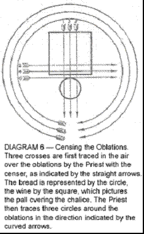

ДИАГРАММА 6. — Освящение Приношений. Сначала священник с кадилом обводит в воздухе над приношениями три креста, как показано прямыми стрелами. Хлеб изображен кругом, вино - квадратом, символизирующим покрывало, которым покрыта чаша. Затем священник обводит три круга вокруг приношений в направлении, показанном изогнутыми стрелами.

### Второе Окуривание

В этом моменте древнего ритуала происходит изменение. Хлеб и вино, которые были предложены Богу народом, откладываются в сторону, и элементы, которые будут использоваться в Евхаристии, привносятся к Алтарю. Поскольку мы делаем так, чтобы хлеб и вино выполняли обе функции, мы отмечаем изменение в символике торжественным окуриванием, которое отделяет их от всех обычных использований и создает вокруг них еще один из тех полезных оболочек или вихрей, которые мы так часто используем в религиозных церемониях. Трижды Священнослужитель делает знак креста над ними кадилом (диаграмма 6), благословляя их и связывая их с собой, как он говорит про себя: "Я связываю эти приношения со мной, духом, душой и телом". В предыдущем предложении, элементы символизировали наши собственности, показывая, что все, что у нас есть, мы держим на распоряжение Бога; теперь они должны быть еще более тесно связаны с нами, потому что они должны символизировать все, что мы есть, и это тоже мы кладем у Ног Его.

Затем Священнослужитель рисует три кольца вокруг священных веществ (диаграмма 6), изолируя их от всех внешних влияний, чтобы они могли быть заряжены только магнетизмом, который мы собираемся предложить. Как он записывает круги, он говорит про себя: "и я охраняю их во Имя Отца, Сына и Святого Духа". С внутренней точки зрения мы находим более подходящим делать эти три круга слева направо, а не рисовать два из них в обратном направлении, как это делается в римском обряде; последний метод вызывает ненужные волнения и создает в эфире что-то, похожее на бурное море, а не на стабильный вихрь, который требуется.

Сделав это, Священнослужитель повторяет окуривание Алтаря, как и раньше, держа в уме ту же мысль, но с еще более широким применением, поскольку теперь не только Священнослужитель, но и все собрание должны быть втянуты в тесное и таинственное общение. Магнитное поле, которое было ранее сформировано вокруг Алтаря, теперь должно быть расширено, чтобы охватить всю церковь, в то время как вокруг священных элементов формируется новая внутренняя сокровищница. Важно, чтобы Священнослужитель полностью сосредоточил свое внимание на том, что он делает, и на мыслях, соответствующих каждому движению, поэтому лучше, чтобы он не читал молитву, пока он качает кадило, как это предписано в римском обряде, но начал читать, как только он закончил движения. Стоя на мгновение в центре Алтаря и держа курящее кадило в направлении креста на уровне своей груди, он молится:

Римская | Либеральная
------- | -----------
_Он говорит на Великом Праздновании, окуривая приношения:_ | _Он окуривает приношения и Алтарь, а затем говорит:_
Пусть этот ладан, который ты благословил, восстанет перед тобой, Господи, и пусть твоя милость сойдет на нас. | Как этот ладан поднимается перед Тобой, Господи, так пусть наша молитва будет вынесена на Твое видение. Пусть Твои святые Ангелы окружат Твой народ и вдохнут в них дух Твоего благословения.
_Он окуривает алтарь, говоря_ |
Пусть моя молитва, Господи, будет представлена как ладан в твоем видении; и воздымание моих рук как вечерняя жертва. Поставь стражу, Господи, перед моим ртом, и дверь вокруг моих губ, чтобы мое сердце не склонялось к злым словам, искать оправдания в грехе. |

Эта молитва естественно относится к Ангелам Ладана, о которых ранее было рассказано, и это действительно прекрасное зрелище, видеть, как они стремительно спускаются по церкви, распространяя свое влияние на прихожан, унося с собой сущность аромата и высылая его великими волнами по мере их прохождения. Главная цель их усилий выражается в словах, произносимых священником при возвращении кадила:

Римская | Либеральная
------- | -----------
_Он возвращает кадило, говоря:_ | _Он возвращает кадило, говоря:_
Да воспламенит Господь в нас огонь своей любви и пламя вечной благотворительности. Аминь. | Да воспламенит Господь в нас огонь своей любви и пламя вечной благотворительности.

Затем окадываются клирики, хор и прихожане в порядке достоинства. Здесь преследуются три цели: во-первых, проявить уважение к ним, что подтверждается вариацией в количестве размахов; во-вторых, включить всех в магнитное поле; в-третьих, пробудить скрытую в каждом из них силу любви и преданности, чтобы он мог в полной мере участвовать в великом деле, которое собирается совершиться. Акт окадывания устанавливает состояние взаимопонимания, синхронных колебаний, которое может быть использовано для ускорения потока силы внешним или внутренним образом. Например, если в службе присутствует епископ, его окадывают сразу после священнослужителя, но с девятью размахами вместо шести.

Это не только признание его должности и включение его в магнитизированное поле; это также возможность для него излить в это поле духовную энергию, которой он является живым источником. Епископ живет в состоянии постоянного излучения силы, и любой чувствительный человек, который подойдет к нему, тут же это почувствует. Это происходит всегда без особого волевого усилия с его стороны, но когда он захочет, он может собрать эту силу и направить ее на любой желаемый объект. Когда он идет в процессии, он таким образом передает ее прихожанам; и когда ему предлагается ладан, под его влиянием он немедленно заполняет магнитное поле вверенной ему силой. Каждый священник, которого окадывают, должен таким же образом давать, а также получать; у него тоже есть связь с Господом, хотя она отличается от связи епископа, как будет объяснено, когда мы рассмотрим Священнодействие Святых Причастий; поэтому и он имеет свою долю благословения, чтобы добавить к общему запасу.

Примечание.

Три знака креста, которые священник делает над принесениями кадилом, сопровождаются мыслью: "Сейчас, в восхождениях, я связываю себя, мою душу и тело, с этими принесениями", и, когда он делает три круговых взмаха: "Я окружаю и защищаю их силой Отца и Сына и Святого Духа." Это собирает все цвета мыслей людей о восхождении, которые накопились на Алтаре во время Оффертория, и с тремя круговыми взмахами кадила создается своеобразный ларец вокруг священных сосудов, построенный на основе вихрей, вызванных знаком креста, сделанным над Алтарем с патеном и облаткой, а затем позже с чашей, сразу после их принесения.

Остальная часть окадывания точно такая же по всем своим движениям, как и первое окадывание Алтаря, поэтому её не нужно описывать снова.

Во время молитвы: "Да окружат Твои святые Ангелы Твой народ и излей на них дух Твоего благословения," Ангелы ладана мчатся по прихожанам и расширяют влияние магнитного поля, до сих пор остававшегося у Алтаря, чтобы включить всю церковь, но это более определённо завершается и опускается до физического уровня при окадывании, сначала духовенства, а затем прихожан. Это возможно в этот момент, так как люди теперь подняты до уровня, при котором они могут получить от этого пользу; также больше не нужно ограждать Алтарь для защиты принесений, так как они теперь защищены ларцом вокруг них.

Окадывание и молитва: "Да воспламенит Господь в нас огонь Своей любви и пламя вечной благотворительности," послала часть огненной элементальной сущности — земную силу, проявляющуюся через элемент огня — по всему священнику, и таким образом он был очищен огнём. Теперь наступает Лавабо, и у нас появляется подобное очищение водой, и прекрасная пастельно-синяя сила этого элемента проходит по всему священнику. Итак, очищенный огнём и водой — двумя великими средствами очищения — он продолжает Службу и вступает в её более святую часть.

### Лавабо

Римская | Либеральная
------- | -----------
Я омою руки мои среди невинных; и обойду твой алтарь, Господи. | Я омою руки мои в невинности, Господи: и так пойду к Твоему Алтарю.
Чтобы услышать голос хвалы и рассказать о всех Твоих чудесах. | Чтобы показать голос благодарности: и рассказать о всех Твоих чудесах.
Господи, я полюбил красоту Твоего дома и место, где обитает Твоя слава. | Господи, я полюбил жилище Твоего дома: и место, где обитает Твоя честь.
Не отнимай души моей с нечестивыми, ни жизни моей с людьми крови. |
В чьих руках неправда: их правая рука наполнена подарками. |
Но я шёл в моей невинности: избавь меня и помилуй меня. |
Моя нога стояла на правильном пути: в церквях я буду благословлять Тебя, Господи. | Моя нога стоит прямо: я буду славить Господа в собраниях.
Слава Отцу, и Сыну, и Святому Духу. Как было в начале, так и сейчас, и вечно, век без конца. Аминь. | Слава Отцу, и Сыну, и Святому Духу. Как было в начале, так и сейчас, и вечно, век без конца. Аминь.
Прими, о Святая Троица, эту жертву, которую мы приносим Тебе в память о страстях, воскресении и вознесении Господа нашего Иисуса Христа, и в честь блаженной Марии, всегда девы, блаженного Иоанна Крестителя, святых апостолов Петра и Павла, этих и всех святых: чтобы это служило их чести и нашему спасению; и чтобы они, чью память мы сохраняем на земле, могли просить за нас на небе. Через того же Христа, нашего Господа. Аминь. | _Соответствующая молитва следует за Орате Фратрес._

Цель Лавабо - очистить руки от малейших частиц пыли, которые могли прилипнуть к ним после касания бурсы, вуали и кадила. Естественно, с этим также связана идея окончательной и полной очистки мысли и чувства перед входом в Канон, самую священную часть Службы. Слово Лавабо - это просто латинский перевод первых трёх слов сопровождающего псалма, но поскольку эти стихи не оказывают особого воздействия на Службу, они опускаются в нашем сокращенном варианте, который, однако, более полный и пояснительный в следующем предложении, чем его предшественник.

### Orate Fratres

Римская | Либеральная
------- | -----------
V. Братья, молитесь, чтобы моя жертва и ваша были приняты Богом Всемогущим Отцом. | V. Братья, молитесь, чтобы моя жертва и ваша были приняты Богом Всемогущим Отцом.
R. Да примет Господь жертву из твоих рук, во славу и честь Своего имени, на нашу пользу и на пользу всей Его святой церкви. | C. Да примет Господь жертву из твоих рук и освятит нашу жизнь в Своей службе.

В более короткой форме Службы Евхаристии следующие слова были вставлены как часть Orate Fratres:

_Братья, мы построили храм для распространения силы Христа; давайте теперь подготовим канал для ее приема; и для этого молитесь, чтобы моя жертва, и т.д._

После того, как народ был привлечен благовониями в святой круг, священник теперь призывает их присоединиться к нему в жертве, которую он собирается принести, и благодаря их искреннему ответу, они передают в его руки для распоряжения весь энтузиазм и добрые намерения, возникшие во время благовония Алтаря, которые он тут же начинает предлагать в следующей молитве:

Римская | Либеральная
------- | -----------
_Соответствующая молитва предшествует Orate Fratres._ | Мы предлагаем Тебе, Господи, эти Твои создания хлеба и вина, в знак нашей жертвы хвалы и благодарности; ибо здесь мы приносим и представляем Тебе себя, наши души и тела, чтобы быть святым и постоянным жертвоприношением Тебе, чтобы мы, кто является верными членами таинственного тела Твоего Сына, которое является благословенной общиной всех верующих людей, могли услышать Его самый радостный голос: "Придите ко Мне, о благословенные Моего Отца, и обретите царство, которое приготовлено вам с начала мира", через того же Иисуса Христа, нашего Господа, который живет и царствует с Тобой в единстве Святого Духа, вечно единый Бог во все века веков. Отв. Аминь.
_Секреты. Секреты зависят от ситуации. Следующее относится к Троицкому воскресенью._ |
Получи благосклонно, Господи, мы умоляем Тебя, этих жертв, которых мы освящаем Тебе: дай, чтобы они помогли нам навсегда. Через нашего Господа. | _Никакие соответствующие молитвы не используются в Либеральной католической литургии._

Особый предмет этой молитвы, как обычно, указывается более ясно в нашей сокращенной форме для Евхаристии, где она выглядит следующим образом:

_Мы предлагаем Тебе, Господи, эти Твои создания хлеба и вина, в знак нашей жертвы хвалы и благодарности; ибо здесь мы приносим и представляем Тебе себя, наши души и тела, чтобы быть святым и постоянным жертвоприношением Тебе. Пусть наша сила иссякнет в Твоей службе, и наша любовь излится на Твой народ, Ты, кто живешь вечно и вечно. Отв. Аминь._

Священник полностью предложил себя во время кадильного обряда, но сейчас он собирается совершить ту же торжественную облату от имени своего народа. Для этого он мистически связывает их с хлебом и вином сильным усилием своей воли, делая знак креста и вливая в эти элементы всю громадную силу, которую он собрал от своей общины, чтобы они были не только символами облаты "самих себя, наших душ и тел", но и на самом деле мистическими каналами этой жертвы. Делая это, он свидетельствует, что все их усилия вдохновлены одним желанием делать то, для чего Бог послал их в этот мир.

Мы должны здесь оградиться от распространенного и очень несчастного недоразумения. Когда невежественные христиане придумали грубую и философски невозможную теорию о рае и аде, они взяли прекрасную фразу Христа "царство небесное" как эквивалент своего странного представления о рае и предположили, что когда Он говорил о трудности его достижения, Он имел в виду, что большинство людей будут брошены в их вопиюще абсурдный ад. "Царство небесное" - это синоним Великого Белого Братства, Общины Святых; и когда мы говорим, что мы предлагаем себя, чтобы получить царство, мы не делаем эгоистических усилий ради личного "спасения", но обещаем посвятить нашу жизнь тому, для чего мы здесь - достижению адептства или святости, предначертанию, подготовленному с начала для тех, кто достаточно сильный, чтобы его достичь. Более подробное объяснение этого будет дано в последующем томе, а также примечание о настоящем значении слов "через Иисуса Христа, нашего Господа", так часто используемых тысячами людей, не имеющих понятия о их истинном значении. Мистическое тело, конечно, есть Церковь.

Примечание.

Священник связал себя с элементами тремя крестами, сделанными над ними с помощью кадила. Сейчас он собирается установить связь через свою связь с народом. Повернувшись к народу, он снова выпускает своего рода сеть над ними, которая идет вместе с движением круговой сети индийского рыбака. Это сделано, чтобы привлечь их ближе к себе, собрав все их хвалебные мысли. Он возвращается к алтарю справа, а не обычным путем, чтобы сделать полный круг и забрать сеть тем же движением, которым он ее выбросил. Если бы он вернулся обычным способом, сеть не намоталась бы должным образом. Когда он притягивает ее и начинает следующую молитву, он привлекает к себе стремления людей, которые он таким образом собрал, а затем, все еще с тем же движением, он прокручивает материал сети на кончик капсулы, содержащей элементы, так что она образует там вихрь, или чашу, построенную на основе вихря, созданного тремя круговыми махами кадила. Сразу после этого цвета стремлений людей (которые лежали на Алтаре как цветы, пока их не собрали в капсулу кадильным обрядом) начинают подниматься и собираться в ткань сети, и так с этим строится чаша. Заслуживает внимания, что хотя капсула формирует основу этого вихря, она напоминает камеру на дне чашки, но полностью отделена от нее крышкой, сделанной из трех крестов кадила. Элементы все еще окружены и надежно защищены.

Мгновение спустя после создания этой чашки, священник делает знак креста над хлебом и вином, что связывает народ, через него самого, с элементами, с целью использовать их как каналы для второго предложения, предложения "самих себя, наших душ и тел". Как только эта связь установлена - что происходит, когда священник делает крест на словах "в знак" в прекрасной молитве, начинающейся со слов: "Мы кладем перед Тобой, Господи, эти Твои создания из хлеба и вина в знак нашей жертвы хвалы и благодарности" - стремление, которое он собрал в "Молитесь, братья", начинает подниматься через просфору и содержимое чаши в чашу. Конечно, все самые грубые части менее духовных эмоций и мыслей людей от этого исключаются. Когда он забрал сеть, все шлаки, менее благородная часть их чувств, всплыли на поверхность как пена, которая была немедленно сметена очищающим течением, которое всегда поддерживается Ангелами. Пока преданность людей продолжает притекать в священника, она аналогично очищается, затем проходит через него и через облаты, а затем в чашу, которая, следовательно, постоянно заполняется снизу. Материал, которым мы ее заполняем, колеблется с чрезвычайно высокой скоростью; он светится ярко и покрыт любопытным видом бурлящей пены, не очень отличающейся от той, которую можно увидеть на шампанском. Природная сила также втекает, но поскольку она гораздо тяжелее, она остается на дне.

### Канон

Канон так называется потому, что это самая святая и неизменная часть Службы, проводимой строго по правилу, которое должно тщательно соблюдаться. Мы сделали свою часть; мы построили наше здание, мы полностью отдали себя на волю Бога; теперь мы с искренней верой ожидаем ответа свыше, ответа на наши усилия, который сделает то, что мы сами не можем сделать. Мы собираемся поднять традиционный призыв к ангельским воинствам, на который уже две тысячи лет они привыкли отвечать; и чтобы сделать это благоговейно и достойно, мы должны привести себя в правильное состояние ума.

#### Dominus Vobiscum

Римская | Либеральная
------- | -----------
V. Господь с тобой. | P. Господь с тобой.
R. И с духом твоим. | C. И с духом твоим.

Чтобы помочь нам в этом, Священник использует дополнительную связь, которая только что возникла с его прихожанами, когда они присоединились к нему в предложении себя Господу, и он пытается укрепить их и привлечь их еще более тесно для совершения этого прекрасного обращения. С этого момента и до момента Причащения, ничто не должно мешать жертвенному действию Священника; чудесная и красивая магия Службы Евхаристии движется по своему пути через все свои стадии, и только после того, как это потрясающее влияние охватывает всю окружающую территорию, и непосредственно перед его личным общением, Священник в Приветствии Мира снова привлекает своих прихожан к себе этим Малым Благословением.

Замечание.

Здесь следует первое Малое Благословение, после поглощения сети, по которой сила священников передавалась в общину и обратно. Но мы видим, что поскольку магнитное поле Алтаря расширилось до включения всей церкви, сила молниеносно проходит вперед и назад через эту заряженную атмосферу с большой скоростью и блеском.

#### Sursum Corda

Римская | Либеральная
------- | -----------
V. Поднимите свои сердца. | V. Поднимите свои сердца.
R. Мы подняли их к Господу. | R. Мы поднимаем их к Господу.
V. Благодарим Господа, нашего Бога. | V. Благодарим Господа, нашего Бога.
R. Это правильно и справедливо. | R. Это правильно и справедливо делать так.

Название Sursum Corda, применяемое к этим стихам и их ответам, как обычно, является латинской формой первого из них; "Поднимите свои сердца". Изначально предназначенное как подготовка к великому обращению, теперь оно, после долгого использования, фактически стало частью самого обращения. Призыв поднять наши сердца явно обращается к нам с требованием собрать все наши энергии на высоком уровне преданности и энтузиазма, до которого они только что поднялись, и направить их по линии, указанной во втором стихе - той из глубокой благодарности Богу, выраженной в высшей форме поклонения, на которую мы способны.

Именно с такими чувствами в сердцах мы должны следовать, с сильным намерением, за словами, которые теперь будут произнесены Священником. В этом втором стихе есть еще одно прекрасное значение, которое мы не должны терять из виду. "Давайте благодарить" на греческом языке ευχαριστησομεν, "давайте принесем Евхаристию"; так что вот здесь, в начале Канона, эти слова Священник призывает своих прихожан присоединиться к нему в этом величайшем из всех актов поклонения, и они соглашаются с ним, когда отвечают, что это правильно и справедливо делать так.

Для этих стихов и их ответов есть традиционная мелодия, которая использовалась с тех пор, как была основана Церковь, и, возможно, была предписана самим Господом при ее основании, или вскоре после этого некоторыми из тех, кто понимал воздействие звука на внутренний мир. Как было сказано, определенные центральные идеи ритуала были даны в начале, и вокруг этих неизменных идей священнослужители группировали молитвы без подготовки; но для этих определенных моментов, которые с самого начала были неизменными формулами, точное значение которых все еще сохраняется, хотя они были переведены с одного языка на другой.

Это одна из этих первичных формул, и та же мелодия или мелодия использовалась для нее с самых ранних дней, за исключением некоторых незначительных модификаций, которые отмечают применение в разных местах; и она так же эффективна, когда к ней прилагаются английские слова, как и когда соответствующие фразы были пропеты на латинском или греческом. Ангел Евхаристии одновременно захватывает прекрасную форму музыки и ментальную силу, проявленную священнослужителем, и направляет их по церкви с великолепным жестом верховного командования, и когда ответ людей возвращается обратно, как большой поток живого огня, он поднимает все это вверх в мощный огненный столб, который наполняет купол евхаристического здания и проникает вверх через фонарь в пространство. Второй стих и его ответ отправляют второй импульс подобного рода, и плавающий розовый крест вспыхивает ослепительным светом для тех, кто может видеть. И через канал, таким образом сделанный, священник посылает слова, назначенные издавна.

Примечание: Первый из этих стихов отправляет волну силы вниз в наву, которая, с ответом, затем возвращается обратно и поднимается вверх в центральный купол формы. Как оно поднимается вверх, оно продолжает стороны чаши, пока ее край не коснется нижнего края купола, так что с этого момента и до Алтаря у нас есть своего рода перевернутый купол. Этот первый стих и ответ, кажется, вызывают общий ответ от всех тел, но особенно от астрального. Следующий кажется подчеркивает высшую ментальную сторону, но также общего характера. Он укрепляет верхнюю часть чаши, поскольку сила поднимается вверх и мелькает через вершину формы.

#### The Preface

Римская | Либеральная
------- | -----------
_Префация зависит от ситуации. Следующая используется в Троицу и в те воскресенья на протяжении всего года, которые не имеют особой префации._ | _Префация не меняется, за исключением Рождества, Пасхи, Вознесения, Пятидесятницы и Троицы, а также на праздниках Богородицы и Ангелов, вставляется особая префация между двумя абзацами следующего текста:_
Истинно, встречается и справедливо, верно и способствует спасению, что мы должны во все времена и во всех местах благодарить тебя, Господи, Всемогущий Отец, вечный Бог: который с Единородным Сыном твоим и Святым Духом являешься одним Богом, одним Господом; не в единстве одного лица, но в Троице одной сущности. Ибо то, что мы верим от твоего откровения о твоей славе, то же самое мы верим о твоем Сыне, то же самое о Святом Духе, без различия или разделения. Так что, исповедуя истинное и вечное Божество, мы будем поклоняться различию в лицах, единству в существе и равенству в величии; которые ангелы и архангелы, херувимы и серафимы хвалят; они каждый день не перестают восклицать, говоря, как одним голосом. | Истинно, встречается, справедливо, и это наш связанный долг, что мы должны во все времена и во всех местах благодарить Тебя, Господи, святой Отец, Всемогущий, вечный Бог. Поэтому, с Ангелами и Архангелами, с Престолами, Господствами, Княжествами, Началами, Силами, с Херувимами и Серафимами, и со всем сонмом небес, мы прославляем и величаем Твое славное имя, всегда прославляя Тебя и говоря:

Сначала Священник настоятельно подтверждает и одобряет ответ общины, повторяя, что это действительно наш долг во все времена и во всех местах приносить это священное жертвоприношение хвалы и благодарности; и поэтому он привлекает на свою сторону ангельские воинства, чтобы помочь ему в этом, используя одну из возможностей, предоставленных ему связью с высшими сферами, которая была установлена при его рукоположении. В определенные великие праздники вставляется то, что называется особой префацией, перечисляющей причину праздника. Эта форма слов также является частью призыва, так как она обращается к Ангелу, поставленному во главе особой силы, излучаемой в этот конкретный случай. В этой части Службы мы точно следуем обрядам Англиканской Церкви (которые в основном являются обрядами Римской), за исключением того, что мы добавляем имена некоторых Орденов Ангелов, которые они пропускают.

Здесь не место для подробного рассуждения о небесных воинствах, однако необходимо дать общее объяснение. Ангелы составляют одно из царств природы, стоящее над человечеством так же, как человек стоит над животными. Существует по меньшей мере столько же типов Ангелов, сколько рас людей, и в каждом типе множество уровней силы, интеллекта и общего развития, так что в общем мы находим сотни разновидностей. Идея, часто держащаяся невежеством, что эти могучие воинства славных духов существуют в основном для того, чтобы угождать человеку, является лишь плодом удивительного эгоцентризма человеческой расы, ярким примером которого является геоцентрическая теория. Ангелы существуют, как и люди, чтобы прославлять Бога и наслаждаться Им вечно; и назначенный метод такого прославления - сначала через саморазвитие (что люди называют эволюцией), а затем через служение. Это служение имеет множество форм, и лишь некоторые из них связывают Ангелов с людьми, в основном в связи с религиозными обрядами.

Ангелов поделили на девять Орденов; имена, используемые для них в Писании, приведены в Литургии. Семь из них соответствуют большим Лучам, из которых состоит солнечная система, а два могут быть названы космическими, так как они общие для некоторых других систем. Каждому Ордену назначен определенный отдел работы, и представители каждого призываются на каждой Службе Евхаристии, чтобы взять на себя ответственность за то, что входит в пределы их отдела. Метод ангельской эволюции, как я уже говорил, во многом заключается в служении, поэтому обряд, такой как Евхаристия, представляет для них замечательную возможность, и они не медлят воспользоваться ей.

Поскольку Христос является главой всех религий, огромное воинство всегда вокруг Него, ожидая возможности решительно пойти по пути Его мысли, и поэтому говорится, что Он посылает Ангелов совершать определенные действия (как в Асперджесе, например), хотя буквально это верно только в случае Ангела Присутствия, о котором мы будем говорить позже. Так же, как в свите, окружающей Господа, всегда есть Ангел, готовый принять на себя управление службой Евхаристии, когда высылается призыв Асперджеса, так же есть представители этих девяти Орденов, всегда готовые ответить на вызов Префации. В высших мирах вызов имени любого человека немедленно привлекает его внимание; то же самое относится и к классу, например, к Ордену Ангелов. На Малом Праздновании сначала отвечает Руководящий Ангел, и, похоже, он собирает остальных; но на Великом Праздновании или Мессе Кантате, поскольку мелодия, используемая для стихов, веками была практически одной и той же, все немедленно замечают её, когда она звучит, и те, кто следует следом по порядку, готовы мгновенно спуститься, как только Священник поет имена типов.

Для ясновидящего это поистине удивительное и великолепное зрелище, видеть, как эти небесные гости мгновенно вспыхивают на своих назначенных позициях в ответ на их традиционные слова силы. В то время как Ангел Евхаристии обычно стоит рядом с совершающим таинство или парит прямо над его головой, выдающиеся послы девяти Чинов всегда располагаются за Алтарем, лицом к служителю. За ними, в свою очередь, стоят многие люди, члены которых обычно занимают места напротив концов Алтаря, хотя они часто также заполняют верхнюю часть центрального нефа, паря над теми, кто еще находится в теле.

Католики, которые в течение своей физической жизни получали радость от Церковных Служб, естественно продолжают посещать их после смерти своих тел; и те, кто живут на другой стороне света и находятся вне своих тел во время сна, иногда делают ровно то же самое. Набожность и серьезность прихожан на физическом плане могут сделать определенную церковь популярной среди Ангелов и умерших, так что количеством поклонников, которых большинство людей не видит, часто превышает количество тех, кого все могут увидеть. В своей книге "Другая сторона смерти", 2-е издание, стр. 427, я даю хорошо документированное описание посещения целой группы умерших монахов Службы Евхаристии в больничной часовне в Лондоне.

Как только он прибывает, Ангел первого Луча берет на себя руководство работой в целом, определяя количество каждой силы, которое можно использовать с наибольшей выгодой, другие Ангелы двигаются по его команде и группируются так, чтобы наилучшим образом принимать и использовать исходящую энергию. Этот директор обычно держит в руках посох, символ его должности, который меняет цвет в зависимости от силы, которая проходит через него. Цвет дня обычно преобладает, но не всегда. На празднике Святого Духа, например, и посох, и огонь, исходящий от него, будут ярко-красными, цветом, посвященным Третьему Лицу Благословенной Троицы, хотя красный, представляющий Первое Лицо, все равно будет возглавлять церемонию.

The Preface наполняет этот кубок материей, действительно вибрирующей с очень высокой частотой; она вибрирует настолько быстро, что невозможно увидеть что-то определенное; это как будто ты смотришь в пустоту; и все же там что-то есть, потому что невозможно увидеть другую сторону кубка. Это сильно напряженная, сильно сжатая и почти прозрачная материя, которая почти ускользает от обычных низших ясновидящих способностей — зрения и чувства, потому что в этом месте нет места для чего-либо низшего характера, которое могло бы произвести какое-либо впечатление на эти обычные способности, она часто создает странное чувство пустоты, как будто ты вошел в карман в астральной атмосфере. Это происходит только потому, что наше сознание обычно не поддерживается на возвышенном уровне этой материи, и как только ты поднимаешь себя на эту более высокую плоскость, чувство пустоты сменяется огромным чувством полноты. Этот же эффект пустоты иногда заметен в ауре человека, который недавно имел какой-то духовный опыт, например, Ординацию. Он особенно силён за Алтарем церкви.

#### Sanctus

Римская | Либеральная
------- | -----------
Святой, святой, святой, Господь Бог | Святой, святой, святой, Господь Бог
Сил. Небо и земля полны | Сил. Небо и земля полны
Твоей славы. Осанна в | Твоей славы: Слава
вышних. | Тебе, о Господи превышний.

Теперь, когда мы созвали это пёстрое и величественное собрание святых ангелов, наш первый акт - присоединиться к ним в славословии и поклонении Богу. Этот великолепный взрыв хвалы, называемый Трисагионом или Терсанктусом (оба слова означают "трижды Святой"), имеет чрезвычайно древнюю историю. Он использовался не только на этом же месте в Литургии с момента ее основания, но и до этого применялся в еврейской Службе. Ранняя форма его находится в произведениях пророка Исаии (vi, 3). Еврейское слово Саваоф, означающее войска или армии, часто оставляется без перевода в этом отрывке. Хотя Церковь сейчас наиболее подходящим образом толкует это как относящееся к ангелам, нет сомнений, что евреи изначально понимали это как обозначение войска звезд. Тем не менее, этот короткий гимн занимает позицию и оказывает воздействие в нашей Литургии, важность которых трудно преувеличить.

Наши предыдущие усилия в хвале и поклонении предоставили много пиететного материала, который Ангел Евхаристии использовал в своих строительных работах; но в этом благородном традиционном акте почтения представитель Ангелов и их спутники присоединяются к нам, и их способность к пиетету настолько огромна, что их вклад полностью меняет характер сооружения. Их действие оживляет огромное количество астральной и ментальной материи, и Ангел первого Луча, который теперь взял на себя руководство строительством, направляет большую часть силы вверх. Нижняя часть сооружения часто значительно увеличивается в размерах, хотя форма не изменяется; но купол так сильно раздувается, как в высоту, так и в диаметре, что базилика становится по сравнению с ним лишь цоколем, поддерживающим его гигантскую массу. Строение теперь тесно напоминает дагобу, хотя оно пустое, а не твердое; и маленькие купола на углах стремятся вверх в изящные минареты, как показано на иллюстрации (Фронтиспис).

Но эта модификация формы - не единственное изменение, произведенное сотрудничеством ангелов, так как они вводят совершенно новый фактор в здание. С нашей стороны, благочестие - это энергия высших астральных уровней, пробуждающая, как бы отражением или симпатической вибрацией, некую слабую активность в интуитивной части нашей природы; но у великих ангелов это отношение меняется, ибо сила их благочестия действует по своей природе на этом высоком уровне, а любое эмоциональное воздействие происходит только путем отражения. Так они добавляют в наше здание огромное богатство материалов, принадлежащих совершенно новому и более возвышенному уровню природы, который проникает и делает более тонким все остальное. Таким образом, весь памятник принимает на себя новый и высший характер, более великолепный и более изящный, невероятно прекрасный и способный к гораздо более тонким вибрациям - подходящий сосуд для небесной силы.

Люди иногда спрашивают: "Если ангелы могут сделать все это так быстро и намного лучше, чем мы, не было бы мудрее оставить всю работу на них и не предполагать предложить наш неполноценный материал?" Ответ на это предложение двойственный. Во-первых, участие в таком возвышенном и красивом строительстве - это величайшая привилегия, которая, безусловно, развивает нашу природу и быстро продвигает нас по пути нашей эволюции: каждый раз, когда мы делаем такую работу, мы приобретаем что-то от духовного роста. Во-вторых, идея, которая доминирует во всех таких операциях без исключения, это экономия сил, заставляя ее идти как можно дальше. Очевидно, каждая унция силы, сгенерированной или материала, предоставленного общиной, это хорошо, и сохраняет энергию, которая у ангелов в распоряжении.

Поэтому это помогает им, если мы глубоко волнуемся энтузиазмом и преданностью, так что мы излучаем из себя стабильные, сильные вибрации. Если мы этого не делаем, они должны предоставить то, чего не хватает. Верно, что вся сила божественна; но она заливает в различные миры на разных уровнях и через множество каналов, и чем больше мы можем служить каналами для проведения его с более высоких уровней к более низким, тем больше его будет доступно здесь внизу. Если мы испытываем большую преданность и из-за этого проявляем живой энтузиазм, мы выводим из скрытого состояния в активность силы, которые иначе оставались бы скрытыми, и поэтому выполняем часть более низкой работы, которая для ангелов более трудна, и оставляем им больше энергии для использования на более высоких уровнях, где они так хорошо чувствуют себя дома и настолько блестяще профессиональны.

Церковь Англии, мне жаль это говорить, не знает об этой внутренней и самой славной стороне Службы Евхаристии, бросает почти всю работу на ангельских помощников и, таким образом, неэкономно тратит великолепный дар свыше. В начале Службы она не призывает ангела построить евхаристическое здание (и, в самом деле, римская церковь при случаях, когда не используется Аспергес), и поэтому ничего из этого не делается до того момента, который мы сейчас достигли. Она не упоминает подробно девять Орденов ангелов, но они приходят к ней на традиционный призыв, и Директор ангелов первого Луча немедленно приступает к строительству здания, которое, на самом деле, должно было быть готово для него. У него часто очень мало материала, но он делает все возможное из того, что есть. Послание, Евангелие и Символ веры обеспечивают ему немного больше ментального материала, чем он обычно получает от них на римской службе, где они говорятся на латинском языке, и поэтому вызывают мало мыслей у среднего прихожанина. Поскольку в Англиканской церкви Святая коммуния обычно следует за Утренней молитвой, часто остаются некоторые полезные облака преданности от этого; и многое изливается по мере того, как слова Trisagion поются или произносятся. Но эффект скуден по сравнению с тем, который производит более старая и более научная форма Службы.

В церкви, которая более удачлива в своей литургии, картина, представленная ясновидящему взору на этой стадии, действительно замечательна. Совершенно вне зависимости от удивительного памятника, который был воздвигнут, великолепный облик ангелов невозможно забыть. Каждый величественный образ имеет среди мерцающих вспышек его собственной ауры некоторый прекрасный доминирующий оттенок, светящийся с сиянием, которого ничто на земле не может подойти; и вся группа отображает великолепную и гармоничную цветовую схему, которую в этом физическом мире у нас нет средств для воспроизведения.

Будучи одним из особых моментов Службы, делаются дополнительные усилия, чтобы позволить прихожанам легко усваивать силу. Люди отличаются по темпераменту и восприимчивости; некоторые более поддаются воздействию одним способом, другие - другим, и поэтому мы обращаемся к трём чувствам - обонянию, слуху и зрению. Чтобы помочь распространить прекрасный ангельский магнетизм, в этот момент Службы сжигается благовоние, звучит колокольчик, и аколиты поднимают свои зажженные свечи. Куда бы ни проникал запах, где бы ни слышался звук, эти странно сладкие и благотворные вибрации распространятся. Чем серебристее звучание колокола, тем лучше оно подходит для своей цели; и он будет выполнять свою работу намного эффективнее, если его благословил епископ - то есть, если он был намагничен для этой специальной цели. Использование гонга допускается, при условии, что его звук сладкий и музыкальный, хотя если он издает непрерывный рев вместо ряда последовательных импульсов, и поэтому менее подходит.

Trisagion должен быть исполнен с максимальной возможной торжественностью и благоговением, поклонник должен внимательно следить за словами, стараясь чувствовать их и иметь в виду каждой клеткой своего существа, однако при этом сохраняя максимальное спокойствие и безмятежность. При первом произнесении слова "Святой" отдается почтение Богу-Отцу, а второе и третье обращаются к Сыну и Святому Духу соответственно. Наш народ должен помнить об этом и направлять свои мысли соответствующим образом.

#### Benedictus Qui Venit

Римская | Либеральная
------- | -----------
Благословен Грядущий во | Благословен Грядущий во
имя Господа. Осанна     | имя Господа. Осанна
в вышних.               | в вышних.

Когда заканчивается акт поклонения при словах Санктус, служитель встает прямо, и мы все присоединяемся к приветствию святых Ангелов, благодарим их за приход и Господа за то, что Он послал их - или, точнее, за то, что Он устроил так, что они пришли. Осанна - это слово на иврите, и его буквальное или изначальное значение, как говорят, "обеспечь безопасность" или "спаси сейчас"; по мнению профессора Буркитта, это означает трость, такую, какую носят в процессиях, и часто называют пальмой, и восклицание возникло из этого использования; но на каком-то раннем этапе истории евреев первоначальное значение было потеряно, и оно стало просто радостным восклицанием хвалы, эквивалентным "слава Богу". Это слово встречается в этом смысле как в Ветхом, так и в Новом Заветах; так оно использовалось евреями на их празднике кущей, самом радостном событии их года; и снова мы видим его использование теми же детьми, которые расстилали ветви перед Христом в Неделю Пальм. Некоторые утверждали, что французское восклицание "осché" и наше "ура" произошли от этого ивритского слова.

Здесь представлен прекрасный и интересный обряд. Те, кто обладает ясновидением, должны внимательно наблюдать за его действием, а все остальные должны присоединиться к нему в мысли, как и словами, независимо от того, могут они видеть происходящее или нет. Когда мы все кланяемся при словах "Свят, свят, свят," все Ангелы и мертвые также кланяются; и великая струя почитания поднимается вверх, как дым от благовоний, за исключением того, что это не дым, а свет поднимается, и он сразу вызывает еще более великий ответный поток. Но когда этот акт поклонения завершен, служитель становится прямо и через алтарь произносит к Ангелам прекрасные слова приветствия и благодарности: "Благословен Грядущий во имя Господа". С этим, в церкви, где люди понимают, через алтарь течет большая струя благодарности к святым Ангелам; они слегка кланяются, чтобы принять ее, и отправляют в ответ поток добрых чувств, который на самом деле является благословением.

На слова "Осанна в вышних" мы направляем нашу струю благодарности вверх к Господу, таким образом оставляя место для тока ангельского благословения, чтобы пройти под ним, и привлекаем в себя их святое влияние с помощью знака креста, который мы делаем над собой. Очень приятно наблюдать за резким изменением направления нашего потока силы и ловким способом, с которым тот, который посылается Ангелами, мгновенно проскальзывает под ним, когда он изгибается вверх. У нас должна быть мысль о благодарности, когда мы поем эти слова. В литургии Церкви Англии это выражение благодарности нашим ангельским посетителям, к сожалению, пропущено; но, тем не менее, более понимающие ее духовенство часто включают его.

Примечание.

Чаша, которую мы описали как стоящую над chalice, на самом деле больше похожа на зонтик, перевернутый ветром. Поток благоговения снизу оказывает эффект выталкивания содержимого чаши или перевернутого зонтика под давлением в купол, что начинает расширять его. Купол все больше и больше увеличивается по мере того, как зонтик выворачивается наизнанку, пока его внешний край (то есть то, что было каемкой чаши) не закрепляется за нижним краем купола, зонтик внезапно лопается посередине, и великолепно окрашенная материя, оживленная благоговением народа и стремлением Ангелов, рванувшись вверх через это отверстие, завершает расширение строения, в то же время прижимая стороны зонтика плотно к стенам купола, где они немедленно объединяются и так становятся частью целого.

Теперь давайте рассмотрим, какую роль играет каждое отдельное выражение в этой работе. Напомню, что при окадывании приношений было сделано три оборота вокруг них, ограждая их во имя Отца (первый оборот), и Сына (второй оборот), и Святого Духа (третий оборот). Вихрь, таким образом сформированный, был основой всей большой чаши, и каким-то образом эти же три раздела трех Лиц Троицы были, как следствие этого, представлены тремя разными уровнями в чаше. Похоже, что сила от земли - в центре которой работает Святой Дух - была связана с Третьим Лицом, в то время как следующий слой в чаше, эффервесцентное вещество, которое было взято от нас, или скорее Христовый Принцип в нас, был силой Второго Лица; и "пустая" на вид сила, которая была ограничена верхней частью сосуда и была предоставлена частично нашими высшими принципами, стимулированными приходом Ангелов во время Префации, и частично самими Ангелами, была силой Бога Отца.

Теперь, напомню, что три параграфа "Слава в вышних Богу" и "Символ веры" обращены, первый к Отцу, второй - к Сыну, а третий - к Святому Духу, так что нижняя часть купола, мы можем сказать, особенно посвящена Первому Лицу, средняя часть - Второму Лицу, а фонарь-подобное сооружение на вершине - третьему Лицу. Теперь три слова "Свят, Свят, Свят" обращены к Отцу, Сыну и Святому Духу. При первом слове вихрь или перевернутый купол поворачивается достаточно, чтобы заставить всю материю, которая была особенно связана с Отцом, войти в купол, где она может действовать на своем первом уровне. Второе "Свят" выбрасывает следующий слой материи, который действует на части купола или пагоды, посвященной Сыну; и последнее слово вливает природную силу в фонарь на вершине, когда зонтик полностью переворачивается наизнанку. Таким образом, три слова каждое влияют на определенную часть здания, которая связана с Лицом, кому каждое из них адресовано.

Слова "Господь Бог Сил" как бы отрывают зонтик от его палки, так что сила взмывает сквозь это отверстие и продолжает расширять форму. То, что представляет собой палку зонтика, все еще остается стоять, и это довольно интересно. Это крохотный, очень тонкий, вихрь мощи, поднимающейся от Камня Алтаря и, по-видимому, это больше природная сила, или та часть, которая особенно принадлежит Святому Духу, взмывающая вверх, вероятно, чтобы действовать на верхнюю часть пагоды, где особенно представлено Третье Лицо.

При словах "Благословен Грядущий во имя Господне" происходит прекрасный обмен силой между Ангелами и собранием, который смешивается в замечательный поток, который мы взмываем вверх словами "Осанна в вышних". Это добавляет наш последний штрих к работе по расширению формы и особенно взмывает минарет сверху, куда был унесен крест, который висел в фонаре или самой верхней части формы до того, как она была увеличена. Люди, делая знак креста над собой, не только открывают себя под влияние Ангелов, когда мы обращаем наши мысли вверх с "Осанной", но и оживляют этот большой центральный крест. Самое удивительное во всей этой части Службы - это работа Ангелов. Они стимулируют людей к гораздо более высокой активности, чтобы произвести полное изменение в облике этого храма, который мы построили. Размер не только значительно увеличивается, а форма создается на будхическом уровне, но и качество, текстура и цвет всего этого невероятно улучшаются. Кажется, будто он внезапно был облачен в новую и еще более великолепную жизнь.

Эти Ангелы кажутся поистине частью сознания Христа, так же как и священник или епископ, который действительно развивает дарованные ему силы до полного потенциала. Кажется, что эти Ангелы получают аналогичное прикосновение с Господом Христом; но этот эффект может быть просто результатом очень полного развития Христового Принципа в них.

### Молитва Освящения

Римская | Либеральная
------- | -----------
Посему, О милосерднейший Отче, мы, Твои молящиеся, молим и умоляем Тебя через Иисуса Христа, Твоего Сына, Господа нашего, принять и благословить эти ✠ дары и ✠ приношения, это ✠ святое и непорочное жертвоприношение. | Посему, О наиболее любящий Отче, мы, Твои служители, молим Тебя, через Иисуса Христа, Твоего Сына, Господа нашего, ✠ принять, ✠ очистить и ✠ освятить это приношение, которое мы возносим Тебе.

Здесь снова мы найдем, что наша сокращенная Служба Евхаристии выражает более ясно то, что действительно происходит. Её форма для этой молитвы такова:

_Господи, эти наши приношения служили знаками и каналами нашей любви и преданности к Тебе; но теперь мы молим Тебя принять, ✠ очистить и ✠ освятить их как земные каналы Твоей удивительной силы._

Хлеб и вино, сначала использованные как символы приношений народа, а затем как каналы нашей жертвы, теперь должны выполнять ещё одну и гораздо более высокую роль, и действовать как внешние проявления или носители силы и жизни Самого Христа. Поэтому священник сначала разрывает связь, которую он создал, а затем демагнитизирует элементы, очищая их от любого земного скверна, который мог смешаться, оставляя в них всю чисто духовную часть нашего приношения, которая будет позднее возложена к ногам Христа, нашего великолепного Царя. При первом кресте связь разрывается, а при третьем элементы особенно благословляются для великого предназначения, которое их ждет. Три креста, сделанные в длинной форме, дают точно такой же результат, хотя произнесенные слова менее подходящие.

Эта зарядка элементов духовным приношением является первым шагом в процессе подготовки канала для восприятия великого излияния божественной силы, которое является центральной особенностью и целью Службы Евхаристии. Но прежде чем священник продолжит эту работу, он на несколько мгновений отвлекается, чтобы объяснить, как эта сила будет распределена.

Римская | Либеральная
------- | -----------
Мы приносим их Тебе сначала за Твою святую католическую церковь, чтобы Тебе угодно было даровать ей мир, присмотреть за ней, привести её к единству и руководить ей по всему миру; также за Твоего слугу N., нашего Папу, и N., нашего Епископа, и за всех истинных верующих, которые сохраняют католическую и апостольскую веру. Помни, Господи, о Твоих слугах, мужчинах и женщинах, N. и N., и обо всех здесь присутствующих, чья вера и преданность известны Тебе. Мы приносим за них или они сами приносят Тебе эту жертву хвалы за них и их; за искупление их душ; в надежде на спасение и целостность, и теперь они приносят свои обеты Тебе, Богу вечному, живому и истинному. | Мы стремимся принести это священное Священнодействие, прежде всего, за Твою святую католическую Церковь; дабы Тебе угодно было даровать ей мир, заботиться о ней, привести её к единству и направлять её по всему миру; также за Твоего слугу Георгия, нашего Короля, N., нашего председательствующего Епископа, N., нашего Епископа, за всех наших Епископов, священнослужителей и верных, и за всех здесь присутствующих, чья вера и преданность Тебе известны. Мы также призываем вспомнить всех тех, кто в этой мимолетной жизни страдает от беды, скорби, нужды, болезни или другого несчастья (особенно ...). Точно так же мы приносим его за всех Твоих детей, которых Тебе угодно было освободить от земного бремени (особенно за ...), чтобы, освобожденные от земных забот и забот, они могли наслаждаться блаженством Твоего присутствия, непрестанно воспевая Тебя словом и делом. О Боже вечный, живой и истинный.
_Соответствующая молитва следует за Освящением._ |

Следует понимать, что распределение великолепного излияния духовной силы, которое вызывается посредством приношения Службы Евхаристии, в значительной степени направляется волей совершающего службу. Есть определенные указания, заложенные в ритуале, куда он всегда направляет его - к Церкви, к Королю, к Епископам, священнослужителям и верующим; но значительная часть всегда доступна для особого распределения.

Количество силы, привлекаемой во время церемонии, частично зависит от степени развития, достигнутого совершающим службу и народом, частично от преданности совершающего службу, частично от количества и степени преданности присутствующих, частично от использованной музыки, и также, конечно, частично от потребностей случая - например, наличия в окрестностях кого-то, нуждающегося в помощи, которую можно оказать таким особым способом. Если бы рядом с церковью существовала какая-то большая потребность, она была бы использована для привлечения такой силы, которая могла бы помочь. Это могло бы случиться не только во время Великого Празднования, но и во время частной ежедневной Службы, совершаемой священником в его собственном оратории. Мы не знаем, существует ли какой-либо предел (если он вообще существует) количества этой божественной силы, доступной при одном случае; мы не знаем, сколько человек может одновременно затронуть излияние из одной церкви; но мы определенно знаем, что количество силы огромно.

Доля этой силы, которую можно выделить для каждой цели, определяется Руководящим Ангелом. Он внимательно слушает список получателей, прочитанный совершающим службу, и по мере упоминания каждого указывает своим жезлом Ангела или группу Ангелов, которые должны заботиться о том или ином лице или объекте. После излияния он делит энергию между теми, кого он выбрал, и каждый впитывает в себя то, что ему дано, и стоит готовым нести это к месту назначения, когда будет дано слово отпускания. Очень интересно наблюдать, как каждый подходит и светится ярче, когда ему поручено особое задание.

В каждом из великих Чинов существует множество типов Ангелов: некоторые работают, другие охраняют, третьи медитируют, в то время как некоторые все еще на этапе, когда основным их занятием является собственное развитие. Те, кто занят распределением силы, часто называются апостольскими или посланными Ангелами — теми, кто был научен знать и откликаться на древний вызов Префации. Некоторые выполнили такую работу сотни раз и прекрасно знакомы с ней; другие — новички, они с энтузиазмом учатся тому, что нужно делать и как это делать, но все они радуются возможности прогресса, который дает им Евхаристия, и решены использовать его по максимуму. Работа может быть довольно непрерывной для тех, кто этого желает, ведь Евхаристия всегда совершается где-то в мире. Церковь не всегда посещают одни и те же Ангелы, поскольку их работа очень разнообразна; но часто бывает так, что группа привязывается к определенному Алтарю и приходит на Службы Евхаристии, проводимые там, когда ее члены не заняты другими делами.

Люди, которые отложили свои физические тела, будь то в смерти или во сне, и работающие в астральном мире, также иногда задействованы Ангелом-руководителем в этой благотворной работе распределения; но он может использовать только тех, кто развил специальные навыки, которые требуются. Значительное количество "мертвых" католиков, особенно среди тех, кто принадлежит к религиозным орденам, оказались готовы к обучению, необходимому для того, чтобы они могли быть полезными в этом отношении; и мы надеемся, что число таких людей будет расти по мере того, как Наука о Священнодействиях станет более широко понимаемой верующими.

Переходя теперь к объектам, для которых приносится жертва, мы видим, что они принадлежат к двум различным классам, которые мы можем назвать личными и безличными. Определенные имена упоминаются явно — всегда имена Его Величества Короля и нашего Председателя Епископа, а (когда это желательно) имена других людей, которые в данный момент особенно нуждаются в такой помощи, которая может быть предоставлена таким образом. Те, кто не знаком с действием более тонких сил природы, иногда спрашивают, какой результат может быть достигнут путем этого излияния духовной энергии на человека — в чем реально произойдет разница в его состоянии. Я случайно могу привести личное свидетельство по этому вопросу; я не только часто наблюдал распределение ясновидящим, но и сам имел счастье быть получателем такого излияния, когда мне было плохо; и я могу свидетельствовать о духовном подъеме и о явном чувстве улучшения физического самочувствия в то время, когда я так был вспомнен в Службе.

Мы обращаемся ко всем тем, кто в беде, печали, нужде, болезни или какой-либо другой невзгоде, и иногда мы называем имя конкретного человека, о котором знаем, что он страдает каким-то образом; этот человек может быть на другом конце света; как же тогда его может затронуть наша мысль о нем? В царстве мысли расстояние не имеет значения; но в данном случае это не только мыслительная вибрация, которая достигает его. Ангел, назначенный заниматься его случаем, соберет долю духовной силы, которая ему выделена, мгновенно найдет его, где бы он ни находился, и использует силу в его пользу так, как посчитает лучшим для него. Он вольет ее в сердце и разум человека, вливая в него силу и мужество; если он в печали, сомнении или затруднении, это утешит и укрепит его; если он подавлен, это рассеет его уныние. Не только для живых, но и для тех, кого мы так неверно называем мертвыми, приносится эта жертва, и она помогает им точно таким же образом, ибо безошибочное различение Ангела обеспечивает им то ободрение или помощь, которая им наиболее нужна. Чтобы мы могли полностью понять, нам необходимо постоянно помнить об абсолютной реальности этой силы, что ее можно измерить так же точно, как можно измерить электрическую энергию, хотя метод, применяемый в этом случае, несколько иной.

Если человек, которому следует помочь, отсутствует от своего физического тела либо во сне, либо после смерти, часто случается, что сильная мысль Священника о нем привлекает его в церковь и таким образом избавляет выбранных Ангелов от необходимости идти искать его. Если он, будучи недавно умершим, все еще находится в состоянии бессознательности, Ангел все равно найдет его и использует выделенную силу так, как посчитает лучшим. В таком случае иногда он использует часть этой силы для того, чтобы разбудить человека от его оцепенения; иногда он считает лучшим накопить энергию в ауре получателя, чтобы он мог извлечь из нее пользу, когда вернется к сознанию. Но мы можем быть уверены, что в любом случае достигается определенный результат; невозможно, чтобы сила не подействовала или потерялась.

Это направление воли Священника к какому-то особому объекту часто называется намерением Службы Евхаристии, и это является вполне законным актом призывательной магии; но, к сожалению, в эту сделку иногда вносится совершенно незаконный и злой элемент путем требования платы за использование этой духовной силы - что всегда недопустимо. Все, что нужно, это чтобы Священник четко представлял себе цели, для которых он хочет, чтобы сила была использована, и чтобы он сильно желал, чтобы она была так использована.

Все, что находится в разуме совершающего обряд, лежит ясно перед Руководящим Ангелом; но когда, как иногда бывает, человек, для которого просят помощи, неизвестен совершающему обряд, Ангел, которому поручена эта конкретная работа, должен найти своего пациента, пройдя назад по пути, по которому просьба достигла Священника. Просьба подразумевает искреннее желание со стороны кого-то - либо самого больного, либо его друга в его пользу; и это искреннее желание ярко выделяется на высших планах, так что задача Ангела обычно не представляет большой сложности.

Его воздействие на отдельных людей таким образом не трудно понять, но нужно немного дополнительного объяснения, чтобы понять способ его применения к таким организациям, как Святая Католическая Церковь, "все, кто в беде", или "все, кто освобожден от бремени плоти". Как выразили это в одном из наших Сборов, Бог действительно устроил служение Ангелов и людей в замечательном порядке, и в огромной экономике природы есть обширные возможности для взаимной службы в широком масштабе, хотя современная европейская цивилизация мало пользуется этим, развиваясь по другим путям.

Помимо великих апостольских Ангелов и во многих случаях, работая под их руководством, есть целые войска служащих Ангелов, которые также развиваются через службу и готовы и стремятся воспользоваться именно такой возможностью, какую предоставляет им Служба Евхаристии. Великий посланный Ангел, избранный Директором для управления блоком силы, который он назначает Святой Католической Церкви, например, тут же разделяет его между десятком или сотней своих подчинённых, которые в назначенное время распространяются во всех направлениях, ища возможности содействия миру, единству и мудрости в Церкви Христовой, которые являются установленными целями молитвы согласно Литургии.

Таким же образом другая компания отправляется помогать тем, кто в беде и скорби, и им обычно недалеко приходится идти, чтобы найти множество клиентов. Еще одна группа занимается той же работой среди огромных рядов умерших; и им часто не нужно уходить далеко от церкви, чтобы выполнить свою миссию милосердия, поскольку умершие собираются вокруг неё в больших количествах, чтобы принять участие в великом акте благоговения.

Как уже упоминалось ранее, это религия второго Луча, и поэтому нашей первой заботой в распределении силы является забота о Святой Католической Церкви, которая является назначенным каналом для нашей части работы этого Луча. Но как только мы сделаем это, даже прежде чем подробно займёмся нашей собственной Церковью, мы думаем о том другом великом дополняющем Луче, который руководит и управляет миром, который для нас символизирован, воплощен, сосредоточен в Его Величестве Короле.

Король Георг является центром и главой величайшей Империи, которую мир когда-либо знал, и ему в этом качестве принадлежит наша крайняя верность, которая всегда с радостью оказывается каждым истинным человеком. Тем не менее, если можно так выразиться, для изучающего внутреннюю сторону жизни Его Величество больше, чем это; он является живым воплощением могучей идеи, Спасителем Империи, единственной центральной опорой, на которой всё держится, ошеломительной реальностью на высших планах. Он для нас физический полюс или точка этой огромной реальности, принципа королевской власти, от которого исходит управляющая сила и справедливость над всей Империей.

Мистические слова "Во имя Короля" - это не просто внешняя форма; помните, что имя есть сила, и что поскольку этот великий центр силы постоянно должен излучать, ему также постоянно необходимо пополняться. Мы помогаем в этом своей решительной верностью и искренней привязанностью и почтением; каждый раз, когда поётся Гимн, каждый раз, когда произносится тост за здоровье Короля — прежде всего, каждый раз, когда Короля таким образом поминают в Святой Евхаристии — отправляется дополнительная волна энергии в могучую корневую идею силы, управляемой справедливостью, силы, используемой для поддержания мира — силового центра первого Луча. Направляющий Ангел, который представляет этот Луч, притягивает эту долю силы к себе, хотя она, безусловно, воздействует и на Короля Георга.

Когда упоминается наш председательствующий епископ, Ангел назначается для передачи силы ему, другому Ординарию (то есть епископу епархии) и другому (который нанимает множество помощников), порученному распределению "всем нашим епископам, священнослужителям и верующим". Небольшая часть оставлена для "всех здесь присутствующих", хотя они получают столько прямого излучения, что их потребность в этой другой силе менее настойчива.

Церковь Англии, не будучи осведомленной о распределении божественной силы, не даёт никаких указаний по этому поводу; поэтому вопрос остаётся полностью в руках ангельских помощников. Часть старой католической формы появляется в англиканской молитве за боевую Церковь Христа здесь на земле, но используемые слова кажутся специально избегающими предложения Евхаристии от имени упомянутых, и в любом случае они произносятся до прихода ангелов.

Римская | Либеральная
------- | -----------
Объединяясь в этом радостном Священнодействии с Твоей святой Церковью на протяжении всех веков, мы возносим наши сердца в поклонение Тебе, о Божественный Сын, сосущественный и совечный с Отцом, Ты, оставаясь неизменным в Себе, тем не менее в тайне безграничной любви и Твоем вечном Жертвоприношении, вдохнул Свою божественную жизнь во вселенную и таким образом принял на Себя образ Агнца, закланного от начала мира, умирая воистину, чтобы мы могли жить. | Причащаясь и почитая память, в первую очередь, славной Марии, непрестанно Девы, матери Божьей и Господа нашего Иисуса Христа; также Твоих благословенных апостолов и мучеников, Петра и Павла, Андрея, Иакова, Иоанна, Фомы, Иакова, Филиппа, Варфоломея, Матфея, Симона и Фаддея; Лина, Клита, Климента, Сикста, Корнелия, Киприана, Лаврентия, Хрисогона, Иоанна и Павла, Космы и Дамиана, и всех Твоих святых; ради их заслуг и молитв даруй, чтобы мы во всем были охраняемы Твоей защитной помощью. Через того же Христа, Господа нашего. Аминь.
-- | Всемогущий, всепроникающий, тем же самым Самопожертвованием Ты непрестанно поддерживаешь все творение, не уснув ни ночью, ни днем, непрерывно работая через величественную Иерархию Твоих славных святых, которые живут только для исполнения Твоей воли как совершенные каналы Твоей удивительной силы, которым мы всегда возносим сердечную любовь и почтение. Ты, о весьма драгой и святой Господь, в Твоей непостижимой мудрости удостоил нас этим Благословенным Священнодействием Твоей любви, чтобы в нем мы не только символически вспоминали Твое вечное Самопожертвование, но и воистину принимали в нем участие, и таким образом сохраняли в пределах времени и пространства, которые закрывают наши земные глаза от избытка Твоей славы, вечное Священнодействие, которым питается и поддерживается мир.

Главная цель этих прекрасных фраз заключается в том, чтобы пробудить в священнике и народе наивысший возможный для них энтузиазм, призвать все их скрытые способности ума и сердца в подготовке к великому акту Освящения. Когда мы работали над пересмотром Литургии, нам казалось желательным сократить ее, где это возможно, и так как эта часть длинной молитвы Освящения не имеет прямого отношения к тому, что мы назвали волшебным действием Евхаристии, я предложил епископу Веджвуду возможность ее опустить, но он не одобрил эту идею, говоря, что хотя мы, научившие себя воспринимать действие этих божественных сил и в какой-то мере понимать их, можем сразу поднять себя в состояние получения и пользования ими, в нашей Церкви неизбежно будет много священников, которые еще не видят и не понимают, и им потребуется определенное время, чтобы поднять себя на необходимый уровень, и эти вдохновляющие мысли, изложенные перед ними в этих предложениях, значительно помогут в этом; и я думаю, он был прав. К тому же, мы должны думать не только о нашем священнике, но и о членах общины, которые также глубоко затронуты этими волнующими словами.

Прежде всего, напомним, что, совершая это святое дело, мы продолжаем традицию Церкви на протяжении всех веков — всегда было её обычаем приносить эту жертву для вечного воспоминания о том первоначальном Священнодействии Второго Лица Блаженной Троицы. Даны ссылки на различные важные точки учения — важные, не потому что вера в них необходима для "спасения", как часто учили невежественные, но потому что понимание их необходимо тому, кто хочет осознать схему эволюции, насколько это возможно для физического разума. По этой причине утверждается, что Бог Сын существует с Богом Отцом односущным и совечным, и что Он остаётся неизменным Самим Собой, даже когда Он опускает часть Своей божественной жизни в материю, чтобы могла существовать вселенная.

Долгие и чрезвычайно ожесточенные были споры о этих тайных вопросах во дни ранней Церкви; в эти более терпимые времена насилие христианских Отцов в обсуждении таких вопросов кажется едва вероятным, и обостренная полемика между Афанасием и Арием мало чем способствует уважению к их интеллекту или христианству. В целом мир с тех пор продвинулся в либеральности и милосердии, но многие по-прежнему, кажется, не в состоянии постичь фундаментальный факт, что вера человека в любом вопросе является исключительно его личным делом, и что нас интересуют только его поступки. Здесь, в нашей Службе Евхаристии, мы утверждаем то, что некоторые из нас знают как истину; но если человек не в состоянии увидеть эти факты или склонен их принимать, никто, кроме него самого, не страдает от этого, и его неспособность оценить истину никоим образом не оправдывает нас в удержании от него каких-либо помощей, которые Христос предлагает миру в Священнодействиях.

Не следует забывать, что в этих ссылках на спуск Божества в материю всегда также включена мысль о жертве, принесенной Учителем Мира, периодически воплощаясь для помощи Своему народу.

Здесь особенно подчеркивается, что в обоих случаях жертва, согласно нашему последовательному пониманию времени, непрерывна. Работа Второго Лица Блаженной Троицы не ограничивалась одним актом творения; истинно "без Него не сделалось ничего, что сделалось", но Его труд не закончен, ибо это Его сила по-прежнему поддерживает и удерживает все миры. Также жертва Христа не закончилась, когда Он покинул эту землю; мы должны думать о Нем, как Он Сам сказал, как о Том, кто жив вовеки, живом Христе, который здесь и сейчас всегда готов направлять и благословлять Свою Церковь. И в обоих этих аспектах, как Бог и Человек, Он постоянно работает через это величайшее иерархическое собрание Его славных Святых, которое нам так хорошо известно под другим именем Великого Белого Братства.

В третьем предложении священник напоминает себе и своему народу, что в этом святом Священнодействии они не только вспоминают работу, которую Христос сделал и продолжает делать, но фактически, насколько это возможно в меру их способностей, принимают в ней участие, становясь истинно сотрудниками вместе с Ним.

Римская | Либеральная
------- | -----------
Мы умолям тебя, Господи, будь умилосерден и прими эту жертву, которую мы, слуги Твои и весь Твой дом, приносим Тебе: упорядочи дни наши в мире Твоем; даруй нам спасение от вечного осуждения и вчисли в число избранных Твоих Чрез Христа, Господа нашего. Аминь. | Посему, о святой Господи, Отче Всемогущий, мы молим Тебя, взгляни и прими эти жертвы, которые мы, слуги Твои и весь Твой дом, приносим Тебе по заповеди преблаженного Сына Твоего, Господа нашего Иисуса Христа;

Поскольку мы стремимся к сотрудничеству, мы просим, чтобы эти дары были приняты — приняты, помним, как канал, так и символ, как ясно указано в сокращенной форме нашей Службы Евхаристии. Именно в этих словах священник впервые непосредственно обращает внимание Господа на то, что он собирается совершить. Сознание Господа так высоко над нашим пониманием, что мы не можем претендовать ни на его измерение, ни на его ограничение. Ученые задавались вопросом, возможно ли, что внимание Господа может быть уделено каждой из тысяч Служб Евхаристии, совершаемых одновременно, и если да, то в каком смысле и на какой степени.

Наши знания недостаточны, чтобы дать подробный ответ на этот вопрос, но совершенно не сомневаемся в полном и мгновенном отклике на каждое обращение, и в нашем видении есть факты на гораздо более низких уровнях, которые намекают на то, как можно объяснить это явное чудо. Снова и снова доказывалось, что сознание эго может одновременно и полно присутствовать в небесной жизни сотен разных людей, не мешая при этом активности этого эго через его личность в физической жизни; и если это может сделать обычная человеческая душа, то, безусловно, нет трудности предположить, что сознание Господа имеет гораздо большую способность похожим образом.

Лично говоря, с глубоким почтением и смирением, я думаю, что Христос подсознательно осведомлен о том, что происходит во всех Его церквах. Я не имею в виду, что Он в нашем понимании слова "обращает внимание" к каждому из тысячи или миллиона алтарей; но для Него внимание - это нечто гораздо выше, чем для нас. Такое внимание, какое через Его многие тысячи Ангелов Он может уделить каждому алтарю, вероятно, гораздо больше, чем мы могли бы уделить, если бы сконцентрировали на нем весь наш разум; то, что мы называем Его сконцентрированным вниманием, - это нечто совершенно выходящее за пределы нашего текущего понимания.

Я основываю это мнение на близком знании гораздо меньшей вещи — отношении, которое каждый ученик в эзотерическом изучении имеет к своему собственному Учителю. Что знает ученик, знает Учитель; не обязательно в данный момент, если Он занят чем-то другим; но это в Его знании, так что в конце дня Он помнит это, если хочет его помнить. Он может в любой момент обратить внимание на тот фрагмент Своего сознания, который находится в Его ученике, и будет знать все, что он знал, и помнить все, что он запомнил.

Сразу же после произнесения этого воззвания, служитель вновь обращается к подготовке фактического канала для восприятия божественной силы, процесс которой мы найдем трудным описать, потому что он имеет дело с вопросами, в значительной степени недоступными для неподготовленного ума. Силовое влияние целиком является действием Господа Христа через Ангела Присутствия, но некоторая часть подготовки здесь осуществляется рукой Его Священника. Если мы будем осторожны, помнить, что все сравнения несовершенны и не следует слишком увлекаться ими, мы, возможно, сможем помочь себе понять, что собирается произойти, сравнив это с возведением телефона.

Строение, над которым мы до сих пор трудились, сразу же является камерой, достаточно изолированной от шума внешнего мира, чтобы позволить нам принять послание, и мегафоном, с помощью которого, когда оно будет получено, оно может достигнуть всех, кто находится поблизости. В священных элементах, так тщательно очищенных и освященных, мы обеспечили изолированный приемник, и теперь нам нужно проложить трубу для защиты проводов; эти провода затем будут вставлены Ангелом Присутствия, чтобы Христос Сам мог отправить сообщение.

Начиная с элементов как с изолированного приемника, священник готовится приложить все свои усилия для того, чтобы продвинуть свою трубу вверх. Слова, отведенные ему, пока он это делает, не имеют очевидного отношения к работе, но так как они использовались в этом месте на протяжении нескольких столетий в Римских и Галльских обрядах, мы не пытались их изменить. Они следующие:

Римская | Либеральная
------- | -----------
Вознося этот дар, Боже, благоволи Ты благословить, освятить, утвердить, сделать разумным и принятным, чтобы он стал для нас Телом и Кровью Твоего возлюбленного Сына, Господа нашего Иисуса Христа. | Да благословишь Ты, Отче, эти дары Своим Святым Духом и Словом, утвердишь и освятишь, чтобы они стали для нас Его драгоценным Телом и Кровью.

Это предложение имеет определенный исторический интерес, так как это единственный след в нашей Литургии επικλησιс — молитвы, которая встречается во всех восточных Литургиях (и изначально в западных Литургиях) и в которой священнослужитель просит Бога послать Святой Дух для превращения этого хлеба и вина в Тело и Кровь Его Сына. Большинство богословов Восточной Церкви считают, что это επικλησιс является истинным освящением священных Элементов и что фактическая трансубстанциация происходит в момент произнесения этой молитвы, а не в момент, когда повторяются слова учреждения. Однако во всех их Литургиях эта молитва следует после слов учреждения, как, по-видимому, когда-то было и в Римском обряде, где теперь единственный след от неё — это молитва _Supplices te rogamus_.

Доминиканский священник Амвросий Катаринус, однако, утверждал, что освящение происходит во время произнесения этой молитвы _Quam oblationem_ (Эта жертва), о которой мы сейчас говорим, и что оно, таким образом, происходит до слов учреждения, а не после них. Ясновидящее исследование показывает, что нет основания для ни одной из этих теорий, так как фактическое изменение всегда происходит при повторении слов Христа: "Это есть Тело Мое" и "Это есть Кровь Моя".

Однако, что действительно происходит в этот момент, так это то, что при трех крестах на "благослови, утверди и освяти", сделанных над жертвами, священник пронзает свою трубу через эфирную, астральную и нижнюю ментальную материю соответственно, и два, сделанных отдельно над облатией и чашей, переносят эту же трубу (теперь в две ветви) через высший ментальный мир к краю чего-то еще более высокого. Он должен использовать в этом свои силы причинного тела, направляя свои мысли вверх на максимально возможный уровень.

Дирижирующий Ангел будет дополнять его усилия при необходимости, но для священника должно быть делом чести сделать все, что он может. Большинство священников, конечно, совершенно не знают магической стороны Службы Евхаристии, и поэтому на протяжении сотен лет вся работа по созданию этой трубы из более тонкой материи ложилась на Ангела; но это означает, что духовная сила, доступная для окончательного распределения, уменьшается. Кроме того, подумайте о невыразимом блаженстве и чести сотрудничества в этом славном деле любви, так далеко превосходящем наши надежды и мечты! Но теперь он продолжает:

Римская | Либеральная
------- | -----------
Кто в преддверии своих страданий            | Кто в преддверии своих страданий
взял хлеб в свои святые и                   | взял хлеб в свои святые и
достойные руки и, взглянув                  | достойные руки, и взглянув в небо к Тебе,
в небо к Тебе, Богу, всемогущему Отцу,      | Богу, Его всемогущему Отцу,
благодаря Тебя, благословил, разломил и дал | благодаря Тебя, Он благословил, разломил и дал
своим ученикам, говоря: Примите и вкушайте  | своим ученикам, говоря: Примите и вкушайте
все это.                                    | все это, ибо.

Здесь священник начинает самую торжественную часть Службы Евхаристии — чтение обстоятельств учреждения Священнодействия, как они описаны в Евангелии, формула которого во всех ветвях Церкви с самого начала является формулой реального освящения. Он повторяет действия Самого Христа в той верхней комнате в Иерусалиме две тысячи лет назад — взятие пасхального хлеба в Его руки, благодарный взгляд на небо, благословение и разломление этого хлеба. В благословении хлеба знаком силы он завершает свои усилия, проталкивая трубу, связанную с ним, через границы трех миров, в которых обычно живет человек (физический, астральный и ментальный), в мир единства, который лежит за ними — тот мир, где разделение неизвестно, где все едины с Ним, как Он един с Отцом.

Заметно, что священнику особо указано включить в этот знак все частицы, которые должны быть освящены. Это потому, что освящение облатий полностью зависит от намерения священника. Если священник сосредоточится на одной облатии, которую он держит, и забудет о тех, что лежат на корпорале или в цибории, последние, вероятно, не будут освящены. Священник не должен забывать. Возможно, что Ангел Присутствия может отклонить линии соединения всех облатий, наложенных на корпорал, но священник не должен ставить его перед трудностью решения, какие облатии освящать, но должен четко указать их, подумав о них и сделав над ними святой знак, таким образом включая их в свою трубу. Ясно, что это не задача Ангела освящать больше, чем намеревается священник.

Могу вспомнить случай, когда в новооснованном центре у меня была только крошечная цибория, и мне пришлось положить несколько облатий на корпорал для освящения. По какому-то недоразумению одна из них ускользнула из виду за какой-то другой сосуд, и ее не обнаружили, пока я не приступил к Аблюциям ближе к концу Службы. Сразу возник вопрос: "Была ли эта заблудшая облатия освящена или нет?" При осмотре мы обнаружили, что она не была освящена, хотя лежала всего в нескольких дюймах от освященных. Я не знал о ее существовании и поэтому не включил ее в свое намерение.

Обычно знак делают сначала над облатией священника, а затем над циборией или сосудом, содержащим меньшие хлебы для собрания; но одного знака над большой будет достаточно, если священник твердо держит в уме намерение, что это будет действовать и на другие облатии.

Мы видим, что при создании трубы одного знака для каждой степени плотности материи достаточно, чтобы сделать сравнительно большую трубу, которая заключает в себе оба священных элемента. Это успешно проникает через эфирное, астральное и нижнее ментальное вещество; но когда священник должен иметь дело с высшей ментальной материей на уровне причинного тела, он должен разделить свою трубу на две и посвятить особые усилия воли каждой — не потому что материя, в которой он работает, плотнее (наоборот, она намного выше), но потому что он дальше от уровня, на котором он привык направлять свою волю, и она следовательно менее эффективна. Теперь, когда ему нужно продвинуться еще дальше и протолкнуть одну из своих труб сквозь безграничную славу интуитивного мира, его усилие еще больше, и он должен особенно осторожно указать, что он желает включить в свою сферу деятельности.

Когда делается святой знак, тотчас появляется Ангел Присутствия, и жизнь того высшего мира вливается, создавая условия, при которых могут произойти замечательные изменения Освящения, которое теперь немедленно следует при произнесении с намерением первоначальных слов учреждения.

Римская | Либеральная
------- | -----------
Это Тело Моё. | Это Тело Моё.

Это кульминация церемонии, момент, к которому всё остальное было подготовкой. Божественная жизнь вспыхивает через трубу, созданную для неё, и происходит то явление, вокруг которого развернулось столько ожесточенных и ненужных споров — чудо, называемое транссубстанциацией. Мы не можем претендовать на полное понимание процесса, включающего миры, выше тех, до которых мы можем дотянуться; но нет возможности ошибиться в том, что происходит в такой его части, которая находится в сфере ясновидения; и эту часть мы попытаемся описать.

Каждый физический объект видно имеет свой аналог на высших планах, но химия этих аналогов, как я думаю, обычно не понимается. Астральный и ментальный миры имеют свои собственные элементы, неизвестные физическим химикам, а также свои собственные сочетания, но они не обязательно соответствуют нашим в этом нижнем мире. Аналог одного из наших химических элементов обычно является соединением в высших мирах; но, что бы это ни было, оно обычно остается неизменным от наших сочетаний здесь.

Смесь углерода, кислорода, водорода, азота и других химических элементов в определенной пропорции приводит к образованию пшеничной муки, из которой мы делаем хлеб; но мы не должны предполагать, что астральные аналоги этих элементов создадут что-то, что на астральном плане будет иметь такой же эффект, как хлеб здесь. У каждого из этих элементов есть линия связи, возвращающаяся к Божеству, которое его создало; и хотя эта линия может проходить через группу того, что можно назвать астральными элементами, и через еще большую группу тех на ментальном плане, она остается всегда той же линией, независимо от того, в какие сочетания может входить этот элемент в нашем мире.

Лучше всего эту линию можно представить как похожую на цепочку бусин — каждая бусина является аналогом физического элемента на одном из планов. (Диаграмма 7). Верно, что бусины на самом деле находятся одна внутри другой с физической точки зрения, но если мы смотрим на них из высших измерений, они лежат рядом друг с другом, а также одна в другой, создавая эффект линии.

Астральный аналог того, что мы называем хлебом, это определенная группировка астральных элементов, хорошо известная любому ясновидящему, который изучал химию внутреннего мира; и то же верно и для более тонких планов, настолько вверх, насколько мы можем видеть; так что хлеб представлен определенным и неизменным набором линий — связкой проводов, так сказать — ведущими внутрь души вещей.

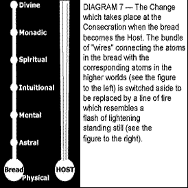

ДИАГРАММА 7.— Происходящее преобразование во время освящения, когда хлеб преображается в Хост. "Провода", соединяющие атомы хлеба с аналогичными атомами в высших сферах (см. фигуру слева), как бы отводятся в сторону для замены огненой линией, напоминающей неподвижную вспышку молнии (см. фигуру справа).

То, что происходит в момент освящения Хлеба, это мгновенное отклонение этой связки проводов. (Диаграмма 7). Она переключается в сторону со скоростью молнии, и на её месте появляется то, что выглядит как линия огня — единая нить связи, восходящая, без разделения или изменения, к Самому Господу Христу, как Учителю и Главе Церкви, и через Него к высоте, выше любой способности ясновидения, которая у нас в настоящее время есть в распоряжении — в ту другую божественную Сторону Себя, которая есть Истинный Бог от Истинного Бога.

Можно возразить, что это чудо — нарушение законов природы. Нет такого понятия, как чудо в этом смысле слова; всё, что происходит в мире, как бы необычно или невероятно это ни было, должно и происходит по вечным и неизменным законам, которые Бог наложил на Свое творение. Это, несомненно, свершение выше наших физических способностей; мы мало что знаем о этих могущественных законах, и многое, что невозможно для нас, определенно вполне в силах могучих Разумов, в руках которых выполнение этого божественного плана.

Из того, что я описал, будет видно, что хотя внешняя форма хлеба и вина не изменяется после освящения, проявление божественной жизни, которое им лежит в основе, совершенно другое. Это была божественная жизнь и раньше, ведь вся жизнь божественна; но теперь это гораздо полнейшее и близкое явление Бога, и вот почему Церковь всегда так настойчиво утверждала Реальное Присутствие Христа в Священнодействии и говорила о нем так, как если бы это действительно была Его живая Плоть и Кровь.

На протяжении веков считалось необходимым бороться с материализмом человека, настойчиво подчеркивая реальность изменения, которое происходит, когда обыденная, повседневная пища превращается в святую пищу, обладая особой и могучей силой. Сам факт того, что на физический взгляд хлеб и вино очевидно таковы, какими были и раньше, делает еще более необходимым подчеркнуть, что в другом и высшем смысле они совершенно другие. Так как "несущественные свойства" остаются неизменными, нужно ясно донести до тех, кто слеп к высшим планам, что "сущность" была определенно изменена.

Если нам будет прощено небольшое отступление в этимологию, можно отметить, что происхождение технических слов, используемых в связи с этим изменением, полно значимости. "Несущественное свойство", имя, данное физическому хлебу и вину, и философски означающее "свойство, не существенное для нашего понимания сущности", происходит от латинских _ad_, к, и _cadere_, падать, и значит, следовательно, "попадание в соседство с". "Сущность" происходит от латинских _sub_, под, и _stans_, стоящий; это то, что стоит под или за физическим объектом. _Trans_ — латинское слово для через, и мы видели, как "сущность" хлеба и вина сметена и заменена другой.

"Бусины" не являются на самом деле бусинами, если их аналоги рассматриваются отдельно, но описать их точно так, как они есть, невозможно в физических терминах. Понимание истинного отношения между физической материей Хостии и её аналогами требует видения других и высших измерений пространства. Так что в некотором смысле мы описываем лишь диаграмму, когда говорим, что Ангел Присутствия отодвигает связку проводов или линий, идущих от облатки к Божеству, но нет другого способа сделать этот процесс понятным для тех, кто не может видеть внутренние миры. Если мы попытаемся проанализировать вещь, мы обнаружим, что это довольно сложно, потому что каждый атом всегда связан с Божеством. Поистине, божественная жизнь повсюду, как я уже сказал, но через акт освящения особое проявление её вспыхивает в материи Хостии, истекая прямо из сердца Христа, так что в этот момент это становится истинным явлением Его. Тогда Хостия сияет сверхъестественным светом, как и подобает самому драгоценному дару Бога человеку.

Это сияние впервые привлекло мое внимание к возможности изучения скрытой стороны Службы Евхаристии с помощью ясновидения. Может быть, поможет читателю осознать реальность и материальную природу явления, если я воспроизведу здесь рассказ (написанный вскоре после этого) о первом случае, когда у меня была возможность наблюдать его.

"Мое внимание впервые было обращено на это, когда я наблюдал эффект, произведенный празднованием Мессы в римско-католической церкви в маленькой деревне на Сицилии. Те, кто знают этот самый красивый из островов, поймут, что здесь не встретишь римско-католическую Церковь в её наиболее интеллектуальной форме, и ни священник, ни народ не могут быть описаны как особенно высокоразвитые; тем не менее, довольно обыденное празднование Мессы было великолепным демонстрацией применения оккультной силы."

В момент освящения Хлеба он засветился ярчайшим блеском; на самом деле, он стал настоящим солнцем для глаза ясновидящего, и когда священник поднял его над головами людей, я заметил, что из него исходят два различных вида духовной силы, которые, возможно, можно было бы грубо сравнить со светом солнца и струями его короны. Первая (назовем её Сила А) равномерно излучалась во всех направлениях на людей в церкви; она действительно проникала сквозь стены церкви, как будто их и не было, и оказывала влияние на значительный участок окружающей местности.

«Эта сила была по своей природе сильным стимулом, и ее действие было сильнейшим в интуитивном мире, хотя она также была чрезвычайно мощной в трех высших разделениях ментального мира. Ее активность была заметна в первом, втором и третьем подразделении астрального тоже, но это было отражение ментального, или, возможно, эффект, созданный симпатическими колебаниями. Ее влияние на людей, которые оказались в зоне ее воздействия, было пропорционально их развитию. В немногих случаях (где было некоторое слабое интуитивное развитие) она действовала как мощный стимулятор их интуитивных тел, удваивая или утраивая на время количество активности в них и излучение, на которое они были способны. Но поскольку у большинства людей интуитивная материя была почти полностью пассивна, ее основное влияние оказывалось на каузальные тела жителей.

Большинство из них, опять же, были пробуждены и частично отзывчивы только насколько касается материи третьего подразделения ментального мира, и поэтому они упустили многое из того, что могли бы получить, если бы высшие части их каузальных тел были в полной активности. Но в любом случае, каждое эго в пределах досягаемости, без исключения, получало отчетливый импульс и отчетливую пользу от этого акта освящения, мало ли он знал или задумывался о том, что делалось.

Астральные вибрации, хотя и намного слабее, также оказали далеко идущее влияние, по крайней мере астральные тела сицилийцев обычно тщательно развиты, поэтому их эмоции легко возбудить. Многие люди, далеко от церкви, идущие по деревенской улице или занимающиеся своими делами на одиноких склонах холмов, на мгновение почувствовали волнение любви или преданности, когда эта великая волна духовного мира и силы прошла по сельской местности, хотя, конечно, они и не думали связывать это с Мессой, которая совершалась в их маленьком соборе.

Сразу же стало очевидно, что мы здесь сталкиваемся с великим и далеко идущим замыслом. Ясно, что одна из великих целей, возможно, главная цель ежедневного празднования Мессы, заключается в том, чтобы каждый, находящийся в ее пределах, получал хотя бы раз в день один из этих электрических толчков, так хорошо способных способствовать росту, на который он способен. Такое излучение силы приносит каждому человеку то, на что он сделал себя способным получать; но даже тихие, неразвитые и невежественные не могут не быть несколько лучше после краткого касания благородного чувства, в то время как для немногих более продвинутых это означает духовное возвышение, ценность которого трудно преувеличить.

Я сказал, что был второй эффект, который я сравнил с протуберанцами солнечной короны. Предположим, мы назовем это Силой B. Свет, который я только что описал (Сила A), излучался безпристрастно на всех: на праведных и неправедных, на верующих и насмешников. Но эта вторая сила активизировалась только в ответ на сильное чувство благоговения со стороны отдельного человека. При возвышении Хостии все члены общины надлежащим образом преклонялись, некоторые, по-видимому, просто по привычке, но некоторые и с сильным всплеском глубокого духовного чувства.

Эффект, увиденный ясновидящим взглядом, был весьма поразителен и глубоко впечатляющим, потому что к каждому из последних излучался луч огня, который заставлял высшую часть астрального тела получателя пылать самым интенсивным восторгом. Через астральное тело, из-за его тесной связи с ним, интуитивный аппарат также сильно затрагивался, и хотя ни у одного из этих крестьян нельзя было сказать, что он был хоть как-то пробужден, его рост в своей оболочке несомненно заметно стимулировался, и его способность инстинктивно влиять на астральное усиливалась. Пробужденная интуиция может осознанно формировать и направлять астральное; но даже в самом не развитом интуитивном аппарате есть большой запас силы, и он сияет на астральное тело и через него, даже если это происходит бессознательно и автоматически.

Меня, естественно, глубоко интересовало это явление, и я постарался посетить различные функции в разных церквях, чтобы узнать, было ли то, что я видел в этот раз, неизменным или, если оно изменялось, когда и при каких условиях. Я обнаружил, что на каждом Праздновании (Службе Евхаристии) получались те же результаты, и две силы, которые я пытался описать, всегда присутствовали - первая, по-видимому, без каких-либо заметных изменений, но проявление второй зависело от числа действительно благочестивых людей, которые составляли часть общины.[^4]

Хлеб тогда действительно становится транспортным средством Христа, и очень особым образом аванпостом Его сознания, и именно поэтому мы видим это удивительное солнечное сияние, исходящее от него. Но эти две силы, здесь описанные, совершенно отличаются от той, которая должна быть распределена Ангелами (которую мы назовем Силой C), хотя все они исходят из одного источника. Эти силы или излучения отличаются несколько так же, как и излучения радия, потому что сияние является вибрацией, подобной свету или теплу, постоянно излучающимся во всех направлениях и, по-видимому, неисчерпаемым; в то время как Сила C ограничена по количеству и может быть разделена, как бы на блоки, и точно распределена, как будто это материальное вещество, хотя ее природа, по-видимому, больше похожа на электрический заряд.

Сила сама по себе всегда невидима, как в высших мирах, так и в этом; её можно увидеть только по её воздействию на какой-либо вид материи. Облака и потоки багряного и синего цвета, из которых Ангел строит свой здание, не являются сами по себе любовью и преданностью людей, но эффектом этой любви и преданности на различные виды материи, эфирную, астральную и ментальную. Точно так же, когда мы говорим о видении Силы C, излучающейся от Святого Дара (Host), следует понимать, что мы видим её самое удивительное и прекрасное проявление в более тонких формах материи — поток жидкого света, живой золотой пыли, или, возможно, лучше скажу, звездной пыли, сверкающей огненной дымки космического пространства. Ни одна земная аналогия здесь не совсем подходит; но мы, возможно, можем думать о силе как о заряде электричества — количество, накопленное, чтобы быть освобожденным только при прикосновении к нему, необходимым прикосновением является действие Управляющего Ангела. Другое излучение (Сила A и Сила B) непрерывно, и не требует вмешательства Ангела, но оно может быть до определенной степени сосредоточено и направлено волей Священника.

Это силой Ангела Присутствия происходит внутреннее изменение в связи с элементами, когда полная сила сверху излучается. Ангел Присутствия отличается от всех ранее упомянутых тем, что он не является членом славного царства Ангелов, но фактически является образом мысли Христа, нося Его подобие. У нас, наверное, есть аналогия для этого на почти бесконечно низком уровне в том факте, что, как я ранее объяснял, любящая мысль человека в небесном мире привлекает внимание его высшего Я, который тут же отвечает, погружая себя в образ мысли и проявляя себя через него, хотя друг в своем физическом сознании ничего об этом не знает. Возможно, это поможет нам понять, как та же сила, возведенная до n-й степени, делает возможным для Христа одновременно отправлять свои мысли к тысяче алтарей, открывая через каждый великолепный канал Его силы и Его любви, и в то же время продолжать так же свободно, как всегда, возвышенную работу, в которой Он всегда занят.

Это даже не только Его сила, необъятная для нас, как она должна быть; это сила Второго Аспекта Божества, избранного канала которого является Учитель Мира, особое явление, по какому-то удивительному образу, которое для нас должно оставаться тайной. Однако о том, что это самое удивительное и прекрасное проявление имеет место на каждом праздновании Святой Евхаристии, сомнений нет, потому что это неоднократно наблюдалось многими компетентными свидетелями. Нам не следует удивляться, что среди церковных деятелей, чувствительных к этому святому влиянию, называют его "средством благодати" и находят его наиболее мощным стимулом для их духовной жизни.

Когда Ангел Присутствия мгновенно является, он привлекает большие сонмы тех, кто не принадлежит к работающим, но к размышляющим и стражам из числа Ангелов. Они сближаются, чтобы погрузиться в свет, исходящий от Святой Евхаристии. Эти Ангелы находятся на том же уровне в ангельском царстве, как и люди в человеческом царстве, которые посещают Службу Евхаристии исключительно с целью почитания и преданности, не имея определенного понимания, что они могут что-то сделать сами, или даже осознания, что есть способ, каким они могут что-то сделать. Эти Ангелы, однако, привлекают и генерируют немало силы своим преданем. Это их путь, и поэтому они всегда привлекаются, когда свет исходит от Святой Евхаристии.

В момент возведения следует использовать много благовоний, потому что Ангелы посылают свои мысли вместе с благовониями. Когда Святая Евхаристия сохраняется, вокруг нее всегда парят Ангелы, не только потому, что они наслаждаются сиянием, которое окружает ее, но и потому, что считают это великим привилегием охранять ее и быть там на службе. Где бы ни находилась Святая Евхаристия, будьте уверены, что там всегда присутствуют Ангелы.

Когда Ангел Присутствия отклоняет пучок "проводов", связанных с Святой Евхаристией, то, что занимает его место, выглядит как вспышка молнии, стоящей на месте. Эта линия огня течет не только к Святой Евхаристии, но и в освященный камень Алтаря, в котором установлены семь драгоценных камней, о которых мы опишем в Главе VII. Когда это происходит, драгоценные камни сверкают как семь точек огня. Совершающий Малое или Великое Празднование, конечно, на одном из Лучей, с которыми связаны эти камни, и влияние в него входит наиболее легко через драгоценный камень, связанный с его Лучем. Это поднимает его к высшей возможности, и затем через него сила, призванная в Священнодействиях, действует на собрание. Таким образом, происходит взаимодействие сил между Святой Евхаристией, драгоценными камнями, установленными в камне Алтаря, канделябрами, центрами Лучей на стенах церкви, священником, стоящим перед Алтарем, и Ангелом Присутствия. (Диаграмма 8.)

Как только Хостия и чаша освящены, и пока они находятся на алтаре, происходит яркое взаимодействие сил между ними и мелкими освященными драгоценными камнями, внедренными в камень алтаря, табернакулом (или крестом алтаря), шестью щитами канделябров и шестью Лучевыми-крестами, размещенными в теле церкви. Драгоценные камни алтаря действуют несколько как могла бы призма, разделяя силу, исходящую от священных элементов, на ее составные части, один луч силы устремляется к каждому Лучевому-кресту и к каждому канделябру от соответствующего драгоценного камня в камне алтаря. Лучевые-кресты и канделябры также соединены похожей, хотя и более слабой, линией излучения. Каждый освященный объект по очереди излучает силу в целом над людьми, так что весь интерьер церкви кажется наполненным переплетающимся лабиринтом линий многих цветов огня. Интересно отметить, что драгоценные камни алтаря и Лучевые-кресты так расположены в церкви, что в общем говоря, положительные или мужские Лучи представлены на южной или Эпистолярной стороне, а отрицательные или женские Лучи - на северной или Евангельской стороне. Более конкретно следует помнить, что 4-й и 5-й Лучи преимущественно мужские, 3-й и 6-й Лучи преимущественно женские, 2-й Луч двойственный, но примерно равномерно сбалансированный, 1-й Луч двойственный, но с усиленным мужским началом, а 7-й Луч двойственный, но с усиленным женским началом.

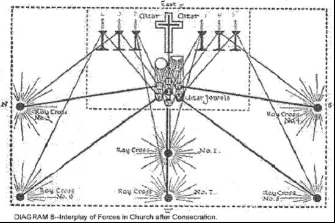

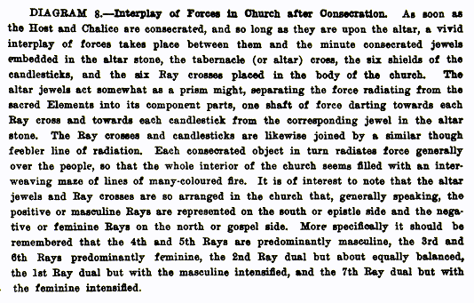

Когда Епископ совершает Службу Евхаристии, вводится дополнительное усложнение, и сила усиливается из-за другого набора взаимодействий. Епископ носит на себе нагрудный крест, на котором укреплены семь драгоценных камней, соответствующих тем, что встроены в камень Алтаря. Когда драгоценности Алтаря вспыхивают в ответ на силу, обрушивающуюся сверху, драгоценности его креста также затрагиваются, и весь крест светится, как солнце, удивительным и красивым образом. Кольцо, надетое Епископом, также вступает в действие. Это кольцо было освящено и специально настроено на самого Христа, так что Его индивидуальная сила, а не та, что из духовного резервуара, проходит через драгоценный камень кольца. Кольцо в свою очередь воздействует на драгоценности в Алтаре и в нагрудном кресте, так что линии мерцающего света играют кругом. Это переплетение усиливает силу, и в результате происходит излияние на прихожан и на мир в целом, что является довольно удивительным и красивым зрелищем.

Когда, кроме этого, посох Епископа находится возле Алтаря, вводится высоко сложное взаимодействие линий света, которое едва ли возможно описать. В посохе семь драгоценностей вспыхивают как звезды, и между ними и всеми другими драгоценностями неустанно метаются жгучие языки пламени. В физической механике каждый раз, когда сила передается, что-то теряется из-за трения. Противоположное происходит во время освящения, ибо все инструменты этого замечательного Священнодействия уже намагничены живой силой, и чем больше взаимодействие, тем сильнее становится сила.

Преклонившись в поклонении перед этим чудесным проявлением присутствия Христа, священник поднимает Хостию благоговейно над головой, чтобы все люди могли увидеть; и именно в этот момент вторичные лучи огня выходят наружу в ответ на особые чувства благоговения, как я видел их в той церкви на Сицилии. Возвышение Хостии перед зрением людей было обычаем Церкви с самых ранних времен, хотя оно не всегда производилось сразу после освящения. В самом деле, его введение в это время относится только к двенадцатому веку, но здесь оно явно и уместно, и полезно, поэтому никто не должен колебаться принять его из-за его относительной новизны. Мы должны остерегаться подразумеваемого отрицания живого влияния Христа в Его Церкви, которое заложено в теории, что все усовершенствования, внедренные после Вознесения, без Его одобрения. Безусловно, части Его Церкви допустили множество ошибок, и Он не вмешивался, чтобы их исправить; но мы не должны сомневаться, что в разное время Он вдохновлял своих служителей вносить изменения, которые практический опыт показал ценными, и это может быть как раз такой случай.

Примечание.

Крест, который священник делает над элементами со словом "прими", не только разрывает связь с народом, но и с природной силой из Алтарного камня, и потому обрезает источник поставки, который поддерживал вращающийся стержень, который мы сравнили с ручкой зонтика; следовательно, теперь это исчезает. При слове "очисти" очищается любой след чего-либо не совсем благородного в том, что было влито в элементы в качестве подношения от народа. Крест при слове "освятить" делает хлеб и вино ярко светящимися.

Во время молитвы, начинающейся со слов "Посему, О Святой Отец Всемогущий," священник протягивает руки к принесениям. Это усиливает свечение вокруг них — созданное последним крестом при слове "освятить", чтобы включить его собственные руки, и таким образом, через эту связь, больше этого светящегося света вливается в хлеб и вино, который оживляет физические атомы, так что жизнь, которая всегда поднимается из них, увеличивается в количестве и яркости и заставляет все спириллы светиться; и в то же время она начинает течь по линиям, которые, когда через века атомы будут полностью развиты, затем будут приняты новыми спириллами. Дальнейший эффект — усиление цветов розового креста, который виден, когда смотрят внутрь атома. Знак силы и слово "благословить" усиливают этот эффект и действительно строят набросок, сделанный линиями света, несформированных еще спирилл. Весь атом теперь вещь из света — живая и блестящая. Следующий крест и слово "утвердить" оказывают тот же эффект на астральных атомах, и последующие кресты делают то же самое на всех уровнях до будхического. Теперь у нас есть случаи на всех этих плоскостях, действительно чистые и подходящие сосуды для Его Присутствия. Затем идет освящение, когда "пучок проводов" — жизнь за формой, которая поддерживает её и которой обязано её существование, жизнь, которая поднимается через центр атома — мгновенно отстраняется, и что-то бесконечно великое мгновенно вспыхивает на его месте. (Пузыри в койлоне, однако, из которых построен атом, по-видимому, никак не меняются; по крайней мере, их внешний вид остается прежним; это сила, которая строит их в атомы, которая затронута.) форма физического хлеба по-прежнему такова, потому что форма и расположение физических атомов по-прежнему таковы, хотя жизнь, которая теперь пульсирует через них, совершенно другая и облекает их в славу сверкающего света. То же самое происходит с астральными, ментальными и будхическими атомами.

Существует определенный вид группировки атомов, который на астральном уровне представляет собой присутствие хлеба на физической плоскости; хотя это не выглядит как хлеб там, оно все же имеет свой собственный характерный вид. Когда Хостия освящается, этот характерный вид полностью затмевается тысячекратно более яркой Жизнью, которая входит в это астральное проявление хлеба.

Освященная Хостия кажется обыденному ясновидящему взгляду сверкающей массой ослепительного белого света, сотканной из линий темнее золотого цвета — красивого сияющего цвета кукурузы. Расположение этих линий золотого света выглядит несколько похожим на сечение пчелиных сот. Если пытаться увидеть отдельную ячейку, богатый цвет, кажется, быстро блекнет в то, что фактически является белым, но, думаю, это своего рода сублимированный первоцвет, такой, как мы наблюдали в Сборе за Мир. Каждая ячейка выглядит не похожей на вкрапленный ювелирный камень, поднятый к свету, который в центре светящийся, но при приближении к краю переходит в топаз; но весь эффект поражает своей поразительной яркостью.

Белая или сублимированная первоцветная сила, я думаю, сила A, о которой говорил наш председательствующий епископ; и золотая сеть света тогда будет силой B. Сила A создает замечательную сферу белого света вокруг облатки, которая имеет небольшой голубоватый оттенок по краям.

Золотая сила B (которая, я думаю, исходит от сияющих линий цвета кукурузы в Хостии) действительно могучая сила, которая излучает то, что, судя по её внешнему виду, является разрушительной, громкой энергией. Она взрывается из Хостии как лист за листом живого пламени, со всей силой колоссального заряда электричества. То, что я принимаю за силу C, выглядит почти осязаемой вещью. Её внешний вид таков, что создает впечатление, что можно взять её в руку, и она будет ощущаться как иней, когда потираешь между пальцами — хрустящая, но такая бесконечно нежная, каждая частица состоит из самой тонкой филиграни или кружева, которое будет раздавлено при малейшем прикосновении. Каждый крошечный филигранный узор на каждой частице преломляет свет, и так весь создает самый нежный сказочный эффект. Она тоже золотистого цвета с серебряным отливом по всему, так что она напоминает редкую переливающуюся шелковую ткань с золотом и серебром, такую, как делают на солнечном Востоке. Её золотистые частицы излучают свет белого бриллианта, когда они перекатываются друг над другом; это выглядит как поток насыщенного цвета индийской кукурузы, пролитый на солнечном свете.

После второго поклона и паузы нескольких мгновений священник переходит к освящению Чаши.

Римская | Либеральная
------- | -----------
Таким же образом, после того как Он взял ужин, взяв и этот благородный кубок в Свои святые и почтенные руки, снова возблагодарив Тебя, Он освятил его и дал Своим ученикам, говоря: Примите и пейте все из этого, ибо это - Кровь Моя. Когда бы вы ни совершали эти вещи, вы будете делать их в память обо Мне. | Таким же образом, после того как Он взял ужин, взяв и этот благородный кубок в Свои святые и почтенные руки, снова возблагодарив Тебя, Он освятил его и дал Своим ученикам, говоря: Примите и пейте все из этого, ибо это - Кровь Моя. Как часто вы будете совершать эти вещи, вы будете делать их в память обо Мне.

По знаку святого креста он пронзает свою вторую трубку в более высокий мир, как он сделал это в первый раз, всего лишь за мгновение до собственно превращения, и снова, при Слове Силы, происходит транссубстанциация, и пучок линий, представляющих внутренние реальности вина и воды, убираются в сторону и заменяются живым огнем, который есть жизнь Христа. Но на этот раз огонь не ослепительно белый и золотой, который делает Хостию сияющей, как солнце, а пылающий меч интенсивно багряного цвета, подобно пальцам руки.

Перед горящей свечой, как выразился Теннисон. Процессы поклона и воздвижения повторяются, и эта вторая форма божественной силы изливается на общину. Она дополняет другую, но кажется, что она опускается к нам несколько ближе; Вино оказывает очень мощное влияние на высшие астральные уровни, а Вода излучает даже эфирные вибрации. Сила Хостии может быть описана как в основном монадическая, и действует наиболее сильно на то, что в нас представляет прямое действие Монады - силу, точность и ритм, принадлежащие к стороне Епистолии Алтаря; сила Чаши больше та, что принадлежит эго, и, кажется, выражает скорее огненнeую преданность, такт и церемониальный метод стороны Евангелия. Оба необходимы, и когда они излучаются вместе, нет добра, которое не было бы стимулировано их вибрациями, нет зла, которое не могло бы быть усмирено.

Что касается их воздействия, но кроме этого, нам следует помнить, что на протяжении всей Святой Евхаристии прослеживается двойная символика - символика Святой Троицы, а также спуска Христа в материю. (Диаграмма 9.) Хостия символизирует Бога Отца и также олицетворяет Божество, целое и неделимое; Вино символизирует Бога Сына, чья жизнь изливается в чашу материальной формы, а Вода представляет Бога Святого Духа - Духа, который парил над поверхностью вод и в то же время является символизированным водой.

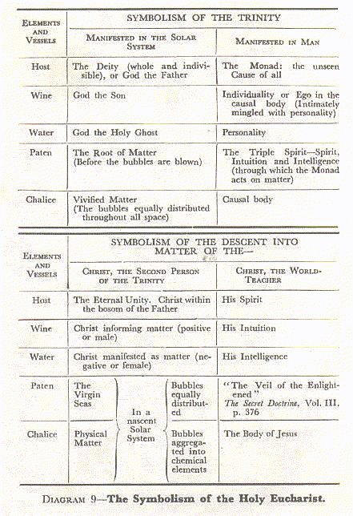

Когда мы применяем ту же образность к проявлению Божественности в человеке, Хлеб символизирует Монаду, вселенскую суть, невидимую причину всего, в то время как патена означает Тройную Атму или Дух, через который эта Монада воздействует на материю; Вино указывает на индивидуальность, влитую в чашу причинного тела, а Вода представляет личность, которая так тесно смешана с ней. Вот почему на более раннем этапе, когда мы символизируем состояние, в котором Монада просто парит над нижним проявлением, патена скрыта под корпоралом или под покрывалом, прижатым к груди субдиакона; когда она вынимается, и Хлеб кладется на неё, мы символизируем время, когда достигается соединение.

С точки зрения спуска в материю, Хлеб символизирует Вечное Единство — Христос в лоне Отца; тогда как Вино и Вода представляют собой двойное проявление Христа в материи — позитивное и негативное или мужское и женское.

Примечание.

Кубок навсегда освящён подобным образом, как и его содержимое. Это посвящение кажется похожим на посвящение хлеба, за исключением того, что меч света, который опускается в вино, горит красным, как будто он только что из кузницы. Сам элемент приобретает тот же теплый живой оттенок, нежный и мягкий, но также очень сильный — материальный — подходящий для одеяния солдатского короля. Есть два оттенка; как и с Хлебом, темный цвет обозначает линии раскола, но здесь, в этих линиях, есть также другой цвет, небольшой оттенок прекрасного синего, который, подобно красивому тунику, виден только в отверстии мантии королевского багрянца, в котором приходит Учитель.

На первой Службе Евхаристии, Христос, произнеся слова: "Это есть Тело Мое", подняв чашу и задержав её на мгновение перед тем, как пить, добавил: "Когда бы вы ни делали сие, делайте это в память обо Мне". Его упоминание о том, что люди совершают этот акт, естественно, связано с будущим, но на вневременной плоскости, на которой живет Его могучее Сознание, все существует здесь и всегда в своей полноте и совершенстве, так что это упоминание о будущем гораздо больше, чем просто ссылка. Это фактически соприкосновение с тем, что уже существует в порядке вещей, которое однажды будет реализовано здесь в терминах времени и пространства. Аналогично, мы соприкасаемся с прошлым, ибо слова о совершении "этих вещей" в память о Христе связывают нас с тем временем, когда Он сделал это Сам, и каждым другим временем на протяжении веков, когда Он сделал это через Своих священнослужителей. Но гораздо больше этого, это устанавливает связь между нами и великим фактом Его воплощения в материю, с помощью которого Он создал, продолжает создавать и всегда будет заново создавать все вещи. Таким образом, у нас есть связь с космическим актом, когда Он, "оставаясь неизменным в Себе, тем не менее в тайне Своей безграничной любви и вечного Самопожертвования вдохнул свою божественную жизнь в свою вселенную, и таким образом принес Себя в жертву как Агнец, закланный от основания мира, умирая во истинной правде, чтобы мы могли жить". Величественна связь с прошлым, настоящим и будущим Церкви, но еще величественнее эта связь с вечным действием творения, которое является архетипом бесчисленных процессов природы и человеческого сердца и поэтому находит отражение в наших действиях, наших аллегориях и произведениях искусства, в нашей всей жизни и всем методе проявления. Таким образом, произнося это небольшое предложение, мы конкретизируем славный акт, который мы только что совершили, и ниспосылаем на физический уровень символ космического действия.

Многие невежественные люди возражали против утверждения, всегда делаемого Церковью, что празднование Евхаристии является ежедневным повторением жертвы Христа. Но когда мы понимаем, что с внутренней точки зрения жертва Христа означает схождение в материю излияния Второго Аспекта Божества, мы видим, что символизм является точным, поскольку поток силы, вызванный Освящением, имеет особую и тесную связь с тем отделом природы, который является выражением этого божественного Аспекта. Христос вполне верно воплощается снова и продолжает Свою Жертву каждый раз, когда празднуется Святая Евхаристия; ибо Он поистине вкладывает что-то из Себя в тот Хлеб и то Вино, которые затем усваиваются нами и становятся частью нашей плоти и крови.

Священник, понимающий это, не перестанет присваивать Службе её заслуженное место и будет стараться окружить её кульминационный момент всем, что может усилить её воздействие и подготовить народ к более рецептивному участию в ней. Осознавая, какую грандиозную тайну он здесь хранит, он будет подходить к её празднованию с крайней благоговением и трепетом, ибо, хотя его отношение к ней никак не влияет на центральный факт и его эффекты, нет сомнений, что его глубокая преданность, понимание и сотрудничество могут привести дополнительное влияние, которое окажет большую помощь его приходу и общине. Священник, имеющий преимущество быть также изучающим физику внутренней жизни, имеет великолепную возможность широко помогать людям.

Такой человек также имеет дополнительное преимущество в понимании природы ошеломляющей силы, с которой он имеет дело, и это позволит ему избежать многих ошибок, в которые так легко попадают невежественные в этих вопросах. Многочисленны и разнообразны типы сил, которые Бог изливает на Свой мир, и каждая из них имеет свой соответствующий случай и канал, для которого Он её устроил и предназначил. Людям неразумно спорить с ограничениями, которые Он посчитал нужным наложить, и игнорировать вечные законы природы, чтобы удовлетворить свои временные удобства.

Например, чудесный исток Святой Евхаристии устроен так, чтобы совпадать и использовать определенный набор условий в ежедневном положении Земли к Солнцу. Существует прилив и отлив магнитной энергии между Солнцем и Землей - магнитный прилив, так сказать, и часы полдня и полуночи обозначают переход от одного к другому в любой точке поверхности Земли, так что течения, текущие утром, отличаются от тех, что идут днем. Поэтому Святая Евхаристия никогда не должна праздноваться (или, по крайней мере, Служба никогда не должна начинаться) после полудня. Поскольку полдень является переломным моментом прилива, поток за короткое время до этого и отлив непосредственно после него не очень сильны; так что если освящение происходит, допустим, до 12:30 дня, то противоток не будет настолько сильным, чтобы сделать желаемые результаты недостижимыми.

Но следует ясно понимать, что ни ангельские воинства, ни их Господь и Владыка не нарушат законы природы, чтобы удовлетворить капризы ленивых; и священники, предоставляющие вечерние Причащения модным общинам, возможно, предоставляют им приятную духовную Службу, но не празднуют великолепную церемонию Христовой Святой Евхаристии. Когда сила уже накоплена в освященном Хлебе, её можно использовать так же хорошо между полднем и полуночью, как и утром, так что зарезервированный Хлеб может, в случае необходимости, быть вручен в любое время. Очень замечательный результат получается из него на Службе, называемой Благословением Священнодействия, о которой мы упомянем в другой главе.

Еще одним из условий, при которых мы получаем этот мощный дар благодати, является то, что он устроен так, чтобы течь через мужской организм. В эти дни, когда принято игнорировать или унижать все различия природы и утверждать, что каждый может делать все одинаково хорошо, женщины иногда требуют священнического положения, спрашивая, почему они не могут занимать такой пост и осуществлять его полномочия так же, как мужчины. Обычный духовенством ответ в старых словах: "У нас нет такого обычая, как и в церквах Божьих", возможно, укреплен напоминанием, что Христос, говорят, избрал Своих двенадцать апостолов и семьдесят проповедников исключительно среди мужчин. Это довод с некоторой силой; но ученик может добавить к нему еще одно соображение - что этот конкретный тип магии не приспособлен для работы через женский организм. Существуют другие типы энергии, которые так устроены, но они совершенно иного характера и мало известны нашей нынешней цивилизации - многое, я думаю, к её убытку. Культ нашей Благословенной Дамы в Римской Церкви является бессознательной попыткой заполнить пробел, который многие люди инстинктивно осознают.

### Гимны Почитания

Гимны, которые следуют далее, используются в этом контексте только в Литургии Либеральной Католической Церкви.

_Мы Тебя обожаем, о скрытое Сияние, Тебя,_

_Кто в Своем Священнодействии соизволил быть;_

_Мы поклоняемся Тебе под этой земной вуалью,_

_И здесь Твое Присутствие мы почтительно приветствуем._

_О, придите, все верные, радостные и торжествующие,_

_О, придите, о, придите в Вифлеем._

_Придите и узрите Его, Монарха Ангелов;_

_О, придем, поклонимся Ему;_

_О, придем, поклонимся Ему;_

_О, придем, поклонимся Ему;_

_Христу Господу._

_Бог от Бога, Свет от Света,_

_Но под земными формами Свет Свой Он скрывает,_

_Истинный Бог, единорожденный от Отца,_

_О, придем, поклонимся Ему; ..._

_Пойте, хоры ангелов, пойте в восторге;_

_Пойте, все жители неба выше;_

_Слава Богу на высоте,_

_О, придем, поклонимся Ему; ..._

_Да, Господь, мы приветствуем Тебя, восседающего на Твоем Алтаре,_

_Вечная слава Тебе дана._

_Слово Отца, вечное Сияние;_

_О, придем, поклонимся Ему; ... Аминь._

После освящения мы стоим на коленях несколько мгновений в тихом почитании, затем мелодия древнего гимна легко касается наших ушей, и мы все мягко поем этот удивительно подходящий стих. Снова небольшая пауза, и все встают и сердцем и голосом присоединяются к великолепной песне Adeste fideles, первоначально написанной для рождения Иисуса в Вифлееме, и, несомненно, является наилучшим приветствием для нового рождения Христа на Его Алтаре в этом современном Доме Хлеба.

Великолепие сцены для ясновидящего взгляда во время пения этих гимнов невозможно описать, ибо Ангелы присоединяются к ним с истинно небесным пылом, и их любовь и преданность не только наполняют огромное ментальное здание живым огнем, но и обогащают и украшают его. Именно в это время создаются углубления, которые мы назвали дверями, так что базилика теперь стоит во всей красе. Труба, которую сделал священник, расширилась в огромную воронку, по-прежнему четко видимую среди всего этого моря света. По-прежнему Хостия, Чаша и Ангел являются центром всего, и от них исходят пламенные потоки, освещающие и оживляющие окружающий мир. Силы A и B действуют все это время; Сила C постоянно накапливается, заполняя ментальное здание и подвергаясь некоему виду превращения или материализации в руках Ангела Присутствия.

Римский Миссал не использует гимны почитания сразу после Освящения, но вместо этого вставляет Agnus Dei, немного позже в Службе, что, к сожалению, не так эффективно. К этим словам многие композиторы написали такую живую музыку, что мы немного склонны забывать её фактическое значение. Только омертвляющее воздействие долгой привычки смирило нас с неуважительной неподобающестью зоологической апострофы Иоанна Крестителя, и идея, что Он несет грех мира, столь же большое богословское заблуждение, как и тон мольбы помиловать нас.

Возможно, те, кто поет эти слова, мало думают о их значении, и люди, слушающие их, просто наполнены расплывчатым чувством благочестия; но практический эффект заключается в том, что благочестие часто, к сожалению, окрашено рабским страхом, и во многих больших соборах Ангелам приходится убирать серое из синего в тяжелых облаках, которые медленно плывут над головами прихожан, прежде чем они могут использовать материал в службе Царя Любви. Часто я видел своего рода свалку, огромную массу отходов - густой неприятный туман серой астральной слизи, выброшенный из церкви Ангелами, прежде чем они могут выполнить свою работу в связи со Святой Евхаристией. Наше изложение, напротив, предполагает только радость и хвалу и любовь, поэтому, насколько наш народ следует обряду и поет с чувством и пониманием, он обеспечивает отличный материал для ангельских работников.

Церковь Англии использует Gloria in Excelsis в качестве благодарения и гимна почитания; трудно представить что-то лучше, если бы она не содержала именно ту фразу о Агнце Божьем, которую я осудил как нежелательную на мой взгляд. Другое возражение против вставки Gloria in Excelsis здесь заключается в том, что его приходится убирать из его традиционного места в ранней части Службы, где его присутствие так необходимо для создания величественного и эффективного священного здания.

Даже на Малом Праздновании желательно, чтобы первый и последний стихи Adeste были прочитаны, иначе Ангелу придется использовать свои запасы силы для этой части работы, и следовательно, меньше останется для цели всей церемонии. Здание, построенное на Малом Праздновании, естественно, гораздо меньше, чем то, что построено Большой музыкальной Службой с большим приходом; но если священник действительно понимает полную детализацию своей работы, вкладывает в нее всю душу и разумно сотрудничает с Ангелами, ответственными за это, то эта сравнительно малая форма может быть сияющим драгоценным камнем, настоящей Cappella Palatina, как та, что в Палермо, и окрестности, подобно фонтану огня.

Римская | Либеральная
------- | -----------
Посему, Господи, мы, слуги Твои, как и святой народ Твой, вспоминая благословенную страсть того же Христа, Сына Твоего, Господа нашего, а также Его воскрешение из ада и славное восхождение на небо, приносим Тебе, великолепной величественности Твоей, из даров, Тобой нам даны, чистую ✠ жертву, святую ✠ жертву, непорочную ✠ жертву, священный ✠ хлеб жизни вечной и чашу ✠ вечного спасения. | Посему, Господи и небесный Отче, мы, скромные слуги Твои, [помня невыразимую жертву Твоего Сына, таинство Его дивного воплощения, Его могучего воскрешения и Его торжественного восхождения, здесь делаем пред Божественным величием Твоим памятование, которое Господь наш повелел нам совершать, и] приносим Тебе это, самый драгоценный дар, который Ты нам даровал: [этот чистый ✠ Хост, этот святой ✠ Хост, этот славный ✠ Хост, святой ✠ хлеб жизни вечной и ✠ чашу вечного спасения.
Даруй посмотреть на них благосклонным и милосердным лицом и принять их, как Ты благоволил принять дары от праведного слугу Твоего Авеля, и жертву отца нашего Авраама, и то, что Мелхиседек, первосвященник Твой, принес Тебе, священное и непорочное священнодействие. Мы умоляем Тебя во всеуважении, Всемогущий Бог, повелеть, чтобы эти вещи были принесены в руках Твоего святого ангела к Твоему алтарю в вышине, пред глазами божественного величия Твоего. | Это мы представляем перед Тобой] в знак нашей любви и совершенного предания и жертвы наших умов и сердец Тебе; и мы молим, чтобы Ты повелел Твоему святому Ангелу нести нашу жертву к Твоему Алтарю в высоких небесах, где она будет принесена Тем, кто, как вечный Первосвященник, вечно приносит Себя в качестве вечного Священнодействия.

(Части в скобках опускаются в сокращенной форме Службы, и пять крестов совершаются там, где они должны быть, согласно значению действия — при словах любовь, преданность, жертва, разум, сердце.)

Хлеб и Вино, теперь истинно являющиеся носителями Христа, стали для нас величайшими драгоценностями на земле, самыми удивительными дарами Божьими. Поэтому сразу же мы кладем их к Его ногам в знак и выражение нашей любви, преданности и жертвы. Это гораздо больше, чем простой символ. Будет вспомнено, что на более ранней стадии мы предложили себя, наши души и тела, чтобы быть использованными абсолютно и полностью в Его служении. Затем священник разорвал связь и вымел из приношения каждый след от низшего и земного, чтобы это могло стать достойным каналом для этой величественной силы.

Теперь эта сила наполнила его, и ничто, кроме самого высокого, не может войти в его святилище. И так, еще раз, мы совершаем наше смиренное приношение всего, что у нас есть и что мы есть, всей нашей благодарности за этот Его самый удивительный дар Себя, всей силы, любви, преданности, что этот дар в нас вызвал, всего, что мы чувствовали и выразили при воздеянии и во время пения гимнов — все это мы стараемся пролить через канал, что Его добрая душа открыла для нас, пока святой Ангел, который в самом деле является частью Его, все еще с нами. И как этот Ангел действует на проливающююся сверху Божественность и преобразует её, чтобы она стала усваиваема смертными людьми, так он действует на и преобразует наш слабый, хотя и возвышающийся поток любви, пока он не станет хоть немного достоин быть предложенным перед Величием в вышине.

Итак, когда священник делает пять знаков силы, он думает о пятеричном человеке, изображенном в герметических тайнах пятиконечной звездой. Пять принципов или частей — это (а) дух, (б) интуиция, (в) интеллект — три аспекта истинного внутреннего человека (часто называемого душой или эго), олицетворенные здесь как любовь, преданность и жертва — (г) нижний разум и (д) эмоции. (Диаграммы 11 и 12.) Все это, и вся сила, исходящая от них под неисчислимым стимулом Святой Евхаристии, он предлагает совершенно и безоговорочно нашему Благословенному Господу, через прямой и особый канал, теперь открытый ему, прося, чтобы Ангел Присутствия мог нести это наше смиренное приношение к вечному Алтарю в высоте.

Этот Ангел является продолжением сознания самого Христа, и поскольку наш Господь, распространяющий этот луч, втягивает его обратно в Себя, он несет с собой отпечаток, который мы, через священные элементы, вложили в него. Так сила, которую мы здесь сами породили, фактически используется в высших мирах, и у нас есть невыразимая привилегия внести, хоть и небольшой, вклад в тот великий резервуар духовной силы, из которого священники Христа черпают свою силу когда совершают Священнодействия. Так что, когда Ангел исчезает со своей славной улыбкой в тот момент, когда его упоминают в молитве, это то, что он несет с собой в знак нашей любви. Его присутствие было необходимо для акта освящения и для трансмутации сил, но теперь он должен вернуться, неся с собой свои снопы.

Конечно, правда, что вся сила в мире является божественной силой, и поэтому, как сказано в известном гимне:

_Мы даем Тебе лишь Твое,_

_Каким бы подарок ни был._

Но это воля Божья, Его система для нашего прогресса, дать каждому из нас определенное ограниченное количество этой силы и посмотреть, как мы ее используем. Как в притче о талантах, некоторые хорошо используют его, некоторые расточают, некоторые закапывают в землю и вовсе его игнорируют. Так что, хотя мы можем что-либо сделать только силой Божьей, также верно, что, когда мы изливаем себя в крайней преданности, мы расходуем во благо определенное количество энергии, которое, если бы мы были глупее или невежественнее, могли бы использовать менее мудро. Мы делаем то, что Бог намеревался сделать — используем силу, которую Он нам дал, в гармонии с эволюцией, которая является Его планом.

Помните также о том другом законе высшей жизни, о котором я ранее упоминал. За каждым всплеском любви или преданности идет щедрый ответ сверху; и поскольку силы живые, последствия гораздо больше причины. И все это также добавляется к нашему вкладу в резервуар. Мы можем сказать с крайней благоговением, что Бог рассчитывает на помощь своих созданий — это часть Его схемы, что как только они становятся достаточно разумными, чтобы понять эту схему, они должны с нетерпением стремиться выступить под Его знаменем как работники.

Давайте кратко резюмируем. Сначала священник выдул как бы гигантский пузырь на Асперже; затем Ангел Евхаристии, взяв нашу преданность и привязанность, начал внутри него строить великое евхаристическое здание. Внутри этого здания на втором окадывании священник создал как бы капсулу вокруг элементов, отрезав их от остальной части церкви, как он временно отрезал церковь от внешнего мира. Внутри этой самой внутренней капсулы священник начал строить свой трубопровод; и внутри этой трубы снова произошло изменение при Освящении, так что божественное влияние могло потечь вниз.

Сам Христос изливает силу; чтобы Он мог сделать это легко и с наименьшими усилиями, оставляя наибольшее возможное количество силы, которая может быть использована для ее реального назначения, Ангел Присутствия путем фактической транссубстанциации создает линию огня, по которой Он может излить ее. Однако священник, выдвигая свою трубу и таким образом подготавливая канал, сделал возможным для Ангела сделать это. Есть множество электрических экспериментов, которые должны проводиться в вакууме; и в этом случае, конечно, необходимо сначала создать вакуум. Так и в этом случае трубу нужно сделать, прежде чем можно будет вставить в нее эту особую линию связи. Но священник не мог бы сделать эту трубу, если бы он сначала не создал правильно изолированную капсулу, из которой можно было бы толкать вверх, и поэтому он осуществил изоляцию элементов. Люди помогли священнику и предоставили материал для здания, через которое сила распределяется, когда она была налита вниз. Таким образом, мы видим, что все выполнили свою должную часть работы в несколько запутанном процессе, который привёл к столь великолепному результату.

Римская | Либеральная
------- | -----------
Чтобы как можно больше из нас, находящихся у этого алтаря, приняли и получили пресвятое ✠ тело и ✠ кровь Твоего Сына ✠, они могут быть исполнены всеми небесными благословениями и благодатью. Через того же Христа, Господа нашего. Аминь. | И [поскольку Он установил, что небесное Жертвоприношение должно здесь, на земле, отражаться посредством служения смертных людей, чтобы Твой святой народ мог теснее объединиться в общении с Тобой], мы молим за Твоего слугу, который служит у этого Алтаря, чтобы, преподнося тайны пресвятого ✠ Тела и ✠ Крови Твоего Сына ✠, он мог быть исполнен Твоей могущественной силой и благословением.

В укороченной форме Службы слова в скобках опускаются. Теперь, когда Ангел Присутствия, выполнив свою работу, ушел, необходимо некоторое перестроение. До момента его ухода существовали три прямые связи с Христом в полном действии — Ангел, Хостия и Чаша, если на мгновение мы понимаем последний термин не как саму чашу, но как интенсивно заряженное Вино и Воду, которые в ней. Эти три канала имеют каждый свою особую функцию, имея между собой тот же тип отношения, что мы находим во всех трехчастных проявлениях, от Трех Лиц Пресвятой Троицы до трех основных качеств материи. Все три в этом случае наполнены жизнью нашего Господа и действительно являются продолжениями Его сознания, хотя каждый представляет то, что мы, с нашей низкой точки зрения, назовем разной частью этого сознания. Так что когда один из них исчезает, его должны либо заменить другим, либо представление останется неполным.

Священник при своем посвящении был особо связан со своим Учителем Христом, и из-за этой близкой связи ему возможно занять место Ангела Присутствия — не для акта освящения, но для работы на более низком уровне, которую еще остается сделать. Он собирается излить божественную силу на народ, но он не может сделать это, пока сам не станет частью канала; и поэтому "чтобы Твой святой народ мог теснее объединиться в общении с Тобой", он молит, чтобы он мог так праздновать тайны, чтобы быть исполненным могущественной силой и благословением Господа. И когда он произносит эти слова, он делает знак силы над Хостией, над Чашей и над собой, чтобы восстановить трехчастное представление.

Римская | Либеральная
------- | -----------
Помни, Господи, о Твоих                   | _Соответствующая молитва предшествует_
слугах, мужчинах и женщинах, N.           | _Службе Евхаристии._
и N., которые ушли прежде                 | Также молим Тебя освятить Твой народ здесь присутствующий
нас со знаком веры и                      | этими Твоими небесными дарами,
спят сон мира. Этим, Господи, и всем тем, | и через эти тайны
кто почивает в Христе, мы умоляем Тебя,   | ✠ освяти, ✠ оживи
даровать место освежения,                 | и ✠ благослови их, чтобы и в
света и мира. Через                       | их сердцах, и в их жизни
того же Христа, Господа нашего, Аминь.    | они могли возвещать Твою хвалу
И нам, грешникам, также, Твоим            | и прославлять Твое святое Имя.
слугам, надеющимся на оби-                |
лие Твоего милосердия, удостой            |
даровать часть и общение                  |
с Твоими святыми апостолами и             |
мучениками; с Иоанном, Стефаном,          |
Матфеем, Варнавой, Игнатием,              |
Александром, Марцеллином, Петром,         |
Фелицитой, Перпетуой, Агафьей,            |
Люсией, Агнес, Цецилией, Анастасией       |
и со всеми Твоими святыми; в              |
их общество, мы молим Тебя,               |
прими нас, не из-за со-                   |
ображений о наших заслугах, но по         |
Твоему свободному прощению. Через         |
Христа, Господа нашего.                   |
Через Кого, Господи, Ты                   |
создаешь, ✠ освящаешь, ✠ оживляешь        |
и ✠ благословляешь эти Твои               |
вечно щедрые дары и даруешь               |
их нам.                                   |

Священник теперь посылает божественную жизнь над общиной, думая, как он делает три креста о трехаспектной природе силы, которой он их наполняет, и искренне желая, чтобы это оказало практический эффект и на их сердцах, и на их жизни:

Римская | Либеральная
------- | -----------
Через ✠ него, и с ✠ ним,       | Все это мы просим,
и в ✠ нем, Тебе, Богу          | о Отче, во имя и
Отцу ✠ всемогущему, в          | через посредничество Твоего
единстве Святого ✠ Духа, вся   | всеблагословенного Сына, ибо мы при-
честь и слава. Навеки          | знаем и исповедуем нашими
и вовеки веков. Аминь.         | сердцами и устами, что через ✠ Него
-- | было сотворено все, да, все
-- | в небе и на земле;
-- | с ✠ Ним как внутренней
-- | Жизнью все существует, и
-- | в ✠ Нем как возвышенной
-- | Славе все живет и движется
-- | и имеет свое бытие:
-- | Кому с Тобой, О могучий
-- | ✠ Отец, в единстве Святого
-- | ✠ Духа, да будет воздана вся честь
-- | и слава, на веки веков. Р. Аминь.

В благодарность за это чудесное излияние они немедленно присоединяются к нему в великолепном восхвалении и поклонении Второму Лицу Пресвятой Троицы, признавая, что без влияния, которое Он посылает в мир, в нем не могло бы быть жизни. И, таким образом, отдавая благодарность, они, как всегда, получают гораздо больше, чем дают, ибо, когда священник делает три креста с Хостией над чашей, он сильно желает, чтобы святое влияние с монадического уровня спустилось в эго в его трехкратном проявлении духа, интуиции и разума; а затем, когда он делает два креста между чашей и своей грудью, он привлекает это влияние в свои ментальные и астральные тела, чтобы через него оно могло полностью излучаться на свой народ.

Здесь символика точна и красива, и удивительно, что она была сохранена так точно на протяжении веков, когда, казалось бы, ее значение было почти полностью утрачено. На протяжении всего более раннего этапа эволюции Монада парит над своими низшими проявлениями, заботясь о них, воздействуя на них, но никогда не касаясь их; так священник держит Хостию над чашей, но никогда не касается одного другим, пока не приходит назначенное время.

Когда священник заканчивает молитву, он делает то, что называется Меньшим Воздвижением, поднимая Хостию в правой руке над чашей в левой, таким образом не только обозначая парение Монады, но и показывая линию, по которой сила течет. Теперь обычай священника держать священные элементы перед грудью, но в более ранние времена он, вероятно, поднимал их достаточно высоко, чтобы народ видел. Именно в этот момент во многих Литургиях звучат слова «Sancta Sanctis» — «святые вещи святым».

Пытаясь проследить символику, мы всегда должны помнить, что христианство — это культ Второго Аспекта Логоса — одна из религий, которая подчеркивает Второе Лицо благословенной Троицы; и таким образом, мы особенно поклоняемся Слову и выставляем Мудрость даже перед Силой и Красотой. Должна быть мудрость для понимания, сила для выполнения и красота для украшения. Вайшнавитская традиция в индуистской религии и замечательный культ Митры, который почти вытеснил христианство в Римском мире, являются другими примерами того же типа. Сайвитский аспект индуизма подчеркивает Первое Лицо, как и мусульманство и иудаизм, насколько последний освободил себя от поклонения кровожадным элементалам ранних времён. Все женские культы — поклонение Исиде, Аштарте, Весте, Венере, Палладе Афине — существенно подчеркивают третье Лицо, которое мы теперь называем Бог Святой Дух.

Заметим, что гимны после освящения создают пылающую массу цветов, некоторые из самых прекрасных из которых собираются вокруг совершающего службу и могут быть видны будто сквозь янтарно-окрашенный кристалл, поскольку золотой кокон подобной формы окружает его, а очищенные цвета от людей входят в него и сверкают сквозь него. Это стремление и благодарность через элементы вливаются в Ангела Присутствия на пятерке крестов в молитве, следующей за Adeste Fideles, поскольку мы теперь восстанавливаем связь между собой и элементами. Когда Ангел уходит, этот сверкающий кокон, кажется, также исчезает. И в тот же момент исчезают две линии света, соединяющие его с каждым из элементов, лишая нас триединства, составленного из Хостии, Вина и его самого. Теперь, когда основная часть работы выполнена, Священник может занять место Ангела и таким образом завершить треугольное расположение. Он немедленно делает это следующими тремя крестами над облаткой, чашей и собой. Хостия светится золотом, представляя Первое Лицо; чаша вспыхивает красным цветом Святого Духа, и совершающий службу, который занимает место расширения сознания Христа, которое только что ушло, сияет светло-сапфировым цветом Христа.

То, что светится в Священнике, это часть сознания самого Христа, которая была вложена в него (или скорее оживлена в нем) когда ему была дана прямая личная связь с Христом на его посвящении. Это создает замечательное зрелище - красное и золотое на Алтаре, каждое с линией этого цвета, соединенной с синим в совершающем службу, который окружен золотой будхической силой и многими другими цветами, которые излучаются вокруг него. Можно подумать, что с церемониальной точки зрения - ради абсолютно правильной формы - совершающий службу должен представлять Руку Логоса, протянутую в активности в материи - Третье Лицо - в то время как Хостия и Чаша должны представлять Отца и Сына. Но поскольку это религия Второго Лица, это расположение не соблюдается, и Христос представлен Его Священником.

Три креста, которые следуют далее, когда люди освящены, оживлены и благословлены, являются расширением этой связи с совершающим службу, чтобы включить в нее собравшихся. Они следуют тому же порядку, что и предыдущий набор из трех, так что это Святой Дух, Дарующий Жизнь, кто "оживляет" собравшихся. В этом акте распространения тройного влияния на Алтаре, чтобы включить всех присутствующих, их различные чакры затрагиваются в следующем порядке: первым крестом, при слове "освящение" - Брахмарандхра или Сахасрара и гипофиз; вторым крестом, при слове "оживление" - все нижние центры, включая солнечное сплетение, селезенку и центр у основания позвоночника; третьим крестом, при слове "благословение" - сердце и горло. В то же время три света в "точке входа" начинают сиять, но в порядке белого, красного и синего, вместо более обычного белого, синего и красного.

На следующих трех крестах, когда мы "признаем и исповедуем ... что Им ... с Ним ... и в Нем" "все сделано", три света в точке входа каждого человека снова сияют, но на этот раз в их обычном порядке белого, синего и красного, соответствующего силе Отца, Сына и Духа. Эта часть церемонии устанавливает полное и законченное единство в Христе совершающего службу, элементов и собрания, потому что мы здесь объединяемся и предлагаем себя от самой основы нашего существа. Мы начинаем с посвящения Атмы, затем Будхи, затем Манаса; и на следующих двух крестах продолжаем вниз к ментальному и астральному телам.

Римская | Либеральная
------- | -----------
Давайте помолимся. Наставленные заповедями спасения и следуя божественной заповеди, мы смело говорим: | Давайте помолимся. Наученные словами Священного Писания, и следуя традиции Святой Церкви издревле, мы теперь говорим:
Отче наш, сущий на небесах, да святится имя Твое; да приидет Царствие Твое; да будет воля Твоя на земле, как на небе. Дай нам сегодня хлеб наш насущный; и прости нам грехи наши, как и мы прощаем должникам нашим. И не введи нас в искушение, но избави нас от лукавого. | Отче наш, сущий на небесах, да святится имя Твое; да приидет Царствие Твое; да будет воля Твоя на земле, как на небе. Дай нам сегодня хлеб наш насущный; и прости нам грехи наши, как и мы прощаем должникам нашим. И не введи нас в искушение, но избави нас от лукавого. Ибо Твое есть Царство, и сила и слава во веки веков. Аминь.

В римском обряде на этом месте следует молитва Господня или Отче наш. Она присутствует в каждой известной Литургии, поэтому мы поставили её здесь, так как многие из верующих привязаны к ней из-за сентиментальных ассоциаций. Я редко использую её сам, так как она не играет никакой роли в магии церемонии, и я должен в честности замолчать во время повторения нескольких её стихов. Если я должен просить Бога дать нам наш ежедневный хлеб, то я должен искать символическую интерпретацию этой фразы, так как знаю, что Бог не дает ежедневного хлеба ни одному человеку, если он его не зарабатывает или не может за него заплатить, или не получает его в подарок от другого человека. В наши дни это не верно, если когда-либо было, что вороны принесут еду человеку, который сидит в пустыне и ждет её. Если это просьба о духовной пище, лучше было бы так и сказать; и даже в этом смысле молитва не нужна, так как Бог всегда предлагает каждому человеку все, что он способен принять, и если он не воспользуется этим, то в этом виноват только он сам.

В просьбе "прости нам грехи наши" та же проблема, что и в выражениях в старых исповедях - предположение, что Бог может держать обиду на человека, если он не обратится с просьбой. Формулировка подразумевает недостаток веры - совершенно неправильное понимание Бога. Еще хуже следующий стих: "не введи нас в искушение", так как это настоящее оскорбление Небесного Отца. Ни одно доброе божество никогда не вводило людей в искушение. Св. Яков говорит с освежающим здравым смыслом: "Пусть никто, будучи искушен, не говорит: 'Я искушен Богом'; ибо Бог не может быть искушен злом, и Сам никого не искушает. Но каждый человек искушается, когда он влечется и соблазняется своим желанием." Это именно то, чему научные исследования высших миров также учат нас.

Прошение "избавь нас от зла" безусловно, может быть понято по-разному, но вновь оно имеет неверный оттенок. Никакое зло не может постигнуть нас, если мы его не заслужили, и так как это происходит по закону Божьему, можно сказать, что это в соответствии с Его волей; но наш долг ясно встретить его смело и искренне, так чтобы из того давнего зла, которое было причиной этого, мы могли извлечь настоящее благо для себя, развивая смелость, жизнерадостность и изобретательность. Одно толкование этих слов, которое позволило бы нам использовать их, это воспринимать их как обращение к Богу внутри нас, чтобы Он направлял нас во время испытания; но даже тогда чувствуешь, что это можно было бы выразить яснее.

Для тех частей молитвы, которые вводят и следуют за теми, на которые я сослался, у меня есть наивысшее восхищение; если бы всю середину выбросили, мы могли бы все с чистой совестью повторять её.

Многие, кто не может одобрить её тон, чувствуют себя обязанными произносить её, потому что считается, что её автором является сам Господь. Он мог или не мог предписать её Своим ученикам, но по крайней мере, наверняка, что Он её не сочинил, потому что каждая часть её использовалась в еврейских синагогах и вавилонских храмах за столетия до Его рождения в Вифлееме. Священник Джон Грегори приводит следующую форму молитвы, составленную из еврейских _евхологий_:[^5]

_Отец наш, сущий на небесах, будь милостив к нам; Господь Бог наш, да освятится имя Твоё, и да будет воспоминание о Тебе прославлено на небе ввысь и на земле здесь внизу. Да царствует Твое царство над нами ныне и во веки. Святые древние времен говорили: отпусти и прости всем людям всё, что они сделали против меня. И не введи нас в искушение, но избави нас от зла. Ибо Твое есть царство, и Ты будешь царствовать во славу во веки веков._

Не вызывает сомнения древность молитвы. Базнаж в своей _"Истории евреев"_ говорит нам, что некоторые из её частей встречаются в Кадише, одной из древнейших молитв, сохраненных евреями, такой старой, что её традиционно читали на халдейском языке, передаваемом с возвращения из плена. Поэтому мы не должны чувствовать себя обязанными использовать её из-за её авторства.

Таково моё мнение; но многим это дорого и по сентиментальным причинам; и ради них я привожу здесь прекрасное толкование, данное моим дорогим и ученым другом, господином Джинараджадасой:

"Каким бы лучшим способом можно было привести Его могущественное мистическое действие здесь и сейчас в наши сердца, если не словами, которые Он когда-то дал людям в Палестине? Вы повторяете их так часто; повторите их снова, но сделайте это теперь по-новому. Вы сказали их и говорите их каждый день: 'Отче наш, сущий на небесах, да святится имя Твое.' Да, но Он наш Брат тоже, и Его небо недалеко; Его жизнь мелькает через нас каждый день, и Его Имя священно, ибо Он стоит, радуясь великой жизни Бога, хотя в Его сознании есть также зло, скорбь всех людей."

"'Да придет Царствие Твое,' говорим мы. Не далекое царство, а это Царство, которое Он планирует принести всем людям, часть великого божественного Плана, который Он установит на земле для всех людей, впервые в истории человечества, действительно Царство Праведности на земле. Когда мы говорим это, давайте думать о этом Царстве, которое Он собирается принести всем людям, и желать помочь в его осуществлении."

"'Да будет воля Твоя, как на небе, так и на земле.' Кто, как не мы, может понять эти слова? В том невидимом мире Его сознания, в том таинственном небесном мире, который здесь и недалеко, Он мелькает вдохновением; там нет ни страдания, ни бедствия, только настойчивая радость, и Он там, излучая эту радость всем Своим возлюбленным детям."

"И это радость, которую Он желает дать всем людям на земле. Воля Бога всегда там, в небесном мире; но так редко условия могут быть так устроены, что что-то небесное может быть известно людям здесь на земле. Он собрал Своих детей Звезды для этого, и мы готовим себя к этой Службе, исполняя Его волю здесь."

"Дай нам сегодня хлеб наш насущный. Что такое этот насущный хлеб, который нужен всем людям? Не земное пропитание, а этот хлеб Любви, который обновит наши сердца каждое утро и пробудит их к новому весеннему дню жизни. Ибо так трудны условия жизни для всех нас, что именно Любовь нам нужна, чтобы облегчить наш груз. Эта Любовь везде, но мы не можем её видеть. Пусть же наша молитва значит для нас: 'Научи нас видеть эту любовь, этот насущный хлеб повсюду.' Ибо он там для нас, если только мы протянем руки, чтобы получить. Хотя жизнь может быть нам всем тяжела, но для Его детей Звезды каждое событие в жизни может стать возможностью любить."

"'И прости нам долги наши, как и мы прощаем должникам нашим.' Так трудно это, простить прегрешение другого, понять, почему он согрешил, сочувствовать и простить. Для этого требуется почти божественное понимание, и все же рядом с нами есть наш Брат, Великий Брат, чтобы научить нас. И так, если мы будем учиться у Него, Он научит нас. Он учит нас. Он вошел в нашу жизнь и рассказал нам о Преданности, Стойкости и Нежности; Если мы будем жить только ради этих великих идеалов, Он поможет нам; и тогда мы обнаружим, что Он действительно прощает нам наши прегрешения, и что бремя нашего греха исчезает, и хотя нам придется заплатить долг природе, вина исчезает. Великий Учитель сделает нашу вину своей виной, и Он распутает все зло и сделает так, будто его никогда не было."

"'И не введи нас в искушение.' Искушения соблазнить закон любви везде, но Он с нами, чтобы показать, как их преодолеть; мы никогда не должны сомневаться в этом. Когда мы работаем для Него и в Его Имени, Его сила - наша сила."

"'Но избавь нас от лукавого.' Любовь избавляет нас от всего зла, и Его богатство любви - наше, чтобы превратить всю злую силу в добро."

"'Ибо Твоё есть царство, сила и слава.' Да, поистине, поскольку мы ищем прежде всего великое Царство Любви; это Его Царство, которое мы ищем, и оно всё больше и больше становится нашим, по мере того как мы всё больше и больше любим. Наша способность любить усиливается Его посредничеством как Посредник Бога; наша слава — это тоже Его слава, так как мы Его, и Он есть Бог."

"Это пути к Нему. Нам нужно лишь понимать и произносить Его молитву, желать, чтобы Его Царство было установлено на земле, и быть решительными и стойкими в его утверждении, и мы обнаружим, что Он знает наши сердца и пребывает в них."[^10]

[^10]: _Послание Будущего_, C. Jinarajadasa, M.A. (Cantab.), стр. 84.

Я получил ещё одно толкование молитвы Господней от очень учёного и доброжелательного критика — толкование такое изобретательное и в то же время хорошо обоснованное, что я уверен, оно порадует и заинтересует моих читателей. Вот оно:

"Возражения, которые вы выдвигаете против 'Отче наш,' являются — с вашей точки зрения и вашего толкования текста — весьма реальными и важными. Но ваше понимание молитвы заключается в том, что отдельный просящий независимо обращается к Божеству с личной просьбой и использует исторические и древние слова в значении, которое они бы несли, если бы он сам их спонтанно сформулировал. Так что, например, 'не введи нас в искушение' должно в сущности означать: 'Я подозреваю Всесвятого в попытках заманить меня средствами приманки сделать то, что я знаю, что неправильно; но я постараюсь умаслить Его, чтобы уговорить Его отказаться от этого замысла.' Проситель (1) думает только о себе; (2) не подозревает, что слово περασμοσ означает любое испытание — не обязательно моральное искушение, и что зло, τον πονηρον, очень вероятно, означает дьявола (то есть обобщенный термин для всего, что каким-либо образом вредит человечеству), и в любом случае, вероятно, не абстрактное моральное зло, грех, а 'злого человека' или 'что-либо вредное' любого рода. Очевидно, что такая молитва эгоистична, негероическа, безверна, влекущая за собой грубое и пошлое понимание Бога. Если принять вашу позицию, то я полностью с вами согласен в этом вопросе; но вашу позицию я принять не могу.

"Обратите внимание, что в изложении в шестой главе Матфея несколько высказываний о молитве, некоторые обращены к ученикам во множественном числе, некоторые к индивиду, собраны вместе; но пролог к молитве Господней начинается с седьмого стиха, и после этого все глаголы во втором лице множественного числа. Обратите внимание также на восьмой стих, что индивидуальные потребности не считаются подходящим предметом молитвы — как будто Бог не знает, что нам действительно нужно! В самой молитве каждая просьба во множественном числе; ученики, как предполагается, молятся коллективно — каждый за всех и все за каждого.

"Три духовные молитвы начинаются — чисто духовные — они включают в себя духовное стремление и усилие. Они заключают в себе, что возможно возвышеннейшее понимание Бога, чтобы Его царство могло быть установлено, чтобы Его воля могла быть исполнена. Очевидно, что эти молитвы подразумевают самопосвящение, дарение в молитве, а не получение, и постоянное развитие в святости.

"Далее следуют три молитвы, охватывающие обстоятельства и потребности людей: (1) о удовлетворении физических потребностей человека; (2) о взаимной доброте и снисхождении, подчеркиваемые напоминанием, что нам всем нужны снисхождение и милосердие от Высшего; (3) о облегчении от всякого рода испытаний и о спасении, физическом, умственном и нравственном (то есть духовном).

"Здесь же молитва, которую следует возносить коллективно (даже когда просящий один); она выражает стремления, которые невозможно осуществить, кроме как коллективно, и все же призывает к наилучшему усилию каждого поклонника. И в трех конкретно человеческих просьбах она так тесно связывает людей, что они не могут молиться искренне, не давая обетов и не выполняя их. 'Дай мне наш ежедневный хлеб' может быть эгоистичным. 'Дай нам наш ежедневный хлеб', какую бы ширину или узость вы ни приписали символическому 'хлебу', должно быть бескорыстным. Это означает для каждого просящего: 'Я искренне желаю, чтобы все получили то, что им нужно': и следовательно это означает: 'Я буду удовлетворять потребности других людей в той мере, в какой мне это по силам'."

"'Не вводи меня в искушение или испытание' — это действительно не низменная молитва; 'Не вводи нас в искушение или испытание' — это благородная молитва. Она полна доброжелательного отношения ко всем людям, особенно к тем, с кем мы можем общаться и влиять, и она, безусловно, влечёт за собой обет, что мы (включая меня) не будем чрезмерно испытывать своего ближнего, даже в поисках справедливого вознаграждения, и не сможем соблазнить их к низкому поведению. Также 'Прости, ибо и мы прощаем друг друга' (или, по варианту, 'как мы прощаем друг друга') является обетом и молитвой. Все эти просьбы выражают чувство несовершенства (с желанием двигаться к совершенству), чувство взаимозависимости друг от друга и общую волю защищать, помогать и снисходить друг к другу, и признание, что это воля Божья.

"Когда мы рассматриваем сами слова молитвы 'Отче наш' и слова, которые её вводят, мы видим, что её намерение прямо противоположно тому, что вы ей приписываете. Это урок доброты и братства, освящённый мыслью о Боге. Она выражает нашу ответственность за физические и сверхфизические потребности наших ближних. Она выражает религиозный ужас перед угнетением или введением в заблуждение наших братьев и сестёр и религиозный долг защищать их от всякого зла, от нужды до низости или богохульства, от которых мы просим Бога защитить нас, самих просящих. Безусловно, в реальной истории она многих христиан подтолкнула поделиться своим куском хлеба или своим состоянием, воздержаться от жёсткого настаивания на своих правах или от соблазнения других и почувствовать вдохновение принадлежности к святой семье."

"Когда мы оцениваем её множественность, 'вы' во введении и 'мы' в молитве, она перестаёт быть жалким воплем, призванным успокоить гневное Божество, и становится освящением любви и братства, жертвой, а не требованием."

"Чтобы не оставалось никакой неоднозначности, я привожу грубый набросок того, что я, в сущности, имею в виду: Иисус нашёл личную молитву к Богу учреждением. Он увидел в ней много формализма, тщеславия, эгоизма, тщетности. Его план всегда заключался не в том, чтобы уничтожить, но чтобы исполнить (завершить, совершенствовать) все учреждения религии, которые не были совершенно плохи. Поэтому сначала Он научил Своих учеников не оскорблять Бога, просив эгоистично, но оставить Вселенского Отца заниматься истинными потребностями Своих детей. Не нужно информировать Бога; если бы было возможно изменить Его волю, это было бы катастрофой."

"Затем Он научил их быть братьями и сестрами в том смысле, что у них действительно был один Божественный Отец; и нести эту братскую любовь в свои молитвы, обращаясь к этому Отцу и всегда молясь как семья. Таким образом, молитва 'Отче наш' стала очищением молитвы — прямой антитезой тому, что индивидуалистическая интерпретация делает из неё. Вместо того, чтобы унижать и Бога, и человека (как подразумевает индивидуалистическая интерпретация), это было великим расширением как интеллектуального кругозора, так и веры в человека, и также возвеличивало благородное понимание Бога. 'Я', 'меня' и 'мой' исключены. 'Мы', 'нас' и 'наш' занимают их место."

Римская | Либеральная
------- | -----------
Избавь нас, Господи, молим Тебя, от всех зол, минувших, настоящих и будущих, и по ходатайству блаженной и славной Марии, вечно Девы и Матери Божией, и святых апостолов Твоих Петра и Павла и Андрея и всех святых, ✠ милостиво даруй мир в наше время, чтобы по помощи Твоего щедрого милосердия мы всегда были свободны от греха и в безопасности от всех бед. | Здесь мы приносим Тебе, Господи, высочайшие хвалы и искреннюю благодарность за чудесную благодать и добродетель, явленные в Святой Марии, вечнодевственной Матери, и во всех Твоих славных святых с начала мира, которые были избранными сосудами Твоей благодати и сияющим светом для многих поколений. И мы ✠ присоединяемся к ним в поклонении перед Твоим великим белым престолом, откуда течет вся любовь и свет и благословение ко всем мирам, которые Ты сотворил.

Краткая форма просто:

_Мы хвалим и благодарим Тебя, святой Господи, за славу Твоих святых, и мы ✠ присоединяемся к ним в поклонении перед Твоим великим белым престолом, откуда течет вся любовь и свет и благословение ко всем мирам, которые Ты сотворил._

Здесь снова символика выступает на первый план, ибо когда священник произносит эти слова, он убирает патену из укромного места и делает ею знак креста над собой. Так как Хостия символизирует Монаду, так патена типифицирует транспортное средство Монады — Тройного Духа, через который одна Монада влияет на нас или может каким-либо образом стать нам известной на нашем нынешнем этапе развития. Теперь этот Тройной Дух находится в том, что мы называем духовным миром (или иногда атмическим или нирваническим уровнем), и на этом уровне функционирует сознание всех Адептов и великих святых. Только на этом уровне мы можем совершенно присоединиться к ним, и поэтому священник делает знак этого соединения патеной и затем помещает ее под Хостию, чтобы показать, что Монада принимает свое транспортное средство, чтобы она могла влиять на эго.

Но элементы не просто символы; они также являются магическими инструментами, с помощью которых то, что символизируется, действительно совершается, насколько это возможно. Если бы члены общины были достаточно продвинуты в духовном росте, между ними и великими святыми прошлого существовало бы совершенное слияние сознания; и хотя это еще не так, мы, безусловно, стремимся, насколько можем, к этим Святым, и вступаем в контакт с их мышлением и чувствами на таком уровне, какой мы достигли. Совершенное единство духовного мира не для нас, пока мы все еще ходим здесь; но удивительно тесный союз интуитивного мира в какой-то мере открыт для нас.

Многие из нас не имеют сознательного развития на этом уровне, и поэтому мы еще не можем иметь спокойной уверенности в знании; но прежде чем это будет достигнуто, существует длительный период зарождения — время бессознательного роста, сравнимого с тем, как цыпленок внутри яйца; и это уже началось для многих искренних и преданных людей. Они, возможно, еще не могут видеть, но по крайней мере они могут чувствовать нечто из того, что происходит, и они могут быть осознанными великого возвышения и, возможно, иногда всплеска эмоций в некоторых критических моментах Службы.

Церковь наполнена самыми мощными вибрациями, и они обязательно стимулируют высшую мысль и высшее чувство всех присутствующих, независимо от того, осознают они эффект или нет. Служба организована так, чтобы помочь всем, и каждый человек получает от нее то, что на своем этапе развития он способен получить. Каждому приходит нечто, но больше всего тому, кто понимает, что делается, и знает, как сделать себя восприимчивым.

Римская молитва в этот момент упоминает нескольких святых и просит их заступничества; мы делаем особую ссылку только на Нашу Леди. Здесь не место объяснять чудесное богатство смысла, которое для нас лежит за этим титулом; это будет описано в последующем томе о Христианских праздниках.

Римская | Либеральная
------- | -----------
Через того же Иисуса Христа, Сына Твоего, Господа нашего. Кто живет и царствует с Тобой в единстве Святого Духа; Навеки веков. Отв. Аминь. ✠ Мир Господень да будет ✠ всегда с ✠ вами. Отв. И с духом твоим. Да принесет нам смешение и освящение тела и крови Господа нашего Иисуса Христа, принимающим его, жизнь вечную. Аминь. | О, Сын Божий, Кто являешь Себя в этот день на тысяче Алтарей и все же остаешься единым и неделимым, в знак Твоего Великого Жертвоприношения мы разбиваем это Твое тело, молясь, чтобы через действие, установленное издревле, Твоя ✠ сила, Твой ✠ мир, Твое ✠ благословение, которые Ты даешь нам в этом святом Священнодействии, распространились на стадо Твое; и как Ты, О Господь Христос, стал известен ученикам Твоим во ломании хлеба, так пусть и Твои многие дети узнают себя едиными в Тебе, как Ты един с Отцом. Отв. Аминь.

Я уже писал о "Присутствии на тысяче Алтарей", которое священник здесь символически показывает. В знак великого Жертвоприношения, спуска (второго Аспекта Логоса в материю), он ломает Хостию на две части, типизируя этим первичное деление Единого на Двое, Непроявленное и Проявленное, что впоследствии приводит нас к Духу и Материи, положительному и отрицательному, мужскому и женскому, и является началом всех пар противоположностей, которые мы находим здесь. Затем, потому что правая рука всегда символизирует высшее, а левая рука низшее, он отламывает крошечный кусочек от левой половины, чтобы напомнить о продолжении процесса, о дальнейшем делении этого нижнего проявления на многие, и с этим осколком он намагничивает Чашу, молясь, чтобы сила и мир и благословение распространились по миру.

До сих пор церемония была направлена на сбор и хранение силы; и ее воздействие на тех, кто присутствует; теперь с этими словами начинается великое излияние на окрестности, которое является одной из главных целей Службы Евхаристии. Оно начинается сейчас, но продолжается в течение Приветствия Мира и Причащения — практически на протяжении всей остальной Службы. Мы не должны путать это с излучениями Силы А и В, которые продолжались все это время; это отдельный поток третьей силы, которую мы назвали С, выходящий под высоким давлением через двери евхаристического сооружения, и направляемый и специализируемый младшими Ангелами, которым была поручена эта задача.

Необходимо понимать, что вся система магии, предназначенная для Христианской Церкви, задумана так, чтобы быть доступной и эффективной, даже если никто из заинтересованных лиц, ни священники, ни община, не знают об этом ничего. Ученик учится намеренно и осознанно использовать высшие силы, но схема Церкви специально разработана так, чтобы дать что-то от пользы этих сил тем, кто не знает о них. Поэтому существует особый резервуар; поэтому установлено, что его ежедневные церемонии и влияние должны быть излиты на всю приходскую общину, даже если в ней мало тех, кто достаточно чуток, чтобы получить большую пользу.

Сила, исходящая от зарезервированного Хоста, была лучше осознана в Средние века, поскольку во всех старинных деревнях Англии мы находим дома, расположенные вокруг церкви, и считалось правильным посещать церковь каждое утро и молиться некоторое время, даже вне участия в какой-либо Службе. Старшие религии, хотя и исходящие из того же божественного источника, не имеют такого плана специального резервуара и распределения духовной силы посредством общественной Службы. Это особая новая идея, которую Мировой Учитель, если можно так выразиться с должным почтением, придумал для этой религии, и христианская Церковь является первой, где она была опробована именно в такой форме.

Старшие религии практически не имеют общественных Служб; они почти полностью индивидуальны. Каждый человек приходит в храм, когда ему хочется, приносит свою маленькую жертву и произносит свои маленькие молитвы. Образы, которые миссионеры называют в невежестве идолами, сильно насыщены магнетизмом, и каждый человек, когда он вступает с ними в контакт, получает излияние этого магнетизма. Он также в какой-то степени постоянно излучает в окружающий его район. Новое изобретение нашего Господа для христианства было ежедневной церемонией, на которой особая и чрезвычайно усиленная волна силы будет вызвана новым ежедневным актом магии, и так, помимо нежного, хотя и упорного излучения, должно быть хотя бы раз в день намного сильнее раздражение. Я знаю, конечно, что Святая Евхаристия не всегда совершалась ежедневно, но я утверждаю, что наш Господь вдохновил Свою Церковь двигаться в этом направлении, когда пришло подходящее время.

Люди спрашивали, не указывает ли это на более высокую стадию развития, чтобы обойтись без этих «средств благодати», и не могут ли они через частное размышление получить ту же выгоду, что и священник, получает в Евхаристии. Это несомненно более высокая стадия, когда человек может через свои высшие принципы осознать себя частью Господа и находиться с Ним в прямом контакте, и это то, чему ученики постепенно учатся делать. «Средства благодати» предназначены в основном для тех, кто этого не может сделать, и они действуют для них; нет причины, почему мы (кто знает немного больше) не должны также воспользоваться ими, пока мы чувствуем, что они нам чем-то ценны; но когда мы действительно сильно развиты, мы, безусловно, можем обойтись без них. В то же время, на промежуточных этапах, пока мы еще учимся, если мы посещаем эти средства, нет сомнений, что мы получаем от них гораздо больше, чем люди, которые их не понимают.

Священник не стремится в первую очередь получить какую-либо выгоду для себя, когда он совершает Святую Евхаристию, но делает себя средством огромного духовного блага для своих ближних. Сила, исходящая от зарезервированного Хоста, совершенно отличается от того, что может быть получено в частной медитации. Мы не можем сравнивать две вещи, которые кардинально различны. Излияние от Хоста настраивает и укрепляет различные оболочки тех, кто подпадает под его влияние. Медитация является своего рода духовной и ментальной атлетикой для развития способностей высших оболочек. Обычный человек поднимается и помогает под влиянием Службы; ученик постепенно тренирует себя совершенно иным способом, чтобы в конечном итоге быть в состоянии помогать другим. Священник выполняет свою определенную работу как канал, который спускает силы на эти нижние плоскости; ученик стремится в ближайшее время приобрести квалификацию для вселенского священства слуг Божьих на высших плоскостях — священства Ордена Мельхиседека.

Когда, в рассматриваемой молитве, священник делает три знака мощи, он символизирует трехкомпонентное строение эго — дух, интуицию и разум, которые в нем представляют Три Аспекта Божественного; ибо Бог создал человека по Своему образу. Затем он опускает частицу Хоста в чашу, символизируя тем самым спуск луча Монады в эго. Ранее Монада заботилась о нижних формах сверху, но без контакта; теперь луч фактически спущен, и Мудрость, Сила и Красота проявляются на одну ступень ниже. Тем не менее, когда он опускает его, он молит о том, чтобы люди осознали своё единство с Богом и друг с другом; ибо хотя насколько касается физического вида, Хост разломлен, в духовной реальности он все еще един, ибо часть никогда не может быть отделена от того, к чему она принадлежит, и мы все одно в Нем, как Он одно с Отцом. И хотя луч был спущен в эго, гораздо больше остается позади — ошеломительная божественная реальность, которую пока мы не можем знать.

Ученик должен заботиться о том, чтобы, наслаждаясь всей этой прекрасной последовательностью символизма, он никогда не забывал, что это не просто символика, но весь этот момент предназначен для определенного воздействия на высшие оболочки присутствующих, в соответствии с этапом их развития. Его способность таким образом воспроизводить то, что он обозначает, наиболее замечательна, и насколько мы знаем, она ограничивается только способностью получателя подвергаться влиянию.

Примечание.

Принцип Христа является служителем, который сейчас действует как представитель или глава или совершенно объединенного собрания, поднимается при воспоминании святых к тому великому Братству и касается Его коллективного сознания, делая знак креста над собой патеной, символом этой атмической жизни. Священник, который сам является Посвященным этого Братства, может коснуться его сознания на более низких уровнях также; и, делая это, он посылает большой гейзер света через свою чакру брахмарандхра. Даже непосвященный служитель имеет этот центр в верхней части головы, хорошо работающий в этой точке, и посылает линию света через него.

Следующими тремя крестами, сделанными частицей Хоста над чашей, начинается излияние прекрасной Силы C. Она стекает вниз, как желтый песок под тропическим закатом — как новая и сияющая золотая пыль.

Когда частица Хлеба падает в Вино, символизируя спуск Монады в эго, прекрасный красный цвет распространяется и охватывает людей. Этот цвет, возможно, вызван тем фактом, что когда Монада касается эго, это, естественно, через ту часть него, которая заходит дальше в материю — третий аспект его, который соответствует третьему Лицу, чье излияние красное пламя. Это, без сомнения, частично связано с объединяющим влиянием Любви Христа, к которому в этот момент мы молимся, чтобы быть с ним объединенными, как он объединен с Отцом.

### Приветствие Мира

Римская | Либеральная
------- | -----------
Агнец Божий, который берешь на себя грехи мира, помилуй нас. Агнец Божий, который берешь на себя грехи мира, помилуй нас. Агнец Божий, который берешь на себя грехи мира, помилуй нас. | _Пропущено в Литургии либеральной Католической Церкви._
Господи Иисусе Христе, который говорил апостолам своим: "Мир вам оставляю, мир мой даю вам;" не смотри на мои грехи, но на веру Церкви Твоей; и даруй ей мир и единение по воле Твоей: живущий и царствующий Бог во веки веков. Аминь. | Господи Иисусе Христе, который говорил апостолам Своим: "Мир оставляю вам, мир Мой даю вам;" не смотри на нашу слабость, но на веру Церкви Твоей, и даруй ей тот мир и единение, которые соответствуют святой воле Твоей и заповеди. О. Аминь.
V. Мир да будет с вами. | P. Мир Господень да будет всегда с вами.
R. И с духом твоим. | C. И с духом твоим.

Эта форма Малого Благословения несколько отличается от других девяти, найденных в Службе Евхаристии. Вместо того чтобы вытянуть руки к всему собранию и использовать обычную формулу, священник обращается к клирику высшего ранга, присутствующему в хоре, и передает ему то, что в древние времена называлось Поцелуем Мира. Теперь мы называем это Приветствием Мира, потому что губы больше не используются, но священник слегка касается обеими руками соседа по обоим плечам, как бы обнимая его, и говорит ему: "Мир Господень да будет всегда с вами." Клирик, получивший это приветствие, вытягивает свои руки, стоя на коленях, и касается локтей священника, также символизируя объятие, и отвечает обычными словами: "И с духом твоим." Затем он встает на ноги и передает приветствие следующему по рангу клирику, используя те же слова и жесты, и таким образом приветствие передается, пока все в хоре не получат его и не ответят на него.

В старые времена было принято, что младший из аколитов, который был последним, кто получил приветствие, спускался по ступеням хора и передавал его какому-то члену собрания в передних рядах, который в свою очередь передавал его по ряду; затем оно передавалось следующему ряду и так далее, пока каждый человек во всем собрании не был таким образом связан с священником в неразрывной цепи.

Современные условия теперь не позволяют полного проведения этой трогательной старинной церемонии; наша спешная европейская жизнь оставляет мало времени для такого индивидуального внимания; поэтому когда приветствие проходит среди служителей церкви, иногда сам священник, иногда младший аколит, который только что получил его, спускается к вратам хора и, стоя во входе, передает приветствие всему собранию в целом, и миряне вместе отвечают: "И с духом твоим." Очевидно, что в этом есть двойной смысл: во-первых, создать сильную индивидуальную магнитную связь с каждым присутствующим; и во-вторых, сильно и ясно выразить идею, что все абсолютно в мире друг с другом и в совершенной гармонии и любви, прежде чем они приступят к чудесному и красивому акту Communion.

Эта церемония также важна для тех, кто по какой-то причине не может общаться; из-за близости связи, которая таким образом устанавливается с священником, они могут духовно принять участие в его общении. В более короткой форме Службы физическое касание опускается, и священнику предписывается установить связь сильным усилием воли, как в других Малых Благословениях. По нашему современному плану это, конечно, не имеет значения для членов собрания, которые в любом случае не получают физического касания.

Римская | Либеральная
------- | -----------
О Господи Иисусе Христе, Сын Живого Бога, который по воле Отца Твоего смертью Твоей, при сотрудничестве Святого Духа, дал жизнь миру, избавь меня этим Твоим пресвятым телом и кровью от всех моих преступлений и от всякого зла; и сделай, чтобы я всегда приникал к Твоим заповедям, и никогда не допустил, чтобы я отлучался от Тебя, живущего и царствующего с тем же Богом и Отцом во веки веков. Аминь. | О Ты, кто в этом обожествляемом Священнодействии оставил нам живой памятник и залог Твоей удивительной любви к человечеству и в нем милостиво вовлекает нас в удивительное и мистическое общение с Тобой, даруй нам так принимать священные тайны Твоего Тела и Крови, чтобы наши души были вознесены в бескрайность Твоей любви и чтобы, будучи наполненными великим стремлением, мы всегда помнили о Твоем пребывающем в нас Присутствии и источали аромат святой жизни. Отв. Аминь.
Пусть не обернется против меня на осуждение и осуждение принятие Твоего тела, Господи Иисусе Христе, которое я, хотя и недостоин, решаю принять, но по Твоей любви пусть оно станет для меня защитой и лекарством для души моей и тела, живущего и царствующего Бога во веки веков с Богом Отцом в единстве Святого Духа. Аминь. | --

Так люди будучи тесно сближены, служитель произносит от их имени особенно красивую молитву о том, чтобы их принятие этого святого Священнодействия оказывало на них в полной мере тот эффект, который Господь намерен на них оказать — чтобы они осознавали Его любовь и постоянное присутствие и были таким образом вдохновлены жить святой жизнью благородного служения Ему ради своих ближних.

Затем служитель немедленно приступает к собственному Причащению; и мы должны помнить, что это не просто его личный акт, но необходимая часть всей церемонии. Через него происходит окончательное и наиболее физическое излияние. Он причащается и Хлебом, и Вином, так как, будучи важным фактором в распределении силы, он должен быть способен ее преобразить. Когда он причащается обоим, он может легче выполнить преобразование, потому что когда Хлеб и Вино входят в его тело, они становятся частью него, и поэтому все его силы находятся в распоряжении силы, которая через него течет на физическом уровне.

Если бы он не взял чашу, он был бы лишь частичным каналом, и силы не текли бы так легко. Священные Элементы становятся едины с ним, проникают в него, делая возможным приведение силы через него другим способом и в большей степени. Хлеб призван привести могучую силу Жизни Христа к нижнему ментальному уровню; Вино действительно является транспортным средством для его астрального проявления, а вода для эфирного. Но когда принимается только Хлеб, сила фильтруется от нее к нижним уровням, и она также сильна, хотя, возможно, не так легко усвояема. Если бы священник не причащался сам, сила потеряла бы свою внешнюю область или круг влияния на физическом уровне вещей, так как служитель является основным центром распределения.

Затем он причащает Святой Евхаристией тех из духовенства и хора, кто желает причаститься, и далее, благословляя всю общину одним из меньших Хлебов, он зовет тех, кто желает присоединиться к Причастию.

Римская | Либеральная
------- | -----------
Я возьму хлеб небесный и призову имя Господа. Господи, я недостоин, чтобы Ты вошёл под кров мой; но скажи слово, и исцелится душа моя. Пусть тело Господа нашего Иисуса Христа сохранит душу мою к вечной жизни. Аминь. Как я отплачу Господу за всё, что Он дал мне? Я возьму чашу спасения и призову имя Господа. Восхваляя, я буду звать Господа, и буду спасён от врагов моих. Пусть кровь Господа нашего Иисуса Христа сохранит душу мою к вечной жизни. Аминь. | Пусть Тело Господа нашего Иисуса Христа сохранит меня к вечной жизни. Пусть Кровь Господа нашего Иисуса Христа сохранит меня к вечной жизни. ✠ Вы, кто желает причаститься Телу Господа, подойдите и примите это святое Священнодействие.
_После раздачи причастия народу:_ Даруй, Господи, чтобы то, что мы приняли устами, мы приняли чистым разумом, и чтобы из временного дара это стало для нас вечным лекарством. |

Для причащающегося это является кульминацией Службы. Он вбирает в себя эту линию божественного и живого Огня, которая идет непрерывно прямо от самого Христа — и это в двойном смысле; от Христа, Учителя Мира, который является Человеком, но также через Него от Логоса, Второго Лица Пресвятой Троицы, которому Он является священной тайной, столь реальным чудом. Ибо Христос поистине Бог и Человек и имеет действительно две Природы — не в общепринятом смысле, но в этом гораздо более высоком и истинном значении.

Огромные волны силы, которые причащающийся так тесно впитал в себя, несомненно, существенно влияют на его высшие тела. Временно эти волны поднимают его вибрации в гармонию с собой, вызывая в нем, если он хоть сколько-нибудь чувствителен, чувство интенсивного возвышения. Однако это немалая нагрузка на его различные оболочки, которые естественно стремятся постепенно вернуться к своим нормальным состояниям.

Долгое время невероятно яркое высшее влияние борется против этой тенденции замедлиться, но мертвый вес сравнительно огромной массы обыденных колебаний человека тормозит даже его невероятную энергию и постепенно приводит его и их к общему уровню. Но, безусловно, каждый такой опыт поднимает человека всего лишь на бесконечно малую долю выше, чем он был ранее, и таким образом оставляет за собой постоянный результат. Он был на несколько мгновений или даже несколько часов в прямом контакте с силами мира, гораздо выше всего того, к чему он может прикоснуться.

Причащающийся не только стимулируется и укрепляется во всех отношениях, входя в такую близкую связь с этим великолепным проявлением божественной силы, но он сам становится на время вспомогательным центром этой силы и излучает ее в свою очередь на тех, кто вокруг него, в той же легко усвояемой и материальной форме, как и священник. Таким образом, на время он принимает на себя самую функцию священника и становится сияющим солнцем среди своих братьев, воплощая таким образом учение о священстве мирян. Таким образом, он в большой степени помогает другим членам общины и любым соседям и друзьям, среди которых он случайно оказывается в течение следующих нескольких часов.

Некоторые из менее важных Ангелов на время задерживаются около тех, кто причастился, поскольку вокруг них проявляется такое огромное проявление более высокой силы на этом нижнем уровне, что Ангелы не могут отказаться от удовольствия и возможности искупаться в её влиянии, пока от неё что-то осталось. Причина в том, что они не могут достичь уровня этой силы в нормальных условиях, поэтому для них это является огромным удовольствием и великой возможностью, когда она таким образом спускается на физическую плоскость и излучается из человеческого тела.

Чтобы четко понять все различные способы её действия, мы должны помнить, что сила, проявляющаяся во время Службы Евхаристии, спускается от самого Божества и, когда она спускается через различные степени материи, она излучает на всех уровнях, когда достигает их, а не только на нижнем. Поэтому в то время как физическое излучение воздействует на плотную и эфирную физическую материю, астральное излучение влияет на астральные тела собравшихся и астральных посетителей; и в то же время ментальное излучение влияет на ментальные тела собравшихся, умерших и тех Ангелов, которые не проявляются ниже ментальной плоскости. Если человек хоть немного развит на интуитивном уровне, он получит от этой силы ещё большую пользу - пользу, совершенно несоизмеримую с чем-либо известным в нижних сферах мысли и опыта. В этом высшем мире результат проявляется как усиленное сияние света, окружающего тех, кто осознает себя там.

То, сколько из всего этого человек способен усвоить, зависит от двух факторов: стадии его продвижения в эволюции и отношения, с которым он подходит к Священнодействию. Когда тонкий аспект еще практически не активен, даже это чудесное евхаристическое воздействие может действовать на него только так, как тепло воздействует на зародыш внутри яйца, приближая его к осознанной жизни. По крайней мере, это совершается на всех уровнях для каждого, кто присутствует во время Службы. Но какое-то развитие астрального и ментального сознания должно быть у всех, кто присутствует, и где бы оно ни существовало, оно стимулируется. Безусловно, некоторые получают лишь крошечную долю того, что могли бы получить; но чем больше человек открывает свое сердце и душу влиянию, чем ближе он может подойти к чувству единства, тем больше он извлечет из присутствия на церемонии или из приема священного Хлеба.

Все это чудесное содействие духовному росту, все эти непревзойденные возможности делать добро нашим ближним, предлагаются нам ежедневно нашей святой Матерью Церковью. Поистине, те из ее членов, кто пренебрегают частым пользованием этим, не только неблагодарны, но и глупы. Это действительно не "необходимо для спасения", как некоторые опрометчиво говорили, но оно несомненно предлагает людям очень мощную помощь в ускорении их эволюции.

Наша Церковь следует Римскому плану совершения Священнодействия в одном виде, и предпочтение отдается размещению освященной лепешки непосредственно во рту причащающегося, а не в его руках. В некоторых древних Церквях, и иногда сейчас в Церкви Англии, существует обычай подносить священный Хлеб в ладонь причащающегося. В любом случае, освященная лепешка не должна касаться его зубов, но должна раствориться во рту и усвоиться в организме. Когда освященный Хлеб начинает действовать внутри его тела, оно становится чистым каналом для прохождения великой силы, которая проходит через него в мир, и действует во благо всех. Последний аспект этого действия является одним из наиболее важных. Каждый причащающийся в этот момент становится источником мирового благословения, и должен осознавать, что несет ответственность за то, чтобы свое тело поддерживать в чистоте и здоровье, чтобы это божественное влияние могло наилучшим образом проходить через него.

Светские лица не теряют ничего существенного, не причащаясь от Чаши, а только от Хлеба, хотя я лично с радостью дал бы им оба, если бы можно было найти способ сделать это почтительно, безопасно и гигиенично. Англиканская схема, при которой все пьют из одного и того же кубка, мне противна, и она определенно не безопасна с гигиенической точки зрения, даже если губы кубка протираются сразу после того, как каждый рот коснулся его. Кроме того, сам акт протирания едва ли почтителен.

Предложение о том, чтобы каждый привозил свой кубок, сталкивается с возражением, что обязанностью священника является проведение аблюций с крайней осторожностью, и он никак не мог бы делегировать эту задачу мирянам. Даже если церковь предоставила бы множество маленьких чаш и собрала бы их, аблюции представили бы серьезную трудность и заняли бы столько времени, что план стал бы практически неработоспособным. Кроме того, разливание освященного вина в сотни крошечных чашечек могло бы привести к риску осквернения из-за проливания, с которым ни один священник не захотел бы сталкиваться.

В тайнах древнего Египта Священнодействие проводилось так, что каждый причащающийся приносил с собой маленькую глиняную чашечку ничтожной ценности, в которую священник помещал ложку священной жидкости. Как только ее проглатывали, послушник помещал чашечку в большую золотую чашу, содержимое которой затем тщательно выливалось в Нил Верховным Священником. Таким образом, одна и та же чаша никогда не использовалась дважды; но поскольку этот метод требовал, чтобы каждый общающийся подходил отдельно к служителю, он был явно подходящим только для небольших собраний. К тому же, в христианской Церкви всегда принято, чтобы священные Элементы касались только льна и золота.

План погружения был опробован — погружение каждого Хлеба в Чашу непосредственно перед его подачей; но здесь есть ужасная опасность неуважения, так как увлажненный Хлеб становится вялым и непослушным. Восточная Церковь обходит эту трудность, давая каждому члену по ложке из Чаши и пуская в каждую ложку крошечный обломок Хлеба; но поскольку одна и та же ложка попадает во все рты, это даже хуже, чем пить из одного кубка. Проникновение через тростник было опробовано, но столкнулось с аналогичным возражением; ведь может быть либо один тростник, либо множество, и мы снова сталкиваемся с вопросом об аблюциях. Несомненно, много времени экономится, а почтение, безопасность и гигиена обеспечиваются причащением в одном виде; давайте посмотрим, какие, если есть, недостатки этого плана.

Следует помнить, что служитель бросил кусочек Хлеба в Чашу, тем самым мистически связывая оба элемента. И причастие священника (который в свою очередь тесно связан со своим народом) привело оба комплекта излучений на один и тот же определенно физический уровень, так что несомненно, тот, кто принимает освященный Хлеб, получает силу обоих элементов. Если бы он причастился и от Чаши, это было бы дополнительное воздействие на него вторичной формы силы, на несколько более низком уровне, и в более непосредственно усваиваемой форме, но он фактически не получил бы ничего нового.

Если бы служитель не причастился от Чаши, поток силы не проник бы полностью на физическую плоскость, и был бы доступен только частично; но поскольку это было должным образом достигнуто, прием только Хлеба делает все, что возможно, для общающегося. Последний не должен, следовательно, думать, что причастие священника заменяет его собственное; истинно, он получает большую пользу, просто присутствуя при действии служителя; но чтобы он мог извлечь пользу в максимальной степени, чтобы он мог втянуть в себя жизнь Христа и излучить ее на других, он сам должен есть этот священный Хлеб. Но он не получил бы эту божественную благодать более полно, если бы он выпил и из чаши. Тем не менее, для буквального выполнения записанных слов Христа, хотелось бы сделать это, если бы это можно было сделать; хотя, конечно, тем, кому была адресована эта заповедь, были апостолы, которым также были сказаны те другие слова: «Чьи грехи вы отпустите, те отпущены» — которые определенно не имели общего применения!

Обычай, на который многие епископальные власти настоятельно настаивают, это причастие натощак. Те из наших членов, кто предпочитает его принимать, вполне свободны делать это; но мы не предписываем его, так как после исчерпывающего расследования мы не смогли обнаружить, что наличие пищи в желудке влияет на действие или интенсивность силы.

Римская | Либеральная
------- | -----------
_Следующие слова произносятся во время обмывания:_ Пусть Тело Твоё, Господи, которое я принял, и Твоя Кровь, которую я выпил, проникнут в мои внутренности; и даруй, чтобы ни одно пятно греха не осталось во мне, кого Твои чистые и святые священнодействия освежили: Ты, кто живёт и царствует, в мире без конца. Аминь. | _Следующие слова произносятся после обмывания:_ Под вуалью земных вещей теперь мы общаемся с нашим Господом Иисусом Христом; скоро же с открытым лицом увидим Его, и, радуясь в Его славе, станем подобными Ему. Тогда Его истинные ученики будут приведены Им с великой радостью перед лицом славы Его Отца.

Здесь делается заявление о том, что сейчас мы в полной мере в прямом контакте с Самим Господом Христом. Мы выражаем нашу надежду и веру в то, что, следуя этому, пути развития, направляемого Церковью, мы можем еще ближе приблизиться; как написано в Писании, мы будем подобны Ему, ибо увидим Его таким, какой Он есть, и когда пробудем в Его подобии, мы будем этим удовлетворены. Затем дан намек на еще дальнейшее продвижение даже за этим, когда через Него мы будем приведены лицом к лицу со славой Отца.

### Communio

Римская | Либеральная
------- | -----------
_То, что следует далее, относится к воскресенью Троицы:_ Мы благословляем Бога небес, и будем прославлять Его перед всеми живыми; потому что Он явил нам Свою милость. | Аминь. Благословение и слава, и мудрость, и благодарность, и честь, и сила, и могущество, да будет нашему Богу во веки веков. Аминь.
-- | П. Господь с тобой.
-- | С. И с духом твоим.

Теперь все собравшиеся присоединяются к великолепному всплеску благодарения, силу которого ангелы изливают наружу и вверх. Затем священник вновь произносит меньшее благословение, пытаясь снова поделиться с народом новыми и более высокими условиями, которые теперь установлены. Также присутствует идея, что те, кто действительно принял священное Тело и Кровь, должны через это меньшее благословение снова поделиться благословением, которое они получили, с теми, кто по какой-то причине не принял его, хотя и присутствовал при жертвоприношении. И все же, снова и снова, за этим кроется идея делиться с теми, кто вообще не присутствует в церкви, и мысль (также выраженная в следующей молитве) о необходимости использовать в определенной практике силу, которая была получена.

### Postcommunio

Римская | Либеральная
------- | -----------
_То, что следует далее, относится к воскресенью Троицы:_ Даруй, молим Тебя, Господи, чтобы, наполненные такими великими дарами, мы могли и получить благодать для нашего спасения и никогда не переставать славить Тебя. Через Господа нашего. | Мы, кого освежили Твои небесные дары, молим Тебя, Господи, чтобы Твоя благодать была так внедрена внутри наших сердец, что она может постоянно проявляться в нашей жизни. Через Христа, Господа нашего. О. Аминь.

Здесь у нас интересная маленькая молитва, чтобы замечательный стимул, который мы получили, не испарился в простом чувстве, но продолжил свою работу в нас так, чтобы затронуть всю нашу будущую жизнь. И это не просто пустые слова, потому что (как я уже говорил) если получено преимущество от излияния духовной силы, то остается несомненный баланс в пользу добра, даже после того, как переполняющий прилив временного энтузиазма отступил обратно на прозаический уровень обыденной жизни. Действительно, для христианина, который регулярно и часто входит в такое высокое общение со своим Господом, обыденная жизнь вскоре перестает быть прозаичной, потому что она проживается под непрерывным сиянием света, которого никогда не было на море или земле, воздействие одного великого всплеска солнечного света сохраняется, пока оно не обновится следующим.

Эта молитва наполняет роль, аналогичную действию "запирания" талисмана после его намагничивания, чтобы сила, которая была сохранена в этом талисмане, не расточалась тщетно и бесполезно, но излучалась в устойчивом потоке, чтобы она могла продолжать выполнять свою назначенную работу на многие годы.

Римская | Либеральная
------- | -----------
V. Господь с тобой | P. Господь с тобой.
R. И с духом твоим. | C. И с духом твоим.
V. Ite, missa est. _или_ V. Благословим Господа. | P. Ite, missa est.
R. Deo gratias | C. Deo gratias.
Да будет моя служба и обязанность угодны Тебе, о святая Троица: и даруй, чтобы жертва, которую я принес, все недостойный в глазах Твоего величества, была принята Тобой и получила прощение от Твоего милосердия для меня и для всех, за кого я ее принес. Через Христа, Господа нашего. Аминь. | --

Последнее меньшее благословение непосредственно предшествует мистическим словам: Ite, missa est, которыми объявляется окончание магической части церемонии. Существует несколько теорий относительно точного значения этого, все они основаны на идее, что слова обращены к народу. Обычно принимается объяснение, что missa является позднелатинской формой слова missio, первоначально обозначающего просто увольнение. В первобытной Церкви катехуменов отпускали с этими словами перед каноном, и поэтому, как думается, возник обычай повторять их снова для верных в конце всей Службы: "Идите, все свободны."

На самом деле фраза обращена не к собору, а к великому войску ангельских посланников, которые собрались, чтобы принять участие в этом самом удивительном из актов. Это, так сказать, их слово увольнения, их официальное освобождение от службы, которой они посвятили себя. Это сигнал для великолепного исхода могучих радужных форм, каждая из которых наделена своей частью божественного излияния и спешит выполнить порученную ей миссию. Поскольку кажется, что есть так много сомнений относительно его перевода, возможно, лучше оставить его в живописной неопределенности оригинального латинского языка.

Люди отвечают с полным восторгом: "Слава Богу," таким образом, вновь окончательно выразив свою благодарность святым ангелам, которые дали нам такую замечательную помощь, так же как и Тому, кто их послал. Мы можем в некоторой мере фантастически интерпретировать фразу, наряду с непосредственно предшествующим ей меньшим благословением, как имеющую некоторый смысл и для собора; это как будто священник говорит им: "Идите теперь; но поскольку вы собираетесь уйти, приблизьтесь еще раз, насколько можете, чтобы принять последнее излияние благословения Божьего."

Теперь, когда оно совершило свою благотворную работу, Управляющий Ангел собирает вместе материал великого здания, которое он использовал в качестве своего инструмента, так что вся любовь и преданность, которые пошли на его строительство, изливаются по миру, наряду с благословением, с которым священник немедленно завершает Службу. Он обращается к народу и говорит:

### Благословение Второго Луча

Римская | Либеральная
------- | -----------
Да благословит вас Всемогущий Бог. | Мир Божий, который превышает всякое разумение, да сохранит ваши сердца и умы в познании и любви к Богу и к Его Сыну, Христу, Господу нашему; и благословение Всемогущего Бога, Отца, ✠ Сына и Святого Духа, да будет среди вас и пребудет с вами навсегда.
_Священник обращается к народу._ |
Отец, Сын ✠ и Святой Дух. |
Отв. Аминь. | Отв. Аминь.

Это прекрасное благословение взято из Службы Евхаристии Церкви Англии. Оно было заимствовано создателями этой Молитвенной Книги из Ритуала Римской Церкви и дополнено цитатой из Послания к Филиппийцам. Это было, несомненно, счастливым вдохновением, так как оно стало подходящим и эффективным завершением многих Служб. Оно имеет сильный акцент мира и симпатии, и оно распространяет свое влияние на народ на волнах прекрасной нежной розовой и зеленой. Когда оно дано епископом, оно имеет дополнительные красоты; но это всегда один из впечатляющих и драматичных моментов любой Службы, где оно используется.

Это, по сути, благословение Второго Луча, и поэтому наиболее подходящий завершающий аккорд церемонии, которая определенно имеет характер этого Луча; и оно делает Службу завершенной, как она началась, с Именем всегда благословенной Троицы. В римских и англиканских Службах, как только это сделано, Управляющий Ангел с изящным жестом прощания исчезает с места своих трудов. Однако мы нашли полезным в нашей Службе добавить к нему еще одно благословение другого характера, принадлежащее Первому Лучу — Лучу Мощи; так что ангел ждет еще несколько мгновений, чтобы дать это особое благословение во имя духовного Короля.

### Благословение Первого Луча

Римская | Либеральная
------- | -----------
-- | Да покажут вам Святые, чьими учениками вы стремитесь стать, Свет, который вы ищете, да подарят вам сильную помощь своего сострадания и Мудрости. Есть мир, который превышает всякое разумение; он обитает в сердцах тех, кто живет в Вечном; есть сила, которая обновляет все; она живет и движется в тех, кто знает Себя как Единое. Да будет этот мир над вами, да возвысит вас эта сила, пока вы не встанете там, где вызывается Единый Посвятитель, пока вы не увидите, как засияла Его Звезда.
-- | Отв. Аминь.

Насколько нам известно, это не используется в других литургиях, но его эффект поразительно бодрящий. Святые, конечно, это Великое Белое Братство, общение Святых. Все мы, кто стремится двигаться вперед по пути совершенствования, желаем поставить себя под их попечительство; и так священник высылает горячее желание, чтобы мы могли учиться у Них Божественной Мудрости, которая нам нужна. Единый Посвятитель — это титул Главы этой великой Иерархии, главного представителя этого первого Луча на Земле. Серебряная Звезда — это Его знак, и ее свечение — знак Его одобрения кандидата на одну из Посвящений, которые ведут от ступени к ступени в этой великой Ложе, от шага к шагу на этом восходящем пути.

Это молитва, чтобы все присутствующие могли достичь возвышенных высот, к которым они стремятся, и чтобы на пути к такому достижению их поддерживали божественный мир и сила. Поток, который он изливает на собрание, многокрасочен, среди которого, возможно, преобладает электрически синий, но все сильно пропитаны великолепным золотым светом, и ослепительные серебристые лучи постоянно мелькают в его потоке. Когда это произносится, ясновидящие иногда улавливали отблеск Звезды на лбу Ангела, стоящего над головой совершающего.

Здесь наша Служба заканчивается песней во время выхода, но римская Месса добавляет Последнее Евангелие. Этого не было в любой из ранних литургий, но оно было вставлено на своем нынешнем месте папой Пием V в 1570 году. До этого времени оно иногда читалось как частная молитва священниками после Мессы, и Мессал Сарума предписывает его читать во время процессии обратно в сакристии. Даже сейчас епископ читает его про себя, возвращаясь на свой трон после завершения Службы.

### Последнее Евангелие

Римская | Либеральная
------- | -----------
_✠ Начало Святого Евангелия по Иоанну._ |
В начале было Слово, и Слово было у Бога, и Слово было Бог. То же было в начале у Бога. Всё чрез Него начало быть, и без Него ничто не начало, что начало быть. В Нём была жизнь, и жизнь была свет человеков; и свет во тьме светит, и тьма не объяла его. Был человек, посланный от Бога, имя ему Иоанн. Он пришёл во свидетельство, чтобы свидетельствовать о свете, чтобы все уверовали чрез него. Он не был свет, но был послан свидетельствовать о свете. Это был истинный свет, Который освещает всякого человека, приходящего в мир. Он был в мире, и мир чрез Него начал быть, и мир Его не познал. Но сколько ни приняло Его, тем дал власть быть чадами Божиими, верующим во имя Его; которые не от крови, ни от воли плоти, ни от воли мужа, но от Бога родились. |
_Здесь все становятся на колени._ |
И Слово стало плотью и обитало среди нас (и мы видели славу Его, славу как Единородного от Отца), полное благодати и истины. |
О. Слава Богу. |

Это явно не является необходимой частью Службы, но, возможно, мы можем объяснить это таким образом. Еще раз посредством Малого Благословения священник создает последнюю связь со своим народом, прежде чем читать последнее Евангелие — чтение, которое подходящим образом напоминает им о источнике всей этой красоты и славы. Как будто он говорит им: "Теперь, когда у вас есть благословение Божие, еще раз испытайте его в полной мере и сохраните его, никогда не забывая, что мы все обязаны могущественному Логосу, чью славу мы теперь увидели, Свету и Жизни людей. Многие не знают Бога и в своем неведении, следовательно, неблагодарны; но вы теперь почувствовали Его сладость и Его любовь; позаботьтесь о том, чтобы вы никогда не забывали об этом."

Примечание.

Прекрасные слова, относящиеся к Посвящению, которые начинаются с "Под вуалью земных вещей," пробуждают народ к физическому плану снова, и они начинают чувствовать свой путь обратно к коллективному действию; но теперь, с замечательным стимулом Хостии, действуя изнутри них, их стремления поднимаются, окрашенные, как все последняя часть этой Службы кажется, золотом и розой. Это цвета, которые, когда они полностью пробуждены и подняты к окончательному усилию хвалы, прихожане посылают вверх и наружу через отверстия здания во время Communio. Это замечательный всплеск из-за силы Хостии, работающей в собрании, и ответ на это пропорционально прекрасен. Совершающий немедленно распространяет это понижение силы Малым Благословением, которое сияет великолепно, и на этот раз золотом, а не розой.

Не у каждого есть полностью открытые связи с его высшим Я, и на Post Communio это состояние укрепляется, поскольку любопытный вид белого вещества, похоже, спускается в коммуницирующие каналы, чтобы удерживать их открытыми. Это гарантирует, что сила Хостии в человеке будет иметь четкий путь, по которому она может действовать, через каждого, кто причастился ей, как мощный излучающий центр в мир вообще. Но хотя это вещество держит канал между низшими и высшими частями человека открытым, оно также имеет вторую функцию предотвращения слишком внезапного всплеска силы, который может оказаться менее эффективным, чем его сохраненное и постепенное распределение. Вот что имеется в виду, когда эту часть Службы сравнивают с запиранием талисмана.

Великий поток силы стремительно спускается ко всем присутствующим; это особенно относится к совершающему, который поэтому немедленно делится им с собранием в следующем Dominus Vobiscum.

289 Словами _Deo Gratias_ поднимается великая волна благодарности к Ангелам, которые, как прощальный подарок, отправляют в ответ тонкий поток. Это ловит совершающий и изливает во время окончательного благословения, наряду с силой и материалом, из которых было построено все евхаристическое здание, которое, распадаясь, растворяется в великих потоках несущейся силы и могучем ливне бесчисленных мириад крошечных снежинок — не только белых, но и всех возможных ярких цветов, которые падают так нежно, как конфетти, распространяя благословение, куда бы они ни пошли.

## Глава III. Крещение и Миропомазание

Цитируя нашу Литургию: «Крещение — это Священнодействие, посредством которого принимающий торжественно принимается в членство святой Церкви Христовой и вживляется в Его таинственное Тело».

Она начинается с обычного воззвания, как и все наши Службы, чтобы показать, что вся наша работа совершается в Имени и силой всеблагословенной и пресвятой Троицы. Затем крёстный представляет ребенка священнику, прося, чтобы он был принят в общество Церкви; и священник, соглашаясь, обращается к собору следующим образом:

_Братья и сестры, наш добрый Отец Христос в Своей великой любви установил, что Его таинственная Невеста, наша святая Мать Церковь, должна руководить и защищать своих детей на каждом этапе от колыбели до могилы. С этой целью учреждено Священнодействие Святого Крещения, чтобы в Его Имени Церковь могла приветствовать и благословлять того, кто вновь пришел в этот мир скитаний, и чтобы душа могла пребывать в теле, очищенном от скверны зла, освященном и отведенном на служение Всемогущему Богу. Поэтому, братья и сестры католической Церкви Христовой, прошу вас присоединиться ко мне в этом нашем святом обряде, посредством которого этот ребенок станет участником этих небесных даров и членом Его таинственного Тела._

Из этого видно, что Церковь встречает душу, как только он приходит в свой новый набор тел, и предлагает ему приветствие и помощь. Какую помощь можно оказать душе, когда она впервые приходит в новое физическое тело? Помните, мы не можем дотянуться до самой души; мы имеем дело с телами на физическом плане. То, что душе больше всего нужно, это привести этот новый набор тел в порядок, чтобы он мог через них работать. Он приходит, нагруженный результатами своих прошлых жизней, что означает, что в нем есть зародыши хороших качеств, а также зародыши злых качеств. Эти зародыши зла часто неверно называют первородным грехом и связывают с вымышленными действиями Адама и Евы. Это всего лишь искажение факта, что каждая душа приносит с собой свои собственные качества, некоторые хорошие, некоторые менее хорошие, некоторые даже определенно злые, в зависимости от того, какими были его предыдущие жизни.

Очевидно, что обязанность родителя или опекуна по отношению к ребенку — сделать все возможное, чтобы стимулировать хорошие зародыши и заморозить те, которые злы, не давая им никакого поощрения. Исследователь внутренней жизни поймет, что развитие этих качеств во многом зависит от окружающей среды, данной ребенку. Если он окружен любовью и нежностью, любовь и нежность в нем будут вызваны и развиты. Если, наоборот, он сталкивается с раздражительными вибрациями и гневом, и если в нем есть хоть малейший след зародышей такого рода (что почти наверняка так), они будут вызваны и развиты; и это оказывает огромное влияние на его жизнь, какой набор вибраций первым будет запущен в движение.

Священнодействие Крещения особенно предназначено для решения этой проблемы. Используемая вода магнетизирована с особым вниманием к эффекту ее вибраций на высшие тела, чтобы все зародыши хороших качеств в неоформленных астральных и ментальных телах ребенка могли получить сильный стимул, в то время как зародыши зла могут быть изолированы и умерщвлены. Центральная идея заключается в том, чтобы воспользоваться этой ранней возможностью для стимулирования хороших качеств и подавления плохих. Это одна из наших первых задач, и Крещение предназначено специально для этого.

Это лишь одна сторона церемонии крещения; у неё есть и другой аспект, являющийся символом Посвящения, к которому, как надеется Церковь, молодой член будет стремиться по мере взросления. Это освящение и отделение нового комплекта тел для истинного выражения души и служения Великому Белому Братству; но у него также есть своя скрытая сторона в отношении этих новых тел. Когда церемония проводится правильно и осознанно, не сомневайтесь, что её воздействие мощно. Это явно акт белой магии, приводящий к определённым результатам, которые влияют на всю будущую жизнь ребёнка.

Какие факторы влияют на новорожденного ребёнка? Во-первых, это то, что ученики называют кармическим элементалом, что требует некоторого объяснения для тех, кто не знаком с деталями процесса перерождения. В конце каждой жизни происходит сверка балансов, и в эфирной материи создается форма, которая представляет собой вид тела, заслуженного человеком для его следующего приключения на Земле. Когда он возвращается, эта форма оживляется природным духом и становится формой, в которой строится новое физическое тело ребенка; это результат действий его прошлой жизни, и этот природный дух является главной силой среди тех, которые формируют его. Во-вторых, душа пытается увидеть, что она может сделать с новыми телами — как можно скорее взять их под контроль; но обычно она не является мощным фактором на ранних этапах, потому что ей трудно прийти в контакт с новым телом. Она делает это постепенно и, как предполагается, полностью и окончательно овладевает им к семи годам. В некоторых случаях это происходит раньше; но иногда кажется, что она никогда не получает полного контроля, или по крайней мере это не происходит до самой старости. Эти два являются основными факторами, но есть и другие второстепенные силы; например, мысли матери оказывают огромное влияние на тела ребенка, как до, так и после рождения.

Таким образом, душа пытается влиять на тела в правильном направлении, насколько это возможно. Священнодействие Крещения вводит новую силу на его сторону. Часто католики говорят, что на Крещении ребенку дан Ангел-хранитель. Это так, хотя, возможно, не совсем в том виде, как это обычно понимается; но это прекрасный символ того, что действительно происходит, потому что на Крещении создается новая форма мысли или искусственный элементал, который наполнен божественной силой и также одушевлен более высоким типом природного духа, называемого силфом. Тот остается с ребенком как фактор на стороне добра; поэтому, по сути, это Ангел-хранитель. Через такую работу он становится индивидуализированным и превращается из силфа в серафима — через свою ассоциацию с формой мысли, проникнутой жизнью и мыслью Главы Церкви. Это не значит, что Христос думает о каждом младенце в том смысле, в котором мы обычно используем это слово. Огромная сила, подобная силе Христа, может распространяться одновременно на миллионы случаев, не требуя от Него того, что мы обычно называем "вниманием". Как я упоминал, говоря о Его присутствии на тысячах Алтарей, параллельный, но на бесконечно нижнем уровне, случай — это человек в небесном мире. Он создает образы мысли своих друзей, и они составляют обращение к душам этих друзей. Эти души сразу же проникают в эти образы мысли и обитают в них. Личности друзей здесь, на Земле, ничего не знают об этом, но настоящий друг, эго, душа, истинный человек, выражает себя через сотни таких образов мысли одновременно в небесных жизнях разных людей. Что-то подобное, хотя бесконечно большее, происходит здесь на Крещении; и это первая помощь, которую Христос предоставляет своему народу через Свою Церковь.

Священнодействие не является магическим средством. Оно не может изменить характер человека, но может помочь сделать его тела немного легче управляемыми. Оно не превратит внезапно дьявола в ангела или злого человека в доброго, но определенно предоставляет человеку лучший шанс. Именно это Крещение и предназначено сделать, и это предел его силы.

После того, как священник прочитал прихожанам уже упомянутое объяснение, он читает им от Св. Марка рассказ о приведении младенцев к Христу, а затем произносит следующую молитву:

_О Боже, Всемогущий и Всеприсутствующий, чья сила действует в каждом живом существе, Ты единственный источник всей жизни и доброты, удостой лучом Твоего света этого Твоего слугу, который был призван к началам веры; изгони из него всю слепоту сердца, разрушь все оковы нечестия, которыми он связан; открой ему, Господи, врата Твоей славы, чтобы, будучи наполненным духом Твоей мудрости и укрепленным Твоей могучей силой, он был свободен от порока злого желания и стойко продвигаясь в святости, с радостью служил Тебе на пути, который Ты для него определил. Через Христа, Господа нашего. Аминь._

Эта молитва является обращением за помощью для ребенка, но также предназначена для направления мысли священника и позволяет ему собрать свои силы для непосредственно следующего за ней экзорцизма, во время которого рубрика указывает ему твердо держать в уме необходимое намерение.

Римский ритуал Крещения начинается с использования довольно резкого языка, предполагая наличие дьявола в этом бедном невинном ребенке, называя его проклятым и, в общем, пытаясь уничтожить его. Личного дьявола не существует; это одно из странных утверждений, которые возникли на протяжении веков. Все это на самом деле ничего не значит, кроме того, что я только что упомянул, попытки подавить любые семена зла. Это усилие, как мы выразили это в нашем ритуале, навести печать святой Церкви Христовой на все влияния и злые семена, «чтобы они были крепко связаны, как железными цепями, и выброшены во внешнюю тьму, чтобы они не беспокоили этого слугу Божьего». Идея заключается в том, чтобы они не были питаемы или поощряемы каким-либо образом, и результатом этого будет их заключение в их текущее состояние; и со временем они, из-за недостатка питания, атрофируют и выпадут.

Все эти семена зла можно рассматривать как некий вид искушения. Они здесь, готовы начать жизнь; и как только их вибрации станут сильными, они неизбежно будут стремиться вызвать подобные вибрации в различных телах несчастного ребенка и таким образом оказывать на него стабильное давление в направлении зла. Если их можно подавить, искушение удаляется от ребенка, и у него появляется лучшая возможность. Средний человек во многом является созданием своей среды, и если мы можем предоставить ему лучшую среду, с большой вероятностью мы делаем его гораздо лучшим человеком, чем он был бы в противном случае. Именно это делает Церковь; она предоставляет ему лучший шанс. Именно по этой причине столь важным считается Крещение младенцев, особенно если они в опасности смерти. Вполне возможно, что семена зла, принесенные из предыдущей жизни, могут развернуться в значительной степени в астральном мире по ту сторону смерти. Там всегда много влияний, которые могут их стимулировать. Поэтому считается очень важным сделать все возможное, чтобы подавить их до смерти ребенка. Точно так же хорошие семена также могут быть стимулированы во время короткой астральной жизни младенца, так что Крещение определенно дает ему лучший шанс и в этой жизни. Когда он примет свое следующее новое тело, злые семена не будут развиты, и поэтому он будет именно там, где был ранее, с дополнительным преимуществом любого хорошего качества, которое духовный стимул смог внедрить в его характер.

Затем следует еще одна любопытная особенность Службы. В старом римском ритуале предписано, чтобы священник произнес над ребенком, цитируя слова Христа: «Эффата, то есть, откройся». В то же время ему предписано сделать знак креста над ушами и ноздрями ребенка. Обращая взгляд на древние времена, мы обнаруживаем, что священник делал знак над лбом, горлом, сердцем и солнечным сплетением, поэтому мы восстановили это распределение в ритуале Либеральной Католической Церкви. Это четыре особых силовых центра в человеческом теле, и эффект знака и интеллектуального использования воли заключается в том, чтобы запустить эти центры в движение.

Если ясновидящий смотрит на новорожденного ребенка, он увидит эти центры, но они будут небольшими, похожими на монеты в три пенса — это маленькие жесткие диски, которые едва двигаются и слабо светятся. Особая сила, которую священник использует при Крещении, открывает эти центры и заставляет их вращаться, так что ясновидящий увидит, как они перед его глазами растут до размеров, возможно, крупной монеты, и начинают искриться и крутиться, как у взрослых. Центры открываются таким же образом, как открывается глаз кошки в темноте, или еще больше напоминают, как открывается правильно сделанный диафрагменный затвор в фотокамере. Эти центры открываются, чтобы сила, которая должна быть влита, могла легче потечь; иначе она ворвалась бы с силой, что наложило бы ненужную нагрузку на детское тело. Когда священник выполнил это действие, он продолжает:

_Да будет открыт твой ум и сердце к пресвятому Духу Живого Бога, чтобы твоя природа могла быть навсегда посвящена Его служению; таким образом, у тебя будет сила принимать небесные заповеди и быть таким в своем поведении, чтобы ты мог быть чистым храмом Живого Бога._

Стоя, он протягивает правую руку над ребенком и говорит:

_Ты, Господи, со своей вечной силой, присмотри за этим Твоим избранным слугой, которого мы посвящаем Твоей службе, чтобы, хорошо применяя начала Твоей славы и внимательно соблюдая Твои святые законы, он мог стать достойным достичь полноты нового рождения. Через Христа, Господа нашего. Аминь._

Этими словами он еще больше старается подготовить ребенка к великому излиянию божественной силы, которое скоро будет на него излита; а затем, положив конец своей столы на плечо ребенка, он говорит: "Приди в храм Божий, чтобы ты приобщился с Христом к вечной жизни". Говорят, что в старые времена служба до этого момента проходила в вестибюле за пределами собственно церкви, и священник с этими словами впускал кандидата (или того, кто нес ребенка) в крестильню.

Открыв центры, священник приступает к созданию мыслеформы. В Либеральной Католической Церкви, как и в Римской и Греческой Церквях, на Крещении мы используем не только воду, но и масло. Три разных вида масла используются Церковью, и они магнетизируются для разных целей, так же как магнетизируется и талисман. Один из этих видов масла берется здесь (то, которое называется маслом катехуменов), и с его помощью создаются знаки, которые строят мыслеформу. Священник говорит:

_Во имя Христа, Господа нашего, я помазываю тебя маслом для твоей защиты; да пойдет перед тобой Его святой Ангел;_

Тем временем он делает небольшой крест на груди ребенка маслом и большой в воздухе перед ребенком, достигая всей длины тела; и когда он говорит:

_и за тобой;_

он делает небольшой знак на коже между плечами, за которым следует больший крест в воздухе вдоль всей длины спины, и продолжает:

_да будет он с тобой в твоем сидении и вставании, и хранит тебя на всех твоих путях._

Мне кажется, что многие священники, совершающие эту церемонию почти каждый день, мало представляют, что они на самом деле делают. Они строят две стороны мыслеформы этим эффектом — создают своего рода кирасу из белого света перед и за ребенком. При этом он должен сильно визуализировать эту броню, говоря слова: "Да пойдет перед тобой Его святой Ангел и следует за тобой". Священник, который ничего не знает обо всем этом, обычно создает только тонкую пленку; тот, кто понимает и использует свою волю, создает гораздо сильнее форму. Открыв центры и создав мыслеформу, священник теперь меняет фиолетовую столу на белую, которую он носил, и приступает к вливанию тройственной духовной силы, все время очень интенсивно думая о том, что он делает. Пока крестные держат ребенка над крестильней, священник, используя раковину или другую удобную посуду, трижды поливает голову ребенка освященной крестильной водой. Воду следует наливать на верхушку головы в форме креста, заботясь о том, чтобы некоторая ее часть текла по коже лба. В это время он произносит слова:

_N.: Я крещу тебя во имя Отца ✠ и Сына ✠ и Святого ✠ Духа. Аминь._

Это вливание силы является фактическим Крещением, и для этого всю историю Церковь говорит нам, что необходимы две вещи: использование воды и определенная форма слов: "Я крещу тебя" (или, в Русской Церкви, "Раб Божий крещается") "во имя Отца и Сына и Святого Духа".

Есть причины для обоих этих вещей, и конечно, они необходимы, чтобы сделать церемонию эффективной. Магнетизированная вода нужна, потому что, как я уже говорил, мы пока не можем достичь души; но через магнетизированную физическую воду священник силой приводит в колебание эфирную часть физического тела, стимулирует мозг и через гипофиз воздействует на астральное тело, и через него, в свою очередь, на ментальное тело. Таким образом, сила стремительно спускается вниз и взмывает вверх, подобно воде, находящей свой уровень. В этом заключается необходимость использования воды и ее точного контакта с кожей, а не просто с волосами. Если вода не была бы должным образом применена, Священнодействие было бы урезано — как бы "не сработало" по отношению к личности. Возможно, что даже тогда что-то из божественной силы или ее влияния могло бы достичь души каким-то образом через осмос или другое измерение; прикосновение священника и напряжение его воли должны произвести какой-то результат, но это не Священнодействие Крещения, действующее через назначенный канал.

Затем идет призывание Трех Лиц Благословенной Троицы. Это истинное слово силы, которое призывает три вида силы и не должно требовать много объяснений для размышляющих учеников. Кратко скажем, ссылая читателей для более полного изложения на том по теологии в этой серии. Бог создал человека по Своему образу и подобию. Теологи говорят нам, что Бог, создавая Адама, предвидел физическую форму, которую Христос примет, когда Он придет в мир, и создал Адама по этому образцу. Это кажется нам запутанным, кривым и смешным объяснением, потому что мы знаем, что тело человека было постепенно эволюционировано из более низких форм. Мы скажем скорее, что это не тело человека сделано по форме Бога, а душа.

Точно так же, как в Боге есть Три Лица, так и в человеке есть Тройной Дух, который проявляется как то, что индийские философы тысячи лет назад назвали на санскрите атма, буддхи, манас — дух, интуиция и разум — точно так же, как Три Аспекта Троицы проявляют Себя как Отец, Сын и Святой Дух. Следовательно, человек — это не просто отражение Бога, но фактически, каким-то загадочным образом, выражение Его; и каждый из этих принципов (Диаграмма 21) в человеке, каким-то образом, которого мы пока не можем надеяться понять, является частью соответствующего Принципа или Лица Божества.

Таким образом, использование этих слов, с усилием воли благословить в этом Имени, приводит к спуску сверху этой тройной силы, которая действует на тройные принципы в человеке одновременно. Сила, несомненно, исходит от Трех Лиц Солнечного Божества, хотя достигает нас только через промежуточные стадии. Она хранится в большом резервуаре, о котором мы напишем, когда будем говорить о Святых Санах, и, похоже, оттуда она затягивается в соответствующие принципы Господа Христа, Главы Церкви. На его рукоположении принципы священника особым образом связаны с принципами его Учителя Христа; и таким образом, это через Христа и Его священника божественная сила достигает ребенка, и мысль, которая наполняет форму и создает ангела-хранителя, на самом деле является мыслью Христа. Это сила, которая поможет душе в ее стремлении к контролю и побудит ее к настойчивости.

Крещение диаконом менее мощно, чем священником, поскольку он не так полно связан с Господом; крещение мирянином еще менее эффективно, поскольку он не может черпать из резервуара или привлекать силу через Господа Христа особым образом. Тем не менее, используя эти слова с намерением, он, как бы неосведомленно, призывает дух, интуицию и разум в себе, и они, в свою очередь, привлекают к себе некоторое влияние от своих гораздо более высоких аналогов. Таким образом, крещение мирянина имеет значение и, несомненно, полезно и эффективно; но это совсем не то же самое, что крещение священника. Даже если мирянин сам не является христианином (например, он может быть еврейским доктором), его крещение все равно будет действенным, если он использовал чистую воду и правильные слова, имея в своем уме честное намерение сделать то, что хотели бы родственники ребенка, и помочь и удовлетворить их. Слово «действительность» часто используется в этом контексте; но оно рассчитано на создание ложного впечатления. Обряд предназначен для помощи и делает это с различной степенью эффективности, в зависимости от используемых средств.

Как только божественная сила влита, священник приступает к закрытию центров, которые он открыл, чтобы сила не ушла сразу, но оставалась в ребенке как живая сила и медленно излучалась из него, таким образом влияя на других. Поэтому следующим шагом является взятие другого вида священного масла, хризмы, и с его помощью центры закрываются.

Священник говорит:

_С святым хрисмом Христовым я тебя помазываю, чтобы Его сила предваряла тебя в твоем выходе и входе и направляла тебя к вечной жизни._

Хрисм - это особый вид священного масла, содержащего ладан, и поэтому оно всегда используется для очищающих целей. Ладан делается различными способами, как мы уже говорили; но в нем почти всегда содержится бензоин, и бензоин является мощным очищающим агентом. Поэтому хрисмом совершается крест на верхушке головы ребенка — с целью, как гласит старый обряд, "очистить врата". Помните, что человек, когда "засыпает", как мы это называем, выходит из своего физического тела через энергетический центр на верхушке головы и возвращается таким же образом при пробуждении. Поэтому хрисм применяется к вратам, через которые он выходит и входит, в то время как священник произносит вышеуказанные слова. Слово "предварять" здесь, конечно, используется в староанглийском смысле "предшествовать", а не в нашем современном смысле "препятствовать".

Эффект этого помазания велик, даже на тех, кто слабо развит. Он превращает энергетический центр в своего рода сито, которое отсеивает грубые чувства, влияния или частицы; его сравнивали с подковой для очищения человека или с кислотой, которая растворяет определенные составляющие в более тонких проводниках, оставляя другие нетронутыми. Если в течение дня человек поддается низким страстям какого-либо рода, будь то гнев или похоть, этот магнитизированный энергетический центр захватывает возбужденные астральные частицы, когда они выходят, и не позволяет им проходить, пока их вибрации до определенной степени не ослабнут. Таким же образом, если в человеке были вызваны нежелательные эмоции, находясь вдали от его физического тела, сито начинает работать в обратном направлении и замедляет вибрации, когда он проходит через него на своем пути обратно к бодрствующей жизни.

Четыре центра, которые были открыты — лоб, горло, сердце и солнечное сплетение — теперь закрываются усилием воли священника. Каждый центр все еще расширен, но остается только маленькое эффективное отверстие, подобно зрачку глаза. Пока оно было открыто, оно было всем зрачком, как глаз, в который введена белладонна. Теперь зрачок сужается до своих нормальных размеров, и большая радужка остается, которая сокращается лишь слегка после того, как непосредственный эффект церемонии проходит. Центр в основании позвоночника не тронут, потому что на данном этапе не желательно пробуждать скрытую в нем силу, которую в старых книгах называют змеиным огнем. Селезенка не тронута, потому что она уже в полной активности по поглощению и специализации физической жизненной энергии для ребенка. Центр на верхушке головы был обработан хрисмом, так что теперь все они были пробуждены и приступили к своей соответствующей работе.

После того как эта часть церемонии была выполнена, священник официально принимает ребенка в Церковь. К этому действию также есть внутренняя и магическая сторона. Священник кладет свою руку на голову ребенка и говорит: "Я принимаю этого ребенка в общину святой Церкви Христовой и обозначаю его знаком креста". Он делает знак на лбу ребенка очищающим маслом. Это прекрасный символ; но это гораздо больше, чем просто символ, потому что крест, сделанный таким образом, видим в эфирном двойнике на протяжении всей жизни человека. Это знак христианина, точно так же, как точка тилака является знаком Шивы, и трезубец Вишну. Эти отметки наносятся на лбу в Индии обычной физической краской, но они являются внешними и видимыми знаками внутреннего и реального посвящения, которое может быть увидено на высших планах. Это обозначение крестом, таким образом, является посвящением ребенка в служение Христу, постановлением на нем печати Христа и его принятием в собрание верующих.

Затем следуют два милых момента первобытного символизма. Священник приносит с алтаря белый шелковый платок или шарф и кладет его на плечи ребенка, говоря:

_Прими от Святой Церкви эту белую одежду как образ безупречной чистоты и светлости Того, в служение Которому ты сегодня вступил, и как знак твоего общения с Христом и Его святыми Ангелами, чтобы твоя жизнь была наполнена Его миром._

Затем он приносит с алтаря свечу, которая была зажжена от алтарного света на стороне Евангелия, и передает ее ребенку, говоря:

_Прими это горящее светило, возжженное от огня святого Алтаря Божьего, как знак вечно горящего света твоего духа. Да сделает Бог, чтобы впредь Его любовь так сияла через твое сердце, что ты постоянно освещал жизни своих ближних._

Свеча возвращается на алтарь и затем тушится служителем.

В ранней Церкви на ребенка или взрослого кандидата в этот момент надевали белую одежду, чтобы показать состояние сравнительной чистоты, которое Священнодействие произвело в нем, и как выражение надежды, что он в своей будущей жизни постарается выполнить добрые обещания этого многовещательного начала и никогда не забудет привилегии и обязанности, возложенные на него при вступлении в святую Церковь Христову. Мы не видим смысла в требовании кумовских обещаний о том, что ребенок будет делать и верить, когда вырастет, поскольку обещание является серьезным делом, которое нельзя давать легкомысленно или когда нет возможности контролировать его выполнение. Поэтому мы полностью опускаем эту часть Службы; но в этом фрагменте символизма мы выражаем искреннюю надежду, что семя, посаженное в этом прекрасном Священнодействие, принесет в свое время хорошие плоды.

Белый шелковый шарф предоставляют крестные родители, но он благословляется Священником и кладется на Алтарь до начала Службы. Предполагается, что его должны бережно хранить для ребенка и вышить на нем его имя, и что когда он придет принять Священнодействие Благословения, он должен будет носить его вокруг своего шеи. В ранней Церкви его поэтически называли "белой одеждой Ангелов" и "этим даром от Христа Его новорожденному сыну". Это прямой потомок белого одеяния, которое всегда носил кандидат в древних Мистериях; в самом деле, само слово "кандидат" происходит от него, поскольку _candidus_ на латыни означает белый.

Свеча, зажженная на Алтаре, является символом любви Божьей, проявленной к Его созданию, и снова выражает надежду — надежду, что в благодарность за помощь, теперь оказанную ему, ребенок в дальнейшей жизни посвятит свои силы на помощь другим. Младенец часто хватается за свечу; если нет, его руку направляет к ней крестной родитель, который, конечно же, должен следить, чтобы огонь не причинил вреда, и чтобы свеча была должным образом передана служителю.

Священник затем кладет руку на голову ребенка, благословляя его, и говорит: "Иди с миром, и да пребудет с тобой Господь". Затем он обращается к крестным родителям со следующим наставлением:

_Вы, кто привели сюда этого ребенка для крещения, зная, что теперь он возрожден от воды и Святого Духа и привит в таинственное тело Церкви Христовой, помните, что на вас лежит обязанность, которую нельзя легкомысленно забыть. Ваша задача — убедиться, что как только он достаточно взрослый, чтобы понимать, ему будут преподаны священная воля и заповедь Божьи, как это было сказано самим Господом, когда Он сказал: "Возлюби Господа Бога твоего всем сердцем твоим и всей душой твоей и всем разумом твоим и всей силой твоей. Это первая и великая заповедь; и вторая подобна ей: Возлюби ближнего своего, как самого себя. На этих двух заповедях держится весь закон и пророки"._

_Также ему должно быть преподано учение Святой католической Церкви, в которую он сегодня был принят, и в свое время он должен быть приведен к епископу для благословения._

Это настоящие обязанности крестных родителей — не давать невозможные обещания от имени ребенка, а убедиться, что ему преподается великий закон любви, и что у него есть возможность принять Священнодействие Благословения, как только он станет достаточно взрослым, чтобы извлечь из него пользу. Заповедь, которая ему преподается, не является странным смешением Иеговистических принципов мозаического декалога, с его богохульным приписыванием Божеству одного из худших и наиболее глупых грехов человека, а версия, данная самим Господом.

Много огорченных споров окружало вопрос о точном значении возрождения. Слово просто означает перерождение, и оно вполне уместно как описание того, что происходит при Крещении. Открытие центров в теле для духовного влияния, подавление зародышей зла и наделение ребенка тем, что практически является ангелом-хранителем, новым и мощным влиянием в направлении добра — все это вместе так заметно меняет состояние ребенка, что его вполне можно рассматривать как второе рождение — рождение в Церковь Христову, быстро следующее за его возвращением в физический мир.

### Крещение Старших Детей и Взрослых

Два других вида службы крещения представлены в нашей литургии — один для детей, способных понимать смысл того, что происходит, и другой для взрослых, желающих быть формально принятыми в церковь. Вносятся только те изменения, которые необходимы для адаптации молитв и обязанностей к возрасту кандидата. Изгнание всех влияний и зародышей зла, а также открытие и закрытие энергетических центров опускаются, потому что эти центры уже функционируют, а зародыши в какой-то мере развились. Вместо изгнания вводится молитва о том, чтобы кандидат был настолько очищен, чтобы смочь правильно принять Священнодействие.

Если кандидат уже получил какую-либо форму крещения, но есть сомнения, были ли произнесены мощные слова или была ли правильно использована вода, мы перекрещиваем его условно, говоря: «Если ты еще не крещен, тогда крещу тебя». Даже если у нас есть знание, свидетельство или предположение, что крещение было полностью совершено, но мазания и другие части церемонии были пропущены (как это будет, например, с тем, кто крещен в Церкви Англии), допустимо повторить обряд, чтобы дополнить отсутствующие части, если кандидат этого желает. В этом случае также, конечно, должна использоваться условная форма.

Если какая-либо форма крещения была предварительно совершена, прием в Церковь Христову опускается, так как крещение принимает в эту Церковь в целом, а не только в одну ее часть, и мы должны предполагать, что любой человек, совершивший этот обряд, имел по крайней мере столько намерений. В финальной наставлении обращение идет не к крестным, а к самому кандидату.

В случае взрослых опускается евангелие о принятии Христом маленьких детей, а также обычно вручение белого платка и света, если это не требуется особо. Крещение в первую очередь предназначено для младенцев, и его пропуск в раннем возрасте не может быть полностью компенсирован крещением в более позднем. Воздействие Священнодействия на младенца далеко идущее, так как сила проходит через все тонкие тела и тщательно их очищает, задавая механизму правильное направление. Взрослый давно уже все задал для себя, и его энергии текут практически так же, как бы они текли после крещения, но часто остаются «углы», которые не очищены, аура человека кажется неполной, и есть много неопределенной материи, с которой ничего не делается, и поэтому она имеет тенденцию выходить из общего обращения, оседать и постепенно забивать механизм, мешая его эффективной работе. Многое из этого неприятного эффекта устраняется, когда человек крещен в раннем возрасте; в крещении младенца это сила Христа, которая пробуждает зародыши добра к активности и тем самым закладывает прекрасное основание для последующего развития. Некрещенный ребенок должен делать эту работу сам, и, вероятно, делает это менее успешно, тем более что он не получил дополнительного преимущества подавления зародышей зла. Еще одной причиной в пользу крещения младенцев является наличие у ребенка чистого поля для действия, которого нет у взрослого. Поэтому, хотя мыслеформа создается таким же образом, условия, при которых силф должен работать, настолько разные, что он не является эффективным в такой же степени. На самом деле, для старших людей дается совершенно другой тип силфа, с несколько меньшей, возможно, материнской любовью серафима, но с более мирской мудростью, способной развиваться в более остроумное существо. В нем есть что-то полуциничное; у него неутомимое терпение, но кажется, что он многого не ожидает, в то время как Ангел младенца всегда полон радужных надежд.

Священнодействия упорядочены в определенной последовательности: крещение, чтобы встретить и помочь ребенку вскоре после рождения; утверждение для укрепления его в трудный период полового созревания; и Святая Евхаристия, чтобы дать ему частое духовное питание на протяжении всей его жизни. Несомненно лучше, чтобы они совершались во времени и в порядке, предназначенном для этого, но я не вижу оснований для теории, что отсутствие одного ослабляет другие. Это римское убеждение, что человек, который не был крещен, не может быть действительно рукоположен, и это мнение вызвало много беспокойства в определенных случаях.

В то же время, чтобы устранить малейшую возможность сомнений или трудностей в умах наших членов или людей из других Церквей, мы из Либеральной Католической Церкви всегда тщательно перекрещиваем условно всех кандидатов в священники, если у нас нет неопровержимых доказательств того, что они уже были крещены согласно полному и абсолютно надежному обряду, такому как в Церкви Рима.

Вода для крещения, согласно римскому обычаю, благословляется только раз в год в Светлую Субботу, и в нее добавляется немного священных масел. Нам удобнее благословлять воду заново для каждого случая, используя ту же формулу, что и при изготовлении святой воды, за исключением того, что священник сильно фокусируется на специальном намерении подготовить ее для Священнодействия крещения.

### Подтверждение

Следующая сакраментальная помощь, которую Церковь предлагает своим младшим членам, это таинство Подтверждения. Оно состоит из чудесного излияния Святого Духа, данного ребенку, как только он в состоянии осознанно его принять и до некоторой степени способен самостоятельно мыслить. Очевидно, что точный возраст невозможно установить, поскольку дети развиваются по-разному; но в Западной Церкви принято не совершать это Священнодействие до семи лет, когда предполагается, что душа уже окончательно завладела своими оболочками. Теологическое изложение этой истины (недостаточное и искаженное, как это часто бывает) гласит, что до семи лет ребенок неспособен совершить смертный грех. Возможно, идеальный возраст — двенадцать лет, хотя многие дети готовы к нему и раньше. Не рекомендуется откладывать это далеко за этот возраст, поскольку основная цель состоит в том, чтобы помочь ребенку, приближающемуся к периоду полового созревания, пройти через сложный период его жизни. Служба Евхаристии, как она представлена в нашей литургии, так хорошо объясняет себя, что многие ее аспекты можно цитировать без комментариев.

Епископ, одетый в белый плащ и митру и держащий пастырский посох в руке, сидит на скамье перед Алтарем, обращенный на запад, а кандидаты на Подтверждение располагаются перед ним в соответствующем порядке за пределами хора. Их крестные родители, если они еще живы и могут присутствовать, находятся рядом, чтобы представить их в нужный момент. Затем епископ произносит следующую наставление:

_Мои возлюбленные дети; при входе в эту земную жизнь вы были приведены в дом Божий, и наша святая Мать Церковь встретила вас такой помощью, которую вы тогда могли принять. Теперь, когда вы можете мыслить и говорить самостоятельно, она предлагает вам дальнейший дар — дар Святого Духа Божьего. Этот мир, в котором мы живем, — мир Божий, и он становится все лучше и лучше день ото дня и год от года; но он все еще далек от совершенства. Здесь еще много греха и эгоизма; еще много тех, кто не знает Бога и не понимает Его законов. Поэтому здесь постоянная борьба между добром и злом, и, будучи членами Церкви Христовой, вы будете стремиться занять место на стороне Божьей и сражаться под знаменем нашего Господа._

В этом Священнодействии Подтверждения Церковь предоставляет вам возможность записаться в армию Христову и силу вести себя как истинные мужи.

_Но если вы вступаете в Его святую службу, заботьтесь о том, чтобы быть такими солдатами, какими Он хотел бы вас видеть. Вы должны быть сильными как лев, но нежными как агнец, всегда готовыми защищать слабых и всегда бдительными, чтобы помогать там, где нужна помощь, оказывать уважение тем, кому оно полагается, и проявлять рыцарскую вежливость ко всем. Никогда не забывайте, что Бог — это Любовь; делайте это вашей постоянной заботой, чтобы распространять любовь вокруг себя, куда бы вы ни пошли; таким образом, вы разожжете в живое пламя тлеющие огоньки любви в сердцах тех, в ком пока еще слабо горит искра. Помните, что Солдат Креста должен полностью искоренить из своего сердца гигантский сор эгоизма и жить не ради себя, но ради служения миру; ибо это заповедь у нас от Него: любящий Бога должен любить и своего брата. Помните, что сила Божья, которую вы сейчас получите от моей руки, будет всегда работать в вас на благо, склоняя вас к благородной и честной жизни. Стремитесь, поэтому, усердно, чтобы ваши мысли, ваши слова и ваши дела были таковы, какие приличествуют ребенку Христову и рыцарю, посвященному Его службе. Все это вы должны старательно пытаться сделать ради сладостного имени Христова и в Его Пресвятом Имени._

Епископ затем спрашивает кандидатов, будут ли они стремиться жить в духе любви со всем человечеством и мужественно бороться против греха и эгоизма; будут ли они стараться проявлять в своих мыслях, словах и делах силу Божью, которую он собирается им даровать. Они отвечают утвердительно, и епископ произносит над ними следующее благословение:

_Да сойдет благословение Святого Духа на вас, и да сохранит вас сила Всевышнего на всех ваших путях._

Это предварительное благословение предназначено расширить связь между душой и её оболочками — подготовить почву для того, что предстоит. Можно сказать, что цель состоит в том, чтобы растянуть и душу, и оболочки до максимальной возможности, чтобы они могли принять больше божественного излияния. Сразу после этого (все стоят на коленях) поется гимн _Veni Creator_.

Этот гимн называют самым известным из всех гимнов. Авторство его неустановлено. Его приписывают святому Амвросию, Григорию Великому и императору Карлу Великому, но, возможно, больше всего доказательств в пользу Рабануса Мавра, который был архиепископом Майнца и аббатом Фульды около 850 года н.э. Существует около шестидесяти английских переводов разной степени качества. Тот, который мы выбрали, можно найти в нашей литургии в Службе Евхаристии по случаю Крещения.

В Римском бревиарии этот гимн назначен для вечерни и третьего часа в день Пятидесятницы и её октавы, а также поется при коронации королей, посвящении епископов и рукоположении священников. В Либеральной Католической Церкви мы используем его в последних двух упомянутых случаях, а также при рукоположении диаконов и Крещении. Этот гимн стал признанным образом обращения к Богу Святому Духу во всех случаях, когда мы просим о специальном излиянии Его могущественной силы, и его эффект действительно замечательный. Пока он поется, вся церковь постепенно наполняется замечательным красным свечением, своего рода светящимся огненным туманом, который совершенно отличается от великолепного кармазина любви с одной стороны и вермильона с оранжевым оттенком, который указывает на гнев, с другой. Это действительно великолепный цвет — ближайший, вероятно, к тому, что мы называем амарантовым красным, который, когда его видишь в ауре, означает высокую смелость и решимость. Я видел редкий вид розы, которая близка к нему — я думаю, это сорт, который называют "Китченер Хартумского". Этот небесный огонь становится все сильнее и сильнее по мере того, как продвигается гимн, и в конечном итоге над головой епископа формируется мощный вихрь, который коротко после этого через него проливается в критический момент возложения рук. Как только гимн заканчивается, епископ немедленно приступает к собственно Крещению.

Он занимает свое место на фальдстуле — или, если подходящего фальдстула нет, может быть использован обычный стул — продолжая носить свою митру и держать пастырский посох. Гремиаль — это полотенце из льна, на котором часто вышиваются какие-либо священные символы красной нитью и которое предназначено как своего рода фартук для защиты одежд епископа — расстилается у него на коленях, а подушка кладется у его ног. Каждого кандидата поочередно подводят к нему крестными, и ему объясняют, как нужно стать на колени на подушке и сложить руки, ладонь к ладони, опирая их на гремиаль. Епископ, передавая свой посох служителю, кладет свои руки по обеим сторонам рук кандидата, так что сложенные руки кандидата лежат между его руками. Кандидат, если это необходимо, подсказано крестным, затем говорит:

"Преосвященный Отец, я предлагаю себя быть рыцарем в службе Христовой", и епископ, легко надавливая своими руками, отвечает: "Во Святом имени Христовом я принимаю тебя."

В Либеральной Католической Церкви вся Служба имеет военный и рыцарский характер, и это особенно заметно на данном этапе. Кандидат занимает точно такую же позицию, как и те, кто подходит к королю на его коронации, чтобы воздать ему дань и заявить, что они являются его подданными, полностью преданными ему и готовыми к самоотречению. И епископ касается рук ребенка с обеих сторон в ответ, так же, как это делает король, когда принимает дань и обещает свою защиту. Клятва поднимается через него к Христу, от кого и исходит ответ. Теперь епископ произносит слова силы. Держа свой посох в левой руке, он берет на большой палец немного мирры и кладет правую руку на голову кандидата, говоря:

_Прими Святого Духа как благовоние набожной жизни; на что я помечаю тебя знаком креста и утверждаю тебя хрисмом спасения. Во имя Отца и Сына и Святого Духа. Аминь._

Когда он говорит "я помечаю тебя," он делает крест из хрисма на лбу неофита, и после слова "спасения" он поднимает руку и делает знак трижды над головой неофита, но не касаясь его, как он произносит Имена Святой Троицы.

Сила, которую епископ вливает в кандидата, определенно и ясно является силой Третьего Лица Благословенной Троицы и Третьего Аспекта Божества; но она приходит в трех волнах и действует на трех уровнях в принципах кандидата. Как при Крещении, сначала идет процесс открытия силой, которая движется снизу вверх; затем следует процесс наполнения и запечатывания, который движется сверху вниз.

Но теперь мы имеем дело с душой, а не просто с её оболочками. При словах: "Прими Святого Духа," божественная сила врывается через душу или эго епископа в ту нижнюю часть души кандидата, которую мы называем интеллектом (или на санскрите высшим манасом); при пометке крестом она движется вверх к следующему этапу, интуиции или будхи; и при словах: "я утверждаю тебя хрисмом спасения," она движется вверх к духу или атме. Но следует понимать, что у каждого из этих принципов есть Аспект Третьего Лица (Диаграмма 21), и через него в каждом случае происходит работа; это все прямое действие Святого Духа. Некоторые кандидаты гораздо более чувствительны к этому процессу открытия, чем другие; на некоторых эффект огромен и долговременен; в случае других он часто незначителен, потому что то, что должно быть пробуждено, настолько слабо развито, что едва способно на какой-либо ответ.

Когда пробуждение достигнуто насколько это возможно, следует процесс наполнения и запечатывания. Это делается, как всегда, произнесением великого слова силы, Имени Благословенной Троицы. При Имени Отца высший принцип наполняется и запечатывается; при Имени Сына то же самое делается с принципом интуиции, и при Имени Святого Духа работа завершается действием на высший интеллект. По мере того, как происходит это дополнительное излияние, которое я назвал наполнением, эффект на дух отражается в эфирном двойнике неофита насколько это позволяет его развитие; впечатление на интуицию аналогичным образом воспроизводится в эмоциональном теле; и то, что делается с высшим разумом, должно аналогично отражаться в нижнем. Но все эти отражения в личности зависят от степени, в которой она способна выразить и отразить душу за ней.

Само намерение Священнодействия заключается в том, чтобы укрепить связи на всём пути вверх — чтобы установить более тесное соединение между душой и её оболочкой, личностью, но также между этой душой и духом, который она в свою очередь выражает. Этот результат не просто временный; открытие этих соединений создаёт более широкий канал, через который может поддерживаться постоянный поток. Обряд подтверждения вооружает и оснащает мальчика для жизненной борьбы и облегчает душе воздействовать на свои оболочки и через них.

После того как его великое Священнодействие совершено, епископ снова кладёт руку на голову неофита и говорит: «Итак, иди вперёд, брат мой, во имя Господа, ибо в Его силе ты можешь всё».

Затем он легко касается его щеки как нежного прощания и говорит ему: «Мир с тобой».

Когда все неофиты вернулись на свои места, исполняется красивый и уместный гимн. После этого епископ обращает несколько слов совета к неофитам, призывая их следить за тем, чтобы их тела всегда были чистыми и непорочными, как это подобает храму Всевышнего Бога и каналу такой великой силы; и далее говорит им, что если они будут поддерживать этот канал открытым, проживая полезную жизнь в служении другим, тогда божественная жизнь в них будет сиять все ярче и ярче. Затем он молится, предлагая Христу жизни, которые Он благословил в этот день, просит, чтобы те, кого Он так принял в качестве воинов в земной Церкви, оказались достойными стоять перед Ним в рядах Церкви торжествующей в будущем.

Затем, держа свой посох и надев свою митру, чтобы неофиты получили максимальную пользу от всех возможных каналов, он отпускает их с красивым вариантом Ааронового благословения:

_Бог Отец, Бог Сын, Бог Святого Духа, благослови, сохраняй и освящай вас; Господь в Своей любви опустится на вас и будет милостив к вам; Господь поднимет свет лица Своего на вас и даст вам Свой мир, теперь и во веки веков._

За этим следует благословение первого Луча, как и в конце Службы Евхаристии.

В этом Священнодействии, как я уже говорил ранее, также есть идея подготовки мальчика (или девочки) к искушениям и трудностям переходного возраста и, в общем смысле, помощь ему думать и действовать самостоятельно. Его эффект, безусловно, является большим стимулом и укреплением. Как неофит воспользуется этой возможностью, зависит от него самого, но в любом случае ему предоставляется такая возможность Церковью. После получения этого он затем считается достойным для наибольшей помощи из всех, Святой Евхаристии. Однако Церковь всегда признавала, что это не является обязательным условием, так как она всегда была готова принять к своим алтарям тех, кто "готов и желает быть подтверждённым".

Меня часто спрашивали, готовы ли мы повторить Священнодействие Подтверждения для тех, кто получил его от Церкви Англии. Мы готовы сделать это, если это желаемо, потому что эта Церковь опустила так много пунктов из формы Подтверждения, которая передавалась на протяжении веков, что мы верим, что можем добавить к тому, что она дала. Мы, конечно, не настаиваем на этом, так как нет фактической необходимости в этом или любом другом Священнодействии; но мы рекомендуем его, потому что знаем, что это полезно, и что помощь может часто действовать в неожиданных направлениях. Наша позиция заключается в том, что поскольку наш дорогой Господь и Учитель в Своей любви предложил нам эту наиценнейшую помощь, было бы глупо и неблагодарно её не принять. Сумма Его любви всегда сияет; почему бы нам не выйти на солнце? Но если к нам приходит кто-то из Римской Церкви, было бы бессмысленно и неправильно повторять церемонию, так как её форма содержит всё, что мы можем предложить.

В Восточной Церкви Подтверждение в нашем понимании слова сказать нельзя, что существует. То, что называется этим именем, является церемонией, дополняющей Крещение, и совершается немедленно после него священником, хотя и с миром, освященным епископом. Это, возможно, является остатком традиции помазания миром при Крещении, так что два Священнодействия в некоторой степени спутались.

## Глава IV. Святые Посвящения

Цитирую из предисловия к этому разделу нашей Литургии:

"Святые Посвящения — это Священнодействие, посредством которого, на различных ступенях, служители Церкви получают силу и авторитет для выполнения своих священных обязанностей. Наш Господь действует через человеческое посредничество, и чтобы те, кто избран для этой священной службы в качестве епископов, священников или диаконов, стали более открытыми каналами Его благодати, Он учредил, что они должны быть тесно связаны с Ним этим святым обрядом и тем самым будут уполномочены управлять Его Священнодействиями и действовать как раздатчики Его благословения. Однако крайне важно, чтобы люди помнили, что они получают все Священнодействия из руки самого Христа, и что священник является лишь инструментом в этой руке."

Среди исследователей истории Церкви существуют широко различающиеся взгляды на происхождение Святых Посвящений. Римская Церковь всегда утверждала, что три порядка (епископ, священник и диакон) были учреждены самим Христом, и что первые епископы были посвящены апостолами. Пресвитерианцы и другие, не обладающие апостольской преемственностью, утверждают, что в самые ранние времена епископы и пресвитеры были синонимами. Они выдвигают идею, что если церковь была основана под еврейским влиянием, ее служители назывались старейшинами, но если преобладало влияние язычников, использовалось имя епископа. Некоторые из них придают большое значение тактильной преемственности, но считают, что она передается через непрерывную линию пресвитеров от времен Христа до наших дней, и поэтому не требуется вмешательства епископа. Епископ Лайтфут написал тщательное и ученое эссе по этому вопросу, заявив, что сначала, вероятно, были учреждены священство и диаконат, а затем очень скоро была добавлена епископия, по мере того как это стало необходимо для растущей Церкви. Когда святой Игнатий писал в 107 году н.э., три порядка епископов, священников и диаконов уже считались необходимыми для самого названия Церкви.

Документ, названный _Дидахе_ или Учением Двенадцати Апостолов, на который ссылаются в сочинениях некоторых отцов Церкви, был вновь обнаружен в 1883 году Брениосом, греко-православным митрополитом Никомидии. В этом трактате есть некоторые неясные отрывки на эту тему, которые предполагают, что первыми Посвящениями были апостолы, пророки и учителя, назначенные харизматически или по прямому вдохновению, но кроме этого существовало местное и административное служение. Дата и происхождение _Дидахе_, однако, неизвестны, хотя это должно было быть очень ранним произведением, и некоторые авторы поэтому не склонны придавать ему большое значение. Например, епископ Гор говорит о нем как о произведении, исходящем от полухристианской общины, и доктор Свит утверждает, что в лучшем случае это иллюстрирует практику какой-то отдаленной Церкви, и его достоверность как исторического памятника вызывает сомнение.

Кажется верным, что в самые ранние дни Церкви существовали общины верующих (одна такая упоминается в Деяниях апостолов), которые не знали о священнодействиях, хотя к ним проникли некоторые фрагменты проповеди Христа. Весьма вероятно, что Дидаха может представлять убеждения такой общины. Достопочтимый А. Е. Дж. Ролинсон в своем эссе в известной книге "Основания" наглядно описывает положение аргумента как тупиковое. Имеющиеся исторические данные недостаточны для доказательства какой-либо из теорий. На стр. 384 он говорит: «Все это более или менее законные толкования свидетельств; ни одно не является определенно доказанным». Это вполне подытоживает результат большого количества тщательных исследований, посвященных этому вопросу. Те, кто хочет самостоятельно ознакомиться с беспристрастным заявлением ученых, чье знание придает вес их мнениям, могут обратиться к эссе о ранней истории Церкви и Службы, под редакцией доктора Суита. Из замечаний редактора, когда он в своем предисловии обобщает выводы, к которым приходят эссеисты, я выбираю следующее: «Первобытное христианство признавало... нет уверенных даров благодати за пределами католической общины. На раннем этапе епископ является пресвитером, отличающимся от других пресвитеров своей способностью к рукоположению. Теория харизматического служения на основе Дидахи не находит поддержки в посланиях святого Павла. Это была гностическая опасность второго века, которая придала значение принципу апостольской преемственности. Когда гностицизм заявил о тайной традиции, происходящей от апостолов, Католическая Церковь ответила, указав на церкви, епископы которых могли показать непрерывную преемственность от апостольских основателей. Нет оснований полагать, что пророки когда-либо были допущены к пресвитерату без рукоположения». Другая книга по этой теме - "Управление Церковью в первом веке" от достопочтимого Уильяма Морана; ясное и краткое изложение римской доктрины можно найти в статье о Святых Таинствах в Католической Энциклопедии, из которой я извлекаю следующий абзац:

«Новый Завет не ясно показывает различие между пресвитерами и епископами, и нам нужно рассматривать его свидетельства в свете более поздних времен. К концу второго века существует всеобщая и неоспоримая традиция, что епископы и их высшая власть датируются апостольскими временами. Это проливает много света на свидетельства Нового Завета, и мы обнаруживаем, что то, что ясно видно при Игнатии, можно проследить через пастырские послания святого Павла до самого начала истории Материнской Церкви в Иерусалиме, где святой Яков, брат Господень, кажется занимает должность епископа. Тимофей и Тит имеют полную епископальную власть и всегда так признавались в традиции. Безусловно, в Новом Завете есть много неясностей, но это объясняется многими причинами. Памятники традиции никогда не дают нам жизни Церкви во всей ее полноте, и мы не можем ожидать этой полноты, что касается внутренней организации Церкви существующей в апостольские времена, из случайных упоминаний в эпизодических сочинениях Нового Завета. Положение епископов, несомненно, было бы гораздо менее выдающимся, чем в более поздние времена. Высшая власть Апостолов, большое количество харизматически одаренных лиц, факт того, что различные Церкви управлялись апостольскими делегатами, которые осуществляли епископальную власть под апостольским руководством, предотвращали бы эту особенность. Союз между епископами и пресвитерами был тесным, и имена оставались взаимозаменяемыми долго после того, как различие между пресвитерами и епископами стало общепризнанным, например, в Иренее, _Против ересей_, IV, xxvi, 2. Следовательно, кажется, что уже в Новом Завете мы находим, хоть и неясно, ту же службу, которая так ясно появляется позже».

Ясновидящее исследование ранних периодов полностью подтверждает утверждение Римской Церкви. В умах тех, кто научился вглядываться в неизгладимые записи прошлого, нет никаких сомнений в том, что Христос определенно намеревался и основал три Службы Своей Церкви; так что для них эта историческая дискуссия не представляет первостепенного интереса. Они знают, что апостольское преемство не прерывалось, но они также знают, что гностики были правы, утверждая существование тайной традиции — что Христос, не только после своего воскрешения, но и после восхождения, научил своих апостолов многому, касающемуся Царства Небесного, и что из этих "многих вещей" по крайней мере некоторые были, по Его приказу, сохранены в тайне среди членов эссейской общины, к которой Он принадлежал. Дальнейшее объяснение всего этого, однако, больше относится к нашему позднему тому по христианскому учению.

Сегодня в Христианской Церкви существует две группы Служб — младшие и старшие; и есть предварительный этап, ведущий к каждой из групп. Младших Служб четыре, и их древние названия можно перевести как привратник, чтец, экзорцист и аколит. Предварительный этап, ведущий к первому из них, — это клирик.

Старших Служб Церкви три — диакон, священник и епископ. Шаг, ведущий от младшей группы к старшей, — это субдиакон. Давайте упорядочим их, чтобы иметь их ясно в виду.

Младшие Саны | Старшие Саны
------------ | ------------
Предварительный этап: Клирик | Предварительный этап: Субдиакон
1 - Привратник | 1 - Диакон
2 - Чтец | 2 - Священник
3 - Экзорцист | 3 - Епископ
4 - Аколит |

Эти три последних упомянутых являются единственными Службами, универсально признанными в Церкви — единственными Службами в истинном и высшем смысле, которые ставят принимающего в отношение с Христом как Его представителем и дают определенные полномочия. Младшие Службы имеют свои применения, но они этого не делают, и они не являются частью изначального учреждения Христа, как это делают старшие Службы.

### Младшие Саны

В церковной Службе есть множество способов, при помощи которых миряне могут оказать помощь, и естественной и красивой идеей является то, что те, кто посвящают себя такому труду так регулярно и постоянно, насколько позволяют их мирские обязанности, должны получить особое благословение Церкви на свои труды. Именно таким образом в своё время возникли младшие саны. Изначально они не предполагались как ступени прогресса, и не ожидалось, что какой-либо один человек должен будет пройти через все их стадии; каждый человек был благословлен на тот труд, который он предпринимал. Привратник получал своё маленькое благословение, так же как и мирянин-читатель. Те, кто оказывались людьми сильной веры и сильной воли и, таким образом, способными излечивать случаи одержимости, получали благословение, направленное на дальнейшее укрепление их для этой работы; тогда как те, кто проявляли особую преданность, чистоту и святость жизни, были избраны и благословлены для непосредственной Службы у Алтаря.

Таким образом, возникли эти четыре Сана, и только значительно позже они были упорядочены в их нынешнем виде и рассматривались как необходимые или, по крайней мере, желательные предварительные условия для больших Санов. Хотя Римская Церковь располагает их так последовательно, её Службы по этим младшим Санам не обращают внимания на этот факт и являются, очевидно, пережитками времени, когда каждый Сан существовал сам по себе. В Либеральной Католической Церкви мы считаем нужным подчеркнуть их последовательность и ясно объяснить точный эффект, который каждый из них предназначен произвести. Объяснения, положенные в уста епископа в нашей Литургии, так хорошо это делают, что для наших текущих нужд будет достаточно их воспроизвести практически без комментариев.

#### Орден Клерика

Клерик посвящает себя божественной службе и готов принести в жертву ради неё что-то; например, уделять большую часть своего свободного времени религиозной работе или отказываться от мирских амбиций ради потребностей святилища. В старину он стриг свои волосы как знак готовности к самопожертвованию, поскольку тогда длинные, ароматизированные волосы считались великой красотой. Настоящая причина тонзуры, которая, однако, никогда не упоминалась и, вероятно, была известна немногим, заключалась в том, чтобы оставить открытым энергетический центр на вершине головы (о котором шла речь при рассмотрении Священнодействия Крещения), чтобы не было даже малейших препятствий на пути психической силы, которую кандидаты должны были пытаться пробудить в своих медитациях.

В наставлении, которое епископ дает духовенству, он излагает перед ними весь путь, который ждет тех, кто хочет принять младшие Ордены, акцентируя внимание на контроле и заботе о физическом теле, которые являются первым шагом на пути вверх. Он говорит следующим образом:

_Те, кто в древние времена желал посвятить свою жизнь служению святой церкви Христовой, сначала были приняты в этот Орден Клериков. Отделяясь от мирской жизни, их призывали отказаться от мирских забот и светских желаний, отказ от которых, символизированный внешним украшением лица, обозначался стрижкой волос на голове и отказом от светской одежды._

_Вы, кто теперь стоит перед нами, также желаете посвятить себя служению Христу и хотите войти в этот древний Орден, чтобы получить помощь и наставление в подготовке к жизни служения. В наши дни уже не требуется быть остриженным или носить особый наряд вне Церкви; тем не менее, это не менее верно, что тот, кто искренне желает служить Христу, должен отделить себя от мира, в том смысле, что соображения о работе Христа должны иметь преимущество перед исполнением лишь личных желаний._

_На этой ступени клерика вы ставите перед собой великую и славную цель — стать сотрудниками Бога, сотрудничать в Его Плане по совершенствованию Его творения. Для этого вам нужно и научиться самоконтролю, и приобрести дополнительные способности. Вместо того чтобы позволять вашему телу управлять вами и порабощать вас, вы должны стремиться жить ради души. Поэтому как первый шаг на этой ступени клерика вы должны научиться контролировать и правильно выражать себя через физическое тело, как на следующей ступени, ступени привратника, вашей задачей будет контролировать и правильно развивать эмоции, чтобы какая бы то ни было сила в них могла быть использована на службу Богу. На ступени чтеца вас учат взять в руки силы разума и также посвятить их служению Богу. Так усердно занимаясь тренировкой тела, эмоций и разума, вы входите в более высокую фазу вашей работы, и в Ордене Экзорциста вы более определенно развиваете силу воли, чтобы победить зло в себе и такие злые предложения, которые могут быть вам навязаны извне; также теперь вы сможете лучше помочь другим изгнать зло из их природы. Выше ступени экзорциста лежит ступень аколита, где вашей задачей будет пробуждение интуиции и открытие себя для всякого рода духовного влияния._

_За пределами этих ступеней, которые среди нас предназначены для многих, для немногих лежит выше, хотя и более узкий путь служения, на котором человек должен полностью посвятить себя служению Христу и, пройдя испытательную ступень субдиакона, вступает в более великие Ордены диакона и священника. Но даже если вы решите не вступать на этот более высокий путь, вы все равно будете счастливы, потому что даже на младших ступенях вы раскроете в себе множество способностей, и с правильно развитыми и обученными этими способностями сможете предложить приемлемую службу Тому, в чьей службе есть совершенная свобода._

_В этом Ордене Клерика, следовательно, вы должны научиться самоконтролю в отношении тела. Оно должно быть приучено к привычкам точности и аккуратности; его нужно содержать в идеальном здоровье и чистоте, и вы должны следить за тем, чтобы оно уделяло свои энергии служению Богу, не в беспорядке и эгоизме, а в гармонии и ритме. В вашем жесте, в вашем образе и речи стремитесь показать идеал красоты, никогда не забывая, что наши физические тела являются храмом Святого Духа. Кроме того, учась уважать свое собственное тело, вы должны также строго уважать тела других, представляя их всегда как храм вечной Красоты._

Завершив обряд, кандидаты становятся на колени перед епископом, который встает и говорит:

_О Господь Христос, Ты, кто всегда готов принять и укрепить искренние стремления Твоих детей, обрати внимание на этих Твоих слуг, желающих стать достойными служить Тебе в качестве клириков в Твоей святой Церкви. Освяти их, Господи, Твоей небесной благодатью, чтобы, постоянно растя в добродетели, они могли должным образом исполнять обязанности своего служения и таким образом быть приятными в Твоих глазах, о великий Царь Любви, Чья слава будет вечной. Отв. Аминь._

Ординарии становятся на колени перед епископом поочередно. Он кладет свою правую руку на голову каждого, произнося:

_Во имя Христа, Господа нашего, я принимаю тебя в орден клирика._

Епископ одевает каждого из ординариев в рясу, говоря ему:

_Я облачаю тебя в одежду святости и наставляю тебя усердно развивать силы, что в тебе, чтобы твое служение приносило плоды._

После того, как он рукоположил нескольких кандидатов, он благословляет новых клириков следующими словами:

_Благословение Бога Всемогущего, Отца, Сына и Святого Духа, да сойдет на вас, чтобы вы могли должным образом выполнить то, что сегодня предприняли. Отв. Аминь._

#### Орден Привратника

Особая цель, представленная привратнику для достижения, заключается в общей очистке и контроле над эмоциональной стороной его натуры. Завет епископа ему следующий:

_В древние времена задачей привратника было звонить в церковные колокола, открывать церковь в назначенное время для верующих, но держать её закрытой для неверующих, открывать книгу для проповедника и охранять с должным вниманием церковную утварь, чтобы ничего не потерялось. В наше время эти функции уже не относятся к Ордену Привратника, но мы рассматриваем их как символические и придаем им моральный смысл. Таким образом, вашей обязанностью как привратников будет держать ключи от вашего сердца, открывать сердце в любое время для проявления того, что благородно и хорошо, но строго держать его закрытым от зла и недостойных предложений. Как ваша обязанность сохранять своё собственное сердце, так и вы должны стремиться располагать к себе сердца других к прекрасному и в убедительных словах излагать перед ними привлекательность благородных идеалов. Таким образом, вы можете в эти дни выполнять обязанности служения, которые отмечали работу наших ранних братьев._

_На этой ступени вы учите контролю над эмоциями и страстями, как ранее вы научились справляться с грубыми инстинктами физического тела. Есть те, кто считал эмоции обязательно злыми и учил других искоренять их из природы. Вам не следует так думать. Бог дал нам способность чувствовать эмоции, и это тоже сила, которая может стать помощью на Службе Его. На какой бы стадии ни находились эмоции человека, они представляют собой проявление божественной силы в нем и не должны подавляться, а должны быть подняты и освящены на служение Богу. Если из-за небрежности или эгоизма эмоции стали эгоцентричными, наша обязанность не убивать их, а очищать и поднимать; заменять преданность собственному удовольствию преданностью Богу и человечеству; откладывать, насколько это возможно, привязанность к себе на привязанность, которая дает, не желая ничего взамен; не просить любви, а давать любовь. Следовательно, вашей задачей как привратников является тренировка ваших эмоций, принося их как дар на Святой Алтарь Христа, чтобы и они могли быть использованы на Его службе._

Затем епископ формально принимает их в Орден и передает каждому по очереди ключ и колокол. Каждый ординар закрывает и открывает дверь церкви и звонит в колокол трижды. Епископ говорит ему:

_Как тот, кто несет ключ, открывает церковь для использования всем человечеством, так и ты должен открыть двери своего сердца для служения своим братьям. И как тот, кто звонит в колокол, призывает людей к божественному поклонению, так и ты силой хорошего примера должен также призывать людей к служению Богу._

#### Орден Чтеца

Как на последнем этапе кандидат должен научиться контролировать свою эмоциональную природу, так на этом этапе его задачей является научиться управлять силами разума, и сила, которую Епископ вливает в него, особенно направлена на укрепление его для этой цели. Такова и инструкция:

_Мы узнаем из древней традиции, что в старину к обязанностям чтеца относилось чтение для того, кто собирался проповедовать, интонирование уроков, благословение хлеба и всех первых плодов. С течением времени должность чтеца лишилась этих функций, но суть его службы все же состоит в том, чтобы посвятить дар своего разума славе Божией. Вы узнали на предыдущих Ступенях, что вы должны контролировать физическое тело и готовить эмоции к служению; и вы увидите на практике, что в той мере, в какой ваша привязанность обращена к другим, вы во многом помогли развить привязанность в них. Теперь ваша задача — обучить свой собственный разум и благотворно влиять на разумы других. Как вам приходилось побеждать и контролировать неправильные тенденции эмоций, так теперь необходимо дисциплинировать свои мысли; потому что, как вы знаете, физическое тело — это не вы, как и ваши эмоции, как бы великолепны и прекрасны они ни были, также не вы. Ваша мысль — это мощная, великая сила, данная вам для служения Богу; она также должна быть вашим слугой, а не хозяином. Она требует тщательного обучения, и это обучение является основной целью этого шага, который вы собираетесь сделать. Вы найдете себя склонным к блуждающей мысли; это вы должны победить. Вы должны развить в себе способность концентрации, чтобы вы могли эффективно изучать и передавать результаты этого изучения другим._

_Как вам приходилось учиться очищать эмоции, так и ваш разум должен быть чистым. Как вы узнали о необходимости физической чистоплотности или о том, чтобы отвергать с отвращением низменные эмоции, так и вы должны отталкивать недостойные мысли, помня, что вся мысль недостойна, которая нечиста, эгоистична, мелка или низка; такова, например, которая будет искать недостатки, а не достоинства, размышляя о характере или работе другого. Вся такая мысль нечиста на фоне белого света мысли Христа, Который является нашим образцом и совершенным примером. Поэтому, как чтец, ваша задача — развивать и укреплять способности вашего разума, изучать и подготавливать себя, чтобы вы могли помочь развивать и укреплять разумы других._

Молитва и форма поступления такие же, как и раньше, и Епископ передает книгу каждому орденируемому, говоря:

_Изучай усердно Святую Науку, чтобы тем лучше посвятить свой разум и все его силы служению Богу._

#### Орден Экзорциста

Ординация клирика направлена в основном на эфирное тело, ординация привратника на астральное, а ординация чтеца или лектора на ментальное. Продолжая эту последовательность, ординация экзорциста направлена на каузальное тело и предназначена для развития воли и предоставления душе более полного контроля над нижним транспортным средством. Обращение епископа следующее:

_В древней Церкви на экзорцисте лежала обязанность изгонять демонов, предупреждать людей, что непричащающиеся должны освободить место для тех, кто собирался к Святой Евхаристии, и наливать воду, необходимую в Службе Евхаристии. Ему передавалась книга экзорцизмов со словами: «Возьми и запомни это, и получи силу возложения рук на одержимых, будь то крещеные или катехумены». Кандидата предостерегали, что, изгоняя демонов из тел других, он должен очистить свой собственный разум и тело от всякой нечистоты и зла, чтобы не быть побежденным теми, кого он изгонял из других своим служением. Ибо только тогда он сможет безопасно одолеть демонов в других, когда сначала победит их многочисленную злобу в себе._

_Такой экзорцизм, который сейчас проводится в Церкви, осуществляется только теми, кто был рукоположен во священники, и даже для них обычно требуется специальное разрешение; также со временем другие обязанности, прикрепленные к должности экзорциста, утратили свою актуальность. Более того, наше понимание этих вопросов в некоторых отношениях отличается от того, которое существовало ранее. Люди прошлого считали искушение результатом атак демонов извне. Но на самом деле это обычно не так. За каждым из нас лежит прошлое, которое, поскольку мы растем в благодати, должно было быть менее желательным, чем настоящее. Есть привычки, даже инстинкты, встроенные в тела, которые восстают против нас, когда мы пытаемся жить более высокой жизнью. То, что мы пытаемся победить, не является могущественным демоном, атакующим нас извне, и даже не является врожденной порочностью в нас самих. Это последствие и остаток ранних действий, допущенных в дни неведения. На ступени экзорциста ваша обязанность заключается в усердной работе по развитию силы воли и через нее в изгнании из себя злого духа разобщенности и эгоизма. Научившись контролировать свои собственные пороки, вы получите большую силу помочь другим изгнать зло из себя, не только примером, но и наставлением, и даже непосредственным действием с вашей стороны. В древние времена часто было правдой, и до сих пор в редких случаях остается правдой, что, из-за слабости или упорства в зле, люди позволяют своим телам стать одержимыми или частично контролируемыми злыми духами. Некоторым дана особая сила и полномочия сдерживать нечистые духи и изгонять это злое влияние из тел других. Есть и такие, кто обладает даром исцеления и может смягчать страдания и облегчить телесные недуги; этот дар также может быть укреплен на ступени экзорциста; в действительности, в древние времена экзорцист считался исцелителем в Церкви._

_Посему, возлюбленные сыны, прилежно стремитесь в этой новой должности, к которой вы призваны, овладеть собой, чтобы вы могли более эффективно помочь другим одолеть свои слабости._

Символы, переданные епископом ординанту, в этом случае являются мечом и книгой, и, передавая их, он говорит:

_Возьми этот меч как символ воли и эту книгу как символ знания, чтобы ты был силен в духовной войне._

#### Орден Аколита

Это, безусловно, самый важный из четырёх младших Служб, не только потому, что он квалифицирует его получателя для непосредственной службы у Алтаря, но и потому, что его особое излияние силы предназначено для развития и стимулирования в нём силы высшей интуиции. Суть этой Службы следующая:

_В древние времена обязанностью аколита было носить канделябр, зажигать свечи и лампы церкви, а также предлагать вино и воду для Святой Евхаристии. Теперь эти обязанности, как правило, выполняются мирянами, мальчиками или мужчинами; поэтому, как и в случае с предыдущими Службами, мы рассматриваем эти обязанности как символические и придаём им моральный смысл. Там, где аколит служил перед Алтарём церкви, вы теперь служите перед алтарём человеческого сердца, на котором каждый человек должен истинно принести себя в жертву Богу. Вы заметите, что в предыдущих степенях тренинг частично заключался в развитии ваших собственных способностей, но также в обучении использованию этих сил для помощи другим. Безусловно, этот тренинг, через который вы прошли, был бы тщетным, если бы он не привёл вас, ради Христа, к посвящению ваших сил более широким интересам человечества. Помните слова Христа: «Кто хочет быть великим среди вас, пусть будет он слугой: как и Сын Человеческий пришёл не для того, чтобы Ему служили, но чтобы служить». Поэтому, поскольку вы собираетесь предложить себя Ему для включения в сообщество тех, кто стремится быть в самом деле духовными служителями мира, старайтесь с чистосердечием выполнять принятую вами обязанность. Только тогда вы достойно предложите вино и воду для использования в Священнодействии Бога, когда постоянной практикой альтруизма вы принесёте себя как приемлемую жертву Богу._

_В древнем символизме этой Службы кандидату, помимо флакона как видимого знака этой жертвы, также даётся канделябр со свечой и говорят, что он обязан зажигать светильники церкви во имя Господа. Это зажигание светильников может быть вашей обязанностью в буквальном смысле, и вы должны всегда нести в себе духовный свет Святого Присутствия Христа и стремиться зажечь это чувство Его Присутствия в сердцах ваших братьев, которые составляют великую католическую Церковь человечества. Во многих формах религиозной веры свет рассматривается как символ Божественности — Свет, который освещает каждого человека, приходящего в этот мир. Этот Свет универсален, но он также пребывает в сердце человека. Наша обязанность — видеть этот Свет в каждом, каким бы тусклым он ни казался, каким бы затенённым и затуманенным он ни был в нашем обыденном восприятии. И, научившись так распознавать Свет как в себе, так и в других, мы можем помочь им сделать так, чтобы излучение их внутренней Божественности ярко сияло в его первозданной славе и великолепии, пока Свет внутри не станет одним с универсальным Светом снаружи. К этой цели, действительно, нас постоянно предостерегают словами христианского Писания: «Пусть ваш свет так светит перед людьми, чтобы они видели ваши добрые дела и прославляли вашего Отца, который на небесах». «Мудрые будут сиять, как светила небесные, и те, кто обращает многих к праведности, как звёзды вовеки и веки». Или, как говорит апостол Павел: «Среди 'кривого и извращенного поколения', среди которого светите, как звёзды в мире». Или ещё: «Пусть ваши чресла будут препоясаны и лампы горят в ваших руках, чтобы вы были детьми света». «Ведь вы некогда были тьмой, но теперь свет в Господе. Живите как дети света»._

_Степень аколита призвана помочь вам ускорить развитие вашей духовной способности, особенно интуиции, через которую свет божественной любви и мудрости может просветить ваше понимание. Как только вы достойно исполняете свою службу, помогая другим, так и вам будут помогать Великие, чьи уши никогда не глухи, чьи сердца никогда не закрыты перед миром, которым они любят._

В конце своей проповеди епископ вручает каждому ординарию два предмета: во-первых, подсвечник с горящей в нем свечой, с словами: «Как ты несешь это видимое светило, так и должен ты всегда излучать вокруг себя яркость божественного Света»; и во-вторых, кувшин, говоря: «Позаботься о том, чтобы ты изливал свою жизнь в соединении с великим Самопожертвованием, которым поддерживается мир».

Как видно, у нас младшие ордены представляют собой ряд определенных возможностей для духовного развития. Общим обычаем в более поздние века стало присвоение их всех в один и тот же день; но можно видеть, что их эффективно можно было бы разделить на периоды нескольких месяцев, в течение которых кандидат мог бы приложить усилия к разворачиванию характеристик, требуемых на каждом этапе, и мог бы быть в этом поддержан избранными медитациями, специальными советами или курсом занятий или лекций. Поступление в один из этих орденов, конечно, не может дать качеств, присущих ему; но епископ, возлагая руку на голову ординария, вливает в него поток силы, рассчитанный на стимулирование их роста и на создание резервуара энергии, из которого принимающий может черпать для этой цели.

Как указано в нашей Литургии, мальчикам или мужчинам-мирянам теперь часто разрешается служить у Алтаря, и небольшая Служба для приема мирянина на эту должность предусмотрена в нашей молитвенной книге; но когда это возможно, чрезвычайно желательно, чтобы те, кто это делает, приняли эти младшие ордены, чтобы они в какой-то мере были отделены для святой работы, которую им предоставлено делать. Очевидно, однако, что никого не следует рекомендовать для таких орденов, если не известно, что он имеет хороший характер и действительно предан работе Церкви.

Целесообразно, чтобы те, кто прошел один или другой из этих этапов, носили во время участия в Службах Церкви какой-то маленький знак или символ своего Ордена — скажем, ключ для привратника, книгу для лектора, меч для экзорциста, солнце с лучами для послушника. Такие знаки могут быть вышиты на шелке и прикреплены к сутане или котте, или изготовлены из металла и подвешены на цепочке или ленте.

### Старшие Саны

Переходя к рассмотрению старших Санов Церкви — тех, которые определенно предоставляют власть, следует отметить, что к ним относятся три: Епископ, Священник и Диакон. Поддиаконство чисто подготовительное и не предоставляет власти. Диакон фактически является своего рода помощником или учеником Священника. У него еще нет власти совершать Священнодействие, благословлять людей или прощать их грехи; он может крестить детей, но, как я уже объяснил, даже мирянину разрешено это делать в случае необходимости. После года на диаконстве он имеет право на рукоположение в Священники, и именно это второе рукоположение предоставляет ему более полную власть извлекать силу из резервуара, о котором я уже упоминал. Ему затем дана власть освящать Хлеб и различные другие предметы, благословлять людей во имя Христа и произносить прощение их грехов. В дополнение ко всем этим полномочиям, Епископ имеет право рукополагать других Священников, продолжая таким образом апостольскую преемственность. Только он имеет право совершать обряд Бирмы и освящать церковь, то есть выделять ее для Службы Богу. Эти три Сана являются единственными, которые означают определенные ступени, разделенные друг от друга рукоположениями, предоставляющими различные полномочия. Вы можете слышать много разных титулов, применяемых к христианскому духовенству, таких как архиепископ, архидиакон, декан, каноник, пребендарий, ректор или викарий, но это лишь титулы должностей и они подразумевают различия в обязанностях, но не в смысле духовной власти.

Духовенство существует для блага мира; оно предназначены для того, чтобы служить каналами распределения благодати Божией. Священники и Епископы иногда забывают об этом первичном факте и поддаются искушению искать власть для себя и для ветви Церкви, к которой они принадлежат. Их обязанность — объяснять истину, как они ее видят, и предлагать руководство и советы, где это необходимо; ни при каких обстоятельствах они не имеют права пытаться доминировать в разумах других или заставлять их принять какое-либо решение. Любая ветвь Церкви, втягивающая себя в политику, тем самым предает свое духовное наследие и отходит от пути, которым наш Господь обозначил для нее; и, так поступая, она подвергает себя справедливому осуждению честных и разумных людей.

Боюсь, существует мало сомнений в том, что Великая Римская Церковь в прошлом подверглась такому обвинению и даже сейчас подвергается ему в различных частях мира. Состояние, существовавшее в Средние Века, хорошо описано в недавней книге значительного влияния. «Римский понтифик, цепляясь за политические претензии, неспособный понять функцию Церкви как по сути духовную, становится всего лишь одним из толпы соперничающих монархов. Церковь стала одной из великих держав Европы и попала в серьезную опасность перестать быть каналом силы Божией. Энергия и гений верных церковников потребовались для поддержания ее политических интересов, торговли и интриг с толпой дипломатов, завоевания мирских союзников, угнетения слабых врагов и подхалимничества перед сильными. Церковь начала выглядеть так, как будто она существует ради себя, и ради себя не как Невеста Христа, но как политическая и финансовая корпорация, чья рука время от времени против каждой нации, и рука каждой нации против нее»[^6].

Искренне надеюсь, крепко верю, что наша Либеральная Католическая Церковь, начинающая свою деятельность под такими благоприятными звездами, никогда не предаст Христа, нашего Господа и Учителя; ибо Его царство не от мира сего; Его трон — это сердце человека.

Благодать Божия есть жизнь Божия, и она непрерывно изливается на мир многими способами и на разных уровнях. Одной из целей каждой религии является предоставление своим последователям каналов для этого излияния и подготовка их к полноценному использованию этого. Очевидно, что воля Божия заключается в том, чтобы Его народ, поднимаясь все выше и выше по лестнице эволюции и таким образом научаясь видеть Его яснее и лучше понимать Его план, имел возможность и привилегию сотрудничать в этом могущественном и чудесном замысле Его. Чтобы понять, как они могут это делать, нам нужно немного знать о том, что можно назвать физикой высших миров — законах, по которым действуют эти могучие силы, и способах их использования.

На каждом плане Своей солнечной системы Бог изливает Свой свет, Свою силу, Свою жизнь; и, естественно, именно на высших планах это излияние божественной силы может быть дано наиболее полно. Спуск с каждого плана на следующий ниже означает почти парализующее ограничение — ограничение, совершенно непостижимое, кроме как для тех, кто испытал высшие возможности человеческого сознания. Таким образом, божественная жизнь изливается с невероятно большей полнотой на ментальном уровне, чем на астральном; и тем не менее даже его слава в ментальном мире невыразимо превосходится той, что на интуитивном уровне. Обычно каждая из этих чудесных волн влияния распространяется по своему соответствующему плану (горизонтально, так сказать), но она не проходит в тень мира, ниже того, для которого она изначально предназначалась.

Тем не менее, есть условия, при которых благодать и сила, присущие высшему плану, могут в некоторой мере быть принесены на более низкий уровень и могут быть распространены там с чудесным эффектом. Повторный эксперимент и долгосрочное терпеливое исследование показывают нам, что это происходит только тогда, когда на мгновение открывается специальный канал; и что работа должна быть выполнена снизу и под воздействием человека. Когда мысль или чувство человека эгоистичны, энергия, которую это производит, движется в замкнутой кривой и таким образом неизбежно возвращается и тратится на своем собственном уровне; но когда мысль или чувство абсолютно бескорыстны, их энергия вырывается в открытой кривой и таким образом не возвращается в обычном смысле, но проникает на план выше, потому что только в этом высшем состоянии, с его дополнительным измерением, она может найти место для своего расширения.

Но, так прорываясь, такая мысль или чувство могут сказать, что держат открытой дверь размером, эквивалентным их собственному диаметру, и таким образом предоставляют необходимый канал, через который божественная сила, соответствующая высшему плану, может излиться на более низкий с замечательными результатами, не только для мыслящего, но и для других. Бесконечный поток силы высшего типа всегда готов и ждет, чтобы пролиться, когда канал предложен, так же как вода в цистерне может сказать, что ждет, чтобы пролиться через первую, что будет открыта, трубу. Результат такого спуска божественной жизни — это не только большое укрепление и поднятие создателя канала, но и излучение вокруг него наиболее мощного и благотворного влияния. Этот эффект часто описывается как ответ на молитву и приписывается невежеством к тому, что они называют особым вмешательством провидения, вместо неизменного действия великого и неизменного божественного закона.

С легкостью понятно, что великие Святые и Ангелы обладают силой преданности, гораздо превосходящей нашу, и что их усилия могут достичь более высоких уровней, чем мы можем на текущий момент надеяться достичь. Святых было во всех религиях, и на протяжении тысячелетий эти великие личности наполняли мир духовной силой самого возвышенного типа, формируя таким образом что-то вроде огромного резервуара такой силы, который при определенных условиях доступен для помощи и поднятия человечества на новый уровень. Многие святые мужчины и женщины, особенно из монашеских орденов, неосознанно посвящают себя этой работе; и даже мы, в нашем скромном положении, можем разделить эту славную привилегию.

Невзирая на то, насколько незначительны наши усилия по сравнению с великолепным излиянием силы Святого или Ангела, мы также можем добавить свои капли в этот великий резервуар, и можем сделать это благодаря бескорыстной любви или преданности, о которой я только что говорил. Такой тип мысли или чувства не только открывает дверь в небо, как я описывал, но и величайшая и наиблагороднейшая часть его силы восходит к самому престолу Бога. Великолепный ответ благословения, который мгновенно излучается от Него, попадает в этот резервуар для помощи человечеству. Таким образом, каждый из нас, даже самый слабый и бедный, может помочь миру таким прекрасным образом. Это добавление в резервуар духовной силы — это истина, которая стоит за странным понятием сверхдобровольных дел.

Устройство, установленное Христом в отношении Его новой религии, заключалось в том, что какое-то особое отделение этого резервуара должно быть зарезервировано для его использования, и что ряд должностных лиц должен быть уполномочен использовать определенные особые церемонии, определенные слова и знаки силы, чтобы черпать из него для духовного блага своего народа.

Схема, принятая для передачи силы, называется ординацией, и таким образом мы сразу видим реальное значение доктрины апостольской преемственности, которая вызывала столько споров. К этому я вернусь позже.

Эффективность и экономия всего плана Христа зависят от того факта, что гораздо большие силы могут легко быть организованы для небольшого количества людей, которые духовно подготовлены к их приему, чем могли бы быть универсально распределены без потери энергии, которую невозможно было бы даже рассматривать. В индуистской религии, например, каждый человек является жрецом для своего дома, и поэтому мы имеем дело с миллионами таких жрецов всех возможных разновидностей темперамента, и особо никак не подготовленных. В христианстве схема ординации священников дает большую силу малому числу людей, которые этой самой ординацией были особо отделены для работы.

Продвигая этот принцип немного дальше, еще большие силы даны еще меньшему числу людей — епископам. Они становятся каналами для силы, которая предоставляет ординацию, и для гораздо меньшего проявления той же силы, которое сопровождает обряд Крещения. Скрытая сторона этих церемоний всегда представляет большой интерес для изучающего реальности жизни. К сожалению, сейчас есть много случаев, когда все эти вещи являются лишь вопросами формы, и хотя это не препятствует их результату, это уменьшает его; но когда старые формы используются так, как они предназначались для использования, невидимый эффект несоизмеримо больше всего, что видимо в физическом мире.

Этим Священнодействием Святых Таинств человек наделяется силой черпать для определенных целей из резервуара, о котором я писал. Три ступени - диакон, священник и епископ - представляют собой три степени этой силы, а также три степени связи с Господом. Каждая хиротония предоставляет свои особые силы, и по мере того как ординационируемый поднимается из одного ранга в Церкви к другому, он все ближе и ближе подходит к своему великому Учителю - Христу. Он все ближе и ближе соприкасается, и все больше и больше контролирует могучий резервуар. В самом резервуаре также есть разные уровни и степени силы. Работа всей схемы может быть в некоторой степени обозначена или символизирована диаграммой, и мы вскоре попробуем помочь нашему пониманию этого посредством этого метода; но, естественно, все, что имеет механическую природу, может только очень слабо предвосхитить то, что на самом деле происходит. Ведь все эти силы живы и божественны; и хотя у их работы есть механическая сторона, всегда есть и другая, которая никогда не может быть изображена чертежами или словами.

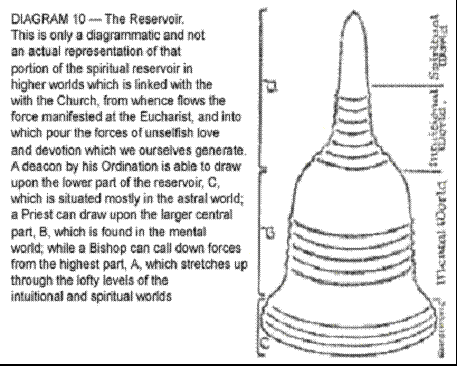

ДИАГРАММА 10. — Резервуар. Это только схематичное, а не фактическое изображение той части духовного резервуара в высших мирах, которая связана с Церковью, откуда исходит энергия, проявляющаяся в Евхаристии, и в который сливаются силы бескорыстной любви и преданности, которые мы сами порождаем. Диакон, получивший священие, способен черпать из нижней части резервуара, С, расположенного в основном в астральном мире; священник может обращаться к более обширной центральной части, B, обнаруженной в ментальном мире; в то время как епископ может призывать силы из самой высшей части, A, простирающейся через возвышенные уровни интуитивного и духовного миров.

Этот зарезервированный участок резервуара не так просто описать. Он простирается через несколько плоскостей или состояний материи, и если мы попытаемся представить его в форме, ограниченной нашими тремя измерениями, ближайшее, что мы можем выразить, это огромный колоколообразный объект, нечто вроде буддийской ступы. (Диаграмма 10.) Он разделен на три части, которые мы обозначили как A, B и C. Рукоположение диакона связывает его с краем колокола, обозначенным C, и позволяет ему черпать силу из него — силу, прежде всего, для своего собственного развития и подготовки к приему того, что предстоит; однако он также может до некоторой степени передавать ее другим посредством своей воли, и таким образом он может помогать людям как астрально, так и ментально.

Но именно на следующей стадии, на стадии священства, начинается настоящая сила. Священник черпает из части, обозначенной как B, основного тела формы; при его рукоположении эго (или душа) было более определенно пробуждено, и таким образом он может напрямую воздействовать на другие души на уровне причинного тела. Это отношение дает ему силу исправить искажение, вызванное отклонением от пути праведности, и поэтому говорят, что он может отпустить грехи. В нем также заключена сила благословлять и приносить дар Святой Евхаристии. Сила, которую священник привносит, не для себя, а для стада, которое ему поручено.

Шпиль ступы, рукоять колоколообразной формы (обозначенная как A), достигает до интуитивных и духовных плоскостей; и на это может полагаться епископ. Епископ призван быть истинным проявлением принципа Христа, способным излучать это на всех, с кем он вступает в контакт. Сила для добра, которая находится в его доступе, трудно преувеличить.

Таким образом, есть два аспекта рукоположения — дар Святого Духа, который предоставляет ключ к резервуару, и личная связь самого Христа со своим служителем. Первый из них — это официальное соединение, которое позволяет священнику, например, освящать Хостию и раздавать отпущение и благословение. Это неустранимый минимум силы, который одинаково присущ всем должным образом рукоположенным священникам и совершенно независим от их достижений в других направлениях — их духовного или благочестивого развития, например, или их понимания механизма Священнодействий, которые они совершают — так же как человек может быть быстрым и точным телеграфистом, даже если он не знает, что такое электричество, и даже если его моральный характер не безупречен.

Многие считают это странным, потому что они не поняли природу отношения священника к Священнодействию. Если бы Хостия была талисманом, в который он должен был бы вложить свой личную магнетизм, очевидно, что природа этого магнетизма была бы крайне важна. Здесь, однако, нет вопроса о магнетизации, а только о должном выполнении определенной церемонии, в которой характер исполнителя не имеет значения. Если бы верующие должны были провести исчерпывающее расследование личного характера священника, прежде чем они могли бы быть уверены в действительности полученных от него Священнодействий, был бы введен элемент невыносимой неопределенности, который практически сделал бы бесполезным это чудесно продуманное устройство Христа для помощи своему народу. Он не планировал свой благословенный дар так неумело. Чтобы сравнить большие вещи с маленькими, присутствовать на Службе Евхаристии — это как пойти в банк, чтобы снять сумму денег в золоте; руки кассира могут быть чистыми или грязными, и, безусловно, чистота предпочтительнее грязи; но в любом случае мы получаем золото. Очевидно, что с точки зрения всех интересов священник должен быть человеком благородного характера и глубокой преданности и должен тщательно понимать, насколько смертный человек может это сделать, огромную тайну, которую он совершает; но будь то так или иначе, ключ, который открывает определенную дверь, был помещен в его руки, и это открытие двери нас прежде всего и интересует.

Не могу не повторить здесь некоторую часть того, что я написал в книге «Скрытая сторона вещей» по этой теме, когда впервые исследовал её:

_Во-первых, только те священники, которые были законно рукоположены и имеют апостольскую преемственность, могут вообще произвести данный эффект. Другие люди, не являющиеся частью этой определенной организации, не могут выполнить это действие, независимо от того, насколько они преданны, добры или святы. Во-вторых, ни характер священника, ни его знание или незнание того, что он на самом деле делает, никак не влияют на результат._

Если подумать, ни одно из этих утверждений не должно казаться нам удивительным, поскольку очевидно, что речь идет о способности выполнить определенное действие, и только те, кто прошел через определенную церемонию, получили дар этой способности. Точно так же, чтобы иметь возможность говорить с определенным кругом людей, нужно знать их язык, и человек, не зная этого языка, не может с ними общаться, независимо от того, насколько он добр, искренен и предан. Также его способность общаться с ними не зависит от его личного характера, а только от того факта, что у него есть или нет способность говорить с ними, которая дается знанием их языка. Я ни на мгновение не утверждаю, что эти другие соображения лишены своего эффекта; к этому я вернусь позже, но то, что я говорю, это то, что никто не может черпать из этого особого резервуара, если он не получил эту способность, которая дана должным назначением, сделанным согласно указаниям, оставленным Христом.

Думаю, мы можем увидеть очень хорошую причину, почему именно такое устройство было создано. Нужен был какой-то план, который позволил бы одновременно всем и в тысячах церквей по всему миру получить великолепное излучение силы. Возможно, человеку с наиболее исключительной силой и святостью удавалось бы через силу своей преданности призвать количество высшей силы, сопоставимое с тем, которое получается через Службу Евхаристии, которую я описал. Но такие исключительные люди всегда чрезвычайно редки, и никогда в истории мира не было возможно найти достаточное количество таких людей одновременно, чтобы заполнить даже одну тысячную часть мест, где они нужны. Но здесь план устроен в определенной мере механически; предписано, что определенное действие, когда оно должным образом выполнено, является признанным методом привлечения силы; и это может быть сделано с относительно небольшой подготовкой любым, на кого возложена эта сила. Сильному человеку нужно подкачивать воду, но любой ребенок может открыть кран. Сильному человеку нужно сделать дверь и повесить ее на место, но когда она однажды на петлях, любой ребенок может ее открыть.

Будучи сам священником, рукоположенным в Англиканской Церкви, и зная, насколько остры споры о том, имеет ли эта Церковь действительно апостольскую преемственность или нет, я, конечно, был заинтересован в том, обладают ли ее священники этой силой. Я был очень рад обнаружить, что они ей обладают; но также вскоре узнал по исследованию, что министры того, что обычно называют раскольническими сектами, этой силой не обладают, независимо от того, насколько они добры и искренни. Их доброта и искренность порождают множество других эффектов, которые я опишу позже, но их эффекты не черпают из того особого резервуара, о котором я упоминал.

Меня особенно заинтересовал случай одного такого служителя, которого я лично знал как доброго и благочестивого человека, а также хорошо подготовленного изучателя внутренних вопросов. Вот человек, который знал гораздо больше о реальном значении акта освящения, чем девятьсот девяносто девять из тысячи священников, постоянно его совершающих; и тем не менее, я вынужден признать, что его наилучшие усилия не привели к этому конкретному эффекту, в то время как у других это, несомненно, получалось. (Опять же, конечно, он совершал другие вещи, которые они не делали — об этом больше позже). Если подумать, становится ясно, что это не могло быть иначе. Предположим, например, что определенная сумма денег оставлена богатым масоном для распределения среди его бедных братьев, закон никогда не разрешит разделить эти деньги среди других, кроме масонов, для которых они предназначены; и факт того, что другие бедные люди за пределами масонской организации могут быть более благочестивыми или заслуживающими, не имеет значения.

Еще один момент, который меня сильно заинтересовал, — это попытка узнать, в какой степени или вообще намерение священника влияет на достигнутый результат. В Римской Церкви я нашел многих священников, которые совершали Службу Евхаристии механически, как ежедневную обязанность, без каких-либо определенных мыслей по этому поводу; но из-за врожденного почтения или долгосрочной привычки они всегда, кажется, восстанавливали себя непосредственно перед моментом освящения и совершали этот акт с определенным намерением.

Затем я обратился к тому, что называется Малым Празднованием в англиканской общине, чтобы увидеть, что будет с ними, потому что я знал, что многие из них полностью откажутся от названия «священник», и хотя они могут следовать рубрике при совершении акта освящения, их намерение при этом будет точно таким же, как у служителей различных конфессий вне Церкви. Однако я обнаружил, что Малое Празднование может и действительно совершает этот эффект, в то время как другие снаружи — нет. Следовательно, я делаю вывод, что «намерение», о котором всегда говорится, что оно необходимо, должно быть не более чем намерением сделать то, что Церковь имеет в виду, без отношения к частному мнению конкретного священника о том, что это значит. Действительно, однажды был такой епископ, настолько невежественный, что явно заявил своим несчастным кандидатам на рукоположение, что он не рукополагает их как жертвоприносящих священников, а только как евангельских служителей. Однако даже в таком крайнем случае его плохо направленная воля не смогла сделать недействительным то, что его Церковь намеревалась сделать. Воистину, верно, что все Священнодействия принимаются из рук самого Христа, независимо от того, насколько слабы и невежественны инструменты, через которых они идут. Нет сомнений, что многие люди будут думать, что все это должно быть организовано совершенно иначе, но я могу только точно сообщить о том, что мои исследования показали мне как факт.

Я не должен ни на мгновение допускать, что преданность и серьезность, знание и хороший характер совершающего не имеют значения. Они имеют большое значение; но они не влияют на способность черпать из этого конкретного резервуара. Когда священник искренен и предан, его все чувство излучается на его прихожан и вызывает аналогичные чувства у тех из них, которые способны их выразить. Также его преданность вызывает неизбежный ответ, и льющаяся сила, таким образом вызванная, приносит пользу его приходу, также как и ему самому; так что священник, который вкладывает свое сердце и душу в работу, которую он делает, может считаться, что принес двойное благословение своим людям, хотя второй класс влияния вряд ли может рассматриваться как находящийся в том же порядке величины, что и первый. Это второе излияние, которое вызывается преданностью, конечно, можно найти также часто вне Церкви, как и внутри нее.

Дополнительная сила помощи, которую священник может развить, во многом зависит от его культивирования второго дара, который он получает на рукоположении — личной связи, установленной между ним и его Господом и Учителем. Это также было объяснено Христом Своим апостолам; Он говорит им, что Он молился Отцу Своему, чтобы они были одно с Ним таким же образом, как Он одно со Своим Отцом. Люди думают о таких высказываниях довольно расплывчато и не осознают, что они относятся к определенным научным фактам. Снова Он говорит с абсолютной ясностью: «Вот, Я с вами всегда, даже до скончания века».

Если мы рассмотрим внутреннюю сторону церемонии рукоположения, увидим, что это обещание соблюдается в особом смысле. Речь идет не только о том, что в священнике есть принцип Христа, как и в каждом человеке; так велика невероятная любовь и снисхождение Великого Учителя Мира, что посредством акта рукоположения Он привлекает Своего священника к тесному личному союзу с Собой, создавая определенную связь, через которую может течь божественная сила, делая их каналами для Него, подобно, на почти бесконечно нижнем уровне, таинственному и удивительному способу, которым Он является каналом для Второго Аспекта, Второго Лица Пресвятой Троицы. Конечно, многие священники совершенно не осознают этого; к сожалению, есть и такие, кто живет так, что мало пользуется великолепными возможностями, которые этот канал открывает для них. Тем не менее это утверждение абсолютно верно; и поэтому описать Его как по-прежнему присутствующего в Своей Церкви, как по-прежнему явно руководящего теми, кто открывает себя для Его влияния, — это не просто красивая речь, а выражение возвышенной реальности.

Диаграмма не может выразить эту великую духовную истину, но она может помочь нам понять немного о методе её действия. Всё, что это делает, имеет свою ценность, потому что факт становится для нас более реальным, когда мы таким образом можем увидеть его немного лучше. Те, у кого ещё не открыт в себе дар ясновидения, фактически не могут видеть эти процессы, как могут некоторые из нас; но они могут сформировать своё собственное мнение о разумности того, что сообщается теми из нас, кто видит, и они также могут получить немало доказательств по различным вопросам — иногда из своих собственных чувств, иногда из чувств других. Для тех, кто меня знает, я даю уверение, что все записанное здесь является результатом часто повторяемых наблюдений и экспериментов, поэтому я не сомневаюсь в его точности насколько это возможно.

Я заметил в ранней главе, что Бог сотворил человека по Своему образу и подобию, и что, следовательно, душа в человеке проявляется в трех аспектах, соответствующих на его уровне трехкратному проявлению Божества; а также что в этом случае нижнее не является простым отражением или символом высшего, но фактически каким-то образом его выражением.

Истинный человек, Монада (отмечена цифрой 1 на Диаграмме 11), является искрой божественной жизни, существующей на плане, который, по этой причине, мы называем монадическим. Этот план в настоящее время находится за пределами нашего ясновидческого исследования, и самое высокое, что кто-либо из нас фактически знает о человеке на основе прямых наблюдений, это проявление этой Монады на ступень ниже как Тройной Дух. Каждый из трех аспектов или разделов этого духа имеет свои собственные качества и характеристики. Первый остается на своем уровне, в то время как второй спускается (или, вернее, движется наружу) на интуитивный план; третий спускается (или движется наружу) на две стадии и проявляет себя в верхней части ментального мира как интеллект. Эти три проявления (отмеченные цифрами 2, 5 и 7 на диаграмме) в совокупности составляют душу или эго в человеке; она обитает в причинном теле и в этом теле часто называется аугоэйдом. Она переходит из жизни в жизнь неизменной, за исключением такого развития, которое может прибавиться к ней от добрых дел каждой инкарнации. За принципами, обозначенными цифрами 5 и 7 (интуиция и интеллект), остаются еще три других, в нас пока еще скрытых и неразвитых, которые обозначены цифрами 3, 4 и 6 (рис. 1, Диаграмма 11). Должно, конечно, быть понято, что 2, 5 и 7, хотя и не являются фактически скрытыми, как другие, все же очень далеки от полного развития, которое они достигнут в совершенном духе. (Рис. 10, Диаграмма 11.)

Христос, Господь наш, есть Совершенный Человек, как нам говорится в Атанасиевом Символе Веры. В Нём также эти принципы существуют в точно таком же порядке, но в Его случае все они полностью развиты и мистически едины со Вторым Лицом Пресвятой Троицы. Вторым из даров, передаваемых при рукоположении, является связывание некоторых из этих принципов в рукополагаемом с соответствующими принципами его Господа и Учителя, так что создается определенный канал, по которому будут течь духовная сила и мудрость, вплоть до максимального предела восприимчивости рукополагаемого.

Это открытие канала является настолько значительным отступлением от обыденной жизни, что его можно сделать только поэтапно, и первый шаг к этому фактически является психической хирургической операцией. Это производится при рукоположении в диаконат, в то время как субдиаконат (Рис. 2, Диаграмма 11) является периодом подготовки, предназначенным для приведения пациента в состояние, благоприятное для успеха операции. Дарование Святого Духа, описанное выше, которое дает священническую силу, полно, определенно, окончательно на каждом из его этапов и одинаково во всех случаях; но это операция связывания человека с Христом, хотя и не может потерпеть неудачи, может тем не менее преуспеть более полно в одном случае, чем в другом, из-за большего или меньшего развития субъекта на пути эволюции, что определяет степень его чувствительности к божественному влиянию. Эта чувствительность также развиваема; она может быть значительно увеличена после рукоположения благодаря искреннему стремлению и преданности, а также решительным усилиям священника привести свою человеческую природу в гармонию с божественной Природой — жить жизнью Христа.

При рукоположении диакона (Рис. 3, Диаграмма 11) первое сверло пронзает скалу, и устанавливается определенная связь, интеллект (обозначенный 7 на диаграмме) присоединяется к соответствующему принципу в Христе, так что последний может влиять на первый и стимулировать его к благотворной активности. Это вовсе не значит, что это обязательно произойдет; это зависит от диакона; но по крайней мере путь открыт, связь установлена, и ему предоставляется возможность сделать из этого все, что он может. Ему нужно приобрести как можно больше знаний об этих внутренних вещах души и стремиться усердно развивать как высший, так и нижний разум в себе, чтобы в обоих он мог отражать и выражать мысль своего Господа. "Пусть в вас будет тот же разум, что и в Иисусе Христе". Он должен стремиться приспособиться к своему новому состоянию, в полной мере воспользоваться предоставленной ему возможностью. Таким образом, он будет готов в должное время принять высшее благословение священнического Сана.

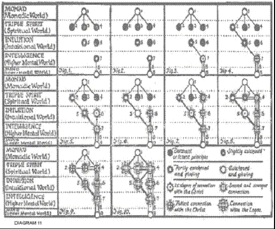

Диаграмма 11 — Пробуждение человеческих принципов при рукоположении. На диаграмме 1 представляет Монаду; 2, 3 и 4 — тройной Дух, проявляющийся в духовном мире; 5 и 6 — двойственная интуитивная природа в мире интуиции; 7 — Разум в причинном или душевном теле; 8 — связь между индивидуальностью и личностью; 9 представляет ум в ментальном теле.

Рис. 1. У интеллигентного и культурного мирянина причинное тело частично пробуждено. Может также быть небольшое пробуждение Интуиции, 5, и даже Духа, 2. Связь, 8, между индивидуальностью и личностью слаба.

Рис. 2. При рукоположении субдиакона связь, 8, расширяется, чтобы подготовить ее к внезапному расширению, которое произойдет на следующем рукоположении.

Рис. 3. При рукоположении в диаконат связь расширяется, становясь каналом, и Разум, 7, связывается с соответствующим принципом Христа. Принцип 5 также в некоторых случаях может быть пробужден и слегка освещен, устанавливая тем самым небольшую линию связи между ним и 7.

Рис. 4. При первом возложении рук в рукоположении священства принципы 2 и 5 заставляются сверкать, между 2 и 5 устанавливается линия, в то время как уже существующая между 5 и 7 усиливается. Сверкание обычно слабое в 2, но более выраженное в 5. Канал 8 расширяется.

Рис. 5. При втором возложении рук принцип 5 в новом священнике связывается с принципом Христа, в то время как ранее установленная связь с 7 укрепляется. Косая линия между 2, 5 и 7 усиливается, и 7 открывается еще больше, чтобы допустить поток большей силы, исходящей от косой линии.

Рис. 6. Развитие идеального священника возможно для человека с большой решимостью, который на протяжении многих лет работает над укреплением связи между своими принципами и принципами Христа. Он может усилить установленную связь с 6 и 7 и может пробудить к активному действию принципы 2 и 5, сделав себя каналом исключительной силы.

Рис. 7. При ординации епископа, когда произносятся фактические слова ординации, принципы 4 и 5 связываются с Христом, и уже установленные связи с 6 и 7 значительно усиливаются.

Рис. 8. Когда голову епископа мажут миром, его принципы 2 и 3 сверкают наиболее замечательным образом. Три линии, соединяющие принципы 4, 6 и 7, указывают на то, что епископ может привлечь в причинное тело и таким образом излучать в благословение тройную силу Тройного Духа.

Рис. 9. Развитие идеального епископа возможно для того, кто использует каждую возможность. Все его принципы становятся отзывчивыми каналами к силе и любви Христа, и он становится настоящим солнцем духовной энергии и благословения.

Рис. 10. Совершенный человек не только связан с Христом и с его собственным Высшим Я, Монадой, но становится все больше и больше проявлением Логоса, Божества, которое породило солнечную систему. Он становится Учителем, для которого воплощение больше не требуется.

Обязанности священника очень велики, поскольку в его руках гораздо больше силы. Для него связь поднимается на уровень выше, и до сих пор скрытый принцип, который мы обозначили как 6, активизируется и связывается с принципом Христа. Это также влечет расширение трубы от 7, которая была ранее открыта, таким образом, она может передавать гораздо больший объем силы. Кроме того, в игру вступает другой тип связи, который для предыдущего как открытие Маркони по отношению к обычной форме телеграфии. Кларвидящему видению ясно различимая линия огня связывает принципы 6 и 7 у священника с его Учителем; но кроме этого, дух и интуиция в нем (обозначенные как 2 и 5 на Рис. 4, Диаграмма 11) зажигаются симпатическими вибрациями в гармонии с ослепительным светом соответствующих принципов в его Господе.

Обычно этот эффект незначителен в случае духа, но очень заметен в интуиции. Каждый, в ком развита способность к ясновидению, сразу поймет разницу между этими двумя методами связи. Но для человека, у которого еще не развит это внутреннее чувство, вероятно, невозможно объяснить это, кроме как громоздкой символикой, которую я только что принял. Результат заключается в том, что посредством этого второго аспекта посвящения священник объединяется с своим Учителем и становится "Его человеком", в очень реальном смысле слова становясь аванпостом Его сознания, каналом для Его благодати, раздатчиком Его силы народу — на английском сельском диалекте, пастором, что, конечно, означает ничто иное, как человека, представляющего Христа в определенной приходе.

Если помнить происхождение слова "персона" от латинских per (через) и sona (звук), и далее иметь в виду, что persona использовалась для обозначения маски, которую носил римский актер и через которую проходил звук его голоса, мы начнем понимать, что старое слово "пастор" предназначено передать. Очевидно, что задачей пастора является оживление этой священной внутренней связи и все большее и большее становление личной проявлением своего Господа. Тем более печально признавать, что тысячи священников используют только механическую связь с резервуаром, что позволяет им выполнять свои официальные обязанности, и остаются неосведомленными об этой прямой индивидуальной связи с Христом, служителями которого они являются. К счастью, существует также много священников, которые, не зная ничего о науке всего этого, тем не менее действительно прекрасны и христоподобны в своей жизни, так что Его сила течет через них мощно и сладко для исцеления Его народа.

Посвящение епископа представляет высшую возможность достижения на этой линии Святых Служб. В его случае две очень важные связи добавляются к тем, которыми обладает священник. Во-первых, линия интеллекта, впервые открытая на диаконате и продвинутая еще на одну ступень в священстве, теперь значительно расширяется и поднимается до самого дальнего предела, в настоящее время доступного нам, третий аспект Тройного Духа, обозначенный как 4 на Диаграмме 11, Рис. 7.

Во-вторых, прямая связь открывается между интуицией (которую мы обозначили как 5) и соответствующим принципом в нашем дорогом Господе. Это функция, которая дает силу передавать Посвящения, и это также означает потенциальность пробуждения принципа Христа до второй стадии (3). В епископе, следовательно, мы находим прямую связь, работающую для 4, 5, 6 и 7, и сильное симпатическое сияние в 2 и 3. Мы сразу видим, насколько тесно епископ связан с Господом, за которого он действует как легат, и какая огромная сила для добра вложена в его руки.

Теперь мы рассмотрим и прокомментируем обязанности для различных стадий этих старших Служб.

#### Субдиаконат

Этот орден в основном является лишь подготовкой к следующему этапу и имеет много общего с младшими орденами; действительно, он, кажется, считался одним из них до середины XII века. Самое раннее историческое упоминание об этом ордене находится в письме Папы Корнелия к Фавию из Антиохии в 255 году н. э. Святой Киприан, писавший в том же веке, также упоминает об этом, как и синод в Эльвире в Испании пятьдесят лет спустя. Греческая Церковь до сих пор считает его младшим орденом, а Церковь Англии вообще его игнорирует. В Новом Завете нет ссылок на него, и не утверждается, что он был учрежден Христом во время Его земной жизни или даже Его непосредственными апостолами. С внутренней точки зрения он не дает никакой силы, но помогает подготовить путь к тому, что мы назвали хирургической операцией диаконата.

В Службе Римской Церкви по принятию в этот орден не происходит возложение рук, но оно есть в Греческой Службе. В этом отношении мы последовали примеру последней, поскольку наш ритуал предписывает Епископу положить свою правую руку на голову ординанта и торжественно принять его во имя Христа Господа нашего, как это делалось в случае с младшими орденами. Римская Церковь считает этот орден обязывающим его получателя к целибату и ежедневному чтению божественного Официума. Общей целью обряда является явно то, чтобы позволить эго выразить себя более свободно через личность. Процитирую обращение Епископа, как и раньше.

_Возлюбленные сыны, этот орден субдиакона является ступенью испытания для более высоких орденов диакона и священника. Он дает тем, кто его получает, большую силу и устойчивость намерений, чтобы с неподдельным усердием посвятить свою жизнь Христу в Его Святой Церкви. Такова, в самом деле, ответственность, возложенная на тех, кто в этих высших орденах становится представителем Христа, что часто назначается период испытания на этой подготовительной ступени субдиаконата, чтобы те, кто стремится к такому возвышенному состоянию, могли проверить себя, особенно если они молоды по возрасту или по опыту в церковных делах, чтобы они не вступали легкомысленно или необдуманно в такое торжественное дело._

_Вы, возлюбленные сыны, уже предложившие себя на службу Богу и на продвижение Его царства на земле, теперь движимы в своих сердцах стремлением посвятить себя еще больше Его службе и службе вашим братьям. На это намерение мы призываем божественное благословение; и с помощью и готовым согласием верующих, здесь собравшихся, мы теперь приступим к выполнению нашего служения, чтобы принести вас, как святую жертву, в присутствие Христа, не сомневаясь, что в конце концов вы, имея свидетельство верной службы, будете сиять, чистыми и яркими, как драгоценные камни в короне нашего Господа._

В римском обряде здесь следует утомительная и неуместная литания, полная раболепных молений о милосердии и избавлении. Вместо этого мы ввели метрическую литанию Святого Духа, которая, предположительно, занимает на этой подготовительной Службе место, занятое на больших посвящениях _Veni Creator_. Значение этих литаний, будь они римскими или либеральными, заключается в трех молениях, предложенных Епископом, в ходе которых он делает особое усилие, используя знак силы, очистить физическое, астральное и ментальное тела кандидатов. Один крест совершается для физического тела, два для астрального и три для ментального. Эти три стиха литании поется Епископом в одиночку; и для более эффективного выполнения своей задачи он встает с колен, надевает свою митру и берет в руки свою пастырскую посох, чтобы, таким образом полностью вооруженный, быть более совершенным каналом для божественной силы. Стихи таковы:

_Мы умоляем Тебя, услышь нашу молитву:_

_Благослови ✠ Твоих слуг, падших ниц здесь;_

_Держи их в Твоей любящей заботе;_

_Услышь нас, Святая Троица._

_Услышь Твоих слуг, молящихся сейчас,_

_Помоги Твоим избранным сегодня,_

_Благослови ✠ и ✠ освяти их навеки;_

_Услышь нас, Святая Троица._

_Излей Твою живую доброту великую_

_На каждого избранного кандидата,_

_Благослови ✠ их, ✠ освяти, ✠ посвяти;_

_Услышь нас, Святая Троица._

Заключительный стих литании затем поется всеми, и епископ продолжает свою речь следующим образом:

_Дорогие возлюбленные сыны, которые собираютесь быть принятыми в чин субдиакона, вам следует знать, какой род служения в прошлые времена был возложен на ваш Орден. Субдиакону принадлежало обеспечивать водой Службу у Алтаря, помогать диакону, мыть алтарные полотенца и корпорали, передавать диакону чашу и патену для использования в жертве, охранять двери церкви или врата святилища и в более поздние времена читать послания перед народом. Стремитесь же, исполняя охотно с аккуратностью и усердием те из этих видимых служений, которые все еще являются частью вашего офиса, проявить истинное почтение к невидимым вещам, которые, можно сказать, они символизируют. Ибо Алтарь Святой Церкви является троном самого Христа, и вполне подобает, чтобы те, кто служит перед ним, поступали осмотрительно и осознавали, что на них возложена высокая честь его охраны. Поэтому, будьте бдительными стражами небесной борьбы, чтобы, всё больше развиваясь в добродетели, вы могли сиять, чистыми и целомудренными, в обществе святых. Стремитесь усердно следовать примеру нашего божественного Учителя, чтобы вы могли достойно служить в божественной жертве, как в невидимом святилище ваших сердец, так и в видимом святилище Святой Церкви._

_С древних времен также требуется от тех, кто входит в этот Орден, чтобы они стремились приобрести определенные добродетели характера, такие, как символизируются переданными им одеждами. Амик символизирует сдержанность речи; манипул — любовь к служению или усердие во всех добрых делах; туникал — дух радости и веселья, или свободу от забот и уныния, то есть уверенность в Добром Законе, которую можно интерпретировать как признание Плана, открывшегося Всемогущим Богом для совершенствования Его творения._

Затем епископ запрашивает от кандидатов торжественное обещание, что они, насколько это в их силах, будут упорядочивать свою жизнь в соответствии с предписаниями, которые он изложил; и после их согласия он простирает руки к ним и молится, чтобы их сердца и разумы были так открыты для принятия того, что он собирается им дать, чтобы они были постоянны в служении Христу, и чтобы они так развивались в знаниях, чтобы могли предложить свои жизни как святую и непрерывную жертву Ему. При этом он делает над ними знак креста; и сразу после этого каждый кандидат становится на колени перед ним и официально принимается в Орден субдиакона, как и в младших орденах.

Эффект субдиаконата следует рассматривать в связи с тем, что предстоит на следующем этапе. При рукоположении диакона предстоит серьезная операция, и считается, что она будет более успешной, если была проведена определенная подготовка. Епископ пытается осторожно расширить связь (Рис. 2, Диаграмма 11) между душой и телом, чтобы первая могла более полно воздействовать на последнее и через него.

Затем епископ приступает к передаче каждому неофиту того, что можно было бы назвать рабочими инструментами его степени, и облачает его в его особые знаки. Сначала он передает ему пустую чашу и патену, напоминая ему, чтобы он так вел себя в своем служении, чтобы быть достойным в глазах Божьих. Затем во имя Святой Троицы, и с тройным знаком силы он облачает его в амик, манипул и туникал, в каждом случае снова ссылаясь на добродетели, которые эти одежды предполагается символизировать. Он затем передает каждому книгу Посланий, давая ему полномочия читать их в Святой Церкви Божьей как для живых, так и для мертвых; и заканчивает рукоположение торжественным благословением, особенно с тем, чтобы неофиты с постоянством и рвением сохраняли жизнь, которую они начали.

Степень субдиакона может быть присвоена только во время празднования Святой Евхаристии и непосредственно после прочтения Сборов; и после рукоположения один из новопосвященных субдиаконов назначается для чтения Послания дня.

#### Диаконат

Ординация диаконов происходит после послания и до начала исполнения градуала. Служба начинается с представления кандидатов священником, который приводит их перед епископом и говорит:

_Преосвященный Отец, наша святая Мать, всеобщая Церковь, молит вас орденировать этих здесь присутствующих субдиаконов в должность диаконата._

Епископ спрашивает, знает ли он, достойны ли они этого продвижения, и тот отвечает:

_Насколько человеческая слабость позволяет мне судить, я и знаю, и удостоверяю, что они достойны этой должности._

Затем епископ обращается к собору следующим образом:

_Дорогие возлюбленные братья и сестры, эти субдиаконы, стоящие перед вами, представлены для Ордена Диаконата, чтобы быть необратимо посвященными на службу Христу даром Святого Духа Божьего. Сознавая священное доверие, возложенное на нас, мы стремились убедиться, что только такие, которые могут быть полезными для святой Церкви Христовой, таким образом представлены; тем не менее, для дополнительной предосторожности, подобает нам узнать, знает ли кто-то причину или справедливое препятствие, почему эти лица не должны быть допущены к исполнению обязанностей диаконата. Если же кто-то из вас знает что-либо против них, во имя Божье и во благо Его Церкви, пусть смело выйдет вперед и скажет; однако, пусть он помнит о своем собственном состоянии._

Этот последний пункт предназначен для предупреждения любого возможного критика о опасности клеветы и необходимости быть уверенным в своих аргументах, прежде чем решаться на какую-либо негативную критику. Если никто не высказывается, Епископ продолжает следующим коротким наставлением:

_Дорогие возлюбленные сыны, которые сейчас будут возведены в Орден Диакона, постарайтесь достойно принять его и беспорочно выполнить свои обязанности, когда вы его получите. Диакону принадлежит служить у Алтаря, читать или интонировать Евангелие, проповедовать и, при отсутствии Священника, совершать крещение. Поэтому, дорогие возлюбленные сыны, так как вам теперь поручено служить стаду Христову, будьте выше всех недостойных склонностей, которые враждуют против души; будьте приличными, вежливыми в поведении и полными благородных желаний и любви к Богу и человеку, как это и подобает служителям Христа и управителям, наделённым ответственностью распределять тайны Божии. И так как у вас теперь есть доля в приношении и распределении Тела и Крови Господа, как гласит Священное Писание: "Будьте чисты, вы, которые несете сосуды Господни". Вашей заботой должно быть показать другим, живыми делами, Евангелие, которое ваши уста будут провозглашать им, чтобы о вас могло быть сказано: "Как прекрасны на горах ноги вестника, возвещающего мир"._

Он принимает их обещание стремиться достойно использовать силу, которую он собирается им передать, и они затем ложатся лицом к земле перед Алтарём, пока поётся метрическая литания — не в этот раз Святого Духа, а особый призыв к Господу Христу, узнавая Его присутствие, объявляя, что Епископ собирается использовать силу, переданную ему тем же Господом на его ординации, и просит, чтобы его руки были укреплены для этой великой работы.

Затем Епископ произносит молитву, в ходе которой дважды делает знак креста над кандидатами. В первый раз он делает это с намерением крепко удерживать три "транспортных средства", которые были очищены в литании, и работать через них до связи, соединяющей личность с душой — связи, которую индийские философы называют _анташкараной_. Здесь, как и в субдиаконате, цель заключается в том, чтобы расширить эту связь, и таким образом дать душе больше влияния на его тела.

Если Епископ имеет счастье быть ясновидящим и таким образом может видеть гипофиз, и следить за действием силы, которую он отправляет, тем лучше, поскольку он тогда может направлять её более научно. Таким образом, полностью открыв путь к каузальному телу, он направляет свой второй крест на само это тело, с целью продвинуть этот процесс немного дальше, чтобы кандидат мог получить больше силы Святого Духа. Так подготовив путь насколько это возможно, отправляется традиционный призыв к Богу Святому Духу — _Veni Creator_; и сразу после этого Епископ (в митре и держа пастырский посох в левой руке) кладет свою правую руку на голову кандидата и говорит:

_Прими Святого Духа для должности и работы диакона в Церкви Божией._

При этих словах происходит стремительный спуск силы; однако это выражение дает лишь неполное представление, потому что на самом деле эта сила мелькает вверх и вниз множество раз с невероятной скоростью, точно так же, как молния. Объем силы, которую человек может принять, зависит от подготовки, которую он провел, от степени, в которой он открыл себя для божественного влияния. Скорлупа теперь сломана, установлена связь с его Господом и Учителем, насколько это касается принципа 7 (Рис. 3, Диаграмма 11); канал расширен, и ему следует сохранять его в этом улучшенном состоянии, поддерживая постоянное течение божественной благодати через него для помощи своим ближним.

Эта идея ясно ставится перед новоорденированным диаконом, когда епископ облачает его в белую столу, говоря:

_Прими ты белую столу как символ своего служения; помня, что по мере того как для службы и любви к человеку ты будешь использовать силу, теперь находящуюся в тебе, так она будет течь через тебя с все большей полнотой и славой._

Произнося это, он делает знак креста над сердцем диакона, так что пробуждение или укрепление интуитивного принципа (5), которое могло произойти в момент рукоположения, будет сохранено и усилено. Стола, которая всегда предполагается символизировать иго Христово, обозначает служение диакона только из-за поясообразного способа, которым он носит ее через левое плечо и закрепленную под правой рукой. Священник носит ее через оба плеча, чтобы показать, что он полностью взял на себя иго и ответственность, лишь небольшая часть которой лежит на диаконе.

Затем епископ во имя Святой Троицы и с тройным крестом облачает каждого нового диакона в далматику, говоря:

_Да облечет тебя Господь в одежду довольства и всегда окружит тебя далматикой справедливости._

В том же святом Имени и с тем же тройным знаком силы, епископ даёт ему полномочия читать Евангелие в Церкви Божией, как для живых, так и для мёртвых. В каждом из этих случаев трёхкратное влияние, которым так особенно обладает епископ, активизируется, изливается, сильно призывается к проявлению, так что, воздействуя на соответствующие принципы в ординации, оно пробуждает их к симпатической вибрации, так что они, по крайней мере на время, становятся гораздо более активными и восприимчивыми, чем когда-либо ранее. Задача диакона заключается в том, чтобы поддерживать и усиливать этот большой временный прогресс.

Служба завершается красивой молитвой, относящейся к тесному союзу с ангельскими воинствами, которыми радуются те, кому посчастливилось служить в святилище.

_О Христос, Господь Любви, который, посредством небесного и земного служения Ангелов, которое Ты упорядочиваешь, изливаешь на все стихии эффективность Твоей воли, излей на Твоих слуг полноту Твоего ✠ благословения, чтобы в общении с этими славными Ангелами они могли достойно служить у Твоих святых алтарей, и, облечённые небесной добродетелью и благодатью, они всегда были бдительными и ревностными в служении Твоей Церкви, Ты, который царствуешь во веки веков. Отв. Аминь._

Крест, сделанный в конце этой молитвы, усиливает всё, что было сделано ранее. Его особая цель - уплотнить стены значительно расширенной связи между душой и личностью, укрепить их и удерживать их крепче в их новой форме. Это как будто внутри устанавливается некий каркас, подкладка, чтобы предотвратить сужение расширенного канала. Легко понять, что очень выгодно иметь значительный интервал между ординацией в диаконы и ординацией в священники, чтобы эту связь в её расширенной форме можно было укрепить. Первое открытие этого канала, которое мы сравнили с хирургической операцией, является таким большим изменением, таким радикальным отходом от всего, что было до этого, что человеку нужно время, чтобы приспособиться к новым условиям, прежде чем на него будет наложено дополнительное напряжение. Поэтому Церковь предписывает, чтобы, по возможности, неофит оставался в диаконских санах в течение года, прежде чем быть произведенным в священники.

Очевидно, насколько неоценимы преимущества тех из духовенства, кто знает, что они делают в этих вопросах, и тем более тех, кто может видеть эффект своих действий. Большинство епископов работают вслепую, но никто не должен сомневаться, что их цель достигнута; однако, несомненно, она была бы достигнута гораздо полнее, если бы у них было больше знаний о духовном мире и о действии его сил.

Один из новоординированных диаконов читает Евангелие, а Святая Евхаристия затем продолжается в обычном порядке, за исключением того, что особое упоминание делается в молитве освящения о тех, кто в святом Имени Христовом только что был принят в Орден Диаконов. Такой пункт вставляется во все старшие ординации, но не в младшие; действительно, эти последние могут быть совершены в отрыве от Службы Евхаристии, хотя это должно быть до полудня.

#### Священство

Посвящение в священство торжественно совершается после исполнения Градуала и начинается с представления кандидатов священником, как и в предыдущей Службе. Затем епископ обращается с наставлением:

_Дорогие братья во Христе, так как и капитан судна, и пассажиры на нем имеют равные основания для уверенности или страха, важно, чтобы все, чьи интересы общи, были единомышленниками. И не без цели Отцы Церкви установили, что народ тоже должен быть консультирован при выборе тех, кто будет служить у Алтаря, потому что то, что многим неизвестно о жизни и обращении представленных, часто известно немногим, и все неизбежно будут более охотно подчиняться тому, в посвящении которого они выразили свое согласие._

_Если же у кого-либо есть что-либо против этих людей, пусть во имя Божье и для блага Его Церкви смело выступит и скажет; однако пусть помнит о своем собственном состоянии._

После паузы епископ, обращаясь к посвящаемым, наставляет их следующим образом:

_Дорогие сыны, теперь наша задача торжественно и в последний раз, перед тем как будет совершен необратимый акт, который возложит на вас сладкую, но тяжелую ношу священства, предупредить вас о величии и ответственности этой должности и о том, как велики обязанности тех, кто в нее посвящен. Священнику принадлежит приносить жертву, благословлять, председательствовать, разрешать и связывать, помазывать, проповедовать и крестить._

_Поэтому, дорогие сыны, которых выбор наших братьев избрал для посвящения в эту должность как наших помощников, только после тщательного обдумывания и с великим благоговением следует приближаться к такому возвышенному служению, и велика должна быть забота о том, чтобы те, кто избран представлять нашего Благословенного Господа и председательствовать в Его Церкви, отличались великой мудростью, достойной жизнью и упорным следованием справедливости и истине. Сохраняйте, значит, эти вещи в памяти и пусть плоды их проявляются в вашем поведении и разговорах, в целомудренной и святой непорочности жизни, в непрерывном обилии всех добрых дел. Постоянно стремитесь увеличивать в себе совершенство небесной любви, чтобы, наполнив свои сердца любовью к Богу и к человеку, вы стали раздателями благословения Христова и носителями Его Любви в сердца людей. Никогда не забывайте, какая великая привилегия ваша привести маленьких к Нему через врата крещения и снять тяжелую ношу скорби и греха мира благодатью отпущения. Внимательно рассмотрите, что вы делаете, подражайте тем вещам, которые в Церкви Божьей ваша обязанность обрабатывать и осуществлять. И поскольку теперь вы будете призваны приносить Святую Жертву перед престолом Божьим и совершать священные Таинства любви Господней, будьте ревностными в очищении своих членов от всех недостатков. Вы, чья обязанность приносить Богу сладкий благовонный кадильный дым молитвы и поклонения, пусть ваше учение будет духовным средством для народа Божьего; пусть ваши слова благословения и утешения будут их помощью и силой; пусть сладкий аромат вашей жизни будет благовонием в Церкви Божьей._

_Таким образом, как словом, так и делом, вы можете создать храм Божий, так что ни мы не появимся упрекаемыми перед Господом, Который в Своем Имени так возвысит вас, ни вы, которые так будут возвышены; но скорее, пусть мы все найдем принятие и обильное вознаграждение за сегодняшний акт, который в Своей бескрайней доброте и любви Он удостоит даровать._

Обычное обещание стремиться достойно использовать данную силу затем запрашивается и даётся, а также поётся специальная литания посвящения, как и на предыдущей Службе, кандидаты лежат перед Oлтарем лицом к земле. Молитва, следующая за этим, начинается с тех же слов, что и молитва для диаконата, но отличается в последующих прошениях.

_Господи Христе, Источник всего добра, Кто Святым Духом учредил разные Саны в Своей Церкви и для её большего обогащения и совершенствования щедро изливаешь Свои дары на людей, изливай Твою освящающую благодать на этих Твоих слуг, которые собираются войти в число священников Твоей Церкви. Пусть их рука будет крепкой для совершения, пусть мудрость руководит и направляет их жизнь, пусть красота святости освящает их и распространяет духовный аромат на их пути, чтобы во всех их делах, начатых, продолженных и завершенных в Тебе, они могли явить изобилие Твоей силы и прославить Твоё Святое Имя, О Ты великий Царь Любви, Кому слава и поклонение от людей и ангельских воинств. Отв. Аминь._

Сразу после этой молитвы, епископ в полной тишине кладет обе руки на голову каждого кандидата. То же самое делают после него поочерёдно все присутствующие священники, каждый из которых интенсивно желает дать всё, что может, для помощи и освящения кандидата. Епископ использует свою силу, чтобы влить в него силу Христа и привлечь его насколько возможно ближе к Нему. Обращаясь к Диаграмме 11, Рис. 4, три принципа духа, интуиции и интеллекта (пронумерованные как 2, 5 и 7) в кандидате заставляются сверкать с невероятным пылом. Косая линия, соединяющая их, активируется и значительно расширяется, так что дух не только становится гораздо ближе к духу Христа, но и может выразить себя гораздо полнее, чем раньше, через интуицию и интеллект.

Это вовсе не означает, что он будет делать это в повседневной жизни; это зависит от индивидуальных усилий священника; но потенциал есть, и тот, кто знает об этом, может использовать его с большим эффектом, если захочет. Вся аура кандидата значительно расширяется под этим прямым притоком силы от Христа; каждый атом внутри него трясется, так как различные порядки его спирилл активизируются. Приток силы вливается в 2, 5 и 7 через соответствующие принципы самого епископа, что является причиной, по которой он кладет обе руки на голову кандидата, вместо того чтобы использовать только правую руку для распределения того, что протекает через его пастораль в левой руке, как он делает в случае с диаконом или при обряде Благословения.

Когда аура неофита таким образом расширена и чрезвычайно чувствительна, священники вливают в неё своё влияние. Они не передают силу, как делает епископ, но каждый даёт свою долю добра; и добавляет все, что у него есть ценного, пока неофит в состоянии это принять. Священники могут вполне вероятно быть на разных Лучах и в любом случае наверняка отличаются по характеру, поэтому у каждого есть какое-то качество для вклада. Предоставление священства, прежде всего, это предоставление замечательной, грандиозной возможности, и не жалеют усилий, чтобы помочь получателю воспользоваться ей.

Сила Христа, прямое излияние от Второго Лица Святой Троицы, всегда приходит в тишине, так как еще не опустилась достаточно в материальность, чтобы проявиться как звук; но Святой Дух пришел как ревущий, могучий ветер и явил Себя в огненных языках, даруя апостолам необычную силу речи. Таким образом, при втором возложении рук позже используется слово силы, как и в других Службах; но огромный дар первого возложения спускается в тишине, которая ощущается. Это действие на самом деле делает человека Священником и наделяет его силой совершать Святую Евхаристию. Молитва, которая непосредственно следует за рукоположением, красиво ссылается на это:

_О Господь Христос, чья сила в тишине, даруй, чтобы эти Твои слуги, которых Ты теперь присоединяешь к Себе в святом союзе священства, отныне верно служили священнической силой тем, кто просит в Твоем Имени.  Отв. Аминь._

_Молимся, дорогие братья, чтобы Всемогущий Бог умножил дары Духа в этих Его слугах для работы священства._

В Либеральной Католической Церкви на этом месте мы поем _Veni Creator_ и сразу переходим ко второму возложению рук; но в Римской Церкви совершенно иное устройство. В её ритуале на этом месте идет интересная молитва, вызывающая на новосозданных священников "благословение Святого Духа и силу священнической благодати" — молитва, которая первоначально предназначалась для выполнения той работы, которую теперь делает второе возложение. В случае диакона принцип 7 на нашей диаграмме был связан с соответствующим принципом в Господе Христе; теперь та же связь устанавливается для принципа 6, в то время как к 7 значительно усиливается и расширяется. Диагональная линия, вызванная на первом возложении между 2, 5 и 7, усиливается; и 7 раскрывается, чтобы сила из этой косой линии могла лучше течь, так как без этого существует опасность большого затора.

Однократный знак креста, сопровождающий произнесение вышеупомянутых слов, кажется, был недостаточен для тщательного выполнения работы, и так около двенадцатого века было введено второе возложение с его определенной скриптурной формулой. Некоторые римские книги, действительно, считают эту молитву за "благословение Святого Духа" (которая читается епископом с распростертыми руками над новыми священниками) как второе возложение и называют то, что идет позже в Службе, третьим.

После произнесения этой молитвы в римском обряде поется _Sursum Corda_, но вместо "следовательно, с ангелами и архангелами" идут слова: "источник иерархических честей и Раздатчик каждого достоинства". Молитва или эксордий продолжается через своего рода исторический обзор примеров раннего священства, упоминая Моисея, Элеазара и Ифамара. После этого римский епископ перекладывает столы новых священников и облачает их в сложенный хоругвь. Затем он читает молитву, которая в ранних Понтификалах называлась Посвящением или иногда Завершением священника. Она призывает (со знаком силы) благодать Божьего благословения на неофитов и играет полезную роль в церемонии, что будет объяснено, когда мы рассмотрим нашу собственную версию этой молитвы, которую мы размещаем сразу после второго возложения.

После этой молитвы (все еще по римскому обряду) идет _Veni Creator_, и во время его исполнения епископ мажет и связывает руки своих новых священников и дает им полномочия приносить жертву Богу и совершать Мессу как для живых, так и для умерших.

Затем обыденный порядок Службы Евхаристии возобновляется с Евангелия, Символа веры и Жертвоприношения, священники произносят слова Службы вместе с епископом, начиная с "Прими, О Святой Отец". Только после причащения епископ произносит слова огромного значения: "Примите Святого Духа."

Я посчитал нужным сделать это длинное отступление, чтобы объяснить порядок, принятый в римском обряде, чтобы было ясно, что в нашем собственном мы не упускаем ни одного из его ключевых моментов, хотя и упорядочиваем их так, как считаем наилучшим с учетом внутренних сил. Теперь мы вернемся к комментарию нашей собственной Службы, от которой мы отвлеклись. Сразу после там приведенного призыва молиться о том, чтобы Бог умножил дары Духа, народ отвечает, исполняя "Вени Креатор", и сразу епископ встает с колен и, возлагая обе руки на голову каждого нового священника по очереди, говорит:

_Примите Святого Духа для служения и работы священника в Церкви Божьей; чьи грехи ты прощаешь, те прощены; и чьи грехи ты удерживаешь, те удержаны._

Мы уже рассмотрели эффект, производимый сопровождающим это величественное слово излиянием, и должны только добавить, что связь, установленная с принципом 6, позволяет священнику черпать из большого центрального отсека резервуара, который мы обозначили как B (Диаграмма 10). Именно эта связь позволяет ему эффективно даровать отпущение и благословение во имя Святой Троицы. Церковь Англии использует несколько длиннее формулу рукоположения, вставляя после слов "Церковь Божья" фразу "теперь вверенную тебе возложением наших рук", и в конце, после слова "удержаны", добавляет "и будь верным раздатчиком слова Божьего и Его святых Священнодействий, во имя Отца и Сына и Святого Духа. Аминь."

На этом месте следует наша версия молитвы, названной Завершение, на которую я выше сослался. Она звучит так:

_О Боже, источник всякой святости, от Кого истинное посвящение и полнота духовного благословения, молим Тебя, Господи, ✠ открой сердца и разумы этих Твоих слуг, возведенных в священство, чтобы через них Твоя сила обильно текла на служение Твоему народу. Пусть они будут старательными и ревностными соработниками в нашем Ордене и так докажут, что достойны священного доверия, возложенного на них. И, как чистым благословением они теперь превратят для служения Твоему народу хлеб и вино в пресвятые Тело и Кровь Твоего Сына, пусть они будут всегда бдительными, чтобы сосуд их служения оставался чистым и незапятнанным. Пусть в них пробудет всякая праведность, и пусть их сердца так наполнены состраданием к множеству, что они забудут о себе в любви к другим. Так, будучи непоколебимыми в этой Твоей наиболее радостной службе, пусть свет Твоей любви и Твоей славы все ярче сияет в их сердцах, пока они не достигнут зрелого духовного мужества, до меры роста в полноте Христа, когда их жизни будут скрыты с Христом в Боге. Отв. Аминь._

Знак силы, сделанный на слове "открой", предназначен для очищения пути между высшими принципами и физическим мозгом. Благословение наполняет эфирный мозг и предназначено подниматься через гипофиз, который является точкой ближайшего соединения между плотным физическим, эфирным и астральным; но если Епископ может одновременно влить силу в ментальное тело Священника и работать вниз, тем лучше.

Теперь переходим к одеванию и помазанию. Неофиты все еще носят свои столы в диаконском стиле, поэтому Епископ перекладывает их так, как должен иметь их Священник, а затем перекрещивает их на груди, как это носит собой служитель во время Святой Евхаристии. Слова, с которыми он сопровождает это действие, относятся не только к символизму столы, но и к ее фактическому использованию как проводника силы:

_Прими эту столу, как символ силы священнослужительского звания, и как канал вечно текущего потока к любви Христовой._

Затем он облачает каждого нового Священника в хоругвь, говоря:

_Прими священное облачение, чтобы в нем ты мог принести вместе с нашим Господом Христом самое святое жертвоприношение Его священного Тела и Крови._

Далее он переходит к помазанию рук новых Священников маслом катехуменов. Священник кладет свои руки вместе, ладонями вверх, на гремиаль, распростертый на коленях Епископа, и последний, взяв немного масла на свой правый большой палец, проводит линию от правого большого пальца Священника через ладони и вверх по первому пальцу левой руки Священника. Затем он меняет направление, начиная с большого пальца левой руки Священника, через ладони и вверх по первому пальцу его правой руки. Он делает крест на каждой ладони и втирает масло круговыми движениями. После всего этого, он говорит:

_Да будет угодно, Господи, освятить и сделать священными эти руки этим помазанием и нашим ✠ благословением; чтобы все, что они ✠ благословят, было благословлено, и все, что они освятят, было освящено и сделано священным, во имя нашего Господа Христа. Отв. Аминь._

Епископ теперь соединяет ладони вместе, и их связывают полоской белого льна. Это интересный и символически значимый обряд, но это также и больше, чем просто символика, так как, как и все ритуалы, он имеет свою практическую сторону. Миро катехуменов является конструктивным и используется в создании форм. Его помазание отделяет руки для святой службы, формирует их для передачи этой удивительной силы. Рука священника является специализированным инструментом, способным передавать благословение. Помазание направляет открывающие силы на руки и наделяет их мощью, через которую влияние может распространяться по линиям, созданным при помазании; заметно, что два пальца, которыми Епископ особенно занимается, именно те, которые касаются Святой Евхаристии.

Это не только вопрос установления силовых линий в ауре; это ещё больше вопрос высших рабочих процессов. Это похоже на магнетизацию стали: помазание действует так, чтобы силы могли проходить через руку, и одновременно закаляет руки, чтобы они могли выдержать эти силы. Это не только освящение, отделение, но и подготовка духовной стороны священника для передачи мощи; и с этим связана идея безопасной передачи этой мощи. Это как проведение молнии, и без помазания это могло бы быть опасным. Сила Святой Евхаристии может работать странным образом в недостойных условиях; например, существуют истории о том, как прикосновение к Евхаристии обжигает вампира.

Из двух крестов, которые Епископ делает, произнося слова, первый предназначен для распределения силы, которая обрушиввается вдоль диагональной линии (2, 5, 7) на Диаграмме 11, Фиг. 5, а второй для распределения того, что исходит от принципа 6. Поскольку этот подготовительный магнетизм требует некоторого времени для проникновения и проникновения в руки, план связывания их вместе на некоторое время имеет определенную практическую пользу. Затем Епископ предлагает священнику чашу с вином и водой, на которой лежит патена и облатка; это практические рабочие инструменты степени в Церкви, которую он теперь достиг. Поскольку руки священника связаны, он не может взять эти священные сосуды, но он принимает их между кончиками своих пальцев, стараясь коснуться и чаши, и патены. Епископ говорит ему:

_Прими власть приносить жертву Богу и совершать Святую Евхаристию как за живых, так и за умерших. Во имя Господа. Отв. Аминь._

Руки священника затем развязывают; они очищают их по средневековому обычаю с помощью лимона и хлебных крошек, и Служба Евхаристии продолжается с чтением Евангелия. Непосредственно перед Офферториумом новые священники становятся на колени перед Епископом и каждый представляет ему зажженую свечу как видимый знак благодарности за полученный дар и жертвы своей жизни ради дела Христа. Затем новые священники вместе с Епископом произносят остальные слова Святой Евхаристии, особенно внимательно говоря одновременно с ним Слова Посвящения с должным намерением освятить. В молитву Посвящения вставляется специальная статья, относящаяся к новым священникам, и после аблюций они снова подходят и становятся на колени перед Епископом. Они дают так называемую клятву канонического повиновения, обещая принять решение Епископа по всем вопросам, связанным со Службами церкви, и не отклоняться от установленных форм без его разрешения. Он предупреждает их в следующих словах об опасности перемещения каких-либо древних ориентиров и о необходимости осторожности и бдительности при совершении священнодействий.

_Дорогие возлюбленные сыны, поскольку то, с чем вы имеете дело, не лишено опасностей, я предостерегаю вас внимательно следить за ходом Святой Евхаристии, и особенно за тем, что касается Освящения, разломления и причастия Хлеба. Будьте также осторожны, чтобы во всём, что относится к администрированию Священнодействий святой Церкви Христовой, вы придерживались формы, установленной законными полномочиями, и не отступали от неё ни в каких деталях._

Затем он даёт им особое благословение для новой работы, которую им предстоит выполнить:

_Благословение Всемогущего Бога, Отца ✠, Сына ✠ и Святого Духа ✠, да сойдёт на вас, чтобы вы были благословлены в священническом сане и в приношении жертвы Всемогущему Богу, Которому принадлежат честь и слава во веки веков. Отв. Аминь._

Он завершает Службу посвящения прекрасным небольшим напоминанием о единственном способе, с помощью которого они могут как проявить благодарность Богу за то, что Он им дал, так и постоянно приближаться всё ближе и ближе к Нему.

_Дорогие возлюбленные сыны, внимательно размышляйте о Сане, который вы приняли, и всегда помните о святом доверии, возложенном на вас. Поскольку Господу угодно было призвать вас ближе к Себе, не забывайте о служении вашим братьям, которое является золотым путём к Его преславному Присутствию. Даром вы получили, даром отдавайте._

Служба Евхаристии затем продолжается до её обычного завершения.

Прежде чем покинуть тему священства, можно было бы упомянуть о некоторых вопросах, которые часто задаются по этому поводу. Один из них заключается в том, предоставляет ли сильно урезанная Служба Церкви Англии что-либо меньше, чем более полный обряд Римской Церкви. Саны Церкви Англии являются действительными, и её форма посвящения дает возможность черпать из резервуара духовной силы и связывает её священников с их Господом и Учителем. Всё необходимое, следовательно, сделано; но приходится признать, что это сделано менее тщательно, поскольку не предоставлено ряд ценных помощников.

Специальная подготовка рук, безусловно, делает их способными безопасно передавать гораздо больший объем силы; открытие канала к физическому мозгу позволяет священнику в его обыденном сознании чувствовать гораздо больше того, что он делает, и таким образом дает ему большую уверенность. Многие священники Англиканской Церкви, я уверен, фактически не знают, что они достигают в своем священническом служении; актом возвышенной и полностью обоснованной веры он верит, что он способен превратить хлеб и вино в Тело и Кровь Христа, что грехи прощены и что благословение изливается через него; но часто он может не почувствовать своими ощущениями могучий порыв божественной силы, которым он является каналом, и поэтому у него нет абсолютной уверенности, которая позволила бы ему сказать: "Я знаю".

Эта уверенность может быть достигнута через саморазвитие, постоянную работу и искреннее стремление; но её достижение не облегчается для него на его посвящении, как это происходит в старых Церквях. Открытие делается по англиканскому обряду, но его расширение оставляется полностью на усмотрение и знание отдельного священника, и поэтому это не всегда делается. Дополнительные обряды также открывают множество направлений деятельности, которые не существуют таким же образом для человека, который не прошел через них. Следует помнить, что силы, движущиеся по разным линиям, воздействуют друг на друга и усиливают друг друга, и таким образом значительно увеличивается дополнительная сила.

Еще одним вопросом, к которому придается большое значение, является целибат духовенства. Римская Церковь настаивает на этом вопросе как по причинам дисциплины, так и удобства, хотя признает, что это не апостольская традиция. Восточная Церковь запрещает священнику жениться, хотя если он был женат до своей хиротонии, он не расстается со своей женой. В самой Греции, как говорят, женатых священников в двадцать раз больше, чем неженатых, а в России брак, по-видимому, является практически условием хиротонии, хотя конкретного правила на эту тему нет. Церковь Англии оставляет своему духовенству свободу в этом вопросе, как и наша Либеральная Католическая Церковь.

С особой точки зрения, которую я подчеркиваю в этой книге, брак, по-видимому, не имеет никакого значения; он определенно никак не влияет на способность человека передавать какие-либо силы. Целибат может быть или не быть желательным с точки зрения целесообразности; по этому вопросу можно сказать многое с обеих сторон; но с точки зрения внутренней стороны работы это несущественно. Очевидно, что человек, потакающий плотским страстям, негоден для служения Богу в качестве священника, будь он женат или неженат; но это совершенно другой вопрос.

Часто спрашивают, может ли женщина быть действительно рукоположена. Этот вопрос практически был отвечен в предыдущей главе. Силы, сейчас распределенные для распределния через священство, не будут эффективно работать через женское тело; но вполне возможно, что текущие установки могут быть изменены самим Господом. Безусловно, Ему будет легко, если Он так решит, или возродить какую-то форму старых религий, в которых женский Аспект Божества обслуживался жрицами, или так изменить физику католической схемы сил, чтобы женское тело могло быть удовлетворительно использовано в работе. Тем временем у нас нет выбора, кроме как управлять Его Церковью по заложенным для нас линиям.

Иногда возражают против клятвы канонического послушания. Считается, что так как мы оставляем нашему народу свободу в вопросах веры, так и мы должны оставить наших священников свободными использовать любой ритуал, который они выбирают, или вообще никакой. Любой человек уже свободен делать это, не присоединяясь к какой-либо Церкви; но если он желает огромной привилегии священства, он должен быть готов принять его условия. Церковь Христа существует, чтобы помогать человечеству распределением Его силы, и Он устроил, чтобы это делалось определенным образом. Те, кто считают, что они знают лучше, чем Он, и желают делать работу каким-то другим способом, очевидно, не на своем месте в таком организме, как наш, и нет причин, почему они должны хотеть стать его священниками. Необходимо, чтобы контроль над публичными Службами Церкви был в руках тех, кто что-то знает о работе внутренних сил; иначе доброе имя Церкви может быть запятнано всяческими преувеличениями и неэффективностью.

Еще одно возражение, иногда высказываемое невежественными, заключается в том, что каноническое послушание может включать в себя политическое послушание — что священник может быть вынужден голосовать или действовать вопреки своей совести. Такое предложение, конечно, детское, потому что прилагательное ясно определяет границы обещания. Священник обязуется использовать на публичных Службах только формы, предоставленные Церковью, которую он представляет; если по какой-либо веской причине он желает изменить их каким-либо образом, он должен обратиться к своему епископу за разрешением это сделать. Он свободен голосовать, как ему угодно, поддерживать любое движение, которое ему импонирует; но он должен ясно сделать это как частное лицо, а не как представитель Церкви, к которой он принадлежит. Церковь держится в стороне от политики, хотя каждый ее член свободен занимать свою позицию.

#### Епископат

Эта, последняя и наивысшая церемония Святых Санов, возможно, самая красивая из всех — как и следует. На протяжении всей системы присвоения последовательных Санов, рост их важности подчеркивался различными способами, одним из которых является позиция занимаемая Службой. Посвящение клирика может происходить в любое время, но четыре другие ступени в младших Санах могут быть присвоены только утром. Они могут быть даны вне Святой Евхаристии, но если они присваиваются во время этой Службы, то посвящение в степень клирика происходит после Интроита, а в четыре другие степени — после Kyrie. Старшие Служения могут быть даны только во время Святой Евхаристии; посвящение субдиакона проводится после Сборов, диакона — после Послания, священника и епископа — после Градуала; но в этих последних, части Службы вставляются в различные моменты евхаристического обряда. Например в конце Аспержеса начинается Служба посвящения епископа с его представлением освящающему епископу старшим помощником-епископом. Затем читается протокол выборов, и избранный епископ, стоя на коленях перед освящающим, даёт клятву канонического послушания в следующей форме:

_Во имя Отца и Сына, и Святого Духа, Аминь. Я, ..., избранный епископ Церкви, обещаю всё должное почтение и послушание в канонических вопросах к ... и его преемникам. Да поможет мне Бог, через Иисуса Христа._

С этого момента и далее, во всех частях церемонии, выходящих за обычный порядок Святой Евхаристии, помощники-епископы (желательно иметь двоих, если возможно) повторяют все, что говорится освящающим, также делая различные знаки над избранным епископом, ряд обещаний относительно того, как он будет использовать скоро ему предоставляемую власть, так что следующий диалог происходит между ними:

_**Освящающий**. Порядок, установленный издавна Отцами, учит и приказывает, что тот, кто избран в епископский сан, должен заранее тщательно быть проверенным во всей любви по учению о Святой Троице и различных отношениях и добродетелях, подходящих для этого служения; и нужно, чтобы этот порядок сохранялся. Поскольку мы истинно верим, что эта стюардия была нам поручена самим Христом, мы должны удостовериться, что те, кому мы в свою очередь её поручаем, знают и в своих сердцах полностью убеждены, как велика их ответственность перед Ним. В Его Имени, следовательно, и по этой власти и заповеди, мы теперь спрашиваем тебя, дорогой брат, в искренней любви, будешь ли ты, будучи посвящен в эту священную должность, использовать её полномочия исключительно для того, что, по твоему мнению, является истинной пользой для святой католической Церкви Христовой, и ни для какой другой цели, полностью отбросив все мысли о личных предпочтениях или продвижении._

_**Епископ-избранник**. Со всем моим сердцем я постараюсь так сделать._

_Осв. Будешь ли ты, насколько это в твоих силах, обращать свои чувства к вещам небесным, а не земным?_

_Е.И. Буду._

_Осв. С помощью Божьей, будешь ли ты всегда помнить, что на этом высоком посту, на который ты призван, твоей священной обязанностью и постоянной заботой должно демонстрировать пример благочестивой жизни всем тем, кто вверен тебе?_

_Е.И. Буду._

_Осв. Будешь ли ты всегда хранить как священное доверие силу, которая теперь будет тебе вверена, и торжественно обязуешься проявлять всю осторожность и разборчивость в выборе тех, кому во имя Христово ты уделишь дар Святых Таинств?_

_Е.И. Буду._

_Осв. Будешь ли ты всегда готов оказывать службу во имя Христово всем людям, насколько это в твоих силах, помня, что самое благородное звание епископа – это "Слуга слуг Божьих"?_

_Е.И. Буду._

_Осв. Ради имени Господнего, будешь ли ты всегда нежным и мягкосердечным к скорбящим и страждущим нужду?_

_Е.И. Буду._

_Осв. Всегда ли ты будешь помнить, что ты должен быть отцом для своего народа и, прежде всего, проявлять любовь к маленьким среди своего стада; помня, как говорил Христос: "Пустите детей ко Мне, и не препятствуйте им, ибо таково есть Царство Божие"?_

_Е.И. Буду._

_Осв. Господь да сохранит тебя в этих делах, возлюбленный брат, и укрепит тебя во всякой добродетели. Отв. Аминь._

Освящающий продолжает:

_Веришь ли ты, согласно мере своего понимания и способностям своего разума, в святую Троицу, Отца, Сына и Святого Духа, от Кого, через Кого и в Ком есть все вещи на небе и на земле, видимые и невидимые, телесные и духовные?_

_Е.И. Верю._

_Осв. Господь да укрепит эту веру в тебе, возлюбленный брат во Христе, чтобы ты мог вести свое стадо к познанию Божественной Мудрости. Отв. Аминь._

В римском обряде задаётся гораздо больше вопросов касательно веры, и в некоторых из них формулировка настолько грубо материалистична, что тем, кто понимает истину, едва ли возможно ответить на них утвердительно. Может показаться, что, оставляя наши собрания полностью свободными в вопросах веры, несостоятельно требовать даже столь незначительных уступок от наших епископов. Однако, хотя мы не считаем, что незнание или какая-либо форма честного убеждения или неверия должны лишать человека помощи, данной Христом в Священнодействиях, мы считаем, что тем, кого мы доверяем их администрации, должны обладать такими знаниями, которые позволят им дать разумное объяснение великого божественного Плана насколько это нам в настоящее время известно; и поэтому мы готовы сохранить хотя бы столь малую часть древнего катехизиса. Другая причина заключается в том, что епископу в его работе приходится так фундаментально иметь дело с силой Святой Троицы, что значительное понимание и вера весьма желательны. Но мы категорически отказываемся анафематизировать тех, кто с нами не согласен, в то время как в римской форме от епископа ожидается, что он это сделает.

Консекратор и избранный епископ теперь надевают евхаристические одежды, и консекратор начинает Службу Евхаристии как обычно. После того как он произнес абсолюцию, избранный епископ, сопровождаемый помощниками-епископами, идет к боковому алтарю, установленному внутри святилища, и с этой точки он читает Евхаристию вместе с консекратором. После того, как Градуал был исполнен, консекратор занимает свое место на фальдстуле перед главным алтарем. Избранный епископ приводится перед ним, и он так обращается к нему:

_К епископу относится освящение, рукоположение, принесение жертвы, помазание, благословение, разрешение и связывание, крещение и миропомазание, председательство, толкование и суд._

Затем поется литания рукоположения, как для священника или диакона, избранный епископ лежит ниц, а трое епископов встают и благословляют его вместе в назначенных стихах. После этого открытая книга Евангелий кладется на шею и плечи избранного епископа, когда он стоит на коленях, и там её держит один из духовенства, пока консекратор и его помощники, с распростертыми руками над ним, произносят следующую форму молитвы, которая всегда предшествует фактическому рукоположению в больших Священнодействиях, хотя её формулировка варьируется в зависимости от того, какая степень собирается предоставить.

_Господи Христе, Источник всей добродетели, Который действием Святого Духа учредил различные чины в Твоей Церкви и для её большего обогащения и совершенствования щедро изливаешь Твои дары на людей, сделав одних превосходящими в мудрости, других в преданности, а ещё других – искусными в деяниях, излей на этого Твоего слугу полноту Святого Духа, чтобы в понтификальном достоинстве, на которое мы собираемся его вознести, он сиял всеми видами небесной добродетели, о Ты великий Пастырь и Епископ душ людей, Кому принадлежат хвала и поклонение от людей и ангельских воинств. Отв. Аминь._

Затем все становятся на колени, и поется _Veni Creator_. По его окончании консекратор и помощники-епископы встают, но собрание остается на коленях. Консекратор и помощники-епископы, все еще в своих митры и со своими пастырями за спиной, в руках капелланов, одновременно и очень торжественно кладут обе руки на голову избранного епископа, все медленно и отчетливо говорят:

_Прими Святого Духа для должности и работы епископа в Церкви Божией._

Исключая только слова _Hoc est Corpus Meum_, это самые важные слова, произнесенные в Литургии, и проливающаяся с них божественная сила просто невероятна и неописуема. Возвращаясь ещё раз к Диаграмме 11, Рис. 7, эти слова поднимают перпендикулярную линию справа до 4 и значительно расширяют каналы, соединяющие 6 и 7 с соответствующими принципами в Самом Господе Христе. Таким образом, Епископ напрямую связан через 4 с Тройным Духом нашего Господа, так что благословение с этого уровня течет через него, поскольку эти три Аспекта действительно едины; и поэтому он благословляет людей тройным крестом, а не одним, как делает Священник. Священник черпает свое благословение по диагональной линии 2, 5, 7 через свои собственные принципы и излучает его через свое причинное тело; Епископ, будучи более полно развитым, может позволить силе проявляться более непосредственно и, следовательно, намного сильнее. При посвящении Епископа также открывается совершенно новая линия, связывающая его интуитивный принцип (5) напрямую с принципом нашего Господа, давая ему потенциальность развития, далеко превосходящего наше воображение. Именно эта замечательная Христова сила позволяет ему передавать свои силы другим.

Примечательно, что есть постоянный прогресс, во внешних знаках посвящения. При обряде подтверждения и в младших Служениях Епископ кладет одну руку на голову кандидата, держа в руке посох. То же самое происходит, когда он посвящает субдиакона или диакона, но когда он посвящает Священника, он отказывается от посоха и кладет обе руки на голову Священника. Одного Епископа достаточно для посвящения Священника; если присутствуют другие Епископы и Священники, они поочередно кладут руки на голову новопосвященного Священника, потому что каждый из них имеет, или должен иметь, что-то, что сделает это посвящение более полным. Некоторые из этих Священников и Епископов принадлежат к разным Лучам, и поэтому каждый из них имеет что-то особенное, что-то свое, что дать Священнику, который только что был открыт и находится в состоянии принять такое влияние. Когда мы приходим к высшему этапу в Служениях, переданных Христом, максимальная возможная сила сходится, поэтому для посвящения Епископа все присутствующие Епископы действуют одновременно и все произносят слова, тогда как при посвящении Священника формулу произносит только один, а остальные вносят свой вклад позже. Убедитесь, что в этих Службах каждая деталь имеет свое значение.

После паузы, с теперь распростертыми руками над новым Епископом, посвятитель продолжает следующей молитвой, помощники-Епископы также распростертыми руками, и, как уже указано, сопровождающими его тихим голосом:

_О Боже Отец, Боже Сын и Боже Дух Святой, пресвятая и обожаемая Троица, Которая была, есть и будет, как Ты теперь явил Свою ужасающую силу этому Твоему слуге и удостоил его быть Твоим представителем и учителем Твоего народа, ✠ открой, молим Тебя, его сердце и разум к Твоей небесной благодати, чтобы он мудро использовал то, что получил, и, всегда помня о Тебе, совершал свое священное служение в честь и славу Твоего святого Имени. Исполни в Твоем избранном Епископе совершенство Твоей Службы, и, доверив ему верховное достоинство, освяти его елеем свыше._

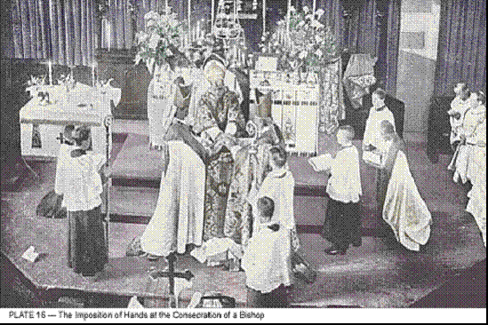

Это заменяет римскую молитву о том, чтобы Бог пролил на новопосвященного епископа Своего укрепляющего благословения, и она играет важную роль в этой работе, так как открывает путь в ментальные и астральные тела для воздействия удивительного развития, которое только что стало возможным для интуитивного принципа. Хотя все духовные силы епископа передаются одновременно при произнесении слов силы, было бы чрезвычайно трудно привести их в практическое применение без помощи, которая предоставляется этим открытием и помазанием головы и рук. Англиканская Церковь много теряет, и работа ее прелатов становится труднее и менее эффективной из-за сокращения всего этого. Она действительно до некоторой степени заменяет это молитву, вставляя перед заключительным благословением молитву о небесном благословении; но это было бы гораздо эффективнее на своем месте. Она также значительно удлиняет фактическую формулу посвящения, которая у нее такова:

_Прими Святого Духа для служения и работы епископа в Церкви Божией, теперь возложенного на тебя наложением наших рук; Во имя Отца, и Сына, и Святого Духа. Аминь. И помни, что ты должен пробуждать благодать Божию, данную тебе этим наложением наших рук; ибо Бог не дал нам духа страха, но силы и любви и трезвости._

Здесь видно, какое решительное усилие делается, чтобы внушить избранному епископу реальность силы, переданной ему действием, установленным Христом — впечатление, еще больше укрепленное призыванием имени Пресвятой Троицы. Призыв "пробуждать благодать" кажется странным, но он показывает, что даже так называемые реформаторы имели представление о великой истине, что вся сила, данная свыше, растет именно в той мере, в какой она используется. Именно это предложение в этом урезанном обряде делает все, что может, для открытия, упорядочивания и соединения, которое в более научных схемах достигается помазанием.

Возвращаясь к рассмотрению нашего собственного обряда, посвятитель теперь садится на свое место и надевает свою митру. Голова новосозданного епископа затем обвязывается длинной салфеткой, и посвятитель большим пальцем помазывает голову святым елеем, сначала в форме креста по всей верхней части головы, затем рядом расширяющихся кругов, пока все не покроется священным маслом. Он говорит:

_Да будет голова твоя помазана и посвящена небесным благословением в епископском Сане, чтобы сила, которую ты получаешь свыше, изливалась из тебя во все большем изобилии и славе. Во имя ✠ Отца и ✠ Сына и Святого ✠ Духа. Отв. Аминь._

Это помазание головы является важным моментом в церемонии, поскольку хризма особенно является проводником божественного Огня. На нижних уровнях это мощный очищающий фактор, а на высших оно придает силу и ясность. Хотя оно применяется здесь, в физическом мире, его эффекты распространяются далеко в невидимые сферы. Душа отображается в личности, и это отражение, как и многие другие, перевернуто. Высший разум или интеллект отражается в нижнем разуме, интуиция в эмоциональном или астральном теле, а сам дух здесь, в физическом теле. Обычно тройной дух настолько отдален от человека, каким мы его знаем, что от этого отражения нет видимого результата; но поскольку в епископе этот тройной дух имеет возможность пробуждения, применение хризмы к голове усиливает силу отражения и заставляет тройной дух замечательно сверкать, кроме того, очищая путь в физический мозг для потока новых сил.

Центр силы на вершине головы (названный индийскими исследователями высшей физики чакрой Сахасрара и упомянутый в Крещении как ворота, через которые человек проходит внутрь и наружу) у большинства людей является вихрем, создающим небольшое углубление в форме тарелки, как и другие центры в человеческом теле. Они принимают эту форму, потому что сила постоянно проникает в физического человека через них с высших планов; но у великого святого сила, которую он сам генерирует, постоянно излучается наружу через этот центр для помощи миру, и так вихрь, вращаясь быстрее, чем когда-либо, становится конусом вместо углубления и часто виден на статуях Господа Будды как отдельное выступление на вершине головы.

Очевидно, что предполагается, что епископ должен присоединиться к этому более продвинутому типу душ, поскольку действие хризмы сильно направлено в сторону этого развития. Если он понимает свою задачу и использует свои возможности, каждый епископ должен быть настоящим излучающим солнцем, маяком среди бурного моря жизни, батареей, заряженной почти неограниченной энергией для добра, чтобы он мог быть источником силы, любви и мира, и его простое присутствие само по себе может быть благословением.

После этого помазания, освящающий встает и, снова вытянув руки, говорит:

_Ты, Кто есть мудрость, сила и красота, яви Свою славу в этом Твоем слуге. Пусть Твоя мудрость пребудет в его разуме и просветит его понимание, чтобы в суждениях он был верен и мудрым советчиком для своего народа, проницательным во всем духовном знании. Пусть он будет сильным и смелым, поддерживая свой народ перед лицом тьмы и уныния, башней силы для тех, кто колеблется на пути. Пусть красота святости сияет в его разговорах и действиях. Наполни его, Господи, благоговением, и сделай его преданным и стойким в Твоей службе. Пусть нежность украшает его жизнь, чтобы он завоевал сердца людей и открыл их для света Святого Духа. Прежде всего, пусть он так наполнен Твоей любовью, что он сможет зажечь сердца людей огнем с небес и вывести их из тьмы невежества в Твой удивительный Свет: Ты, Кто живешь и царствуешь, О Троица Могущества и Мудрости и Любви, один святой Бог на все века веков. Отв. Аминь._

Теперь освящающий помазывает руки нового епископа священной хризмой. Он говорит:

_Пусть эти руки будут посвящены и освящены для работы понтификального Ордена этим помазанием священной хризмой освящения. Во имя ✠ Отца, и ✠ Сына, и Святого ✠ Духа. Отв. Аминь._

Это помазание рук хризмой устраивает механизм для распределения трех видов силы (происходящей, если мы углубим наше исследование достаточно далеко, из Света неописуемой славы, от Трех Аспектов или Лиц вечно-благословенной Троицы), которые проходят через епископа в силу дара Святого Духа на его освящении. По этой причине над ним делается тройной крест.

Освящающий делает знак креста сначала над сердцем новоосвященного епископа, затем над его руками, говоря:

_Да будешь ты изобиловать полнотой духовного ✠ благословения, так что все, что ты ✠ благословляешь, будет ✠ благословлено, и все, что ты освящаешь, будет освящено, и что наложение этой освященной руки будет служить для духовной защиты Твоего народа: во имя нашего Господа Христа. Отв. Аминь._

Затем он соединяет освященные руки и обвязывает их полосой льна. Знак силы, сделанный при словах «полнота духовного благословения», полностью открывает прямую линию связи между интуицией и эмоциональным или астральным телом, так что, если и когда эта интуиция развивается, она может мгновенно проникнуть в то, что предназначено быть её выражением в физической жизни.

Неэволюционированный человек почти полностью руководствуется своими чувствами и эмоциями; и часто это могут быть самые незначительные порывы, порожденные предвзятостью или ошибочными идеями. Позже нижний ум раскрывается, и человек начинает проверять свои порывы с помощью рассудка, который, однако, часто ограничен и основан на неверных предпосылках. На этой стадии он часто является ярым свободомыслителем, шумно отрицающим существование чего-либо, что с его очень ограниченными способностями он не может почувствовать, увидеть или понять.

Постепенно высший ум проявляется и позволяет ему взглянуть на вещи шире и разумнее, понять, что он должен сопоставить свой крошечный личный опыт с опытом других, и что узкие рамки его понимания не обязательно являются границей вселенной. Таким образом, он учится подчинять изолированное наблюдение общим законам и взвешивать выводы, прежде чем их принимать. Очень медленно он узнает, что над и за пределами знаний, полученных широким опытом, существует мудрость, которая инстинктивно знает истину, которая непогрешимо и мгновенно различает факт от ошибки; и этой внутренней способности мы даем имя интуиции.

Её истинное обиталище — это высшая плоскость, которую мы называем её именем — той, которой на Востоке дают титул будхи или просветления; но здесь, в внешнем мире, она проявляется через эмоциональное тело как инстинктивное чувство. Мало-помалу, шаг за шагом, она возникает в сознании человека, и пока он не может узнать её наверняка, ему мудро ей не доверять; но как часто случалось со всеми нами рассуждать себя из послушания какому-либо инстинктивному чувству и потом горько сожалеть, что мы проигнорировали это предупреждение.

Интуиция существует — пусть никто не сомневается в этом; но не все из нас ещё достаточно развиты, чтобы сразу узнавать её, когда она внезапно появляется перед нами; и опасности, связанные с ошибочным принятием порыва за интуицию, настолько серьезны, что нам лучше быть осторожными. Достижение надежной интуиции в повседневной жизни означает открытие этого прямого канала между интуитивным и эмоциональным телами; и именно такой результат предполагается знаком силы над сердцем новосозданного Епископа. Когда связь таким образом установлена, на самом Епископе лежит задача развивать эту способность, пользуясь ей.

Знак, сделанный над сердцем, отнюдь не является лишь символическим, поскольку именно через этот центр, а не через ум, действует интуиция; и знак, сделанный над руками при словах «чтобы все, что ты благословишь, было благословлено», устраивает механизм для распределения этой удивительной Христовой силы, которая проникает через Епископа в результате установленной связи между его интуицией и интуицией его Учителя.

Затем следует благословение пастырского посоха, пекторального креста и кольца консекратором, и сразу после этого передача новому Епископу этих предметов, которые очень правильно можно назвать рабочими инструментами великой степени, предоставленной ему. Взяв пастырский посох в руки, консекратор говорит:

_Вечный Триединый Бог, перед чьим великим белым троном стоят семь пламенеющих Духов, которых Ты, тем не менее, посылаешь по всему миру, да изольет на этот посох Твой семикратный огонь, чтобы он стал жезлом силы для управления и укрепления Твоей Церкви. Через Христа, нашего Господа. Отв. Аминь._

В следующей главе я объясню распределение семи драгоценных камней в камне алтаря и их особую связь с земными Главами семи Лучей, которые в свою очередь являются представителями нашей планеты семи Духов, стоящих перед троном Божьим и пронизывающих всю солнечную систему. Аналогичный план принят в отношении епископского жезла и его пекторального креста. Связывание драгоценных камней с наместниками великих Духов ежегодно выполняет епископ на праздник Святого Михаила и всех Ангелов, поэтому цель этой молитвы не состоит в установлении этой связи, а в предложении этого жезла как канала для божественной мощи и во взывании божественного благословения на него. Упоминание о Жезле Мощи будет оценено более глубоким изучением внутренней стороны жизни; среди восточных мистиков он иногда называется дордже.

Освящающий теперь берет пекторальный крест в свои руки и говорит:

_Всемогущий Бог, Который из Своей святой воли принес Себя в жертву всему миру и этим ограничением Себя освятил знак креста, сделав его навеки Своим, да ✠ засияют через этот священный символ семь Лучей Твоей неизреченной славы, чтобы этот святой крест всегда был сверкающим солнцем для того, кто носит его, и источником света и благословения для всех Твоих верных. О Ты, Кто царствуешь с креста вечно. Отв. Аминь._

Эта молитва, как и предыдущая, предлагает крест как канал для могущественных космических сил; и все, у кого есть внутреннее зрение, узнают уместность описания его как сверкающего солнца, потому что именно так он выглядит для них. Каждый драгоценный камень сверкает своим особым цветом, но они сливаются в чудесное и гармоничное целое, и безусловно, этот священный символ оказывает очень мощное и непрерывное влияние не только на носителя, но и на всех, кто с ним контактирует. Тот факт, что крест символизирует Жертву, связанную с созиданием Второго Лица Святой Троицы в материю, делает символ ещё более подходящим как средство, через которое Его благодать может сиять на мир, существование которого обязано тому, что символизирует крест.

Освящающий кладет в сторону пекторальный крест и берет кольцо в свои руки таким же образом, говоря:

_О Христос, чистый Господь Любви, Которому повинуются ангельские воинства, прикоснись Ты священным огнём к этому кольцу, которое мы в Твоем Имени ✠ благословляем, чтобы тот, кто носит его, всегда проявлял Твою любовь и чистоту, и все, кто касается его, знали Твою исцеляющую благодать. Отв. Аминь._

Как видно, эта молитва отличается по характеру от предыдущих. Это уже не мольба к Божеству узнать уже установленную связь, а прошение к Учителю Мира принять кольцо как центр излучения огня Его чудесной любви. Это кольцо, таким образом магнетизированное, становится самым мощным из талисманов, через который особое благословение Христа постоянно течет без посредства епископа, хотя он может концентрировать и направлять его силой своей воли. Это далее объясняется в Части III, посвященной инструментам Священнодействия.

Все эти инструменты теперь должным образом подготовлены, и освящающий представляет их по очереди новому епископу: сначала жезл, который получатель должен взять между кончиками своих пальцев, так как его руки все еще связаны полосой льна. Освящающий говорит:

_Прими этот жезл и осторожно применяй свою мощь как пастырь стада Христова. Силой семикратного огня Божьего Святого Духа будь ты всем для всех: давая больше силы сильным, но проявляя нежность к слабым; будь полон мудрости для мудрых и глубокой набожностью для набожных. Но как семь мерцающих цветов радуги образуют один чистый белый луч, так и твоя семикратная мощь будет единой великой мощью любви._

Консекратор теперь вешает крест на шею нового епископа, говоря:

_Прими этот крест, помня, что только совершенной жертвой низшей природы во имя высшей, ты сможешь достойно его носить. Иди в силе креста, и пусть семеричный свет Святого Духа так сияет через тебя, чтобы ты мог привлечь других к красоте жертвы._

Он надевает кольцо на безымянный палец правой руки новопосвященного епископа, говоря:

_Прими это кольцо как знак связи, которая привязывает тебя к нашему Господу, как символ твоего служения Его народу. В Его святейшем имени будь исцелителем душ людей, каналом Его любви._

Затем он передает ему книгу Евангелий, закрытую, которая ранее была удерживаема на его плечах, и говорит:

_Прими Книгу Евангелий и будь учителем Божественной Мудрости для народа, вверенного тебе._

Консекратор, а за ним помощники-епископы, дают новопосвященному епископу приветствие мира, после чего его руки развязывают. Он и консекратор затем моют руки. Теперь епископ и помощники-епископы удаляются к боковому алтарю. Читается Евангелие, и поется Символ веры. После Символа веры и непосредственно перед чтением Оффертория новый епископ представляет свои приношения консекратору. По старинному обычаю это два небольших хлеба, два факела или свечи, и два миниатюрных бочонка с гербами консекратора на золотом щите и нового епископа на серебряном щите.

Новопосвященный епископ, сопровождаемый его помощниками-епископами, затем переходит к южной части высокого алтаря и громко произносит остаток Службы Святой Евхаристии вместе с консекратором слово в слово. За исключением специального пункта, вставленного в молитву освящения, Служба продолжается до конца как обычно. После окончательного благословения консекратор и новый епископ надевают плащ. Консекратор затем переходит к фальдстулу. Митра и перчатки нового епископа держат перед ним, и он благословляет их. Трое епископов затем надевают митру на голову новопосвященного епископа, консекратор говорит:

_Прими эту митру, которой я короную тебя для служения тому нашему драгоценному Господу, Который, хотя и является Богом и Человеком, не является двумя, а одним Христом; и как в Себе Он неразрывно соединяет две природы, так пусть и ты в себе навсегда соединишь атрибуты мудрости и любви._

Здесь может быть интересно процитировать соответствующий отрывок в римском ритуале, так как символика митры там отличается от нашей.

_Мы устанавливаем на голову этого епископа, о Господи, Твоего защитника, шлем защиты и спасения, чтобы с приличным лицом и с головой, вооруженной рогами обоих Заветов, он мог показаться ужасным для противников истины и стать их активным противником, через обильный дар Твоей благодати, Ты, кто сделал лицо Твоего слуги Моисея сияющим после близкого общения с Тобой и украсил его яркими рогами Твоего света и Твоей истины, и приказал установить митру на голову Аарона, Твоего первосвященника. Через Христа, нашего Господа._

В Римском обряде следующая молитва произносится, когда на руки нового епископа надевают перчатки:

_Окружи, Господи, руки этого Твоего слуги чистотой нового Человека, который сошёл с небес; чтобы, подобно Якову, Твоему возлюбленному, обложившему свои руки шкурами козлят и принесшему своему отцу наиболее ароматное мясо и напиток, он получил благословение Исаака, так пусть и он, преподносящий своими руками Спасительную Жертву, станет достойным получить Твоё милостивое благословение. Через Господа нашего Иисуса Христа, Твоего Сына, который, подобно греховной плоти, принёс Себя Тебе от нашего лица. Отв. Аминь._

В Либеральной Литургии молитва не произносится, освящающий, с помощью помощников-епископов, в тишине надевает перчатки на руки нового епископа. Это сделав, освящающий встаёт и говорит:

_Ты, молим Тебя, Господи, исполни в Твоем слуге то, что обозначено этими видимыми символами, чтобы добродетель, предварительно изображённая в этих одеждах блеском золота, мерцанием драгоценных камней и искусством разнообразной вышивки, непрерывно сияла в его жизни и деяниях. Отв. Аминь._

Затем нового епископа торжественно возводят на трон, освящающий ведёт его за правую руку, а старший помощник-епископ — за левую. Ему передаётся посох, и торжественно поётся _Te Deum_, во время которого новый епископ, сопровождаемый помощниками-епископами, обходит церковь и благословляет народ. Мы считаем нужным изменить некоторые стихи _Te Deum_, так как в оригинале есть фразы, которые, как нам кажется, мы не можем честно произносить.

Когда процессия возвращается в святилище, новый епископ садится на трон или фальдстул, освящающий стоит справа от него, а помощники-епископы слева. Освящающий обращается к народу, даёт Малое Благословение и говорит:

_Боже, Пастырь и Правитель всех верных, посмотри с любящей добротой на этого Твоего слугу, который теперь стал понтификом и правителем в Твоей Церкви; даруй ему, молим Тебя, Господи, чтобы как своим служением, так и словом и примером он служил на пользу тем, над кем он поставлен, чтобы вместе со стадом, порученным его заботе, он непрерывно возрастал в познании Твоих тайн. Через Христа, Господа нашего. Отв. Аминь._

Освящающий и помощники-епископы, один с каждой стороны от него, стоят с евангельской стороны Алтаря. Новый епископ подходит к середине Алтаря и оттуда даёт своё торжественное благословение в обычной форме. Новоосвященный епископ затем отдает честь освящающему согласно древней традиции Церкви. Он подходит к освящающему в три этапа, каждый раз преклоняясь на колено и произнося: _Ad multos annos_ (на многие годы), в конце концов получая от освящающего и помощников-епископов приветствие мира. После этого процессия покидает хор.

Хотя рубрика требует присутствия трех епископов для посвящения четвертого, это совсем не необходимо для действительности Священнодействия. Один епископ вполне способен передать епископство и в истории часто это делал. Когда трое принимают участие в церемонии, каждый является независимым каналом силы; таким образом, даже если основной посвятитель по какой-то странной ошибке не является должным образом рукоположенным епископом, действие других исправит этот недостаток, и посвящение будет действительным. Помощники-епископы будут иметь намерение совершить посвящение и будут ясно иметь форму посвящения в своих умах; и это намерение будет действовать при возложении рук, даже если они не произнесут его вслух. Тем не менее, для обеспечения безопасности предписано, чтобы все трое произнесли слова одновременно.

Присутствующие из мирян на каких-либо из крупных рукоположений являются привилегированными людьми. Это великая вещь, замечательная вещь - иметь возможность видеть продолжение этой схемы, данной Христом сотни лет назад. Своим присутствием, своей искренней преданностью миряне могут помочь и укрепить руки тех, кто передает это чудесное дарование. Сами они не были рукоположены, поэтому не в их власти передать Святые Таинства; но в их власти поддержать руки тех, кто это делает, и таким образом оказать очень реальную помощь в том, что совершается.

Еще один момент заключается в том, что такая Служба предлагает великолепную возможность для тех, кто пытается развить ясновидение. Те, кто начинает видеть, должны пытаться увидеть все, что могут. Человечество развивается, способности наших высших тел приближаются к поверхности, и иногда некоторые из нас могут видеть немного больше, чем раньше. Вот случаи, когда есть гораздо больше, чем видно физическому глазу. Присутствующим стоит приложить усилия, чтобы привести себя в восприимчивое состояние, в надежде увидеть или почувствовать что-то из того, что лежит за внешней формой того, что совершается.

Будут чудесные излияния силы, видимые тем, кто научился их воспринимать — потоки света, всполохи великолепного цвета, великие Ангелы, которые пришли помочь. Многие могут чувствовать их присутствие, и есть те, кто может их видеть. Нет причин, почему другие не могли бы разделить это преимущество. Пусть они приведут себя в состояние симпатии; пусть пытаются видеть и чувствовать. Это один из способов, которыми мы, духовенство, хотим, чтобы миряне сотрудничали с нами в работе, которую нам предстоит выполнить.

## Глава V. Малые Священнодействия

### Святой Брак

В обыденной жизни человека брак часто является одним из наиболее важных моментов, так как с ним начинается совершенно новый этап его жизни. Поэтому на этом этапе Церковь вмешивается, чтобы дать ему своё формальное признание и благословение, чтобы начать этот новый этап в правильном духе и дать ему такую помощь на его пути, которую он способен принять.

Общая цель Службы брака заключается в том, чтобы открыть природы жениха и невесты друг для друга, особенно на астральном и ментальном уровнях; а затем, сделав это, отделить их от остального мира. С точки зрения внутренней жизни брак является огромным экспериментом, в котором стороны соглашаются принести определенные жертвы индивидуальной свободы и предпочтений, в надежде и с намерением, во-первых, усилить внутреннюю жизнь друг друга через их взаимодействие, чтобы их совместная духовная энергия была гораздо больше, чем сумма их раздельных усилий, и, во-вторых, чтобы они имели привилегию предоставить подходящие сосуды для душ, которые желают и заслуживают хорошие возможности для быстрого развития.

Естественно, есть много случаев, когда эти результаты не достигаются; требуется очень реальное и тщательное сотрудничество, и многие люди не способны на это. Это требует высокого стандарта; целью является ничто иное, как постоянно поддерживать их влюбленными друг в друга, не глупо или навязчиво, но сильно, глубоко, истинно, с здравым смыслом и полным самозабвением. Несомненно, каждый что-то жертвует; холостяк может излучать себя равномерно во всех направлениях и получать от этого великие результаты; но женатые люди, чтобы получить эту близкую связь, должны фокусироваться именно друг на друге, даже если это делается для того, чтобы получить еще лучшие результаты от этого восторга преданности. Как эти двое сближаются и становятся практически одним из-за непрерывного взаимного уважения и самопожертвования, так должно сблизиться все человечество; и однажды это произойдет. Тем временем, семейное состояние является весьма хорошей практикой.

Служба Церкви для святого брака коротка и проста. Она начинается с обращения к общине, объявляя желание пары объединиться в браке, и требуя, знает ли кто-то присутствующий какую-либо причину против такого союза. Если возражений нет, священник спрашивает каждую из сторон по очереди, готов ли он или она полностью принять друг друга; и если оба ответят утвердительно, кольцо помещается на серебряный поднос, и священник окропляет его святой водой и торжественно благословляет его, настоятельно напоминая о верной вере и все углубляющейся любви, так что оно становится мощным талисманом.

Отец или опекун невесты затем выходит вперед, берет ее за правую руку и формально передает ее священнику, как представителю Церкви Христовой; священник немедленно передает ее жениху со словами: "Прими драгоценный дар Божий". Затем жених повторяет за священником великое и торжественное обязательство брака:

_Я беру тебя в законные жены, иметь и хранить с этого дня и далее, в лучшем и худшем, в богатстве и бедности, в болезни и здоровье, любить, лелеять и чтить, пока смерть нас не разлучит; и к этому, на глазах Божиих, в силе и любви Христа, Господа нашего и Учителя, я клянусь тебе быть верным и преданным. Аминь._

И в конце этого торжественного обещания звучит "Аминь", что, как я объяснил в предыдущей главе, символизирует с одной стороны категорическую клятву жениха: «Клянусь Аминь, Господь Жизни, что это будет так», и с другой стороны — наиболее искреннюю молитву собравшихся: «Да будет так; пусть клятва будет исполнена».

Теперь невеста берет на себя аналогичные обязательства по отношению к своему мужу, а затем следует странная и древняя церемония надевания на неё освящённого кольца, которое сначала на мгновение помещается на большой палец, затем на первый и второй пальцы, прежде чем окончательно оказаться на своём постоянном месте на третьем пальце. В это время жених произносит священные имена Святой Троицы и заканчивает обычным утверждением. Затем он повторяет другую древнюю клятву:

_С этим кольцом я тебя обручаю; мою вернейшую любовь тебе клянусь; телом моим я тебе отдаю почтение, и всей моей силой я тебя защищаю. Аминь._

Священник теперь касается лбов невесты и жениха святой водой, соединяет их правые руки и, держа их вместе своей правой рукой, произносит фактическую формулу, делающую их мужем и женой:

_Соединяю вас в браке во имя Отца и Сына и Святого Духа. Аминь._

Закрывая их сцепленные руки концом своего стола, чтобы символизировать защиту Церкви, он добавляет хорошо известные слова: «Что совокупил Бог, того человек не разлучает». Затем он обращается к собравшимся и делает формальное публичное объявление о том, что свадьба состоялась. Церемония брака имеет как свою юридическую, так и церковную сторону; английский обычай предварительного объявления брачных обещаний на протяжении трёх недель, вопрос в начале Службы о том, знает ли кто-либо о каких-либо препятствиях, и теперь это определенное объявление всему миру являются ясными доказательствами её юридического характера и не имеют ничего общего с её внутренним или Священнодейственным аспектом.

Затем следуют некоторые стихи, в которых Священник призывает благословение, любовь, мудрость и силу для новобрачных; и после этого должны следовать две молитвы за их будущее — одна, чтобы они всегда помнили о выполнении своих обетов, и другая (используется только при соответствующих обстоятельствах), чтобы они получили «приданое благословенных детей», упомянутое в гимне, который непосредственно следует за молитвами. Вторую из этих молитв пришлось опустить (хотя традиция полностью на её стороне) в уважении к причудливому современному обычаю отказываться признавать существование наиболее очевидных фактов природы. Эта часть Службы объясняет себя сама по себе; будет достаточно её процитировать.

_О Вечный Бог, Творец и Сохранитель всего человечества, дарующий все духовные благодати, автор вечной жизни, пошли Твои благословения на этих Твоих слуг, этого мужчину и эту женщину, которых мы благословляем в Твоем Имени; чтобы эти лица верно совершили и соблюли обет и союз между ними, и чтобы их жизни в знании и любви к Тебе были таковы, что они могут жить вместе в святой любви и мире. Отв. Аминь._

_Отец Светов, в руках которого души, приходящие на Землю, благослови брак этих Твоих слуг плодородием. Пусть их жизни будут так освящены в Твоей службе, чтобы им были даны дети, сияющие Твоей силой и славой. Отв. Аминь._

Затем следует хорошо известный свадебный гимн Кебла, в котором, однако, нам пришлось внести довольно обширные изменения, чтобы привести его в соответствие с идеалами нашей Церкви.

Священник произносит это благословение над женихом и невестой.

_Всемогущий Бог, пролей на вас богатства Своей благодати, освяти и благослови вас, чтобы вы служили Ему и телом, и душой, и жили вместе в святой любви до конца ваших дней. Отв. Аминь._

Считается подобающим, чтобы либо во время свадьбы, либо как можно скорее после нее, жених и невеста совместно причастились к Святой Евхаристии. Если это сделано во время свадьбы, Служба, по римскому обычаю, называется брачной Мессой. В этом случае вносятся некоторые соответствующие изменения, которые не требуют долгого обсуждения, так как они должным образом даны в нашей Литургии и не требуют пояснения.

Естественно, что это Священнодействие брака не является поводом для огромного общего излияния духовной силы, подобного тому, которое сопровождает Святую Евхаристию, или Вечерню и Торжественное Благословение. Но это имеет огромное значение для тех, кто в нем непосредственно участвует, и его внутренний эффект на них может быть не только значительным на данный момент, но и постоянным, если они готовы принять то, что оно может им дать. Иногда оба участника так заняты собой, или так нервничают и смущаются, что мало чего хорошего можно сделать; но есть те, кто сосредоточен и глубоко искренен, и в этом случае внутренняя сторона церемонии заслуживает внимания.

Как только жених произносит обет верности, его аура сверкает и расширяется, полностью окутывая невесту; а когда приходит её очередь, она окутывает его таким же образом, и две значительно расширенные ауры остаются в таком проникновенном и, конечно, сильно взаимодействующем состоянии. В эту магическую двойную сферу приходит освящённое кольцо, мгновенно освещая обоих и таким образом повышая их вибрации, что они становятся гораздо более чувствительными, чем обычно. Пока этот состояние расширенного сознания и высокой чувствительности все ещё существует, священник произносит формулу брака; и как только он говорит слова, поток света излучается от него через комбинированные ауры, и на время спаивает их в единое целое.

Этот свет и это чудесное единство сохраняются в течение остатка Службы и, вероятно, при благоприятных обстоятельствах ещё некоторое время после. Затем постепенно каждый возвращается в нечто похожее на его предыдущую форму и состояние; но оно настолько стойко расширено и модифицировано, и каждый сохраняет особую симпатию по вибрации с другим, так что может гораздо легче подвергаться влиянию от него, чем от какого-либо другого стимула извне. Таким образом, стороны могут продолжать неопределенно влиять друг на друга во благо, если они способны сохранить совершенную гармонию.

Такая великая возможность, естественно, приносит с собой свою ответственность и опасность. Интимная связь, которая позволяет этим двоим помогать друг другу, неизбежно делает их аномально чувствительными к влиянию и чувствам друг друга; так что если они позволяют возникнуть дисгармонии, связь становится столь же мощной для зла и для печали, как иначе была бы для добра и для радости. Как я начал говорить, брак является огромным экспериментом, и для его полного успеха требуются такт, альтруизм, приспособляемость и неиссякаемый источник любви.

Столь близкая и сильная связь не разрывается физической смертью; способность влиять и подвергаться этому влиянию не принадлежат физическому телу, поэтому они не теряются, когда оно уходит. Души весьма различны в этом отношении; их натуры и заслуги разные; некоторые быстро поднимаются вдаль от земли, некоторые против своей воли удерживаются многие годы в её непосредственной близости, а некоторые намеренно удерживают себя, чтобы оставаться ближе к тем, кого они любят. Зная о продолжении связи, Церковь с некоторым сомнением относится ко вторым бракам, хотя и не отказывает в их праздновании; но по крайней мере, должен быть приличный промежуток времени.

Священный брак всегда должен праздноваться до полудня, так как после этого часа магнитные условия намного менее благоприятны.

### Абсолюция

Я уже объяснил действие Священнодействия абсолюции, говоря о его месте и значении в ходе Святой Евхаристии. Возможно, будет полезно в качестве приложения к этому объяснению процитировать некоторые фразы из того, что написано по этому поводу в нашей Литургии.

Строго запрещено священнику и искателю абсолюции соответственно спрашивать и раскрывать личность других лиц, причастных к какому-либо признанному проступку. Искатель приходит исповедовать свои собственные ошибки, а не ошибки других. Священник должен быть насколько возможно сочувствующим, естественным и человечным с теми, кто приходит к нему за абсолюцией.

Дети младше семи лет не являются объектами для исповеди, так как по традиции Церкви они не способны на серьезный и ответственный грех. После этого возраста и до тех пор, пока они не станут ответственными деятелями, они могут совершать ушную исповедь (за исключением чрезвычайных ситуаций) только с согласия одного из родителей в Либеральной Католической Церкви.

Священник слушает исповедь не перебивая, если это возможно. Затем он дает такие советы, какие считает нужным. В практике Либеральной Католической Церкви он не налагает покаяния, но может предложить искателю присутствовать на Святой Евхаристии с желанием, чтобы сила, которая тогда приходит к нему, использовалась против какого-либо конкретного недостатка или группы недостатков.

### Святое Елеосвящение

Снова я цитирую из нашей Службы:

_Цель Священнодействия Святого Елеосвящения заключается в следующем: (а) способствовать восстановлению физического здоровья, (б) подготовить человека к смерти, (в) к этому можно добавить отпущение грехов, поскольку здесь также имеется форма абсолюции. Несмотря на тенденцию в Латинской Церкви ограничивать применение этого обряда лишь для тех, кто находится в тяжелом состоянии и близок к смерти, желательно, чтобы этот обряд использовался более широко как средство восстановления от любого серьезного заболевания. Именно поэтому у нас он называется "Святым Елеосвящением", а не "Крайним Елеосвящением", хотя последнее название иногда происходит от представления, что это последнее из елеосвящений, данное обычному христианину, после тех, что давались на Крещении и Миропомазании._

_Святое Елеосвящение не следует рассматривать как имеющее в обыденных обстоятельствах какой-либо почти чудесный эффект. Оно предназначено просто для того, чтобы помочь нормальному процессу природы, освобождая тело от низменных влияний и открывая его духовному влиянию._

Надежной информации об этом Священнодействии мало. Часто считается, что оно происходит от инструкции, данной св. Иаковом: "Болен ли кто из вас? Пусть призовет старейшин Церкви; и пусть они помолятся над ним, помазав его маслом во имя Господа. И молитва веры спасет больного, и Господь поднимет его; и если он сделал грехи, простятся ему. Молитесь друг за друга, чтобы выздороветь. Много может усердная молитва праведного". Но, конечно, нет никаких доказательств, что эта идея была собственной для писателя; вполне возможно, что, как многие считают, план был предложен Христом, и св. Иаков просто повторил для своих последователей то, что он слышал от Учителя.

Этот исцеляющий аспект Священнодействия, кажется, был упущен в последние годы, и его стали рассматривать лишь как окончательную подготовку к смерти. Здесь, вероятно, имеется некоторая путаница с старым обычаем запечатывать все энергетические центры в теле умирающего человека, чтобы нежелательные сущности не могли завладеть этим телом, когда его хозяин покинет его, и использовать его в целях злой магии. Это, безусловно, со временем превратилось в современный римский метод помазания органов чувств и просьбы к Богу простить пациенту различные грехи, которые он совершил с их помощью. Но до двенадцатого века практика в Западной Церкви, несомненно, состояла в том, чтобы свободно давать елеосвящение всем, кто страдал от серьезной болезни, не учитывая, существует ли непосредственная угроза жизни. Различные причины способствовали ограничению его использования для умирающих; Католическая энциклопедия предполагает алчность священников, которые требовали неумеренную плату за его совершение, и возникновение определенных популярных суеверий, что если помазанный человек выздоровеет, он на оставшуюся жизнь лишается права на брак, употребление мяса, составление завещания или ходьбу босиком.

Не исключено, что в ближайшем будущем мы увидим значительное возрождение использования этого Священнодействия в целях исцеления, а также для помощи тем, кто находится на грани смерти. В преддверии этого во второе издание нашей Службы была включена более простая форма его, не для использования с одним больным человеком, а специально организованная как публичная Служба Исцеления, проводимая в церкви. Цитирую следующие отрывки из введения:

_Цель Службы Исцеления двояка: во-первых, принести духовное поднятие тем, кто в острой нужде в этом; во-вторых, по возможности облегчить страдания тех, кто страдает от различных физических недугов._

_В начале, с помощью Аспержеса, мысленная атмосфера церкви очищается и подготавливается к приходу ангела исцеления, который немедленно после этого призывается. Затем следует Конфитеор, и настроение тех, кто присоединяется к этим искренним словам, должно быть полным искреннего желания подняться над своими недостатками и жить более высокой и благородной жизнью. Такое настроение глубокой искренности обращается к глубинам внутри нас и пробуждает наши духовные силы к активности. Затем священник произносит Абсолюцию. Необходимо помнить, что это не освобождает человека от ответственности за последствия его ошибок, потому что только выплатив каждый свой долг, он может научиться великим урокам жизни. Однако Абсолюция упрощает исправление после совершения ошибки, расчищая ментальные и эмоциональные запутанности, которые затмевают внутреннюю природу, и исправляя искажения в эфирном теле._

_Люди встают и поют гимн, который предназначен склонить их сердца к Христу и позволить им почувствовать близость Его Присутствия и величие Его Любви. Слова этого гимна должны быть не только произнесены, но и прочувствованы теми, кто ищет помощи. Инструкции святого Якова о помазании больных затем читаются, и Вени Креатор, традиционный призыв к помощи Бога Святого Духа, поется Его стоячими на коленях верующими. Пока это поется, для тех, кто может видеть, вся Церковь медленно наполняется тем великолепным свечением огня, который является внешним знаком силы Присутствия Третьего Лица Благословенной Троицы; и в силе этого Присутствия священник посылает тот очищающий поток экзорцизма, который предназначен устранить все, что может преградить путь исцеляющей силе._

_Следующий шаг — это следовать апостольскому обычаю помазания пациента освященным маслом, приглашая великого Вождя воинств исцеляющих ангелов, архангела Рафаила. Возможность ангельской помощи не подозревается большинством людей в эту слепую и материалистическую эпоху, но это тем не менее замечательный и красивый факт, который будет все более и более ясно пониматься по мере течения времени. Затем священник кладет руки на голову пациента и вливает в него, со всей силой, данной ему Богом, поднимающую и исцеляющую силу Господа Христа. Его особо подготовили к этому его рукоположение, чтобы быть каналом для этой силы и для силы Бога Святого Духа, так что, делая это, он лишь выполняет одну из функций своего служения. Если Службу совершает епископ, у него есть дополнительная возможность помочь наложением своего пастырского посоха, исцеляющая сила которого давно признана._

_Во время помазания и наложения рук настроение пациента должно быть полным любви к нашему Господу Христу и уверенности в Его могущественной силе. Вся природа должна быть открыта для струй духовного влияния, как цветок раскрывает свою чашу для солнца. Чем меньше мысли человека сосредоточены на себе в этот величественный момент, тем больше глубины его природы отзывчивы к сострадательному Присутствию Христа, и тем больше возможность исцеления._

_Последнее великое средство духовной помощи и физического исцеления теперь предоставляется пациенту в Святой Евхаристии. Нет большей помощи и для тела, и для души, чем это, потому что с приемом Святого Пречистого тело человека становится на несколько часов истинным храмом, излучающим светящуюся любовь и силу Христа._

_Не ожидается, что те мгновенные исцеления, которые обычно (хотя и ошибочно) называют чудесными, часто будут происходить на этих Службах. Они могут и случаются в определенных случаях; но мы недостаточно знакомы с методами работы этих великолепных сил, чтобы быть в состоянии предсказывать результаты. Многие пациенты, особенно хронические случаи, чувствуют значительное временное улучшение, но постепенно скатываются назад, либо частично, либо полностью. Таким пациентам следует попробовать снова. Там, где есть небольшое улучшение, только временное при первой попытке, вторая может значительно улучшить положение; третья, четвертая, пятая, шестая могут улучшить его еще больше. Даже сам Христос должен был применить свою методику дважды в случае с человеком, рожденным слепым._

_Если пациент не восстанавливает здоровье даже после неоднократных попыток, не следует думать, что Христос не может излечить, что Святой Дух не может излечить; следует помнить, что каналы являются человеческими, хрупкими и недостаточными, и вполне возможно, что по той или иной причине из дюжины, божественная сила не проходит через этого или того священника таким образом, который излечит конкретного пациента. Священник сделает все возможное, чтобы помочь; пациент сделает все возможное, чтобы подготовить себя к помощи; что из этого выйдет, находится в более высоких руках, чем наши — в руках Христа Целителя и Царя._

Будет замечено, что мы особенно призываем на помощь Архангела Рафаила, так как его имя всегда ассоциировалось с распределением исцеляющих сил природы. В книге Товита мы читаем:

_Бог послал меня исцелить тебя и твою дочь, ибо я Рафаил, один из семи святых Ангелов, которые представляют молитвы святых и входят и выходят перед славой Святого. Тогда они испугались и упали на лицо свое; ибо они боялись. Но Ангел сказал им: Не бойтесь; с вами все будет хорошо. Я пришел не от своей милости, а от воли нашего Бога; поэтому хвалите Его вечно и благодарите Его, ибо я иду к Тому, Кто послал меня (Тов., xii, 14)._

Предполагаю, что гигантская фигура, которая появилась в ответ на наше приглашение, была представителем этого Архангела; он определенно казался таковым по своему Лучу и типу. Это был очень высокий и достойный персонаж, чье сознание, по-видимому, функционирует нормально на духовном или нирваническом уровне, хотя он направляет свои силы вниз до эфирного уровня. Его аура сверкает в основном зеленым и фиолетовым; фиолетовые силы проходят через епископа при экзорцизме, предшествующем Соборованию, в то время как зеленые силы, кажется, являются исцеляющими. Я заметил, что он особенно использовал пение _Veni Creator_, традиционный призыв к Богу Святому Духу, который так сильно действует в этой Службе. Как я упоминал ранее, когда это поется, церковь наполняется замечательным красным свечением, подобным великолепному закату, проникающему через слабый туман, и Ангел хватает этот туман, берет его на руки, так сказать, и превращает его в огромный вихрь, который он направляет на человека, с которым в данный момент занимается священник — или, вернее, направляет его на священника и через него на пациента.

Крайне интересно наблюдать за работой сознания этого великого Целительного Ангела, но очень трудно объяснить это физически. Разум Ангела работает во многих отделениях, и он может поддерживать их все одновременно. Можно увидеть мысли Ангела так же, как можно увидеть мысли человека; но видно ошеломляюще большое количество их, потому что его сознание так сложно. Этот великий Целительный Ангел, например, несомненно имел много отделений своей мысли, каждое из которых работало над отдельным случаем; и все же он давал каждому из этих случаев нечто эквивалентное тому, что для нас было бы всем нашим сконцентрированным вниманием. Пока он работал в нашей церкви, упорно и непрерывно, он был также равным образом присутствен в ряде других мест — по меньшей мере в тридцати или сорока — все каким-то образом связанных с излечением болезней. Все эти сцены каким-то образом отражались в маленьких отделениях его ауры, подобно ряду ярко окрашенных движущихся картин.

Одна из них была сценой, на которой хирург выполнял операцию — сценой, на которой все участники были одеты в белое. Хирург сделал какую-то ошибку — перерезал что-то, что он не хотел или не должен был перерезать — и был совершенно расстроен и полон ужаса; но мгновенно Ангел послал ему вспышку ослепительной молнии, которая каким-то образом была похожа на взмах меча, и в тот момент это укрепило его нервы и показало ему, что делать, так что жизнь пациента была спасена.

В другой картине несколько монахинь стояли на коленях вокруг постели той, кто, по всей видимости, была их матерью-предстоятельницей и, очевидно, была близка к смерти. Но их молитвы создали прекрасную цветную сеть вокруг фигуры на постели; и Ангел воспользовался этим, осторожно и нежно вливая в сеть жизненную силу, так что матерь-предстоятельница не умерла. Вскоре на её щеках появилось немного румянца, она поднялась на постели и, протянув руку, благословила молившихся монахинь. Затем они все, одна за другой, поцеловали её руку и ушли, радостно плача; и матерь-предстоятельница выпила что-то из чаши, в которую Ангел налил своего света, а затем уснула здоровым сном и теперь быстро выздоравливает. Наша Благословенная Дама, Мировая Мать, также помогала в этом случае, так как мы стояли рядом с умирающей монахиней и наполняли комнату её замечательным синим миром. Но что казалось нам странным, так это то, что все эти события, и многие другие, происходили одновременно, и Ангел участвовал в них одинаково, и все они отражались в различных частях его сознания.

В то же время происходил другой случай, конец которого я видел — это был кораблекрушенец (или, скорее, офицер судна), выброшенный на безлюдный остров, сильно раненный и почти умирающий. Однако он не мог быть оставлен умирать, потому что его жена и маленькая дочь находились далеко дома и неустанно молились за него, а их карма была такова, что они не заслужили горести потери его. Поэтому его нужно было укрепить и восстановить здоровье рядом с тем, что казалось почти чудесными мелкими совпадениями — плод, упавший с дерева и закатившийся к нему, ястреб, преследуемый орлом, уронивший рыбу прямо на него, и море, выбросившее на берег рядом с ним другие мелкие предметы, которые были ему полезны. Также Ангел помог молившейся дочери материализоваться рядом с ним и утешить его, и позволил ей помнить свой визит к нему, когда она проснулась, и рассказать об этом своей матери как о сне, который, как она чувствовала, был правдой; так что, когда они узнали о потере корабля, они не упали духом, но были абсолютно уверены, что он был спасен и вскоре будет спасен и возвращен к ним. Очевидно, работа целительного Ангела гораздо более обширна и разнообразна, чем мы предполагали.

Всё это для меня было совершенно неожиданным, потому что я не осознавал, что есть Ангелы, принимающие участие в такой работе. Очевидно, это открывает всевозможные возможности: работа Ангелов, возможно, затрагивает наши жизни на гораздо большем количестве уровней, чем мы до сих пор осознавали. Возможно, Ангелы следят за больными, общим благословением и укреплением, потому что в сознании этого великого Ангела я также видел ряд неподвижных тел, лежащих рядом — вероятно, это палата в больнице — и Ангел заботился о них и оказывал на них влияние. Больные часто удивительно жизнерадостны, несмотря на свои невзгоды; и после этого опыта я задался вопросом, не являются ли Ангелы в большой степени ответственными за эту жизнерадостность. Определенно, вокруг нас происходит многое, о чем мы знаем очень мало.

Для тех, кто находится на грани смерти, прием Святой Евхаристии всегда считался наиболее желательным, когда это вообще возможно, и это последнее Священнодействие называется виатиком или провизией для путешествия.

Смазывание может быть использовано для лечения эфирных заболеваний. Большинство заболеваний усложняются нервными расстройствами, и вероятно, такие можно было бы помочь смазыванием освященным маслом. Священнодействие рассчитано на помощь и исцеление человека, если это возможно, но если он должен покинуть свое физическое тело, это делает его уход легким и простым для него. Когда человек, очевидно, умирает, хорошо, чтобы Церковь отпустила его с своим благословением, давая ему последний импульс к добру через виатик и затемнив центры, чтобы нельзя было использовать труп, либо самим человеком, либо другими. Потому что были случаи, когда плохо проинструктированные и напуганные люди делали отчаянные попытки вернуться в свои тела после смерти; и успех в такой попытке привел бы к условиям настолько неестественным и вредным, что мудро сделать это невозможным. Существует обширная и очень интересная литература на тему жизни после смерти; но это не место для её рассмотрения.

## Глава VI. Здание Церкви

В ранние дни христианства церкви неизменно строились в форме базилики, подражая общественным зданиям того времени. Базилика была не сильно отлична от современных церквей, поскольку состояла из прямоугольного зала, соответствующего нашему нефу, и боковых приделов с галереями, отделенных от нефа рядами колонн. На восточном конце находилась небольшая полукруглая апсида, в которой сидели магистраты, когда здание использовалось как суд. Это пространство отделялось от основного зала решетчатым экраном, прародителем нашего современного крестильного экрана. В Греческой Церкви это превратилось в высокую деревянную стену, роскошно расписанную, которая полностью закрывает вид на Алтарь для прихожан, кроме моментов, когда двери хора раскрываются на определенных этапах Службы.

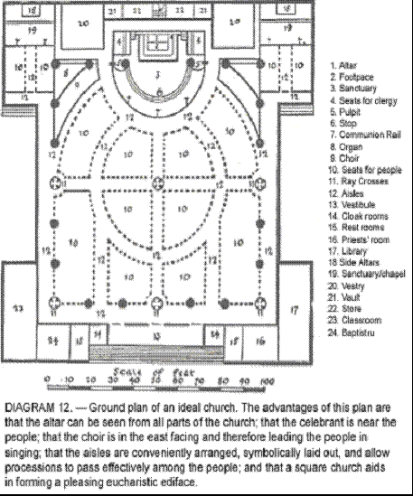

ДИАГРАММА 12.— Генеральный план идеальной церкви. Преимуществами данного плана являются следующие аспекты: алтарь видим из любой точки церкви; служитель евхаристии находится близко к прихожанам; хор расположен на востоке и, обращенный лицом к людям, направляет их в пении; расположение проходов продумано и символично, что позволяет процессиям эффективно двигаться среди прихожан; равносторонняя форма церкви способствует созданию гармоничного пространства для проведения евхаристии.

В некоторых наших английских соборах преграда так же непреодолима, но в большинстве современных церквей она сократилась до притворной перилы, у которой прихожане становятся на колени, чтобы принять Святую Евхаристию. В средневековье возникла идея крестообразной церкви, и многие до сих пор строятся в этой форме ради символизма. Это не самый удачный план с практической точки зрения, поскольку, если церковь большая, люди на нижнем конце нефа находятся слишком далеко от Алтаря, и большинство из тех, кто находятся в трансептах, ни видят, ни слышат. Попытка улучшить их положение была сделана изобретением агиоскопа — отверстия в углах стен башни между трансептами и хором; но это было лишь частичным решением.

Важные моменты заключаются в том, что каждый член общины должен слышать, что говорится. Это также актуально и для театра, и я думаю, что при планировании нашей идеальной церкви нам стоит воспользоваться опытом театральных архитекторов. Наше здание, безусловно, должно быть высоким, и я считаю, что, когда это возможно, лучше обходиться без галерей, хотя я понимаю, что они неизбежны, если необходимо разместить большую общину на сравнительно маленькой площади. Также обязательны адекватные системы вентиляции, отопления и освещения.

Достопочтенный Ирвинг С. Купер, регионарный епископ нашей Либеральной Католической Церкви в Соединенных Штатах Америки, представил мне план здания, предназначенного для нашей собственной формы богослужения, который, по моему мнению, имеет много преимуществ. Я воспроизвожу его здесь с его объяснением. (Диаграмма 12)

В какой бы форме она ни была построена, наша Церковь должна быть освящена. Служба, используемая для этой цели, будет найдена в нашей Литургии. Вступительное обращение, с которым она начинается, объяснит ее цели и методы.

_Это незапамятный обычай святой Церкви освящать здание, в котором постоянно будут проводиться её службы; и для этой цели мы собрались сегодня. Нашим первым шагом в этой церемонии является попытка очистить ментальную атмосферу здания с использованием святой воды и ладана, чтобы мирские мысли и влияния были изгнаны из него, и наши мысли во время нашего первого процессиона должны быть посвящены этой цели. Проведя ритуал очищения, мы призываем Всемогущего Бога освятить и посвятить его различные части для целей на службе Ему, для которых они предназначены, и с этой целью мы помазываем святой маслом определенные особые центры влияния. Во время этого второго процессиона освящения наши размышления должны быть твердо сконцентрированы на идее, что эта церковь будет не только местом, свободным от эгоистичных или мирских мыслей, но определенно активным центром добрых и святых мыслей — не просто свободным от зла, но активно добрым. Когда это великое действо освящения будет должным образом выполнено, мы сразу же начинаем нашу первую Службу — самую высокую и святую Службу, которую мы знаем — Святую Евхаристию, учрежденную самим Христом. В ходе этого празднования состоится третий процессион, и священная Хостия будет нести вокруг Церкви как завершающее благословение. В это время наши сердца должны быть наполнены глубочайшим поклонением нашему Господу и искренней благодарностью за Его чудесную любовь. Помните, следовательно, эти три ключевые момента различных частей Службы — сначала очищение, затем освящение и, наконец, поклонение и благодарность._

Первая часть Службы начинается с молитвы, чтобы здание могло быть так очищено влиянием Святого Духа, что ни одна злая мысль не войдет в него. С этой целью епископ берет аспергилл и, стоя перед Алтарем, трижды окропляет его святой водой; затем он обходит вокруг Алтаря, все время окропляя его, а после этого обращается к народу и окропляет его. Затем формируется процессия, которая проходит вдоль стен церкви, и епископ щедро окропляет их святой водой. Между тем поется гимн — обычно «Вперед, христианские солдаты».

Завершив очищение, начинается освящение с красивой молитвы, адаптированной из литургии Ирвингитов.

_Бог Отец, Бог Сын, Бог Дух Святой, ✠ прими, и ✠ освяти, и ✠ благослови это место для той цели, для которой мы его отделили, даже чтобы это было святилищем Всевышнего и церковью Живого Бога. Господь благосклонно примет наш труд и так благословит своим духовным благословением и благодатью, чтобы это было для Него домом Божьим, и для Его народа, поклоняющегося в нем, вратами небес. Отв. Аминь._

Епископ затем идет к Алтарю и хризмой делает знак креста на каждом из пяти крестов, вырезанных на Камне Алтаря. Затем он мажет хризмой крест на табернакуле и Алтарном кресте и говорит:

_О Боже, Чья мудрость могущественно и сладко управляет всем, обрати взор, молим Тебя, на труды Твоих слуг и наполни этот храм небесной мудростью, чтобы те, кто служит Тебе здесь, были так исполнены Духа мудрости и любви, что они постоянно будут трудиться, возводя Твой народ из тьмы неведения к свету Твоей святой истины._

_Посему мы ✠ посвящаем и ✠ освящаем этот Алтарь во славу Божию, для совершенствования человечества и в честь[^7] Его славного мученика, святого ... Во имя ✠ Отца, и ✠ Сына, и Святого ✠ Духа. Отв. Аминь._

Когда это завершено, Алтарь одевается, чаша и патена располагаются на нем как обычно, и свечи зажигаются; затем Епископ окадывает его обычным образом. Формируется процессия и снова идет вокруг церкви, поющая гимн "Благословенный город, небесный Салем", и останавливаясь у каждого из крестов — вместо ужасающих картин, называемых Станциями Креста, которые портят римские церкви, мы помещаем на наших стенах кресты, представляющие семь Лучей, далее развивая идею, которую я полностью объясню, говоря о Камне Алтаря.

Мы располагаем их так, чтобы они как можно больше соответствовали драгоценным камням, вставленным в него. Крест на двери табернакула принимается как тот, который относится ко второму Лучу; тот, который относится к первому Лучу, устанавливается, насколько это возможно, в центре церкви; представляющий четвертый луч размещается на юго-востоке, а пятый на юго-западе; седьмой на западе, шестой на северо-западе, и третий на северо-востоке (Диаграмма 8). На каждом из них выгравирован символ его Луча, и маленький осколок соответствующего драгоценного камня внедрен в него. Когда, как иногда бывает, уже существующее здание должно быть адаптировано для наших нужд, ориентация церкви может быть неточной; в этом случае относительное положение этих крестов должно сохраняться, хотя точки компаса могут быть изменены.

Это невезение, когда Алтарь не установлен на востоке, поскольку это накладывает дополнительные трудности на ангельских помощников в работе, которую они выполняют на наших Службах. Когда церковь правильно ориентирована, они используют эфирные токи, которые всегда текут по поверхности земли под прямыми углами друг к другу — с севера на юг, с востока на запад; но когда церковь расположена криво, им приходится направлять свои линии силы через земные токи под всевозможными странными углами. Это, конечно, можно сделать, но это требует гораздо больше усилий; это как плыть против течения. Когда он освящает крест 4-го Луча на юго-восточном углу, епископ говорит:

_О Ты, Чья красота пронизывает всю вселенную, дай, чтобы, подобно отражению в этом Твоем святилище Твоей небесной славы, мы постоянно наполняли нашу жизнь светом Твоего внутреннего Присутствия._

При каждом кресте молитва заканчивается словами "Вот почему мы посвящаем и очищаем, и т.д.," точно так же, как это было сказано у алтаря. На кресте 5-го Луча он произносит:

_О Ты, великий Мастер-Строитель, который заложил основания вселенной в порядке и симметрии, дай, чтобы Твои люди могли так формировать и шлифовать сырую материю своего характера, чтобы они были признаны справедливыми и точными в Твоих глазах._

На кресте 7-го Луча на западе:

_О Боже, Царь Ангелов, Владыка всех небесных легионов, мы славим Тебя за помощь, которую эти Твои сияющие служители так радостно оказывают нам; дай нам находить в себе такую силу, чтобы проявлять такое мужество, такую мудрость и такую чистоту, что мы были бы признаны достойными быть помошниками с ними в Твоей прославленной службе._

На кресте 6-го Луча:

_О Христос, Владыка Любви, мы возлагаем наши сердца на Твоё святилище; пусть в этом Твоем храме хвалы горячее поклонение Твоих слуг всегда восстает пред Тобой, подобно благовонию, вплоть до тех пор, пока свет их любви не станет одним с Твоим бесконечным Светом._

На кресте 3-го Луча:

_О Боже, который встречается с каждым человеком на том пути, по которому он приближается к Тебе, даруй нам благодать так замечать Тебя в сердцах всех людей, чтобы мы никогда не теряли свою учтивость и понимание; и так как Ты, О Господи, проявляешь себя по-разному, дай нам правильно распознать Твои замыслы среди шума нашей земной жизни._

Процессия направляется к кресту 1-го Луча в центре церкви, и когда он освящает его, епископ говорит:

_О Бог, вечная основа, источник силы для всех, кто уверовал в Тебя, мы молимся Тебе, чтобы Ты с благосклонностью взглянул на нашу работу и наполнил этот храм своей всемогущей силой, чтобы те, кто служит здесь, были укреплены силой для Твоей святой службы._

Процессия возвращается в хор, и отмечается Святое Евхаристическое Таинство. После освящения Хостия помещается в монстранс и её несут по церкви, в то время как поется литания, как на службе Благословения Святого Священнодействия.

Мы обнаружили, что результат использования этого метода освящения по линии семи Лучей поражает. Точное призывание базовых принципов — самых Ангелов — любви и преданности, божественной мудрости и духовной силы, приводит к поистине величественному результату. И мы почти сразу достигаем состояния, к которому обычно требуются века служения, и наши церкви наполняются тем чувством преданности и почитательного благоговения, которое мы обычно находим в великих соборах. Во многих прекрасных средневековых зданиях чувство благочестия буквально истирает стены, потому что сотни лет здесь создавались мыслеформы преданности. Даже в то время, когда эти стены были возведены, в них вливалась эта сила. В те времена вера была сильнее, а влияние внешнего мира было меньше. Когда здание возводилось, строители молились и укладывали каждый камень, как будто это было жертвенное дарение на алтаре. Таким образом, даже до освящения епископом, каждый камень становился настоящим амулетом, наполненным почитанием и преданностью строитель и способным излучать эти же волны ощущений на других, внушая им подобные чувства. И толпы, собирающиеся для поклонения на этой святыне, не только чувствовали эти излучения, но и усиливали их в свою очередь, откликаясь своими собственными чувствами.

Возможно, когда-нибудь мы вернемся к более здоровому состоянию общественного сознания; однако мы получаем что-то заметно приближенное к этому результату благодаря данному особенному методу освящения. И даже если мы не можем рассчитывать, что большинство каменщиков, действительно задействованных в работе, займут столь высокую позицию, стоит надеяться, что члены общины, создающие одежду для службы и алтарные покрывала, а также занимающиеся оформлением интерьера, подойдут к своей работе с душой. Каждый мазок кистью, каждый шов на рясе или подряснике, каждое действие должно быть своеобразным подношением Богу, а окончательное произведение искусства должно быть окружено благоговением и любовью, отражая эти качества на присутствующих.

По этим причинам намного лучше, чтобы все рясы, алтарные покрывала и украшения, когда это возможно, были созданы руками членов общины, вместо того чтобы быть приобретенными в магазине. На совершенство искусства нужно смотреть как на дополнение к любви и преданности; ибо великое произведение искусства может излучать эти святые чувства не меньше, чем что-то менее совершенное, и дополнительно внести особую пользу для тех, кто способен оценить его и понять его значение.

### Церковные окна

Окна из цветного стекла несомненно желательны, если они действительно качественные и эстетически привлекательные. Бледными унылыми оттенками серого и коричневого, которые так часто встречаются в современных окнах, следует пренебречь, как и бессмысленными декоративными узорами, которые мы часто видим на стекле. Изображения Христа, Пресвятой Богородицы, святых и ангелов, а также сюжеты известных евангельских историй, даже если они в значительной степени мифически, вполне допустимы. Но допускаются только насыщенные, чистые цвета, как можно ближе к великолепным витражам старинных средневековых окон. Конечно, будет непросто сравниться с ними, не только потому что наши современные мастера не обладают талантом их предшественников, но и потому что замечательное стеклянное мозаичное панно было создано нашими предками из любви к Богу и славы святых; каждый осколок стекла здесь - настоящий талисман, и солнце, пронизывающее его, приносит с собой славу, которая в чем-то превосходит физический мир.

### Церковные колокола

Мне часто задавали вопрос, стоит ли иметь колокола в наших церквях. Только если они могут издавать мелодичный и гармоничный звон; это будет действительно ценным приобретением, хотя и отнюдь не дешевым.

Звон колоколов играет важную роль в жизни Церкви, и в наши дни она, очевидно, мало понимается. Сегодня часто предполагают, что их основное предназначение - созывать народ на службу, и безусловно, в Средние века, когда не было часов, они использовались именно для этого. Отсюда развилась мысль, что любой звуковой сигнал подойдет для этого, и в результате во многих городах Англии воскресное утро превращается в гвалт от одновременного и несогласованного гула множества колоколов.

Время от времени мы ощущаем истинное назначение колоколов, например, когда они звонят в большие праздники или в дни общенародного веселья; ибо мелодичный звон колоколов, исполняющий гармонические ноты, был одной из основных идей изначального предназначения, а именно – работать двойным образом. Несколько аспектов этого явления по-прежнему сохраняются, хотя и слабо понимаются, в науке кампанологии, и те, кто знает, как звучит исполнение triple-bob-major или grandsire-bob-cator, наверняка готовы признать, насколько совершенными и величественными являются формы, открывающиеся при этом.

Одним из эффектов, которые должно было вызывать упорядоченное звучание колоколов, является создание ряда музыкальных форм, которые повторяются вновь и вновь, так же как христианский монах повторяет сотни "Ave Maria" не для собственного духовного роста, а чтобы вновь и вновь впечатлять определенную мыслительную форму и ее значение на все астральные тела поблизости.

Благословение колоколов призвано придать дополнительное свойство этим колебаниям. Звон колоколов в разном порядке естественно создает разные образы; но какими бы эти образы ни были, они генерируются вибрацией одних и тех же колоколов, и если эти колокола изначально насыщены определенным видом магнетизма, каждая сформированная ими фигура несет в себе оттенок этого воздействия. Это подобно ветру, который нам принесет звуки музыки, в то же время несет с собой тонкие ароматы. Так обладатель епископской силы, благословляя колокола, наделяет их аналогичным намерением, которое присутствует при освящении святой воды - чтобы, куда бы не дошел этот звук, всякое дурное мысление и чувство были сметены, а гармония и искренняя вера, непременно торжествовали. Это истинное и законное употребление того, что можно назвать магией, и оно безусловно эффективно, когда маг совершает свою работу правильно. Римский обряд благословения колоколов особенно тщательный; в нем предусмотрено очищение колоколов освященной водой, их помазание маслом для больных и хризмой, и особое окадывание тимом, миррой и благовониями.

Когда наши приходы станут достаточно многочисленными и обеспеченными, давайте обязательно установим сладкий и истинно мелодичный звон в тех церквях, где это подходяще; до того момента лучше воздержаться от звона, чтобы не стать помехой для соседей. Часы церкви, которые отбивают время музыкально, приносят радость; и также есть много плюсов в пользу мягкого звона колокола в башне в те моменты богослужения, когда звонит колокол в алтаре ниже, чтобы все благочестивые люди, находящиеся в пределах слышимости, знали, что происходит, и могли присоединиться духовно к нашему богослужению, если захотят.

### Святая вода

Я уже говорил о применении святой воды, описывая Аспержес; однако, возможно, стоит объяснить это подробнее. Чтобы приготовить святую воду, священник берет чистую (не дистиллированную) воду и чистую соль, а затем проводит процедуру их демагнитизации, чтобы удалить все случайные внешние влияния, которыми они могли быть пропитаны. Вода является почти универсальным растворителем, и она легко поглощает все виды окружающего ее магнетизма, поэтому, если забрать ее из водопровода или источника, она уже будет содержать определенные включения. Для наших целей нам нужна вода, которая абсолютно чистая с магнитной точки зрения. Мы бы хотели, чтобы она была такой же чистой и с физической точки зрения, но нам не следует ее дистиллировать, так как это лишает ее жизненной силы и делает ее невосприимчивой. Наличие в ней минимальных количеств химических элементов не имеет значения; они малозначительны; но мы должны очистить ее магнитно, поэтому священник сметает все примеси. Он фильтрует ее эфирно, астрально и ментально; но вместо того, чтобы пропустить воду через фильтр, он пропускает фильтр через воду и вытесняет все нежелательное. Если у него есть ясновидящие способности, он сможет увидеть примеси, вероятно, в виде серого облака, и поэтому убедится в успешности своих усилий. Но даже если у него еще нет этой способности, он должен быть полностью уверен в своей способности очищать. Связь с Богом, которая была установлена при его посвящении, наделеет его силой, ограниченной только его способностью сознавать эту связь, и он действует от имени Имени, которое выше всех имен. При всем магнетическом воздействии этого рода абсолютная уверенность - это условие успеха. Это вера, которую Христос описал как способную даже переместить горы, используя для этого поэтическое преувеличение Востока. В более ранние дни все было персонифицировано, и поэтому на их взгляд случайные примеси были демонами, и их изгоняли с ужасающими проклятиями, как можно узнать из римского ритуала крещения детей. Используется обилие напористых проклятий, которые кажутся не вполне соответствующими желаемому результату. Всё же, мы должны учитывать потребности тех, кто не привык проявлять свою волю таким образом, и поэтому им требуется некоторое время, чтобы "набрать обороты". В нашей книге служб мы выразили это более мягко, но результат остается тем же.

Аналогичная демагнитизация проводится и для соли. Достаточно большое количество этого минерала может быть сразу благословлено, чтобы его можно было хранить на складе; но вода должна быть свежеподготовленной для каждой службы. И вода, и соль используются частично из-за символического совершенства и частично потому, что они действительно дополняют друг друга до некоторой степени и более эффективны в комбинации, чем по отдельности. Хлор был тем, что ранее называли огненным элементом; его эфирное действие огненное по природе. Соль - это хлорид натрия, и поэтому это наиболее удобный способ получить хлор. Вода и огонь - великие чистящие агенты; поэтому в святой воде мы имеем эту смесь двух элементов.

Тщательно демагнитизировав оба компонента, священник затем насыщает их духовной энергией, каждый отдельно и с многочисленными сердечными повторениями, а затем, в конце концов, с другими сильными обращениями, он бросает соль в воду в форме креста, и, после окончательного благословения, процедура завершена.

Если этот обряд проводится должным образом и с достаточной тщательностью, вода становится эффективным талисманом, заряженным для особой цели — чтобы она отводила от человека, который её использует, все земные и воинствующие мысли, и направляла его к чистоте, сосредоточенности и преданности. Ученик внутренних истин легко поймет это, и, когда он видит с астральным взглядом проявление более высокой силы, которое происходит, когда кто-то использует или распыляет эту святую воду, он не будет испытывать трудностей в осознании того, что она является мощным фактором для изгнания нежелательных мыслей и чувств, и для смирения всех неправильных вибраций астрального и умственного тел. В каждом случае, когда священник выполняет свою долг, через него проходит духовная сила, и он может значительно усилить ее за счет своей собственной преданности и ясности, с которой он осознает то, что он делает. Она должна оказывать влияние на каждого, кто её использует, но оказывает гораздо большее воздействие, если человек сознательно открыт для ее влияния. Если, взяв святую воду, он произносит для себя небольшую присягу или молитву: "Да будут мои астральное и умственное тела очищены от магнетизма, вложенного в эту воду," или что-то подобное, это будет хорошим способом добиться наилучших результатов.

Неоспоримо полезно иметь святую воду у входа в церковь, но мы должны признать, что обычно принятый для этого план негигиеничен и отталкивающий. Уважая современное мнение, мы должны изменить существующий способ ее предложения. Возможно, схема нажатия на кнопку и получения нескольких капель была бы практичной.

Был задан вопрос, может ли обычный человек создать святую воду с достаточно решительным упражнением своей воли. Определенно, он может, хотя и не совсем тем же способом. Не будучи посвященным священником, он не может обратиться к тому специальному резервуару и не может освящать святые элементы в Евхаристии, но он может заряжать любой предмет своим магнетизмом и укрепить его для добра. Он проявление Божества, искра Огня Божьего; осознав это, он может вложить свою силу, которая является аспектом Божественной Силы, в святую воду и сделать ее чрезвычайно эффективным талисманом.

## Глава VII. Алтарь и его аксессуары.

Мы рассмотрели празднование Святой Евхаристии с точки зрения внутреннего эффекта, который оно вызывает, и увидели, что такое рассмотрение позволяет понимать ее как прекрасный, восхитительный и сложный ритуал, со замечательной изобретательностью адаптированный к работе, которую он должен выполнять. Понимая эту работу, мы можем легко определить, какая из многих литургий наиболее эффективно служит ее цели, и какой из многих возможных способов выполнения ритуала меньше всего затрудняет работу ангельских помощников и предоставляет им наибольшее количество доступного материала. Теперь мы перейдем к рассмотрению с той же точки зрения того, что мы можем назвать инструментами Сакраментов — алтарем, его светильниками и сосудами, и одеждой, которую носят лицо, совершающее таинство, и его помощники. Во всем этом есть место для значительного разнообразия, и оказывается, что некоторые варианты более подходящие, чем другие.

АЛТАРЬ И ЕГО УКРАШЕНИЯ

Габариты алтаря обычно составляют тридцать девять дюймов в высоту и сорок два в ширину, включая ступени для цветочных ваз и свечей; около восьми футов кажется удобной длиной для обычной церкви. Он может быть из камня или дерева, но в последнем случае в верхнюю поверхность алтаря подровня с поверхностью стола следует встроить плита из камня, расположенная поближе к переднему краю, но посередине между концами. Эта плита обычно выполнена из мрамора, имеет размер примерно один на один фут и толщину в пару дюймов. По сути, это и есть сам алтарь, и на нем во время празднования Святой Евхаристии стоят чаша и патена. На эту плиту гравируются пять мальтийских крестов — один в центре и по одному в каждом углу. Эти пять крестов, по мнению римских писателей, символизируют, как говорят, пять ран Иисуса, но изначально они были задуманы как указание на пять направлений в пространстве, по которым излучается сила от хостии. В плите выделена впадина, и в Римской Церкви в эту впадину обычно запечатывают какую-либо реликвию. Мы в Либеральной католической церкви выбрали несколько иной путь, который я сейчас опишу, но сначала хочу сказать несколько слов об общей теме реликвий.

Среди невежественных в этих вопросах принято насмехаться над идеей почитания осколка кости, который когда-то принадлежал святому; однако, хотя прямое почитание самой кости было бы ошибочным, воздействие, исходящее от этой кости, может оказаться вполне реальным и заслуживающим серьезного внимания. Бесспорно, что торговля реликвиями провоцирует обман и слепое доверие по всему миру, но это никоим образом не изменяет факт того, что подлинная реликвия может быть ценной. Всё, что являлось частью физического тела Великого человека, или даже его одежды, пропитано его личной энергетикой. Это означает, что оно наполнено мощными волнами мысли и чувства, которые когда-то исходили от него, подобно заряженному электрическому аккумулятору; только в этом случае заряд практически не уменьшается на протяжении веков, как любой психомотор знает.

Сила, которой она обладает, интенсифицируется и сохраняется на протяжении лет благодаря вере и божественной преданности толп, посещающих святыню. Поэтому тот, кто открывает себя для этого влияния и приближается к реликвии, принимает его мощные вибрации и вскоре настраивается на них. Поскольку эти вибрации, безусловно, лучше и сильнее любых, которые он мог бы создать самостоятельно, это благотворно для него. Это временно поднимает его на новый, более высокий уровень, открывает для него более высокий мир; и хотя воздействие временно, это может оставить лучший отпечаток на его жизнь, которым он станет несколько лучше после этого события.

Если реликвия подлинная; впрочем, в большинстве случаев реликвии не являются таковыми. Все мы слышали историю об епископе, которому с гордостью показали самое дорогое имущество города, который он посещал - череп Иоанна Крестителя, на что он смущенно заметил: "_Столь грешным, как я, это уже четвертый череп святого Крестителя в этих недостойных руках!_" Обычно говорят, что существует достаточное количество древесины истинного ✠ для постройки корабля, хотя некоторые римские авторы с гневом отрицают это. Как бы это ни звучало, подлинность обычной реликвии особо не имеет значения, поскольку первоначальная сила святого куда меньше по сравнению с энергетическим вкладом, вложенным в реликвию веками преданности; она, безусловно, излучает довольно сильное воздействие в любом случае, и влияние на посетителей всегда благотворное. Разумеется, подлинная реликвия Христа или Будды - это нечто невероятно сильное, она сияет, как солнце в силе; но таких весьма немного.

Вот почему паломничества эффективны. В дополнение к магнетизму, внесенному святым человеком, который жил в этом месте, или реликвии его, посещение священного места начинает насыщать это место энергией преданных посетителей, и оставленное ими влияет на их преемников. Таким образом, воздействие одного из этих священных мест обычно лишь увеличивается со временем, поскольку, даже если первоначальная сила немного уменьшается, с другой стороны, она постоянно пополняется новыми проявлениями преданности.

Вместо реликвии, мы в Римско-Католической Церкви используем для наших алтарей наборы сильно магнетизованных драгоценных камней, размещенных определенным образом, о котором я постараюсь рассказать.

Упоминая о свечах алтаря, я уже коснулся вопроса семи Лучей и их качеств. Я описывал основные характеристики этих Лучей, поэтому не буду повторять эту информацию вновь; однако небольшое дополнительное объяснение на эту тему может оказаться полезным.

Вся жизнь исходит от Бога; однако она проходит через разные каналы. В Книге Откровения мы читаем о семи Духах перед Его троном, но там мало сказано об их роли. Именно наши исследования внутренней жизни позволяют понять, что эти семь великих Посредников - это не просто служители или посланники; скорее всего, это - суть Божественны, через которых Он действует, каналы Его силы, часть Самого Бога, функционируя под Его контролем, как в человеческом теле нервные узлы функционируют под контролем мозга. Божественная жизнь течет через этих семи Посредников, приобретая оттенок канала, по которому она проходит; на протяжении всей своей долгой эволюции она несет отпечаток одного или другого из этих могущественных Духов; это всегда жизнь определенного типа, независимо от того, находится она на минеральном, растительном, животном или человеческом этапе своего развития.

Отсюда следует, что эти семь типов можно найти среди людей, и мы мы непременно принадлежим к одному из них. Фундаментальные различия этого рода в человеческой расе всегда признавались; столетие назад людей описывали как лимфатического или сангвинического типа, витального или флегматического; астрологи классифицируют нас по названиям планет, как людей Юпитера, Марса, Венеры или Сатурна, и так далее. Считаю, что это лишь другие способы выражения основных различий характера, обусловленных путем, по которому нам случилось или, вернее, было определено пройти.

Поскольку эти типы существуют среди нас, очевидно, что божественная сила будет воздействовать на нас по-разному; ее проявление, можно сказать, будет под разными углами. Нам предложено Церковью Христовой обеспечить определенные условия для приема этой сила — подготовить кубок и патену, алтарь и здание церкви; наши епископы несут пастырский посох и носят пекторальный крест, оба из которых являются физическими центрами для излучения этой силы. У нас возникла мысль, что если в этих особенных центрах каким-то образом были бы включены характеристики различных Лучей — если бы в каждом из них был второстепенный центр для каждого из Лучей, это могло бы способствовать распределению этой силы.

Попробуем проиллюстрировать эту идею примером; но помните, что это всего лишь аналогия, и ее не следует преувеличивать. Допустим, что люди каждого Луча могут легко воспринимать свет только одного цвета — скажем, фиолетовый для первого луча, синий для второго, и так далее. Сила, которая исходит свыше, является белым светом, включающим все цвета; и когда она опускается на каждого человека, он выбирает из нее цвет, который он может воспринять, а остальное пройдет мимо него, практически не оказав на него воздействия. Однако способность выбирать свой цвет и отделять его от остальных проявляется у людей в очень разной степени; и распространилось предположение, что если бы мы могли придумать что-то вроде психического призмы — метод разделения белого света на семь спектральных цветов прямо на выходе из физического фокуса, который мы обеспечиваем для него, это облегчило бы его восприятие нашими паришанами.

Лучи пронизывают всю природу, так что, как есть люди, принадлежащие каждому из них, так и существуют животные, растения, минералы, принадлежащие каждому Лучу и обладающие характеристиками того, к которому они принадлежат. Мы обнаруживаем, например, что каждый Луч имеет свой представительный драгоценный камень или группу драгоценных камней, через которые его сила проявляется более ёмко, чем через любой другой; и нам показалось, что если бы мы произвели набор из семи таких драгоценных камней, один подходящий для каждого из Лучей, и вставили их в камень нашего алтаря, мы бы создали особенно соответствующую линзу, через которую каждый из семи типов силы мог бы излучаться.

Эксперимент был проведен и оказался немедленно и заметно успешным; так успешным, что нас было решено расширить план на само здание церкви, а также на пекторальный крест и пастырский посох наших епископов. Нужно лишь мельчайшее частицу требуемого драгоценного камня, поэтому стоимость не является барьером (от четырех до шести шиллингов за набор из семи), и ценность самого камня недостаточна, чтобы взбудоражить вора; и теперь у нас принято вместо реликвии вставлять в углубление в центре камня алтаря небольшой круг таких крошечных крупинок.

Каждая такая точка сильно магнитизирована по своей особой линии, чтобы она могла быть наиболее подходящим каналом для великого Ангела своего отдельного Луча, когда бы он захотел использовать его, кроме его роли как призмы в связи с освящением Пресвятого Дара. Расположение камней, которое показалось наиболее удобным, показано на схеме №8, которая также отображает, как сила течет между драгоценными камнями в алтаре, теми в канделябрах, и теми в _"крестах ✠ Лучей"_ на стенах церкви.

Луч | Драгоценный камень на вершине Луча | Замена
-- | -- | --
1 | Бриллиант | Горный хрусталь
2 | Сапфир | Лазурит, Тюркменит, Содалит
3 | Изумруд | Аквамарин, Нефрит, Малахит
4 | Яшма | Халцедон, Агат, Серпентин
5 | Топаз | Цитрин, Стеватит
6 | Беби | Турмалин, Гранат, Карнельян, Карбункул, Тулит, Родонит
7 | Аметист | Порфир, Иолан

Приведен выше список камней, своеобразных для семи Заливов. Однако нельзя утверждать, что он полностью исчерпывающий, ведь все драгоценные камни распределены между Заливами. Те, что я указал в первом столбце, являются лидерами своих соответствующих Заливов в минералогическом мире и представляют их наиболее ярко. Почему именно они занимают такое положение, пока не установлено. Это явление, по-видимому, не связано с их химическим составом, ибо сапфир и рубин в этом отношении весьма схожи, тем не менее, силы, пронизывающие их, коренным образом различны. Возможно, роль играет и цвет камня. Дальнейшие исследования со временем прояснят эти вопросы. Тем временем наши священнослужители могут полагаться на данную классификацию в той мере, в какой она предоставлена. Во втором столбце я также упомянул имена некоторых менее ценных камней, которые могут заменить камни из первого столбца в случае их недоступности. Однако камни из этого второго списка должны быть крупного размера, чтобы быть на равне по эффективности с первыми.

Алтарь (Схема 17) расположен выше уровня пола святилища, на трех ступенях. Верхняя ступень образует широкую платформу перед алтарем, на которой стоит священник во время совершения Святой Евхаристии. Эта платформа в английском языке называется footpace, иногда встречаются и итальянское название predeUa, или латинское suppedaneum. Конечно, ступени обходят алтарь со всех сторон.

Алтарь следует покрыть тремя покрывалами, верхние из которых шириной равной ширине алтаря и достаточно длинные, чтобы коснуться почти земли на обоих концах. По видимому, католический обряд требует дополнительного четвертого покрывала из вощеного льна, называемого christnale — на случай несчастного случая. Фронтальная декорация алтаря (на латинице antependium, потому что висит перед алтарем) изменяется в соответствии с церковными сезонами, организацию которых я объясню в другом томе этой серии о христианских праздниках.

ЦЕРКОВНЫЕ ЦВЕТА

Ученик внутренней жизни прекрасно понимает, что цвет — это один из способов выражения в природе. Цвет — это частота колебаний, и всякий раз, когда мы испытываем эмоции, происходят изменения цвета в астральном теле для тех, кто располагает чувствительностью, позволяющей это воспринимать. Точно таким же образом, изменения цвета в ментальном теле отражают разнотипные мысли, проходящие через него. Изучение цветов и их комбинаций в этих высших мирах увлекательно и постепенно оседает в форму науки. Я сам написал книгу на эту тему, содержащую множество иллюстраций, созданных тем, кто обладает таким видением, и предлагаю её всем, кто хочет продолжить исследования. Итак, эмоция создает в астральном теле частоту колебаний, которая проявляется в виде цвета. Таким образом, тот же самый цвет в каком-либо внешнем объекте, посылая ту же частоту колебаний, стимулирует частицы астрального тела, заставляет их синхронно колебаться, что означает, что цвет вызывает в человеке ту эмоцию, которую он выражает. Это воздействие не настолько сильное, когда цвета немного; но если его много, он несомненно оказывает постоянное давление, и со временем заметен его влияние. В более ранние времена, когда проводились более малочисленные собрания, стены комнаты или церкви украшались в зависимости от цвета дня, поэтому небольшая группа верующих входила в красный зал, зеленый зал, фиолетовый зал во время молитв. Современные церкви не позволяют имитировать традиции предшественников из-за своих габаритов, однако Церковь продолжает устанавливать, что фронтальная декорация алтаря и облачение священнослужителей должны изменяться в соответствии с особым видом исходящих энергий и состояниями ума, которые она стремиться вызвать. Таким образом, она представляет перед нами не только интересующую систему символов, но и стремится к определенной цели, основанной на научных достижениях.

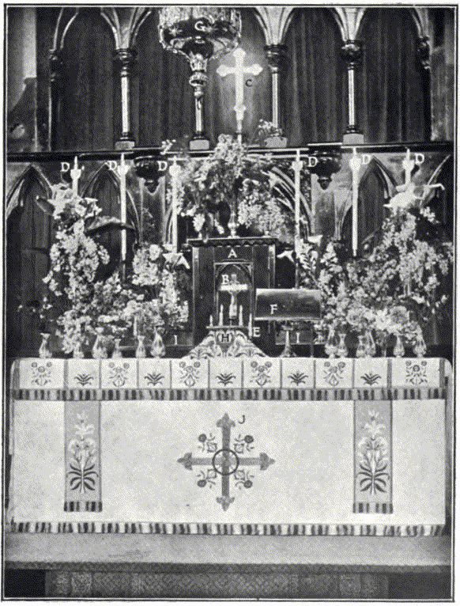

ТАБЛИЦА 17. — Алтарь, изображающий (а) Табернакль; (b) Табернакульный крест; (c) Алтарный крест; (d) Шесть больших свечей; (e) Маленькие свечи; (f) Чтецкий столик; (g) Святильник священного святилища; (h) Чашу, покрытую вуалью и увенчанную Бурс, (i) Градин или полка; (j) Фронтальная часть алтаря.

Важно учесть и другой аспект. Все силы помощи и благословения, призываемые во время служб, проникают через служителя и его ассистентов, их одежда определенным образом приготовлена для приема и распределения этих сил, что будет объяснено далее. Цвет данной одежды играет значительную роль, так как он влияет на энергию, хранимую в ней; тогда как цвет служительской робы никогда не препятствует потоку божественной силы, он может облегчить его проникновение, если он согласуется с особой разновидностью этой действующей силы, и может вызвать небольшие трения, если он не подходит. Как правило, темные и тусклые оттенки малоэффективны, а черный цвет (отсутствие всех цветов) ставит серьезные препятствия на пути; по этой причине черный цвет никогда не используется в Либеральной католической церкви.

_Так, сезоны Церкви сами по себе являются своего рода таинством, устроенным для блага народа, чтобы в разное время развивалась та или иная сторона их души под медленным и неуклонным воздействием цвета, действующего на них, когда они находятся внутри священного здания. Понимается, что данное воздействие не может вынудить равнодушного, легкомысленного или предвзятого человека перейти в определенное состояние, но только что, если личность открыта и стремится приложить усилия в правильном направлении, этот метод предоставляет более благоприятные условия для таких усилий. Церковь не может способствовать духовному развитию человека; она ему лишь предоставляет благоприятные условия для его развития. Это всё является помощью; и мудрый человек ни в коем случае не игнорирует даже незначительные помощи на трудном пути._

На данный момент Церковь использует четыре цвета — белый, красный, фиолетовый и зеленый, а также пятый (розовый), который используется лишь дважды в году церквями, имеющими его в наличии. Каждый из этих цветов подходит для определенной формы проливания священной силы. Другие цвета были применены в разные периоды истории Церкви, особенно в Англии во времена старого сарумского обряда; синий цвет использовался для праздников Богородицы, а желтый — для дней Конфессоров, однако это не имело особого практического значения, и дополнительные затраты были значительны, поэтому восстановились четыре основных цвета, которые изначально были установлены традицией.

Белый цвет применяется для великих праздников, таких как Пасха, Рождество, Вознесение, Троица, а также для праздников Девы Марии, ангелов и всех святых, не являющихся мучениками. Стоит ясно понимать, что эти великие праздники — это не просто исторические торжества; они являются временем особого излияния божественной силы. Вероятно, на заре истории это были времена, когда из-за астрономических или сезонных причин были удобны силовые притоки; а теперь это, можно сказать, соглашенные между небесами и землей моменты для _"особых дождей благословения"_. Вполне понятно, что в такое время, как Рождество, когда все люди склонны к мыслям о милосердии и любви, они гораздо открытее к высшим влияниям, нежели в условиях подозрения и нагрузок обычной жизни. Они моментально готовы принять благодать свыше, и воспользоваться тем, что им предлагается, и происходит излияние. Ангелы и другие, причастные к такому служению, знают об этом договоре заблаговременно, точно также, как мы, и готовы к действию.

Белый – это синтез всех цветов, объединение их всех, символ не то только чистоты, но и высшей радости и величайшего восторга. Именно поэтому в наиболее значимые моменты возлагается вся полнота мощи белого света. В некотором отношении, возможно, он лучше выразим искрой золота, а не бели, причем я не имею в виду золотисто-желтый оттенок, а блеск самого металла. По этой причине Церковь позволяет использовать золото в качестве подмены для всех цветов, за исключением фиолетового. Белый свет представляет собой полное и совершенное излияние. Но мы не всегда в состоянии выдерживать или реагировать на всю его мощь. Поэтому чтобы получить от него максимальную пользу, мы должны быть подготовлены к его приему через отдельные компоненты этой цветовой схемы. Разбиение солнечного света на отдельные цвета становится символом действия божественной любви по отношению к человеку. Таким образом, используя различные оттенки этой цветовой гаммы, мы сможем стимулировать разные аспекты нашей сущности.

Фиолетовый цвет применяется для подготовки нас к непосредственному восприятию бели. Фиолетовый свет обладает интенсивно быстрыми, проникающими, актиными, очищающими вибрациями. Его считают цветом покаяния, но более точным выражением этого является то, что он способствует самопознанию, вовлекает силы в наше внутреннее пространство, и таким образом наилучшим образом воздействует на внутреннего человека. Он вызывает и стимулирует в нас святые духовные стремления, которые состоят из смеси голубого цвета преданности и багряного цвета идеальной любви. Установлено, что белый цвет наиболее соответствует результатам, достигнутым после недель подготовки в Адвент и Великий пост к празднованию Рождества и Пасхи. В то же время фиолетовый больше подходит для периода подготовки, поскольку его вибрации воздействуют на наши высшие тела, делая нас качественными каналами для сил, которые будут вливаться в нас во время этих праздников. Я не в коей мере не утверждаю, что простое присутствие данного цвета в храме изменит суть людей, посещающих его службы. Однако если люди живы и отзывчивы к его влиянию, и понимают, что они должны делать сами со собой, то преобладание этого цвета и его вибрации облегчат им их нелегкую работу. То же самое касается и бдений, проводимых накануне дней святых, поэтому фиолетовый выбран и для них. По той же причине из-за его проникающей и очищающей силы он используется для всех обрядов экзорцизма, для святого помазания, для таинства отпущения и во время похорон.

Красный применяется на праздники Святого Духа и праздники мучеников с символическим смыслом, а именно, в первом случае, он отсылает нас к языкам огня Пятидесятницы, а во втором - к пролитой крови мучеников. На самом деле его сила - это духовная сила, мужество и экспансивность. Возможно, назначение Богу Святого Духа звания Утешителя принесло утешение многим страдающим, это, тем не менее, является несколько неполной и весьма условной интерпретацией греческого слова Parakletos. Более верными вариантами перевода этого титула станут «Поддерживающий», «Укрепляющий» или даже «Помощник». Традиционный перевод намекает на то, что Святой Дух начинает действовать только или преимущественно во времена горя. Однако в действительности Его мощь с нами в каждый момент, как вечно присутствующий источник вдохновения, башня силы, фонтан жизни, источник энергии, к которому мы можем обратиться и не останемся неуслышанными. Его роль как Утешителя страдающих в христианской традиции связывается с Пресвятой Богородицей, с которой Он настолько тесно связан. Однако обсуждение этой темы скорее относится к нашему следующему разговору. Красный также символизирует пламя любви. Церковный оттенок, названный амарантово-красным, вероятно, представляет собой компромисс между чистым алым или розовым цветом любви и малиновым оттенком мужества. Это превосходный цвет, вибрации которого всегда подбадривают и согревают. Находясь в противоположном конце спектра от фиолетового, он все же близок к нему по действию на нас, но в то время как фиолетовый цвет ведет нас к самоанализу, красный двигает нас к внешней активности.

Зеленый находится в середине спектра, располагаясь между этими двумя цветами. Он является цветом природы, травы и деревьев. Этот цвет представляет собой промежуточное состояние, баланс между силами, обладающий свойством вызывать симпатию и любящую доброту – ту дружелюбную заинтересованность, которую мы должны испытывать в отношении всех людей в любое время, осуществлять спокойную, мирную и в то же время любящую жизнь. Это тот цвет, в котором мы обретаем себя, когда нет ни одного другого. Он символизирует для нас внедрение в жизнь всего того, чему мы научились, использование в повседневной жизни мощных сил, которые мы накапливали во время празднеств.

Розовый, по древнему обычаю, заменяет фиолетовый в третье воскресенье Адвента и четвертое воскресенье Великого поста. Но многие церкви не имеют специального обмундирования на эти дни, поэтому его использование остается на усмотрение священнослужителя. Розовый цвет указывает на чистую духовную любовь, которая должна быть одновременно результатом и главной идеей наших подготовительных времен.

НАДАЛТАРНЫЙ ОБРАЗ. Вдоль задней стороны алтаря располагаются один или два уступа или полки высотой около шести дюймов, называемые ретаблами или градинами. На этих уступах стоят шесть больших свечных подставок, вазы с цветами, а в середине размещается ковчег, именуемый табернакулем, в котором хранится ✠ (Евхаристия). Табернакуль зачастую ставят прямо на алтарь, прорезав в середине ретабл, чтобы освободить для него место. Некоторые указания рекомендуют, чтобы табернакуль был выполнен в виде небольшого железного сейфа, вмурованного в стену церкви или вершину каменного алтаря. Он должен иметь спереди дверь, открывающуюся наружу, или, возможно, удобнее — сдвоенную дверь, раздвигающуюся в середине. Известны примеры табернакулей с изогнутой передней стороной, дверь которых открывается в сторону. На наружной стороне двери должен быть неглубокий латинский крест из латуни, который, однако, порой может быть прикрыт шелковой завесой цвета соответствующего дня. Внутрь табернакуля следует быть позолочено или отделано белым шелком. Большой стоячий латунный крест (не крест с телом Христа) должен быть размещен сверху или сразу над табернакулем, так, чтобы его хорошо видели прихожане. Изображение креста с телом Христа следует всегда избегать, так как оно ассоциируется с множеством ложных и вводящих в заблуждения идей. Существует редкая форма, представляющая Христа в короне, царствующего с креста — это изображение гораздо старше и более уместно, чем другая версия. На алтаре должны быть размещены вазы с цветами, а в праздники — разветвленные подсвечники для дополнительных свечей меньшего разме

Нет ограничения на количество свечей, которые можно использовать в знак более великих Праздников. Во время Низкого Празднования должно быть зажжено не менее двух больших свечей или, по римскому обряду, четыре, если президирует епископ. При благословении или экспозиции Пресвятого Сакрамента всегда должно гореть не менее двенадцати свечей, хотя их количество может быть значительно больше. В торжественной Папской Службе, проводимой обычным образом, зажигается седьмая свеча, которая устанавливается за алтарным крестом, чуть выше шести остальных. Она также может быть прикреплена к самому кресту.

ЧАША И ПАТЕНА

Среди всех атрибутов, используемых в Сакраментах, наиболее важными являются чаша и патена (Рис. 18). Они должны быть изготовлены из золота или серебра, причем если используется последний металл, внутренняя часть чаши и верхняя поверхность патены должны быть позолочены. Если необходимо экономить, ножка и основание чаши могут быть изготовлены из металла низшего качества, хотя это не рекомендуется. Они должны быть освящены епископом и после перепозолотки (что следует проводить, как только золотое покрытие начинает изнашиваться) должны быть повторно освящены.

В древние времена чаши и патены часто были тщательно обработаны и усажены драгоценными камнями. Иногда они были значительно больше, чем используются сейчас; известен случай средневековой патены массой тридцать фунтов, а знаменитая чаша Ардагх вмещает три пинты. Это двухручная ваза, по форме напоминающая современный суповой турин, великолепно украшена золотом и богатой эмалью - подлинный шедевр искусства древнеирландского золотыхудожника. Её дата неизвестна, но предполагается, что она датируется 800-900 гг. н.э. В ранних текстах Церкви упоминаются чаши из стекла, кристалла, слоновой кости и даже древесины и рога, хотя последние были строго запрещены.

ДРУГИЕ СОСУДЫ И ТКАНИ

В связи с чашей следует упомянуть корпорал и пурификатор (Рис. 18). Оба изготовлены из самого белого и тонкого льна. Корпорал - так называется, потому что на нём помещается Corpus или Священное Тело - разворачивается на алтаре над освященным камнем, и на нем размещают Святую Тайну и чашу во время Праздника. После службы его складывают и помещают в бурсу (Рис. 18). Пурификатор используется для очистки и вытирания чаши, патены, губ и пальцев священника после омовений. Пал (Рис. 18) - это маленький квадрат жесткого льна с вышитым крестом, который кладется на чашу в качестве крышки. Бурса представляет собой квадратный конверт для хранения корпорала; она обычно укреплена картоном, как и пал, и на одной из ее сторон вышит крест. Чашный покров (Рис. 18) достаточно велик, чтобы покрывать чашу и свисать со всех сторон от нее. Он украшен золотым крестом у одного из его краев, что позволяет его легко расположить по центру, обращенному к прихожанам, когда покров накрывает чашу. Бурса и покров обычно изготовлены из одного и того же материала, как и литургический комплект, к которому они принадлежат, и украшены в соответствии с остальными.

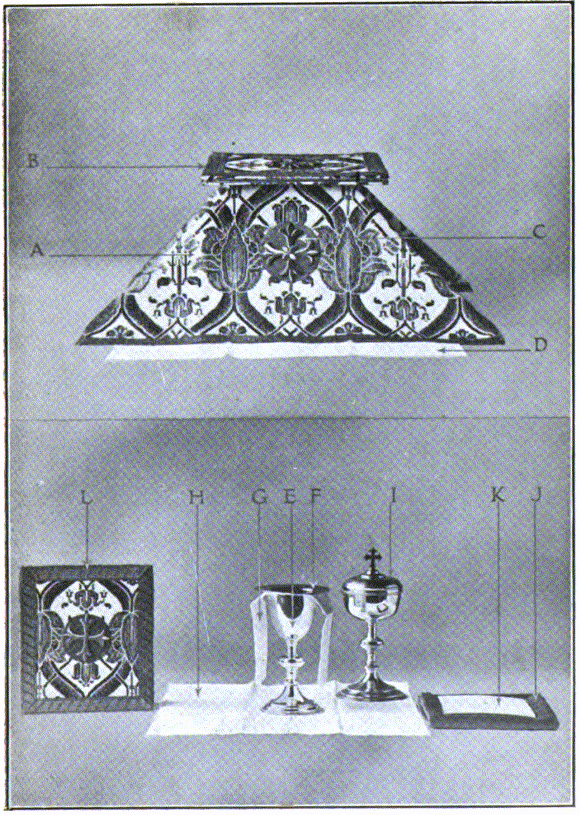

ТАБЛИЦА 18. (Рис. 1). — Вуаль и Бурса, покрывающие Чашу, (a) Вуаль; (b) Бурса; (c) Крест на лицевой стороне Вуали; (d) Льняной Корпорал. (Рис. 2). — (e) Чаша; (f) Патена; (g) Пурификатор; (h) Корпорал; (i) Циборий; (j) Сложенная Вуаль; (k) Палла; (l) Бурса.

Перед началом Служения всё выставляется таким образом (согласно Таблице 18): Корпорал сначала выкладывается на алтаре так, чтобы его центр был над центром алтарного камня; на нем стоит пустая чаша, на которую надевается пурификатор; патена ложится на пурификатор, а на ней находится большая просфора священника. На все это кладется палла, а затем вуаль надвигается на них так, чтобы она соприкасалась с алтарем со всех сторон, полностью скрывая чашу, причем ее ✠ обращен в сторону народа. Стоя отдельно со стороны Евангелия на алтаре или опираясь на вазу для цветов, также с ✠, обращенным к народу, находится пустая бурса. После омовения все возвращается на свои места, кроме, разумеется, просфоры на патене, а бурса, в которой лежит сложенный корпорал, и на которой находится ✠, лежит поверх вуали. Следует помнить, что Евхаристия может быть помещена только на золото или белый лен; ей нельзя позволять касаться шелка, хлопка или любого другого материала.

Циборий (согласно Таблице 18) на самом деле представляет собой покрытую чашу, и к нему применяются те же правила, что и к чаше; он должен быть из золота или серебра, и в последнем случае его внутренняя часть должна быть позолочена. Закрытие цибория обычно увенчано ручкой в форме ✠. В нем хранят просфоры для прихожан, и он открыто стоит на алтаре рядом с чашей, пока просфоры ожидают освящения. Евхаристия затем распределяется среди духовенства и народа из него. Циборий может быть помещен в табернакуль для сохранения оставшихся просфор. В этом случае его крышка тщательно закрывается, и его следует покрыть белоснежной шелковой вуалью. В больших церквях, где несколько священников помогают в раздаче причастию прихожанам, может быть соответствующее количество цибориев. Если на Богослужении с низким уровнем участия количество причастников мало, Евхаристию для них можно освятить на той же патене, что и Евхаристия священника, и раздавать ее с нее; но здесь требуется великая осторожность, чтобы предотвратить случайности, так как современная патена представляет собой маленькую круглую пластину из золота (или позолоченного серебра), часто без какого-либо края и только очень слегка вогнутую, поэтому требуется максимальное бдительность, чтобы Евхаристия не скользила с нее при перемещении по алтарю или переносе из места в место.

Удобно, чтобы в церкви была пикса — маленькая коробочка, обычно из серебра (но, конечно же, позолоченная изнутри), в которой можно хранить Евхаристию для благословения или для переноса к больным. В древние времена пикса часто была гораздом больше, чем сейчас, и очень богато украшена; одна в соборе святого Павла весила сорок две унции. Некоторые были выполнены в форме голубя, превосходно эмалированные; некоторые в форме башни или чаши с крышкой. Она часто вешалась над алтарем, и в этом контексте она заменяла наш табернакуль, который заменил подвешенную пиксу только во второй половине пятнадцатого века. Когда тяжелые алтарные балдахины вышли из моды, стало сложнее подвесить пиксу, и появился обычай хранить ее в нише рередоса, которая тогда должна иметь дверцу, которую можно запереть, и такая пикса постепенно превратилась в табернакуль. Чашеобразная пикса постепенно получила подставку ради удобства, и таким образом стала предком нашего цибория.

Монстранция (Иллюстрация 19), которая служит местом для размещения Хостии во время проведения Торжественного благословения и когда она несется в процессии, на самом деле является прозрачной пиксой. Древние монстранции создавались в многообразных формах: изображения различных видов, кресты, ангелы, держащие кристаллическую пиксу, увенчанную крестом, грандиозную трубу из кристалла, устойчиво установленную в металлической подставке, фигуры нашего Господа с кристаллической дверцей на груди, за которой вставлялась Священная Хостия - необычайнои разнообразие и неординарность форм, которые принимали эти предметы богослужебной утвари. Несмотря на это, они были практически всегда исполнены с художественным вкусом, и часто представляли собой предметы огромной ценности. Тип монстранции, который сегодня почти универсально используется, был принят в семнадцатом веке. Это изображение излучающего свет солнца, выполненное из золота или серебра, с кристаллической пиксой в середине, где Хостия удерживается в вертикальном положении при помощи специальной золотой (или позолоченной серебряной) клипсы полумесячной формы, которую называют "лунеттой". Необходимо подчеркнуть, что Хостия не должна касаться стекла.

ГЛАВА VIII

СВЯЩЕННЫЕ ОБЛАЧЕНИЯ

Относительно происхождения столетий церковного облачения существуют две школы мыслей. Долгое время преобладало мнение, что они были напрямую взяты из одеяний еврейского священства, о которых настолько подробно и усердно говорится в предполагаемом законодательстве Моисея. Однако позже более тщательные и критические исследования объективно доказали, что они естественным образом вышли из обычного платья гражданина Рима первого века нашей эры, хотя в их фактуру, очертания и количество, предположительно, были внесены разнообразные изменения для максимального сближения еврейской и христианской систем. Сначала священники носили гражданское платье, уделяя особое внимание его чистоте и высокому качеству материала; но когда примерно в шестом веке начала меняться мода на эту гражданскую одежду, Церковь решила, что изменения не соответствуют достоинству богослужения и целям, которые она преследует, поэтому она сохраняла старые формы, постепенно модифицируя их по мере течения веков. Я не сомневаюсь, что в таких модификациях она получила определенные указания от небесных сил - конечно, не в каждой мелочи, но достаточные для создания приличных и подходящих облачений, которые могут быть легко использованы для стечения и распределения сил, с которыми мы имеем дело в наших богослужениях. Величайшие всегда избегают доминирования над мыслями человека, но они всегда готовы прийти на помощь с советом, если их попросят, и они тихо влияют в правильном направлении на тех, кто открыт к такому наставлению.

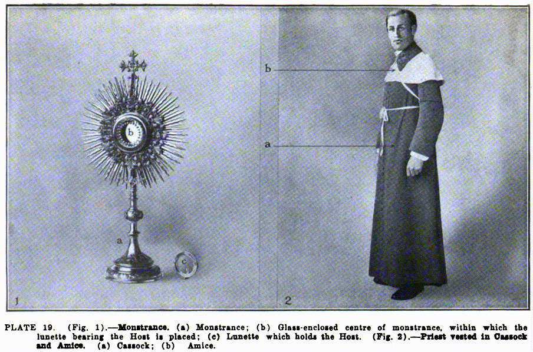

Если мы стремимся понять результаты экстрасенсорного исследования значимости и эффективности священных одеяний, сначала необходимо осознать, что они должны отвечать двум разным наборам требований. Они играют двухвековую роль; они должны вызывать эстетическую симпатию у людей (или, по крайней мере, не должны их отвращать) и они не должны препятствовать силам, которые через них проходят. Наилучший тип священных одеяний, использованных Церковью в наши дни, весьма удовлетворительно отвечает первому из этих условий; они выглядят презентабельно и солидно, красиво окрашены и украшены, и они сохраняют глубокий интерес исторической непрерывности. Однако, рассматривая их с второй точки зрения, мы обнаруживаем, что некоторые типы более полезны, чем другие; и это то аспект вопроса, которому я собираюсь посвятить настоящее обсуждение.

Некоторые люди с забавным нетерпением относятся к ритуалам и священным одеяниям, активно протестую против них, неустанно требуя, можем ли мы обойтись без них. Конечно можем. Великая Жертва Святого Евхаристии может быть преподнесена, сила может быть вызвана, благословение может быть разлито без всех этих аксессуаров; однако с их помощью все это можно сделать значительно легче и безболезненнее. Вы можете некоторое время обходиться без смазки вашего двигателя; однако вскоре вы обнаружите, что он работает с меньшей эффективностью и сильнее изнашивается. Ритуал, одежда, колокола, свечи, благовония - все это средства для экономии энергии, чтобы меньше терялось в "механизме" и больше оставалось для великой цели Жертвы. Сила Божия, утверждают люди, бесконечна; Он может выполнить свою Волю без нашей помощи. Они не задумываются над тем, что у Него, не исключено, может быть бесчисленное количество целей, к которым Он хочет направить эту силу, и что недостойно с нашей стороны оставлять Его расходовать ее из-за нашего упрямого пренебрежения. Несомненно, человеческая воля, когда она правильно развита, может сделать все; но гораздо легче это делать, и с меньшим бременем для Источника всей силы, если использовать немного разума в подготовке подходящего "механизма". Эфирная материализация, например, могла бы заменить некоторые священные одеяния; но энергия, затрачиваемая на такую материализацию каждый раз, была бы на порядок больше, чем та, которая нужна для создания одеяния — не говоря уже о возможности для члена общины принять участие в этом добром деле. У многих священников нет малейшего представления о том, как многие вещи работают; и Христос задумывал, что его план должен работать даже в руках невежественных. Вот почему службы окружены множеством мелких предосторожностей, и отказываться от предписанного ритуала имеет смысл только если вы четко понимаете все, что от этого зависит. Безусловно, наш Господь может работать со всем, что у нас есть, но мы, с нашей стороны, должны делать все возможное, чтобы предоставить Ему наиболее подходящие "каналы".

Давайте рассмотрим различные церковные одеяния по очереди; некоторые упоминаются лишь кратко, в то время как другие могут требовать комментария или пояснения.

РЯСА

Ряса (Иллюстрация 20) - это просто длинное наружное пальто или туника с одним вертикальным воротником, являющимся частью обычного наряда одиннадцатого и двенадцатого веков. Позже его заменила у мирян более короткая форма одежды, которая по различным причинам оказалась более удобной, но Церковь сохранила рясу из-за ее большой достоинства и изящества как основы для других священных одеяний; и поэтому она стала внешним отличием духовенства при ежедневных службах. В наши дни ряса часто замыкается на длинный ряд пуговиц от шеи до ступней, которые кто-то когда-то сравнил с паровым котлом с рядом заклепок; раньше это был (и иногда до сих пор является) двубортный предмет одежды, одна сторона которого перекидывается через другую как в кимоно, и фиксируется на талии широким поясом того же цвета и материала, называемым поясом. Даже если есть пуговицы, пояс все равно должен носиться. В Англиканской церкви священники и диаконы носят черные рясы, а некоторые епископы принимают темно-пурпурный цвет. В Римской церкви священники и небольшие клирики носят черное, епископы — прекрасный розово-пурпурный, кардиналы — красные, а Папа — белые. Аколиты и хористы в обеих церквях носят разные цвета — красный, синий, пурпурный и черный. Рясы цвета красно-коричневой окиси железа, кажется, довольно часто использовались в средние века, однако сейчас они встречаются крайне редко, хотя я полагаю, что они до сих пор разрешены английскими рубежами. Я помню, что Отец Стивен Хокер из Морвенстоу всегда носил один.

В Либеральной Католической Церкви мы решительно протестуем против "цвета отрицания", так называемого черного, и никогда не применяем его. Таким образом, одеваем наших аколитов, туребоносцев, носителей ✠, свеч, ладии и посохов в шарлатан, наших певчих (независимо от возраста) - в голубые рясы, а священников, диаконов и субдиаконствующих - в темно-фиолетовые. Наши епископы носят традиционную розово-фиолетовую литургическую одежду. Сутана всегда должна быть настолько длинной, чтобы скрыть нижнюю часть брюк.

В Средние века этот предмет одежды носился не поверх обычной одежды, как это делается сейчас, но сам был ею, с собой имея лишь нижнее белье. Так что зимой его часто подстелывали мехом или овечьей шерстью для защиты от холода, что впоследствии и стало причиной появления в позднем латинском термина "pellicea".

Невзирая на его представительность и приличность, эта одежда представляет собой определенную преимущественность для служителей, так как является выразительной церковной униформой, наполненной силой неисчислимых богослужений, пронизанной мыслями о высшей жизни и жреческом труде, и помогающей избавляться от тривиальности ежедневной жизни.

РЯСА-РАЗОН

Это одежда (Рисунок 21), которую обычно носят священники, диаконы и певчие при всех обстоятельствах, кроме причащения или благословения, проводимых основными диаконами и субдиаконами. Свое название она получила благодаря звуковым изменениям из латинского слова superpellicea, что обозначает "надевается прямо поверх сутаны". Разон, альб, роше и кута - все это разновидности исходного одеяния, хотя каждое из них подверглось определенным изменениям для конкретных случаев использования. По сути, это длинное белое льняное одеяние, надеваемое через голову, с широкими рукавами, расширяющимися вниз к рукам, образуя грациозные складки. Она является прямой потомком римской туники таларис, хотя также напоминает мозаичную тунику Левитского священника. Эта одежда прошла множество изменений формы и стиля. Двести лет назад в Англиканской церкви переднюю часть одеяния, например, делали расстегивающейся по все длине и фиксировали ее на шее кнопкой, чтобы можно было надеть разлон без снимания огромных и удивительных париков, бытие которых было модным тогда. Такие изменения лишили эту одежду функциональности, для которой она была предназначена, но те, кто ее носил, мало заботились об этом. Современное одеяние римских служителей во многих местах стало просто издевательством, смехотворным и неподобающим видом, нелепо укороченным и краем обшитым кружевом, что создает ассоциацию со юбкой балерины. В других случаях первоначальное отверстие, предназначенное лишь для головы, стало широкой бейкой, лежащей на плечах, вспоминая сарафан или молочницкий костюм. Все эти причуды нужно избегать, поскольку они мешают выполнению функций одеяния и, очевидно, были введены людьми, не знающими его значение в церковной работе.

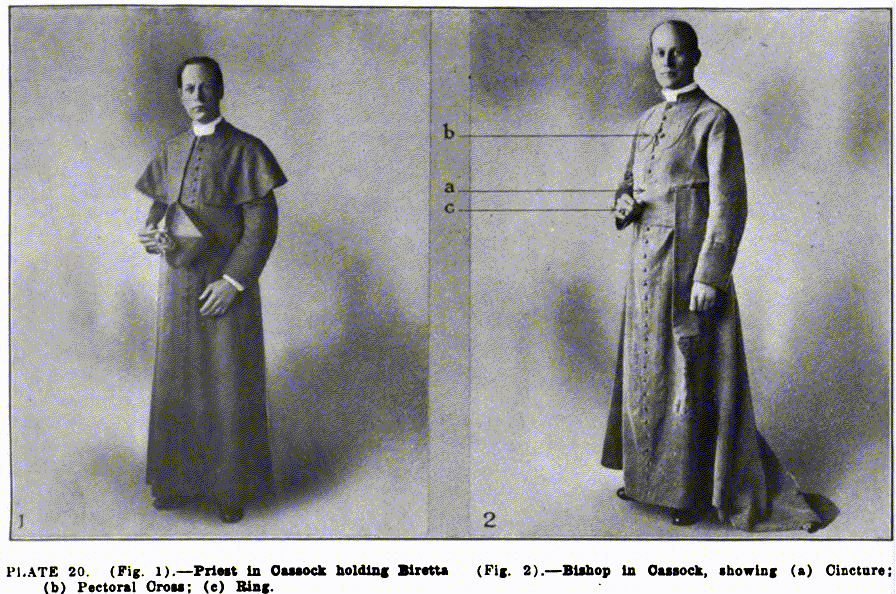

Я не утверждаю, что нам следует углубляться в символические значения, которые церковники приписывают различным облачениям, ведь они настолько широко различаются, что во многом это является вопросом индивидуального восприятия. Однако, есть прелесть в мысли видеть в белизне рясы эмблему чистоты жизни, так необходимой для тех, кто искренне служит нашему Господу; и это подчёркивает для носителя необходимость регулярно стирать и гладить это одеяние, чтобы оно могло более точно отражать эту добродетель. Все это делает его более приспособленным для выполнения его предназначенной работы.

Для понимания этого нам следует помнить, что облачения обладают несколькими функциями. Некоторые защищают того, кто их носит, служат щитом от вредных влияний; другие предоставляют возможность накапливать энергию, и все еще иные устроены так, чтобы облегчить ее распределение. Иногда высвобождение божественной энергии происходит явно и полностью извне, как во время Службы или Благословения Пресвятого Сакрамента; иногда она задумана работать главным образом через усиление природных сил священника. Наш Господь особенно тесно связывает своих служителей с Собой в момент их священственного рукоположения, и эту связь невозможно потерять, хотя священник может укрепить ее благочестивым применением, или ослабить своим безразличием или постоянным ее забыванием. Во всех богослужениях Церкви, за исключением тех, которые связаны со Святым Евхаристийским Таинством, Господь использует эту связь в качестве канала Своей силы; когда это происходит, ряса становится наиболее удобным облачением. Она играет роль, которую можно сравнить в меньшей степени с ролью мыслительного здания во время Евхаристии, ведь внутри нее сила сгущается и накапливается, лен практически непроницаем для этих вибраций и поэтому действует как хороший изолятор. Священник излучает скопленную энергию на своих прихожан, когда поднимает правую руку в абсолюции или благословении, или двигает обе в фразе _Dominus vobiscum_; отсюда и использование широких рукавов. Также происходит стабильное излияние через столу, о которой мы поговорим позже. Ряса (иллюстрация 21) либерального католического священника должна быть из льна, достаточно длинной, чтобы свисать ниже колены; у нее должно быть круглое отверстие для головы, настолько маленькое, насколько это позволяют условия использования, и рукава, спускающиеся до запястий, и достаточно широкие, чтобы касаться боков при полностью протянутых руках на уровне плеч. Воротниковый ободок вокруг отверстия для головы должен быть гладким, а все складки и мяты на этой части облачения следует тщательно избегать, поскольку они серьезно снижают его функциональность. На нем не должно быть ни кнопок, ни кружевной отделки или украшений.

Я предоставляю серию фотографий облачений Церкви в первую очередь для того, чтобы наши служители могли видеть, какие формы оказались наиболее подходящими с внутренней точки зрения для быстрого пропускания божественных сил; и я надеюсь, что те, кто достаточно любезен, чтобы шить облачения для наших священников, будут придерживаться здесь представленных образцов. Распределение сил является целью ношения этого особенного одеяния, и его функциональность не должна быть жертвована персональным предпочтениями создателя или пользователя.

THE GOTTA

Эта (Табл. 21) представляет собой более укороченный вариант сурплики, изготовленный тем же способом, но длиной лишь до середины бедра. Короткие широкие рукава опускаются чуть ниже локтей. Низ котты и концы рукавов украшены кружевом. В Либеральной Католической Церкви этот облачение носят лишь юные алтарные служители, но не клирики или хористы. Его внутреннее предназначение - защищать важные органы тела от неприятных воздействий окружающей среды, которые могут легко соприкоснуться с теми, кому приходится общаться среди разнопланового собрания.

THE STOLE

Стола (Табл. 21) - это узкая полоса шелка или вышивки, напоминающая ленту, обычно три или четыре дюйма в ширину в середине, шесть или семь дюймов на концах и длиной восьми футов. Обычно она окантована по обеим сторонам золотым шнуром или плетением, и на каждом конце имеет пышные золотые бахромы. В средние века эти бахромы часто изготавливались из жемчужных нитей или других драгоценных камней, прерывающихся тонкими золотыми колокольчиками; однако сегодня это уже не принято.

Стола может быть сравнительно простой или очень богато украшенной, но на ней всегда изображены три золотых креста: один на каждом конце и один (гораздо меньший) посередине. Священник целует этот маленький крест прежде, чем надеть столу через голову; он располагается на затылке, в то время как концы столы свисают спереди до колен. Эти концы иногда немного расширяются, чтобы дать место большим крестам. Извращения приняли свой ход примерно в XVIII веке, когда этот элемент стал неуклюже расширяться, и его концы приняли непривлекательные формы, напоминающие подобие лопаты, в то же время стола была значительно укорочена, так что она едва доходила до талии носителя; однако сейчас, к нашему удовлетворению, мода вернулась к более старому, более элегантному и гораздо более эффективному дизайну. Удлиненная узкая форма неизбежно предполагает украшение столы изображениями святых и ангелов, расположенными друг над другом в разделах; и, действительно, мы обнаруживаем сотни примеров такого орнамента, среди которых есть исключительно яркие образцы средневекового искусства.

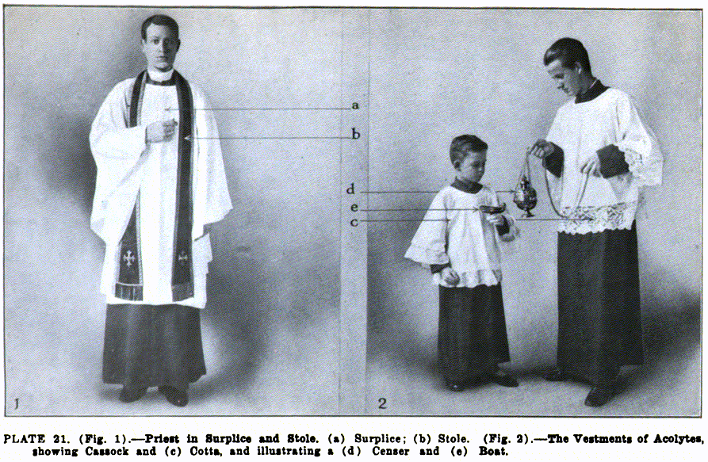

Стихарь часто является частью комплекта облачений, созданных в одном стиле. Евхаристический комплект включает в себя фелонь, стихарь, манипул, чашный покрывало и бурсу. К ним прилагается плащ для процессий, а также далматика и туника для дьякона и субдьякона.

Не обязательно иметь комплект, выполненный в одном стиле. Часто бывает так, что один прихожанин дарит фелонь, другой - плащ, третий - стихарь и манипул, каждый из которых выполнен в различных узорах. Важны сами облачения, их сочетаемость лишь придает эстетическую привлекательность. Весь комплект обычно изготавливается из одного типа материала, который может значительно варьироваться. Часто предпочитаются тяжело вышитые золотом, серебром и шелком гобелены, но также используются шелковый брокат, атлас или бархат. Цвет материала отличается в зависимости от сезона церковного года и может быть белым, красным, фиолетовым, зеленым или розовым. Чтобы быть полностью приготовленной, церкви нужно хотя бы четыре комплекта облачений (не учитывая розовый, который используется только два раза в году). Первым следует приобрести белый комплект, поскольку в очень бедных церквах он заменяет все остальные.

Стихарь носят только епископы, священники и дьяконы. Священник надевает его вокруг шеи, чтобы он свободно свисал впереди, для всех богослужений, за исключением Евхаристии, когда он перекрещивается на груди и застегивается поясом (Табл. 22). Епископ, отпевающий, не перекрещивает свой стихарь, чтобы не мешать излучению от его грудного креста. Дьякон надевает его в виде шарфа через левое плечо, соединяя концы на правом боку. Стихарь надевается поверх рясы или альбы, но под плащом, фелонью или далматикой.

Римская Церковь устанавливает использование стихаря только тогда, когда священник или дьякон осуществляют особые полномочия своей должности; таким образом, согласно этому порядку, он не надевается, например, на Вечерне. Либеральная Католическая Церковь приняла традицию Церкви Англии, согласно которой священник или дьякон всегда надевают свой стихарь во время любого богослужения в знак достигнутого духовного звания. Черный стихарь в Англиканской традиции, вероятнее всего, является продолжателем средневекового типпета, и на самом деле это не стихарь в привычном понимании.

Символические значения, приписываемые этому облачению, часто бывают несогласованными. Обычно считается, что стихарь символизирует "легкое иго" Христа, но его также трактуют как символ невинности, Божественного воплощения, терпения в трудностях, чистоты добрых дел, подчинения языка, земного происхождения и небесной цели человеческого тела, а также необходимости правосудия и милосердия в дополнение к воздержанию от зла.

Сила, которую накапливает священник во время службы, как я уже говорил, концентрируется внутри рясы. Большая часть этой энергии выходит через отверстие для головы, но золотой крест на стихаре притягивает его, подобно молниеотводу, и вместо того чтобы диссипироваться, эта энергия стремительно движется вниз по стихарю, сосредотачивается в вихре по бокам золотых крестов на концах и обдает прихожан через золотые бахромы у низа стихаря (Схема 13). Ниже представлена схема креста (Схема 14), наиболее эффективного для сосредотачивания энергии, чтобы она равномерно и постоянно выделялась. Золото - наилучший проводник этих высших сил; некоторые из них (но не все) будут работать почти так же хорошо через серебро или шелк; но золото является универсальным проводником для всех из них. Следует использовать наилучший доступный материал; многие из продаваемых как золотые тесьмы изделия на самом деле являются лишь блестками, которые, хоть и способны выступать в роли проводников, уступают по качеству реальному золоту.

Еще раз позвольте мне подчеркнуть, что я ни на миг не утверждаю, что для благочестия необходимы литургические одеяния. Я не сомневаюсь, что человек способен приносить достойное прославление и молитву в любое время, в любом месте и вне зависимости от одежды, и когда он так поступает, он получает соответствующее признание с высот. Я описываю то, что видит любой достаточно проницательный наблюдатель во время церковного служения, когда одеты традиционные облачения. И исходя из того, что я сам неоднократно был свидетелем, я утверждаю, что эти литургические одеяния имеют определенное и практическое значение, и что они позволяют нам воспринимать благодать божественной энергии, которая иначе вернулась бы к своему источнику, не оказав непосредственного воздействия на живого человека. Мне известно, что есть люди, которые не готовы принять эту идею и возмущаются при её упоминании. Однако независимо от их чувств факты остаются фактами, и они всегда могут обратиться к другим религиозным обрядам, если они предпочтительнее для них.

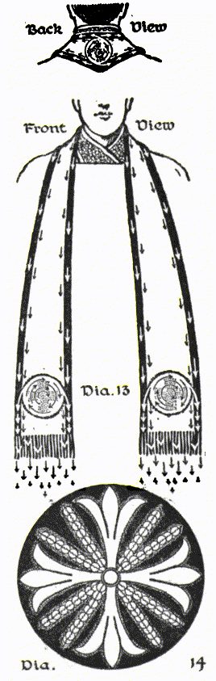

ДИАГРАММА 13. — Бурление Сил через Столу. — Энергия, которая сосредотачивается под мессой во время обряда, взлетает вверх через отверстие для головы, притягиваясь к металлическому кресту, прикрепленному к середине столы. Оттуда она струится вниз по обеим сторонам столы до её концов, где вокруг каждого прикрепленного креста ✠ образует вихрь. Затем она излучается на присутствующих через металлическую бахрому.

ДИАГРАММА 14. — Столин Крест ✠. Этот тип креста показал самые высокие результаты в концентрировании и равномерном распространении энергии.

THE COPE

Одежда, из которой впоследствии развилась плащаница (Рис. 25), изначально была тяжёлым наружным плащом, служившим защитой от дождя, что можно понять из её латинского названия pluviale. Сзади на ней был капюшон, который можно было надеть на голову; но когда её стали использовать в церковном обиходе, капюшон постепенно превратился в своего рода щит из богатой вышивки или золотой канители, утвердённый и отделённый бахромой - щит, полностью отделенный от рясы, и прикреплённый к её спине с помощью пуговиц или петель.

Разложенная на земле, плащаница имеет форму полукруга, а когда её накидывают через плечи, она выглядит как длинная мантия, доходящая почти до земли, и показывающая открытую полосу спереди, где она пристегивается на груди с помощью застежки, называемой морс. Орфрей[^21] или вышитая золотым шнурком полоса, обычно ширины шесть-восемь дюймов, идет вдоль хорды полукруга, так что когда плащаницу надевают, орфрей ложится вокруг шеи и спускается передними краями до ног в две широкие полосы. Пуговицы, которые удерживают капюшон или плащ, обычно расположены на нижнем краю этого орфрея на задней части шеи.

Оказывается, что если мы точно соблюдаем полукруглую форму, облачение садится очень неуклюже на плечи и, кроме того, стоит в непривлекательном виде на задней части шеи, тем самым теряя большую часть энергии, сгенерированной внутри. В Либеральной Католической Церкви мы избегаем этих трудностей, делая плащаницу формой, подходящей для плеч, что делает ее не только более элегантной, но и более комфортной, а также лучше приспособленной для своей работы.

Плащаницу надевают во время процессий, на Торжественном Вечере, на Асперже перед празднованием Святого ✠ Евхаристического Таинства и на Благословении Благословенного Сакрамента. Во время больших праздников все священники надевают плащаницы, если они имеют их, но в обычные воскресенья только служитель использует рясу во время процессии и Аспержа. Согласно Римскому обычаю, их также могут носить певцы. Мы читаем, что в 1552 году было двести восемьдесят плащаниц в сокровищнице собора Св. Павла, некоторые из них имели огромную стоимость. Сегодня для нас трудно представить количество облачений, которое было в наших великих церквях, прежде чем они были захвачены королем Генрихом VIII. Для осознания их богатства нужно просматривать инвентарные списки, перечисляющие их имущество. Не удивительно что это пробудило алчность данного беспринципного монарха, и можно предполагать, что он не был полностью неоправданным в своем убеждении, что часть этих богатств могла быть была лучше использована на благо всей нации. Церковь должна иметь достаточно и достойные облачения для своего духовенства, но хранение их тысячами может вызывать критику. Замечательным образцом средневековой вышивки является плащаница Сиона, которая сейчас находится в музее Южного Кенсингтона. Она обильно украшена геральдическими эмблемами и изображениями из священной истории, и должно было быть удивительно эффектно, когда её носили. Я помню более современную плащаницу из золотой ткани, на плаще которой была замечательная репродукция "Последней Вечери" Леонардо да Винчи.

[^21]: Это слово является усеченной формой от латинского aurum Phrygium — "фригийская золотая работа". (Плиний, Riii. 48.)

Поскольку плащаница является одной из "комплектных" религиозных одежд, материалы, упомянутые для столы, также могут быть применимы к ней. Морс иногда является высоко декорированной полосой броката, а иногда замком из металла, часто эмалированным и богато украшенным драгоценными камнями. В средние века он часто был одним из самых изящных и дорогих произведений ювелирного искусства; история сообщает нам, что великолепный морс, который Бенвенуто Челлини изготовил для папы Климента VII, был в основе всего его последующего богатства.

Понимая внутреннее применение плащаницы, мы должны помнить, что во время наших служб активизируется большое количество разных видов силы. Мы можем классифицировать самые важные из них в три группы, полностью исключив на момент самую удивительную из всех — ту, что пронизывает освященный Хостий.

1. Те (к которым я уже обращался), которые передаются по особому связующему каналу Христа со своим священником, или из аккумуляторов духовной энергии. Они, входя через высшие части священника и материализуясь или преобразуясь внутри его тела, собираются внутри рясы, альбы или роше.

2. Течения, которые создают силы первого типа путём индукции, вне этих льняных облачений, если для них создаются подходящие условия — то есть, если надеты стола, плащаница или мантеллетта.

3. Силы, заряжаемые извне. Величайшей из них является та, что исходит от святого ✠ Хостии; вместе с тем, несменимый поток энергии неуклонно излучает от магнитных камней на алтаре и от крестов и светильников, которые особенно отведены для Обители. На крупных службах, особенно в моменты использования благовоний, всегда ощущается обильное присутствие святых Ангелов; чудесные силы, беспрерывно исходящие от них, более эффективно улавливаются и преобразуются в пользу общины, когда священнослужители одеты в подобающие облачения, выполняющие роль проводников.

Мы подробнее обсудим таинство Святой Евхаристии позже, поскольку для него предназначен особый комплект ряс. На всех остальных обычных фериальных (то есть, не праздничных) службах, силы второго и третьего рангов собираются и распределяются должным образом при помощи столы; однако в моменты особого пролития целесообразно дополнить это плащом, который обладает значительно большими возможностями. Индуцированные токи второго типа вызывают общее излучение, напоминающее то, что ощущаются рядом с Ангелом; рясы ловят и направляют его. Вода, вытекающая из уличного гидранта, в основном уходит впустую; направьте ее через шланг пожарной машины - и она станет чрезвычайно эффективной.

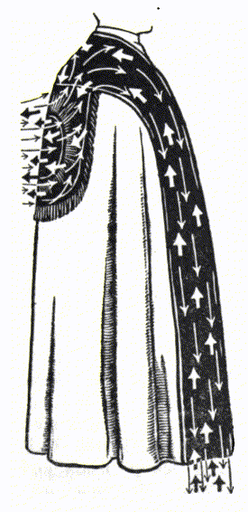

ДИАГРАММА 15. — Протекание Сил через Омофор. Широкая металлическая полоса на омофоре действует словно величественная эпитрахиль, за исключением того, что силы, к которым он приобщается во время процессии или при обращении священника к алтарю, поднимаются к плечам, опускаются в омофор и отсюда распространяются на собравшихся. Когда священник обращается лицом к вменимости, омофор впитывает силу от алтаря, которая затем течет по эпиманациям и изливается на верующих с нижних концов металлических полос.

Омофор особенно ценен в процессиях, поскольку он собирает силу от проходящих ✠ и у алтаря во время Торжественных Вечерниц, когда принимает величественный выброс энергии, вызванный молитвой Te Deum. Эпиманации омофора могут быть рассмотрены как своего рода эпитрахиль величественного размера; однако алхимия эпитрахили — преобразование, смешение и взаимное укрепление разнообразных сил — происходит в вихрях, вызванных ✠ на ее концах, тогда как в омофоре это происходит в значительно большем масштабе на амплице на спине. Например, на Торжественных Вечерницах амплиц становится подобием солнца, излучающего ослепительный свет для тех, кто обладает даром прозрения, когда священник стоит перед алтарем во время молитвы Te Deum; но когда он поворачивается, чтобы благословить народ, вихрь обращается вспять, и амплиц становится мощным поглотителем энергии, которая затем ринется по эпиманиациям и изливается на верующих с нижних концов, поднимаясь, как ей и свойственно (Диаграмма 15).

THE ALB

Теперь мы переходим к особым евхаристическим одеяниям, которые начинаются с альбы (Иллюстрация 22). Её происхождение также как и у рясы, однако её развитие прошло немного иначе, чтобы приспособить её к особому месту, которое ей было отведено. В своем текущем виде это белое льняное одеяние с узкими рукавами, которые идут до нескольких дюймов до низа рясы, и затягивается поясом (Иллюстрация 22). В Римской Церкви это одеяние может быть довольно объемным, с множеством складок и запахов. В частности, известно, что Святой Карл Борромео рекомендовал окружность в семь ярдов для низа альбы! Бывает, что её стягивают у шеи при помощи кнопки или завязок. Прямоугольные нашивки из роскошного броката, называемые "аппарелями", часто пришиваются к нижней части альбы, как спереди, так и сзади; но иногда в альбе делаются отверстия той же формы и размера, которые оформляются деликатным кружевом, так что цвет рясы просматривается. В ранние времена круглые пластины или диски из золота были прикреплены к альбе на месте, занимаемом современными "аппарелями", но с течением времени это практика была отказана.

Для Либеральной Католической Церкви мы приняли тип альбы, который на практике оказался наиболее удобным с духовной точки зрения. Она полностью без кнопок или завязок и имеет отверстие для шеи, аналогичное тому, которое на рясе, настолько маленькое, насколько это удобно, и с простым плоским воротом, без складок, запахов или воланов. Этот последний условие особенно важно, поскольку каждая складка вызывает нарушение равномерности потока силы, и таким образом создает дополнительные трудности. Альба свободно надевается поверх рясы, имеет обычные пальтообразные рукава с глубоким кружевным окантованием и большие отверстия, в которых размещены кружевные "аппарели" (как описывалось ранее), как спереди так и сзади, на несколько дюймов выше подола. Она спускается почти до ступней, но должно быть видно несколько дюймов рясы. Пояс надевается вокруг талии, но альбу через него не стоит протаскивать, чтобы она свисала, как это иногда делается в других ветвях церкви. Пояс служит для прижатия альбы к рясе; он не укорачивает или не сильно складывает её.

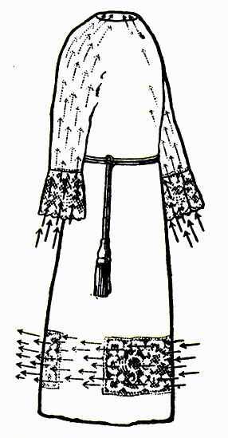

ДИАГРАММА 16. — Поток Сил под Альбой✠ — Ежедневно, когда священник прикасается к Евхаристии или чаше, энергия, исходящая от них, протекает через его руки под льняной альбой, и изливается из отверстия для головы, чтобы затем быть направленной к амикта и столе, которые перераспределяют её к прихожанам. Таковы края столы и орфреи казулы. Пояс предотвращает движение этой силы вниз. Другие энергии из нижней части алтаря проходят через кружевной убор у основания альбы, который находится ближе всего к алтарю, циркулируют под альбой и излучаются к прихожанам через другой убор.

Сущность использования альбы по сравнению с сурплицом в некотором роде схожа, но в других аспектах существенно отличается. Белая льняная ткань служит мощным щитом, своеобразной защитной броней для священника, и изолирует его так, чтобы максимально исключить воздействие неблагоприятных внешних факторов. Рукава альбы не делают широкими, так как это ритуальное платье не надевается в те случаи, когда внутренняя сила священника является основополагающей. Во время служения богослужения сила, как правило, не направляется вниз через руки священника, как раньше, но поднимается из священных Элементов, которыми он заведует, и, неся с собой личные энергии священника, выходит через амикт и столу. Она контролируется от любого движения вниз мягким давлением пояса; в то время как другие энергии от алтаря проникают через убор, который обращён к ним, и (опять же неся с собой часть личности священника) излучаются к прихожанам через противоположный убор (Диаграмма 16).

THE AMICE

Это облачение (Рис. 19) обычно представляет собой прямоугольный лоскут льна, простой или сформованный под плечи, со шнурами от верхних углов, которые перекрещиваются на груди и завязываются вокруг тела носящего его, таким образом, оно остается на шее и плечах. Кажется, изначально оно было предназначено для защиты головы и, как реликвия этого применения, римский священник все еще кратковременно касается им своей головы прежде, чем надевать его на шею. Возможно, в древние века это служило простым средством защиты горла или предназначалось для предотвращения стекания капель пота на хасул. В средние веки верхний край, который перекрывал ворот хасула, был украшен элегантной отделкой и иногда снабжен крупными ювелирными украшениями. Эта отделка сейчас запрещена Римской церковью, хотя с внутренней точки зрения это самый ценный элемент облачения. Наши ученики должны быть осторожны, чтобы не путать амикс с альмуцией, который является совершенно другим церковным одеянием, даже если последний иногда искажается в wmy$ или amess. Происхождение слов расположено вдали друг от друга, хотя современные формы очень похожи.

В Либерально-католической церкви мы сохраняем амикс в его средневековой форме, с золотой вышивкой вдоль его верхнего края, так же как и ритуалистическое движение в Церкви Англии. Вышивка может быть цвета дня, но было обнаружено, что вышивка белого или насыщенного красного шелка или атласа, украшенная золотым кружевом, подходит для любого времени года и гармонирует со всеми цветами, кроме розового. Некоторые из нас даже отказались от прямоугольного лоскута льна как такового и изобрели что-то, что по сути является новым видом амикса, состоящего только из отделки, укрепленной букрамом или тонким картоном и закрепленной вокруг шеи, как воротник, немного сформованный под плечи.

Возможно, наши римские братья не признали бы это вообще как амикс, но с внутренней точки зрения, оно отлично выполняет свою работу. Для целей празднования Святого Евхариста желательно закрыть отверстие на шее альбы чем-нибудь, помимо столы, что будет служить отличным проводником мощной энергии, которая стремительно поднимается по рукам священника. Золотой воротник амикса прекрасно выполняет эту задачу и направляет силу к орфреям хасула, где она присоединяется к большому потоку, уже движущемуся там.

ПОЯС

Пояс (Рис. 22) - это веревка, которая стягивает альбу на талии. Его часто называют сукным поясом, но мне кажется, что это название более точно описывает широкую ленту, которая обхватывает кассоку (Рис. 20). Однако, этот пояс для альбы был в свое время тоже широким и плоским, сделанным из шелка или золотой ткани и усыпанным драгоценностями. Теперь это обычно плотно сплетенная веревка из белого льна, с большим кистями из того же материала на каждом конце; но он может быть из шелка или из золотой нити, последний, возможно, предпочтительнее. Некоторые священники имеют пояса четырех литургических цветов, чтобы гармонировать с остальными облачениями, но это не важно.

Работа пояса заключается в том, чтобы прижать альбу к кассоке на талии и закрепить на месте перекрещенные концы столы священника при проведении обряда.

ХАСУЛ 

Это (Рис. 23) - специальное жертвенное облачение, самое важное и высоко ценимое из всех. Самые лучшие материалы, самые изысканные украшения, лучшая работа с драгоценными камнями, самая сложная вышивка на протяжении веков церковной истории были вложены в хасул, который можно смело назвать придворным нарядом священника, поскольку он предназначен исключительно для его присутствия перед Христом, Небесным Царем. Считается, что оно символизирует бесшовную робу Христа и олицетворяет любовь, обнимающую и объединяющую все другие добродетели, оберегающую и освещающую их красоту своим покровом.

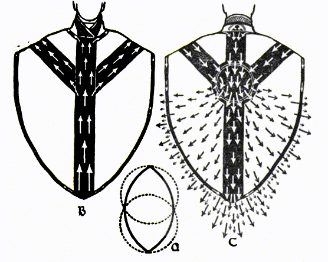

ДИАГРАММА 17 – Поток сил в ризе. Силы, исходящие от Пресвятий и Чали, захватывает центральный орфрей или столб ризы. Затем они поднимаются вверх, проходя вдоль гумеральных орфреев и вокруг горловины к противоположному столбу. Так, когда священник стоит лицом к алтарю, на людей изливается поток сил из центрального излучающего диска на спине и из нижней точки ризы, а когда он обращается лицом к людям, этот диск и столб собирают силу и посылают ее, струясь через плечи к переднему столбу, откуда она излучается на народ. Внутри ризы всплывающие силы перехватывает металлическое украшение амицта и включает их в общий циркуляционный поток, хотя некоторая часть может вытекать из-под краев одежды. Рисунок A представляет общую форму ризы, раскрытой на земле – это Vesica Piscis; Рисунок B показывает вид спереди, а рисунок C – сзади ризы. 

Оно, вероятно, изначально произошло от одежды, похожей на мексиканское пончо — большого круга ткани с вырезанным в центре отверстием, через которое просовывается голова. Соответственно, ранние ризы были колоколообразными, и некоторые описывали их как плащи с сшитыми вместе передними краями. Однако эта форма, несмотря на предполагаемую эффективность удержания силы, быстро стала непрактичной и неудобной, и риза превратилась в овальное одеяние, сокращенное по бокам до того, как оно достигает запястий, а в конечном итоге лишь немного ниже локтей носителя. Так была создана готическая риза, наиболее изящная и эффективная форма одежды, которая просуществовала все средневековье. Церковь Англии, если и использует евхаристические одежды, то использует это верхнее, как и наша Либерально-католическая церковь; но после Реформации римская церковь, преследуя удобство за счет эффективности, значительно сократила ризу, выбрав форму в виде скрипичного горба. В ней стороны одежды полностью урезаны, а полосы, перекрывающие плечи, служат лишь парой подтяжек, поддерживающих переднюю и заднюю части вместе. Обычно делается большой разрез для головы вместо маленького круглого отверстия для шеи. В этом изменении исходная и наиболее подходящая организация орфреев также была заброшена, и на ее место обычно приходит длинная прямая колонна золотой вышивки спереди и большой латинский крест сзади. Эти элементы часто красиво выполнены и удачно интерпретируются как столб, к который, согласно евангелию, был связан Христос, и крест, который он, как говорят, нес на холм Голгофы. Но они заметно менее полезны для потока духовных сил, чем более старый план ✠ креста, который имеет столб как сзади, так и спереди, с руками креста, в каждом случае наклоняющимися вверх, чтобы встретиться над плечами, придавая форму греческой букве пси (Табло 23), или латинскому кресту с косыми руками. Когда полосы так легко обозримы, столб на передней стороне называется пекторальным, столб на спине – гумеральными орфреями. Готический хорий, продолжает сохраняться, и говорят, что есть тенденция к возвращению к его использованию.

Риза, когда распростерта, образует фигуру, близкую к церковной фигуре, называемой везика пискис (диаграмма 17), остроконечный овал, нарисованный на двух равных кругах, окружность каждого из которых проходит через центр другого. Если смотреть спереди или сзади, риза имеет вид щита, своеобразного герба. Кроме уже упомянутых орфреев, сплошная золотая полоса проходит вокруг края всей ризы и вокруг отверстия для шеи, и в центре спины, в точке, где руки ✠ отойдут от средней линии, есть круг из золотой вышивки - обычно какой-то символ (Пресвятий и кубок, голубь, пеликан или буквы T.H.S.) окружаются световым кругом, что формирует физическое основание для вихря огромной силы.

Любой из материалов, описанных как подходящие для комплекта облачений, подходит для ризы, он должен быть достаточно гибким, так как жесткие и тяжелые складки препятствуют движению рук во время возвышения и могут создать неграциозный образ.

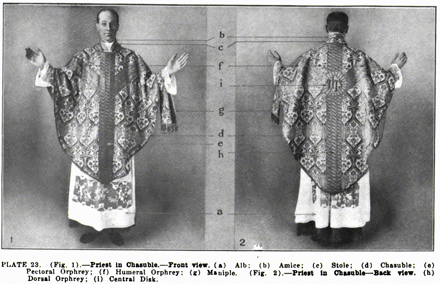

Орфры должны быть, по возможности, из золотой канители или золототканого материала. Иногда они изготавливаются из золотой вышивки на шелке, оттенок которого отличается от цвета облачения, но в этом случае они должны быть обрамлены золотой канителью, чтобы не создавать препятствий для потока энергии.

В течение всего времени, когда освященные элементы находятся на алтаре, они излучают энергию на разных уровнях сознания с невероятной интенсивностью. Ангел Присутствия присматривает за этим, пока он с нами, но после его ухода священник должен полностью взять на себя управление, и чтобы помочь ему в этом великом труде, была разработана система касулы. Какая бы сторона касулы ни была обращена к Телу или Чаше, она захватывает, концентрирует и направляет силу, в то время как через противоположную сторону, и особенно через центральный вихрь на спине, когда священник стоит лицом к алтарю, поток энергии обрушивается на народ (Схема 17). Сторона, обращенная к алтарю, служит своего рода щитом или грозозащитой, ибо сила настолько велика, что священник может быть им полностью охвачен, и стать неспособным продолжать свою работу. Всякий раз, когда священник касается одного из священных Elementorum, колебания и вибрации проходят через его руки и, как было объяснено, пойманы амиксом и столой и переданы через них в центральный вихрь, который светится как солнце. В момент обретения подобия, невероятно великолепная линия живого огня проходит через руки священника, исходя прямо от Второго Лица Благословенной Троицы через интуитивный принцип нашего Господа - от Христа Бога до Христа, Сына Человеческого. Эти грандиозные силы увлекают за собой те, что священник сам порождает, и внутри касулы они буквально кипят, как в котле, при этом индукционные токи, образующиеся снаружи, пропорционально активны. Когда необходимые переплавка и трансмутация завершены, комбинированные силы соединяются через амикс, проходят по узкому золотому краю касулы и сходят вниз и наружу, по той стороне, что обращена к народу. Некоторое количество энергии постоянно переливается под краями облачения, изгибаясь вокруг него как языки пламени, но большая часть из этого также поймана и вперед накачана потоком, исходящим из вихря. Священник до некоторой степени может контролировать направление энергии, хотя это в основном делается Направляющим Ангелом, который улавливает намерение служителя.

Длина касулы обязательно варьируется в зависимости от роста служителя, хотя нет абсолютного правила. Риме предлагается, чтобы длина сзади была 46 дюймов, что согласуется с длиной св. Томаса из Кентербери, сохраненного в Кафедральном Соборе Сенс. Однако мы должны помнить, что это облачение старого "приглушающего" формата, а современное римское альба очень широко в нижней части, поэтому наше обмундирование в форме эскутчеона должно быть несколько длиннее. Мистер R.A.S. Macalister, в своей работе о церковных облачения, на стр. 86, утверждает: "Размеры угловатой касулы (около 14-го века) в Ахене, которые были приняты в качестве эталона для современного подражания, даются следующим образом:

Глубина плеч, измеренная от шеи - 33 дюйма,
Длина от плеча до нижней точки - 59 дюймов,
Глубина от шеи до нижней точки спереди - 54 дюйма,
Глубина от шеи до нижней точки сзади - 58 дюймов.

Мистер Макалистер не объясняет, кем именно этот стандарт был принят, и мне кажется, что размеры кажутся излишними. Что-то между этими и римским размером было бы более практично.

Большой латинский крест ✠ на спине касулы, обычно используемый Ромской Церковью, часто очень красив, но с внутренней точки зрения немного менее практичен, чем орфрей в форме "Y". Сила, стремительно движущаяся вокруг креста, значительно сжимается при пересечении прямых углов и накапливается в каждом углу, подобно велосипедной трассе, где требуется поворот. Каждый такой угол представляет собой подлинное препятствие в виде воронки, и поэтому их лучше избегать.

_МАНИПУЛ_

Манипль (Пластина 22) представляет собой небольшую столу, длиной около двух футов, которую на левой руке надевают церемониймейстер, диакон и субдиакон во время празднования ✠ Святой Евхаристии. Изначально, похоже, это представляло собой узкую полосу льна, использовавшуюся для вытирания лица или рук (отсюда, возможно, и пошло его название). Постепенно он начал украшаться: его обрамляли бахромой, украшали вышивкой до тех пор, пока он не стал определенным церковным облачением. Теперь на нем три ✠ креста, как и на столе: один на каждом конце и один посередине, который видно на верхней поверхности руки, когда его носят. Он стал одним из элементов комплекта служебной одежды, поэтому сделан из того же богатого материала, что и плащ или касула. В древние времена его иногда носили через левое плечо, и, как можно судить по изображению архиепископа Стиганда на Байё-таписерии, он прошел промежуточный этап, когда его надевали через пальцы левой руки. Но такой способ быстро признали неудобным, сейчас его надевают на рукав альбы и помещают чуть выше запястья. Будет удобно пришивать его или закреплять так, чтобы он слегка обхватывал рукав, или крепить его на месте с помощью резинки; я видел, как его закрепляли булавкой, но такой способ не рекомендуется. На рукав альбы можно пришить кнопку или маленькую петлю.

Манипль первоначально, возможно, имел чисто практическое предназначение, но его можно использовать для других целей. Правая рука часто используется во время службы: ею постоянно прикасаются и держат священные предметы, в связи с чем она получает сильное излучение. Частично это излучение поднимается вверх по правой руке, которая в достаточной степени охраняет зону напряжения на этой стороне; но слева остается открыто, оттуда немало излучения может утечь и рассеяться. Если бы не почти магнитное притяжение золотых ✠ крестов на манипле, которые захватывают его и направляют через руку священника в общий оборот сил. Легко понять, что большое усилия требуется для материализации или приведения духовной мощи с более высоких уровней к низшим, и естественная тенденция ее, если она не используется на нижнем уровне, - быстро испаряться и возвращаться к первоначальной форме. Поэтому мы стремимся захватить и использовать каждую унцию излучения для целей, для которых оно призывается. Я вполне осознаю, что тем, кто никогда не задумывался о научной стороне религии, может показаться странным и даже несколько кощунственным подходить к благодати Божией в единицах измерения силы, и говорить о ее сохранении или расходовании; но мы имеем дело с определенными и заметными фактами природы, и я не вижу причин, почему мы должны бояться столкнуться с ними и уметь использовать их наилучшим образом.

ДАЛМАТИКА И ТУНИКА

Далматика (Пластина 22) - это облачение, которое носят на ✠ Святой Евхаристии, в процессиях и на благословении диаконом, и она получила свое название от страны Далмации, где она впервые появилась. Это свободное облачение, расклешенное по бокам, с короткими широкими рукавами. Его орфреи располагаются прямыми линиями через каждое плечо и вертикально вниз до подола спереди и сзади, и соединяются горизонтальными швами в верхней и нижней части. Орфреи обычно менее богаты, чем у касулы, и часто состоят только из двух широких линий золотой или шелковой тесьмы на расстоянии нескольких дюймов друг от друга. Иногда от рукавов свисают золотые шнуры с бахромой, украшающие облачение так же, как и тело облачения. Обычно в середине квадрата или прямоугольника, образованных орфреями, как спереди, так и сзади, располагается какой-нибудь вид золотой вышивки - I.H.C., солнце с лучами или какой-либо другой символ. Они полезны для сбора энергии от верующих и для ее распределения между ними. Как уже было объяснено в одной из предыдущих глав, диакон и субдиакон действуют как посредники между священником и верующими, и их облачения созданы для облегчения этой работы. Например, во время превращения Хостии в Тело Христа диакон, стоящий на коленях непосредственно за церемониймейстером, поднимает край касулы, когда церемониймейстер становится на колени, и с ней коснувшись вышивки своей далматики или направив к ней энергию, чтобы она, прошедшая через него, эффективнее омывала прихожан.

Туника - это облачение субдиакона, и она практически не отличается от далматики, за исключением того, что она обычно менее богато украшена. Также обычно у далматики две полосы, тогда как у туники всего одна. Раньше туника была короче, чем далматика, но теперь этот обычай исчез. Оба облачения из шелка, окрашенного в литургический цвет, хотя иногда они считаются частью комплекта и в этом случае будут соответствовать касуле, которую надевает церемониймейстер.

ПОМЕРИАЛЬНАЯ ВЕЛОН

Это полоса шелка, обычно белого цвета, длиной около восьми футов и шириной восемнадцать дюймов, которую надевают на плечи и которая свисает спереди, как стола. В Либеральной католической церкви мы используем его только при Благословении ✠ Пресвятого Сакрамента и когда Хостия носится в процессии. В Римской Церкви его также использует субдиакон во время празднования Божественной литургии, когда он держит патену, а также когда Евхаристия в виде Виатикума несется больному.

Он обычно богато украшен, вышит и отделан золотыми фризами; я даже видел экземпляры, настолько утвердевшие от золота, что они не могли служить своей изначальной цели — удерживать монстранцию — их пришлось оборудовать прорезями из более тонкого материала, чтобы в них можно было засунуть руки того, кто их несет! Конечно, так быть не должно. Мы обнаружили, что наиболее подходящим материалом для наплечного пелерина (если удастся его найти) является почти прозрачная индийская шелковая газа, в которую вплетено золото с легким и тонким оттенком шелка. Не важно, какой это цвет — голубой, розовый, пурпурный, желтый, зеленый — главное, чтобы это не было черным; лучше всего подходят чистые, светлые оттенки. Если найти индийскую газу не удастся, то хорошей заменой будет тонкий белый японский шелк, отделанный узким золотым шнуром.

Пелерина накидывается на плечи служителя непосредственно перед тем, как он берет в руки монстранцию с освященной Святой Тайной на богослужении или для процессии, причем его руки находятся под пелериной, и таким образом он удерживает монстранцию во время благословения или процессии.

Задача наплечного пелерина кардинально отличается от значений других элементов церковной одежды, и поэтому форма его освящения или благословения должна быть другой. Другие элементы облачения благословляются, чтобы стать мощными проводниками духовной силы; но этот вещь особенно насыщается, чтобы она могла отражать и сосредотачивать как можно больше этой энергии. Как рефлектор, размещенный за лампой, собирает свет, который иначе потерялся бы на стенах, и направляет его в комнату, так наплечный пелерин должен отражать энергию, которая иначе рассеялась бы по рукам священника при удержании монстранции, чтобы все это направлялось непосредственно на людей.

Вот особенность Благословения Пресвятого Сакрамента. Во всех других случаях богослужения благословение Христа передается через руки Его священника, как величайшее и благодатное изливание, которое является возможным благодаря тесной связи, установленной Христом со своим священником при посвящении; однако Благословение Пресвятого Сакрамента исходит прямо от самого Христа, без человеческого посредничества. Линия живого огня, которую Наш Господь насыпает в Тайну, выбрасывает прямые лучи на людей, и разница в ее качестве сразу обнаруживается восприимчивыми. Цель процессии с Тайной (на близком расстоянии до людей) заключается в том, чтобы прямое влияние Христа затронуло собрание.

Для этой цели наплечный пелерин превращается в рефлектор, чтобы всю силу можно было направить вперед с огромной мощью. Епископ, освящающий или заряжающий пелерин, стремится к тому, чтобы его состояние изменилось на эфирном, астральном и умственном уровнях, чтобы он функционировал именно таким образом; и вносимые им изменения останутся до тех пор, пока пелерин не износится, пока они не будут сняты сильнейшей волей. Это похоже на окрашивание ткани; если краситель качественный, окраска останется. Посвятившись своей особой работе, епископ, можно сказать, окрашивает его тонкие уровни в необходимый цвет.

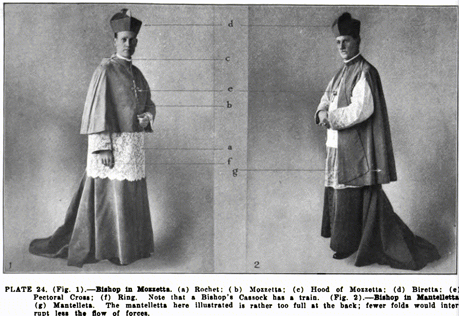

Вид укороченной и менее декорированной хумерального покрова, носимый и используемый аналогичным образом аколитом или капелланом, который перед собой держит посох епископа, называется вимпа.

РОХЕТА

Рохета (Иллюстрация 24) описывается как епископская версия надеваемой священником рясы. Она отличается от последней тем, что значительно короче (достигает лишь до колен) и обильно отделана кружевами, а также тем, что обладает сравнительно узкими рукавами с пламенно-окрашенными манжетами, также украшеными кружевом. Она всегда сшита из самого тонкого льна.

В широком смысле, рохета выполняет для епископа роль рясы для священника, но с определенными отличиями. Епископ всегда является светящимся центром силы — своего рода высокомощной батареей; он является избранным каналом Святого Духа, Жизнь Которого беспрерывно течет через него, и он ✠_носит пламенные манжеты не только как символ этой силы, но и как ее прямое проявление_. Этот пламенный цвет, иногда называемый амарантовым красным, с трудом добывается, однако он гораздо более выразительный, чем шафраново-красный с одной стороны или керамический красный с другой. В Римской Церкви рохету также носят каноники и другие высокопоставленные лица.

МОЦЕТА И МАНТЕЛЛА

Эти облачения (Иллюстрация 24) представляют собой, по сути, укороченные плащи, которые носятся над рохетой прелатами при исполнении обязанностей в хоре или в случаях, когда плащ был бы неподходящ. Моцета — это короткий плащ, покрывающий плечи, но достигающий только до локтя. Он застегивается спереди рядом маленьких красных пуговиц и имеет некое подобие капюшона. Её носит епископ исключительно в пределах своей епархии, но не за ее границей, и не в присутствии более высокого духовного деятеля. Она выкроена из того же розово-фиолетового материала, что и его ряса, и часто изготавливается из того же материала. Она может быть из бархата или шелка, и должна быть, как минимум, отбелена шелком. Епископ не носит ее, когда исполняет обязанности священнослужителя, поэтому единственные силы, которыми она управляет, относятся второго типа — те, которые вызываются индукцией. У епископа эти силы очень мощные и обильные; они будто кипят под моцетой, исходят из-под ее краев, и витают вокруг епископа, стоящего в центре, как пестик цветка, мерцающие огни прекрасного цвета окутывают его. Сила, следовательно, равномерно исходит от него во все стороны, освещая священнослужителей, хор и прихожан.

Мантелла, хоть и является облачением ниже статуса, носимой младшими прелатами и епископом вне своей епархии или в присутствии более высокого духовного деятеля, куда более величественна по сравнению с двумя другими облачениями. Она достигает колен, практически полностью покрывая рохету, за исключением передней части, где она остается открытой, ее лацканы разворачиваются назад и фиксируются в этом положении. Она выполнена в том же розово-фиолетовом оттенке, что и моцета, но по обычаю обеивается амарантово-красным шелком, создавая благодаря этому очень яркий эффект. Она застегивается на одну пуговицу или крючок у шеи и имеет разрезы по бокам, через которые проходят рукава рохеты. В этом случае силы, порожденные под ней индукцией, исходят через открытое пространство спереди, а также через отверстия для рук к пламенно-окрашенным манжетам рохеты.

THE MITEE

Этот епископский головной убор (Иллюстрация 25) обладает достаточным сходством с головным убором иудейского первосвященника, что может стать источником соблазна попытаться провести параллели между ними. К сожалению, исторические данные не подтверждают эту заманчивую гипотезу. Прямых доказательств того, что митра появилась примерно до 1000 г.н.э., не существует, хотя мне кажется, мы заметили её раньше при проведении паранормальных исследований. Бишопы издревле носили тот или иной вид головных уборов, но лишь в ✠ веке они приобрели знакомый сегодня вид. Даже тогда они были просты, и их высота не превышала шести дюймов. Однако к ✠✠ веку их высота увеличилась минимум до одного фута, став все более роскошными. К ✠✠✠ веку их размер увеличился еще больше, до восемнадцати дюймов или даже больше, и их форма стала напоминать бочонок. Римская Церковь до сих пор использует огромные митры, по форме напоминающие скобки, но в Либеральной Католической Церкви мы пришли к выводу, что подходящим будет выбор модели среднего размера, которая при закрытии формирует плоский треугольник, а при ношении весь головной убор имеет цилиндрическую форму. Никаких противоречий к бочкообразной форме, при условии предпочтения к ней, не выявлено.

Сегодня Римская Церковь использует три вида митр. Цитируя вновь господина Макалистера (страница 119): _"В отличие от других облачений, которые классифицируются в зависимости от преобладающего в их вышивке литургического цвета, митры классифицируются по способу их украшения. Фон, если его можно разглядеть, всегда белый. Митра, выполненная просто из белого льна или шелка, с минимумом украшений, называется mitra simplex; украшенная вышивкой, но без использования драгоценных металлов или камней, носит название mitra aurifrigiata; и та, где для украшения применяются драгоценные металлы и камни, называется mitra pretiosa."_ В английском языке эти термины обычно переводятся как простая митра, золотая митра и драгоценная митра. Значение слова "aurifrigiata" представлено как "бледное или вялое золото". Однако Фортескью в своей непревзойденной работе "Обряды Римского Ритуала" утверждает, что золотая митра обычно изготавливается из золотой ткани без дополнительных украшений. Я сам испытал на себе такую митру, украшенную латинским крестом спереди, и ощутил ее эффективность. "Caeremoniale Episcoporum" описывает эту митру как изготовленную из белого шелка, переплетенного золотыми нитями, или просто из золотой ткани. Считается, что ее создание было способом облегчить епископу последующую ношу драгоценной митры во время проповеди, что не удивительно, учитывая факт о том, что Генрих VIII украл из аббатства Фонтейн золоченую серебряную митру, украшенную жемчугом и драгоценными камнями, весом в семьдесят унций!

Чтобы понять внутреннее использование митры, нам следует помнить о связях, установленных для епископа на момент его посвящения. Независимо от того, осознает он это или нет, он обращается к Троединому Духу в себе за божественной трехкомпонентной силой, которая через него и его принципы проникает в мир. Однако расстояние между Богом и Его слугами огромно, даже если Он и связан с ними; и именно наше Господи, в Своей бесподобной Личности и с большим любовью, преодолевает за нас это расстояние; так что мы великим благоговением сознаем Его как посредника - исполнителя, а не молитвенника. Но наш Господь является проявлением Второго Аспекта Благословенной Троицы, и поэтому все три силы, приходящие к епископу через Него, представлены в этом Втором Аспекте. Все в этом Аспекте является двойственным - позитивное и негативное, мужское и женское. Так, когда божественная сила должна пройти через Христа к Его епископу, затем через епископа к людям (как во время его благословения или искупления), они надевают митру, чтобы через ее две составляющие части дуализированная сила могла спуститься. Во время празднования Святой Евхаристии или при благословении Пресвятого Сакрамента митру не надевают, когда Пресвятый Хлеб, так сказать, используется, потому что сила текущая через него к епископу, и ее дуализированный аспект в Евхаристии обозначен двуми священными Элементами.

Фаноны митры, изначально используемые как шнурки для закрепления митры, теперь используются для передачи силы на ошейник плаща или хасубы, затем через эти одеяния к народу.

ЗУЧЧЕТТО

Зуччетто - это небольшой чепчик, который римские епископы носят под митрой и оставляют во время многих частей службы, когда митра снимается. Он может быть надет в течение всего празднования Святой Евхаристии, за исключением чтения Канона. Не наблюдается значительного влияния его использования на изнаночную сторону службы, поэтому его использование остается по усмотрению. В некоторых ритуалистических церквях алтарникам присваиваются красные зуки, но это неправильно.

БИРЕТА. Данный головной убор (Иллюстрация 20) могут носить как епископы, так и священники, выбирая его цвет в соответствии с цветом кассока. Бирета представляет собой квадратную складчатую шапку с тремя изогнутыми выступами, расположенными на вершине, и кистью посередине. Во Франции и Испании часто встречаются биреты с четырьмя выступами, видимо, по усмотрению носителя, хотя мне кажется, что они должны быть оставлены исключительным для преподавателей теологии. Епископ носит свою бирету вместе с моццеттой или мантеллеттой, но никогда - с плащом или касулой, тогда как священник может носить бирету с любыми одеяниями, но только в определенных моментах службы - например, во время процессий, чтения эпистолии или проповеди. Бирета всегда снимается перед кланянием, в то время как митра - нет.

Без сомнения, бирета изначально была разновидностью квадратной студенческой шапки, но она нашла свое применение в литургии. Ее функция сопоставима с пробкой в бутылке - она предотвращает испарение и последующую потерю качества. Вся энергия, которая может возникнуть в священнике, должна накапливаться внутри него и источаться на благо его прихожан, а не нецеленаправленно рассеиваться на высших уровнях, что свойственно данным процессам. Пар, который мы выпускаем в атмосферу, быстро поднимается и рассеивается; если нам нужно, чтобы он работал здесь, в физическом мире, мы должны его сохранить и направить.

Три выступа на бирете имеют свою трехчастную символику, в то время как четыре выступа на шапке доктора теологии, предположительно, символизируют четыре буквы тетраграмматона или священного имени, которое ему известно глубже, чем другим людям.

ДОПОЛНИТЕЛЬНЫЕ ОБЛАЧЕНИЯ

Как Римская, так и Греческая Церкви используют некоторые дополнительные облачения, которые мы пока не приняли, так как не смогли обнаружить их особую ценность с точки зрения символики или эзотерики. Например, такие как архиепископский палиум и каппа манга.

В Римской Церкви принято, что епископы при совершении любой торжественной службы надевают чулки и обувь цвета сезона, обычно вышитые и роскошно украшенные. Против этого ничего не возразишь, хотя и трудно найти в этом какое-то особое преимущество.

Когда епископ не прямо служит, он обычно надевает белые шелковые перчатки с золотым ✠ вышитым или пришитым на обратной стороне каждой из них. По-видимому, в Средние века эти перчатки были окрашены в цвет сезона и часто украшались большими драгоценными камнями вместо креста. Мы сохранили их в более современной форме (Иллюстрация 25).

ПЕКТОРАЛЬНЫЙ ✠

Теперь перейдем к некоторым предметам, которые епископ использует в своей работе, и которые не считаются облачением, но играют важную роль - peкторальный ✠, епископское кольцо и посох. Первый из них – это крепко изготовленный ✠ из золота (или позолоченного серебра) длиной примерно три или четыре дюйма, часто украшенный драгоценными камнями, который епископы и аббаты носят на груди (Иллюстрации 20, 24 и 25). В Римской Церкви он обычно содержит какую-то святыню, по возможности фрагмент предполагаемого дерева Истинного ✠. В Либеральной Церкви мы обнаружили, что полезно вставлять в этот ✠ драгоценные камни на основании того же принципа, что и в wit, но в немножко измененном порядке. Здесь предпочтительнее большое количество камней, и это, скорее всего, будет Бай, который оказывает доминирующее влияние в мире.

Таким образом, мы размещаем достаточно большой аметист в центре и окружаем его другими драгоценными камнями, как и раньше, за исключением того, что бриллиант следует над ним, а сапфир - под ним. Другие, менее крупные аметисты могут быть на концах ✠. Когда новая корневая раса станет доминирующей, вероятно, будет целесообразно использовать алмаз в качестве центрального камня, но по крайней мере в течение следующих тысячи лет или около того действующая конфигурация будет наиболее подходящей.

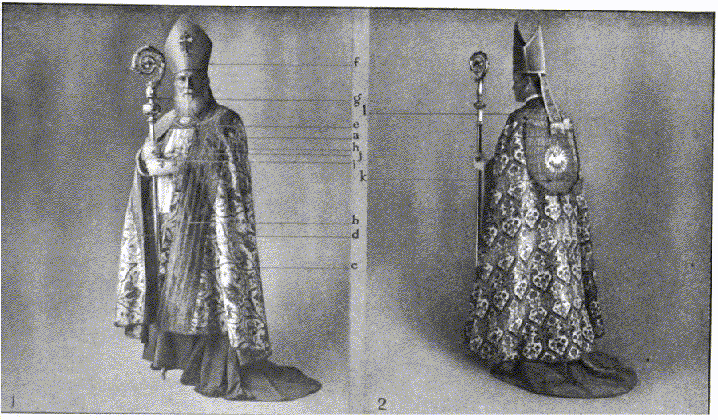

Пекторальный крест служит безостановочной станцией приема и передачи. При его освящении каждый из драгоценных камней превращается в специальное средство для Владыки определенного Луча, становясь своего рода приемником, связанным с Ним — передовым постом Его сознания. Специфическая Ему энергия постоянно исходит через него, как магнетизм любого обычного человека ощущается при приближении к нему; но обычный человек, если его внимание привлечено к конкретному случаю, или если вызваны его симпатии, может мгновенно сфокусировать этот излучаемый магнетизм и направить его на объект, который привлекает его внимание. _Так же сила Луча всегда пронизывает его освященный камень; однако, когда человек, связанный с этим Лучом, приближается к камню, он мгновенно пробуждает в нем более активное действие, и человек, если он восприимчив, может принять необыкновенное излияние силы и помощи._ 

Циник, который всегда стремится обходиться без всего, конечно, скажет, что вполне можно привлечь внимание Владыки Луча, просто молясь Ему без какого-либо физического посредника. Возможно, это так, как вполне можно на некотором расстоянии общаться с другом на противоположном холме, крича ему; однако, результат может быть достигнут увереннее, комфортнее и без лишних усилий при помощи телефона. Кроме того, есть друзья, которые находятся слишком далеко, чтобы их можно было достичь криком. Правильно состроенный психический телефон отказать не может, в отличие от наших земных телефонов.

Таково предназначение пекторального креста. Почему же его носит только епископ и какова его роль в его действии? Связь епископа со своим Господом и Учителем была объяснена в главе о Святых Таинах. Это делает его, образно говоря, высоко заряженной батареей. Продолжая аналогию с телефоном, можно сказать, что епископ обеспечивает энергией, которая заставляет телефон работать.

Как и камень алтаря, пекторальный крест служит призмой для сил, которые постоянно течут через епископа. Епископ служит источником энергии Второго Луча. Однако в этом Луче, как и в остальных, есть семь подлучей. Существует Второй Луч, под влиянием Первого, Третьего, Четвертого и так далее, а также чистый Второй Луч. Таким образом, когда энергия Второго Луча Христа исходит от сердцевого центра Его епископа к кресту, который висит перед ним, она моментально разделяется камнями на составляющие ее части и распространяется по окружающему пространству в наиболее легко усвоенной форме.

Наиболее значимым сейчас является Седьмой Луч, который только начинает свое действие. Каждый из этих Лучей оказывает влияние на мир по очереди. Властвующим в эпоху Средневековья был Шестой, или преданностной Луч; по мере угасания его власти, наступила эра неверия, безбожия и глубокого незнания внутренней версии жизни. Седьмой Луч включает в себя изучение и использование внутренних сил Природы и разумное взаимодействие с Силами, которые их управляют. Это влияние сейчас начинает проявляться в мире и поэтому мы отводим ему центральное место в пекторальном кресте епископа, предоставляя ему дополнительные каналы проявления.

Римская Церковь справедливо указывает своим епископам, что пекторальный крест следует носить снаружи моцетты, но внутри мантелетты. Она также призывает его оставаться внутри казулы во время богослужения, но на этот пункт мы посмели расходиться с ее обычаями, так как обнаружили, что при использовании семи драгоценных камней в алтаре, взаимодействие между ними и теми, что в кресте, очень ценно. В связи с этим мы даём указание нашим епископам подвешивать пекторальный крест снаружи казулы.

ЕПИСКОПСКОЕ КОЛЬЦО

С древних времен, начиная, по крайней мере, с 610 года н.э., епископы носят специальное кольцо в качестве одного из символов своего служения. Считается, что оно символизирует сокрытие тайн и требует супружеской верности, которую предъявляет брак епископа со своей епархией. Это всегда было золотое кольцо с одним большим камнем, предполагается, что это был рубин, изумруд или сапфир, обычно без гравировки. Сейчас это обычно кольцо с овальной аметистом, максимально большого размера, на котором выгравирован герб епископа, так что его можно использовать в качестве печати при необходимости. У епископа также бывает большая официальная печать. Кольцо должно быть достаточно свободным, ведь когда епископ во время службы надевает перчатку, он должен надеть кольцо поверх нее. Иногда, поэтому, приходится носить второе, более маленькое кольцо, чтобы большое не соскользнуло.

Кольцо (см. иллюстрации 20, 24 и 25) играет значительную роль в служении епископа. При его освящении оно становится неразрывно связанным с самим Господом – не посредством высших долголетий иерарха, а напрямую, способом, схожим с освящением Евхаристии. Так, оно становится каналом связи с Ним, независимо от личности самого епископа, и вне влияния его индивидуальных особенностей. Кольцо постоянно излучает личный магнетизм Христа; наиболее точное определение его уникальной силы, которое приходит мне в голову, это сравнение его с кольцом, некогда принадлежавшим самому Христу. Таким образом, это – источник несметной силы, и когда епископ дает свое торжественное благословение, шлюзы этой мощи распахиваются до предела. Благословение епископское удивительно сложно и гибко, стоит проехать долгий путь ради того, чтобы получить его; и действие кольца считается одним из самых важных компонентов. Разъяснения других факторов можно найти в главе о священных санах.

✠ПОСОХ Это пастырский посох епископа – посох с удочкой на конце, что напоминает пастушью трость, отчего некоторые и предполагают его происхождение (см. иллюстрацию 25). Однако эта теория вызывает сомнения. Существует и другое предположение, что посох является прямым потомком литууса или крюка, который носил римский авгур в дохристианские времена. Действительно, первобытный пастырский посох, изображенный на некоторых из древнейших христианских памятников, прежде всего похож на волшебный жезл, поскольку первоначальный посох был значительно короче, чем его современные аналоги. Действительно, удлинение посоха, скорее всего, произошло только тогда, когда его стали делать из тяжелых материалов, требующих опоры на землю. Безусловно, это один из первых внешних символов, введенных Церковью для своих служителей, ибо изображения посохов обнаружены в катакомбах, а посох, предположительно принадлежавший святому Петру, хранится в кафедральном соборе Трира.

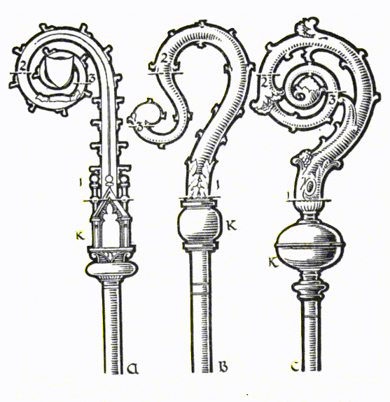

ДИАГРАММА 18. — Посох. Изображены три вида верхушек посоха. Малые консекрвированные драгоценности помещаются внутри ручки, обозначенной буквой К. Особые пункты на голове посоха, где должны устанавливаться частицы камня или магнетизированного эфира, указаны числами. Первая частица, 1, прекращает поток эфирной материи, вторая, 2, - астральной материи, а третья, 3, - низших умственных материй.

Материал и форма посоха значительно различались. В начале это была деревянная трость, чаще всего из кедра, кипариса или черного дерева, часто позолоченная или покрытая серебряными пластинами. Скоро верхушку стали делать из драгоценного металла или резного слонового кости, а позднее весь посох был выполнен из слоновой кости или эмалированного металла. Ирландские посохи зачастую были бронзовыми, украшены замысловатыми узорами из перекрестных узлов или полос. В современные дни весь посох обычно из латуни или серебра, покрытые толстым слоем золота, и иногда с богатыми украшениями, хотя это не является обязательным.

Многие формы были испробованы за начальные века, и мы сталкиваемся с головами в форме Y и T, а также с верхними частями, волютами и гаками. Голова бронзового ирландского посоха чаще всего представляет собой перевернутую U. К XI веку форма гака была всеобще принята, за исключением греческой церкви, которая до сих пор сохраняет форму T, перекос оформлен в форме двух змей, с виду угрожающих друг другу. Даже в западной церкви все еще есть три варианта гака, как можно увидеть из нашего изображения (Диаграмма 18). Центр волюты обычно представляет какой-либо священный инцидент, какого-то святого или ангела, или какое-то символическое или гербовое изображение - ягненок, гроздь винограда, ✠ и чаша. Верхняя часть часто бывает очень замысловатой, часто служащей реликвией.

В Либеральной католической церкви мы используем любую из этих трех форм, предпочитая ту, что справа на нашей диаграмме, поскольку она лучше сбалансирована, и центр волюты расположен прямо над верхней частью, что устраняет неудобный угол в потоке силы. Как и в случае с алтарной камней, мы заменяем реликвию внутри верхней части набором из семи магнитизированных драгоценных камней, располагая их так же, как для алтаря.

Посох всегда считался символом авторитета и юрисдикции. Он не должен путаться с особым крестом, которым отмечаются достоинства архиепископа. У последнего есть свой посох, как у любого другого епископа, и он использует его в те же моменты службы; однако когда он входит, выходит или перемещается по церкви, перед ним несут процессиональный крест, которым он сам не пользуется.

Рассматриваемый с точки зрения его внутреннего воздействия, посох является инструментом наивысшей ценности. Вставка драгоценных камней делает его аналогом портативного алтарного камня, и кроме того, он оснащен уникальной системой для применения духовной силы к различным принципам или разделам человека. Кривые волюты используются для этой цели, и они автоматически разделяются на три части, как показано на нашем рисунке (Диаграмма 18). Было бы полезно разделить эти участки физическими частями или дисками из такого материала, как халцедон, хризопраз, яшма или нефрит; но это, похоже, представляет серьезные трудности для производителя. К счастью, магнетизатор может легко создать их на эфирном уровне.

Узел, в который инкрустированы драгоценные камни, является фокусом и источником активности — оживлённым и ярко горящим центром, откуда сила взмывает вверх в спиралевидной форме. Все формы энергии присутствуют там, эфирная же находится наиболее заметной на внешнем слое — настолько заметной, что нельзя удивляться возможности её использования для физического исцеления. Первый перегородка, или фильтр, служит для задержки эфирной материи, так что астральные, умственные и вышеэтажные проявления силы могут проходить через него. Кривизна спирали некоторым образом замедляет всплеск силы, что облегчает нам её направление. В этом пространстве между первой и второй перегородками астральное выражение силы представляет собой её самое наружное и явное проявление, и потому именно от этой кривой посоха исходит воздействие, которое основным образом активизирует набожность и провоцирует, а затем контролирует эмоции народа. Вторая перегородка отбраковывает всю астральную материю, поэтому за ней умственный аспект энергии становится наиболее узнаваемым, и его тенденция — побуждать к высоким и четким мыслительным процессам, и вообще разжигать умственную активность. Третья перегородка отфильтровывает даже низшие умственные элементы, так что только высшие умственные материи, из которых построено каузальное тело, могут проникнуть через него в центральный орнамент, который завершает спираль, и следовательно, способен оказывать сильное воздействие на эго или душу человека, достаточно развитого для того, чтобы открыться для этого воздействия. Это вовсе не значит, что требуется особенный интеллект, а только то, что человек должен быть в смирном, благодарном и восприимчивом состоянии духа. Ибо, слова Христа истинны, Он стоит и стучит в дверь сердца человека, ожидая впуска, но Он никогда не врывается.

Для высших уровней в посохе не предусмотрено специальных частей; они не могут быть ограничены или локализованы точно так же, как и другие. Весь посох пронизан влиянием мира интуиции, ибо это влияние может проникать в любые принципы на любом уровне, если только люди позволят ему. Выступы или шипы, часто видимые на кривизнах спирали, позволяют этим различным градациям силы легко проникать из своих соответствующих отделов посоха к людям.

Посохи часто богато украшены и покрыты драгоценными камнями. Если драгоценные камни действительно используются, тогда сапфир (или несколько) можно вложить в узел с камнями, яшму или топаз — в первый, или эфирный отдел, рубины — во второй, или астральный, изумруды или нефрит — в третий, или умственный, а бриллиант или аметист лучше поместить в середину, чтобы обозначить четвертый уровень.

Практическое действие посоха во время различных служб Церкви чрезвычайно мощно и включает в себя весьма сложный набор деталей. Он действует одновременно в нескольких направлениях. Он воздействует на епископа, он принимает от него и излучает силу на прихожан. В некоторые моменты службы епископу приходится держать его, чтобы его сила могла соединиться с силой епископа; в других достаточно, чтобы он был продержан рядом с ним или понесен перед ним. Когда епископ проводит Таинство Крещения, например, он держит его рядом с собой, пока он принимает кандидата во имя Христа, но он берет его в руку, когда он произносит слова силы: _"Примите Святого Духа"_. Он держит его, когда дает отпущение грехов и благословение, удивляют, как его вечное сияние расширяется в ослепляющий свет, когда слова произносятся, центральная точка подчеркивает три звездоподобные точки — белую, синюю и розовую. Для того чтобы увидеть эти точки, требуется высокоэволюционированное ясновидение, ведь они представляют собой выражение Троединого Духа в Христе и могут быть осознаны только через отражение этого же Духа в нас.

Мы исследовали множество посохов, служб во многих церквях; одни и те же связи установлены в каждом случае, но к сожалению, они часто остаются неиспользованными. Большинство епископов и священников ничего не знают об этом; не следует требовать от них знания, хотя, разумеется, лучше, если они знают. Искренняя преданность и горячие стремления запустят всю эту машину в движение, даже без фактического осознания того, что происходит. Великий акт Святой Евхаристии остается, где бы ни передавалась апостольская преемственность, но пролитие его силы часто грустно ограничено, и то, что мы можем назвать боковыми путями, полностью заблокировано и не используется. Указанная информация уже достаточна, чтобы позволить многим епископам и священникам удвоить силу и воздействие своих служб; однако именно те, кому больше всего это нужно, в последнюю очередь поверят в это и воспользуются этим. Ничто не грустнее для того, кто развил внутреннее зрение, чем столкнуться с пустыми, самодовольными неведением и скептицизмом тех, кто его еще не приобрел; они так уверены, что не может быть ничего за пределами того, что они видят, нет света за пределами своих крошечных ламп, и поэтому они живут, как гусеница на своем листе, окруженные всей красой земли, моря и неба, но абсолютно безразличные к этому. Эволюция уверенно продолжается, и даже они увидят однажды, ведь:

Вот уже приближается время, время, которое,
        несомненно, настанет,
    Когда земля наполнится славой Божией,
        как воды покрывают море.   

ГЛАВА IX вечерня и торжественное благословение

VESPERS

Это древнейшая из служб Церкви — отличная от Святой Евхаристии, не включенной в число этих служб. Упоминание о Вечерне передает нам Плиний в своем письме, датированном началом второго века, хотя точной формы службы того времени нам неизвестна. Описание службы приводится в документе, вероятно относящемся к четвертому веку, "Peregrinatio", в то время как в 530 году, в Правиле Святого Бенедикта, Вечерня возникает почти в той форме, которую мы видим в современном Римском обряде, включая псалмы, малую главу, стихи и песнопение Magnificat. Утрение и Вечерня — две ежедневные службы хвалы Церкви — обычно публично воспроизводимые, тогда как большая часть других молитвенных часов читается в тишине монастырей священниками и монахами. Из этих двух Вечерня была всегда более значимой, в первую очередь из-за неудобства паломникам посещать Утрение, которое обычно проводилось на рассвете или еще раннее (и часто следовало за Матинами, начало которых обычно приходилось на два часа ночи). Во-вторых, Святая Евхаристия с самого начала была главной утренней службой и вскоре полностью затмила Утрение. Сегодня Утрение почти не используется в публичных службах Римской Церкви, и мы не включили его в нашу Литургию.

Изначально Вечерня была вечерней службой, но с введением Святого Бенедикта условия Комплина как завершающего акта дня, Вечерня могла проводиться в любое время от четырех до шести вечера и приобрела статус службы закатного времени, так же как и Утрение является службой восхода. Где-то в шестом веке была внедрена практика Гимна службы — набор гимнов для каждого дня недели, каждый из которых ассоциируется с определенным этапом творения. В воскресенье это создание света, в понедельник — разделение земли и воды, во вторник — создание растений, в среду — создание солнца и луны, в четверг — создание рыб, а в пятницу — зверей. Суббота является исключением, поскольку Вечерня, поющаяся в этот день, на самом деле является первой Вечерней Воскресенья, поэтому гимн в этот день – восхваление Благословенной Троицы. Это последнее мы приняли для нашей службы, посчитав лучшим использовать неизменную форму, в которой меняется только Молитва дня.

Схема Вечерни представляет собой нескончаемый поток хвалы, постепенно возвышающийся к вершине любви, преданности и благодарности, затопляющей светом всю окружающую область. В нашей Литургии мы оставили структуру старой службы, но изменили ее составляющие. Мы использовали пять псалмов, но, вместо того чтобы просто воспроизвести их в первозданном виде, мы избавились от оскорбительных, униженных или бессмысленных стихов и собрали их из самых красивых и подходящих, найденных нами в Священном Писании. Так как хвала является ключевым моментом всей службы, мы создали три из псалмов полностью основанными на ней; из остальных один славословит благочестивую жизнь, а другой – это панегирик мудрости. Все они предназначены в первую очередь для того, чтобы вызвать энтузиазм у людей и поднять их мысли и чувства до верхних пределов. Для полного достижения этой цели необходимо, чтобы каждый участвовал в псалмах, внимательно слушал слова, которые они поют, и старался не только понимать, но и чувствовать их.

К этому моменту всю церковь должна охватить живая сила, являющаяся в облике огромных облаков пульсирующего света. Во время пения псалмов, эти световые облака накапливаются, концентрируются в санктуарии, вихрем охватывают алтарь, вспыхивают наверх и опускаются обратно, но в общем и целом становятся все более плотными, внутри которых разносятся мерцание, порождаемые противопоставленным пением хора и прихожан. Большинство этих облаков имеет различные оттенки синего, но иногда сквозь них пролетают золотые звезды стремлений, или вспыхивают золотистые искры, мерцающие как пламя. Кроме того, помимо образов, которые формирует вера прихожан, присутствуют музыкальные формы, создаваемые органными звуками и голосами хора. На все это наложено чтение Малой Главы, окруженной величеством и церемонием, призванными не только помочь сфокусироваться на ее содержании, но и способствовать распространению доминирующей идеи любви, изливающейся великолепным красным потоком. Помощники священнослужителя собираются вокруг приготовления, по сторонам от него стоят служители с зажженными свечами, а благовония используется так же, как и при чтении Евангелия. Цель этой Главы — раскрыть весь этот потенциал, который был накоплен, крепко связывая чувство братства и сильной взаимной любви. В древние времена, когда эти слова апостола прочитали в церкви, прихожане обращались друг к другу и обнимались; и хотя больше в нашем формализованном современном обществе такие проявления были бы неприемлемы, мы все же безусловно должны с глубиной души внушать и выражать эти чувства. Малая Глава предоставляет нам движущую силу, словно порох для нашей пушки, тогда как Офисный Гимн, который непосредственно следует за ней, указывает нам, в каком направлении мы должны направить нашу энергию, поскольку он направляет наши мысли к вечно-благословенной Троице, От Которой все происходит и К Которой все возвращается. Прихожане должны вложить в этот гимн все свои силы, особенно в его всем известную дохологию, которая неизменно притягивает внимание ангельских воинств. Это заставляет наши густые облака бурно вспучиваться, и они начинают подниматься, приобретая коническую форму, напоминающую шатер.

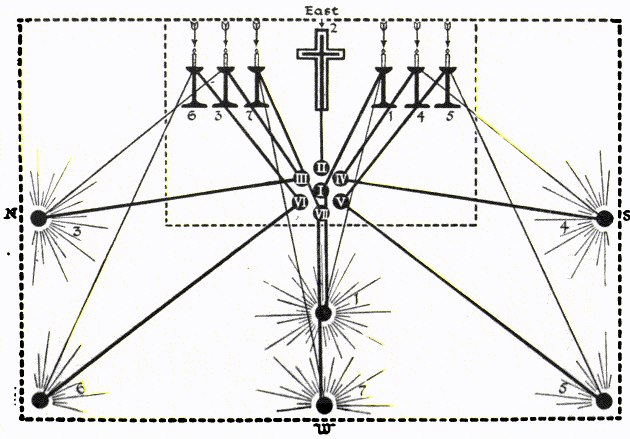

Таким образом заканчивается подготовка, и мы прилагаем большие усилия, к которым вся предыдущая часть службы вела. В Римском обряде на этом месте находится кантикл, именуемый "Магнификат". Но хотя песнопение Богородицы красиво во многих своих проявлениях, оно оказывается значительно менее эффективным для наших текущих целей мощного прилива хвалы, нежели "Te Deum laudamus", великий утренний акт поклонения, который обычно поется в конце утренних служб и незадолго до Лаудов. Так как мы в настоящее время не проводим эти утренние службы, мы заимствовали песнь "Te Deum" для использования на вечерних службах, и обнаружили, что она прекрасно подходит для этой цели. В своём исходном виде это одна из наиболее древних гимнов Церкви. Существует легенда, что она была создана спонтанно и исполнялась поочерёдными стихами святителем Амвросием и святителем Августином в ночь крещения последнего в 387 году, однако данная версия отвергается учеными. Авторство гимна остаётся неизвестным, и вероятно, что он появился путем постепенной эволюции и претерпел различные изменения в процессе времени. Первые десять стихов приписывают папе Аникиту, умершему в 168 году нашей эры. Предполагается, что в той форме, в которой он присутствует в Римских книгах (и в Англиканской Книге общего молитва), он был составлен Никетой, епископом Бермианы в Булмании, около 400 года. Его также приписывают Афанасию, Иларию из Пиктиера, Иларию из Арла, Никею из Триера и Абондию. Кох утверждает, что гимн являлся вечерним и был изначально написан по-гречески, затем переведен на латинский язык святителем Амвросием для использования в его церкви в Милане, после чего был внедрен в североафриканские церкви святителем Августином. Он также утверждает, что гимн в греческой форме можно найти в одной из ранних рукописей шестого века. Святой Бенедикт в своем Правиле предписывал исполнять гимн на ночную службу в Воскресенье, так что мы не вносим серьезных нововведений, используя песнь "Te Deum" на вечерних службах. Безусловно, гимн использовался каждый день в английских соборах, аббатствах и церквях начиная с Нормандского завоевания, за исключением периодов, когда его заменяли гимном "Benedicite", что обычно происходит в Адвент и Великий пост. Его название, как обычно, представляет собой латинский вариант его начальных слов.

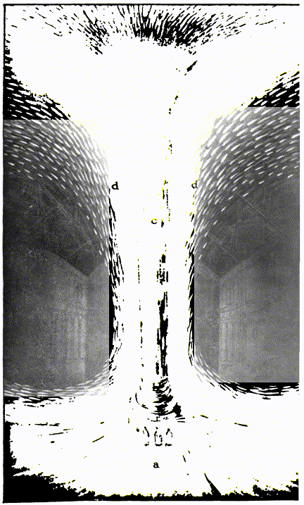

ТАБЛИЦА 26. — Вихрь и Столб, возникнувшие на Вечерних. (a) Энергия, направляющаяся от верующих к алтарю; (b) Вихрь, сформировавшийся в Санктусе, в центре которого у основания располагаются священник, его помощники и алтарь; (c) Столб энергии, взмывающий вверх; (d) Обрушивающаяся энергия, окутывающая столб.

К сожалению, после пятнадцатой стихии оригинальное Te Deum складывается так, что меняет свой характер и переходит в своего рода исторический обзор или исповедь веры, и оканчивается превращением в обычные скромные моления о милосердии; хотя даже в этой части дух радости и хвалы неуклонно проявляется в двух или трех стихах. Такой переход в минорный тональность явно неподходит для внутренней цели, которую служит этот великий гимн, поэтому мы осмелились заменить его на более радующие стихии, которые больше соответствуют его общему характеру.

При исполнении Te Deum существует старый обычай зажигать дополнительные светильники на алтаре, по мере возможности, чтобы помочь в накоплении и излучении силы (Dia. 19). Алтарь торжественно курится, как и духовенство, хор и верующие; помощники священника группируются вокруг и позади официанта, который стоит на протяжении перед центром алтаря; и за ними в свою очередь стоят два тимиатора, машущие своими кадильницами по очереди на всей длине цепи. Это всегда эффективно привлекает внимание любых Ангелов, которые могут быть поблизости — хотя это делается и доксологией гимна, и даже воззванием Святой Троицы в начале службы. Ангелов на Вечерних не призывают особым образом, как на Святой Евхаристии, но я никогда не видела должным образом проведенной службы, на которой они бы не присутствовали.  Они захватывают густые облака света, которые были сгенерированы в более ранней части службы, и быстро сформировали вихрь вокруг официанта |

и его помощников — вихрь, из которого выплескивается струя силы под высоким давлением, образуя гигантский цилиндр, достигающий и пронизывающий крышу церкви (Таблица 26). Через этот цилиндр взмывает могучий фонтан синего и розового цвета, наполненный любовью верующих, усиленной любовью святых Ангелов; и неизбежный отклик обрушивается в грандиозном потоке белого и золотистого цвета, значительно большем, чем взмывающий, хотя строго пропорциональным ему. 

Эта сила несколько отличается от той, что присутствует на Святой Евхаристии. Там это особый дар от Самого Христа, тогда как здесь эта сила пронизывает все благодаря Блаженной Троице. Её направляемость на конкретных людей, посвященность определенным целям; она омывает область, словно морем. Эта сила меньше контролируется священником, и Ангелы не стараются распределять ее, а только облегчают ее излучение. Ангелы, которых привлекает эта сила, это не обученные специалисты, которые привяжены к Евхаристии; не призывают представителей девяти Орденов.

Часто сразу после Вечерних следует Благословение Пресвятого Сакрамента; и если это так, обычно удобнее проигнорировать три молитвы из молитвенника Церкви Англии, которые предшествуют окончательным версликам и благословению. Если вместо Благословения совершается Комплин, то молитвы рекитируются в этом богослужении, а не здесь.

БЛАГОСЛОВЕНИЕ ПРЕСВЯТОГО ТАИНСТВА

Это одно из самых прекрасных и первозданных обрядов Церкви. Его именуют также "Вечерней Мессой", так как тот же невидимый поток благодати присутствует в нём, как и в Святой Евхаристии. Евхаристия может быть совершена лишь утром - вечером же на некоторое время её заменяет служба благословения. Ключевые особенности обряда: Хостия изымается из табернакуля, помещается в монстранс и выставляется для почитания народа; затем происходит процессия по церкви, и в конце совершается торжественное ✠ благословение. Связанные с этим служением поются традиционные гимны с момента его введения в тринадцатом веке. В Римской Церкви обычно исполняется прекрасная Литания к Богородице, лучше известная как Литания Лоретская, перед открытой Хостией. Мы вставляем вместо неё, как более соответствующее моменту, литанию адресованную непосредственно нашему Спасителю. За это исключение мы поем те же гимны, что всегда исполнялись, хотя на английском вместо латинского. Я признаю, что латынь звучит более величественно, но мы придаем огромное значение тому, чтобы все в наших службах было понятно без посредника, чтобы каждый присутствующий мог осмысленно участвовать в ритуале.

Основание службы благословения по всей видимости было тесно связано с установлением праздника Тела Христова в 1246 году, ибо уже вскоре после этого мы впервые слышим об этом обряде.

Многие задаются вопросом, почему такая замечательная по своей бытности и приносящая утешение его народу служба не была установлена нашим Господом с самого начала. Не нам осуждать план, которым Он руководствуется в отношении своей Церкви; но можем мы с благоговением предположить, что с витоками эволюции открываются новые возможности, и то, что было ценным в тринадцатом веке, возможно, было неприменимо в первом. Моя личная точка зрения заключается в том, что наш великий Господь испробовал эксперименты – пробовал новые способы изливания своего благословения, и поэтому это особенное служение могло прийти Ему в голову не в то время, когда Он был на земле, но позже. Хотя я боюсь, что многие не примут такую идею. Другая великая религия говорит о Нем как об Авалокитешваре, Господе, кто смотрит на нас с небес; и мы знаем, что Он наблюдает за нами многими глазами, и что силы, насыщающие нас по этих многообразных путям, перекликаются, и в этом взаимодействии укрепляются друг друга.

Во время благословения, служитель одевает подризник, белую столу и рясу. Если он совершает Вечерню в рясе цвета дня и не покидает алтарь между службами, ему разрешается оставить на себе надетую рясу. Но если рядом с ним (как и следовало бы, когда это возможно) диакон и субдиакон в далматике и тунике, он должен одеть амицт, альбу и пояс вместо подризника. Помощник должен подать вуаль для плеч и звонить в колокольчик, минимум два свечносца с свечами, и кадильщика — хотя две кадильницы лучше одной для достойного исполнения обряда. На алтаре должно гореть не менее двенадцати свечей — больше, если возможно.

Служба начинается, как и все другие в нашей Церкви, с молитвенной пригласительной фразой, и сразу после этого все становятся на колени, пока священник извлекает Хостию из табернакуля, помещает ее в монстранс и ставит монстранс на корпорал на алтаре. Священник, стоя на коленях, приносится благовонием перед Пресвятым Таинством, используя три тройных размаха, как в начале первого курения при совершении Святого Евхаристии. Он кладет благовония в кадильницу, но не благословляет его, так как никакого человеческого благословения не дается во время открытия Хостии. В то время, община поет два стиха, начинающиеся c "_О Спасительная Жертва_", написанные св. Томасом Аквинским в тринадцатом веке 

"_О, спасительная Жертва, врата небес открывающая
      Человеку здесь на земле,
    Враги теснят нас со всех сторон;
      Твою помощь даешь, силу приводишь.
    Благодарности и хвала Тебе восходят
      Вечно, благословенный Единственный в Троице;
    О, даруй нам жизнь, которая не угаснет
      В нашей истинной родине с Тобой._

Понимайте, что освященная Хостия всегда слегка сияет, покоясь в табернакуле и откликается увеличением света на каждый индивидуальный акт поклонения, предложенный через Него. Но сейчас, в ответ на усердные молитвы всего собора, выраженные при помощи окадывания и воспевания этого известного гимна, Господь обратил на нас больше своего внимания, и Хостия сияет, словно настоящее солнце.

Позвольте мне вновь процитировать описание, которое я создал, когда впервые стал свидетелем этих удивительных проявлений много лет тому назад в деревне на Сицилии.

"Вознесение Хостии сразу после ее освящения не было единственным случаем, когда проявилась мощь. То же самое произходило, когда благословение было дано со Святым Сакраментом. Я неоднократно присутствовал в процессии Хостии по улицам, и каждый раз, когда происходила остановка у какой-то полуразрушенной церкви и благословение было дано с ее ступеней, наблюдался абсолютно идентичный двойной эффект. Я заметил, что выставленная на алтаре Хостия весь день равномерно излучала одну из двух сил (Силу А), хотя не так сильно, как в момент ее вознесения или благословения. Можно было сказать, что свет непрерывно горел на алтаре, но особенно сильно ярким он был в эти моменты особого усердия.

"Все, что связано с Хостией — табернакль, монстранс, сам алтарь, облачение священника, ограждающая humeral вуаль, чаша и патена — все сильно имбуировано этой могущественной магнетической силой и излучает ее, каждый в своей мере.

_Сейчас humeral вуаль надевается на празднующего; он встает, подходит к алтарю, через вуаль берет в руки монстранс и поворачивается к людям, которые продолжают оставаться на коленях, пока поется литания и Хостия несется в процессии по церкви. Процессия должна двигаться очень медленно и с наибольшим достоинством._

_Четверо или больше мужчин, одетых в сутаны и белую рясы, держат столбы, поддерживающие baldachin над главой совершающего священные обряды; диакон идет справа от него, а субдиакон — слева, удерживающие края его плаща. Перед ним два служителя, в красных сутанах и хоровой одежде, идут задом, махая кадильницами поочередно, отдающие ток постоянного почитания Хостием. Все церковные баннера и процессиональные светильники должны быть использованы, и должны быть сделаны все возможные усилия, чтобы придать красоту и величие данной церемонии. Будет полезно, если один из священников (не празднующий) или один из певцов будет петь чередующиеся стихи литании соло, прихожане и хор возьмут на себя остальные._

_Эффект от такой процессии поразителен. Вокруг освященной Хостии всегда витают Ангелы, но когда начинается этот более яркий свет, мы видим удивительное и прекрасное увеличение числа выполняющих обряд, так как вокруг нее кружит большое число очень маленьких Ангелов. Все члены ангельского хора по крайней мере размером с обычного человека, и многие из них гораздо больше людей; но здесь есть племя крошечных херувимов, напоминающих некоторые изображения, которые делали старые мастера, за исключением того, что я никогда не видел, чтобы у них были крылья._

_Они маленькие и удивительно совершенные существа — похожи на некоторые образы природных духов, за исключением того, что они гораздо более сверкающе и, безусловно, типично ангельского типа; они детски независимые и в то же время кажутся очень, очень старыми._

_Они излучают впечатление вечного блеска, о котором невозможно выразиться словами; они подобны райским птицам в своем цветовом великолепии, они являются существами живого света; и они вращаются или парят в положении поклонения, вплетаясь и выходя из танца, образуя вокруг Хостии некую полую сферу — сферу, вероятно, радиусом около двадцати футов._

_Я не думаю, что какой-либо из них спускается так низко, чтобы получить астральное тело; большинство из них можно отличить только по зрению тела причины, что, конечно, означает, что их плотного транспортного средства сделано из материалов, принадлежащих к ментальному миру._

_Они отражают и до некоторой степени преобразуют Силу А, и они вызывают большие объемы Силы Б; так что внутри и вокруг их сферы происходит поток непостижимой активности._

_Совершающий обряды, его помощники, несущие baldachin, и те, кто качает кадильницы, все они находятся внутри этой сферы, и если они хотя бы немного чувствительны, они едва ли могут не осознавать влияния, действующего на них._

_Что самый центр излучения этой огромной силы приходить настолько близко к людям, должен проходить в такой дружественной форме среди них, это действительно великий дар от нашего дорогого Господа; это как будто Он Сам шагает среди Своих последователей, позволяя свету Его благодатного присутствия сиять на них._

_Целая церковь наполнена славой; чувствуется, как будто живется в сердце египетского заката, все пропитано небесной радостью и миром. Невыразимый мир, всепроникающий и удовлетворяющий мир, и в то же время крайняя активность; идеи, противоречащие друг другу во внешней жизни, здесь являются одновременными._

Двадцатифутовая сфера миниатюрных Ангелов, конечно, далеко не исчерпывает всей великолепности излучения; оно струится во все стороны, исключая непосредственное направление вниз (Табло 27). Наша долгая череда служб создала в церкви атмосферу, где Сила А светится мыслью, как в трубке Крукса светится ток, и мы наблюдаем эффект огромного полушария, которое словно опоясывает сооружение в одном направлении и порхает в космическую бесконечность с той же мерой за алтарем. Восточную половину этого полушария естественно видим менее яркой, нежели ту, что внутри священного строения. Однако, дальше этого полушария излучение продолжает распространяться, меркнет в наших глазах, по мере того как расширяется ✠; однако этот наблюдаемый убыток интенсивности может быть следствием лишь ограниченности нашего зрения.

При возвращении процессии в святилище, священнослужителю и его помощникам предстает преклонить колени перед алтарем, не на пределле, а на одной-двух ступенях ниже, и прочие духовенство и прислужники собираются позади и по бокам, также став на колени. Монстренция, содержащая Евхаристию, излаживается на виду всем на троне. Иногда этот трон размещен в специальной нише рередоса или в стене церкви над алтарем, однако чаще всего алтарный крест опускается и откладывается в сторону, а монстренция устанавливается на его место, она расположена на корпорале, заложенном там специально для этой цели. Безусловно, желательно, чтобы на монстренцию падал яркий свет, повергаемый источником, закрытым для взоров общины, чтобы не ослепить ее.

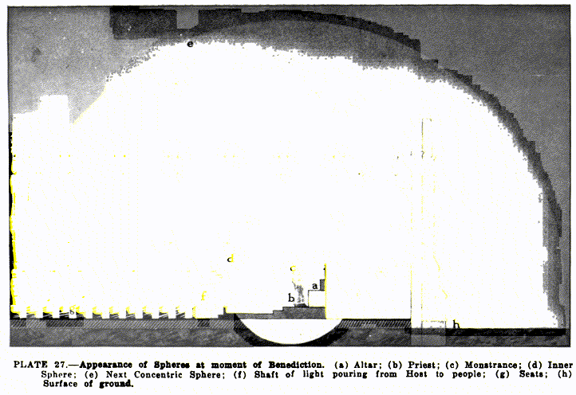

По завершению литании наступает несколько мгновений тишины, после чего начинается пение "Tantum Ergo", как и было с момента учреждения этой службы.

TANTUM EBOO

Так пред Ним мы наклоняемся,
Великий Сакрамент почитаем;
Образы и тени обретают завершение,
Ибо здесь заря нового ритуала.
Вера, помощница нашего внешнего облика,
Делает наш внутренний взор ясным.
Славу и благословение возносим,
Отцу и Сыну.
Честь, мощь и хвалу воздаем,
Пока века бегут вечной чередой:
И признаем мы Его любовь непрестанно,
Того, кто от Обоих в Одном есть с Обоими. Аминь.

Это, как и 0 Salutaris, мы обязаны святому Томасу Аквинскому, и в каждом случае последние два стиха являются заключительными стихами сакраментальной гимны. Эти стихи можно найти в "Древних и Современных Гимнах", номера 311 и 309 соответственно. Все присутствующие остаются на коленях и глубоко кланяются на второй строке "Tantum Ergo". По окончании первого куплета официант снова кладет благовония в два турива и, всё ещё стоя на коленях, подносит благовония девятью размахами, как и раньше, пока поется второй куплет. Верш и ответ, которые следуют за ним, являются традиционными.

P. Ты даровал им Хлеб с небес.
O. В себе содержащий всю сладость.

Но мы добавляем молитву о том просвещении, которое позволит нам в максимальной степени извлечь пользу из того чудесного излияния, которое мы теперь ожидаем.

P. О Господь Христос, Ты, скрытый Обитатель в духе человеческом;
O. Открой Твои глаза в нас, чтобы мы могли видеть.

Мы также незначительно модифицировали традиционный сборник, который следует далее;

О Господи, Кто в великолепном Сакраменте Алтаря оставил нам живой образ Твоего вечного Жертвоприношения; даруй нам, мы Тебя умоляем, таким образом чтить священную тайну Твоего Тела и Крови, чтобы мы всегда ощущали внутри себя силу Твоего внутреннего жизнедеяния, и таким образом, радостно изливая нашу жизненную силу в жертву, узнавали себя едиными с Тобой, и через Тебя со всем, что живет; Ты, Кто живешь и царствуешь с Отцом в единении Святого Духа, Бог, во все века веков. R. Аминь.

Мы добавляем здесь признание славы и хвалы Богу и тем, через кого к нам приходит это великое благословение.

Перед Священной и Преклонной Троицей, Отцом, Сыном и Святым Духом, тремя Лицами в одном Божестве; перед Христом Господом нашим, единственным мудрым Советником, Князем Мира; перед семью могущественными Духами перед троном; и перед великолепным собранием праведников, достигших совершенства, Наблюдателями, Святыми, Посвященными, пусть от каждого живого существа исходит непрекращающаяся хвала; и честь, мощь и слава, ныне и во веки веков. B. Аминь.

После этого тот, кто совершает богослужение, встает (его помощники, аколиты и прихожане остаются на коленях), монстранс снимают с алтаря, а тот, кто совершает богослужение, через вуали на епитрахили, берет его обеими руками и держит перед своим торсом. Он медленно поворачивается вправо до тех пор, пока не обратится лицом к прихожанам и делает знак Святого Креста ✠ над ними с монстрансом, с сильным желанием, чтобы благословение Христа ✠ прорвалось к ним. Если епископ совершает обряд, он делает знак три раза, как принято при обычном благословении, но с монстрансом вместо простого жеста рукой. Между тем поднимаются облака благовоний, и звучит колокол в святилище. Сила, что вливается, безумна; это как будто сам Христос стоит там и благословляет свой народ, потому что личность того, кто совершает обряд, вообще не важна; она явно отсутствует, заблокированная вуалью епитрахиля. В обычном благословении, данном в конце службы, мы получаем благословение Христа через личность священника или епископа, потому что эта сила передается от Господа к его представителю, и которые во время посвящения были особенно связаны с Ним. Эта сила спускается с этих высших уровней священника в его разум и душу, как и любая другая мысль, и он направляет ее на народ с помощью своей воли. Таким образом, часть переноса силы с высших уровней на низкие происходит в самом священнике, и, неизбежно, он оказывает влияние на течение этого процесса. В обряде благословения Пресвятым Сакраментом линия связи представляет собой "высекаемую молнию" которая связывает Святые Дары с Христом в момент их освящения; таким образом, сила действует независимо от священника, исключая волевое усилие, которое дает толчок току — как если бы он открыл кран, так сказать. Сложно найти подходящую аналогию; сила благословения всегда идет от Святых Даров, но воля того, кто совершает обряд во время благословения направляет ее под значительно большим давлением.

Когда обычное благословение в конце службы дает епископ вместо священника, сила обладает обеими этими качествами; его связь с его Учителем теснее, поэтому через его личность происходит значительно большее проливание силы, однако в то же время его кольцо напрямую связано магнитно с Христом, а его пекторальный крест и посох связаны с главами семи Лучей, так что огромное количество энергии совершенно внешней для него самого, также приводится в движение. Особенностью всех этих энергий является их стойкость взаимодействия друг с другом — усиливая друг друга. Когда несколько линий действуют вместе, каждая из них значительно усиливается, поэтому общий эффект поразителен.

Благословение Христа ✠ на этой службе изливается в тишине, как и на посвящении священника. Это кульминация церемонии, к которой ведут все предшествующие этапы. Верховный акт поклонения Tantum Ergo вызывает нас эту чудесное отклик, и церковь наполняется небесным великолепием. Для ясновидящего этот момент неописуемой красоты, и восторг, который он приносит, также за пределами описания. Это тихий молитвенный акт — единственная часть службы, в которой действует Сила C; даже сейчас она не сохраняется и не рассасывается, как при праздновании Святой Евхаристии, но излучается в окружающую среду вместе с Силой A. На самом деле нет конкретной мыслительной структуры, в которой она могла бы быть сохранена; скорее я бы сказал, что никакая форма специально не создается для этой цели. Эффект создается набором концентрических сфер света, каждая из которых на своей поверхности имеет некоторое напряжение, временно удерживающее энергию и позволяющее некоторое ее накопление; но поверхность эластична и постоянно расширяется по мере увеличения давления; и когда тот, кто совершает обряд, поднимает монстранс для благословения, сила отбрасывает вуаль, как поисковый свет, и мгновенно растворяет часть сферы перед ним, так что когда он медленно поворачивается, вся форма разрушается, и все накопленная энергия горизонтально выливается на прихожан и окружающий мир.

Это не только кульминация, но фактически завершение этой невероятно красивой службы; короткий псалом поется пока Святые Дары возвращаются в табернакуль, а процессия покидает церковь, воспевая заключительный гимн, который мне кажется одним из драгоценных камней нашей литургии. Его написал один из наших членов, господин Э. Эмина Вудхауз.

Торжественный час закрыт, 
      Священные ритуалы завершены: 
    И вот музыка Твоей мощи
      Воздействует на каждого из нас.
    О, Учитель, пусть эта гармония 
    Зазвучит в жизнях, которые мы ведем для Тебя!

И теперь с почтительной походкой,
      Наша сила, восполненная Тобой,
    Посвященные хранители Твоей благодати,
      Мы покидаем святое святилище.
    И уходим в тихую ночь,
    Чтобы стать носителями Твоего света.

Я особо рекомендую эту службу благословения нашим членам. Мне кажется, она занимает второе место после празднования Святой Евхаристии по своей красоте и значимости. Кажется, наилучшим вариантом будет, если перед ней будут совершены вечерни, так как эта служба "готовит почву" для нее и собирает множество ангелов и других помощников, чья помощь немаловажна. Давайте принимаем участие в этой службе всем сердцем, думая о словах, которые мы поем, и действительно наполняя их значением, стараясь почувствовать и оценить то, что наш Господь делает для нас; а затем, в знак благодарности Ему, давайте изливаем эту силу и это благословение на всех, с кем мы вступаем в контакт. Так мы лучше всего воспользуемся этой чудесной возможностью, которую Он предлагает нам; так мы лучше всего Ему понравимся, и сможем стать еще более совершенным каналом для Его вечной любви в будущем.

CHAPTER X

ОКАЗИОННЫЕ ОБРЯДЫ

УТРЕНЯ И КОМПЛИН

Немного можно сказать о данных святых обрядах. Я привожу слова, которыми предисловлены эти обряды в нашем Литургическом порядке.

Утреня - это одна из утренних служб Церкви, а Комплин - одна из вечерних. Более значительные обряды, такие как святая Евхаристия, Вечерня и Благословение, в основном нацелены на излияние духовной силы на мир, в то время как эти менее масштабные обряды - Утреня и Комплин - могут быть вполне рассмотрены как обряды, предназначенные в особенности для блага тех, кто в них участвует.

Утреня и Комплин – это краткие обряды, которые по необходимости может совершать мирянин. Они идеально подходят как семейные молитвы, для школьного молебна или же для пастыря, стремящегося помолиться утром или вечером вместе со своими подопечными. Они также могут быть проведены в Церкви; Утреня, когда не возможно празднование святой Евхаристии или в преддверии того, и Комплин как дополнение к Вечерне, или когда Вечерня и Благословение неподходящи, например, в вечер Великой Пятницы.

Схема этих святых обрядов однотипна. Оба начинаются, как все наши обряды, с воззвания во имя Святой Троицы, после которого следуют эти стихи:

П. Наша помощь - во имя Господа,
О. – изготовителя неба и земли.
П. С утра до вечера мы прославляем Его.
С. Наши сердца всецело и непоколебимо уповают на Его любовь.

Далее следует обыкновенное исповедание. Если священник присутствует, он произносит абсолюцию; если нет, причастник обряда, оставаясь на коленях, говорит:

Да будет Господь милостив к нам, и да простит нам все наши грехи; и да простирется Его мир на нас в этот день и на все времена.
Б. Благодарность Богу.

Три псалма по четыре стиха в каждом, гимн обряда, акт веры, послание и евангелие на день читаются в качестве текстов, и несколько коллект и стихов завершают эти простые службы. При необходимости предусматривается возможность сокращения обряда, исключая из него чтения, два псалма и гимн.

Чтобы дать пример этих святых обрядах, я переписываю два альтернативных Акта веры, которые предложены:

Мы верим, что Бог есть Любовь, Мощь, Истина и Свет; что совершенная справедливость управляет миром: что все Его сыны рано или поздно найдут путь к Нему, как бы далеко они не заблудились. Мы признаем Отцовство Бога и Братство всех людей; мы знаем, что наилучшим образом мы служим Ему, когда наилучшим образом служим нашему брату человеку. Таким образом, Его благословение пусть всегда будет на нас, и мир пребудет на всегда. Аминь.

Or ihis:

Мы возлагаем наше упование в Бога, святую и преславную Троицу, ✠, обитающую в духе человека.

Мы возлагаем наше упование на Христа, Господа любви и мудрости, первого среди многих братьев, ✠, который ведет нас к славе Отца и является Путем, Истиной и Жизнью.

Мы возлагаем наше упование на Закон Добра, который управляет миром; стремимся пройти по древнему узкому Пути, ведущему к вечной жизни; обретаем понимание, что лучшим образом служим целому, когда служим нашему брату-человеку. Так Его покой очертит наше сознание, и вечный мир обретется. Аминь.

Тон каждой службы определяют молитва и несколько стихов в ее завершении. В случае Утрени они следующие:

Будь с нами, Господи, в течение всего этого дня, чтобы в нашей трудолюбивой работе, начатой, продолженной и завершенной в Тебе, мы могли прославлять Твое святое Имя, ✠, которое вечно и всегда. R. Аминь.

P. Осыпь на нас, Дух Божий.
C. В Твоей силе мы в состоянии совершить все.
P. Пусть наши сердца наполнятся Твоей любовью,
C. В Твоей силе мы в состоянии совершить все.
P. Слава Отцу и Сыну: и Святому Духу
C. В Твоей силе мы в состоянии совершить все.

На При закате солнца произносятся заменяющие слова:

Будь с нами в наших домах, Господи, и пусть Твои святые Ангелы обитают в них, чтобы охранять нас в мире; и пусть Твое благословение всегда нас сопровождает, ты, Господи любви, ✠, живущий вовеки и всегда. B. Аминь.

P. Посмотри, Господи, на Твою семью.
C. В Твои руки я предаю свой дух.
P. Защити нас под тенью Твоих Крыльев.
C. В Твои руки я предаю свой дух.
P. Слава Отцу, и Сыну, и Святому Духу,
C. В Твои руки я предаю свой дух.

Служба завершается следующим благословением, если присутствует священник:

Заключаем вас в благую любовь Бога и Его покровительство; пусть Господь благословит вас и хранит; Господь да осветит вас светом Своего Лика и будет милосерд к вам; пусть Господь возвышает светозар Своего Лица над вами и дарует вам Свой мир, сегодня и на веки веков. B. Аминь.

Если священника нет, служитель заканчивает службу следующими словами:

Благодать Господа нашего Иисуса Христа, и любовь Божия, и общение Святого Духа да будут с нами во всевековечную вечность. R. Аминь.

ПОГРЕБЕНИЕ УМЕРШИХ

Возможно, именно в данной службе направленность Либеральной Католической Церкви проявляется наиболее явно. Старые службы заполнены тенью мрачности и сомнений; они настаивают, что вся плоть - тлен, что у нас немного времени для жизни и оно пропитано страданиями, что в час нашей смерти мы подвержены опасности отдаляться от Бога и тому подобное. Наилучшей мантрой, которую они могут предложить, кажется, является "верная и истинная надежда". Их подход устарел и не в гармонии с реальностью. Он не учитывает результатов современных открытий; он привержен опровергнутым теориям, вопреки здравому смыслу и науке. В Либеральной Католической Церкви мы приветствуем истину, откуда бы она ни пришла, и считаем неразумным и даже глупым проповедовать доктрину, которая шла вразрез с большим количеством доказательств и зарегистрированных фактов.

Жизнь после смерти уже не является тайной. Свыше гробовая жизнь действует по тем же законам природы, что и мир, который мы знаем, и была исследована и изучена с научной аккуратностью. Возможно, некоторые особи скептически отнесутся к этому, полагая, что это лишь утверждение; но я бы спросил их, на чем основывается их настоящая вера, какой бы она ни была. Они полагают, что основывают её на учениях некоторой Церкви, или потому что она предполагается быть основана на священном писании; или потому что это общепринятое мнение тех, кто окружает его — царящее мировоззрение своего времени. Но если они подумают без предрассудков, они увидят, что их воззрение также основывается только на утверждении, ведь разные Церкви преподносят разные видения, а священные тексты могут и были различно интерпретированы. Общепринятое мнение времени не несет в себе определенного знания; оно лишь слух. Вопросы, которые так близко и глубоко нас затрагивают, слишком важны, чтобы оставить их простой догадке или смутной вере; они требуют уверенности научного исследования и документирования. Такое исследование было проведено, такое заключение было сформулировано; это — результат, который Либеральная Католическая Церковь выдвигает в качестве своего учения по данному вопросу, и на этом результате основана данная служба. Мы не требуем слепой веры; мы говорим о том, что многие из нас знают как факты, и приглашаем наших слушателей осмотреть их.

Чтобы сделать тему понятной, я должен вновь затронуть вопрос о строении человека, который я уже обсуждал ранее. Мы все слышали, как неопределенно говорится, что у человека есть бессмертная душа, предположительно переживающая смерть тела. Отбросим эту неопределенность, и изучим доказательства, до тех пор, пока мы не утверждаем: "Я надеюсь, что у меня есть душа", а "Я знаю, что я _есть_ душа". Это и есть истинная действительность; человек — это душа, и у него есть тело. Тело не есть человек; оно всего лишь его одеяние. То что мы называем смертью, это просто снятие надетого одеяния, и это не больше конец человека, чем когда мы снимаем наши пальто. Поэтому мы не потеряли наших "умерших" друзей; мы всего лишь потеряли из виду плащ, в котором мы были привычны видеть их. Плаща больше нет, но человек, который его носил, остался; ведь мы любим именно человека, а не его одеяние.

Перед тем как мы сможем понять состояние умерших, нам нужно понять себя самих. Мы должны осознать, что мы — бессмертные сущности, бессмертные по своей сути — искры из Божественного Огня; что мы жили веками до того, как облачились в эти отделки, которые мы называем телами, и что мы будем жить веками после того, как они превратятся в прах. "Бог сделал человека по образу и подобию своей вечности." Это не домыслы или благочестивая вера; это определенный научный факт, доказываемый и подтверждаемый, как можно убедиться, прочитав литературу по предмету. То, что люди называют своей жизнью — это всего лишь один день их настоящей жизни как души, и то же верно по отношению к нашему усопшему другу; поэтому он не умер — только его тело отброшено.

Тем не менее мы не должны воспринимать его как простой бестелесный дух, утративший свою личность. Вы, господа читатели, имеете физическое тело, которое вы можете видеть, и внутреннее тело, которое вы не видите, о котором (как я упоминал ранее) святой Павел говорил как о "духовном теле". И когда вы снимаете физическое, у вас остается это тонкое тело; вы одеты в свое "духовное тело". Если мы представляем физическое тело как плащ или пальто, мы можем рассматривать это духовное тело как обычный домашний халат, который человек носит под этим внешним одеянием.

Не только в тот момент, что мы называем смертью, человек снимает плотный плащ материи; каждую ночь, когда он засыпает, он снимает его на время и бродит по миру в своем духовном теле — невидимый для этого плотного мира, но ясно видимый для тех друзей, которые в то же время используют свои духовные тела. Каждое тело видит то, что находится на его уровне; наше физическое тело видит только другие физические тела, наше духовное тело видит только другие духовные тела. Когда человек надевает свой плащ — то есть, когда он возвращается к своему более плотному телу и пробуждается (или возвращается) в этот нижний мир, иногда случается, что он сохраняет воспоминания, хотя они обычно значительно искажены, о том, что он видел, когда был в другом месте; и тогда он называет это ярким сном. Таким образом, сон можно сравнить с видом временной смерти, отличием является то, что мы остаемся в этих "плащах" и можем в них вновь облачиться. Отсюда значит, что когда мы спим, мы входим в ту же стадию, в которую переходят умершие. Каким именно является это состояние, я постараюсь кратко и частично объяснить.

Многие теории были высказаны относительно жизни после смерти, большинство из которых основывались на недоразумениях старых священных писаний. В одно время ужасающая догма о так называемом вечном наказании была почти повсеместно признана в Европе, но теперь в неё верят лишь безнадёжно невежественные. Она основывалась на неправильном переводе определённых слов, приписанных Христу✠, и поддерживалась средневековыми монахами как удобное средство для запугивания невежественных масс и поддержания в них благочестия. Но по мере продвижения общества по пути цивилизации, люди начали осознавать, что такие догмы не только богохульны, но и абсурдны. Современные верующие поэтому заменили их на более вменяемые предложения✠, которые, однако, обычно довольно смутны и далеки от простоты истины. Все Церкви усложнили свои доктрины, исходя из абсурдной и необоснованной догмы о жестоком и гневном божестве, желающем навредить своему народу. Они восприняли это ужасное учение из первобытного иудаизма, вместо того, чтобы принять учение Христа о том, что Бог — это любящий Отец. Люди, принявшие фундаментальный принцип, что Бог — это Любовь, и что Его Вселенная управляется вечными законами, начали осознавать, что эти законы должны быть соблюдены и в мире за гробом, точно так же, как и в этом мире. Но даже сейчас наши представления весьма смутны. Нам рассказывают о далёком небесах, о дне суда в отдалённом будущем, но дают мало информации о том, что происходит здесь и сейчас. И те, кто проповедует, даже не притворяются, что у них есть личный опыт обращения со смертью. Они рассказывают нам не то, что знают сами, а только то, что слышали от других. Как это может быть удовлетворительно?

Правда в том, что время слепой веры прошло; эпоха научного знания пришла, и мы больше не можем принимать идеи, не подкреплённые рассудком и здравым смыслом. Ничто не мешает применять научные методы для разрешения вопросов, которые ранее были полностью отданы на откуп религии. Действительно, такие методы уже были применены Обществом психических исследований, Теософским Обществом и многими другими, среди которых можно найти известных учёных. Было бы глупостью игнорировать или отрицать результаты этих исследований, поскольку, хотя некоторые исследователи добились больших успехов, чем другие, существуют многие общепринятые факты, с которыми все они согласны. Поскольку я сам принимал участие в этой работе, то то, что я открою своим читателям здесь, это знания, полученные в результате моих личных исследований. За мои утверждения отвечаю только я, хотя многие полностью или частично согласны со мной.

Мы — это духи, но мы живём в материальном мире — мире, который известен нам лишь отчасти. Вся информация о нём поступает к нам через наши чувства; но эти чувства серьёзно недостаточны. Мы видим твёрдые объекты; мы обычно видим жидкости, если они не абсолютно чистые; но газы в большинстве случаев невидимы для нас. Исследования показывают, что существуют другие виды материи, гораздо тоньше самого редкого газа; но наши физические чувства не способны их воспринимать, и поэтому мы не можем получить информацию о них физическими средствами. 

Однако, мы можем вступить в контакт с ними; мы можем исследовать их, но можем сделать это только посредством работы "духовного тела", о котором было упомянуто выше, ведь у него такие же чувства, как и у физического. Большинство людей ещё не научились использовать эти чувства, но это — способность, которая может быть освоена человеком. Мы знаем, что она может быть развита, потому что были люди, которые смогли это сделать; и те, кто приобрёл эту способность, обнаружили, что они способны видеть гораздо больше, чем обычные люди. Они узнали, что этот мир гораздо более удивителен, они узнали, что хотя люди живут в нём тысячи лет, большинство остаются в неведении обо всех высшей и более прекрасной стороне его жизни. Благодаря этой способности мы получили всю информацию, приведённую в этой книге; рассмотрим теперь это новое знание о жизни за пределами того, что мы называем смертью, и условиях жизни тех, кто переживает её.

Первое, что мы осознаём, – смерть не представляет себя концом жизни, как мы невежественно предполагали. Это лишь переход от одного этапа жизни к другому. Уже отмечалось, что это подобно сниманию верхней одежды, но после этого человек остаётся одетым в своё обычное домашнее платье — духовное тело. Хотя это тело гораздо тоньше, апостол Павел назвал его "духовным", оно по-прежнему является телом и, следовательно, материальным, хотя и из более изысканной материи, чем та, которую мы обычно понимаем. Физическое тело служит духу как способ коммуникации с физическим миром. Без такого тела в качестве инструмента, дух не мог бы взаимодействовать с этим миром, оставлять в него свой след или воспринимать его впечатления. Мы обнаруживаем, что духовное тело играет точно такую же роль, оно служит связующим звеном для духа с более высоким и "духовным" миром. Но этот "духовный" мир не является неопределенным, отдалённым и недостижимым; это всего лишь более высшая часть мира, на котором в данный момент мы обитаем. Я не заперечиваю существование иных миров, намного более высоких и удалённых; я лишь говорю, что то, что обычно называют смертью, не имеет отношения к ним и просто представляет собой переход от одного состояния или условия к другому в мире, знакомом каждому из нас.

Возможно, кто-то возразит, что человек, переходящий этот порог, становится невидимым для нас; но подумав, мы увидим, что человек всегда был для нас невидим — то, что мы привыкли наблюдать, лишь его тело. Теперь же он обитает в другом, более тонком теле, которое уходит за границы нашего обычного восприятия, но отнюдь не обязательно остаётся недостижимым для нас.

Главное, что следует осознать, – те, кого мы называем мертвыми, не покинули нас. Нас вскормили убеждением, подразумевающим, что каждая смерть – это уникальное и поразительное чудо, что душа после отделения от тела каким-то образом исчезает в раю за звёздами, не давая нам никаких указаний о механическом способе передвижения через безмерные пространства. Безусловно, природные процессы поражают своим величием и зачастую нам непонятны, но они никогда не противоречат разуму и здравому смыслу. Когда человек снимает своё пальто в прихожей, он не мгновенно исчезает на дальней горной вершине; он остаётся точно там, где был до этого, хоть и может выглядеть иначе. Точно таким же образом, когда любящий отбрасывает своё физическое тело, он остаётся в том же самом месте. Правда, мы уже не видим его, однако не потому что он ушёл, но потому что платье, которое он носит теперь, не видимо нашим физическим глазам.

Наши глаза реагируют лишь на минимальную часть вибраций, существующих в природе, и, следовательно, единственную материю, которую мы можем видеть, являются эти особенные колебания. Видимость нашего "духовного тела" также зависит от реакции на волнения, но они совершенно иного порядка, поступающего от более изысканного типа материи. Всё это можно обнаружить, детально разложенное в существующей по этой теме литературе.

В данном контексте нас интересует только то, что при помощи наших физических тел мы можем видеть и касаться лишь физического мира, в то время как при помощи "духовного тела" мы можем видеть и касаться вещей духовного мира. И помним, что это никоим образом не другой мир, а всего лишь более возвышенная часть того же самого мира. Вновь подчеркну, существуют и другие миры, но сейчас мы их не рассматриваем. Человек, о котором мы думаем как об ушедшем, на самом деле всё ещё с нами. Когда мы стоим рядом, мы в своих физических телах и он в "духовном", мы не осознаем его присутствия, потому что не видим его. Однако когда мы оставляем наши физические тела во время сна, мы стоим рядом с ним в полной и совершенной осведомлённости, и наше общение с ним такое же полное, как и раньше. Так во сне мы находимся с "мертвыми", которых любим; это лишь в бодрствующем состоянии мы чувствуем разлуку.

К сожалению, для большинства из нас существует разрыв между физическим сознанием и сознанием духовного тела, что хотя в последнем мы вполне помним первое, многим из нас невозможно сохранить память о том, что делает душа, когда она отделяется от тела в сон. Если бы эта память была полной, для нас не было бы смерти. Некоторые люди уже обрели это непрерывное знание, и все в конечном итоге обретут его; ведь это часть натурального раскрытия сил души. У многих уже началось такое открытие, и по этому причине проблески памяти просачиваются, но существует склонность к тому чтобы отметить их как простые мечты и, следовательно, подать им недостаточную ценность. Это особенно характерно для тех, кто не изучал сновидения и не понимает, что они на самом деле представляют. Но между тем лишь немногие уже обладают полным зрением и памятью, многие смогли почувствовать присутствие своих близких, даже если они их не видят. Есть и те, кто, не имея конкретной памяти, пробуждаются от сна с чувством покоя и благости, что является результатом того, что произошло на той высшей ступени мира.

Те, кто обладают исчерпывающей памятью, могут воссоздать перед нами картину жизни, которую ведут ушедшие из жизни. В ней множество оттенков и различий, однако она в основном дарит гораздо больше счастья, чем земное существование. Нам важно освободиться от устаревших представлений; умерший не попадает вдруг в невероятно далёкое небо, как не отправляется в исключительно непостижимый ад. В действительности, ада в старом презрительном смысле этого слова не существует; и нет ада в принципе нигде, если только человек сам себе его не создаёт. Необходимо осознать, что смерть никак не меняет человека; он не мгновенно становится великим святым или ангелом, как и не приобретает вдруг всю мудрость веков; он остаётся тем же человеком день после своей смерти, каким был день до ней, с теми же чувствами, той же характерной чертой, тем же уровнем интеллектуального развития. Единственное отличие в том, что он утратил физическое тело.

Постараемся осознать все последствия этого изменения. Это означает полную невозможность ощущения боли или усталости, также отпадает необходимость выполнять неприятные обязанности. Появляется полная свобода (вероятно, впервые за всю его жизнь) делать то, что ему по душе. В земной жизни человек постоянно подвержен ограничениям; если он не относится к маленькой группе тех, кто обладает независимыми средствами, он обязан работать, чтобы заработать деньги — деньги, которые необходимы для покупки еды, одежды и обеспечения крова себе и тем, кто зависит от него. В редких случаях, когда речь идёт о художнике или музыканте, работа становится источником радости, но в большинстве случаев это труд, к которому он бы никогда себя не призвал, если бы не был вынужден к тому.

В этом духовном мире деньги становятся ненужными, также как и пища и укрытие, ведь его величие и красота открыты для всех жителей без денег и без всякой оплаты. В его изысканном материальном проявлении, в духовном теле, он может двигаться туда и сюда, как ему заблагорассудится; если он любит прекрасные пейзажи лесной гущи, моря и неба, он может по своему усмотрению посещать все живописные уголки Земли; если он любит искусство, он может посвятить всё своё время созерцанию шедевров всех величайших творцов; если он музыкант, он может переходить от одного к другому из лучших оркестров мира или слушать исполнение самых знаменитых исполнителей. Что бы ни было его особым увлечением на Земле, он теперь обладает полной свободой полностью посвятить себя его практическому осуществлению и изысканию до посинения, при условии лишь, что радость от его удовлетворения обладает интеллектом или высшими эмоциями, что его удовлетворение не требует владения физическим телом. Таким образом, становится очевидным, что все справедливые и достойные люди безмерно счастливее после смерти, чем до неё, ибо у них есть достаточно времени не только на наслаждения, но и на действительно удовлетворительное продвижение по направлениям, которые их больше всего интересуют.

Существуют ли в этом мире несчастные души? Да, ибо этот мир является логическом продолжением земной жизни, и человек остаётся во всех отношениях тем же, каким он был до своего ухода. Если его удовольствия в земном мире были низкими и материальными, он обнаружит, что в том мире не сможет удовлетворить свои желания. Пьяница будет томиться от ненасытной жажды, не имея уже тела, через которое он может её утолить; чревоугодник будет скучать по столовым изыскам; скупердяй больше не найдёт золота для своего скупого сбора. Человек, который сдался в течение земной жизни низменным страстям, обнаружит, что они по-прежнему грызут его достоинство. Страстник до сих пор мучается от ненасытных желаний, которые теперь никогда не смогут быть удовлетворены. Ревнивый человек до сих пор раздирается от ревности, тем более, что он больше не может влиять на поведение объекта своей ревности. Такие люди, безусловно, страдают — но только они, те, чьи пристрастия и страсти были материальными и грубыми по своей сути. И даже они держат свою судьбу целиком в своих руках. Они должны только победить эти низменные устремления, и они тут же освободятся от той муки, которую эти стремления навязывают. Всегда помните, что нет такого понятия, как наказание; есть лишь естественный исход определённой причины; для того чтобы последствие пропало, человеку достаточно лишь устранить причину — не всегда немедленно, но как только иссякнет энергия этой причины.

Многие избегают ярко выраженных пороков и ведут, что можно назвать, светскую жизнь, увлекаясь в основном общественными конвенциями и стремясь лишь к развлечениям. У таких людей наблюдаются нетрадиционные страдания в духовном мире - они часто скучают, время для них влечется медленно и тягостно. Они могут общаться со своими единомышленниками, но обычно находят их рутинными, так как конкуренция в отношении одежды или публичного выступления больше не существует, в то время как к ним малодоступны лучшие и умнее люди, которые обычно заняты своими делами. Тем не менее, любой интеллектуал или лицо, увлеченное искусством, будет намного счастливее, освободившись от физического тела; и следует помнить, что возможность развивать рациональные интересы в этом мире всегда имеется, если человек достаточно мудр, чтобы захотеть этого.

Деятели искусства и интеллектуалы испытывают непередаваемое счастье в этой новой жизни; и я думаю, еще счастливее те, кто посвящали свою жизнь служению ближнему - те, у кого главной радостью было помогать, поддерживать, обучать. Ведь хотя в том мире больше нет нищеты, голода, жажды или холода, там все еще существуют горе, которое можно утешить, и невежество, которое можно преодолеть. Из-за отсутствия понимания мира по ту сторону могилы в западных странах, мы видим, что многие нуждаются в просвещении о возможностях новой жизни; и тот, кто обладает знаниями, может благословить этот мир радостью и надеждой, точно так же, как и здесь. Но всегда помните, что сложно уловимые понятия "там" и "здесь" - это лишь слова, которые мы используем из уважения к нашим ограничениям; духовный мир всегда с нами, он вокруг нас в каждый момент, и мы не должны относиться к нему как к чему-то далекому или недостижимому.

Все это далеко от представлений о рае и аде, с которыми нас знакомили в детстве; тем не менее, это есть реальность, скрытая за эти мифами. Действительно, ад не существует; но можно заметить, что пьяница или сластолюбец могут создать для себя чем-то подобное. Однако это не вечно; это продолжается только до тех пор, пока его желания не исчерпаются; он может в любой момент завершить это, если он достаточно сильный и мудрый, чтобы подавить свои земные стремления и полностью подняться над ними. Именно это лежит в основе доктрины Римской церкви о чистилище - идея о том, что после смерти злые качества должны быть выжжены из человека через определенное количество страданий, прежде чем он будет способен наслаждаться блаженством рая.

Существует вторая, более высокая стадия жизни после смерти, которая очень близка к рациональному представлению о рае. Этот высший уровень достигается, когда все низшие или эгоистические стремления полностью исчезают; тогда человек переходит в состояние религиозного экстаза или высокой интеллектуальной активности, в зависимости от его склада ума и направления, по которому течет его энергия во время земной жизни. Это для него период высшего блаженства, период глубокого понимания, приближение к реальности. Но эта радость приходит ко всем, не только к особенно благочестивым.

Эту блаженную стадию нельзя считать воздаянием, она всего лишь неизбежный результат характера, развитого в земной жизни. Если человек изобилует высокими и бескорыстными чувствами или самоотдачей, если он замечательно развит интеллектуально или художественно, то неизбежным результатом такого развития будет это великое наслаждение, о котором мы говорим. Помните, что все эти состояния - лишь стадии одной жизни, и так же, как поведение человека в юности в значительной степени определяет условия его среднего возраста и старости, так поведение человека в земной жизни определяет его состояние в будущем жизни. Является ли это состояние блаженства вечным? - можно спросить. Нет, потому что, как я уже говорил, оно является последствием земной жизни, а конечная причина не может произвести бесконечный результат.

Жизнь человека намного долгее и величественнее, чем предполагают многие. Искра, исшедшая от Бога, обязательно вернется к Нему; и мы все еще далеки от этого совершенства Божественности. Вся жизнь подвержена эволюции, поскольку именно эволюция является законом Бога; человек медленно и постоянно развивается вместе со всем остальным. То, что обычно называют жизнью человека, на самом деле является лишь одним днем его истинной и более продолжительной жизни. Как и в обыденной жизни, человек просыпается каждое утро, одевается и идет выполнять свои ежедневные дела, а ночью снимает одежду и отдыхает, и затем снова на следующее утро пробуждается для продолжения работы - точно так же, когда человек приходит в физическую жизнь, он облачается в плоть, и когда его время работы на земле истекает, он снимает телесное обличье, которое мы называем смертью, и вступает в более спокойное состояние, о котором я уже говорил; и когда его период отдыха заканчивается, он снова облачается в одеяние плоти и возобновляет свою деятельность в физической жизни, продолжая свою эволюцию с места, где он остановился.

_"Это ничто иное, как когда кто-то откладывает 
      свои изношенные одежды,
    И, приняв новые, заявляет
      'Вот что я буду носить сегодня!'
    Так дух небрежно снимает
      свои плотские ризы,
    И наследует
      свежее обитель." *

*Небесная Песня, автор сэр Эдвин Арнольд.

И эта долга жизнь продолжается до тех пор, пока он не достигнет того совершенства Божественности, которое Бог предназначил ему.

Для многих все это будет новым, и потому что это ново, это может показаться странным и курьезным. Но все, что я говорил, подтверждено и проверено множеством раз; тем, кто желает узнать об этом подробнее, следует изучать соответствующую литературу. Часто задаваемый вопрос: что происходит с детьми в этом необычном новом духовном мире? Из всех прибывших туда, они, возможно, наиболее счастливы и быстро адаптируются. Помните, что они не теряют родителей, братьев, сестер, друзей, которых они любят; просто они общаются с ними в то, что мы называем ночью, а не днем; так что они не испытывают чувства потери или разлуки. В течение нашего дня они никогда не остаются одни, ибо там, как и здесь, дети собираются и играют вместе — играют на Элизийских полях, полных чудесных удовольствий. Мы знаем, как здесь дети любят "играть в притворства", воображая себя тем или иным историческим персонажем, играя главную роль в многочисленных сказочных историях и героических повествованиях. В субтельной материи этого высшего мира мысли приобретают видимую форму, и поэтому ребенок, воображающий себя определенным героем, временно принимает вид этого героя. Если он мечтает о волшебном замке, его мысль может создать этот волшебный замок. Если он хочет командовать армией, эта армия сразу же исчезает. И так, среди умирающих, дети всегда полны радости — действительно, часто даже буйно счастливы.

Другие дети, у кого мысли больше обращены к духовному, также никогда не испытывают разочарования в поисках своего. Ведь Ангелы и святые прошлого существуют — они не просто выдуманы; и те, кому они необходимы, те, кто верит в них, непременно найдут их более добрыми и великолепными, чем могло представлять воображение. Там есть и те, кто ищет самого Бога, Бога в видимой форме; но даже они не остаются разочарованными, поскольку от самых добрых и любящих наставников они узнают, что все формы есть проявления Бога, ведь Он везде, и те, кто стремится служить и помогать даже самым низшим из Его созданий, на самом деле служат и помогают Ему. Дети любят быть полезными; они стремятся помочь и утешить; они находят обширное поле для такой помощи и утешения среди невежествующих в этом высшем мире, и, перемещаясь по его славным полям со своими благими делами, они познают правду старого красивого учения: "Во сколько вы сделали это одному из малейших из этих, вы сделали это Мне".

А как насчет малышей — тех, кто еще слишком молод для игры? Не волнуйтесь за них, ведь много умерших матерей с нетерпением ждут, чтобы обнять их, принять и любить их, как будто они были бы их собственными. Обычно такие малыши проводят в духовном мире небольшое время, а затем возвращаются на землю, часто к тем же родителям. О них в средневековье монахи придумали особенно жестокую легенду, утверждая, что младенец, не принявший крещение, навсегда потерян для друзей. Безусловно, крещение - это истинный сакрамент и имеет свое значение, как мы уже видели, но пусть никто не ошибается, полагая, что упущение такого внешнего обряда может повлиять на действие вечных законов ✠ Бога или превратить Его из Бога любви в беспощадного тирана.

Стало очевидно, что, независимо от нашей естественной склонности к гореванию по поводу смерти близких, эта печаль является заблуждением и злом, которое нам приходится преодолевать. Нет необходимости горевать по ним, поскольку они перешли к значительно более обширной и счастливой жизни. Если мы огорчены из-за мнимого расставания с ними, то, во-первых, плачем из-за иллюзии, поскольку в реальности они не отдалились от нас; во-вторых, мы действуем эгоистично, основываясь больше на собственном предполагаемом ущербе, чем на их великом и истинном приобретении. Мы должны стремиться быть абсолютно бескорыстными, как и должна быть вся истинная любовь. Нам необходимо думать о них, а не о себе — не о том, что мы желаем или что мы чувствуем, но только о том, что наиболее благоприятно для них и способно способствовать их прогрессу.

Если мы огорчены, если мы поддаемся унынию и депрессии, то излучаем от себя тяжёлую тучу, которая затемняет небо для них. Их собственная любовь к нам, их собственное сочувствие к нам, делают их подверженными к этому губительному воздействию. Мы можем использовать власть, которую нам даёт эта любовь, чтобы помочь им, вместо того чтобы оказывать препятствия, если только мы захотим; но для этого требуется храбрость и самоотверженность. Мы должны полностью забыть о себе в своём искреннем и любящем стремлении быть максимально полезными для наших ушедших. Всякая наша мысль, все наши чувства воздействуют на них; поэтому мы должны убедиться, что нет мысли, которая не была бы обширной, благоприятной, возвеличивающей и очищающей.

Попытайтесь вникнуть в единство всего; есть один Бог, и все едины в Нём. Если мы сможем привлечь к себе единство этой вечной любви, то для нас больше не будет печали; ведь мы осознаем, не только для себя, но и для тех, кого мы любим, что будь мы живы или мертвы, мы принадлежим Господу, и что в Нём мы живём, движемся и состоим, будь это в этом мире или в будущем. Скорбный настрой - это неверный и невежественный настрой. Чем больше мы знаем, тем больше мы доверяем, ибо полностью уверены, что мы и наши умершие одинаково находимся в руках совершенной силы и совершенной "Мудрости, руководимой совершенной Любовью.

ПОГРЕБАЛЬНАЯ СЛУЖБА

Это стало долгим отступлением от нашего рассмотрения Погребальной службы; но крайней важности этой темы достаточно для его оправдания, и без понимания фундаментальных знаний, которые определили его устройство, невозможно понять саму службу.

Примечание к этой службе в нашем Литургии гласит:

Церковные обряды могут быть разделены на две группы; первую включают обряды важнейшие, цель которых заключается в обустройстве освободившейся души миром и духовной силой. Из этого наиболее важным и действенным является приношение святой Жертвы за покой души. Вторая, менее важная часть обряда, это освящение могилы и помещение в неё пепла или отброшенного тела. В дополнение к этому нужно утешать и уверять родственников и друзей.

Этот процесс помощи и введения в состояние покоя умершего неизбежно замедляется, если мы окружаем его чувствами уныния и несчастья. Следовательно, необходимо приложить все усилия, чтобы отойти от нашего собственного естественного ощущения горя и потери и больше думать о счастье и покое ушедшей души. Постепенно, по мере того как мы это осуществляем, мы получаем утешение и силу для себя.

Священник должен быть попрошен помянуть умершего как можно скорее после смерти во время одной из своих регулярных служб. Настоятельно рекомендуется, где это возможно, чтобы физическое тело умершего было кремировано, то есть быстро разложено огнём, а не медленным разложением.

Когда были прочитаны обычные молитвы, и тело ушедшего приведено в церковь, священник начинает с призыва, а затем говорит:

_Братья, мы собрались здесь сегодня, чтобы отметить переход нашего дорогого брата в жизнь более высокого уровня... Вполне естественно, что мы, знающие и любящие его, сожалеем об его уходе среди нас; тем не менее, на этой встрече наш долг - думать не о себе, а о нем. Поэтому мы должны усердно стараться отбросить мысль о нашей личной потере и думать только о его великом и великолепном приобретении._

И тогда он призывает присоединиться к нему в пении Te Deum в честь радости, которая пришла к ушедшему брату. Если есть большая спешка, можно заменить его на двадцать третий псалм, но, разумеется, он менее эффективен. Затем священник обрызгивает гроб святой водой и кадит его, в то время как произносятся прекрасные стихи, а затем он произносит следующее освобождение:

P. Даруй ему вечный покой, о Господи.
C. И вечный свет да сияет над ним.
P. Пройдите ему навстречу, Ангелы Господни.
C. Примите его в общение свое, святые Божии.
P. Да хоры Ангелов примут его.
C. И направят его в вечное благословение.
P. Даруй ему вечный покой, о Господи.
C. И вечный свет да сияет над ним.
P. О Боже, в Невыразимой Твоей любви души усопших находят покой и мир. Во имя Твое мы освобождаем от всякого греха слугу Твоего, отбросившего земное тело. Да исполнится святые Ангелы заботы о нем, чтобы он вошел в свет вечного благословения и обрел покой в Тебе. Через Христа, Господа нашего. S. Аминь.

Если предполагается проведение особого празднования Святой Евхаристии в этот момент в честь усопшего, то оно начинается сейчас. Если нет, выполняют следующие просения:

Всемогущий Бог, имеющий власть над живыми и мертвыми и обнимающий всю Твою тварь вечными объятиями Твоей любви, мы просим Тебя о мире и отдыхе для слуги Твоего, который, умрев для этого мира, но вечно живым для Тебя, может обрести в Твоем непрекращающемся и безупречном служении совершенное исполнение счастья и покоя. Через Христа, Господа нашего. B. Аминь.

Также, о Господи, мы просим Тебя за тех, кто любит слугу Твоего, тех, кого Ты позвал посвятить утешение его земного присутствия; да утешит их, о Господи, бальзам Твоего любовного доброты, чтобы, укрепленные Тобой и положившись на непоколебимую мудрость Твою, они могли отложить свои мысли о печали и скорби и наполнить его только такими мыслями о любви, которые могут помочь ему в поднятом житейском служении, куда Ты его теперь позвал. Через Христа, Господа нашего. B. Аминь.

Процессия, несущая гроб, теперь направляется к могиле. Прежде чем опустить гроб, могилу поливают святой водой, дымом от благовоний и освящают священником. Затем гроб опускают, и священник произносит молитву-проповедь, которая частично является утверждением истины, частично - молитвой, но дает ясное представление о мыслях, которые мы хотим привнести в сердца тех, кто присутствует на похоронах.

Поскольку Всемогущему Богу по великой любви угодно было принять к себе нашего дорогого брата, мы посылаем его земную оболочку на землю, прах к праху, пепел к пеплу, в надежде, что в более блестящем духовном теле, которое он теперь носит, он будет свободен от земных оков, чтобы служить Богу, как ему положено. Ибо говорю вам: блаженны умершие в Господе; ибо души праведников в руках Бога, и никакие мучения не коснутся их. В глазах немудрых они кажутся мертвыми, их уход принимается за страдание, их уход от нас - за абсолютное уничтожение, но они находятся в мире. Ибо Бог создал человека бессмертным, и сделал его по образу своей вечности. Господь сидит над потоками воды; Господь остается Царем навсегда. Вселенная - это Его мудрость. Мощь и красота окружают Его трон в качестве столпов Его творений; ибо Его мудрость - бесконечна, Его мощь - всемогуща, и Его красота сияет сквозь всю вселенную в порядке и симметрии. Он протянул небеса как baldachin; землю он заложил как подножье; Он венчает свой храм звездами, как диадемой, и от Его рук исходит все сила и слава. Солнце и луна являются ураганными вестниками, и все Его законы - это гармония. Если подняться на небо, Он там; если спуститься в ад, Он тоже там. Если взять крылья утра и встать в самых отдаленных местах моря, даже там Его рука пойдет за нами, и Его правая рука удержит нас. В Его всемогущем вожделении мы отдыхаем в идеальном мире, и также под Его опекой этот наш любимый, которого Он удостоил приблизить к взгляду на Его вечную красоту.

Поэтому, всегда прославляя Его и с твердой и смиренной уверенностью, мы обращаемся к Нему и говорим:

О Отче Света, в Котором нет темноты, умоляем Тебя наполнить наши сердца спокойствием и тишиной, открыть в нас глаза души, чтобы по вере увидеть сияние и славу, которыми Ты облучаешь нас, своих слуг. Ты всегда одариваешь нас гораздо б óльшим, чем мы можем просить или представить, и только из-за нашей слабости и неверности мы иногда вынуждены просить что-то от Твоего всемогущества. Ты прекрасно знаешь слабость человеческого сердца и в своей безграничной любви снисходишь к нашей человеческой любви, когда мы умоляем Тебя о вечном покое для нашего любимого брата, и чтобы вечный свет над ним сиял. Благодарим Тебя, что Твоей любящей провидческой рукой Ты приводишь его из мира суетного к непостижимому Свету, из темноты земной в Твою славную Светлость, через врата смерти в блеск, которого мы не в силах постичь. Наша любовь _может его_ охватывать и окружать; прими же, о Господи, дар нашей недостаточной мысли и прикосни его вечным огнем Твоей любви, чтобы он мог стать для него ангелом-хранителем на пути ввысь. И так, по Твоей милости, в глубочайшем смирении и благоговении мы можем стать соучастниками Твоей необъятной могущества и наша слабость получит подкрепление Твоей бесконечной силой; чтобы мы вместе с этим нашим дорогим братом в свое время смогли достичь мудрости Духа, Который вместе с Отцом и Сыном живет и царствует, Бог во все века веков. R. Аминь.

И так, с молитвой и надеждой, заканчивается эта уникальная служба.

## Приложение

### Душа и её оболочки

Наши представления об этом мире и солнечной системе, частью которой он является, заключаются в том, что они гораздо больше, чем обычно полагают — они продолжаются гораздо дальше, чем обычно думают, и не наружу, а внутрь.

Мы считаем, что есть невидимый мир, который окружает нас здесь и сейчас, и он не далеко от нас, и остается невидимым только потому, что большинство из нас еще не развили чувства, с помощью которых его можно воспринимать; что для тех, кто развил эти чувства, этот мир не является невидимым и неизвестным, а находится полностью в пределах досягаемости и может быть исследован и изучен по желанию, точно так же, как любая страна на Земле.

Мы обнаруживаем, что кроме материи, которую мы видим вокруг себя, и кроме материи, которую мы не видим, но о наличии которой нас уверяет наука — различные газы и эфир, например — существует еще много других, еще более тонких видов материи, которые можно увидеть только с помощью этих более тонких чувств. Мы предлагаем это вашему вниманию как гипотезу для размышления и изучения; но справедливо будет сказать вам, что для нас это гораздо больше, чем гипотеза — для многих из нас это уверенность, основанная на наших собственных наблюдениях. Мы многие годы работаем над этими исследованиями; я сам был учеником 45 лет, и когда человек посвящает практически всё свое время на протяжении всех этих лет одной теме, он начинает что-то знать об этом и иметь ясные и определенные представления о его основных принципах.

Следовательно, совершенно верно, что по отношению ко многим из этих тем, которые могут показаться вам новыми и странными, я нахожусь в несколько иной позиции, потому что для меня все эти вещи являются само собой разумеющимися — во многих случаях являются повседневным опытом. Многие из нас знают из собственных экспериментов, что эти вещи верны, но мы не просим вас верить в это, потому что мы верим, а лишь принять наше свидетельство как любые другие доказательства и учитывать его. Мы не ищем приверженцев, мы не пытаемся убедить людей верить в то, что мы говорим; мы просто предлагаем им систему изучения, в надежде, что они будут достаточно заинтересованы, чтобы заняться этим и изучить это дальше самостоятельно. По этим темам существует много литературы, так что каждый, кто захочет, сможет легко изучить это дальше.

Что касается нас, то мы знаем, что эти более тонкие виды материи существуют, и что существуют целые миры, состоящие из них, которые мы называем высшими плоскостями природы. Помните, что я все еще говорю о той же материи, которую вы все знаете; мы признаем только одну материю, хотя она может быть в разных состояниях. Так как у вас может быть водород в его нормальном газообразном состоянии или (при достаточном давлении и с подходящей температурой) его можно зжижить или даже затвердеть — так мы обнаруживаем, что его состояние может быть изменено в противоположном направлении, и у нас может быть он в более тонком состоянии, которое мы называем эфирным.

В этом эфирном состоянии у нас могут быть золото или серебро, литий или платина или любые так называемые "элементы". Мы не применяем к этим веществам название элементов, потому что обнаруживаем, что все они поддаются дальнейшему делению. Ещё в 1887 году сэр Уильям Крукс выдвинул теорию, что все известные элементы могут быть вариациями одного — что их все можно свести к первоначальному веществу, которому он дал название протиль. Правда, как её видят наши исследователи, идёт немного дальше: вместо однородного вещества на заднем плане всего, мы обнаруживаем такое понятие, как физический атом. Химик говорит об атомах каких-либо своих элементов, но на самом деле все они могут быть далее разделены, разбиты на истинные атомы, которые являются просто различными конфигурациями этих элементов.

Эти предельные физические атомы оказываются одинаковыми (за исключением того, что некоторые из них положительны, а некоторые отрицательны), и они пронизывают всё пространство, о котором нам что-либо известно. Они невероятно малы и далеко вне досягаемости самого мощного микроскопа, когда-либо созданного или вероятно создаваемого; однако их всё же можно наблюдать с помощью развитых чувств человека. Внутренняя наука подходит к своим проблемам с другой точки зрения; вместо развития и улучшения своих инструментов, как это замечательно успешно делает внешняя наука, она работает над развитием наблюдателя. Она развивает в человеке другие и более тонкие способности, с помощью которых он способен воспринимать эти чрезвычайно мельчайшие объекты, и таким образом она проникает глубже в сердце природы, чем это может сделать любой инструмент. Не думайте, что в этих высших способностях что-то сверхъестественное или мистическое; это просто прямолинейное развитие сил, которые у человека уже есть, и которые со временем придут ко всем, хотя некоторые люди уже сейчас затратили особые усилия на их развитие.

Итак, существуют предельные физические атомы, которые можно наблюдать и изучать. Здесь не место подробно описывать их, но, возможно, стоит сказать, что атом примерно имеет форму сердца и выглядит так, как будто он сделан из проволок, подобно птичьей клетке (Диаграмма 20). Каждая проволока является спиралью, состоящей в свою очередь из ещё более тонких спиралей, которые мы называем спириллами. На самом деле атом это вихрь, образованный потоком божественной жизненной силы. Если бы эта сила была на момент отозвана, атом тут же изчез бы — перестал бы существовать, точно так же, как вихрь пыли и листьев, кружащийся на углу улицы, рассыпается, когда ветер стихает.

Когда мы достигаем этого окончательного физического атома, есть ли дальнейшие возможности, может ли наше наблюдение зайти ещё дальше? Мы обнаруживаем, что может. Слово "атом" происходит от греческого, что означает то, что не может быть разрезано или далее разделено. Но этот термин не совсем точен, потому что эти физические атомы можно разделить; но когда это происходит, у нас есть тип материи, который абсолютно не подвергается воздействию тепла или холода, которое мы можем произвести. Похоже, что солнечные температуры могли бы повлиять даже на эту тонко разделенную материю, но наши точно нет. Однако эта высшая материя чрезвычайно интересна, и мы обнаруживаем, что вокруг нас существует целый мир, состоящий из неё. Он пронизывает всю материю, которую мы знаем — окружает нас в атмосфере, внутри наших тел и внутри всех твёрдых объектов. Так же как наука говорит нам, что эфир пронизывает все объекты, включая нас, так и эту ещё более тонкую материю.

Существует несколько стадий этого деления материи, под которым мы имеем в виду просто деление материи по степени её плотности. Всю материю, которую вы знаете, мы описываем как материю физического плана, включая состояние, даже более тонкое, чем газ. За этим следует другой класс — всё та же материя, помните, только более тонко разделенная, и мы называем её астральной. Это название, данное ей средневековыми алхимиками, которые хорошо осведомлены о её существовании.

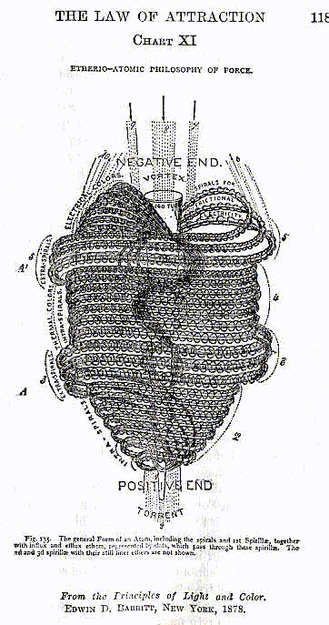

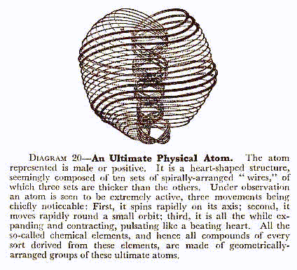

ДИАГРАММА 20.— Последний Физический Атом.— Представленный атом мужского или позитивного типа. Это структура в форме сердца, видимо, состоящая из десяти групп спирально расположенных "проволок", из которых три группы толще остальных. При наблюдении атом кажется чрезвычайно активным, основные типы движения: первое, он быстро вращается вокруг своей оси; второе, он быстро движется по малой траектории; и третье, он постоянно расширяется и сжимается, пульсируя, как бьющееся сердце. Все так называемые химические элементы, а следовательно, и все соединения любого рода, полученные из этих элементов, состоят из геометрически организованных групп этих последних атомов.

Современная наука ещё не дала этому название, но, вероятно, скоро даст, так как ее исследования все ближе и ближе подходят к этой более тонкой материи каждый день; кажется вероятным, что то, что она называет электроном, это то, что мы называем астральным атомом. Мы провели этот процесс деления и уточнения на другую стадию и обнаружили еще более высокое состояние материи; этому состоянию мы дали имя ментальная материя, потому что то, что называется ментальным телом человека, состоит из этого типа материи. Безусловно, это звучит как поразительное утверждение, но тем не менее, это правдивое утверждение, основанное на определенном эксперименте по научным методам.

Еще больше этих подразделений поднимаются одно над другим, и, начиная снизу, мы называем их физическими, астральными, ментальными, интуитивными, духовными, монадическими и божественными. Не позволяйте себя обмануть использованием слова "выше". Ни на мгновение не думайте, что наше исследование уходит от Земли. Подниматься выше в этом расследовании просто значит все больше и больше уходить в себя, чтобы иметь возможность чувствовать все более и более тонкие стадии материи; но все эти стадии существуют вокруг нас здесь и сейчас и все время, просто взаимопроникая друг в друга, точно так же, как воздух или газ в газированной воде взаимопроникают жидкость. Так же, среди всех физических частиц существуют астральные частицы, а среди астральных частиц в свою очередь существуют ментальные.

Если мы проведем эти подразделения до самого конца, мы придем к бесчисленному количеству невообразимо мелких точек или шариков, все сферические, самой простой возможной конструкции и абсолютно идентичные. Хотя они являются основой всей материи, сами по себе они не являются материей; это не вещи, а пузыри, надутые в эфире пространства — надутые тем творческим Дыханием Божьим, о котором говорят древние Священные писания[^8]. Так существует вселенная, пока Бог держит ее Своим дыханием; если бы Он затаил это дыхание, вселенной бы не стало. С учетом этого чудесного распределения Себя в пространстве, знакомая концепция Жертвы Логоса приобретает новую глубину и великолепие; это Его умирание в материи, это Его постоянное Священнодействие. Разве это не Его истинная слава, что Он может так жертвовать Собой, проникая и становясь единым с той частью эфира, которую Он выбирает в качестве поля Своей вселенной?

Теперь, имея в виду эти идеи относительно природы материи, давайте обратимся к составу человека. Обычный человек думает о себе как о составе тела, конечно, и возможно, души, хотя обычно он говорит о себе, как о владельце последней, и отвечает за ее спасение, как будто это некий домашний питомец, которого он держит, или что-то, прикрепленное к нему и парящее над ним, как пленённый воздушный шар. Мы скажем, что он полностью неправ, полагая, что у него есть душа, но он был бы совершенно прав, если бы сказал, что он является душой. Обыденное утверждение — это комическое искажение факта; ибо правда в том, что человек является душой и имеет тело, которое является просто одним из одеяний, которое он надевает. Вы все знаете, что это так, если подумаете об этом. Я вполне осознаю теорию, что есть лишь материя, и что все мысли и стремления человека — всего лишь химические реакции среди составляющих частиц серого вещества его мозга; но поскольку есть тысячи фактов, которые эта теория не объясняет, думаю, мы можем отвергнуть ее в пользу чего-то более разумного.

Существует сотни случаев на записях, в которых человек уходил от своего физического тела в трансе или под влиянием анестезии, или даже в обычном сне; и оказывается, что в таких обстоятельствах, когда он далеко от своего физического мозга, со своим серым веществом и его химической активностью, он все равно может думать и наблюдать, и помнить так же, как когда у него есть его физическое транспортное средство в использовании. Следовательно, очевидно, что человек — это не тело, так как он может существовать вне его; тело — это только инструмент, который он использует для своих собственных целей.

Некоторые могут спросить, есть ли у нас какие-либо конкретные доказательства, кроме собственных наблюдений, касающиеся этого ключевого факта, что человек может жить без своего физического тела. Действительно, есть много доказательств для тех, кто хочет потрудиться искать их. Прочтите "Записки Общества Психических Исследований", и вы увидите, что было сделано в этой области — как комитет ученых снова и снова убеждался относительно появления "двойника" человека на расстоянии от места, где находилось его физическое тело в данный момент. Всем исследователям известно, что человек может в определенных обстоятельствах отделиться от своего тела, увидеть, что происходит на расстоянии, а затем вернуться и оживить свое тело, рассказать, куда он ушел и что видел и делал.

В некоторых моих книгах вы найдете несколько примеров на эту тему; и в книге сэра Уильяма Ф. Барретта "На пороге невидимого", или его "Психических исследованиях", или в глубоко интересной книге Майерса в двух томах "Человеческая личность и ее выживание после смерти тела", вы найдете много примеров с наилучшей возможной проверкой. Обыденная материалистическая теория совсем не объясняет эти явления, и поскольку она не может их объяснить, обычно отвергает их, заявляя, что они не происходят — что нечестно, потому что небольшое исследование убедительно доказывает, что они происходят постоянно.

Раз эти вещи происходят, то как же именно они происходят? Их объяснение тесно связано с нашей темой, потому что первый шаг к пониманию их — это осознание того, что человек является душой и имеет не одно тело, а несколько. Это не новая идея. Мы читаем о душе и духе в писаниях святого Павла, и потому что люди в наши дни так невежественны в психологии, что смешивают эти термины, они представляют, что святой Павел был так же невежественен и использовал их как синонимы. Он использует два совершенно разных греческих слова — πνευμα, дух и ψυχη, душа — и придает им точно такое же значение, какое придавал бы любой другой образованный человек его времени. Если вы хотите понять точные нюансы этого значения, вы не должны доверять полному невежеству современного религиозного энтузиаста, а изучать современную философию.

Я, конечно, осознаю, что вокруг точного значения этих двух греческих слов идет много споров. Я принял их здесь в том, что кажется мне наиболее вероятным смысле, учитывая их отношение к остальной части аргумента святого Павла; но некоторые ученые ставят их на совершенно другой уровень и говорят, что слово ψυχικος, которое здесь переведено как "естественный", следует перевести английским словом, произошедшим от него, "психический". Если принять эту теорию, "естественное тело" является астра-ментальным, и та другая, более высокая оболочка, которая называется "духовной", должна быть причинным телом, которое является постоянным транспортным средством для души, просуществующим на протяжении всех долгих серий физических инкарнаций. Но даже если это так, остается верным, что святой Павел свидетельствует о том, что у человека есть более одного тела, и что, когда одно из них умирает, он живет дальше в другом.

Наша теория о человеке и его происхождении заключается в том, что он в сущности является духом, искрой Божественного Огня. Эта искра индивидуализирована, как бы выделена из великого океана Божественности чем-то, что мы можем назвать душой. То, что его отделяет, мы обычно называем причинным телом, но мы оставим это в стороне на данный момент и будем рассматривать только его нижние оболочки, потому что причинное тело неизменно, кроме того, что оно постепенно эволюционирует, в то время как ментальные, астральные и физические оболочки взяты заново для каждой инкарнации.

Почему он должен принять на себя эти различные тела? — можно спросить. Потому что это метод эволюции, предназначенный для него — чтобы он получал опыт, научившись реагировать на внешние воздействия. Он принимает на себя эти низшие тела, чтобы иметь возможность принимать и реагировать на вибрации более сильного, грубого типа, чем те, которые могут быть найдены в его собственном высшем мире. Для некоторых учеников весь этот вопрос легче всего понять, если рассматривать его с точки зрения вибраций.

Подумайте об этом так: каждое впечатление, которое доходит до нас извне, независимо от того, что это, приходит к нам в виде вибрации. Мы видим за счет волн в эфире, мы слышим за счет волн в воздухе. Что же передается нам вибрациями более тонкого типа материи, о которой я говорил, и как мы можем их принимать? Ответ прост, но многозначен. С их помощью мы можем воспринимать высшую часть нашего мира, которая обычно скрыта от нас; и мы можем научиться их оценивать с помощью более тонкой материи, существующей в нас — через чувства этих более тонких тел, фактически.

Здесь я вхожу в область, пока не затронутую обыденной наукой, но я не говорю ничего, что было бы в какой-либо мере противоречиво этой науке. Вы можете отложить это в сторону как недоказанное, но вы не можете сказать, что это неразумно или антинаучно. Наука признает огромное количество возможных вибраций и знает, что из всех этих наши физические чувства могут реагировать только на некоторые. Тем не менее, через эти немногие мы узнали все, что знаем на данный момент; и очевидно, что если мы научимся использовать больше этих волн извне, мы получим больше информации. Именно это и делает ясновидящий — он получает информацию о мире, который мы обычно не видим; и он получает ее с помощью вибраций, которые воздействуют на его высшие тела. Таким образом, ясновидящий — это человек, который научился сосредоточивать свое сознание в своих высших телах по собственной воле. По крайней мере, это то, что мог бы сделать полностью обученный ясновидящий, но есть многие, кто ясновидит пассивно и не может контролировать свои способности.

Наука также вполне осознает, насколько ограничен наш взгляд, и как незначительное изменение в нашей способности реагировать на эти волны извне могло бы изменить для нас всю картину мира. Однажды сэр Уильям Крукс привел хороший пример этого. Он объяснил, что если бы вместо того, чтобы видеть за счет лучей света, мы видели бы за счет электрических лучей, все наше окружение казалось бы совершенно иным. Одним из моментов было то, что в таком случае воздух вокруг нас казался бы абсолютно непрозрачным, потому что воздух не является проводником электрических вибраций, в то время как проволока или железная планка были бы отверстиями, через которые мы могли бы видеть, потому что эти вещества являются хорошими проводниками.

Многие люди считают, что наши способности ограничены — что у них есть определенные границы, за которые ни один из нас не может выйти. Однако это не так. Время от времени мы находим необычного человека, который обладает природным рентгеновским зрением и способен видеть намного больше других; но мы можем наблюдать изменения и для себя, не доходя до таких крайностей. Если взять спектроскоп, который является устройством из ряда призм, его спектр, вместо того чтобы быть дюймом или полтора дюйма, будет протяженностью несколько футов, хотя и гораздо слабее. Если мы проецируем это на огромный лист белой бумаги и попросим ряд наших друзей отметить на этом листе, насколько далеко они видят свет, насколько красный цвет простирается в одном конце или насколько фиолетовый в другом, мы будем удивлены, узнав, что некоторые из наших друзей видят дальше на одном конце, а некоторые — на другом. Мы можем натолкнуться на кого-то, кто видит намного дальше большинства людей на обоих концах спектра; и если это так, у нас есть человек, который на пути к ясновидению.

Можно предположить, что это лишь вопрос остроты зрения, но это совсем не так; это вопрос зрения, способного реагировать на различные ряды вибраций; и среди двух людей, чья острота зрения абсолютно равна, мы можем обнаружить, что один может использовать его только к фиолетовому концу, а другой к красному. Весь феномен дальтонизма зависит от этой способности; но когда мы находим человека, который видит намного дальше на обоих концах этого спектра, у нас есть частично ясновидящий человек, который может реагировать на большее количество вибраций; и это секрет того, почему он видит так много больше. Возможно, и есть много сущностей, много объектов вокруг нас, которые не отражают лучи света, видимые нам, но отражают эти другие лучи или скорости вибрации, которые мы не видим; следовательно, некоторые из таких вещей могут быть сфотографированы, хотя наши глаза их не видят.

Эксперименты покойного доктора Барадюка из Парижа, кажется, убедительно показывают возможность фотографирования этих невидимых вибраций. Когда я видел его в последний раз, он показал мне большую серию фотографий, на которых ему удалось воспроизвести некоторые эффекты эмоций и мышления. У него есть одна фотография ребенка, скорбящего о смерти домашней птицы, где странная сетка линий, созданная эмоцией, окружает и птицу, и ребенка. Другая фотография двух детей, сделанная в момент после того, как они внезапно испугались, показывает пятнистое и пульсирующее облако. Злость на оскорбление проявляется в виде ряда маленьких форм мышления, выброшенных в виде пятен или незавершенных глобул.

Все эти эксперименты показывают нам, как много видимо для глаза камеры, которое невидимо для обычного человеческого зрения; и поэтому очевидно, что если человеческое зрение можно сделать таким чувствительным, как пластины, используемые в фотографии, мы увидим много вещей, которые сейчас для нас невидимы. В силах человека не только равняться наивысшей чувствительности, достижимой химическими средствами, но и значительно ее превосходить; и посредством этого можно получить огромное количество информации об этом невидимом мире.

С другой точки зрения, чувства, с помощью которых мы получаем всю нашу информацию обо внешних объектах, до сих пор развиты несовершенно; поэтому полученная информация является неполной. То, что мы видим в мире вокруг нас, отнюдь не всё, что есть для просмотра, и человек, который потрудится развивать свои чувства, обнаружит, что по мере успехов жизнь станет для него полнее и богаче. Для любителя природы, искусства, музыки огромное поле невероятно усиленных и возвышенных удовольствий лежит близко, если он подготовит себя к входу в него. Прежде всего, для того, кто любит своего ближнего, существует возможность гораздо более глубокого понимания и, следовательно, гораздо более широкой помощи.

Неудивительно, поэтому, что когда мы учимся видеть совершенно новым набором волн в астральной материи, мы обнаруживаем совершенно иной мир, открывающийся перед нашим взглядом. Одно изменение заключается в том, что мы тогда можем видеть астральную материю в других людях — смотреть на их астральные тела, а не только на их физические оболочки. Я написал книгу «Человек видимый и невидимый» по этой теме о высших телах человека, которая иллюстрирована цветными картинами, нарисованными для меня человеком, который сам способен видеть эти тела; из этого вы сможете составить представление о том, как эти вещи выглядят для ясновидящего, и я думаю, вы найдете это очень интересным исследованием.

Астральное тело является особенно транспортным средством для страстей, эмоций и желаний человека, так что, когда его охватывает внезапная волна какой-либо сильной эмоции, это проявляется в чрезвычайно жестких вибрациях астральной материи. Предположим, вы с астральным зрением наблюдаете за человеком, который, к сожалению, теряет самообладание. Вместо физического выражения раздражения вы увидите примечательные изменения в его астральном теле. Весь аппарат будет пульсировать жесткой вибрацией, и, поскольку цвет — это лишь определенная частота вибрации, это внезапное изменение влечет за собой также изменение цвета астрального тела. Когда мы говорим о волнении страстей, мы ближе к истине, чем думаем, потому что именно таково и есть произведенное впечатление. По мере того как человек успокаивается, его астральное тело возвращается к обычному цвету и внешнему виду, однако небольшой постоянный след остается заметным для обученного глаза. То же самое верно и для всех других эмоций, хороших или плохих. Если человек чувствует большой порыв преданности или интенсивной привязанности, каждая из этих эмоций немедленно проявится соответствующим изменением в астральном теле и оставит свой небольшой постоянный след на характере человека.

Когда мы переходим к рассмотрению того другого транспортного средства из еще более тонкой материи, которое мы называем ментальным телом, мы обнаруживаем, что оно также вибрирует, но в ответ на совершенно другой набор впечатлений. Эмоции ни при каких обстоятельствах не могут влиять на него, потому что это не дом страстей или эмоций, а дом мысли. Говорить о вибрации в связи с мыслью — не новая идея. Все эксперименты в области телепатии и передачи мыслей зависят от этого факта, что каждая мысль создает вибрацию, и что эта вибрация может быть передана по линии ментальных частиц и вызвать аналогичную вибрацию в ментальном теле другого человека. Возможно, все еще существуют те, кто не верит в телепатию, потому что трудно определить пределы человеческой упрямости: но это вопрос, в котором каждый может легко убедить себя, так что неверие просто означает равнодушие к вопросу. Человек может оставаться невежественным, если он хочет, но когда он сознательно выбрал такую позицию, у него нет права отрицать знание тех, кто приложил больше усилий, чем он.

Вот, значит, два из тел человека — астральное тело, которое является транспортным средством его ощущений, страстей и эмоций; и ментальное тело, которое является средством его мысли. Но каждое из этих тел имеет свои возможности развития, потому что на каждом уровне существуют различные типы материи. Человек может иметь сравнительно грубое астральное тело, которое легко реагирует на низкие, нежелательные вибрации, и, тщательно работая над ним и учась его контролировать, он может постепенно значительно изменить его состав, сделав его способным реагировать на вибрации эмоций гораздо лучшего типа.

В ментальном теле у него может быть тонкий тип ментальной материи или несколько грубый; и от этого зависит, приходят ли к нему естественно и легко хорошие и высокие мысли или наоборот. Но это также в его силах изменить, если он захочет. И это не только в течение его земной жизни сделает большую разницу для него и его эмоций, но также и в жизни после смерти. Когда человек сбрасывает свое физическое тело, он все равно сохраняет эти другие, астральное и ментальное, и от их состояния зависит многое в его счастье в новом мире (который все же является частью старого), в котором он оказывается. Помните, что это вопросы не просто веры, но и эксперимента для многих из нас.

Будет легко понять, что человек, проявляющий себя через одно из этих тел, будет представлять окружающему миру облик, модифицированный этим телом. Человек, живущий в своем астральном теле, живет в своих эмоциях; он может выразить себя только через них, и его можно повлиять только через эмоциональные тела других. Тот же человек, живущий в своем ментальном теле, может выглядеть совершенно иным, потому что в таком состоянии он выражает себя через свои мысли; и такие же различия будут обнаружены, когда он использует другие оболочки. Эти различные проявления человека настолько отчетливы, что, хотя они на самом деле являются только аспектами его, они часто описываются как будто бы отдельные части или факторы его конституции, и с этой точки зрения называются его "принципами" (Диаграмма 21). Когда студент сталкивается с этим словом в нашей литературе, он должен понимать, что это составляющие части или аспекты человека, каждый из которых проявляет немало жизни и активности, но в основе все это одно и то же.

Итак, вот наша теория, результат наших экспериментов, и, объясняя ее вам, я предоставляю вам плоды более чем сорока лет работы и изучения — медленной, тяжелой, трудной работы разных видов, требующей немало самоконтроля и самодисциплины. Думаю, все мои соратники-исследователи, которые несли тяжесть и жару этих лет, согласятся, что это была тяжелая и медленная работа, но все же последовательный прогресс и развитие во многих отношениях: и из всего этого для всех нас вырисовывается уверенность, которую ничто не может поколебать, и которая позволяет нам знать, на чем мы стоим.

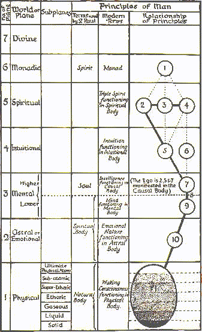

Диаграмма 21 — Человеческие Принципы. Сознание человека является единым, а не множественным; но когда оно проявляется в различных телах или сосудах, оно представляет собой разные аспекты. Эти аспекты или проявления сознания называются "принципами". Аналогию можно провести с аспектами электрического тока, когда он проходит через мягкий железный стержень, через катушку из немецкого серебра и внутри трубки, наполненной ртутным паром, порождая соответственно магнетизм, тепло и свет. Ток остается тем же, но его проявления изменяются в зависимости от характера материи, через которую он действует. Примерно таким же образом тела человека разделяют ток сознания на различные проявления. Принцип не является телом, а лишь выражением сознания в теле.

Монада (1) (которую Святой Павел называл Духом) является Искрой Божественного Огня — божественным источником человеческого сознания. О ней напрямую ничего не известно нашим исследователям, так как для достижения и изучения условий на уровне монадического мира человек должен достичь стадии развития адепта. Когда сознание Монады проявляется в духовном мире, оно всегда является троицей (2, 3 и 4), Тройным Духом философии. Принцип 2 не спускается ниже этого уровня и, следовательно, называется Духом человека. Два других принципа проявляются в следующем нижнем мире, интуитивном, порождая двойственную интуитивную природу. Принцип 5 не проявляется ниже этого уровня и, следовательно, называется Интуицией. Принцип 6 спускается в следующий мир, ментальный, и на его высших уровнях проявляется как Интеллект в человеке. Эти три (2, 5 и 7), взятые вместе, составляют эго в человеке, реинкарнирующий центр сознания, который сохраняется на протяжении всей серии человеческих жизней.

Эго, вероятно, соответствует тому, что Святой Павел называет душой. В нижних мирах эго отражается в принципах 9, 10 и 11, которые коллективно составляют преходящую личность одной жизни. Связь между эго и личностью обозначена как 8 и в индийской философии называется антахкараной. Если мы думаем об эго как о настоящем человеке, то личность является рукой, которую он опускает в материю, чтобы работать через нее, а антахкарана является рукой, связывающей эту руку с его телом. В нижнем ментальном мире интеллект человека слабо отражается как разум — та часть нашего сознания, которая занимается сбором, упорядочиванием и классификацией конкретных образов и фактов.

В астральном мире, через астральное тело, наши эмоции, страсти, желания и склонности могут проявить себя; в то время как в физическом теле пребывает инстинктивное сознание (которое, однако, у большинства людей в основном подсознательное). То, что мы называем нашим бодрствующим сознанием, является частичным отражением в мозгу активностей астрального и ментального тел.

На нашей иллюстрации схематически представлен тот факт, что наше физическое тело состоит из семи степеней или плотностей физической материи; это также верно и для других тел, хотя это не показано на диаграмме; каждое из них состоит из материи подуровней мира, в котором оно находится, и стадия развития человека показывается пропорцией между более тонкими и грубыми типами. Рассмотрим, например, астральное тело. У грубого и неразвитого человека преобладает материя, принадлежащая нижним астральным подуровням (которые могут вибрировать только в ответ на грубые и эгоистичные эмоции), и сравнительно мало более тонких типов материи, принадлежащих высшим подразделениям того же плана.

По мере развития человека количество грубых вибраций уменьшится, и те грубые частицы, которые существуют за счет них, постепенно атрофируются и исчезают. Их место занимают более тонкие частицы высших астральных подплоскостей, которые реагируют только на более нежные колебания альтруистических эмоций. Точно также происходит и в ментальном теле; низкие мысли означают грубую ментальную материю, которая заменяется более тонкой ментальной материей по мере того, как мысли человека становятся возвышенными. Отношения, показанные на диаграмме, не имеют пространственного характера, они лишь показывают связи между различными проявлениями того сложного явления, которое мы называем человеческим сознанием.

Из этого возникла твердая и определенная приверженность этому великолепному знанию, которое сделало для нас столько всего, которое объясняет так многое, что иначе было бы неразрешимой загадкой, которое поддерживает нас в трудные времена и разъясняет, откуда возникают эти трудности и что они собираются сделать для нас. Это наиболее практичная теория на протяжении всего пути, и мы, безусловно, стремимся только к практичному и разумному. Смиренно следуя по стопам великого индийского учителя, жившего 2500 лет тому назад, Господа Будды, мы хотели бы сказать вам то, что он сказал жителям деревни Калама, когда они пришли и спросили его, во что, среди всех разнообразных учений мира, им следует верить:

_Не верьте в то, что сказано, просто потому, что это сказано; ни в традиции, потому что они передаются издревле; ни в слухи как таковые; ни в записи мудрецов, просто потому, что мудрецы их написали; ни в фантазии, которую вы можете подозревать, что вдохновлена вам Ангелом (то есть предполагаемым духовным вдохновением); ни в выводы, сделанные на основе какого-то случайного предположения; ни из-за кажущейся аналогической необходимости; ни на основании авторитета ваших учителей или мастеров. Но мы должны верить, когда писание, учение или высказывание подтверждены нашим собственным разумом и сознанием. Ведь я учил вас не верить просто потому, что вы услышали; но когда вы верите своим собственным сознанием, действуйте соответственно и полностью._ (Сутта Далама из Ангуттара Никаи).

Это прекрасная позиция для учителя любой религии, и именно такую позицию мы хотим занять. Мы не ищем приверженцев в обычном смысле этого слова. Мы не страдаем заблуждением, свойственное многим хорошим ортодоксальным людям, что если вы не верите, как мы, то вам предстоит неприятное и серное будущее. Мы прекрасно понимаем, что каждый из вас достигнет конечной цели человечества, верите вы нам сейчас или нет. Прогресс каждого человека абсолютно определен; но он может сделать свой путь легким или трудным.

Если он продолжает жить в неведении и стремится к эгоистическим целям в этом неведении, ему, вероятно, будет тяжело и больно. Если он узнает правду о жизни и смерти, о Боге и человеке, и о взаимоотношениях между ними, он поймет, как двигаться, чтобы сделать путь для себя легким, и также (что гораздо важнее) чтобы быть в состоянии помочь своим собратьям-путешественникам, которые знают меньше него. Вот что вы можете сделать, и что, как мы надеемся, вы сделаете. Мы обнаружили, что эта философия полезна для нас; что она помогает нам в трудностях, облегчает нам жизнь и смерть, и поэтому мы хотим поделиться этим благовествованием с вами. Мы не требуем от вас слепой веры; мы просто представляем эту философию перед вами и просим вас изучить ее, и мы верим, что если вы это сделаете, вы найдете то, что нашли мы — покой и мир, помощь и способность быть полезными в этом мире.

[^1]: Музыкальная Литургия, изданная St. Alban Press, может быть приобретена у секретаря, The Manor, Мосман, Новый Южный Уэльс, Австралия.

[^2]: Перевод опубликован Messrs. Burns and Oates, Лондон.

[^3]: Официальное издание, опубликованное St. Alban Press, Лондон, Лос-Анджелес и Сидней.

[^4]: _Скрытая Сторона Вещей_, Ч. У. Ледбитер, Том I, стр. 226-231.

[^5]: Труды Грегори, изд. 1671 г., стр. 163.

[^6]: Грядущий Свободный Католицизм, Ув. У. К. Пек, стр. 44.

[^7]: Это будет зависеть от посвящения Церкви.

[^8]: За более полной информацией см. _Оккультную Химию_, А. Безант и Ч. У. Лидбитер, а также статьи профессора Осборна Рейнольдса.

