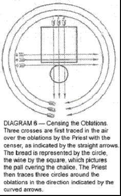
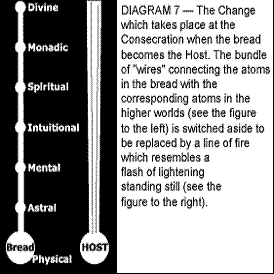
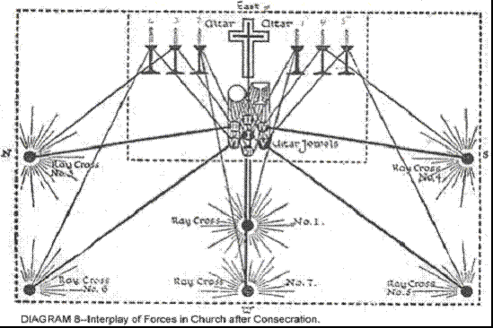
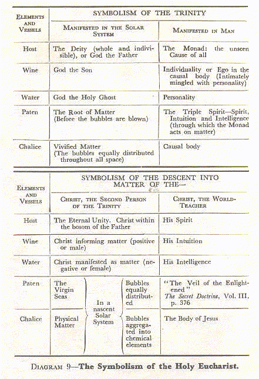

# Наука Священнодействий

Чарльз У. Ледбитер

Регионарный Епископ Либеральной Католической Церкви Австралии

1920

_✠ Черновой перевод 08/2023 ✠_

_см. [https://raw.githubusercontent.com/theogpt/theogpt.github.io/master/soc/science_of_sacraments.md](https://raw.githubusercontent.com/theogpt/theogpt.github.io/master/soc/science_of_sacraments.md)_

Оглавление:

- Глава I. Новая идея богослужения в церкви
- Глава II. Святая Евхаристия

## Глава I. Новая идея богослужения в церкви

Несомненно, наибольшим из многих инструментов, которые Христос предоставил своему народу, является таинство Евхаристии, обычно называемое Мессой — самое красивое, самое удивительное, самое возвышающее из христианских обрядов. Оно приносит пользу не только индивиду, как и другие таинства, но и всему собранию; оно полезно не только однажды, как крещение или обряд твердости, но и предназначено для помощи каждому верующему на протяжении всей его жизни; и кроме того, оно влияет на всю окружающую церковь территорию.

Люди могут спросить нас, как их дети спрашивали израильтян в давние времена: «Что значит этот обряд?» Что такое эта Евхаристия, которую вы совершаете? Мы должны быть в состоянии ответить на этот вопрос грамотно; но чтобы это сделать, мы должны изучить некоторые аспекты темы, которые обычно забывают; мы должны полностью отказаться от любой ограниченной или эгоистической точки зрения; мы должны понимать, что наша религия прежде всего предназначена, чтобы помочь нам служить верой и плодотворно нашему Господу и Учителю.

Следует помнить, что истинная религия всегда имеет объективную сторону; она действует не только изнутри, стимулируя сердца и разумы своих приверженцев, но и снаружи, обеспечивая подъемные и очищающие влияния на все их оболочки; она не ограничивает свои усилия только своими последователями, но и пытается через них повлиять на невежественный и безразличный мир вокруг. Храм или церковь должны быть не только местом поклонения, но и центром магнитного излучения, через который духовная сила может быть излита на весь округ.

Необходимо, чтобы такое излучение было сделано как можно более экономично. Странная ненаучная идея о чудесах, которая преобладала среди христиан на протяжении столетий, оказала парализующее воздействие на церковное мышление и помешала разумному пониманию метода, который Христос выбрал для обеспечения своей церкви. Мы должны осознавать, что такое обеспечение осуществляется через действие промежуточных Сил, ресурсы которых отнюдь не безграничны, как бы огромны они ни казались по сравнению с нашими. Следовательно, конкретной задачей таких Сил является экономия этой силы, и поэтому делать то, для чего они назначены, наиболее простым способом. Например, при этом излиянии духовной силы было бы явно расточительным изливать ее везде, как дождь, потому что это потребовало бы усилий для ее материализации на более низком уровне в тысячах мест сразу. Очевидно, намного более практично установить в определенных местах явные магнитные центры, где машина такой материализации может быть постоянно устроена, так что когда сила изливается сверху, она может быть сразу распределена без ненужной траты на установку временного оборудования.

План, принятый Христом по отношению к этой религии, заключается в том, что специальный отсек великого резервуара духовной силы отведен для его использования, и что определенный ряд должностных лиц уполномочен, с помощью назначенных обрядов, слов и знаков силы, черпать из него в пользу человечества. Схема, выбранная для передачи этой силы, - это таинство посвящения, которое будет объяснено в следующей главе. Кто-то, для кого вся идея резервуара духовной силы абсолютно нова, может обратиться к описанию, данному там.

Посредством церемонии Евхаристии, каждый раз, когда она отмечается, в мир выходит волна мира и силы, эффект которой вряд ли можно переоценить, и мы вряд ли ошибемся, считая это основной целью службы, поскольку это достигается при каждом праздновании Святой Евхаристии, будь то Великая или Малая, будь то священник один в своем частном оратории или служащий огромной общине в неком великолепном соборе.

Эта идея подтверждается тем фактом, что когда мы так собираемся вместе в церкви, мы говорим, что пришли присоединиться к Божественной службе. Я уверен, что многие люди, когда используют это выражение, думают, что под служением подразумевается присвоение хвалы и поклонения Богу; но описать это как служение вряд ли верно. Безусловно подобает, правильно и наш долг всячески превозносить, смиренно поклоняться и благодарить великого Господа всего. Это очень хорошо для нас и большое преимущество для нашей эволюции; но было бы недостойно и даже богохульно предполагать, что Бесконечное Существо может получать какое-то удовлетворение от простой лести; но когда мы собираемся вместе, чтобы построить форму мысли или евхаристический здание (как будет описано позже), через которое Его сила может легче излиться, мы сразу видим уместность слова «служба», поскольку осознаем, что мы буквально предлагаем себя в качестве добровольцев в Его великой армии, и что, каким бы скромным было наше место, как бы бесконечно далеко мы ни были, мы действительно становимся соучастниками Его труда — несомненно, самое высокое звание и величайшая привилегия, которые когда-либо могут выпасть на долю человека. Значимо, что буквальный смысл слова «литургия» — общественная работа, вторая часть слова имеет точно такое же происхождение, как «энергия».

Другой целью является эффект, произведенный на тех, кто присутствует на службе, и третьим — еще больший результат, полученный в случае тех, кто причащается Святого Таинства; но об этом я напишу позже. Мы также должны помнить о его аспекте как о чудесном и величественном символе, напоминающем нам о спуске Второго Лица Троицы в материю, а также о жертве Христа, взявшего на себя тело и прожившего ограниченную физическую жизнь, чтобы в новой форме представить перед нами благую весть Древней Мудрости. Благочестивые отцы Церкви считали, что в ритуале Евхаристии они могут проследить аллегорическое представление о земной жизни Христа. Я никоим образом не стремлюсь отрицать правду таких предположений или даже уменьшать их важность, но я хочу подчеркнуть аспект церемонии как возможности, предлагаемой нам — возможности работать ради Бога и для мира; рассмотреть ее реальное влияние на различные планы и описать некоторые механизмы, с помощью которых этот эффект достигается.

Если этот механизм будет ясно понят членами Церкви, они обнаружат, что могут полезно и эффективно сотрудничать со священнослужителями в чудесно прекрасной бескорыстной работе, тем самым не только значительно продвигая свое собственное эволюционное развитие, но и существенно улучшая ментальную и моральную атмосферу города или сельской местности, в которых они живут. Когда мы осознаем, какую прекрасную возможность здесь нам предлагают, мы поймем, что было бы глупо и действительно неправильно не воспользоваться ею так часто и так полно, как мы можем. Но для этого требуется некоторое изучение и некоторые умственные усилия; и эта книга написана для того, чтобы помочь тем, кто серьезно стремится к более полному пониманию этого вопроса.

Особый метод, разработанный для приема и распределения этого излияния энергии, происходит от тайн некоторых старых религий. Они любили передавать влияние от Божества к Его поклонникам посредством особенно освященной пищи или напитка — очевидно полезный способ, когда цель состоит в том, чтобы сила полностью проникла в физическое тело человека и привела его в гармонию с изменением, которое одновременно вводится в более высокие сущности. Чтобы выразить максимально возможную близость отношений между Вторым Лицом благословенной Троицы и поклонниками, а также в память о Его вечной Жертве (ибо Он — «Агнец, убитый с основания мира»), то, что едят и пьют, мистически называют Его телом и кровью. Возможно, нашему вкусу в наше время какое-то другое выражение показалось бы более привлекательным, но было бы неблагодарно со стороны христианина придираться к принятой символике, когда он получает столь великое благо.

Каждая из великих Служб Церкви (и особенно празднование Святой Евхаристии) изначально предназначалась для создания мощной упорядоченной формы, выражающей и окружающей центральную идею — формы, которая бы облегчала и направляла излучение влияния на всю деревню, которая была сгруппирована вокруг церкви. Идея Службы может быть сказана дважды: во-первых, принять и распределить большое излияние духовной силы, и во-вторых, собрать посвящение людей и предложить его перед троном Бога.

В случае Евхаристии, как она празднуется Римской или Греческой Церковью, различные части Службы сгруппированы вокруг центрального акта освящения специально с учетом симметрии большой формы, созданной, а также их прямого воздействия на прихожан. Изменения, внесенные в Английскую Книгу молитв в 1552 году, явно были делом людей, не знающих этой стороны вопроса, поскольку они полностью нарушили эту симметрию — что является одной из причин, почему для Церкви Англии крайне желательно как можно скорее так устроить свои дела, чтобы получить разрешение использовать в качестве альтернативы Мессу короля Эдуарда VI, согласно Книге молитв 1549 года. Это отнюдь не идеальная Служба, но она хотя бы лучше позднейшей редакции, которая во многих отношениях жалко недостаточная, поскольку она ни предоставляет достаточного материала для своей евхаристической формы, ни молится об Ангеле, который мог бы использовать такой материал, какой он предоставляет. Ее составители, кажется, создали Службу исключительно для блага тех, кто присутствует на ней, и совершенно упустили гораздо более широкую бескорыстную цель, которая была так ясно в уме Основателя.

Одним из самых важных эффектов церковной службы, как на непосредственное собрание, так и на окружающий район, всегда было создание этих прекрасных и боготворных форм мысли, через которые пролив жизни и силы из высших миров может более эффективно действовать. Эти формы создаются лучше и их эффективность усиливается, когда значительная часть тех, кто участвует в службе, делает это с пониманием, но даже когда преданность невежественна, результат все равно прекрасен и возвышающ.

Многие секты, которые к сожалению, откололись от Церкви, полностью упустили из виду эту внутреннюю и более важную сторону публичного богослужения. Идея службы, предлагаемой Богу, почти исчезла, и на ее место в большей степени заняло фанатичное проповедование узких теологических догм, которые всегда были несущественными и часто смешными. Читатели иногда выражают удивление, что те, кто пишет с точки зрения внутреннего видения, так решительно отдают предпочтение практике Церкви, а не тем или иным сектам, чье мышление во многих отношениях более либерально. Причина показана именно в этом рассмотрении внутренней стороны вещей, которым мы сейчас занимаемся.

Ученик, изучающий ту высшую сторону жизни, которая до сих пор скрыта от большинства из нас, наиболее полно признает ценность усилий, которые сделали свободу совести и мысли возможной; но он не может не видеть, что те, кто отбросил великолепные старые формы и службы Церкви, в этом самом действии почти полностью потеряли одну из самых важных сторон своей религии и сделали из нее в основном эгоистичную и ограниченную вещь - вопрос в основном о "личном спасении" для индивида, вместо благодарного преложения поклонения Богу, который сам по себе является неизменным каналом, через который божественная любовь изливается на всех.

Достижение умственной свободы было необходимым шагом в процессе человеческой эволюции; грубый и жестокий метод, которым она была получена, и глупость излишеств, в которые грубое невежество привело своих защитников, ответственны за многие плачевные результаты, которые мы видим сегодня. Та же жестокая, бессмысленная жажда безрассудного разрушения, которая заставила жестоких солдат Кромвеля разбивать бесценные статуи и неповторимые витражи, также в большой степени лишила английскую Церковь ценного эффекта, производимого в высших мирах непрерывными молитвами за умерших, и почти универсальной преданностью обычных людей в Средние Века к святым и ангелам. Тогда большая масса народа была религиозной, даже если и невежественно религиозной; теперь она откровенно и даже хвастливо нерелигиозна. Возможно, этот переходный этап необходим, но его едва ли можно считать сам по себе прекрасным или удовлетворительным.

Если религия означает «обратная связь», мы должны понять, что она создана не только для того, чтобы привязать каждого из нас лично к Богу; она предназначена для связывания всего мира Бога обратно к Нему; поэтому если мы действительно религиозны, мы должны быть бескорыстными; мы должны сотрудничать с Ним, нашим Господом, ради этого славного конечного завершения. Мы начали слишком сильно думать о религии, как только о молитве и славословии, или только о преданности. Помним поговорку Laborare est orare, которая означает «работать значит молиться», и не забываем сопровождающее её высказывание Bene orasse est bene laborasse — «хорошо помолиться значит хорошо поработать». Мы в большей степени называем нашу религию молитвой и славословием; религию Древнего Египта называли «скрытой работой», и то же самое до сих пор называют работой в другой могущественной организации, которая, хоть и не объявляет себя религией, трудится в том же направлении — также предлагает своё поклонение Тому, кто есть Мудрость, Сила и Красота, так же истинно и красиво, как это делает Церковь.

Итак, давайте научимся служить как нашим умом, так и нашим телом. Давайте попробуем понять эту великую и славную Службу, которую Христос дарует нам не только для нашего собственного помощи, но и как великолепную возможность, великую привилегию, чтобы мы могли разделить Его божественное дело служения и освящения с Ним.

Мысле-строение Евхаристии, о которой я упоминал, создается во время и в основном посредством должного исполнения обряда. Эта структура несколько отличается от любых изображенных в книге "Мыслеформы", хотя она имеет много общего с великими музыкальными формами, изображенными в конце этой работы. На Малом празднестве материал для строительства предоставляется мыслями и преданностью священника, поддерживаемой теми же качествами его прихожан (если они есть); но на Великом празднестве музыка и другие аксессуары играют важную роль в его создании, хотя слова и чувства священнослужителя все еще остаются контролирующей силой, и во всех случаях имеется определенное количество ангельского руководства и помощи. Эта структура строится из материи принадлежащей различным планам — ментального, астрального и эфирного — и на более поздней стадии службы вводится материя еще более высоких уровней, как будет объяснено впоследствии. В этот процесс производства входит столько факторов, что существует место для больших различий в размерах, стиле, декоре и цветовой гамме, но общий план всегда узнаваем. Он напоминает форму базилики; действительно, говорят, что Церковь Санта-София в Константинополе была построена в подражание некоторым из этих духовных строений. (Рис. 1.)

См. книгу "Мыслеформы" (А. Безант и Ч.У. Ледбитер). Тем, для кого тема создания форм в более высокой материи силой мысли является новой, рекомендуется ознакомиться с этим трудом.

Завершенная структура обычно имеет примерно квадратную форму на земной плоскости, с рядом углубленных отверстий или дверей на каждой из ее четырех сторон, увенчанная большим центральным куполом, с меньшими куполами или иногда миноретами по углам. Взрывная сила на Санктусе настолько увеличивает купол и его прилегающие купола, что он становится важной частью строения, и после этого изменения здание ниже скорее становится основанием, поддерживающим ступу, чем церковью, увенчанной куполом.

Эта гигантская мыслеформа постепенно создается в начале Службы. Весь ритуал направлен на правильное создание этой формы, на ее зарядку божественной силой, а затем на ее разрядку; и каждое пение или чтение вносит свой вклад в эту работу, помимо той части, которую оно играет в подготовке сердец и умов священника и народа. Здание вздымается изнутри, как пузырь, который надувают. Говоря в общих терминах, можно сказать, что открывающее пение обеспечивает его павимент, а вступление - материал для его стен и крыши, в то время как Kyrie обеспечивает вспомогательные миски или купола, а Gloria - большой центральный купол. Детали здания варьируются в зависимости от формы Службы, которая используется, и до некоторой степени от размера и преданности общины. То, что проиллюстрировано в этой книге, является результатом измененной Литургии, используемой Либеральной католической церковью. То, что создано Римской Мессой, выглядит так же в общем плане, но неудачные выражения, которые так постоянно портят ее красоту, имеют явно неблагоприятное влияние на эту духовную архитектуру.

Как известно каждому изучающему историю, в форме, в которой она сейчас используется Римской Церковью, Месса не является цельной, но является собранием частей, взятых из различных более ранних форм, и ее формулировки в некоторых местах банальны и совершенно недостойны величественной реальности, которую они должны выразить. Но, хотя фактическое слово прошло через множество изменений, эффективность лежащей в основе магии не была фундаментально подорвана. Она по-прежнему достигает сбора и излучения божественной силы, для которой ее Основатель предназначал ее, хотя, безусловно, могло бы быть излито большее количество бесценной любви и преданности, если бы все страх и беспомощность были устранены из ее формулировок, все униженные просьбы о "милосердии", и просьбы к Богу сделать за нас ряд вещей, которые мы должны взяться делать сами. Была предпринята попытка внести некоторые улучшения в этом отношении в измененной Литургии, используемой Либеральной католической церковью.

Услуги, которые использует Церковь Англии, к сожалению, сильно искалечены и урезаны. Очевидно, что так называемые реформаторы не знали ничего о реальном назначении великого ритуала, который они так беспощадно урезали. И хотя Ордена Церкви Англии действительны, и её священники обладают силой черпать из великого резервуара духовной энергии, здание, которое она строит для его приема и распространения, серьезно несовершенно и относительно плохо приспособлено к своей цели. Это не мешает изливанию, но уменьшает количество доступного для излучения, потому что много силы должно быть использовано Ангелами-помощниками для создания механизмов, которые должны были быть подготовлены нами.

Эта мыслеформа играет в Служении примерно ту же роль, что и конденсатор в установке для дистилляции воды. Пар исходящий из реторты рассеялся бы в окружающем воздухе, если бы не был принят в колбу или камеру, в которой его можно охладить и конденсировать в воду. Камера необходима, чтобы содержать пар, пока он не превратится в более низкую и плотную форму, чтобы он был доступен для обычного физического использования.

Или, если мы хотим использовать силу пара, мы должны собрать его в какой-то виде емкости, чтобы мы могли создать давление, чтобы мы могли контролировать его и направлять его струи в желаемом направлении. То же самое верно и для этой гораздо более легкой силы, но поскольку она действует в материи, гораздо более тонкой, чем любая, которую мы знаем, никакая физическая емкость не могла бы ее удержать; чтобы удерживать ее, емкость должна быть сделана из материи этих высших плоскостей, которую можно манипулировать только с помощью мысли. Именно такой сосуд для нас создает на гигантском масштабе Ангел Господа, чью помощь мы призываем.

Мы живем в механическую эпоху, и наши мысли привыкли двигаться вдоль механических линий. Человек может научиться водить автомобиль, не зная много о его внутреннем устройстве; мы можем включить электрический свет, не зная, что такое электричество; но, тем не менее, человек, который понимает машину, которой он пользуется, несомненно, более эффективен и полезен. Весь обряд Святой Евхаристии может рассматриваться с этой точки зрения как создание и использование великолепной машины для освобождения силы и ее направления на помощь миру; и понимание того, что представляет собой эта машина, как она строится и как она предназначена для работы, безусловно, позволит нам более интеллектуально сотрудничать в этой схеме. Пусть будет понятно, что Ангел Евхаристии создает для нас то, что называется мыслеформой из тонкой материи, внутри которой божественная сила может храниться и накапливаться, пока она не будет направлена и использована, как пар накапливается в котле или в куполе паровоза.

Основная цель жертвы Святой Евхаристии - предложить возможность для особого излияния божественной силы с самых высших уровней и предоставить такой транспорт для этой силы, который позволит этим Ангелам-помощникам использовать его для определенных целей в нашем физическом мире, как будет объяснено позже. Вода, пролитая на землю, мало полезна, кроме как для орошения этой земли; если мы хотим использовать ее для других целей, мы должны предоставить сосуд, чтобы содержать ее. Кроме того, нужна форма, в которой сила может быть собрана, чтобы Ангел мог видеть общее количество и рассчитать, сколько он может позволить себе распределить по каждой из целей, к которым она должна быть предназначена.

Цели, которые мы ставили перед собой при подготовке этой пересмотренной формы Литургии, заключались в сохранении общего контура формы, которую она создает, и функционировании старой магии - эффектов различных действий на разных этапах, спуска и возвращения Ангела Присутствия и т. д. - но при этом мы стремились убрать из него все оттенки страха и эгоизма, и в некоторой степени изменить стиль его архитектуры с классического на готический. После исследования мы обнаружили, что Великие вдохновили блуждающие группы каменщиков-свободных масонов (которые построили большинство великих кафедральных соборов Европы) идеей готического стиля, как попытку на физическом уровне направить их к более жизнерадостной и стремительной мыслеформе, которую они хотели, чтобы их религиозные службы создали; но они были удивительно медлительны в понимании аналогии.

Общая позиция христиан того времени была угоднической и сжимающейся; многие из них воспринимали Бога как существо, которое необходимо умилостивить, и в своих молитвах они умоляли его услышать их на мгновение перед тем, как уничтожить их, просили его о милости, и в целом они действовали и говорили, как будто он был злым тираном, а не любящим отцом. Итак, их преданная мысль создала в целом плоскостное здание. Мы увидели, что его нынешняя поверхность, как строится римским ритуалом, часто представляет собой мертвый уровень нервозности и беспокойства, полный уродливых углублений и ям депрессии, вызванных преувеличенными исповедями отвратительности и униженными мольбами о милости, обесчестившими одинаково Бога и людей, которых Он создал по своему образу. Каждое такое углубление должно быть заменено пиком пылкой преданности, подтянутым абсолютной уверенностью в любви Бога, чтобы мыслеформа показала лес сверкающих шпилей, как собор в Милане, вместо плоской или прогибающейся крыши, которую она часто носит в настоящее время, чтобы по симпатии её восхождение могло направлять мысли людей вверх и отучить их от рабского страха к вере, благоговению и любви.

Мы увидели, сколь злым было воздействие на мыслеформу мстительных, угрожающих или униженных отрывков из еврейских псалмов, и на нас особенно настоятельно произвели впечатление слова, которые мы не могли по-настоящему поддержать.

Мы старались реализовать эти идеи в полной мере наших сил, и наш труд был вознагражден большей симметрией возведенного здания и определенно увеличенной адаптивностью к его цели. Важно подчеркнуть, что разумное сотрудничество прихожан с священником является наиболее ценным фактором в этой великой работе, потому что грандиозное излияние силы и великолепная и эффективная коллективная мыслеформа могут быть созданы собранием людей, которые искренне участвуют в Службе. Обычно достичь этого результата бывает весьма сложно, потому что члены обычного прихода совсем не умеют сосредотачиваться, и, следовательно, коллективная мыслеформа обычно представляет собой рваную и хаотичную массу, а не великолепное и организованное целое.

Преданность, будь то индивидуальная или коллективная, значительно варьируется по качеству. Преданность первобытного дикаря, например, обычно сильно смешана с страхом, и основная идея в его сознании, связанная с этим, – это умиротворение божества, которое иначе может оказаться мстительным. Немногим лучше этого является многая преданность людей, которые считают себя цивилизованными и христианами, потому что это своего рода нечестная сделка – предложение Божеству определенного количества преданности, если Он, с Своей стороны, окажет определенное количество защиты или помощи.

Такая преданность, по своей природе полностью эгоистичная и жадная, дает результаты только в более низких типах астрального вещества; и во многих случаях они выглядят крайне неприятно. Мыслеформы, которые они создают, часто имеют форму крюков, и их силы всегда движутся по замкнутым кривым, воздействуя только на человека, который их отправляет, и возвращая ему любой незначительный результат, который они могут добиться. Истинная, чистая, бескорыстная преданность - это всплеск чувств, который никогда не возвращается к человеку, который его породил, но становится в самом деле космической силой, производящей широкие результаты в высших мирах.

Хотя сама сила никогда не возвращается, человек, породивший ее, становится центром пролива божественной энергии, которая приходит в ответ, и таким образом в своем акте преданности он действительно благословил себя, хотя в то же время он также благословил многих других, и, кроме того, если его мысли движутся по христианским путям, он имел честь внести свой вклад в особый резервуар, который Христос отводит для работы Своей Церкви. Все, у кого есть книга "Мыслеформы", могут увидеть в ней попытку представить великолепный синий шпиль, созданный такой преданностью, когда он стремится вверх, и он легко поймет, как это открывает путь для определенного излияния божественной силы.

Бог изливает свою удивительную жизненную энергию на каждом уровне, в каждом мире, и, естественно, излияние, принадлежащее высшему миру, сильнее, полнее и менее ограничено, чем то, что находится ниже. Обычно каждая волна этой великой силы действует только в своем мире и не может (или по крайней мере так не делает) двигаться поперечно от одного мира или плана к другому; но именно посредством бескорыстной мысли и чувства, будь то преданность или привязанность, временный канал обеспечивает тем, чтобы сила, обычно принадлежащая высшему миру, могла спуститься к более низкому и могла там произвести результаты, которые без нее никогда не могли бы произойти.

Каждый человек, который действительно бескорыстен, часто делает себя таким каналом, хотя, конечно, в сравнительно малом масштабе; но мощный акт преданности целой огромной общины, когда она действительно объединена и абсолютно не думает о себе, дает тот же результат в гораздо большем масштабе. Иногда, хотя редко, эту скрытую сторону религиозных служб можно видеть в полной активности, и никто, кто хоть раз имел привилегию видеть такое великолепное проявление, не может на мгновение сомневаться в том, что скрытая сторона церковной службы имеет бесконечно большую важность, чем что-либо исключительно физическое.

Такой человек увидит ослепительно синий шпиль или купол из высшего типа астрального вещества, мчащегося ввысь в небо, выше образа его в камне, который иногда венчает физическое сооружение, в котором собираются верующие; он увидит ослепительную славу, которая проливается через него и распространяется как большой поток живого света по всему окружающему региону. Естественно, диаметр и высота шпиля предопределены для открытия спуска высшей жизни, в то время как сила, которая выражается в скорости, с которой энергия преданности стремится вверх, имеет отношение к скорости, с которой может происходить соответствующее исходящее движение. Зрелище действительно великолепное, и тот, кто видит его, никогда больше не сомневается в том, что невидимые влияния превышают видимые, и он не может не осознать, что мир, который идет своим путем, не обращая внимания на преданного человека, или, возможно, даже презирая его, все время больше обязан ему, чем знает.

Никакая другая Служба не имеет эффекта, вообще сравнимого с тем, что происходит при праздновании Святой Евхаристии, хотя, конечно, великие музыкальные формы могут появляться на любой Службе, где используется музыка. Во всех остальных Службах (за исключением, пожалуй, благословения Пресвятого Таинства) формы мыслей, которые развиваются, и общая польза, которая делается, в еще большей степени зависят от преданности народа. Когда случается так, что некоторое количество учеников этого внутреннего аспекта христианства принадлежит к такому собранию, они могут быть очень полезны для своих собратьев в вере, осознанно собирая разбросанные потоки преданности и объединяя их в один гармоничный и могущественный поток.

В нашем обряде, как и в обряде Церкви Рима, призывается Ангел для того, чтобы присмотреть за этим объединением и руководить строительством здания. Например, в редком случае, описанном выше, он бы взял на себя этот великолепный всплеск преданности, и вместо того, чтобы позволить ему молниеносно взлететь в этой великолепной синей шпили, он бы ловко преобразовал его в структуру, которая вскоре стала бы транспортным средством для нисходящего движения, возможно, в десять раз, или даже в сто раз больше, чем ответ, который он мог бы заслужить в своей первоначальной форме. Ангел может и будет дополнять то, что недостает, и исправлять наши недостатки, но очевидно, что желательно, чтобы мы облегчали его работу насколько это возможно.

Рассмотрение сотрудничества собрания должно превосходить все остальные при выборе музыки, используемой на различных Службах. Замысловатая музыка действительно дает далеко идущие результаты на более высоких уровнях и оказывает замечательное воздействие на тех, кто полностью понимает и ценит ее красоту; но на этой стадии эволюции человечества таких людей очень мало; и даже эти немногие должны осознавать, что они приходят в церковь не для своего личного утешения и поднятия, но чтобы работать на Службе Бога для помощи своим ближним. Они должны научиться забывать о себе и своих индивидуальных желаниях, приглушить личность и работать как часть целого, как мальчик делает, когда он присоединяется к команде по крикету, футболу или гребле на байдарке. Он должен действовать не ради своей собственной чести и славы, а ради блага клуба; он может быть вызван абсолютно отказаться от своих собственных желаний и пожертвовать возможностями яркого выступления или развлечения. Так и нам нужно научиться стирать низшее "я" и работать как собрание в реальном братстве и сотрудничестве.

Никаких сомнений в сравнительной эффективности двух методов не может быть. Простая музыкальная Служба, в которой сто человек принимают участие от души и с полной преданностью, гораздо полезнее миру, чем представление самой великолепной музыки, которую тысячи слушают, даже если они слушают с удовольствием и выгодой для себя. Тщательное и повторное исследование результатов во внутренних мирах убедительно показало, что хотя время от времени священные концерты играют важную роль в индивидуальном развитии, Служба церкви должна быть так организована, чтобы все могли активно и осознанно участвовать в работе, которую она предназначена делать.

Следует принять простую форму музыкальной Службы, и ее основные черты должны оставаться неизменными, чтобы каждый мог тщательно ознакомиться с ними. Прихожане должны быть хорошо проинструктированы о значении и воздействии различных частей церемонии и о намерении, которое они должны держать в уме на каждом этапе. Таким образом, даже небольшое число людей может выполнить эффективную и полезную работу и стать реальным центром благословения для большого района; и сами они могут получить почти неоценимую помощь, если их можно убедить присоединиться от души к волнующим и хорошо подобранным гимнам и псалмам.

Не вся простая музыка одинаково подходит. Очевидно, что меньше всего проблем Ангелу доставит та музыка, которая сама по себе создает форму, приближенную к той, которую он желает. Она, конечно, должна варьироваться в выражении слов, но она всегда должна быть радостной и вдохновляющей. Стоит избегать унылых, протяжных, неопределенных пассажей любой ценой. Ни одна из существующих композиций не подходит идеально под наши слова, но некоторые можно адаптировать без особого труда. Без сомнения, появятся композиторы из Либерально-католической церкви, которые создадут именно то, что нужно; тем временем была опубликована предварительная Служба[^1], которая, хотя и далека от совершенства в музыкальном плане, использовалась несколько лет с очень хорошими практическими результатами.

Искренний священник должен стараться обеспечить для своей церкви исполнение такой музыкальной Службы, которая экономично, но эффективно обеспечит достаточное количество лучшего доступного материала для использования Ангелом Евхаристии; но он должен постоянно быть на страже против благонамеренных, но эгоистических усилий его хора внедрить амбициозную музыку, в которой приход не может участвовать. Я не имею в виду, что есть какие-то возражения против вставки (на празднике, например) более короткого и подходящего гимна, который должен быть исполнен только хором; но музыка Литургии всегда должна быть так организована, что люди могут в полной мере участвовать в ней. Если используется гимн, нужно уделять большое внимание его выбору, так как многие содержат слова, противоречащие всему духу нашей Службы — ссылки на предполагаемый гнев Бога, призывы о милосердии и выражения страха или тошнотворной подобострастности. Если такое дополнение сделано, лучшим местом для него, по-видимому, будет после Евангелия, либо перед, либо вместо проповеди.

Певцы нашей Церкви должны осознавать, что у них есть уникальная возможность работать на Службе Богу, помогая своим менее талантливым братьям; и они должны преданно заниматься этой работой, не ища пустой показной демонстрации своих способностей, ни щекотки слуха и поднятия своего духа, но действуя с абсолютной бескорыстием, и тем самым идя по стопам своего Учителя, Христа. Священнику стоит поощрять изучение музыки среди своих прихожан, чтобы он мог постепенно укрепить эту часть своей Службы; он может организовать сколько угодно образовательных концертов более сложной музыки, но он никогда не должен терять бесценное сотрудничество своей общины в реальных Службах своей церкви.

Будет понятно, что церковь, которая была освящена и постоянно используется для различных Божественных Служб, уже является убежищем от бесконечной суеты обыденных мыслей за её пределами, и что её атмосфера наполнена преданностью. Тем не менее, люди, которые приходят в неё каждый день, приносят с собой определенную долю своих личных забот и проблем; их умы полны самых разнообразных мыслей и идей, связанных с внешним миром - не обязательно плохих мыслей, но мыслей, которые не особенно религиозны по своей природе. Некоторые могут даже быть обременены сознанием неудачи или реального проступка. Поэтому желательно сделать особые усилия, чтобы очистить церковь перед началом Службы.

По этой причине всегда полезно начинать с процессии. Священнослужители и хор должны, очевидно, войти порядочным образом и занять свои места, и когда это возможно, хорошо расширить этот необходимый порядок входа в обход церкви, потому что таким образом первоначальная очистка значительно облегчается. И община помогает сосредоточиться, устойчивости мысли и концентрации на предстоящей работе.

Одним из наиболее ценных факторов в этом усилии является благовоние; оно уже было освящено Священником или Епископом, и, следовательно, его дым несет с собой очищающие и поднимающие влияния везде, куда проникает его аромат. Если присутствует Епископ, он изливает свое благословение на людей (используя знак креста), когда процессия проходит среди них; и хотя этот долг не возложен на Священника, он все же сможет значительно помочь своим прихожанам, если, идя в процессии, он будет держать в своем сознании сильное чувство мира и искреннее желание, чтобы его приход с ним этим поделился.

Воздействие процессионального гимна на людей хорошо и в других отношениях, так как оно стремится привести всех в гармоничные вибрации и направить их мысли в подобные каналы. Это в некотором роде эквивалентно настройке струн скрипки, поскольку пение имеет решительное влияние на настройку их эмоций и мыслей. Конечно, невозможно довести смешанный приход абсолютно в унисон, что касается их мыслей и чувств, но они должны быть по крайней мере приведены в гармонию друг с другом, чтобы они сливались в гармоничное целое, как разнообразные инструменты большого оркестра.

Сильные колеблющиеся вибрации гимна подавляют такие мыслительные волны, которые с ними не согласуются, а прохождение хора так близко среди людей стимулирует последних более активно и энергично участвовать в Службе, и таким образом общинное пение является отличной подготовкой к работе, которая следует. Гимн создает в более высокой материи ряд прямоугольных форм, нарисованных с математической точностью, следующих одна за другой в определенном порядке, как звенья в некоторой могучей цепи; и это постоянное повторение действует как повторяющиеся удары молотка по шляпке гвоздя и внедряет урок, который он предназначен внедрить. Опять же, великолепный вид хорошо организованной процессии, цвета и огни, богатые знамена и пышные облачения, все это вместе подогревает воображение, поднимает мысли людей выше прозаического уровня обыденной жизни и помогает их преданности и энтузиазму.

## Глава II. Святая Евхаристия

### Asperges

#### Псалом

РИМСКО-КАТОЛИЧЕСКАЯ[^2] | ЛИБЕРАЛЬНО-КАТОЛИЧЕСКАЯ[^3]
----------------------- | ---------------------------
_Перед Главной Мессой в воскресенье._ | _Перед всеми Службами Евхаристии._
_Антифон_ | _Антифон_
Ты обрызгаешь меня иссопом, и я буду чист: ты омоешь меня, и я стану белее снега. | Ты обрызгаешь меня иссопом, Господи, и я буду чист: Ты омоешь меня, и я стану белее снега.
_Псалом_ | _Псалом_
Помилуй меня, Боже, по великой Твоей милости. |  Возвожу очи мои к холмам: откуда придет помощь моя. Помощь моя от Господа: Который сотворил небо и землю. Он не допустит, чтобы твоя нога поколебалась: и Тот, Кто тебя сохраняет, не уснет. Вот, Тот, кто сохраняет Израиль: не будет ни дремать, ни спать. Сам Господь твой страж; Господь - твоя защита справа тебя. Так что солнце не поразит тебя днем: ни луна ночью. Господь сохранит тебя от всякого зла; да, именно Он сохранит твою душу. Господь сохранит твое выход и вход: отныне и вовек.
Слава Отцу и Сыну. и Святому Духу. Как было в начале, так и теперь, и всегда, и во веки веков. Аминь. | Слава Отцу и Сыну. и Святому Духу. Как было в начале, так и теперь, и всегда, и во веки веков. Аминь.
_Антифон_ | _Антифон_
Ты обрызгаешь меня иссопом, и я буду чист: ты омоешь меня, и я стану белее снега. | Ты обрызгаешь меня иссопом, Господи, и я буду чист: Ты омоешь меня, и я стану белее снега.

Литургия начинается с аспергеса, или обряда очищения. "Аспергес" просто латинское название для первых слов антифона "Ты окропишь меня", так как в Церкви постоянно принято использовать первое слово или слова псалма или песнопения как его название.

После того как процессия уже подняла людей и помогла им объединиться в мыслях и чувствах, священник с помощью аспергеса особо старается очистить церковь от накопления мирских мыслей. Он делает это, окропляя святой водой, которая была сильно намагничена с целью этого вида работы.

Прибыв в святилище, священник кланяется перед Алтарем и поет начальные слова антифона: "Ты окропишь меня", хор и прихожане продолжают мелодию с этого момента. Священник получает аспергилл, который был погружен в святую воду, и, сделав его святым знаком креста над собой, окропляет Алтарь трижды, так как особенно важно, чтобы эта часть церкви была тщательно подготовлена к приему огромной силы, которая так скоро будет излучаться из нее. Он не должен рассеивать большое количество воды при этом, так как очищение происходит меньше от падающих капель, чем от воли священника, направляющего энергию, хранящуюся в намагниченной воде. С каждым движением аспергилла он направляет эту силу в любом желаемом направлении, и она тотчас же течет по заданной для нее линии. Таким образом, он может направить струю силы к кресту над табернакулем, через Алтарь к свечам и т.д. Священнослужители и хор затем окропляются, и, наконец, прихожане; в каждом случае выстреливает поток очищающей силы, который способен путешествовать, когда он направлен на людей, вплоть до самого конца церкви, какой бы большой она ни была. Этот всплеск вдувает то, что выглядит как огромный плоский пузырь из эфирного и астро-ментального вещества, мысленное здание, эфирное, диафанное — пузырь, который как раз включает прихожан. (См. Рис. 2.) Внутри этого психическая атмосфера очищается, пузырь отталкивает то, что не было затронуто. Таким образом, очищается территория для действий Ангела, который вскоре будет призван.

В то время как священник совершает этот обряд, хор и прихожане поют сто двадцать первый псалом, который можно было бы суммировать в известной фразе, заимствованной из другого псалма: "Если Господь не построит дома, напрасно трудятся строители; если Господь не охраняет город, напрасно бодрствует страж". Это подчеркивает мысль, что только силой Господа можно удерживать зло на расстоянии; очевидно, что только, постоянно держа наши мысли на Нем, мы можем сохранить состояние умственной и астральной чистоты, которое было установлено в здании с помощью аспергеса. Как всегда, псалму сопутствует антифон, который указывает нам мысль, которую мы должны держать в голове, пока поем его — в этом случае мысль о совершенной чистоте.

Изначально в первобытной Церкви стихи псалма пели Священник или певчий в одиночку, в то время как антифон повторялся после каждого стиха всем собранием как своего рода припев, и только позже его отодвинули в начало и конец псалма, как это выглядит сейчас. Таким образом, держа в уме всё время это намерение идеальной чистоты мысли и чувства, мы поём различные стихи псалма, которые говорят нам, что такую чистоту можно поддерживать только, сосредоточившись на мысли о Боге и более высоких вещах. Здесь главная идея - это не прежде всего общая чистота жизни, хотя это, безусловно, чрезвычайно желательно. Это скорее концепция чистоты намерений - то, что мы описали бы как единоличность или однонаправленность. Все другие мысли должны быть строго изгнаны, все наклонности к блужданию должны быть твердо сдержаны, чтобы мы могли сосредоточить наши энергии на работе, которую мы имеем в виду.

Пока эти мысли стабильно истекают из умов Священника и народа, фактическое исполнение слов, которые воплощают их, одновременно производит свой эффект - укрепляет, расширяет и обогащает пузырь, надутый усилием Священника. (См. Рис. 3.) Этот псалом не является необходимым для эффективности очищения; действительно, можно увидеть, что в более короткой форме Службы мы полностью обходим его стороной. Но когда у нас есть много времени в нашем распоряжении, он, без сомнения, помогает собрать разрозненные мысли людей. Мы должны осознать, что внезапная и интенсивная концентрация мысли не легка - в сущности, едва ли возможна - для неподготовленного ума; большинству людей требуется немного времени и более одной попытки, прежде чем они смогут поднять свой энтузиазм и преданность до высшей точки, чтобы их силы были полностью в действии. Псалом вставлен, чтобы дать время для этого "разогрева" тем, кому он нужен.

Желательно использовать для этого псалма один из самых простых григорианских тонов; например, 6-й, 1-й в конце, оказались удовлетворительными, или 8-й тон, 1-й в конце. (Эти числа соответствуют системе известного Псалтиря Хельмора) Ясновидящий, изучающий влияние церковной музыки, вряд ли не заметит разницу между разбитыми, хотя и блестящими, осколками англиканского пения и великолепной сияющей однородностью григорианского тона.

В конце псалма появляется восхваление всеславной Троице, которым с древнейших времён было обычаем закрывать все свои псалмы и кантиллы в Церкви. Он не требует комментариев, кроме замечания, что "мир без конца" - это несколько неудовлетворительный перевод "per omnia sæcula sæculorum"; который ясно означает именно то, что говорит: "на протяжении всех веков веков". Понятие aion или диспенсации как названия долгого периода времени было прекрасно известно грекам и римлянам, как и дальнейшая идея ещё более продолжительного периода, названного эоном эонов - как мы могли бы поэтично назвать десять тысяч лет веком веков. Так что "через все века веков" равносильно "на протяжении всей вечности".

Здесь также в нашей Службе впервые используется слово "Аминь", которым верующие предполагают одобрить то, что сказал священник. Это обычно воспринимается как уверенное утверждение; слова, которые Христос так часто использует, переведенные в нашем английском варианте как "Воистину, воистину", в Новом Завете звучат как "Аминь, Аминь". Это не греческое, а ивритское слово; мне говорили, что оно существует в нескольких семитских языках, означая уверенность, истину, надежность. Это единственное толкование, которое признают западные ученые, но во времена нашего Господа были те, кто относил его к совершенно другому источнику, выводя его из одного из египетских имен Солнечного Бога - Амон-Ра. Клясться именем Амон было клятвой, которую никто не осмеливался нарушить; никто, кто призывал Амона свидетелем того, что он говорил, не рискнул бы говорить иное, чем правду; и так эта формула, "Я говорю вам именем Амона", убеждала слушателей. Поэтому, когда наш Господь хотел быть особенно настойчивым, Он использовал форму, к которой Его аудитория привыкла, которая не могла не убедить тех, кто ее слышал. Произнесенное в конце речи или молитвы, оно выражало полное согласие и одобрение тех, кто его использовал: "Именем Амона, так оно и есть" или "Именем Амона, мы согласны с этим"; и так оно в конечном итоге становится аналогом выражения "Пусть будет так" или "Так оно и есть". Пример его более раннего использования можно увидеть в Исаии LXV, 16, где английская уполномоченная версия переводит: "Тот, кто благословляет себя на земле, будет благословлять себя в Боге истины, и тот, кто клянется на земле, будет клясться Богом истины". Ивритское слово, переведенное здесь как "истина", - это Аминь; так что реальное утверждение просто в том, что люди должны клясться Богом Аминь, точно так же, как это делалось в древнем Египте.

### Versicles

Римская | Либеральная
------- | -----------
V. Покажи нам, Господи, Твою милость. | P. Господи, открой наши уста.
R. И даруй нам Твое спасение.         | C. И наши уста возвестят хвалу Тебе.
V. Господи, услышь мою молитву.       | P. Кто взойдет на гору Господа?
R. И пусть мой вопль дойдет до Тебя.  | C. Тот, у кого руки чисты и сердце чисто.

Затем священник поёт версик: "Господи, открой наши уста," и хор отвечает: "И наши уста возвестят хвалу Тебе." Этот версик использовался с раннего периода в истории Церкви в начале одной из утренних Служб, хотя и не во время Массы. Его основная идея заключается в том, что мы можем надеяться на достойное прославление или поклонение только при помощи божественной силы внутри нас самих. Когда мы говорим о помощи Господа, мы должны понимать, что мы можем прибегать к божественной силе снаружи — к тому, что обычно называют Силой Божьей — только потому, что мы сами также являемся Богом, потому что мы в основе своей являемся частью Него.

Намерение этого версика заключается в том, чтобы божественное в человеке могло быть пробуждено и вступить в гармонию с божественным снаружи, в то время как ответ указывает нам, что после того, как наши уста будут открыты, первое, что мы должны сделать, является восславление Господа. Важно отметить, что не молитва о благах, а хвала является первым, что мы должны предложить. Затем церемониал поет: "Кто взойдет на гору Господа?", подразумевая под этим: кто может полезно и соответствующим образом подняться по ступеням, ведущим к Алтарю? Сразу же приходит ответ: "Тот, у кого руки чисты и сердце чисто." Теперь, когда этот убежденность укоренилась внутри него, церемониал обращается к людям и впервые в Службе дает Малое Благословение.

### Dominus Vobiscum

Римская | Либеральная
------- | -----------
V. Господь с тобой. | P. Господь с тобой.
R. И с духом твоим. | C. И с духом твоим.

Кто внимательно наблюдал за римской Службой Массы, вряд ли мог не заметить, как часто священник обращается к собравшимся и произносит слова: Dominus vobiscum ("Господь с вами.")

На что люди отвечают: Et cum spiritu tuo ("И с духом твоим") фраза, которая, кажется, требует пересмотра, поскольку Дух является единственным обладателем и никогда ни при каких обстоятельствах не может быть обладаемым. Более точное выражение было бы: "И с тобой как с духом," Но ранняя Церковь не говорила с такой аккуратностью, а скорее приняла формулировки еврейского псалма, который не редко призывает свою душу благословить Господа, по-видимому, идентифицируя себя со своим телом.

Апостол Павел был лучше осведомлён, поскольку он пишет о теле, душе и духе как о трехчастной дивизии человека, хотя даже он все еще ставит их как владения человека.

Более научное утверждение гласит, что Дух (иногда называемый Монадой) это божественная Искра в каждом из нас, которая является причиной всего остального, и, следовательно, истинным человеком; что этот Дух проникает вниз на уровни ниже его собственного, частичное проявление себя, которое мы называем душой или эго; что эта душа раскрывает свои скрытые божественные качества через множество последующих жизней в еще более низком мире, в ходе которых она облачается в оболочки, подходящие для этого мира, которые мы называем телом. Так что в любой данный момент физической жизни человек, Дух, обладает душой и телом - действительно, несколькими телами, поскольку апостол Павел далее объясняет: "Есть естественное тело, и есть духовное тело." Эти слова не очень хорошо переведены; но из контекста становится ясно, что под "естественным телом" он подразумевает это плотное облачение, с которым мы все хорошо знакомы, и что под термином "духовное тело" - разделенное позднейшими исследователями на астральные и ментальные оболочки.

Независимо от того, насколько идея могла быть затуманена в течение веков, наверняка, что Служба Святой Евхаристии задумывалась как связная церемония, последовательно движущаяся к кульминации и искусно рассчитанная на достижение определенных величественных эффектов. Рассматривая ритуал научно с этой точки зрения, можно было бы немного удивиться частому повторению фразы, которая, хотя и красива сама по себе, на первый взгляд не имеет очевидной связи с великолепной целью великого духовного акта, частью которого она служит.

Фраза встречается не менее девяти раз (в более короткой форме - три) в течение Литургии, с небольшим, но важным дополнением в одном случае - приветствием мира, к которому я обращусь, когда мы к нему придем. В центре Службы в целом находится мощное излияние силы, которое происходит при освящении. Все, что говорится и делается до этого момента, предназначено разными способами подготовить к этому, и все, что происходит после, связано с сохранением и распределением силы. Безусловно, присутствует идея подготовки священника к выполнению великого акта, но также и более заметная идея подготовки собравшихся к его приему и пользе от него. Эта подготовка людей в значительной степени достигается путем все более тесного привлечения их в магнитную гармонию со священником - приведения их мысленно и эмоционально в симпатию с ним в великой работе, которую он выполняет. Помощь в постоянном увеличении силы и продвижение все более гармоничных колебаний между священником и народом - вот цели этого постоянно повторяющегося Малого Благословения.

Для того, кто обладает ясновидением, его ценность ясна: когда служитель обращается к людям и поет или произносит предписанные слова, мощный поток силы обрушивается на собравшихся, а затем через мгновение обратно к алтарю, сильно увеличиваясь в объеме, потому что он подхватывает и уносит с собой все маленькие струи силы, которые создали отдельные верующие, и которые иначе бы уплыли вверх и рассеялись. Все сходится на священника со словами: "И с духом твоим", и рывок иногда такой сильный, что если бы он его ощутил, то упал бы, но его обязанность - принять его в себя и удерживать его для использования ангела, которого он собирается вызвать.

Это взаимодействие очень эффективно связывает священника, помощников и собравшихся в одно гармоничное целое - настоящий живой инструмент, который будет использоваться в магии Евхаристии. Эти слова повторяются в течение Службы каждый раз, когда священник совершает какое-то действие или произносит молитву, которая возвышает его эмоции или наполняет его какой-то особой силой, идея заключается в том, что он способен поделиться этим возвышением или силой с народом через Малое Благословение, и тем самым приблизить их к Богу. В этом случае делится идея и понимание чистоты и концентрации: понимание необходимости этих добродетелей и решимость достичь их.

Служитель начинает, надувая пузырь аспержеса, и псалом, который тем временем поется, и последующие стихи, устанавливают контакт между ним и собравшимися. Это состояние используется, чтобы позволить священнику, на Малом Благословении, которое сразу следует за ним, накинуть сеть на своих прихожан, которой он может удерживать их, как упряжь держит лошадей. Эта сеть очень полезна в Службе, и по ее линиям связи священник посылает силу при каждом последующем повторении этого предложения - "Господь с вами", что очень эффективно для сохранения гармонии между ним и его приходом, и в то же время для поддержания давления силы, на алтаре и в теле церкви, более или менее равномерным. Эта сеть постоянно оживляется и заставляет сильно светиться каждым повторением Dominus Vobiscum, до Оффертория, когда она больше не нужна. Когда Мессу говорит епископ, он, кажется, включает людей на более высокий уровень с его сетью, чем делает это священник. И когда епископ присутствует на Мессе священника, он не полностью включен, так сказать, не совсем погружен в это излияние. Из этой, его более возвышенной точки зрения, он может много сделать, чтобы помочь. В более короткой форме аспержеса, предложение "Братья, давайте теперь заложим основание нашего храма" создает эту сеть.

### Ангел Евхаристии

Священник теперь обращается к другой части приготовления и говорит:

#### Сбор

Римская | Либеральная
------- | -----------
Давайте помолимся. | Давайте помолимся.
Милосердно услышь нас, О святой Господь, всемогущий Отец, вечный Бог: и дай послать твоего святого ангела с небес, чтобы охранять, питать, защищать, посещать и защищать всех, кто живет в этом жилище. Через Христа, нашего Господа. | Веди нас, О Всемогущий Отец, во всех наших делах, и с твоего небесного трона пошли твоего святого Ангела, чтобы он был с твоим народом, который собрался служить и поклоняться Тебе. Через Христа, нашего Господа.
R. Аминь. | R. Аминь.

Фраза "Давайте помолимся" - это сигнал, данный священником народу, когда он собирается сказать молитву, и поэтому пришло время для них стать на колени. Такой знак был еще более необходим в примитивной Церкви, когда люди не имели копий литургии (и, в большинстве случаев, не могли прочитать их, даже если бы у них они были), и поэтому были вынуждены полностью полагаться на священника по поводу позиции, которую они должны были занять. В самом деле, в течение значительного времени не было письменной литургии, и каждый служитель экспромтом заполнял контур церемонии, как это было дано Христом.

То, что Христос дал такой план, точно известно из экстрасенсорного исследования. Описание учреждения этого Таинства, данное в различных евангелиях, вероятно, в основном точное, хотя мы должны помнить, что авторы составляли удивительную и красивую тайну-драму, в которой они были гораздо более обеспокоены успешным передачей великих истин, которые лежат за их символизмом, нежели точным соблюдением единства формы рассказа, в которую они решили вложить свой сюжет. Но слова, произнесенные на первой Евхаристии вечером Великого Четверга (или, как кажется более вероятным, сразу после полуночи, и так очень рано утром Великой Пятницы (1)), были лишь формальным учреждением великой церемонии.

Евреи начинали свой день на закате, поэтому в любом случае это уже была пятница по их подсчету.

Детальная информация о методе и намерении была дана Господом после Его воскресения среди многих вещей, "касающихся Царства Божия", которые Он тогда наставлял Своим ученикам. Несомненно, что Он дал им ясные указания по основным моментам Службы Eвхаристии и объяснил, какой эффект предназначался каждому из них, но также очевидно, что Он оставил эту структуру церемонии для того, чтобы Его апостолы заполнили ее по мере того, как они находили это удобным в постоянно меняющихся условиях их ранней евангельской работы. Следователи каждого апостола естественно старались бы помнить и воспроизводить его импровизации, и так бы росло количество ритуалов, все построены на одном и том же скелете, но одевающие его по-разному. Только со стечением веков Церковь разработала на основе опыта и компиляции различные литургии, которыми мы сейчас обладаем, хотя снова мы не должны забывать, что Он Сам всегда стоял за ее усилиями, всегда готов вдохновлять и направлять тех из ее лидеров, которые открывались для духовного влияния.

Совершив предварительное очищение и, таким образом, обеспечив поле (внутри огромного пузыря, созданного усилием священника), где Ангел сможет работать, священник теперь вызывает на помощь одного из этих благодетельных помощников. Существует много порядков и рас этих светящихся нечеловеческих духов, и большинство из них на текущем этапе человеческой эволюции имеет мало связи с человечеством. Однако некоторые типы всегда готовы участвовать в религиозных церемониях, не только из-за желания совершить доброе дело, но и потому что такая работа предлагает им лучшую возможность для прогресса.

Четыре раза в течение Службы Eвхаристии священник призывает святых Ангелов на помощь, и мы можем быть уверены, что он никогда не вызывает зря, так как связь с этими небесными войсками является одним из преимуществ, которые передаются ему при его посвящении. В этот раз он призывает то, что обычно называется Ангелом Евхаристии, чья специальная работа в связи с ней заключается в помощи в строительстве того здания, о котором я уже говорил. Он определяет размер формы, которую можно построить при любом данном случае, учитывая количество присутствующих людей, интенсивность их преданности, объем их знаний, готовность сотрудничать и так далее. Большое собрание, работающее осознанно, может дать гораздо больше материала для строительства формы, чем небольшое собрание; опять же, гораздо больше материала доступно на Великом Праздновании, чем на Малом.

В задачи Ангела входит следить за тем, чтобы наш материал был мудро использован в строительстве здания. Если бы была построена слишком большая площадка при пении песнопения, евхаристическое здание, когда оно окончательно завершится, могло бы быть настолько разреженным, что едва ли держалось бы вместе. Форма формируется и направляется этим Ангелом, хотя ее контур можно в определенной степени изменить по воле священника, если он знает о существовании формы и цели, для которой она строится. Первым действием Ангела по прибытии является расширение пузыря, созданного волей священника при asperges. (Рис. 4.) Он толкает его за алтарь, пока он не освободит пространство столь же далеко к востоку от алтаря, как исходное освободило к западу. Чтобы сделать это расширение возможным без того, чтобы пузырь стал слишком тонким, священник, во время asperges на алтаре, должен представить себе пленку пузыря гуще в районе алтаря и святилища, чем в других местах.

Будет заметно, что римская форма молитвы аспергеса не даёт прямой отсылки к работе Ангела в возведении здания, хотя именно благодаря этому строению он в большой степени охраняет, защищает и заступается за общину от вторжения злых или блуждающих мыслей, даже в то время как своим мощным, но в то же время очень спокойным магнетизмом он истинно посещает и питает тех, кто готов принять его влияние. Я не имею в виду, что если человек позволяет своему уму заполняться личными заботами, Ангел особенно вмешается, чтобы изгнать их; но он исключает из своего строения огромные стаи неопределенных форм мысли, которые в обычной жизни постоянно давят на нас и проникают в наши умы, когда на мгновение мы оставляем их пустыми. Его присутствие само по себе является благословением, потому что от него всегда исходит успокаивающее и возвышающее влияние; так что его визит явно представляет ценную возможность тем, кто готов воспользоваться ею. В более короткой Службе мы сжимаем всё действие аспергеса в один сборник. Совершая знак креста над собой аспергиллом, священник говорит:

Да очистит меня Господь, чтобы я достойно совершил Его службу.

_Он окропляет алтарь и хор._

В силе Господней я отражаю всё зло от этого Его святого алтаря и святилища,

_Он окропляет людей._

и от этого Дома, где мы поклоняемся Ему;

_Он обращается к алтарю._

и я молюсь нашему небесному Отцу, чтобы Он послал Своего святого Ангела построить для нас духовный Храм, через который Его сила и благословение могут быть излиты на Его народ. Через Христа, нашего Господа.

R. Аминь.

Это во всех отношениях так же эффективно, как и более длинная форма, но она требует бдительности и сосредоточенного мышления со стороны священника. Он, вероятно, найдет целесообразным произносить сборник несколько медленно, вкладывая всю силу своей воли в каждую фразу. Призывание, которое непосредственно следует за аспергесом в более длинной форме, в короткой форме предшествует ему, тем самым делая очищение определенной частью евхаристической Службы, а не подготовкой к ней.

Мы стремились в укороченной форме точнее подобрать слова к тому эффекту, который создается, чтобы общине было легче следовать за внутренней стороной Службы. Все ручные действия священника абсолютно одинаковы; между возведенными двумя формами зданиями или в объеме излитой силы нет заметной разницы. Когда не читаются эпистоля и евангелие, мы теряем количество полезного материала, генерируемого в процессе прочтения Градуала; и те члены общины, которым нужно много устойчивого давления, чтобы поднять свой энтузиазм, имеют время внести немного больше во время долгих молитв. Но на практике этот небольшой недостаток обычно компенсируется повышенной бдительностью и более ясным пониманием того, что делается. В укороченной форме важные действия ритуала следуют друг за другом быстрее, потому что всё, что не является действительно необходимым для внутренней работы, было устранено. Приходится опускать многие красивые отрывки; но тем не менее укороченная форма окажется удобной при многих случаях, когда невозможно выполнить полную церемонию.

Примечание. Сейчас служитель вызывает Ангела Евхаристии, который будет строить для нас форму. Кажется, что не видно, как он подходит издалека, но он внезапно появляется таким образом, что создается впечатление, будто за алтарем толстый слой тумана, и когда его вызывают, он просто делает шаг вперед через него и оказывается рядом с нами. Я не знаю, что является причиной этого эффекта; это может быть связано со скоростью, с которой он перемещается, так что момент, когда его видно вдалеке, почти совпадает с его прибытием в церковь, и кажется нам, что это действительно так, и, следовательно, к тому времени, когда мы его увидели в первый раз, он уже прибыл. Более вероятное объяснение состоит в том, что он приходит к нам на какой-то высокий план - возможно, где пространство не существует - и затем материализует нижние тела для себя.

Мы заметили, что в нескольких изученных нами случаях, когда сам служитель был развитой личностью - посвященным Великой Белой Ложи - цвета Ангела соответствовали определенным цветам в верхней части ауры служителя. Это предполагает, что в тех случаях, когда Священник достаточно развит для того, чтобы его характер мог оказать определенное влияние на вещи, при прочих равных условиях, Ангел, который приходит работать с ним, вероятно, будет того же типа, что и он сам. Конечно, есть церкви, которые имеют определенных Ангелов, обычно связанных с ними, но похоже, есть и служители, у которых есть свои Ангелы, имеющие эти цветовые сходства.

Что касается положения Ангела в различные моменты Службы, я привожу результаты наблюдений в одной конкретной церкви.

Кажется, что он много перемещается внутри ограниченной области вокруг алтаря, но чаще всего он рядом с служащим Священником. Когда он впервые появляется, он перед служителем, но немного с эпистольной стороны - среди свечей на этой стороне алтаря. Это более мужская сторона церкви, поскольку лучи, представленные свечами, драгоценными камнями и крестами на этой стороне - Юге - более активны, чем те, что на Севере. В этом контексте можно спекулировать о возможных причинах этого, найденных в том факте, что некоторые большие земные токи принимаются на Северном полюсе и отдаются на Южном полюсе. Будь то как угодно, факт остается фактом, что юг церкви более мужественный, и поскольку церковная власть должна протекать через мужские каналы, Ангелу, вероятно, проще работать на этой стороне.

Он остается здесь, почти в центре, во время Кантиклы и Интроита; за исключением последнего, когда он стоит немного дальше по сторонам алтаря, чтобы управлять вихрями силы, идущей от служителя, диакона и субдиакона, до центральной линии (созданной табернаклем, крестом и картиной) и обратно. Во время Кирие он прямо над головой служителя; для Глория ин Эксельсис он поднимается немного выше и движется к людям, так что он над вратами святилища, собирая из людей и сильно привлекая к себе строительный материал.

Во время Сборов он в основном находится на своем первоначальном месте, в линии с тремя служителями, и там принимает силу, направленную вверх по этой линии. В то время как читается Епистоль, Ангел находится близко к центру алтаря, чтобы, кроме более умственной силы, которую он изливает через служителя и диакона в субдиакона, он мог быть в удобном положении, чтобы черпать из свечей на Севере, а также изливать эмоционально поднимающую силу, которая стимулирует и поднимает уровень эмоций субдиакона, а следовательно, и его мысли. Когда сила вытекает через него к людям, она производит на них тот же эффект. За исключением нескольких моментов, когда он выходит немного левее субдиакона — который стоит в центральной линии алтаря на нижней ступени — и когда он на мгновение уходит за алтарь в связи с созданием столпов и украшений во время Градуала, Ангел сохраняет свое центральное положение до конца Евангелия. Кажется, что на этой части Службы он занят уравновешиванием и преобразованием эмоциональной и мыслительной силы, от которой идет вихрь, кружащийся вокруг церкви. Ряд свечей служит полезным ситом для этой цели, и отфильтровывает много грязи, сильно усиливая (и в то же время усиливаясь от) силу от людей. Эта активность воздействует на людей и дальше стимулирует их, и так вихрь нарастает.

На протяжении большей части Символа веры Ангел находится над головой служителя, но к концу он всплывает высоко над крестом алтаря. После этого он больше на свое усмотрение и получает награду за свою работу. Тем не менее, он продолжает быть очень полезным как источник силы и занят украшением вещей. Хотя это руководящий Ангел, который руководит, когда весь здание увеличивается при Терсанктусе, строительный Ангел все еще очень полезен даже в этом действии, так как он так много силы вносит сам, что это помогает расширить купол.

### Святая Евхаристия — Подготовка

#### Призыв

Римская | Либеральная
------- | -----------
Во имя Отца, и Сына, и Святого Духа. Аминь. | Во имя Отца, и Сына, и Святого Духа. Аминь.

Теперь, когда Служба Евхаристии готова начаться, с плеч священнослужителя снимается плащ, и на него надевается казула, жертвенная одежда, которая с самых ранних дней церкви была предназначена для празднования Святой Евхаристии. Значение и использование этого гармента будут описаны в части III, "Инструменты Священнодействий".

Евхаристия начинается, как и все Службы Церкви, со Слова и Знака Силы. Чтобы полностью понять использование и силу таких слов и знаков, мы должны изучить аспект природы, который в наши дни почти полностью забыт. Мы должны осознать, что мы живем не в пустом и безответном материальном мире, но посреди огромного океана кишащей жизни — что мы всегда окружены великим облаком свидетелей, могучей армией существ, невидимых нашим физическим глазам. В эту огромную армию входят сверхчеловеческие существа (ангелы всех степеней и типов), несметные толпы мертвых (которые, конечно, остаются на уровне человеческого) и неисчислимые миллионы суб-человеческих сущностей — природные духи, одушевленные мыслительные формы и прочее.

Все они постоянно воздействуют на нас, некоторые во благо, некоторые во вред, так же, как мы постоянно воздействуем на них. Большинство людей полностью неосознанно или с презрением относятся к всему этому, и поэтому они спотыкаются по жизни без помощи; хотя, возможно, также верно, что барьер их слепого неверия до некоторой степени защищает их от возможных опасностей. Но, безусловно, Бог хочет, чтобы все Его творение работало вместе на Его службу, и что мы должны использовать множество помощи, которую Он приготовил к нашим услугам, как только мы станем достаточно мудры, чтобы понять их. В этом, как и во всех других направлениях, знание — это сила, и тот, кто будет разумно использовать силы природы, может получить большое преимущество от этого.

Те, кто изучали сравнительную религию, знают о важности, которую имеют имена; они знают, что согласно всем древним убеждениям, имя вещи имеет прямое соединение с ней и может вызвать его в любом месте. Будет помниться, что в Египетской Книге Мертвых кандидат, проходящий через Зал Аменти, сталкивается со всевозможными сущностями, некоторые из них ужасны по своему характеру, которые преграждают его путь и требуют идентификации. Если он правильно подготовлен, он быстро узнает их и говорит каждому: "Я знаю тебя; таково твое имя." При этом препятствующий дракон мгновенно успокаивается, и кандидат торжественно продолжает свой путь.

В этой древней системе ясно, что знать имя чего-либо подразумевает знание его глубочайшей природы, его сил и качеств. Для древних людей, следовательно, приказывать в Имени или по Имени любого проявления Бога означало обращаться к силе этого проявления. В этой идее есть много правды, особенно когда призыв произносится тем, кто, будучи связан с источником силы, получил власть использовать его. Так что заявить, что мы начинаем нашу Службу во имя Отца, и Сына, и Святого Духа, значит в случае священника вызвать и привести в действие особую связь, созданную на его рукоположении, и в ответ на это происходит мощный поток силы.

Когда присутствует епископ, эти мощные слова всегда произносит он, поскольку он способен вызвать дополнительный слой силы. Когда это обращение использует мирянин, он призывает эквивалент или представителя Святой Троицы в себе — Дух, интуицию и интеллект. Как в солнечной системе все начинается и заканчивается Троицей, так и в символизме Святой Евхаристии мы начинаем с обращения к Отцу, Сыну и Святому Духу, и заканчиваем благословением во имя тех же Трех Аспектов Божества.

Знак силы, сопровождающий это обращение, знак святого креста, имеет различные аспекты в качестве символа. Греческий крест с равными руками символизирует Логос в активности — руку Господа, протянутую на помощь или на благословение. Латинский крест с более длинным стволом олицетворяет Второй Аспект Логоса, Второе Лицо благословенной Троицы, Бога Сына, спустившегося в материю. Во всех благословениях и экзорцизмах он используется для впечатления воли священника на человека или объект, с которым он имеет дело. Это знак, через который протекает сила, иногда от священника к другому; иногда свыше в самого священника, как в некоторых моментах Службы. Когда человек делает его над собой, он предназначен для усиления самосознания; чтобы напомнить ему о Имени, которое он символизирует, и помочь ему осознать, что где это Имя вызывается, мы верим, что зло не последует.

Это своего рода миниатюрное вероисповедание, выраженное в действии, а не словами, ибо когда мы касаемся сначала лба, а затем солнечного сплетения, это напоминает нам о том, как "ради нас людей и нашего спасения" Христос спустился от Отца, который есть Глава над всем, на эту землю, на физическую плоскость, нижнюю часть Его творения; в то время как когда мы касаемся сначала левого плеча, а затем правого, мы помним, что Он перешел с земли в нижний астральный мир, называемый адом, и изображенный как слева от Бога (хотя и так он выше земли) и оттуда присоединился к славе навсегда справа от Отца.

Человек, чьи мысли и чувства всегда на высшем возможном уровне, может не нуждаться в напоминании этого рода; но большинство из нас еще не совершенны, и поэтому неразумно отказываться от чего-либо, что может помочь нам. Большинство из нас полны добрых намерений, но забывчивы, и все, что помогает нам вспомнить идеал и способствует отгонять нездоровые мысли и влияния, полезно. Мы еще не святые; мы все еще подвержены влиянию волн раздражения или эгоизма или нежелательных мыслей. Знак креста, сделанный над собой, привлечет к нам невидимые влияния, которые помогут отогнать все неприятное и в то же время упростят сохранение добра.

Для понимания этой силы знака креста мы должны осознать, как я уже сказал, что мы живем среди огромного множества других существ. Среди них, суб-человеческие существа (или, как их иногда называют, природные духи) особенно подвержены влиянию знаков силы, одним из которых является крест. Где бы этот знак ни был сделан, он сразу привлекает внимание всех таких существ в округе, и они немедленно собираются вокруг человека, делающего знак, в ожидании, что он будет излучать мысли и вибрации того типа, которые они любят.

Мы не должны путать этих духов природы с Ангелами. Если великий Ангел, который случайно пролетал мимо, увидел знак креста и хорошие мысли, которые его сопровождали, он, безусловно, улыбнулся бы человеку, сделавшему это, своей светящейся улыбкой, которая несет полезное влияние, но вряд ли он отвлекся бы от своей работы. Духи природы развиваются в значительной степени за счет вибраций, в которых они погружают себя, и поэтому внутренний инстинкт заставляет их всегда искать те, которые полезны для них. Есть такие, которым на данной стадии эволюции нужны грубые типы вибраций, которые для нас (но не для них) выражают злые или страстные мысли или чувства.

Такие существа сгрудятся вокруг нас, когда мы проявляем раздражительность или чувственность, и их давление поддерживает и усиливает любую нежелательную тенденцию, которая может проявляться, — не потому, что эти существа сами по себе злые или желают нам зла, они просто следуют своему инстинкту и собираются около источника излучений, которые для них приятны, как мухи собираются вокруг банки с медом или люди вокруг костра в холодную погоду. Другие находятся на стадии, когда им нужны более высокие вибрации, которые у нас выражают хорошие мысли и чувства, и знак креста привлекает этот тип, так же как отгоняет другой. Дело не в том, что последние его боятся, как обычно предполагается (вы знаете, как это формулируется в гимне: "При знаке триумфа Сатанинская свита бежит"), правда скорее в том, что его сияние им неприятно, и они сразу понимают, что там, где сделан этот знак, для них ничего нет; поэтому они быстро уходят в поисках более перспективных пастбищ.

Мы скорее поймем, как эти силы действуют, если сможем полностью избавиться от детских суеверий о дьяволе и злых ангелах и посмотреть на всю эту тему с позиции здравого смысла и науки. Этические идеи добра и зла здесь не при чем. Царство духов природы содержит столько же разнообразия, сколько и животное царство. Некоторые духи природы, как и некоторые животные, полезны для нас, в то время как другие представители обоих царств вредны для нас, и так же, как мы отпугиваем, гоним или уничтожаем крыс, змей, скорпионов и паразитических вредителей, так и мы должны отпугивать или гонять нежелательные астральные или эфирные сущности.

Слишком много людей не разбираются в этих вопросах; либо они глупо суеверны, либо одинаково глупо недоверчивы, потому что они не могут видеть мир более тонкого вещества, который окружает их. Они не видят микробов болезни; но эти невидимые существа часто влияют на их жизнь в серьезной степени, и также могут влиять невидимые астральные существа. Духи природы, будь то полезные или вредные, охотно реагируют на колебания, которые их привлекают; они воспроизводят их в себе и усиливают их, и таким образом в свою очередь воздействуют на нас и стремятся увековечить в нас условия, которые их привлекают. Поэтому, хотя невежественные люди иногда считают это простым суеверием, совершение знака креста имеет определенную практическую ценность.

Примечание. Призыв к Троице, сопровождающийся знаком силы, заставляет людей открываться на самом высоком уровне, на котором они осознают себя. Это место, в которое сила вливается, когда человек должен использоваться как канал, и поэтому мы можем назвать его "точкой входа". Три аспекта сознания - воля, мудрость и активность, на этом уровне выглядят как три светящихся светила в форме треугольника. Светила имеют три цвета — белый, синий и красный. Белый представляет волю, Силу Отца; синий — мудрость, Силу Сына; а красный представляет активность, Силу Святого Духа. Эти светила сильно светятся, когда упоминаются Три Лица Троицы, и сила вливается через эти три принципа вниз, в личности священников и членов общины. Этот приток силы одного и того же рода через всех присутствующих способствует объединению, и это создает прекрасное зрелище яркого света по всей церкви.

#### Кантилена

Римская | Либеральная
------- | -----------
_Антифона_ | _Антифона_
Я пойду к алтарю Божьему. К Богу, который дарует радость моей юности. | Я пойду к алтарю Божьему. Даже к Богу моей радости и веселья.
_Пропускается на всех мессах сезона с Воскресенья Страстной недели до Великой Субботы, невключительно._ |
_Псалом._ | _Кантилена._
Суди меня, Боже, и отдели дело мое от неправедного народа: избавь меня от неправедного и коварного человека. Ибо Ты, Боже, - моя сила: почему Ты отверг меня? И почему я скорблю, когда враг угнетает меня? Посылай свет Твой и истину Твою: они повели меня и привели к святой горе Твоей и в жилища Твои. И я пойду к алтарю Божьему, к Богу, который дарует радость моей юности. | Я радовался, когда они сказали мне: мы пойдем в дом Господень. Я буду радоваться и веселиться в Тебе: да, я посвящу Твоему Имени мои песни, Ты, Высочайший. Отправь Свет Твой и Истину Твою, чтобы они вели меня: и привели меня на Свою святую гору и к Твоему жилищу. И чтобы я мог идти к алтарю Божьему, даже к Богу моей радости и веселья: и на гуслях я буду благодарить Тебя, Бог мой, мой Бог.
Я буду славить Тебя на гуслях, Боже, мой Бог; почему ты печален, о душа моя, и почему ты волнуешь меня? Надейся на Бога, ибо я буду еще славить Его, Он - спасение моего лица и мой Бог. | Господь в Своем святом храме: трон Господень на небесах. Небеса возвещают славу Божью: и твердь обнаруживает дело Его рук.
_Псалом._ | _Кантилена._
0 | Величайте Господа нашего Бога и поклоняйтесь Ему на Его святой горе: ибо Господь наш Бог свят. Господь даст силу народу Своему: Господь даст Свой народ благословение мира.
Слава Отцу, и Сыну, и Святому Духу. Как было в начале, так и теперь, и всегда, и во веки веков. Аминь. | Слава Отцу, и Сыну, и Святому Духу. Как было в начале, так и теперь, и всегда, и во веки веков. Аминь.
_Антифона._ | _Антифона._
Я пойду к алтарю Божьему. К Богу, который дарует радость моей юности. | Я пойду к алтарю Божьему. Даже к Богу моей радости и веселья.

Этот призыв немедленно сопровождается начальной кантиленой, во время которой ясно указано отношение, которое люди должны принять; везде говорится о радости, веселье и благодарности. В молитве: "Отправь Свет Твой и Истину Твою, чтобы они вели меня, и привели меня на Свою святую гору и к Твоему жилищу," выражена мысль, что мы можем приемлемо подойти к алтарю Божьему только если мы делаем это в полном свете истины, не уклоняясь от фактов, которые может принести истина, и наполненные таким мужеством и решимостью, что мы полностью свободны от страха, трусости, недоверия. Мы никогда не сможем по-настоящему оценить полное значение Святой Евхаристии и большую часть ее благ, если мы наполнены страхом Бога, который нас любит.

Затем мы пытаемся осознать славу и святость Бога, и то, что от Него исходит сила и спокойствие. Так мы говорим: "Господь даст силу народу Своему; Господь даст Своему народу благословение мира." Вся кантилена предназначена для того, чтобы заложить основание того, что будет сделано позже, приведя людей в состояние радости, веселья, доверия и мира, необходимое, чтобы они могли с пользой участвовать в Службе; и, как обычно, антифона даёт нам ключевую мысль — мысль, которую мы должны держать перед собой, когда поём. Нельзя переоценить важность принятия этого правильного настроя на начало Службы. Вероятно, что в ранней Церкви подготовительную кантилену пели в процессии, когда священнослужители и хор входили в священное здание.

Кантилена, произносимая здесь в Римской Церкви священнослужителем и его помощниками, содержит стихи, которые кажутся неуместными и бесполезными, поэтому мы заменили их другими, которые лучше передают идею. Мы следовали этому плану во всей нашей Службе, выбирая для наших псалмов только те стихи, которые имеют какое-то понятное значение, и избегая всех тех, которые жалуются, пресмыкаются или проклинают.

Пока слова, которые мы поём, способствуют подготовке наших умов, Ангел Евхаристии активно работает, но с грациозной лёгкостью, используя как формы, созданные музыкой кантилены, так и всплеск, вызванный нашими чувствами любви и преданности, когда мы её поём. С этим материалом он заложил пол или основание своего здания, сначала следуя нижней части тонкого пузыря, созданного аспергесом, а затем поворачиваясь на восток и расширяя свой пол за Алтарём, пока не создаст двойного размера площадку, по сравнению с той, на которой стоит собор. (См. Рис. 5.) Его работа определяется числом присутствующих людей и количеством и типом оживленного вещества, которым они его снабжают своим энтузиазмом.

Если церковь полностью заполнена, ангел обычно берёт её план за основу для своего павильона; если она заполнена наполовину, он не обязательно включает всё пространство, но, скорее всего, завершит свой пол сразу за самым дальним участником своего собрания. Вне зависимости от того, насколько далеко он продвинулся на запад от Алтаря, он всегда проводит его одинаково далеко в противоположном направлении за Алтарем, который неизменно обозначает центральную точку завершенной формы. Если хватает материала, он часто расширяет свое здание на север и на юг, в этом случае оно иногда становится крестообразным, хотя чаще квадратным и очень напоминает уже упомянутую форму базилики.

Глубина основания зависит от доступного материала; на хорошо посещаемом Великом Праздновании павильон может быть толщиной до метра, его верхняя поверхность совпадает с полом церкви. Его дизайн всегда одинаков - мозаика из синих и алых блоков, установленных по диагонали, так что они представляют собой вид алмазов. Где на краях видна толщина павильона, он показывает мозаичную границу из чередующихся треугольников тех же цветов, что намекает на то, что блоки, используемые в его конструкции, не кубы, а пирамиды (см. диаграмму 6.) Алый и синий цвета выражают любовь и преданность соответственно, а оттенки меняются в соответствии с характером этих эмоций. Обычно мы получаем глубокие насыщенные цвета; но если собрание включает многих обученных и бескорыстных людей, можно увидеть светящиеся и нежные оттенки лазури и розы.

Ангел первым делом протягивает руки в стороны и изливает через них поток любви, который создает алую линию с каждой стороны от места, где он стоит, до стены церкви. Медленно размахивая руками вперед, он вызывает ряд параллельных линий, которые выстреливают из стороны оригинала, как зубцы расчески, за исключением того, что они наклонены к центру церкви, так что они пересекают друг друга, чтобы создать диагональный узор (см. диаграмму 1.) Еще одно подобное движение выбрасывает синий поток преданности, который заполняет пространства, оставленные багрянцем любви. Затем он поворачивается на восток и повторяет эти движения, чтобы создать аналогичный павильон для той части евхаристической формы, которая находится за пределами церкви.

Эти первые движения создают тонкую паутину в виде шашечки и настоящего привидения пола, настолько легкого и прозрачного, что он не мог бы удерживаться вместе, если бы не пузырь, который оттеснил хаос резких вибраций, которые бы разрушили его нежность. но пол быстро затвердевает, когда стихи песнопения раздаются, и интересно заметить, что, где стихи поются антифонально, Ангел отводит чередующийся всплеск звука и использует его для обозначения диагональных линий, которые вырезают его материал для пола в алмазы, или скорее пирамиды (см. рис. 6.) На Малом Праздновании здание часто бывает небольшим, а окраска павильона блёклой; но узор всегда сохраняется.

Следует понимать, что Малое Празднование вполне эффективно при вызове божественной силы и её распространении по округе, хотя, естественно, сила на Великом Праздновании во многих отношениях гораздо больше. Церемония окружена славой и красотой, которые призваны возбудить сердца и умы людей, сделав их более восприимчивыми. Кроме того, прихожан обычно гораздо больше - фактор, который имеет большое значение. Освящение и качество излучения, исходящего от священного Хоста, конечно же, одинаковы в каждом случае; но если тех, кто испытывает почтение, больше, количество излучения будет больше, потому что дополнительное количество той божественной силы вызывается этим дополнительным почтением.

Я считаю очень важным осознать, что эта божественная сила - это реальность - определенный, научный факт. Эта духовная сила, которую часто называют благодатью Божьей, так же определенна, как пар или электричество или любая другая из великих сил природы. Она работает в материи, которая немного выше, чем электричество, и её результаты не очевидны для физического глаза, но тем не менее она во всех отношениях так же реальна, и даже гораздо мощнее, так как она работает скорее над душой, разумом, эмоциями человека, чем просто над его физическим телом. Поистине, в этом Святейшем Таинстве Евхаристии она спускается даже до нашего физического уровня - так велика забота нашего Господа о своем народе, так он старается, чтобы мы получили всю помощь, которую мы способны принять.

Её излияние - научно измеримое явление; возможно, не измеримое методами физической плоскости, но доступное измерению и сравнению с другими излияниями в высших мирах. Его распределение происходит по точно таким же божественным законам, как и излучение на этой плоскости, учитывая определенные различия, вызванные более быстрыми колебаниями материи в более высоком состоянии.

Например, воздействие силы, вызванной на церемонии Евхаристии, можно сравнить, не без уместности, с течением электрического тока. При постоянном напряжении тока, проходящего через провод, количество полученного света зависит от количества включенных ламп. Если мы представим, что ток, текущий в проводе, исходит из неисчерпаемого источника и может удовлетворить любые требования к нему, очевидно, что мы свободны добавлять любое количество ламп, и тем самым получим яркое свечение.

В Службе Евхаристии каждый человек, который осознанно сотрудничает, напоминает лампу, и с добавлением каждого такого человека канал для течения тока становится шире и полнее. Небольшое собрание из пятидесяти человек, каждый из которых понимает цель Службы и точно знает, что каждая её часть планируется делать, может отправить столько же света в окружающий район, как большое, но невежественное собрание многих тысяч, собравшихся в каком-нибудь большом соборе. Размер собрания, безусловно, помогает, потому что по мере того, как больше людей отправляют свое почтение, канал становится шире; но когда к почтению добавляется разум и воля к служению, результат гораздо больше.

Когда из собрания поднимается шпиль почтения, его высота и блеск отмечают интенсивность почтения, в то время как его диаметр указывает на количество эмоции. Широкий, но короткий и бочкообразный шпиль, немного тусклый по цвету, показал бы, что большая масса достаточно невежественного почтения была испытана, не искренне, а скорее по привычке. Если люди встревожены действительно глубоким, сильным чувством, большой шпиль ярко-синего цвета мчится вверх над их головами, и в таком случае внизу идущий ответ пропорционален восходящему потоку. Целью Церковной Службы является создание канала, через который может протекать божественная сила. Чем больше количество людей, которые присутствуют, чем больше в них энтузиазма и преданности, тем больше канал для божественной силы. В этом смысле это Служба Богу, потому что, собираясь вместе, мы формируем больший и лучший канал для Его любви и благословения, которые Он всегда стремится пролить на мир.

Мы можем спросить: "Но почему Он не может всегда изливать это Сам по Себе?" Он это делает; но помните, что Он действует, как мы также должны действовать, по линии наименьшего сопротивления. Он наполняет высшие миры духовной силой, но привести эту духовную силу сюда, к нашим физическим мозгам и астральным телам, было бы проявлением силы, которое не оправдало бы результатов, если бы Он должен был делать все это Сам. Но если мы сотрудничаем и делаем нижнюю часть этой работы, делая себя каналами для этого изливания, тогда это действительно становится целесообразным излить эту силу. Люди не обязательно выполняют все обязанности искреннего христианина, просто сидя на своих местах и наслаждаясь подъемом церемонии. Если они хотят, они могут значительно усилить силу Службы и расширить сферу ее влияния.

Мы должны присоединяться к такой организации, как Церковь, не для себя, а ради других. Конечно, верно, что присоединяясь, мы получаем большую пользу, но чем меньше мы думаем о пользе, которую получаем, и чем больше мы думаем о помощи, которую можем оказать, тем лучше для нас и для организации, к которой мы принадлежим. Люди должны приходить на Службу, потому что хотят быть полезными. Те, кто приходит регулярно независимо от погоды и с энтузиазмом участвует в Службе, делают Евхаристию живой силой. Это особенно верно, когда они тщательно изучили ритуал и поэтому могут разумно сотрудничать с тем, кто причащает.

Когда служитель чувствителен и у него за спиной община, которая работает с ним, он обычно может чувствовать, как сила, сгенерированная их мыслями, вихрем взмывает вокруг и за ним, словно сильный ветер. Когда она приходит, она вызывает любопытное электрическое чувство, которое иногда можно заметить, находясь посреди большой толпы, охваченной сильной эмоцией. Однако служитель, как и капитан корабля или дирижер оркестра, и так же, как капитан не должен терять голову, когда его пассажиры охвачены волнением, должен сохранять полный контроль над своими эмоциями, чтобы использовать эту полезную силу, сгенерированную общиной. Он не только должен направлять силы, но и следить за тем, что делают его помощники, чтобы, если кто-то не сделает нужное вовремя, он мог бы немедленно восполнить этот пробел, внедряя дополнительную силу и помогая любым возможным способом.

Опять же, на Великом Праздновании у нас есть почти неоценимое преимущество использования музыки. Мы уже говорили, что упорядоченные вибрации звука оживляют огромные объемы материи, и таким образом предоставляют Ангелу Евхаристии много великолепного материала для его структуры; но за этим стоит гораздо больше, хотя и сложно найти слова для его описания, и это не место для подробного обсуждения такой тайной темы. Давайте скажем, что земля - это великий разум, и что музыка - одна из ее способностей, что, когда мы играем или поем, мы помогаем земле выразить себя; более того, что музыка - это своего рода сущность или совокупность сущностей, и что, когда мы ее используем, мы привлекаем к нашей работе новый набор сил, другую сторону Природы и привлекаем к нашей работе множество великих Музыкальных Ангелов. Мы не можем отвлекаться на подробности здесь; но даже такой небольшой намек даст мимолетный взгляд вдоль могучего пространства - достаточно, чтобы показать, что есть веские причины вводить музыку в наши Службы, когда это возможно и любым образом.

Эти соображения также применимы к _Миссе Кантате_, но на Великом Праздновании у нас в дополнение имеются помощь диакона и субдиакона, которые образуют треугольник с служителем и на время действуют как продолжения его сознания, освобождая его от некоторых аспектов его работы и позволяя сосредоточить свои энергии. Некоторые из используемых сил излучаются через них и усиливаются их присутствием и действием. Их задача - действовать в качестве посредников как в сборе, так и в распределении энергии - задача, которая тем самым выполняется более легко и эффективно (см. диаграмму 2.)

Чтобы прояснить их функцию, мы можем использовать аналогию с человеческим телом. Если сравнивать служителя с мозгом, то диакон и субдиакон являются ганглиями, имеющими под своей зарядкой определенные тракты; мозг, конечно, направляет ганглии, но есть вещи, которые они могут делать без мозга. Изначально, в ранней Церкви, диакон и субдиакон представляли мужчин и женщин соответственно, потому что диакон стоял справа от священника, то есть со стороны епископа, где сидели мужчины, и собирал всю преданность от мужчин и подготавливал ее для использования священника, тогда как субдиакон делал то же самое для женщин. В некоторых церквях полы до сих пор разделяются, но я не знаю, есть ли в этом какое-то особое преимущество, за исключением того, что, если числа вообще равны, это создает приятный эффект в антифональном пении.

Поток преданности, стремления, любви и поклонения от общины обрушивается на священника в потоке разнообразных вибраций, и не так-то просто свести их все к некоему общему знаменателю, чтобы их можно было удобно переслать. Диакон и субдиакон могут получать их от народа, и в большой степени отсеивать и сочетать их по мере прохождения в руки священника, таким образом сэкономив ему много хлопот.

Для сокращенной формы Святой Евхаристии мы выбрали песнопение, которое более прямо относится к работе, которую Ангел выполняет, закладывая основание своего здания. Ему предшествует приглашение от священника, который говорит:

Братья и сестры, давайте теперь заложим основание нашего Храма.

_Антифон._

Христос - наша основа.

И наш главный краеугольный камень.

Мы больше не чужие и пришельцы: но соотечественники святых и домашние у Бога;

И мы строимся на основании апостолов и пророков: Иисус Христос Сам является главным краеугольным камнем:

В Котором вся постройка, грамотно сложенная вместе: растет в святой храм в Господе;

В Котором и вы также строитесь вместе; для обители Бога через Дух.

Если Господь не строит дом: труд строителей напрасен.

Основание Бога стоит надежно, имея свою печать: пусть каждый, кто называет Имя Христа, уходит от беззакония.

_Антифон._

Христос - наша основа.

И наш главный краеугольный камень.

Примечание. Двоеточие посреди каждой строки песнопения обозначает изменение направления чередующихся диагональных токов, которые создают синее и малиновое мозаичное покрытие, на котором должно быть построено наше здание. Так, если во время первой части стиха линии идут между юго-западным и северо-восточным углами, то во время второй половины они текут между юго-восточным и северо-западным. Но во время каждой половины сила могла бы бегать взад и вперед несколько раз - в зависимости от количества ударов в ритмической мере конкретного полустиха. Глория в конце, заканчивает покрытие, подравнивает края и оставляет всё прибранным. Упоминание о Трех Лицах Троицы заставляет три света у каждого входа светиться заново.

#### Versicles

Римская | Либеральная
------- | -----------
V. Наша помощь во имя Господа.                              | P. Наша помощь во Имя Господа.
R. Кто сотворил небо и землю.                               | C. Кто сотворил небо и землю.
_Соответствующие версиклы и ответы следуют за Отпущением._  | P. Обрати нас вновь, Господи, и оживи нас.
0 | C. Чтобы Твой народ мог радоваться Тебе.
0 | P. Доверьтесь Господу навеки.
0 | C. Ибо наша Вечная Скала - это Господь.

Теперь мы переходим к дальнейшему этапу нашей подготовки к великому делу, которое мы собираемся начать. Мы стремились очистить ментальную атмосферу, отгоняя бродячие мысли, и привести себя в состояние силы, мира и радости, которое необходимо, чтобы хорошо выполнить нашу работу. Однако могут остаться и механические трудности; мы должны попытаться устранить и их. Но это можно сделать быстро только при помощи специальной помощи извне, поэтому мы применяем метод, предназначенный Христом для Своей Церкви - метод исповеди и отпущения грехов.

Версиклы, которые вводят эту часть Службы, предназначены для вызова состояния души, которое будет способствовать действию этого плана. Сначала мы признаем, что этот быстрый результат можно достичь только божественной силой (вот где вновь Имя эквивалентно Силе), но мы напоминаем себе, что для всемогущего Творца неба и земли эта быстрая перемена - простая задача. И поэтому мы обозначаем себя знаком креста, чтобы приблизить себя к Нему. Поскольку мы немного отдалились от Него, от состояния полной любви, мира, понимания и единства, и в этом смысле мы ограничены как каналы духовной силы, мы просим в словах: "Обрати нас вновь, Господи, и оживи нас", чтобы Он привел нас обратно на путь правильных усилий, и чтобы Он оживил нас Своей сияющей жизнью. Без этой возобновленной жизни мы не сможем испытать глубокую радость, необходимую для того, чтобы в полной мере воспользоваться жертвоприношением, которое следует далее.

Затем, чтобы подчеркнуть нашу полную уверенность в Его силе и благоволении, мы говорим: "Доверьтесь Господу навеки; ибо наша Вечная Скала - это Господь." Возможность быстрой корректировки зависит от нашего абсолютного убеждения в том, что это можно сделать. Если мы сомневаемся в этом, то само сомнение создает преграду и препятствует свободному действию силы. Божественная сила готова, но мы должны открыть свои сердца. Итак, давайте рассмотрим систему исправления через исповедь и отпущение грехов и увидим, как это работает.

#### Исповедь

Римская | Либеральная
------- | -----------
P. Я исповедуюсь всемогущему Богу, благословенной Марии, всегда девственной, благословенному Михаилу архангелу, благословенному Иоанну Крестителю, святым апостолам Петру и Павлу, всем святым и вам, братья, что я грешен избыточно, в мысли, слове и деле; через мою вину, через мою вину, через мою тяжкую вину. Поэтому я молю благословенную Марию, всегда девственную, благословенного Михаила архангела, благословенного Иоанна Крестителя, святых апостолов Петра и Павла, всех святых и вас, братья, помолиться к Господу нашему Богу за меня. | Все. О Господи, ты создал человека бессмертным и сделал его образом своей вечности: тем не менее, мы часто забываем о славе нашего наследия и отклоняемся от пути, ведущего к праведности. Но ты, Господи, создал нас для себя, и наши сердца всегда неспокойны, пока они не найдут покоя в тебе. Взгляни глазами своей любви на наши многочисленные недостатки и прости все наши промахи, чтобы мы были исполнены светом вечного света и стали неизъянным зеркалом твоей силы и образом твоего блага. Через Христа, нашего Господа. Аминь.
S. Пусть всемогущий Бог помилует тебя, простит тебе твои грехи и приведет тебя к вечной жизни.
S. Я исповедуюсь всемогущему Богу и т.д.
P. Пусть всемогущий Бог и т.д.

Форма, применяемая в Римской церкви, начинается со слова Confiteor, "я исповедуюсь"; отсюда и название. Цель этой исповеди - помочь людям обрести сосредоточенность и привести их в то состояние ума, которое необходимо, если они хотят получить пользу от абсолюции, следующей непосредственно после. Формулировка Confiteor, используемая в ритуале Либеральной католической церкви, в некоторой степени оригинальна и (как можно видеть) значительно отличается по тону от той, которую используют Римская или Англиканская церкви. Римская исповедь: "Я грешил избыточно, в мысли, слове и деле; через мою вину, через мою вину, через мою тяжкую вину"; замечание Англиканской церкви: "В нас нет здоровья," которое, однако, не встречается в Службе Святой Евхаристии, но в Утрене и Вечерне и других подобных утверждениях, являются преувеличениями и не представляют того, что обычный человек действительно чувствует. Ни один вменяемый и разумный человек не чувствует себя полностью злым, и помещать такие слова в его рот либо превращает его в лицемера, либо дает ему абсолютно неверное представление о человеческой природе.

Это постоянное повторение о врожденной злобе человеческого сердца, вероятно, возникло в раннем христианстве как реакция на определенные излишества, которые портили цивилизации, в середине которых эта вера укоренилась. Величайшими из цивилизаций, с которыми новая религия имела дело, были Греция и Египет. Обе они были в высшей степени здравы и разумны. Грек, например, поклонялся красоте и был полон жизнерадостности. Он отлично понимал, что существуют более высокие и более низкие плоскости, небо и земля, но он утверждал, что Бог создал и нижнее, и верхнее, и пока мы на нижнем, Он хочет, чтобы мы извлекли из этого максимум и наслаждаемся жизнью по максимуму, пока мы выполняем свой долг перед Богом и нашими ближними.

Когда эти древние и великолепные цивилизации начали угасать, без сомнения, появились излишества, и в поисках красоты иногда забывали о добре. Эти излишества были противны ранним христианам, и, установив идеал аскетизма, они в своем мышлении склонились к противоположному крайнему и осудили как зло все, что относится к миру и к физической жизни.

Такие преувеличения нездоровы и излишни, как учил еще давно Господь Будда, срединный путь разума всегда самый безопасный, и чрезмерный аскетизм, с одной стороны, так же опасен и неестественнен, как и чрезмерное наслаждение, с другой; и поэтому мы тщательно избегали в формулировках признания любых утверждений, которые мы не могли бы честно подписать. Мы использовали слова святого Августина, который сказал, что Бог создал нас для Себя, и наши сердца поэтому всегда беспокойны, пока не найдут покоя в Нем. Когда мы отклоняемся от того, что знаем как правильное, как мы все более или менее делаем из-за небрежности или забывчивости, мы чувствуем себя некомфортно, пока не исправим ситуацию, потому что знаем, что сделали ошибку. Мы всегда несчастны, когда уходим с пути, даже если не осознаем причину нашего несчастья.

Мы говорим, что Он создал человека по Своему образу — образу Своей вечности, прекрасная мысль, взятая из _Мудрости Соломона_ (ii, 23). Поскольку мы таким образом являемся воспроизведением Его, мы всегда должны быть близки к Нему, в полном свете Его мощи и Его любви; но из-за нашего невежества и ошибки мы отдаляем себя от Него. Цель признания состоит в том, чтобы устранить ментальное отношение, которое удаляет нас, и заменить его на открытое и восприимчивое состояние всего человека, чтобы свет Божий мог войти. Исповедь не напрямую влияет на евхаристическое здание, которое мы строим, хотя это важный фактор в подготовке нас к его строительству. Давайте посмотрим, как абсолюция, следующая за ним, достигает своих результатов.

Примечание: Здесь впервые община говорит вместе со священником, поэтому, возможно, здесь уместно указать на то, что во всей Службе, когда все так присоединяются, ни один человек не должен поднимать свой голос выше голоса совершающего службу священника таким образом, чтобы попытаться изменить скорость, акцент или интонацию, с которой произносится часть Службы. Помимо приемлемости этого, есть очень важная причина для этого. Материал, из которого мы строим нашу форму, просто материя, оживленная вибрациями эмоций людей и ответным излиянием на них. Таким образом, ритм и движение целого, которые гармонизирует Ангел, являются сущностью его существования — первым условием для формы вообще. Сейчас священник, находясь в центре на физической плоскости, гармонизирует эти вибрации и объединяет их в одно, давая им определенный тон. Будучи этим центром на физической плоскости, он лучше всего ощущает ритм, подходящий для определенного дня календаря и собора, с которым он работает, и затем интерпретирует его в терминах своих собственных, с которыми будет сотрудничать ангел. Таким образом, священник и Ангел будут работать вместе, устанавливая сильную регулярную вибрацию, с помощью которой может быть построено наше здание. Но если будут все виды внешних воздействий, устанавливающих собственные биения, которые звучат выше центрального, возникнет неприятное смешение перекрестных токов, которые нейтрализуют друг друга, оставив мало ритма для оживления нашего строительного материала. Должен быть лидер, и священник должен быть этим лидером.

Мы видим, что в течение первых двух предложений исповеди происходит прекрасное излияние очень тонко окрашенного и духовного влияния на людей. По мере продолжения Исповеди, это влияние проникает в них и помогает привести их в требуемое состояние, которое является умом, твердо настроенным на стремление к более высокому идеалу. Под действием этого, их любовь взмывает к Воплощению всех истинных идеалов, и таким образом делает их готовыми к отпущению грехов.

#### Отпущение

Священник встает, подходит к Алтарю, поворачивается к людям и произносит отпущение.

Римская | Либеральная
------- | -----------
Да подарит нам всемогущий и милосердный Господь прощение, отпущение и освобождение от наших грехов. Ответ: Аминь. | Бог Отец, Бог Сын, Бог Святой Дух, благословляют, сохраняют и освящают вас: Господь в своей любви смотрит на вас и милосердствует к вам: Господь освобождает вас от всех ваших грехов, и дарует вам благодать и утешение Святого Духа. Ответ: Аминь.
0 | _Соответствующие стихи и ответы предшествуют Исповеди._
В. Ты, Боже, обратишься и оживишь нас. |
О: И народ твой возрадуется в тебе. |
В. Покажи нам, Господи, твое милосердие. |
О: И даруй нам твое спасение. |
В. Господи, услышь мою молитву. |
О: И да придет к тебе мой вопль. |
0 |  _Соответствующее Малое Благословение предшествует Вступлению._
В. Да будет с вами Господь. |
О: И с твоим духом. |
П. Забери у нас наши беззакония, мы умоляем тебя, Господи, чтобы мы были достойны войти с чистыми умами в Святую Святых. Через Христа, нашего Господа. Аминь. |
Мы умоляем тебя, Господи, по заслугам святых, чьи реликвии здесь, и всех святых, чтобы ты удостоил простить мне все мои грехи. Аминь. |

Чтобы понять действие отпущения грехов, нам сначала нужно объяснить, что идеи, обычно ассоциируемые с прощением греха, совершенно неверны и вводят в заблуждение. Общепринятое представление заключается в том, что Бог, создавший человека и, следовательно, знающий его возможности и то, что он, вероятно, сделает в любых обстоятельствах, тем не менее отворачивается от него и возмущается им, когда он делает то, что расчет средних показателей заставляет ожидать от обычного человека. Это та же путаница, которая постоянно сталкивается с искателем христианства. Если бы христиане отказались от первобытного еврейского представления о завистливом и мстительном племенном божестве и приняли учение их лидера, Христа, большинство этих недопониманий немедленно исчезли бы.

Я совершенно уверен, что многие размышляющие христиане гораздо лучше своего кредо и на самом деле в своем сердце не держат такого низкого мнения о Божестве, как это может показаться из их слов. В высказывании покойного полковника Ингерсолла есть много правды: "человек создает своего Бога по своему образу"; по мере того как человек развивается, его представление о Боге становится более истинным и благородным; по мере того как он постепенно отказывается от своих грубых пороков, он перестает приписывать их своему Богу и смотрит на дикое табу-этику своих предков как на грубое и богохульное. Я предполагаю, что мы можем признать, что теория, согласно которой Бог злится, когда человек ошибается, что Ему нужно умиротворить и умолить прощения, является грубым и материалистическим способом изложения определенного закона природы; но она подвергается очень серьезному возражению, что она дает человеку совершенно неправильное и унижающее представление о Боге, и делает невозможным для него принятие того единственного отношения к своему Богу, которое делает его прогресс практичным.

Никто в здравом уме не предположит, что Бог питает враждебность к Своему народу. Всю идею о том, что человеку, поступившему неправильно, нужно прощение, следует полностью выкинуть из нашего сознания, потому что утверждение, что Бог должен простить человека, подразумевает, что если бы он не был прощен, Бог бы затаил на него обиду. Никто не имеет права говорить такое о Божественном Отце. Бог ни на кого не злится. Напротив, Он всегда готов помочь, так же как и солнце всегда светит. Солнце не злится на нас, когда проходящее облако закрывает его свет и тепло. Солнечный свет всегда есть, и все, что нам нужно сделать, это подождать прохождения облака.

Бог, который подвесил нашу солнечную систему в пространстве и влил в нее Свою жизнь, чтобы мы и Его другие существа могли возникнуть, руководит развитием этого грандиозного Эксперимента с благожелательным, отцовским интересом. Он знает о нас гораздо больше, чем мы можем знать о себе; Он понимает нашу силу и нашу слабость, и Он не может злиться на нас больше, чем мы можем злиться на цветок в нашем саду. Но Он следит за нашим ростом и оставляет нам на пути различные помощи; возможно, Ему нравится, когда мы понимаем и используем их, но даже если мы этого не делаем, поддержка Его помощи никогда не далеко от нас, иначе мы быстро перестали бы существовать.

Внимание Бога поддерживает Его систему в существовании; если бы Он на один миг отвлекся, она мгновенно рассеялась бы на пузырьки, из которых она и состоит. И это внимание проявляется здесь, на низших уровнях, как сила, или скорее как ряд сил. Трудно перевести эти концепции в слова, не впадая в отчаяние от их материализации; однако лучше их переоценить, чем совсем не ведать их красоты и величия.

Давайте попробуем прояснить, что на самом деле происходит, когда человек совершает то, что обычно называют грехом. Грех - это все, что противоречит течению эволюции. Если человек намеренно делает что-то, что задерживает эволюцию, будь то его собственную или чужую, то он определенно делает что-то неправильное. Но я сомневаюсь, что человек когда-либо делает зло ради зла, кроме, возможно, очень редких случаев, как нацистские зверства, многие из которых были совершены преднамеренно, холоднокровно и по приказу, с явной целью запугать мирное население жестокостью.

Обычно то, что называют грехом, возникает из одной из двух вещей: либо человек невежественен и допускает ошибки, либо он беззаботен и эгоистичен, не достаточно внимателен к последствиям своих поступков. Если бы человек действительно полностью понял, что он делает, когда грешит, он бы этого не сделал. Многие злодеяния исходят из алчности, из желания денег. Это потому, что скряги не знают лучше; для них деньги важнее всего. Огромное количество вреда приходит от животных страстей. Опять же, сенсуалисты невежественны и эгоистичны, они на самом деле не понимают, какой вред они наносят другим и себе. Способ избавиться от зла - это увеличить мудрость, как проповедовал Господь Будда в Индии две с половиной тысячи лет назад.

Давайте примем, что грех или проступок - это любая мысль, слово или деяние, которые не согласуются с Божьей волей по отношению к человеку, то есть эволюцией. Вместо прогрессии это проступок, не движение вперед с эволюционной силой, а через линию его потока. Эта божественная воля действует как постоянное давление вверх и вперед и действительно создает в более высокой материи (даже до эфирного уровня) некий напряжение, которое можно описать словами только как тенденцию к движению в определенном направлении - течение духовного потока. Когда мысли, слова и действия человека хороши, он более полно открывается для этого влияния; он проникнут им и несется с ним.

Когда он делает или думает зло, он отрывает себя от направления этого духовного потока и тем самым создает определенное напряжение в эфирной, астральной и умственной материи, так что он больше не в гармонии с природой, больше не помогает, а мешает, становится препятствием в реке жизни. Это напряжение, или крестообразное скручивание, почти полностью останавливает его прогресс на время и делает невозможным для него извлечь пользу из всех импульсов доброго влияния, которые постоянно мчатся вдоль течения потока, о котором мы говорили. Прежде чем он сможет сделать что-то действительно хорошее для себя или кого-то другого, он должен исправить это искажение и вступить в гармонию с природой, и таким образом, снова быть полностью открытым для доброго влияния и способным воспользоваться многими и ценными помощниками, которые так щедро предоставляются для него.

Различные транспортные средства человека на самом деле не разделены в пространстве, потому что более тонкие виды материи всегда проникают в более грубые. Но смотря снизу, они создают впечатление, что находятся одно над другим, и также что они связаны множеством тонких проводов или линий огня. Каждое действие, которое работает против эволюции, накладывает неравномерное напряжение на эти - скручивает и запутывает их. Когда человек серьезно ошибается в любом отношении, путаница становится такой, что связь между верхними и нижними телами серьезно затруднена; он больше не является своим истинным Я, и только низшая сторона его характера способна полностью проявить себя.

Нужно ясно понимать, что в долгом, медленном ходе эволюции природные силы вполне способны исправить это несчастное состояние дел. Постоянное давление течения со временем износит преграду, но может пройти много месяцев или даже лет, прежде чем адаптация будет полностью осуществлена, хотя усердные усилия со стороны человека могут немного сократить этот период. Но даже тогда есть определенная тенденция к возвращению искажения.

Поэтому очевидно, что в интересах человека отыскать более быстрый способ восстановления равномерности. Такой метод предлагает Церковь, так как способность исправлять эту путаницу в более высокой материи - это одно из тех особенных даров, которые наделяют священника при посвящении. Сам Христос говорил об этой власти самыми ясными словами, хотя люди обычно уклоняются от них или пытаются их объяснить, просто потому что они озадачивают свои умы идеей эмоционального прощения и не могут понять, что нам нужно иметь дело с прямолинейным научным процессом.

Но священник не может совершить это чудесное исцеление в одиночку; ему нужно сотрудничество его пациента. Никто не может заставить человека быть в гармонии, если он настойчиво стремится к дисгармонии; это происходит только "Если мы исповедуем наши грехи", что "Он верен и справедлив, чтобы прощать нам наши грехи и очищать нас от всякой несправедливости". Требуется, чтобы кандидат стремился подняться над недостатками своей природы и жить высшей жизнью. На всех ее главных Службах, Церковь предлагает форму общего исповедания, которую должны произнести ее люди, и форму абсолюции, которую должен произнести священник; и если кто-нибудь в собрании действительно сожалеет о какой-то ошибке или промахе, который он совершил, и искренне желает снова полностью согласовать с эволюционным течением, нет сомнений, что божественная сила, которая течет через священника, когда он произносит абсолюцию, проникает через высшие тела этого человека, расчесывает запутанность и выпрямляет искаженные линии, пока он снова не станет в полной гармонии с волей Божьей.

Священник изливает абсолютивную силу над своим собранием и не знает, на кого или в каком направлении она действует; но если индивид приходит к нему лично и точно говорит ему, что не так, у него, возможно, есть определенное преимущество в том, чтобы сконцентрировать всю силу там, где она наиболее нужна. Кроме того, вне зависимости от власти, предоставленной ему, священник часто может на основании своего опыта дать очень полезные советы.

Но никто не должен думать, что общее абсолютивное прощение, данное всему собранию, в чем-то уступает частному прощению, если желание исправления со стороны грешника одинаково искренне и серьезно. Как уже было сказано, со временем искажение должно исправиться под влиянием обычных эволюционных сил; и нет сомнений, что этот процесс будет ускорен сильным желанием пациента на перестройку. Действие священника в этом вопросе - это просто то, что обычно называют "средством благодати" - то есть небольшой помощью на пути эволюции, предоставленной Христом для Своих последователей.

В Либеральной Католической Церкви ушная исповедь полностью опциональна и не требуется как предварительное условие для приема Святой Евхаристии. Частая и систематическая практика не поощряется, поскольку считается, что при таких условиях подробная исповедь склонна становиться рутиной, и ее духовная ценность в жизни индивидуума тем самым уничтожается. Для всех обычных целей общая исповедь в Святой Евхаристии должна быть достаточной.

Должно быть четко понятно, что эффект абсолюции строго ограничен исправлением описанного выше искажения. Он открывает определенные каналы, которые были в значительной степени закрыты злыми мыслями или действиями; но это никак не противодействует физическим последствиям этого действия, ни не устраняет необходимость восстановления, где было сделано зло.

Человек, который крадет, например, оказывается в неправде тремя отдельными способами: он нарушил божественный закон любви и справедливости, тем самым отрезав себя от полного и свободного общения с высшей стороной природы; он нарушил законы своей страны; и он обидел индивида, у которого он украл. Если он полностью осознает ошибку, которую совершил, и искренне стремится ее исправить, абсолюция священника выправит для него эфирное, астральное и умственное запутывание, которое было вызвано его действием, или скорее умственным отношением, которое сделало это действие возможным; но это не освобождает его от юридического наказания за это действие, ни от обязанности немедленно и полностью возвращать то, что он украл.

Опьянение - искушение для людей на низкой стадии развития; тот, кто поддается ему, несомненно, очень нуждается в помощи абсолюции, чтобы устранить преграды, которые он поставил между собой и светом Божьей благодати; но, уступая, он также ослабил свою волю и повредил свое физическое здоровье, и он не должен ожидать, что абсолюция укрепит первое или восстановит второе. Священнодействие возвращает человека в согласие с Богом; но это не освобождает его от ответственности за свои поступки, ни в коей мере не влияет на их физические последствия.

Это духовный процесс, освобождение от рабства греха, процесс воссоединения с Высшим Я, восстановление внутренней гармонии бытия, которое нарушено неправильным поступком, чтобы человек мог сделать свежую попытку к праведности, укрепленный непрерывным потоком божественной силы внутри него. Человек не может избежать последствий своих злодеяний, хотя он может нейтрализовать их, засеяв свежие причины праведного рода. "Не обманывайтесь; Бога не обдурить: ибо что посеет человек, то и пожнет."

Примечание: Когда пастырь делает первый крест, благословение Господа, которое в какой-то мере вливается в них, приводит все их тела в порядок и улаживает вещи в личности. Когда он произносит слова "пусть Господь в своей любящей доброте посмотрит на вас и окажет вам благодать", священник работает на уровне, где Господь смотрит на нас как на единство - будхический уровень - где мы получаем Его благосклонность в такой щедрой мере. Здесь пастырь един с своим приходом, и на этом высоком уровне, попытавшись поднять всех их в себя, он изливает поток силы в их низшие транспортные средства, которые принимают образ их высших Я (уже сделанных более яркими и более верными отражениями Великого Я благодаря излиянию в Confiteor и при первом благословении в абсолюции) и, через их точки входа, ставит это на личность, тем самым не только влияя на эту личность, но и очищая канал, соединяющий его с Большим Я. Сила Бога стимулирует Божественный Образ в каждом из нас, чтобы произвести более определенное впечатление на личность, и, насаждая себя, она очищает любые скрученности в соединительном канале между нижними и высшими я - между индивидом и Богом. Так жизнь Логоса - эволюционный поток - снова может свободно течь через человека. Он больше не препятствие в потоке, потому что он был исправлен в своем отношении к своему Создателю.

Это замечательная помощь, но помните, что абсолюция не идет дальше этого. Не стоит употреблять выражение, что человек прощен или помилован, потому что Бог никогда не находится в таком отношении к нам, чтобы мы могли говорить о необходимости его изменить от обиды к прощению. Он сделал нас такими, какие мы есть, и Он не злится на нас, потому что мы все еще находимся на низших стадиях нашей эволюции. Говорить о Его гневе - это очень грубое недоразумение; в самом деле, такое предположение на самом деле является богохульством.

Лучше это выразить так, что, так как мы перевесили чашу весов в одну сторону, она вновь вернется, и мы должны нести последствия нашего поступка. Абсолюция не может отрицать закон причины и следствия. Что она может и действительно делает, так это разрешает для нас путаницу и дает нам силу, которую мы можем использовать, чтобы продолжить и делать лучше, тем самым запуская другие причины для добра, которые могут нейтрализовать или смягчить результат наших злодеяний. Это единственный вид раскаяния, который имеет какое-либо значение; угрызения совести и раскаяние на самом деле сами по себе являются лишь дополнительным проступком и часто являются оправданием для того, чтобы мы полностью обратили наши мысли на себя в убеждении, что мы делаем это для высших целей. Таким образом, мы тратим энергию, которую следовало бы тратить на Его службу, и часто вредим людям вокруг нас; ибо вибрации, которые мы отправляем в этом состоянии, очень вероятно, вызовут депрессию, эгоизм и раздражительность у других. У никого нет права это делать; на самом деле это антисоциальная форма самоудовлетворения и, следовательно, сама по себе грех.

#### Окадывание Алтаря

Далее следует прекрасная церемония освящения кадильницы перед Алтарем, которая требует некоторых объяснений. Она досталась нам из ранних дней Церкви и упоминается самим Оригеном. Использование благовония полно смысла. Оно одновременно символическое, почитательное и очищающее. Оно восходит перед Богом, как символ молитв и преданности народа; но также распространяется по церкви как символ сладкого благоухания благословения Бога. Это предложено в знак уважения, как это было во многих старых религиях; но оно также используется с явной идеей очищения, и поэтому священник вливает в него святое влияние с намерением, что, где бы ни проник его аромат, где бы ни прошла самая маленькая частица того, что было освящено, она должна нести с собой чувство мира и чистоты и прогонять все негармоничные мысли и чувства.

Даже вне благословения его влияние положительно, потому что оно тщательно смешивается из определенных смол, скорость колебаний которых идеально гармонирует со духовными и религиозными вибрациями, но явно противостоит почти всем остальным. Магнитизация может лишь усилить его естественные характеристики или добавить к нему другие специальные колебания, но в любом случае его использование в связи с религиозными церемониями всегда желательно. Аромат сандала имеет многие из тех же свойств; и аромат чистого аттара роз, хотя совершенно иной по характеру, также оказывает хорошее воздействие.

Известно более сотни разновидностей благовоний, и каждый из используемых ингредиентов оказывает свое особое влияние на высшие тела человека. Существует наука об ароматах, и злые силы, так же как и добрые, могут быть вызваны такими средствами. Почти все благовония, приготовленные для использования в церкви, содержат большую долю бензоина и олибана, поскольку опыт показал, что они оба приятны и эффективны. Бензоин почти жестоко аскетичен и очищает; он решительно борется со всеми грубыми формами нечистой мысли и прекрасно подходит для использования в большом соборе, заполненном несколько неразвитыми индивидами. Для меньших собраний менее примитивных умов ему требуется большое количество других элементов для достижения наилучших результатов. Олибан - это особое благовоние преданности; его аромат сильно стремится пробудить это чувство у всех, кто способен на него, и углубить и усилить его, где оно уже существует. Благоразумное смешивание этих двух смол оказывается удовлетворительным на практике, поэтому оно часто используется в качестве основы или центрального запаса, к которому могут быть добавлены другие менее важные ароматизаторы.

Когда подходят тот, кто держит кадильницу, и тот, кто несет лодочку, служитель выложивает некоторое количество благовония в кадильницу и торжественно благословляет его, говоря: "Будь ты благословен Тем, в честь Кого ты будешь сожжен". Если присутствует епископ, лучше, чтобы он благословил его, так как он может внести в него немного дополнительной силы, которая не подвластна священнику. Благословляя благовоние, лучше всего иметь в виду намерение очистить путь, пронзить все, с чем оно придет в контакт, и поляризовать все. Мысль, которую я сам имею в виду, благословляя благовоние, состоит в том, чтобы оно "прямо проложило путь Господу".

Был задан вопрос, нельзя ли заранее благословить всю ладанную смесь, вместо того чтобы благословлять только ту часть, которую используют для наполнения кадила. Это было бы не так эффективно, потому что ладан не сохраняет полного магнетизма на неопределенный срок, как это делает драгоценный камень. Лучше благословить каждый раз ту порцию ладана, которая только что была помещена на горящие угли, таким образом магнетизм впечатляется в него в момент его плавления, когда он может проникнуть наиболее глубоко, и таким образом достигается наилучший эффект.

После этого служитель переходит к окадыванию Алтаря. Таким образом он стремится проникнуть весь Алтарь и атмосферу вокруг него высоким и священным влиянием, и перенести на высшие планы подготовительный процесс, который уже был выполнен для эфиричного уровня во время Asperges. Алтарь станет центром огромного излучения, и необходимо так подготовить его, чтобы он не истощал силы, которые он должен передать. Если бы его не окадывали, определенная часть силы, которая приходит во время Священнодействия, была бы потрачена на упорядочивание частиц Алтаря для этой передачи, чтобы сила могла быть правильно распределена. План окадывания Алтаря хорош, поскольку он распространяет магнетизм очень полно и точно через сам Алтарь и везде на нем.

Средняя линия Алтаря, на которой расположены Хостия и Крест, - это направление, по которому будет течь сила Священнодействия, и поэтому прежде всего необходимо окадить и очистить ее.

Мы приняли с небольшими изменениями римский порядок окадывания, но мы делаем девять махов к кресту, сгруппированных по три, что лучше подходит для этой цели, чем три двойных маха римской церкви. В этом действии мы оказываем наивысшую почесть в нашей власти всему, что символизирует крест - самому Христу и великой Жертве, которая породила вселенную. Также это девятикратное махание имеет особое и прекрасное значение, потому что оно символизирует предложение Троице Бога трехкратного человека, которого Он создал по Своему образу; это показывает, что мы посвящаем "себя, наши души и тела" (как это говорится в христианской фразе, что ученики называют Монадой, эго и личностью) каждому Лицу Благословенной Троицы по очереди. Когда Священник выполняет это действие, каждый член общины должен умственно создать такую полную преданность, тем самым пробуждая в себе все, что еще может быть пробуждено в каждом из этих отделов, и подготавливая себя к участию в Kyrie позже. Когда Священник берет кадило у диакона, он поворачивается и преклоняется, говоря про себя: "Отец, я посвящаю (как он машет кадилом три раза) (1) дух, (2) душу, (3) тело"; затем следует мгновенная пауза, и в этой паузе перед вторым набором махов он говорит себе: "Сыну, я посвящаю (как он делает три маха) дух, душу, тело"; и затем, когда он делает паузу перед третьим набором махов, он говорит про себя: "Святому Духу, я посвящаю (как он делает махи) дух, душу, тело". Затем он преклоняется и обращается к свечникам на южной или Epistle стороне Алтаря и окадывает каждый из них одним махом кадила (см. диаграмму 8), что магнетизирует каждую свечу, а также ту часть поверхности Алтаря, которую охватывает мах кадила. Выполняя это, священник должен обдумать каждый из семи Лучей, которые представлены шестью свечами и крестом — или, возможно, более точно, светом перед крестом, который можно рассматривать как своего рода его продолжение.

Поскольку это религия Христа, главы второго Луча, и латинский крест является его особенным символом, Алтарный крест представляет для нас второй Луч, и, качая кадило в его сторону, мы поклоняемся Святой Троице "через Христа Господа нашего", как мы так часто говорим в своих молитвах. Первая свеча, которую окуривают (ближайшая к кресту с южной стороны), представляет первый Луч; следующая представляет четвертый, а наружная свеча пятый Луч. С стороны Евангелия свеча, ближайшая к кресту, обозначает седьмой Луч (тот, который сейчас становится доминирующим в мире), следующая представляет третий, а последняя - шестой Луч. Распределение свечей по этим конкретным Лучам соответствует расположению драгоценных камней в камне алтаря, которое объясняется в Главе III, и связь между ними будет очевидна из Диаграммы 8.

Окуривая каждую свечу, священник должен думать о Луче, с которым она связана, принося поклонение Богу по этой конкретной линии, и люди также должны держать в уме ту же мысль, насколько они способны. Это означает что-то вроде двойной мысли — решения попытаться развить в себе качество, специально принадлежащее этому Лучу, и в то же время посвятить службе Богу все, что у нас есть из этого качества. Для нашей текущей цели характеристики Лучей и желания, которые мы должны предложить, можно выразить следующим образом:

_ | _
----- | -----
Сила | "Я буду сильным, смелым, упорным в Его служении."
Мудрость | "Я достигну той интуитивной мудрости, которую можно развить только через совершенную любовь."
Адаптивность или Такт | "Я постараюсь обрести способность говорить и делать именно то, что нужно, в нужный момент — встретить каждого человека на его уровне, чтобы эффективнее помочь ему."
Красота и Гармония | "Насколько это возможно, я привнесу красоту и гармонию в свою жизнь и окружение, чтобы они были более достойны Его; я научусь видеть красоту во всей Природе, чтобы так я мог служить Ему лучше."
Наука (детальное знание) | "Я получу знания и точность, чтобы посвятить их Его работе."
Преданность | "Я разовью в себе могущественную силу преданности, чтобы через неё привести других к Нему."
Упорядоченная служба (церемония, призывающая ангельскую помощь) | "Я так упорядочу и распределю свою службу Богу по линиям, которые Он предписал, чтобы я мог полностью использовать любящую помощь, которую Его святые Ангелы всегда готовы оказать."

Очевидно, что невозможно обдумать все это за время одного качания кадила, поэтому может быть предложено, что когда священник кланяется после окуривания креста, он должен сказать себе: "для Его службы я раскрою в себе" (пока он окуривает свечи в порядке) "(1) Силу, (4) Гармонию, (5) Знание."

Затем он окадывает южный угол Алтаря, как снизу, так и сверху (см. диаграмму 3), и, делая это, должен убедиться, что он достигает его и со стороны. Во время этой и следующей операции он твердо держит в уме мысль: "Пусть Его сила создаст надежный щит для Его благодати." Затем край и верх Алтаря окадываются, включая все вазы, стоящие на нем. Когда он преклоняет колено, достигая средней точки, он снова думает: "ради Его службы я раскрою в себе" (когда он окадывает свечи) "(7) Порядок, (3) Такт, (6) Преданность." Затем, когда он обращается к северному или Евангельскому углу, краю и верху таким же образом, он возвращается к предыдущей идее создания такого сильного вихря силы, что ничто не может помешать ему, используя те же слова, что и на южной стороне, и удерживая эту мысль, когда он окадывает нижнюю часть Алтаря с обеих сторон. Когда есть только две свечи, как на частных празднованиях, священник должен окадить каждую свечу три раза, удерживая те же мысли, как указано выше.

Таким образом, весь Алтарь окружен оболочкой мощного магнетизма, которая производит эффект на его материал, и на объекты на нем, который не отличается от магнетизации железного стержня. Той же действием блок эфира вокруг Алтаря отделяется от остального; он не присоединяется на время к общему эфирному обращению; будучи особенно поляризованным, он остается как вихрь - все еще эластичное тело, хотя и отделено на время в окрестностях Алтаря, пока на втором окадывании он не расширяется еще больше. Если мы думаем о Хосте как о одном полюсе магнита (другой полюс которого - это Христос), то этот эфирный вихрь - это магнитное поле вокруг него. Так же как пространство внутри евхаристического сооружения на время отгорожено от внешнего мира, так и магнитное поле вокруг Алтаря временно отгорожено от церкви в свою очередь - Святая святых внутри Храма. Чтобы изменить метафору - если церковь, или, скорее, евхаристическое сооружение, изображается как энергетическая станция, то эфирный вихрь вокруг Алтаря - это генератор, а священнослужитель - инженер, отвечающий за его обслуживание. В знак того, что он так отделен и связан с этим внутренним святилищем, он, и только он, также окадывается на этом этапе.

Здесь мы сталкиваемся с еще одним из многих преимуществ Великого празднования перед обычным Малым празднованием. Легко понять, что желательно оставить это магнитное поле исключительно для приема и хранения силы свыше, и иметь в нем как можно меньше какого-либо другого действия, кроме того, что происходит в нем. Дело священника, который обязательно находится внутри зарезервированной зоны, принять вклады силы, генерируемые преданностью и благодарностью его народа, и ускорить их путь вверх. но они очень разнообразны по качеству и силе, и им нужно гармонизировать, координировать, очищать, часто даже в значительной степени трансмутировать, прежде чем он сможет использовать их наилучшим образом, и приварить их в такой поток, который вызовет каждую унцию силы, которую они могут привлечь из необъятного божественного хранилища.

Рассматривая множество преимуществ, которые мы получаем от использования благовоний, мы не должны забывать о помощи специальных порядков Ангелов и духов природы, которые действуют посредством их. Ангелы благовоний относятся к двум совершенно различным типам — нам их трудно будет понять, за исключением тех, кто уделил много времени изучению подобных вопросов. Такие исследователи знают, что существуют Ангелы Музыки — великие существа, которые выражают себя в музыке так же, как мы выражаем себя в словах — для которых арпеджио — это приветствие, фуга — разговор, оратория — речь. Существуют Ангелы Цвета, которые выражают себя калейдоскопическими изменениями светящихся оттенков, мерцаниями и вспышками радужного света. Также есть Ангелы, которые живут в и выражают себя тем, что для нас являются ароматами и запахами — хотя использование таких слов кажется унижающим, как будто материализующим изысканные излучения, в которых они так радостно погружаются. Подразделение этого типа включает Ангелов благовоний, которые привлекаются его вибрациями и находят удовольствие в использовании его возможностей.

Также есть другой вид, которому менее подходит название "Ангел". Они также изящны и красивы по-своему, но на самом деле они принадлежат к царству эльфов или духов природы. Внешне они напоминают детей-ангелов Тициана или Микеланджело, за исключением того, что у них нет крыльев. Они не выражают себя посредством ароматов, но они живут благодаря и на таких излучениях, и поэтому всегда находятся там, где распространяется аромат. Среди них много разновидностей, некоторые питаются грубыми и отвратительными запахами, а другие только теми, которые деликатны и изысканы. Среди них есть несколько типов, которые особенно привлекаются запахом благовоний, и они всегда находятся там, где его сжигают. Когда мы окуриваем Алтарь и тем самым создаем магнитное поле, мы заключаем в нем ряд этих прекрасных маленьких эльфов, и они поглощают много энергии, которая накапливается там, и становятся ценными агентами в его распределении в нужное время.

Благовония полезны для нашей Службы таким множеством различных способов, что очень желательно использовать их замечательные свойства всякий раз, когда это возможно. Если можно, каждый священник должен хранить маленький кадильник в своей личной молельне и использовать его в своем ежедневном Праздновании. Маронитская церковь горы Ливан всегда использует благовония как на Малом, так и на Великом Праздновании, и мы из Либеральной Католической Церкви следуем ее примеру в этом вопросе по возможности.

Замечание: Помимо почётного и очищающего применения, курение имеет огромное значение в том, что оно вызывает силы Лучей через их представительные свечи, когда каждая по очереди окуривается. Рассмотрим цвета различных излияний. Мы не утверждаем, что это цвета Лучей, поскольку для установления этого с какой-либо уверенностью потребовался бы очень компетентный ясновидящий. Сложности на этом пути велики по разным причинам. Возможно, каждый Луч имеет фундаментальный цвет, который можно приписать ему, но он скрыт под многими другими. Вероятно, есть некоторое расположение, при котором они соответствуют цветам спектра, и они, вероятно, меняют свои цвета в соответствии с потребностями мира в данный момент, которые зависят от циклических изменений.

Есть много других соображений, каждое из которых оказывает свое влияние; это как настройка многокольцевого замка для писем; если бы мы однажды поняли Слово — регулирующий Принцип — мы, вероятно, обнаружили бы, что это достаточно ясно, но с нашей сегодняшней позиции, не зная этого Слова и видя только запутанное огромное количество возможных соображений, это вызывает только замешательство. Однако, мы можем указать цвета, излучаемые при курении, не затрагивая вопрос о абсолютных цветах Лучей.

С первым тройным взмахом к центральному кресту и картине, мы видим прекрасный поток белого цвета, который распространяется по всему Алтарю. Это также стимулирует драгоценные камни в камне Алтаря к активной деятельности, так что они участвуют в этом белом излиянии. Возможно, только алмаз, драгоценный камень первого Луча, излучает этот цвет, но я склонен думать, что это результат сочетания цветов всех Лучей, которые, подобно цветам спектра, могут быть объединены в чистый белый цвет. Это отличается от ослепительного и настойчиво позитивного излучения первого Луча; это простая белизна, которая не поражает, как молния, но излучает, как молоко, и светится мягким светом, который, тем не менее, очень тверд. Я уверен, что именно с намерением имитировать это были даны указания, что на Алтаре должна быть разложена "чистая льняная скатерть". Следующие три взмаха вызывают аналогичное излияние голубого цвета от Христа; и последний набор приносит красный цвет Святого Духа. Взмах к свече первого Луча вызывает мощный струйный поток силы, который стремительно спускается по свече и выходит на Алтарь, распространяясь в форме буквы V. В то же время это вызывает большую активность в драгоценном камне первого Луча Алтарного камня, который разливает материал того же цвета по всему Алтарю. Поток от свечи обильно продолжается в течение нескольких мгновений, а затем цвет скрывается под белизной "чистой льняной скатерти". Однако, несмотря на это, некоторое количество остается видимым сквозь этот белый материал, но кажется, что то, что просачивается, принадлежит к высокой октаве цвета, так оно изящно и утонченно.

Цвета, которые спускаются по каждой из свечей, имеют несколько слоев. У первого Луча есть тонкая линия ярко-золотого цвета, которая окружена замечательным и блестящим серебристо-электрическим голубым цветом, который так часто виден в связи с этим Лучом. Поверхность этого излияния покрыта серебристыми искрами, которые оно постоянно выпускает с шипением. Многие из них издают почти трескучий звук, когда поток достигает края Алтаря и падает с Алтаря, окрашенного этими замечательными цветами, как они светятся под белизной покрывала Алтаря. Все излияния из других пяти свечей происходят точно так же, за исключением того, что их цвета отличаются, и из-за их относительного расположения их дорожки в форме буквы V также немного отличаются.

Следующий мах кадила направлен к свечам четвертого Луча. Его ядро обладает своеобразным непередаваемым цветом, который наиболее близок к прозрачно-розовому маджента — яркому цвету, но с очень тонким оттенком раковины. Сам розовый цвет плавно переходит в опалесцентный аквамариновый ореол. Основа силы представляет собой великолепное смешение темно-синего и зеленого, напоминающее грудь павлина; а на поверхности мы видим тот же цвет, что и в сердцевине, за исключением того, что маджента присутствует лишь в виде пятнышек, а опалесцентного эффекта гораздо больше. Контраст мадженты, видимой на фоне темного вечно меняющегося потока смешанных глубоких синих и зеленых оттенков, создает иллюзию, что этот любопытный облачный ореол опалесценции почти похож на прекрасный эстетический серый, но при ближайшем рассмотрении видно, что в нем много нежных цветов, которые выглядят ярче, когда вечно бурный поток выбрасывает их на поверхность, и что сероватость лишь результат контраста между сильным почти металлическим блеском темных цветов и нежным ореолом этого странного розового цвета. Возможно, некоторые цвета этой силы Луча связаны с его долгой связью с Египтом. Они также могут быть связаны с его позицией в центре или балансирующей позицией между двумя группами по три с каждой стороны. Некоторые полагают, что в трехкратном цикле эволюции первые три Луча характеризуют первую часть цикла, а пятый, шестой и седьмой Лучи - последнюю, четвертый Луч доминирует на протяжении всего среднего цикла. Я далеко не убежден в этом, но если бы это было так, это объяснило бы многие цвета и любопытные смешения в этом излиянии, так как ему пришлось бы подстроиться под гораздо больше периодов, чем другие Лучи.

Следующей окадывается свеча пятого Луча, которая производит излияние с сердцевиной насыщенного абрикосового красного — в нем есть оранжевый и марсианский красный — и окружающим телом прекрасного и исключительно чистого желтого цвета. На поверхности имеются крошечные вкрапления центрального цвета, абрикосового.

Последняя свеча является каналом для силы шестого Луча, которая в центре представляет собой чистый марсианский красный цвет — очень сильный и огненный, цвет, вдохновляющий мучеников. Основной объем излияния, окружающий эту центральную струю, является прекрасным розоватым багрянцем — самым нежным и чистым оттенком гвоздики — действительно непередаваемым. Возможно, ближе всего к нему на физическом уровне можно приблизиться, глядя на определенные очень яркие ракеты; но даже это — лишь самое бедное и выцветшее воспроизведение чистой красоты этого высшего цвета. Марсианский красный проявляется снова в виде поверхностных вкраплений.

Фейерверки на физическом уровне представляют собой наиболее близкое сходство с астральными цветами; но даже они не могут дать истинное представление о том, что кажется почти парадоксальной смесью крайней яркости и интенсивности цвета с наиболее прозрачными диафанной и жемчужной гаммой. Эти цвета сочетаются с постоянно меняющимся, вечно неспокойным и мерцающим блеском, чтобы создать впечатление жизни, которое наводит на мысль, что цвета являются выражением живого существа, чьи настроения никогда не остаются прежними с момента на момент.

Следующая часть окадывания аналогична той, которая была сделана с Епистольной стороны Алтаря; затем следуют шесть круговых махов — три с каждой стороны — вдоль нижней части фронтальной части Алтаря. Эти махи притягивают силу, представленную определенной свечой перед каждым махом, и так усиливают орфреи Алтаря.

С каждым всплеском из свечей, соответствующий Лучевой драгоценный камень посылает поток той же силы на весь Алтарь, который, хотя и исчезает под белым покрытием, все же определенно оставляет свою магнетизм. Каждый всплеск из различных свечей быстро распространяется, пока не касается путей своих двух соседних излияний; так что практически вся верхняя часть Алтаря покрыта этими цветами, которые (в отличие от тех, которые идут от более общего и диффузного эффекта драгоценных камней Алтаря) не полностью исчезают под белым покрытием, но остаются мерцать сквозь него, как мерцающие звезды между ветреными пальмовыми листьями. Аналогично, передняя часть Алтаря остается все покрытой этими полосами полу скрытых цветов, которые все еще кажутся живыми под светящимся белым.

Таким образом, для ясновидящего, окадывание является очень красивым обрядом, Алтарь оживает этими удивительно яркими цветами, и каждая свеча, подобно небольшому солнцу данного оттенка — ведь свечи не только служат трубами для стремительного спуска, но и сами, вокруг пламени и мест, где в них установлены Лучевые драгоценные камни, буквально прорываются радиацией света и славы, создавая настоящий огонь или свет алтарных свечей.

Все это отделяет Алтарь от остальной частью церкви, чтобы внутри него могли генерироваться специальные силы. Священник в определенной степени включен в это магнитизированное поле, когда диакон теперь окадывает его. Я говорю "в определенной степени включен", потому что Священник ни при каких условиях не может коснуться Алтаря, потому что, если бы он это сделал, накопленная в нем сила вытекла бы в него. Если бы он был полностью частью этого магнитного поля, он и Алтарь были бы равнозаряжены, и поэтому не имело бы значения, коснулся он его или нет. Но поскольку это имеет значение, он явно включен только "в определенной степени" в заряженную область.

Его облачения поглотили немало из излияний во время окадывания Алтаря, и теперь, когда он сам окадывается, он заряжается гораздо большей силой. Это то, чем он делится с народом в Малом благословении, которое следует непосредственно за ним.

#### Dominus vobiscum

Римская | Либеральная
------- | -----------
_ | P. Да будет Господь с вами.
_ | C. И с духом твоим.

Повторение второго из этих Малых благословений помогает священнику собрать из собравшегося народа ту силу, которая могла быть сгенерирована благодаря их чувству благодарности за абсолюцию. Также с его помощью люди налаживают наиболее тесную связь со священником, и он стремится поделиться с ними, насколько это возможно, удивительной электрификацией, которую он получил во время обряда кадильницы. Магнитное поле, изолированное пространство, все сильнее заряжается, и с помощью этого действия священник проецирует часть этой силы на своих прихожан; и скорый ответ тесно связывает их с ним, так что их вибрации поднимаются на более высокий уровень. Струны высшего сознания натягиваются и настраиваются.

Исправление, достигнутое абсолюцией, сделало это настройку возможной, так что теперь люди могут быть собраны гораздо теснее, чем это было возможно ранее, как связка прямых палок может быть связана плотнее, чем куча изогнутых, нерегулярных веток. У каждого человека были свои изгибы и углы; они теперь в большой степени были выровнены, и теперь есть хотя бы приближение к параллелизму, и следовательно, способность к психической совместной работе в создании евхаристического здания красивым актом поклонения, называемым Интроитом. В сокращенной форме Евхаристии, место Малого благословения перед Интроитом занимает особое отношение к работе, которую мы сейчас предпринимаем. Священник поет: "С похвалой и молитвой наш Храм будет построен." И народ отвечает: "Слава только Богу."

#### Введение

Римская | Либеральная
------- | -----------
_Введение бывает разным. Следующее предназначено для Троицы воскресенья._
Благословенная святая Троица и неделимое Единство: мы воздадим славу Ему, ибо Он проявил нам Свою милость. О Господи, наш Господь, как велико Твое имя по всей земле! Слава Отцу и Сыну, и Святому Духу. Как было в начале, так и ныне, и присно, и во веки веков. Аминь. | Благословенная Святая Троица, неделимое Единство, вечное, бессмертное, невидимое, которому дана честь и слава навеки и навеки. Аминь.
Благословенная святая Троица и неделимое Единство: мы воздадим славу Ему, ибо Он проявил нам Свою милость. | О Господи, наш Бог, как велико Твое Имя по всему миру! Слава Отцу, и Сыну, и Святому Духу. Как было в начале, так и ныне, и присно, и во веки веков. Аминь.
_ | Благословенная Святая Троица, неделимое Единство, вечное, бессмертное, невидимое, которому дана честь и слава навеки и навеки. Аминь.

Введение это в сущности дальнейшее признание и призыв величия и славы Имени, которое превыше всех имен; и помните всегда, что это на самом деле синоним Мощи, которая превыше всех мощей. В его центре находится стих: "О Господи, наш Бог, как велико Твое имя по всей земле!" Остальная часть Введения состоит из обычного Gloria Patri, добавленного к этому, и величественного антифона, который предшествует и следует за ним. Было бы не просто придумать более великолепное прославление, и оно прекрасно подходит для создания материала для стен и кровли здания. Оживленная материя изливается великими волнами на мозаичный пол, затапливая его и изгибаясь вверх по его краям, следуя (что касается церкви) форме пузыря, сдутого Asperges, но повторяя эту форму на восточной стороне Алтаря.

С помощью знака креста в начале каждый полностью открывает себя для воздействия электризации, а затем под воздействием этого удивительного стимула изливает себя в любовь, преданность и поклонение. Первый порыв этой силы, поднимающейся от общины к Алтарю, создает огромный вихрь вокруг него (рис. 7), в который божественный ответ на преданные чувства спускается в потоке; но Ангел Евхаристии быстро распространяет это и уравнивает, так что оно мчится во всех направлениях по павименту и поднимается по стенам, имея странное сходство с быстро растущим цветком дупла (рис. 8). Каждая фраза Введения отправляет свежую волну, и поднимающийся материал вскоре снова изгибается в крышу, так что здание на этом этапе выглядит как огромный цилиндрический мешок, все его углы и края округлены (рис. 9).

Ангел, невероятно способный, стоит посреди у Алтаря, ловко распыляя силу во всех направлениях с удивительной легкостью и точностью, тем самым быстро превращая изгибы в углы, пока у нас не получится прямоугольное здание (рис. 10). Цвета все еще преимущественно багряные и синие, как на павименте, хотя иногда они смешиваются в пурпур с редкими оттенками золота. Материал изначально более густой у нижней части стен и, следовательно, темнее по оттенку; верхняя часть, будучи более легкой и тонкой, показывает прекрасные нежные оттенки розового и лазурного, невероятно яркого, но по мере продолжения восхода вся конструкция становится более прочной и менее воздушной.

В Римском Миссале Введение постоянно меняется в зависимости от времени года. Мы считали целесообразным избегать этого и отдавали предпочтение обычаю Греческой Церкви, которая не меняет свои Службы таким образом. Мы обнаружили, что многие Введения Римской Церкви не всегда одинаково эффективны в создании необходимого материала для здания, поэтому кажется желательным взять лучшее из них, слегка изменив; и еще более важным является то, что люди гораздо охотнее и с большей готовностью присоединяются к словам, которые им хорошо знакомы. Когда они знают, что идет дальше, они могут вложить свои мысли в то, что они говорят, вместо того чтобы думать о том, как подогнать слова под музыку; поэтому если мы хотим искреннего участия с энтузиазмом от тех, кто не обладает высокими навыками пения, очевидно, что большая часть обряда должна быть неизменной, чтобы они могли выучить его наизусть.

Примечание: Римский обряд здесь предписывает, чтобы священник и его помощники стояли формируя полукруг. Это полезно, поскольку помогает установить вихрь силы, который стремительно поднимается к центральной линии и там вызывает истечение, с помощью которого Ангел строит стены и крышу здания. Вихрь находится на положительной стороне из-за силы и стабильности истечения на этой стороне. Эта часть Службы предоставляет прекрасное зрелище для ясновидящего. Великолепный всплеск истекающей силы, напоминающий цветок, распространяется во всех направлениях по багряному и синему павименту, который отчетливо виден под прозрачными, опалесцирующими цветами истекающего материала. Эффект удваивается благодаря свету центрального истечения, который, кажется, отражается на распространяющемся потоке, прикасаясь к которому, все волны превращаются в золото, как водоем на вершине какой-то большой горы — лагуна, окруженная травой, подобно яркому сапфиру, вложенному в изумруды — которая в тот же момент чувствует первое дыхание утра и улавливает рассеянное золото.

Когда стены быстро поднимаются вокруг, вы смотрите на волшебный мир, видимый, как он есть, через удивительные синий и багряный, золотой и сиреневый цвета блестящей и диафанной структуры.

#### Kyrie

Римская | Либеральная
------- | -----------
Kyrie, eleison. Kyrie, eleison. Kyrie, eleison. | Kyrie, eleison. Kyrie, eleison. Kyrie, eleison.
Christe, eleison. Christe, eleison. Christe, eleison. | Christe, eleison. Christe, eleison. Christe, eleison.
Kyrie, eleison. Kyrie, eleison. Kyrie, eleison. | Kyrie, eleison. Kyrie, eleison. Kyrie, eleison.

Это единственные слова оригинального языка, которые остались в нашей Литургии. Фраза "Кирие, елейсон" обычно переводится как "Господи, помилуй нас" - формулировка, которая вносит ложную и недостойную идею, что Бог на нас злится и что мы должны просить о милосердии, что полностью согласуется с униженным отношением, о котором мы уже говорили, и которое так неблагоприятно влияет на истинное благочестие. Действительно, греческий глагол ελεεω (eleéo) подразумевает этот смысл, когда он используется для выражения просьбы заключенного к судье; но что у него есть другое, более естественное значение, показывает наш использование английского слова "eleemosynary", произошедшего от него. Это подчеркивает идею свободного дара, дара как милостыни; поэтому гораздо более подходящим эквивалентом для "Кирие, елейсон" будет: "Господи, даруй нам Себя" или "Господи, излей Себя". Один христианский ученый переводит это как: "Господи, будь добр к нам". Но мог ли наш Небесный Отец когда-нибудь быть иначе, чем добрым?

Эта молитва на самом деле предхристианская, поскольку она, по сути, является переводом той, которую в египетских Мистериях обращали к Солнечному Богу Ра, прося его светить на свой народ своим благотворным и дарующим жизнь лучом, а не тем, который сжигает или разрушает. Когда мы понимаем истинное назначение празднования Евхаристии - когда мы понимаем, что на самом деле предстоит продолжение великого Жертвоприношения, мы сразу видим, насколько подходящей является такая молитва и насколько искусно разработана курьезная форма, в которую она воплощена.

Этот девятикратный призыв соответствует девятикратной жертве духа, души и тела при кадильнице; это открывает человека на этих трех уровнях, и ответ, который приходит на этот призыв, заполняет открытые сосуды. Пока он поет первую просьбу, поклонник, тянущийся со всей своей силой к Всеотцу и пытающийся осознать свое абсолютное единство с Ним, должен думать: "Я - искра Тебя, Живого Пламени; О Отец, излей Себя внутрь и через Твою искру". Придерживаясь того же осознания, когда он поет вторую, он почувствует: "Отец, затопи мою душу, чтобы через нее можно было питать другие души". И на третьей: "Отец, мои тела Твои; используй их к Твоей славе". В четвертой, пятой и шестой просьбах он повторит эти мысли, заменив осознание Сына на осознание Отца; и в третьей серии он предложит те же просьбы Богу Святому Духу. Но при всем этом он не должен просить что-либо исключительно для себя, и не должен гордиться тем, что был выбран в качестве отдельного сосуда для Божьей благодати, но должен скорее знать себя одним из братьев, солдатом среди товарищей.

Когда община понимает эту схему вызывания и эффективно её осуществляет, это порождает замечательные результаты в евхаристическом строении. С крыши его поднимается великолепная группа шпилей, следуя красивому и наглядному порядку в их расположении (диаграмма 4). Первая идентификация духа с Всеотцом порождает великолепный центральный шпиль; вторая и третья молитвы выдвигают аналогичные, но несколько меньшие шпили севернее и южнее его. Четвертая вызывает шпиль восточнее центрального, пятая и шестая - меньшие шпили в северо-восточном и юго-восточном углах крыши, образуя треугольник с четвертым. Седьмое обращение поднимает шпиль западнее центра, тем самым завершая группу из четырех, которые окружают первый и самый большой в форме ромба, восьмой и девятый занимают северо-западный и юго-западный углы и образуют треугольник с седьмым. Эту компоновку легко проследить с помощью иллюстрации.

Только хорошо отточенная община может возвести этот лес шпилей; ранние попытки приводят к образованию низких, куполообразных, перевернутых чаш (рис. 11), точно таких же, как на крыше Церкви Сан-Джованни дегли Эремити в Палермо (рис. 12); но расположение всегда одно и то же. Иногда, с особо обученной и преданной общиной, образуются великолепные минареты за счет всплеска силы. Чаша образуется, когда сила слабая, минарет - когда она сильная (диаграмма 5).

В римской службе эти куполообразные формы часто вновь опускаются и становятся углублениями в крыше, а не выступами над ней. Это связано с идеями страха и самоуничижения, которые часто сопровождают недопонимание, вызванное недостойным переводом греческих слов. Когда мы думаем о себе как о несчастных грешниках и постоянно умоляем Бога о милосердии, эффект на строение поражает, поскольку вместо вздувшихся куполов и вспыхивающих шпилей появляются возвратные кривые и впадины. Поклоняться Богу со страхом и трепетом - это, с невидимой стороны вещей, отрезать от себя много той любви, которая пронеслась бы через нас, если бы мы только научились доверять Ему как любящему Отцу.

В римских церквях часто можно увидеть великолепные всплески преданности от отдельных людей, но редко можно найти комбинацию разумной преданности от нескольких людей, поэтому результат больше похож на несколько разбросанных строительных лесов, чем на минарет. Иногда люди создают великие волны преданности, но она обычно расплывчата и неосведомлена, поэтому даже когда ее можно использовать в строительстве строения, она оставляет всю работу по строительству полностью на Ангела. Важно, чтобы каждый присутствующий человек думал сильно, не о себе, а о том, чтобы действовать как часть единого целого. Таким образом, сила его преданности, вместо того чтобы протиснуться через крышу строения, как стержень, помогает поднимать и расширять купола или минареты.

В Службе Евхаристии Церкви Англии эффект от Кирие был почти полностью утерян из-за печального введения в эту Службу заповедей Моисея. Девять Кирие разбросаны среди них, десятое добавляется после последнего, которое предполагается обращено ко Всем Трем Лицам совместно. Кирие особенно предназначено, чтобы подготовить народ к достойному и полезному присоединению к Gloria in Excelsis, но так называемые реформаторы, не имеющие никакого представления обо всем этом, широко развели их, поставив одно в начале и другое в конце Службы. Кирие в этой Службе, конечно, не могут возводить шпили или купола, как это должно было бы быть; ведь пока что абсолютно нет никакого здания, и никакой Ангел не был призван, кроме тех немногих церквей, которые, хотя и используют англиканскую Литургию, дополняют ее недостатки, вставляя основные элементы римского обряда.

#### Gloria in excelsis

Римская | Либеральная
------- | -----------
_Пропускается во время Страстной и Святой недели._ | 
Слава Богу на высоте, и на земле мир людям, благоволит Бог. Мы восхваляем Тебя, мы благословляем Тебя, мы поклоняемся Тебе, мы прославляем Тебя. Мы благодарим Тебя за Твою великую славу. Господи Боже, небесный Царь, Бог Отец всемогущий. | Слава Богу на высоте, и на земле мир людям, Бог благоволит. Мы хвалим Тебя, мы благословляем Тебя, мы поклоняемся Тебе, мы прославляем Тебя; мы благодарим Тебя за Твою великую славу, Господи Боже, Небесный Царь, Бог Отец Всемогущий.
Господи Иисусе Христе, единородный Сын. Господи Боже, Агнец Божий, Сын Отца, взявший на себя грехи мира, помилуй нас. Взявший на себя грехи мира, прими нашу молитву. Ты, сидящий одесную Отца, помилуй нас. | Господи Христе, единорожденный Отца; Господи Боже, Внутренний Свет, Сын Отца, чья мудрость могуче и нежно упорядочивает все вещи, пролей свою любовь; Ты, чья сила поддерживает и поддерживает все творение, прими нашу молитву; Ты, чья красота сияет через всю вселенную, открой свою славу.
Ведь только Ты свят. Только Ты Господь. Только Ты, Иисус Христос, величайший, вместе со Святым Духом, в славе Бога Отца. Аминь. | Ибо Ты один свят; Ты один - Господь; Ты один, Христос, со Святым Духом, являешься высшим в славе Бога Отца. Аминь.

Gloria in Excelsis (как указано в римских или англиканских книгах молитв) - это перевод раннего греческого гимна. Первое упоминание о ней можно найти в указе, который издал Папа Телесфор в 128 году. Существует значительное разнообразие среди старых версий, которые уцелели, и некоторые из ее наименее защищаемых черт отсутствуют в более ранних версиях. Несколько столетий ее пели только при епископе; затем священнику разрешили использовать его лишь в День Пасхи; и, наконец, около двенадцатого века, разрешилось его общее использование во всех праздничных Мессах.

Мы приняли перевод первого и последнего из его трех абзацев, как он стоит в английской службе общения, за исключением фразы "благоволение к людям", которая, хотя, возможно, и более живописна как чувство, всё же неприемлима как перевод оригинального греческого текста и затемняет важный вопрос, что только те могут иметь мир, кто наполнен благоволением к своим собратьям. Во второй абзац внесены определенные изменения. Мы исправили перевод слова monogehvz с "единородного" на "рожденного от одного" - то есть рожденного от одного родителя, а не от сизигии или пары, как все остальные созданные существа. Мы удалили вводящую в заблуждение фразу "помилуй нас", заменив ее другими, более в гармонии с духом этого великолепного гимна. Вместо ссылки на грехи мира, мы цитировали из другого ритуала благородное описание Святой Троицы как Мудрости, Силы и Красоты.

При исполнении этого гимна как священнослужителю, так и прихожанам лучше всего следовать тексту как можно ближе, стараясь прочувствовать и проникнуться им до конца. Ведь так же как в Аспержес мы в основном имели дело с эфирным материалом, так во всей этой части Службы мы в основном занимаемся оживлением астрального вещества, хотя без сомнения у всех, кто способен на это, также возбуждаются сильные вибрации интуитивной мудрости.

Эффект исполнения "Gloria in Excelsis" на евхаристическую постройку очень заметен. Каждая из его трех частей способствует созданию этой постройки. По мере того как мы поем первый абзац, центральная шпиль, сформированная пением первого Kyrie, увеличивается и расширяется, пока не сливается с четырьмя окружающими шпилями, формируя большой центральный купол (рис. 13).

Этот купол невысок по сравнению со своим диаметром и еще не совсем круглый у основания, поскольку на этой стадии он все еще несет следы четырех меньших куполов или шпилей, которые он поглотил. Форма на этой стадии странно напоминает мечеть в Каире, показанную на рис. 14. При пении второго абзаца этот большой сплюснутый купол округляется, и из его вершины вырастает высокий и изящно пропорциональный купол. Наконец, в третьей части из купола выступает как бы фонарь, весь комплекс теперь состоит из трех уровней, что-то вроде купола Капитолия в Вашингтоне, хотя детали отличаются (рис. 15). Наконец, когда люди перекрещиваются, произнося последние слова, над их головами образуется розовый крест и всплывает в фонарь-подобную часть постройки.

Учитывая важную роль, которую этот великолепный гимн играет в создании формы, римский обычай пропускать его и Символ веры в то, что некоторые люди называют временами покаяния, весьма печальный.

Примечание: три стиха этого великолепного гимна обращены к Трем лицам Троицы, поэтому основание центрального сооружения посвящено Отцу, средняя часть - Сыну, а фонаре-подобное сооружение на вершине, образованное последним стихом, посвящено Святому Духу. Эта часть Службы всегда довольно яркое цветовое представление; и центральный купол еще более обогащается Сборами, которые добавляют отличительные цвета для различных праздников, в честь которых он утвержден, и дополнительно укрепляет его.

#### Dominus Vobiscum

Римская | Либеральная
------- | -----------
V. Да будет Господь с вами. | P. Да будет Господь с вами.
R. И с духом твоим. | C. И с духом твоим.

По окончании Gloria in Excelsis, когда люди особенно возвышены благородными словами, которые они только что произнесли, и находятся в более чувствительном и восприимчивом состоянии, еще раз священник обращается к ним и пытается посредством Малого Благословения влить в них нечто из своего собственного энтузиазма. Их готовый ответ приводит их к более тесному союзу с ним и также помещает в его руки всю силу, которую они генерировали.

#### Сбор

Римская | Либеральная
------- | -----------
_Сбор бывает разным. Приведенный ниже относится к Троицкому воскресенью._
Всемогущий, вечный Бог, который даровал твоим слугам в исповедании истинной веры признать славу вечной Троицы и в силе божественного величия также поклоняться единству: дай, чтобы, пребывая в той же вере, мы всегда были защищены от всякого зла. Через нашего Господа. | Всемогущий Бог, перед которым открыты все сердца, все желания известны, и от которого ни один секрет не скрыт; очисти мысли наших сердец вдохновением Твоего Святого Духа, чтобы мы могли совершенно любить Тебя и достойно прославлять Твое святое Имя. Через Христа, нашего Господа. Аминь.
_Здесь следуют любые дополнительные Сборы, после чего читается Эпистоля._ | _Здесь следует Сбор дня, после чего читается Эпистоля._

Преданность и любовь людей теперь были тщательно пробуждены великими актами поклонения и взывания, в которых они участвовали, и, следовательно, строительство евхаристического здания было завершено настолько, насколько это касается его астральных частей. Теперь желательно пробудить умный энтузиазм собрания, в результате чего материя ментального плана также может быть вплетена в нашу постройку. Это делается путем чтения людям Эпистолии и Евангелия и призыва их присоединиться к чтению Символа веры. Но сначала произносятся определенные молитвы, называемые Сборами, из которых в нашей пересмотренной Литургии одна используется неизменно, но остальные меняются с календарем.

Эти краткие и всеобъемлющие молитвы использовались в Церкви с самых ранних периодов. Название, применяемое к ним, имеет великую древность, но неясное происхождение. Литургисты считали, что они так называются только потому, что они использовались в общественном собрании или сборе людей; или из-за того, что в них многие ходатайства собраны в краткое резюме; или потому, что они собирают вместе идеи, представленные в Эпистолии и Евангелии дня, и превращают их в молитву. Опять же, есть предположение, что в более ранние времена священник "собирал" желания своего прихода и включал их в свою импровизированную молитву. Другая теория, которая находила широкую поддержку, основывается на том факте, что в древние времена, когда проводилась служба, называемая станцией, обычно священнослужители и люди сначала собирались в другой церкви, а затем шли процессией в ту, где должна была быть сказана Евхаристия. Прежде чем они отправились из первой церкви, произносилась короткая молитва, называемая Oratio ad collectam, и от этого обычая сама эта молитва стала называться Сбором. Как бы то ни было, такие молитвы найдены во всех известных Литургиях.

Наш первый Сбор, который мы не меняли, - это молитва ранней Церкви, называемая Сбором за Чистоту, который непосредственно следует за Отче Наш в начале Службы Евхаристии Церкви Англии. Его искреннее стремление к чистоте мысли особенно уместно здесь, когда мы только собираемся предоставить ментальную материю, необходимую для евхаристического здания; и молитва о том, чтобы мы были наполнены совершенной любовью и могли достойно прославлять Святое имя Бога, затрагивает именно ту ноту и дает нам ключ к точному отношению ума, которое мы должны сохранять, если мы хотим правильно служить Ему.

Выбирая Сборы для воскресений и праздников, мы во многих случаях использовали те, что из Книги Общих Молитв Церкви Англии, которые в свою очередь обычно выбирались из тех, что в древней Литургии; но мы последовательно исключали все проявления покорности или неверия и стремились всегда держать перед умами наших членов мысль о любви и славе Бога и о высшей радости альтруистической службы.

Что касается памятных дат, мы следуем обычной практике нашей Церкви. Когда два праздника совпадают, мы используем Службу более важного из них и кроме того читаем Сбор другого, чтобы наши люди не пропустили его.

#### Послание

В ранние дни Церкви, кажется, было принято в это время Службы читать ряд уроков, количество которых было ограничено только временем, которое было в их распоряжении; мы находим указание на то, что епископ или священник должен был дать сигнал, когда, по его мнению, было прочитано достаточно. Позднее, этот излишек уроков был сокращён до трёх, которые называли Пророчеством, Посланием и Евангелием; ещё позже исчезает первое из них, и мы находим только Послание и Евангелие, как у нас сейчас, хотя след ужатия до сих пор остаётся в том факте, что то, что называется Посланием, иногда берётся из книг Пророков. Ясно, что здесь подразумевается предоставление людям определённого обучения; мы не должны забывать, что в древние времена не было печатных книг, поэтому обучение могло быть дано только устно. В отношении здания, цель этих чтений - пробудить интеллектуальные способности собрания, предоставив ему пищу для размышлений, чтобы материал как астральный, так и ментальный мог быть предоставлен.

При выборе чтений для Послания мы иногда выбирали лекции, отличные от тех, которые использовались в Римской или Англиканской ветвях Церкви. Мы не чувствовали себя обязанными брать какой-либо конкретный отрывок в его полном объёме, так как, если бы мы это сделали, нам пришлось бы во многих случаях читать совершенно неподходящие и неконструктивные отрывки. Вместо того чтобы всегда выбирать последовательные стихи, мы часто выбирали только те, которые выражают какую-то возвышенную и побуждающую к действию мысль, опуская другие, которые не имеют отношения к обсуждаемой теме или подходят к ней с точки зрения, несовместимой с твердой верой в любовь и мудрость Бога.

Критики, конечно, обвинят нас в том, что мы принимаем то, что в Писании соответствует нашим целям, и игнорируем или отвергаем остальное. Мы никоим образом не стремимся опровергнуть такое обвинение, потому что каждый автор или оратор делает именно это; цитируя книгу, он берет то, что иллюстрирует ту точку, которую ему случилось осветить, и избегает всего, что к ней не относится. В Либеральной Католической Церкви мы оставляем наших членов абсолютно свободными во всех вопросах веры, поэтому если кто-то из них хочет придерживаться теории вербального вдохновения английского перевода Писания, он вполне вправе это делать.

Для автора эта книга - одна из многих других томов Священного Закона, которые были почитаемы и изучены святыми людьми различных религий на протяжении веков - томов, все из которых содержат жемчужины истины, обрамлённые красивыми и поэтическими словами, проливающих свет и полезные во все времена; но также все они включают многое, что является неправдивым или представляет интерес лишь временный и местный. Считать любую такую книгу безошибочной - значит идти вразрез с истиной, с разумом и историей, потому что легко доказуемо, что все они содержат много неточностей; и почти во всех из них есть много крайне неприемлемого материала. Но это не значит, что мы не должны собирать из них всё, что мы считаем ободряющим, поучительным и возвышающим.

По окончании Послания, служители, хор и собрание говорят или поют: "Слава Богу".

Примечание. Теперь мы переходим к более умственной части службы. До сих пор мы работали с астральной материей, но теперь мы начинаем функционировать на следующем более высоком уровне. Послание частично умственное и частично астральное, Последовательное чтение больше умственное, Евангелие практически полностью таковое, и Символ веры в значительной степени выше умственного.

Из-за известного факта, что все вещи на более низком уровне имеют свои аналоги на высших уровнях, студенты иногда не видят необходимости строить в умственной материи, где оно уже должно существовать как необходимый атрибут создания астральной формы. Но не следует забывать, что именно на том уровне, на котором что-то создается, оно имеет наиболее реальное существование, и форма, созданная за счет блестящей умственной материи, подобной той, которая поставляется Символом веры, гораздо более живая, чем просто последствие того, что в основном было астральным усилием, таким как то, что было до этого момента, силой строительства.

Излияние послания начинается, когда Ангел, стоящий в центре алтаря, изливает высшую астральную и низшую ментальную материю через трех священников. Это прорабатывается собранием, и затем возвращается, вибрируя на немного сниженной скорости, но в более значительном объеме.

Здесь есть две альтернативные позиции, которые занимают три священнослужителя. Иногда они стоят с празднующим в центре ближе к алтарю, и диакон и субдиакон каждый на одной стадии ближе к народу, образуя линию, которая постепенно отклоняется от центра, так что диакон заметно смещен к стороне Послания. В этом случае субдиакон обращен лицом к собранию, чтобы читать им, но двое других обращены на север. С такой формацией много силы возвращается от собрания через трех священников, и диакон и празднующий обращают свои левые или негативные стороны к народу для приема этого, а их правые или положительные стороны - к Ангелу, чтобы передать ему. Конечно, в то же время идет непрерывный и концентрированный поток от Ангела вниз через троих из них, но не только этот поток меньше по объему, чем поток, который идет от людей, но он также протекает прямо, без каких-либо трудностей, в то время как больший объём должен быть отсортирован, просеян и очищен; поэтому основная работа состоит в приеме материала от тела церкви, и мы не так сконцентрированы на том, что идет из за алтаря, поскольку это случится и без нас. Следовательно, негативная сторона повернута не к востоку, а к западу.

Альтернативное расположение заключается в том, что диакон должен стоять прямо за субдиаконом, так что линия, проведенная от празднующего к диакону, а затем к субдиакону, не будет прямой, а образует две стороны треугольника, третья сторона - гипотенуза, образованная прямой линией от празднующего к субдиакону. С таким формированием, празднующий часто обращен на запад, как и субдиакон, хотя диакон все еще смотрит на север. Некоторые линии силы между Посланиями и священнослужителем текут напрямую от одного к другому, а некоторые через диакона, тем самым образуя треугольник из линий света. С таким расположением, поток силы в основном направлен наружу - празднующий обращен прямо к своему собранию, и после того, как он кружится и разрабатывается немного дольше, он вновь вливается во время последовательного чтения. Каждая схема, по-видимому, работает хорошо, и с оккультной точки зрения немногое может повлиять на выбор. Считалось, что треугольник, будучи живым символом, будет действовать как большой канал, но эта форма магии - создание связей таким образом с архетипами - больше относится к египетской форме церемониала и не так сильно требуется в христианской схеме, где у нас есть Хост, который, по-видимому, создает все необходимые связи. Более того, в этой конкретной части службы нет особого вызова для такого канала.

Независимо от того, какой план будет принят, празднующий должен оставаться в центре алтаря, так как он, подобно Ангелу, должен собирать силы с обеих сторон алтаря, чтобы направить их вниз и наружу через своих помощников.

Послание не сопровождается таким же громадным всплеском, как Евангелие, и у него нет таких же механических устройств, связанных с ним, но, тем не менее, это определенное излияние, и, естественно, поскольку это часть Библии, которая читается, она находится в контакте с телом мысли, стоящим за этим Томом Священного Учения.

#### Градуал

Римская | Либеральная
------- | -----------
_Градуал бывает разным. Следующий относится к Троицкому воскресенью._ | _Градуал меняется только на Рождество, Пасху, Вознесение, Пятидесятницу и Троицкое воскресенье; также в праздники Богородицы или Ангелов. Следующий используется на протяжении остального года._
Благословен ты, Господи, видящий глубины и сидящий на херувимах. | Кто любит мудрость, любит жизнь, и те, кто рано ищет её, будут наполнены радостью. Научи меня, Господи, пути Твоих уставов: и я буду соблюдать его до конца. Дай мне понимание, и я буду соблюдать Твой закон: да, я буду соблюдать его всем сердцем. Путь праведника, как сияющий свет: все более и более светящий до совершенного дня.
Благословен ты, Господи, в тверди небесной и достоин хвалы навеки. Аллилуйя, аллилуйя. |
Благословен ты, Господи Бог отцов наших, и достоин хвалы навеки. Аллилуйя. |

Градуал - одна из старейших частей Службы, и называется так из-за латинского слова Gradus, ступень, потому что он пелся с самой низкой ступени амвона или ростра, с которого читались Епистоля и Евангелие. Во времена, когда было много чтений, всегда после каждого пелись псалмы; этот, который называется Градуал, первоначально был между Пророчеством и Епистолой, а слово "Аллилуйя", многократно повторяемое, пели перед Евангелием, чтобы выразить благодарность народа за благую весть, которую оно принесло им.

Привычка затягивать последний слог этого слова и замешкаться над многими нотами (не редко достигающими трех или четырех сотен, и как минимум в одном случае до семисот!), этот неопределенный нечленораздельный шум как-то считался символом невыразимой радости святых на небесах. Когда у ранних христиан медленно начал развиваться музыкальный вкус, им пришла в голову мысль заменить эту странную какофонию на гимн; и когда это было сделано, гимн назывался Секвенцией, потому что он следовал за Аллилуйей.

Когда желали придать печальный оттенок Службе, как в Великий Пост или на похоронах, они вместо Аллилуйи подставляли псалом, которому давали название Тракта, потому что он исполнялся сразу (in uno tractu) и не чередовался с другими стихами. Тракт и Секвенция до сих пор можно найти в римской Литургии, но мы считали ненужным сохранять их, так как большое количество маленьких отрывков, которые постоянно меняются, вызывают путаницу и затрудняют следование за Службой для собрания. По той же причине мы используем один Градуал на протяжении всего года, за исключением тех великих праздников, для которых назначены особые префации.

Так как в этой части Службы мы сосредоточены на оживлении умственной материи для здания, Градуал призывает к любви к мудрости и объясняет необходимость обучения для достижения реального прогресса - чтобы мы, таким образом, расширяли понимание и становились все более светящимся светом и помощью миру. Ангел Евхаристии использует материал, полученный от пения Градуала, для укрепления и обогащения своего здания, а особенно для разделения каждой из его четырех стен на панели с помощью возведения полустолбов.

На Малом Праздновании, когда Градуал опущен, колонны и украшения не появляются, хотя обычно есть слабое указание на панели. Естественно, форма, создаваемая на Малом Праздновании, не только значительно меньше, чем на полноценной музыкальной Службе, но и во всех отношениях проще и менее изыскана. Еще одним фактором, который существенно влияет на форму, является сознательное сотрудничество священника. В церквях, где это направление не изучается, вся работа по проектированию и строительству здания полностью ложится на Ангела Евхаристии (или, когда он не вызывается, на Руководящего Ангела); он может и действительно облегчает труд, предоставляя материал именно тогда и там, где он нужен.

Примечание.

В этот момент субдиакон стоит посередине, на нижней ступени, или, по римской традиции, с другой стороны, с Епистольской стороны, ожидая, когда подойдут несущие свечи, чтобы организовать процессию с книгой Евангелий. В любом случае, он оставляет свободное пространство для прямого соединения между диаконом и общиной, благодаря которому диакон получает умственную материю, оживляемую ими в настоящее время, минуя субдиакона, который представляет эмоциональную сторону вещей. Он передает это священнослужителю, который передает дальше, а затем ответ приходит обратно, снова в терминах умственной материи, что помогает подготовить диакона к явно умственному излиянию Евангелия.

Диакон представляет более умственную сторону вещей, и его сторона Алтаря - это та, которая в лучевых влияниях преимущественно мужская; именно с его стороны мы имеем научные доминирующие Лучи. Сторона Алтаря субдиакона представляет больше эмоциональный подход и имеет на ней Луч преданности. Это более пассивная или женская сторона, и когда-то было принято, что женщины в церкви сидят со стороны субдиакона, а мужчины - со стороны диакона. Интересное исключение из этого правила можно найти в древнем обряде _Сарума_, где это было перевернуто.

Тем временем субдиакон принимает все чувства людей, которые, после их преобразования, он высвобождает. Часть этого поднимается к священнослужителю, а многое выходит к его левой стороне и прямо вверх. Ангел использует это для украшения стен формы, и я склонен думать, что он резервирует это для украшения западной половины и использует то, что проходит через священнослужителя, для восточной половины. У субдиакона также есть определенные линии, идущие от него к диакону, и это выглядит так, как будто он дает диакону преимущества некоторых более высоких чувств, которые более специфически стимулируют ум, перед тем как передать их дальше.

#### Munda Cor Meum

Римская | Либеральная
------- | -----------
Очисти мое сердце и мои уста, о Всемогущий Бог, Ты, кто очистил уста пророка Исайи живым углем: даруй мне из Твоего милосердия такое же очищение, чтобы я мог достойно провозглашать Твое святое Евангелие. Через Христа, Господа нашего. Аминь. | Очисти мое сердце и мои уста, о Боже, Ты, кто рукой Своего Серафима очистил уста пророка Исайи горящим углем с Твоего Алтаря, и в Твоей любящей доброте так очисти меня, чтобы я мог достойно провозглашать Твое святое Евангелие. Через Христа, Господа нашего. Аминь.
Молю, Господь, благослови. Пусть Господь будет в моем сердце и на моих устах, чтобы я мог достойно и справедливо провозгласить Его Евангелие. Аминь. | Пусть Господь будет в моем сердце и на моих устах, чтобы через мое сердце сияла любовь Бога, и через мои уста Его сила была явлена. Аминь.

Эта молитва произносится как указано выше только на Малом Праздновании или Мисса Кантата. На Великом Праздновании первая часть повторяется диаконом, который затем становится на колени перед священником (или перед епископом, если он присутствует), и последний читает вторую часть воздыхания, заменяя слово "мой" на "твой". Это искреннее желание со стороны читающего, чтобы он был так очищен, чтобы выполнить свою работу должным образом и быть подходящим каналом для мощи, которая должна быть излита; и действительно реальный ответ получается через благословение священника или епископа, который тем самым дарует ему часть электризации, которая произошла при окадывании, и временно включает его в магнитное поле, тем самым допуская его в Святую святых для выполнения этой специальной работы.

Примечание.

Молитва дьякона о очищении его сердца и губ направляет его внимание на эти центры, то есть на сердце и горло, и таким образом стимулирует их. Это делает их более восприимчивыми к силе, которая собирается быть влившейся в них через служителя. Поскольку работа, связанная с Евангелием, в основном происходит на умственном уровне, центры мозга дьякона также должны получить внимание, и поэтому центр у гипофиза аналогично начинает светиться. Дальнейший эффект молитвы виден на людях, которые, если они следовали за тем, что говорил дьякон, испытывали активизацию тех же центров в себе. Это происходит не только в результате его следования, но также из-за прямого эффекта, который он может оказать на них в результате связи, установленной между собой и людьми во время Gradual, так что когда его собственные центры приводятся в действие, соответствующие чакры в людях затрагиваются таким же образом.

Дьякон должен помнить, что, поскольку именно он собирал все "умственные стремления" людей, именно он должен передать им силу, которая спускается в ответ на это. Таким образом, он является посредником для народа, и, как агент в вопросах физической плоскости, он должен помнить о их интересах. Вкратце, он не должен забывать, что он должен быть "очищен" исключительно ради своего долга перед народом и, следовательно, представляет или говорит за них, а также за себя. В результате этого усиливается связь между ним и людьми, и он сможет сделать гораздо больше при чтении Евангелия, а также центры людей будут лучше подготовлены для пролития Евангелия. Однако влияние на дьякона и народ во время молитвы незначительно; только в ответ на ответ служителя можно заметить что-то определенное.

Со словами "Пусть Господь будет в твоем сердце" изливается прекрасный золотой поток, который в основном влияет на сердце дьякона, и когда служитель говорит: "и на твоих губах", сверкающее серебро мелькает, которое главным образом привлекает его к горловому центру. При словах "чтобы через твое сердце сияла любовь Божия" дьякон окружен прекрасной облаком розового цвета, с горящим ядром в чакре в груди. Фраза: "и через твои губы Его сила проявится", посылает поток удивительной бледно-синей силы первого Луча - который всегда искрится серебряными вспышками - в дьякона в горле. С помощью Меньшего Благословения он немедленно делится этим благословением с народом и получает их ответ, тем самым завершая свою связь с ними. Эффект на собрание этой близкой гармонии в основном проявляется в умственном стимулировании прихожан; пробуждение их центров является лишь второстепенным вопросом, полезным в том, что он помогает в ускорении способности восприятия и понимания; поэтому во всей этой подготовке к Евангелию дьякон должен иметь в виду общее оживление способности к пониманию и усвоению, а не концентрироваться слишком на центрах людей.

Чтобы сделать эту точку зрения ясной, будет полезно рассмотреть, как влияют на дьякона излияния цвета. Центр сердца, прежде всего, связан с выражением благородных эмоций, и существует прямое соединение между верхним астральным и будхическим или интуитивным уровнями. Золотая сила, которая сначала изливается на сердце дьякона, является будхической и таким образом стимулирует интуитивную сторону высших способностей понимания. Розовый цвет привязанности, который позже концентрируется в сердце дьякона, гарантирует, что Евангелие будет толковаться в духе чистой любви — астральное ощущение, наиболее близкое к чему-либо будхическому — которое на высших планах не только любовь, но и мудрость, правильное понимание вещей.

Горло, будучи центром, через который у нас есть прямое касание с высшими астральными уровнями — где мы находим самую возвышенную и наиболее будхическую форму любви — по этой причине также оживляется. Но не только ради этого высшего касания эта чакра ускоряется, но и потому, что мы готовимся услышать чтение — слушать — а горло является физическим приемником для астральных звуков. Но в случае дьякона есть еще одна причина для этого. Серебристо-электрический синий цвет сил первого Луча дается ему для того, чтобы по мере прохождения слов через его губы — губы являются продолжением горловой чакры — они могли получить наиболее мощный возможный импульс.

Видно, что все, что происходит с отдельными центрами, имеет лишь второстепенное значение по сравнению с необходимостью пробуждения способностей к пониманию и пониманию — и, в случае дьякона, способности к передаче. Таким образом, достаточно, если эти общие идеи будут учтены дьяконом, и он просто будет думать о пробуждении этих вещей в собрании, а также в себе, во время его молитвы об очищении.

Это принцип, который применяется во всем церемониале. Всегда лучше пытаться уловить центральную идею, доминирующую цель молитвы или абзаца, и твердо держать ее в уме, чем отвлекаться на каждое отдельное предложение. Если это делать, каждое отдельное положение укрепляет сильную четко очерченную форму мысли, которая затем с высокой эффективностью разряжается; тогда как, если часть ритуала производится без этого сильного понимания его направления и намерения — если ум просто переходит от предложения к предложению — создаваемая форма значительно менее четка и склонна выглядеть нечеткой, что делает ее гораздо менее эффективной; и это так, насколько ясно мысли могут быть об отдельных предложениях. Причина в том, что захват центральной идеи влечет за собой использование синтезирующих способностей высшего ума, и поэтому приводит к намного большему участию индивидуума.

#### Dominus Vobiscum

Римская | Либеральная
------- | -----------
Господь с вами. | Господь с вами.
И с духом твоим. | И с духом твоим.

Сразу же дьякон обращается и делится этим частным благословением с народом (за исключением, конечно, того, что он не может включить их в поле действия), и находится в тесной связи с ними благодаря их готовому и серьезному ответу. Их стремление, конечно же, должно быть таковым, чтобы их сердца могли быть так очищены от низменных эмоций, чтобы они могли достойно принять учение и извлечь из него пользу.

### Евангелие

Римская | Либеральная
------- | -----------
_Священник объявляет отрывок Евангелия, который будет прочитан, делая знак креста над книгой своим правым большим пальцем._ | _Священник объявляет отрывок Евангелия, который будет прочитан, делая знак креста над книгой своим правым большим пальцем._
_ | Слава Тебе, Господи.
_Он читает евангелие._ | _Он кадит книгу трижды и читает евангелие._
Хвала Тебе, Христос. | Хвала Тебе, Христос.
_Священник целует книгу, говоря:_ |
Пусть наши грехи будут искуплены словами Евангелия. |

Евангелие всегда считалось самым важным из чтений. Поскольку предполагалось, что оно содержит слова самого Христа или рассказ о каком-то эпизоде из Его земной жизни. С этой точки зрения, книга, в которой это было написано, окружалась наибольшим почтением; ее окадывали и целовали чтец и помощники с свечами. Теперь мы хорошо знаем, что исторически большинство этих причин для особого уважения не существует; многие критики считают, что эти книги в большей степени не являются работой тех, кому они приписываются, что многие слова, которые они приписывают Христу, вероятно, никогда им не произносились, и что в любом случае их авторы не предполагали, что они будут приняты как отчет об исторических фактах, но только как оформление великих вечных фактов человеческого прогресса в форме аллегории, как это было сделано в других великих тайных драмах древних. Это было прекрасно понято великими гностическими врачами ранней Церкви, хотя забыто, как и многое другое, когда на мир опустились темные века невежества и варварства.

Ориген, самый блестящий и ученый из всех церковных Отцов, учит, что "гностик или мудрец больше не нуждается в распятом Христе. Вечное или духовное Евангелие, которым он обладает, ясно показывает все вещи, касающиеся самого Сына Божьего, как тайны, показанные Его словами, так и вещи, символами которых были Его действия. Не столько Ориген отрицает или сомневается в истинности евангелия, сколько он считает, что события, произошедшие только однажды, не могут иметь никакого значения, и рассматривает жизнь, смерть и воскресение Христа только как одно проявление универсального закона, который был действительно совершен, не в этом мимолетном мире теней, но в вечных советах Всевышнего. Он считает, что те, кто полностью убежден в универсальной истине, открытой Воплощением и Искуплением, не должны больше беспокоиться о их конкретных проявлениях во времени." (Христианская мистика, Дина Инге, стр. 89.)

Ориген ясно высказывается о разнице между невежественной верой неразвитого большинства и более высокой и обоснованной верой, которая основана на определенном знании. Он проводит различие между популярной иррациональной верой, которая ведет к тому, что он называет соматическим христианством (то есть, лишь физической формой религии) и духовным христианством, предложенным Гнозисом или Мудростью. Он ясно указывает, что под соматическим христианством он понимает веру, основанную на полагаемой истории Евангелия. О преподавании, основанном на этом повествовании, он говорит: "Какой лучший метод мог быть придуман для помощи массам?"

Таким образом, очевидно, что сама книга Евангелий вряд ли может рассматриваться как достойная преувеличенного уважения, поскольку несомненно существуют и другие тома, в которых Священная Правда изложена более точно и гораздо менее аллегорически. Но почтение, с которым мы продолжаем приветствовать ее, отдается ей как символу. Мы кланяемся Кресту-Алтарю и кадим его, не потому что мы поклоняемся этому конкретному Нехуштану, но потому что это признанный символ Христа и Его могучей Жертвы; мы салютуем нашему национальному флагу, не потому что эта часть гирлянды превосходит другую, но ради славной идеи, которую она должна напоминать нам.

Таким образом, книга Евангелий является христианским представлением Древней Мудрости, Гнозиса, Истины, которая делает нас свободными; она занимает у нас ту же позицию, что и Дхамма, или Закон Жизни, среди буддистов. Поэтому мы отдаем ей должное, поэтому мы благодарим Христа за нее, как бы несовершенно это конкретное проявление не представляло Его учение. Некоторые Кресты-Алтари сделаны из дерева, некоторые из латуни, некоторые из золота, но мы одинаково кланяемся всем; некоторые флаги могут быть только окрашенной хлопчатобумажной тканью, но символ остается тем же.

Три знака креста, которые нам предписано сделать перед чтением Евангелия, символизируют посвящение ума, губ и сердца делу распространения истины и также предназначены для открытия трех центров на лбу, горле и груди к влиянию, которое собирается быть излитым. Книга становится центром силы, окруженным своеобразным коконом благоговейной и благодарной мысли, и поэтому она является назначенным каналом для оттока, который должен стимулировать наши умственные способности и помочь нам в нашем вкладе материала на этом уровне в строительство сооружения. Первый крест, сделанный диаконом над книгой, предназначен для открытия двери хранилища сокровищ - для открытия крана, так сказать; а остальные три, сделанные народом, открывают их для притока.

Делается особое усилие, чтобы обеспечить хороший излучающий центр; субдиакон держит книгу, и по одному служителю с свечой стоит с каждой стороны от него; том кадится, и тот, кто держит кадило, остается в непосредственной близости во время чтения; так что вибрация света и проникновение аромата оба используются для помощи в распространении различных аспектов влияния.

Использование большого пальца при совершении знака креста соответствует месмерическому проходу; это и соответствующее место в Римском Последнем Евангелии - единственные случаи, когда оно предписано в Службе Евхаристии, но оно встречается в обрядах Крещения и Благословения, и его использование признано в Римской Службе по освящению епископа при помазании его рук, где делается отсылка к "наложении этой освященной руки или большого пальца". Оно, похоже, используется тогда, когда требуется малый, но мощный поток силы, например, для открытия центров.

По окончании чтения Евангелия диакон обращается к служителю и кадит его, тем самым возвращая ему все неиспользованное из силы, которая была предоставлена на "Munda Cor Meum", чтобы она могла быть использована в работе Службы. Во время чтения, члены общины должны внимательно следить, стараясь всегда понять внутренний, так и внешний смысл; и когда в конце все присоединяются к пению: "Слава Тебе, Христе", они должны осознавать, что они выражают свою благодарность не только за то, что только что было прочитано, но и за великий дар Древней Мудрости, знания, которое приносит жизнь и свет всем.

Примечание.

Затем, завершив свою связь с людьми посредством Малого Благословения, диакон переходит на сторону Евангелия, чтобы дать людям в своем чтении силу, которую он получил от благословения служителя. Он начинает, коснувшись книги левой рукой и, объявляя Евангелие, правой рукой - особенно используя большой палец - он делает знак креста над местом, где начинается отрывок Писания на этот день. В связи со всей этой церемонией чтения Евангелия, есть весьма сложный элемент магии, и чтобы его понять, нам нужно сделать отступление.

Каждое широко известное литературное произведение, как и каждое известное музыкальное произведение, имеет облако мыслей вокруг него, которые объединяются и образуют огромную мыслительную форму. Так произошло с Евангелиями, но с ними есть еще один фактор - преданность, которую люди прикладывают к своим мыслям о них. На более высоких уровнях, ни одна полезная сила не теряется впустую - и сильная преданность является очень полезной силой, которая всегда получает ответ - поэтому мы должны учесть все преданные мысли, связанные с этими священными писаниями. За это отвечает особый Ангел, который работает через мыслительную форму Евангелия, принимает, передает и отвечает на преданность людей с эффективностью торгового дома, обрабатывающего свои заказы.

В этом контексте мы можем отметить некоторые моменты о мыслительных формах за различными Литургиями. Та, что стоит за Римской Литургией, дает замечательное чувство древности и зрелости. Ее тона смягчены, как в картине старого мастера, и ее атмосфера дает такое же приятное ощущение, как и аромат редкого старого вина. Во многом, ее сила кажется проистекающей из достоинства, придаваемого богатством зрелой традиции. Но, хотя она сильная и очень красивая, в ней есть некоторые грязные, темно-окрашенные и коричневатые пятна.

Литургия Восточной Церкви имеет восхитительное ощущение, которое приятно отличается от наших западных литургий, но она довольно странная и очень неопределенная — совсем не ясная в контурах или идеях. Мыслительная форма за Книгой Общих Молитв Англиканской Церкви во многом испорчена тем, что она так разбита бесчисленными различными обычаями и разделами в этой ветви Церкви. Это создает странный эффект, напоминающий дом с множеством различных этажей и разделов, или картотеку, полную ячеек, но довольно запутанную. Атмосфера многих его отделов заставляет человека почувствовать себя каким-то образом слишком приличным; но его великая красота языка и достойное чувство сдержанности сочетаются, чтобы создать звук величественной красоты и духовного утонченности.

Тело мысли за нашей собственной Литургией выделяется благодаря его удивительно ярким цветам. Такая вещь, когда она новая, склонна иметь яркий и твердый вид, но чтобы предотвратить это и в то же время придать ей силу, Христос наделил ее чудесной жизнью своей собственной, которая позволяет нам добиться эффекта долгой традиции за короткое время, так что, хотя она новая, ее цвета все равно прекрасны. Этот акт благодати становится возможным только благодаря тому факту, что мы удалили все угнетающие или ложно унижающие пассажи из нашей Литургии. Этот же факт позволяет нам достигнуть, в любой совершенно новой церкви нашей, того же влияния за несколько месяцев, которое обычно требует столетий для установления — и которое, следовательно, обычно можно найти только в старом соборе. Другим фактором является то, что мы слегка находимся в контакте с мыслительной формой Римской Литургии, и это помогает в создании этого эффекта зрелости и предотвращает слишком твердый и блестящий вид нашей собственной мыслительной формы Литургии. Имея в некоторой степени образец прекрасного языка Книги Общих Молитв Англиканской Церкви, наша мыслительная форма не лишена прикосновения его целомудренного утончения.

Но англикане потеряли многое из-за своего исключения того, что презрительно называют Мариолатрией. Можно сказать, что Римская Церковь слишком увлекается культом Благословенной Девы, и этому обвинению придает вес тот факт, что в мыслительной форме Римской Литургии есть большое "липкое" пятно сексуальной эмоции, которое является прямым результатом этого. Конечно, это не единственный результат всего этого чудесного преданного отношения к нашей Даме: Есть гораздо большее пятно удивительно прекрасной цветной мысли и чувства к ней; но нужно помнить, что особая сила христианской религии должна течь по мужским каналам, и поэтому соблюдение определенной умеренности в этом отношении — такое, какое мы соблюдаем в Либеральной Католической Церкви — кажется наиболее эффективным и сохраняет все гораздо свободнее от сексуальной сентиментальности.

Все эти мыслительные формы являются хранилищами огромной силы, и Ангелы, ответственные за них, имеют схему распределения этой силы наиболее полезным возможным образом, всегда обращаясь к той части, которая нужна. Схема, которая принята для формы Евангелия, такова.

Ангел, ответственный за них, естественно, имеет представление, мыслительную форму, обо всех содержаниях Евангелий, и каждая часть видится в его мысленном образе как разный цвет, оттенок или цветовое сочетание. В этом нет ничего странного, потому что каждый раз, когда мы думаем о разных вещах, мы создаем мысли разных цветов. Удивительно то, что Ангел способен видеть все свое длинное кинохранилище разнообразных пигментов одновременно, что означает, что он способен удерживать в своем уме полное представление, включающее все содержание Евангелий. Оккультисты говорят о Христе, что Он может видеть за мгновение то, что содержится в любой книге, разрешив идеи и предложения на различные оттенки, а затем взглянув на цветовую схему, так созданную.

Теперь в каждой церкви, где оно читается, богослужебная мысль, окружающая Евангелие, и церемониал, связанный с его чтением, используются для создания мыслительной формы, которая наделяется определенным родом механической жизни. Она становится своего рода автоматом, элементалом напоминающим часовой механизм.

Когда диакон касается книги Евангелий своей левой рукой, из его руки выходит поток, который в основном кажется эфирной силой, и запускает этот механизм. Этот автомат стоит в связи, и является, можно сказать, предпостом, Ангела, ответственного за большое тело мысли за Евангелиями, так что как только механизм приводится в движение, устанавливается связь с Ангелом за формой Евангелия. Знак креста, который диакон делает над местом, где начинается евангелие дня (для эффективной работы магии важно, чтобы крест был сделан точно на месте, где начинается первое слово, иначе элементал не дает четкого представления о месте начала Ангелу) и объявление о месте, откуда оно взято, заставляют эту полусознательную машину отправить информацию до Ангела Евангелий о том, какая именно часть будет прочитана. Восприятие Ангела этой части похоже на секцию того, что, чтобы дать ясное представление о материале, мы описали бы как кинематографическую пленку цветовых сочетаний. В ответ элементалу он шлёт вниз многоцветный луч, который выглядит так, как будто он является результатом размещения его секции пленки перед волшебным фонарем.

Как только этот разноцветный луч силы вливается в механизм, часть его вливается в левую руку диакона. Далее диакон кладет свою левую руку на грудь, а затем, говоря: "Слава Тебе, Господи", делает своим большим пальцем знак креста на лбу, губах и сердце. Эти кресты дальше открывают центры, которые он собирается использовать во время Евангелия, и указывают на линию, по которой сила, которая была влита в него во время Munda Cor Meum, будет течь, когда она спустится из его мозга, неся отпечаток его восприятия смысла того, что он читает. Этот поток силы будет течь из груди и через руки диакона, так как он держит их ладонью к ладони перед ним, в механизм вокруг книги Евангелий. Но следует помнить, что после того, как диакон получил в свою левую руку образец многоцветного луча, который Ангел Евангелий посылает в искусственный элементал вокруг книги, он, диакон, положил свою левую руку на свое сердце. Это переносит образец этого луча из книги в грудь диакона. Когда он читает, этот образец представления о фильме, или слайде, будет проходить через его грудь, так что поток силы, исходящий из его сердца, будет изменяться в гармонии с ним, и будет окрашен точно согласно цвету идеи Ангела о конкретной части Евангелия, которое он читает. Теперь мы видим реальное предназначение нашего часового элементала, потому что в то же время, когда этот поток силы от диакона вливается в механизм, аналогично окрашенный поток огромной силы молниеносно сходит от Ангела, и это значительно усиливает то, что вливает диакон, и посылает идеи сообщения через часовой механизм к собравшимся в ослепительных вспышках света, которые бьют по ним и производят эффект, совершенно несоразмерный с благородством идей предмета, о котором читается.

С целью ясного понимания того, что произошло с этим потоком силы, мы проследили его, пока не увидели его предназначение, но не объяснили некоторые другие вопросы, которые мы должны, следовательно, теперь вернуться и рассмотреть.

Первое, что мы упустили, - это фраза: "Слава Тебе, Господи", которую все произносят, делая три креста на лбу, губах и груди. Вся хвала Богу — Богу на троне, в отличие от Воплощенного Бога — стремится взойти, и так как символ Непроявленного Бога, Бога Отца, - это голова (голова является особым местом представления Первого Лица Троицы в духе человека), именно от вершины головы исходит это излияние преданности. Пока оно поднимается и проходит через эту часть, оно оживляет лепестки чакры, через которые оно должно там пройти — Брахмарандра или Сахасрара. Это создает видимость белых пламенных плюмажей над головами прихожан и делает их особенно восприимчивыми к Евангелию. Священник стоит перед диаконом и вливает в него силу. Упорядочивание его центра Брахмарандра делает диакона более открытым для приема этого излияния, которое, если священник является епископом, усиливается с помощью посоха.

Обратите внимание, что как крест над книгой Евангелий, так и кресты на лбу, губах и груди, делаются большим пальцем. Поток магнетизма, исходящий от большого пальца, идеален, когда требуется что-то маленькое и концентрированное. Использование силы пугнала хорошо известно в месмеризме.

Следующим этапом является почитание книги Евангелий процессией, в которой субдиакон несет ее через хор, сопровождаемый двумя служками с свечами; а затем позднее благовонием. Все это делается ради создания и усиления нашего искусственного элементала — создания большого свечения вокруг книги Евангелий. Римский план предполагает, что диакон должен благовонить книгу двумя взмахами в центр, двумя вправо и двумя влево. Некоторые из наших священнослужителей изменили порядок взмахов влево и вправо; но так как всегда принято делать это определенным образом, сознание Ангела, расширяющееся искусственным элементалом, кажется, ожидает этого, и происходит едва заметное сбоение, когда не следуют обычному порядку. К тому же, кажется странным, что новая Церковь должна отказаться от каких-либо прекрасных старых традиционных обрядов, если нет на то хорошей причины. Возможно, есть некоторая причина благовонить сначала правую сторону, как мы благовоним сначала правую сторону Алтаря; и так как мы не изменили эту последнюю традицию, почему мы должны изменить первую? Кажется логичным сначала благовонить правую сторону Алтаря, поскольку это положительная, мужская сторона, и эти церемонии предназначены для мужских тел и, следовательно, для мужских сил; и вполне возможно, что есть подобная причина для благовония сначала правой стороны книги Евангелий.

Вся эта церемония вокруг книги и элементала имеет тенденцию очень сильно их связывать, и по возможности лучше использовать специальную книгу Евангелий, тем самым сохраняя элементала в постоянной физической инкарнации в сильно намагниченном сосуде. Все, что способствует укреплению индивидуальности и созданию различий между различными частями сознания этого элементала, - благо. В этом вся идея иллюминирования книг, которые, будь то Мессалы или книга Евангелий, делают их гораздо более эффективными. Пигменты иллюминирования имеют тенденцию вписываться и ассоциироваться с различными оттенками в телах мысли и с цветным "фильмом" мысли Ангела, который стоит за этими книгами. Любой вид цветной печати помогает в этом отношении, вне зависимости от его ценности в придании индивидуальности элементалу, образованному в результате ассоциации жизни всех молекул в книге. Этот элементал не следует путать с элементалом-часовым механизмом, о котором мы только что говорили, который, насколько нам известно, ограничивается церквями, тогда как у каждой книги есть отдельная жизнь, где бы она ни находилась, и книга Евангелий имеет это в дополнение к джентльмену-часовому механизму, хотя эти двое имеют тенденцию к интеграции. Мы всегда придаем книге больше индивидуальности, красиво ее переплетая; и не следует забывать, что у книг есть своеобразное полусознание, точно такое же, как у большого двигателя или скрипки - так же, как у нас есть физические, астральные и ментальные элементалы, которые не что иное, как объединенная жизнь всех частиц каждого из тел, сливающихся в единство. В книгаъ это, как бы, оживляется мыслями и чувствами, которые мы вкладываем в них при чтении, так что книга может в итоге стать сильным и решительным сознанием. Кроме того, сверх всего этого, каждая книга является выражением, передовым отрядом идеи автора при ее написании, и поэтому имеет за собой его мыслительную силу - не говоря уже о всех мыслях и чувствах всех людей, которые когда-либо ее читали.

Таким образом, книга бесценна для чувствительного человека как средство входа в контакт с течением мысли, так как (даже если это не известное произведение, что значительно увеличивает его силу) можно войти в прямой контакт с автором через нее, так же как в практическом оккультизме часто используют фотографию, чтобы найти умершего человека. (Все изображения напрямую связаны с их оригиналами. Отсюда страх красного индейца перед фотографированием.) Однажды вступив в контакт с умом автора, можно легко войти в общий поток мысли по предмету, так как он, автор, должен был быть с ним на связи, чтобы написать о нем. Книги, следовательно, являются определенными сущностями; но мы можем значительно усилить их индивидуальности всеми такими средствами, как иллюстрация и украшение - мыслями и церемониями. Поэтому мы должны по максимуму использовать нашу книгу Евангелий, если хотим сделать ее действительно эффективным каналом. Мы видим эту возможность с книгами наиболее полно использованной в Восточной Церкви, где книга обычно переплетена металлом, который, конечно, идеален для удержания магнетизма. Постоянное целование и почитание их томов намагничивает их настолько, что они становятся очень эффективными каналами, как можно увидеть, когда книгу торжественно выводят за врата хора (она носится так же, как мы носим монстранс) и затем используют для благословения. Знак креста делается с ней - опять же, примерно так же, как мы делаем это с монстрансом; и таким образом изливается довольно сильное благословение. Похожий результат достигается благодаря их иконам; и когда видишь, как люди в русской церкви подходят и совершают свои поклоны перед ними, должным образом целуя их, можно заметить в каждом случае, что, как бы формально это ни стало, всегда есть определенный результат для каждого человека. Индивидуальное, в отличие от коллективного, поклонение напоминает _пугу_ каждого человека на Востоке, где также уделяется особое внимание изображениям. Восточная Церковь сохранила эту связь с Востоком, и только в самой западизированной части Церкви - в низшей ментальной ее части, так называемой протестантской ветви - мы находим полный отказ от большой помощи магнетизированных символов и изображений более высоких вещей. В своей крайней форме, это использование изображений прекрасно подходит полувосточному русскому типу, но, естественно, совершенно не подходит нашей цивилизации, где было бы сложно найти столь слепое соблюдение обычая такого рода. Тем не менее, мы можем и действительно делаем хорошее использование определенных символов книги Евангелий в некотором роде.

Закончив чтение Евангелия, дьякон возвращается туда, где он начал чтение, и кладет свою руку, ладонью вниз, на точное место, где начинается текст. Опять же, важно указать точное место, поскольку мы имеем дело не с особо умным существом, а скорее с автоматическим механизмом. Это действие делает две вещи. Во-первых, оно прекращает приток любой дальнейшей силы от Ангела; и, во-вторых, берет разноцветный материал, который все еще остается в автомате (помните, что этот материал - это восприятие Ангела смысла Евангелий) и конденсирует его в мыслеформу, содержащую суть или сущность того, что было прочитано. Это затем отправляется над людьми, как своего рода бомба, которая, взрываясь, внедряет важную часть излияния в их умы. Возвращение от конца к началу таким образом создает своего рода резюме или конспект прочитанного. Если бы дьякон коснулся Евангелия в конце, а не в начале, это привело бы к тому, что вся сила вернулась бы к нему с ударом, а не к собравшимся. К тому же, это прекратило бы приток силы от Ангела довольно резко.

Все это, как положено, было сделано, и люди говорят: "Слава тебе, Христос". Поскольку эта хвала не направлена к Богу на высотах небес, а к Христу "Кто ... сошел с небес и стал человеком", она не восходит, а стремительно движется в сторону дьякона, поскольку именно он проводит эту часть церемонии. Затем, когда он поворачивается, чтобы вернуться к причастнику, любая оставшаяся сила от того, что было дано ему при Munda Cor Meum, он также включает в себя эту новую силу от народа.

### Проповедь

Если запланирована проповедь, она следует здесь. Прежде чем начать, проповедник должен повернуться к Алтарю и, сделав над собой знак креста, произнести древние слова силы — призыв: "Во имя Отца, и Сына, и Святого Духа", на что все присутствующие должны ответить "Аминь". Закончив своё слово, он должен снова повернуться к Алтарю, и, снова сделав над собой знак креста, должен произнести заключительную формулу: "И теперь Богу Отцу, Богу Сыну и Богу Святому Духу, Трем Лицам в Едином Боге, принадлежат вся честь, хвала, величие и господство, теперь и во веки веков." И присутствующие должны ответить как прежде. Проповедь не является обязательной частью Службы, и её включение или пропуск полностью на усмотрение священника. В любом случае, её длительность не должна превышать пятнадцати минут.

#### Верую

Римская | Либеральная
------- | -----------
_Пропускается в определенные дни._ |
Верую в одного Бога, Отца всемогущего, творца неба и земли, и всего видимого и невидимого. | Верую в одного Бога, Отца всемогущего, творца неба и земли, и всего видимого и невидимого.
Верую в одного Господа Иисуса Христа, единородного Сына Божьего, рожденного от Отца до всех веков; Бога от Бога, свет от света, истинного Бога от истинного Бога; рожденного, а не сотворенного, единосущего с Отцом; Того, Кем всё сотворено. Кто ради нас людей и ради нашего спасения сошел с небес и стал плотью от Духа Святого и Девы Марии и стал Человеком. И был распят также за нас, пострадал под Понтием Пилатом и был погребен. И в третий день воскрес по Священному Писанию, и восшел на небеса, и сидит справа от Отца. И снова придет со славой, чтобы судить живых и мертвых: Его царству не будет конца. | И в одного Господа, Иисуса Христа, единородного Сына Божьего, рожденного от Отца до всех веков; Бога от Бога, Свет от Света, истинного Бога от истинного Бога, рожденного, не сотворенного, сущностью единого с Отцом, Тем, Кем всё было сотворено. Кто для нас, людей, и для нашего спасения сошел с небес и воплотился от Духа Святого и Девы Марии и стал Человеком. И был распят также за нас, под Понтием Пилатом Он пострадал и был погребен. И в третий день Он воскрес в соответствии со Священным Писанием и восшел на небеса, и сидит справа от Отца. И Он снова придет в славе судить живых и мертвых: Его Царство не будет иметь конца.
И в Святого Духа, Господа и жизнедателя, исходящего от Отца и Сына, Которого вместе с Отцом и Сыном поклоняемся и славим, Который говорил через пророков. И в одну святую католическую и апостольскую Церковь. Исповедую одно крещение для прощения грехов. И ожидаю воскресения мертвых, и жизни будущего века. Аминь. | И мы верим в Святого Духа, Господа, дарующего жизнь, происходящего от Отца и Сына, Которого вместе с Отцом и Сыном мы поклоняемся и славим, Того, Кто говорил через пророков. И мы верим в одну святую католическую и апостольскую Церковь. Мы признаем одно крещение для прощения грехов. И мы ожидаем воскресения мертвых и жизни будущего века. Аминь.

Произнесение или пение Символа Веры играет особенно важную роль в рамках Евхаристического празднества — роль, значение которой возрастает с интеллектуальной способностью собора. Так как излияние астральной материи было вызвано великими восхвалениями, и нижняя ментальная материя была добавлена при рассмотрении послания и Евангелия, так теперь должны быть возбуждены более высокие усилия благодаря более абстрактной мысли, заложенной в стремлении постигнуть великие истины, представленные перед нами в Символе Веры. Уже были задействованы силы эмоционального и ментального тел; на этом этапе то, что может быть развито у каждого человека в гораздо более высоком причинном теле, также включается в игру. Насколько это может быть сделано зависит от того, насколько человек понимает реальное внутреннее значение слов, которые он использует; представления, задействованные здесь, настолько велики и далеки, что только через терпеливое изучение и постепенное усвоение человек может надеяться сделать их частью себя.

В Либеральной Католической Церкви мы не накладываем никаких ограничений на веру наших членов, как я уже говорил, поэтому если есть те, кто предпочитает принять квази-историческую интерпретацию Символа Веры, они вполне свободны делать это, в то же время мы готовы предложить то, что мы считаем его духовным значением, тем, кто способен его постигнуть, и его можно будет найти в другой книге этой серии. Здесь мы занимаемся только эффектом, который он производит на евхаристическое строение, который состоит в том, что он пронизывает его великолепным золотым сиянием высшей ментальной материи, гораздо более тонкой и лучистой, чем то, что было представлено ранее. Форма Символа Веры, приведенная выше, обычно используется всей Западной Церковью. Это не (хотя это часто предполагается) Символ Веры Никейского собора, а исправленная форма, принятая на соборе Константинополя в 381 году. В более короткой форме Службы предлагаются несколько заменителей — так называемый Апостольский Символ Веры, оригинальная форма Никейского Символа Веры, и Акт Веры, который, хотя и старше всех остальных, яснее в выражении внутреннего значения. Еще более короткие формы предлагаются для нашего выбора в Службах для Прайма и Комплина.

Во время произнесения Символа Веры, как и при Gloria Patri и в конце всех гимнов, с самых ранних дней Церкви был общепринятым обычаем повернуться к Алтарю, что обычно означает (или должно означать) поворот на восток. Этот обычай, направленный к восходящему солнцу, источнику света, предшествует христианству и является наследием древнего солнечного культа. В наших Службах это всегда особое стремление излить силу наружу и вверх — прямое восхваление славы Бога, в котором принимает участие весь собор, и признание Христа как истинного Великого Востока, Солнца Праведности, восходящего на востоке, чтобы просветить, занимать и наставлять мир.

Примечание.

Теперь мы переходим к Символу Веры, последнему великому акту в этой части обряда, и здесь мы должны определенно использовать наши каузальные и другие способности. В дело вступает триада Атма, Буддхи и Манас, в качестве отражения Монады. Чтобы понять это прикосновение к Монаде, мы должны осознать, что Символ Веры не просто то, что кажется на вид - заявление узкого догмата, но это величественная аллегория, замечательный символ всего жизненного процесса вселенной - первоначального исхода творческой Жизни и его окончательного возвращения в недра Отца, после того как она усовершенствована опытом. (Я говорю о нем здесь, как о том, что имеет начало и конец; это верно только для одной его части, когда мы смотрим на эту часть с точки зрения действия, происходящего во времени; но это вводит в заблуждение, если мы не осознаем, что на самом деле процесс вечен и находится вне времени.) Этот непрерывный цикл есть Жизнь Бога, и поэтому полностью существует в Нем; но поскольку каждая Монада является точной проекцией Его - сделана по Его Образу - следовательно, все это существует в своей полноте в каждой из этих божественных Искр Небесного Пламени; так что каждый из нас имеет этот архетип всего творения в своем высшем и настоящем "я", который, благодаря этому, является полной и самодостаточной сущностью, содержащей все вещи внутри себя. В этом не было бы никакой тайны, если бы мы могли осознать совершенное единство, существующее между Монадой и Богом - гипостатическое соединение, которое делает одно сознание, а не двойственность - одну Жизнь, а не две. Таким образом, этот дух в человеке имеет все в себе, потому что он так абсолютно един с Тем, Кто есть всё сущее. Вот почему, повторяя Символ Веры и таким образом создавая этот символ цикла всего, мы ставим себя в контакт с ближайшим эпитетом, или представителем этого, который для каждого из нас является его собственной Монадой. Таким образом, здесь мы используем не только наши личности и Я; все наше существо принимает участие в службе Христа и так обновляется, или, в какой-то степени, перестраивается по Образцу Совершенного Человека - совершенного, то есть, для этой эволюции, которая имеет своей целью союз тела и души с Духом того, кто стал Адептом. Позже, когда мы предлагаем "себя, наши души и тела," это происходит в этом качестве, как перестроенное по этому образцу совершенства - для каждого человека образец является его собственным духом или монадой - которое достигается благодаря этому явлению высшего в нас.

Завершая обновление себя, мы также завершаем строительство евхаристического здания для этой части Службы - заканчиваем его, насколько мы можем это сделать без помощи. Позже у нас есть помощь Ангелов - существ, которые сами более развиты, чем мы, и принадлежат к более высокой эволюции, поэтому у них должна быть более высокая цель или стандарт совершенства, по которым, в качестве примера, они могут переделать себя. Когда к нам присоединяются эти существа на _Терсаркте_, форма становится гораздо более красивой, ибо она становится совершенной в глазах Ангелов, которые имеют более высокую шкалу оценки, потому что они сами лучше представляют свою собственную высшую природу и поэтому могут делать вещи более совершенными, чем мы. До этого, у нас в конце Символа Веры есть здание, которое структурно полное и архитектурно красивое. Слава и Сборы завершили эту часть работы на астральном уровне; и теперь Послание, Евангелие и Символ Веры построили его в умственной материи. Таким образом, завершив строительную работу, мы можем перейти к следующей стадии Евхаристии. Но прежде чем действительно сделать это, давайте рассмотрим, что именно происходит во время Символа Веры.

Для полного понимания Символа Веры мы должны осознать, что он, как и Евангелие и Литургия, имеет за собой огромное тело мысли, которое также оживляет великий Ангел. Сохраняя в нашей Литургии этот Символ Веры, мы сохранили важную связь с остальной Церковью Христа и сделали многое для сохранения нашего целостного единства как определенной части тела общины - связи, которая позволит нам оживить остальные члены этого великого тела новой жизнью, которую мы черпаем из вдохновения живого Христа. В то же время это сохранит в нашей собственной Церкви красоту традиции - так хорошо сохраняемую ортодоксальными ветвями - послания, данного в Палестине.

Теперь рассмотрим его подробнее. Для полной эффективности в Святой Евхаристии требуется идеальное сотрудничество и командная работа, поэтому все, что способствует укреплению этого, есть хорошая вещь. По этой причине лучше начать наше заявление словами "Мы верим", чем более обычными словами "Я верю". Первый вариант направляет через служителя тело сильно оживленной материи, которое очень ценно для наших строительных операций; второй формат стремится запустить ряд маленьких индивидуальных струй, которые создают крошечные выступы в крыше структуры, как будто кто-то ткнул в нее палкой. Это показывает необходимость для нас работать как целое и работать вместе как единый человек; поэтому важность забывать о себе, наших маленьких заботах и индивидуальных посвящениях не может быть преувеличена. Евхаристия - это служба в буквальном смысле этого слова, и так как она совершается во славу Бога, мы обязаны чести заботиться о делах на руках и делать их наилучшим образом; и это может быть сделано только тогда, когда мы забываем о себе. Особые неприятности и радости каждой нашей личности должны быть отложены при входе в церковь. Не нужно осознанно напрягаться и напрягать себя, чтобы стимулировать чувство; но мы должны забыть о себе в мысли о службе Христа и так работать с легкостью и естественностью, в идеальной гармонии и сотрудничестве с остальной общиной, с которой мы объединены через нашу свободную и естественно изливающуюся любовь к Учителю, который одинаково присутствует во всех нас. Это должно быть наше отношение - спонтанное сотрудничество, объединенное в общем посвящении - отношение, совершенно чуждое тому, которое постоянно думает: "Мне нужно приложить большое усилие", "Мне это очень нравится", "Мне очень помогают".

Более того, наша Церковь особенно воздерживается от навязывания своим членам какой-либо конкретной формы веры. Вероисповедание для нас - это не тест на православие, а общее изложение принципов, к которым большинство из нас присоединяется; поэтому кажется лучше сказать, что мы как Церковь придерживаемся определенных мнений, а не вкладываем в уста каждого отдельного человека утверждение, чтобы он прининял различные догмы, по поводу которых, или некоторых из которых, он все еще может сохранять открытость ума.

Если мы обратимся к рассмотрению окраски, производимой различными частями Вероисповедания, мы обнаружим, что первый абзац в основном белый, с оттенками золота и синего электрического цвета первого Луча; все это - цвета, обычно связанные с первым Лучом, и они, следовательно, ожидаемы в этой части Вероисповедания, которая относится к Правящей Власти, Богу Отцу.

Доминирующим цветом второго абзаца является синий, но есть и много других цветов — розовый, сиреневый и зеленый заметны. При открытии слов: "И в единого Господа Иисуса Христа", происходит удивительная вспышка розового и особого светло-голубого цвета Христа, после чего она преимущественно желтая до слов: "Который ради нас людей и для нашего спасения". Этот желтый, однако, не следует путать с тем прозрачным потоком сияющего желтого света, который, на высшем умственном уровне, проходит через все Вероисповедание с постоянно увеличивающимся объемом, поскольку он собирается для славного излияния на кульминации. Желтый, вызванный этой конкретной частью, кажется, исходит из другого источника и отдельно от основного потока. С последней процитированной фразой цвет меняется на синий и сиреневый. Поклонение в этой точке служит не только для того, чтобы более ярко впечатлить момент в умы прихожан, но и является драматическим представлением истины - просто еще одним способом ее выражения, параллельным методу произнесения ее. Так что здесь у нас эта факт вспоминается или символизируется двумя способами, и таким образом мы получаем двойное излияние. Это принцип за всей церемонией, которая сочетает действие с речью.

При словах: "И стал человеком," появляется замечательный розовый с опалесцентным белым светом, который, кажется, является отражением будхического золото-желтого вдохновения надежды. "И был распят" делает тяжелый синий и зеленый, но все еще мы видим светящийся желтый цвет надежды, смешанный с более высоким зеленым. Когда мы повторяем: "и восшел на небеса", у нас есть еще более великолепный амарант; после этого он снова становится желтым. Со словами: "И снова придет", прекрасный розовый оттенок, как от благодарности, окутывает все.

Так же, как первый и второй абзацы были соответственно белыми и синими по своим основным цветам, так и последний абзац в основном замечательный красный цвет Святого Духа - нечто вроде розоватого багрянца, с многочисленными красными и кирпичными красными оттенками. Все эти цвета высших планов очень трудно выразить в терминах физических пигментов, так как они гораздо более живые, чем что-либо, что мы знаем здесь; они всегда искрятся и мерцают сотнями меняющихся отблесков, которые производят композитный эффект.

При упоминании слова "Отец" в фразе: "Который от Отца и Сына исходит", происходит вспышка белого огня первого Луча с его оттенком серебра и синего; и при слове "Сын" прекрасный розовый и синий. При втором упоминании Отца и Сына в фразе: "Который вместе с Отцом и Сыном почитаем", мы видим вспышки тех же цветов. Доминирующий красный переходит в зеленый при упоминании Святой Католической Церкви. Прекрасный оранжевый цвет уверенности, уверенности в Пути, Пути Посвящения, который символизирует крещение, и синий цвет преданности, благодарности, оба видны во время упоминания "Крещения для прощения грехов".

Две последние фразы: "воскресение мертвых и жизнь будущего века" создают великолепное сияние синего и золотого — изумительного синего цвета чистого поклонения и сверкающего золота радости и надежды, безграничной, энтузиазмом наполненной жизни будхического плана. Это будхическое золото — удивительный цвет, который на более высоком уровне сливается с розой идеальной любви и понимания. Как на будхическом плане всё объединяется в единство, так и этот особый качественный аспект будхического плана объединяет множество качеств в одно. Он может проявляться у разных людей в различных цветах, в зависимости от того, какую интерпретацию он способен предложить человек, или в соответствии с тем, какая его сторона проявляется в данный момент через него. То есть, в зависимости от того, какие из благородных чувств он испытывает в данный момент. Это золото будхического блаженства, или экстаза, может поэтому представлять многие вещи, которые на более низких уровнях кажутся совершенно разными.

Удивительный огненный желтый — этот базовый поток цвета, который, как видно, берет свое начало на высшем умственном уровне и проходит через всё Вероучение — изливает себя к концу в великолепном всплеске, смешиваясь с молниями силы, исходящей от оживления отражений Монады. В случае епископа, это сверкает на его пастырском посохе — который уже очень активен и находится в сильной симпатической вибрации с Ангелом Евхаристии — и оттуда усиливается и отправляется с огромной силой и удивительной яркостью, добавляя себя к и укрепляя высшую умственную струю желтого. Этот энтузиазм, продолжающий изливаться во время последующего Малого благословения, создает эффективную связь между служителем и народом.

Знак креста в конце оживляет на умственном уровне крест в фонаре купола; также, будучи сам по себе символом веры, он помогает материализовать эффект всего Вероучения, от каузального тела до нижних тел как служителя, так и общины. Это помогает привести нижние тела в гармонию с высшими и облегчить работу Ангела, который также излучает силу, которая впечатлит содержание Вероучения на общину. Таким образом, крестясь, люди становятся более открытыми и восприимчивыми к высшим влияниям. Знак креста - это краткое изложение христианской веры и вселенского жизненного процесса. Линия, проведенная от головы к солнечному сплетению, космически символизирует спуск Духа в материю — мистически, Бог стал человеком. Касание левого плеча (левая сторона всегда обозначает тьму, невежество или зло) символизирует спуск в ад — космически, опыт зла; в обряде Посвящения это время, проведенное в подземном мире, символизированное в некоторых ритуалах погружением неофита в могилу. Переход к правому плечу относится к Вознесению к правой руке Отца, возвращению души к Богу, и в обряде посвящения, пробуждению новоиспеченного на третий день.

Акт Веры, который мы используем в сокращенной форме Евхаристии, обладает удивительно яркими и вспыхивающими цветами, но, кажется, не устанавливает того же контакта с Монадой, которого достигает Никийское Вероучение, поскольку оно является символом Троичного Бога, Воплощения и Вознесения — всего жизненного процесса вселенной, который полностью происходит в Монаде. Также сокращенная форма не создает ту же связь с другими Церквами, поделившись с ними контактом с тем корпусом мысли и с Ангелом, стоящим за Никийским символом. Среди прочего, эти соображения, вероятно, перевесят чашу весов в пользу более длинного изложения веры, если у вас есть община, хорошо осведомленная о высоких и аллегорических значениях этого великолепного представления веры, особенно если вы имеете дело с философами, интеллектуалами или мистиками; но если у вас простые люди, которые не постигнут его высокие метафизические понятия, или незнакомцы, которые приписывают обычные грубо материализованные идеи Никийскому Символу Веры, то предпочтительнее, вероятно, будет использовать сокращенную форму. Эта форма также, вероятно, лучше подойдет прямому, научному оккультисту; тогда как другая больше понравится людям мистического склада.

#### Dominus Vobiscum

Римская | Либеральная
------- | -----------
V. Господь с тобой. | P. Господь с тобой.
R. И с духом твоим. | C. И с духом твоим.

Вероятно, священник гораздо полнее своих прихожан понимает величественные доктрины, изложенные в Символе Веры; изучая их более глубоко, они должны иметь для него большое значение. Именно поэтому его интеллектуальный энтузиазм должен быть больше их, и он пытается поделиться с ними этим в Малом Благословении, которое немедленно следует за этим. В своем ответе они через него изливают всю силу, которая была пробуждена в них, и с помощью этого Ангел Евхаристии завершает свою структуру, насколько это касается трех нижних планов.

### Офферториум

Римская | Либеральная
------- | -----------
_Офферториум бывает разным. Тот, что следует далее, относится к Троицкому воскресенью._ |
Благословен Бог Отец, и Единородный Сын Божий, и Святой Дух; потому что он проявил нам свою милость. | Со взошедшего солнца до его захода, имя Господне будет превозносимо; и в каждом месте курение будет приноситься во имя Его, и чистое приношение. Здесь будет слышен голос радости и голос веселья, голос тех, кто принесет жертву в виде хвалы в дом Господень.

Мы приходим к Офферториуму, цель которого - предоставить людям возможность для практического выражения на физическом плане чувств, которые были вызваны предыдущей частью Службы, чтобы радость от дарения, от приношения могла добавиться ко всему, что было ранее.

Единственным приношением сейчас является деньги, но в древние времена каждый приносил то, что он мог бы выделить из своего домашнего запаса, а пищу затем использовали для пропитания духовенства и распределяли среди бедных. Немного позже стали обычными подарками зерно, вино и масло; позже еще - только хлеб и вино, из которых бралось то, что требовалось для Евхаристии, остаток все еще отдавался бедным. Но что бы ни принесло общение, это всегда сначала торжественно предлагалось Богу священником; и слова этого посвящения до сих пор остаются в нашей Службе, как сейчас будет видно, хотя теперь элементы, которые будут использоваться в Священнодействии, также должны выполнять роль символических приношений.

### Приношение Элементов

Римская | Либеральная
------- | -----------
_Священник предлагает хост._ | _Священник предлагает хост._
Прими, О святой Отче, всемогущий Бог, эту безупречную жертву, которую я, твой недостойный слуга, приношу тебе, моему Богу, живущему и истинному, за мои несметные грехи, проступки и ошибки, и за всех здесь присутствующих, как и за всех верующих христиан, живущих или мертвых; чтобы она могла помочь и мне, и им на пути к здоровью для вечной жизни. Аминь. | Мы поклоняемся Тебе, О Бог, источник всей жизни и доброты, и с истинными и благодарными сердцами приносим Тебе Твои собственные жизнедарящие дары, которые Ты нам одарил, Ты, кто есть даритель всего.
_Сделав крест из патены, священник кладет принесение на корпораль._ | _Сделав крест из патены, священник кладет принесение на корпораль._
_Он благословляет воду, которая будет смешана в чаше, говоря:_ | _Он наливает вино и немного воды в чашу, говоря:_
О Бог, который на удивление создал и возвысил сущность человека, и еще более удивительно обновил ее; дай, чтобы через мистическое объединение воды и вина мы могли стать спутниками Божественности нашего Господа Иисуса Христа, твоего Сына, так как он согласился разделить с нами нашу человеческую природу; кто живет и царствует с тобой в единстве Святого Духа, один Бог, мир без конца. Аминь. | Согласно непамятной традиции, О Господь, мы смешиваем воду с этим вином, моля Тебя, чтобы мы могли навсегда пребывать в Христе и Он в нас.
_Он приносит чашу_ | _Он приносит чашу_
Мы приносим тебе, Господи, чашу спасения, умоляя тебя в твоей милости, чтобы она поднялась как сладкий аромат перед твоим божественным величеством для нашего собственного спасения и для спасения всего мира. Аминь. | Мы приносим Тебе, Господи, эту чашу с радостью и весельем; пусть поклонение, которое мы приносим, восходит перед Твоим Божественным Величеством как жертва, чистая и приемлемая в Твоих глазах. Через Христа, нашего Господа. R Аминь.
_Сделав крест с чашей, священник кладет ее на корпораль._ | _Сделав крест с чашей, священник кладет ее на корпораль._
Смиренным духом и скрушенным сердцем, пусть мы будем приняты тобой, Господи; и пусть наша жертва будет так преподнесена в твоем виду, чтобы она была приятна тебе, Господи Бог. Приди, ты, кто освящаешь, всемогущий и вечный Бог; и благослови эту жертву, которая приготовлена для славы твоего святого имени. |

Хлеб и вино здесь представлены только как символические приношения народа, а не как мистическое Принесение и Чаша Священнодействия, а как образцы даров Божьих для человека, которые радостно и с благодарностью посвящаются знаком креста Его служению. Это еще более ясно указано в более короткой форме путем вставки слов "этот знак". Патена откладывается, помещая ее под корпораль, потому что то, что она символизирует, не принимается во внимание в этот период.

Принято использовать лепёшки из незаквасного пшеничного хлеба для Евхаристии, поскольку Христос, безусловно, использовал незаквасный пасхальный хлеб при учреждении обряда, потому что незаквасный лепешковый хлеб чище, и из-за большего удобства формы лепешки для раздачи. Но было положено, что пшеничный хлеб, который обычно едят, достаточен для выполнения условий Священнодействия, если это лучшее, что можно получить. Если хлеб не сделан из пшеничной муки, или смешан с мукой другого вида в таких количествах, что его нельзя назвать пшеничным хлебом, его использовать нельзя.

Мало сомнений в том, что на Тайной Вечере Христос использовал неброженное вино, которое люди обычно пили в то время - то, что мы сейчас называем виноградным соком; и почти наверняка оно было смешано с водой, потому что это был неизменный обычай того времени. Конечно, лучше всего следовать Его примеру; но если нужного продукта не получить, обычное вино подойдет, если оно сделано из сока винограда и не подделано; заменители, сделанные из других фруктов, таких как бузина или смородина, недопустимы ни при каких обстоятельствах. Смешивание воды с вином не является необходимым для действительности Священнодействия, но оно необходимо для совершенства символизма, как будет видно позже. Особое внимание уделяется удалению любых капель воды, которые могут пристать к стенкам чаши, потому что если бы вода не смешивалась с вином, символизм был бы неточным.

Правило, которое я привел выше, обязательно для наших священников Либеральной Католической Церкви; но среди теологов было много дискуссий об этих священных элементах, и были высказаны самые разные точки зрения. Незаквасной хлеб используется Римской Церковью, но заквасной хлеб в Восточной Церкви, кроме маронитов, армян и в церквях Иерусалима и Александрии. Некоторые англиканские авторы, кажется, считают, что неброженное вино не является действительным материалом для Священнодействия; Римская Церковь считает, что оно действительно, но использовать его - тяжкий грех, хотя сам Христос подал пример!

Лучше всего придерживаться как можно ближе схемы Священнодействия, как она нам была дана; все отклонения от установленного плана создают больше проблем для Ангелов, участвующих в работе, и таким образом уменьшают количество силы, которое может быть излучено. Определенное излияние происходит; если наши действия идеальны, почти все это может быть распределено среди целей, для которых предлагается Евхаристия. Но если мы делаем свою часть неуклюже, много силы тратится на исправление наших ошибок, и поэтому делается меньше добра.

Примечание.

Этот момент Евхаристии является началом новой главы. До этого момента мы все активно занимались предоставлением материалов для строительства нашего храма. Ангел сильно опирался на преданность людей, и все это поступало через диакона и субдиакона к священнику, который должен был преобразовать то, что можно, из сентиментальных чувств, которые всегда присутствует. Такое преобразование всегда влечет за собой определенное напряжение для священника, и теперь он освобождается от этого, поскольку ему больше не нужно быть настолько тесно связанным с людьми, чтобы сделать их чувства подходящими для внедрения в форму. Поэтому, очень тесная связь, которая была необходима до сих пор, больше не нужна. Эта связь была сетью, которую служитель выбросил над людьми в начале Службы, и затем оживил каждым Малым Благословением. Эта сеть теперь мягко поднимается стремлениями людей, когда они объединяются в мысли в Offertorium, и встраивается в форму. Цвета этой и следующих частей заметны своей красивой ясностью, когда они начинают собираться на Алтаре и лежат как рассыпанные цветы вокруг элементов, которые собираются предложить. Изменение тона обусловлено поменявшимся отношением - теперь нам больше не нужно изливать материал для формы, и мы на мгновение отдыхаем в мягком стремлении - и это производит прекрасный эффект в придании мягкой ясности и прозрачной яркости цветам.

Со словами "Мы поклоняемся Тебе, Боже," когда священник поднимает патену до уровня груди, предложение и стремление людей поднимаются через его сердечный центр к причастному дару и заполняют Алтарь розовым и золотым. Когда он поднимает патену, он извлекает силу из камня алтаря - странного желтого материала, который требует объяснений. Считается необходимым, чтобы алтарь, если он не сделан из камня, имел бы по крайней мере мраморную плиту там, где стоят священные сосуды - причина в том, что камень создает связь с землей. Именно поэтому у нас так много алтарей, сделанных из камня, которые имеют основание и следовательно прямой контакт с землей; однако, каменная плита вполне подходит. Жизнь земли в целом, Земной Дух, принимает определенное участие в Евхаристии; особенно он присоединяется к жертве в этот момент, когда мы предлагаем хлеб и вино в их качестве символов первых плодов земли; и чтобы жизнь земли могла иметь средство выражения, чтобы Природа тоже могла принять участие в жертве, сделанной из продуктов ее лона, и чтобы она была должным образом представлена, необходим кусок настоящего камня.

Предложив хлеб, перед тем как положить его, служитель делает знак креста с патеной и просфорой над алтарем. Это создает небольшой вихрь, который позже становится основой большего воронки, созданной кадением, которая в свою очередь является основой большой чаши, в которой мы приносим наше предложение хвалы. Это первое маленькое ядро начинает собирать некоторый цветной материал, который поднимается на Алтарь в эту часть Службы из стремления людей. Кадление завершает этот процесс.

Те же явления сопровождают предложение вина, за исключением того, что вместо золота и розы у нас глубокий розовый и сиренево-синий цвета. Синий цвет обусловлен присутствием воды в чаше. Когда служитель предложил патену, он держал ее на уровне своих грудей и в значительной степени опирался на сердечный центр людей через свое собственное сердце. С предложением чаши он держит ее на уровне своих глаз и извлекает из центров в головах людей через свои собственные головные центры, таким образом поднимая их сознание от одного чакры к другой. Но хотя сила исходит из этих мест, все пробужденные чакры вносят свой вклад; только головы и сердца являются точками, через которые сосредоточены и изливаются сила и сознание.

Эта часть Службы усиливает цвета вокруг Алтаря и таким образом подготавливает к кадению, которое следует за ней.

### Второе Окуривание

В этом моменте древнего ритуала происходит изменение. Хлеб и вино, которые были предложены Богу народом, откладываются в сторону, и элементы, которые будут использоваться в Евхаристии, привносятся к Алтарю. Поскольку мы делаем так, чтобы хлеб и вино выполняли обе функции, мы отмечаем изменение в символике торжественным окуриванием, которое отделяет их от всех обычных использований и создает вокруг них еще один из тех полезных оболочек или вихрей, которые мы так часто используем в религиозных церемониях. Трижды Священнослужитель делает знак креста над ними кадилом (диаграмма 6), благословляя их и связывая их с собой, как он говорит про себя: "Я связываю эти приношения со мной, духом, душой и телом". В предыдущем предложении, элементы символизировали наши собственности, показывая, что все, что у нас есть, мы держим на распоряжение Бога; теперь они должны быть еще более тесно связаны с нами, потому что они должны символизировать все, что мы есть, и это тоже мы кладем у Ног Его.

Затем Священнослужитель рисует три кольца вокруг священных веществ (диаграмма 6), изолируя их от всех внешних влияний, чтобы они могли быть заряжены только магнетизмом, который мы собираемся предложить. Как он записывает круги, он говорит про себя: "и я охраняю их во Имя Отца, Сына и Святого Духа". С внутренней точки зрения мы находим более подходящим делать эти три круга слева направо, а не рисовать два из них в обратном направлении, как это делается в римском обряде; последний метод вызывает ненужные волнения и создает в эфире что-то, похожее на бурное море, а не на стабильный вихрь, который требуется.

Сделав это, Священнослужитель повторяет окуривание Алтаря, как и раньше, держа в уме ту же мысль, но с еще более широким применением, поскольку теперь не только Священнослужитель, но и все собрание должны быть втянуты в тесное и таинственное общение. Магнитное поле, которое было ранее сформировано вокруг Алтаря, теперь должно быть расширено, чтобы охватить всю церковь, в то время как вокруг священных элементов формируется новая внутренняя сокровищница. Важно, чтобы Священнослужитель полностью сосредоточил свое внимание на том, что он делает, и на мыслях, соответствующих каждому движению, поэтому лучше, чтобы он не читал молитву, пока он качает кадило, как это предписано в римском обряде, но начал читать, как только он закончил движения. Стоя на мгновение в центре Алтаря и держа курящее кадило в направлении креста на уровне своей груди, он молится:

Римская | Либеральная
------- | -----------
_Он говорит на Великом Праздновании, окуривая приношения:_ | _Он окуривает приношения и Алтарь, а затем говорит:_
Пусть этот ладан, который ты благословил, восстанет перед тобой, Господи, и пусть твоя милость сойдет на нас. | Как этот ладан поднимается перед Тобой, Господи, так пусть наша молитва будет вынесена на Твое видение. Пусть Твои святые Ангелы окружат Твой народ и вдохнут в них дух Твоего благословения.
_Он окуривает алтарь, говоря_ |
Пусть моя молитва, Господи, будет представлена как ладан в твоем видении; и воздымание моих рук как вечерняя жертва. Поставь стражу, Господи, перед моим ртом, и дверь вокруг моих губ, чтобы мое сердце не склонялось к злым словам, искать оправдания в грехе. |

Эта молитва естественно относится к Ангелам Ладана, о которых ранее было рассказано, и это действительно прекрасное зрелище, видеть, как они стремительно спускаются по церкви, распространяя свое влияние на прихожан, унося с собой сущность аромата и высылая его великими волнами по мере их прохождения. Главная цель их усилий выражается в словах, произносимых священником при возвращении кадила:

Римская | Либеральная
------- | -----------
_Он возвращает кадило, говоря:_ | _Он возвращает кадило, говоря:_
Да воспламенит Господь в нас огонь своей любви и пламя вечной благотворительности. Аминь. | Да воспламенит Господь в нас огонь своей любви и пламя вечной благотворительности.

Затем окадываются клирики, хор и прихожане в порядке достоинства. Здесь преследуются три цели: во-первых, проявить уважение к ним, что подтверждается вариацией в количестве размахов; во-вторых, включить всех в магнитное поле; в-третьих, пробудить скрытую в каждом из них силу любви и преданности, чтобы он мог в полной мере участвовать в великом деле, которое собирается совершиться. Акт окадывания устанавливает состояние взаимопонимания, синхронных колебаний, которое может быть использовано для ускорения потока силы внешним или внутренним образом. Например, если в службе присутствует епископ, его окадывают сразу после священнослужителя, но с девятью размахами вместо шести.

Это не только признание его должности и включение его в магнитизированное поле; это также возможность для него излить в это поле духовную энергию, которой он является живым источником. Епископ живет в состоянии постоянного излучения силы, и любой чувствительный человек, который подойдет к нему, тут же это почувствует. Это происходит всегда без особого волевого усилия с его стороны, но когда он захочет, он может собрать эту силу и направить ее на любой желаемый объект. Когда он идет в процессии, он таким образом передает ее прихожанам; и когда ему предлагается ладан, под его влиянием он немедленно заполняет магнитное поле вверенной ему силой. Каждый священник, которого окадывают, должен таким же образом давать, а также получать; у него тоже есть связь с Господом, хотя она отличается от связи епископа, как будет объяснено, когда мы рассмотрим Священнодействие Святых Причастий; поэтому и он имеет свою долю благословения, чтобы добавить к общему запасу.

Примечание.

Три знака креста, которые священник делает над принесениями кадилом, сопровождаются мыслью: "Сейчас, в восхождениях, я связываю себя, мою душу и тело, с этими принесениями", и, когда он делает три круговых взмаха: "Я окружаю и защищаю их силой Отца и Сына и Святого Духа." Это собирает все цвета мыслей людей о восхождении, которые накопились на Алтаре во время Оффертория, и с тремя круговыми взмахами кадила создается своеобразный ларец вокруг священных сосудов, построенный на основе вихрей, вызванных знаком креста, сделанным над Алтарем с патеном и облаткой, а затем позже с чашей, сразу после их принесения.

Остальная часть окадывания точно такая же по всем своим движениям, как и первое окадывание Алтаря, поэтому её не нужно описывать снова.

Во время молитвы: "Да окружат Твои святые Ангелы Твой народ и излей на них дух Твоего благословения," Ангелы ладана мчатся по прихожанам и расширяют влияние магнитного поля, до сих пор остававшегося у Алтаря, чтобы включить всю церковь, но это более определённо завершается и опускается до физического уровня при окадывании, сначала духовенства, а затем прихожан. Это возможно в этот момент, так как люди теперь подняты до уровня, при котором они могут получить от этого пользу; также больше не нужно ограждать Алтарь для защиты принесений, так как они теперь защищены ларцом вокруг них.

Окадывание и молитва: "Да воспламенит Господь в нас огонь Своей любви и пламя вечной благотворительности," послала часть огненной элементальной сущности — земную силу, проявляющуюся через элемент огня — по всему священнику, и таким образом он был очищен огнём. Теперь наступает Лавабо, и у нас появляется подобное очищение водой, и прекрасная пастельно-синяя сила этого элемента проходит по всему священнику. Итак, очищенный огнём и водой — двумя великими средствами очищения — он продолжает Службу и вступает в её более святую часть.

### Лавабо

Римская | Либеральная
------- | -----------
Я омою руки мои среди невинных; и обойду твой алтарь, Господи. | Я омою руки мои в невинности, Господи: и так пойду к Твоему Алтарю.
Чтобы услышать голос хвалы и рассказать о всех Твоих чудесах. | Чтобы показать голос благодарности: и рассказать о всех Твоих чудесах.
Господи, я полюбил красоту Твоего дома и место, где обитает Твоя слава. | Господи, я полюбил жилище Твоего дома: и место, где обитает Твоя честь.
Не отнимай души моей с нечестивыми, ни жизни моей с людьми крови. |
В чьих руках неправда: их правая рука наполнена подарками. |
Но я шёл в моей невинности: избавь меня и помилуй меня. |
Моя нога стояла на правильном пути: в церквях я буду благословлять Тебя, Господи. | Моя нога стоит прямо: я буду славить Господа в собраниях.
Слава Отцу, и Сыну, и Святому Духу. Как было в начале, так и сейчас, и вечно, век без конца. Аминь. | Слава Отцу, и Сыну, и Святому Духу. Как было в начале, так и сейчас, и вечно, век без конца. Аминь.
Прими, о Святая Троица, эту жертву, которую мы приносим Тебе в память о страстях, воскресении и вознесении Господа нашего Иисуса Христа, и в честь блаженной Марии, всегда девы, блаженного Иоанна Крестителя, святых апостолов Петра и Павла, этих и всех святых: чтобы это служило их чести и нашему спасению; и чтобы они, чью память мы сохраняем на земле, могли просить за нас на небе. Через того же Христа, нашего Господа. Аминь. | _Соответствующая молитва следует за Орате Фратрес._

Цель Лавабо - очистить руки от малейших частиц пыли, которые могли прилипнуть к ним после касания бурсы, вуали и кадила. Естественно, с этим также связана идея окончательной и полной очистки мысли и чувства перед входом в Канон, самую священную часть Службы. Слово Лавабо - это просто латинский перевод первых трёх слов сопровождающего псалма, но поскольку эти стихи не оказывают особого воздействия на Службу, они опускаются в нашем сокращенном варианте, который, однако, более полный и пояснительный в следующем предложении, чем его предшественник.

### Orate Fratres

Римская | Либеральная
------- | -----------
V. Братья, молитесь, чтобы моя жертва и ваша были приняты Богом Всемогущим Отцом. | V. Братья, молитесь, чтобы моя жертва и ваша были приняты Богом Всемогущим Отцом.
R. Да примет Господь жертву из твоих рук, во славу и честь Своего имени, на нашу пользу и на пользу всей Его святой церкви. | C. Да примет Господь жертву из твоих рук и освятит нашу жизнь в Своей службе.

В более короткой форме Службы Евхаристии следующие слова были вставлены как часть Orate Fratres:

_Братья, мы построили храм для распространения силы Христа; давайте теперь подготовим канал для ее приема; и для этого молитесь, чтобы моя жертва, и т.д._

После того, как народ был привлечен благовониями в святой круг, священник теперь призывает их присоединиться к нему в жертве, которую он собирается принести, и благодаря их искреннему ответу, они передают в его руки для распоряжения весь энтузиазм и добрые намерения, возникшие во время благовония Алтаря, которые он тут же начинает предлагать в следующей молитве:

Римская | Либеральная
------- | -----------
_Соответствующая молитва предшествует Orate Fratres._ | Мы предлагаем Тебе, Господи, эти Твои создания хлеба и вина, в знак нашей жертвы хвалы и благодарности; ибо здесь мы приносим и представляем Тебе себя, наши души и тела, чтобы быть святым и постоянным жертвоприношением Тебе, чтобы мы, кто является верными членами таинственного тела Твоего Сына, которое является благословенной общиной всех верующих людей, могли услышать Его самый радостный голос: "Придите ко Мне, о благословенные Моего Отца, и обретите царство, которое приготовлено вам с начала мира", через того же Иисуса Христа, нашего Господа, который живет и царствует с Тобой в единстве Святого Духа, вечно единый Бог во все века веков. R. Аминь.
_Секреты. Секреты зависят от ситуации. Следующее относится к Троицкому воскресенью._ |
Получи благосклонно, Господи, мы умоляем Тебя, этих жертв, которых мы освящаем Тебе: дай, чтобы они помогли нам навсегда. Через нашего Господа. | _Никакие соответствующие молитвы не используются в Либеральной католической литургии._

Особый предмет этой молитвы, как обычно, указывается более ясно в нашей сокращенной форме для Евхаристии, где она выглядит следующим образом:

_Мы предлагаем Тебе, Господи, эти Твои создания хлеба и вина, в знак нашей жертвы хвалы и благодарности; ибо здесь мы приносим и представляем Тебе себя, наши души и тела, чтобы быть святым и постоянным жертвоприношением Тебе. Пусть наша сила иссякнет в Твоей службе, и наша любовь излится на Твой народ, Ты, кто живешь вечно и вечно. R. Аминь._

Священник полностью предложил себя во время кадильного обряда, но сейчас он собирается совершить ту же торжественную облату от имени своего народа. Для этого он мистически связывает их с хлебом и вином сильным усилием своей воли, делая знак креста и вливая в эти элементы всю громадную силу, которую он собрал от своей общины, чтобы они были не только символами облаты "самих себя, наших душ и тел", но и на самом деле мистическими каналами этой жертвы. Делая это, он свидетельствует, что все их усилия вдохновлены одним желанием делать то, для чего Бог послал их в этот мир.

Мы должны здесь оградиться от распространенного и очень несчастного недоразумения. Когда невежественные христиане придумали грубую и философски невозможную теорию о рае и аде, они взяли прекрасную фразу Христа "царство небесное" как эквивалент своего странного представления о рае и предположили, что когда Он говорил о трудности его достижения, Он имел в виду, что большинство людей будут брошены в их вопиюще абсурдный ад. "Царство небесное" - это синоним Великого Белого Братства, Общины Святых; и когда мы говорим, что мы предлагаем себя, чтобы получить царство, мы не делаем эгоистических усилий ради личного "спасения", но обещаем посвятить нашу жизнь тому, для чего мы здесь - достижению адептства или святости, предначертанию, подготовленному с начала для тех, кто достаточно сильный, чтобы его достичь. Более подробное объяснение этого будет дано в последующем томе, а также примечание о настоящем значении слов "через Иисуса Христа, нашего Господа", так часто используемых тысячами людей, не имеющих понятия о их истинном значении. Мистическое тело, конечно, есть Церковь.

Примечание.

Священник связал себя с элементами тремя крестами, сделанными над ними с помощью кадила. Сейчас он собирается установить связь через свою связь с народом. Повернувшись к народу, он снова выпускает своего рода сеть над ними, которая идет вместе с движением круговой сети индийского рыбака. Это сделано, чтобы привлечь их ближе к себе, собрав все их хвалебные мысли. Он возвращается к алтарю справа, а не обычным путем, чтобы сделать полный круг и забрать сеть тем же движением, которым он ее выбросил. Если бы он вернулся обычным способом, сеть не намоталась бы должным образом. Когда он притягивает ее и начинает следующую молитву, он привлекает к себе стремления людей, которые он таким образом собрал, а затем, все еще с тем же движением, он прокручивает материал сети на кончик капсулы, содержащей элементы, так что она образует там вихрь, или чашу, построенную на основе вихря, созданного тремя круговыми махами кадила. Сразу после этого цвета стремлений людей (которые лежали на Алтаре как цветы, пока их не собрали в капсулу кадильным обрядом) начинают подниматься и собираться в ткань сети, и так с этим строится чаша. Заслуживает внимания, что хотя капсула формирует основу этого вихря, она напоминает камеру на дне чашки, но полностью отделена от нее крышкой, сделанной из трех крестов кадила. Элементы все еще окружены и надежно защищены.

Мгновение спустя после создания этой чашки, священник делает знак креста над хлебом и вином, что связывает народ, через него самого, с элементами, с целью использовать их как каналы для второго предложения, предложения "самих себя, наших душ и тел". Как только эта связь установлена - что происходит, когда священник делает крест на словах "в знак" в прекрасной молитве, начинающейся со слов: "Мы кладем перед Тобой, Господи, эти Твои создания из хлеба и вина в знак нашей жертвы хвалы и благодарности" - стремление, которое он собрал в "Молитесь, братья", начинает подниматься через просфору и содержимое чаши в чашу. Конечно, все самые грубые части менее духовных эмоций и мыслей людей от этого исключаются. Когда он забрал сеть, все шлаки, менее благородная часть их чувств, всплыли на поверхность как пена, которая была немедленно сметена очищающим течением, которое всегда поддерживается Ангелами. Пока преданность людей продолжает притекать в священника, она аналогично очищается, затем проходит через него и через облаты, а затем в чашу, которая, следовательно, постоянно заполняется снизу. Материал, которым мы ее заполняем, колеблется с чрезвычайно высокой скоростью; он светится ярко и покрыт любопытным видом бурлящей пены, не очень отличающейся от той, которую можно увидеть на шампанском. Природная сила также втекает, но поскольку она гораздо тяжелее, она остается на дне.

### Канон

Канон так называется потому, что это самая святая и неизменная часть Службы, проводимой строго по правилу, которое должно тщательно соблюдаться. Мы сделали свою часть; мы построили наше здание, мы полностью отдали себя на волю Бога; теперь мы с искренней верой ожидаем ответа свыше, ответа на наши усилия, который сделает то, что мы сами не можем сделать. Мы собираемся поднять традиционный призыв к ангельским воинствам, на который уже две тысячи лет они привыкли отвечать; и чтобы сделать это благоговейно и достойно, мы должны привести себя в правильное состояние ума.

#### Dominus Vobiscum

Римская | Либеральная
------- | -----------
V. Господь с тобой. | P. Господь с тобой.
R. И с духом твоим. | C. И с духом твоим.

Чтобы помочь нам в этом, Священник использует дополнительную связь, которая только что возникла с его прихожанами, когда они присоединились к нему в предложении себя Господу, и он пытается укрепить их и привлечь их еще более тесно для совершения этого прекрасного обращения. С этого момента и до момента Причащения, ничто не должно мешать жертвенному действию Священника; чудесная и красивая магия Службы Евхаристии движется по своему пути через все свои стадии, и только после того, как это потрясающее влияние охватывает всю окружающую территорию, и непосредственно перед его личным общением, Священник в Приветствии Мира снова привлекает своих прихожан к себе этим Малым Благословением.

Замечание.

Здесь следует первое Малое Благословение, после поглощения сети, по которой сила священников передавалась в общину и обратно. Но мы видим, что поскольку магнитное поле Алтаря расширилось до включения всей церкви, сила молниеносно проходит вперед и назад через эту заряженную атмосферу с большой скоростью и блеском.

#### Sursum Corda

Римская | Либеральная
------- | -----------
V. Поднимите свои сердца. | V. Поднимите свои сердца.
R. Мы подняли их к Господу. | R. Мы поднимаем их к Господу.
V. Благодарим Господа, нашего Бога. | V. Благодарим Господа, нашего Бога.
R. Это правильно и справедливо. | R. Это правильно и справедливо делать так.

Название Sursum Corda, применяемое к этим стихам и их ответам, как обычно, является латинской формой первого из них; "Поднимите свои сердца". Изначально предназначенное как подготовка к великому обращению, теперь оно, после долгого использования, фактически стало частью самого обращения. Призыв поднять наши сердца явно обращается к нам с требованием собрать все наши энергии на высоком уровне преданности и энтузиазма, до которого они только что поднялись, и направить их по линии, указанной во втором стихе - той из глубокой благодарности Богу, выраженной в высшей форме поклонения, на которую мы способны.

Именно с такими чувствами в сердцах мы должны следовать, с сильным намерением, за словами, которые теперь будут произнесены Священником. В этом втором стихе есть еще одно прекрасное значение, которое мы не должны терять из виду. "Давайте благодарить" на греческом языке ευχαριστησομεν, "давайте принесем Евхаристию"; так что вот здесь, в начале Канона, эти слова Священник призывает своих прихожан присоединиться к нему в этом величайшем из всех актов поклонения, и они соглашаются с ним, когда отвечают, что это правильно и справедливо делать так.

Для этих стихов и их ответов есть традиционная мелодия, которая использовалась с тех пор, как была основана Церковь, и, возможно, была предписана самим Господом при ее основании, или вскоре после этого некоторыми из тех, кто понимал воздействие звука на внутренний мир. Как было сказано, определенные центральные идеи ритуала были даны в начале, и вокруг этих неизменных идей священнослужители группировали молитвы без подготовки; но для этих определенных моментов, которые с самого начала были неизменными формулами, точное значение которых все еще сохраняется, хотя они были переведены с одного языка на другой.

Это одна из этих первичных формул, и та же мелодия или мелодия использовалась для нее с самых ранних дней, за исключением некоторых незначительных модификаций, которые отмечают применение в разных местах; и она так же эффективна, когда к ней прилагаются английские слова, как и когда соответствующие фразы были пропеты на латинском или греческом. Ангел Евхаристии одновременно захватывает прекрасную форму музыки и ментальную силу, проявленную священнослужителем, и направляет их по церкви с великолепным жестом верховного командования, и когда ответ людей возвращается обратно, как большой поток живого огня, он поднимает все это вверх в мощный огненный столб, который наполняет купол евхаристического здания и проникает вверх через фонарь в пространство. Второй стих и его ответ отправляют второй импульс подобного рода, и плавающий розовый крест вспыхивает ослепительным светом для тех, кто может видеть. И через канал, таким образом сделанный, священник посылает слова, назначенные издавна.

Примечание: Первый из этих стихов отправляет волну силы вниз в наву, которая, с ответом, затем возвращается обратно и поднимается вверх в центральный купол формы. Как оно поднимается вверх, оно продолжает стороны чаши, пока ее край не коснется нижнего края купола, так что с этого момента и до Алтаря у нас есть своего рода перевернутый купол. Этот первый стих и ответ, кажется, вызывают общий ответ от всех тел, но особенно от астрального. Следующий кажется подчеркивает высшую ментальную сторону, но также общего характера. Он укрепляет верхнюю часть чаши, поскольку сила поднимается вверх и мелькает через вершину формы.

#### The Preface

Римская | Либеральная
------- | -----------
_Префация зависит от ситуации. Следующая используется в Троицу и в те воскресенья на протяжении всего года, которые не имеют особой префации._ | _Префация не меняется, за исключением Рождества, Пасхи, Вознесения, Пятидесятницы и Троицы, а также на праздниках Богородицы и Ангелов, вставляется особая префация между двумя абзацами следующего текста:_
Истинно, встречается и справедливо, верно и способствует спасению, что мы должны во все времена и во всех местах благодарить тебя, Господи, Всемогущий Отец, вечный Бог: который с Единородным Сыном твоим и Святым Духом являешься одним Богом, одним Господом; не в единстве одного лица, но в Троице одной сущности. Ибо то, что мы верим от твоего откровения о твоей славе, то же самое мы верим о твоем Сыне, то же самое о Святом Духе, без различия или разделения. Так что, исповедуя истинное и вечное Божество, мы будем поклоняться различию в лицах, единству в существе и равенству в величии; которые ангелы и архангелы, херувимы и серафимы хвалят; они каждый день не перестают восклицать, говоря, как одним голосом. | Истинно, встречается, справедливо, и это наш связанный долг, что мы должны во все времена и во всех местах благодарить Тебя, Господи, святой Отец, Всемогущий, вечный Бог. Поэтому, с Ангелами и Архангелами, с Престолами, Господствами, Княжествами, Началами, Силами, с Херувимами и Серафимами, и со всем сонмом небес, мы прославляем и величаем Твое славное имя, всегда прославляя Тебя и говоря:

Сначала Священник настоятельно подтверждает и одобряет ответ общины, повторяя, что это действительно наш долг во все времена и во всех местах приносить это священное жертвоприношение хвалы и благодарности; и поэтому он привлекает на свою сторону ангельские воинства, чтобы помочь ему в этом, используя одну из возможностей, предоставленных ему связью с высшими сферами, которая была установлена при его рукоположении. В определенные великие праздники вставляется то, что называется особой префацией, перечисляющей причину праздника. Эта форма слов также является частью призыва, так как она обращается к Ангелу, поставленному во главе особой силы, излучаемой в этот конкретный случай. В этой части Службы мы точно следуем обрядам Англиканской Церкви (которые в основном являются обрядами Римской), за исключением того, что мы добавляем имена некоторых Орденов Ангелов, которые они пропускают.

Здесь не место для подробного рассуждения о небесных воинствах, однако необходимо дать общее объяснение. Ангелы составляют одно из царств природы, стоящее над человечеством так же, как человек стоит над животными. Существует по меньшей мере столько же типов Ангелов, сколько рас людей, и в каждом типе множество уровней силы, интеллекта и общего развития, так что в общем мы находим сотни разновидностей. Идея, часто держащаяся невежеством, что эти могучие воинства славных духов существуют в основном для того, чтобы угождать человеку, является лишь плодом удивительного эгоцентризма человеческой расы, ярким примером которого является геоцентрическая теория. Ангелы существуют, как и люди, чтобы прославлять Бога и наслаждаться Им вечно; и назначенный метод такого прославления - сначала через саморазвитие (что люди называют эволюцией), а затем через служение. Это служение имеет множество форм, и лишь некоторые из них связывают Ангелов с людьми, в основном в связи с религиозными обрядами.

Ангелов поделили на девять Орденов; имена, используемые для них в Писании, приведены в Литургии. Семь из них соответствуют большим Лучам, из которых состоит солнечная система, а два могут быть названы космическими, так как они общие для некоторых других систем. Каждому Ордену назначен определенный отдел работы, и представители каждого призываются на каждой Службе Евхаристии, чтобы взять на себя ответственность за то, что входит в пределы их отдела. Метод ангельской эволюции, как я уже говорил, во многом заключается в служении, поэтому обряд, такой как Евхаристия, представляет для них замечательную возможность, и они не медлят воспользоваться ей.

Поскольку Христос является главой всех религий, огромное воинство всегда вокруг Него, ожидая возможности решительно пойти по пути Его мысли, и поэтому говорится, что Он посылает Ангелов совершать определенные действия (как в Асперджесе, например), хотя буквально это верно только в случае Ангела Присутствия, о котором мы будем говорить позже. Так же, как в свите, окружающей Господа, всегда есть Ангел, готовый принять на себя управление службой Евхаристии, когда высылается призыв Асперджеса, так же есть представители этих девяти Орденов, всегда готовые ответить на вызов Префации. В высших мирах вызов имени любого человека немедленно привлекает его внимание; то же самое относится и к классу, например, к Ордену Ангелов. На Малом Праздновании сначала отвечает Руководящий Ангел, и, похоже, он собирает остальных; но на Великом Праздновании или Мессе Кантате, поскольку мелодия, используемая для стихов, веками была практически одной и той же, все немедленно замечают её, когда она звучит, и те, кто следует следом по порядку, готовы мгновенно спуститься, как только Священник поет имена типов.

Для ясновидящего это поистине удивительное и великолепное зрелище, видеть, как эти небесные гости мгновенно вспыхивают на своих назначенных позициях в ответ на их традиционные слова силы. В то время как Ангел Евхаристии обычно стоит рядом с совершающим таинство или парит прямо над его головой, выдающиеся послы девяти Чинов всегда располагаются за Алтарем, лицом к служителю. За ними, в свою очередь, стоят многие люди, члены которых обычно занимают места напротив концов Алтаря, хотя они часто также заполняют верхнюю часть центрального нефа, паря над теми, кто еще находится в теле.

Католики, которые в течение своей физической жизни получали радость от Церковных Служб, естественно продолжают посещать их после смерти своих тел; и те, кто живут на другой стороне света и находятся вне своих тел во время сна, иногда делают ровно то же самое. Набожность и серьезность прихожан на физическом плане могут сделать определенную церковь популярной среди Ангелов и умерших, так что количеством поклонников, которых большинство людей не видит, часто превышает количество тех, кого все могут увидеть. В своей книге "Другая сторона смерти", 2-е издание, стр. 427, я даю хорошо документированное описание посещения целой группы умерших монахов Службы Евхаристии в больничной часовне в Лондоне.

Как только он прибывает, Ангел первого Луча берет на себя руководство работой в целом, определяя количество каждой силы, которое можно использовать с наибольшей выгодой, другие Ангелы двигаются по его команде и группируются так, чтобы наилучшим образом принимать и использовать исходящую энергию. Этот директор обычно держит в руках посох, символ его должности, который меняет цвет в зависимости от силы, которая проходит через него. Цвет дня обычно преобладает, но не всегда. На празднике Святого Духа, например, и посох, и огонь, исходящий от него, будут ярко-красными, цветом, посвященным Третьему Лицу Благословенной Троицы, хотя красный, представляющий Первое Лицо, все равно будет возглавлять церемонию.

The Preface наполняет этот кубок материей, действительно вибрирующей с очень высокой частотой; она вибрирует настолько быстро, что невозможно увидеть что-то определенное; это как будто ты смотришь в пустоту; и все же там что-то есть, потому что невозможно увидеть другую сторону кубка. Это сильно напряженная, сильно сжатая и почти прозрачная материя, которая почти ускользает от обычных низших ясновидящих способностей — зрения и чувства, потому что в этом месте нет места для чего-либо низшего характера, которое могло бы произвести какое-либо впечатление на эти обычные способности, она часто создает странное чувство пустоты, как будто ты вошел в карман в астральной атмосфере. Это происходит только потому, что наше сознание обычно не поддерживается на возвышенном уровне этой материи, и как только ты поднимаешь себя на эту более высокую плоскость, чувство пустоты сменяется огромным чувством полноты. Этот же эффект пустоты иногда заметен в ауре человека, который недавно имел какой-то духовный опыт, например, Ординацию. Он особенно силён за Алтарем церкви.

#### Sanctus

Римская | Либеральная
------- | -----------
Святой, святой, святой, Господь Бог | Святой, святой, святой, Господь Бог
Сил. Небо и земля полны | Сил. Небо и земля полны
Твоей славы. Осанна в | Твоей славы: Слава
вышних. | Тебе, о Господи превышний.

Теперь, когда мы созвали это пёстрое и величественное собрание святых ангелов, наш первый акт - присоединиться к ним в славословии и поклонении Богу. Этот великолепный взрыв хвалы, называемый Трисагионом или Терсанктусом (оба слова означают "трижды Святой"), имеет чрезвычайно древнюю историю. Он использовался не только на этом же месте в Литургии с момента ее основания, но и до этого применялся в еврейской Службе. Ранняя форма его находится в произведениях пророка Исаии (vi, 3). Еврейское слово Саваоф, означающее войска или армии, часто оставляется без перевода в этом отрывке. Хотя Церковь сейчас наиболее подходящим образом толкует это как относящееся к ангелам, нет сомнений, что евреи изначально понимали это как обозначение войска звезд. Тем не менее, этот короткий гимн занимает позицию и оказывает воздействие в нашей Литургии, важность которых трудно преувеличить.

Наши предыдущие усилия в хвале и поклонении предоставили много пиететного материала, который Ангел Евхаристии использовал в своих строительных работах; но в этом благородном традиционном акте почтения представитель Ангелов и их спутники присоединяются к нам, и их способность к пиетету настолько огромна, что их вклад полностью меняет характер сооружения. Их действие оживляет огромное количество астральной и ментальной материи, и Ангел первого Луча, который теперь взял на себя руководство строительством, направляет большую часть силы вверх. Нижняя часть сооружения часто значительно увеличивается в размерах, хотя форма не изменяется; но купол так сильно раздувается, как в высоту, так и в диаметре, что базилика становится по сравнению с ним лишь цоколем, поддерживающим его гигантскую массу. Строение теперь тесно напоминает дагобу, хотя оно пустое, а не твердое; и маленькие купола на углах стремятся вверх в изящные минареты, как показано на иллюстрации (Фронтиспис).

Но эта модификация формы - не единственное изменение, произведенное сотрудничеством ангелов, так как они вводят совершенно новый фактор в здание. С нашей стороны, благочестие - это энергия высших астральных уровней, пробуждающая, как бы отражением или симпатической вибрацией, некую слабую активность в интуитивной части нашей природы; но у великих ангелов это отношение меняется, ибо сила их благочестия действует по своей природе на этом высоком уровне, а любое эмоциональное воздействие происходит только путем отражения. Так они добавляют в наше здание огромное богатство материалов, принадлежащих совершенно новому и более возвышенному уровню природы, который проникает и делает более тонким все остальное. Таким образом, весь памятник принимает на себя новый и высший характер, более великолепный и более изящный, невероятно прекрасный и способный к гораздо более тонким вибрациям - подходящий сосуд для небесной силы.

Люди иногда спрашивают: "Если ангелы могут сделать все это так быстро и намного лучше, чем мы, не было бы мудрее оставить всю работу на них и не предполагать предложить наш неполноценный материал?" Ответ на это предложение двойственный. Во-первых, участие в таком возвышенном и красивом строительстве - это величайшая привилегия, которая, безусловно, развивает нашу природу и быстро продвигает нас по пути нашей эволюции: каждый раз, когда мы делаем такую работу, мы приобретаем что-то от духовного роста. Во-вторых, идея, которая доминирует во всех таких операциях без исключения, это экономия сил, заставляя ее идти как можно дальше. Очевидно, каждая унция силы, сгенерированной или материала, предоставленного общиной, это хорошо, и сохраняет энергию, которая у ангелов в распоряжении.

Поэтому это помогает им, если мы глубоко волнуемся энтузиазмом и преданностью, так что мы излучаем из себя стабильные, сильные вибрации. Если мы этого не делаем, они должны предоставить то, чего не хватает. Верно, что вся сила божественна; но она заливает в различные миры на разных уровнях и через множество каналов, и чем больше мы можем служить каналами для проведения его с более высоких уровней к более низким, тем больше его будет доступно здесь внизу. Если мы испытываем большую преданность и из-за этого проявляем живой энтузиазм, мы выводим из скрытого состояния в активность силы, которые иначе оставались бы скрытыми, и поэтому выполняем часть более низкой работы, которая для ангелов более трудна, и оставляем им больше энергии для использования на более высоких уровнях, где они так хорошо чувствуют себя дома и настолько блестяще профессиональны.

Церковь Англии, мне жаль это говорить, не знает об этой внутренней и самой славной стороне Службы Евхаристии, бросает почти всю работу на ангельских помощников и, таким образом, неэкономно тратит великолепный дар свыше. В начале Службы она не призывает ангела построить евхаристическое здание (и, в самом деле, римская церковь при случаях, когда не используется Аспергес), и поэтому ничего из этого не делается до того момента, который мы сейчас достигли. Она не упоминает подробно девять Орденов ангелов, но они приходят к ней на традиционный призыв, и Директор ангелов первого Луча немедленно приступает к строительству здания, которое, на самом деле, должно было быть готово для него. У него часто очень мало материала, но он делает все возможное из того, что есть. Послание, Евангелие и Символ веры обеспечивают ему немного больше ментального материала, чем он обычно получает от них на римской службе, где они говорятся на латинском языке, и поэтому вызывают мало мыслей у среднего прихожанина. Поскольку в Англиканской церкви Святая коммуния обычно следует за Утренней молитвой, часто остаются некоторые полезные облака преданности от этого; и многое изливается по мере того, как слова Trisagion поются или произносятся. Но эффект скуден по сравнению с тем, который производит более старая и более научная форма Службы.

В церкви, которая более удачлива в своей литургии, картина, представленная ясновидящему взору на этой стадии, действительно замечательна. Совершенно вне зависимости от удивительного памятника, который был воздвигнут, великолепный облик ангелов невозможно забыть. Каждый величественный образ имеет среди мерцающих вспышек его собственной ауры некоторый прекрасный доминирующий оттенок, светящийся с сиянием, которого ничто на земле не может подойти; и вся группа отображает великолепную и гармоничную цветовую схему, которую в этом физическом мире у нас нет средств для воспроизведения.

Будучи одним из особых моментов Службы, делаются дополнительные усилия, чтобы позволить прихожанам легко усваивать силу. Люди отличаются по темпераменту и восприимчивости; некоторые более поддаются воздействию одним способом, другие - другим, и поэтому мы обращаемся к трём чувствам - обонянию, слуху и зрению. Чтобы помочь распространить прекрасный ангельский магнетизм, в этот момент Службы сжигается благовоние, звучит колокольчик, и аколиты поднимают свои зажженные свечи. Куда бы ни проникал запах, где бы ни слышался звук, эти странно сладкие и благотворные вибрации распространятся. Чем серебристее звучание колокола, тем лучше оно подходит для своей цели; и он будет выполнять свою работу намного эффективнее, если его благословил епископ - то есть, если он был намагничен для этой специальной цели. Использование гонга допускается, при условии, что его звук сладкий и музыкальный, хотя если он издает непрерывный рев вместо ряда последовательных импульсов, и поэтому менее подходит.

Trisagion должен быть исполнен с максимальной возможной торжественностью и благоговением, поклонник должен внимательно следить за словами, стараясь чувствовать их и иметь в виду каждой клеткой своего существа, однако при этом сохраняя максимальное спокойствие и безмятежность. При первом произнесении слова "Святой" отдается почтение Богу-Отцу, а второе и третье обращаются к Сыну и Святому Духу соответственно. Наш народ должен помнить об этом и направлять свои мысли соответствующим образом.

#### Benedictus Qui Venit

Римская | Либеральная
------- | -----------
Благословен Грядущий во | Благословен Грядущий во
имя Господа. Осанна     | имя Господа. Осанна
в вышних.               | в вышних.

Когда заканчивается акт поклонения при словах Санктус, служитель встает прямо, и мы все присоединяемся к приветствию святых Ангелов, благодарим их за приход и Господа за то, что Он послал их - или, точнее, за то, что Он устроил так, что они пришли. Осанна - это слово на иврите, и его буквальное или изначальное значение, как говорят, "обеспечь безопасность" или "спаси сейчас"; по мнению профессора Буркитта, это означает трость, такую, какую носят в процессиях, и часто называют пальмой, и восклицание возникло из этого использования; но на каком-то раннем этапе истории евреев первоначальное значение было потеряно, и оно стало просто радостным восклицанием хвалы, эквивалентным "слава Богу". Это слово встречается в этом смысле как в Ветхом, так и в Новом Заветах; так оно использовалось евреями на их празднике кущей, самом радостном событии их года; и снова мы видим его использование теми же детьми, которые расстилали ветви перед Христом в Неделю Пальм. Некоторые утверждали, что французское восклицание "осché" и наше "ура" произошли от этого ивритского слова.

Здесь представлен прекрасный и интересный обряд. Те, кто обладает ясновидением, должны внимательно наблюдать за его действием, а все остальные должны присоединиться к нему в мысли, как и словами, независимо от того, могут они видеть происходящее или нет. Когда мы все кланяемся при словах "Свят, свят, свят," все Ангелы и мертвые также кланяются; и великая струя почитания поднимается вверх, как дым от благовоний, за исключением того, что это не дым, а свет поднимается, и он сразу вызывает еще более великий ответный поток. Но когда этот акт поклонения завершен, служитель становится прямо и через алтарь произносит к Ангелам прекрасные слова приветствия и благодарности: "Благословен Грядущий во имя Господа". С этим, в церкви, где люди понимают, через алтарь течет большая струя благодарности к святым Ангелам; они слегка кланяются, чтобы принять ее, и отправляют в ответ поток добрых чувств, который на самом деле является благословением.

На слова "Осанна в вышних" мы направляем нашу струю благодарности вверх к Господу, таким образом оставляя место для тока ангельского благословения, чтобы пройти под ним, и привлекаем в себя их святое влияние с помощью знака креста, который мы делаем над собой. Очень приятно наблюдать за резким изменением направления нашего потока силы и ловким способом, с которым тот, который посылается Ангелами, мгновенно проскальзывает под ним, когда он изгибается вверх. У нас должна быть мысль о благодарности, когда мы поем эти слова. В литургии Церкви Англии это выражение благодарности нашим ангельским посетителям, к сожалению, пропущено; но, тем не менее, более понимающие ее духовенство часто включают его.

Примечание.

Чаша, которую мы описали как стоящую над chalice, на самом деле больше похожа на зонтик, перевернутый ветром. Поток благоговения снизу оказывает эффект выталкивания содержимого чаши или перевернутого зонтика под давлением в купол, что начинает расширять его. Купол все больше и больше увеличивается по мере того, как зонтик выворачивается наизнанку, пока его внешний край (то есть то, что было каемкой чаши) не закрепляется за нижним краем купола, зонтик внезапно лопается посередине, и великолепно окрашенная материя, оживленная благоговением народа и стремлением Ангелов, рванувшись вверх через это отверстие, завершает расширение строения, в то же время прижимая стороны зонтика плотно к стенам купола, где они немедленно объединяются и так становятся частью целого.

Теперь давайте рассмотрим, какую роль играет каждое отдельное выражение в этой работе. Напомню, что при окадывании приношений было сделано три оборота вокруг них, ограждая их во имя Отца (первый оборот), и Сына (второй оборот), и Святого Духа (третий оборот). Вихрь, таким образом сформированный, был основой всей большой чаши, и каким-то образом эти же три раздела трех Лиц Троицы были, как следствие этого, представлены тремя разными уровнями в чаше. Похоже, что сила от земли - в центре которой работает Святой Дух - была связана с Третьим Лицом, в то время как следующий слой в чаше, эффервесцентное вещество, которое было взято от нас, или скорее Христовый Принцип в нас, был силой Второго Лица; и "пустая" на вид сила, которая была ограничена верхней частью сосуда и была предоставлена частично нашими высшими принципами, стимулированными приходом Ангелов во время Префации, и частично самими Ангелами, была силой Бога Отца.

Теперь, напомню, что три параграфа "Слава в вышних Богу" и "Символ веры" обращены, первый к Отцу, второй - к Сыну, а третий - к Святому Духу, так что нижняя часть купола, мы можем сказать, особенно посвящена Первому Лицу, средняя часть - Второму Лицу, а фонарь-подобное сооружение на вершине - третьему Лицу. Теперь три слова "Свят, Свят, Свят" обращены к Отцу, Сыну и Святому Духу. При первом слове вихрь или перевернутый купол поворачивается достаточно, чтобы заставить всю материю, которая была особенно связана с Отцом, войти в купол, где она может действовать на своем первом уровне. Второе "Свят" выбрасывает следующий слой материи, который действует на части купола или пагоды, посвященной Сыну; и последнее слово вливает природную силу в фонарь на вершине, когда зонтик полностью переворачивается наизнанку. Таким образом, три слова каждое влияют на определенную часть здания, которая связана с Лицом, кому каждое из них адресовано.

Слова "Господь Бог Сил" как бы отрывают зонтик от его палки, так что сила взмывает сквозь это отверстие и продолжает расширять форму. То, что представляет собой палку зонтика, все еще остается стоять, и это довольно интересно. Это крохотный, очень тонкий, вихрь мощи, поднимающейся от Камня Алтаря и, по-видимому, это больше природная сила, или та часть, которая особенно принадлежит Святому Духу, взмывающая вверх, вероятно, чтобы действовать на верхнюю часть пагоды, где особенно представлено Третье Лицо.

При словах "Благословен Грядущий во имя Господне" происходит прекрасный обмен силой между Ангелами и собранием, который смешивается в замечательный поток, который мы взмываем вверх словами "Осанна в вышних". Это добавляет наш последний штрих к работе по расширению формы и особенно взмывает минарет сверху, куда был унесен крест, который висел в фонаре или самой верхней части формы до того, как она была увеличена. Люди, делая знак креста над собой, не только открывают себя под влияние Ангелов, когда мы обращаем наши мысли вверх с "Осанной", но и оживляют этот большой центральный крест. Самое удивительное во всей этой части Службы - это работа Ангелов. Они стимулируют людей к гораздо более высокой активности, чтобы произвести полное изменение в облике этого храма, который мы построили. Размер не только значительно увеличивается, а форма создается на будхическом уровне, но и качество, текстура и цвет всего этого невероятно улучшаются. Кажется, будто он внезапно был облачен в новую и еще более великолепную жизнь.

Эти Ангелы кажутся поистине частью сознания Христа, так же как и священник или епископ, который действительно развивает дарованные ему силы до полного потенциала. Кажется, что эти Ангелы получают аналогичное прикосновение с Господом Христом; но этот эффект может быть просто результатом очень полного развития Христового Принципа в них.

### Молитва Освящения

Римская | Либеральная
------- | -----------
Посему, О милосерднейший Отче, мы, Твои молящиеся, молим и умоляем Тебя через Иисуса Христа, Твоего Сына, Господа нашего, принять и благословить эти ✠ дары и ✠ приношения, это ✠ святое и непорочное жертвоприношение. | Посему, О наиболее любящий Отче, мы, Твои служители, молим Тебя, через Иисуса Христа, Твоего Сына, Господа нашего, ✠ принять, ✠ очистить и ✠ освятить это приношение, которое мы возносим Тебе.

Здесь снова мы найдем, что наша сокращенная Служба Евхаристии выражает более ясно то, что действительно происходит. Её форма для этой молитвы такова:

_Господи, эти наши приношения служили знаками и каналами нашей любви и преданности к Тебе; но теперь мы молим Тебя принять, ✠ очистить и ✠ освятить их как земные каналы Твоей удивительной силы._

Хлеб и вино, сначала использованные как символы приношений народа, а затем как каналы нашей жертвы, теперь должны выполнять ещё одну и гораздо более высокую роль, и действовать как внешние проявления или носители силы и жизни Самого Христа. Поэтому священник сначала разрывает связь, которую он создал, а затем демагнитизирует элементы, очищая их от любого земного скверна, который мог смешаться, оставляя в них всю чисто духовную часть нашего приношения, которая будет позднее возложена к ногам Христа, нашего великолепного Царя. При первом кресте связь разрывается, а при третьем элементы особенно благословляются для великого предназначения, которое их ждет. Три креста, сделанные в длинной форме, дают точно такой же результат, хотя произнесенные слова менее подходящие.

Эта зарядка элементов духовным приношением является первым шагом в процессе подготовки канала для восприятия великого излияния божественной силы, которое является центральной особенностью и целью Службы Евхаристии. Но прежде чем священник продолжит эту работу, он на несколько мгновений отвлекается, чтобы объяснить, как эта сила будет распределена.

Римская | Либеральная
------- | -----------
Мы приносим их Тебе сначала за Твою святую католическую церковь, чтобы Тебе угодно было даровать ей мир, присмотреть за ней, привести её к единству и руководить ей по всему миру; также за Твоего слугу N., нашего Папу, и N., нашего Епископа, и за всех истинных верующих, которые сохраняют католическую и апостольскую веру. Помни, Господи, о Твоих слугах, мужчинах и женщинах, N. и N., и обо всех здесь присутствующих, чья вера и преданность известны Тебе. Мы приносим за них или они сами приносят Тебе эту жертву хвалы за них и их; за искупление их душ; в надежде на спасение и целостность, и теперь они приносят свои обеты Тебе, Богу вечному, живому и истинному. | Мы стремимся принести это священное Священнодействие, прежде всего, за Твою святую католическую Церковь; дабы Тебе угодно было даровать ей мир, заботиться о ней, привести её к единству и направлять её по всему миру; также за Твоего слугу Георгия, нашего Короля, N., нашего председательствующего Епископа, N., нашего Епископа, за всех наших Епископов, священнослужителей и верных, и за всех здесь присутствующих, чья вера и преданность Тебе известны. Мы также призываем вспомнить всех тех, кто в этой мимолетной жизни страдает от беды, скорби, нужды, болезни или другого несчастья (особенно ...). Точно так же мы приносим его за всех Твоих детей, которых Тебе угодно было освободить от земного бремени (особенно за ...), чтобы, освобожденные от земных забот и забот, они могли наслаждаться блаженством Твоего присутствия, непрестанно воспевая Тебя словом и делом. О Боже вечный, живой и истинный.
_Соответствующая молитва следует за Освящением._ |

Следует понимать, что распределение великолепного излияния духовной силы, которое вызывается посредством приношения Службы Евхаристии, в значительной степени направляется волей совершающего службу. Есть определенные указания, заложенные в ритуале, куда он всегда направляет его - к Церкви, к Королю, к Епископам, священнослужителям и верующим; но значительная часть всегда доступна для особого распределения.

Количество силы, привлекаемой во время церемонии, частично зависит от степени развития, достигнутого совершающим службу и народом, частично от преданности совершающего службу, частично от количества и степени преданности присутствующих, частично от использованной музыки, и также, конечно, частично от потребностей случая - например, наличия в окрестностях кого-то, нуждающегося в помощи, которую можно оказать таким особым способом. Если бы рядом с церковью существовала какая-то большая потребность, она была бы использована для привлечения такой силы, которая могла бы помочь. Это могло бы случиться не только во время Великого Празднования, но и во время частной ежедневной Службы, совершаемой священником в его собственном оратории. Мы не знаем, существует ли какой-либо предел (если он вообще существует) количества этой божественной силы, доступной при одном случае; мы не знаем, сколько человек может одновременно затронуть излияние из одной церкви; но мы определенно знаем, что количество силы огромно.

Доля этой силы, которую можно выделить для каждой цели, определяется Руководящим Ангелом. Он внимательно слушает список получателей, прочитанный совершающим службу, и по мере упоминания каждого указывает своим жезлом Ангела или группу Ангелов, которые должны заботиться о том или ином лице или объекте. После излияния он делит энергию между теми, кого он выбрал, и каждый впитывает в себя то, что ему дано, и стоит готовым нести это к месту назначения, когда будет дано слово отпускания. Очень интересно наблюдать, как каждый подходит и светится ярче, когда ему поручено особое задание.

В каждом из великих Чинов существует множество типов Ангелов: некоторые работают, другие охраняют, третьи медитируют, в то время как некоторые все еще на этапе, когда основным их занятием является собственное развитие. Те, кто занят распределением силы, часто называются апостольскими или посланными Ангелами — теми, кто был научен знать и откликаться на древний вызов Префации. Некоторые выполнили такую работу сотни раз и прекрасно знакомы с ней; другие — новички, они с энтузиазмом учатся тому, что нужно делать и как это делать, но все они радуются возможности прогресса, который дает им Евхаристия, и решены использовать его по максимуму. Работа может быть довольно непрерывной для тех, кто этого желает, ведь Евхаристия всегда совершается где-то в мире. Церковь не всегда посещают одни и те же Ангелы, поскольку их работа очень разнообразна; но часто бывает так, что группа привязывается к определенному Алтарю и приходит на Службы Евхаристии, проводимые там, когда ее члены не заняты другими делами.

Люди, которые отложили свои физические тела, будь то в смерти или во сне, и работающие в астральном мире, также иногда задействованы Ангелом-руководителем в этой благотворной работе распределения; но он может использовать только тех, кто развил специальные навыки, которые требуются. Значительное количество "мертвых" католиков, особенно среди тех, кто принадлежит к религиозным орденам, оказались готовы к обучению, необходимому для того, чтобы они могли быть полезными в этом отношении; и мы надеемся, что число таких людей будет расти по мере того, как Наука о Священнодействиях станет более широко понимаемой верующими.

Переходя теперь к объектам, для которых приносится жертва, мы видим, что они принадлежат к двум различным классам, которые мы можем назвать личными и безличными. Определенные имена упоминаются явно — всегда имена Его Величества Короля и нашего Председателя Епископа, а (когда это желательно) имена других людей, которые в данный момент особенно нуждаются в такой помощи, которая может быть предоставлена таким образом. Те, кто не знаком с действием более тонких сил природы, иногда спрашивают, какой результат может быть достигнут путем этого излияния духовной энергии на человека — в чем реально произойдет разница в его состоянии. Я случайно могу привести личное свидетельство по этому вопросу; я не только часто наблюдал распределение ясновидящим, но и сам имел счастье быть получателем такого излияния, когда мне было плохо; и я могу свидетельствовать о духовном подъеме и о явном чувстве улучшения физического самочувствия в то время, когда я так был вспомнен в Службе.

Мы обращаемся ко всем тем, кто в беде, печали, нужде, болезни или какой-либо другой невзгоде, и иногда мы называем имя конкретного человека, о котором знаем, что он страдает каким-то образом; этот человек может быть на другом конце света; как же тогда его может затронуть наша мысль о нем? В царстве мысли расстояние не имеет значения; но в данном случае это не только мыслительная вибрация, которая достигает его. Ангел, назначенный заниматься его случаем, соберет долю духовной силы, которая ему выделена, мгновенно найдет его, где бы он ни находился, и использует силу в его пользу так, как посчитает лучшим для него. Он вольет ее в сердце и разум человека, вливая в него силу и мужество; если он в печали, сомнении или затруднении, это утешит и укрепит его; если он подавлен, это рассеет его уныние. Не только для живых, но и для тех, кого мы так неверно называем мертвыми, приносится эта жертва, и она помогает им точно таким же образом, ибо безошибочное различение Ангела обеспечивает им то ободрение или помощь, которая им наиболее нужна. Чтобы мы могли полностью понять, нам необходимо постоянно помнить об абсолютной реальности этой силы, что ее можно измерить так же точно, как можно измерить электрическую энергию, хотя метод, применяемый в этом случае, несколько иной.

Если человек, которому следует помочь, отсутствует от своего физического тела либо во сне, либо после смерти, часто случается, что сильная мысль Священника о нем привлекает его в церковь и таким образом избавляет выбранных Ангелов от необходимости идти искать его. Если он, будучи недавно умершим, все еще находится в состоянии бессознательности, Ангел все равно найдет его и использует выделенную силу так, как посчитает лучшим. В таком случае иногда он использует часть этой силы для того, чтобы разбудить человека от его оцепенения; иногда он считает лучшим накопить энергию в ауре получателя, чтобы он мог извлечь из нее пользу, когда вернется к сознанию. Но мы можем быть уверены, что в любом случае достигается определенный результат; невозможно, чтобы сила не подействовала или потерялась.

Это направление воли Священника к какому-то особому объекту часто называется намерением Службы Евхаристии, и это является вполне законным актом призывательной магии; но, к сожалению, в эту сделку иногда вносится совершенно незаконный и злой элемент путем требования платы за использование этой духовной силы - что всегда недопустимо. Все, что нужно, это чтобы Священник четко представлял себе цели, для которых он хочет, чтобы сила была использована, и чтобы он сильно желал, чтобы она была так использована.

Все, что находится в разуме совершающего обряд, лежит ясно перед Руководящим Ангелом; но когда, как иногда бывает, человек, для которого просят помощи, неизвестен совершающему обряд, Ангел, которому поручена эта конкретная работа, должен найти своего пациента, пройдя назад по пути, по которому просьба достигла Священника. Просьба подразумевает искреннее желание со стороны кого-то - либо самого больного, либо его друга в его пользу; и это искреннее желание ярко выделяется на высших планах, так что задача Ангела обычно не представляет большой сложности.

Его воздействие на отдельных людей таким образом не трудно понять, но нужно немного дополнительного объяснения, чтобы понять способ его применения к таким организациям, как Святая Католическая Церковь, "все, кто в беде", или "все, кто освобожден от бремени плоти". Как выразили это в одном из наших Сборов, Бог действительно устроил служение Ангелов и людей в замечательном порядке, и в огромной экономике природы есть обширные возможности для взаимной службы в широком масштабе, хотя современная европейская цивилизация мало пользуется этим, развиваясь по другим путям.

Помимо великих апостольских Ангелов и во многих случаях, работая под их руководством, есть целые войска служащих Ангелов, которые также развиваются через службу и готовы и стремятся воспользоваться именно такой возможностью, какую предоставляет им Служба Евхаристии. Великий посланный Ангел, избранный Директором для управления блоком силы, который он назначает Святой Католической Церкви, например, тут же разделяет его между десятком или сотней своих подчинённых, которые в назначенное время распространяются во всех направлениях, ища возможности содействия миру, единству и мудрости в Церкви Христовой, которые являются установленными целями молитвы согласно Литургии.

Таким же образом другая компания отправляется помогать тем, кто в беде и скорби, и им обычно недалеко приходится идти, чтобы найти множество клиентов. Еще одна группа занимается той же работой среди огромных рядов умерших; и им часто не нужно уходить далеко от церкви, чтобы выполнить свою миссию милосердия, поскольку умершие собираются вокруг неё в больших количествах, чтобы принять участие в великом акте благоговения.

Как уже упоминалось ранее, это религия второго Луча, и поэтому нашей первой заботой в распределении силы является забота о Святой Католической Церкви, которая является назначенным каналом для нашей части работы этого Луча. Но как только мы сделаем это, даже прежде чем подробно займёмся нашей собственной Церковью, мы думаем о том другом великом дополняющем Луче, который руководит и управляет миром, который для нас символизирован, воплощен, сосредоточен в Его Величестве Короле.

Король Георг является центром и главой величайшей Империи, которую мир когда-либо знал, и ему в этом качестве принадлежит наша крайняя верность, которая всегда с радостью оказывается каждым истинным человеком. Тем не менее, если можно так выразиться, для изучающего внутреннюю сторону жизни Его Величество больше, чем это; он является живым воплощением могучей идеи, Спасителем Империи, единственной центральной опорой, на которой всё держится, ошеломительной реальностью на высших планах. Он для нас физический полюс или точка этой огромной реальности, принципа королевской власти, от которого исходит управляющая сила и справедливость над всей Империей.

Мистические слова "Во имя Короля" - это не просто внешняя форма; помните, что имя есть сила, и что поскольку этот великий центр силы постоянно должен излучать, ему также постоянно необходимо пополняться. Мы помогаем в этом своей решительной верностью и искренней привязанностью и почтением; каждый раз, когда поётся Гимн, каждый раз, когда произносится тост за здоровье Короля — прежде всего, каждый раз, когда Короля таким образом поминают в Святой Евхаристии — отправляется дополнительная волна энергии в могучую корневую идею силы, управляемой справедливостью, силы, используемой для поддержания мира — силового центра первого Луча. Направляющий Ангел, который представляет этот Луч, притягивает эту долю силы к себе, хотя она, безусловно, воздействует и на Короля Георга.

Когда упоминается наш председательствующий епископ, Ангел назначается для передачи силы ему, другому Ординарию (то есть епископу епархии) и другому (который нанимает множество помощников), порученному распределению "всем нашим епископам, священнослужителям и верующим". Небольшая часть оставлена для "всех здесь присутствующих", хотя они получают столько прямого излучения, что их потребность в этой другой силе менее настойчива.

Церковь Англии, не будучи осведомленной о распределении божественной силы, не даёт никаких указаний по этому поводу; поэтому вопрос остаётся полностью в руках ангельских помощников. Часть старой католической формы появляется в англиканской молитве за боевую Церковь Христа здесь на земле, но используемые слова кажутся специально избегающими предложения Евхаристии от имени упомянутых, и в любом случае они произносятся до прихода ангелов.

Римская | Либеральная
------- | -----------
Объединяясь в этом радостном Священнодействии с Твоей святой Церковью на протяжении всех веков, мы возносим наши сердца в поклонение Тебе, о Божественный Сын, сосущественный и совечный с Отцом, Ты, оставаясь неизменным в Себе, тем не менее в тайне безграничной любви и Твоем вечном Жертвоприношении, вдохнул Свою божественную жизнь во вселенную и таким образом принял на Себя образ Агнца, закланного от начала мира, умирая воистину, чтобы мы могли жить. | Причащаясь и почитая память, в первую очередь, славной Марии, непрестанно Девы, матери Божьей и Господа нашего Иисуса Христа; также Твоих благословенных апостолов и мучеников, Петра и Павла, Андрея, Иакова, Иоанна, Фомы, Иакова, Филиппа, Варфоломея, Матфея, Симона и Фаддея; Лина, Клита, Климента, Сикста, Корнелия, Киприана, Лаврентия, Хрисогона, Иоанна и Павла, Космы и Дамиана, и всех Твоих святых; ради их заслуг и молитв даруй, чтобы мы во всем были охраняемы Твоей защитной помощью. Через того же Христа, Господа нашего. Аминь.
_ | Всемогущий, всепроникающий, тем же самым Самопожертвованием Ты непрестанно поддерживаешь все творение, не уснув ни ночью, ни днем, непрерывно работая через величественную Иерархию Твоих славных святых, которые живут только для исполнения Твоей воли как совершенные каналы Твоей удивительной силы, которым мы всегда возносим сердечную любовь и почтение. Ты, о весьма драгой и святой Господь, в Твоей непостижимой мудрости удостоил нас этим Благословенным Священнодействием Твоей любви, чтобы в нем мы не только символически вспоминали Твое вечное Самопожертвование, но и воистину принимали в нем участие, и таким образом сохраняли в пределах времени и пространства, которые закрывают наши земные глаза от избытка Твоей славы, вечное Священнодействие, которым питается и поддерживается мир.

Главная цель этих прекрасных фраз заключается в том, чтобы пробудить в священнике и народе наивысший возможный для них энтузиазм, призвать все их скрытые способности ума и сердца в подготовке к великому акту Освящения. Когда мы работали над пересмотром Литургии, нам казалось желательным сократить ее, где это возможно, и так как эта часть длинной молитвы Освящения не имеет прямого отношения к тому, что мы назвали волшебным действием Евхаристии, я предложил епископу Веджвуду возможность ее опустить, но он не одобрил эту идею, говоря, что хотя мы, научившие себя воспринимать действие этих божественных сил и в какой-то мере понимать их, можем сразу поднять себя в состояние получения и пользования ими, в нашей Церкви неизбежно будет много священников, которые еще не видят и не понимают, и им потребуется определенное время, чтобы поднять себя на необходимый уровень, и эти вдохновляющие мысли, изложенные перед ними в этих предложениях, значительно помогут в этом; и я думаю, он был прав. К тому же, мы должны думать не только о нашем священнике, но и о членах общины, которые также глубоко затронуты этими волнующими словами.

Прежде всего, напомним, что, совершая это святое дело, мы продолжаем традицию Церкви на протяжении всех веков — всегда было её обычаем приносить эту жертву для вечного воспоминания о том первоначальном Священнодействии Второго Лица Блаженной Троицы. Даны ссылки на различные важные точки учения — важные, не потому что вера в них необходима для "спасения", как часто учили невежественные, но потому что понимание их необходимо тому, кто хочет осознать схему эволюции, насколько это возможно для физического разума. По этой причине утверждается, что Бог Сын существует с Богом Отцом односущным и совечным, и что Он остаётся неизменным Самим Собой, даже когда Он опускает часть Своей божественной жизни в материю, чтобы могла существовать вселенная.

Долгие и чрезвычайно ожесточенные были споры о этих тайных вопросах во дни ранней Церкви; в эти более терпимые времена насилие христианских Отцов в обсуждении таких вопросов кажется едва вероятным, и обостренная полемика между Афанасием и Арием мало чем способствует уважению к их интеллекту или христианству. В целом мир с тех пор продвинулся в либеральности и милосердии, но многие по-прежнему, кажется, не в состоянии постичь фундаментальный факт, что вера человека в любом вопросе является исключительно его личным делом, и что нас интересуют только его поступки. Здесь, в нашей Службе Евхаристии, мы утверждаем то, что некоторые из нас знают как истину; но если человек не в состоянии увидеть эти факты или склонен их принимать, никто, кроме него самого, не страдает от этого, и его неспособность оценить истину никоим образом не оправдывает нас в удержании от него каких-либо помощей, которые Христос предлагает миру в Священнодействиях.

Не следует забывать, что в этих ссылках на спуск Божества в материю всегда также включена мысль о жертве, принесенной Учителем Мира, периодически воплощаясь для помощи Своему народу.

Здесь особенно подчеркивается, что в обоих случаях жертва, согласно нашему последовательному пониманию времени, непрерывна. Работа Второго Лица Блаженной Троицы не ограничивалась одним актом творения; истинно "без Него не сделалось ничего, что сделалось", но Его труд не закончен, ибо это Его сила по-прежнему поддерживает и удерживает все миры. Также жертва Христа не закончилась, когда Он покинул эту землю; мы должны думать о Нем, как Он Сам сказал, как о Том, кто жив вовеки, живом Христе, который здесь и сейчас всегда готов направлять и благословлять Свою Церковь. И в обоих этих аспектах, как Бог и Человек, Он постоянно работает через это величайшее иерархическое собрание Его славных Святых, которое нам так хорошо известно под другим именем Великого Белого Братства.

В третьем предложении священник напоминает себе и своему народу, что в этом святом Священнодействии они не только вспоминают работу, которую Христос сделал и продолжает делать, но фактически, насколько это возможно в меру их способностей, принимают в ней участие, становясь истинно сотрудниками вместе с Ним.

Римская | Либеральная
------- | -----------
Мы умолям тебя, Господи, будь умилосерден и прими эту жертву, которую мы, слуги Твои и весь Твой дом, приносим Тебе: упорядочи дни наши в мире Твоем; даруй нам спасение от вечного осуждения и вчисли в число избранных Твоих Чрез Христа, Господа нашего. Аминь. | Посему, о святой Господи, Отче Всемогущий, мы молим Тебя, взгляни и прими эти жертвы, которые мы, слуги Твои и весь Твой дом, приносим Тебе по заповеди преблаженного Сына Твоего, Господа нашего Иисуса Христа;

Поскольку мы стремимся к сотрудничеству, мы просим, чтобы эти дары были приняты — приняты, помним, как канал, так и символ, как ясно указано в сокращенной форме нашей Службы Евхаристии. Именно в этих словах священник впервые непосредственно обращает внимание Господа на то, что он собирается совершить. Сознание Господа так высоко над нашим пониманием, что мы не можем претендовать ни на его измерение, ни на его ограничение. Ученые задавались вопросом, возможно ли, что внимание Господа может быть уделено каждой из тысяч Служб Евхаристии, совершаемых одновременно, и если да, то в каком смысле и на какой степени.

Наши знания недостаточны, чтобы дать подробный ответ на этот вопрос, но совершенно не сомневаемся в полном и мгновенном отклике на каждое обращение, и в нашем видении есть факты на гораздо более низких уровнях, которые намекают на то, как можно объяснить это явное чудо. Снова и снова доказывалось, что сознание эго может одновременно и полно присутствовать в небесной жизни сотен разных людей, не мешая при этом активности этого эго через его личность в физической жизни; и если это может сделать обычная человеческая душа, то, безусловно, нет трудности предположить, что сознание Господа имеет гораздо большую способность похожим образом.

Лично говоря, с глубоким почтением и смирением, я думаю, что Христос подсознательно осведомлен о том, что происходит во всех Его церквах. Я не имею в виду, что Он в нашем понимании слова "обращает внимание" к каждому из тысячи или миллиона алтарей; но для Него внимание - это нечто гораздо выше, чем для нас. Такое внимание, какое через Его многие тысячи Ангелов Он может уделить каждому алтарю, вероятно, гораздо больше, чем мы могли бы уделить, если бы сконцентрировали на нем весь наш разум; то, что мы называем Его сконцентрированным вниманием, - это нечто совершенно выходящее за пределы нашего текущего понимания.

Я основываю это мнение на близком знании гораздо меньшей вещи — отношении, которое каждый ученик в эзотерическом изучении имеет к своему собственному Учителю. Что знает ученик, знает Учитель; не обязательно в данный момент, если Он занят чем-то другим; но это в Его знании, так что в конце дня Он помнит это, если хочет его помнить. Он может в любой момент обратить внимание на тот фрагмент Своего сознания, который находится в Его ученике, и будет знать все, что он знал, и помнить все, что он запомнил.

Сразу же после произнесения этого воззвания, служитель вновь обращается к подготовке фактического канала для восприятия божественной силы, процесс которой мы найдем трудным описать, потому что он имеет дело с вопросами, в значительной степени недоступными для неподготовленного ума. Силовое влияние целиком является действием Господа Христа через Ангела Присутствия, но некоторая часть подготовки здесь осуществляется рукой Его Священника. Если мы будем осторожны, помнить, что все сравнения несовершенны и не следует слишком увлекаться ими, мы, возможно, сможем помочь себе понять, что собирается произойти, сравнив это с возведением телефона.

Строение, над которым мы до сих пор трудились, сразу же является камерой, достаточно изолированной от шума внешнего мира, чтобы позволить нам принять послание, и мегафоном, с помощью которого, когда оно будет получено, оно может достигнуть всех, кто находится поблизости. В священных элементах, так тщательно очищенных и освященных, мы обеспечили изолированный приемник, и теперь нам нужно проложить трубу для защиты проводов; эти провода затем будут вставлены Ангелом Присутствия, чтобы Христос Сам мог отправить сообщение.

Начиная с элементов как с изолированного приемника, священник готовится приложить все свои усилия для того, чтобы продвинуть свою трубу вверх. Слова, отведенные ему, пока он это делает, не имеют очевидного отношения к работе, но так как они использовались в этом месте на протяжении нескольких столетий в Римских и Галльских обрядах, мы не пытались их изменить. Они следующие:

Римская | Либеральная
------- | -----------
Вознося этот дар, Боже, благоволи Ты благословить, освятить, утвердить, сделать разумным и принятным, чтобы он стал для нас Телом и Кровью Твоего возлюбленного Сына, Господа нашего Иисуса Христа. | Да благословишь Ты, Отче, эти дары Своим Святым Духом и Словом, утвердишь и освятишь, чтобы они стали для нас Его драгоценным Телом и Кровью.

Это предложение имеет определенный исторический интерес, так как это единственный след в нашей Литургии επικλησιс — молитвы, которая встречается во всех восточных Литургиях (и изначально в западных Литургиях) и в которой священнослужитель просит Бога послать Святой Дух для превращения этого хлеба и вина в Тело и Кровь Его Сына. Большинство богословов Восточной Церкви считают, что это επικλησιс является истинным освящением священных Элементов и что фактическая трансубстанциация происходит в момент произнесения этой молитвы, а не в момент, когда повторяются слова учреждения. Однако во всех их Литургиях эта молитва следует после слов учреждения, как, по-видимому, когда-то было и в Римском обряде, где теперь единственный след от неё — это молитва _Supplices te rogamus_.

Доминиканский священник Амвросий Катаринус, однако, утверждал, что освящение происходит во время произнесения этой молитвы _Quam oblationem_ (Эта жертва), о которой мы сейчас говорим, и что оно, таким образом, происходит до слов учреждения, а не после них. Ясновидящее исследование показывает, что нет основания для ни одной из этих теорий, так как фактическое изменение всегда происходит при повторении слов Христа: "Это есть Тело Мое" и "Это есть Кровь Моя".

Однако, что действительно происходит в этот момент, так это то, что при трех крестах на "благослови, утверди и освяти", сделанных над жертвами, священник пронзает свою трубу через эфирную, астральную и нижнюю ментальную материю соответственно, и два, сделанных отдельно над облатией и чашей, переносят эту же трубу (теперь в две ветви) через высший ментальный мир к краю чего-то еще более высокого. Он должен использовать в этом свои силы причинного тела, направляя свои мысли вверх на максимально возможный уровень.

Дирижирующий Ангел будет дополнять его усилия при необходимости, но для священника должно быть делом чести сделать все, что он может. Большинство священников, конечно, совершенно не знают магической стороны Службы Евхаристии, и поэтому на протяжении сотен лет вся работа по созданию этой трубы из более тонкой материи ложилась на Ангела; но это означает, что духовная сила, доступная для окончательного распределения, уменьшается. Кроме того, подумайте о невыразимом блаженстве и чести сотрудничества в этом славном деле любви, так далеко превосходящем наши надежды и мечты! Но теперь он продолжает:

Римская | Либеральная
------- | -----------
Кто в преддверии своих страданий            | Кто в преддверии своих страданий
взял хлеб в свои святые и                   | взял хлеб в свои святые и
достойные руки и, взглянув                  | достойные руки, и взглянув в небо к Тебе,
в небо к Тебе, Богу, всемогущему Отцу,      | Богу, Его всемогущему Отцу,
благодаря Тебя, благословил, разломил и дал | благодаря Тебя, Он благословил, разломил и дал
своим ученикам, говоря: Примите и вкушайте  | своим ученикам, говоря: Примите и вкушайте
все это.                                    | все это, ибо.

Здесь священник начинает самую торжественную часть Службы Евхаристии — чтение обстоятельств учреждения Священнодействия, как они описаны в Евангелии, формула которого во всех ветвях Церкви с самого начала является формулой реального освящения. Он повторяет действия Самого Христа в той верхней комнате в Иерусалиме две тысячи лет назад — взятие пасхального хлеба в Его руки, благодарный взгляд на небо, благословение и разломление этого хлеба. В благословении хлеба знаком силы он завершает свои усилия, проталкивая трубу, связанную с ним, через границы трех миров, в которых обычно живет человек (физический, астральный и ментальный), в мир единства, который лежит за ними — тот мир, где разделение неизвестно, где все едины с Ним, как Он един с Отцом.

Заметно, что священнику особо указано включить в этот знак все частицы, которые должны быть освящены. Это потому, что освящение облатий полностью зависит от намерения священника. Если священник сосредоточится на одной облатии, которую он держит, и забудет о тех, что лежат на корпорале или в цибории, последние, вероятно, не будут освящены. Священник не должен забывать. Возможно, что Ангел Присутствия может отклонить линии соединения всех облатий, наложенных на корпорал, но священник не должен ставить его перед трудностью решения, какие облатии освящать, но должен четко указать их, подумав о них и сделав над ними святой знак, таким образом включая их в свою трубу. Ясно, что это не задача Ангела освящать больше, чем намеревается священник.

Могу вспомнить случай, когда в новооснованном центре у меня была только крошечная цибория, и мне пришлось положить несколько облатий на корпорал для освящения. По какому-то недоразумению одна из них ускользнула из виду за какой-то другой сосуд, и ее не обнаружили, пока я не приступил к Аблюциям ближе к концу Службы. Сразу возник вопрос: "Была ли эта заблудшая облатия освящена или нет?" При осмотре мы обнаружили, что она не была освящена, хотя лежала всего в нескольких дюймах от освященных. Я не знал о ее существовании и поэтому не включил ее в свое намерение.

Обычно знак делают сначала над облатией священника, а затем над циборией или сосудом, содержащим меньшие хлебы для собрания; но одного знака над большой будет достаточно, если священник твердо держит в уме намерение, что это будет действовать и на другие облатии.

Мы видим, что при создании трубы одного знака для каждой степени плотности материи достаточно, чтобы сделать сравнительно большую трубу, которая заключает в себе оба священных элемента. Это успешно проникает через эфирное, астральное и нижнее ментальное вещество; но когда священник должен иметь дело с высшей ментальной материей на уровне причинного тела, он должен разделить свою трубу на две и посвятить особые усилия воли каждой — не потому что материя, в которой он работает, плотнее (наоборот, она намного выше), но потому что он дальше от уровня, на котором он привык направлять свою волю, и она следовательно менее эффективна. Теперь, когда ему нужно продвинуться еще дальше и протолкнуть одну из своих труб сквозь безграничную славу интуитивного мира, его усилие еще больше, и он должен особенно осторожно указать, что он желает включить в свою сферу деятельности.

Когда делается святой знак, тотчас появляется Ангел Присутствия, и жизнь того высшего мира вливается, создавая условия, при которых могут произойти замечательные изменения Освящения, которое теперь немедленно следует при произнесении с намерением первоначальных слов учреждения.

Римская | Либеральная
------- | -----------
Это Тело Моё. | Это Тело Моё.

Это кульминация церемонии, момент, к которому всё остальное было подготовкой. Божественная жизнь вспыхивает через трубу, созданную для неё, и происходит то явление, вокруг которого развернулось столько ожесточенных и ненужных споров — чудо, называемое транссубстанциацией. Мы не можем претендовать на полное понимание процесса, включающего миры, выше тех, до которых мы можем дотянуться; но нет возможности ошибиться в том, что происходит в такой его части, которая находится в сфере ясновидения; и эту часть мы попытаемся описать.

Каждый физический объект видно имеет свой аналог на высших планах, но химия этих аналогов, как я думаю, обычно не понимается. Астральный и ментальный миры имеют свои собственные элементы, неизвестные физическим химикам, а также свои собственные сочетания, но они не обязательно соответствуют нашим в этом нижнем мире. Аналог одного из наших химических элементов обычно является соединением в высших мирах; но, что бы это ни было, оно обычно остается неизменным от наших сочетаний здесь.

Смесь углерода, кислорода, водорода, азота и других химических элементов в определенной пропорции приводит к образованию пшеничной муки, из которой мы делаем хлеб; но мы не должны предполагать, что астральные аналоги этих элементов создадут что-то, что на астральном плане будет иметь такой же эффект, как хлеб здесь. У каждого из этих элементов есть линия связи, возвращающаяся к Божеству, которое его создало; и хотя эта линия может проходить через группу того, что можно назвать астральными элементами, и через еще большую группу тех на ментальном плане, она остается всегда той же линией, независимо от того, в какие сочетания может входить этот элемент в нашем мире.

Лучше всего эту линию можно представить как похожую на цепочку бусин — каждая бусина является аналогом физического элемента на одном из планов. (Диаграмма 7). Верно, что бусины на самом деле находятся одна внутри другой с физической точки зрения, но если мы смотрим на них из высших измерений, они лежат рядом друг с другом, а также одна в другой, создавая эффект линии.

Астральный аналог того, что мы называем хлебом, это определенная группировка астральных элементов, хорошо известная любому ясновидящему, который изучал химию внутреннего мира; и то же верно и для более тонких планов, настолько вверх, насколько мы можем видеть; так что хлеб представлен определенным и неизменным набором линий — связкой проводов, так сказать — ведущими внутрь души вещей.

То, что происходит в момент освящения Хлеба, это мгновенное отклонение этой связки проводов. (Диаграмма 7). Она переключается в сторону со скоростью молнии, и на её месте появляется то, что выглядит как линия огня — единая нить связи, восходящая, без разделения или изменения, к Самому Господу Христу, как Учителю и Главе Церкви, и через Него к высоте, выше любой способности ясновидения, которая у нас в настоящее время есть в распоряжении — в ту другую божественную Сторону Себя, которая есть Истинный Бог от Истинного Бога.

Можно возразить, что это чудо — нарушение законов природы. Нет такого понятия, как чудо в этом смысле слова; всё, что происходит в мире, как бы необычно или невероятно это ни было, должно и происходит по вечным и неизменным законам, которые Бог наложил на Свое творение. Это, несомненно, свершение выше наших физических способностей; мы мало что знаем о этих могущественных законах, и многое, что невозможно для нас, определенно вполне в силах могучих Разумов, в руках которых выполнение этого божественного плана.

Из того, что я описал, будет видно, что хотя внешняя форма хлеба и вина не изменяется после освящения, проявление божественной жизни, которое им лежит в основе, совершенно другое. Это была божественная жизнь и раньше, ведь вся жизнь божественна; но теперь это гораздо полнейшее и близкое явление Бога, и вот почему Церковь всегда так настойчиво утверждала Реальное Присутствие Христа в Священнодействии и говорила о нем так, как если бы это действительно была Его живая Плоть и Кровь.

На протяжении веков считалось необходимым бороться с материализмом человека, настойчиво подчеркивая реальность изменения, которое происходит, когда обыденная, повседневная пища превращается в святую пищу, обладая особой и могучей силой. Сам факт того, что на физический взгляд хлеб и вино очевидно таковы, какими были и раньше, делает еще более необходимым подчеркнуть, что в другом и высшем смысле они совершенно другие. Так как "несущественные свойства" остаются неизменными, нужно ясно донести до тех, кто слеп к высшим планам, что "сущность" была определенно изменена.

Если нам будет прощено небольшое отступление в этимологию, можно отметить, что происхождение технических слов, используемых в связи с этим изменением, полно значимости. "Несущественное свойство", имя, данное физическому хлебу и вину, и философски означающее "свойство, не существенное для нашего понимания сущности", происходит от латинских _ad_, к, и _cadere_, падать, и значит, следовательно, "попадание в соседство с". "Сущность" происходит от латинских _sub_, под, и _stans_, стоящий; это то, что стоит под или за физическим объектом. _Trans_ — латинское слово для через, и мы видели, как "сущность" хлеба и вина сметена и заменена другой.

"Бусины" не являются на самом деле бусинами, если их аналоги рассматриваются отдельно, но описать их точно так, как они есть, невозможно в физических терминах. Понимание истинного отношения между физической материей Хостии и её аналогами требует видения других и высших измерений пространства. Так что в некотором смысле мы описываем лишь диаграмму, когда говорим, что Ангел Присутствия отодвигает связку проводов или линий, идущих от облатки к Божеству, но нет другого способа сделать этот процесс понятным для тех, кто не может видеть внутренние миры. Если мы попытаемся проанализировать вещь, мы обнаружим, что это довольно сложно, потому что каждый атом всегда связан с Божеством. Поистине, божественная жизнь повсюду, как я уже сказал, но через акт освящения особое проявление её вспыхивает в материи Хостии, истекая прямо из сердца Христа, так что в этот момент это становится истинным явлением Его. Тогда Хостия сияет сверхъестественным светом, как и подобает самому драгоценному дару Бога человеку.

Это сияние впервые привлекло мое внимание к возможности изучения скрытой стороны Службы Евхаристии с помощью ясновидения. Может быть, поможет читателю осознать реальность и материальную природу явления, если я воспроизведу здесь рассказ (написанный вскоре после этого) о первом случае, когда у меня была возможность наблюдать его.

"Мое внимание впервые было обращено на это, когда я наблюдал эффект, произведенный празднованием Мессы в римско-католической церкви в маленькой деревне на Сицилии. Те, кто знают этот самый красивый из островов, поймут, что здесь не встретишь римско-католическую Церковь в её наиболее интеллектуальной форме, и ни священник, ни народ не могут быть описаны как особенно высокоразвитые; тем не менее, довольно обыденное празднование Мессы было великолепным демонстрацией применения оккультной силы."

В момент освящения Хлеба он засветился ярчайшим блеском; на самом деле, он стал настоящим солнцем для глаза ясновидящего, и когда священник поднял его над головами людей, я заметил, что из него исходят два различных вида духовной силы, которые, возможно, можно было бы грубо сравнить со светом солнца и струями его короны. Первая (назовем её Сила А) равномерно излучалась во всех направлениях на людей в церкви; она действительно проникала сквозь стены церкви, как будто их и не было, и оказывала влияние на значительный участок окружающей местности.

«Эта сила была по своей природе сильным стимулом, и ее действие было сильнейшим в интуитивном мире, хотя она также была чрезвычайно мощной в трех высших разделениях ментального мира. Ее активность была заметна в первом, втором и третьем подразделении астрального тоже, но это было отражение ментального, или, возможно, эффект, созданный симпатическими колебаниями. Ее влияние на людей, которые оказались в зоне ее воздействия, было пропорционально их развитию. В немногих случаях (где было некоторое слабое интуитивное развитие) она действовала как мощный стимулятор их интуитивных тел, удваивая или утраивая на время количество активности в них и излучение, на которое они были способны. Но поскольку у большинства людей интуитивная материя была почти полностью пассивна, ее основное влияние оказывалось на каузальные тела жителей.

Большинство из них, опять же, были пробуждены и частично отзывчивы только насколько касается материи третьего подразделения ментального мира, и поэтому они упустили многое из того, что могли бы получить, если бы высшие части их каузальных тел были в полной активности. Но в любом случае, каждое эго в пределах досягаемости, без исключения, получало отчетливый импульс и отчетливую пользу от этого акта освящения, мало ли он знал или задумывался о том, что делалось.

Астральные вибрации, хотя и намного слабее, также оказали далеко идущее влияние, по крайней мере астральные тела сицилийцев обычно тщательно развиты, поэтому их эмоции легко возбудить. Многие люди, далеко от церкви, идущие по деревенской улице или занимающиеся своими делами на одиноких склонах холмов, на мгновение почувствовали волнение любви или преданности, когда эта великая волна духовного мира и силы прошла по сельской местности, хотя, конечно, они и не думали связывать это с Мессой, которая совершалась в их маленьком соборе.

Сразу же стало очевидно, что мы здесь сталкиваемся с великим и далеко идущим замыслом. Ясно, что одна из великих целей, возможно, главная цель ежедневного празднования Мессы, заключается в том, чтобы каждый, находящийся в ее пределах, получал хотя бы раз в день один из этих электрических толчков, так хорошо способных способствовать росту, на который он способен. Такое излучение силы приносит каждому человеку то, на что он сделал себя способным получать; но даже тихие, неразвитые и невежественные не могут не быть несколько лучше после краткого касания благородного чувства, в то время как для немногих более продвинутых это означает духовное возвышение, ценность которого трудно преувеличить.

Я сказал, что был второй эффект, который я сравнил с протуберанцами солнечной короны. Предположим, мы назовем это Силой B. Свет, который я только что описал (Сила A), излучался безпристрастно на всех: на праведных и неправедных, на верующих и насмешников. Но эта вторая сила активизировалась только в ответ на сильное чувство благоговения со стороны отдельного человека. При возвышении Хостии все члены общины надлежащим образом преклонялись, некоторые, по-видимому, просто по привычке, но некоторые и с сильным всплеском глубокого духовного чувства.

Эффект, увиденный ясновидящим взглядом, был весьма поразителен и глубоко впечатляющим, потому что к каждому из последних излучался луч огня, который заставлял высшую часть астрального тела получателя пылать самым интенсивным восторгом. Через астральное тело, из-за его тесной связи с ним, интуитивный аппарат также сильно затрагивался, и хотя ни у одного из этих крестьян нельзя было сказать, что он был хоть как-то пробужден, его рост в своей оболочке несомненно заметно стимулировался, и его способность инстинктивно влиять на астральное усиливалась. Пробужденная интуиция может осознанно формировать и направлять астральное; но даже в самом не развитом интуитивном аппарате есть большой запас силы, и он сияет на астральное тело и через него, даже если это происходит бессознательно и автоматически.

Меня, естественно, глубоко интересовало это явление, и я постарался посетить различные функции в разных церквях, чтобы узнать, было ли то, что я видел в этот раз, неизменным или, если оно изменялось, когда и при каких условиях. Я обнаружил, что на каждом Праздновании (Службе Евхаристии) получались те же результаты, и две силы, которые я пытался описать, всегда присутствовали - первая, по-видимому, без каких-либо заметных изменений, но проявление второй зависело от числа действительно благочестивых людей, которые составляли часть общины.[^4]

[^4]: _The Hidden Side of Things_, by C. W. Leadbeater, Vol. I, pp. 226-231.

Хлеб тогда действительно становится транспортным средством Христа, и очень особым образом аванпостом Его сознания, и именно поэтому мы видим это удивительное солнечное сияние, исходящее от него. Но эти две силы, здесь описанные, совершенно отличаются от той, которая должна быть распределена Ангелами (которую мы назовем Силой C), хотя все они исходят из одного источника. Эти силы или излучения отличаются несколько так же, как и излучения радия, потому что сияние является вибрацией, подобной свету или теплу, постоянно излучающимся во всех направлениях и, по-видимому, неисчерпаемым; в то время как Сила C ограничена по количеству и может быть разделена, как бы на блоки, и точно распределена, как будто это материальное вещество, хотя ее природа, по-видимому, больше похожа на электрический заряд.

Сила сама по себе всегда невидима, как в высших мирах, так и в этом; её можно увидеть только по её воздействию на какой-либо вид материи. Облака и потоки багряного и синего цвета, из которых Ангел строит свой здание, не являются сами по себе любовью и преданностью людей, но эффектом этой любви и преданности на различные виды материи, эфирную, астральную и ментальную. Точно так же, когда мы говорим о видении Силы C, излучающейся от Святого Дара (Host), следует понимать, что мы видим её самое удивительное и прекрасное проявление в более тонких формах материи — поток жидкого света, живой золотой пыли, или, возможно, лучше скажу, звездной пыли, сверкающей огненной дымки космического пространства. Ни одна земная аналогия здесь не совсем подходит; но мы, возможно, можем думать о силе как о заряде электричества — количество, накопленное, чтобы быть освобожденным только при прикосновении к нему, необходимым прикосновением является действие Управляющего Ангела. Другое излучение (Сила A и Сила B) непрерывно, и не требует вмешательства Ангела, но оно может быть до определенной степени сосредоточено и направлено волей Священника.

Это силой Ангела Присутствия происходит внутреннее изменение в связи с элементами, когда полная сила сверху излучается. Ангел Присутствия отличается от всех ранее упомянутых тем, что он не является членом славного царства Ангелов, но фактически является образом мысли Христа, нося Его подобие. У нас, наверное, есть аналогия для этого на почти бесконечно низком уровне в том факте, что, как я ранее объяснял, любящая мысль человека в небесном мире привлекает внимание его высшего Я, который тут же отвечает, погружая себя в образ мысли и проявляя себя через него, хотя друг в своем физическом сознании ничего об этом не знает. Возможно, это поможет нам понять, как та же сила, возведенная до n-й степени, делает возможным для Христа одновременно отправлять свои мысли к тысяче алтарей, открывая через каждый великолепный канал Его силы и Его любви, и в то же время продолжать так же свободно, как всегда, возвышенную работу, в которой Он всегда занят.

Это даже не только Его сила, необъятная для нас, как она должна быть; это сила Второго Аспекта Божества, избранного канала которого является Учитель Мира, особое явление, по какому-то удивительному образу, которое для нас должно оставаться тайной. Однако о том, что это самое удивительное и прекрасное проявление имеет место на каждом праздновании Святой Евхаристии, сомнений нет, потому что это неоднократно наблюдалось многими компетентными свидетелями. Нам не следует удивляться, что среди церковных деятелей, чувствительных к этому святому влиянию, называют его "средством благодати" и находят его наиболее мощным стимулом для их духовной жизни.

Когда Ангел Присутствия мгновенно является, он привлекает большие сонмы тех, кто не принадлежит к работающим, но к размышляющим и стражам из числа Ангелов. Они сближаются, чтобы погрузиться в свет, исходящий от Святой Евхаристии. Эти Ангелы находятся на том же уровне в ангельском царстве, как и люди в человеческом царстве, которые посещают Службу Евхаристии исключительно с целью почитания и преданности, не имея определенного понимания, что они могут что-то сделать сами, или даже осознания, что есть способ, каким они могут что-то сделать. Эти Ангелы, однако, привлекают и генерируют немало силы своим преданем. Это их путь, и поэтому они всегда привлекаются, когда свет исходит от Святой Евхаристии.

В момент возведения следует использовать много благовоний, потому что Ангелы посылают свои мысли вместе с благовониями. Когда Святая Евхаристия сохраняется, вокруг нее всегда парят Ангелы, не только потому, что они наслаждаются сиянием, которое окружает ее, но и потому, что считают это великим привилегием охранять ее и быть там на службе. Где бы ни находилась Святая Евхаристия, будьте уверены, что там всегда присутствуют Ангелы.

Когда Ангел Присутствия отклоняет пучок "проводов", связанных с Святой Евхаристией, то, что занимает его место, выглядит как вспышка молнии, стоящей на месте. Эта линия огня течет не только к Святой Евхаристии, но и в освященный камень Алтаря, в котором установлены семь драгоценных камней, о которых мы опишем в Главе VII. Когда это происходит, драгоценные камни сверкают как семь точек огня. Совершающий Малое или Великое Празднование, конечно, на одном из Лучей, с которыми связаны эти камни, и влияние в него входит наиболее легко через драгоценный камень, связанный с его Лучем. Это поднимает его к высшей возможности, и затем через него сила, призванная в Священнодействиях, действует на собрание. Таким образом, происходит взаимодействие сил между Святой Евхаристией, драгоценными камнями, установленными в камне Алтаря, канделябрами, центрами Лучей на стенах церкви, священником, стоящим перед Алтарем, и Ангелом Присутствия. (Диаграмма 8.)

Как только Хостия и чаша освящены, и пока они находятся на алтаре, происходит яркое взаимодействие сил между ними и мелкими освященными драгоценными камнями, внедренными в камень алтаря, табернакулом (или крестом алтаря), шестью щитами канделябров и шестью Лучевыми-крестами, размещенными в теле церкви. Драгоценные камни алтаря действуют несколько как могла бы призма, разделяя силу, исходящую от священных элементов, на ее составные части, один луч силы устремляется к каждому Лучевому-кресту и к каждому канделябру от соответствующего драгоценного камня в камне алтаря. Лучевые-кресты и канделябры также соединены похожей, хотя и более слабой, линией излучения. Каждый освященный объект по очереди излучает силу в целом над людьми, так что весь интерьер церкви кажется наполненным переплетающимся лабиринтом линий многих цветов огня. Интересно отметить, что драгоценные камни алтаря и Лучевые-кресты так расположены в церкви, что в общем говоря, положительные или мужские Лучи представлены на южной или Эпистолярной стороне, а отрицательные или женские Лучи - на северной или Евангельской стороне. Более конкретно следует помнить, что 4-й и 5-й Лучи преимущественно мужские, 3-й и 6-й Лучи преимущественно женские, 2-й Луч двойственный, но примерно равномерно сбалансированный, 1-й Луч двойственный, но с усиленным мужским началом, а 7-й Луч двойственный, но с усиленным женским началом.

Когда Епископ совершает Службу Евхаристии, вводится дополнительное усложнение, и сила усиливается из-за другого набора взаимодействий. Епископ носит на себе нагрудный крест, на котором укреплены семь драгоценных камней, соответствующих тем, что встроены в камень Алтаря. Когда драгоценности Алтаря вспыхивают в ответ на силу, обрушивающуюся сверху, драгоценности его креста также затрагиваются, и весь крест светится, как солнце, удивительным и красивым образом. Кольцо, надетое Епископом, также вступает в действие. Это кольцо было освящено и специально настроено на самого Христа, так что Его индивидуальная сила, а не та, что из духовного резервуара, проходит через драгоценный камень кольца. Кольцо в свою очередь воздействует на драгоценности в Алтаре и в нагрудном кресте, так что линии мерцающего света играют кругом. Это переплетение усиливает силу, и в результате происходит излияние на прихожан и на мир в целом, что является довольно удивительным и красивым зрелищем.

Когда, кроме этого, посох Епископа находится возле Алтаря, вводится высоко сложное взаимодействие линий света, которое едва ли возможно описать. В посохе семь драгоценностей вспыхивают как звезды, и между ними и всеми другими драгоценностями неустанно метаются жгучие языки пламени. В физической механике каждый раз, когда сила передается, что-то теряется из-за трения. Противоположное происходит во время освящения, ибо все инструменты этого замечательного Священнодействия уже намагничены живой силой, и чем больше взаимодействие, тем сильнее становится сила.

Преклонившись в поклонении перед этим чудесным проявлением присутствия Христа, священник поднимает Хостию благоговейно над головой, чтобы все люди могли увидеть; и именно в этот момент вторичные лучи огня выходят наружу в ответ на особые чувства благоговения, как я видел их в той церкви на Сицилии. Возвышение Хостии перед зрением людей было обычаем Церкви с самых ранних времен, хотя оно не всегда производилось сразу после освящения. В самом деле, его введение в это время относится только к двенадцатому веку, но здесь оно явно и уместно, и полезно, поэтому никто не должен колебаться принять его из-за его относительной новизны. Мы должны остерегаться подразумеваемого отрицания живого влияния Христа в Его Церкви, которое заложено в теории, что все усовершенствования, внедренные после Вознесения, без Его одобрения. Безусловно, части Его Церкви допустили множество ошибок, и Он не вмешивался, чтобы их исправить; но мы не должны сомневаться, что в разное время Он вдохновлял своих служителей вносить изменения, которые практический опыт показал ценными, и это может быть как раз такой случай.

Примечание.

Крест, который священник делает над элементами со словом "прими", не только разрывает связь с народом, но и с природной силой из Алтарного камня, и потому обрезает источник поставки, который поддерживал вращающийся стержень, который мы сравнили с ручкой зонтика; следовательно, теперь это исчезает. При слове "очисти" очищается любой след чего-либо не совсем благородного в том, что было влито в элементы в качестве подношения от народа. Крест при слове "освятить" делает хлеб и вино ярко светящимися.

Во время молитвы, начинающейся со слов "Посему, О Святой Отец Всемогущий," священник протягивает руки к принесениям. Это усиливает свечение вокруг них — созданное последним крестом при слове "освятить", чтобы включить его собственные руки, и таким образом, через эту связь, больше этого светящегося света вливается в хлеб и вино, который оживляет физические атомы, так что жизнь, которая всегда поднимается из них, увеличивается в количестве и яркости и заставляет все спириллы светиться; и в то же время она начинает течь по линиям, которые, когда через века атомы будут полностью развиты, затем будут приняты новыми спириллами. Дальнейший эффект — усиление цветов розового креста, который виден, когда смотрят внутрь атома. Знак силы и слово "благословить" усиливают этот эффект и действительно строят набросок, сделанный линиями света, несформированных еще спирилл. Весь атом теперь вещь из света — живая и блестящая. Следующий крест и слово "утвердить" оказывают тот же эффект на астральных атомах, и последующие кресты делают то же самое на всех уровнях до будхического. Теперь у нас есть случаи на всех этих плоскостях, действительно чистые и подходящие сосуды для Его Присутствия. Затем идет освящение, когда "пучок проводов" — жизнь за формой, которая поддерживает её и которой обязано её существование, жизнь, которая поднимается через центр атома — мгновенно отстраняется, и что-то бесконечно великое мгновенно вспыхивает на его месте. (Пузыри в койлоне, однако, из которых построен атом, по-видимому, никак не меняются; по крайней мере, их внешний вид остается прежним; это сила, которая строит их в атомы, которая затронута.) форма физического хлеба по-прежнему такова, потому что форма и расположение физических атомов по-прежнему таковы, хотя жизнь, которая теперь пульсирует через них, совершенно другая и облекает их в славу сверкающего света. То же самое происходит с астральными, ментальными и будхическими атомами.

Существует определенный вид группировки атомов, который на астральном уровне представляет собой присутствие хлеба на физической плоскости; хотя это не выглядит как хлеб там, оно все же имеет свой собственный характерный вид. Когда Хостия освящается, этот характерный вид полностью затмевается тысячекратно более яркой Жизнью, которая входит в это астральное проявление хлеба.

Освященная Хостия кажется обыденному ясновидящему взгляду сверкающей массой ослепительного белого света, сотканной из линий темнее золотого цвета — красивого сияющего цвета кукурузы. Расположение этих линий золотого света выглядит несколько похожим на сечение пчелиных сот. Если пытаться увидеть отдельную ячейку, богатый цвет, кажется, быстро блекнет в то, что фактически является белым, но, думаю, это своего рода сублимированный первоцвет, такой, как мы наблюдали в Сборе за Мир. Каждая ячейка выглядит не похожей на вкрапленный ювелирный камень, поднятый к свету, который в центре светящийся, но при приближении к краю переходит в топаз; но весь эффект поражает своей поразительной яркостью.

Белая или сублимированная первоцветная сила, я думаю, сила A, о которой говорил наш председательствующий епископ; и золотая сеть света тогда будет силой B. Сила A создает замечательную сферу белого света вокруг облатки, которая имеет небольшой голубоватый оттенок по краям.

Золотая сила B (которая, я думаю, исходит от сияющих линий цвета кукурузы в Хостии) действительно могучая сила, которая излучает то, что, судя по её внешнему виду, является разрушительной, громкой энергией. Она взрывается из Хостии как лист за листом живого пламени, со всей силой колоссального заряда электричества. То, что я принимаю за силу C, выглядит почти осязаемой вещью. Её внешний вид таков, что создает впечатление, что можно взять её в руку, и она будет ощущаться как иней, когда потираешь между пальцами — хрустящая, но такая бесконечно нежная, каждая частица состоит из самой тонкой филиграни или кружева, которое будет раздавлено при малейшем прикосновении. Каждый крошечный филигранный узор на каждой частице преломляет свет, и так весь создает самый нежный сказочный эффект. Она тоже золотистого цвета с серебряным отливом по всему, так что она напоминает редкую переливающуюся шелковую ткань с золотом и серебром, такую, как делают на солнечном Востоке. Её золотистые частицы излучают свет белого бриллианта, когда они перекатываются друг над другом; это выглядит как поток насыщенного цвета индийской кукурузы, пролитый на солнечном свете.

После второго поклона и паузы нескольких мгновений священник переходит к освящению Чаши.

Римская | Либеральная
------- | -----------
Таким же образом, после того как Он взял ужин, взяв и этот благородный кубок в Свои святые и почтенные руки, снова возблагодарив Тебя, Он освятил его и дал Своим ученикам, говоря: Примите и пейте все из этого, ибо это - Кровь Моя. Когда бы вы ни совершали эти вещи, вы будете делать их в память обо Мне. | Таким же образом, после того как Он взял ужин, взяв и этот благородный кубок в Свои святые и почтенные руки, снова возблагодарив Тебя, Он освятил его и дал Своим ученикам, говоря: Примите и пейте все из этого, ибо это - Кровь Моя. Как часто вы будете совершать эти вещи, вы будете делать их в память обо Мне.

По знаку святого креста он пронзает свою вторую трубку в более высокий мир, как он сделал это в первый раз, всего лишь за мгновение до собственно превращения, и снова, при Слове Силы, происходит транссубстанциация, и пучок линий, представляющих внутренние реальности вина и воды, убираются в сторону и заменяются живым огнем, который есть жизнь Христа. Но на этот раз огонь не ослепительно белый и золотой, который делает Хостию сияющей, как солнце, а пылающий меч интенсивно багряного цвета, подобно пальцам руки.

Перед горящей свечой, как выразился Теннисон. Процессы поклона и воздвижения повторяются, и эта вторая форма божественной силы изливается на общину. Она дополняет другую, но кажется, что она опускается к нам несколько ближе; Вино оказывает очень мощное влияние на высшие астральные уровни, а Вода излучает даже эфирные вибрации. Сила Хостии может быть описана как в основном монадическая, и действует наиболее сильно на то, что в нас представляет прямое действие Монады - силу, точность и ритм, принадлежащие к стороне Епистолии Алтаря; сила Чаши больше та, что принадлежит эго, и, кажется, выражает скорее огненнeую преданность, такт и церемониальный метод стороны Евангелия. Оба необходимы, и когда они излучаются вместе, нет добра, которое не было бы стимулировано их вибрациями, нет зла, которое не могло бы быть усмирено.

Что касается их воздействия, но кроме этого, нам следует помнить, что на протяжении всей Святой Евхаристии прослеживается двойная символика - символика Святой Троицы, а также спуска Христа в материю. (Диаграмма 9.) Хостия символизирует Бога Отца и также олицетворяет Божество, целое и неделимое; Вино символизирует Бога Сына, чья жизнь изливается в чашу материальной формы, а Вода представляет Бога Святого Духа - Духа, который парил над поверхностью вод и в то же время является символизированным водой.

Когда мы применяем ту же образность к проявлению Божественности в человеке, Хлеб символизирует Монаду, вселенскую суть, невидимую причину всего, в то время как патена означает Тройную Атму или Дух, через который эта Монада воздействует на материю; Вино указывает на индивидуальность, влитую в чашу причинного тела, а Вода представляет личность, которая так тесно смешана с ней. Вот почему на более раннем этапе, когда мы символизируем состояние, в котором Монада просто парит над нижним проявлением, патена скрыта под корпоралом или под покрывалом, прижатым к груди субдиакона; когда она вынимается, и Хлеб кладется на неё, мы символизируем время, когда достигается соединение.

С точки зрения спуска в материю, Хлеб символизирует Вечное Единство — Христос в лоне Отца; тогда как Вино и Вода представляют собой двойное проявление Христа в материи — позитивное и негативное или мужское и женское.

Примечание.

Кубок навсегда освящён подобным образом, как и его содержимое. Это посвящение кажется похожим на посвящение хлеба, за исключением того, что меч света, который опускается в вино, горит красным, как будто он только что из кузницы. Сам элемент приобретает тот же теплый живой оттенок, нежный и мягкий, но также очень сильный — материальный — подходящий для одеяния солдатского короля. Есть два оттенка; как и с Хлебом, темный цвет обозначает линии раскола, но здесь, в этих линиях, есть также другой цвет, небольшой оттенок прекрасного синего, который, подобно красивому тунику, виден только в отверстии мантии королевского багрянца, в котором приходит Учитель.

На первой Службе Евхаристии, Христос, произнеся слова: "Это есть Тело Мое", подняв чашу и задержав её на мгновение перед тем, как пить, добавил: "Когда бы вы ни делали сие, делайте это в память обо Мне". Его упоминание о том, что люди совершают этот акт, естественно, связано с будущим, но на вневременной плоскости, на которой живет Его могучее Сознание, все существует здесь и всегда в своей полноте и совершенстве, так что это упоминание о будущем гораздо больше, чем просто ссылка. Это фактически соприкосновение с тем, что уже существует в порядке вещей, которое однажды будет реализовано здесь в терминах времени и пространства. Аналогично, мы соприкасаемся с прошлым, ибо слова о совершении "этих вещей" в память о Христе связывают нас с тем временем, когда Он сделал это Сам, и каждым другим временем на протяжении веков, когда Он сделал это через Своих священнослужителей. Но гораздо больше этого, это устанавливает связь между нами и великим фактом Его воплощения в материю, с помощью которого Он создал, продолжает создавать и всегда будет заново создавать все вещи. Таким образом, у нас есть связь с космическим актом, когда Он, "оставаясь неизменным в Себе, тем не менее в тайне Своей безграничной любви и вечного Самопожертвования вдохнул свою божественную жизнь в свою вселенную, и таким образом принес Себя в жертву как Агнец, закланный от основания мира, умирая во истинной правде, чтобы мы могли жить". Величественна связь с прошлым, настоящим и будущим Церкви, но еще величественнее эта связь с вечным действием творения, которое является архетипом бесчисленных процессов природы и человеческого сердца и поэтому находит отражение в наших действиях, наших аллегориях и произведениях искусства, в нашей всей жизни и всем методе проявления. Таким образом, произнося это небольшое предложение, мы конкретизируем славный акт, который мы только что совершили, и ниспосылаем на физический уровень символ космического действия.

Многие невежественные люди возражали против утверждения, всегда делаемого Церковью, что празднование Евхаристии является ежедневным повторением жертвы Христа. Но когда мы понимаем, что с внутренней точки зрения жертва Христа означает схождение в материю излияния Второго Аспекта Божества, мы видим, что символизм является точным, поскольку поток силы, вызванный Освящением, имеет особую и тесную связь с тем отделом природы, который является выражением этого божественного Аспекта. Христос вполне верно воплощается снова и продолжает Свою Жертву каждый раз, когда празднуется Святая Евхаристия; ибо Он поистине вкладывает что-то из Себя в тот Хлеб и то Вино, которые затем усваиваются нами и становятся частью нашей плоти и крови.

Священник, понимающий это, не перестанет присваивать Службе её заслуженное место и будет стараться окружить её кульминационный момент всем, что может усилить её воздействие и подготовить народ к более рецептивному участию в ней. Осознавая, какую грандиозную тайну он здесь хранит, он будет подходить к её празднованию с крайней благоговением и трепетом, ибо, хотя его отношение к ней никак не влияет на центральный факт и его эффекты, нет сомнений, что его глубокая преданность, понимание и сотрудничество могут привести дополнительное влияние, которое окажет большую помощь его приходу и общине. Священник, имеющий преимущество быть также изучающим физику внутренней жизни, имеет великолепную возможность широко помогать людям.

Такой человек также имеет дополнительное преимущество в понимании природы ошеломляющей силы, с которой он имеет дело, и это позволит ему избежать многих ошибок, в которые так легко попадают невежественные в этих вопросах. Многочисленны и разнообразны типы сил, которые Бог изливает на Свой мир, и каждая из них имеет свой соответствующий случай и канал, для которого Он её устроил и предназначил. Людям неразумно спорить с ограничениями, которые Он посчитал нужным наложить, и игнорировать вечные законы природы, чтобы удовлетворить свои временные удобства.

Например, чудесный исток Святой Евхаристии устроен так, чтобы совпадать и использовать определенный набор условий в ежедневном положении Земли к Солнцу. Существует прилив и отлив магнитной энергии между Солнцем и Землей - магнитный прилив, так сказать, и часы полдня и полуночи обозначают переход от одного к другому в любой точке поверхности Земли, так что течения, текущие утром, отличаются от тех, что идут днем. Поэтому Святая Евхаристия никогда не должна праздноваться (или, по крайней мере, Служба никогда не должна начинаться) после полудня. Поскольку полдень является переломным моментом прилива, поток за короткое время до этого и отлив непосредственно после него не очень сильны; так что если освящение происходит, допустим, до 12:30 дня, то противоток не будет настолько сильным, чтобы сделать желаемые результаты недостижимыми.

Но следует ясно понимать, что ни ангельские воинства, ни их Господь и Владыка не нарушат законы природы, чтобы удовлетворить капризы ленивых; и священники, предоставляющие вечерние Причащения модным общинам, возможно, предоставляют им приятную духовную Службу, но не празднуют великолепную церемонию Христовой Святой Евхаристии. Когда сила уже накоплена в освященном Хлебе, её можно использовать так же хорошо между полднем и полуночью, как и утром, так что зарезервированный Хлеб может, в случае необходимости, быть вручен в любое время. Очень замечательный результат получается из него на Службе, называемой Благословением Священнодействия, о которой мы упомянем в другой главе.

Еще одним из условий, при которых мы получаем этот мощный дар благодати, является то, что он устроен так, чтобы течь через мужской организм. В эти дни, когда принято игнорировать или унижать все различия природы и утверждать, что каждый может делать все одинаково хорошо, женщины иногда требуют священнического положения, спрашивая, почему они не могут занимать такой пост и осуществлять его полномочия так же, как мужчины. Обычный духовенством ответ в старых словах: "У нас нет такого обычая, как и в церквах Божьих", возможно, укреплен напоминанием, что Христос, говорят, избрал Своих двенадцать апостолов и семьдесят проповедников исключительно среди мужчин. Это довод с некоторой силой; но ученик может добавить к нему еще одно соображение - что этот конкретный тип магии не приспособлен для работы через женский организм. Существуют другие типы энергии, которые так устроены, но они совершенно иного характера и мало известны нашей нынешней цивилизации - многое, я думаю, к её убытку. Культ нашей Благословенной Дамы в Римской Церкви является бессознательной попыткой заполнить пробел, который многие люди инстинктивно осознают.

### Гимны Почитания

Гимны, которые следуют далее, используются в этом контексте только в Литургии Либеральной Католической Церкви.

_Мы Тебя обожаем, о скрытое Сияние, Тебя,_

_Кто в Своем Священнодействии соизволил быть;_

_Мы поклоняемся Тебе под этой земной вуалью,_

_И здесь Твое Присутствие мы почтительно приветствуем._

_О, придите, все верные, радостные и торжествующие,_

_О, придите, о, придите в Вифлеем._

_Придите и узрите Его, Монарха Ангелов;_

_О, придем, поклонимся Ему;_

_О, придем, поклонимся Ему;_

_О, придем, поклонимся Ему;_

_Христу Господу._

_Бог от Бога, Свет от Света,_

_Но под земными формами Свет Свой Он скрывает,_

_Истинный Бог, единорожденный от Отца,_

_О, придем, поклонимся Ему; ..._

_Пойте, хоры ангелов, пойте в восторге;_

_Пойте, все жители неба выше;_

_Слава Богу на высоте,_

_О, придем, поклонимся Ему; ..._

_Да, Господь, мы приветствуем Тебя, восседающего на Твоем Алтаре,_

_Вечная слава Тебе дана._

_Слово Отца, вечное Сияние;_

_О, придем, поклонимся Ему; ... Аминь._

После освящения мы стоим на коленях несколько мгновений в тихом почитании, затем мелодия древнего гимна легко касается наших ушей, и мы все мягко поем этот удивительно подходящий стих. Снова небольшая пауза, и все встают и сердцем и голосом присоединяются к великолепной песне Adeste fideles, первоначально написанной для рождения Иисуса в Вифлееме, и, несомненно, является наилучшим приветствием для нового рождения Христа на Его Алтаре в этом современном Доме Хлеба.

Великолепие сцены для ясновидящего взгляда во время пения этих гимнов невозможно описать, ибо Ангелы присоединяются к ним с истинно небесным пылом, и их любовь и преданность не только наполняют огромное ментальное здание живым огнем, но и обогащают и украшают его. Именно в это время создаются углубления, которые мы назвали дверями, так что базилика теперь стоит во всей красе. Труба, которую сделал священник, расширилась в огромную воронку, по-прежнему четко видимую среди всего этого моря света. По-прежнему Хостия, Чаша и Ангел являются центром всего, и от них исходят пламенные потоки, освещающие и оживляющие окружающий мир. Силы A и B действуют все это время; Сила C постоянно накапливается, заполняя ментальное здание и подвергаясь некоему виду превращения или материализации в руках Ангела Присутствия.

Римский Миссал не использует гимны почитания сразу после Освящения, но вместо этого вставляет Agnus Dei, немного позже в Службе, что, к сожалению, не так эффективно. К этим словам многие композиторы написали такую живую музыку, что мы немного склонны забывать её фактическое значение. Только омертвляющее воздействие долгой привычки смирило нас с неуважительной неподобающестью зоологической апострофы Иоанна Крестителя, и идея, что Он несет грех мира, столь же большое богословское заблуждение, как и тон мольбы помиловать нас.

Возможно, те, кто поет эти слова, мало думают о их значении, и люди, слушающие их, просто наполнены расплывчатым чувством благочестия; но практический эффект заключается в том, что благочестие часто, к сожалению, окрашено рабским страхом, и во многих больших соборах Ангелам приходится убирать серое из синего в тяжелых облаках, которые медленно плывут над головами прихожан, прежде чем они могут использовать материал в службе Царя Любви. Часто я видел своего рода свалку, огромную массу отходов - густой неприятный туман серой астральной слизи, выброшенный из церкви Ангелами, прежде чем они могут выполнить свою работу в связи со Святой Евхаристией. Наше изложение, напротив, предполагает только радость и хвалу и любовь, поэтому, насколько наш народ следует обряду и поет с чувством и пониманием, он обеспечивает отличный материал для ангельских работников.

Церковь Англии использует Gloria in Excelsis в качестве благодарения и гимна почитания; трудно представить что-то лучше, если бы она не содержала именно ту фразу о Агнце Божьем, которую я осудил как нежелательную на мой взгляд. Другое возражение против вставки Gloria in Excelsis здесь заключается в том, что его приходится убирать из его традиционного места в ранней части Службы, где его присутствие так необходимо для создания величественного и эффективного священного здания.

Даже на Малом Праздновании желательно, чтобы первый и последний стихи Adeste были прочитаны, иначе Ангелу придется использовать свои запасы силы для этой части работы, и следовательно, меньше останется для цели всей церемонии. Здание, построенное на Малом Праздновании, естественно, гораздо меньше, чем то, что построено Большой музыкальной Службой с большим приходом; но если священник действительно понимает полную детализацию своей работы, вкладывает в нее всю душу и разумно сотрудничает с Ангелами, ответственными за это, то эта сравнительно малая форма может быть сияющим драгоценным камнем, настоящей Cappella Palatina, как та, что в Палермо, и окрестности, подобно фонтану огня.

Римская | Либеральная
------- | -----------
Посему, Господи, мы, слуги Твои, как и святой народ Твой, вспоминая благословенную страсть того же Христа, Сына Твоего, Господа нашего, а также Его воскрешение из ада и славное восхождение на небо, приносим Тебе, великолепной величественности Твоей, из даров, Тобой нам даны, чистую ✠ жертву, святую ✠ жертву, непорочную ✠ жертву, священный ✠ хлеб жизни вечной и чашу ✠ вечного спасения. | Посему, Господи и небесный Отче, мы, скромные слуги Твои, [помня невыразимую жертву Твоего Сына, таинство Его дивного воплощения, Его могучего воскрешения и Его торжественного восхождения, здесь делаем пред Божественным величием Твоим памятование, которое Господь наш повелел нам совершать, и] приносим Тебе это, самый драгоценный дар, который Ты нам даровал: [этот чистый ✠ Хост, этот святой ✠ Хост, этот славный ✠ Хост, святой ✠ хлеб жизни вечной и ✠ чашу вечного спасения.
Даруй посмотреть на них благосклонным и милосердным лицом и принять их, как Ты благоволил принять дары от праведного слугу Твоего Авеля, и жертву отца нашего Авраама, и то, что Мелхиседек, первосвященник Твой, принес Тебе, священное и непорочное священнодействие. Мы умоляем Тебя во всеуважении, Всемогущий Бог, повелеть, чтобы эти вещи были принесены в руках Твоего святого ангела к Твоему алтарю в вышине, пред глазами божественного величия Твоего. | Это мы представляем перед Тобой] в знак нашей любви и совершенного предания и жертвы наших умов и сердец Тебе; и мы молим, чтобы Ты повелел Твоему святому Ангелу нести нашу жертву к Твоему Алтарю в высоких небесах, где она будет принесена Тем, кто, как вечный Первосвященник, вечно приносит Себя в качестве вечного Священнодействия.

(Части в скобках опускаются в сокращенной форме Службы, и пять крестов совершаются там, где они должны быть, согласно значению действия — при словах любовь, преданность, жертва, разум, сердце.)

Хлеб и Вино, теперь истинно являющиеся носителями Христа, стали для нас величайшими драгоценностями на земле, самыми удивительными дарами Божьими. Поэтому сразу же мы кладем их к Его ногам в знак и выражение нашей любви, преданности и жертвы. Это гораздо больше, чем простой символ. Будет вспомнено, что на более ранней стадии мы предложили себя, наши души и тела, чтобы быть использованными абсолютно и полностью в Его служении. Затем священник разорвал связь и вымел из приношения каждый след от низшего и земного, чтобы это могло стать достойным каналом для этой величественной силы.

Теперь эта сила наполнила его, и ничто, кроме самого высокого, не может войти в его святилище. И так, еще раз, мы совершаем наше смиренное приношение всего, что у нас есть и что мы есть, всей нашей благодарности за этот Его самый удивительный дар Себя, всей силы, любви, преданности, что этот дар в нас вызвал, всего, что мы чувствовали и выразили при воздеянии и во время пения гимнов — все это мы стараемся пролить через канал, что Его добрая душа открыла для нас, пока святой Ангел, который в самом деле является частью Его, все еще с нами. И как этот Ангел действует на проливающююся сверху Божественность и преобразует её, чтобы она стала усваиваема смертными людьми, так он действует на и преобразует наш слабый, хотя и возвышающийся поток любви, пока он не станет хоть немного достоин быть предложенным перед Величием в вышине.

Итак, когда священник делает пять знаков силы, он думает о пятеричном человеке, изображенном в герметических тайнах пятиконечной звездой. Пять принципов или частей — это (а) дух, (б) интуиция, (в) интеллект — три аспекта истинного внутреннего человека (часто называемого душой или эго), олицетворенные здесь как любовь, преданность и жертва — (г) нижний разум и (д) эмоции. (Диаграммы 11 и 12.) Все это, и вся сила, исходящая от них под неисчислимым стимулом Святой Евхаристии, он предлагает совершенно и безоговорочно нашему Благословенному Господу, через прямой и особый канал, теперь открытый ему, прося, чтобы Ангел Присутствия мог нести это наше смиренное приношение к вечному Алтарю в высоте.

Этот Ангел является продолжением сознания самого Христа, и поскольку наш Господь, распространяющий этот луч, втягивает его обратно в Себя, он несет с собой отпечаток, который мы, через священные элементы, вложили в него. Так сила, которую мы здесь сами породили, фактически используется в высших мирах, и у нас есть невыразимая привилегия внести, хоть и небольшой, вклад в тот великий резервуар духовной силы, из которого священники Христа черпают свою силу когда совершают Священнодействия. Так что, когда Ангел исчезает со своей славной улыбкой в тот момент, когда его упоминают в молитве, это то, что он несет с собой в знак нашей любви. Его присутствие было необходимо для акта освящения и для трансмутации сил, но теперь он должен вернуться, неся с собой свои снопы.

Конечно, правда, что вся сила в мире является божественной силой, и поэтому, как сказано в известном гимне:

_Мы даем Тебе лишь Твое,_

_Каким бы подарок ни был._

Но это воля Божья, Его система для нашего прогресса, дать каждому из нас определенное ограниченное количество этой силы и посмотреть, как мы ее используем. Как в притче о талантах, некоторые хорошо используют его, некоторые расточают, некоторые закапывают в землю и вовсе его игнорируют. Так что, хотя мы можем что-либо сделать только силой Божьей, также верно, что, когда мы изливаем себя в крайней преданности, мы расходуем во благо определенное количество энергии, которое, если бы мы были глупее или невежественнее, могли бы использовать менее мудро. Мы делаем то, что Бог намеревался сделать — используем силу, которую Он нам дал, в гармонии с эволюцией, которая является Его планом.

Помните также о том другом законе высшей жизни, о котором я ранее упоминал. За каждым всплеском любви или преданности идет щедрый ответ сверху; и поскольку силы живые, последствия гораздо больше причины. И все это также добавляется к нашему вкладу в резервуар. Мы можем сказать с крайней благоговением, что Бог рассчитывает на помощь своих созданий — это часть Его схемы, что как только они становятся достаточно разумными, чтобы понять эту схему, они должны с нетерпением стремиться выступить под Его знаменем как работники.

Давайте кратко резюмируем. Сначала священник выдул как бы гигантский пузырь на Асперже; затем Ангел Евхаристии, взяв нашу преданность и привязанность, начал внутри него строить великое евхаристическое здание. Внутри этого здания на втором окадывании священник создал как бы капсулу вокруг элементов, отрезав их от остальной части церкви, как он временно отрезал церковь от внешнего мира. Внутри этой самой внутренней капсулы священник начал строить свой трубопровод; и внутри этой трубы снова произошло изменение при Освящении, так что божественное влияние могло потечь вниз.

Сам Христос изливает силу; чтобы Он мог сделать это легко и с наименьшими усилиями, оставляя наибольшее возможное количество силы, которая может быть использована для ее реального назначения, Ангел Присутствия путем фактической транссубстанциации создает линию огня, по которой Он может излить ее. Однако священник, выдвигая свою трубу и таким образом подготавливая канал, сделал возможным для Ангела сделать это. Есть множество электрических экспериментов, которые должны проводиться в вакууме; и в этом случае, конечно, необходимо сначала создать вакуум. Так и в этом случае трубу нужно сделать, прежде чем можно будет вставить в нее эту особую линию связи. Но священник не мог бы сделать эту трубу, если бы он сначала не создал правильно изолированную капсулу, из которой можно было бы толкать вверх, и поэтому он осуществил изоляцию элементов. Люди помогли священнику и предоставили материал для здания, через которое сила распределяется, когда она была налита вниз. Таким образом, мы видим, что все выполнили свою должную часть работы в несколько запутанном процессе, который привёл к столь великолепному результату.

Римская | Либеральная
------- | -----------
Чтобы как можно больше из нас, находящихся у этого алтаря, приняли и получили пресвятое ✠ тело и ✠ кровь Твоего Сына ✠, они могут быть исполнены всеми небесными благословениями и благодатью. Через того же Христа, Господа нашего. Аминь. | И [поскольку Он установил, что небесное Жертвоприношение должно здесь, на земле, отражаться посредством служения смертных людей, чтобы Твой святой народ мог теснее объединиться в общении с Тобой], мы молим за Твоего слугу, который служит у этого Алтаря, чтобы, преподнося тайны пресвятого ✠ Тела и ✠ Крови Твоего Сына ✠, он мог быть исполнен Твоей могущественной силой и благословением.

В укороченной форме Службы слова в скобках опускаются. Теперь, когда Ангел Присутствия, выполнив свою работу, ушел, необходимо некоторое перестроение. До момента его ухода существовали три прямые связи с Христом в полном действии — Ангел, Хостия и Чаша, если на мгновение мы понимаем последний термин не как саму чашу, но как интенсивно заряженное Вино и Воду, которые в ней. Эти три канала имеют каждый свою особую функцию, имея между собой тот же тип отношения, что мы находим во всех трехчастных проявлениях, от Трех Лиц Пресвятой Троицы до трех основных качеств материи. Все три в этом случае наполнены жизнью нашего Господа и действительно являются продолжениями Его сознания, хотя каждый представляет то, что мы, с нашей низкой точки зрения, назовем разной частью этого сознания. Так что когда один из них исчезает, его должны либо заменить другим, либо представление останется неполным.

Священник при своем посвящении был особо связан со своим Учителем Христом, и из-за этой близкой связи ему возможно занять место Ангела Присутствия — не для акта освящения, но для работы на более низком уровне, которую еще остается сделать. Он собирается излить божественную силу на народ, но он не может сделать это, пока сам не станет частью канала; и поэтому "чтобы Твой святой народ мог теснее объединиться в общении с Тобой", он молит, чтобы он мог так праздновать тайны, чтобы быть исполненным могущественной силой и благословением Господа. И когда он произносит эти слова, он делает знак силы над Хостией, над Чашей и над собой, чтобы восстановить трехчастное представление.

Римская | Либеральная
------- | -----------
Помни, Господи, о Твоих                   | _Соответствующая молитва предшествует_
слугах, мужчинах и женщинах, N.           | _Службе Евхаристии._
и N., которые ушли прежде                 | Также молим Тебя освятить Твой народ здесь присутствующий
нас со знаком веры и                      | этими Твоими небесными дарами,
спят сон мира. Этим, Господи, и всем тем, | и через эти тайны
кто почивает в Христе, мы умоляем Тебя,   | ✠ освяти, ✠ оживи
даровать место освежения,                 | и ✠ благослови их, чтобы и в
света и мира. Через                       | их сердцах, и в их жизни
того же Христа, Господа нашего, Аминь.    | они могли возвещать Твою хвалу
И нам, грешникам, также, Твоим            | и прославлять Твое святое Имя.
слугам, надеющимся на оби-                |
лие Твоего милосердия, удостой            |
даровать часть и общение                  |
с Твоими святыми апостолами и             |
мучениками; с Иоанном, Стефаном,          |
Матфеем, Варнавой, Игнатием,              |
Александром, Марцеллином, Петром,         |
Фелицитой, Перпетуой, Агафьей,            |
Люсией, Агнес, Цецилией, Анастасией       |
и со всеми Твоими святыми; в              |
их общество, мы молим Тебя,               |
прими нас, не из-за со-                   |
ображений о наших заслугах, но по         |
Твоему свободному прощению. Через         |
Христа, Господа нашего.                   |
Через Кого, Господи, Ты                   |
создаешь, ✠ освящаешь, ✠ оживляешь        |
и ✠ благословляешь эти Твои               |
вечно щедрые дары и даруешь               |
их нам.                                   |

Священник теперь посылает божественную жизнь над общиной, думая, как он делает три креста о трехаспектной природе силы, которой он их наполняет, и искренне желая, чтобы это оказало практический эффект и на их сердцах, и на их жизни:

Римская | Либеральная
------- | -----------
Через ✠ него, и с ✠ ним,       | Все это мы просим,
и в ✠ нем, Тебе, Богу          | о Отче, во имя и
Отцу ✠ всемогущему, в          | через посредничество Твоего
единстве Святого ✠ Духа, вся   | всеблагословенного Сына, ибо мы при-
честь и слава. Навеки          | знаем и исповедуем нашими
и вовеки веков. Аминь.         | сердцами и устами, что через ✠ Него
_ | было сотворено все, да, все
_ | в небе и на земле;
_ | с ✠ Ним как внутренней
_ | Жизнью все существует, и
_ | в ✠ Нем как возвышенной
_ | Славе все живет и движется
_ | и имеет свое бытие:
_ | Кому с Тобой, О могучий
_ | ✠ Отец, в единстве Святого
_ | ✠ Духа, да будет воздана вся честь
_ | и слава, на веки веков. Р. Аминь.

В благодарность за это чудесное излияние они немедленно присоединяются к нему в великолепном восхвалении и поклонении Второму Лицу Пресвятой Троицы, признавая, что без влияния, которое Он посылает в мир, в нем не могло бы быть жизни. И, таким образом, отдавая благодарность, они, как всегда, получают гораздо больше, чем дают, ибо, когда священник делает три креста с Хостией над чашей, он сильно желает, чтобы святое влияние с монадического уровня спустилось в эго в его трехкратном проявлении духа, интуиции и разума; а затем, когда он делает два креста между чашей и своей грудью, он привлекает это влияние в свои ментальные и астральные тела, чтобы через него оно могло полностью излучаться на свой народ.

Здесь символика точна и красива, и удивительно, что она была сохранена так точно на протяжении веков, когда, казалось бы, ее значение было почти полностью утрачено. На протяжении всего более раннего этапа эволюции Монада парит над своими низшими проявлениями, заботясь о них, воздействуя на них, но никогда не касаясь их; так священник держит Хостию над чашей, но никогда не касается одного другим, пока не приходит назначенное время.

Когда священник заканчивает молитву, он делает то, что называется Меньшим Воздвижением, поднимая Хостию в правой руке над чашей в левой, таким образом не только обозначая парение Монады, но и показывая линию, по которой сила течет. Теперь обычай священника держать священные элементы перед грудью, но в более ранние времена он, вероятно, поднимал их достаточно высоко, чтобы народ видел. Именно в этот момент во многих Литургиях звучат слова «Sancta Sanctis» — «святые вещи святым».

Пытаясь проследить символику, мы всегда должны помнить, что христианство — это культ Второго Аспекта Логоса — одна из религий, которая подчеркивает Второе Лицо благословенной Троицы; и таким образом, мы особенно поклоняемся Слову и выставляем Мудрость даже перед Силой и Красотой. Должна быть мудрость для понимания, сила для выполнения и красота для украшения. Вайшнавитская традиция в индуистской религии и замечательный культ Митры, который почти вытеснил христианство в Римском мире, являются другими примерами того же типа. Сайвитский аспект индуизма подчеркивает Первое Лицо, как и мусульманство и иудаизм, насколько последний освободил себя от поклонения кровожадным элементалам ранних времён. Все женские культы — поклонение Исиде, Аштарте, Весте, Венере, Палладе Афине — существенно подчеркивают третье Лицо, которое мы теперь называем Бог Святой Дух.

Заметим, что гимны после освящения создают пылающую массу цветов, некоторые из самых прекрасных из которых собираются вокруг совершающего службу и могут быть видны будто сквозь янтарно-окрашенный кристалл, поскольку золотой кокон подобной формы окружает его, а очищенные цвета от людей входят в него и сверкают сквозь него. Это стремление и благодарность через элементы вливаются в Ангела Присутствия на пятерке крестов в молитве, следующей за Adeste Fideles, поскольку мы теперь восстанавливаем связь между собой и элементами. Когда Ангел уходит, этот сверкающий кокон, кажется, также исчезает. И в тот же момент исчезают две линии света, соединяющие его с каждым из элементов, лишая нас триединства, составленного из Хостии, Вина и его самого. Теперь, когда основная часть работы выполнена, Священник может занять место Ангела и таким образом завершить треугольное расположение. Он немедленно делает это следующими тремя крестами над облаткой, чашей и собой. Хостия светится золотом, представляя Первое Лицо; чаша вспыхивает красным цветом Святого Духа, и совершающий службу, который занимает место расширения сознания Христа, которое только что ушло, сияет светло-сапфировым цветом Христа.

То, что светится в Священнике, это часть сознания самого Христа, которая была вложена в него (или скорее оживлена в нем) когда ему была дана прямая личная связь с Христом на его посвящении. Это создает замечательное зрелище - красное и золотое на Алтаре, каждое с линией этого цвета, соединенной с синим в совершающем службу, который окружен золотой будхической силой и многими другими цветами, которые излучаются вокруг него. Можно подумать, что с церемониальной точки зрения - ради абсолютно правильной формы - совершающий службу должен представлять Руку Логоса, протянутую в активности в материи - Третье Лицо - в то время как Хостия и Чаша должны представлять Отца и Сына. Но поскольку это религия Второго Лица, это расположение не соблюдается, и Христос представлен Его Священником.

Три креста, которые следуют далее, когда люди освящены, оживлены и благословлены, являются расширением этой связи с совершающим службу, чтобы включить в нее собравшихся. Они следуют тому же порядку, что и предыдущий набор из трех, так что это Святой Дух, Дарующий Жизнь, кто "оживляет" собравшихся. В этом акте распространения тройного влияния на Алтаре, чтобы включить всех присутствующих, их различные чакры затрагиваются в следующем порядке: первым крестом, при слове "освящение" - Брахмарандхра или Сахасрара и гипофиз; вторым крестом, при слове "оживление" - все нижние центры, включая солнечное сплетение, селезенку и центр у основания позвоночника; третьим крестом, при слове "благословение" - сердце и горло. В то же время три света в "точке входа" начинают сиять, но в порядке белого, красного и синего, вместо более обычного белого, синего и красного.

На следующих трех крестах, когда мы "признаем и исповедуем ... что Им ... с Ним ... и в Нем" "все сделано", три света в точке входа каждого человека снова сияют, но на этот раз в их обычном порядке белого, синего и красного, соответствующего силе Отца, Сына и Духа. Эта часть церемонии устанавливает полное и законченное единство в Христе совершающего службу, элементов и собрания, потому что мы здесь объединяемся и предлагаем себя от самой основы нашего существа. Мы начинаем с посвящения Атмы, затем Будхи, затем Манаса; и на следующих двух крестах продолжаем вниз к ментальному и астральному телам.

Римская | Либеральная
------- | -----------
Давайте помолимся. Наставленные заповедями спасения и следуя божественной заповеди, мы смело говорим: | Давайте помолимся. Наученные словами Священного Писания, и следуя традиции Святой Церкви издревле, мы теперь говорим:
Отче наш, сущий на небесах, да святится имя Твое; да приидет Царствие Твое; да будет воля Твоя на земле, как на небе. Дай нам сегодня хлеб наш насущный; и прости нам грехи наши, как и мы прощаем должникам нашим. И не введи нас в искушение, но избави нас от лукавого. | Отче наш, сущий на небесах, да святится имя Твое; да приидет Царствие Твое; да будет воля Твоя на земле, как на небе. Дай нам сегодня хлеб наш насущный; и прости нам грехи наши, как и мы прощаем должникам нашим. И не введи нас в искушение, но избави нас от лукавого. Ибо Твое есть Царство, и сила и слава во веки веков. Аминь.

В римском обряде на этом месте следует молитва Господня или Отче наш. Она присутствует в каждой известной Литургии, поэтому мы поставили её здесь, так как многие из верующих привязаны к ней из-за сентиментальных ассоциаций. Я редко использую её сам, так как она не играет никакой роли в магии церемонии, и я должен в честности замолчать во время повторения нескольких её стихов. Если я должен просить Бога дать нам наш ежедневный хлеб, то я должен искать символическую интерпретацию этой фразы, так как знаю, что Бог не дает ежедневного хлеба ни одному человеку, если он его не зарабатывает или не может за него заплатить, или не получает его в подарок от другого человека. В наши дни это не верно, если когда-либо было, что вороны принесут еду человеку, который сидит в пустыне и ждет её. Если это просьба о духовной пище, лучше было бы так и сказать; и даже в этом смысле молитва не нужна, так как Бог всегда предлагает каждому человеку все, что он способен принять, и если он не воспользуется этим, то в этом виноват только он сам.

В просьбе "прости нам грехи наши" та же проблема, что и в выражениях в старых исповедях - предположение, что Бог может держать обиду на человека, если он не обратится с просьбой. Формулировка подразумевает недостаток веры - совершенно неправильное понимание Бога. Еще хуже следующий стих: "не введи нас в искушение", так как это настоящее оскорбление Небесного Отца. Ни одно доброе божество никогда не вводило людей в искушение. Св. Яков говорит с освежающим здравым смыслом: "Пусть никто, будучи искушен, не говорит: 'Я искушен Богом'; ибо Бог не может быть искушен злом, и Сам никого не искушает. Но каждый человек искушается, когда он влечется и соблазняется своим желанием." Это именно то, чему научные исследования высших миров также учат нас.

Прошение "избавь нас от зла" безусловно, может быть понято по-разному, но вновь оно имеет неверный оттенок. Никакое зло не может постигнуть нас, если мы его не заслужили, и так как это происходит по закону Божьему, можно сказать, что это в соответствии с Его волей; но наш долг ясно встретить его смело и искренне, так чтобы из того давнего зла, которое было причиной этого, мы могли извлечь настоящее благо для себя, развивая смелость, жизнерадостность и изобретательность. Одно толкование этих слов, которое позволило бы нам использовать их, это воспринимать их как обращение к Богу внутри нас, чтобы Он направлял нас во время испытания; но даже тогда чувствуешь, что это можно было бы выразить яснее.

Для тех частей молитвы, которые вводят и следуют за теми, на которые я сослался, у меня есть наивысшее восхищение; если бы всю середину выбросили, мы могли бы все с чистой совестью повторять её.

Многие, кто не может одобрить её тон, чувствуют себя обязанными произносить её, потому что считается, что её автором является сам Господь. Он мог или не мог предписать её Своим ученикам, но по крайней мере, наверняка, что Он её не сочинил, потому что каждая часть её использовалась в еврейских синагогах и вавилонских храмах за столетия до Его рождения в Вифлееме. Священник Джон Грегори приводит следующую форму молитвы, составленную из еврейских _евхологий_:[^5]

[^5]: _Gregorie's Works_, изд. 1671, стр. 163.

_Отец наш, сущий на небесах, будь милостив к нам; Господь Бог наш, да освятится имя Твоё, и да будет воспоминание о Тебе прославлено на небе ввысь и на земле здесь внизу. Да царствует Твое царство над нами ныне и во веки. Святые древние времен говорили: отпусти и прости всем людям всё, что они сделали против меня. И не введи нас в искушение, но избави нас от зла. Ибо Твое есть царство, и Ты будешь царствовать во славу во веки веков._

Не вызывает сомнения древность молитвы. Базнаж в своей _"Истории евреев"_ говорит нам, что некоторые из её частей встречаются в Кадише, одной из древнейших молитв, сохраненных евреями, такой старой, что её традиционно читали на халдейском языке, передаваемом с возвращения из плена. Поэтому мы не должны чувствовать себя обязанными использовать её из-за её авторства.

Таково моё мнение; но многим это дорого и по сентиментальным причинам; и ради них я привожу здесь прекрасное толкование, данное моим дорогим и ученым другом, господином Джинараджадасой:

"Каким бы лучшим способом можно было привести Его могущественное мистическое действие здесь и сейчас в наши сердца, если не словами, которые Он когда-то дал людям в Палестине? Вы повторяете их так часто; повторите их снова, но сделайте это теперь по-новому. Вы сказали их и говорите их каждый день: 'Отче наш, сущий на небесах, да святится имя Твое.' Да, но Он наш Брат тоже, и Его небо недалеко; Его жизнь мелькает через нас каждый день, и Его Имя священно, ибо Он стоит, радуясь великой жизни Бога, хотя в Его сознании есть также зло, скорбь всех людей."

"'Да придет Царствие Твое,' говорим мы. Не далекое царство, а это Царство, которое Он планирует принести всем людям, часть великого божественного Плана, который Он установит на земле для всех людей, впервые в истории человечества, действительно Царство Праведности на земле. Когда мы говорим это, давайте думать о этом Царстве, которое Он собирается принести всем людям, и желать помочь в его осуществлении."

"'Да будет воля Твоя, как на небе, так и на земле.' Кто, как не мы, может понять эти слова? В том невидимом мире Его сознания, в том таинственном небесном мире, который здесь и недалеко, Он мелькает вдохновением; там нет ни страдания, ни бедствия, только настойчивая радость, и Он там, излучая эту радость всем Своим возлюбленным детям."

"И это радость, которую Он желает дать всем людям на земле. Воля Бога всегда там, в небесном мире; но так редко условия могут быть так устроены, что что-то небесное может быть известно людям здесь на земле. Он собрал Своих детей Звезды для этого, и мы готовим себя к этой Службе, исполняя Его волю здесь."

"Дай нам сегодня хлеб наш насущный. Что такое этот насущный хлеб, который нужен всем людям? Не земное пропитание, а этот хлеб Любви, который обновит наши сердца каждое утро и пробудит их к новому весеннему дню жизни. Ибо так трудны условия жизни для всех нас, что именно Любовь нам нужна, чтобы облегчить наш груз. Эта Любовь везде, но мы не можем её видеть. Пусть же наша молитва значит для нас: 'Научи нас видеть эту любовь, этот насущный хлеб повсюду.' Ибо он там для нас, если только мы протянем руки, чтобы получить. Хотя жизнь может быть нам всем тяжела, но для Его детей Звезды каждое событие в жизни может стать возможностью любить."

"'И прости нам долги наши, как и мы прощаем должникам нашим.' Так трудно это, простить прегрешение другого, понять, почему он согрешил, сочувствовать и простить. Для этого требуется почти божественное понимание, и все же рядом с нами есть наш Брат, Великий Брат, чтобы научить нас. И так, если мы будем учиться у Него, Он научит нас. Он учит нас. Он вошел в нашу жизнь и рассказал нам о Преданности, Стойкости и Нежности; Если мы будем жить только ради этих великих идеалов, Он поможет нам; и тогда мы обнаружим, что Он действительно прощает нам наши прегрешения, и что бремя нашего греха исчезает, и хотя нам придется заплатить долг природе, вина исчезает. Великий Учитель сделает нашу вину своей виной, и Он распутает все зло и сделает так, будто его никогда не было."

"'И не введи нас в искушение.' Искушения соблазнить закон любви везде, но Он с нами, чтобы показать, как их преодолеть; мы никогда не должны сомневаться в этом. Когда мы работаем для Него и в Его Имени, Его сила - наша сила."

"'Но избавь нас от лукавого.' Любовь избавляет нас от всего зла, и Его богатство любви - наше, чтобы превратить всю злую силу в добро."

"'Ибо Твоё есть царство, сила и слава.' Да, поистине, поскольку мы ищем прежде всего великое Царство Любви; это Его Царство, которое мы ищем, и оно всё больше и больше становится нашим, по мере того как мы всё больше и больше любим. Наша способность любить усиливается Его посредничеством как Посредник Бога; наша слава — это тоже Его слава, так как мы Его, и Он есть Бог."

"Это пути к Нему. Нам нужно лишь понимать и произносить Его молитву, желать, чтобы Его Царство было установлено на земле, и быть решительными и стойкими в его утверждении, и мы обнаружим, что Он знает наши сердца и пребывает в них."[^100]

[^100]: _Послание Будущего_, автор: C. Jinarajadasa, M.A. (Cantab.), стр. 84.

Я получил ещё одно толкование молитвы Господней от очень учёного и доброжелательного критика — толкование такое изобретательное и в то же время хорошо обоснованное, что я уверен, оно порадует и заинтересует моих читателей. Вот оно:

"Возражения, которые вы выдвигаете против 'Отче наш,' являются — с вашей точки зрения и вашего толкования текста — весьма реальными и важными. Но ваше понимание молитвы заключается в том, что отдельный просящий независимо обращается к Божеству с личной просьбой и использует исторические и древние слова в значении, которое они бы несли, если бы он сам их спонтанно сформулировал. Так что, например, 'не введи нас в искушение' должно в сущности означать: 'Я подозреваю Всесвятого в попытках заманить меня средствами приманки сделать то, что я знаю, что неправильно; но я постараюсь умаслить Его, чтобы уговорить Его отказаться от этого замысла.' Проситель (1) думает только о себе; (2) не подозревает, что слово περασμοσ означает любое испытание — не обязательно моральное искушение, и что зло, τον πονηρον, очень вероятно, означает дьявола (то есть обобщенный термин для всего, что каким-либо образом вредит человечеству), и в любом случае, вероятно, не абстрактное моральное зло, грех, а 'злого человека' или 'что-либо вредное' любого рода. Очевидно, что такая молитва эгоистична, негероическа, безверна, влекущая за собой грубое и пошлое понимание Бога. Если принять вашу позицию, то я полностью с вами согласен в этом вопросе; но вашу позицию я принять не могу.

"Обратите внимание, что в изложении в шестой главе Матфея несколько высказываний о молитве, некоторые обращены к ученикам во множественном числе, некоторые к индивиду, собраны вместе; но пролог к молитве Господней начинается с седьмого стиха, и после этого все глаголы во втором лице множественного числа. Обратите внимание также на восьмой стих, что индивидуальные потребности не считаются подходящим предметом молитвы — как будто Бог не знает, что нам действительно нужно! В самой молитве каждая просьба во множественном числе; ученики, как предполагается, молятся коллективно — каждый за всех и все за каждого.

"Три духовные молитвы начинаются — чисто духовные — они включают в себя духовное стремление и усилие. Они заключают в себе, что возможно возвышеннейшее понимание Бога, чтобы Его царство могло быть установлено, чтобы Его воля могла быть исполнена. Очевидно, что эти молитвы подразумевают самопосвящение, дарение в молитве, а не получение, и постоянное развитие в святости.

"Далее следуют три молитвы, охватывающие обстоятельства и потребности людей: (1) о удовлетворении физических потребностей человека; (2) о взаимной доброте и снисхождении, подчеркиваемые напоминанием, что нам всем нужны снисхождение и милосердие от Высшего; (3) о облегчении от всякого рода испытаний и о спасении, физическом, умственном и нравственном (то есть духовном).

"Здесь же молитва, которую следует возносить коллективно (даже когда просящий один); она выражает стремления, которые невозможно осуществить, кроме как коллективно, и все же призывает к наилучшему усилию каждого поклонника. И в трех конкретно человеческих просьбах она так тесно связывает людей, что они не могут молиться искренне, не давая обетов и не выполняя их. 'Дай мне наш ежедневный хлеб' может быть эгоистичным. 'Дай нам наш ежедневный хлеб', какую бы ширину или узость вы ни приписали символическому 'хлебу', должно быть бескорыстным. Это означает для каждого просящего: 'Я искренне желаю, чтобы все получили то, что им нужно': и следовательно это означает: 'Я буду удовлетворять потребности других людей в той мере, в какой мне это по силам'."

"'Не вводи меня в искушение или испытание' — это действительно не низменная молитва; 'Не вводи нас в искушение или испытание' — это благородная молитва. Она полна доброжелательного отношения ко всем людям, особенно к тем, с кем мы можем общаться и влиять, и она, безусловно, влечёт за собой обет, что мы (включая меня) не будем чрезмерно испытывать своего ближнего, даже в поисках справедливого вознаграждения, и не сможем соблазнить их к низкому поведению. Также 'Прости, ибо и мы прощаем друг друга' (или, по варианту, 'как мы прощаем друг друга') является обетом и молитвой. Все эти просьбы выражают чувство несовершенства (с желанием двигаться к совершенству), чувство взаимозависимости друг от друга и общую волю защищать, помогать и снисходить друг к другу, и признание, что это воля Божья.

"Когда мы рассматриваем сами слова молитвы 'Отче наш' и слова, которые её вводят, мы видим, что её намерение прямо противоположно тому, что вы ей приписываете. Это урок доброты и братства, освящённый мыслью о Боге. Она выражает нашу ответственность за физические и сверхфизические потребности наших ближних. Она выражает религиозный ужас перед угнетением или введением в заблуждение наших братьев и сестёр и религиозный долг защищать их от всякого зла, от нужды до низости или богохульства, от которых мы просим Бога защитить нас, самих просящих. Безусловно, в реальной истории она многих христиан подтолкнула поделиться своим куском хлеба или своим состоянием, воздержаться от жёсткого настаивания на своих правах или от соблазнения других и почувствовать вдохновение принадлежности к святой семье."

"Когда мы оцениваем её множественность, 'вы' во введении и 'мы' в молитве, она перестаёт быть жалким воплем, призванным успокоить гневное Божество, и становится освящением любви и братства, жертвой, а не требованием."

"Чтобы не оставалось никакой неоднозначности, я привожу грубый набросок того, что я, в сущности, имею в виду: Иисус нашёл личную молитву к Богу учреждением. Он увидел в ней много формализма, тщеславия, эгоизма, тщетности. Его план всегда заключался не в том, чтобы уничтожить, но чтобы исполнить (завершить, совершенствовать) все учреждения религии, которые не были совершенно плохи. Поэтому сначала Он научил Своих учеников не оскорблять Бога, просив эгоистично, но оставить Вселенского Отца заниматься истинными потребностями Своих детей. Не нужно информировать Бога; если бы было возможно изменить Его волю, это было бы катастрофой."

"Затем Он научил их быть братьями и сестрами в том смысле, что у них действительно был один Божественный Отец; и нести эту братскую любовь в свои молитвы, обращаясь к этому Отцу и всегда молясь как семья. Таким образом, молитва 'Отче наш' стала очищением молитвы — прямой антитезой тому, что индивидуалистическая интерпретация делает из неё. Вместо того, чтобы унижать и Бога, и человека (как подразумевает индивидуалистическая интерпретация), это было великим расширением как интеллектуального кругозора, так и веры в человека, и также возвеличивало благородное понимание Бога. 'Я', 'меня' и 'мой' исключены. 'Мы', 'нас' и 'наш' занимают их место."

Римская | Либеральная
------- | -----------
Избавь нас, Господи, молим Тебя, от всех зол, минувших, настоящих и будущих, и по ходатайству блаженной и славной Марии, вечно Девы и Матери Божией, и святых апостолов Твоих Петра и Павла и Андрея и всех святых, ✠ милостиво даруй мир в наше время, чтобы по помощи Твоего щедрого милосердия мы всегда были свободны от греха и в безопасности от всех бед. | Здесь мы приносим Тебе, Господи, высочайшие хвалы и искреннюю благодарность за чудесную благодать и добродетель, явленные в Святой Марии, вечнодевственной Матери, и во всех Твоих славных святых с начала мира, которые были избранными сосудами Твоей благодати и сияющим светом для многих поколений. И мы ✠ присоединяемся к ним в поклонении перед Твоим великим белым престолом, откуда течет вся любовь и свет и благословение ко всем мирам, которые Ты сотворил.

Краткая форма просто:

_Мы хвалим и благодарим Тебя, святой Господи, за славу Твоих святых, и мы ✠ присоединяемся к ним в поклонении перед Твоим великим белым престолом, откуда течет вся любовь и свет и благословение ко всем мирам, которые Ты сотворил._

Здесь снова символика выступает на первый план, ибо когда священник произносит эти слова, он убирает патену из укромного места и делает ею знак креста над собой. Так как Хостия символизирует Монаду, так патена типифицирует транспортное средство Монады — Тройного Духа, через который одна Монада влияет на нас или может каким-либо образом стать нам известной на нашем нынешнем этапе развития. Теперь этот Тройной Дух находится в том, что мы называем духовным миром (или иногда атмическим или нирваническим уровнем), и на этом уровне функционирует сознание всех Адептов и великих святых. Только на этом уровне мы можем совершенно присоединиться к ним, и поэтому священник делает знак этого соединения патеной и затем помещает ее под Хостию, чтобы показать, что Монада принимает свое транспортное средство, чтобы она могла влиять на эго.

Но элементы не просто символы; они также являются магическими инструментами, с помощью которых то, что символизируется, действительно совершается, насколько это возможно. Если бы члены общины были достаточно продвинуты в духовном росте, между ними и великими святыми прошлого существовало бы совершенное слияние сознания; и хотя это еще не так, мы, безусловно, стремимся, насколько можем, к этим Святым, и вступаем в контакт с их мышлением и чувствами на таком уровне, какой мы достигли. Совершенное единство духовного мира не для нас, пока мы все еще ходим здесь; но удивительно тесный союз интуитивного мира в какой-то мере открыт для нас.

Многие из нас не имеют сознательного развития на этом уровне, и поэтому мы еще не можем иметь спокойной уверенности в знании; но прежде чем это будет достигнуто, существует длительный период зарождения — время бессознательного роста, сравнимого с тем, как цыпленок внутри яйца; и это уже началось для многих искренних и преданных людей. Они, возможно, еще не могут видеть, но по крайней мере они могут чувствовать нечто из того, что происходит, и они могут быть осознанными великого возвышения и, возможно, иногда всплеска эмоций в некоторых критических моментах Службы.

Церковь наполнена самыми мощными вибрациями, и они обязательно стимулируют высшую мысль и высшее чувство всех присутствующих, независимо от того, осознают они эффект или нет. Служба организована так, чтобы помочь всем, и каждый человек получает от нее то, что на своем этапе развития он способен получить. Каждому приходит нечто, но больше всего тому, кто понимает, что делается, и знает, как сделать себя восприимчивым.

Римская молитва в этот момент упоминает нескольких святых и просит их заступничества; мы делаем особую ссылку только на Нашу Леди. Здесь не место объяснять чудесное богатство смысла, которое для нас лежит за этим титулом; это будет описано в последующем томе о Христианских праздниках.

Римская | Либеральная
------- | -----------
Через того же Иисуса Христа, Сына Твоего, Господа нашего. Кто живет и царствует с Тобой в единстве Святого Духа; Навеки веков. Отв. Аминь. ✠ Мир Господень да будет ✠ всегда с ✠ вами. Отв. И с духом твоим. Да принесет нам смешение и освящение тела и крови Господа нашего Иисуса Христа, принимающим его, жизнь вечную. Аминь. | О, Сын Божий, Кто являешь Себя в этот день на тысяче Алтарей и все же остаешься единым и неделимым, в знак Твоего Великого Жертвоприношения мы разбиваем это Твое тело, молясь, чтобы через действие, установленное издревле, Твоя ✠ сила, Твой ✠ мир, Твое ✠ благословение, которые Ты даешь нам в этом святом Священнодействии, распространились на стадо Твое; и как Ты, О Господь Христос, стал известен ученикам Твоим во ломании хлеба, так пусть и Твои многие дети узнают себя едиными в Тебе, как Ты един с Отцом. Отв. Аминь.

Я уже писал о "Присутствии на тысяче Алтарей", которое священник здесь символически показывает. В знак великого Жертвоприношения, спуска (второго Аспекта Логоса в материю), он ломает Хостию на две части, типизируя этим первичное деление Единого на Двое, Непроявленное и Проявленное, что впоследствии приводит нас к Духу и Материи, положительному и отрицательному, мужскому и женскому, и является началом всех пар противоположностей, которые мы находим здесь. Затем, потому что правая рука всегда символизирует высшее, а левая рука низшее, он отламывает крошечный кусочек от левой половины, чтобы напомнить о продолжении процесса, о дальнейшем делении этого нижнего проявления на многие, и с этим осколком он намагничивает Чашу, молясь, чтобы сила и мир и благословение распространились по миру.

До сих пор церемония была направлена на сбор и хранение силы; и ее воздействие на тех, кто присутствует; теперь с этими словами начинается великое излияние на окрестности, которое является одной из главных целей Службы Евхаристии. Оно начинается сейчас, но продолжается в течение Приветствия Мира и Причащения — практически на протяжении всей остальной Службы. Мы не должны путать это с излучениями Силы А и В, которые продолжались все это время; это отдельный поток третьей силы, которую мы назвали С, выходящий под высоким давлением через двери евхаристического сооружения, и направляемый и специализируемый младшими Ангелами, которым была поручена эта задача.

Необходимо понимать, что вся система магии, предназначенная для Христианской Церкви, задумана так, чтобы быть доступной и эффективной, даже если никто из заинтересованных лиц, ни священники, ни община, не знают об этом ничего. Ученик учится намеренно и осознанно использовать высшие силы, но схема Церкви специально разработана так, чтобы дать что-то от пользы этих сил тем, кто не знает о них. Поэтому существует особый резервуар; поэтому установлено, что его ежедневные церемонии и влияние должны быть излиты на всю приходскую общину, даже если в ней мало тех, кто достаточно чуток, чтобы получить большую пользу.

Сила, исходящая от зарезервированного Хоста, была лучше осознана в Средние века, поскольку во всех старинных деревнях Англии мы находим дома, расположенные вокруг церкви, и считалось правильным посещать церковь каждое утро и молиться некоторое время, даже вне участия в какой-либо Службе. Старшие религии, хотя и исходящие из того же божественного источника, не имеют такого плана специального резервуара и распределения духовной силы посредством общественной Службы. Это особая новая идея, которую Мировой Учитель, если можно так выразиться с должным почтением, придумал для этой религии, и христианская Церковь является первой, где она была опробована именно в такой форме.

Старшие религии практически не имеют общественных Служб; они почти полностью индивидуальны. Каждый человек приходит в храм, когда ему хочется, приносит свою маленькую жертву и произносит свои маленькие молитвы. Образы, которые миссионеры называют в невежестве идолами, сильно насыщены магнетизмом, и каждый человек, когда он вступает с ними в контакт, получает излияние этого магнетизма. Он также в какой-то степени постоянно излучает в окружающий его район. Новое изобретение нашего Господа для христианства было ежедневной церемонией, на которой особая и чрезвычайно усиленная волна силы будет вызвана новым ежедневным актом магии, и так, помимо нежного, хотя и упорного излучения, должно быть хотя бы раз в день намного сильнее раздражение. Я знаю, конечно, что Святая Евхаристия не всегда совершалась ежедневно, но я утверждаю, что наш Господь вдохновил Свою Церковь двигаться в этом направлении, когда пришло подходящее время.

Люди спрашивали, не указывает ли это на более высокую стадию развития, чтобы обойтись без этих «средств благодати», и не могут ли они через частное размышление получить ту же выгоду, что и священник, получает в Евхаристии. Это несомненно более высокая стадия, когда человек может через свои высшие принципы осознать себя частью Господа и находиться с Ним в прямом контакте, и это то, чему ученики постепенно учатся делать. «Средства благодати» предназначены в основном для тех, кто этого не может сделать, и они действуют для них; нет причины, почему мы (кто знает немного больше) не должны также воспользоваться ими, пока мы чувствуем, что они нам чем-то ценны; но когда мы действительно сильно развиты, мы, безусловно, можем обойтись без них. В то же время, на промежуточных этапах, пока мы еще учимся, если мы посещаем эти средства, нет сомнений, что мы получаем от них гораздо больше, чем люди, которые их не понимают.

Священник не стремится в первую очередь получить какую-либо выгоду для себя, когда он совершает Святую Евхаристию, но делает себя средством огромного духовного блага для своих ближних. Сила, исходящая от зарезервированного Хоста, совершенно отличается от того, что может быть получено в частной медитации. Мы не можем сравнивать две вещи, которые кардинально различны. Излияние от Хоста настраивает и укрепляет различные оболочки тех, кто подпадает под его влияние. Медитация является своего рода духовной и ментальной атлетикой для развития способностей высших оболочек. Обычный человек поднимается и помогает под влиянием Службы; ученик постепенно тренирует себя совершенно иным способом, чтобы в конечном итоге быть в состоянии помогать другим. Священник выполняет свою определенную работу как канал, который спускает силы на эти нижние плоскости; ученик стремится в ближайшее время приобрести квалификацию для вселенского священства слуг Божьих на высших плоскостях — священства Ордена Мельхиседека.

Когда, в рассматриваемой молитве, священник делает три знака мощи, он символизирует трехкомпонентное строение эго — дух, интуицию и разум, которые в нем представляют Три Аспекта Божественного; ибо Бог создал человека по Своему образу. Затем он опускает частицу Хоста в чашу, символизируя тем самым спуск луча Монады в эго. Ранее Монада заботилась о нижних формах сверху, но без контакта; теперь луч фактически спущен, и Мудрость, Сила и Красота проявляются на одну ступень ниже. Тем не менее, когда он опускает его, он молит о том, чтобы люди осознали своё единство с Богом и друг с другом; ибо хотя насколько касается физического вида, Хост разломлен, в духовной реальности он все еще един, ибо часть никогда не может быть отделена от того, к чему она принадлежит, и мы все одно в Нем, как Он одно с Отцом. И хотя луч был спущен в эго, гораздо больше остается позади — ошеломительная божественная реальность, которую пока мы не можем знать.

Ученик должен заботиться о том, чтобы, наслаждаясь всей этой прекрасной последовательностью символизма, он никогда не забывал, что это не просто символика, но весь этот момент предназначен для определенного воздействия на высшие оболочки присутствующих, в соответствии с этапом их развития. Его способность таким образом воспроизводить то, что он обозначает, наиболее замечательна, и насколько мы знаем, она ограничивается только способностью получателя подвергаться влиянию.

Примечание.

Принцип Христа является служителем, который сейчас действует как представитель или глава или совершенно объединенного собрания, поднимается при воспоминании святых к тому великому Братству и касается Его коллективного сознания, делая знак креста над собой патеной, символом этой атмической жизни. Священник, который сам является Посвященным этого Братства, может коснуться его сознания на более низких уровнях также; и, делая это, он посылает большой гейзер света через свою чакру брахмарандхра. Даже непосвященный служитель имеет этот центр в верхней части головы, хорошо работающий в этой точке, и посылает линию света через него.

Следующими тремя крестами, сделанными частицей Хоста над чашей, начинается излияние прекрасной Силы C. Она стекает вниз, как желтый песок под тропическим закатом — как новая и сияющая золотая пыль.

Когда частица Хлеба падает в Вино, символизируя спуск Монады в эго, прекрасный красный цвет распространяется и охватывает людей. Этот цвет, возможно, вызван тем фактом, что когда Монада касается эго, это, естественно, через ту часть него, которая заходит дальше в материю — третий аспект его, который соответствует третьему Лицу, чье излияние красное пламя. Это, без сомнения, частично связано с объединяющим влиянием Любви Христа, к которому в этот момент мы молимся, чтобы быть с ним объединенными, как он объединен с Отцом.

### Приветствие Мира

Римская | Либеральная
------- | -----------
Агнец Божий, который берешь на себя грехи мира, помилуй нас. Агнец Божий, который берешь на себя грехи мира, помилуй нас. Агнец Божий, который берешь на себя грехи мира, помилуй нас. | _Пропущено в Литургии либеральной Католической Церкви._
Господи Иисусе Христе, который говорил апостолам своим: "Мир вам оставляю, мир мой даю вам;" не смотри на мои грехи, но на веру Церкви Твоей; и даруй ей мир и единение по воле Твоей: живущий и царствующий Бог во веки веков. Аминь. | Господи Иисусе Христе, который говорил апостолам Своим: "Мир оставляю вам, мир Мой даю вам;" не смотри на нашу слабость, но на веру Церкви Твоей, и даруй ей тот мир и единение, которые соответствуют святой воле Твоей и заповеди. О. Аминь.
V. Мир да будет с вами. | P. Мир Господень да будет всегда с вами.
R. И с духом твоим. | C. И с духом твоим.

Эта форма Малого Благословения несколько отличается от других девяти, найденных в Службе Евхаристии. Вместо того чтобы вытянуть руки к всему собранию и использовать обычную формулу, священник обращается к клирику высшего ранга, присутствующему в хоре, и передает ему то, что в древние времена называлось Поцелуем Мира. Теперь мы называем это Приветствием Мира, потому что губы больше не используются, но священник слегка касается обеими руками соседа по обоим плечам, как бы обнимая его, и говорит ему: "Мир Господень да будет всегда с вами." Клирик, получивший это приветствие, вытягивает свои руки, стоя на коленях, и касается локтей священника, также символизируя объятие, и отвечает обычными словами: "И с духом твоим." Затем он встает на ноги и передает приветствие следующему по рангу клирику, используя те же слова и жесты, и таким образом приветствие передается, пока все в хоре не получат его и не ответят на него.

В старые времена было принято, что младший из аколитов, который был последним, кто получил приветствие, спускался по ступеням хора и передавал его какому-то члену собрания в передних рядах, который в свою очередь передавал его по ряду; затем оно передавалось следующему ряду и так далее, пока каждый человек во всем собрании не был таким образом связан с священником в неразрывной цепи.

Современные условия теперь не позволяют полного проведения этой трогательной старинной церемонии; наша спешная европейская жизнь оставляет мало времени для такого индивидуального внимания; поэтому когда приветствие проходит среди служителей церкви, иногда сам священник, иногда младший аколит, который только что получил его, спускается к вратам хора и, стоя во входе, передает приветствие всему собранию в целом, и миряне вместе отвечают: "И с духом твоим." Очевидно, что в этом есть двойной смысл: во-первых, создать сильную индивидуальную магнитную связь с каждым присутствующим; и во-вторых, сильно и ясно выразить идею, что все абсолютно в мире друг с другом и в совершенной гармонии и любви, прежде чем они приступят к чудесному и красивому акту Communion.

Эта церемония также важна для тех, кто по какой-то причине не может общаться; из-за близости связи, которая таким образом устанавливается с священником, они могут духовно принять участие в его общении. В более короткой форме Службы физическое касание опускается, и священнику предписывается установить связь сильным усилием воли, как в других Малых Благословениях. По нашему современному плану это, конечно, не имеет значения для членов собрания, которые в любом случае не получают физического касания.

Римская | Либеральная
------- | -----------
О Господи Иисусе Христе, Сын Живого Бога, который по воле Отца Твоего смертью Твоей, при сотрудничестве Святого Духа, дал жизнь миру, избавь меня этим Твоим пресвятым телом и кровью от всех моих преступлений и от всякого зла; и сделай, чтобы я всегда приникал к Твоим заповедям, и никогда не допустил, чтобы я отлучался от Тебя, живущего и царствующего с тем же Богом и Отцом во веки веков. Аминь. | О Ты, кто в этом обожествляемом Священнодействии оставил нам живой памятник и залог Твоей удивительной любви к человечеству и в нем милостиво вовлекает нас в удивительное и мистическое общение с Тобой, даруй нам так принимать священные тайны Твоего Тела и Крови, чтобы наши души были вознесены в бескрайность Твоей любви и чтобы, будучи наполненными великим стремлением, мы всегда помнили о Твоем пребывающем в нас Присутствии и источали аромат святой жизни. R. Аминь.
Пусть не обернется против меня на осуждение и осуждение принятие Твоего тела, Господи Иисусе Христе, которое я, хотя и недостоин, решаю принять, но по Твоей любви пусть оно станет для меня защитой и лекарством для души моей и тела, живущего и царствующего Бога во веки веков с Богом Отцом в единстве Святого Духа. Аминь. | --

Так люди будучи тесно сближены, служитель произносит от их имени особенно красивую молитву о том, чтобы их принятие этого святого Священнодействия оказывало на них в полной мере тот эффект, который Господь намерен на них оказать — чтобы они осознавали Его любовь и постоянное присутствие и были таким образом вдохновлены жить святой жизнью благородного служения Ему ради своих ближних.

Затем служитель немедленно приступает к собственному Причащению; и мы должны помнить, что это не просто его личный акт, но необходимая часть всей церемонии. Через него происходит окончательное и наиболее физическое излияние. Он причащается и Хлебом, и Вином, так как, будучи важным фактором в распределении силы, он должен быть способен ее преобразить. Когда он причащается обоим, он может легче выполнить преобразование, потому что когда Хлеб и Вино входят в его тело, они становятся частью него, и поэтому все его силы находятся в распоряжении силы, которая через него течет на физическом уровне.

Если бы он не взял чашу, он был бы лишь частичным каналом, и силы не текли бы так легко. Священные Элементы становятся едины с ним, проникают в него, делая возможным приведение силы через него другим способом и в большей степени. Хлеб призван привести могучую силу Жизни Христа к нижнему ментальному уровню; Вино действительно является транспортным средством для его астрального проявления, а вода для эфирного. Но когда принимается только Хлеб, сила фильтруется от нее к нижним уровням, и она также сильна, хотя, возможно, не так легко усвояема. Если бы священник не причащался сам, сила потеряла бы свою внешнюю область или круг влияния на физическом уровне вещей, так как служитель является основным центром распределения.

Затем он причащает Святой Евхаристией тех из духовенства и хора, кто желает причаститься, и далее, благословляя всю общину одним из меньших Хлебов, он зовет тех, кто желает присоединиться к Причастию.

Римская | Либеральная
------- | -----------
Я возьму хлеб небесный и призову имя Господа. Господи, я недостоин, чтобы Ты вошёл под кров мой; но скажи слово, и исцелится душа моя. Пусть тело Господа нашего Иисуса Христа сохранит душу мою к вечной жизни. Аминь. Как я отплачу Господу за всё, что Он дал мне? Я возьму чашу спасения и призову имя Господа. Восхваляя, я буду звать Господа, и буду спасён от врагов моих. Пусть кровь Господа нашего Иисуса Христа сохранит душу мою к вечной жизни. Аминь. | Пусть Тело Господа нашего Иисуса Христа сохранит меня к вечной жизни. Пусть Кровь Господа нашего Иисуса Христа сохранит меня к вечной жизни. ✠ Вы, кто желает причаститься Телу Господа, подойдите и примите это святое Священнодействие.
_После раздачи причастия народу:_ Даруй, Господи, чтобы то, что мы приняли устами, мы приняли чистым разумом, и чтобы из временного дара это стало для нас вечным лекарством. |

Для причащающегося это является кульминацией Службы. Он вбирает в себя эту линию божественного и живого Огня, которая идет непрерывно прямо от самого Христа — и это в двойном смысле; от Христа, Учителя Мира, который является Человеком, но также через Него от Логоса, Второго Лица Пресвятой Троицы, которому Он является священной тайной, столь реальным чудом. Ибо Христос поистине Бог и Человек и имеет действительно две Природы — не в общепринятом смысле, но в этом гораздо более высоком и истинном значении.

Огромные волны силы, которые причащающийся так тесно впитал в себя, несомненно, существенно влияют на его высшие тела. Временно эти волны поднимают его вибрации в гармонию с собой, вызывая в нем, если он хоть сколько-нибудь чувствителен, чувство интенсивного возвышения. Однако это немалая нагрузка на его различные оболочки, которые естественно стремятся постепенно вернуться к своим нормальным состояниям.

Долгое время невероятно яркое высшее влияние борется против этой тенденции замедлиться, но мертвый вес сравнительно огромной массы обыденных колебаний человека тормозит даже его невероятную энергию и постепенно приводит его и их к общему уровню. Но, безусловно, каждый такой опыт поднимает человека всего лишь на бесконечно малую долю выше, чем он был ранее, и таким образом оставляет за собой постоянный результат. Он был на несколько мгновений или даже несколько часов в прямом контакте с силами мира, гораздо выше всего того, к чему он может прикоснуться.

Причащающийся не только стимулируется и укрепляется во всех отношениях, входя в такую близкую связь с этим великолепным проявлением божественной силы, но он сам становится на время вспомогательным центром этой силы и излучает ее в свою очередь на тех, кто вокруг него, в той же легко усвояемой и материальной форме, как и священник. Таким образом, на время он принимает на себя самую функцию священника и становится сияющим солнцем среди своих братьев, воплощая таким образом учение о священстве мирян. Таким образом, он в большой степени помогает другим членам общины и любым соседям и друзьям, среди которых он случайно оказывается в течение следующих нескольких часов.

Некоторые из менее важных Ангелов на время задерживаются около тех, кто причастился, поскольку вокруг них проявляется такое огромное проявление более высокой силы на этом нижнем уровне, что Ангелы не могут отказаться от удовольствия и возможности искупаться в её влиянии, пока от неё что-то осталось. Причина в том, что они не могут достичь уровня этой силы в нормальных условиях, поэтому для них это является огромным удовольствием и великой возможностью, когда она таким образом спускается на физическую плоскость и излучается из человеческого тела.

Чтобы четко понять все различные способы её действия, мы должны помнить, что сила, проявляющаяся во время Службы Евхаристии, спускается от самого Божества и, когда она спускается через различные степени материи, она излучает на всех уровнях, когда достигает их, а не только на нижнем. Поэтому в то время как физическое излучение воздействует на плотную и эфирную физическую материю, астральное излучение влияет на астральные тела собравшихся и астральных посетителей; и в то же время ментальное излучение влияет на ментальные тела собравшихся, умерших и тех Ангелов, которые не проявляются ниже ментальной плоскости. Если человек хоть немного развит на интуитивном уровне, он получит от этой силы ещё большую пользу - пользу, совершенно несоизмеримую с чем-либо известным в нижних сферах мысли и опыта. В этом высшем мире результат проявляется как усиленное сияние света, окружающего тех, кто осознает себя там.

То, сколько из всего этого человек способен усвоить, зависит от двух факторов: стадии его продвижения в эволюции и отношения, с которым он подходит к Священнодействию. Когда тонкий аспект еще практически не активен, даже это чудесное евхаристическое воздействие может действовать на него только так, как тепло воздействует на зародыш внутри яйца, приближая его к осознанной жизни. По крайней мере, это совершается на всех уровнях для каждого, кто присутствует во время Службы. Но какое-то развитие астрального и ментального сознания должно быть у всех, кто присутствует, и где бы оно ни существовало, оно стимулируется. Безусловно, некоторые получают лишь крошечную долю того, что могли бы получить; но чем больше человек открывает свое сердце и душу влиянию, чем ближе он может подойти к чувству единства, тем больше он извлечет из присутствия на церемонии или из приема священного Хлеба.

Все это чудесное содействие духовному росту, все эти непревзойденные возможности делать добро нашим ближним, предлагаются нам ежедневно нашей святой Матерью Церковью. Поистине, те из ее членов, кто пренебрегают частым пользованием этим, не только неблагодарны, но и глупы. Это действительно не "необходимо для спасения", как некоторые опрометчиво говорили, но оно несомненно предлагает людям очень мощную помощь в ускорении их эволюции.

Наша Церковь следует Римскому плану совершения Священнодействия в одном виде, и предпочтение отдается размещению освященной лепешки непосредственно во рту причащающегося, а не в его руках. В некоторых древних Церквях, и иногда сейчас в Церкви Англии, существует обычай подносить священный Хлеб в ладонь причащающегося. В любом случае, освященная лепешка не должна касаться его зубов, но должна раствориться во рту и усвоиться в организме. Когда освященный Хлеб начинает действовать внутри его тела, оно становится чистым каналом для прохождения великой силы, которая проходит через него в мир, и действует во благо всех. Последний аспект этого действия является одним из наиболее важных. Каждый причащающийся в этот момент становится источником мирового благословения, и должен осознавать, что несет ответственность за то, чтобы свое тело поддерживать в чистоте и здоровье, чтобы это божественное влияние могло наилучшим образом проходить через него.

Светские лица не теряют ничего существенного, не причащаясь от Чаши, а только от Хлеба, хотя я лично с радостью дал бы им оба, если бы можно было найти способ сделать это почтительно, безопасно и гигиенично. Англиканская схема, при которой все пьют из одного и того же кубка, мне противна, и она определенно не безопасна с гигиенической точки зрения, даже если губы кубка протираются сразу после того, как каждый рот коснулся его. Кроме того, сам акт протирания едва ли почтителен.

Предложение о том, чтобы каждый привозил свой кубок, сталкивается с возражением, что обязанностью священника является проведение аблюций с крайней осторожностью, и он никак не мог бы делегировать эту задачу мирянам. Даже если церковь предоставила бы множество маленьких чаш и собрала бы их, аблюции представили бы серьезную трудность и заняли бы столько времени, что план стал бы практически неработоспособным. Кроме того, разливание освященного вина в сотни крошечных чашечек могло бы привести к риску осквернения из-за проливания, с которым ни один священник не захотел бы сталкиваться.

В тайнах древнего Египта Священнодействие проводилось так, что каждый причащающийся приносил с собой маленькую глиняную чашечку ничтожной ценности, в которую священник помещал ложку священной жидкости. Как только ее проглатывали, послушник помещал чашечку в большую золотую чашу, содержимое которой затем тщательно выливалось в Нил Верховным Священником. Таким образом, одна и та же чаша никогда не использовалась дважды; но поскольку этот метод требовал, чтобы каждый общающийся подходил отдельно к служителю, он был явно подходящим только для небольших собраний. К тому же, в христианской Церкви всегда принято, чтобы священные Элементы касались только льна и золота.

План погружения был опробован — погружение каждого Хлеба в Чашу непосредственно перед его подачей; но здесь есть ужасная опасность неуважения, так как увлажненный Хлеб становится вялым и непослушным. Восточная Церковь обходит эту трудность, давая каждому члену по ложке из Чаши и пуская в каждую ложку крошечный обломок Хлеба; но поскольку одна и та же ложка попадает во все рты, это даже хуже, чем пить из одного кубка. Проникновение через тростник было опробовано, но столкнулось с аналогичным возражением; ведь может быть либо один тростник, либо множество, и мы снова сталкиваемся с вопросом об аблюциях. Несомненно, много времени экономится, а почтение, безопасность и гигиена обеспечиваются причащением в одном виде; давайте посмотрим, какие, если есть, недостатки этого плана.

Следует помнить, что служитель бросил кусочек Хлеба в Чашу, тем самым мистически связывая оба элемента. И причастие священника (который в свою очередь тесно связан со своим народом) привело оба комплекта излучений на один и тот же определенно физический уровень, так что несомненно, тот, кто принимает освященный Хлеб, получает силу обоих элементов. Если бы он причастился и от Чаши, это было бы дополнительное воздействие на него вторичной формы силы, на несколько более низком уровне, и в более непосредственно усваиваемой форме, но он фактически не получил бы ничего нового.

Если бы служитель не причастился от Чаши, поток силы не проник бы полностью на физическую плоскость, и был бы доступен только частично; но поскольку это было должным образом достигнуто, прием только Хлеба делает все, что возможно, для общающегося. Последний не должен, следовательно, думать, что причастие священника заменяет его собственное; истинно, он получает большую пользу, просто присутствуя при действии служителя; но чтобы он мог извлечь пользу в максимальной степени, чтобы он мог втянуть в себя жизнь Христа и излучить ее на других, он сам должен есть этот священный Хлеб. Но он не получил бы эту божественную благодать более полно, если бы он выпил и из чаши. Тем не менее, для буквального выполнения записанных слов Христа, хотелось бы сделать это, если бы это можно было сделать; хотя, конечно, тем, кому была адресована эта заповедь, были апостолы, которым также были сказаны те другие слова: «Чьи грехи вы отпустите, те отпущены» — которые определенно не имели общего применения!

Обычай, на который многие епископальные власти настоятельно настаивают, это причастие натощак. Те из наших членов, кто предпочитает его принимать, вполне свободны делать это; но мы не предписываем его, так как после исчерпывающего расследования мы не смогли обнаружить, что наличие пищи в желудке влияет на действие или интенсивность силы.

Римская | Либеральная
------- | -----------
_Следующие слова произносятся во время обмывания:_ Пусть Тело Твоё, Господи, которое я принял, и Твоя Кровь, которую я выпил, проникнут в мои внутренности; и даруй, чтобы ни одно пятно греха не осталось во мне, кого Твои чистые и святые священнодействия освежили: Ты, кто живёт и царствует, в мире без конца. Аминь. | _Следующие слова произносятся после обмывания:_ Под вуалью земных вещей теперь мы общаемся с нашим Господом Иисусом Христом; скоро же с открытым лицом увидим Его, и, радуясь в Его славе, станем подобными Ему. Тогда Его истинные ученики будут приведены Им с великой радостью перед лицом славы Его Отца.

Здесь делается заявление о том, что сейчас мы в полной мере в прямом контакте с Самим Господом Христом. Мы выражаем нашу надежду и веру в то, что, следуя этому, пути развития, направляемого Церковью, мы можем еще ближе приблизиться; как написано в Писании, мы будем подобны Ему, ибо увидим Его таким, какой Он есть, и когда пробудем в Его подобии, мы будем этим удовлетворены. Затем дан намек на еще дальнейшее продвижение даже за этим, когда через Него мы будем приведены лицом к лицу со славой Отца.

### Communio

Римская | Либеральная
------- | -----------
_То, что следует далее, относится к воскресенью Троицы:_ Мы благословляем Бога небес, и будем прославлять Его перед всеми живыми; потому что Он явил нам Свою милость. | Аминь. Благословение и слава, и мудрость, и благодарность, и честь, и сила, и могущество, да будет нашему Богу во веки веков. Аминь.
-- | П. Господь с тобой.
-- | С. И с духом твоим.

Теперь все собравшиеся присоединяются к великолепному всплеску благодарения, силу которого ангелы изливают наружу и вверх. Затем священник вновь произносит меньшее благословение, пытаясь снова поделиться с народом новыми и более высокими условиями, которые теперь установлены. Также присутствует идея, что те, кто действительно принял священное Тело и Кровь, должны через это меньшее благословение снова поделиться благословением, которое они получили, с теми, кто по какой-то причине не принял его, хотя и присутствовал при жертвоприношении. И все же, снова и снова, за этим кроется идея делиться с теми, кто вообще не присутствует в церкви, и мысль (также выраженная в следующей молитве) о необходимости использовать в определенной практике силу, которая была получена.

### Postcommunio

Римская | Либеральная
------- | -----------
_То, что следует далее, относится к воскресенью Троицы:_ Даруй, молим Тебя, Господи, чтобы, наполненные такими великими дарами, мы могли и получить благодать для нашего спасения и никогда не переставать славить Тебя. Через Господа нашего. | Мы, кого освежили Твои небесные дары, молим Тебя, Господи, чтобы Твоя благодать была так внедрена внутри наших сердец, что она может постоянно проявляться в нашей жизни. Через Христа, Господа нашего. О. Аминь.

Здесь у нас интересная маленькая молитва, чтобы замечательный стимул, который мы получили, не испарился в простом чувстве, но продолжил свою работу в нас так, чтобы затронуть всю нашу будущую жизнь. И это не просто пустые слова, потому что (как я уже говорил) если получено преимущество от излияния духовной силы, то остается несомненный баланс в пользу добра, даже после того, как переполняющий прилив временного энтузиазма отступил обратно на прозаический уровень обыденной жизни. Действительно, для христианина, который регулярно и часто входит в такое высокое общение со своим Господом, обыденная жизнь вскоре перестает быть прозаичной, потому что она проживается под непрерывным сиянием света, которого никогда не было на море или земле, воздействие одного великого всплеска солнечного света сохраняется, пока оно не обновится следующим.

Эта молитва наполняет роль, аналогичную действию "запирания" талисмана после его намагничивания, чтобы сила, которая была сохранена в этом талисмане, не расточалась тщетно и бесполезно, но излучалась в устойчивом потоке, чтобы она могла продолжать выполнять свою назначенную работу на многие годы.

Римская | Либеральная
------- | -----------
V. Господь с тобой | P. Господь с тобой.
R. И с духом твоим. | C. И с духом твоим.
V. Ite, missa est. _или_ V. Благословим Господа. | P. Ite, missa est.
R. Deo gratias | C. Deo gratias.
Да будет моя служба и обязанность угодны Тебе, о святая Троица: и даруй, чтобы жертва, которую я принес, все недостойный в глазах Твоего величества, была принята Тобой и получила прощение от Твоего милосердия для меня и для всех, за кого я ее принес. Через Христа, Господа нашего. Аминь. | --

Последнее меньшее благословение непосредственно предшествует мистическим словам: Ite, missa est, которыми объявляется окончание магической части церемонии. Существует несколько теорий относительно точного значения этого, все они основаны на идее, что слова обращены к народу. Обычно принимается объяснение, что missa является позднелатинской формой слова missio, первоначально обозначающего просто увольнение. В первобытной Церкви катехуменов отпускали с этими словами перед каноном, и поэтому, как думается, возник обычай повторять их снова для верных в конце всей Службы: "Идите, все свободны."

На самом деле фраза обращена не к собору, а к великому войску ангельских посланников, которые собрались, чтобы принять участие в этом самом удивительном из актов. Это, так сказать, их слово увольнения, их официальное освобождение от службы, которой они посвятили себя. Это сигнал для великолепного исхода могучих радужных форм, каждая из которых наделена своей частью божественного излияния и спешит выполнить порученную ей миссию. Поскольку кажется, что есть так много сомнений относительно его перевода, возможно, лучше оставить его в живописной неопределенности оригинального латинского языка.

Люди отвечают с полным восторгом: "Слава Богу," таким образом, вновь окончательно выразив свою благодарность святым ангелам, которые дали нам такую замечательную помощь, так же как и Тому, кто их послал. Мы можем в некоторой мере фантастически интерпретировать фразу, наряду с непосредственно предшествующим ей меньшим благословением, как имеющую некоторый смысл и для собора; это как будто священник говорит им: "Идите теперь; но поскольку вы собираетесь уйти, приблизьтесь еще раз, насколько можете, чтобы принять последнее излияние благословения Божьего."

Теперь, когда оно совершило свою благотворную работу, Управляющий Ангел собирает вместе материал великого здания, которое он использовал в качестве своего инструмента, так что вся любовь и преданность, которые пошли на его строительство, изливаются по миру, наряду с благословением, с которым священник немедленно завершает Службу. Он обращается к народу и говорит:

### Благословение Второго Луча

Римская | Либеральная
------- | -----------
Да благословит вас Всемогущий Бог. | Мир Божий, который превышает всякое разумение, да сохранит ваши сердца и умы в познании и любви к Богу и к Его Сыну, Христу, Господу нашему; и благословение Всемогущего Бога, Отца, ✠ Сына и Святого Духа, да будет среди вас и пребудет с вами навсегда.
_Священник обращается к народу._ |
Отец, Сын ✠ и Святой Дух. |
R. Аминь. | R. Аминь.

Это прекрасное благословение взято из Службы Евхаристии Церкви Англии. Оно было заимствовано создателями этой Молитвенной Книги из Ритуала Римской Церкви и дополнено цитатой из Послания к Филиппийцам. Это было, несомненно, счастливым вдохновением, так как оно стало подходящим и эффективным завершением многих Служб. Оно имеет сильный акцент мира и симпатии, и оно распространяет свое влияние на народ на волнах прекрасной нежной розовой и зеленой. Когда оно дано епископом, оно имеет дополнительные красоты; но это всегда один из впечатляющих и драматичных моментов любой Службы, где оно используется.

Это, по сути, благословение Второго Луча, и поэтому наиболее подходящий завершающий аккорд церемонии, которая определенно имеет характер этого Луча; и оно делает Службу завершенной, как она началась, с Именем всегда благословенной Троицы. В римских и англиканских Службах, как только это сделано, Управляющий Ангел с изящным жестом прощания исчезает с места своих трудов. Однако мы нашли полезным в нашей Службе добавить к нему еще одно благословение другого характера, принадлежащее Первому Лучу — Лучу Мощи; так что ангел ждет еще несколько мгновений, чтобы дать это особое благословение во имя духовного Короля.

### Благословение Первого Луча

Римская | Либеральная
------- | -----------
_ | Да покажут вам Святые, чьими учениками вы стремитесь стать, Свет, который вы ищете, да подарят вам сильную помощь своего сострадания и Мудрости. Есть мир, который превышает всякое разумение; он обитает в сердцах тех, кто живет в Вечном; есть сила, которая обновляет все; она живет и движется в тех, кто знает Себя как Единое. Да будет этот мир над вами, да возвысит вас эта сила, пока вы не встанете там, где вызывается Единый Посвятитель, пока вы не увидите, как засияла Его Звезда.
_ | R. Аминь.

Насколько нам известно, это не используется в других литургиях, но его эффект поразительно бодрящий. Святые, конечно, это Великое Белое Братство, общение Святых. Все мы, кто стремится двигаться вперед по пути совершенствования, желаем поставить себя под их попечительство; и так священник высылает горячее желание, чтобы мы могли учиться у Них Божественной Мудрости, которая нам нужна. Единый Посвятитель — это титул Главы этой великой Иерархии, главного представителя этого первого Луча на Земле. Серебряная Звезда — это Его знак, и ее свечение — знак Его одобрения кандидата на одну из Посвящений, которые ведут от ступени к ступени в этой великой Ложе, от шага к шагу на этом восходящем пути.

Это молитва, чтобы все присутствующие могли достичь возвышенных высот, к которым они стремятся, и чтобы на пути к такому достижению их поддерживали божественный мир и сила. Поток, который он изливает на собрание, многокрасочен, среди которого, возможно, преобладает электрически синий, но все сильно пропитаны великолепным золотым светом, и ослепительные серебристые лучи постоянно мелькают в его потоке. Когда это произносится, ясновидящие иногда улавливали отблеск Звезды на лбу Ангела, стоящего над головой совершающего.

Здесь наша Служба заканчивается песней во время выхода, но римская Месса добавляет Последнее Евангелие. Этого не было в любой из ранних литургий, но оно было вставлено на своем нынешнем месте папой Пием V в 1570 году. До этого времени оно иногда читалось как частная молитва священниками после Мессы, и Мессал Сарума предписывает его читать во время процессии обратно в сакристии. Даже сейчас епископ читает его про себя, возвращаясь на свой трон после завершения Службы.

### Последнее Евангелие

Римская | Либеральная
------- | -----------
_✠ Начало Святого Евангелия по Иоанну._ |
В начале было Слово, и Слово было у Бога, и Слово было Бог. То же было в начале у Бога. Всё чрез Него начало быть, и без Него ничто не начало, что начало быть. В Нём была жизнь, и жизнь была свет человеков; и свет во тьме светит, и тьма не объяла его. Был человек, посланный от Бога, имя ему Иоанн. Он пришёл во свидетельство, чтобы свидетельствовать о свете, чтобы все уверовали чрез него. Он не был свет, но был послан свидетельствовать о свете. Это был истинный свет, Который освещает всякого человека, приходящего в мир. Он был в мире, и мир чрез Него начал быть, и мир Его не познал. Но сколько ни приняло Его, тем дал власть быть чадами Божиими, верующим во имя Его; которые не от крови, ни от воли плоти, ни от воли мужа, но от Бога родились. |
_Здесь все становятся на колени._ |
И Слово стало плотью и обитало среди нас (и мы видели славу Его, славу как Единородного от Отца), полное благодати и истины. |
О. Слава Богу. |

Это явно не является необходимой частью Службы, но, возможно, мы можем объяснить это таким образом. Еще раз посредством Малого Благословения священник создает последнюю связь со своим народом, прежде чем читать последнее Евангелие — чтение, которое подходящим образом напоминает им о источнике всей этой красоты и славы. Как будто он говорит им: "Теперь, когда у вас есть благословение Божие, еще раз испытайте его в полной мере и сохраните его, никогда не забывая, что мы все обязаны могущественному Логосу, чью славу мы теперь увидели, Свету и Жизни людей. Многие не знают Бога и в своем неведении, следовательно, неблагодарны; но вы теперь почувствовали Его сладость и Его любовь; позаботьтесь о том, чтобы вы никогда не забывали об этом."

Примечание.

Прекрасные слова, относящиеся к Посвящению, которые начинаются с "Под вуалью земных вещей," пробуждают народ к физическому плану снова, и они начинают чувствовать свой путь обратно к коллективному действию; но теперь, с замечательным стимулом Хостии, действуя изнутри них, их стремления поднимаются, окрашенные, как все последняя часть этой Службы кажется, золотом и розой. Это цвета, которые, когда они полностью пробуждены и подняты к окончательному усилию хвалы, прихожане посылают вверх и наружу через отверстия здания во время Communio. Это замечательный всплеск из-за силы Хостии, работающей в собрании, и ответ на это пропорционально прекрасен. Совершающий немедленно распространяет это понижение силы Малым Благословением, которое сияет великолепно, и на этот раз золотом, а не розой.

Не у каждого есть полностью открытые связи с его высшим Я, и на Post Communio это состояние укрепляется, поскольку любопытный вид белого вещества, похоже, спускается в коммуницирующие каналы, чтобы удерживать их открытыми. Это гарантирует, что сила Хостии в человеке будет иметь четкий путь, по которому она может действовать, через каждого, кто причастился ей, как мощный излучающий центр в мир вообще. Но хотя это вещество держит канал между низшими и высшими частями человека открытым, оно также имеет вторую функцию предотвращения слишком внезапного всплеска силы, который может оказаться менее эффективным, чем его сохраненное и постепенное распределение. Вот что имеется в виду, когда эту часть Службы сравнивают с запиранием талисмана.

Великий поток силы стремительно спускается ко всем присутствующим; это особенно относится к совершающему, который поэтому немедленно делится им с собранием в следующем Dominus Vobiscum.

[^289]: Словами _Deo Gratias_ поднимается великая волна благодарности к Ангелам, которые, как прощальный подарок, отправляют в ответ тонкий поток. Это ловит совершающий и изливает во время окончательного благословения, наряду с силой и материалом, из которых было построено все евхаристическое здание, которое, распадаясь, растворяется в великих потоках несущейся силы и могучем ливне бесчисленных мириад крошечных снежинок — не только белых, но и всех возможных ярких цветов, которые падают так нежно, как конфетти, распространяя благословение, куда бы они ни пошли.
