# Наука Священнодействий

Чарльз У. Ледбитер

Регионарный Епископ Либеральной Католической Церкви Австралии

1920

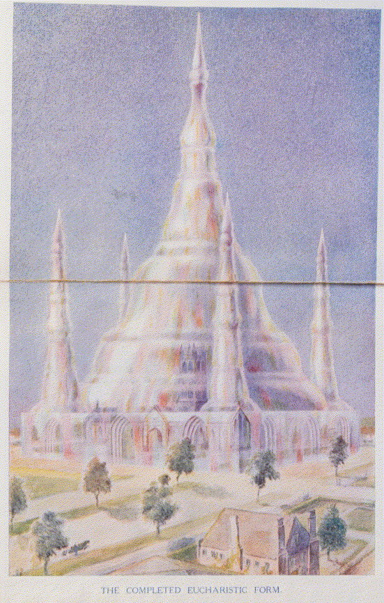

_Черновой перевод 07/2023_

## Глава I. Новая идея богослужения в церкви

Несомненно, наибольшим из многих инструментов, которые Христос предоставил своему народу, является таинство Евхаристии, обычно называемое Мессой — самое красивое, самое удивительное, самое возвышающее из христианских обрядов. Оно приносит пользу не только индивиду, как и другие таинства, но и всему собранию; оно полезно не только однажды, как крещение или обряд твердости, но и предназначено для помощи каждому верующему на протяжении всей его жизни; и кроме того, оно влияет на всю окружающую церковь территорию.

Люди могут спросить нас, как их дети спрашивали израильтян в давние времена: «Что значит этот обряд?» Что такое эта Евхаристия, которую вы совершаете? Мы должны быть в состоянии ответить на этот вопрос грамотно; но чтобы это сделать, мы должны изучить некоторые аспекты темы, которые обычно забывают; мы должны полностью отказаться от любой ограниченной или эгоистической точки зрения; мы должны понимать, что наша религия прежде всего предназначена, чтобы помочь нам служить верой и плодотворно нашему Господу и Учителю.

Следует помнить, что истинная религия всегда имеет объективную сторону; она действует не только изнутри, стимулируя сердца и разумы своих приверженцев, но и снаружи, обеспечивая подъемные и очищающие влияния на все их оболочки; она не ограничивает свои усилия только своими последователями, но и пытается через них повлиять на невежественный и безразличный мир вокруг. Храм или церковь должны быть не только местом поклонения, но и центром магнитного излучения, через который духовная сила может быть излита на весь округ.

Необходимо, чтобы такое излучение было сделано как можно более экономично. Странная ненаучная идея о чудесах, которая преобладала среди христиан на протяжении столетий, оказала парализующее воздействие на церковное мышление и помешала разумному пониманию метода, который Христос выбрал для обеспечения своей церкви. Мы должны осознавать, что такое обеспечение осуществляется через действие промежуточных Сил, ресурсы которых отнюдь не безграничны, как бы огромны они ни казались по сравнению с нашими. Следовательно, конкретной задачей таких Сил является экономия этой силы, и поэтому делать то, для чего они назначены, наиболее простым способом. Например, при этом излиянии духовной силы было бы явно расточительным изливать ее везде, как дождь, потому что это потребовало бы усилий для ее материализации на более низком уровне в тысячах мест сразу. Очевидно, намного более практично установить в определенных местах явные магнитные центры, где машина такой материализации может быть постоянно устроена, так что когда сила изливается сверху, она может быть сразу распределена без ненужной траты на установку временного оборудования.

План, принятый Христом по отношению к этой религии, заключается в том, что специальный отсек великого резервуара духовной силы отведен для его использования, и что определенный ряд должностных лиц уполномочен, с помощью назначенных обрядов, слов и знаков силы, черпать из него в пользу человечества. Схема, выбранная для передачи этой силы, - это таинство посвящения, которое будет объяснено в следующей главе. Кто-то, для кого вся идея резервуара духовной силы абсолютно нова, может обратиться к описанию, данному там.

Посредством церемонии Евхаристии, каждый раз, когда она отмечается, в мир выходит волна мира и силы, эффект которой вряд ли можно переоценить, и мы вряд ли ошибемся, считая это основной целью службы, поскольку это достигается при каждом праздновании Святой Евхаристии, будь то Великая или Малая, будь то священник один в своем частном оратории или служащий огромной общине в неком великолепном соборе.

Эта идея подтверждается тем фактом, что когда мы так собираемся вместе в церкви, мы говорим, что пришли присоединиться к Божественной службе. Я уверен, что многие люди, когда используют это выражение, думают, что под служением подразумевается присвоение хвалы и поклонения Богу; но описать это как служение вряд ли верно. Безусловно подобает, правильно и наш долг всячески превозносить, смиренно поклоняться и благодарить великого Господа всего. Это очень хорошо для нас и большое преимущество для нашей эволюции; но было бы недостойно и даже богохульно предполагать, что Бесконечное Существо может получать какое-то удовлетворение от простой лести; но когда мы собираемся вместе, чтобы построить форму мысли или евхаристический здание (как будет описано позже), через которое Его сила может легче излиться, мы сразу видим уместность слова «служба», поскольку осознаем, что мы буквально предлагаем себя в качестве добровольцев в Его великой армии, и что, каким бы скромным было наше место, как бы бесконечно далеко мы ни были, мы действительно становимся соучастниками Его труда — несомненно, самое высокое звание и величайшая привилегия, которые когда-либо могут выпасть на долю человека. Значимо, что буквальный смысл слова «литургия» — общественная работа, вторая часть слова имеет точно такое же происхождение, как «энергия».

Другой целью является эффект, произведенный на тех, кто присутствует на службе, и третьим — еще больший результат, полученный в случае тех, кто причащается Святого Таинства; но об этом я напишу позже. Мы также должны помнить о его аспекте как о чудесном и величественном символе, напоминающем нам о спуске Второго Лица Троицы в материю, а также о жертве Христа, взявшего на себя тело и прожившего ограниченную физическую жизнь, чтобы в новой форме представить перед нами благую весть Древней Мудрости. Благочестивые отцы Церкви считали, что в ритуале Евхаристии они могут проследить аллегорическое представление о земной жизни Христа. Я никоим образом не стремлюсь отрицать правду таких предположений или даже уменьшать их важность, но я хочу подчеркнуть аспект церемонии как возможности, предлагаемой нам — возможности работать ради Бога и для мира; рассмотреть ее реальное влияние на различные планы и описать некоторые механизмы, с помощью которых этот эффект достигается.

Если этот механизм будет ясно понят членами Церкви, они обнаружат, что могут полезно и эффективно сотрудничать со священнослужителями в чудесно прекрасной бескорыстной работе, тем самым не только значительно продвигая свое собственное эволюционное развитие, но и существенно улучшая ментальную и моральную атмосферу города или сельской местности, в которых они живут. Когда мы осознаем, какую прекрасную возможность здесь нам предлагают, мы поймем, что было бы глупо и действительно неправильно не воспользоваться ею так часто и так полно, как мы можем. Но для этого требуется некоторое изучение и некоторые умственные усилия; и эта книга написана для того, чтобы помочь тем, кто серьезно стремится к более полному пониманию этого вопроса.

Особый метод, разработанный для приема и распределения этого излияния энергии, происходит от тайн некоторых старых религий. Они любили передавать влияние от Божества к Его поклонникам посредством особенно освященной пищи или напитка — очевидно полезный способ, когда цель состоит в том, чтобы сила полностью проникла в физическое тело человека и привела его в гармонию с изменением, которое одновременно вводится в более высокие сущности. Чтобы выразить максимально возможную близость отношений между Вторым Лицом благословенной Троицы и поклонниками, а также в память о Его вечной Жертве (ибо Он — «Агнец, убитый с основания мира»), то, что едят и пьют, мистически называют Его телом и кровью. Возможно, нашему вкусу в наше время какое-то другое выражение показалось бы более привлекательным, но было бы неблагодарно со стороны христианина придираться к принятой символике, когда он получает столь великое благо.

Каждая из великих Служб Церкви (и особенно празднование Святой Евхаристии) изначально предназначалась для создания мощной упорядоченной формы, выражающей и окружающей центральную идею — формы, которая бы облегчала и направляла излучение влияния на всю деревню, которая была сгруппирована вокруг церкви. Идея Службы может быть сказана дважды: во-первых, принять и распределить большое излияние духовной силы, и во-вторых, собрать посвящение людей и предложить его перед троном Бога.

В случае Евхаристии, как она празднуется Римской или Греческой Церковью, различные части Службы сгруппированы вокруг центрального акта освящения специально с учетом симметрии большой формы, созданной, а также их прямого воздействия на прихожан. Изменения, внесенные в Английскую Книгу молитв в 1552 году, явно были делом людей, не знающих этой стороны вопроса, поскольку они полностью нарушили эту симметрию — что является одной из причин, почему для Церкви Англии крайне желательно как можно скорее так устроить свои дела, чтобы получить разрешение использовать в качестве альтернативы Мессу короля Эдуарда VI, согласно Книге молитв 1549 года. Это отнюдь не идеальная Служба, но она хотя бы лучше позднейшей редакции, которая во многих отношениях жалко недостаточная, поскольку она ни предоставляет достаточного материала для своей евхаристической формы, ни молится об Ангеле, который мог бы использовать такой материал, какой он предоставляет. Ее составители, кажется, создали Службу исключительно для блага тех, кто присутствует на ней, и совершенно упустили гораздо более широкую бескорыстную цель, которая была так ясно в уме Основателя.

Одним из самых важных эффектов церковной службы, как на непосредственное собрание, так и на окружающий район, всегда было создание этих прекрасных и боготворных форм мысли, через которые пролив жизни и силы из высших миров может более эффективно действовать. Эти формы создаются лучше и их эффективность усиливается, когда значительная часть тех, кто участвует в службе, делает это с пониманием, но даже когда преданность невежественна, результат все равно прекрасен и возвышающ.

Многие секты, которые к сожалению, откололись от Церкви, полностью упустили из виду эту внутреннюю и более важную сторону публичного богослужения. Идея службы, предлагаемой Богу, почти исчезла, и на ее место в большей степени заняло фанатичное проповедование узких теологических догм, которые всегда были несущественными и часто смешными. Читатели иногда выражают удивление, что те, кто пишет с точки зрения внутреннего видения, так решительно отдают предпочтение практике Церкви, а не тем или иным сектам, чье мышление во многих отношениях более либерально. Причина показана именно в этом рассмотрении внутренней стороны вещей, которым мы сейчас занимаемся.

Ученик, изучающий ту высшую сторону жизни, которая до сих пор скрыта от большинства из нас, наиболее полно признает ценность усилий, которые сделали свободу совести и мысли возможной; но он не может не видеть, что те, кто отбросил великолепные старые формы и службы Церкви, в этом самом действии почти полностью потеряли одну из самых важных сторон своей религии и сделали из нее в основном эгоистичную и ограниченную вещь - вопрос в основном о "личном спасении" для индивида, вместо благодарного преложения поклонения Богу, который сам по себе является неизменным каналом, через который божественная любовь изливается на всех.

Достижение умственной свободы было необходимым шагом в процессе человеческой эволюции; грубый и жестокий метод, которым она была получена, и глупость излишеств, в которые грубое невежество привело своих защитников, ответственны за многие плачевные результаты, которые мы видим сегодня. Та же жестокая, бессмысленная жажда безрассудного разрушения, которая заставила жестоких солдат Кромвеля разбивать бесценные статуи и неповторимые витражи, также в большой степени лишила английскую Церковь ценного эффекта, производимого в высших мирах непрерывными молитвами за умерших, и почти универсальной преданностью обычных людей в Средние Века к святым и ангелам. Тогда большая масса народа была религиозной, даже если и невежественно религиозной; теперь она откровенно и даже хвастливо нерелигиозна. Возможно, этот переходный этап необходим, но его едва ли можно считать сам по себе прекрасным или удовлетворительным.

Если религия означает «обратная связь», мы должны понять, что она создана не только для того, чтобы привязать каждого из нас лично к Богу; она предназначена для связывания всего мира Бога обратно к Нему; поэтому если мы действительно религиозны, мы должны быть бескорыстными; мы должны сотрудничать с Ним, нашим Господом, ради этого славного конечного завершения. Мы начали слишком сильно думать о религии, как только о молитве и славословии, или только о преданности. Помним поговорку Laborare est orare, которая означает «работать значит молиться», и не забываем сопровождающее её высказывание Bene orasse est bene laborasse — «хорошо помолиться значит хорошо поработать». Мы в большей степени называем нашу религию молитвой и славословием; религию Древнего Египта называли «скрытой работой», и то же самое до сих пор называют работой в другой могущественной организации, которая, хоть и не объявляет себя религией, трудится в том же направлении — также предлагает своё поклонение Тому, кто есть Мудрость, Сила и Красота, так же истинно и красиво, как это делает Церковь.

Итак, давайте научимся служить как нашим умом, так и нашим телом. Давайте попробуем понять эту великую и славную Службу, которую Христос дарует нам не только для нашего собственного помощи, но и как великолепную возможность, великую привилегию, чтобы мы могли разделить Его божественное дело служения и освящения с Ним.

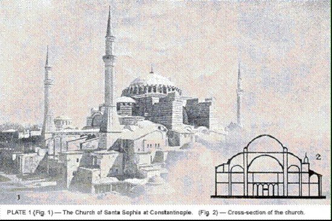

Мысле-строение Евхаристии, о которой я упоминал, создается во время и в основном посредством должного исполнения обряда. Эта структура несколько отличается от любых изображенных в книге "Мыслеформы", хотя она имеет много общего с великими музыкальными формами, изображенными в конце этой работы. На Малом празднестве материал для строительства предоставляется мыслями и преданностью священника, поддерживаемой теми же качествами его прихожан (если они есть); но на Великом празднестве музыка и другие аксессуары играют важную роль в его создании, хотя слова и чувства священнослужителя все еще остаются контролирующей силой, и во всех случаях имеется определенное количество ангельского руководства и помощи. Эта структура строится из материи принадлежащей различным планам — ментального, астрального и эфирного — и на более поздней стадии службы вводится материя еще более высоких уровней, как будет объяснено впоследствии. В этот процесс производства входит столько факторов, что существует место для больших различий в размерах, стиле, декоре и цветовой гамме, но общий план всегда узнаваем. Он напоминает форму базилики; действительно, говорят, что Церковь Санта-София в Константинополе была построена в подражание некоторым из этих духовных строений. (Рис. 1.)

См. книгу "Мыслеформы" (А. Безант и Ч.У. Ледбитер). Тем, для кого тема создания форм в более высокой материи силой мысли является новой, рекомендуется ознакомиться с этим трудом.

Завершенная структура обычно имеет примерно квадратную форму на земной плоскости, с рядом углубленных отверстий или дверей на каждой из ее четырех сторон, увенчанная большим центральным куполом, с меньшими куполами или иногда миноретами по углам. Взрывная сила на Санктусе настолько увеличивает купол и его прилегающие купола, что он становится важной частью строения, и после этого изменения здание ниже скорее становится основанием, поддерживающим ступу, чем церковью, увенчанной куполом.

Эта гигантская мыслеформа постепенно создается в начале Службы. Весь ритуал направлен на правильное создание этой формы, на ее зарядку божественной силой, а затем на ее разрядку; и каждое пение или чтение вносит свой вклад в эту работу, помимо той части, которую оно играет в подготовке сердец и умов священника и народа. Здание вздымается изнутри, как пузырь, который надувают. Говоря в общих терминах, можно сказать, что открывающее пение обеспечивает его павимент, а вступление - материал для его стен и крыши, в то время как Kyrie обеспечивает вспомогательные миски или купола, а Gloria - большой центральный купол. Детали здания варьируются в зависимости от формы Службы, которая используется, и до некоторой степени от размера и преданности общины. То, что проиллюстрировано в этой книге, является результатом измененной Литургии, используемой Либеральной католической церковью. То, что создано Римской Мессой, выглядит так же в общем плане, но неудачные выражения, которые так постоянно портят ее красоту, имеют явно неблагоприятное влияние на эту духовную архитектуру.

Как известно каждому изучающему историю, в форме, в которой она сейчас используется Римской Церковью, Месса не является цельной, но является собранием частей, взятых из различных более ранних форм, и ее формулировки в некоторых местах банальны и совершенно недостойны величественной реальности, которую они должны выразить. Но, хотя фактическое слово прошло через множество изменений, эффективность лежащей в основе магии не была фундаментально подорвана. Она по-прежнему достигает сбора и излучения божественной силы, для которой ее Основатель предназначал ее, хотя, безусловно, могло бы быть излито большее количество бесценной любви и преданности, если бы все страх и беспомощность были устранены из ее формулировок, все униженные просьбы о "милосердии", и просьбы к Богу сделать за нас ряд вещей, которые мы должны взяться делать сами. Была предпринята попытка внести некоторые улучшения в этом отношении в измененной Литургии, используемой Либеральной католической церковью.

Услуги, которые использует Церковь Англии, к сожалению, сильно искалечены и урезаны. Очевидно, что так называемые реформаторы не знали ничего о реальном назначении великого ритуала, который они так беспощадно урезали. И хотя Ордена Церкви Англии действительны, и её священники обладают силой черпать из великого резервуара духовной энергии, здание, которое она строит для его приема и распространения, серьезно несовершенно и относительно плохо приспособлено к своей цели. Это не мешает изливанию, но уменьшает количество доступного для излучения, потому что много силы должно быть использовано Ангелами-помощниками для создания механизмов, которые должны были быть подготовлены нами.

Эта мыслеформа играет в Служении примерно ту же роль, что и конденсатор в установке для дистилляции воды. Пар исходящий из реторты рассеялся бы в окружающем воздухе, если бы не был принят в колбу или камеру, в которой его можно охладить и конденсировать в воду. Камера необходима, чтобы содержать пар, пока он не превратится в более низкую и плотную форму, чтобы он был доступен для обычного физического использования.

Или, если мы хотим использовать силу пара, мы должны собрать его в какой-то виде емкости, чтобы мы могли создать давление, чтобы мы могли контролировать его и направлять его струи в желаемом направлении. То же самое верно и для этой гораздо более легкой силы, но поскольку она действует в материи, гораздо более тонкой, чем любая, которую мы знаем, никакая физическая емкость не могла бы ее удержать; чтобы удерживать ее, емкость должна быть сделана из материи этих высших плоскостей, которую можно манипулировать только с помощью мысли. Именно такой сосуд для нас создает на гигантском масштабе Ангел Господа, чью помощь мы призываем.

Мы живем в механическую эпоху, и наши мысли привыкли двигаться вдоль механических линий. Человек может научиться водить автомобиль, не зная много о его внутреннем устройстве; мы можем включить электрический свет, не зная, что такое электричество; но, тем не менее, человек, который понимает машину, которой он пользуется, несомненно, более эффективен и полезен. Весь обряд Святой Евхаристии может рассматриваться с этой точки зрения как создание и использование великолепной машины для освобождения силы и ее направления на помощь миру; и понимание того, что представляет собой эта машина, как она строится и как она предназначена для работы, безусловно, позволит нам более интеллектуально сотрудничать в этой схеме. Пусть будет понятно, что Ангел Евхаристии создает для нас то, что называется мыслеформой из тонкой материи, внутри которой божественная сила может храниться и накапливаться, пока она не будет направлена и использована, как пар накапливается в котле или в куполе паровоза.

Основная цель жертвы Святой Евхаристии - предложить возможность для особого излияния божественной силы с самых высших уровней и предоставить такой транспорт для этой силы, который позволит этим Ангелам-помощникам использовать его для определенных целей в нашем физическом мире, как будет объяснено позже. Вода, пролитая на землю, мало полезна, кроме как для орошения этой земли; если мы хотим использовать ее для других целей, мы должны предоставить сосуд, чтобы содержать ее. Кроме того, нужна форма, в которой сила может быть собрана, чтобы Ангел мог видеть общее количество и рассчитать, сколько он может позволить себе распределить по каждой из целей, к которым она должна быть предназначена.

Цели, которые мы ставили перед собой при подготовке этой пересмотренной формы Литургии, заключались в сохранении общего контура формы, которую она создает, и функционировании старой магии - эффектов различных действий на разных этапах, спуска и возвращения Ангела Присутствия и т. д. - но при этом мы стремились убрать из него все оттенки страха и эгоизма, и в некоторой степени изменить стиль его архитектуры с классического на готический. После исследования мы обнаружили, что Великие вдохновили блуждающие группы каменщиков-свободных масонов (которые построили большинство великих кафедральных соборов Европы) идеей готического стиля, как попытку на физическом уровне направить их к более жизнерадостной и стремительной мыслеформе, которую они хотели, чтобы их религиозные службы создали; но они были удивительно медлительны в понимании аналогии.

Общая позиция христиан того времени была угоднической и сжимающейся; многие из них воспринимали Бога как существо, которое необходимо умилостивить, и в своих молитвах они умоляли его услышать их на мгновение перед тем, как уничтожить их, просили его о милости, и в целом они действовали и говорили, как будто он был злым тираном, а не любящим отцом. Итак, их преданная мысль создала в целом плоскостное здание. Мы увидели, что его нынешняя поверхность, как строится римским ритуалом, часто представляет собой мертвый уровень нервозности и беспокойства, полный уродливых углублений и ям депрессии, вызванных преувеличенными исповедями отвратительности и униженными мольбами о милости, обесчестившими одинаково Бога и людей, которых Он создал по своему образу. Каждое такое углубление должно быть заменено пиком пылкой преданности, подтянутым абсолютной уверенностью в любви Бога, чтобы мыслеформа показала лес сверкающих шпилей, как собор в Милане, вместо плоской или прогибающейся крыши, которую она часто носит в настоящее время, чтобы по симпатии её восхождение могло направлять мысли людей вверх и отучить их от рабского страха к вере, благоговению и любви.

Мы увидели, сколь злым было воздействие на мыслеформу мстительных, угрожающих или униженных отрывков из еврейских псалмов, и на нас особенно настоятельно произвели впечатление слова, которые мы не могли по-настоящему поддержать.

Мы старались реализовать эти идеи в полной мере наших сил, и наш труд был вознагражден большей симметрией возведенного здания и определенно увеличенной адаптивностью к его цели. Важно подчеркнуть, что разумное сотрудничество прихожан с священником является наиболее ценным фактором в этой великой работе, потому что грандиозное излияние силы и великолепная и эффективная коллективная мыслеформа могут быть созданы собранием людей, которые искренне участвуют в Службе. Обычно достичь этого результата бывает весьма сложно, потому что члены обычного прихода совсем не умеют сосредотачиваться, и, следовательно, коллективная мыслеформа обычно представляет собой рваную и хаотичную массу, а не великолепное и организованное целое.

Преданность, будь то индивидуальная или коллективная, значительно варьируется по качеству. Преданность первобытного дикаря, например, обычно сильно смешана с страхом, и основная идея в его сознании, связанная с этим, – это умиротворение божества, которое иначе может оказаться мстительным. Немногим лучше этого является многая преданность людей, которые считают себя цивилизованными и христианами, потому что это своего рода нечестная сделка – предложение Божеству определенного количества преданности, если Он, с Своей стороны, окажет определенное количество защиты или помощи.

Такая преданность, по своей природе полностью эгоистичная и жадная, дает результаты только в более низких типах астрального вещества; и во многих случаях они выглядят крайне неприятно. Мыслеформы, которые они создают, часто имеют форму крюков, и их силы всегда движутся по замкнутым кривым, воздействуя только на человека, который их отправляет, и возвращая ему любой незначительный результат, который они могут добиться. Истинная, чистая, бескорыстная преданность - это всплеск чувств, который никогда не возвращается к человеку, который его породил, но становится в самом деле космической силой, производящей широкие результаты в высших мирах.

Хотя сама сила никогда не возвращается, человек, породивший ее, становится центром пролива божественной энергии, которая приходит в ответ, и таким образом в своем акте преданности он действительно благословил себя, хотя в то же время он также благословил многих других, и, кроме того, если его мысли движутся по христианским путям, он имел честь внести свой вклад в особый резервуар, который Христос отводит для работы Своей Церкви. Все, у кого есть книга "Мыслеформы", могут увидеть в ней попытку представить великолепный синий шпиль, созданный такой преданностью, когда он стремится вверх, и он легко поймет, как это открывает путь для определенного излияния божественной силы.

Бог изливает свою удивительную жизненную энергию на каждом уровне, в каждом мире, и, естественно, излияние, принадлежащее высшему миру, сильнее, полнее и менее ограничено, чем то, что находится ниже. Обычно каждая волна этой великой силы действует только в своем мире и не может (или по крайней мере так не делает) двигаться поперечно от одного мира или плана к другому; но именно посредством бескорыстной мысли и чувства, будь то преданность или привязанность, временный канал обеспечивает тем, чтобы сила, обычно принадлежащая высшему миру, могла спуститься к более низкому и могла там произвести результаты, которые без нее никогда не могли бы произойти.

Каждый человек, который действительно бескорыстен, часто делает себя таким каналом, хотя, конечно, в сравнительно малом масштабе; но мощный акт преданности целой огромной общины, когда она действительно объединена и абсолютно не думает о себе, дает тот же результат в гораздо большем масштабе. Иногда, хотя редко, эту скрытую сторону религиозных служб можно видеть в полной активности, и никто, кто хоть раз имел привилегию видеть такое великолепное проявление, не может на мгновение сомневаться в том, что скрытая сторона церковной службы имеет бесконечно большую важность, чем что-либо исключительно физическое.

Такой человек увидит ослепительно синий шпиль или купол из высшего типа астрального вещества, мчащегося ввысь в небо, выше образа его в камне, который иногда венчает физическое сооружение, в котором собираются верующие; он увидит ослепительную славу, которая проливается через него и распространяется как большой поток живого света по всему окружающему региону. Естественно, диаметр и высота шпиля предопределены для открытия спуска высшей жизни, в то время как сила, которая выражается в скорости, с которой энергия преданности стремится вверх, имеет отношение к скорости, с которой может происходить соответствующее исходящее движение. Зрелище действительно великолепное, и тот, кто видит его, никогда больше не сомневается в том, что невидимые влияния превышают видимые, и он не может не осознать, что мир, который идет своим путем, не обращая внимания на преданного человека, или, возможно, даже презирая его, все время больше обязан ему, чем знает.

Никакая другая Служба не имеет эффекта, вообще сравнимого с тем, что происходит при праздновании Святой Евхаристии, хотя, конечно, великие музыкальные формы могут появляться на любой Службе, где используется музыка. Во всех остальных Службах (за исключением, пожалуй, благословения Пресвятого Таинства) формы мыслей, которые развиваются, и общая польза, которая делается, в еще большей степени зависят от преданности народа. Когда случается так, что некоторое количество учеников этого внутреннего аспекта христианства принадлежит к такому собранию, они могут быть очень полезны для своих собратьев в вере, осознанно собирая разбросанные потоки преданности и объединяя их в один гармоничный и могущественный поток.

В нашем обряде, как и в обряде Церкви Рима, призывается Ангел для того, чтобы присмотреть за этим объединением и руководить строительством здания. Например, в редком случае, описанном выше, он бы взял на себя этот великолепный всплеск преданности, и вместо того, чтобы позволить ему молниеносно взлететь в этой великолепной синей шпили, он бы ловко преобразовал его в структуру, которая вскоре стала бы транспортным средством для нисходящего движения, возможно, в десять раз, или даже в сто раз больше, чем ответ, который он мог бы заслужить в своей первоначальной форме. Ангел может и будет дополнять то, что недостает, и исправлять наши недостатки, но очевидно, что желательно, чтобы мы облегчали его работу насколько это возможно.

Рассмотрение сотрудничества собрания должно превосходить все остальные при выборе музыки, используемой на различных Службах. Замысловатая музыка действительно дает далеко идущие результаты на более высоких уровнях и оказывает замечательное воздействие на тех, кто полностью понимает и ценит ее красоту; но на этой стадии эволюции человечества таких людей очень мало; и даже эти немногие должны осознавать, что они приходят в церковь не для своего личного утешения и поднятия, но чтобы работать на Службе Бога для помощи своим ближним. Они должны научиться забывать о себе и своих индивидуальных желаниях, приглушить личность и работать как часть целого, как мальчик делает, когда он присоединяется к команде по крикету, футболу или гребле на байдарке. Он должен действовать не ради своей собственной чести и славы, а ради блага клуба; он может быть вызван абсолютно отказаться от своих собственных желаний и пожертвовать возможностями яркого выступления или развлечения. Так и нам нужно научиться стирать низшее "я" и работать как собрание в реальном братстве и сотрудничестве.

Никаких сомнений в сравнительной эффективности двух методов не может быть. Простая музыкальная Служба, в которой сто человек принимают участие от души и с полной преданностью, гораздо полезнее миру, чем представление самой великолепной музыки, которую тысячи слушают, даже если они слушают с удовольствием и выгодой для себя. Тщательное и повторное исследование результатов во внутренних мирах убедительно показало, что хотя время от времени священные концерты играют важную роль в индивидуальном развитии, Служба церкви должна быть так организована, чтобы все могли активно и осознанно участвовать в работе, которую она предназначена делать.

Следует принять простую форму музыкальной Службы, и ее основные черты должны оставаться неизменными, чтобы каждый мог тщательно ознакомиться с ними. Прихожане должны быть хорошо проинструктированы о значении и воздействии различных частей церемонии и о намерении, которое они должны держать в уме на каждом этапе. Таким образом, даже небольшое число людей может выполнить эффективную и полезную работу и стать реальным центром благословения для большого района; и сами они могут получить почти неоценимую помощь, если их можно убедить присоединиться от души к волнующим и хорошо подобранным гимнам и псалмам.

Не вся простая музыка одинаково подходит. Очевидно, что меньше всего проблем Ангелу доставит та музыка, которая сама по себе создает форму, приближенную к той, которую он желает. Она, конечно, должна варьироваться в выражении слов, но она всегда должна быть радостной и вдохновляющей. Стоит избегать унылых, протяжных, неопределенных пассажей любой ценой. Ни одна из существующих композиций не подходит идеально под наши слова, но некоторые можно адаптировать без особого труда. Без сомнения, появятся композиторы из Либерально-католической церкви, которые создадут именно то, что нужно; тем временем была опубликована предварительная Служба[^1], которая, хотя и далека от совершенства в музыкальном плане, использовалась несколько лет с очень хорошими практическими результатами.

Искренний священник должен стараться обеспечить для своей церкви исполнение такой музыкальной Службы, которая экономично, но эффективно обеспечит достаточное количество лучшего доступного материала для использования Ангелом Евхаристии; но он должен постоянно быть на страже против благонамеренных, но эгоистических усилий его хора внедрить амбициозную музыку, в которой приход не может участвовать. Я не имею в виду, что есть какие-то возражения против вставки (на празднике, например) более короткого и подходящего гимна, который должен быть исполнен только хором; но музыка Литургии всегда должна быть так организована, что люди могут в полной мере участвовать в ней. Если используется гимн, нужно уделять большое внимание его выбору, так как многие содержат слова, противоречащие всему духу нашей Службы — ссылки на предполагаемый гнев Бога, призывы о милосердии и выражения страха или тошнотворной подобострастности. Если такое дополнение сделано, лучшим местом для него, по-видимому, будет после Евангелия, либо перед, либо вместо проповеди.

Певцы нашей Церкви должны осознавать, что у них есть уникальная возможность работать на Службе Богу, помогая своим менее талантливым братьям; и они должны преданно заниматься этой работой, не ища пустой показной демонстрации своих способностей, ни щекотки слуха и поднятия своего духа, но действуя с абсолютной бескорыстием, и тем самым идя по стопам своего Учителя, Христа. Священнику стоит поощрять изучение музыки среди своих прихожан, чтобы он мог постепенно укрепить эту часть своей Службы; он может организовать сколько угодно образовательных концертов более сложной музыки, но он никогда не должен терять бесценное сотрудничество своей общины в реальных Службах своей церкви.

Будет понятно, что церковь, которая была освящена и постоянно используется для различных Божественных Служб, уже является убежищем от бесконечной суеты обыденных мыслей за её пределами, и что её атмосфера наполнена преданностью. Тем не менее, люди, которые приходят в неё каждый день, приносят с собой определенную долю своих личных забот и проблем; их умы полны самых разнообразных мыслей и идей, связанных с внешним миром - не обязательно плохих мыслей, но мыслей, которые не особенно религиозны по своей природе. Некоторые могут даже быть обременены сознанием неудачи или реального проступка. Поэтому желательно сделать особые усилия, чтобы очистить церковь перед началом Службы.

По этой причине всегда полезно начинать с процессии. Священнослужители и хор должны, очевидно, войти порядочным образом и занять свои места, и когда это возможно, хорошо расширить этот необходимый порядок входа в обход церкви, потому что таким образом первоначальная очистка значительно облегчается. И община помогает сосредоточиться, устойчивости мысли и концентрации на предстоящей работе.

Одним из наиболее ценных факторов в этом усилии является благовоние; оно уже было освящено Священником или Епископом, и, следовательно, его дым несет с собой очищающие и поднимающие влияния везде, куда проникает его аромат. Если присутствует Епископ, он изливает свое благословение на людей (используя знак креста), когда процессия проходит среди них; и хотя этот долг не возложен на Священника, он все же сможет значительно помочь своим прихожанам, если, идя в процессии, он будет держать в своем сознании сильное чувство мира и искреннее желание, чтобы его приход с ним этим поделился.

Воздействие процессионального гимна на людей хорошо и в других отношениях, так как оно стремится привести всех в гармоничные вибрации и направить их мысли в подобные каналы. Это в некотором роде эквивалентно настройке струн скрипки, поскольку пение имеет решительное влияние на настройку их эмоций и мыслей. Конечно, невозможно довести смешанный приход абсолютно в унисон, что касается их мыслей и чувств, но они должны быть по крайней мере приведены в гармонию друг с другом, чтобы они сливались в гармоничное целое, как разнообразные инструменты большого оркестра.

Сильные колеблющиеся вибрации гимна подавляют такие мыслительные волны, которые с ними не согласуются, а прохождение хора так близко среди людей стимулирует последних более активно и энергично участвовать в Службе, и таким образом общинное пение является отличной подготовкой к работе, которая следует. Гимн создает в более высокой материи ряд прямоугольных форм, нарисованных с математической точностью, следующих одна за другой в определенном порядке, как звенья в некоторой могучей цепи; и это постоянное повторение действует как повторяющиеся удары молотка по шляпке гвоздя и внедряет урок, который он предназначен внедрить. Опять же, великолепный вид хорошо организованной процессии, цвета и огни, богатые знамена и пышные облачения, все это вместе подогревает воображение, поднимает мысли людей выше прозаического уровня обыденной жизни и помогает их преданности и энтузиазму.

## Глава II. Святая Евхаристия

### Asperges

Псалом

РИМСКО-КАТОЛИЧЕСКАЯ[^2] | ЛИБЕРАЛЬНО-КАТОЛИЧЕСКАЯ[^3]
----------------------- | ---------------------------
_Перед Главной Мессой в воскресенье._ | _Перед всеми Службами Евхаристии._
_Антифон_ | _Антифон_
Ты обрызгаешь меня иссопом, и я буду чист: ты омоешь меня, и я стану белее снега. | Ты обрызгаешь меня иссопом, Господи, и я буду чист: Ты омоешь меня, и я стану белее снега.
_Псалом_ | _Псалом_
Помилуй меня, Боже, по великой Твоей милости. |  Возвожу очи мои к холмам: откуда придет помощь моя. Помощь моя от Господа: Который сотворил небо и землю. Он не допустит, чтобы твоя нога поколебалась: и Тот, Кто тебя сохраняет, не уснет. Вот, Тот, кто сохраняет Израиль: не будет ни дремать, ни спать. Сам Господь твой страж; Господь - твоя защита справа тебя. Так что солнце не поразит тебя днем: ни луна ночью. Господь сохранит тебя от всякого зла; да, именно Он сохранит твою душу. Господь сохранит твое выход и вход: отныне и вовек.
Слава Отцу и Сыну. и Святому Духу. Как было в начале, так и теперь, и всегда, и во веки веков. Аминь. | Слава Отцу и Сыну. и Святому Духу. Как было в начале, так и теперь, и всегда, и во веки веков. Аминь.
_Антифон_ | _Антифон_
Ты обрызгаешь меня иссопом, и я буду чист: ты омоешь меня, и я стану белее снега. | Ты обрызгаешь меня иссопом, Господи, и я буду чист: Ты омоешь меня, и я стану белее снега.

Литургия начинается с аспергеса, или обряда очищения. "Аспергес" просто латинское название для первых слов антифона "Ты окропишь меня", так как в Церкви постоянно принято использовать первое слово или слова псалма или песнопения как его название.

После того как процессия уже подняла людей и помогла им объединиться в мыслях и чувствах, священник с помощью аспергеса особо старается очистить церковь от накопления мирских мыслей. Он делает это, окропляя святой водой, которая была сильно намагничена с целью этого вида работы.

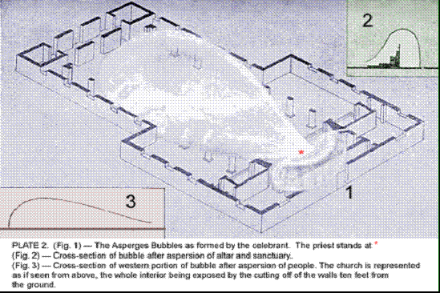

Прибыв в святилище, священник кланяется перед Алтарем и поет начальные слова антифона: "Ты окропишь меня", хор и прихожане продолжают мелодию с этого момента. Священник получает аспергилл, который был погружен в святую воду, и, сделав его святым знаком креста над собой, окропляет Алтарь трижды, так как особенно важно, чтобы эта часть церкви была тщательно подготовлена к приему огромной силы, которая так скоро будет излучаться из нее. Он не должен рассеивать большое количество воды при этом, так как очищение происходит меньше от падающих капель, чем от воли священника, направляющего энергию, хранящуюся в намагниченной воде. С каждым движением аспергилла он направляет эту силу в любом желаемом направлении, и она тотчас же течет по заданной для нее линии. Таким образом, он может направить струю силы к кресту над табернакулем, через Алтарь к свечам и т.д. Священнослужители и хор затем окропляются, и, наконец, прихожане; в каждом случае выстреливает поток очищающей силы, который способен путешествовать, когда он направлен на людей, вплоть до самого конца церкви, какой бы большой она ни была. Этот всплеск вдувает то, что выглядит как огромный плоский пузырь из эфирного и астро-ментального вещества, мысленное здание, эфирное, диафанное — пузырь, который как раз включает прихожан. (См. Рис. 2.) Внутри этого психическая атмосфера очищается, пузырь отталкивает то, что не было затронуто. Таким образом, очищается территория для действий Ангела, который вскоре будет призван.

В то время как священник совершает этот обряд, хор и прихожане поют сто двадцать первый псалом, который можно было бы суммировать в известной фразе, заимствованной из другого псалма: "Если Господь не построит дома, напрасно трудятся строители; если Господь не охраняет город, напрасно бодрствует страж". Это подчеркивает мысль, что только силой Господа можно удерживать зло на расстоянии; очевидно, что только, постоянно держа наши мысли на Нем, мы можем сохранить состояние умственной и астральной чистоты, которое было установлено в здании с помощью аспергеса. Как всегда, псалму сопутствует антифон, который указывает нам мысль, которую мы должны держать в голове, пока поем его — в этом случае мысль о совершенной чистоте.

Изначально в первобытной Церкви стихи псалма пели Священник или певчий в одиночку, в то время как антифон повторялся после каждого стиха всем собранием как своего рода припев, и только позже его отодвинули в начало и конец псалма, как это выглядит сейчас. Таким образом, держа в уме всё время это намерение идеальной чистоты мысли и чувства, мы поём различные стихи псалма, которые говорят нам, что такую чистоту можно поддерживать только, сосредоточившись на мысли о Боге и более высоких вещах. Здесь главная идея - это не прежде всего общая чистота жизни, хотя это, безусловно, чрезвычайно желательно. Это скорее концепция чистоты намерений - то, что мы описали бы как единоличность или однонаправленность. Все другие мысли должны быть строго изгнаны, все наклонности к блужданию должны быть твердо сдержаны, чтобы мы могли сосредоточить наши энергии на работе, которую мы имеем в виду.

Пока эти мысли стабильно истекают из умов Священника и народа, фактическое исполнение слов, которые воплощают их, одновременно производит свой эффект - укрепляет, расширяет и обогащает пузырь, надутый усилием Священника. (См. Рис. 3.) Этот псалом не является необходимым для эффективности очищения; действительно, можно увидеть, что в более короткой форме Службы мы полностью обходим его стороной. Но когда у нас есть много времени в нашем распоряжении, он, без сомнения, помогает собрать разрозненные мысли людей. Мы должны осознать, что внезапная и интенсивная концентрация мысли не легка - в сущности, едва ли возможна - для неподготовленного ума; большинству людей требуется немного времени и более одной попытки, прежде чем они смогут поднять свой энтузиазм и преданность до высшей точки, чтобы их силы были полностью в действии. Псалом вставлен, чтобы дать время для этого "разогрева" тем, кому он нужен.

Желательно использовать для этого псалма один из самых простых григорианских тонов; например, 6-й, 1-й в конце, оказались удовлетворительными, или 8-й тон, 1-й в конце. (Эти числа соответствуют системе известного Псалтиря Хельмора) Ясновидящий, изучающий влияние церковной музыки, вряд ли не заметит разницу между разбитыми, хотя и блестящими, осколками англиканского пения и великолепной сияющей однородностью григорианского тона.

В конце псалма появляется восхваление всеславной Троице, которым с древнейших времён было обычаем закрывать все свои псалмы и кантиллы в Церкви. Он не требует комментариев, кроме замечания, что "мир без конца" - это несколько неудовлетворительный перевод "per omnia sæcula sæculorum"; который ясно означает именно то, что говорит: "на протяжении всех веков веков". Понятие aion или диспенсации как названия долгого периода времени было прекрасно известно грекам и римлянам, как и дальнейшая идея ещё более продолжительного периода, названного эоном эонов - как мы могли бы поэтично назвать десять тысяч лет веком веков. Так что "через все века веков" равносильно "на протяжении всей вечности".

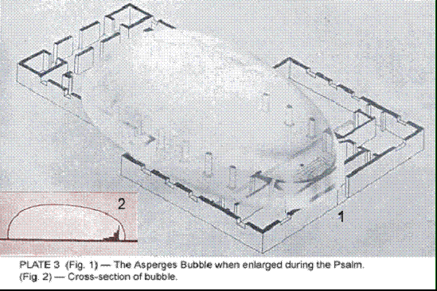

Здесь также в нашей Службе впервые используется слово "Аминь", которым верующие предполагают одобрить то, что сказал священник. Это обычно воспринимается как уверенное утверждение; слова, которые Христос так часто использует, переведенные в нашем английском варианте как "Воистину, воистину", в Новом Завете звучат как "Аминь, Аминь". Это не греческое, а ивритское слово; мне говорили, что оно существует в нескольких семитских языках, означая уверенность, истину, надежность. Это единственное толкование, которое признают западные ученые, но во времена нашего Господа были те, кто относил его к совершенно другому источнику, выводя его из одного из египетских имен Солнечного Бога - Амон-Ра. Клясться именем Амон было клятвой, которую никто не осмеливался нарушить; никто, кто призывал Амона свидетелем того, что он говорил, не рискнул бы говорить иное, чем правду; и так эта формула, "Я говорю вам именем Амона", убеждала слушателей. Поэтому, когда наш Господь хотел быть особенно настойчивым, Он использовал форму, к которой Его аудитория привыкла, которая не могла не убедить тех, кто ее слышал. Произнесенное в конце речи или молитвы, оно выражало полное согласие и одобрение тех, кто его использовал: "Именем Амона, так оно и есть" или "Именем Амона, мы согласны с этим"; и так оно в конечном итоге становится аналогом выражения "Пусть будет так" или "Так оно и есть". Пример его более раннего использования можно увидеть в Исаии LXV, 16, где английская уполномоченная версия переводит: "Тот, кто благословляет себя на земле, будет благословлять себя в Боге истины, и тот, кто клянется на земле, будет клясться Богом истины". Ивритское слово, переведенное здесь как "истина", - это Аминь; так что реальное утверждение просто в том, что люди должны клясться Богом Аминь, точно так же, как это делалось в древнем Египте.

### Versicles

Римская | Либеральная
------- | -----------
V. Покажи нам, Господи, Твою милость. | P. Господи, открой наши уста.
R. И даруй нам Твое спасение.         | C. И наши уста возвестят хвалу Тебе.
V. Господи, услышь мою молитву.       | P. Кто взойдет на гору Господа?
R. И пусть мой вопль дойдет до Тебя.  | C. Тот, у кого руки чисты и сердце чисто.

Затем священник поёт версик: "Господи, открой наши уста," и хор отвечает: "И наши уста возвестят хвалу Тебе." Этот версик использовался с раннего периода в истории Церкви в начале одной из утренних Служб, хотя и не во время Массы. Его основная идея заключается в том, что мы можем надеяться на достойное прославление или поклонение только при помощи божественной силы внутри нас самих. Когда мы говорим о помощи Господа, мы должны понимать, что мы можем прибегать к божественной силе снаружи — к тому, что обычно называют Силой Божьей — только потому, что мы сами также являемся Богом, потому что мы в основе своей являемся частью Него.

Намерение этого версика заключается в том, чтобы божественное в человеке могло быть пробуждено и вступить в гармонию с божественным снаружи, в то время как ответ указывает нам, что после того, как наши уста будут открыты, первое, что мы должны сделать, является восславление Господа. Важно отметить, что не молитва о благах, а хвала является первым, что мы должны предложить. Затем церемониал поет: "Кто взойдет на гору Господа?", подразумевая под этим: кто может полезно и соответствующим образом подняться по ступеням, ведущим к Алтарю? Сразу же приходит ответ: "Тот, у кого руки чисты и сердце чисто." Теперь, когда этот убежденность укоренилась внутри него, церемониал обращается к людям и впервые в Службе дает Малое Благословение.

### Dominus Vobiscum

Римская | Либеральная
------- | -----------
V. Господь с тобой. | P. Господь с тобой.
R. И с духом твоим. | C. И с духом твоим.

Кто внимательно наблюдал за римской Службой Массы, вряд ли мог не заметить, как часто священник обращается к собравшимся и произносит слова: Dominus vobiscum ("Господь с вами.")

На что люди отвечают: Et cum spiritu tuo ("И с духом твоим") фраза, которая, кажется, требует пересмотра, поскольку Дух является единственным обладателем и никогда ни при каких обстоятельствах не может быть обладаемым. Более точное выражение было бы: "И с тобой как с духом," Но ранняя Церковь не говорила с такой аккуратностью, а скорее приняла формулировки еврейского псалма, который не редко призывает свою душу благословить Господа, по-видимому, идентифицируя себя со своим телом.

Апостол Павел был лучше осведомлён, поскольку он пишет о теле, душе и духе как о трехчастной дивизии человека, хотя даже он все еще ставит их как владения человека.

Более научное утверждение гласит, что Дух (иногда называемый Монадой) это божественная Искра в каждом из нас, которая является причиной всего остального, и, следовательно, истинным человеком; что этот Дух проникает вниз на уровни ниже его собственного, частичное проявление себя, которое мы называем душой или эго; что эта душа раскрывает свои скрытые божественные качества через множество последующих жизней в еще более низком мире, в ходе которых она облачается в оболочки, подходящие для этого мира, которые мы называем телом. Так что в любой данный момент физической жизни человек, Дух, обладает душой и телом - действительно, несколькими телами, поскольку апостол Павел далее объясняет: "Есть естественное тело, и есть духовное тело." Эти слова не очень хорошо переведены; но из контекста становится ясно, что под "естественным телом" он подразумевает это плотное облачение, с которым мы все хорошо знакомы, и что под термином "духовное тело" - разделенное позднейшими исследователями на астральные и ментальные оболочки.

Независимо от того, насколько идея могла быть затуманена в течение веков, наверняка, что Служба Святой Евхаристии задумывалась как связная церемония, последовательно движущаяся к кульминации и искусно рассчитанная на достижение определенных величественных эффектов. Рассматривая ритуал научно с этой точки зрения, можно было бы немного удивиться частому повторению фразы, которая, хотя и красива сама по себе, на первый взгляд не имеет очевидной связи с великолепной целью великого духовного акта, частью которого она служит.

Фраза встречается не менее девяти раз (в более короткой форме - три) в течение Литургии, с небольшим, но важным дополнением в одном случае - приветствием мира, к которому я обращусь, когда мы к нему придем. В центре Службы в целом находится мощное излияние силы, которое происходит при освящении. Все, что говорится и делается до этого момента, предназначено разными способами подготовить к этому, и все, что происходит после, связано с сохранением и распределением силы. Безусловно, присутствует идея подготовки священника к выполнению великого акта, но также и более заметная идея подготовки собравшихся к его приему и пользе от него. Эта подготовка людей в значительной степени достигается путем все более тесного привлечения их в магнитную гармонию со священником - приведения их мысленно и эмоционально в симпатию с ним в великой работе, которую он выполняет. Помощь в постоянном увеличении силы и продвижение все более гармоничных колебаний между священником и народом - вот цели этого постоянно повторяющегося Малого Благословения.

Для того, кто обладает ясновидением, его ценность ясна: когда служитель обращается к людям и поет или произносит предписанные слова, мощный поток силы обрушивается на собравшихся, а затем через мгновение обратно к алтарю, сильно увеличиваясь в объеме, потому что он подхватывает и уносит с собой все маленькие струи силы, которые создали отдельные верующие, и которые иначе бы уплыли вверх и рассеялись. Все сходится на священника со словами: "И с духом твоим", и рывок иногда такой сильный, что если бы он его ощутил, то упал бы, но его обязанность - принять его в себя и удерживать его для использования ангела, которого он собирается вызвать.

Это взаимодействие очень эффективно связывает священника, помощников и собравшихся в одно гармоничное целое - настоящий живой инструмент, который будет использоваться в магии Евхаристии. Эти слова повторяются в течение Службы каждый раз, когда священник совершает какое-то действие или произносит молитву, которая возвышает его эмоции или наполняет его какой-то особой силой, идея заключается в том, что он способен поделиться этим возвышением или силой с народом через Малое Благословение, и тем самым приблизить их к Богу. В этом случае делится идея и понимание чистоты и концентрации: понимание необходимости этих добродетелей и решимость достичь их.

Служитель начинает, надувая пузырь аспержеса, и псалом, который тем временем поется, и последующие стихи, устанавливают контакт между ним и собравшимися. Это состояние используется, чтобы позволить священнику, на Малом Благословении, которое сразу следует за ним, накинуть сеть на своих прихожан, которой он может удерживать их, как упряжь держит лошадей. Эта сеть очень полезна в Службе, и по ее линиям связи священник посылает силу при каждом последующем повторении этого предложения - "Господь с вами", что очень эффективно для сохранения гармонии между ним и его приходом, и в то же время для поддержания давления силы, на алтаре и в теле церкви, более или менее равномерным. Эта сеть постоянно оживляется и заставляет сильно светиться каждым повторением Dominus Vobiscum, до Оффертория, когда она больше не нужна. Когда Мессу говорит епископ, он, кажется, включает людей на более высокий уровень с его сетью, чем делает это священник. И когда епископ присутствует на Мессе священника, он не полностью включен, так сказать, не совсем погружен в это излияние. Из этой, его более возвышенной точки зрения, он может много сделать, чтобы помочь. В более короткой форме аспержеса, предложение "Братья, давайте теперь заложим основание нашего храма" создает эту сеть.

### Ангел Евхаристии

Священник теперь обращается к другой части приготовления и говорит:

#### Сбор

Римская | Либеральная
------- | -----------
Давайте помолимся. | Давайте помолимся.
Милосердно услышь нас, О святой Господь, всемогущий Отец, вечный Бог: и дай послать твоего святого ангела с небес, чтобы охранять, питать, защищать, посещать и защищать всех, кто живет в этом жилище. Через Христа, нашего Господа. | Веди нас, О Всемогущий Отец, во всех наших делах, и с твоего небесного трона пошли твоего святого Ангела, чтобы он был с твоим народом, который собрался служить и поклоняться Тебе. Через Христа, нашего Господа.
R. Аминь. | R. Аминь.

Фраза "Давайте помолимся" - это сигнал, данный священником народу, когда он собирается сказать молитву, и поэтому пришло время для них стать на колени. Такой знак был еще более необходим в примитивной Церкви, когда люди не имели копий литургии (и, в большинстве случаев, не могли прочитать их, даже если бы у них они были), и поэтому были вынуждены полностью полагаться на священника по поводу позиции, которую они должны были занять. В самом деле, в течение значительного времени не было письменной литургии, и каждый служитель экспромтом заполнял контур церемонии, как это было дано Христом.

То, что Христос дал такой план, точно известно из экстрасенсорного исследования. Описание учреждения этого Таинства, данное в различных евангелиях, вероятно, в основном точное, хотя мы должны помнить, что авторы составляли удивительную и красивую тайну-драму, в которой они были гораздо более обеспокоены успешным передачей великих истин, которые лежат за их символизмом, нежели точным соблюдением единства формы рассказа, в которую они решили вложить свой сюжет. Но слова, произнесенные на первой Евхаристии вечером Великого Четверга (или, как кажется более вероятным, сразу после полуночи, и так очень рано утром Великой Пятницы (1)), были лишь формальным учреждением великой церемонии.

Евреи начинали свой день на закате, поэтому в любом случае это уже была пятница по их подсчету.

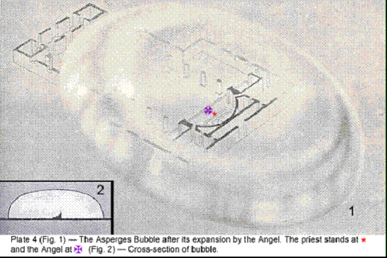

Детальная информация о методе и намерении была дана Господом после Его воскресения среди многих вещей, "касающихся Царства Божия", которые Он тогда наставлял Своим ученикам. Несомненно, что Он дал им ясные указания по основным моментам Службы Eвхаристии и объяснил, какой эффект предназначался каждому из них, но также очевидно, что Он оставил эту структуру церемонии для того, чтобы Его апостолы заполнили ее по мере того, как они находили это удобным в постоянно меняющихся условиях их ранней евангельской работы. Следователи каждого апостола естественно старались бы помнить и воспроизводить его импровизации, и так бы росло количество ритуалов, все построены на одном и том же скелете, но одевающие его по-разному. Только со стечением веков Церковь разработала на основе опыта и компиляции различные литургии, которыми мы сейчас обладаем, хотя снова мы не должны забывать, что Он Сам всегда стоял за ее усилиями, всегда готов вдохновлять и направлять тех из ее лидеров, которые открывались для духовного влияния.

Совершив предварительное очищение и, таким образом, обеспечив поле (внутри огромного пузыря, созданного усилием священника), где Ангел сможет работать, священник теперь вызывает на помощь одного из этих благодетельных помощников. Существует много порядков и рас этих светящихся нечеловеческих духов, и большинство из них на текущем этапе человеческой эволюции имеет мало связи с человечеством. Однако некоторые типы всегда готовы участвовать в религиозных церемониях, не только из-за желания совершить доброе дело, но и потому что такая работа предлагает им лучшую возможность для прогресса.

Четыре раза в течение Службы Eвхаристии священник призывает святых Ангелов на помощь, и мы можем быть уверены, что он никогда не вызывает зря, так как связь с этими небесными войсками является одним из преимуществ, которые передаются ему при его посвящении. В этот раз он призывает то, что обычно называется Ангелом Евхаристии, чья специальная работа в связи с ней заключается в помощи в строительстве того здания, о котором я уже говорил. Он определяет размер формы, которую можно построить при любом данном случае, учитывая количество присутствующих людей, интенсивность их преданности, объем их знаний, готовность сотрудничать и так далее. Большое собрание, работающее осознанно, может дать гораздо больше материала для строительства формы, чем небольшое собрание; опять же, гораздо больше материала доступно на Великом Праздновании, чем на Малом.

В задачи Ангела входит следить за тем, чтобы наш материал был мудро использован в строительстве здания. Если бы была построена слишком большая площадка при пении песнопения, евхаристическое здание, когда оно окончательно завершится, могло бы быть настолько разреженным, что едва ли держалось бы вместе. Форма формируется и направляется этим Ангелом, хотя ее контур можно в определенной степени изменить по воле священника, если он знает о существовании формы и цели, для которой она строится. Первым действием Ангела по прибытии является расширение пузыря, созданного волей священника при asperges. (Рис. 4.) Он толкает его за алтарь, пока он не освободит пространство столь же далеко к востоку от алтаря, как исходное освободило к западу. Чтобы сделать это расширение возможным без того, чтобы пузырь стал слишком тонким, священник, во время asperges на алтаре, должен представить себе пленку пузыря гуще в районе алтаря и святилища, чем в других местах.

Будет заметно, что римская форма молитвы аспергеса не даёт прямой отсылки к работе Ангела в возведении здания, хотя именно благодаря этому строению он в большой степени охраняет, защищает и заступается за общину от вторжения злых или блуждающих мыслей, даже в то время как своим мощным, но в то же время очень спокойным магнетизмом он истинно посещает и питает тех, кто готов принять его влияние. Я не имею в виду, что если человек позволяет своему уму заполняться личными заботами, Ангел особенно вмешается, чтобы изгнать их; но он исключает из своего строения огромные стаи неопределенных форм мысли, которые в обычной жизни постоянно давят на нас и проникают в наши умы, когда на мгновение мы оставляем их пустыми. Его присутствие само по себе является благословением, потому что от него всегда исходит успокаивающее и возвышающее влияние; так что его визит явно представляет ценную возможность тем, кто готов воспользоваться ею. В более короткой Службе мы сжимаем всё действие аспергеса в один сборник. Совершая знак креста над собой аспергиллом, священник говорит:

Да очистит меня Господь, чтобы я достойно совершил Его службу.

_Он окропляет алтарь и хор._

В силе Господней я отражаю всё зло от этого Его святого алтаря и святилища,

_Он окропляет людей._

и от этого Дома, где мы поклоняемся Ему;

_Он обращается к алтарю._

и я молюсь нашему небесному Отцу, чтобы Он послал Своего святого Ангела построить для нас духовный Храм, через который Его сила и благословение могут быть излиты на Его народ. Через Христа, нашего Господа.

R. Аминь.

Это во всех отношениях так же эффективно, как и более длинная форма, но она требует бдительности и сосредоточенного мышления со стороны священника. Он, вероятно, найдет целесообразным произносить сборник несколько медленно, вкладывая всю силу своей воли в каждую фразу. Призывание, которое непосредственно следует за аспергесом в более длинной форме, в короткой форме предшествует ему, тем самым делая очищение определенной частью евхаристической Службы, а не подготовкой к ней.

Мы стремились в укороченной форме точнее подобрать слова к тому эффекту, который создается, чтобы общине было легче следовать за внутренней стороной Службы. Все ручные действия священника абсолютно одинаковы; между возведенными двумя формами зданиями или в объеме излитой силы нет заметной разницы. Когда не читаются эпистоля и евангелие, мы теряем количество полезного материала, генерируемого в процессе прочтения Градуала; и те члены общины, которым нужно много устойчивого давления, чтобы поднять свой энтузиазм, имеют время внести немного больше во время долгих молитв. Но на практике этот небольшой недостаток обычно компенсируется повышенной бдительностью и более ясным пониманием того, что делается. В укороченной форме важные действия ритуала следуют друг за другом быстрее, потому что всё, что не является действительно необходимым для внутренней работы, было устранено. Приходится опускать многие красивые отрывки; но тем не менее укороченная форма окажется удобной при многих случаях, когда невозможно выполнить полную церемонию.

Примечание. Сейчас служитель вызывает Ангела Евхаристии, который будет строить для нас форму. Кажется, что не видно, как он подходит издалека, но он внезапно появляется таким образом, что создается впечатление, будто за алтарем толстый слой тумана, и когда его вызывают, он просто делает шаг вперед через него и оказывается рядом с нами. Я не знаю, что является причиной этого эффекта; это может быть связано со скоростью, с которой он перемещается, так что момент, когда его видно вдалеке, почти совпадает с его прибытием в церковь, и кажется нам, что это действительно так, и, следовательно, к тому времени, когда мы его увидели в первый раз, он уже прибыл. Более вероятное объяснение состоит в том, что он приходит к нам на какой-то высокий план - возможно, где пространство не существует - и затем материализует нижние тела для себя.

Мы заметили, что в нескольких изученных нами случаях, когда сам служитель был развитой личностью - посвященным Великой Белой Ложи - цвета Ангела соответствовали определенным цветам в верхней части ауры служителя. Это предполагает, что в тех случаях, когда Священник достаточно развит для того, чтобы его характер мог оказать определенное влияние на вещи, при прочих равных условиях, Ангел, который приходит работать с ним, вероятно, будет того же типа, что и он сам. Конечно, есть церкви, которые имеют определенных Ангелов, обычно связанных с ними, но похоже, есть и служители, у которых есть свои Ангелы, имеющие эти цветовые сходства.

Что касается положения Ангела в различные моменты Службы, я привожу результаты наблюдений в одной конкретной церкви.

Кажется, что он много перемещается внутри ограниченной области вокруг алтаря, но чаще всего он рядом с служащим Священником. Когда он впервые появляется, он перед служителем, но немного с эпистольной стороны - среди свечей на этой стороне алтаря. Это более мужская сторона церкви, поскольку лучи, представленные свечами, драгоценными камнями и крестами на этой стороне - Юге - более активны, чем те, что на Севере. В этом контексте можно спекулировать о возможных причинах этого, найденных в том факте, что некоторые большие земные токи принимаются на Северном полюсе и отдаются на Южном полюсе. Будь то как угодно, факт остается фактом, что юг церкви более мужественный, и поскольку церковная власть должна протекать через мужские каналы, Ангелу, вероятно, проще работать на этой стороне.

Он остается здесь, почти в центре, во время Кантиклы и Интроита; за исключением последнего, когда он стоит немного дальше по сторонам алтаря, чтобы управлять вихрями силы, идущей от служителя, диакона и субдиакона, до центральной линии (созданной табернаклем, крестом и картиной) и обратно. Во время Кирие он прямо над головой служителя; для Глория ин Эксельсис он поднимается немного выше и движется к людям, так что он над вратами святилища, собирая из людей и сильно привлекая к себе строительный материал.

Во время Сборов он в основном находится на своем первоначальном месте, в линии с тремя служителями, и там принимает силу, направленную вверх по этой линии. В то время как читается Епистоль, Ангел находится близко к центру алтаря, чтобы, кроме более умственной силы, которую он изливает через служителя и диакона в субдиакона, он мог быть в удобном положении, чтобы черпать из свечей на Севере, а также изливать эмоционально поднимающую силу, которая стимулирует и поднимает уровень эмоций субдиакона, а следовательно, и его мысли. Когда сила вытекает через него к людям, она производит на них тот же эффект. За исключением нескольких моментов, когда он выходит немного левее субдиакона — который стоит в центральной линии алтаря на нижней ступени — и когда он на мгновение уходит за алтарь в связи с созданием столпов и украшений во время Градуала, Ангел сохраняет свое центральное положение до конца Евангелия. Кажется, что на этой части Службы он занят уравновешиванием и преобразованием эмоциональной и мыслительной силы, от которой идет вихрь, кружащийся вокруг церкви. Ряд свечей служит полезным ситом для этой цели, и отфильтровывает много грязи, сильно усиливая (и в то же время усиливаясь от) силу от людей. Эта активность воздействует на людей и дальше стимулирует их, и так вихрь нарастает.

На протяжении большей части Символа веры Ангел находится над головой служителя, но к концу он всплывает высоко над крестом алтаря. После этого он больше на свое усмотрение и получает награду за свою работу. Тем не менее, он продолжает быть очень полезным как источник силы и занят украшением вещей. Хотя это руководящий Ангел, который руководит, когда весь здание увеличивается при Терсанктусе, строительный Ангел все еще очень полезен даже в этом действии, так как он так много силы вносит сам, что это помогает расширить купол.

### Святая Евхаристия — Подготовка

#### Призыв

Римская | Либеральная
------- | -----------
Во имя Отца, и Сына, и Святого Духа. Аминь. | Во имя Отца, и Сына, и Святого Духа. Аминь.

Теперь, когда Служба Евхаристии готова начаться, с плеч священнослужителя снимается плащ, и на него надевается казула, жертвенная одежда, которая с самых ранних дней церкви была предназначена для празднования Святой Евхаристии. Значение и использование этого гармента будут описаны в части III, "Инструменты Священнодействий".

Евхаристия начинается, как и все Службы Церкви, со Слова и Знака Силы. Чтобы полностью понять использование и силу таких слов и знаков, мы должны изучить аспект природы, который в наши дни почти полностью забыт. Мы должны осознать, что мы живем не в пустом и безответном материальном мире, но посреди огромного океана кишащей жизни — что мы всегда окружены великим облаком свидетелей, могучей армией существ, невидимых нашим физическим глазам. В эту огромную армию входят сверхчеловеческие существа (ангелы всех степеней и типов), несметные толпы мертвых (которые, конечно, остаются на уровне человеческого) и неисчислимые миллионы суб-человеческих сущностей — природные духи, одушевленные мыслительные формы и прочее.

Все они постоянно воздействуют на нас, некоторые во благо, некоторые во вред, так же, как мы постоянно воздействуем на них. Большинство людей полностью неосознанно или с презрением относятся к всему этому, и поэтому они спотыкаются по жизни без помощи; хотя, возможно, также верно, что барьер их слепого неверия до некоторой степени защищает их от возможных опасностей. Но, безусловно, Бог хочет, чтобы все Его творение работало вместе на Его службу, и что мы должны использовать множество помощи, которую Он приготовил к нашим услугам, как только мы станем достаточно мудры, чтобы понять их. В этом, как и во всех других направлениях, знание — это сила, и тот, кто будет разумно использовать силы природы, может получить большое преимущество от этого.

Те, кто изучали сравнительную религию, знают о важности, которую имеют имена; они знают, что согласно всем древним убеждениям, имя вещи имеет прямое соединение с ней и может вызвать его в любом месте. Будет помниться, что в Египетской Книге Мертвых кандидат, проходящий через Зал Аменти, сталкивается со всевозможными сущностями, некоторые из них ужасны по своему характеру, которые преграждают его путь и требуют идентификации. Если он правильно подготовлен, он быстро узнает их и говорит каждому: "Я знаю тебя; таково твое имя." При этом препятствующий дракон мгновенно успокаивается, и кандидат торжественно продолжает свой путь.

В этой древней системе ясно, что знать имя чего-либо подразумевает знание его глубочайшей природы, его сил и качеств. Для древних людей, следовательно, приказывать в Имени или по Имени любого проявления Бога означало обращаться к силе этого проявления. В этой идее есть много правды, особенно когда призыв произносится тем, кто, будучи связан с источником силы, получил власть использовать его. Так что заявить, что мы начинаем нашу Службу во имя Отца, и Сына, и Святого Духа, значит в случае священника вызвать и привести в действие особую связь, созданную на его рукоположении, и в ответ на это происходит мощный поток силы.

Когда присутствует епископ, эти мощные слова всегда произносит он, поскольку он способен вызвать дополнительный слой силы. Когда это обращение использует мирянин, он призывает эквивалент или представителя Святой Троицы в себе — Дух, интуицию и интеллект. Как в солнечной системе все начинается и заканчивается Троицей, так и в символизме Святой Евхаристии мы начинаем с обращения к Отцу, Сыну и Святому Духу, и заканчиваем благословением во имя тех же Трех Аспектов Божества.

Знак силы, сопровождающий это обращение, знак святого креста, имеет различные аспекты в качестве символа. Греческий крест с равными руками символизирует Логос в активности — руку Господа, протянутую на помощь или на благословение. Латинский крест с более длинным стволом олицетворяет Второй Аспект Логоса, Второе Лицо благословенной Троицы, Бога Сына, спустившегося в материю. Во всех благословениях и экзорцизмах он используется для впечатления воли священника на человека или объект, с которым он имеет дело. Это знак, через который протекает сила, иногда от священника к другому; иногда свыше в самого священника, как в некоторых моментах Службы. Когда человек делает его над собой, он предназначен для усиления самосознания; чтобы напомнить ему о Имени, которое он символизирует, и помочь ему осознать, что где это Имя вызывается, мы верим, что зло не последует.

Это своего рода миниатюрное вероисповедание, выраженное в действии, а не словами, ибо когда мы касаемся сначала лба, а затем солнечного сплетения, это напоминает нам о том, как "ради нас людей и нашего спасения" Христос спустился от Отца, который есть Глава над всем, на эту землю, на физическую плоскость, нижнюю часть Его творения; в то время как когда мы касаемся сначала левого плеча, а затем правого, мы помним, что Он перешел с земли в нижний астральный мир, называемый адом, и изображенный как слева от Бога (хотя и так он выше земли) и оттуда присоединился к славе навсегда справа от Отца.

Человек, чьи мысли и чувства всегда на высшем возможном уровне, может не нуждаться в напоминании этого рода; но большинство из нас еще не совершенны, и поэтому неразумно отказываться от чего-либо, что может помочь нам. Большинство из нас полны добрых намерений, но забывчивы, и все, что помогает нам вспомнить идеал и способствует отгонять нездоровые мысли и влияния, полезно. Мы еще не святые; мы все еще подвержены влиянию волн раздражения или эгоизма или нежелательных мыслей. Знак креста, сделанный над собой, привлечет к нам невидимые влияния, которые помогут отогнать все неприятное и в то же время упростят сохранение добра.

Для понимания этой силы знака креста мы должны осознать, как я уже сказал, что мы живем среди огромного множества других существ. Среди них, суб-человеческие существа (или, как их иногда называют, природные духи) особенно подвержены влиянию знаков силы, одним из которых является крест. Где бы этот знак ни был сделан, он сразу привлекает внимание всех таких существ в округе, и они немедленно собираются вокруг человека, делающего знак, в ожидании, что он будет излучать мысли и вибрации того типа, которые они любят.

Мы не должны путать этих духов природы с Ангелами. Если великий Ангел, который случайно пролетал мимо, увидел знак креста и хорошие мысли, которые его сопровождали, он, безусловно, улыбнулся бы человеку, сделавшему это, своей светящейся улыбкой, которая несет полезное влияние, но вряд ли он отвлекся бы от своей работы. Духи природы развиваются в значительной степени за счет вибраций, в которых они погружают себя, и поэтому внутренний инстинкт заставляет их всегда искать те, которые полезны для них. Есть такие, которым на данной стадии эволюции нужны грубые типы вибраций, которые для нас (но не для них) выражают злые или страстные мысли или чувства.

Такие существа сгрудятся вокруг нас, когда мы проявляем раздражительность или чувственность, и их давление поддерживает и усиливает любую нежелательную тенденцию, которая может проявляться, — не потому, что эти существа сами по себе злые или желают нам зла, они просто следуют своему инстинкту и собираются около источника излучений, которые для них приятны, как мухи собираются вокруг банки с медом или люди вокруг костра в холодную погоду. Другие находятся на стадии, когда им нужны более высокие вибрации, которые у нас выражают хорошие мысли и чувства, и знак креста привлекает этот тип, так же как отгоняет другой. Дело не в том, что последние его боятся, как обычно предполагается (вы знаете, как это формулируется в гимне: "При знаке триумфа Сатанинская свита бежит"), правда скорее в том, что его сияние им неприятно, и они сразу понимают, что там, где сделан этот знак, для них ничего нет; поэтому они быстро уходят в поисках более перспективных пастбищ.

Мы скорее поймем, как эти силы действуют, если сможем полностью избавиться от детских суеверий о дьяволе и злых ангелах и посмотреть на всю эту тему с позиции здравого смысла и науки. Этические идеи добра и зла здесь не при чем. Царство духов природы содержит столько же разнообразия, сколько и животное царство. Некоторые духи природы, как и некоторые животные, полезны для нас, в то время как другие представители обоих царств вредны для нас, и так же, как мы отпугиваем, гоним или уничтожаем крыс, змей, скорпионов и паразитических вредителей, так и мы должны отпугивать или гонять нежелательные астральные или эфирные сущности.

Слишком много людей не разбираются в этих вопросах; либо они глупо суеверны, либо одинаково глупо недоверчивы, потому что они не могут видеть мир более тонкого вещества, который окружает их. Они не видят микробов болезни; но эти невидимые существа часто влияют на их жизнь в серьезной степени, и также могут влиять невидимые астральные существа. Духи природы, будь то полезные или вредные, охотно реагируют на колебания, которые их привлекают; они воспроизводят их в себе и усиливают их, и таким образом в свою очередь воздействуют на нас и стремятся увековечить в нас условия, которые их привлекают. Поэтому, хотя невежественные люди иногда считают это простым суеверием, совершение знака креста имеет определенную практическую ценность.

Примечание. Призыв к Троице, сопровождающийся знаком силы, заставляет людей открываться на самом высоком уровне, на котором они осознают себя. Это место, в которое сила вливается, когда человек должен использоваться как канал, и поэтому мы можем назвать его "точкой входа". Три аспекта сознания - воля, мудрость и активность, на этом уровне выглядят как три светящихся светила в форме треугольника. Светила имеют три цвета — белый, синий и красный. Белый представляет волю, Силу Отца; синий — мудрость, Силу Сына; а красный представляет активность, Силу Святого Духа. Эти светила сильно светятся, когда упоминаются Три Лица Троицы, и сила вливается через эти три принципа вниз, в личности священников и членов общины. Этот приток силы одного и того же рода через всех присутствующих способствует объединению, и это создает прекрасное зрелище яркого света по всей церкви.

#### Кантилена

Римская | Либеральная
------- | -----------
_Антифона_ | _Антифона_
Я пойду к алтарю Божьему. К Богу, который дарует радость моей юности. | Я пойду к алтарю Божьему. Даже к Богу моей радости и веселья.
_Пропускается на всех мессах сезона с Воскресенья Страстной недели до Великой Субботы, невключительно._ |
_Псалом._ | _Кантилена._
Суди меня, Боже, и отдели дело мое от неправедного народа: избавь меня от неправедного и коварного человека. Ибо Ты, Боже, - моя сила: почему Ты отверг меня? И почему я скорблю, когда враг угнетает меня? Посылай свет Твой и истину Твою: они повели меня и привели к святой горе Твоей и в жилища Твои. И я пойду к алтарю Божьему, к Богу, который дарует радость моей юности. | Я радовался, когда они сказали мне: мы пойдем в дом Господень. Я буду радоваться и веселиться в Тебе: да, я посвящу Твоему Имени мои песни, Ты, Высочайший. Отправь Свет Твой и Истину Твою, чтобы они вели меня: и привели меня на Свою святую гору и к Твоему жилищу. И чтобы я мог идти к алтарю Божьему, даже к Богу моей радости и веселья: и на гуслях я буду благодарить Тебя, Бог мой, мой Бог.
Я буду славить Тебя на гуслях, Боже, мой Бог; почему ты печален, о душа моя, и почему ты волнуешь меня? Надейся на Бога, ибо я буду еще славить Его, Он - спасение моего лица и мой Бог. | Господь в Своем святом храме: трон Господень на небесах. Небеса возвещают славу Божью: и твердь обнаруживает дело Его рук.
_Псалом._ | _Кантилена._
0 | Величайте Господа нашего Бога и поклоняйтесь Ему на Его святой горе: ибо Господь наш Бог свят. Господь даст силу народу Своему: Господь даст Свой народ благословение мира.
Слава Отцу, и Сыну, и Святому Духу. Как было в начале, так и теперь, и всегда, и во веки веков. Аминь. | Слава Отцу, и Сыну, и Святому Духу. Как было в начале, так и теперь, и всегда, и во веки веков. Аминь.
_Антифона._ | _Антифона._
Я пойду к алтарю Божьему. К Богу, который дарует радость моей юности. | Я пойду к алтарю Божьему. Даже к Богу моей радости и веселья.

Этот призыв немедленно сопровождается начальной кантиленой, во время которой ясно указано отношение, которое люди должны принять; везде говорится о радости, веселье и благодарности. В молитве: "Отправь Свет Твой и Истину Твою, чтобы они вели меня, и привели меня на Свою святую гору и к Твоему жилищу," выражена мысль, что мы можем приемлемо подойти к алтарю Божьему только если мы делаем это в полном свете истины, не уклоняясь от фактов, которые может принести истина, и наполненные таким мужеством и решимостью, что мы полностью свободны от страха, трусости, недоверия. Мы никогда не сможем по-настоящему оценить полное значение Святой Евхаристии и большую часть ее благ, если мы наполнены страхом Бога, который нас любит.

Затем мы пытаемся осознать славу и святость Бога, и то, что от Него исходит сила и спокойствие. Так мы говорим: "Господь даст силу народу Своему; Господь даст Своему народу благословение мира." Вся кантилена предназначена для того, чтобы заложить основание того, что будет сделано позже, приведя людей в состояние радости, веселья, доверия и мира, необходимое, чтобы они могли с пользой участвовать в Службе; и, как обычно, антифона даёт нам ключевую мысль — мысль, которую мы должны держать перед собой, когда поём. Нельзя переоценить важность принятия этого правильного настроя на начало Службы. Вероятно, что в ранней Церкви подготовительную кантилену пели в процессии, когда священнослужители и хор входили в священное здание.

Кантилена, произносимая здесь в Римской Церкви священнослужителем и его помощниками, содержит стихи, которые кажутся неуместными и бесполезными, поэтому мы заменили их другими, которые лучше передают идею. Мы следовали этому плану во всей нашей Службе, выбирая для наших псалмов только те стихи, которые имеют какое-то понятное значение, и избегая всех тех, которые жалуются, пресмыкаются или проклинают.

Пока слова, которые мы поём, способствуют подготовке наших умов, Ангел Евхаристии активно работает, но с грациозной лёгкостью, используя как формы, созданные музыкой кантилены, так и всплеск, вызванный нашими чувствами любви и преданности, когда мы её поём. С этим материалом он заложил пол или основание своего здания, сначала следуя нижней части тонкого пузыря, созданного аспергесом, а затем поворачиваясь на восток и расширяя свой пол за Алтарём, пока не создаст двойного размера площадку, по сравнению с той, на которой стоит собор. (См. Рис. 5.) Его работа определяется числом присутствующих людей и количеством и типом оживленного вещества, которым они его снабжают своим энтузиазмом.

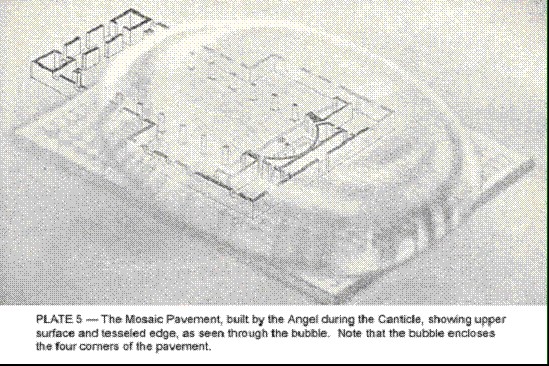

Если церковь полностью заполнена, ангел обычно берёт её план за основу для своего павильона; если она заполнена наполовину, он не обязательно включает всё пространство, но, скорее всего, завершит свой пол сразу за самым дальним участником своего собрания. Вне зависимости от того, насколько далеко он продвинулся на запад от Алтаря, он всегда проводит его одинаково далеко в противоположном направлении за Алтарем, который неизменно обозначает центральную точку завершенной формы. Если хватает материала, он часто расширяет свое здание на север и на юг, в этом случае оно иногда становится крестообразным, хотя чаще квадратным и очень напоминает уже упомянутую форму базилики.

Глубина основания зависит от доступного материала; на хорошо посещаемом Великом Праздновании павильон может быть толщиной до метра, его верхняя поверхность совпадает с полом церкви. Его дизайн всегда одинаков - мозаика из синих и алых блоков, установленных по диагонали, так что они представляют собой вид алмазов. Где на краях видна толщина павильона, он показывает мозаичную границу из чередующихся треугольников тех же цветов, что намекает на то, что блоки, используемые в его конструкции, не кубы, а пирамиды (см. диаграмму 6.) Алый и синий цвета выражают любовь и преданность соответственно, а оттенки меняются в соответствии с характером этих эмоций. Обычно мы получаем глубокие насыщенные цвета; но если собрание включает многих обученных и бескорыстных людей, можно увидеть светящиеся и нежные оттенки лазури и розы.

Ангел первым делом протягивает руки в стороны и изливает через них поток любви, который создает алую линию с каждой стороны от места, где он стоит, до стены церкви. Медленно размахивая руками вперед, он вызывает ряд параллельных линий, которые выстреливают из стороны оригинала, как зубцы расчески, за исключением того, что они наклонены к центру церкви, так что они пересекают друг друга, чтобы создать диагональный узор (см. диаграмму 1.) Еще одно подобное движение выбрасывает синий поток преданности, который заполняет пространства, оставленные багрянцем любви. Затем он поворачивается на восток и повторяет эти движения, чтобы создать аналогичный павильон для той части евхаристической формы, которая находится за пределами церкви.

Эти первые движения создают тонкую паутину в виде шашечки и настоящего привидения пола, настолько легкого и прозрачного, что он не мог бы удерживаться вместе, если бы не пузырь, который оттеснил хаос резких вибраций, которые бы разрушили его нежность. но пол быстро затвердевает, когда стихи песнопения раздаются, и интересно заметить, что, где стихи поются антифонально, Ангел отводит чередующийся всплеск звука и использует его для обозначения диагональных линий, которые вырезают его материал для пола в алмазы, или скорее пирамиды (см. рис. 6.) На Малом Праздновании здание часто бывает небольшим, а окраска павильона блёклой; но узор всегда сохраняется.

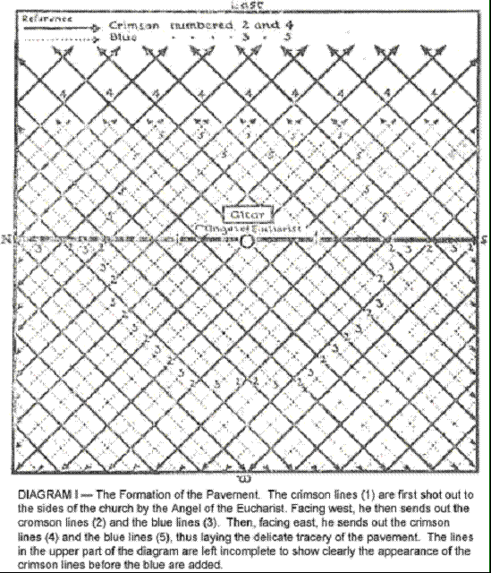

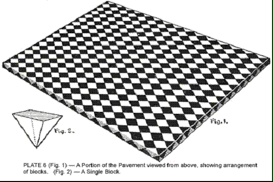

Следует понимать, что Малое Празднование вполне эффективно при вызове божественной силы и её распространении по округе, хотя, естественно, сила на Великом Праздновании во многих отношениях гораздо больше. Церемония окружена славой и красотой, которые призваны возбудить сердца и умы людей, сделав их более восприимчивыми. Кроме того, прихожан обычно гораздо больше - фактор, который имеет большое значение. Освящение и качество излучения, исходящего от священного Хоста, конечно же, одинаковы в каждом случае; но если тех, кто испытывает почтение, больше, количество излучения будет больше, потому что дополнительное количество той божественной силы вызывается этим дополнительным почтением.

Я считаю очень важным осознать, что эта божественная сила - это реальность - определенный, научный факт. Эта духовная сила, которую часто называют благодатью Божьей, так же определенна, как пар или электричество или любая другая из великих сил природы. Она работает в материи, которая немного выше, чем электричество, и её результаты не очевидны для физического глаза, но тем не менее она во всех отношениях так же реальна, и даже гораздо мощнее, так как она работает скорее над душой, разумом, эмоциями человека, чем просто над его физическим телом. Поистине, в этом Святейшем Таинстве Евхаристии она спускается даже до нашего физического уровня - так велика забота нашего Господа о своем народе, так он старается, чтобы мы получили всю помощь, которую мы способны принять.

Её излияние - научно измеримое явление; возможно, не измеримое методами физической плоскости, но доступное измерению и сравнению с другими излияниями в высших мирах. Его распределение происходит по точно таким же божественным законам, как и излучение на этой плоскости, учитывая определенные различия, вызванные более быстрыми колебаниями материи в более высоком состоянии.

Например, воздействие силы, вызванной на церемонии Евхаристии, можно сравнить, не без уместности, с течением электрического тока. При постоянном напряжении тока, проходящего через провод, количество полученного света зависит от количества включенных ламп. Если мы представим, что ток, текущий в проводе, исходит из неисчерпаемого источника и может удовлетворить любые требования к нему, очевидно, что мы свободны добавлять любое количество ламп, и тем самым получим яркое свечение.

В Службе Евхаристии каждый человек, который осознанно сотрудничает, напоминает лампу, и с добавлением каждого такого человека канал для течения тока становится шире и полнее. Небольшое собрание из пятидесяти человек, каждый из которых понимает цель Службы и точно знает, что каждая её часть планируется делать, может отправить столько же света в окружающий район, как большое, но невежественное собрание многих тысяч, собравшихся в каком-нибудь большом соборе. Размер собрания, безусловно, помогает, потому что по мере того, как больше людей отправляют свое почтение, канал становится шире; но когда к почтению добавляется разум и воля к служению, результат гораздо больше.

Когда из собрания поднимается шпиль почтения, его высота и блеск отмечают интенсивность почтения, в то время как его диаметр указывает на количество эмоции. Широкий, но короткий и бочкообразный шпиль, немного тусклый по цвету, показал бы, что большая масса достаточно невежественного почтения была испытана, не искренне, а скорее по привычке. Если люди встревожены действительно глубоким, сильным чувством, большой шпиль ярко-синего цвета мчится вверх над их головами, и в таком случае внизу идущий ответ пропорционален восходящему потоку. Целью Церковной Службы является создание канала, через который может протекать божественная сила. Чем больше количество людей, которые присутствуют, чем больше в них энтузиазма и преданности, тем больше канал для божественной силы. В этом смысле это Служба Богу, потому что, собираясь вместе, мы формируем больший и лучший канал для Его любви и благословения, которые Он всегда стремится пролить на мир.

Мы можем спросить: "Но почему Он не может всегда изливать это Сам по Себе?" Он это делает; но помните, что Он действует, как мы также должны действовать, по линии наименьшего сопротивления. Он наполняет высшие миры духовной силой, но привести эту духовную силу сюда, к нашим физическим мозгам и астральным телам, было бы проявлением силы, которое не оправдало бы результатов, если бы Он должен был делать все это Сам. Но если мы сотрудничаем и делаем нижнюю часть этой работы, делая себя каналами для этого изливания, тогда это действительно становится целесообразным излить эту силу. Люди не обязательно выполняют все обязанности искреннего христианина, просто сидя на своих местах и наслаждаясь подъемом церемонии. Если они хотят, они могут значительно усилить силу Службы и расширить сферу ее влияния.

Мы должны присоединяться к такой организации, как Церковь, не для себя, а ради других. Конечно, верно, что присоединяясь, мы получаем большую пользу, но чем меньше мы думаем о пользе, которую получаем, и чем больше мы думаем о помощи, которую можем оказать, тем лучше для нас и для организации, к которой мы принадлежим. Люди должны приходить на Службу, потому что хотят быть полезными. Те, кто приходит регулярно независимо от погоды и с энтузиазмом участвует в Службе, делают Евхаристию живой силой. Это особенно верно, когда они тщательно изучили ритуал и поэтому могут разумно сотрудничать с тем, кто причащает.

Когда служитель чувствителен и у него за спиной община, которая работает с ним, он обычно может чувствовать, как сила, сгенерированная их мыслями, вихрем взмывает вокруг и за ним, словно сильный ветер. Когда она приходит, она вызывает любопытное электрическое чувство, которое иногда можно заметить, находясь посреди большой толпы, охваченной сильной эмоцией. Однако служитель, как и капитан корабля или дирижер оркестра, и так же, как капитан не должен терять голову, когда его пассажиры охвачены волнением, должен сохранять полный контроль над своими эмоциями, чтобы использовать эту полезную силу, сгенерированную общиной. Он не только должен направлять силы, но и следить за тем, что делают его помощники, чтобы, если кто-то не сделает нужное вовремя, он мог бы немедленно восполнить этот пробел, внедряя дополнительную силу и помогая любым возможным способом.

Опять же, на Великом Праздновании у нас есть почти неоценимое преимущество использования музыки. Мы уже говорили, что упорядоченные вибрации звука оживляют огромные объемы материи, и таким образом предоставляют Ангелу Евхаристии много великолепного материала для его структуры; но за этим стоит гораздо больше, хотя и сложно найти слова для его описания, и это не место для подробного обсуждения такой тайной темы. Давайте скажем, что земля - это великий разум, и что музыка - одна из ее способностей, что, когда мы играем или поем, мы помогаем земле выразить себя; более того, что музыка - это своего рода сущность или совокупность сущностей, и что, когда мы ее используем, мы привлекаем к нашей работе новый набор сил, другую сторону Природы и привлекаем к нашей работе множество великих Музыкальных Ангелов. Мы не можем отвлекаться на подробности здесь; но даже такой небольшой намек даст мимолетный взгляд вдоль могучего пространства - достаточно, чтобы показать, что есть веские причины вводить музыку в наши Службы, когда это возможно и любым образом.

Эти соображения также применимы к _Миссе Кантате_, но на Великом Праздновании у нас в дополнение имеются помощь диакона и субдиакона, которые образуют треугольник с служителем и на время действуют как продолжения его сознания, освобождая его от некоторых аспектов его работы и позволяя сосредоточить свои энергии. Некоторые из используемых сил излучаются через них и усиливаются их присутствием и действием. Их задача - действовать в качестве посредников как в сборе, так и в распределении энергии - задача, которая тем самым выполняется более легко и эффективно (см. диаграмму 2.)

Чтобы прояснить их функцию, мы можем использовать аналогию с человеческим телом. Если сравнивать служителя с мозгом, то диакон и субдиакон являются ганглиями, имеющими под своей зарядкой определенные тракты; мозг, конечно, направляет ганглии, но есть вещи, которые они могут делать без мозга. Изначально, в ранней Церкви, диакон и субдиакон представляли мужчин и женщин соответственно, потому что диакон стоял справа от священника, то есть со стороны епископа, где сидели мужчины, и собирал всю преданность от мужчин и подготавливал ее для использования священника, тогда как субдиакон делал то же самое для женщин. В некоторых церквях полы до сих пор разделяются, но я не знаю, есть ли в этом какое-то особое преимущество, за исключением того, что, если числа вообще равны, это создает приятный эффект в антифональном пении.

Поток преданности, стремления, любви и поклонения от общины обрушивается на священника в потоке разнообразных вибраций, и не так-то просто свести их все к некоему общему знаменателю, чтобы их можно было удобно переслать. Диакон и субдиакон могут получать их от народа, и в большой степени отсеивать и сочетать их по мере прохождения в руки священника, таким образом сэкономив ему много хлопот.

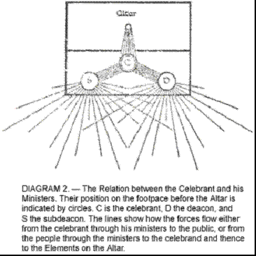

Для сокращенной формы Святой Евхаристии мы выбрали песнопение, которое более прямо относится к работе, которую Ангел выполняет, закладывая основание своего здания. Ему предшествует приглашение от священника, который говорит:

Братья и сестры, давайте теперь заложим основание нашего Храма.

_Антифон._

Христос - наша основа.

И наш главный краеугольный камень.

Мы больше не чужие и пришельцы: но соотечественники святых и домашние у Бога;

И мы строимся на основании апостолов и пророков: Иисус Христос Сам является главным краеугольным камнем:

В Котором вся постройка, грамотно сложенная вместе: растет в святой храм в Господе;

В Котором и вы также строитесь вместе; для обители Бога через Дух.

Если Господь не строит дом: труд строителей напрасен.

Основание Бога стоит надежно, имея свою печать: пусть каждый, кто называет Имя Христа, уходит от беззакония.

_Антифон._

Христос - наша основа.

И наш главный краеугольный камень.

Примечание. Двоеточие посреди каждой строки песнопения обозначает изменение направления чередующихся диагональных токов, которые создают синее и малиновое мозаичное покрытие, на котором должно быть построено наше здание. Так, если во время первой части стиха линии идут между юго-западным и северо-восточным углами, то во время второй половины они текут между юго-восточным и северо-западным. Но во время каждой половины сила могла бы бегать взад и вперед несколько раз - в зависимости от количества ударов в ритмической мере конкретного полустиха. Глория в конце, заканчивает покрытие, подравнивает края и оставляет всё прибранным. Упоминание о Трех Лицах Троицы заставляет три света у каждого входа светиться заново.

#### Versicles

Римская | Либеральная
------- | -----------
V. Наша помощь во имя Господа.                              | P. Наша помощь во Имя Господа.
R. Кто сотворил небо и землю.                               | C. Кто сотворил небо и землю.
_Соответствующие версиклы и ответы следуют за Отпущением._  | P. Обрати нас вновь, Господи, и оживи нас.
0 | C. Чтобы Твой народ мог радоваться Тебе.
0 | P. Доверьтесь Господу навеки.
0 | C. Ибо наша Вечная Скала - это Господь.

Теперь мы переходим к дальнейшему этапу нашей подготовки к великому делу, которое мы собираемся начать. Мы стремились очистить ментальную атмосферу, отгоняя бродячие мысли, и привести себя в состояние силы, мира и радости, которое необходимо, чтобы хорошо выполнить нашу работу. Однако могут остаться и механические трудности; мы должны попытаться устранить и их. Но это можно сделать быстро только при помощи специальной помощи извне, поэтому мы применяем метод, предназначенный Христом для Своей Церкви - метод исповеди и отпущения грехов.

Версиклы, которые вводят эту часть Службы, предназначены для вызова состояния души, которое будет способствовать действию этого плана. Сначала мы признаем, что этот быстрый результат можно достичь только божественной силой (вот где вновь Имя эквивалентно Силе), но мы напоминаем себе, что для всемогущего Творца неба и земли эта быстрая перемена - простая задача. И поэтому мы обозначаем себя знаком креста, чтобы приблизить себя к Нему. Поскольку мы немного отдалились от Него, от состояния полной любви, мира, понимания и единства, и в этом смысле мы ограничены как каналы духовной силы, мы просим в словах: "Обрати нас вновь, Господи, и оживи нас", чтобы Он привел нас обратно на путь правильных усилий, и чтобы Он оживил нас Своей сияющей жизнью. Без этой возобновленной жизни мы не сможем испытать глубокую радость, необходимую для того, чтобы в полной мере воспользоваться жертвоприношением, которое следует далее.

Затем, чтобы подчеркнуть нашу полную уверенность в Его силе и благоволении, мы говорим: "Доверьтесь Господу навеки; ибо наша Вечная Скала - это Господь." Возможность быстрой корректировки зависит от нашего абсолютного убеждения в том, что это можно сделать. Если мы сомневаемся в этом, то само сомнение создает преграду и препятствует свободному действию силы. Божественная сила готова, но мы должны открыть свои сердца. Итак, давайте рассмотрим систему исправления через исповедь и отпущение грехов и увидим, как это работает.

#### Исповедь

Римская | Либеральная
------- | -----------
P. Я исповедуюсь всемогущему Богу, благословенной Марии, всегда девственной, благословенному Михаилу архангелу, благословенному Иоанну Крестителю, святым апостолам Петру и Павлу, всем святым и вам, братья, что я грешен избыточно, в мысли, слове и деле; через мою вину, через мою вину, через мою тяжкую вину. Поэтому я молю благословенную Марию, всегда девственную, благословенного Михаила архангела, благословенного Иоанна Крестителя, святых апостолов Петра и Павла, всех святых и вас, братья, помолиться к Господу нашему Богу за меня. | Все. О Господи, ты создал человека бессмертным и сделал его образом своей вечности: тем не менее, мы часто забываем о славе нашего наследия и отклоняемся от пути, ведущего к праведности. Но ты, Господи, создал нас для себя, и наши сердца всегда неспокойны, пока они не найдут покоя в тебе. Взгляни глазами своей любви на наши многочисленные недостатки и прости все наши промахи, чтобы мы были исполнены светом вечного света и стали неизъянным зеркалом твоей силы и образом твоего блага. Через Христа, нашего Господа. Аминь.
S. Пусть всемогущий Бог помилует тебя, простит тебе твои грехи и приведет тебя к вечной жизни.
S. Я исповедуюсь всемогущему Богу и т.д.
P. Пусть всемогущий Бог и т.д.

Форма, применяемая в Римской церкви, начинается со слова Confiteor, "я исповедуюсь"; отсюда и название. Цель этой исповеди - помочь людям обрести сосредоточенность и привести их в то состояние ума, которое необходимо, если они хотят получить пользу от абсолюции, следующей непосредственно после. Формулировка Confiteor, используемая в ритуале Либеральной католической церкви, в некоторой степени оригинальна и (как можно видеть) значительно отличается по тону от той, которую используют Римская или Англиканская церкви. Римская исповедь: "Я грешил избыточно, в мысли, слове и деле; через мою вину, через мою вину, через мою тяжкую вину"; замечание Англиканской церкви: "В нас нет здоровья," которое, однако, не встречается в Службе Святой Евхаристии, но в Утрене и Вечерне и других подобных утверждениях, являются преувеличениями и не представляют того, что обычный человек действительно чувствует. Ни один вменяемый и разумный человек не чувствует себя полностью злым, и помещать такие слова в его рот либо превращает его в лицемера, либо дает ему абсолютно неверное представление о человеческой природе.

Это постоянное повторение о врожденной злобе человеческого сердца, вероятно, возникло в раннем христианстве как реакция на определенные излишества, которые портили цивилизации, в середине которых эта вера укоренилась. Величайшими из цивилизаций, с которыми новая религия имела дело, были Греция и Египет. Обе они были в высшей степени здравы и разумны. Грек, например, поклонялся красоте и был полон жизнерадостности. Он отлично понимал, что существуют более высокие и более низкие плоскости, небо и земля, но он утверждал, что Бог создал и нижнее, и верхнее, и пока мы на нижнем, Он хочет, чтобы мы извлекли из этого максимум и наслаждаемся жизнью по максимуму, пока мы выполняем свой долг перед Богом и нашими ближними.

Когда эти древние и великолепные цивилизации начали угасать, без сомнения, появились излишества, и в поисках красоты иногда забывали о добре. Эти излишества были противны ранним христианам, и, установив идеал аскетизма, они в своем мышлении склонились к противоположному крайнему и осудили как зло все, что относится к миру и к физической жизни.

Такие преувеличения нездоровы и излишни, как учил еще давно Господь Будда, срединный путь разума всегда самый безопасный, и чрезмерный аскетизм, с одной стороны, так же опасен и неестественнен, как и чрезмерное наслаждение, с другой; и поэтому мы тщательно избегали в формулировках признания любых утверждений, которые мы не могли бы честно подписать. Мы использовали слова святого Августина, который сказал, что Бог создал нас для Себя, и наши сердца поэтому всегда беспокойны, пока не найдут покоя в Нем. Когда мы отклоняемся от того, что знаем как правильное, как мы все более или менее делаем из-за небрежности или забывчивости, мы чувствуем себя некомфортно, пока не исправим ситуацию, потому что знаем, что сделали ошибку. Мы всегда несчастны, когда уходим с пути, даже если не осознаем причину нашего несчастья.

Мы говорим, что Он создал человека по Своему образу — образу Своей вечности, прекрасная мысль, взятая из _Мудрости Соломона_ (ii, 23). Поскольку мы таким образом являемся воспроизведением Его, мы всегда должны быть близки к Нему, в полном свете Его мощи и Его любви; но из-за нашего невежества и ошибки мы отдаляем себя от Него. Цель признания состоит в том, чтобы устранить ментальное отношение, которое удаляет нас, и заменить его на открытое и восприимчивое состояние всего человека, чтобы свет Божий мог войти. Исповедь не напрямую влияет на евхаристическое здание, которое мы строим, хотя это важный фактор в подготовке нас к его строительству. Давайте посмотрим, как абсолюция, следующая за ним, достигает своих результатов.

Примечание: Здесь впервые община говорит вместе со священником, поэтому, возможно, здесь уместно указать на то, что во всей Службе, когда все так присоединяются, ни один человек не должен поднимать свой голос выше голоса совершающего службу священника таким образом, чтобы попытаться изменить скорость, акцент или интонацию, с которой произносится часть Службы. Помимо приемлемости этого, есть очень важная причина для этого. Материал, из которого мы строим нашу форму, просто материя, оживленная вибрациями эмоций людей и ответным излиянием на них. Таким образом, ритм и движение целого, которые гармонизирует Ангел, являются сущностью его существования — первым условием для формы вообще. Сейчас священник, находясь в центре на физической плоскости, гармонизирует эти вибрации и объединяет их в одно, давая им определенный тон. Будучи этим центром на физической плоскости, он лучше всего ощущает ритм, подходящий для определенного дня календаря и собора, с которым он работает, и затем интерпретирует его в терминах своих собственных, с которыми будет сотрудничать ангел. Таким образом, священник и Ангел будут работать вместе, устанавливая сильную регулярную вибрацию, с помощью которой может быть построено наше здание. Но если будут все виды внешних воздействий, устанавливающих собственные биения, которые звучат выше центрального, возникнет неприятное смешение перекрестных токов, которые нейтрализуют друг друга, оставив мало ритма для оживления нашего строительного материала. Должен быть лидер, и священник должен быть этим лидером.

Мы видим, что в течение первых двух предложений исповеди происходит прекрасное излияние очень тонко окрашенного и духовного влияния на людей. По мере продолжения Исповеди, это влияние проникает в них и помогает привести их в требуемое состояние, которое является умом, твердо настроенным на стремление к более высокому идеалу. Под действием этого, их любовь взмывает к Воплощению всех истинных идеалов, и таким образом делает их готовыми к отпущению грехов.

#### Отпущение

Священник встает, подходит к Алтарю, поворачивается к людям и произносит отпущение.

Римская | Либеральная
------- | -----------
Да подарит нам всемогущий и милосердный Господь прощение, отпущение и освобождение от наших грехов. Ответ: Аминь. | Бог Отец, Бог Сын, Бог Святой Дух, благословляют, сохраняют и освящают вас: Господь в своей любви смотрит на вас и милосердствует к вам: Господь освобождает вас от всех ваших грехов, и дарует вам благодать и утешение Святого Духа. Ответ: Аминь.
0 | _Соответствующие стихи и ответы предшествуют Исповеди._
В. Ты, Боже, обратишься и оживишь нас. |
О: И народ твой возрадуется в тебе. |
В. Покажи нам, Господи, твое милосердие. |
О: И даруй нам твое спасение. |
В. Господи, услышь мою молитву. |
О: И да придет к тебе мой вопль. |
0 |  _Соответствующее Малое Благословение предшествует Вступлению._
В. Да будет с вами Господь. |
О: И с твоим духом. |
П. Забери у нас наши беззакония, мы умоляем тебя, Господи, чтобы мы были достойны войти с чистыми умами в Святую Святых. Через Христа, нашего Господа. Аминь. |
Мы умоляем тебя, Господи, по заслугам святых, чьи реликвии здесь, и всех святых, чтобы ты удостоил простить мне все мои грехи. Аминь. |

Чтобы понять действие отпущения грехов, нам сначала нужно объяснить, что идеи, обычно ассоциируемые с прощением греха, совершенно неверны и вводят в заблуждение. Общепринятое представление заключается в том, что Бог, создавший человека и, следовательно, знающий его возможности и то, что он, вероятно, сделает в любых обстоятельствах, тем не менее отворачивается от него и возмущается им, когда он делает то, что расчет средних показателей заставляет ожидать от обычного человека. Это та же путаница, которая постоянно сталкивается с искателем христианства. Если бы христиане отказались от первобытного еврейского представления о завистливом и мстительном племенном божестве и приняли учение их лидера, Христа, большинство этих недопониманий немедленно исчезли бы.

Я совершенно уверен, что многие размышляющие христиане гораздо лучше своего кредо и на самом деле в своем сердце не держат такого низкого мнения о Божестве, как это может показаться из их слов. В высказывании покойного полковника Ингерсолла есть много правды: "человек создает своего Бога по своему образу"; по мере того как человек развивается, его представление о Боге становится более истинным и благородным; по мере того как он постепенно отказывается от своих грубых пороков, он перестает приписывать их своему Богу и смотрит на дикое табу-этику своих предков как на грубое и богохульное. Я предполагаю, что мы можем признать, что теория, согласно которой Бог злится, когда человек ошибается, что Ему нужно умиротворить и умолить прощения, является грубым и материалистическим способом изложения определенного закона природы; но она подвергается очень серьезному возражению, что она дает человеку совершенно неправильное и унижающее представление о Боге, и делает невозможным для него принятие того единственного отношения к своему Богу, которое делает его прогресс практичным.

Никто в здравом уме не предположит, что Бог питает враждебность к Своему народу. Всю идею о том, что человеку, поступившему неправильно, нужно прощение, следует полностью выкинуть из нашего сознания, потому что утверждение, что Бог должен простить человека, подразумевает, что если бы он не был прощен, Бог бы затаил на него обиду. Никто не имеет права говорить такое о Божественном Отце. Бог ни на кого не злится. Напротив, Он всегда готов помочь, так же как и солнце всегда светит. Солнце не злится на нас, когда проходящее облако закрывает его свет и тепло. Солнечный свет всегда есть, и все, что нам нужно сделать, это подождать прохождения облака.

Бог, который подвесил нашу солнечную систему в пространстве и влил в нее Свою жизнь, чтобы мы и Его другие существа могли возникнуть, руководит развитием этого грандиозного Эксперимента с благожелательным, отцовским интересом. Он знает о нас гораздо больше, чем мы можем знать о себе; Он понимает нашу силу и нашу слабость, и Он не может злиться на нас больше, чем мы можем злиться на цветок в нашем саду. Но Он следит за нашим ростом и оставляет нам на пути различные помощи; возможно, Ему нравится, когда мы понимаем и используем их, но даже если мы этого не делаем, поддержка Его помощи никогда не далеко от нас, иначе мы быстро перестали бы существовать.

Внимание Бога поддерживает Его систему в существовании; если бы Он на один миг отвлекся, она мгновенно рассеялась бы на пузырьки, из которых она и состоит. И это внимание проявляется здесь, на низших уровнях, как сила, или скорее как ряд сил. Трудно перевести эти концепции в слова, не впадая в отчаяние от их материализации; однако лучше их переоценить, чем совсем не ведать их красоты и величия.

Давайте попробуем прояснить, что на самом деле происходит, когда человек совершает то, что обычно называют грехом. Грех - это все, что противоречит течению эволюции. Если человек намеренно делает что-то, что задерживает эволюцию, будь то его собственную или чужую, то он определенно делает что-то неправильное. Но я сомневаюсь, что человек когда-либо делает зло ради зла, кроме, возможно, очень редких случаев, как нацистские зверства, многие из которых были совершены преднамеренно, холоднокровно и по приказу, с явной целью запугать мирное население жестокостью.

Обычно то, что называют грехом, возникает из одной из двух вещей: либо человек невежественен и допускает ошибки, либо он беззаботен и эгоистичен, не достаточно внимателен к последствиям своих поступков. Если бы человек действительно полностью понял, что он делает, когда грешит, он бы этого не сделал. Многие злодеяния исходят из алчности, из желания денег. Это потому, что скряги не знают лучше; для них деньги важнее всего. Огромное количество вреда приходит от животных страстей. Опять же, сенсуалисты невежественны и эгоистичны, они на самом деле не понимают, какой вред они наносят другим и себе. Способ избавиться от зла - это увеличить мудрость, как проповедовал Господь Будда в Индии две с половиной тысячи лет назад.

Давайте примем, что грех или проступок - это любая мысль, слово или деяние, которые не согласуются с Божьей волей по отношению к человеку, то есть эволюцией. Вместо прогрессии это проступок, не движение вперед с эволюционной силой, а через линию его потока. Эта божественная воля действует как постоянное давление вверх и вперед и действительно создает в более высокой материи (даже до эфирного уровня) некий напряжение, которое можно описать словами только как тенденцию к движению в определенном направлении - течение духовного потока. Когда мысли, слова и действия человека хороши, он более полно открывается для этого влияния; он проникнут им и несется с ним.

Когда он делает или думает зло, он отрывает себя от направления этого духовного потока и тем самым создает определенное напряжение в эфирной, астральной и умственной материи, так что он больше не в гармонии с природой, больше не помогает, а мешает, становится препятствием в реке жизни. Это напряжение, или крестообразное скручивание, почти полностью останавливает его прогресс на время и делает невозможным для него извлечь пользу из всех импульсов доброго влияния, которые постоянно мчатся вдоль течения потока, о котором мы говорили. Прежде чем он сможет сделать что-то действительно хорошее для себя или кого-то другого, он должен исправить это искажение и вступить в гармонию с природой, и таким образом, снова быть полностью открытым для доброго влияния и способным воспользоваться многими и ценными помощниками, которые так щедро предоставляются для него.

Различные транспортные средства человека на самом деле не разделены в пространстве, потому что более тонкие виды материи всегда проникают в более грубые. Но смотря снизу, они создают впечатление, что находятся одно над другим, и также что они связаны множеством тонких проводов или линий огня. Каждое действие, которое работает против эволюции, накладывает неравномерное напряжение на эти - скручивает и запутывает их. Когда человек серьезно ошибается в любом отношении, путаница становится такой, что связь между верхними и нижними телами серьезно затруднена; он больше не является своим истинным Я, и только низшая сторона его характера способна полностью проявить себя.

Нужно ясно понимать, что в долгом, медленном ходе эволюции природные силы вполне способны исправить это несчастное состояние дел. Постоянное давление течения со временем износит преграду, но может пройти много месяцев или даже лет, прежде чем адаптация будет полностью осуществлена, хотя усердные усилия со стороны человека могут немного сократить этот период. Но даже тогда есть определенная тенденция к возвращению искажения.

Поэтому очевидно, что в интересах человека отыскать более быстрый способ восстановления равномерности. Такой метод предлагает Церковь, так как способность исправлять эту путаницу в более высокой материи - это одно из тех особенных даров, которые наделяют священника при посвящении. Сам Христос говорил об этой власти самыми ясными словами, хотя люди обычно уклоняются от них или пытаются их объяснить, просто потому что они озадачивают свои умы идеей эмоционального прощения и не могут понять, что нам нужно иметь дело с прямолинейным научным процессом.

Но священник не может совершить это чудесное исцеление в одиночку; ему нужно сотрудничество его пациента. Никто не может заставить человека быть в гармонии, если он настойчиво стремится к дисгармонии; это происходит только "Если мы исповедуем наши грехи", что "Он верен и справедлив, чтобы прощать нам наши грехи и очищать нас от всякой несправедливости". Требуется, чтобы кандидат стремился подняться над недостатками своей природы и жить высшей жизнью. На всех ее главных Службах, Церковь предлагает форму общего исповедания, которую должны произнести ее люди, и форму абсолюции, которую должен произнести священник; и если кто-нибудь в собрании действительно сожалеет о какой-то ошибке или промахе, который он совершил, и искренне желает снова полностью согласовать с эволюционным течением, нет сомнений, что божественная сила, которая течет через священника, когда он произносит абсолюцию, проникает через высшие тела этого человека, расчесывает запутанность и выпрямляет искаженные линии, пока он снова не станет в полной гармонии с волей Божьей.

Священник изливает абсолютивную силу над своим собранием и не знает, на кого или в каком направлении она действует; но если индивид приходит к нему лично и точно говорит ему, что не так, у него, возможно, есть определенное преимущество в том, чтобы сконцентрировать всю силу там, где она наиболее нужна. Кроме того, вне зависимости от власти, предоставленной ему, священник часто может на основании своего опыта дать очень полезные советы.

Но никто не должен думать, что общее абсолютивное прощение, данное всему собранию, в чем-то уступает частному прощению, если желание исправления со стороны грешника одинаково искренне и серьезно. Как уже было сказано, со временем искажение должно исправиться под влиянием обычных эволюционных сил; и нет сомнений, что этот процесс будет ускорен сильным желанием пациента на перестройку. Действие священника в этом вопросе - это просто то, что обычно называют "средством благодати" - то есть небольшой помощью на пути эволюции, предоставленной Христом для Своих последователей.

В Либеральной Католической Церкви ушная исповедь полностью опциональна и не требуется как предварительное условие для приема Святой Евхаристии. Частая и систематическая практика не поощряется, поскольку считается, что при таких условиях подробная исповедь склонна становиться рутиной, и ее духовная ценность в жизни индивидуума тем самым уничтожается. Для всех обычных целей общая исповедь в Святой Евхаристии должна быть достаточной.

Должно быть четко понятно, что эффект абсолюции строго ограничен исправлением описанного выше искажения. Он открывает определенные каналы, которые были в значительной степени закрыты злыми мыслями или действиями; но это никак не противодействует физическим последствиям этого действия, ни не устраняет необходимость восстановления, где было сделано зло.

Человек, который крадет, например, оказывается в неправде тремя отдельными способами: он нарушил божественный закон любви и справедливости, тем самым отрезав себя от полного и свободного общения с высшей стороной природы; он нарушил законы своей страны; и он обидел индивида, у которого он украл. Если он полностью осознает ошибку, которую совершил, и искренне стремится ее исправить, абсолюция священника выправит для него эфирное, астральное и умственное запутывание, которое было вызвано его действием, или скорее умственным отношением, которое сделало это действие возможным; но это не освобождает его от юридического наказания за это действие, ни от обязанности немедленно и полностью возвращать то, что он украл.

Опьянение - искушение для людей на низкой стадии развития; тот, кто поддается ему, несомненно, очень нуждается в помощи абсолюции, чтобы устранить преграды, которые он поставил между собой и светом Божьей благодати; но, уступая, он также ослабил свою волю и повредил свое физическое здоровье, и он не должен ожидать, что абсолюция укрепит первое или восстановит второе. Священнодействие возвращает человека в согласие с Богом; но это не освобождает его от ответственности за свои поступки, ни в коей мере не влияет на их физические последствия.

Это духовный процесс, освобождение от рабства греха, процесс воссоединения с Высшим Я, восстановление внутренней гармонии бытия, которое нарушено неправильным поступком, чтобы человек мог сделать свежую попытку к праведности, укрепленный непрерывным потоком божественной силы внутри него. Человек не может избежать последствий своих злодеяний, хотя он может нейтрализовать их, засеяв свежие причины праведного рода. "Не обманывайтесь; Бога не обдурить: ибо что посеет человек, то и пожнет."

Примечание: Когда пастырь делает первый крест, благословение Господа, которое в какой-то мере вливается в них, приводит все их тела в порядок и улаживает вещи в личности. Когда он произносит слова "пусть Господь в своей любящей доброте посмотрит на вас и окажет вам благодать", священник работает на уровне, где Господь смотрит на нас как на единство - будхический уровень - где мы получаем Его благосклонность в такой щедрой мере. Здесь пастырь един с своим приходом, и на этом высоком уровне, попытавшись поднять всех их в себя, он изливает поток силы в их низшие транспортные средства, которые принимают образ их высших Я (уже сделанных более яркими и более верными отражениями Великого Я благодаря излиянию в Confiteor и при первом благословении в абсолюции) и, через их точки входа, ставит это на личность, тем самым не только влияя на эту личность, но и очищая канал, соединяющий его с Большим Я. Сила Бога стимулирует Божественный Образ в каждом из нас, чтобы произвести более определенное впечатление на личность, и, насаждая себя, она очищает любые скрученности в соединительном канале между нижними и высшими я - между индивидом и Богом. Так жизнь Логоса - эволюционный поток - снова может свободно течь через человека. Он больше не препятствие в потоке, потому что он был исправлен в своем отношении к своему Создателю.

Это замечательная помощь, но помните, что абсолюция не идет дальше этого. Не стоит употреблять выражение, что человек прощен или помилован, потому что Бог никогда не находится в таком отношении к нам, чтобы мы могли говорить о необходимости его изменить от обиды к прощению. Он сделал нас такими, какие мы есть, и Он не злится на нас, потому что мы все еще находимся на низших стадиях нашей эволюции. Говорить о Его гневе - это очень грубое недоразумение; в самом деле, такое предположение на самом деле является богохульством.

Лучше это выразить так, что, так как мы перевесили чашу весов в одну сторону, она вновь вернется, и мы должны нести последствия нашего поступка. Абсолюция не может отрицать закон причины и следствия. Что она может и действительно делает, так это разрешает для нас путаницу и дает нам силу, которую мы можем использовать, чтобы продолжить и делать лучше, тем самым запуская другие причины для добра, которые могут нейтрализовать или смягчить результат наших злодеяний. Это единственный вид раскаяния, который имеет какое-либо значение; угрызения совести и раскаяние на самом деле сами по себе являются лишь дополнительным проступком и часто являются оправданием для того, чтобы мы полностью обратили наши мысли на себя в убеждении, что мы делаем это для высших целей. Таким образом, мы тратим энергию, которую следовало бы тратить на Его службу, и часто вредим людям вокруг нас; ибо вибрации, которые мы отправляем в этом состоянии, очень вероятно, вызовут депрессию, эгоизм и раздражительность у других. У никого нет права это делать; на самом деле это антисоциальная форма самоудовлетворения и, следовательно, сама по себе грех.

#### Окадывание Алтаря

Далее следует прекрасная церемония освящения кадильницы перед Алтарем, которая требует некоторых объяснений. Она досталась нам из ранних дней Церкви и упоминается самим Оригеном. Использование благовония полно смысла. Оно одновременно символическое, почитательное и очищающее. Оно восходит перед Богом, как символ молитв и преданности народа; но также распространяется по церкви как символ сладкого благоухания благословения Бога. Это предложено в знак уважения, как это было во многих старых религиях; но оно также используется с явной идеей очищения, и поэтому священник вливает в него святое влияние с намерением, что, где бы ни проник его аромат, где бы ни прошла самая маленькая частица того, что было освящено, она должна нести с собой чувство мира и чистоты и прогонять все негармоничные мысли и чувства.

Даже вне благословения его влияние положительно, потому что оно тщательно смешивается из определенных смол, скорость колебаний которых идеально гармонирует со духовными и религиозными вибрациями, но явно противостоит почти всем остальным. Магнитизация может лишь усилить его естественные характеристики или добавить к нему другие специальные колебания, но в любом случае его использование в связи с религиозными церемониями всегда желательно. Аромат сандала имеет многие из тех же свойств; и аромат чистого аттара роз, хотя совершенно иной по характеру, также оказывает хорошее воздействие.

Известно более сотни разновидностей благовоний, и каждый из используемых ингредиентов оказывает свое особое влияние на высшие тела человека. Существует наука об ароматах, и злые силы, так же как и добрые, могут быть вызваны такими средствами. Почти все благовония, приготовленные для использования в церкви, содержат большую долю бензоина и олибана, поскольку опыт показал, что они оба приятны и эффективны. Бензоин почти жестоко аскетичен и очищает; он решительно борется со всеми грубыми формами нечистой мысли и прекрасно подходит для использования в большом соборе, заполненном несколько неразвитыми индивидами. Для меньших собраний менее примитивных умов ему требуется большое количество других элементов для достижения наилучших результатов. Олибан - это особое благовоние преданности; его аромат сильно стремится пробудить это чувство у всех, кто способен на него, и углубить и усилить его, где оно уже существует. Благоразумное смешивание этих двух смол оказывается удовлетворительным на практике, поэтому оно часто используется в качестве основы или центрального запаса, к которому могут быть добавлены другие менее важные ароматизаторы.

Когда подходят тот, кто держит кадильницу, и тот, кто несет лодочку, служитель выложивает некоторое количество благовония в кадильницу и торжественно благословляет его, говоря: "Будь ты благословен Тем, в честь Кого ты будешь сожжен". Если присутствует епископ, лучше, чтобы он благословил его, так как он может внести в него немного дополнительной силы, которая не подвластна священнику. Благословляя благовоние, лучше всего иметь в виду намерение очистить путь, пронзить все, с чем оно придет в контакт, и поляризовать все. Мысль, которую я сам имею в виду, благословляя благовоние, состоит в том, чтобы оно "прямо проложило путь Господу".

Был задан вопрос, нельзя ли заранее благословить всю ладанную смесь, вместо того чтобы благословлять только ту часть, которую используют для наполнения кадила. Это было бы не так эффективно, потому что ладан не сохраняет полного магнетизма на неопределенный срок, как это делает драгоценный камень. Лучше благословить каждый раз ту порцию ладана, которая только что была помещена на горящие угли, таким образом магнетизм впечатляется в него в момент его плавления, когда он может проникнуть наиболее глубоко, и таким образом достигается наилучший эффект.

После этого служитель переходит к окадыванию Алтаря. Таким образом он стремится проникнуть весь Алтарь и атмосферу вокруг него высоким и священным влиянием, и перенести на высшие планы подготовительный процесс, который уже был выполнен для эфиричного уровня во время Asperges. Алтарь станет центром огромного излучения, и необходимо так подготовить его, чтобы он не истощал силы, которые он должен передать. Если бы его не окадывали, определенная часть силы, которая приходит во время Священнодействия, была бы потрачена на упорядочивание частиц Алтаря для этой передачи, чтобы сила могла быть правильно распределена. План окадывания Алтаря хорош, поскольку он распространяет магнетизм очень полно и точно через сам Алтарь и везде на нем.

Средняя линия Алтаря, на которой расположены Хостия и Крест, - это направление, по которому будет течь сила Священнодействия, и поэтому прежде всего необходимо окадить и очистить ее.

Мы приняли с небольшими изменениями римский порядок окадывания, но мы делаем девять махов к кресту, сгруппированных по три, что лучше подходит для этой цели, чем три двойных маха римской церкви. В этом действии мы оказываем наивысшую почесть в нашей власти всему, что символизирует крест - самому Христу и великой Жертве, которая породила вселенную. Также это девятикратное махание имеет особое и прекрасное значение, потому что оно символизирует предложение Троице Бога трехкратного человека, которого Он создал по Своему образу; это показывает, что мы посвящаем "себя, наши души и тела" (как это говорится в христианской фразе, что ученики называют Монадой, эго и личностью) каждому Лицу Благословенной Троицы по очереди. Когда Священник выполняет это действие, каждый член общины должен умственно создать такую полную преданность, тем самым пробуждая в себе все, что еще может быть пробуждено в каждом из этих отделов, и подготавливая себя к участию в Kyrie позже. Когда Священник берет кадило у диакона, он поворачивается и преклоняется, говоря про себя: "Отец, я посвящаю (как он машет кадилом три раза) (1) дух, (2) душу, (3) тело"; затем следует мгновенная пауза, и в этой паузе перед вторым набором махов он говорит себе: "Сыну, я посвящаю (как он делает три маха) дух, душу, тело"; и затем, когда он делает паузу перед третьим набором махов, он говорит про себя: "Святому Духу, я посвящаю (как он делает махи) дух, душу, тело". Затем он преклоняется и обращается к свечникам на южной или Epistle стороне Алтаря и окадывает каждый из них одним махом кадила (см. диаграмму 8), что магнетизирует каждую свечу, а также ту часть поверхности Алтаря, которую охватывает мах кадила. Выполняя это, священник должен обдумать каждый из семи Лучей, которые представлены шестью свечами и крестом — или, возможно, более точно, светом перед крестом, который можно рассматривать как своего рода его продолжение.

Поскольку это религия Христа, главы второго Луча, и латинский крест является его особенным символом, Алтарный крест представляет для нас второй Луч, и, качая кадило в его сторону, мы поклоняемся Святой Троице "через Христа Господа нашего", как мы так часто говорим в своих молитвах. Первая свеча, которую окуривают (ближайшая к кресту с южной стороны), представляет первый Луч; следующая представляет четвертый, а наружная свеча пятый Луч. С стороны Евангелия свеча, ближайшая к кресту, обозначает седьмой Луч (тот, который сейчас становится доминирующим в мире), следующая представляет третий, а последняя - шестой Луч. Распределение свечей по этим конкретным Лучам соответствует расположению драгоценных камней в камне алтаря, которое объясняется в Главе III, и связь между ними будет очевидна из Диаграммы 8.

Окуривая каждую свечу, священник должен думать о Луче, с которым она связана, принося поклонение Богу по этой конкретной линии, и люди также должны держать в уме ту же мысль, насколько они способны. Это означает что-то вроде двойной мысли — решения попытаться развить в себе качество, специально принадлежащее этому Лучу, и в то же время посвятить службе Богу все, что у нас есть из этого качества. Для нашей текущей цели характеристики Лучей и желания, которые мы должны предложить, можно выразить следующим образом:

_ | _
----- | -----
Сила | "Я буду сильным, смелым, упорным в Его служении."
Мудрость | "Я достигну той интуитивной мудрости, которую можно развить только через совершенную любовь."
Адаптивность или Такт | "Я постараюсь обрести способность говорить и делать именно то, что нужно, в нужный момент — встретить каждого человека на его уровне, чтобы эффективнее помочь ему."
Красота и Гармония | "Насколько это возможно, я привнесу красоту и гармонию в свою жизнь и окружение, чтобы они были более достойны Его; я научусь видеть красоту во всей Природе, чтобы так я мог служить Ему лучше."
Наука (детальное знание) | "Я получу знания и точность, чтобы посвятить их Его работе."
Преданность | "Я разовью в себе могущественную силу преданности, чтобы через неё привести других к Нему."
Упорядоченная служба (церемония, призывающая ангельскую помощь) | "Я так упорядочу и распределю свою службу Богу по линиям, которые Он предписал, чтобы я мог полностью использовать любящую помощь, которую Его святые Ангелы всегда готовы оказать."

Очевидно, что невозможно обдумать все это за время одного качания кадила, поэтому может быть предложено, что когда священник кланяется после окуривания креста, он должен сказать себе: "для Его службы я раскрою в себе" (пока он окуривает свечи в порядке) "(1) Силу, (4) Гармонию, (5) Знание."

Затем он окадывает южный угол Алтаря, как снизу, так и сверху (см. диаграмму 3), и, делая это, должен убедиться, что он достигает его и со стороны. Во время этой и следующей операции он твердо держит в уме мысль: "Пусть Его сила создаст надежный щит для Его благодати." Затем край и верх Алтаря окадываются, включая все вазы, стоящие на нем. Когда он преклоняет колено, достигая средней точки, он снова думает: "ради Его службы я раскрою в себе" (когда он окадывает свечи) "(7) Порядок, (3) Такт, (6) Преданность." Затем, когда он обращается к северному или Евангельскому углу, краю и верху таким же образом, он возвращается к предыдущей идее создания такого сильного вихря силы, что ничто не может помешать ему, используя те же слова, что и на южной стороне, и удерживая эту мысль, когда он окадывает нижнюю часть Алтаря с обеих сторон. Когда есть только две свечи, как на частных празднованиях, священник должен окадить каждую свечу три раза, удерживая те же мысли, как указано выше.

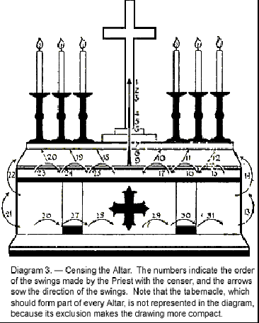

Таким образом, весь Алтарь окружен оболочкой мощного магнетизма, которая производит эффект на его материал, и на объекты на нем, который не отличается от магнетизации железного стержня. Той же действием блок эфира вокруг Алтаря отделяется от остального; он не присоединяется на время к общему эфирному обращению; будучи особенно поляризованным, он остается как вихрь - все еще эластичное тело, хотя и отделено на время в окрестностях Алтаря, пока на втором окадывании он не расширяется еще больше. Если мы думаем о Хосте как о одном полюсе магнита (другой полюс которого - это Христос), то этот эфирный вихрь - это магнитное поле вокруг него. Так же как пространство внутри евхаристического сооружения на время отгорожено от внешнего мира, так и магнитное поле вокруг Алтаря временно отгорожено от церкви в свою очередь - Святая святых внутри Храма. Чтобы изменить метафору - если церковь, или, скорее, евхаристическое сооружение, изображается как энергетическая станция, то эфирный вихрь вокруг Алтаря - это генератор, а священнослужитель - инженер, отвечающий за его обслуживание. В знак того, что он так отделен и связан с этим внутренним святилищем, он, и только он, также окадывается на этом этапе.

Здесь мы сталкиваемся с еще одним из многих преимуществ Великого празднования перед обычным Малым празднованием. Легко понять, что желательно оставить это магнитное поле исключительно для приема и хранения силы свыше, и иметь в нем как можно меньше какого-либо другого действия, кроме того, что происходит в нем. Дело священника, который обязательно находится внутри зарезервированной зоны, принять вклады силы, генерируемые преданностью и благодарностью его народа, и ускорить их путь вверх. но они очень разнообразны по качеству и силе, и им нужно гармонизировать, координировать, очищать, часто даже в значительной степени трансмутировать, прежде чем он сможет использовать их наилучшим образом, и приварить их в такой поток, который вызовет каждую унцию силы, которую они могут привлечь из необъятного божественного хранилища.

Рассматривая множество преимуществ, которые мы получаем от использования благовоний, мы не должны забывать о помощи специальных порядков Ангелов и духов природы, которые действуют посредством их. Ангелы благовоний относятся к двум совершенно различным типам — нам их трудно будет понять, за исключением тех, кто уделил много времени изучению подобных вопросов. Такие исследователи знают, что существуют Ангелы Музыки — великие существа, которые выражают себя в музыке так же, как мы выражаем себя в словах — для которых арпеджио — это приветствие, фуга — разговор, оратория — речь. Существуют Ангелы Цвета, которые выражают себя калейдоскопическими изменениями светящихся оттенков, мерцаниями и вспышками радужного света. Также есть Ангелы, которые живут в и выражают себя тем, что для нас являются ароматами и запахами — хотя использование таких слов кажется унижающим, как будто материализующим изысканные излучения, в которых они так радостно погружаются. Подразделение этого типа включает Ангелов благовоний, которые привлекаются его вибрациями и находят удовольствие в использовании его возможностей.

Также есть другой вид, которому менее подходит название "Ангел". Они также изящны и красивы по-своему, но на самом деле они принадлежат к царству эльфов или духов природы. Внешне они напоминают детей-ангелов Тициана или Микеланджело, за исключением того, что у них нет крыльев. Они не выражают себя посредством ароматов, но они живут благодаря и на таких излучениях, и поэтому всегда находятся там, где распространяется аромат. Среди них много разновидностей, некоторые питаются грубыми и отвратительными запахами, а другие только теми, которые деликатны и изысканы. Среди них есть несколько типов, которые особенно привлекаются запахом благовоний, и они всегда находятся там, где его сжигают. Когда мы окуриваем Алтарь и тем самым создаем магнитное поле, мы заключаем в нем ряд этих прекрасных маленьких эльфов, и они поглощают много энергии, которая накапливается там, и становятся ценными агентами в его распределении в нужное время.

Благовония полезны для нашей Службы таким множеством различных способов, что очень желательно использовать их замечательные свойства всякий раз, когда это возможно. Если можно, каждый священник должен хранить маленький кадильник в своей личной молельне и использовать его в своем ежедневном Праздновании. Маронитская церковь горы Ливан всегда использует благовония как на Малом, так и на Великом Праздновании, и мы из Либеральной Католической Церкви следуем ее примеру в этом вопросе по возможности.

Замечание: Помимо почётного и очищающего применения, курение имеет огромное значение в том, что оно вызывает силы Лучей через их представительные свечи, когда каждая по очереди окуривается. Рассмотрим цвета различных излияний. Мы не утверждаем, что это цвета Лучей, поскольку для установления этого с какой-либо уверенностью потребовался бы очень компетентный ясновидящий. Сложности на этом пути велики по разным причинам. Возможно, каждый Луч имеет фундаментальный цвет, который можно приписать ему, но он скрыт под многими другими. Вероятно, есть некоторое расположение, при котором они соответствуют цветам спектра, и они, вероятно, меняют свои цвета в соответствии с потребностями мира в данный момент, которые зависят от циклических изменений.

Есть много других соображений, каждое из которых оказывает свое влияние; это как настройка многокольцевого замка для писем; если бы мы однажды поняли Слово — регулирующий Принцип — мы, вероятно, обнаружили бы, что это достаточно ясно, но с нашей сегодняшней позиции, не зная этого Слова и видя только запутанное огромное количество возможных соображений, это вызывает только замешательство. Однако, мы можем указать цвета, излучаемые при курении, не затрагивая вопрос о абсолютных цветах Лучей.

С первым тройным взмахом к центральному кресту и картине, мы видим прекрасный поток белого цвета, который распространяется по всему Алтарю. Это также стимулирует драгоценные камни в камне Алтаря к активной деятельности, так что они участвуют в этом белом излиянии. Возможно, только алмаз, драгоценный камень первого Луча, излучает этот цвет, но я склонен думать, что это результат сочетания цветов всех Лучей, которые, подобно цветам спектра, могут быть объединены в чистый белый цвет. Это отличается от ослепительного и настойчиво позитивного излучения первого Луча; это простая белизна, которая не поражает, как молния, но излучает, как молоко, и светится мягким светом, который, тем не менее, очень тверд. Я уверен, что именно с намерением имитировать это были даны указания, что на Алтаре должна быть разложена "чистая льняная скатерть". Следующие три взмаха вызывают аналогичное излияние голубого цвета от Христа; и последний набор приносит красный цвет Святого Духа. Взмах к свече первого Луча вызывает мощный струйный поток силы, который стремительно спускается по свече и выходит на Алтарь, распространяясь в форме буквы V. В то же время это вызывает большую активность в драгоценном камне первого Луча Алтарного камня, который разливает материал того же цвета по всему Алтарю. Поток от свечи обильно продолжается в течение нескольких мгновений, а затем цвет скрывается под белизной "чистой льняной скатерти". Однако, несмотря на это, некоторое количество остается видимым сквозь этот белый материал, но кажется, что то, что просачивается, принадлежит к высокой октаве цвета, так оно изящно и утонченно.

Цвета, которые спускаются по каждой из свечей, имеют несколько слоев. У первого Луча есть тонкая линия ярко-золотого цвета, которая окружена замечательным и блестящим серебристо-электрическим голубым цветом, который так часто виден в связи с этим Лучом. Поверхность этого излияния покрыта серебристыми искрами, которые оно постоянно выпускает с шипением. Многие из них издают почти трескучий звук, когда поток достигает края Алтаря и падает с Алтаря, окрашенного этими замечательными цветами, как они светятся под белизной покрывала Алтаря. Все излияния из других пяти свечей происходят точно так же, за исключением того, что их цвета отличаются, и из-за их относительного расположения их дорожки в форме буквы V также немного отличаются.

Следующий мах кадила направлен к свечам четвертого Луча. Его ядро обладает своеобразным непередаваемым цветом, который наиболее близок к прозрачно-розовому маджента — яркому цвету, но с очень тонким оттенком раковины. Сам розовый цвет плавно переходит в опалесцентный аквамариновый ореол. Основа силы представляет собой великолепное смешение темно-синего и зеленого, напоминающее грудь павлина; а на поверхности мы видим тот же цвет, что и в сердцевине, за исключением того, что маджента присутствует лишь в виде пятнышек, а опалесцентного эффекта гораздо больше. Контраст мадженты, видимой на фоне темного вечно меняющегося потока смешанных глубоких синих и зеленых оттенков, создает иллюзию, что этот любопытный облачный ореол опалесценции почти похож на прекрасный эстетический серый, но при ближайшем рассмотрении видно, что в нем много нежных цветов, которые выглядят ярче, когда вечно бурный поток выбрасывает их на поверхность, и что сероватость лишь результат контраста между сильным почти металлическим блеском темных цветов и нежным ореолом этого странного розового цвета. Возможно, некоторые цвета этой силы Луча связаны с его долгой связью с Египтом. Они также могут быть связаны с его позицией в центре или балансирующей позицией между двумя группами по три с каждой стороны. Некоторые полагают, что в трехкратном цикле эволюции первые три Луча характеризуют первую часть цикла, а пятый, шестой и седьмой Лучи - последнюю, четвертый Луч доминирует на протяжении всего среднего цикла. Я далеко не убежден в этом, но если бы это было так, это объяснило бы многие цвета и любопытные смешения в этом излиянии, так как ему пришлось бы подстроиться под гораздо больше периодов, чем другие Лучи.

Следующей окадывается свеча пятого Луча, которая производит излияние с сердцевиной насыщенного абрикосового красного — в нем есть оранжевый и марсианский красный — и окружающим телом прекрасного и исключительно чистого желтого цвета. На поверхности имеются крошечные вкрапления центрального цвета, абрикосового.

Последняя свеча является каналом для силы шестого Луча, которая в центре представляет собой чистый марсианский красный цвет — очень сильный и огненный, цвет, вдохновляющий мучеников. Основной объем излияния, окружающий эту центральную струю, является прекрасным розоватым багрянцем — самым нежным и чистым оттенком гвоздики — действительно непередаваемым. Возможно, ближе всего к нему на физическом уровне можно приблизиться, глядя на определенные очень яркие ракеты; но даже это — лишь самое бедное и выцветшее воспроизведение чистой красоты этого высшего цвета. Марсианский красный проявляется снова в виде поверхностных вкраплений.

Фейерверки на физическом уровне представляют собой наиболее близкое сходство с астральными цветами; но даже они не могут дать истинное представление о том, что кажется почти парадоксальной смесью крайней яркости и интенсивности цвета с наиболее прозрачными диафанной и жемчужной гаммой. Эти цвета сочетаются с постоянно меняющимся, вечно неспокойным и мерцающим блеском, чтобы создать впечатление жизни, которое наводит на мысль, что цвета являются выражением живого существа, чьи настроения никогда не остаются прежними с момента на момент.

Следующая часть окадывания аналогична той, которая была сделана с Епистольной стороны Алтаря; затем следуют шесть круговых махов — три с каждой стороны — вдоль нижней части фронтальной части Алтаря. Эти махи притягивают силу, представленную определенной свечой перед каждым махом, и так усиливают орфреи Алтаря.

С каждым всплеском из свечей, соответствующий Лучевой драгоценный камень посылает поток той же силы на весь Алтарь, который, хотя и исчезает под белым покрытием, все же определенно оставляет свою магнетизм. Каждый всплеск из различных свечей быстро распространяется, пока не касается путей своих двух соседних излияний; так что практически вся верхняя часть Алтаря покрыта этими цветами, которые (в отличие от тех, которые идут от более общего и диффузного эффекта драгоценных камней Алтаря) не полностью исчезают под белым покрытием, но остаются мерцать сквозь него, как мерцающие звезды между ветреными пальмовыми листьями. Аналогично, передняя часть Алтаря остается все покрытой этими полосами полу скрытых цветов, которые все еще кажутся живыми под светящимся белым.

Таким образом, для ясновидящего, окадывание является очень красивым обрядом, Алтарь оживает этими удивительно яркими цветами, и каждая свеча, подобно небольшому солнцу данного оттенка — ведь свечи не только служат трубами для стремительного спуска, но и сами, вокруг пламени и мест, где в них установлены Лучевые драгоценные камни, буквально прорываются радиацией света и славы, создавая настоящий огонь или свет алтарных свечей.

Все это отделяет Алтарь от остальной частью церкви, чтобы внутри него могли генерироваться специальные силы. Священник в определенной степени включен в это магнитизированное поле, когда диакон теперь окадывает его. Я говорю "в определенной степени включен", потому что Священник ни при каких условиях не может коснуться Алтаря, потому что, если бы он это сделал, накопленная в нем сила вытекла бы в него. Если бы он был полностью частью этого магнитного поля, он и Алтарь были бы равнозаряжены, и поэтому не имело бы значения, коснулся он его или нет. Но поскольку это имеет значение, он явно включен только "в определенной степени" в заряженную область.

Его облачения поглотили немало из излияний во время окадывания Алтаря, и теперь, когда он сам окадывается, он заряжается гораздо большей силой. Это то, чем он делится с народом в Малом благословении, которое следует непосредственно за ним.

#### Dominus vobiscum

Римская | Либеральная
------- | -----------
_ | P. Да будет Господь с вами.
_ | C. И с духом твоим.

Повторение второго из этих Малых благословений помогает священнику собрать из собравшегося народа ту силу, которая могла быть сгенерирована благодаря их чувству благодарности за абсолюцию. Также с его помощью люди налаживают наиболее тесную связь со священником, и он стремится поделиться с ними, насколько это возможно, удивительной электрификацией, которую он получил во время обряда кадильницы. Магнитное поле, изолированное пространство, все сильнее заряжается, и с помощью этого действия священник проецирует часть этой силы на своих прихожан; и скорый ответ тесно связывает их с ним, так что их вибрации поднимаются на более высокий уровень. Струны высшего сознания натягиваются и настраиваются.

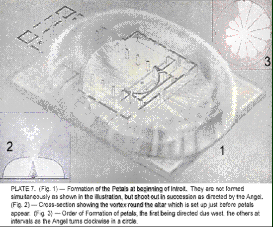

Исправление, достигнутое абсолюцией, сделало это настройку возможной, так что теперь люди могут быть собраны гораздо теснее, чем это было возможно ранее, как связка прямых палок может быть связана плотнее, чем куча изогнутых, нерегулярных веток. У каждого человека были свои изгибы и углы; они теперь в большой степени были выровнены, и теперь есть хотя бы приближение к параллелизму, и следовательно, способность к психической совместной работе в создании евхаристического здания красивым актом поклонения, называемым Интроитом. В сокращенной форме Евхаристии, место Малого благословения перед Интроитом занимает особое отношение к работе, которую мы сейчас предпринимаем. Священник поет: "С похвалой и молитвой наш Храм будет построен." И народ отвечает: "Слава только Богу."

#### Введение

Римская | Либеральная
------- | -----------
_Введение бывает разным. Следующее предназначено для Троицы воскресенья._
Благословенная святая Троица и неделимое Единство: мы воздадим славу Ему, ибо Он проявил нам Свою милость. О Господи, наш Господь, как велико Твое имя по всей земле! Слава Отцу и Сыну, и Святому Духу. Как было в начале, так и ныне, и присно, и во веки веков. Аминь. | Благословенная Святая Троица, неделимое Единство, вечное, бессмертное, невидимое, которому дана честь и слава навеки и навеки. Аминь.
Благословенная святая Троица и неделимое Единство: мы воздадим славу Ему, ибо Он проявил нам Свою милость. | О Господи, наш Бог, как велико Твое Имя по всему миру! Слава Отцу, и Сыну, и Святому Духу. Как было в начале, так и ныне, и присно, и во веки веков. Аминь.
_ | Благословенная Святая Троица, неделимое Единство, вечное, бессмертное, невидимое, которому дана честь и слава навеки и навеки. Аминь.

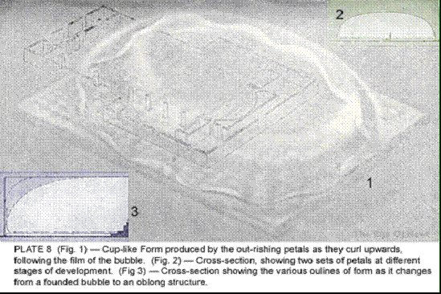

Введение это в сущности дальнейшее признание и призыв величия и славы Имени, которое превыше всех имен; и помните всегда, что это на самом деле синоним Мощи, которая превыше всех мощей. В его центре находится стих: "О Господи, наш Бог, как велико Твое имя по всей земле!" Остальная часть Введения состоит из обычного Gloria Patri, добавленного к этому, и величественного антифона, который предшествует и следует за ним. Было бы не просто придумать более великолепное прославление, и оно прекрасно подходит для создания материала для стен и кровли здания. Оживленная материя изливается великими волнами на мозаичный пол, затапливая его и изгибаясь вверх по его краям, следуя (что касается церкви) форме пузыря, сдутого Asperges, но повторяя эту форму на восточной стороне Алтаря.

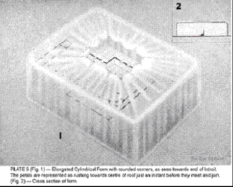

С помощью знака креста в начале каждый полностью открывает себя для воздействия электризации, а затем под воздействием этого удивительного стимула изливает себя в любовь, преданность и поклонение. Первый порыв этой силы, поднимающейся от общины к Алтарю, создает огромный вихрь вокруг него (рис. 7), в который божественный ответ на преданные чувства спускается в потоке; но Ангел Евхаристии быстро распространяет это и уравнивает, так что оно мчится во всех направлениях по павименту и поднимается по стенам, имея странное сходство с быстро растущим цветком дупла (рис. 8). Каждая фраза Введения отправляет свежую волну, и поднимающийся материал вскоре снова изгибается в крышу, так что здание на этом этапе выглядит как огромный цилиндрический мешок, все его углы и края округлены (рис. 9).

Ангел, невероятно способный, стоит посреди у Алтаря, ловко распыляя силу во всех направлениях с удивительной легкостью и точностью, тем самым быстро превращая изгибы в углы, пока у нас не получится прямоугольное здание (рис. 10). Цвета все еще преимущественно багряные и синие, как на павименте, хотя иногда они смешиваются в пурпур с редкими оттенками золота. Материал изначально более густой у нижней части стен и, следовательно, темнее по оттенку; верхняя часть, будучи более легкой и тонкой, показывает прекрасные нежные оттенки розового и лазурного, невероятно яркого, но по мере продолжения восхода вся конструкция становится более прочной и менее воздушной.

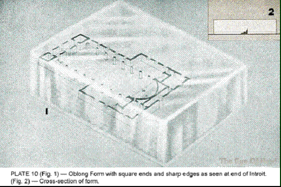

В Римском Миссале Введение постоянно меняется в зависимости от времени года. Мы считали целесообразным избегать этого и отдавали предпочтение обычаю Греческой Церкви, которая не меняет свои Службы таким образом. Мы обнаружили, что многие Введения Римской Церкви не всегда одинаково эффективны в создании необходимого материала для здания, поэтому кажется желательным взять лучшее из них, слегка изменив; и еще более важным является то, что люди гораздо охотнее и с большей готовностью присоединяются к словам, которые им хорошо знакомы. Когда они знают, что идет дальше, они могут вложить свои мысли в то, что они говорят, вместо того чтобы думать о том, как подогнать слова под музыку; поэтому если мы хотим искреннего участия с энтузиазмом от тех, кто не обладает высокими навыками пения, очевидно, что большая часть обряда должна быть неизменной, чтобы они могли выучить его наизусть.

Примечание: Римский обряд здесь предписывает, чтобы священник и его помощники стояли формируя полукруг. Это полезно, поскольку помогает установить вихрь силы, который стремительно поднимается к центральной линии и там вызывает истечение, с помощью которого Ангел строит стены и крышу здания. Вихрь находится на положительной стороне из-за силы и стабильности истечения на этой стороне. Эта часть Службы предоставляет прекрасное зрелище для ясновидящего. Великолепный всплеск истекающей силы, напоминающий цветок, распространяется во всех направлениях по багряному и синему павименту, который отчетливо виден под прозрачными, опалесцирующими цветами истекающего материала. Эффект удваивается благодаря свету центрального истечения, который, кажется, отражается на распространяющемся потоке, прикасаясь к которому, все волны превращаются в золото, как водоем на вершине какой-то большой горы — лагуна, окруженная травой, подобно яркому сапфиру, вложенному в изумруды — которая в тот же момент чувствует первое дыхание утра и улавливает рассеянное золото.

Когда стены быстро поднимаются вокруг, вы смотрите на волшебный мир, видимый, как он есть, через удивительные синий и багряный, золотой и сиреневый цвета блестящей и диафанной структуры.

#### Kyrie

Римская | Либеральная
------- | -----------
Kyrie, eleison. Kyrie, eleison. Kyrie, eleison. | Kyrie, eleison. Kyrie, eleison. Kyrie, eleison.
Christe, eleison. Christe, eleison. Christe, eleison. | Christe, eleison. Christe, eleison. Christe, eleison.
Kyrie, eleison. Kyrie, eleison. Kyrie, eleison. | Kyrie, eleison. Kyrie, eleison. Kyrie, eleison.

Это единственные слова оригинального языка, которые остались в нашей Литургии. Фраза "Кирие, елейсон" обычно переводится как "Господи, помилуй нас" - формулировка, которая вносит ложную и недостойную идею, что Бог на нас злится и что мы должны просить о милосердии, что полностью согласуется с униженным отношением, о котором мы уже говорили, и которое так неблагоприятно влияет на истинное благочестие. Действительно, греческий глагол ελεεω (eleéo) подразумевает этот смысл, когда он используется для выражения просьбы заключенного к судье; но что у него есть другое, более естественное значение, показывает наш использование английского слова "eleemosynary", произошедшего от него. Это подчеркивает идею свободного дара, дара как милостыни; поэтому гораздо более подходящим эквивалентом для "Кирие, елейсон" будет: "Господи, даруй нам Себя" или "Господи, излей Себя". Один христианский ученый переводит это как: "Господи, будь добр к нам". Но мог ли наш Небесный Отец когда-нибудь быть иначе, чем добрым?

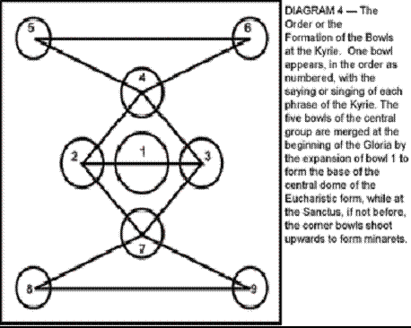

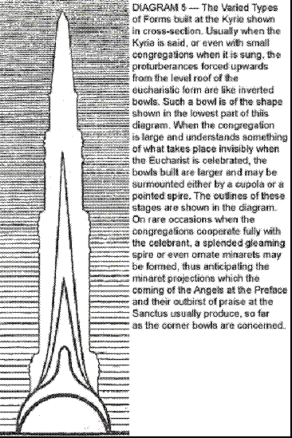

Эта молитва на самом деле предхристианская, поскольку она, по сути, является переводом той, которую в египетских Мистериях обращали к Солнечному Богу Ра, прося его светить на свой народ своим благотворным и дарующим жизнь лучом, а не тем, который сжигает или разрушает. Когда мы понимаем истинное назначение празднования Евхаристии - когда мы понимаем, что на самом деле предстоит продолжение великого Жертвоприношения, мы сразу видим, насколько подходящей является такая молитва и насколько искусно разработана курьезная форма, в которую она воплощена.

Этот девятикратный призыв соответствует девятикратной жертве духа, души и тела при кадильнице; это открывает человека на этих трех уровнях, и ответ, который приходит на этот призыв, заполняет открытые сосуды. Пока он поет первую просьбу, поклонник, тянущийся со всей своей силой к Всеотцу и пытающийся осознать свое абсолютное единство с Ним, должен думать: "Я - искра Тебя, Живого Пламени; О Отец, излей Себя внутрь и через Твою искру". Придерживаясь того же осознания, когда он поет вторую, он почувствует: "Отец, затопи мою душу, чтобы через нее можно было питать другие души". И на третьей: "Отец, мои тела Твои; используй их к Твоей славе". В четвертой, пятой и шестой просьбах он повторит эти мысли, заменив осознание Сына на осознание Отца; и в третьей серии он предложит те же просьбы Богу Святому Духу. Но при всем этом он не должен просить что-либо исключительно для себя, и не должен гордиться тем, что был выбран в качестве отдельного сосуда для Божьей благодати, но должен скорее знать себя одним из братьев, солдатом среди товарищей.

Когда община понимает эту схему вызывания и эффективно её осуществляет, это порождает замечательные результаты в евхаристическом строении. С крыши его поднимается великолепная группа шпилей, следуя красивому и наглядному порядку в их расположении (диаграмма 4). Первая идентификация духа с Всеотцом порождает великолепный центральный шпиль; вторая и третья молитвы выдвигают аналогичные, но несколько меньшие шпили севернее и южнее его. Четвертая вызывает шпиль восточнее центрального, пятая и шестая - меньшие шпили в северо-восточном и юго-восточном углах крыши, образуя треугольник с четвертым. Седьмое обращение поднимает шпиль западнее центра, тем самым завершая группу из четырех, которые окружают первый и самый большой в форме ромба, восьмой и девятый занимают северо-западный и юго-западный углы и образуют треугольник с седьмым. Эту компоновку легко проследить с помощью иллюстрации.

Только хорошо отточенная община может возвести этот лес шпилей; ранние попытки приводят к образованию низких, куполообразных, перевернутых чаш (рис. 11), точно таких же, как на крыше Церкви Сан-Джованни дегли Эремити в Палермо (рис. 12); но расположение всегда одно и то же. Иногда, с особо обученной и преданной общиной, образуются великолепные минареты за счет всплеска силы. Чаша образуется, когда сила слабая, минарет - когда она сильная (диаграмма 5).

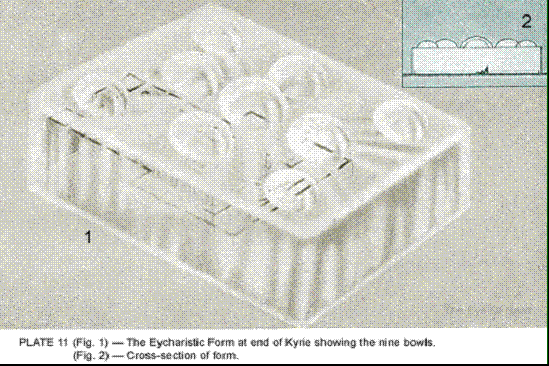

В римской службе эти куполообразные формы часто вновь опускаются и становятся углублениями в крыше, а не выступами над ней. Это связано с идеями страха и самоуничижения, которые часто сопровождают недопонимание, вызванное недостойным переводом греческих слов. Когда мы думаем о себе как о несчастных грешниках и постоянно умоляем Бога о милосердии, эффект на строение поражает, поскольку вместо вздувшихся куполов и вспыхивающих шпилей появляются возвратные кривые и впадины. Поклоняться Богу со страхом и трепетом - это, с невидимой стороны вещей, отрезать от себя много той любви, которая пронеслась бы через нас, если бы мы только научились доверять Ему как любящему Отцу.

В римских церквях часто можно увидеть великолепные всплески преданности от отдельных людей, но редко можно найти комбинацию разумной преданности от нескольких людей, поэтому результат больше похож на несколько разбросанных строительных лесов, чем на минарет. Иногда люди создают великие волны преданности, но она обычно расплывчата и неосведомлена, поэтому даже когда ее можно использовать в строительстве строения, она оставляет всю работу по строительству полностью на Ангела. Важно, чтобы каждый присутствующий человек думал сильно, не о себе, а о том, чтобы действовать как часть единого целого. Таким образом, сила его преданности, вместо того чтобы протиснуться через крышу строения, как стержень, помогает поднимать и расширять купола или минареты.

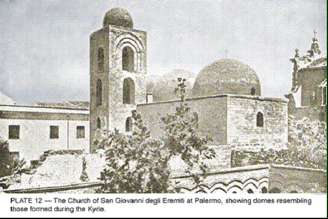

В Службе Евхаристии Церкви Англии эффект от Кирие был почти полностью утерян из-за печального введения в эту Службу заповедей Моисея. Девять Кирие разбросаны среди них, десятое добавляется после последнего, которое предполагается обращено ко Всем Трем Лицам совместно. Кирие особенно предназначено, чтобы подготовить народ к достойному и полезному присоединению к Gloria in Excelsis, но так называемые реформаторы, не имеющие никакого представления обо всем этом, широко развели их, поставив одно в начале и другое в конце Службы. Кирие в этой Службе, конечно, не могут возводить шпили или купола, как это должно было бы быть; ведь пока что абсолютно нет никакого здания, и никакой Ангел не был призван, кроме тех немногих церквей, которые, хотя и используют англиканскую Литургию, дополняют ее недостатки, вставляя основные элементы римского обряда.

#### Gloria in excelsis

Римская | Либеральная
------- | -----------
_Пропускается во время Страстной и Святой недели._ | 
Слава Богу на высоте, и на земле мир людям, благоволит Бог. Мы восхваляем Тебя, мы благословляем Тебя, мы поклоняемся Тебе, мы прославляем Тебя. Мы благодарим Тебя за Твою великую славу. Господи Боже, небесный Царь, Бог Отец всемогущий. | Слава Богу на высоте, и на земле мир людям, Бог благоволит. Мы хвалим Тебя, мы благословляем Тебя, мы поклоняемся Тебе, мы прославляем Тебя; мы благодарим Тебя за Твою великую славу, Господи Боже, Небесный Царь, Бог Отец Всемогущий.
Господи Иисусе Христе, единородный Сын. Господи Боже, Агнец Божий, Сын Отца, взявший на себя грехи мира, помилуй нас. Взявший на себя грехи мира, прими нашу молитву. Ты, сидящий одесную Отца, помилуй нас. | Господи Христе, единорожденный Отца; Господи Боже, Внутренний Свет, Сын Отца, чья мудрость могуче и нежно упорядочивает все вещи, пролей свою любовь; Ты, чья сила поддерживает и поддерживает все творение, прими нашу молитву; Ты, чья красота сияет через всю вселенную, открой свою славу.
Ведь только Ты свят. Только Ты Господь. Только Ты, Иисус Христос, величайший, вместе со Святым Духом, в славе Бога Отца. Аминь. | Ибо Ты один свят; Ты один - Господь; Ты один, Христос, со Святым Духом, являешься высшим в славе Бога Отца. Аминь.

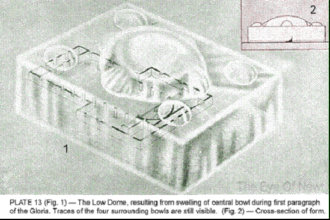

Gloria in Excelsis (как указано в римских или англиканских книгах молитв) - это перевод раннего греческого гимна. Первое упоминание о ней можно найти в указе, который издал Папа Телесфор в 128 году. Существует значительное разнообразие среди старых версий, которые уцелели, и некоторые из ее наименее защищаемых черт отсутствуют в более ранних версиях. Несколько столетий ее пели только при епископе; затем священнику разрешили использовать его лишь в День Пасхи; и, наконец, около двенадцатого века, разрешилось его общее использование во всех праздничных Мессах.

Мы приняли перевод первого и последнего из его трех абзацев, как он стоит в английской службе общения, за исключением фразы "благоволение к людям", которая, хотя, возможно, и более живописна как чувство, всё же неприемлима как перевод оригинального греческого текста и затемняет важный вопрос, что только те могут иметь мир, кто наполнен благоволением к своим собратьям. Во второй абзац внесены определенные изменения. Мы исправили перевод слова monogehvz с "единородного" на "рожденного от одного" - то есть рожденного от одного родителя, а не от сизигии или пары, как все остальные созданные существа. Мы удалили вводящую в заблуждение фразу "помилуй нас", заменив ее другими, более в гармонии с духом этого великолепного гимна. Вместо ссылки на грехи мира, мы цитировали из другого ритуала благородное описание Святой Троицы как Мудрости, Силы и Красоты.

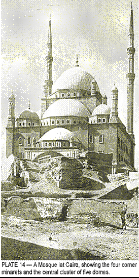

При исполнении этого гимна как священнослужителю, так и прихожанам лучше всего следовать тексту как можно ближе, стараясь прочувствовать и проникнуться им до конца. Ведь так же как в Аспержес мы в основном имели дело с эфирным материалом, так во всей этой части Службы мы в основном занимаемся оживлением астрального вещества, хотя без сомнения у всех, кто способен на это, также возбуждаются сильные вибрации интуитивной мудрости.

Эффект исполнения "Gloria in Excelsis" на евхаристическую постройку очень заметен. Каждая из его трех частей способствует созданию этой постройки. По мере того как мы поем первый абзац, центральная шпиль, сформированная пением первого Kyrie, увеличивается и расширяется, пока не сливается с четырьмя окружающими шпилями, формируя большой центральный купол (рис. 13).

Этот купол невысок по сравнению со своим диаметром и еще не совсем круглый у основания, поскольку на этой стадии он все еще несет следы четырех меньших куполов или шпилей, которые он поглотил. Форма на этой стадии странно напоминает мечеть в Каире, показанную на рис. 14. При пении второго абзаца этот большой сплюснутый купол округляется, и из его вершины вырастает высокий и изящно пропорциональный купол. Наконец, в третьей части из купола выступает как бы фонарь, весь комплекс теперь состоит из трех уровней, что-то вроде купола Капитолия в Вашингтоне, хотя детали отличаются (рис. 15). Наконец, когда люди перекрещиваются, произнося последние слова, над их головами образуется розовый крест и всплывает в фонарь-подобную часть постройки.

Учитывая важную роль, которую этот великолепный гимн играет в создании формы, римский обычай пропускать его и Символ веры в то, что некоторые люди называют временами покаяния, весьма печальный.

Примечание: три стиха этого великолепного гимна обращены к Трем лицам Троицы, поэтому основание центрального сооружения посвящено Отцу, средняя часть - Сыну, а фонаре-подобное сооружение на вершине, образованное последним стихом, посвящено Святому Духу. Эта часть Службы всегда довольно яркое цветовое представление; и центральный купол еще более обогащается Сборами, которые добавляют отличительные цвета для различных праздников, в честь которых он утвержден, и дополнительно укрепляет его.

#### Dominus Vobiscum

Римская | Либеральная
------- | -----------
V. Да будет Господь с вами. | P. Да будет Господь с вами.
R. И с духом твоим. | C. И с духом твоим.

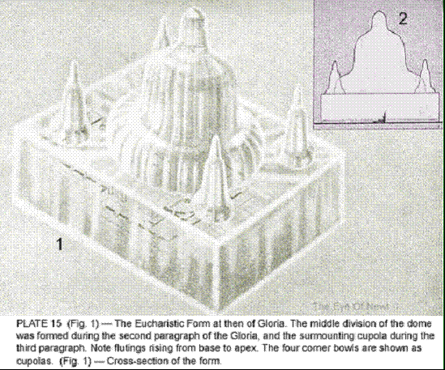

По окончании Gloria in Excelsis, когда люди особенно возвышены благородными словами, которые они только что произнесли, и находятся в более чувствительном и восприимчивом состоянии, еще раз священник обращается к ним и пытается посредством Малого Благословения влить в них нечто из своего собственного энтузиазма. Их готовый ответ приводит их к более тесному союзу с ним и также помещает в его руки всю силу, которую они генерировали.

#### Сбор

Римская | Либеральная
------- | -----------
_Сбор бывает разным. Приведенный ниже относится к Троицкому воскресенью._
Всемогущий, вечный Бог, который даровал твоим слугам в исповедании истинной веры признать славу вечной Троицы и в силе божественного величия также поклоняться единству: дай, чтобы, пребывая в той же вере, мы всегда были защищены от всякого зла. Через нашего Господа. | Всемогущий Бог, перед которым открыты все сердца, все желания известны, и от которого ни один секрет не скрыт; очисти мысли наших сердец вдохновением Твоего Святого Духа, чтобы мы могли совершенно любить Тебя и достойно прославлять Твое святое Имя. Через Христа, нашего Господа. Аминь.
_Здесь следуют любые дополнительные Сборы, после чего читается Эпистоля._ | _Здесь следует Сбор дня, после чего читается Эпистоля._

Преданность и любовь людей теперь были тщательно пробуждены великими актами поклонения и взывания, в которых они участвовали, и, следовательно, строительство евхаристического здания было завершено настолько, насколько это касается его астральных частей. Теперь желательно пробудить умный энтузиазм собрания, в результате чего материя ментального плана также может быть вплетена в нашу постройку. Это делается путем чтения людям Эпистолии и Евангелия и призыва их присоединиться к чтению Символа веры. Но сначала произносятся определенные молитвы, называемые Сборами, из которых в нашей пересмотренной Литургии одна используется неизменно, но остальные меняются с календарем.

Эти краткие и всеобъемлющие молитвы использовались в Церкви с самых ранних периодов. Название, применяемое к ним, имеет великую древность, но неясное происхождение. Литургисты считали, что они так называются только потому, что они использовались в общественном собрании или сборе людей; или из-за того, что в них многие ходатайства собраны в краткое резюме; или потому, что они собирают вместе идеи, представленные в Эпистолии и Евангелии дня, и превращают их в молитву. Опять же, есть предположение, что в более ранние времена священник "собирал" желания своего прихода и включал их в свою импровизированную молитву. Другая теория, которая находила широкую поддержку, основывается на том факте, что в древние времена, когда проводилась служба, называемая станцией, обычно священнослужители и люди сначала собирались в другой церкви, а затем шли процессией в ту, где должна была быть сказана Евхаристия. Прежде чем они отправились из первой церкви, произносилась короткая молитва, называемая Oratio ad collectam, и от этого обычая сама эта молитва стала называться Сбором. Как бы то ни было, такие молитвы найдены во всех известных Литургиях.

Наш первый Сбор, который мы не меняли, - это молитва ранней Церкви, называемая Сбором за Чистоту, который непосредственно следует за Отче Наш в начале Службы Евхаристии Церкви Англии. Его искреннее стремление к чистоте мысли особенно уместно здесь, когда мы только собираемся предоставить ментальную материю, необходимую для евхаристического здания; и молитва о том, чтобы мы были наполнены совершенной любовью и могли достойно прославлять Святое имя Бога, затрагивает именно ту ноту и дает нам ключ к точному отношению ума, которое мы должны сохранять, если мы хотим правильно служить Ему.

Выбирая Сборы для воскресений и праздников, мы во многих случаях использовали те, что из Книги Общих Молитв Церкви Англии, которые в свою очередь обычно выбирались из тех, что в древней Литургии; но мы последовательно исключали все проявления покорности или неверия и стремились всегда держать перед умами наших членов мысль о любви и славе Бога и о высшей радости альтруистической службы.

Что касается памятных дат, мы следуем обычной практике нашей Церкви. Когда два праздника совпадают, мы используем Службу более важного из них и кроме того читаем Сбор другого, чтобы наши люди не пропустили его.

#### Послание

В ранние дни Церкви, кажется, было принято в это время Службы читать ряд уроков, количество которых было ограничено только временем, которое было в их распоряжении; мы находим указание на то, что епископ или священник должен был дать сигнал, когда, по его мнению, было прочитано достаточно. Позднее, этот излишек уроков был сокращён до трёх, которые называли Пророчеством, Посланием и Евангелием; ещё позже исчезает первое из них, и мы находим только Послание и Евангелие, как у нас сейчас, хотя след ужатия до сих пор остаётся в том факте, что то, что называется Посланием, иногда берётся из книг Пророков. Ясно, что здесь подразумевается предоставление людям определённого обучения; мы не должны забывать, что в древние времена не было печатных книг, поэтому обучение могло быть дано только устно. В отношении здания, цель этих чтений - пробудить интеллектуальные способности собрания, предоставив ему пищу для размышлений, чтобы материал как астральный, так и ментальный мог быть предоставлен.

При выборе чтений для Послания мы иногда выбирали лекции, отличные от тех, которые использовались в Римской или Англиканской ветвях Церкви. Мы не чувствовали себя обязанными брать какой-либо конкретный отрывок в его полном объёме, так как, если бы мы это сделали, нам пришлось бы во многих случаях читать совершенно неподходящие и неконструктивные отрывки. Вместо того чтобы всегда выбирать последовательные стихи, мы часто выбирали только те, которые выражают какую-то возвышенную и побуждающую к действию мысль, опуская другие, которые не имеют отношения к обсуждаемой теме или подходят к ней с точки зрения, несовместимой с твердой верой в любовь и мудрость Бога.

Критики, конечно, обвинят нас в том, что мы принимаем то, что в Писании соответствует нашим целям, и игнорируем или отвергаем остальное. Мы никоим образом не стремимся опровергнуть такое обвинение, потому что каждый автор или оратор делает именно это; цитируя книгу, он берет то, что иллюстрирует ту точку, которую ему случилось осветить, и избегает всего, что к ней не относится. В Либеральной Католической Церкви мы оставляем наших членов абсолютно свободными во всех вопросах веры, поэтому если кто-то из них хочет придерживаться теории вербального вдохновения английского перевода Писания, он вполне вправе это делать.

Для автора эта книга - одна из многих других томов Священного Закона, которые были почитаемы и изучены святыми людьми различных религий на протяжении веков - томов, все из которых содержат жемчужины истины, обрамлённые красивыми и поэтическими словами, проливающих свет и полезные во все времена; но также все они включают многое, что является неправдивым или представляет интерес лишь временный и местный. Считать любую такую книгу безошибочной - значит идти вразрез с истиной, с разумом и историей, потому что легко доказуемо, что все они содержат много неточностей; и почти во всех из них есть много крайне неприемлемого материала. Но это не значит, что мы не должны собирать из них всё, что мы считаем ободряющим, поучительным и возвышающим.

По окончании Послания, служители, хор и собрание говорят или поют: "Слава Богу".

Примечание. Теперь мы переходим к более умственной части службы. До сих пор мы работали с астральной материей, но теперь мы начинаем функционировать на следующем более высоком уровне. Послание частично умственное и частично астральное, Последовательное чтение больше умственное, Евангелие практически полностью таковое, и Символ веры в значительной степени выше умственного.

Из-за известного факта, что все вещи на более низком уровне имеют свои аналоги на высших уровнях, студенты иногда не видят необходимости строить в умственной материи, где оно уже должно существовать как необходимый атрибут создания астральной формы. Но не следует забывать, что именно на том уровне, на котором что-то создается, оно имеет наиболее реальное существование, и форма, созданная за счет блестящей умственной материи, подобной той, которая поставляется Символом веры, гораздо более живая, чем просто последствие того, что в основном было астральным усилием, таким как то, что было до этого момента, силой строительства.

Излияние послания начинается, когда Ангел, стоящий в центре алтаря, изливает высшую астральную и низшую ментальную материю через трех священников. Это прорабатывается собранием, и затем возвращается, вибрируя на немного сниженной скорости, но в более значительном объеме.

Здесь есть две альтернативные позиции, которые занимают три священнослужителя. Иногда они стоят с празднующим в центре ближе к алтарю, и диакон и субдиакон каждый на одной стадии ближе к народу, образуя линию, которая постепенно отклоняется от центра, так что диакон заметно смещен к стороне Послания. В этом случае субдиакон обращен лицом к собранию, чтобы читать им, но двое других обращены на север. С такой формацией много силы возвращается от собрания через трех священников, и диакон и празднующий обращают свои левые или негативные стороны к народу для приема этого, а их правые или положительные стороны - к Ангелу, чтобы передать ему. Конечно, в то же время идет непрерывный и концентрированный поток от Ангела вниз через троих из них, но не только этот поток меньше по объему, чем поток, который идет от людей, но он также протекает прямо, без каких-либо трудностей, в то время как больший объём должен быть отсортирован, просеян и очищен; поэтому основная работа состоит в приеме материала от тела церкви, и мы не так сконцентрированы на том, что идет из за алтаря, поскольку это случится и без нас. Следовательно, негативная сторона повернута не к востоку, а к западу.

Альтернативное расположение заключается в том, что диакон должен стоять прямо за субдиаконом, так что линия, проведенная от празднующего к диакону, а затем к субдиакону, не будет прямой, а образует две стороны треугольника, третья сторона - гипотенуза, образованная прямой линией от празднующего к субдиакону. С таким формированием, празднующий часто обращен на запад, как и субдиакон, хотя диакон все еще смотрит на север. Некоторые линии силы между Посланиями и священнослужителем текут напрямую от одного к другому, а некоторые через диакона, тем самым образуя треугольник из линий света. С таким расположением, поток силы в основном направлен наружу - празднующий обращен прямо к своему собранию, и после того, как он кружится и разрабатывается немного дольше, он вновь вливается во время последовательного чтения. Каждая схема, по-видимому, работает хорошо, и с оккультной точки зрения немногое может повлиять на выбор. Считалось, что треугольник, будучи живым символом, будет действовать как большой канал, но эта форма магии - создание связей таким образом с архетипами - больше относится к египетской форме церемониала и не так сильно требуется в христианской схеме, где у нас есть Хост, который, по-видимому, создает все необходимые связи. Более того, в этой конкретной части службы нет особого вызова для такого канала.

Независимо от того, какой план будет принят, празднующий должен оставаться в центре алтаря, так как он, подобно Ангелу, должен собирать силы с обеих сторон алтаря, чтобы направить их вниз и наружу через своих помощников.

Послание не сопровождается таким же громадным всплеском, как Евангелие, и у него нет таких же механических устройств, связанных с ним, но, тем не менее, это определенное излияние, и, естественно, поскольку это часть Библии, которая читается, она находится в контакте с телом мысли, стоящим за этим Томом Священного Учения.
