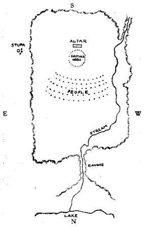
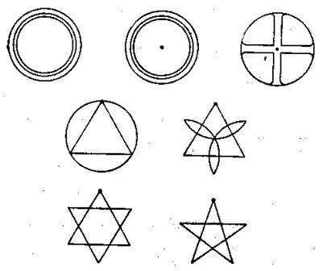

Some Fundamental Teachings
C. W. Leadbeater
FOREWORD

THE papers in this compilation were all written by Brother C. W. Leadbeater about the years 1892-95, in London. The manuscript book, from which the papers which follow are reprinted, is in my own handwriting. Brother Lead­beater used to write first on small pieces of paper, usually the inside of envelopes received with letters; from them I copied into manuscript books. It is from the papers in this manuscript book in my handwriting that later he compiled the larger work The Masters and the Path.* (*Mr. Ernest Wood assisted greatly in compiling this work; he was an excellent amanuensis, and Brother Leadbeater often relied on him to shape unrevised manuscripts, reports of lectures, etc., into literary form for publication.)

At this period which I mention, there existed in London two groups of occult students who were dedicated to the work of the Masters. The first group was that which had gathered round H. P. B. at the London Headquarters, and after her death continued as the Inner Circle of the E. S. T. with Brother Annie Besant as the head. The second group was that which had gathered round Mr. A. P. Sinnett since 1883. On the arrival of Brother Lead­beater and myself in London at the end of 1889, we became members of the second group, as both of us were guests, of Mr. Sinnett, and lived with him for two years. In 1894, Brother Besant too became a member. Later, some of us of this London Lodge Group were admitted by her into the E. S. T. into its highest grade.

The members of this group of Mr. Sinnett numbered at this time about twenty. They met fairly frequently, and took up various aspects of Theosophical teachings for study and discus­sion. After several such discussions, some member of the group would be charged with the work of gathering what material he could from Theosophical works, The Secret Doctrine in particular; it was his task then to for­mulate the topic in a paper to be read to the group for further discussion. Thus, for instance, during several meetings much time was spent in trying to understand the subject of root races and sub-races. The material in The Secret Doctrine was not adequate; the principal defect was the lack of definition as to what constitutes the difference between one root race and another, and how a new root race arose out of the old. One member was instructed to read as many works as he could on Ethno­logy, and to report what they conveyed regarding the various races. This work was done by Mr. John Varley, who after three months’ study read a paper. The value of this paper lay in pointing out the great contradictions and gaps in the theories of the ethnologists.

Questions on the races were then formulated by the group, to be presented to the Masters. The questions were presented by Brother Lead­beater to the Master K. H. The Master, how­ever, did not answer them, but passed them on to the Master M., saying that they appertained to the department of His Brother. It was also the Master M. who answered the questions regarding the formation of the Solar System. The answers of the Master M. were written down by Brother Leadbeater as accurately as he could recollect, and as mentioned above, I my­self copied them down into a manuscript book.

Regarding the subject of the Rays, for several years there had existed with him a small memorandum, with a table of the Rays, but there were no explanations; I recollect his saying frequently that it was a very secret memo­randum of the teachings given at Adyar by the Master D. K. in 1885-6, concerning matters not revealed to the world.

The other papers contain teachings which Brother Leadbeater had received at various times from the Master K. H. and His senior pupils; here and there he has added to them explanations of his own, in order to make the subject clearer. The paper on the Aura was the result of his own investigations.

Though the material in this work has already appeared in several forms in other publications, I am reprinting the original manuscript book, as it contains much in brief, and serves well as a book of study. A few explanatory notes have been added by me.

C. J. 

THE STEPS OF THE PATH

EASTERN books tell us that there are four means by which a man may be brought to the beginning of the Path:

1. By the companionship of those who have already entered upon it;

2. By hearing or reading of definite teaching on the occult philosophy;

3. By enlightened reflection, that is to say, that by sheer force of hard thinking and close reasoning he may arrive at the truth or some portion of it for himself;

4. By the practice of virtue, which means that a long series of virtuous lives, though it does not neces­sarily involve any increase of intellectuality, does eventually develop in a man sufficient intuition to enable him to grasp the necessity of entering upon the Path of spiritual advancement, and show him in what direction it lies.

When, by one or another of these means, he has arrived at this point, the Path to the highest Adeptship lies straight before him, if he chooses to take it. In addressing students of Occultism it is hardly necessary to say that, at our present stage of development, we cannot expect to learn all, or nearly all, about any but the lowest steps of this Path; whilst of the highest we know little but the names, though we may get occasional [1] glimpses of the indescribable glory which surrounds them.

So much as we can comprehend will perhaps be more easily grasped if we group the steps in three great divisions; but I wish it to be understood that I am dividing them merely for convenience in describing them, and that this arrangement has no official sanction. These three divisions, then, are:

1. The Probationary Period, before any definite pledges are taken, or Initiations (in the full sense of the word) are given.

2. The Period of Pledged Discipleship, or the Path Proper, whose four stages are often spoken of in Oriental books as the Four Paths of Holiness.

3. What we may venture to call the Official Period, in which the Adept takes a definite part in the government of the world, and holds a special office connected therewith.

We must here guard against a misconception. Every Adept - every Pupil even, when once definitely accepted - takes a part in the great work of helping forward the evolution of man; but those standing on the higher levels take charge of special departments, and corres­pond in a general way to the Ministers of the Crown.

PROBATIONARY PERIOD

Before going into details of the Probationary Period, it is well to mention that in most of the Eastern sacred [2] books this stage is regarded as merely preliminary and not as part of the Path Proper at all, for they consider that the latter is really entered upon only when definite pledges have been given. Considerable confusion has been created by the fact that the numbering of the stages occasionally commences at this point, though more often at the beginning of what I have called the second great division; sometimes the stages themselves are counted, sometimes the Initiations leading into or out of them, so that in studying the books one has to be perpetually on one’s guard against error. This Probationary Period, however, differs considerably in character from the others; the divisions between its stages are less decidedly marked than are those of the higher groups, and the requirements are not so definite or exacting. But it will be easier to explain this last point after giving a list of the five stages of this period, with their respective qualifications. The first four correspond very closely to the “four accomplishments preliminary to Chelaship,” of which Mohini* (*Mohini Mohan Chatterji.) wrote so ably in the first Transaction of this Lodge* (The London Lodge of the Theosophical Society.) - so closely indeed that I need touch upon these four steps only slightly here, referring those who wish for fuller definitions to that most valuable article. The first stage then is called among the Buddhists:

1. MANODVARAVARJANA (the opening of the doors of the mind), and in it the candidate acquires a firm intellectual conviction of the [3] impermanence and worthlessness of mere earthly aims. This is often described as learn­ing the difference between the real and the unreal; and to learn it often takes a long time and many hard lessons.

2. PARIKARMA (preparation for action), in which the candidate learns to do the right merely because it is right, without considering his own gain or loss either in this world or the future, and acquires; as the Eastern books put it, perfect indifference to the fruit of his own actions.

3. UPACHARA (attention or conduct), in which what are called “the six qualifications” are acquired. These are:

 (a) Sama (quietude), purity of thought, or rather per­haps, perfect mastery of one’s own thoughts.

(b) Dama (subjugation), a similar mastery over, and therefore purity in, one’s own actions and words.

(c) Uparati (literally, cessation), independence of thought.

(d) Titiksha (forbearance), cessation of desire, by which is meant the readiness to part with anything and everything worldly, whenever it may be necessary. It also includes the absence of resentment for wrong.

(e) Samadana (literally, taking, e.g., a vow), in­capability of being turned aside from one’s path by temptation. [4]

(f) Shraddha (faith), confidence in one’s own Master and oneself.

4. ANULOMA (direct order or succession, signifying that its attainment follows as a natural consequence from the other three), in which is acquired an intense desire for liber­ation from earthly life and for union with the highest.

5. GOTRABHU (the condition of fitness for Initiation). In this stage the candidate gathers up, as it were, his previous acquisitions, and strengthens them to the degree necessary for the next great step, which will set his feet upon the Path Proper as an Accepted Pupil. The attainment of this level is followed very rapidly by Initiation into the next grade. In answer to the question, “What is Gotrabhu?” the Buddha says: “The man who is in pos­session of those conditions upon which the commencement of sanctification immediately ensues - he is the Gotrabhu.” The wisdom necessary for the reception of the Path of Holiness is called Gotrabhunana.

Now that we have hastily glanced at the steps of the Probationary Period, we must emphasize the point to which reference was made at the commencement - that the perfect attainment of these accomplishments and qualifications is not expected at this early stage. As Mohini says: “If all these are equally strong, Adept­ship is attained in the same incarnation,” but such a [5] result is, of course, extremely rare. It is in the direction of these acquirements that the candidate must cease­lessly strive, but it would be an error to suppose that no one has been admitted to the next step without possessing all of them in the fullest possible degree.

It is obvious that, as far as we have gone, a man might easily be working along the Path unconsciously to himself, and no doubt many a good Christian, many an earnest Freethinker, is already far on the road that will lead him to Initiation, though he may never have heard the word “Occultism” in his life. I mention these two classes specially, because in every other religion occult development is recognized as a possibil­ity, and would certainly therefore be intentionally sought by those who felt yearnings for something more satisfactory than the exoteric faiths.

We must also note that the steps of this Probationary Period are not separated by Initiations in the full sense of the word, though they will certainly be studded with tests and trials of all sorts and on all planes, and may be relieved by encouraging experi­ences, and by hints and help whenever these may safely be given. We are apt sometimes to use the word Initiation somewhat loosely-as, for example, when it is applied to such tests as have just been mentioned; properly speaking it refers only to those solemn ceremonies at which a Pupil is formally admitted to a higher grade by an appointed Official, who in the name of the Occult Hierarchy receives his plighted vow, and puts into his hands the new key of knowledge [6] which he is to use on the level to which he has now attained. Such an Initiation is taken at the entrance to the division which we shall next consider, and also at each passage from any one of its steps to the next.

THE PERIOD OF PLEDGED DISCIPLESHIP

OR

THE PATH PROPER

It is on the four stages of this division of the Path that the ten Samyojana or Fetters, which bind man to the circle of rebirth and hold him back from Nir­vana, must be cast off. And here comes the difference between this period of Pledged Discipleship and the previous Probation. No partial success in getting rid of these fetters is sufficient now; before a candidate can pass on from one of the steps he must be entirely free from certain of these clogs; and when they are enumerated it will be seen how far-reaching this requirement is, and there will be little cause to wonder at the statement made in the sacred books that seven incarnations are sometimes required to pass through this division of the Path.

Each of these four steps or stages is again divided into four. Each has:

(1) its Magga or way, during which the student is striving to cast off the fetters;

(2) its Phala (result or fruit), when he finds the results of his actions in so doing shewing themselves more and more; [7]

 
(3) its Bhavagga or consummation, the period when the result having culminated, he is able to fulfil satis­factorily the work belonging to the step on which he stands;

(4) its Gotrabhu, meaning, as before, the time when he arrives at a fit state to receive the next Initiation. The first stage is

I. SOTAPATTI or SOWAN. The Pupil who has attained this level is spoken of as the Sowani or Srotapanna - “he who has entered the stream,” because from this period, though he may linger, though he may succumb to more refined temptation and turn aside into the higher branches of black magic, he can no longer fall back altogether from spirituality and become a mere wordling. The fetters which he must cast off before he can pass into the next stage are:

1. SAKKAYADITTHI - the delusion of self.

2. VICHIKICHCHA - doubt or uncertainty.

3. SILABBATAPARAMASA - superstition.

The first of these is the “I am I” consciousness, which, as connected with the Personality is nothing but an illusion, and must be got rid of at the very first step of the real upward path. But to cast off this fetter com­pletely means even more than this, for it involves the realization of the fact that even the Individuality can never have any interests opposed to those of its brethren, and that it is most truly progressing when it most assists the progress of others. For the very sign and seal of the attainment of the Sotapatti level is the first entrance of the Pupil into the plane above the [8] Devachanic - that of the Samadhi or Sushupti. It may be - nay, it will be - the merest touch of that stupen­dously exalted condition that the Pupil can as yet experi­ence, even with his Master’s help; but even that touch is something that can never be forgotten, something that opens a new world before him, and entirely revolution­izes his feelings and conceptions. Then for the first time, by means of the extended consciousness of that plane, he truly realizes the underlying unity of all; then first he gets some slight glimpse of what the love and compassion of a Buddha must be.

As to the second fetter, a word of caution is neces­sary. We who have been trained in European habits of thought are unhappily so familiar with the idea that a blind unreasoning adhesion to certain dogmas may be claimed from a disciple, that on hearing that Occultism considers doubt as an obstacle to progress, we are likely to suppose that it also requires the same unquestioning faith from its followers as modern superstitions do. No idea could be more entirely false. It is true that doubt (or rather uncertainty) on certain questions is a bar to spiritual progress, but the antidote to that doubt is not blind faith (which is itself considered as a fetter, as will presently be seen) but the certainty of conviction founded on individual experiment or mathematical reasoning. While a child doubted the accuracy of the multiplication-table he would hardly acquire proficiency in the higher mathematics; but his doubts could be satisfactorily cleared up only by his attaining a compre­hension, founded on reasoning or experiment, that the [9] statements contained in the table are true. He believes that twice two are four, not because he has been told so, but because it has become to him a self-evident fact. And this is exactly the method, and the only method, of resolving doubt known to Occultism.

Vichihichcha has been defined as doubt of the doct­rines of Karma and Reincarnation, and the efficacy of the method of attaining the highest good by this Path of Holiness; and the casting off of this Samyojana is the arriving at absolute certainty, based upon reason, that the occult teachings upon these points are true.

The third fetter to be got rid of comprehends all kinds of unreasoning or mistaken belief, all dependence on the efficacy of outward rites and ceremonies to purify the heart. He who would cast it off must learn to depend upon himself alone, not upon others, nor upon the outer husk of any religion.

The first three fetters are in a coherent series. The difference between Individuality and Personality being fully realized, it is then possible to some extent to ­appreciate the actual course of Reincarnation, and so to dispel all doubt on that head. This done, the knowledge of the spiritual permanence of the true Ego gives rise to reliance on one's own spiritual strength and so dispel superstition.

II. SAKRIDAGAMI. The Pupil who has entered upon this second stage is spoken of as a “Sakridagamin,” “the man who returns but once” - signifying that a man who has reached this level should need but one [10] more incarnation before attaining Arhatship.* (*In The Masters and the Path the term Sakridagami is explained as follows: “The man who returns but once, which means that he should need but one more incarnation before attaining Arhat­ship, after which there is no compulsory rebirth.”) At this step no additional fetters are cast off, but the Pupil is occupied in reducing to a minimum those which still enchain him. It is, however, usually a period of considerable psychic and intellectual advancement.

III. ANAGAMI. The Anagamin (“he who does not return”) is so called because, having reached this stage, he ought to be able to reach Arhat ship in the life he is then living. In this step he finally gets rid of any lingering remains of the two fetters of:

4. KAMARAGA - attachment to the enjoyment of sensation, typified by earthly love, and

5. PATIGHA - all possibility of anger or hatred.

The student who has cast off these fetters can no longer be swayed by the influence of his senses either in the direction of love or hatred, and would be free from either attachment to or impatience of physical plane conditions.

Here again we must guard against a possible mis­conception - one with which we frequently meet. The purest and noblest human love never dies away, is never diminished by occult training; on the contrary, it is increased and widened until it embraces all with [11] the same fervour which is at first lavished on one or two: but the student does in time rise above all con­siderations connected with the mere personality of those around him, and so is free from all the injustice and partiality which ordinary love so often brings in its train.

IV. ARHAT (the venerable, the perfect). In this stage the occultist casts off the five remaining “fetters,” which are:

6. RUPARAGA - desire for beauty of form or for physical existence in a form, even includ­ing Devachan.

7. ARUPARAGA - desire for formless life.

8. MANO - pride.

9. UDDHACHCHA - agitation or irritability.

10. AVIDYA - ignorance.

On this we may remark that the casting off of Ruparaga involves not only getting rid of desire for earthly life, however grand or noble that life may be, and astral or Devachanic life, however glorious, but also of all liability to be unduly influenced or repelled by the external beauty or ugliness of any person or thing. Aruparaga - desire for life either in the highest and formless planes of Devachan or in the still more exalted plane of Samadhi is merely a higher and less sensual form of selfishness, and must be cast off just as much as the lower. Uddhachcha really means “liability to be disturbed in mind,” and a man who had finally cast off this fetter would be absolutely unruffled by any­thing whatever that might happen to him - perfectly [12] impervious to any kind of attack upon his dignified serenity.

The getting rid of ignorance of course implies the acquisition of perfect knowledge - practical omni­science as regards our Planetary Chain. Then he reaches the fifth stage, the stage of full Adeptship and becomes:

V. ASEKHA, “the One who has no more to learn - again as regards our Planetary Chain. “He is now free from all sin; He sees and values all things in this life at their true value; all evil being rooted from His mind, He experiences only righteous desires for Himself and tender pity and regard and exalted love for others.” To show how little He has lost the sentiment of love, we read in the Metta Sutta of the state of mind of One who stands at this level: “As a mother loves, who even at the risk of her own life protects her only son; such love let there be towards all beings. Let goodwill without measure prevail in the whole world, above, below, around, unstinted, unmixed with any feeling of differing or opposing interests. When a man remains steadfastly in this state of mind all the while, whether he be standing or walking, sitting or lying down; then is come to pass the saying: ‘Even in this life has holiness been found’.”

Beyond this period it is obvious that we can know nothing of the new qualifications required for the still higher levels which yet lie before the Perfect Man, and stages of the Third Period are therefore but little more than names to us. It is abundantly clear, [13] however, that when a man has become Asekha, He has exhausted all the possibilities of moral development, so that further advancement for Him can only mean still wider knowledge and still more wonderful spiritual powers. Not all of those who reach this exalted level .commence this further advancement immediately; the Asekha has earned the right to pass the remainder of the Manvantara and the succeeding Pralaya in the beatific repose of Nirvana, and some Adepts do this.* (*For more light on the Path before the Adept, which has been described as opening up in seven great ways, see Man: Whence, How and Whither, and The Masters and the Path.) Others, for the sake of working on for the benefit of humanity, proceed to qualify themselves - how, we know not - for the first grade of what we called the Official Period.

 

THE OFFICIAL PERIOD

The first step of this division, but the sixth of the Path of Holiness, is:

VI. CHOHAN. The Adept who attains this level on any Ray but the First or the Second takes command of the Ray to which He belongs, wields its influences, and controls and directs its work. (See paper on the Rays.)

The next step is to become:

VII. MAHACHOHAN. The Chohan who passes the Initiation which gives Him this rank does not, however, give up His post as Head of His own Ray, [14] but combines with His previous functions the position of Commander-in-Chief of the whole. This very exalted rank is the highest which can be attained in this Manvantara on any of the five Rays; the Adept who wishes to pass still higher before entering Nirvana must as it were force Himself on to either the First or the Second Ray, for on these, this Seventh Initiation is not the highest. It is only after prolonged and tremendous effort that the position of

VIII. BUDDHA, the Head of the Second Ray, can be reached. Some slight idea of the wonderful powers and qualities of the holder of this office may be gained from exoteric literature; but occult study increases a hundred-fold the reverence and awe which one cannot but feel for One who stands upon such a pinnacle of goodness. Al1 the spiritual powers of the previous stages are in Him enormously intensified, and are accompanied also by others entirely new, and to us incomprehensible. With the same facility of motion with which the Adepts pass from world to world of our Chain, He passes from Chain to Chain through the Solar System. Above Him is but one step more, and the Initiation leading to that differs from all others, in that it cannot be given by the Superior, but must be evolved by each for Himself. This brings us to the contemplation of

IX. THE LORD of THE WORLD - that Mystic Being whose consciousness in some mysterious way comprehends the whole of our planet and its inhabitants at once, whose lieutenants are the Manus, who alone [15] among human kind can pass beyond the limits of the Solar System, and can enter while yet on earth that realm of the Planetary Spirits which for all others lies beyond Nirvana. Of Him it is useless to speak further. [16]

THE HIERARCHY OF THE FIRST RAY

AN Adept who sets before himself the glorious ambition to help the world as a Manu must first transfer Himself to the First Ray if not already upon it; then by gaining on that Ray the Initiation corresponding to that of the Chohan on other Rays, He qualifies Himself for the arduous position of the Root-Manu of a Race. The successful performance of the duties then undertaken brings Him to the next step - that corresponding to the level called Mahachohan. The position He then holds has yet no name in English, for its duties consist in directing and wielding, in the cause of humanity, great spiritual forces, whose very existence is unknown except to the higher Initiates - forces about which therefore nothing more can at present be said. The same is true in if possible an even greater degree of the next level - that of the Pachcheka or Pratyeka Buddha, sometimes called the Buddha of Confession, on which stand the three Pupils of the LORD of the WORLD. The Pachcheka Buddha has been strangely enough misunderstood by those writers who have de­scribed Him as a selfish one who refuses to teach what He has learned and passes away into Nirvana. It is [17] true that though on the Buddha level He does not teach, because humanity depends on Him for other work: true that a time comes when He has to leave the world - not to enter Nirvana, but to carry on His glorious work elsewhere. The next step - the Initiation that none can give, but each must take for himself - puts the Adept on the level of the Lord of the World, an office which is held first for the shorter period of a first or second Lord on one world, then, if that has been satisfactory, for the longer responsibility of the third upon some other; for at these sublime heights, an Adept belongs to and works in no one world only, but the Solar System. The Lord who takes the third term of office remains in charge of the world as Silent Watcher until the human life-wave again arrives, and again leaves it, when He convoys humanity safely to the next planet. The later steps of His evolution would be Root Round Manu, Seed Round Manu, Root Chain Manu, Logos of Seven Chains, Logos of Solar System. But it must be understood that of each of these levels there are many degrees; on each of them there are different spheres of work so that it would frequently happen that a great Spirit might take charge of several worlds or several Chains in succession before passing to the next grade. Thus the grades from the Root Race Manu are:

That corresponding to the level of Mahachohan,

Pachcheka Buddha,

Lord of the World,

Silent Watcher,

Root Round Manu, [18]

Seed Round Manu,

Root Chain Manu,

Logos of Seven Chains,

Logos of Solar System.

It will be of deep interest to members of our group to hear that for both of the Masters with whom our Society has had the closest touch, the Chohan level is now very near - that within a very short time we shall have to hail Them by the higher title.* (*This Initiation took place on the full moon day of Wesak, 19th of May 1894.) Mahatma Morya will take up the work of the Root Manu for the Sixth Root Race; while Mahatma K.H. will be the Buddha of the Seventh Root Race. [19]

NOTES OF A CONVERSATION

ON THE ORIGIN OF THE SOLAR SYSTEM*

(* The Teacher who gave the instruction was the Master M.)

 

QUESTIONS relating to the origin of Chains or Solar Systems are excessively difficult to answer, and any replies given are likely to prove somewhat misleading since they must of necessity be extremely incomplete. Nor is the subject one to be approached lightly, for the working out of the plan of a System and its component Chains requires the use throughout incalculable ages of forces of the most stupendous character wielded by Beings of ineffable glory and power - the Ah’hi or Builders. All the most important forces are as yet entirely unknown to mankind, and those who as they climb the Steps of the Path gain theoretical and elementary knowledge of some of them are not allowed to divulge even the little they know. These considera­tions tend to show that the subject of Cosmogenesis may be more profitably studied, as to its details at any rate, when more extended capacities of compre­hension have been developed. Many limitations and reservations must therefore be taken for granted in the [20] attempt which is made to answer the questions proposed.

The exalted Being who undertakes the formation of a System first of all forms in His mind a complete con­ception of the whole with all its successive Chains; and by forming that conception calls the whole into simultaneous existence on a certain plane, from which the various globes descend when required into whatever state of objectivity may be respectively destined for them. This process of descent may often be gradually going on for many ages before the globes are apparently used in any way or before indeed they would seem to man to exist at all.

 

I. Turning to the detailed questions:

We find an enquiry as to the accuracy of the nebular hypothesis. In its broad outline it is undoubtedly correct, and there are Systems in which every detail, including even the origin of the stellar impact, has been carried out exactly as science supposes. But the Cosmic Builders are not limited to one method, and though our own Solar System commenced its existence in the form of a nebula, that nebula was not originated by collision. Its Builders first set up a centre of inconceivably intense electric action - action not only upon the lower planes in connec­tion with which alone we know something of electricity, but upon all the higher ones as well. This produced a correspondingly intense electric field, the diameter of [21] which was considerably greater than that of the orbit of Neptune. It must be borne in mind that though this is formed in what appears to us to be empty space, it is in reality in an absolutely solid block of ether, and this intense action of the higher form of electricity transforms the whole of this vast sphere into a kind of vortex into which more and more of ethereal matter is drawn, until, when sufficient condensation is secured, a shock of a different character causes this to change into a mass of glowing gas at a temperature of which it is impossible to have any conception. Thus, though by a different method, we arrive at the glowing revolving nebula which science postulates, and from this point the development of the globes follows the plan ordinarily understood. This of course refers only to the matter of the physical globes; the majority of the worlds of any System are those on the higher planes, and naturally the physical condition of the System does not in any way affect the life upon them, so that the earlier stages of evolution of many Chains have made considerable pro­gress before the glowing mass of physical matter is ready to be formed into even the .most rudimentary worlds. The number and position of the globes is, as be­fore stated, part of the original plan and the breaking up of the revolving nebula into rings is regulated according to the requirements of the case. Such a ring of physi­cal matter not yet aggregated into a single globe may be seen in what are called the asteroids. When a physical world is required, in that locality a minor vortex ring will be set up, which will absorb one after another [22] of those smaller bodies as they cross its orbit, the heat generated by the numerous collisions welding the whole into one nebulous planet.

II. Did the Moon come into existence before the Earth? Was it physically thrown off from the body of nebulous matter destined to form the Earth?

As explained above, the whole System came into existence at the same time. But the Moon was certainly brought into objectivity and fitted for habita­tion before the Earth. It would therefore be incorrect to speak of it as thrown off from the latter; rather we might say that the matter now composing both the Moon and the Earth was originally one ring, first of nebulous, then of meteoric matter. When the Moon was required only so much of this ring was collected in its vortex as was needed for it, the material of the future Earth still remaining distributed round the orbital ring.

III. Was this Earth already in existence - even if hot and uninhabitable - during the full activity of the Lunar Chain?

This has practically been answered above as regards the physical matter, though there was of course a long period of lunar decline when both existed together; but we must never forget that the Earth truly existed upon the higher plane from the first.

IV. Is the planet which will be the fourth of the next Manvantaric Chain yet in existence?

Not yet in existence as a planet on the lowest plane, but the place of its vortex ring is decided, and the [23] necessary physical matter for its globe will readily be gathered from the various meteoric streams intersect­ing its orbit, and also from the remains of the then disintegrated Moon.

V. What is the condition of the globes of this Chain before anything comes over from the Lunar Chain?

Each on its respective plane was in preparation for its future work, but it is difficult to give any description of them that will be really comprehensible, as they were then the theatres only of those lower forms of cosmic evolution which are practically beyond the comprehen­sion of the physical senses.

VI. Are the Elemental Kingdoms of this Chain derived from those of the Lunar Chain?

As regards the three Kingdoms previous to the mineral, they may be said to have come over, but the Elemental Essence evolving through atoms and molecules of course was present before.

Note. In considering these subjects it is always well to remember that the Powers who direct the course of evolution invariably make the fullest possible use of every globe at all periods of its history - during its stages of preparation and decay as well as the time of its greatest activity. Several streams of evolution are usually flowing through any given planet, and there is no part of its existence during which it is not a fit channel for one or more of these. [24]

ON THE ORIGIN OF RACES

 

I. What really takes place at the commencement of a root-race?

The commencement of a root-race involves some­thing more than the mere physical change, though as it is with the latter we are chiefly concerned just now, it would be well to consider it first. When the time comes for the formation of the nucleus of the new race, which usually happens soon after the middle of the period of the previous face, the Root-Manu who has charge of this important business first selects His material from the best developed sub-race then existing on earth. From the very flower of the sub-race, He chooses a comparatively small number - it may only be a few families - whom He considers most suitable for His purpose; then by some means or other He contrives to segregate these from the rest of their countrymen and establish them in some remote country where they may be undisturbed for generations. This might obviously be done in various ways; sometimes a great Prophet might arise whom a few of the noblest spirits of the time would follow into the desert; religious or political persecutions might compel the chosen few to seek a [25] foreign asylum; revolution or conquest might drive them from their ancestral home.

This new colony He watches with jealous care, guarding it from possible admixture with lower races and surrounding it with such conditions as He considers best suited to develop the qualities required. Then after some generations of this, isolation, if the experiment proves satisfactory, the Manu Himself incarnates as the Founder of the new root­-race. The image or model of this race is already before Him, having been conceived from the beginning in the mind of the Demiurgos, and the Manu of course, having no evil Karma behind Him to compel the inter­ference of the Lipikas, is able to build for Himself a practically perfect Linga Sharira exactly in accordance with this pattern. Thus He is born, and probably arranges to become Chief or High Priest of the tribe over which He still exercises the same watchful care.

All His descendants will then belong to the new race, and though they can hardly be as physically perfect as their Progenitor, yet by judicious selection in the course of several generations the type of this new race is clearly established. As the centuries pass, the tribe grows into a mighty nation which eventually spreads out in all direc­tions, absorbing or driving before it the effete races in its path. In connection with such expansions or migra­tions, it must be remembered that all lineal descendants of the new race count as members of that race for the purposes of the reincarnating Ego; and when once the new strain is thoroughly differentiated, no admixture [26] with lower races can entirely blot out its special characteristics.

But all this care is expended upon the physical development of the new race only in order to provide fitting vehicles for those Individualities who have already so far advanced as to be incapable of finding suitable expression in the lower race, and since the new race usually commences when the previous race has but half run its course, it is obvious that the small number of Egos who have then exhausted its capabilities must be far in advance of the main body; and though this is a subject on which no detailed information has been given, it is stated that the Egos who first incar­nate as direct descendants of the Manu require and receive special treatment from the very highest Authori­ties, the Lord of the World Himself or His Representa­tive quickening into activity that latent capacity in them, the development of which is the special business of the new race. When the new race gets into full swing, when the currents directing it are fairly set in motion, this special interposition seems no longer necessary, though the Manu still watches over and guides the develop­ment of the race.

II. Is the type of each race on the higher plane the chhayya (“shadow”) thrown off by the Lunar Pitris?

The chhayyas thrown off by the Lunar Pitris are rather the types of the Seven Great Rays and the seven sub-divisions of each of them which run through all races and sub-races alike. Great caution is required in the interpretation of some symbolic expressions which [27] it was necessary to use in regard to this very occult subject.

III. May a fifth race man take birth among fourth race people and so make himself a fresh centre of fifth race development?

Broadly speaking he cannot, but within the special group of families segregated by the Manu, such a reincarnation may take place in a body not lineally descended from Him, though even then it is done only by His aid and would require especially close and long supervision from Him.

III. In case of a transfer of a man from the last incarnation in the fourth race to first incarnation in the fifth, is unusual assistance necessary in growing the third and fourth principles?

As above stated, at the foundation of the race and for generations after it, every step requires constant watching and occasional assistance, but after the currents are fully in motion this is no longer necessary in any but exceptional cases.

V. Can we be told of any definite characteristics by which we may distinguish the root-races?

The broad physical characteristics of the three main types are quite distinct, as scientific writers recognize, and can generally be traced through two or three intermixtures: but it would not be safe to depend solely on any physical characteristic when dealing with the­ extremely mixed fragments of most of the earlier races, though an Adept could at once classify them by exami­nation of the aura surrounding them. [28]

VI. Is the Dravidian fifth or fourth race?

The majority of the Dravidian race contains as a matter of fact more of the third race blood than either of fourth or fifth. Originally representing the highest of the Lemurian sub-races, it was deeply tinged with the fourth race element by intermixture with an early Atlantean sub-race, while at the present time its higher castes belong chiefly to the fifth race, by virtue of an infusion of the blood of the Aryan sub-race. We have here therefore a very fair example of the extreme difficulty of deciding any question of race upon merely physical evidence; for here, within the limits of what science considers one race, it would be quite possible to have fifth race egos incarnate among the Brahmans, the fourth race Egos among the lower castes, and some lingering third race among the hill tribes.

VII. May we have a list of the sub-races of the fourth and fifth races?

IV

1. Rmoahal

2. Tlavatli

3. Toltec (Maya, Quichuas)

4. First Turanian (Old Chinese)

5. Original Semite (Kabyle)

6. Akkadian

7. Mongolian (with Japanese and Malays as later offshoots)

V

1. Hindu

2. Aryan Semite

3. Iranian

4. Celtic* (* including ancient Greeks and Romans).

5. Teutonic

Some explanation is necessary as to the principle on which these names are given. Wherever modern ethnologists have discovered traces of one of these sub-races or even identified a small part of one, the name they have given to it is used for the sake of [29] simplicity; but in the case of the first two sub-races of the fourth root-race there are hardly any traces left for science to seize upon; so the names by which they called themselves are given. The Furfooz man may be taken as a fair specimen of the first, and the Cromagnon man of the second, the lake-dwellers being an earlier and less pure branch of the latter. Remnants of some of their branches still exist in various parts of the world, but must not be taken as representatives of the races at their best. The third sub-race was a magnificent development, and ruled for thousands of years in great material power and glory both in Atlantis and South America. To it belong the earliest of the highly civilized empires of Mexico and Peru, which existed for long ages before their degenerate descendants were conquered by the fiercer Aztec tribes from the north. These three sub-races are often spoken of as the red races, while the four following, though they differed considerably, may all be called yellow.

As regards the fifth sub-race - the original Semite­ - ethnologists have been somewhat confused, as indeed it is extremely natural that they should be, considering the very insufficient data to go upon. This sub-race had its origin in that northern and more mountainous part of the great Atlantean continent which in those early days was considered its least desirable portion. There it grew and flourished for centuries, success­fully maintaining its independence against aggressive southern kings till the time came for it in turn to spread abroad and colonize. A very fair representative of it [30] at this period, as far as physical appearance goes, still survives in the lighter coloured Kabyle of the Algerian mountains, though its civilization was of course far more advanced than his. From it in due time was chosen what was intended to be the nucleus of the fifth root-race, and the spot selected for the necessary preparations, explained in answer to the first question, was an oasis in the Arabian desert.

After some generations had elapsed, however, the Manu in charge was not perfectly satisfied with the result of the experiment, so before taking the crucial step of entering into incarnation He effected a further segregation choosing from among the descendants of those origin­ally selected a few of the most suitable, and causing them to migrate to the Central Asian Sea. This time all went well, and in due course the Manu incarnated, and the seed of the great Aryan race was sown. After its sub-race was well established, though before its great expansion, a handful of its members were sent back to Arabia to Aryanise the descendants of the original segregation, who by this time had grown into a collection of tribes large and powerful. By slow degrees the new blood permeated the nomad clans, and thus it comes that the later Semites, though retaining much of their old physical type, are truly Aryan, and in fact form the second Aryan sub-race. A curiously perverted recollection of the fact that they had once been a chosen race led one small branchlet of the originally segregated Semite to decline altogether the ­admixture of the newer and nobler blood, and to this [31] day the Hebrew race retains many Atlantean char­acteristics to show its pure fourth race descent.

It should be noted that the seventh or Mongolian sub­-race did not come from Atlantis proper at all, but was developed on the plains of Tartary from descendants of the fourth or Turanian sub-race, which it gradually supplanted over the greater part of Asia. This sub-­race multiplied exceedingly, and even at this moment a majority of the earth’s inhabitants technically belong to it, though many of its divisions are so deeply coloured with the blood of the earlier races as to be scarcely .distinguishable from them. More than once, tribes of Mongolian descent have overflowed from Northern Asia into America across Behring’s Straits, and the last of such migrations, that of the Khitans some 1300 years ago, has left traces which some western savants have been able to follow. The presence of Mongolian blood in some tribes of North American Indians has also been recognized by various writers on ethnology.

When studying this question of races, it must not be supposed that a new root-race or sub-race invariably swoops down upon its predecessors, as the Goths and Vandals did upon Rome, or migrates in a body, as the Helvetii tried to do; quite often it spreads slowly by emigration and colonization, as the Anglo-Saxon race is spreading now, so that the transition of any particular nation from one race or sub-race is often a very gradual process extending over many generations, during which it would be practically impossible to decide from mere physical characteristics under which head it should be [32] classed. It may in fact be taken for granted that exactitude in regard to details in this study is only attainable by the use of psychic power in examining the auric surroundings of each nation or tribe, almost of each individual. [33]

 
THE AURA

We are all familiar with the idea that every human being is surrounded by a sort of luminous cloud, which we have agreed to call “the aura,” and we have heard from those who have succeeded in developing the special sense by which it is cognized that it has various beautiful colours, and that from a study of it much may be learnt as to the disposition, the thoughts, and every the past life of its possessor. In our Theosophical books, however, we find but little mention of this aura. It may, therefore, be not uninteresting to collect and arrange such information on the subject as is at our disposal. This is by no means so easy a task as it might perhaps be supposed to be, for we have first to trace the difficulties which arise from the extreme complexity of the human aura, and secondly, the fact that, in this, as in so many other cases, the untrained sight is practically useless for the purpose of close comparison and exact analysis - a consideration which of course reduces the number of available witnesses. The description which follows is therefore not to be considered as by any means complete or exhaustive; the most it can claim is the probability of being fairly correct as far as it goes. [34]

Before considering what may be called the aura proper - that which surrounds the body - it may be worth while to glance at certain phenomena observable by the partially developed sight within the limits of that body. A person possessed of such sight, even to a very small extent, is at once able to assure himself at first hand of the accuracy of Theosophical teaching on the subject of the seven principles of man, at least as far as the lower five are concerned. The Linga-Sharira* (*This term is used here to mean the Etheric Double.), for example, is clearly visible as a mass of faintly luminous bluish-grey mist, exactly coinciding with the physical body and apparently interpenetrating it. It would probably not be scientifically accurate to say that Jiva* (* Life-force or vitality-force, since renamed in Theosophical literature as Prana.) itself in the abstract can be seen at all, but what certainly is its manifestation in the case of the human race is conspicuous as a constant stream of particles of a beautiful pale-rose colour, which seem to flow over and through the whole body along the nerves, in the same manner as the blood corpuscles flow along the arteries and veins, the brain being apparently the centre of this nervous circulation.

           The absorption and specialization for the use of the human body of the life-force which is being con­tinually poured upon the earth from the sun appears to be one of the functions of the organ called the spleen, and in a healthy man it does its work in so generous a fashion that the specialized Jiva is constantly radiating [35] from the body in all directions, forming thereby one of the auras with which we shall deal later. A man in perfect health therefore not only is able intentionally to impart some of it to another by means of mesmeric passes or otherwise, but is constantly though uncon­sciously shedding strength and vitality on those around him. On the other hand, a man who from weakness or other causes is unable to specialize for his own use a sufficient amount of the world’s life-force sometimes, equally unconsciously, acts as a sponge and absorbs the already specialized human Jiva of any sensitive person who is unfortunate enough to come into contact with him - to his own temporary benefit, no doubt, but often to the serious injury of the victim. Probably most people have experienced this in a minor degree - have found that there is some one among their acquaintances after whose visits they always feel a quite unaccount­able weariness and langour. A similar lassitude is frequently felt by persons who attend spiritualistic seances, without taking special precautions against the drain upon their vitality set up by the entities evoked on such occasions.

Coming now to what we have called the aura proper - that which surrounds the body - we find that it is exceedingly complex in its structure. At the first glance it is seen as a luminous cloud extending to a distance of about eighteen inches or two feet from the body in all directions, and therefore approximately oval in shape, whence it is sometimes spoken of in occult writings “as the auric egg”. In most cases it has no [36] well-defined outline, but its edges fade into invisibility very gradually.

A closer study of this cloud soon reveals not only that it has several distinct components, but that these com­ponents consist of matter in different states. Each of them is, as it were, a distinct aura, and would, if the others were withdrawn, be seen to occupy the same space as the entire mass. They are, however, of obviously different degrees of tenuity, and each apparently interpenetrates the one below it just as the Linga-Sharira is seen to penetrate the physical body. No doubt, to the sight of the Adept, the aura, like everything else, is sevenfold; but to eyes regarding it from the infinitely lower level of ordinary humanity, only five of its component parts are usually visible.

The first of these - beginning with the lowest and most material - is the one which we must suppose appertains most to the physical body. It is sometimes called the health aura, from the fact that its condition is greatly affected by the health of the physical body to which it is attached. It is almost colourless, and has fine appearance of being striated, that is, it is full of, or perhaps it might rather be said to be composed of, an infinitude of straight lines radiating evenly in all directions from the body. That at least is the normal condi­tion of these lines when the body is in perfect health; they are separate, orderly, and as nearly parallel as their radiation allows; but on the advent of disease there is an instant change, the lines in the neighbourhood of the part affected becoming [37] erratic and lying in all directions in the wildest confusion.

So closely connected with this is the second or Jivic aura, that it will perhaps simplify matters to describe the latter, before proceeding to consider the relation between them. It was stated above that the specialized Jiva is constantly radiating from the body and it is of the matter radiated that the Jivic aura consists. But here must be noted a curious fact of which the explana­tion is not apparent. The Jiva so radiated no longer possesses the rosy colour by which it is so easily distin­guished while circulating through the body, but has a faint bluish-white hue. The easiest way to give an idea of it is perhaps to say that it closely resembles, both in the appearance and in the character of its pulsations, the heated air which may sometimes be seen in the summer morning rising from the ground exposed to the sun’s rays. It is often spoken of as the magnetic aura, and it is by its use that many of the physical phenomena of mesmerism seem to be produced. This is no doubt the magnetic flame seen by the sensitive in Baron Reichenbach’s experiments.

It is perhaps this constant radiation of Jiva from the healthy body that causes the rigidity and parallelism of the lines of the health aura; at least, as soon as this radiation ceases, the lines fall into the confused condition described above. As the patient recovers, the normal radiation of this magnetic form of the life-force is gradually resumed, and the lines of the health aura are thereby combed into order once more. As long as the lines are firm [38] and straight and the Jiva steadily radiates between them, the body seems to be almost entirely protected from the attack of evil physical influences such as germs of disease - such germs being repelled and carried away by the outrush of the life-force; but when from any cause - through weakness, through an accidental wound, through overfatigue, through extreme depression of spirits or through excesses of an irregular life - an unusually large amount of vitality is required to repair damage or waste within the body, and there is conse­quently a serious diminution in the amount radiated, this system of defence becomes dangerously weak, and it is comparatively easy for deadly germs to effect an entrance.

It may also be mentioned that it is possible by an effort of the trained will to check this radiation of Jiva at the outer extremities of the health aura, and there to build it, as it were, into a kind of wall or rather shell which will be absolutely impervious to any kind of astral or elemental influence, so long as such effort of the will is maintained.

The third of the auras with which we have to deal is that which expresses Kama or desire. It would not be strictly correct to say that this is the Kama Rupa, since that can accurately be applied only to the image of the physical body which is condensed from the material of the third aura after death; but it is the field of mani­festation of Kama, the mirror in which every desire, every feeling, almost every thought even, of the Personality, is reflected. From its material, bodily [39]

 
form is given to the dark elementals* (* Thought-forms.) which men create and set in motion by evil wishes or malicious feelings; from it also (unfortunately more rarely) are bodied forth the beneficent elementals called into life by good wishes, gratitude and love. From it is formed that “astral body” in which those who find themselves able, to do so travel about on another plane while the physical body sleeps. As might naturally be expected, there is little of permanency about its manifestations; its colours, its brilliancy, the rate of its pulsation are all changing from moment to moment. An outburst of­ anger will charge the whole aura with deep red flashes on a black ground; a sudden fright will in a moment change everything to a mass of ghastly livid grey.

It should, however, be borne in mind carefully that though these auric manifestations are impermanent, the records in the Akasha are not so; though the elemental created by an evil wish will cease to exist after a period proportioned to the strength of that wish, yet the living photograph of every instant of its life remains in the Akashic record, and all the wide-spreading results of its actions during that life are charged with absolute justice to the Karma of its creator.

Very closely linked with this ever-changing Kamic aura is the fourth - the aura of the Lower Manas - the­ record of the progress of the Personality. It represents indeed the general average of the aura below it; but it is much more than this, for in it appear beams of spirituality and intellectuality which have no place on [40] the lower level. If the flashes of colours formed by the vibrations connected with any particular desire are repeated strongly and habitually in the Kamic aura, they undoubtedly set up corresponding vibrations in this Lower Manasic aura, which produce there a per­manent tinge of the same colour. In this therefore may be read the general disposition or character of the person-his good points and his bad ones; and through currents in connection with this aura are laid open the picture-record of the past earth-life of the Personality, which some clairvoyants are able to read page by page like an open book. When a man leaves his body during sleep, this and the higher aura are still with him, while the first and the second aura remain with the body, together with the pale residuum of the third which has not been needed in the formation of the astral body. Of course if he passes to the higher Devachanic or spiritual plane he leaves much more behind him.

With regard to these third and fourth auras, a subject of some interest is the assignment of their various shades of colour to the mental or moral qualities they betoken. Among untrained seers, however, much difference of opinion seems to exist on this point, and we are told that what is called the personal equation enters even more into this question than into most others connected with sight on higher planes. Indeed it is only after a course of careful training and long-continued and constant practice that an occult student feels he can depend upon the accuracy of his sight upon the astral plane at all. There is of course a higher [41] level of instruction upon which no mistake is possible, but recollections brought back even from that plane may be distorted by the personal equation, when an attempt is made to express them in words. The list of colours and their meanings which follows must therefore be taken for what it is worth, as the expression of opinion of two or three persons only.

COLOURS IN THE AURA

 

Thick black clouds in the aura usually indicate hatred and malice.

Deep-red flashes on a black ground show anger, but in the case of what we call “noble indignation” on behalf of some one oppressed or injured the flashes are brilliant scarlet on the ordinary background of the aura.* (* Red is a very generic term, and later researches have revealed that certain shades of red represent good feelings and thoughts. There is a beautiful and splendid red which betokens love marked by admiration, high resolve and courage.)

Lurid flaming red - a quite unmistakable colour, though difficult to describe, indicates animal passions.

Dull brown red - almost rust colour, shows avarice.

Dull hard brown grey - usually indicates selfishness and is unfortunately one of the very commonest colours.

Heavy leaden grey - expresses deep depression, and where this is habitual the aura is sometimes indescribably gloomy and saddening. [42]

Livid grey - a most hideous and frightful hue, shews fear.

Grey green - a peculiar shade of which can hardly be described otherwise than by the epithet “slimy,” shews deceit.

Brownish green - with occasional dull red flashes, seems to betoken jealousy.

Crimson - indicates love. This is often a beautifully clear colour, but naturally it varies greatly with the nature of the love. It may be a quite dull, heavy crimson, or it may vary through all the shades up to a most lovely rose colour as it becomes more and more unselfish and pure. If this rose colour is brilliant and tinged with lilac, it shows the more spiritual love for humanity.

Orange - if clear, seems to indicate ambition; if tinged with brown, pride. But in this colour also the variations are so numerous, according to the nature of the, pride or ambition, that it is impossi­ble to give more than a general description.

Yellow - expresses intellectuality, a deeper and duller colour if the intellect is directed chiefly into lower channels; brilliantly golden, rising to a beautifully clear lemon yellow as it is addressed to higher and more unselfish objects.

Bright green - seems to show ingenuity and quickness of resource and often implies strong vitality.

Prussian blue - usually indicates religious feeling and naturally varies very much, to indigo in the one [43] direction and to rich deep violet in the other, according to the nature of the feeling and especi­ally according to the proportion of selfishness with which it is tinged.

Light blue (ultramarine or cobalt) - shows devotion to a noble spiritual ideal and gradually rises to

Luminous lilac-blue - which indicates higher spirituality and is almost always accompanied by sparkling golden stars, which appear to represent spiritual aspirations.

It will be understood that all the colours are subject to almost infinite combinations and modifications, so that to read the detached indication of an aura perfectly is a very difficult task. Then of course the general brilliancy of the aura, and the comparative definiteness or indefiniteness of its outline, and the relative brightness of the Chakrams or centres of force - all these points and many more have to be taken into consideration. It should perhaps be mentioned that developed or developing psychical faculties seem always to be shown by the colours which lie beyond the visible spectrum - by the ultra-violet when used solely for unselfish purposes, but with gruesome combinations of ultra-red in the case of the intentional dabblers in black magic, especially some of the instruments of the Dugpas. Occult advancement shows itself not only by colours but by the greater ­luminosity of the aura, by its increased size and more definite outline.

We now come to the consideration of the fifth aura - ­that of the Higher Manas or Individuality. Needless to [44] say it is not round every one we meet that this aura is to be seen. In those cases in which it is visible it is of almost inconceivable delicacy and beauty. It is perhaps less a cloud of colour than of living light; but indeed description seems useless. In the aura of an Adept this so immensely predominates over the aura of the Personality that the latter is practically non-existent; but the Adept aura is a separate study, quite beyond the powers of those who stand but at the commence­ment of the Path. In it, for example, an all-important consideration would be that obscure and mysterious factor, the influence of the particular Ray to which he belonged, and strangely enough, considering the re­condite character of the subject, a tradition - a perfectly accurate tradition - of this fact has been preserved in many of the roughly drawn pictures of Gautama Buddha which one sees upon temple walls in Ceylon.

There the great Teacher is represented with an aura the colouring and general arrangement of which would be grotesquely inaccurate and in fact impossible, if intended for an ordinary man or even an ordinary Adept (if one may without irreverence use such an expression), but which is a rough material representation of the actual state as regards the Adepts of the particular Ray to which the Buddha belongs. It is noteworthy also that the lines of the health aura are drawn in some of these pictures.

The sixth and seventh auras no doubt exist, but no information about them is at present available. Of course this little paper has no pretence to do more than [45]

 
brush the surface of a very large subject; but it may serve to show that the aura is not an uninteresting field of study for those who see it, and since the sight of it is generally one of the earliest evidences of the opening of a supernormal sense, it is not unreasonable to hope that all present may shortly find themselves in a position to prosecute their studies for themselves. [46]

THE RAYS

IN noting down such fragmentary information as has yet reached us about the Rays, it is necessary to em­phasize the fact that it is fragmentary; it is not only not a full account of the subject - it is not even a perfect outline, for we are plainly told that there are huge gaps in the description given us, which cannot possibly be filled up at our present stage. So far as we know, very little has hitherto been written on this subject, and that little is so guardedly expressed as not to be at all readily intelligible, while occult teachers are markedly reticent when questioned about it.

What we are told then is this. All life which exists in our Chain of worlds passes through and belongs to one or other of seven Rays, each having seven sub­divisions. In the Universe there are forty-nine such Rays, making in sets of seven the seven great Cosmic Rays, flowing from or through the Seven Great Logoi. (See The Secret Doctrine.) In our Chain of worlds however - perhaps in our Solar System - only one of these great Cosmic Rays is operating and its sub­divisions are our seven Rays. It must not of course be supposed that our Solar System is the only mani­festation of that particular Logos, since each of the Seven Great Logoi may have millions of Systems dependent on Him. When, then, that primordial matter [47] or spirit which in future was to become ourselves first issued from undifferentiated infinity, it issued through seven channels, as water might flow from a cistern through seven pipes; each pipe, containing its peculiar colouring matter, would so tinge the water that passed through it that it would for ever after be distin­guishable from the water of other pipes. Through all the successive Kingdoms, the elemental, the mineral, the vegetable, the animal, the Rays are always distinct one from the other, and they are therefore also distinct in man, all mankind belonging to one or another of them; and although we are not usually conscious of the distinction amongst our fellows there is little doubt that it influences us in many ways - probably in our instinctive sympathies and antipathies for example.

In the animal, vegetable and mineral Kingdoms the influence of the Ray naturally acts in a somewhat different manner. Since in those Kingdoms there is no individualization, it is obvious that the whole of one species of animals (for example) must be on the same Ray; so that the different kinds of animals in the world might be arranged in seven parallel columns according to the Rays to which they belong. Since an animal can only differentiate through association with man, at the head of each of these Rays stands some class of domestic animal through which alone differentiation on that particular Ray takes place. The elephant, dog, cat and horse are examples of such classes, so that it is clear that the impulse of the universal life which is now animating (say) a dog can never [48] animate a horse or a cat, but will continue to manifest through the same species until differentiation takes place.

           There is, however, another aspect in which these seven Rays must be regarded. In addition to realizing them as channels through which all life has flowed and is flowing, we must also think of them as influences operating in turn upon the whole world, that is to say, that although the seven Rays are undoubtedly acting upon the world all the time, yet each Ray has in turn its period of dominant influence, and just as in each race we have sub-races, so in each of these periods of special influence we have sub-divisions again. To make this clear let us put aside for a moment the thought of the world-periods and consider only the period of a single root-race. In that time each of the seven Rays will be dominant in turn-perhaps more            than once; but in the period of dominance of each Ray, there will be seven sub-cycles of influence, accord­ing to a rather curious rule which requires some expla­nation. Let us take, for example, that period in the history of a race when the Fifth Ray is dominant. During the whole of that epoch, the central idea of that Ray (and probably a religion founded upon it) will be prominent in the minds of men; but that time of prominence will be sub-divided into seven periods, in the first of which its idea, though still the principal one, will be coloured by the idea of the First Ray, and the methods of the First Ray will be to some extent com­bined with its own. In the second of its sub-divisions, its idea and methods would be similarly coloured by [49] those of the Second Ray, and so on, so that in its fifth sub-division it will naturally be at its purest and strongest. It would seem as though these divisions and sub-divisions ought to correspond with the sub-races and branch races respectively, but it has not hitherto been possible for us to see that they do so.

RAY

CHARACTERISTIC OF RAY

CHARACTERISTIC OF MAGIC

LAST RELIGION

I

Fohat=Shechinah

-

Brahmanical

II

Wisdom

Raja Yoga (Human Mind)

Buddhism

III

Akasha

Astrology (Natural Magnetic Forces)

Chaldean

IV

Birth of Horus

Hatha Yoga (Physical Development)

Egyptian

V

Fire

Alchemy (Material Substances)

Zoroastrian

VI

Incarnation of Deity

Bhakti (Devotion)

Christianity, etc., etc. (Kabala)

VII

 

Ceremonial Magic

Elemental Worship

[50] The list of the Rays and their characteristics as given to us is copied here, but it should be premised that it was accompanied by a warning that much of it would for the present be in­comprehensible to us and could not be further explained.

It was explained that the religion written opposite each Ray is not to be taken as necessarily a perfect exposition of it, but is simply that which now remains on earth as a relic of the last occasion on which that Ray exercised dominant influence on the world. The magic of the First Ray and the characteristic of the Seventh were not given. The meaning of the Birth of Horus could not be explained, but one of the characteristics of the Fourth Ray was stated to be the use of forces of action and reaction - the male and the female forces of nature, as it were. Whenever phallicism occurs in the various religions it is always due to a materialization and misconception of some of the secrets connected with this Ray. The true develop­ment of the Seventh Ray would be communication with and instruction from the higher Devas.

In discussing a subject so complex and so obscure as this, with a knowledge of it so slight as is ours at present, it is perhaps hardly safe to adduce instances; yet since we are told that the Sixth or Devotional Ray is at present dominant, we may fancy that we can trace the influence of its first sub-cycle in the stories of the wonderful powers exhibited by the earlier saints; of the second in the Gnostic sects whose central idea was the necessity of the true Wisdom, the Gnosis; of [51] the third in the astrologers; of the fourth in the strangely distorted efforts to develop will-power by the endurance of painful or loathsome conditions, as did St. Simeon Stylites or the Flagellants; of the fifth in the alchemists and Rosicrucians of the Middle Ages; while its sixth division of purest devotion might be imaged in the ecstasies of the contemplative monastic orders; and its seventh cycle would produce the invocations and exact adherence to external forms of the Roman Church. On the other hand, the influence of the dominant Devotional Ray upon the religions left behind by the earlier Rays may be traced in Brahmanism in the renewed vigour of the Vaishnavite sects and the rhapsodical outpourings of the Brahmo Samaj, and in Buddhism in the conception of Lord Buddha in some parts of Burma as a God to whom prayer may be offered. The advent of modern Spiritualism may be regarded as a premonition of the influence of the coming Seventh Ray and the devotion to elemental worship which is so often a characteristic of its degraded forms, the more so as this movement was originated by a secret society, which has existed in the world since the last period of Seventh Ray pre­dominance in Atlantis.

We may surely sometimes discern the influence of these Rays amongst ourselves, since there are obviously some whose idea of advancement invariably takes the form of acquisition of more and more knowledge, while for others the only path through which their highest possibilities can be attained seems to be that of devotion to some personal ideal, while others again [52] proclaim their adhesion to the seventh of the categories by the need for exact rules and formulae by which to work.

It may help a little towards the comprehension of an exceedingly difficult subject to give one or two examples of the methods likely to be used by magicians on the different Rays to produce any given result. The First Ray man would attain his object by sheer force of resistless will without condescending to employ anything in the nature of means at all; he of the Second Ray would also work by force of will, but with the full comprehension of the various possible methods, and the conscious direction of his will into the channel of the most suitable one; to the Third Ray man it would come most naturally to use the forces of the Akasha on the lower Devachanic plane, noticing very carefully the exact time when the influences were most favourable to his success; the Fourth Ray man would employ for the same purpose the finer physical forces of the ether; his Fifth Ray brother would be more likely to set in motion the currents of the astral light; the devotee of the Sixth Ray would achieve his result by the strength of his earnest faith in his particular Deity and in the efficacy of prayer to Him; while the Seventh Ray man would use elaborate ceremonial magic and probably invoke the assistance of non-human spirits, if possible.

Again in attempting the cure of disease the First Ray would simply draw health and strength from the great fountain of universal life; the Second would thoroughly comprehend the nature of the malady and [53] know precisely how to exercise his will-power upon it to the best advantage; the Third would invoke the great Planetary Spirits and choose a moment when astrological influences were beneficent for the appli­cation of his remedies; the Fourth would trust chiefly to physical means such as massage, phlebotomy, etc.; the Fifth would employ drugs; the Sixth faith-healing; and the Seventh mantras or magical invocations.

If there is sometimes a difficulty in distinguishing between the Rays when looking at ordinary human beings, that is not at all the case when we come to consider the Adept Brotherhood. Here the difference in the aura is much more clearly marked, and the Ray to which an Adept belongs affects not only His appearance but the work He has to do, each Ray having its own department - that for which the special qualifications of its members render them most fitted. What little it is permissible to say on this subject will be made more comprehensible if we consider the Rays as divided into three classes - the First Ray by itself, the Second by itself, and the other five in a group. When thought of in this form they are sometimes spoken of as the Three Rays, and their respective qualities are typified in various trinities - as for example, the well-known one of Power, Wisdom and Love. However, it must not for a moment be sup­posed that, though love and compassion are the distinguishing marks of this third great class of Adepts, these virtues are in any way less prominent in the first and second classes. On the contrary, as we pass higher [54] and higher in the scale of being, we find these qualities shining with ever-increasing splendour, so that the divine love of the Adept of the Second Ray would be but the greater because of the additional development of his superhuman knowledge, while the tremendous power wielded by the Adept of the First Ray would be guided by a wisdom and compassion proportionately higher still. Another somewhat suggestive fragment of symbology describes the three classes as using re­spectively three kinds of fire to light the sacrifice of the altar - the electric, the solar and the artificial.

In thinking of these three classes in detail, we shall find it easier to begin with the third, since to one or another of its five divisions belong the vast majority of human beings - even among the Adepts and Their Pupils. At the head of each of these five Rays stands a Chohan, who wields its influences, and controls and directs its work. All these five Officials are of equal rank, except that each in turn becomes Mahachohan, and combines with His previous functions the office of Commander-in-Chief of the whole. After serving His term in this very exalted position He does not, however, return to His work as Chohan, but yields that post to the Adept most fitted for it, and adopts one or another of the various alternative lines of progress that then lie before Him. Only one of these comes within the scope of our consideration at present, for all the others would take Him entirely away from this world. It must be remembered that He has now reached the highest point attainable on our globe on any of the five Rays, [55] and if He wishes to pass still higher, before entering Nirvana, He can do so by quitting His own Ray and as it were forcing himself on to either the First or the Second Ray, for on these this Initiation of Maha­chohan is not the highest.

Lest it should seem as though in this fact there lay something of the nature of an injustice, it must be made clear that Nirvana is attainable as soon on one Ray as on another; any man on reaching the Asekha level is at once free to enter this condition of bliss for a period that to us would seem eternity; but He enters its first stage only, which, exalted infinitely beyond our comprehension as it is, is yet far below the higher stages available to the Chohan and Mahachohan respectively, while even these in turn pale before the glory of those divisions of the Nirvanic state which those Adepts may reach who make the tremendous effort necessary to take during earth-life the still higher Initiations of the First or Second Ray. It will thus be seen that perfect justice is ever the Law of the Universe for these exalted Beings just as for ourselves; the longer work, the more strenuous effort, with Them as with us, raises the aspirant to higher levels; and this possibility of changing one’s Ray by the firm determination to do so leaves all paths alike open to the occult student. It is known that both the Masters with whom the Theosophical Society has been most closely connected have chosen to make this effort, and those of us who wish to retain our affiliation to Them as individuals are therefore (consciously or unconsci­ously) in course of making it also. The method by [56] which the transfer is effected is simple enough in theory, though often very difficult to carry out in practice. Suppose, for example, that a student on the Sixth or Devotional Ray wishes to transfer himself to the Second or the Ray of Wisdom, he would first endeavour to bring himself under the influence of the second sub-division of his own Sixth Ray, and then would continually intensify the influence of that sub-ray until it finally became the dominant one, and so instead of being on the second sub-division of the Sixth Ray he would find himself on the sixth sub-division of the Second, from which he would readily pass on, if he wished, to its first or second sub-ray. In a word, he would temper his devotion by increasing knowledge till it became devo­tion to the Divine Wisdom.

For the Adept of this Second Ray there is one more Initiation after the Mahachohan level is reached - that of the Buddha. For Him who attains this position occult writers think no praise too high, no devotion too deep. And those Masters to whom we look up as all but divine in goodness and wisdom - just as we regard Them, so to an even greater degree They regard the Buddha. The last Buddha - Siddhartha Gautama­ - was the first of our humanity to attain this stupendous height, the previous Buddhas having been the product of other evolutions.

Seven Buddhas appear during a world-period and each in His turn takes charge of the special work of the Second Ray, which is the teaching of the world and the development of the Higher Manas or Intellect of [57] humanity. His charge of the work does not, as might be supposed, begin with the attainment of Buddhahood, but on the contrary ends with it, or rather within a few years after it. His Successor, who will then be standing at the Mahachohan level, but of course on the Second Ray, then takes over the responsibility and carries on the work in whatever way His wisdom sees to be most effective, inspiring and guiding many teachers of different capacities, methods and doctrines - sometimes sending His pupils to incarnate among men - sometimes Himself so incarnating, just as He thinks best. It is said in Eastern books that He himself usually appears on earth at least once every ten thousand years, either as a religious teacher, a great statesman, or a great and all-conquering king; and though this last idea may sound strange to us, we shall see that it may have some foundation in fact, if we reflect that a great conqueror, of the right kind, may spread civilization and establish peace over vast areas that could hardly be reached by any other agency. This is of course only one side, and that the lowest, of the work of this Second Ray, as of necessity the development of the Higher Manas takes place chiefly on the Devachanic plane, though anything that assists man to develop spirituality or guides his intellect into higher and nobler channels would naturally be a development of this great work. It must not be for­gotten that the duty of the Head of this Ray includes the teaching not only of humanity but of all evolutions on earth which are capable of Manasic develop­ment, including the lower levels of the Deva evolution. [58]

The present holder of this office is known by the name of Maitreya - usually spoken of in anticipation of his future position as the Maitreya Buddha. Though not the absolute head, He acts in many ways as the leader of the Adept Brotherhood. He takes a very prominent part in the great Wesak Ceremony, and also recites to the assembled Brotherhood on the full-moon day of Asala, the Buddha’s first sermon (Dhammachakkappavattana Sutta), and on both these occasions it has been the privilege of several of our members to see and speak with Him. When in the far future the time comes for the advent of another Buddha, the Lord Maitreya will take that final incarnation in which the great step will be achieved, will then preach the Divine Law to the world in whatever form may seem to Him most suited to the requirements of that era, and will pass away at the end of His earthly life into what is called the “Buddha Nirvana” from which He emerges as a Dhyani Buddha. That, at least, is the usual course; but our last Buddha, Gautama, has chosen out of His great pity for and sympathy with humanity, to renounce for an indefinite period that Nirvana and all its possibilities, in order that He may still remain within reach of the suffering world. Once a year on that great Wesak festival He shows Himself in what is called His shadow or reflection to His Adept Brethren, and pours down upon Them blessing and strength for the work They have to do. It is also possible under rare circumstances for the occult student of a certain grade to invoke the Lord [59] Gautama and obtain from Him advice and help in any great work that he may have undertaken. The Buddha following the Lord Maitreya will be our own Master, the Mahatma K.H., who has transferred Himself to the Second Ray for the express purpose of taking this office, just as the Mahatma M. has transferred Himself to the First Ray in order to become the Root-Manu of the sixth race.

And this brings us to the consideration of the First Ray-the Ray of Power. When an Adept of that Ray reaches the grade of Chohan (an Initiation which has been taken within the present year by both the Masters best known to us), He is qualified to undertake the arduous duties of the Root-Manu of a Race. On that Ray also the steps of Mahachohan and Buddha may be taken, but the duties they carry with them differ entirely from those involved on the other Rays. The First Ray Buddha (who is sometimes called the Pratyeka or Pachcheka Buddha), although His wisdom, power and love are as fully developed as they would be at the same level on the Second Ray, does not teach the world, because His work for it is of an entirely different character; and this fact has given rise to a very curious misconception - it has caused Him to be misrepresented in some of the books as selfishly withholding His knowledge from mankind. No idea could of course be further from the truth. Above His level is but one more step, and the Initiation leading to that differs from all others in that it cannot be given by any Superior, but must be evolved by each [60] aspirant for Himself. Once achieved it places the Adept on the position of the Lord of the World, that mysterious Being, who, under the eternal Cosmic Laws, rules the world absolutely, many of what we think its laws being merely the expression of His will. He is the nearest approach we can imagine to the best con­ceptions of a God, for His consciousness is of so extended a nature that it comprehends the whole of our planet and its various inhabitants at once. In His hands are the powers of cyclic destruction, for He wields Fohat in its higher forms, and can deal directly with cosmic forces outside our Chain. His work is probably usually connected with humanity en masse rather than with individuals, but when He does influence any single person we are told that it is through the Atma, and not through the Individuality, that that influence is brought to bear. At a certain point in the progress of an aspirant on the Path he is formally presented to the Lord of the World, and those who have so met Him face to face speak of Him as in appearance a handsome youth, dignified, benignant beyond all description, yet with a mien of omniscient, inscrutable majesty, con­veying such a sense of resistless power that some have found themselves unable to bear His gaze and have veiled their faces in awe. One who has had this experience can never forget it, nor can he ever there­after doubt that, however terrible the sin and sorrow on earth may be, all things are somehow working together for the eventual good of all, and humanity is being steadily guided towards its final goal. [61]

During each world-period we are told there are three Lords of the World, and the present Holder of the office is already the Third. He resides with His three Pupils in an oasis in the Gobi Desert called Shamballa, often spoken of as the Sacred Island in remembrance of the time when it was an island in the Central Asian Sea. These four greatest of the Adepts are often called “The Children of the Fire-Mist,” since They belong to an evolution different from ours. Their bodies, though human in appearance, differ widely from ours in constitution, being rather garments assumed for convenience than bodies in the ordinary sense, since they are artificial and their particles do not change as do those of human frame. They require no nourishment and are said to remain unchanged through thousands of years.

The three Pupils, who stand at the level of the Pachcheka Buddhas, assist the Lord in His work, and­ are themselves destined to be our three Lords of the World when humanity is occupying the planet Mercury. Once in every seven years the Lord of the World holds a kind of reception at Shamballa, when the Adepts and even some below that level are allowed to visit Him in the Mayavirupa; at other times He deals only with the Heads of the Official Hierarchy. An Eastern secret book, in speaking of the government of the world, compares Him to a King having the Maitreya Buddha as His Prime Minister, and the Mahachohan as the Commander-in-Chief of His forces. But this government is unlike any at present existent on earth, for while [62] perfectly autocratic, it yet gives the most complete freedom to all its agents. No possible penalty of any sort could ever attach to disobedience to an order­ except indeed that anyone so disobeying would be un­likely to have further work given him; yet so thoroughly does every Adept realize the superior wisdom of the higher Powers that the mere idea of disobedience is unthinkable. Nevertheless, every one has full scope for the development and use of any particular talent that he may have, and entire liberty of action is allowed to him as to the methods he may choose in carrying out any task assigned to him. In fact in the government of the Lord of the World the beautiful expression used in the old collect of the Church of England is absolutely realized; for “in His service is perfect freedom”. [63]

 
THE DEVA EVOLUTION

THE highest system of evolution connected with this earth, so far as we know, is that of the Beings whom Hindus call the Devas, and have elsewhere been spoken of as Angels, Sons of God, etc. Though con­nected with this earth, they are by no means confined to it, for the whole of our present Chain of seven worlds is as one world to them. It does not seem possible at present for us to understand much about them, but we may mention that while the object of our human evolution is to raise the successful portion of humanity to the Asekha level at the end of the seventh round, the object of the Deva evolution is to raise their foremost rank to the stupendous level of the Lord of the World in the corresponding period. For them, as for us, a steeper but shorter path to still more sublime heights lies open to earnest endeavour; what those heights may be we can only conjecture from the fact that from them came the Lords of the Flame, the Agnishvatta Pitris, who assisted so greatly in awakening the dormant Manas in man. Indeed, it is almost entirely from the ranks of the Devas that until very lately the Hierarchy of our worlds has been supplied. Almost all the Lords of the World in the previous rounds, and up to the [64] present time in this one, have been the products of their evolution, and so has almost every Buddha until the Lord Gautama. But now that we have passed the most material point of our evolution, it is hoped that we may be able to provide our worlds with the necessary officials for the future, and leave our Elder Brothers at liberty to work elsewhere.

It is of course only the lower fringe of this august body that appear on the astral plane. The three lower classes (beginning from the bottom) are usually called Kamadevas, Rupadevas and Arupadevas respectively. Just as our ordinary body here - the lowest possible for us - is the physical, so the ordinary body of a Kama­deva is the astral: so that he stands in somewhat the same position as humanity will do when it reaches planet F. Living ordinarily in the astral body, he would go out of it to higher spheres in a Mayavirupa, just as we might in an astral body, while to enter the Karana Sharira would be to him (when sufficiently developed) no greater effort than to form a Mayavirupa is to us. In the same way, the Rupadeva’s ordinary body would be the Mayavirupa, since his habitat is on the four lower or Rupa levels of that spiritual state which we usually call Devachan; while the Arupadeva belongs to the three higher levels of that plane, and owns no nearer approach to a body than the Karana Sharira.

But for Rupa and Arupadevas to manifest on the astral plane is an occurrence at least as rare as it is for astral entities to materialize on this physical plane, so we need do no more than mention them. As regards the Kamadevas, it would be quite a mistake to think of them as immeasurably superior to ourselves; of course the general average among them is much higher than among us, for all that is actively or wilfully evil has long been weeded out from their ranks; but they differ widely in disposition, and a really noble, unsel­fish, spiritual-minded man may well stand higher in the scale of evolution than some of them. As a rule Devas (except of course those who take some official position) seem scarcely conscious of us on our physical plane; but it does now and then happen that one of them becomes aware of some human difficulty which excites his pity, and he perhaps interferes, just as any of us would try to help an animal that we saw in trouble. But it is well understood among them that any interference in human affairs at the present stage is likely to do far more harm than good. Their attention can be attracted by certain magical evocations, but only Adepts of the First Ray have power to command their obedience. [66]

THE FUTURE OF HUMANITY

AS an assistance towards the comprehension of the destinies of humanity after the completion of this Chain, the analogy of the Lunar Pitris and their classes is extremely useful. For although owing to the entirely different conditions, it cannot be pushed too far, it certainly holds good as regards many of the main facts. Just as among the Lunar Pitris there are first of all two great classes, the corporeal and the incorporeal* (* Students should note that this was the old terminology; since the investigations recorded in Man - Whence, How and Whither the terms are different.), so the earth’s inhabitants may be broadly divided into those who pass the critical period of the Fifth Round and those who fail to do so; and, just as on the Moon, the first of these classes has three subdivisions and the second four. For the sake of clearness let these seven classes be numbered in order: Class I consisting of those who by the end of the seventh round have attained the Asekha level, while in the various grades of Classes II and III would be those entities who have not yet attained that position. Classes IV, V, VI and VII will include that portion of humanity, expected to be about two-fifths of the whole, which does not succeed in passing the critical period. [67]

All of these except Class I must pass on to the next or fifth Chain of our cycle, which will consist of seven single globes, much as our present Chain does, except that only one of them will be visible to physical eye-sight. The Lunar analogy fails us here in one particular, since it is Class IV (the highest of the failures), instead of Class III, who first enter upon the new Chain, and under the guidance of leaders to be presently mentioned, establish the forms through which the lower classes and the differentiated* (* Individualized.) terrestrial animals are to follow them upon the new Chain.

Classes II and III will drop into the new Chain at appropriate periods later on, just as the flower and the second class of Lunar Pitris fell into their places in the Earth Chain.

Turning now to the future of Class I, the flower of this Chain, we find that here again analogy drawn from the Lunar Pitris is not a trustworthy guide. This, however, was to be expected, for when man thus attains his spiritual majority, whether in the slow course of evolution or by the shorter path of self-development he assumes the fullest control of his own destinies. The or­dinary course of a single Chain no longer affords scope for his evolution, but he has before him seven possi­ble courses to choose from, only four of which may at present be mentioned, and those only in outline* (* Later we were told of a fifth choice, that of entering the “Staff Corps of the Logos.”). [68]

(a) Those who enter Nirvana. Through what in­calculable aeons they remain in that sublime condition, for what work they are preparing themselves, what will be their future line of evolution are questions upon which we may not touch; and, indeed, if information upon such points could be given, it is likely that it would prove quite incomprehensible to us at our present stage. They thus take their “Crown” at once, but it must be noted that it is into the first stage of Nirvana that they pass, counting the seventh as the highest.

(b) Those who choose a spiritual evolution not direct­ly connected with the humanity of the next Chain, but extending through two long periods (mentioned in the paper on the Evolution of Humanity) corresponding to its first and second rounds. If they drift on with the ordinary course of this spiritual evolution, without endeavouring to force themselves in advance of it, they will attain the Chohan level at the end of the first period, and that of the Mahachohan at the end of the second period, when, having reached the highest point possible for them without changing their Ray, they in turn will accept the “Crown” of Nirvana, which will of course be a correspondingly higher one. It is also possible for Adepts on the Second and First Rays to choose this evolution, if they have already taken the Initiations of Chohan and Mahachohan respectively; and in such cases the ordinary progress of evolution would raise them each one step at the end of the two periods, so that at the expiration of the second they also [69] would be standing at the highest possible point of their respective evolutions, and would then accept the “Crown” of Nirvana at corresponding levels. ­

(c) Those who “become Gods”, that is, who join the Deva Evolution - not, naturally, the particular Deva evolution at present in progress, since the entities engaged in that will by that time have passed higher, but another on precisely the same level, where progress lies along a Grand Chain consisting of seven Chains like ours, each of which to them is as one world.

This line of evolution, being more gradual than the last one, is somewhat easier, and may probably be taken by a majority of Class I. Though this is sometimes referred to in Buddhist books as “yielding to the tempta­tion to become a God,” it is only in comparison with the sublime height of renunciation of the Nirmanakaya that it can be spoken of in this half-disparaging manner* (* There is no possible question of self-seeking in those who come to the stage of Adeptship. Whether they choose to enter the Deva Evolution, or one of the other paths, will depend on the great task which they place before themselves - that of giving themselves utterly to the Will of the Logos, and on the preparation necessary to bring that task to its perfect fulfilment in the Great Plan.). This evolution is fed by the perfected humanity of other Chains in the Solar System besides our own, and will, as before stated, carry those of its members who successfully complete its seventh round to the stupen­dous level of the Lord of the World, before they take their “Crown”.

(d) The Nirmanakayas - Those who, declining al1 these easier methods, choose the shortest but steepest path to the heights which lie before them. They devote [70] themselves entirely to the helping and guidance, along the lines of its new evolution, of the humanity of the new Chain, consisting of the failures of our Chain and the entities that have come up from its animal kingdom. It is chiefly from among these Nirmanakayas that the Buddhas and Lords of the World of the earlier rounds of the fifth Chain will be evolved. [71]

THE SHADOW OF THE BUDDHA

ABOUT four hundred miles west of the city of Lhassa, not far from the frontier of Nepal, there is a small plateau surrounded by low hills. This little plain is roughly oblong in shape, its length being perhaps a mile and a half and its breadth rather less. The ground slopes slightly from south to north, and is mostly bare and stony, though in some places covered with coarse wiry grass and rough scrubby vegetation. A stream runs down part of the west side of the plateau, crosses its north-west corner, and escapes about the middle of the north side through a pine-clothed ravine, eventually reaching a lake which is visible at a distance of some miles. The surrounding country seems wild and un­inhabited, and there are no buildings in sight except a single ruined stupa with two or three huts beside it on the slope of one of the hills on the eastern side of the plain. About the centre of the southern half of the plain lies a huge block of grey white stone, veined with some glittering substance-a block perhaps twelve feet in length by six feet wide, and standing about three feet out of the ground.

Here there takes place each year in the spring-time an extraordinary ceremony called the appearance of the [72]

Diagram 01.

[73]

Shadow or Reflection of the Buddha, to attend which large numbers of men from surrounding tribes, and some even from hundreds of miles away, make a kind of pilgrimage. For some days before the appointed time, an ever-increasing cluster of tents of strange and un­couth appearance may be seen along the banks of the stream and down the sides of the neighbouring hills, and this otherwise desolate spot is enlivened by the camp fires of a considerable multitude. On the day before the full moon of the month of Wesak, (usually corres­ponding to the English month of May), the feast which this huge crowd gathers to celebrate, the pilgrims bathe and wash their clothes, in preparation for the ceremony.

Some hours before the time of the full-moon the people gather in the lower or northern part of the plain, always taking care to leave a considerable space before the great altar-stone. In a quiet and orderly manner they seat themselves on the ground and listen most attentively to the addresses and exhortations delivered by such of the Adept or Initiate Lamas as are present in the physical body. About an hour before the mo­ment when the moon is full the astral visitors begin to arrive, and among them are the greater Adepts and the Chohans, who move among their Pupils exchanging friendly greetings and blessings, and speaking a few kind words to each. After half an hour or so has been spent in this manner, at a given signal the Adepts and Initiates above a certain rank, altogether perhaps 150 men, draw together in the open space in front of the great altar-stone and range themselves three deep in a [74] large circle all facing inwards, the inner ring standing closer than the others. Those who have come astrally - of course the great majority - now materialize so as to be visible to the vast crowd who are looking on in solemn expectation. Some suttas or verses are now chanted, and as the voices die into silence, the figure of a man suddenly appears in the centre of the circle. This is Maitreya Buddha,* (* The Bodhisattva, the present World-Teacher, called “Buddha” in anticipation of His future greatness.) the Head of the Second Ray, and He holds in His hands the celebrated Rod of Power, magnetised millions of years ago by the Planetary Spirit when first He set the human life-wave in motion on this globe, and kept usually in the custody of the Lord of the World at Shamballa - this Wesak festival being the only occasion on which it ever leaves His care. It is a round bar of the lost metal Orichalcum, perhaps two feet in length and about two inches in diameter, having at each end a large ball and cone of wonderfully sparkling crystal, which in appearance resembles diamond and very possibly may really be so, though as there is no direct information on this point it is impossible to be certain. It has the strange appear­ance of being surrounded by fire - of having as it were an aura of brilliant yet transparent flame, and it is note­worthy that no one but the Lord Maitreya ever ventures to touch it. On His materialisation in the centre of the circle, all the Adepts bow gravely towards Him, and another gatha is chanted, after which, still intoning verses, the inner ring divides into eight parts, [75]

Diagram 02.

so as to form a cross within the circle, the Lord Maitreya still remaining at the centre. At the next movement this cross becomes a triangle, the Lord Maitreya moving forward so as to stand at its apex, and therefore close to the altar-stone, which is covered with the most beautiful flowers, great garlands of the sacred lotus being placed at each corner. On it stands also a magnificently chased golden bowl full of water, and on it during the next alteration in the figure the Lord Maitreya reverently lays the Rod of Power. The circle having now changed into a rather involved curved figure, all are facing the altar, and, the curved figure presently becoming a reversed triangle, we have a representation of the well-known seal of the Theosophical Society, though without its surrounding snake. This in turn [76] resolves itself into the five-pointed star, the Lord Maitreya being still at the southern point nearest the altar­-stone, and certain Officials at each of the other points.

When this seventh and final stage is reached, the chanting comes to an end, and after a few moments of solemn silence, the Lord Maitreya, again  taking the Rod of Power into His hands, utters in a few sonorous words of Pali* (* Pali was the language which the Lord Buddha spoke as He taught the people and His disciples.): “All is ready, Master, come!” Then as He again lays down the fiery Rod, at the exact moment of the full moon, the wonderful Shadow appears in air just above the southern hills; and when they see it, the Adepts bow with joined hands, and the vast multitudes of people behind Them fall on their faces, as they would before a king, remaining prostrate, while the others sing the three beautiful gathas beginning: “Yo vadatam pavaro manujesu, etc.” which were taught by the Buddha Himself during His earth life to the boy Chatta* (* See note at the end.). The translation is as follows:

“The Supreme Teacher of teachers among men is the Lord, the Sage of the Sakyas; He has achieved per­fection and attained Nirvana, and is full of strength and energy.

To Him, the Blessed One, I go for Refuge.

The Truth brings freedom from passion, desire and sorrow; it is self-begotten, inviting, sweet, plain and logical. [77]

To the Truth I go for Refuge.

Four Grades there are of the Holy Ones, and Eight Ranks they make; service to them verily brings great reward.

I go to the Brotherhood for Refuge”.

Then the people rise and stand gazing at that great Shadow while the noble words of the Mahamangala Sutta (The Discourse on the Greatest Blessing) are chanted. They have been translated thus* (* By T. W. Rhys Davids, with minor amendations by C. J.):

[A Deva asks:]

“Many Devas and men, when yearning for good,

Have held diverse things to be blessings;

Do thou declare to us,

What is the greatest blessing?”

[The Lord Buddha replies:]

“Not to serve the foolish,

But to serve the wise;

To honour those worthy of honour:

This is the greatest blessing.

To dwell in a pleasant land,

Good works done in a former birth,

Right desires in the heart:

This is the greatest blessing.

Much insight and education,

Self-control by a well-trained mind,

And whatever word be well-spoken:

This is the greatest blessing. [78]

To support father and mother,

To cherish wife and child,

To follow a peaceful calling:

This is the greatest blessing.

To bestow alms and live righteously,

To give help to kindred,

Deeds which cannot be blamed:

This is the greatest blessing.

To abhor, and cease from sin,

To abstain from strong drink,

Not to be weary in well-doing:

This is the greatest blessing.

Reverence and lowliness,

Contentment and gratitude,

The hearing of the Law at due seasons:

This is the greatest blessing.

To be long-suffering and meek,

To associate with the Brethren,

Religious talk at due seasons:

This is the greatest blessing.

Self-restraint and purity,

The knowledge of the Noble Truths,

The realization of Nirvana:

This is the greatest blessing. [79]

 
Beneath the stroke of life’s changes,

The mind that stands unshaken,

Passionless, unsorrowing, secure:

This is the greatest blessing.

On every side are invincible,

They who do acts like these,

On every side they walk in safety:

And theirs is the greatest blessing.

The figure which seems floating just above the hills is of enormous size and looks less like a shadow than a reflection such as might be produced by a concave mirror. It is said to be - and no doubt is - an exact reproduction of the form and feature of the Lord Gautama Buddha when He lived on earth. The figure appears seated cross-legged with the hands together just as in the ordinary statues of Buddha; the dress is the well-known yellow robe of the Buddhist monk worn so as to leave the right arm bare. No description can give an idea of the face - a face truly God-like, for it combines calmness and power, wisdom and love in an expression containing all that our minds can imagine of the Divine. We may say that the complexion is clear yellowish-white, and the features clearly cut; that the forehead is broad and noble; the eyes large, lumin­ous and of a deep dark blue; the nose slightly aquiline; the lips red and firmly set: but all this puts before us merely the outer mask and gives but a little grasp of the living whole. The hair is black - almost blue-black [80] - and wavy; curiously, it is neither long according to Indian custom, nor shaved off altogether in the manner of Buddhist monks, but is cut short much as our own is, except that it is swept straight back from the forehead.

When the Mahamangala Sutta is finished, the Lord Maitreya raises the golden bowl of water from the altar­-stone and holds it above His head for a few moments, while the multitude behind, who have also provided themselves with vessels filled with water, follow His example. As He replaces it on the altar-stone, another gatha is chanted, and a smile of ineffable love beams forth from the face of the mighty Figure in the sky, as it raises its right hand in the attitude of benediction, while a great shower of flowers falls amongst the people. Again the Adepts bow, again the crowd prostrate themselves, and the Figure fades slowly out of the sky, as the multitude relieves itself in repeated shouts of Sadhu! Sadhu! (Holy, holy).* (* This is the Pali word, used in Ceylon as the word of thanks­giving. C. W. L. uses it when describing the scene. As the multitude will speak one or other of the Tibeto-Mongolian languages, they would naturally use the corresponding word of praise and thanksgiving taught them in their mode of worship.) Each Adept sips the water in the golden bowl, and the people also sip theirs, taking the remainder home in their quaint leather bottles as “holy water” to drive all evil influences from their houses or even perhaps to cure the sick. Then the vast company breaks up with mutual congratulations, and the people bear away to their far distant homes an in­effaceable memory of the wonderful phenomenon they have seen. [81]

Note: The gatha chanted at the moment of benedic­tion is the “Itipiso Bhagava Arahan” which is translated: “The Lord Buddha is the Lord, the Worshipful, Supreme in Wisdom, Perfect in knowledge and action, who has come the good journey which led to Buddhahood, who knows the three worlds, the Unrivalled, whose strong hand guides men, the Teacher of Devas and mankind.”

 

 

THE STORY OF CHATTA

Chatta was a Brahmin lad Chatta Manavaka, whose story is narrated in the Buddhist books. He was about sixteen when he saw the Lord Buddha, who taught him the three verses. The boy, according to the story, had come home for a holiday from his teacher’s Ashrama where he had been studying. On returning to his teacher, he took with him the “teacher’s fee,” which, according to the legend, consisted of a bag of gold. On his way back, the Lord met him, and asked him if he knew the Three Gems and the Five Precepts. On his replying that he did not know them, the Lord Buddha taught him the verses and the Five Precepts and their meaning.

Chatta proceeded on his way; he was then waylaid by robbers and killed for the gold with a poisoned arrow. He was unconscious of his death, for he was chanting the verses; the instant he was killed he went to heaven, because his mind was full of the wonder of the truths which he had received. The legend then narrates that, when the body was found, there were great lamentations from the parents and bystanders; the Lord Buddha arrived on the scene (for He foresaw Chatta’s death necessitated by Karma, and planned to use the occasion to teach to all the Way) and then called Chatta back again. Chatta materialised, surrounded by a brilliant aura, and in answer to questions by the [82] Lord, described the happy state he had achieved, because he had “taken refuge” in The Lord, His doctrine, and His Brotherhood. After giving his testimony, he returned to the heaven world. C. J. has translated the pretty story from the Pali in a pamphlet, “The Story of Chatta” (1915).

Chatta in this incarnation was C. Jinarajadasa. It was necessary for him, according to the occult law, to take the great Vow of attaining Buddhahood before a Buddha living on earth. It was for this purpose that he had the brief incarnation which closed so dramatically. Soon afterwards he was required to be born with the group of servers at Athens. He was then born as the eldest son of C. W. Leadbeater.
